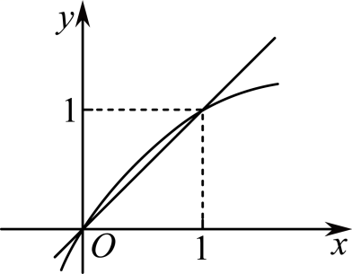
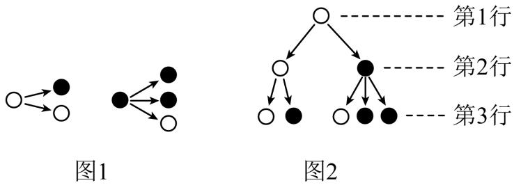
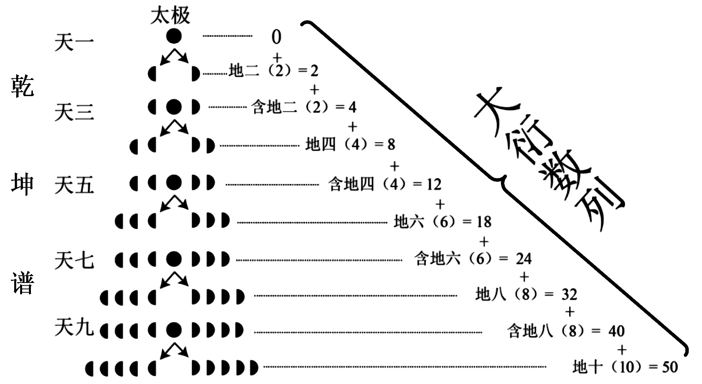
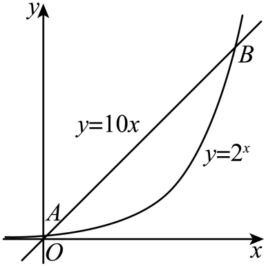

**第40讲  数列的基本知识与概念**

**知识梳理**

**知识点一、数列的概念**

（1）数列的定义：按照<u>一定顺序</u>排列的一列数称为数列，数列中的<u>每一个数</u>叫做这个数列的项．

（2）数列与函数的关系：从函数观点看，数列可以看成以正整数集（或它的有限子集）为定义域的<u>函数当自变量按照从小到大的顺序依次取值时所对应的一列函数值．</u>

（3）数列有三种表示法，它们分别是列表法、图象法和通项公式法．

**知识点二、数列的分类**

（1）按照项数有限和无限分：

（2）按单调性来分：

**知识点三、数列的两种常用的表示方法**

（1）通项公式：如果<u>数列的第项与序号之间的关系可以用一个式子来表示</u>，那么这个公式叫做这个数列的通项公式．

（2）递推公式：如果已知数列的第1项（或前几项），且从第二项（或某一项）开始的任一项与它的前一项（或前几项）间的关系可以用一个公式来表示，那么这个公式就叫做这个数列的递推公式．

**【解题方法总结】**

（1）若数列的前项和为，通项公式为，则

注意：根据求时，不要忽视对的验证．

（2）在数列中，若最大，则若最小，则

**必考题型全归纳**

**题型一：数列的周期性**

**例1．**（2024·全国·高三专题练习）在数列中，已知，，，且，则（    ）

A．	B．	C．	D．

【答案】C

【解析】由，可得，

因为，所以，整理得，

由于，解得，从而，，

可知，

因为，所以．

故选：C．

**例2．**（2024·全国·高三专题练习）在数列中，，对所有的正整数都有，则（    ）

A．            	B．            	C．            	D．

【答案】B

【解析】由得，

两式相加得，

，

是以6为周期的数列，

而，

.

故选：B.

**例3．**（2024·江西赣州·高三校联考阶段练习）斐波那契数列可以用如下方法定义：，且，若此数列各项除以4的余数依次构成一个新数列，则数列的第100项为（    ）

A．0	B．1	C．2	D．3

【答案】D

【解析】由题意有，且，

若此数列各项除以4的余数依次构成一个新数列，

则，，，，，，，，，

则数列是以6为周期的周期数列，

则，

则数列的第100项为3，

故选：．

**变式1．**（2024·全国·高三对口高考）已知数列中，，则（    ）

A．	B．	C．2	D．1

【答案】A

【解析】数列中，，

可知，，，

故数列是以3为最小正周期的周期数列，

所以.

故选：A

**变式2．**（2024·全国·高三对口高考）设函数定义如下，数列满足，且对任意自然数均有，则的值为（    ）

<table><tr><td>
<em>x</em>
</td><td>
1
</td><td>
2
</td><td>
3
</td><td>
4
</td><td>
5
</td></tr><tr><td>

</td><td>
4
</td><td>
1
</td><td>
3
</td><td>
5
</td><td>
2
</td></tr></table>

A．1	B．2	C．4	D．5

【答案】B

【解析】由对任意自然数均有，且，

可得，，，

，，，

所以数列是项为周期的周期数列，且前四项分别为，

所以.

故选：B.

**变式3．**（2024·安徽合肥·合肥一六八中学校考模拟预测）在数列中，已知，当时，是的个位数，则（    ）

A．4	B．3	C．2	D．1

【答案】C

【解析】因为，当时，是的个位数，

所以，，，，，，，，，，

可知数列中，从第3项开始有，

即当时，的值以6为周期呈周期性变化，

又，

故.

故选：C.

**变式4．**（2024·北京通州·统考三模）数列中，，则（    ）

A．	B．	C．2	D．4

【答案】C

【解析】因为，令，则，求得，

令，则，求得，令，则，求得，

令，则，求得，令，则，求得，

令，则，求得，，

所以数列的周期为，则.

故选：C

**【解题方法总结】**

解决数列周期性问题的方法

先根据已知条件求出数列的前几项，确定数列的周期，再根据周期性求值．

**题型二：数列的单调性**

<strong>例4．</strong>（2024·北京密云·统考三模）设数列的前<em>n</em>项和为，则“对任意，”是“数列为递增数列”的（    ）

A．充分不必要条件	B．必要不充分条件	C．充分必要条件	D．既不是充分也不是必要条件

【答案】A

【解析】数列中，对任意，，

则，

所以数列为递增数列，充分性成立；

当数列为递增数列时，，

即，所以，，

如数列不满足题意，必要性不成立；

所以“对任意，”是“数列为递增数列”的充分不必要条件.

故选：A

**例5．**（2024·全国·高三专题练习）已知数列满足，若存在实数，使单调递增，则的取值范围是（    ）

A．	B．	C．	D．

【答案】A

【解析】由单调递增，得，

由，得，

∴.

时，得①，

时，得，即②，

若，②式不成立，不合题意；

若，②式等价为，与①式矛盾，不合题意.

综上，排除B，C，D.

故选：A

**例6．**（2024·全国·高三专题练习）已知数列满足，若数列为单调递增数列，则的取值范围是（    ）

A．	B．	C．	D．

【答案】A

【解析】由可得，

两式相减可得，则，

当时，可得满足上式，故，

所以，

因数列为单调递增数列，即，

则

整理得，

令，则，

当时，，当时，，

于是得是数列的最大项，即当时，取得最大值，从而得，

所以的取值范围为．

故选：A

**变式5．**（2024·天津武清·高三天津市武清区杨村第一中学校考开学考试）数列的通项公式为，则“”是“为递增数列”的（    ）

A．充分不必要条件	B．必要不充分条件

C．既不充分也不必要条件	D．充要条件

【答案】B

【解析】由题意得数列为递增数列等价于对任意恒成立，

即对任意恒成立，

因为，且可以无限接近于0，所以，

所以“”是“为递增数列”的必要不充分条件，

故选：B

**变式6．**（2024·全国·高三专题练习）已知数列的通项公式为，则“”是“数列为递增数列”的（    ）

A．充分不必要条件	B．必要不充分条件

C．充要条件	D．既不充分也不必要条件

【答案】C

【解析】若数列为递增数列，

则

，

即

由，所以有，

反之，当时，，则数列为递增数列，

所以“”是“数列为递增数列”的充要条件，

故选：C.

<strong>变式7．</strong>（2024·江苏南通·高三期末）已知数列是递增数列，且，则实数<em>t</em>的取值范围是（    ）

A．	B．	C．	D．

【答案】C

【解析】因为，是递增数列，

所以，解得，

所以实数*t*的取值范围为，

故选：C

**变式8．**（2024·全国·高三专题练习）已知数列满足，若是递增数列，则的取值范围是（    ）

A．	B．	C．	D．

【答案】A

【解析】因为是递增数列，所以，即．

如图所示，作出函数和的图象，

由图可知，当时，，且．

故当时，，且，

依此类推可得，

满足是递增数列，即的取值范围是．

故选:A.

<strong>变式9．</strong>（2024·甘肃张掖·高台县第一中学校考模拟预测）已知数列为递减数列，其前<em>n</em>项和，则实数<em>m</em>的取值范围是（    ）．

A．	B．	C．	D．

【答案】A

【解析】因为，所以数列为递减数列，

当时，，

故可知当时，单调递减，

故为递减数列，只需满足，即．

故选：A

**【解题方法总结】**

解决数列的单调性问题的3种方法

<table><tr><td>
作差比较法
</td><td>
根据的符号判断数列是递增数列、递减数列或是常数列
</td></tr><tr><td>
作商比较法
</td><td>
根据与1的大小关系进行判断
</td></tr><tr><td>
数形结合法
</td><td>
结合相应函数的图象直观判断
</td></tr></table>

**题型三：数列的最大（小）项**

**例7．**（2024·湖南邵阳·邵阳市第二中学校考模拟预测）数列和数列的公共项从小到大构成一个新数列，数列满足：，则数列的最大项等于\_\_\_\_\_\_.

【答案】/1.75

【解析】数列和数列的公共项从小到大构成一个新数列为：

，该数列为首项为1，公差为的等差数列，

所以，

所以

因为

所以当时，，即，

又，

所以数列的最大项为第二项，其值为.

故答案为：.

<strong>例8．</strong>（2024·全国·高三专题练习）记为数列的前<em>n</em>项和，若，则的最小值为\_\_\_\_\_\_．

【答案】

【解析】依题意，数列是首项为1，公比为2的等比数列，则，

于是，令，

则有，

显然当时，，即，因此当时，数列是递增的，

又，所以的最小值为.

故答案为：

**例9．**（2024·全国·高三专题练习）已知数列满足，，则的最小值为\_\_\_\_\_\_\_\_\_

【答案】9

【解析】由已知可得，，

所以当时，有.

则有

，

，

，

，

两边分别相加可得，，

所以.

当时，满足条件.

所以，，

所以.

设，

根据对勾函数的性质可知，当时，单调递减；当时，单调递增.

又，，

所以，当或时，有最小值为9.

故答案为：9.

<strong>变式10．</strong>（2024·全国·高三专题练习）已知正项数列满足，，，若是唯一的最大项，则<em>k</em>的取值范围为\_\_\_\_\_\_．

【答案】

【解析】因为，所以，又，，

所以是首项为64，公比为*k*的等比数列，则，

则，

因为是唯一的最大项，所以，即，解得，

即*k*的取值范围为.

故答案为：.

<strong>变式11．</strong>（2024·高三课时练习）数列的通项公式为若是中的最大项，则<em>a</em>的取值范围是\_\_\_\_\_\_．

【答案】

【解析】当时，单调递增，

因此时，取得最大值为，

当时，，

因为是中的最大项，

所以解得，

故答案为: .

**变式12．**（2024·北京·高三北京八中校考阶段练习）数列中，，则此数列最大项的值是\_\_\_\_\_\_\_\_\_\_．

【答案】

【解析】设，则该数列当时，取最大值，

又因为，而，

故当或时，此数列取最大项，其值为，，

故此数列最大项的值是：

故答案为：

**变式13．**（2024·全国·高三专题练习）已知，若数列中最小项为第3项，则\_\_\_\_\_\_．

【答案】

【解析】因为开口向上，对称轴为，

则由题意知，

所以．

故答案为：.

**变式14．**（2024·全国·高三专题练习）已知数列的通项公式为，则的最小值为\_\_\_\_\_\_\_\_\_\_\_.

【答案】/

【解析】因为，

易知数列为递增数列，

所以数列的最小项为，即最小值为.

故答案为：

**【解题方法总结】**

求数列的最大项与最小项的常用方法

（1）将数列视为函数当<em>x</em>∈<em>N</em>\*时所对应的一列函数值，根据<em>f</em>（<em>x</em>）的类型作出相应的函数图象，或利用求函数最值的方法，求出的最值，进而求出数列的最大（小）项．

（2）通过通项公式研究数列的单调性，利用确定最大项，利用确定最小项．

（3）比较法：若有或时，则，则数列是递增数列，所以数列的最小项为；若有或时，则，则数列是递减数列，所以数列的最大项为．

**题型四：数列中的规律问题**

<strong>例10．</strong>（2024·全国·高三专题练习）分形几何学是一门以不规则几何形态为研究对象的几何学，它的研究对象普遍存在于自然界中，因此又被称为“大自然的几何学”．按照如图1所示的分形规律，可得如图2所示的一个树形图．若记图2中第<em>n</em>行黑圈的个数为，则（    ）

A．110	B．128	C．144	D．89

【解析】已知表示第*n*行中的黑圈个数，设表示第*n*行中的白圈个数，

则由于每个白圈产生下一行的一个白圈和一个黑圈，一个黑圈产生下一行的一个白圈和2个黑圈，

所以，，

又因为，，

所以，；

，；

，；

，；

，；

．

故选：C.

**例11．**（2024·云南保山·统考二模）我国南宋数学家杨辉126l年所著的《详解九章算法》一书里出现了如图所示的表，即杨辉三角，这是数学史上的一个伟大成就.杨辉三角也可以看做是二项式系数在三角形中的一种几何排列，若去除所有为1的项，其余各项依次构成数列2，3，3，4，6，4，5，10，10，5，…，则此数列的第56项为（    ）

A．11	B．12	C．13	D．14

【解析】由题意可知：若去除所有的为1的项，则剩下的每一行的个数为1，2，3，4，...，

可以看成构成一个首项为1，公差为1的等差数列，则，

可得当，所有项的个数和为55，第56项为12，

故选：B.

<strong>例12．</strong>（2024·全国·高三专题练习）古希腊毕达哥拉斯学派的数学家研究过各种多边形数.如三角形数1，3，6，10，第<em>n</em>个三角形数为.记第<em>n</em>个<em>k</em>边形数为，以下列出了部分<em>k</em>边形数中第<em>n</em>个数的表达式：三角形数：；正方形数：；五边形数：；六边形数：，可以推测的表达式，由此计算（    ）

A．4020	B．4010	C．4210	D．4120

【解析】由题意可得：，，

，.

由此可归纳，

所以，

故选：B.

**变式15．**（2024·全国·高三专题练习）古希腊科学家毕达哥拉斯对“形数”进行了深入的研究，若一定数目的点或圆在等距离的排列下可以形成一个等边三角形，则这样的数称为三角形数，如1，3，6，10，15，21，…这些数量的点都可以排成等边三角形，∴都是三角形数，把三角形数按照由小到大的顺序排成的数列叫做三角数列类似地，数1，4，9，16，…叫做正方形数，则在三角数列中，第二个正方形数是（    ）

A．28	B．36	C．45	D．55

【解析】由题意可得，三角数列的通项为，

则三角数列的前若干项为1，3，6，10，15，21，28，36，45，55，….，

设正方形数按由小到大的顺序排成的数列为，则，

其前若干项为1，4，9，16，25，36，49，…，

∴在三角数列中，第二个正方形数是36.

故选：B.

**变式16．**（2024·全国·高三专题练习）早在3000年前，中华民族的祖先就已经开始用数字来表达这个世界．在《乾坤谱》中，作者对易传“大衍之数五十”进行了一系列推论，用来解释中国传统文化中的太极衍生原理，如图．该数列从第一项起依次是0，2，4，8，12，18，24，32，40，50，60，72，…，若记该数列为，则（    ）

A．2018	B．2020	C．2022	D．2024

【解析】由题设中的数据可知数列满足：，，

故，

故选：B*．*

**变式17．**（2024·全国·高三专题练习）观察下列各式：

；

；

；

；

；

则（    ）

A．28	B．76	C．123	D．10

【解析】设则

通过观察不难发现：从而

故，

故选：C.

**变式18．**（2024·全国·高三专题练习）古希腊科学家毕达哥拉斯对“形数”进行了深入的研究，若一定数目的点或圆在等距离的排列下可以形成一个等边三角形，则这样的数称为三角形数，如1，3，6，10，15，21，…这些数量的点都可以排成等边三角形，∴都是三角形数，把三角形数按照由小到大的顺序排成的数列叫做三角数列．类似地，数1，4，9，16，…叫做正方形数，则在三角数列中，第二个正方形数是（    ）

A．36	B．25	C．49	D．64

【解析】由题意可得，三角数列的通项为，则三角数列的前若干项为1，3，6，10，15，21，28，36，45，55，…，

设正方形数按由小到大的顺序排成的数列为，则，其前若干项为1，4，9，16，25，36，49，…，

∴在三角数列中，第二个正方形数是36．

故选：A．

**【解题方法总结】**

**特殊值法、列举法找规律**

**题型五：数列的恒成立问题**

<strong>例13．</strong>（2024·全国·高三专题练习）已知数列的通项公式，前<em>n</em>项和是，对于，都有，则<em>k</em>＝\_\_\_\_\_\_．

【答案】5

【解析】

如图，为和的图象，设两个交点为，，

因为，所以，

因为，，所以，

结合图象可得，当时，，即，

当时，，即，所以当时，取得最大值，即.

故答案为：5.

<strong>例14．</strong>（2024·全国·高三专题练习）已知数列满足，若恒成立，则实数<em>k</em>的最小值为\_\_\_\_\_\_．

【答案】/1.5

【解析】∵，

∴数列为单调递减数列，．从而，

即*k*的最小值为．

故答案为：

**例15．**（2024·河南郑州·高三校联考阶段练习）数列满足(，且)，，对于任意有恒成立，则的取值范围是\_\_\_\_\_\_\_\_\_\_\_.

【答案】

【解析】

从而可得

即， 因为，所以.

故答案为：

**变式19．**（2024·全国·高三专题练习）数列满足，若不等式恒成立，则实数的取值范围是（　　）

A． 	B．	C．	D．

【答案】B

【解析】，

∵不等式恒成立，

∴，

解得，

故选：B．

**变式20．**（2024·河北唐山·高三唐山一中校考阶段练习）数列满足，，若不等式，对任何正整数恒成立，则实数的最小值为

A．	B．	C．	D．

【答案】A

【解析】依题意，由此可知，所以，所以

，对任何正整数恒成立，即．

考点：数列与不等式．

**【解题方法总结】**

分离参数，转化为最值问题．

**题型六：递推数列问题**

**例16．**（2024·全国·高三专题练习）设数列满足，且，则数列的前2009项之和为\_\_\_\_\_\_.

【答案】/

【解析】由，得，则

，

，

∴数列是以4为周期的数列，.

由可得，，

.

故答案为：.

**例17．**（2024·全国·高三专题练习）正项数列中，，，猜想通项公式为\_\_\_\_\_\_\_\_\_．

【答案】

【解析】方法一:由得，所以为等差数列，且公差为3，首项为1，故，故，

方法二：由得，，

由此可猜想

故答案为：

**例18．**（2024·广东佛山·统考模拟预测）数列满足，，写出一个符合上述条件的数列的通项公式\_\_\_\_\_\_.

【答案】（答案不唯一）

【解析】由得：，

则当时，，，故满足递推关系，

又，满足，

满足条件的数列的一个通项公式为：.

故答案为：（答案不唯一）.

**变式21．**（2024·全国·模拟预测）斐波那契数列由意大利数学家斐波那契以兔子繁殖为例引入，故又称为“兔子数列”，即1，1，2，3，5，8，13，21，34，55，89，144，233，…．在实际生活中，很多花朵（如梅花、飞燕草、万寿菊等）的瓣数恰是斐波那契数列中的数，斐波那契数列在现代物理及化学等领域也有着广泛的应用．斐波那契数列满足：，，则是斐波那契数列中的第\_\_\_\_\_\_项．

【答案】

【解析】由可得

.

故答案为：.

**变式22．**（2024·全国·高三专题练习）将一个2021边形的每个顶点染为红、蓝、绿三种颜色之一，使得相邻顶点的颜色互不相同．问：有多少种满足条件的染色方法？

【解析】记一个*n*边形的每个顶点染为红、蓝、绿三种颜色之一，使得相邻顶点的颜色互不相同的方法数为．易知，．

对于任意一个*n*（）边形，记顺次为这个*n*边形的顶点，则对它按题设要求染色，有两种情况：

①，异色，共有种方法；

②，同色，共有种方法．

因此．

所以

所以，

又，

所以，

所以，

所以，

所以，

所以，

所以. 适合

因此，∴．

<strong>变式23．</strong>（2024·全国·高三专题练习）已知平面上有<em>n</em>条直线，其中任意两条不平行，任何三条不共线．问：这些直线把平面分成多少个部分？其中有多少个部分是无界的？

【解析】设*k*条直线把平面分成的部分为个．显然．

第条直线与前*k*条直线共有*k*个互不相同的交点，它被这*k*个交点分成段，每段都将它所在的部分一分为二．

因此有．即.

由此递推公式，累加即得

．该式适合.

故这些直线把平面分成部分．

注意到*n*条直线中的每条都被另外的条截成*n*段，其中恰有两端的两条射线是无界的，

因此共有2*n*条射线．被*n*条直线分成的诸部分中，围成每个无界区域的边界折线恰有两条是射线，

而且每条射线恰是两个无界区域的公共边界．所以共有2*n*个无界部分．

**变式24．**（2024·全国·高三专题练习）（1）学生甲手里有一枚质地均匀的硬币，他投掷10次，不连续出现正面的可能情形有多少种？

（2）用1，2，3，4四个数字组成一个6位数，要求不允许两个1紧挨在一起，那么可以组成多少个不同的6位数？

【解析】（1）设甲投掷次，不连续出现正面的可能情形有种，考虑最后一次投掷：若最后一次呈现反面，则前次有种方法；若最后一次呈现正面，则倒数第二次必是反面，前次有种不同的方法.由加法原理得：，易知其初值，，

则

∴甲投掷次，不连续出现正面的可能情形有种.

（2）设用1，2，3，4四个数字组成符合条件的一个位数，有种方法.

若末位是1，则倒数第二位只能是2，3或4，符合条件的有个；

若末位是2，3或4，则符合条件的有个；

由加法原理得：，又

∴

故用1，2，3，4四个数字可以组成符合条件的不同的6位数有3105个

