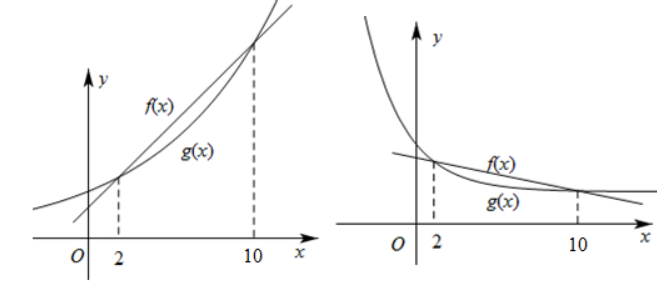

<strong>第41讲  等差数列及其前</strong><em>n</em><strong>项和</strong>

**知识梳理**

**知识点一．等差数列的有关概念**

（1）等差数列的定义

一般地，如果一个数列从第2项起，每一项与它的前一项的差等于同一个常数，那么这个数列就叫做等差数列，这个常数叫做等差数列的公差，通常用字母表示，定义表达式为（常数）．

（2）等差中项

若三个数，，成等差数列，则叫做与的等差中项，且有．

**知识点二．等差数列的有关公式**

（1）等差数列的通项公式

如果等差数列的首项为，公差为，那么它的通项公式是．

（2）等差数列的前项和公式

设等差数列的公差为，其前项和．

**知识点三．等差数列的常用性质**

已知为等差数列，为公差，为该数列的前项和．

（1）通项公式的推广：．

（2）在等差数列中，当时，．

特别地，若，则．

（3），…仍是等差数列，公差为．

（4），…也成等差数列，公差为．

（5）若，是等差数列，则也是等差数列．

（6）若是等差数列，则也成等差数列，其首项与首项相同，公差是公差的．

（7）若项数为偶数，则；；．

（8）若项数为奇数，则；；．

（9）在等差数列中，若，则满足的项数使得取得最大值；若，则满足的项数使得取得最小值．

<strong>知识点四．等差数列的前</strong><em>n</em><strong>项和公式与函数的关系</strong>

．数列是等差数列⇔（为常数）．

<strong>知识点五．等差数列的前</strong><em>n</em><strong>项和的最值</strong>

公差为递增等差数列，有最小值；

公差为递减等差数列，有最大值；

公差为常数列．

**特别地**

若，则有最大值（所有正项或非负项之和）；

若，则有最小值（所有负项或非正项之和）．

**知识点六．其他衍生等差数列．**

若已知等差数列，公差为，前项和为，则：

①等间距抽取为等差数列，公差为．

②等长度截取为等差数列，公差为．

③算术平均值为等差数列，公差为．

**【解题方法总结】**

（1）等差数列中，若，则．

（2）等差数列中，若，则．

（3）等差数列中，若，则．

（4）若与为等差数列，且前项和为与，则．

**必考题型全归纳**

**题型一：等差数列的基本量运算**

**例1．**（2024·云南昆明·高三昆明一中校考阶段练习）已知数列满足：，且满足，则（   ）

A．1012	B．1013	C．2022	D．2024

【答案】A

【解析】因为，所以，两式相减，得：，

所以数列中的奇数项是以为首项，1为公差的等差数列，

所以.

故选：A.

**例2．**（2024·河北·统考模拟预测）已知等差数列的前项和是，则（   ）

A．	B．

C．	D．

【答案】D

【解析】由已知设等差数列的公差为，则，，

解得，，所以．

故选：D.

**例3．**（2024·四川凉山·三模）在等差数列中，，，则（    ）．

A．3	B．5	C．7	D．9

【答案】C

【解析】由题设，则，而，

若等差数列公差为，则，

所以，通项公式为，故.

故选：C

**变式1．**（2024·江西新余·统考二模）记是公差不为0的等差数列的前项和，若，，则数列的公差为（    ）

A．	B．	C．2	D．4

【答案】A

【解析】由可得：①，

由可得：②，

由①②可得：或(舍去).

故选：A.

**变式2．**（2024·广西·统考模拟预测）设为等差数列，若，则公差（    ）

A．－2	B．－1	C．1	D．2

【答案】D

【解析】由题意得解得，

故选：D.

**变式3．**（2024·山西·高三校联考阶段练习）记为等差数列的前项和，若，则（    ）

A．30	B．28	C．26	D．13

【答案】C

【解析】设等差数列的首项为，公差为，

则，，，

所以.

故选：C

**【解题方法总结】**

等差数列基本运算的常见类型及解题策略：

（1）求公差或项数．在求解时，一般要运用方程思想．

（2）求通项．和是等差数列的两个基本元素．

（3）求特定项．利用等差数列的通项公式或等差数列的性质求解．

（4）求前项和．利用等差数列的前项和公式直接求解或利用等差中项间接求解．

**【注意】** 在求解数列基本量问题中主要使用的是方程思想，要注意使用公式时的准确性与合理性，更要注意运算的准确性．在遇到一些较复杂的方程组时，要注意运用整体代换思想，使运算更加便捷．

**题型二：等差数列的判定与证明**

**例4．**（2024·福建福州·福建省福州第一中学校考模拟预测）已知数列的前项和为，且.

(1)求证：数列是等差数列；

(2)求数列的前项和.

【解析】（1）数列中，，当时，，

两式相减得，即，则，

于是，因此数列是常数列，则，

从而，即，

所以数列是以1为首项，为公差的等差数列.

（2）由（1）知，，

所以.

**例5．**（2024·江苏南京·高二南京师范大学附属中学江宁分校校考期末）记为数列的前项和．

(1)从下面两个条件中选一个，证明：数列是等差数列；

①数列是等差数列；②

(2)若数列为等差数列，且，，求数列的前项和．

【解析】（1）选择条件①：，

，

两式相减可得，

即，

，

两式相减可得，

化简可得，

，数列是等差数列．

选择条件②：设数列的首项为，公差为，

则，故，

当时，

，

当时，，，

又．

数列是等差数列．

（2）数列是等差数列，且公差，

．

，

故

．

**例6．**（2024·全国·高三专题练习）已知数列满足，．

(1)证明：是等差数列，并求出的通项．

(2)证明：．

【解析】（1）由，可得，

∴，即，

∵，即，

∴是以为首项，为公差的等差数列，

∴，即．

（2）令①，

∵，∴②，

①×②得，

∴，即．

**变式4．**（2024·陕西西安·高二长安一中校考期末）已知数列满足， ，.

(1)若数列为数列的奇数项组成的数列，证明：数列为等差数列；

(2)求数列的前50项和.

【解析】（1）由题，，

且，所以数列是首项为1，公差为的等差数列；

（2）设为数列的偶数项组成的数列，注意到，

，

所以数列是首项为2，公差为的等差数列，

结合可知，的奇数项和偶数项都是以为公差的等差数列，

所以

.

<strong>变式5．</strong>（2024·全国·高三专题练习）已知数列的前<em>n</em>项和为，数列的前<em>n</em>项积为，且满足．

(1)求证：为等差数列；

(2)记，求数列的前2024项的和*M*．

【解析】（1）因为，

当时，，解得或，

又，所以，故，

由，可得，所以，

当时，．

所以，即，

所以，所以

所以是以为首项，1为公差的等差数列.

（2）所以，则，

因为，

故．

**变式6．**（2024·浙江宁波·高一慈溪中学校联考期末）已知数列中，，当时，其前项和满足：，且，数列满足：对任意有.

(1)求证：数列是等差数列；

(2)求数列的通项公式；

(3)设是数列的前项和，求证：.

【解析】（1），，

，即①

由题意，

将①式两边同除以，得，

数列是首项为，公差为1的等差数列.

（2）由（1）可知

当时， ，即，

当时，②，

则③，

②③，，即，

因为满足，

所以.

（3）由（2）可知，

当时，，

当时，，

所以

.

所以.

**【解题方法总结】**

判断数列是等差数列的常用方法

（1）定义法：对任意是周一常数．

（2）等差中项法：对任意，湍足．

（3）通项公式法：对任意，都满足为常数）．

（4）前项和公式法：对任意，都湍足为常数）．

**题型三：等差数列的性质**

**例7．**（2024·安徽蚌埠·统考模拟预测）已知等差数列满足，则（    ）

A．	B．	C．	D．

【答案】A

【解析】因为数列是等差数列，

所以，即，

所以，

故选：A

**例8．**（2024·陕西榆林·统考模拟预测）设为等差数列的前项和，若，则（    ）

A．5	B．6	C．7	D．8

【答案】A

【解析】由等差数列性质和的求和公式，可得，所以.

故选：A.

<strong>例9．</strong>（2024·全国·高三专题练习）已知数列满足，其前<em>n</em>项和为，若，则（    ）

A．	B．0	C．2	D．4

【答案】C

【解析】根据题意，可得数列为等差数列，所以，所以，

所以，所以.

故选：C．

**变式7．**（2024·全国·高三专题练习）如果等差数列中，，那么（    ）

A．14	B．12	C．28	D．36

【答案】C

【解析】∵，∴，则，又，

故.

故选:C.

**变式8．**（2024·全国·高三专题练习）已知数列是等差数列，若，则等于（    ）

A．7	B．14	C．21	D．7(*n*-1)

【答案】B

【解析】因为，所以.

故选：B

**变式9．**（2024·全国·高三专题练习）已知等差数列中，，则（    ）

A．30	B．15	C．5	D．10

【答案】B

【解析】∵数列为等差数列，，所以

∴.

故选：B

**【解题方法总结】**

如果为等差数列，当时，．因此，出现等项时，可以利用此性质将已知条件转化为与（或其他项）有关的条件；若求项，可由转化为求<em>am</em>－<em>n</em>＋<em>an</em>＋<em>m</em>的值．

<strong>题型四：等差数列前</strong><em>n</em><strong>项和的性质</strong>

<strong>例10．</strong>（2024·全国·高三专题练习）两个等差数列，的前<em>n</em>项和分别为和，已知，则\_\_\_\_\_\_．

【答案】

【解析】由题意可知，，

所以.

故答案为:.

<strong>例11．</strong>（2024·全国·高三专题练习）设等差数列，的前<em>n</em>项和分别为，，且，则\_\_\_\_\_\_.

【答案】/

【解析】等差数列，的前*n*项和分别为，，

所以.

故答案为：

<strong>例12．</strong>（2024·全国·高三专题练习）若两个等差数列，的前<em>n</em>项和分别是，，已知，则\_\_\_\_\_\_.

【答案】/

【解析】因为，为等差数列，所以，

因为，所以.

故答案为：.

<strong>变式10．</strong>（2024·高三课时练习）已知数列与均为等差数列，且前<em>n</em>项和分别为与，若，则\_\_\_\_\_\_．

【答案】

【解析】由等差数列的求和公式得，所以，

故答案为：

**变式11．**（2024·宁夏·高三六盘山高级中学校考期中）设等差数列的前项和为，若，，则\_\_\_\_\_\_\_\_\_

【答案】27

【解析】.

故答案为：.

<strong>变式12．</strong>（2024·四川绵阳·高三四川省绵阳南山中学校考阶段练习）已知等差数列的前<em>n</em>项和为，若，，则\_\_\_\_\_\_\_\_\_\_\_

【答案】

【解析】由题设成等差数列，

所以，则，

所以.

故答案为：

**变式13．**（2024·全国·高三专题练习）等差数列中，，前项和为，若，则\_\_\_\_\_\_.

【答案】

【解析】设的公差为，由等差数列的性质可知，因为，故，故为常数，所以为等差数列，设公差为

，，

，

，

，则

故答案为：

**变式14．**（2024·全国·高三对口高考）已知等差数列的前项和为，若公差，；则的值为\_\_\_\_\_\_\_\_\_\_.

【答案】

【解析】设，，

因为数列是等差数列，且公差，，

所以，解得，，

所以.

故答案为：.

**变式15．**（2024·全国·高三专题练习）已知等差数列的项数为奇数，且奇数项的和为40，偶数项的和为32，则\_\_\_\_\_\_.

【答案】8

【解析】设等差数列有奇数项项，，偶数项为项，公差为．

奇数项和为40，偶数项和为32，，，

，

即，解得：

即等差数列共项，且

故答案为：8

<strong>变式16．</strong>（2024·四川泸州·四川省泸县第一中学校考二模）在等差数列中，前<em>m</em>项（<em>m</em>为奇数）和为70，其中偶数项之和为30，且，则的通项公式为\_\_\_\_\_\_.

【答案】

【解析】设等差数列的公差为

，解得，且

，解得

故答案为：

**【解题方法总结】**

在等差数列中，，…仍成等差数列；也成等差数列．

<strong>题型五：等差数列前</strong><em>n</em><strong>项和的最值</strong>

**例13．**（2024·全国·高三专题练习）已知为等差数列的前项和，且，，则当取最大值时，的值为\_\_\_\_\_\_\_\_\_\_\_.

【答案】7

【解析】方法一：设数列的公差为，则由题意得，解得

则.又，∴当时，取得最大值.

方法二：设等差数列的公差为.∵，∴，

∴，解得，

则，

令

解得，又，

∴，即数列的前7项为正数，从第8项起各项均为负数，

故当取得最大值时，.

故答案为：7.

**例14．**（2024·全国·高三专题练习）设等差数列的前项和为，已知，，则以下选项中，最大的是（    ）

A．	B．	C．	D．

【答案】C

【解析】因为，所以，所以，

又因为，所以，所以，

又，所以，

所以为递减数列，且前项为正值，从第项开始为负值，

所以，

故选：C.

**例15．**（2024·四川·模拟预测）在数列中，若，前项和，则的最大值为\_\_\_\_\_\_．

【答案】66

【解析】=21，解得，故，属于二次函数，

对称轴为，故当或时取得最大值，

，，，

故的最大值为66.

故答案为：66.

**变式17．**（2024·上海嘉定·高三上海市嘉定区第一中学校考期中）已知等差数列的各项均为正整数，且，则的最小值是\_\_\_\_\_\_\_\_

【答案】4

【解析】若等差数列的各项均为正整数，则数列单增，则公差，

故为正整数，关于*d*单减，

，则当时，故取得最小值为4，

故答案为：4

**变式18．**（2024·全国·高三专题练习）设是等差数列的前项和，若，，则数列中的最大项是第\_\_\_\_\_\_项.

【答案】13

【解析】由已知可得数列是递减数列，且前13项大于0，自第14项起小于0，可得数列从第14项起为负值，而为递增数列，则答案可求．在等差数列中，

由，，得，

，

则数列是递减数列，且前13项大于0，自第14项起小于0，

数列从第14项起为负值，

而为递增数列，

数列的最大项是第13项．

故答案为：13．

**变式19．**（2024·江西·高三校联考阶段练习）已知数列满足，则的最小值为\_\_\_\_\_\_\_.

【答案】.

【解析】根据递推公式和累加法可求得数列的通项公式.代入中,由数列中的性质,结合数列的单调性即可求得最小值.因为,所以,

从而

…,

,

累加可得,

而

所以,

则,

因为在递减,在递增

当时,,

当时,,

所以时取得最小值,最小值为.

故答案为:

**变式20．**（2024·全国·高三专题练习）等差数列中，，，给出下列命题：①，②，③是各项中最大的项，④是中最大的值，⑤为递增数列.其中正确命题的序号是\_\_\_\_\_\_.

【答案】①②④

【解析】等差数列中，，，所以，则．

所以，则．

所以①正确．

②整理得正确．

③是各项中最大的项，应该是最小的正数项．故错误．

④是中最大的值，正确；

⑤为递增数列．错误，应改为递减数列．

故答案为：①②④．

**变式21．**（2024·全国·高三专题练习）已知等差数列的通项公式为，当且仅当时，数列的前项和最大.则满足的的最大值为\_\_\_\_\_\_\_\_\_\_.

【答案】19

【解析】由题可知，等差数列为递减数列，且，又，

所以，解得，所以，所以，

所以，解得，

所以满足的的最大值为19.

故答案为：19.

<strong>变式22．</strong>（2024·高三课时练习）记等差数列的前<em>n</em>项和为，若，，则当取得最大值时，<em>n</em>＝\_\_\_\_\_\_．

【答案】

【解析】设等差数列的公差为，由可得：，

所以，

因为，所以，则是关于的二次函数，开口向下，对称轴，

由二次函数的图象和性质可得：当时，取最大值，

故答案为：.

<strong>变式23．</strong>（2024·福建泉州·校联考模拟预测）已知是等差数列{}的前<em>n</em>项和，若仅当时取到最小值，且，则满足的<em>n</em>的最小值为\_\_\_\_\_\_\_\_\_\_.

【答案】11

【解析】因为，当时取到最小值，

所以，所以，

因为，所以，即，所以.

，则，因为，

所以，解之得：,因为，所以*n*的最小值为11.

故答案为：11.

**变式24．**（2024·河南信阳·高三信阳高中校考阶段练习）已知为等差数列的前项和.若，，则当取最小值时，的值为\_\_\_\_\_\_\_\_.

【答案】

【解析】因为，所以，

又，所以，则

所以为递增的等差数列，且，

所以，即当取最小值时，的值为.

故答案为：

**变式25．**（2024·全国·高三专题练习）已知数列是等差数列，若，，且数列的前项和有最大值，那么当时，的最大值为\_\_．

【答案】20

【解析】因为，所以和异号，

又数列的前项和有最大值，

所以数列是递减的等差数列，

所以，，又，

所以，，

所以的最大值为20．

故答案为：20.

**【解题方法总结】**

求等差数列前项和最值的2种方法

（1）函数法：利用等差数列前项和的函数表达式，通过配方或借助图象求二次函数最值的方法求解．

（2）邻项变号法：①若，则满足的项数使得取得最大值；

②若，则满足的项数使得取得最小值．

**题型六：等差数列的实际应用**

**例16．**（2024·全国·高三专题练习）从冬至日起，小寒、大寒、立春、雨水、惊蛰、春分、清明、谷雨、立夏、小满、芒种这十二个节气的日影长度依次成等差数列，冬至、立春、春分这三个节气的日影长度之和为尺，前九个节气日影长度之和为尺，则谷雨这一天的日影长度为（    ）

A．尺	B．尺	C．尺	D．尺

【答案】A

【解析】设冬至，小寒，大寒，立春，雨水，惊蛰，春分，清明，谷雨，立夏，小满，芒种这十二个节气为：，且其公差为，

依题意有：，，

，公差 ，

则，

所以谷雨这一天的日影长度为尺，

故选：A

**例17．**（2024·河北唐山·唐山市第十中学校考模拟预测）2022年卡塔尔世界杯是第二十二届世界杯足球赛，是历史上首次在卡塔尔和中东国家境内举行，也是继2002年韩日世界杯之后时隔二十年第二次在亚洲举行的世界杯足球赛.某网站全程转播了该次世界杯，为纪念本次世界杯，该网站举办了一针对本网站会员的奖品派发活动，派发规则如下：①对于会员编号能被2整除余1且被7整除余1的可以获得精品足球一个；②对于不符合①中条件的可以获得普通足球一个.已知该网站的会员共有1456人（编号为1号到1456号，中间没有空缺），则获得精品足球的人数为（    ）

A．102	B．103	C．104	D．105

【答案】C

【解析】将能被2整除余1且被7整除余1的正整数按从小到大排列所得的数列记为，

由已知是的倍数，也是的倍数，

故为的倍数，

所以首项为，公差为的等差数列，

所以，

令，可得，又

解得，且，

故获得精品足球的人数为.

故选：C.

**例18．**（2024·全国·高三专题练习）2022年10月16日上午10时，举世瞩目的中国共产党第二十次全国代表大会在北京人民大会堂隆重开幕，某单位组织全体人员在报告厅集体收看，已知该报告厅共有16排座位，共有432个座位数，并且从第二排起，每排比前一排多2个座位数，则最后一排的座位数为（    ）

A．12	B．26	C．42	D．50

【答案】C

【解析】根据题意，把各排座位数看作等差数列，

设等差数列通项为，首项为，公差为，前项和为，则，

所以，解得，

所以，

故选：C．

**变式26．**（2024·全国·高三专题练习）天干地支纪年法源于中国，中国自古便有十天干与十二地支.十天干即：甲、乙、丙、丁、戊、己、庚、辛、壬、癸；十二地支即：子、丑、寅、卯、辰、巳、午、未、申、酉、戌、亥.天干地支纪年法是按顺序以一个天干和一个地支相配，排列起来，天干在前，地支在后，天干由“甲”起，地支由“子”起，比如第一年为“甲子”，第二年为“乙丑”，第三年为“丙寅”，…，以此类推，排列到“癸酉”后，天干回到“甲”重新开始，即“甲戌”，“乙亥”，之后地支回到“子”重新开始，即“丙子”，…，以此类推，2024年是癸卯年，请问：在100年后的2123年为（    ）

A．癸未年	B．辛丑年	C．己亥年	D．戊戌年

【答案】A

【解析】由题意得：天干可看作公差为10的等差数列，地支可看作公差为12的等差数列，

由于，余数为0，故100年后天干为癸，由于，余数为4，

故100年后地支为未，

综上：100年后的2123年为癸未年.

故选：A .

**变式27．**（2024·海南海口·校联考一模）家庭农场是指以农户家庭成员为主要劳动力的新型农业经营主体．某家庭农场从2019年开始逐年加大投入，加大投入后每年比前一年增加相同额度的收益，已知2019年的收益为30万元，2021年的收益为50万元．照此规律，从2019年至2026年该家庭农场的总收益为（    ）

A．630万元	B．350万元	C．420万元	D．520万元

【答案】D

【解析】依题意，该家庭农场每年收益依次成等差数列，设为，

可得，，所以公差为，

所以2019年至2026年该家庭农场的总收益为，

故选：D

**题型七：关于等差数列奇偶项问题的讨论**

<strong>例19．</strong>（2024·全国·高三专题练习）已知为等差数列，，记，分别为数列，的前<em>n</em>项和，，．

(1)求的通项公式；

(2)证明：当时，．

【解析】（1）设等差数列的公差为，而，

则，

于是，解得，，

所以数列的通项公式是.

（2）方法1：由（1）知，，，

当为偶数时，，

，

当时，，因此，

当为奇数时，，

当时，，因此，

所以当时，.

方法2：由（1）知，，，

当为偶数时，，

当时，，因此，

当为奇数时，若，则

，显然满足上式，因此当为奇数时，，

当时，，因此，

所以当时，.

**例20．**（2024·广东深圳·统考模拟预测）已知等差数列满足，．

(1)求；

(2)数列满足，为数列的前项和，求．

【解析】（1）设等差数列的公差为*d*，

因为，．则，解得，

所以．

（2）由（1）可得，

则

，

所以.

**例21．**（2024·全国·高三专题练习）已知数列满足：，，.

(1)记，求数列的通项公式；

(2)记数列的前项和为，求.

【解析】（1）因为，令*n*取，则，

即，，所以数列是以1为首项，3为公差的等差数列，所以

（2）令*n*取2*n*，则，

所以，

由（1）可知，；

；所以

**变式28．**（2024·江苏南京·统考一模）已知数列和满足：.

（1）若，求数列的通项公式；

（2）若.

求证：数列为等差数列；

记数列的前项和为，求满足的所有正整数和的值.

【解析】（1）当时，有，得，

构造数列是首项为，公比为的等比数列；所以，即，所以（）;（2）①当时，有（），按照n被4整除的余数分四类分别证明数列为等差数列;②由①知，，则（）；由，得；按照,和时分别讨论,求出正整数和.

试题解析:（1）当时，有，得，

令，，所以，

所以数列是首项为，公比为的等比数列；所以，

即，所以（）．

（2）①当时，有（），

（）时，，所以为等差数列；

（）；

（）时，，所以为等差数列；

（）；

（）时，，所以为等差数列；

（）；

（）时，，所以为等差数列；

（）；

所以（），，所以数列为等差数列．

②由①知，，则（）；

由，得；

当时，；

当时，则，因为，所以；

从而，因为和为正整数，所以不存在正整数；

当时，则，因为为正整数，所以，

从而，即，

因为为正整数，所以或；

当时，，不是正整数；当时，，不是正整数；

综上，满足题意的所有正整数和分别为，．

<strong>变式29．</strong>（2024·全国·高三专题练习）数列中，，前<em>n</em>项和满足．

（1）证明：为等差数列；

（2）求．

【解析】（1）∵①，

∴②，

①②：③，

∴④，

④③：，

∴，

∴是以1首项，2为公差的等差数列.

（2）由（1）得是以1首项，2为公差的等差数列，

同理可得是以为首项，2为公差的等差数列，

又，故，

∴前101项的偶数项和为，

前101项的奇数项和为，

∴．

**【解题方法总结】**

对于奇偶项通项不统一的数列的求和问题要注意分类讨论．主要是从为奇数、偶数进行分类．

**题型八：对于含绝对值的等差数列求和问题**

**例22．**（2024·全国·高三专题练习）已知数列的前项和为，且.

(1)求数列的通项公式；

(2)若数列的前项和为，设，求的最小值.

【解析】（1）因为，所以，

所以当时，，所以；

当时，，

所以，

所以，

又满足上式，

所以数列的通项公式为.

（2）由（1）知，

当时，；

当时，

；

所以，

当时，递减，所以；

当时，，

设，

则，令得，此时单调递增，

令得，此时单调递减，

所以在时递减，在时递增，

而，，且，

所以；

综上，的最小值为.

**例23．**（2024·全国·高三专题练习）记为等差数列的前项和，已知．

(1)求的通项公式；

(2)求数列的前项和．

【解析】（1）设等差数列的公差为，

由题意可得，即，解得，

所以，

（2）因为，

令，解得，且，

当时，则，可得；

当时，则，可得

；

综上所述：.

**例24．**（2024·全国·高三专题练习）记为等差数列的前项和，，．

(1)求数列的通项公式；

(2)求的值．

【解析】（1）设等差数列的首项和公差分别为、，

由题意可知，

化简得，解得，

所以．

（2）由（1）知：当时，；当时，，

所以

．

<strong>变式30．</strong>（2024·全国·高三专题练习）已知等差数列的前<em>n</em>项和为，其中，．

(1)求数列的通项；

(2)求数列的前*n*项和为．

【解析】（1）设的公差为，

则，解得，

所以；

（2）因为，所以，

当时，，此时，

，

当时，，此时，

，

综上所述：.

**变式31．**（2024·全国·高三专题练习）在公差为的等差数列中，已知，且，，成等比数列．

(1)求，；

(2)若，求

【解析】（1）由题意得，得，

将代入并整理得，解得或．

当时，．

当时，．

所以或；

（2）设数列的前项和为，因为，由（1）得，．

则当时，，

则．

当时，，

则

.

综上所述，.

**【解题方法总结】**

由正项开始的递减等差数列的绝对值求和的计算题解题步骤如下：

（1）首先找出零值或者符号由正变负的项

（2）在对进行讨论，当时，，当时，

**题型九：利用等差数列的单调性求解**

**例25．**（2024·全国·高三专题练习）已知等差数列单调递增且满足，则的取值范围是（    ）

A．	B．	C．	D．

【答案】C

【解析】因为为等差数列，设公差为，

因为数列单调递增，所以，

所以，

则，解得：，

故选：C

**例26．**（2024·全国·高三专题练习）设是等差数列，则“”是“数列是递增数列”的（    ）

A．充分不必要条件	B．必要不充分条件

C．充要条件	D．既不充分也不必要条件

【答案】C

【解析】由题意可得公差，所以数列是递增数列，即充分性成立；

若数列是递增数列，则必有，即必要性成立．

故选：C．

<strong>例27．</strong>（2024·全国·高三专题练习）在等差数列中，为的前<em>n</em>项和，，，则无法判断正负的是（    ）

A．	B．	C．	D．

【答案】B

【解析】设公差为，因为，，可知：，且，，所以，从而，不确定正负，，

故选：B

**变式32．**（2024·全国·高三专题练习）已知等差数列公差不为0，正项等比数列，，，则以下命题中正确的是（    ）

A．	B．	C．	D．

【答案】B

【解析】设等差数列公差为，正项等比数列公比为，

因为，所以，即，所以，又，所以，

由得，，，

所以时，，时，．

，，由，，

即，（\*），

令，，（\*）式为，其中，且，

由已知和是方程的两个解，

记，且，是一次函数，是指数函数，

由一次函数和指数函数性质知当它们同增或同减时，图象才能有两个交点，即方程才可能有两解（题中时，，时，，满足同增减）．

如图，作出和的图象，它们在和时相交，

无论还是，由图象可得，，，

时，，时，，

因此，，，，

即，

故选：B

**变式33．**（2024·全国·高三专题练习）等差数列的前项和为，若，，则数列的通项公式可能是（    ）

A．	B．	C．	D．

【答案】D

【解析】由题意可知，，，则数列的最大项为.

对于A选项，，当时，且数列为递增数列，此时无最大项，A选项不满足条件；

对于B选项，由，可得，故数列中最大，B选项不满足条件；

对于C选项，，数列为递增数列且当时，，此时无最大项，C选项不满足条件；

对于D选项，由，可得，故数列中最大，D选项满足条件.

故选：D.

<strong>变式34．</strong>（2024·山西朔州·高二校考阶段练习）设函数，数列满足，且数列是递增数列，则实数<em>a</em>的取值范围是（    ）

A．	B．	C．	D．

【答案】C

【解析】因为，，

所以，

因为数列是递增数列，

所以，解得，即.

故选：C.

**【解题方法总结】**

（1）在处理数列的单调性问题时应利用数列的单调性定义，即“若数列是递增数列，恒成立”．

（2）数列的单调性与，的单调性不完全一致．

一般情况下我们不应把数列的单调性转化为相应连续函数的单调性来处理．但若数列对应的连续函数是单调函数，则可以借助其单调性来求解数列的单调性问题．即“离散函数有单调性连续函数由单调性；连续函数有单调性离散函数有单调性”．

**题型十：等差数列中的范围与恒成立问题**

<strong>例28．</strong>（2024·江西赣州·高三赣州市赣县第三中学校考期中）已知等差数列的前<em>n</em>项和为，并且，若对恒成立，则正整数的值为\_\_\_\_\_\_.

【答案】

【解析】由题意可知，所以，

同理得，所以.

结合，可得.

当时，取得最大值为，

要使对恒成立，只需要，即可，

所以,，即.

所以正整数的值为.

故答案为：.

**例29．**（2024·北京·高二北京市第一六六中学校考阶段练习）设是公差为的无穷等差数列的前项和，则下列命题正确的是\_\_\_\_\_\_.

①若，则数列有最大项；②若数列有最大项，则

③若数列对任意的，恒成立，则

④若对任意的，均有，则恒成立

【答案】①②④

【解析】①当时，若，则数列有最大项为 ，若 ，则存在，有 ，所以数列有最大项为，故正确；

②当时，存在，当时，，此时，故数列无最大项，所以若数列有最大项，则，故正确；

③若， 恒成立，则，故错误；

④若对任意的，均有，则，若，则，若，则设（为不大于的最大整数），，则，故不成立，故正确；

故答案为：①②④

**例30．**（2024·河南新乡·新乡市第一中学校考模拟预测）已知数列的前项和为，（），且，.若恒成立，则实数的取值范围为\_\_\_\_\_\_.

【答案】

【解析】由，可得.

两式相减，可得，所以数列为等差数列.

因为，，所以，所以，，

则.令，则.

当时，，数列单调递减，

而，，，

所以数列中的最大项为1，故，

即实数的取值范围为.

故答案为: .

**变式35．**（2024·湖南长沙·高三湖南师大附中校考阶段练习）已知数列满足:对恒成立,且,其前项和有最大值,则使得的最大的的值是\_\_\_\_\_\_\_\_\_.

【答案】15

【解析】解:由题知,

即对恒成立,

所以数列为等差数列,

因为前项和有最大值,

所以数列单调递减,

因为,所以异号,且,

所以可化简为:,即,

因为,

,

所以使得的最大的的值为15.

故答案为:15

**变式36．**（2024·广东佛山·高二校考阶段练习）已知等差数列的首项，公差为，前项和为．若恒成立，则公差的取值范围是\_\_\_\_\_\_．

【答案】

【解析】根据等差数列的前项和满足恒成立，可知且，

所以且，解得．

故答案为：.

<strong>变式37．</strong>（2024·江苏南京·南京师大附中校考模拟预测）设等差数列的前<em>n</em>项和为.已知，.若存在正整数<em>k</em>，使得对任意的都有恒成立，则<em>k</em>的值为\_\_\_\_\_\_\_\_.

【答案】10

【解析】因为为等差数列,

所以.

所以.

故答案为:10.

**变式38．**（2024·上海杨浦·统考二模）数列满足对任意恒成立，则\_\_\_\_\_\_\_.

【答案】3031

【解析】由，两式相减得.而，

∴.

故答案为：3031．

<strong>变式39．</strong>（2024·重庆九龙坡·高三统考期中）等差数列的前<em>n</em>项和记为，已知，，若存在正数<em>k</em>，使得对任意，都有恒成立，则<em>k</em>的值为\_\_\_\_\_\_\_\_\_．

【答案】9

【解析】，，

所以

当时取最大值，

因为对任意，都有恒成立，所以*k*的值为

故答案为9

