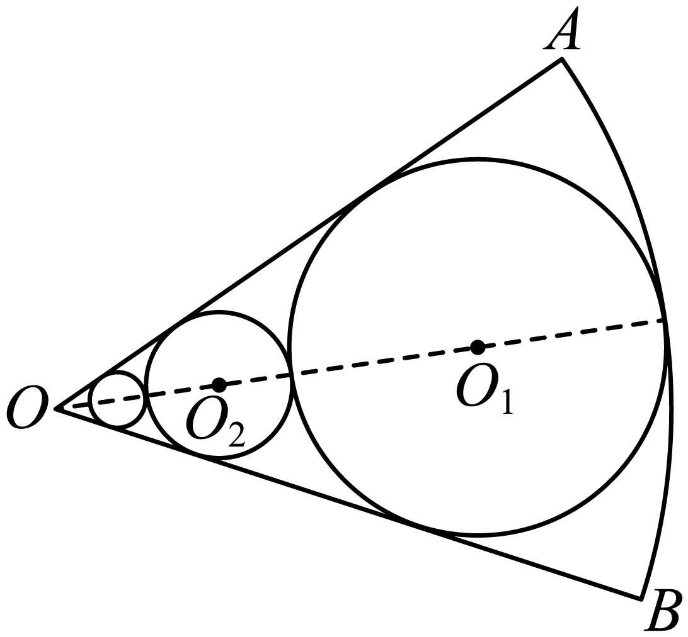
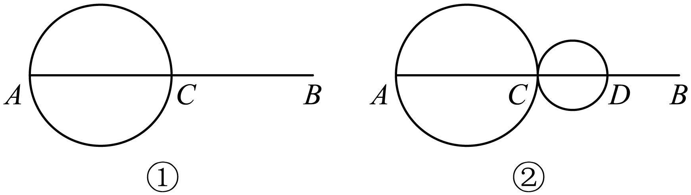
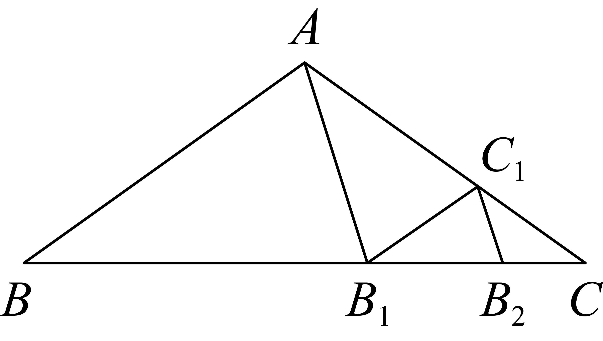

<strong>第42讲  等比数列及其前</strong><em>n</em><strong>项和</strong>

**知识梳理**

**知识点一．等比数列的有关概念**

（1）定义：如果一个数列从第2项起，每一项与它的前一项的比等于同一常数（不为零），那么这个数列就叫做等比数列．这个常数叫做等比数列的公比，通常用字母表示，定义的表达式为．

（2）等比中项：如果，，成等比数列，那么叫做与的等比中项．

即是与的等比中项⇔，，成等比数列⇒．

**知识点二．等比数列的有关公式**

（1）等比数列的通项公式

设等比数列的首项为，公比为，则它的通项公式．

推广形式：

（2）等比数列的前*n*项和公式

等比数列的公比为，其前项和为

注①等比数列的前项和公式有两种形式，在求等比数列的前项和时，首先要判断公比是否为1，再由的情况选择相应的求和公式，当不能判断公比是否为1时，要分与两种情况讨论求解．

②已知（项数），则利用求解；已知，则利用求解．

③，为关于的指数型函数，且系数与常数互为相反数．

**知识点三．等比数列的性质**

（1）等比中项的推广．

若时，则，特别地，当时，．

（2）①设为等比数列，则（为非零常数），，仍为等比数列．

②设与为等比数列，则也为等比数列．

（3）等比数列的单调性（等比数列的单调性由首项与公比决定）．

当或时，为递增数列；

当或时，为递减数列．

（4）其他衍生等比数列．

若已知等比数列，公比为，前项和为，则：

①等间距抽取

为等比数列，公比为．

②等长度截取

为等比数列，公比为（当时，不为偶数）．

**【解题方法总结】**

（1）若，则．

（2）若，（项数相同）是等比数列，则，，，，仍是等比数列．

（3）在等比数列中，等距离取出若干项也构成一个等比数列，即为

等比数列，公比为．

（4）公比不为－1的等比数列的前项和为，则，，仍成等比数列，其公比为．

（5）为等比数列，若，则成等比数列．

（6）当，时，是成等比数列的充要条件，此时．

（7）有穷等比数列中，与首末两项等距离的两项的积相等．特别地，若项数为奇数时，还等于中间

项的平方．

（8）若为正项等比数列，则为等差数列．

（9）若为等差数列，则为等比数列．

（10）若既是等差数列又是等比数列是非零常数列．

**必考题型全归纳**

**题型一：等比数列的基本运算**

**例1．**（2024·北京·高三汇文中学校考阶段练习）在等比数列中，，，则等于（    ）

A．9	B．72	C．9或70	D．9或

**例2．**（2024·全国·高三专题练习）已知递增的等比数列中，前3项的和为7，前3项的积为8，则的值为（    ）

A．2	B．4	C．6	D．8

<strong>例3．</strong>（2024·浙江温州·乐清市知临中学校考模拟预测）已知等比数列的前<em>n</em>项和为，公比为<em>q</em>，且，则（    ）

A．	B．	C．	D．

<strong>变式1．</strong>（2024·四川遂宁·射洪中学校考模拟预测）在等比数列中，若，，则公比<em>q</em>应为（    ）

A．	B．	C．	D．－2

<strong>变式2．</strong>（2024·全国·高三专题练习）设等比数列的各项均为正数，前<em>n</em>项和，若，，则（    ）

A．	B．	C．15	D．40

**变式3．**（2024·全国·高三对口高考）已知数列是等比数列，，则该数列的以及依次为（    ）

A．682，	B．，	C．682，或	D．，或

<strong>变式4．</strong>（2024·江西抚州·统考模拟预测）已知正项等比数列{}的前<em>n</em>项和为，若，则=（    ）

A．64	B．81	C．128	D．192

**变式5．**（2024·江西·校联考模拟预测）已知等比数列的前4项和为，，则（    ）

A．	B．	C．1	D．2

**【解题方法总结】**

等比数列基本量运算的解题策略

（1）等比数列基本量的运算是等比数列中的一类基本问题，等比数列中有五个量，，，，，

一般可以“知三求二”，通过列方程（组）便可迎刃而解．

（2）等比数列的前项和公式涉及对公比的分类讨论：

当时，；当时，．

**题型二：等比数列的判定与证明**

**例4．**（2024·全国·高三专题练习）甲、乙两个容器中分别盛有浓度为10％，20％的某种溶液500ml，同时从甲、乙两个容器中取出100ml溶液，将其倒入对方的容器并搅匀，这称为一次调和．记，，经次调和后，甲、乙两个容器的溶液浓度分别为，．

(1)试用，表示，．

(2)证明：数列是等比数列，并求出，的通项．

<strong>例5．</strong>（2024·全国·高三专题练习）已知数列满足，，其中为的前<em>n</em>项和．证明：

(1)是等比数列．

(2)．

**例6．**（2024·安徽亳州·蒙城第一中学校联考模拟预测）甲、乙、丙三个小学生相互抛沙包，第一次由甲抛出，每次抛出时，抛沙包者等可能的将沙包抛给另外两个人中的任何一个，设第（）次抛沙包后沙包在甲手中的方法数为，在丙手中的方法数为.

(1)求证：数列为等比数列，并求出的通项；

(2)求证：当*n*为偶数时，.

**变式6．**（2024·广东东莞·校考三模）已知数列和，，，.

(1)求证数列是等比数列；

(2)求数列的前项和.

**变式7．**（2024·全国·高三专题练习）设数列的首项，且，

记.

(1)求；

(2)判断数列是否为等比数列，并证明你的结论；

(3)求.

**变式8．**（2024·全国·高三专题练习）已知数列、满足，，，，且，.

(1)求证：是等比数列；

(2)若是递增数列，求实数的取值范围.

**变式9．**（2024·全国·高三专题练习）数列的前和满足 ，

(1)求的值及与的关系；

(2)求证：是等比数列，并求出的通项公式.

**变式10．**（2024·云南·校联考三模）已知数列有递推关系，，记，若数列的递推式形如（且），也即分子中不再含有常数项.

(1)求实数的值；

(2)证明：为等比数列，并求其首项和公比.

**变式11．**（2024·福建厦门·统考模拟预测）已知数列满足．

(1)证明是等比数列；

(2)若，求的前项和．

**变式12．**（2024·山东潍坊·三模）已知数列和满足．

(1)证明：和都是等比数列；

(2)求的前项和．

**【解题方法总结】**

等比数列的判定方法

<table><tr><td>
定义法
</td><td>
若<em></em>（为非零常数，<em></em>或<em></em>（为非零常数且，<em></em>），则是等比数列
</td></tr><tr><td>
中项公式法
</td><td>
若数列中，且，则是等比数列
</td></tr><tr><td>
通项公式法
</td><td>
若数列的通项公式可写成（均为非零常数，<em></em>），则是等比数列
</td></tr><tr><td>
前项和公式法
</td><td>
若数列的前<em></em>项和（为非零常数，），则是等比数列
</td></tr></table>

**题型三：等比数列项的性质应用**

<strong>例7．</strong>（2024·全国·高三对口高考）已知等比数列的前<em>n</em>项和为，则\_\_\_\_\_\_\_\_\_\_.

<strong>例8．</strong>（2024·山东泰安·统考二模）若<em>m</em>，<em>n</em>是函数的两个不同零点，且<em>m</em>，<em>n</em>，这三个数可适当排序后成等差数列，也可适当排序后成等比数列，则\_\_\_\_\_\_\_\_\_\_.

**例9．**（2024·全国·高三专题练习）已知数列中，，，且、是函数的两个零点，则\_\_\_\_\_\_\_\_\_\_\_.

**变式13．**（2024·高三课时练习）已知等比数列的公比，该数列前9项的乘积为1，则\_\_\_\_\_\_．

**变式14．**（2024·江西·校联考二模）在正项等比数列中，与是方程 的两个根，则\_\_\_\_\_\_\_\_\_ .

<strong>变式15．</strong>（2024·全国·高三专题练习）等比数列中，，，则公比<em>q</em>的值为\_\_\_\_\_\_\_\_\_\_\_\_\_.

**变式16．**（2024·全国·高三专题练习）在和之间插入三个数，使这五个数组成正项等比数列，则中间三个数的积等于\_\_\_\_\_\_\_\_\_\_\_\_\_.

**变式17．**（2024·四川成都·高三四川省成都市玉林中学校考阶段练习）若数列是等比数列，且，则\_\_\_\_\_\_\_\_\_\_．

**变式18．**（2024·全国·高三专题练习）已知正项数列是公比不等于1的等比数列，且，若，则\_\_\_\_\_\_\_\_\_\_.

**变式19．**（2024·四川成都·统考二模）已知等比数列的首项为，且，则\_\_\_\_\_\_\_\_\_\_.

**变式20．**（2024·重庆·高三阶段练习）在等比数列中，，则\_\_\_\_\_\_\_\_\_\_\_\_\_\_．

**【解题方法总结】**

（1）在解决等比数列的有关问题时，要注意挖掘隐含条件、利用性质，特别是性质“若，则．”，可以减少运算量，提高解题速度．

（2）在应用相应性质解题时，要注意性质成立的前提条件，有时需要进行适当变形．此外，解题时注意设而不求思想的运用．

<strong>题型四：等比数列前</strong><em>n</em><strong>项和的性质</strong>

<strong>例10．</strong>（2024·全国·高三对口高考）已知数列为等比数列，为其前<em>n</em>项和.若，，则的值为\_\_\_\_\_\_\_\_\_\_.

**例11．**（2024·河北沧州·统考模拟预测）已知等比数列的前项和为，若，，则\_\_\_\_\_\_.

<strong>例12．</strong>（2024·高三课时练习）已知是正项等比数列的前<em>n</em>项和，，则的最小值为\_\_\_\_\_\_．

**变式21．**（2024·全国·高三专题练习）已知数列是等比数列，是其前项和，且，，则\_\_\_\_\_\_.

**变式22．**（2024·全国·高三专题练习）设正项等比数列的前项和为，若，则的值为\_\_\_\_\_\_.

**变式23．**（2024·全国·高三专题练习）设正项等比数列的前项和为，且，则公比\_\_\_\_\_\_\_\_\_\_.

**变式24．**（2024·重庆·高三统考阶段练习）已知等比数列的前项和为，，，则\_\_\_\_\_\_\_\_\_\_\_.

**变式25．**（2024·全国·高三专题练习）已知正项等比数列的前项和为，若，，则，的等差中项为\_\_\_\_\_\_\_\_\_\_.

**变式26．**（2024·江西南昌·南昌十中校考模拟预测）已知等比数列的前项和为，若，，则的值为\_\_\_\_\_\_\_

**【解题方法总结】**

（1）等比数列中，所有奇数项之和与所有偶数项之和具有的性质，设公比为．

①若共有项，则；②若共有项，．

（2）等比数列中，表示它的前项和．当时，有也成等比数列，公比为．

**题型五：求数列的通项**

<strong>例13．</strong>（2024·广西玉林·统考三模）记数列的前<em>n</em>项和为，已知向量，，若，且，则通项为\_\_\_\_\_\_\_\_．

**例14．**（2024·内蒙古包头·高三统考期末）已知数列和满足，，，.则数列的通项\_\_\_\_\_\_.

**例15．**（2024·上海浦东新·高三校考开学考试）设幂函数，数列满足：，且（），则数列的通项\_\_．

**变式27．**（2024·江苏·高三专题练习）写出一个满足前5项的和为31，且递减的等比数列的通项\_\_\_\_\_\_\_\_\_\_\_．

**变式28．**（2024·山西太原·统考模拟预测）已知数列的前项和为且满足，则数列的通项\_\_\_\_\_\_\_．

**变式29．**（2024·上海·高三专题练习）数列的前项和为，则数列的通项\_\_\_\_\_\_\_\_\_\_\_．

<strong>变式30．</strong>（2024·内蒙古包头·高三统考期中）已知数列{}的通项与前<em>n</em>项和之间满足关系则=\_\_\_\_\_\_\_\_\_\_

**变式31．**（2024·上海·高三专题练习）数列的通项的通项，由与中公共项，并按原顺序组成一个新的数列，求的前项和.

**【解题方法总结】**

（1）等比数列的通项公式

设等比数列的首项为，公比为，则它的通项公式．

推广形式：

（2）等比数列的前*n*项和公式

等比数列的公比为，其前项和为

**题型六：奇偶项求和问题的讨论**

**例16．**（2024·湖南长沙·长郡中学校联考模拟预测）已知数列满足，且

(1)设，求数列的通项公式；

(2)设数列的前*n*项和为，求使得不等式成立的*n*的最小值．

**例17．**（2024·河北·模拟预测）已知数列满足，

(1)记，证明：数列为等比数列；

(2)记，求数列的前项和．

**例18．**（2024·山东济宁·统考二模）已知数列的前项和为，且．

(1)求数列的通项公式;

(2)若，求数列的前项和．

**变式32．**（2024·天津南开·统考二模）设为等比数列，为公差不为零的等差数列，且，，.

(1)求和的通项公式；

(2)记的前项和为，的前项和为，证明：；

(3)记，求.

<strong>变式33．</strong>（2024·湖南邵阳·统考三模）记为等差数列{}的前<em>n</em>项和，已知，数列{}满足.

(1)求数列{}与数列{}的通项公式；

(2)数列{}满足，*n*为偶数，求{}前2*n*项和.

**变式34．**（2024·全国·高三专题练习）已知各项为正数的等比数列满足.

(1)求数列的通项公式；

(2)设，，求数列的前2*n*项和.

**变式35．**（2024·湖南长沙·长沙市实验中学校考三模）已知数列满足：，且对任意的，

(1)求，的值，并证明数列是等比数列；

(2)设，求数列的前项和.

**变式36．**（2024·全国·高三专题练习）已知数列满足，，记，求数列的通项公式．

**【解题方法总结】**

求解等比数列的前项和，要准确地记住求和公式，并合理选取公式，尤其是要注意其项数的值；对于奇偶项通项不统一问题要注意分类讨论．主要是从为奇数、偶数进行分类．

**题型七：等差数列与等比数列的综合应用**

**例19．**（2024·全国·高三专题练习）已知数列为等差数列，，，前项和为，数列满足，求证：

(1)数列为等差数列；

(2)数列中任意三项均不能构成等比数列.

**例20．**（2024·辽宁锦州·高三渤海大学附属高级中学校考期末）在等差数列中，．

(1)求等差数列的通项公式；

(2)设数列是首项为1，公比为2的等比数列，求数列的前项和．

**例21．**（2024·全国·高三专题练习）已知为等差数列的前项和，且，\_\_\_\_\_\_\_\_\_\_\_.在①，，成等比数列，②，③数列为等差数列，这三个条件中任选一个填入横线，使得条件完整，并解答：

(1)求；

(2)若，求数列的前项和.

注：如果选择多个条件分别解答，则按第一个解答计分.

**变式37．**（2024·四川资阳·统考一模）已知等比数列的前项和为，且，，（其中）成等差数列．问：，，是否成等差数列？并说明理由．

<strong>变式38．</strong>（2024·江苏·高考真题）已知是等差数列，是公比为<em>q</em>的等比数列，，，记为数列的前<em>n</em>项和.

(1)若（*m*，*k*是大于2正整数），求证：；

(2)若（*i*是某一正整数），求证：*q*是整数，且数列中每一项都是数列中的项；

(3)是否存在这样的正数*q*，使等比数列中有三项成等差数列？若存在，写出一个*q*的值，并加以说明；若不存在，请说明理由.

**变式39．**（2024·河南开封·高三校考阶段练习）公差不为0的等差数列中，，且成等比数列.

(1)求数列的通项公式；

(2)若为等差数列的前项和，求使成立的的最大值.

**变式40．**（2024·全国·高三专题练习）已知是递增的等比数列，且，．

(1)求数列的通项公式；

(2)在与之间插入个数，使这个数组成一个公差为的等差数列，在数列中是否存在项（其中成等差数列）成等比数列.若存在，求出这样的项；若不存在，请说明理由．

<strong>变式41．</strong>（2024·全国·高三专题练习）设数列的前<em>n</em>项和为，，，.

(1)证明：为等差数列；

(2)设，在和之间插入*n*个数，使这个数构成公差为的等差数列，求的前*n*项和.

**【解题方法总结】**

（1）等差数列与等比数列的相互转化：等差数列通过指数运算转化为正项等比数列，正项等比数列通过对数运算转化为等差数列．

（2）等差数列和等比数列的交汇，若一个数列既是等差数列又是等比数列，则该数列为非零常数数列．

**题型八：等比数列的范围与最值问题**

**例22．**（2024·上海闵行·上海市七宝中学校考二模）已知数列为等比数列，首项，公比，则下列叙述不正确的是（   ）

A．数列的最大项为	B．数列的最小项为

C．数列为严格递增数列	D．数列为严格递增数列

<strong>例23．</strong>（2024·全国·高三专题练习）设是公比为的等比数列，其前项的积为，并且满足条件：，，．给出下列结论：①；②；③；④使成立的最小的自然数<em>n</em>等于199．其中正确结论的编号是（    ）

A．①②③	B．①④	C．②③④	D．①③④

**例24．**（2024·广西·统考模拟预测）已知正项等比数列满足，则取最大值时的值为（    ）

A．8	B．9	C．10	D．11

<strong>变式42．</strong>（2024·陕西西安·统考三模）已知数列是无穷等比数列，若，则数列的前<em>n</em>项和（    ）．

A．无最大值，有最小值	B．有最大值，有最小值

C．有最大值，无最小值	D．无最大值，无最小值

**变式43．**（2024·全国·高三专题练习）已知数列满足，，则数列是（　　）

A．递增数列	B．递减数列	C．常数列	D．不能确定

**变式44．**（2024·全国·高三专题练习）已知是递增的等比数列，且，则其公比满足（    ）

A．	B．

C．	D．

<strong>变式45．</strong>（2024·贵州铜仁·高三统考期末）已知等比数列的各项均为正数且公比大于1，前<em>n</em>项积为，且，则使得的<em>n</em>的最小值为（    ）

A．5	B．6	C．7	D．8

**变式46．**（2024·全国·高三专题练习）设无穷等比数列的前项和为，若，则（    ）

A．为递减数列	B．为递增数列

C．数列有最大项	D．数列有最小项

<strong>变式47．</strong>（2024·全国·高三专题练习）设等比数列的公比为<em>q</em>，其前<em>n</em>项和为，并且满足条件，则下列结论正确的是（    ）

A．	B．	C．	D．的最大值为

**变式48．**（2024·全国·高三专题练习）设等比数列的公比为，其前项和为，前项积为，并满足条件，，则下列结论正确的是（    ）

A．	B．是数列中的最大值

C．	D．数列无最大值

**变式49．**（2024·江西赣州·高三校联考阶段练习）设公比为的等比数列的前项和为，前项积为，且，，，则下列结论正确的是（    ）

A．	B．

C．是数列中的最大值	D．数列无最大值

**变式50．**（2024·黑龙江哈尔滨·高三尚志市尚志中学校考期中）设等比数列的公比为，其前项和为，前项积为，且满足条件，，，则下列选项错误的是（    ）

A．	B．

C．是数列中的最大项	D．

**变式51．**（2024·全国·高三专题练习）设等比数列的公比为，其前项之积为，并且满足条件：，，，给出下列结论：①；② ；③是数列中的最大项；④使成立的最大自然数等于4039；其中正确结论的序号为（    ）

A．①②	B．①③	C．①③④	D．①②③④

<strong>变式52．</strong>（2024·全国·高三专题练习）已知数列的前<em>n</em>项和为，，，.

(1)求；

(2)设，数列的前*n*项和为，若，都有成立，求实数的范围.

**变式53．**（2024·上海·高三专题练习）已知数列是首项与公比都为的等比数列，其中，且，且是递增数列，求的范围.

**变式54．**（2024·上海宝山·高一上海交大附中校考阶段练习）已知正数数列满足，且对恒成立，则的范围为\_\_\_\_\_\_.

<strong>变式55．</strong>（2024·湖北武汉·统考模拟预测）已知等比数列的各项均为正数，公比为<em>q</em>，前<em>n</em>项和，若对于任意正整数<em>n</em>有，则<em>q</em>的范围为\_\_\_\_\_\_\_\_\_\_\_\_.

<strong>变式56．</strong>（2024·北京东城·北京市第五中学校考模拟预测）若三角形三边成等比数列，则公比<em>q</em>的范围是\_\_\_\_\_.

**题型九：等比数列的实际应用**

**例25．**（2024·广东广州·广州市培正中学校考模拟预测）某牧场今年初牛的存栏数为1200，预计以后每年存栏数的增长率为，且在每年年底卖出100头牛.设牧场从今年起每年年初的计划存栏数依次为数列，且满足递推公式：为数列的前项和，则\_\_\_\_\_\_\_\_\_\_（答案精确到1）.

**例26．**（2024·湖南长沙·长沙市明德中学校考三模）中国古代数学著作《增减算法统宗》中有这样一段记载：“三百七十八里关，初行健步不为难，次日脚痛减一半，如此六日过其关.” 则此人在第六天行走的路程是\_\_\_\_\_\_\_\_\_\_里（用数字作答）.

**例27．**（2024·辽宁大连·育明高中校考一模）某高中图书馆为毕业生提供网上阅读服务，其中电子阅览系统的登录码由学生的届别+班级+学号+特别码构成.这个特别码与如图数表有关，数表构成规律是：第一行数由正整数从小到大排列得到，下一行数由前一行每两个相邻数的和写在这两个数正中间下方得到.以此类推特别码是学生届别数对应表中相应行的自左向右第一个数的个位数字，如：1997届3班21号学生的登陆码为1997321\*.（\*为表中第1997行第一个数的个位数字）.若已知某毕业生的登录码为201\*2138，则可以推断该毕业生是\_\_\_\_\_\_届2班13号学生.

<strong>变式57．</strong>（2024·陕西西安·陕西师大附中校考模拟预测）如图，已知在扇形<em>OAB</em>中，半径，，圆内切于扇形<em>OAB</em>（圆和，，弧<em>AB</em>均相切），作圆与圆，，相切，再作圆与圆，，相切，以此类推.设圆，圆…的面积依次为，…，那么\_\_\_\_\_\_\_\_\_\_．

<strong>变式58．</strong>（2024·陕西宝鸡·高三宝鸡中学校考阶段练习）“一尺之棰，日取其半，万世不竭”出自《庄子·天下》，其中蕴含着数列的相关知识，已知长度为4的线段，取的中点<em>C</em>，以为直径作圆（如图①），该圆的面积为，在图①中取的中点<em>D</em>，以为直径作圆（如图②），图②中所有圆的面积之和为，以此类推，则\_\_\_\_\_\_\_\_．

**变式59．**（2024·全国·高三专题练习）是无理数的近似值，被称为黄金比值.我们把腰与底的长度比为黄金比值的等腰三角形称为黄金三角形.如图，是顶角为，底的第一个黄金三角形，是顶角为的第二个黄金三角形，是顶角为的第三个黄金三角形，是顶角为的第四个黄金三角形，则第个黄金三角形的腰长为\_\_\_\_\_\_\_\_（写出关于表达式即可）.

<strong>变式60．</strong>（2024·全国·校联考三模）88键钢琴从左到右各键的音的频率组成一个递增的等比数列．若中音<em>A</em>（左起第49个键）的频率为，钢琴上最低音的频率为，则左起第61个键的音的频率为\_\_\_\_\_\_\_\_\_\_\_

