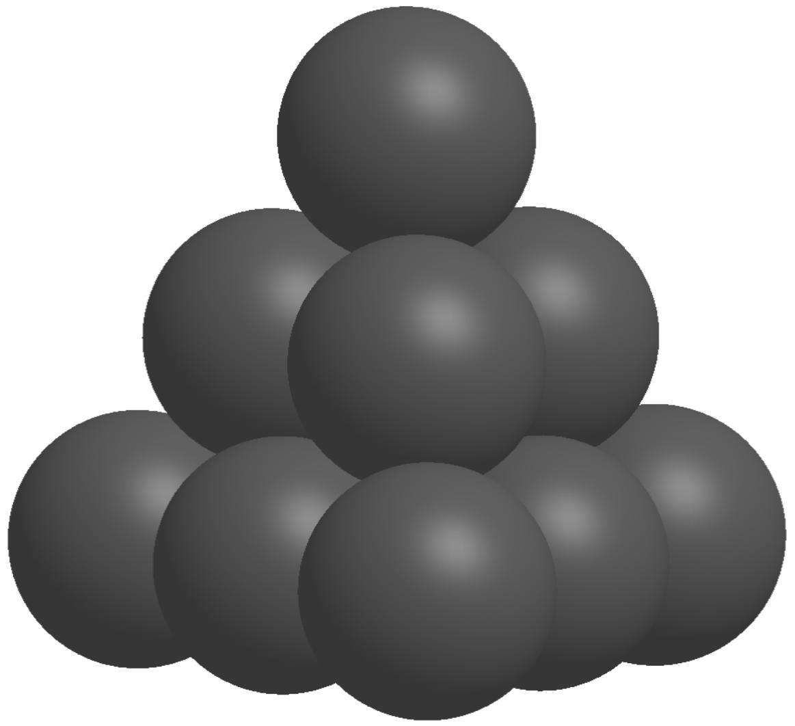
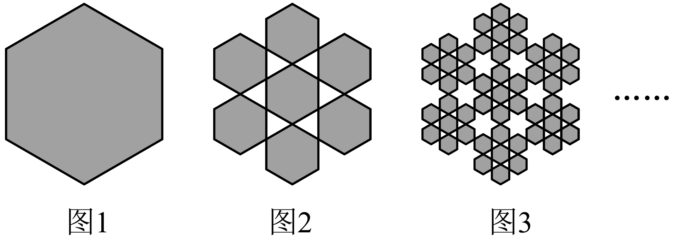
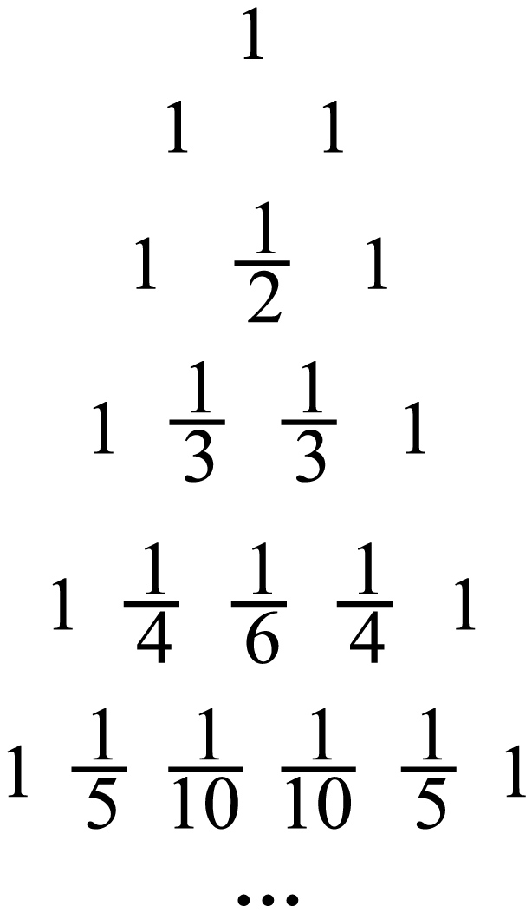
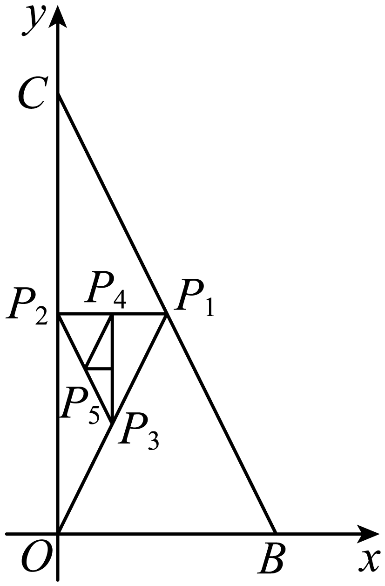

**第43讲  数列的通项公式**

**知识梳理**

**类型Ⅰ   观察法：**

已知数列前若干项，求该数列的通项时，一般对所给的项观察分析，寻找规律，从而根据规律写出此数列的一个通项．

**类型Ⅱ  公式法：**

若已知数列的前项和与的关系，求数列的通项可用公式                构造两式作差求解．

用此公式时要注意结论有两种可能，一种是“一分为二”，即分段式；另一种是“合二为一”，即和合为一个表达，（要先分和两种情况分别进行运算，然后验证能否统一）．

**类型Ⅲ   累加法：**

形如型的递推数列（其中是关于的函数）可构造：

将上述个式子两边分别相加，可得：

①若是关于的一次函数，累加后可转化为等差数列求和；

② 若是关于的指数函数，累加后可转化为等比数列求和；

③若是关于的二次函数，累加后可分组求和；

④若是关于的分式函数，累加后可裂项求和．

**类型Ⅳ   累乘法：**

形如型的递推数列（其中是关于的函数）可构造：

将上述个式子两边分别相乘，可得：

有时若不能直接用，可变形成这种形式，然后用这种方法求解．

**类型Ⅴ   构造数列法：**

**（一）形如（其中均为常数且）型的递推式：**

（1）若时，数列{}为等差数列；

（2）若时，数列{}为等比数列；

（3）若且时，数列{}为线性递推数列，其通项可通过待定系数法构造等比数列来求．方法有如下两种：

法一：设，展开移项整理得，与题设比较系数（待定系数法）得，即构成以为首项，以为公比的等比数列．再利用等比数列的通项公式求出的通项整理可得

法二：由得两式相减并整理得即构成以为首项，以为公比的等比数列．求出的通项再转化为类型Ⅲ（累加法）便可求出

**（二）形如型的递推式：**

（1）当为一次函数类型（即等差数列）时：

法一：设，通过待定系数法确定的值，转化成以为首项，以为公比的等比数列，再利用等比数列的通项公式求出的通项整理可得

法二：当的公差为时，由递推式得：，两式相减得：，令得：转化为类型Ⅴ㈠求出 ，再用类型Ⅲ（累加法）便可求出

（2）当为指数函数类型（即等比数列）时：

法一：设，通过待定系数法确定的值，转化成以为首项，以为公比的等比数列，再利用等比数列的通项公式求出的通项整理可得

法二：当的公比为时，由递推式得：——①，，两边同时乘以得——②，由①②两式相减得，即，在转化为类型Ⅴ㈠便可求出

法三：递推公式为（其中*p*，*q*均为常数）或（其中*p*，*q*，  *r*均为常数）时，要先在原递推公式两边同时除以，得：，引入辅助数列（其中），得：再应用类型Ⅴ㈠的方法解决．

（3）当为任意数列时，可用通法：

在两边同时除以可得到，令，则，在转化为类型Ⅲ（累加法），求出之后得．

**类型Ⅵ   对数变换法：**

形如型的递推式：

在原递推式两边取对数得，令得：，化归为型，求出之后得（注意：底数不一定要取10，可根据题意选择）．

**类型Ⅶ   倒数变换法：**

形如（为常数且）的递推式：两边同除于，转化为形式，化归为型求出的表达式，再求；

还有形如的递推式，也可采用取倒数方法转化成形式，化归为型求出的表达式，再求．

**类型Ⅷ   形如型的递推式：**

用待定系数法，化为特殊数列的形式求解．方法为：设，比较系数得，可解得，于是是公比为的等比数列，这样就化归为型．

总之，求数列通项公式可根据数列特点采用以上不同方法求解，对不能转化为以上方法求解的数列，可用归纳、猜想、证明方法求出数列通项公式

**必考题型全归纳**

**题型一：观察法**

**例1．**（2024·湖南长沙·长沙市实验中学校考二模）南宋数学家杨辉所著的《详解九章算法·商功》中出现了如图所示的形状，后人称为“三角垛”，“三角垛”的最上层有1个球，第二层有3个球，第三层有6个球，······，则第十层有（    ）个球．

A．12	B．20	C．55	D．110

【答案】C

【解析】由题意知：

，

，

，

，

所以.

故选：C

**例2．**（2024·全国·高三专题练习）“中国剩余定理”又称“孙子定理”，1852年英国来华传教伟烈亚力将《孙子算经》中“物不知数”问题的解法传至欧洲.1874年，英国数学家马西森指出此法符合1801年由高斯得出的关于同余式解法的一般性定理，因而西方称之为“中国剩余定理”．“中国剩余定理”讲的是一个关于整除的问题，现有这样一个整除问题：将正整数中能被3除余2且被7除余2的数按由小到大的顺序排成一列，构成数列，则（    ）

A．17	B．37	C．107	D．128

【答案】C

【解析】∵能被3除余2且被7除余2，∴既是3的倍数，又是7的倍数，

即是21的倍数，且，∴，

即，∴．

故选：C*．*

**例3．**（2024·全国·高三专题练习）线性分形又称为自相似分形，其图形的结构在几何变换下具有不变性，通过不断迭代生成无限精细的结构.一个正六边形的线性分形图如下图所示，若图1中正六边形的边长为1，图中正六边形的个数记为，所有正六边形的周长之和､面积之和分别记为，其中图中每个正六边形的边长是图中每个正六边形边长的，则下列说法正确的是（     ）

A．	B．

C．存在正数，使得恒成立	D．

【答案】D

【解析】A选项，图1中正六边形的个数为1，图2中正六边形的个数为7，

由题意得为公比为7的等比数列，所以，故，A错误；

B选项，由题意知，，，B错误；

C选项，为等比数列，公比为，首项为6，故，

因为，所以单调递增，不存在正数，使得恒成立，C错误；

D选项，分析可得，图*n*中的小正六边形的个数为个，每个小正六边形的边长为，故每个小正六边形的面积为，

则，D正确.

故选：D

**变式1．**（2024·海南·海口市琼山华侨中学校联考模拟预测）大衍数列，来源于《乾坤谱》中对易传“大衍之数五十”的推论，主要用于解释中国传统文化中的太极衍生原理，数列中的每一项都代表太极衍生过程，是中华传统文化中隐藏着的世界数学史上第一道数列题，其各项规律如下：0，2，4，8，12，18，24，32，40，50，．．．，记此数列为，则（    ）

A．650	B．1050	C．2550	D．5050

【答案】A

【解析】由条件观察可得：，即，所以是以2为首项，2为公差的等差数列.

故，

故选：A

**变式2．**（2024·吉林·统考三模）大衍数列，来源于《乾坤谱》中对易传“大衍之数五十”的推论，主要用于解释中国传统文化中的太极衍生原理，数列中的每一项，都代表太极衍生过程中，曾经经历过的两仪数量总和，是中华传统文化中隐藏着的世界数学史上第一道数列题．其前10项依次是0，2，4，8，12，18，24，32，40，50，则此数列的第25项与第24项的差为（    ）

A．22	B．24	C．25	D．26

【答案】B

【解析】设该数列为，

当为奇数时，

所以为奇数；

当为偶数时，

所以为偶数数；

所以，

故选:B.

**变式3．**（2024·全国·高三专题练习）若数列的前4项分别是，则该数列的一个通项公式为（    ）

A．	B．	C．	D．

【答案】D

【解析】因为数列的前4项分别是，正负项交替出现，分子均为1，分母依次增加1，

所以对照四个选项，正确.

故选：D

<strong>变式4．</strong>（2024·全国·高三专题练习）“杨辉三角”是中国古代重要的数学成就，如图是由“杨辉三角”拓展而成的三角形数阵，从第三行起，每一行的第三个数1，，，，构成数列，其前<em>n</em>项和为，则（    ）

A．	B．	C．	D．

【答案】B

【解析】由题意可知，

则，

所以其前*n*项和为：

，

则.

故选：B.

**变式5．**（2024·新疆喀什·高三统考期末）若数列的前6项为，则数列的通项公式可以为（    ）

A．	B．

C．	D．

【答案】D

【解析】通过观察数列的前6项，可以发现有如下规律：

且奇数项为正，偶数项为负，故用表示各项的正负；

各项的绝对值为分数，分子等于各自的序号数，

而分母是以1为首项，2为公差的等差数列，

故第*n*项的绝对值是，

所以数列的通项可为，

故选：D

**【解题方法总结】**

观察法即根据所给的一列数、式、图形等，通过观察分析数列各项的变化规律，求其通项．使用观察法时要注意：①观察数列各项符号的变化，考虑通项公式中是否有或者 部分．②考虑各项的变化规律与序号的关系．③应特别注意自然数列、正奇数列、正偶数列、自然数的平方、与有关的数列、等差数列、等比数列以及由它们组成的数列．

**题型二：叠加法**

**例4．**（2024·全国·高三对口高考）数列1，3，7，15，……的一个通项公式是（    ）

A．	B．	C．	D．

【答案】C

【解析】依题意得，，，

所以依此类推得，

所以．

又也符合上式，所以符合题意的一个通项公式是．

故选：C．

**例5．**（2024·新疆喀什·校考模拟预测）若，则（    ）

A．55	B．56	C．45	D．46

【答案】D

【解析】由，

得，，

，，，

累加得，

，

当时，上式成立，

则，

所以.

故选：D

**例6．**（2024·陕西安康·陕西省安康中学校考模拟预测）在数列中，，，则（    ）

A．	B．	C．	D．

【答案】B

【解析】因为，故可得，，…，，及累加可得，

则，所以，

则．

故选：B．

**变式6．**（2024·全国·高三专题练习）已知数列满足，，则的通项为(    )

A．	B．

C．	D．

【答案】D

【解析】因为，所以，则当时，，

将个式子相加可得，

因为，则，当时，符合题意，

所以.

故选：D.

<strong>变式7．</strong>（2024·全国·高三专题练习）已知是数列的前<em>n</em>项和，且对任意的正整数<em>n</em>，都满足：，若，则（    ）

A．	B．	C．	D．

【答案】A

【解析】当时，由累加法可得：，

所以（），

又因为，

所以（），

当时，，符合，

所以（），

所以，

所以．

故选：A.

**变式8．**（2024·四川南充·四川省南充高级中学校考模拟预测）已知数列 满足：，，，则（    ）

A．	B．

C．	D．

【答案】C

【解析】，，

∴，，

∴，

又，故，

所以，

所以，

故，

则，

所以.

故选：C．

**【解题方法总结】**

数列有形如的递推公式，且的和可求，则变形为，利用叠加法求和

**题型三：叠乘法**

**例7．**（2024·河南·模拟预测）已知数列满足，，则（    ）

A．2024	B．2024	C．4045	D．4047

【答案】C

【解析】，

，

即，

可得，

.

故选：C.

**例8．**（2024·全国·高三专题练习）数列中，，（为正整数），则的值为（    ）

A．	B．	C．	D．

【答案】A

【解析】因为，

所以，

所以，

故选：A

**例9．**（2024·天津滨海新·高三校考期中）已知 ， 则 （    ）

A．506	B．1011	C．2022	D．4044

【答案】D

【解析】，

，

，，

，，

显然，当时，满足，

∴，

.

故选：D.

**变式9．**（2024·全国·高三专题练习）已知，，则数列的通项公式是（    ）

A．	B．	C．	D．*n*

【答案】D

【解析】由，得，

即，

则，，，…，，

由累乘法可得，所以，

又，符合上式，所以.

故选：D．

**变式10．**（2024·全国·高三专题练习）已知数列中，，，则数列的通项公式为（    ）

A．	B．

C．	D．

【答案】A

【解析】由①

②，

①②得：，

即：，

所以，

所以

故选：．

**变式11．**（2024·全国·高三专题练习）已知数列满足，且，则(   )

A．	B．	C．	D．

【答案】D

【解析】数列满足，且，

∴，，

∴，，，，

累乘可得：，

可得：．

故选：D﹒

**变式12．**（2024·全国·高三专题练习）已知数列满足，(，)，则数列的通项（    ）

A．	B．

C．	D．

【答案】A

【解析】数列满足，，

整理得，，，，

所有的项相乘得：，

整理得：，

故选：．

**变式13．**（2024·全国·高三专题练习）在数列中，且，则它的前项和（    ）

A．	B．	C．	D．

【答案】A

【解析】，，，

因此，.

故选：A.

**【解题方法总结】**

数列有形如的递推公式，且的积可求，则将递推公式变形为，利用叠乘法求出通项公式

**题型四：待定系数法**

**例10．**（2024·全国·高三专题练习）已知：，时，，求的通项公式．

【解析】设，所以，

∴ ，解得：，

又 ，∴ 是以3为首项， 为公比的等比数列，

∴ ，∴ ．

**例11．**（2024·全国·高三专题练习）已知数列，，且对于时恒有，求数列的通项公式．

【解析】因为，所以，又因为，

所以数列是常数列0，所以，所以 ．

**例12．**（2024·全国·高三专题练习）已知数列满足：求.

【解析】因为

所以两边同时加上得：，

所以，当时，

故，故，

所以数列是以为首项，为公比的等比数列.

于是

**变式14．**（2024·全国·高三专题练习）已知数列是首项为.

(1)求通项公式；

(2)求数列的前项和.

【解析】（1），设，

即，即，解得，

，故是首项为，公比为的等比数列.

，故.

（2），则

.

<strong>变式15．</strong>（2024·全国·高三专题练习）已知数列中，<em>a1</em>=2，，求的通项．

【解析】因为的特征函数为：，

由，

∴

∴数列是公比为的等比数列，

∴．

**变式16．**（2024·江苏南通·高三江苏省通州高级中学校考阶段练习）已知数列中，，满足，设为数列的前项和．

(1)证明：数列是等比数列；

(2)若不等式对任意正整数恒成立，求实数的取值范围．

【解析】（1）因为，

所以，

所以是以为首项，公比为的等比数列，

所以，所以．

（2）因为，

所以

，

若对于恒成立，即，

可得即对于任意正整数恒成立，

所以，令，则，

所以，可得，所以，

所以的取值范围为．

<strong>变式17．</strong>（2024·四川乐山·统考三模）已知数列满足，，则______．

【答案】

【解析】由得，又，

所以，即是等比数列，

所以，即．

故答案为：．

<strong>变式18．</strong>（2024·全国·高三专题练习）已知数列中，，，则数列的通项公式为_____________.

【答案】

【解析】因为，

设，即，

根据对应项系数相等则，解得，故，

所以是为首项，为公比的等比数列，

所以，即.

故答案为：

<strong>变式19．</strong>（2024·全国·高三对口高考）已知数列中，，且（，且），则数列的通项公式为__________．

【答案】

【解析】由，得，即

由所以，

于是数列是以首项为，公比为的等比数列，

因此，即，

当时，,此式满足，

所以数列的通项公式为.

故答案为：.

**【解题方法总结】**

形如（为常数，且）的递推式，可构造，转化为等比数列求解．也可以与类比式作差，由，构造为等比数列，然后利用叠加法求通项．

**题型五：同除以指数**

**例13．**（2024·全国·高三专题练习）已知数列满足，，求数列的通项公式．

【解析】将两边除以，

得，则，

故数列是以为首项，以为公差的等差数列，

则，

∴数列的通项公式为．

**例14．**（2024·全国·高三专题练习）在数列{}中，求通项公式．

【解析】可化为：．

又

则数列是首项为，公比是2的等比数列．

∴，则．

所以数列{}通项公式为

**例15．**（2024·全国·高三专题练习）已知数列满足，求数列的通项公式．

【解析】由，可得

又，

则数列是以为首项，2为公比的等比数列，

则，故．

则数列的通项公式为.

**变式20．**（2024·全国·高三专题练习）已知数列满足，，求数列的通项公式．

【解析】解法一：因为，

设，

所以，

则，解得，

即，

则数列是首项为，公比为的等比数列，

所以，即；

解法二：因为，两边同时除以得，

所以，，

所以是以为首项，为公比的等比数列，

所以，则，所以.

<strong>变式21．</strong>（2024·全国·高三专题练习）已知数列满足，则数列的通项公式为_____________.

【答案】

【解析】解法一：设，整理得，可得，

即，且，

则数列是首项为，公比为的等比数列，

所以，即；

解法二：(两边同除以) 两边同时除以得：，

整理得，且，

则数列是首项为，公比为的等比数列，

所以，即；

解法三：(两边同除以)两边同时除以得：，即，

当时，则

，

故，

显然当时，符合上式，故.

故答案为：.

**变式22．**（2024·全国·高三专题练习）已知数列满足，求数列的通项公式．

【解析】两边除以，得

，则，故

，

，

则数列的通项公式为．

**【解题方法总结】**

形如  ，）的递推式，当时，两边同除以转化为关于的等差数列；当时，两边人可以同除以得，转化为．

**题型六：取倒数法**

**例16．**（2024·全国·高三专题练习）已知数列满足：求通项.

【解析】取倒数：，故是等差数列，首项为，公差为2，

，

∴.

**例17．**（2024·全国·高三专题练习）在数列中，求．

【解析】由已知关系式得,

所以数列是以为首项，公比为3得等比数列，故，

所以

**例18．**（2024·全国·高三专题练习）设，数列满足，，求数列的通项公式．

【解析】，，两边取倒数得到，

令，则，

当时，，，，

数列是首项为，公差为的等差数列．

，，．

当时，，则，

数列是以为首项，为公比的等比数列．

，

，

，

，

，

**变式23．**（2024·全国·高三专题练习）已知，求的通项公式．

【解析】，，则，

则，

，所以是以2为首项，2为公比的等比数列．

于是，．

**变式24．**（2024·全国·高三专题练习）已知数列满足，求数列的通项公式．

【解析】为等差数列，

首项，公差为，

.

<strong>变式25．</strong>（2024·全国·高三对口高考）数列中，，，则__________．

【答案】

【解析】由，，可得，

所以，即(定值)，

故数列以为首项，为公差的等差数列，

所以，

所以，所以．

故答案为：．

**变式26．**（2024·江苏南通·统考模拟预测）已知数列中，，.

(1)求数列的通项公式；

(2)求证：数列的前*n*项和.

【解析】（1）因为，，故，

所以，整理得．

又，，，

所以为定值，

故数列是首项为2，公比为2的等比数列，

所以，得.

（2）因为，

所以．

**【解题方法总结】**

对于，取倒数得．

当时，数列是等差数列；

当时，令，则，可用待定系数法求解．

**题型七：取对数法**

**例19．**（2024·全国·高三专题练习）已知数列满足，.

(1)证明数列是等比数列，并求数列的通项公式；

(2)若，数列的前项和，求证：.

【解析】（1）因为，所以，

则，

又，

所以数列是以为首项，为公比的等比数列，

则，

所以；

（2）由，得，

则，

所以，

所以，

所以

，

因为，所以，

所以.

**例20．**（2024·全国·高三专题练习）设正项数列满足，，求数列的通项公式．

【解析】对任意的，，

因为，则，

所以，，且，

所以，数列是首项为，公比为的等比数列，

所以，，解得.

**例21．**（2024·全国·高三专题练习）设数列满足，，证明：存在常数，使得对于任意的，都有．

【解析】恒成立，，则，

则，，

当时，，故，即，

取，满足；

当且时，是首项为，公比为的等比数列，

故，即，

故，

故，取，得到恒成立.

综上所述：存在常数，使得对于任意的，都有．

**【解题方法总结】**

形如的递推公式，则常常两边取对数转化为等比数列求解．

**题型八：已知通项公式与前项的和关系求通项问题**

<strong>例22．</strong>（2024·全国·高三专题练习）数列的前项和为，满足，且，则的通项公式是______．

【答案】

【解析】，，且，

，是以为首项，为公比的等比数列．

，．

时，，

且不满足上式，所以．

故答案为：.

<strong>例23．</strong>（2024·陕西渭南·统考二模）已知数列中，，前<em>n</em>项和为.若，则数列的前2024项和为___________.

【答案】

【解析】在数列中，又，且，

两式相除得，，

∴数列 是以1为首项，公差为1的等差数列，则，∴ ，

当，，

当时，，也满足上式，

∴数列的通项公式为，

则，

数列的前2024项和为.

故答案为：

**例24．**（2024·河南南阳·高二统考期末）已知数列的前项和为，且（），

(1)求数列的通项公式；

(2)设，求数列的前项和.

【解析】（1）当时，，

当时，，

故，故数列是以1为首项，2为公比的等比数列，

故；

（2）由（1）得，

故，

则，

故

，

则

**变式27．**（2024·全国·高三专题练习）已知数列的前项和满足．

(1)写出数列的前3项；

(2)求数列的通项公式．

【解析】（1）由，得．

由，得，

，得．

（2）当时，有，即 ①

令，则，与①比较得，，

是以为首项，以2为公比的等比数列．

，故．

**变式28．**（2024·河北衡水·衡水市第二中学校考三模）已知数列的前项和为，．

(1)证明：是等差数列；

(2)求数列的前项积．

【解析】（1）由，得．

所以，

即，整理得，

上式两边同时除以，得．

又，所以，即，

所以是首项为2，公差为1的等差数列．

（2）由（1）知，．

所以．

所以．

<strong>变式29．</strong>（2024·海南海口·海南华侨中学校考一模）已知各项均为正数的数列满足，其中是数列的前<em>n</em>项和.

(1)求数列的通项公式；

(2)若对任意，且当时，总有恒成立，求实数的取值范围.

【解析】（1）∵，∴

当时，，解得.

当时，，

即，

∵，∴，

∴数列是以1为首项，2为公差的等差数列，

∴.

（2）因为，所以

∴当时， ，

∴

，

∴，

∴实数的取值范围为.

**变式30．**（2024·河北保定·高三校联考阶段练习）已知数列满足.

(1)求的通项公式；

(2)已知，，求数列的前20项和.

【解析】（1）当时，可得，

当时，，

，

上述两式作差可得，

因为满足，所以的通项公式为.

（2），，

所以，

.

所以数列的前20项和为.

**变式31．**（2024·全国·高三专题练习）已知数列的前项和为，且，.证明：是等比数列.

【解析】由，当*n*1时，可得14；

当时，anSnSn15an5an11，

即，即，

记，令，求出不动点，

故，又1 15 ≠0，

∴数列{an1}是以为首项，以为公比的等比数列．

<strong>变式32．</strong>（2024·全国·高三专题练习）已知是各项都为正数的数列，为其前<em>n</em>项和，且，，

(1)求数列的通项；

(2)证明：.

【解析】（1）法一：

因为，

所以当时，，

所以，，

两式相减可得，又，

所以是首项为，公差为的等差数列，

所以，即，

故当时，，

经检验，当时，满足上式，

所以.

法二：

因为，

所以当时，，

故，等号两边平方得，

设，则，又，，

所以是首项为，公差为的等差数列，

故，即，则，

故，则，解得或，

当时，，则，而，矛盾，舍去，

当时，经检验，满足题意，故.

（2）由法一易知，

由法二易得，

故由（1）得，

，

所以，命题得证.

**变式33．**（2024·河北石家庄·高三石家庄二中校考阶段练习）数列的前项和为且当时，成等差数列.

(1)求数列的通项公式；

(2)在和之间插入个数，使这个数组成一个公差为的等差数列，在数列中是否存在3项（其中成等差数列）成等比数列？若存在，求出这样的3项；若不存在，请说明理由.

【解析】（1）由题意，，在数列中，当时，成等差数列，所以，即，

所以时，，又由知时，成立，

即对任意正整数均有，

所以，从而，

即数列的通项公式为：.

（2）由题意及（1）得，，在数列中，，所以.

假设数列中存在3项（其中成等差数列）成等比数列，则，

即，化简得，

因为成等差数列，所以，所以，化简得，

又，所以，即，所以，所以，这与题设矛盾，所以假设不成立，

所以在数列中不存在3项（其中成等差数列）成等比数列.

**变式34．**（2024·陕西咸阳·武功县普集高级中学校考模拟预测）已知是数列的前项和，，.

(1)求数列的通项公式；

(2)已知，求数列的前项和.

【解析】（1）当时，，

∴，

当时，，

∴，

∴是以、公比为2的等比数列，

∴.

（2）由（1）知，，

当时，.

当时，，①

∴，②

①-②得，，

∴，当时，也适合，

∴.

**变式35．**（2024·全国·高三专题练习）已知数列，为数列的前项和，且满足，．

(1)求的通项公式；

(2)证明：．

【解析】（1）对任意的，

当时，，两式相减．

整理得，

当时，，

也满足，从而．

（2）证明：证法一：因为，

所以，

．

从而；

证法二：因为，

所以，

，证毕.

**变式36．**（2024·河北沧州·校考模拟预测）已知正项数列的前项和为，满足.

(1)求数列的通项公式；

(2)若，求数列的前项和.

【解析】（1），

当时，，两式子作差可得

，

又，所以，

可得数列为公差为2 的等差数列，

当时，，

所以，数列的通项公式为.

（2），

，

所以，数列的前项和.

**变式37．**（2024·全国·高三专题练习）已知各项为正数的数列的前项和为，满足．

(1)求数列的通项公式；

(2)设，求数列的前项的和．

【解析】（1），

两式相减得：，

由于，则，

当时，，得，

，则，

所以是首项和公差均为2的等差数列，故．

（2）①

所以②

由得：，

所以

．

**变式38．**（2024·全国·高三专题练习）记为数列的前项和．已知．证明：是等差数列；

【解析】证明：因为，即①，

当时，②，

①②得，，

即，

即，

所以，且，

所以是以为公差的等差数列．

**【解题方法总结】**

对于给出关于与的关系式的问题，解决方法包括两个转化方向，在应用时要合理选择．一个方向是转化为的形式，手段是使用类比作差法，使=（，），故得到数列的相关结论，这种方法适用于数列的前项的和的形式相对独立的情形；另一个方向是将转化为（，），先考虑与的关系式，继而得到数列的相关结论，然后使用代入法或者其他方法求解的问题，这种情形的解决方法称为转化法，适用于数列的前项和的形式不够独立的情况．

简而言之，求解与的问题，方法有二，其一称为类比作差法，实质是转化的形式为的形式，适用于的形式独立的情形，其二称为转化法，实质是转化的形式为的形式，适用于的形式不够独立的情形；不管使用什么方法，都应该注意解题过程中对的范围加以跟踪和注意，一般建议在相关步骤后及时加注的范围．

**题型九：周期数列**

**例25．**（2024·陕西咸阳·武功县普集高级中学校考模拟预测）已知数列满足，，记数列的前项和为，则（    ）

A．	B．

C．	D．

【答案】C

【解析】∵，，∴，故A错误；

，，

∴数列是以3为周期的周期数列，∴，故B错误；

∵，，

∴，故C正确；

，故D错误．

故选：C*．*

**例26．**（2024·广西防城港·高三统考阶段练习）已知数列满足，若，则（    ）

A．	B．

C．	D．

【答案】D

【解析】，则，，，……，

故为周期为3的数列，

因为，所以.

故选：D

**例27．**（2024·四川成都·四川省成都市玉林中学校考模拟预测）已知数列满足：，，，，则（    ）.

A．	B．	C．1	D．2

【答案】C

【解析】

即

又

是以为周期的周期数列.

故选：C

**变式39．**（2024·天津南开·高三南开中学校考阶段练习）已知数列满足，，则（    ）

A．	B．	C．	D．

【答案】B

【解析】，，

，，，，，

数列是以为周期的周期数列．

又，

．

故选：B．

**变式40．**（2024·江苏淮安·高三校考阶段练习）天干地支纪年法源于中国，中国自古便有十天干与十二地支.十天干即：甲、乙、丙、丁、戊、己、庚、辛、壬、癸；十二地支即：子、丑、寅、卯、辰、巳、午、未、申、酉、戌、亥.天干地支纪年法是按顺序以一个天干和一个地支相配，排列起来，天干在前，地支在后，天干由“甲”起，地支由“子”起，比如第一年为“甲子”，第二年为“乙丑”，第三年为“丙寅”，…，以此类推，排列到“癸酉”后，天干回到“甲”重新开始，即“甲戌”，“乙亥”，之后地支回到“子”重新开始，即“丙子”，…，以此类推，2022年是壬寅年，请问：在100年后的2122年为（    ）

A．壬午年	B．辛丑年	C．己亥年	D．戊戌年

【答案】A

【解析】由题意得：天干可看作公差为10的等差数列，地支可看作公差为12的等差数列，

由于，余数为0，故100年后天干为壬，

由于，余数为4，故100年后地支为午，

综上：100年后的2122年为壬午年.

故选：A

**变式41．**（2024·云南昆明·昆明一中模拟预测）已知数列满足，则（    ）

A．	B．1	C．4043	D．4044

【答案】A

【解析】由得，

两式相加得，即，故，

所以.

故选：A．

**变式42．**（2024·全国·高三专题练习）已知数列满足，若，则（    ）

A．	B．	C．	D．2

【答案】B

【解析】由得

，

所以数列的周期为3，所以．

故选：B

**【解题方法总结】**

（1）周期数列型一：分式型

（2）周期数列型二：三阶递推型

（3）周期数列型三：乘积型

（4）周期数列型四：反解型

<strong>题型十：前</strong><em>n</em><strong>项积型</strong>

**例28．**（2024·全国·高三专题练习）已知数列的前项和为,且满足,数列的前项积.

(1)求数列和的通项公式;

(2)求数列的前*n*项和.

【解析】（1）当时,,

∴,

当时,,

化简得,

∵,∴,

∴数列是首项为,公差为的等差数列,

∴.

当时,,

当时,，当时也满足，

所以.

（2）,

设①,

则②,

①-②得,

∴.

<strong>例29．</strong>（2024·全国·高三专题练习）设为数列的前<em>n</em>项积．已知．

(1)求的通项公式；

(2)求数列的前*n*项和．

【解析】（1）依题意，是以1为首项，2为公差的等差数列，则，

即，当时，有，两式相除得，，

显然，即，因此当时，，即，

所以数列的通项公式.

（2）设的前项和为，由（1）得，，于是，

因此，

则，

所以数列前项和为.

<strong>例30．</strong>（2024·全国·高三专题练习）设为数列的前<em>n</em>项和，为数列的前<em>n</em>项积，已知．

(1)求，；

(2)求证：数列为等差数列；

(3)求数列的通项公式．

【解析】（1）由，且，

当时，，得，

当时，，得；

（2）对于①，

当时，②，

①②得，

即，，

又，

数列是以1为首项，1为公差的等差数列；

（3）由（2）得，

，

当时，，

又时，，不符合，

.

<strong>变式43．</strong>（2024·福建厦门·高三厦门外国语学校校考期末）为数列的前<em>n</em>项积，且．

(1)证明：数列是等比数列；

(2)求的通项公式．

【解析】（1）证明： 由已知条件知     ①,

于是．     ②,

由①②得．     ③  ，

又    ④，

由③④得，所以 ，

令，由，得，，

所以数列是以4为首项，2为公比的等比数列；

（2）由（1）可得数列是以4为首项，2为公比的等比数列．

，

法1：时，，

又符合上式，所以；

法2：将代回得：．

<strong>变式44．</strong>（2024·江苏无锡·高三无锡市第一中学校考阶段练习）已知数列的前<em>n</em>项之积为，且．

(1)求数列和的通项公式；

(2)求的最大值．

【解析】（1）∵①，∴②，

由①②可得，由①也满足上式，∴③，

∴④，由③④可得，

即，∴，∴．

（2）由（1）可知，则，

记，

∴，

∴，

∴，即单调递减，

∴的最大值为．

<strong>变式45．</strong>（2024·全国·高三专题练习）已知数列的前<em>n</em>项积.

(1)求数列的通项公式；

(2)记，数列的前*n*项为，求的最小值.

【解析】（1）.

当时，；

当时，，也符合.

故的通项公式为.

（2），

，

是以为首项，2为公差的等差数列，

，

当时，的最小值为.

<strong>变式46．</strong>（2024·全国·高三专题练习）已知为数列的前<em>n</em>项的积，且，为数列的前<em>n</em>项的和，若（，）.

（1）求证：数列是等差数列；

（2）求的通项公式.

【解析】（1）证明：，.

，

是等差数列.

（2）由（1）可得，.

时，；

时，.

而，，，均不满足上式.

（）.

<strong>变式47．</strong>（2024·全国·高三专题练习）记为数列的前<em>n</em>项和，为数列的前<em>n</em>项积，已知．

（1）求数列的通项公式；

（2）求的通项公式．

【解析】解析：（1）将代入，得，

整理得．

当时，得，所以数列是以为首项，为公差等差数列．

所以．

（2）由（1）得，代入，可得．

当时，；

当时，

所以．

**【解题方法总结】**

类比前项和求通项过程：

（1），得

（2）时，

**题型十一：**“**和**”**型求通项**

<strong>例31．</strong>（2024•河南月考）若数列满足为常数），则称数列为等比和数列，称为公比和，已知数列是以3为公比和的等比和数列，其中，，则<u>　　</u>．

【解析】解：由，，

，即，

，，，即，

，，，．

，

由此可知．

故答案为：．

<strong>例32．</strong>（2024•南明区校级月考）若数列满足，则<u>　　</u>．

【解析】解：，

则

．

故答案为：．

**例33．**（2024·青海西宁·二模（理））已知为数列的前项和，，，则（       ）

A．2020	B．2021	C．2022	D．2024

【答案】C

【解析】当时， ，

当时，由得，

两式相减可得

，即，

所以，可得，

所以.

故选：C.

**变式48．**（2024·全国·高三专题练习）数列满足，，且其前项和为.若，则正整数（       ）

A．99	B．103	C．107	D．198

【答案】B

【解析】由得，

∴为等比数列，∴，

∴，，

∴，

①为奇数时，，；

②为偶数时，，，

∵，只能为奇数，∴为偶数时，无解，

综上所述，.

故选：*B*.

**变式49．**（2024·黑龙江·哈师大附中高三阶段练习（理））已知数列的前项和为，若，且，，则的值为

A．－8	B．6	C．－5	D．4

【答案】C

【解析】对于，

当时有，即

，

，

两式相减得：

，

由可得

即从第二项起是等比数列，

所以，

即，

则，故，

由可得，

故选C.

**变式50．**（2024·全国·高三专题练习）数列满足：，求通项.

【解析】因为，

所以当时，，

当时，，

两式相减得：，

构成以为首项，2为公差的等差数列；

构成以为首项，2为公差的等差数列，

，

，

**变式51．**（2024·全国·高三专题练习）数列满足：，求通项.

【解析】由已知当时，可得，

当时，，

与已知式联立，两式相减，

得，

，

，

，

即奇数项构成的数列是每项都等于的常数列，

偶数项构成的数列是每项都等于的常数列，

.

**【解题方法总结】**

**满足，称为**“**和**”**数列，常见如下几种：**

（1）“和”常数型

（2）“和”等差型

（3）“和”二次型

（4）“和”换元型

**题型十二：正负相间讨论、奇偶讨论型**

<strong>例34．</strong>数列满足，前16项和为540，则<u>　　</u>．

【答案】

【解析】解：因为数列满足，

当为奇数时，，

所以，，，，

则，

当为偶数时，，

所以，，，，，，，

故，，，，，，，

因为前16项和为540，

所以，

所以，解得．

故答案为：．

<strong>例35．</strong>（2024•夏津县校级开学）数列满足，前16项和为508，则<u>　　</u>．

【答案】3

【解析】解：由，

当为奇数时，有，

可得，

，

累加可得；

当为偶数时，，

可得，，，．

可得．

．

，

，即．

故答案为：3．

**例36．**（2024·全国·高三专题练习）已知数列满足：，求此数列的通项公式.

【解析】在数列中，由，得，当时，，

两式相除得：，因此数列构成以为首项，为公比的等比数列；

数列构成以为首项，为公比的等比数列，于是，

所以数列的通项公式是.

**变式52．**（2024·山东·校联考模拟预测）已知数列满足．

(1)求的通项公式；

(2)设数列的前项和为，且，求的最小值．

【解析】（1）由题意知当时，．

设，则，所以，即．

又．

所以是首项为4，公比为2的等比数列．

所以．即．

（2）当为偶数时，，即

，

令．则可解得．即．

又因为

故的最小值为95．

**变式53．**（2024·湖南长沙·长郡中学校联考模拟预测）已知数列满足，且

(1)设，求数列的通项公式；

(2)设数列的前*n*项和为，求使得不等式成立的*n*的最小值．

【解析】（1）因为

所以，，，所以．

又因为，所以，所以．

因为，所以，

又因为，所以，所以，所以，

即，

所以，

又因为，所以，所以，

所以数列是以2为首项，2为公比的等比数列，

所以，即．

（2）由（1）可知，所以，

所以，

又因为，所以，

即，所以，

所以，

因为，

，

所以是一个增数列，

因为，，

所以满足题意的*n*的最小值是20．

**变式54．**（2024·全国·高三专题练习）在数列中，，且对任意的，都有.

(1)证明：是等比数列，并求出的通项公式；

(2)若，且数列的前项积为，求和.

【解析】（1）由题意可得：，

是以4为首项，2为公比的等比数列，

所以

是以1为首项，1为公差的等差数列；

（2）由上可得：，

同理.

**【解题方法总结】**

（1）利用*n*的奇偶分类讨论，观察正负相消的规律

（2）分段数列

（3）奇偶各自是等差，等比或者其他数列

**题型十三：因式分解型求通项**

**例37．**（2024•安徽月考）已知正项数列满足：，，．

（Ⅰ）判断数列是否是等比数列，并说明理由；

（Ⅱ）若，设．，求数列的前项和．

【解析】解：（Ⅰ），，

又数列为正项数列，

，

①当时，数列不是等比数列；

②当时，，此时数列是首项为，公比为2的等比数列．

（Ⅱ）由（Ⅰ）可知：，

，

．

**例38．**（2024•怀化模拟）已知正项数列满足，设．

（1）求，；

（2）判断数列是否为等差数列，并说明理由；

（3）的通项公式，并求其前项和为．

【解析】解：（1），，，

可得，

则，

数列为首项为1，公比为2的等比数列，

可得；

，

，；

（2）数列为等差数列，理由：，

则数列为首项为0，公差为1的等差数列；

（3），

前项和为．

**例39．**（2024•仓山区校级月考）已知正项数列满足且

（Ⅰ）证明数列为等差数列；

（Ⅱ）若记，求数列的前项和．

【解析】证明：由，

变形得：，

由于为正项数列，，

利用累乘法得：从而得知：数列是以2为首项，以2为公差的等差数列．

（Ⅱ）解：由（Ⅰ）知：，

从而．

**变式55．** 已知正项数列的前项和满足：，数列满足，且．

（1）求的值及数列的通项公式；

（2）设，数列的前项和为，求．

【解析】解：（1），

当时，，，

解得．

又，，

，

当时，，

当时上式也成立，

．

（2）数列满足，且．

．

，

当为偶数时，数列的前项和为

．

当为奇数时，数列的前项和为

．

当时也成立，

．

**变式56．**（2024•四川模拟）已知数列的各项均为正数，且满足．

（1）求，及的通项公式；

（2）求数列的前项和．

【解析】解：（1）当时，，

；

当时，，

；

由已知可得，且，

．

（2）设，

，

是公比为4的等比数列，

．

声明：试题解析著作权属所有，未经书面同意，不得复制发布日期：2022/7/10 10:14:40；用户：18316341968；邮箱：18316341968；学号：32362679

**【解题方法总结】**

利用十字相乘进行因式分解

**题型十四：其他几类特殊数列求通项**

<strong>例40．</strong>（2024·全国·高三专题练习）已知，，则的通项公式为______．

【答案】

【解析】，①．②

由得．

又因为，所以是公比为，首项为的等比数列，从而，即．

故答案为：

<strong>例41．</strong>（2024·全国·高三专题练习）已知数列满足，，则_______．

【答案】

【解析】设，令得：，解得：；

，化简得，，

所以，从而，

故，

又，所以是首项和公差均为的等差数列，

从而，故．

故答案为：

<strong>例42．</strong>（2024·全国·高三专题练习）已知数列满足，，则______．

【答案】

【解析】设，令得：，解得：；

，化简得：，

所以，从而，又，

所以是首项为，公差为1的等差数列，故，

所以．

故答案为：

**变式57．**（2024·全国·高三专题练习）已知数列中，设，求数列的通项公式.

【解析】依题，

记，令，求出不动点；

由定理2知：

，

；

两式相除得到，

∴是以为公比，为首项的等比数列，

∴，

从而．

**变式58．**（2024·全国·高三专题练习）在数列中，，且，求其通项公式．

【解析】因为，

所以特征方程为，解得,

令，代入原递推式得,

因为，所以，

故,

因此，，从而,

又因为，所以．

**变式59．**（2024·全国·高三专题练习）已知数列的递推公式，且首项，求数列的通项公式．

【解析】令．先求出数列的不动点，解得．

将不动点代入递推公式，得，

整理得，，

∴．

令，则，．

∴数列是以为首项，以1为公差的等差数列．

∴的通项公式为．

将代入，得．

∴．

**变式60．**（2024·全国·高三专题练习）已知数列中，，求的通项公式．

【解析】化为，即，

，可得或，（所得两组数值代入上式等价），

不妨令，，

所以是以1为首项，为公比的等比数列，则，

累加法可得：，

又符合上式，故.

**变式61．**（2024·全国·高三专题练习）已知数列满足递推关系：，且，，求数列的通项公式.

【解析】由于且，，故数列发生函数为

于是数列的通项为：，.

**变式62．**（2024·全国·高三专题练习）已知数列满足，，，求

【解析】法1：已知，所以，

则是首项为，公比为3的等比数列，

故，则，

得，

当*n*为奇数时，，，，，，

累加可得，，

所以，

当*n*为偶数时，，

综上，；

法2：由特征根方程得，，，

所以，其中，解得，，

.

**变式63．**（2024·全国·高三专题练习）已知数列满足，，．

(1)证明：是等比数列；

(2)证明：存在两个等比数列，，使得成立．

【解析】（1）由已知，，∴，

∴，

显然与，矛盾，∴，

∴，

∴数列是首项为，公比为的等比数列.

（2）∵，∴，

∴，

显然与，矛盾，∴，

∴∴，

∴数列是首项为，公比为的等比数列，

∴，①，

又∵由第（1）问，，②，

∴②①得，，

∴存在，，两个等比数列，， 使得成立．

**变式64．**（2024·全国·高三专题练习）已知，，求的通项公式．

【解析】由题意，

，

所以，则，而，

故是以为首项，3为公比的等比数列．

于是．

**变式65．**（2024·全国·高三专题练习）已知数列满足，，求数列的通项公式．

【解析】令，整理得，故或，

由可得，令并将代入，可得，

所以，数列是首项为，公比为的等比数列，

故，整理得.

**【解题方法总结】**

（1）二次型：形如

（2）三阶递推：形如型，多在大题中，有引导型证明要求

（3）“纠缠数列”：两个数列，多为等差和等比数列，通项公式组成“方程组”

（4）数学归纳型：可以通过数学归纳法，猜想，证明（小题省略证的过程）

**题型十五：双数列问题**

**例43．**（2024·河北秦皇岛·三模）已知数列和满足．

(1)证明：是等比数列，是等差数列；

(2)求的通项公式以及的前项和．

【解析】(1)证明：因为，

所以，即，

所以是公比为的等比数列．

将方程左右两边分别相减，

得，化简得，

所以是公差为2的等差数列．

(2)由（1）知，

，

上式两边相加并化简，得，

所以．

**例44．**（2024·全国·高三专题练习）两个数列､满足，，，（其中），则的通项公式为\_\_\_\_\_\_\_\_\_\_\_.

【答案】

【解析】解：因为，，

所以，

所以，即，所以的特征方程为，解得特征根或，

所以可设数列的通项公式为，因为，，

所以，所以，解得，

所以，所以；

故答案为：

**例45．**（2024·全国·高三专题练习）已知数列和满足，，，.则＝\_\_\_\_\_\_\_.

【答案】

【解析】，，且，，则，

由可得，代入可得，

，且，

所以，数列是以为首项，以为公比的等比数列，则，

在等式两边同时除以可得，

所以，数列为等差数列，且首项为，公差为，

所以，，，

则，

因此，.

故答案为：.

**变式66．**（2024·全国·高三专题练习）数列,满足,且,.

(1)证明:为等比数列;

(2)求,的通项.

【解析】（1）证明：由，可得：，

，代入，

可得：，

化为：，

，

为等比数列，首项为-14，公比为3.

（2）由（1）可得：，

化为：，

数列是等比数列，首项为16，公比为2.

，

可得：，

.

**变式67．**（2024·吉林长春·模拟预测）已知数列和满足，，，，则\_\_\_\_\_\_，\_\_\_\_\_\_．

【答案】

【解析】由题设，，则，而，

所以是首项、公比均为2的等比数列，故，

，则，

令，则，

故，而，

所以是常数列，且，则.

故答案为：，.

**【解题方法总结】**

**消元法**

**题型十六：通过递推关系求通项**

<strong>例46．</strong>（2024·全国·高三专题练习）某电视频道在一天内有<em>x</em>次插播广告的时段，一共播放了<em>y</em>条广告，第一次播放了1条以及余下的条的，第2次播放了2条以及余下的，第3次播放了3条以及余下的，以后每次按此规律插播广告，在第次播放了余下的<em>x</em>条．

(1)设第次播放后余下条，这里，，求与的递推关系式．

(2)求这家电视台这一天播放广告的时段*x*与广告的条数*y*．

【解析】（1）依题意，第次播放了，

因此，整理得．

（2）∵

，

又∵，

∴．

∴，

∴

∴．

∵当时，，与互质，，

∴，则

即．

**例47．**（2024·全国·高三专题练习）甲、乙两个容器中分别盛有浓度为10％，20％的某种溶液500ml，同时从甲、乙两个容器中取出100ml溶液，将其倒入对方的容器并搅匀，这称为一次调和．记，，经次调和后，甲、乙两个容器的溶液浓度分别为，．

(1)试用，表示，．

(2)证明：数列是等比数列，并求出，的通项．

【解析】（1）由题意，经次调和后甲、乙两个容器中的溶液浓度分别为，

所以，．

（2）由（1）知，，，

可得，

所以数列是等比数列，

因为％，所以 ①，

又因为  ②．

联立①②得，．

**例48．**（2024·安徽亳州·蒙城第一中学校联考模拟预测）甲、乙、丙三个小学生相互抛沙包，第一次由甲抛出，每次抛出时，抛沙包者等可能的将沙包抛给另外两个人中的任何一个，设第（）次抛沙包后沙包在甲手中的方法数为，在丙手中的方法数为.

(1)求证：数列为等比数列，并求出的通项；

(2)求证：当*n*为偶数时，.

【解析】（1）由题意知：第*n*次抛沙包后的抛沙包方法数为，

第次抛沙包后沙包在甲手中的方法数为，若第*n*次抛沙包后沙包在甲手中，则第次抛沙包后，沙包不可能在甲手里，只有第*n*次抛沙包后沙包在乙或丙手中，

故，且

故，

，

所以数列为等比数列，

由，得，

，

，

，

……………，

以上各式相加，

可得；

（2）由题意知：第*n*次抛沙包后沙包在乙、丙手中的情况数相等均为，

则，

∵当*n*为偶数时，，

∴.

<strong>变式68．</strong>（2024·全国·高三专题练习）如图，的在个顶点坐标分别为，，，设为线段<em>BC</em>的中点，为线段的中点，为线段的中点，对于每一个正整数，为线段的中点，令的坐标为，．

(1)求及；

(2)证明；

(3)若记，证明是等比数列．

【解析】（1）因为，

所以，，，

， ，

，

因为为线段的中点，所以，

所以，

所以为常数列，

所以；

（2）由（1），

所以；

（3），

又，

所以是公比为，首项为的等比数列．

**变式69．**（2024·辽宁沈阳·东北育才学校校考一模）如图，已知曲线及曲线．从上的点作直线平行于轴，交曲线于点，再从点作直线平行于轴，交曲线于点，点的横坐标构成数列．

(1)试求与之间的关系，并证明：；

(2)若，求的通项公式．

【解析】（1），从而有，在上，故，

故，

由及，知，下证：，

，故与异号，

，故，故，即；

（2），则，，

两式相除得，，

故是以为首项，以为公比的等比数列，

则，解得．

**变式70．**（2024·江西·校联考二模）小刚在闲暇之时设计了如下一个“数列”满足：，当为偶数时，，当为奇数时，有的几率为，有的几率为.

(1)求的分布列和数学期望.

(2)求的前*n*项和的数学期望.

【解析】（1）由题意，，

则有的几率为2，有的几率为3；

则有的几率为1，有的几率为4，有的几率为5；

则有的几率为2，有的几率为3，有的几率为1，有的几率为6，有的几率为7；

则有的几率为1，有的几率为2，有的几率为3，有的几率为4，有的几率为5，有的几率为8，有的几率为9，；

所以的分布列为：

<table><tr><td>

</td><td>
1
</td><td>
2
</td><td>
3
</td><td>
4
</td><td>
5
</td><td>
8
</td><td>
9
</td></tr><tr><td>

</td><td>

</td><td>

</td><td>

</td><td>

</td><td>

</td><td>

</td><td>

</td></tr></table>

数学期望为.

（2）当时，；

当时，；

当时，由题意可得

，

则，

所以，

又成立，则，

所以 ，

令，则，

即，

令，则，

即，，

数列是以4为首项，公差为10的等差数列，

则，即，

所以，

则，

令，，，

所以，

所以，

即，

所以，

所以，

经检验时均成立，

所以.

<strong>变式71．</strong>（2024·安徽黄山·统考二模）数学的发展推动着科技的进步，正是基于线性代数、群论等数学知识的极化码原理的应用，华为的5G技术领先世界．目前某区域市场中5G智能终端产品的制造由<em>A</em>公司及<em>B</em>公司提供技术支持．据市场调研预测，5G商用初期，该区域市场中采用<em>A</em>公司与<em>B</em>公司技术的智能终端产品分别占比及，假设两家公司的技术更新周期一致，且随着技术优势的体现每次技术更新后，上一周期采用<em>B</em>公司技术的产品中有20%转而采用<em>A</em>公司技术，采用<em>A</em>公司技术的仅有5%转而采用<em>B</em>公司技术，设第<em>n</em>次技术更新后，该区域市场中采用<em>A</em>公司与<em>B</em>公司技术的智能终端产品占比分别为及，不考虑其它因素的影响．

(1)用表示，并求实数，使是等比数列；

(2)经过若干次技术更新后，该区域市场采用*A*公司技术的智能终端产品占比能否达到75%以上？若能，至少需要经过几次技术更新；若不能，说明理由？（参考数据：）

【解析】（1）由题意，可设5G商用初期，该区域市场中采用*A*公司与*B*公司技术的智能终端产品的占比分别为．

易知经过次技术更新后，

则，即，

由题意，可设，

所以，

又，

从而当时，是以为首项，为公比的等比数列．

（2）由（1）可知，，

又，则，

所以经过次技术更新后，该区域市场采用*A*公司技术的智能终端产品占比．

由题意，令，得，

则，

故，即至少经过6次技术更新，该区域市场采用*A*公司技术的智能终端产品占比能达到75%以上．

**【解题方法总结】**

通过相邻两项的关系递推

