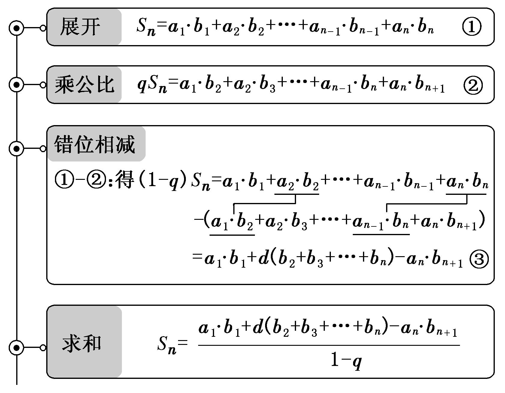
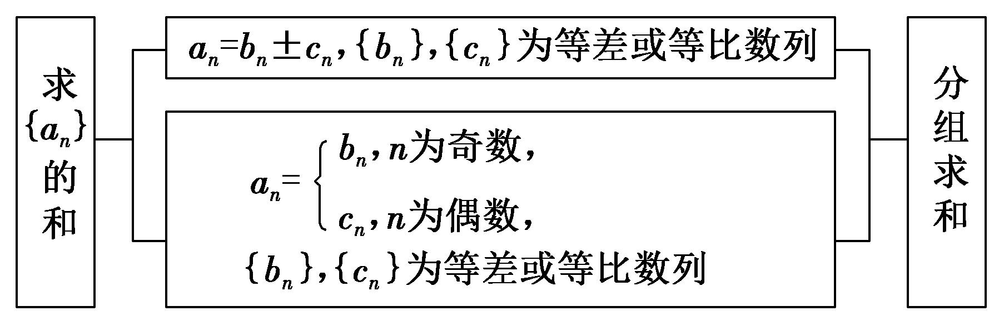
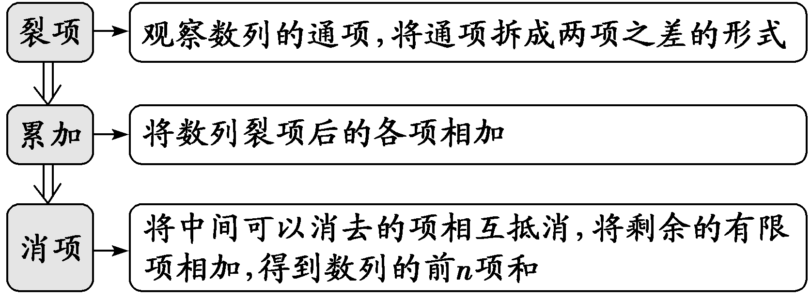

**第44讲  数列求和**

**知识梳理**

**一．公式法**

（1）等差数列的前*n*项和，推导方法：倒序相加法．

（2）等比数列的前*n*项和，推导方法：乘公比，错位相减法．

（3）一些常见的数列的前*n*项和：

①；

②；

③；

④

**二．几种数列求和的常用方法**

**（** 1**）分组转化求和法：** 一个数列的通项公式是由若干个等差或等比或可求和的数列组成的，则求和时可用分组求和法，分别求和后相加减．

<strong>（</strong>2<strong>）裂项相消法：</strong>把数列的通项拆成两项之差，在求和时中间的一些项可以相互抵消，从而求得前<em>n</em>项和．

**（** 3**）错位相减法：** 如果一个数列的各项是由一个等差数列和一个等比数列的对应项之积构成的，那么求这个数列的前项和即可用错位相减法求解．

**（** 4**）倒序相加法：** 如果一个数列与首末两端等“距离”的两项的和相等或等于同一个常数，那么求这个数列的前项和即可用倒序相加法求解．

**【解题方法总结】**

**常见的裂项技巧**

**积累裂项模型**1**：等差型**

（1）

（2）

（3）

（4）

（5）

（6）

（7）

（8）

（9）

（10）

（11）

（12）

**积累裂项模型**2**：根式型**

（1）

（2）

（3）

（4）

（5）

（6）

**积累裂项模型**3**：指数型**

（1）

（2）

（3）

（4）

（5）

（6），设，易得，

于是

（7）

**积累裂项模型**4**：对数型**

**积累裂项模型**5**：三角型**

（1）

（2）

（3）

（4），

则

**积累裂项模型**6**：阶乘**

（1）

（2）

**常见放缩公式：**

（1）；

（2）；

（3）；

（4）；

（5）；

（6）；

（7）；

（8）；

（9）；

（10）

；

（11）

；

（12）；

（13）．

（14）．

**必考题型全归纳**

**题型一：通项分析法**

**例1．**（2024·全国·高三专题练习）求和．

【解析】∵

，

∴．

**例2．** 数列9，99，999，的前项和为

A．	B．	C．	D．

【答案】D

【解析】数列通项，

．

故选：．

**例3．** 求数列1，，，，，的前项之和．

【解析】由于，

所以前项之和

．

<strong>变式1．</strong>（2024·全国·高三专题练习）数列的前<em>n</em>项和为__________.

【答案】

【解析】观察数列得到，

所以前*n*项和

.

故答案为：.

<strong>变式2．</strong>（2024·全国·高三对口高考）数列的前<em>n</em>项和__________.

【答案】

【解析】由题意，，

所以

故答案为：

<strong>变式3．</strong>（2024·全国·高三专题练习）年意大利数学家列昂那多斐波那契以兔子繁殖为例，引人“兔子数列”，又称斐波那契数列，即该数列中的数字被人们称为神奇数，在现代物理，化学等领域都有着广泛的应用若此数列各项被除后的余数构成一新数列，则数列的前项的和为________.

【答案】

【解析】由数列，，，，，，，，，，各项除以的余数，

可得数列为，，，，，，，，，，，，，，1，，

所以数列是周期为的数列，

一个周期中八项和为，

又因为，

所以数列的前项的和.

故答案为：.

**【解题方法总结】**

先分析数列通项的特点，再选择合适的方法求和是求数列的前项和问题应该强化的意识．

**题型二：公式法**

**例4．**（2024·重庆沙坪坝·高三重庆一中校考阶段练习）已知数列为等差数列，数列为等比数列，且，若．

(1)求数列，的通项公式；

(2)设由，的公共项构成的新数列记为，求数列的前5项之和．

【解析】（1）设数列的公差为，数列的公比为，

因为

则，解得，

所以，

因为，

所以，则，

所以，

因为，所以，，

所以．

（2）设数列的第项与数列的第项相等，

则，，，

所以，，，

因为，，

所以当时，，当时，，则，当时，，

当时，，则，当时，，

当时，，则，当时，

当时，，则，当时，

当时，，则，

故的前5项之和．

**例5．**（2024·湖北武汉·统考模拟预测）已知是数列的前项和，，．

(1)求数列的通项公式；

(2)若，求数列的前项和．

【解析】（1）由，则，

两式相减得：，

整理得：，

即时，，

所以时，，

又时，，得，也满足上式．

故．

（2）由（1）可知：．

记，设数列的前项和．

当时，；

当时，

综上：

**例6．**（2024·宁夏银川·高三银川一中阶段练习）已知等差数列的前四项和为10，且成等比数列

(1)求通项公式

(2)设，求数列的前项和

【解析】（1）设等差数列的公差为，则，即，

又成等比数列，所以，即，

整理得，得或，

若，则，，

若，则，得，，.

综上所述：或.

（2）若，则，；

若，则，.

**【解题方法总结】**

针对数列的结构特征，确定数列的类型，符合等差或等比数列时，直接利用等差、等比数列相应公式求解．

**题型三：错位相减法**

**例7．**（2024·广东茂名·高三茂名市第一中学校考阶段练习）已知数列满足且

(1)若存在一个实数，使得数列为等差数列，请求出的值；

(2)在（1）的条件下，求出数列的前*n*项和．

【解析】（1）假设存在实数符合题意，则必为与无关的常数.

因为.

要使是与无关的常数，

则，可得.

故存在实数，使得数列为等差数列.

（2）由，且，

由（1）知等差数列的公差，

所以，即，

所以

记：，

有，

两式相减，得，

故.

**例8．**（2024·四川绵阳·高三盐亭中学校考阶段练习）设数列 ​的前​项和为​，且​; 数列​为等差数列，且​.

(1)求数列 ​的通项公式.

(2)若 ​，求数列​的前​项和​.

【解析】（1）当时，，得.

当时，两式相减有

即.

因为，所以数列是以为首项，公比为的等比数列.

则.

所以数列的通项公式为.

（2）在等差数列中，设首项为公差为，

则解得

所以.

则

①

②

所以①②得

即

解得

**例9．**（2024·湖南长沙·高三湖南师大附中校考阶段练习）已知数列的首项为1，且.

(1)求数列的通项公式；

(2)若为前项的和，求.

【解析】（1）因为，

所以.

两式作差得，

整理得.

令，得，故对任意都成立.

所以的首项为1，故，所以是公比为2的等比数列.

所以的通项公式是.

（2）由（1）得，

所以.

所以.

又，

作差得，

，

.

**变式4．**（2024·西藏日喀则·统考一模）已知数列的前项和为，且.

(1)求，并求数列的通项公式；

(2)若，求数列的前项和.

【解析】（1）由题意①，

当时；当时；

当时，②，

①－②得，

当时，也适合上式，所以，所以时，

两式相减得，故数列是以2为首项，2为公比的等比数列，

所以.

（2）由（1）得，

③，

④，

③－④得：，

所以 .

**变式5．**（2024·广东东莞·校考三模）已知数列和，，，.

(1)求证数列是等比数列；

(2)求数列的前项和.

【解析】（1）由，，得，

整理得，而，

所以数列是以为首项，公比为的等比数列

（2）由（1）知，∴，

∴，

设，则，

两式相减得，

从而

∴.

**变式6．**（2024·广东广州·广州市从化区从化中学校考模拟预测）设数列的前项和为，已知，且数列是公比为的等比数列.

(1)求数列的通项公式；

(2)若，求其前项和

【解析】（1）因为，

所以由题意可得数列是首项为1，公比为的等比数列，

所以，即，

所以，

两式作差得：，

化简得：即，

所以，

所以数列是以为首项，以3为公比的等比数列，

故数列的通项公式为；

（2）方法一：

设，

则有，比较系数得，

所以

所以，

所以，

所以.

方法二：

因为，

所以，

所以，

所以

，

所以.

**【解题方法总结】**

错位相减法求数列的前*n*项和

（1）适用条件

若是公差为的等差数列，是公比为的等比数列，求数列{<em>an</em>·<em>bn</em>}的前<em>n</em>项和．

（2）基本步骤

（3）注意事项

①在写出与的表达式时，应特别注意将两式“错位对齐”，以便下一步准确写出；

②作差后，应注意减式中所剩各项的符号要变号．

等差乘等比数列求和，令，可以用错位相减法．

①

②

得：．

整理得：．

**题型四：分组求和法**

**例10．**（2024·贵州贵阳·高三贵阳一中校考期末）已知数列和满足：，，，，其中．

(1)求证：；

(2)求数列的前项和．

【解析】（1）证明：因为①，②，

①②可得，且，

所以，数列为常数列，且③，

①②可得，且，

所以，数列为等比数列，且该数列的首项为，公比为，

所以，④，

③④可得，则，

所以，.

（2）由（1）可知，，

则

.

<strong>例11．</strong>（2024·广东深圳·高三北师大南山附属学校校考阶段练习）已知数列的前<em>n</em>项和为，且满足，，.

(1)求数列的通项公式；

(2)设数列满足，，，按照如下规律构造新数列：，求数列的前2*n*项和.

【解析】（1）当时，由且得

当时，由得，所以.

所以，故，

又当时，，适合上式.

所以.

（2）因为， ，

所以数列的偶数项构成以为首项､2为公比的等比数列.

故数列的前2*n*项的和，

所以数列的前2*n*项和为.

**例12．**（2024·重庆巴南·统考一模）已知数列的首项，且满足.

(1)求证：是等比数列；

(2)求数列的前项和.

【解析】（1）因为，即，

则，

又因为，可得，

所以数列表示首项为，公比为的等比数列.

（2）由（1）知，所以.

所以

，

当为偶数时，可得；

当为奇数时，可得；

综上所述：.

<strong>变式7．</strong>（2024·江苏镇江·高三江苏省镇江中学校考阶段练习）已知等差数列的前<em>n</em>项和为，数列为等比数列，满足是与的等差中项.

(1)求数列的通项公式；

(2)设，求数列的前20项和.

【解析】（1）设等差数列的公差为*d*，等比数列的公比为*q*，

因为，所以，解得，所以，

由题意知：，因为，所以，

解得，所以；

（2）由（1）得，

.

**变式8．**（2024·海南·高三校联考期末）已知数列满足，．

(1)求数列的通项公式；

(2)若，求数列的前项和．

【解析】（1）由，得，

故，

所以数列是以6为首项，2为公比的等比数列，

所以，

故．

（2），

所以

**变式9．**（2024·吉林通化·梅河口市第五中学校考模拟预测）为数列的前项和，已知，且.

(1)求数列的通项公式；

(2)数列依次为：，规律是在和中间插入项，所有插入的项构成以3为首项，3为公比的等比数列，求数列的前100项的和.

【解析】（1）当时，，解得（舍去），

由得时，，

两式相减得，

因为，所以，

所以是等差数列，首项为4，公差为3，

所以；

（2）由于，

因此数列的前100项中含有的前13项，含有中的前87项，

所求和为.

**变式10．**（2024·福建福州·福建省福州第一中学校考模拟预测）已知数列的首项，，.

(1)设，求数列的通项公式；

(2)在与（其中）之间插入个3，使它们和原数列的项构成一个新的数列.记为数列的前*n*项和，求.

【解析】（1）因为，，

所以，取倒得，

所以，即，即，

因为，所以是，的等比数列，

所以.

（2）在之间有2个3，之间有个3，之间有个3，之间有个3，

合计个3，

所以.

<strong>变式11．</strong>（2024·广东梅州·高三大埔县虎山中学校考阶段练习）已知各项均为正数的数列{<em>an</em>}中，<em>a1</em>=1且满足，数列{<em>bn</em>}的前<em>n</em>项和为<em>Sn</em>，满足2<em>Sn</em>+1=3<em>bn</em>.

(1)求数列{*an*}，{*bn*}的通项公式；

(2)设，求数列的前*n*项和*Sn*；

(3)若在<em>bk</em>与<em>bk+1</em>之间依次插入数列{<em>an</em>}中的<em>k</em>项构成新数列：<em>b1</em>，<em>a1</em>，<em>b2</em>，<em>a2</em>，<em>a3</em>，<em>b3</em>，<em>a4</em>，<em>a5</em>，<em>a6</em>，<em>b4</em>，……，求数列{<em>cn</em>}中前50项的和<em>T50</em>.

【解析】（1）由

得：

∵

是首项，公差为2的等差数列

∴

又当时，得

当，由…①

…②

由①－②整理得：，

∵，

∴，

∴，

∴数列是首项为1，公比为3的等比数列，故；

（2）

（3）依题意知：新数列中，（含）前面共有：项．

由，（）得：，

∴新数列中含有数列的前9项：，，……，，含有数列的前41项：，，，……，；

∴．

**【解题方法总结】**

（1）分组转化求和

数列求和应从通项入手，若无通项，则先求通项，然后通过对通项变形，转化为等差数列或等比数列或可求前*n*项和的数列求和．

（2）分组转化法求和的常见类型

**题型五：裂项相消法**

**例13．**（2024·海南省直辖县级单位·文昌中学校考模拟预测）已知数列的前项和，且.

(1)求数列的通项公式；

(2)求数列的前项和.

【解析】（1）当时，，

当时，

因为对也成立.

所以，所以数列是等差数列，

则公差，

故.

（2）因为，

所以，

故.

**例14．**（2024·宁夏石嘴山·统考一模）已知是数列的前项和，且．

(1)求数列的通项公式；

(2)若，求数列的前项和．

【解析】（1）时，，

时，

经验证时满足，

；

（2），

.

**例15．**（2024·江西赣州·高三校联考阶段练习）已知等差数列的前项和为，且，.

(1)求数列的通项公式；

(2)求数列的前项和，并证明：.

【解析】（1）设公差为，

由题意得

解得∴.

（2）由（1）知，

∴，

.

∵，

∴.

**变式12．**（2024·全国·高三专题练习）在数列中，已知，．

(1)求；

(2)若，为的前*n*项和，证明：．

【解析】（1）

而，是公比为首项为的等比数列，

,

.

（2）,,,

，

，

.

<strong>变式13．</strong>（2024·四川遂宁·射洪中学校考模拟预测）已知数列的前<em>n</em>项和为，且．

(1)求的通项公式；

(2)若，求数列的前*n*项和．

【解析】（1）由已知①，

当时，，即，解得，

当时，②，

①②得，即，

所以数列是以为首项，为公比的等比数列，

所以；

（2）因为，

所以

.

**变式14．**（2024·陕西商洛·镇安中学校考模拟预测）已知公差为正数的等差数列的前项和为，且成等比数列.

(1)求和.

(2)设，求数列的前项和.

【解析】（1）设等差数列的公差为，

因为，成等比数列，

所以，即，

得，

解得或（舍），

所以，

所以，

.

（2）由（1）得，，

所以.

**变式15．**（2024·全国·高三专题练习）已知为数列的前项和，．

(1)求数列的通项公式；

(2)设，记的前项和为，证明：．

【解析】（1）当时，，则，

因为，

所以，

两式相减得： ，

所以，，

，，则，即也适合上式，

所以是以5为首项，公比为2的等比数列，

故：，

故；

（2）由（1）得

，

故

，

当时，，故.

**变式16．**（2024·全国·高三专题练习）已知数列满足．

(1)证明为等差数列，并的通项公式；

(2)设，求数列的前项和．

【解析】（1）证明：因为，所以，即

所以是以为首项，为公差的等差数列，则，

所以；

（2）

.

**变式17．**（2024·福建漳州·统考模拟预测）已知数列的前项和为，且，.

(1)求的通项公式；

(2)记数列的前项和为，求集合中元素的个数.

【解析】（1）因为，所以，

所以

所以，即.

又因为，所以，

所以.

（2）因为，

所以

令，得，

所以集合中元素的个数为.

**变式18．**（2024·安徽黄山·屯溪一中校考模拟预测）设数列的前项和为，且.

(1)求；

(2)记，数列的前项和为，求.

【解析】（1）由，

当时，，解得，

当时，，

所以，

整理得：，①

所以有，②

①-②可得，

所以为等差数列，

因为，所以公差为，

所以.

（2），

∴

.

**变式19．**（2024·全国·高三专题练习）已知数列．

(1)求数列的通项公式；

(2)若数列满足，求数列的前项和

【解析】（1）由得，，

所以时，，

故，又，则，当时，成立，

所以，．

（2）由（1）知，，

所以，

，

因为，

于是，

所以，．

故数列的前项和为．

**变式20．**（2024·江西南昌·江西师大附中校考三模）已知是数列的前项和，满足，且.

(1)求；

(2)若，求数列的前项和.

【解析】（1）因为，显然，

所以，即，

所以

，

所以，又当时，也满足，所以.

（2）由（1）知，则当时，，

又也满足，所以，

则，

则.

**变式21．**（2024·浙江·校联考模拟预测）已知数列满足.

(1)求数列的通项；

(2)设为数列的前项和，求证．

【解析】（1）由，且，则，

所以，而，

即，所以数列为等比数列，公比为2，

所以，所以.

（2），

由得，，

所以，

即，

所以，

所以，

所以

，

因为，所以.

<strong>变式22．</strong>（2024·安徽·合肥一中校联考模拟预测）设数列的前<em>n</em>项和为，已知，，．

(1)证明：数列是等差数列；

(2)记，为数列的前*n*项和，求．

【解析】（1）因为，

所以，即

所以

（为常数），

所以数列是等差数列．

（2）由（1）知，即.

所以，

所以为公比为的等比数列，

又，

所以，

因为，

所以，

所以数列的前项和为：

．

**变式23．**（2024·湖北武汉·华中师大一附中校考模拟预测）已知数列满足．

(1)求数列的通项公式；

(2)求的前项和．

【解析】（1）由，得，

令，有，，

当时，，

又满足上式，于是，则，

当时，，

又满足上式，因此，

所以数列的通项公式是．

（2）由（1）知，，

所以．

**【解题方法总结】**

<table><tr><td>
<strong>裂裂</strong>

<strong>项相</strong>

<strong>消法</strong>

<strong>求和</strong>
</td><td>
（1）基本步骤

（2）裂项原则

一般是前边裂几项，后边就裂几项，直到发现被消去项的规律为止．

（3）消项规律

消项后前边剩几项，后边就剩几项，前边剩第几项，后边就剩倒数第几项．
</td></tr></table>

**题型六：倒序相加法**

<strong>例16．</strong>（2024·江苏盐城·盐城市伍佑中学校考模拟预测）已知数列的项数为，且，则的前<em>n</em>项和为_______．

【答案】

【解析】因为，又，

所以

又因为，

所以，即.

故答案为：.

<strong>例17．</strong>（2024·广西玉林·统考三模）已知函数，若函数，数列为等差数列，，则______．

【答案】44

【解析】由题意，可得，

设等差数列的前项和为，公差为，

则，解得，

则，根据等差中项的性质，可得，

则

，

同理可得，，，，，

∴．

故答案为：

<strong>例18．</strong>（2024·高三课时练习）设函数，利用课本中推导等差数列前<em>n</em>项和的方法，求得的值为______.

【答案】11

【解析】因，

设，则，故.

故答案为：11

<strong>变式24．</strong>（2024·全国·高三专题练习）已知，则______.

【答案】4042

【解析】由，令可得，，

且，

则，

所以，函数关于点对称，即

由已知，，

又

两式相加可得，

所以，.

故答案为：4042.

<strong>变式25．</strong>（2024·江西宜春·高三校考开学考试）德国大数学家高斯年少成名，被誉为数学届的王子，19岁的高斯得到了一个数学史上非常重要的结论，就是《正十七边形尺规作图之理论与方法》．在其年幼时，对的求和运算中，提出了倒序相加法的原理，该原理基于所给数据前后对应项的和呈现一定的规律生成，因此，此方法也称之为高斯算法，现有函数，设数列满足，若，则的前<em>n</em>项和_________．

【答案】

【解析】由得，

，

由，

得，

故，

故，

所以，

则，

两式相减得：

故，

故答案为：

<strong>变式26．</strong>（2024·全国·高三专题练习）设函数，，．则数列的前<em>n</em>项和______．

【答案】

【解析】由题设，，

所以，

即且*n* ≥ 2，

当时，，

当时，，

所以，

故答案为：.

<strong>变式27．</strong>（2024·全国·高三专题练习）已知数列的前<em>n</em>项和为，且，设函数，则______．

【答案】/

【解析】∵①，

∴当时，②，

①－②得，∴；

当时，，∴，此时仍然成立，

∴．

∴当*n*=1时，；

当时，，

当*n*=1时，上式也成立，故．

由于，

设

则，

∴．

故答案为：．

<strong>变式28．</strong>（2024·全国·高三专题练习）“数学王子”高斯是近代数学奠基者之一，他的数学研究几乎遍及所有领域，并且高斯研究出很多数学理论，比如高斯函数､倒序相加法､最小二乘法､每一个阶代数方程必有个复数解等.若函数，设，则__________.

【答案】46

【解析】因为函数的定义域为，

设是函数图象上的两点，其中，且，则有，

从而当时，有：，当时，，

，

相加得

所以，又，

所以对一切正整数，有；

故有.

故答案为：46.

**【解题方法总结】**

将一个数列倒过来排列，当它与原数列相加时，若有规律可循，并且容易求和，则这样的数列求和时可用倒序相加法（等差数列前项和公式的推导即用此方法）．

**题型七：并项求和**

<strong>例19．</strong>（2024·北京海淀·高三专题练习）已知数列的前项和为，则__________．

【答案】36

【解析】由题意可得为奇数时，，

两式相减得；

为偶数时，，两式相加得，

故.

故答案为：36

<strong>例20．</strong>（2024·全国·高三专题练习）已知的前项和为，，，则______.

【答案】

【解析】当时，则为偶数，为偶数，

可得，，

两式相加可得：，

故

，

解得.

故答案为：.

**例21．**（2024·江西·校联考模拟预测）记为等差数列的前项和，已知，.

(1)求的通项公式；

(2)记，求数列的前30项的和.

【解析】（1）设公差为，则，解得，，

所以.

（2），

所以，

所以

.

**变式29．**（2024·河南·襄城高中校联考三模）在等比数列中，，且，，成等差数列．

(1)求的通项公式；

(2)设，数列的前*n*项和为，求满足的*k*的值．

【解析】（1）设的公比为*q*，由，得，解得，

由，，成等差数列，得，即，解得，

所以数列的通项公式是．

（2）由（1）知，，，

当*k*为偶数时，，令，得；

当*k*为奇数时，，令，得，

所以或37.

**变式30．**（2024·河北沧州·校考模拟预测）已知正项数列的前项和为，满足.

(1)求数列的通项公式；

(2)若，求数列的前项和.

【解析】（1），

当时，，两式子作差可得

，

又，所以，

可得数列为公差为2 的等差数列，

当时，，

所以，数列的通项公式为.

（2），

，

所以，数列的前项和.

<strong>变式31．</strong>（2024·河北·沧县中学模拟预测）已知数列为等差数列，为其前<em>n</em>项和，若．

(1)求数列的通项公式；

(2)若，求数列的前18项和．

【解析】(1)设等差数列的公差为．则

，解得.

故数列的通项公式为．

(2)由（1）知，，

所以.

因为当时，，

．

所以数列的前18项和为.

**【解题方法总结】**

两两并项或者四四并项

**题型八：先放缩后裂项求和**

<strong>例22．</strong>（2024·天津·一模）已知数列是等差数列，其前<em>n</em>项和为，，；数列的前<em>n</em>项和为，.

(1)求数列，的通项公式；

(2)求数列的前*n*项和；

(3)求证：.

【解析】(1)数列是等差数列，设公差为*d*，

，

化简得，

解得，，

∴，.

由已知，

当时，，解得，

当时，，

∴，，

即，

∴数列构成首项为3，公比为3的等比数列，

∴，.

(2)由（1）可得，，

∴，

∴

(3)由（1）可得，，

则，

方法一：

∵，

∴，

令，

，

两式相减可得

，

∴，

∴

方法二：

∵时，

，

根据“若，，则”，可得，

∴，

令，

，

两式相减可得

，

∴

∴，

∴

方法三：

令，下一步用分析法证明“”

要证，即证，

即证，

即证，

当，显然成立，

∴，

∴

<strong>例23．</strong>（2024·天津市宝坻区第一中学二模）已知为等差数列，前<em>n</em>项和为是首项为2的等比数列，且公比大于0，．

(1)和的通项公式；

(2)求数列的前8项和；

(3)证明：．

【解析】(1)解：设等差数列的公差为*d*，等比数列的公比为*q*．

由已知，得，而，所以．又因为，解得．所以．

由，可得①．由，得②，联立①②，解得，由此可得．

所以，的通项公式为的通项公式为．

(2)解：设数列的前*n*项和为，由，得，所以

，

，

上述两式相减，得

．

得．

所以，数列的前*n*项和为

当时，．

(3)解：由（1）得，所以：

当时，，不等式成立；

当时，，所以，不等式成立；

当时，，

所以，

，

所以，得证．

**例24．**（2024·浙江·效实中学模拟预测）设各项均为正数的数列的前项和为，满足.

(1)求的值：

(2)求数列的通项公式：

(3)证明：对一切正整数，有.

【解析】(1)令，，则舍去，

所以.

(2)，

因为数列各项均为正数，舍去，

，当时，

，

(3)令

，

所以

<strong>变式32．</strong>（2024·广东汕头·一模）已知数列的前<em>n</em>项和为，.

(1)证明：数列为等比数列，并求数列的前*n*项和为；

(2)设，证明：.

【解析】(1)当时，，即

由，则

两式相减可得，即

所以，即

数列为等比数列

则，所以

则

(2)

所以

**【解题方法总结】**

先放缩后裂项，放缩的目的是为了“求和”，这也是凑配放缩形式的目标．

**题型九：分段数列求和**

**例25．**（2024·全国·高三专题练习）已知为等差数列，为等比数列，．

(1)求和的通项公式；

(2)记的前*n*项和为，求证：；

(3)对任意的正整数*n*，设，求数列的前项和．

【解析】（1）设等差数列的公差为，等比数列的公比为*q*．

由，，可得．

所以的通项公式为．

因为，，

所以，

又因为，

所以，解得，

从而的通项公式为．

（2）证明：由（1）可得，

所以，，

所以，

所以．

（3）当*n*为奇数时，，

当*n*为偶数时，，

对任意的正整数*n*，有，

设，①

所以，  ②

所以由①②得：，

所以，即：，

所以，

所以数列的前项和为.

**例26．**（2024·天津津南·天津市咸水沽第一中学校考模拟预测）已知是单调递增的等差数列，其前项和为.是公比为的等比数列..

(1)求和的通项公式；

(2)设，求数列的前项和.

【解析】（1）设等差数列的公差为，

由题意可得：，解得或（舍去），

所以.

（2）由（1）可得，

当为奇数时，则，

设，

则，

两式相减得

，

所以；

当为偶数时，则，

设，

所以；

综上所述：，

当为奇数时，则

；

当为偶数时，则

；

综上所述：.

<strong>例27．</strong>（2024·湖南·校联考模拟预测）已知等比数列的公比，前<em>n</em>项和为，满足：.

(1)求的通项公式；

(2)设，求数列的前项和.

【解析】（1）法一：

因为是公比的等比数列，

所以由，得，即，

两式相除得，整理得，即，

解得或，又，所以，故，

所以，

法二：因为是公比的等比数列，

所以由得，即，则，，解得或（舍去），

故，则，所以.

（2）当为奇数时，，

当为偶数时，，

所以

.

<strong>变式33．</strong>（2024·湖南常德·高三常德市一中校考阶段练习）已知数列，，为数列的前<em>n</em>项和，，若，，且，.

(1)求数列的通项公式；

(2)若数列的通项公式为，令为的前*n*项的和，求.

【解析】（1），

因为，所以，

又，所以是公比为2，首项为2的等比数列，

，，

，

综上，是公差为1，首项为1的等差数列，

．

（2）令，

①②，得，

，

．

**变式34．**（2024·湖南衡阳·衡阳市八中校考模拟预测）已知等差数列与等比数列的前项和分别为：，且满足：，

(1)求数列的通项公式；

(2)若求数列的前项的和.

【解析】（1），解得：

设等差数列的公差为，等比数列的首项为，公比为

，，

，则：

又，得：

（2）

数列的前项的和：.

<strong>变式35．</strong>（2024·湖南岳阳·统考三模）已知等比数列的前<em>n</em>项和为，其公比，，且．

(1)求数列的通项公式；

(2)已知，求数列的前*n*项和．

【解析】（1）因为是等比数列，公比为，则 ，

所以，解得，

由，可得，解得，

所以数列的通项公式为．

（2）由（1）得，

当*n*为偶数时，

；

当*n*为奇数时；

综上所述：.

**【解题方法总结】**

（1）分奇偶各自新数列求和

（2）要注意处理好奇偶数列对应的项：

①可构建新数列；②可“跳项”求和

