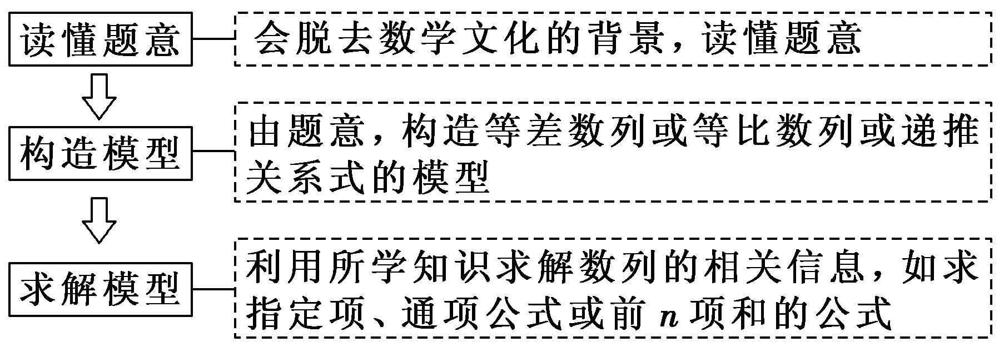
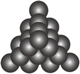
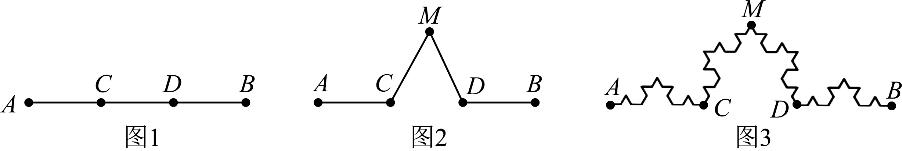
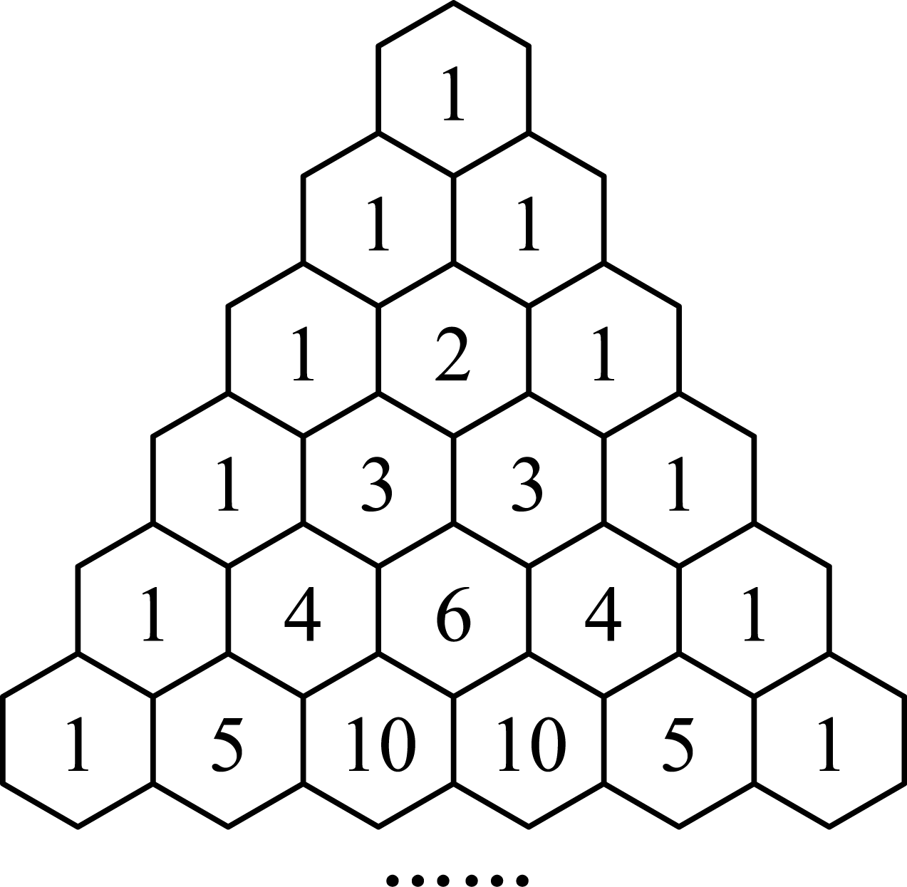
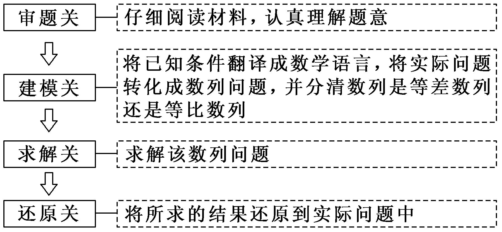
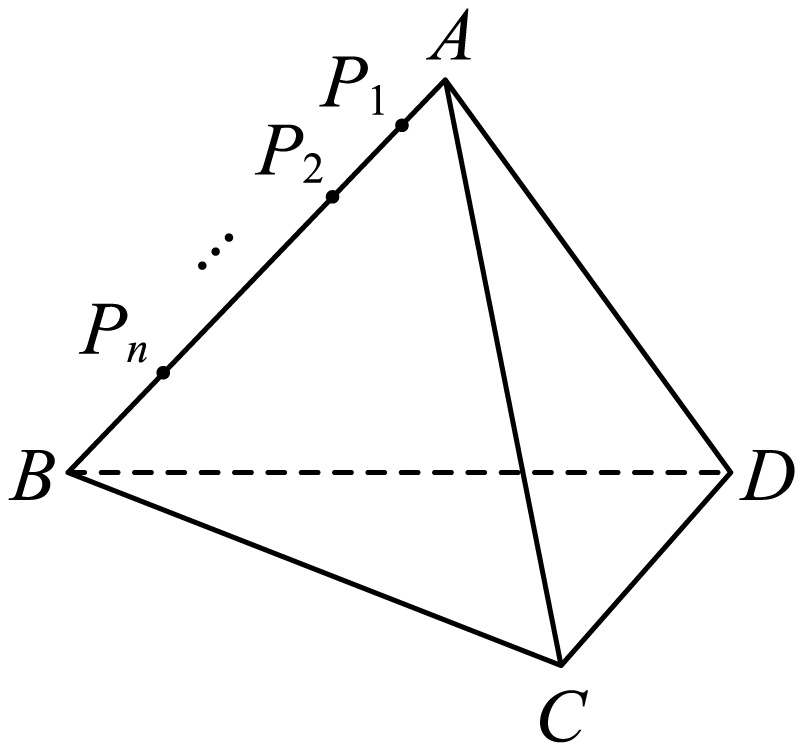

**第45讲  数列的综合应用**

**知识梳理**

1、解决数列与数学文化相交汇问题的关键

2、新定义问题的解题思路

遇到新定义问题，应耐心读题，分析新定义的特点，弄清新定义的性质，按新定义的要求，“照章办事”，逐条分析、运算、验证，使问题得以解决．

3、数列与函数综合问题的主要类型及求解策略

①已知函数条件，解决数列问题，此类问题一般利用函数的性质、图象研究数列问题．

②已知数列条件，解决函数问题，解决此类问题一般要利用数列的通项公式、前*n*项和公式、求和方法等对式子化简变形．

注意数列与函数的不同，数列只能看作是自变量为正整数的一类函数，在解决问题时要注意这一特殊性．

4、数列与不等式综合问题的求解策略

解决数列与不等式的综合问题时，若是证明题，则要灵活选择不等式的证明方法，如比较法、综合法、分析法、放缩法等；若是含参数的不等式恒成立问题，则可分离参数，转化为研究最值问题来解决．

利用等价转化思想将其转化为最值问题.

恒成立；

恒成立.

5、现实生活中涉及银行利率、企业股金、产品利润、人口增长、产品产量等问题，常常考虑用数列的知识去解决．

（1）数列实际应用中的常见模型

①等差模型：如果增加(或减少)的量是一个固定的数，则该模型是等差模型，这个固定的数就是公差；

②等比模型：如果后一个量与前一个量的比是一个固定的数，则该模型是等比模型，这个固定的数就是公比；

③递推数列模型：如果题目中给出的前后两项之间的关系不固定，随项的变化而变化，则应考虑是第项与第项的递推关系还是前项和与前项和之间的递推关系．

在实际问题中建立数列模型时，一般有两种途径：一是从特例入手，归纳猜想，再推广到一般结论；二是从一般入手，找到递推关系，再进行求解．一般地，涉及递增率或递减率要用等比数列，涉及依次增加或减少要用等差数列，有的问题需通过转化得到等差或等比数列，在解决问题时要往这些方面联系．

（2）解决数列实际应用题的3个关键点

①根据题意，正确确定数列模型；

②利用数列知识准确求解模型；

③问题作答，不要忽视问题的实际意义．

6、在证明不等式时，有时把不等式的一边适当放大或缩小，利用不等式的传递性来证明，我们称这种方法为放缩法.

放缩时常采用的方法有：舍去一些正项或负项、在和或积中放大或缩小某些项、扩大（或缩小）分式的分子（或分母）.

放缩法证不等式的理论依据是：；.

放缩法是一种重要的证题技巧，要想用好它，必须有目标，目标可从要证的结论中去查找.

**必考题型全归纳**

**题型一：数列在数学文化与实际问题中的应用**

**例1．**（2024·河南·河南省内乡县高级中学校考模拟预测）“角谷猜想”首先流传于美国，不久便传到欧洲，后来一位名叫角谷静夫的日本人又把它带到亚洲，因而人们就顺势把它叫作“角谷猜想”.“角谷猜想”是指一个正整数，如果是奇数就乘以3再加1，如果是偶数就除以2，这样经过若干次运算，最终回到1.对任意正整数，按照上述规则实施第次运算的结果为，若，且均不为1，则（    ）

A．5或16	B．5或32

C．5或16或4	D．5或32或4

<strong>例2．</strong>（2024·河南郑州·统考模拟预测）北宋大科学家沈括在《梦溪笔谈》中首创的“隙积术”，就是关于高阶等差数列求和的问题．现有一货物堆，从上向下查，第一层有1个货物，第二层比第一层多2个，第三层比第二层多3个，以此类推，记第<em>n</em>层货物的个数为，则使得成立的<em>n</em>的最小值是（    ）

A．3	B．4	C．5	D．6

**例3．**（2024·四川成都·石室中学校考模拟预测）南宋数学家杨辉所著的《详解九章算法》中有如下俯视图所示的几何体，后人称之为“三角垛”．其最上层有1个球，第二层有3个球，第三层有6个球，第四层10个…，则第三十六层球的个数为（    ）

A．561	B．595	C．630	D．666

**变式1．**（2024·全国·高三专题练习）科赫曲线因形似雪花，又被称为雪花曲线.其构成方式如下：如图1将线段等分为线段，如图2.以为底向外作等边三角形，并去掉线段，将以上的操作称为第一次操作；继续在图2的各条线段上重复上述操作，当进行三次操作后形成如图3的曲线.设线段的长度为1，则图3中曲线的长度为（    ）

A．2	B．	C．	D．3

<strong>变式2．</strong>（2024·全国·高三专题练习）我国南宋数学家杨辉1261年所著的《详解九章算法》一书里出现了如图所示的表，即杨辉三角，这是数学史上的一个伟大成就在“杨辉三角”中，第<em>n</em>行的所有数字之和为，若去除所有为1的项，依次构成数列2，3，3，4，6，4，5，10，10，5，...，则此数列的前34项和为（    ）

A．959	B．964	C．1003	D．1004

**变式3．**（2024·全国·高三专题练习）南宋数学家杨辉在《详解九章算术》中提出了高阶等差数列的问题，即一个数列本身不是等差数列，但从数列中的第二项开始，每一项与前一项的差构成等差数列（则称数列为一阶等差数列），或者仍旧不是等差数列，但从数列中的第二项开始，每一项与前一项的差构成等差数列（则称数列为二阶等差数列），依次类推，可以得到高阶等差数列．类比高阶等差数列的定义，我们亦可定义高阶等比数列，设数列1，1，2，8，64…是一阶等比数列，则该数列的第8项是（    ）．

A．	B．	C．	D．

**【解题方法总结】**

（1）解决数列与数学文化相交汇问题的关键

（2）解答数列应用题需过好“四关”

**题型二：数列中的新定义问题**

**例4．**（2024·江西·江西师大附中校考三模）已知数列的通项，如果把数列的奇数项都去掉，余下的项依次排列构成新数列为，再把数列的奇数项又去掉，余下的项依次排列构成新数列为，如此继续下去，……，那么得到的数列（含原已知数列）的第一项按先后顺序排列，构成的数列记为，则数列前10项的和为（    ）

A．1013	B．1023	C．2036	D．2050

**例5．**（2024·人大附中校考三模）已知数列满足：对任意的，总存在，使得，则称为“回旋数列”．以下结论中正确的个数是（    ）

①若，则为“回旋数列”；

②设为等比数列，且公比*q*为有理数，则为“回旋数列”；

③设为等差数列，当，时，若为“回旋数列”，则；

④若为“回旋数列”，则对任意，总存在，使得．

A．1	B．2	C．3	D．4

**例6．**（2024·湖北武汉·统考三模）将按照某种顺序排成一列得到数列，对任意，如果，那么称数对构成数列的一个逆序对.若，则恰有2个逆序对的数列的个数为（    ）

A．4	B．5	C．6	D．7

**变式4．**（2024·全国·高三专题练习）记数列的前项和为，若存在实数，使得对任意的，都有，则称数列为“和有界数列”． 下列命题正确的是（    ）

A．若是等差数列，且首项，则是“和有界数列”

B．若是等差数列，且公差，则是“和有界数列”

C．若是等比数列，且公比，则是“和有界数列”

D．若是等比数列，且是“和有界数列”，则的公比

<strong>变式5．</strong>（2024·全国·高三专题练习）斐波那契数列又称黄金分割数列，因数学家列昂纳多•斐波那契以兔子繁殖为例子而引入，故又称为“兔子数列”.斐波那契数列用递推的方式可如下定义：用表示斐波那契数列的第<em>n</em>项，则数列满足： . ，记，则下列结论不正确的是（    ）

A．	B．

C．	D．

**变式6．**（2024·河北·统考模拟预测）数学家杨辉在其专著《详解九章算术法》和《算法通变本末》中，提出了一些新的高阶等差数列．其中二阶等差数列是一个常见的高阶等差数列、如数列2，4，7，11，16，从第二项起，每一项与前一项的差组成新数列2，3，4，5，新数列2，3，4，5为等差数列，则称数列2，4，7，11，16为二阶等差数列，现有二阶等差数列，其前七项分别为2，2，3，5，8，12，17．则该数列的第20项为（    ）

A．173	B．171	C．155	D．151

**【解题方法总结】**

（1）新定义数列问题的特点

通过给出一个新的数列的概念，或约定一种新运算，或给出几个新模型来创设全新的问题情景，要求考生在阅读理解的基础上，依据题目提供的信息，联系所学的知识和方法，实现信息的迁移，达到灵活解题的目的．

（2）新定义问题的解题思路

遇到新定义问题，应耐心读题，分析新定义的特点，弄清新定义的性质，按新定义的要求，“照章办事”，逐条分析、运算、验证，使问题得以解决．

**题型三：数列与函数、不等式的综合问题**

<strong>例7．</strong>（2024·重庆巴南·统考一模）已知等比数列满足：，.数列满足，其前项和为，若恒成立，则的最小值为______.

<strong>例8．</strong>（2024·四川泸州·四川省泸县第四中学校考模拟预测）设数列的前项和为，且，若恒成立，则的最大值是___________.

<strong>例9．</strong>（2024·河南新乡·统考三模）已知数列满足，，则的最小值为__________．

<strong>变式7．</strong>（2024·上海杨浦·高三复旦附中校考阶段练习）已知数列满足，且对于任意的正整数<em>n</em>，都有．若正整数<em>k</em>使得对任意的正整数成立，则整数<em>k</em>的最小值为___________．

**【解题方法总结】**

（1）数列与函数综合问题的主要类型及求解策略

①已知函数条件，解决数列问题，此类问题一般利用函数的性质、图象研究数列问题．

②已知数列条件，解决函数问题，解决此类问题一般要利用数列的通项公式、前*n*项和公式、求和方法等对式子化简变形．

注意数列与函数的不同，数列只能看作是自变量为正整数的一类函数，在解决问题时要注意这一特殊性．

（2）数列与不等式综合问题的求解策略

解决数列与不等式的综合问题时，若是证明题，则要灵活选择不等式的证明方法，如比较法、综合法、分析法、放缩法等；若是含参数的不等式恒成立问题，则可分离参数，转化为研究最值问题来解决．

利用等价转化思想将其转化为最值问题.

恒成立；

恒成立.

**题型四：数列在实际问题中的应用**

<strong>例10．</strong>（2024·全国·高三专题练习）根据市场调查结果，预测某种家用商品从年初开始的<em>n</em>个月内累积的需求量（万件）近似地满足关系式，按此预测，在本年度内，需求量超过1.5万件的月份是______.

<strong>例11．</strong>（2024·高三课时练习）某研究所计划改建十个实验室，每个实验室的改建费用分为装修费和设备费，且每个实验室的装修费都一样，设备费从第一到第十实验室依次构成等比数列.已知第五实验室比第二实验室的改建费用高42万元，第七实验室比第四实验室的改建费用高168万元，并要求每个实验室改建费用不能超过1700万元，则该研究所改建这十个实验室投入的总费用最多需要______万元.

<strong>例12．</strong>（2024·全国·高三专题练习）冰墩墩作为北京冬奥会的吉祥物特别受欢迎，官方旗舰店售卖冰墩墩运动造型多功能徽章，若每天售出件数成递增的等差数列，其中第1天售出10000件，第21天售出15000件；价格每天成递减的等差数列，第1天每件100元，第21天每件60元，则该店第__________天收入达到最高.

<strong>变式8．</strong>（2024·全国·高三专题练习）沈阳京东MALL于2022年国庆节盛大开业，商场为了满足广大数码狂热爱好者的需求，开展商品分期付款活动.现计划某商品一次性付款的金额为 <em>a</em> 元，以分期付款的形式等额分成 <em>n</em> 次付清，每期期末所付款是 <em>x</em> 元，每期利率为 <em>r</em> ，则爱好者每期需要付款______．

<strong>变式9．</strong>（2024·辽宁锦州·渤海大学附属高级中学校考模拟预测）一件家用电器，现价2000元，实行分期付款，一年后还清，购买后一个月第一次付款，以后每月付款一次，每次付款数相同，共付12次，月利率为0.8%，并按复利计息，那么每期应付款______元．（参考数据：，，，）

<strong>变式10．</strong>（2024·全国·高三专题练习）在第七十五届联合国大会一般性辩论上，习近平主席表示，中国将提高国家自主贡献力度，采取更加有力的政策和措施，二氧化碳排放力争于2030年前达到峰值，努力争取2060年前实现碳中和．某地2020年共发放汽车牌照12万张，其中燃油型汽车牌照10万张，电动型汽车2万张，从2021年起，每年发放的电动型汽车牌照按前一年的50%增长，燃油型汽车牌照比前一年减少0.5万张，同时规定，若某年发放的汽车牌照超过15万张，以后每年发放的电动车牌照的数量维持在这一年的水平不变.那么从2021年至2030年这十年累计发放的汽车牌照数为___________万张．

**【解题方法总结】**

现实生活中涉及银行利率、企业股金、产品利润、人口增长、产品产量等问题，常常考虑用数列的知识去解决．

（1）数列实际应用中的常见模型

①等差模型：如果增加(或减少)的量是一个固定的数，则该模型是等差模型，这个固定的数就是公差；

②等比模型：如果后一个量与前一个量的比是一个固定的数，则该模型是等比模型，这个固定的数就是公比；

③递推数列模型：如果题目中给出的前后两项之间的关系不固定，随项的变化而变化，则应考虑是第项与第项的递推关系还是前项和与前项和之间的递推关系．

在实际问题中建立数列模型时，一般有两种途径：一是从特例入手，归纳猜想，再推广到一般结论；二是从一般入手，找到递推关系，再进行求解．一般地，涉及递增率或递减率要用等比数列，涉及依次增加或减少要用等差数列，有的问题需通过转化得到等差或等比数列，在解决问题时要往这些方面联系．

（2）解决数列实际应用题的3个关键点

①根据题意，正确确定数列模型；

②利用数列知识准确求解模型；

③问题作答，不要忽视问题的实际意义．

**题型五：数列不等式的证明**

**例13．**（2024·河北张家口·统考三模）已知数列满足.

(1)求数列的通项公式；

(2)记数列的前项和为，证明：.

**例14．**（2024·全国·高三专题练习）证明不等式．

<strong>例15．</strong>（2024·全国·高三专题练习）已知，，的前<em>n</em>项和为，证明：．

**变式11．**（2024·全国·高三专题练习）已知每一项都是正数的数列满足，．

(1)证明：．

(2)证明：．

(3)记为数列的前*n*项和，证明∶．

**变式12．**（2024·全国·高三专题练习）证明：．（注：．）

**变式13．**（2024·全国·高三专题练习）已知数列，为数列的前项和，且满足，．

(1)求的通项公式；

(2)证明：．

**变式14．**（2024·全国·高三专题练习）已知各项为正的数列满足，，．证明：

(1)；

(2)．

**变式15．**（2024·全国·高三专题练习）设数列满足，．

(1)若，求实数*a*的值；

(2)设，若，证明：．

**变式16．**（2024·全国·高三专题练习）已知函数满足，，．

(1)证明：．

(2)设是数列的前*n*项和，证明：．

**【解题方法总结】**

**（1）构造辅助函数（数列）证明不等式**

**（2）放缩法证明不等式**

在证明不等式时，有时把不等式的一边适当放大或缩小，利用不等式的传递性来证明，我们称这种方法为放缩法.

放缩时常采用的方法有：舍去一些正项或负项、在和或积中放大或缩小某些项、扩大（或缩小）分式的分子（或分母）.

放缩法证不等式的理论依据是：；.

放缩法是一种重要的证题技巧，要想用好它，必须有目标，目标可从要证的结论中去查找.

**方法1：** 对进行放缩，然后求和.

当既不关于单调，也不可直接求和，右边又是常数时，就应考虑对进行放缩，使目标变成可求和的情形，通常变为可裂项相消或压缩等比的数列.证明时要注意对照求证的结论，调整与控制放缩的度.

**方法2：添舍放缩**

**方法3：** 对于一边是和或者积的数列不等式，可以把另外一边的含 $n$ 的式子看作是一个数列的前 $n$ 项的和或者积，求出该数列通项后再左、右两边一对一地比较大小，这种思路非常有效，还可以分析出放缩法证明的操作方法，易于掌握.需要指出的是，如果另外一边不是含有 $n$ 的式子，而是常数，则需要寻找目标不等式的加强不等式，再予以证明.

**方法4：单调放缩**

**题型六：公共项问题**

<strong>例16．</strong>（2024·上海嘉定·上海市嘉定区第一中学校考三模）已知，，将数列与数列的公共项从小到大排列得到新数列，则______.

<strong>例17．</strong>（2024·湖南邵阳·邵阳市第二中学校考模拟预测）数列和数列的公共项从小到大构成一个新数列，数列满足：，则数列的最大项等于______.

<strong>例18．</strong>（2024·全国·高三专题练习）已知，将数列与数列的公共项从小到大排列得到新数列，则__________.

<strong>变式17．</strong>（2024·重庆沙坪坝·高三重庆八中校考阶段练习）将数列与的公共项由小到大排列得到数列，则数列的前<em>n</em>项的和为__________．

<strong>变式18．</strong>（2024·全国·高三专题练习）数列与的所有公共项由小到大构成一个新的数列，则____.

<strong>变式19．</strong>（2024·安徽蚌埠·统考一模）有两个等差数列及由这两个等差数列的公共项按从小到大的顺序组成一个新数列，则这个新数列的各项之和为________________ .

**题型七：插项问题**

<strong>例19．</strong>（2024·全国·高三对口高考）在数1和100之间插入<em>n</em>个实数，使得这个数构成递增的等比数列，将这个数的乘积记作，再令.则数列的通项公式为__________.

<strong>例20．</strong>（2024·湖北襄阳·襄阳四中校考模拟预测）已知等差数列中，，若在数列每相邻两项之间插入三个数，使得新数列也是一个等差数列，则新数列的第43项为__________.

**例21．**（2024·福建福州·福建省福州第一中学校考模拟预测）已知数列的首项，，.

(1)设，求数列的通项公式；

(2)在与（其中）之间插入个3，使它们和原数列的项构成一个新的数列.记为数列的前*n*项和，求.

**变式20．**（2024·广东佛山·统考模拟预测）已知数列满足.

(1)求的通项公式；

(2)在相邻两项中间插入这两项的等差中项，求所得新数列的前2*n*项和.

**变式21．**（2024·吉林通化·梅河口市第五中学校考模拟预测）为数列的前项和，已知，且.

(1)求数列的通项公式；

(2)数列依次为：，规律是在和中间插入项，所有插入的项构成以3为首项，3为公比的等比数列，求数列的前100项的和.

**变式22．**（2024·全国·高三专题练习）设等比数列的首项为，公比为（为正整数），且满足是与的等差中项；数列满足（，）.

(1)求数列的通项公式；

(2)试确定的值，使得数列为等差数列；

(3)当为等差数列时，对每个正整数，在与之间插入个2，得到一个新数列.设是数列的前项和，试求.

**变式23．**（2024·安徽滁州·校考模拟预测）已知等比数列的前项和为，且

(1)求数列的通项公式；

(2)在与之间插入个数，使这个数组成一个公差为的等差数列，求数列的前项和．

**题型八：蛛网图问题**

<strong>例22．</strong>（2024·全国·高三专题练习）已知数列若（且），若对任意恒成立，则实数<em>t</em>的取值范围是_________.

**例23．**（2024•虹口区校级期中）已知数列满足：，，前项和为，则下列选项错误的是　　（参考数据：，

*A*．是单调递增数列，是单调递减数列

*B*．

*C*．

*D*．

**例24．**（2024•浙江模拟）数列满足，，，表示数列前项和，则下列选项中错误的是

*A*．若，则

*B*．若，则递减

*C*．若，则

*D*．若，则

**变式24．**（2024•浙江模拟）已知数列满足：，，前项和为（参考数据：，，则下列选项中错误的是

*A*．是单调递增数列，是单调递减数列

*B*．

*C*．

*D*．

**变式25．**（2024•下城区校级模拟）已知数列满足：，且，下列说法正确的是

*A*．若，则	*B*．若，则

*C*．	*D*．

**题型九：整数的存在性问题（不定方程）**

<strong>例25．</strong>（2024·全国·高三专题练习）已知数列的前<em>n</em>项和是，且．

(1)证明：为等比数列；

(2)证明：

(3)为数列的前*n*项和，设，是否存在正整数*m*，*k*，使成立，若存在，求出*m*，*k*；若不存在，说明理由．

**例26．**（2024·全国·高三专题练习）设是各项为正数且公差为的等差数列

(1)证明：依次成等比数列；

(2)是否存在，使得依次成等比数列，并说明理由；

(3)是否存在及正整数，使得依次成等比数列，并说明理由．

**例27．**（2024·河北石家庄·高三石家庄二中校考阶段练习）数列的前项和为且当时，成等差数列.

(1)求数列的通项公式；

(2)在和之间插入个数，使这个数组成一个公差为的等差数列，在数列中是否存在3项（其中成等差数列）成等比数列？若存在，求出这样的3项；若不存在，请说明理由.

**变式26．**（2024·全国·高三专题练习）已知数列的前项和为，对任意的正整数，点均在函数图象上.

(1)证明：数列是等比数列；

(2)问中是否存在不同的三项能构成等差数列？说明理由.

<strong>变式27．</strong>（2024·全国·高三专题练习）已知数列的前<em>n</em>项和为，且，．

(1)求通项公式；

(2)设，在数列中是否存在三项（其中）成等比数列？若存在，求出这三项；若不存在，说明理由．

<strong>变式28．</strong>（2024·全国·高三专题练习）在①，，②，为的前<em>n</em>项和，这两个条件中任选一个，补充在下面问题中，并解答下列问题．

已知数列满足\_\_\_\_\_\_．

(1)求数列的通项公式；

(2)对大于1的正整数*n*，是否存在正整数*m*，使得，，成等比数列？若存在，求*m*的最小值；若不存在，请说明理由．

注：如果选择多个条件分别解答，按第一个解答计分．

**变式29．**（2024·安徽六安·六安一中校考模拟预测）设正项等比数列的前项和为，若，．

(1)求数列的通项公式；

(2)在数列中是否存在不同的三项构成等差数列？请说明理由．

**题型十：数列与函数的交汇问题**

**例73．**（2022•龙泉驿区校级一模）已知定义在上的函数是奇函数且满足，，数列是等差数列，若，，则

A．	B．	C．2	D．3

**例74．**（2022•日照模拟）已知数列的通项公式，则

A．150	B．162	C．180	D．210

**例76．**（2022秋•仁寿县月考）设等差数列的前项和为，已知，，则下列结论中正确的是

A．，	B．，

C．，	D．，

**题型十一：数列与导数的交汇问题**

**例79．**（2022•全国模拟）函数，曲线在点，（1）处的切线在轴上的截距为．

（1）求；

（2）讨论的单调性；

（3）设，，证明：．

**例80．**（2022•枣庄期末）已知函数，，曲线在点，（1）处的切线在轴上的截距为．

（1）求；

（2）讨论函数和的单调性；

（3）设，，求证：．

**题型十二：数列与概率的交汇问题**

**例28．**（2024·湖南长沙·长沙市明德中学校考三模）甲、乙两选手进行一场体育竞技比赛，采用局胜制的比赛规则，即先赢下局比赛者最终获胜. 已知每局比赛甲获胜的概率为，乙获胜的概率为，比赛结束时，甲最终获胜的概率为.

(1)若，结束比赛时，比赛的局数为，求的分布列与数学期望；

(2)若采用5局3胜制比采用3局2胜制对甲更有利，即.

(i)求的取值范围；

(ii)证明数列单调递增，并根据你的理解说明该结论的实际含义.

**例29．**（2024·全国·高三专题练习）马尔可夫链是因俄国数学家安德烈·马尔可夫得名，其过程具备“无记忆”的性质，即第次状态的概率分布只跟第次的状态有关，与第次状态是“没有任何关系的”.现有甲、乙两个盒子，盒子中都有大小、形状、质地相同的2个红球和1个黑球.从两个盒子中各任取一个球交换，重复进行次操作后，记甲盒子中黑球个数为，甲盒中恰有1个黑球的概率为，恰有2个黑球的概率为.

(1)求的分布列；

(2)求数列的通项公式；

(3)求的期望.

**例30．**（2024·全国·高三专题练习）雅礼中学是三湘名校，学校每年一届的社团节是雅礼很有特色的学生活动，几十个社团在一个月内先后开展丰富多彩的社团活动，充分体现了雅礼中学为学生终身发展奠基的育人理念.2022年雅礼文学社举办了诗词大会，在选拔赛阶段，共设两轮比赛.第一轮是诗词接龙，第二轮是飞花令.第一轮给每位选手提供5个诗词接龙的题目，选手从中抽取2个题目，主持人说出诗词的上句，若选手正确回答出下句可得10分，若不能正确回答出下可得0分.

(1)已知某位选手会5个诗词接龙题目中的3个，求该选手在第一轮得分的数学期望；

(2)已知恰有甲､乙､丙､丁四个团队参加飞花令环节的比赛，每一次由四个团队中的一个回答问题，无论答题对错，该团队回答后由其他团队抢答下一问题，且其他团体有相同的机会抢答下一问题.记第次回答的是甲的概率是，若.

①求和；

②证明：数列为等比数列，并比较第7次回答的是甲和第8次回答的是甲的可能性的大小.

**变式30．**（2024·山西朔州·高三怀仁市第一中学校校考阶段练习）一对夫妻计划进行为期60天的自驾游．已知两人均能驾驶车辆,且约定:①在任意一天的旅途中,全天只由其中一人驾车,另一人休息;②若前一天由丈夫驾车,则下一天继续由丈夫驾车的概率为,由妻子驾车的概率为;③妻子不能连续两天驾车．已知第一天夫妻双方驾车的概率均为．

(1)在刚开始的三天中,妻子驾车天数的概率分布列和数学期望;

(2)设在第*n*天时,由丈夫驾车的概率为,求数列的通项公式．

**变式31．**（2024·全国·高三专题练习）某中学举办了诗词大会选拔赛，共有两轮比赛，第一轮是诗词接龙，第二轮是飞花令．第一轮给每位选手提供5个诗词接龙的题目，选手从中抽取2个题目，主持人说出诗词的上句，若选手在10秒内正确回答出下句可得10分，若不能在10秒内正确回答出下句得0分．

(1)已知某位选手会5个诗词接龙题目中的3个，求该选手在第一轮得分的数学期望；

(2)已知恰有甲、乙、丙、丁四个团队参加飞花令环节的比赛，每一次由四个团队中的一个回答问题，无论答题对错，该团队回答后由其他团队抢答下一问题，且其他团队有相同的机会抢答下一问题．记第*n*次回答的是甲的概率为，若．

①求<em>P2</em>，<em>P3</em>；

②证明：数列为等比数列，并比较第7次回答的是甲和第8次回答的是甲的可能性的大小．

<strong>变式32．</strong>（2024·江苏南通·江苏省如皋中学校考模拟预测）某校为减轻暑假家长的负担，开展暑期托管，每天下午开设一节投篮趣味比赛．比赛规则如下：在<em>A</em>，<em>B</em>两个不同的地点投篮．先在<em>A</em>处投篮一次，投中得2分，没投中得0分；再在<em>B</em>处投篮两次，如果连续两次投中得3分，仅投中一次得1分，两次均没有投中得0分．小明同学准备参赛，他目前的水平是在<em>A</em>处投篮投中的概率为<em>p</em>，在<em>B</em>处投篮投中的概率为．假设小明同学每次投篮的结果相互独立．

(1)若小明同学完成一次比赛，恰好投中2次的概率为，求*p*；

(2)若，记小明同学一次比赛结束时的得分为*X*，求*X*的分布列及数列期望．

**变式33．**（2024·全国·高三专题练习）现有甲、乙、丙三个人相互传接球，第一次从甲开始传球，甲随机地把球传给乙、丙中的一人，接球后视为完成第一次传接球；接球者进行第二次传球，随机地传给另外两人中的一人，接球后视为完成第二次传接球；依次类推，假设传接球无失误．

(1)设乙接到球的次数为，通过三次传球，求的分布列与期望；

(2)设第次传球后，甲接到球的概率为，

（i）试证明数列为等比数列；

（ii）解释随着传球次数的增多，甲接到球的概率趋近于一个常数．

**题型十三：数列与几何的交汇问题**

**例31．（多选题）**（2024·全国·高三专题练习）已知正四面体中，，，，…，在线段上，且，过点作平行于直线，的平面，截面面积为，则下列说法正确的是（    ）

A．

B．为递减数列

C．存在常数，使为等差数列

D．设为数列的前项和，则时，

**例32．（多选题）**（2024·全国·高三专题练习）已知三棱锥的棱长均为，其内有个小球，球与三棱锥的四个面都相切，球与三棱锥的三个面和球都相切，如此类推，…，球与三棱锥的三个面和球都相切（，且），球的表面积为，体积为，则（    ）

A．	B．

C．数列为等差数列	D．数列为等比数列

**例33．（多选题）**（2024·全国·高三专题练习）已知数列是等差数列，，，，是互不相同的正整数，且，若在平面直角坐标系中有点，，，，则下列选项成立的有（    ）

A．	B．

C．直线与直线的斜率相等	D．直线与直线的斜率不相等

<strong>变式34．（多选题）</strong>（2024·重庆·高三统考阶段练习）在平面直角坐标系<em>xOy</em>中，<em>A</em>为坐标原点，，点列<em>P</em>在圆上，若对于，存在数列，，使得，则下列说法正确的是（    ）

A．为公差为2的等差数列	B．为公比为2的等比数列

C．	D．前*n*项和

**变式35．（多选题）**（2024·广东·高三校联考阶段练习）若直线与圆相切，则下列说法正确的是（    ）

A．	B．数列为等比数列

C．数列的前10项和为23	D．圆不可能经过坐标原点

<strong>变式36．（多选题）</strong>（2024·全国·高三专题练习）在平面直角坐标系中，<em>O</em>是坐标原点，是圆上两个不同的动点，是的中点，且满足．设到直线的距离之和的最大值为，则下列说法中正确的是（    ）

A．向量与向量所成角为

B．

C．

D．若，则数列的前*n*项和为

