**第46讲  空间几何体的结构特征、表面积**

**与体积**

**知识梳理**

**知识点一：构成空间几何体的基本元素—点、线、面**

（1）空间中，点动成线，线动成面，面动成体．

（2）空间中，不重合的两点确定一条直线，不共线的三点确定一个平面，不共面的四点确定一个空间图形或几何体（空间四边形、四面体或三棱锥）．

**知识点二：简单凸多面体—棱柱、棱锥、棱台**

1**、棱柱：** 两个面互相平面，其余各面都是四边形，并且每相邻两个四边形的公共边都互相平行，由这些面所围成的多面体叫做棱柱．

（1）斜棱柱：侧棱不垂直于底面的棱柱；

（2）直棱柱：侧棱垂直于底面的棱柱；

（3）正棱柱：底面是正多边形的直棱柱；

（4）平行六面体：底面是平行四边形的棱柱；

（5）直平行六面体：侧棱垂直于底面的平行六面体；

（6）长方体：底面是矩形的直平行六面体；

（7）正方体：棱长都相等的长方体．

2**、棱锥：** 有一个面是多边形，其余各面是有一个公共顶点的三角形，由这些面所围成的多面体叫做棱锥．

（1）正棱锥：底面是正多边形，且顶点在底面的射影是底面的中心；

（2）正四面体：所有棱长都相等的三棱锥．

3**、棱台：** 用一个平行于棱锥底面的平面去截棱锥，底面和截面之间的部分叫做棱台，由正棱锥截得的棱台叫做正棱台．

简单凸多面体的分类及其之间的关系如图所示．

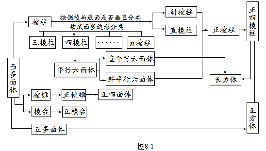

**知识点三：简单旋转体—圆柱、圆锥、圆台、球**

1**、圆柱：** 以矩形的一边所在的直线为旋转轴，其余三边旋转形成的面所围成的几何体叫做圆柱．

2**、圆柱：** 以直角三角形的一条直角边所在的直线为旋转轴，将其旋转一周形成的面所围成的几何体叫做圆锥．

3**、圆台：** 用平行于圆锥底面的平面去截圆锥，底面和截面之间的部分叫做圆台．

4**、球：** 以半圆的直径所在的直线为旋转轴，半圆面旋转一周形成的旋转体叫做球体，简称为球（球面距离：经过两点的大圆在这两点间的劣弧长度）．

**知识点四：组合体**

由柱体、锥体、台体、球等几何体组成的复杂的几何体叫做组合体．

**知识点五：表面积与体积计算公式**

**表面积公式**

<table><tr><td>
表面积
</td><td>
柱体
</td><td>

为直截面周长

</td><td>
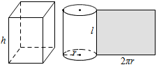
</td></tr><tr><td></td><td>
锥体
</td><td>

</td><td>
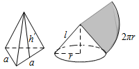
</td></tr><tr><td></td><td>
台体
</td><td>

</td><td>
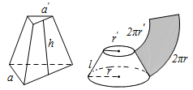
</td></tr><tr><td></td><td>
球
</td><td>

</td><td>
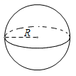
</td></tr></table>

**体积公式**

<table><tr><td rowspan="4">
体积
</td><td>
柱体
</td><td>

</td><td>
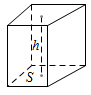
</td></tr><tr><td>
锥体
</td><td>

</td><td>

</td></tr><tr><td>
台体
</td><td>

</td><td>
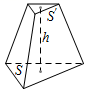
</td></tr><tr><td>
球
</td><td>

</td><td>

</td></tr></table>

**知识点六：空间几何体的直观图**

1**、斜二测画法**

斜二测画法的主要步骤如下：

（1）建立直角坐标系．在已知水平放置的平面图形中取互相垂直的，，建立直角坐标系．

（2）画出斜坐标系．在画直观图的纸上（平面上）画出对应图形．在已知图形平行于轴的线段，在直观图中画成平行于，，使（或），它们确定的平面表示水平平面．

（3）画出对应图形．在已知图形平行于轴的线段，在直观图中画成平行于轴的线段，且长度保持不变；在已知图形平行于轴的线段，在直观图中画成平行于轴，且长度变为原来的一般．可简化为“横不变，纵减半”．

（4）擦去辅助线．图画好后，要擦去轴、轴及为画图添加的辅助线（虚线）．被挡住的棱画虚线．

**注：** 直观图和平面图形的面积比为．

2**、平行投影与中心投影**

平行投影的投影线是互相平行的，中心投影的投影线相交于一点．

**必考题型全归纳**

**题型一：空间几何体的结构特征**

**例1．**（2024·安徽·高三校联考阶段练习）已知几何体，“有两个面平行，其余各面都是平行四边形”是“几何体为棱柱”的（    ）

A．充分不必要条件	B．必要不充分条件

C．充要条件	D．既不充分也不必要条件

【答案】B

【解析】由棱柱定义知棱柱有两个面平行，其余各面都是平行四边形，故满足必要性；

但有两个面平行，其余各面都是平行四边形的几何体不一定是棱柱，

例如两个底面全等的斜棱柱拼接的几何体不是棱柱，如图所示：

，

故不满足充分性，

故选：B

**例2．**（2024·全国·高三对口高考）设有三个命题；甲：底面是平行四边形的四棱柱是平行六面体；乙：底面是矩形的平行六面体是长方体；丙：直四棱柱是平行六面体．以上命题中真命题的个数为（    ）

A．0个	B．1个	C．2个	D．3个

【答案】B

【解析】由平行六面体的定义可得底面是平行四边形的四棱柱是平行六面体；命题甲正确；

底面是矩形的平行六面体的侧棱不一定垂直于底面，故该几何体不一定为长方体，

命题乙错误；

直四棱柱的底面不一定为平行四边形，故直四棱柱不一定是平行六面体，命题丙错误；

正确的命题只有一个.

故选：B

**例3．**（2024·全国·高三专题练习）下列命题：

①有两个面平行，其他各面都是平行四边形的几何体叫做棱柱；

②有两侧面与底面垂直的棱柱是直棱柱；

③过斜棱柱的侧棱作棱柱的截面，所得图形不可能是矩形；

④所有侧面都是全等的矩形的四棱柱一定是正四棱柱．

其中正确命题的个数为（    ）

A．0	B．1	C．2	D．3

【答案】A

【解析】①如图1，满足有两个面平行，其他各面都是平行四边形，

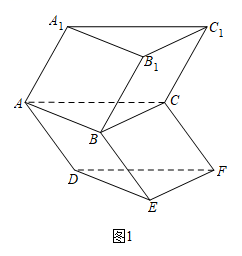

显然不是棱柱，故①错误；

②如图2，满足两侧面与底面垂直，但不是直棱柱，②错误；

③如图3，四边形为矩形，

即过斜棱柱的侧棱作棱柱的截面，所得图形可能是矩形，③错误；

④所有侧面都是全等的矩形的四棱柱不一定是正四棱柱，因为两底面不一定是正方形，④错误．

故选：A

**变式1．**（2024·新疆·统考模拟预测）下列命题中正确的是（    ）

A．有两个平面平行，其余各面都是平行四边形的几何体是棱柱.

B．各个面都是三角形的几何体是三棱锥.

C．夹在圆柱的两个平行截面间的几何体还是一个旋转体.

D．圆锥的顶点与底面圆周上任意一点的连线都是母线.

【答案】D

【解析】如图所示的几何体满足两个平面平行，其余各面都是平行四边形，但它不是棱柱，A错；

正八面体的各面都是三角形，不是三棱锥，B错；

如果两个平行截面与圆柱的底面平行，则是旋转体，如果这两个平行截面与圆柱的底面不平行，则不是旋转体．C错；

根据圆锥的定义，D正确．

故选：D．

**变式2．**（2024·全国·高三专题练习）下列说法正确的是（    ）

A．三角形的直观图是三角形	B．直四棱柱是长方体

C．平行六面体不是棱柱	D．两个平面平行，其余各面是梯形的多面体是棱台

【答案】A

【解析】对A，根据直观图的定义，三角形的直观图是三角形，故A对；

对B，底面是长方形的直四棱柱是长方体，故B错；

对C，平行六面体一定是棱柱，故C错；

两个平面平行，其余各面是梯形的多面体，当侧棱延长后不交于同一点时，不是棱台，故D错；

故选：A

**变式3．**（2024·全国·高三专题练习）给出下列命题：

①在圆柱的上、下底面的圆周上各取一点，则这两点的连线是圆柱的母线；

②直角三角形绕其任一边所在直线旋转一周所形成的几何体都是圆锥；

③棱台的上、下底面可以不相似，但侧棱长一定相等.

其中正确命题的个数是（    ）

A．	B．	C．	D．

【答案】A

【解析】①不一定，只有当这两点的连线平行于轴时才是母线；

②不一定，当以斜边所在直线为旋转轴时，其余两边旋转形成的面所围成的几何体不是圆锥，如图所示，它是由两个同底圆锥组成的几何体；

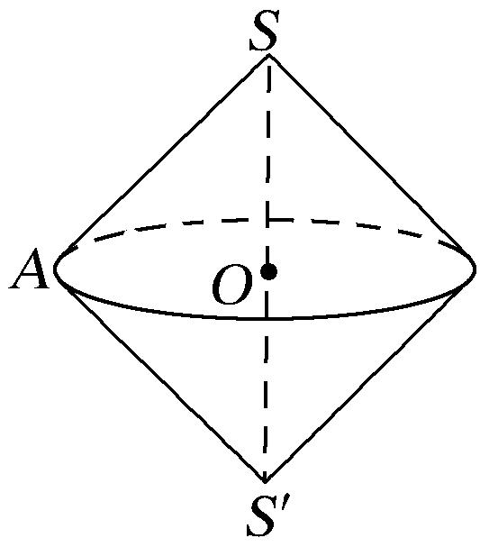

③错误，棱台的上、下底面相似且是对应边平行的多边形，各侧棱延长线交于一点，但是侧棱长不一定相等.

故选：A.

**变式4．**（2024·全国·高三专题练习）如图所示，观察四个几何体，其中判断正确的是（    ）

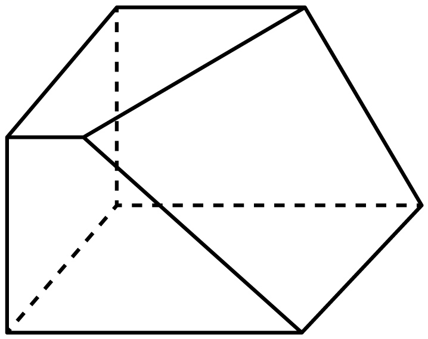

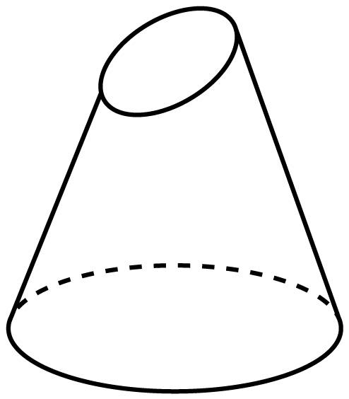

A．  是棱台	B．  是圆台

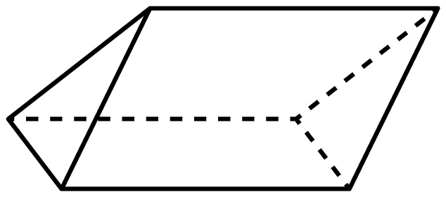

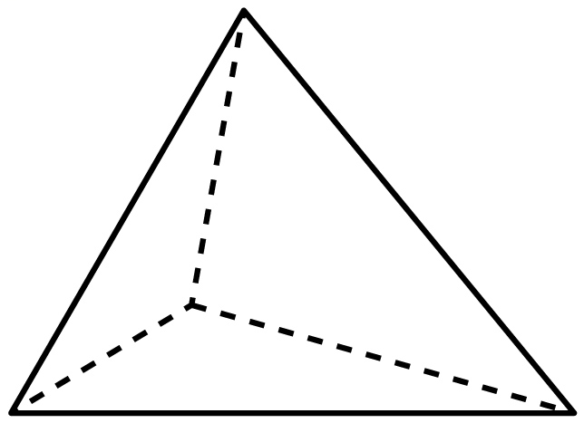

C．  不是棱柱	D．  是棱锥

【答案】D

【解析】对A，侧棱延长线不交于一点，不符合棱台的定义，所以A错误；

对B，上下两个面不平行，不符合圆台的定义，所以B错误；

对C，将几何体竖直起来看，符合棱柱的定义，所以C错误；

对D，符合棱锥的定义，正确．

故选：D．

**【解题方法总结】**

空间几何体结构特征的判断技巧

（1）紧扣结构特征是判断的关键，依据条件构建几何模型，在条件不变的情况下，变换模型中的线面关系或增加线、面等基本元素，然后再依据题意判定．

（2）说明一个命题是错误的，只要举出一个反例即可．

**题型二：空间几何体的表面积**

**例4．**（2024·湖北武汉·统考模拟预测）已知某圆锥的母线长、底面圆的直径都等于球的半径，则球与圆锥的表面积之比为（    ）

A．8	B．	C．	D．

【答案】B

【解析】设圆锥的母线长为，底面圆的半径为，球的半径为，则，即，，

球的表面积，圆锥的表面积，

则.

故选：B.

**例5．**（2024·河南郑州·统考模拟预测）在一个正六棱柱中挖去一个圆柱后，剩余部分几何体如图所示．已知正六棱柱的底面正六边形边长为3cm，高为4cm，内孔半径为1cm，则此几何体的表面积是（    ）．

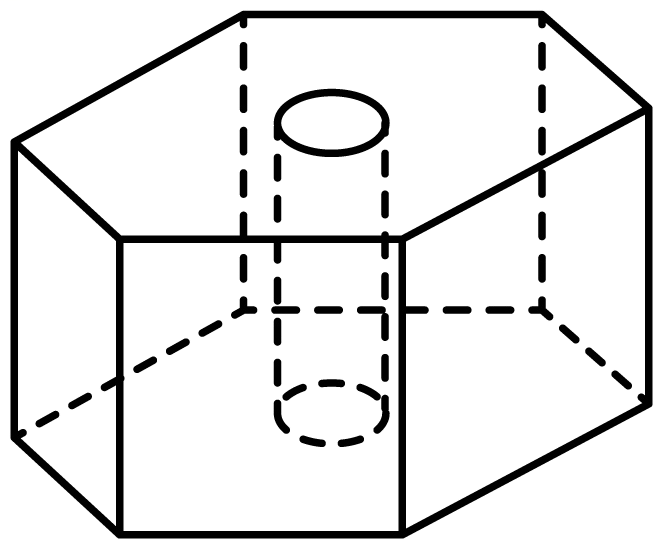

A．	B．

C．	D．

【答案】C

【解析】所求几何体的侧面积为，

上下底面面积为，

挖去圆柱的侧面积为，

则所求几何体的表面积为．

故选：C．

**例6．**（2024·安徽安庆·安庆一中校考三模）陀螺起源于我国，最早出土的石制陀螺是在山西夏县发现的新石器时代遗址.如图所示的是一个陀螺立体结构图.已知，底面圆的直径，圆柱体部分的高，圆锥体部分的高，则这个陀螺的表面积（单位：）是（    ）

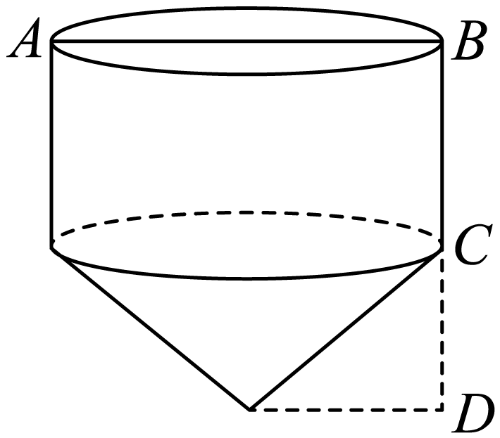

A．	B．

C．	D．

【答案】C

【解析】由题意可得圆锥体的母线长为，

所以圆锥体的侧面积为，

圆柱体的侧面积为，

圆柱的底面面积为，

所以此陀螺的表面积为，

故选：C.

**变式5．**（2024·西藏拉萨·统考一模）位于徐州园博园中心位置的国际馆（一云落雨），使用现代科技雾化“造云”，打造温室客厅，如图，这个国际馆中3个展馆的顶部均采用正四棱锥这种经典几何形式，表达了理性主义与浪漫主义的对立与统一.其中最大的是3号展馆，其顶部所对应的正四棱锥底面边长为19.2m，高为9m，则该正四棱锥的侧面面积与底面面积之比约为（    ）（参考数据：）

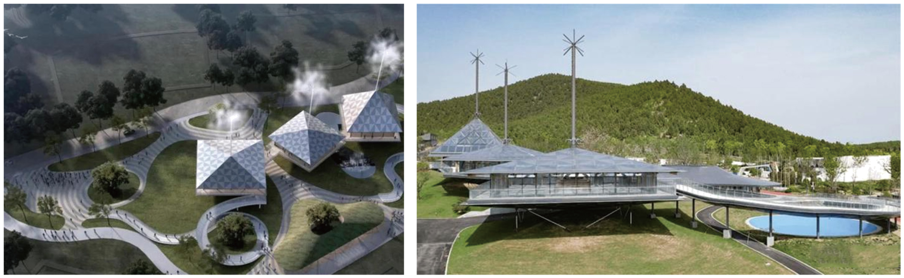

A．2	B．1.71	C．1.37	D．1

【答案】C

【解析】如图，设*H*为底面正方形*ABCD*的中心，*G*为*BC*的中点，连接*PH*，*HG*，*PG*，

则，，

所以，

则，

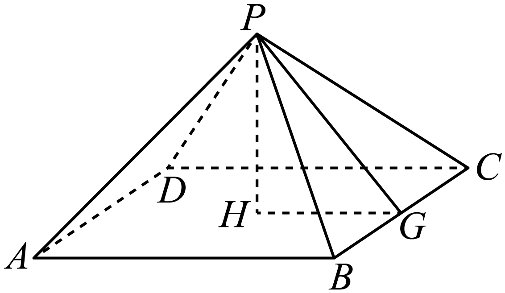

故选：C.

**变式6．**（2024·湖南长沙·高三校联考阶段练习）为了给热爱朗读的师生提供一个安静独立的环境，某学校修建了若干“朗读亭”.如图所示，该朗读亭的外形是一个正六棱柱和正六棱锥的组合体，正六棱柱两条相对侧棱所在的轴截面为正方形，若正六棱锥的高与底面边长的比为，则正六棱锥与正六棱柱的侧面积的比值为（    ）

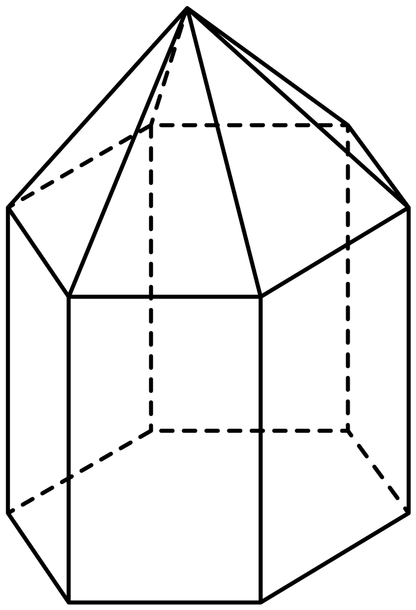

A．	B．	C．	D．

【答案】B

【解析】设正六边形的边长为，由题意正六棱柱的高为，

因为正六棱锥的高与底面边长的比为，所以正六棱锥的高为，正六棱锥的母线长为，

正六棱锥的侧面积；

正六棱柱的侧面积，

所以.

故选：B.

**变式7．**（2024·河北·统考模拟预测）《九章算术》是我国古代的数学名著.其“商功”中记载：“正四面形棱台（即正四棱台）建筑物为方亭.”现有如图所示的烽火台，其主体部分为一方亭，将它的主体部分抽象成的正四棱台（如图所示），其中上底面与下底面的面积之比为，方亭的高为棱台上底面边长的倍.已知方亭的体积为，则该方亭的表面积约为（    ）（，，）

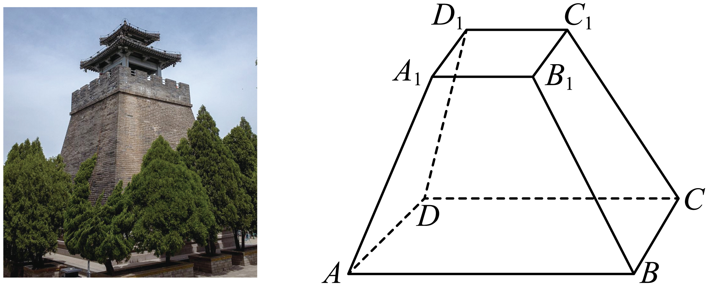

A．	B．	C．	D．

【答案】C

【解析】设方亭相应的正四棱台的上底面边长，则，棱台的高，

所以，解得，

所以正四棱台的上底面边长为，下底面边长为，棱台的高为，

所以方亭的斜高为，

由于各侧面均为相等的等腰梯形，所以，

所以方亭的表面积.

故选：C

**变式8．**（2024·甘肃张掖·高台县第一中学校考模拟预测）仿钧玫瑰紫釉盘是收藏于北京故宫博物院的一件明代宣德年间产的瓷器．该盘盘口微撇，弧腹，圈足．足底切削整齐．通体施玫瑰紫釉，釉面棕眼密集，美不胜收．仿钧玫瑰紫釉盘的形状可近似看成是圆台和圆柱的组合体，其口径为15.5cm，足径为9.2cm，顶部到底部的高为4.1cm，底部圆柱高为0.7cm，则该仿钧玫瑰紫釉盘圆台部分的侧面积约为（    ）（参考数据：π的值取3，）

A．	B．	C．	D．

【答案】D

【解析】方法1：设该圆台的母线长为*l*，高为*h*，两底面圆的半径分别为*R*，*r*（其中），

则，，，

所以，故圆台部分的侧面积为．

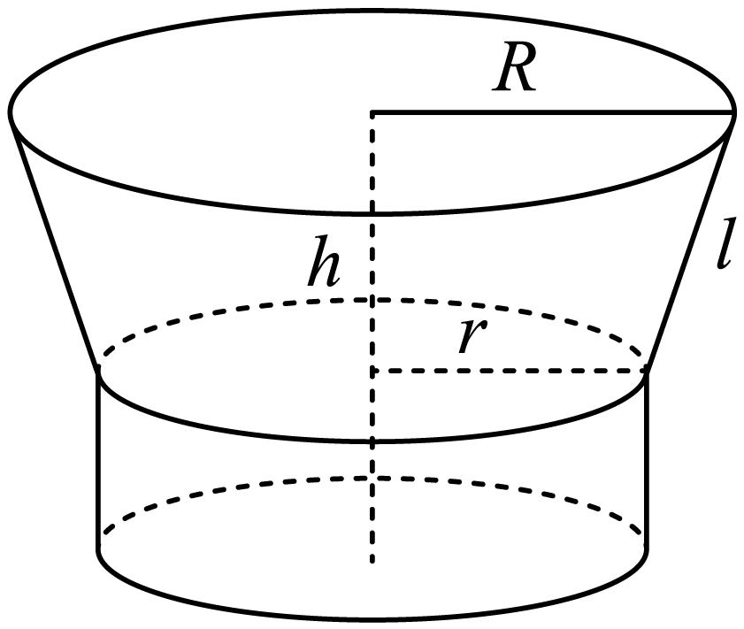

故选：D

方法2（估算法）：若按底面直径为15.5cm，高为3.4cm的圆柱估算圆台部分的侧面积得，易知圆台的侧面积应大于所估算的圆柱的侧面积，故此仿钧玫瑰紫釉盘圆台部分的侧面积大于，对照各选项可知只有D符合．

故选：D

**【解题方法总结】**

（1）多面体的表面积是各个面的面积之和．

（2）旋转体的表面积是将其展开后，展开图的面积与底面面积之和．

（3）组合体的表面积求解时注意对衔接部分的处理．

**题型三：空间几何体的体积**

**例7．**（2024·广东梅州·统考三模）在马致远的《汉宫秋》楔子中写道：“毡帐秋风迷宿草，穹庐夜月听悲笳.”毡帐是古代北方游牧民族以为居室、毡制帷幔.如图所示，某毡帐可视作一个圆锥与圆柱的组合体，圆锥的高为4，侧面积为，圆柱的侧面积为，则该毡帐的体积为（    ）

A．	B．	C．	D．

【答案】A

【解析】设圆柱的底面半径为，高为，圆锥的母线长为，

因为圆锥的侧面积为，所以，即.

因为，所以联立解得（负舍）.

因为圆柱的侧面积为，所以，即，解得，

所以该毡帐的体积为.

故选：A.

**例8．**（2024·重庆沙坪坝·高三重庆一中校考阶段练习）若某圆锥的侧面展开图是一个半径为2的半圆面，其内接正四棱柱的高为，则此正四棱柱的体积是（    ）

A．	B．	C．	D．

【答案】C

【解析】设圆锥底面半径为，因为母线长为,

则半圆弧长底面周长，

所以，圆锥的高为

如图，设，则，设，则，

因为，

∴，

所以，

∴，，

故选：C．

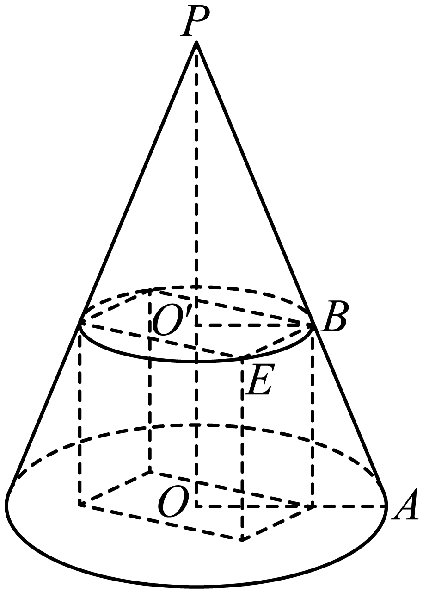

**例9．**（2024·山东青岛·高三统考期中）已知正四棱锥的各顶点都在同一个球面上，球的体积为，则该正四棱锥的体积最大值为（    ）

A．18	B．	C．	D．27

【答案】B

【解析】如图，设正四棱锥的底面边长，高，外接球的球心为，则，

因为球的体积为，所以球的半径为，

在中，，即，

所以正四棱锥的体积为

整理得，则，

当时，，当时，，

所以在上递增，在上递减，

所以当时，函数取得最大值，

故选：B

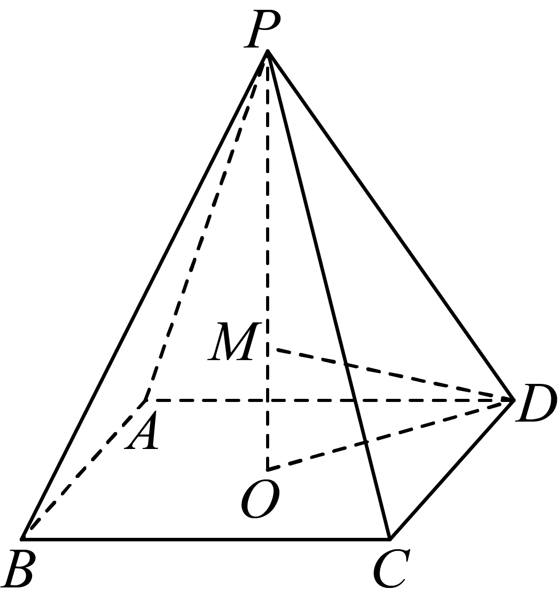

**变式9．**（2024·湖北武汉·高三统考开学考试）攒尖是我国古代建筑中屋顶的一种结构形式，宋代称为最尖，清代称攒尖，通常有圆形攒尖､三角攒尖､四角攒尖､八角攒尖，也有单檐和重檐之分，多见于亭阁式建筑､园林建筑.下面以四角攒尖为例，如图，它的屋顶部分的轮廓可近似看作一个正四棱锥.已知正四棱锥的底面边长为米，侧棱长为5米，则其体积为（    ）立方米.

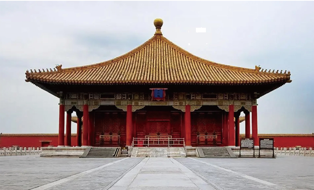

A．	B．24	C．	D．72

【答案】B

【解析】如图所示，在正四棱锥中，连接于，则为正方形的中心，

连接，则底面边长，对角线，.

又，故高.

故该正四棱锥体积为.

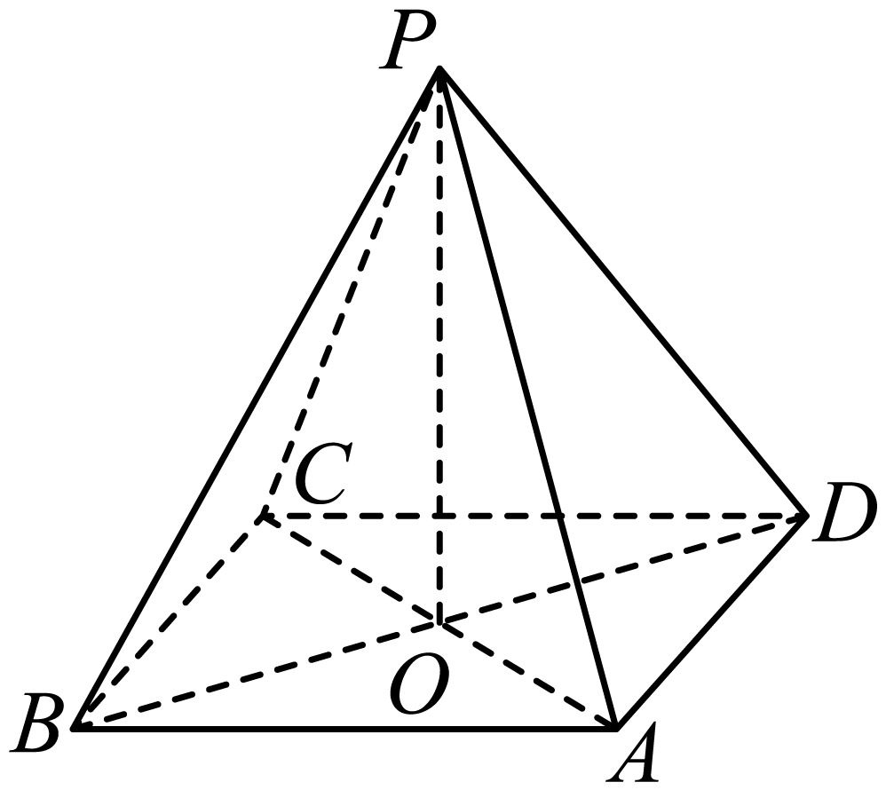

故选：B

**变式10．**（2024·广东河源·高三校联考开学考试）最早的测雨器记载见于南宋数学家秦九韶所著的《数书九章》（1247年）.该书第二章为“天时类”，收录了有关降水量计算的四个例子，分别是“天池测雨”、“圆罂测雨”、“峻积验雪”和“竹器验雪”.如图“竹器验雪”法是下雪时用一个圆台形的器皿收集雪量（平地降雪厚度器皿中积雪体积除以器皿口面积），已知数据如图（注意：单位），则平地降雪厚度的近似值为（    ）

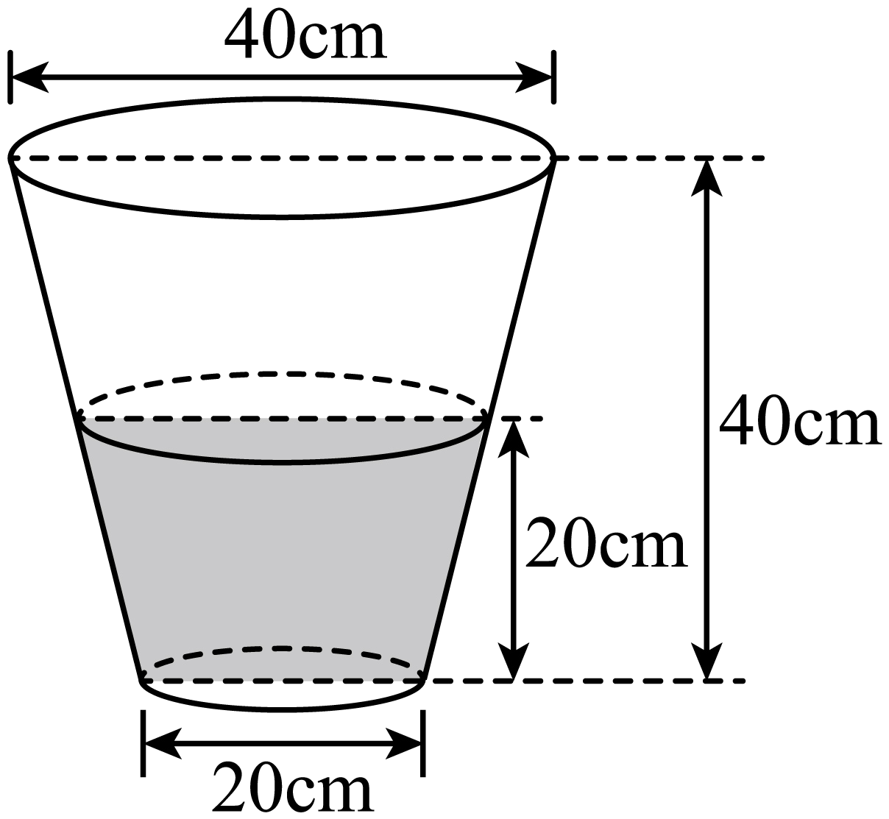

A．	B．	C．	D．

【答案】C

【解析】如图所示，可求得器皿中雪表面的半径为，

所以平地降雪厚度的近似值为.

故选：C

**变式11．**（2024·浙江·校联考模拟预测）如图是我国古代量粮食的器具“升”，其形状是正四棱台，上、下底面边长分别为20cm和10cm，侧棱长为cm．“升”装满后用手指或筷子沿升口刮平，这叫“平升”．则该“升”的“平升”约可装（    ）

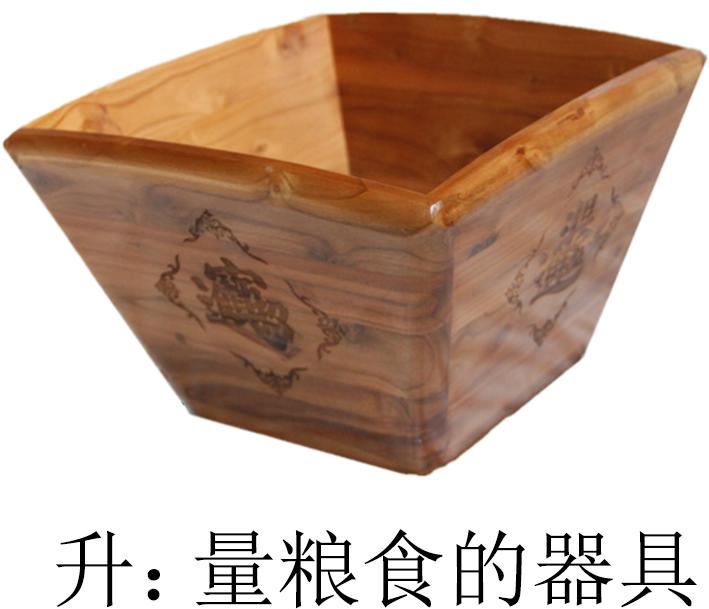

A．1.5L	B．1.7L	C．2.3L	D．2.7L

【答案】C

【解析】根据题意画出正四棱台的直观图，其中底面是边长为20的正方形，底面是边长为10的正方形，侧棱，记底面和底面的中心分别为和，则是正四棱台的高.

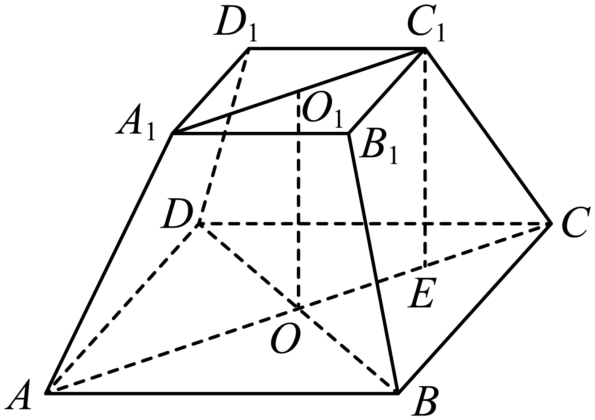

过作平面的垂线，垂足为，则且，，

所以，，

故，

所以棱台的高，

由棱台的体积公式得．

故选：C .

**【解题方法总结】**

求空间几何体的体积的常用方法

<table><tr><td>
公式法
</td><td>
规则几何体的体积，直接利用公式
</td></tr><tr><td>
割补法
</td><td>
把不规则的几何体分割成规则的几何体，或者把不规则的几何体补成规则的几何体
</td></tr><tr><td>
等体积法
</td><td>
通过选择合适的底面来求几何体体积的一种方法，特别是三棱锥的体积
</td></tr></table>

**题型四：直观图**

<strong>例10．</strong>（2024·辽宁锦州·渤海大学附属高级中学校考模拟预测）已知用斜二测画法画梯形<em>OABC</em>的直观图如图所示，，，，轴，，为的三等分点，则四边形<em>OABC</em>绕<em>y</em>轴旋转一周形成的空间几何体的体积为______．

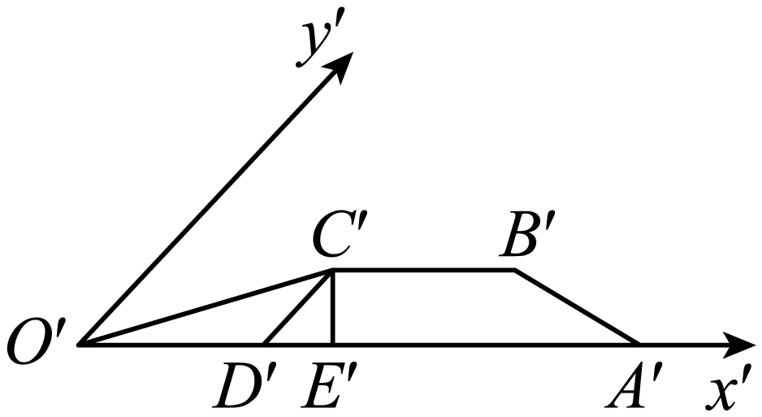

【答案】

【解析】在直观图中，，所以在还原图中，，如图，

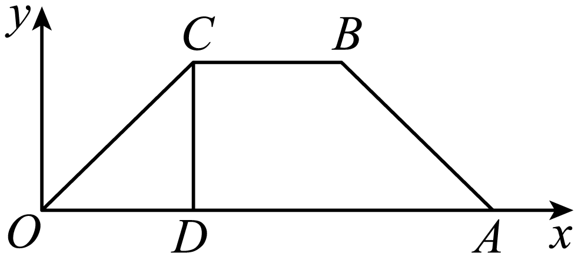

在直观图中，，为的三等分点，

所以在还原图中，，*D*为*OA*的三等分点，

又在直观图中，轴，

所以在还原图中，轴，则，

所以，则，

故，，所以四边形*OABC*是等腰梯形，

所以四边形*OABC*绕*y*轴旋转一周所形成的空间几何体的体积等于一个圆台的体积减去一个圆锥的体积，

即．

故答案为：.

<strong>例11．</strong>（2024·全国·高三对口高考）若正用斜二测画法画出的水平放置图形的直观图为，当的面积为时，的面积为__________．

【答案】

【解析】是正的斜二测画法的水平放置图形的直观图，如图所示，

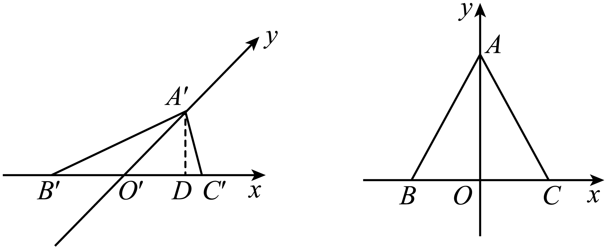

设，

则的面积为，，

的面积为．

故答案为：．

<strong>例12．</strong>（2024·四川成都·高三统考阶段练习）用斜二测画法画出的某平面图形的直观图如图所示，边与平行于轴.已知四边形的面积为，则原平面图形的面积为__________.

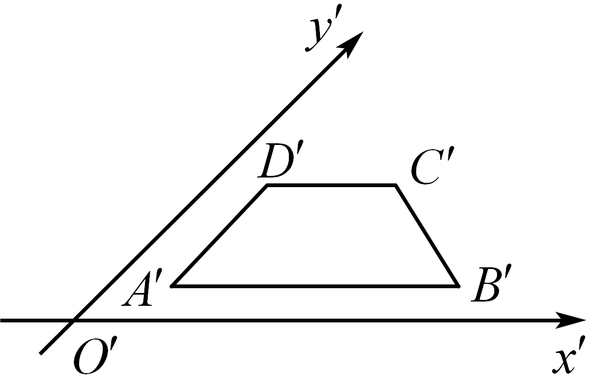

【答案】

【解析】根据题意得，原四边形为一个直角梯形，

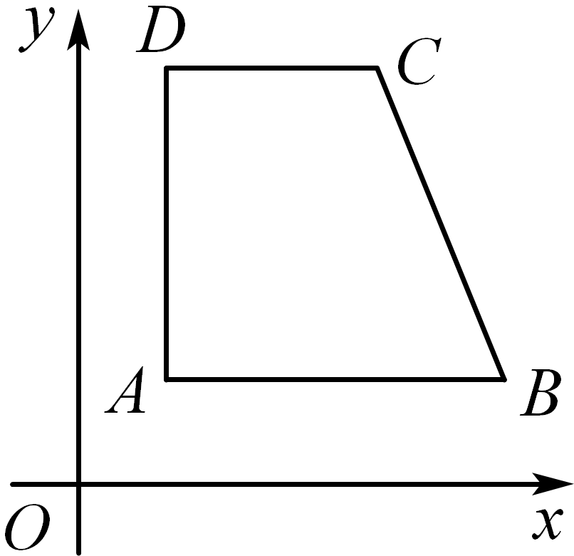

且，，，

，

则，

所以，.

故答案为：.

<strong>变式12．</strong>（2024·全国·高三专题练习）如图，是用斜二测画法得到的△<em>AOB</em>的直观图，其中则<em>AB</em>的长度为 ______．

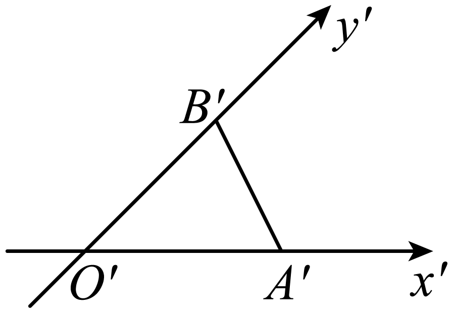

【答案】

【解析】把直观图还原为,如图所示：

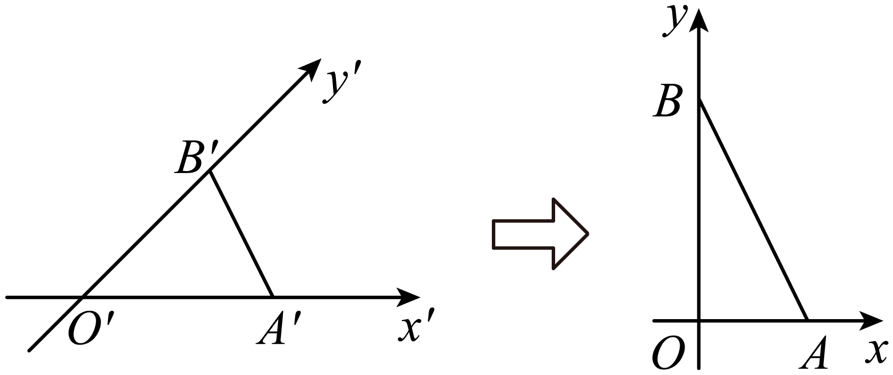

根据直观图画法规则知,,

所以的长度为.

故答案为：.

<strong>变式13．</strong>（2024·上海浦东新·高三上海市川沙中学校考期末）有一块多边形的菜地，它的水平放置的平面图形的斜二测直观图是直角梯形（如图所示）.，则这块菜地的面积为__________

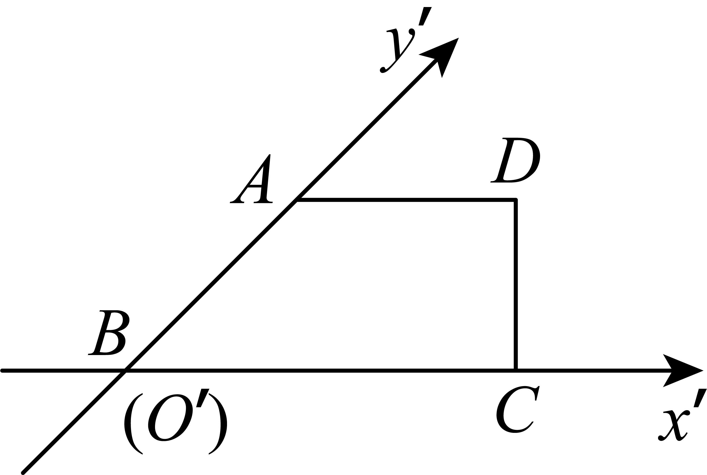

【答案】

【解析】

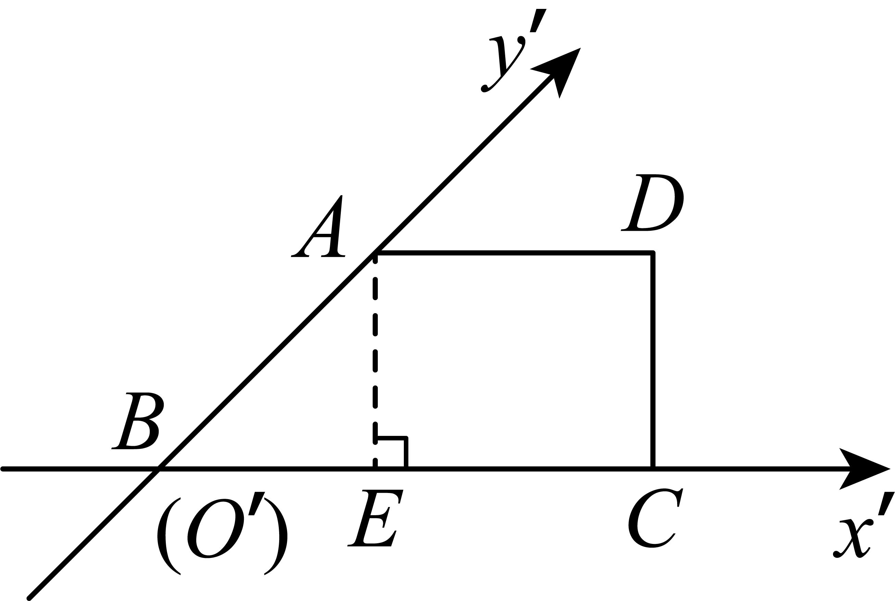

过作于，

在直观图中，，，，

所以，，

故原平面图形的上底为 ，下底，高为，

所以这块菜地的面积为，

故答案为：.

<strong>变式14．</strong>（2024·上海宝山·高三上海交大附中校考开学考试）我们知道一条线段在“斜二测”画法中它的长度可能会发生变化的，现直角坐标系平面上一条长为4cm线段<em>AB</em>按“斜二测”画法在水平放置的平面上画出为，则最短长度为____________cm（结果用精确值表示）

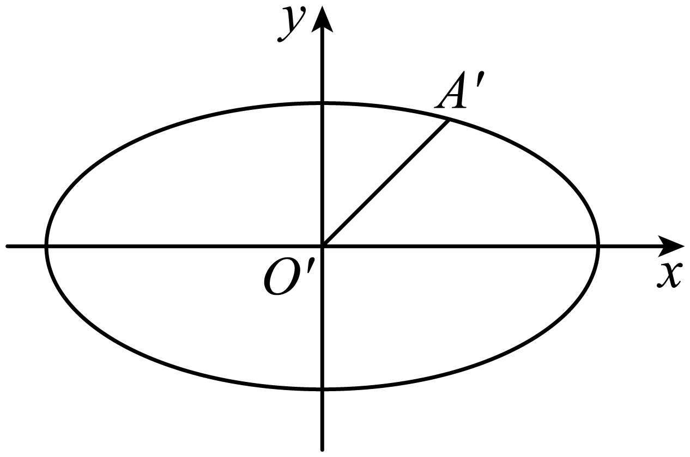

【答案】

【解析】如图1所示，可以将平面内所有长为4的线段平移至图中点为起点，则它们的终点形成以为圆心，半径为4的圆周.

以两条互相垂直的直径为坐标轴，建立平面直角坐标系.

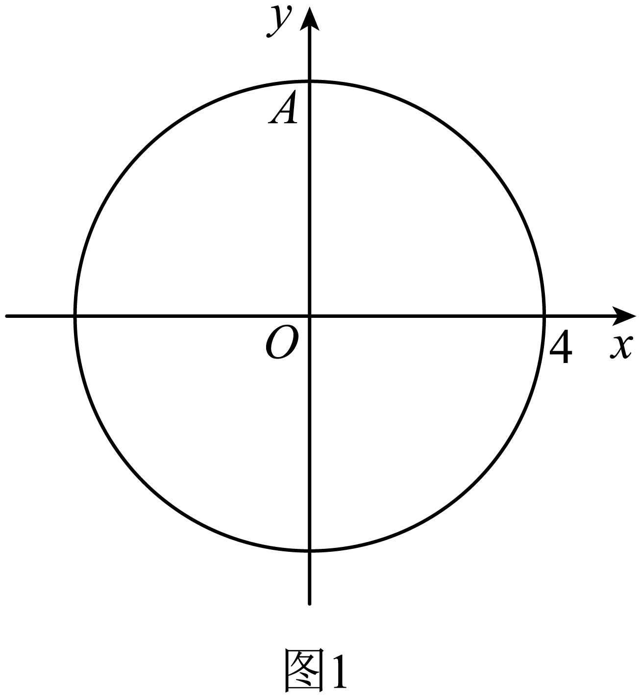

然后在斜二测画法下画出该圆的直观图，如图2，形成一个椭圆，

由斜二测的性质可知，在图2，该椭圆长半轴为4，且经过点，

易知且，所以，

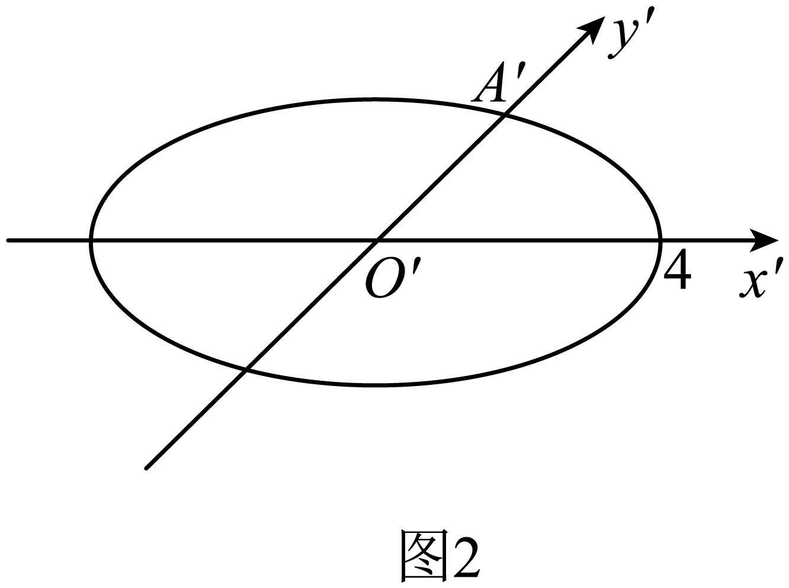

设椭圆的方程为：，将代入得：，解得.

由椭圆的性质可知，椭圆上的点中，短轴端点到原点的距离最小，即即为所求.

故答案为：.

<strong>变式15．</strong>（2024·陕西延安·校考一模）如图，梯形<em>ABCD</em>是水平放置的一个平面图形的直观图，其中，，，则原图形的面积为______．

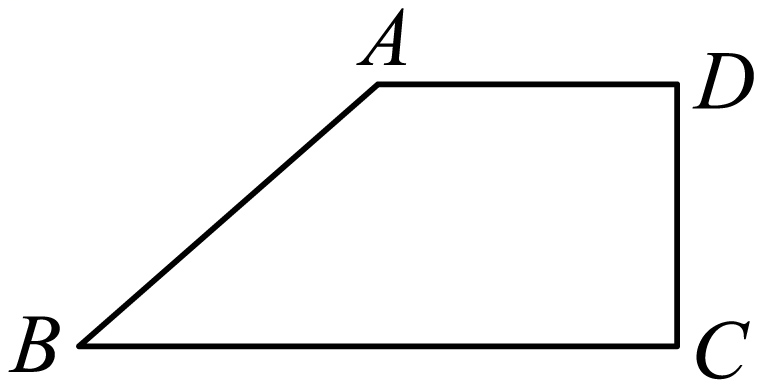

【答案】

【解析】因为，， ，

所以，，

所以．

故答案为：．

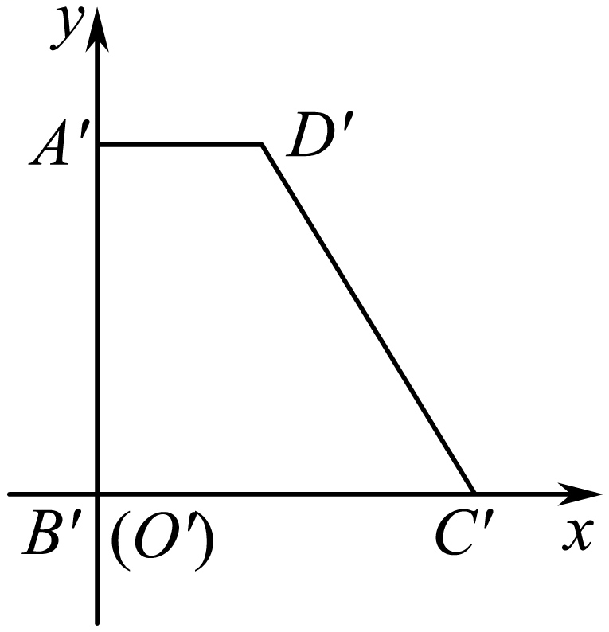

<strong>变式16．</strong>（2024·全国·高三专题练习）如图，用斜二测画法画一个水平放置的平面图形的直观图为一个正方形，则原来图形的面积是________．

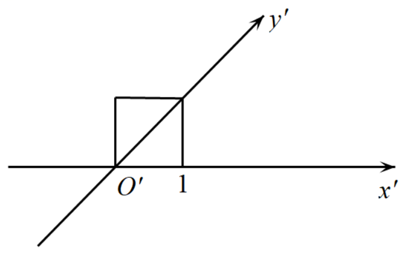

【答案】

【解析】由直观图可知，在直观图中,正方形的对角线长为，由斜二测画法的特点，知该平面图形的直观图的原图形如图所示

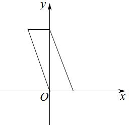

所以原图图形为平行四边形，底面边长为，位于轴的对角线长为，

所以原来图形的面积为.

故答案为：.

**【解题方法总结】**

斜二测法下的直观图与原图面积之间存在固定的比值关系：．

**题型五：展开图**

<strong>例13．</strong>（2024·山东青岛·统考三模）已知圆锥的底面半径为1，侧面展开图为半圆，则该圆锥内半径最大的球的表面积为______．

【答案】/

【解析】设圆锥母线长为，由题意，，

圆锥内半径最大的球与圆锥相切，

作出圆锥的轴截面，截球得大圆为圆锥轴截面三角形的内切圆，是切点，如图，易知是圆锥的高，在上，

由得，因此，所以，

，

所以圆锥内半径最大的球的表面积为，

故答案为：．

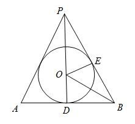

<strong>例14．</strong>（2024·全国·高三专题练习）如图，在直三棱柱的侧面展开图中，<em>B</em>，<em>C</em>是线段<em>AD</em>的三等分点，且．若该三棱柱的外接球<em>O</em>的表面积为12π，则_______________．

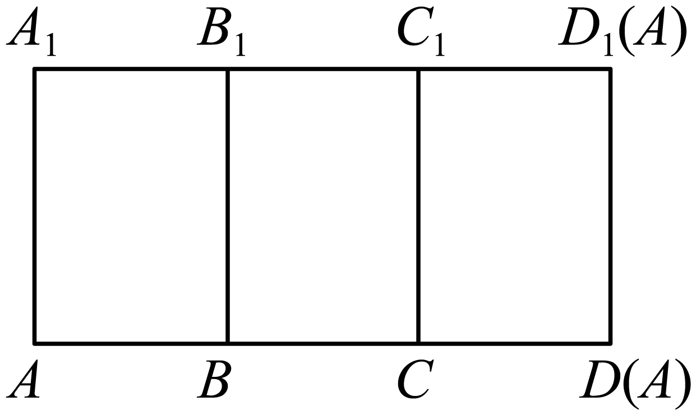

【答案】

【解析】由该三棱柱的外接球*O*的表面积为12π，设外接球得半径为，则，解得，

由题意，取上下底面三角形得中心，分别为，得中点即为外接圆圆心，作图如下：

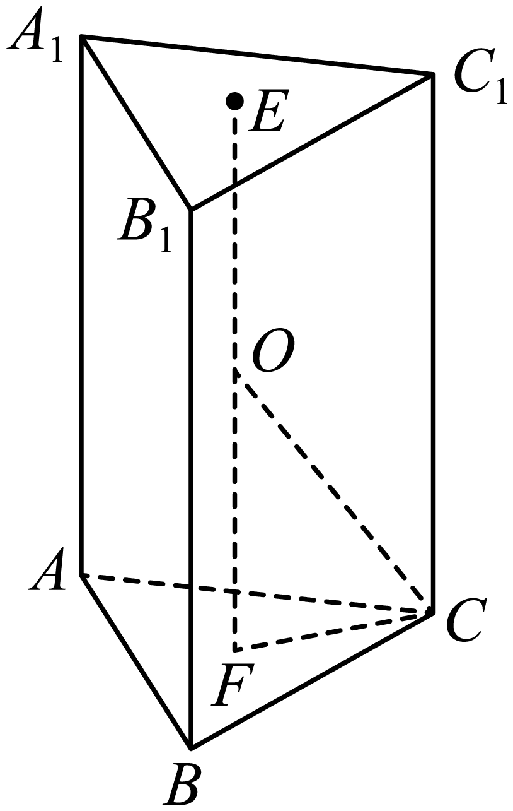

则，平面，，

平面，，

在等边中，，

在中，，

.

故答案为：.

<strong>例15．</strong>（2024·上海普陀·高三统考期中）2022年4月16日，神舟十三号载人飞船返回舱在东风着陆场预定区域成果着陆．如图，在返回过程中使用的主降落伞外表面积达到1200平方米，若主降落伞完全展开后可以近似看着一个半球，则完全展开后伞口的直径约为____________米（精确到整数）

【答案】28

【解析】设主降落伞展开后所在球体的半径为，由题可得，解得，

故完全展开后伞口的直径约为米.

故答案为：.

<strong>变式17．</strong>（2024·山东淄博·统考一模）已知圆锥的底面半径为1，其侧面展开图为一个半圆，则该圆锥的体积为______．

【答案】/

【解析】∵圆锥的底面半径为1，∴侧面展开图的弧长为，

又∵侧面展开图是半圆，∴侧面展开图的半径为2，即圆锥的母线长为2，故圆锥的高为，故体积

故答案为：

<strong>变式18．</strong>（2024·安徽·蚌埠二中校联考模拟预测）如图，在三棱锥<em>P</em>-<em>ABC</em>的平面展开图中，，，，，，则三棱锥外接球表面积为____________．

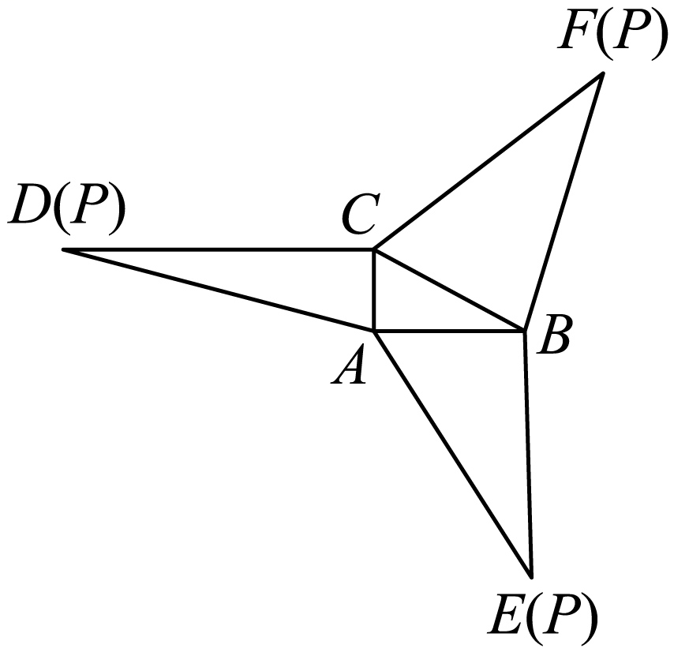

【答案】14*π*

【解析】由题意可知，，，，，

在*BCF*中，，则，

因为，所以，

在三棱锥*P*-*ABC*外接球的球心为*O*，，，记*PA*中点为*O*，，即三棱锥*P*-*ABC*外接球的球心为点*O*，

半径，所以外接球表面积为14*π*．

故答案为：14*π*

<strong>变式19．</strong>（2024·全国·高三专题练习）已知三棱锥<em>P</em>－<em>ABC</em>的底面<em>ABC</em>为等边三角形．如图，在三棱锥<em>P</em>－<em>ABC</em>的平面展开图中，<em>P</em>，<em>F</em>，<em>E</em>三点共线，<em>B</em>，<em>C</em>，<em>E</em>三点共线，，，则<em>PB</em>＝___．

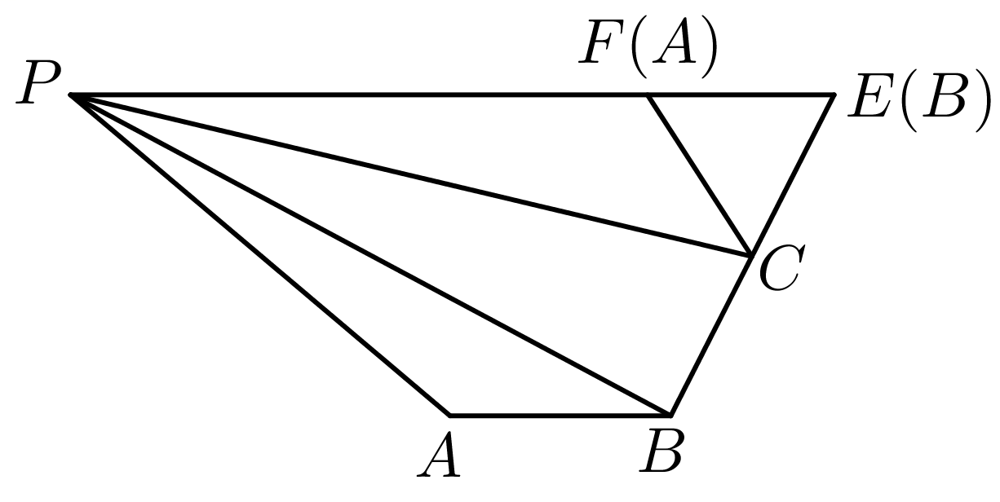

【答案】

【解析】由题意可知，△*CEF*为等边三角形，所以，则，

由可知，

在△*PCF*中，由正弦定理得：．

在△*PCE*中，由余弦定理得：，

解得或（舍去），

所以，

则，，

在△*PBE*中，由余弦定理得，

所以．

故答案为：

<strong>变式20．</strong>（2024·安徽黄山·统考一模）如图，在四棱锥<em>P</em>-<em>ABCD</em>的平面展开图中，正方形<em>ABCD</em>的边长为4，是以<em>AD</em>为斜边的等腰直角三角形，，则该四棱锥外接球被平面<em>PBC</em>所截的圆面的面积为___________.

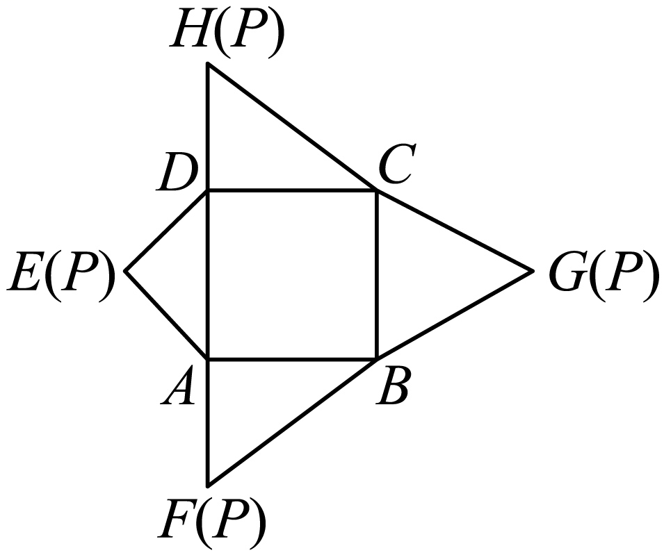

【答案】

【解析】该几何体的直观图如下图所示

分别取的中点，连接

又，所以由线面垂直的判定定理得出平面

以点为坐标原点，建立空间直角坐标系

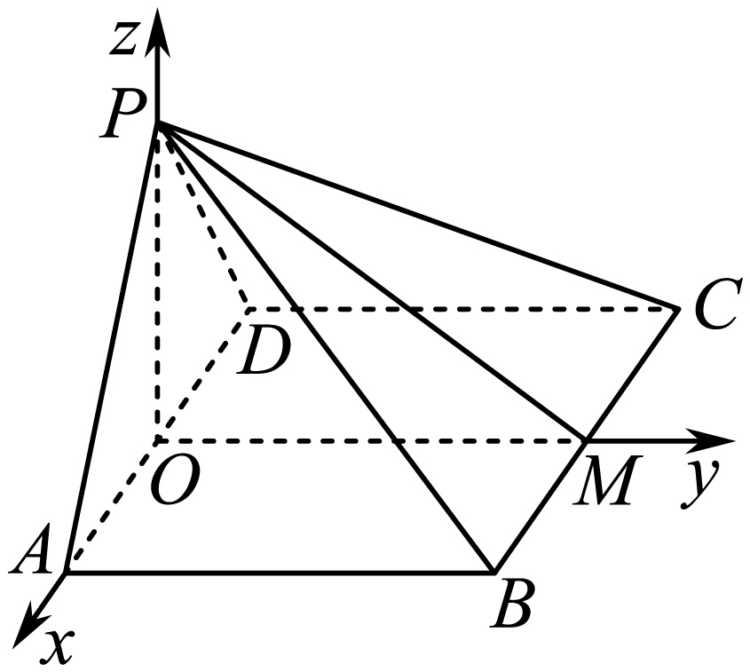

，

设四棱锥外接球的球心

，，解得

设平面的法向量为

，取，则

四棱锥外接球的球心到面的距离为

又，所以平面*PBC*所截的圆的半径

所以平面*PBC*所截的圆面的面积为.

故答案为：

<strong>变式21．</strong>（2024·山西大同·高三统考阶段练习）如图，在三棱锥的平面展开图中，，，，，，则三棱锥的外接球的表面积为________．

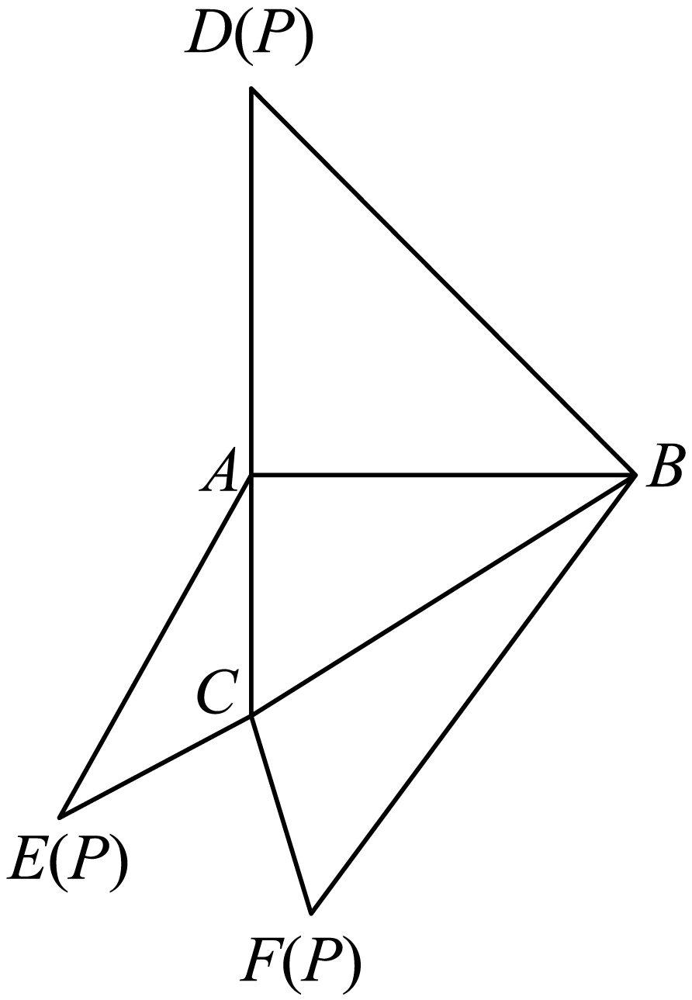

【答案】

【解析】还原出如图所示的三棱锥，

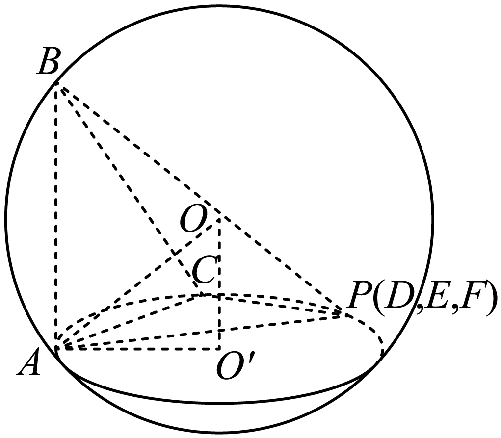

，，平面，

设平面的截面圆心为，半径为，球心为，球半径为，

在中，由余弦定理可得，则，

这由正弦定理得，，

，

，

外接球的表面积.

故答案为：.

**【解题方法总结】**

多面体表面展开图可以有不同的形状，应多实践，观察并大胆想象立体图形与表面展开图的关系，一定先观察立体图形的每一个面的形状．

**题型六：最短路径问题**

<strong>例16．</strong>（2024·福建福州·高一福建省福州屏东中学校考期末）如图，一竖立在地面上的圆锥形物体的母线长为4，一只小虫从圆锥的底面圆上的点<em>P</em>出发，绕圆锥爬行一周后回到点<em>P</em>处，若该小虫爬行的最短路程为，则这个圆锥的体积为（　　）.

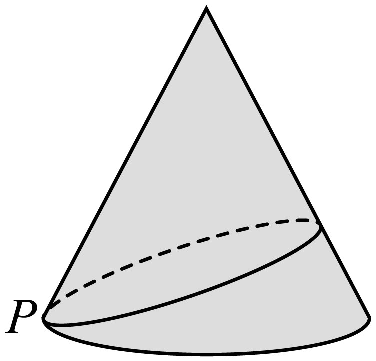

A．	B．	C．	D．

【答案】C

【解析】作出该圆锥的侧面展开图，如图所示：

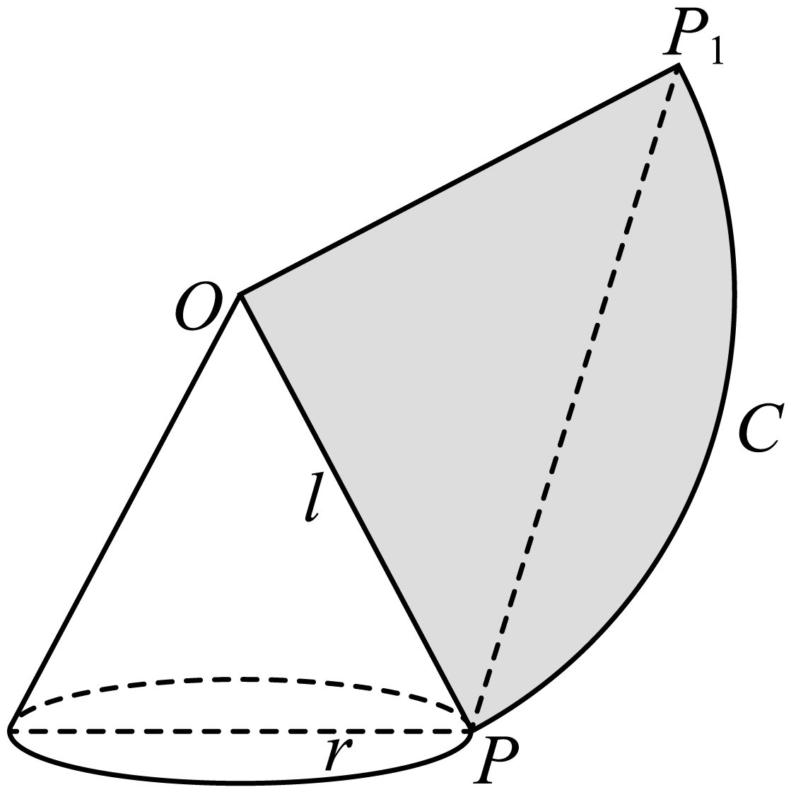

该小虫爬行的最短路程为，

由余弦定理可得，．设底面圆的半径为*r*，

则有，解得．∴这个圆锥的高为，

这个圆锥的体积为．

故选：C．

**例17．**（2024·陕西宝鸡·高一统考期末）盲盒是一种深受大众喜爱的玩具，某盲盒生产厂商要为棱长为的正四面体魔方设计一款正方体的包装盒，需要保证该魔方可以在包装盒内任意转动，则包装盒的棱长最短为（    ）

A．	B．	C．	D．

【答案】A

【解析】如图所示，根据题意可得，

设的中点为，底面的重心为，为外接球的球心，

则有底面，，，

且，其中为外接球的半径，

在直角中，可得，

在直角中，，且，

所以，解得，

所以正方体的最短棱长为.

故选：A.

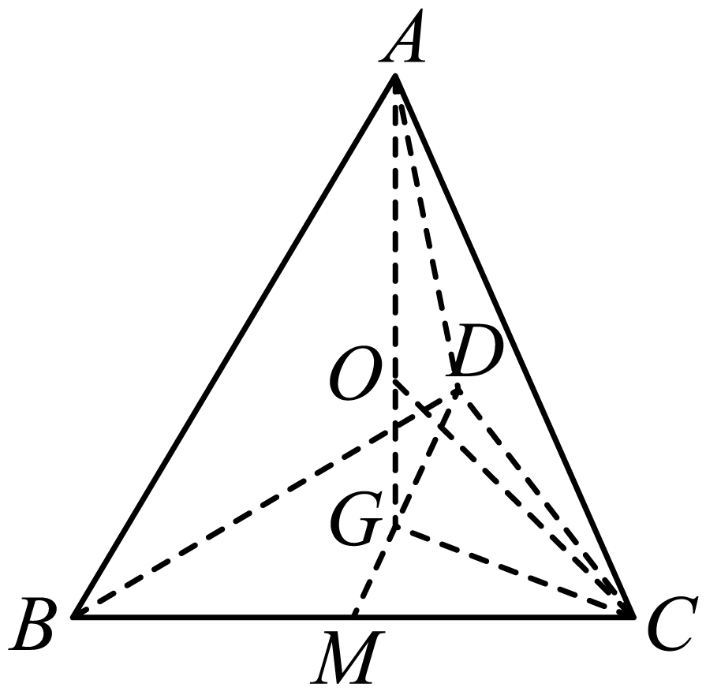

<strong>例18．</strong>（2024·全国·高一专题练习）如图，已知正四棱椎的侧棱长为，侧面等腰三角形的顶角为，则从<em>A</em>点出发环绕侧面一周后回到<em>A</em>点的最短路程为（   ）

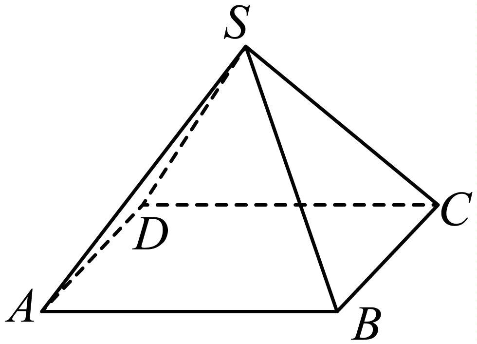

A．	B．	C．	D．6

【答案】D

【解析】把正四棱锥的侧面沿着*SA*剪开，得到它的侧面展开图(如图).

要使路程最短，必须沿着线段前行.

在中，，，则.

作于*H*，则，，.

故选：D.

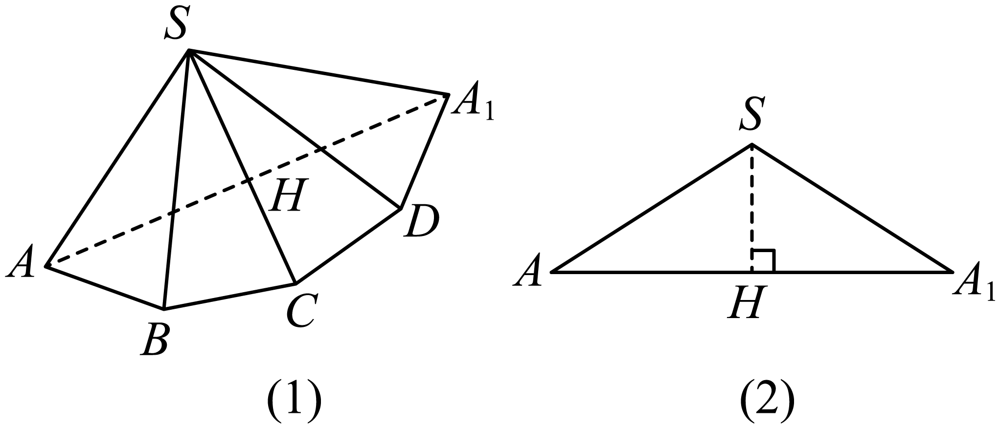

**变式22．**（2024·安徽·高二马鞍山二中校联考阶段练习）我们知道立体图形上的最短路径问题通常是把立体图形展开成平面图形，连接两点，根据两点之间线段最短确定最短路线.请根据此方法求函数的最小值（    ）

A．	B．	C．	D．

【答案】A

【解析】根据函数的表达式可知，构造三棱锥，其中，且，

由余弦定理可得，，，

的最小值即为的最小值，

将三棱锥按照展开可得展开图，且，

故的最小值为.

故选：A.

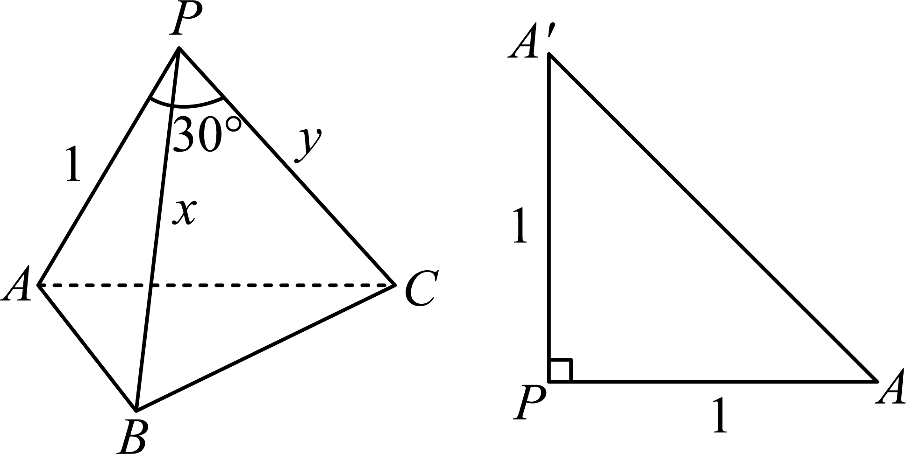

**变式23．**（2024·全国·高三专题练习）盲盒是一种深受大众喜爱的玩具，某盲盒生产厂商要为棱长为的正四面体魔方设计一款正方体的包装盒，需要保证该魔方可以在包装盒内任意转动，则包装盒的棱长最短为（    ）

A．	B．	C．	D．

【答案】B

【解析】如图是棱长为的正四面体，

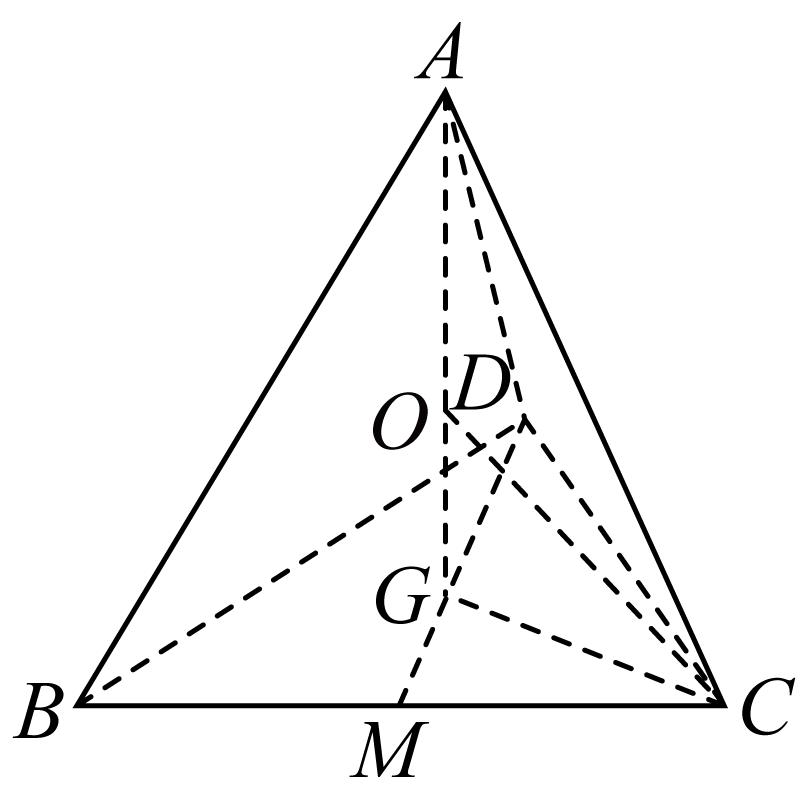

由题意， ，设的中点为，底面 的重心为，为外接球的球心，

则有 底面， ，  ，

，是外接球半径，

在 中， ，

在 中， ，，

，解得 ，

即正方体的最短棱长为.

故选：B.

**变式24．**（2024·山东济宁·高一校考阶段练习）如图，一个矩形边长为1和4，绕它的长为的边旋转二周后所得如图的一开口容器（下表面密封），是中点，现有一只妈蚁位于外壁处，内壁处有一米粒，若这只蚂蚁要先爬到上口边沿再爬到点处取得米粒，则它所需经过的最短路程为（    ）

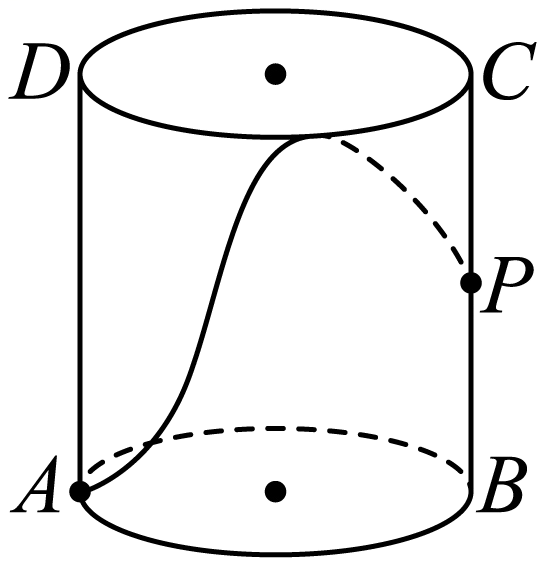

A．	B．	C．	D．

【答案】A

【解析】依题意可得圆柱的底面半径，高

将圆柱的侧面（一半）展开后得矩形，其中，，

问题转化为在上找一点，使最短，

作关于的对称点，连接，令与交于点，

则得的最小值就是为．

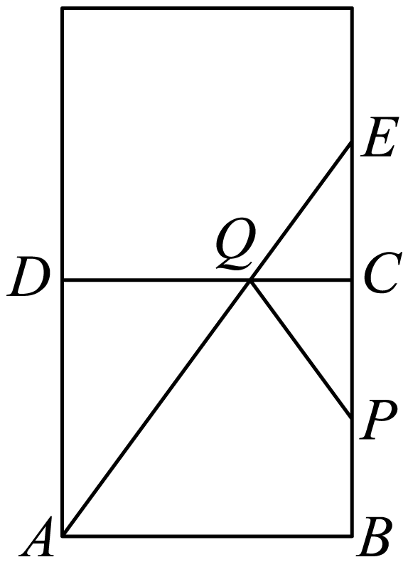

故选：A

**变式25．**（2024·全国·高一专题练习）如图所示，在正三棱柱中，，，由顶点沿棱柱侧面(经过棱)到达顶点，与的交点记为，则从点经点到的最短路线长为（    ）

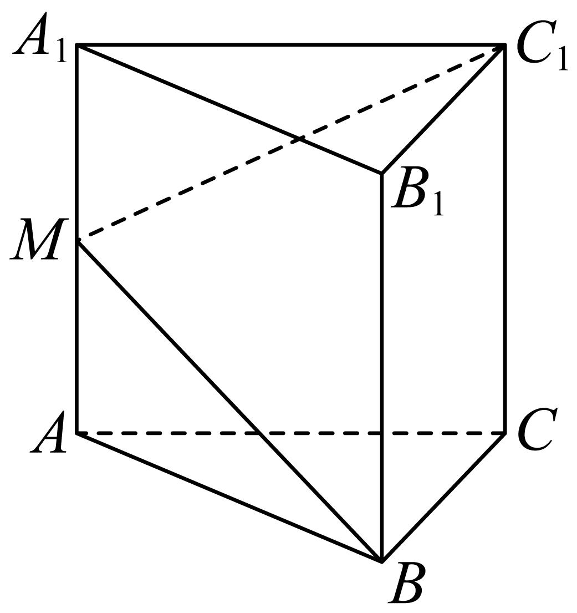

A．	B．	C．4	D．

【答案】B

【解析】如图，沿侧棱将正三棱柱的侧面展开

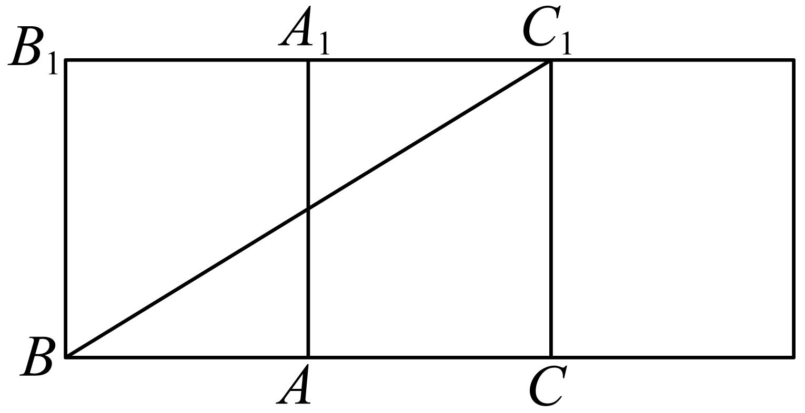

由侧面展开图可知，当，，三点共线时，从点经点到的路线最短*．*

所以最短路线长为.

故选：B.

<strong>变式26．</strong>（2024·河北·高三专题练习）如图，正方体的棱长为，点为的中点，在对角面上取一点，使最小，其最小值为_____

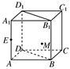

【答案】

【解析】取中点，连接

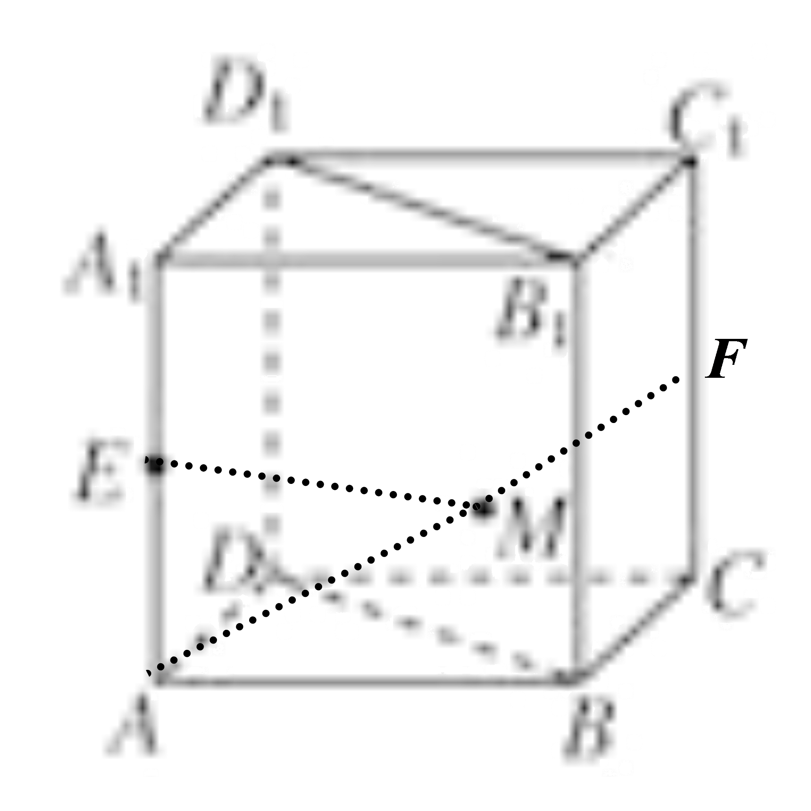

则

（当且仅当三点共线时取等号）

又

的最小值为：

本题正确结果：

**【解题方法总结】**

此类最大路径问题：大胆展开，把问题变为平面两点间线段最短问题

