**第47讲  空间点、直线、平面之间的位置关系**

**知识梳理**

**知识点一．四个公理**

**公理**1**：** 如果一条直线上的两点在一个平面内，那么这条直线在此平面内．

**注意：**（1）此公理是判定直线在平面内的依据；（2）此公理是判定点在面内的方法

**公理**2**：** 过不在一条直线上的三点，有且只有一个平面．

**注意：**（1）此公理是确定一个平面的依据；（2）此公理是判定若干点共面的依据

**推论①：** 经过一条直线和这条直线外一点，有且只有一个平面；

**注意：**（1）此推论是判定若干条直线共面的依据

（2）此推论是判定若干平面重合的依据

（3）此推论是判定几何图形是平面图形的依据

**推论②：** 经过两条相交直线，有且只有一个平面；

**推论③：** 经过两条平行直线，有且只有一个平面；

**公理**3**：** 如果两个不重合的平面有一个公共点，那么它们有且只有一条过该点的公共直线．

**注意：**（1）此公理是判定两个平面相交的依据

（2）此公理是判定若干点在两个相交平面的交线上的依据（比如证明三点共线、三线共点）

（3）此推论是判定几何图形是平面图形的依据

**公理**4**：** 平行于同一条直线的两条直线互相平行．

**知识点二．直线与直线的位置关系**

<table><tr><td>
位置关系
</td><td>
相交（共面）
</td><td>
平行（共面）
</td><td>
异面
</td></tr><tr><td>
图形
</td><td>
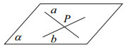
</td><td>
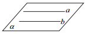
</td><td>
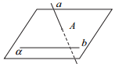
</td></tr><tr><td>
符号
</td><td>

</td><td>
<em>a</em>∥<em>b</em>
</td><td>

</td></tr><tr><td>
公共点个数
</td><td>
1
</td><td>
0
</td><td>
0
</td></tr><tr><td>
特征
</td><td>
两条相交直线确定一个平面
</td><td>
两条平行直线确定一个平面
</td><td>
两条异面直线不同在如何一个平面内
</td></tr></table>

**知识点三．直线与平面的位置关系：** 有直线在平面内、直线与平面相交、直线与平面平行三种情况．

<table><tr><td>
位置关系
</td><td>
包含（面内线）
</td><td>
相交（面外线）
</td><td>
平行（面外线）
</td></tr><tr><td>
图形
</td><td>
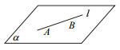
</td><td>
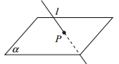
</td><td>
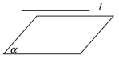
</td></tr><tr><td>
符号
</td><td>

</td><td>

</td><td>
∥
</td></tr><tr><td>
公共点个数
</td><td>
无数个
</td><td>
1
</td><td>
0
</td></tr></table>

**知识点四．平面与平面的位置关系：** 有平行、相交两种情况．

<table><tr><td>
位置关系
</td><td>
平行
</td><td>
相交（但不垂直）
</td><td>
垂直
</td></tr><tr><td>
图形
</td><td>
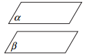
</td><td>
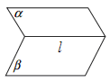
</td><td>
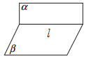
</td></tr><tr><td>
符号
</td><td>
∥
</td><td>

</td><td>
，
</td></tr><tr><td>
公共点个数
</td><td>
0
</td><td>
无数个公共点且都在唯一的一条直线上
</td><td>
无数个公共点且都在唯一的一条直线上
</td></tr></table>

**知识点五．等角定理：** 空间中如果两个角的两边分别对应平行，那么这两个角相等或互补．

**必考题型全归纳**

**题型一：证明**“**点共面**”**、**“**线共面**”**或**“**点共线**”**及**“**线共点**”

**例1．**（2024·山西大同·高一校考期中）如图所示，在空间四边形中，，分别为，的中点，，分别在，上，且，求证：

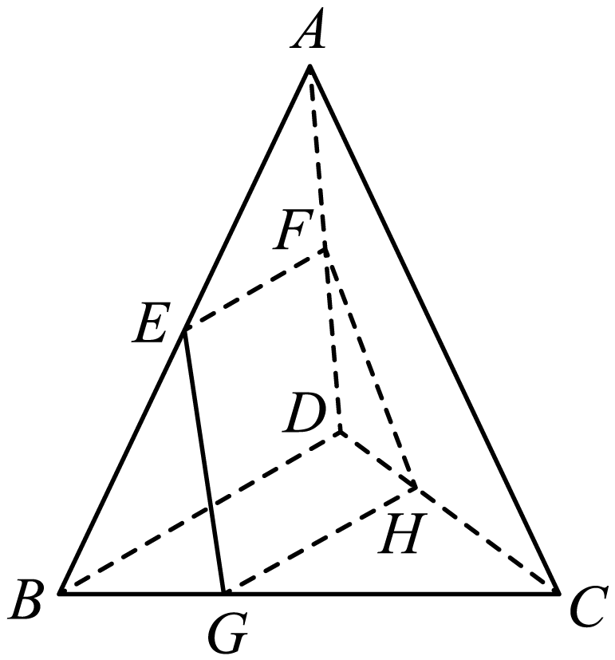

(1)，，，四点共面；

(2)与的交点在直线上．

**例2．**（2024·陕西西安·高一校考期中）（1）已知直线，直线与，都相交，求证：过，，有且只有一个平面；

（2）如图，在空间四边形中，，分别是，的中点，，分别是边，上的点，且.求证：直线，，相交于一点.

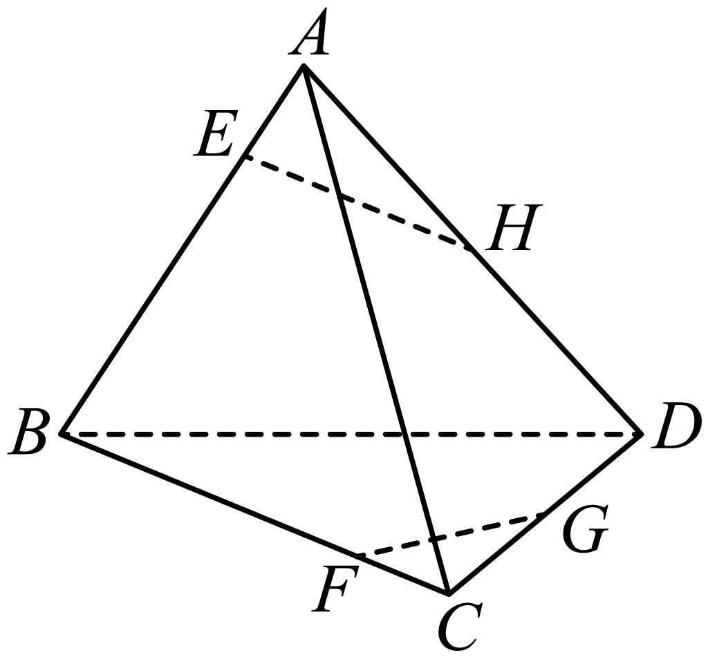

<strong>例3．</strong>（2024·河南信阳·高一校联考期中）如图，在正方体中，<em>E</em>，<em>F</em>分别是上的点，且.

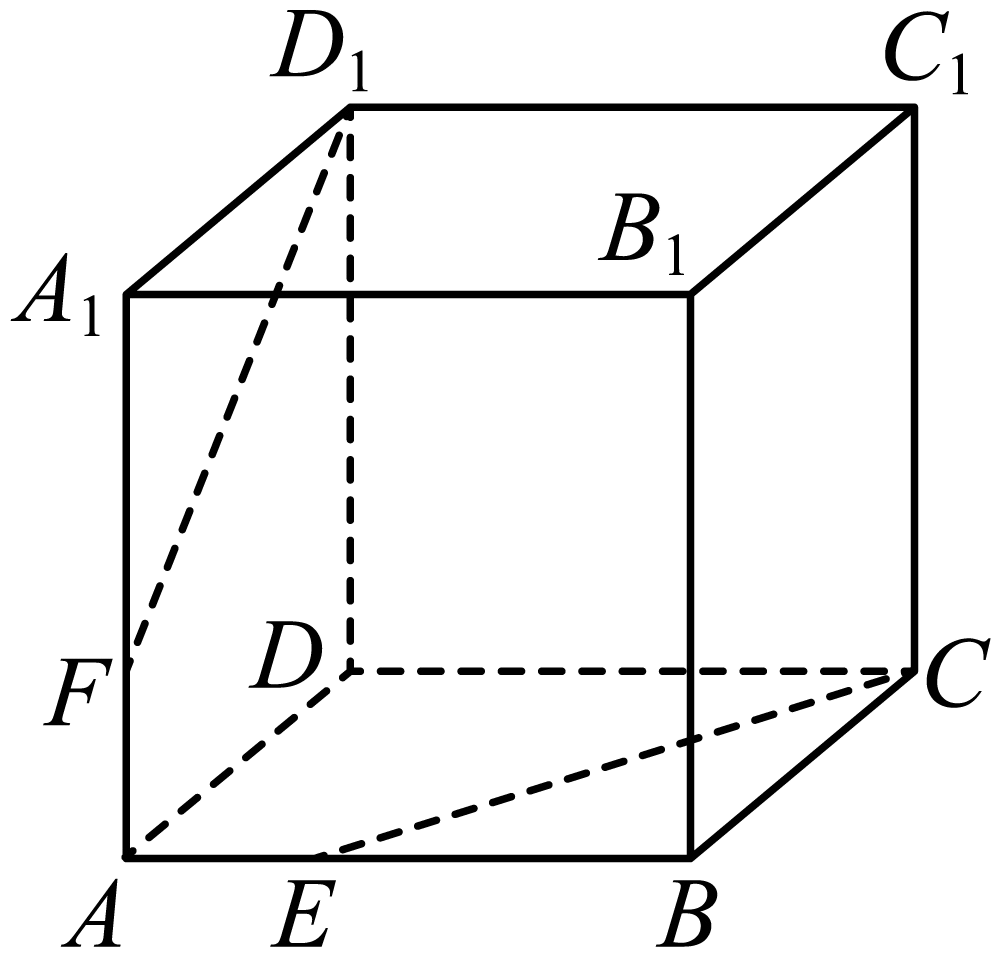

(1)证明：四点共面；

(2)设，证明：*A*，*O*，*D*三点共线.

<strong>变式1．</strong>（2024·全国·高一专题练习）如图所示，在空间四边形<em>ABCD</em>中，<em>E</em>，<em>F</em>分别为<em>AB</em>，<em>AD</em>的中点，<em>G</em>，<em>H</em>分别在<em>BC</em>，<em>CD</em>上，且.求证：

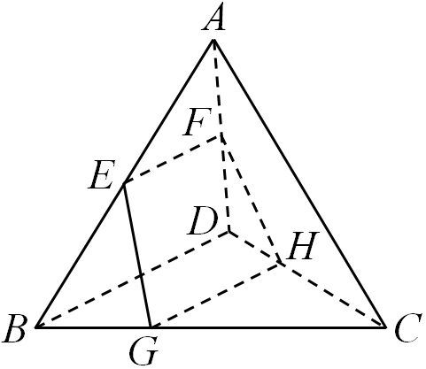

(1)*E*､*F*､*G*､*H*四点共面；

(2)*EG*与*HF*的交点在直线*AC*上.

<strong>变式2．</strong>（2024·云南楚雄·高一统考期中）如图，在正四棱台中，<em>E</em>，<em>F</em>，<em>G</em>，<em>H</em>分别为棱，，<em>AB</em>，<em>BC</em>的中点．

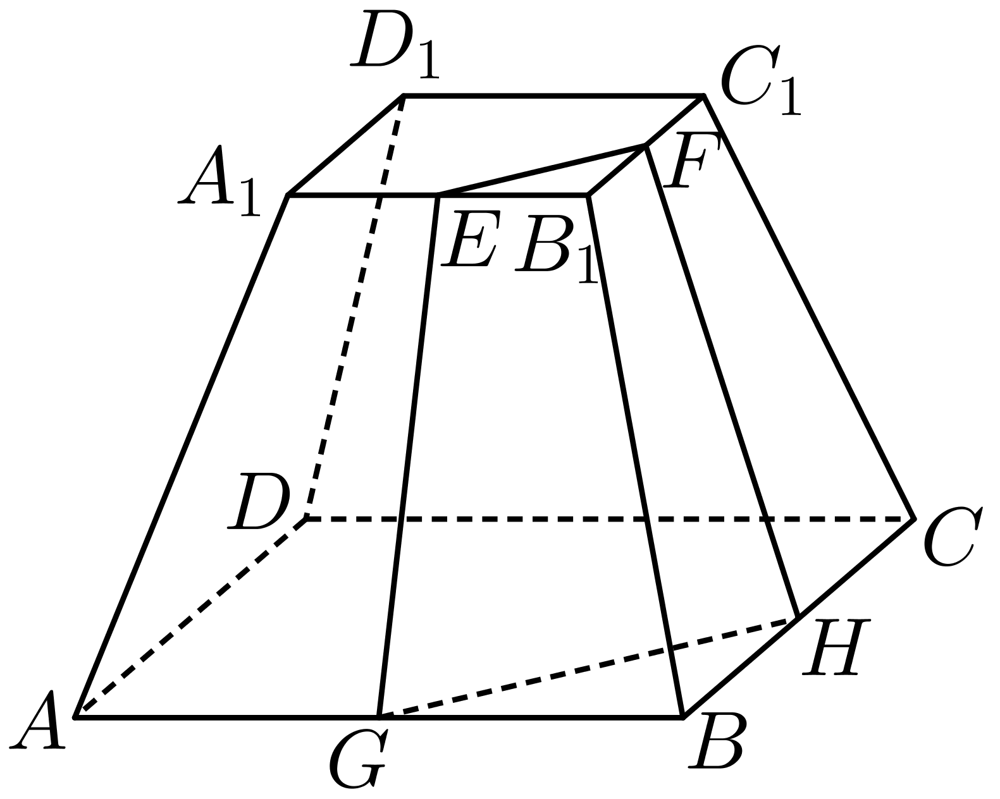

(1)证明*E*，*F*，*G*，*H*四点共面；

(2)证明*GE*，*FH*，相交于一点．

<strong>变式3．</strong>（2024·全国·高三专题练习）如图所示，在正方体中，<em>E</em>，<em>F</em>分别是的中点．

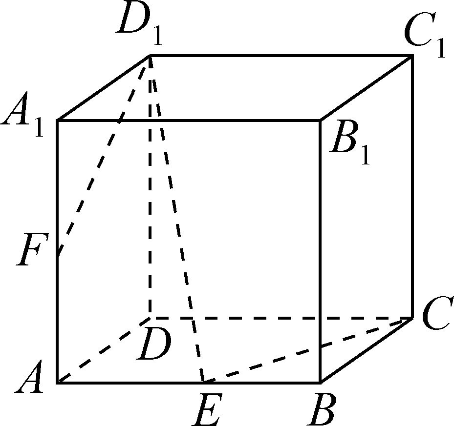

(1)求证：三线交于点*P*；

(2)在（1）的结论中，*G*是上一点，若*FG*交平面*ABCD*于点*H*，求证：*P*，*E*，*H*三点共线．

**【解题方法总结】**

共面、共线、共点问题的证明

（1）证明共面的方法：先确定一个平面，然后再证其余的线（或点）在这个平面内．

（2）证明共线的方法：先由两点确定一条直线，再证其他各点都在这条直线上．

（3）证明共点的方法：先证其中两条直线交于一点，再证其他直线经过该点．

**题型二：截面问题**

<strong>例4．</strong>（2024·全国·高三对口高考）如图，正方体的棱长为，动点<em>P</em>在对角线上，过点<em>P</em>作垂直于的平面，记这样得到的截面多边形（含三角形）的周长为<em>y</em>，设，则当时，函数的值域为（    ）

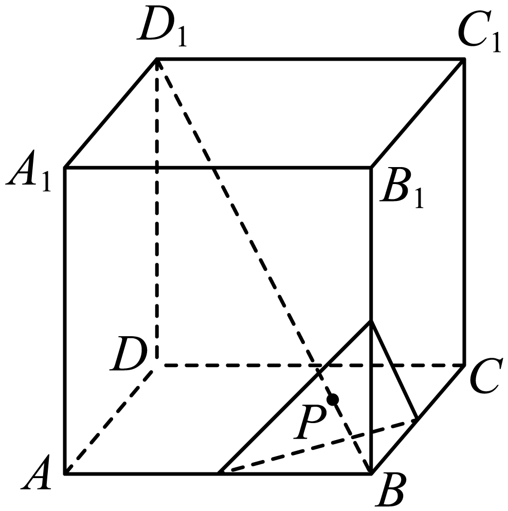

A．	B．	C．	D．

<strong>例5．</strong>（2024·北京东城·高三北京市第十一中学校考阶段练习）如图，正方体的棱长为1，<em>E</em>，<em>F</em>，<em>G</em>分别为线段上的动点（不含端点），

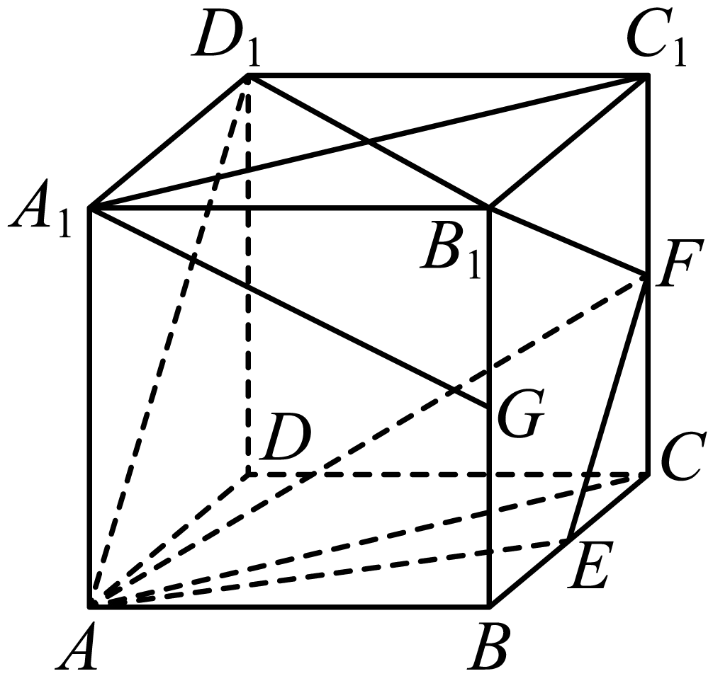

①异面直线与AF所成角可以为

②当*G*为中点时，存在点*E*，*F*使直线与平面*AEF*平行

③当*E*，*F*为中点时，平面*AEF*截正方体所得的截面面积为

④存在点*G*，使点*C*与点*G*到平面*AEF*的距离相等

则上述结论正确的是（    ）

A．①③	B．②④	C．②③	D．①④

<strong>例6．</strong>（2024·河南·模拟预测）在正方体中，<em>M</em>，<em>N</em>分别为<em>AD</em>，的中点，过<em>M</em>，<em>N</em>，三点的平面截正方体所得的截面形状为（    ）

A．六边形	B．五边形	C．四边形	D．三角形

**变式4．**（2024·河南·模拟预测）在正方体中，分别为，的中点，则下列结论正确的个数为（    ）

①平面 ；②；③直线与所成角的余弦值为

④过三点的平面截正方体所得的截面为梯形

A．1	B．2	C．3	D．4

<strong>变式5．</strong>（2024·上海闵行·高三上海市七宝中学校考阶段练习）在棱长为2的正方体中，<em>E</em>，<em>F</em>分别为<em>AB</em>，<em>BC</em>的中点，对于如下命题：①异面直线与所成角的余弦值为；②点<em>P</em>为正方形内一点，当平面时<em>，DP</em>的最小值为；③过点，<em>E</em>，<em>F</em>的平面截正方体所得的截面周长为；④当三棱锥的所有顶点都在球<em>O</em>的表面上时，球<em>O</em>的体积为．则正确的命题个数为（    ）

A．1	B．2	C．3	D．4

**变式6．**（2024·河南新乡·统考三模）如图，在棱长为2的正方体中，是棱的中点，过三点的截面把正方体分成两部分，则这两部分中大的体积与小的体积的比值为（    ）

A．	B．	C．	D．

<strong>变式7．</strong>（2024·新疆·校联考二模）已知在直三棱柱中，<em>E</em>，<em>F</em>分别为，的中点，，，，，如图所示，若过<em>A</em>、<em>E</em>、<em>F</em>三点的平面作该直三棱柱的截面，则所得截面的面积为（    ）

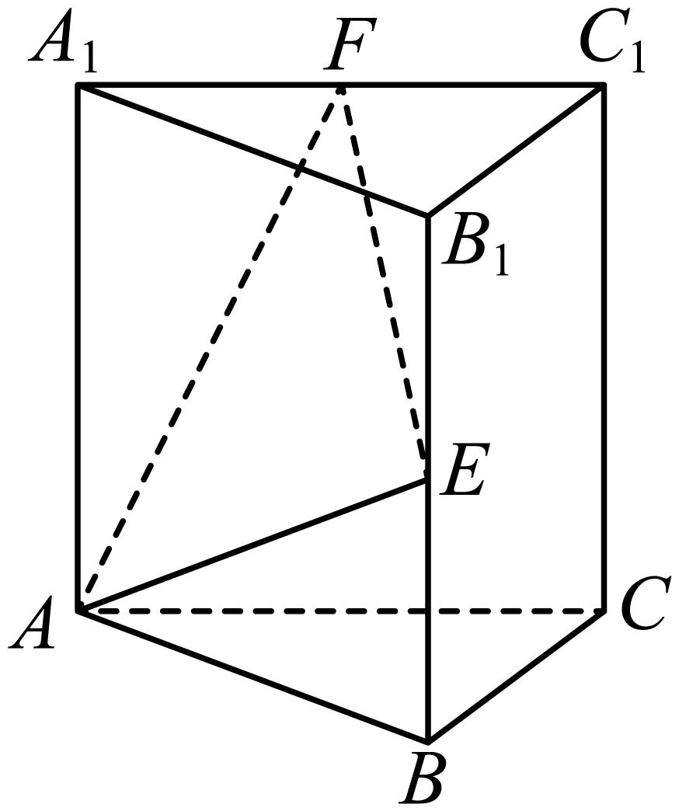

A．	B．	C．	D．

**变式8．**（2024·新疆阿克苏·校考一模）已知，，是正方体的棱，，的中点，则平面截正方体所得的截面是（    ）

A．三角形	B．四边形	C．五边形	D．六边形

<strong>变式9．</strong>（2024·重庆沙坪坝·高三重庆一中校考期中）在棱长为3的正方体中，点<em>Р</em>是侧面上的点，且点<em>Р</em>到棱与到棱<em>AD</em>的距离均为1，用过点<em>Р</em>且与垂直的平面去截该正方体，则截面在正方体底面<em>ABCD</em>的投影多边形的面积是（    ）

A．	B．5	C．	D．8

**【解题方法总结】**

（1）作截面应遵循的三个原则：①在同一平面上的两点可引直线；②凡是相交的直线都要画出它们的交点；③凡是相交的平面都要画出它们的交线．

（2）作交线的方法有如下两种：①利用基本事实3作交线；

②利用线面平行及面面平行的性质定理去寻找线面平行及面面平行，然后根据性质作出交线．

**题型三：异面直线的判定**

**例7．**（2024·全国·高三对口高考）两条直线分别和异面直线都相交，则直线的位置关系是（    ）

A．一定是异面直线	B．一定是相交直线

C．可能是平行直线	D．可能是异面直线，也可能是相交直线

**例8．**（2024·全国·高三专题练习）如图，已知正方体，点在直线上，为线段的中点，则下列命题中假命题为（    ）

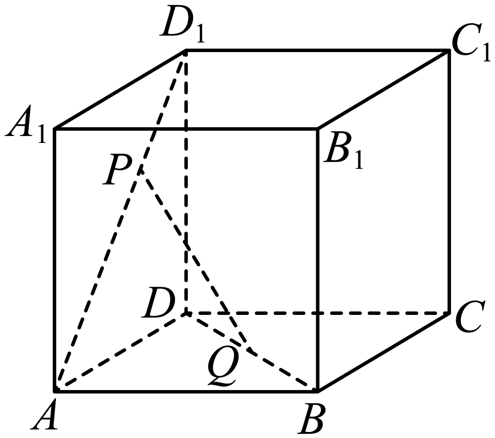

A．存在点，使得

B．存在点，使得

C．直线始终与直线异面

D．直线始终与直线异面

<strong>例9．</strong>（2024·四川绵阳·高三绵阳南山中学实验学校校考阶段练习）在底面半径为1的圆柱中，过旋转轴作圆柱的轴截面<em>ABCD</em>，其中母线<em>AB</em>=2，<em>E</em>是弧<em>BC</em>的中点，<em>F</em>是<em>AB</em>的中点，则（    ）

A．*AE*=*CF*，*AC*与*EF*是共面直线

B．，*AC*与*EF*是共面直线

C．*AE*=*CF*，*AC*与*EF*是异面直线

D．，*AC*与*EF*是异面直线

**变式10．**（2024·上海浦东新·高三华师大二附中校考阶段练习）已知正方体中，，，分别是棱，，的中点，是线段上的动点，则下列直线中，始终与直线异面的是（    ）

A．	B．	C．	D．

<strong>变式11．</strong>（2024·上海·高三校联考阶段练习）如图所示，正三棱柱的所有棱长均为1，点<em>P</em>、<em>M</em>、<em>N</em>分别为棱、<em>AB</em>、的中点，点<em>Q</em>为线段<em>MN</em>上的动点．当点<em>Q</em>由点<em>N</em>出发向点<em>M</em>运动的过程中，以下结论中正确的是（   ）

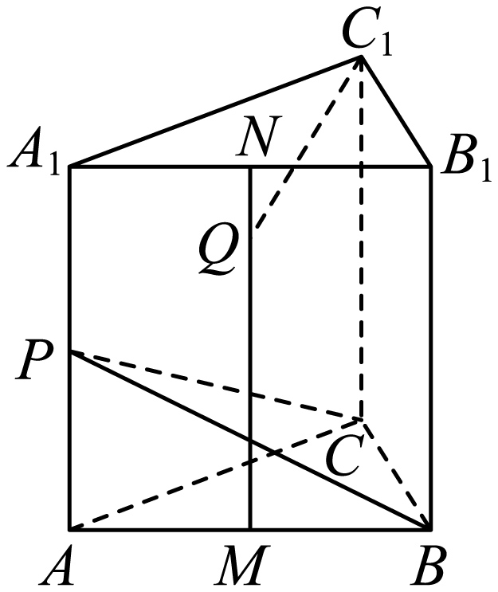

A．直线与直线*CP*可能相交	B．直线与直线*CP*始终异面

C．直线与直线*CP*可能垂直	D．直线与直线*BP*不可能垂直

**变式12．**（2024·吉林长春·高三长春市第六中学校考期末）如图，在底面为正方形的棱台中，、、、分别为棱，，，的中点，对空间任意两点、，若线段与线段、都不相交，则称点与点可视，下列选项中与点可视的为（    ）

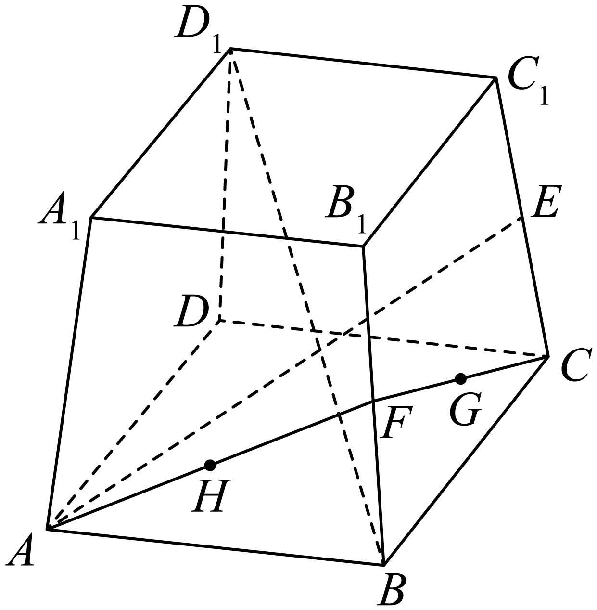

A．	B．	C．	D．

**【解题方法总结】**

判定空间两条直线是异面直线的方法如下：

（1）直接法：平面外一点*A*与平面内一点*B*的连线和平面内不经过*B*点的直线是异面直线．

（2）间接法：平面两条不可能共面（平行，相交）从而得到两线异面．

**题型四：异面直线所成的角**

<strong>例10．</strong>（2024·全国·高三专题练习）如图,在正方体中,点<em>E</em>,<em>F</em>分别是棱<em>AD</em>,的中点,则异面直线与<em>BF</em>所成角的大小为______．

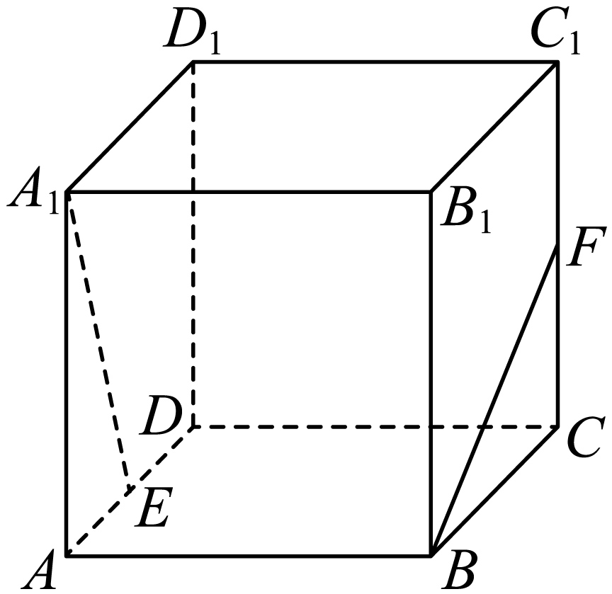

<strong>例11．</strong>（2024·高三课时练习）已知正四面体<em>ABCD</em>中,<em>E</em>是<em>AB</em>的中点,则异面直线<em>CE</em>与<em>BD</em>所成角的大小为______．

<strong>例12．</strong>（2024·新疆喀什·高三统考期中）如图是一个正方体的平面展开图，在这个正方体中，下列说法中，正确的序号是___________.

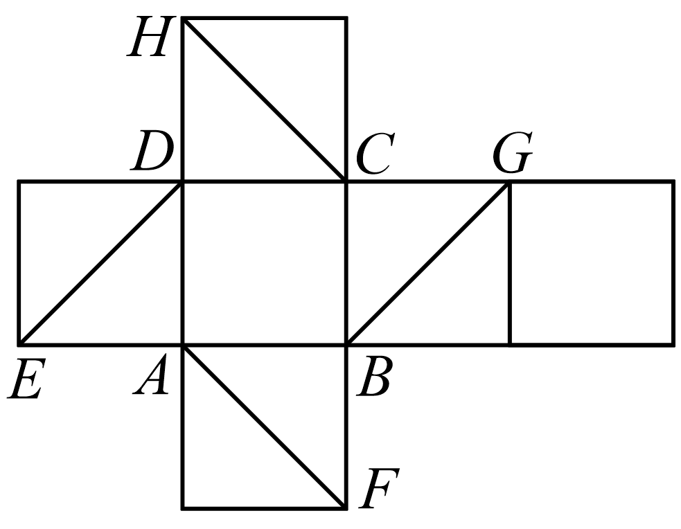

（1）直线与直线相交；

（2）直线与直线平行；

（3）直线与直线是异面直线；

（4）直线与直线成角.

<strong>变式13．</strong>（2024·全国·高三专题练习）如图，将正方体沿交于一顶点的三条棱的中点截去一小块，八个顶点共截去八小块，得到八个面为正三角形、六个面为正方形的“阿基米德多面体”，则异面直线与所成角的大小是___________

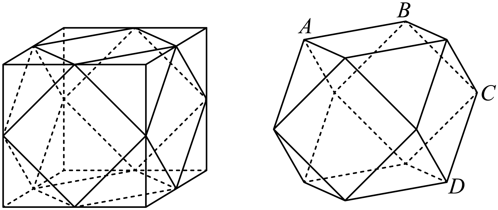

<strong>变式14．</strong>（2024·全国·高三对口高考）线段的两端分别在直二面角的两个面内，且与这两个面都成角，则直线与所成的角等于_________．

<strong>变式15．</strong>（2024·全国·高三专题练习）如图，等腰梯形沿对角线翻折，得到空间四边形，若，则直线与所成角的大小可能为______.（写出一个值即可）

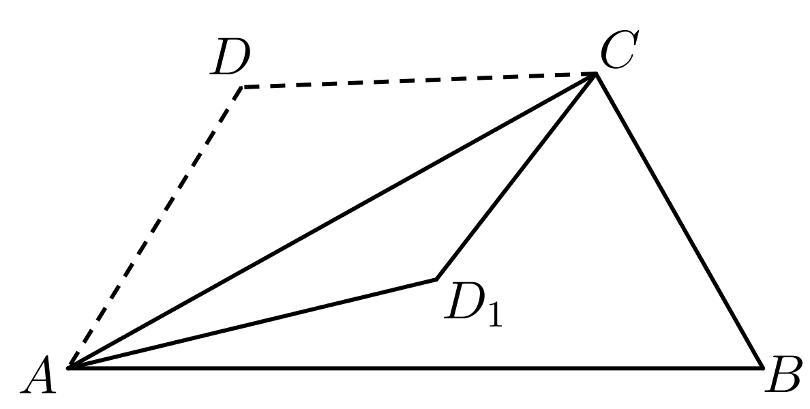

**【解题方法总结】**

（1）点、直线、平面位置关系的判定，注意构造几何体（长方体、正方体）模型来判断，常借助正方体为模型．

（2）求异面直线所成的角的三个步骤

一作：根据定义作平行线，作出异面直线所成的角．

二证：证明作出的角是异面直线所成的角．

三求：解三角形，求出所作的角．

**题型五：平面的基本性质**

**例13．（多选题）（2024·湖北荆门·荆门市龙泉中学校考模拟预测）** 已知，是两个不同的平面，则下列命题正确的是（    ）

A．若，且，则

B．若*A*，*B*，*C*是平面内不共线三点，，，则

C．若且，则直线

D．若直线，直线，则*a*与*b*为异面直线

**例14．（多选题）（2024·全国·高三专题练习）** 有下列命题：

①经过三点确定一个平面；

②梯形可以确定一个平面；

③两两相交的三条直线最多可以确定三个平面；

④如果两个平面有三个公共点，则这两个平面重合．

其中正确命题是（    ）

A．①	B．②	C．③	D．④

**例15．（多选题）（2024·全国·高三专题练习）** 我们知道，平面几何中有些正确的结论在空间中不一定成立．下面给出的平面几何中的四个真命题， 在空间中仍然成立的有（    ）

A．平行于同一条直线的两条直线必平行

B．垂直于同一条直线的两条直线必平行

C．一个角的两边分别平行于另一个角的两边，那么这两个角相等或互补

D．一个角的两边分别垂直于另一个角的两边，那么这两个角相等或互补

**变式16．（多选题）（2024·重庆沙坪坝·高三重庆市第七中学校校考阶段练习）** 下列命题中错误的是（    ）

A．空间三点可以确定一个平面

B．三角形一定是平面图形

C．若*A*，，，既在平面内，又在平面内，则平面和平面重合

D．四条边都相等的四边形是平面图形

**变式17．（多选题）（2024·全国·模拟预测）** 如图，点，，，分别是正方体中棱，，，的中点，则（    ）

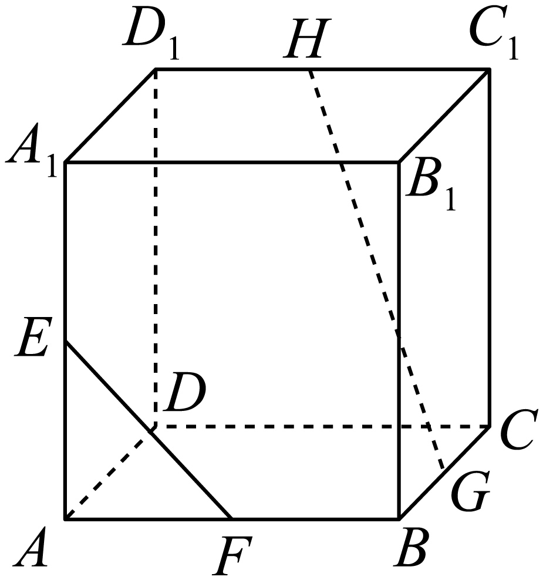

A．	B．

C．直线，是异面直线	D．直线，是相交直线

<strong>变式18．（多选题）（2024·全国·高三专题练习）</strong>如图，正方体的棱长为1，线段上有两个动点<em>E</em>、<em>F</em>，且，则下列结论中正确的是（    ）

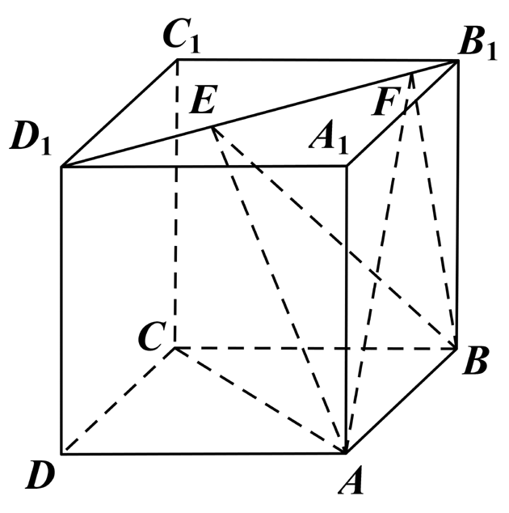

A．线段上存在点*E*、*F*使得	B．平面*ABCD*

C．的面积与的面积相等	D．三棱锥*A*-*BEF*的体积为定值

**题型六：等角定理**

<strong>例16．</strong>（2024·河南新乡·新乡市第一中学校考模拟预测）在棱长均相等的四面体中，为棱不含端点上的动点，过点<em>A</em>的平面与平面平行若平面与平面，平面的交线分别为，，则，所成角的正弦值的最大值为__________．

<strong>例17．</strong>（2024·全国·高三专题练习）过正方体的顶点在空间作直线，使与平面和直线所成的角都等于，则这样的直线共有______条．

<strong>例18．</strong>（2024·高三课时练习）若空间两个角与的两边对应平行，当时，则______．

<strong>变式19．</strong>（2024·全国·高三专题练习）设和的两边分别平行，若，则的大小为___________.

<strong>变式20．</strong>（2024·全国·高三专题练习）空间四边形的对角线互相垂直且相等，顺次连接这个四边形各边中点，所组成的四边形是_________.

<strong>变式21．</strong>（2024·江西吉安·高一校联考期末）已知空间中两个角，且，若，则_____.

<strong>变式22．</strong>（2024·黑龙江齐齐哈尔·高一校联考期末）已知空间中两个角，，且角与角的两边分别平行，若，则________．

**【解题方法总结】**

空间中如果两个角的两边分别对应平行，那么这两个角相等或互补

