**第47讲  空间点、直线、平面之间的位置关系**

**知识梳理**

**知识点一．四个公理**

**公理**1**：** 如果一条直线上的两点在一个平面内，那么这条直线在此平面内．

**注意：**（1）此公理是判定直线在平面内的依据；（2）此公理是判定点在面内的方法

**公理**2**：** 过不在一条直线上的三点，有且只有一个平面．

**注意：**（1）此公理是确定一个平面的依据；（2）此公理是判定若干点共面的依据

**推论①：** 经过一条直线和这条直线外一点，有且只有一个平面；

**注意：**（1）此推论是判定若干条直线共面的依据

（2）此推论是判定若干平面重合的依据

（3）此推论是判定几何图形是平面图形的依据

**推论②：** 经过两条相交直线，有且只有一个平面；

**推论③：** 经过两条平行直线，有且只有一个平面；

**公理**3**：** 如果两个不重合的平面有一个公共点，那么它们有且只有一条过该点的公共直线．

**注意：**（1）此公理是判定两个平面相交的依据

（2）此公理是判定若干点在两个相交平面的交线上的依据（比如证明三点共线、三线共点）

（3）此推论是判定几何图形是平面图形的依据

**公理**4**：** 平行于同一条直线的两条直线互相平行．

**知识点二．直线与直线的位置关系**

<table><tr><td>
位置关系
</td><td>
相交（共面）
</td><td>
平行（共面）
</td><td>
异面
</td></tr><tr><td>
图形
</td><td>

</td><td>

</td><td>

</td></tr><tr><td>
符号
</td><td>

</td><td>
<em>a</em>∥<em>b</em>
</td><td>

</td></tr><tr><td>
公共点个数
</td><td>
1
</td><td>
0
</td><td>
0
</td></tr><tr><td>
特征
</td><td>
两条相交直线确定一个平面
</td><td>
两条平行直线确定一个平面
</td><td>
两条异面直线不同在如何一个平面内
</td></tr></table>

**知识点三．直线与平面的位置关系：** 有直线在平面内、直线与平面相交、直线与平面平行三种情况．

<table><tr><td>
位置关系
</td><td>
包含（面内线）
</td><td>
相交（面外线）
</td><td>
平行（面外线）
</td></tr><tr><td>
图形
</td><td>

</td><td>

</td><td>

</td></tr><tr><td>
符号
</td><td>

</td><td>

</td><td>
∥
</td></tr><tr><td>
公共点个数
</td><td>
无数个
</td><td>
1
</td><td>
0
</td></tr></table>

**知识点四．平面与平面的位置关系：** 有平行、相交两种情况．

<table><tr><td>
位置关系
</td><td>
平行
</td><td>
相交（但不垂直）
</td><td>
垂直
</td></tr><tr><td>
图形
</td><td>

</td><td>

</td><td>

</td></tr><tr><td>
符号
</td><td>
∥
</td><td>

</td><td>
，
</td></tr><tr><td>
公共点个数
</td><td>
0
</td><td>
无数个公共点且都在唯一的一条直线上
</td><td>
无数个公共点且都在唯一的一条直线上
</td></tr></table>

**知识点五．等角定理：** 空间中如果两个角的两边分别对应平行，那么这两个角相等或互补．

**必考题型全归纳**

**题型一：证明**“**点共面**”**、**“**线共面**”**或**“**点共线**”**及**“**线共点**”

**例1．**（2024·山西大同·高一校考期中）如图所示，在空间四边形中，，分别为，的中点，，分别在，上，且，求证：

(1)，，，四点共面；

(2)与的交点在直线上．

【解析】（1）：：：，，

，分别为，的中点，，，

，，，四点共面．

（2）、不是、的中点，

，且，

与必相交，设交点为，

平面，平面，

平面，且平面，

平面平面，，

与的交点在直线上．

**例2．**（2024·陕西西安·高一校考期中）（1）已知直线，直线与，都相交，求证：过，，有且只有一个平面；

（2）如图，在空间四边形中，，分别是，的中点，，分别是边，上的点，且.求证：直线，，相交于一点.

【解析】（1）证明：设直线与，分别交于点，

如图1，

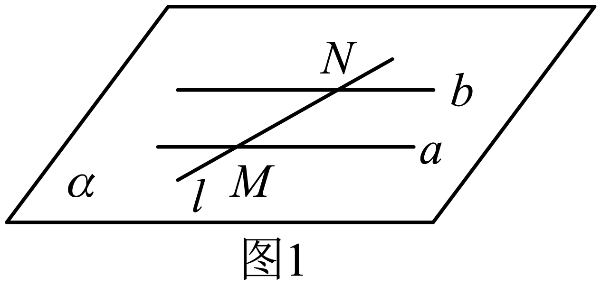

因为，所以确定一个平面，记为平面，

因为点直线，点直线，所以，，

所以直线，即平面，所以过，，有且只有一个平面；

（2）在空间四边形中，连接，

因为分别为的中点，则，且，

又由，则，且，

故，且，故四边形为梯形，与交于一点，

设与交于点，如图2，

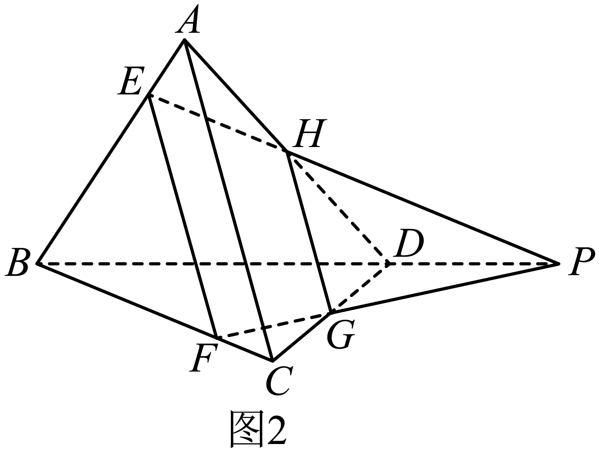

由于平面，点在平面内，同理点在平面内，

又因为平面平面，

所以点在直线上，

故直线相交于一点.

<strong>例3．</strong>（2024·河南信阳·高一校联考期中）如图，在正方体中，<em>E</em>，<em>F</em>分别是上的点，且.

(1)证明：四点共面；

(2)设，证明：*A*，*O*，*D*三点共线.

【解析】（1）证明：如图，连接.

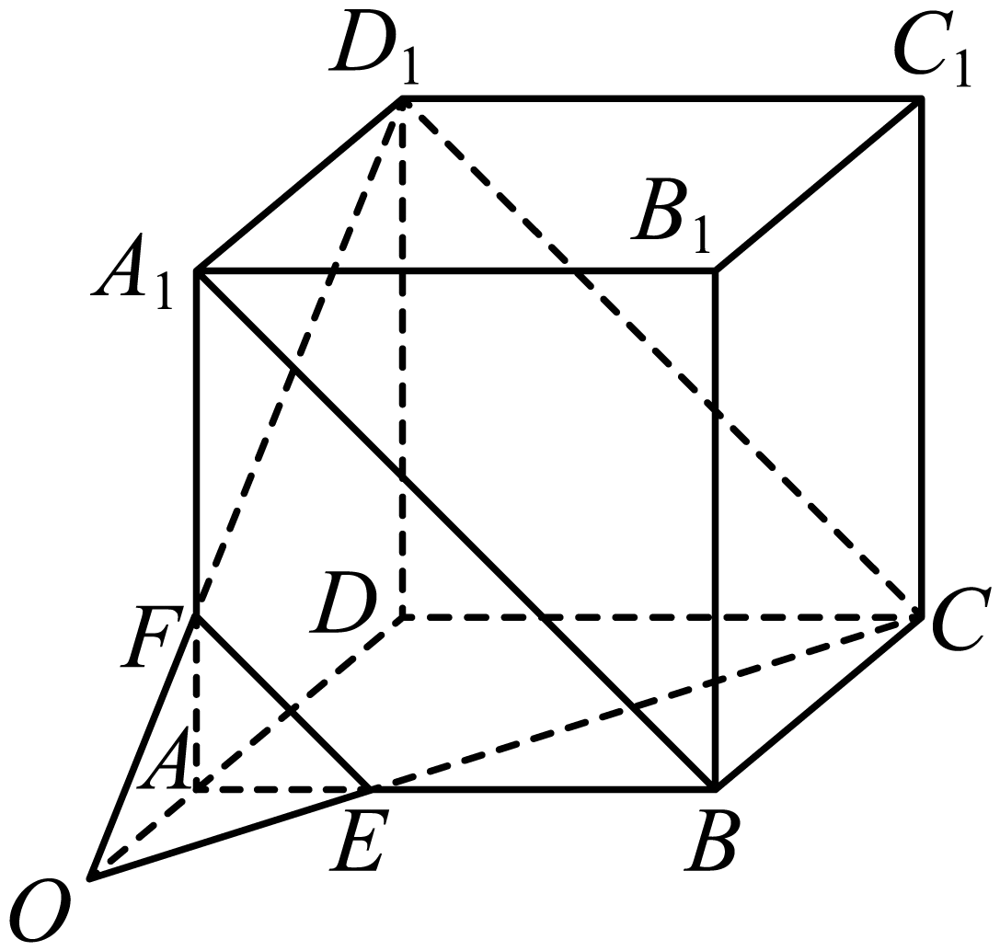

在正方体中，，所以，

又，且，

所以四边形是平行四边形，所以，

，所以四点共面；

（2）证明：由，，又平面，平面，

同理平面*ABCD*，又平面平面，

，即*A*，*O*，*D*三点共线.

<strong>变式1．</strong>（2024·全国·高一专题练习）如图所示，在空间四边形<em>ABCD</em>中，<em>E</em>，<em>F</em>分别为<em>AB</em>，<em>AD</em>的中点，<em>G</em>，<em>H</em>分别在<em>BC</em>，<em>CD</em>上，且.求证：

(1)*E*､*F*､*G*､*H*四点共面；

(2)*EG*与*HF*的交点在直线*AC*上.

【解析】（1）∵，∴.

∵*E*，*F*分别为*AB*，*AD*的中点，∴，且，

∴，∴*E*，*F*，*G*，*H*四点共面.

（2）∵*G*，*H*不是*BC*，*CD*的中点，∴，∴，

由（1）知，故*EFHG*为梯形.

∴*EG*与*FH*必相交，设交点为*M*，

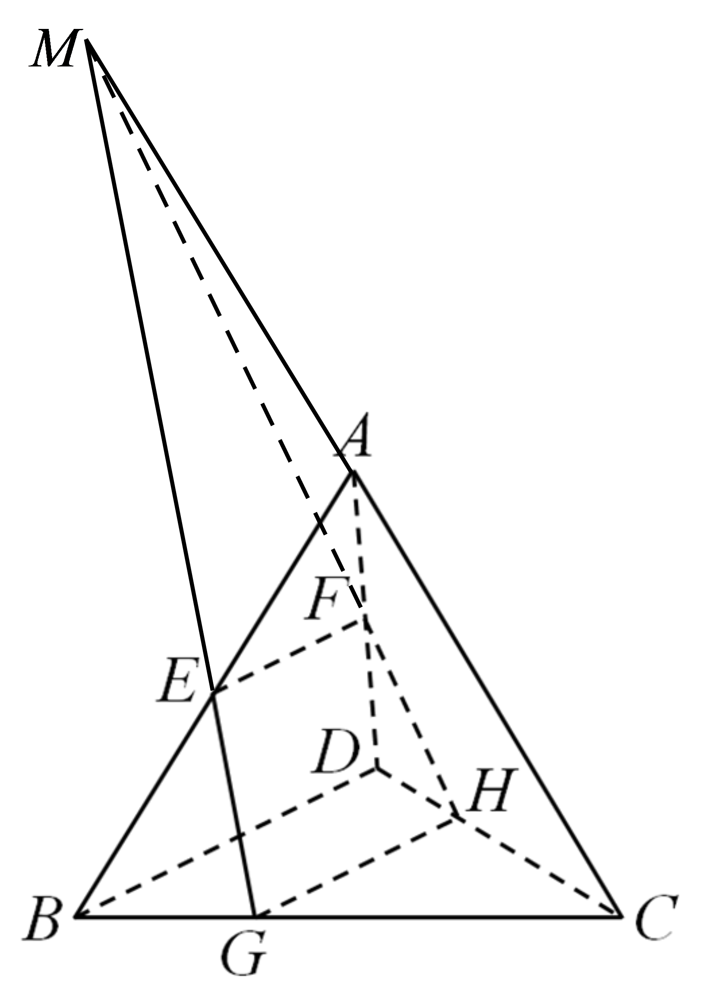

∴平面*ABC*，平面*ACD*，

∴平面*ABC*，且平面*ACD*，

∴，即*GE*与*HF*的交点在直线*AC*上.

<strong>变式2．</strong>（2024·云南楚雄·高一统考期中）如图，在正四棱台中，<em>E</em>，<em>F</em>，<em>G</em>，<em>H</em>分别为棱，，<em>AB</em>，<em>BC</em>的中点．

(1)证明*E*，*F*，*G*，*H*四点共面；

(2)证明*GE*，*FH*，相交于一点．

【解析】（1）证明：连接*AC*，，如图所示，

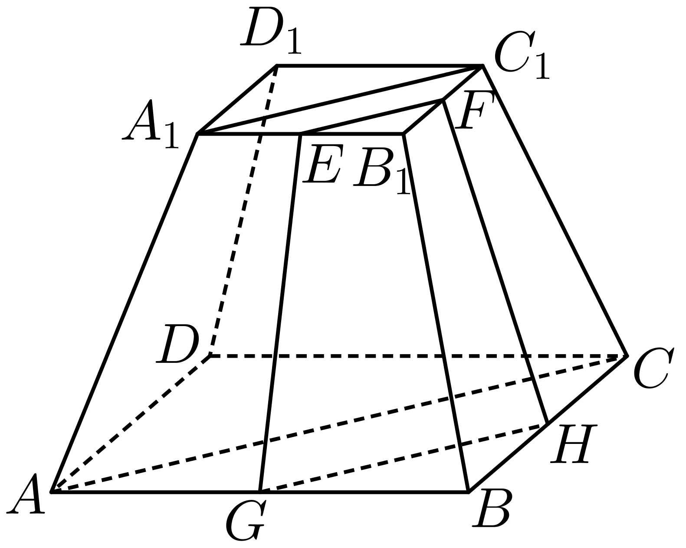

因为为正四棱台，所以，

又*E*，*F*，*G*，*H*分别为棱，，*AB*，*BC*的中点，所以，，

则，所以*E*，*F*，*G*，*H*四点共面．

（2）因为，所以，所以*EFHG*为梯形，则*EG*与*FH*必相交．

设，因为平面，所以平面，

因为平面，所以平面，

又平面平面，所以，

则*GE*，*FH*，交于一点．

<strong>变式3．</strong>（2024·全国·高三专题练习）如图所示，在正方体中，<em>E</em>，<em>F</em>分别是的中点．

(1)求证：三线交于点*P*；

(2)在（1）的结论中，*G*是上一点，若*FG*交平面*ABCD*于点*H*，求证：*P*，*E*，*H*三点共线．

【解析】（1）证明：连接，，

正方体中，*E*，*F*分别是的中点，

∴且，

∵且，

∴且，

∴*EC*与相交，设交点为*P*，

∵*PEC*，*EC*平面*ABCD*，∴*P*平面*ABCD*；

又∵，平面，∴平面，

∴*P*为两平面的公共点，

∵平面平面，∴，

∴三线交于点*P*；

（2）

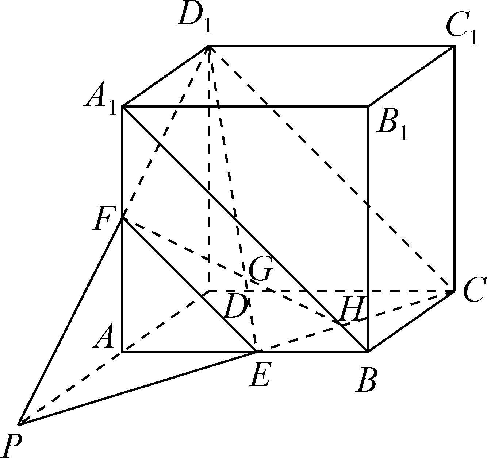

在（1）的结论中，*G*是上一点，*FG*交平面*ABCD*于点*H*，

则*FH*平面，∴平面，又平面*ABCD*，

∴平面平面*ABCD*，

同理，平面平面*ABCD*，

平面平面*ABCD*，

∴*P*，*E*，*H*都在平面与平面*ABCD*的交线上，

∴*P*，*E*，*H*三点共线．

**【解题方法总结】**

共面、共线、共点问题的证明

（1）证明共面的方法：先确定一个平面，然后再证其余的线（或点）在这个平面内．

（2）证明共线的方法：先由两点确定一条直线，再证其他各点都在这条直线上．

（3）证明共点的方法：先证其中两条直线交于一点，再证其他直线经过该点．

**题型二：截面问题**

<strong>例4．</strong>（2024·全国·高三对口高考）如图，正方体的棱长为，动点<em>P</em>在对角线上，过点<em>P</em>作垂直于的平面，记这样得到的截面多边形（含三角形）的周长为<em>y</em>，设，则当时，函数的值域为（    ）

A．	B．	C．	D．

【答案】A

【解析】

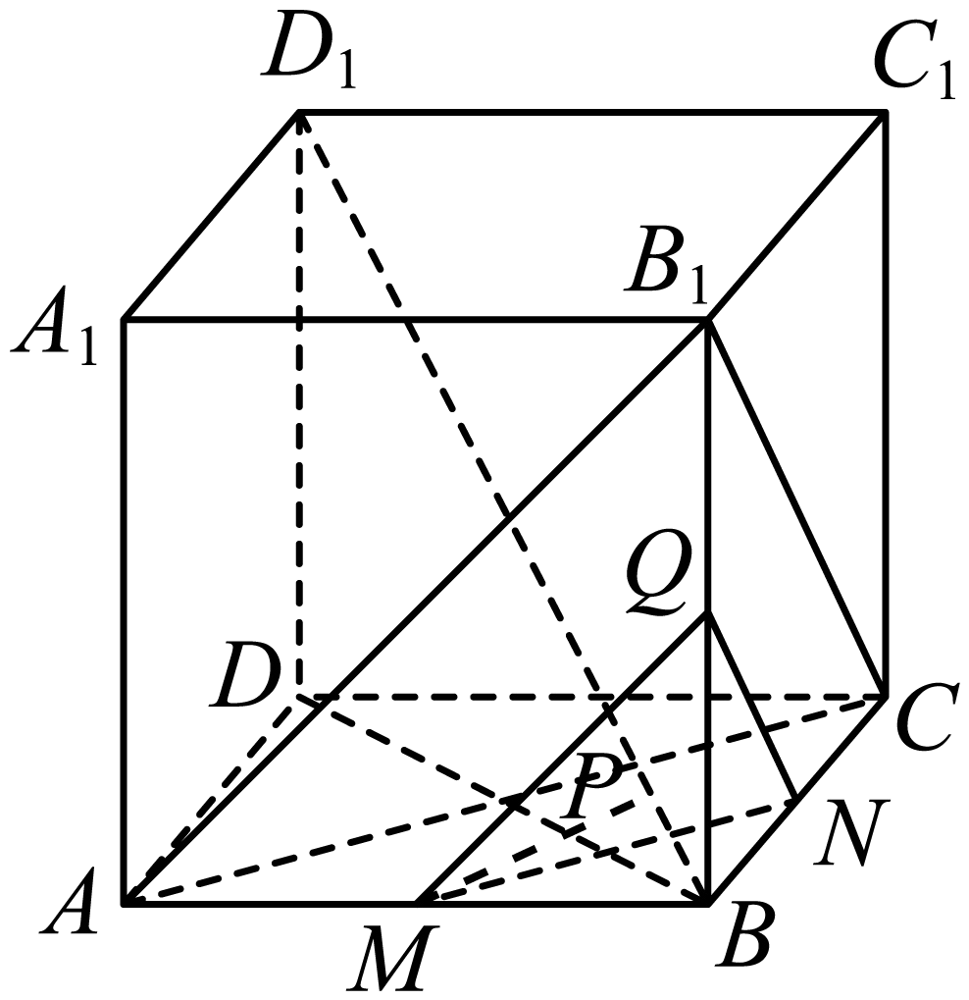

如图，连接， ，平面，平面，则，

又，，平面，平面，

所以平面，又平面，所以，

同理，，平面，平面，所以平面，

因此平面与平面重合或平行，

取的中点，连接，则，，

同理可证平面，由于，，所以三棱锥是正三棱锥，

与平面的交点是的中心，

正方体棱长为，则，，

所以，所以，

由棱锥的平行于底面的截面的性质知，当平面从平面平移到平面时，，即，

，，显然，

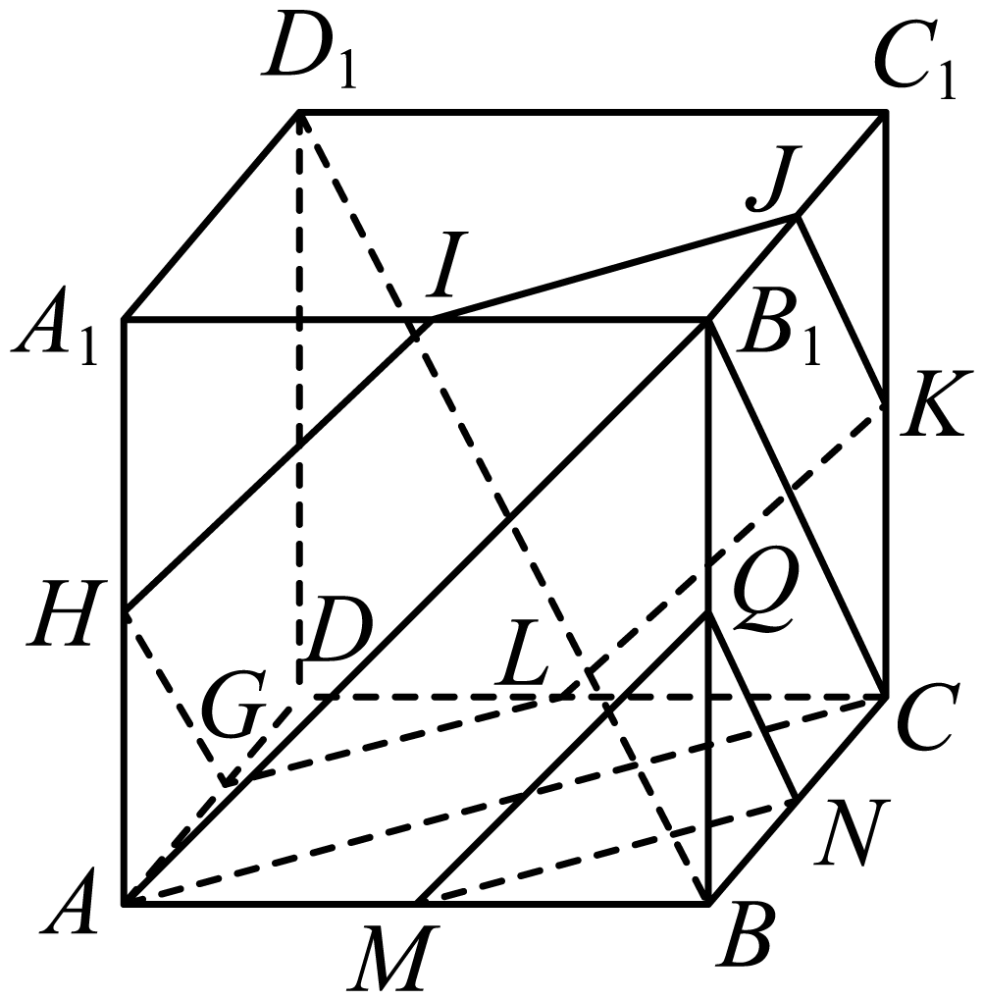

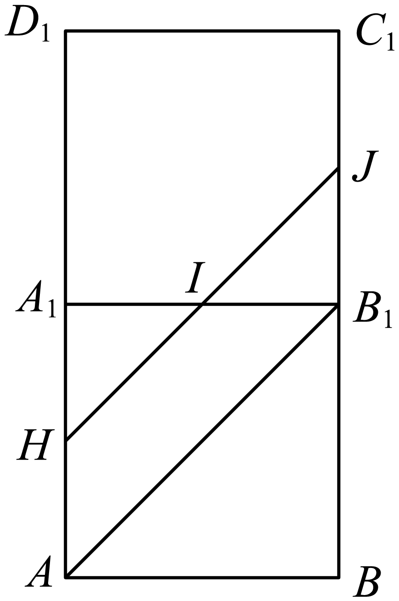

平面过平面再平移至平面时，如图，把正方形沿旋转到与正方形在同一平面内，

如图，则共线，由正方形性质得，同理，，

因此此种情形下，截面的周长与截面的周长相等，平移平面，一直到平面位置处，

由正方体的对称性，接着平移时，截面周长逐渐减少到，

综上，的值域是．

故选：A.

<strong>例5．</strong>（2024·北京东城·高三北京市第十一中学校考阶段练习）如图，正方体的棱长为1，<em>E</em>，<em>F</em>，<em>G</em>分别为线段上的动点（不含端点），

①异面直线与AF所成角可以为

②当*G*为中点时，存在点*E*，*F*使直线与平面*AEF*平行

③当*E*，*F*为中点时，平面*AEF*截正方体所得的截面面积为

④存在点*G*，使点*C*与点*G*到平面*AEF*的距离相等

则上述结论正确的是（    ）

A．①③	B．②④	C．②③	D．①④

【答案】C

【解析】对①：因为//，故与的夹角即为与的夹角，

又当与重合时，取得最大值，为；

当与点重合时，取得最小值，设其为，则，故；

又点不能与重合，故，故①错误；

对②：当为中点时，存在分别为的中点，满足//面，证明如下：

取的中点为，连接，如下所示：

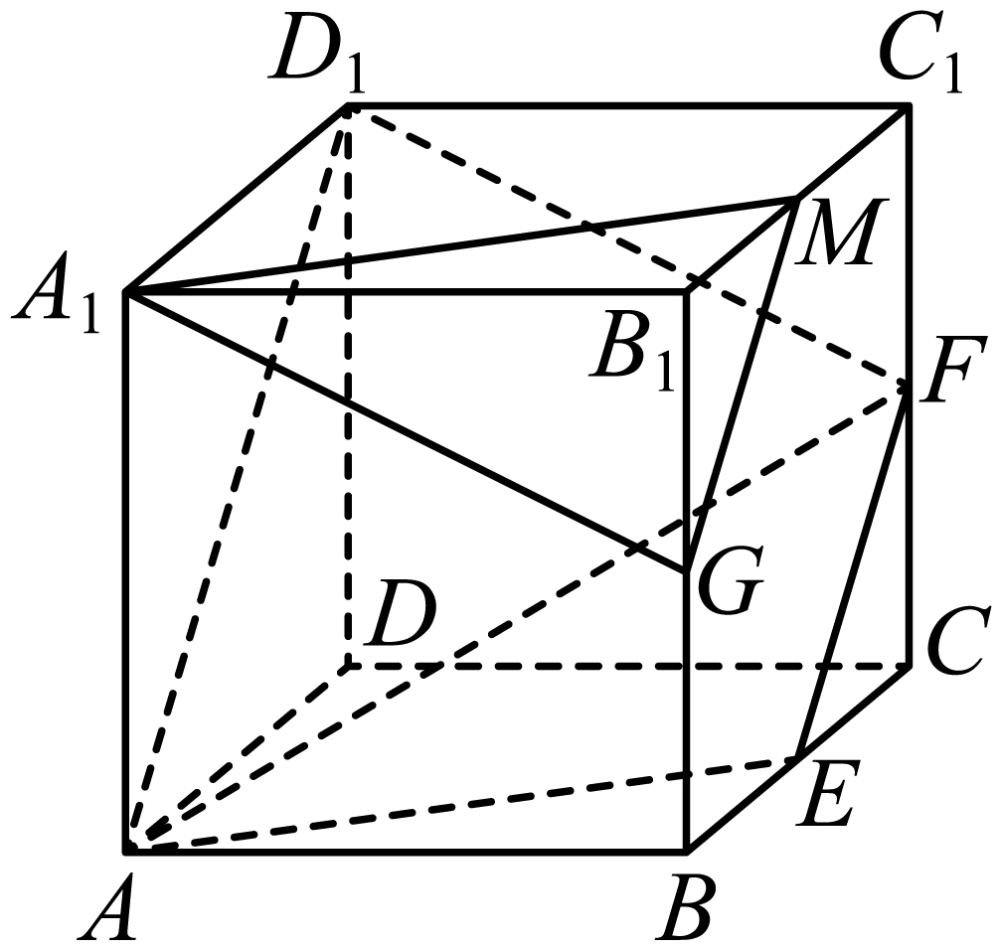

显然//，又面面，故//面；

又易得//，面面，故//面；

又面，故面//面，

又面，故//面，故②正确；

对③：连接，如下所示：

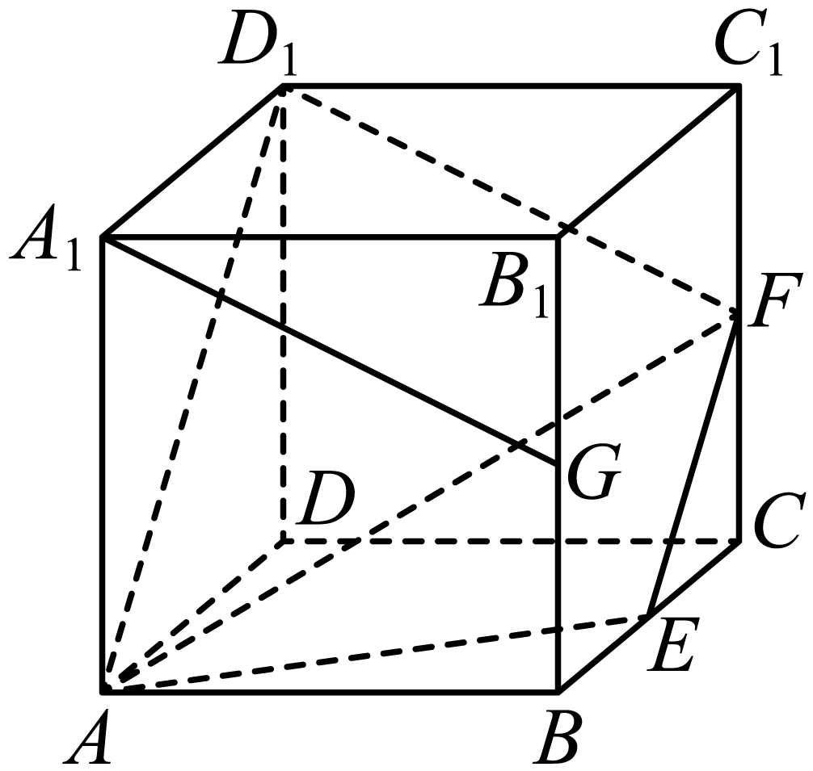

因为////，故面即为平面截正方体所得截面；

又，故该截面为等腰梯形，又，，

故截面面积，故③正确；

对④：连接，取其中点为，如下所示：

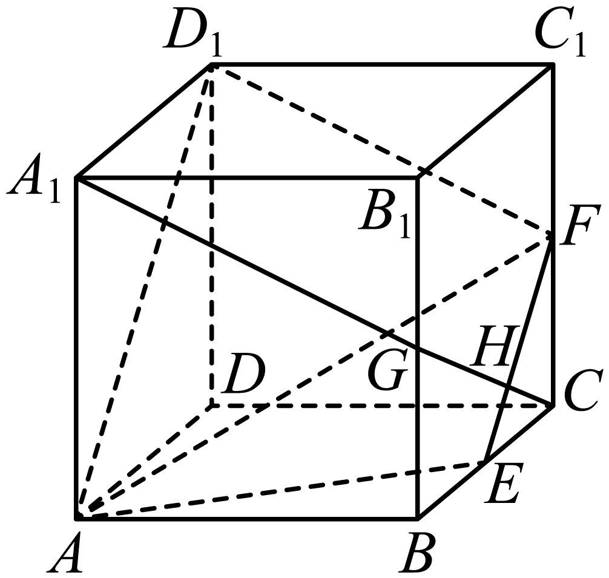

要使得点到平面的距离等于点到平面的距离，只需经过的中点，

显然当点分别为所在棱的中点时，不存在这样的点满足要求，故④错误.

故选：C.

<strong>例6．</strong>（2024·河南·模拟预测）在正方体中，<em>M</em>，<em>N</em>分别为<em>AD</em>，的中点，过<em>M</em>，<em>N</em>，三点的平面截正方体所得的截面形状为（    ）

A．六边形	B．五边形	C．四边形	D．三角形

【答案】B

【解析】

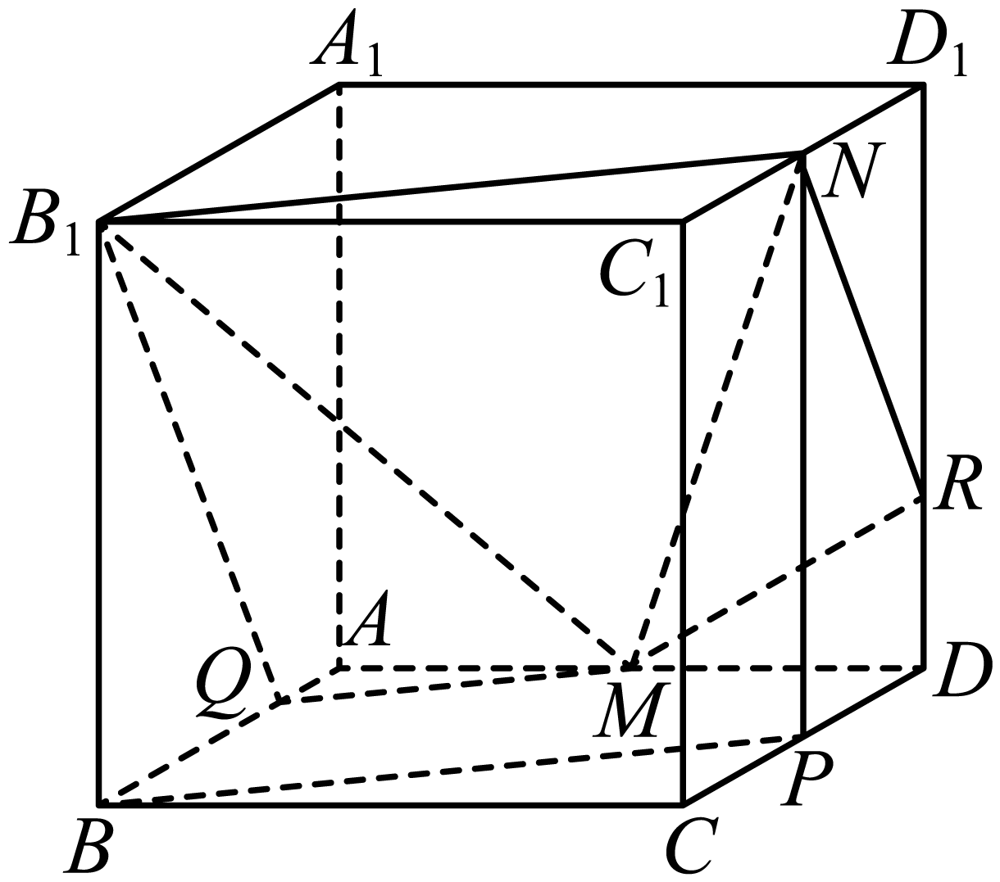

在上取点，且，取中点为，连接.

在上取点，且，连结.

因为，，

所以，所以.

又，所以，所以，

所以，.

因为分别为的中点，所以，且.

根据正方体的性质，可知，且，

所以，，且，

所以，四边形是平行四边形，

所以，，所以.

同理可得，.

所以，五边形即为所求正方体的截面.

故选：B.

**变式4．**（2024·河南·模拟预测）在正方体中，分别为，的中点，则下列结论正确的个数为（    ）

①平面 ；②；③直线与所成角的余弦值为

④过三点的平面截正方体所得的截面为梯形

A．1	B．2	C．3	D．4

【答案】B

【解析】连接，交于点，则是的中点，连接，由于是中点，可得，

所以四边形是平行四边形，所以,

又平面，平面，所以平面，即①正确；

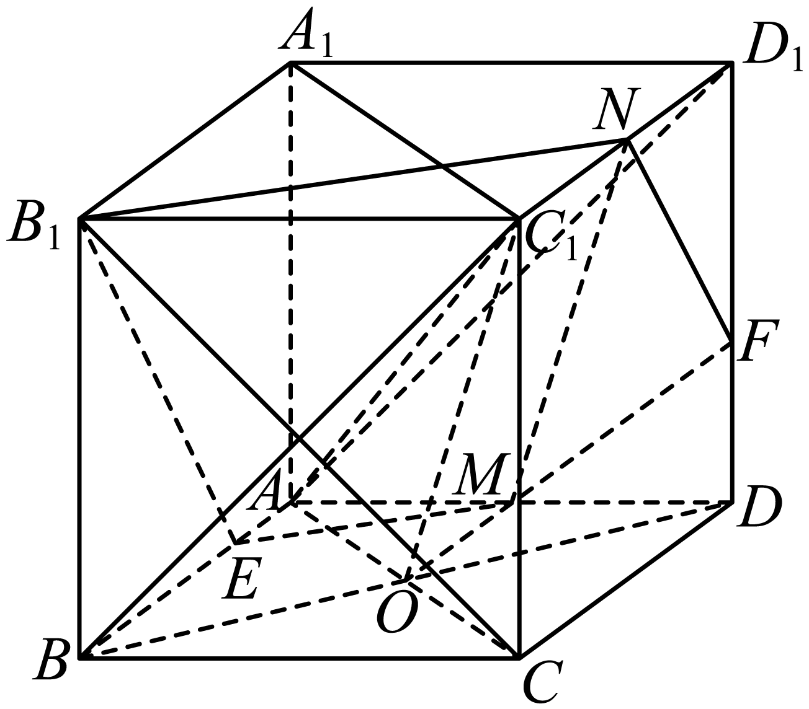

连接，则，在正方体中，平面，又平面，所以,

又，平面，平面，所以平面，若，则平面或平面，而与平面相交，所以与不垂直，即②错误；

由于，所以为直线与所成角（或补角），

设正方体棱长为2，

则,所以由余弦定理得，即③正确；

因为平面与平面平行，则过三点的截面与这两个平面的交线平行，由于其中一条交线是,另一交线过点，所以在平面内作与平行（是靠近的四等分点），连接，同理作出与平行（是靠近的三等分点），从而得到截面，可知截面是五边形，即④错误；

综上，正确的个数是2个.

故选：B.

<strong>变式5．</strong>（2024·上海闵行·高三上海市七宝中学校考阶段练习）在棱长为2的正方体中，<em>E</em>，<em>F</em>分别为<em>AB</em>，<em>BC</em>的中点，对于如下命题：①异面直线与所成角的余弦值为；②点<em>P</em>为正方形内一点，当平面时<em>，DP</em>的最小值为；③过点，<em>E</em>，<em>F</em>的平面截正方体所得的截面周长为；④当三棱锥的所有顶点都在球<em>O</em>的表面上时，球<em>O</em>的体积为．则正确的命题个数为（    ）

A．1	B．2	C．3	D．4

【答案】C

【解析】对于①，，

在中即为异面直线与所成的角，

，

异面直线与所成的角的余弦值为．故①错误；

对于②，取的中点的中点，取的中点，连接，，，

，

同理可得，

又面，面，面，面，

面，面，

又，面，

面面，

又面，面，

轨迹为线段，

在中，过作，此时取得最小值，

在中，，，，

在中，，，，

在中，，，，

如图，在中，．故②正确；

对于③，过点的平面截正方体，

平面平面，则过点的平面必与、各交于一点，

设过点的平面必与与分别交于、，

过点的平面与平面和平面分别交于与，，同理可得，

如图过点的平面截正方体所得的截面图形为五边形，

如图以为原点，分别以方向为轴､轴､轴正方向建立空间直角坐标系，

设，，

则，，，，，

，，，，

，，

，解得，

，，

，，

在中，，，，同理：，

在中，，，，同理：

在中，，，

，

即过点的平面截正方体所得的截面周长为．故③正确；

对于④，如图所示，取的中点，则，过作，

且使得，则为三棱锥的外接球的球心，

所以为外接球的半径，

在中，，

，则，

．故④正确，

故选：C．

**变式6．**（2024·河南新乡·统考三模）如图，在棱长为2的正方体中，是棱的中点，过三点的截面把正方体分成两部分，则这两部分中大的体积与小的体积的比值为（    ）

A．	B．	C．	D．

【答案】A

【解析】连接，设平面与平面交于，

因为平面平面，平面与平面交于，

则，又，

则，又是棱的中点，则*F*是*BC*的中点.

，,

，

，故.

故选：A.

<strong>变式7．</strong>（2024·新疆·校联考二模）已知在直三棱柱中，<em>E</em>，<em>F</em>分别为，的中点，，，，，如图所示，若过<em>A</em>、<em>E</em>、<em>F</em>三点的平面作该直三棱柱的截面，则所得截面的面积为（    ）

A．	B．	C．	D．

【答案】B

【解析】解析：延长，且与相交于，连接*EG*，并与相交于，连接*FD*，则四边形*AEDF*为所求的截面.

在中，由，，得.

在中，由，，得.

因为为的中点，所以由平面几何知识可知，.

所以，，即为*AG*的中点，所以.

又由，可得，

又，，所以.

在中，由，，得，所以.

所以在中，有，，，

即，所以.又注意到，

，

则四边形*AEDF*的面积为.

故选：B．

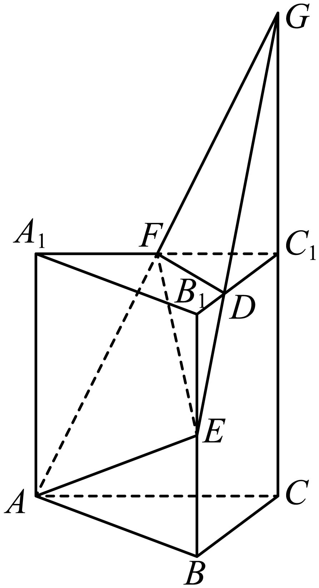

**变式8．**（2024·新疆阿克苏·校考一模）已知，，是正方体的棱，，的中点，则平面截正方体所得的截面是（    ）

A．三角形	B．四边形	C．五边形	D．六边形

【答案】D

【解析】如图所示，分别取，，的中点，，，连接 ，，，，，，则，.

，.

同理可得，.

由基本事实及其三个推论得，，，，，六点共面，

所以平面截正方体所得的截面是六边形.

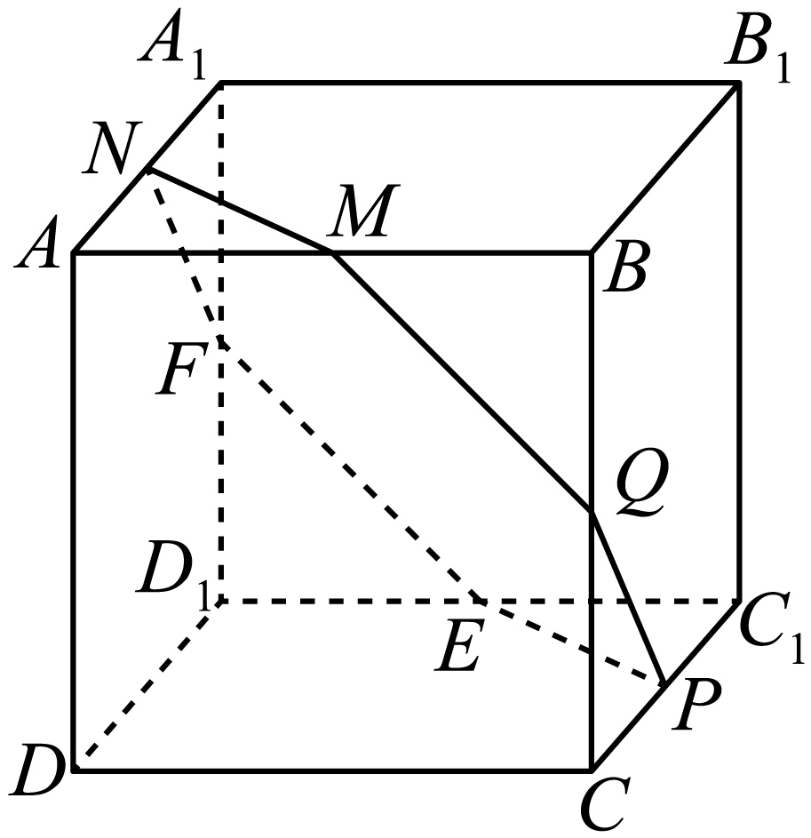

故选：D.

<strong>变式9．</strong>（2024·重庆沙坪坝·高三重庆一中校考期中）在棱长为3的正方体中，点<em>Р</em>是侧面上的点，且点<em>Р</em>到棱与到棱<em>AD</em>的距离均为1，用过点<em>Р</em>且与垂直的平面去截该正方体，则截面在正方体底面<em>ABCD</em>的投影多边形的面积是（    ）

A．	B．5	C．	D．8

【答案】C

【解析】

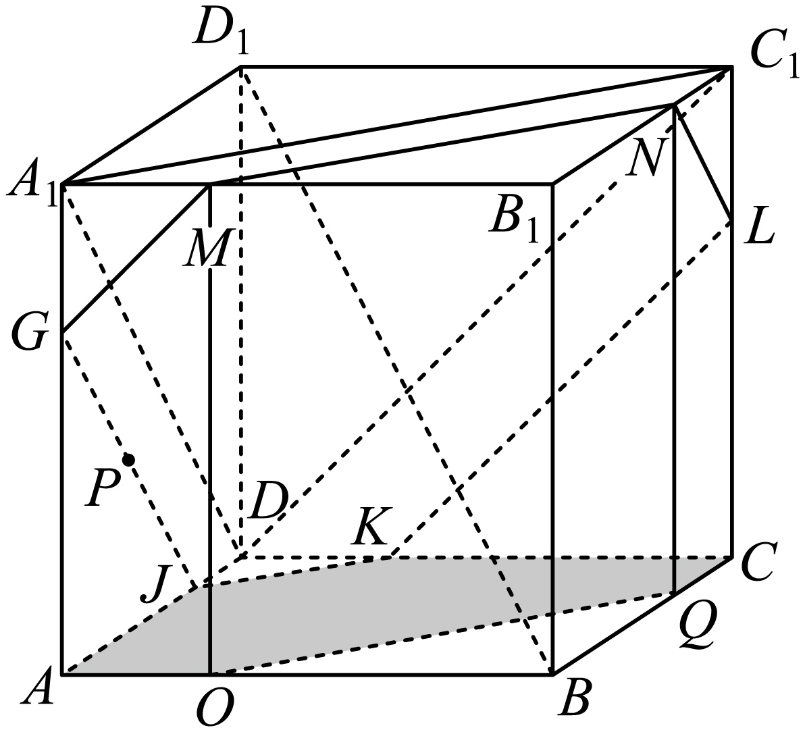

由题意可以作出与垂直的平面，

利用面面平行可作出过点*P*且平行于平面的平面*GJKLNM*，

则平面*GJKLNM*与垂直，

作出点*M*，*N*的投影*O*，*Q*，

平面*AOQCKJ*的面积*S*即为所求，

已知正方体棱长为3，点*Р*到棱与到棱*AD*的距离均为1，

所以点*G*，*J*，*K*，*L*，*N*，*M*均为各棱的三等分点

，

故选：C.

**【解题方法总结】**

（1）作截面应遵循的三个原则：①在同一平面上的两点可引直线；②凡是相交的直线都要画出它们的交点；③凡是相交的平面都要画出它们的交线．

（2）作交线的方法有如下两种：①利用基本事实3作交线；

②利用线面平行及面面平行的性质定理去寻找线面平行及面面平行，然后根据性质作出交线．

**题型三：异面直线的判定**

**例7．**（2024·全国·高三对口高考）两条直线分别和异面直线都相交，则直线的位置关系是（    ）

A．一定是异面直线	B．一定是相交直线

C．可能是平行直线	D．可能是异面直线，也可能是相交直线

【答案】D

【解析】已知直线与是异面直线，直线与直线分别与两条直线与直线相交于点，

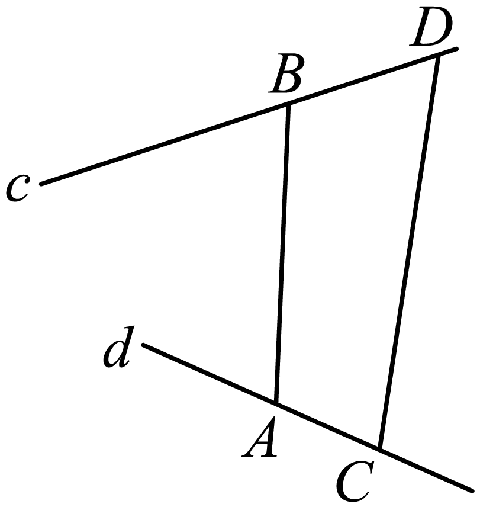

根据题意可得当点与点重合时，两条直线相交，当点与点不重合时，两条直线异面，

所以直线的位置关系是异面或相交.

故选:D．

**例8．**（2024·全国·高三专题练习）如图，已知正方体，点在直线上，为线段的中点，则下列命题中假命题为（    ）

A．存在点，使得

B．存在点，使得

C．直线始终与直线异面

D．直线始终与直线异面

【答案】C

【解析】正方体中，易得平面，因为点在直线上，为线段的中点，

当点和点重合时，平面，，故A正确；

连接、，当点为线段的中点时，为三角形的中位线，即，故B正确；

平面，当点和点重合时，平面，所以直线和在同一平面内，故C错误；

平面，平面，，所以直线始终与直线不相交，且不平行，

所以直线与直线是异面直线，故D正确；

故选：C

<strong>例9．</strong>（2024·四川绵阳·高三绵阳南山中学实验学校校考阶段练习）在底面半径为1的圆柱中，过旋转轴作圆柱的轴截面<em>ABCD</em>，其中母线<em>AB</em>=2，<em>E</em>是弧<em>BC</em>的中点，<em>F</em>是<em>AB</em>的中点，则（    ）

A．*AE*=*CF*，*AC*与*EF*是共面直线

B．，*AC*与*EF*是共面直线

C．*AE*=*CF*，*AC*与*EF*是异面直线

D．，*AC*与*EF*是异面直线

【答案】D

【解析】如图，在底面半径为1的圆柱中，母线，，是的中点，则，

因为是的中点，又，则，

，，

，

在中，是的中点，是的中点，，

与是共面直线，

若*AC*与*EF*是共面直线，则在同一平面，显然矛盾，故*AC*与*EF*是异面直线

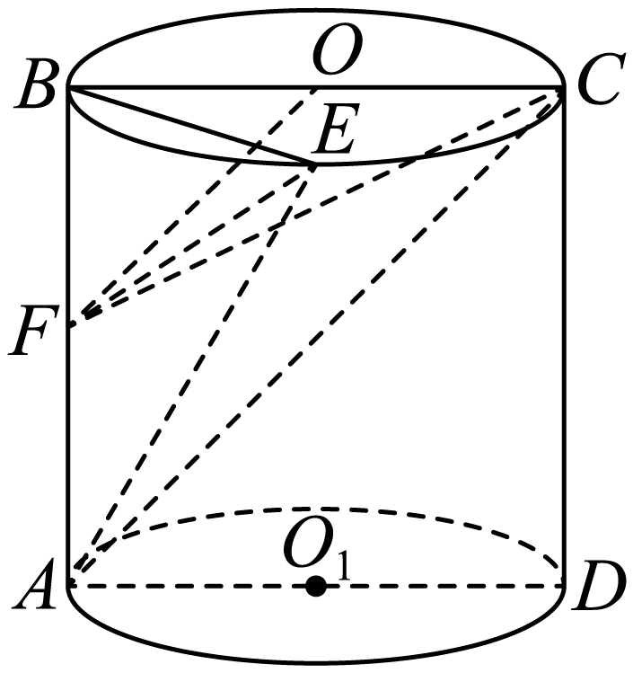

故选：D．

**变式10．**（2024·上海浦东新·高三华师大二附中校考阶段练习）已知正方体中，，，分别是棱，，的中点，是线段上的动点，则下列直线中，始终与直线异面的是（    ）

A．	B．	C．	D．

【答案】A

【解析】对于选项A，面，面，面，所以直线与异面；

对于选项B，当与重合时，因为，又，，分别是棱，，的中点，所以，所以，选项B错误；

对于选项C，连接，在正方体中，易得且，所以与相交，即当与重合时，与相交，选项C错误；

对于选项D，取中点，连交于，连，因为且，所以且，故当与重合时，与相交，选项D错误.

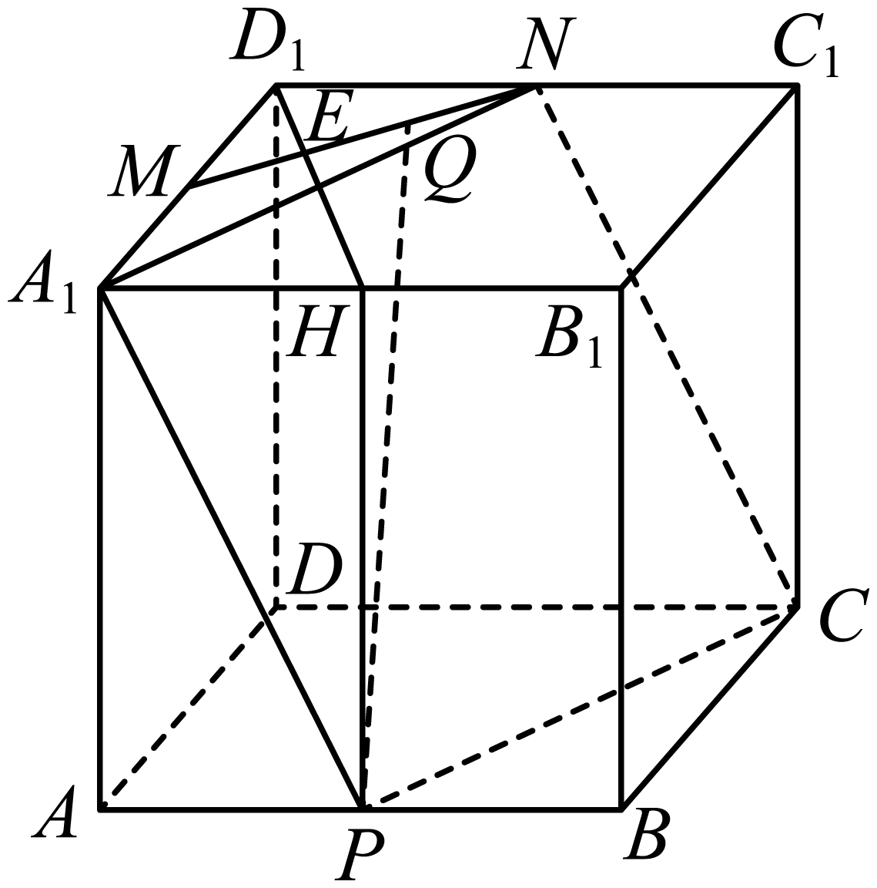

故选：A.

<strong>变式11．</strong>（2024·上海·高三校联考阶段练习）如图所示，正三棱柱的所有棱长均为1，点<em>P</em>、<em>M</em>、<em>N</em>分别为棱、<em>AB</em>、的中点，点<em>Q</em>为线段<em>MN</em>上的动点．当点<em>Q</em>由点<em>N</em>出发向点<em>M</em>运动的过程中，以下结论中正确的是（   ）

A．直线与直线*CP*可能相交	B．直线与直线*CP*始终异面

C．直线与直线*CP*可能垂直	D．直线与直线*BP*不可能垂直

【答案】B

【解析】在正三棱柱中，

因为点*M*、*N*分别为棱*AB*、的中点，所以，

又平面，平面，

所以平面，

因为平面，，，

所以四点不共面，

所以直线与直线*CP*始终异面，故A错误，B正确；

对于C，设，

则，

，

若直线与直线*CP*垂直，则，

即，

所以，

即，解得，

因为，所以不存在点使得直线与直线*CP*垂直，故C错误；

对于D，连接，

因为为的中点，所以，

又因平面，平面，

所以，

因为平面，

所以平面，

又平面，所以，

所以当点在的位置时，直线与直线*BP*垂直，故D错误.

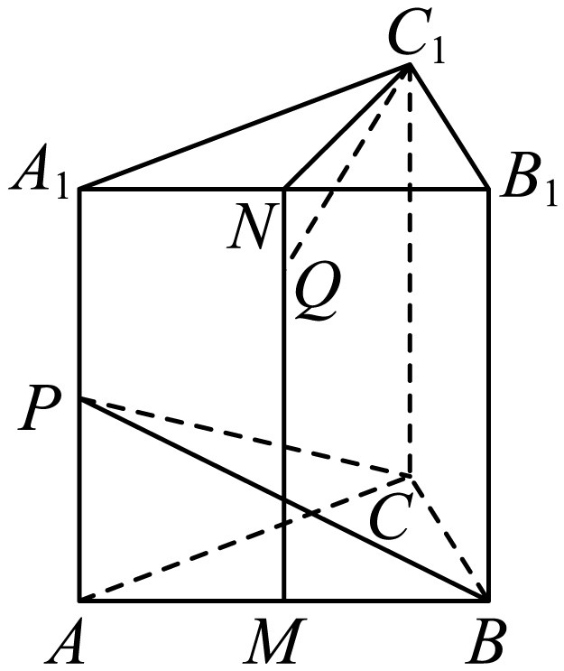

故选：B.

**变式12．**（2024·吉林长春·高三长春市第六中学校考期末）如图，在底面为正方形的棱台中，、、、分别为棱，，，的中点，对空间任意两点、，若线段与线段、都不相交，则称点与点可视，下列选项中与点可视的为（    ）

A．	B．	C．	D．

【答案】D

【解析】根据棱台的性质可知，连接、、、、，

因为、分别为棱，的中点，

所以，又底面为正方形，所以，所以，所以四边形为梯形，

所以与相交，与相交，故B、C错误；

因为，所以四边形是梯形，所以与相交，故A错误；

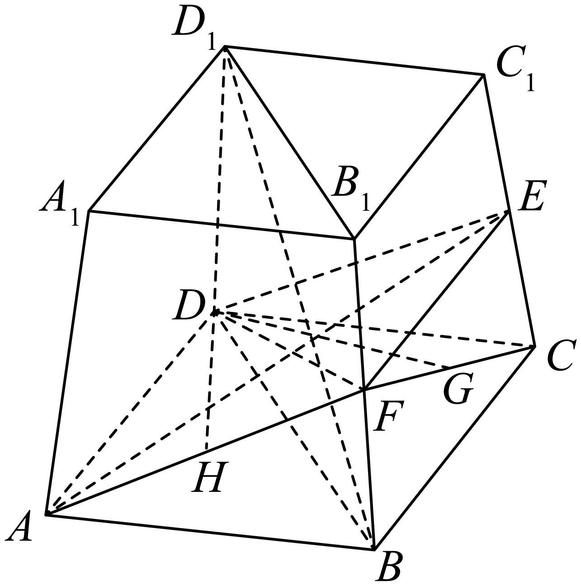

因为为梯形，为的中点，即，则、、、四点不共面，所以与不相交，

若与相交，则、、、四点共面，

显然、、、四点共面，平面，所以、、、四点不共面，即假设不成立，

所以与不相交，即点与点可视，故D正确．

故选：D．

**【解题方法总结】**

判定空间两条直线是异面直线的方法如下：

（1）直接法：平面外一点*A*与平面内一点*B*的连线和平面内不经过*B*点的直线是异面直线．

（2）间接法：平面两条不可能共面（平行，相交）从而得到两线异面．

**题型四：异面直线所成的角**

<strong>例10．</strong>（2024·全国·高三专题练习）如图,在正方体中,点<em>E</em>,<em>F</em>分别是棱<em>AD</em>,的中点,则异面直线与<em>BF</em>所成角的大小为______．

【答案】

【解析】取中点为,连接,记与交点为,如图所示:

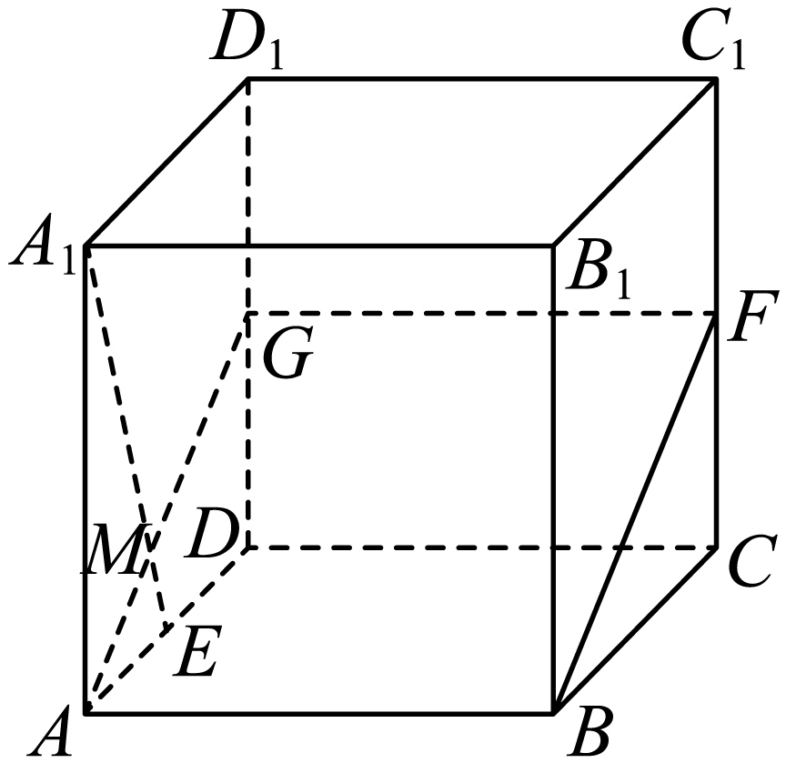

因为*G*,*F*分别是棱,的中点,

所以,且,故四边形为平行四边形,

所以,所以与*BF*所成角即为与所成角,

因为正方体,*E*,*G*是棱*AD*,的中点,

所以,

所以,即,

因为,所以,

所以,

故与所成角为,即与*BF*所成角为.

故答案为:

<strong>例11．</strong>（2024·高三课时练习）已知正四面体<em>ABCD</em>中,<em>E</em>是<em>AB</em>的中点,则异面直线<em>CE</em>与<em>BD</em>所成角的大小为______．

【答案】

【解析】解:由题知,取中点为，连接如图所示:

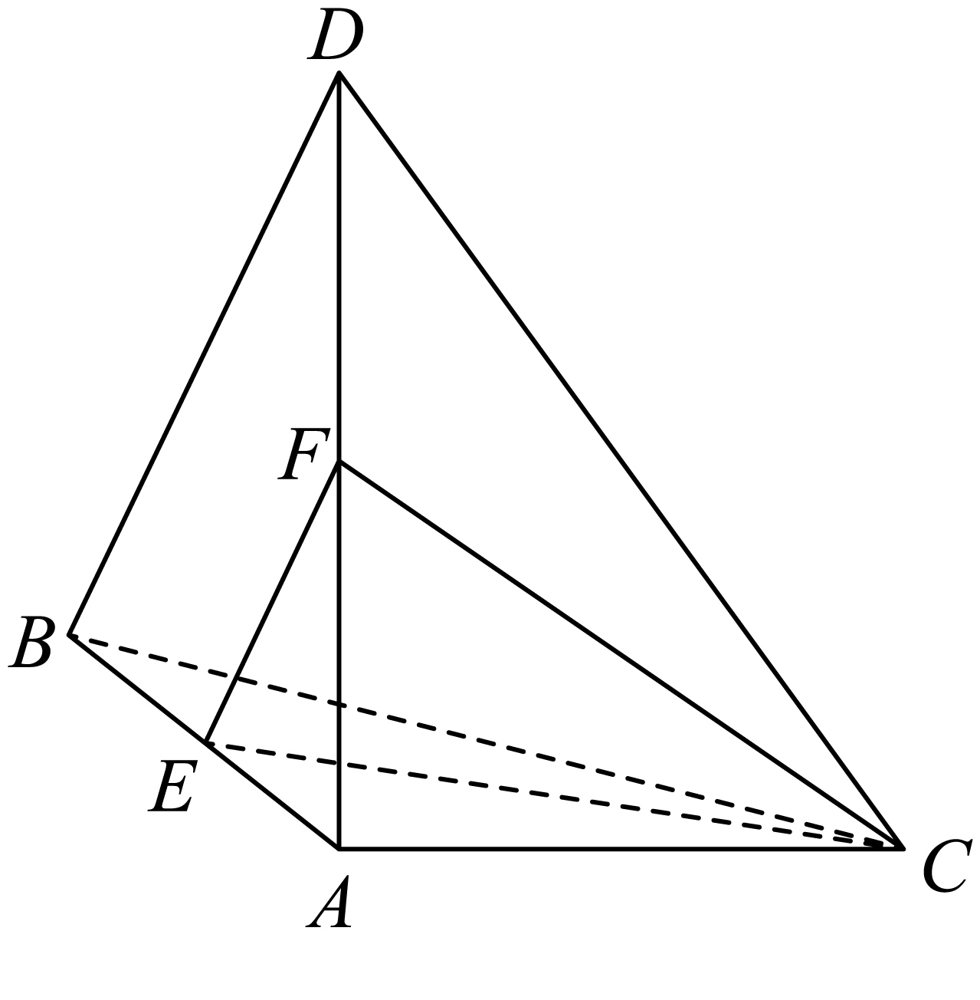

不妨设正四面体棱为6,

根据分别为中点得：，

因为与为等边三角形,

所以，故，同理，

在中,由余弦定理可得:

，

故,

因为,

所以异面直线*CE*与*BD*所成角，即直线*CE*与所成角，即,

故异面直线*CE*与*BD*所成角为.

故答案为:

<strong>例12．</strong>（2024·新疆喀什·高三统考期中）如图是一个正方体的平面展开图，在这个正方体中，下列说法中，正确的序号是___________.

（1）直线与直线相交；

（2）直线与直线平行；

（3）直线与直线是异面直线；

（4）直线与直线成角.

【答案】（3）（4）/(4)(3)【解析】由正方体的平面展开图可得正方体，

可得与为异面直线，故（1）错误；

与为异面直线，故（2）错误；

直线与直线是异面直线，故（3）正确；

连接，，由正方体的性质可得，所以为异面直线与直线所成的角，因为为等边三角形，所以，即直线与直线所成角为，故（4）正确；

故答案为：（3）（4）．

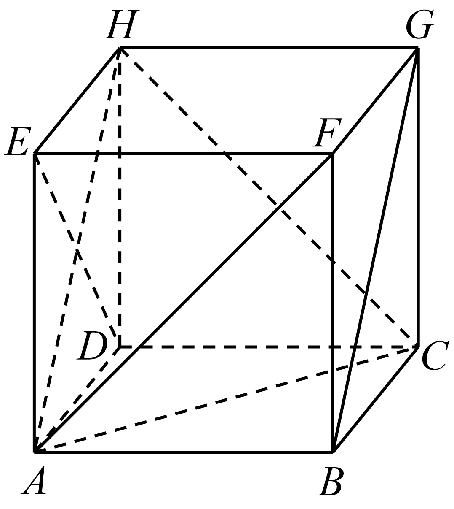

<strong>变式13．</strong>（2024·全国·高三专题练习）如图，将正方体沿交于一顶点的三条棱的中点截去一小块，八个顶点共截去八小块，得到八个面为正三角形、六个面为正方形的“阿基米德多面体”，则异面直线与所成角的大小是___________

【答案】

【解析】如图所示，由题可知，四边形和均为正方形，为正三角形，

，，

或其补角为异面直线与所成角，

而为正三角形，

，

即异面直线与所成角的大小是.

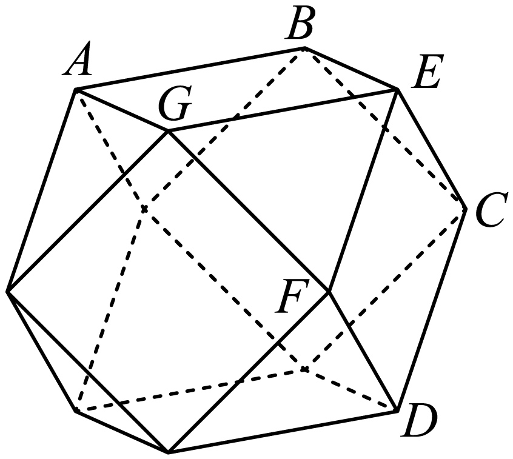

故答案为：.

<strong>变式14．</strong>（2024·全国·高三对口高考）线段的两端分别在直二面角的两个面内，且与这两个面都成角，则直线与所成的角等于_________．

【答案】/

【解析】如图：

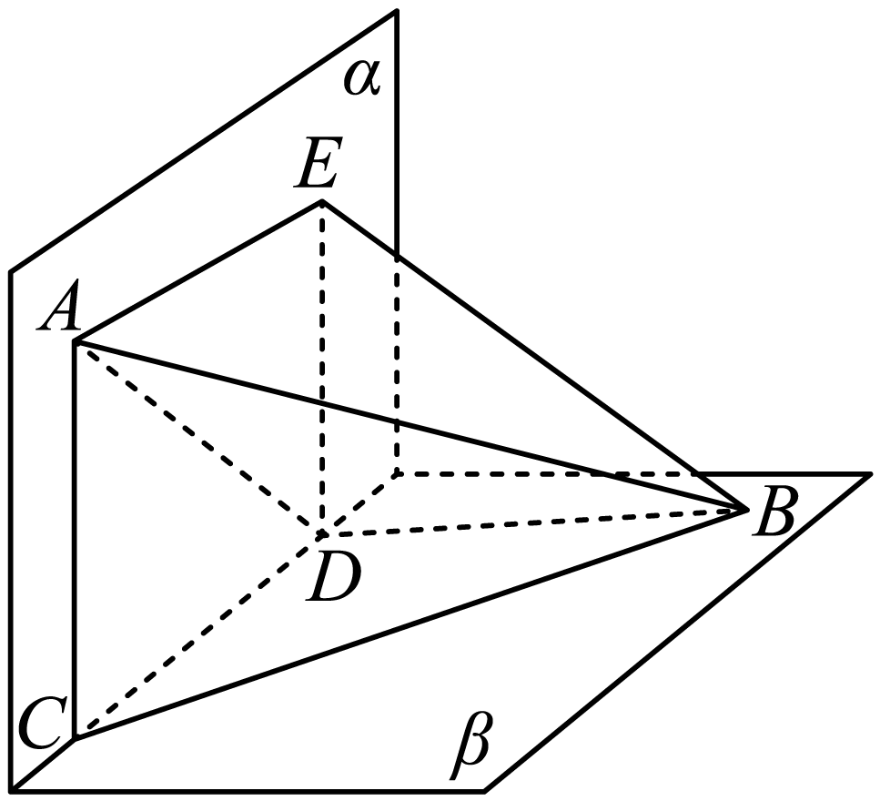

过分别作棱的垂线，垂足设为连结，

由直线垂直于平面的性质定理知，.

所以.

作且，则为直线与所成的角.

连结，可得，，所以，

所以三角形为直角三角形.

设，，所以，

所以.

直线与所成的角等于.

故答案为：.

<strong>变式15．</strong>（2024·全国·高三专题练习）如图，等腰梯形沿对角线翻折，得到空间四边形，若，则直线与所成角的大小可能为______.（写出一个值即可）

【答案】（答案在内即可）

【解析】由题意，补全等腰梯形为正三角形，则直线与所成角的大小为直线与所成角，易得当等腰梯形沿对角线翻折时，的轨迹为以为顶点，为高的圆锥侧面，设，在上取使得，则直线与所成角即，故，因为，，故，故，故只需写出内的角度即可，如

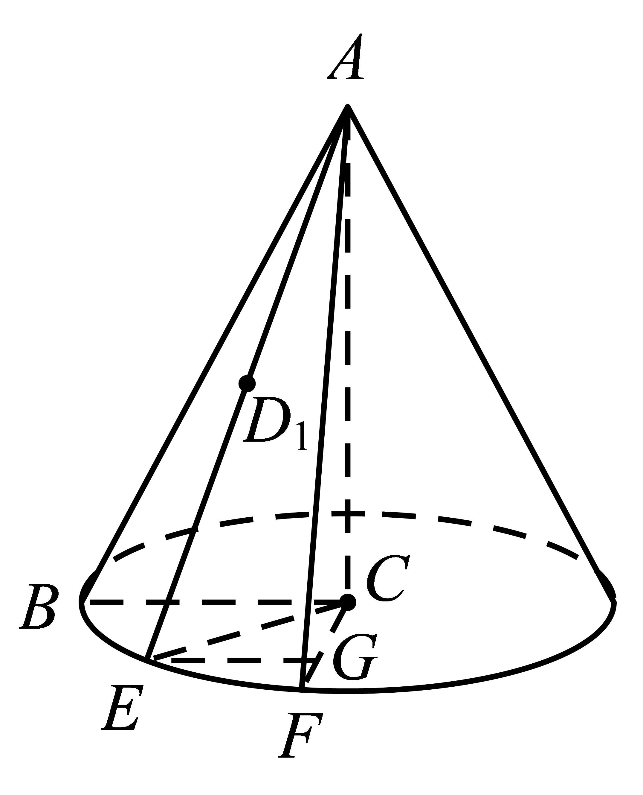

故答案为：（答案在内即可）

**【解题方法总结】**

（1）点、直线、平面位置关系的判定，注意构造几何体（长方体、正方体）模型来判断，常借助正方体为模型．

（2）求异面直线所成的角的三个步骤

一作：根据定义作平行线，作出异面直线所成的角．

二证：证明作出的角是异面直线所成的角．

三求：解三角形，求出所作的角．

**题型五：平面的基本性质**

**例13．（多选题）（2024·湖北荆门·荆门市龙泉中学校考模拟预测）** 已知，是两个不同的平面，则下列命题正确的是（    ）

A．若，且，则

B．若*A*，*B*，*C*是平面内不共线三点，，，则

C．若且，则直线

D．若直线，直线，则*a*与*b*为异面直线

【答案】ABC

【解析】对于A，由根据且，则是平面和平面的公共点，

又，由基本事实3（公理2）可得，故A正确；

对于B，由基本事实1（公理3）：过不在一条直线上的三个点，有且只有一个平面，

又，且，则，故B正确；

对于C，由基本事实2（公理1）：如果一条直线上的两个点在一个平面内，那么这条直线在这个平面内，故C正确；

对于D，由于平面和平面位置不确定，则直线与直线位置亦不确定，可能异面、相交、平行、重合，故D错误.

故选：ABC.

**例14．（多选题）（2024·全国·高三专题练习）** 有下列命题：

①经过三点确定一个平面；

②梯形可以确定一个平面；

③两两相交的三条直线最多可以确定三个平面；

④如果两个平面有三个公共点，则这两个平面重合．

其中正确命题是（    ）

A．①	B．②	C．③	D．④

【答案】BC

【解析】对于①，经过不共线的三点确定一个平面，故①不正确；

对于②，因为梯形的两底边平行，经过两条平行直线确定一个平面，故②正确；

对于③，当三条直线交于不同的三点时，三条直线只确定一个平面；当三条直线交于一点时，三条直线最多确定三个平面，故③正确；

对于④，当两个平面的三个公共点在一条直线上时，这两个平面相交于这条直线，不一定重合，故④不正确.

故选：BC

**例15．（多选题）（2024·全国·高三专题练习）** 我们知道，平面几何中有些正确的结论在空间中不一定成立．下面给出的平面几何中的四个真命题， 在空间中仍然成立的有（    ）

A．平行于同一条直线的两条直线必平行

B．垂直于同一条直线的两条直线必平行

C．一个角的两边分别平行于另一个角的两边，那么这两个角相等或互补

D．一个角的两边分别垂直于另一个角的两边，那么这两个角相等或互补

【答案】AC

【解析】根据线线平行具有传递性可知A正确；

空间中垂直于同一条直线的两条直线，位置关系可能是异面、相交、平行，故B错误；

根据定理：空间中如果两个角的两边分别对应平行，那么这两个角相等或互补可知C正确；

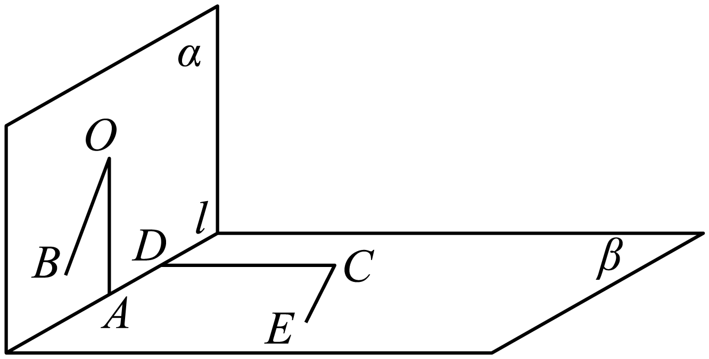

如图，且，

则但和的关系不确定，

故D错误.

故选：AC

**变式16．（多选题）（2024·重庆沙坪坝·高三重庆市第七中学校校考阶段练习）** 下列命题中错误的是（    ）

A．空间三点可以确定一个平面

B．三角形一定是平面图形

C．若*A*，，，既在平面内，又在平面内，则平面和平面重合

D．四条边都相等的四边形是平面图形

【答案】ACD

【解析】对于A：若空间中三点共线，则无法确定平面，故A错误；

对于B：三角形一定是平面图形，故B正确；

对于C：若*A*，，，既在平面内，又在平面内，则此四点可能在平面与平面的交线上，无法确定平面和平面是否重合，故C错误；

对于D：四条边都相等的四边形可能是空间四边形，故D错误；

故选：ACD

**变式17．（多选题）（2024·全国·模拟预测）** 如图，点，，，分别是正方体中棱，，，的中点，则（    ）

A．	B．

C．直线，是异面直线	D．直线，是相交直线

【答案】BD

【解析】如图，取棱的中点，的中点，连接，，，，，，，

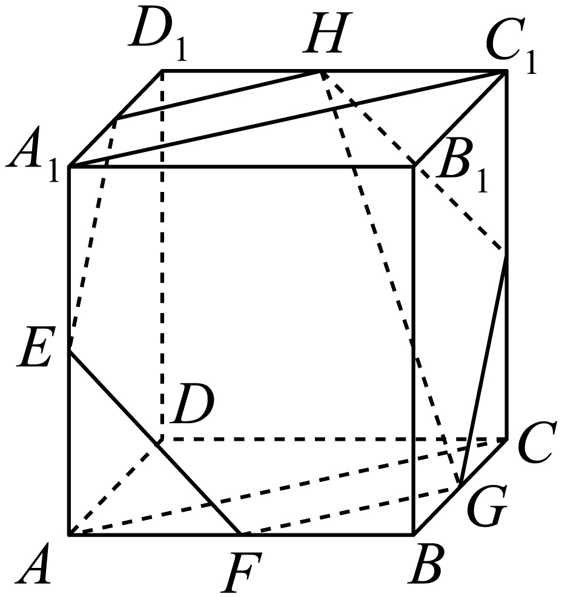

在正方体中，∵，

∴，，，四点共面，同理可得，，，四点共面，，，，四点共面，

∴，，，，，六点共面，均在平面内，

∵，，

，，平面，

∴与是相交直线．由正方体的结构特征及中位线定理可得，

∴，即．

故选：BD．

<strong>变式18．（多选题）（2024·全国·高三专题练习）</strong>如图，正方体的棱长为1，线段上有两个动点<em>E</em>、<em>F</em>，且，则下列结论中正确的是（    ）

A．线段上存在点*E*、*F*使得	B．平面*ABCD*

C．的面积与的面积相等	D．三棱锥*A*-*BEF*的体积为定值

【答案】BD

【解析】如图所示，*AB*与为异面直线，故*AE*与*BF*也为异面直线，*A*错误；

，故平面*ABCD*，故B正确；

由图可知，点*A*和点*B*到*EF*的距离是不相等的，C错误；

连结*BD*交*AC*于*O*，则*AO*为三棱锥*A*-*BEF*的高，

，

三棱锥*A*-*BEF*的体积为为定值，D正确；

故选：BD.

**题型六：等角定理**

<strong>例16．</strong>（2024·河南新乡·新乡市第一中学校考模拟预测）在棱长均相等的四面体中，为棱不含端点上的动点，过点<em>A</em>的平面与平面平行若平面与平面，平面的交线分别为，，则，所成角的正弦值的最大值为__________．

【答案】/

【解析】连接,

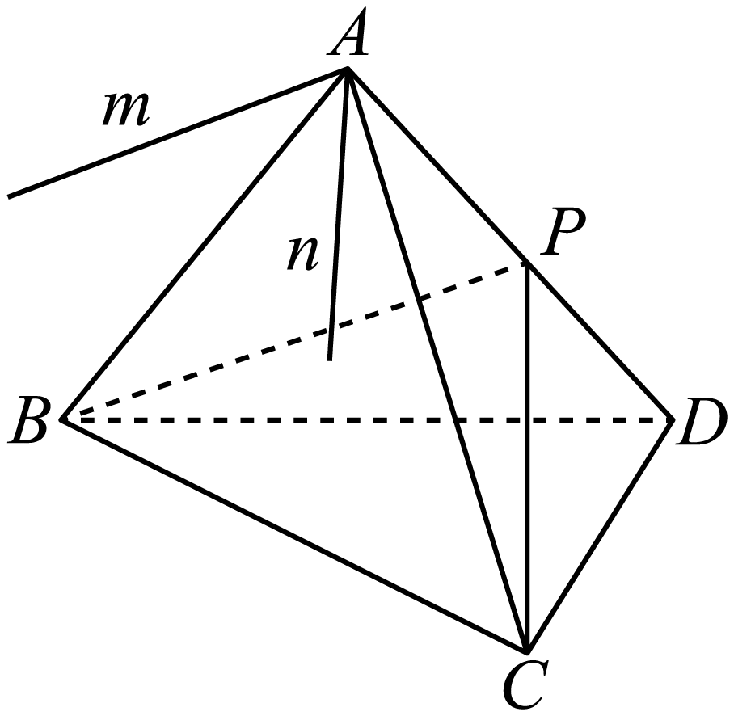

由题意知过点*A*的平面与平面平行，平面与平面，平面的交线分别为，，

由于平面平面，平面平面，平面平面，

所以，，

所以或其补角即为，所成的平面角，

设正四棱锥的棱长为，，，则，

在中，

由余弦定理得，

同理求得，

故在中，，

，

由于，则，进而，

当时取等号，

故的最小值为，进而，

故的最大值为，

故答案为：．

<strong>例17．</strong>（2024·全国·高三专题练习）过正方体的顶点在空间作直线，使与平面和直线所成的角都等于，则这样的直线共有______条．

【答案】2

【解析】在正方体中，与平面垂直，再根据等角定理，问题可以转化为过点*A*与、都成的直线有几条．

考虑到，夹角为，所以同一平面的角平分线与，的夹角大小为，

因为，从而存在两条直线满足条件．而，的外角为120度，所以不存在外角平分线满足条件．

综上，满足条件的直线共2条．

故答案为：2.

<strong>例18．</strong>（2024·高三课时练习）若空间两个角与的两边对应平行，当时，则______．

【答案】60°或120°

【解析】当空间两个角与的两边对应平行，且两边的方向完全一致时，；

当空间两个角与的两边对应平行，且两边方向不完全一致时，.

故答案为：60°或120°

<strong>变式19．</strong>（2024·全国·高三专题练习）设和的两边分别平行，若，则的大小为___________.

【答案】45°或135°/135°或45°

【解析】根据等角定理：一个角的两边平行于另外一个角的两边，则这两个角相等或互补.

故答案为：45°或135°.

<strong>变式20．</strong>（2024·全国·高三专题练习）空间四边形的对角线互相垂直且相等，顺次连接这个四边形各边中点，所组成的四边形是_________.

【答案】正方形

【解析】连接、，

、、、分别为各边的中点，

，，，，

，，

四边形是平行四边形，

，且，

，且，

四边形是正方形；

故答案为：正方形．

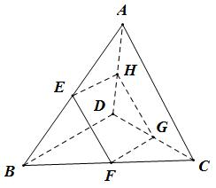

<strong>变式21．</strong>（2024·江西吉安·高一校联考期末）已知空间中两个角，且，若，则_____.

【答案】或

【解析】因为两个角，且，

则的两边分别平行，

所以相等或互补，

又，所以或

故答案为：或

<strong>变式22．</strong>（2024·黑龙江齐齐哈尔·高一校联考期末）已知空间中两个角，，且角与角的两边分别平行，若，则________．

【答案】或

【解析】根据等角定理知：或，

若，则或.

故答案为：或

**【解题方法总结】**

空间中如果两个角的两边分别对应平行，那么这两个角相等或互补

