**第48讲  直线、平面平行的判定与性质**

**知识梳理**

**知识点一：直线和平面平行**

1**、定义**

直线与平面没有公共点，则称此直线与平面平行，记作∥

2**、判定方法（文字语言、图形语言、符号语言）**

<table><tr><td></td><td>
文字语言
</td><td>
图形语言
</td><td>
符号语言
</td></tr><tr><td>
线∥线线∥面
</td><td>
如果平面外的一条直线和这个平面内的一条直线平行，那么这条直线和这个平面平行（简记为“线线平行线面平行
</td><td>
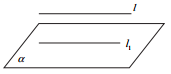
</td><td>

</td></tr><tr><td>
面∥面线∥面
</td><td>
如果两个平面平行，那么在一个平面内的所有直线都平行于另一个平面
</td><td>
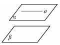
</td><td>

</td></tr></table>

3**、性质定理（文字语言、图形语言、符号语言）**

<table><tr><td></td><td>
文字语言
</td><td>
图形语言
</td><td>
符号语言
</td></tr><tr><td>
线∥面线∥线
</td><td>
如果一条直线和一个平面平行，经过这条直线的平面和这个平面相交，那么这条直线就和交线平行
</td><td>
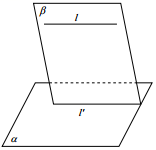
</td><td>

</td></tr></table>

**知识点二：两个平面平行**

1**、定义**

没有公共点的两个平面叫作平行平面，用符号表示为：对于平面和，若，则∥

2**、判定方法（文字语言、图形语言、符号语言）**

<table><tr><td></td><td>
文字语言
</td><td>
图形语言
</td><td>
符号语言
</td></tr><tr><td>
判定定理线∥面面∥面
</td><td>
如果一个平面内有两条相交的直线都平行于另一个平面，那么这两个平面平行（简记为“线面平行面面平行
</td><td>
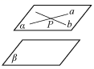
</td><td>

</td></tr><tr><td>
线面面∥面
</td><td>
如果两个平面同垂直于一条直线，那么这两个平面平行
</td><td>
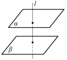
</td><td>
∥
</td></tr></table>

3**、性质定理（文字语言、图形语言、符号语言）**

<table><tr><td></td><td>
文字语言
</td><td>
图形语言
</td><td>
符号语言
</td></tr><tr><td>
面//面

线//面
</td><td>
如果两个平面平行，那么在一个平面中的所有直线都平行于另外一个平面
</td><td>
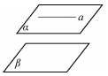
</td><td>

</td></tr><tr><td>
性质定理
</td><td>
如果两个平行平面同时和第三个平面相交，那么他们的交线平行（简记为“面面平行线面平行”）
</td><td>
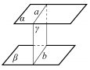
</td><td>

</td></tr><tr><td>
面//面

线面
</td><td>
如果两个平面中有一个垂直于一条直线，那么另一个平面也垂直于这条直线
</td><td>
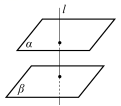
</td><td>

</td></tr></table>

**【解题方法总结】**

线线平行、线面平行、面面平行的转换如图所示．

性质

判定

线∥面

线∥线

面∥面

（1）证明直线与平面平行的常用方法：

①利用定义，证明直线与平面没有公共点，一般结合反证法证明；

②利用线面平行的判定定理，即线线平行线面平行．辅助线的作法为：平面外直线的端点进平面，同向进面，得平行四边形的对边，不同向进面，延长交于一点得平行于第三边的线段；

③利用面面平行的性质定理，把面面平行转化成线面平行；

（2）证明面面平行的常用方法：

①利用面面平行的定义，此法一般与反证法结合；

②利用面面平行的判定定理；

③利用两个平面垂直于同一条直线；

④证明两个平面同时平行于第三个平面．

（3）证明线线平行的常用方法：①利用直线和平面平行的判定定理；②利用平行公理；

**必考题型全归纳**

**题型一：平行的判定**

**例1．**（2024·湖南岳阳·高三湖南省岳阳县第一中学校考开学考试）若、是两个不重合的平面，

①若内的两条相交直线分别平行于内的两条直线，则；

②设、相交于直线，若内有一条直线垂直于，则；

③若外一条直线与内的一条直线平行，则；

以上说法中成立的有（　　）个．

*A*．0	*B*．1	*C*．2	*D*．3

【答案】*C*

【解析】对于①，设平面，且，

由直线与平面平行的判定定理可知，，

再由平面与平面平行的判定定理可知，则①正确；

对于②，设、交于直线，若内有一条直线垂直于，

则、可能垂直也可能不垂直，则②错误；

对于③，由直线与平面平行的判定定理可知，则③正确，

故选：．

<strong>例2．</strong>（2024·全国·高三对口高考）过直线<em>l</em>外两点作与<em>l</em>平行的平面，那么这样的平面（    ）

*A*．不存在	*B*．只有一个	*C*．有无数个	*D*．不能确定

【答案】*D*

【解析】过直线*l*外两点作与*l*平行的平面，

如果两点所在的直线与已知直线相交，则这样的平面不存在；

如果两点所在的直线与已知直线平行，则这样的平面有无数个；

如果两点所在的直线与已知直线异面，则这样的平面只有一个．

因此只有*D*正确．

故选：*D*．

<strong>例3．</strong>（2024·福建泉州·校联考模拟预测）如图，点<em>A</em>，<em>B</em>，<em>C</em>，<em>M</em>，<em>N</em>为正方体的顶点或所在棱的中点，则下列各图中，不满足直线平面<em>ABC</em>的是（    ）

*A*．	*B*．

*C*．	*D*．

【答案】*D*

【解析】对于*A*，由正方体的性质可得，平面*ABC*，平面*ABC*，

所以直线平面*ABC*，能满足；

对于*B*，作出完整的截面*ADBCEF*，由正方体的性质可得，平面*ABC*，平面*ABC*，所以直线平面*ABC*，能满足；

对于*C*，作出完整的截面*ABCD*，由正方体的性质可得，平面*ABC*，平面*ABC*，

所以直线平面*ABC*，能满足；

对于*D*，作出完整的截面，如下图*ABNMHC*，可得*MN*在平面*ABC*内，不能得出平行，不能满足．

故选：*D．*

<strong>变式1．</strong>（2024·湖南岳阳·高三湖南省岳阳县第一中学校考开学考试）<em>a</em>，<em>b</em>，<em>c</em>为三条不重合的直线，，，为三个不重合的平面，现给出下面六个命题：

①，，则；②若，，则；

③，，则；④若，，则；

⑤若，，则；⑥若，，则．

其中真命题的个数是（　　）

*A*．4	*B*．3	*C*．2	*D*．1

【答案】*C*

【解析】，，为三条不重合的直线，，，为三个不重合的平面，

①，，则，满足直线与直线平行的传递性，所以①正确；

②，，则，可能平行，可能相交，也可能异面，所以②不正确；

③，，则，可能平行，也可能相交，所以③不正确；

④，，则，满足平面与平面平行的性质，所以④正确；

⑤，，则或，所以⑤不正确；

⑥，，则或，所以⑥不正确；

故选：*C*．

**变式2．**（2024·全国·高三专题练习）设，为两个不同的平面，则∥的一个充分条件是（   ）

*A*．内有无数条直线与平行	*B*．，垂直于同一个平面

*C*．，平行于同一条直线	*D*．，垂直于同一条直线

【答案】*D*

【解析】对于*A*：内有无数条直线与平行推不出∥，只有内所有直线与平行才能推出，故*A*错误；

对于*B*：，垂直于同一平面，得到∥或与相交，故*B*错误；

对于*C*：，平行于同一条直线，得到∥或与相交，故*C*错误；

对于*D*：因为垂直与同一条直线的两平面平行，故，垂直于同一条直线可得∥，故：*D*正确．

故选：*D*

**【解题方法总结】**

**排除法：画一个正方体，在正方体内部或表面找线或面进行排除．**

**题型二：线面平行构造之三角形中位线法**

**例4．**（2024·广东河源·高三校联考开学考试）如图，在四棱锥中，分别为的中点，连接．

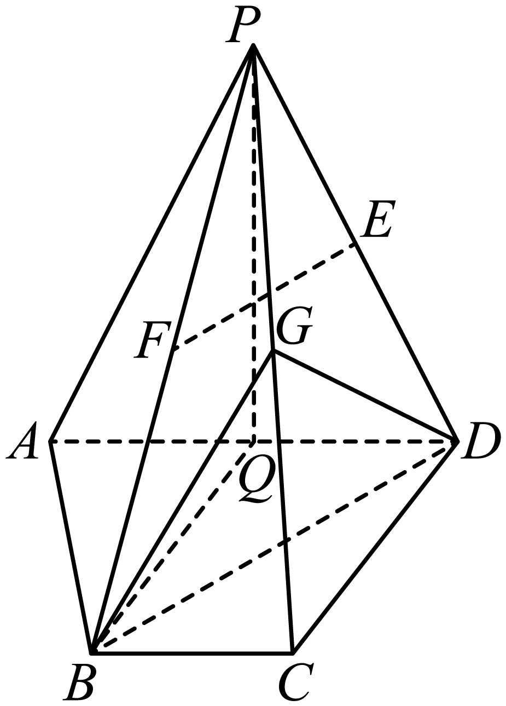

（1）当为上不与点重合的一点时，证明：平面；

【解析】（1）因为分别为的中点，所以，

因为平面，平面，

所以//平面．

**例5．**（2024·贵州毕节·校考模拟预测）如图，在三棱柱中，侧面是矩形，，，分别为棱的中点，为线段的中点．

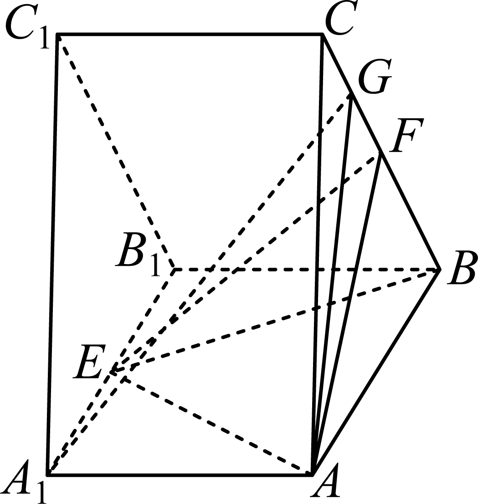

（1）证明：平面．

（2）若三棱锥的体积为1，求．

【解析】（1）连接，交于点，连接，

由题意，四边形为平行四边形，所以，

因为*E*为中点，∴，

∴与相似，且相似比为，

∴，又∵，为，中点，∴，

所以，又平面，平面，

所以平面．

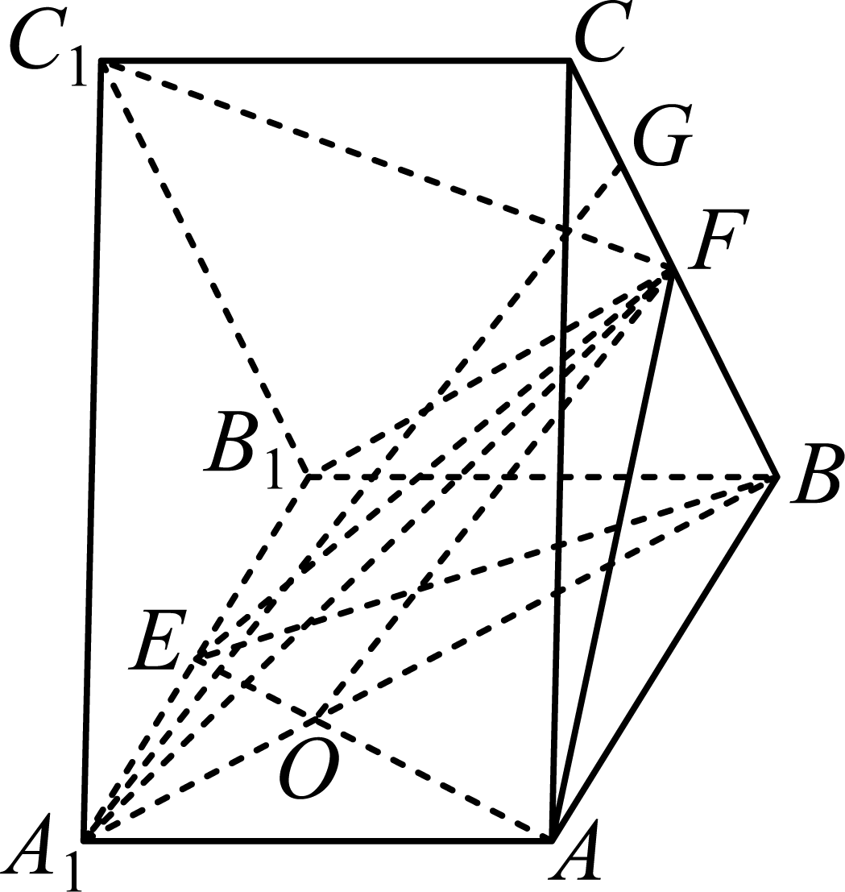

（2）由

由（1）平面， 则点与到平面的距离相等．

所以，

由侧面是矩形，则，又，且，

平面，平面，

所以平面，是的中点，

所以到平面的距离为，

又，则，

所以，

所以．

<strong>例6．</strong>（2024·黑龙江大庆·统考二模）如图所示，在正四棱锥中，底面<em>ABCD</em>的中心为<em>O</em>，<em>PD</em>边上的垂线<em>BE</em>交线段<em>PO</em>于点<em>F</em>，．

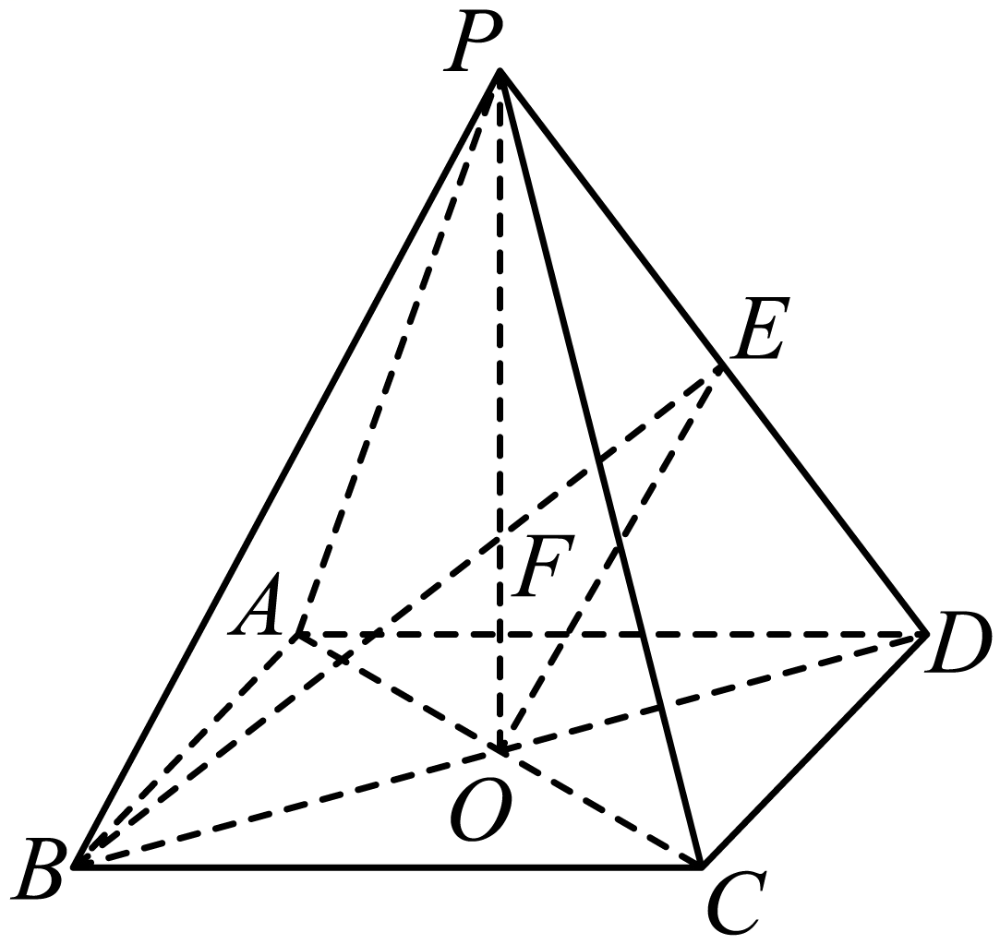

（1）证明：//平面*PBC*；

【解析】（1）证明：如图，延长*FO*至点*M*，使，连接*MD*，

∵底面*ABCD*的中心为*O*，∴平面*ABCD*，∴，

∵，，

∴，

∴，∴，∴，∴

而，∴，∴，

∵平面*PBC*，平面*PBC*，∴平面*PBC*；

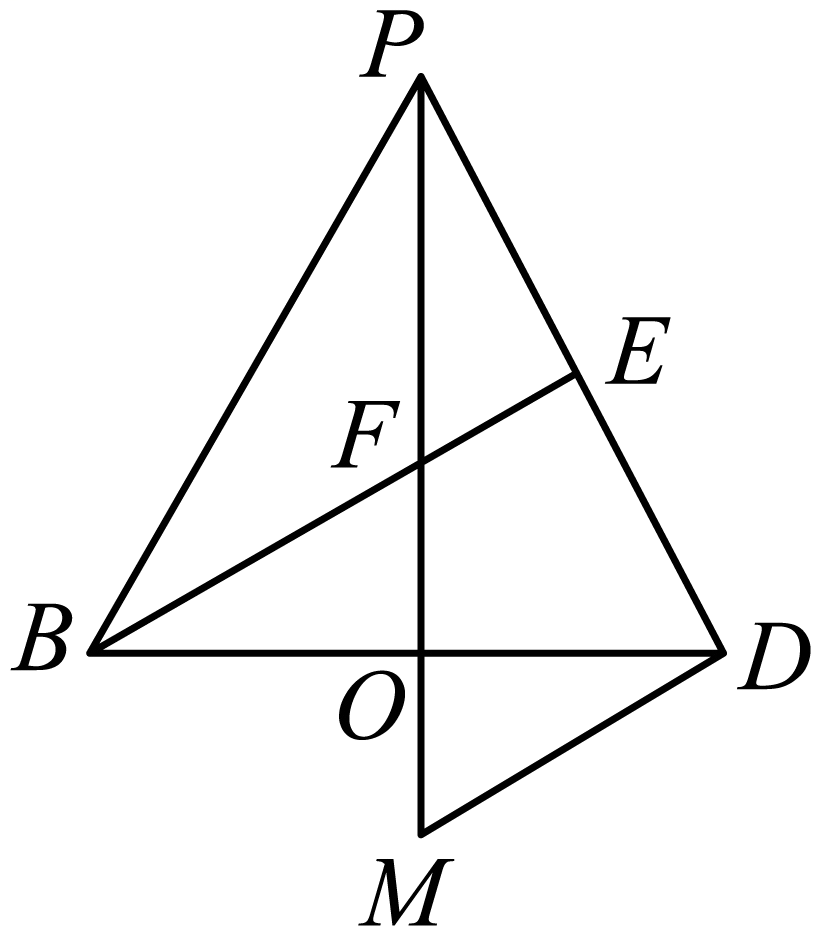

<strong>变式3．</strong>（2024·全国·高三专题练习）如图，四棱锥中，四边形<em>ABCD</em>为梯形，，，，，，<em>M</em>，<em>N</em>分别是<em>PD</em>，<em>PB</em>的中点．

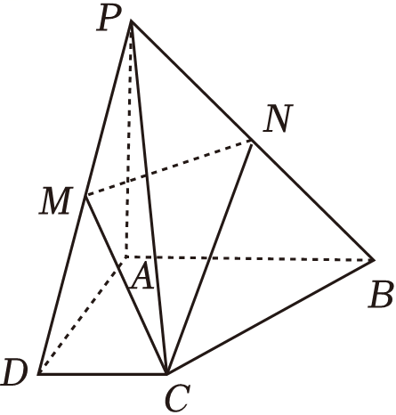

（1）求证：直线平面*ABCD*；

【解析】（1）连接*BD*，*M*，*N*分别是*PD*，*PB*的中点．

，

又平面，平面

直线平面

**变式4．**（2024·陕西汉中·高三统考期末）如图，在三棱柱中，平面，且，点是棱的中点．

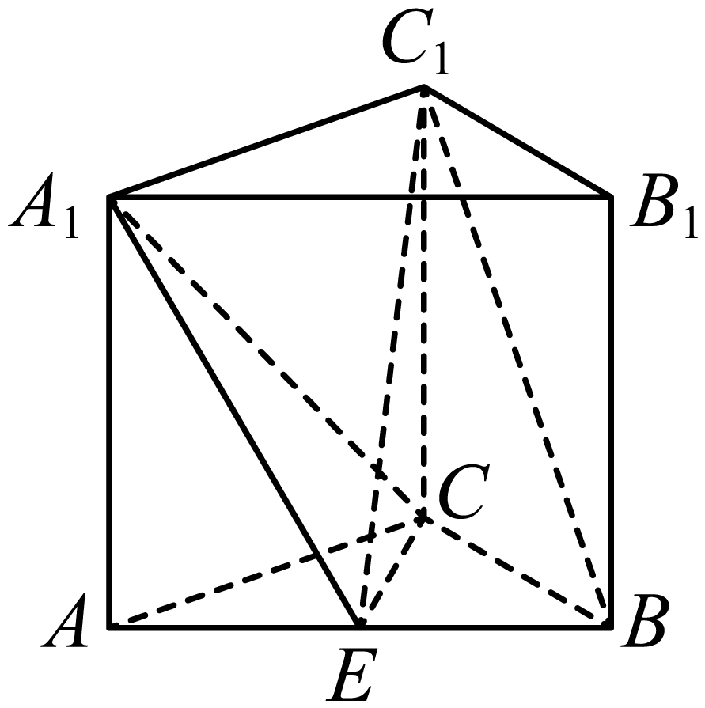

（1）求证：平面；

（2）求三棱锥的体积．

【解析】（1）连接交于点，连接，

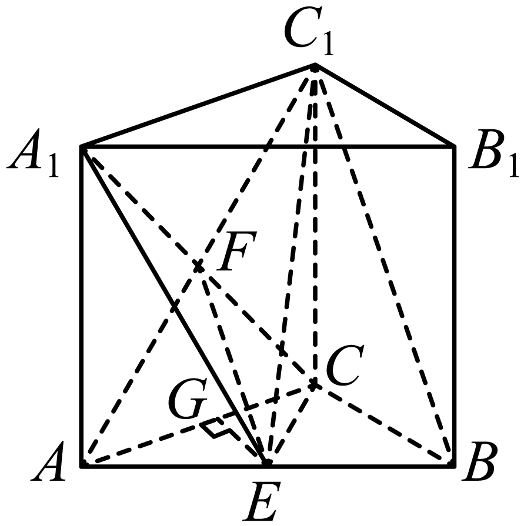

是的中点，是的中点，

∴，

平面，平面，

∴平面；

（2）过作于，

平面，平面，

，

又平面，

平面，

在等边中，是的中点，，

．

所以三棱锥的体积为．

**变式5．**（2024·全国·高三专题练习）如图，在四棱锥中，四边形是正方形，，平面，点是棱的中点，点是棱上的一点，且．

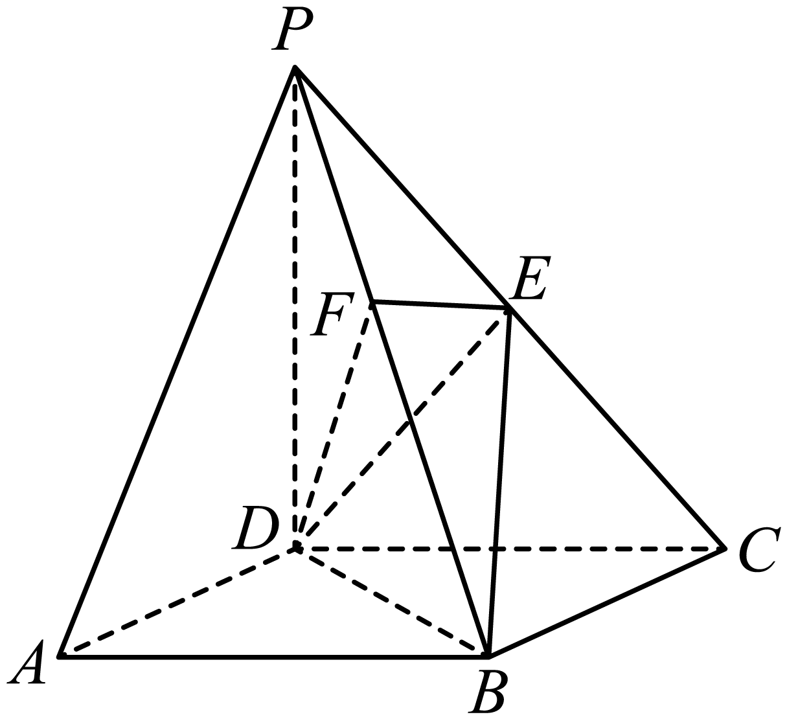

（1）求证：平面；

（2）求点到平面的距离．

【解析】（1）连接交于，连接，如图所示．

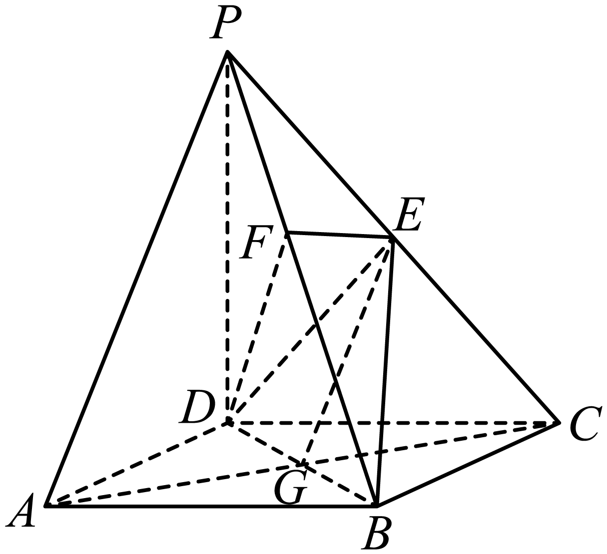

因为四边形是正方形，所以是的中点，又点是棱的中点，

所以是的中位线，所以，

又平面，平面，所以平面．

（2）因为平面，，平面，所以，，

又，，，平面，所以平面，

又，平面，所以，．

在中，，，是的中点，所以，，

又，，，平面，

所以平面，所以是三棱锥的高．

在中，，，，所以，

所以，所以，

得，，，

．

在中，，，，

所以，所以，

所以．

设点到平面的距离为，所以，解得，

即点到平面的距离为．

**变式6．**（2024·新疆昌吉·高三校考学业考试）如图，在正方体中，是棱的中点．

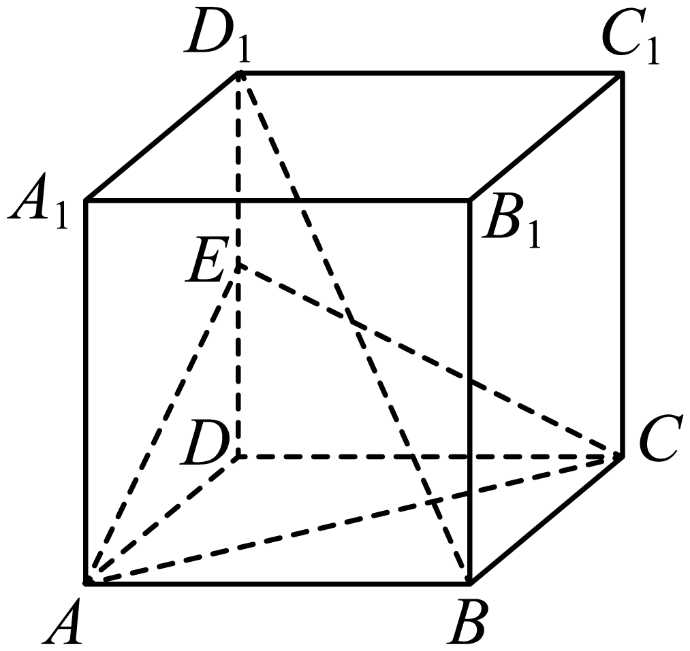

（1）证明：平面；

（2）若正方体棱长为2，求三棱锥的体积．

【解析】（1）连接交于，连接，如图，

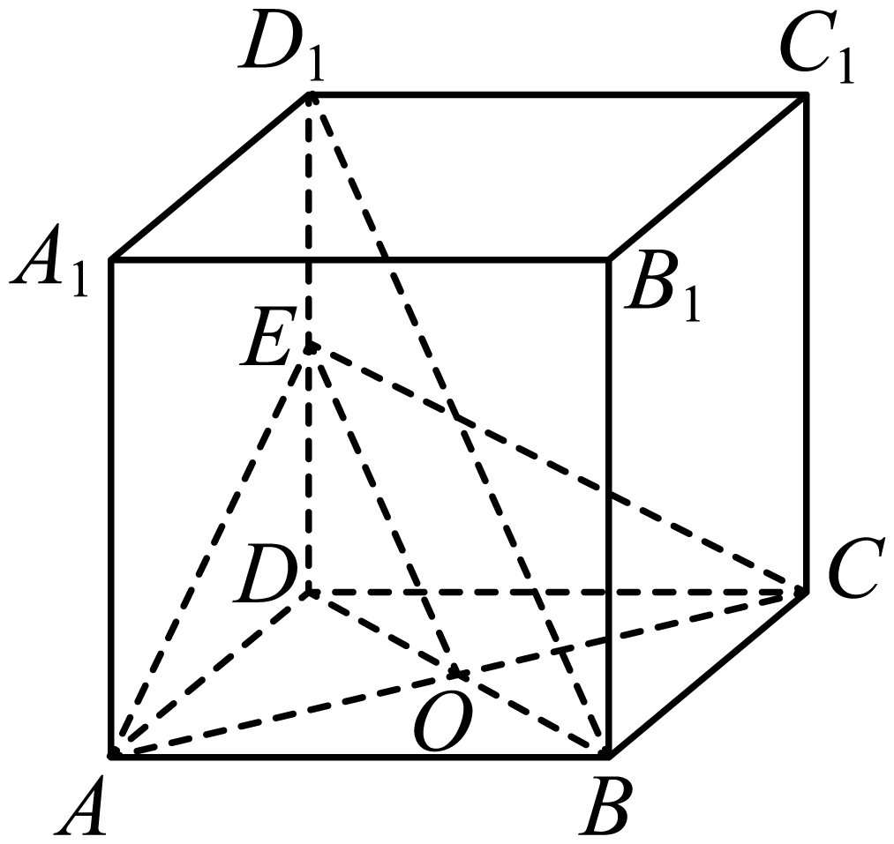

因为在正方体中，底面是正方形，则是的中点，

又是的中点，则是的中位线，故，

又面，面，所以平面．

（2）因为正方体中，平面，

所以．

**【解题方法总结】**

（1）初学者可以拿一把直尺放在位置（与平齐），如图一；

（2）然后把直尺平行往平面方向移动，直到直尺第一次落在平面内停止，如图二；

（3）此时刚好经过点（这里熟练后可以直接凭数感直接找到点），此时直尺所在的位置就是我们要找的平行线，直尺与相交于点，连接，如图三；

（4）此时长度有长有短，连接并延长刚好交于一点，刚好构成型模型（为中点，则也为中点，若为等分点，则也为对应等分点），，如图四．

  
图一						图二				图三					图四

**题型三：线面平行构造之平行四边形法**

**例7．**（2024·天津滨海新·高三校考期中）如图，四棱锥的底面是菱形，平面底面，，分别是，的中点，，，．

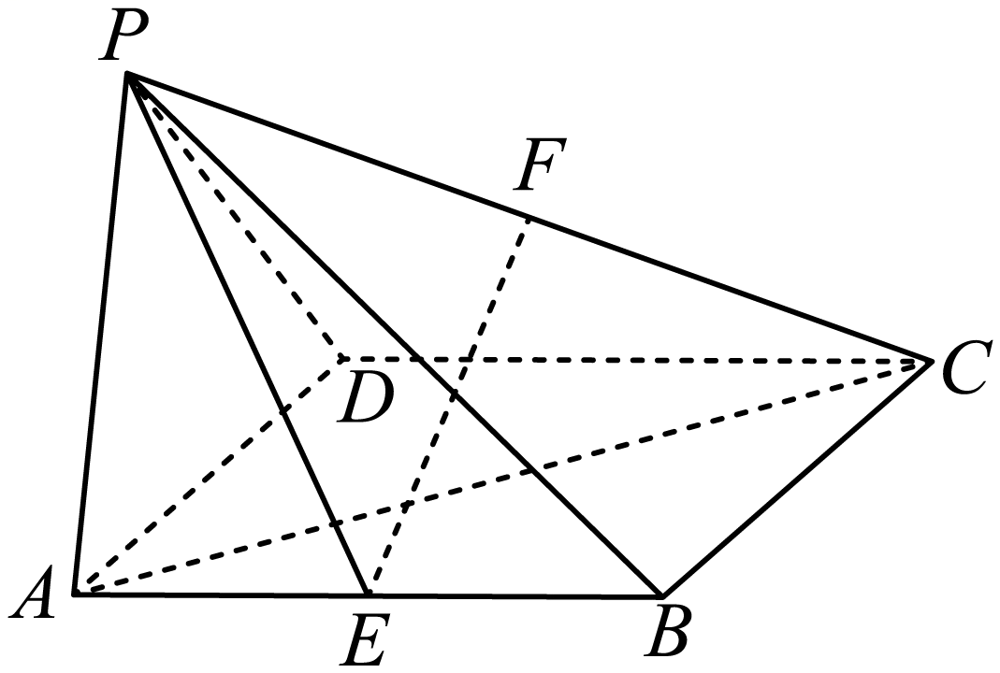

（1）求证：平面；

【解析】（1）证明：取中点，连接，因为分别是的中点，所以，

又因为底面是菱形，是的中点，所以，

所以，所以四边形是平行四边形，所以，

又平面，平面，所以平面．

**例8．**（2024·全国·高三专题练习）如图，四棱台的底面是菱形，且，平面，，，．

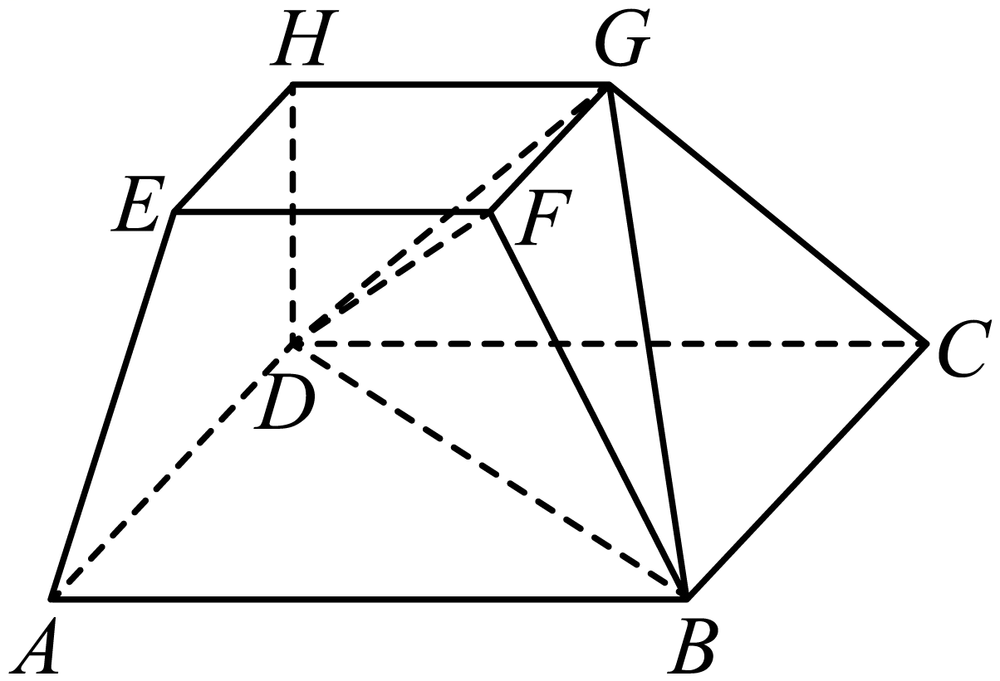

（1）求证：平面；

（2）求三棱锥的体积．

【解析】（1）连接交于点，连接，

几何体为四棱台，四点共面，且平面，平面，

平面平面，；

四边形和均为菱形，，，，

，四边形为平行四边形，，

又平面，平面，平面．

（2）连接交于，

平面，平面平面，平面，

又平面，，

，，平面，平面；

四边形为菱形，，，，

．

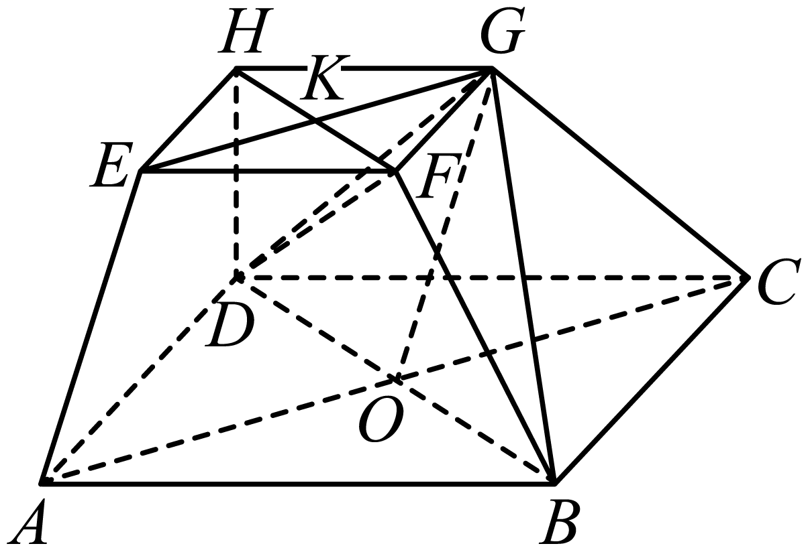

**例9．**（2024·全国·高三专题练习）如图，在正三棱柱中，分别是，，的中点，，的边长为2．

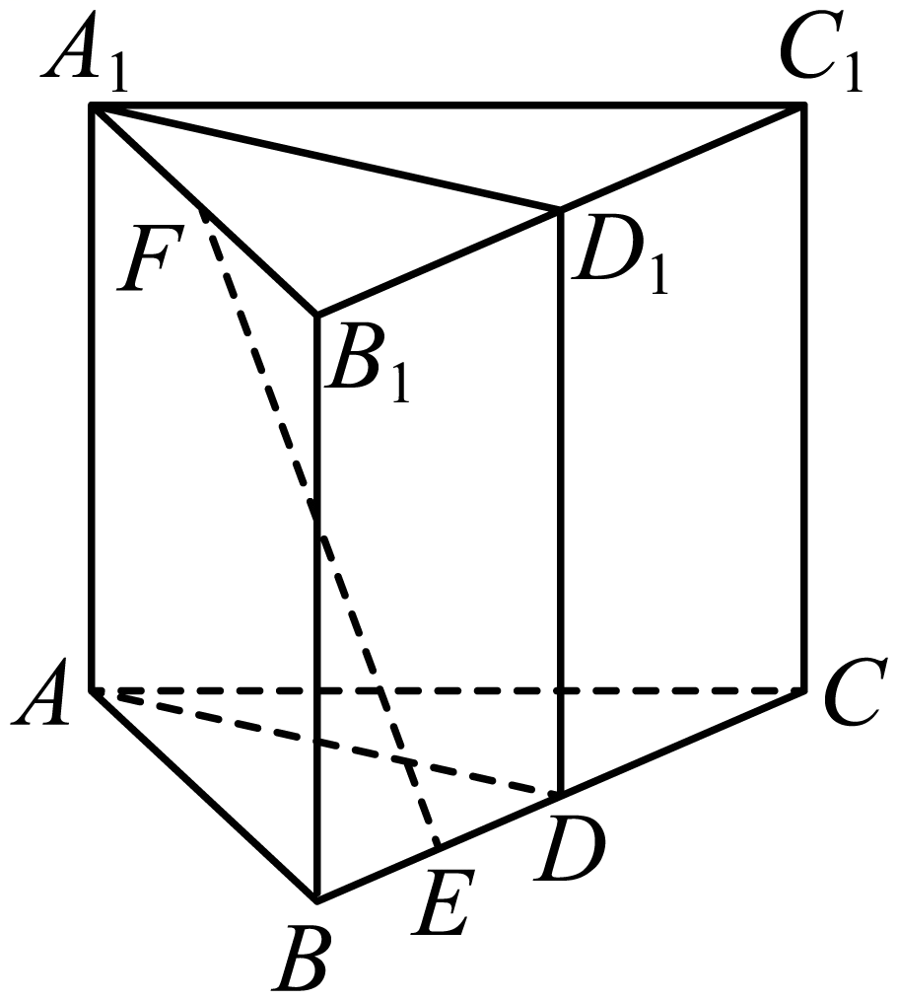

（1）求证：：平面；

【解析】（1）证明：取的中点，连接，，

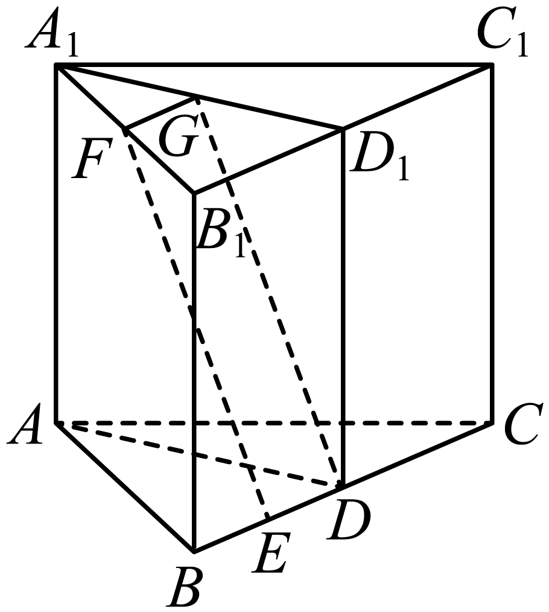

根据题意可得，且，，

由三棱柱得性质知，所以，则四边形是平行四边形，

所以，

因为面，面，

所以面．

**变式7．**（2024·重庆沙坪坝·高三重庆南开中学校考阶段练习）如图，在三棱柱中，底面，，，，、分别为棱、的中点，，．

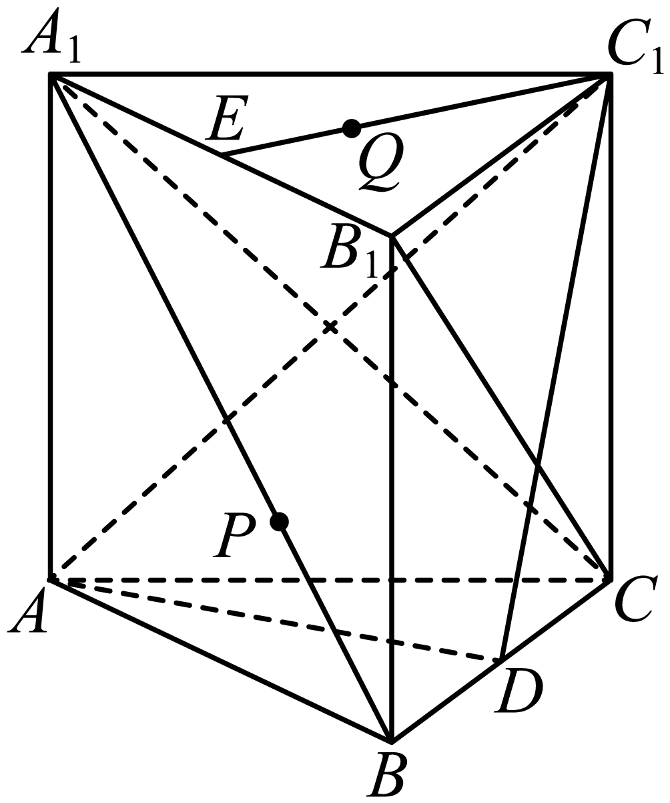

（1）求证：平面；

【解析】（1）证明：取中点，连接、．

因为是的中点，且，故为的重心，

所以、、共线，且，

又，故，所以，

因为且，则四边形为平行四边形，故且，

因为、分别为、的中点，所以，且，

则四边形为平行四边形，所以，所以，

又平面，平面，所以面．

<strong>变式8．</strong>（2024·天津红桥·高三天津市复兴中学校考阶段练习）如图所示，在四棱锥中，平面，，<em>E</em>是<em>PD</em>的中点．

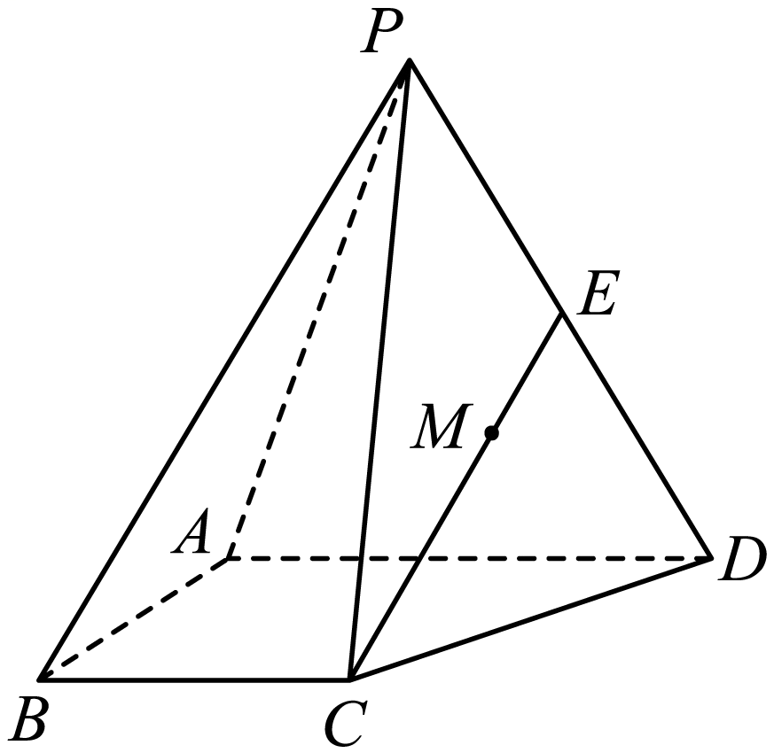

（1）求证：；

（2）求证：平面；

（3）若*M*是线段上一动点，则线段上是否存在点*N*，使平面？说明理由．

【解析】（1）在四棱锥中，平面，平面，平面，

平面平面，所以；

（2）如下图，取为中点，连接，由*E*是*PD*的中点，

所以且，由（1）知，又，

所以且，所以四边形为平行四边形，故，

而平面，平面，则平面．

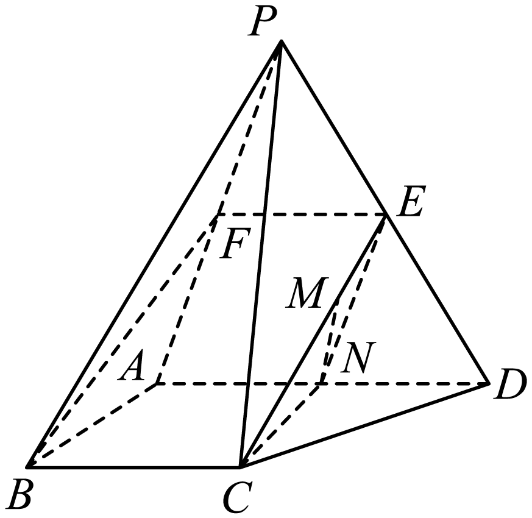

（3）取中点*N*，连接，，

因为*E*，*N*分别为，的中点，所以，

因为平面，平面，所以平面，

线段存在点*N*，使得平面，理由如下：

由（2）知：平面，又，平面，平面，

所以平面平面，又*M*是上的动点，平面，

所以平面，所以线段存在点*N*，使得平面．

**【解题方法总结】**

（1）初学者可以拿一把直尺放在位置，如图一；

（2）然后把直尺平行往平面方向移动，直到直尺第一次落在平面内停止，如图二；

（3）此时刚好经过点（这里熟练后可以直接凭数感直接找到点），此时直尺所在的位置就是我们要找的平行线，直尺与相交于点*O*，连接， 如图三；

（4）此时长度相等（感官上相等即可，若感觉有长有短则考虑法一*A*型的平行），连接，刚好构成平行四边形型模型（为中点，*O*也为中点，为三角形中位线），，如图四．

  
图一                  图二                   图三                  图四

**题型四：线面平行转化为面面平行**

**例10．**（2024·全国·高三专题练习）如图，在四棱锥中，平面，且四边形是正方形，，，分别是棱，，的中点．

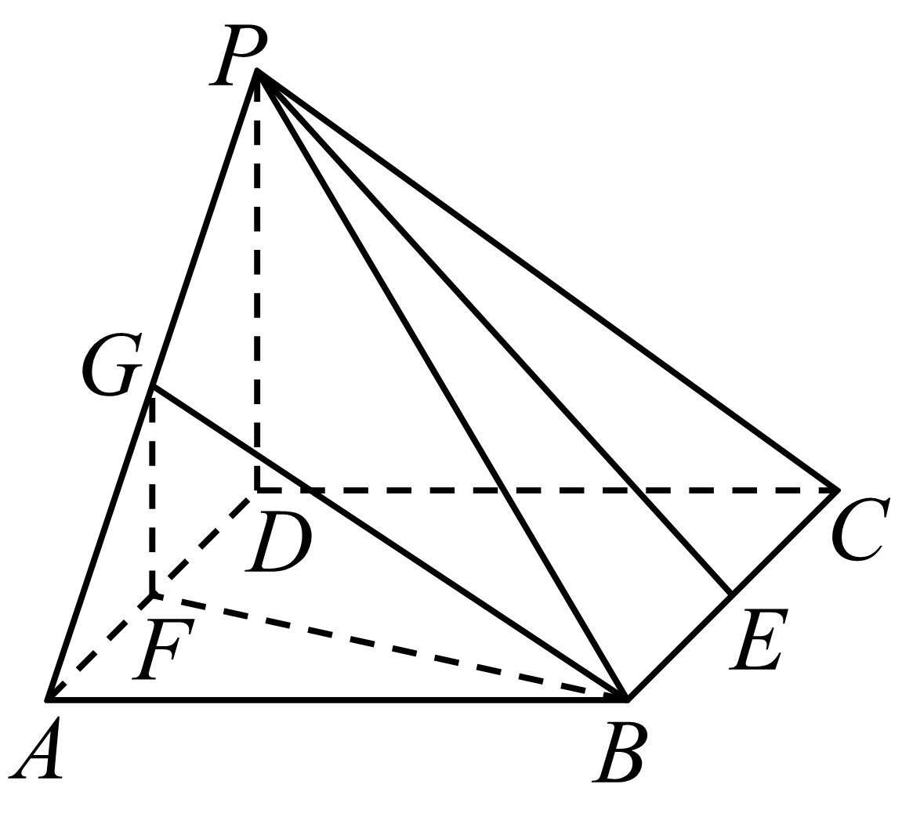

（1）求证：平面；

（2）若，求点到平面的距离．

【解析】（1）连接，

∵是正方形，，分别是棱，的中点，

∴，，

∴四边形是平行四边形，∴，

∵是的中点，∴，

∵平面，平面，

∴平面，平面，

∵，直线在平面内，

∴平面平面，∵平面，

∴平面．

（2）∵平面，，

∴平面，

过*C*在平面内，作，垂足为，则，

∵，又直线*FG*，*BF*在平面内，

∴平面，

∴的长是点*C*到平面的距离，

∵中，，

∴由等面积可得，

∴点*C*到平面的距离为．

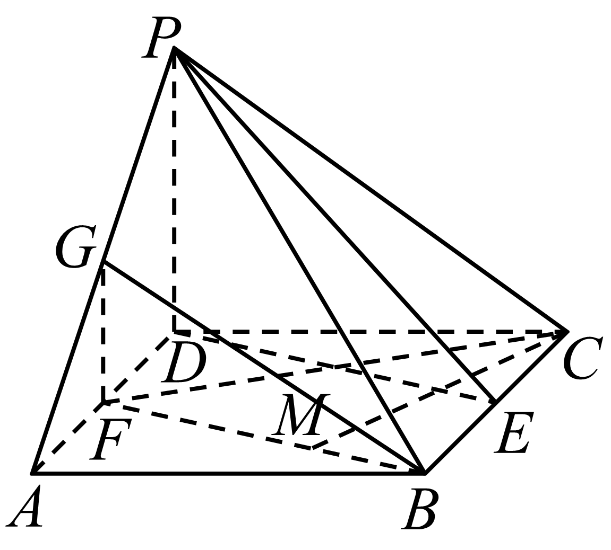

**例11．**（2024·全国·模拟预测）如图，在多面体中，四边形是菱形，且有，，，平面，．

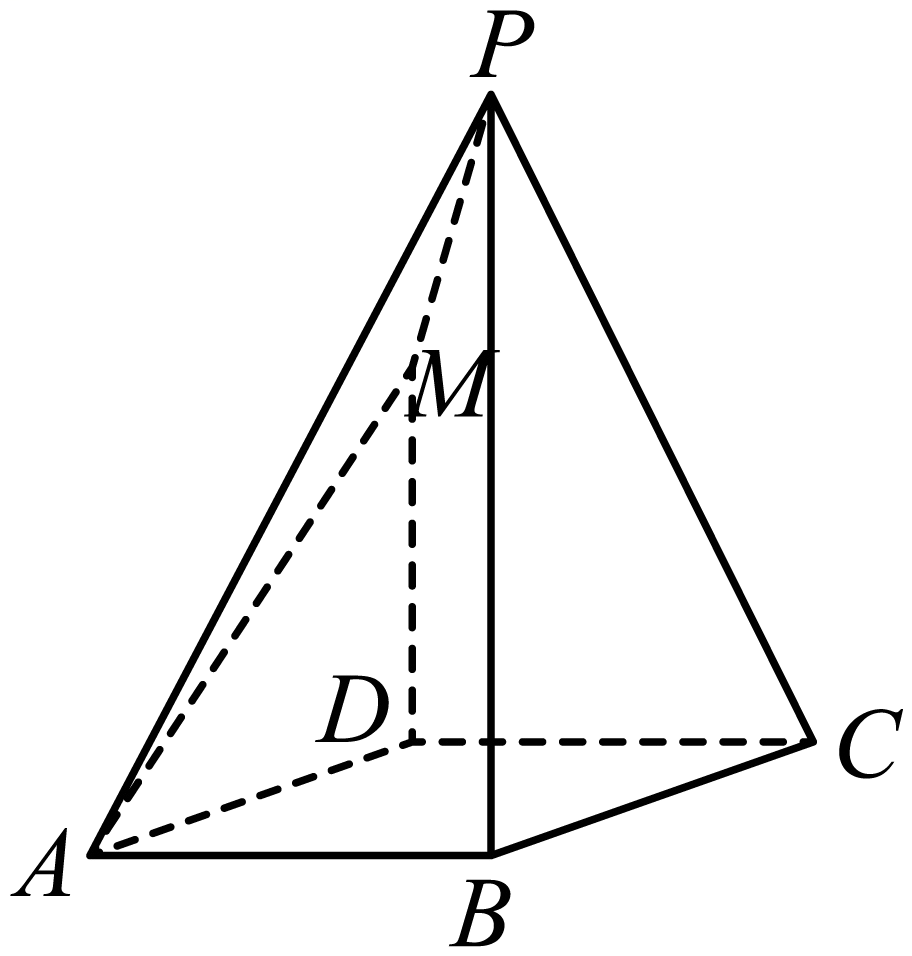

（1）求证：平面；

【解析】（1）因为四边形是菱形，

所以，

又平面，平面，

所以平面，

因为，平面*，* 平面，

所以平面，

又因为，平面，

所以平面平面，

又平面，

所以平面．

**例12．**（2024·江西赣州·统考模拟预测）如图，在三棱柱中，侧面是矩形，侧面是菱形，，、分别为棱、的中点，为线段的中点．

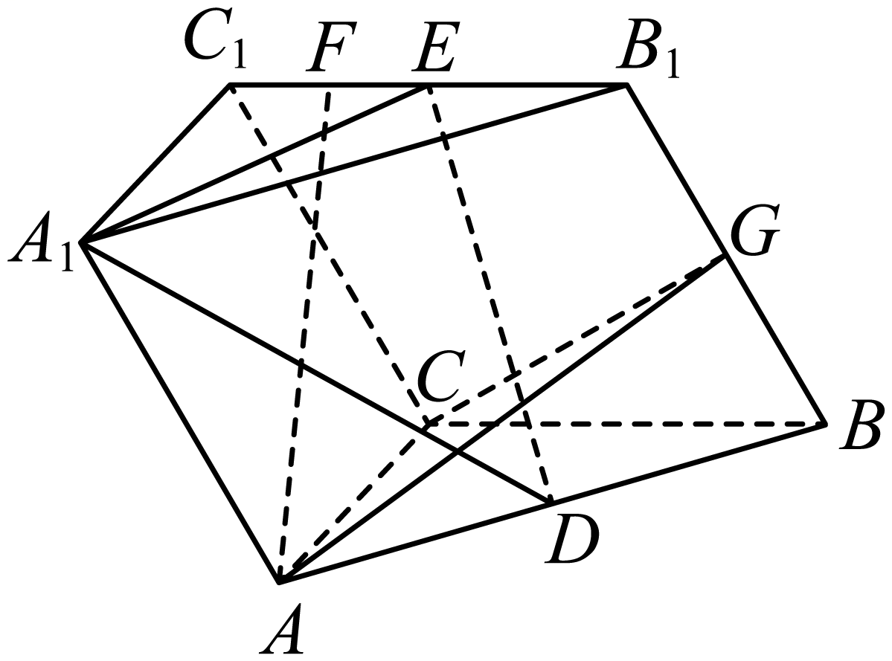

（1）证明：平面；

【解析】（1）证明：取的中点，连接、、，

因为且，故四边形为平行四边形，所以，且，

因为为的中点，则且，

因为、分别为、的中点，所以，且，

所以，且，故四边形为平行四边形，所以，，

因为平面，平面，所以，平面，

因为、分别为、的中点，所以，，

因为平面，平面，所以，平面，

因为，、平面，所以，平面平面，

因为平面，故平面．

<strong>变式9．</strong>（2024·上海·模拟预测）直四棱柱，，<em>AB</em>⊥<em>AD</em>，<em>AB</em>＝2，<em>AD</em>＝3，<em>DC</em>＝4

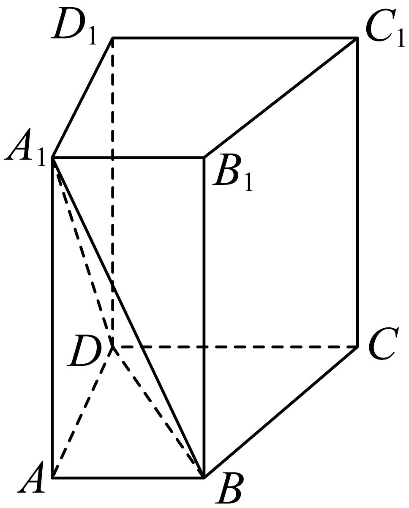

（1）求证：；

【解析】（1）由题意得，，

平面，平面，

平面，平面

而，平面平面，

又平面平面

**变式10．**（2024·广东深圳·高三深圳外国语学校校考开学考试）如图，多面体中，四边形为矩形，二面角的大小为，，，，．

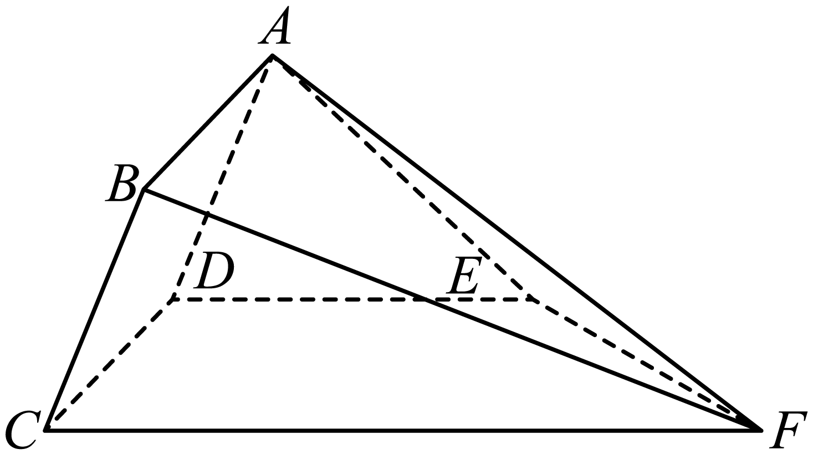

（1）求证：平面；

【解析】（1）证明：因为四边形是矩形，所以，，

因为平面，平面，所以平面，

因为，平面，平面，所以平面，

因为，、平面，则平面平面，

因为平面，所以，平面．

**变式11．**（2024·全国·高三对口高考）已知正方形和正方形，如图所示，、分别是对角线、上的点，且．求证：平面．

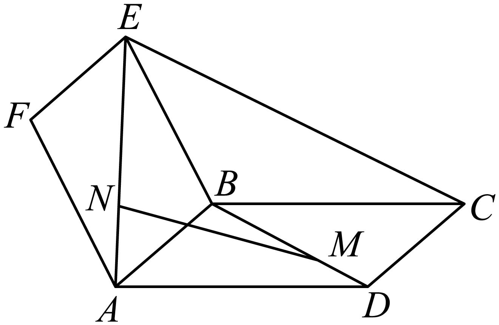

【解析】证明：过点作交于点，连接，

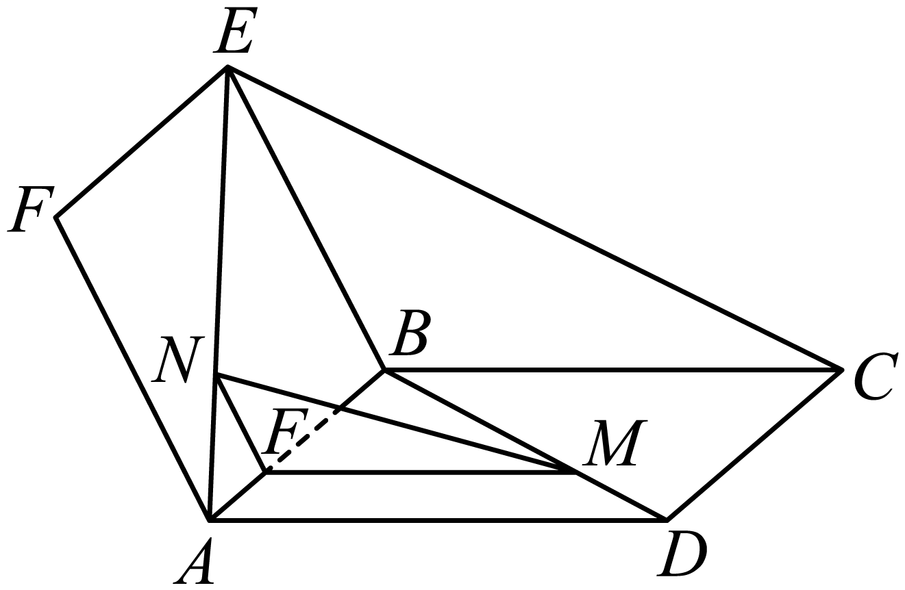

因为，则，

又因为，则，所以，，

因为四边形为矩形，则，所以，，

因为，平面，平面，所以，平面，

因为，平面，平面，所以，平面，

因为，、平面，所以，平面平面，

因为平面，所以，平面．

**【解题方法总结】**

本法原理：已知平面平面，则平面里的任意直线均与平面平行

**题型五：利用线面平行的性质证明线线平行**

**例13．**（2024·河南·高三校联考阶段练习）已知四棱锥，底面为菱形平面，为上一点．

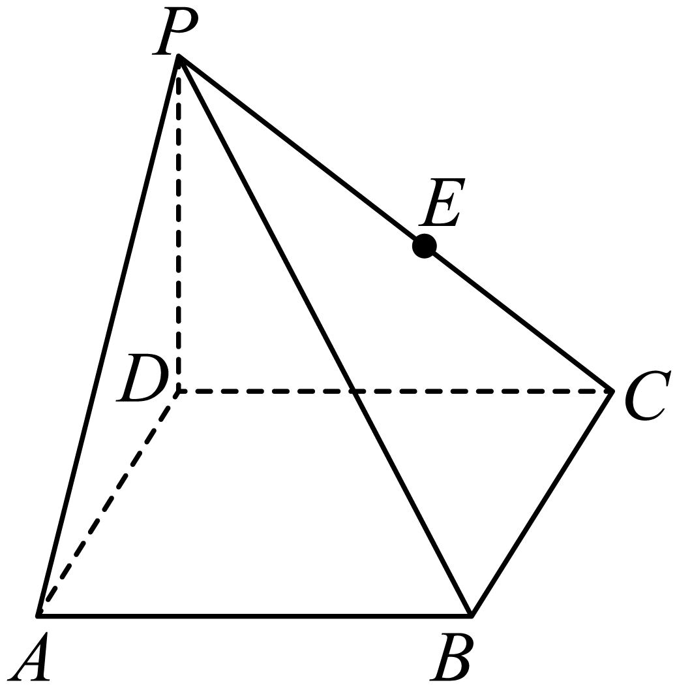

（1）平面平面，证明：；

【解析】（1）证明：因为平面平面，

所以平面，

又因为平面平面，所以．

**例14．**（2024·河南·高三校联考阶段练习）已知四棱锥，底面为菱形，平面，，，为上一点．

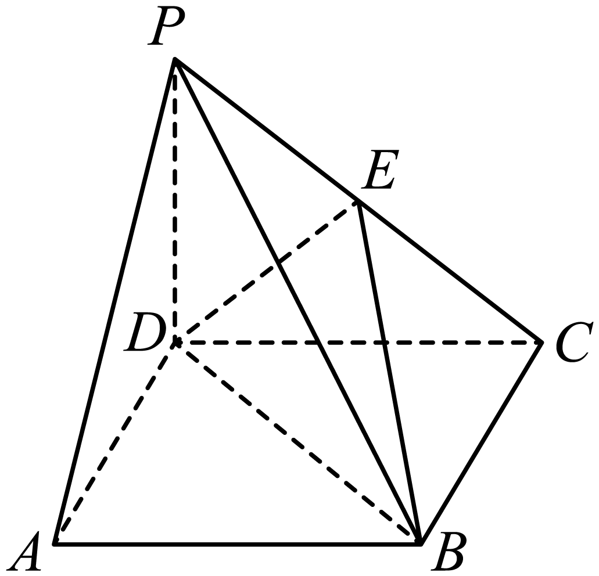

（1）平面平面，证明：．

（2）当直线与平面的夹角为时，求三棱锥的体积．

【解析】（1）因为平面平面，

所以平面，平面，

又因为平面平面，所以．

（2）过点作的垂线，垂足为，则，

因为平面，所以平面，

若点为中点，则点为的中点，

此时，

所以直线与平面的夹角为，

即点为中点时满足题意，

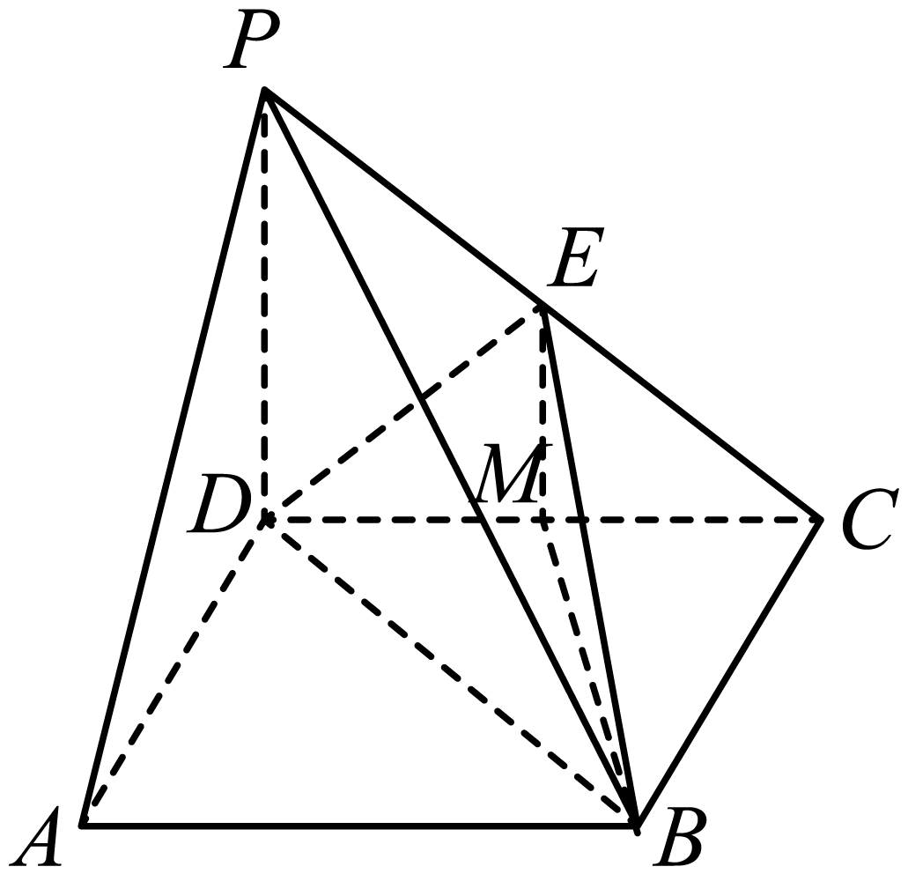

因为平面，所以平面，所以，

又因为，，平面，

所以平面，所以点到平面的距离为，

故

**例15．**（2024·重庆万州·统考模拟预测）如图1所示，在四边形中，，为上一点，，，将四边形沿折起，使得，得到如图2所示的四棱锥．

（1）若平面平面，证明：；

【解析】（1）在图1中，因为，，，

所以，，又，

所以，

因为，，

所以，故，

在图2中，因为，平面，平面，

所以平面，

因为平面，平面平面，所以；

**变式12．**（2024·北京东城·高三北京市第十一中学校考阶段练习）如图所示，在直三棱柱中，，，点、分别为棱、的中点，点是线段上的点（不包括两个端点）．

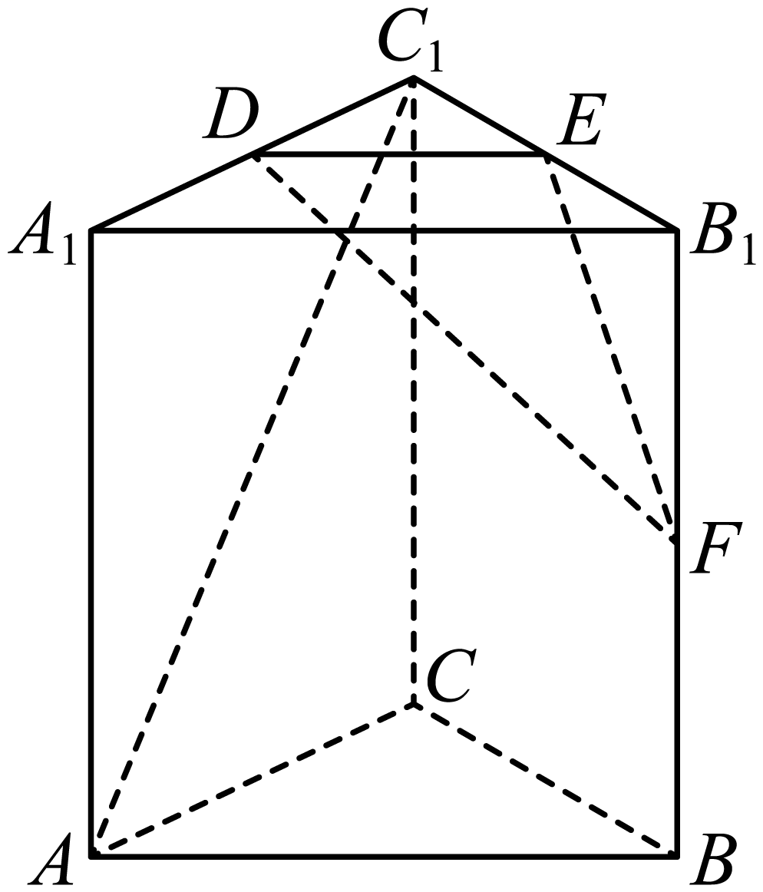

（1）设平面与平面相交于直线，求证：；

【解析】（1）证明：因为点、分别为棱、的中点，则，

在三棱柱中，四边形为平行四边形，所以，，则，

因为平面，平面，所以，平面，

因为平面，平面平面，所以，，故．

**变式13．**（2024·全国·高三专题练习）如图，四棱锥的底面边长为8的正方形，四条侧棱长均为．点分别是棱上共面的四点，平面平面，平面．证明：．

【解析】因为∥平面，平面，且平面平面，所以∥，

因为∥平面，平面，且平面平面，

所以∥，所以∥．

**变式14．**（2024·江苏扬州·江苏省高邮中学校考模拟预测）如图，三棱台中，，是的中点，点在线段上，，平面平面．

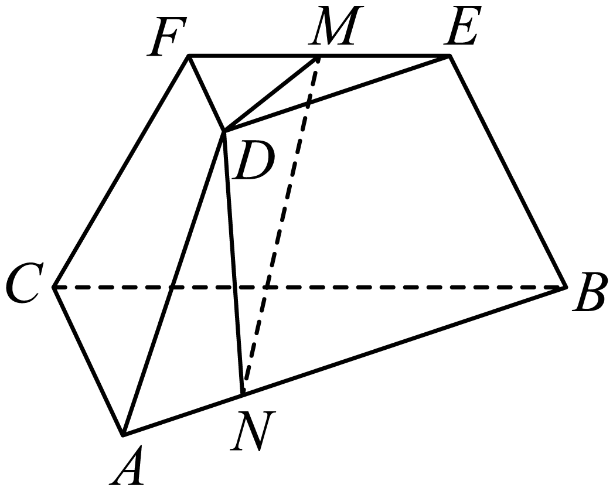

（1）证明：；

【解析】（1）证明：取的中点，连接，，

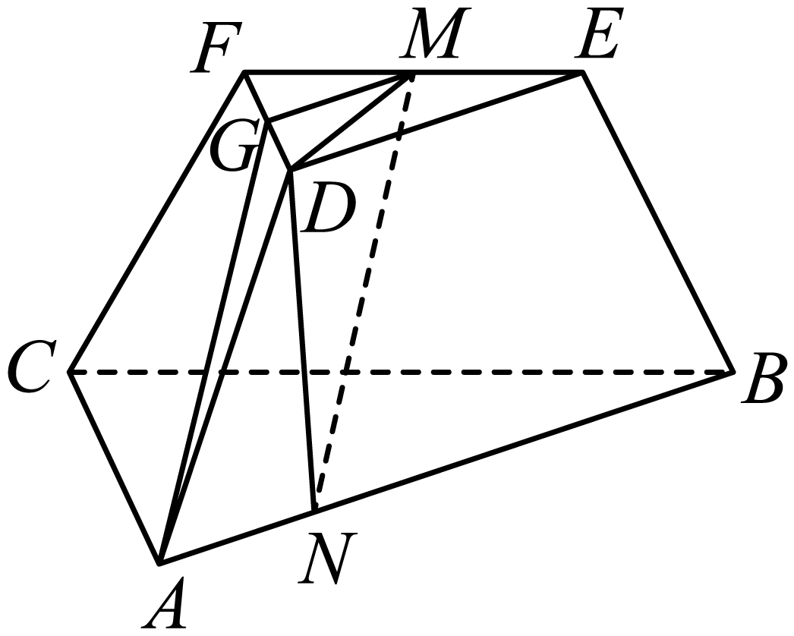

因为是的中点，所以，，

因为三棱台中，，，，

所以，，即四边形为平行四边形，所以，

因为平面，平面，所以平面，

因为平面，平面平面，所以．

**【解题方法总结】**

如果一条直线和一个平面平行，经过这条直线的平面和这个平面相交，那么这条直线就和交线平行

**题型六：面面平行的证明**

<strong>例16．</strong>（2024·河南郑州·高三郑州外国语学校校考阶段练习）如图，在四棱锥<em>P</em>﹣<em>ABCD</em>中，平面<em>PAD</em>⊥平面<em>ABCD</em>，<em>PA</em>＝<em>PD</em>，<em>AB</em>＝<em>AD</em>，<em>PA</em>⊥<em>PD</em>，<em>AD</em>⊥<em>CD</em>，∠<em>BAD</em>＝60°，<em>M</em>，<em>N</em>分别为<em>AD</em>，<em>PA</em>的中点．

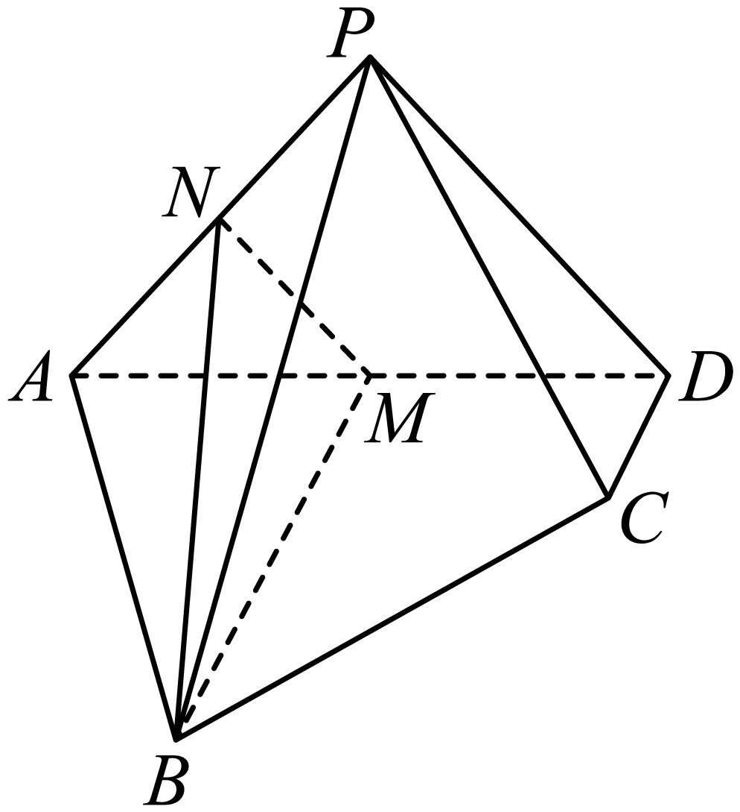

（1）证明：平面*BMN*∥平面*PCD*；

【解析】（1）证明：连接*BD*，如图

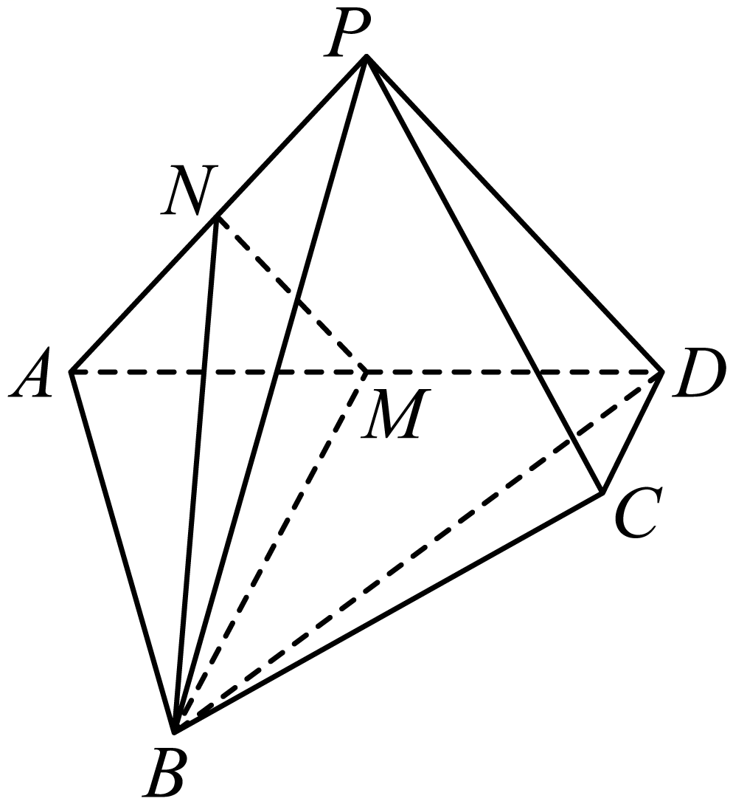

∵*AB*＝*AD*，∠*BAD*＝60°，

∴△*ABD*为等边三角形，

∵*M*为*AD*的中点，

∴*BM*⊥*AD*，

∵*AD*⊥*CD*，

又*CD*，*BM*⊂平面*ABCD*，

*BM*∥*CD*，

又*BM*平面*PCD*，*CD*⊂平面*PCD*，

∴*BM*∥平面*PCD*，

∵*M*，*N*分别为*AD*，*PA*的中点，

∴*MN*∥*PD*，

又*MN*平面*PCD*，*PD*⊂平面*PCD*，

∴*MN*∥平面*PCD*．

又*BM*，*MN*⊂平面*BMN*，*BM*∩*MN*＝*M*，

∴平面*BMN*∥平面*PCD*．

**例17．**（2024·山东临沂·高三校考阶段练习）如图，在多面体中，是正方形，，，，为棱的中点．

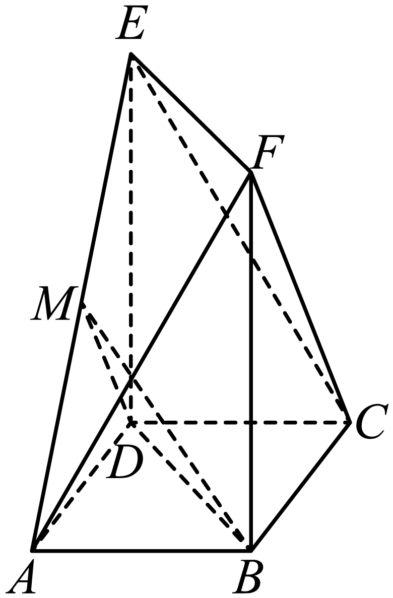

（1）求证：平面平面；

【解析】（1）连交于，则为的中点，

因为为的中点，所以，

因为平面，平面，所以平面，

因为，，所以四边形是平行四边形，所以，

因为平面，平面，所以平面，

因为，平面，所以平面平面．

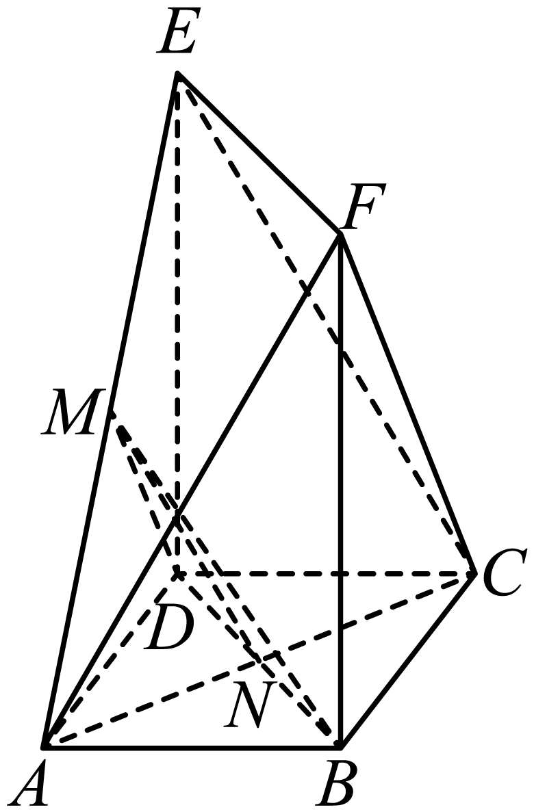

32．（2024·河北·统考模拟预测）在圆柱中，等腰梯形为底面圆的内接四边形，且，矩形是该圆柱的轴截面，为圆柱的一条母线，．

（1）求证：平面平面；

【解析】（1）在圆柱中，，平面，平面，

故平面；

连接，因为等腰梯形为底面圆的内接四边形，，

故，

则为正三角形，故，则，

平面，平面，

故平面；

又平面，

故平面平面．

<strong>例18．</strong>（2024·甘肃定西·统考模拟预测）如图，在四棱锥中，底面<em>ABCD</em>是边长为2的菱形，，<em>AC</em>与<em>BD</em>交于点<em>O</em>，底面<em>ABCD</em>，，点<em>E</em>，<em>F</em>分别是棱<em>PA</em>，<em>PB</em>的中点，连接<em>OE</em>，<em>OF</em>，<em>EF</em>．

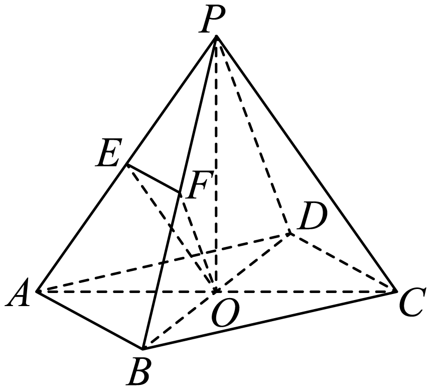

（1）求证：平面平面*PCD*；

（2）求三棱锥的体积．

【解析】（1）因为底面*ABCD*是菱形，*AC*与*BD*交于点*O*

所以*O*为*AC*中点，

点*E*是棱*PA*的中点，*F*分别是棱*PB*的中点，

所以*OE*为三角形的中位线，*OF*为三角形的中位线，

所以，，

平面，平面，平面，

平面，平面，平面，

而，平面，平面，

平面平面*PCD．*

（2）因为底面*ABCD*是边长为2的菱形，，

所以为等边三角形，

所以，

因为底面*ABCD，*

底面*ABCD，* 底面*ABCD，*

所以，，

所以和均为直角三角形，

所以，，

所以，

所以，

所以，

设点到平面的距离为，

根据体积相等法可知，

所以，

所以．

，

故三棱锥的体积为．

**变式15．**（2024·四川南充·统考三模）如图所示，已知是圆锥底面的两条直径，为劣弧的中点．

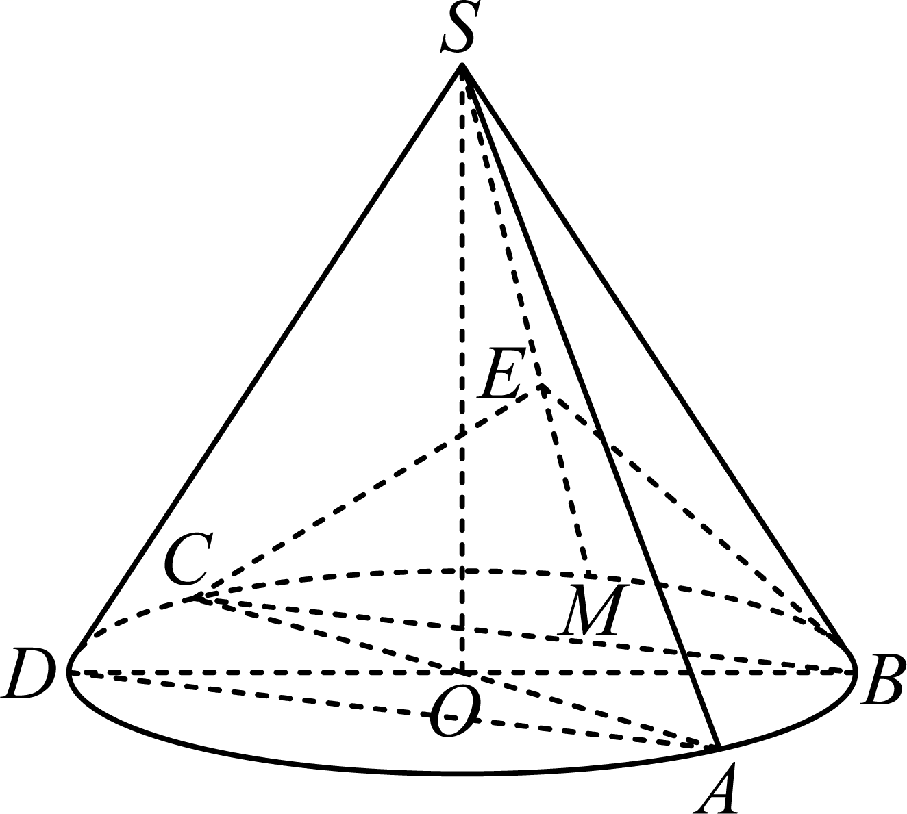

（1）证明：；

（2）若，为线段上的一点，且，求证：平面平面．

【解析】（1）连接并延长交于，如图所示，

为劣弧的中点，

是的角平分线，

平分，

，

，

又在圆锥中，平面，平面，

，

，平面，且，

平面，

又平面，

．

（2）设交于，显然平分，且，

又，

，

在中，，

为的中点，

同理，

，

又，

，

，

平面，且平面，

平面，

又在平面中，，

，

又平面，且平面，

平面，

又，平面，且，

平面平面．

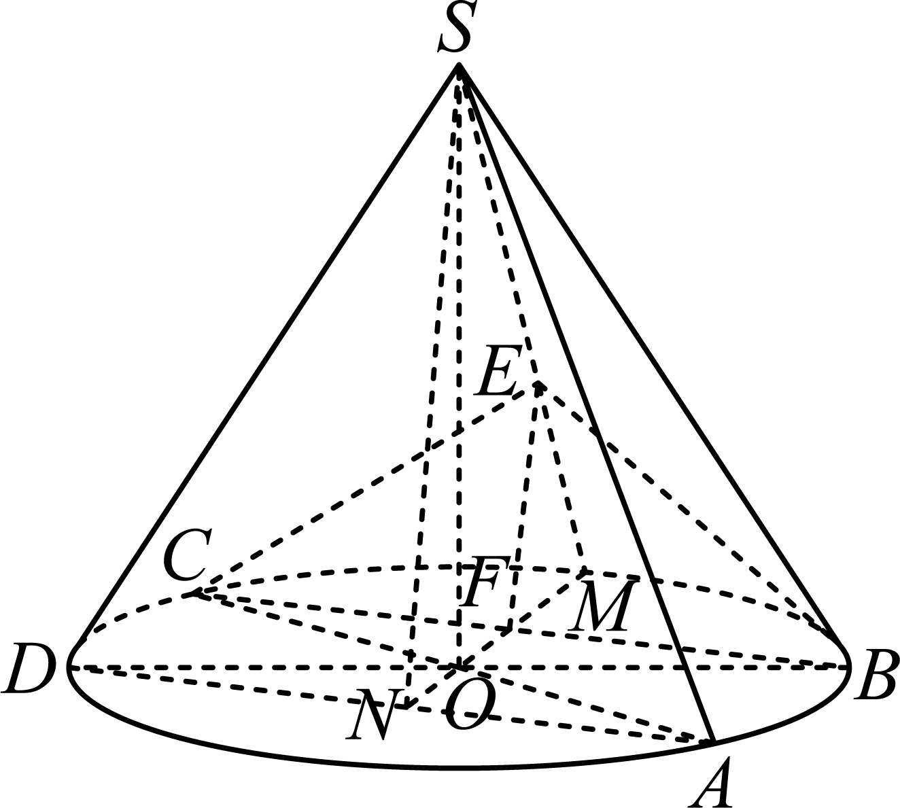

**【解题方法总结】**

常用证明面面平行的方法是在一个平面内找到两条相交直线与另一个平面分别平行或找一条直线同时垂直于这两个平面．证明面面平行关键是找到两组相交直线分别平行．

**题型七：面面平行的性质**

<strong>例19．</strong>（2024·全国·高三专题练习）如图，在四棱柱中，底面为梯形，，平面与交于点．求证：<em>．</em>

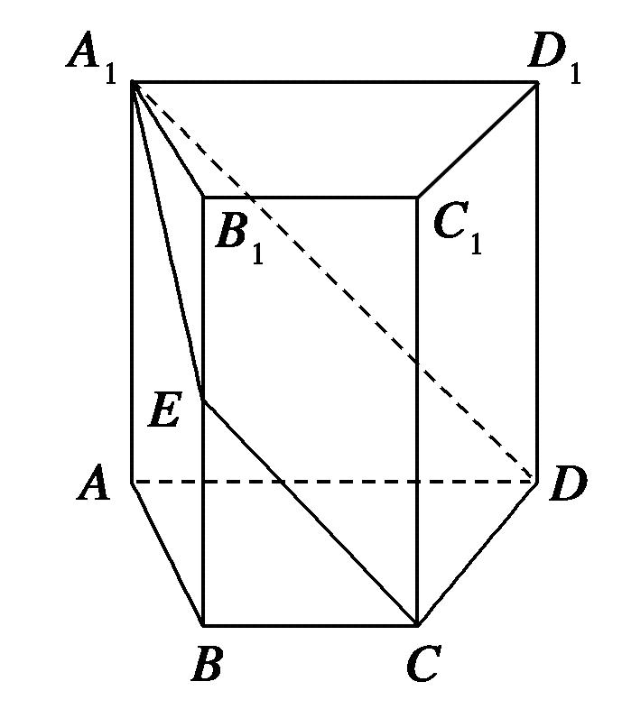

【解析】由四棱柱可知，，平面，平面，

所以平面；

又，平面，平面，

所以平面；

又，平面，平面；

所以平面平面，

又平面平面，平面平面，

所以．

<strong>例20．</strong>（2024·辽宁·朝阳市第一高级中学校联考三模）如图，直四棱柱被平面所截，截面为<em>CDEF</em>，且，，，平面<em>EFCD</em>与平面<em>ABCD</em>所成角的正切值为．

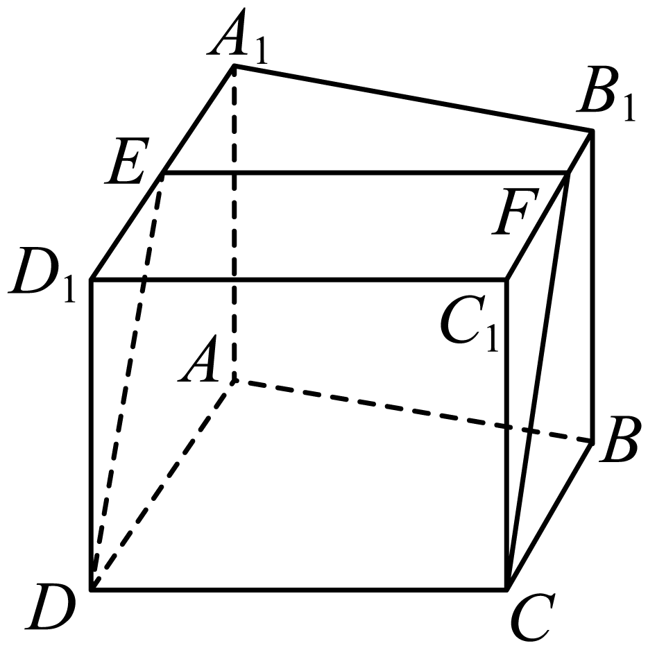

（1）证明：；

【解析】（1）在直四棱柱中，平面平面，

平面，平面，则，

而，又，因此，

则四边形是平行四边形，，

所以．

<strong>例21．</strong>（2024·安徽滁州·安徽省定远中学校考二模）如图，在三棱柱中，四边形是边长为4的菱形．，点<em>D</em>为棱<em>AC</em>上动点（不与<em>A</em>，<em>C</em>重合），平面<em>B</em>1<em>BD</em>与棱<em>A</em>1<em>C</em>1交于点<em>E</em>．

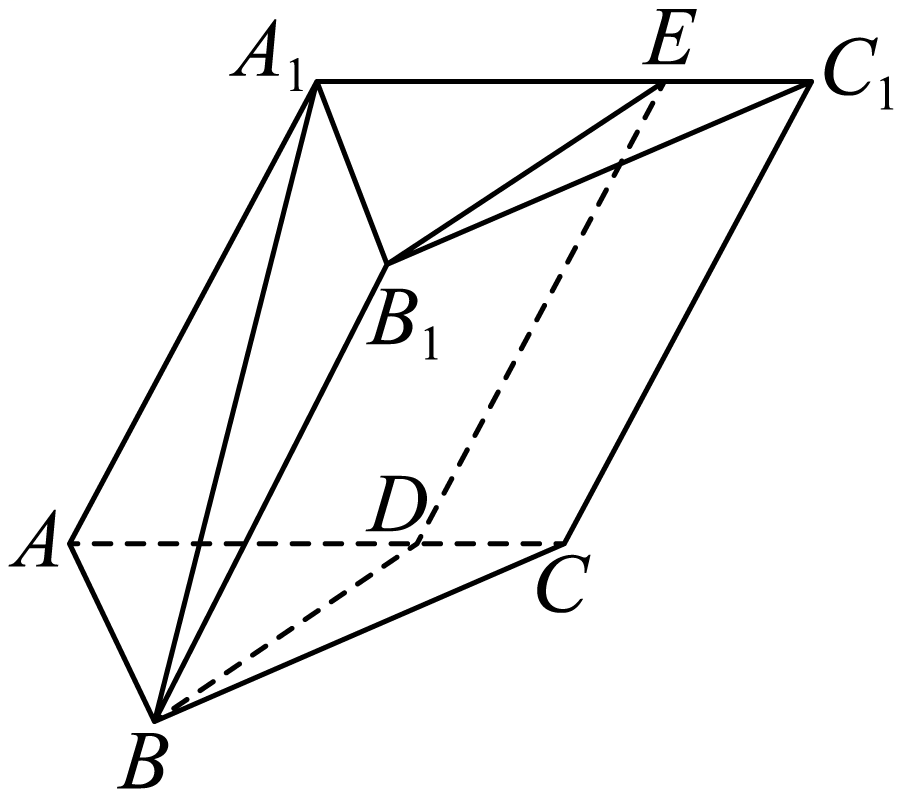

（1）求证：；

【解析】（1），

且平面，平面，

平面，

又平面，且平面平面，

；

**变式16．**（2024·北京·高三专题练习）如图，在多面体中，面是正方形，平面，平面平面，，，，四点共面，，．

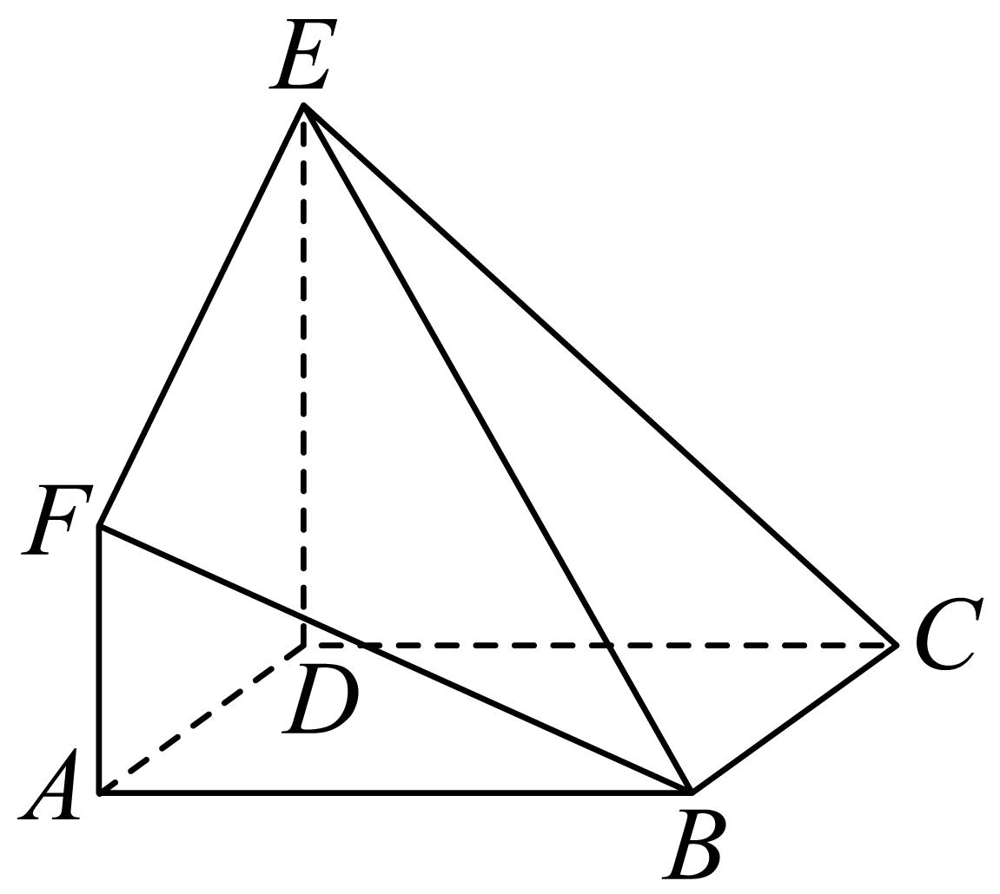

（1）求证：；

【解析】（1）因为平面平面，，，，四点共面，

且平面平面，平面平面，

所以．

<strong>变式17．</strong>（2024·全国·高三专题练习）在如图所示的圆柱中，<em>AB</em>，<em>CD</em>分别是下底面圆<em>O</em>，上底面圆的直径，<em>AD</em>，<em>BC</em>是圆柱的母线，<em>E</em>为圆<em>O</em>上一点，<em>P</em>为<em>DE</em>上一点，且平面<em>BCE</em>．

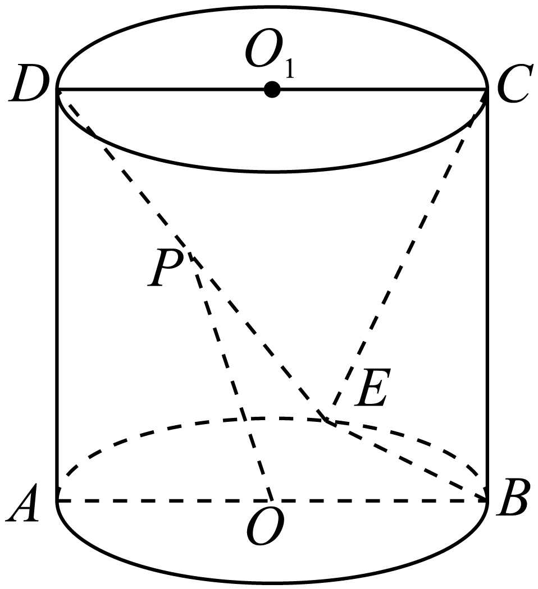

（1）求证：；

【解析】（1）如图，连接，，

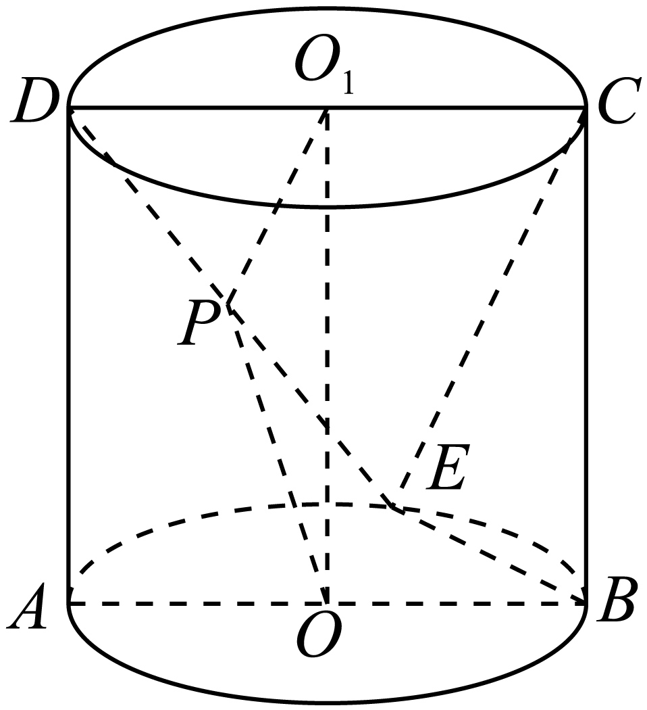

因为为母线，

所以，

又平面，

所以平面．

因为平面，

所以平面平面．

又因为平面平面，平面平面，

所以，

因为是的中点，

所以是的中点，

即．

**【解题方法总结】**

如果两个平行平面同时和第三个平面相交，那么他们的交线平行（简记为“面面平行线面平行”）

**题型八：平行关系的综合应用**

**例22．**（2024·全国·高三专题练习）已知正方体中，､分别为对角线､上的点，且．

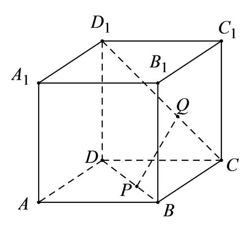

（1）求证：平面；

（2）若是上的点，的值为多少时，能使平面平面？请给出证明．

【解析】（1）连结并延长与的延长线交于点，

因为四边形为正方形，

所以，

故，

所以，

又因为，

所以，

所以．

又平面，平面，

故平面．

（2）当的值为时，能使平面平面．

证明：因为，

即有，

故．

所以．

又平面，平面，

所以平面，

又，平面．

所以平面平面．

**例23．**（2024·全国·高三专题练习）如图、三棱柱的侧棱垂直于底面，是边长为2的正三角形，，点在线段上且，点是线段上的动点．当为多少时，直线平面？

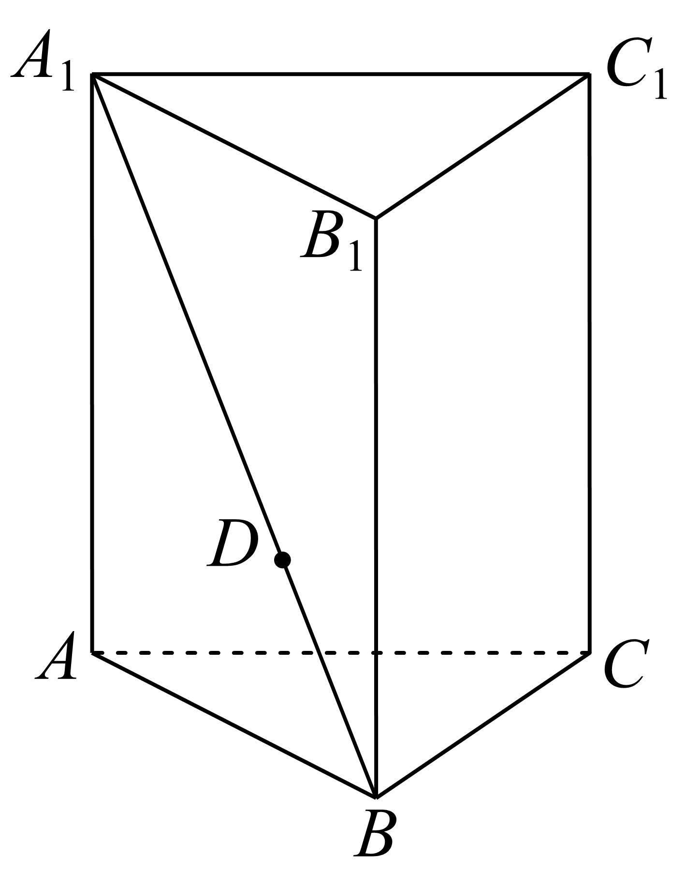

【解析】当点是线段上靠近点的三等分点，即时，平面．

过点作交于点，过点作交于点，连接，

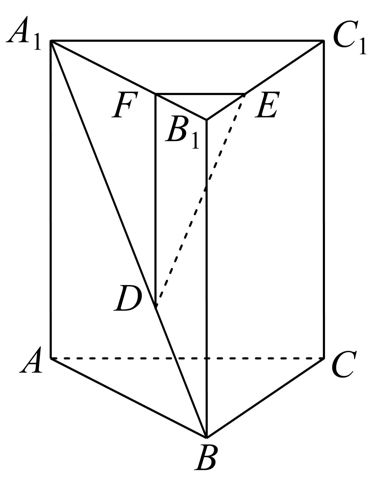

平面，平面，

平面，

，面，平面，

平面，

又，平面，平面，

∴平面平面，

平面，

平面．

∴，

当时，平面．

**例24．**（2024·福建福州·福州四中校考模拟预测）如图，在直三棱柱中，，且，点在线段（含端点）上运动，设．

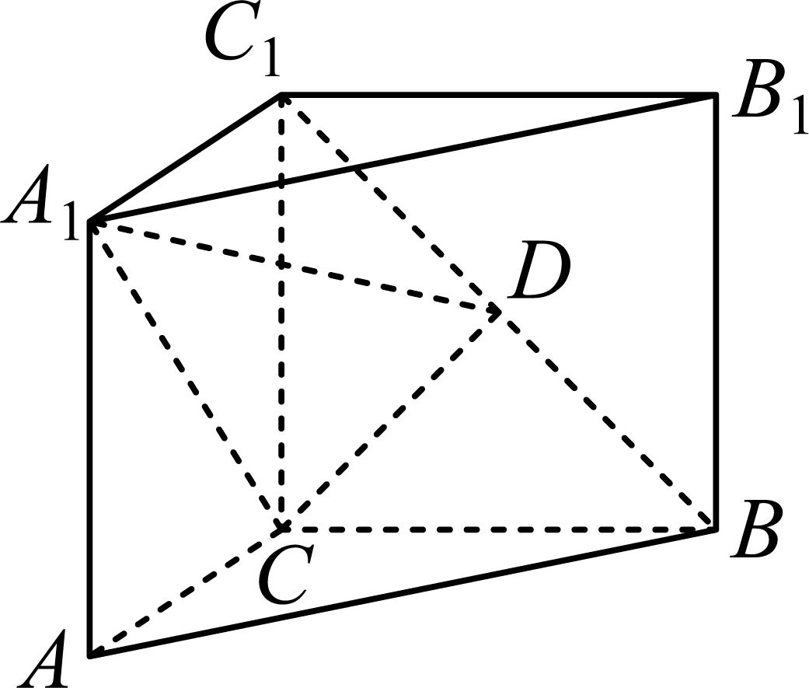

（1）当平面时，求实数的值；

【解析】（1）如图，连接，交于点，连接，

为的中点，且平面平面，

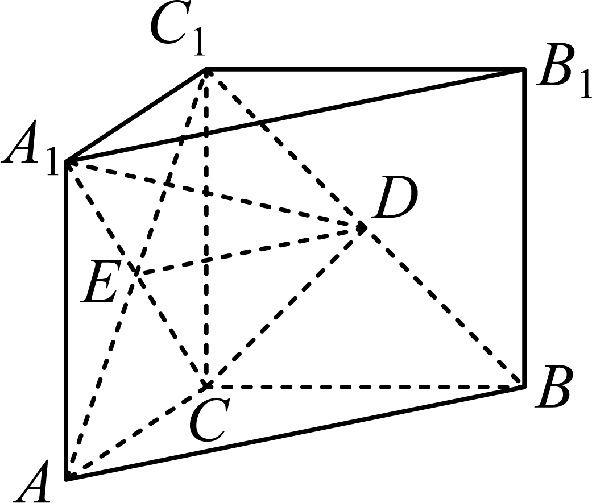

平面平面，，

为的中点，即实数的值为．

<strong>变式18．</strong>（2024·湖南长沙·高一长沙市实验中学校考期中）如图所示，四边形<em>EFGH</em>为空间四边形<em>ABCD</em>的一个截面，若截面为平行四边形．

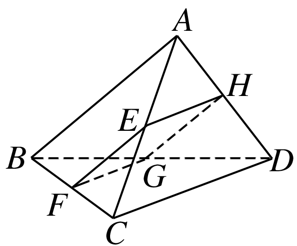

（1）求证：*AB*∥平面*EFGH*；

（2）若*AB*＝4，*CD*＝6，求四边形*EFGH*周长的取值范围．

【解析】（1）∵四边形*EFGH*为平行四边形，

∴*EF*∥*HG*．

∵*HG*⊂平面*ABD*，*EF*⊄平面*ABD*，

∴*EF*∥平面*ABD*．

又∵*EF*⊂平面*ABC*，平面*ABD*∩平面*ABC*＝*AB*，

∴*EF*∥*AB*，又∵*AB*⊄平面*EFGH*，*EF*⊂平面*EFGH*，

∴*AB*∥平面*EFGH*．

（2）设，

∵*EF*∥*AB*，*FG*∥*CD*，∴，

则＝＝＝1－，∴．

∵四边形*EFGH*为平行四边形，

∴四边形*EFGH*的周长*l*＝2＝12－*x*．

又∵0<*x*<4，∴8<*l*<12，

即四边形*EFGH*周长的取值范围是（8，12）．

**变式19．**（2024·全国·高三专题练习）如图，在四棱锥中，为边的中点，异面直线与所成的角为．

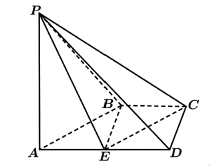

（1）在直线上找一点，使得直线平面，并求的值；

【解析】（1）在四棱锥中，，异面直线与所成的角为．

即，又为两相交直线，则平面

取*PD*中点*F*，连接*EF*，又，则，则平面

又四边形中，，

则，则三直线两两互相垂直

以*E*为原点，分别以*ED*、*EB*、*EF*所在直线为*x*、*y*、*z*轴建立空间直角坐标系如图：

设，则，， ，，

，，，

设平面*PBE*的一个法向量为，

则，即，令，则，则

设，则

由直线平面，可得，即

则，解之得，则，又，则

**变式20．**（2024·重庆渝中·高三重庆巴蜀中学校考阶段练习）如图所求，四棱锥，底面为平行四边形，为的中点，为中点．

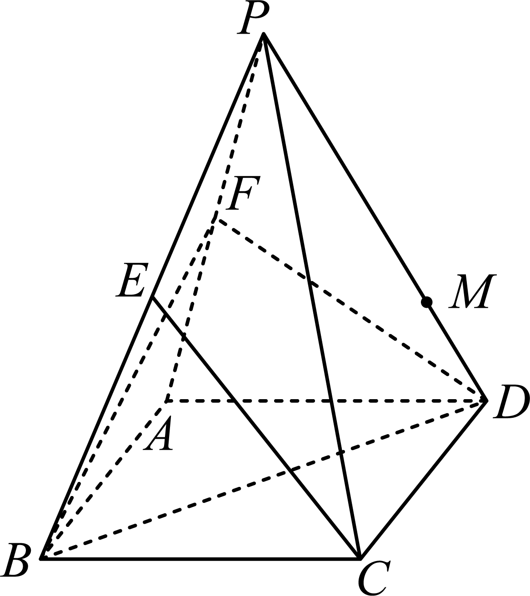

（1）求证：平面；

（2）已知点在上满足平面，求的值．

【解析】（1）证明：连结交于，连结，

因在中，为中点，为中点，则*FO* ．

又平面，平面，故平面；

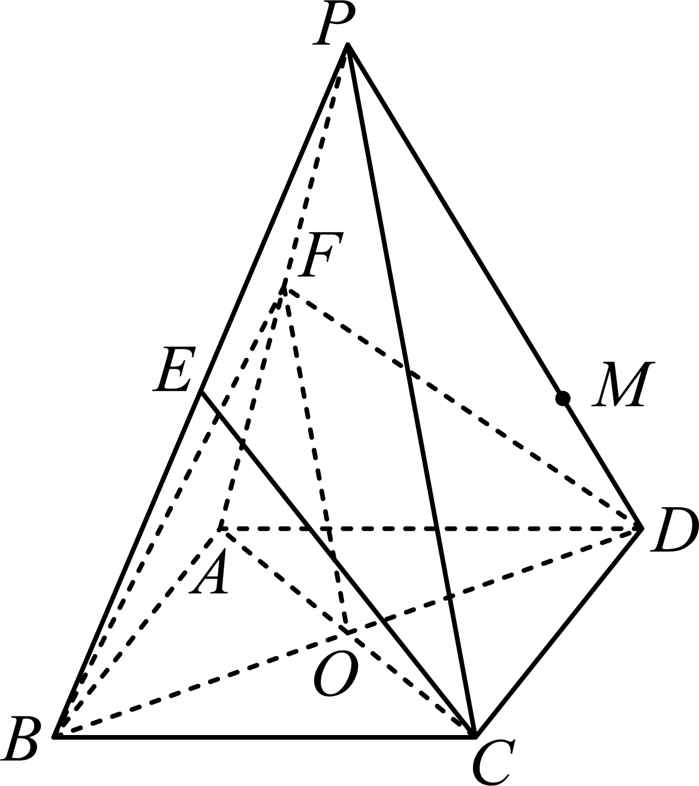

（2）如图连结交延长线于，连结交于，

连结，，，*EN*．

因，则四点共面．

又平面，平面平面，

则，四边形为平行四边形，可得 为中点．

则为*BG*中点．

即*EN*为中位线，则*ENPG*，．

又*DN*，则四边形*EFDN*为平行四边形，*ENFD*．

从而*FDPG*，．

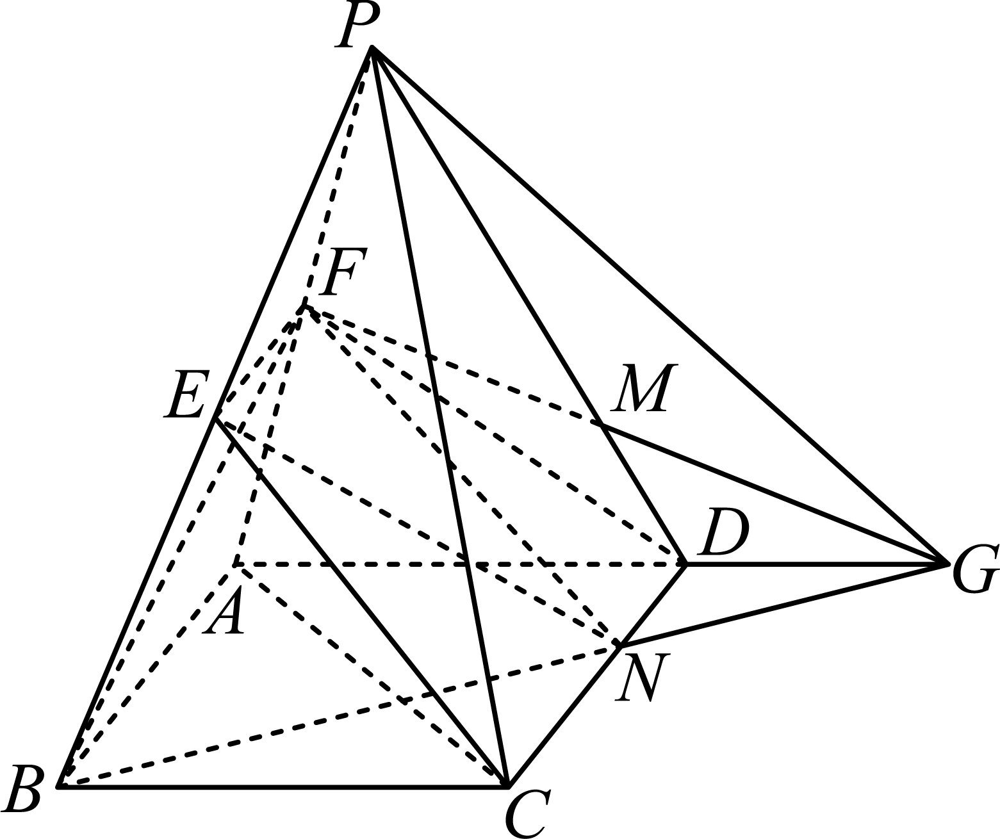

**【解题方法总结】**

证明平行关系的常用方法

熟练掌握线线、线面、面面平行关系间的相互转化是解决线线、线面、面面平行的综合问题的关键．面面平行判定定理的推论也是证明面面平行的一种常用方法

