**第50讲  外接球、内切球、棱切球**

**知识梳理**

**知识点一：正方体、长方体外接球**

1、正方体的外接球的球心为其体对角线的中点，半径为体对角线长的一半．

2、长方体的外接球的球心为其体对角线的中点，半径为体对角线长的一半．

3、补成长方体

（1）若三棱锥的三条侧棱两两互相垂直，则可将其放入某个长方体内，如图1所示．

（2）若三棱锥的四个面均是直角三角形，则此时可构造长方体，如图2所示．

（3）正四面体可以补形为正方体且正方体的棱长，如图3所示．

（4）若三棱锥的对棱两两相等，则可将其放入某个长方体内，如图4所示

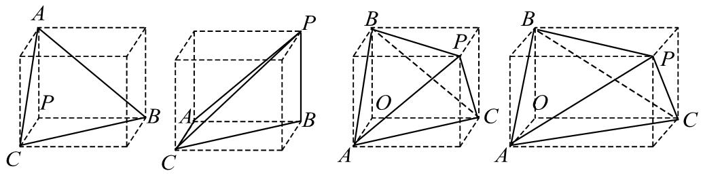  
图1          图2              图3             图4

**知识点二：正四面体外接球**

如图，设正四面体的的棱长为，将其放入正方体中，则正方体的棱长为，显然正四面体和正方体有相同的外接球．正方体外接球半径为，即正四面体外接球半径为．

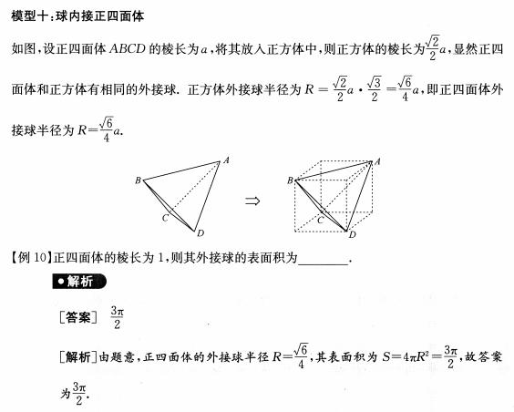

**知识点三：对棱相等的三棱锥外接球**

四面体中，，，，这种四面体叫做对棱相等四面体，可以通过构造长方体来解决这类问题．

如图，设长方体的长、宽、高分别为，则，三式相加可得而显然四面体和长方体有相同的外接球，设外接球半径为，则，所以．

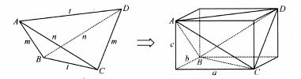

**知识点四：直棱柱外接球**

如图1，图2，图3，直三棱柱内接于球（同时直棱柱也内接于圆柱，棱柱的上下底面可以是任意三角形）

  
图1                        图2                         图3

第一步：确定球心的位置，是的外心，则平面；

第二步：算出小圆的半径，（也是圆柱的高）；

第三步：勾股定理：，解出

**知识点五：直棱锥外接球**

如图，平面，求外接球半径．

解题步骤：

第一步：将画在小圆面上，为小圆直径的一个端点，作小圆的直径，连接，则必过球心；

第二步：为的外心，所以平面，算出小圆的半径(三角形的外接圆直径算法：利用正弦定理，得)，；

第三步：利用勾股定理求三棱锥的外接球半径：①；

②．

**知识点六：正棱锥与侧棱相等模型**

**1、正棱锥外接球半径： ．**

2、**侧棱相等模型：**

如图，的射影是的外心

三棱锥的三条侧棱相等

三棱锥的底面在圆锥的底上，顶点点也是圆锥的顶点．

解题步骤：

第一步：确定球心的位置，取的外心，则三点共线；

第二步：先算出小圆的半径，再算出棱锥的高（也是圆锥的高）；

第三步：勾股定理：，解出．

**知识点七：侧棱为外接球直径模型**

方法：找球心，然后作底面的垂线，构造直角三角形．

**知识点八：共斜边拼接模型**

如图，在四面体中，，，此四面体可以看成是由两个共斜边的直角三角形拼接而形成的，为公共的斜边，故以“共斜边拼接模型”命名之．设点为公共斜边的中点，根据直角三角形斜边中线等于斜边的一半的结论可知，，即点到，，，四点的距离相等，故点就是四面体外接球的球心，公共的斜边就是外接球的一条直径．

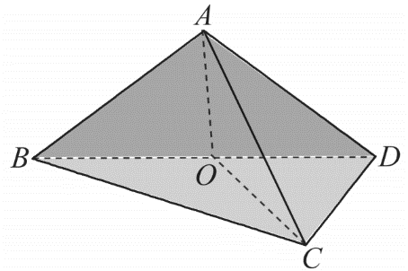

**知识点九：垂面模型**

如图1所示为四面体，已知平面平面，其外接球问题的步骤如下：

（1）找出和的外接圆圆心，分别记为和．

（2）分别过和作平面和平面的垂线，其交点为球心，记为．

（3）过作的垂线，垂足记为，连接，则．

（4）在四棱锥中，垂直于平面，如图2所示，底面四边形的四个顶点共圆且为该圆的直径．

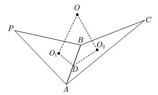

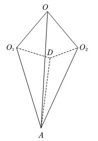  
图1                                   图2

**知识点十：最值模型**

这类问题是综合性问题，方法较多，常见方法有：导数法，基本不等式法，观察法等

**知识点十一：二面角模型**

如图1所示为四面体，已知二面角大小为，其外接球问题的步骤如下：

（1）找出和的外接圆圆心，分别记为和．

（2）分别过和作平面和平面的垂线，其交点为球心，记为．

（3）过作的垂线，垂足记为，连接，则．

（4）在四棱锥中，垂直于平面，如图2所示，底面四边形的四个顶点共圆且为该圆的直径．

**知识点十二：坐标法**

对于一般多面体的外接球，可以建立空间直角坐标系，设球心坐标为，利用球心到各顶点的距离相等建立方程组，解出球心坐标，从而得到球的半径长．坐标的引入，使外接球问题的求解从繁琐的定理推论中解脱出来，转化为向量的计算，大大降低了解题的难度．

**知识点十三：圆锥圆柱圆台模型**

1、**球内接圆锥**

如图，设圆锥的高为，底面圆半径为，球的半径为．通常在中，由勾股定理建立方程来计算．如图，当时，球心在圆锥内部；如图，当时，球心在圆锥外部．和本专题前面的内接正四棱锥问题情形相同，图2和图3两种情况建立的方程是一样的，故无需提前判断．

由图、图可知，或，故，所以．

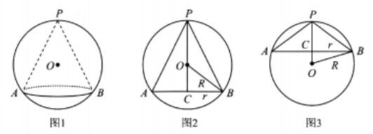

2、**球内接圆柱**

如图，圆柱的底面圆半径为，高为，其外接球的半径为，三者之间满足．

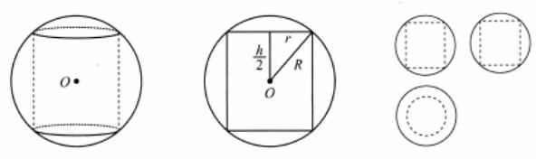

3、**球内接圆台**

，其中分别为圆台的上底面、下底面、高．

**知识点十四：锥体内切球**

方法：等体积法，即

**知识点十五：棱切球**

方法：找切点，找球心，构造直角三角形

**必考题型全归纳**

**题型一：外接球之正方体、长方体模型**

<strong>例1．</strong>（2024·云南昆明·高一校考期末）正方体的表面积为96，则正方体外接球的表面积为______

<strong>例2．</strong>（2024·吉林·高一校联考期末）已知正方体的顶点都在球面上，若正方体棱长为，则球的表面积为________．

<strong>例3．</strong>（2024·全国·高一专题练习）已知长方体的顶点都在球表面上，长方体中从一个顶点出发的三条棱长分别为2，3，4则球的表面积是__________

<strong>变式1．</strong>（2024·湖南长沙·高一长郡中学校考期中）长方体的外接球的表面积为，，，则长方体的体积为__________.

<strong>变式2．</strong>（2024·天津静海·高一校考期中）在长方体中，，，，则长方体外接球的表面积为__________．

**题型二：外接球之正四面体模型**

<strong>例4．</strong>（2024·湖北宜昌·宜昌市夷陵中学校考模拟预测）已知正四面体<em>ABCD</em>的表面积为，且<em>A</em>，<em>B</em>，<em>C</em>，<em>D</em>四点都在球<em>O</em>的球面上，则球<em>O</em>的体积为______．

<strong>例5．</strong>（2024·浙江·高二校联考期中）正四面体的所有顶点都在同一个表面积是36<em>π</em>的球面上，则该正四面体的棱长是__________．

<strong>例6．</strong>（2024·全国·高三专题练习）棱长为的正四面体的外接球体积为___________.

<strong>变式3．</strong>（2024·全国·高一假期作业）正四面体和边长为1的正方体有公共顶点，，则该正四面体的外接球的体积为______.

<strong>变式4．</strong>（2024·安徽池州·高二池州市第一中学校考期中）正四面体中，其侧面积与底面积之差为，则该正四面体外接球的体积为______.

**题型三：外接球之对棱相等的三棱锥模型**

**例7．**（2024·高一单元测试）在四面体中，若，，，则四面体的外接球的表面积为（    ）

A．	B．	C．	D．

<strong>例8．</strong>（2024·河南·开封高中校考模拟预测）已知四面体<em>ABCD</em>中，，，，则四面体<em>ABCD</em>外接球的体积为（    ）

A．	B．	C．	D．

**例9．**（2024·广东揭阳·高二校联考期中）在三棱锥中，，，，则该三棱锥的外接球表面积是（    ）

A．	B．	C．	D．

**变式5．**（2024·全国·高三专题练习）如图，在三棱锥中，，，，则三棱锥外接球的体积为（    ）

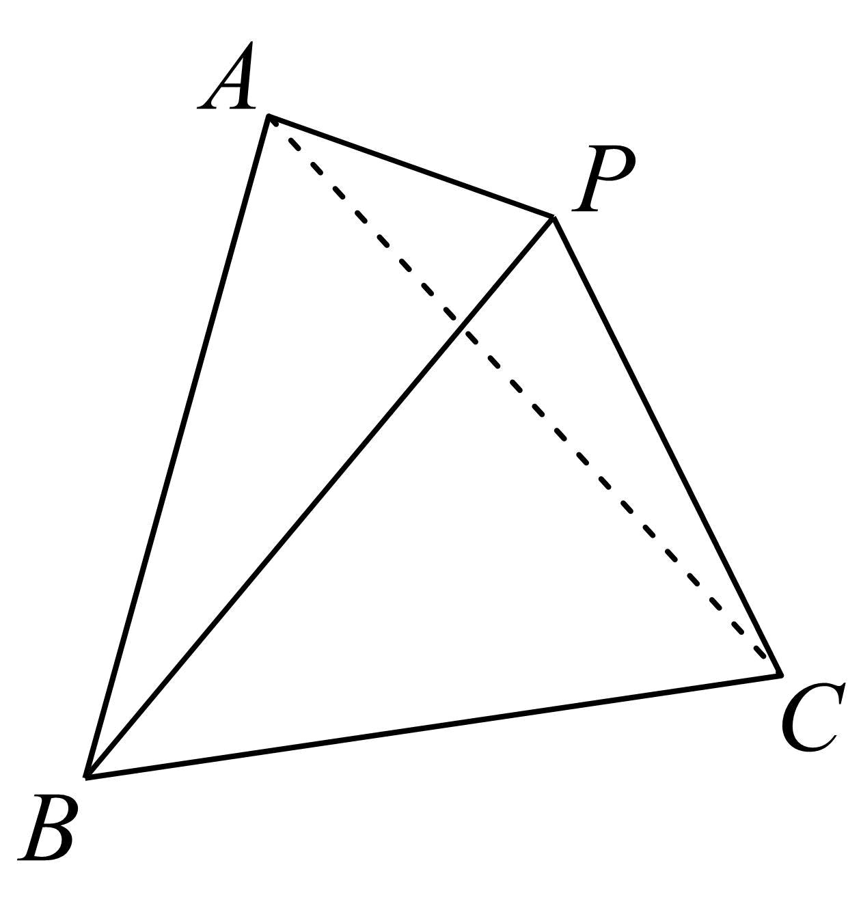

A．	B．	C．	D．

**题型四：外接球之直棱柱模型**

<strong>例10．</strong>（2024·陕西安康·统考三模）已知矩形<em>ABCD</em>的周长为36，把它沿图中的虚线折成正六棱柱，当这个正六棱柱的体积最大时，它的外接球的表面积为___________．

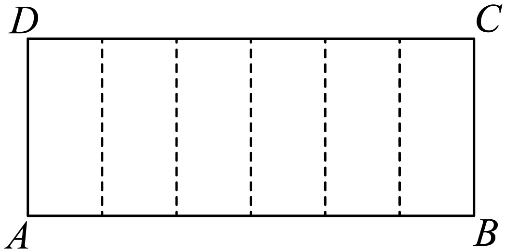

**例11．**（2024·黑龙江齐齐哈尔·高一齐齐哈尔市第八中学校校考阶段练习）设直三棱柱的所有顶点都在一个表面积是的球面上，且，则此直三棱柱的表面积是（    ）

A．	B．	C．	D．

**例12．**（2024·全国·高三专题练习）在直三棱柱中，为等腰直角三角形，若三棱柱的体积为32，则该三棱柱外接球表面积的最小值为（    ）

A．12π	B．24π	C．48π	D．96π

**变式6．**（2024·湖北咸宁·高二鄂南高中校考阶段练习）已知正三棱柱的体积为，则其外接球表面积的最小值为（　　）

A．12π	B．6π	C．16π	D．8π

**变式7．**（2024·全国·高三专题练习）在三棱柱中，已知，侧面，且直线与底面所成角的正弦值为,则此三棱柱的外接球的表面积为（    ）

A．	B．	C．	D．

**变式8．**（2024·新疆昌吉·高三校考期末）已知正三棱柱所有棱长都为6，则此三棱柱外接球的表面积为（    ）

A．	B．60	C．	D．

**题型五：外接球之直棱锥模型**

<strong>例13．</strong>（2024·安徽宣城·高一统考期末）在三棱锥中，△<em>ABC</em>是边长为3的等边三角形，侧棱<em>PA</em>⊥平面<em>ABC</em>，且，则三棱锥的外接球表面积为_________．

<strong>例14．</strong>（2024·江苏南京·高二统考期末）在三棱锥中，面，为等边三角形，且，则三棱锥的外接球的表面积为______．

<strong>例15．</strong>（2024·四川成都·高一成都七中校考阶段练习）已知三棱锥，其中平面，则三棱锥外接球的表面积为__________.

<strong>变式9．</strong>（2024·陕西商洛·镇安中学校考模拟预测）在三棱锥中，为等边三角形，平面，若，则三棱锥外接球的表面积的最小值为___.

<strong>变式10．</strong>（2024·陕西榆林·高二校考阶段练习）已知三棱锥中，平面，，异面直线与所成角的余弦值为，则三棱锥的外接球的表面积为_____________．

<strong>变式11．</strong>（2024·江苏镇江·高三江苏省镇江中学校考阶段练习）如图，在四棱锥中，底面为菱形，底面，为对角线与的交点，若，，则三棱锥的外接球的体积为______.

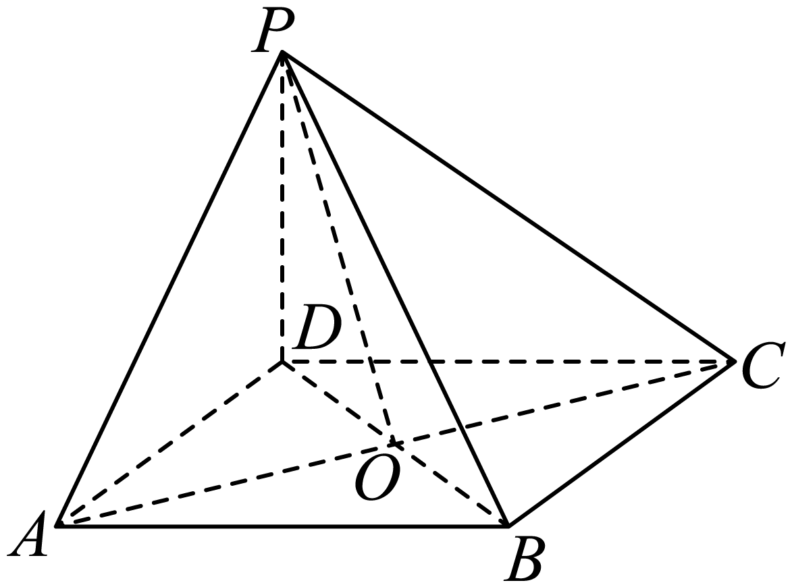

<strong>变式12．</strong>（2024·四川绵阳·绵阳中学校考二模）在四棱锥中，平面<em>BCDE</em>，，，，且，则该四棱锥的外接球的表面积为______.

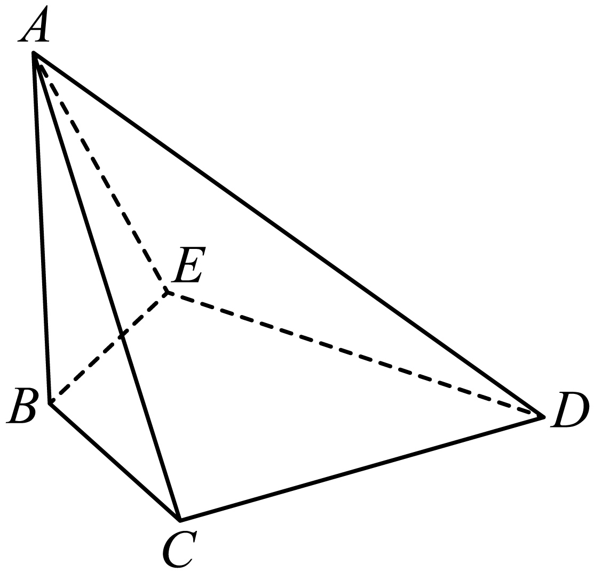

<strong>变式13．</strong>（2024·广东韶关·高二统考期末）三棱锥中,平面,,,,则三棱锥外接球的体积是________．

**题型六：外接球之正棱锥、正棱台模型**

<strong>例16．</strong>（2024·山东滨州·高一校考期中）已知正四棱锥的底面边长为，侧棱长为6，则该四棱锥的外接球的体积为__________．

<strong>例17．</strong>（2024·福建福州·高一福建省福州屏东中学校考期末）已知正三棱锥的顶点都在球<em>O</em>的球面上，其侧棱与底面所成角为，且，则球<em>O</em>的表面积为______________

<strong>例18．</strong>（2024·河南商丘·高一商丘市第一高级中学校联考期末）在正三棱锥中，点<em>D</em>在棱上，且满足，，若，则三棱锥外接球的表面积为_________.

<strong>变式14．</strong>（2024·云南保山·高一统考期末）已知正三棱锥的侧棱与底面所成的角为，高为，则该三棱锥外接球的表面积为______.

<strong>变式15．</strong>（2024·广东佛山·高一佛山市南海区第一中学校考阶段练习）已知正三棱锥中，，，该三棱锥的外接球体积为__________．

**变式16．**（2024·陕西咸阳·武功县普集高级中学校考模拟预测）如图，在正三棱台中，，，，则正三棱台的外接球表面积为（    ）

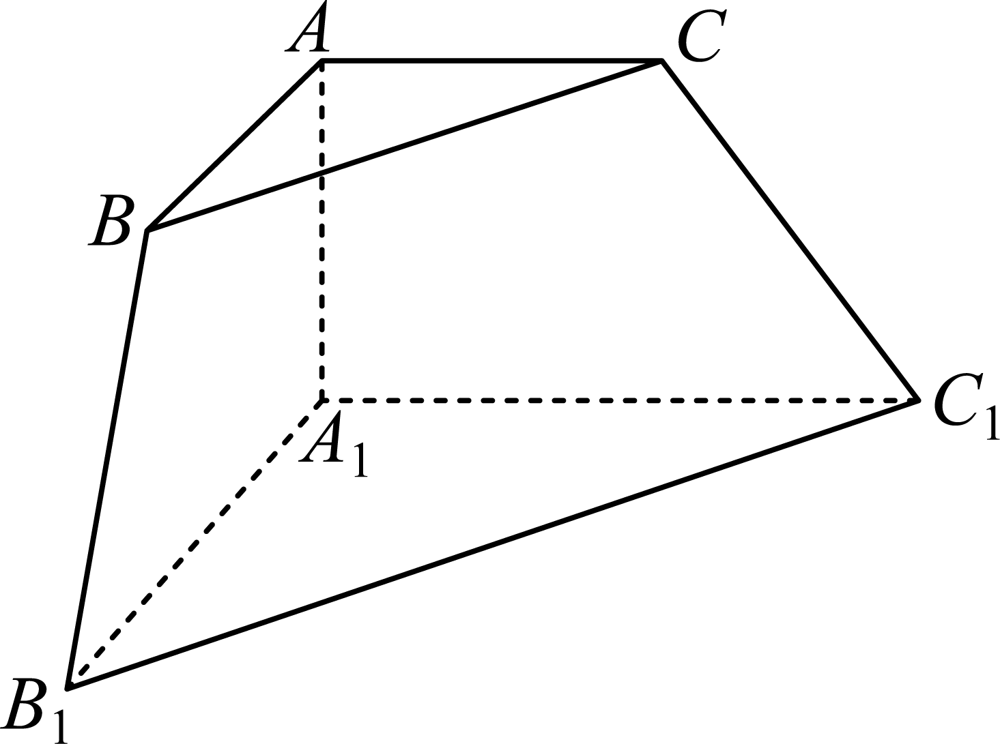

A．64	B．	C．	D．

**变式17．**（2024·辽宁·高三校联考期末）正四棱台高为2，上下底边长分别为2和4，所有顶点在同一球面上，则球的表面积为（    ）

A．	B．	C．	D．

<strong>变式18．</strong>（2024·贵州六盘水·高一校考阶段练习）已知正四棱锥的底面边长为6，侧棱长为，则该四棱锥外接球的表面积为_______．

<strong>变式19．</strong>（2024·山西晋中·高三祁县中学校考阶段练习）在正四棱锥中，，若四棱锥的体积为，则该四棱锥外接球的体积为_________．

**变式20．**（2024·湖北·高三统考阶段练习）在正四棱台中，，．当该正四棱台的体积最大时，其外接球的表面积为（    ）

A．	B．	C．	D．

**题型七：外接球之侧棱相等的棱锥模型**

<strong>例19．</strong>（2024·安徽安庆·校联考模拟预测）三棱锥中，，，，则该三棱锥外接球的表面积为__________．

<strong>例20．</strong>（2024·江苏常州·高三华罗庚中学校考阶段练习）在三棱锥中，，二面角的大小为，则三棱锥的外接球的表面积为________．

<strong>例21．</strong>（2024·河北承德·高一校联考阶段练习）已知三棱锥的各侧棱长均为，且，则三棱锥的外接球的表面积为__________.

<strong>变式21．</strong>（2024·吉林长春·高一长春市解放大路学校校考期末）已知三棱锥<em>P</em>-<em>ABC</em>的四个顶点在球<em>O</em>的球面上，，△<em>ABC</em>是边长为的正三角形，<em>E</em>，<em>F</em>分别是<em>PA</em>，<em>AB</em>的中点，，则球<em>O</em>的体积为__________.

**变式22．**（2024·全国·高三专题练习）已知在三棱锥中，，，则该三棱锥外接球的体积为

A．	B．	C．	D．

**变式23．**（2024·全国·高一专题练习）如图，在三棱锥中，，，二面角的大小为，则三棱锥的外接球的表面积为（    ）

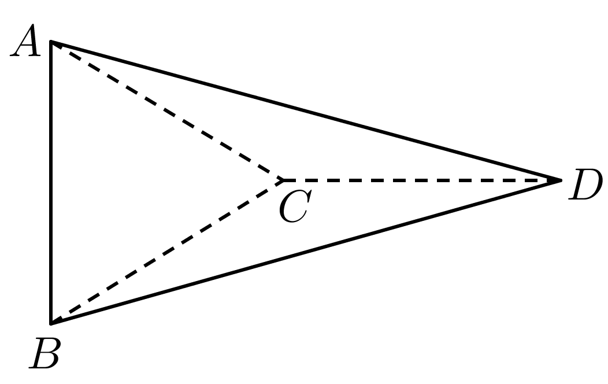

A．	B．	C．	D．

**变式24．**（2024·全国·高三专题练习）在四面体中，，，则四面体的外接球的表面积为（    ）

A．	B．	C．s	D．

**题型八：外接球之圆锥、圆柱、圆台模型**

<strong>例22．</strong>（2024·浙江台州·高二校联考期末）已知圆锥的底面半径为1，母线长为2，则该圆锥的外接球的体积为____________.

<strong>例23．</strong>（2024·黑龙江哈尔滨·哈尔滨三中校考模拟预测）已知某圆锥的轴截面为正三角形，侧面积为，该圆锥内接于球，则球的表面积为__________.

<strong>例24．</strong>（2024·河北石家庄·高二校考阶段练习）一个圆柱的底面直径与高都等于一个球的直径，则圆柱的表面积与球的表面积之比为_________.

**变式25．**（2024·重庆·统考模拟预测）如图所示，已知一个球内接圆台，圆台上、下底面的半径分别为和，球的体积为，则该圆台的侧面积为（    ）

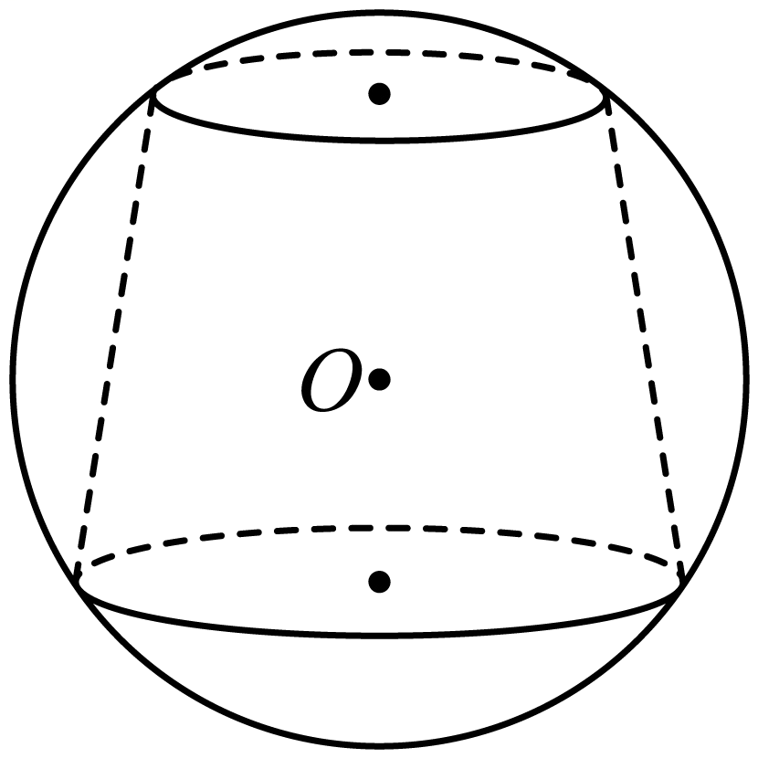

A．	B．	C．	D．

<strong>变式26．</strong>（2024·云南·高三校联考开学考试）已知圆台的上下底面圆的半径分别为3，4，母线长为，若该圆台的上下底面圆的圆周均在球<em>O</em>的球面上，则球<em>O</em>的体积为（    ）

A．	B．	C．	D．

**变式27．**（2024·陕西西安·高一校考期中）如图所示，一个球内接圆台，已知圆台上､下底面的半径分别为3和4，球的表面积为，则该圆台的体积为（    ）

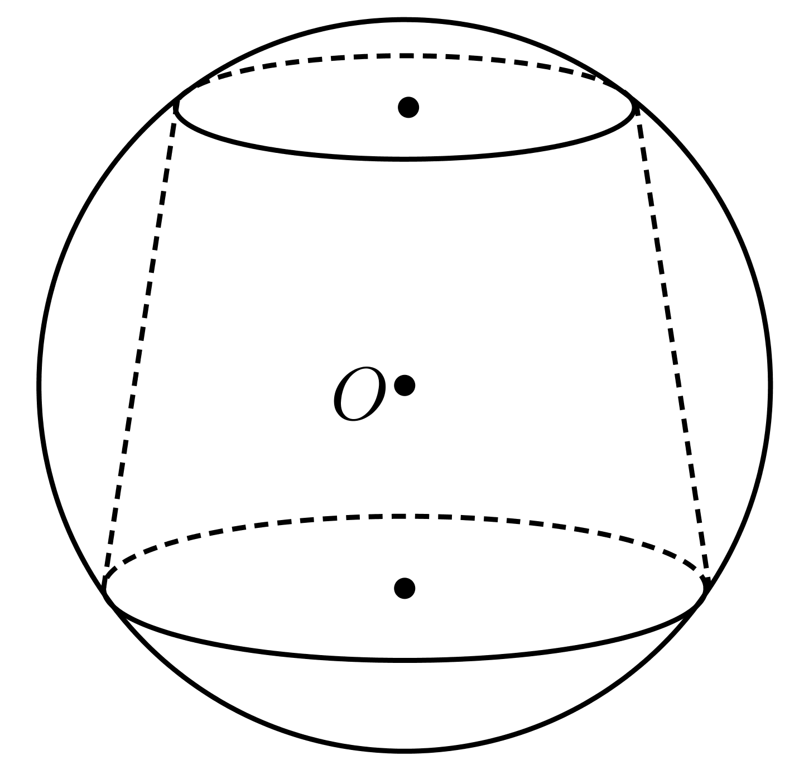

A．	B．	C．	D．

**题型九：外接球之垂面模型**

<strong>例25．</strong>（2024·江西九江·高一校考期末）如图，三棱锥中，平面平面<em>BCD</em>，是边长为2的等边三角形，，.若<em>A</em>，<em>B</em>，<em>C</em>，<em>D</em>四点在某个球面上，则该球体的表面积为______.

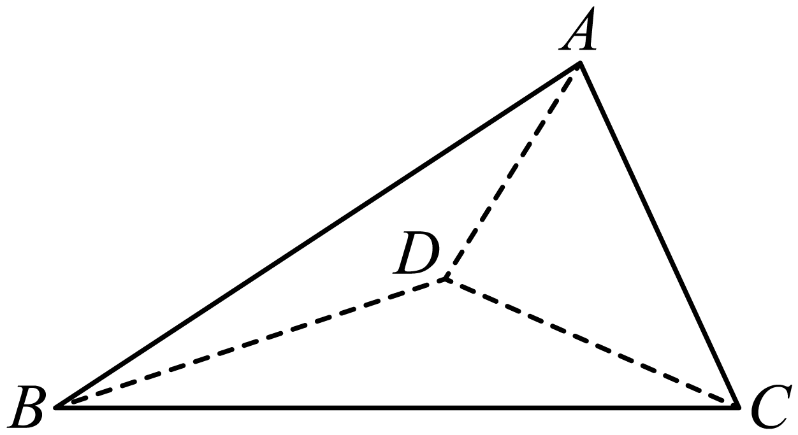

<strong>例26．</strong>（2024·四川乐山·高二期末）已知正边长为1，将绕旋转至，使得平面平面，则三棱锥的外接球表面积为___________．

<strong>例27．</strong>（2024·河南平顶山·高一统考期末）在三棱锥中，平面平面，点是的中点，，则三棱锥的外接球的表面积为__________.

<strong>变式28．</strong>（2024·江苏·高一专题练习）如图，在直三棱柱中，．设<em>D</em>为的中点，三棱锥的体积为，平面平面，则三棱柱外接球的表面积为______．

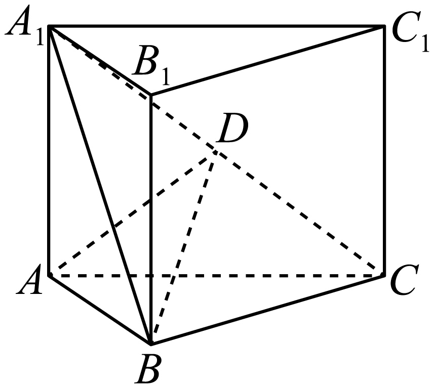

<strong>变式29．</strong>（2024·河南开封·开封高中校考模拟预测）如图,在三棱锥中,平面平面<em>ABC</em>,,,,为等边三角形,则三棱锥外接球的表面积为________．

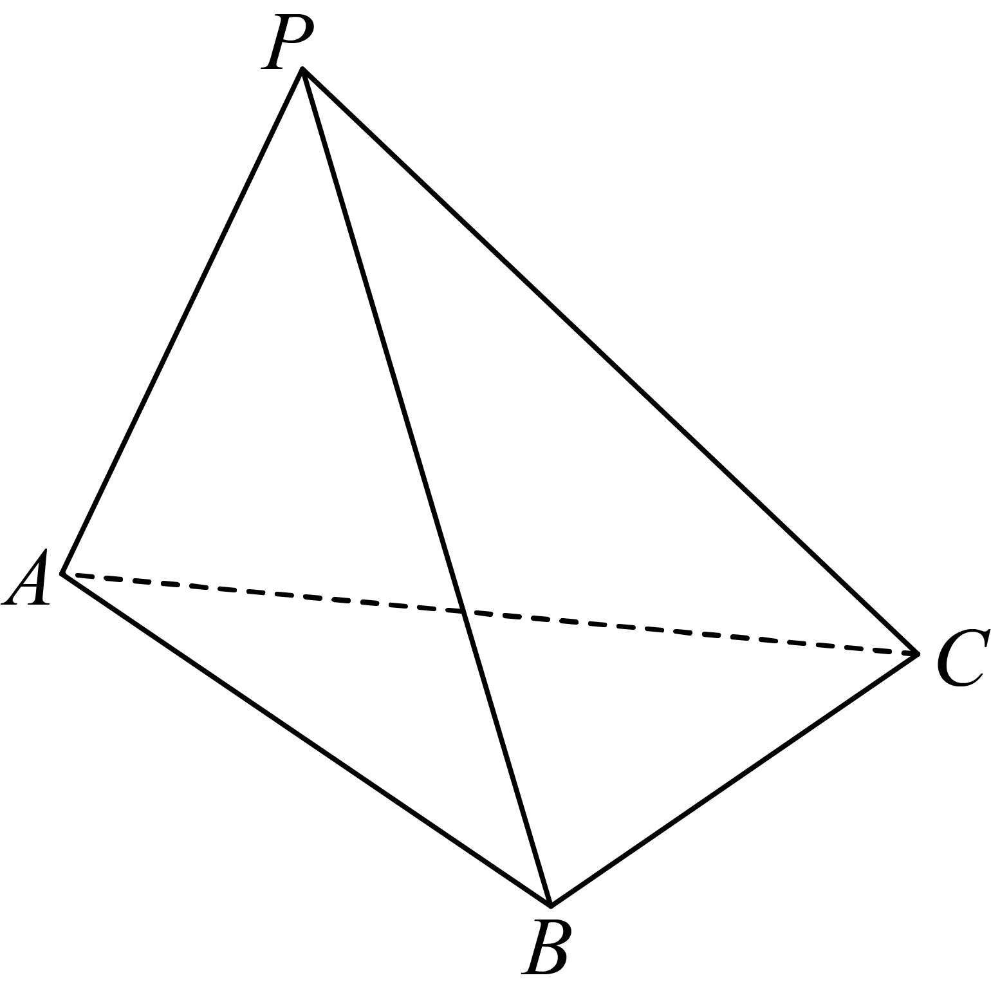

<strong>变式30．</strong>（2024·湖北十堰·高一统考期末）如图，在平面四边形中，，沿对角线将折起，使平面平面，连接，得到三棱锥，则三棱锥外接球表面积的最小值为__________.

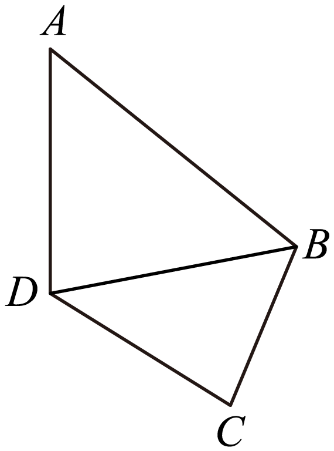

<strong>变式31．</strong>（2024·河南安阳·高一统考期末）在三棱锥中，平面平面，，且，是等边三角形，则该三棱锥外接球的表面积为______．

<strong>变式32．</strong>（2024·云南临沧·高二校考期中）如图，已知矩形中，，现沿折起，使得平面平面，连接，得到三棱锥，则其外接球的体积为_________．

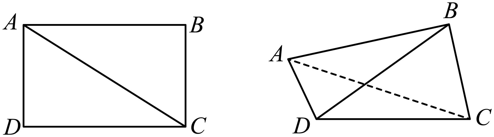

<strong>变式33．</strong>（2024·全国·高三校联考开学考试）在三棱锥中，平面平面，底面是边长为3的正三角形，若该三棱锥外接球的表面积为，则该三棱锥体积的最大值为__________.

<strong>变式34．</strong>（2024·四川乐山·统考三模）在三棱锥中，，平面平面<em>ABC</em>，则三棱锥的外接球表面积的最小值为______．

<strong>变式35．</strong>（2024·湖南衡阳·校联考模拟预测）在平面四边形中，，沿对角线将折起，使平面平面，得到三棱锥，则三棱锥外接球表面积的最小值为__________.

**题型十：外接球之二面角模型**

**例28．**（2024·广东阳江·高三统考开学考试）在三棱锥中，，，二面角的平面角为，则三棱锥外接球表面积的最小值为（    ）

A．	B．

C．	D．

<strong>例29．</strong>（2024·浙江丽水·高二统考期末）在四面体<em>PABC</em>中，，是边长为2的等边三角形，若二面角的大小为，则四面体的外接球的表面积为（    ）

A．	B．	C．	D．

**例30．**（2024·广东·校联考模拟预测）已知四棱锥平面，二面角的大小为.若点均在球的表面上，则该球的表面积为（    ）

A．	B．	C．	D．

**变式36．**（2024·福建·高一福建师大附中校考期末）在四面体中，与都是边长为6的等边三角形，且二面角的大小为，则四面体外接球的表面积是（    ）

A．52π	B．54π	C．56π	D．60π

<strong>变式37．</strong>（2024·甘肃张掖·高台县第一中学校考模拟预测）图1为两块大小不同的等腰直角三角形纸板组成的平面四边形<em>ABCD</em>，其中小三角形纸板的斜边<em>AC</em>与大三角形纸板的一条直角边长度相等，小三角形纸板的直角边长为<em>a</em>，现将小三角形纸板<em>ACD</em>沿着<em>AC</em>边折起，使得点<em>D</em>到达点<em>M</em>的位置，得到三棱锥，如图2．若二面角的大小为，则所得三棱锥<em>M</em>－<em>ABC</em>的外接球的表面积为（    ）

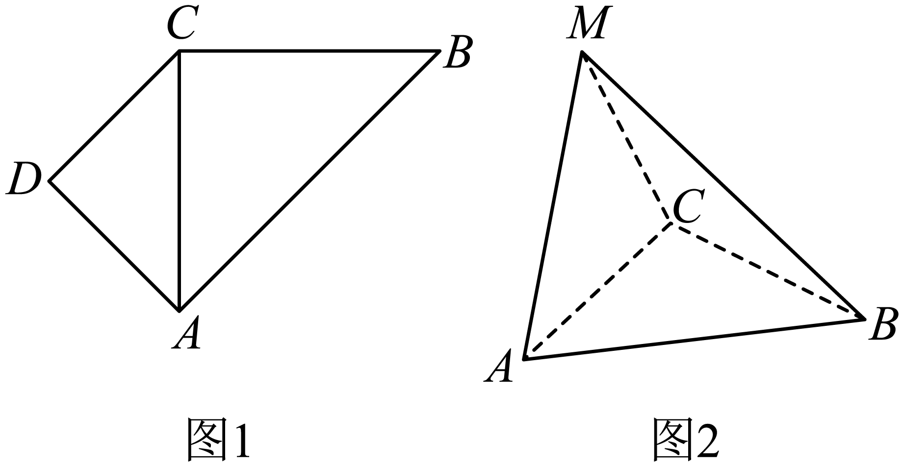

A．	B．	C．	D．

**变式38．**（2024·全国·高三专题练习）如图1，在中，，，，，沿将折起，使得二面角为60°，得到三棱锥，如图2，若，则三棱锥的外接球的表面积为（    ）

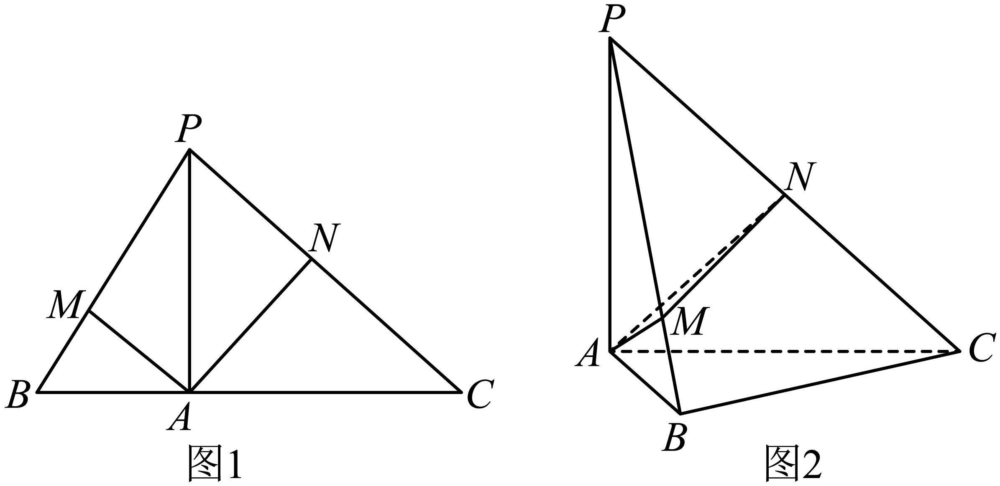

A．	B．	C．	D．

**变式39．**（2024·湖南岳阳·统考三模）已知三棱锥的所有顶点都在球的球面上，，二面角的大小为，若球的表面积等于，则三棱锥的体积等于（    ）

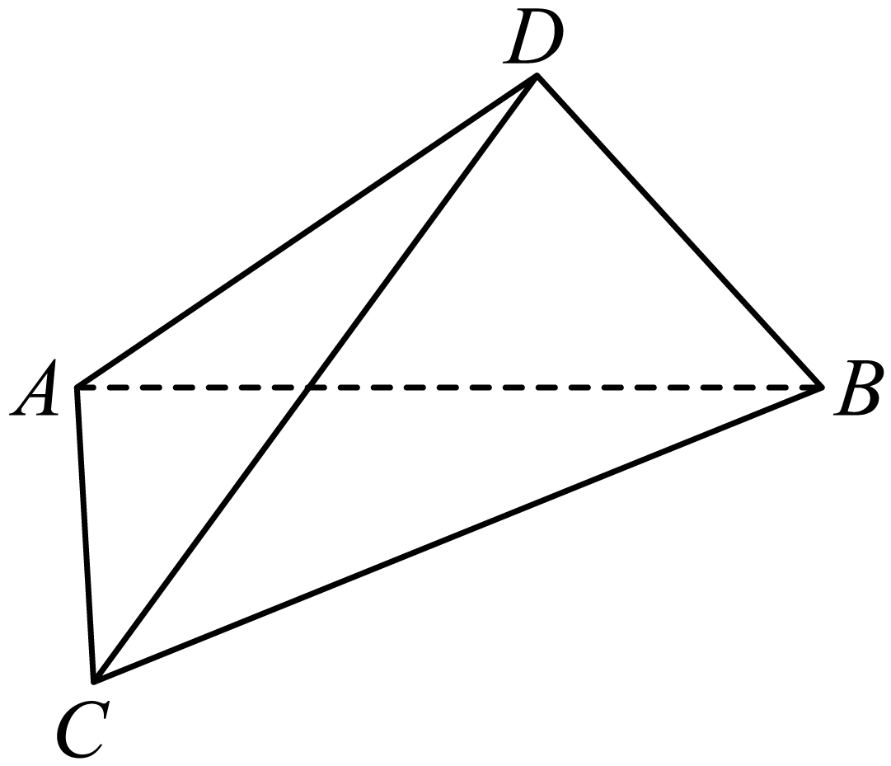

A．	B．

C．	D．

**变式40．**（2024·全国·高一专题练习）在三棱锥中，，二面角为，则三棱锥外接球的表面积为（    ）

A．	B．	C．	D．

**题型十一：外接球之侧棱为球的直径模型**

**例31．**（2024·贵州黔东南·高二凯里一中校考期中）已知三棱锥的所有顶点都在球的球面上，是球的直径.若平面平面，，，三棱锥的体积为，则球的体积为（    ）

A．	B．	C．	D．

**例32．**（2024·四川巴中·高三统考期末）已知三棱锥的体积为，，，若是其外接球的直径，则球的表面积为（    ）

A．	B．	C．	D．

**例33．**（2024·重庆九龙坡·高二重庆市育才中学校考期中）已知三棱锥的所有顶点都在球的球面上,为球的直径,是边长为的等边三角形,三棱锥的体积为,则球的表面积为(    )

A．	B．	C．	D．

**变式41．**（2024·重庆·校联考一模）已知三棱锥各顶点均在球上，为球的直径，若，，三棱锥的体积为4，则球的表面积为

A．	B．	C．	D．

**变式42．**（2024·河北唐山·统考三模）三棱锥的四个顶点都在球面上，是球的直径，，，则该球的表面积为

A．	B．	C．	D．

**变式43．**（2024·河南南阳·统考模拟预测）已知三棱锥的所有顶点都在球的球面上，是球的直径.若平面平面，，，三棱锥的体积为，则球的体积为

A．	B．	C．	D．

**变式44．**（2024·福建莆田·高三统考期中）三棱锥的各顶点均在球上，为该球的直径，，三棱锥的体积为，则球的表面积为

A．	B．	C．	D．

**变式45．**（2024·全国·高三专题练习）已知三棱锥的四个顶点均在某球面上，为该球的直径，是边长为4的等边三角形，三棱锥的体积为，则该三棱锥的外接球的表面积为（    ）

A．	B．	C．	D．

**变式46．**（2024·湖南长沙·高三长郡中学校考阶段练习）已知是球的直径，是球球面上的两点，且，若三棱锥的体积为，则球的表面积为

A．	B．	C．	D．

**题型十二：外接球之共斜边拼接模型**

<strong>例34．</strong>（2022·江西·高二阶段练习（理））如图，在四棱锥<em>P</em>-<em>ABCD</em>中，底面是菱形， 底面<em>ABCD</em>， 是对角线与的交点，若，，则三棱锥的外接球的体积为（       ）

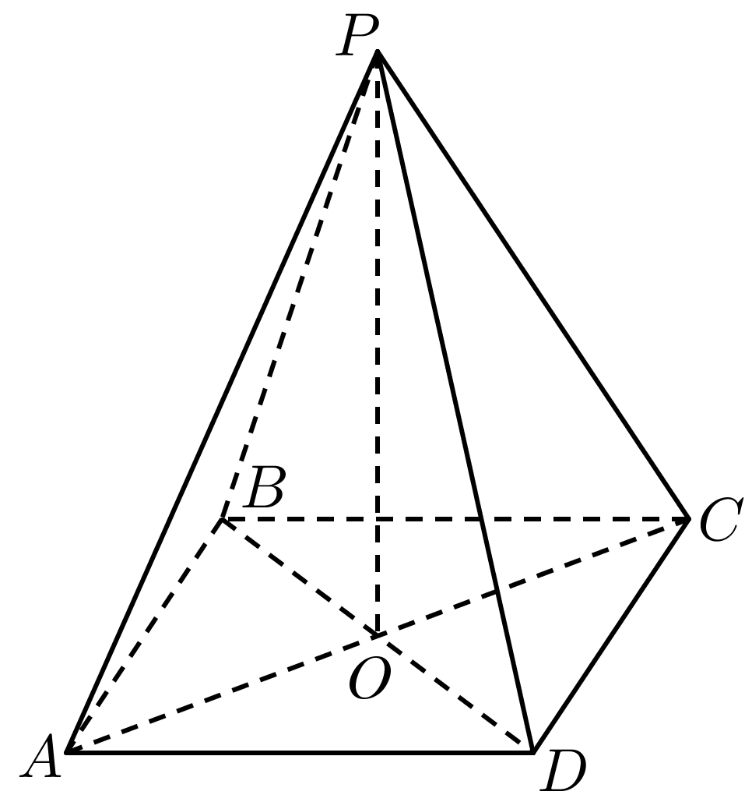

*A*．	*B*．	*C*．	*D*．

**例35．**（2022·安徽·芜湖一中高二期中）已知三棱锥中，，，，，，则此三棱锥的外接球的表面积为（       ）

*A*．	*B*．	*C*．	*D*．

**例36．**（2022·江西赣州·高二期中（理））在三棱锥中，若该三棱锥的体积为，则三棱锥外球的体积为（       ）

*A*．	*B*．	*C*．	*D*．

**变式47．** 在矩形中，，沿将矩形折成一个直二面角，则四面体的外接球的体积为（     ）

*A*．        *B*．        *C*．        *D*．

<strong>变式48．</strong>三棱锥中，平面平面， ，，，则三棱锥的外接球的半径为______

**题型十三：外接球之坐标法模型**

<strong>例37．</strong>（2024·浙江·高二校联考阶段练习）空间直角坐标系中，则四面体<em>ABCD</em>外接球体积是（       ）

A．	B．	C．	D．

<strong>例38．</strong>（2024·贵州·统考模拟预测）如图，某环保组织设计一款苗木培植箱，其外形由棱长为2（单位：）的正方体截去四个相同的三棱锥（截面为等腰三角形）后得到.若将该培植箱置于一球形环境中，则该球表面积的最小值为___________

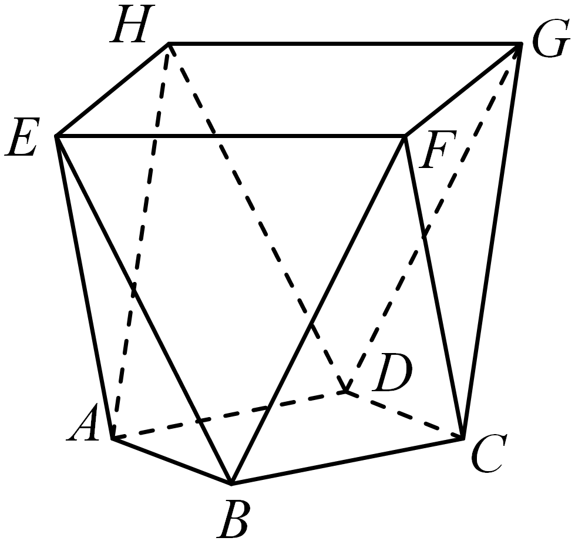

<strong>例39．</strong>（2024·河南开封·开封高中校考一模）如图，在三棱锥中，为等边三角形，三棱锥的体积为，则三棱锥外接球的表面积为__________.

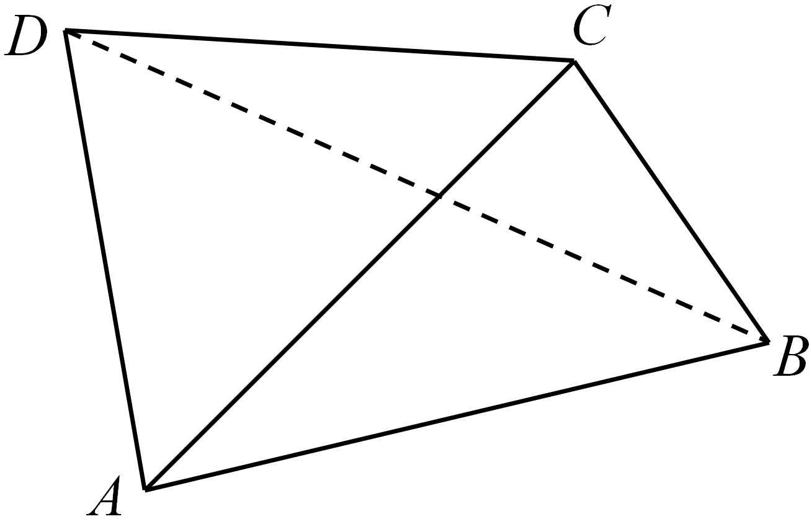

<strong>变式49．</strong>（2024·全国·高三专题练习）如图①，在中，，，<em>D</em>，<em>E</em>分别为，的中点，将沿折起到的位置，使，如图②.若<em>F</em>是的中点，则四面体的外接球体积是（    ）

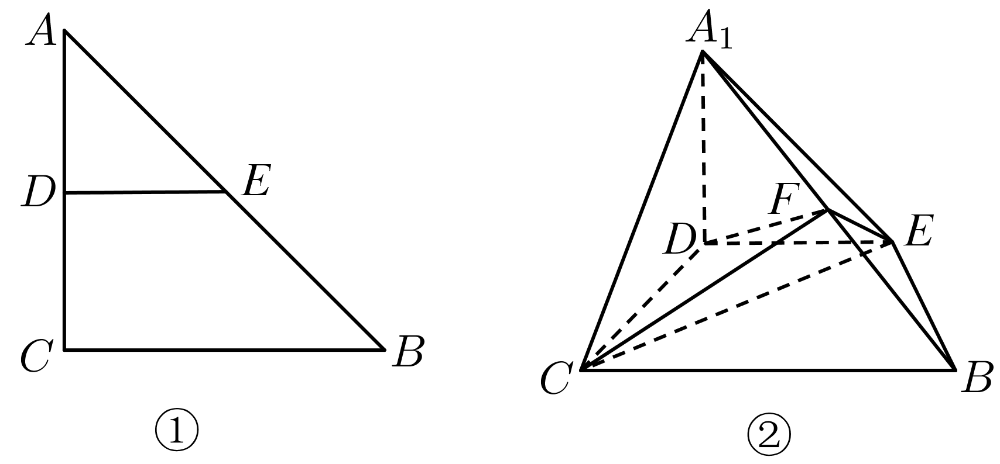

A．	B．	C．	D．

**变式50．**（2024·湖北武汉·高一武汉外国语学校（武汉实验外国语学校）期末）如图，已知四棱锥，底面是边长为3的正方形，面，，，，若，则四棱锥外接球表面积为（    ）

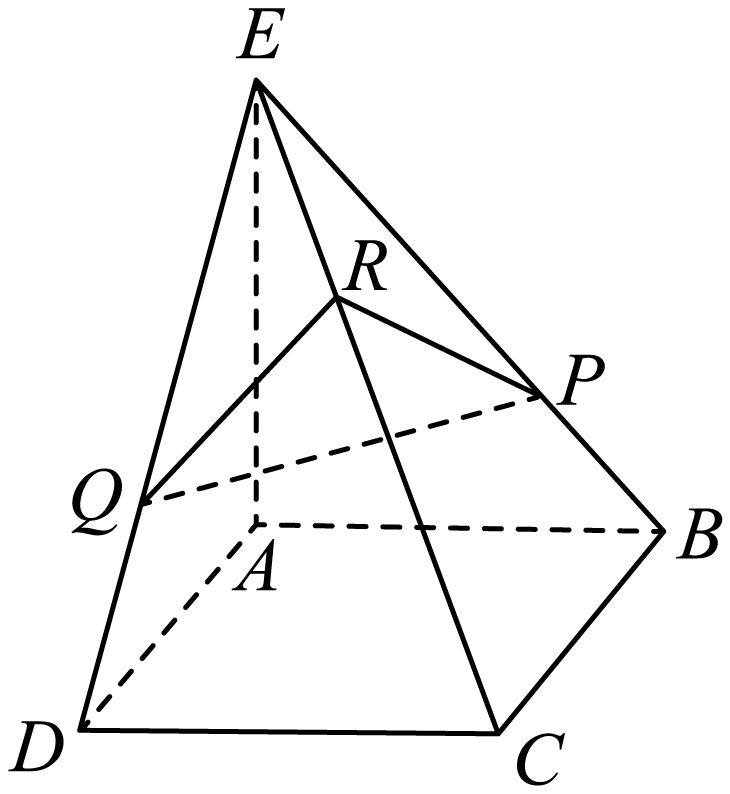

A．	B．	C．	D．

<strong>变式51．</strong>（2024·河南郑州·模拟预测）在长方体中中，，<em>AD</em>＝2，<em>M</em>是棱的中点，过点<em>B</em>，<em>M</em>，的平面交棱<em>AD</em>于点<em>N</em>，点<em>P</em>为线段上一动点，则三棱锥外接球表面积的最小值为______．

<strong>变式52．</strong>（2024·湖南郴州·高二统考期末）如图，棱长为2的正方体中，<em>E</em>，<em>F</em>分别为棱､的中点，<em>G</em>为面对角线上一个动点，则三棱锥的外接球表面积的最小值为___________.

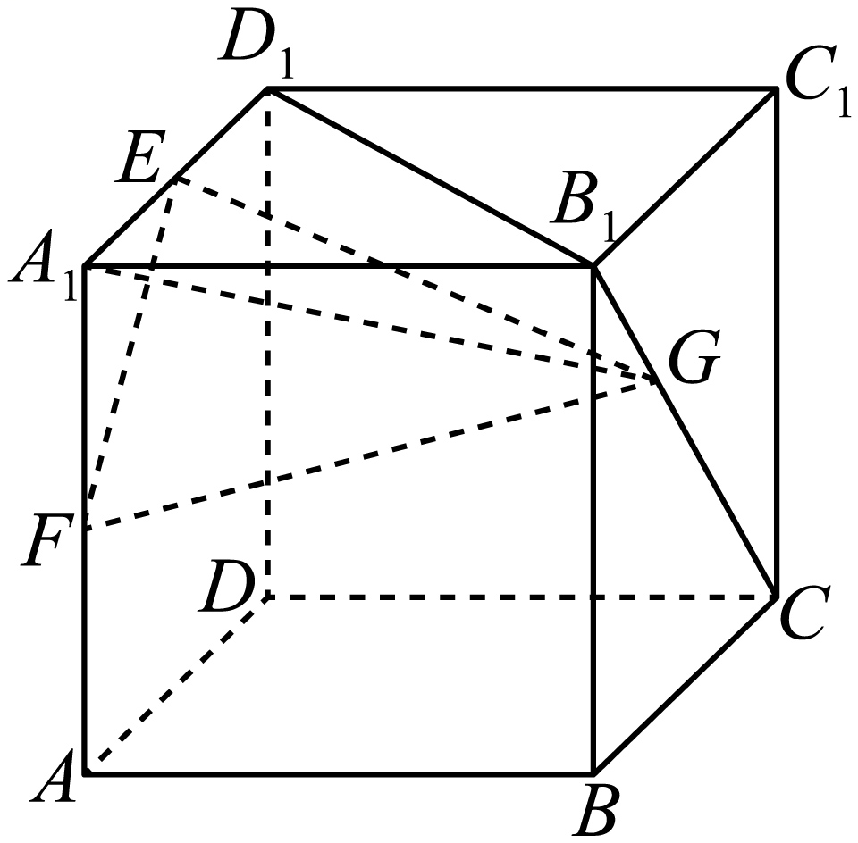

<strong>变式53．</strong>（2024·广东阳江·高三阳春市第一中学阶段练习）已知正方体的棱长为2，点是线段上的动点，则三棱锥的外接球半径的取值范围为__________．

**题型十四：外接球之空间多面体**

<strong>例40．</strong>（2024·全国·高三专题练习）自2015年以来，贵阳市着力建设“千园之城”，构建贴近生活、服务群众的生态公园体系，着力将“城市中的公园”升级为“公园中的城市”．截至目前，贵阳市公园数量累计达到1025个．下图为贵阳市某公园供游人休息的石凳，它可以看做是一个正方体截去八个一样的四面体得到的，如果被截正方体的的棱长为，则石凳所对应几何体的外接球的表面积为________．

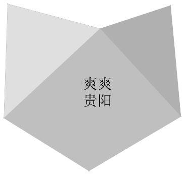

<strong>例41．</strong>（2024·山东青岛·高一山东省青岛第五十八中学校考阶段练习）截角四面体是一种半正八面体，可由四面体经过适当的截角，即截去四面体的四个顶点所产生的多面体.如图所示，将棱长为3的正四面体沿棱的三等分点作平行于底面的截面得到所有棱长均为1的截角四面体，则该截角四面体的外接球表面积为_______.

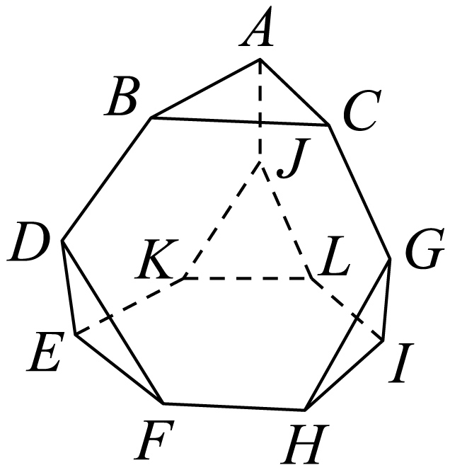

<strong>例42．</strong>（2024·宁夏银川·银川二中校考一模）把一个棱长都是6的正四棱锥（底面是正方形，顶点在底面的射影是正方形的中心）每条棱三等分，沿与正四棱锥顶点相邻的三等分点做截面，将正四棱锥截去四个小正四面体和一个小正四棱锥（如图所示），则剩下的几何体的外接球的表面积等于_____________．

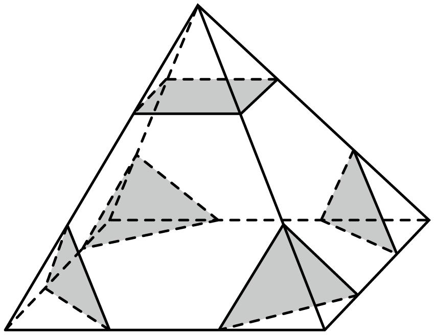

<strong>变式54．</strong>（2024·山东济南·高一山东省济南市莱芜第一中学校考阶段练习）取两个相互平行且全等的正<em>n</em>边形，将其中一个旋转一定角度，连接这两个多边形的顶点，使得侧面均为等边三角形，我们把这种多面体称作“<em>n</em>角反棱柱”.当<em>n</em>=4时，得到如图所示棱长均为2的“四角反棱柱”，则该“四角反棱柱”外接球的表面积等于（    ）

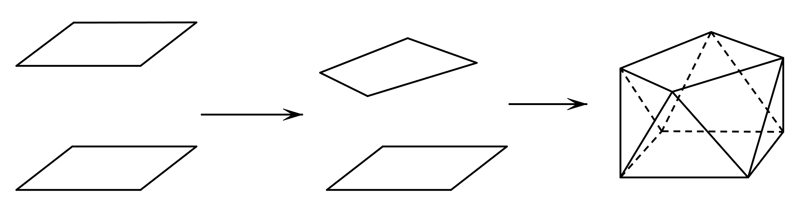

A．	B．	C．	D．

**题型十五：与球有关的最值问题**

<strong>例43．</strong>（2024·江西抚州·统考模拟预测）如图，直三棱柱中，，棱柱的侧棱足够长，点<em>P</em>在棱上，点在上，且，则当△的面积取最小值时，三棱锥的外接球的体积为___________.

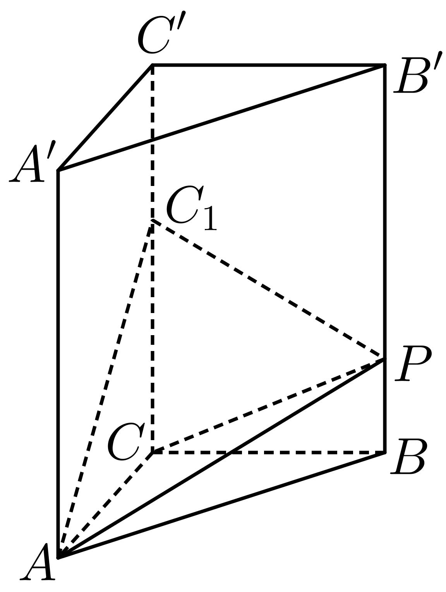

<strong>例44．</strong>（2024·全国·学军中学校联考二模）如图，直三棱柱中，，点在棱上，且，当的面积取最小值时，三棱锥的外接球的表面积为___________.

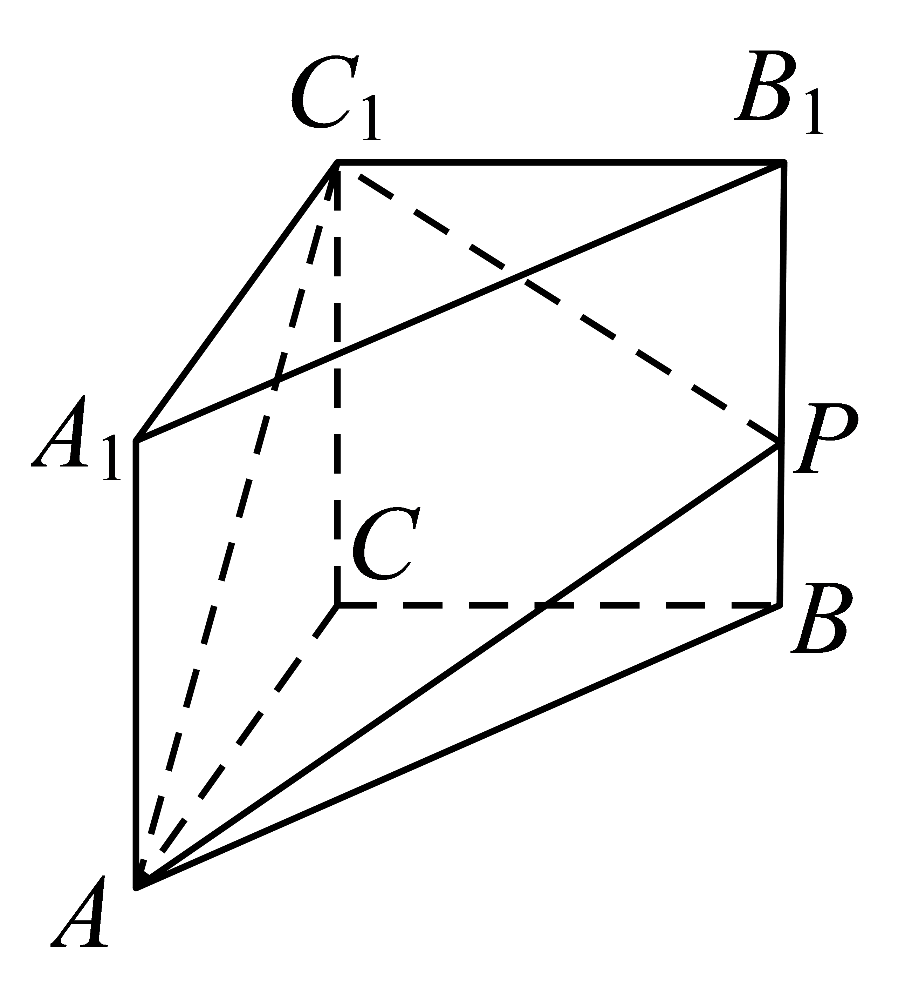

<strong>例45．</strong>（2024·湖南长沙·高三长沙一中校考阶段练习）正方体的棱长为2，点平面，点是线段的中点，若，则当的面积取得最小值时，三棱锥外接球的体积为___________.

<strong>变式55．</strong>（2024·广东深圳·高三深圳中学校考开学考试）如图，直三棱柱中，⊥，，，点<em>P</em>在棱上，且，当的面积取最小值时，三棱锥的外接球的表面积为______．

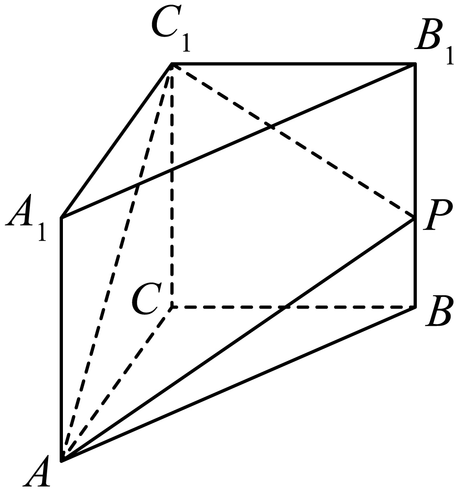

<strong>变式56．</strong>（2024·黑龙江齐齐哈尔·高一校联考期末）已知三棱锥的四个顶点均在同一个球面上，底面为等腰直角三角形且，若该三棱锥体积的最大值为，则其外接球的表面积为__________.

<strong>变式57．</strong>（2024·四川泸州·高三四川省泸县第一中学校考阶段练习）已知四棱锥<em>S</em>－<em>ABCD</em>中，底面<em>ABCD</em>为正方形，侧面<em>SAB</em>为等边三角形，<em>AB</em>＝3，则当四棱锥的体积取得最大值时，其外接球的表面积为________．

<strong>变式58．</strong>（2024·湖南长沙·高三宁乡一中校考阶段练习）在三棱锥中，底面，，，为的中点，若三棱锥的顶点均在球的球面上，是球上一点，且三棱锥体积的最大值是，则球的体积为___________.

<strong>变式59．</strong>（2024·江西南昌·南昌十中校考模拟预测）点，，，在同一个球的球面上，，若四面体体积的最大值为，则这个球的表面积为________.

**题型十六：内切球之正方体、正棱柱模型**

**例46．**（2024·广东肇庆·高一校考阶段练习）棱长为2的正方体的内切球的球心为，则球的体积为（    ）

A．	B．	C．	D．

**例47．**（2024·河北邯郸·高一大名县第一中学校考阶段练习）已知直三棱柱存在内切球，若，则该三棱柱外接球的表面积为（    ）

A．	B．	C．	D．

**例48．**（2024·山西太原·高一校考阶段练习）已知正方体的内切球(球与正方体的六个面都相切)的体积是，则该正方体的体积为（    ）

A．4	B．16	C．8	D．64

**变式60．**（2024·全国·高一专题练习）若一个正三棱柱存在外接球与内切球，则它的外接球与内切球体积之比为（    ）

A．	B．	C．	D．

<strong>变式61．</strong>（2024·辽宁·高二沈阳二中校联考开学考试）在正三棱柱中，<em>D</em>是侧棱上一点，<em>E</em>是侧棱上一点，若线段的最小值是﹐且其内部存在一个内切球（与该棱柱的所有面均相切），则该棱柱的外接球表面积为（    ）

A．	B．	C．	D．

**变式62．**（2024·全国·高一专题练习）若一个正六棱柱既有外接球又有内切球，则该正六棱柱的外接球和内切球的表面积的比值为（    ）

A．	B．	C．	D．

<strong>变式63．</strong>（2024·全国·高三专题练习）已知点<em>O</em>到直三棱柱各面的距离都相等，球<em>O</em>是直三棱柱的内切球，若球<em>O</em>的表面积为，的周长为4，则三棱锥的体积为（    ）

A．	B．	C．	D．

**题型十七：内切球之正四面体模型**

**例49．**（2024·高一课时练习）边长为的正四面体内切球的体积为（    ）

A．	B．	C．	D．

**例50．**（2024·全国·高三专题练习）已知正四面体的棱长为，则其内切球的表面积为（    ）

A．	B．

C．	D．

**例51．**（2024·江苏·高一专题练习）正四面体的棱长为，则它的内切球与外接球的表面积之比为（    ）

A．	B．	C．	D．

**题型十八：内切球之棱锥模型**

**例52．**（2024·安徽·高二马鞍山二中校联考阶段练习）已知矩形中，，沿着对角线将折起，使得点不在平面内，当时，求该四面体的内切球和外接球的表面积比值为（    ）

A．	B．	C．	D．

**例53．**（2024·广西·高二校联考期中）已知四棱锥的各棱长均为2，则其内切球表面积为（    ）

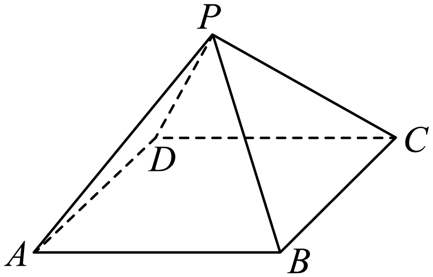

A．	B．

C．	D．

**例54．**（2024·湖北武汉·高二校联考阶段练习）如图，在三棱锥中，，，若三棱锥的内切球的表面积为，则此三棱锥的体积为（    ）

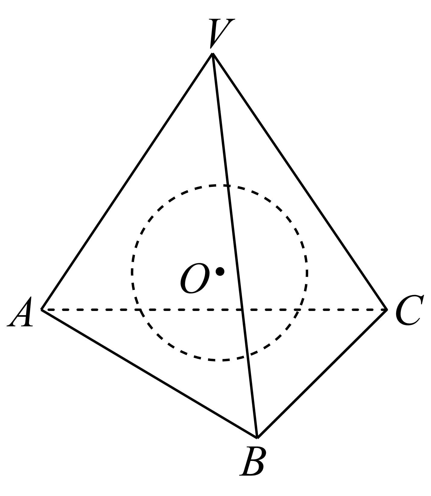

A．	B．	C．	D．

**变式64．**（2024·河南濮阳·高一濮阳一高校考阶段练习）在三棱锥中，平面，且，若球在三棱锥的内部且与四个面都相切（称球为三棱锥的内切球），则球的表面积为（    ）

A．	B．	C．	D．

**变式65．**（2024·福建龙岩·统考模拟预测）如图，已知正方体的棱长为2，以其所有面的中心为顶点的多面体为正八面体，则该正八面体的内切球表面积为（    ）

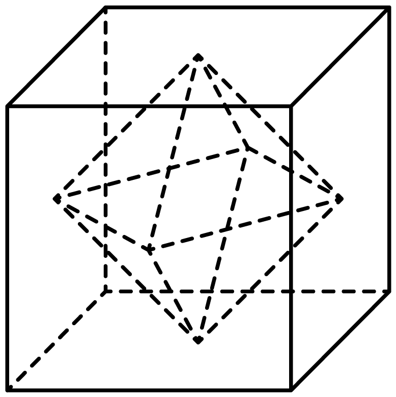

A．	B．	C．	D．

**变式66．**（2024·浙江宁波·高一慈溪中学校联考期末）在《九章算术》中，将四个面都是直角三角形的四面体称为鳖臑.在鳖臑中，平面，，且，则其内切球表面积为（    ）

A．	B．	C．	D．

**题型十九：内切球之圆锥、圆台模型**

**例55．**（2024·全国·高三专题练习）在Rt中，.以斜边为旋转轴旋转一周得到一个几何体，则该几何体的内切球的体积为（    ）

A．	B．	C．	D．

**例56．**（2024·天津·统考二模）已知一个圆锥的高为，底面直径为，其内有一球与该圆锥的侧面和底面都相切，则此球的体积为（    ）

A．	B．	C．	D．

**例57．**（2024·全国·高一专题练习）已知某圆锥的母线长为2，其轴截面为直角三角形，则下列关于该圆锥的说法中错误的是（    ）

A．圆锥的体积为	B．圆锥的表面积为

C．圆锥的侧面展开图是圆心角为的扇形	D．圆锥的内切球表面积为

**变式67．**（2024·贵州贵阳·高二校考阶段练习）已知圆锥内切球（与圆锥侧面、底面均相切的球）的半径为2，当该圆锥的表面积最小时，其外接球的表面积为（    ）

A．	B．	C．	D．

**变式68．**（2024·全国·高一专题练习）已知圆锥的底面半径为2，高为，则该圆锥的内切球表面积为（    ）

A．	B．	C．	D．

**变式69．**（2024·安徽宣城·高二校联考开学考试）如图，正四棱台的上､下底面边长分别为分别为，的中点，8个顶点构成的十面体恰有内切球，则该内切球的表面积为（    ）

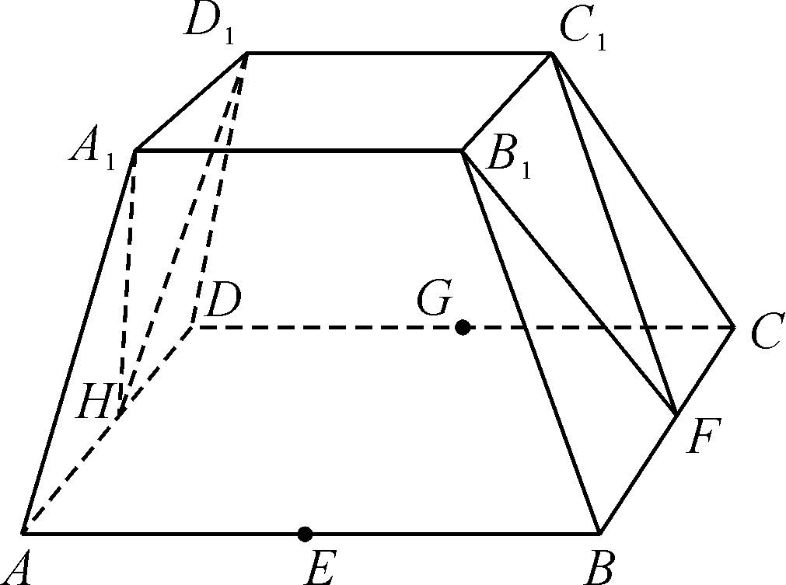

A．	B．	C．	D．

**变式70．**（2024·湖北咸宁·高二统考期末）已知球内切于圆台（即球与该圆台的上、下底面以及侧面均相切），且圆台的上、下底面半径，则圆台的体积与球的体积之比为（    ）

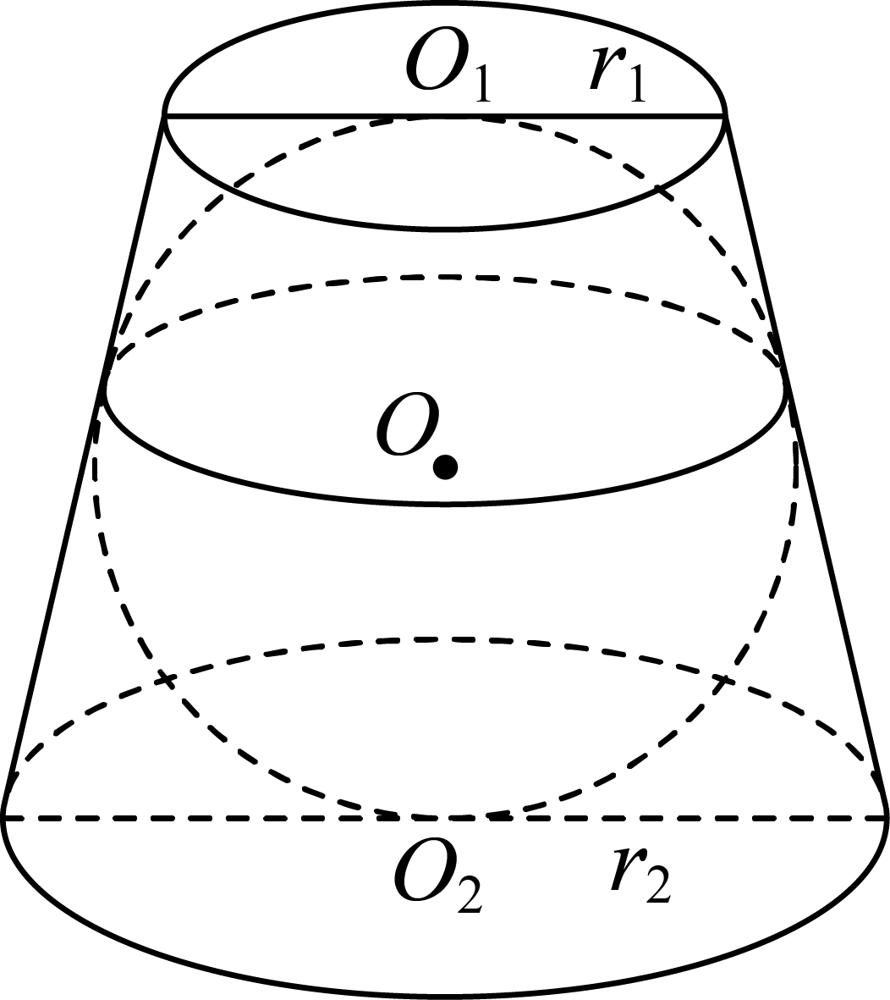

A．	B．	C．2	D．

**题型二十：棱切球之正方体、正棱柱模型**

**例58．**（2024·山东菏泽·高一山东省鄄城县第一中学校考阶段练习）已知球与一正方体的各条棱相切，同时该正方体内接于球，则球与球的表面积之比为（    ）

A．2：3	B．3：2	C．	D．

<strong>例59．</strong>（2024·全国·高三专题练习）已知正三棱柱的体积为18，若存在球<em>O</em>与三棱柱的各棱均相切，则球<em>O</em>的表面积为（    ）

A．	B．	C．	D．

**例60．**（2024·全国·高三专题练习）已知球与棱长为的正方体的各条棱都相切，则球内接圆柱的侧面积的最大值为（    ）

A．	B．	C．	D．

<strong>变式71．</strong>（吉林省吉林市2024届高三第四次数学（理）调研试题）已知正三棱柱(底面为正三角形且侧棱与底面垂直)，它的底面边长为2，若存在一个球与此正三棱柱的所有棱都相切，则此正三棱柱的侧棱长为___________.

<strong>变式72．</strong>（福建省三明市2024届高三上学期期末质量检测数学试题）已知直三棱柱的侧棱长为，底面为等边三角形.若球<em>O</em>与该三棱柱的各条棱都相切，则球<em>O</em>的体积为__________.

<strong>变式73．</strong>已知正三棱柱，若有一半径为4的球与正三棱柱的各条棱均相切，则正三棱柱的侧棱长为______.

**变式74．**（广东省茂名市五校联盟2024届高三上学期第二次联考数学试题）已知正三棱柱的高等于1.一个球与该正三棱柱的所有棱都相切，则该球的体积为（    ）

A．	B．	C．	D．

**题型二十一：棱切球之正四面体模型**

**例61．**（2024·全国·高一期中）已知某棱长为的正四面体的各条棱都与同一球面相切，则该球与此正四面体的体积之比为（    ）

A．	B．	C．	D．

**例62．**（2024·陕西西安·高一校联考期中）所有棱长均相等的三棱锥构成一个正四面体，则该正四面体的内切球与外接球的体积之比为（    ）

A．	B．	C．	D．

**例63．**（2024·江西南昌·高二进贤县第一中学校考期中）球与棱长为的正四面体各条棱都相切，则该球的表面积为（    ）

A．	B．	C．	D．

**变式75．**（2024·贵州贵阳·校联考模拟预测）已知球的表面积为，若球与正四面体的六条棱均相切，则此四面体的体积为（    ）

A．9	B．	C．	D．

<strong>变式76．</strong>（2024·全国·高三专题练习）正四面体<em>P</em>-<em>ABC</em>的棱长为4，若球<em>O</em>与正四面体的每一条棱都相切，则球<em>O</em>的表面积为（    ）

A．2*π*	B．8*π*	C．	D．12*π*

**题型二十二：棱切球之正棱锥模型**

<strong>例64．</strong>（河南省名校2022-2024学年高二下学期5月联考数学试题）已知棱长均为的多面体由上､下全等的正四棱锥和拼接而成，其中四边形为正方形，如图所示，记该多面体的外接球半径为，该多面体的棱切球（与该多面体的所有棱均相切的球）的半径为，则___．

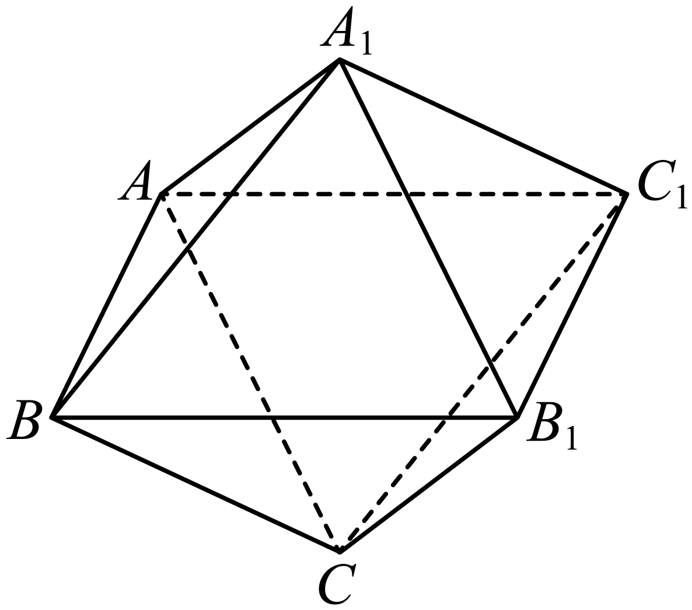

<strong>例65．</strong>（河南省多所名校2022-2024学年高三下学期3月月考文科数学试题）在正三棱锥中，，，若球<em>O</em>与三棱锥的六条棱均相切，则球<em>O</em>的表面积为______．

<strong>例66．</strong>（安徽省马鞍山市2024届高三下学期第二次教学质量监测理科数学试题）球被平面截下的一部分叫做球缺，截面叫做球缺的底面，垂直于截面的直径被截下的线段长叫做球缺的高，球缺的体积公式，其中为球的半径，为球缺的高.若一球与一所有棱长为6的正四棱锥的各棱均相切，则该球与该正四棱锥的公共部分的体积为___________.

<strong>变式77．</strong>（2024·全国·高三专题练习）正三棱锥的底面边长为，侧棱长为，若球<em>H</em>与正三棱锥所有的棱都相切，则这个球的表面积为（    ）

A．	B．	C．	D．

**变式78．**（2024·全国·高三专题练习）在三棱锥中，，，两两垂直，，若球与三棱锥各棱均相切，则该球的表面积为（    ）

A．	B．	C．	D．

**变式79．**（2024·湖北武汉·高一武汉市第一中学校考阶段练习）与正三棱锥6条棱都相切的球称为正三棱锥的棱切球.若正三棱锥的底面边长为，侧棱长为3，则此正三棱锥的棱切球半径为（    ）

A．	B．	C．	D．

**变式80．**（2024·江苏·高一专题练习）在正三棱锥中，，若球与三棱锥的六条棱均相切，则球的表面积为（    ）

A．	B．

C．	D．

**题型二十三：多球相切问题**

**例67．**（2024·浙江温州·乐清市知临中学校考二模）如今中国被誉为基建狂魔，可谓是逢山开路，遇水架桥.公路里程､高铁里程双双都是世界第一.建设过程中研制出用于基建的大型龙门吊､平衡盾构机等国之重器更是世界领先.如图是某重器上一零件结构模型，中间最大球为正四面体的内切球，中等球与最大球和正四面体三个面均相切，最小球与中等球和正四面体三个面均相切，已知正四面体棱长为，则模型中九个球的表面积和为（    ）

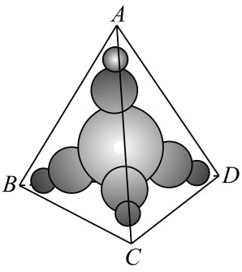

A．	B．	C．	D．

**例68．**（2024·江西赣州·高一江西省龙南中学校考期末）已知正四面体的棱长为12，先在正四面体内放入一个内切球，然后再放入一个球，使得球与球及正四面体的三个侧面都相切，则球的体积为（    ）

A．	B．	C．	D．

**例69．**（2024·山东德州·高一德州市第一中学校考期末）如图是某零件结构模型，中间大球为正四面体的内切球，小球与大球和正四面体三个面均相切，若，则该模型中一个小球的体积为（    ）

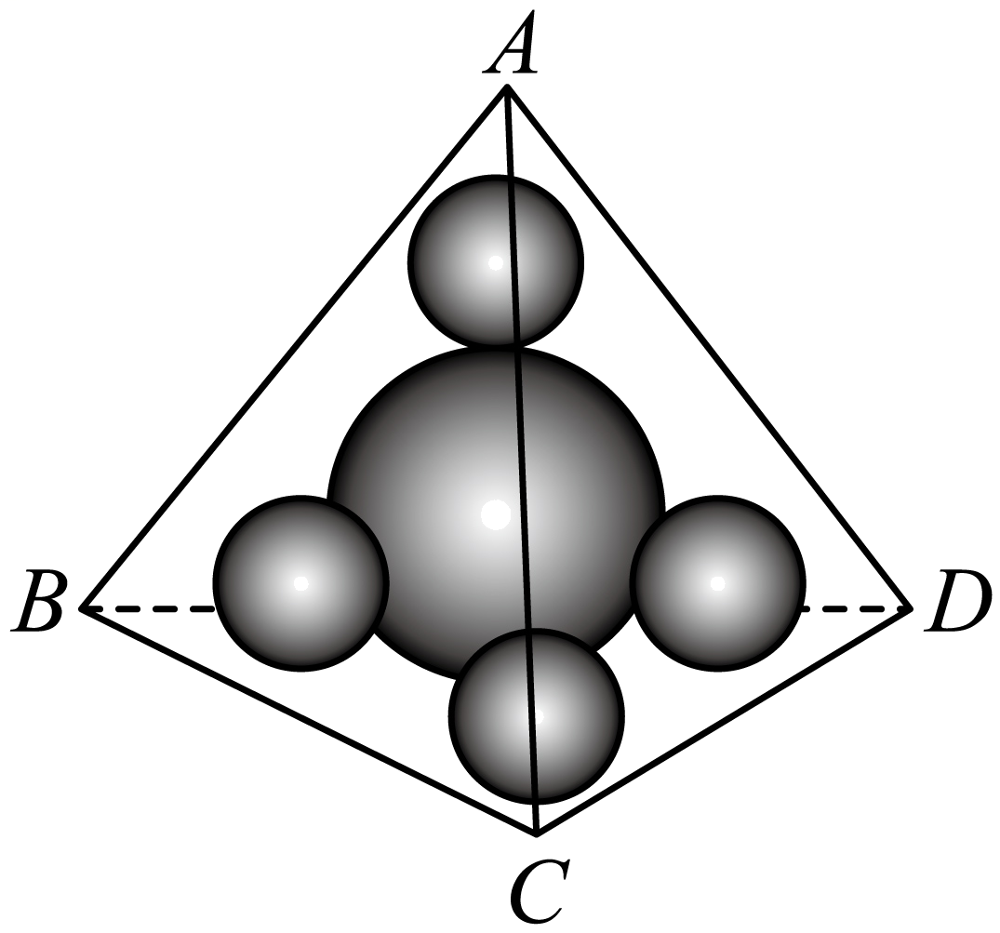

A．	B．	C．	D．

<strong>变式81．</strong>（2024·全国·高三专题练习）如图，在一个底面边长为2，侧棱长为的正四棱锥中，大球内切于该四棱锥，小球与大球及四棱锥的四个侧面相切，则小球的表面积为______．

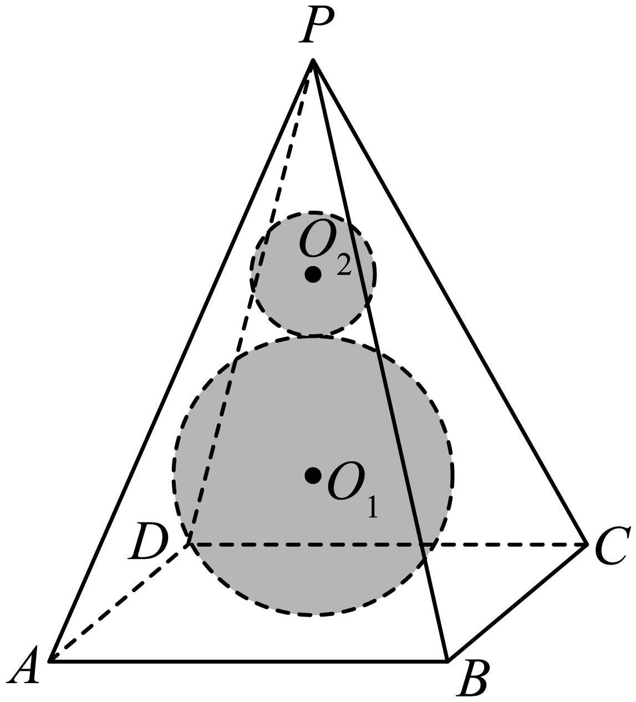

**变式82．**（2024·全国·高一专题练习）棱长为的正四面体内切一球，然后在正四面体和该球形成的空隙处各放入一个小球，则这样一个小球的表面积最大为（    ）

A．	B．	C．	D．

**变式83．**（2024·全国·高三专题练习）已知球是棱长为24的正四面体的内切球，球与球外切且与正四面体的三个侧面都相切，则球的表面积为（    ）

A．	B．	C．	D．

**变式84．**（2024·全国·高一专题练习）四个半径为2的球刚好装进一个正四面体容器内，此时正四面体各面与球相切，则这个正四面体外接球的表面积为（    ）

A．	B．

C．	D．

