**第50讲  外接球、内切球、棱切球**

**知识梳理**

**知识点一：正方体、长方体外接球**

1、正方体的外接球的球心为其体对角线的中点，半径为体对角线长的一半．

2、长方体的外接球的球心为其体对角线的中点，半径为体对角线长的一半．

3、补成长方体

（1）若三棱锥的三条侧棱两两互相垂直，则可将其放入某个长方体内，如图1所示．

（2）若三棱锥的四个面均是直角三角形，则此时可构造长方体，如图2所示．

（3）正四面体可以补形为正方体且正方体的棱长，如图3所示．

（4）若三棱锥的对棱两两相等，则可将其放入某个长方体内，如图4所示

  
图1          图2              图3             图4

**知识点二：正四面体外接球**

如图，设正四面体的的棱长为，将其放入正方体中，则正方体的棱长为，显然正四面体和正方体有相同的外接球．正方体外接球半径为，即正四面体外接球半径为．

**知识点三：对棱相等的三棱锥外接球**

四面体中，，，，这种四面体叫做对棱相等四面体，可以通过构造长方体来解决这类问题．

如图，设长方体的长、宽、高分别为，则，三式相加可得而显然四面体和长方体有相同的外接球，设外接球半径为，则，所以．

**知识点四：直棱柱外接球**

如图1，图2，图3，直三棱柱内接于球（同时直棱柱也内接于圆柱，棱柱的上下底面可以是任意三角形）

  
图1                        图2                         图3

第一步：确定球心的位置，是的外心，则平面；

第二步：算出小圆的半径，（也是圆柱的高）；

第三步：勾股定理：，解出

**知识点五：直棱锥外接球**

如图，平面，求外接球半径．

解题步骤：

第一步：将画在小圆面上，为小圆直径的一个端点，作小圆的直径，连接，则必过球心；

第二步：为的外心，所以平面，算出小圆的半径(三角形的外接圆直径算法：利用正弦定理，得)，；

第三步：利用勾股定理求三棱锥的外接球半径：①；

②．

**知识点六：正棱锥与侧棱相等模型**

**1、正棱锥外接球半径： ．**

2、**侧棱相等模型：**

如图，的射影是的外心

三棱锥的三条侧棱相等

三棱锥的底面在圆锥的底上，顶点点也是圆锥的顶点．

解题步骤：

第一步：确定球心的位置，取的外心，则三点共线；

第二步：先算出小圆的半径，再算出棱锥的高（也是圆锥的高）；

第三步：勾股定理：，解出．

**知识点七：侧棱为外接球直径模型**

方法：找球心，然后作底面的垂线，构造直角三角形．

**知识点八：共斜边拼接模型**

如图，在四面体中，，，此四面体可以看成是由两个共斜边的直角三角形拼接而形成的，为公共的斜边，故以“共斜边拼接模型”命名之．设点为公共斜边的中点，根据直角三角形斜边中线等于斜边的一半的结论可知，，即点到，，，四点的距离相等，故点就是四面体外接球的球心，公共的斜边就是外接球的一条直径．

**知识点九：垂面模型**

如图1所示为四面体，已知平面平面，其外接球问题的步骤如下：

（1）找出和的外接圆圆心，分别记为和．

（2）分别过和作平面和平面的垂线，其交点为球心，记为．

（3）过作的垂线，垂足记为，连接，则．

（4）在四棱锥中，垂直于平面，如图2所示，底面四边形的四个顶点共圆且为该圆的直径．

  
图1                                   图2

**知识点十：最值模型**

这类问题是综合性问题，方法较多，常见方法有：导数法，基本不等式法，观察法等

**知识点十一：二面角模型**

如图1所示为四面体，已知二面角大小为，其外接球问题的步骤如下：

（1）找出和的外接圆圆心，分别记为和．

（2）分别过和作平面和平面的垂线，其交点为球心，记为．

（3）过作的垂线，垂足记为，连接，则．

（4）在四棱锥中，垂直于平面，如图2所示，底面四边形的四个顶点共圆且为该圆的直径．

**知识点十二：坐标法**

对于一般多面体的外接球，可以建立空间直角坐标系，设球心坐标为，利用球心到各顶点的距离相等建立方程组，解出球心坐标，从而得到球的半径长．坐标的引入，使外接球问题的求解从繁琐的定理推论中解脱出来，转化为向量的计算，大大降低了解题的难度．

**知识点十三：圆锥圆柱圆台模型**

1、**球内接圆锥**

如图，设圆锥的高为，底面圆半径为，球的半径为．通常在中，由勾股定理建立方程来计算．如图，当时，球心在圆锥内部；如图，当时，球心在圆锥外部．和本专题前面的内接正四棱锥问题情形相同，图2和图3两种情况建立的方程是一样的，故无需提前判断．

由图、图可知，或，故，所以．

2、**球内接圆柱**

如图，圆柱的底面圆半径为，高为，其外接球的半径为，三者之间满足．

3、**球内接圆台**

，其中分别为圆台的上底面、下底面、高．

**知识点十四：锥体内切球**

方法：等体积法，即

**知识点十五：棱切球**

方法：找切点，找球心，构造直角三角形

**必考题型全归纳**

**题型一：外接球之正方体、长方体模型**

<strong>例1．</strong>（2024·云南昆明·高一校考期末）正方体的表面积为96，则正方体外接球的表面积为______

【答案】

【解析】设正方体的棱长为，因为正方体的表面积为，可得，解得，

则正方体的对角线长为，

设正方体的外接球的半径为，可得，解得，

所以外接球的表面积为.

故答案为：.

<strong>例2．</strong>（2024·吉林·高一校联考期末）已知正方体的顶点都在球面上，若正方体棱长为，则球的表面积为________．

【答案】

【解析】该球为正方体外接球，其半径与正方体棱长之间的关系为，

由，可得，所以球的表面积.

答案：

<strong>例3．</strong>（2024·全国·高一专题练习）已知长方体的顶点都在球表面上，长方体中从一个顶点出发的三条棱长分别为2，3，4则球的表面积是__________

【答案】

【解析】由题意可知：长方体的长宽高为2，3，4，所以长方体的体对角线长为：，故长方体的外接球的半径为，球的表面积为：，

故答案为：

<strong>变式1．</strong>（2024·湖南长沙·高一长郡中学校考期中）长方体的外接球的表面积为，，，则长方体的体积为__________.

【答案】

【解析】因为长方体的外接球的表面积为，

设球的半径为，由题意，，，

长方体的外接球的一条直径为.

因为，，所以，，

则长方体的体积为.

故答案为：

<strong>变式2．</strong>（2024·天津静海·高一校考期中）在长方体中，，，，则长方体外接球的表面积为__________．

【答案】

【解析】由题意，根据长方体外接球的性质，可得，

，该长方体的外接球的表面积.

故答案为：.

**题型二：外接球之正四面体模型**

<strong>例4．</strong>（2024·湖北宜昌·宜昌市夷陵中学校考模拟预测）已知正四面体<em>ABCD</em>的表面积为，且<em>A</em>，<em>B</em>，<em>C</em>，<em>D</em>四点都在球<em>O</em>的球面上，则球<em>O</em>的体积为______．

【答案】

【解析】正四面体各面都是全等的等边三角形，设正四面体的棱长为*a*，

所以该正四面体的表面积为，所以，

又正方体的面对角线可构成正四面体，

若正四面体棱长为，可得正方体的棱长为1，

所以正方体的外接球即为该正四面体的外接球，所以外接球的直径为，半径为，

所以球*O*的体积为．

故答案为：

<strong>例5．</strong>（2024·浙江·高二校联考期中）正四面体的所有顶点都在同一个表面积是36<em>π</em>的球面上，则该正四面体的棱长是__________．

【答案】

【解析】如图所示：

因为正四面体内接于球，则相应的一个正方体内接球，设正方体为，

则正四面体为，

设球的半径为*R*，则，

解得，

所以则正方体的棱长为，

所以正四面体的棱长为，

故答案为：

<strong>例6．</strong>（2024·全国·高三专题练习）棱长为的正四面体的外接球体积为___________.

【答案】

【解析】如图，棱长为的正四面体可以嵌入到棱长为的立方体中，所以正四面体的外接球与所嵌入的立方体的外接球相同.

设立方体的外接球半径为，则，

所以立方体外接球的体积.

故正四面体的外接球体积为.

故答案为：

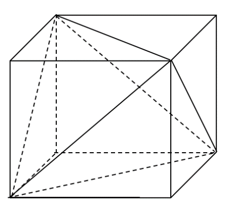

<strong>变式3．</strong>（2024·全国·高一假期作业）正四面体和边长为1的正方体有公共顶点，，则该正四面体的外接球的体积为______.

【答案】

【解析】由图可知正四面体的外接球的体积等于正方体的外接球的体积，求正方体外接球体积即可．

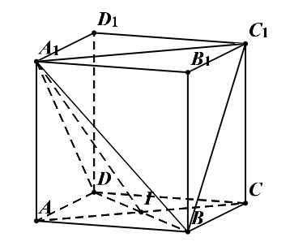

如图，由题可得正四面体与正四面体全等，

所以正四面体的外接球的体积等于正四面体的外接球的体积，

也即是正方体的外接球的体积，

因为正方体棱长为1，所以外接球直径为，

所以正方体的外接球的体积为：，

所以正四面体的外接球的体积为．

故答案为：．

<strong>变式4．</strong>（2024·安徽池州·高二池州市第一中学校考期中）正四面体中，其侧面积与底面积之差为，则该正四面体外接球的体积为______.

【答案】

【解析】设正四面体的边长为，则该正四面体每个面的面积为，

正四面体的侧面积与底面积之差为，解得.

如下图所示：

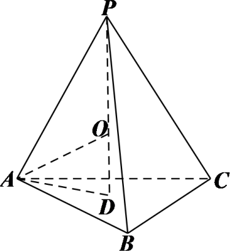

过点作平面，垂足为点，连接，可知外接球球心在上，

设球的半径为，的外接圆半径为，，

由图可知，，即，解得.

因此，正四面体的外接球体积为.

故答案为：.

**题型三：外接球之对棱相等的三棱锥模型**

**例7．**（2024·高一单元测试）在四面体中，若，，，则四面体的外接球的表面积为（    ）

A．	B．	C．	D．

【答案】C

【解析】由题意可采用割补法，考虑到四面体*ABCD*的四个面为全等的三角形，

所以可在其每个面补上一个以，2，为三边的三角形作为底面，且以分别<em>x</em>，<em>y</em>，<em>z</em>长、两两垂直的侧棱的三棱锥，从而可得到一个长、宽、高分别为<em>x</em>，<em>y</em>，<em>z</em>的长方体，并且<em>x2</em>+<em>y2</em>＝3，<em>x2</em>+<em>z2</em>＝5，<em>y2</em>+<em>z2</em>＝4，则有（2<em>R</em>）2＝<em>x2</em>+<em>y2</em>+<em>z2</em>＝6（<em>R</em>为球的半径），得2<em>R2</em>＝3，

所以球的表面积为<em>S</em>＝4π<em>R2</em>＝6π．

故答案为．

<strong>例8．</strong>（2024·河南·开封高中校考模拟预测）已知四面体<em>ABCD</em>中，，，，则四面体<em>ABCD</em>外接球的体积为（    ）

A．	B．	C．	D．

【答案】C

【解析】设四面体的外接球的半径为,

则四面体在一个长宽高为的长方体中，如图，

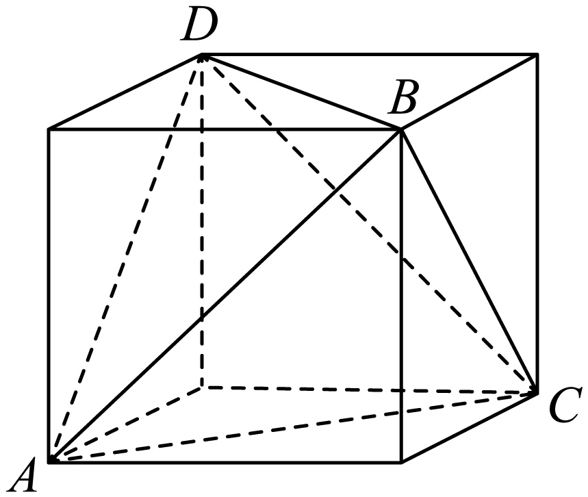

则故，

故四面体*ABCD*外接球的体积为，

故选：C

**例9．**（2024·广东揭阳·高二校联考期中）在三棱锥中，，，，则该三棱锥的外接球表面积是（    ）

A．	B．	C．	D．

【答案】A

【解析】因为，

所以可以将三棱锥如图放置于一个长方体中，如图所示：

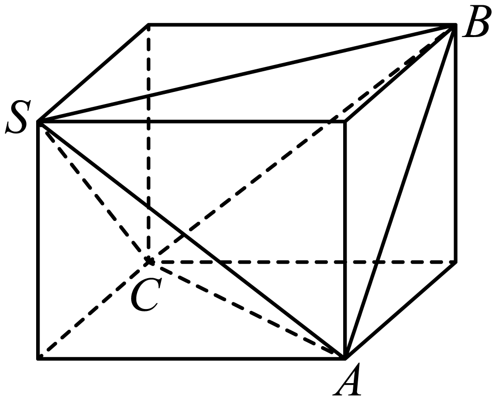

设长方体的长、宽、高分别为*a*、*b*、*c*，

则有，整理得，

则该棱锥外接球的半径即为该长方体外接球的半径，

所以有，

所以所求的球体表面积为：．

故选：A．

**变式5．**（2024·全国·高三专题练习）如图，在三棱锥中，，，，则三棱锥外接球的体积为（    ）

A．	B．	C．	D．

【答案】C

【解析】由题意，，，，将三棱锥放到长方体中，可得长方体的三条对角线分别为，2，，

设长方体的长、宽、高分别为，

则，，，

解得，，．

所以三棱锥外接球的半径．

三棱锥外接球的体积．

故选：C

**题型四：外接球之直棱柱模型**

<strong>例10．</strong>（2024·陕西安康·统考三模）已知矩形<em>ABCD</em>的周长为36，把它沿图中的虚线折成正六棱柱，当这个正六棱柱的体积最大时，它的外接球的表面积为___________．

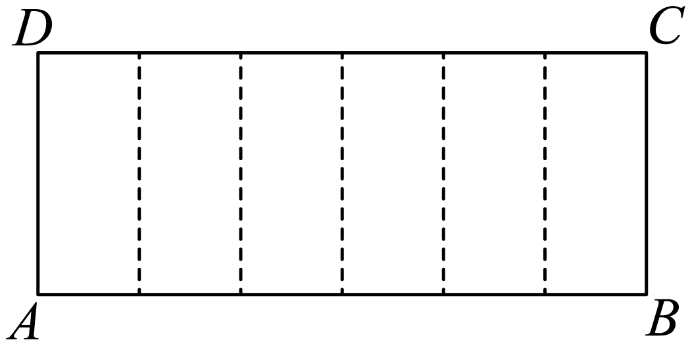

【答案】52π

【解析】设正六棱柱的底面边长为*x*，高为*y*，则，

正六棱柱的体积，

当且仅当，即时，等号成立，此时正六棱柱的外接球的球心在其上下底面中心的连线的中点，

其半径为，∴外接球的表面积为．

故答案为：．

**例11．**（2024·黑龙江齐齐哈尔·高一齐齐哈尔市第八中学校校考阶段练习）设直三棱柱的所有顶点都在一个表面积是的球面上，且，则此直三棱柱的表面积是（    ）

A．	B．	C．	D．

【答案】D

【解析】设，因为，所以.

于是（是外接圆的半径），.

又球心到平面的距离等于侧棱长的一半，

所以球的半径为.

所以球的表面积为，解得.

因此.

于是直三棱柱的表面积是

.

故选：D.

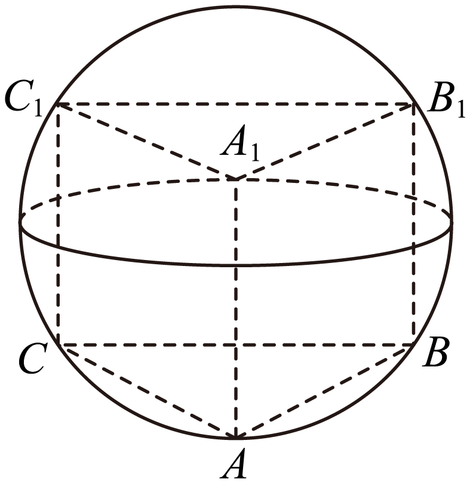

**例12．**（2024·全国·高三专题练习）在直三棱柱中，为等腰直角三角形，若三棱柱的体积为32，则该三棱柱外接球表面积的最小值为（    ）

A．12π	B．24π	C．48π	D．96π

【答案】C

【解析】设为等腰直角三角形的直角边为，三棱柱的高为，

则，所以，则，

外接圆的半径为，

所以棱柱外接球的半径为，

令，则，则，

在上单调递减，在上单调递增，

所以当时，，

则该三棱柱外接球表面积最小值为.

故选：C.

**变式6．**（2024·湖北咸宁·高二鄂南高中校考阶段练习）已知正三棱柱的体积为，则其外接球表面积的最小值为（　　）

A．12π	B．6π	C．16π	D．8π

【答案】A

【解析】设正三棱柱底边为，高为，外接球半径为，如图所示，取上下底面正三角形的

的中心分别为（*D*在中线*CE*的三等分点靠*E*处），易知三棱柱的外接球球心在的中点处.

故

由题意可得:

外接球表面积为：

当且仅当时取得最小值.

故选：A

**变式7．**（2024·全国·高三专题练习）在三棱柱中，已知，侧面，且直线与底面所成角的正弦值为,则此三棱柱的外接球的表面积为（    ）

A．	B．	C．	D．

【答案】D

【解析】三棱柱如图所示，

因为，所以该三棱柱为直三棱柱.

因为侧面，所以三条侧棱两两互相垂直.

所以为直线与底面所成角，

所以，则.

因为所以.

将三棱柱补成长方体，设外接球的半径为，

所以，

所以.

故选D.

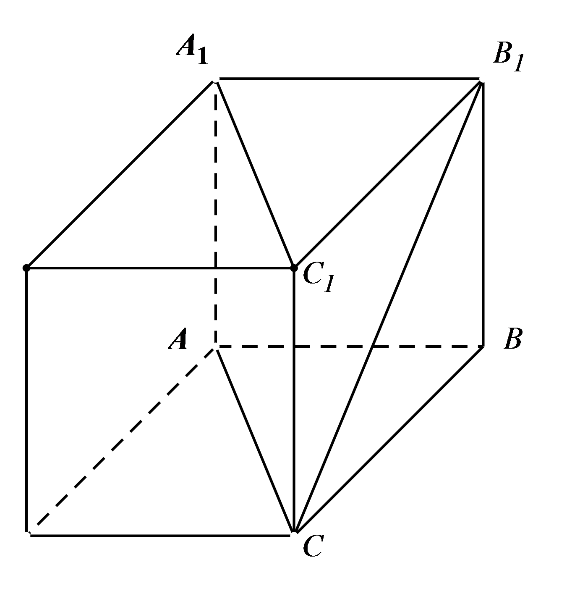

**变式8．**（2024·新疆昌吉·高三校考期末）已知正三棱柱所有棱长都为6，则此三棱柱外接球的表面积为（    ）

A．	B．60	C．	D．

【答案】D

【解析】如图，为棱的中点，为正△的中心，为外接球的球心

根据直棱柱外接球的性质可知∥，，外接球半径，

∵正△的边长为6，则

∴

外接球的表面积.

故选：D．

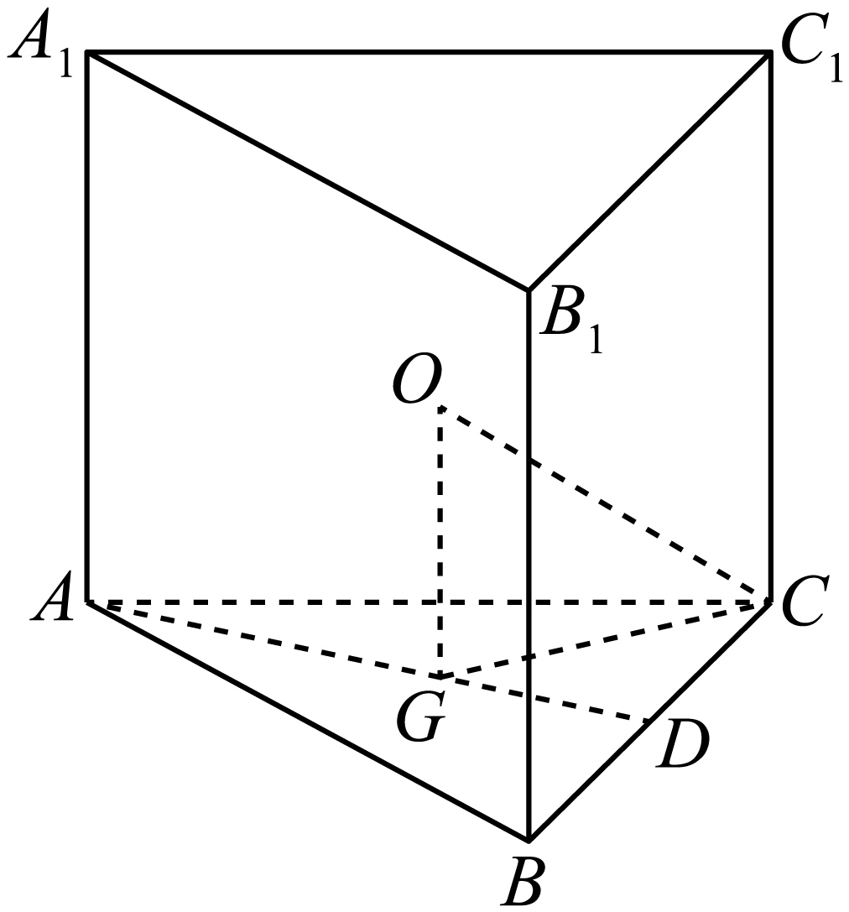

**题型五：外接球之直棱锥模型**

<strong>例13．</strong>（2024·安徽宣城·高一统考期末）在三棱锥中，△<em>ABC</em>是边长为3的等边三角形，侧棱<em>PA</em>⊥平面<em>ABC</em>，且，则三棱锥的外接球表面积为_________．

【答案】

【解析】根据已知，底面是边长为3的等边三角形，平面，

可得此三棱锥外接球，即以为底面以为高的正三棱柱的外接球．

设正三棱柱的上下底面的中心分别为，则外接球的球心为的中点，

的外接圆半径为，，

所以球的半径为，

所以四面体外接球的表面积为，

故答案为：．

<strong>例14．</strong>（2024·江苏南京·高二统考期末）在三棱锥中，面，为等边三角形，且，则三棱锥的外接球的表面积为______．

【答案】

【解析】因为是直三棱锥，底面是正三角形，所以可以将图补形成为正三棱柱，如图所示，

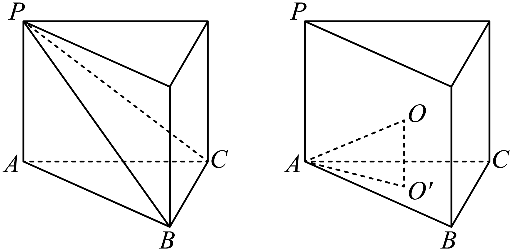

此三棱锥外接球，即为以为底面以为高的正三棱柱的外接球，

设球心为*O*，作平面，则为的外接圆圆心，连接，则，

设的外接圆半径为*r*，三棱锥外接球半径为*R*，

由正弦定理，得，所以，

中，，所以，解得，

所以．

故答案为：．

<strong>例15．</strong>（2024·四川成都·高一成都七中校考阶段练习）已知三棱锥，其中平面，则三棱锥外接球的表面积为__________.

【答案】

【解析】根据题意设底面的外心为*G*，*O*为球心，所以平面*ABC*，

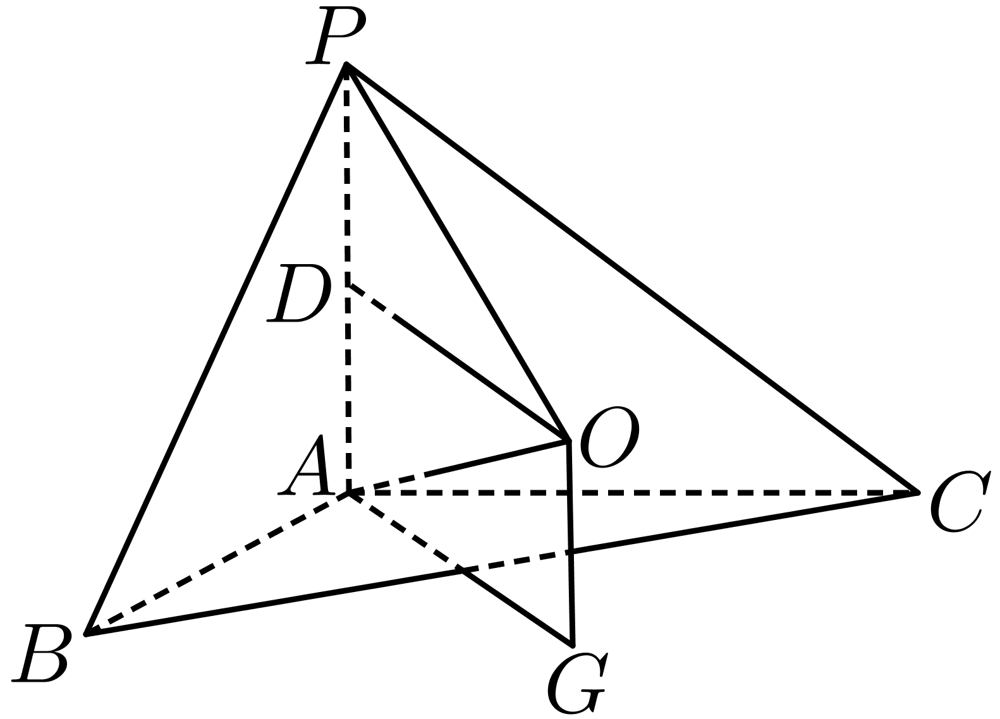

因为平面*ABC*，所以，

设是*PA*中点，因为，所以，

因为平面平面*ABC*，所以，因此，

因此四边形*ODAG*是平行四边形，故，

∵，∴，

又外接圆的半径，由正弦定理得，

所以该外接球的半径满足，

所以外接球的表面积为.

故答案为：．

<strong>变式9．</strong>（2024·陕西商洛·镇安中学校考模拟预测）在三棱锥中，为等边三角形，平面，若，则三棱锥外接球的表面积的最小值为___.

【答案】/

【解析】设，则，

取正三角形的外心为，设四面体的外接球球心为，

连接，则平面，

又平面，则，

则平面截球所得截面为大圆，又，

则

又底面外接圆的半径，

所以三棱锥外接球的半径.

当时，有最小值，

所以三棱锥外接球的表面积的最小值为.

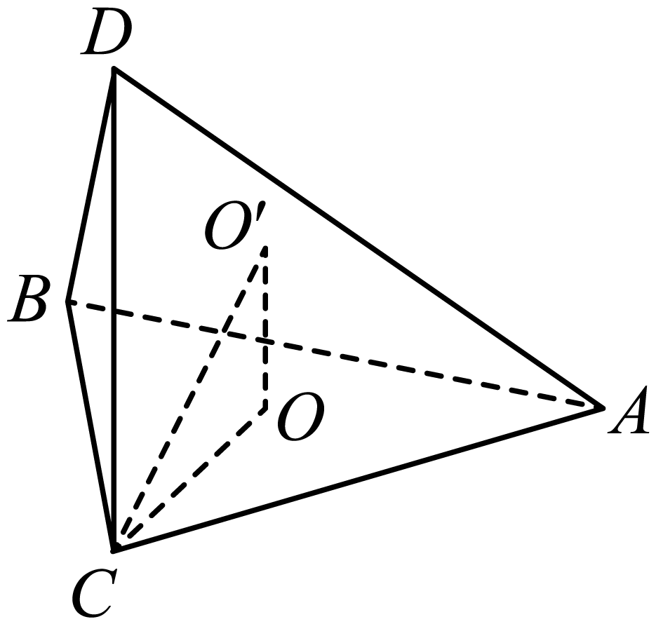

故答案为：

<strong>变式10．</strong>（2024·陕西榆林·高二校考阶段练习）已知三棱锥中，平面，，异面直线与所成角的余弦值为，则三棱锥的外接球的表面积为_____________．

【答案】/

【解析】如图，

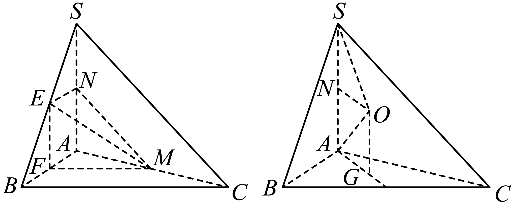

分别取、、、的中点、、、，

连接、、、、，可得，，

则为异面直线与所成角，∴，

由面，而，故面，面，则，

设，可得，，，，则，

在中，由余弦定理，可得，

，解得，

设底面三角形的中心为，三棱锥的外接球的球心为，

连接，则平面，

由底面三角形是边长为2的等边三角形，可得，

∴为三棱锥外接球的球心，∴，则，，

又，可得，

则三棱锥的外接球的半径．

∴三棱锥的外接球的表面积为．

故答案为：．

<strong>变式11．</strong>（2024·江苏镇江·高三江苏省镇江中学校考阶段练习）如图，在四棱锥中，底面为菱形，底面，为对角线与的交点，若，，则三棱锥的外接球的体积为______.

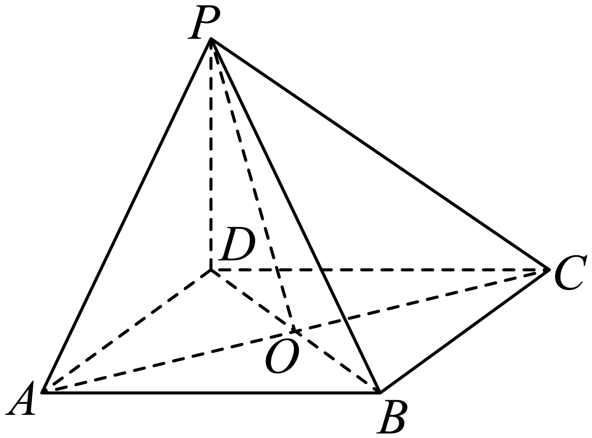

【答案】

【解析】取中点，中点，连接，则，

因为底面，所以平面，

因为四边形是菱形，则，所以是的外心，

又底面，平面，所以，

所以到四点距离相等，即为三棱锥的外接球球心．

又，，所以，

所以，

所以三棱锥的外接球体积为．

故答案为：．

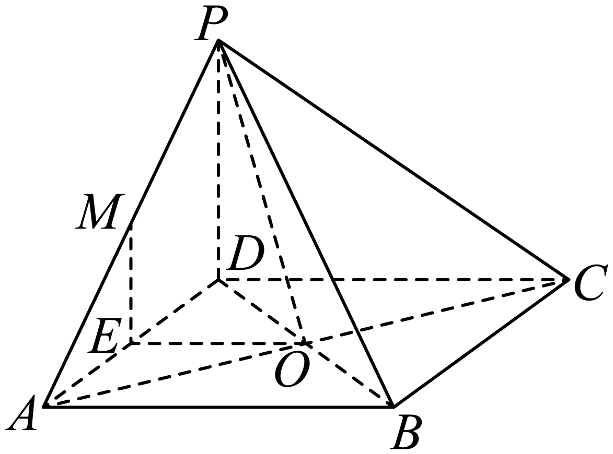

<strong>变式12．</strong>（2024·四川绵阳·绵阳中学校考二模）在四棱锥中，平面<em>BCDE</em>，，，，且，则该四棱锥的外接球的表面积为______.

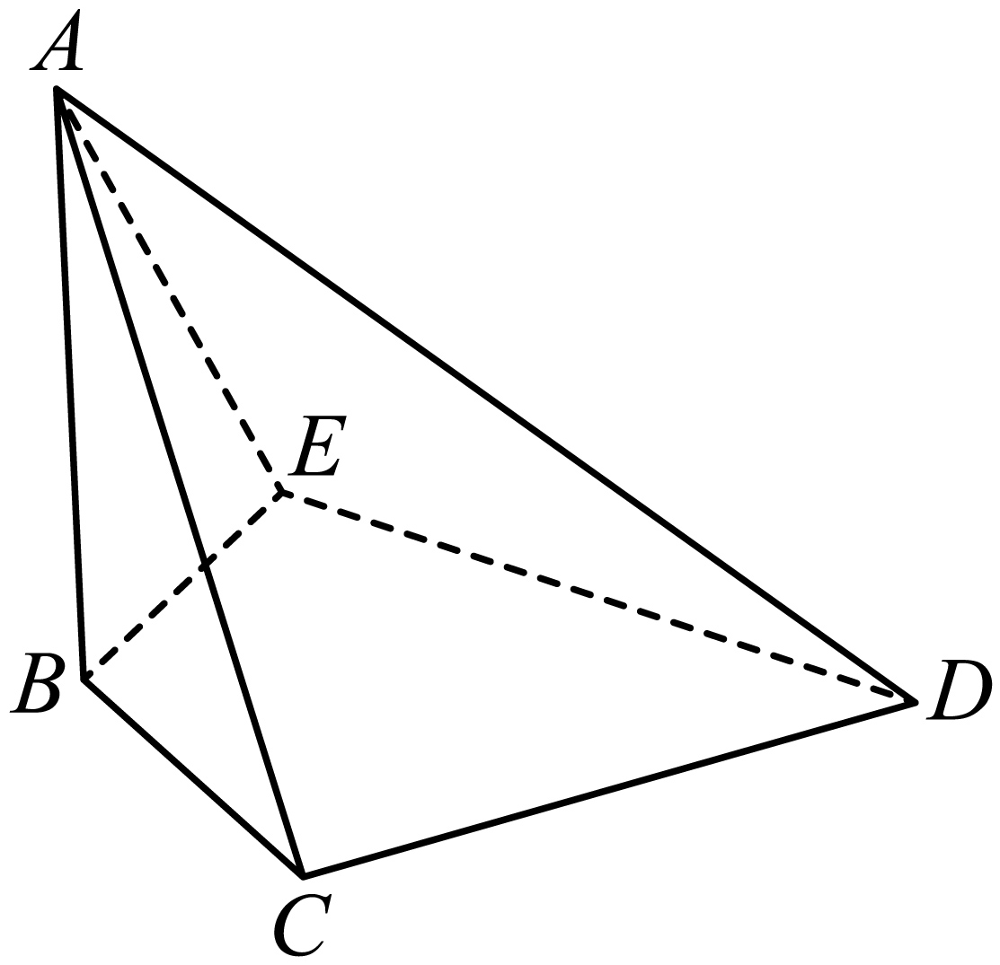

【答案】

【解析】连接，

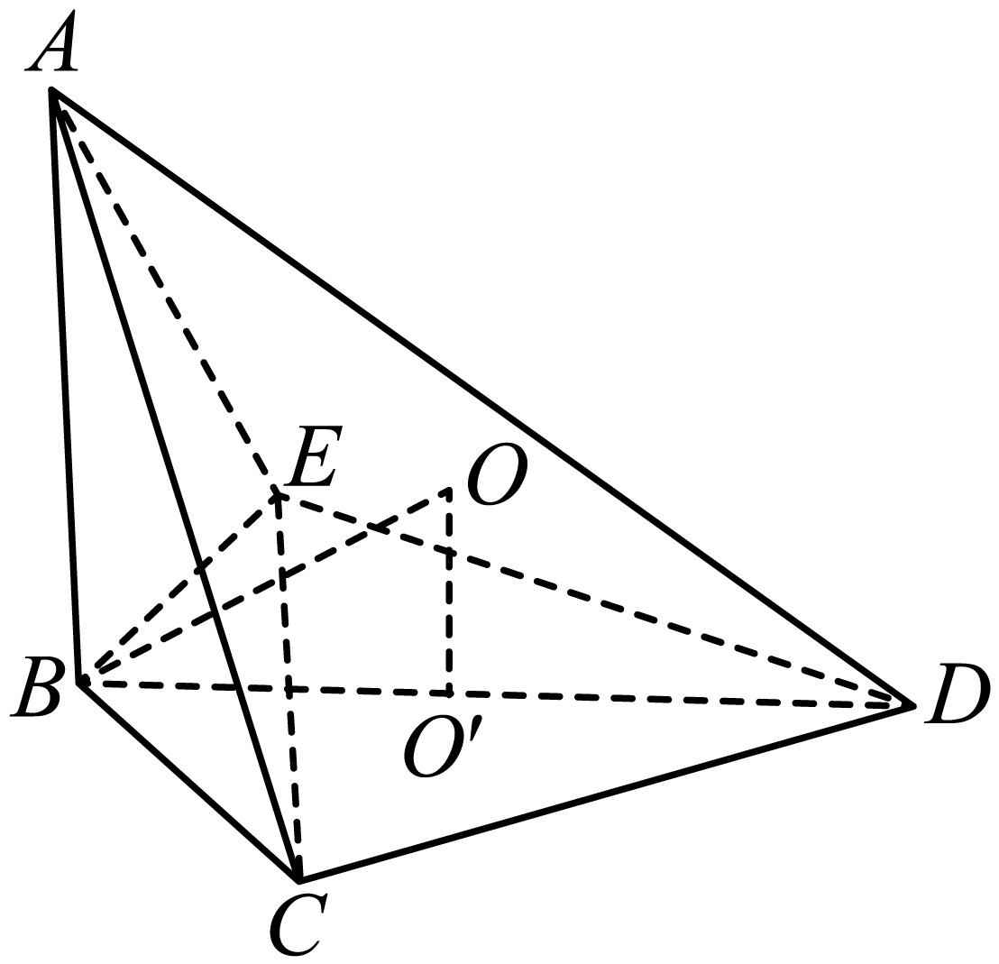

因为，，所以在直径为的圆上，

取的中点，即四边形外接圆的圆心，

在中，即，解得，

所以四边形外接圆的直径即外接圆的直径为，

所以，

因为平面*BCDE*，所以四棱锥的外接球的球心与底面的距离为，

所以四棱锥的外接球的半径为，对应的表面积为

故答案为：

<strong>变式13．</strong>（2024·广东韶关·高二统考期末）三棱锥中,平面,,,,则三棱锥外接球的体积是________．

【答案】

【解析】如图,将三棱锥还原成直三棱柱,设三棱柱的外接球球心为,分别为上下底面的外心,则为的中点,为底面外接圆的半径,

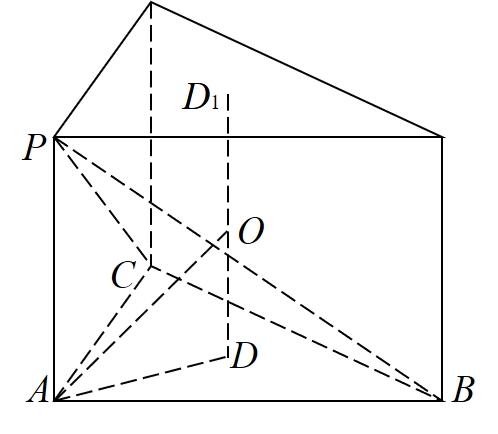

所以球心*O*到面的距离为,

由正弦定理有:

,

所以,

.

故答案为:.

**题型六：外接球之正棱锥、正棱台模型**

<strong>例16．</strong>（2024·山东滨州·高一校考期中）已知正四棱锥的底面边长为，侧棱长为6，则该四棱锥的外接球的体积为__________．

【答案】

【解析】如图，是正四棱锥的高，而，则，

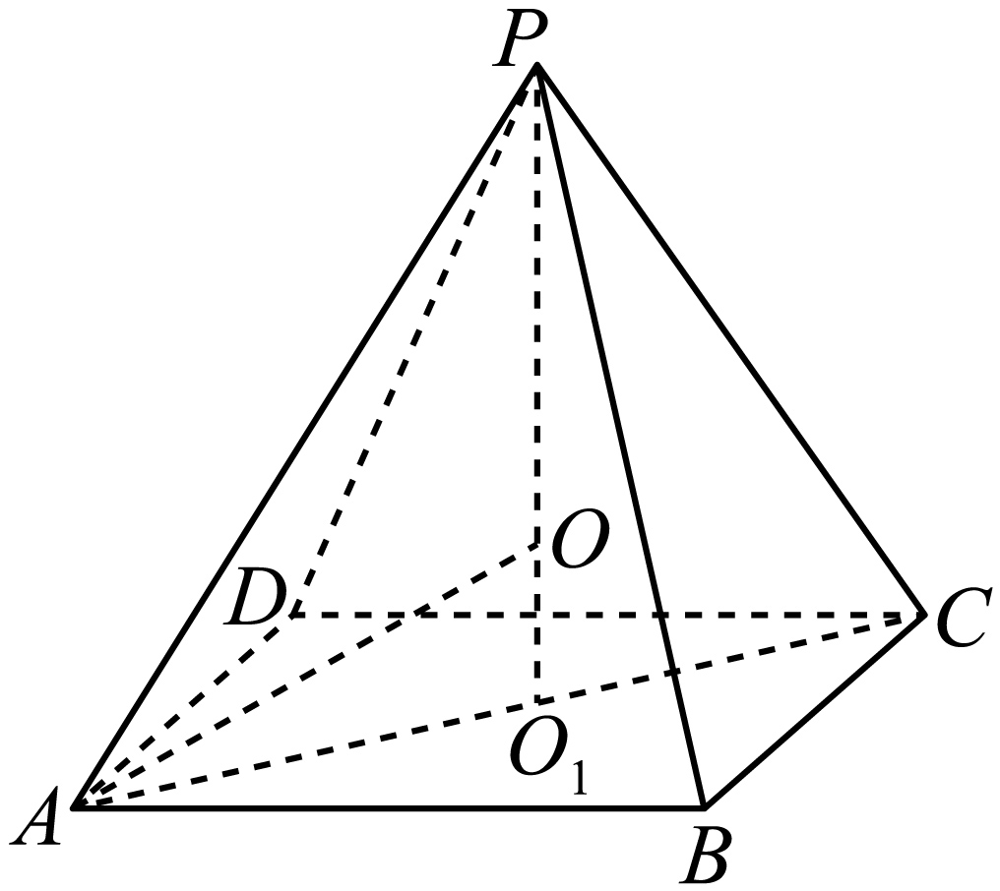

，显然正四棱锥的外接球的球心*O*在直线上，

令，则，

在中，，解得，

所以该四棱锥的外接球体积为.

故答案为：

<strong>例17．</strong>（2024·福建福州·高一福建省福州屏东中学校考期末）已知正三棱锥的顶点都在球<em>O</em>的球面上，其侧棱与底面所成角为，且，则球<em>O</em>的表面积为______________

【答案】

【解析】如图，正三棱锥中，设点*Q*为的中心，则*PQ*⊥平面*ABC*，

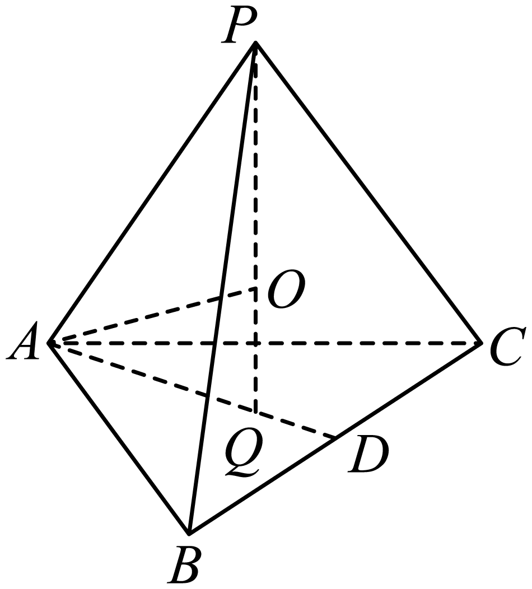

∴，∴，*PQ*＝3．

球心*O*在直线*PQ*上，连接*AO*，设球*O*的半径为*r*，

则，，

在中，，即，解得，

∴球*O*的表面积为．

故答案为：.

<strong>例18．</strong>（2024·河南商丘·高一商丘市第一高级中学校联考期末）在正三棱锥中，点<em>D</em>在棱上，且满足，，若，则三棱锥外接球的表面积为_________.

【答案】

【解析】在正三棱锥中，取的中点*E*，连接，，如图，

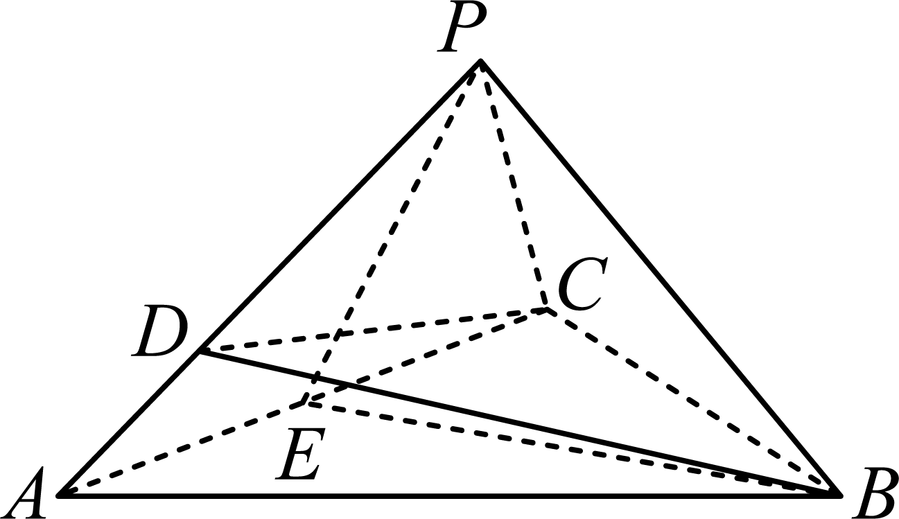

由，，得，，又，平面，，

则平面，而平面，于是，又，,平面，

因此平面，而平面，从而，，且，

由，得，，由于两两垂直，

则以为棱的长方体与三棱锥有相同的外接球，

于是三棱锥外接球的半径为，

所以三棱锥外接球的表面积为.

故答案为：

<strong>变式14．</strong>（2024·云南保山·高一统考期末）已知正三棱锥的侧棱与底面所成的角为，高为，则该三棱锥外接球的表面积为______.

【答案】/

【解析】设顶点*P*在底面的投影为（为等边的中心），则该三棱锥外接球的球心*O*在上，连接，

因为底面，则侧棱与底面所成的角为，可得，

设棱锥外接球的半径为*R*，

因为，即，解得，

所以外接球的表面积为.

故答案为：.

<strong>变式15．</strong>（2024·广东佛山·高一佛山市南海区第一中学校考阶段练习）已知正三棱锥中，，，该三棱锥的外接球体积为__________．

【答案】

【解析】在正三棱锥中为等边三角形，顶点在底面的射影为底面的重心，所以，

又，，所以，所以，同理可得、，

即，，两两垂直，把该三棱锥补成一个正方体，该三棱锥的外接球就是正方体的外接球，

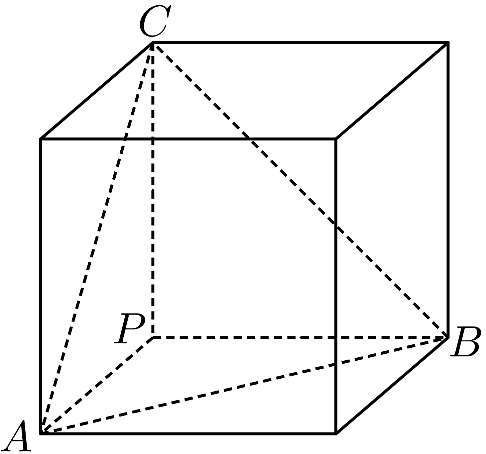

正方体的体对角线就是外接球的直径，易得三棱锥的外接球半径，

所以三棱锥的外接球体积.

故答案为：

**变式16．**（2024·陕西咸阳·武功县普集高级中学校考模拟预测）如图，在正三棱台中，，，，则正三棱台的外接球表面积为（    ）

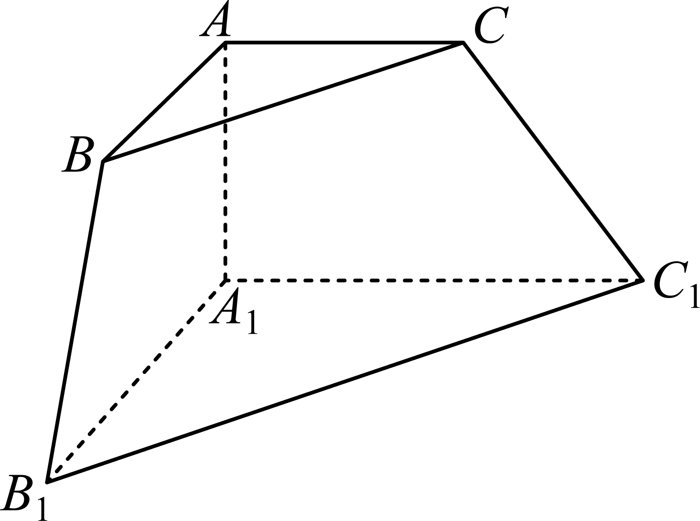

A．64	B．	C．	D．

【答案】B

【解析】设外接球球心为，等边三角形的外心为，等边三角形的外心为，

三点共线，则是正三棱台的高，

设台体的高为，设外接球的半径为，

过作，垂足为，根据正棱台的性质可知，

所以平面，平面，所以，

设等边三角形的外接圆半径为，由正弦定理得.

设等边三角形的外接圆半径为，由正弦定理得.

在直角三角形中，，

所以.

当球心*O*在线段上，则，解得，

当球心*O*在的延长线上时，则，无解，

所以正三棱台的外接球表面积为.

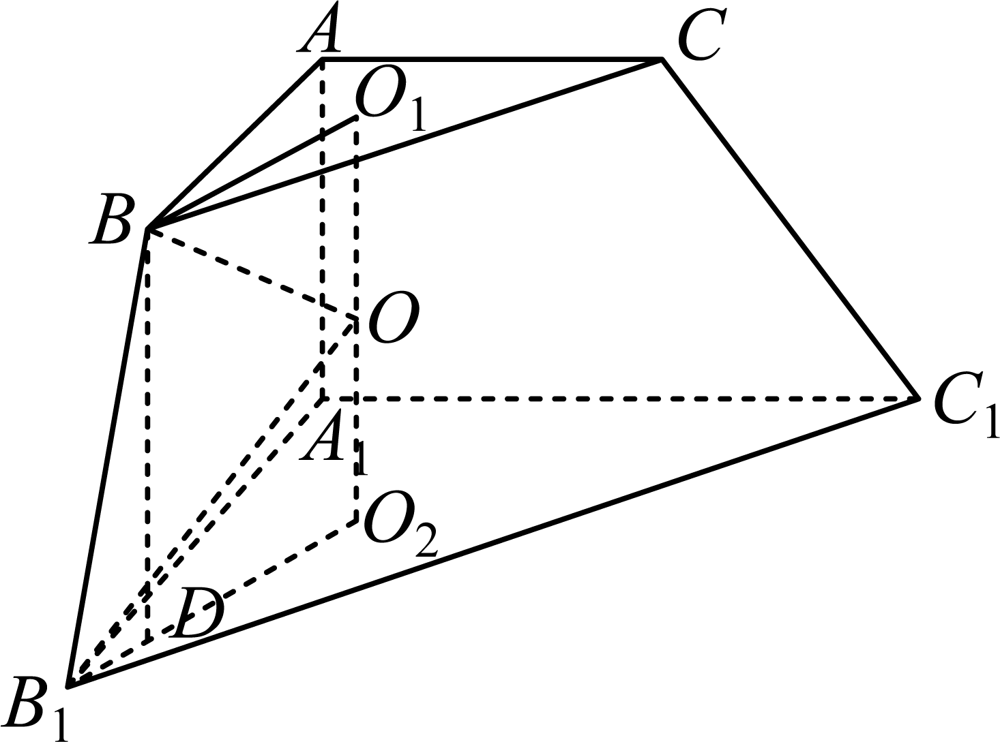

故选：B

**变式17．**（2024·辽宁·高三校联考期末）正四棱台高为2，上下底边长分别为2和4，所有顶点在同一球面上，则球的表面积为（    ）

A．	B．	C．	D．

【答案】B

【解析】

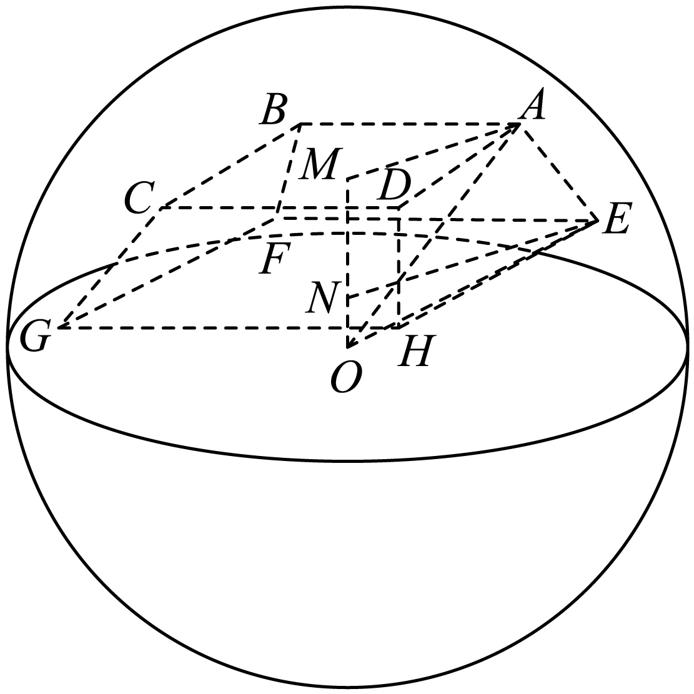

如图所示，，，

为外接球球心，设外接球半径为*R*，分别为棱台上下底面的中心，

则，

由勾股定理得：，，

设，则，，

故，解得：，

故，

故球的表面积为.

故选:B

<strong>变式18．</strong>（2024·贵州六盘水·高一校考阶段练习）已知正四棱锥的底面边长为6，侧棱长为，则该四棱锥外接球的表面积为_______．

【答案】

【解析】如图所示：

连接交于点，连接，则平面*ABCD*，

因为正四棱锥的底面边长为6，侧棱长为，

所以，

设外接球的半径为*R*，易知球心*O*在线段上，

在中，，即，

解得，

所以外接球的表面积为，

故答案为：

<strong>变式19．</strong>（2024·山西晋中·高三祁县中学校考阶段练习）在正四棱锥中，，若四棱锥的体积为，则该四棱锥外接球的体积为_________．

【答案】

【解析】如图所示：

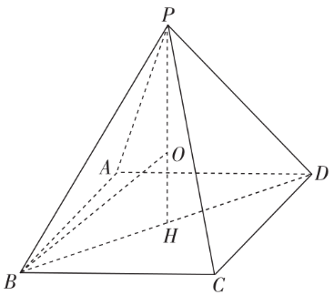

作平面，垂足为*H*．连接，则*H*为的中点．

设，则，，从而，故四棱锥的体积为，解得．

由题意可知正四棱锥外接球的球心*O*在上，连接．

设正四棱锥外接球的半径为*R*，

则，即

解得，故该四棱锥外接球的体积为．

故答案为：

**变式20．**（2024·湖北·高三统考阶段练习）在正四棱台中，，．当该正四棱台的体积最大时，其外接球的表面积为（    ）

A．	B．	C．	D．

【答案】D

【解析】

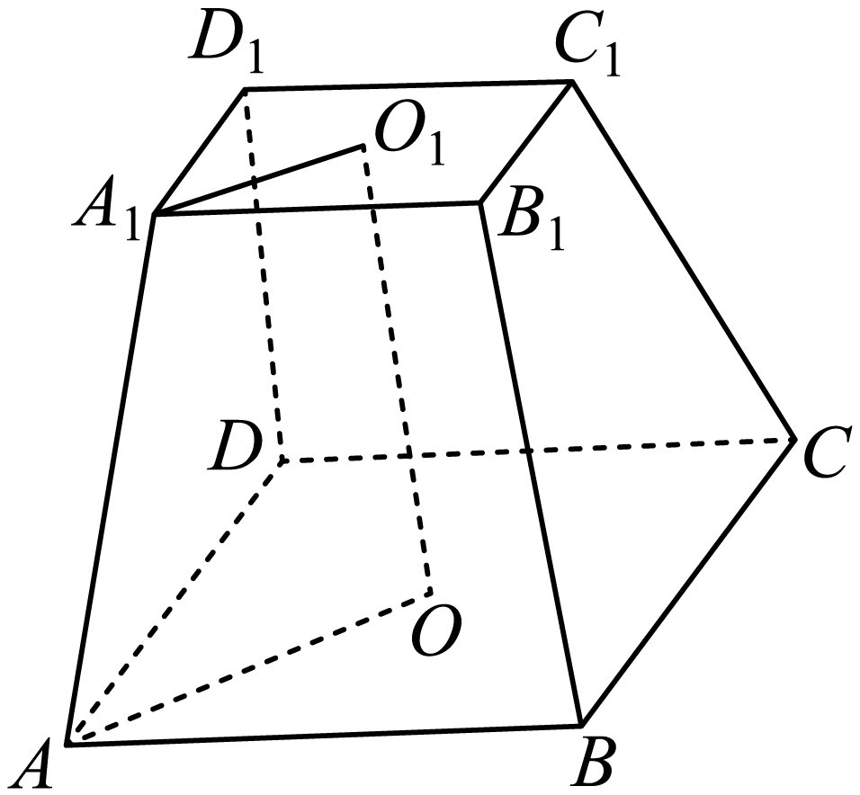  
图1

设底边长为*a*，原四棱锥的高为*h*，如图1，分别是上下底面的中心，连结，，，根据边长关系，知该棱台的高为，则，

由，且四边形为直角梯形，，，可得，则，

当且仅当，即时等号成立，此时棱台的高为1.

上底面外接圆半径，下底面半径，设球的半径为*R*，显然球心*M*在所在的直线上.

显然球心*M*在所在的直线上.

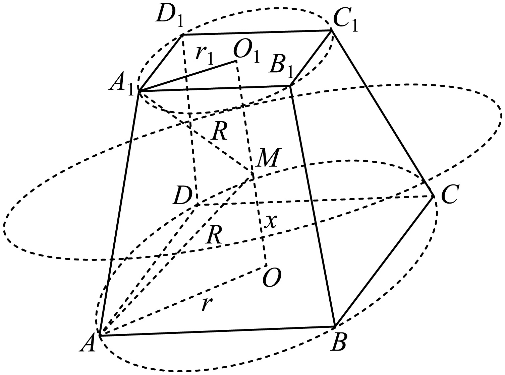  
图2

当棱台两底面在球心异侧时，即球心*M*在线段上，如图2，设，则，，显然

则，有，即

解得，舍去.

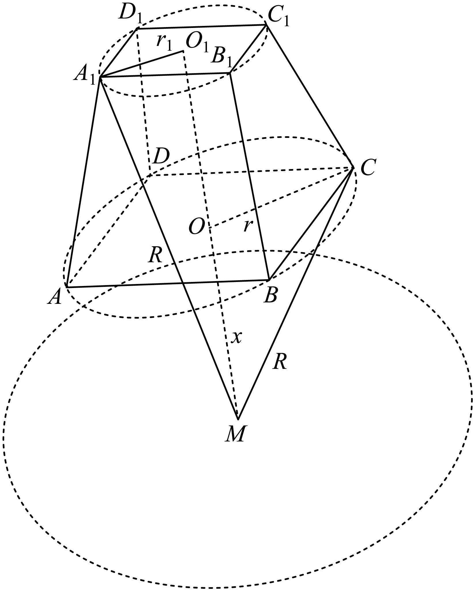  
图3

当棱台两底面在球心异侧时，显然球心*M*在线段的延长线上，如图3，设，则，显然

即，即

解得，，

此时，外接球的表面积为.

故选：D.

**题型七：外接球之侧棱相等的棱锥模型**

<strong>例19．</strong>（2024·安徽安庆·校联考模拟预测）三棱锥中，，，，则该三棱锥外接球的表面积为__________．

【答案】

【解析】因为，，所以由余弦定理可得，解得，所以，

所以是以为斜边的直角三角形，

因为，

所以点*P*在平面内的射影是的外心，

即斜边的中点，且平面平面，

于是的外心即为三棱锥的外接球的球心，

因此的外接圆半径等于三棱锥的外接球半径．

因为，，

所以，

于是，

根据正弦定理知的外接圆半径*R*满足，

所以三棱锥的外接球半径为，

因此三棱锥的外接球的表面积为．

故答案为：

<strong>例20．</strong>（2024·江苏常州·高三华罗庚中学校考阶段练习）在三棱锥中，，二面角的大小为，则三棱锥的外接球的表面积为________．

【答案】/

【解析】取的中点，连接，因为，

所以和都是等边三角形，所以，

所以是二面角的平面角，即，

设球心为，和的中心分别为，则平面，平面，

因为，公共边，所以≌，

所以，

因为，所以，

所以，

所以三棱锥的外接球的表面积为

故答案为：

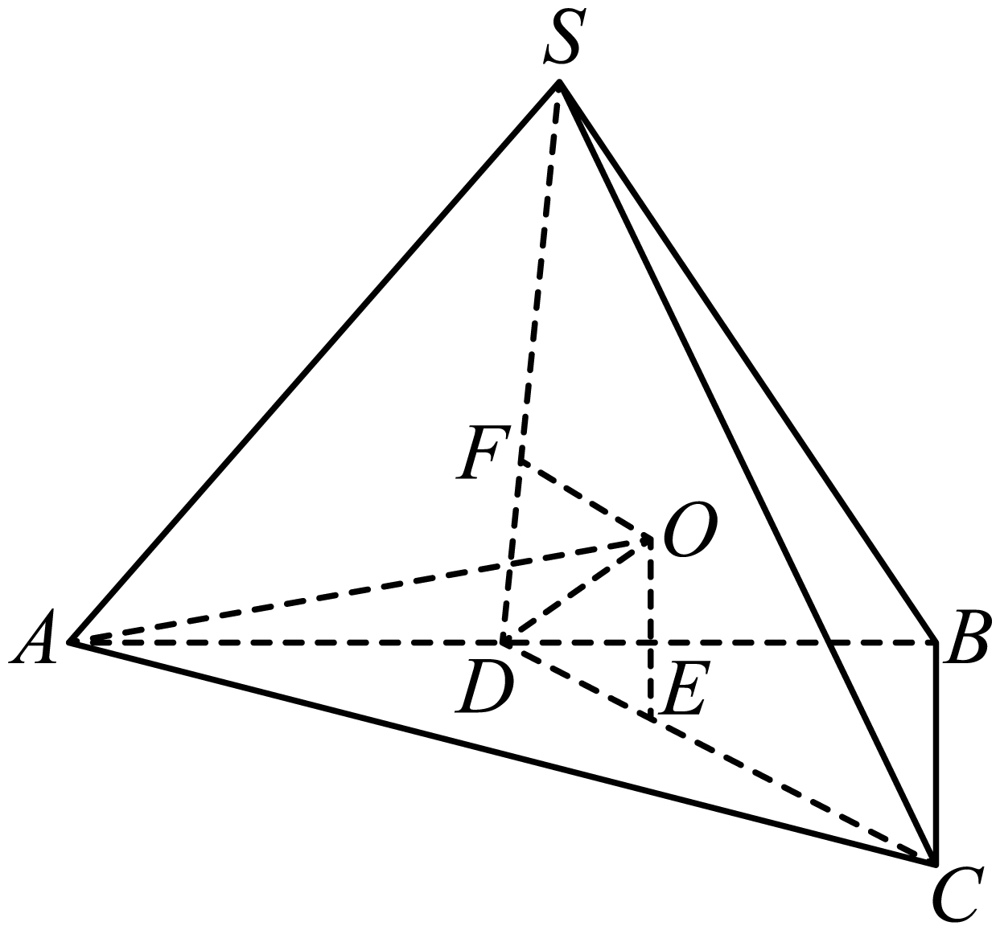

<strong>例21．</strong>（2024·河北承德·高一校联考阶段练习）已知三棱锥的各侧棱长均为，且，则三棱锥的外接球的表面积为__________.

【答案】

【解析】如图：

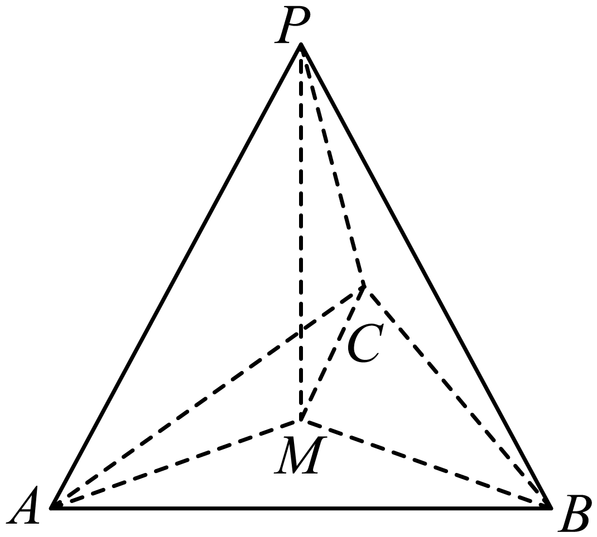

过*P*点作平面*ABC*的垂线，垂足为*M*，则都是直角三角形，

又，同理可得，，

所以*M*点是的外心；

又，是以斜边的直角三角形，

在底面的射影为斜边的中点，如下图：

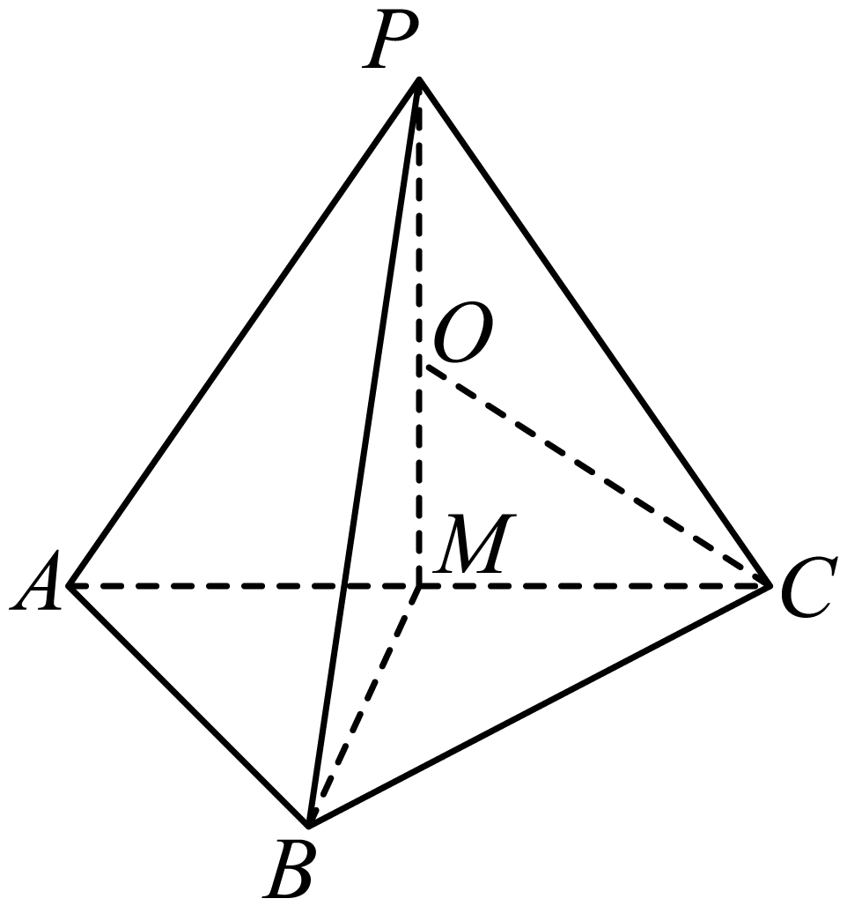

则，设三棱锥外接球的球心为，半径为，

则在上，则，即，得，外接球的表面积为；

故答案为：

<strong>变式21．</strong>（2024·吉林长春·高一长春市解放大路学校校考期末）已知三棱锥<em>P</em>-<em>ABC</em>的四个顶点在球<em>O</em>的球面上，，△<em>ABC</em>是边长为的正三角形，<em>E</em>，<em>F</em>分别是<em>PA</em>，<em>AB</em>的中点，，则球<em>O</em>的体积为__________.

【答案】

【解析】设，则，

因为，则，

在中，因为，则，

由余弦定理可得，

即，解得，

可知，即，所以两两垂直，

可以把三棱锥*P*-*ABC*转化为边长为1的正方体，可知球*O*即为正方体的外接球，

其体对角线即为外接球的直径，即，

所以球*O*的体积.

故答案为：.

**变式22．**（2024·全国·高三专题练习）已知在三棱锥中，，，则该三棱锥外接球的体积为

A．	B．	C．	D．

【答案】A

【解析】取中点为，连接，易知

在中：

又平面

为外心球心在上

设半径为，球心为

在中：

故答案选A

**变式23．**（2024·全国·高一专题练习）如图，在三棱锥中，，，二面角的大小为，则三棱锥的外接球的表面积为（    ）

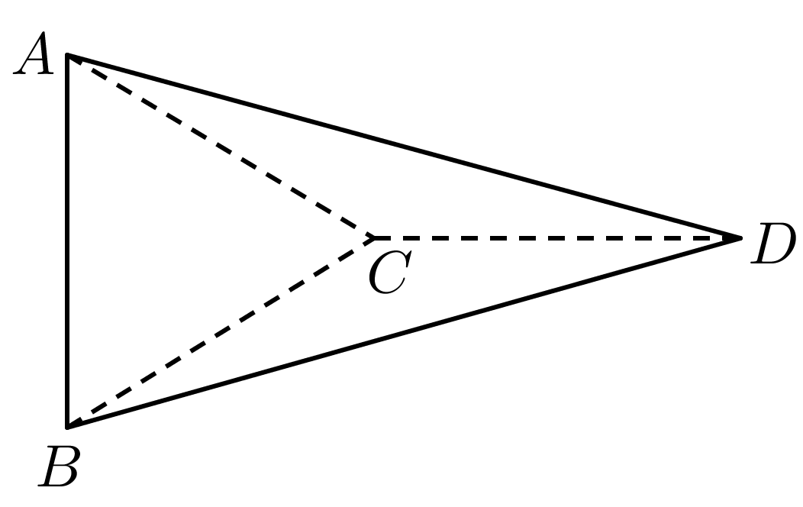

A．	B．	C．	D．

【答案】D

【解析】如图1，过作垂足为，取的中点，连接

过作∥,且=，连接，则

∵△为等边三角形，则

∴，，根据题意可得

∵，则

由题意可得，则，则

如图2，∵，则顶点在平面的投影为△的外接圆圆心，则三棱锥的外接球的球心在直线上，连接

，则

∴△的外接圆半径，则

设棱锥的外接球的半径为，则

即，解得

三棱锥的外接球的表面积为

故选：D．

**变式24．**（2024·全国·高三专题练习）在四面体中，，，则四面体的外接球的表面积为（    ）

A．	B．	C．s	D．

【答案】D

【解析】作出图形，根据题中数据证明出平面平面，并找出球心的位置，列等式求出外接球的半径，结合球的表面积公式可得出结果.如下图所示：

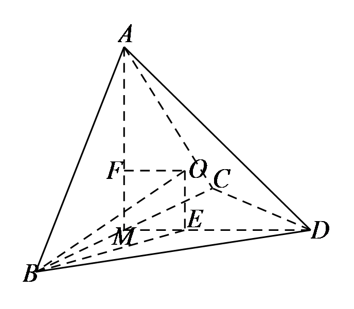

取的中点，连接、，设和的外心分别为点、，分别过点、作平面和平面的垂线交于点，则点为外接球球心，

由题意可知，和都是边长为的等边三角形，

为的中点，，且，

，，，

，平面，平面，平面平面，

易得，，

平面，平面，，

同理可得，则四边形为菱形，，菱形为正方形，

平面，平面，，

所以外接球的半径为，

因此，四面体的外接球的表面积为.

故选：D.

**题型八：外接球之圆锥、圆柱、圆台模型**

<strong>例22．</strong>（2024·浙江台州·高二校联考期末）已知圆锥的底面半径为1，母线长为2，则该圆锥的外接球的体积为____________.

【答案】

【解析】由题设，圆锥体的高为，

若外接球的半径为，则，可得，

所以圆锥的外接球的体积为.

故答案为：.

<strong>例23．</strong>（2024·黑龙江哈尔滨·哈尔滨三中校考模拟预测）已知某圆锥的轴截面为正三角形，侧面积为，该圆锥内接于球，则球的表面积为__________.

【答案】/

【解析】作圆锥的轴截面，则该轴截面等边△的外接圆圆心即为圆锥的外接球球心，且△*ABC*外接圆半径等于圆锥的外接球半径，如下图所示，

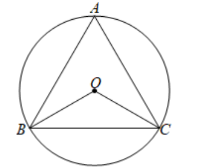

因为圆锥的侧面积，所以,

设球的半径为*R*，由正弦定理得，

因此，这个球的表面积为.

故答案为：

<strong>例24．</strong>（2024·河北石家庄·高二校考阶段练习）一个圆柱的底面直径与高都等于一个球的直径，则圆柱的表面积与球的表面积之比为_________.

【答案】

【解析】设球的半径为，则圆柱的表面积，

球的表面积，所以.

故答案为：.

**变式25．**（2024·重庆·统考模拟预测）如图所示，已知一个球内接圆台，圆台上、下底面的半径分别为和，球的体积为，则该圆台的侧面积为（    ）

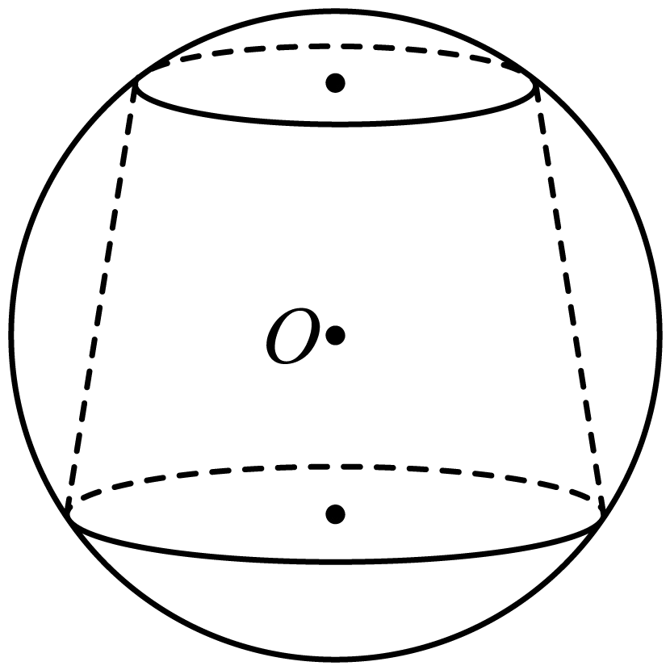

A．	B．	C．	D．

【答案】D

【解析】设球的半径为，则，所以，，

取圆台的轴截面，如下图所示：

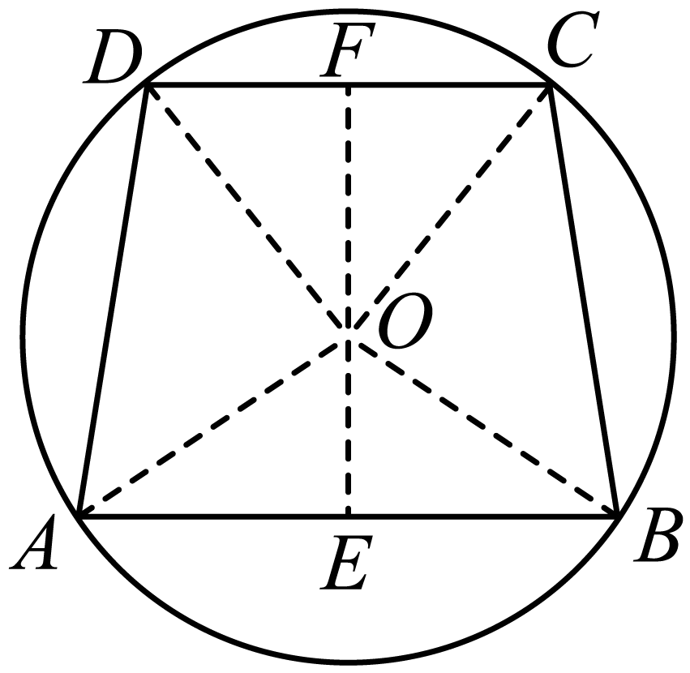

设圆台的上、下底面圆心分别为、，则、分别为、的中点，

连接、、、、、，则，

由垂径定理可知，，，

所以，，，

因为，，，所以，，

所以，，所以，，

所以，，则，

因此，圆台的侧面积为，

故选：D.

<strong>变式26．</strong>（2024·云南·高三校联考开学考试）已知圆台的上下底面圆的半径分别为3，4，母线长为，若该圆台的上下底面圆的圆周均在球<em>O</em>的球面上，则球<em>O</em>的体积为（    ）

A．	B．	C．	D．

【答案】B

【解析】由题得圆台的高为，

设圆台的上下底面圆心为，，，球的半径为，

当圆台的两个底面在球心异侧时，，

所以，

解得，；

当圆台的两个底面在球心同侧时，，

，

解得，，

此时，不合题意，舍去，

故球的体积，

故选：B．

**变式27．**（2024·陕西西安·高一校考期中）如图所示，一个球内接圆台，已知圆台上､下底面的半径分别为3和4，球的表面积为，则该圆台的体积为（    ）

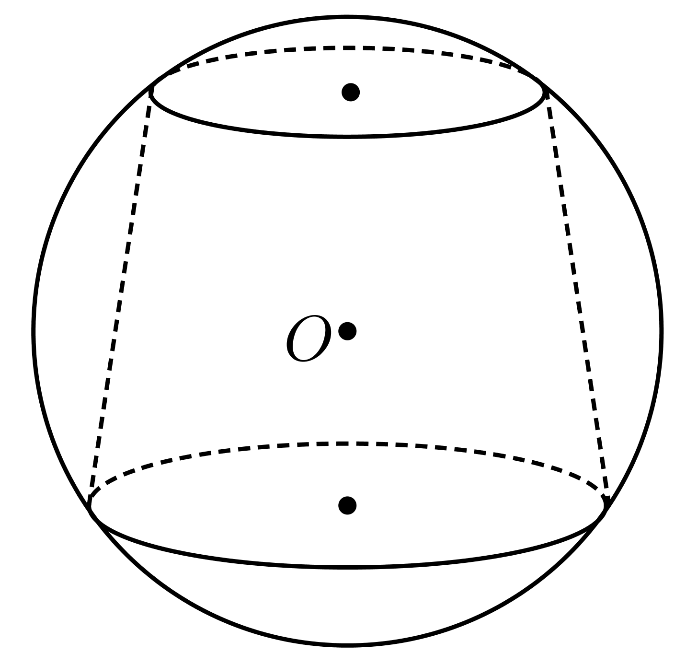

A．	B．	C．	D．

【答案】D

【解析】因为圆台外接球的表面积，所以球的半径，

设圆台的上､下底面圆心分别为，在上､下底面圆周上分别取点，

连接，如图，

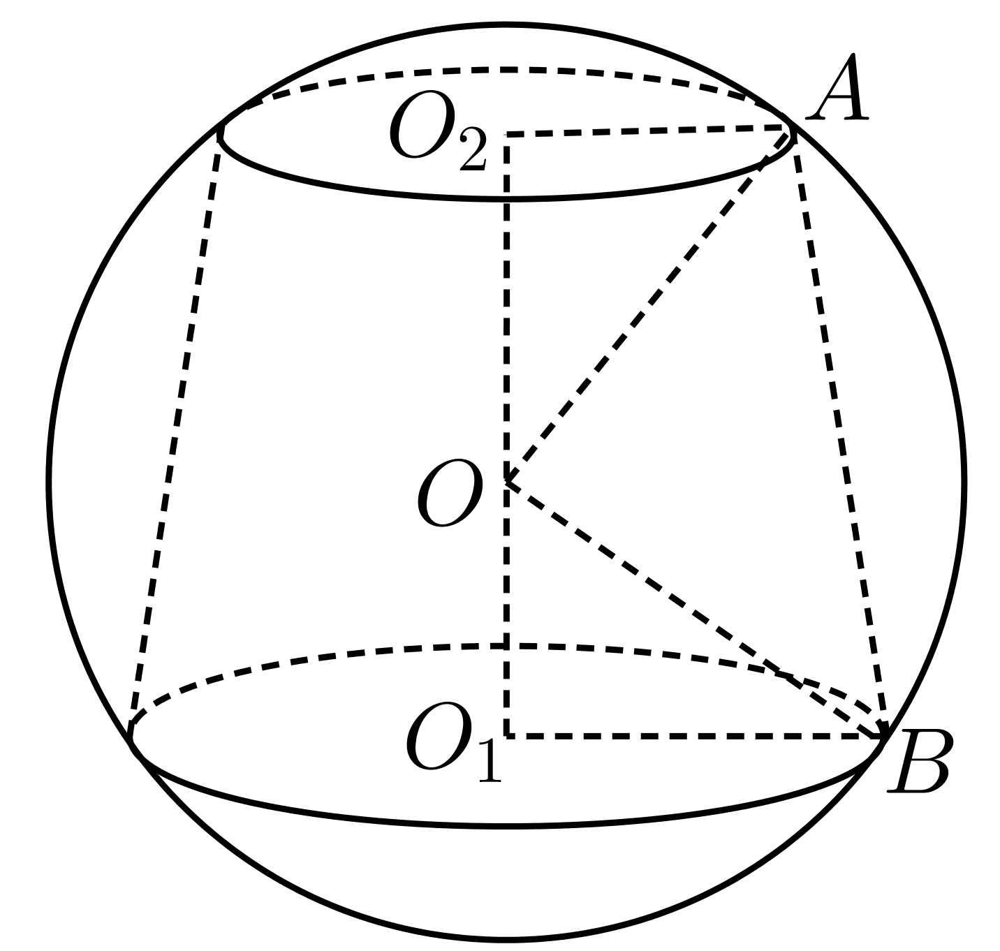

因为圆台上､下底面的半径分别为3和4，

所以，，

所以，,

所以，

所以圆台体积.

故选：D.

**题型九：外接球之垂面模型**

<strong>例25．</strong>（2024·江西九江·高一校考期末）如图，三棱锥中，平面平面<em>BCD</em>，是边长为2的等边三角形，，.若<em>A</em>，<em>B</em>，<em>C</em>，<em>D</em>四点在某个球面上，则该球体的表面积为______.

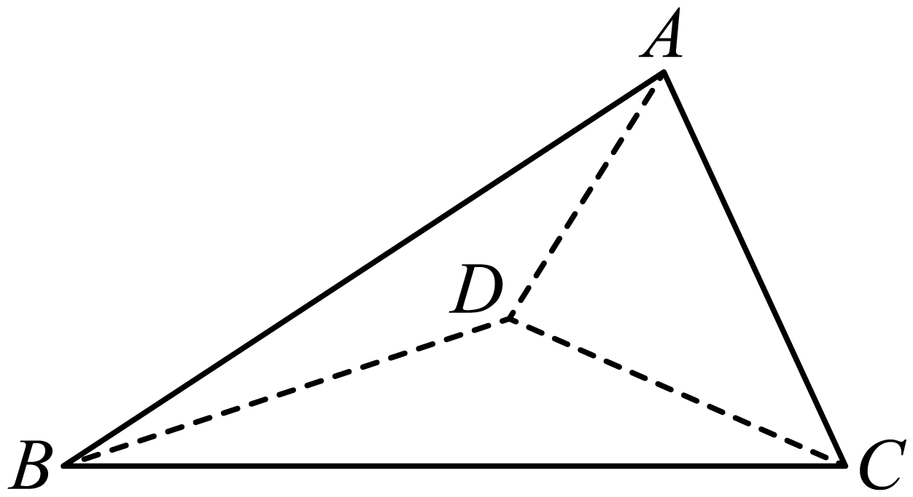

【答案】/

【解析】作出底面的外心，侧面的外心，取中点，

连接，因为平面平面，面平面，

因为是边长为2的等边三角形，所以，

又因为平面，所以平面，

由球的性质可得平面，所以，

同理，所以四边形为平行四边形，

故，

在中，因为，，则，

设的外接圆半径为，根据正弦定理有，则，

设三棱锥外接球的半径为，则，

则外接球的表面积为.

故答案为：.

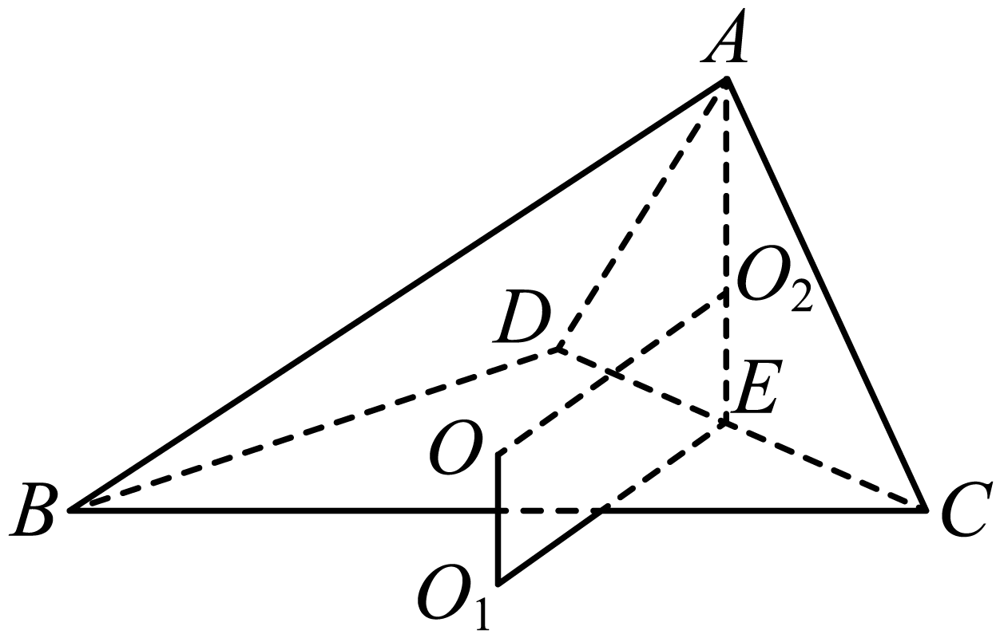

<strong>例26．</strong>（2024·四川乐山·高二期末）已知正边长为1，将绕旋转至，使得平面平面，则三棱锥的外接球表面积为___________．

【答案】

【解析】如图，

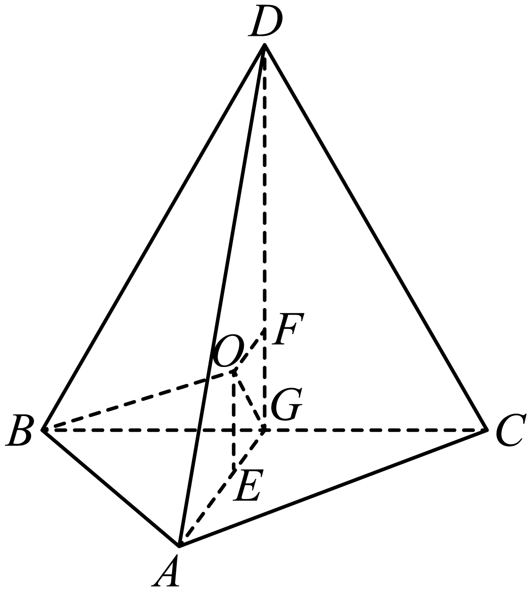

取*BC*中点*G*，连接*AG,DG*，则，，

分别取与的外心*E,F*分别过*E,F*作平面*ABC*与平面*DBC*的垂线，相交于*O*，则*O*为四面体的球心，

由，

所以正方形*OEGF*的边长为，则，

所以四面体的外接球的半径，

球*O*的表面积为．

故答案为：．

<strong>例27．</strong>（2024·河南平顶山·高一统考期末）在三棱锥中，平面平面，点是的中点，，则三棱锥的外接球的表面积为__________.

【答案】

【解析】因为，所以的外接圆圆心即点，三棱锥外接球球心在过点与平面垂直的直线上，

由于平面平面即球心在平面内，

所以球心即为的外接圆圆心，球的半径即为的外接圆半径.

因为，所以，从而.

设，在中，根据余弦定理有，所以，

由正弦定理得，所以，所以三棱锥的外接球的表面积为.

故答案为：

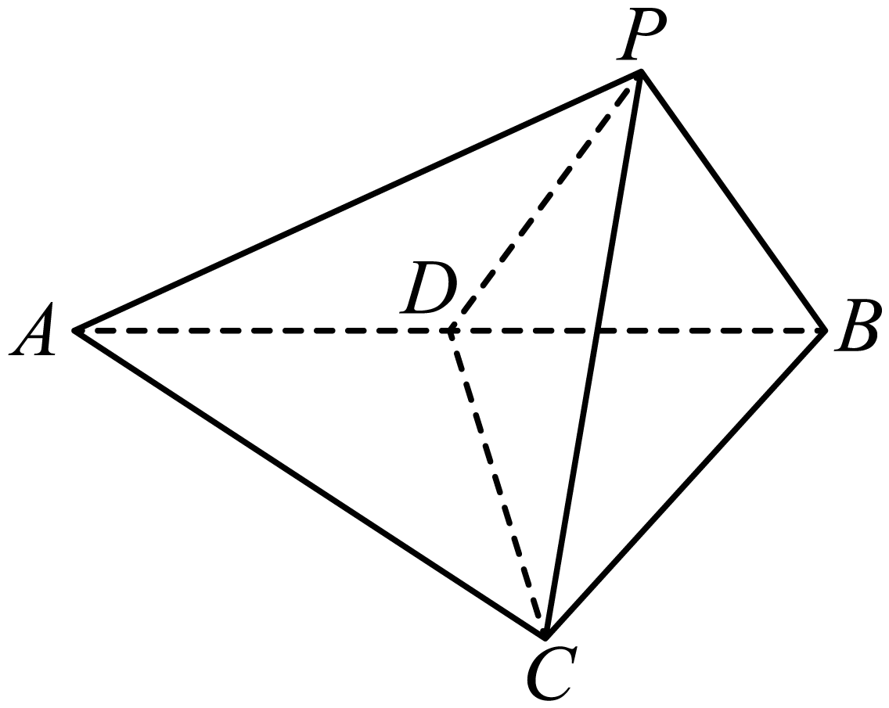

<strong>变式28．</strong>（2024·江苏·高一专题练习）如图，在直三棱柱中，．设<em>D</em>为的中点，三棱锥的体积为，平面平面，则三棱柱外接球的表面积为______．

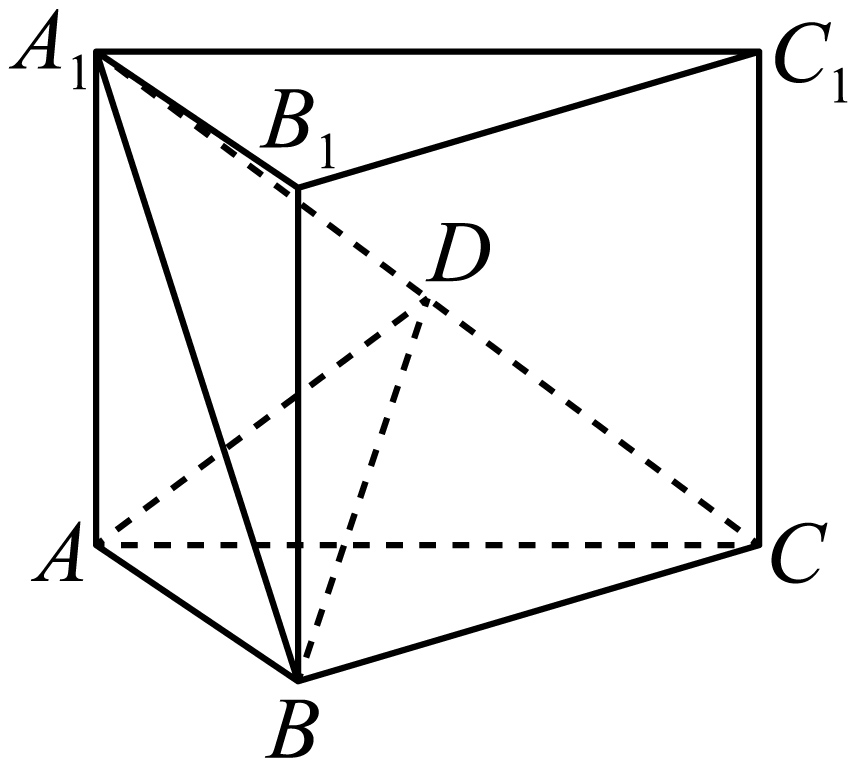

【答案】

【解析】取的中点*E*，连接*AE*，如图．

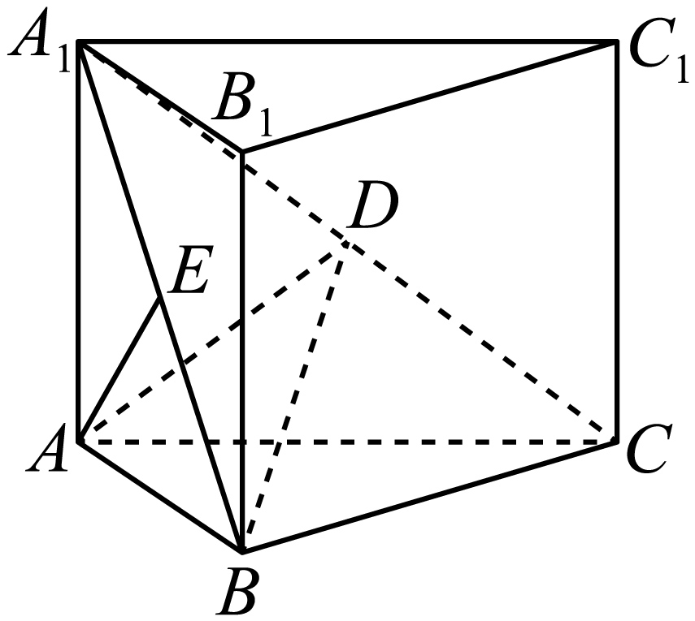

因为，所以．

又面面，面面，且面，

所以面，面，所以．

在直三棱柱中，面*ABC*，面*ABC*，所以．

又*AE*，面，且*AE*，相交，所以面，面，

所以．

设，则，解得，

所以．

所以三棱柱外接球的表面积．

故答案为：

<strong>变式29．</strong>（2024·河南开封·开封高中校考模拟预测）如图,在三棱锥中,平面平面<em>ABC</em>,,,,为等边三角形,则三棱锥外接球的表面积为________．

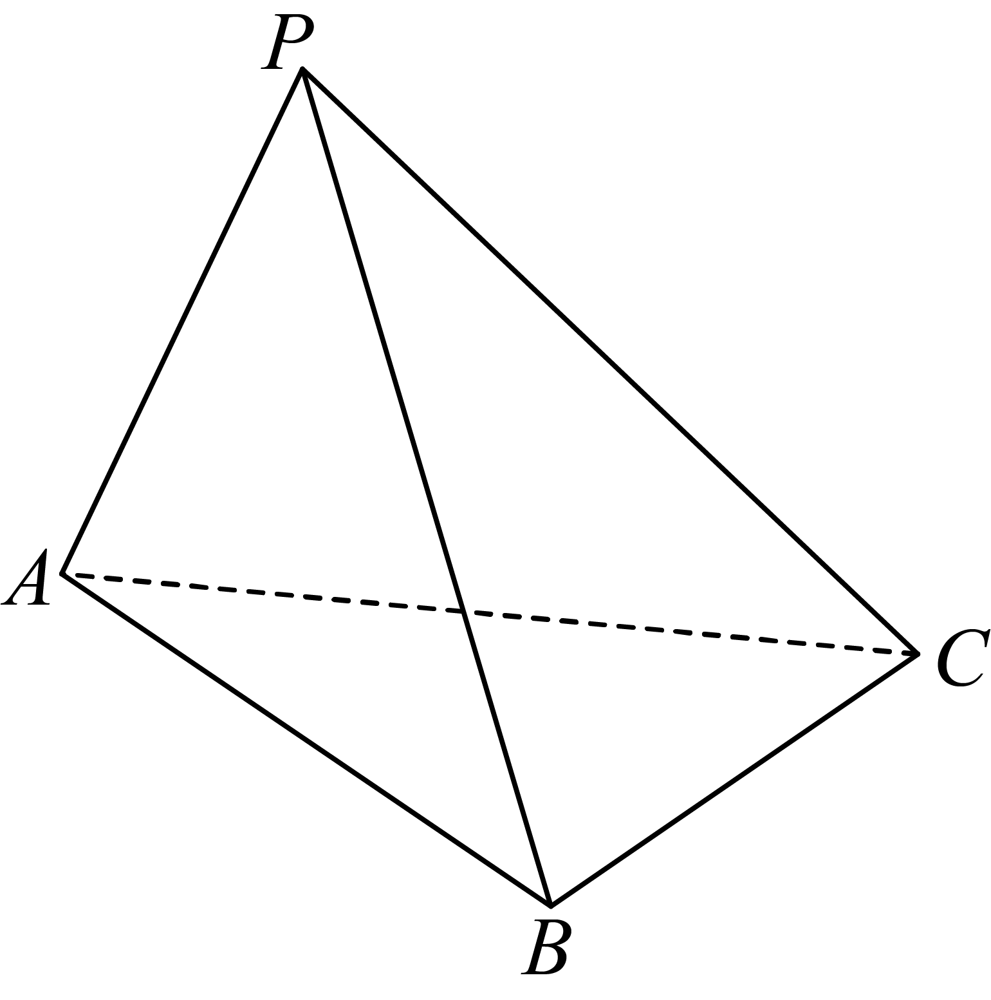

【答案】

【解析】因为平面平面,平面平面,平面,所以平面;

如图,因为,所以三角形的外心即为中点,

过三角形的外心作平面的垂线,

过三角形的外心作平面的垂线,

则两垂线必相交于球心,连接,则外接球半径.

在中,,,

所以,

所以表面积.

故答案为:.

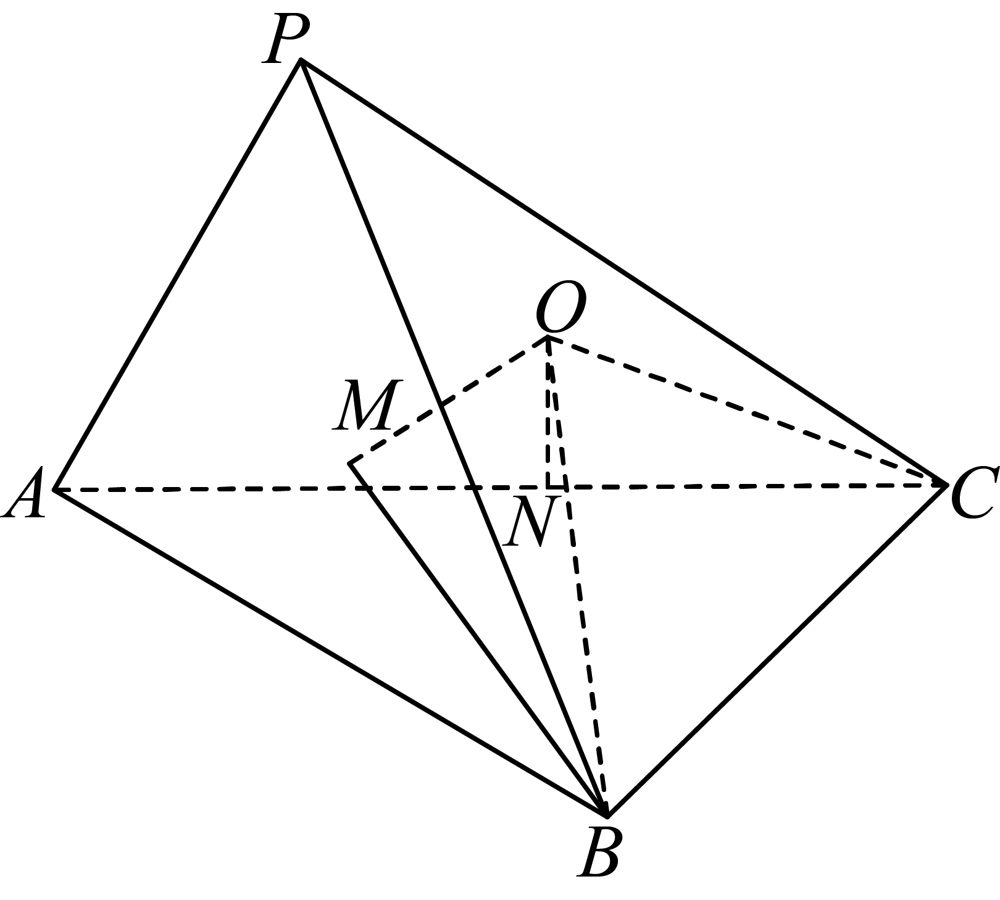

<strong>变式30．</strong>（2024·湖北十堰·高一统考期末）如图，在平面四边形中，，沿对角线将折起，使平面平面，连接，得到三棱锥，则三棱锥外接球表面积的最小值为__________.

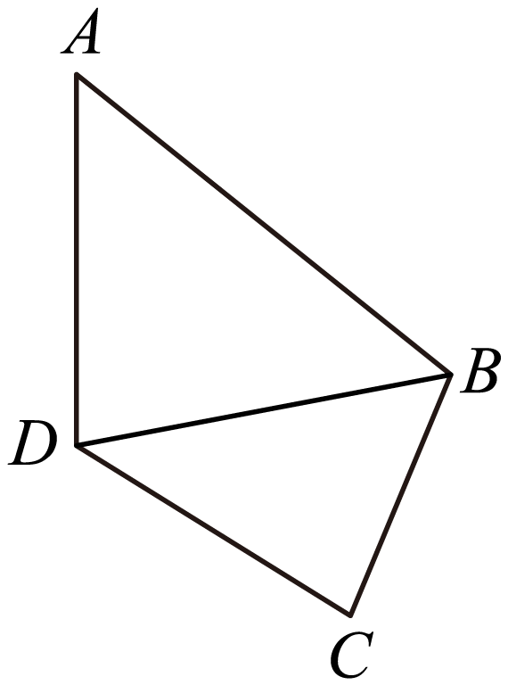

【答案】

【解析】在平面四边形中设，

即在Rt中，.

在等腰中，.设外接圆圆心为，外接圆半径为，由正弦定理可得.

设三棱锥外接球球心为，则平面.

又平面平面，平面平面，平面，，

所以平面，则，所以四边形为直角梯形.

设外接球的半径为，在平面四边形中，过做于，

在中，为的中点，，

由，

所以

.

令，则，

因为，当且仅当，即时（满足）等号成立.

所以，

所以外接球表面积的最小值为.

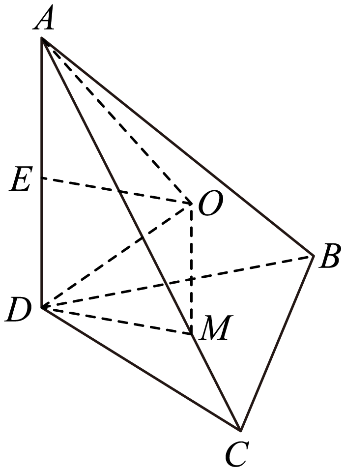

故答案为：

<strong>变式31．</strong>（2024·河南安阳·高一统考期末）在三棱锥中，平面平面，，且，是等边三角形，则该三棱锥外接球的表面积为______．

【答案】

【解析】如图所示，作中点，连接、，

在上作的中心，

过点作平面的垂线，

在垂线上取一点，使得，

因为三棱锥底面是等边三角形，

是的中心，

所以三棱锥外接球球心在过点的平面垂线上，

又因，则即为球心，

因为平面平面，，，

平面平面，，

所以平面，

，

，

，，

设球的半径为，

则，

，

即，解得，

故三棱锥外接球的表面积为.

故答案为：

<strong>变式32．</strong>（2024·云南临沧·高二校考期中）如图，已知矩形中，，现沿折起，使得平面平面，连接，得到三棱锥，则其外接球的体积为_________．

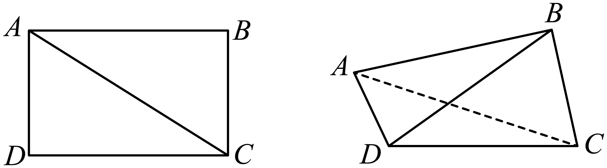

【答案】

【解析】设，由矩形的性质可知：，

则三棱锥的外接球的球心即为，半径，

所以三棱锥的外接球的体积.

故答案为：.

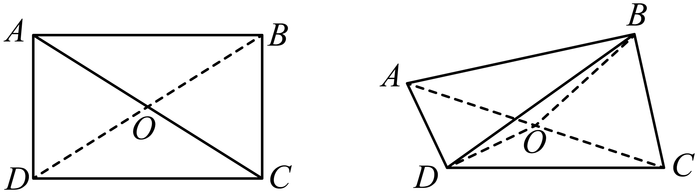

<strong>变式33．</strong>（2024·全国·高三校联考开学考试）在三棱锥中，平面平面，底面是边长为3的正三角形，若该三棱锥外接球的表面积为，则该三棱锥体积的最大值为__________.

【答案】

【解析】依题意，点是三棱锥外接球的球心，设球的半径为是外接圆的圆心，

设圆的半径为，点到底面的距离为，

由题意，可得，则.

因为是边长为3的正三角形，

所以由正弦定理，可得，则.

所以三棱锥的体积为，

三棱锥的体积取最大值则需要最大.

由题意可知，点在过且与底面（此处底面为水平）垂直的截面圆的圆周上运动，当点运动到该圆的最高点时，最大.

取的中点，连接，过点作.如图所示，

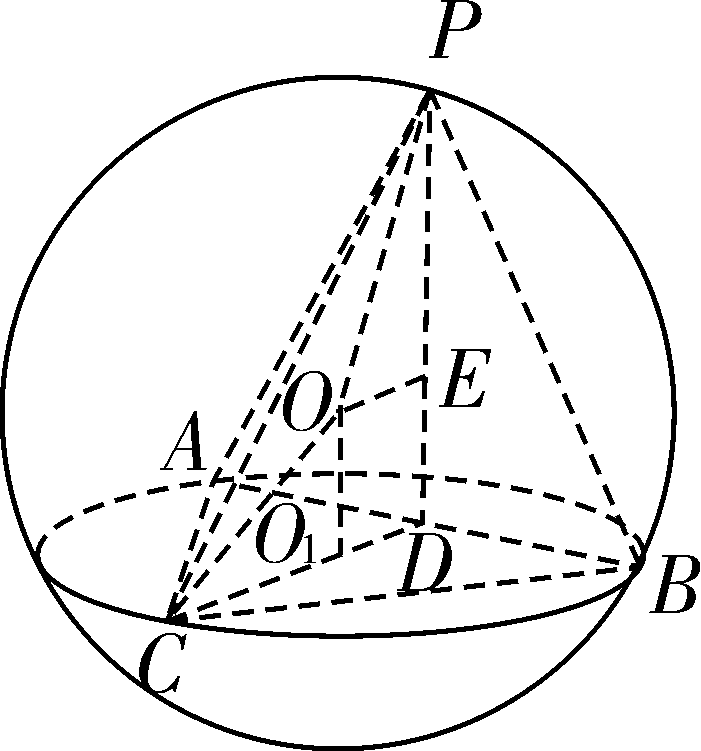

由圆的对称性可知，此时，则.

又平面平面，且平面平面平面，

所以平面.

因为在中，，

又，

所以.

易得四边形为矩形，

所以.

因为在中，，

所以，

所以.

故答案为：.

<strong>变式34．</strong>（2024·四川乐山·统考三模）在三棱锥中，，平面平面<em>ABC</em>，则三棱锥的外接球表面积的最小值为______．

【答案】

【解析】

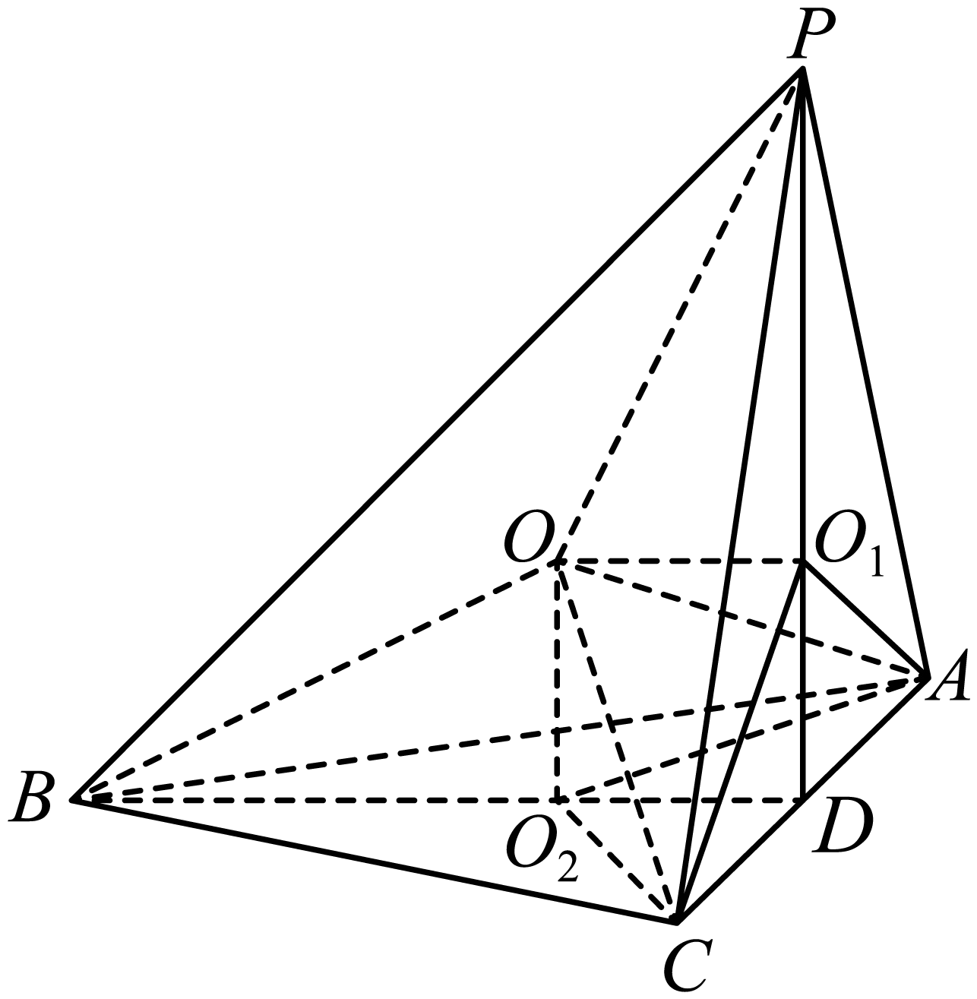

如图，取中点，连接，，

由，则，，

由面面*ABC*，面面*ABC*，面，所以面*ABC*，

而面，所以，

设，，则，

易知，，

取外接圆的圆心，易知在直线上，设外接圆半径为，

由正弦定理，，

同理，取外接圆的圆心，则在直线上，，

过，分别做平面和平面的垂线交于点，

易证，，

∴，为三棱锥外接球的球心.

①当时，，，，

，分别在线段，上，易知，

设三棱锥外接球的半径为，则，

，

由基本不等式，，

当且仅当，即时，等号成立.

②当时，，，，

，分别在线段，的延长线上，如下图所示，

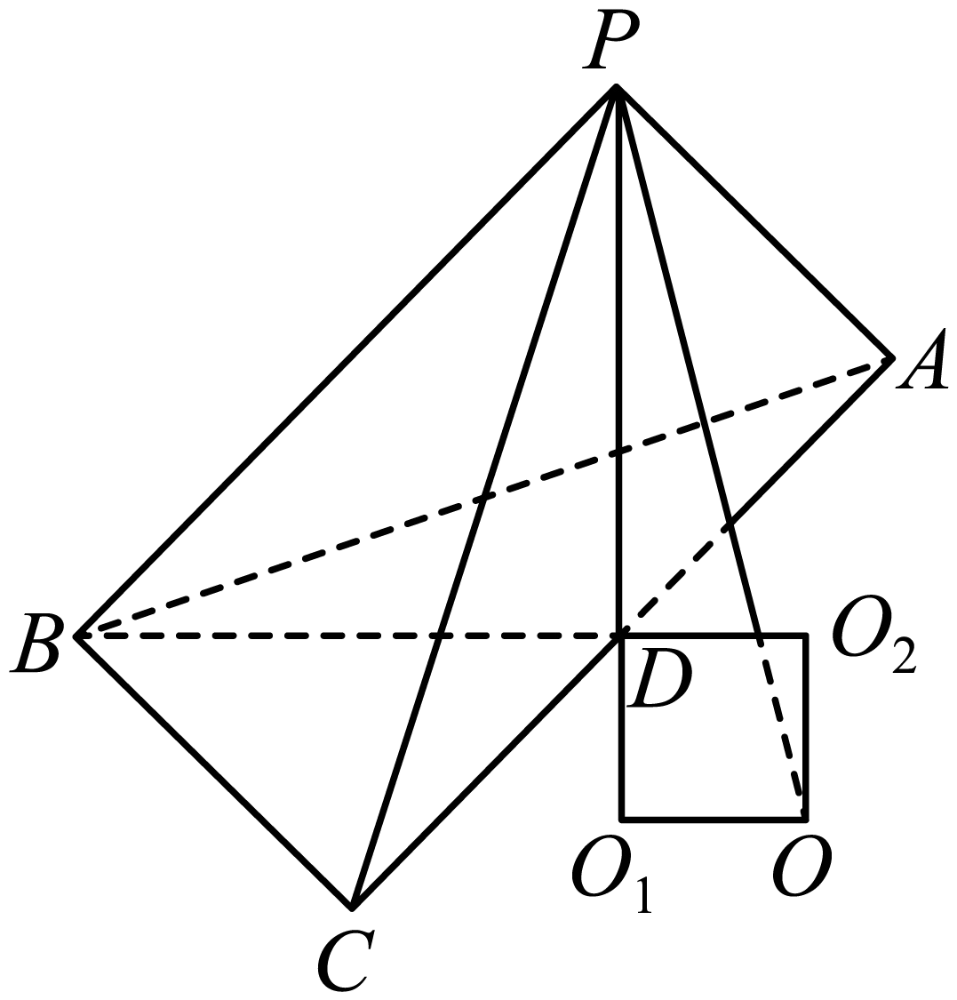

此时，，

∵，∴，且无最小值.

综上所述，的最小值为，

∴三棱锥的外接球表面积的最小值为.

故答案为：.

<strong>变式35．</strong>（2024·湖南衡阳·校联考模拟预测）在平面四边形中，，沿对角线将折起，使平面平面，得到三棱锥，则三棱锥外接球表面积的最小值为__________.

【答案】

【解析】在平面图形中设，即Rt中，

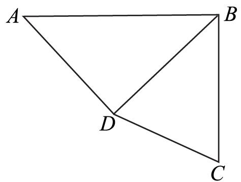

.在中，.

设外接圆圆心为，外接圆半径为，

由正弦定理可得.

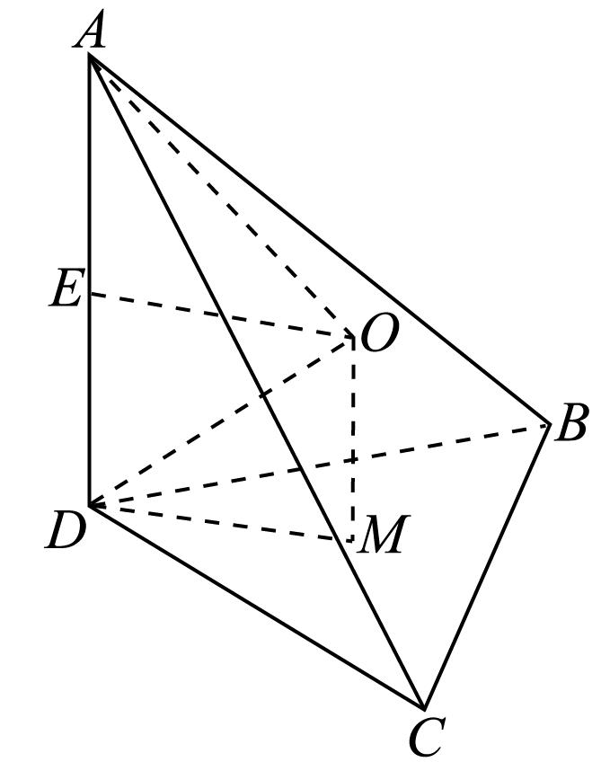

设三棱锥外接球球心为，则平面.

又平面平面，交线为平面

四边形为直角梯形.

设外接球的半径为，在平面中，过做于，

在中，为的中点，

.

令，则

，

当且仅当时，即时（满足）等号成立.

所以球表面积最小值为.

故答案为：.

**题型十：外接球之二面角模型**

**例28．**（2024·广东阳江·高三统考开学考试）在三棱锥中，，，二面角的平面角为，则三棱锥外接球表面积的最小值为（    ）

A．	B．

C．	D．

【答案】B

【解析】当*D*在△*ACD*的外接圆上动的时候，该三棱锥的外接球不变，

故可使*D*点动到一个使得*DA=DC*的位置，取*AC*的中点*M*，连接，

因为，*DA=DC*，所以，，故即为二面角的平面角，

△<em>ACB</em>的外心为<em>O1</em>，过<em>O1</em>作平面<em>ABC</em>的垂线，过△<em>ACD</em>的外心<em>M</em>作平面<em>ACD</em>的垂线，两条垂线均在平面<em>BMD</em>内，它们的交点就是球心<em>O</em>，画出平面<em>BMD</em>，如图所示；

在平面*ABC*内，设，则，，

因为，所以，所以，

所以

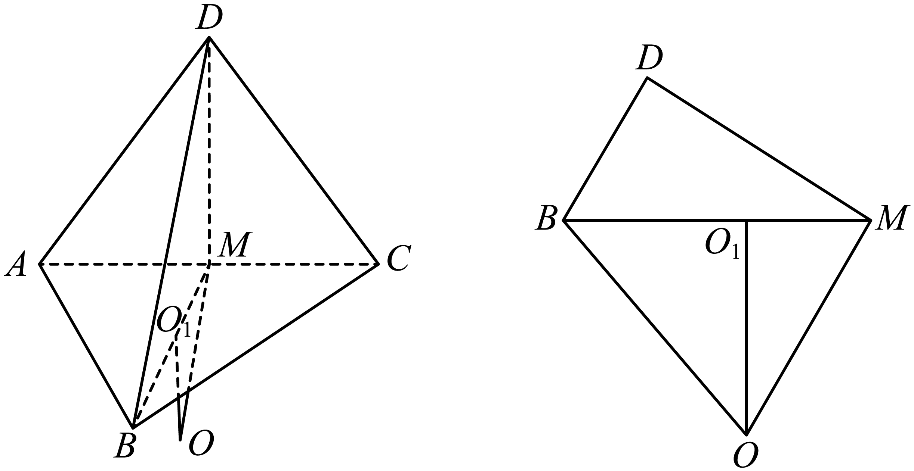

令，则，

所以，当且仅当时取等，

故选:B

<strong>例29．</strong>（2024·浙江丽水·高二统考期末）在四面体<em>PABC</em>中，，是边长为2的等边三角形，若二面角的大小为，则四面体的外接球的表面积为（    ）

A．	B．	C．	D．

【答案】C

【解析】设正的重心为，则是正的外接圆的圆心，

取的中点，因为，所以是的外接圆的圆心，

过作平面，过作平面，，如图，

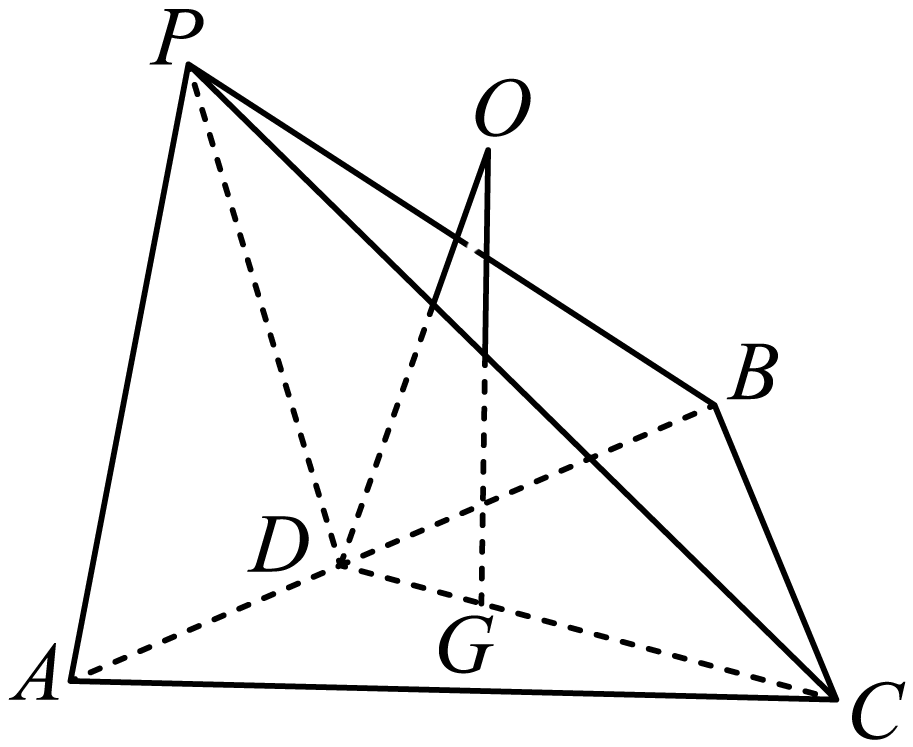

则为四面体的外接球的球心，

又二面角的大小为，则，

又在正中，，

则在中，，

设四面体PABC的外接球的半径为，

则，

所以四面体*PABC*的外接球的表面积为.

故选：C.

**例30．**（2024·广东·校联考模拟预测）已知四棱锥平面，二面角的大小为.若点均在球的表面上，则该球的表面积为（    ）

A．	B．	C．	D．

【答案】B

【解析】因为，所以，

因为点均在球的表面上，

所以四边形内接于圆，所以，所以，

因为平面，平面，所以，

又平面，所以平面，

平面，所以，又，

所以二面角的平面角为，所以，

在中，因为，所以，

由余弦定理可得：，

即，即或（舍去），

所以，所以外接圆的直径为：，

即四边形外接圆的直径为，

因为平面，所以，四棱锥外接球的半径为：

所以四面体外接球的表面积为.

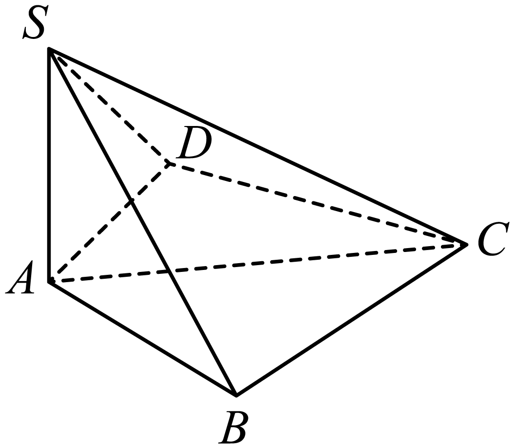

故选：B.

**变式36．**（2024·福建·高一福建师大附中校考期末）在四面体中，与都是边长为6的等边三角形，且二面角的大小为，则四面体外接球的表面积是（    ）

A．52π	B．54π	C．56π	D．60π

【答案】A

【解析】如图所示，取的中点，连接，分别取和的外心与，

过两点分别作平面和平面的垂线，交于点，

则就是外接球的球心，连接，

则为二面角的平面角，即，

则是等边三角形，其边长为，，

在中，，所以，

又由，所以，

所以四面体的外接球的表面积为.

故选：A.

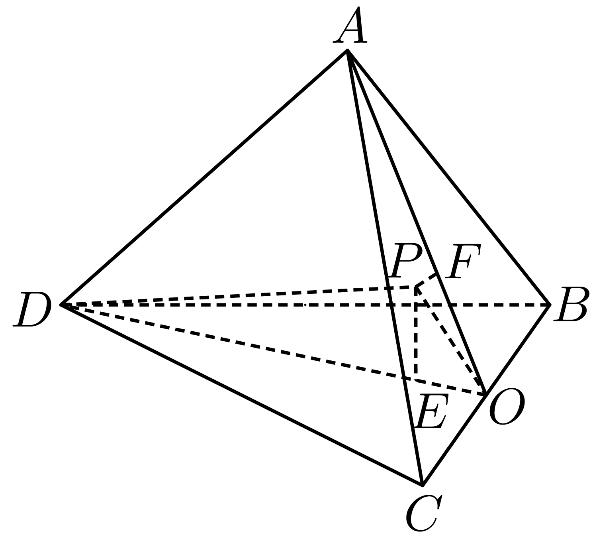

<strong>变式37．</strong>（2024·甘肃张掖·高台县第一中学校考模拟预测）图1为两块大小不同的等腰直角三角形纸板组成的平面四边形<em>ABCD</em>，其中小三角形纸板的斜边<em>AC</em>与大三角形纸板的一条直角边长度相等，小三角形纸板的直角边长为<em>a</em>，现将小三角形纸板<em>ACD</em>沿着<em>AC</em>边折起，使得点<em>D</em>到达点<em>M</em>的位置，得到三棱锥，如图2．若二面角的大小为，则所得三棱锥<em>M</em>－<em>ABC</em>的外接球的表面积为（    ）

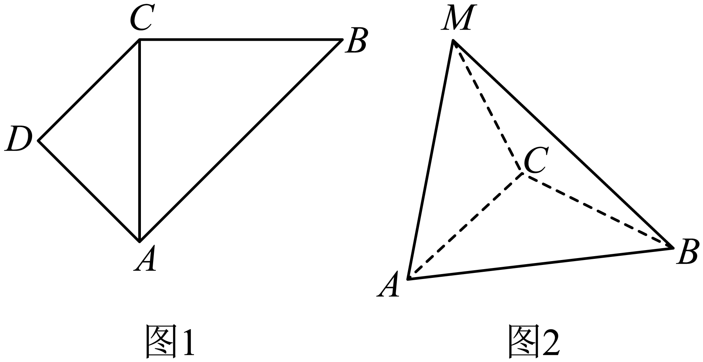

A．	B．	C．	D．

【答案】C

【解析】如图，取*AC*的中点*E*，*AB*的中点*F*，连接*ME*，*EF*．

因为，所以．易知，因为，

所以，所以．

过点*E*作*OE*⊥平面*MAC*，过点*F*作*OF*⊥平面*ABC*，

，连接*OA*，易知*E*，*F*两点分别是△*MAC*和△*ABC*的外心，

所以点*O*是三棱锥的外接球的球心．

因为，所以，，

所以，因为，，

所以，所以，

又，所以，

则三棱锥的外接球的半径为，

所以外接球的表面积．

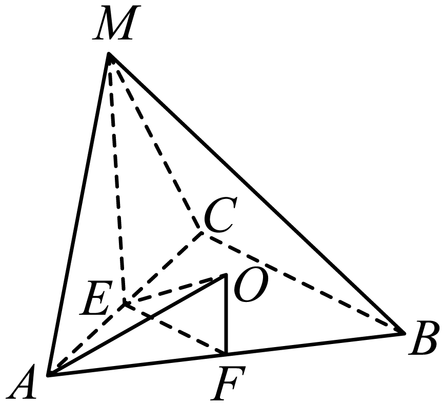

故选：C.

**变式38．**（2024·全国·高三专题练习）如图1，在中，，，，，沿将折起，使得二面角为60°，得到三棱锥，如图2，若，则三棱锥的外接球的表面积为（    ）

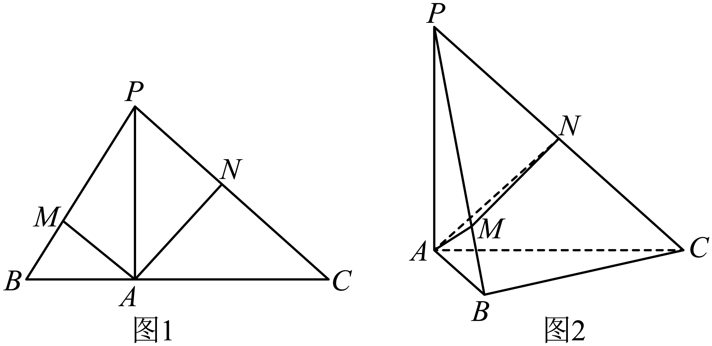

A．	B．	C．	D．

【答案】A

【解析】因为，，，平面，平面，所以平面．

又平面，则，因为平面，平面，所以．

又，平面，平面，所以平面．

又平面，所以，即90°．因为为60°，所以60°，

在中，，可得，．

易知，的四个顶点可以与一个长方体的四个顶点重合，

如图所示，则该长方体的外接球即为的外接球，球心*PC*的中点，

，表面积为，故A正确．

故选：A.

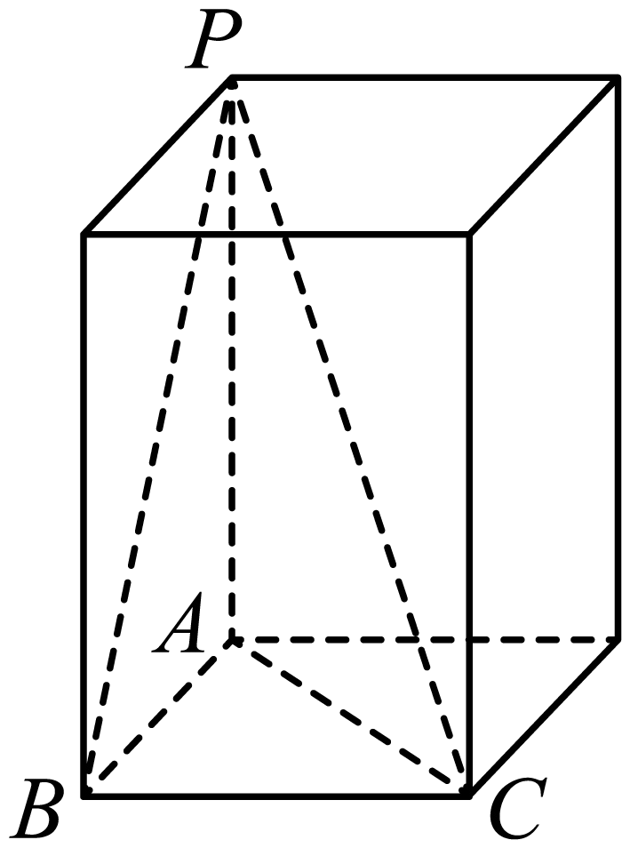

**变式39．**（2024·湖南岳阳·统考三模）已知三棱锥的所有顶点都在球的球面上，，二面角的大小为，若球的表面积等于，则三棱锥的体积等于（    ）

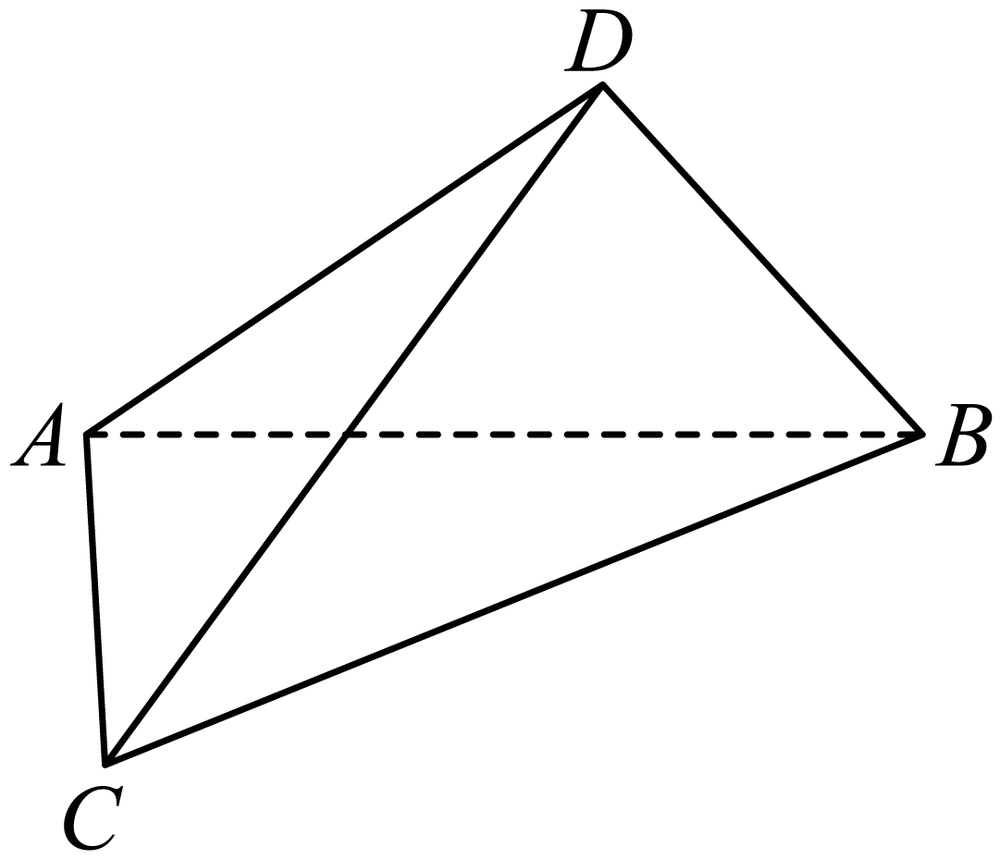

A．	B．

C．	D．

【答案】B

【解析】取的中点，连接，

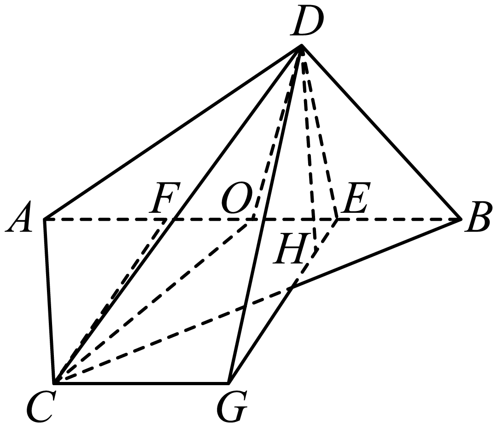

因为，所以到的距离相等，

故即为球心．

由球的表面积等于，设外接球半径为，故，

解得，过作垂直于于点，

因为，，所以，同理，

过点作，且，则，是二面角的平面角，，过点作，垂足为点.

因为，，且两直线在平面内，所以平面，

又平面，所以，,且两直线在平面内，所以平面，

则为三棱锥的高，

故三棱锥的高为，

其中，

所以三棱锥的体积．

故选：B.

**变式40．**（2024·全国·高一专题练习）在三棱锥中，，二面角为，则三棱锥外接球的表面积为（    ）

A．	B．	C．	D．

【答案】D

【解析】如图所示，设*E*，*F*，*G*分别是*BC*，*AC*，*BD*的中点，则，

因为，所以，

则二面角的平面角为，且平面*EFG*，

又因为，所以，所以，

因为平面*EFG*，所以，所以平面*ABC*．

又因为*F*是外接圆的圆心，所以*FG*经过球心，且G是外接圆的圆心，

所以*G*是三棱锥外接球的球心，

设外接球的半径为，则，

故三棱锥外接球的表面积．

故选：D.

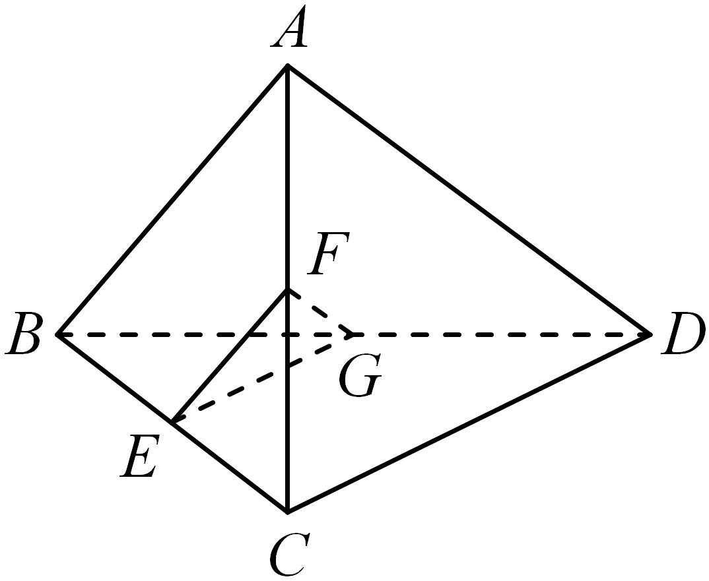

**题型十一：外接球之侧棱为球的直径模型**

**例31．**（2024·贵州黔东南·高二凯里一中校考期中）已知三棱锥的所有顶点都在球的球面上，是球的直径.若平面平面，，，三棱锥的体积为，则球的体积为（    ）

A．	B．	C．	D．

【答案】D

【解析】取的中点，连接，

因为，，所以，.

因为平面平面，所以平面.

设，

所以，

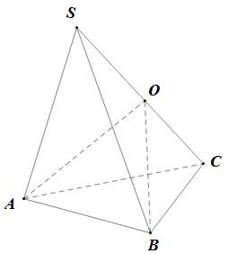

所以球的体积为.

故选：

**例32．**（2024·四川巴中·高三统考期末）已知三棱锥的体积为，，，若是其外接球的直径，则球的表面积为（    ）

A．	B．	C．	D．

【答案】D

【解析】由是其外接球的直径，得中点是外接球球心，设是的外心，则平面，且等于到平面的距离的一半．求出中长（用余弦定理），由正弦定理求得外接圆半径，求出面积，求体积求出，从而可得外接圆半径，得表面积．如图，是中点，则是外接球球心，设是的外心，则平面，且等于到平面的距离的一半．

∵，，∴，

，，

，，

，

∴，

．

故选：D.

**例33．**（2024·重庆九龙坡·高二重庆市育才中学校考期中）已知三棱锥的所有顶点都在球的球面上,为球的直径,是边长为的等边三角形,三棱锥的体积为,则球的表面积为(    )

A．	B．	C．	D．

【答案】A

【解析】画出其立体图像,如图:

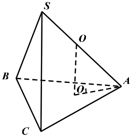

设中点为

为球的直径,故点为三棱锥外接球的球心.

设外接圆的圆心为

是边长为,故外接圆半径为:.

故

是边长为的等边三角形

根据三角形面积公式可得:

三棱锥的体积为

根据三棱锥体积公式可得:

可得,解得:

根据几何关系可知:

在中,有

根据球的表面积公式为

故选:A.

**变式41．**（2024·重庆·校联考一模）已知三棱锥各顶点均在球上，为球的直径，若，，三棱锥的体积为4，则球的表面积为

A．	B．	C．	D．

【答案】B

【解析】求解出面积后，利用三棱锥的体积，构造方程，求解出点到底面的距离，从而可知的长度；利用正弦定理得到，勾股定理得到球的半径，从而求得球的表面积.原题如下图所示：

由，得：

则

设外接圆圆心为，则

由正弦定理可知，外接圆半径：

设到面距离为

由为球直径可知：

则

球的半径

球的表面积

本题正确选项：

**变式42．**（2024·河北唐山·统考三模）三棱锥的四个顶点都在球面上，是球的直径，，，则该球的表面积为

A．	B．	C．	D．

【答案】B

【解析】如图：由题意，是球的直径，

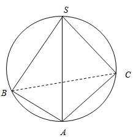

，，

，，

，

，

，

球的半径为，

球的表面积为，

故选：．

**变式43．**（2024·河南南阳·统考模拟预测）已知三棱锥的所有顶点都在球的球面上，是球的直径.若平面平面，，，三棱锥的体积为，则球的体积为

A．	B．	C．	D．

【答案】B

【解析】

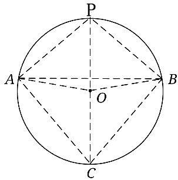

连接AO,BO因为PA=AC,PB=BC,所以和为等腰三角形,又因为为球O的直径,所以O为PC的中点,所以,又因为平面PCA平面PCB,所以BO,又因为所以平面PBC,设半径为r，则

，所以，故选B．

**变式44．**（2024·福建莆田·高三统考期中）三棱锥的各顶点均在球上，为该球的直径，，三棱锥的体积为，则球的表面积为

A．	B．	C．	D．

【答案】D

【解析】

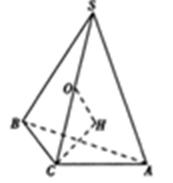

如图，，

三棱锥的体积为，

所以，

解得三棱锥的高为，

设为三角形的外接圆的圆心，

连接，则平面，

因为为该球的直径，

所以，

连接，由正弦定理可知三角形的外接圆的直径为

，

由勾股定理可得球半径

球的表面积为，故选D.

**变式45．**（2024·全国·高三专题练习）已知三棱锥的四个顶点均在某球面上，为该球的直径，是边长为4的等边三角形，三棱锥的体积为，则该三棱锥的外接球的表面积为（    ）

A．	B．	C．	D．

【答案】D

【解析】

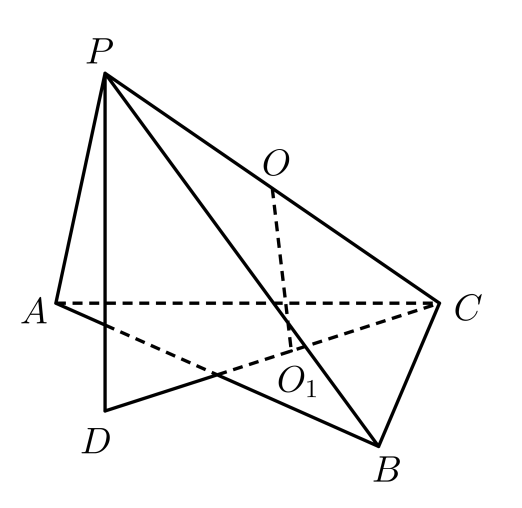

根据题意作出图形如图示.设球心为*O*，球的半径*r*.

过三点的小圆的圆心为，则⊥平面，延长交球于点，则平面.所以.

因为为的中点，所以

因为是边长为4的等边三角形，所以.且.

由勾股定理得：.

所以.

所以三棱锥的体积为，解得：.

所以该三棱锥的外接球的表面积为.

故选：D

**变式46．**（2024·湖南长沙·高三长郡中学校考阶段练习）已知是球的直径，是球球面上的两点，且，若三棱锥的体积为，则球的表面积为

A．	B．	C．	D．

【答案】D

【解析】设球心为是球心的直径，是的中点，，设到面距离为，则，即，由正弦定理可得外接圆直径为球半径为，球表面积为，故选D.

**题型十二：外接球之共斜边拼接模型**

<strong>例34．</strong>（2022·江西·高二阶段练习（理））如图，在四棱锥<em>P</em>-<em>ABCD</em>中，底面是菱形， 底面<em>ABCD</em>， 是对角线与的交点，若，，则三棱锥的外接球的体积为（       ）

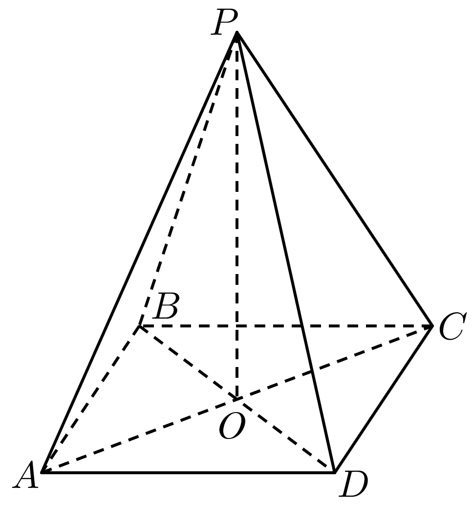

*A*．	*B*．	*C*．	*D*．

<strong>【答案】</strong><em>B</em>

<strong>【解析】</strong>解：∵底面<em>ABCD</em>为菱形，∴ ，又 底面<em>ABCD</em>，∴ ，

∴ 平面*PBD*，∴，即，

取*PC*的中点*M*，如下图：

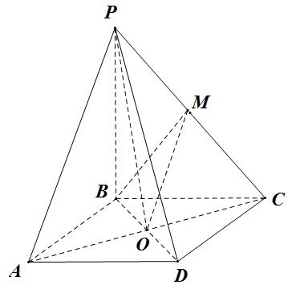

连结*BM*，*OM*，在中，*MB*=*MC*=*MP*=*PC*，

在中*MO*=*PC*，

∴点*M*为三棱椎*P*-*BOC*的外接球的球心，

在 中，由于 ，*O*是*AC*的中点，所以是等腰三角形，

，

外接球半径为 ，外接球的体积为 ；

故选：*B*．

**例35．**（2022·安徽·芜湖一中高二期中）已知三棱锥中，，，，，，则此三棱锥的外接球的表面积为（       ）

*A*．	*B*．	*C*．	*D*．

<strong>【答案】</strong><em>C</em>

**【解析】** 因为，，，则，所以，

又因为，，，则，所以，

由，，，则，所以，

又由，，，则，所以，

可得为三棱锥的外接球的直径，

又由，

所以此三棱锥的外接球半径为，

所以球的表面积为．

故选：*C*．

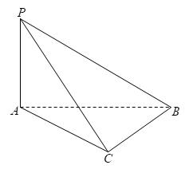

**例36．**（2022·江西赣州·高二期中（理））在三棱锥中，若该三棱锥的体积为，则三棱锥外球的体积为（       ）

*A*．	*B*．	*C*．	*D*．

<strong>【答案】</strong><em>D</em>

**【解析】** 如图所示：

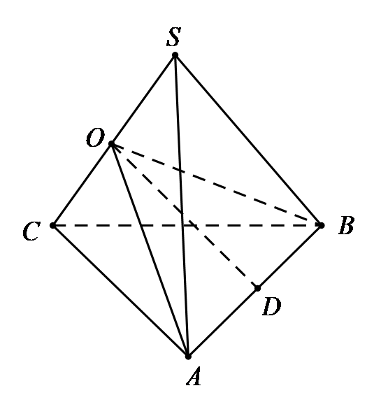

设*SC*的中点为*O*，*AB*的中点为*D*，连接*OA*、*OB*、*OD*，

因为，

所以，

则，

所以*O*为其外接球的球心，设球的半径为*R*，

因为，，

所以，

所以，

因为，

所以平面*AOB*，

所以，

解得，

所以其外接球的体积为，

故选：*D*

**变式47．** 在矩形中，，沿将矩形折成一个直二面角，则四面体的外接球的体积为（     ）

*A*．        *B*．        *C*．        *D*．

**【答案】C**

**【解析】** 设矩形对角线的交点为，则由矩形对角线互相平分，可知．

∴点到四面体的四个顶点的距离相等，即点为四面体的外接球的球心，如图2所示．

∴外接球的半径．故．选*C*．

<strong>变式48．</strong>三棱锥中，平面平面， ，，，则三棱锥的外接球的半径为______

**【答案】1**

**【解析】** 是公共的斜边，的中点是球心 ，球半径为．

**题型十三：外接球之坐标法模型**

<strong>例37．</strong>（2024·浙江·高二校联考阶段练习）空间直角坐标系中，则四面体<em>ABCD</em>外接球体积是（       ）

A．	B．	C．	D．

【答案】B

【解析】取，则是长方体，

其对角线长为，

∴四面体外接球半径为．

，

故选：B．

<strong>例38．</strong>（2024·贵州·统考模拟预测）如图，某环保组织设计一款苗木培植箱，其外形由棱长为2（单位：）的正方体截去四个相同的三棱锥（截面为等腰三角形）后得到.若将该培植箱置于一球形环境中，则该球表面积的最小值为___________

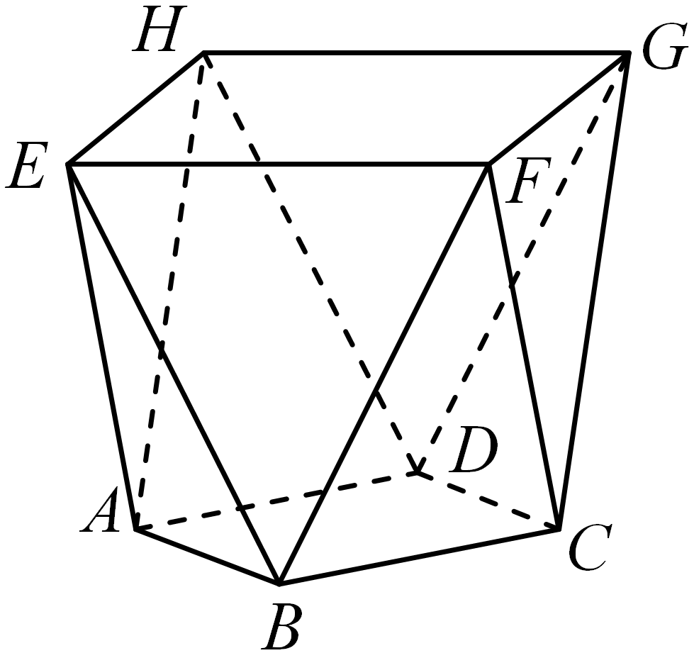

【答案】

【解析】如图将正方体补全，依题意可得、、、为正方体底面边上的中点，

要使球的表面积最小，即为求的外接球的表面积，

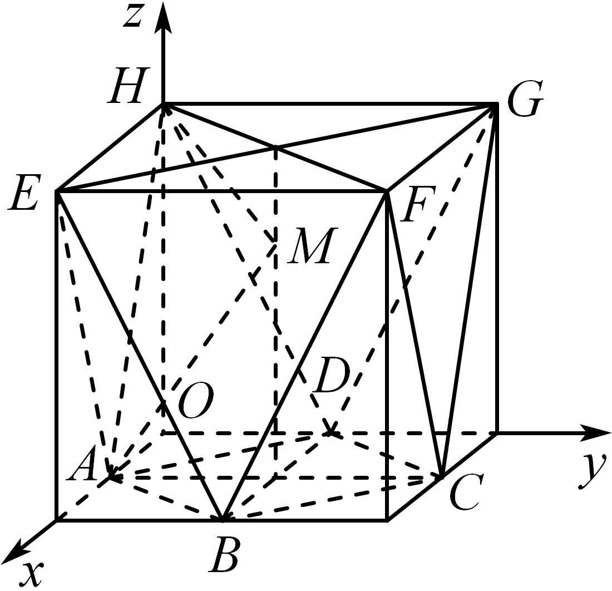

如图建立空间直角坐标系，则，，则几何体外接球的球心必在上、下底面中心的连线上，

设球心为，球的半径为，则，

即，解得，

所以，

所以外接球的表面积，即该球表面积的最小值为.

故答案为：

<strong>例39．</strong>（2024·河南开封·开封高中校考一模）如图，在三棱锥中，为等边三角形，三棱锥的体积为，则三棱锥外接球的表面积为__________.

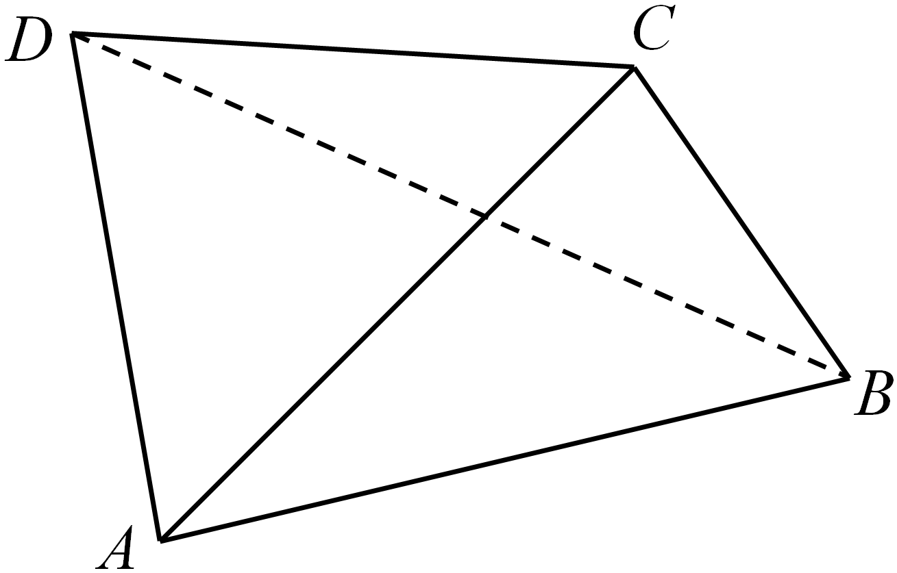

【答案】

【解析】

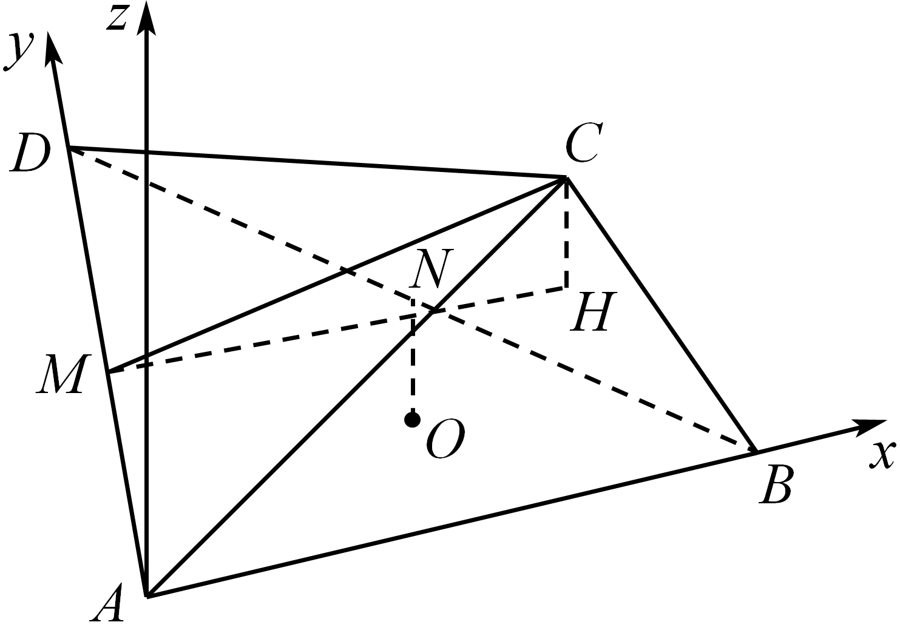

过*C*作面于*H*，

则三棱锥的体积为，所以，

取*AD*中点*M*，连接*CM*，*MH*，

因为为等边三角形，所以，

又面，面，所以，

又，所以面，

面，所以，

在中，所以

以*AB*，*AD*为轴，垂直于*AB*，*AD*方向为轴，建立如图所示空间坐标系，

设球心，在面的投影为，

由得，

所以*N*为的外接圆圆心，所以*N*为斜边的中点，故设

由得，解得，

所以，

故外接球的表面积为，

故答案为：

<strong>变式49．</strong>（2024·全国·高三专题练习）如图①，在中，，，<em>D</em>，<em>E</em>分别为，的中点，将沿折起到的位置，使，如图②.若<em>F</em>是的中点，则四面体的外接球体积是（    ）

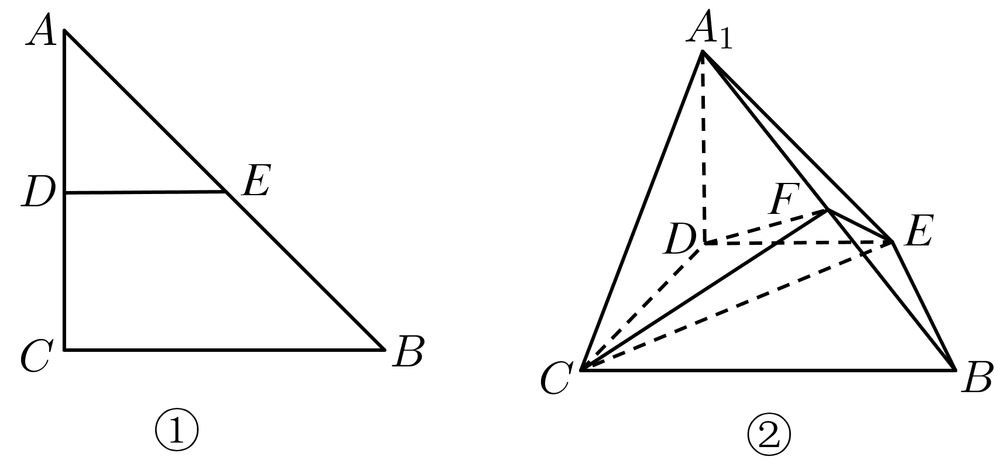

A．	B．	C．	D．

【答案】B

【解析】依题意，，，平面，所以平面，又，如图建立空间直角坐标系，则、、、、、，依题意为直角三角形，所以的外接圆的圆心在的中点，设外接球的球心为，半径为，则，即，解得，所以，所以外接球的体积；

故选：B

**变式50．**（2024·湖北武汉·高一武汉外国语学校（武汉实验外国语学校）期末）如图，已知四棱锥，底面是边长为3的正方形，面，，，，若，则四棱锥外接球表面积为（    ）

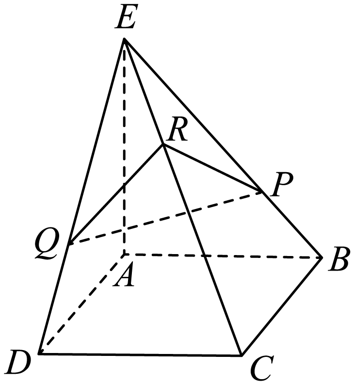

A．	B．	C．	D．

【答案】B

【解析】以为坐标原点，以，，所在直线分别为，，轴，建立空间直角坐标系，设，

则，，，，，

则，，，

于是，

则，∴，四棱锥外接球直径为，故其表面积为．

故选：B.

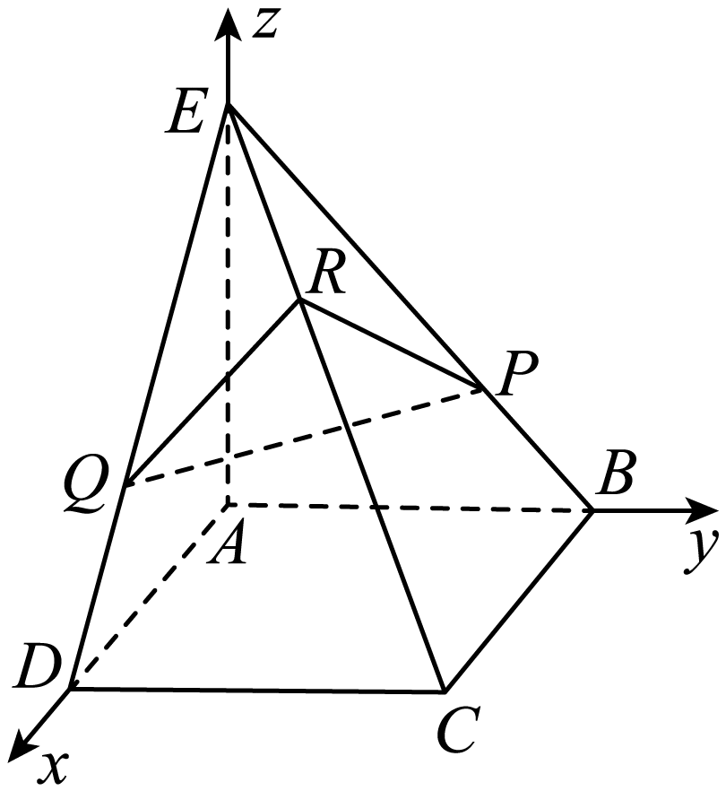

<strong>变式51．</strong>（2024·河南郑州·模拟预测）在长方体中中，，<em>AD</em>＝2，<em>M</em>是棱的中点，过点<em>B</em>，<em>M</em>，的平面交棱<em>AD</em>于点<em>N</em>，点<em>P</em>为线段上一动点，则三棱锥外接球表面积的最小值为______．

【答案】

【解析】设三棱锥外接球球心为，半径为*R*，

则在过直角斜边的中点与平面垂直的直线上，且满足.

以*D*为原点，为*x*轴，为*y*轴，为*z*轴建立如图所示的空间直角坐标系，

则，

设球心，，又，

设，，则，

由，得，

则，由，，可得，

又，所以当时，取最小值，最小值为，

所以三棱锥外接球表面积的最小值为.

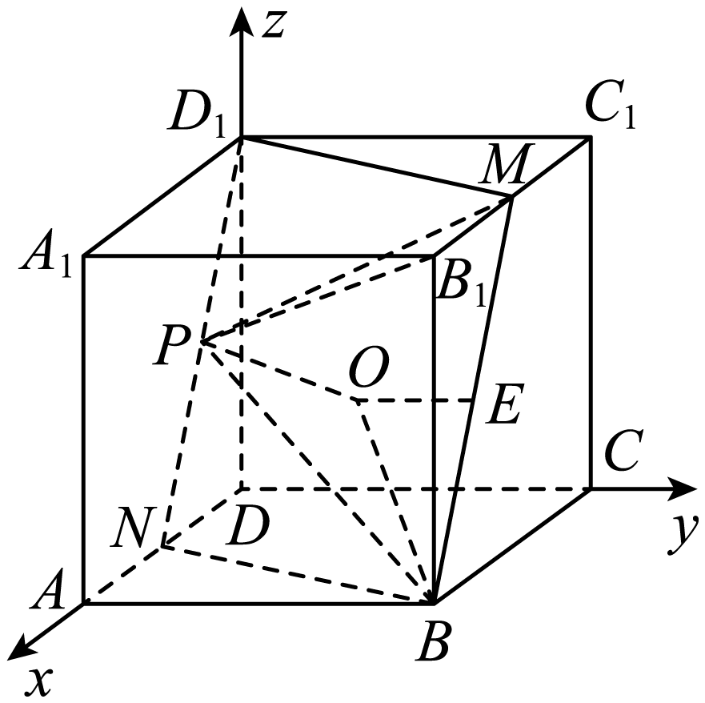

故答案为：.

<strong>变式52．</strong>（2024·湖南郴州·高二统考期末）如图，棱长为2的正方体中，<em>E</em>，<em>F</em>分别为棱､的中点，<em>G</em>为面对角线上一个动点，则三棱锥的外接球表面积的最小值为___________.

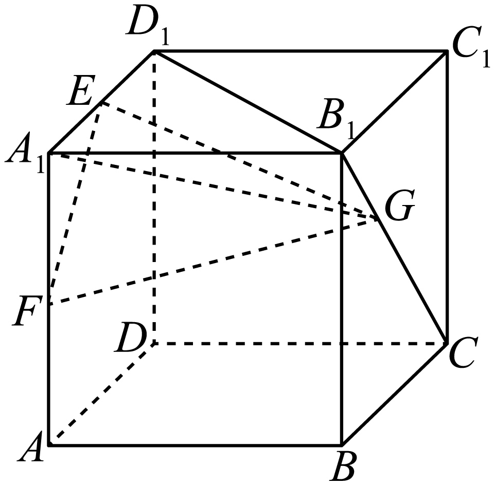

【答案】

【解析】以*DA*，*DC*，分别为*x*轴，*y*轴，*z*轴建系.

则，设，球心，

，又.

联立以上两式，得，所以时，，为最小值，

外接球表面积最小值为.

故答案为：.

<strong>变式53．</strong>（2024·广东阳江·高三阳春市第一中学阶段练习）已知正方体的棱长为2，点是线段上的动点，则三棱锥的外接球半径的取值范围为__________．

【答案】

【解析】如图，以为原点建立空间直角坐标系，

则，

设为的中点，为三棱锥外接球的球心，

则为外接圆的圆心，平面，，

设，

则，

所以，

化简得，

所以，

所以球的半径.

故答案为：.

**题型十四：外接球之空间多面体**

<strong>例40．</strong>（2024·全国·高三专题练习）自2015年以来，贵阳市着力建设“千园之城”，构建贴近生活、服务群众的生态公园体系，着力将“城市中的公园”升级为“公园中的城市”．截至目前，贵阳市公园数量累计达到1025个．下图为贵阳市某公园供游人休息的石凳，它可以看做是一个正方体截去八个一样的四面体得到的，如果被截正方体的的棱长为，则石凳所对应几何体的外接球的表面积为________．

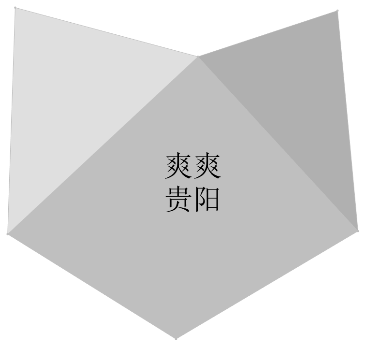

【答案】

【解析】

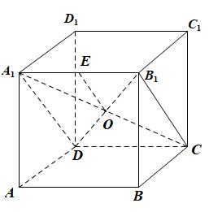

设正方体的中心为，为棱的中点，连接，

则为矩形的对角线的交点，

则，

同理，到其余各棱的中点的距离也为，

故石凳所对应几何体的外接球的半径为20，其表面积为，

故答案为：

<strong>例41．</strong>（2024·山东青岛·高一山东省青岛第五十八中学校考阶段练习）截角四面体是一种半正八面体，可由四面体经过适当的截角，即截去四面体的四个顶点所产生的多面体.如图所示，将棱长为3的正四面体沿棱的三等分点作平行于底面的截面得到所有棱长均为1的截角四面体，则该截角四面体的外接球表面积为_______.

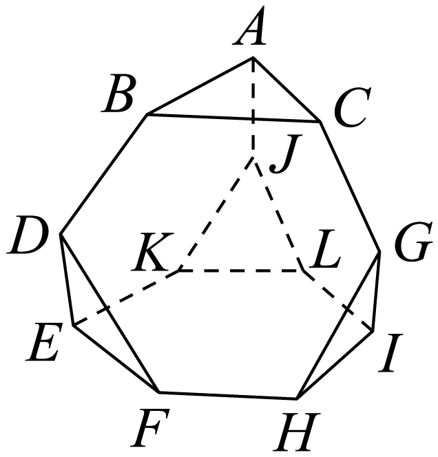

【答案】

【解析】因为棱长为的正四面体的高为，

所以截角四面体上下底面距离为，

序曲其外接球的半径为，等边三角形的中心为，正六边形的中心为，则垂直于平面与平面，则,

所以，解得，

所以该截角四面体的外接球的表面积为,

故答案为：

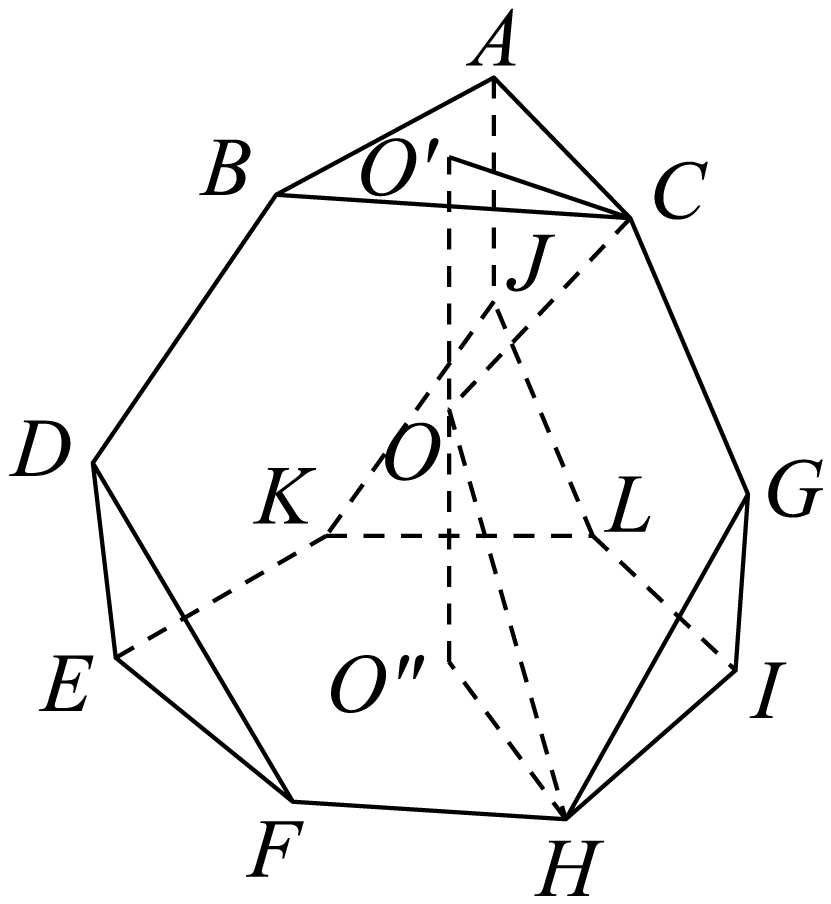

<strong>例42．</strong>（2024·宁夏银川·银川二中校考一模）把一个棱长都是6的正四棱锥（底面是正方形，顶点在底面的射影是正方形的中心）每条棱三等分，沿与正四棱锥顶点相邻的三等分点做截面，将正四棱锥截去四个小正四面体和一个小正四棱锥（如图所示），则剩下的几何体的外接球的表面积等于_____________．

【答案】

【解析】设正四棱锥底面的正方形为，顶点为，棱的三等分点为点和点，棱的三等分点为点和点，连接与交于点，连接，，，，，则底面，如图所示，

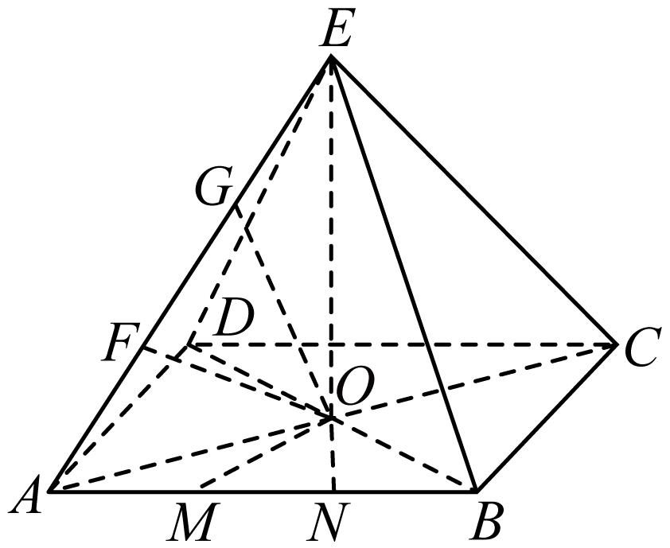

因为正四棱锥的棱长是6，即，

所以，

所以，

即，

所以正四棱锥的外接球的球心为点，，

又因为，，，

所以，则,

同理可证，则,

又因为，，，

所以，则，

同理可证出该几何体其他顶点到点的距离都相等，

故剩下的几何体的外接球的球心也为点，

，

所以在中，，

解得，

即剩下的几何体的外接球的半径为，

故剩下的几何体的外接球的表面积：，

故答案为：．

<strong>变式54．</strong>（2024·山东济南·高一山东省济南市莱芜第一中学校考阶段练习）取两个相互平行且全等的正<em>n</em>边形，将其中一个旋转一定角度，连接这两个多边形的顶点，使得侧面均为等边三角形，我们把这种多面体称作“<em>n</em>角反棱柱”.当<em>n</em>=4时，得到如图所示棱长均为2的“四角反棱柱”，则该“四角反棱柱”外接球的表面积等于（    ）

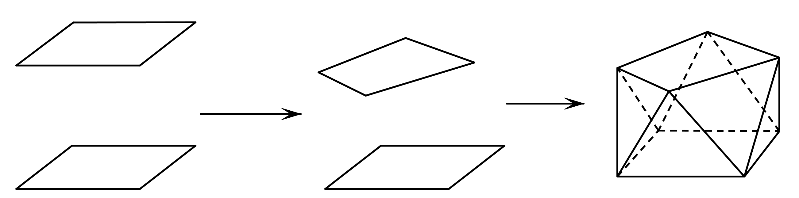

A．	B．	C．	D．

【答案】B

【解析】如图所示：设上下底面的中心分别为，设该“四角反棱柱”外接球的球心是，

显然是的中点，设的中点为，连接，

过做，垂足为，

因为，，

所以，

在直角三角形中，，

所以有，于是有，

在直角三角形中，，

所以该“四角反棱柱”外接球的表面积等于，

故选：B

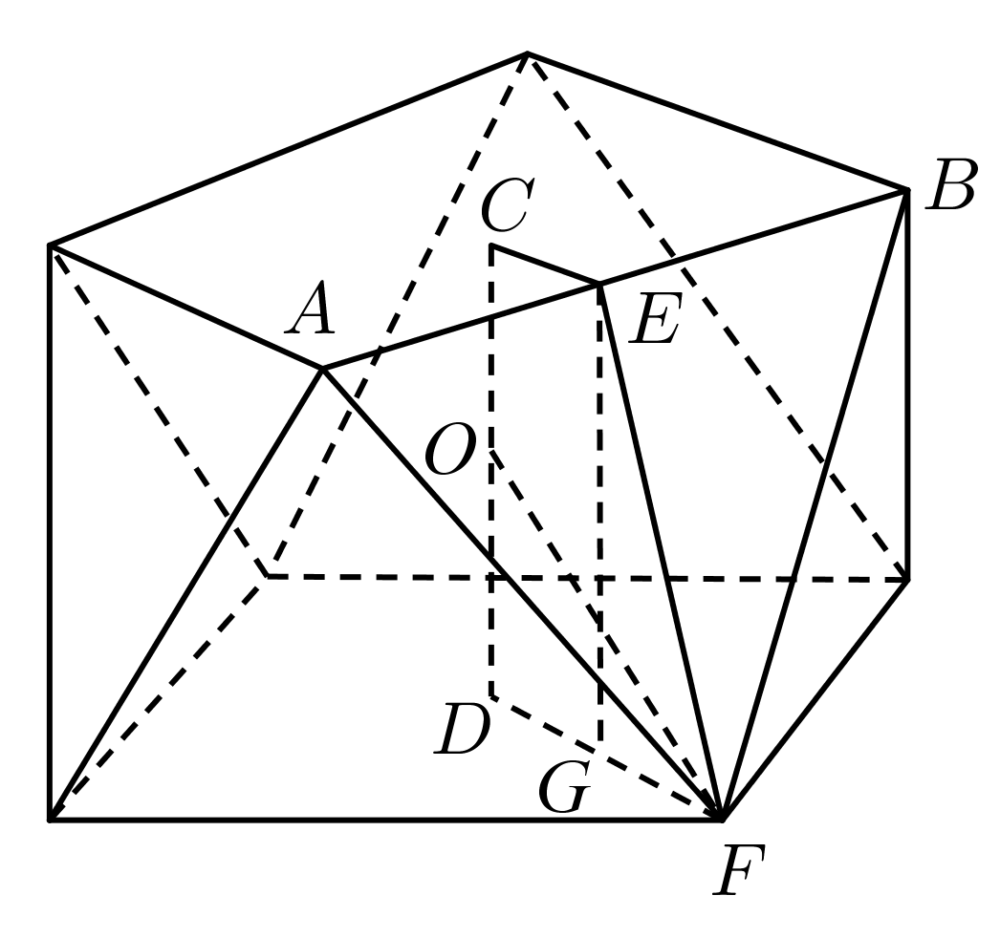

**题型十五：与球有关的最值问题**

<strong>例43．</strong>（2024·江西抚州·统考模拟预测）如图，直三棱柱中，，棱柱的侧棱足够长，点<em>P</em>在棱上，点在上，且，则当△的面积取最小值时，三棱锥的外接球的体积为___________.

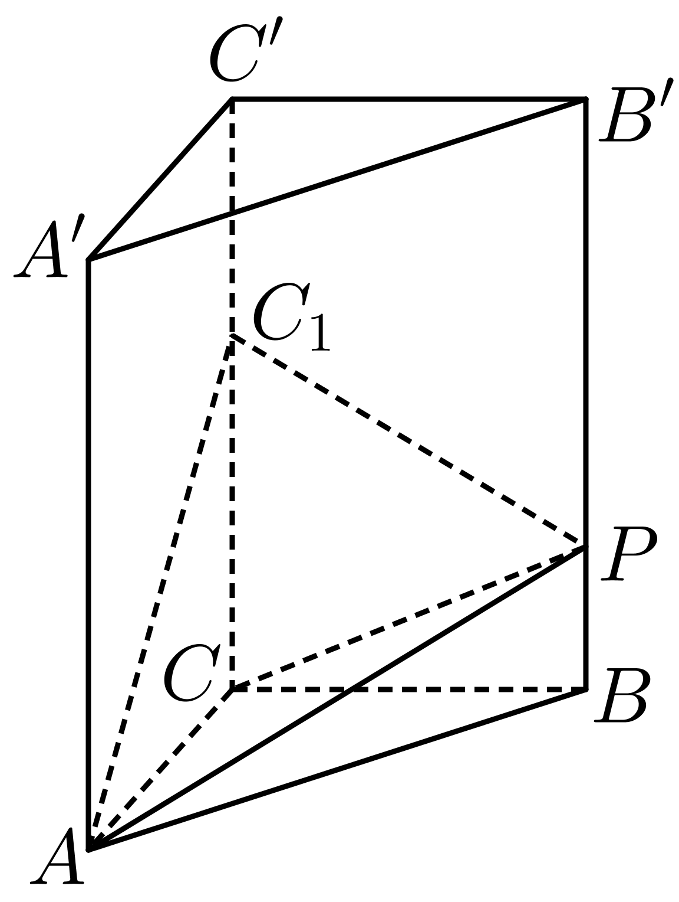

【答案】

【解析】如图所示，取的中点为，连接，

因为三棱柱为直棱柱，所以平面*ABC*，

因为平面，所以，

又因为且，平面，所以平面，

因为平面，所以，

又因为且，平面，所以平面，

因为平面，所以，

设，在直角中，，同理，

所以，整理得到，

又由

，

当且仅当时等号成立，即时，的面积取最小值，

因为平面，平面，所以，所以，

又因为为直角三角形，故，所以为三棱锥的外接球的球心，

设外接球的半径为，可得外接球的直径为，

所以外接球的体积为.

故答案为：.

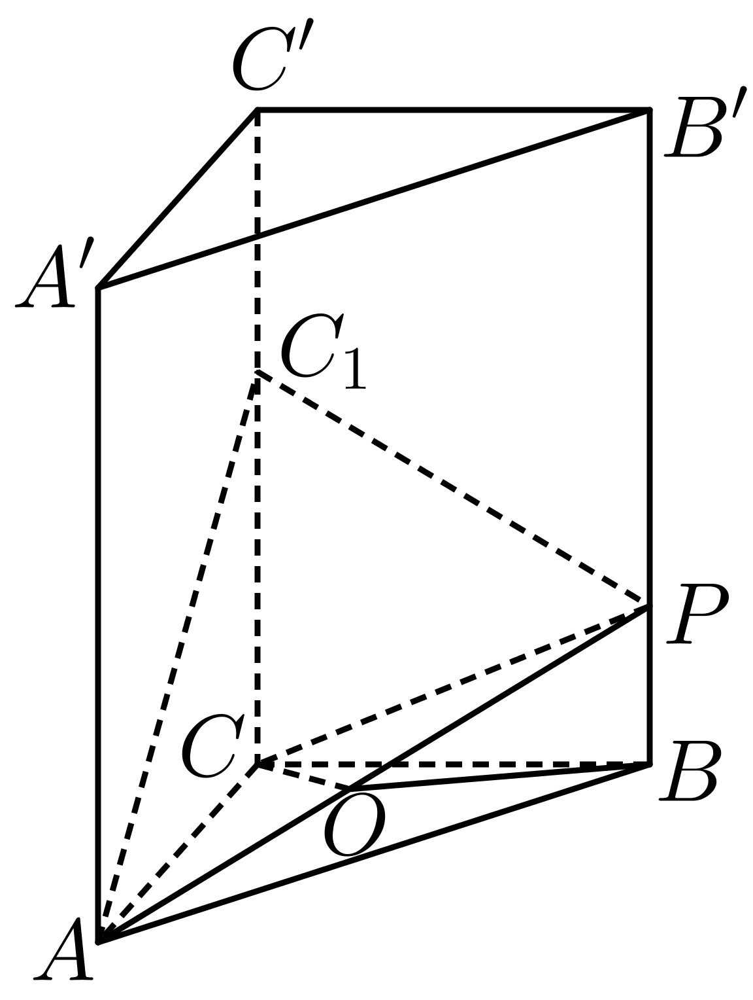

<strong>例44．</strong>（2024·全国·学军中学校联考二模）如图，直三棱柱中，，点在棱上，且，当的面积取最小值时，三棱锥的外接球的表面积为___________.

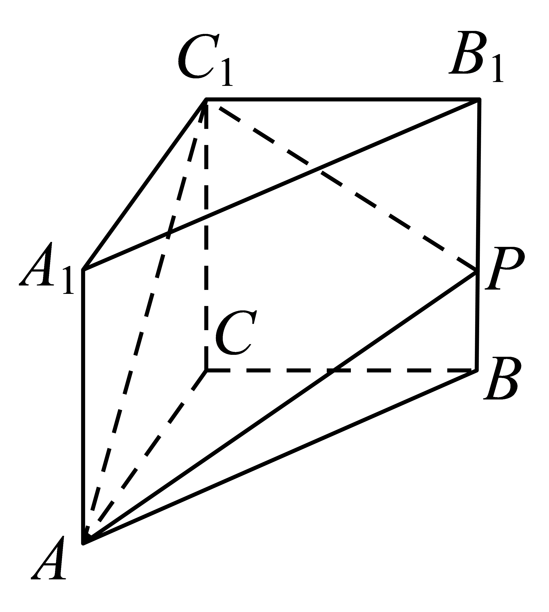

【答案】

【解析】由余弦定理得：

设，则，

由得：，解得：，

因为，故

由基本不等式得：当且仅当，且时，即时取最小值.底面三角形外接圆半径，

.

故答案为：

<strong>例45．</strong>（2024·湖南长沙·高三长沙一中校考阶段练习）正方体的棱长为2，点平面，点是线段的中点，若，则当的面积取得最小值时，三棱锥外接球的体积为___________.

【答案】

【解析】如图以为轴，为轴，为轴建立空间直角坐标系，取的中点，连接，，，

得，，，，，所以，，

，因为，，所以

，，所以平面，因为，点又在平面上，所以点在

直线上，则，当的面积取得最小值时，线段的长度即为点到直

线的距离，即时，面积最小，由，，为直角三角形，可得

，，，过点作交平面于点，连接，，可以得

到直三棱柱，向外构建长方体，则三棱锥外接球即可以为长方

体的外接球，设外接球的半径为，所以，即

，则外接球体积为.

故答案为：

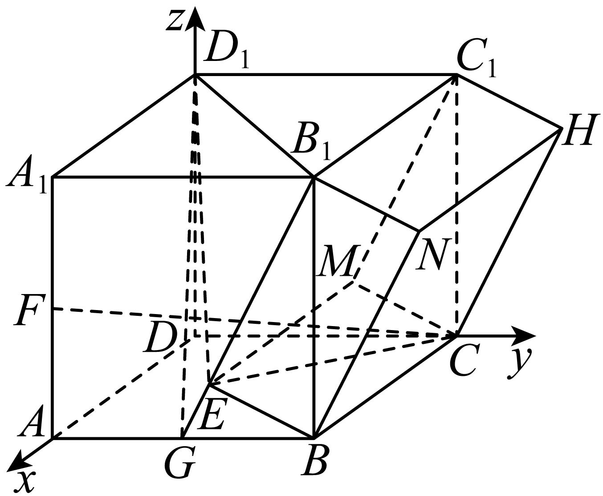

<strong>变式55．</strong>（2024·广东深圳·高三深圳中学校考开学考试）如图，直三棱柱中，⊥，，，点<em>P</em>在棱上，且，当的面积取最小值时，三棱锥的外接球的表面积为______．

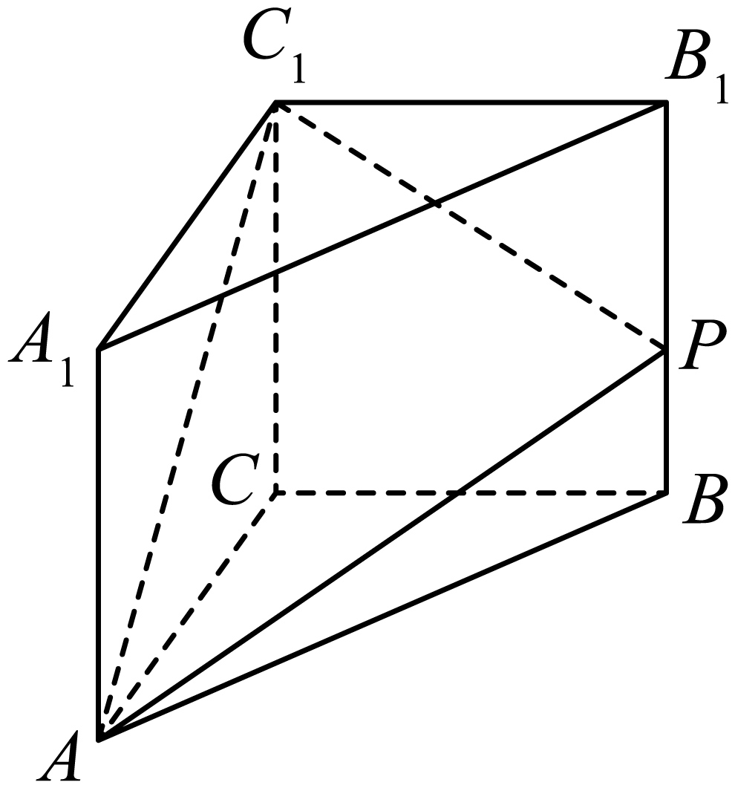

【答案】

【解析】由勾股定理得：，

设*BP*=*x*，，则，，

，

由得：，解得：，

因为，故

由基本不等式得：，

当且仅当，即时，等号成立，

将三棱锥补形为长方体，则三棱锥的外接球即该长方体的外接球，

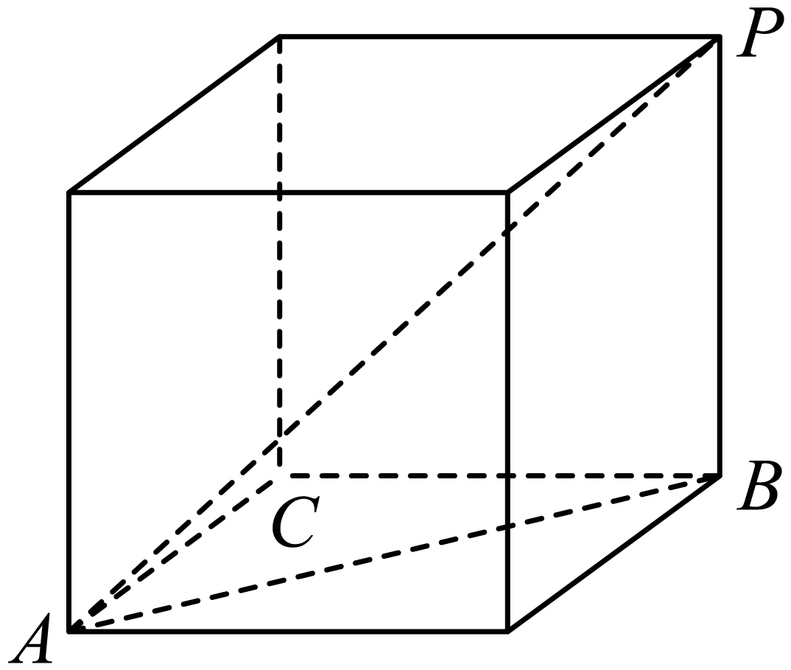

其中长方体的外接球的直径为，

故半径为，故三棱锥的外接球的表面积为.

故答案为：

<strong>变式56．</strong>（2024·黑龙江齐齐哈尔·高一校联考期末）已知三棱锥的四个顶点均在同一个球面上，底面为等腰直角三角形且，若该三棱锥体积的最大值为，则其外接球的表面积为__________.

【答案】

【解析】如图所示：设球心为所在圆面的圆心为，则平面．

因为为等腰直角三角形且，所以是中点；所以当三棱锥体积最大时，为射线与球的交点，所以；因为，设球的半径为，所以，所以，解得：，所以球的表面积为.

故答案为：．

<strong>变式57．</strong>（2024·四川泸州·高三四川省泸县第一中学校考阶段练习）已知四棱锥<em>S</em>－<em>ABCD</em>中，底面<em>ABCD</em>为正方形，侧面<em>SAB</em>为等边三角形，<em>AB</em>＝3，则当四棱锥的体积取得最大值时，其外接球的表面积为________．

【答案】

【解析】依题意可知，当侧面底面*ABCD*时，四棱锥*S*－*ABCD*的体积最大．

设球心为*O*，半径为*R*，正方形*ABCD*和外接圆的圆心分别为，，正方形*ABCD*外接圆半径为，则平面*ABCD*，平面*SAB*．

因为和正方形*ABCD*的边长均为3，设*AB*的中点为*E*，

所以，，

由勾股定理得，

所以球*O*的表面积．

故答案为：

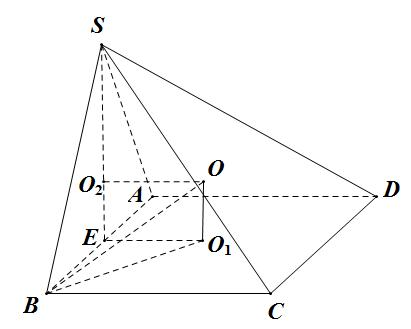

<strong>变式58．</strong>（2024·湖南长沙·高三宁乡一中校考阶段练习）在三棱锥中，底面，，，为的中点，若三棱锥的顶点均在球的球面上，是球上一点，且三棱锥体积的最大值是，则球的体积为___________.

【答案】/

【解析】正中，为的中点，则，而平面，平面，即，

而，平面，则平面，平面，有，又，

因此，与的斜边中点到点*A*，*B*，*M*，*P*的距离相等，即三棱锥外接球球心为中点，

从而，点*O*是三棱锥外接球球心，设球的半径为，有，

的外接圆圆心为的中点，设为，连接，则平面，如图，

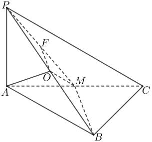

则有，即到平面的距离为，

因此到平面距离的最大值为，

又，即有，解得，，，

所以球的体积为.

故答案为：

<strong>变式59．</strong>（2024·江西南昌·南昌十中校考模拟预测）点，，，在同一个球的球面上，，若四面体体积的最大值为，则这个球的表面积为________.

【答案】/

【解析】依题意，三角形为正三角形，面积为，

设四面体的高为，则，解得，

设球心为*O*,三角形的外接圆圆心，当四面体体积最大时，三点共线，如图，

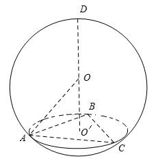

三角形所在平面截球得到的圆为三角形的外接圆，其半径，

连接球心和三角形的外接圆圆心，则平面，设球的半径为，

，

，解得，

这个球的表面积为，

故答案为：

**题型十六：内切球之正方体、正棱柱模型**

**例46．**（2024·广东肇庆·高一校考阶段练习）棱长为2的正方体的内切球的球心为，则球的体积为（    ）

A．	B．	C．	D．

【答案】B

【解析】正方体的内切球的球心为，由对称性可知为正方体的中心，球半径为1，

即球的体积为.

故选：B.

**例47．**（2024·河北邯郸·高一大名县第一中学校考阶段练习）已知直三棱柱存在内切球，若，则该三棱柱外接球的表面积为（    ）

A．	B．	C．	D．

【答案】D

【解析】因为，故，

故的内切圆的半径为.

因为直三棱柱存在内切球，故直三棱柱的高即为内切球的直径.

而内切球的半径即为底面三角形内切圆的半径，故内切球的半径为1，

故直三棱柱的高为2.

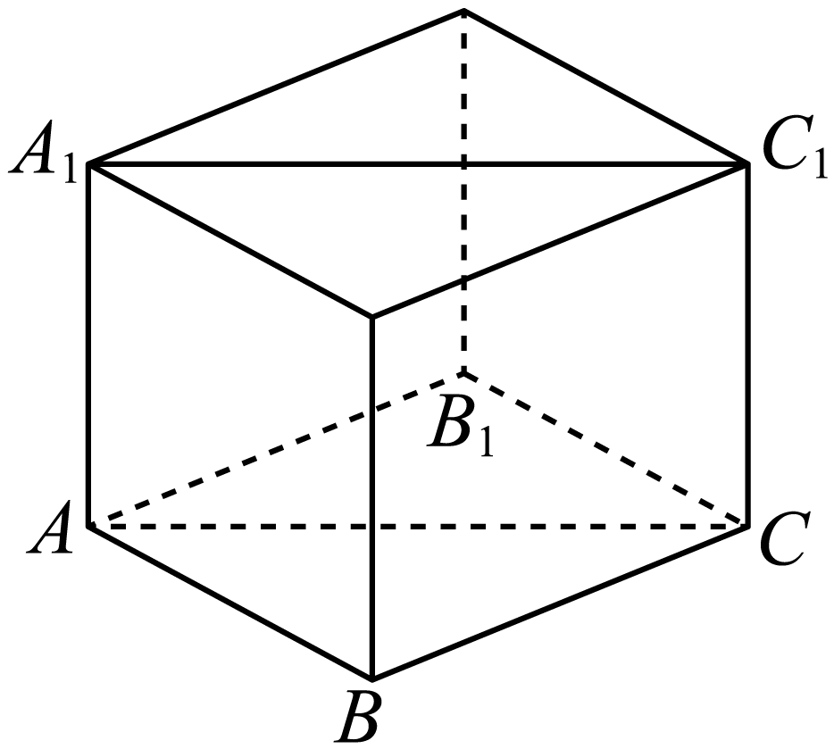

将直三棱柱补成如图所示的长方体，则外接球的直径即为该长方体的体对角线，

故外接球的半径为，

故外接球的的表面积为.

故选：D.

**例48．**（2024·山西太原·高一校考阶段练习）已知正方体的内切球(球与正方体的六个面都相切)的体积是，则该正方体的体积为（    ）

A．4	B．16	C．8	D．64

【答案】D

【解析】根据球的体积公式，，解得.

因为正方体的内切球直径等于正方体的棱长，所以正方体的棱长为，故正方体的体积为.

故选：D.

**变式60．**（2024·全国·高一专题练习）若一个正三棱柱存在外接球与内切球，则它的外接球与内切球体积之比为（    ）

A．	B．	C．	D．

【答案】C

【解析】设正三棱柱底面正三角形的边长为*a*，则正三棱柱的内切球半径等于正三角形的内切圆半

径，则内切球的半径，正三棱柱的高．

设正三角形的外接圆半径为*R*，易得，

所以外接球的半径．

所以它的外接球与内切球体积之比为．

故选：C

<strong>变式61．</strong>（2024·辽宁·高二沈阳二中校联考开学考试）在正三棱柱中，<em>D</em>是侧棱上一点，<em>E</em>是侧棱上一点，若线段的最小值是﹐且其内部存在一个内切球（与该棱柱的所有面均相切），则该棱柱的外接球表面积为（    ）

A．	B．	C．	D．

【答案】B

【解析】设正三棱柱的底面边长为高为，

对三个侧面进行展开如图，

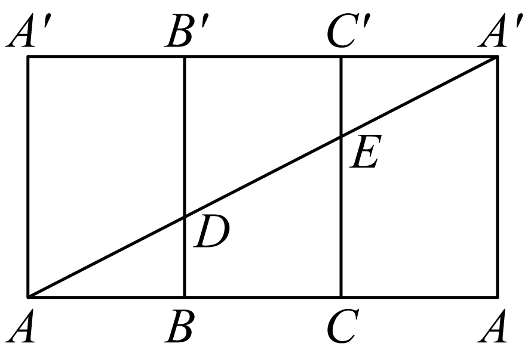

要使线段的最小值是，则连接（左下角，右上角），

此时在连接线上，故①，

因为正三棱柱内部存在一个半径为的内切球，

所以整理得，

将代入①可得，

所以正三棱柱的底面外接圆半径为，

所以正三棱柱的外接球半径为，

所以该棱柱的外接球表面积为

故选：B

**变式62．**（2024·全国·高一专题练习）若一个正六棱柱既有外接球又有内切球，则该正六棱柱的外接球和内切球的表面积的比值为（    ）

A．	B．	C．	D．

【答案】C

【解析】如图：分别为底面中心，为的中点，为的中点

设正六棱柱的底面边长为

若正六棱柱有内切球，则，即内切球的半径

，即外接球的半径

则该正六棱柱的外接球和内切球的表面积的比值为

故选：C．

<strong>变式63．</strong>（2024·全国·高三专题练习）已知点<em>O</em>到直三棱柱各面的距离都相等，球<em>O</em>是直三棱柱的内切球，若球<em>O</em>的表面积为，的周长为4，则三棱锥的体积为（    ）

A．	B．	C．	D．

【答案】B

【解析】设直三棱柱的高为*h*，*AB*＝*c*，*BC*＝*a*，*AC*＝*b*，内切球*O*的半径为*r*，则*h*＝2*r*，

由题意可知球*O*的表面积为，解得*r*＝2，∴*h*＝4，

又△*ABC*的周长为4，即*a*＋*b*＋*c*＝4，

∴连接*OA*，*OB*，*OC*，可将直三棱柱分成5个棱锥，

即三个以原来三棱柱侧面为底面，内切球球心为顶点的四棱锥，

两个以原来三棱柱底面为底面，内切球球心为顶点的的三棱锥，

∴由体积相等可得直三棱柱的体积为*h*＝*ahr*＋*bhr*＋*chr*＋2×*r*，

即4＝（*a*＋*b*＋*c*）*hr*＋，∴＝，

∴三棱锥的体积为*h*＝×4×4＝．

故选：B．

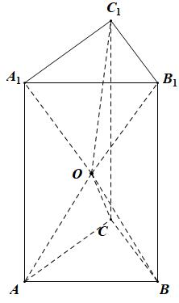

**题型十七：内切球之正四面体模型**

**例49．**（2024·高一课时练习）边长为的正四面体内切球的体积为（    ）

A．	B．	C．	D．

【答案】D

【解析】将棱长为的正四面体补成正方体，则该正方体的棱长为，

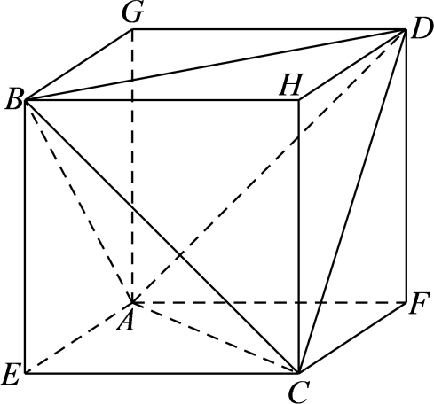

，

设正四面体的内切球半径为，正四面体每个面的面积均为，

由等体积法可得，解得，

因此，该正四面体的内切球的体积为.

故选：D.

**例50．**（2024·全国·高三专题练习）已知正四面体的棱长为，则其内切球的表面积为（    ）

A．	B．

C．	D．

【答案】D

【解析】设正四面体内切球球心为，内切球半径为，取中点，作平面于，则为中心，

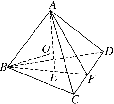

则，.

，，

，

又，，

内切球表面积.

故选：.

**例51．**（2024·江苏·高一专题练习）正四面体的棱长为，则它的内切球与外接球的表面积之比为（    ）

A．	B．	C．	D．

【答案】D

【解析】依题意，正四面体的内切球与外接球球心重合，记为，令正的中心为，连接，

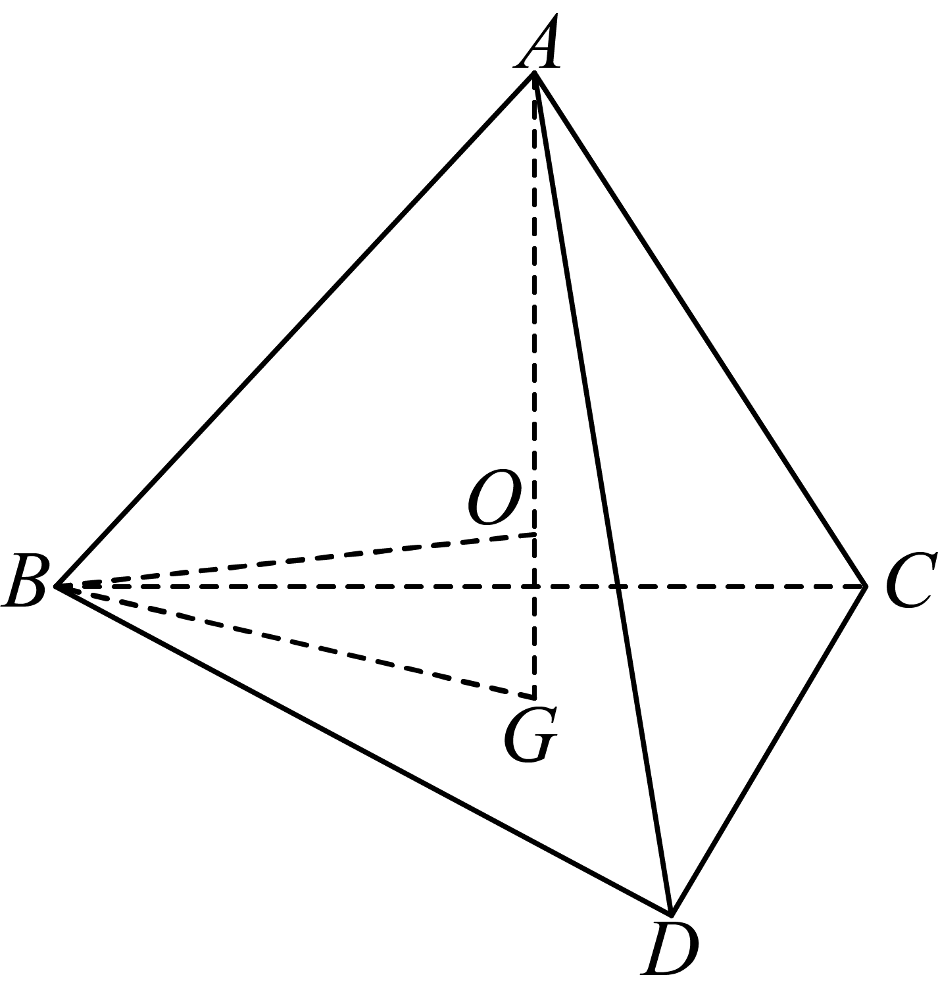

显然点在上，令正四面体的内切球与外接球半径分别为，即，

而，则，

在中，，解得，，

所以它的内切球与外接球的表面积之比为.

故选：D

**题型十八：内切球之棱锥模型**

**例52．**（2024·安徽·高二马鞍山二中校联考阶段练习）已知矩形中，，沿着对角线将折起，使得点不在平面内，当时，求该四面体的内切球和外接球的表面积比值为（    ）

A．	B．	C．	D．

【答案】C

【解析】取中点，由矩形的性质可知，

即为该四面体的外接球的球心，故外接球的半径；

因为，，平面，

可得平面，

平面，则，

且，，平面，

可得平面，

平面，则，故该四面体的四个面都是直角三角形，

设四面体的内切球的半径为，

因为内切球与四面体的四个面都相切，故满足，

则，解得；

因此该四面体的内切球和外接球的表面积的比值为.

故选：C.

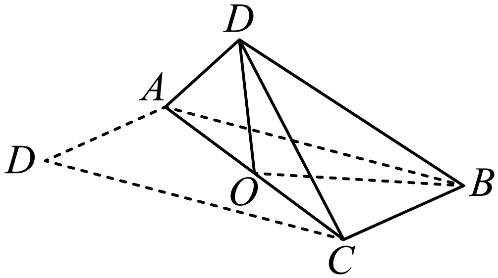

**例53．**（2024·广西·高二校联考期中）已知四棱锥的各棱长均为2，则其内切球表面积为（    ）

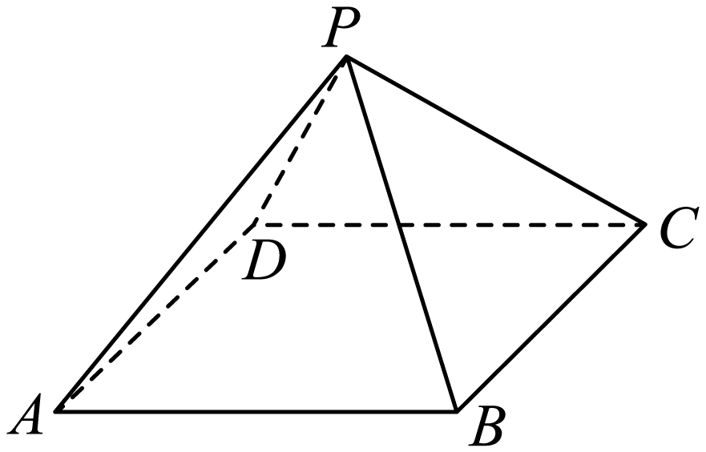

A．	B．

C．	D．

【答案】B

【解析】因为四棱锥的各棱长均为2，所以四棱锥是正四棱锥，

则，

过*P*作底面垂线，垂足为*H*，则，

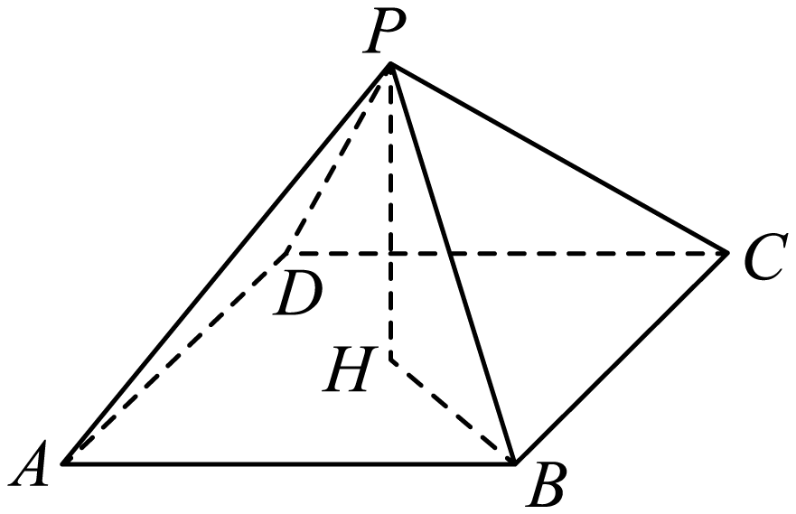

所以，则，

故其内切圆表面积为，

故选：B．

**例54．**（2024·湖北武汉·高二校联考阶段练习）如图，在三棱锥中，，，若三棱锥的内切球的表面积为，则此三棱锥的体积为（    ）

A．	B．	C．	D．

【答案】D

【解析】连接，并延长交底面于点，连接，并延长交于，

在三棱锥中，，，

三棱锥是正四面体，是的中心，平面，

三棱锥的内切球的表面积为，

，解得球的半径，

设，则，，

，

，，，

解得，，

此三棱锥的体积为.

故选：D.

**变式64．**（2024·河南濮阳·高一濮阳一高校考阶段练习）在三棱锥中，平面，且，若球在三棱锥的内部且与四个面都相切（称球为三棱锥的内切球），则球的表面积为（    ）

A．	B．	C．	D．

【答案】A

【解析】因为平面，平面，平面，平面，

所以，，，

又，

所以平面，所以，

所以均为直角三角形，

设球的半径为*r*，则，

而，，

所以，解得，

所以球的表面积为，

故选：A.

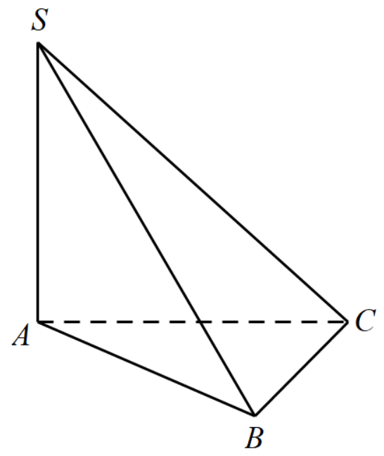

**变式65．**（2024·福建龙岩·统考模拟预测）如图，已知正方体的棱长为2，以其所有面的中心为顶点的多面体为正八面体，则该正八面体的内切球表面积为（    ）

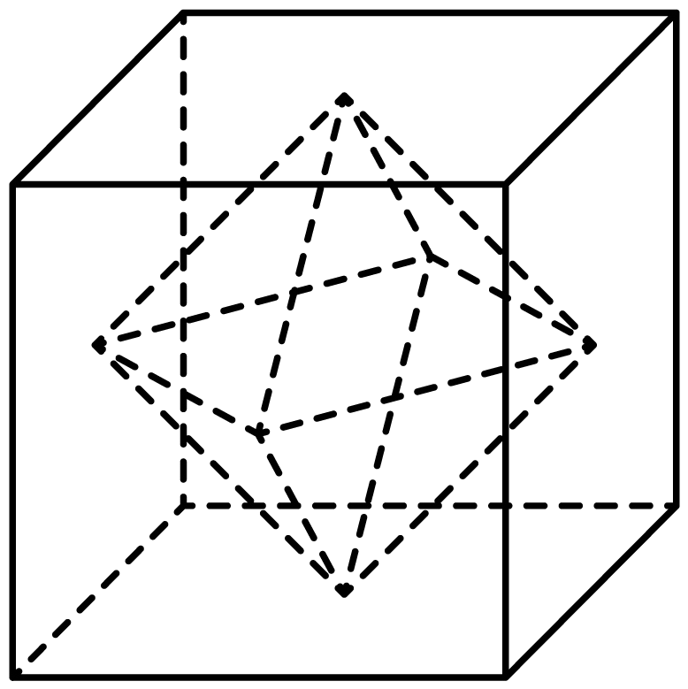

A．	B．	C．	D．

【答案】C

【解析】根据图形，已知正方体的棱长为2，易知正八面体的棱长为正方体面对角线长的一半，

即为，

如图，

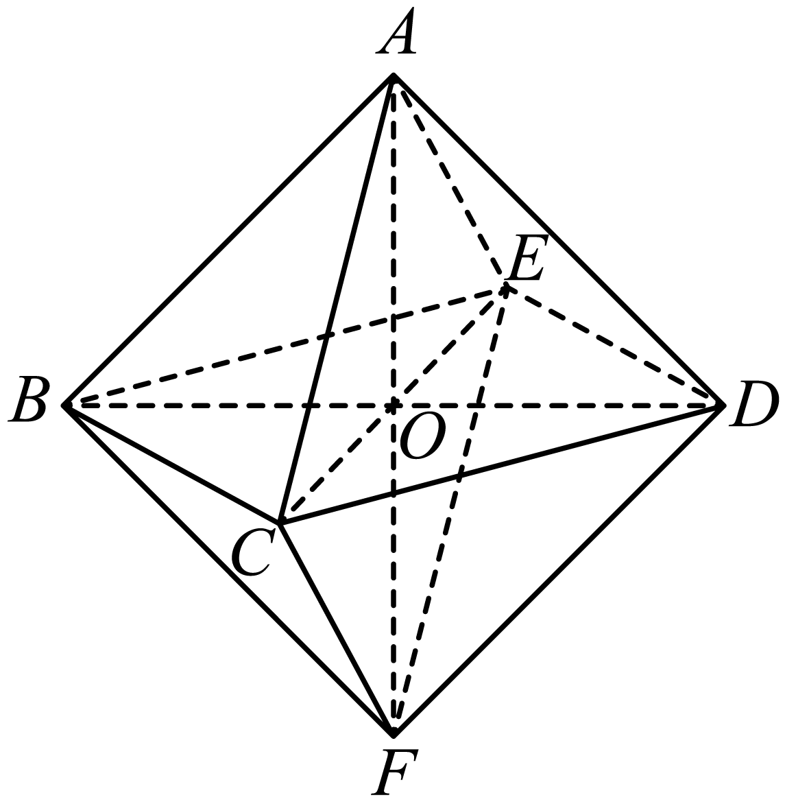

在正八面体中连接，，，可得，，互相垂直平分，为正八面体的中心，平面，平面，则，，.

在中，，

则该正八面体的体积，

该八面体的表面积

设正八面体的内切球半径为，

，即，解得，

.

故选：C.

**变式66．**（2024·浙江宁波·高一慈溪中学校联考期末）在《九章算术》中，将四个面都是直角三角形的四面体称为鳖臑.在鳖臑中，平面，，且，则其内切球表面积为（    ）

A．	B．	C．	D．

【答案】C

【解析】

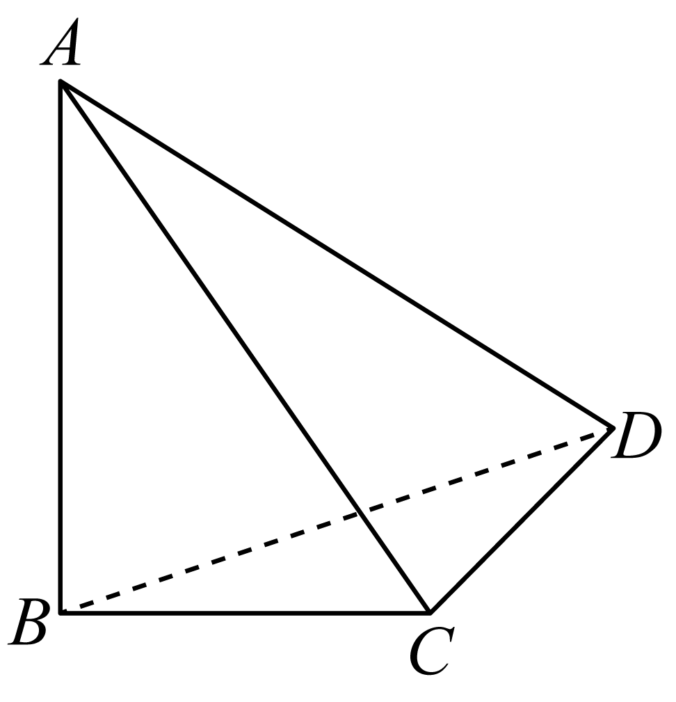

因为四面体四个面都为直角三角形，平面，

所以，，

设四面体内切球的球心为，半径为，

则

所以，

因为四面体的表面积为，

又因为四面体的体积，

所以，

所以内切球表面积.

故选：C.

**题型十九：内切球之圆锥、圆台模型**

**例55．**（2024·全国·高三专题练习）在Rt中，.以斜边为旋转轴旋转一周得到一个几何体，则该几何体的内切球的体积为（    ）

A．	B．	C．	D．

【答案】C

【解析】由题意该几何体是两个共底面的圆锥的组合体，如图是其轴截面，

由对称性知其内切球球心在上，到的距离相等为球的半径，设其为，

因为是直角，所以是正方形，即，

由得，即，解得，

球体积为．

故选：C．

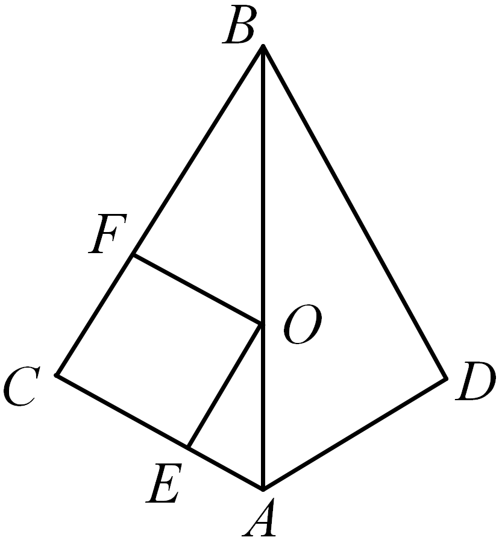

**例56．**（2024·天津·统考二模）已知一个圆锥的高为，底面直径为，其内有一球与该圆锥的侧面和底面都相切，则此球的体积为（    ）

A．	B．	C．	D．

【答案】C

【解析】圆锥的母线长为，取圆锥的轴截面如下图所示：

设该圆锥的内切球的半径为，则，

所以，，

因此，球的体积为.

故选：C.

**例57．**（2024·全国·高一专题练习）已知某圆锥的母线长为2，其轴截面为直角三角形，则下列关于该圆锥的说法中错误的是（    ）

A．圆锥的体积为	B．圆锥的表面积为

C．圆锥的侧面展开图是圆心角为的扇形	D．圆锥的内切球表面积为

【答案】B

【解析】由题设，底面直径，故半径为，体高为，

所以圆锥的体积为，A正确；

圆锥的表面积为，B错误；

底面周长为，侧面展开扇形半径为2，故圆心角为，C正确；

由轴截面是腰长为2的等腰直角三角形，圆锥的内切球最大截面为其内切圆，

所以内切球半径为，故球体表面积为，D正确.

故选：B

**变式67．**（2024·贵州贵阳·高二校考阶段练习）已知圆锥内切球（与圆锥侧面、底面均相切的球）的半径为2，当该圆锥的表面积最小时，其外接球的表面积为（    ）

A．	B．	C．	D．

【答案】A

【解析】设圆锥的顶点为，底面圆的圆心为，内切球圆心为，

则，，

因为⊥，⊥，所以∽，则，

设，，

故，由得：，

由得：，

故，所以，，

解得：，

所以圆锥的表面积为，

令，，

当时，，当时，，

故在上单调递减，在上单调递增，

故在时取得最小值，，

此时，，

设圆锥的外接球球心为，连接，设，

则，

由勾股定理得：，即，

解得：，故其外接球的表面积为.

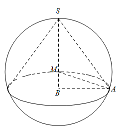

故选：A

**变式68．**（2024·全国·高一专题练习）已知圆锥的底面半径为2，高为，则该圆锥的内切球表面积为（    ）

A．	B．	C．	D．

【答案】D

【解析】如图，圆锥与内切球的轴截面图，点为球心，内切球的半径为，为切点，设，即

由条件可知，，

中，，即，解得：，

所以圆锥内切球的表面积.

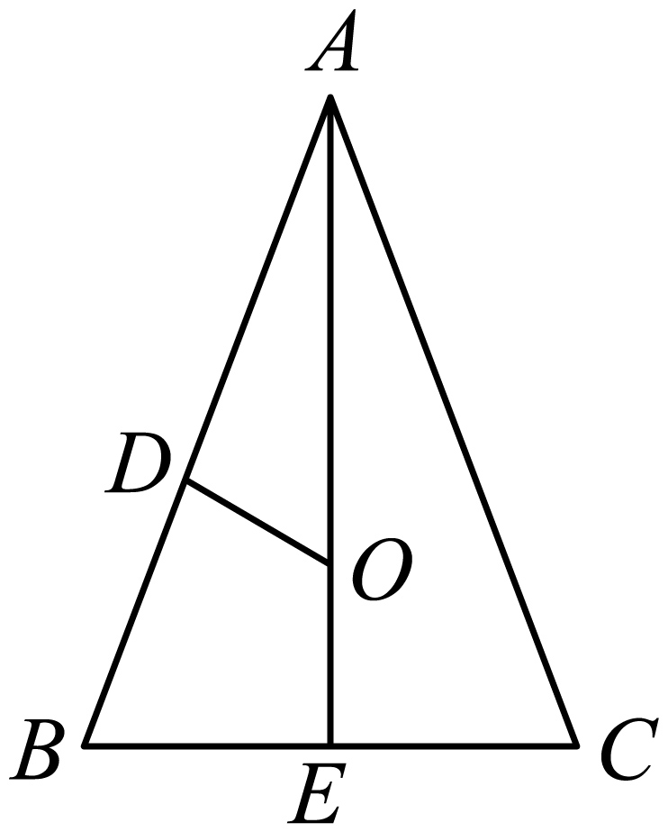

故选：D

**变式69．**（2024·安徽宣城·高二校联考开学考试）如图，正四棱台的上､下底面边长分别为分别为，的中点，8个顶点构成的十面体恰有内切球，则该内切球的表面积为（    ）

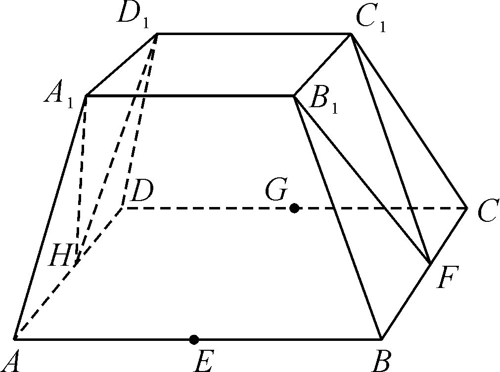

A．	B．	C．	D．

【答案】A

【解析】该十面体及内切球的正投影为等腰梯形与内切圆，设内切圆的半径为，

如图所示，，

所以，

可得，

故该内切球的表面积为.

故选：A

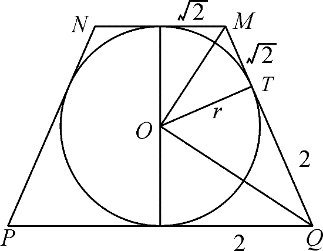

**变式70．**（2024·湖北咸宁·高二统考期末）已知球内切于圆台（即球与该圆台的上、下底面以及侧面均相切），且圆台的上、下底面半径，则圆台的体积与球的体积之比为（    ）

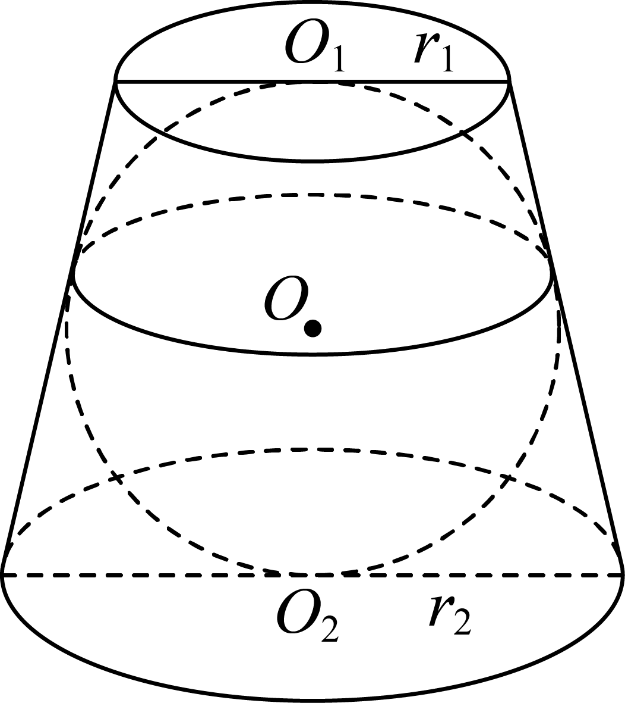

A．	B．	C．2	D．

【答案】B

【解析】如图为该几何体的轴截面，其中圆是等腰梯形的内切圆，设圆与梯形的腰相切于点，与上、下底的分别切于点，，

设球的半径为，圆台上下底面的半径为，.注意到与均为角平分线，因此，

从而，故.设台体体积为，球体体积为，

则.

故选：B

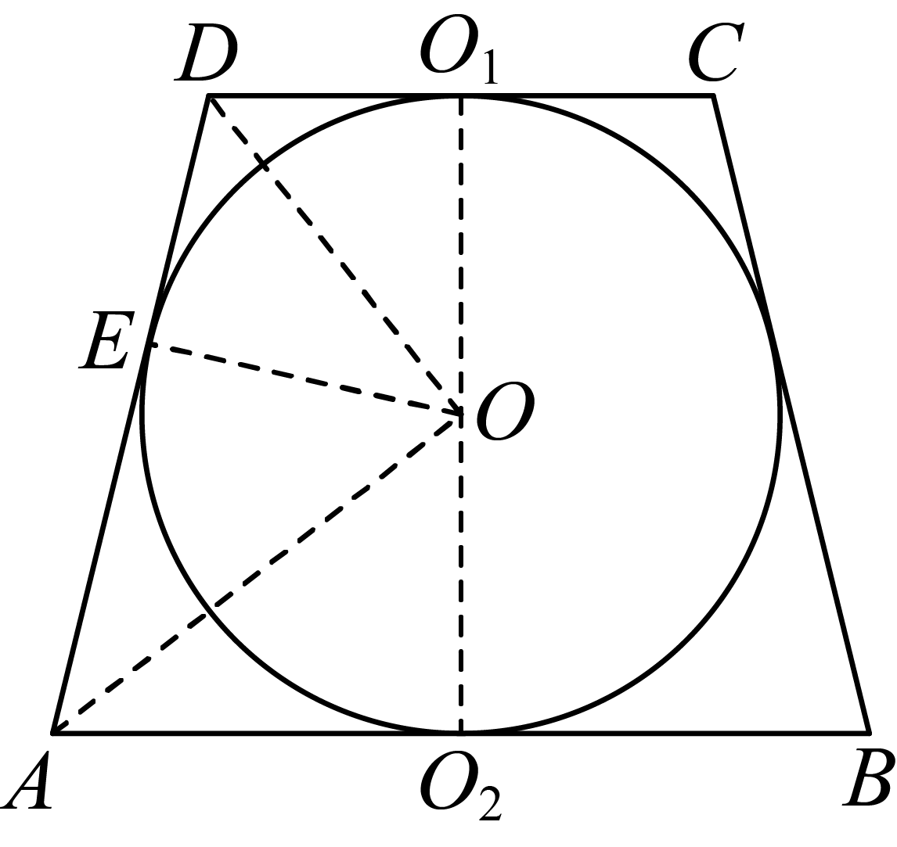

**题型二十：棱切球之正方体、正棱柱模型**

**例58．**（2024·山东菏泽·高一山东省鄄城县第一中学校考阶段练习）已知球与一正方体的各条棱相切，同时该正方体内接于球，则球与球的表面积之比为（    ）

A．2：3	B．3：2	C．	D．

【答案】A

【解析】设正方体棱长为，

因为球与正方体的各条棱相切，所以球的直径大小为正方体的面对角线长度，

即半径；

正方体内接于球，则球的直径大小为正方体的体对角线长度，即半径；

所以球与球的表面积之比为.

故选：A.

<strong>例59．</strong>（2024·全国·高三专题练习）已知正三棱柱的体积为18，若存在球<em>O</em>与三棱柱的各棱均相切，则球<em>O</em>的表面积为（    ）

A．	B．	C．	D．

【答案】C

【解析】设正三棱柱的底面边长为，高为，上底面中心为，下底面中心为，

连接，则球的球心在的中点上，设球切棱于，切棱于，

则、分别为所在棱的中点，

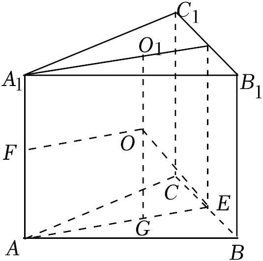

由题意，①

因为，，

又，所以，

所以，解得，②

联立①②可得，

所以球的半径为，

所以球*O*的表面积为，

故选：C.

**例60．**（2024·全国·高三专题练习）已知球与棱长为的正方体的各条棱都相切，则球内接圆柱的侧面积的最大值为（    ）

A．	B．	C．	D．

【答案】B

【解析】由题意知球的直径等于正方体面的对角线长，

所以球的半径，设圆柱的高为，则底面圆半径，

所以

当时取得最大值，且最大值为.

故选

<strong>变式71．</strong>（吉林省吉林市2024届高三第四次数学（理）调研试题）已知正三棱柱(底面为正三角形且侧棱与底面垂直)，它的底面边长为2，若存在一个球与此正三棱柱的所有棱都相切，则此正三棱柱的侧棱长为___________.

【答案】2

【解析】如图，作正三棱柱的中截面正，作上下底面三角形内切圆，

与正三棱柱的所有棱都相切的球必过的外接圆和上下底面内切圆，

取上下底面内切圆心､，连接，取中点，为的外心，

以为球心，以为半径的球，此球即为与正三棱柱的球，

于是，，

所以，，

故答案为：2

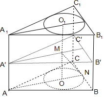

<strong>变式72．</strong>（福建省三明市2024届高三上学期期末质量检测数学试题）已知直三棱柱的侧棱长为，底面为等边三角形.若球<em>O</em>与该三棱柱的各条棱都相切，则球<em>O</em>的体积为__________.

【答案】

【解析】由题意三棱柱是正三棱柱，分别是棱柱下底面和上底面的中心，由对称性知中点为球的球心，取中点（为切点），则（等于到棱距离．设球半径为，

由正三角形性质知，

与底面垂直，则必与底面上直线垂直，因此，解得，

球体积为．

故答案为：．

<strong>变式73．</strong>已知正三棱柱，若有一半径为4的球与正三棱柱的各条棱均相切，则正三棱柱的侧棱长为______.

【答案】

【解析】设底面△*ABC*外接圆圆心*G*,如图

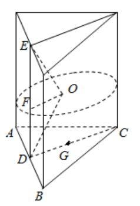

因为△*ABC*的外接圆即为球的大圆，且，

则*GA*=*GB*=*GC*=4，从而正△ABC边长,

设球心，由题意知*E*、*D*在球面上，,

*F*为*DE*中点，则，

在中，，

侧棱，

故答案为：

**变式74．**（广东省茂名市五校联盟2024届高三上学期第二次联考数学试题）已知正三棱柱的高等于1.一个球与该正三棱柱的所有棱都相切，则该球的体积为（    ）

A．	B．	C．	D．

【答案】B

【解析】如图，作正三棱柱的中截面正△，作上下底面三角形内切圆，

与正三棱柱的所有棱都相切的球必过△的外接圆和上下底面内切圆，

取上下底面内切圆心、，连接，取中点，为△的外心，

以为球心，以为半径的球，此球即为与正三棱柱所有棱都相切的球，

∴，，，

在直角△*OMN*中，由得，，，

∴球的半径，

∴球的体积.

故选：B.

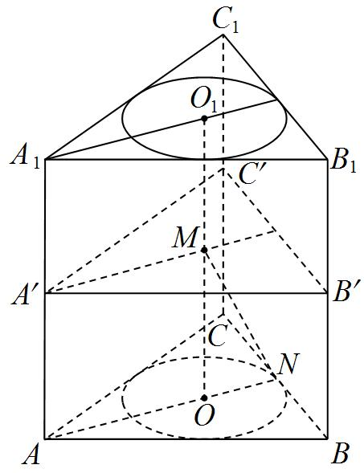

**题型二十一：棱切球之正四面体模型**

**例61．**（2024·全国·高一期中）已知某棱长为的正四面体的各条棱都与同一球面相切，则该球与此正四面体的体积之比为（    ）

A．	B．	C．	D．

【答案】A

【解析】如图，正方体中，棱长为，

所以，四面体是棱长为的正四面体，

当正四面体的各条棱都与同一球面相切时，该球为正方体的内切球，半径为，

所以，该球的体积为，

因为正四面体的体积为，

所以，该球与此正四面体的体积之比为.

故选：A

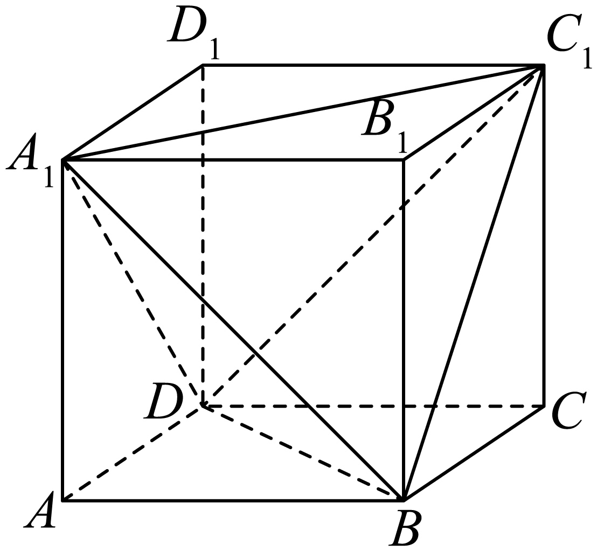

**例62．**（2024·陕西西安·高一校联考期中）所有棱长均相等的三棱锥构成一个正四面体，则该正四面体的内切球与外接球的体积之比为（    ）

A．	B．	C．	D．

【答案】A

【解析】

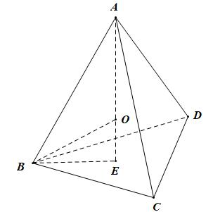

如图，设为正三角形的中心，连接，

根据对称性可知正四面体的内切球和外接球共球心且球心在线段上，

连接，设正四面体的棱长为，则，

故．

设外接球的半径为，则，

故，解得，

故内切球的半径为，所以，

故内切球与外接球的体积之比为，

故选：A．

**例63．**（2024·江西南昌·高二进贤县第一中学校考期中）球与棱长为的正四面体各条棱都相切，则该球的表面积为（    ）

A．	B．	C．	D．

【答案】C

【解析】将正四面体补形为一个正方体如图所示（红色线条表示正四面体），则正四面体的棱为正方体的面对角线，

因为球与正四面体的各条棱都相切，所以球与正方体的各个面都相切，所以所求的球为正方体的内切球，

又因为正方体的棱长为，所以球的半径，

所以球的表面积为：，

故选：C.

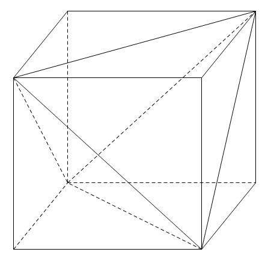

**变式75．**（2024·贵州贵阳·校联考模拟预测）已知球的表面积为，若球与正四面体的六条棱均相切，则此四面体的体积为（    ）

A．9	B．	C．	D．

【答案】A

【解析】由，，将正四面体放到正方体中，正方体的内切球即与正四面体的六条棱均相切，，正方体的棱长为，则正四面体棱长为，高，，

故选:A．

<strong>变式76．</strong>（2024·全国·高三专题练习）正四面体<em>P</em>-<em>ABC</em>的棱长为4，若球<em>O</em>与正四面体的每一条棱都相切，则球<em>O</em>的表面积为（    ）

A．2*π*	B．8*π*	C．	D．12*π*

【答案】B

【解析】将正四面体补成一个正方体球与正四面体的棱都相切．

则球与正方体的内切球，设正方体边长为，

故选：B.

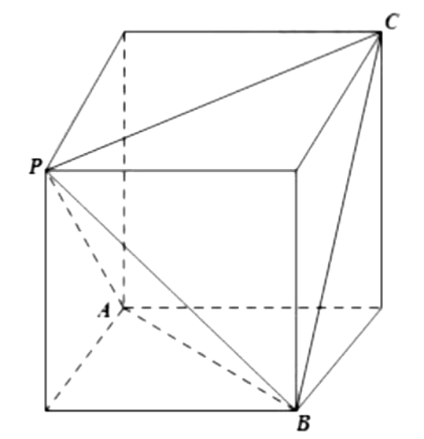

**题型二十二：棱切球之正棱锥模型**

<strong>例64．</strong>（河南省名校2022-2024学年高二下学期5月联考数学试题）已知棱长均为的多面体由上､下全等的正四棱锥和拼接而成，其中四边形为正方形，如图所示，记该多面体的外接球半径为，该多面体的棱切球（与该多面体的所有棱均相切的球）的半径为，则___．

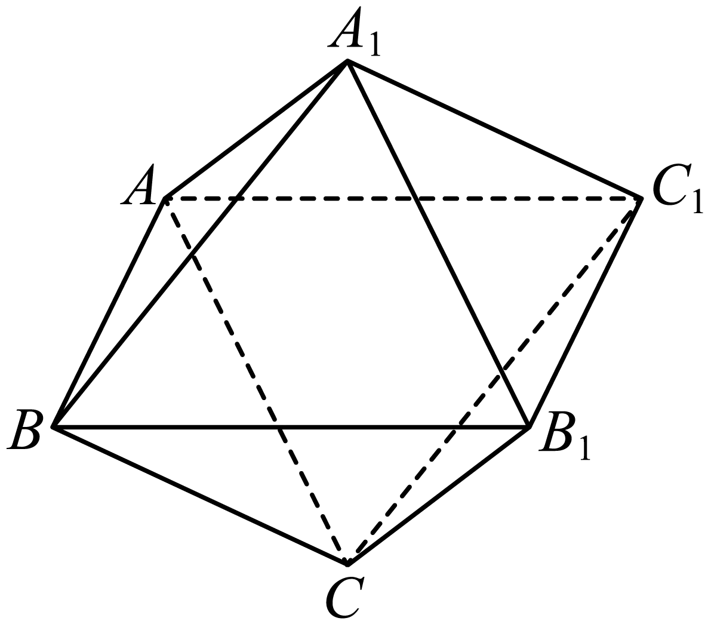

【答案】

【解析】在多面体中，为正方形的中心，如图所示：

由题意可知既是多面体的外接球的球心，也是棱切球的球心，

过点作于点，在中，，

，所以，

所以，

所以

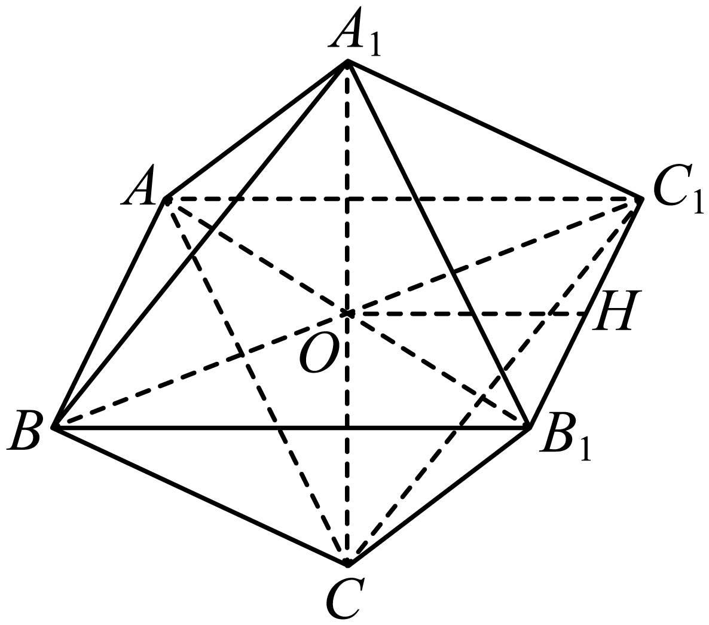

故答案为：

<strong>例65．</strong>（河南省多所名校2022-2024学年高三下学期3月月考文科数学试题）在正三棱锥中，，，若球<em>O</em>与三棱锥的六条棱均相切，则球<em>O</em>的表面积为______．

【答案】

【解析】如图示：

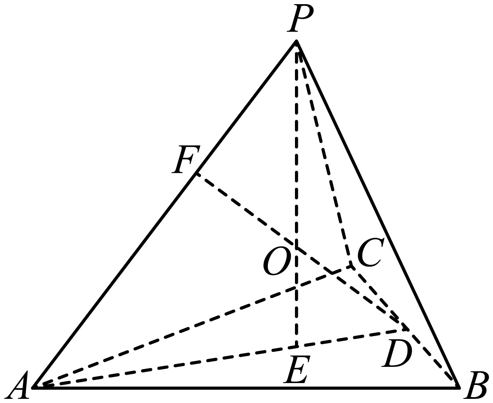

取的中心*E*，连接*PE*，则平面*ABC*，且与棱均相切的球的球心*O*在*PE*上.

连接*AE*并延长交*BC*于*D*，则*D*为*BC*的中点，，连接*OD*.

因为平面*ABC*，所有.

因为平面，平面，，所有平面.

因为平面，所有

.过*O*作，交*PA*于点*F*.

球*O*的半径为*r*，则.

由题意：为正三角形，因为，所以，，.

因为，，所以，所以.

设，所以，因为，所以，解得:，所以，故球*O*的表面积为．

故答案为：

<strong>例66．</strong>（安徽省马鞍山市2024届高三下学期第二次教学质量监测理科数学试题）球被平面截下的一部分叫做球缺，截面叫做球缺的底面，垂直于截面的直径被截下的线段长叫做球缺的高，球缺的体积公式，其中为球的半径，为球缺的高.若一球与一所有棱长为6的正四棱锥的各棱均相切，则该球与该正四棱锥的公共部分的体积为___________.

【答案】

【解析】如图，

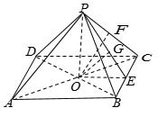

取的中点，的中点，的中心为，连接，，，

一球与一所有棱长为6的正四棱锥的各棱均相切，

可得，，

所以球的半径为3，是正三角形，边长为6，中心为，

连接，，，

，

所以球缺的高为：，

该球与该正四棱锥的公共部分的体积为：

.

故答案为：.

<strong>变式77．</strong>（2024·全国·高三专题练习）正三棱锥的底面边长为，侧棱长为，若球<em>H</em>与正三棱锥所有的棱都相切，则这个球的表面积为（    ）

A．	B．	C．	D．

【答案】B

【解析】设底面的外接圆的圆心为，连接，延长交于，

球*H*与棱分别切于，设球*H*的半径为，

则，，

而底面，所以，可得，

在直角三角形中，，，

在直角三角形中，，

所以，即有，解得，

则这个球的表面积为．

故选：B

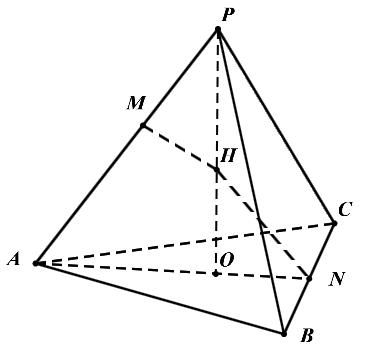

**变式78．**（2024·全国·高三专题练习）在三棱锥中，，，两两垂直，，若球与三棱锥各棱均相切，则该球的表面积为（    ）

A．	B．	C．	D．

【答案】D

【解析】如图示，以*A*为原点，分别为*x、y、z*轴正方向建立空间直角坐标系.

则，，，.

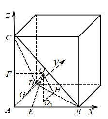

设与三棱锥各棱均相切的球的球心为，半径为<em>r</em>，过<em>O</em>作<em>OO1</em>⊥面<em>ABD</em>于<em>O1，</em>则.

在底面*ABD*中，即平面*xoy*内，直线*BD*方程为：，，所以，所以，即①.

过<em>O</em>作<em>OE</em>⊥<em>AB</em>于<em>E</em>，过<em>O</em>作<em>OF</em>⊥<em>AC</em>于<em>F</em>，过<em>O</em>作<em>OG</em>⊥<em>AD</em>于<em>G</em>，过<em>O1</em>作<em>O1H</em>⊥<em>DB</em>于<em>H</em>.

由得：②.

同理可得：③，④.

②③④联立可得.

把与①联立，解得：.

所以该球的表面积为.

故选：D

**变式79．**（2024·湖北武汉·高一武汉市第一中学校考阶段练习）与正三棱锥6条棱都相切的球称为正三棱锥的棱切球.若正三棱锥的底面边长为，侧棱长为3，则此正三棱锥的棱切球半径为（    ）

A．	B．	C．	D．

【答案】C

【解析】如图三棱柱为正三棱锥，且底面边长，侧棱

设正三棱锥的棱切球球心为，半径为，则顶点在底面的投影为也为的中心，取的中点，连接，过点作垂足为，则，设，

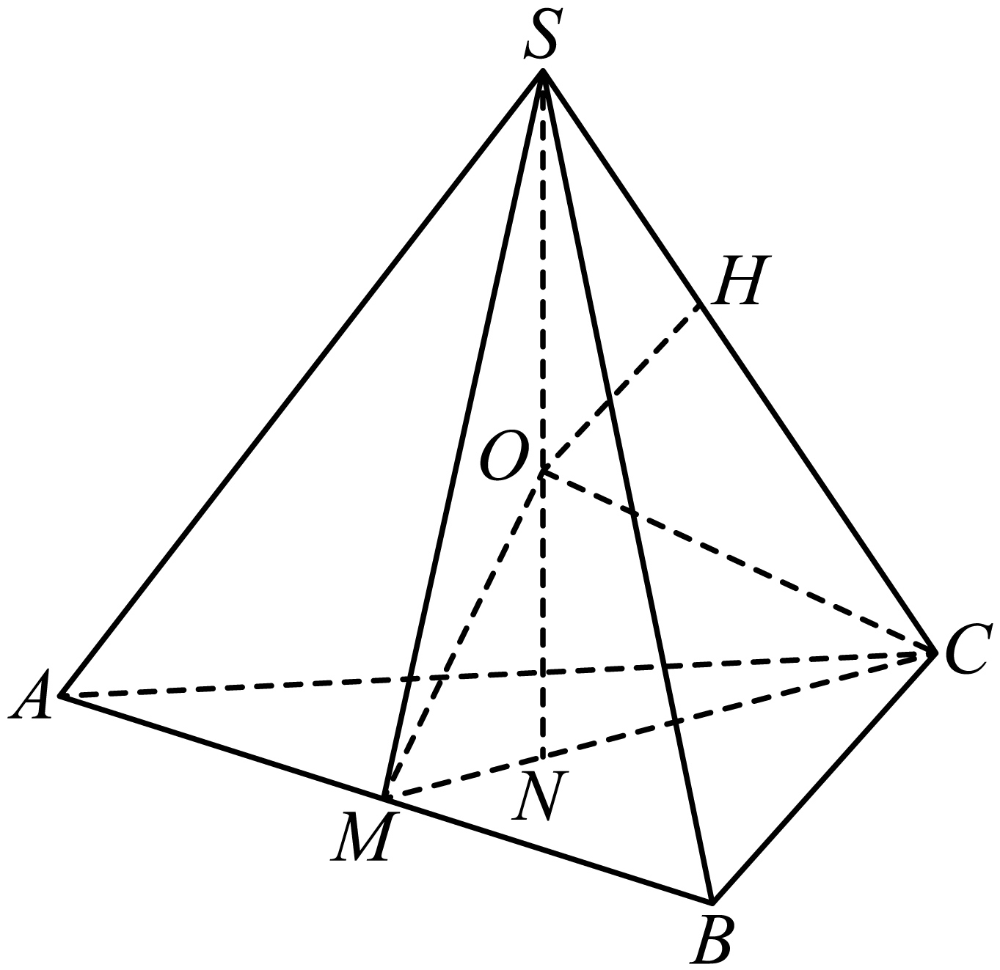

在中，

因为为的中心，则，，

在中即；

在中，，即，

在中，，则；

在中，，则，

在中，，则，

又因为，则，化简得，

由得解得.

故选：C.

**变式80．**（2024·江苏·高一专题练习）在正三棱锥中，，若球与三棱锥的六条棱均相切，则球的表面积为（    ）

A．	B．

C．	D．

【答案】C

【解析】取的中心，连接，

则平面，且与棱均相切的球的球心在上，

连接并延长交于，则为的中点，，

连接，易证，

过作，交于点，

设球的半径为，则，

由题意易求得，

由勾股定理得，

在中，，所以，

设，则，

因为，从而，所以，

所以，

故球的表面积为.

**题型二十三：多球相切问题**

**例67．**（2024·浙江温州·乐清市知临中学校考二模）如今中国被誉为基建狂魔，可谓是逢山开路，遇水架桥.公路里程､高铁里程双双都是世界第一.建设过程中研制出用于基建的大型龙门吊､平衡盾构机等国之重器更是世界领先.如图是某重器上一零件结构模型，中间最大球为正四面体的内切球，中等球与最大球和正四面体三个面均相切，最小球与中等球和正四面体三个面均相切，已知正四面体棱长为，则模型中九个球的表面积和为（    ）

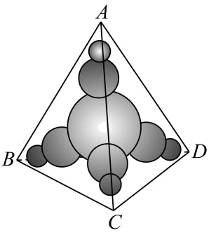

A．	B．	C．	D．

【答案】B

【解析】如图，取的中点，连接，，则，，

过点作⊥底面，垂足在上，且，

所以，故，

点为最大球的球心，连接并延长，交于点，则⊥，

设最大球的半径为，则，

因为∽，所以，即，解得，

即，则，故

设最小球的球心为，中间球的球心为，则两球均与直线相切，设切点分别为，

连接，则分别为最小球和中间球的半径，长度分别设为，

则，则，

又，所以，解得，

又，故，解得，

所以，

模型中九个球的表面积和为.

故选：B

**例68．**（2024·江西赣州·高一江西省龙南中学校考期末）已知正四面体的棱长为12，先在正四面体内放入一个内切球，然后再放入一个球，使得球与球及正四面体的三个侧面都相切，则球的体积为（    ）

A．	B．	C．	D．

【答案】A

【解析】

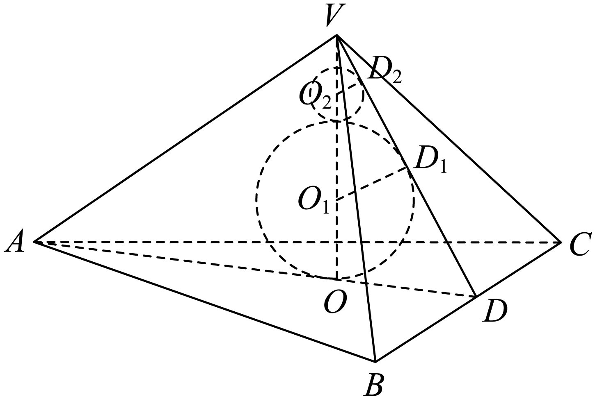

如图，正四面体，设点是底面的中心，点是的中点，连接.

则由已知可得，平面，球心在线段上，球切平面的切点在线段上，分别设为.

则易知，，设球的半径分别为.

因为，根据重心定理可知，.

，，，，.

由可得，，

即，解得，，所以.

由可得，，

即，解得，

所以，球的体积为.

故选：A.

**例69．**（2024·山东德州·高一德州市第一中学校考期末）如图是某零件结构模型，中间大球为正四面体的内切球，小球与大球和正四面体三个面均相切，若，则该模型中一个小球的体积为（    ）

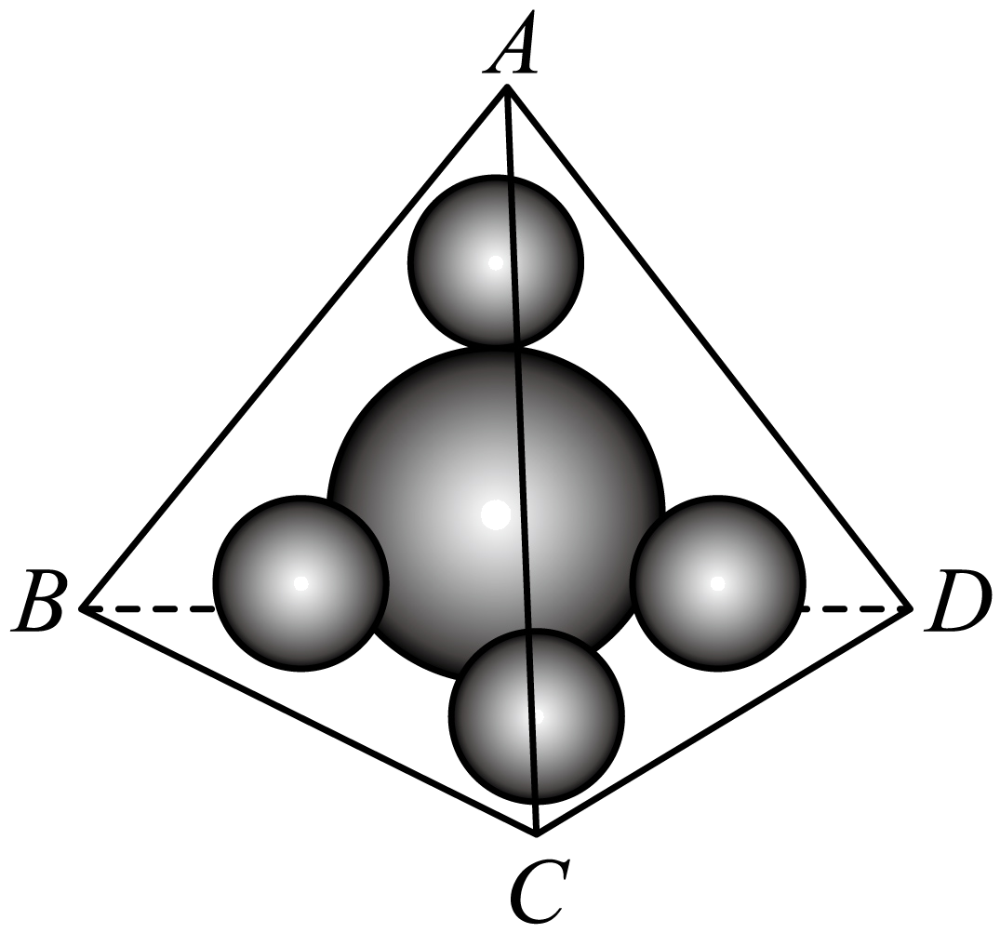

A．	B．	C．	D．

【答案】C

【解析】如图所示，

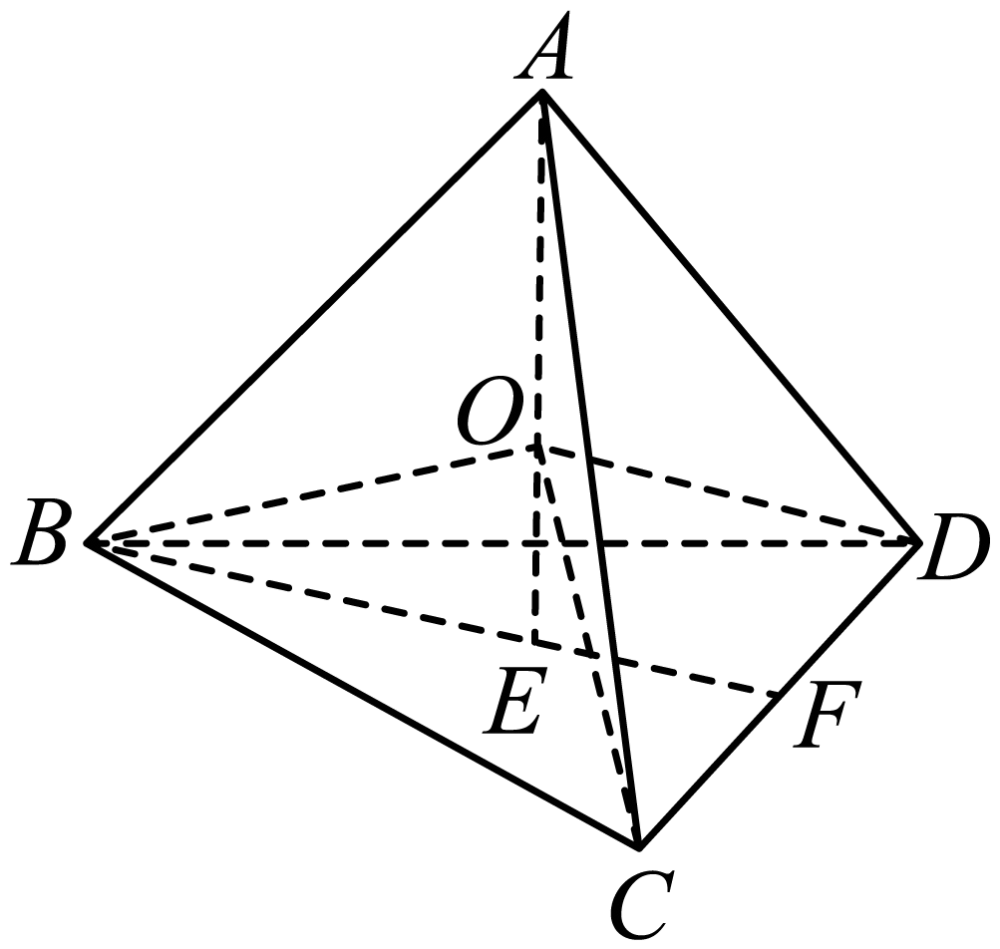

设为大球的球心，大球的半径为，大正四面体的底面中心为，棱长为，高为，

的中点为，连接，，，，，，

则，正四面体的高.

因为，所以，所以，

设小球的半径为，小球也可看作一个小的正四面体的内切球，

且小正四面体的高，所以，

所以小球的体积为.

故选：C

<strong>变式81．</strong>（2024·全国·高三专题练习）如图，在一个底面边长为2，侧棱长为的正四棱锥中，大球内切于该四棱锥，小球与大球及四棱锥的四个侧面相切，则小球的表面积为______．

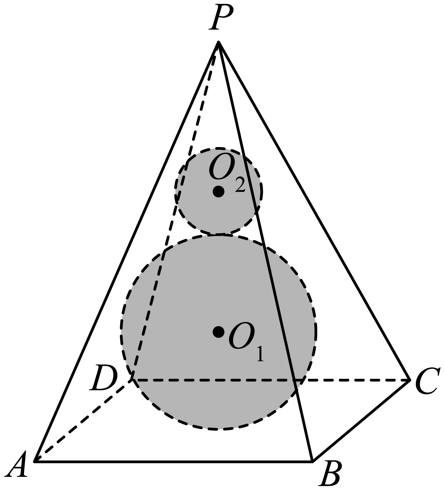

【答案】

【解析】设*O*为正方形*ABCD*的中心，*AB*的中点为*M*，连接*PM*，*OM*，*PO*，则，，，

如图，在截面*PMO*中，设*N*为球与平面*PAB*的切点，则*N*在*PM*上，

且，设球的半径为*R*，则，

∵，∴，则，，∴，

设球与球相切于点*Q*，则，

设球的半径为*r*，同理可得，∴，

故小球的表面积.

故答案为：

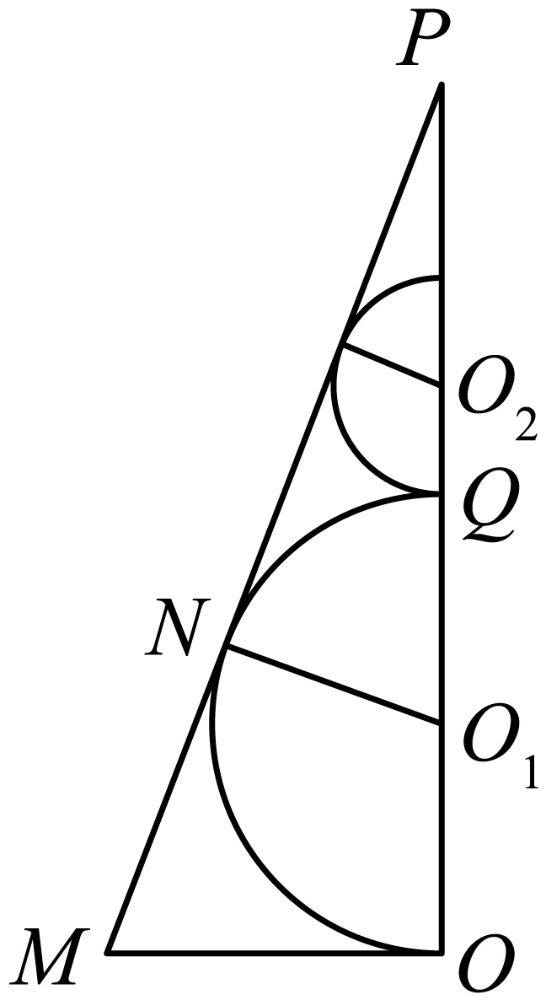

**变式82．**（2024·全国·高一专题练习）棱长为的正四面体内切一球，然后在正四面体和该球形成的空隙处各放入一个小球，则这样一个小球的表面积最大为（    ）

A．	B．	C．	D．

【答案】A

【解析】

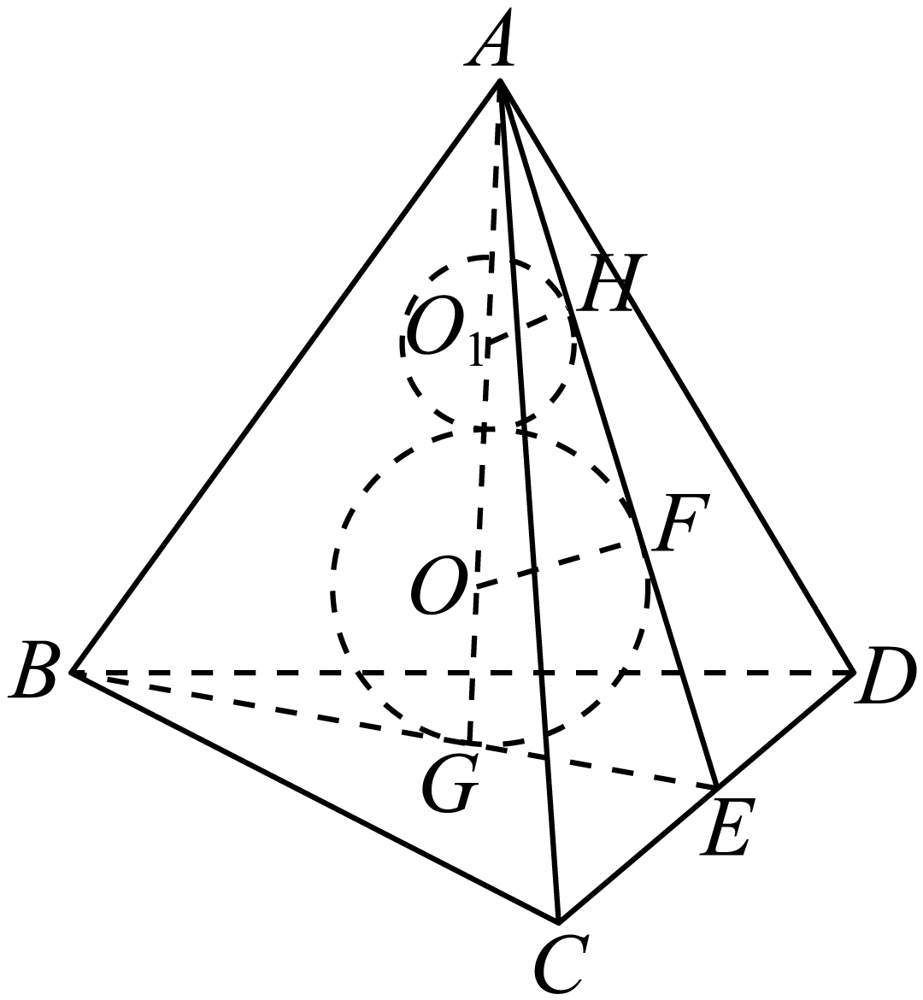

如图，由题意知球和正四面体的三个侧面以及内切球都相切时半径最大，设内切球球心为，半径为，空隙处的最大球球心为，半径为，

为的中心，易知面，为中点，球和球分别与面相切于和.

易得，，，

由，

可得，

又，，

故，，，

又由和相似，可得，即，解得，

即小球的最大半径为.

所以小球的表面积最大值为.

故选：A

**变式83．**（2024·全国·高三专题练习）已知球是棱长为24的正四面体的内切球，球与球外切且与正四面体的三个侧面都相切，则球的表面积为（    ）

A．	B．	C．	D．

【答案】A

【解析】如图，设球的半径为，球半径为，由正四面体的性质，取中点，连接，是棱锥的高，且与两球分别切于点，交于，则与底面垂直，是底面中心．记正四面体棱长为，则，，

在中，，

由

，所以，解得，

又由（它们在平面内都与垂直）得，

即，，代入解得，

所以球的表面积为．

故选：A．

**变式84．**（2024·全国·高一专题练习）四个半径为2的球刚好装进一个正四面体容器内，此时正四面体各面与球相切，则这个正四面体外接球的表面积为（    ）

A．	B．

C．	D．

【答案】A

【解析】如图1所示，正四面体*ABCD*中，*AH*⊥底面*BCD*，*E*、*F*、*G*、*K*为四个球的球心，*M*为*CD*中点，连接*BM*，*AM*，易知*B*、*H*、*M*三点共线，直线*AH*交平面*EFG*于点，连接，交*GF*于点*N*，则*N*为*GF*的中点，因为内切球半径为2，故*EF*=4，画出截面*ABM*如图2所示，正四棱锥*EFGK*外接球球心设为*O*，则正四面体*ABCD*的外接球球心与正四面体*EFGK*外接球球心重合，设正四面体*ABCD*的外接球半径为*R*，正四面体*EFGK*外接球半径为*r*，在图2中，*EK*=4，，，，所以

由，即，解得：

所以

过点*E*作*EP*⊥*BM*于点*P*，则*EP*=2

则△*BEP*∽△

∴，

解得：

∴

∴正四面体*ABCD*的外接球表面积

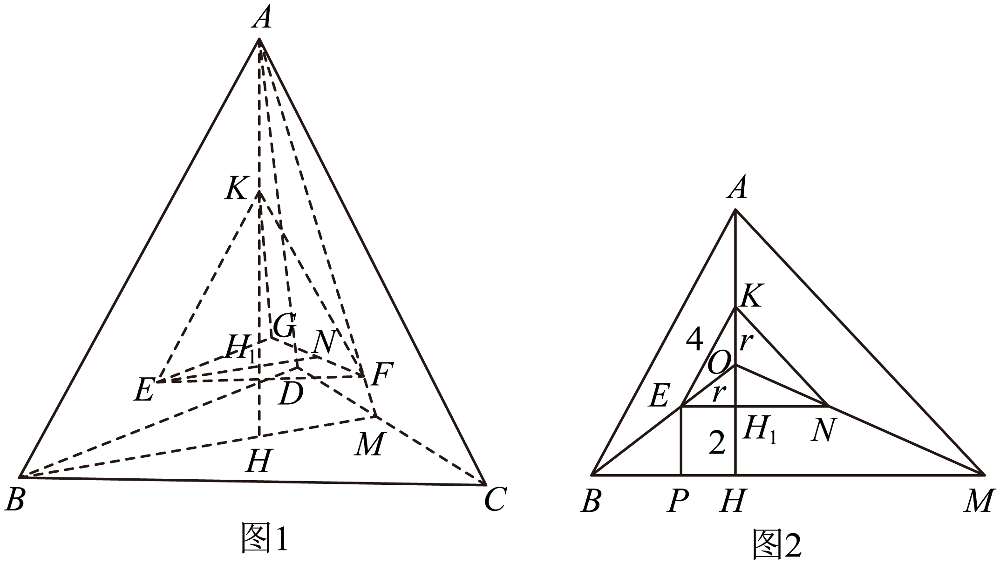

故选：A.

