**第51讲  立体几何中的截面问题**

**知识梳理**

**解决立体几何截面问题的解题策略．**

**1、坐标法**

所谓坐标法就是通过建立空间直角坐标系，将几何问题转化为坐标运算问题，为解决立体几何问题增添了一种代数计算方法．

**2、基底法**

所谓基底法是不需要建立空间直角坐标系，而是利用平面向量及空间向量基本定理作为依托，其理论依据是：若四点*E*、*F*、*G*、*H*共面，为空间任意点，则有：

结论1：若与不共线，那么；

结论2：．

**3、几何法**

从几何视角人手，借助立体几何中的线线平行、线面平行、面面平行的性质与判定定理以及平面几何相关定理、结论，通过论证，精准找到该截面与相关线、面的交点位置、依次连接这些点，从而得到过三点的完整截面，再依据题意完成所求解答或证明．

**必考题型全归纳**

**题型一：截面作图**

**例1．**（2024·全国·高一专题练习）如图，正方体的棱长为6，是的中点，点在棱上，且.作出过点，，的平面截正方体所得的截面，写出作法；

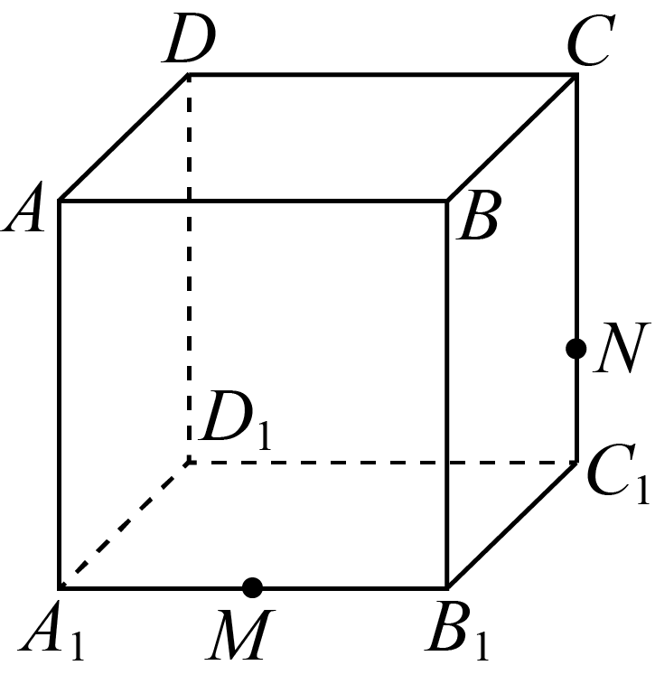

【解析】如图所示，五边形即为所求截面.

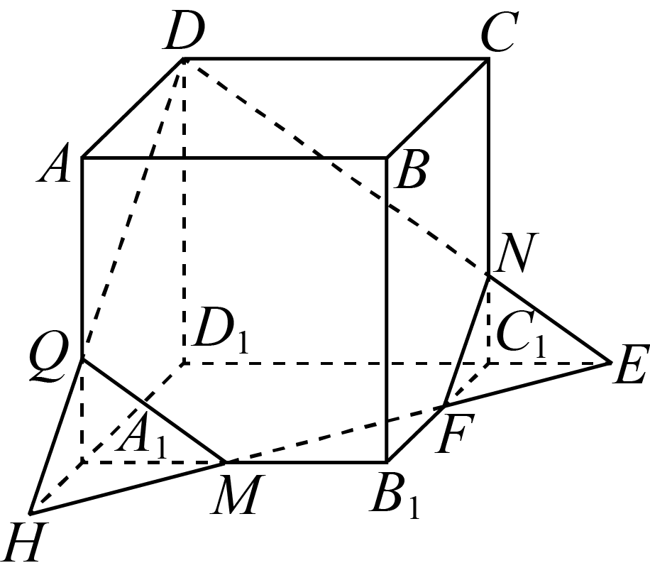

作法如下：连接并延长交的延长线于点，

连接交于点，交的延长线于点，

连接交于点，连接，，

所以五边形即为所求截面.

<strong>例2．</strong>（2024·江苏·高一专题练习）如图，棱长为2的正方体<em>ABCD</em>–<em>A1B1C1D1</em>中，<em>E</em>，<em>F</em>分别是棱<em>AA1</em>，<em>CC1</em>的中点，过<em>E</em>作平面，使得//平面<em>BDF</em>.

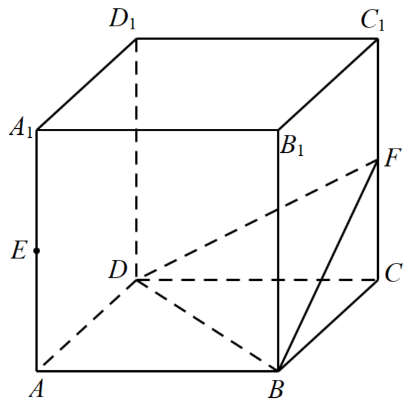

(1)作出截正方体<em>ABCD</em>-<em>A1B1C1D1</em>所得的截面，写出作图过程并说明理由；

(2)求平面与平面的距离.

【解析】（1）连接，由正方体性质可得，；

又，所以平面平面；

因为//平面，且，所以平面与平面重合，即平面就是截正方体<em>ABCD</em>-<em>A1B1C1D1</em>所得的截面.

（2）由（1）可知平面与平面的距离等于点到平面的距离；

设点到平面的距离为，由题意可得，所以的面积为；的面积为；

由可得，解得.

所以平面与平面的距离为.

**例3．**（2024·全国·高一专题练习）（1）如图，棱长为2的正方体中，，是棱，的中点，在图中画出过底面中的心且与平面平行的平面在正方体中的截面，并求出截面多边形的周长为：\_\_\_\_\_\_；

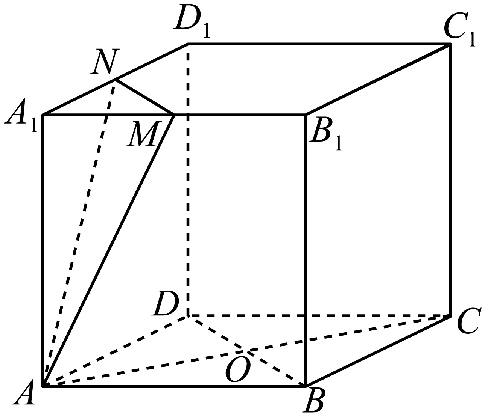

（2）作出平面与四棱锥的截面，截面多边形的边数为\_\_\_\_\_\_．

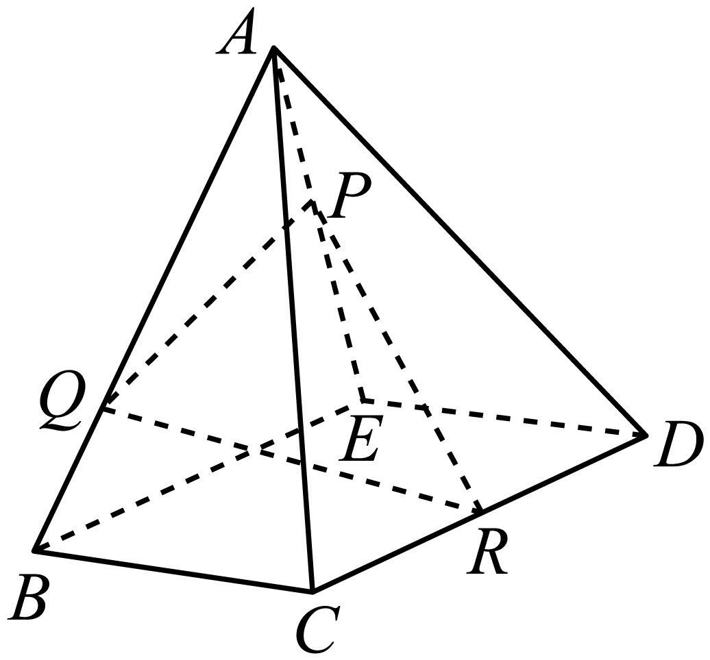

【解析】(1)分别取，为棱，的中点，则由中位线性质得到：，所以四边形为平面四边形，

又，，所以四边形为平行四边形，所以，

由，平面，平面，所以平面，同理平面，，由面面平行的判定定理可得平面平面，所以四边形即为所求截面，且为梯形，

由截面作法可知，所以截面四边形的周长为.

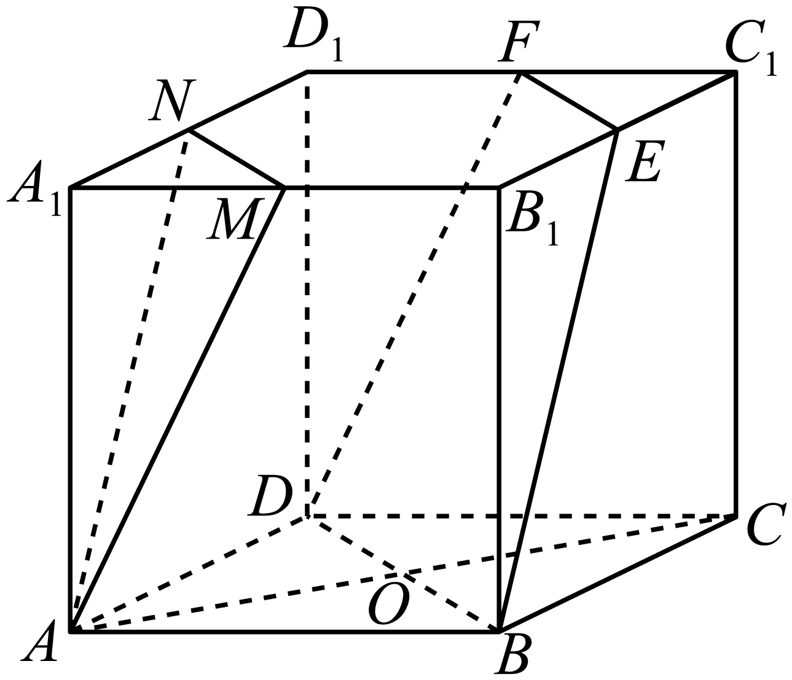

（2）延长的延长线于，连接的延长线于连接于，连接，则五边形即为所求.所以截面多边形的边数为五.

**变式1．**（2024·全国·高一专题练习）如图①，正方体的棱长为，为线段的中点，为线段上的动点，过点、、的平面截该正方体所得的截面记为.

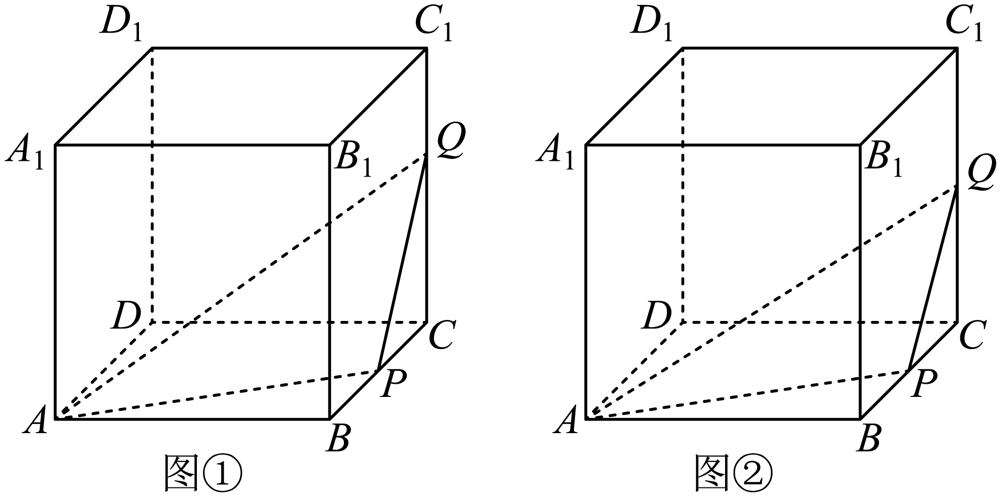

（1）若，请在图①中作出截面（保留尺规作图痕迹）；

（2）若（如图②），试求截面将正方体分割所成的上半部分的体积与下半部分的体积之比.

【解析】（1）延长交延长线于点，此时，延长交于点

延长交延长线于点，连接，并延长交于点，连接

此时五边形就是截面

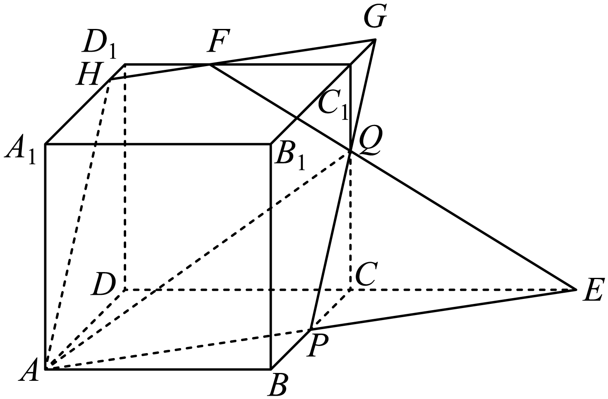

（2）当为的中点时，再由，可知，的延长线交于点，此时截面为四边形

因此

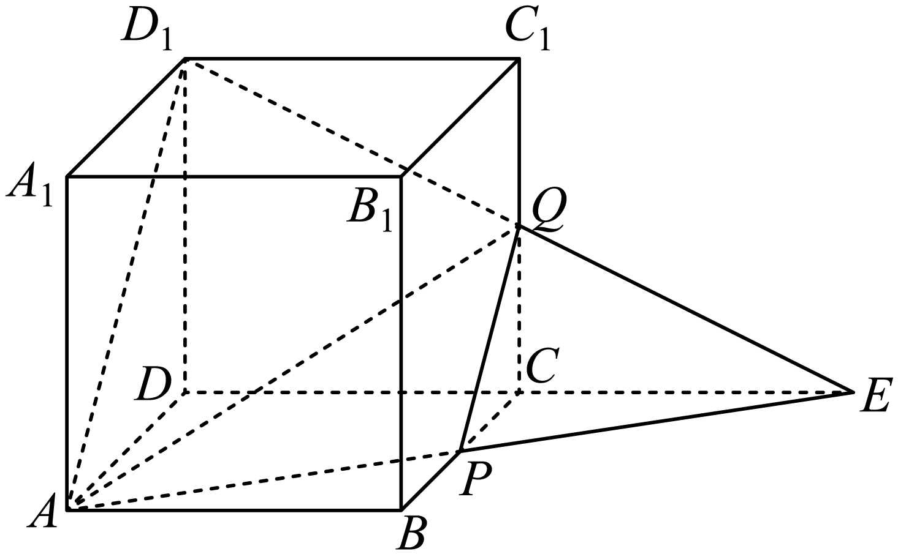

**变式2．**（2024·全国·高一专题练习）如图，已知正方体，点为棱的中点.

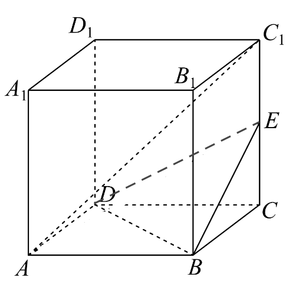

(1)证明：平面.

(2)证明：.

(3)在图中作出平面截正方体所得的截面图形(如需用到其它点，需用字母标记并说明位置)，并说明理由.

【解析】（1）证明：连接，交于点，连接，

因为是正方形，所以为的中点，又为棱的中点，

所以，平面，平面，

所以平面，

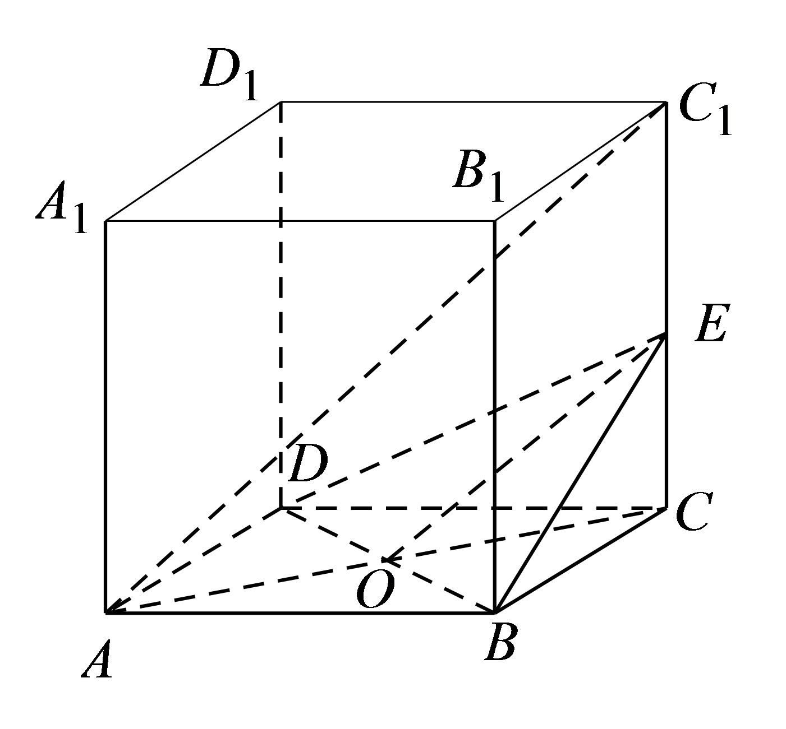

（2）证明：在正方体中，平面，平面，所以，

又，，平面，

所以平面，

又平面，

所以.

（3）如图取的中点，连接、，则为平面截正方体所得的截面，

证明：取的中点，连接、，因为为棱的中点

所以且，且，

所以且，

所以四边形为平行四边形，

所以，

又且，

所以四边形为平行四边形，

所以，

所以，即、、、四点共面，即为平面截正方体所得的截面；

<strong>变式3．</strong>（2024·江苏·高一专题练习）已知正方体是棱长为1的正方体，<em>M</em>是棱的中点，过<em>C</em>、、<em>M</em>三点作正方体的截面，作出这个截面图并求出截面的面积．

【解析】连接，并延长，交延长线于连交于，连接*MP*，

则为过*C*、、*M*三点的正方体的截面，

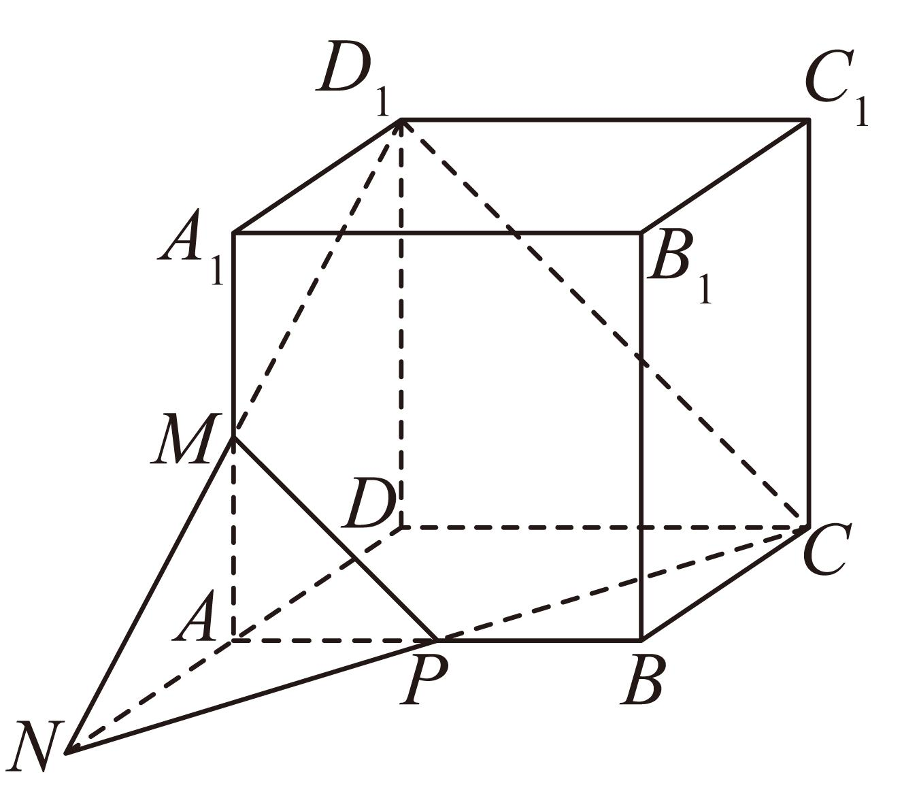

因为是的中点，

所以是的中点，是的中点，

因为，所以是的中点，

所以是三角形的中位线，

所以，

因为正方体的棱长为1，

所以可得，

所以三角形是以为腰，以为底的等腰三角形，

边上的高为，

三角形是的面积

所以

**题型二：截面图形的形状、面积及周长问题**

<strong>例4．</strong>（2024·全国·高三专题练习）如图，正方体的棱长为1，<em>P</em>为<em>BC</em>的中点，<em>Q</em>为线段上的动点，过点<em>A</em>，<em>P</em>，<em>Q</em> 的平面截该正方体所得的截面记为<em>S</em>.则下列命题中正确命题的个数为（    ）

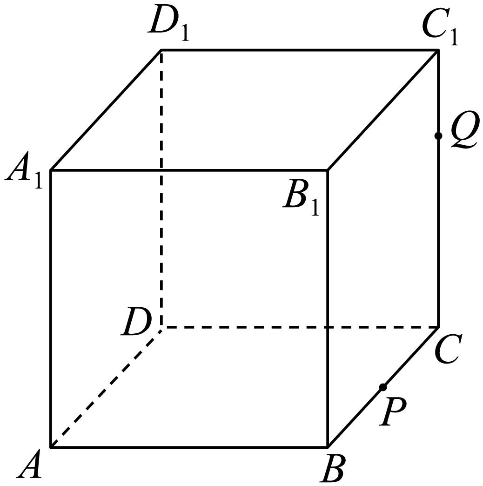

①当时，*S*为四边形；

②当时，*S*为等腰梯形；

③当时，*S*与的交点满足；

④当时，*S*为六边形；

A．1	B．2	C．3	D．4

【答案】C

【解析】

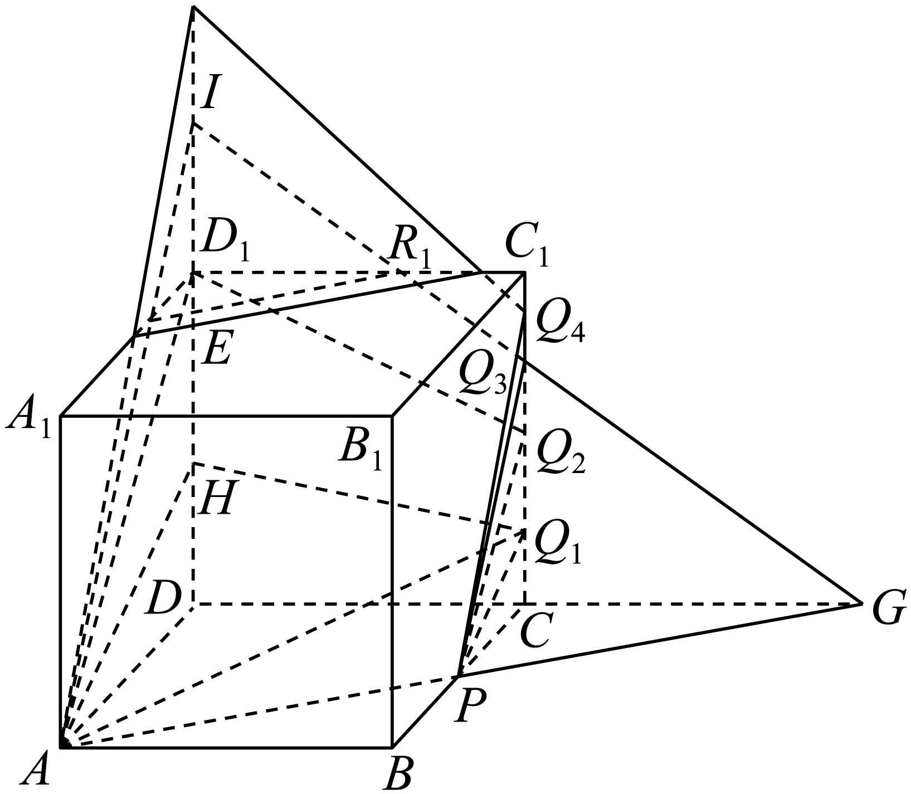

先确定临界值点，当，即为的中点时，

截面交于，则界面为等腰梯形，故②正确；

对①当时，即移动到位置时，

截面交线段于，所以截面为四边形，故①正确；

对③，当时，在的位置，截面交的延长线于，

延长交在的延长线于点，

则，

由，则，，又有，

所以，又，所以，故③正确；

对④，，点移动到位置，从图上看，截面为五边形，故④错误；

共个正确，

故选：C

**例5．**（2024·四川成都·高二双流中学校考期中）已知正方体的棱长为,为线段上的动点，过点的平面截该正方体的截面记为，则下列命题正确的个数是（）

①当且时，为等腰梯形；

②当分别为的中点时，几何体的体积为；

③当为中点且时，与的交点为，满足；

④当为中点且时，为五边形.

A．1	B．2	C．3	D．4

【答案】B

【解析】①，当，即重合，且时，如下图所示，

过作，交于，连接，

根据正方体的性质可知，所以，所以四点共面，

在等腰直角三角形中，根据平行线分线段成比例的知识可知，

所以，

即截面为等腰梯形，①正确.

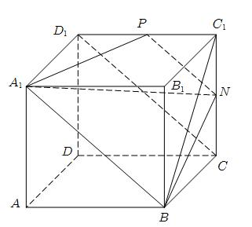

②，当分别为的中点时，

过作，垂足为，则，

由于平面，平面，所以，

由于平面，

所以平面，即平面.

所以，②正确.

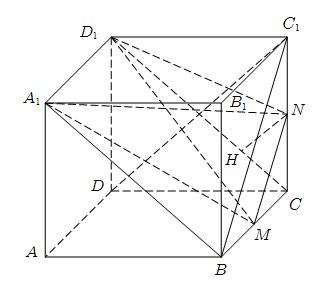

③，当为中点且时，与的交点为，与的交点为，

由于平面平面，

平面，平面，所以，

同理可证得，

，设，则，

由，得，

即，所以，

同理，所以，解得.

即，③错误.

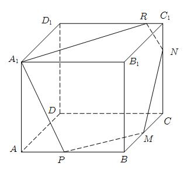

④，当为中点且时，重合，如下图所示，

截面是四边形，④错误.

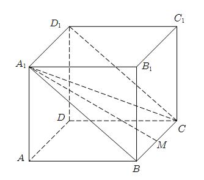

所以正确的有个.

故选：B

<strong>例6．</strong>（2024·全国·高一专题练习）如图正方体，棱长为1，<em>P</em>为中点，<em>Q</em>为线段上的动点，过<em>A</em>､<em>P</em>､<em>Q</em>的平面截该正方体所得的截面记为.若，则下列结论错误的是（    ）

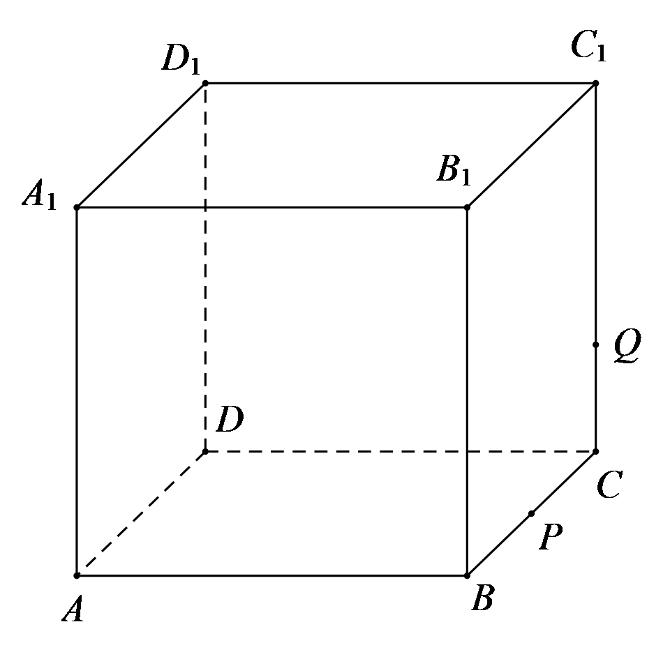

A．当时，为四边形	B．当时，为等腰梯形

C．当时，为六边形	D．当时，的面积为

【答案】C

【解析】当时，如下图1，是四边形，故A正确；

当时，如下图2，为等腰梯形，B正确：

当时，如下图3，是五边形，C错误；

当时，*Q*与重合，取的中点*F*，连接，如下图4，由正方体的性质易得，且，截面为为菱形，其面积为，D正确.

故选：C

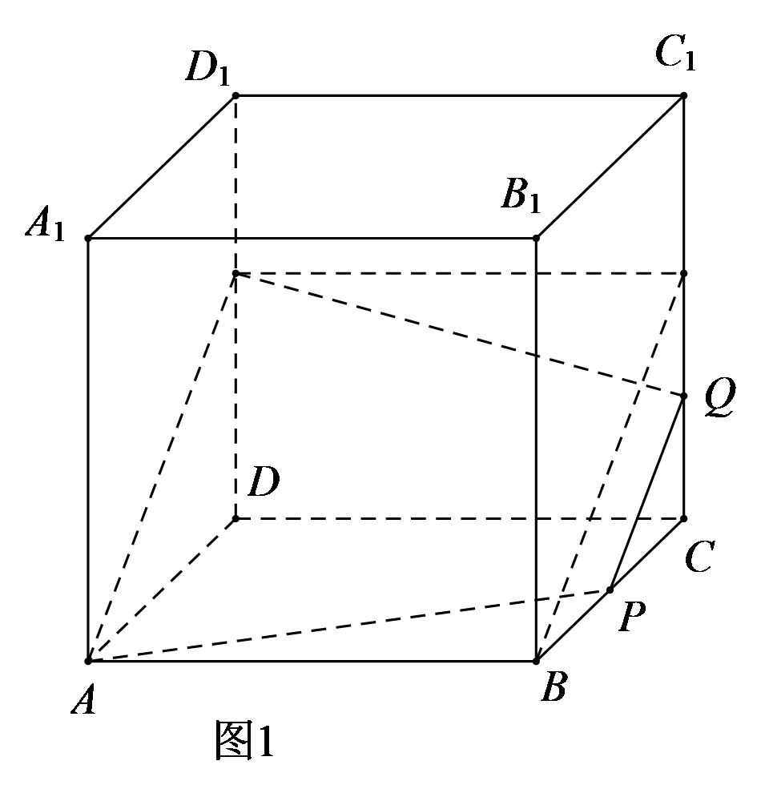

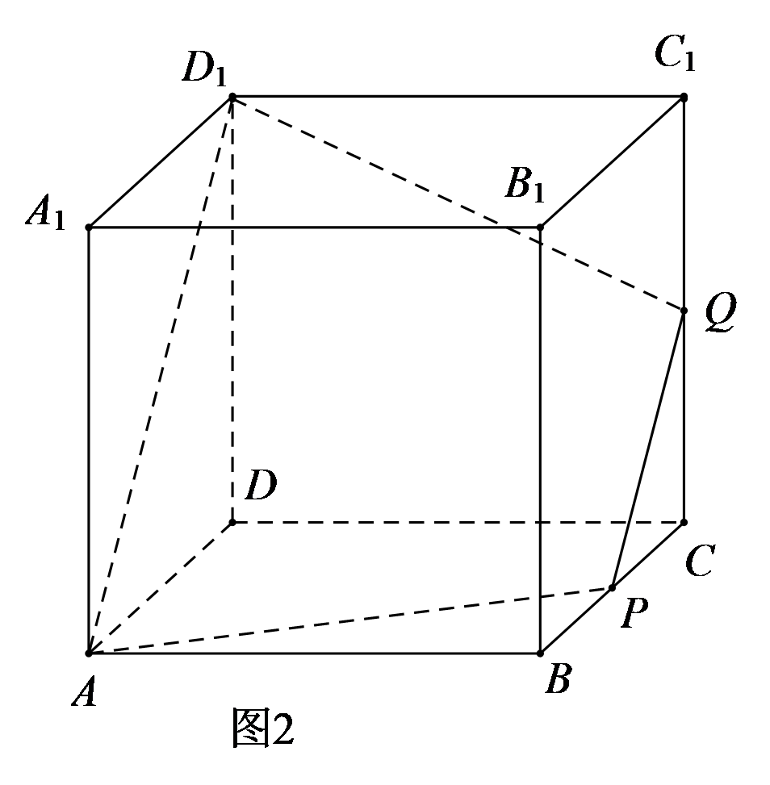

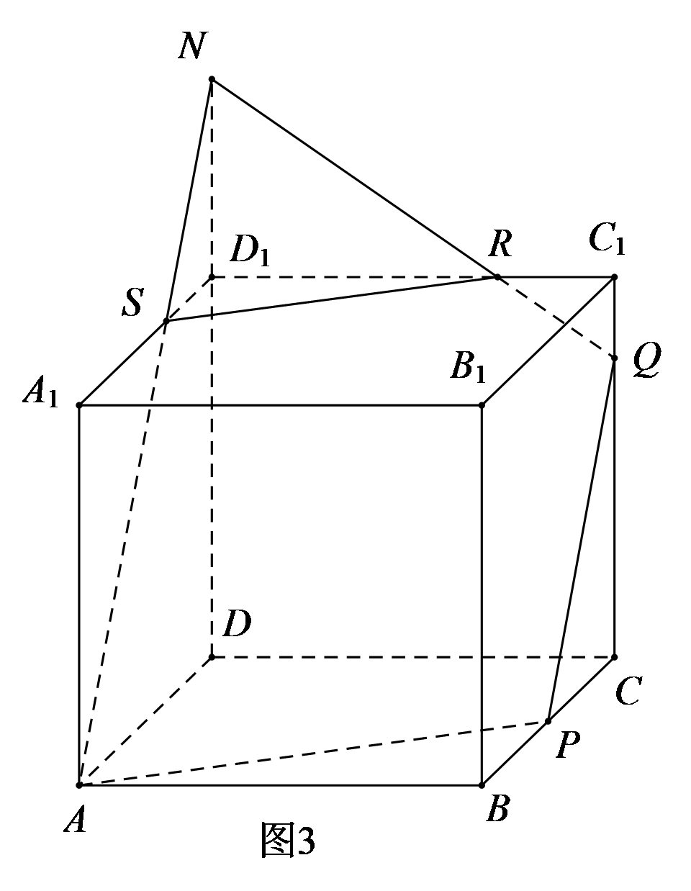

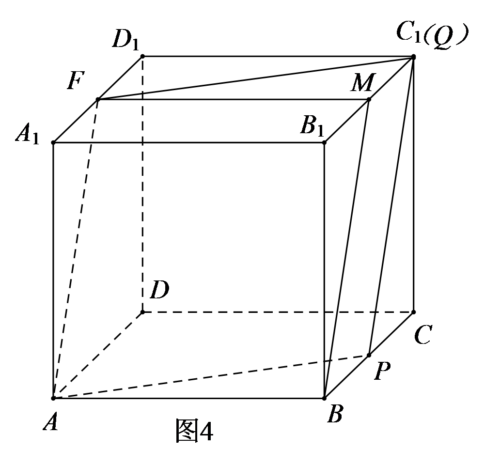

<strong>变式4．</strong>（2024·江苏镇江·高二扬中市第二高级中学校考开学考试）如图，在棱长为的正方体中，点、、分别是棱、、的中点，则由点、、确定的平面截正方体所得的截面多边形的面积等于_____________．

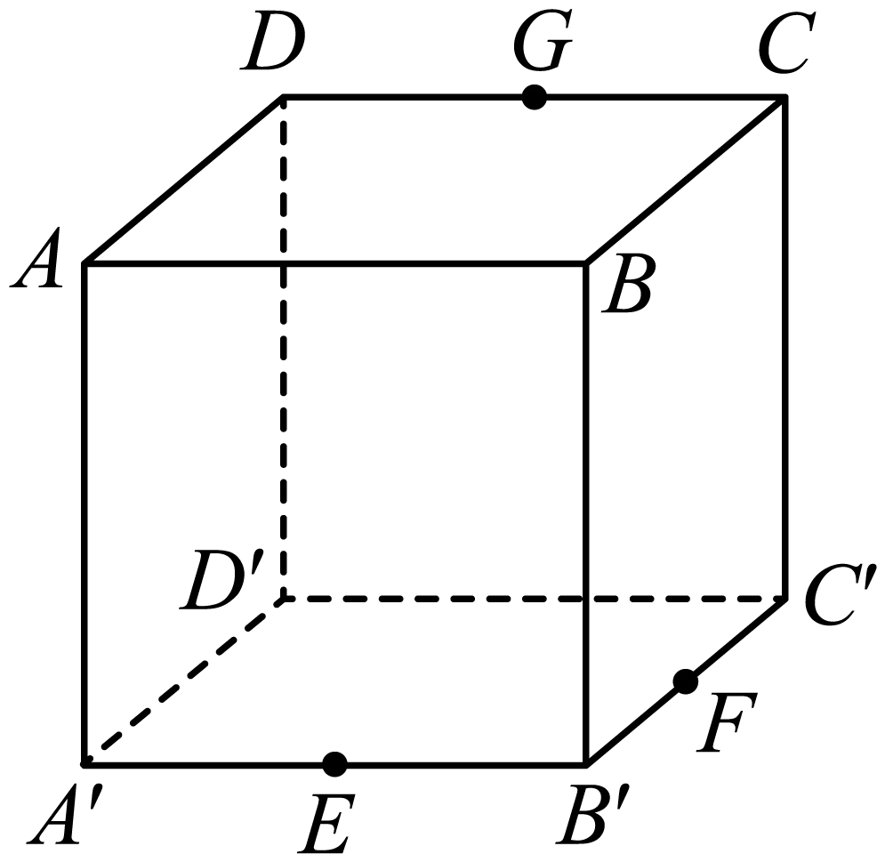

【答案】

【解析】因为、分别为、的中点，则且，

因为且，所以，四边形为平行四边形，所以，，

所以，，设平面交棱于点，

因为平面平面，平面平面，

平面平面，所以，，则，

因为为的中点，所以，为的中点，

设直线分别交、的延长线于点、，连接交棱于点，

连接交棱于点，连接、，则截面为六边形，

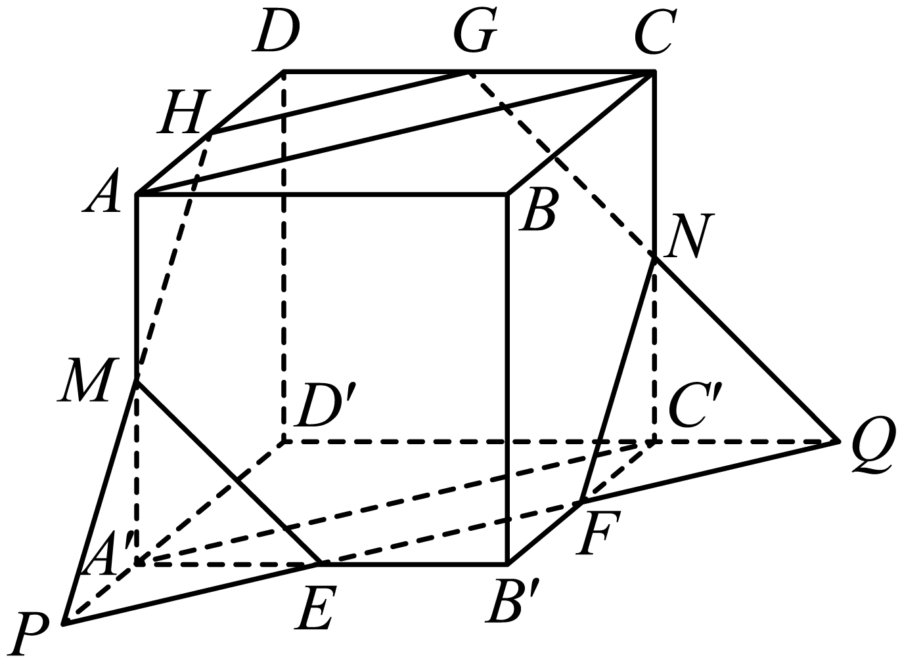

因为，则，

所以，，

因为，则，所以，，则为的中点，

同理可知，为的中点，易知六边形是边长为的正六边形，

所以，截面面积为.

故答案为：.

<strong>变式5．</strong>（2024·河南信阳·高二信阳高中校考阶段练习）在一次通用技术实践课上，木工小组需要将正方体木块截去一角，要求截面经过面对角线上的点（如图），且与平面平行，已知，，则截面面积等于________.

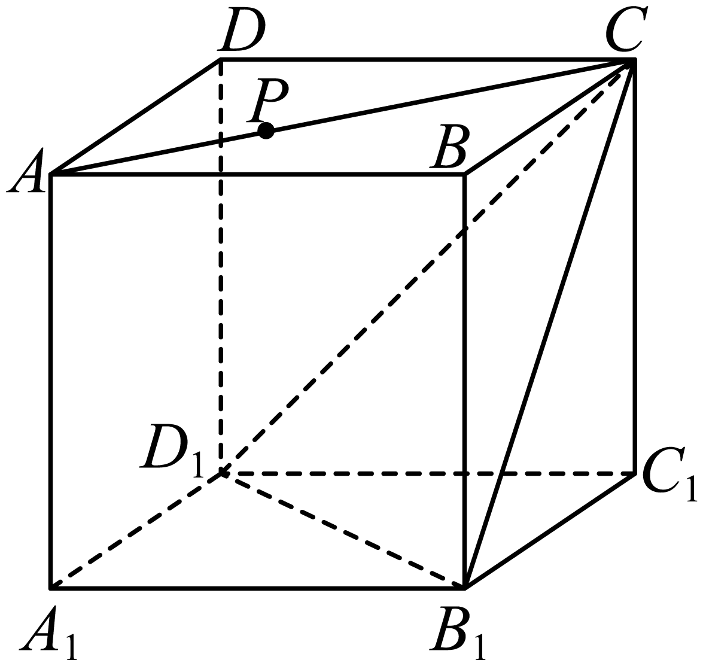

【答案】

【解析】如图，连接交于点，连接、.

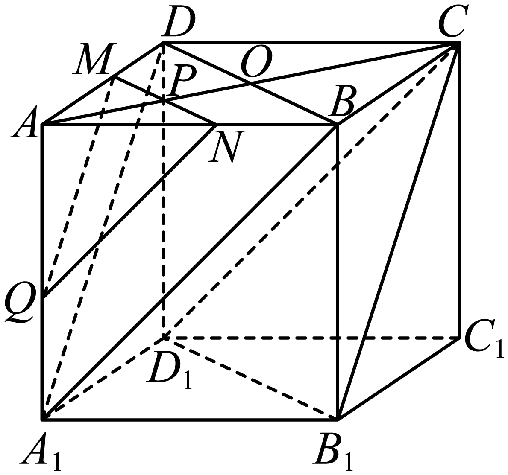

因为且，故四边形为平行四边形，所以，，

因为平面，平面，所以，平面，

同理可证平面，

因为，、平面，所以，平面平面，

故截面平行于平面.

过点作与平行的直线分别交、于点、，在上取点使.

，，，.

因为平面，平面，所以，平面，

又因为，平面，平面，所以，平面，

因为，、平面，所以，平面平面，

易得，故，

因为，

易知是边长为的等边三角形，所以，，

因此，.

故答案为：.

**变式6．**（2024·江苏泰州·高一泰州中学校考阶段练习）正方体的棱长是，其中是中点，是中点，则过点的截面面积是．

【答案】

【解析】在上取使，连接并延长与的延长线交于点，连交于，连接，

由正方体的性质可知，则五边形即为过点的截面，

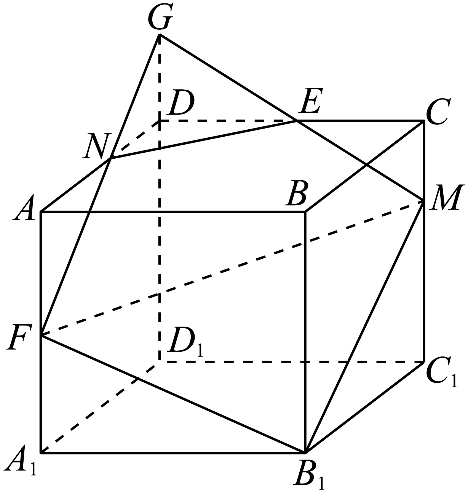

由题可得，，

在中，，

由余弦定理得，所以，

所以平行四边形的面积为，

又由，

所以，

所以截面的面积为.

故答案为：.

<strong>变式7．</strong>（2024·全国·高三专题练习）已知直三棱柱的侧棱长为2，，，过，的中点，作平面与平面垂直，则所得截面周长为___________．

【答案】

【解析】如图，

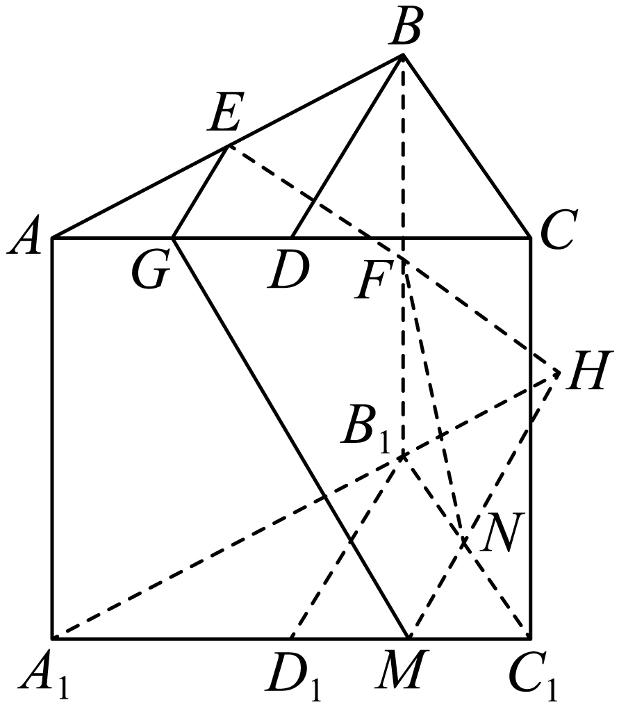

取的中点，连接，取的中点，连接，，

取的中点，连接，连接，并延长与交于，取的中点，连接，交于，连接、，可得，，，即有，又，可得，因为平面，平面，所以，，平面，所以平面，因为，所以平面，平面，由面面垂直的判定定理，可得平面平面，则平面即为平面，由，，，，，可得所得截面周长为．

故答案为：．

<strong>变式8．</strong>（2024·全国·高三专题练习）棱长为1的正方体中，点为棱的中点，则过，，三点的平面截正方体的截面周长为________．

【答案】

【解析】

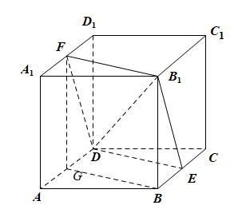

如图，取的中点为，连接，取的中点为，连接，

在正方形中，因为、分别为所在棱的中点，故，

而，，故，，

故四边形为平行四边形，故

在正方形中，因为、分别为所在棱的中点，故，

故四边形为平行四边形，故

故，故四边形为平行四边形，

故四点共面，故过，，三点的平面截正方体的截面为平行四边形.

又，故截面的周长为，

故答案为：.

<strong>变式9．</strong>（2024·四川泸州·四川省泸县第二中学校联考模拟预测）如图，在棱长为2的正方体，中，点<em>E</em>为<em>CD</em>的中点，则过点<em>C</em>且与垂直的平面被正方体截得的截面周长为_________．

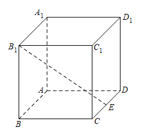

【答案】/

【解析】如图，取中点，中点，连接，设与交于

点*O*，

因为在平面内的射影为，

由可得，

所以，

又因为，

所以，

在四边形中，，

其中，

所以，即，

所以是截面内的一条线，

同理是截面内的一条线，

所以过点*C*且与垂直的平面被正方体截得的截面为，

因为正方体的棱长为2，

所以

截面的周长为，

故答案为：

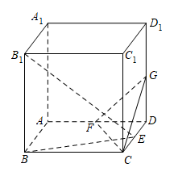

**题型三：截面切割几何体的体积问题**

<strong>例7．</strong>（2024·广东广州·高一统考期末）在棱长为<em>a</em>的正方体中，<em>E</em>，<em>F</em>分别为棱<em>BC</em>，的中点，过点<em>A</em>，<em>E</em>，<em>F</em>作一个截面，该截面将正方体分成两个多面体，则体积较小的多面体的体积为______.

【答案】

【解析】如图，依次连接，四边形即为所求截面，

因为点*E*、*F*分别为棱、的中点，所以∥，

可知为三棱台，所以，

其体积，

且正方体的体积为，

则另一部分的体积为，

因为，所以体积较小的多面体的体积为.

故答案为：.

<strong>例8．</strong>（2024·辽宁锦州·校考一模）在正四棱锥中，为的中点，过作截面将该四棱锥分成上､下两部分，记上､下两部分的体积分别为，则的最大值是___________.

【答案】2

【解析】记正四棱锥的体积为，的最大值，由为定值知，只需求的最小值，

设过的截面分别交和于，平面与平面的交线为与相交于，如图，

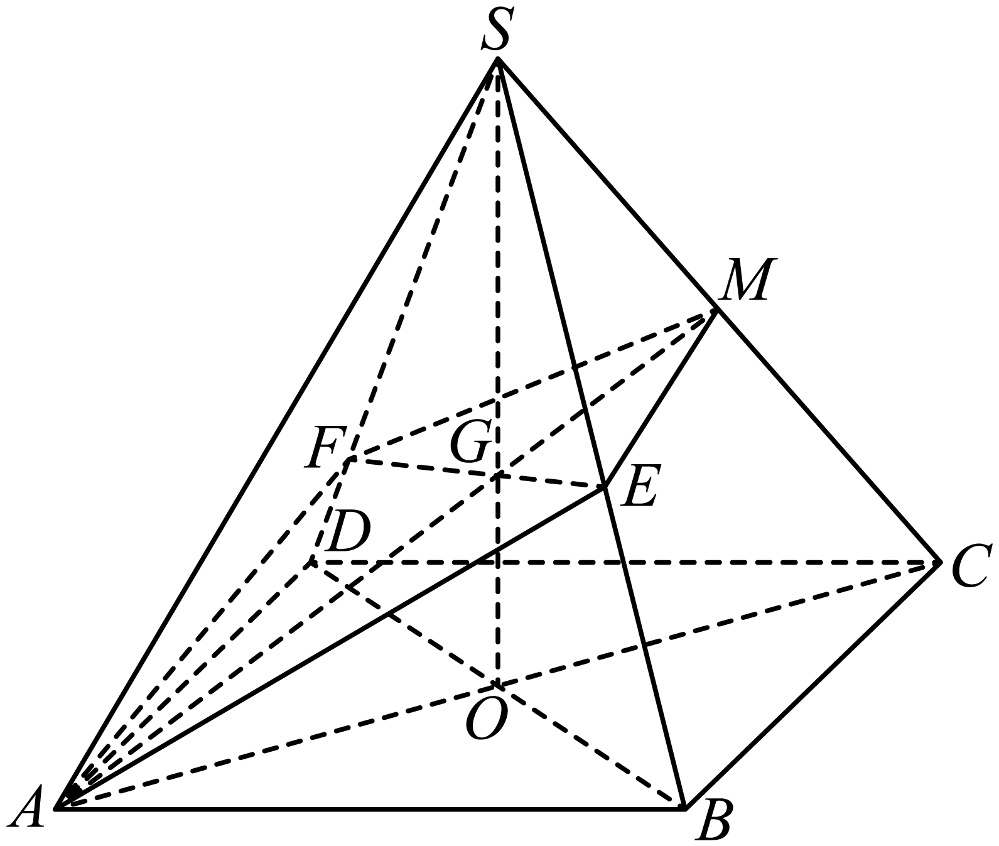

则，令，则，即有，

，

当且仅当时取等号，此时，

所以的最大值是2.

故答案为：2

<strong>例9．</strong>（2024·浙江·高二竞赛）在正四棱锥中，<em>M</em>在棱上且满足.过作截面将此四棱锥分成上，下两部分，记上，下两部分的体积分别为，，则的最大值为______.

【答案】

【解析】设过AM的平面交SB,SD于G,P，

将平面MGAP延伸，交BC,CD于E，F，则A，E，F共线.

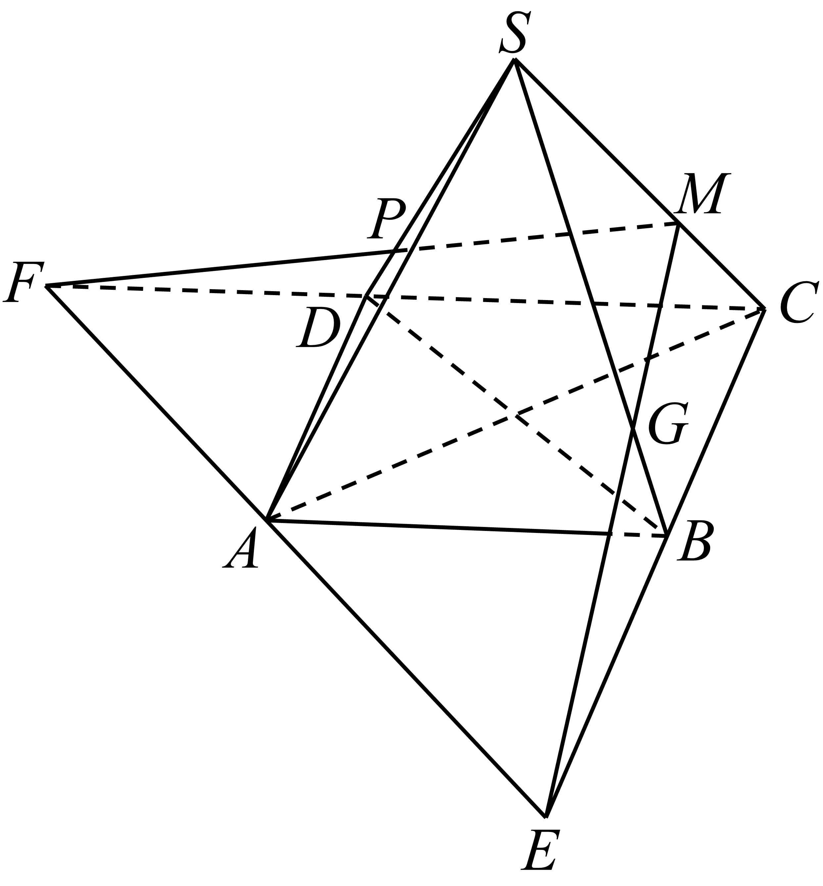

设，

，

又，

而，

由于

，

，，

.

故答案为：.

<strong>变式10．</strong>（2024·上海·高二专题练习）如图，正方体，中，<em>E</em>､<em>F</em>分别是棱<em>AB</em>､<em>BC</em>的中点，过点､<em>E</em>､<em>F</em>的截面将正方体分割成两个部分，记这两个部分的体积分别为，记，则_____.

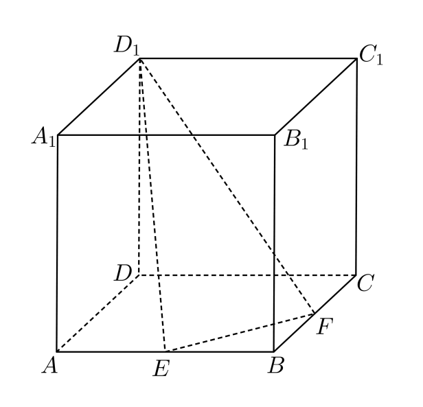

【答案】

【解析】延长交的延长线与点，连接交于点，连接：

延长交的延长线与点，连接交于点，连接：

所以过的截面为，如下图示：

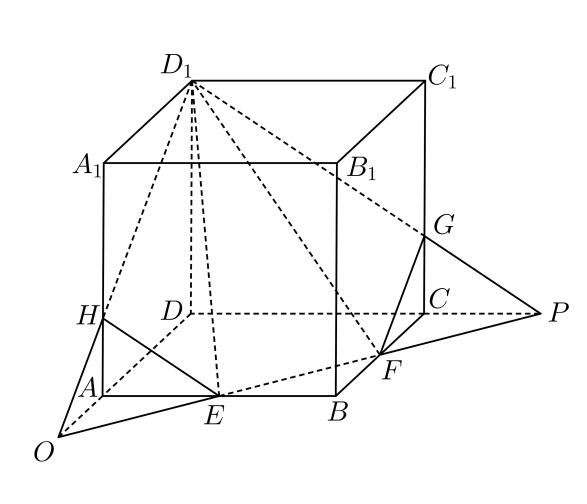

设正方体的棱长为，

则过的截面下方几何体的体积为，

所以另一部分体积为，则.

故答案为：

<strong>变式11．</strong>（2024·全国·高一专题练习）如图所示，在长方体中，用截面截下一个三棱锥，则三棱锥的体积与剩余部分的体积之比为______.

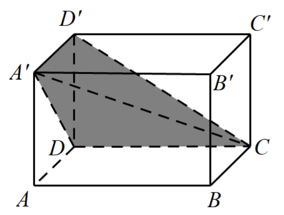

【答案】

【解析】设，，，所以长方体体积

三棱锥的体积，

∴剩余部分的体积

∴三棱锥的体积与剩余部分的体积之比为.

故答案为：.

<strong>变式12．</strong>（2024·贵州贵阳·贵阳六中校考一模）在三棱柱中，底面，，点<em>P</em>是棱上的点，，若截面分这个棱柱为两部分，则这两部分的体积比为___________.

【答案】或

【解析】取的中点，连接，

因为，所以，

因为底面，底面，

所以，

又，所以平面，

不妨设，则，，

，

，

故上面一部分的体积为，

则，

所以两部分的体积比为或.

故答案为：或.

<strong>变式13．</strong>（2024·广东揭阳·高一普宁市华侨中学校考阶段练习）如图，正方体中，<em>E</em>､<em>F</em>分别是棱､的中点，则正方体被截面<em>BEFC</em>分成两部分的体积之比_______.

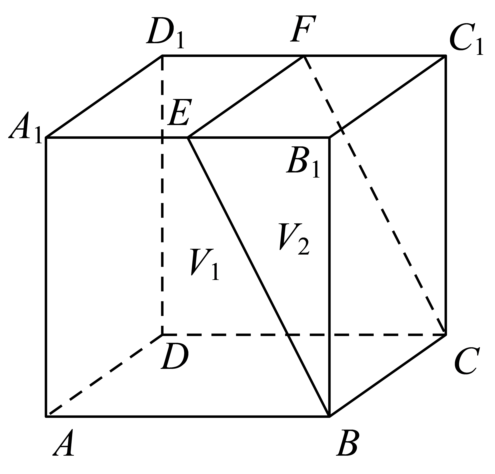

【答案】

【解析】设正方体的棱长为，体积为，则

，

因为*E*是棱的中点，所以，

，

.

.

故答案为：

**题型四：球与截面问题**

**例10．**（2024·湖南长沙·高三长沙一中校考阶段练习）如图，在棱长为1的正方体中，分别为棱的中点，过作该正方体外接球的截面，所得截面的面积的最小值为（    ）

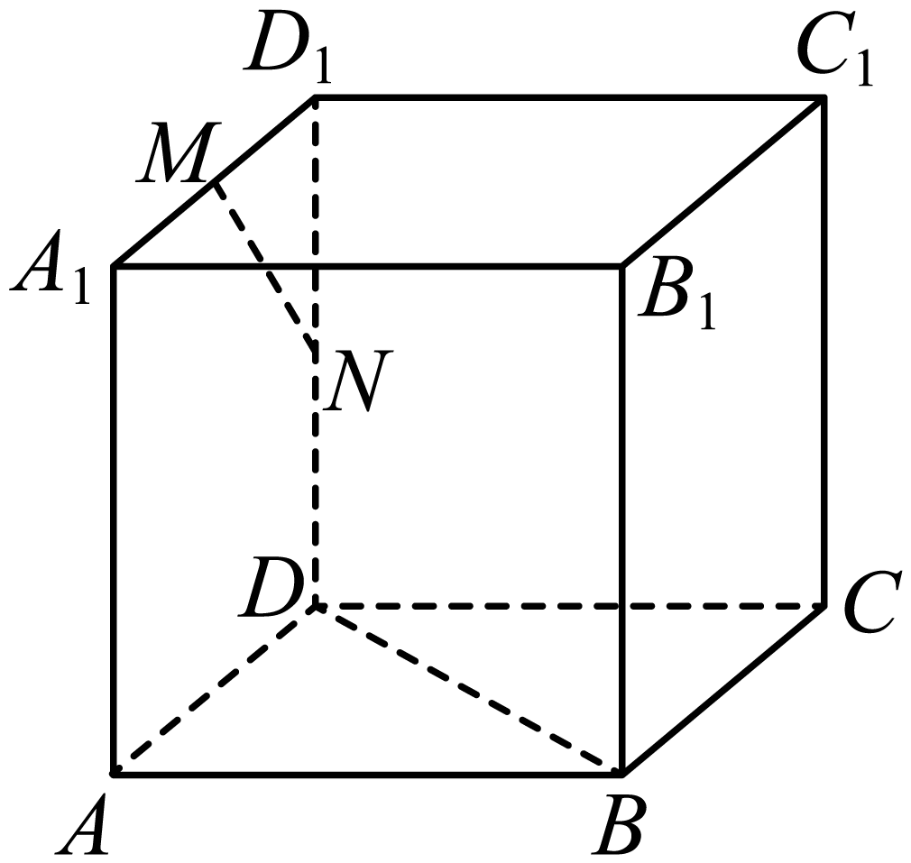

A．	B．	C．	D．

【答案】C

【解析】如图，

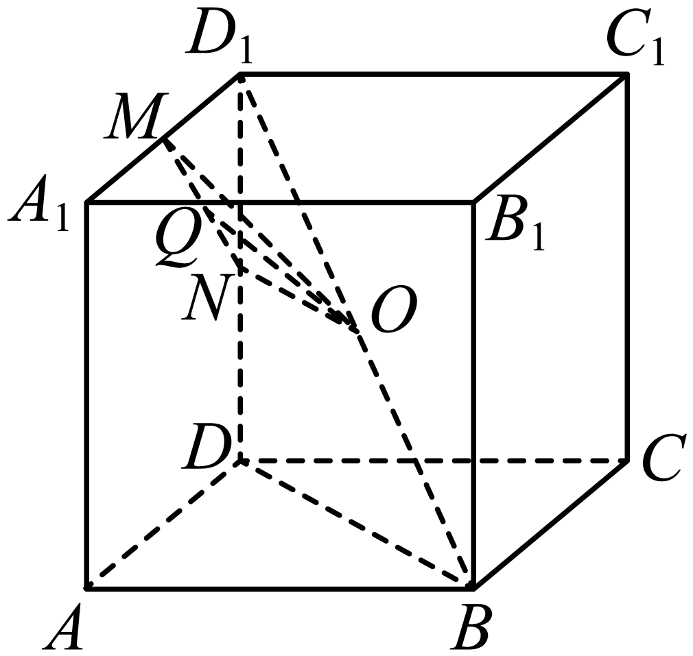

正方体外接球的球心在其中心点处，球的半径，

要使过的平面截该球得到的截面面积最小，则截面圆的圆心为线段的中点，

连接，则，

所以，

此时截面圆的半径，

此时，截面面积的最小值.

故选：C.

**例11．**（2024·福建福州·福建省福州第一中学校考模拟预测）在矩形中，，将沿对角线翻折至的位置，使得平面平面，则在三棱锥的外接球中，以为直径的截面到球心的距离为（    ）

A．	B．	C．	D．

【答案】B

【解析】如图，取的中点为，连接，过作，垂足为，连接.

因为三角形为直角三角形，故，

同理，故，

所以为三棱锥的外接球的球心，而，

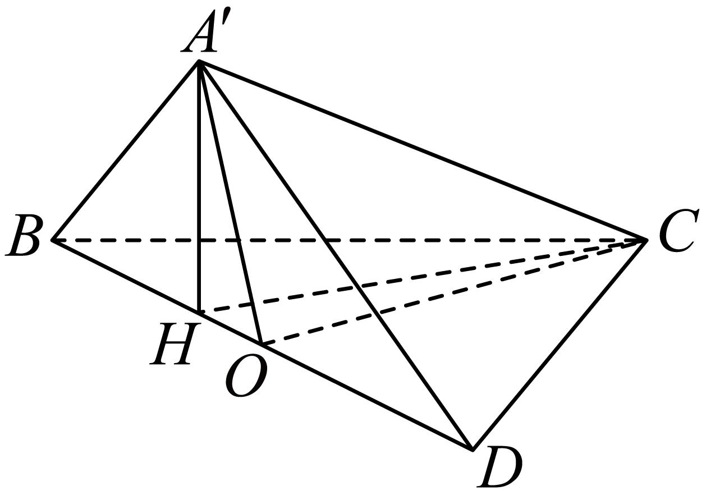

因为，平面，平面平面，

平面平面，故平面，

而平面，故.

在直角三角形中，，故，

故，

在直角三角形中，，

故，故.

设球心到以为直径的截面的距离为，

则，

故选：B.

**例12．**（2024·海南·高三校联考期末）已知某球的体积为，该球的某截面圆的面积为，则球面上的点到该截面圆圆心的最大距离为（    ）

A．1	B．3	C．	D．

【答案】B

【解析】设截面圆的半径为，球的半径为球心到截面的距离为，

则，

因为球的体积为,

所以，

因为截面圆的面积为，

所以，故，

所以，

所以球面上的点到该截面圆圆心的最大距离为，

故最大距离为3.

故选：B.

**变式14．**（2024·江西南昌·江西师大附中校考三模）已知正方体的棱长为，为棱上的一点，且满足平面平面，则平面截四面体的外接球所得截面的面积为（    ）

A．	B．	C．	D．

【答案】A

【解析】在正方体中，设平面平面，且平面，

由平面平面，可得，所以是的中点，

又四面体的外接球的直径为，可得半径，

设是的中点即球心，球心到平面的距离为，

又设与的交点为，则，则，

则，则截面圆的半径，

所以截面圆的面积为.

故选：A．

<strong>变式15．</strong>（2024·四川内江·四川省内江市第六中学校考模拟预测）已知球<em>O</em>是正三棱锥（底面是正三角形，顶点在底面的射影为底面中心）的外接球，，，点<em>E</em>是线段<em>BC</em>的中点，过点<em>E</em>作球<em>O</em>的截面，则所得截面面积的最小值是（    ）

A．	B．	C．	D．

【答案】A

【解析】如图：

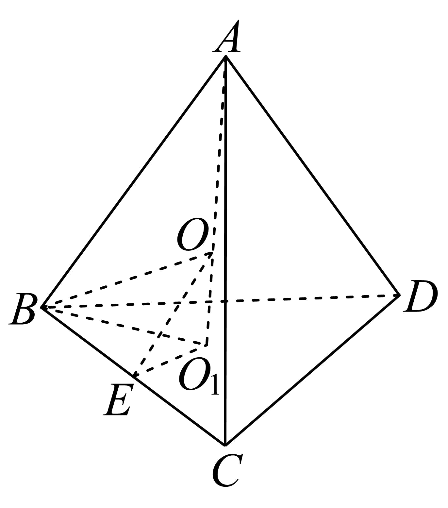

是在底面的射影，由正弦定理得，的外接圆半径.

由勾股定理得棱锥的高设球的半径为，

则，解得，

所以，即与重合，

所以当过点*E*作球*O*的截面垂直于时，截面面积最小，

此时截面半径为，截面面积为.

故选：A.

**变式16．**（2024·福建厦门·厦门外国语学校校考模拟预测）已知半径为4的球，被两个平面截得圆，记两圆的公共弦为，且，若二面角的大小为，则四面体的体积的最大值为（    ）

A．	B．	C．	D．

【答案】C

【解析】设弦的中点为，连接，依题意，可得如下图形，

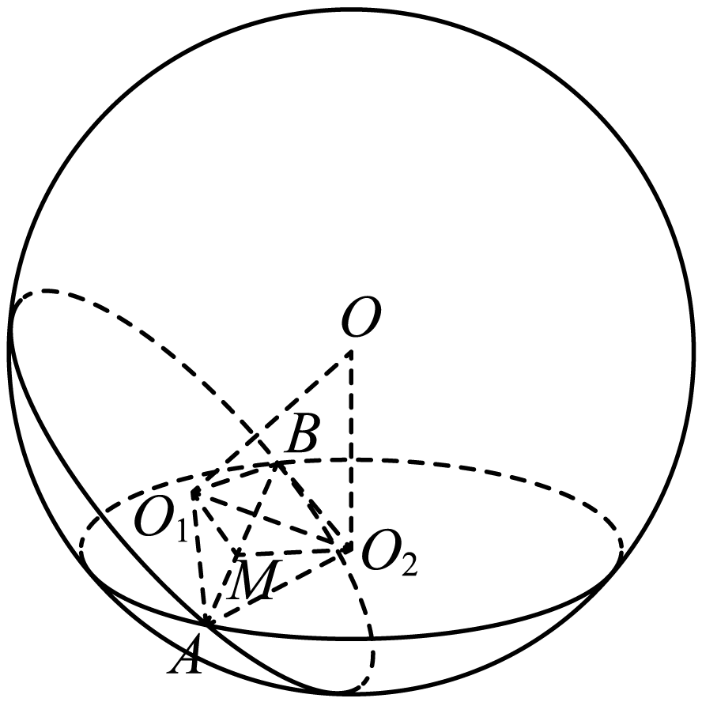

由圆的性质可知，则即为二面角的平面角，

故，

四面体的体积为

，

其中

，当且仅当时取等号，

由球的截面性质，，，

所以四点共圆，则有外接圆直径，

从而，

.

故选：C

**变式17．**（2024·全国·高三专题练习）已知球和正四面体，点在球面上，底面过球心，棱分别交球面于，若球的半径，则所得多面体的体积为（    ）

A．	B．	C．	D．

【答案】D

【解析】设正四面体，棱长为，

如图所示：

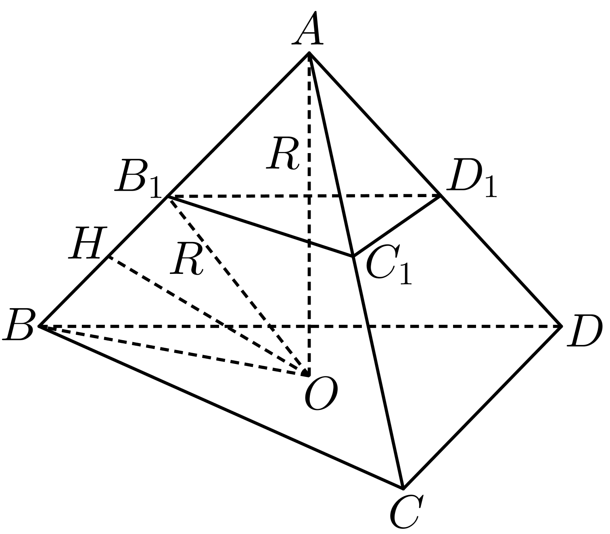

设外接球的球心为，半径为，所以，解得，

由于，所以，

在中，过*O*作*AB*垂线*OH*，由面积可得，则，

利用勾股定理：，

即：，,

多面体的体积为.

故选：D.

**变式18．**（2024·天津红桥·统考二模）用与球心距离为1的平面去截球，所得的截面面积为，则球的体积为（    ）

A．	B．

C．	D．

【答案】D

【解析】设截面圆的半径为，球的半径为,

由题意可知，解得，，

所以球的体积为.

故选：D.

**题型五：截面图形的个数问题**

<strong>例13．</strong>（2024·全国·高三专题练习）过正四面体的顶点<em>P</em>作平面，若与直线，，所成角都相等，则这样的平面的个数为（    ）个

A．3	B．4	C．5	D．6

【答案】B

【解析】如图，将正四面体看成四棱柱的左下角一部分，

由正四面体可知，

平面与直线，，所成角都相等，

故过点*P*做平面平面，

则此时的平面与直线，，所成角都相等，

因为，

则与平面所成的角相等，

又因，

所以直线，，与平面所成的角相等，

故过点*P*做平面平面，

则此时的平面与直线，，所成角都相等，

同理，直线，，与平面、平面所成角都相等，

即平面平面时，平面与直线，，所成角都相等，

平面平面时，平面与直线，，所成角都相等，

综上所述，这样的平面的个数为4个.

故选：B.

**例14．**（2024·陕西榆林·陕西省榆林中学校考三模）过正方体的顶点作平面，使得正方体的各棱与平面所成的角都相等，则满足条件的平面的个数为（    ）

A．	B．	C．	D．

【答案】C

【解析】法一：直线<em>AB</em>、<em>AD</em>、<em>AA1</em>与平面<em>A1BD</em>所成角都相等，过顶点<em>A</em>作平面α∥平面<em>A1BD</em>，过顶点<em>A</em>分别作平面α与平面<em>C1BD</em>、平面<em>B1AC</em>，平面<em>D1AC</em>平行，直线<em>AB</em>、<em>AD</em>、<em>AA1</em>与平面α所成的角都相等．

法二：只要与体对角线垂直的平面都和正方体的所有棱所成的角相等，由此能求出结果．解法一：在正方体<em>ABCD</em>﹣<em>A1B1C1D1</em>中，

三棱锥<em>A</em>﹣<em>A1BD</em>是正三棱锥，

直线<em>AB</em>、<em>AD</em>、<em>AA1</em>与平面<em>A1BD</em>所成角都相等，

过顶点<em>A</em>作平面α∥平面<em>A1BD</em>，

则直线<em>AB</em>、<em>AD</em>、<em>AA1</em>与平面α所成角都相等，

同理，过顶点<em>A</em>分别作平面α与平面<em>C1BD</em>、平面<em>B1AC</em>，平面<em>D1AC</em>平行，

直线<em>AB</em>、<em>AD</em>、<em>AA1</em>与平面α所成的角都相等，

∴这样的平面α可以作4个．

故选：C

解法二：只要与体对角线垂直的平面都和正方体的所有棱所成的角相等

因为有四条体对角线，所以，可以做四个平面．

故选：C

**例15．**（2024·全国·高三专题练习）设四棱锥的底面不是平行四边形,用平面去截此四棱锥,使得截面四边形是平行四边形,则这样的平面

A．有无数多个	B．恰有个	C．只有个	D．不存在

【答案】A

【解析】

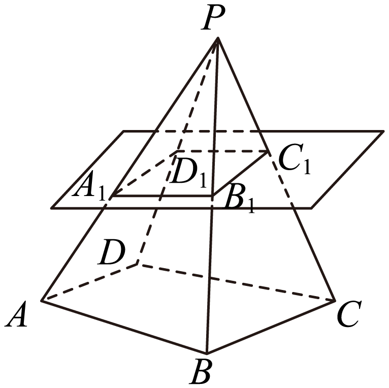

如图由题知面与面相交，面与面相交，可设两组相交平面的交线分别为，由决定的平面为，作与且与四条侧棱相交，交点分别则由面面平行的性质定理得：从而得截面必为平行四边形．由于平面可以上下平移，可知满足条件平面有无数多个．故本题答案选．

<strong>变式19．</strong>（2024·浙江·模拟预测）过正四面体<em>ABCD</em>的顶点<em>A</em>作一个形状为等腰三角形的截面，且使截面与底面<em>BCD</em>所成的角为，这样的截面有（    ）

A．6个	B．12个	C．16个	D．18个

【答案】D

【解析】如图，在正四面体*ABCD*中，因为过点*A*的截面是等腰三角形，

若，则截面与底面*BCD*所成的角为有如下情形，

如图所示：

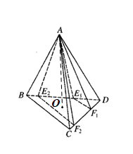

在高线的两侧的截面、截面与底面*BCD*所成的角为（，与*BC*平行），

同理截面的一边与*CD*平行也有2个，与*BD*平行也有2个，共有6个．

若，同理也有6个；

若，同理也有6个．

综上所述，满足题意的截面共有18个，

故选：D．

<strong>变式20．</strong>（2024·上海杨浦·高二上海市控江中学校考期中）空间给定不共面的<em>A</em>，<em>B</em>，<em>C</em>，<em>D</em>四个点，其中任意两点间的距离都不相同，考虑具有如下性质的平面：<em>A</em>，<em>B</em>，<em>C</em>，<em>D</em>中有三个点到的距离相同，另一个点到的距离是前三个点到的距离的2倍，这样的平面的个数是\_\_\_\_\_\_\_\_\_\_\_个

【答案】32

【解析】首先取3个点相等，不相等的那个点由4种取法；

然后分3分个点到平面的距离相等，有以下两种可能性：

（1）全同侧，这样的平面有2个；

（2）不同侧，必然2个点在一侧，另一个点在一侧，

1个点的取法有3种，并且平面过三角形两个点边上的中位线，

考虑不相等的点与单侧点是否同侧有两种可能，每种情况下都唯一确定一个平面，

故共有6个，

所有这两种情况共有8个，综上满足条件的这样的平面共有个，

故答案为：32

**题型六：平面截圆锥问题**

**例16．（多选题）（2024·广东·高二统考期末）** 圆锥曲线为什么被冠以圆锥之名？因为它可以从圆锥中截取获得.我们知道，用一个垂直于圆锥的轴的平面去截圆锥，截口曲线（截而与圆锥侧面的交线）是一个圆，用一个不垂直于轴的平面截圆锥，当截面与圆锥的轴的夹角不同时，可以得到不同的截口曲线，它们分别是椭圆、抛物线、双曲线.因此，我们将圆、椭圆、抛物线、双曲线统称为圆锥曲线.截口曲线形状与和圆锥轴截面半顶角有如下关系；当时，截口曲线为椭圆；当时，截口曲线为抛物线：当时，截口曲线为双曲线.（如左图）

现有一定线段*AB*与平面夹角（如上右图），*B*为斜足，上一动点*P*满足，设*P*点在的运动轨迹是，则（    ）

A．当，时，是椭圆	B．当，时，是双曲线

C．当，时，是抛物线	D．当，时，是椭圆

【答案】ACD

【解析】∵*AB*为定线段，为定值，∴*P*在以*AB*为轴的圆锥上运动，

其中圆锥的轴截面半顶角为，与圆锥轴*AB*的夹角为

对于A，，∴平面截圆锥得椭圆，A正确；对于B，，是椭圆，B错.

对于C，，是抛物线，C正确.对于D，，是椭圆，D正确.

故选：ACD.

**例17．**（2024·辽宁阜新·校考模拟预测）比利时数学家丹德林( GerminalDandelin)发现：在圆锥内放两个大小不同且不相切的球使得它们与圆锥的侧面相切，用与两球都相切的平面截圆锥的侧面得到的截线是椭圆．这个结论在圆柱中也适用，如图所示，在一个高为20，底面半径为4的圆柱体内放两个球，球与圆柱底面及侧面均相切．若一个平面与两个球均相切，则此平面截圆柱侧面所得的截线为一个椭圆，则该椭圆的短轴长为（    ）

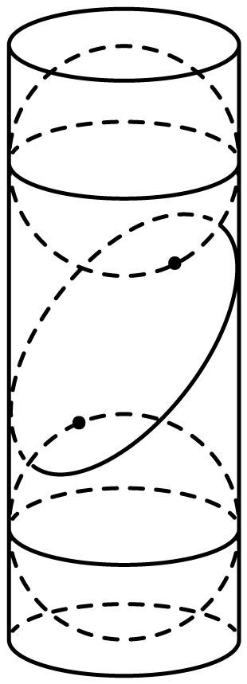

A．	B．	C．	D．

【答案】D

【解析】由平面与圆柱所截可知椭圆的短轴即为圆柱底面直径的长，即，

故选：D

**例18．**（2024·安徽安庆·安徽省桐城中学校考一模）.如图是数学家GerminalDandelin用来证明一个平面截圆锥得到的截口曲线是椭圆的模型（称为“Dandelin双球”）；在圆锥内放两个大小不同的小球，使得它们分别与圆锥的侧面、截面相切，设图中球，球的半径分别为4和1，球心距，截面分别与球，球切于点，，（，是截口椭圆的焦点），则此椭圆的离心率等于（    ）

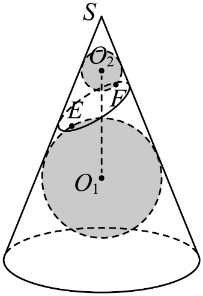

A．	B．	C．	D．

【答案】A

【解析】依题意，截面椭圆的长轴与圆锥的轴相交，椭圆长轴所在直线与圆锥的轴确定的平面截此组合体，

得圆锥的轴截面及球，球的截面大圆，如图，

点分别为圆与圆锥轴截面等腰三角形一腰相切的切点，线段是椭圆长轴，

椭圆长轴长，

过作于*D*，连，显然四边形为矩形，

又，

则，

过作交延长线于*C*，显然四边形为矩形，

椭圆焦距，

所以椭圆的离心率．

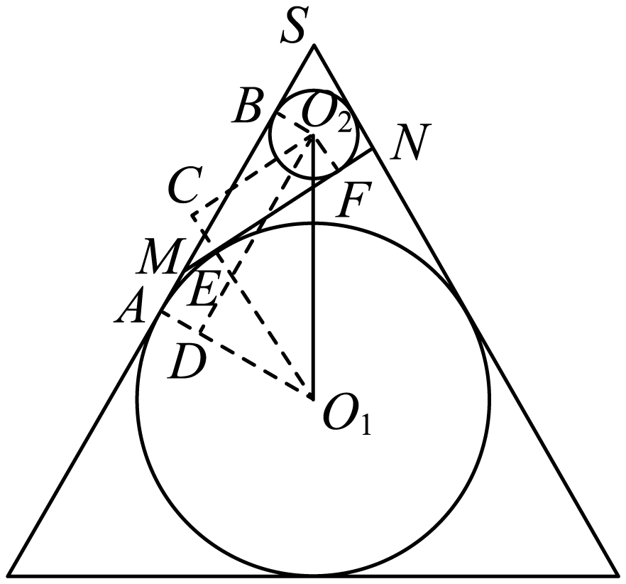

故选：A.

<strong>变式21．</strong>（2024·上海·高二专题练习）如图①，用一个平面去截圆锥得到的截口曲线是椭圆.许多人从纯几何的角度出发对这个问题进行过研究，其中比利时数学家<em>Germinaldandelin</em>（）的方法非常巧妙，极具创造性.在圆锥内放两个大小不同的球，使得它们分别与圆锥的侧面､截面相切，两个球分别与截面相切于，在截口曲线上任取一点，过作圆锥的母线，分别与两个球相切于，由球和圆的几何性质，可以知道，，，于是.由的产生方法可知，它们之间的距离是定值，由椭圆定义可知，截口曲线是以为焦点的椭圆.

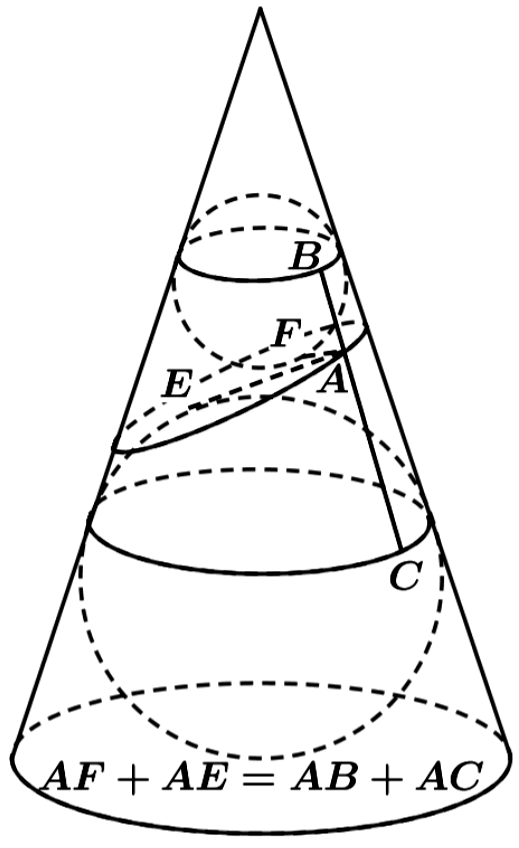

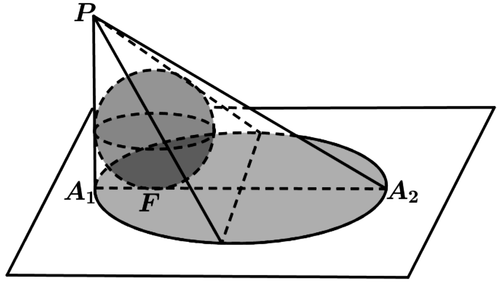

如图②，一个半径为的球放在桌面上，桌面上方有一个点光源，则球在桌面上的投影是椭圆，已知是椭圆的长轴，垂直于桌面且与球相切，，则椭圆的焦距为（    ）

A．	B．	C．	D．

【答案】C

【解析】设球与相切与点，作出轴截面如下图所示，

由题意知：，，，

，

又，，，又，，

椭圆的焦距为.

故选：C.

<strong>变式22．</strong>（2024·全国·高三对口高考）如图，定点<em>A</em>和<em>B</em>都在平面内，定点，<em>C</em>是内异于<em>A</em>和<em>B</em>的动点，且．那么，动点<em>C</em>在平面内的轨迹是（    ）

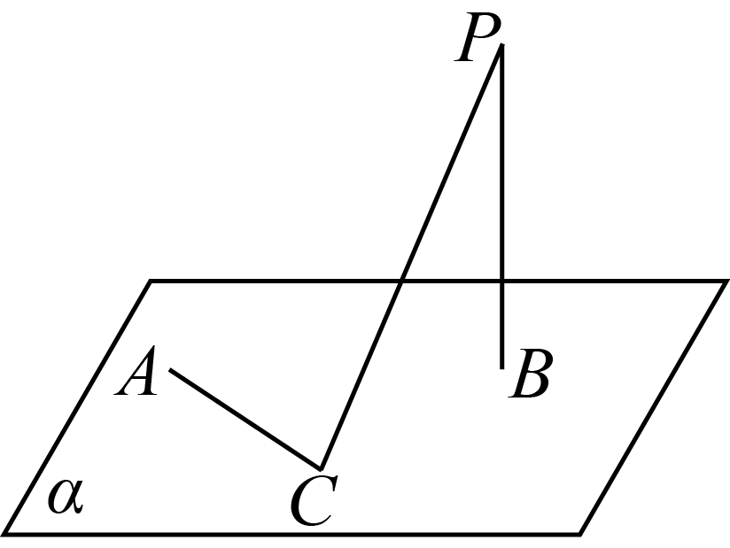

A．一条线段，但要去掉两个点	B．一个圆，但要去掉两个点

C．一个椭圆，但要去掉两个点	D．半圆，但要去掉两个点

【答案】B

【解析】连接.

，则，又，

，平面，则平面，

又平面，则，

则动点*C*在平面内的轨迹是以为直径的圆（去掉两个点）.

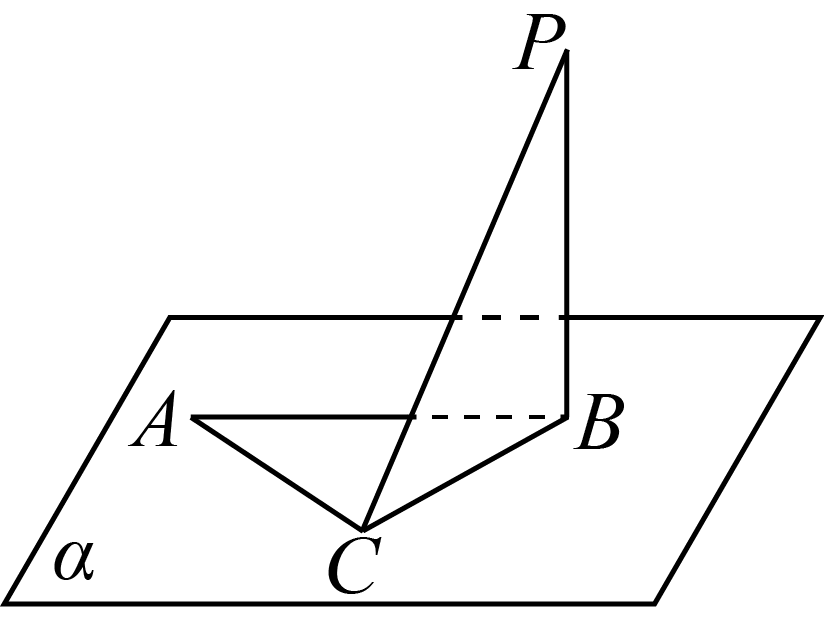

故选：B

**变式23．**（2024·全国·学军中学校联考模拟预测）已知空间中两条直线、异面且垂直，平面且，若点到、距离相等，则点在平面内的轨迹为（    ）

A．直线	B．椭圆	C．双曲线	D．抛物线

【答案】C

【解析】设在内的射影为，到的距离为，

以与的交点为原点，为轴，为轴，与的公垂线为轴，建立如图所示的空间直角坐标系.

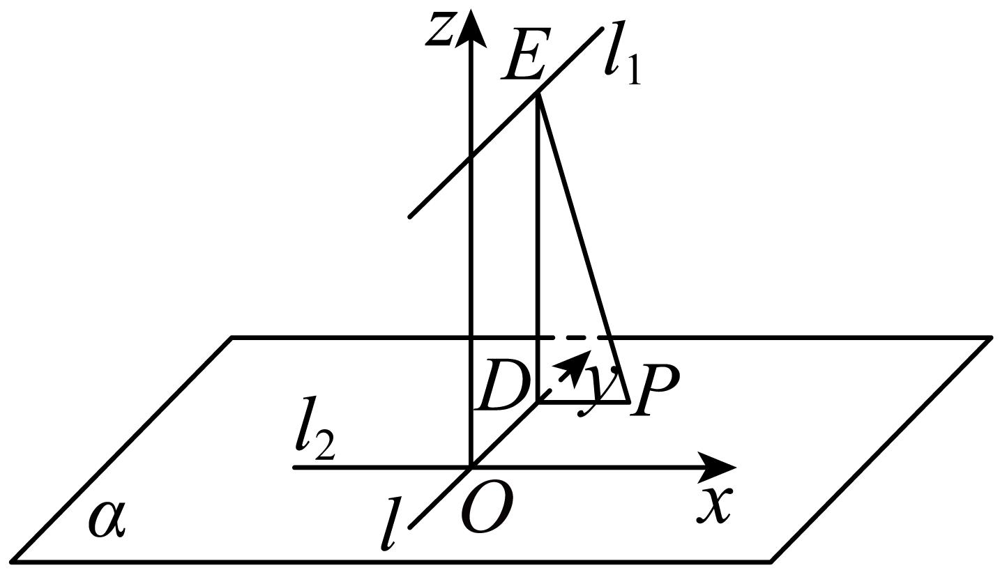

设，则到的距离为.

过点作于点，过点作于点，

又在内的射影为，则，连结,

又，，

所以平面，又平面，

所以，所以，

所以则到的距离为,

因为点到、距离相等，

所以，即，

所以点在平面内的轨迹为双曲线.

故选：C.

**变式24．**（2024·宁夏银川·校联考二模）已知线段垂直于定圆所在的平面，是圆上的两点，是点在上的射影，当运动，点运动的轨迹（    ）

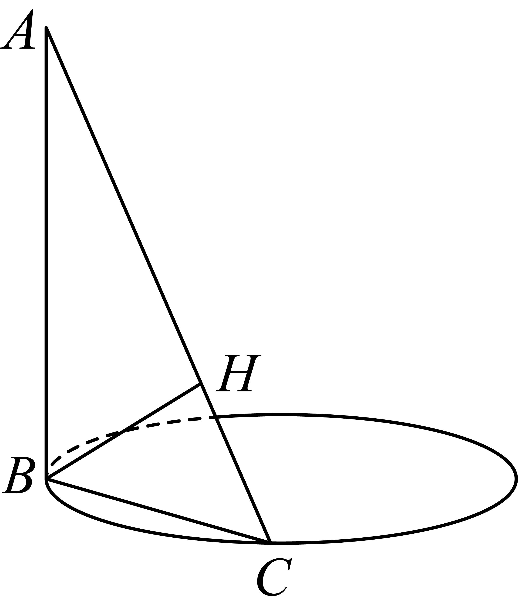

A．是圆	B．是椭圆	C．是抛物线	D．不是平面图形

【答案】A

【解析】设定圆圆心为，半径为，

连接，设直径为，连接，

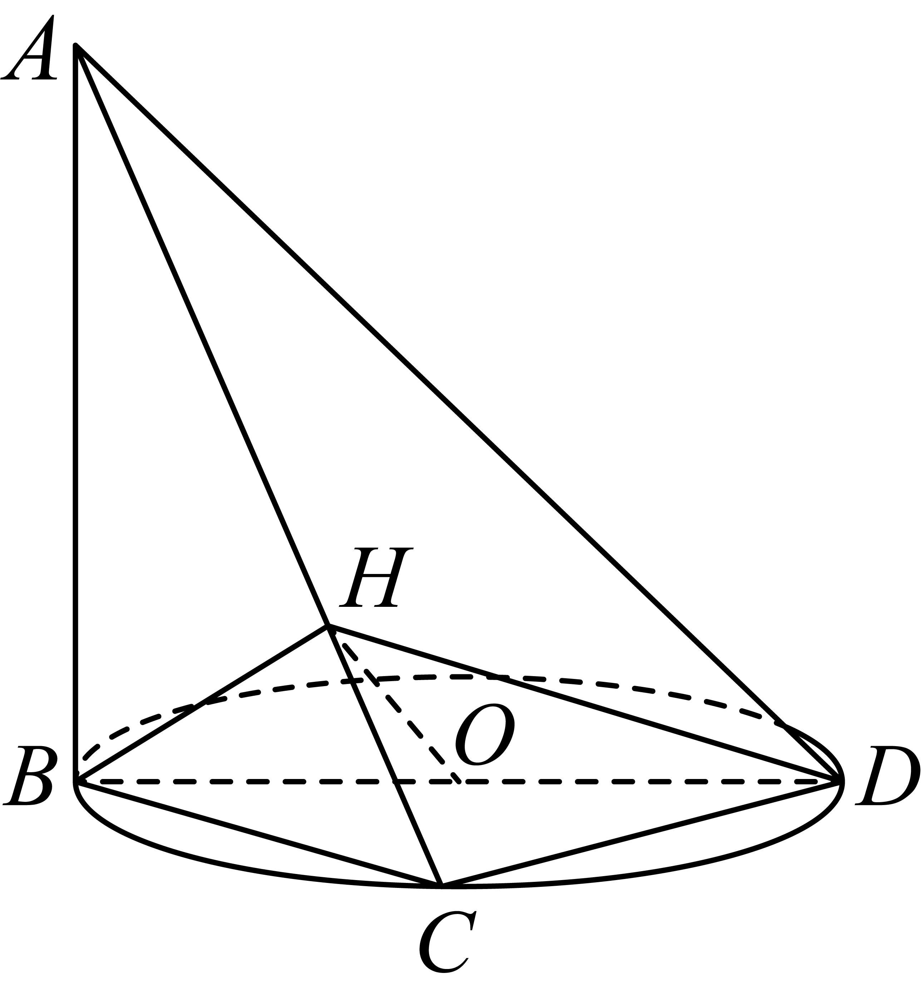

平面，平面，；

为直径，，又，平面，

平面，又平面，，

又，，平面，

平面，平面，，

在中，，则点的轨迹是以为圆心，为半径的圆.

故选：A.

**变式25．**（2024·四川广安·高二广安二中校考期中）美学四大构件是：史诗、音乐、造型（绘画、建筑等）和数学.素描是学习绘画的必要一步，它包括明暗素描和结构素描，而学习几何体结构素描是学习索描的重要一步.某同学在画切面圆柱体（用与圆柱底面不平行的平面去截圆柱，底面与截面之间的部分叫做切面圆柱体，原圆柱的母线被截面所截剩余的部分称为切面圆柱体的母线）的过程中，发现“切面”是一个椭圆，若切面圆柱体的最长母线与最短母线所确定的平面截切面圆柱体得到的截面图形是一个底角为60°的直角梯形，设圆柱半径，则该椭圆的焦距为（    ）

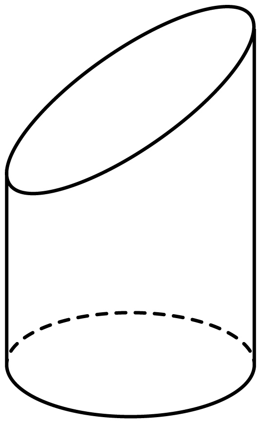

A．	B．	C．	D．

【答案】A

【解析】依题意知，最长母线与最短母线所在截面如图所示．

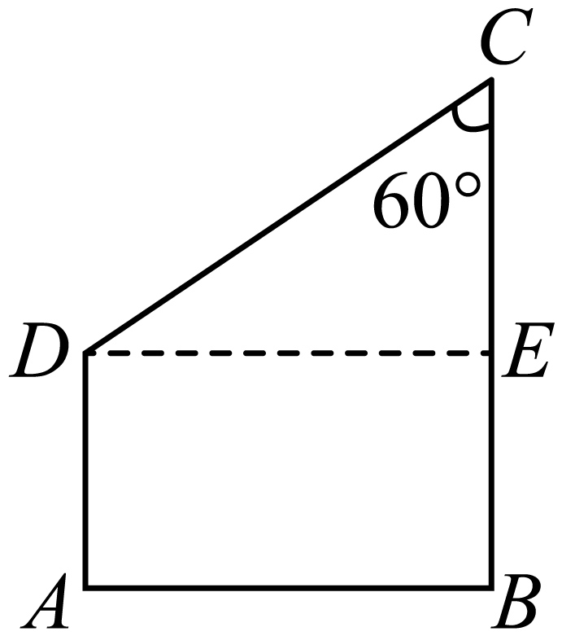

．

从而．

因此在椭圆中长轴长，所以

短轴长，所以，

，所以，则.

故选：A．

<strong>变式26．</strong>（2024·全国·高三专题练习）如图，正方体，<em>P</em>为平面内一动点，设二面角的大小为，直线与平面所成角的大小为.若，则点<em>P</em>的轨迹是（    ）

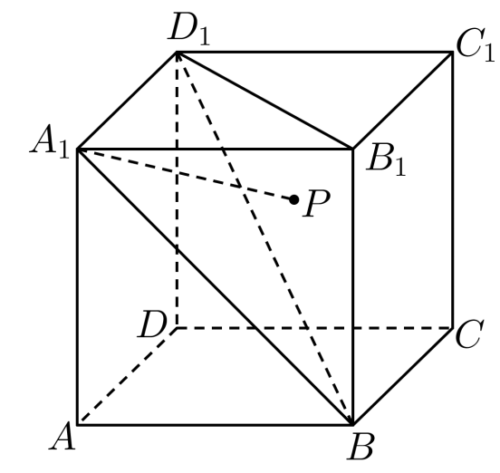

A．圆	B．抛物线	C．椭圆	D．双曲线

【答案】D

【解析】连接*AC*交*BD*于*O*，取中点,连接

以*O*为原点,分别以*OA*、*OB*、所在直线为*x*轴、*y*轴、*z*轴建立空间直角坐标系，如图：

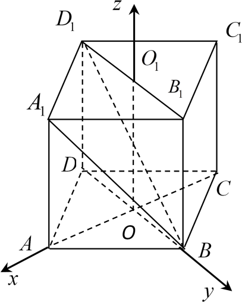

令正方体边长为2，则，

面的一个法向量为，

面的一个法向量为

则，故二面角的大小为

又二面角的大小，则或

由，，可得

又

整理得

即，是双曲线.

故选：D

<strong>变式27．</strong>（2024·四川广安·高二统考期末）已知四棱锥，平面<em>PAB</em>，平面<em>PAB</em>，底面<em>ABCD</em>是梯形，，，，满足上述条件的四棱锥的顶点<em>P</em>的轨迹是（    ）

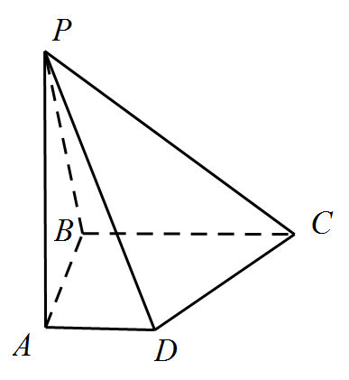

A．椭圆	B．椭圆的一部分	C．圆	D．不完整的圆

【答案】D

【解析】因为平面*PAB*，平面*PAB*，则//，

又面面，故可得；

因为，故可得，

则，

综上所述：动点在垂直的平面中，且满足；

为方便研究，不妨建立平面直角坐标系进行说明，

在平面中，因为，以中点为坐标原点，

以为轴，过且垂直于的直线为轴建立平面直角坐标系，如下所示：

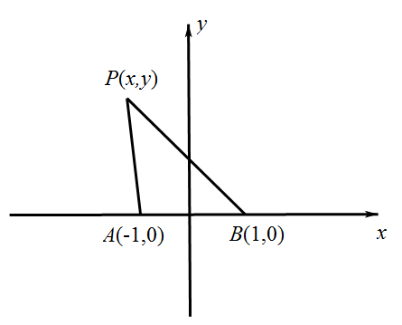

因为，故可得，

整理得：，

故动点的轨迹是一个圆；

又当三点共线时，几何体不是空间几何体，

故动点的轨迹是一个不完整的圆.

故选：.

<strong>变式28．</strong>（2024·全国·校联考模拟预测）用一个不垂直于圆锥的轴的平面截圆锥，当截面与圆锥的轴夹角不同时，可以得到不同的截口曲线，它们分别是椭圆、抛物线、双曲线．我们通常把圆、椭圆、抛物线、双曲线统称为圆锥曲线．已知某圆锥的轴截面是正三角形，平面与该圆锥的底而所成的锐二面角为，则平面截该圆锥所得椭圆的离心率为_________．

【答案】

【解析】如图1,不妨令正△*ABC*边长为,重心*G*,椭圆中心*N*,中线*BD*,底面圆心*M*.*PG*与长轴垂直.

则.，所以.所以，.

*PG*为过*G*与底面平行的圆的半径,如图2在△*AMC*,作*GE*∥*MC*,由相似可得：

,所以，所以.

如图3,即,代入方程得：,又,解得,

所以，所以，所以离心率.

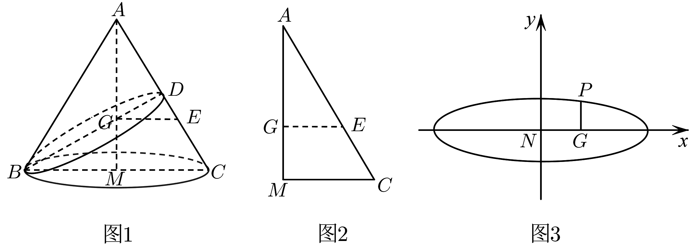

故答案为：

**题型七：截面图形有关面积、长度及周长范围与最值问题**

<strong>例19．</strong>（2024·西藏林芝·统考二模）在三棱锥中，，平面经过的中点<em>E</em>，并且与<em>BC</em>垂直，当<em>α</em>截此三棱锥所得的截面面积最大时，此时三棱锥的外接球的表面积为（    ）

A．	B．	C．	D．

【答案】D

【解析】

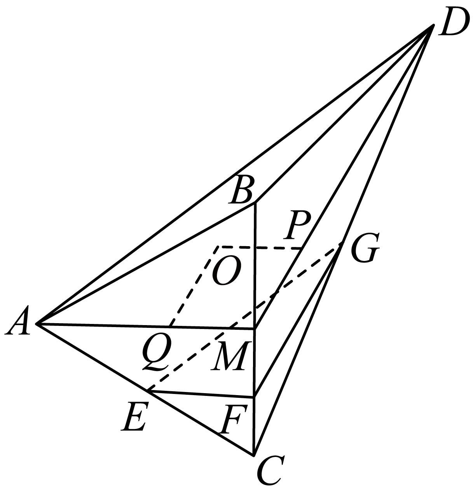

如图所示，取中点及靠近的四等分点，的中点，连接，，，，，

由，所以，又是中点，是的中点，所以

可知，同理可得，

又，平面，平面，所以平面，所以平面即为平面，

又因为，所以，所以，

所以截此三棱锥所得的截面面积为，

当时，取得最大值，

设外接球球心为，半径为，，分别为，外接圆圆心，球心满足面，面，

又因为和均为边长为4的正三角形，所以，

所以四边形为正方形，且，又,所以，

∴.

故选：D.

**例20．**（2024·贵州·高二校联考阶段练习）已知圆锥的母线长为2，其侧面展开图的中心角为，则过圆锥顶点的截面面积最大值为（    ）

A．1	B．	C．2	D．

【答案】C

【解析】设底面圆的半径为，，解得，由圆锥母线长为2，可得圆锥轴截面的顶角为，

当截面顶角为时，过圆锥顶点的截面面积最大，此时.

故选：C.

**例21．**（2024·全国·高一专题练习）若球是正三棱锥的外接球，，点在线段上，，过点作球的截面，则所得的截面中面积最小的截面的面积为（    ）

A．	B．	C．	D．

【答案】A

【解析】

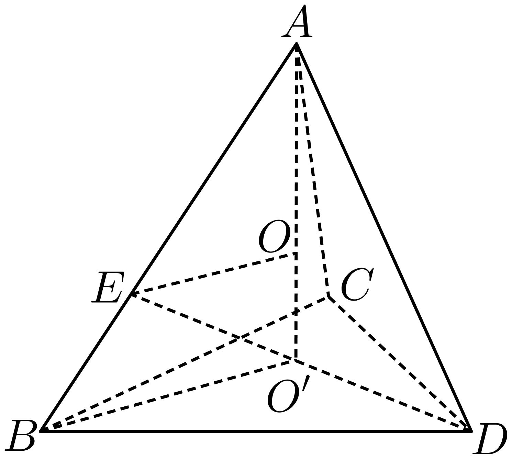

如图所示，其中是球心，是等边三角形的中心，

可得，，

设球的半径为，在三角形中，由，

即，解得，即，

所以，

因为在中，，，

所以，，，

由题知，截面中面积最小时，截面圆与垂直，

设过且垂直的截面圆的半径为，则，

所以，最小的截面面积为.

故选：A

**变式29．**（2024·高一课时练习）在三棱锥中，，平面平面，三棱锥的所有顶点都在球的球面上，分别在线段上运动（端点除外），.当三棱锥的体积最大时，过点作球的截面，则截面面积的最小值为（    ）

A．	B．	C．	D．

【答案】C

【解析】如图，取的中点,连接,

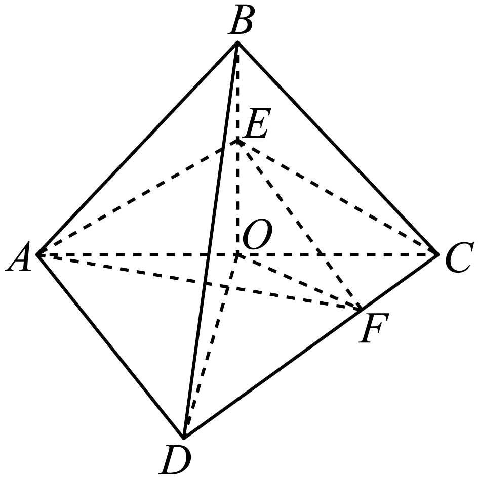

因为，所以，即为球心，

则球的半径,又,所以,

又平面平面，平面平面平面.

所以平面，

设，则,所以，

所以三棱锥的体积.

当时,取得最大值，

由于，在中，由余弦定理得:

根据球的性质可知，当垂直于截面时，截面圆的面积最小，

设此时截面圆的半径为，所以.

则截面面积的最小值为.

故选:C.

<strong>变式30．</strong>（2024·江西·高一宁冈中学校考期末）棱长为1的正方体的8个顶点都在球<em>O</em>的表面上，<em>E</em>，<em>F</em>分别为棱<em>AB</em>，的中点，则经过<em>E</em>，<em>F</em>球的截面面积的最小值为（    ）

A．	B．	C．	D．

【答案】C

【解析】设球*O*半径为*R*.因为正方体内接于球，所以，.设*G*为*AD*中点，中点为*P*.由题，.

.

延长*FO*与*BC*交于*M*，延长EO与交于*N*，

由题可得*N*，*M*分别为，*BC*中点.

则，

.

经过*E*，*F*球的截面面积的最小时，*OP*.因截面为圆面，则圆面对应半径.

则此时截面面积为：.

故选：C

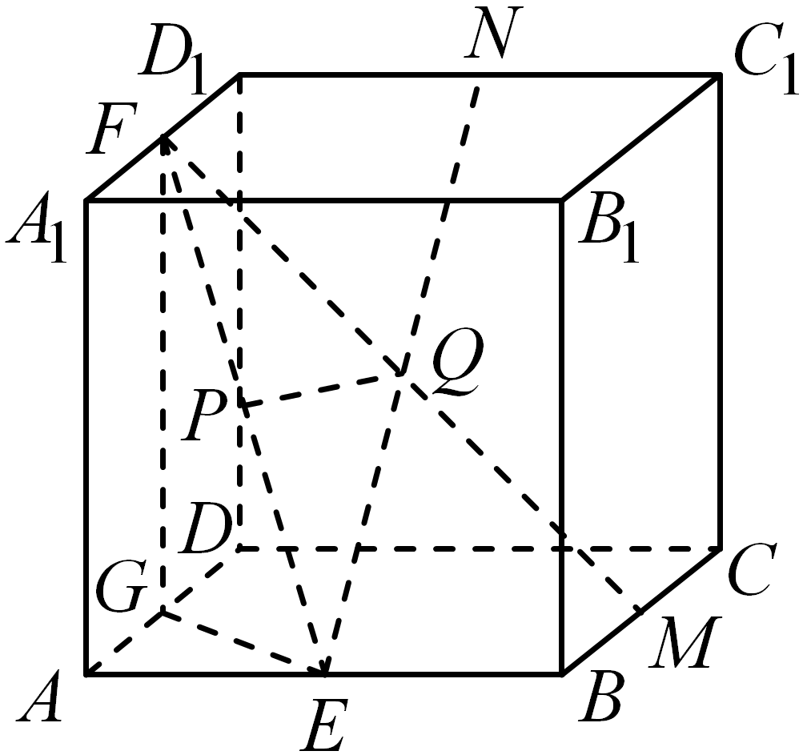

<strong>变式31．</strong>（2024·全国·高三对口高考）如图，正方体的棱长为，动点<em>P</em>在对角线上，过点<em>P</em>作垂直于的平面，记这样得到的截面多边形（含三角形）的周长为<em>y</em>，设，则当时，函数的值域为（    ）

A．	B．	C．	D．

【答案】A

【解析】

如图，连接，，平面，平面，则，

又，，平面，平面，

所以平面，又平面，所以，

同理，，平面，平面，所以平面，

因此平面与平面重合或平行，

取的中点，连接，则，，

同理可证平面，由于，，所以三棱锥是正三棱锥，

与平面的交点是的中心，

正方体棱长为，则，，

所以，所以，

由棱锥的平行于底面的截面的性质知，当平面从平面平移到平面时，，即，

，，显然，

平面过平面再平移至平面时，如图，把正方形沿旋转到与正方形在同一平面内，

如图，则共线，由正方形性质得，同理，，

因此此种情形下，截面的周长与截面的周长相等，平移平面，一直到平面位置处，

由正方体的对称性，接着平移时，截面周长逐渐减少到，

综上，的值域是．

故选：A.

**变式32．**（2024·全国·高一专题练习）如图所示，在长方体中，点是棱上的一个动点，若平面与棱交于点，给出下列命题：

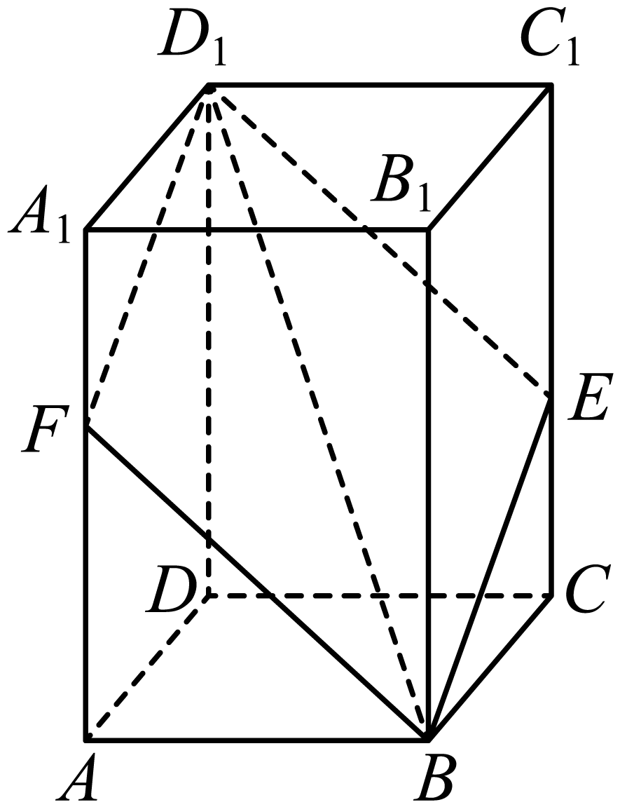

①四棱锥的体积恒为定值；

②四边形是平行四边形；

③当截面四边形的周长取得最小值时，满足条件的点至少有两个；

④直线与直线交于点，直线与直线交于点，则、、三点共线.

其中真命题是（    ）

A．①②③	B．②③④	C．①②④	D．①③④

【答案】C

【解析】①四棱锥的体积等于三棱锥的体积

与三棱锥的体积之和,

又长方体中，平面，

则点到平面的距离为定值，

则四棱锥的体积恒为定值.判断正确；

②由平面与棱交于点，

可得平面平面，平面平面，

又平面平面，则；

又平面平面，平面平面，

又平面平面，则，

又，四边形是平行四边形.判断正确；

③由②可得，截面四边形是平行四边形.

当的值最小时，四边形的周长取得最小值.

将侧面与侧面展开在同一平面，

当且仅当*E*为直线与交点时的值最小，

则当截面四边形的周长取得最小值时，满足条件的点仅有1个.判断错误；

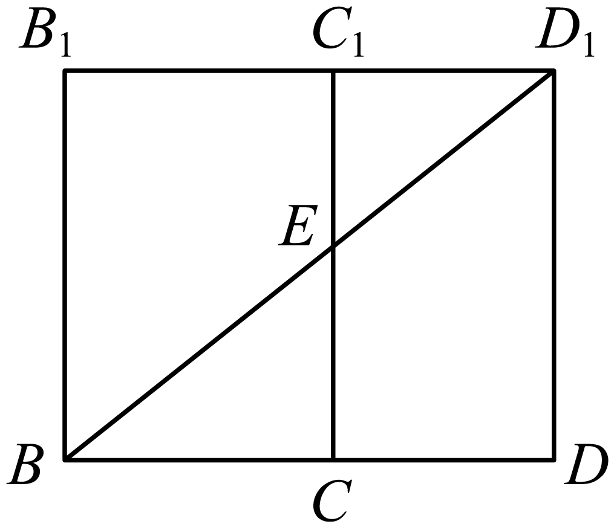

④直线与直线交于点，直线与直线交于点，

则、、三点均为平面与平面的公共点，

由平面与平面有且仅有一条交线可得、、三点共线.判断正确.

故选：C

**变式33．**（2024·高一课时练习）正方体中作一截面与垂直，且和正方体所有面相交，如图所示．记截面多边形面积为，周长为，则（    ）

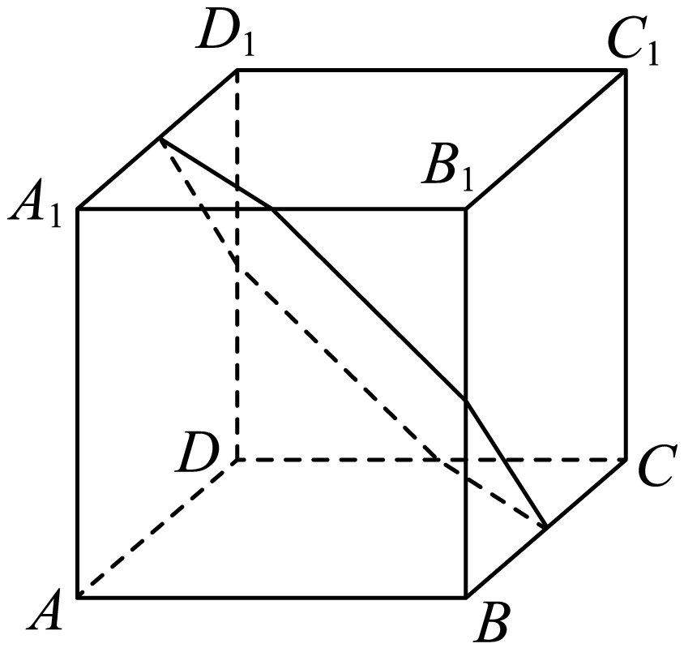

A．为定值，不为定值	B．不为定值，为定值

C．和均为定值	D．和均不为定值

【答案】B

【解析】如图，由正方体的性质得平面，

因为平面，为正方形，所以，

因为，平面，所以平面，

因为平面，所以，

同理可证明，

因为平面，所以平面，

同理可证明平面，

所以，所求截面与平面和平面均平行，如图中的六边形，

因为平面平面，平面平面，平面平面，

所以，，同理可得，，，，，

设，，则

因为，，

所以，，

因为

所以，

同理，，，

所以，截面多边形的周长为为（为正方体边长），故为定值；

当时，该截面多边形由六边形变为正三角形，此时面积为；

当时，该截面多边形为正六边形，此时面积为；

所以，该截面多边形的面积在变换，故不为定值.

综上，不为定值，为定值.

故选：B

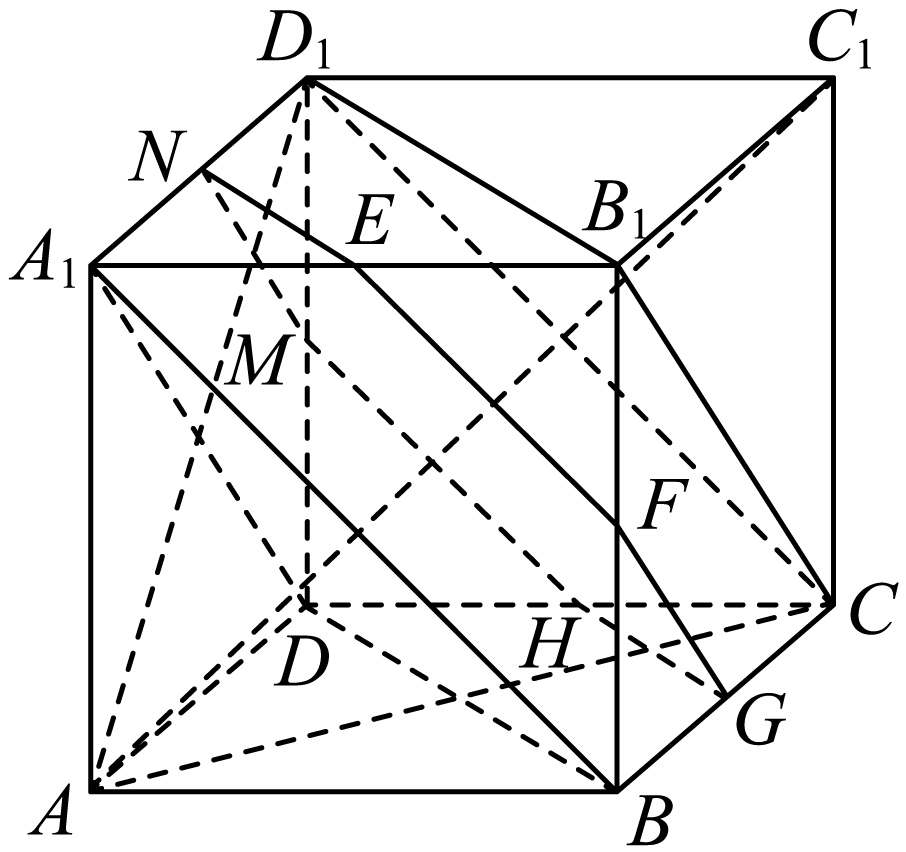

**变式34．**（2024·四川内江·高二统考期末）如图所示，在长方体中，，点是棱上的一个动点，平面交棱于点，下列命题错误的是（    ）

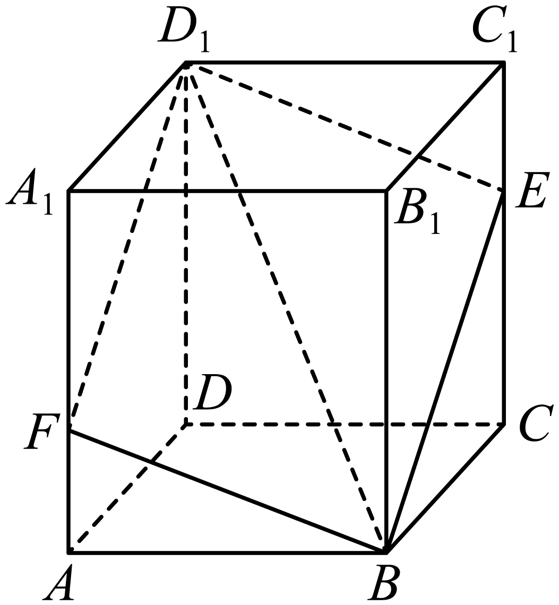

A．四棱锥的体积恒为定值

B．存在点，使得平面

C．存在唯一的点，使得截面四边形的周长取得最小值

D．对于棱上任意一点，在棱上均有相应的点，使得平面

【答案】D

【解析】对A，，又，平面，平面，所以平面，同理平面，所以点*E*，*F*到平面的距离为定值，则四棱锥的体积为定值，故选项A正确；

对于B，因为，可得对角面为正方形，所以，由平面，平面，所以，若，则，平面，所以平面，由平面，所以，又平面，所以平面，故B正确；

对于C，由面面平行的性质定理可得，四边形为平行四边形，由对称性可得，当四边形为菱形时，周长取得最小值，即存在唯一的点*E*，使得截面四边形的周长取得最小值，故选项C正确.

对于D，当点在处时，对于*AD*上任意的点*G*，直线*CG*与平面均相交，故选项D错误.

故选：D

**题型八：截面有关的空间角问题**

**例22．**（2024·黑龙江哈尔滨·哈尔滨三中校考模拟预测）在正方体中，为中点，过的截面与平面的交线为，则异面直线与所成角的余弦值为（    ）

A．	B．	C．	D．

【答案】A

【解析】取的中点，如下图，连接，

因为，所以四点共面，

所以过的截面即为平面，

截面与平面的交线为即为，

取的中点，连接，因为，

所以（或其补角）为异面直线与所成角，

设正方体的棱长为，所以，

所以.

则异面直线与所成角的余弦值为.

故选：A.

<strong>例23．</strong>（2024·高一课时练习）在棱长为1的正方体中，<em>E</em>为的中点，过点<em>A．C．E</em>的截面与平面的交线为<em>m</em>，则异面直线<em>m</em>与所成角的正切值为（    ）

A．	B．	C．	D．

【答案】D

【解析】如图所示：

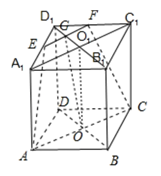

平面*ACE*可以延展为平面*ACEF*，*O*，分别为上下底面中心，，，

∴平面平面，

∵，

∴为异面直线*m*、所成角．

∵*E*，*F*分别为，的中点，

∴*G*为的中点，

∴，

在中，．

故选：D．

<strong>例24．</strong>（2024·全国·高一专题练习）平面过正方体<em>ABCD</em>-<em>A1B1C1D1</em>的顶点<em>A</em>，//平面<em>CB1D1</em>，平面，平面，则<em>m</em>、<em>n</em>所成角的正弦值为（    ）

A．	B．	C．	D．

【答案】A

【解析】由题意，若平面为平面，满足//平面<em>CB1D1</em>，如下图示，

因为，且，所以为平行四边形，

所以，平面<em>CB1D1</em>，平面<em>CB1D1</em>，所以平面<em>CB1D1</em>，

同理可证平面<em>CB1D1</em>，又，又平面，

所以平面//平面<em>CB1D1</em>，即//平面<em>CB1D1</em>.

因为平面，平面，

则，分别为，又三角形为等边三角形，

所以*m*，*n*所成角为，故其正弦值为.

故选：A.

**变式35．**（2024·四川成都·高三校联考期末）在正方体中，为线段的中点，设平面与平面的交线为，则直线与所成角的余弦值为（    ）

A．	B．	C．	D．

【答案】B

【解析】设正方体的棱长为2，

以点*A*为坐标原点，*AB*、*AD*、所在直线分别为*x*、*y*、*z*轴建系，如图所示：

则、、、、．

设平面的法向量为，

，，

由，

取可得；

设平面的法向量为，

，，

由，

取可得，

设直线的方向向量为，

∵直线平面，直线平面，

，，

∴，

取可得，

已知，设直线与所成角为，

，

即直线与所成角的余弦值为，

故选：B．

<strong>变式36．</strong>（2024·陕西安康·高二统考期中）在正方体中，<em>E</em>为线段<em>AD</em>的中点，设平面与平面的交线为，则直线与所成角的余弦值为（    ）

A．	B．	C．	D．

【答案】D

【解析】设正方体的棱长为2，

以点*A*为坐标原点，*AB*、*AD*、所在直线分别为*x*、*y*、*z*轴建系，如图所示：

则、、、、.

设平面的法向量为，

，，

由，取可得.

设平面的法向量为，，，

由，取可得.

设直线的方向向量为，∵平面，平面，

则，，

∴，取可得，

，设直线与所成角为

，即直线与所成角的余弦值为.

故选：D

