**第52讲  立体几何中的轨迹问题**

**知识梳理**

**立体几何中的轨迹问题常用的五种方法总结：**

**1、定义法**

**2、交轨法**

**3、几何法**

**4、坐标法**

**5、向量法**

**必考题型全归纳**

**题型一：由动点保持平行求轨迹**

<strong>例1．</strong>（2024·贵州铜仁·高二贵州省铜仁第一中学校考开学考试）设正方体的棱长为1，点<em>E</em>是棱的中点，点<em>M</em>在正方体的表面上运动，则下列命题：

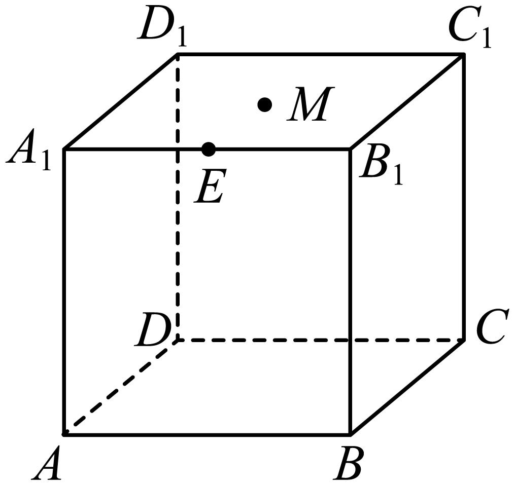

①如果，则点*M*的轨迹所围成图形的面积为；

②如果∥平面，则点*M*的轨迹所围成图形的周长为；

③如果∥平面，则点*M*的轨迹所围成图形的周长为；

④如果，则点*M*的轨迹所围成图形的面积为．

其中正确的命题个数为（    ）

A．1	B．2	C．3	D．4

<strong>例2．</strong>（2024·辽宁沈阳·高一沈阳二十中校联考期末）在棱长为1的正方体中，<em>E</em>在棱上且满足，点<em>F</em>是侧面上的动点，且面<em>AEC</em>，则动点<em>F</em>在侧面上的轨迹长度为______．

<strong>例3．</strong>（2024·福建福州·高一福建省福州屏东中学校考期末）如图所示，在棱长为2的正方体中，<em>E</em>，<em>F</em>，<em>G</em>分别为所在棱的中点，<em>P</em>为平面内（包括边界）一动点，且∥平面<em>EFG</em>，则<em>P</em>点的轨迹长度为________

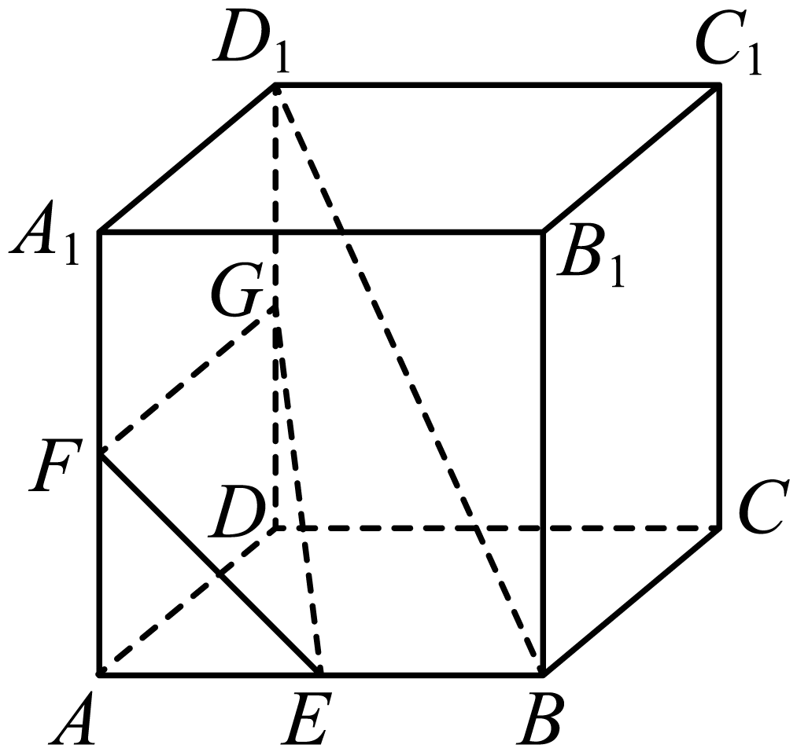

<strong>变式1．</strong>（2024·四川成都·高一成都市锦江区嘉祥外国语高级中学校考期末）如图，在正三棱柱中，，，分别为，的中点．若侧面的中心为，为侧面内的一个动点，平面，且的轨迹长度为，则三棱柱的表面积为________．

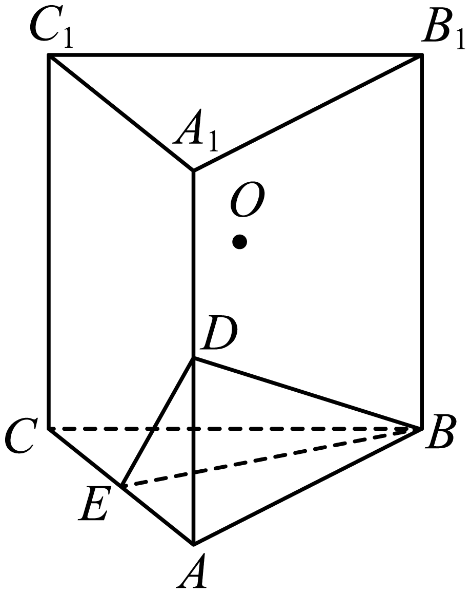

<strong>变式2．</strong>（2024·江苏扬州·高二统考期中）如图，正方体的棱长为2，点是线段的中点，点是正方形所在平面内一动点，若平面，则点轨迹在正方形内的长度为________.

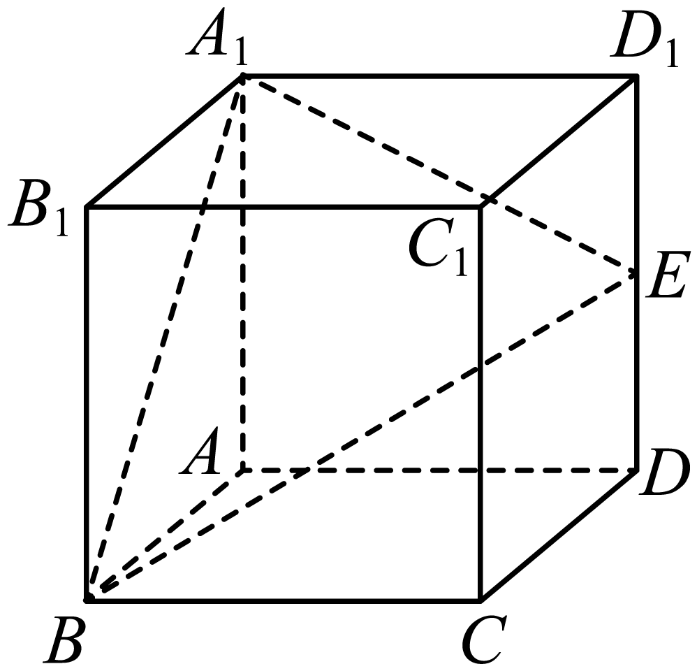

<strong>变式3．</strong>（2024·江苏泰州·高二泰州中学校考阶段练习）正方体的棱长为3，点，分别在线段和线段上，且，，点是正方形所在平面内一动点，若平面，则点的轨迹在正方形内的长度为______.

<strong>变式4．</strong>（2024·全国·高三专题练习）在边长为2的正方体中，点<em>M</em>是该正方体表面及其内部的一动点，且平面，则动点<em>M</em>的轨迹所形成区域的面积是_________．

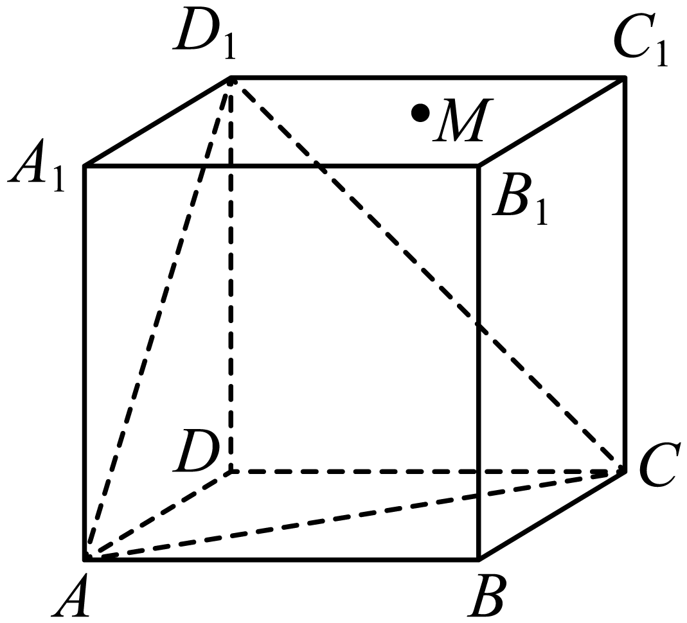

<strong>变式5．</strong>（2024·全国·高三专题练习）如图，已知正方体的棱长为分别是棱的中点，点为底面四边形内（包括边界）的一动点，若直线与平面无公共点，则点在四边形内运动所形成轨迹的长度为__________.

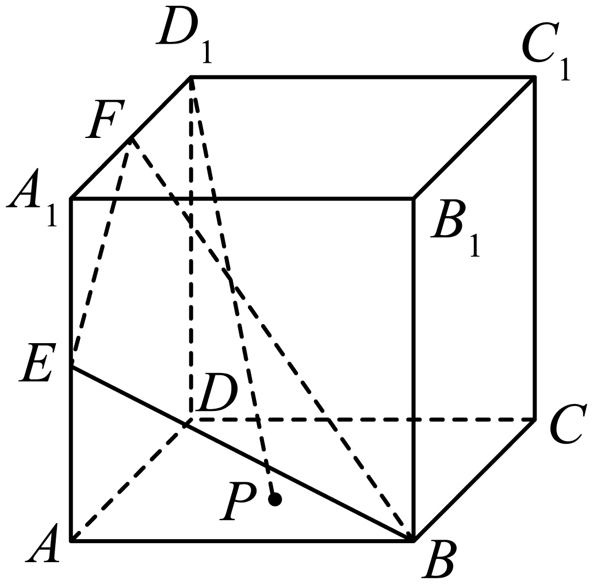

<strong>变式6．</strong>（2024·全国·高三专题练习）如图所示，正方体的棱长为分别为，的中点，点是正方体表面上的动点，若平面，则点在正方体表面上运动所形成的轨迹长度为__________．

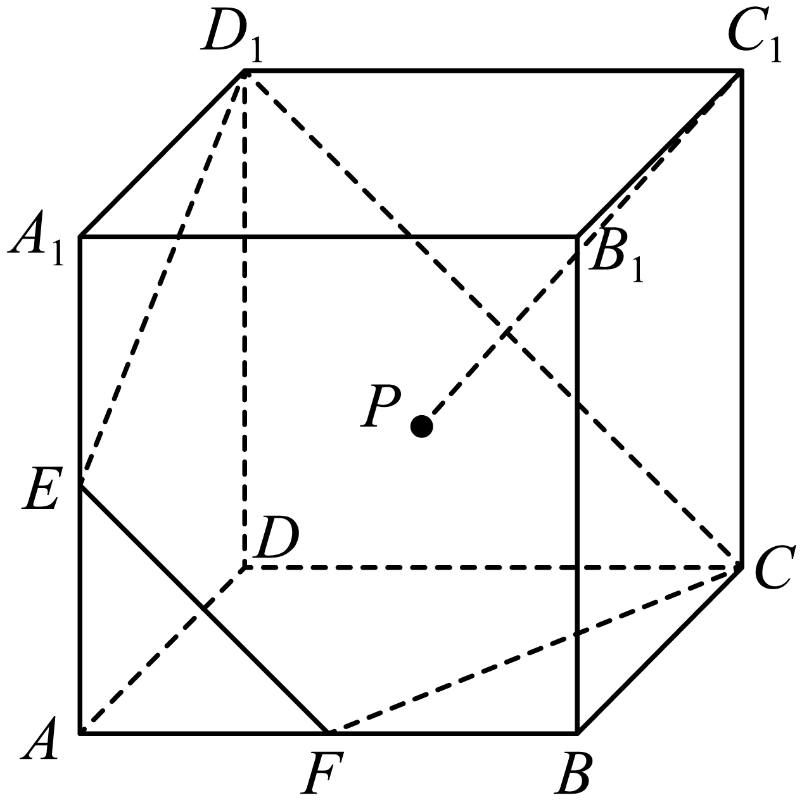

<strong>变式7．</strong>（2024·全国·高三专题练习）已知棱长为的正四面体，为的中点，动点满足，平面经过点，且平面平面，则平面截点的轨迹所形成的图形的周长为_________.

**题型二：由动点保持垂直求轨迹**

<strong>例4．</strong>（2024·湖南株洲·高三株洲二中校考阶段练习）在棱长为4的正方体中，点<em>P</em>、<em>Q</em>分别是，的中点，点<em>M</em>为正方体表面上一动点，若<em>MP</em>与<em>CQ</em>垂直，则点<em>M</em>所构成的轨迹的周长为______.

<strong>例5．</strong>（2024·湖南长沙·长郡中学校考二模）在正四棱柱中，，<em>E</em>为中点，为正四棱柱表面上一点，且，则点的轨迹的长为_____.

<strong>例6．</strong>（2024·全国·唐山市第十一中学校考模拟预测）已知为正方体的内切球球面上的动点，为的中点，，若动点的轨迹长度为，则正方体的体积是______.

<strong>变式8．</strong>（2024·全国·高三专题练习）已知直三棱柱的所有棱长均为4，空间内的点满足，且，则满足条件的所形成曲线的轨迹的长度为________.

<strong>变式9．</strong>（2024·四川成都·三模）如图，<em>AB</em>为圆柱下底面圆<em>O</em>的直径，<em>C</em>是下底面圆周上一点，已知，，圆柱的高为5．若点<em>D</em>在圆柱表面上运动，且满足，则点<em>D</em>的轨迹所围成图形的面积为________．

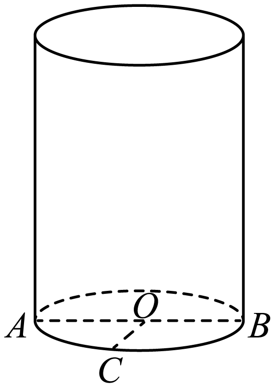

<strong>变式10．</strong>（2024·全国·高三专题练习）如图，为圆柱下底面圆的直径，是下底面圆周上一点，已知，圆柱的高为5．若点在圆柱表面上运动，且满足，则点的轨迹所围成图形的面积为_______．

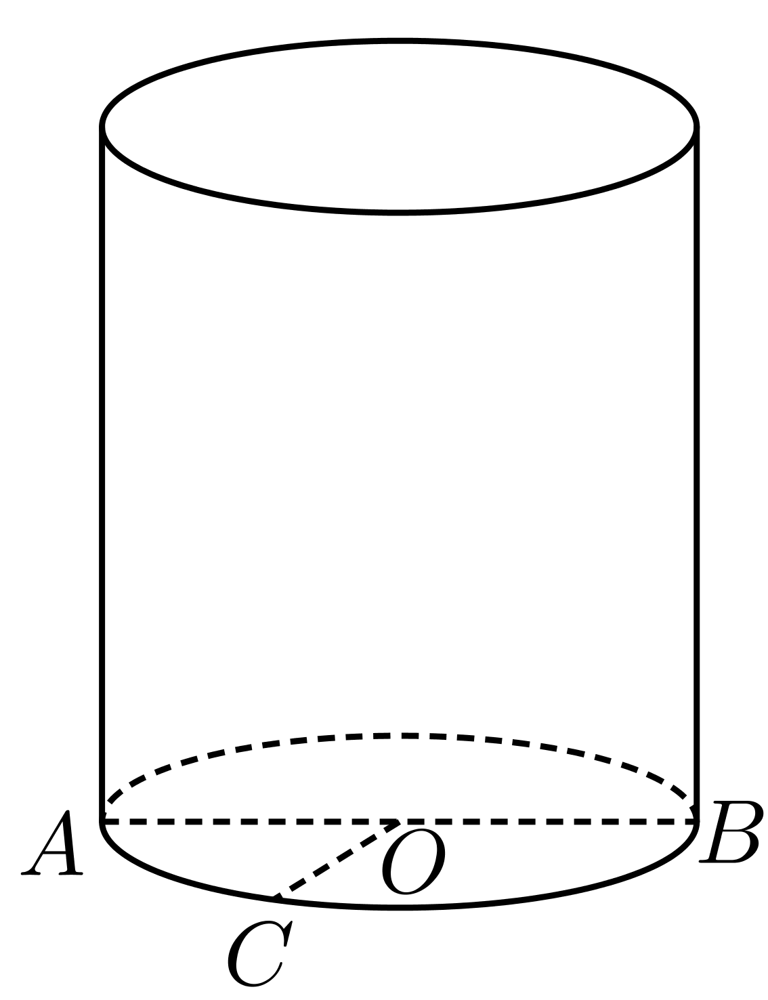

<strong>变式11．</strong>（2024·浙江宁波·高一慈溪中学校联考期末）如图，在直三棱柱中，，，，动点在内（包括边界上），且始终满足，则动点的轨迹长度是______.

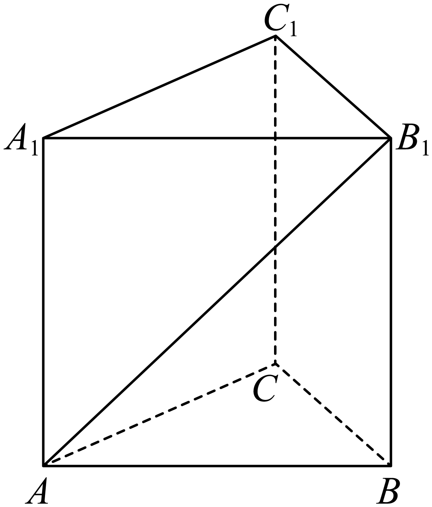

<strong>变式12．</strong>（2024·山东枣庄·高一统考期末），分别是棱长为1的正方体的棱的中点，点在正方体的表面上运动，总有，则点的轨迹所围成图形的面积为________.

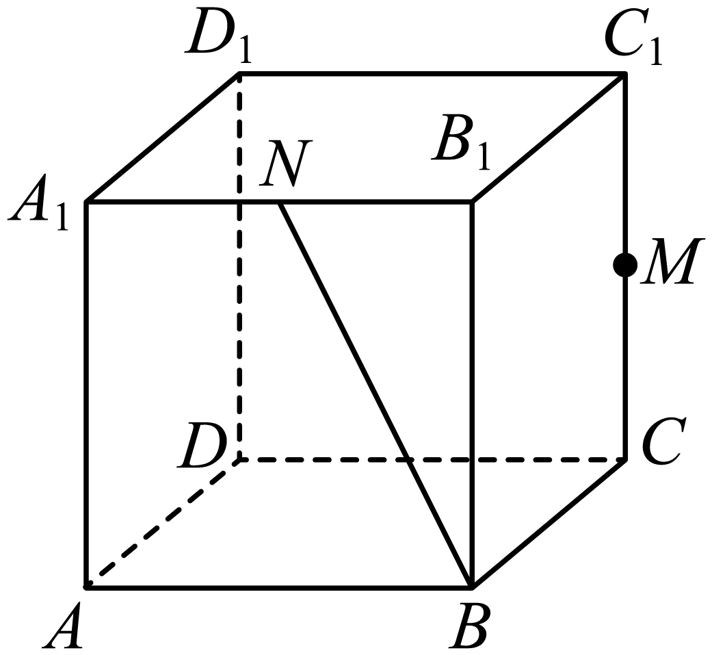

<strong>变式13．</strong>（2024·四川广元·高二广元中学校考期中）如图，为圆柱下底面圆的直径，是下底面圆周上一点，已知，，圆柱的高为5．若点在圆柱表面上运动，且满足，则点的轨迹所围成图形的面积为______．

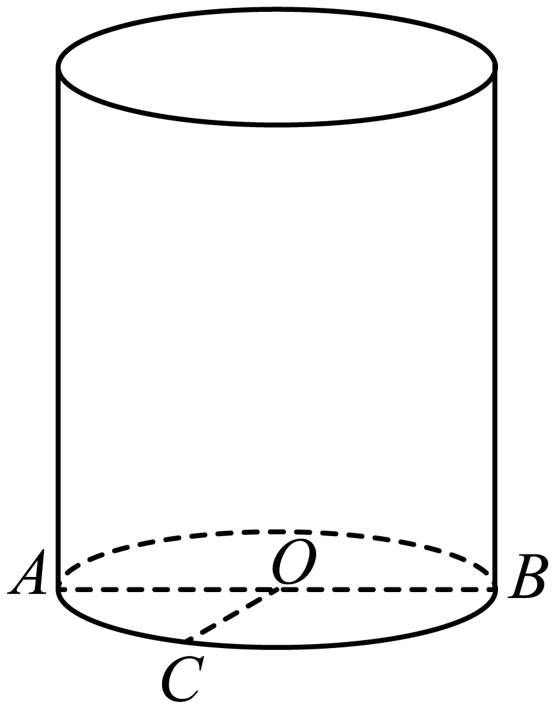

**变式14．**（2024·陕西榆林·高二校考阶段练习）如图，正方体的棱长为，点是棱的中点，点是正方体表面上的动点．若，则点在正方体表面上运动所形成的轨迹的长度为（    ）

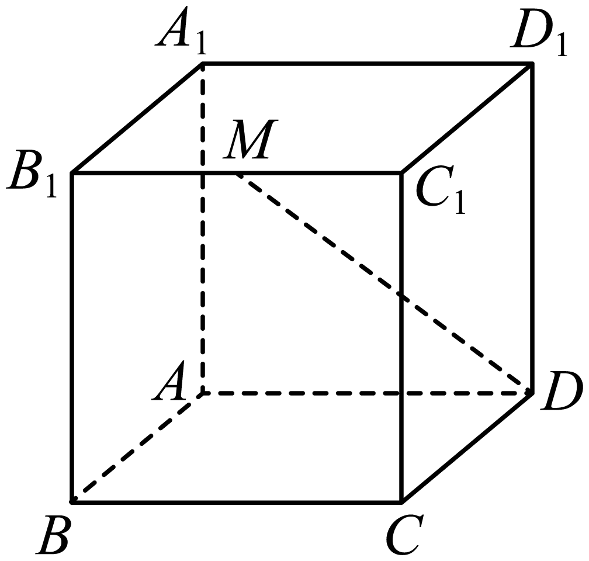

A．	B．

C．	D．

**题型三：由动点保持等距（或定长）求轨迹**

<strong>例7．</strong>（2024·贵州贵阳·高三贵阳一中校考期末）在棱长为1的正方体中，点<em>Q</em>为侧面内一动点（含边界），若，则点<em>Q</em>的轨迹长度为______．

<strong>例8．</strong>（2024·湖北武汉·高一湖北省水果湖高级中学校联考期末）已知正方体的棱长为3，动点在内，满足，则点的轨迹长度为______.

<strong>例9．</strong>（2024·河北邯郸·高一大名县第一中学校考阶段练习）已知正方体的棱长为1，点<em>P</em>在该正方体的表面上运动，且则点<em>P</em>的轨迹长度是________．

<strong>变式15．</strong>（2024·贵州铜仁·统考模拟预测）已知正方体的棱长为4，点<em>P</em>在该正方体的表面上运动，且，则点<em>P</em>的轨迹长度是________．

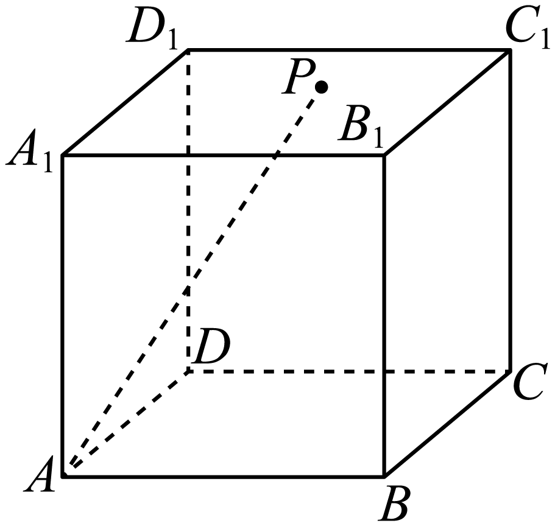

<strong>变式16．</strong>（2024·黑龙江齐齐哈尔·统考二模）表面积为36π的球<em>M</em>表面上有<em>A</em>，<em>B</em>两点，且为等边三角形，空间中的动点<em>P</em>满足，当点<em>P</em>在所在的平面内运动时，点<em>P</em>的轨迹是______；当<em>P</em>在该球的球面上运动时，点<em>P</em>的轨迹长度为______.

<strong>变式17．</strong>（2024·全国·高三专题练习）已知正四棱柱的体积为16，是棱的中点，是侧棱上的动点，直线交平面于点，则动点的轨迹长度的最小值为______．

<strong>变式18．</strong>（2024·全国·高三专题练习）已知棱长为8的正方体中，平面<em>ABCD</em>内一点<em>E</em>满足，点<em>P</em>为正方体表面一动点，且满足，则动点<em>P</em>运动的轨迹周长为___________．

<strong>变式19．</strong>（2024·全国·高三专题练习）如图，已知棱长为2的正方体<em>A</em>′<em>B</em>′<em>C</em>′<em>D</em>′－<em>ABCD</em>，<em>M</em>是正方形<em>BB</em>′<em>C</em>′<em>C</em>的中心，<em>P</em>是△<em>A</em>′<em>C</em>′<em>D</em>内（包括边界）的动点，满足<em>PM</em>=<em>PD</em>，则点<em>P</em>的轨迹长度为______．

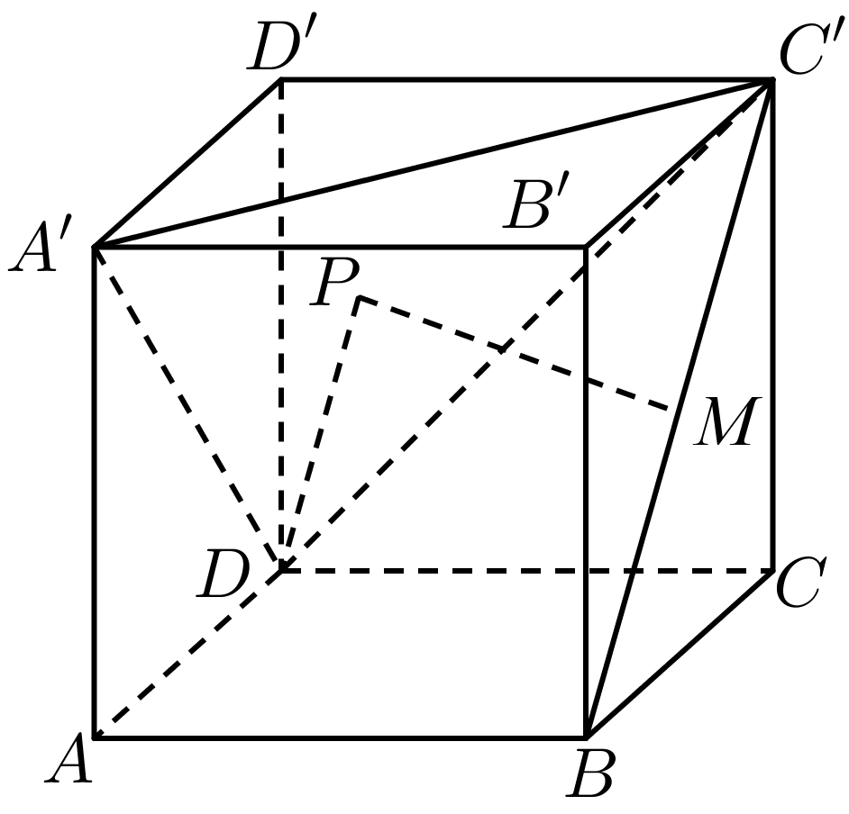

<strong>变式20．</strong>（2024·河南许昌·高三统考阶段练习）三棱锥的体积为，底面三角形是边长为的正三角形且其中心为，三棱锥的外接球球心到底面的距离为2，则点的轨迹长度为______.

<strong>变式21．</strong>（2024·全国·高三专题练习）在三棱锥中，，二面角的大小为，在侧面内(含边界)有一动点，满足到的距离与到平面的距离相等，则动点的轨迹的长度为__________．

**题型四：由动点保持等角（或定角）求轨迹**

<strong>例10．</strong>（2024·山东·高三专题练习）如图所示，在平行四边形中，<em>E</em>为中点，，，.沿着将折起，使<em>A</em>到达点的位置，且平面平面.设<em>P</em>为内的动点，若，则<em>P</em>的轨迹的长度为______.

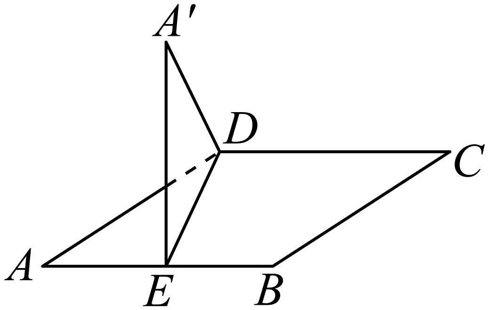

<strong>例11．</strong>（2024·全国·高三专题练习）在棱长为6的正方体中，点是线段的中点，是正方形（包括边界）上运动，且满足，则点的轨迹周长为________.

<strong>例12．</strong>（2024·湖北省直辖县级单位·统考模拟预测）已知正方体的棱长为2，<em>M</em>为棱的中点，<em>N</em>为底面正方形<em>ABCD</em>上一动点，且直线<em>MN</em>与底面<em>ABCD</em>所成的角为，则动点<em>N</em>的轨迹的长度为________．

<strong>变式22．</strong>（2024·陕西·高三陕西省榆林中学校联考阶段练习）已知正方体的棱长为2，点为平面内的动点，设直线与平面所成的角为，若，则点的轨迹所围成的周长为_______．

<strong>变式23．</strong>（2024·全国·高三专题练习）已知点<em>P</em>是棱长为2的正方体的表面上一个动点，若使的点<em>P</em>的轨迹长度为<em>a</em>；使直线平面<em>BDC</em>的点<em>P</em>的轨迹长度为<em>b</em>；使直线<em>AP</em>与平面<em>ABCD</em>所成的角为45°的点<em>P</em>的轨迹长度为<em>c</em>．则<em>a</em>，<em>b</em>，<em>c</em>的大小关系为______．（用“＜”符号连接）

<strong>变式24．</strong>（2024·全国·高三专题练习）已知正方体中，，点<em>E</em>为平面内的动点，设直线与平面所成的角为，若，则点<em>E</em>的轨迹所围成的面积为___________．

<strong>变式25．</strong>（2024·山西大同·高一统考期中）已知是半径为2的球面上的四点，且．二面角的大小为，则点形成的轨迹长度为________．

<strong>变式26．</strong>（2024·贵州铜仁·高二统考期末）粽子是端午节期间不可缺少的传统美食，铜仁的粽子不仅馅料丰富多样，形状也是五花八门，有竹筒形、长方体形、圆锥形等，但最常见的还是“四角粽子”，其外形近似于正三棱锥．因为将粽子包成这样形状，既可以节约原料，又不失饱满，而且十分美观．如图，假设一个粽子的外形是正三棱锥，其侧棱和底面边长分别是8cm和6cm，是顶点在底面上的射影．若是底面内的动点，且直线与底面所成角的正切值为，则动点的轨迹长为________．

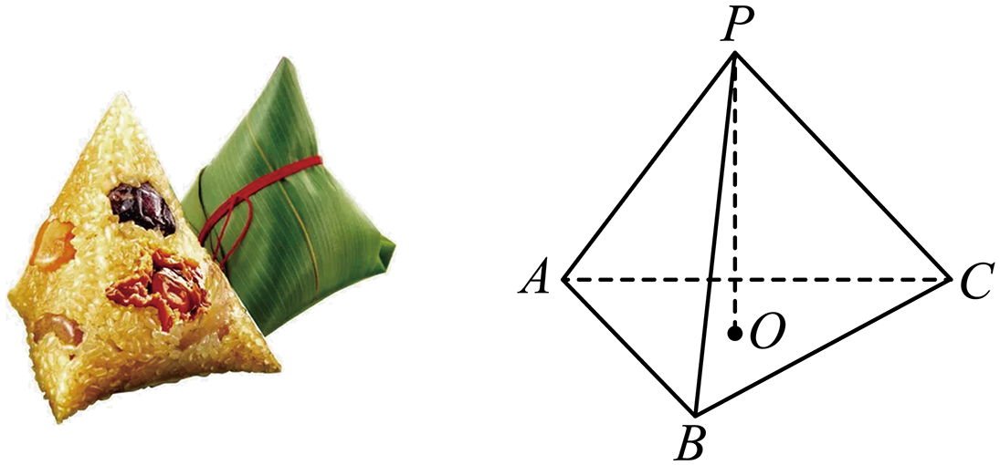

<strong>变式27．</strong>（2024·广东佛山·高二校联考期中）如图，正方体的棱长为1，点<em>P</em>为正方形内的动点，满足直线<em>BP</em>与下底面<em>ABCD</em>所成角为的点<em>P</em>的轨迹长度为（    ）

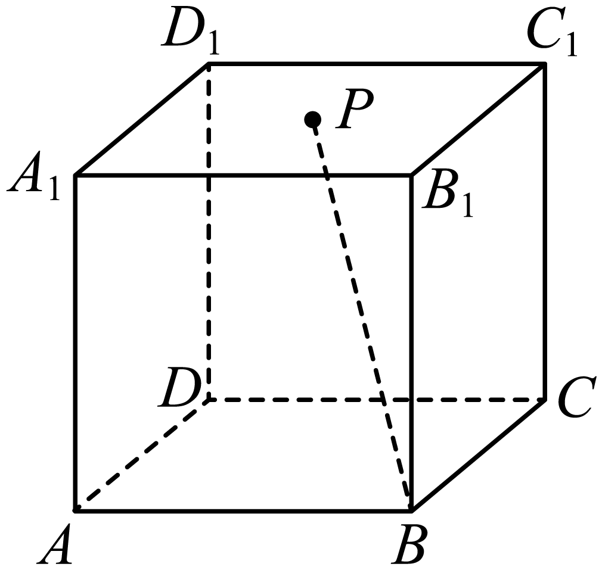

A．	B．	C．	D．

<strong>变式28．</strong>在正方体中，动点<em>M</em>在底面内运动且满足，则动点<em>M</em>在底面内的轨迹为（    ）

A．圆的一部分	B．椭圆的一部分

C．双曲线一支的一部分	D．前三个答案都不对

**题型五：投影求轨迹**

<strong>例13．</strong>（2024·安徽滁州·高三校考阶段练习）如图，在中，，，，<em>D</em>为线段<em>BC</em>（端点除外）上一动点.现将沿线段<em>AD</em>折起至，使二面角的大小为120°，则在点<em>D</em>的移动过程中，下列说法错误的是（ ）

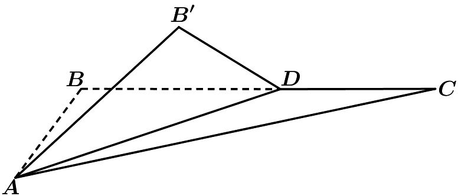

A．不存在点，使得

B．点在平面上的投影轨迹是一段圆弧

C．与平面所成角的余弦值的取值范围是

D．线段的最小值是

**例14．**（2024·江苏徐州·高二徐州市第一中学校考阶段练习）如图，在等腰中，，，为的中点，为的中点，为线段上一个动点（异于两端点），沿翻折至，点在平面上的投影为点，当点在线段上运动时，以下说法不正确的是（    ）．

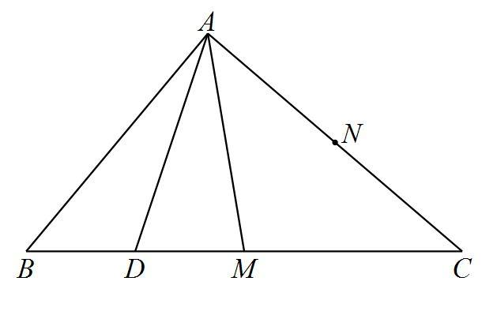

A．线段为定长	B．

C．	D．点的轨迹是圆弧

**例15．**（2024·江西赣州·高二南康中学校考阶段练习）在等腰直角中，，，为中点，为中点，为边上一个动点，沿翻折使，点在平面上的投影为点，当点在上运动时，以下说法错误的是

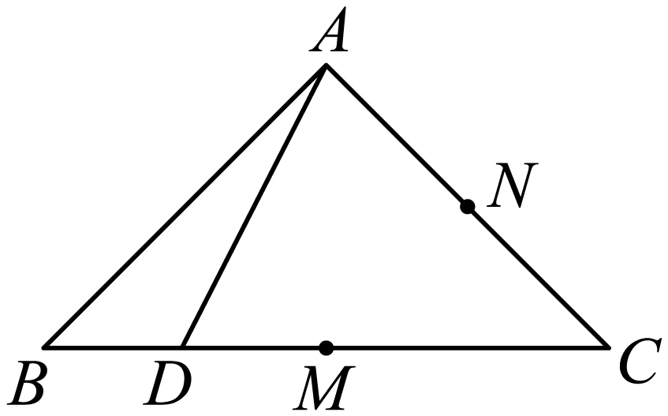

A．线段为定长	B．

C．线段的长	D．点的轨迹是圆弧

<strong>变式29．</strong>（2024·全国·高三专题练习）如图，已知水平地面上有一半径为4的球，球心为，在平行光线的照射下，其投影的边缘轨迹为椭圆<em>O</em>．如图，椭圆中心为<em>O</em>，球与地面的接触点为<em>E</em>，．若光线与地面所成角为，椭圆的离心率．

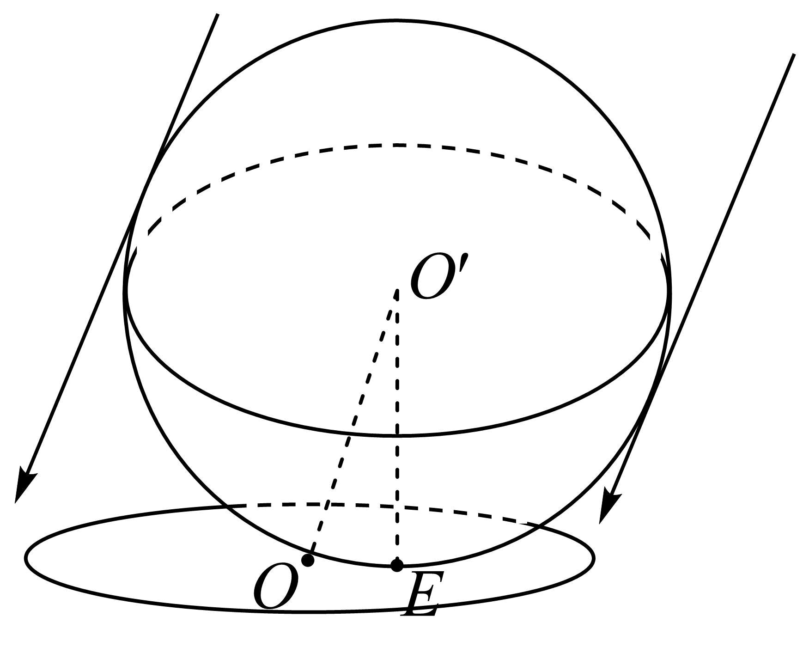

<strong>变式30．</strong>（2024·浙江嘉兴·高三嘉兴一中校考期中）如图，在中，，，.过的中点的动直线与线段交于点.将沿直线向上翻折至，使得点在平面内的投影落在线段上.则点的轨迹长度为________.

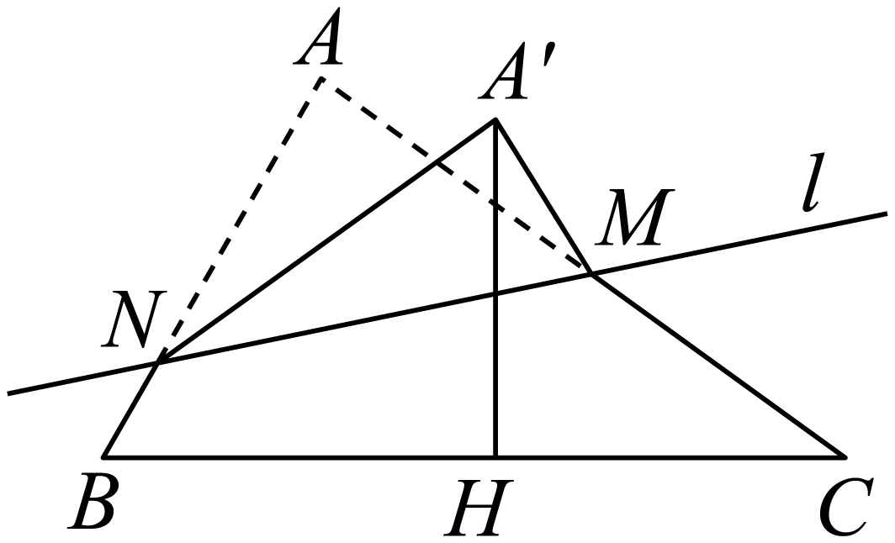

<strong>变式31．</strong>（2024·北京·高三专题练习）如图，在矩形中，，，为线段上一动点，现将沿折起得到，当二面角的平面角为，点在平面上的投影为，当从运动到，则点所形成轨迹的长度为______.

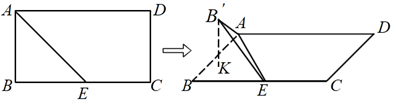

**题型六：翻折与动点求轨迹**

<strong>例16．</strong>（2024·全国·高三专题练习）在矩形中，是的中点，，将沿折起得到，设的中点为，若将绕旋转，则在此过程中动点形成的轨迹长度为___________.

<strong>例17．</strong>（2024·全国·高三专题练习）矩形<em>ABCD</em>中，，<em>E</em>为<em>AB</em>中点，将△<em>ADE</em>沿<em>DE</em>折起至△<em>A'DE</em>，记二面角<em>A'-DE-C=θ</em>，当<em>θ</em>在范围内变化时，点<em>A'</em>的轨迹长度为______________

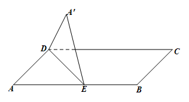

<strong>例18．</strong>（2024·全国·高三专题练习）如图所示，在平行四边形中，为中点，，，.沿着将折起，使到达点的位置，且平面平面.若点为内的动点，且满足，则点的轨迹的长度为___________.

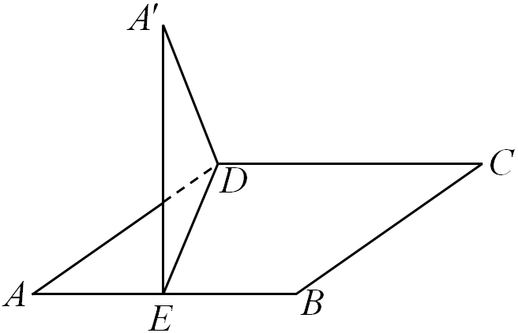

<strong>变式32．</strong>（2024·全国·高三专题练习）已知菱形<em>ABCD</em>的边长为2，.将菱形沿对角线<em>AC</em>折叠成大小为60°的二面角.设<em>E</em>为的中点，<em>F</em>为三棱锥表面上动点，且总满足，则点<em>F</em>轨迹的长度为________.

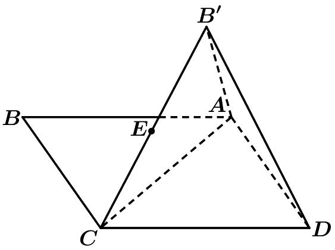

<strong>变式33．</strong>（2024·江苏连云港·高二校考阶段练习）在矩形<em>ABCD</em>中，，，点<em>E</em>在<em>CD</em>上，现将沿<em>AE</em>折起，使面面<em>ABC</em>，当<em>E</em>从<em>D</em>运动到<em>C</em>，求点<em>D</em>在面<em>ABC</em>上的射影<em>K</em>的轨迹长度为（    ）

A．	B．	C．	D．

**变式34．**（2024·全国·高三专题练习）已知菱形的各边长为．如图所示，将沿折起，使得点到达点的位置，连接，得到三棱锥，此时．是线段的中点，点在三棱锥的外接球上运动，且始终保持，则点的轨迹的周长为（    ）

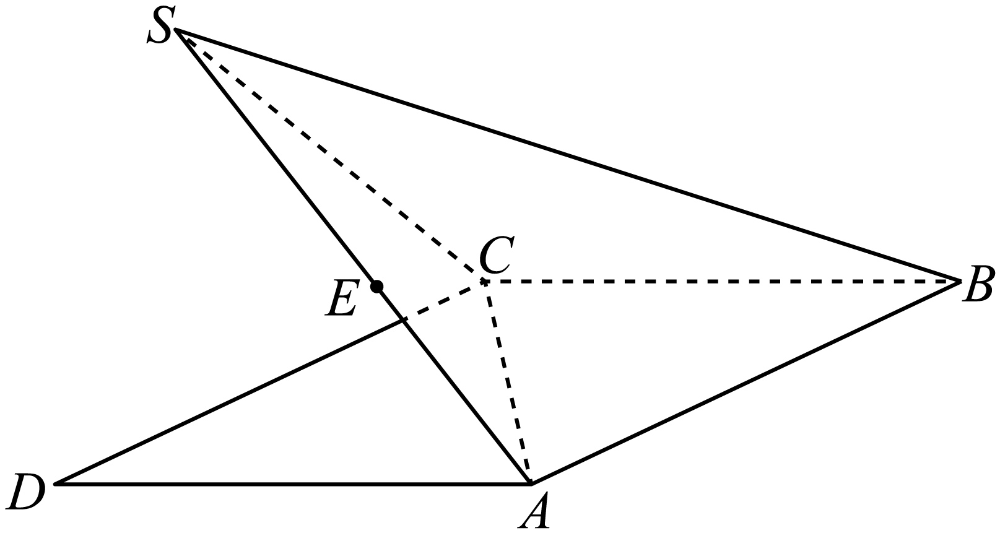

A．	B．	C．	D．

<strong>变式35．</strong>（2024·全国·高三专题练习）已知△<em>ABC</em>的边长都为2，在边<em>AB</em>上任取一点<em>D</em>，沿<em>CD</em>将△<em>BCD</em>折起，使平面<em>BCD</em>⊥平面<em>AC</em>D．在平面<em>BCD</em>内过点<em>B</em>作<em>BP</em>⊥平面<em>ACD</em>，垂足为<em>P</em>，那么随着点<em>D</em>的变化，点<em>P</em>的轨迹长度为（    ）

A．	B．	C．	D．*π*

**变式36．**（2024·广东中山·高三华南师范大学中山附属中学校考期中）如图，在长方形中，，，点为线段上一动点，现将沿折起，使点在面内的射影在直线上，当点从运动到，则点所形成轨迹的长度为

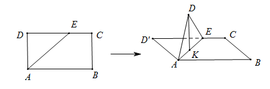

A．	B．	C．	D．

**变式37．**（2024·全国·高三专题练习）如图，在等腰梯形中，，分别是底边的中点，把四边形沿直线折起使得平面平面.若动点平面，设与平面所成的角分别为（均不为0）.若，则动点的轨迹围成的图形的面积为(    )

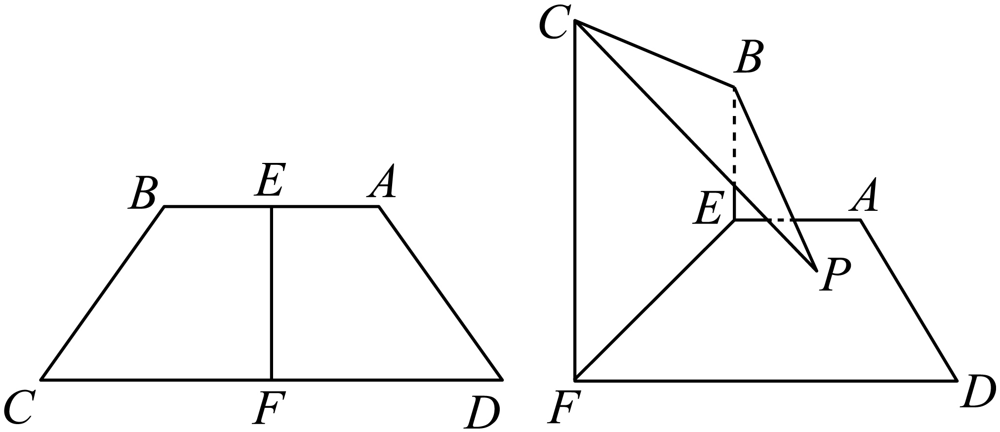

A．	B．	C．	D．

