**第52讲  立体几何中的轨迹问题**

**知识梳理**

**立体几何中的轨迹问题常用的五种方法总结：**

**1、定义法**

**2、交轨法**

**3、几何法**

**4、坐标法**

**5、向量法**

**必考题型全归纳**

**题型一：由动点保持平行求轨迹**

<strong>例1．</strong>（2024·贵州铜仁·高二贵州省铜仁第一中学校考开学考试）设正方体的棱长为1，点<em>E</em>是棱的中点，点<em>M</em>在正方体的表面上运动，则下列命题：

①如果，则点*M*的轨迹所围成图形的面积为；

②如果∥平面，则点*M*的轨迹所围成图形的周长为；

③如果∥平面，则点*M*的轨迹所围成图形的周长为；

④如果，则点*M*的轨迹所围成图形的面积为．

其中正确的命题个数为（    ）

A．1	B．2	C．3	D．4

【答案】C

【解析】由面，而面，则，又，

又，面，则面，

由面，则，同理，

，面，则面，

所以垂直于面所有直线，且面，

若，则在边长为的正△的边上，

故轨迹图形面积为，①对；

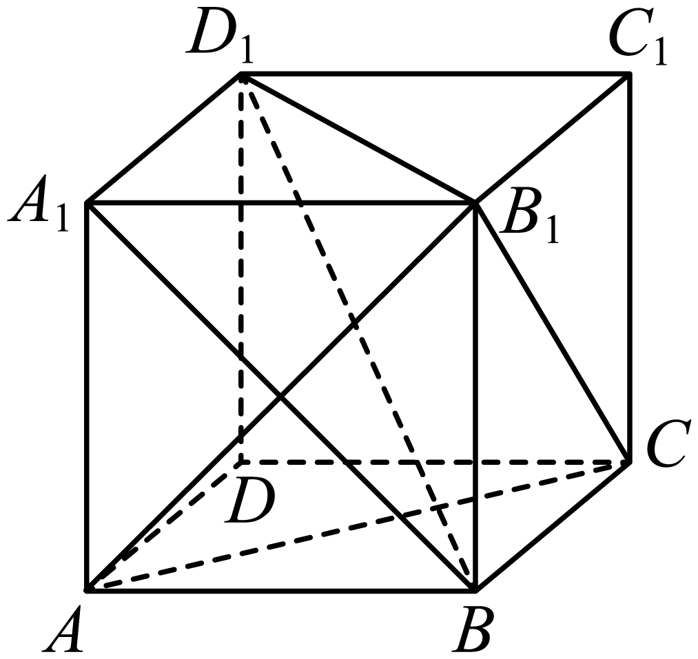

若分别为中点，连接，

由正方体的性质易得，，

所以共面，且为平行四边形，故面即为面，

由面，面，则面，

同理可得面，，面，

所以面面，要使∥平面，则在△的边上，

所以轨迹长为，②错；

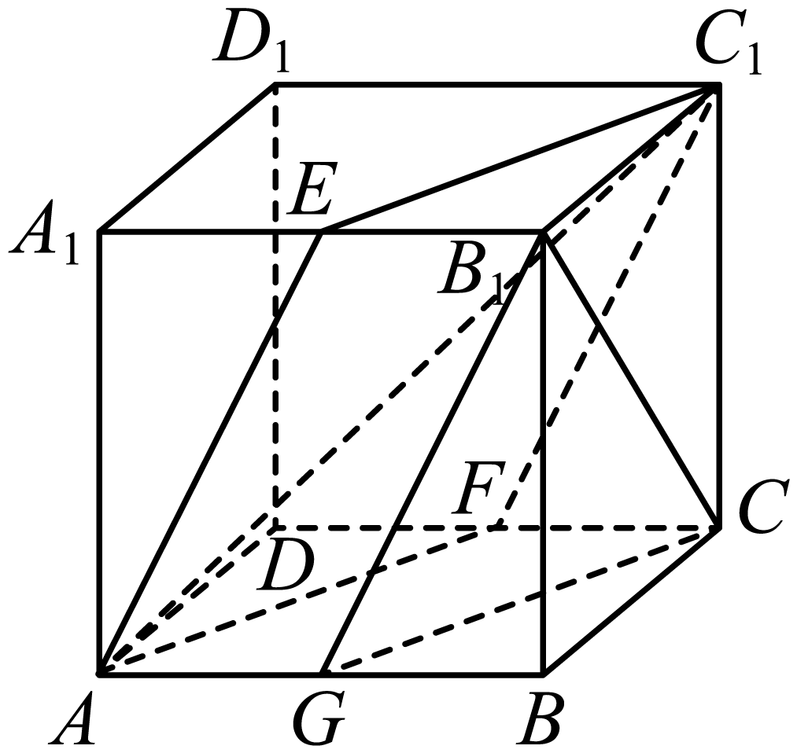

若分别为的中点，连接，显然，

所以共面，即面，

由，面，面，则面，

又，同理可得面，，面，

所以面面，故面内任意直线都与面平行，

要使∥平面，则在四边形的边上运动，

此时轨迹长为，③对；

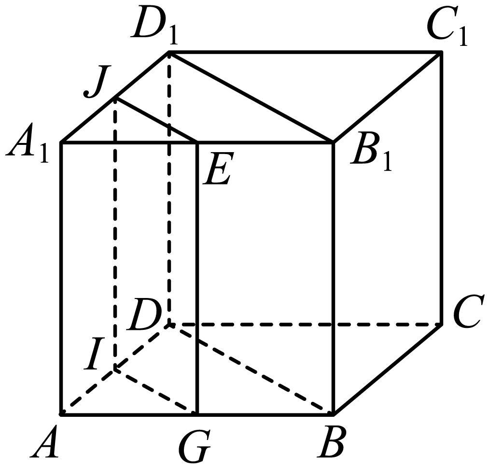

若分别是的中点，并依次连接，

易知为正六边形，显然，，

由面，面，则面，同理可得面，

，面，所以面面，

由面，则面，故垂直于面所有直线，

要使，则在边长为的正六边形边上运动，

所以轨迹图形面积为，④对；

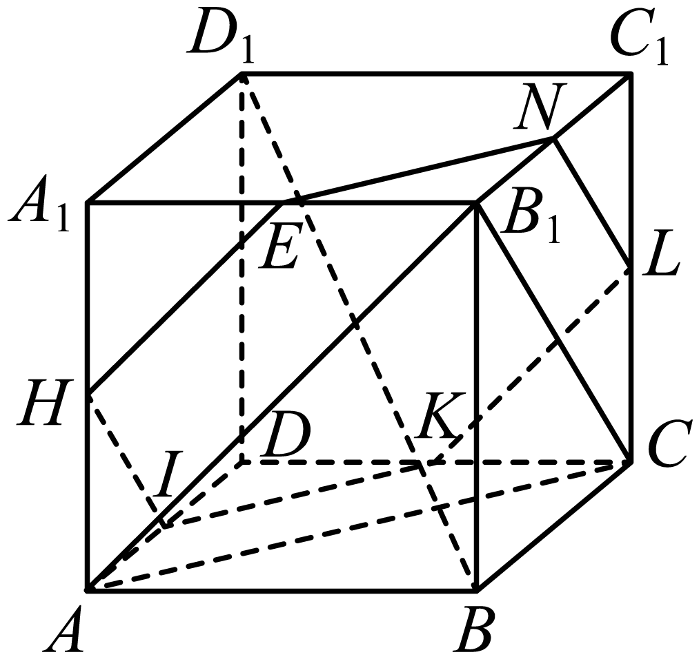

故选：C

<strong>例2．</strong>（2024·辽宁沈阳·高一沈阳二十中校联考期末）在棱长为1的正方体中，<em>E</em>在棱上且满足，点<em>F</em>是侧面上的动点，且面<em>AEC</em>，则动点<em>F</em>在侧面上的轨迹长度为______．

【答案】

【解析】如图，取的中点，并连接、、，

因为*E*在棱上且满足，即*E*是棱的中点，

所以，又平面，平面，

所以平面，同理可证平面，

又，所以平面平面，又平面，

所以平面，所以动点*F*在侧面上的轨迹即为，

因为正方体的棱长为1，由勾股定理有：.

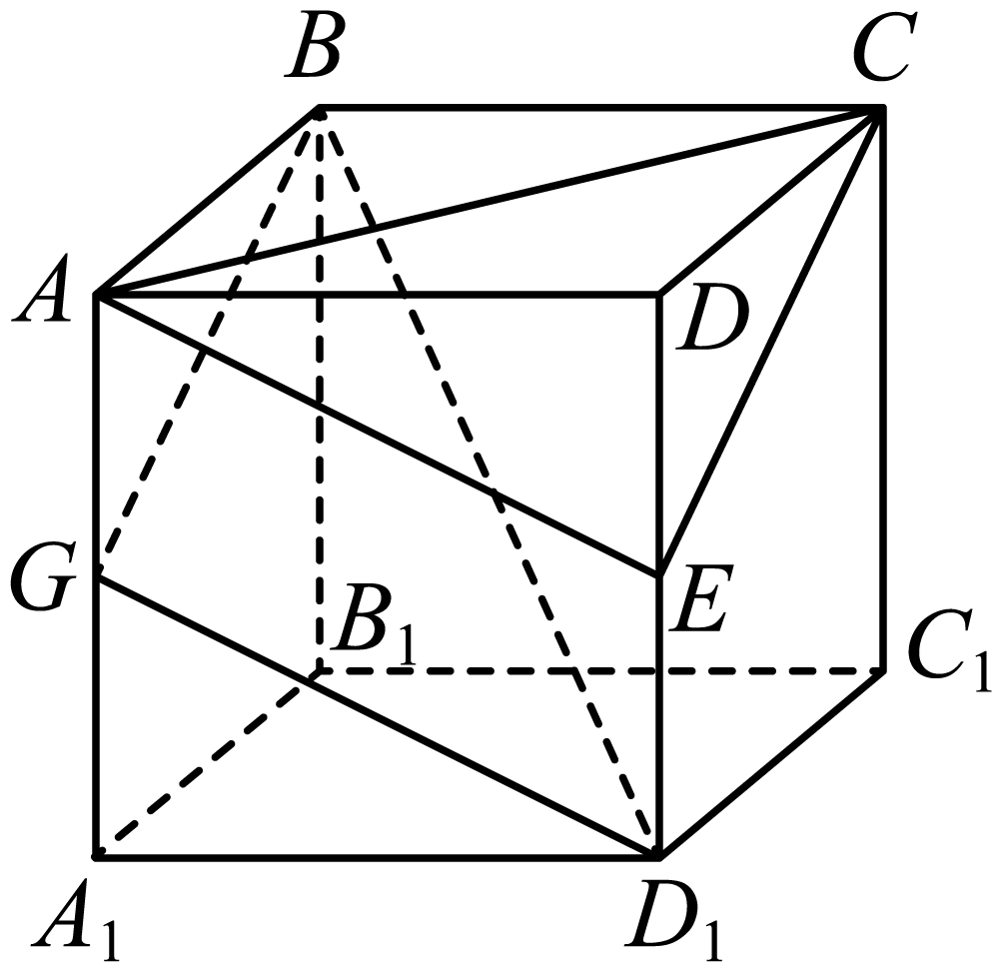

故答案为：.

<strong>例3．</strong>（2024·福建福州·高一福建省福州屏东中学校考期末）如图所示，在棱长为2的正方体中，<em>E</em>，<em>F</em>，<em>G</em>分别为所在棱的中点，<em>P</em>为平面内（包括边界）一动点，且∥平面<em>EFG</em>，则<em>P</em>点的轨迹长度为________

【答案】2

【解析】因为∥，则四点共面，

连接，

因为*E*，*F*分别为所在棱的中点，则∥，

且平面*FGE*，平面*FGE*，所以∥平面*FGE*，

因为*F*，*G*分别为所在棱的中点，则∥，

且平面*FGE*，平面*FGE*，所以∥平面*FGE*，

，平面，

所以平面*FGE*∥平面，且平面平面，

可得当且仅当点*P*在棱*BC*上时，即平面，满足∥平面*EFG*，

所以点*P*的轨迹为线段*BC*，长度为2.

故答案为：2.

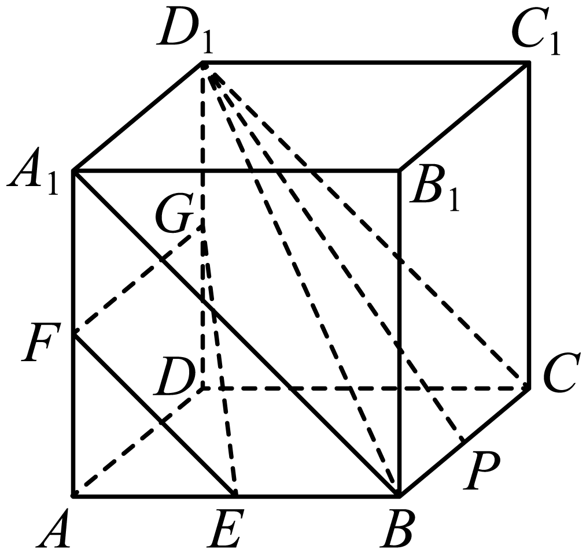

<strong>变式1．</strong>（2024·四川成都·高一成都市锦江区嘉祥外国语高级中学校考期末）如图，在正三棱柱中，，，分别为，的中点．若侧面的中心为，为侧面内的一个动点，平面，且的轨迹长度为，则三棱柱的表面积为________．

【答案】/

【解析】

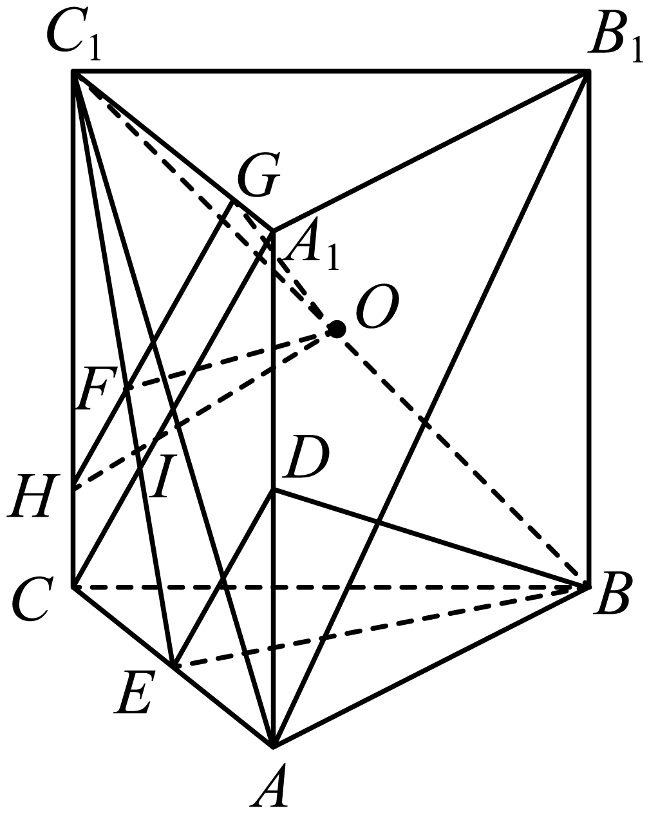

连接交于，取的中点，过作，

分别交于，连接，

易得，

因为平面，平面，所以平面，

平面，因为，且都在面内，所以平面平面，

所以的轨迹为线段，

因为，所以，

因为，所以，

所以，

故三棱柱的表面积为.

故答案为：.

<strong>变式2．</strong>（2024·江苏扬州·高二统考期中）如图，正方体的棱长为2，点是线段的中点，点是正方形所在平面内一动点，若平面，则点轨迹在正方形内的长度为________.

【答案】

【解析】取的中点，连接，如图所示：

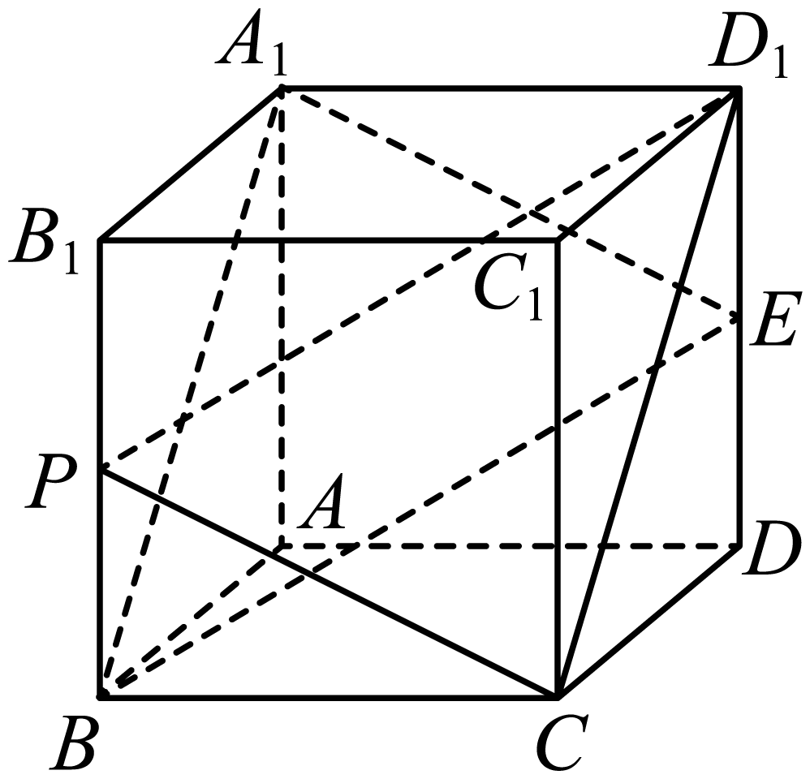

因为，平面，平面，所以平面.

因为，平面，平面，所以平面.

又因为平面，，

所以平面平面.

因为平面，平面，

所以点在平面的轨迹为.

所以.

故答案为：

<strong>变式3．</strong>（2024·江苏泰州·高二泰州中学校考阶段练习）正方体的棱长为3，点，分别在线段和线段上，且，，点是正方形所在平面内一动点，若平面，则点的轨迹在正方形内的长度为______.

【答案】

【解析】

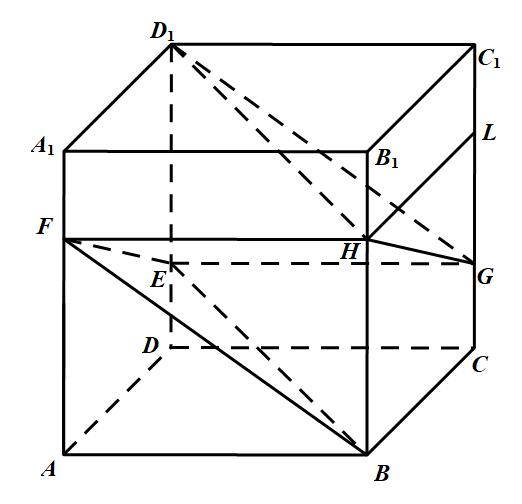

如图，在上取点，使得，在上取点，使得，连接.

根据正方体的性质可知，，.

由已知可得，，

又，所以.

又，所以，四边形为平行四边形，

所以，，且.

同理可得，，且，.

根据正方体的性质可知，，且，

所以，，且，

所以，四边形是平行四边形，

所以，.

因为平面，平面，所以平面.

同理可得，平面.

因为平面，平面，，

所以，平面平面.

又平面平面，

所以，根据面面平行的性质定理可知，只有在线段上运动时，满足条件.

过点作，垂足为，

易知，且，，

所以，.

故答案为：.

<strong>变式4．</strong>（2024·全国·高三专题练习）在边长为2的正方体中，点<em>M</em>是该正方体表面及其内部的一动点，且平面，则动点<em>M</em>的轨迹所形成区域的面积是_________．

【答案】

【解析】如图，边长为2的正方体中，

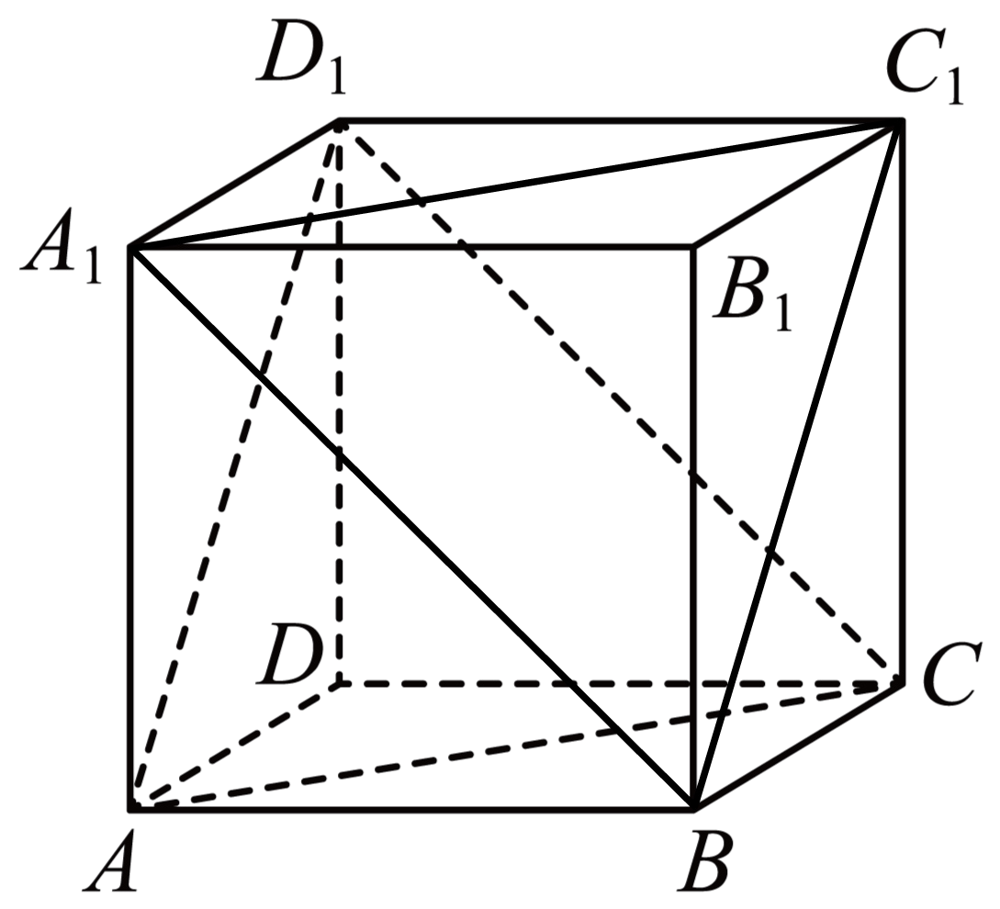

动点*M*满足平面，

由面面平行的性质得：当始终在一个与平面平行的面内，即满足题意，

连接，，，

因为且，所以四边形为平行四边形，

所以，同理，

又平面，平面，所以平面，

因为平面，平面，所以平面，

又因平面，

所以平面平面，

又平面，所以动点*M*的轨迹所形成区域为，

，

，

所以动点*M*的轨迹所形成区域的面积是.

故答案为：.

<strong>变式5．</strong>（2024·全国·高三专题练习）如图，已知正方体的棱长为分别是棱的中点，点为底面四边形内（包括边界）的一动点，若直线与平面无公共点，则点在四边形内运动所形成轨迹的长度为__________.

【答案】

【解析】取的中点，连接，如图所示：

分别是棱的中点，所以，

又因为平面平面，所以平面.

因为，

所以四边形为平行四边形，所以.

又因为平面平面，所以平面.

因为，所以平面平面.

因为点为底面四边形内（包括边界）的一动点，直线与平面无公共点，

所以的轨迹为线段，则.

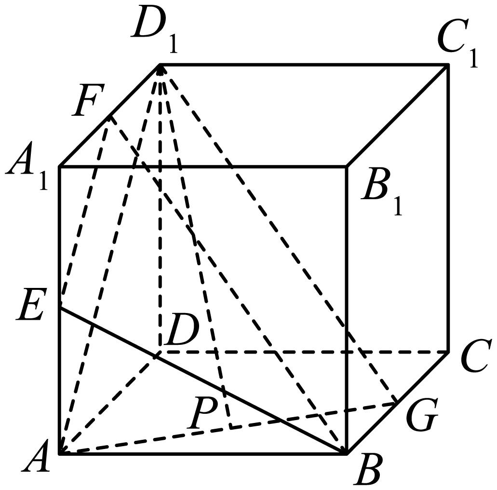

故答案为：.

<strong>变式6．</strong>（2024·全国·高三专题练习）如图所示，正方体的棱长为分别为，的中点，点是正方体表面上的动点，若平面，则点在正方体表面上运动所形成的轨迹长度为__________．

【答案】/

【解析】取的中点的中点，连结．正方体

的棱长为2．为中点，所以，

所以且．

因为为分别为的中点，

所以，且，所以四边形为平行四边形，

所以．

因为面面，

所以面．

同理可证：面．

又面面，

所以面面．

所以点在正方体表面上运动所形成的轨迹为三角形．

因为正方体的棱长为2，所以，

所以三角形的周长为．

故答案为：.

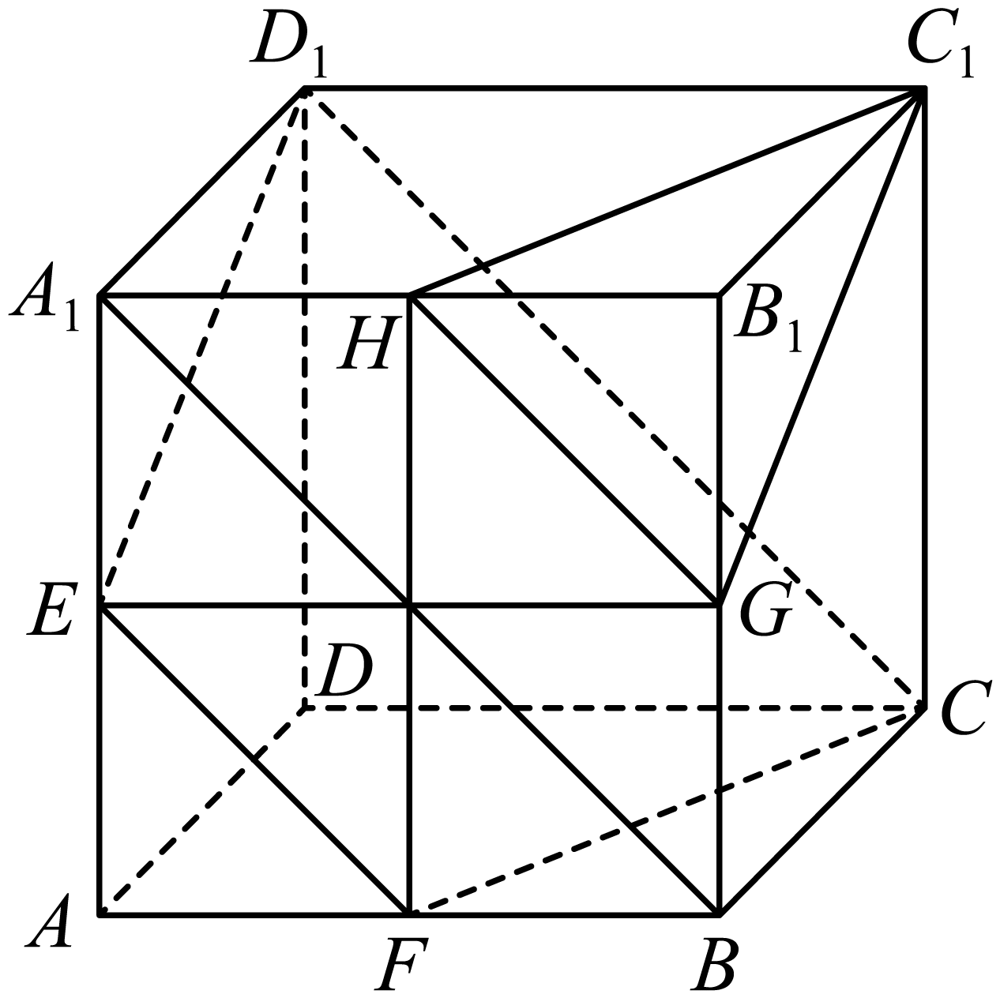

<strong>变式7．</strong>（2024·全国·高三专题练习）已知棱长为的正四面体，为的中点，动点满足，平面经过点，且平面平面，则平面截点的轨迹所形成的图形的周长为_________.

【答案】

【解析】设的外心为，的中点为，过作的平行线，则以为坐标原点，可建立如图所示空间直角坐标系，

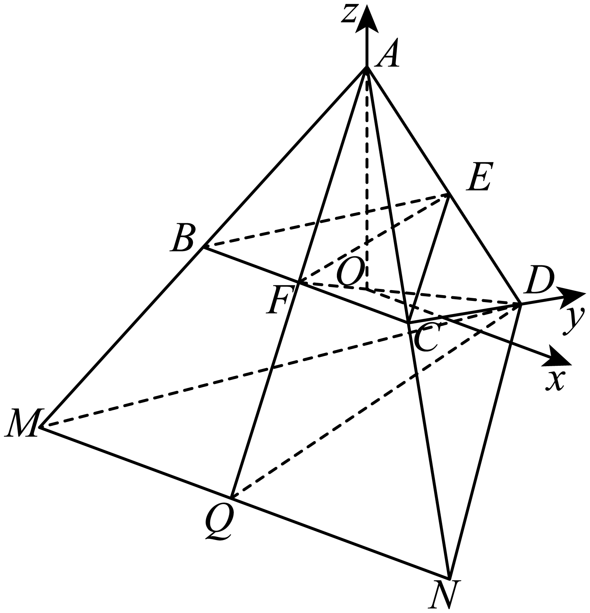

为等边三角形，，，，

，，，

设，由得：，

整理可得：，

动点的轨迹是以为球心，为半径的球；

延长到点，使得，，，

则，，又平面，平面，

平面，平面，由，平面，

平面平面，即平面为平面，

则点到平面的距离即为点到直线的距离，

，，，即，

点到直线的距离，

截面圆的半径，球被平面截得的截面圆周长为，

即平面截点的轨迹所形成的图形的周长为.

故答案为：.

**题型二：由动点保持垂直求轨迹**

<strong>例4．</strong>（2024·湖南株洲·高三株洲二中校考阶段练习）在棱长为4的正方体中，点<em>P</em>、<em>Q</em>分别是，的中点，点<em>M</em>为正方体表面上一动点，若<em>MP</em>与<em>CQ</em>垂直，则点<em>M</em>所构成的轨迹的周长为______.

【答案】

【解析】如图，只需过点*P*作直线*CQ*的垂面即可，垂面与正方体表面的交线即为动点*M*的轨迹.

分别取，的中点*R*，*S*，

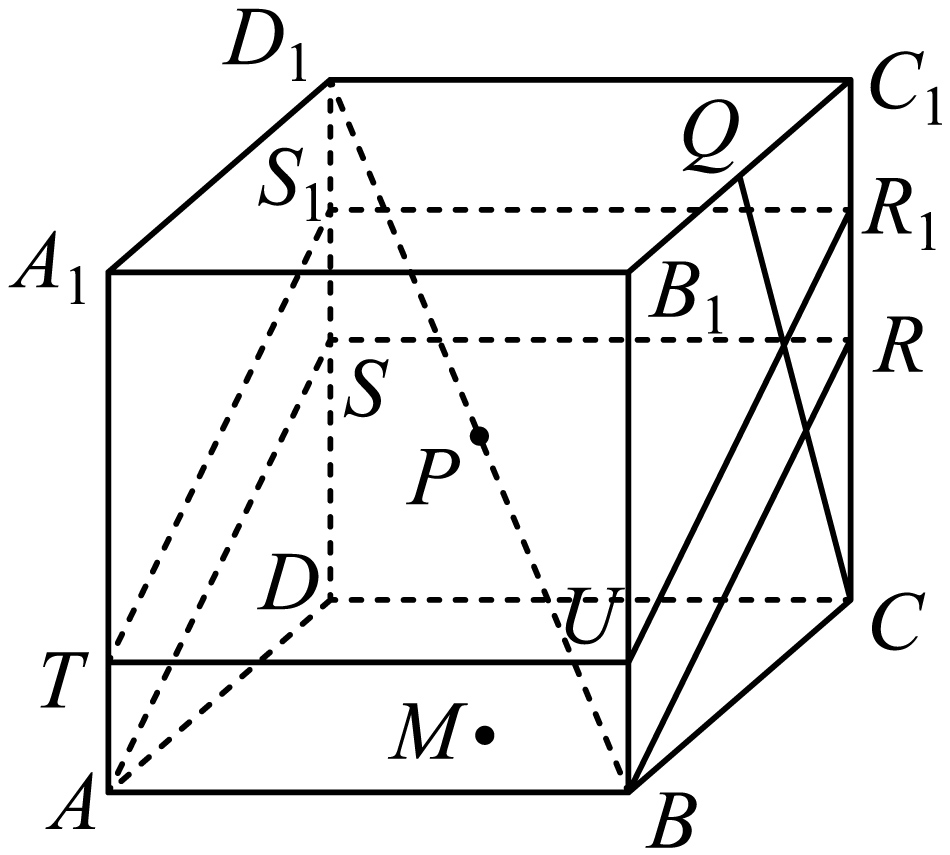

由，知，易知，

又，，平面*ABRS*，

所以平面*ABRS*，

过*P*作平面*ABRS*的平行平面，点*M*的轨迹为四边形，

其周长与四边形*ABRS*的周长相等，

其中，，

所以点*M*所构成的轨迹的周长为.

故答案为：

<strong>例5．</strong>（2024·湖南长沙·长郡中学校考二模）在正四棱柱中，，<em>E</em>为中点，为正四棱柱表面上一点，且，则点的轨迹的长为_____.

【答案】/

【解析】如图，连接，，由题可知，，平面.

因平面，则.

又平面，平，，则平面.又平面，则；

如图，过*E*做平行线，交于*F*，则*F*为中点.连接，

过做垂线，交于*G*.

由题可得，平面，又，则平面.

因平面，则.

又平面，平面，，则平面.

因平面，则；

因平面，平面，，则平面.

连接，则点*P*轨迹为平面与四棱柱的交线，即.

注意到，

，则，故.

则点的轨迹的长为.

故答案为：.

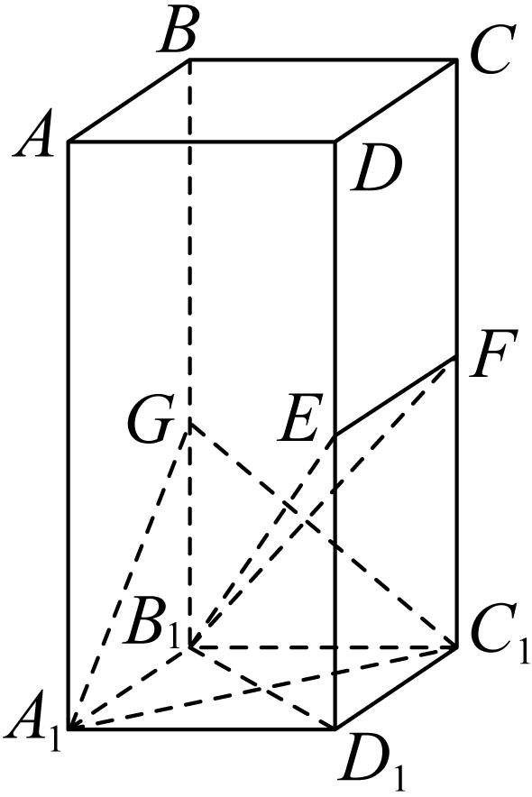

<strong>例6．</strong>（2024·全国·唐山市第十一中学校考模拟预测）已知为正方体的内切球球面上的动点，为的中点，，若动点的轨迹长度为，则正方体的体积是______.

【答案】

【解析】如图所示：

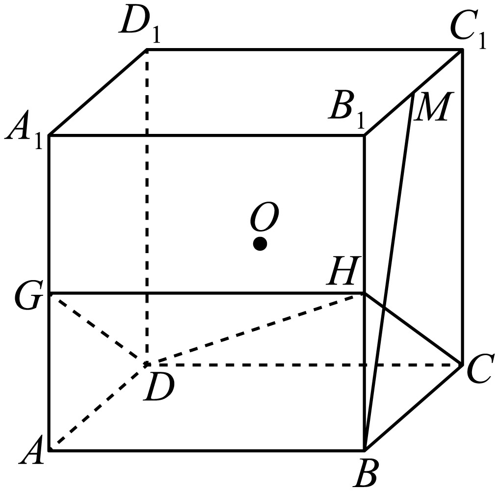

正方体，设，则内切球的半径，

其中为的中点，取的中点，连接,

则有：,

又,平面，

所以平面，

所以动点的轨迹是平面截内切球的交线，

即平面截内切球的交线，

因为正方体，，

如图所示：

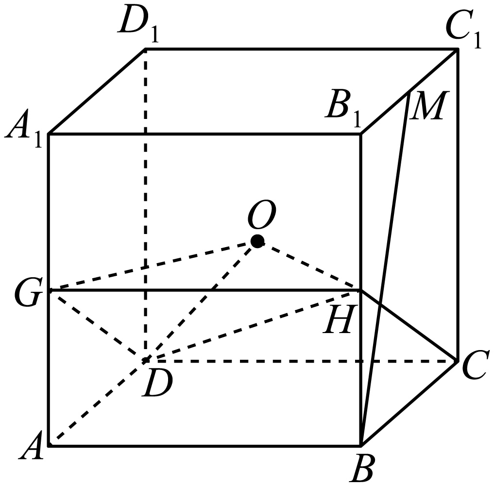

连接,则有且，

，且，

设到平面的距离为：，

则在三棱锥中，有，

所以，

即，

解得：，

截面圆的半径，

所以动点的轨迹长度为：，

即，解得，

所以，正方体的体积：，

故答案为：.

<strong>变式8．</strong>（2024·全国·高三专题练习）已知直三棱柱的所有棱长均为4，空间内的点满足，且，则满足条件的所形成曲线的轨迹的长度为________.

【答案】/

【解析】设的中点为，的中点为，易知，

因为，且，所以点在以，为直径的球上，

球心分别为，，半径分别为，，即，，

又，所以，即，

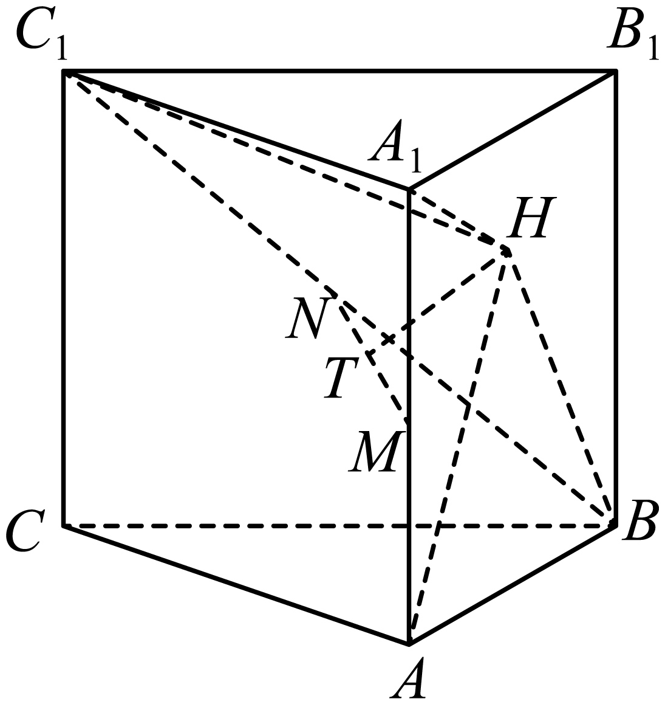

过作，垂足为，则，

因为两球的交线为圆，所以点轨迹是以为圆心，以为半径的圆，

所以轨迹长度为.

故答案为：.

<strong>变式9．</strong>（2024·四川成都·三模）如图，<em>AB</em>为圆柱下底面圆<em>O</em>的直径，<em>C</em>是下底面圆周上一点，已知，，圆柱的高为5．若点<em>D</em>在圆柱表面上运动，且满足，则点<em>D</em>的轨迹所围成图形的面积为________．

【答案】10

【解析】作母线，，连接，

因为，所以共面，是圆柱的一个截面，

平面，平面，所以，

又由已知得，而，平面，

所以平面，

由得，所以平面，

矩形即为点轨迹，

，则，又，

所以矩形的面积为．

故答案为：10.

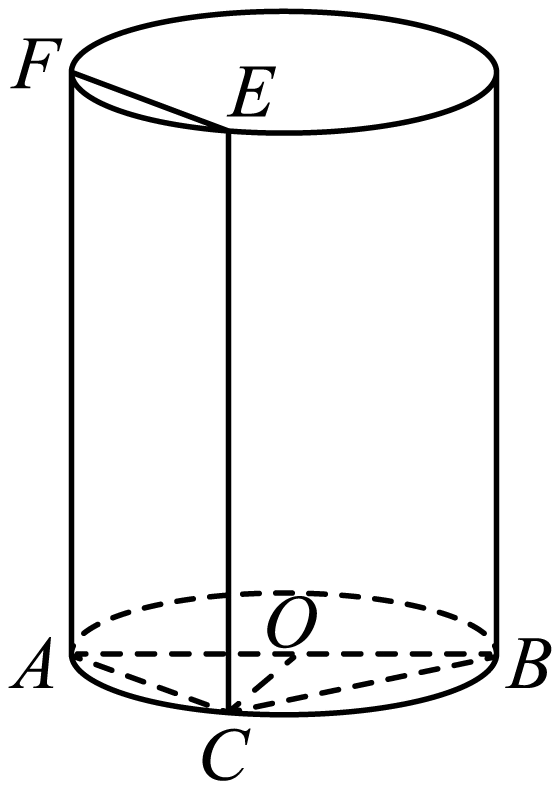

<strong>变式10．</strong>（2024·全国·高三专题练习）如图，为圆柱下底面圆的直径，是下底面圆周上一点，已知，圆柱的高为5．若点在圆柱表面上运动，且满足，则点的轨迹所围成图形的面积为_______．

【答案】10

【解析】因为是圆柱下底面圆的直径，所以，

又，，平面，所以平面，

设过的母线与上底面的交点为，过的母线与上底面的交点为，连，

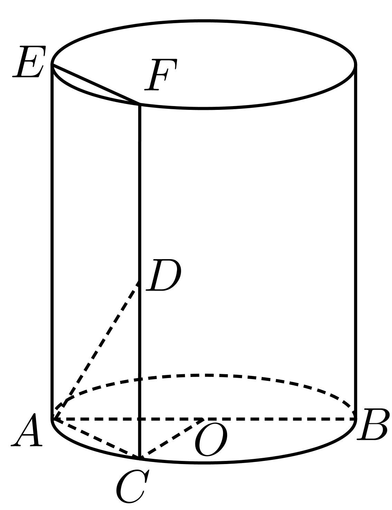

因为平面，平面，所以，

因为，平面，所以平面，

所以点在平面内，又点在圆柱的表面，所以点的轨迹是矩形，

依题意得，，，所以，

所以矩形的面积为.

故点的轨迹所围成图形的面积为.

故答案为：.

<strong>变式11．</strong>（2024·浙江宁波·高一慈溪中学校联考期末）如图，在直三棱柱中，，，，动点在内（包括边界上），且始终满足，则动点的轨迹长度是______.

【答案】

【解析】在直三棱柱中，平面，

因为平面，所以，，

又因为，，、平面，

所以，平面，

因为平面，所以，，

因为，，则四边形为菱形，所以，，

又因为，、平面，所以，平面，

因为平面，所以，.

在平面内，过点作，垂足为点，

因为平面，平面，则，

因为，，、平面，

所以，平面，

因为平面，则，

因为，、平面，所以，平面，

由于动点又在内，所以动点在平面与平面的交线上，

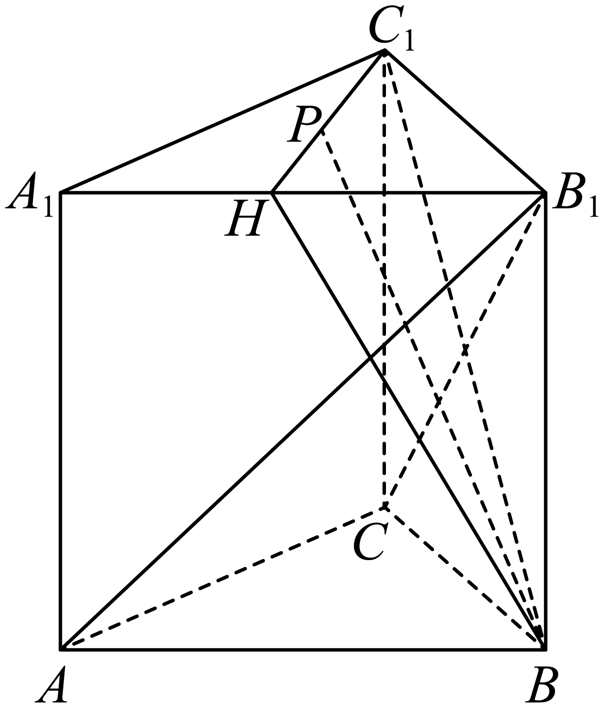

因为，，，

所以，，

由等面积法可得，

因此，动点的轨迹长度是.

故答案为：.

<strong>变式12．</strong>（2024·山东枣庄·高一统考期末），分别是棱长为1的正方体的棱的中点，点在正方体的表面上运动，总有，则点的轨迹所围成图形的面积为________.

【答案】

【解析】取中点，连接，设，

则，，，

所以，

所以，

因为，

所以，

所以，即，

因为正方体中面，面，

所以，

因为面，，

所以面，

因为正方体中面，面，

所以，

所以点的轨迹为矩形，

在直角中，

所以矩形面积为.

即点的轨迹所围成图形的面积为.

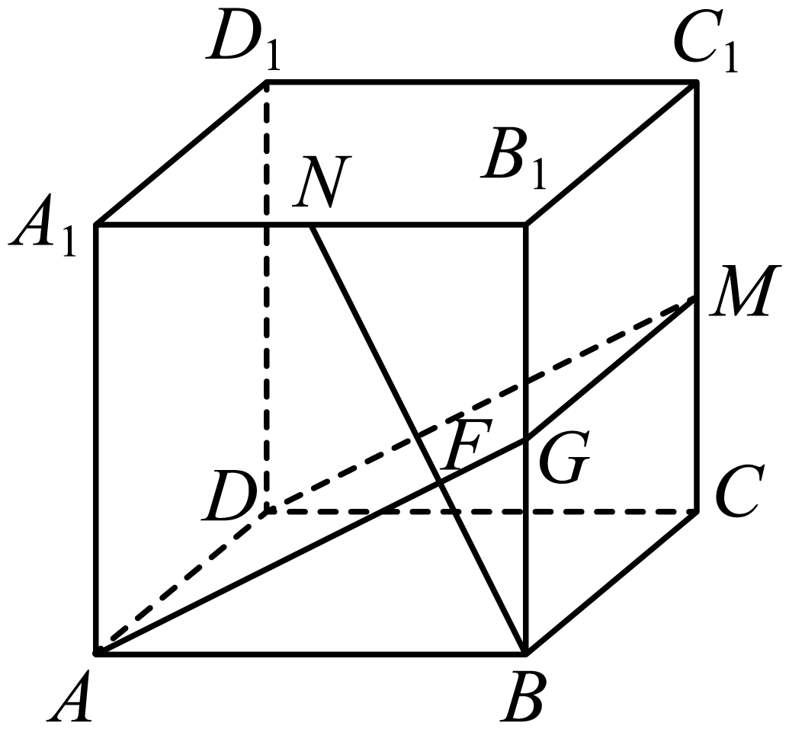

故答案为：

<strong>变式13．</strong>（2024·四川广元·高二广元中学校考期中）如图，为圆柱下底面圆的直径，是下底面圆周上一点，已知，，圆柱的高为5．若点在圆柱表面上运动，且满足，则点的轨迹所围成图形的面积为______．

【答案】

【解析】因为是圆柱下底面圆的直径，

所以，

又，，，平面，

所以平面，

设过*A*的母线与上底面的交点为，过的母线与上底面的交点为，连，，，

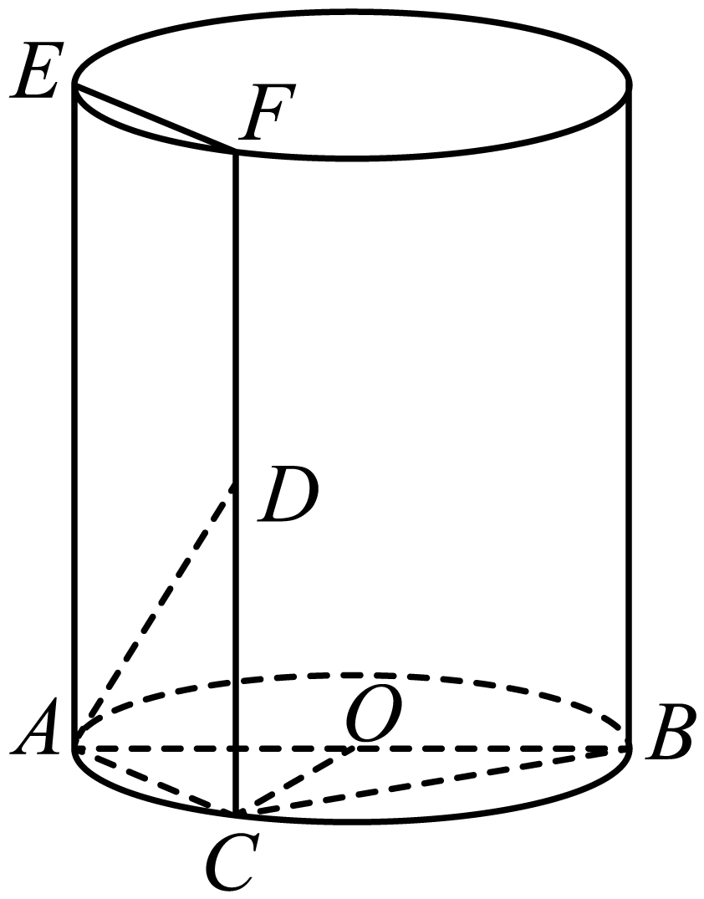

则四边形为矩形，

因为平面，平面，

所以，

因为，，平面，

所以平面，

所以点在平面内，

又点在圆柱的表面，

所以点的轨迹所围成图形是矩形，

依题意得，，，

所以，

所以矩形的面积为，

故点的轨迹所围成图形的面积为．

故答案为：．

**变式14．**（2024·陕西榆林·高二校考阶段练习）如图，正方体的棱长为，点是棱的中点，点是正方体表面上的动点．若，则点在正方体表面上运动所形成的轨迹的长度为（    ）

A．	B．

C．	D．

【答案】C

【解析】取的中点，的中点，连接、、、、，

设，如下图所示．

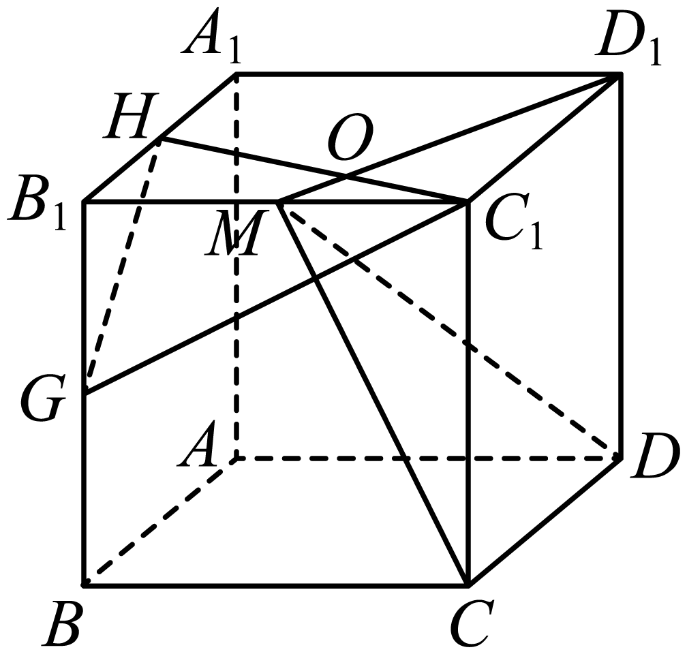

因为四边形是正方形，又点是棱的中点，点是的中点，

则，，，

所以，，所以，，

所以，，

所以，，即．

在正方体中，平面，

又平面，所以，

又，、平面，所以平面，

又平面，所以，同理可得，，

又，、平面，所以，平面．

所以点在正方体表面上运动所形成的轨迹为的三边，

因为正方体的棱长为，

由勾股定理可得，同理可得，，

所以的周长为．

故选：C．

**题型三：由动点保持等距（或定长）求轨迹**

<strong>例7．</strong>（2024·贵州贵阳·高三贵阳一中校考期末）在棱长为1的正方体中，点<em>Q</em>为侧面内一动点（含边界），若，则点<em>Q</em>的轨迹长度为______．

【答案】/

【解析】由题意，在面的轨迹是以为圆心，半径为的四分之一圆弧，

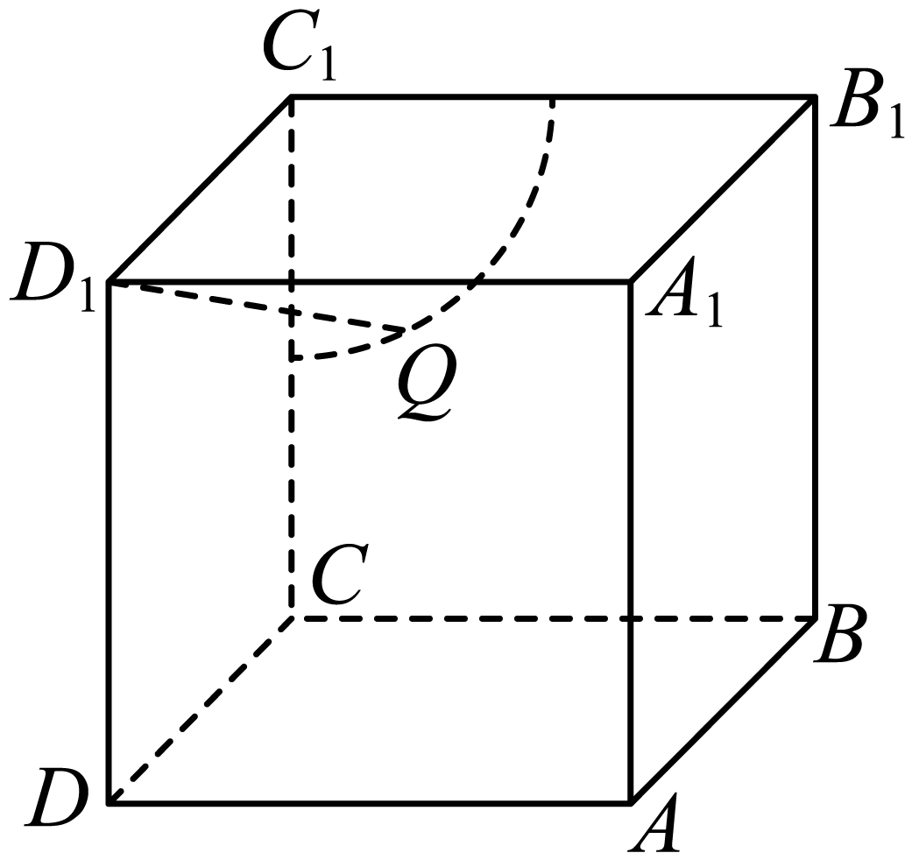

所以轨迹长度为.

故答案为：

<strong>例8．</strong>（2024·湖北武汉·高一湖北省水果湖高级中学校联考期末）已知正方体的棱长为3，动点在内，满足，则点的轨迹长度为______.

【答案】

【解析】在正方体中，如图，

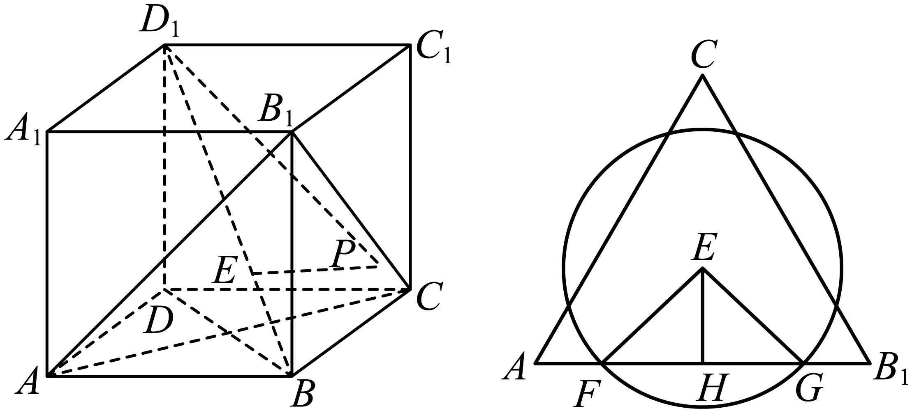

平面，平面，则，而，

，，平面，于是平面，又平面，

则，同理，而，，平面，

因此平面，令交平面于点，

由，得，

即，解得，

而，于是，

因为点在内，满足，则，

因此点的轨迹是以点为圆心，为半径的圆在内的圆弧，

而为正三角形，则三棱锥必为正三棱锥，为正的中心，

于是正的内切圆半径，

则，即，，

所以圆在内的圆弧为圆周长的，

即点的轨迹长度为

故答案为：

<strong>例9．</strong>（2024·河北邯郸·高一大名县第一中学校考阶段练习）已知正方体的棱长为1，点<em>P</em>在该正方体的表面上运动，且则点<em>P</em>的轨迹长度是________．

【答案】

【解析】当时，如图，点的轨迹是在面，，三个面内以1为半径，圆心角为的三段弧，所以此时点点*P*在该正方体的表面上运动的轨迹的长度为，

故答案为：

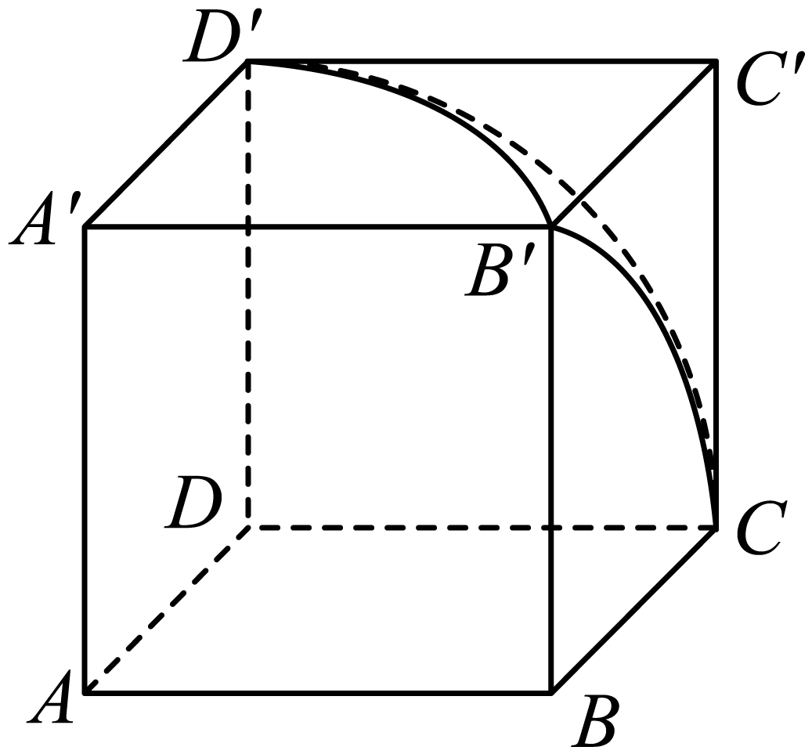

<strong>变式15．</strong>（2024·贵州铜仁·统考模拟预测）已知正方体的棱长为4，点<em>P</em>在该正方体的表面上运动，且，则点<em>P</em>的轨迹长度是________．

【答案】

【解析】因为，所以点可能在平面内，可能在平面内，可能在平面内.

当点在平面内时，

由平面，平面，可知，

所以，所以，

所以点到的距离为，

所以点的轨迹为以点为圆心，为半径的圆与正方形边界及其内部的交线.

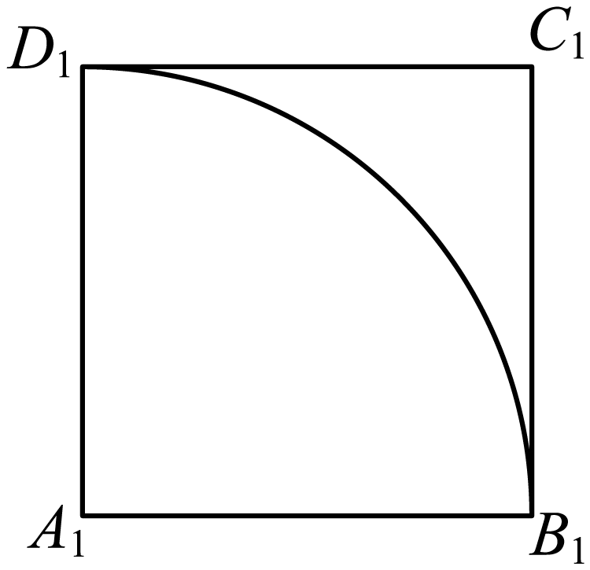

如上图，，，

则的长，

所以，当点在平面内时，点*P*的轨迹长度是.

同理可得，当点在平面内时，点*P*的轨迹长度也是.

当点在平面时，点*P*的轨迹长度也是.

综上所述，点*P*的轨迹长度为.

故答案为：.

<strong>变式16．</strong>（2024·黑龙江齐齐哈尔·统考二模）表面积为36π的球<em>M</em>表面上有<em>A</em>，<em>B</em>两点，且为等边三角形，空间中的动点<em>P</em>满足，当点<em>P</em>在所在的平面内运动时，点<em>P</em>的轨迹是______；当<em>P</em>在该球的球面上运动时，点<em>P</em>的轨迹长度为______.

【答案】圆

【解析】设球的半径为*r*，则，解得*r*＝3，

在平面内，动点*P*的轨迹组成一个圆，以线段*AB*所在直线为*x*轴，以靠近点*B*且长度为1处为坐标原点，

则，，此时动点*P*的轨迹方程为，

设其圆心为，则在空间中，*z*轴和*xOy*坐标平面垂直，

动点*P*的轨迹为*xOy*平面中的圆绕*x*轴旋转一周形成球的球面，

如图所示，

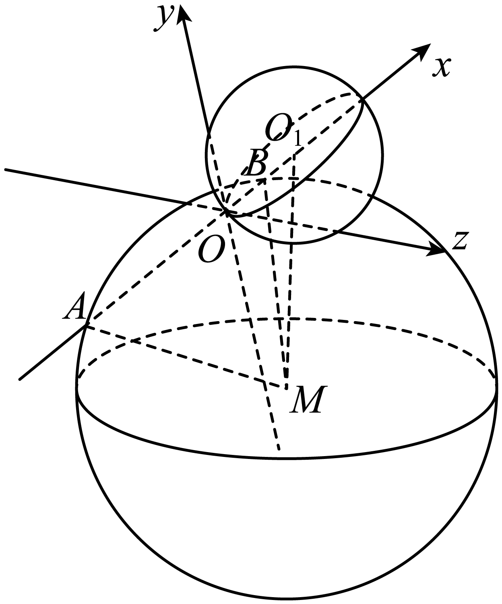

所以点*P*的轨迹是两个球面的交线，这两个球分别是以*M*和为球心，

在中，结合余弦定理得到.

设交线所围成的圆半径为*R*.则，

解得.所以交线的长度为.

故答案为：圆；

<strong>变式17．</strong>（2024·全国·高三专题练习）已知正四棱柱的体积为16，是棱的中点，是侧棱上的动点，直线交平面于点，则动点的轨迹长度的最小值为______．

【答案】

【解析】如图取的中点，连接交于点，连接、交于点，连接、，

因为是棱的中点，所以，则为的四等分点且，

由正四棱柱的性质可知且，所以四边形为平行四边形，所以，

所以，所以、、、四点共面，

所以平面平面，

连接交于点，因为是侧棱上的动点，直线交平面于点，

所以线段即为点的轨迹，

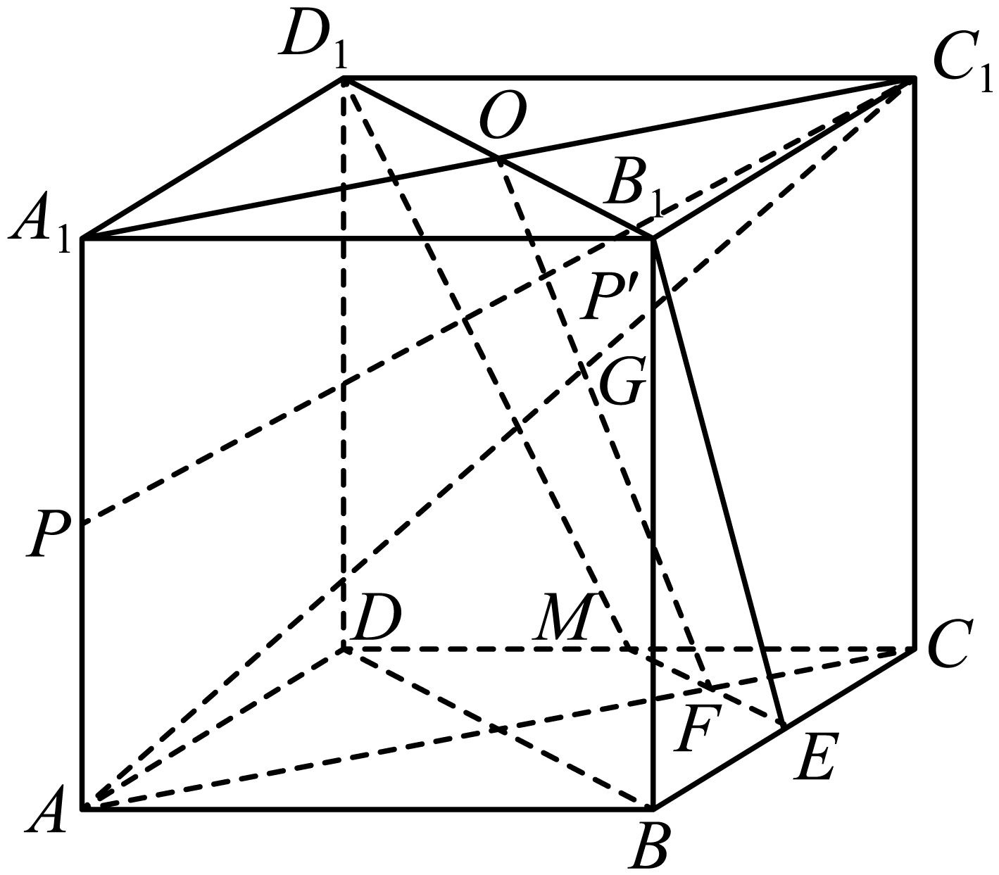

如图在平面中，过点作，交于点，因为，

所以，所以，所以，

设、，，

依题意，，

所以，

要求动点的轨迹长度的最小值，即求的最小值，即求的最小值，

因为，所以，

所以，

当且仅当，即、时取等号，

所以，所以，即动点的轨迹长度的最小值为.

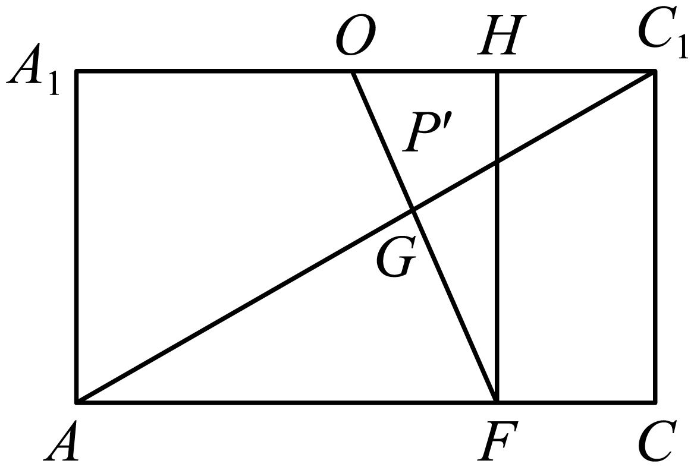

故答案为：

<strong>变式18．</strong>（2024·全国·高三专题练习）已知棱长为8的正方体中，平面<em>ABCD</em>内一点<em>E</em>满足，点<em>P</em>为正方体表面一动点，且满足，则动点<em>P</em>运动的轨迹周长为___________．

【答案】

【解析】，则在的延长线上，且，

由正方体性质知平面，当在平面上时，平面，，由得，因此点轨迹是以为圆心，2为半径的圆在正方形内的部分即圆周的，弧长为，从而知点在以为顶点的三个面内．

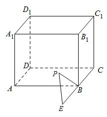

当在棱上时，，，

因此点在面时，点轨迹是以为圆心，为半径的圆在正方形内的圆弧，圆弧的圆心角为，弧长为，同理点在面内的轨迹长度也为，

所以所求轨迹长度为．

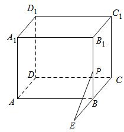

故答案为：．

<strong>变式19．</strong>（2024·全国·高三专题练习）如图，已知棱长为2的正方体<em>A</em>′<em>B</em>′<em>C</em>′<em>D</em>′－<em>ABCD</em>，<em>M</em>是正方形<em>BB</em>′<em>C</em>′<em>C</em>的中心，<em>P</em>是△<em>A</em>′<em>C</em>′<em>D</em>内（包括边界）的动点，满足<em>PM</em>=<em>PD</em>，则点<em>P</em>的轨迹长度为______．

【答案】

【解析】如图建立空间直角坐标系，则

设平面的法向量

则有，令，则

则

设，则

∵，则

又∵*PM*=*PD*，则

整理得：

联立方程，则

可得，可得

当时，，当时，

在空间中，满足*PM*=*PD*的*P*为过*MD*的中点且与*MD*垂直的平面

两个平面的公共部分为直线，即点*P*的轨迹为平面*A*′*C*′*D*，则

故答案为：．

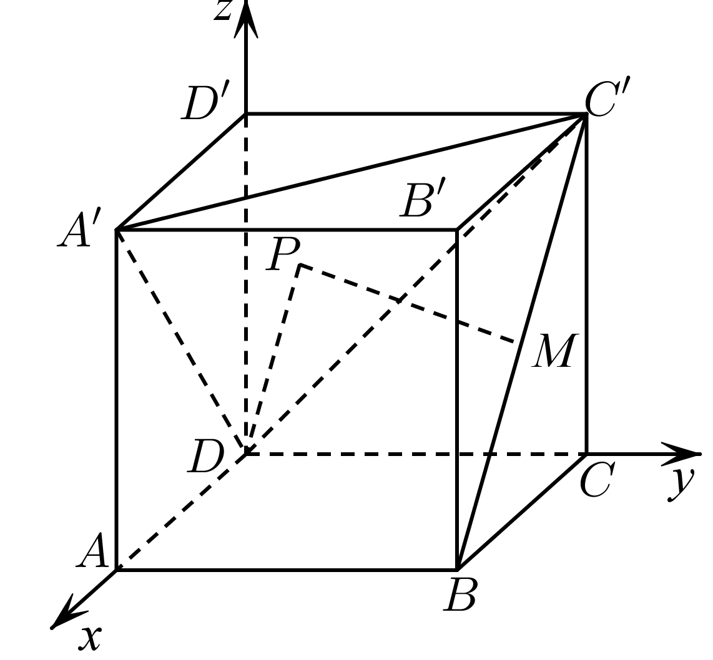

<strong>变式20．</strong>（2024·河南许昌·高三统考阶段练习）三棱锥的体积为，底面三角形是边长为的正三角形且其中心为，三棱锥的外接球球心到底面的距离为2，则点的轨迹长度为______.

【答案】

【解析】三棱锥的体积为，底面三角形是边长为的正三角形，

设三棱锥的高为

所以，故，

又正三角形的外接圆半径为，则，

又三棱锥的外接球球心到底面的距离为2，

所以三棱锥的外接球半径，即，

又因为顶点到底面的距离为，

所以顶点的轨迹是一个截面圆的圆周（球心在底面和截面圆之间）且球心到该截面圆的距离为，

所以截面圆的半径为，

故顶点的轨迹长度是．

故答案为：．

<strong>变式21．</strong>（2024·全国·高三专题练习）在三棱锥中，，二面角的大小为，在侧面内(含边界)有一动点，满足到的距离与到平面的距离相等，则动点的轨迹的长度为__________．

【答案】

【解析】如图，过作于，平面于，

过作于，连接，

则为二面角的平面角，

由，

得．

又，所以，

在中，以所在直线为轴，所在直线为轴建立平面直角坐标系，

则直线的方程为，

直线的方程为，

所以直线与的交点坐标为，

所以的轨迹为线段，

长度为．

故答案为：．

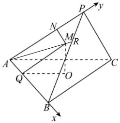

**题型四：由动点保持等角（或定角）求轨迹**

<strong>例10．</strong>（2024·山东·高三专题练习）如图所示，在平行四边形中，<em>E</em>为中点，，，.沿着将折起，使<em>A</em>到达点的位置，且平面平面.设<em>P</em>为内的动点，若，则<em>P</em>的轨迹的长度为______.

【答案】

【解析】

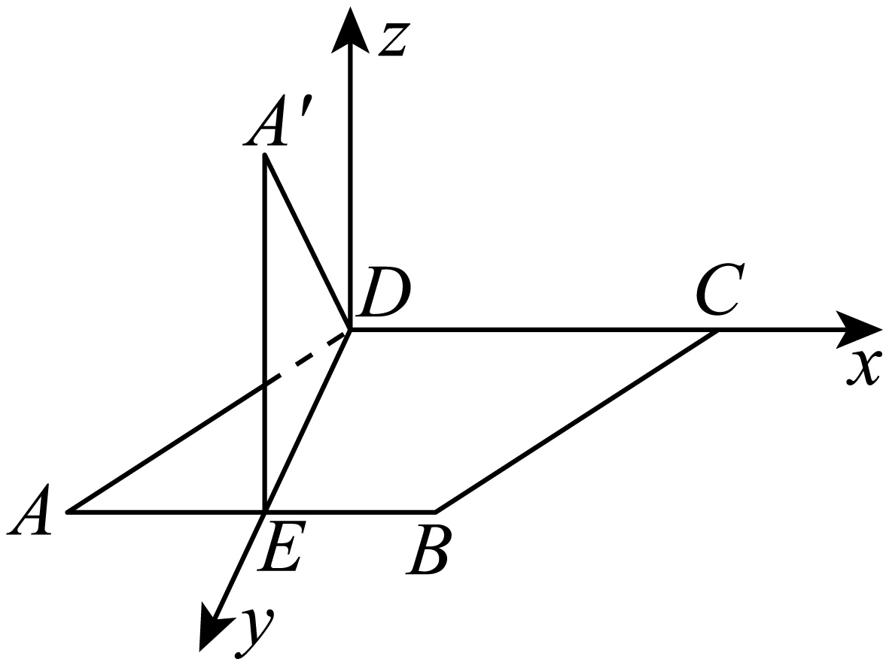

建立如图示空间直角坐标系，

则,

设

则

∴\

,

∵∴,

∴

整理化简得：

∴*P*的轨迹为圆，交于,于,

则

∴所对应的圆心角，∴弧长为．

故答案为：．

<strong>例11．</strong>（2024·全国·高三专题练习）在棱长为6的正方体中，点是线段的中点，是正方形（包括边界）上运动，且满足，则点的轨迹周长为________.

【答案】/

【解析】如图，在棱长为6的正方体中，

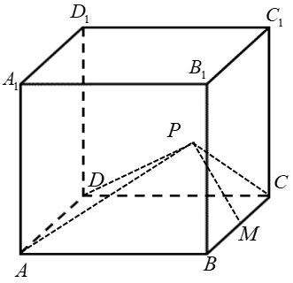

则平面，平面，

又，在平面上，，，

又，，

，即，

如图，在平面中，以为原点，分别为轴建立平面直角坐标系，

则，，，

由，知，

化简整理得，，圆心，半径的圆，

所以点的轨迹为圆与四边形的交点，即为图中的

其中，，，则

由弧长公式知

故答案为：.

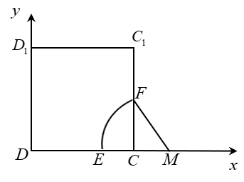

<strong>例12．</strong>（2024·湖北省直辖县级单位·统考模拟预测）已知正方体的棱长为2，<em>M</em>为棱的中点，<em>N</em>为底面正方形<em>ABCD</em>上一动点，且直线<em>MN</em>与底面<em>ABCD</em>所成的角为，则动点<em>N</em>的轨迹的长度为________．

【答案】

【解析】如图所示，取*BC*中点*G*，连接*MG*，*NG*，由正方体的特征可知*MG*⊥底面*ABCD*，

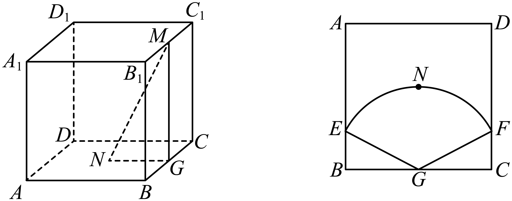

故*MN*与底面*ABCD*的夹角即，

∴，则，

故*N*点在以*G*为原点为半径的圆上，又*N*在底面正方形*ABCD*上，

即*N*的轨迹为图示中的圆弧，

易知，

所以长为.

故答案为：.

<strong>变式22．</strong>（2024·陕西·高三陕西省榆林中学校联考阶段练习）已知正方体的棱长为2，点为平面内的动点，设直线与平面所成的角为，若，则点的轨迹所围成的周长为_______．

【答案】

【解析】如图所示，连接交平面于，连接，

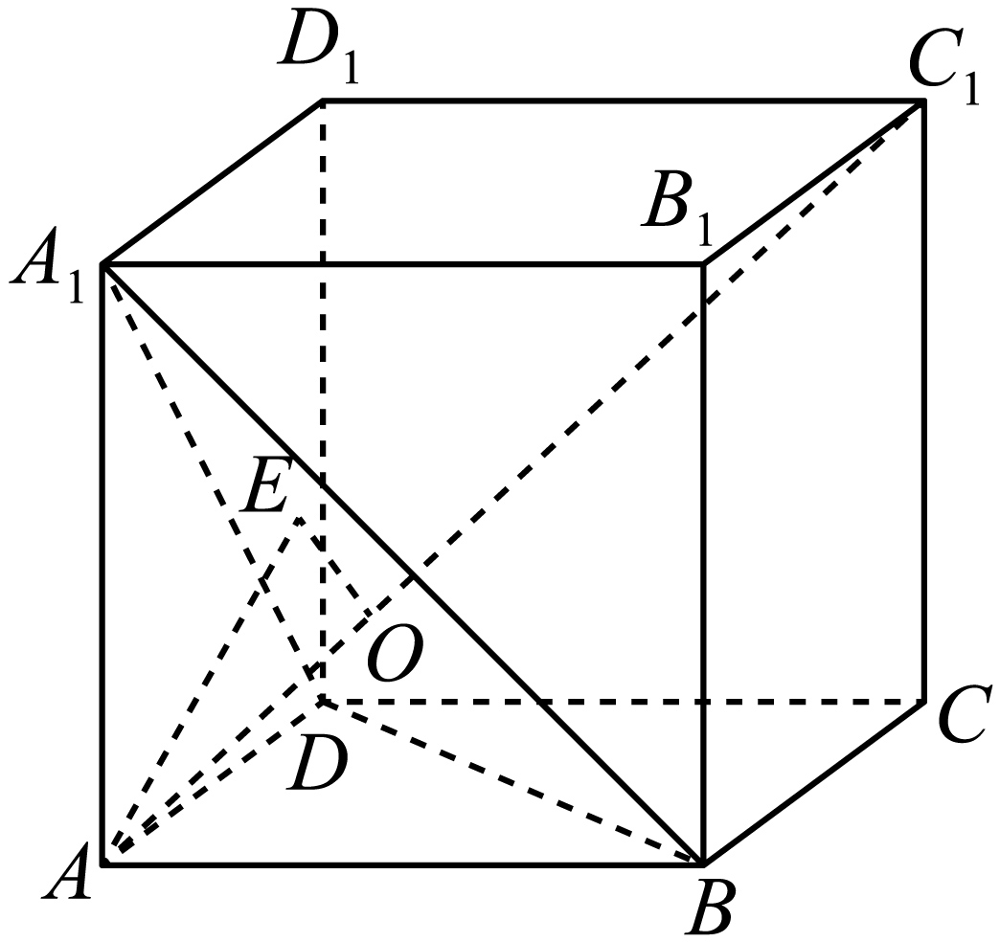

因为平面，所以，又，且与相交，

所以平面，所以，

同理可得，又，

所以平面，

∴是平面所成的角，∴．

由可得，，即．

在四面体中，，平面，

所以，所以为的中心，

又，．∴四面体为正三棱锥，

如图所示：在等边三角形中，，

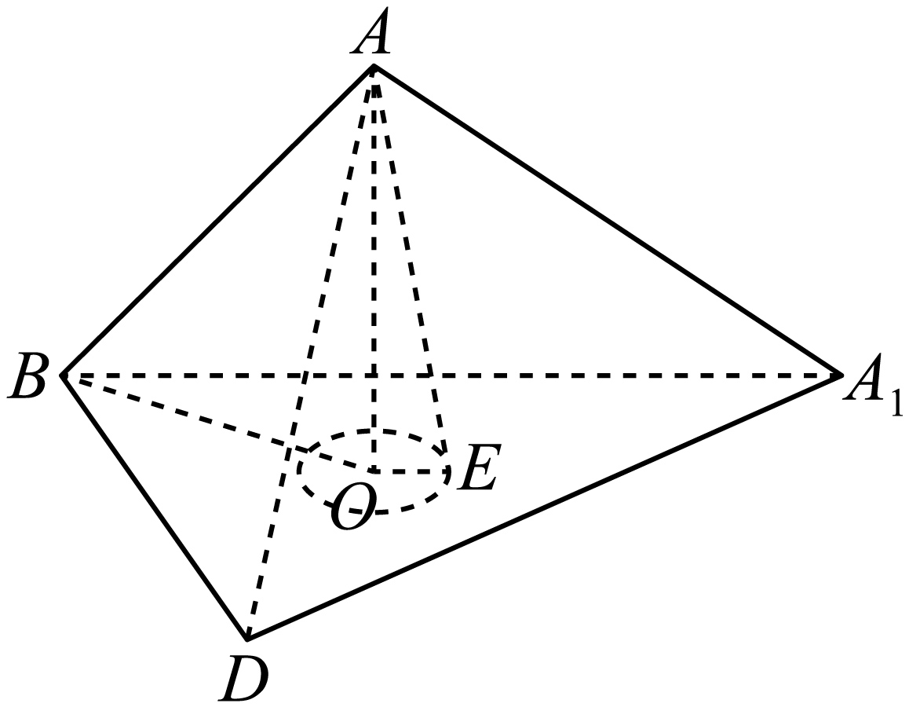

，

∵，∴，即在平面内的轨迹是以为圆心，半径为的圆，∴周长为.

故答案为：

<strong>变式23．</strong>（2024·全国·高三专题练习）已知点<em>P</em>是棱长为2的正方体的表面上一个动点，若使的点<em>P</em>的轨迹长度为<em>a</em>；使直线平面<em>BDC</em>的点<em>P</em>的轨迹长度为<em>b</em>；使直线<em>AP</em>与平面<em>ABCD</em>所成的角为45°的点<em>P</em>的轨迹长度为<em>c</em>．则<em>a</em>，<em>b</em>，<em>c</em>的大小关系为______．（用“＜”符号连接）

【答案】*b*＜*c*＜*a*

【解析】若点到点的距离为2，则点的轨迹为球的表面与正方体交轨，

在平面内，的轨迹为以为圆心，2为半径的圆弧，

由对称性知，这样的圆弧同样在平面内和平面内，故的轨迹长度；

若平面，则点的轨迹为过点且平行于平面的平面与正方体交轨，

而平面平面，所以点的轨迹长度为三角形的周长（除掉点，不影响周长），故，

若直线与平面所成的角为，则点的轨迹为圆锥的侧面与正方体交轨，

在平面内，点的轨迹为对角线（除掉点，不影响）；

在平面内，点的轨迹为对角线（除掉点，不影响）；

在平面内是以点为圆心2为半径的圆弧，如图，

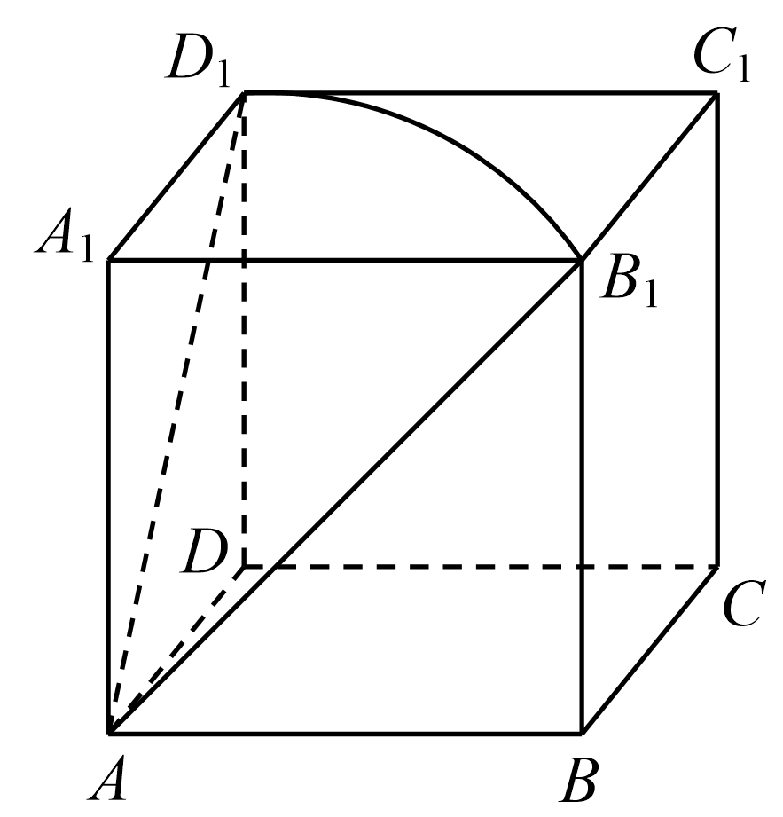

故点的轨迹长度为，

∵，∴，即．

故答案为：．

<strong>变式24．</strong>（2024·全国·高三专题练习）已知正方体中，，点<em>E</em>为平面内的动点，设直线与平面所成的角为，若，则点<em>E</em>的轨迹所围成的面积为___________．

【答案】

【解析】如图所示，连接交平面于，连接，

由题意可知平面，

所以是与平面所成的角，

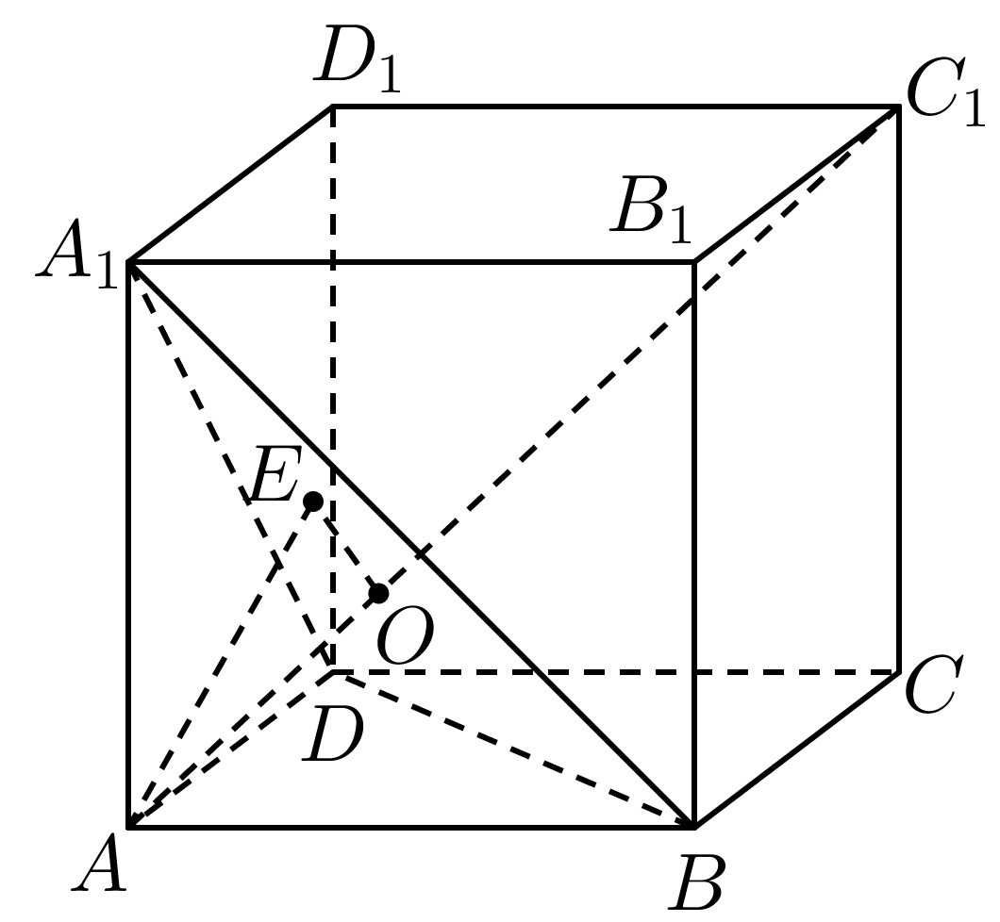

所以＝.

由可得，即.

在四面体中，,,

所以四面体为正三棱锥，为的重心，

如图所示：

所以解得，,

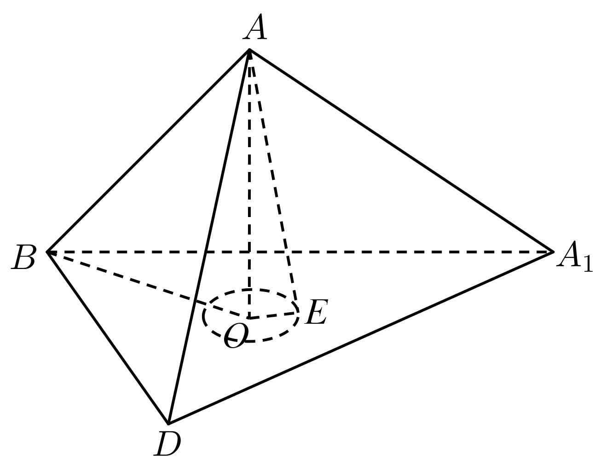

又因为，

所以，

即在平面内的轨迹是以O为圆心，半径为1的圆，

所以.

故答案为:.

<strong>变式25．</strong>（2024·山西大同·高一统考期中）已知是半径为2的球面上的四点，且．二面角的大小为，则点形成的轨迹长度为________．

【答案】

【解析】由题意，为等腰直角三角形，且外接圆半径，圆心为中点，

又外接球半径，球心，则，

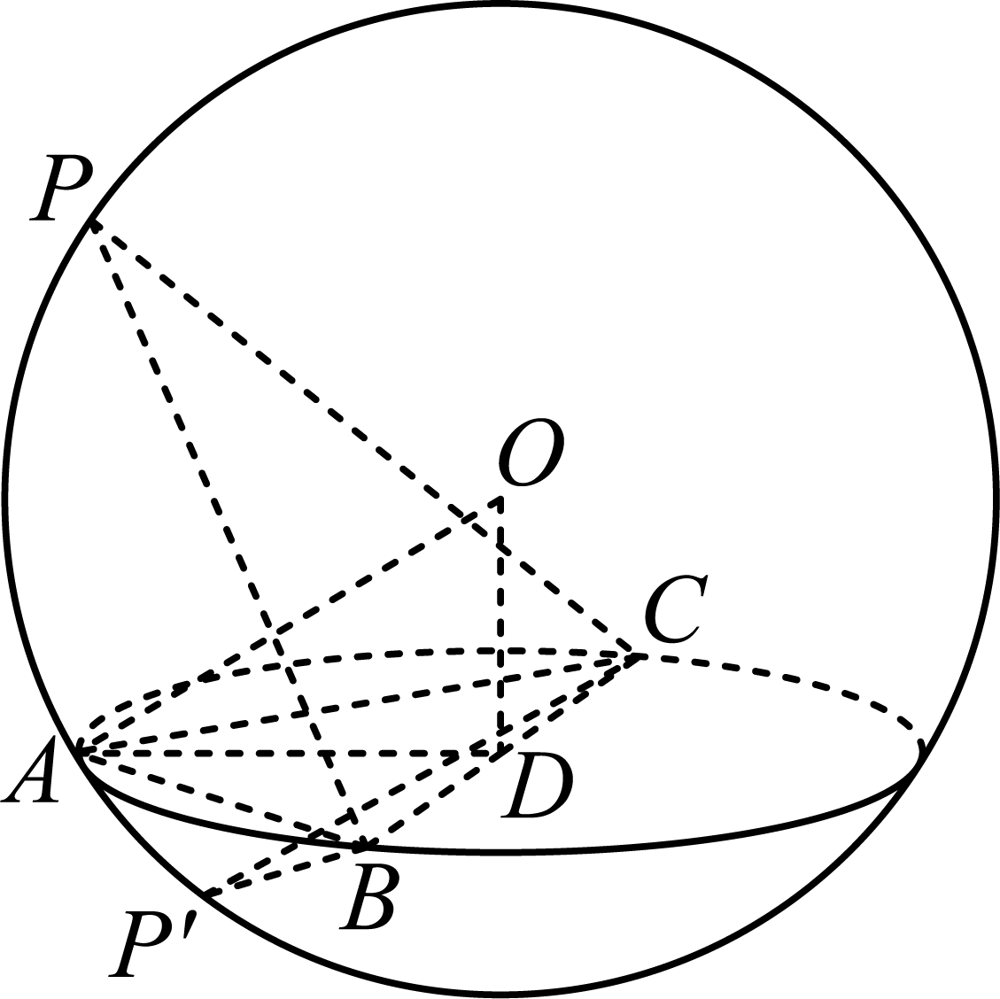

易知：为等腰直角三角形，又二面角的大小为，

由为外接圆直径，且面面，则与面所成角为，

所以到外接圆圆心距离，故外接圆的半径为，

注意：根据二面角大小及球体的对称性，如上图示，

轨迹在大球冠对应外接圆优弧的一侧，在小球冠对应外接圆劣弧的一侧，

所以轨迹长度为.

故答案为：

<strong>变式26．</strong>（2024·贵州铜仁·高二统考期末）粽子是端午节期间不可缺少的传统美食，铜仁的粽子不仅馅料丰富多样，形状也是五花八门，有竹筒形、长方体形、圆锥形等，但最常见的还是“四角粽子”，其外形近似于正三棱锥．因为将粽子包成这样形状，既可以节约原料，又不失饱满，而且十分美观．如图，假设一个粽子的外形是正三棱锥，其侧棱和底面边长分别是8cm和6cm，是顶点在底面上的射影．若是底面内的动点，且直线与底面所成角的正切值为，则动点的轨迹长为________．

【答案】

【解析】由题意可知是底面等边三角形的的中心，所以,

进而,

连接,由于底面，所以即为直线与底面所成的角，所以,

因此点在以为圆心，半径为的圆上运动，所以的轨迹长为,

故答案为：

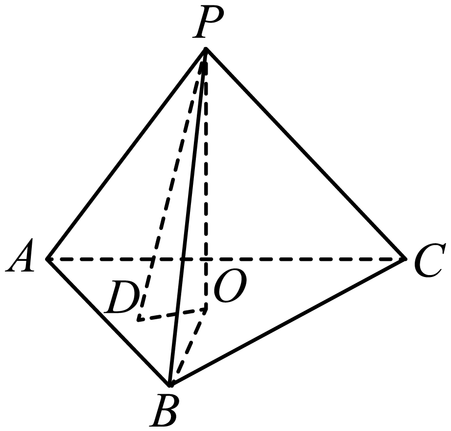

<strong>变式27．</strong>（2024·广东佛山·高二校联考期中）如图，正方体的棱长为1，点<em>P</em>为正方形内的动点，满足直线<em>BP</em>与下底面<em>ABCD</em>所成角为的点<em>P</em>的轨迹长度为（    ）

A．	B．	C．	D．

【答案】B

【解析】直线*BP*与下底面*ABCD*所成角等于直线*BP*与上底面所成角，

连接，因为⊥平面，平面，

所以⊥，故为直线*BP*与上底面所成角，

则，

因为，所以，

故点*P*的轨迹为以为圆心，为半径，位于平面内的圆的，

故轨迹长度为.

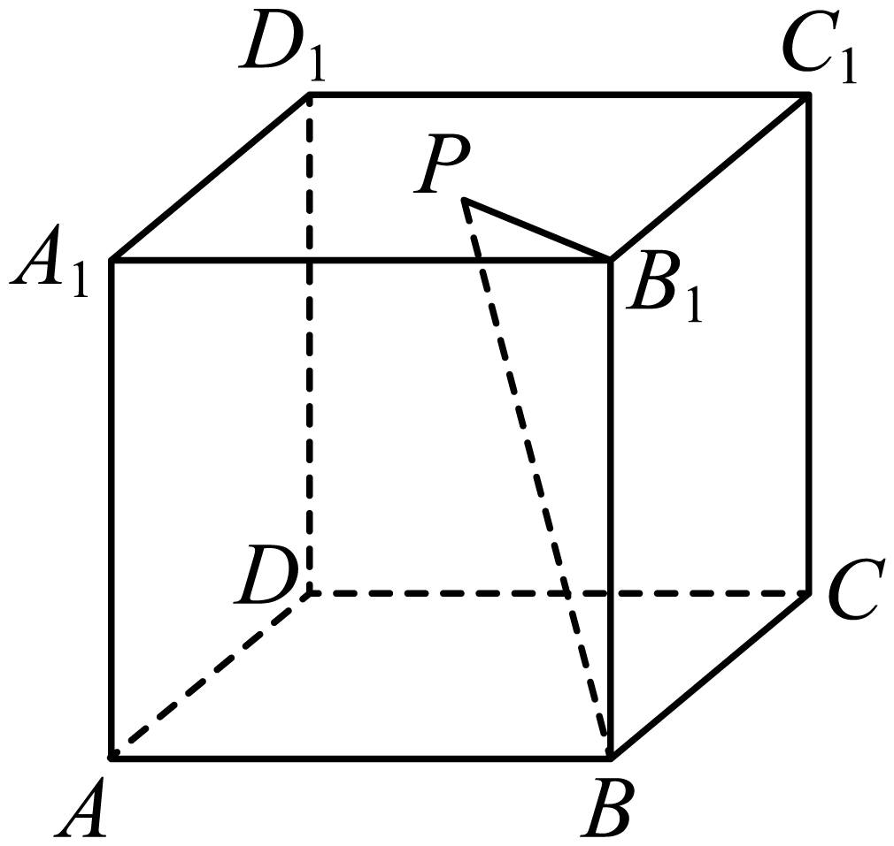

故选：B

<strong>变式28．</strong>在正方体中，动点<em>M</em>在底面内运动且满足，则动点<em>M</em>在底面内的轨迹为（    ）

A．圆的一部分	B．椭圆的一部分

C．双曲线一支的一部分	D．前三个答案都不对

【答案】A

【解析】因为，故在圆锥面上，该圆锥以为轴，为顶点，

而*M*在底面内，

故动点*M*在底面内的轨迹是以*D*为圆心的四分之一圆弧．

故选：A.

**题型五：投影求轨迹**

<strong>例13．</strong>（2024·安徽滁州·高三校考阶段练习）如图，在中，，，，<em>D</em>为线段<em>BC</em>（端点除外）上一动点.现将沿线段<em>AD</em>折起至，使二面角的大小为120°，则在点<em>D</em>的移动过程中，下列说法错误的是（ ）

A．不存在点，使得

B．点在平面上的投影轨迹是一段圆弧

C．与平面所成角的余弦值的取值范围是

D．线段的最小值是

【答案】D

【解析】过点*B*作*AD*的垂线,交*AD*于点*E*,连接,,过点作*BE*的垂线,交*BE*于点*H*,易知,则平面,所以为二面角的平面角的补角,即,所以,即*H*为*BE*的中点,易知平面平面,又,所以平面*ABC*,所以在平面*ABC*上的投影为点*H*,

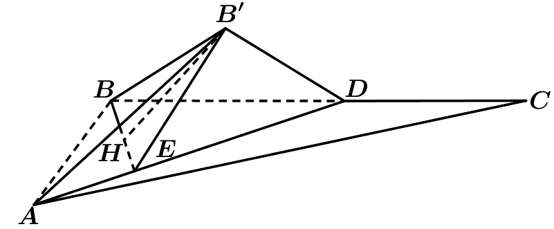

对于选项*A*,若,连接*CH*,则,而这是不可能成立的,故A正确；

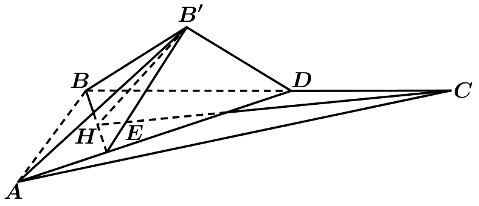

对于选项*B*,因为,所以点*E*的轨迹为以*AB*为直径的一段圆弧,又*H*为*BE*的中点,所以点*H*的轨迹也为一段圆弧,故B正确；

对于选项*C*,连接*AH*,则与平面*ABC*所成的角为,设,则,所以由,得,所以,所以,所以,所以,故C正确；

对于选项*D*,设,则,,

,

其中,故,故D错误,

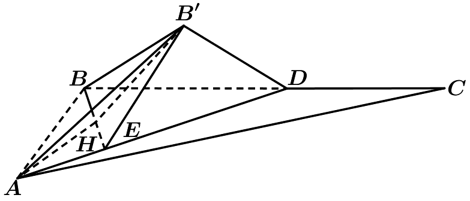

故选:D

**例14．**（2024·江苏徐州·高二徐州市第一中学校考阶段练习）如图，在等腰中，，，为的中点，为的中点，为线段上一个动点（异于两端点），沿翻折至，点在平面上的投影为点，当点在线段上运动时，以下说法不正确的是（    ）．

A．线段为定长	B．

C．	D．点的轨迹是圆弧

【答案】B

【解析】翻折后的立体图形，如图所示．

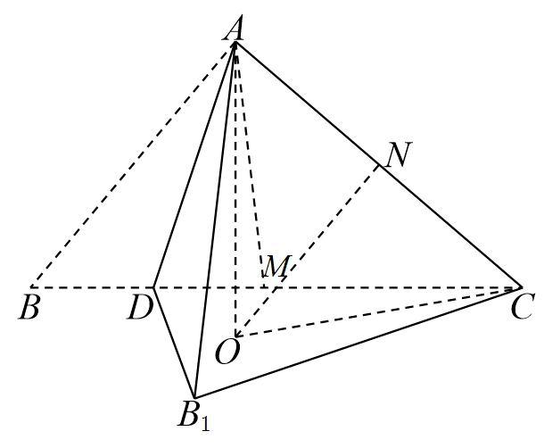

对A，因为点在平面上的投影为点，所以平面，

又平面，所以，

故为直角三角形，又为斜边的中点，

所以为定长.

故A正确．

对C，当在处时，此时点在平面上的投影为点与重合，故，

又在中，，因为为线段上一个动点（异于两端点），

所以.

故C正确．

对D，因为，为的中点，所以点的轨迹是圆弧．

故D正确．

故选：B．

**例15．**（2024·江西赣州·高二南康中学校考阶段练习）在等腰直角中，，，为中点，为中点，为边上一个动点，沿翻折使，点在平面上的投影为点，当点在上运动时，以下说法错误的是

A．线段为定长	B．

C．线段的长	D．点的轨迹是圆弧

【答案】B

【解析】如图所示，

对于A中，在为直角三角形，ON为斜边AC上的中线，为定长，即A正确；

对于C中，点D在M时，此时点O与M点重合，此时，，此时，即正确；

对于D，由A可知，根据圆的定义可知，点O的轨迹是圆弧，即D正确；

故选B．

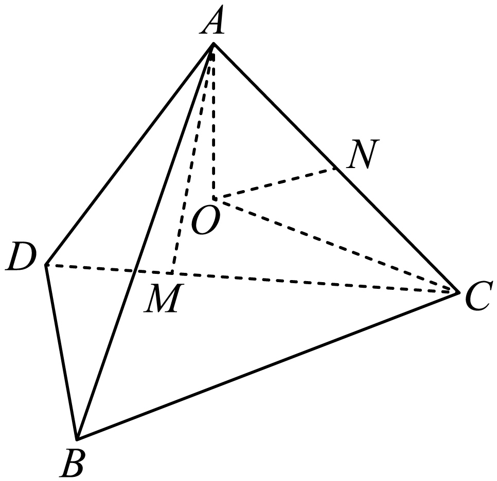

<strong>变式29．</strong>（2024·全国·高三专题练习）如图，已知水平地面上有一半径为4的球，球心为，在平行光线的照射下，其投影的边缘轨迹为椭圆<em>O</em>．如图，椭圆中心为<em>O</em>，球与地面的接触点为<em>E</em>，．若光线与地面所成角为，椭圆的离心率．

【答案】/

【解析】连接,

因为，

所以,

所以,

在照射过程中，椭圆的短半轴长是球的半径，即，

如图，椭圆的长轴长是，过点向作垂线，垂足为，

由题意得，

因为，所以，

所以，得，

所以椭圆的离心率为，

故答案为：

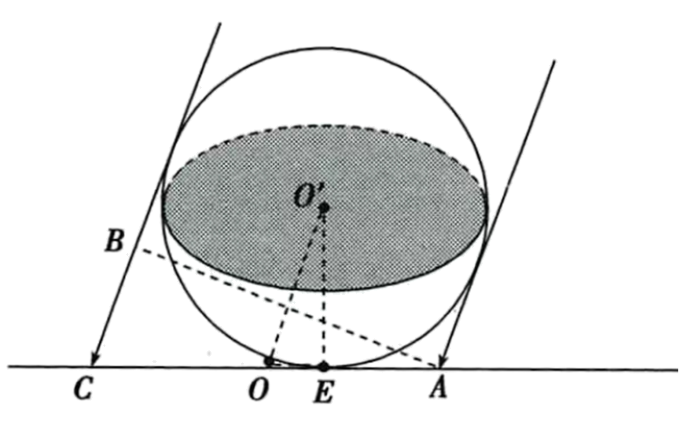

<strong>变式30．</strong>（2024·浙江嘉兴·高三嘉兴一中校考期中）如图，在中，，，.过的中点的动直线与线段交于点.将沿直线向上翻折至，使得点在平面内的投影落在线段上.则点的轨迹长度为________.

【答案】

【解析】

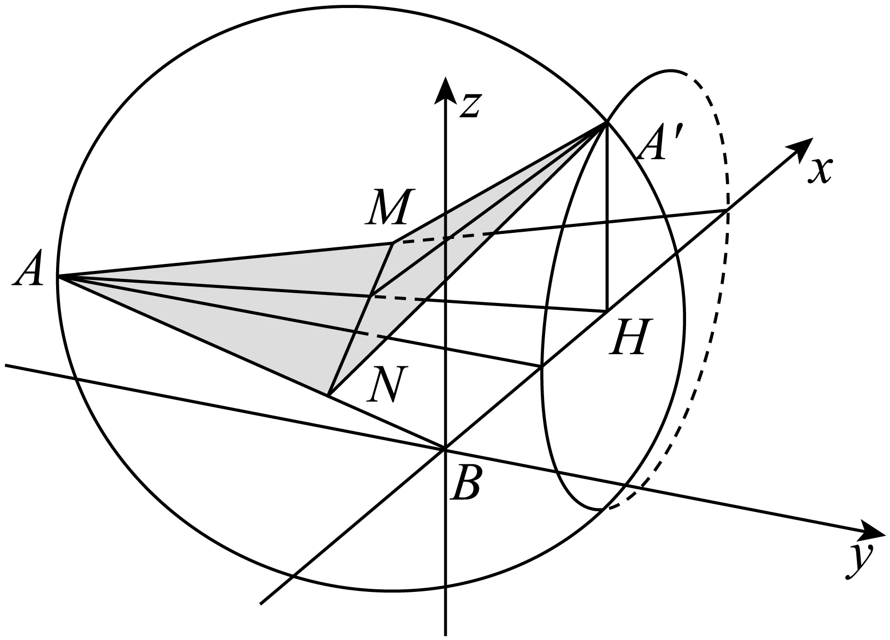

因为翻折前后长度不变，所以点可以在空间中看做以为球心，AC为直径的球面上，又因为的投影始终在上，所以点所在的面垂直于底面，

故点轨迹为垂直于底面ABC的竖直面去截球所得圆面的圆弧，这个圆弧的直径为时，的长度（由余弦定理可得，所以此时），

如图，以底面点*B*为空间原点建系*，* 根据底面几何关系，

得点，点，

设点，翻折后点的投影在轴上，

所以点纵坐标为0，即由，，

根据空间两点之间距离公式可得轨迹：，

又因为动点要符合空间面翻折结论：，

即，其中，

又动点*N*在线段*AB*上动，设，

故，

且，由，可计算得横坐标范围为，

且点在上方，由，计算可得圆弧所在扇形圆心角为，

所以弧长为.

故答案为：.

<strong>变式31．</strong>（2024·北京·高三专题练习）如图，在矩形中，，，为线段上一动点，现将沿折起得到，当二面角的平面角为，点在平面上的投影为，当从运动到，则点所形成轨迹的长度为______.

【答案】

【解析】根据折叠关系找出与有关的几何关系，得出点的轨迹为圆的一部分，再考虑在运动过程中扫过的弧长即可求解.

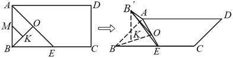

在折叠后的图中，作垂足为，连接，根据三垂线定理，，

所以就是二面角的平面角为，，

根据折叠关系，与全等，对应边上的高位置相同，即在线段上，

且是线段的中点，取的中点，连接，则，

所以点的轨迹为以为直径的圆的一部分，当从运动到，点在圆周上从点运动到

，这段弧所对圆心角为，这段弧长为.

故答案为：

**题型六：翻折与动点求轨迹**

<strong>例16．</strong>（2024·全国·高三专题练习）在矩形中，是的中点，，将沿折起得到，设的中点为，若将绕旋转，则在此过程中动点形成的轨迹长度为___________.

【答案】/

【解析】

如图，设的中点为，绕旋转，此时平面平面，取中点，中点，中点，

连接.

，，和是等腰直角三角形，

且在旋转过程中保持形状大小不变，故动点的轨迹是以为圆心，为半径的一段圆弧，又面，

面，面，同理面，又，面面，又平面平面，

故面面，又面面，，故面，又面，，

故动点形成的轨迹长度为.

故答案为：.

<strong>例17．</strong>（2024·全国·高三专题练习）矩形<em>ABCD</em>中，，<em>E</em>为<em>AB</em>中点，将△<em>ADE</em>沿<em>DE</em>折起至△<em>A'DE</em>，记二面角<em>A'-DE-C=θ</em>，当<em>θ</em>在范围内变化时，点<em>A'</em>的轨迹长度为______________

【答案】；

【解析】取的中点为，连接，则，

故在以球心，为半径的球面上.

过作，垂足为，连接，则.

在矩形中，，故，

故，而，故平面，

故在过且垂直于的平面上，所以在以为圆心，为半径的圆上，

而为二面角的平面角，故，

故点的轨迹长度为，

故答案为：.

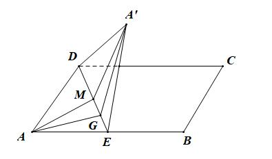

<strong>例18．</strong>（2024·全国·高三专题练习）如图所示，在平行四边形中，为中点，，，.沿着将折起，使到达点的位置，且平面平面.若点为内的动点，且满足，则点的轨迹的长度为___________.

【答案】

【解析】因平面平面，平面平面，，于是得平面，而，则平面，

从而得*PE*，*PD*分别是*PB*，*PD*在平面内的射影，如图，，

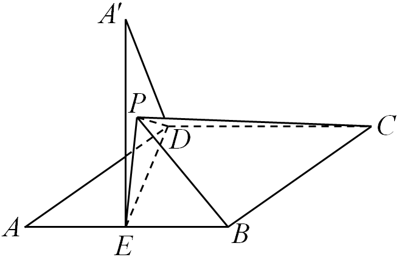

，而，则，

在所在平面内以点*E*为原点，射线*ED*、分别为*x*，*y*轴非负半轴建立平面直角坐标系，如图，

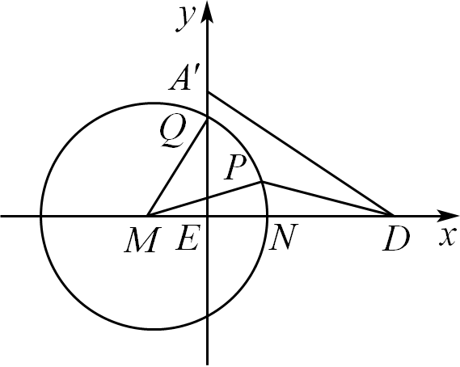

则，设，于是得，整理得，

从而得点*P*的轨迹是以为圆心，4为半径的圆，圆*M*交分别于*Q*，*N*，

显然，圆*M*在内的部分是圆心角所对的弧，弧长为，

所以点的轨迹的长度为.

故答案为：

<strong>变式32．</strong>（2024·全国·高三专题练习）已知菱形<em>ABCD</em>的边长为2，.将菱形沿对角线<em>AC</em>折叠成大小为60°的二面角.设<em>E</em>为的中点，<em>F</em>为三棱锥表面上动点，且总满足，则点<em>F</em>轨迹的长度为________.

【答案】

【解析】连接*AC*、*BD*，交于点*O*，连接*OB*′，

*ABCD*为菱形，∠*ABC*＝60°，所以*AC*⊥*BD*，*OB*′⊥*AC*，△*ABC*、△*ACD*、△*AB*′*C*均为正三角形，

所以∠*B*′*OD*为二面角*B*'﹣*AC*﹣*D*的平面角，于是∠*B*′*OD*＝60°，

又因为*OB*′＝*OD*，所以△*B*′*OD*为正三角形，所以*B*′*D*＝*OB*′＝*OD*＝，

取*OC*中点*P*，取*CD*中点*Q*，连接*EP*、*EQ*、*PQ*，所以*PQ*∥*OD*、*EP*∥*OB*′，

所以*AC*⊥*EP*、*AC*⊥*PQ*，所以*AC*⊥平面*EPQ*，

所以在三棱锥*B*'﹣*ACD*表面上，满足*AC*⊥*EF*的点*F*轨迹的△*EPQ*，

因为*EP*＝*OB*′，*PQ*＝*OD*，*EQ*＝*B*′*Q*，所以△*EPQ*的周长为，

所以点*F*轨迹的长度为．

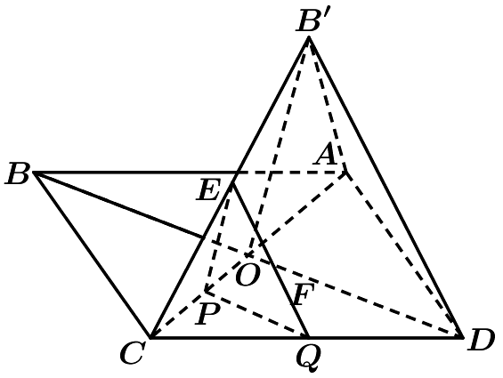

故答案为：

<strong>变式33．</strong>（2024·江苏连云港·高二校考阶段练习）在矩形<em>ABCD</em>中，，，点<em>E</em>在<em>CD</em>上，现将沿<em>AE</em>折起，使面面<em>ABC</em>，当<em>E</em>从<em>D</em>运动到<em>C</em>，求点<em>D</em>在面<em>ABC</em>上的射影<em>K</em>的轨迹长度为（    ）

A．	B．	C．	D．

【答案】D

【解析】

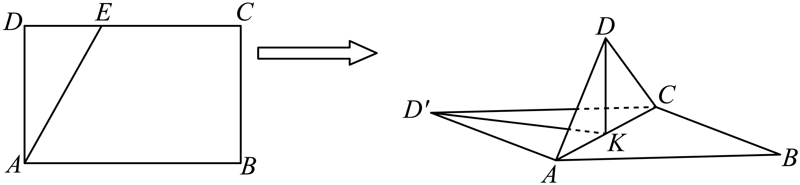

由题意，将沿折起，使平面平面，在平面内过点作垂足为在平面上的射影，连接,由翻折的特征知，

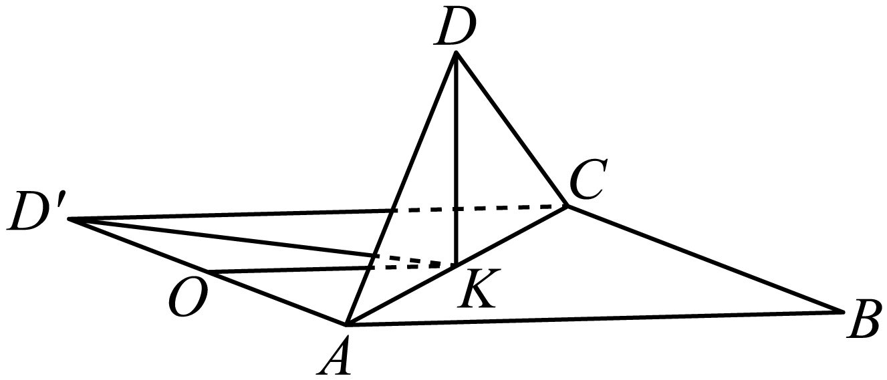

则，故点的轨迹是以为直径的圆上一段弧，根据长方形知圆半径是，

如图当与重合时，,所以，

取为的中点，得到是正三角形.

故，

其所对的弧长为；

故选：D.

**变式34．**（2024·全国·高三专题练习）已知菱形的各边长为．如图所示，将沿折起，使得点到达点的位置，连接，得到三棱锥，此时．是线段的中点，点在三棱锥的外接球上运动，且始终保持，则点的轨迹的周长为（    ）

A．	B．	C．	D．

【答案】C

【解析】取中点，则，

∴平面，，又，∴，作，设点轨迹所在平面为，则平面经过点且，设三棱锥外接球的球心为的中心分别为，易知平面平面，且四点共面，由题可得，，解*Rt*，得，又，则三棱锥外接球半径，易知到平面的距离，

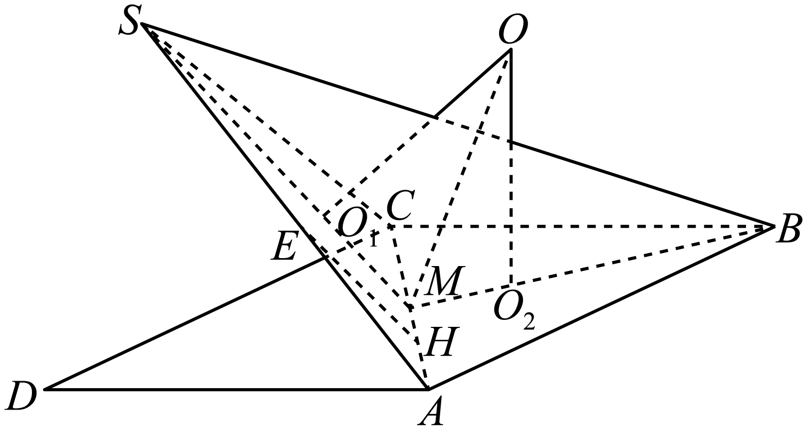

故平面截外接球所得截面圆的半径为，

∴截面圆的周长为，即点轨迹的周长为．

故选：C

<strong>变式35．</strong>（2024·全国·高三专题练习）已知△<em>ABC</em>的边长都为2，在边<em>AB</em>上任取一点<em>D</em>，沿<em>CD</em>将△<em>BCD</em>折起，使平面<em>BCD</em>⊥平面<em>AC</em>D．在平面<em>BCD</em>内过点<em>B</em>作<em>BP</em>⊥平面<em>ACD</em>，垂足为<em>P</em>，那么随着点<em>D</em>的变化，点<em>P</em>的轨迹长度为（    ）

A．	B．	C．	D．*π*

【答案】C

【解析】由题意，在平面*BCD*内作*BQ*⊥*CD*，交*CD*于*Q*，因为平面*BCD*⊥平面*ACD*，平面*BCD*与平面*ACD*交于*CD*，所以*BQ*⊥平面*ACD*，又*BP*⊥平面*ACD*，所以*P*,*Q*两点重合，于是随着点*D*的变化，*BP*⊥*CD*始终成立，可得在平面*ABC*中，*BP*⊥*CP*始终成立，即得点*P*的轨迹是以*BC*为直径的圆的一部分，由题意知随着点*D*的变化，∠*BCD*的范围为，可得点*P*的轨迹是以*BC*为直径（半径为1）的圆的，即得点*P*的轨迹长度为.

故选：C.

**变式36．**（2024·广东中山·高三华南师范大学中山附属中学校考期中）如图，在长方形中，，，点为线段上一动点，现将沿折起，使点在面内的射影在直线上，当点从运动到，则点所形成轨迹的长度为

A．	B．	C．	D．

【答案】C

【解析】由题意，将△AED沿AE折起，使平面AED⊥平面ABC，在平面AED内过点D作DK⊥AE，K为垂足，由翻折的特征知，连接D'K，

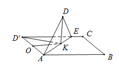

则D'KA=90°，故K点的轨迹是以AD'为直径的圆上一弧，根据长方形知圆半径是，

如图当E与C重合时，

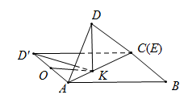

AK==，

取*O*为AD′的中点，得到△*O*AK是正三角形．

故∠*KOA*=，∴∠*KOD'*=，

其所对的弧长为=，

故选：

**变式37．**（2024·全国·高三专题练习）如图，在等腰梯形中，，分别是底边的中点，把四边形沿直线折起使得平面平面.若动点平面，设与平面所成的角分别为（均不为0）.若，则动点的轨迹围成的图形的面积为(    )

A．	B．	C．	D．

【答案】D

【解析】连接,∵平面⊥平面,交线为,*BE*,*CF*在平面*BCFE*中，且*BE*,*CF*都垂直于交线*EF*,由面面垂直的性质定理得*BE*⊥平面*ADFE*,*CF*⊥平面*ADFE*,∴∠*BPE*,∠*CPF*分别为直线*PB*,*PC*与平面*ADFE*所成的角，∠*BPE*=,∠*CPF*=.

∵*PE*,*PF*⊂平面*ADFE*,∴*BE*⊥*PE*,*CF*⊥*PF*,

∴，，

∵，，∴．

以*EF*所在直线为*x*轴，*EF*的垂直平分线为*y*轴建立坐标系，如图所示：

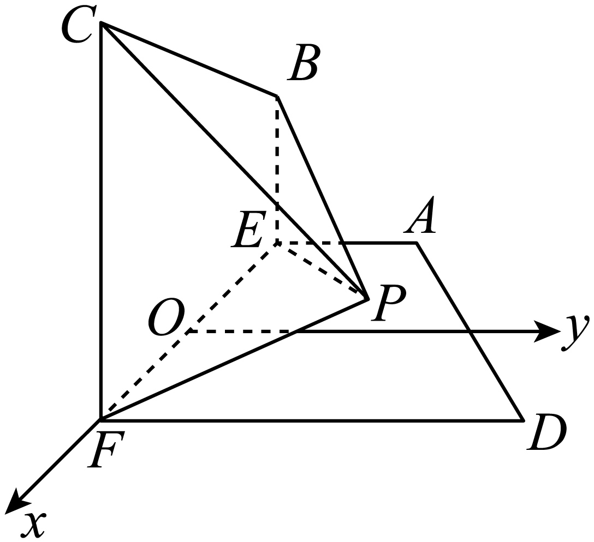

设，，，则

∴3<em>x2</em>+3<em>y2</em>+5<em>ax</em>+<em>a2</em>=0，即，轨迹为圆，面积为．

故答案选：

