**第53讲  传统方法求角度与距离**

**知识梳理**

**知识点1：线与线的夹角**

（1）位置关系的分类：

（2）异面直线所成的角

①定义：设是两条异面直线，经过空间任一点作直线，把与所成的锐角（或直角）叫做异面直线与所成的角（或夹角）．

②范围：

③求法：平移法：将异面直线平移到同一平面内，放在同一三角形内解三角形．

**知识点2：线与面的夹角**

①定义：平面上的一条斜线与它在平面的射影所成的锐角即为斜线与平面的线面角．

②范围：

③求法：

常规法：过平面外一点做平面，交平面于点；连接，则即为直线与平面的夹角．接下来在中解三角形．即（其中即点到面的距离，可以采用等体积法求，斜线长即为线段的长度）；

**知识点3：二面角**

（1）**二面角定义**：从一条直线出发的两个半平面所组成的图形称为二面角，这条直线称为二面角的棱，这两个平面称为二面角的面．（二面角或者是二面角）

**（2）二面角的平面角的概念**：平面角是指以二面角的棱上一点为端点，在两个半平面内分别做垂直于棱的两条射线，这两条射线所成的角就叫做该二面角的平面角；范围．

**（3）二面角的求法**

**法一：定义法**

在棱上取点，分别在两面内引两条射线与棱垂直，这两条垂线所成的角的大小就是二面角的平面角，如图在二面角的棱上任取一点，以为垂足，分别在半平面和内作垂直于棱的射线和，则射线和所成的角称为二面角的平面角（当然两条垂线的垂足点可以不相同，那求二面角就相当于求两条异面直线的夹角即可）．

**法二：三垂线法**

在面或面内找一合适的点，作于，过作于，则为斜线在面内的射影，为二面角的平面角．如图1，具体步骤：

①找点做面的垂线；即过点，作于；

②过点（与①中是同一个点）做交线的垂线；即过作于，连接；

③计算：为二面角的平面角，在中解三角形．

  
图1                    图2                    图3

**法三：射影面积法**

凡二面角的图形中含有可求原图形面积和该图形在另一个半平面上的射影图形面积的都可利用射影面积公式（，如图2）求出二面角的大小；

**法四：补棱法**

当构成二面角的两个半平面没有明确交线时，要将两平面的图形补充完整，使之有明确的交线（称为补棱），然后借助前述的定义法与三垂线法解题．当二平面没有明确的交线时，也可直接用法三的摄影面积法解题．

**法五：垂面法**

由二面角的平面角的定义可知两个面的公垂面与棱垂直，因此公垂面与两个面的交线所成的角，就是二面角的平面角．

例如：过二面角内一点作于，作于，面交棱于点，则就是二面角的平面角．如图3．此法实际应用中的比较少，此处就不一一举例分析了．

**知识点4：空间中的距离**

求点到面的距离转化为三棱锥等体积法求解．

**必考题型全归纳**

**题型一：异面直线所成角**

**例1．**（2024·四川绵阳·绵阳中学校考二模）如图，圆柱的轴截面为矩形，点，分别在上、下底面圆上，，，，，则异面直线与所成角的余弦值为（    ）

A．	B．	C．	D．

【答案】B

【解析】如图（1），在上取点，使，

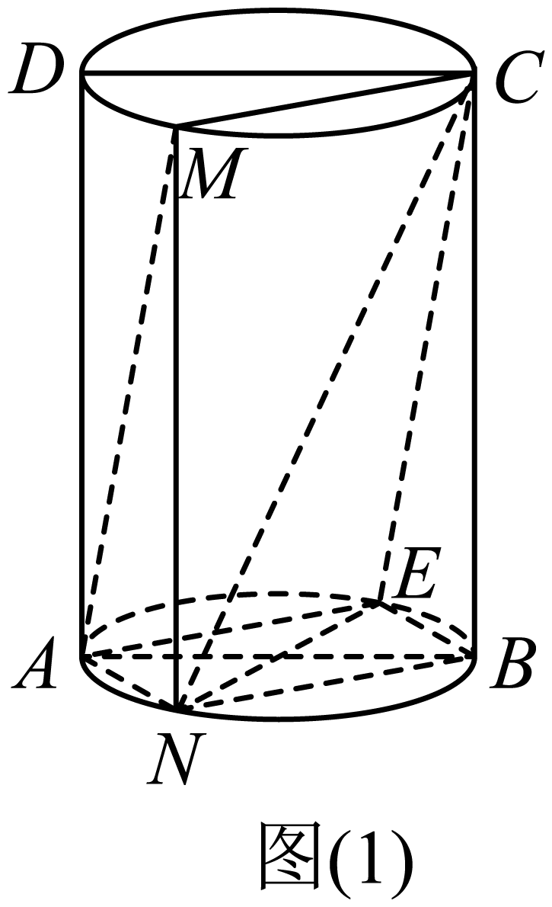

连接，，，，．

易知四边形为矩形，则，且．

连接，．因为，且，

所以四边形为平行四边形，所以，且．

连接，则，且，

所以四边形为平行四边形，则，

所以或其补角是异面直线与所成的角．

在中，，，，，

在中，，，所以．

在中，，，所以．又，

在中，由余弦定理．

故选：B.

**例2．**（2024·全国·高三校联考开学考试）如图，在直三棱柱中，，则异面直线与所成角的余弦值等于（    ）

A．	B．	C．	D．

【答案】D

【解析】如图，将该几何体补成一个直四棱柱，由题易得底面为菱形，且为等边三角形.

连接，易得，所以（或其补角）是异面直线与所成的角.

设1，则，

所以.

故选：D.

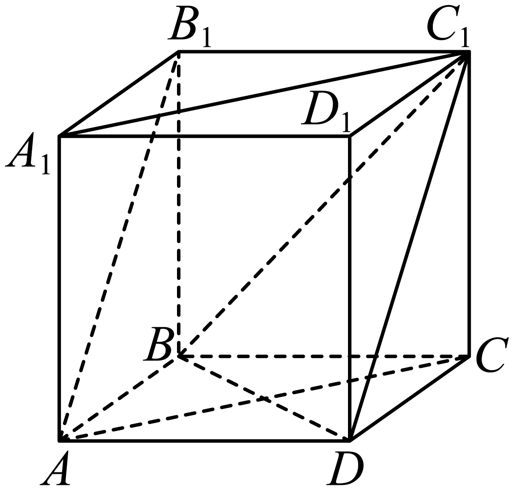

**例3．**（2024·江西·高三统考阶段练习）如图，二面角的大小为，且与交线所成的角为，则直线所成的角的正切值的最小值为（    ）

A．	B．	C．	D．

【答案】B

【解析】先证明一个结论：如图，直线为平面的一条斜线，为斜足，与平面所成的角为，则平面内的直线与直线所成角的最小值为.

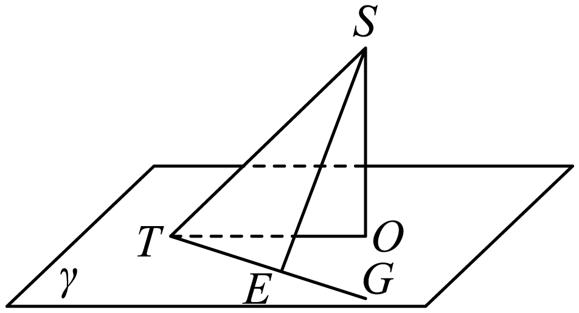

证明：对于平面内的任意一条直线，如果其不过点，则可以平移该直线至点，

此时直线与直线所成角即为平移后的直线与直线所成的角.

设平移后的直线为直线（如图），过作的垂线，垂足为，

在平面内的射影为，连接，则，

而直线与直线所成的角即为，其中，.

因为，

故，当且仅当与重合时等号成立，

所以平面内的直线与直线所成角的最小值为.

回到原题，

如图，设，取上一点，过作，垂足为，

垂足为，连接，

因为，，故，而，，

平面，故平面，

而平面，故，故为平面的平面角的补角，

故.

不妨令，则.

又，所以，所以，

所以.

因为，故与平面所成的角为，

由前述所证结论可得，直线所成角的最小值为，其正切值为.

故选：B.

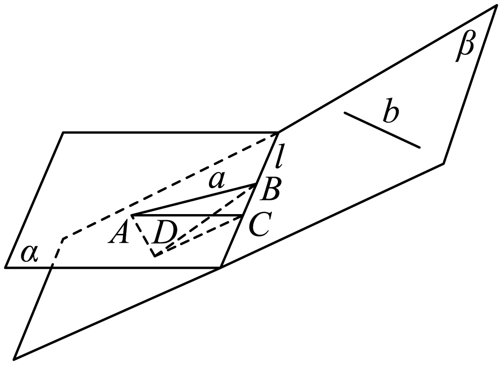

<strong>变式1．</strong>（2024·河南·洛宁县第一高级中学校联考模拟预测）在正三棱柱中，，<em>D</em>为的中点，<em>E</em>为的中点，则异面直线<em>AD</em>与<em>BE</em>所成角的余弦值为（    ）

A．	B．	C．	D．

【答案】C

【解析】*D*为的中点，*E*为的中点，所以，，

如图，延长*CB*至*F*，使得，连接*DE*，*DF*，*AF*，，

因为，所以，，

所以四边形*BEDF*是平行四边形，，

则为异面直线*AD*与*BE*所成的角或补角．设，

取的中点，连接、，

则，，，，

，

，

由余弦定理得，

由余弦定理得．

所以直线*AD*与*BE*所成角的余弦值为

故选：C.

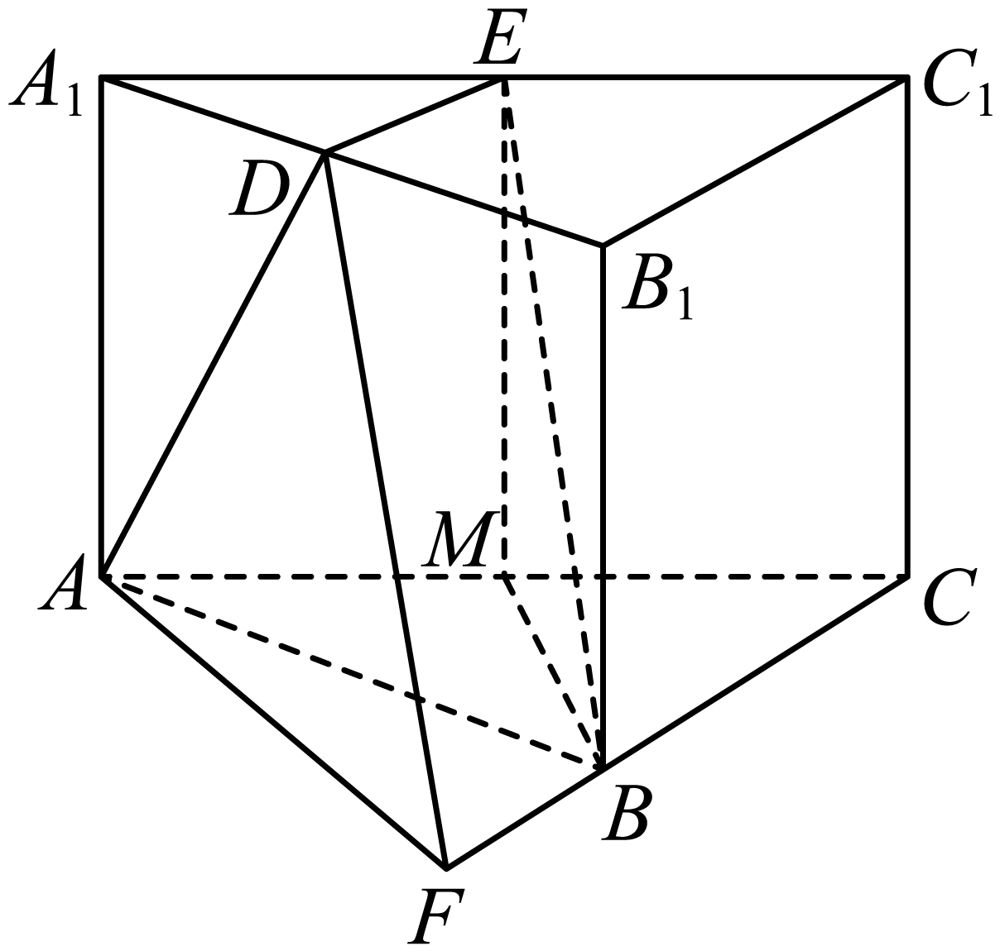

<strong>变式2．</strong>（2024·全国·高三对口高考）两条异面直线<em>a</em>、<em>b</em>所成角为一条直线<em>l</em>与<em>a</em>、<em>b</em>成角都等于，那么的取值范围是（    ）

A．	B．	C．	D．

【答案】B

【解析】设，，，则确定平面，且与的夹角为，

，过点，如图，当时，并且为角的平分线时，此时，

当时，且为平面的斜线时，由题意可知，在平面的射影，落在与的所成角的平分线上，

当落在夹角的角平分线上时，过直线上一点，作，，连结,

，则，，且平面，所以平面，

平面，所以，，,

因为，所以，，此时，

当时，此时，

可知，的取值范围是，

当在角的平分线时，或是在平面的射影，落在角的平分线时，以及时，此时的取值范围是，

综上可知，的取值范围是，

故选：B

**变式3．**（2024·四川·校联考模拟预测）在正四棱台中，，其体积为为的中点，则异面直线与所成角的余弦值为（    ）

A．	B．	C．	D．

【答案】D

【解析】设正四棱台的高为，

连接，作交于点，

作交于点，连接，

则为异面直线与所成角或其补角.

因为，

且正四棱台的体积为，

即，

所以，即，

易求，

，

，

，

所以.

故选：D.

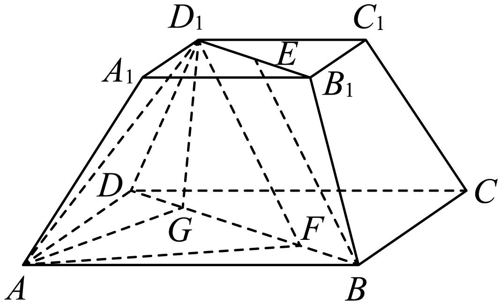

<strong>变式4．</strong>（2024·黑龙江哈尔滨·哈尔滨市第六中学校校考三模）正三棱柱的棱长均相等，<em>E</em>是的中点，则异面直线与<em>BE</em>所成角的余弦值为（    ）

A．	B．	C．	D．

【答案】D

【解析】连接，设*F*为的中点，设交于点*D*，

连接，由于四边形为平行四边形 ，故*D*为的中点，

所以，则即为异面直线与所成角或其补角，

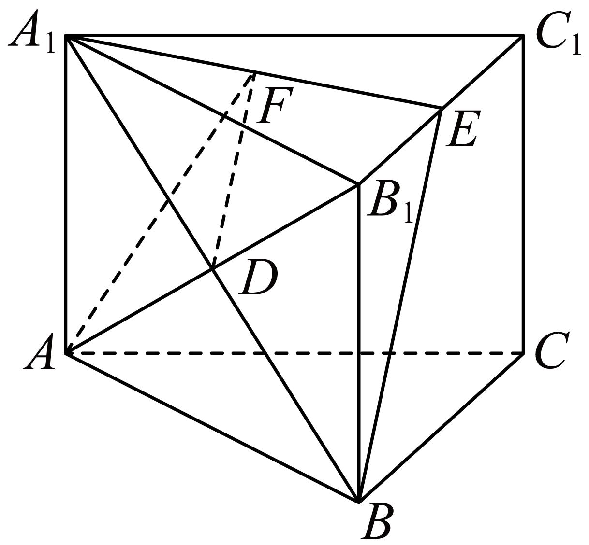

连接，由于正三棱柱的棱长均相等，设棱长为2，

则,

，则，

故在中，,

由于异面直线与*BE*所成角的范围为，

故异面直线与*BE*所成角的余弦值为，

故选：D

**题型二：线面角**

**例4．**（2024·贵州贵阳·校联考三模）如图，在直三棱柱中，，，则与平面所成角的正弦值等于（    ）

A．	B．	C．	D．

【答案】C

【解析】如图所示：

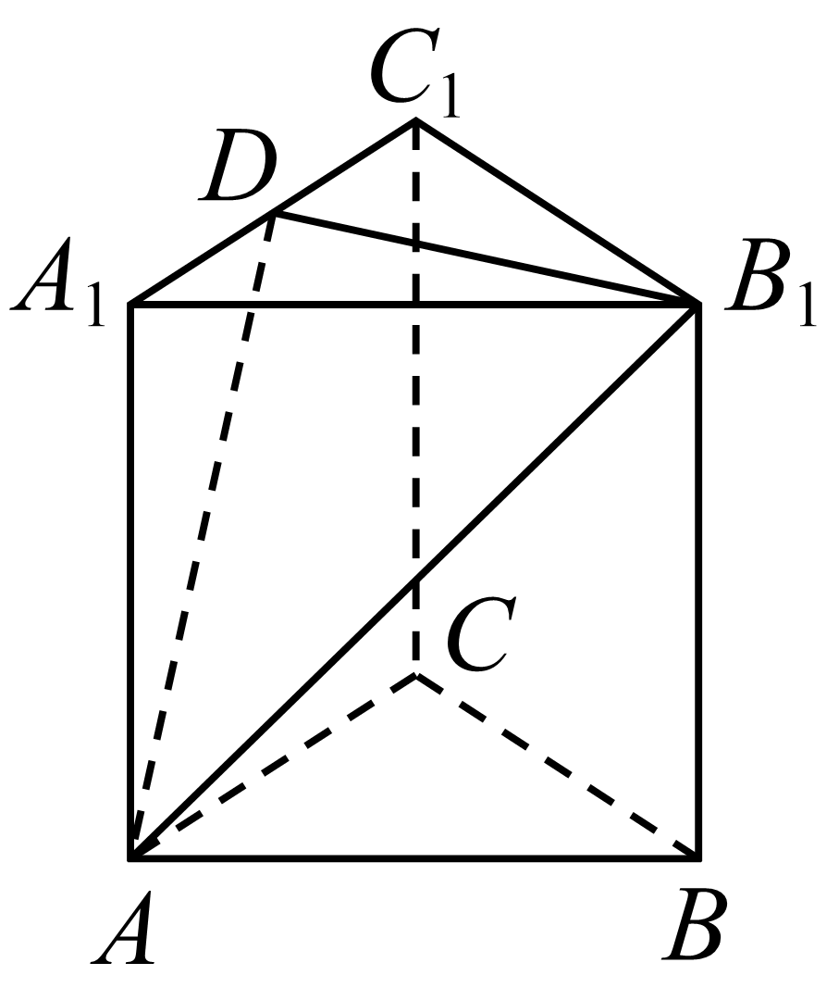

取的中点，连接，，

在正三棱柱中，底面是正三角形，

，又底面，平面，.

又，平面 ，平面 ，

平面，

为与平面所成角，

由题意，设，，，

在中，，

故选：C.

**例5．**（2024·全国·高三专题练习）如图，在四棱锥中，，，是等边三角形，，，.

(1)求的长度；

(2)求直线与平面所成的角的正弦值.

【解析】（1）取中点，连接，

是等边三角形，，

又，，平面，平面，

平面，，，

为等边三角形，.

（2）平面，平面，平面平面，

作，垂足为，则平面，，连接，

为直线与平面所成的角，

由题意知：，又，

，

，，

，，，，

直线与平面所成的角的正弦值为.

**例6．**（2024·广东阳江·高三统考开学考试）在正三棱台中，，，为中点，在上，.

(1)请作出与平面的交点，并写出与的比值（在图中保留作图痕迹，不必写出画法和理由）；

(2)求直线与平面所成角的正弦值.

【解析】（1）①作图步骤：延长，使其相交于，连接，则可得；

作图如下：

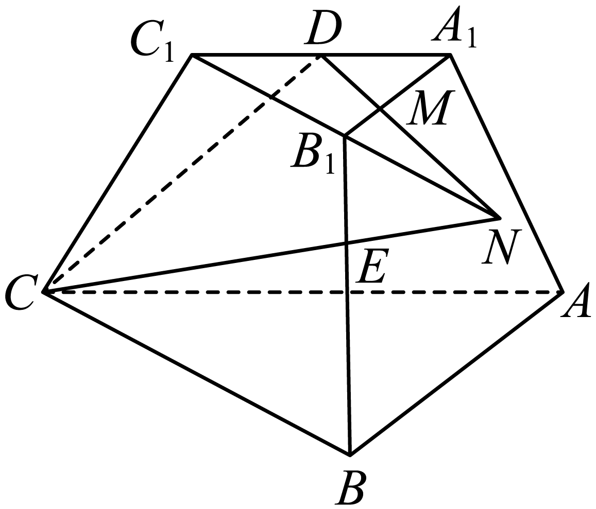

作图理由：在平面中，显然与不平行，延长相交于，

由，则平面，由平面，则平面，

由，，则平面，可得

故平面.

②连接，如下图所示：

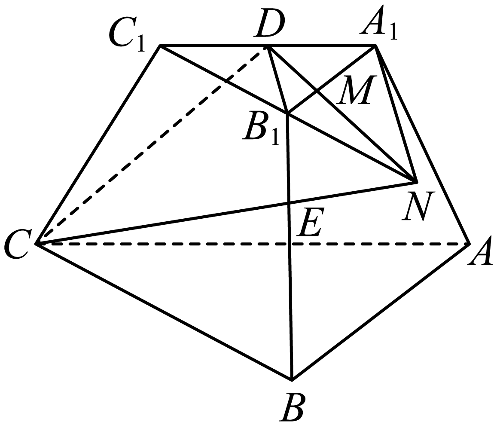

在正三棱台中，，即，易知，

则，由，且，则，显然，

由分别为的中点，则，且，

易知，故.

（2）由题意，过作平面的垂线，垂足为，并连接，如下图所示：

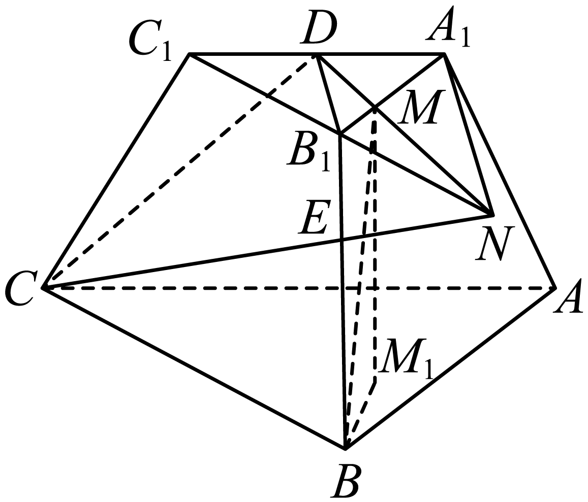

由（1）可知：且，则，由，，

在侧面中，过分别作的垂线，垂足分别为，如下图所示：

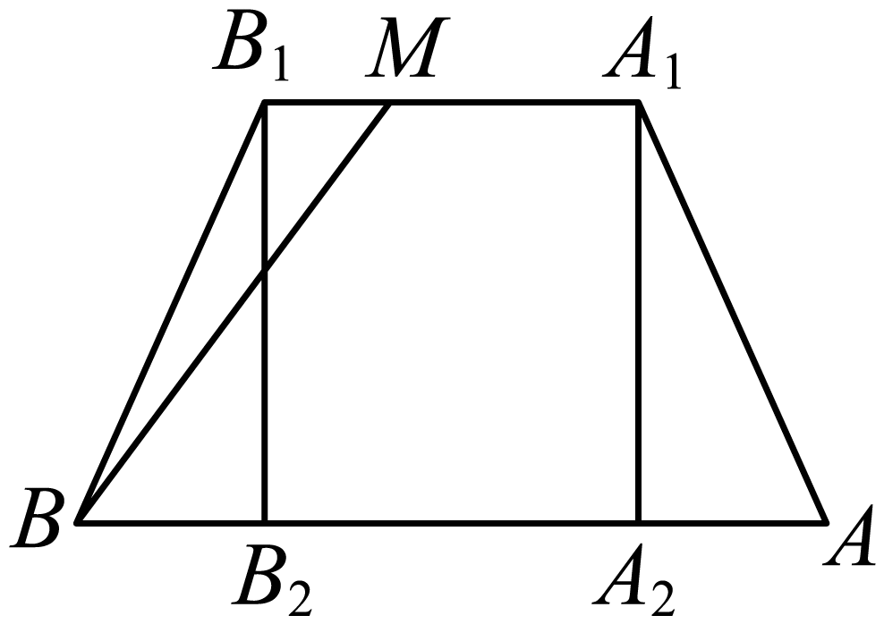

易知,，所以，

在中，，则，

棱台的高，

由图可知直线与平面所成角为，

因为平面，且平面，所以，

所以.

**变式5．**（2024·海南海口·海南华侨中学校考二模）如图，在多面体中，平面平面，底面是等腰直角三角形，，侧面是正方形，平面，且，.

(1)证明：．

(2)若是的中点，平面，求直线与平面所成角的正弦值．

【解析】（1）因为平面，平面平面，所以平面，

又因为平面，所以，

因为，，， 平面，

所以平面，

因为平面，

所以．

（2）如图，因为是的中点， 平面，平面，且平面平面，

所以，

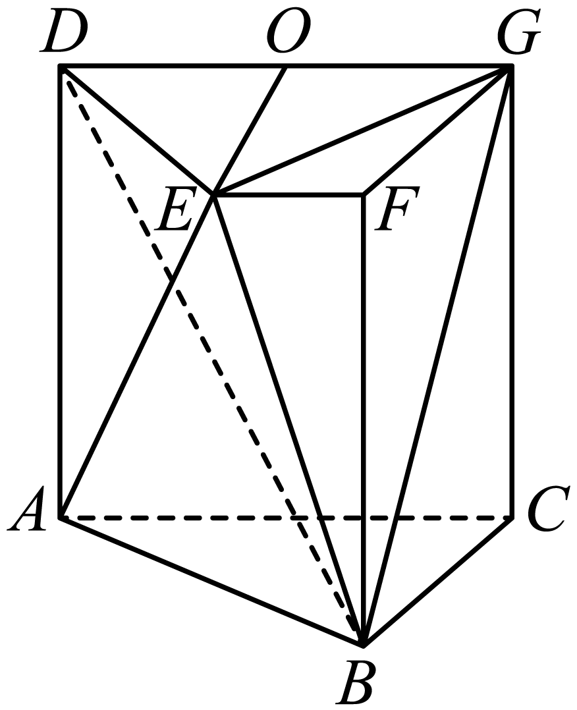

因为平面平面，

平面平面，平面平面，

平面平面，平面平面，

所以，，

因为是等腰直角三角形，

所以，

又因为，侧面是正方形，

所以，，

所以点到的距离为，

所以，则，

又，所以，

所以，

设点到平面的距离为，

由可得，解得，

所以直线与平面所成角的正弦值为．

**变式6．**（2024·全国·高三专题练习）在三棱锥中，，平面平面，且.

(1)证明：；

(2)若是直线上的一个动点，求直线与平面所成的角的正切值最大值.

【解析】（1）在三棱锥中，在平面内过点作直线，如图，

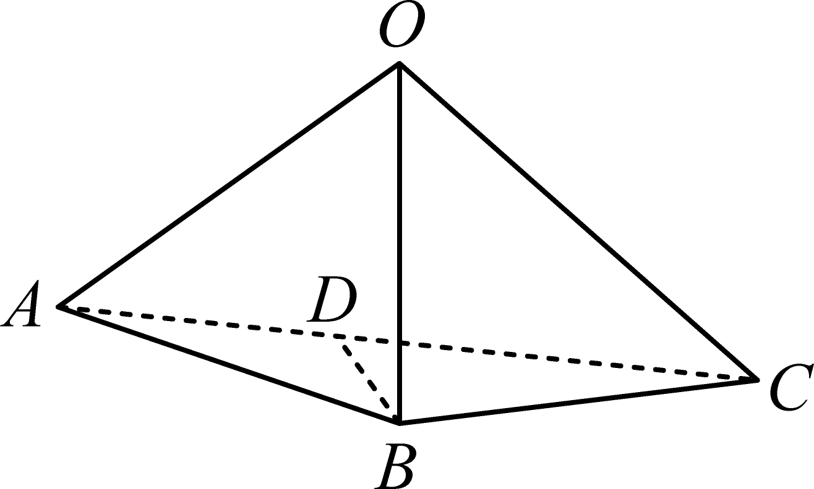

因为平面平面，平面平面，平面，

所以平面，又平面，所以，

因为，平面，

所以平面，又平面，

所以.

（2）过作交于，连接，由（1）知平面，

因此是直线与平面所成的角，

又平面，所以，

设，由，，得，，

又，所以，，

在中，由余弦定理,

得，

所以，当且仅当时取等号，

所以直线与平面所成的角的正切值最大值为2.

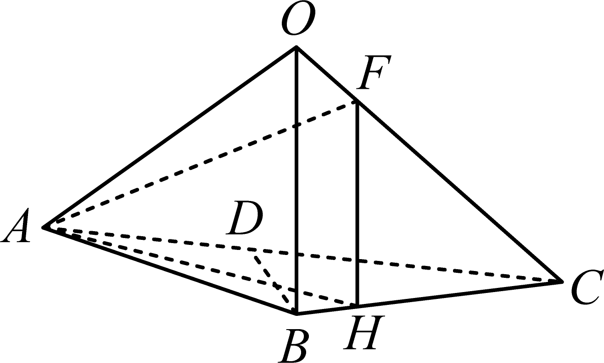

**变式7．**（2024·湖南邵阳·高三统考学业考试）如图，在四棱锥中，四边形是边长为2的正方形，与交于点，面，且.

(1)求证平面.；

(2)求与平面所成角的大小．

【解析】（1）因为是正方形，所以，

又因为平面，平面，所以，

因为，平面，平面，

所以平面.

（2）连接，因为平面，所以为与平面所成的角，

因为，所以，

在直角中，，

所以，即与平面所成的角为.

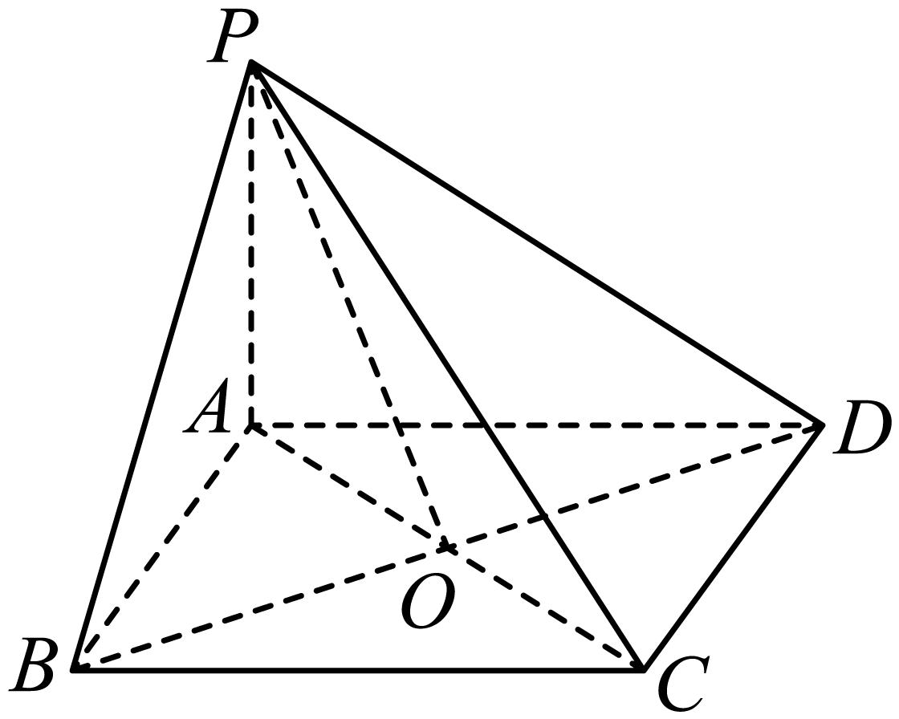

<strong>变式8．</strong>（2024·全国·高三专题练习）如图，在三棱柱中，底面<em>ABC</em>，，到平面的距离为1．

(1)证明：；

(2)已知与的距离为2，求与平面所成角的正弦值．

【解析】（1）如图，

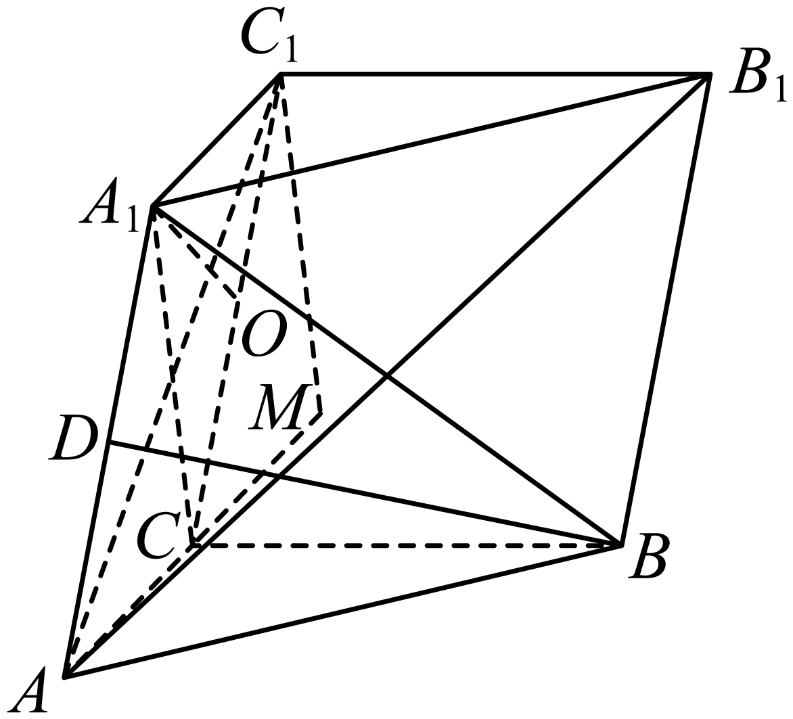

底面，面，

，又，平面，,

平面<em>ACC1A1</em>，又平面，

平面平面，

过作交于，又平面平面，平面，

平面

到平面的距离为1，，

在中，，

设，则，

为直角三角形，且，

，，，

，解得，

，

（2），

，

过*B*作，交于*D*，则为中点，

由直线与距离为2，所以

，，，

在，，

延长，使，连接，

由知四边形为平行四边形，

，平面，又平面，

则在中，，，

在中，，，

,

又到平面距离也为1，

所以与平面所成角的正弦值为.

<strong>变式9．</strong>（2024·全国·模拟预测）如图，在多面体<em>ABCDE</em>中，平面平面，平面，是边长为2的正三角形，，．

(1)点为线段上一点，求证：；

(2)求与平面所成角的正弦值．

【解析】（1）证明：取中点，连接，

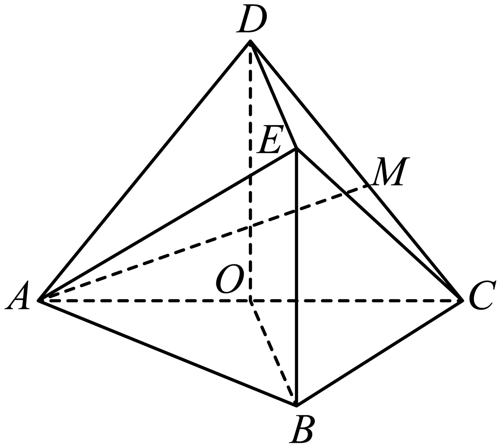

因为是边长为2的正三角形，可得，

因为平面平面，平面平面，且平面，

所以平面，且，

又因为平面，所以，

因为，可得，所以四边形为平行四边形，所以，

由，且为的中点，可得，

因为平面平面，平面平面，且平面，

所以平面，所以平面，

又因为平面，所以.

（2）在中，，且，

由余弦定理得，

所以，

如图所示，过作垂直于，交延长线于点，即，连结，

因为平面，且平面，所以，

又因为，且平面，所以平面，

所以即为与平面所成角,

在直角中，可得，

在直角中，可得，

所以，即与平面所成角的正弦值为.

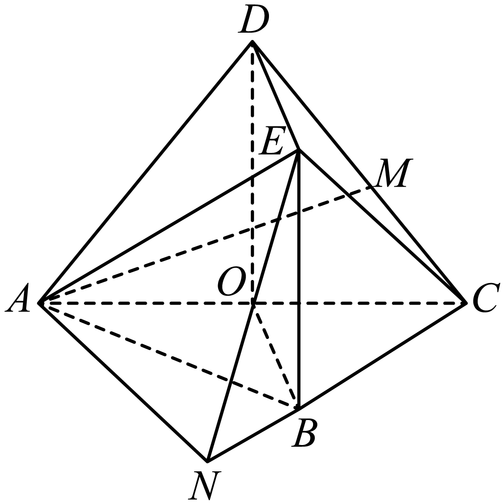

**变式10．**（2024·海南海口·统考模拟预测）如图，四棱锥中，，，平面平面.

(1)证明：平面平面；

(2)若，，，与平面所成的角为，求的最大值.

【解析】（1）证明：过点*A*作于，

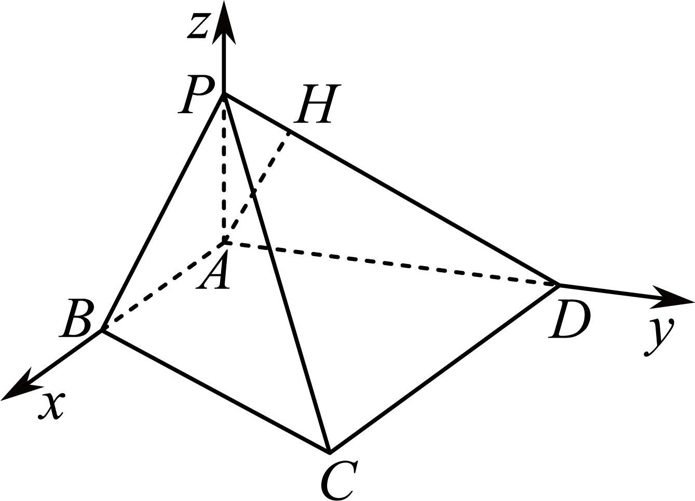

因为平面平面，平面平面，所以平面，

又平面，所以，

由，，可知，

而，平面

所以平面，

因为平面，所以平面平面．

（2）法1：由（1）知平面，平面，所以，

又，所以，

所以，，所以，

由平面*ABCD*，所以平面．

如图建立空间直角坐标系，则，，，设，

平面的一个法向量为，，

，所以，，即，

得 令，得，

，所以，

显然，当时，取最小值，

综上，当时，的最大值为．

法2：设点到平面的距离为，因为，平面，

所以平面，所以点*A*到平面的距离也为，

由（1），平面，所以，又，所以，

所以，所以，所以，

由（1），平面，所以，

由，在四边形中，当时，取最小值，

此时四边形显然为矩形，，所以的最大值为．

**变式11．**（2024·全国·模拟预测）如图，在四棱锥中，底面为直角梯形，，，底面，且，，分别为，的中点．

(1)证明：．

(2)求与平面所成角的正弦值．

【解析】（1）因为，分别为，的中点，所以，又，

所以，则四点共面.

因为是的中点，，所以．

因为平面，所以．在直角梯形中，．而，，平面，因此平面．所以．

又因为，且，，平面，

所以平面．

因为平面，所以．

（2）

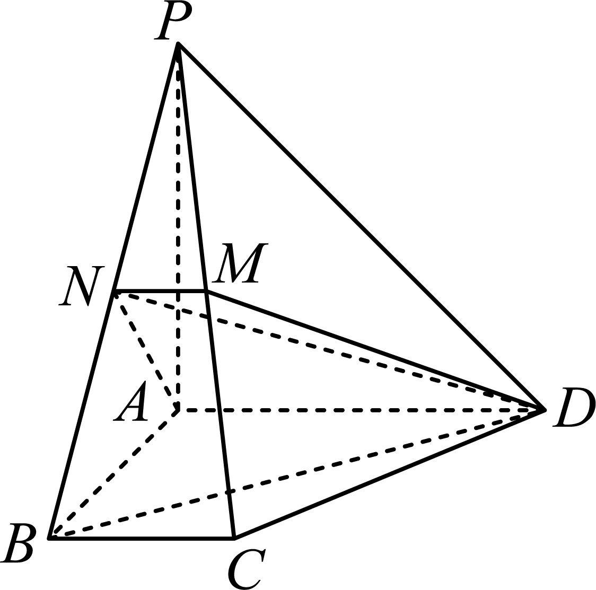

连接．由（1）可知平面，

所以是与平面所成角．

设，于是，．

另一方面，．

因此，在直角三角形中，．

所以与平面所成角的正弦值为．

**变式12．**（2024·全国·高三专题练习）如图所示，在四棱锥中，底面为直角梯形，，，，，，．

(1)求证：平面平面；

(2)设为的中点，求直线与平面所成角的正弦值．

【解析】（1）证明：为直角梯形，，．

又，， 平面,所以平面．

又平面，，

又，，

如图，过点*A*作，，．

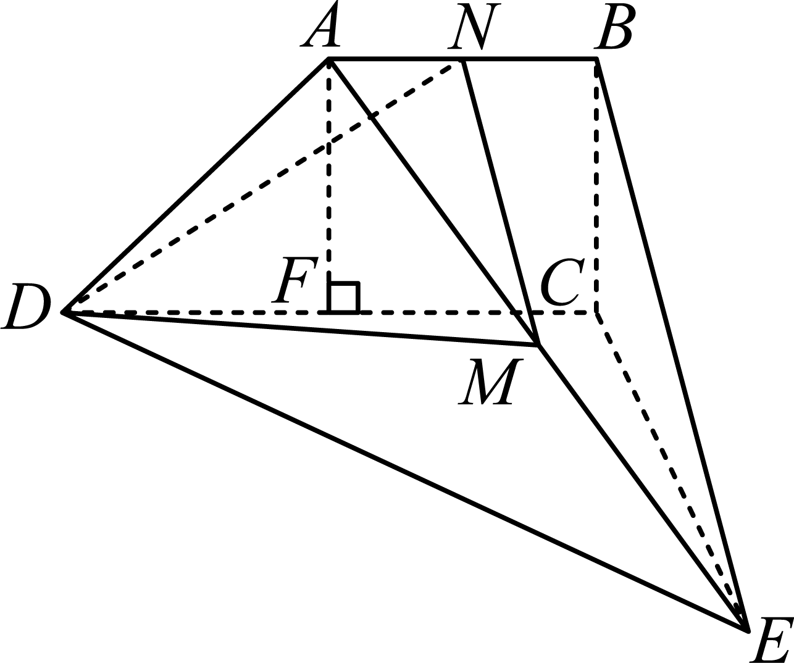

又，．

又，由勾股定理可知

，平面，平面．

平面平面平面．

（2）取*AB*的中点*N*，连接*DN*，*MN*，

∵*M*为*AE*的中点，，，

由（1）知*BE*⊥平面*ABCD*，∴*MN*⊥平面*ABCD*，

∴∠*MDN*为直线*DM*与平面*ABCD*所成角．

由（1）知，又，，，

∴，，

∴

．

．

**题型三：二面角**

**例7．**（2024·全国·高三专题练习）如图，在三棱柱中，已知平面，且.

(1)求的长；

(2)若为线段的中点，求二面角的余弦值.

【解析】（1）连接，

因为平面，平面，则，

又因为，平面，

所以平面，

且平面，可得，

因为为平行四边形，且，则为矩形，

所以正方形，可得.

（2）根据题意将三棱柱转化为正四棱柱，

取的中点，连接，则三点共线，且//，

因为//，可得//，

所以平面即为平面，

同理平面即为平面，

因为//，平面，则平面，

且平面，则，

所以二面角的平面角为，

可得，

在中，则，

所以二面角的余弦值为.

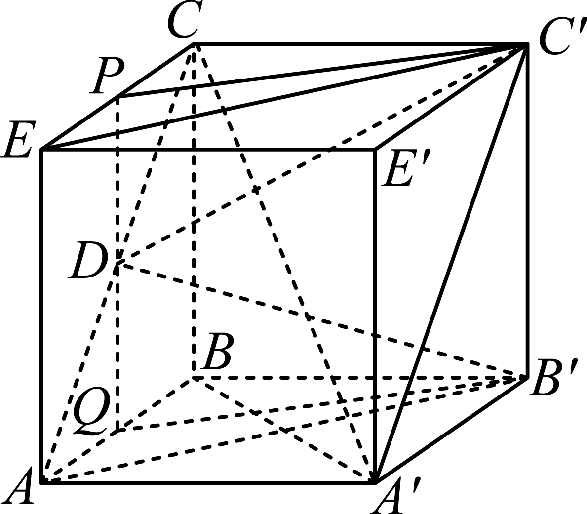

.

**例8．**（2024·全国·高三专题练习）如图，在三棱柱中，侧面为菱形，.

(1)证明：平面平面；

(2)求二面角的余弦值.

【解析】（1）连、交于，则为、的中点，连，

因为，所以，

因为侧面为菱形，，，

所以，，所以，即，

因为，平面，

所以平面，因为平面，

所以平面平面.

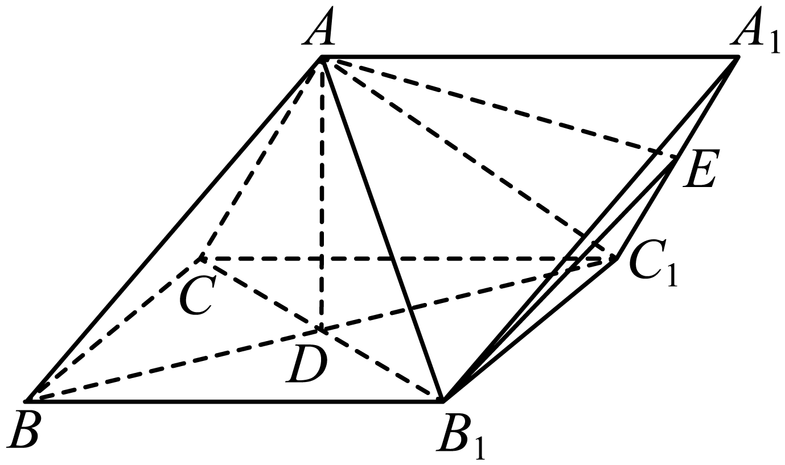

（2）取的中点，连，，，

由（1）知，，又，所以，

又，所以，同理得，

所以为二面角的平面角，

在中，，

，，

所以.

所以二面角的余弦值为.

<strong>例9．</strong>（2024·广东深圳·高三校联考开学考试）在四棱锥中，底面<em>ABCD</em>为正方形，.

(1)证明：平面平面*ABCD*；

(2)若，，求平面*PAD*与平面*PBC*夹角的余弦值.

【解析】（1）∵底面*ABCD*为正方形，

∴，

又∵，，*AD*，平面*PAD*，

∴平面*PAD*，

∵平面*ABCD*，

∴平面平面*ABCD*.

（2）（法一）取*AD*中点为*O*，连结*PO*，

∵在中，，，

∴，为等边三角形.

∵平面平面*ABCD*，平面平面，平面*PAD*，

∴平面*ABCD*，

以*O*为坐标原点，建立如图所示的空间直角坐标系，

设底面正方形的边长为2，

∴，，，，，

∴，，

设平面*PBC*的一个法向量，

则，即，

令，则，，

∴，

由（1）可知平面*PAD*的一个法向量，

设平面*PAD*与平面*PBC*的夹角为，

则，

∴平面*PAD*与平面*PBC*夹角的余弦值为.

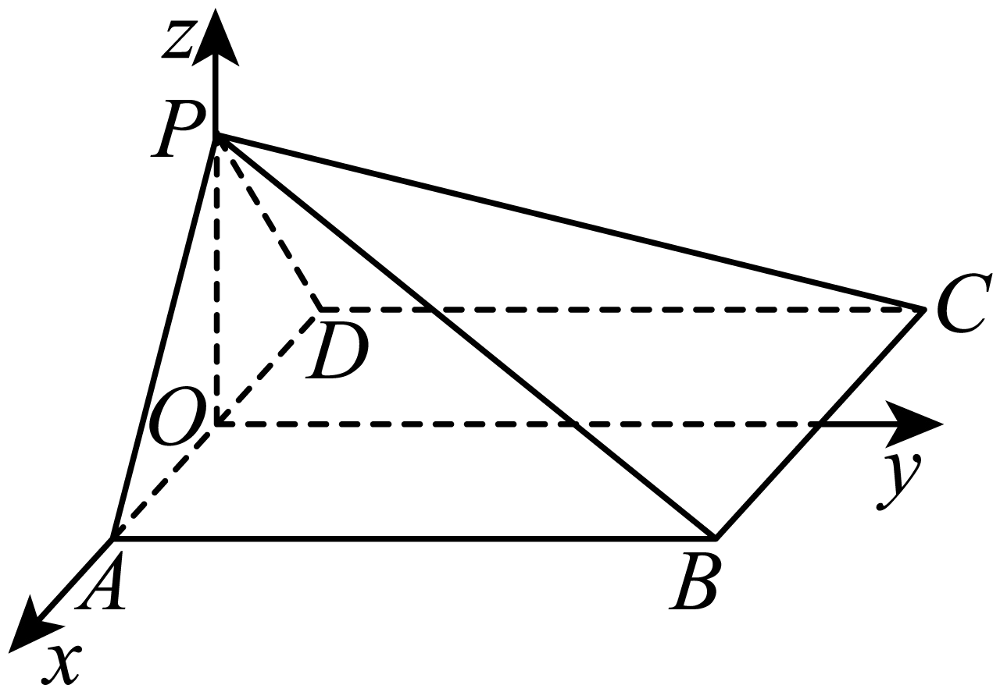

（法二）设平面*PAD*与平面*PBC*的交线为*l*，

∵，平面*PAD*，平面*PAD*，

∴平面*PAD*，

又∵平面*PBC*，

∴，，

∵平面*PAD*与平面*PBC*有一个交点*P*，

∴*l*为过点*P*且与*BC*平行的一条直线，如下图，

取*AD*中点为*O*，取*BC*中点为*M*，连结*PO*，*PM*，*OM*，

∵底面四边形*ABCD*为正方形，*O*，*M*分别为*AD*，*BC*的中点，

∴，

又∵平面*PAD*，∴平面*PAD*，

∵平面*PAD*，∴，

∵在中，，*O*为*AD*的中点，

∴，，

又，*PO*，平面*PAD*，

∴平面*POM*，∴，

又∵为锐角，∴为平面*PAD*与平面*PBC*的夹角，

设底面正方形*ABCD*的边长为2，

在中，，，

∴平面*PAD*与平面*PBC*夹角的余弦值为.

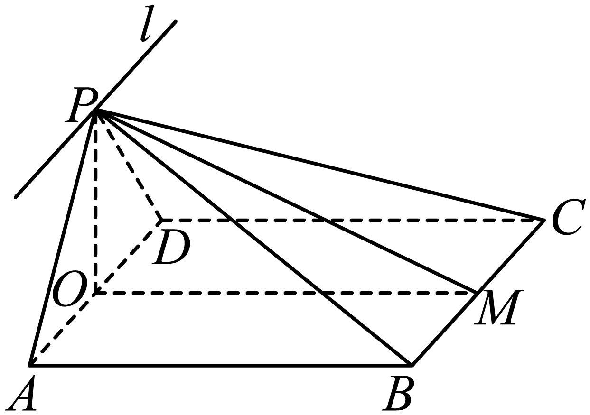

**变式13．**（2024·四川成都·高三川大附中校考阶段练习）如图，是圆的直径，点在圆所在平面上的射影恰是圆上的点，且，点是的中点，与交于点，点是上的一个动点.

(1)求证：；

(2)求二面角平面角的余弦值.

【解析】（1）证明：点在圆所在平面上的射影恰是圆上的点，平面，

平面，，

又是圆的直径，有，且，平面，

所以平面，又平面，所以．

（2）平面，平面，所以，，

为二面角的平面角．

设，则，，有，为锐角，

在直角中可得，故，

故二面角平面角的余弦值为．

<strong>变式14．</strong>（2024·云南·高三云南师大附中校考阶段练习）已知在四棱锥中，，，，，，<em>E</em>为<em>CD</em>的中点.

(1)证明：平面平面*PAE*；

(2)若直线*PB*与平面*PAE*所成的角和*PB*与平面*ABCD*所成的角相等，求二面角的正弦值.

【解析】（1）平面*PCD*与平面*PAE*能垂直，理由如下：

在△中，故，即，

所以△为等腰三角形，又*E*为*CD*中点，故，

因为，且 ，面，所以面，

由面，故面面.

（2）平面，

是二面角的平面角，

过点作，分别与，相交于，，连接，

由（1）知平面，

为直线与平面所成的角，且，

由，则，由，则，

又，且面，则面，而面，

所以，结合，，且面，

所以面，则为直线与平面所成的角，

有题意知，

,

因为知，，又，

是平行四边形， ，，

因为，，

，

于是，所以，

又，，，

所以，因为，面，面，

则，则，即，

因为为中点，则，又因为，且平面，平面，

则二面角的正切值即为，

则，

二面角的正弦值是.

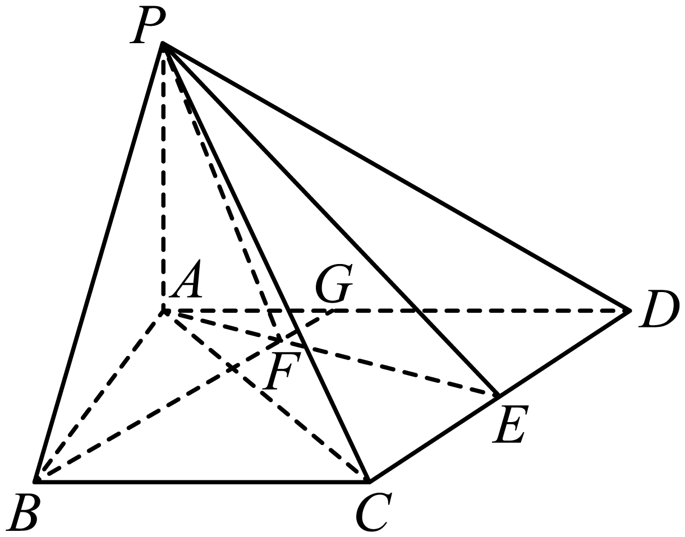

<strong>变式15．</strong>（2024·广东广州·高三广州市第六十五中学校考阶段练习）如图，在五面体中，平面<em>ABC</em>，，，.

(1)问：在线段*CD*上是否存在点*P*，使得平面*ACD*?若存在，请指出点*P*的位置，并证明；若不存在，请说明理由.

(2)若，，，求平面*ECD*与平面*ABC*夹角的余弦值.

【解析】（1）当*P*为线段*CD*的中点时，平面*ACD*；

证明：分别取的中点为，连接，

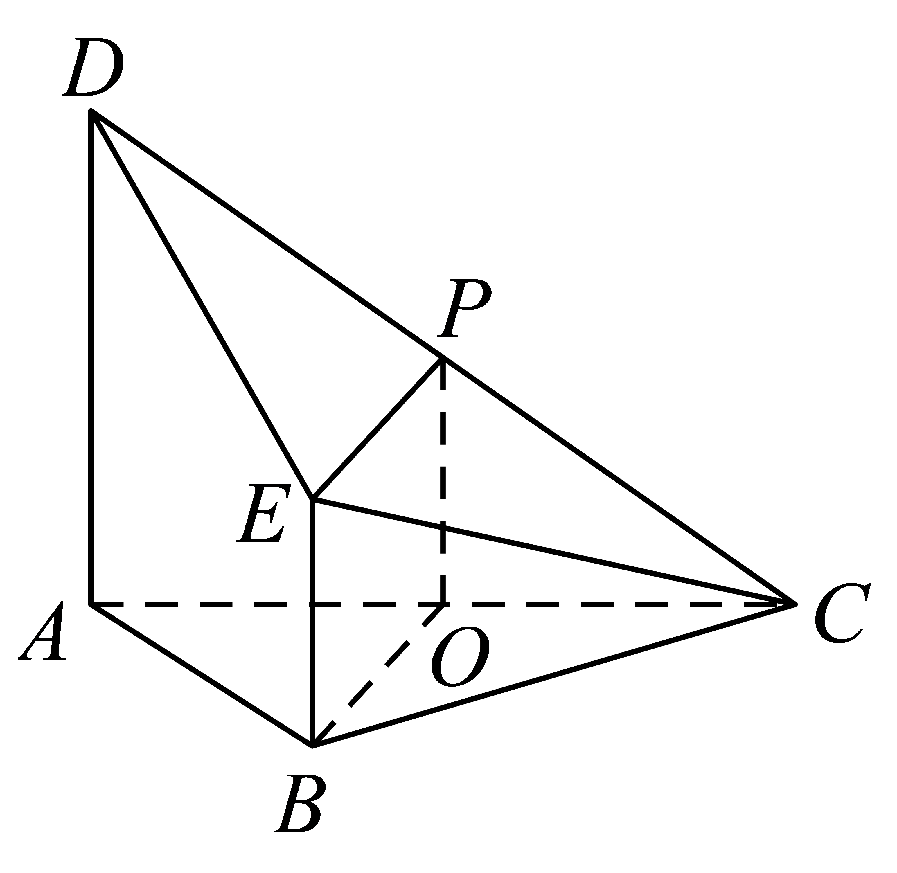

则，而，，

故,即四边形为平行四边形，

则;

因为平面*ABC*，平面,故，则；

由，*O*为*AC*中点，故，则，

又平面，

故平面*ACD*；

（2）在平面中延长交于一点*F*，连接，

则为平面*ECD*与平面*ABC*的交线，

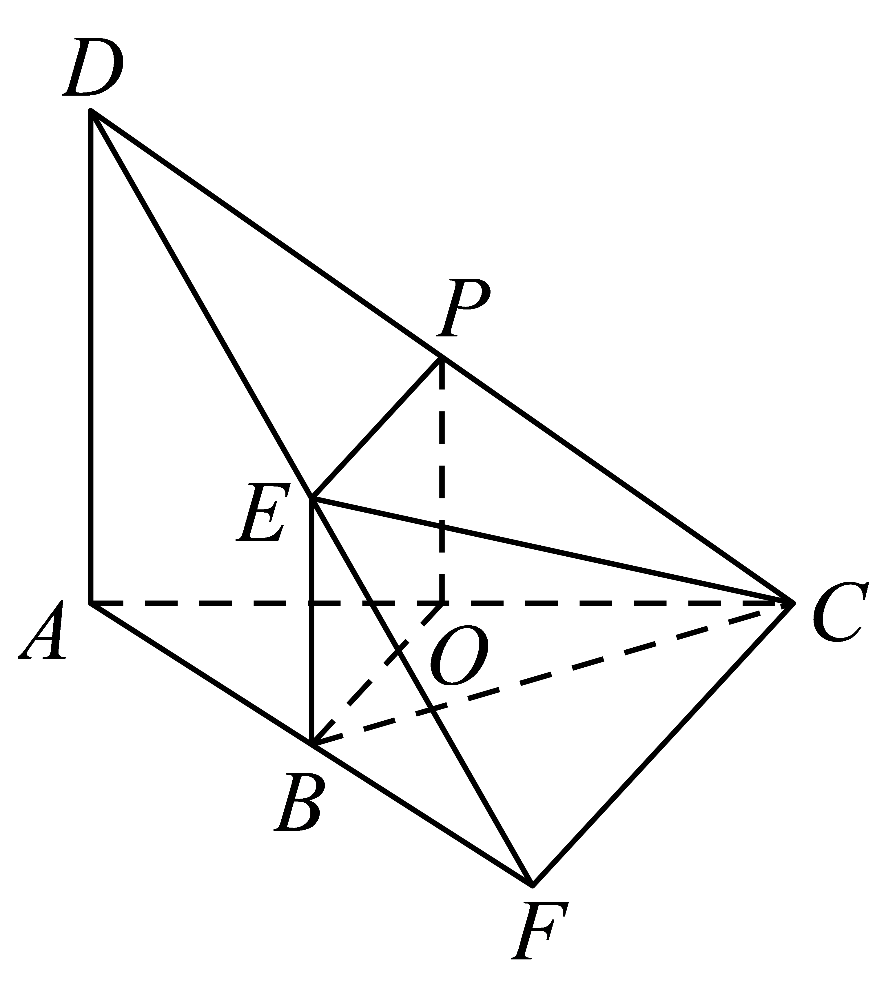

由于，，故*B*为的中点，

而*O*为的中点，故，

由（1）知，平面*ACD*，故平面*ACD*，

所以平面*ACD*，平面*ACD*，

故，平面,平面，

且平面*ABC*，平面*ABC*，故，则为锐角，

故即为平面*ECD*与平面*ABC*夹角，

在中，，，所以,

则,

即平面*ECD*与平面*ABC*夹角的余弦值为.

**变式16．**（2024·安徽黄山·屯溪一中校考模拟预测）如图，在梯形中，，，，四边形为矩形， 平面平面，.

(1)求证：平面；

(2)求二面角的平面角的余弦值；

(3)若点在线段上运动，设平面与平面所成二面角的平面角为，试求的范围.

【解析】（1）证明：在梯形中，，，，，，

，，平面平面，平面平面，平面，平面.

（2）取中点，连接，，

，，，

，，为二面角的平面角.

，，，，

.

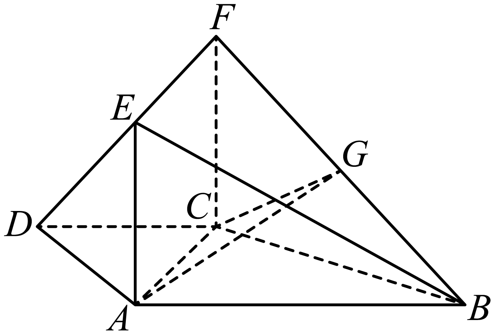

（3）由（2）知：

①当与重合时，；

②当与重合时，过作，且使，连接，，则平面平面，，，平面*ABC*，平面*ABC*，，平面，平面，，，；

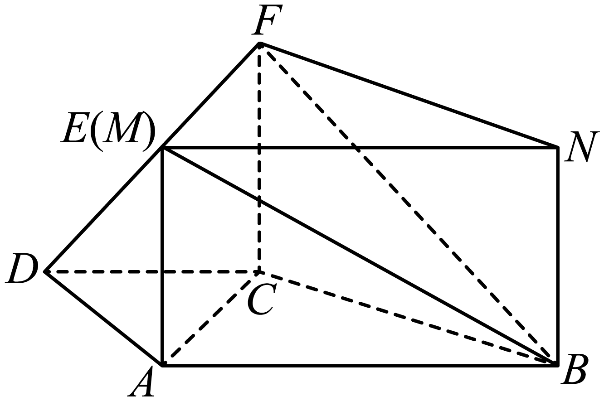

③当与，都不重合时，令，，延长交的延长线于，连接，在平面与平面的交线上，在平面与平面的交线上，平面平面，

过作交于，连接，

由（1）知，，又，平面，，

平面，平面，.

又，平面*ACH*，，平面，，.

在中，，从而在中，，

，，.，.

综上所述，，.

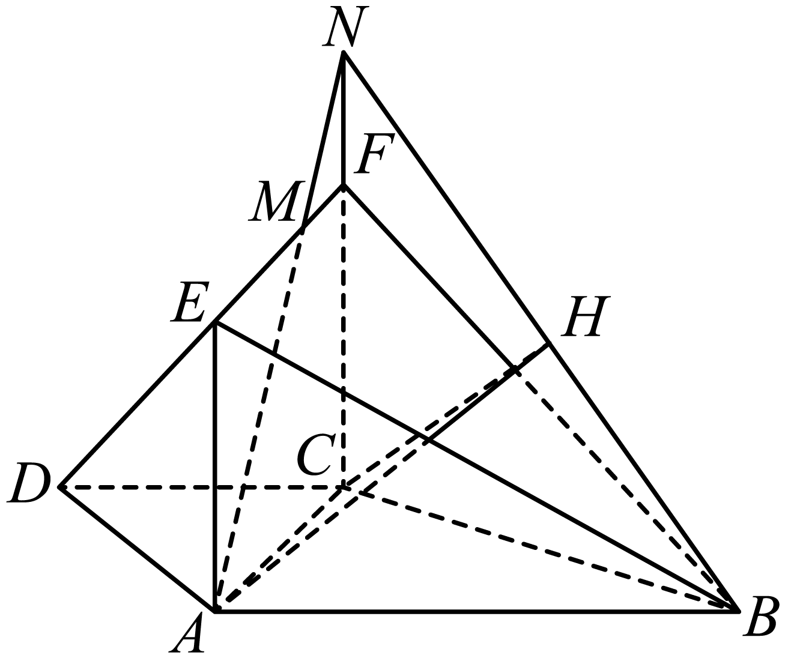

**变式17．**（2024·吉林·长春吉大附中实验学校校考模拟预测）如图，是圆的直径，点是圆上异于的点，直线平面分别是的中点．

(1)记平面与平面的交线为，证明：平面；

(2)设（1）中的直线与圆的另一个交点为，且点满足．记直线与平面所成的角为，异面直线与所成的角为，二面角的大小为，求证：．

【解析】（1）∵平面平面，

∴直线平行于平面,

又平面，平面平面，

∴，又．

∴，

因为是直径，所以为直角，所以，

又因为平面，*AC*在面*ABC*上，所以，

而相交于点*C*,且都在平面内，

所以平面，故平面．

（2）证法一（综合法）：如图，连接，由（1）可知交线即为直线，且．

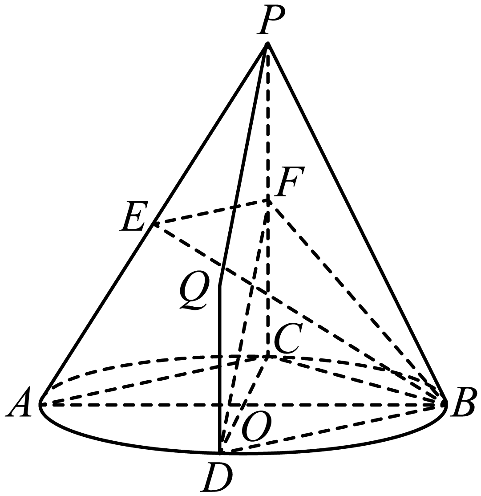

因为是的直径，所以，于是．

已知平面，而平面，所以．

而，*BC、PC*在面*PBC*内，所以平面．

连接，

因为平面，所以．

故就是二面角的平面角，即．

由，作，且．

连接，

因为是的中点，，所以，

从而四边形是平行四边形，．

连接，因为平面，

所以是在平面内的射影．

故就是直线与平面所成的角，即．

又平面，*BF*在面*PBC*内，所以，所以为锐角．

故为异面直线与所成的角，即，

于是在，，中，

分别可得．

从而，即．

证法二（向量法）：

如图，由，作，且，

连接．

由（1）可知交线*l*即为直线．

以点为原点，向量所在直线分别为轴，建立如图所示的空间直角坐标系，

设，则有，．

于是，，

所以

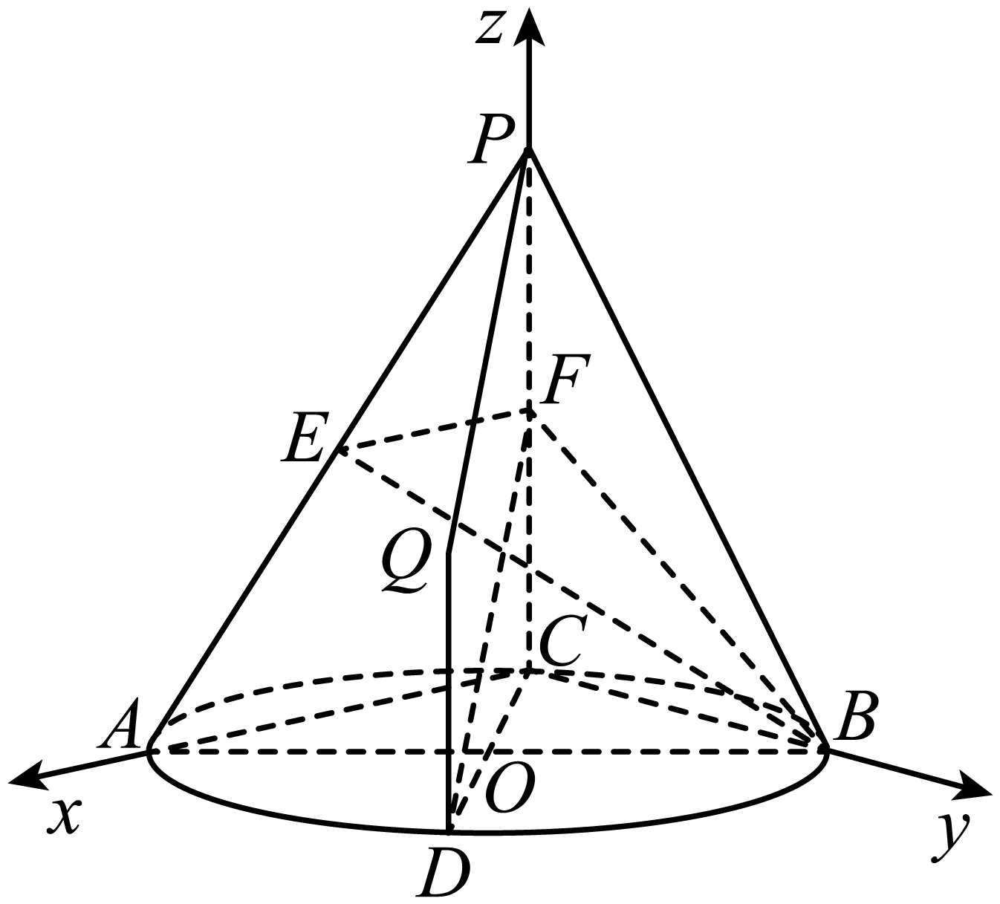

从而．

取平面的一个法向量为，可得，

设平面的一个法向量为．

由，可得取．

于是，从而．

故，即．

<strong>变式18．</strong>（2024·全国·高三专题练习）如图，在三棱锥中，，，，，<em>BP</em>，<em>AP</em>，<em>BC</em>的中点分别为<em>D</em>，<em>E</em>，<em>O</em>，，点<em>F</em>在<em>AC</em>上，.

(1)证明：平面；

(2)证明：平面平面*BEF*；

(3)求二面角的正弦值.

【解析】（1）连接，设，则，，，

则，

解得，则为的中点，由分别为的中点，

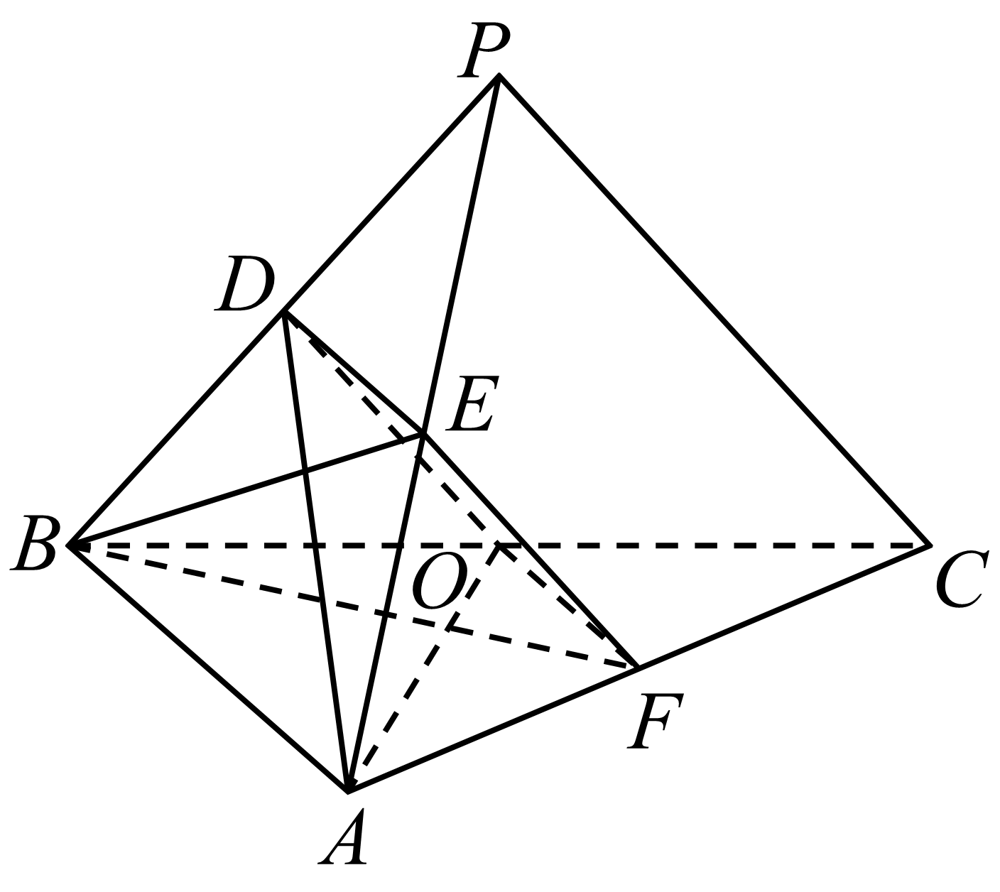

于是，即，则四边形为平行四边形，

，又平面平面，

所以平面.

（2）法一：由（1）可知，则，得，

因此，则，有，

又，平面，

则有平面，又平面，所以平面平面.

法二：因为，过点作轴平面，建立如图所示的空间直角坐标系，

，

在中，，

在中，，

设，所以由可得：，

可得：，所以，

则，所以，，

设平面的法向量为，

则，得，

令，则，所以，

设平面的法向量为，

则，得，

令，则，所以，

，

所以平面平面*BEF*；

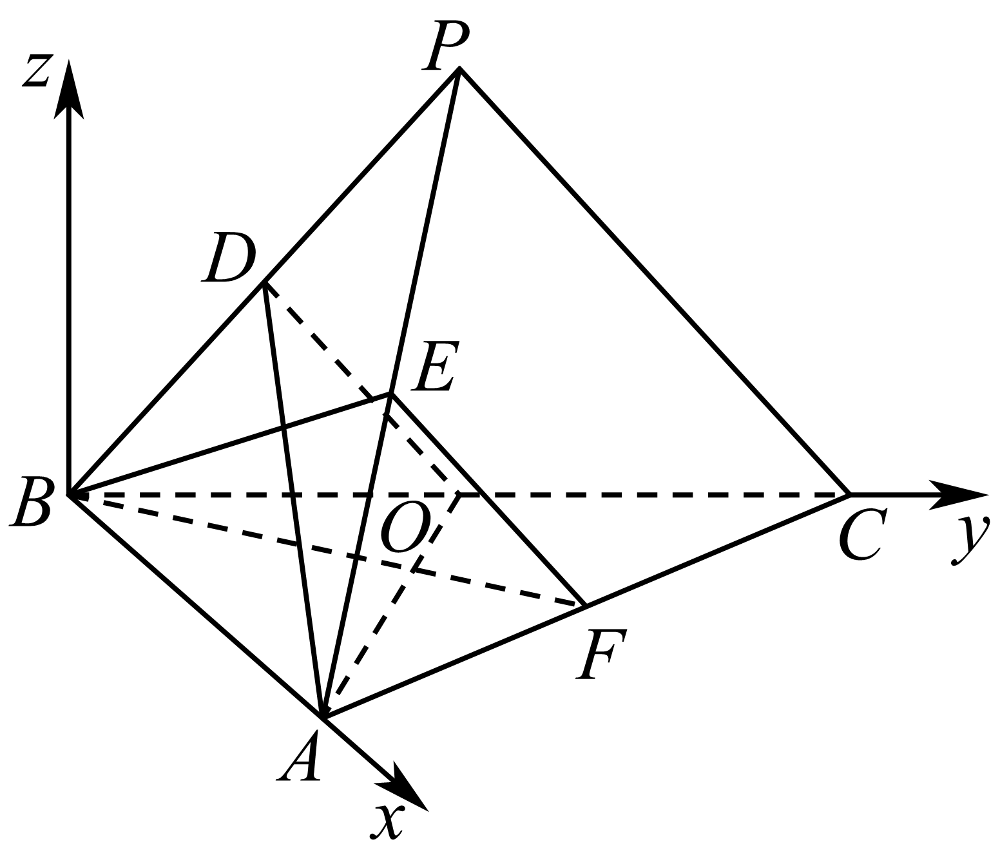

（3）法一：过点作交于点，设，

由，得，且，

又由（2）知，，则为二面角的平面角，

因为分别为的中点，因此为的重心，

即有，又，即有，

，解得，同理得，

于是，即有，则，

从而，，

在中，，

于是，，

所以二面角的正弦值为.

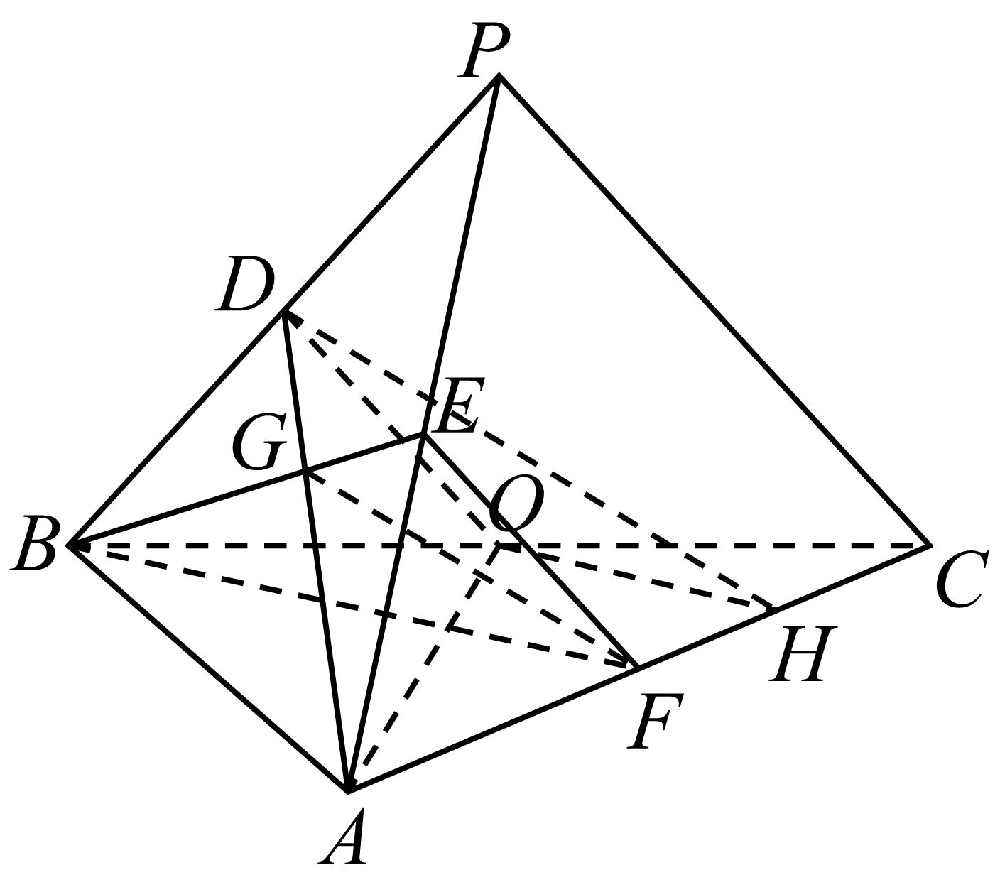

法二：平面的法向量为，

平面的法向量为，

所以，

因为，所以，

故二面角的正弦值为.

**变式19．**（2024·广东广州·统考三模）如图，在几何体中，矩形所在平面与平面互相垂直，且，，．

(1)求证：平面；

(2)求二面角的平面角的余弦值．

【解析】（1）在矩形中，，

又平面平面，平面平面=，平面，

所以平面，

又平面，

所以，

在矩形中，,

又，所以,

所以.

又，平面，

所以平面；

（2）解法1：在与中，，，，

所以，所以，

由等腰三角形性质，得．

又平面平面，

平面平面=，平面

所以平面．

记，连结，所以，，

所以是二面角的平面角．

在中,．

在中，由勾股定理得，

在中，由勾股定理得，

在中，由勾股定理得，

所以，

即二面角的平面角的余弦值为．

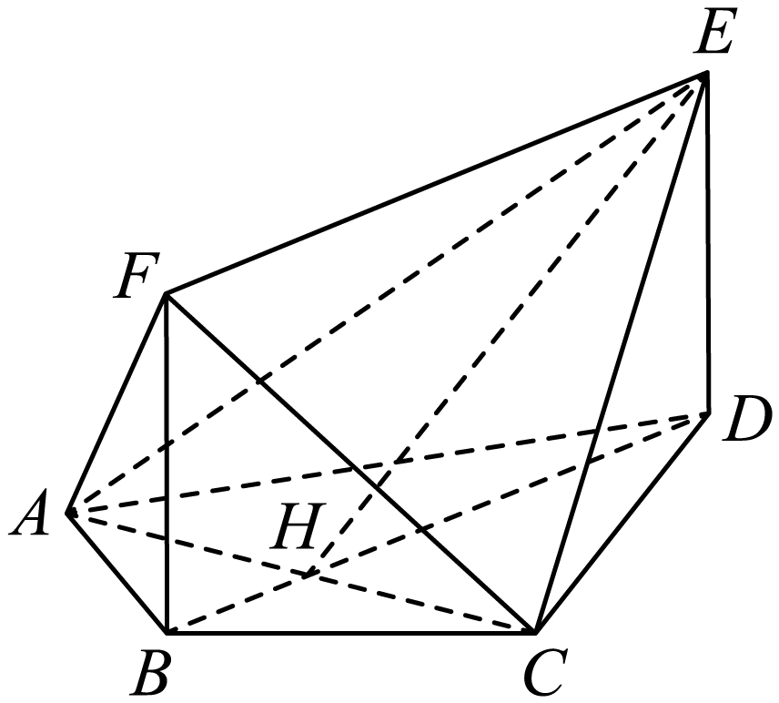

解法2：在与中，，，，

所以，所以，

由等腰三角形性质，得．

又平面平面，

平面平面=，平面

所以平面．

记，以为坐标原点，方向分别为轴、轴、轴方向建立空间直角坐标系.

在中,．

所以，

所以点的坐标为，点的坐标为，

所以，．

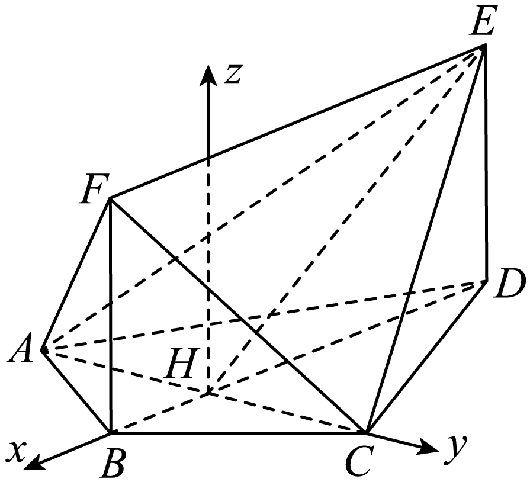

设平面的法向量为，则，，

即   ,  令，解得，，

所以为平面的一个法向量．

又平面的一个法向量为，

所以，

又二面角的平面角为锐角，

即二面角的平面角的余弦值为．

**变式20．**（2024·浙江·校联考模拟预测）已知四棱锥中，底面为平行四边形，，平面平面.

(1)若为的中点，证明：平面；

(2)若，求平面与平面所夹角的余弦值.

【解析】（1）在四棱锥中，为的中点，又，则，而，

因此平面，

所以平面.

（2）在平面内过点作交直线于，连接，如图，

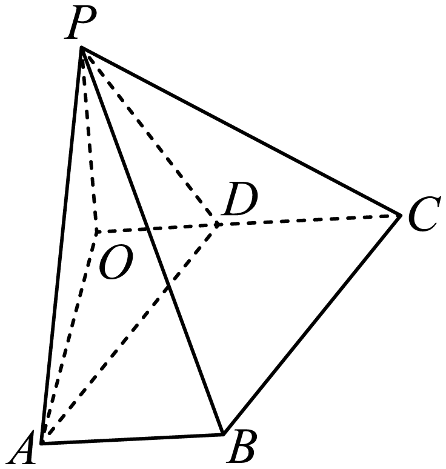

因为平面平面，平面平面，则平面，

而平面，则有，又，平面，

于是平面，平面，则，有，得，

平面，平面，则平面，平面与平面的交线为，

因此，有，从而为平面与平面所成二面角的平面角，

显然，则，

所以平面与平面的夹角的余弦值为.

<strong>变式21．</strong>（2024·河南·洛宁县第一高级中学校联考模拟预测）在图1中，为等腰直角三角形，，，为等边三角形，<em>O</em>为<em>AC</em>边的中点，<em>E</em>在<em>BC</em>边上，且，沿<em>AC</em>将进行折叠，使点<em>D</em>运动到点<em>F</em>的位置，如图2，连接<em>FO</em>，<em>FB</em>，<em>FE</em>，使得．

(1)证明：平面．

(2)求二面角的余弦值．

【解析】（1）证明：连接*OB*，

因为为等腰直角三角形，，，

所以，

因为*O*为*AC*边的中点，

所以，

在等边三角形中，，

因为*O*为*AC*边的中点，

所以，则，

又，

所以，即，

因为，平面，平面，

所以平面．

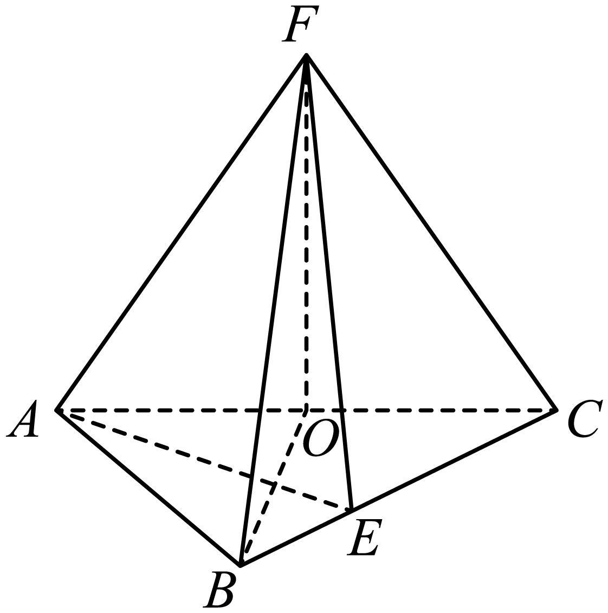

（2）方法一：因为是等腰直角三角形，，为边中点，

所以，

由（1）得平面，则以*O*为坐标原点，，，的方向分别为*x*，*y*，*z*轴的正方向建立空间直角坐标系，

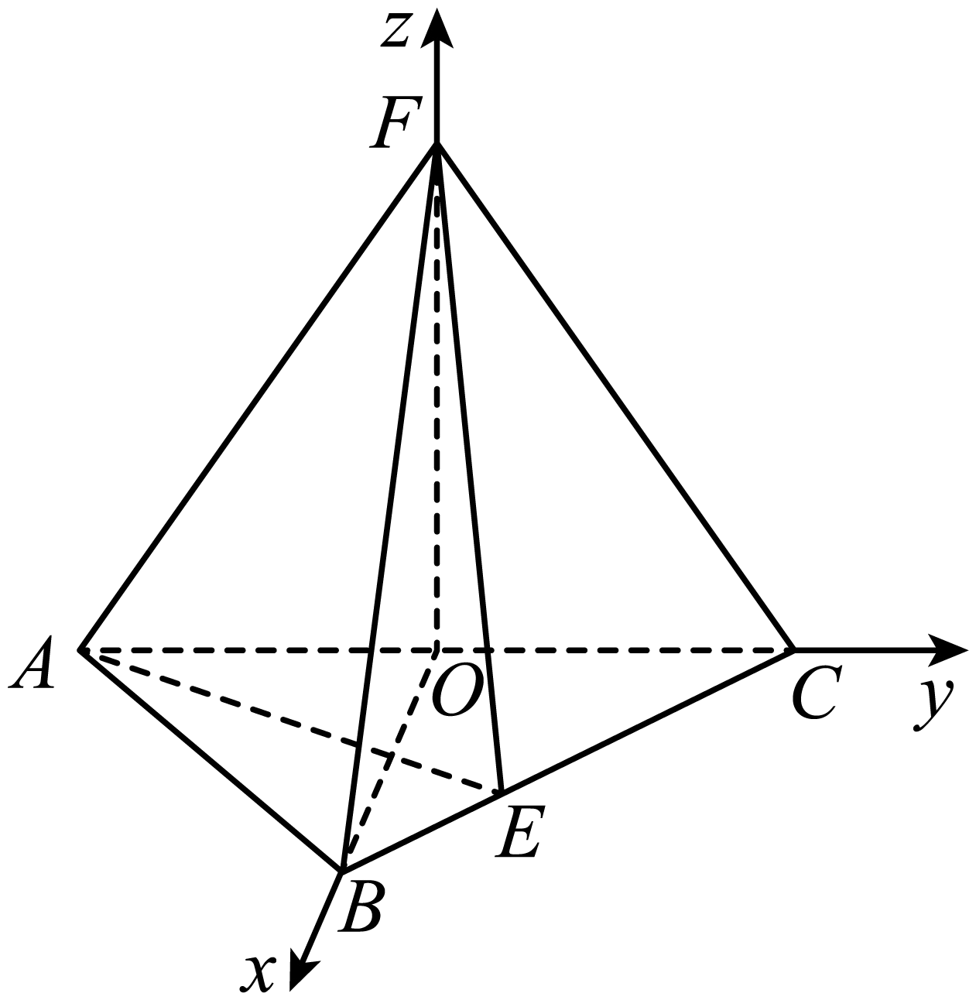

则，，，

所以，，

设平面的法向量为，

由，得，令，得，

易知平面的一个法向量为，

设二面角的大小为*θ*，

则，

由图可知二面角为锐角，

所以二面角的余弦值为．

方法二：

作，垂足为*M*，作，垂足为*N*，连接，

因为平面，平面，

所以，

又因为，平面，

所以平面，

又平面，

所以，

又，，平面，

所以平面，

又平面，

所以，

又平面平面，

所以二面角的平面角为，

因为，所以，

所以，，

在中，，，

所以，

所以，

所以，即二面角的余弦值为．

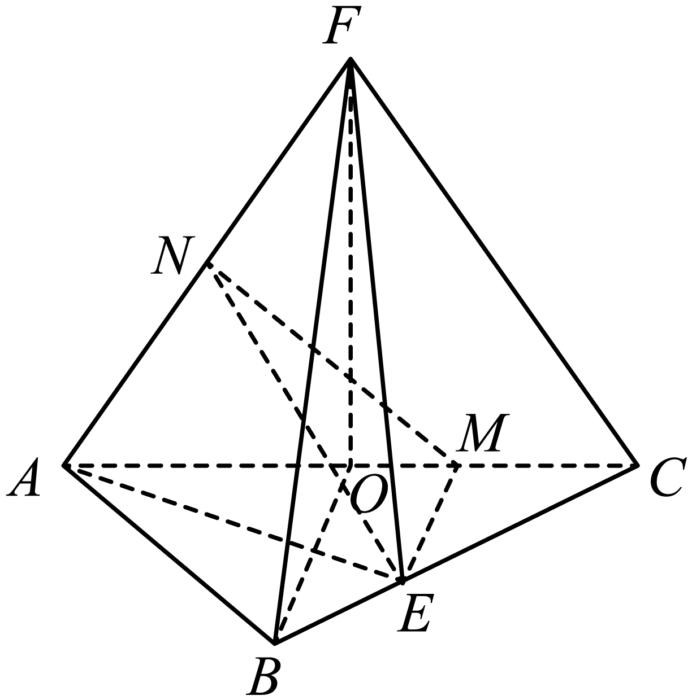

**变式22．**（2024·江苏苏州·校联考三模）如图，在三棱锥中，是边长为的等边三角形，且，平面，垂足为平面，垂足为，连接并延长交于点.

(1)求二面角的余弦值；

(2)在平面内找一点，使得平面，说明作法及理由，并求四面体*PDEF*的体积.

【解析】（1）

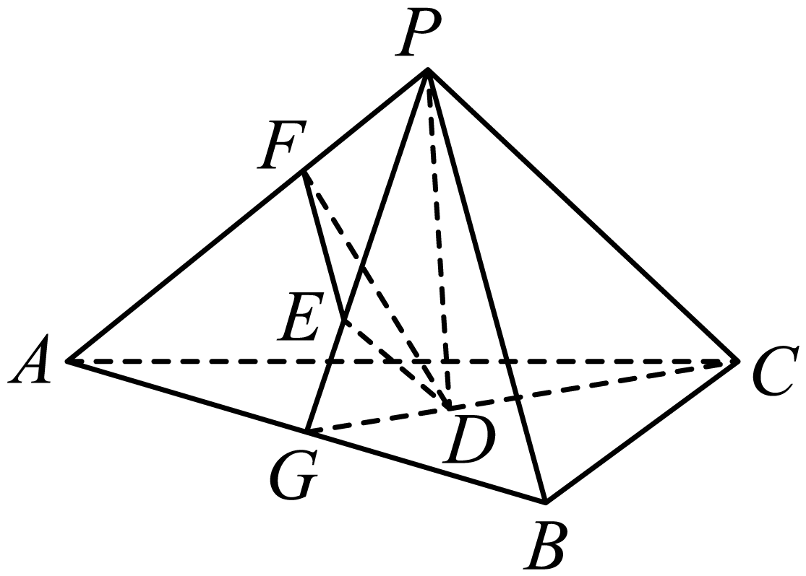

，并且是等边三角形，

三棱锥是正三棱锥，*D*是的中心，点*G*是*AB*边的中点；

由平面， 平面，平面，可知，平面*PDG*，平面*PDG*，

所以平面，进而得，

所以就是二面角的平面角，

又是边长为的等边三角形，且，，

是等腰直角三角形，同理都是等腰直角三角形；

，，

，即二面角的余弦值为；

（2）平面，平面，

平面，

同理平面，又平面，

，与点*P*，*D*，C共面，即*E*点在线段*PG*上，

又，，，

过*E*点在平面*PAB*内作*PB*的平行线，与*PA*交于*F*，则平面，

也是等腰直角三角形，，

又平面*PAB*，平面*PAB*，，将作为底面，则*ED*是三棱锥的高，

，即四面体的体积为.

**变式23．**（2024·全国·高三专题练习）已知四棱锥的底面为梯形，且，又，，，平面平面，平面平面．

(1)判断直线和的位置关系，并说明理由；

(2)若点到平面的距离为，请从下列①②中选出一个作为已知条件，求二面角余弦值大小．

①；

②为二面角的平面角．

【解析】（1）且，延长必交于一点，即为点，

平面，平面，且，，

平面，平面，又平面，平面，

连接，则平面平面，又平面平面，

直线即为直线，如下图所示，

，即直线与相交.

（2）若选条件①，，平面平面，平面平面，平面，平面；

同理可知：平面，

平面，，；

取中点，连接，

，，四边形为平行四边形，，

，，又，，

；

设，则，又，，

，

，

，

，

又，，

由（1）知：二面角即为二面角，设其平面角为，

，，为中点，，，

设点到直线的距离为，

则，即，解得：，

，

又二面角为锐二面角，.

若选条件②，若为二面角的平面角，则，，

又，；

平面平面，平面平面，平面，平面；

同理可知：平面，

平面，，；

取中点，连接，

，，四边形为平行四边形，，

，，又，，

；

设，则，又，，

，

，

，

，

又，，

由（1）知：二面角即为二面角，设其平面角为，

，，为中点，，，

设点到直线的距离为，

则，即，解得：，

，

又二面角为锐二面角，.

**题型四：距离问题**

<strong>例10．</strong>（2024·山东滨州·高三山东省北镇中学校考阶段练习）如图所示的斜三棱柱中，是正方形，且点在平面上的射影恰是<em>AB</em>的中点<em>H</em>，<em>M</em>是的中点．

(1)判断*HM*与面的关系，并证明你的结论；

(2)若，，求斜三棱柱两底面间的距离．

【解析】（1）直线*HM*与平面平行．

证明如下：取的中点*N*．连接*NM*，*AN*．

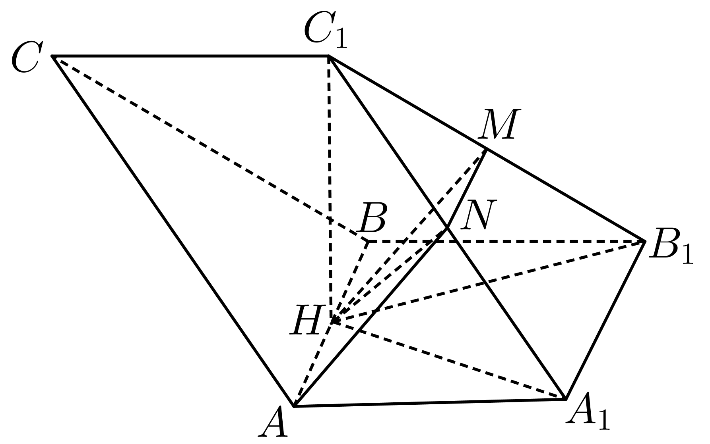

因为点*M*是的中点，所以，且．

又是正方形，点*H*是*AB*的中点，所以，．

所以，．

所以四边形*ANMH*为平行四边形，所以，

因为平面，平面，

所以平面．

（2）因为点在平面上的射影是*AB*的中点*H*，所以平面．

连接，，则，．

由正方形的边*AB*=2，得，

所以，

所以的面积为．

设斜三棱柱两底面间的距离为*d*，即*H*到平面的距离为*d*，

由得，解得，

即斜三棱柱两底面间的距离为．

**例11．**（2024·北京海淀·高三海淀实验中学校考期末）如图，在三棱柱中，平面平面，侧面是边长为2的正方形，分别为的中点.

(1)证明：面

(2)请再从下列三个条件中选择一个补充在题干中，完成题目所给的问题.

①直线与平面所成角的大小为；②三棱锥的体积为；③. 若选择条件\_\_\_\_\_\_\_\_\_\_\_.

求（i）求二面角的余弦值；

（ii）求直线与平面的距离.

【解析】（1）证明：取中点*G*，连接*FG*、*CG*，∵分别为的中点，∴在三棱柱中，，且，∴四边形*FECG*为平行四边形，∴.

∵面，面，∴面；

（2）平面平面，平面平面=，又侧面是边长为2的正方形，则，∴面，面，∵面，∴.

取中点*I*，作于*J*，连接*FI*，*IE*，*FJ*，则平面，，∵平面，∴，

∵平面*FIJ*，∴平面*FIJ*，∵平面*FIJ*，∴，∴为二面角的平面角的补角.

∵面，∴直线与平面的距离即为*E*到平面的距离， 作于，由平面平面，平面平面=，则*EK*即为*E*到平面的距离，即直线与平面的距离.

选①，∵面，∴为直线与平面所成角，即，∴.

（i）在正中，易得，故在中，，故二面角的余弦值为；

（ii） 在正中，，故直线与平面的距离为；

选②，，为的中点，∴，∵面，∴，即，又，∴，∴，解得，∴，.

（i）在中，，故在中，，故二面角的余弦值为；

（ii）在中，，故直线与平面的距离为1；

选③， 取*AB*中点*H*，，连接*OH*，则*O*为中点，则且，由，∴，则，又，∴，∴，.

此时条件③与条件②一致，故（i）二面角的余弦值为；（ii）直线与平面的距离为1.

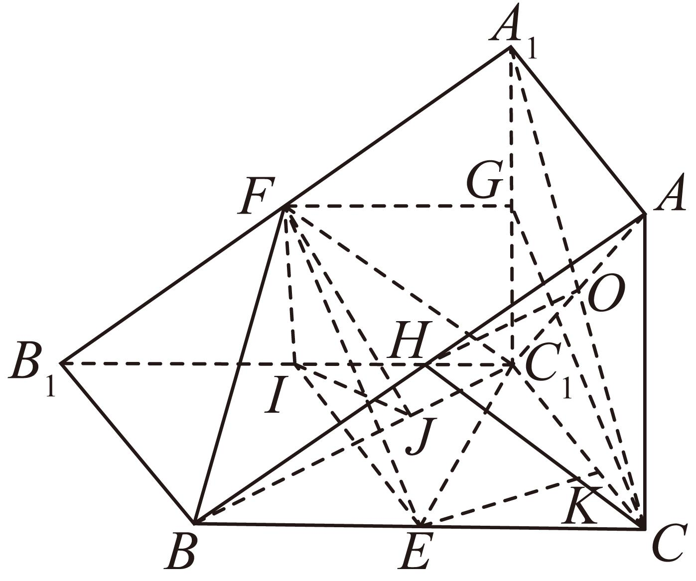

<strong>例12．</strong>（2024·全国·高三专题练习）如图，三棱锥中，，均为等边三角形，，<em>O</em>为<em>AB</em>中点，点<em>D</em>在<em>AC</em>上，满足，且面面<em>ABC．</em>

(1)证明：面*POD*；

(2)若点*E*为*PB*中点，问：直线*AC*上是否存在点*F*，使得面*POD*，若存在，求出*FC*的长及*EF*到面*POD*的距离；若不存在，说明理由．

【解析】（1）由条件、为等边三角形，为的中点，

则，，，

由余弦定理得

从而在中，，

得为直角三角形，且，

又面面，面面，且，面,

则由面面垂直的性质定理可得面

由面，

因此由，，，面，即面*POD.*

（2）存在*AC*上的点*F*，使得面

点*E*为*PB*中点，取的中点，可得，再在面内作交于点，该点即为满足题意的点（如图）．

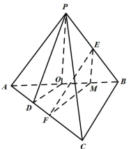

下面证明面面

由于，面，面，则面，

，面，面，则面，

面，面，，

则由面面平行的判定定理可得面面，面，因此面*POD*

又由于，从而可得，，，

由（1）可知，面，则面，即为面与面间的距离，也即到面的距离．

综上：存在上的点，使得面，，

到面的距离为．

<strong>变式24．</strong>（2024·广东河源·高三校联考开学考试）在长方体中，，，，为，的中点，在上，且.过，，三点的平面与长方体的六个面相交得到六边形，则点到直线的距离为_____.

【答案】

【解析】如图所示，在长方体中，连接,

因为，，，为，的中点，截面与平面，平面分别相交于直线，

所以，

所以，，，

所以，延长与的延长线交于,延长与相交于，连接，,

与的交点为， 与的交点为，

因为，所以，因为，，所以，

因为，为的中点，所以，

因为，所以，又，所以，同理，，在上取一点，使得，过作与垂直，垂足为，连接，,

由于平面，所以平面，平面，

故,又平面,

所以平面,平面,故，

且，因为

，，

所以，所以，所以.

故答案为：.

<strong>变式25．</strong>（2024·黑龙江·黑龙江实验中学校考二模）在圆台中，是其轴截面，，过与轴截面垂直的平面交下底面于，若点到平面的距离是，则圆台的体积等于______.

【答案】

【解析】∵，所以四边形为平行四边形，所以,则为正三角形∴，由题意得，平面平面平面，且平面平面，所以点到平面的距离即为与的距离，在中，过点作的垂线,过点作的垂线，则，

所以，则，则圆台的体积为，所以圆台的体积为.

故答案为：

<strong>变式26．</strong>（2024·全国·高三专题练习）如图，已知<em>AB</em>，<em>CM</em>分别为圆柱上、下底面的直径，且<em>AB</em>＝2，圆柱的高为，，则点<em>M</em>到平面<em>ABC</em>的距离为______.

【答案】

【解析】如图所示，连接*AM*，*BM*，设，*O*分别为上、下底面圆的圆心，连接*AO*，*BO*，.

因为，又，，则平面*ABO*，

则，

过*C*作垂直于圆柱上底面，垂足为，连接，，

则，，

设点*M*到平面*ABC*的距离为*d*，

则有，解得，

故点*M*到平面*ABC*的距离为.

故答案为：

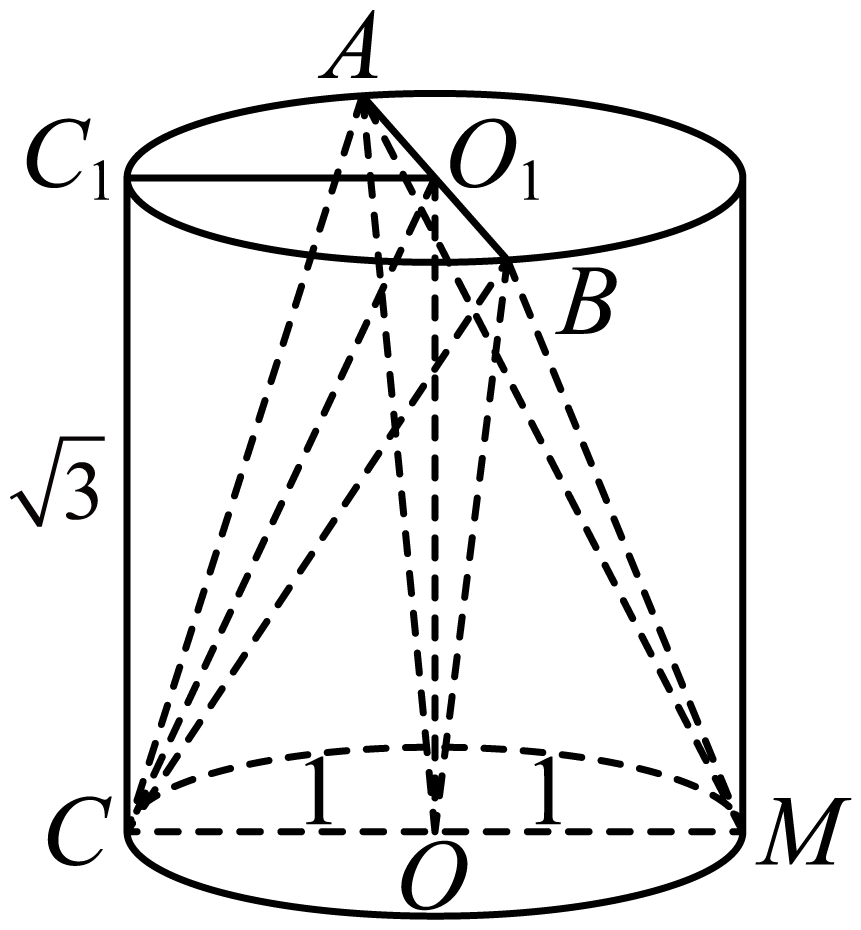

<strong>变式27．</strong>（2024·湖北武汉·高三武汉市黄陂区第一中学校考阶段练习）在四面体中，，与所在的直线间的距离为3，且与所成的角为，则四面体的体积为__________.

【答案】

【解析】如图所示，把三棱锥补成一个平行六面体，

其中为异面直线的公垂线，即且，

在平行六面体中，可得，所以，

又因为且平面，所以平面，

又由平面，所以点到平面的距离为，

因为且异面与所成的角为，即与所成的角为

又因为，

则，

即四面体的体积为.

故答案为：.

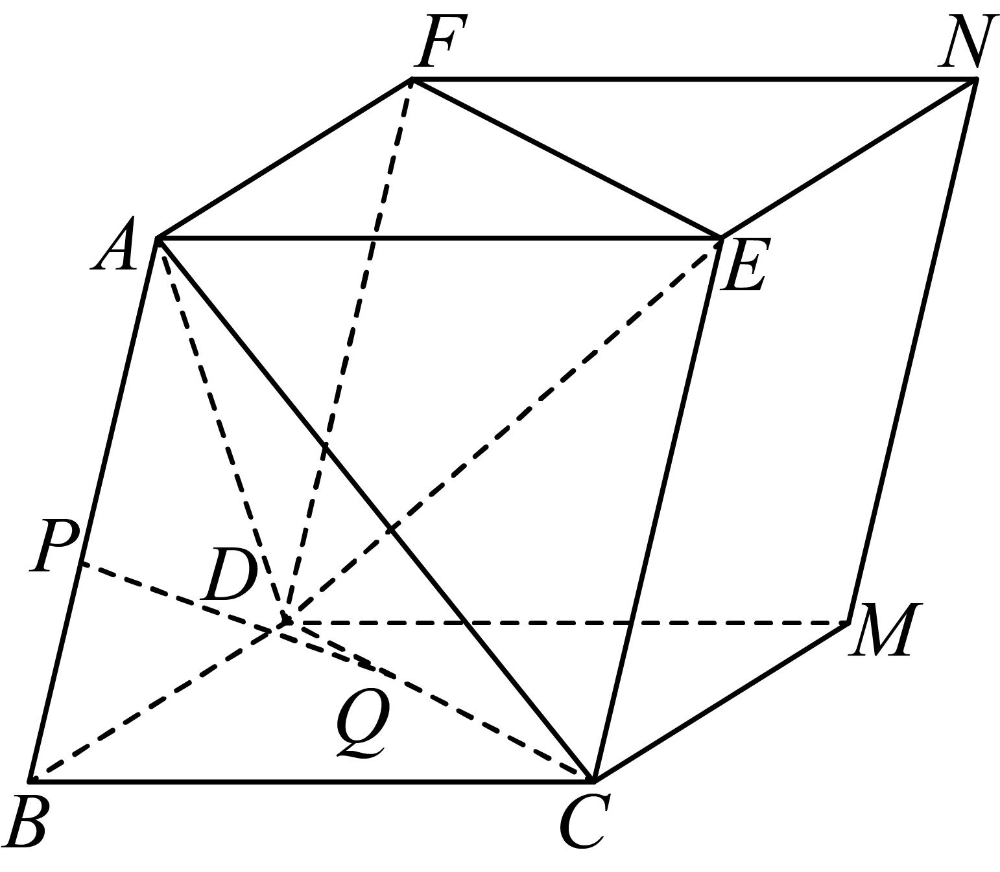

<strong>变式28．</strong>（2024·浙江绍兴·高三统考开学考试）在正三棱锥中，，设分别是棱的中点，是三棱锥的外接球的球心，若，则到平面的距离为__________.

【答案】/

【解析】设是的中点，连接，

由于，所以，

由于平面，所以平面，

由于平面，所以，

由于分别是的中点，所以，

由于，所以，

由于平面，所以平面，

由于平面，所以，

根据正四棱锥的性质可知两两相互垂直，且，

所以可将正三棱锥补形成正方体如下图所示，

正三棱锥的外接球也即是正方体的外接球，设外接球的半径为，

由于，所以，

，设等边三角形的外接圆半径为，

则，

所以外接球的球心到平面的距离为.

故答案为：

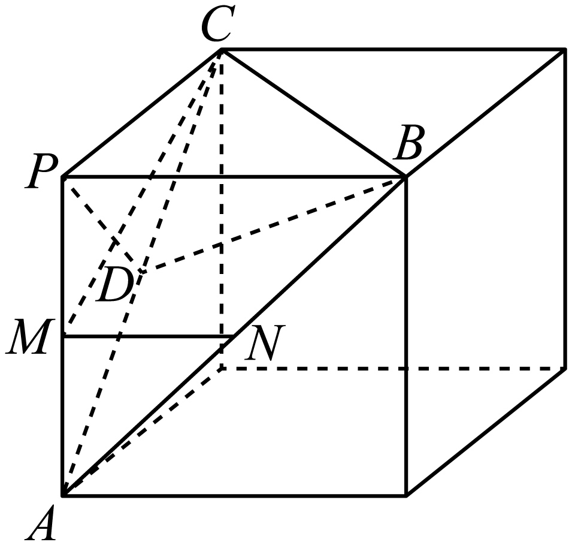

<strong>变式29．</strong>（2024·全国·高三对口高考）已知线段，且与平面的距离为4，点是平面上的动点，且满足，若，则线段长度的取值范围是________．

【答案】

【解析】∵，将线段*AD*投影到平面上得到射影，则、垂直于平面，又平面，∴.

与平面的距离即，，则动点*B*的轨迹是以为圆心，半径的圆，

，，即，又，所以，即．

故答案为：

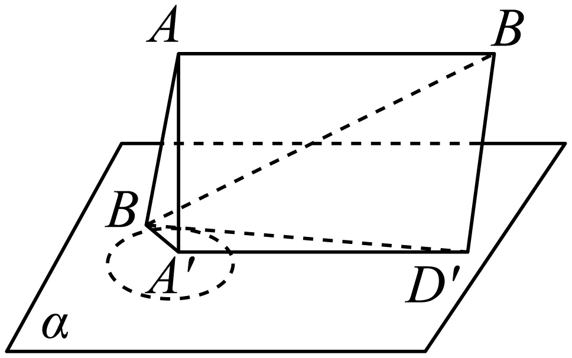

<strong>变式30．</strong>（2024·全国·高三专题练习）已知∠<em>ACB=</em>90°，<em>P</em>为平面<em>ABC</em>外一点，<em>PC</em>=4，点<em>P</em>到∠<em>ACB</em>两边<em>AC</em>，<em>BC</em>的距离均为，那么点<em>P</em>到平面<em>ABC</em>的距离为___________.

【答案】

【解析】设在平面内的射影为，则平面，

由于平面，所以，

过作，垂足分别为，

由于，所以四边形是矩形.

由于平面，所以平面，

平面，所以；同理可证得.

所以，，

，即到平面的距离是.

故答案为：

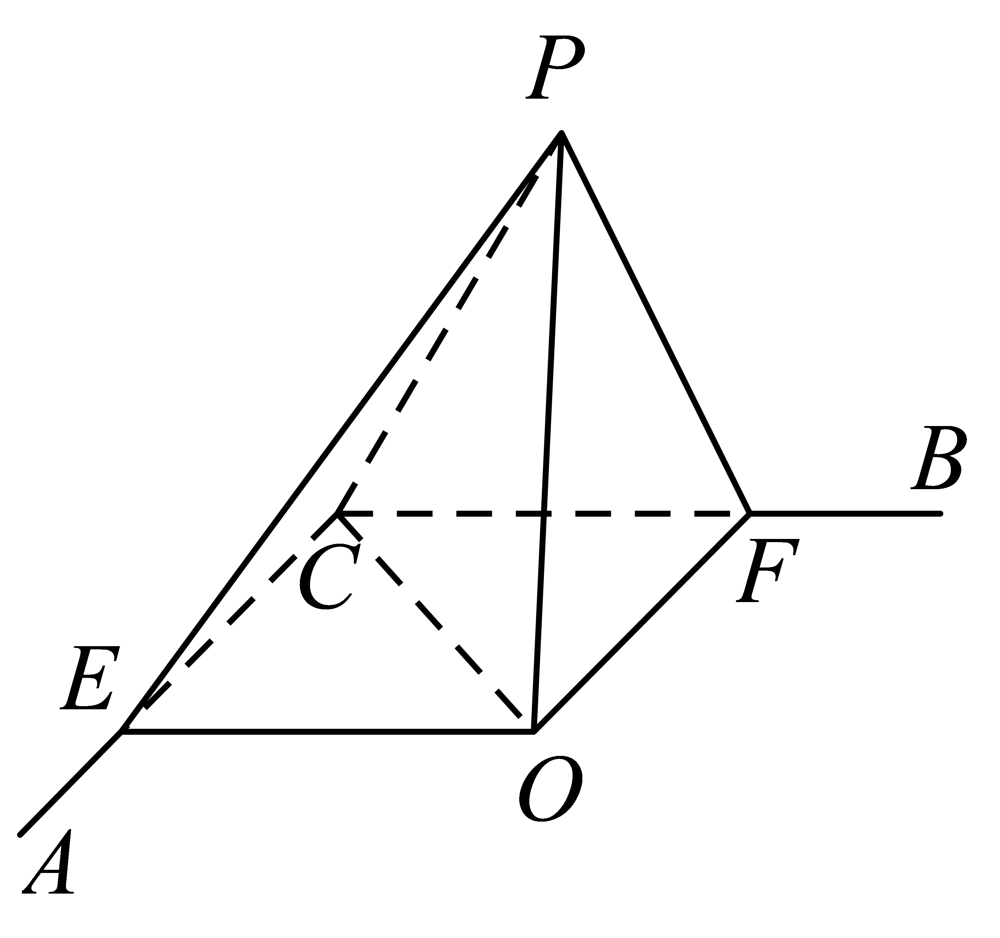

<strong>变式31．</strong>（2024·安徽滁州·校联考二模）已知两平行平面间的距离为，点，点，且，若异面直线与所成角为60°，则四面体的体积为__________．

【答案】6

【解析】设平面ABC与平面交线为CE，取 ,则

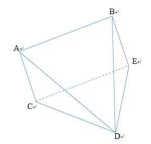

