**第55讲  立体几何中的压轴小题**

**必考题型全归纳**

**题型一：球与截面面积问题**

<strong>例1．</strong>（2024·湖南长沙·高二长郡中学校考开学考试）已知三棱锥的四个顶点在球<em>O</em>的球面上，，是边长为的正三角形，，，，过点<em>E</em>作球<em>O</em>的截面，截面面积最小值为（    ）

A．	B．	C．	D．

【答案】A

【解析】∵，为边长为的等边三角形，∴为正三棱锥，

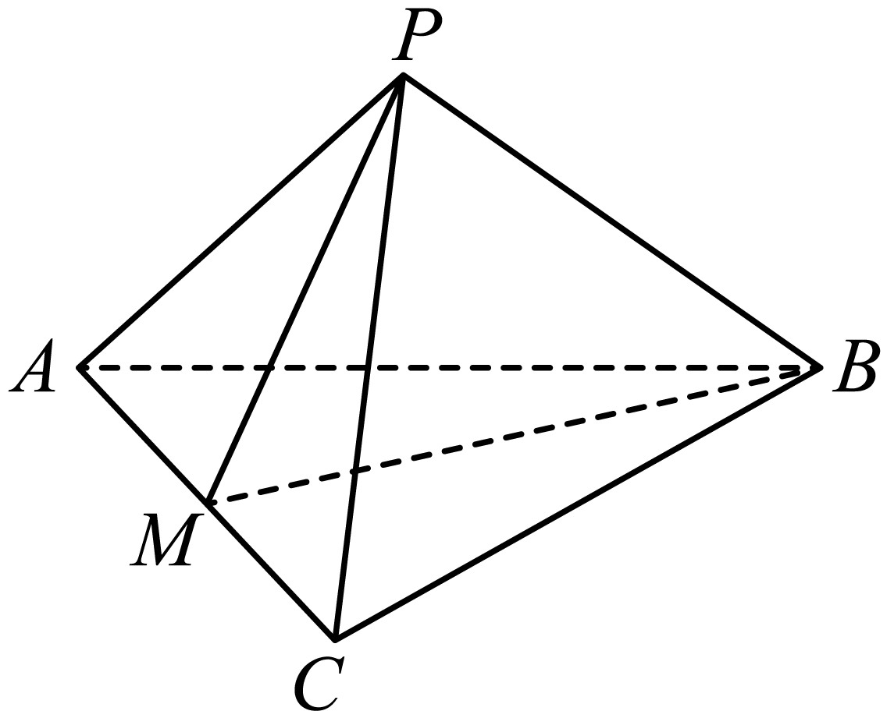

取的中点，连接，则，，

平面，所以平面，平面，所以，

又，，∴，∴，又，，

平面*PAC*，∴平面*PAC*，平面*PAC*，

∴，∴，

∴为正方体的一部分，

可得外接球的半径为，

取的中点，连接，

可得，，所以，

过点*E*作球*O*的截面，设截面与棱的交点分别为，

当*OE*垂直时截面面积最小，此时即为截面圆的圆心，

截面圆半径为，截面面积为.

故选：A．

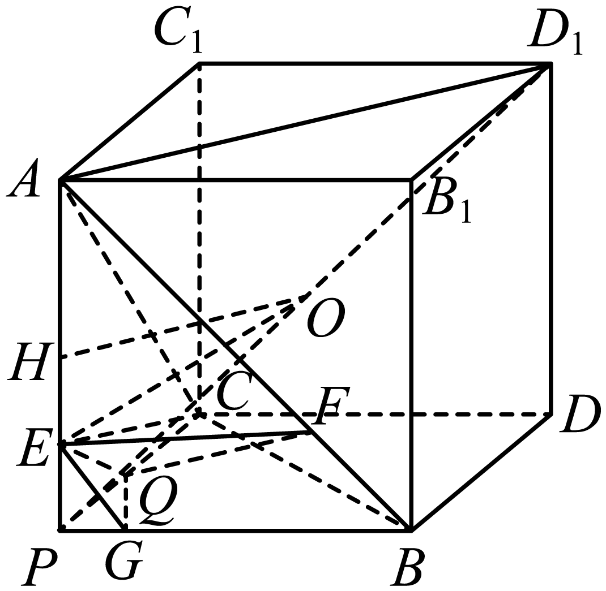

<strong>例2．</strong>（2024·四川绵阳·高三绵阳南山中学实验学校校考阶段练习）四面体<em>ABCD</em>的四个顶点都在球的球面上，，，点<em>E</em>，<em>F</em>，<em>G</em>分别为棱<em>BC</em>，<em>CD</em>，<em>AD</em>的中点，现有如下结论：①过点<em>E</em>，<em>F</em>，<em>G</em>作四面体<em>ABCD</em>的截面，则该截面的面积为2；②四面体<em>ABCD</em>的体积为；③过作球的截面，则截面面积的最大值与最小值的比为5：4.则上述说法正确的个数是（    ）

A．0	B．1	C．2	D．3

【答案】C

【解析】选项①中，如图（1）所示，找的中点，过点*E*，*F*，*G*做四面体*ABCD*的截面即为面，

则,，所以四边形为平行四边形，

找的中点,连接，因为，所以平面，

所以平面，平面，

所以，所以，

所以四边形为矩形，，，

所以截面的面积，故①正确；

选项②中，中，由勾股定理得：，

同理，过点作,则，所以由勾股定理得：，

所以，

由选项①可得：平面,

所以，，故②错误；

选项③中，可以将四面体放入如图（2）所示的长方体中，由题可求得，，

所以外接球的半径，截面面积的最大值为；平面截得的面积为最小面积，

半径，截面积最小为，所以截面面积的最大值与最小值的比为5：4，故③正确.

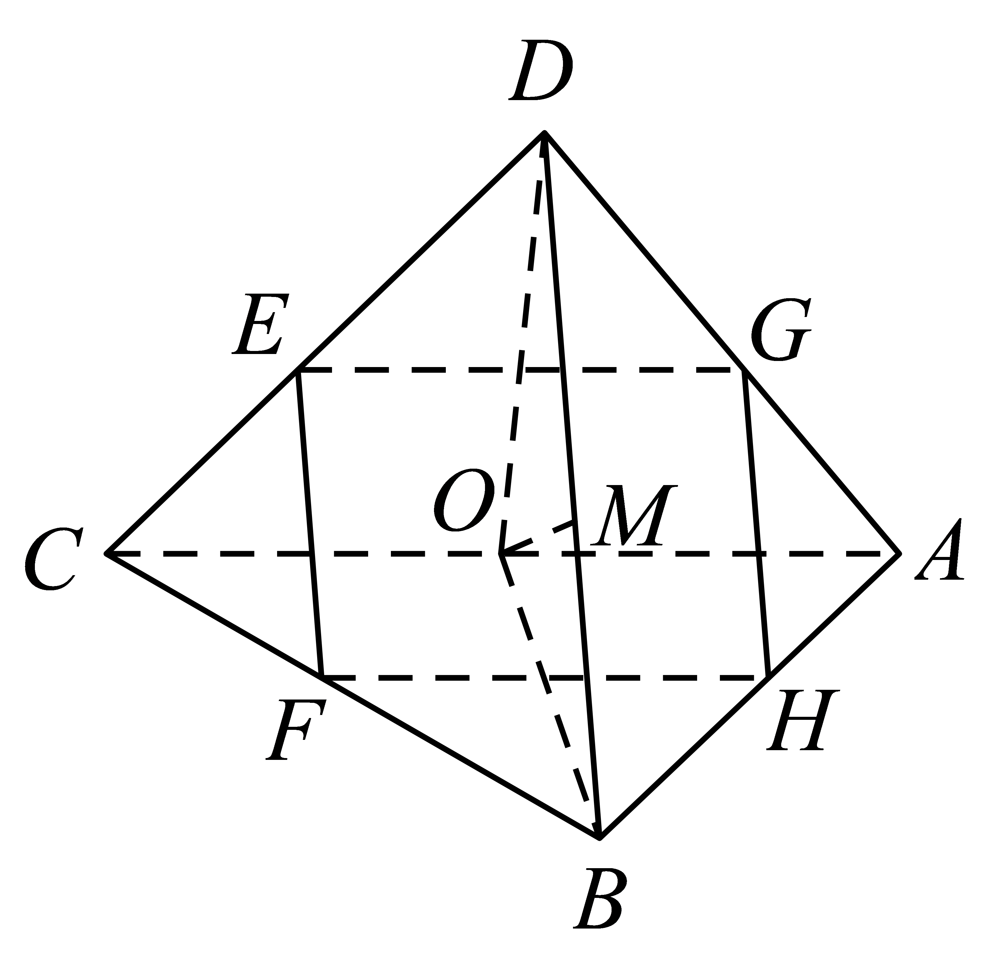  
图（1）

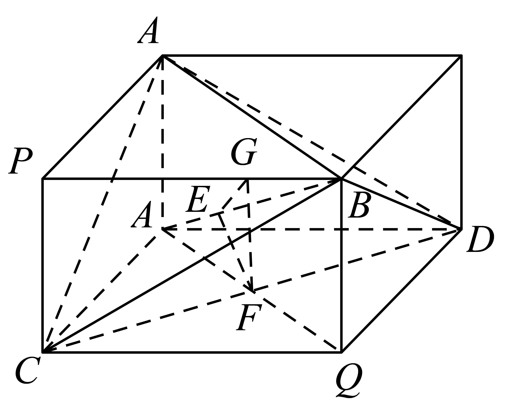  
图（2）

**例3．**（2024·四川内江·四川省内江市第六中学校考模拟预测）已知球是正三棱锥（底面是正三角形，顶点在底面的射影为底面中心）的外接球，，，点是线段的中点，过点作球的截面，则所得截面面积的最小值是（    ）

A．	B．	C．	D．

【答案】A

【解析】如图，是*A*在底面的射影，

由正弦定理得，的外接圆半径，

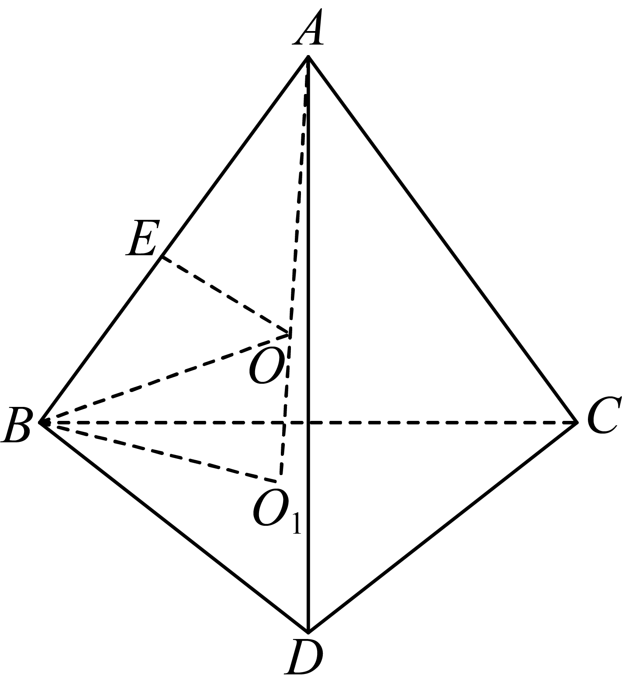

由勾股定理得棱锥的高，

设球*O*的半径为*R*，则即，解得，

所以，即点*O*与重合，

在中，点是线段的中点，，

所以，当截面垂直于*OE*时，截面面积最小，

此时半径为，截面面积为.

故选：A

**变式1．**（2024·宁夏银川·校联考二模）2022年第三十二届足球世界杯在卡塔尔举行，第一届世界杯是1930年举办的，而早在战国中期，中国就有过类似的体育运动项目：蹴鞠，又名蹴球，蹴圆，筑球，踢圆等，蹴有用脚蹴、踢、蹋的含义，鞠最早系外包皮革、内实米糠的球．因而蹴鞠就是指古人以脚蹴、蹋、踢皮球的活动，类似于今日的足球．2006年5月20日，蹴鞠作为非物质文化遗产经国务院批准已列入第一批国家非物质文化遗产名录．已知半径为的某鞠（球）的表面上有四个点，，，，，，，则该鞠（球）被平面所截的截面圆面积为（    ）

A．	B．	C．	D．

【答案】D

【解析】因为三棱锥的外接球的半径，而，所以为外接球的直径，

如图，将三棱锥放入如图所示的长方体，则，

设长方体的另一棱长为，所以，解得，即，

设外接球的球心为，所以，，

设的外接圆的半径为，则，

则，

所以，则，

所以该鞠（球）被平面所截的截面圆面积．

故选：D

**变式2．**（2024·全国·高三专题练习）在正方体中，分别为的中点，该正方体的外接球为球，则平面截球得到的截面圆的面积为（    ）

A．	B．	C．	D．

【答案】D

【解析】如图，连接，由题意易知，

，故四边形为平行四边形.

设，取的中点，连接，

在Rt中，，

故点到的距离为，故点到的距离为，

因此圆心到平面的距离为.由题易知球的半径，

故平面截球得到的截面圆的半径，故截面圆的面积.

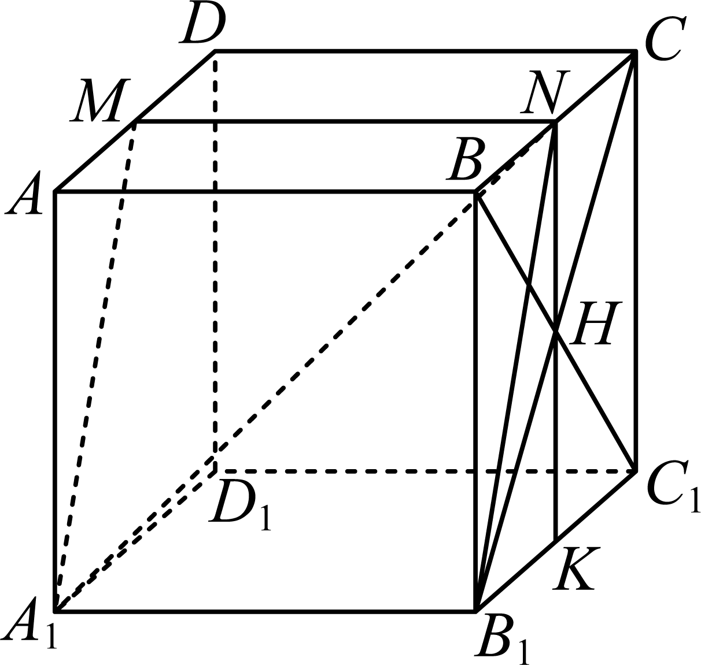

故选：D

<strong>变式3．</strong>（2024·四川遂宁·射洪中学校考模拟预测）已知球<em>O</em>内切于正方体，<em>P</em>，<em>Q</em>，<em>M</em>，<em>N</em>分别是的中点，则该正方体及其内切球被平面所截得的截面面积之比为（    ）

A．	B．	C．	D．

【答案】A

【解析】如图，易知正方体的内切球的球心*O*为的中点，

设球*O*切上下底面中心于点*E*，*F*，则球*O*的半径，

又易知球心*O*到平面的距离等于*E*到平面的距离，

设交于点*G*，则易证平面，

∴球心*O*到平面的距离，

设正方体的棱长为，

则，，

∴球*O*被平面所截的小圆半径，

∴球*O*被平面所截的小圆面积为，

又易知，，

∴该正方体被平面所截得的截面面积为，

∴该正方体及其内切球被平面所截得的截面面积之比为，

故选：A

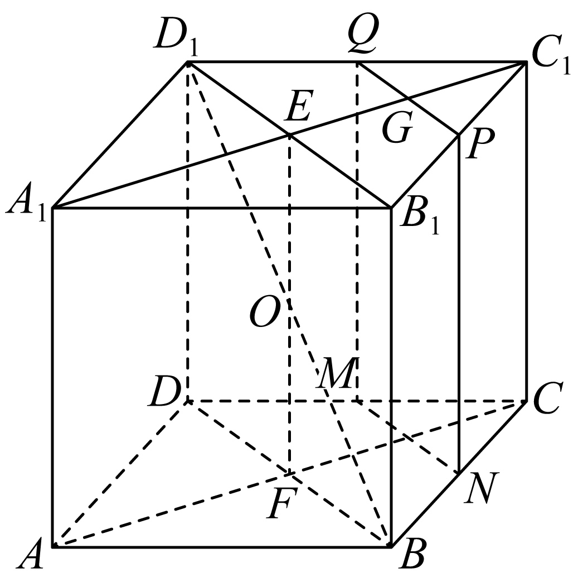

<strong>变式4．</strong>（2024·河南洛阳·高三校联考阶段练习）已知三棱锥<em>P</em>-<em>ABC</em>的棱长均为6，且四个顶点均在球心为<em>O</em>的球面上，点<em>E</em>在<em>AB</em>上，，过点<em>E</em>作球<em>O</em>的截面，则截面面积的最小值为（    ）

A．	B．	C．	D．

【答案】A

【解析】如图，因为三棱锥的棱长均为6，所以点*P*在平面*ABC*内的射影*H*是的中心，

取*BC*的中点*D*，连接*AD*，则点*H*在*AD*上，且，

所以，，，则．

设三棱锥*P*-*ABC*的外接球半径为*R*，则*OP*＝*OA*＝*R*，

在中，，解得．

因为，所以*AE*＝2，取*AB*的中点*F*，则*EF*＝1，且，

所以．

当过点*E*的球*O*的截面与*OE*垂直时，截面面积最小，

设截面圆的半径为*r*，则，

所以截面面积为．

故选：A．

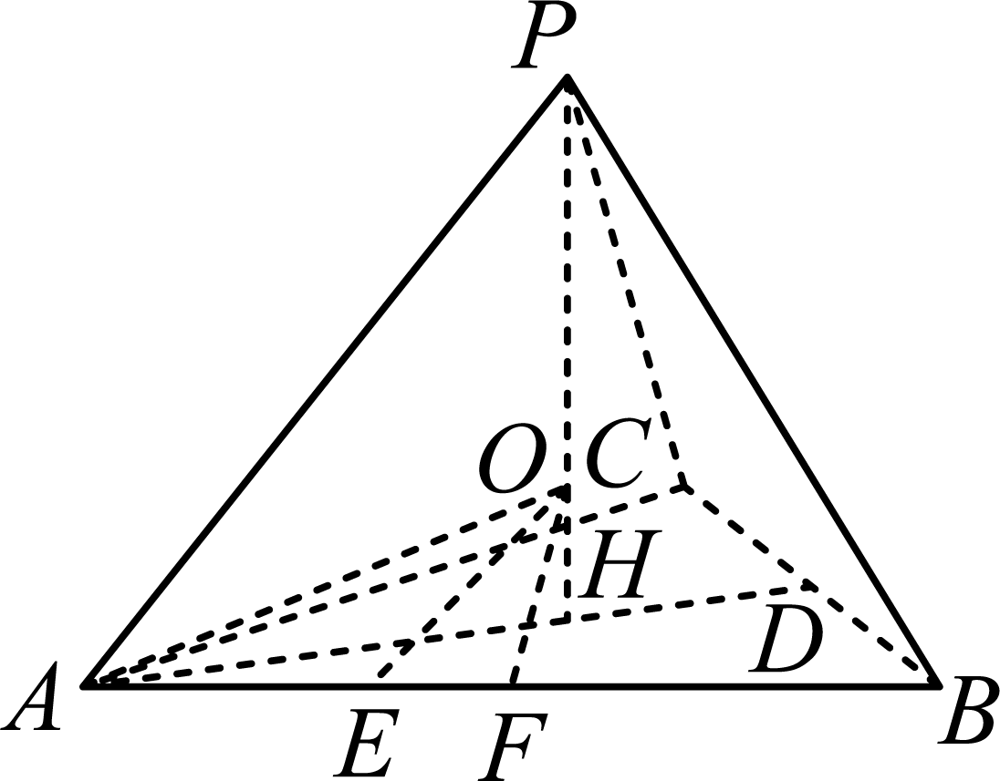

**题型二：体积、面积、周长、角度、距离定值问题**

**例4．**（2024·福建三明·高一校考阶段练习）如图，在正方体中，，，分别为，的中点，，分别为棱，上的动点，则三棱锥的体积（    ）

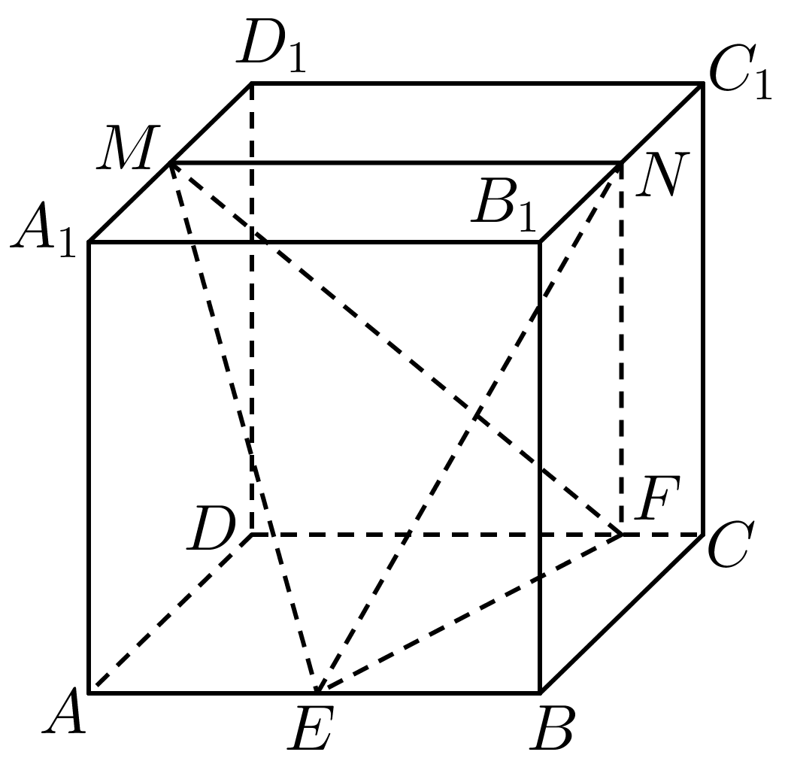

A．存在最大值，最大值为	B．存在最小值，最小值为

C．为定值	D．不确定，与，的位置有关

【答案】C

【解析】如下图，连接，在正方体中，，分别为，的中点，可得，，所以当在棱移动时，到平面的距离为定值，当在棱移动时，到的距离为定值，所以为定值，则三棱锥的体积为定值.平面即平面，作，由于，可得平面*MABN*，由，可得，而，.

故选：C.

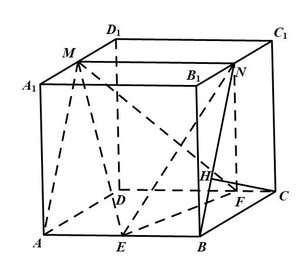

**例5．**（2024·四川成都·校考模拟预测）如图，在四棱柱中，底面为正方形，底面，，､分别是棱､上的动点，且，则下列结论中正确的是（    ）

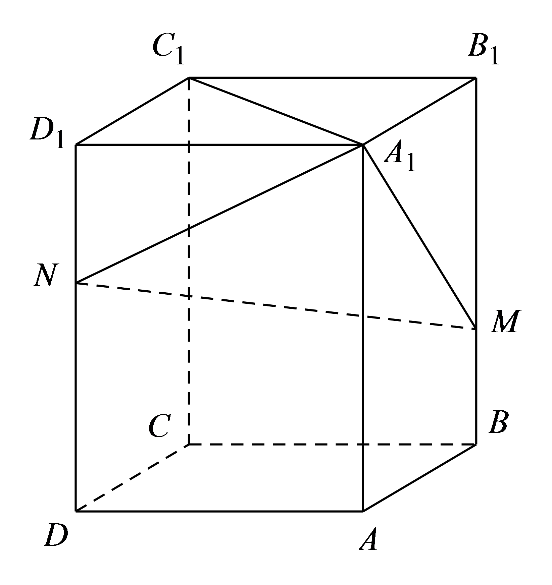

A．直线与直线可能异面

B．三棱锥的体积保持不变

C．直线与直线所成角的大小与点的位置有关

D．直线与直线所成角的最大值为

【答案】B

【解析】连接*NC*，*MC*，因为四棱柱中，

，底面为正方形，底面

显然四边形为平行四边形，

所以直线与直线一定相交，A错误；

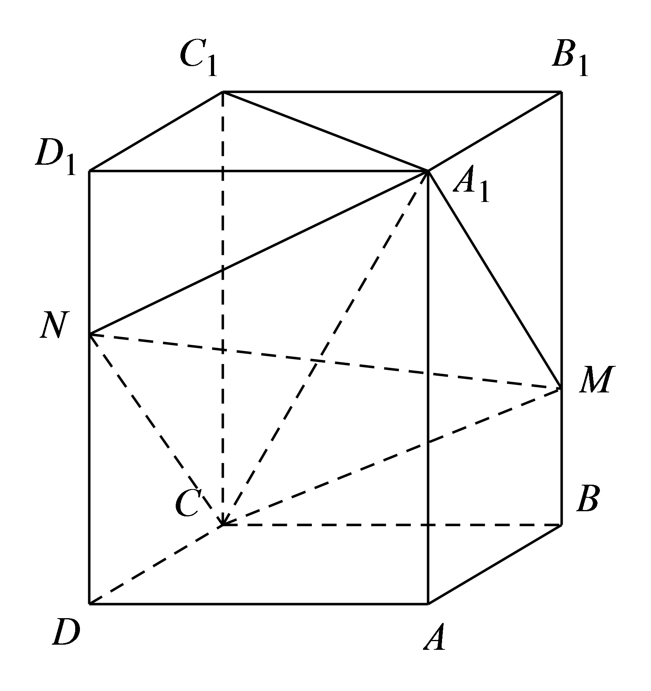

连接，取的中点*O*，连接*NO*，*MO*，

因为，，由三线合一可知：，，

因为，所以平面*MON*，

，

设四边形的面积为*S*，则为定值，

故为定值，

三棱锥的体积保持不变，B正确；

连接*BD*，，

因为四边形*ABCD*为正方形，所以*AC*⊥*BD*，

又底面*ABCD*，平面*ABCD*，

所以，

因为，所以*AC*⊥，

因为*MN*平面，

所以*AC*⊥*MN*，

直线与直线所成角的大小与点的位置无关，C错误；

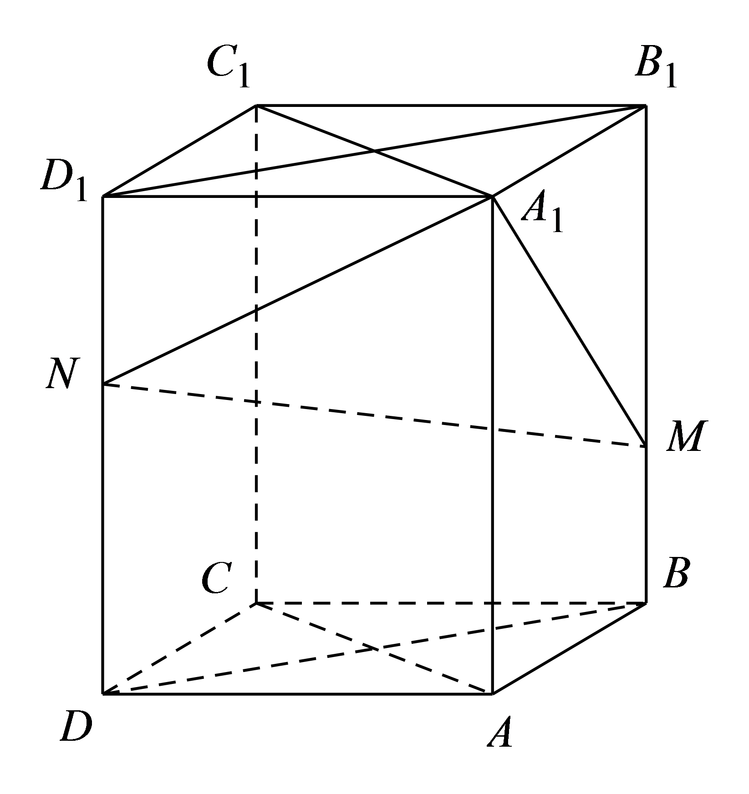

过点*N*作*NH*∥*AD*交于点*H*，连接*HM*，

则为直线与直线的夹角，且，

其中，其中为定值，

故要想直线与直线所成角的最大，只需*HM*最大，

设正方形边长为*a*，则*HN*=*a*，

显然当*N*与点重合，*M*与*B*重合时，*HM*最大，最大值为，

此时，故D错误.

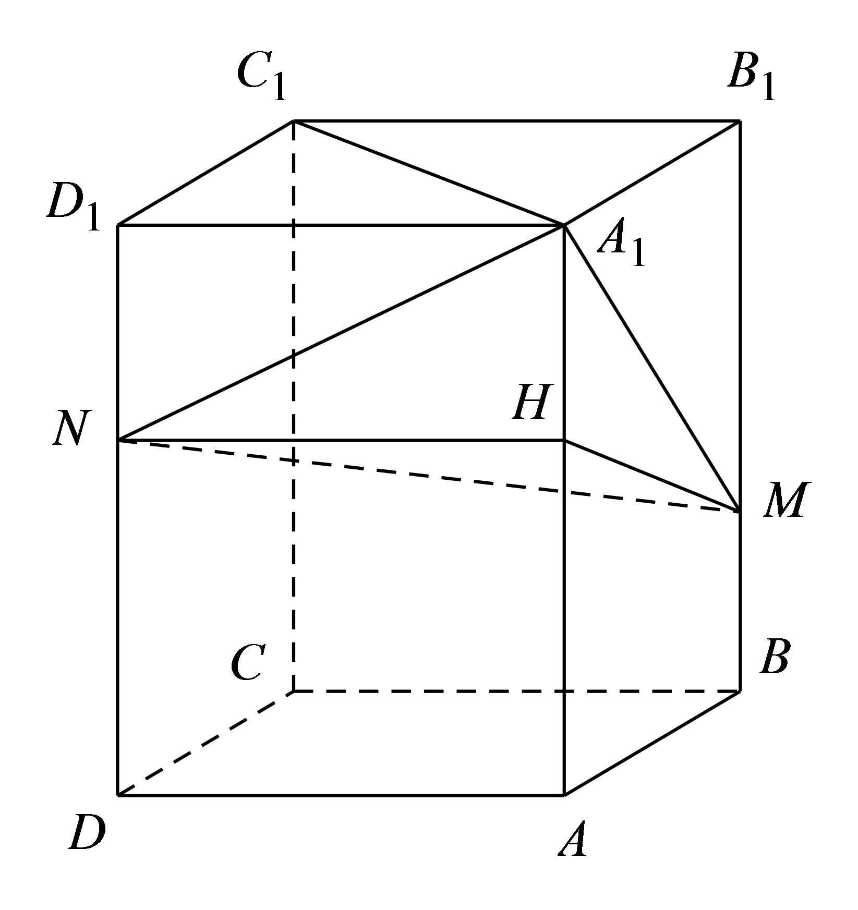

故选：B

**例6．（多选题）（2024·福建三明·统考三模）** 如图，正方体的棱长为，点是的中点，点是侧面内一动点，则下列结论正确的为（    ）

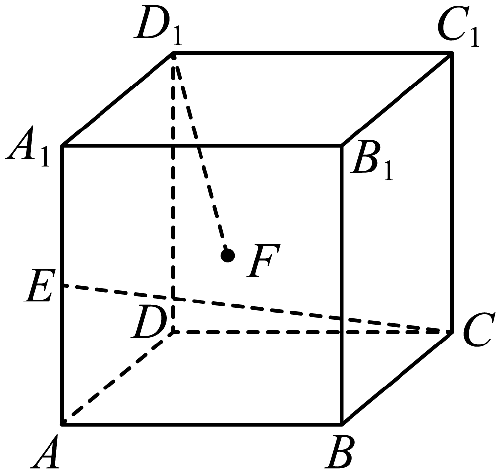

A．当在上时，三棱锥的体积为定值

B．与所成角正弦的最小值为

C．过作垂直于的平面截正方体所得截面图形的周长为

D．当时，面积的最小值为

【答案】ABD

【解析】对于A选项，连接、，如下图所示：

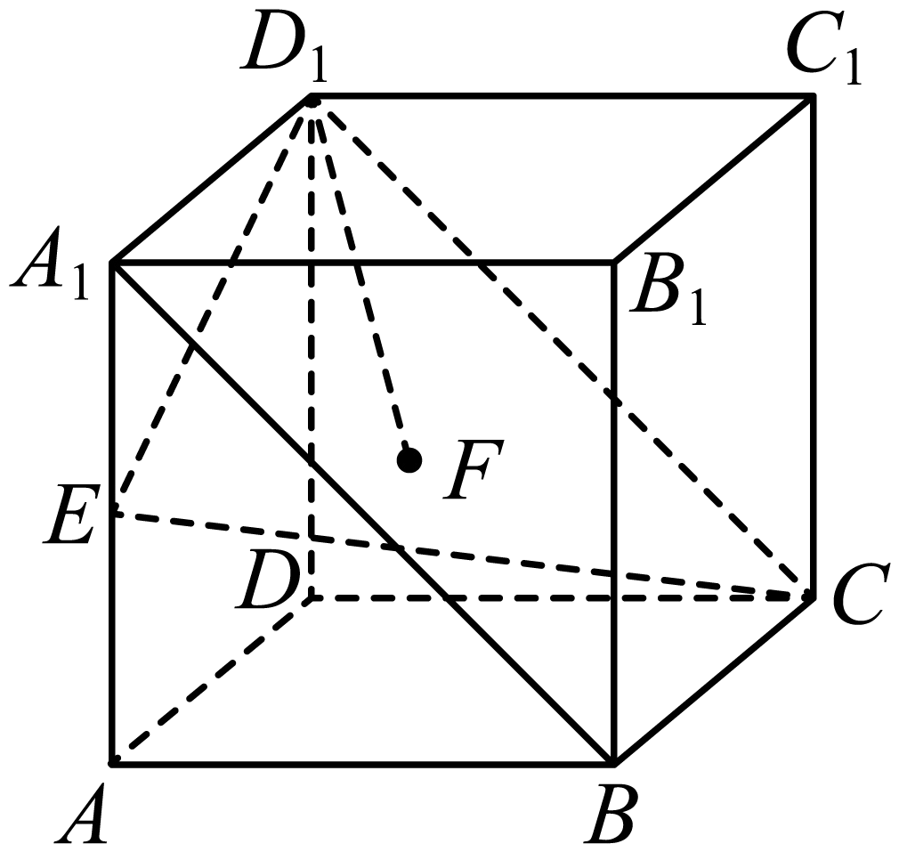

在正方体中，且，

故四边形为平行四边形，所以，，

因为平面，平面，所以，平面，

当在上时，点到平面的距离等于点到平面的距离，

所以，，A对；

对于B选项，连接，

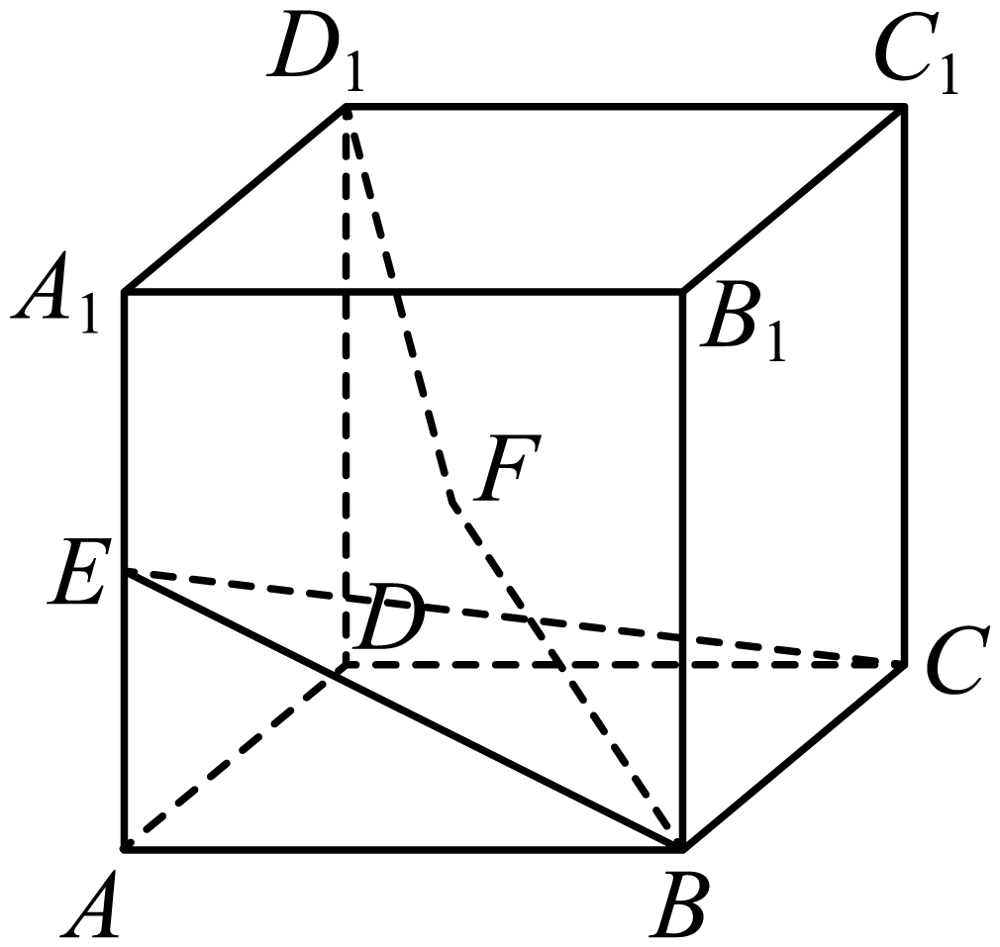

因为平面，所以，与所成的最小角为直线与平面所成的角，

因为平面，所以，与平面所成角为，

因为平面，所以，，

因为，，

所以，，

所以，，故与所成角正弦的最小值为，B对；

对于C选项，分别取线段、的中点、，连接、、、

、、、，

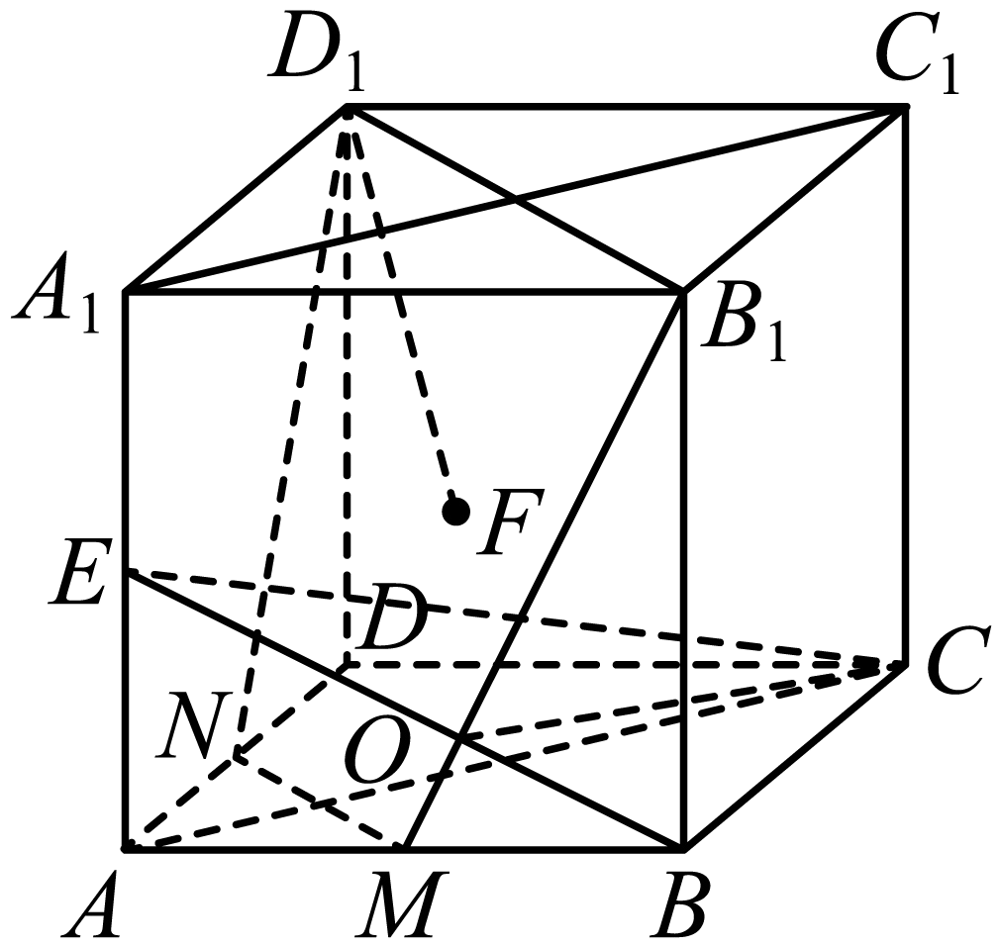

因为四边形为正方形，则，

又因为平面，平面，则，

因为，、平面，所以，平面，

因为平面，则，

在和中，，，，

所以，，则，

所以，，则，即，

因为平面，平面，则，

因为，、平面，所以，平面，

因为平面，所以，，

因为、分别为、的中点，则，

因为且，故四边形为平行四边形，所以，，

所以，，则、、、四点共面，

因为，，，、平面，

所以，平面，

过作垂直于的平面截正方体所得截面，则截面为梯形，

由勾股定理可得，

同理可得，，，

所以，截面周长为，C错；

对于D选项，由C选项可知，平面，则点的轨迹为线段，

因为平面，平面，则，

则，

当时，即当点与点重合时，的长取最小值，

此时，，

所以，，D对.

故选：ABD.

**变式5．（多选题）（2024·广东梅州·统考三模）** 已知正方体的棱长为2，为四边形的中心，为线段上的一个动点，为线段上一点，若三棱锥的体积为定值，则（    ）

A．	B．

C．	D．

【答案】BC

【解析】连接，交于点，连接，

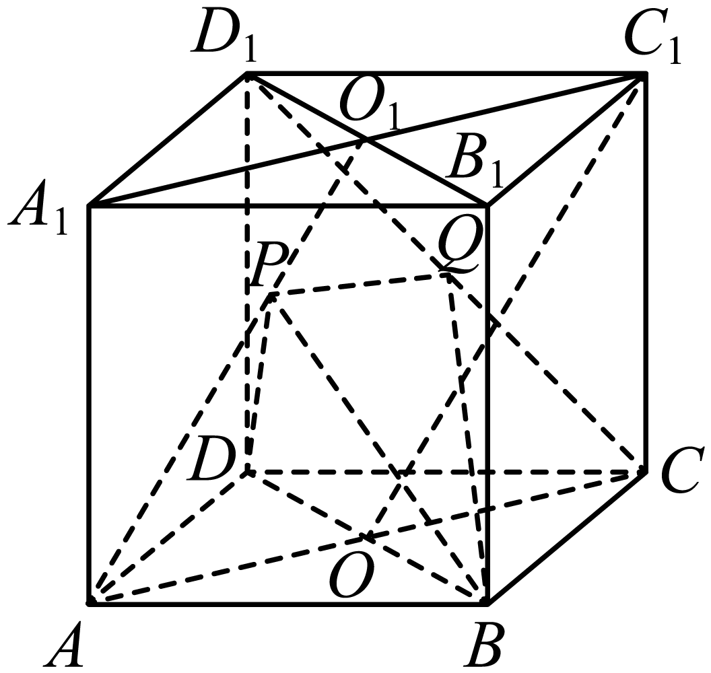

因为为四边形的中心，所以，

又平面，平面，所以平面，

因为三棱锥的体积等于三棱锥的体积，且为定值，

所以平面，所以平面与平面为同一平面，

所以为与的交点，所以，故A错误，B正确；

因为正方体的棱长为2，所以．故C正确，D错误．

故选：BC．

**变式6．（多选题）（2024·山西大同·高三统考阶段练习）** 如图，正方体的棱长为2，线段上有两个动点，且，以下结论正确的有（    ）

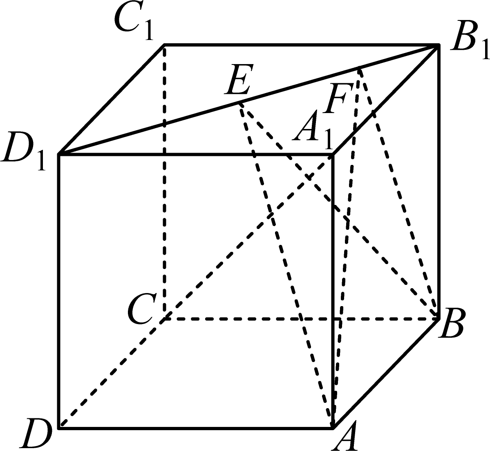

A．

B．

C．正方体的体积是三棱锥的体积的12倍

D．异面直线所成的角为定值

【答案】ABC

【解析】A：易知，，所以，正确；

B：建立如图空间直角坐标系，则，，，，，

所以，，，

所以，，即，，

因为，，平面，

所以平面，又平面，所以，正确;

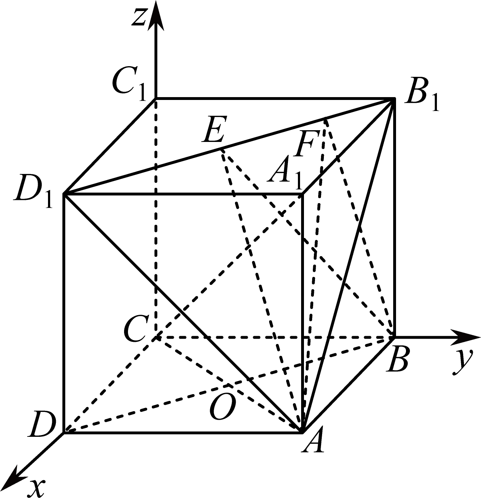

C：连接，交于，则，

因为平面，平面，所以，

又，、平面，所以平面，

所以，又，

所以正方体的体积是三棱锥的体积的12倍，正确;

D：当点在处，为的中点时，由正方体性质易知，异面直线所成的角是，

由面，面，则，正方形中显然，

，且、面，故面，面，

所以，故，

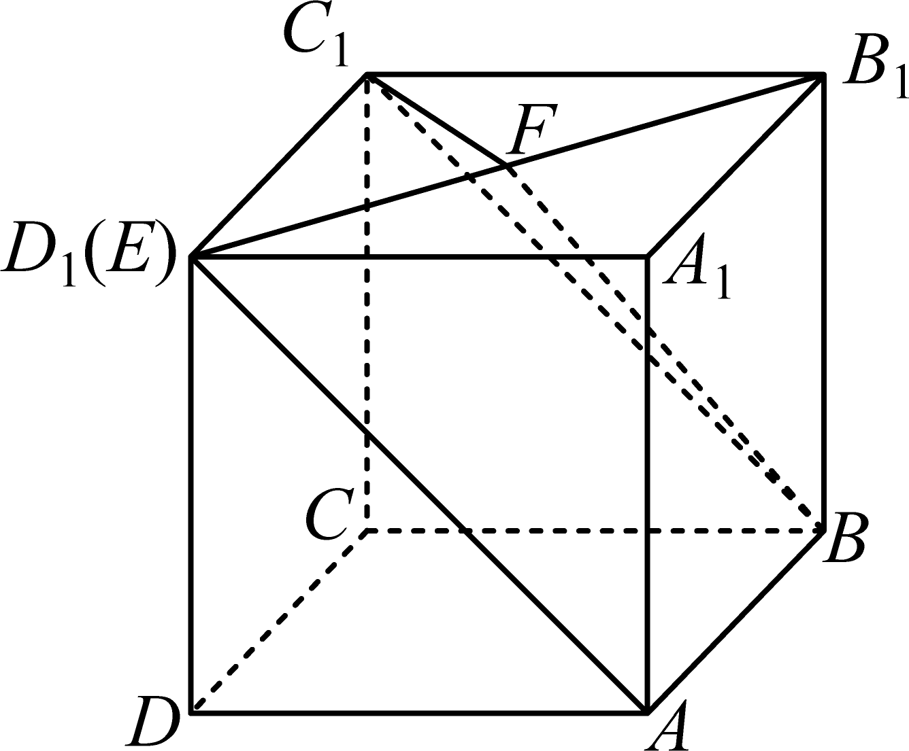

当在的中点时，在的位置，由正方体性质易知，异面直线所成的角是，

由面，面，则，故，

综上，，，即，即两个角不相等，错误.

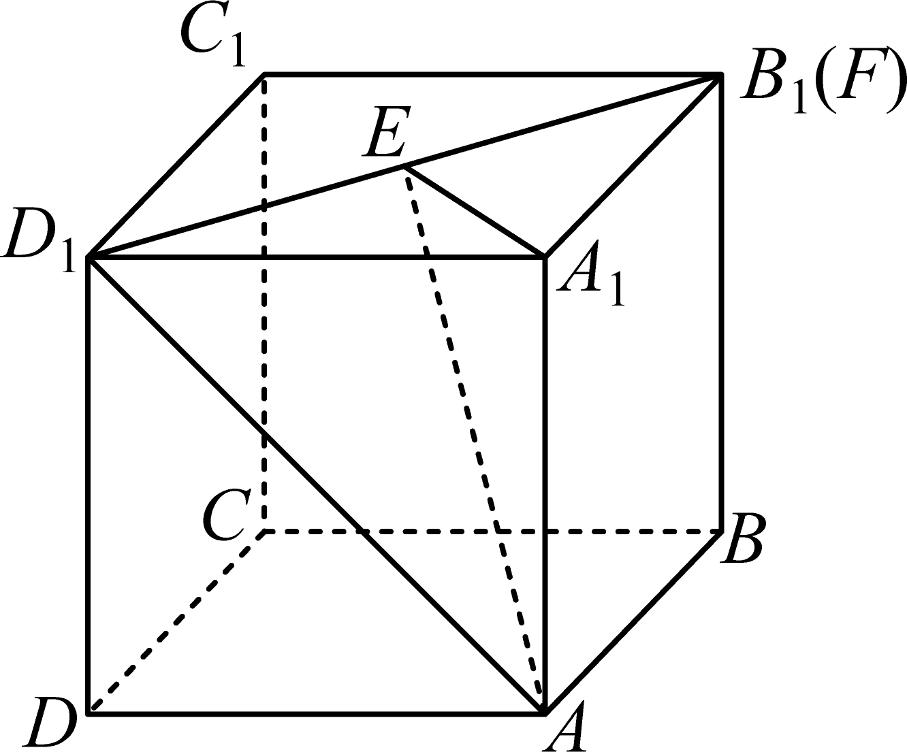

故选：ABC.

<strong>变式7．（多选题）（2024·广东深圳·高三红岭中学校考期末）</strong>已知正三棱柱<em>ABC</em>﹣<em>A1B1C1</em>的底面边长为1，<em>AA1</em>=1，点<em>P</em>满足，其中<em>λ</em>∈[0,1],<em>μ</em>∈[0,1]，下列选项正确的是（    ）

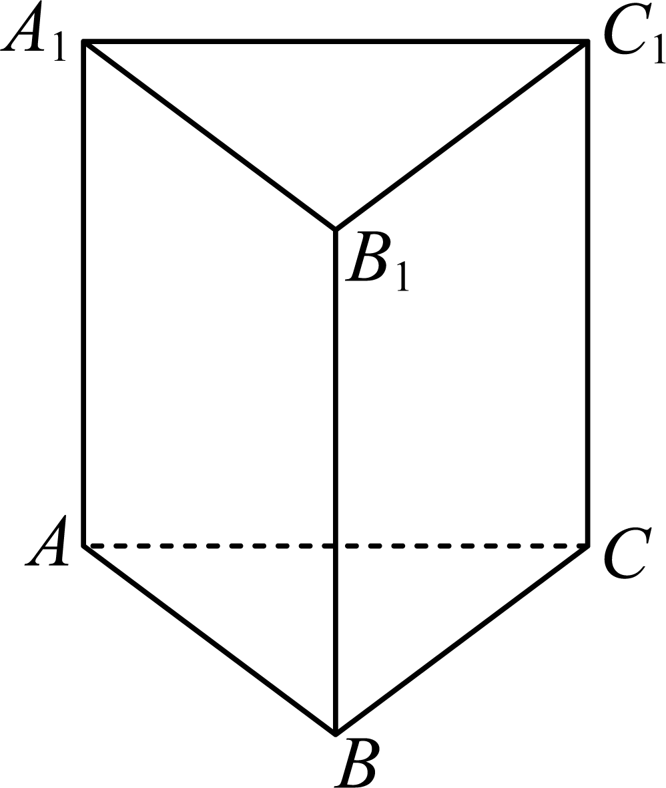

A．当<em>λ</em>=1时，△<em>AB1P</em>的周长为定值

B．当<em>μ</em>=1时，三棱锥<em>P</em>﹣<em>A1BC</em>的体积为定值

C．当时，有且仅有两个点<em>P</em>，使得<em>A1P</em>⊥<em>BP</em>

D．当时，有且仅有一个点<em>P</em>，使得<em>A1B</em>⊥平面<em>AB1P</em>

【答案】BCD

【解析】因为点*P*满足，其中，

所以点在矩形内部（含边界）．

对于A项，当时，．

即此时线段，

因为为变值，

故的周长不是定值，故A项错误；

对于B项，当时，，

故此时点的轨迹为线段，而，所以平面，

则点到平面的距离为定值，所以其体积为定值，故B项正确；

对于C项，当时，，

取，的中点分别为，，则，

所以点的轨迹为线段，

不妨建系解决，以方向为轴，方向为轴，方向为轴，

建立如图所示的空间直角坐标系，

则，，，

所以，，

，

所以或，故*H*，*Q*均满足，故C项正确；

对于D项，当时，，

取，的中点为*M*，*N*，，

所以点的轨迹为线段，

设，因为，

所以，，

所以，

此时点与重合，故D项正确．

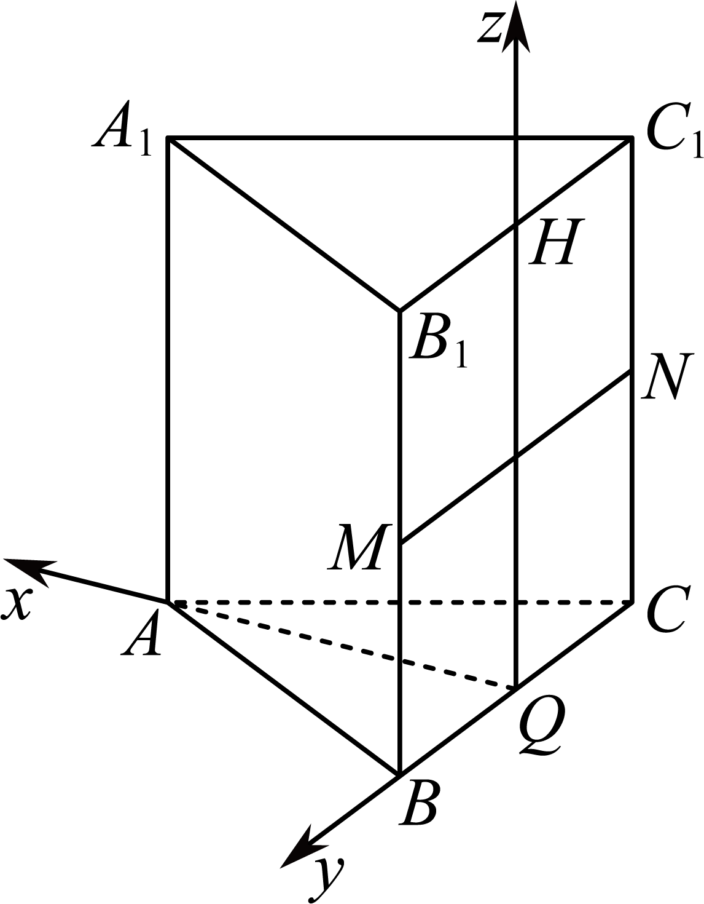

故选：BCD

**变式8．（多选题）（2024·福建厦门·统考模拟预测）** 如图，在棱长为1的正方体中，点满足，其中，则（    ）

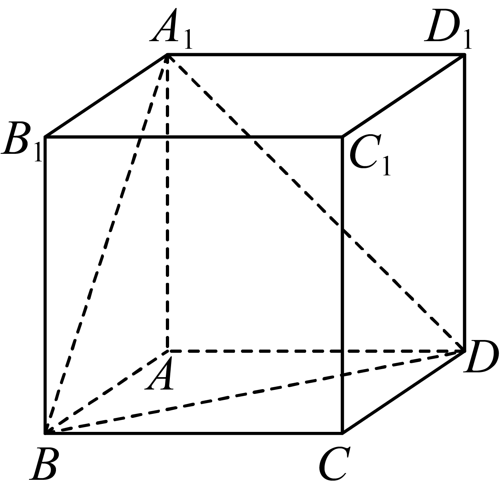

A．

B．当时，有且仅有一个点，使得平面

C．当时，有且仅有一个点，使得

D．当时，三棱锥的体积为定值

【答案】AD

【解析】如图建立空间直角坐标系，

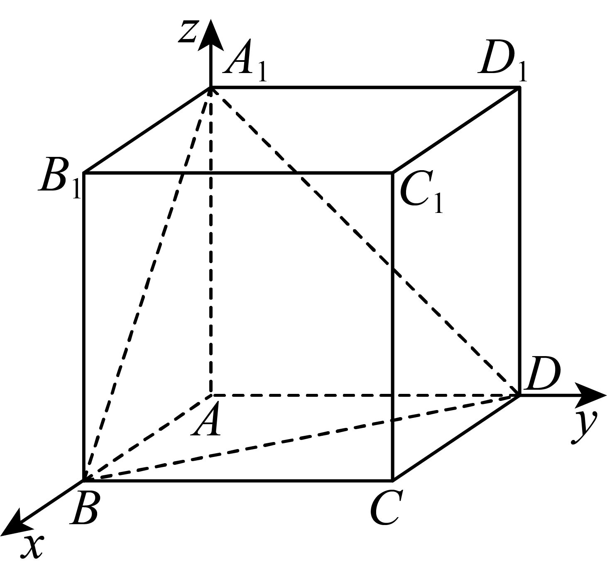

则

因为，，所以

所以，

对于选项A，则，所以，

因为，所以，故A答案正确；

对于选项B，

当时，，,设面的法向量为，

则，令，所以，

若平面，则，无解，所以不存在点，使得平面,故选项B错误；

对于选项C，当时，,

若，则，，无解，所以不存在点，使得，故C错误；

对于选项D，为边长为的等边三角形，所以,

点*P*到平面的距离为，当时，

点*P*到平面的距离为定值，则三棱锥的体积为定值，故D选项正确.

故选：AD.

<strong>变式9．（多选题）（2024·湖南·校联考模拟预测）</strong>如图，为正方体.任作平面与对角线垂直，使得与正方体的每个面都有公共点，记这样得到的截面多边形的面积为<em>S，</em>周长为<em>l</em>.则（    ）

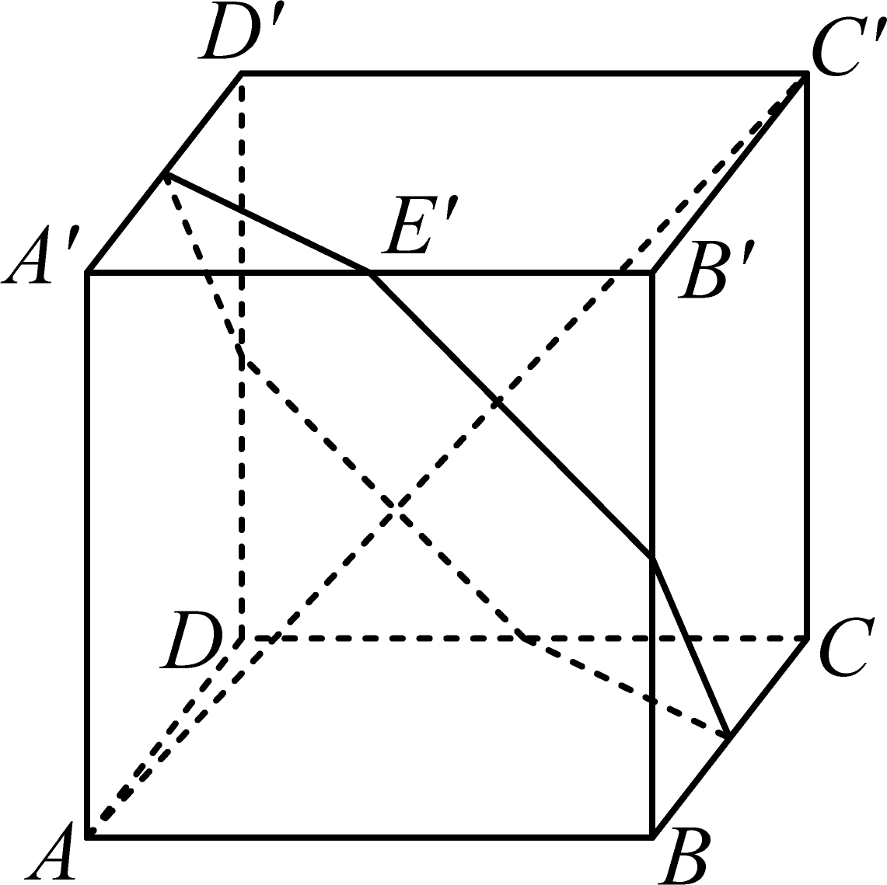

A．*S*为定值	B．*S*不为定值	C．*l*为定值	D．*l*不为定值

【答案】BC

【解析】将正方体切去两个正三棱锥与后，得到一个以平行平面与为上、下底面的几何体*V*，

在上取一点，作，，再作，，，

则六边形即为平面，

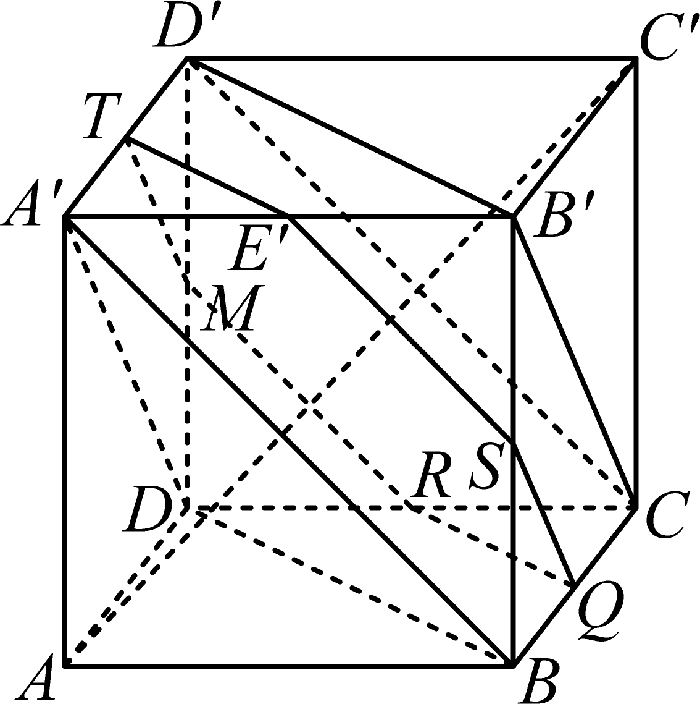

*V*的每个侧面都是等腰直角三角形，截面多边形*W*的每一条边分别与*V*的底面上的一条边平行，

将*V*的侧面沿棱剪开，展平在一张平面上，得到一个平行四边形，

而多边形*W*的周界展开后便成为一条与平行的线段（如图中），显然，故为定值.

当位于中点时，多边形*W*为正六边形，而当移至处时，*W*为正三角形，

易知周长为定值的正六边形与正三角形面积分别为与，故*S*不为定值.

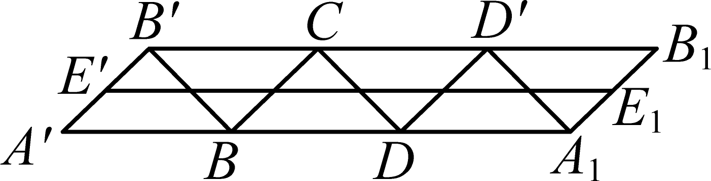

故选：BC

**变式10．（多选题）（2024·重庆沙坪坝·重庆南开中学校考模拟预测）** 已知三棱锥，，为棱上一点，且，过点作平行于直线和的平面，分别交棱于．下列说法正确的是（    ）

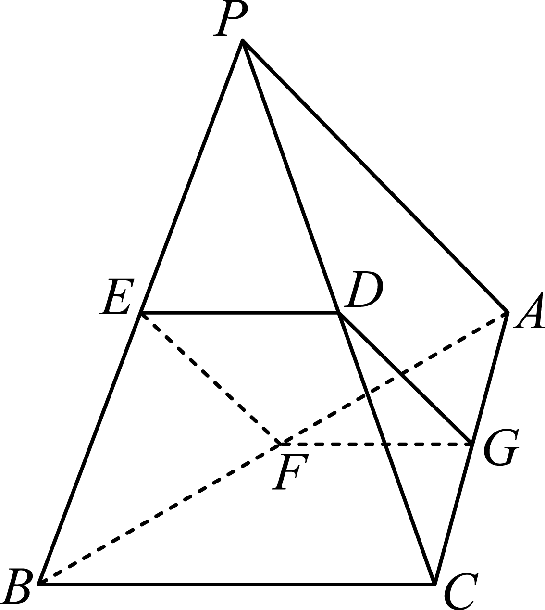

A．四边形为矩形

B．四边形的周长为定值

C．四边形的面积为定值

D．当时，平面分三棱锥所得的两部分体积相等

【答案】ABD

【解析】取的中点，连，

因为，，所以，，

因为，平面，

所以平面，因为平面，所以，

因为，平面，平面，

所以，同理可得，，，

又因为，所以，，，，

所以四边形为矩形，故A正确；

因为，，

所以，因为，所以，所以，同理可得，

所以四边形的周长为为定值，故B正确；

四边形的面积为不是定值，故C不正确；

当时，分别为棱的中点，

多面体的体积为，

多面体的体积为，

因为，，

多面体的体积等于多面体的体积，即平面分三棱锥所得的两部分体积相等，故D正确.

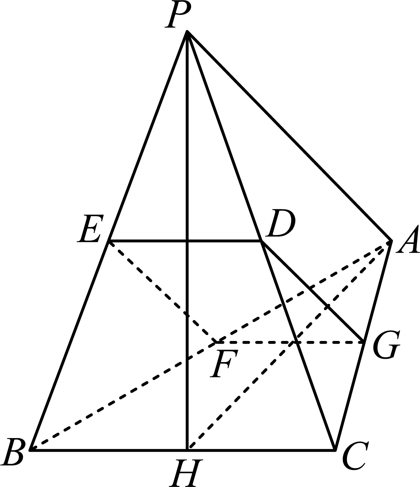

故选：ABD

<strong>变式11．（多选题）（2024·重庆·统考模拟预测）</strong>在正方体中，点<em>P</em>满足，其中，，则下列说法正确的是（    ）

A．当时，平面

B．当时，三棱锥的体积为定值

C．当时，△*PBD*的面积为定值

D．当时，直线与所成角的取值范围为

【答案】ABD

【解析】对于A选项，如下图，当时，点在面对角线上运动，

又平面，所以平面，

在正方体中，且，则四边形为平行四边形，

所以，，平面，平面，平面，

同理可证平面，

，所以，平面平面，

平面，所以，平面，A正确；

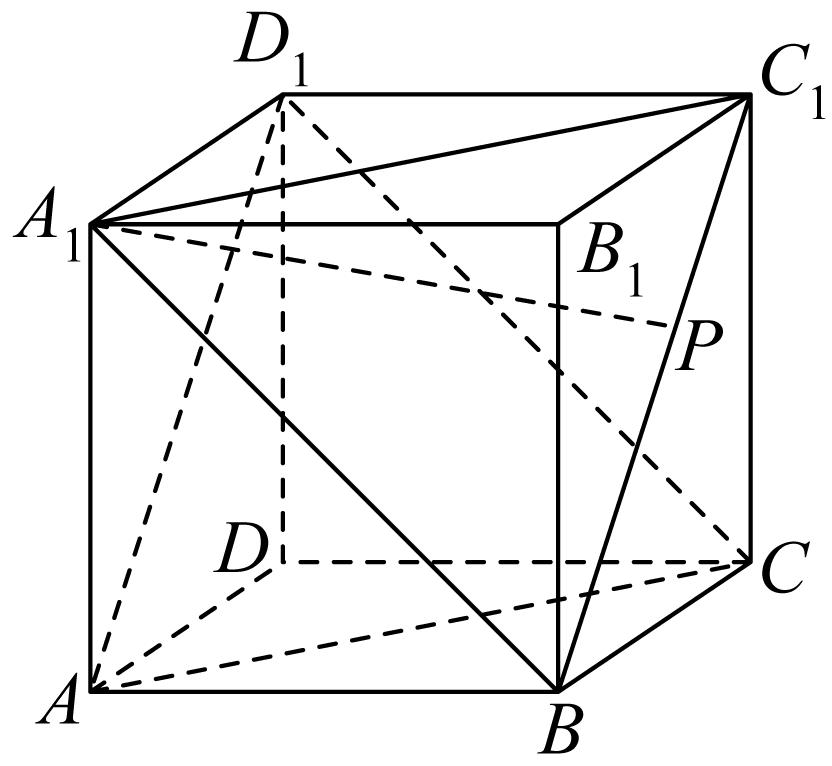

对于B选项，当时，如下图，点在棱上运动，

三棱锥的体积为定值，B正确；

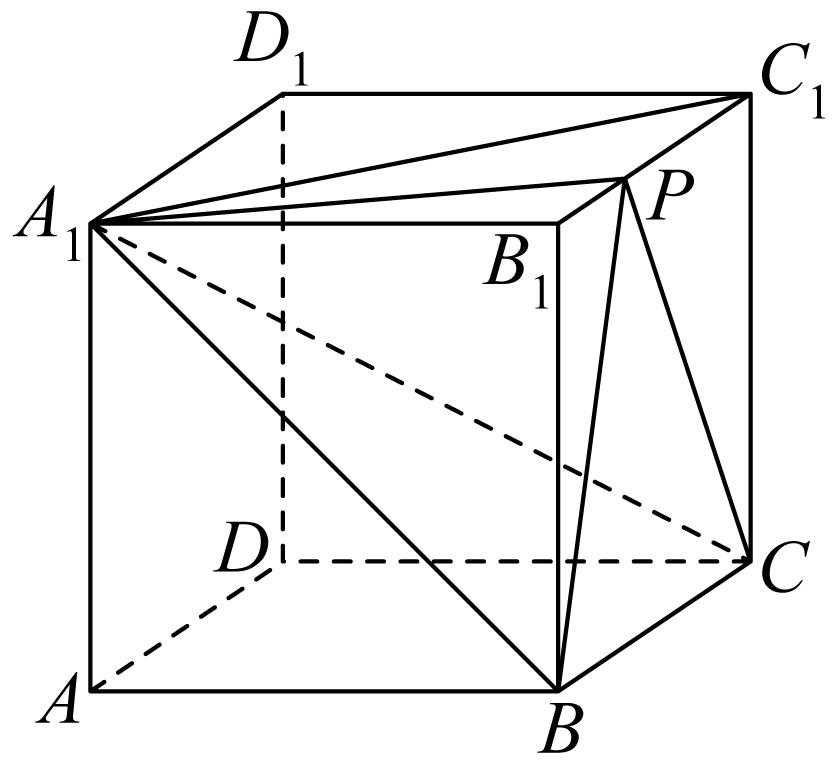

对于C选项，当时，如图，点在棱上运动，过作于点，

则，其大小随着的变化而变化，C错误；

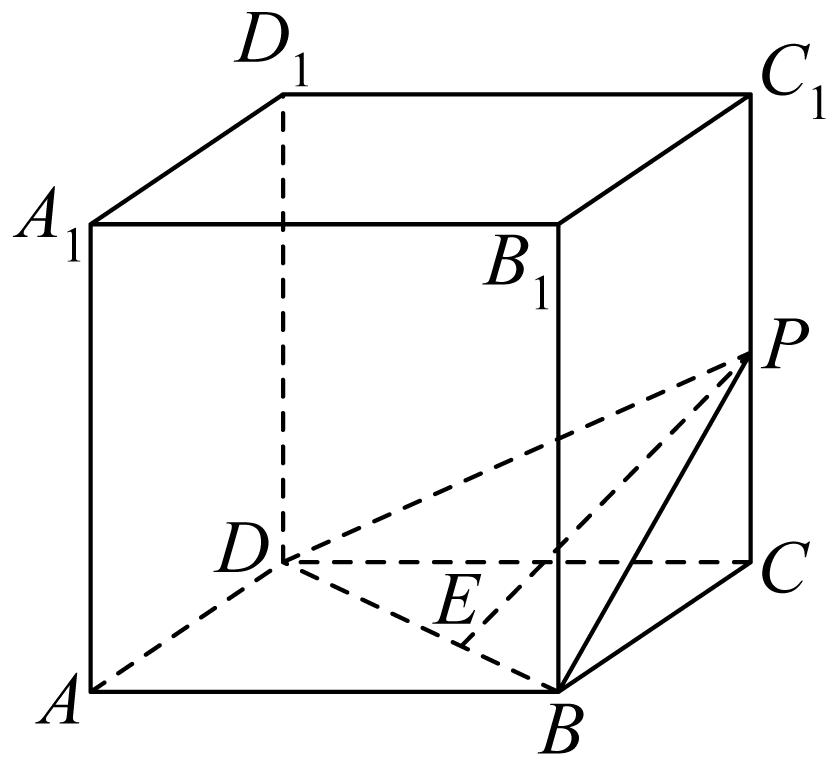

对于D选项，如图所示，当时，，，三点共线，

因为且,所以四边形为平行四边形，所以，

所以或其补角是直线与所成角，

在正中，的取值范围为，D正确.

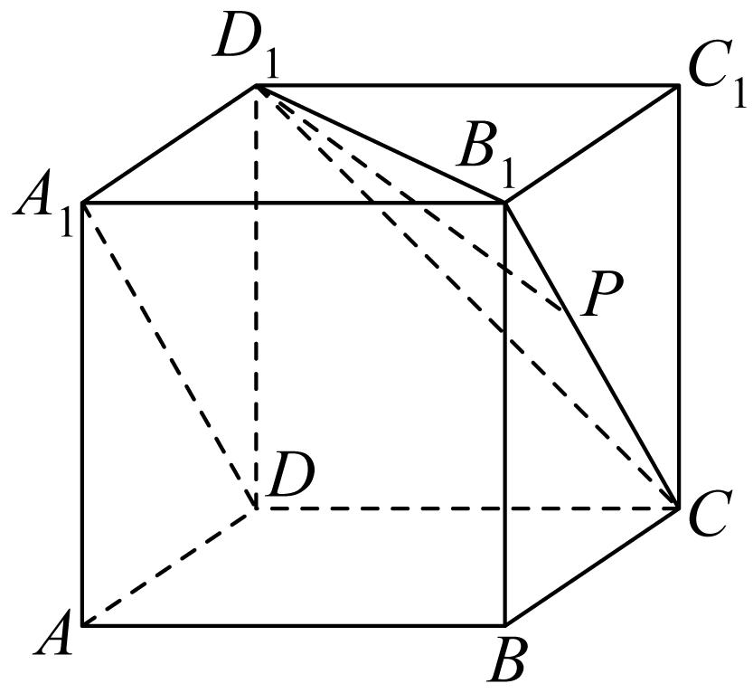

故选：ABD.

**题型三：体积、面积、周长、距离最值与范围问题**

**例7．**（2024·福建福州·福州四中校考模拟预测）在如图所示的试验装置中，两个正方形框架的边长均为2，活动弹子在线段上移动（包含端点），弹子分别固定在线段的中点处，且平面，则当取最大值时，多面体的体积为（    ）

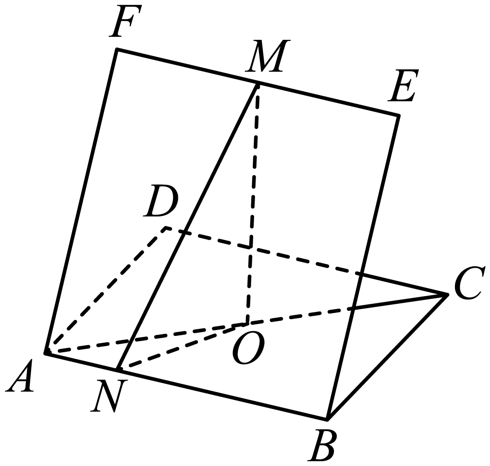

A．	B．	C．	D．

【答案】A

【解析】因为平面，平面，所以，

所以为直角三角形，所以当最短时，取最大值，

即时，取最大值，

因为分别固定在线段的中点处，

所以，所以，

因为为锐角，所以，所以，

所以多面体的体积为，

故选：A

**例8．**（2024·山东青岛·高三统考期中）已知正四棱锥的各顶点都在同一个球面上，球的体积为，则该正四棱锥的体积最大值为（    ）

A．18	B．	C．	D．27

【答案】B

【解析】如图，设正四棱锥的底面边长，高，外接球的球心为，则，

因为球的体积为，所以球的半径为，

在中，，即，

所以正四棱锥的体积为

整理得，则，

当时，，当时，，

所以在上递增，在上递减，

所以当时，函数取得最大值，

故选：B

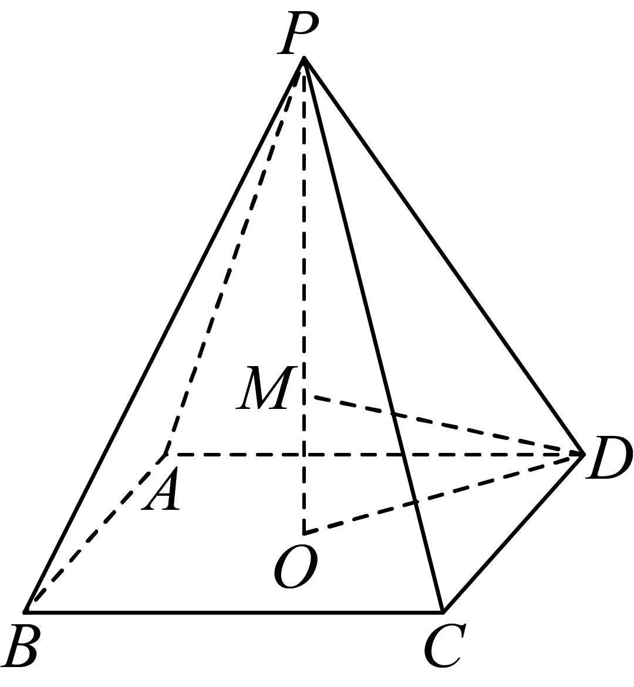

**例9．**（2024·陕西西安·西安市大明宫中学校考模拟预测）已知正方体的棱长为是正方形（含边界）内的动点，点到平面的距离等于，则两点间距离的最大值为（    ）

A．	B．3	C．	D．

【答案】D

【解析】由题意可知：，

设三棱锥的高为，

因为，则，

解得，即点到平面的距离等于，

又因为∥，且，则四边形为平行四边形，则∥，

平面，平面，所以∥平面，

即点的轨迹为线段，

因为平面，平面，所以，

在中，两点间距离的最大值为.

故选：D.

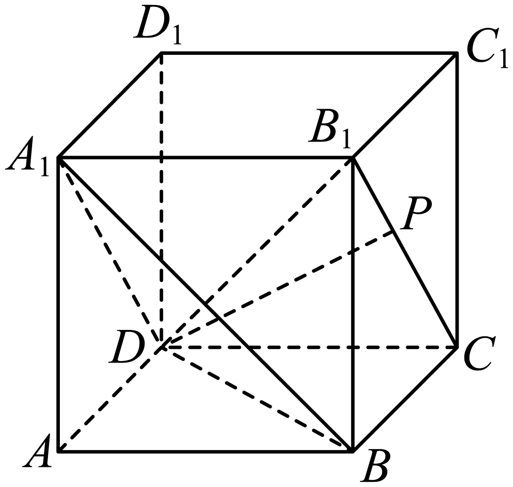

**变式12．**（2024·河南·校联考模拟预测）点是圆柱上底面圆周上一动点，是圆柱下底面圆的内接三角形，已知在中，内角、、的对边分别为、、，若，，三棱锥的体积最大值为，则该三棱锥外接球的表面积为（    ）

A．	B．	C．	D．

【答案】B

【解析】在中，由余弦定理可得，

即，当且仅当时，等号成立，

所以，，

设圆柱的高为，则，

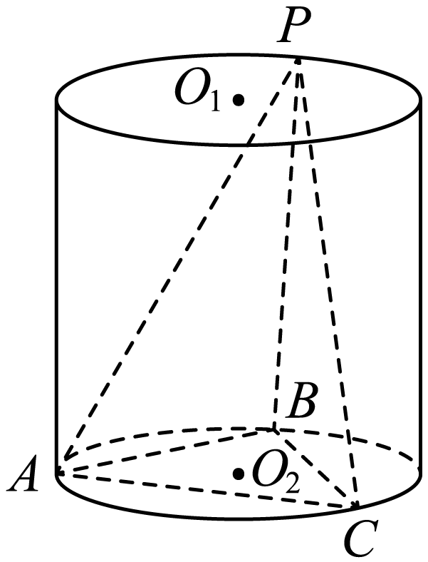

因为三棱锥的体积的最大值为，则，所以，，

圆柱底面圆半径，

设三棱锥的外接球的半径为，则该三棱锥的外接球和圆柱的外接球为同一个球，

则，因此，三棱锥外接球的表面积为.

故选：B.

**变式13．**（2024·贵州毕节·校考模拟预测）如图，是半球的直径，为球心，为此半球大圆弧上的任意一点（异于在水平大圆面内的射影为，过作于，连接，若二面角的大小为，则三棱锥的体积的最大值为（    ）

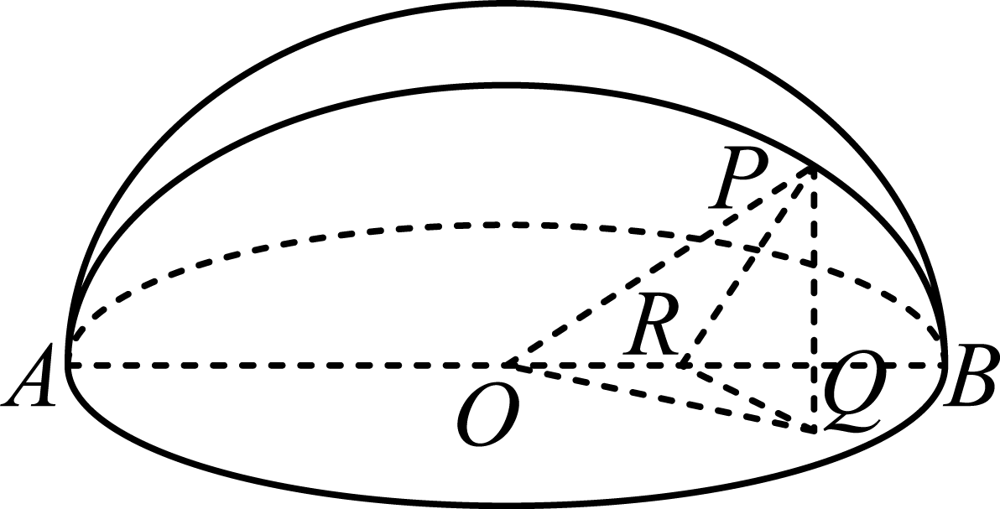

A．	B．	C．	D．

【答案】A

【解析】由平面，平面，得，

又，,平面，于是平面，

平面，有，因此为二面角的平面角，即，

设，则，在中，，，在中，，

则，

显然，令，，求导得，

当时，，函数单调递增，当时，，函数单调递减，

因此当时，，即当时，取得最大值，

所以当时，三棱锥的体积取得最大值.

故选：A

**变式14．**（2024·宁夏石嘴山·统考一模）圆锥的底面半径为，母线长为，是圆锥的轴截面，是的中点，为底面圆周上的一个动点（异于、两点），则下列说法正确的是（    ）

A．存在点，使得	B．存在点，使得

C．三棱锥体积最大值为	D．三棱锥体积最大值为

【答案】C

【解析】根据题意可知，如下图所示：

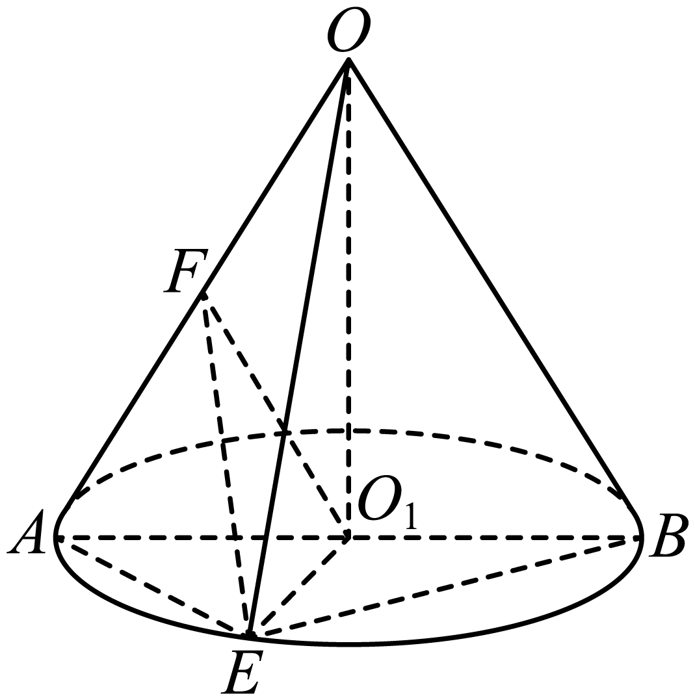

对于A，因为圆是直径，所以，假设存在点，使得，

又因为，、平面，所以平面，

又因为平面，所以，

又因为、都是圆锥的母线，即，所以不成立，

所以不存在点，使得，即A错误；

对于B，因为是的中点，是的中点，所以，

若存在点，使得，所以，这与矛盾，所以B错误；

对于C，易知三棱锥的高为，

所以当底面积最大时，其体积最大，

又因为，所以，

当且仅当时等号成立，

所以，即三棱锥的体积，

即三棱锥的体积的最大值为，所以，C正确；

对于D，因为、分别为、的中点，

则，即三棱锥体积最大值为，所以，D错误.

故选：C.

<strong>变式15．</strong>（2024·全国·高三专题练习）已知圆锥<em>SO</em>（<em>O</em>是底面圆的圆心，<em>S</em>是圆锥的顶点）的母线长为，高为1，<em>P</em>､<em>Q</em>为底面圆周上任意两点．有以下三个结论：

①三角形*SPQ*面积的最大值为2；

②三棱锥体积的最大值为；

③四面体*SOPQ*外接球表面积的最小值为．

以上所有正确结论的个数为（    ）

A．0	B．1	C．2	D．3

【答案】B

【解析】①如图，由条件可知，，点是直径的两个端点，

，所以是钝角，

，当时，的面积最大，最大值是，故①错误；

②，

，当时，的最大值是，

所有三棱锥的最大值是，故②正确；

③设外接圆的半径为，四面体*SOPQ*外接球的半径，

中，根据正弦定理可得，，得，

，所以，则外接球的半径也无最小值，所以四面体*SOPQ*外接球表面积无最小值，故③错误.

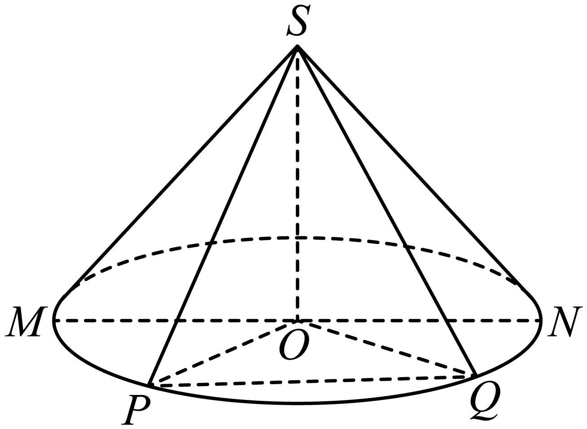

故选：B

**变式16．**（2024·河北·统考模拟预测）在正四面体中，为的中点，点在以为球心的球上运动，，且恒有，已知三棱锥的体积的最大值为，则正四面体外接球的体积为（    ）

A．	B．	C．	D．

【答案】A

【解析】由题知，

为的中点，点在以为球心的球上运动，，

所以都在以为球心的球上，

又因，则在的中垂面上，如图，

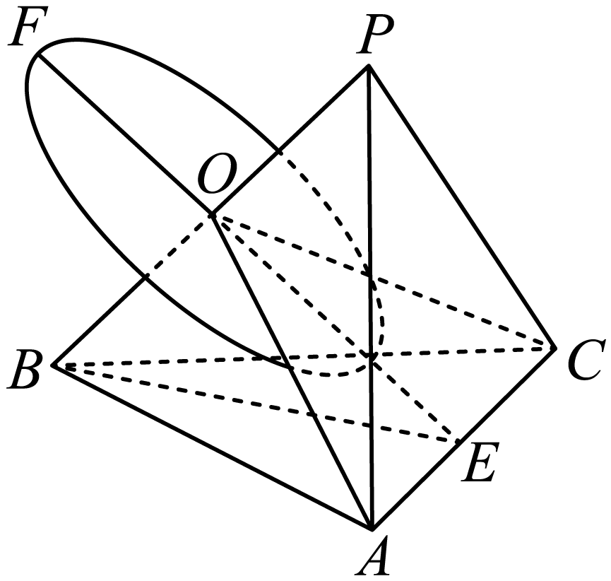

连接，

都为正三角形，且为的中点，

，

，平面，平面，

平面，平面是的中垂面，即在平面上，

所以点在平面与以为球心，为半径的球的交线上，

即在以为圆心，为半径的平面内的圆上，

取中点，连接，延长至点，使，

作在平面内，以为圆心，为半径的圆，

则圆上的点到平面的距离最远，故在处，

设，则，，

平面，平面，

,

,

,

在中，，

点到平面的距离，

所以，

解得，

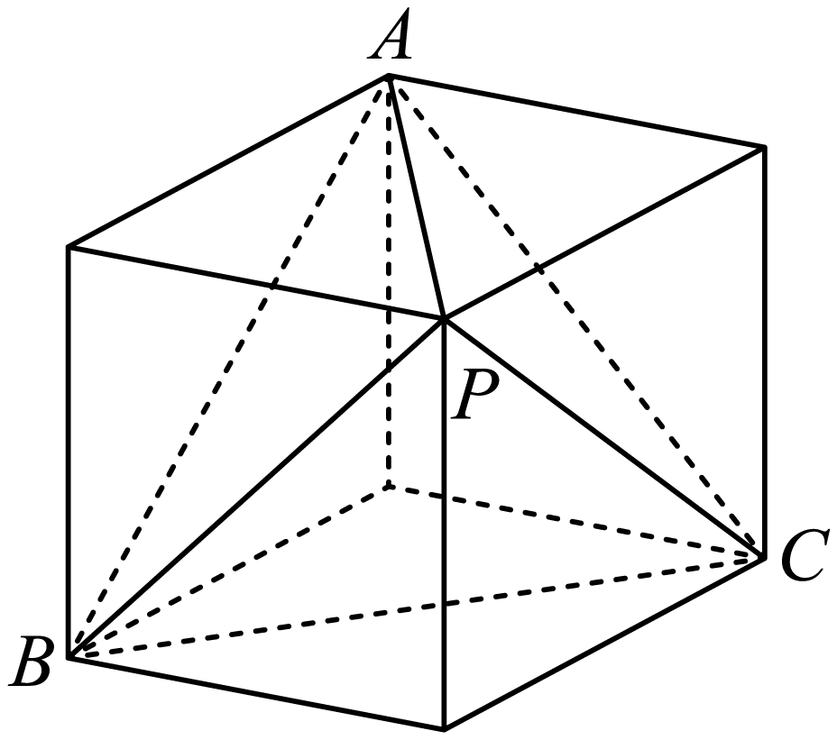

如图则其外接正方体的边长为，

所以正四面体外接球即为边长为正方体的外接球，

故外接球半径，

所以外接球体积.

故选：A

<strong>变式17．</strong>（2024·湖北恩施·校考模拟预测）如图，矩形<em>ABCD</em>中，<em>E</em>、<em>F</em>分别为<em>BC</em>、<em>AD</em>的中点，且，现将沿<em>AE</em>向上翻折，使点移到<em>P</em>点，则在翻折过程中，下列结论不正确的是（    ）

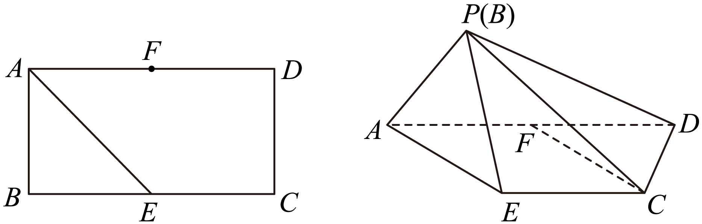

A．存在点*P*，使得

B．存在点*P*，使得

C．三棱锥的体积最大值为

D．当三棱锥的体积达到最大值时，三棱锥外接球表面积为4π

【答案】A

【解析】如图所示：连接，为中点，连接，，

连接，，，，

，故，故，

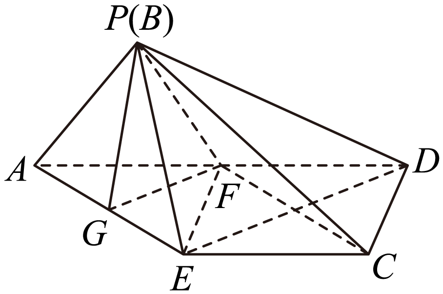

对选项A：，若，又，则，重合，不成立，错误；

对选项B：当平面时，平面，则，又，

，平面，故平面，平面，

故，正确；

对选项C：当平面时，三棱锥体积最大，

最大值为，正确；

对选项D：平面，平面，故，

，故，

故是三棱锥外接球球心，半径为，

故外接球表面积为，正确.

故选：A.

<strong>变式18．</strong>（2024·四川成都·四川省成都市玉林中学校考模拟预测）如图，圆台的上、下底面圆半径分别为1、2，高，点<em>S、A</em>分别为其上、下底面圆周上一点，则下列说法中错误的是（    ）

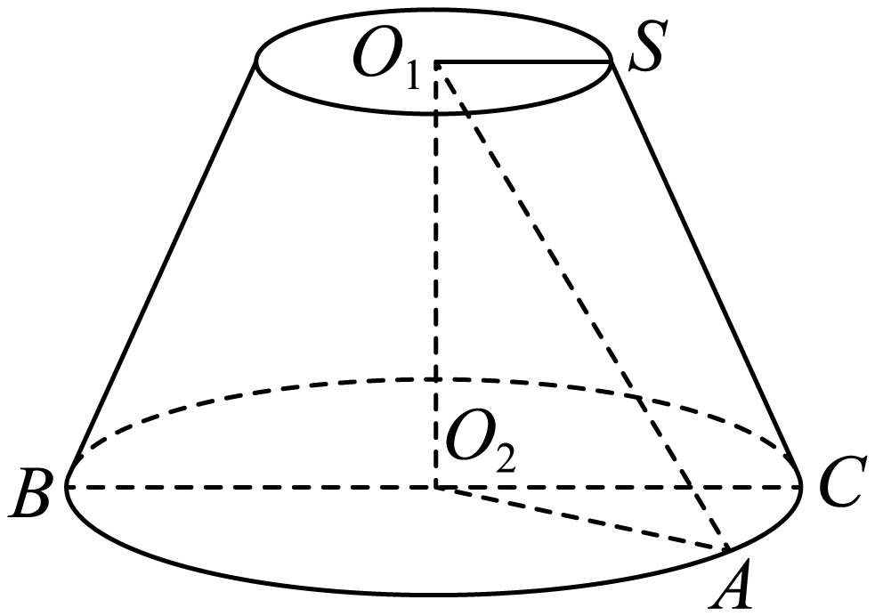

A．该圆台的体积为

B．直线*SA*与直线所成角最大值为

C．该圆台有内切球，且半径为

D．直线与平面所成角正切值的最大值为

【答案】B

【解析】对于A选项，，则A选项正确．

对于B选项，如图（1），过作垂直于下底面于点，则，

所以直线与直线所成角即为直线与直线所成角，即为所求，

而，由圆的性质得，，

所以，

因为，则B选项错误．

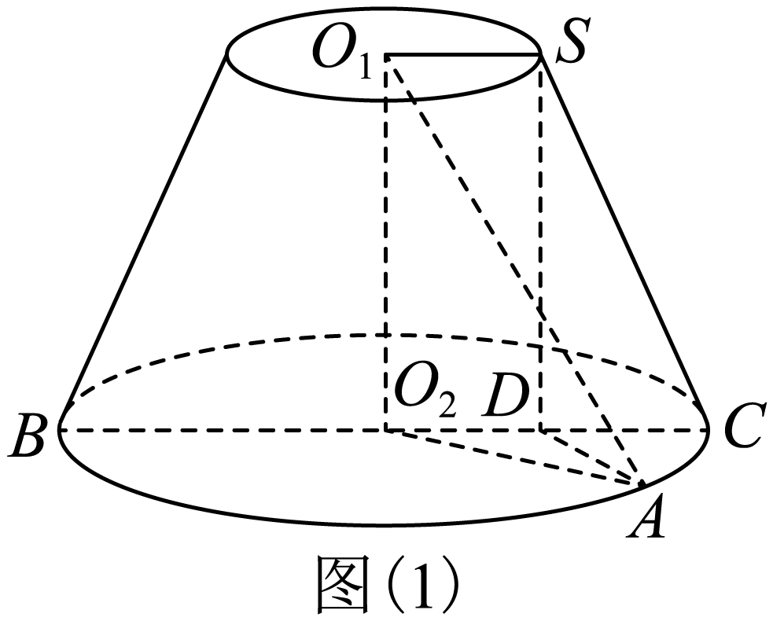

对于C选，设上底面半径为，下底面半径为，若圆台存在内切球，

则必有轴截面的等腰梯形存在内切圆，如图（2）所示，梯形的上底和下底分别为2，4，

高为，易得等腰梯形的腰为，假设等腰梯形有内切圆，

由内切圆的性质以及切线长定理，可得腰长为，所以圆台存在内切球，

且内切球的半径为，则C选项正确；

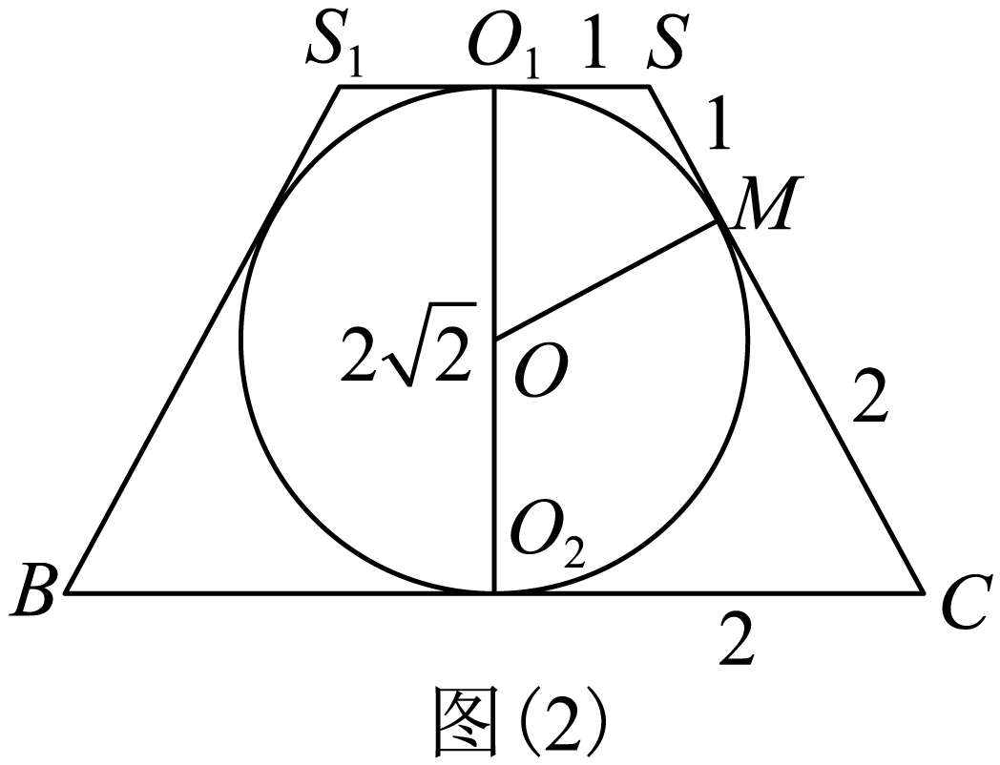

对于D选项，如图（3），平面即平面，

过点做交于点，因为垂直于下底面，而含于下底面，

所以，又，且平面，

所以平面，所以直线与平面所成角即为，

且．设，则，

所以，其中，

所以，

当时，，当时，

．根据复合函数的单调性，

可知函数，在上单调递增，

所以当时，有最大值，最大值为，所以D选项正确．

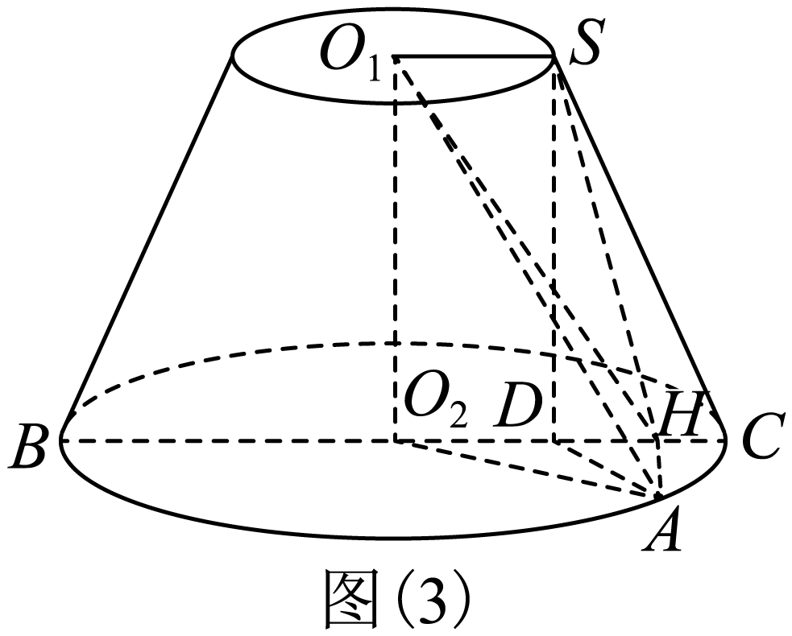

故选：B.

**变式19．**（2024·山东·山东省实验中学校考二模）正四棱柱中，，为底面的中心，是棱的中点，正四棱柱的高，点到平面的距离的最大值为（    ）

A．	B．	C．	D．

【答案】C

【解析】设底面四边形的中心为，连接，则，设点到平面的距离为，，，

则中，边上的高为，

则，

由，

得，

所以，

由，得，则，则，

所以，

即点到平面的距离的取值范围是，

所以点到平面的距离的最大值为.

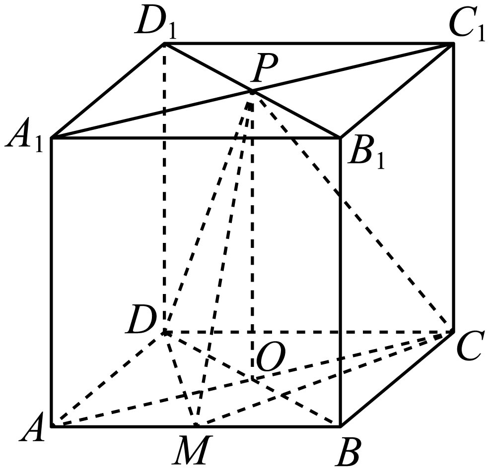

故选：C.

<strong>变式20．</strong>（2024·湖南长沙·长沙一中校考模拟预测）已知<em>A</em>，<em>B</em>，<em>C</em>，<em>D</em>是体积为的球体表面上四点，若，，，且三棱锥<em>A</em>－<em>BCD</em>的体积为，则线段<em>CD</em>长度的最大值为（    ）

A．	B．	C．	D．

【答案】B

【解析】因为球的体积为，故球的半径*R*满足，故，

而，，，故，故，

故，

设点*D*到平面*ABC*的距离为*h*，则，故，

点*D*在球的截面圆上，设截面圆所在的平面为*α*，因为，所以平面*α*与平面*ABC*在球心的异侧，

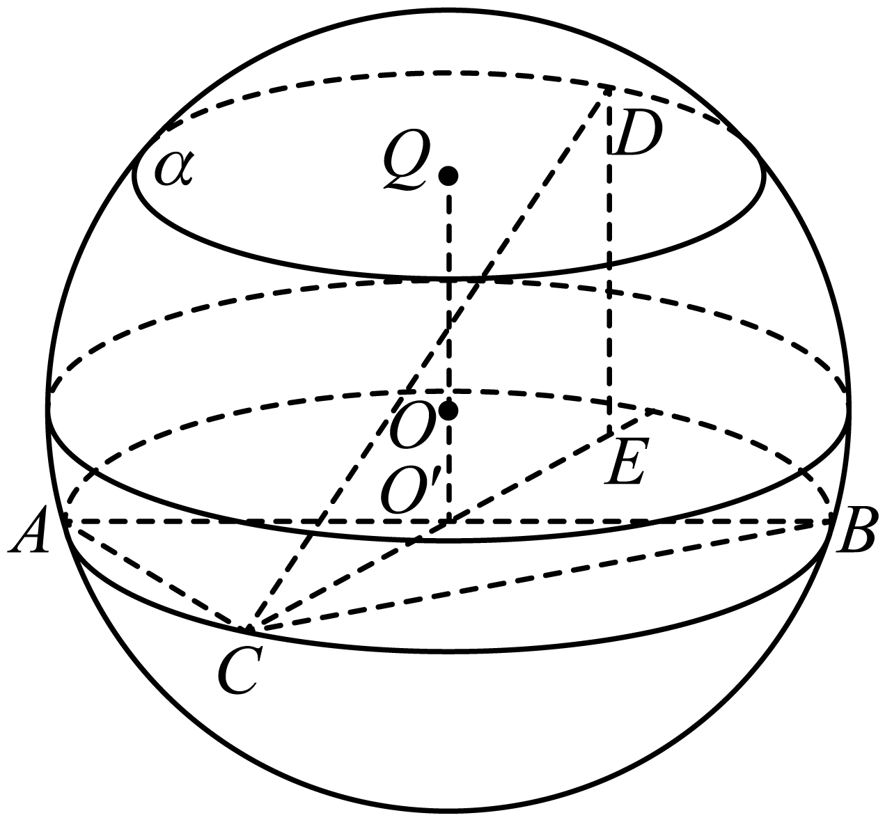

设球心到平面*ABC*的距离为*d*，而△*ACB*外接圆的半径为，则，

故球心到平面*α*的距离为，故截面圆的半径为，

设点*D*在平面*ABC*上的投影为*E*，则*E*的轨迹为圆，圆心为△*ABC*的外心即*AB*的中点，

当*CE*最长时*CD*最长，此时，故*CD*长度的最大值为.

故选：B．

**变式21．**（2024·全国·高三专题练习）如图，正方形的中心为正方形的中心，，截去如图所示的阴影部分后，翻折得到正四棱锥（，，，四点重合于点），则此四棱锥的体积的最大值为（    ）

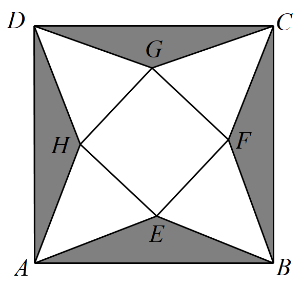

A．	B．	C．	D．

【答案】B

【解析】设，则所得的棱锥侧面的高为，

棱锥的高为其体积为：

，

当且仅当时等号成立，

即体积的最大值为，

故选：B.

**变式22．**（2024·安徽黄山·统考二模）如图1，将一块边长为20的正方形纸片剪去四个全等的等腰三角形，，再将剩下的部分沿虚线折成一个正四棱锥，使与重合，与重合，与重合，与重合，点重合于点，如图2.则正四棱锥体积的最大值为（    ）

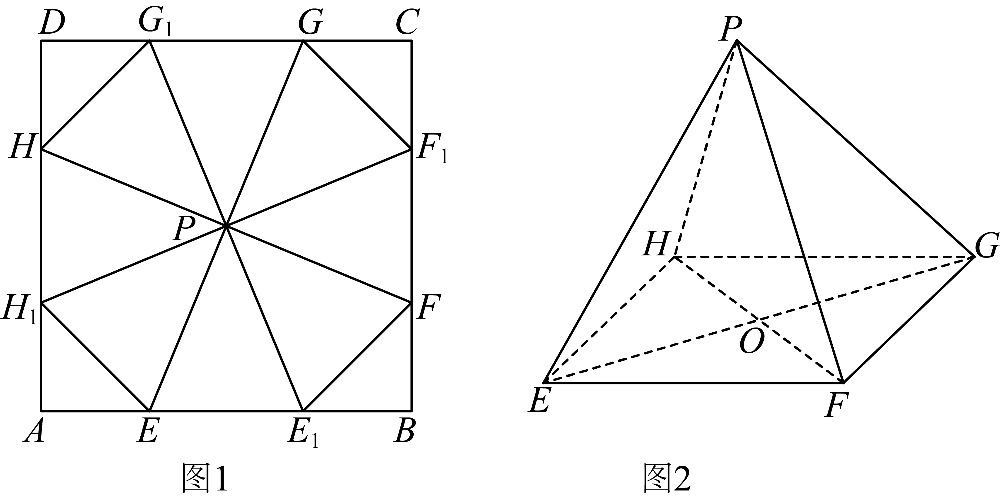

A．	B．	C．	D．

【答案】D

【解析】

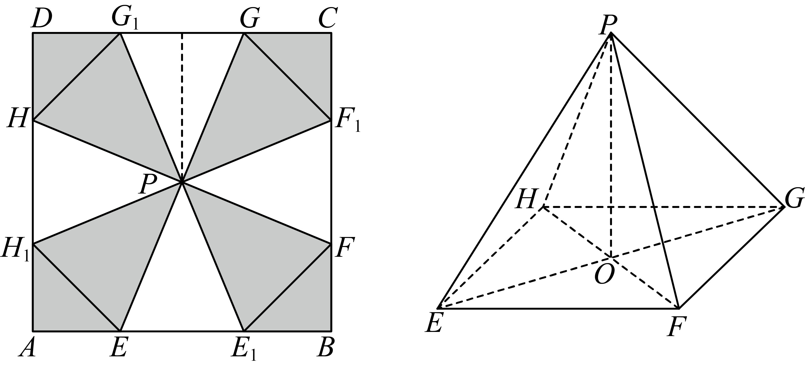

根据题意，*PG*是侧棱，底面*EFGH*的对角线的一半是GC，

设，则有，，

四棱锥的高，

底正方形的面积，

四棱锥*P*-*EFGH*的体积，

令，则，，

则，

当时，，*V*单调递减；当时，*V*单调递增，

∴当时，*V*取最大值，

.

故选：D.

**变式23．**（2024·全国·高三专题练习）如图所示，圆形纸片的圆心为，半径为5，该纸片上的正方形的中心为．，，，为圆上的点，，，，分别是以，，，为底边的等腰三角形．沿虚线剪开后，分别以，，，为折痕折起，使得，，，重合于一点，记为，得到四棱锥．当底面的边长变化时，四棱锥的体积的最大值为（    ）

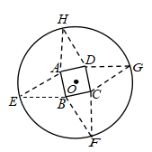

A．	B．	C．	D．

【答案】D

【解析】如图，取的中点，连接，，，

设正方形的边长为（），

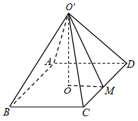

则，，所以，

所以四棱锥的体积

．

设，得．

令，得，令，得，

故在上单调递增，在上单调递减．

所以当时，取得最大值，即体积取得最大值，为．

故选：D．

**题型四：立体几何中的交线问题**

**例10．**（2024·全国·高三校联考阶段练习）已知正方体是半径为的球的内接正方体（八个顶点全部在球面上），则正方体六个面所在的平面与球面的交线总长度是（    ）

A．	B．	C．	D．

【答案】D

【解析】

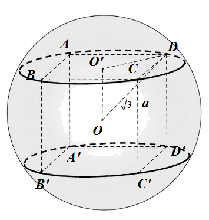

由图可知，正方体的每一个面与球面相交，所得的交线是一个圆，共有6个圆，故六个面所在的平面与球面的交线总长度为6个圆的周长之和，

设正方体的棱长为*a*，在直角三角形中，，，，

所以有：，解得，

所以，

所以每个圆的周长为，6个圆的周长之和为.

故选：*D*.

**例11．**（2024·上海·高三专题练习）直三棱柱中，，，，，设平面与平面的交线为，则与的距离为（    ）．

A．1	B．	C．17	D．2.6

【答案】D

【解析】如图，将直三棱柱补成直四棱柱，且四边形为平行四边形，则平面即为平面，所以直线为，则与的距离即为则与的距离，设为，

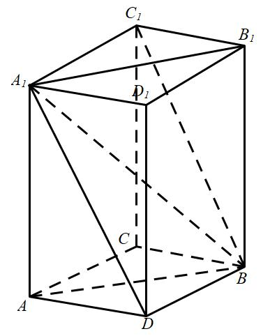

由已知可得：在三角形中，

，，

，

，

则，

，

，

得.

故选：D.

**例12．**（2024·浙江·校联考三模）正四面体，为棱的中点，过点作平面的平行平面，该平面与平面、平面的交线分别为，则所成角的正弦值为（    ）

A．	B．	C．	D．

【答案】A

【解析】设所作的平面为，则由平面，平面，

平面平面，得，同理可得，

所以所成的角等于与所成的角，即（或补角）．

设正四面体的棱长为2，则，，

在中由余弦定理，得，

则.

故选：A

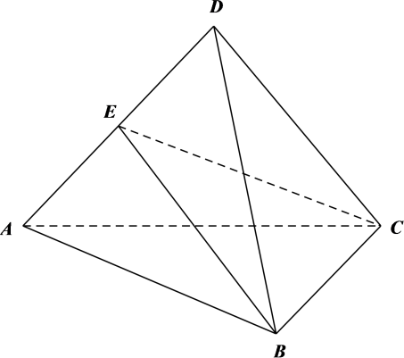

**变式24．**（2024·全国·高三专题练习）如图，在棱长为1的正方体中，分别是棱，的中点若经过点的平面与平面的交线为，则与直线所成角的余弦值为（    ）

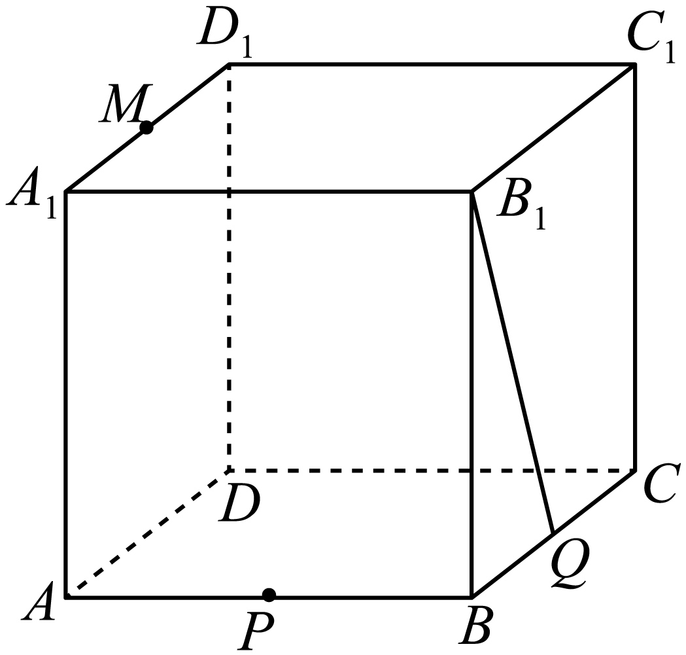

A．	B．	C．	D．

【答案】B

【解析】由线面平行的性质及面面平行的性质定理，可得经过点的的截面为边长为的正六边形,连接,,如图所示，

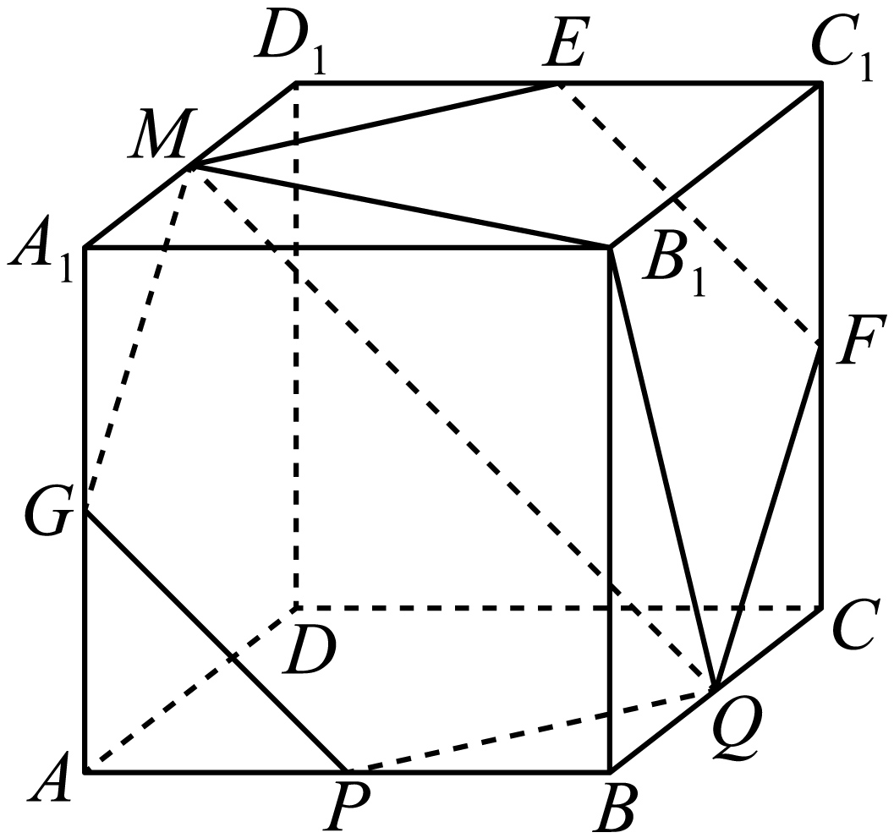

则易知若经过点的平面与平面的交线为,即为直线，又,

所以即为与直线所成角，

在中，可得，,

由余弦定理可得：,

故选：B.

**变式25．**（2024·全国·高三专题练习）在棱长为2的正方体中，，，分别是，，的中点，设过，，的截面与面，以及面的交线分别为，，则，所成的角为（    ）

A．	B．	C．	D．

【答案】D

【解析】先取，，的中点分别为，，，连接，，，，，，根据题意，证明，，，，，六点共面，即为过，，的截面；得到即为直线，即为直线；连接，，，根据异面直线所成角的概念，得到即为异面直线与所成的角，根据题中条件，即可得出结果.因为，在正方体中，，，分别是，，的中点，

取，，的中点分别为，，，连接，，，，，，

根据正方体的特征，易知，若连接，，，则这三条线必相交于正方体的中心，

又，所以，，，，，六点必共面，即为过，，的截面；

所以即为直线，即为直线；

连接，，，

因为，，

所以即为异面直线与所成的角，

又因为正方体的各面对角线都相等，所以为等边三角形，

因此.

故选：D.

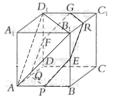

**变式26．**（2024·黑龙江哈尔滨·哈尔滨三中校考模拟预测）在正方体中，为中点，过的截面与平面的交线为，则异面直线与所成角的余弦值为（    ）

A．	B．	C．	D．

【答案】A

【解析】取的中点，如下图，连接，

因为，所以四点共面，

所以过的截面即为平面，

截面与平面的交线为即为，

取的中点，连接，因为，

所以（或其补角）为异面直线与所成角，

设正方体的棱长为，所以，

所以.

则异面直线与所成角的余弦值为.

故选：A.

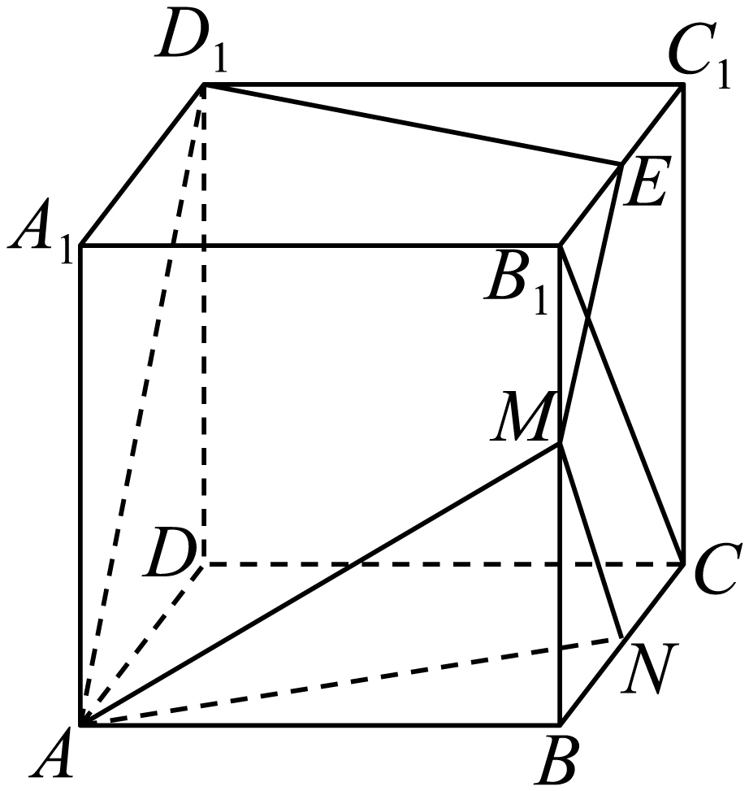

<strong>变式27．</strong>（2024·全国·高三专题练习）如图，在圆台<em>OO1</em>中，，点<em>C</em>是底面圆周上异于<em>A</em>、<em>B</em>的一点，，点<em>D</em>是<em>BC</em>的中点，<em>l</em>为平面与平面的交线，则交线<em>l</em>与平面所成角的大小为（    ）

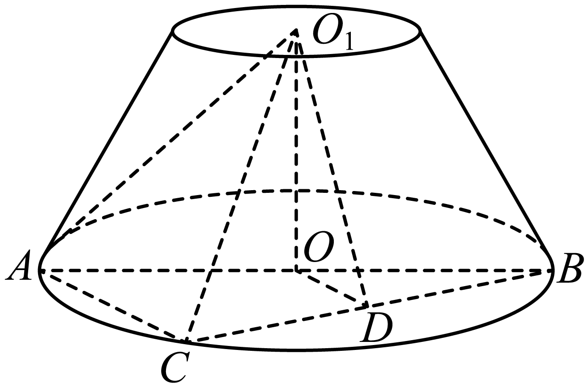

A．	B．	C．	D．

【答案】B

【解析】因为，因为，*D*分别是*，BC*的中点，所以，

所以平面，平面，所以平面，

平面，平面平面，

所以，，所以，

所以直线*l*与平面所成角即直线与平面所成角，

因为为直径，所以，因为，即，

又因为平面，

平面，所以，平面，

所以平面，过点作交于点，

因为平面，所以，，

，平面，所以平面，

所以为交线*l*与平面所成角，

因为，，

.

所以，结合图知.

故选：B.

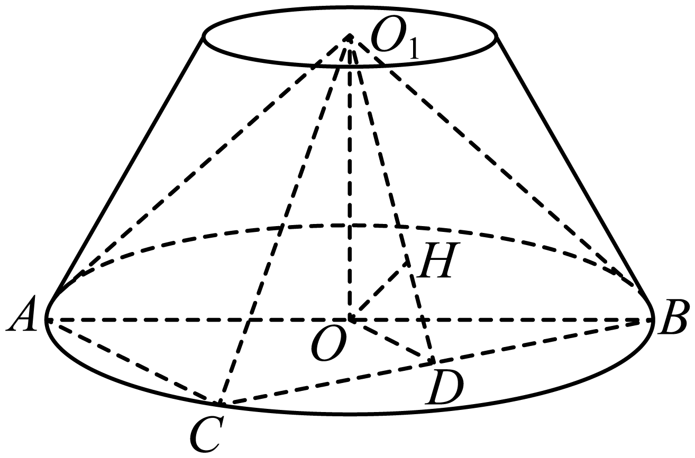

<strong>变式28．</strong>（2024·河南·高三校联考阶段练习）在正三棱锥<em>P</em>-<em>ABC</em>中，，<em>BC</em>＝6，<em>M</em>，<em>N</em>，<em>Q</em>，<em>D</em>分别是<em>AP</em>，<em>BC</em>，<em>AC</em>，<em>PC</em>的中点，平面<em>MQN</em>与平面<em>PBC</em>的交线为<em>l</em>，则直线<em>QD</em>与直线<em>l</em>所成角的正弦值为（    ）

A．	B．	C．	D．

【答案】C

【解析】取的中点，连接，由题意可得，

又因为，所以，

所以四边形是平行四边形，所以，

所以四点共面，

所以平面*MQN*与平面*PBC*的交线为*l*即为，

直线*QD*与直线*l*所成角即为直线*QD*与直线所成角即为，

因为正三棱锥*P*-*ABC*中，，*BC*＝6，

所以，

所以**，**

**，**

所以**.**

故选：C.

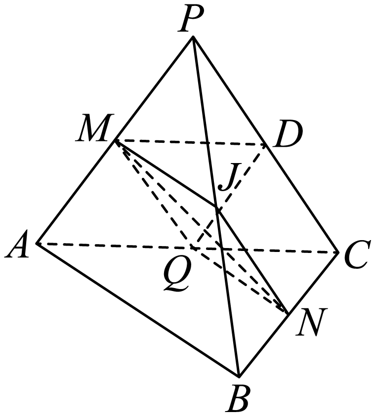

**变式29．**（2024·四川成都·高三校联考期末）在正方体中，为线段的中点，设平面与平面的交线为，则直线与所成角的余弦值为（    ）

A．	B．	C．	D．

【答案】B

【解析】设正方体的棱长为2，

以点*A*为坐标原点，*AB*、*AD*、所在直线分别为*x*、*y*、*z*轴建系，如图所示：

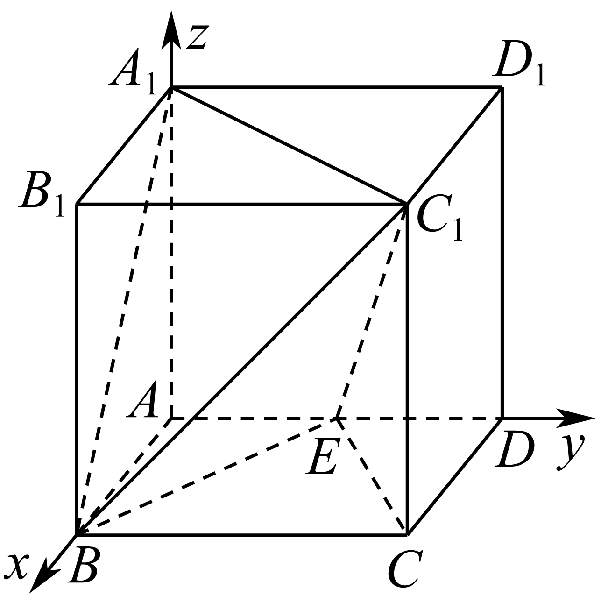

则、、、、．

设平面的法向量为，

，，

由，

取可得；

设平面的法向量为，

，，

由，

取可得，

设直线的方向向量为，

∵直线平面，直线平面，

，，

∴，

取可得，

已知，设直线与所成角为，

，

即直线与所成角的余弦值为，

故选：B．

**变式30．**（2024·全国·高三专题练习）如图，在直四棱柱中，，，，，点､分别为棱､的中点，则平面与直四棱柱各侧面矩形的交线所围成的图形的面积为（    ）

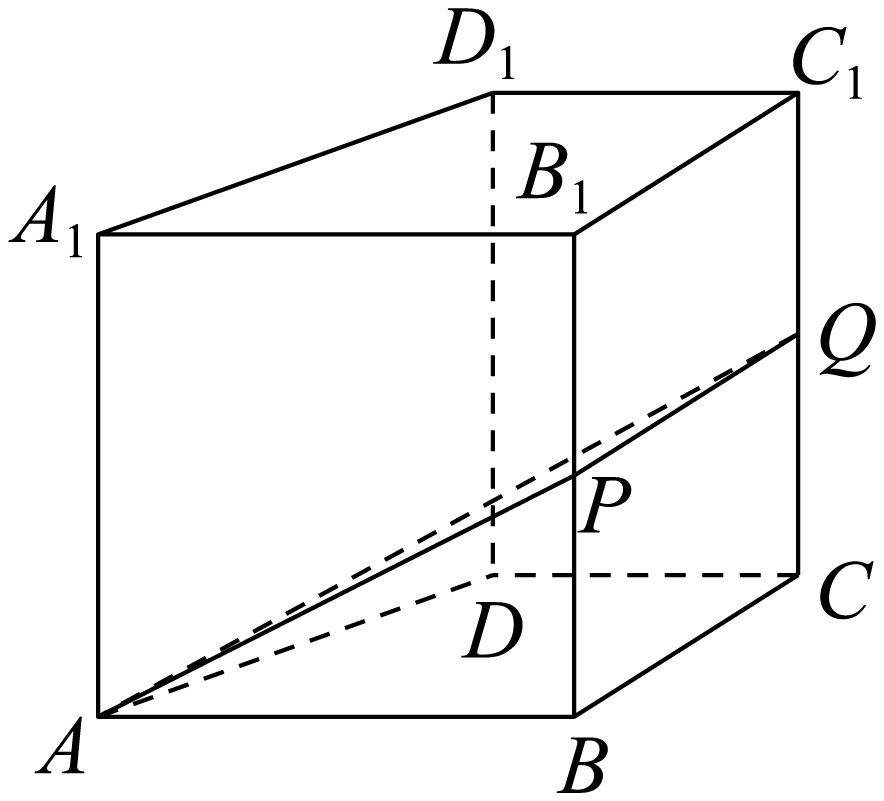

A．	B．

C．	D．

【答案】B

【解析】如图，因为在直四棱柱中，，所以平面平面，设平面线段，连接，又因为平面平面，所以，延长，交的延长线于点，则，连接，，则平面平面，易知四边形为直角梯形，且.

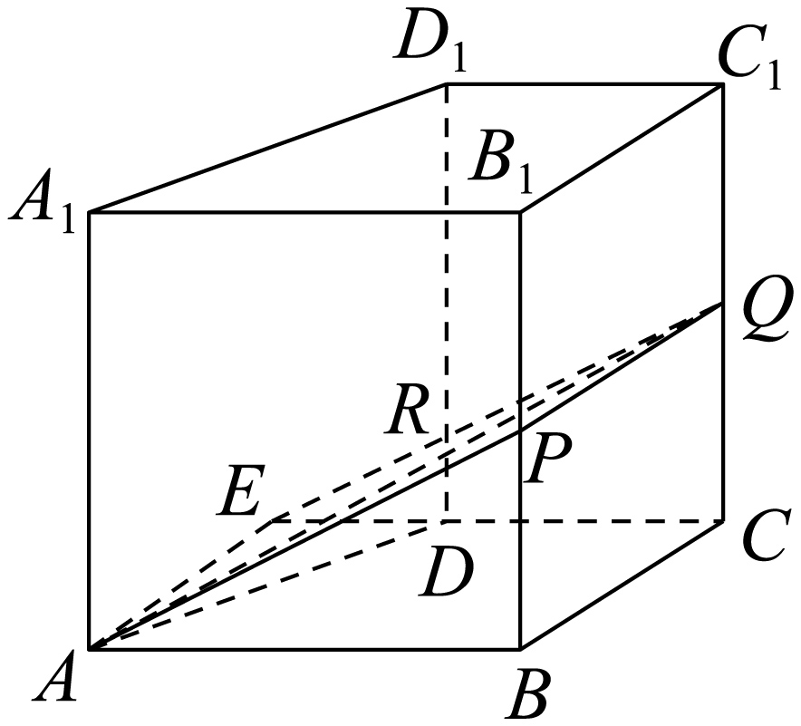

如图，再将直四棱柱补成一个长方体，

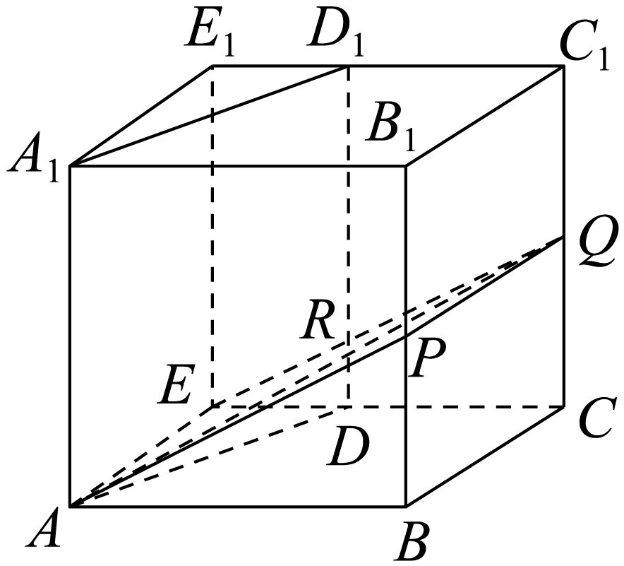

由图及题中数据可得，，，

所以，所以，

故交线围成的图形的面积为.

故选:.

**题型五：空间线段以及线段之和最值问题**

<strong>例13．</strong>（2024·全国·高三专题练习）已知正三棱锥的底面边长为，外接球表面积为，，点<em>M</em>，<em>N</em>分别是线段<em>AB</em>，<em>AC</em>的中点，点<em>P</em>，<em>Q</em>分别是线段<em>SN</em>和平面<em>SCM</em>上的动点，则的最小值为（    ）

A．	B．	C．	D．

【答案】B

【解析】依题意，，解得，

由是正三角形可知：其外接圆半径为，

设点*S*到平面*ABC*的距离为*h*，故，

解得或，

则或（舍去），

故，则,而，故为等腰直角三角形，，

故为等腰直角三角形，,则,

又,故平面*SCM，*

取*CB*中点*F*，连接*NF*交*CM*于点*O*，则,则平面*SCM*,

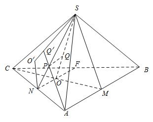

故平面*SCM*，则，

要求最小，首先需*PQ*最小，此时可得平面*SCM*，则；

再把平面*SON*绕*SN*旋转，与平面*SNA*共面，即图中位置，

当共线且时，的最小值即为的长，

由为等腰直角三角形，

故，，

∴，即，∴，

可得，，

故选：B.

<strong>例14．</strong>（2024·全国·高三专题练习）已知，如图正三棱锥中，侧棱长为，底面边长为2，<em>D</em>为<em>AC</em>中点，<em>E</em>为<em>AB</em>中点，<em>M</em>是<em>PD</em>上的动点，<em>N</em>是平面<em>PCE</em>上的动点，则最小值是（   ）

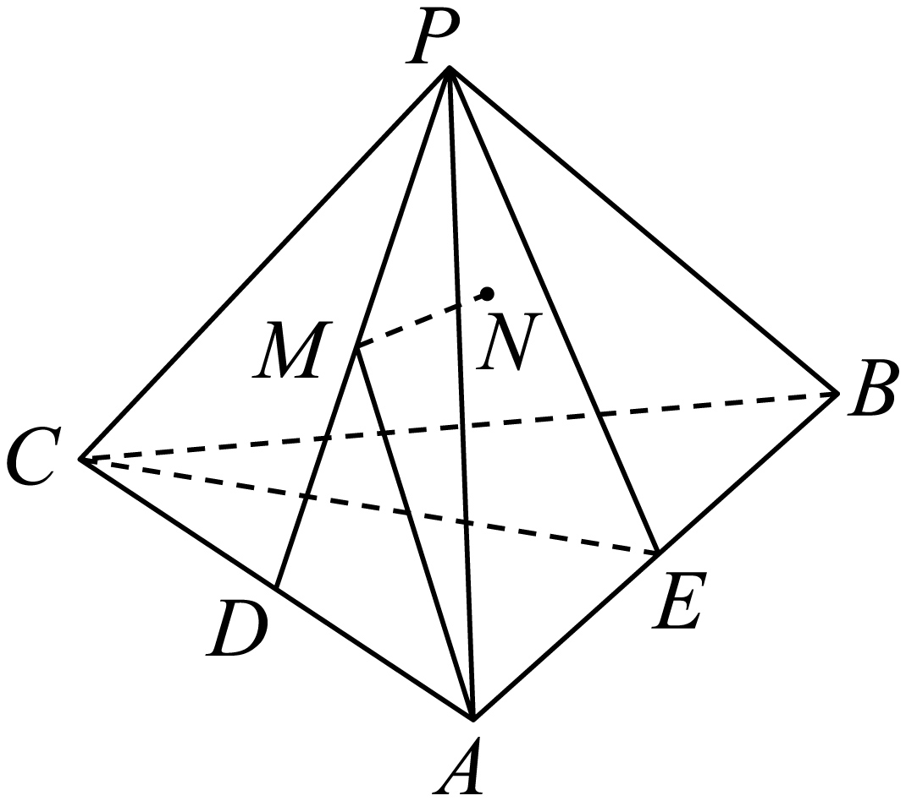

A．	B．	C．	D．

【答案】B

【解析】取中点,连接交于点,易证得面,要求最小,即求MN最小,可得，又可证明,再把平面*POD*绕*PD*旋转,与面*PDA*共面,又可证得.

，，

，即，

，可得，

.

故选:B.

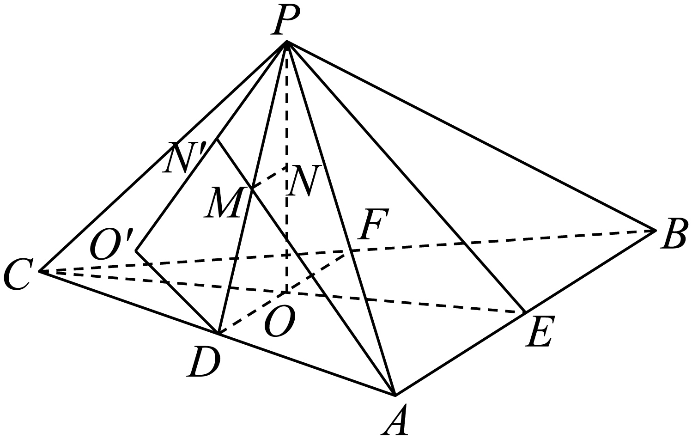

**例15．**（2024·全国·高三专题练习）如图，在棱长为的正方体中，点是线段上的动点，是上的动点，是上的动点，则长度的最小值为（    ）

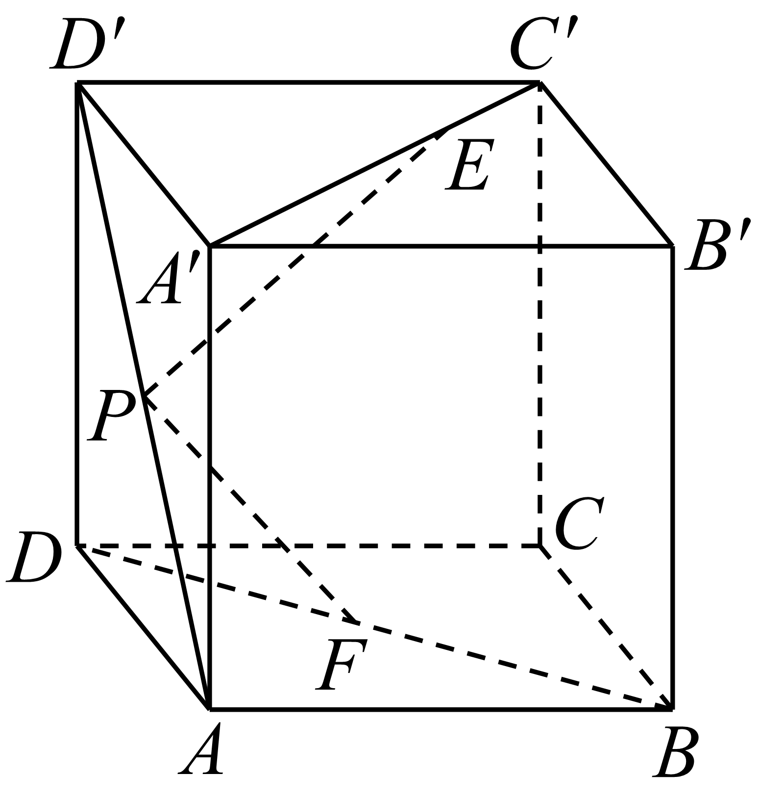

A．		B．			C．			D．

【答案】C

【解析】

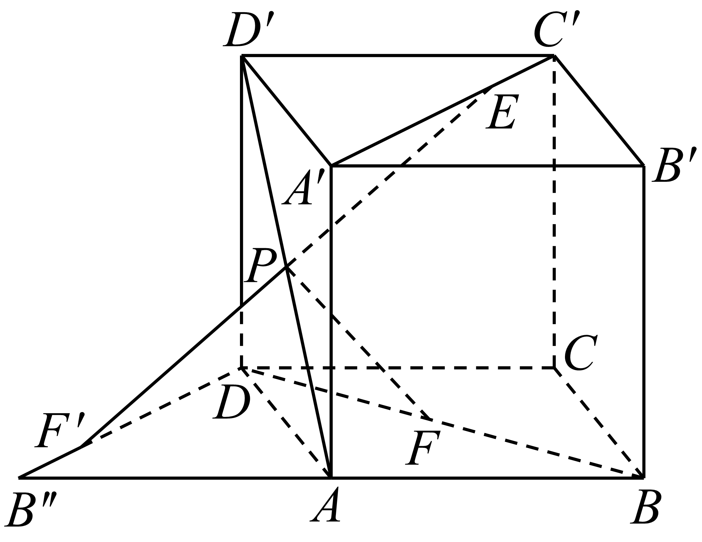

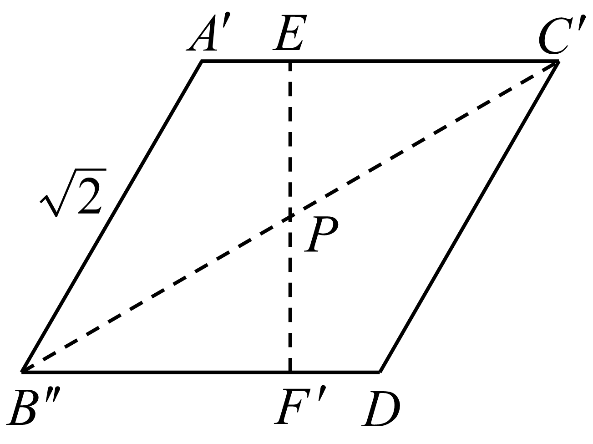

作关于的对称点，连接，如左图所示，

根据正方体的结构特征以及对称性，可知，，

故，要使长度最小，则三点共线，

如右图，在边长为的菱形中，时，三点共线，

此时，在中，由余弦定理可得，

.所以

则，故长度的最小值为．

故选:C

**变式31．**（2024·辽宁·高一辽宁实验中学校联考期末）如图所示，在直三棱柱中，棱柱的侧面均为矩形，，，，是线段上的一动点，则最小值为（    ）

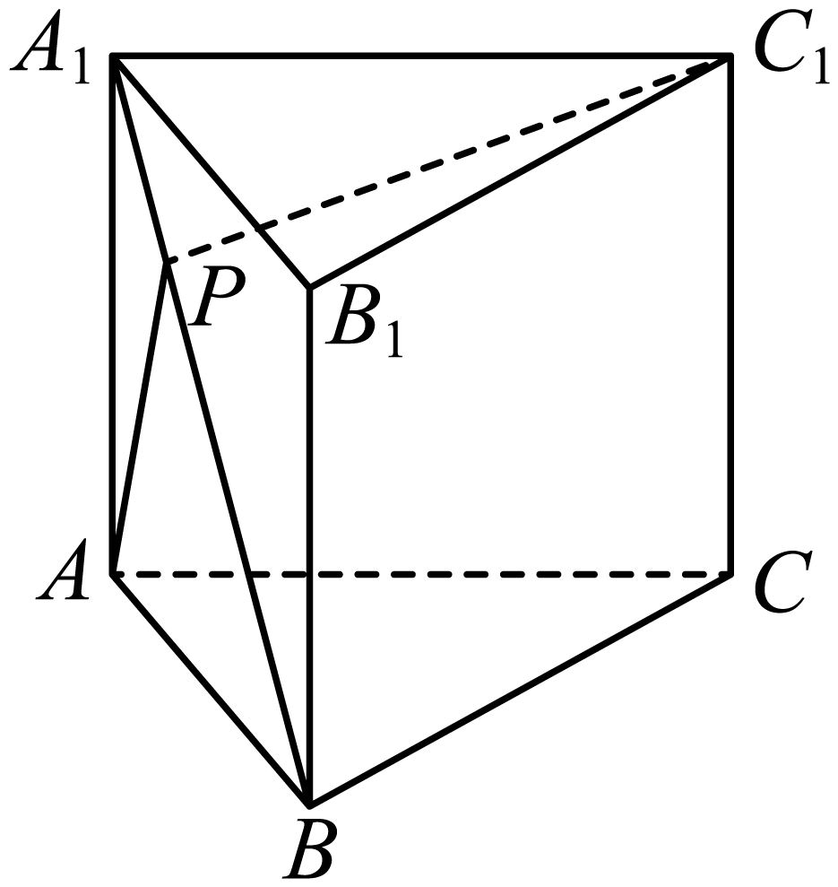

A．	B．	C．	D．

【答案】B

【解析】连接，得，以所在直线为轴，将所在平面旋转到平面，

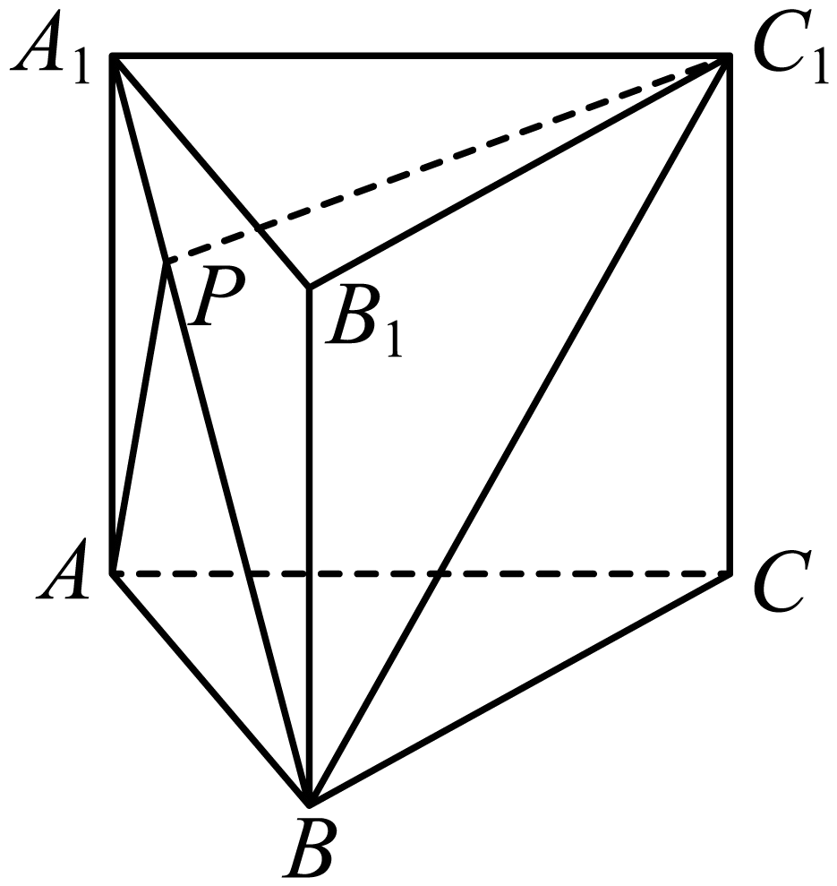

设点的新位置为，连接，则有，如图，

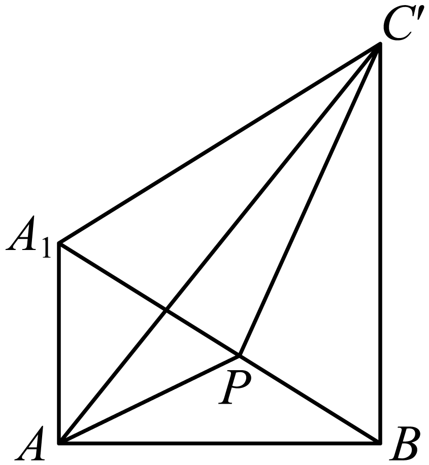

当三点共线时，则即为的最小值.

在三角形*ABC*中，，，

由余弦定理得：,

所以，即,

在中，，，

由勾股定理可得：,且.

同理可求：，因为，

所以为等边三角形，所以，

所以在中，,,

由余弦定理得：.

故选：B.

**变式32．**（2024·四川内江·四川省内江市第六中学校考模拟预测）在三棱锥中，，在底面上的投影为的中点，.有下列结论：

①三棱锥的三条侧棱长均相等；

②的取值范围是；

③若三棱锥的四个顶点都在球的表面上，则球的体积为；

④若，是线段上一动点，则的最小值为.

其中所有正确结论的编号是（    ）

A．①②	B．②③	C．①②④	D．①③④

【答案】C

【解析】如图1，，是的中点，，

又平面，，，故①正确；

，，又，，

过作，为垂足，如图2，则，

又，，，故②正确；

，为平面截三棱锥外接球的截面圆心，

设外接球球心为，则在直线上，如图3，

设，则，解得，故为外接球的球心．

外接球的体积为，故③错误．

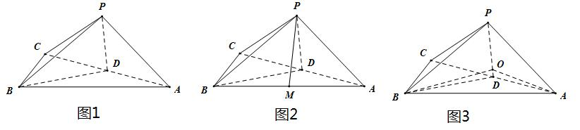

若，则，又，故是等边三角形，

将平面沿翻折到平面上，如图4，图5.

则的最短距离为线段的长．

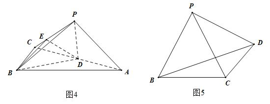

，，，

，故④正确．

故选：．

**变式33．**（2024·全国·高一专题练习）在四棱锥中，底面，底面为正方形，．点分别为平面，平面和平面内的动点，点为棱上的动点，则的最小值为（    ）

A．	B．	C．	D．1

【答案】B

【解析】由题意得均最小时，平方和最小，

过点分别作平面，平面，平面的垂线，垂足分别为，

连接，因为面，平面，所以，

因为底面为正方形，所以，又因为，平面，

所以面，因为平面，则，又因为点在上，则点应在上，

同理可证分别位于上，

从而补出长方体，

则是以为共点的长方体的对角线，则，

则题目转化为求的最小值，显然当时，的最小值，

因为四边形为正方形，且，则，

因为面，面，所以，

所以，

则直角三角形斜边的高，此时，

则的最小值为，

故选：B.

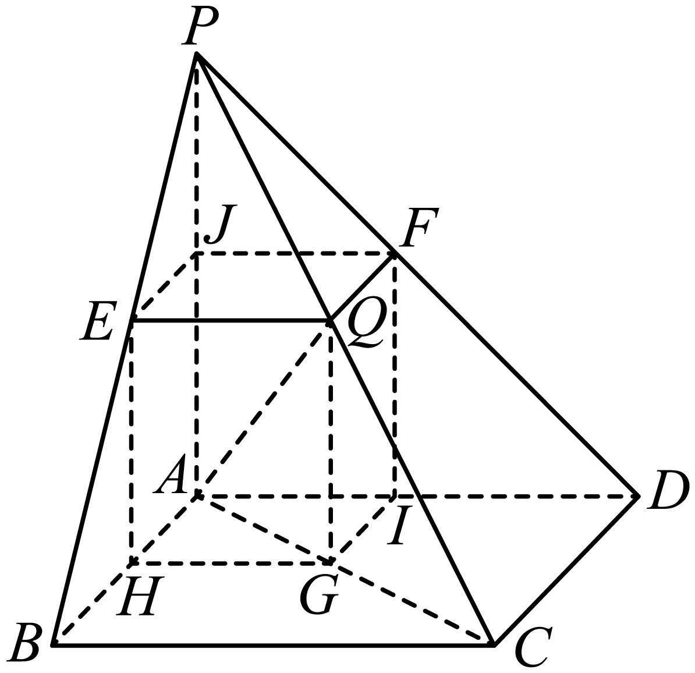

**变式34．**（2024·全国·高三专题练习）在直三棱柱中，，且分别为和的中点，为线段（包括端点）上一动点，为侧面上一动点，则的最小值为（    ）

A．	B．

C．	D．

【答案】B

【解析】当为某确定点时，要使取得最小值，则必须为最小值，此时，为点在侧面的投影.

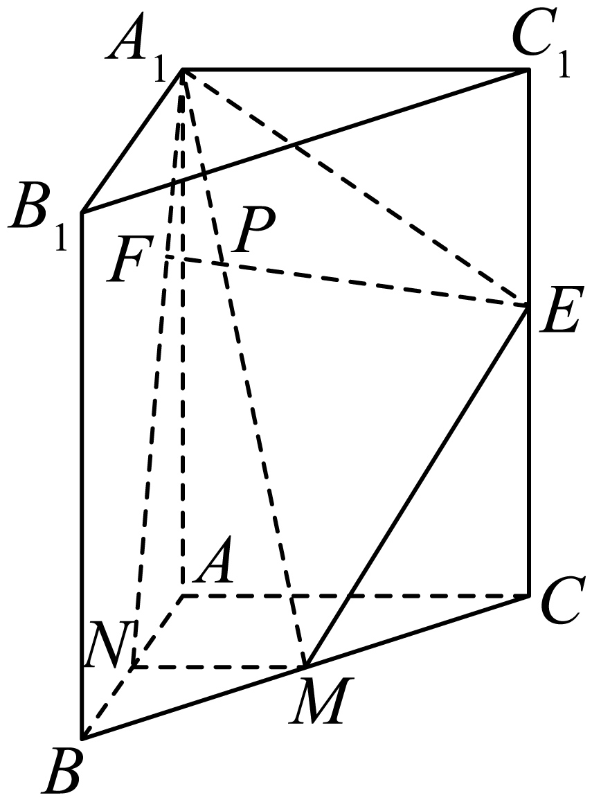

取的中点.

因为分别为的中点，所以为的中位线，所以.

因为所以，所以.

在直三棱柱中，面，所以.

因为面，面，,

所以侧面，故在侧面的投影为.

作于点，此时满足题意.

.

在中，，.

在中，

因为,所以，所以为直角三角形.

所以，.

将平面与平面展开到同一平面，如图所示，

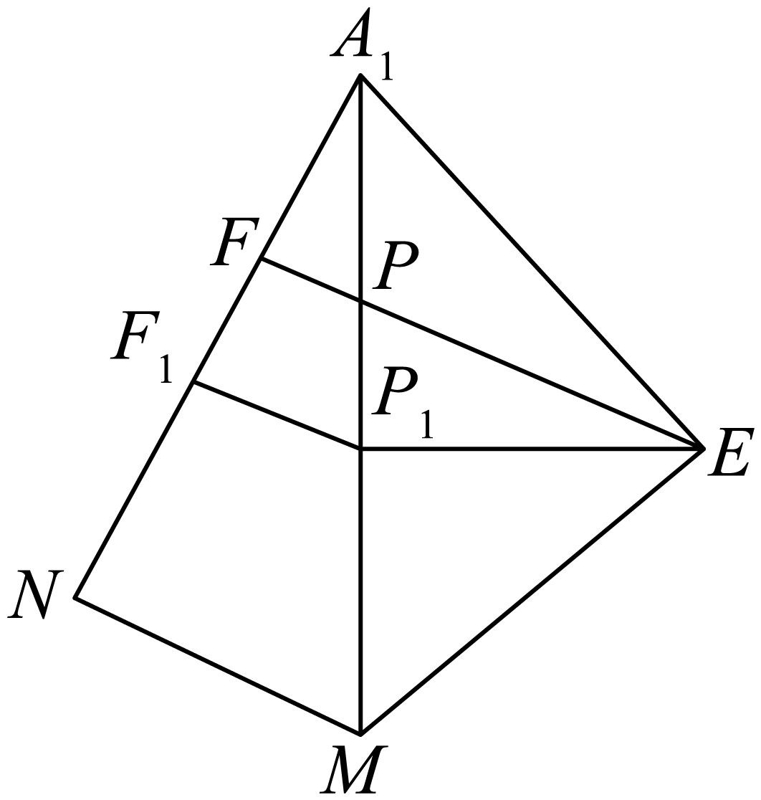

所以.

作于点，交于点,此时达到最小值，

则

故选：B

**题型六：空间角问题**

**例16．**（2024·全国·高三专题练习）如图，斜三棱柱中，底面是正三角形，分别是侧棱上的点，且，设直线与平面所成的角分别为，平面与底面所成的锐二面角为，则（    ）

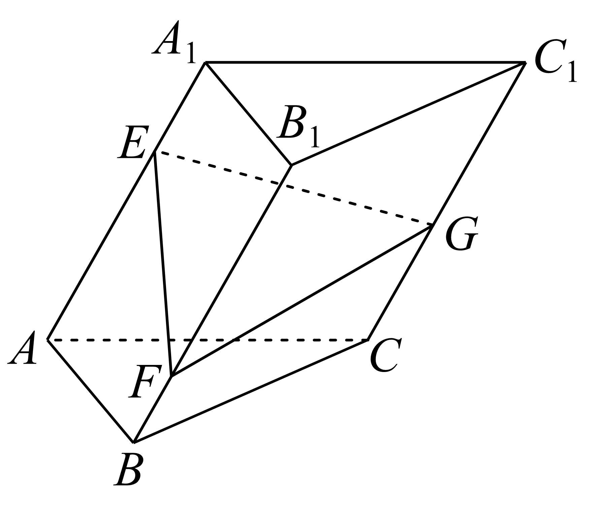

A．

B．

C．

D．

【答案】B

【解析】

如图：延长*EF*，*AB*交于*M*，延长*EG*，*AC*交于*N*，延长*FG*，*BC*交于*D*，易得*MN*为平面*ABC*和平面*EFG*的交线，

又*D*在平面*ABC*和平面*EFG*上，则*D*在直线*MN*上，即*M*，*N*，*D*三点共线，由外角定理可得.

过*A*作面*EFG*，垂足为*P*，过*A*作，垂足为*Q*，连接，易得即为直线与平面所成的角，

则，又面*EFG*，面*EFG*，则，又，面，，

所以面，面，则，则即为平面与底面所成的锐二面角，则，

又，则，同理可得，则，

又由，

，

则，

故，A，C错误；

故，由可知，所以，

即，整理可得，

即，即，

故，又，故，B正确，D错误.

故选：B.

**例17．**（2024·浙江·高考真题）设三棱锥的底面是正三角形，侧棱长均相等，是棱上的点（不含端点），记直线与直线所成角为，直线与平面所成角为，二面角的平面角为，则

A．	B．

C．	D．

【答案】B

【解析】本题以三棱锥为载体，综合考查异面直线所成的角、直线与平面所成的角、二面角的概念，以及各种角的计算.解答的基本方法是通过明确各种角，应用三角函数知识求解，而后比较大小.而充分利用图形特征，则可事倍功半.方法1：如图为中点，在底面的投影为，则在底面投影在线段上，过作垂直，易得，过作交于，过作，交于，则，则，即，，即，综上所述，答案为B.

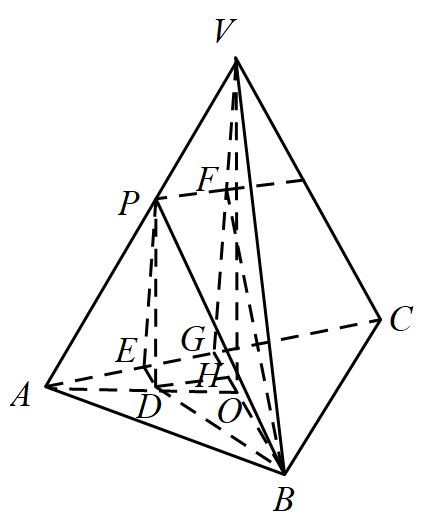

方法2：由最小角定理，记的平面角为（显然）

由最大角定理，故选B.

方法3：（特殊位置）取为正四面体，为中点，易得

，故选B.

<strong>例18．</strong>（2024·浙江·统考高考真题）如图，已知正三棱柱，<em>E</em>，<em>F</em>分别是棱上的点．记与所成的角为，与平面所成的角为，二面角的平面角为，则（    ）

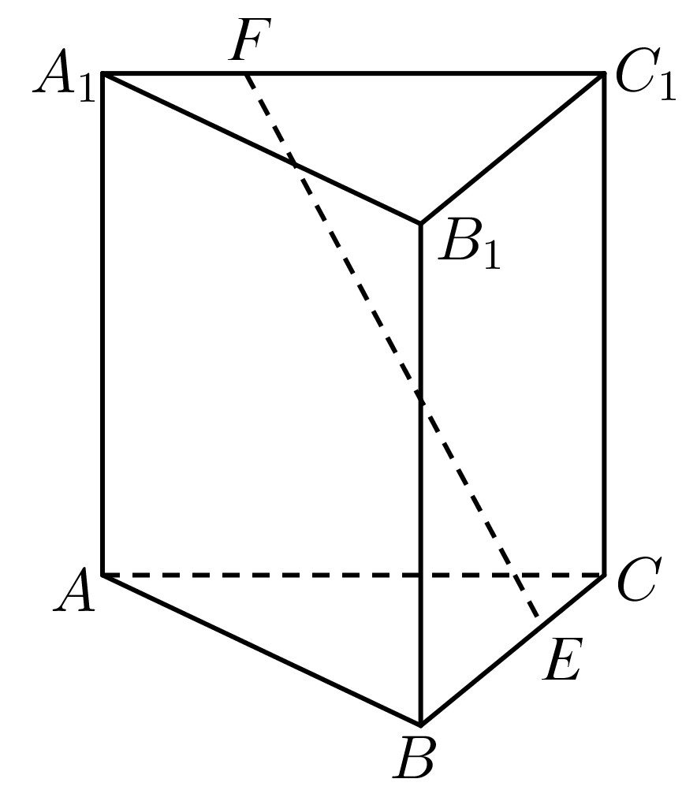

A．	B．	C．	D．

【答案】A

【解析】如图所示，过点作于，过作于，连接，

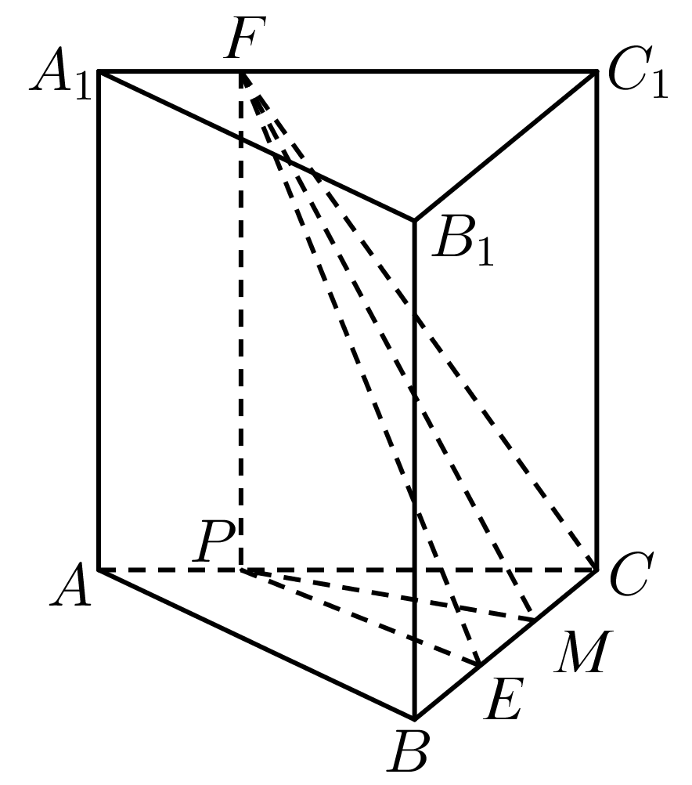

则，，，

，，，

所以，

故选：A．

**变式35．**（2024·浙江温州·高二温州中学校考期末）斜三棱柱中，底面是正三角形，侧面是矩形，是线段上的动点，记直线与直线所成的角为，直线与平面所成的角为，二面角的平面角为，则（    ）

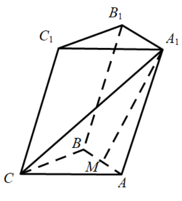

A．，	B．，

C．，	D．，

【答案】B

【解析】根据直线和平面的最小角定理，结合线面角和二面角的定义，即可得解.根据最小角定理，可得，

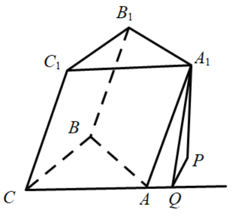

当在线段上的移动时，

和重合时，

与平面所成角最大，(因为ABB1A1为矩形）

作平面于，

作的延长线于，

连接和，则，，

由于为直角，

所以，可得，

故选：B.

**变式36．**（2024·浙江绍兴·高三统考期末）斜三棱柱中，底面是正三角形，侧面是矩形，且，是的中点，记直线与直线所成的角为，直线与平面所成的角为，二面角的平面角为，则（    ）

A．，	B．，

C．，	D．，

【答案】B

【解析】过点作面交面于点，连结，过点作交于点，连结，则，，表示出这些角然后比较大小即可.如图：过点作面交面于点，连结，过点作交于点，连结，

则，，

因为直线与平面所成的角为直线与平面内所有直线所成的角中最小的，故，

又因为

，故，

故选：B.

**变式37．**（2024·全国·高三专题练习）已知等边，点分别是边上的动点，且满足，将沿着翻折至点处，如图所示，记二面角的平面角为，二面角的平面角为，直线与平面所成角为，则（    ）

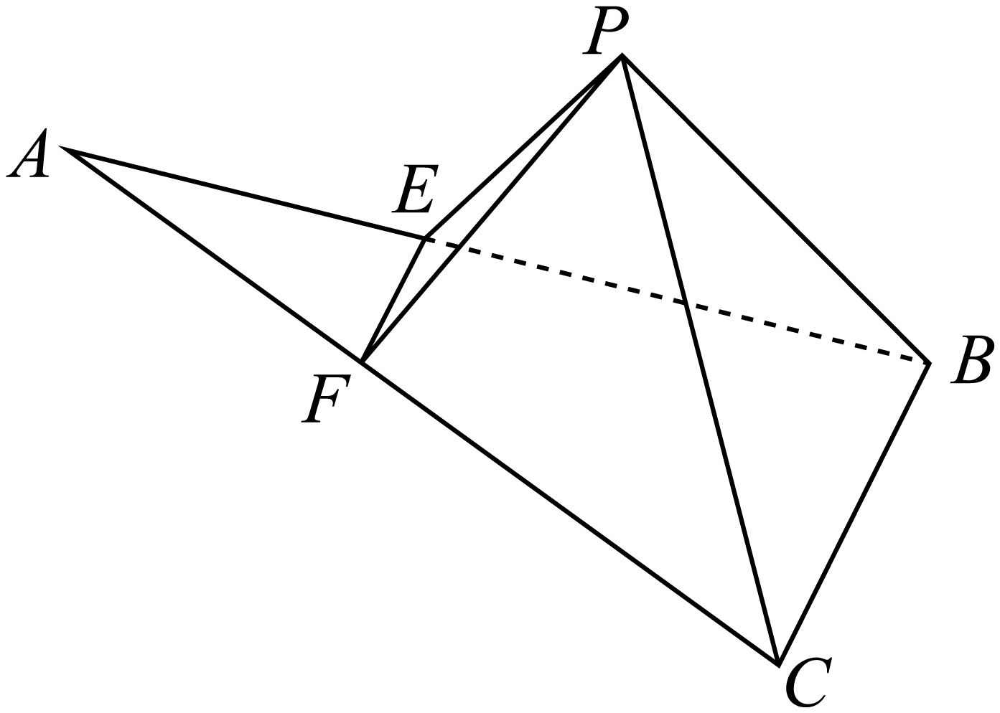

A．	B．	C．	D．

【答案】A

【解析】在等边中，取*BC*边中点*D*，连接*AD*，交*EF*于*O*，连接*PO*，

则，，平面，平面

故平面，又平面，则平面平面

在中，过*P*做*PM*垂直于*OD*于*M*，则平面，连接*MF*，

在等边中，过*M*做*MN*垂直于*AC*于*N*，连接*PN.*

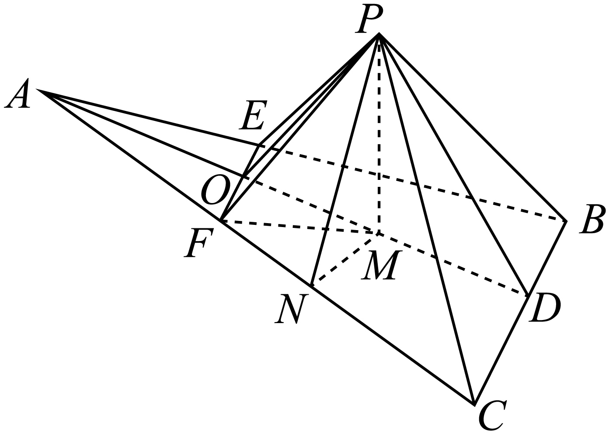

由，则为二面角的平面角即，

由平面，，则为二面角的平面角即

由平面，则直线与平面所成角，即，

设，则，，，

，

，

则有，

由

可得，则有，则

又

故，又

故

故选：A

**变式38．**（2024·江苏·高一专题练习）正四面体中，是侧棱上（端点除外）的一点，若异面直线与直线所成的角为，直线与平面所成的角为，二面角的平面角为，则（    ）

A．	B．

C．	D．

【答案】C

【解析】正四面体中，取中点，连接，，

过作于，连接，，

过作的平行线交于，则，

由，，，平面，平面

可得平面，则，则

由平面，可得平面平面，

又平面平面，平面，，

则平面，则，

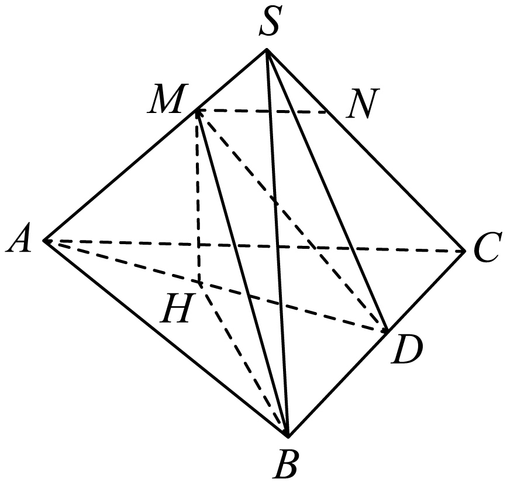

因为，且，所以.

设正四面体边长为1，，有.

，

因为

所以，又，则

综上：

故选：C

<strong>变式39．</strong>（2024·全国·高三专题练习）在三棱锥中，顶点<em>P</em>在底面的射影为的垂心<em>O</em>（<em>O</em>在内部），且<em>PO</em>中点为<em>M</em>，过<em>AM</em>作平行于<em>BC</em>的截面，过<em>BM</em>作平行于<em>AC</em>的截面，记，与底面<em>ABC</em>所成的锐二面角分别为，，若，则下列说法错误的是（    ）

A．若，则

B．若，则

C．可能值为

D．当取值最大时，

【答案】C

【解析】

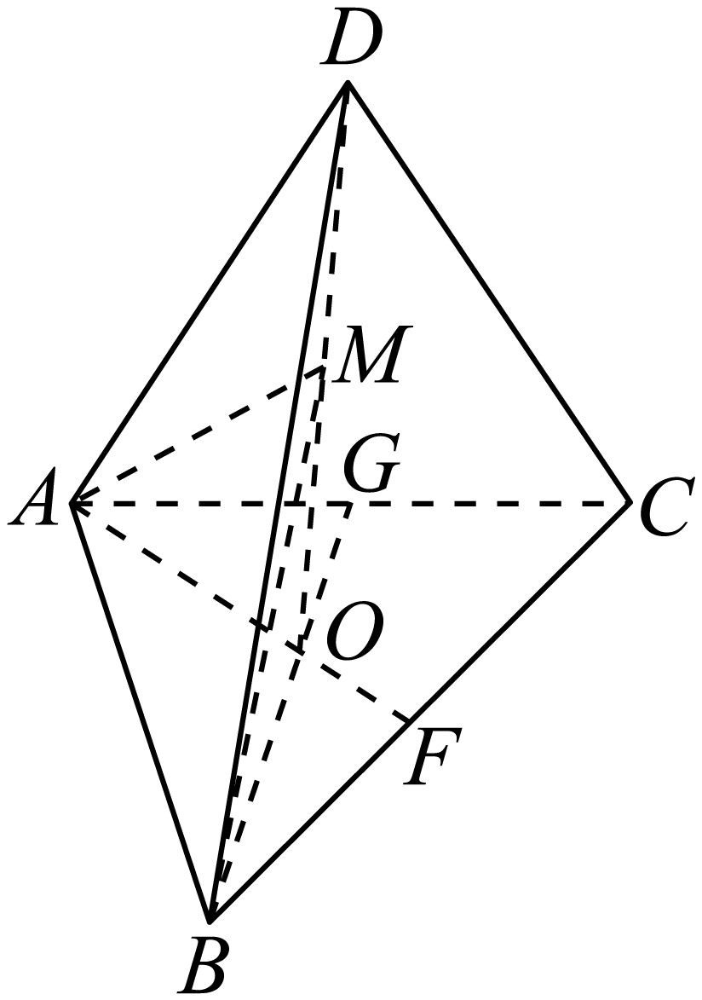

如图所示，连接延长交与，连接延长交与，设平面平面

顶点*P*在底面的射影为的垂心，平面，平面平面

则有：直线与平行

又，则

平面，则

又

则平面

从而

故为与平面的二面角，即

同理可得：

对选项A，，又，则有：

可得：与全等，则

又根据是的垂心，则，

综上可得：直线垂直并平分线段

可得：，故选项A正确；

对选项B，易知有如下角关系：

又，则有：

可得：

解得：

则，故选项B正确；

对选项C，若，则有：

则有：

化简后可得：

令，则有：

则有：，此时方程无解，故选项C错误；

对选项D，设（），则有：

可化简为：

令，则有：

则有：

解得：

故取得最大值时，，此时

同理可得：

故，且

则有：，故选项D正确；

故选：C

<strong>变式40．</strong>（2024·全国·高三专题练习）已知点<em>P</em>是正方体上底面上的一个动点，记面<em>ADP</em>与面<em>BCP</em>所成的锐二面角为，面<em>ABP</em>与面<em>CDP</em>所成的锐二面角为，若，则下列叙述正确的是（    ）

A．	B．

C．	D．

【答案】C

【解析】

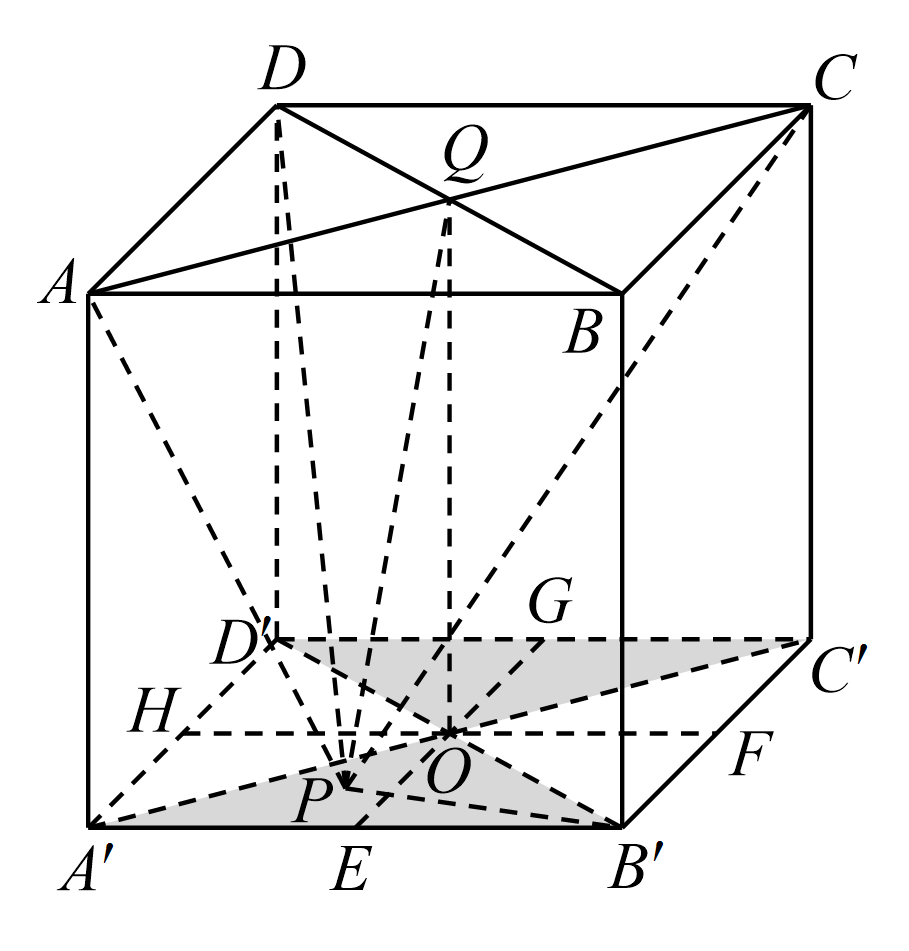

为解析方便，将正方体上下底面对调，如图，取正方体的下底面的各边中点*E*,*F*,*G*,*H*,上底面的中心为*Q*,下底面的中心为*O*,

面*ADP*，面*BCP*所成的角为*α*，面*ABP*，面*CDP*所成的角为*β*，*α*>*β*，

等价于*P*到*HF*的距离比到*EG*的距离大，

所以*P*在如图所示的阴影范围内；

在△*APC*和△*BPD*中，*AC*=*BD*，*PQ*公用，*Q*为共同的中点，

∠*APC*,∠*BPD*的大小由*PQ*于*AC*,*BD*所成的角大小所决定，

所成角越小，则对应角越大，

显然*PQ*与*AC*和*BD*所成的角的大小关系不确定，当*P*在靠近*A*'时*PQ*与直线*AC*所成的角较小，与直线*BD*所成的角则接近于90°，

此时∠*BPD*>∠*APC*，同样当*P*接近于*D*'时∠*APC*>∠*BPD*，故A、B错误；

∠*APD*与∠*BPC*的大小关系实际上是看*P*在*EG*的左侧还是右侧。

若*P*在*EG*左侧，则∠*APD*>∠*BPC*，若*P*在*EG*右侧，则∠*APD*<∠*BPC*，若是在*EG*上，

则∠*APD*=∠*BPC*；

同样，*P*在*HF*的前面，则∠*APB*>∠*CPD*，*P*在*HF*上，则∠*APB*=∠*CPD*，*P*在*HF*的后面，则∠*APB*<∠*CPD*；

所以当*P*在*A*'*OE*内时，max{∠*APD*,∠*BPC*}=∠*APD*，min{∠*APD*，∠*BPC*}=∠*BPC*，

max{∠*APB*,∠*CPD*}=∠*APB*，min{∠*APB*,∠*CPD*}=∠*CPD*，

因为*PH*>*PE*，所以∠*APD*<∠*APB*，因为*PG*>*PF*，所以∠*BPC*>∠*CPD*，

因此max{∠*APD*,∠*BPC*}<max{∠*APB*,∠*CPD*}，min{∠*APD*，∠*BPC*}>min{∠*APB*,∠*CPD*}，

根据对称性，在其余区域内，具有相同的结论.

故D正确，C错误，

故选：D.

**变式41．**（2024·浙江金华·统考模拟预测）已知四面体中，棱，所在直线所成角为，且，，，面和面所成的锐二面角为，面和面所成的锐二面角为，当四面体的体积取得最大值时（    ）.

A．	B．	C．	D．不能确定

【答案】A

【解析】

，即，

整理得，

解得，当且仅当时，等号成立，

所以，，

所以，当为等边三角形时，的面积取到最大值.

过作∥，且，连接，，

则四边形为菱形，

因为，所在直线所成角为，所以，

当面面时，四面体的高取得最大值，

，即，解得，

因为，即，所以，即，

又因为面面，所以面，

过作交于点，过作交于点，

连接，，则，，

所以为面和面所成的二面角，

为面和面所成的锐二面角，

即，，

因为，，所以，

又因为，所以，即，

所以，即，所以.

故选：A.

**变式42．**（2024·浙江·校联考二模）已知三棱柱的所有棱长均相等，侧棱平面，过作平面与平行，设平面与平面的交线为，记直线与直线所成锐角分别为，则这三个角的大小关系为

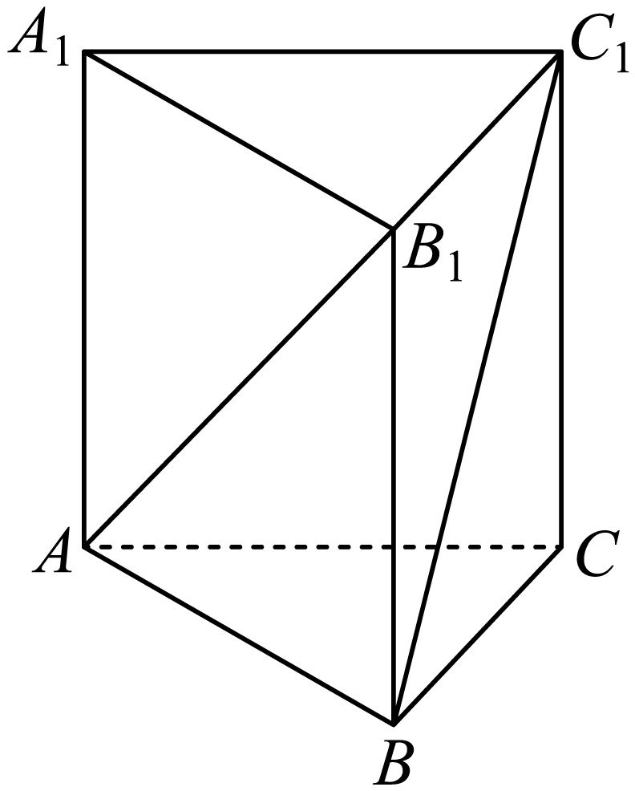

A．	B．

C．	D．

【答案】B

【解析】

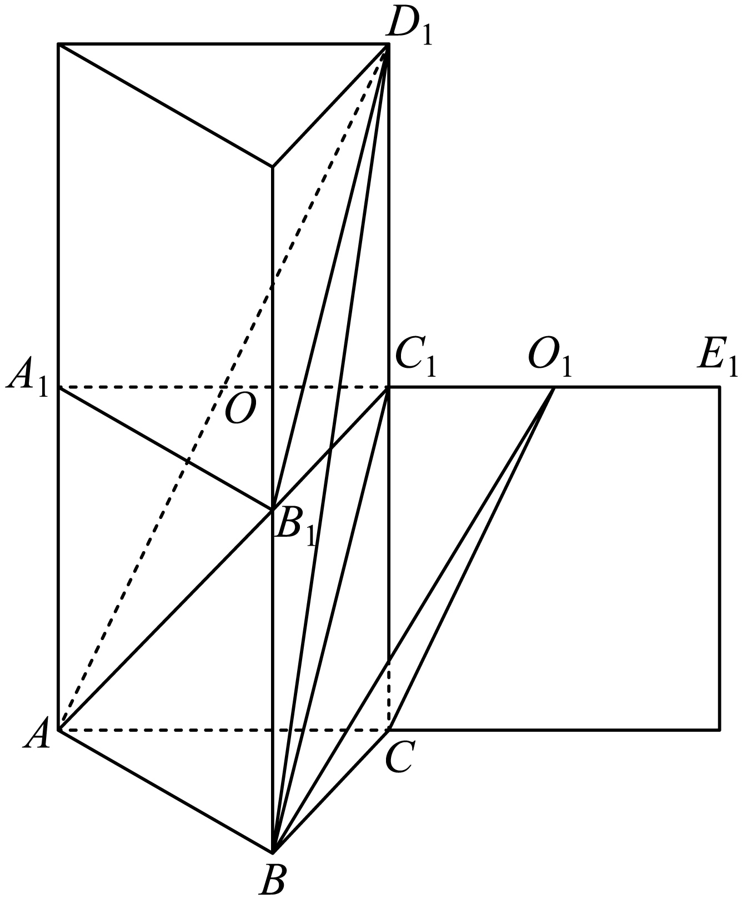

如图，，设为的中点，为的中点，

由图可知过且与平行的平面为平面，所以直线即为直线，

由题易知，的补角，分别为，

设三棱柱的棱长为2，

在中，，

；

在中，，

；

在中，，

，

.

故选：B

**题型七：立体几何装液体问题**

**例19．**（2024·全国·高三专题练习）已知一个放置在水平桌面上的密闭直三棱柱容器，如图1，为正三角形，，，里面装有体积为的液体，现将该棱柱绕旋转至图2.在旋转过程中，以下命题中正确的个数是（    ）

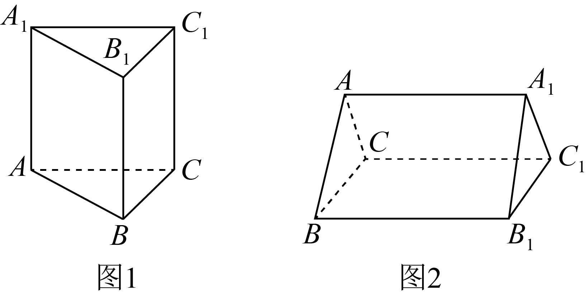

①液面刚好同时经过，，三点；

②当平面与液面成直二面角时，液面与水平桌面的距离为；

③当液面与水平桌面的距离为时，与液面所成角的正弦值为.

A．0	B．1	C．2	D．3

【答案】D

【解析】①若液面刚好同时经过,,三点,则液体的体积为四棱锥,

因为,所以①正确；

②当平面与液面成直二面角时,即为图2的位置,设液面与直三棱柱的交点为,如图所示,

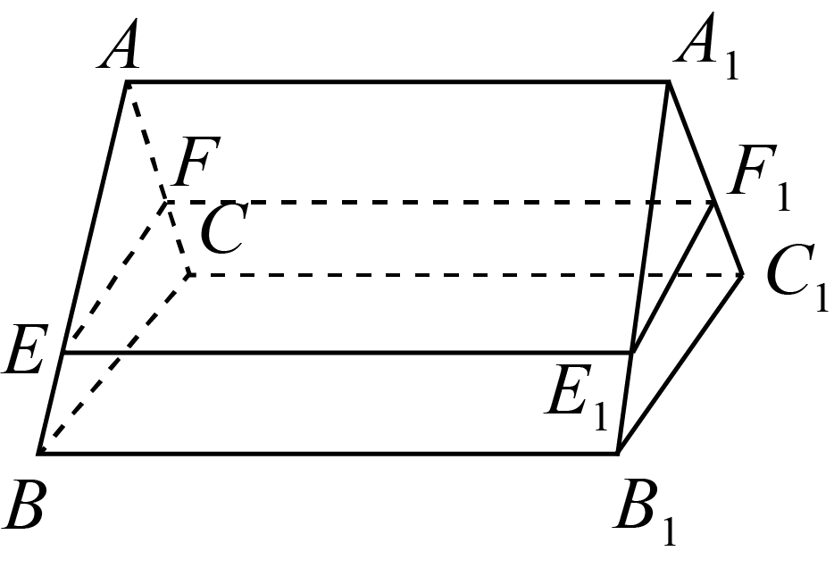

因为直三棱柱的体积为,

所以直棱柱的体积为,

所以,即,则在中边上的高为,

因为在中边上的高为,所以液面与水平桌面的距离为,所以②正确；

③当液面刚好同时经过,,三点时,如图所示,

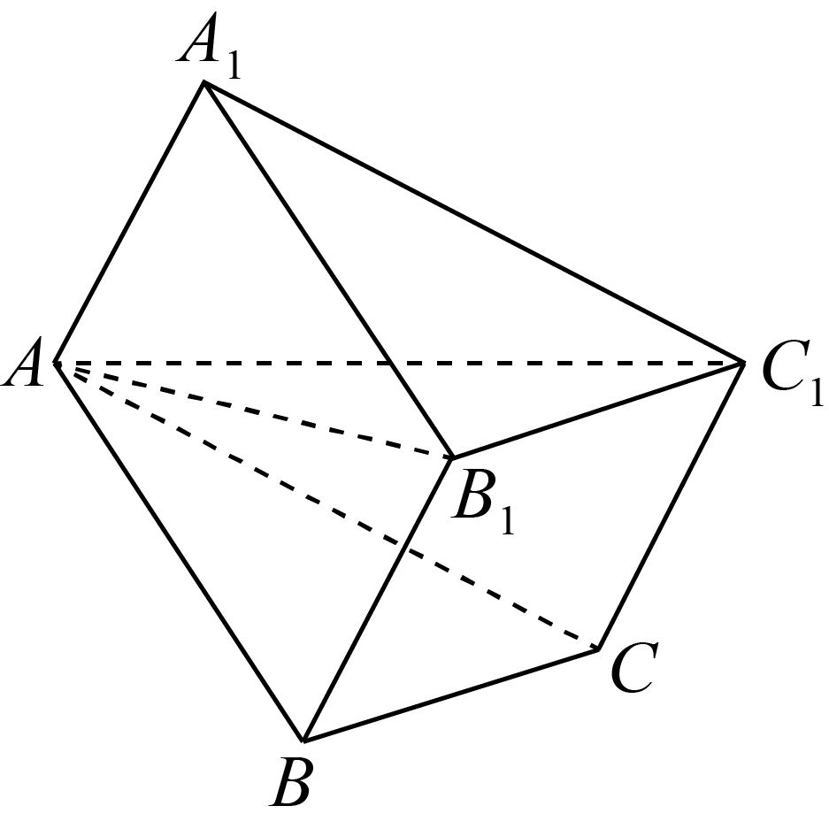

此时,则,

易得,则中边上的高为,

所以,

设点到平面的距离为,则,即,

即液面与水平桌面的距离为,

由棱柱的对称性可得点到平面的距离为,设与液面所成角为,

则,所以③正确,

所以①②③正确,

故选:D

**例20．**（2024·全国·高三专题练习）一个密闭且透明的正方体容器中装有部分液体，已知该正方体的棱长为1，如果任意转动该正方体，液面的形状都不可能是三角形，那么液体体积的取值范围为（    ）

A．	B．	C．	D．

【答案】B

【解析】如图，正方体，若要使液面形状不可能为三角形，则当平面平行于水平面放置时，液面必须高于平面，且低于平面.若满足上述条件，则任意转动正方体，液面形状都不可能为三角形.设液体的体积为，则，而，，所以液体的体积的取值范围为.

故选：*B.*

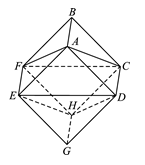

**例21．**（2024·全国·高三专题练习）一个密闭且透明的正方体容器中装有部分液体，已知该正方体的棱长为2，如果任意转动该正方体，液面的形状都不可能是三角形，那么液体的体积的取值范围为（    ）

A．	B．	C．	D．

【答案】D

【解析】由题意可知，若要使液面的形状都不可能为三角形，则液体的体积应大于三棱锥的体积，小于多面体的体积.求解即可.如图正方体，连接.

若要使液面的形状都不可能为三角形

则液体的体积应大于三棱锥的体积，小于多面体的体积.

设液体的体积为，则.

因为，.

所以液体的体积的取值范围为.

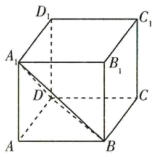

故选：D

**变式43．**（2024·全国·高三专题练习）已知某圆柱形容器的轴截面是边长为2的正方形，容器中装满液体，现向此容器中放入一个实心小球，使得小球完全被液体淹没，则此时容器中所余液体的最小容量为（    ）

A．	B．	C．	D．

【答案】B

【解析】圆柱的轴截面是边长为2的正方形，可知圆柱底面半径为1，母线长为2，故圆柱体积为，

当小球与圆柱的侧面、上下底面都相切时所余液体容量最小，此时，小球的体积为，所余液体容量为.

故选：B.

<strong>变式44．（多选题）（2024·辽宁丹东·统考二模）</strong>如图，玻璃制成的长方体容器内部灌进一多半水后封闭，仅让底面棱<em>BC</em>位于水平地面上，将容器以<em>BC</em>为轴进行旋转，水面形成四边形<em>EFGH</em>，忽略容器壁厚，则（    ）

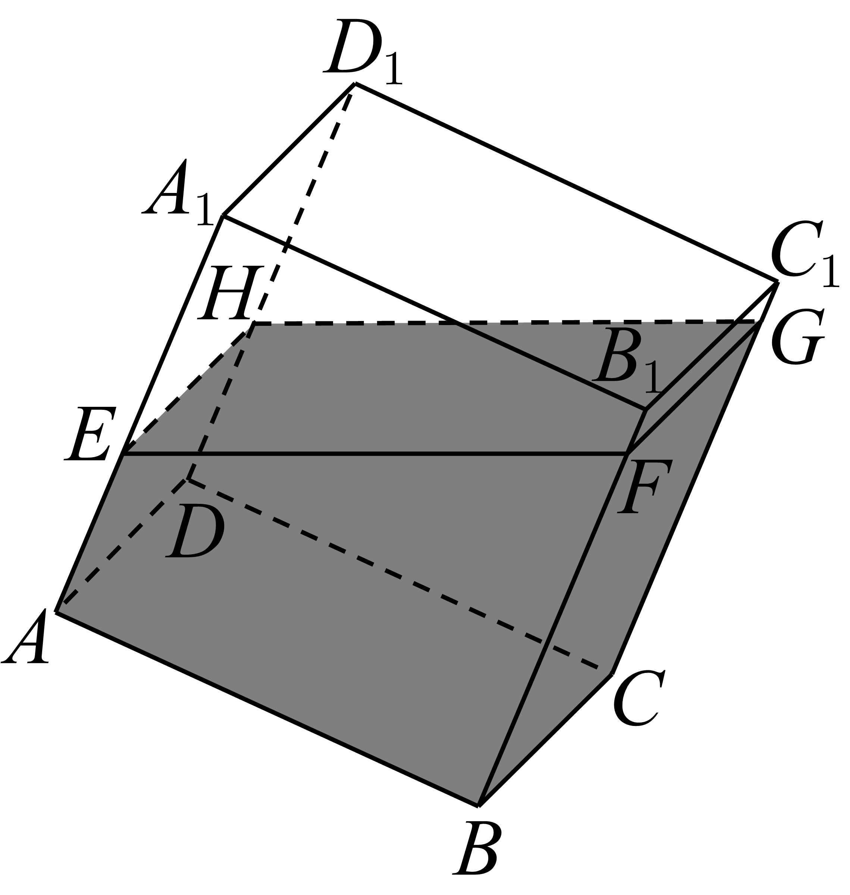

A．始终与水面*EFGH*平行

B．四边形*EFGH*面积不变

C．有水部分组成的几何体不可能是三棱柱

D．*AE*+*BF*为定值

【答案】AC

【解析】可知水面<em>EFGH</em>，水面<em>EFGH</em>，所以水面<em>EFGH</em>，所以<em>A1D1</em>始终与水面平行，故选项A正确．

由于平面，所以,所以，又，平面截两平行平面和，所以，所以四边形是矩形，*EH*=*FG*长度不变，但是*EF*改变，水面所在四边形*EFGH*面积改变，选项B错误．

有水部分组成的几何体为棱柱，因为水的体积大于一半容器容积，所以不可能是三棱柱，选项C正确．

有水部分的棱柱体积不变，高<em>BC</em>也不变，所以底面面积不变，所以当且仅当<em>E</em>，<em>F</em>分别在棱<em>AA1</em>，<em>BB1</em>上时，<em>AE</em>+<em>BF</em>是定值，当<em>E</em>在上，在上时，是定值，即是定值，即是定值，而不一定和相等，所以此时<em>AE</em>+<em>BF</em>不是定值.所以选项D错误．

故选：AC

**变式45．（多选题）（2024·全国·高三专题练习）** 透明塑料制成的正方体密闭容器的体积为64，注入体积为的液体．如图，将容器下底面的顶点置于地面上，再将容器倾斜．随着倾斜度的不同，则下列说法正确的是（    ）

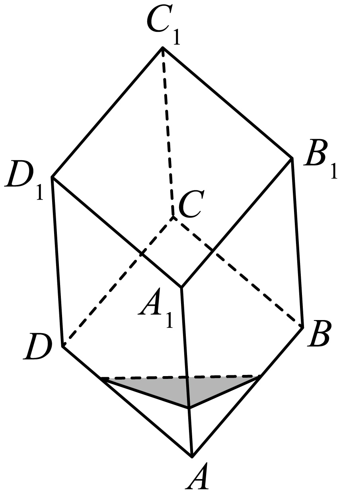

A．液面始终与地面平行

B．时，液面始终呈平行四边形

C．当时，有液体的部分可呈正三棱锥

D．当液面与正方体的对角线垂直时，液面面积最大值为

【答案】ACD

【解析】液面始终是水平面，与地面平行，所以A正确

当时，体积是正方体的一半，液面正好经过的中点，此时液面是正六边形，不是平行四边形，故B错误

正方体边长为4，液面经过的中点时，有液体部分是正三棱锥，此时，，所以C正确

当液面与正方体的对角线垂直时，液面面积最大时就是选项B中所列举的正六边形面积，面积为，所以D正确

故选：ACD

**变式46．（多选题）（2024·广东广州·高三执信中学校考阶段练习）** 透明塑料制成的正方体密闭容器的体积为注入体积为的液体.如图，将容器下底面的顶点置于地面上，再将容器倾斜.随着倾斜度的不同，则下列说法正确的是（ ）

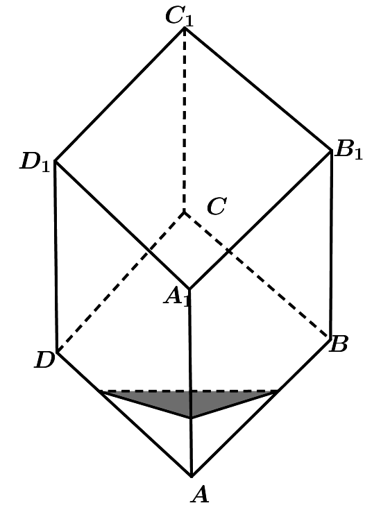

A．液面始终与地面平行

B．时，液面始终是平行四边形

C．当时，有液体的部分可呈正三棱锥

D．当液面与正方体的对角线垂直时，液面面积最大值为

【答案】ACD

【解析】液面始终是水平面，与场面平行，A正确；

时，体积是正方体的一半，如液面正好过棱的中点，此时液面是正六边形，不是平行四边形，B错；

液面过的中点时，此时，有液体的部分是正三棱锥，C正确；

当液面与正方体的对角线垂直时，液面面积的液面面积最大时就是B中所列举的正六边形（此时液体体积是正方体体积的一半），面积为，D正确．

故选：ACD．

<strong>变式47．（多选题）（2024·全国·高三专题练习）</strong>向体积为1的正方体密闭容器内注入体积为<em>x</em>（）的液体，旋转容器，下列说法正确的是（    ）

A．当时，容器被液面分割而成的两个几何体完全相同

B．不管注入多少液体，液面都可以成正三角形形状

C．液面可以是正六边形，其面积为

D．当液面恰好经过正方体的某条体对角线时，液面边界周长的最小值为

【答案】AC

【解析】对于A，当时，题目等价于过正方体中心的平面截正方体为两部分，

根据对称性知两部分完全相同，所以A正确；

对于B，取，此时液面过正方体中心，截面不可能为三角形，所以B错误；

对于C，当液面与正方体的体对角线垂直时，液面为如图所示正六边形时面积最大，

其中正六边形的顶点均为对应棱的中点，

所以液面面积的最大值为，C正确；

对于D，当液面过时，截面为，将绕旋转，如图所示；

则，

当*D*、*N*、三点共线时等号成立，所以液面周长最小值为，D错误.

故选：AC.

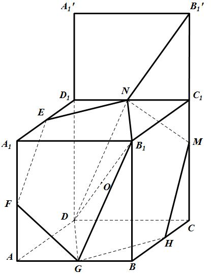

【点晴】本题考查了正方体的截面问题，意在考查学生的计算能力和空间想象能力.

<strong>变式48．</strong>（2024·全国·高三专题练习）在一个密闭的容积为1的透明正方体容器内装有部分液体，如果任意转动该正方体，液面的形状都不可能是三角形，那么液体体积的取值范围是________．

【答案】

【解析】如图，正方体ABCD-EFGH，此时若要使液面不为三角形，则液面必须高于平面EHD，且低于平面AFC．而当平面EHD平行水平面放置时，若满足上述条件，则任意转动该正方体，液面的形状都不可能是三角形．所以液体体积必须＞三棱柱G-EHD的体积，并且＜正方体ABCD-EFGH体积-三棱柱B-AFC体积

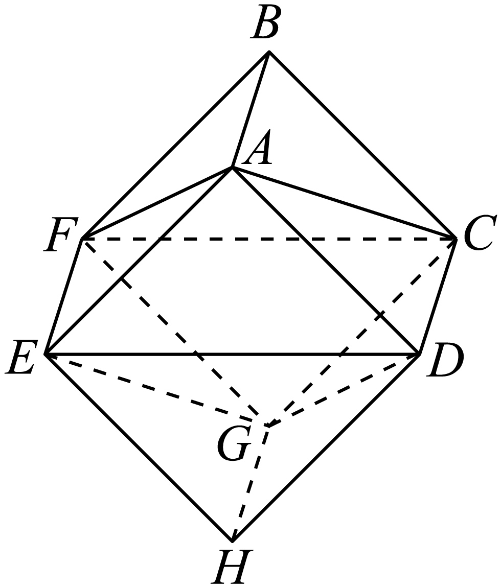

考点：1．棱柱的结构特征；2．几何体的体积的求法

<strong>变式49．</strong>（2024·四川泸州·四川省泸州高级中学校校考一模）一个长、宽、高分别为1、2、3密封且透明的长方体容器中装有部分液体，如果任意转动该长方体，液面的形状都不可能是三角形，那么液体体积的取值范围是__________.

【答案】

【解析】长方体ABCD﹣EFGH，若要使液面不为三角形，

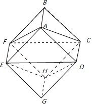

则液面必须高于平面EHD，且低于平面AFC；

而当平面EHD平行水平面放置时，若满足上述条件，则任意转动该长方体，

液面的形状都不可能是三角形；

所以液体体积必须大于三棱锥G﹣EHD的体积，该棱锥的体积为长方体的故体积为1.

并且小于长方体ABCD﹣EFGH体积﹣三棱柱B﹣AFC体积，该几何体的体积为长方体的，即为5.

故答案为

