**第56讲  立体几何解答题**

**必考题型全归纳**

**题型一：非常规空间几何体为载体**

**例1．**（2024·全国·高三专题练习）已知正四棱台的体积为，其中.

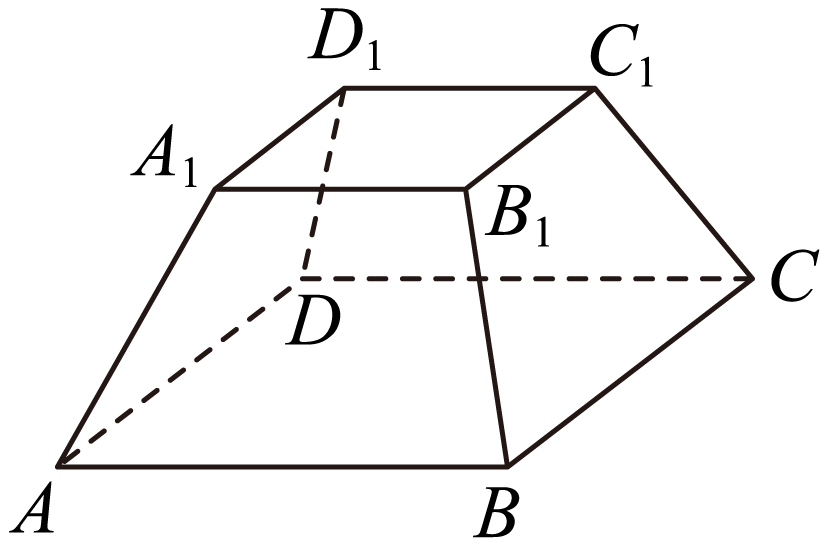

(1)求侧棱与底面所成的角；

(2)在线段上是否存在一点*P*，使得？若存在请确定点的位置；若不存在，请说明理由.

**例2．**（2024·全国·高三专题练习）在三棱台中，为中点，，，.

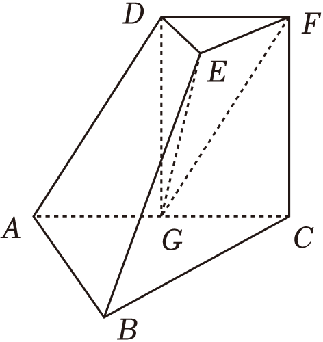

(1)求证：平面；

(2)若，，平面与平面所成二面角大小为，求三棱锥的体积.

**例3．**（2024·重庆万州·高三重庆市万州第二高级中学校考阶段练习）如图，在正四棱台中，，，，为棱，的中点，棱上存在一点，使得平面．

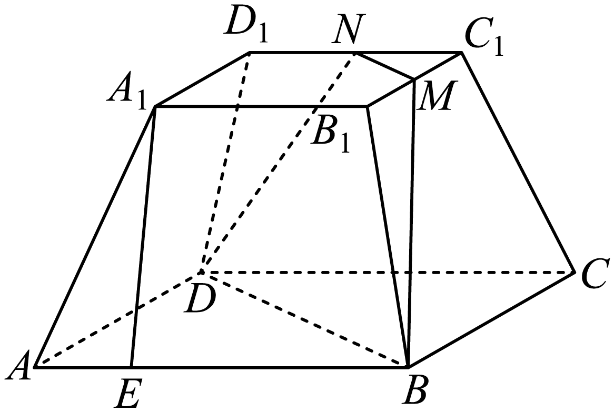

(1)求；

(2)当正四棱台的体积最大时，求与平面所成角的正弦值．

**变式1．**（2024·湖北黄冈·浠水县第一中学校考模拟预测）如图，在三棱台中，，，，，．

(1)证明：平面平面；

(2)设是的中点，求平面与平面夹角的余弦值．

**变式2．**（2024·安徽·高三安徽省定远中学校考阶段练习）如图，圆锥的高为，是底面圆的直径，四边形是底面圆的内接等腰梯形，且，点是母线上一动点.

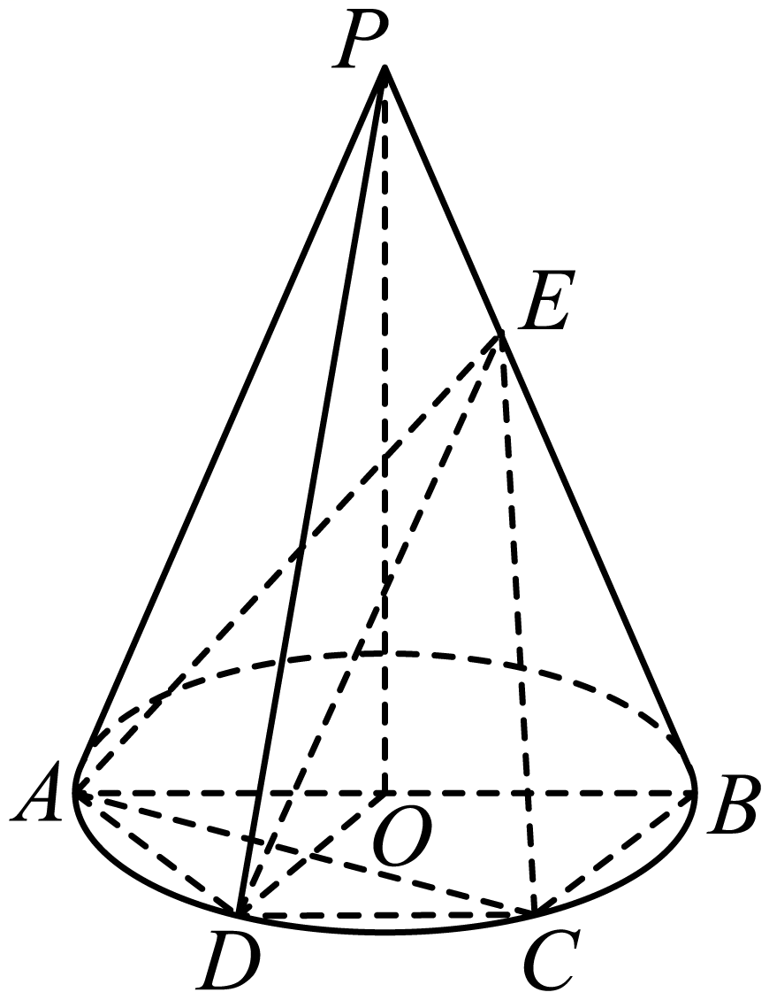

(1)证明：平面平面；

(2)若二面角的余弦值为，求三棱锥的体积.

<strong>变式3．</strong>（2024·云南·云南师大附中校考模拟预测）如图，为圆锥的顶点，<em>A</em>，为底面圆上两点，，为中点，点在线段上，且.

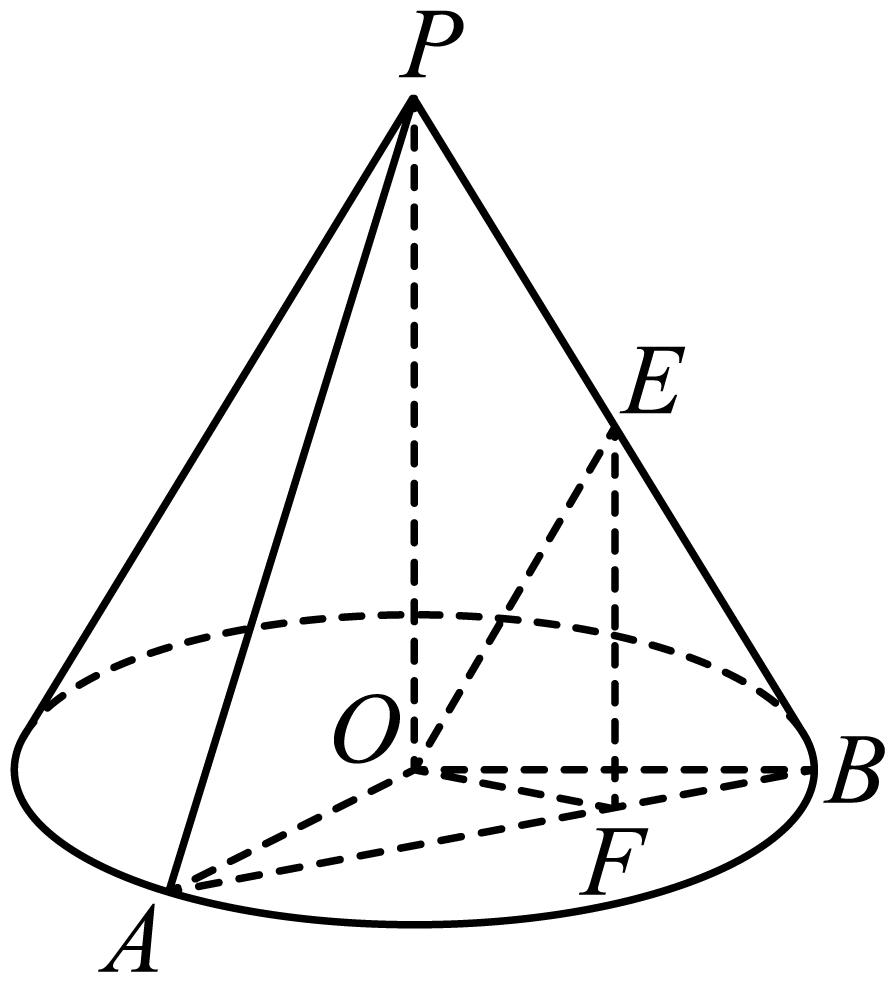

(1)证明：平面平面；

(2)若，求直线与平面所成角的正弦值.

**变式4．**（2024·内蒙古赤峰·校联考三模）如图，为圆锥的顶点，是圆锥底面的圆心，四边形是圆的内接四边形，为底面圆的直径，在母线上，且，，．

(1)求证：平面平面；

(2)设点为线段上动点，求直线与平面所成角的正弦值的最大值．

<strong>变式5．</strong>（2024·山东潍坊·统考模拟预测）如图，线段是圆柱的母线，是圆柱下底面⊙<em>O</em>的内接正三角形，．

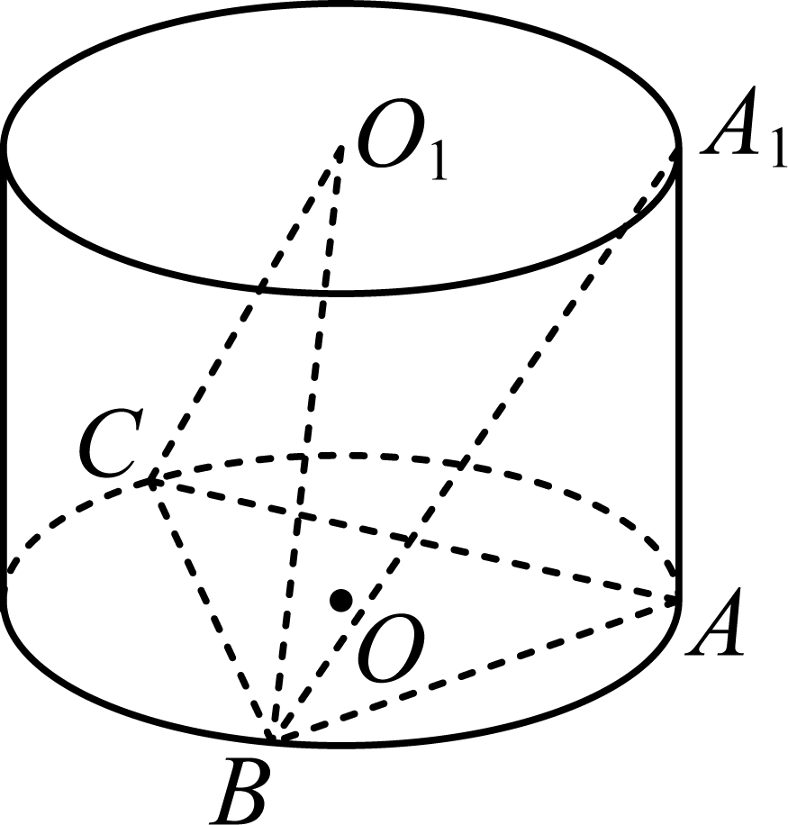

(1)劣弧上是否存在点*D*，使得平面？若存在，求出劣弧的长度；若不存在，请说明理由．

(2)求平面和平面所成角的正弦值．

**题型二：立体几何存在性问题**

<strong>例4．</strong>（2024·全国·高三对口高考）如图，如图1，在直角梯形中，．把沿对角线折起到的位置，如图2所示，使得点<em>P</em>在平面上的正投影<em>H</em>恰好落在线段上，连接，点<em>E</em>，<em>F</em>分别为线段，的中点．

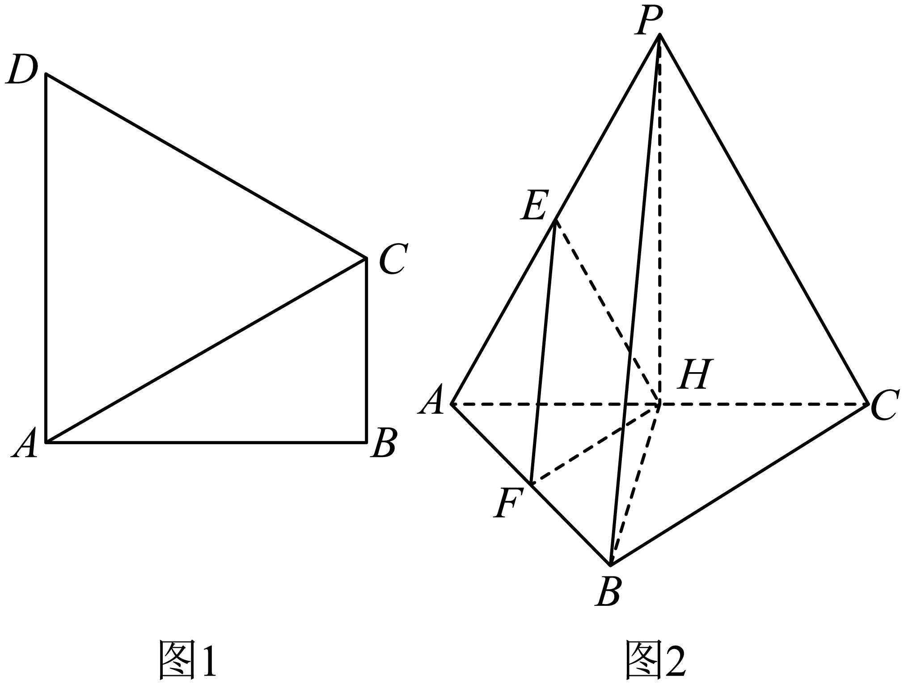

(1)求证：平面//平面；

(2)求直线与平面所成角的正弦值；

(3)在棱上是否存在一点*M*，使得*M*到点四点的距离相等？请说明理由．

**例5．**（2024·上海长宁·上海市延安中学校考三模）已知和所在的平面互相垂直，，，，，是线段的中点，.

(1)求证：；

(2)设，在线段上是否存在点（异于点），使得二面角的大小为.

**例6．**（2024·湖南邵阳·邵阳市第二中学校考模拟预测）如图，在中，，为边上一动点，交于点，现将沿翻折至.

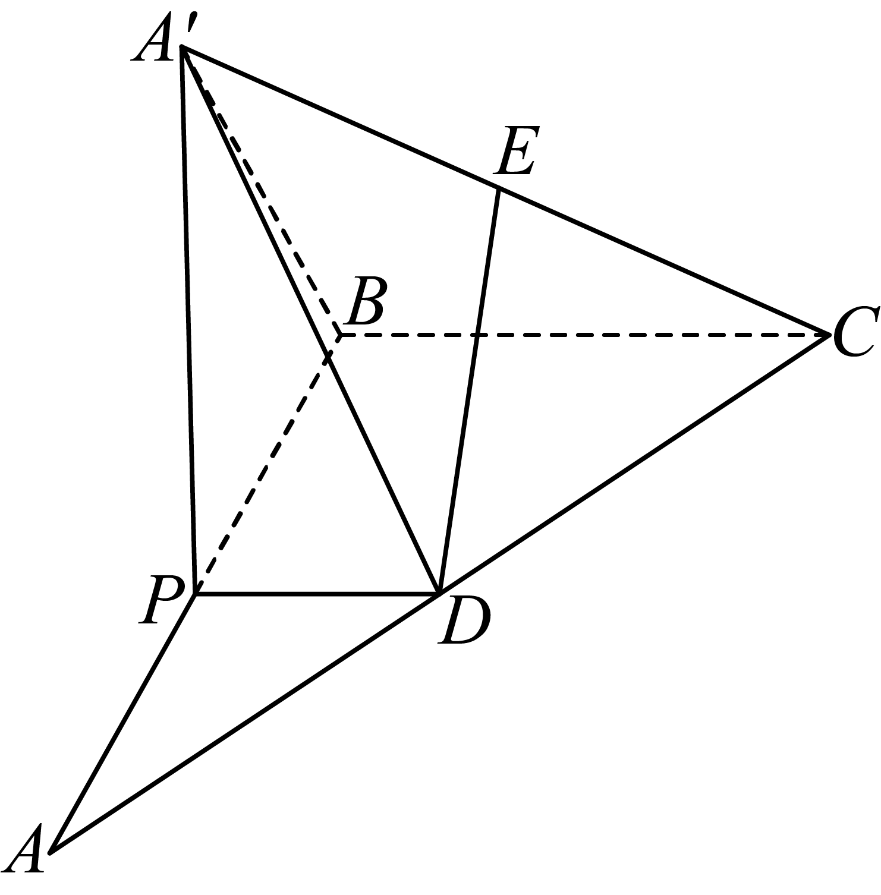

(1)证明：平面平面；

(2)若，且，线段上是否存在一点（不包括端点），使得锐二面角的余弦值为，若存在求出的值，若不存在请说明理由.

**变式6．**（2024·福建厦门·统考模拟预测）筝形是指有一条对角线所在直线为对称轴的四边形．如图，四边形为筝形，其对角线交点为，将沿折到的位置，形成三棱锥．

(1)求到平面的距离；

(2)当时，在棱上是否存在点，使得直线与平面所成角的正弦值为？若存在，求的值；若不存在，请说明理由．

**变式7．**（2024·湖北襄阳·襄阳四中校考模拟预测）斜三棱柱的各棱长都为，点在下底面的投影为的中点.

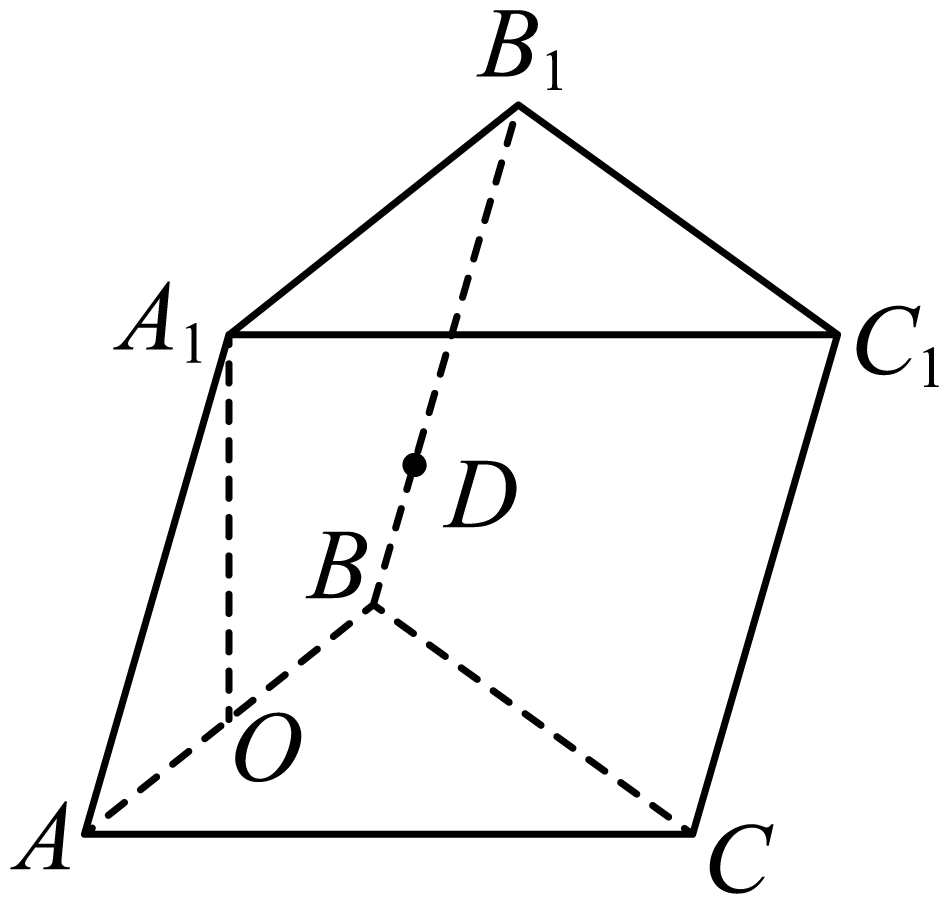

(1)在棱（含端点）上是否存在一点使？若存在，求出的长；若不存在，请说明理由；

(2)求点到平面的距离.

<strong>变式8．</strong>（2024·全国·高三专题练习）如图，在四棱锥中，平面<em>PAD</em>，△<em>PAD</em>为等边三角形，//，，平面<em>PBC</em>交平面<em>PAD</em>直线<em>l</em>，<em>E</em>、<em>F</em>分别为棱<em>PD</em>，<em>PB</em>的中点．

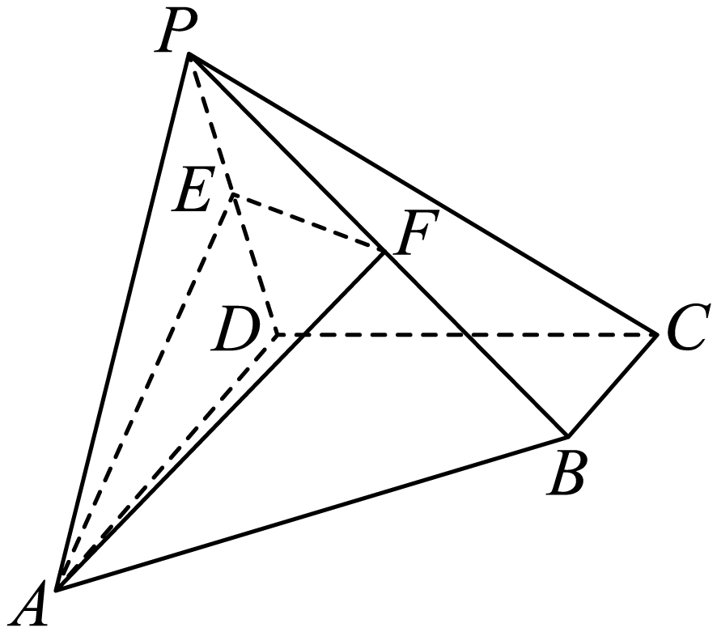

(1)求证：∥；

(2)求平面*AEF*与平面*PAD*所成锐二面角的余弦值；

(3)在棱*PC*上是否存在点*G*，使得∥平面*AEF*？若存在，求的值，若不存在，说明理由．

<strong>变式9．</strong>（2024·湖北襄阳·襄阳四中校考模拟预测）在三棱锥<em>P-ABC</em>中，若已知，，点<em>P</em>在底面<em>ABC</em>的射影为点<em>H</em>，则

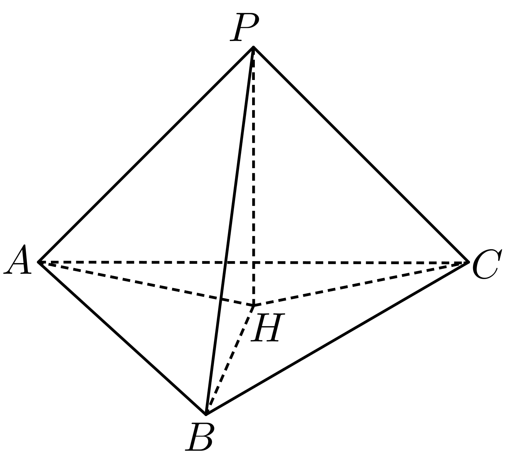

(1)证明：

(2)设，则在线段*PC*上是否存在一点*M*，使得与平面所成角的余弦值为，若存在，设，求出的值，若不存在，请说明理由.

**变式10．**（2024·浙江·校联考模拟预测）在四棱锥中，底面为矩形，，为等腰直角三角形，平面平面，为中点.

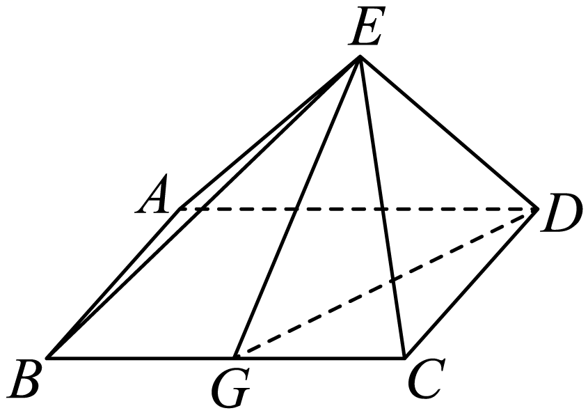

(1)在线段上是否存在点，使得点到平面的距离为.若存在，求出的值；若不存在，说明理由；

(2)求二面角的正弦值.

**变式11．**（2024·全国·高三专题练习）如图，在三棱锥中，侧面是边长为2的正三角形，，，分别为的中点，平面与底面的交线为.

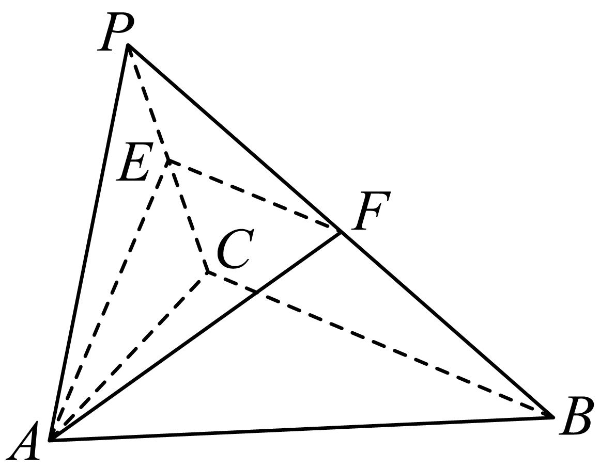

(1)证明：平面.

(2)若三棱锥的体积为，试问在直线上是否存在点，使得直线与平面所成角为，异面直线所成角为，且满足？若存在，求出线段的长度；若不存在，请说明理由.

**变式12．**（2024·安徽淮北·统考二模）如图所示，四棱锥中，底面为菱形，.

(1)证明：面；

(2)线段上是否存在点，使平面与平面夹角的余弦值为？若存在，指出点位置；若不存在，请说明理由.

**题型三：立体几何折叠问题**

<strong>例7．</strong>（2024·河南·洛宁县第一高级中学校联考模拟预测）在图1中，为等腰直角三角形，，，为等边三角形，<em>O</em>为<em>AC</em>边的中点，<em>E</em>在<em>BC</em>边上，且，沿<em>AC</em>将进行折叠，使点<em>D</em>运动到点<em>F</em>的位置，如图2，连接<em>FO</em>，<em>FB</em>，<em>FE</em>，使得．

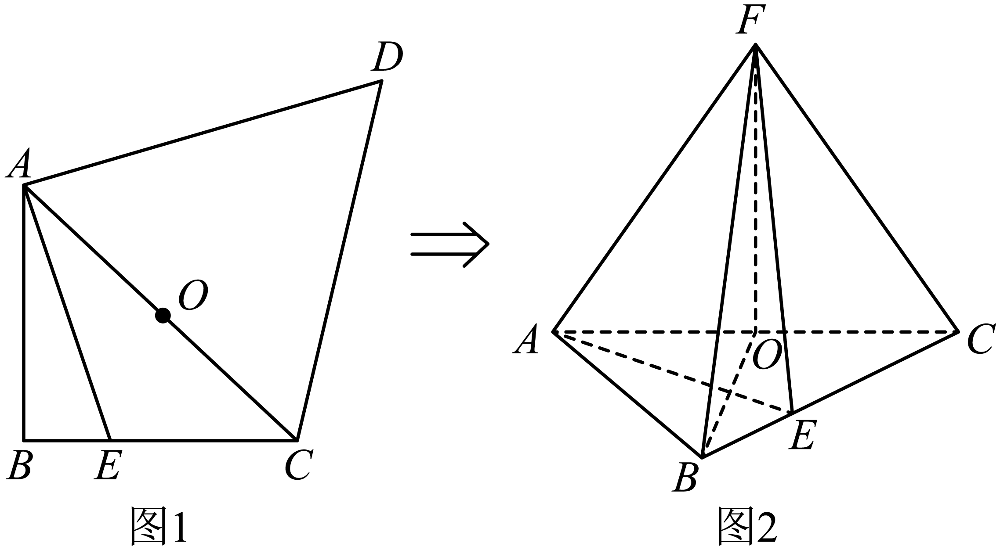

(1)证明：平面．

(2)求二面角的余弦值．

**例8．**（2024·广东深圳·校考二模）如图1所示，等边的边长为，是边上的高，，分别是，边的中点．现将沿折叠，如图2所示.

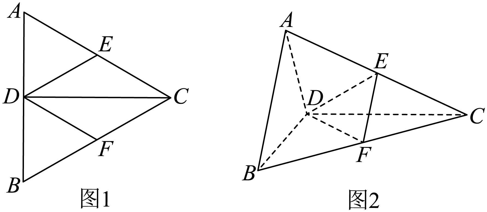

(1)证明：；

(2)折叠后若，求二面角的余弦值.

**例9．**（2024·四川南充·高三阆中中学校考阶段练习）如图甲所示的正方形中，对角线分别交于点，将正方形沿折叠使得与重合，构成如图乙所示的三棱柱

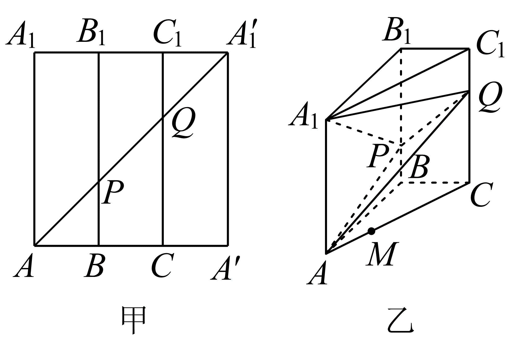

(1)若点在棱上，且，证明：∥平面；

(2)求二面角的余弦值.

<strong>变式13．</strong>（2024·重庆渝中·高三重庆巴蜀中学校考阶段练习）已知如图甲所示，直角三角形<em>SAB</em>中，，，<em>C</em>，<em>D</em>分别为<em>SB</em>，<em>SA</em>的中点，现在将沿着<em>CD</em>进行翻折，使得翻折后<em>S</em>点在底面<em>ABCD</em>的投影<em>H</em>在线段<em>BC</em>上，且<em>SC</em>与平面<em>ABCD</em>所成角为，<em>M</em>为折叠后<em>SA</em>的中点，如图乙所示.

(1)证明：平面*SBC*；

(2)求平面*ADS*与平面*SBC*所成锐二面角的余弦值.

<strong>变式14．</strong>（2024·全国·高三专题练习）如图1，在直角梯形<em>BCDE</em>中，，，<em>A</em>为<em>DE</em>的中点，且，，将沿<em>AB</em>折起，使得点<em>E</em>到达<em>P</em>处（<em>P</em>与<em>D</em>不重合），记<em>PD</em>的中点为<em>M</em>，如图2．

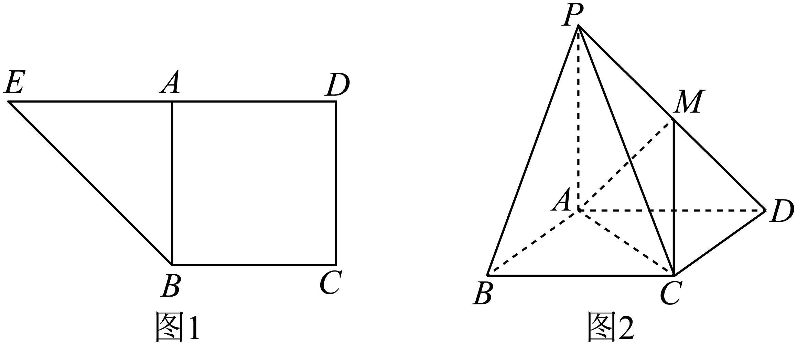

(1)在折叠过程中，*PB*是否始终与平面*ACM*平行？请说明理由；

(2)当四棱锥*P*-*ABCD*的体积最大时，求*CD*与平面*ACM*所成角的正弦值．

<strong>变式15．</strong>（2024·全国·高三专题练习）如图，四边形中，，<em>E</em>，<em>F</em>分别在，上，，现将四边形沿折起，使．

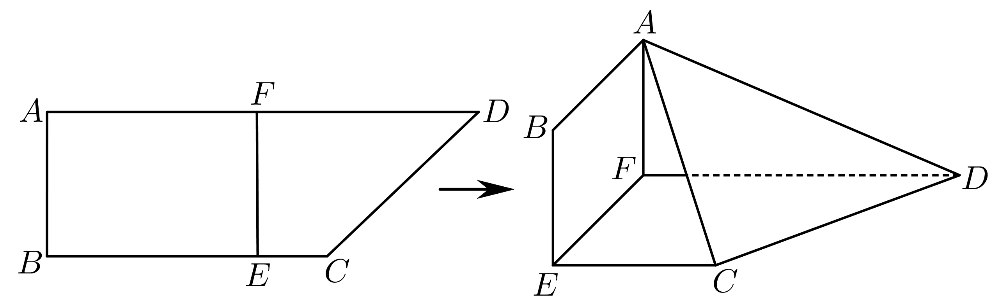

(1)若，在折叠后的线段上是否存在一点*P*，使得平面？若存在，求出的值；若不存在，说明理由．

(2)求三棱锥的体积的最大值，并求出此时点*F*到平面的距离．

<strong>变式16．</strong>（2024·全国·高三专题练习）如图，四边形中，是等腰直角三角形，是边长为2的正三角形，以为折痕，将向一方折叠到的位置，使<em>D</em>点在平面内的射影在上，再将向另一方折叠到的位置，使平面平面，形成几何体.

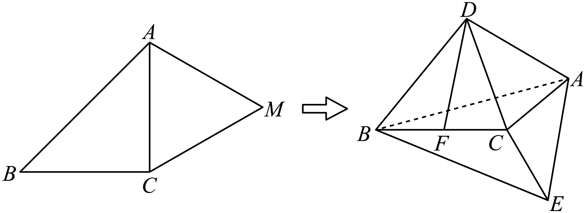

（1）若点*F*为的中点，求证：平面；

（2）求平面与平面所成角的正弦值.

**变式17．**（2024·四川泸州·泸县五中校考三模）如图1，在梯形中，，且，是等腰直角三角形，其中为斜边.若把沿边折叠到的位置，使平面平面，如图2.

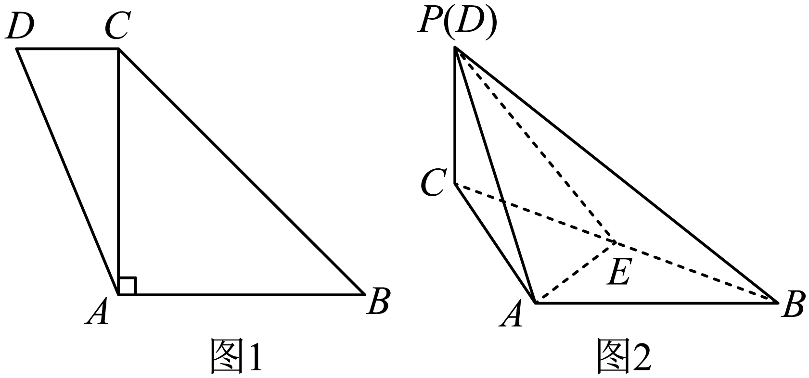

（1）证明：；

（2）若为棱的中点，求点到平面的距离.

**变式18．**（2024·湖南长沙·长沙一中校考一模）如图1，四边形为直角梯形，，，，，，为线段上一点，满足，为的中点，现将梯形沿折叠（如图2），使平面平面.

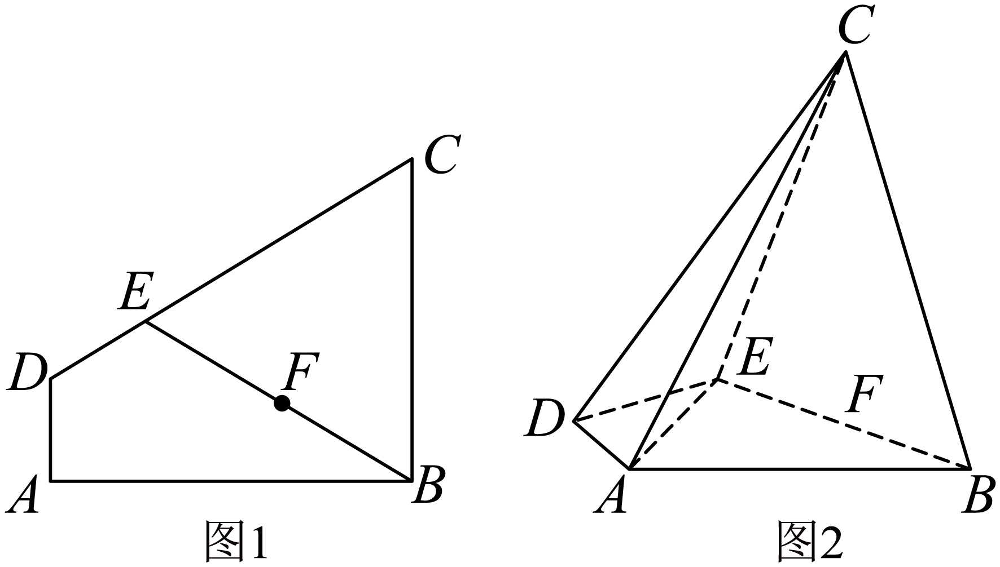

（1）求证：平面平面；

（2）能否在线段上找到一点（端点除外）使得直线与平面所成角的正弦值为？若存在，试确定点的位置；若不存在，请说明理由.

**题型四：立体几何作图问题**

<strong>例10．</strong>（2024·云南昆明·高三校考阶段练习）已知正四棱锥中，<em>O</em>为底面<em>ABCD</em>的中心，如图所示．

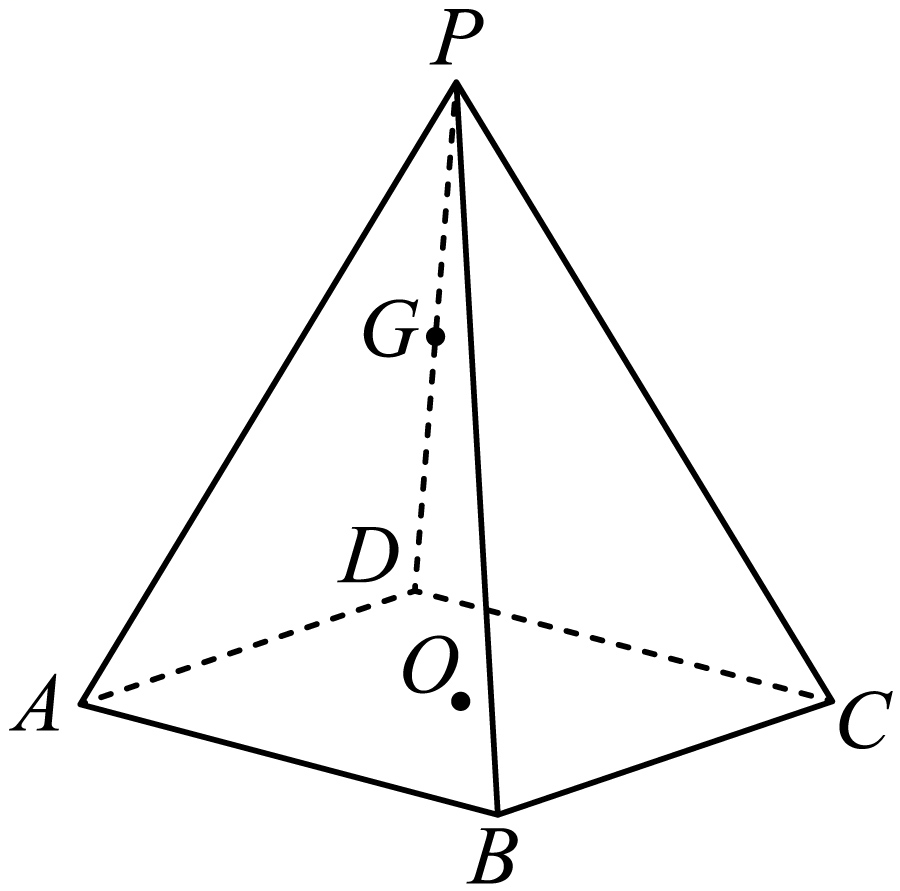

(1)作出过点*O*与平面*PAD*平行的截面，在答题卡上作出该截面与四棱锥表面的交线，写出简要作图过程及理由；

(2)设*PD*的中点为*G*，，求*AG*与平面*PAB*所成角的正弦值．

**例11．**（2024·贵州·校联考模拟预测）如图，已知平行六面体的底面是菱形，，，且.

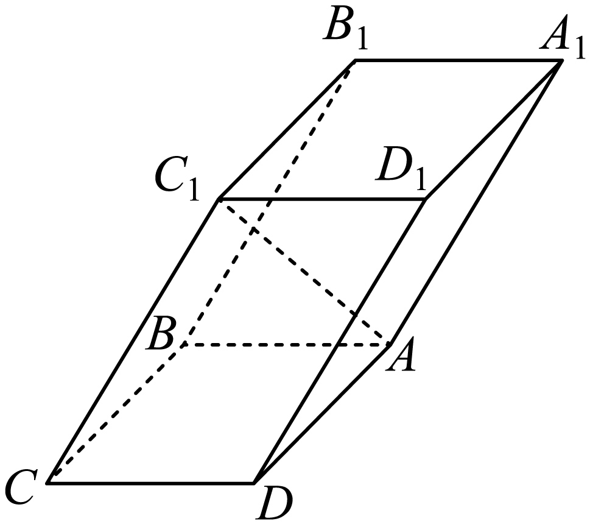

(1)试在平面内过点作直线，使得直线平面，说明作图方法，并证明：直线；

(2)求平面与平面所成锐二面角的余弦值.

**例12．**（2024·全国·高三专题练习）如图，已知平行六面体的底面是菱形，，且.

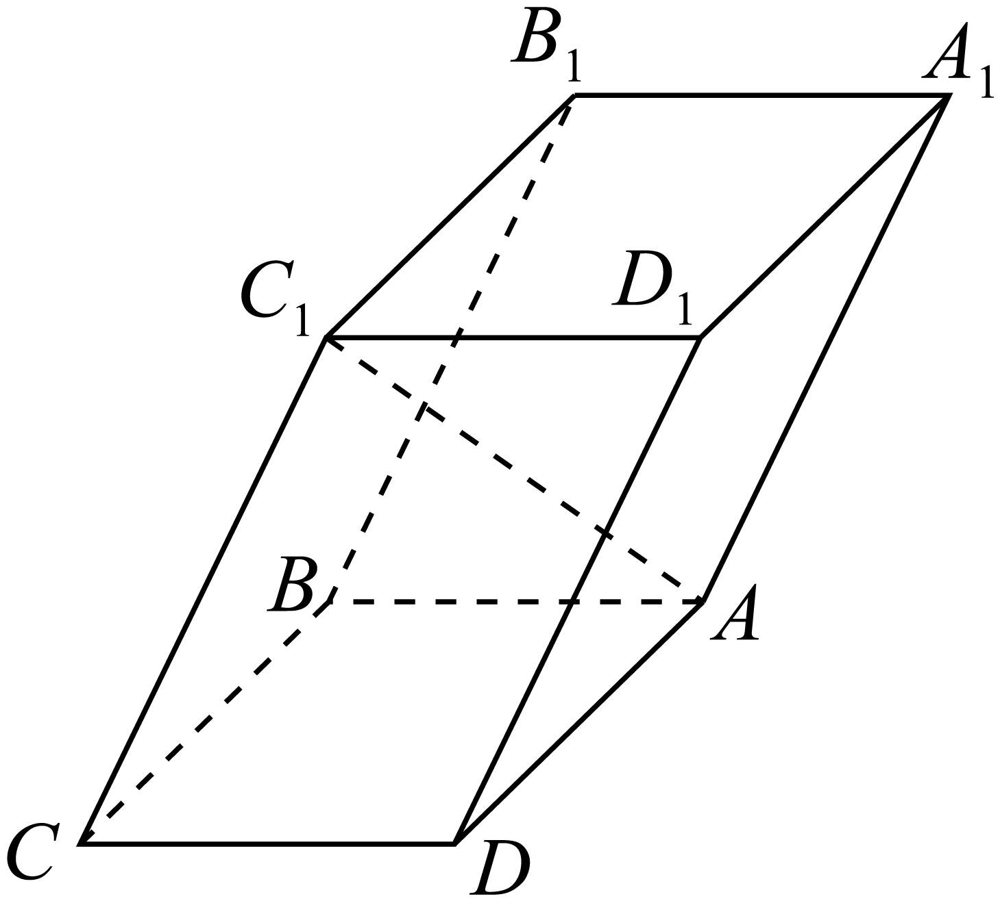

(1)试在平面内过点作直线，使得直线平面，说明作图方法，并证明：直线；

(2)求点到平面的距离.

**变式19．**（2024·全国·高三专题练习）如图多面体中，面面，为等边三角形，四边形为正方形，，且，，分别为，的中点.

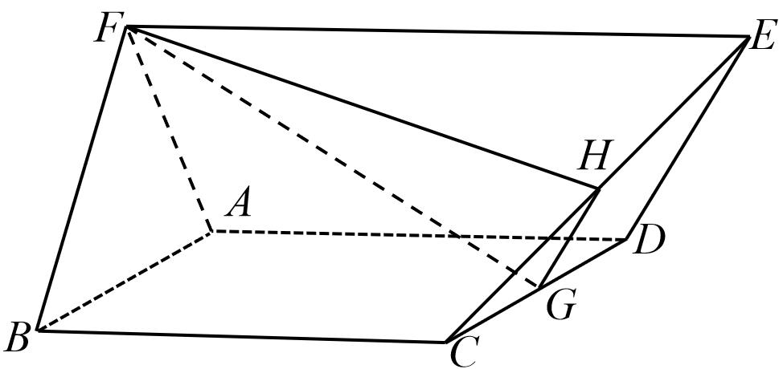

（1）求二面角的余弦值；

（2）作平面*FHG*与平面*ABCD*的交线，记该交线与直线*AB*交点为*P*，写出的值（不需要说明理由，保留作图痕迹）.

**变式20．**（2024·全国·高三专题练习）四棱锥中，底面是边长为2的菱形，.,且平面，，点分别是线段上的中点，在上.且.

（Ⅰ）求证：平面；

（Ⅱ）求直线与平面的成角的正弦值；

（Ⅲ）请画出平面与四棱锥的表面的交线，并写出作图的步骤.

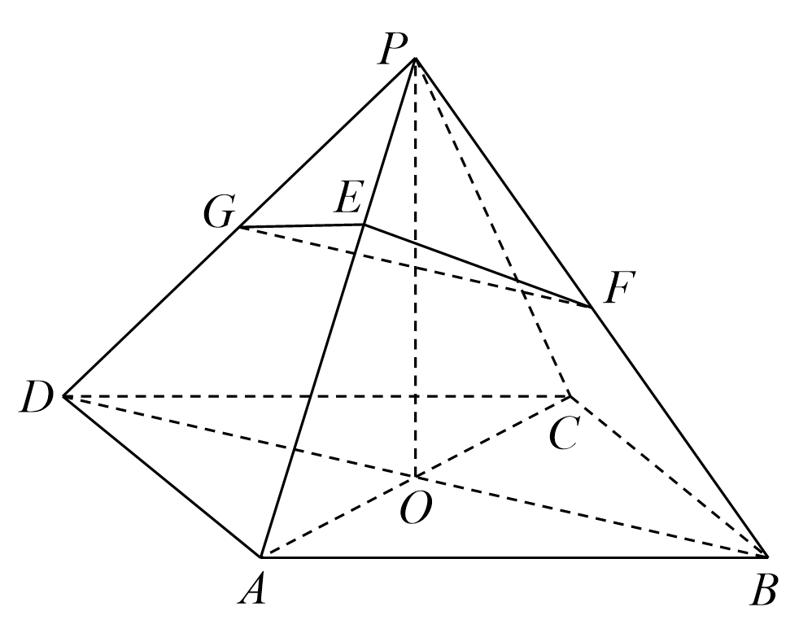

<strong>变式21．</strong>（2024·安徽六安·安徽省舒城中学校考模拟预测）如图，已知多面体<em>EABCDF</em>的底面<em>ABCD</em>是边长为2的正方形，，，且.

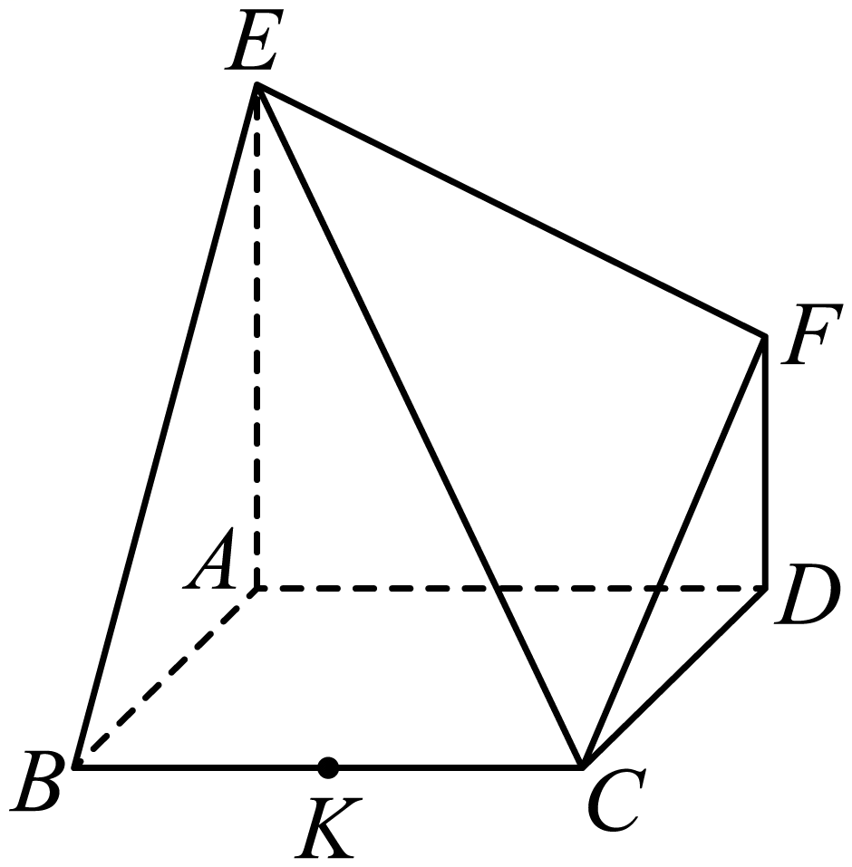

(1)记线段的中点为，在平面内过点作一条直线与平面平行，要求保留作图痕迹，但不要求证明；

(2)求直线与平面所成角的正弦值.

**变式22．**（2024·广西·高三统考阶段练习）如图，三棱柱中，侧面为菱形.

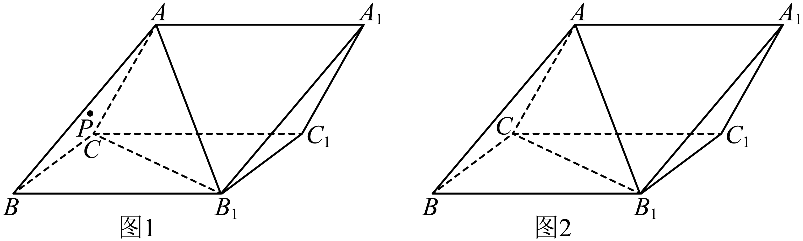

(1)（如图1）若点为内任一点，作出与面的交点（作出图象并写出简单的作图过程，不需证明）；

(2)（如图2）若面面，求二面角的余弦值.

<strong>变式23．</strong>（2024·四川成都·成都七中校考模拟预测）是边长为2的正三角形，<em>P</em>在平面上满足，将沿<em>AC</em>翻折，使点<em>P</em>到达的位置，若平面平面<em>ABC</em>，且．

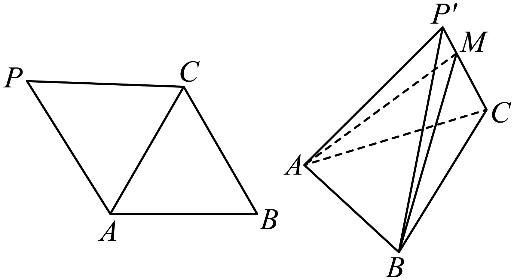

(1)作平面，使得，且，说明作图方法并证明；

(2)点*M*满足，求二面角的余弦值．

**变式24．**（2024·四川绵阳·高三绵阳南山中学实验学校校考阶段练习）已知四棱锥的底面是平行四边形，侧棱平面，点在棱上，且，点是在棱上的动点（不为端点）.（如图所示）

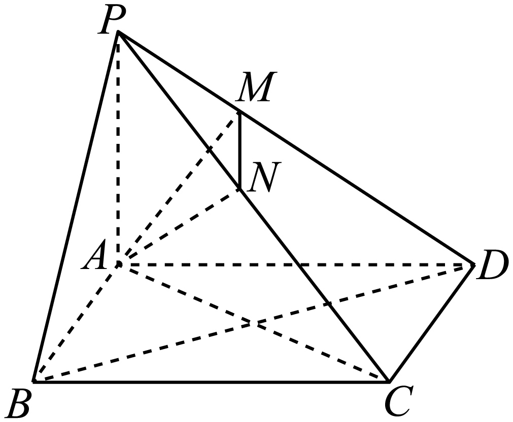

(1)若是棱中点，

（i）画出的重心（保留作图痕迹），指出点与线段的关系，并说明理由；

（ii）求证：平面；

(2)若四边形是正方形，且，当点在何处时，直线与平面所成角的正弦值取最大值.

**题型五：立体几何建系繁琐问题**

<strong>例13．</strong>（2024·福建福州·福建省福州格致中学校考模拟预测）如图，在四棱台<em>ABCD</em>-<em>A1B1C1D1</em>中，底面<em>ABCD</em>是菱形，∠<em>ABC</em>=，∠<em>B1BD</em>=，

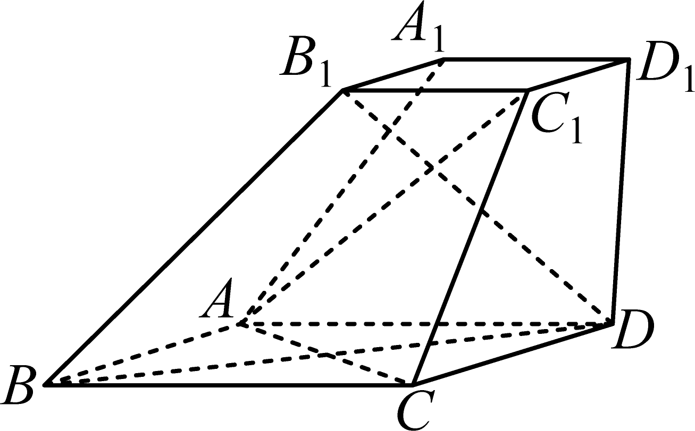

（1）求证：直线<em>AC</em>⊥平面<em>BDB1</em>；

（2）求直线<em>A1B1</em>与平面<em>ACC1</em>所成角的正弦值.

<strong>例14．</strong>（2024·全国·模拟预测）如图，在直三棱柱中，侧面为正方形，<em>M</em>，<em>N</em>分别为的中点，．

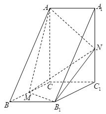

(1)证明：平面；

(2)若，三棱锥的体积为2，求二面角的余弦值．

<strong>例15．</strong>（2024·江西抚州·高三校联考阶段练习）如图，在几何体中，，已知平面平面，平面平面，平面<em>ABC</em>，<em>AD</em>⊥<em>DE</em>．

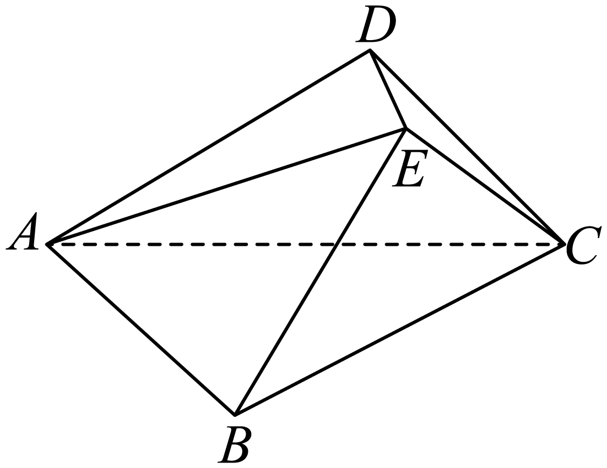

(1)证明：平面；

(2)若，设为棱上的点，且满足，求当几何体的体积取最大值时，与所成角的余弦值．

**变式25．**（2024·黑龙江佳木斯·高一建三江分局第一中学校考期末）如图，已知三棱柱的底面是正三角形，侧面是矩形，分别为的中点，为上一点，过和的平面交于，交于．

（1）证明：平面；

（2）设为的中心，若平面，且，求直线与平面所成角的正弦值．

**变式26．**（2024·黑龙江哈尔滨·哈九中校考三模）如图，已知三棱柱的底面是正三角形，侧面是矩形，，分别为，的中点，为上一点，过和的平面交于，交于.

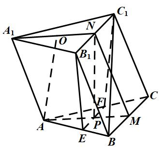

（1）证明：，且平面平面；

（2）设为的中心，若，平面，且，求四棱锥的体积.

**变式27．**（2024·重庆沙坪坝·高三重庆一中校考期中）如图，在平行六面体中，每一个面均为边长为2的菱形，平面底面，，分别是，的中点，是的中点.

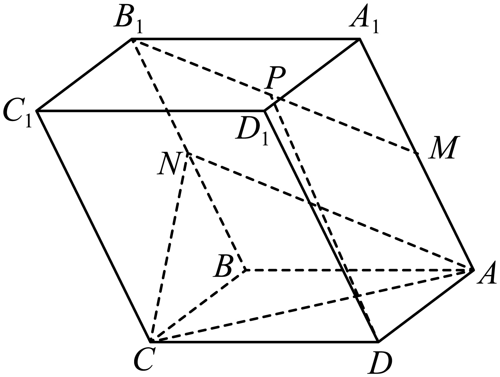

(1)证明：平面；

(2)若侧棱与底面所成的角为60°，求平面与平面所成锐二面角的余弦值.

**变式28．**（2024·全国·高三专题练习）已知四棱锥中，平面，，，，，．

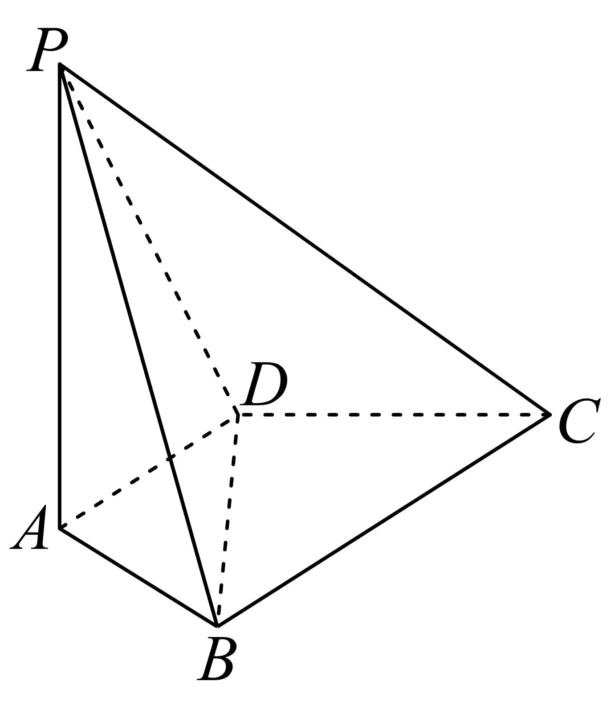

(1)求直线与平面所成角的正弦值；

(2)线段上是否存在一点*M*，使得平面？若存在，请指出点*M*的位置；若不存在，请说明理由．

<strong>变式29．</strong>（2024·全国·模拟预测）如图，三棱柱的底面为等边三角形，，点<em>D</em>，<em>E</em>分别为<em>AC</em>，的中点，，．

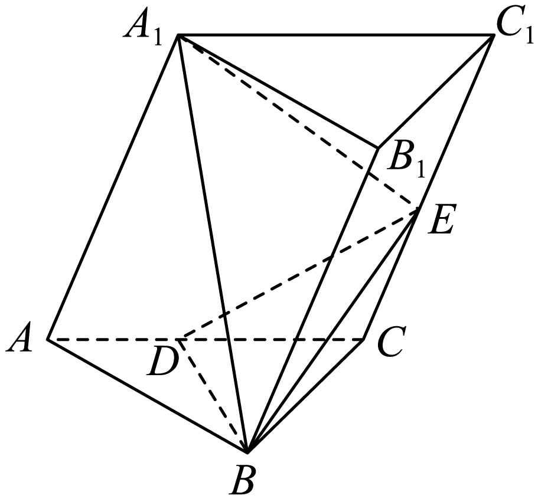

(1)求点到平面*BDE*的距离；

(2)求二面角的余弦值．

<strong>变式30．</strong>（2024·全国·高三专题练习）已知两个四棱锥与的公共底面是边长为4的正方形，顶点，在底面的同侧，棱锥的高，，分别为<em>AB</em>，<em>CD</em>的中点，与交于点<em>E</em>，与交于点<em>F</em>.

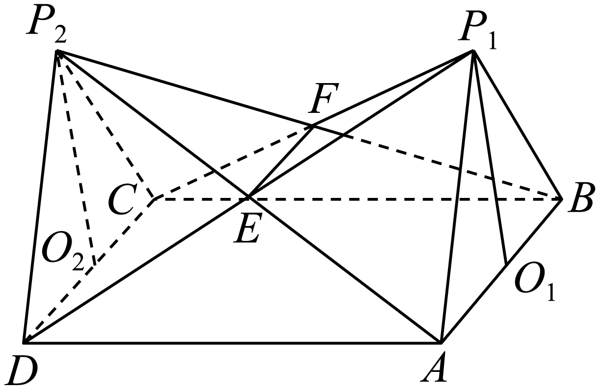

(1)求证：点*E*为线段的中点；

(2)求这两个棱锥的公共部分的体积.

**变式31．**（2024·全国·高一专题练习）《九章算术》是中国古代的一部数学专著，是《算经十书》中最重要的一部，成于公元一世纪左右.它是一本综合性的历史著作，是当时世界上最简练有效的应用数学，它的出现标志着中国古代数学形成了完整的体系.《九章算术》中将由四个直角三角形组成的四面体称为“鳖臑”，已知在三棱锥中，平面.

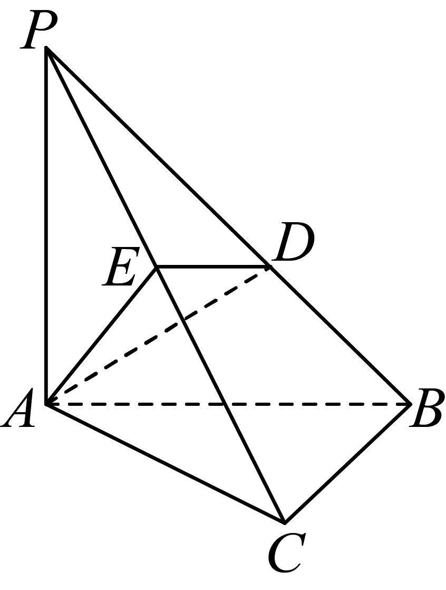

（1）从三棱锥中选择合适的两条棱填空：\_\_\_\_\_\_\_\_\_\_\_\_\_\_\_\_，则三棱锥为“鳖臑”；

（2）如图，已知，垂足为，，垂足为，.

（i）证明：平面平面；

（ii）设平面与平面交线为，若，，求二面角的大小.

<strong>变式32．</strong>（2024·浙江金华·高一浙江金华第一中学校考期末）如图，四面体<em>ABCD</em>中，等边三角形，，且.

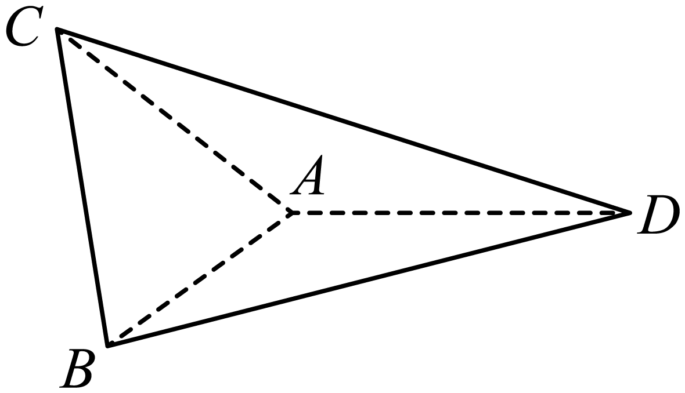

(1)记*AC*中点为*M*，若面面*ABD*，求证：面*ADC*；

(2)当二面角的大小为时，求直线*AD*与平面*BCD*所成角的正弦值.

**变式33．**（2024·河北衡水·高二校考开学考试）已知四面体，，，且平面平面．

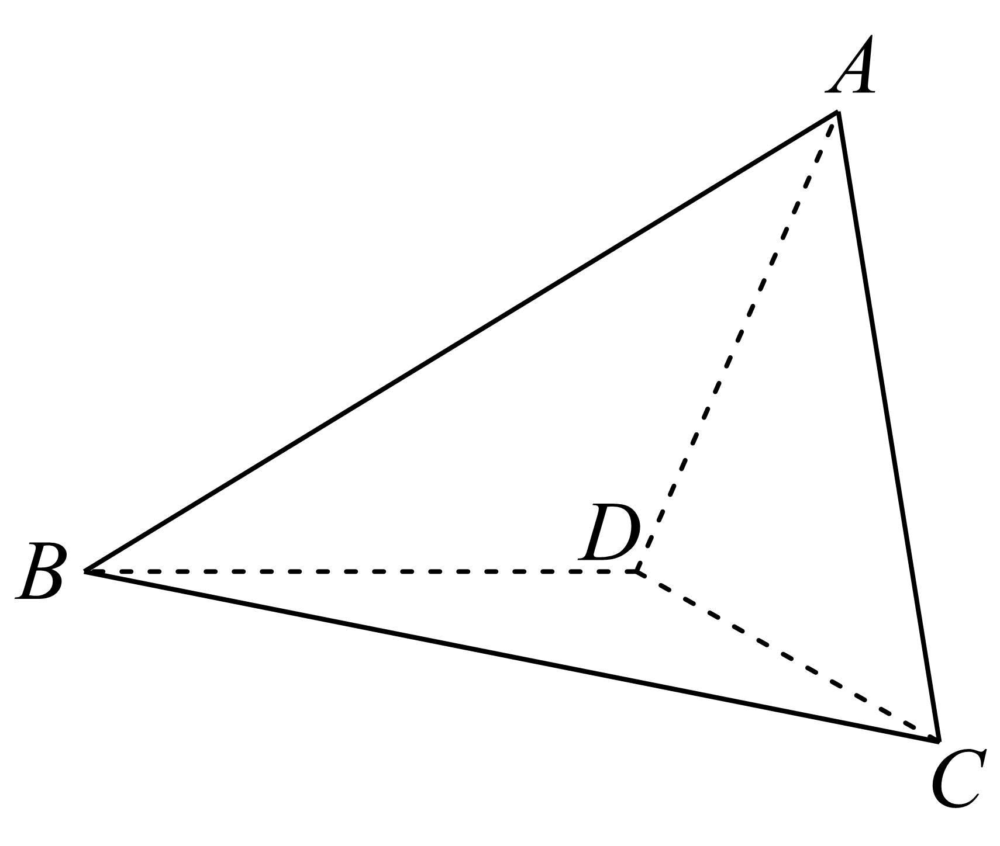

(1)求证：；

(2)求直线与平面所成角的大小．

**题型六：两角相等（构造全等）的立体几何问题**

<strong>例16．</strong>（2024·全国·高三专题练习）如图，在三棱锥中，是等边三角形，，点<em>P</em>是<em>AC</em>的中点，连接<em>BP</em>，<em>DP</em>

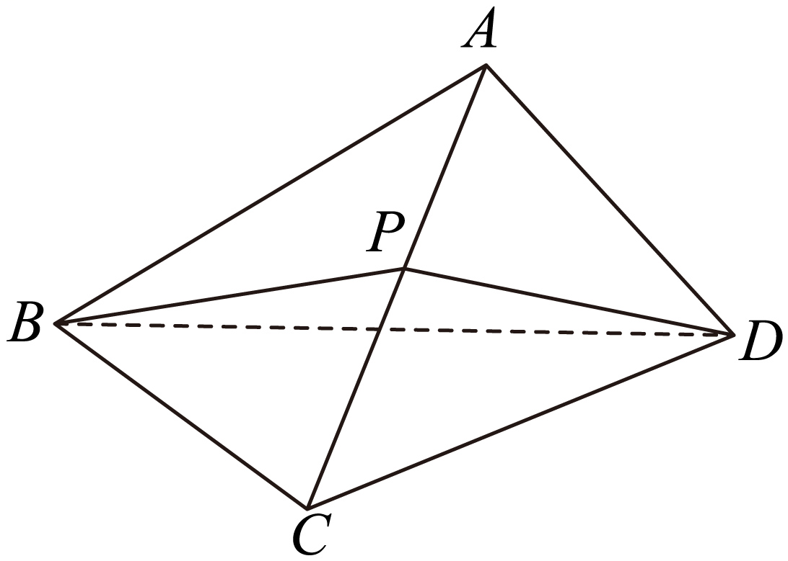

证明：平面平面*BDP*；

若，，求三棱锥的体积．

<strong>例17．</strong>（2024·高二校考单元测试）如图,在三棱锥中,是等边三角形,,点是的中点,连接<em>．</em>

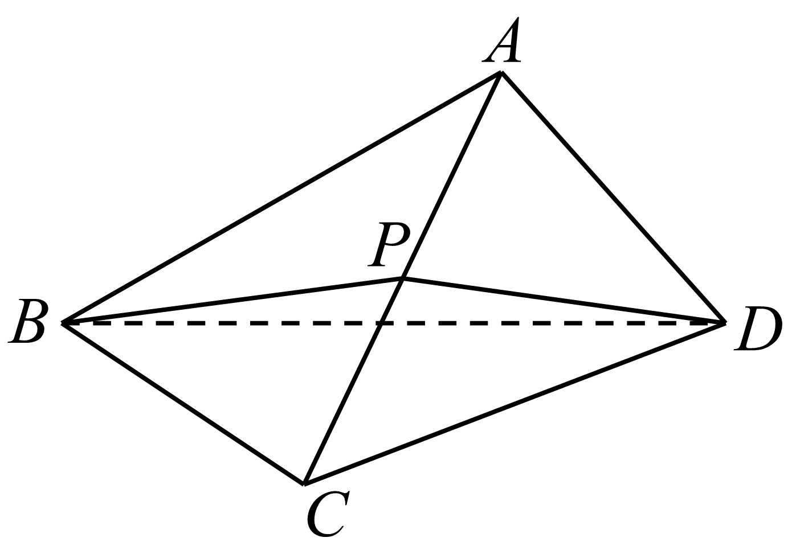

（1）证明:平面平面;

（2）若,且二面角为,求直线与平面所成角的正弦值．

**例18．**（2024·全国·高三专题练习）如图，四棱锥中，底面为边长是2的正方形，，分别是，的中点，，，且二面角的大小为.

(1)求证：；

(2)求二面角的余弦值.

**变式34．**（2024·全国·高三专题练习）如图，四棱锥中，四边形是边长为2的菱形，，.

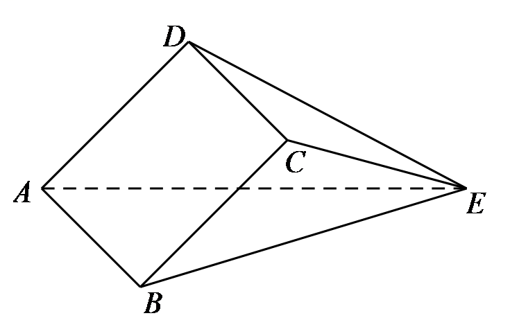

（1）证明：平面平面；

（2）当直线与平面所成的角为30°时，求平面与平面所成锐二面角的余弦值.

<strong>变式35．</strong>（2024·广东阳江·高二统考期中）如图，在四面体<em>ABCD</em>中，是正三角形，是直角三角形，，<em>AB</em>=<em>BD</em>．

(1)求证：平面平面*ABC*；

(2)若，二面角的余弦值为，求*m*．

**变式36．**（2024·全国·高三专题练习）如图，在四面体中，已知，，

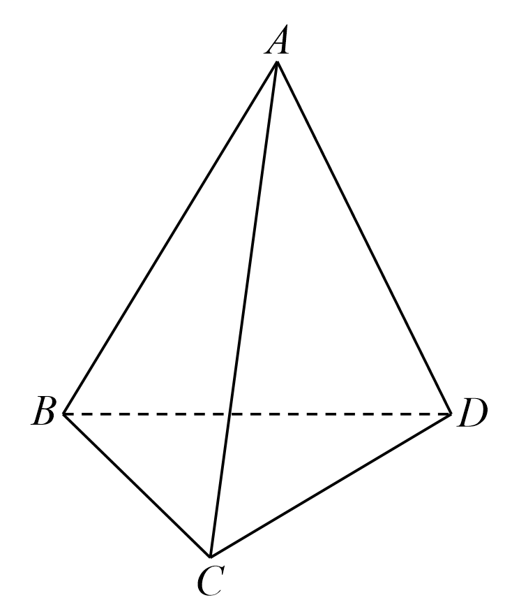

(1)求证：；

(2)若平面平面，且，求二面角的余弦值.

**题型七：利用传统方法找几何关系建系**

**例19．**（2024·河北·高三河北衡水中学校考阶段练习）如图，在长方体，平面与平面所成角为.

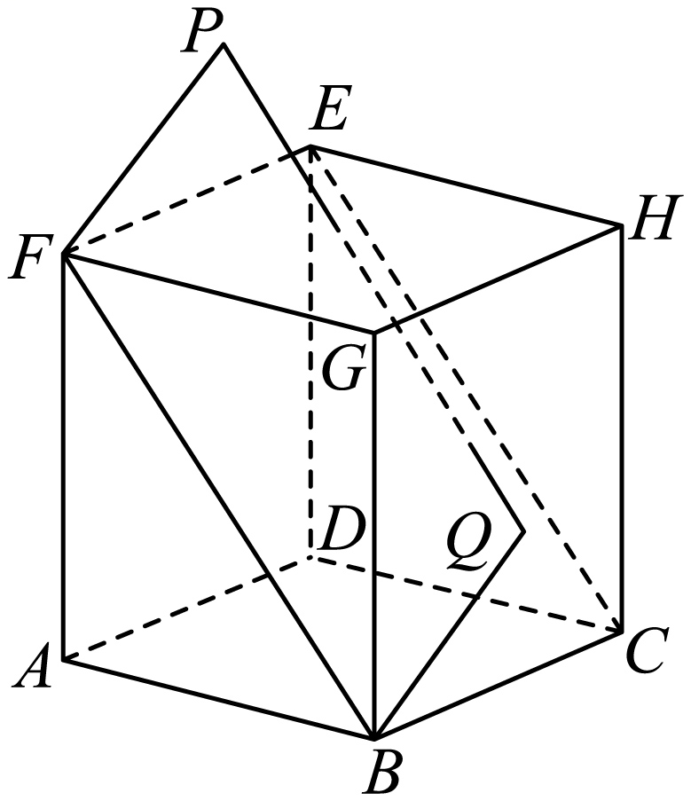

(1)若，求直线与平面所成角的余弦值（用表示）；

(2)将矩形沿旋转度角得到矩形，设平面与平面所成角为，请证明：.

**例20．**（2024·全国·唐山市第十一中学校考模拟预测）在四棱锥中，，，，，平面平面.

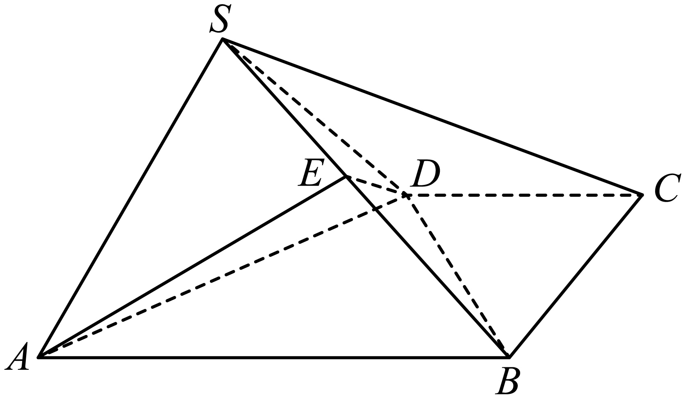

(1)证明：；

(2)若是棱上一点，且二面角的余弦值为，求的大小.

<strong>例21．</strong>（2024·安徽·高三校联考期末）如图，在四棱锥中，，<em>E</em>是<em>PB</em>的中点．

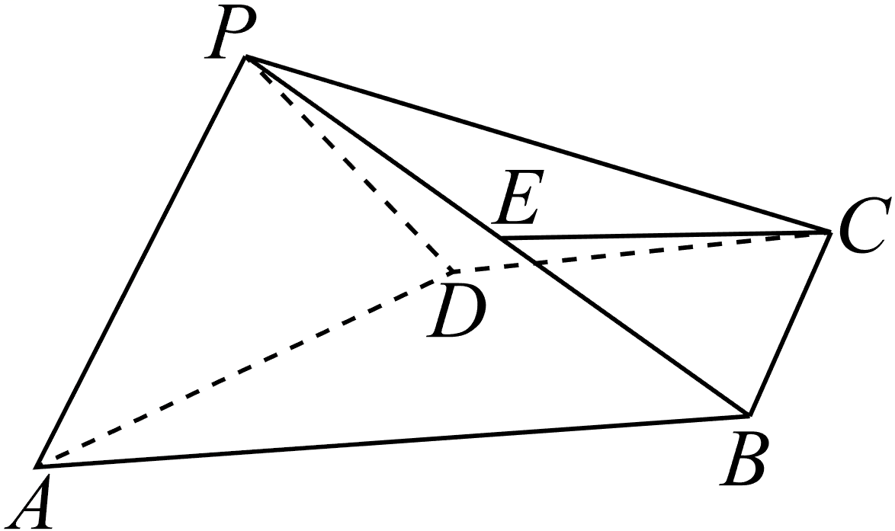

(1)求*CE*的长；

(2)设二面角平面角的补角大小为，若，求平面*PAD*和平面*PBC*夹角余弦值的最小值．

**变式37．**（2024·全国·高三专题练习）如图，四棱锥的底面为正方形，底面，是线段的中点，设平面与平面的交线为.

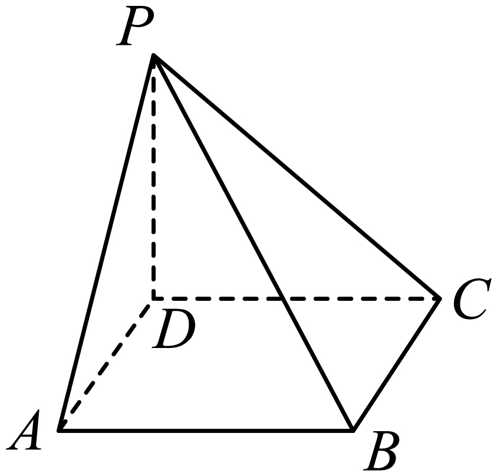

(1)证明*∥* 平面*BCM*

(2)已知，为上的点，若与平面所成角的正弦值为是，求线段的长.

(3)在（2）的条件下，求二面角的正弦值.

**变式38．**（2024·江西抚州·高二临川一中校考期中）如图，直线平面，直线平行四边形ABCD，四棱锥P-ABCD的顶点在平面上，，，，，分别是与的中点.

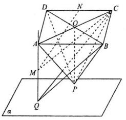

（1）求证：平面；

（2）求二面角的余弦值.

<strong>变式39．</strong>（2024·陕西安康·陕西省安康中学校考模拟预测）如图，在四棱锥中，底面<em>ABCD</em>为正方形，侧面<em>SAD</em>为等边三角形，，．

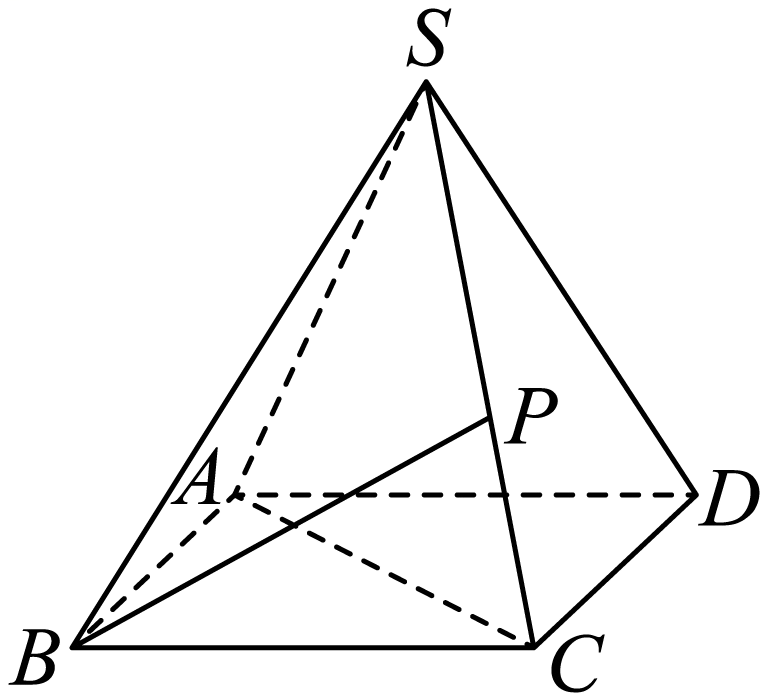

(1)证明：平面平面；

(2)侧棱*SC*上是否存在一点*P*（*P*不在端点处），使得直线*BP*与平面*SAC*所成角的正弦值等于？若存在，求出点*P*的位置；若不存在，请说明理由．

**变式40．**（2024·吉林长春·高二校考期末）如图，四棱锥中，底面为矩形，底面，，.点在侧棱上，°.

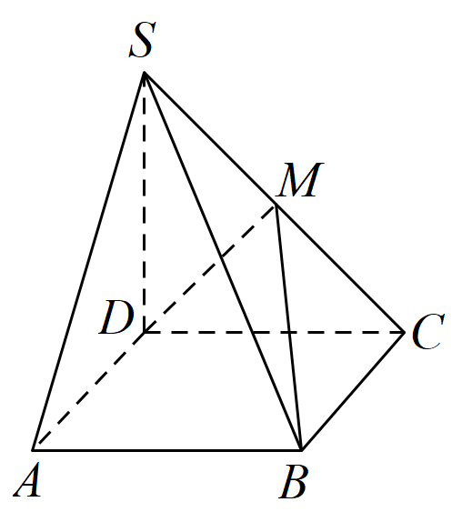

（1）证明：是侧棱的中点；

（2）求二面角的余弦值.

**变式41．**（2024·四川绵阳·高三绵阳南山中学实验学校校考阶段练习）三棱柱的底面是等边三角形，的中点为，底面，与底面所成的角为，点在棱上，且.

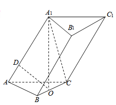

（1）求证：平面；

（2）求二面角的平面角的余弦值.

<strong>变式42．</strong>（2024·黑龙江齐齐哈尔·高三齐齐哈尔市实验中学校联考阶段练习）如图，三棱锥<em>P</em>-<em>ABC</em>所有棱长都等，<em>PO</em>⊥平面<em>ABC</em>，垂足为<em>O</em>．点，分别在平面<em>PAC</em>，平面<em>PAB</em>内，线段，都经过线段<em>PO</em>的中点<em>D</em>．

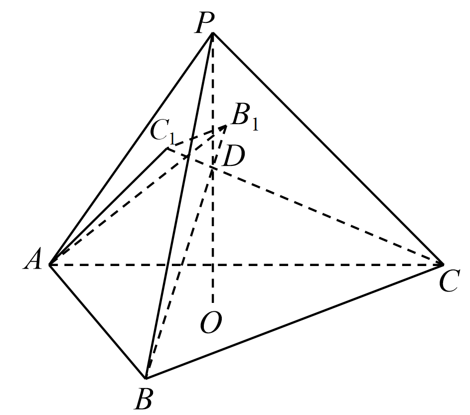

(1)证明：平面*ABC*；

(2)求直线*AP*与平面所成角的正弦值．

**变式43．**（2024·全国·高三专题练习）如图，已知四棱锥中，平面，平面平面，且，，，点在平面内的射影恰为的重心.

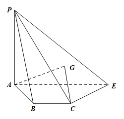

（1）证明：；

（2）求直线与平面所成角的正弦值.

**变式44．**（2024·全国·高三专题练习）如图，平面平面，菱形平面，，为平面内一动点.

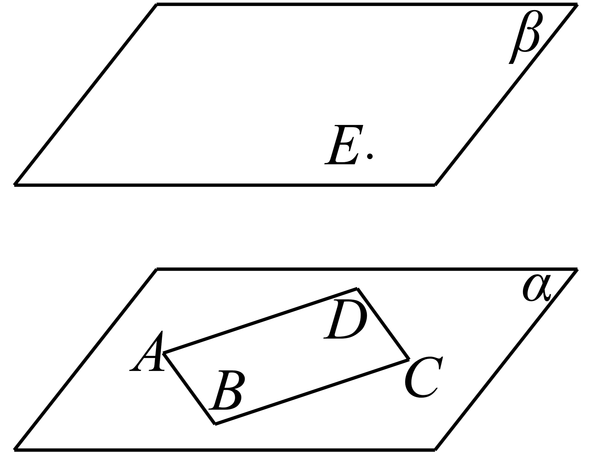

(1)若平面，间的距离为，设直线，与平面所成的角分别为，，，求动点在平面内的射影的一个轨迹方程；

(2)若点在平面内的射影为，证明：直线与平面所成的角与的大小无关.

**题型八：空间中的点不好求**

<strong>例22．</strong>（2024·全国·校联考模拟预测）已知三棱锥<em>ABCD</em>，<em>D</em>在面<em>ABC</em>上的投影为<em>O</em>，<em>O</em>恰好为△<em>ABC</em>的外心．，.

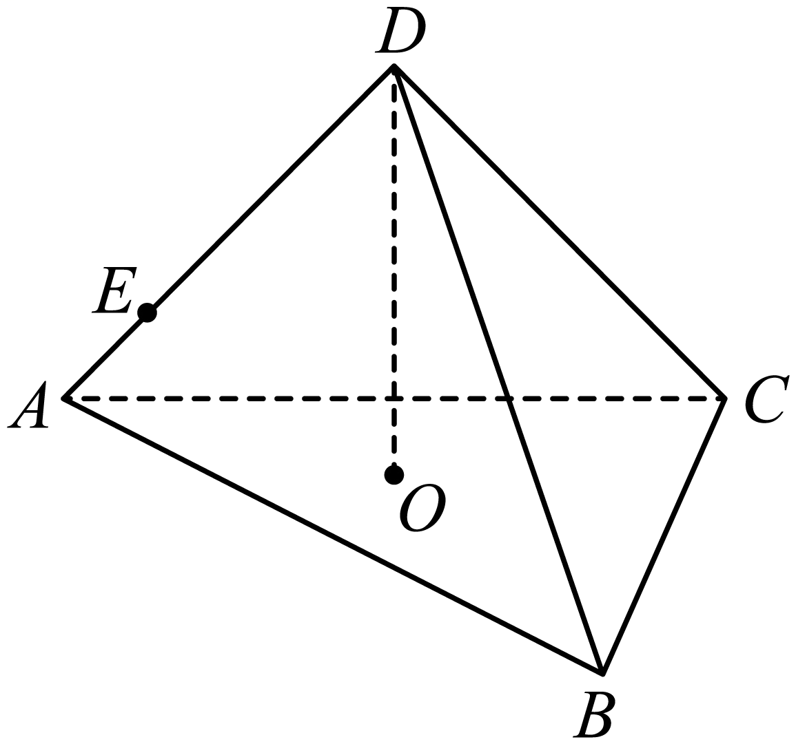

(1)证明：*BC*⊥*AD*；

(2)*E*为*AD*上靠近*A*的四等分点，若三棱锥*A-BCD*的体积为，求二面角的余弦值．

**例23．**（2024·河南·校联考模拟预测）如图，在四棱锥中，，，，分别为，的中点，点在上，且为三角形的重心.

(1)证明：平面；

(2)若，，四棱锥的体积为，求直线与平面所成角的正弦值.

<strong>例24．</strong>（2024·湖北武汉·华中师大一附中校考模拟预测）如图，平行六面体中，点<em>P</em>在对角线上，，平面平面．

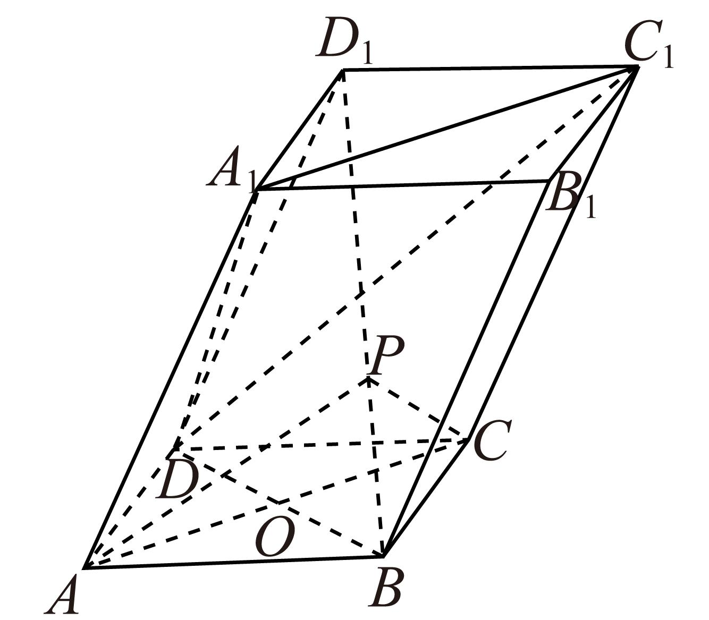

(1)求证：*O*，*P*，三点共线；

(2)若四边形是边长为2的菱形，，，求二面角大小的余弦值．

<strong>变式45．</strong>（2024·江西·校联考二模）正四棱锥中，，<em>E</em>为中点，，平面平面，平面.

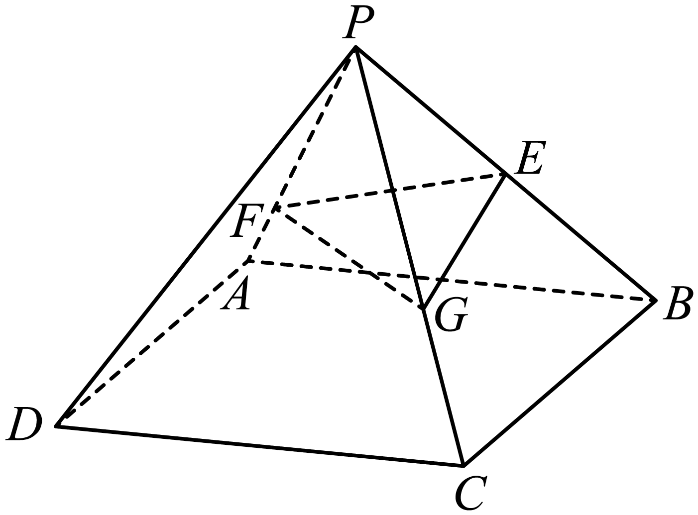

(1)证明：当平面平面时，平面

(2)当时，*T*为表面上一动点（包括顶点），是否存在正数*m*，使得有且仅有5个点*T*满足，若存在，求*m*的值，若不存在，请说明理由.

<strong>变式46．</strong>（2024·全国·高三专题练习）如图，在棱长为2的正方体中，点<em>M</em>是正方体的中心，将四棱锥绕直线逆时针旋转后，得到四棱锥．

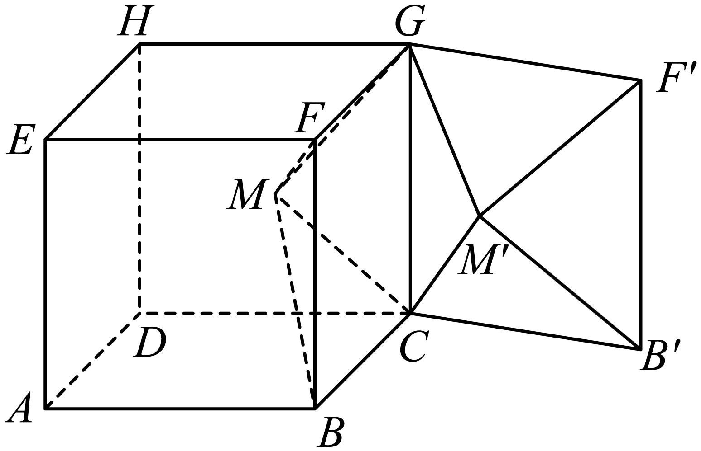

(1)若，求证：平面平面；

(2)是否存在，使得直线平面？若存在，求出的值；若不存在，请说明理由．

<strong>变式47．</strong>（2024·全国·模拟预测）已知菱形<em>ABCD</em>中，，四边形<em>BDEF</em>为正方形，满足，连接<em>AE</em>，<em>AF</em>，<em>CE</em>，<em>CF</em>．

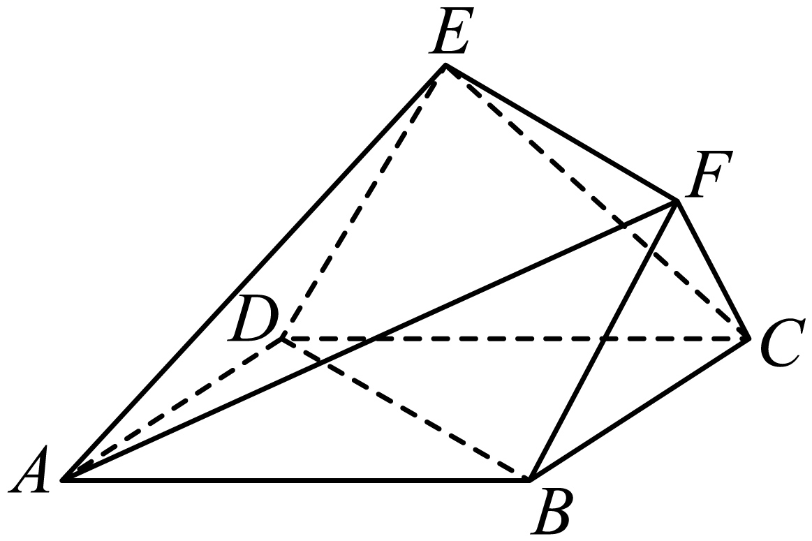

(1)证明：；

(2)求直线*AE*与平面*BDEF*所成角的正弦值．

**题型九：创新定义**

**例25．**（2024·重庆沙坪坝·高三重庆一中校考阶段练习）魏晋时期数学家刘徽（图a）为研究球体的体积公式，创造了一个独特的立体图形“牟合方盖”，它由完全相同的四个曲面构成，相对的两个曲面在同一圆柱的侧面上．如图，将两个底面半径为1的圆柱分别从纵横两个方向嵌入棱长为2的正方体时（如图b），两圆柱公共部分形成的几何体（如图c）即得一个“牟合方盖”，图d是该“牟合方盖”的直观图（图中标出的各点，，，，，均在原正方体的表面上）．

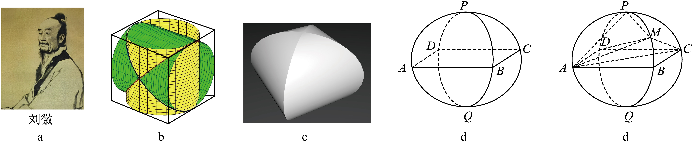

(1)由“牟合方盖”产生的过程可知，图d中的曲线为一个椭圆，求此椭圆的离心率；

(2)如图c，点在椭圆弧上，且三棱锥的体积为，求二面角的正弦值．

**例26．**（2024·辽宁沈阳·东北育才学校校考一模）蜂房是自然界最神奇的“建筑”之一，如图1所示.蜂房结构是由正六棱柱截去三个相等的三棱锥，，，再分别以，，为轴将，，分别向上翻转，使，，三点重合为点所围成的曲顶多面体（下底面开口），如图2所示.蜂房曲顶空间的弯曲度可用曲率来刻画，定义其度量值等于蜂房顶端三个菱形的各个顶点的曲率之和，而每一顶点的曲率规定等于减去蜂房多面体在该点的各个面角之和（多面体的面角是多面体的面的内角，用弧度制表示）.例如：正四面体在每个顶点有3个面角，每个面角是，所以正四面体在各顶点的曲率为.

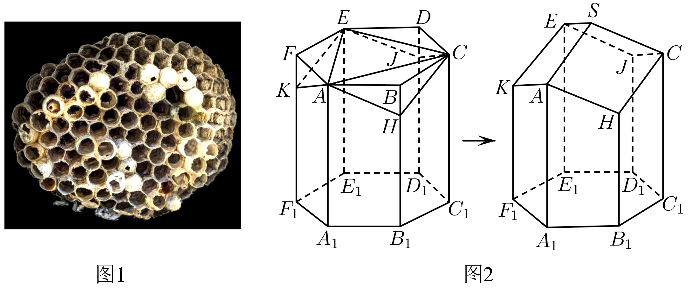

(1)求蜂房曲顶空间的弯曲度；

(2)若正六棱柱底面边长为1，侧棱长为2，设

（i）用表示蜂房（图2右侧多面体）的表面积；

（ii）当蜂房表面积最小时，求其顶点的曲率的余弦值.

**例27．**（2024·全国·高三专题练习）北京大兴国际机场的显著特点之一是各种弯曲空间的运用．刻画空间的弯曲性是几何研究的重要内容．用曲率刻画空间弯曲性，规定：多面体顶点的曲率等于与多面体在该点的面角之和的差（多面体的面的内角叫做多面体的面角，角度用弧度制），多面体面上非顶点的曲率均为零，多面体的总曲率等于该多面体各顶点的曲率之和．例如：正四面体在每个顶点有3个面角，每个面角是，所以正四面体在各顶点的曲率为，故其总曲率为．

（1）求四棱锥的总曲率；

（2）若多面体满足：顶点数-棱数+面数，证明：这类多面体的总曲率是常数．

**变式48．**（2024·河北·高三校联考阶段练习）已知，，，定义一种运算：，在平行六面体中，，，.

(1)证明：平行六面体是直四棱柱；

(2)计算，并求该平行六面体的体积，说明的值与平行六面体体积的关系.

**变式49．**（2024·全国·高三专题练习）（1）如图，对于任一给定的四面体，找出依次排列的四个相互平行的平面，，，，使得，且其中每相邻两个平面间的距离都相等；

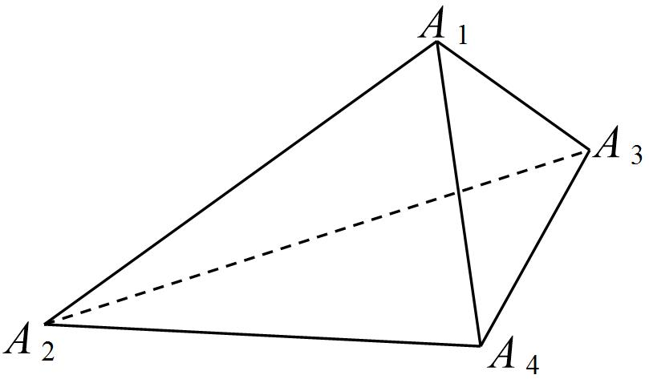

（2）给定依次排列的四个相互平行的平面，，，，其中每相邻两个平面间的距离为1，若一个正四面体的四个顶点满足：，求该正四面体的体积．

<strong>变式50．</strong>（2024·全国·高三专题练习）已知顶点为<em>S</em>的圆锥面（以下简称圆锥<em>S</em>）与不经过顶点<em>S</em>的平面<em>α</em>相交，记交线为<em>C</em>，圆锥<em>S</em>的轴线<em>l</em>与平面<em>α</em>所成角<em>θ</em>是圆锥<em>S</em>顶角（圆<em>S</em>轴截面上两条母线所成角<em>θ</em>的一半，为探究曲线<em>C</em>的形状，我们构建球<em>T</em>，使球<em>T</em>与圆锥<em>S</em>和平面<em>α</em>都相切，记球<em>T</em>与平面<em>α</em>的切点为<em>F</em>，直线<em>l</em>与平面<em>α</em>交点为<em>A</em>，直线<em>AF</em>与圆锥<em>S</em>交点为<em>O</em>，圆锥<em>S</em>的母线<em>OS</em>与球<em>T</em>的切点为<em>M</em>，，．

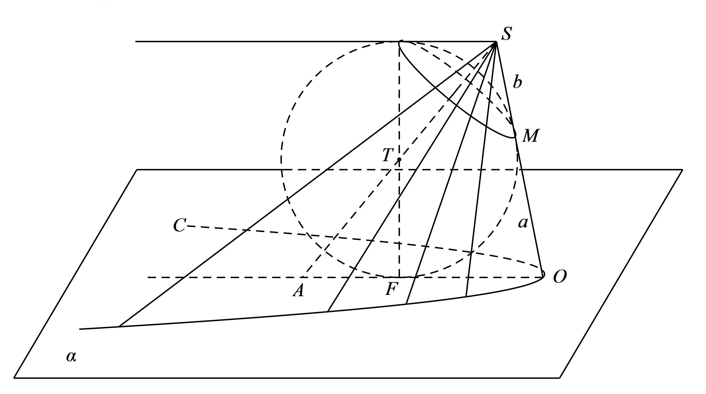

(1)求证：平面*SOA*⊥平面*α*，并指出*a*，*b*，关系式；

(2)求证：曲线*C*是抛物线．

**变式51．**（2024·湖南·校联考模拟预测）类比于二维平面中的余弦定理，有三维空间中的三面角余弦定理；如图1，由射线，，构成的三面角，，，，二面角的大小为，则．

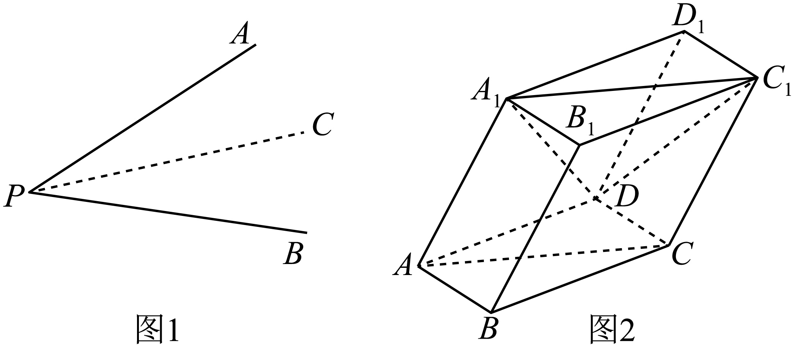

（1）当、时，证明以上三面角余弦定理；

（2）如图2，四棱柱中，平面平面，，，

①求的余弦值；

②在直线上是否存在点，使平面？若存在，求出点的位置；若不存在，说明理由

