**第56讲  立体几何解答题**

**必考题型全归纳**

**题型一：非常规空间几何体为载体**

**例1．**（2024·全国·高三专题练习）已知正四棱台的体积为，其中.

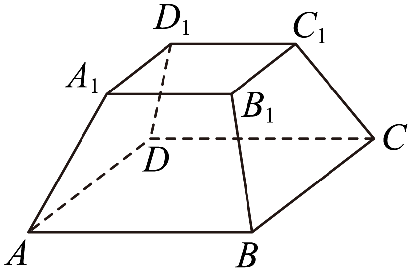

(1)求侧棱与底面所成的角；

(2)在线段上是否存在一点*P*，使得？若存在请确定点的位置；若不存在，请说明理由.

【解析】（1）依题意，在正四棱台中，，

所以上底面积，下底面积，

设正四棱台的高为，则.

连接，则，

所以，

设侧棱与底面所成的角为，则，

由于线面角的取值范围是，所以.

（2）连接，设正四棱台上下底面的中心分别为，

以为原点，分别为轴建立如图所示空间直角坐标系，

，

设线段上存在一点，满足，

，

，

则，

，

若，则，

即，

解得，舍去，

所以在线段上不存在一点，使得.

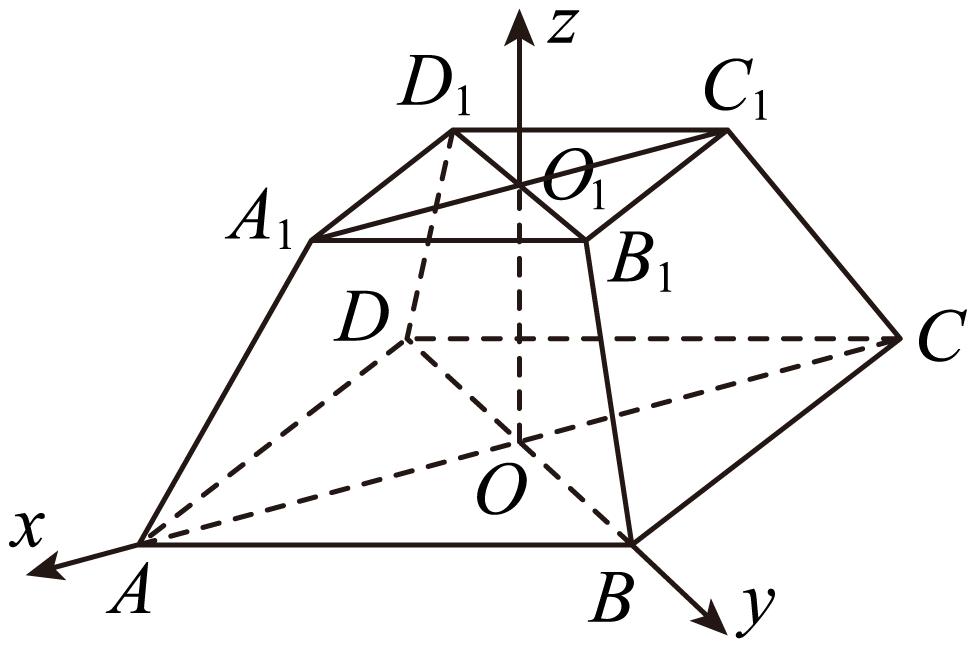

**例2．**（2024·全国·高三专题练习）在三棱台中，为中点，，，.

(1)求证：平面；

(2)若，，平面与平面所成二面角大小为，求三棱锥的体积.

【解析】（1）在三棱台中，为中点，则，

又，，

，四边形为平行四边形，，

又，，

，，，

，平面，平面.

（2），，，

又，，平面，平面，

连接，，，为中点，；

以为正交基底，可建立如图所示空间直角坐标系，

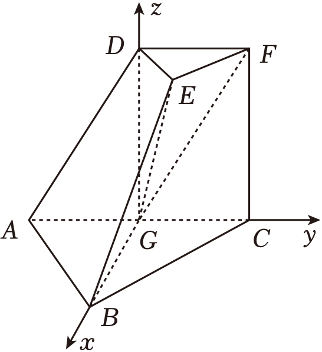

则，，，，

设，则，，

，，

设平面的一个法向量为，

则，令，解得：，，；

又平面的一个法向量，

，解得：，即，

平面，平面平面，平面，

.

**例3．**（2024·重庆万州·高三重庆市万州第二高级中学校考阶段练习）如图，在正四棱台中，，，，为棱，的中点，棱上存在一点，使得平面．

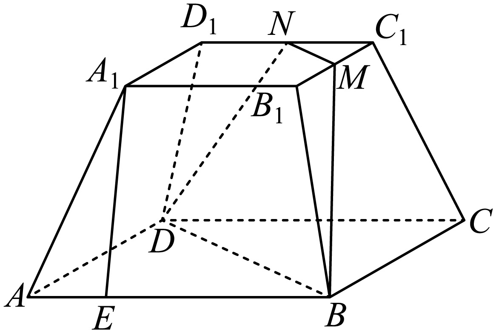

(1)求；

(2)当正四棱台的体积最大时，求与平面所成角的正弦值．

【解析】（1）作交于，再作交于，连接．

因为平面，所以平面．

又平面平面，所以．

又因为，所以四边形是平行四边形，

所以，即为棱的四等分点，

故也为棱的四等分点，所以．

（2）由（1）易知为的四等分点，所以点在点的正上方，

所以底面．

设，则，所以，

所以该四棱台的体积，

而．

当且仅当，即时取等号，此时，．

以为原点，，分别为轴、轴，

过平行于的直线为轴建立如图所示的空间直角坐标系，

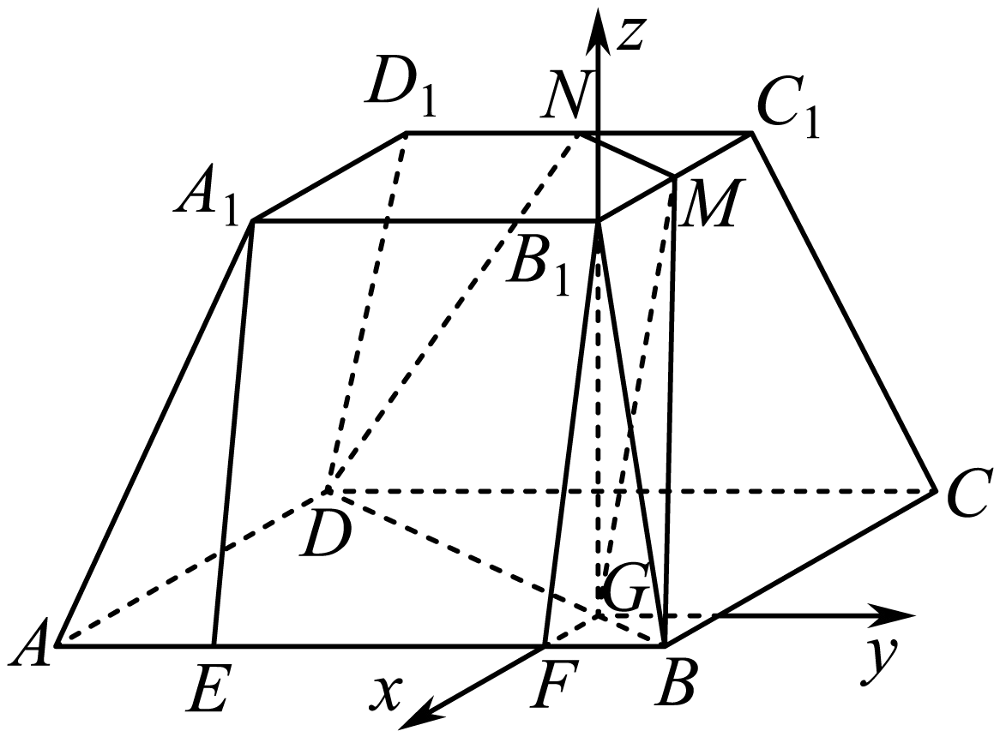

则，，，，

所以，，．

设平面的法向量为，

由得令，则．

设与平面所成角为，

则，

故与平面所成角的正弦值为．

**变式1．**（2024·湖北黄冈·浠水县第一中学校考模拟预测）如图，在三棱台中，，，，，．

(1)证明：平面平面；

(2)设是的中点，求平面与平面夹角的余弦值．

【解析】（1）证明：

由三棱台知：，

在梯形中，取的中点，连接，

因，

故，四边形是平行四边形，

∴，

，

所以，

，即，

因，所以，

又因，所以，

又因，所以平面，

因平面，

所以平面平面；

（2）取的中点，的中点，连接，，则，

因，所以，

由条件知：四边形是等腰梯形，所以，

平面平面

平面,

平面平面

∴平面，

分别以，，所在直线为轴，轴，轴建立空间直角坐标系，如图，

则在等腰梯形中，由平面几何知识可得：，

∴，，，，

设平面的法向量，

则由得，

令，得，，

所以，

又平面的法向量，

设平面与平面的夹角为，

则．

**变式2．**（2024·安徽·高三安徽省定远中学校考阶段练习）如图，圆锥的高为，是底面圆的直径，四边形是底面圆的内接等腰梯形，且，点是母线上一动点.

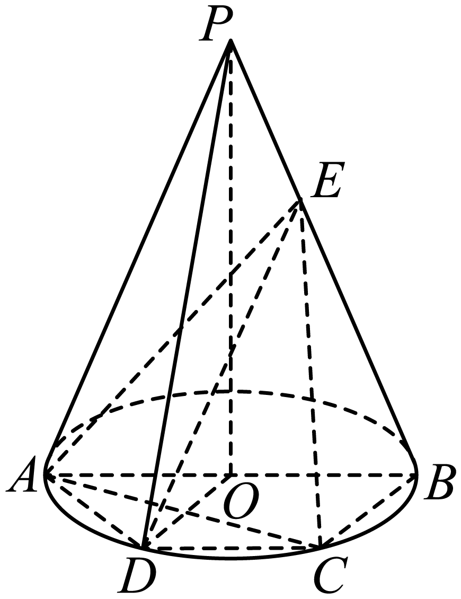

(1)证明：平面平面；

(2)若二面角的余弦值为，求三棱锥的体积.

【解析】（1）连接，由题意知四边形为菱形，故，

因为平面，平面，

所以，

因为，平面，所以平面，又平面，

故平面平面；

（2）以为原点，的中垂线为轴，为轴，为轴，

建立如图所示的空间直角坐标系，则，，，，

设，显然不合题意，则，则，

于是，，，

设平面的法向量为，

则

令，得，，则

设平面的法向量为，则

令，，则，

从而，解得或3，

因为，故.

此时二面角的余弦值为满足题意.

从而.

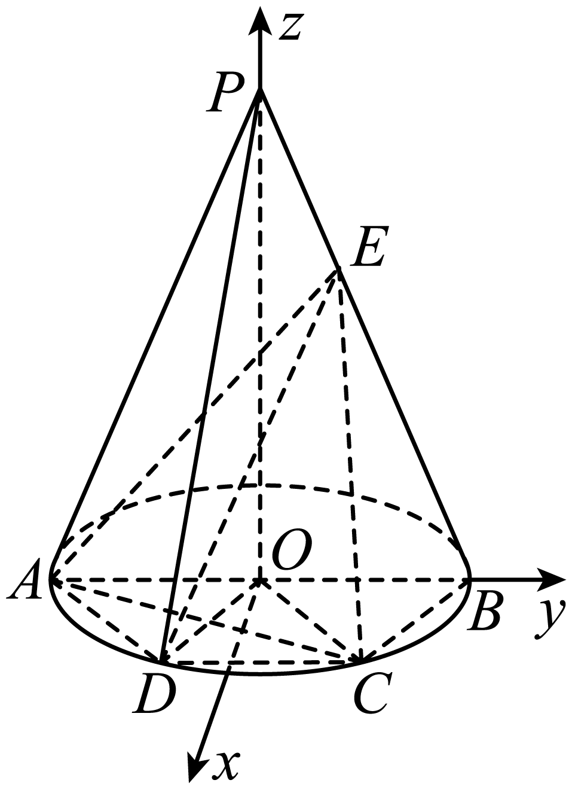

<strong>变式3．</strong>（2024·云南·云南师大附中校考模拟预测）如图，为圆锥的顶点，<em>A</em>，为底面圆上两点，，为中点，点在线段上，且.

(1)证明：平面平面；

(2)若，求直线与平面所成角的正弦值.

【解析】（1）设圆*O*的半径为*r*，

在中，，，，

故，又，故，

在中，由余弦定理得，

所以，即；

圆锥中，底面，底面，故，

又，所以平面，

又平面，所以平面平面.

（2）以为原点，建立如图所示的空间直角坐标系，

不妨设，则，，

则，，，，，

，，，

设平面的一个法向量为，

有，即，解得，

设直线与平面所成角为，

则.

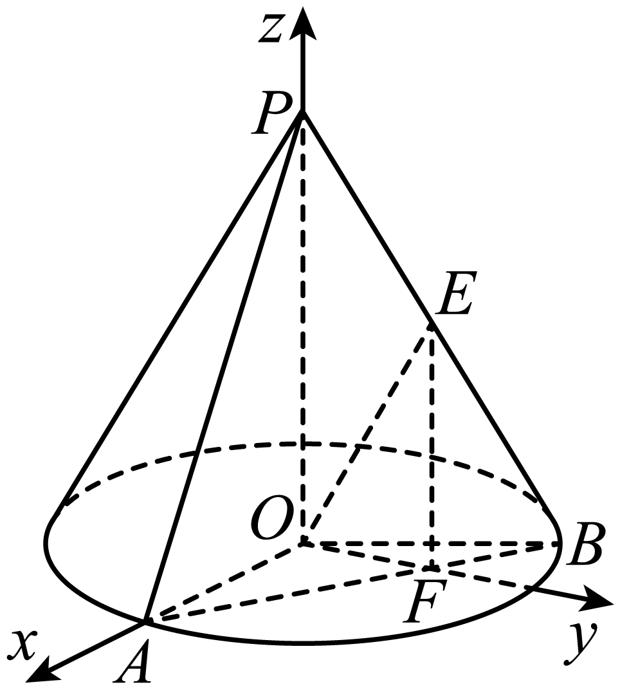

**变式4．**（2024·内蒙古赤峰·校联考三模）如图，为圆锥的顶点，是圆锥底面的圆心，四边形是圆的内接四边形，为底面圆的直径，在母线上，且，，．

(1)求证：平面平面；

(2)设点为线段上动点，求直线与平面所成角的正弦值的最大值．

【解析】（1）如图，设交于点，连接，

由已知可得，又，

所以四边形为菱形，所以，

∵，，，

∴，∴，

∴，又，所以，

因为为的中点，∴，．

由余弦定理可得，

∴，所以，即，

又平面，，∴平面．

又平面，∴平面平面．

（2）由已知平面，平面，所以，

又，，平面，

∴平面，

又平面，∴．

由（1）知，，平面，

所以平面，

∴，又点为的中点，

所以．

以点为坐标原点，所在直线分别为轴、轴、轴，建立如图所示的空间直角坐标系

则，，，，，，

设，则，

∴，，

设平面的法向量为，

则，即，令，则，

所以为平面的一个法向量．

设直线与平面所成的角为，

则，

构建，

则，

当时，，函数在上单调递增，

当时，，函数在上单调递减，

∴时，取到最大值4．

此时，取到最大值1.

另由，知，

当时，，此时平面，

设直线与平面所成的角为，因为，

当时，取到最大值1．

<strong>变式5．</strong>（2024·山东潍坊·统考模拟预测）如图，线段是圆柱的母线，是圆柱下底面⊙<em>O</em>的内接正三角形，．

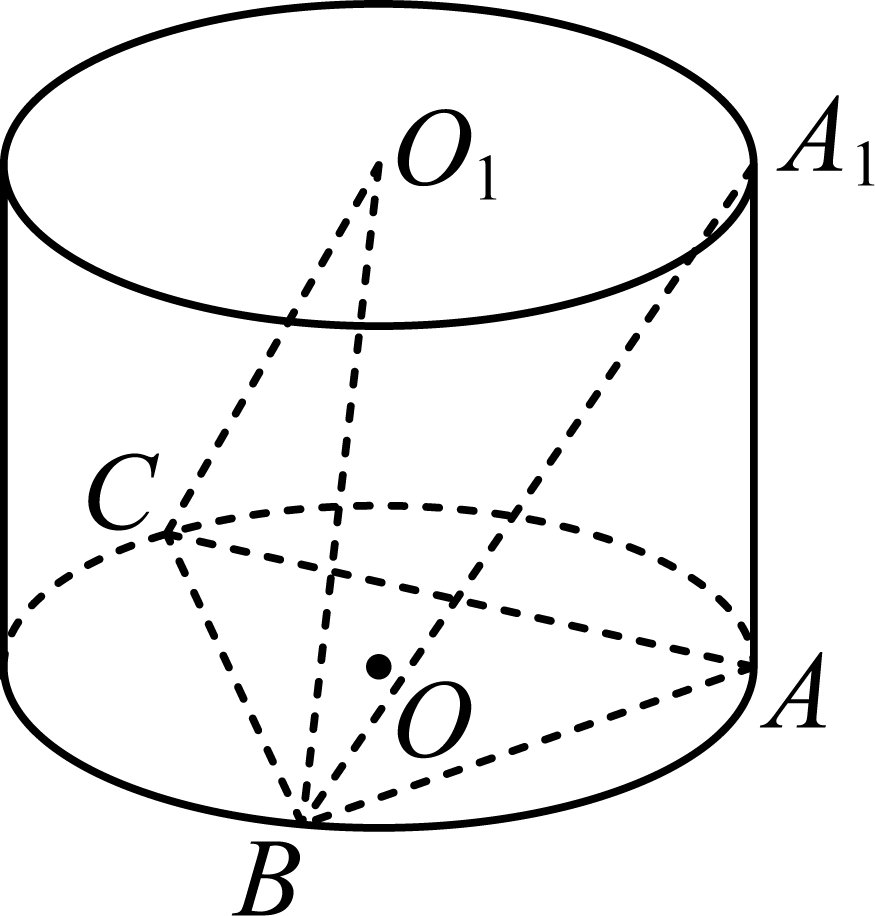

(1)劣弧上是否存在点*D*，使得平面？若存在，求出劣弧的长度；若不存在，请说明理由．

(2)求平面和平面所成角的正弦值．

【解析】（1）如图过点*O*作*AB*的平行线*OD*交劣弧于点*D*，

连接，，因为，平面，平面，

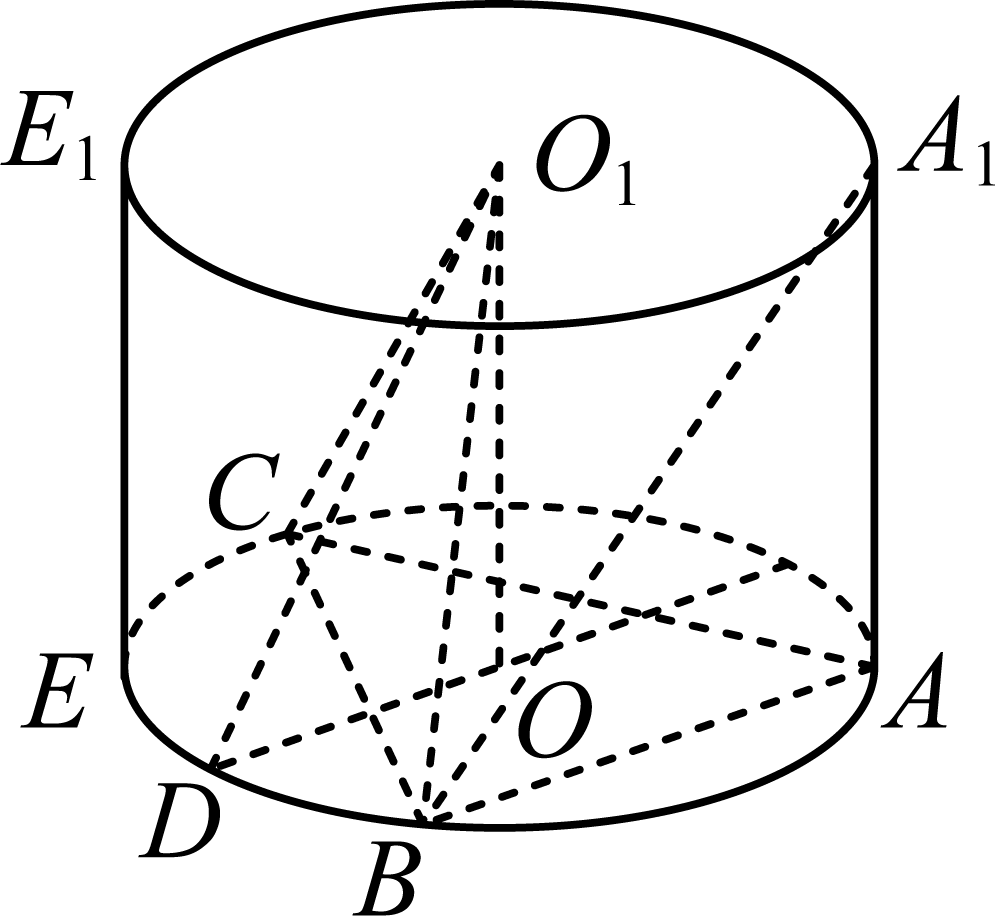

则平面，同理可证平面，

，且平面，平面，所以平面平面，

又因为平面，所以平面

故存在点*D*满足题意．

因为为底面⊙*O*的内接正三角形，所以，即，

又因为，所以⊙*O*的半径为，

所以劣弧的长度为；

（2）如图取<em>BC</em>的中点为<em>M</em>，连接<em>MA</em>，以<em>MB</em>为<em>x</em>轴，<em>MA</em>为<em>y</em>轴，过<em>M</em>作<em>OO1</em>平行线为<em>z</em>轴，建立空间直角坐标系，

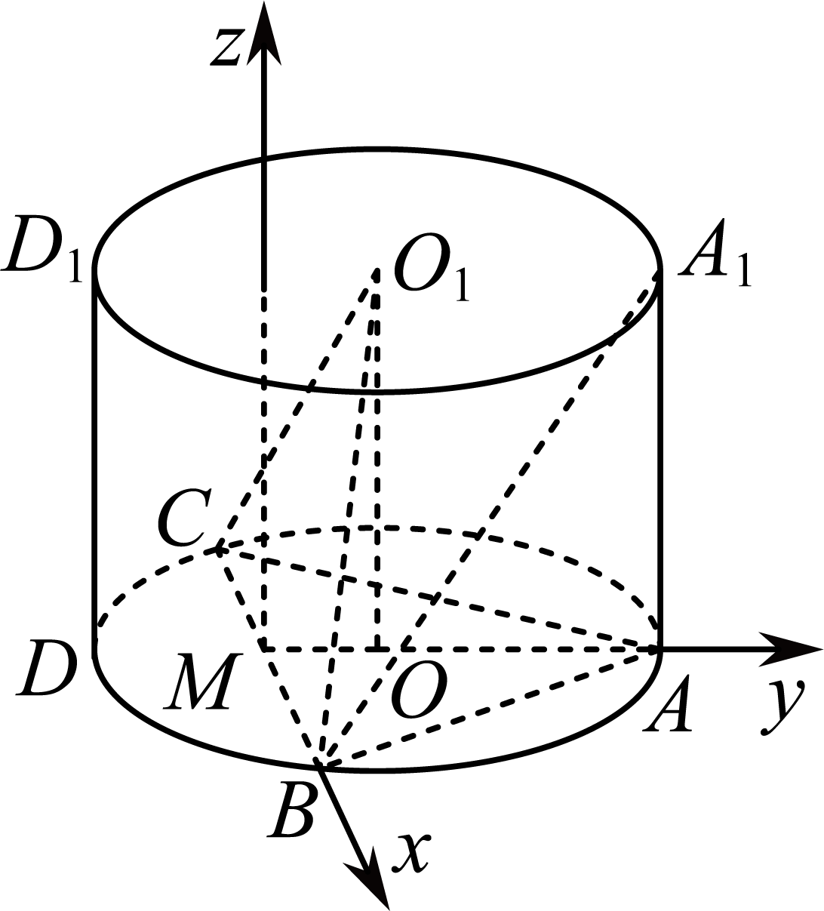

又因为，设*AB*中点为*N*．

故，，，，，，

易知平面，所以平面的法向量．

设平面的法向量为，

又因为，，故即

令得

所以平面和平面夹角的余弦值为．

故平面和平面夹角的正弦值为．

**题型二：立体几何存在性问题**

<strong>例4．</strong>（2024·全国·高三对口高考）如图，如图1，在直角梯形中，．把沿对角线折起到的位置，如图2所示，使得点<em>P</em>在平面上的正投影<em>H</em>恰好落在线段上，连接，点<em>E</em>，<em>F</em>分别为线段，的中点．

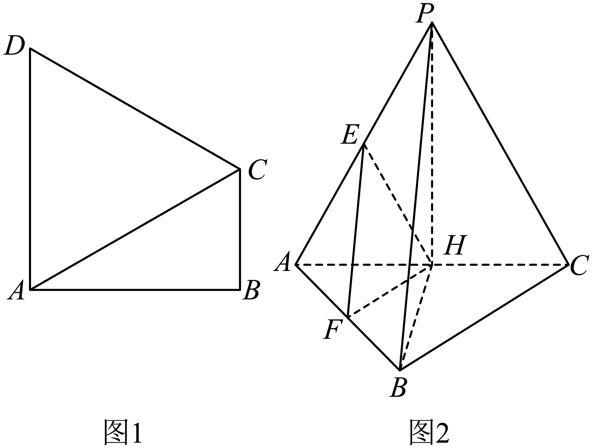

(1)求证：平面//平面；

(2)求直线与平面所成角的正弦值；

(3)在棱上是否存在一点*M*，使得*M*到点四点的距离相等？请说明理由．

【解析】（1）在中，，所以

在中，，，所以为等边三角形，

因为点*P*在平面上的正投影*H*恰好落在线段上，

所以平面，又平面，

所以，所以为线段的中点，

又点*E*，*F*分别为线段，的中点，

所以，

由，平面，平面，所以平面，

由，平面，平面，所以平面，

由平面，，

所以平面//平面；

（2）在平面内过作的垂线

如图建立空间直角坐标系，

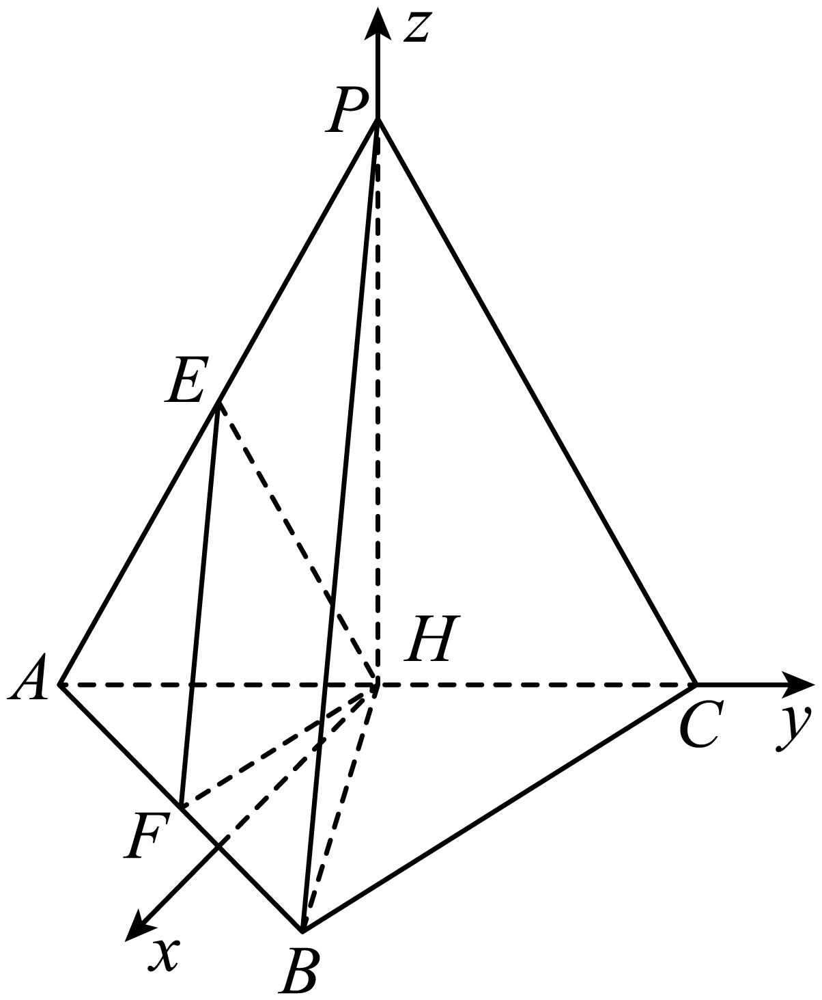

则，，，

因为，

设平面的法向量为

因为，，

所以有，

即，

令，则，，

所以为平面的一个法向量，

所以直线与平面所成角的正弦值为；

（3）存在，点为线段的中点，理由如下：

因为在直角三角形中，，

在直角三角形中，，

又

所以点到四个点的距离相等，

所以点为所找的点，即线段的中点为所求.

**例5．**（2024·上海长宁·上海市延安中学校考三模）已知和所在的平面互相垂直，，，，，是线段的中点，.

(1)求证：；

(2)设，在线段上是否存在点（异于点），使得二面角的大小为.

【解析】（1），故，

，则，故，

又，平面，，故平面，

平面，故，

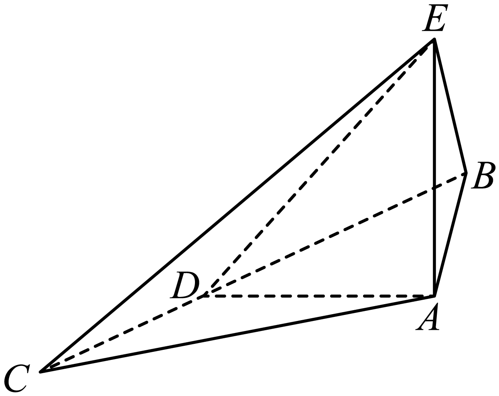

（2）△和△所在的平面互相垂直，则平面平面，

且平面，故平面，

如图所示：以分别为轴建立空间直角坐标系，

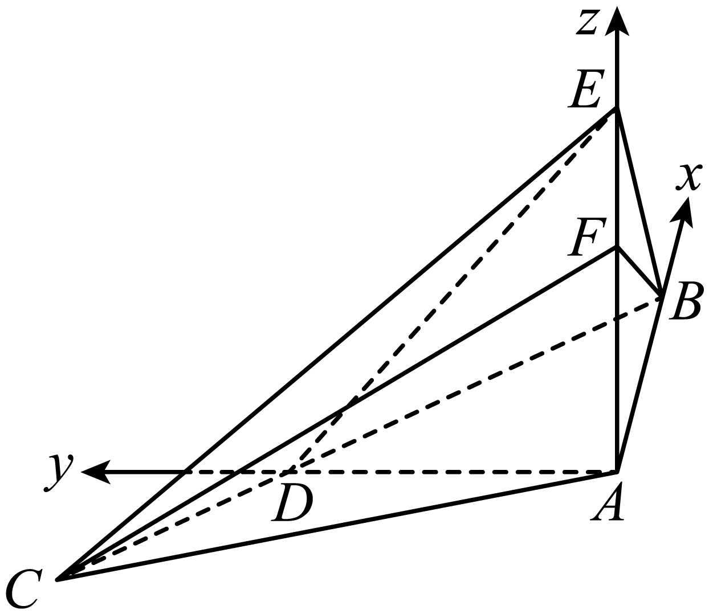

则，，，设，，

平面的一个法向量为，

设平面的一个法向量为，则，

取得到，

则，解得，不满足题意.

综上所述：不存在点，使二面角的大小为.

**例6．**（2024·湖南邵阳·邵阳市第二中学校考模拟预测）如图，在中，，为边上一动点，交于点，现将沿翻折至.

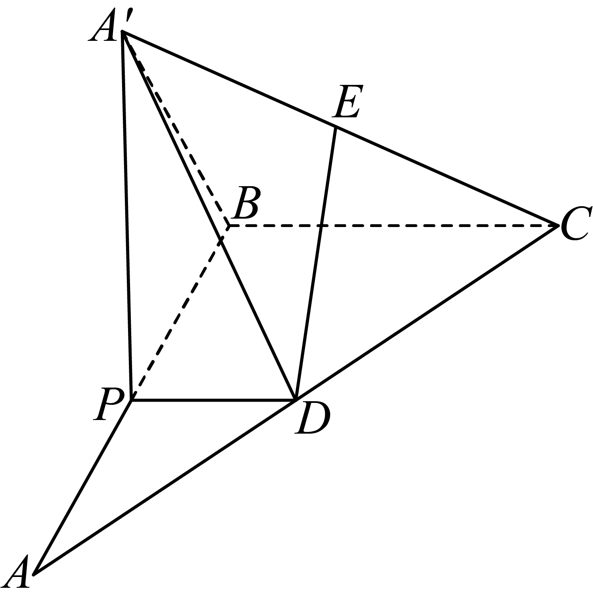

(1)证明：平面平面；

(2)若，且，线段上是否存在一点（不包括端点），使得锐二面角的余弦值为，若存在求出的值，若不存在请说明理由.

【解析】（1）因为，，

所以，所以，

所以，又因为，

，平面，平面，

所以平面，又平面，

所以平面平面.

（2）因为，，∴，

又∵，，平面，

∴平面，

∴、、两两垂直，以点为原点，为轴，为轴，为轴建立空间直角坐标系，

因为，，

所以.

则，，，，

平面的一个法向量为，

，设，

，

，

设平面法向量为，

则，所以，

取，则，，

故为平面的一个法向量，

所以，

解得，符合题意

即，∴.

**变式6．**（2024·福建厦门·统考模拟预测）筝形是指有一条对角线所在直线为对称轴的四边形．如图，四边形为筝形，其对角线交点为，将沿折到的位置，形成三棱锥．

(1)求到平面的距离；

(2)当时，在棱上是否存在点，使得直线与平面所成角的正弦值为？若存在，求的值；若不存在，请说明理由．

【解析】（1）因为，

所以不可能为四边形的对称轴，则为四边形的对称轴，

所以垂直平分，所以．

平面平面

所以平面．

所以到平面的距离．

（2）存在点，使得直线与平面所成角的正弦值为．

过作平面，所以两两垂直.

以为原点，所在直线分别为轴，轴，轴建立空间直角坐标系

由（1）得平面平面，因为

所以．

设，

，

，

设平面的法向量，

，所以

令，则，

所以平面的一个法向量，

设直线与平面所成角为，，

．

所以或，所以存在点，使得直线与平面所成角的正弦值为或．

**变式7．**（2024·湖北襄阳·襄阳四中校考模拟预测）斜三棱柱的各棱长都为，点在下底面的投影为的中点.

(1)在棱（含端点）上是否存在一点使？若存在，求出的长；若不存在，请说明理由；

(2)求点到平面的距离.

【解析】（1）因为点在下底面的投影为的中点，故平面，

连接，由题意为正三角形，故,

以为原点，分别为轴建立如图所示空间直角坐标系：

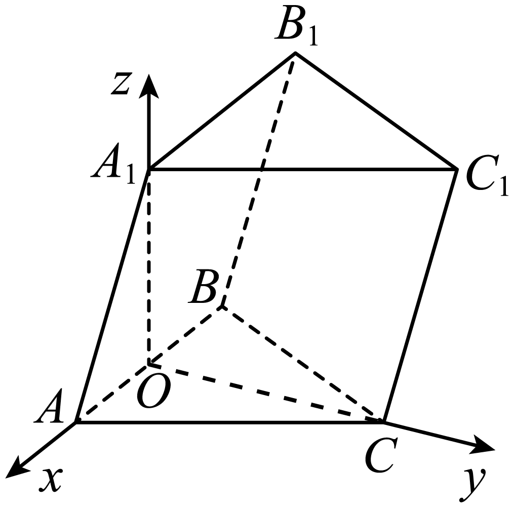

则，，

设，可得，

，

假设在棱（含端点）上存在一点使，

则，

则；

（2）由（1）知，

设平面的法向量为，

则，令，则，

则，

又，

则到平面的距离为，

即点到平面距离为.

<strong>变式8．</strong>（2024·全国·高三专题练习）如图，在四棱锥中，平面<em>PAD</em>，△<em>PAD</em>为等边三角形，//，，平面<em>PBC</em>交平面<em>PAD</em>直线<em>l</em>，<em>E</em>、<em>F</em>分别为棱<em>PD</em>，<em>PB</em>的中点．

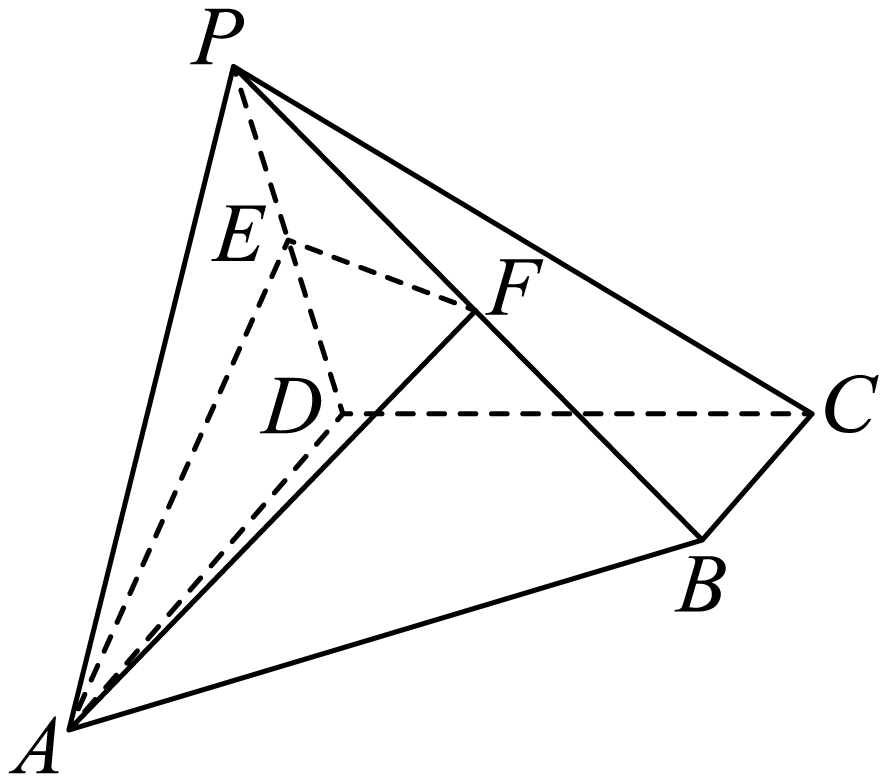

(1)求证：∥；

(2)求平面*AEF*与平面*PAD*所成锐二面角的余弦值；

(3)在棱*PC*上是否存在点*G*，使得∥平面*AEF*？若存在，求的值，若不存在，说明理由．

【解析】（1）因为//，平面，平面，

所以//平面，

又因为平面，平面平面直线*l*，

所以∥.

（2）取的中点，连接，

由题意可得：//，且，

则为平行四边形，可得//，

且平面*PAD*，则平面*PAD*，

由平面*PAD*，则，

又因为△*PAD*为等边三角形，则为的中点，可得，

，平面，则平面，

如图，以为坐标原点，分别为轴建立空间直角坐标系，

则，

可得，

设平面的法向量，则，

令，则，即，

由题意可知：平面*PAD*的法向量，

可得，

所以平面*AEF*与平面*PAD*所成锐二面角的余弦值.

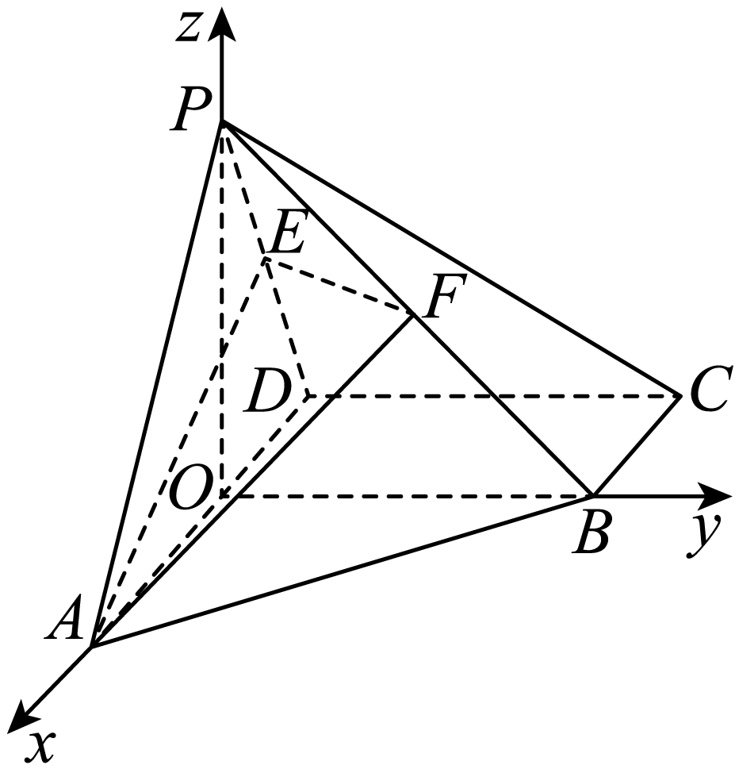

（3）由（2）可得：，

设，，则，

可得，解得，

即，可得，

若∥平面*AEF*，则，

可得，解得，

所以存在点，使得∥平面*AEF*，此时.

<strong>变式9．</strong>（2024·湖北襄阳·襄阳四中校考模拟预测）在三棱锥<em>P-ABC</em>中，若已知，，点<em>P</em>在底面<em>ABC</em>的射影为点<em>H</em>，则

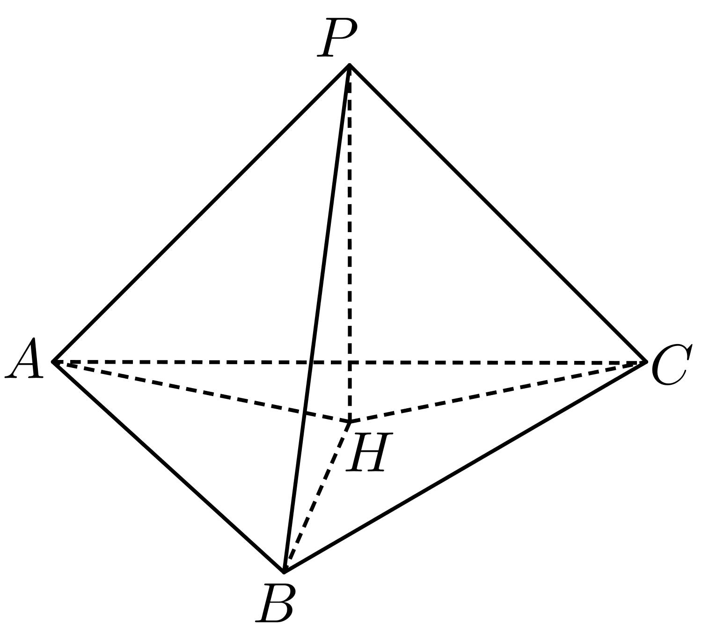

(1)证明：

(2)设，则在线段*PC*上是否存在一点*M*，使得与平面所成角的余弦值为，若存在，设，求出的值，若不存在，请说明理由.

【解析】（1）因为点*P*在底面*ABC*的射影为点*H*，

所以平面，又平面，

所以，

因为，，，平面，

所以平面，又平面，

所以，

因为，，，平面，

所以平面，又平面，

所以，

因为，，

所以点为的垂心，所以，

因为，，平面，，

所以平面，又平面，

所以；

（2）延长交于点，由（1）可得，

又，所以点为线段的中点，

所以，同理可得，

所以为等边三角形，又，所以，

如图，以点为原点，以为轴的正方向，建立空间直角坐标系，

则，

故，

设存在点*M*，使得*BM*与平面所成角的余弦值为，且，

则，

设平面的法向量为，，

则，所以，

令，可得，

所以为平面的一个法向量，

所以，

设直线*BM*与平面所成角为，则，又，

所以，故，

所以或，又，

所以.

所以在线段*PC*上存在点*M*，使得*BM*与平面*PAB*所成角的余弦值为，且.

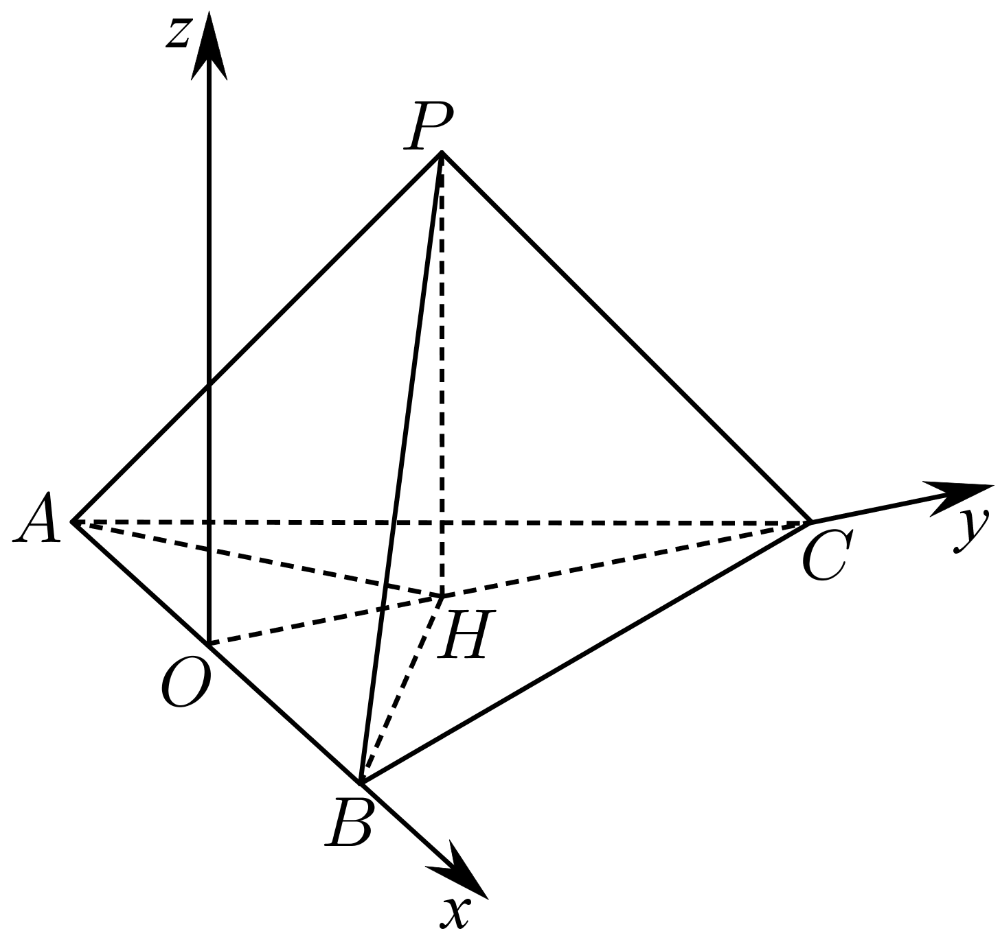

**变式10．**（2024·浙江·校联考模拟预测）在四棱锥中，底面为矩形，，为等腰直角三角形，平面平面，为中点.

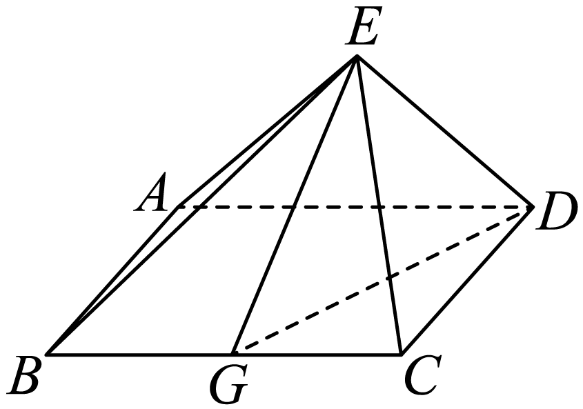

(1)在线段上是否存在点，使得点到平面的距离为.若存在，求出的值；若不存在，说明理由；

(2)求二面角的正弦值.

【解析】（1）法1：取中点，记为，连接，，，

因为为等腰直角三角形，所以，

平面平面，平面平面，

平面，平面，

因为，，所以，则，

，，

假设存在，由，即，

又，所以，

又，

，又，又，.

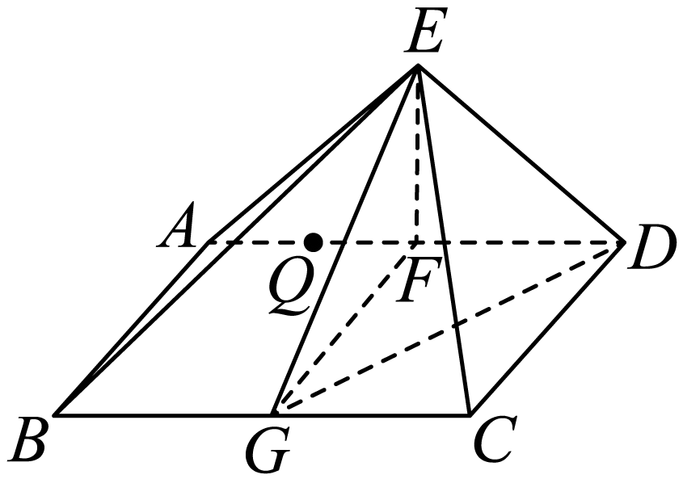

法2：取中点，记为，连接，，，

因为为等腰直角三角形，所以，

平面平面，平面平面，

平面，平面，因为，，所以，

如图以为原点，所在直线为轴，所在直线为轴，所在直线为轴，建立空间直角坐标系，

则，，，

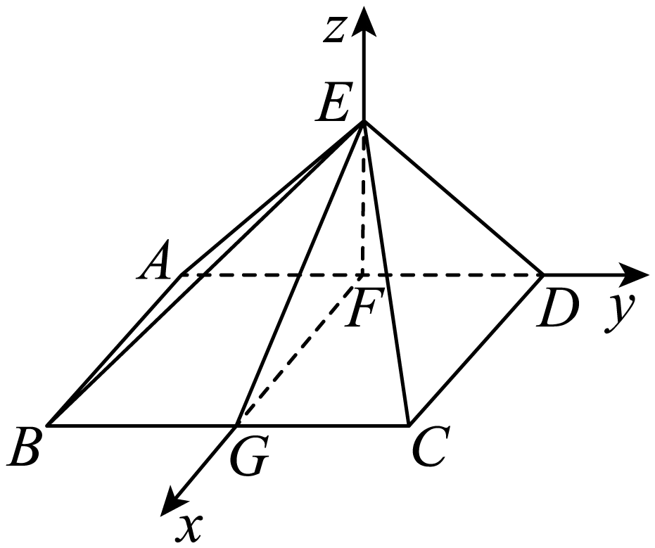

设线段上存在，使得它到平面的距离为，

则，，，

设平面的法向量，则，令，则，

到平面的距离，解得或（舍去），

则，；

（2）法1：由（1）可知平面，易得，，

则，，

过点作，交于点，连结，则，

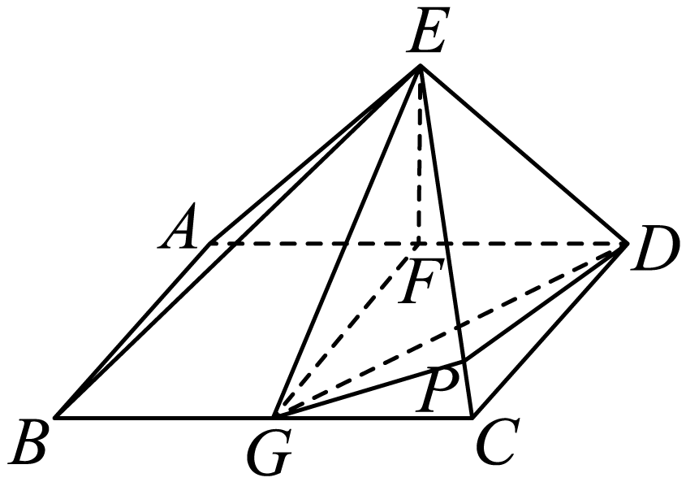

为二面角的一个平面角，

在中，可得，同理可得，又，

，

，即二面角的正弦值为；

法2：如图建立空间直角坐标系：

则，

所以，，，

设为平面法向量，

所以，则，

设为平面法向量，则，令，则，

设二面角为，显然为锐角，则，

所以，即二面角的正弦值为.

**变式11．**（2024·全国·高三专题练习）如图，在三棱锥中，侧面是边长为2的正三角形，，，分别为的中点，平面与底面的交线为.

(1)证明：平面.

(2)若三棱锥的体积为，试问在直线上是否存在点，使得直线与平面所成角为，异面直线所成角为，且满足？若存在，求出线段的长度；若不存在，请说明理由.

【解析】（1）因为分别为的中点，

所以，.

又平面，平面，

所以，平面.

又平面，平面与底面的交线为，所以，.

从而，.

而平面，平面，所以，平面.

（2）取的中点记为，连接，

因为是边长为2的正三角形，所以，.

由（1）可知，在底面内过点作的平行线，即平面与底面的交线.

由题意可得，即，

所以的面积.

设点到平面的距离为，

则由已知可得，于是.

因为，所以平面.

取的中点记为，连接，则.

因为，所以.

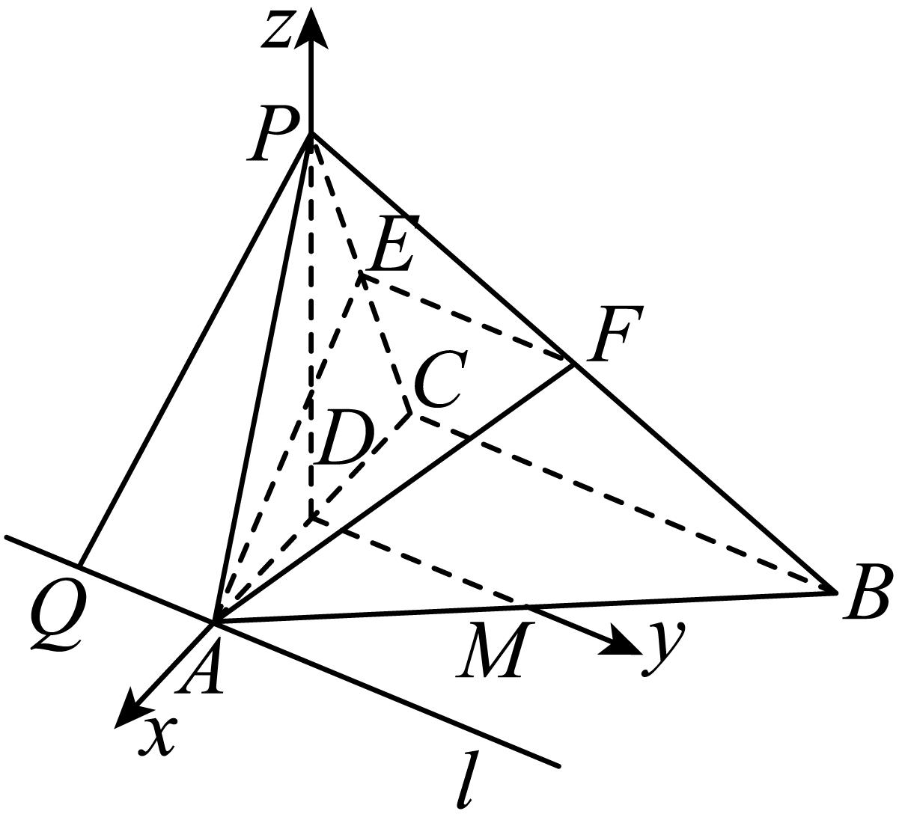

以为坐标原点，所在直线分别为轴､轴､轴，如图建立空间直角坐标系，则，，，，，，设.

于是，，，.

设平面的一个法向量为，

则，即，

取，则，，即是平面的一个法向量，

所以.

又直线与平面所成角为，

于是.

又，

而异面直线所成角为，于是.

假设存在点满足题设，则，

即，所以.

当时，，此时有；

当时，，此时有.

综上所述，这样的点存在，且有.

**变式12．**（2024·安徽淮北·统考二模）如图所示，四棱锥中，底面为菱形，.

(1)证明：面；

(2)线段上是否存在点，使平面与平面夹角的余弦值为？若存在，指出点位置；若不存在，请说明理由.

【解析】（1）因为底面为菱形，所以，又，

面，所以面，

面，所以.

又，所以.

结合，面，得面.

（2）取线段的中点，结合题设及（1）的结论，如图所示建立空间直角坐标系.

不妨设，则，

假设存在符合条件，设

即，即，

所以.

设平面的法向量，

,

则，令，则，即.

注意到，设平面的法向量，

则，令，则，即.

题设知，

即，所以，得（舍）或.

综上，时符合条件，此时点为线段的靠近点的四等分点.

**题型三：立体几何折叠问题**

<strong>例7．</strong>（2024·河南·洛宁县第一高级中学校联考模拟预测）在图1中，为等腰直角三角形，，，为等边三角形，<em>O</em>为<em>AC</em>边的中点，<em>E</em>在<em>BC</em>边上，且，沿<em>AC</em>将进行折叠，使点<em>D</em>运动到点<em>F</em>的位置，如图2，连接<em>FO</em>，<em>FB</em>，<em>FE</em>，使得．

(1)证明：平面．

(2)求二面角的余弦值．

【解析】（1）证明：连接*OB*，

因为为等腰直角三角形，，，

所以，

因为*O*为*AC*边的中点，

所以，

在等边三角形中，，

因为*O*为*AC*边的中点，

所以，则，

又，

所以，即，

因为，平面，平面，

所以平面．

（2）方法一：因为是等腰直角三角形，，为边中点，

所以，

由（1）得平面，则以*O*为坐标原点，，，的方向分别为*x*，*y*，*z*轴的正方向建立空间直角坐标系，

则，，，

所以，，

设平面的法向量为，

由，得，令，得，

易知平面的一个法向量为，

设二面角的大小为*θ*，

则，

由图可知二面角为锐角，

所以二面角的余弦值为．

方法二：

作，垂足为*M*，作，垂足为*N*，连接，

因为平面，平面，

所以，

又因为，平面，

所以平面，

又平面，

所以，

又，，平面，

所以平面，

又平面，

所以，

又平面平面，

所以二面角的平面角为，

因为，所以，

所以，，

在中，，，

所以，

所以，

所以，即二面角的余弦值为．

**例8．**（2024·广东深圳·校考二模）如图1所示，等边的边长为，是边上的高，，分别是，边的中点．现将沿折叠，如图2所示.

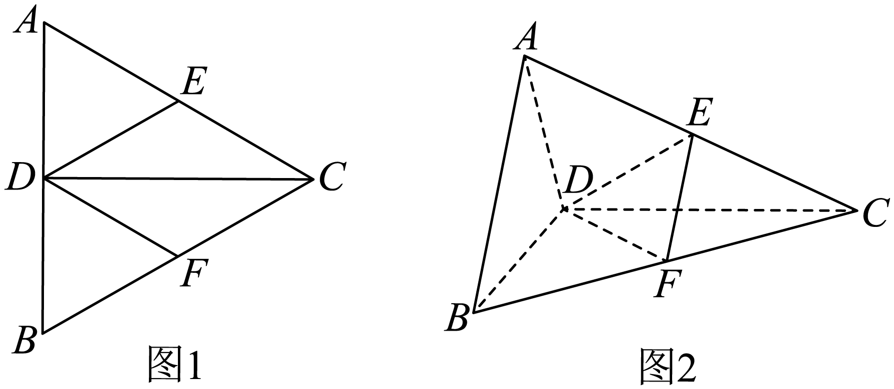

(1)证明：；

(2)折叠后若，求二面角的余弦值.

【解析】（1）在等边的边长为，是边上的高，

根据折叠的性质可得，，

因为，，，平面，

所以平面，因为平面，所以，

因为和分别是和的中点，

所以，所以，

（2）取的中点，连接，

取和的中点分别为和，连接，，，

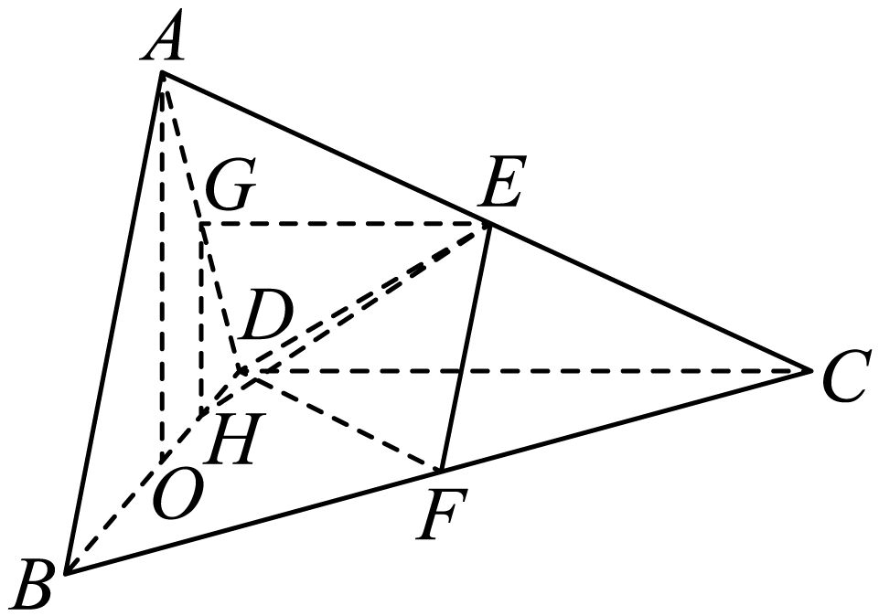

因为，，的中点分别为，，，

所以，，

因为，所以为等边三角形，又为的中点，所以，

所以，又平面，平面，平面，所以，

又因为平面，

所以，又因为，平面，

所以平面，平面，

所以，

则二面角的平面角为，

所以，

又，解得，显然为锐角，

所以，即二面角的余弦值为．

**例9．**（2024·四川南充·高三阆中中学校考阶段练习）如图甲所示的正方形中，对角线分别交于点，将正方形沿折叠使得与重合，构成如图乙所示的三棱柱

(1)若点在棱上，且，证明：∥平面；

(2)求二面角的余弦值.

【解析】（1）在三棱柱中过作交于，连接，则，

所以四点共面，且平面平面，

因为，所以，

又是正方形，所以，，，

又，则，

所以四边形平行四边形，，

又平面，平面，所以平面；

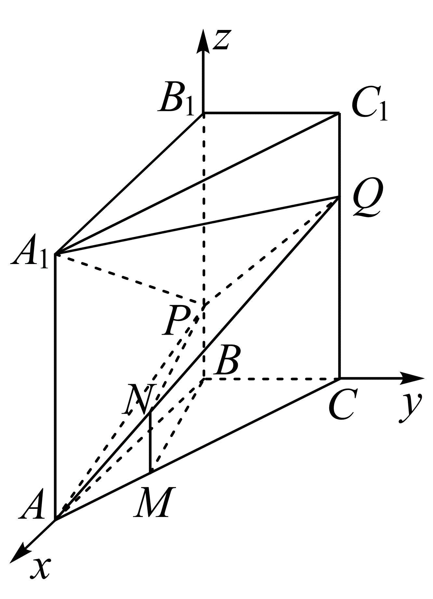

（2）由（1）知，所以，而与都垂直，

则分别以为轴建立空间直角坐标系，如图，

由得，，，

所以，，

设平面的一个法向量是，

由，取得，

又，则，，

设平面的一个法向量是，

由，取得，

设二面角的平面角为，

则，

由图可知二面角的平面角为钝角，

所以二面角的余弦值是．

<strong>变式13．</strong>（2024·重庆渝中·高三重庆巴蜀中学校考阶段练习）已知如图甲所示，直角三角形<em>SAB</em>中，，，<em>C</em>，<em>D</em>分别为<em>SB</em>，<em>SA</em>的中点，现在将沿着<em>CD</em>进行翻折，使得翻折后<em>S</em>点在底面<em>ABCD</em>的投影<em>H</em>在线段<em>BC</em>上，且<em>SC</em>与平面<em>ABCD</em>所成角为，<em>M</em>为折叠后<em>SA</em>的中点，如图乙所示.

(1)证明：平面*SBC*；

(2)求平面*ADS*与平面*SBC*所成锐二面角的余弦值.

【解析】（1）证明：取*SB*的中点为*N*，连接*MN*，*CN*，如图所示：

在图甲中，∵*C*，*D*分别为*SB*，*SA*上的中点，

∴，，

又∵*M*，*N*分别为*SA*，*SB*的中点，

∴，，

∴*MNCD*为平行四边形，∴，

又∵平面*SBC*，平面*SBC*，

∴平面*SBC*.

（2）∵，

∴，，，

∴平面*SBC*，又平面*ABCD*，

平面平面*ABCD*，

因为*S*点在底面的投影*H*在线段*BC*上，

∴平面*ABCD*，∴.

*SC*与平面*ABCD*所成角的平面角为，

，

过*H*作，则*HP*，*HB*，*HS*两两互相垂直，

以*H*为坐标原点，，，的方向分别为*x*，*y*，*z*轴的正方向

建立如图所示的空间直角坐标系，

则，，，

，，

易知为平面*SBC*的一个法向量；

设为平面*ADS*的一个法向量，

则有，

可取，

设平面*ADS*与平面*SBC*所成锐二面角的大小为，

则，

所以平面*ADS*与平面*SBC*所成锐二面角的余弦值为.

<strong>变式14．</strong>（2024·全国·高三专题练习）如图1，在直角梯形<em>BCDE</em>中，，，<em>A</em>为<em>DE</em>的中点，且，，将沿<em>AB</em>折起，使得点<em>E</em>到达<em>P</em>处（<em>P</em>与<em>D</em>不重合），记<em>PD</em>的中点为<em>M</em>，如图2．

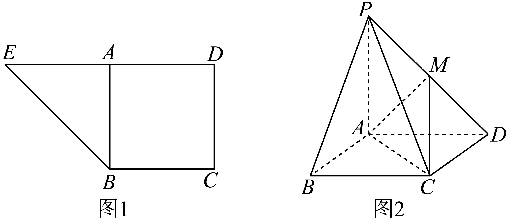

(1)在折叠过程中，*PB*是否始终与平面*ACM*平行？请说明理由；

(2)当四棱锥*P*-*ABCD*的体积最大时，求*CD*与平面*ACM*所成角的正弦值．

【解析】（1）在折叠过程中，*PB*始终与平面*ACM*平行.

理由如下：

由已知可得：，

所以，即四边形为正方形，

连接与于点，连接，

又为的中点，所以，

因为平面*ACM*，平面*ACM*，

所以平面*ACM*

（2）要使四棱锥*P*-*ABCD*的体积最大，只需点到平面的距离最大，

即平面，以为坐标原点，所在直线分别为轴建立如图所示的空间直角坐标系，

则，

，

设平面*ACM*的法向量为，

则，

令，得，则，

设*CD*与平面*ACM*所成角为，

所以.

即*CD*与平面*ACM*所成角的正弦值为.

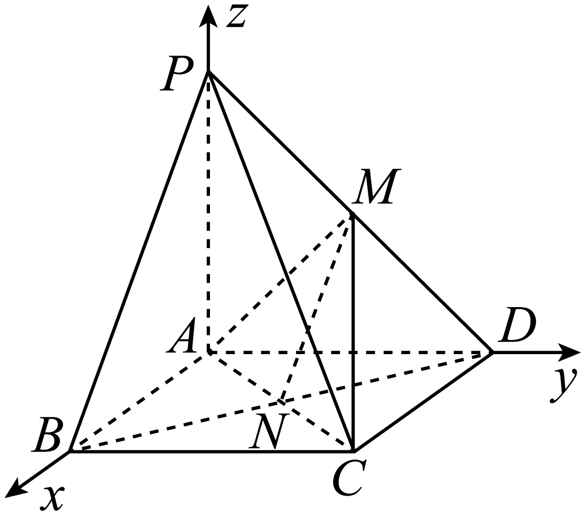

<strong>变式15．</strong>（2024·全国·高三专题练习）如图，四边形中，，<em>E</em>，<em>F</em>分别在，上，，现将四边形沿折起，使．

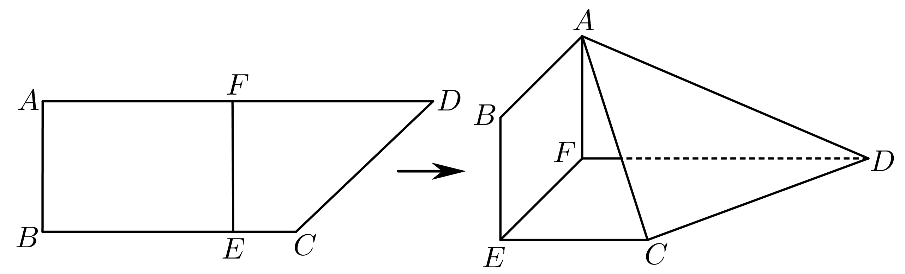

(1)若，在折叠后的线段上是否存在一点*P*，使得平面？若存在，求出的值；若不存在，说明理由．

(2)求三棱锥的体积的最大值，并求出此时点*F*到平面的距离．

【解析】（1）上存在一点*P*，使得平面，此时，

理由如下：当时，，

如图，过点*P*作交于点*M*，连接，

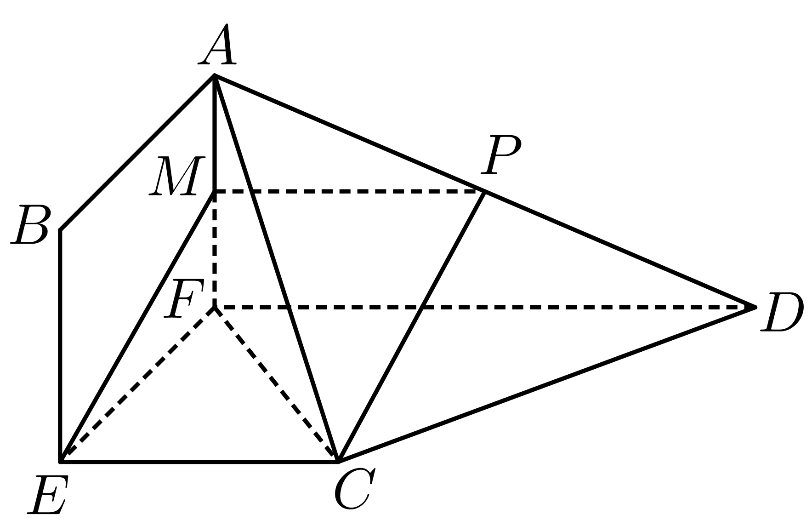

则，

∵，∴，∴，又，，∴，

故四边形为平行四边形，∴，

又平面，平面，

∴平面.

综上，存在点*P*，使得平面，.

（2）设，则，

故，

∴当时，有最大值，且最大值为3，

∴此时，，，，

∴，，

在中，由余弦定理得，，

，

设*F*到平面的距离为*h*，

，．

综上，三棱锥的最大值为3，此时点*F*到平面的距离为.

<strong>变式16．</strong>（2024·全国·高三专题练习）如图，四边形中，是等腰直角三角形，是边长为2的正三角形，以为折痕，将向一方折叠到的位置，使<em>D</em>点在平面内的射影在上，再将向另一方折叠到的位置，使平面平面，形成几何体.

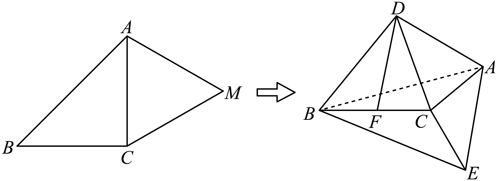

（1）若点*F*为的中点，求证：平面；

（2）求平面与平面所成角的正弦值.

【解析】（1）如图，设*D*点在平面内的射影为*O*，连接，连接.

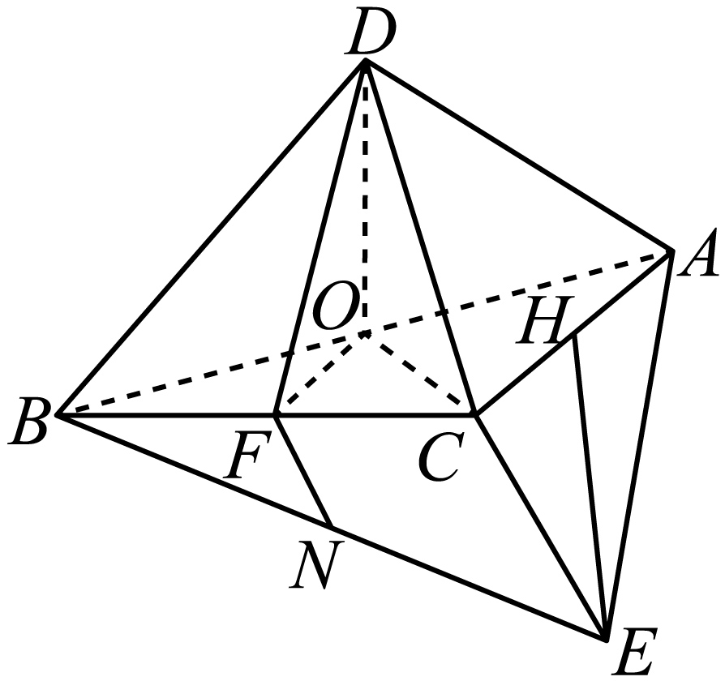

∵，∴，

∴在等腰中，*O*为的中点.

∵*F*为中点，∴.

又平面，平面，

∴平面.取的中点*H*，连接，

则易知，又平面平面，

平面平面，

∴平面，

又平面，

∴，又平面，平面，

∴平面，

又.∴平面平面.

又平面，∴平面.

（2）连接，由（1）可知两两垂直，以*O*为坐标原点所在直线分别为轴，建立如图所示的空间直角坐标系，

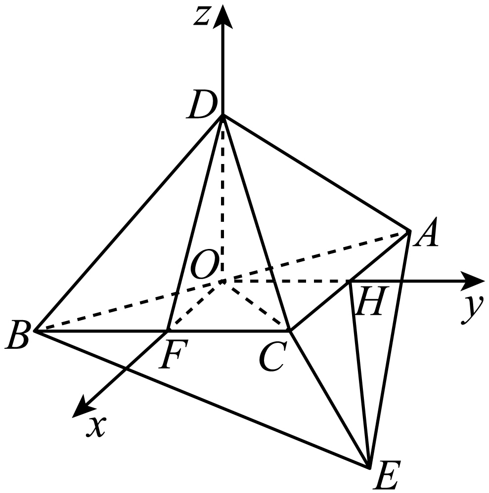

则，

从而.

设平面的一个法向量为，则，即，

得，取，则.

设平面的一个法向量为，

则，即，

得，取，则，

从而.

∴，

∴平面与平面所成角的正弦值为．

**变式17．**（2024·四川泸州·泸县五中校考三模）如图1，在梯形中，，且，是等腰直角三角形，其中为斜边.若把沿边折叠到的位置，使平面平面，如图2.

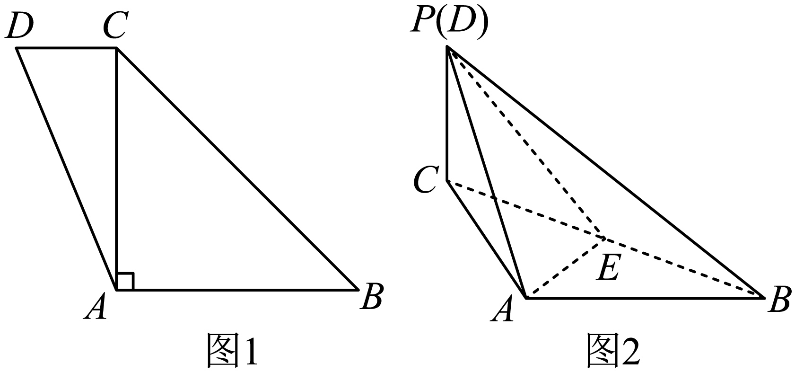

（1）证明：；

（2）若为棱的中点，求点到平面的距离.

【解析】（1）证明：∵是等腰直角三角形，为斜边，

∴.

∵平面平面，平面平面，平面

∴平面，

∵平面，

∴；

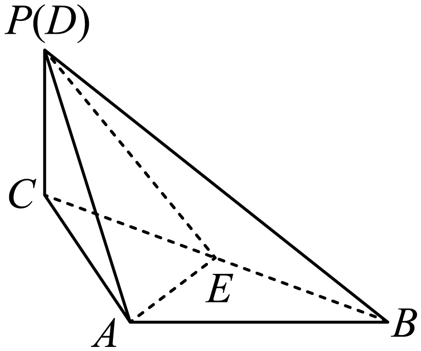

（2）由（1）知，平面，

由题意可得，，，

则，，

∵为棱的中点，

∴，

∴，

在中，，，，

∴，

即，

则的面积为，

设点到平面的距离为

∵，

∴，

∴.

**变式18．**（2024·湖南长沙·长沙一中校考一模）如图1，四边形为直角梯形，，，，，，为线段上一点，满足，为的中点，现将梯形沿折叠（如图2），使平面平面.

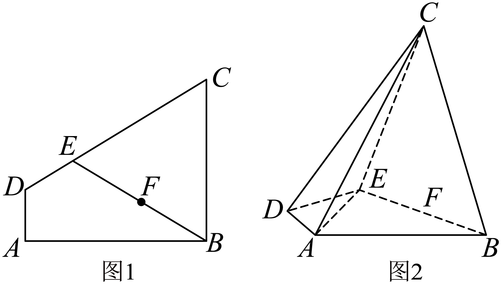

（1）求证：平面平面；

（2）能否在线段上找到一点（端点除外）使得直线与平面所成角的正弦值为？若存在，试确定点的位置；若不存在，请说明理由.

【解析】（1）证明：在直角梯形中，，，

因此为等边三角形，从而，又，

由余弦定理得：，

∴，即，且折叠后与位置关系不变，

又∵平面平面，且平面平面.

∴平面，∵平面，

∴平面平面.

（2）∵为等边三角形，为的中点，

∴，又∵平面平面，且平面平面，

∴平面，

取的中点，连结，则，从而，以为坐标原点建立如图所示的空间直角坐标系：

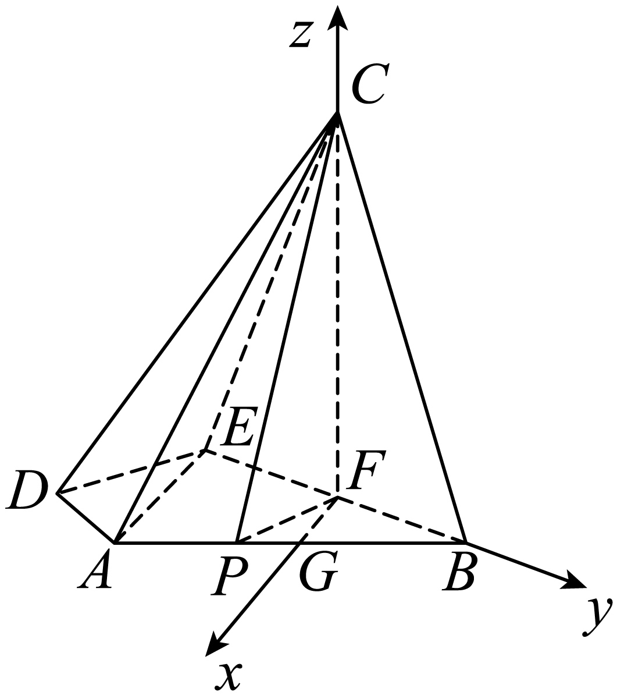

则，，则，

假设在上存在一点使直线与平面所成角的正弦值为，且，，

∵，∴，故，

∴，又，

该平面的法向量为，

，

令得，

∴，

解得或（舍），

综上可知，存在点是线段的中点，使得直线与平面所成角的正弦值为.

**题型四：立体几何作图问题**

<strong>例10．</strong>（2024·云南昆明·高三校考阶段练习）已知正四棱锥中，<em>O</em>为底面<em>ABCD</em>的中心，如图所示．

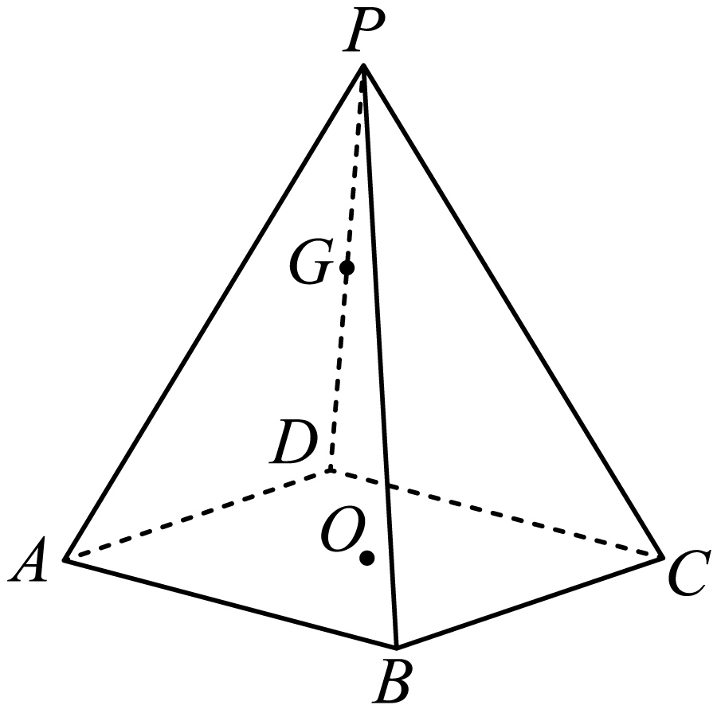

(1)作出过点*O*与平面*PAD*平行的截面，在答题卡上作出该截面与四棱锥表面的交线，写出简要作图过程及理由；

(2)设*PD*的中点为*G*，，求*AG*与平面*PAB*所成角的正弦值．

【解析】（1）如图所示，

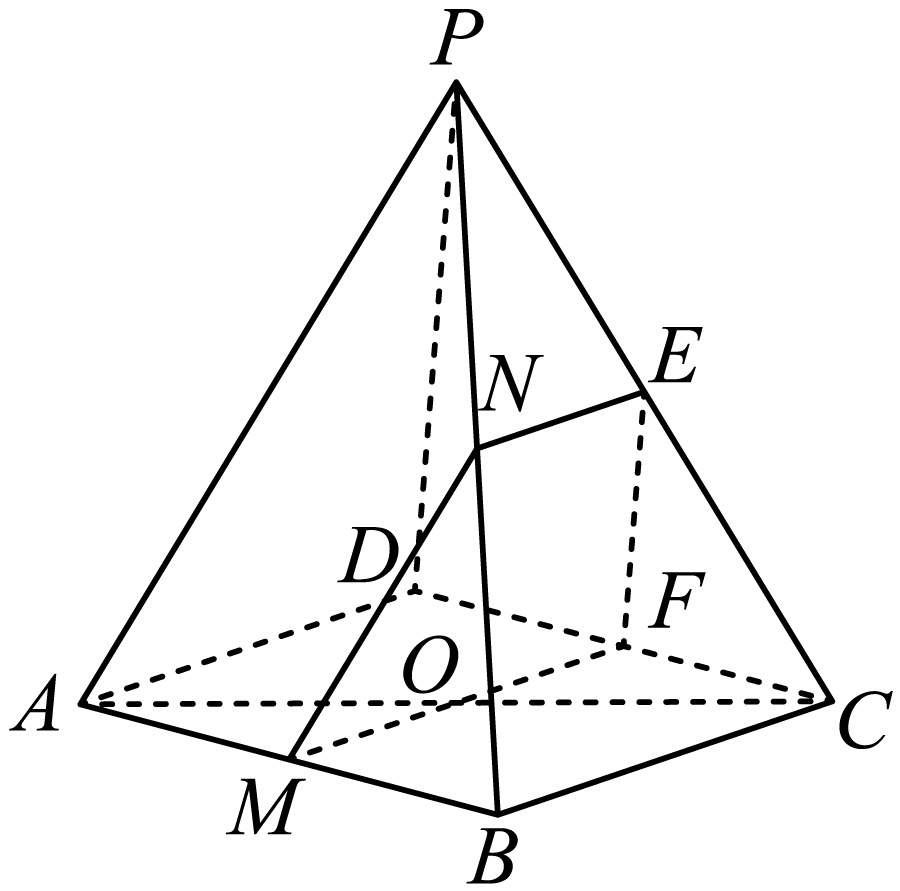

取*PC*中点*E*，*DC*的中点*F*，连接*EF*，*FO*，并延长*FO*交*AB*于*M*，

截面*EFN*交侧棱*PB*于*N*，则，

连接*AC*，*O*为*AC*的中点，所以，

又，，

截面*EFMN*，截面*EFMN*，

平面*PAD*，平面*PAD*，所以平面平面*EFMN*．

所以平面*EFMN*为所求截面．

（2）不妨设四棱锥的所有棱长均为2，以*O*为原点，过*O*点且分别与*AB*，*BC*平行的直线为*x*轴、*y*轴，*OP*为*z*轴，建立如图所示空间直角坐标系（图）．

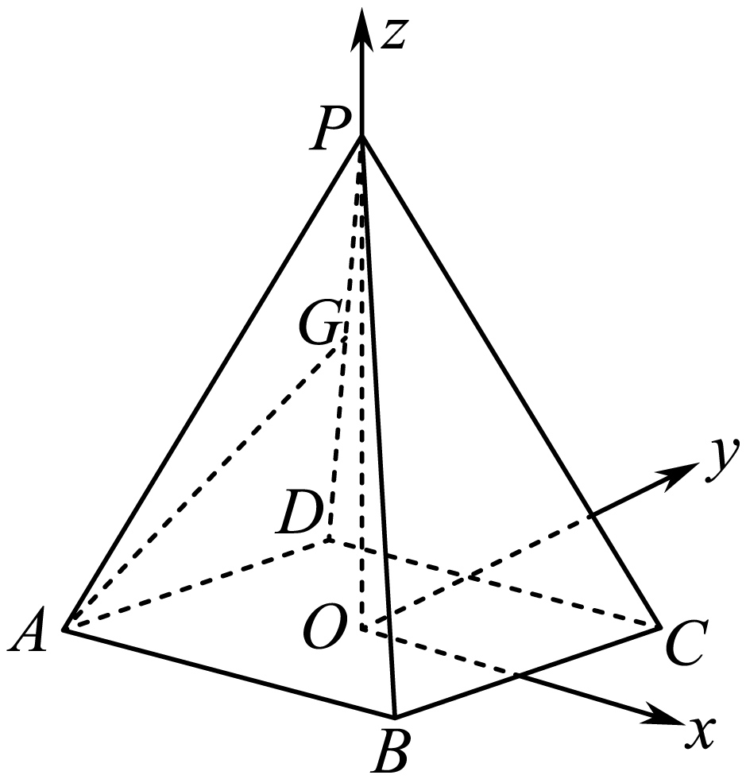

可得，，，．

则，，

，

设平面*PAB*的一个法向量为，

则，即，取，则，

设*AG*与平面*PAB*所成角为，则，

所以*AG*与平面*PAB*所成角的正弦值为．

**例11．**（2024·贵州·校联考模拟预测）如图，已知平行六面体的底面是菱形，，，且.

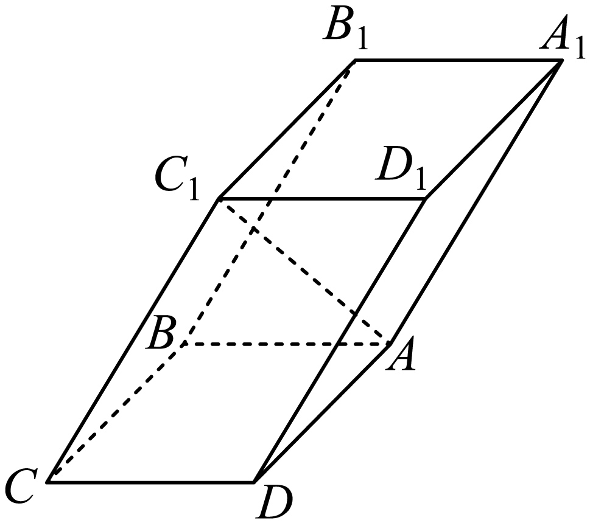

(1)试在平面内过点作直线，使得直线平面，说明作图方法，并证明：直线；

(2)求平面与平面所成锐二面角的余弦值.

【解析】（1）只需要在平面内过点作的平行线，即可使满足题意.

理由如下：平面，且平面

平面平面

所以

又∵在平行六面体中，

∴，得证.

（2）连接*AC*交*BD*于*O*，连接，如图，

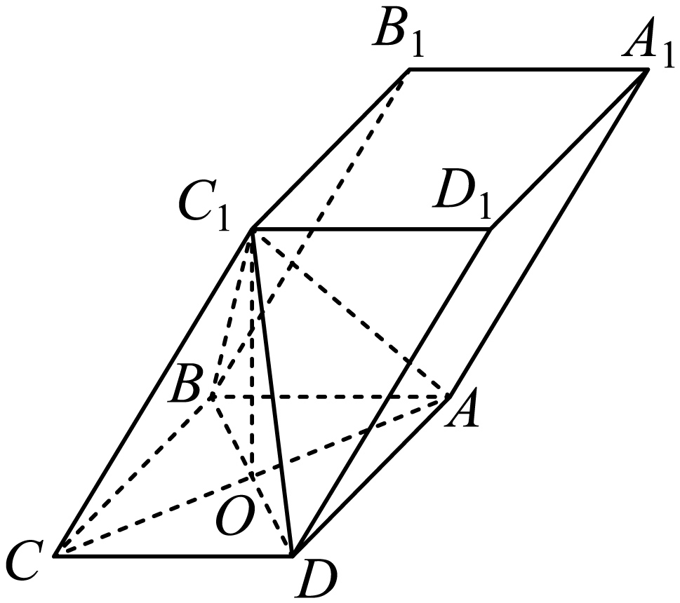

由题意易知，，

在中，，

同理：在中，，

∴为等腰三角形，即，又，

∴，

在中，，∴，

又∵，∴平面，

如图建系：以为*z*轴，*OC*为*x*轴，*OD*为*y*轴.

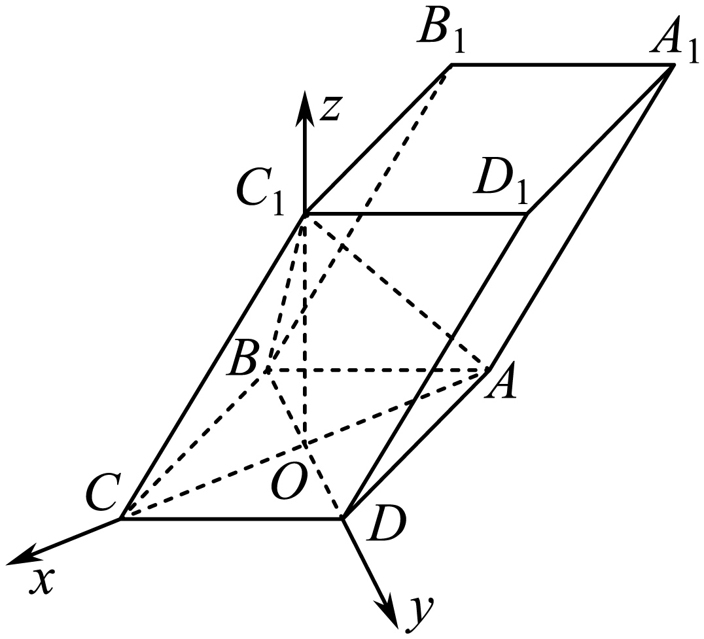

，，，，，

∵，∴，，

易知平面与平面重合，则平面的法向量，

设平面的法向量，

，∴，

设平面与平面所成角的平面角为，

.

平面与平面所成角的锐二面角的余弦值为.

**例12．**（2024·全国·高三专题练习）如图，已知平行六面体的底面是菱形，，且.

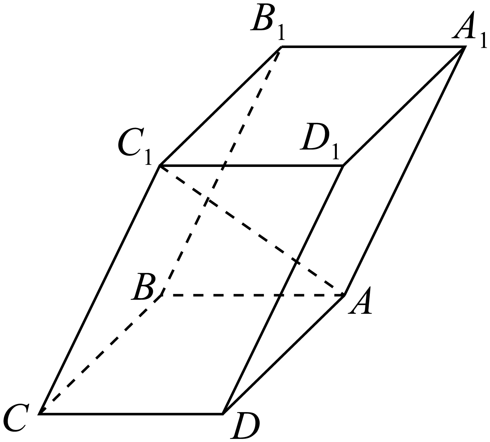

(1)试在平面内过点作直线，使得直线平面，说明作图方法，并证明：直线；

(2)求点到平面的距离.

【解析】（1）在平面内过点作的平行线，则直线*l*即为所作.

连接，如图，

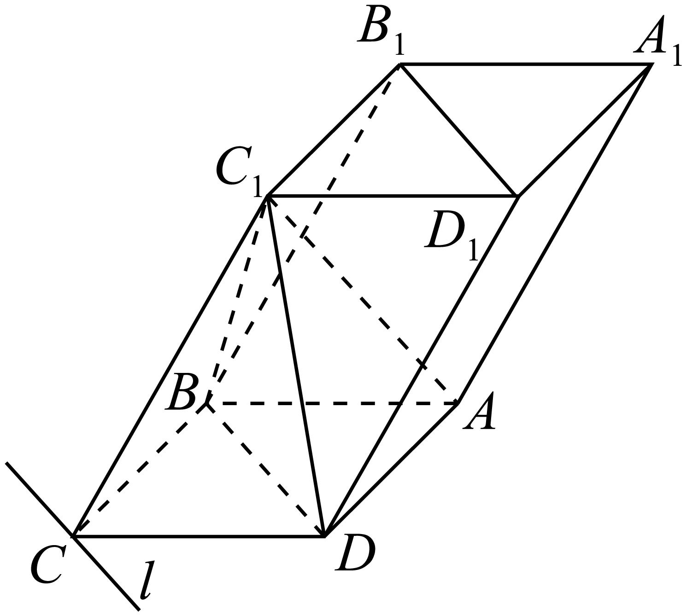

因平面，平面，平面平面，则，

平行六面体的对角面是平行四边形，即，

所以.

（2）连，连接，如图，

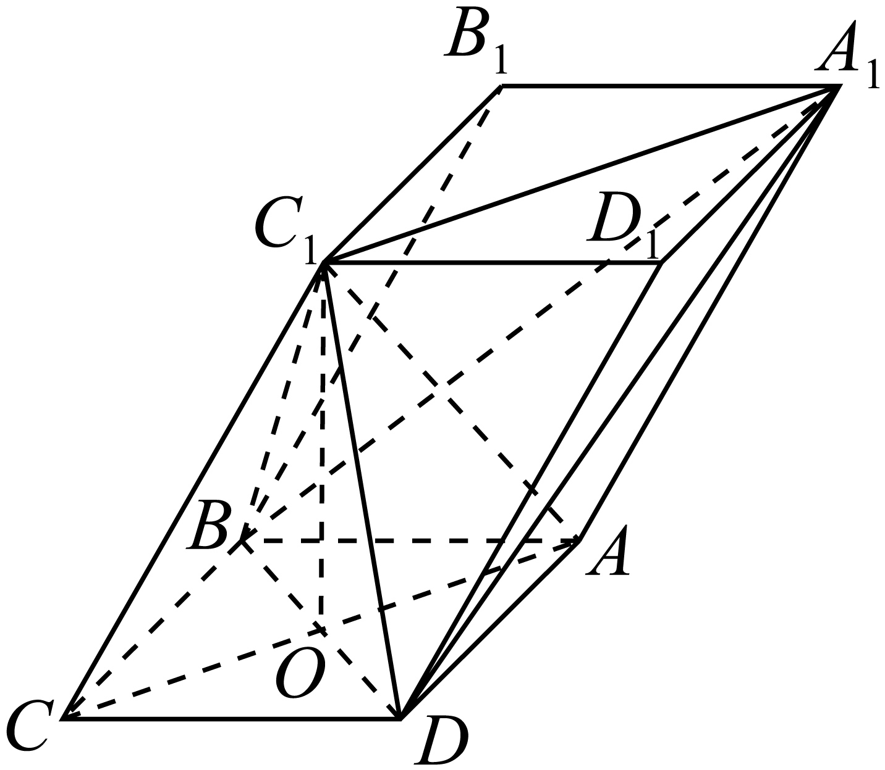

菱形中，，则，，，

在中，，同理，在中，，

即为等腰三角形，有，且，在中，，则，

而平面，于是得平面，

对角面为平行四边形，即，又平面，平面，则平面，

因此点到平面的距离等于点到平面的距离，

因，在中，，

同理，等腰底边上的高，，，

设点到平面的距离为，由得，，则，

所以点到平面的距离.

**变式19．**（2024·全国·高三专题练习）如图多面体中，面面，为等边三角形，四边形为正方形，，且，，分别为，的中点.

（1）求二面角的余弦值；

（2）作平面*FHG*与平面*ABCD*的交线，记该交线与直线*AB*交点为*P*，写出的值（不需要说明理由，保留作图痕迹）.

【解析】（1）因为面面，为等边三角形，设中点为，所以

又因为面面面*FAB*，则平面，

以为坐标原点，分别以方向为轴建立空间直角坐标系，如图所示：

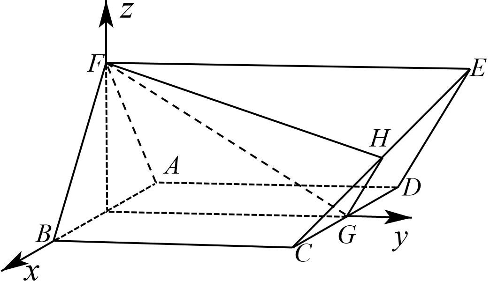

因为，则

则，，，，

所以，

设平面的一个法向量为

则取得，所以

设平面的一个法向量为

则取得，所以

所以

则二面角的余弦值为；

（2），如图所示：

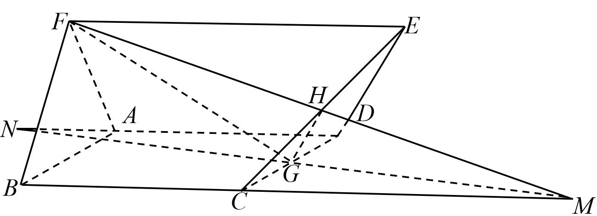

**变式20．**（2024·全国·高三专题练习）四棱锥中，底面是边长为2的菱形，.,且平面，，点分别是线段上的中点，在上.且.

（Ⅰ）求证：平面；

（Ⅱ）求直线与平面的成角的正弦值；

（Ⅲ）请画出平面与四棱锥的表面的交线，并写出作图的步骤.

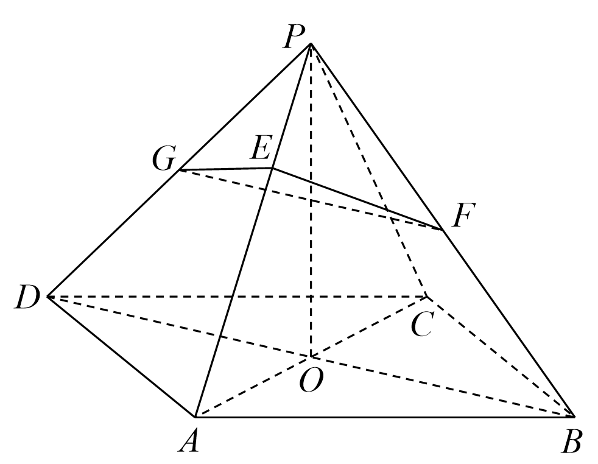

【解析】（Ⅰ）在中，因为点分别是线段上的中点，

所以

因为平面，平面.

所以平面.

（Ⅱ）因为底面是边长为2的菱形，

所以，

因为平面，

所以，，

如图，建立空间直角坐标系，则依题意可得

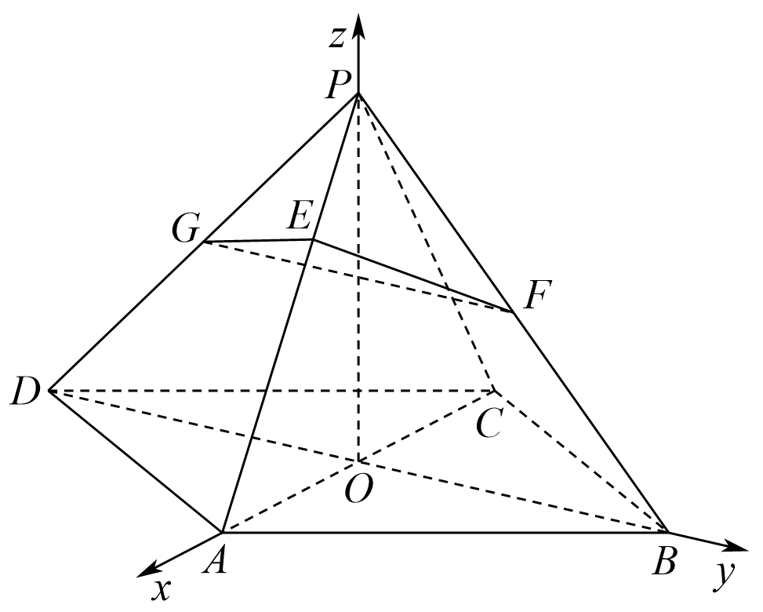

，，，，，，，

所以，，

设平面的法向量为，则由可得，

令，可得

因为.

所以直线与平面的成角的正弦值为

（Ⅲ）法Ⅰ：延长分别交延长线于，连接，发现刚好过点，,连接，则四边形为平面与四棱锥的表面的交线.

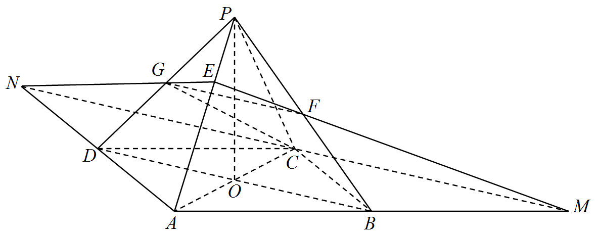

法2：记平面与直线的交点为，设，则

由，可得.

所以即为点.

所以连接，，则四边形为平面与四棱锥的表面的交线.

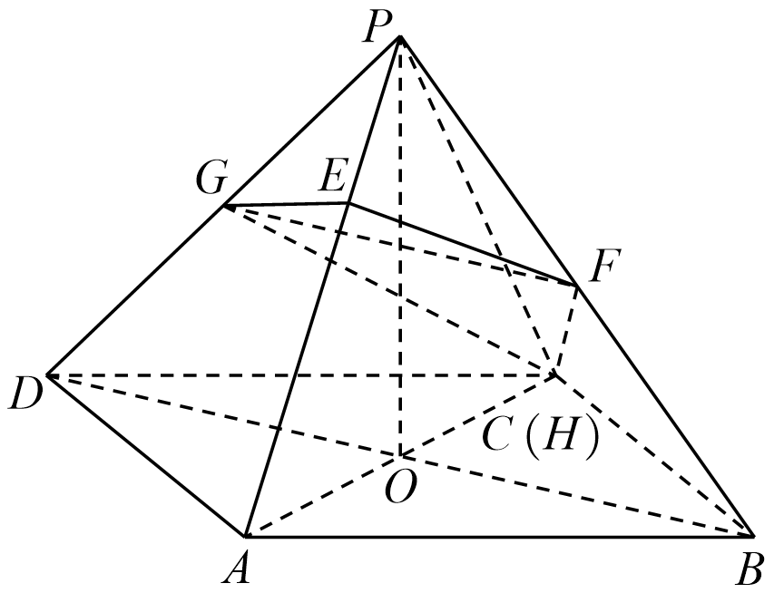

<strong>变式21．</strong>（2024·安徽六安·安徽省舒城中学校考模拟预测）如图，已知多面体<em>EABCDF</em>的底面<em>ABCD</em>是边长为2的正方形，，，且.

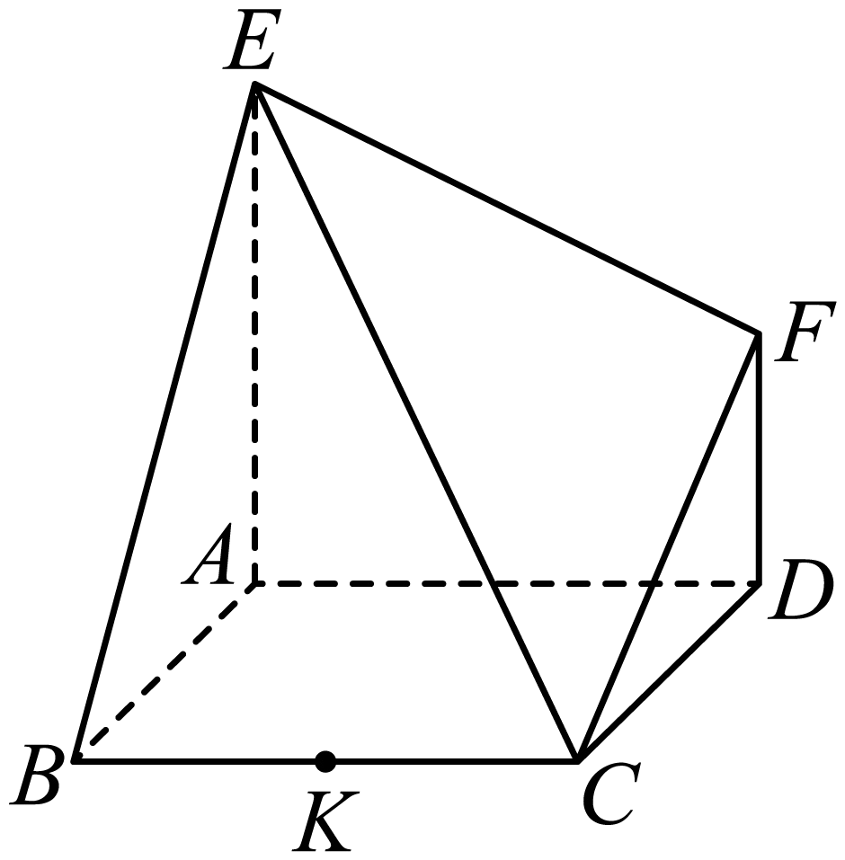

(1)记线段的中点为，在平面内过点作一条直线与平面平行，要求保留作图痕迹，但不要求证明；

(2)求直线与平面所成角的正弦值.

【解析】（1）延长，设其交点为，连接，

则为平面与平面的交线，

取线段*CD*的中点*M*，连接*KM*，直线*KM*即为所求．

证明如下：延长，设其交点为，连接，

则为平面与平面的交线，

因为，所以，又，

所以，

所以，又，

所以四边形为平行四边形，所以，

取的中点，连接，

∵分别为的中点，

∴，∴．

∵平面，平面，

∴平面．

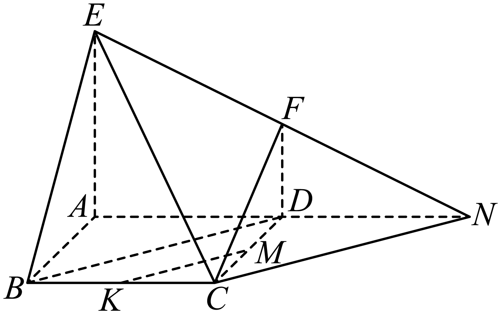

（2）以点为原点，所在的直线为轴，所在的直线为轴，建立空间直角坐标系，如图.由已知可得，

所以，

设平面的法向量为，

则得，

取得，，

平面的一个法向量.

设直线与平面所成的角为，

则.

所以直线与平面所成角的正弦值为.

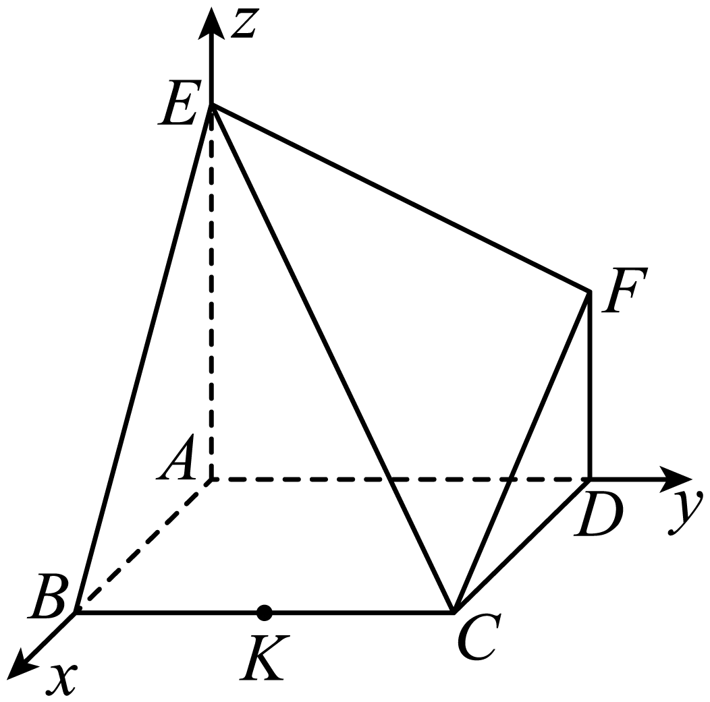

**变式22．**（2024·广西·高三统考阶段练习）如图，三棱柱中，侧面为菱形.

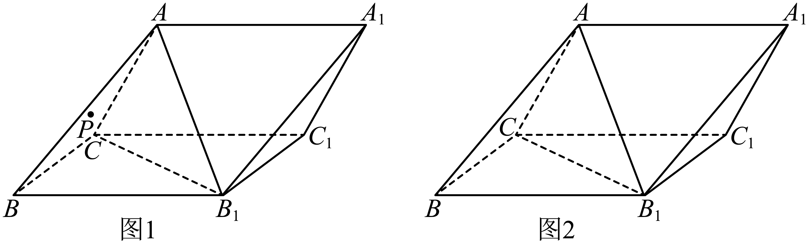

(1)（如图1）若点为内任一点，作出与面的交点（作出图象并写出简单的作图过程，不需证明）；

(2)（如图2）若面面，求二面角的余弦值.

【解析】（1）

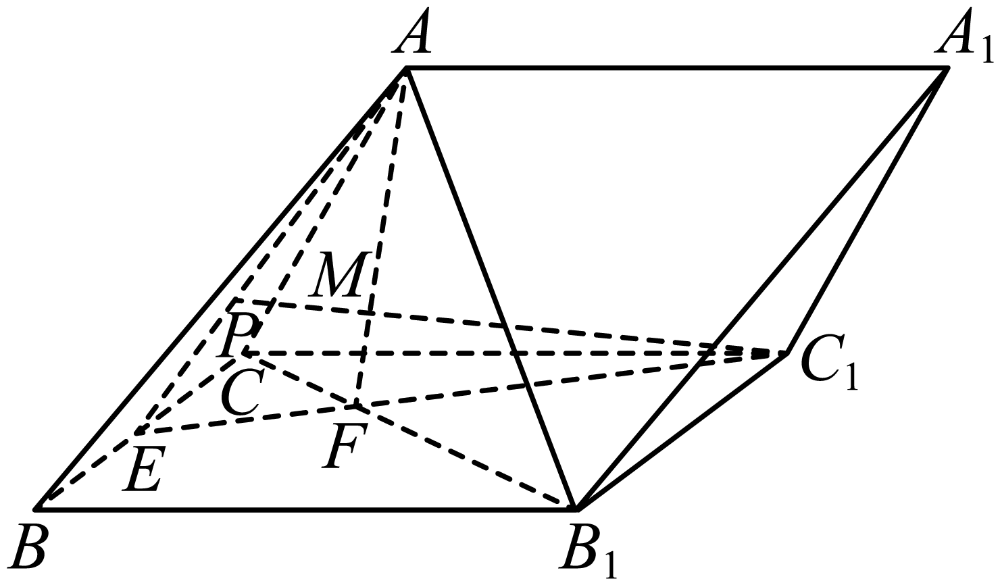

作图步骤

①连接并延长交于点

②连接交于点，连接

③连接交于点

④点即为所求.

（2）连结，交于点，连结，

侧面为菱形，，且为的中点，

，，

平面平面，平面平面，平面，

平面，

又，平面，，，

以为坐标原点，分别以、、所在直线为、、轴，建立空间直角坐标系，

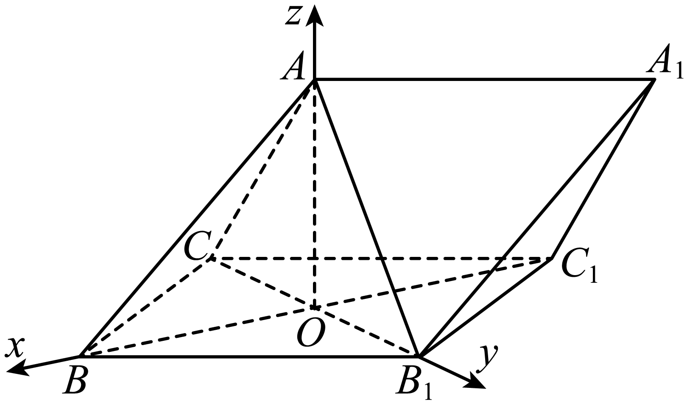

设，则，0，，，0，，

，，，，，，

，，，

设平面与平面的一个法向量分别为与，

由，取，得；

由，取，得．

，

<strong>变式23．</strong>（2024·四川成都·成都七中校考模拟预测）是边长为2的正三角形，<em>P</em>在平面上满足，将沿<em>AC</em>翻折，使点<em>P</em>到达的位置，若平面平面<em>ABC</em>，且．

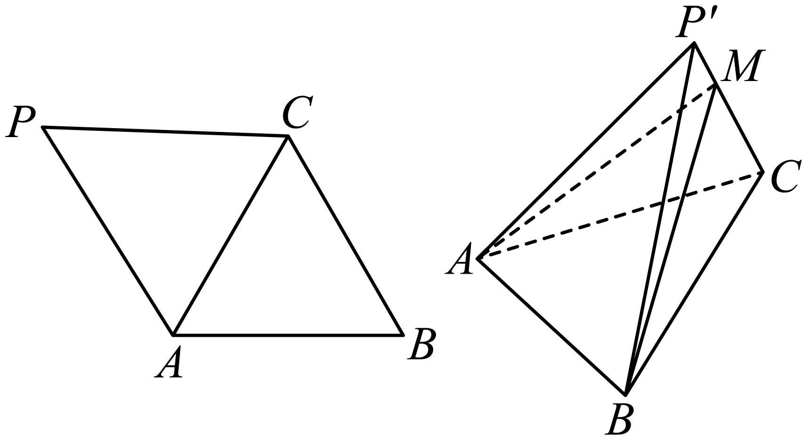

(1)作平面，使得，且，说明作图方法并证明；

(2)点*M*满足，求二面角的余弦值．

【解析】（1）记*BC*中点为*O*，连接*AO*，，平面即为平面，

证明如下：因为为正三角形，*O*为*BC*中点，所以，

又，平面，平面，

所以平面

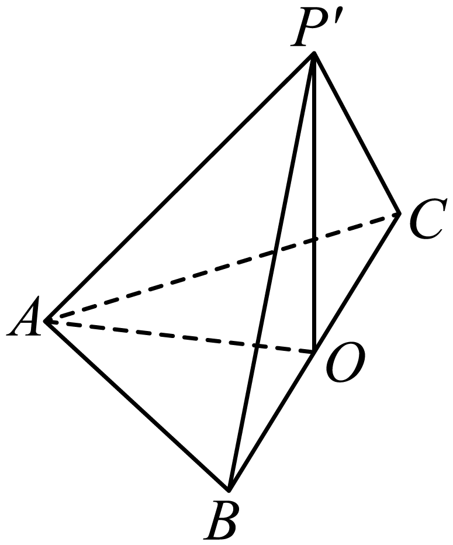

（2）由(1)可知,因为平面,以点为坐标原点，所在直线分别为轴建立如下图所示的空间直角坐标系.

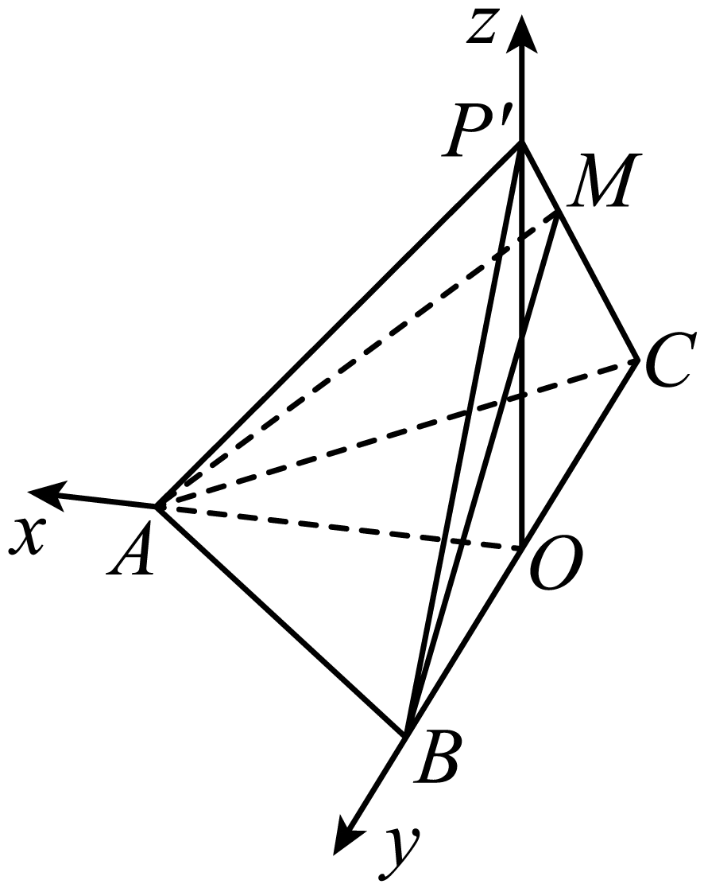

则

设平面的法向量为，

则,取,则,

,设平面的法向最为,

则，取，则，

由已知可得.

由图可知二面角为锐角，故二面角的余弦值为.

**变式24．**（2024·四川绵阳·高三绵阳南山中学实验学校校考阶段练习）已知四棱锥的底面是平行四边形，侧棱平面，点在棱上，且，点是在棱上的动点（不为端点）.（如图所示）

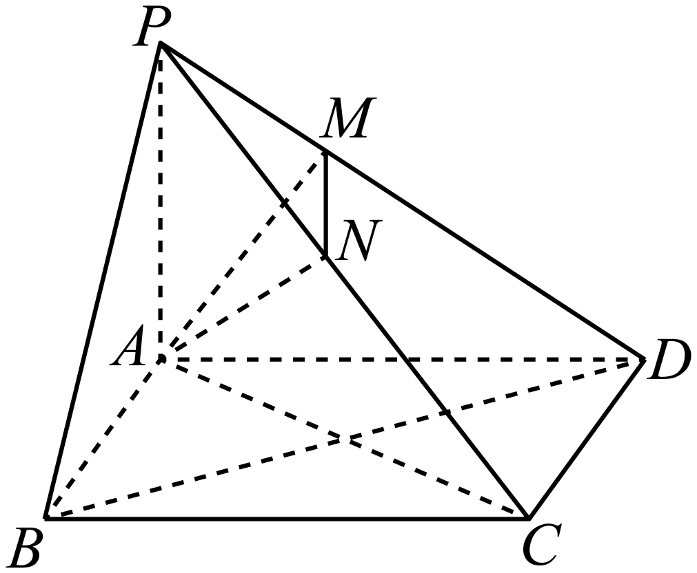

(1)若是棱中点，

（i）画出的重心（保留作图痕迹），指出点与线段的关系，并说明理由；

（ii）求证：平面；

(2)若四边形是正方形，且，当点在何处时，直线与平面所成角的正弦值取最大值.

【解析】（1）（i）设与交点为，连接与交于点，

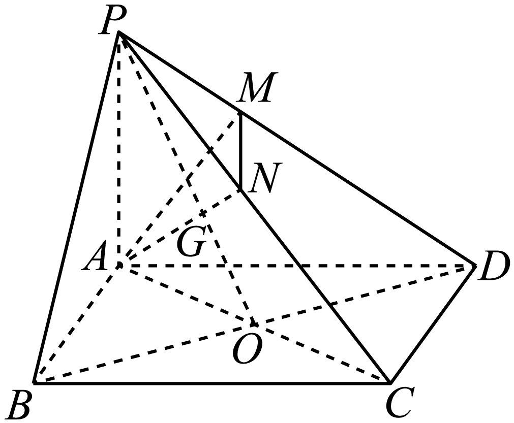

因为为中点，为中点，

所以与交点为重心，

所以,

又因为为的边的中线，

所以点也为的重心，即重心在上.

（ii）连接并延长交于点，连接，

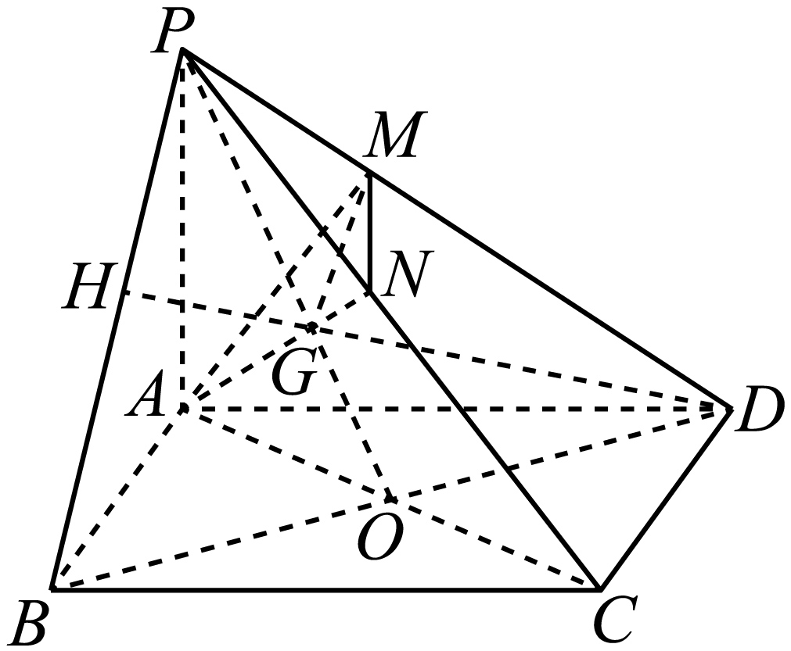

因为为重心，所以,

又因为,

所以，

又因为平面,平面,

所以平面；

（2）因为四边形为正方形，所以,

平面，平面，所以，

所以以为坐标原点，建立如图所示坐标系，

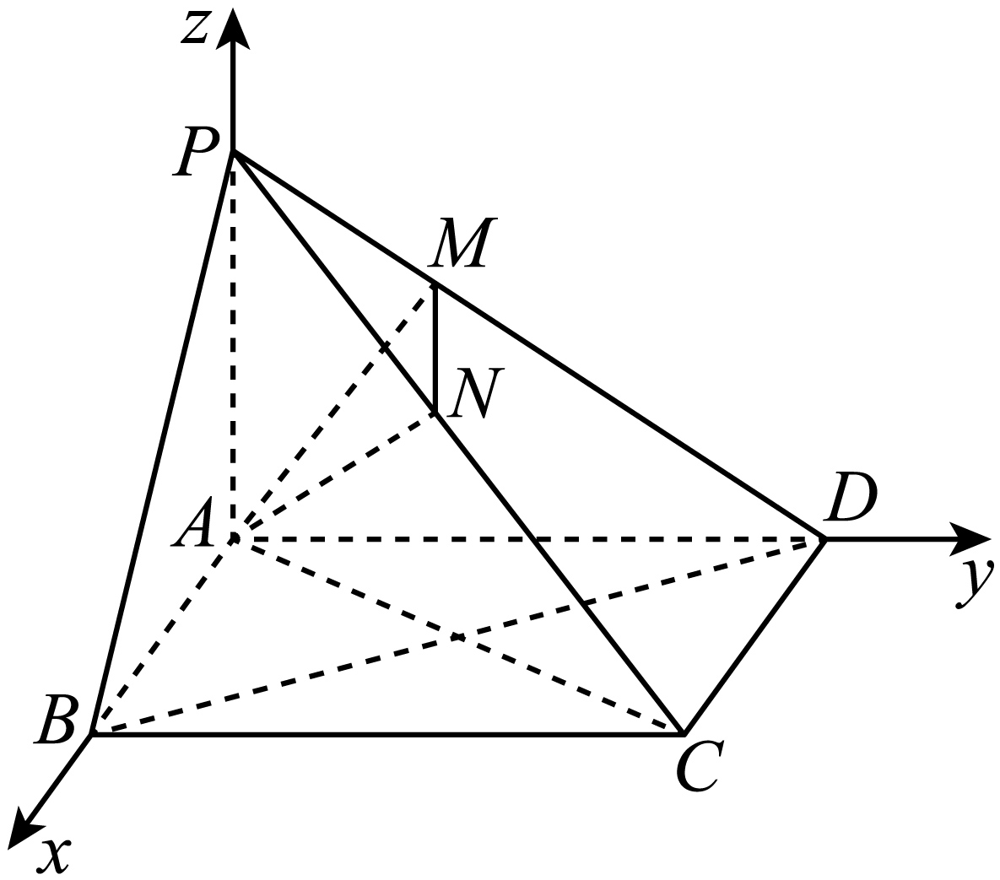

所以

设，则

设平面的法向量为，

，化简得，

取则，

设直线与平面所成角为，

所以，

所以当时，即点在线段靠近的三等分点处时，

直线与平面所成角的正弦值取最大值为.

**题型五：立体几何建系繁琐问题**

<strong>例13．</strong>（2024·福建福州·福建省福州格致中学校考模拟预测）如图，在四棱台<em>ABCD</em>-<em>A1B1C1D1</em>中，底面<em>ABCD</em>是菱形，∠<em>ABC</em>=，∠<em>B1BD</em>=，

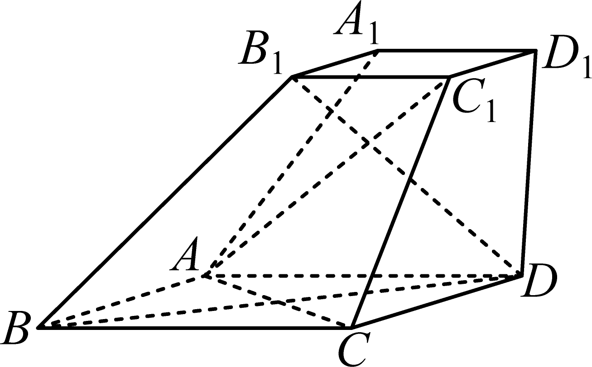

（1）求证：直线<em>AC</em>⊥平面<em>BDB1</em>；

（2）求直线<em>A1B1</em>与平面<em>ACC1</em>所成角的正弦值.

【解析】（1）连接交于，

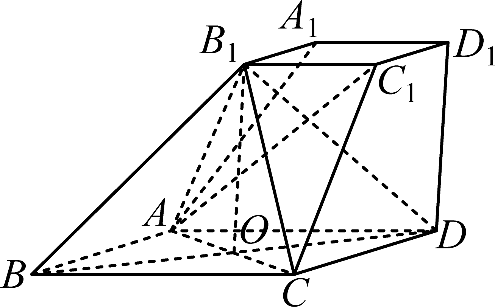

因为，，，

所以，故

又因为为菱形对角线交点，即是线段的中点，所以

又四边形为菱形，故

而，所以平面

方法二：因为，

所以点在平面内的射影在为的平分线，

又四边形为菱形，故为的平分线，则直线

故平面平面，而平面平面，

又四边形为菱形，故

所以平面

（2）延长交于点，平面即为平面，平面即平面

由（1）得平面平面，平面平面，

所以过做，则平面，故即为直线与平面所成角（若研究直线与平面所成角的正弦值则线段等比例扩大2倍结果不变）

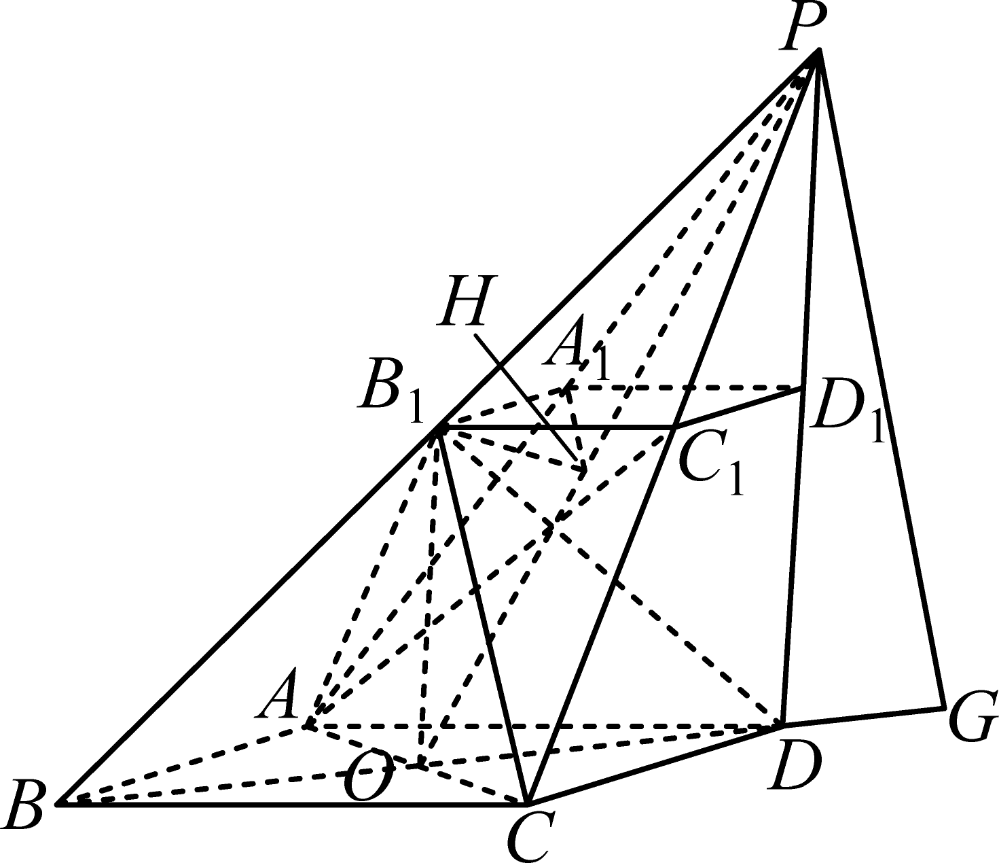

因为四棱台中，所以，

由菱形有，且∠*ABC*=，所以，

作，因为，则，，所以，

则，，，

故.

法二：延长交于点，

平面即为平面，平面即平面，

设直线与平面所成角为

过作，垂足为，因为，所以

建系，以为轴，作轴，

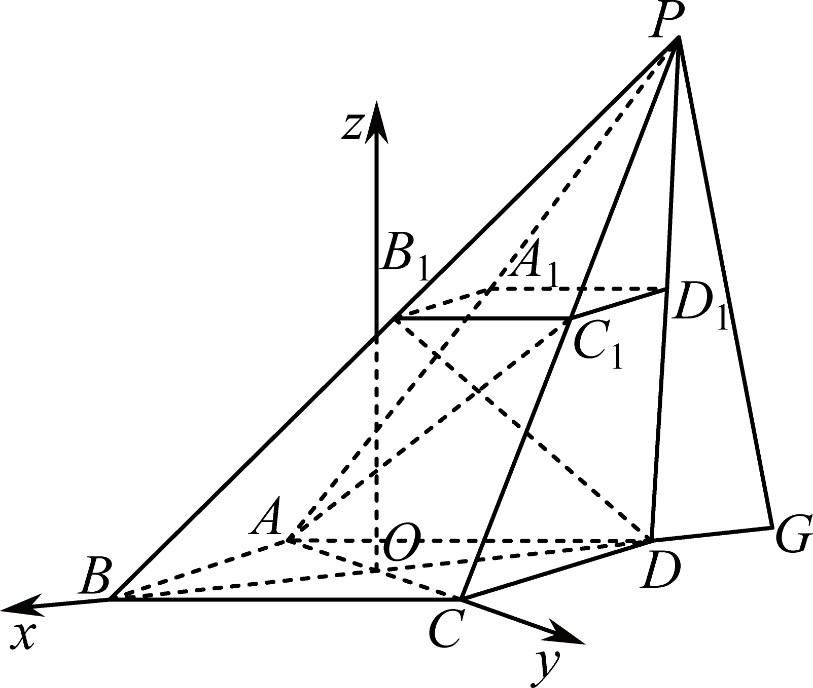

设平面的法向量为，则

，

所以，

所以

<strong>例14．</strong>（2024·全国·模拟预测）如图，在直三棱柱中，侧面为正方形，<em>M</em>，<em>N</em>分别为的中点，．

(1)证明：平面；

(2)若，三棱锥的体积为2，求二面角的余弦值．

【解析】（1）证明：取的中点，连接，

因为为的中点，所以为的中位线，则，且，

又为的中点，所以，且，所以且，

所以四边形为平行四边形，则，

又因为平面，且平面，所以平面.

（2）在直三棱柱中，可得平面，

因为平面，所以，

又因为，直线与直线相交，且平面，

所以平面，因为平面，所以，

设，连接，则，

，，，

所以，所以，则，

以为坐标原点，以所在直线分别为*x*轴、*y*轴、*z*轴建立如图所示的空间直角坐标系，则，，，，

可得，，．

设平面的法向量为，则，

取，则，

设平面的法向量为，则，

取，则

则，

由图可知，二面角为锐角，故二面角的余弦值为．

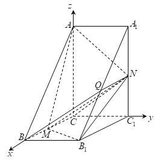

<strong>例15．</strong>（2024·江西抚州·高三校联考阶段练习）如图，在几何体中，，已知平面平面，平面平面，平面<em>ABC</em>，<em>AD</em>⊥<em>DE</em>．

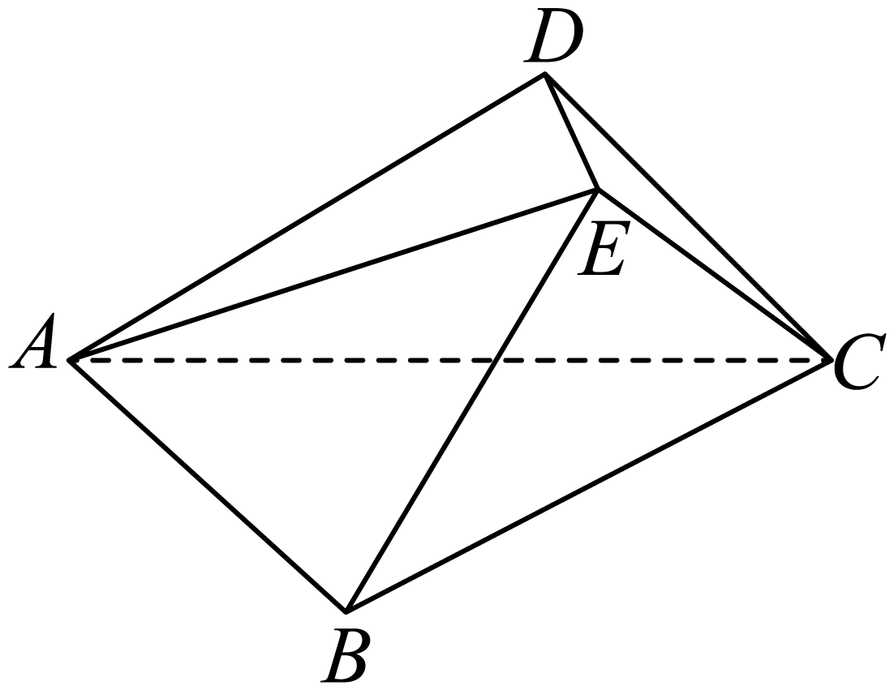

(1)证明：平面；

(2)若，设为棱上的点，且满足，求当几何体的体积取最大值时，与所成角的余弦值．

【解析】（1）证明：过点作交与点，

平面平面，平面平面，平面，

平面，又平面，，

又，且，平面，

平面；

（2）过点作交于点，连接，

平面平面，平面平面，平面，

平面，

又因为平面，所以．

平面，到平面的距离相等，

且，四边形是平行四边形，,

，又平面，平面，平面，

.

由得.

由，得，，，

又，令，

则，，

当时，，当时，，

所以在上单调递增，在上单调递减，

即，当且仅当时取得最大值．

如图所示，以点为原点建立空间直角坐标系，

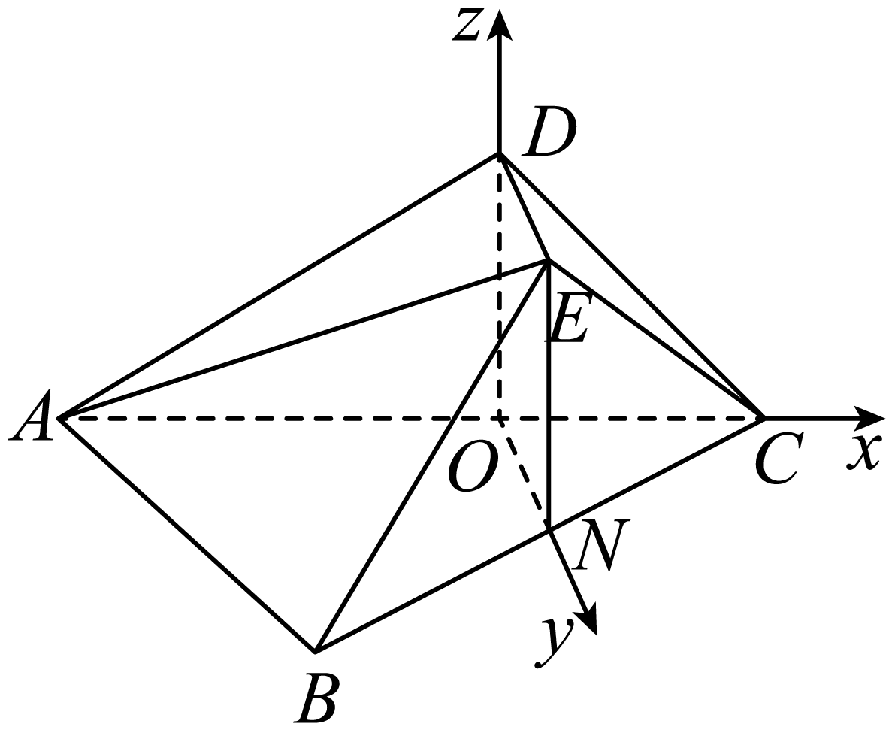

则，

所以．

设与所成角为，则，

即当几何体体积最大时，与所成角的余弦值为．

**变式25．**（2024·黑龙江佳木斯·高一建三江分局第一中学校考期末）如图，已知三棱柱的底面是正三角形，侧面是矩形，分别为的中点，为上一点，过和的平面交于，交于．

（1）证明：平面；

（2）设为的中心，若平面，且，求直线与平面所成角的正弦值．

【解析】（1）因为侧面是矩形，分别为的中点，所以，，从而，

又是正三角形，是中点，所以，

因为，平面，所以平面，

平面，平面，平面平面，所以，而，所以，所以平面，平面，

所以平面；

（2），连接，

平面，平面平面，平面，所以，又由三棱柱的性质得，所以是平行四边形，所以，

是的中心，则，所以，

所以，

设，则，，

由三棱柱性质知四边形是等腰梯形，如图，，作于，则，又，

所以，．

由（1）知是平面的一个法向量，而是与的夹角，

所以直线与平面所成角的正弦值等于．

**变式26．**（2024·黑龙江哈尔滨·哈九中校考三模）如图，已知三棱柱的底面是正三角形，侧面是矩形，，分别为，的中点，为上一点，过和的平面交于，交于.

（1）证明：，且平面平面；

（2）设为的中心，若，平面，且，求四棱锥的体积.

【解析】（1）因为，分别为，的中点，所以，

又，所以，

在等边中，为中点，则.

又因为侧面为矩形，所以.

因为，，

由，平面，

所以平面，

又因为，且平面，平面，

所以平面，

又因为平面，且平面平面，

所以.

又因为平面，

所以平面，

因为平面

所以平面平面.

（2）过作垂线，垂足为，画出图形，如图.

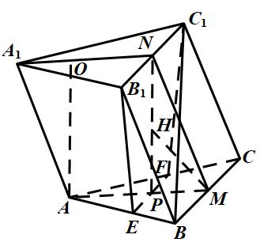

因为平面，平面，平面平面，

所以，

又因为，所以四边形为平行四边形，

所以，

因为为的中心，

所以，

因为平面平面，平面平面=，

平面，

所以平面，

又因为在等边中，，得，

由（1）知，四边形为梯形，

所以四边形的面积为，

所以，，

，所以，

所以.

**变式27．**（2024·重庆沙坪坝·高三重庆一中校考期中）如图，在平行六面体中，每一个面均为边长为2的菱形，平面底面，，分别是，的中点，是的中点.

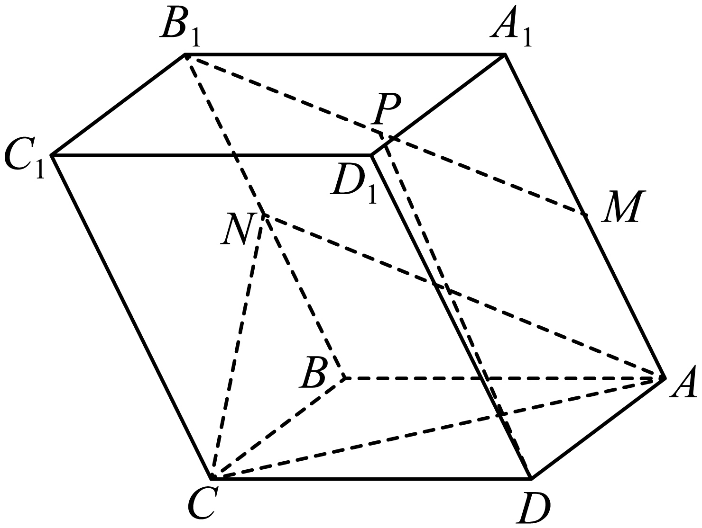

(1)证明：平面；

(2)若侧棱与底面所成的角为60°，求平面与平面所成锐二面角的余弦值.

【解析】（1）证明：连接，

因为在平行六面体中，每一个面均为边长为2的菱形，

所以，，

因为分别是，的中点

所以，，，

所以，四边形，均为平行四边形，

所以，，，

因为菱形中，，

所以，，，

所以，四边形是平行四边形，

所以，

因为平面，平面，

所以，平面，平面，

因为平面，

所以，平面平面，

因为是的中点，平面，

所以平面.

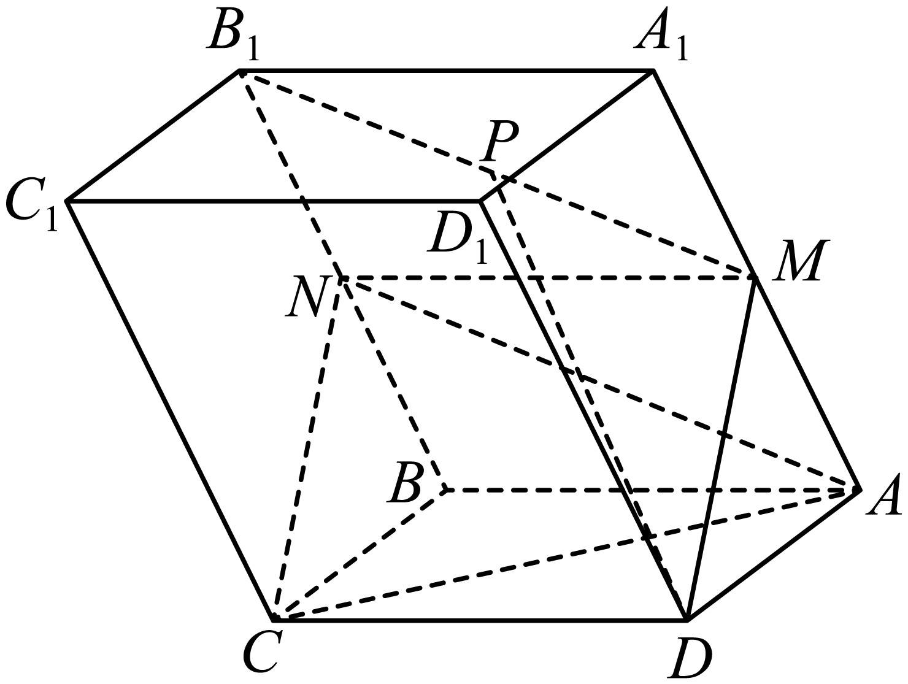

（2）过点作，垂足为，连接，

因为平面底面，平面底面，平面，

所以，底面，

因为，底面，

所以

因为，侧棱与底面所成的角为60°，

所以，，

因为，

所以，即为中点，

因为底面为菱形，，

所以，，

所以，以为坐标原点，以为轴方向建立空间直角坐标系，

所以，，，，，，，

所以，，

设平面的一个法向量为，

则，即，令得，

所以，，

设平面的一个法向量为，

则，即，令得，

所以，,

所以，平面与平面所成锐二面角的余弦值为

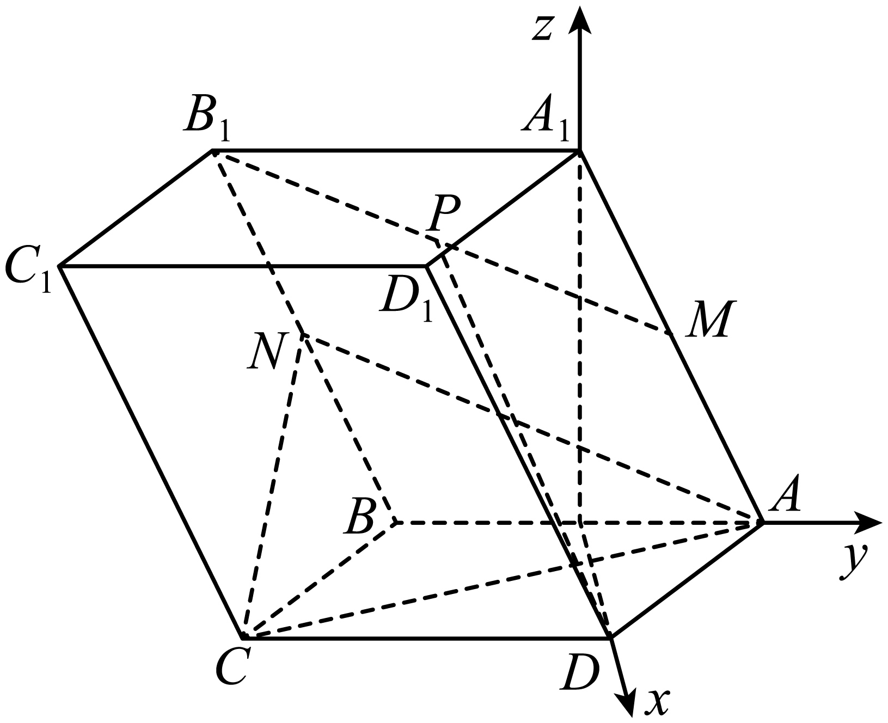

**变式28．**（2024·全国·高三专题练习）已知四棱锥中，平面，，，，，．

(1)求直线与平面所成角的正弦值；

(2)线段上是否存在一点*M*，使得平面？若存在，请指出点*M*的位置；若不存在，请说明理由．

【解析】（1）因为，*BC*⊥*AB*，所以*AD*⊥*A*B．

又因为，，所以．

因为平面，平面，平面，

所以．又，所以．

以*A*为坐标原点，以所在直线分别为*x*轴、*y*轴、*z*轴，建立如图所示的空间直角坐标系，

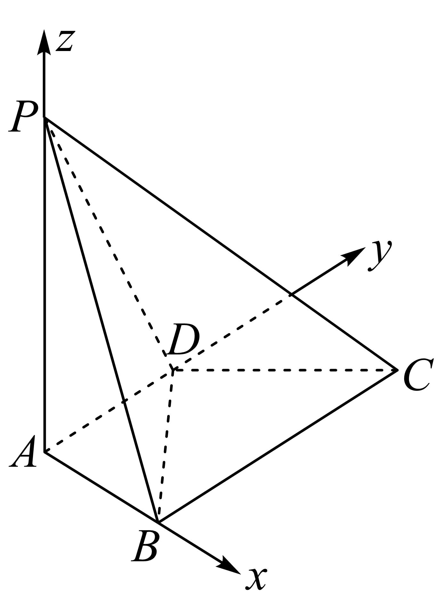

则，，，．

所以，，．

设平面的法向量为，

则，即，得，

令，可得平面的一个法向量为．

设直线与平面所成的角为，，

则，

所以直线与平面所成角的正弦值为．

另

如图，连接*AC*．因为，*BC*⊥*AB*，所以*AD*⊥*AB*．

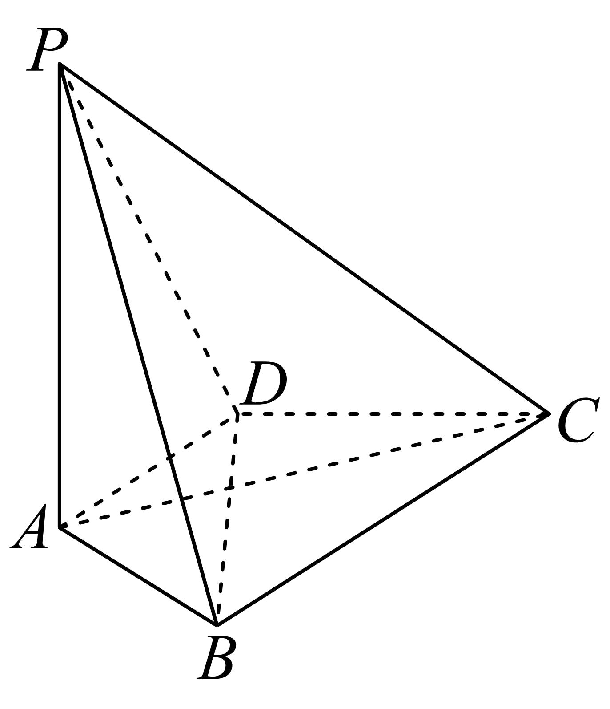

因为，，所以．

因为*BC*⊥*AB*，所以．

因为平面，平面，平面，平面，

所以．

因为，所以，．

所以，．

设点*C*到平面的距离为*h*，

由，得，即，解得．

设直线与平面所成的角为，，则．

所以直线与平面所成角的正弦值为．

（2）不存在点*M*，理由如下：

假设存在满足条件的点*M*（如图）．

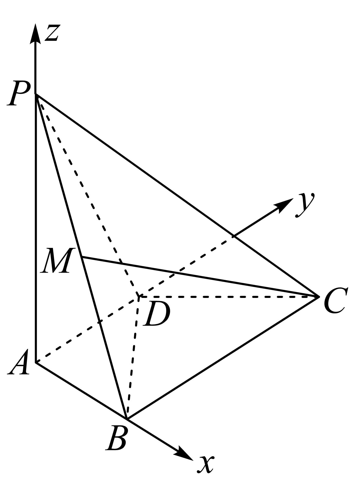

可设，，所以，

所以．

又由（1）知为平面的一个法向量，所以，

即，无解．

所以线段*PB*上不存在满足条件的点*M*．

另不存在点*M*，理由如下：

假设存在满足条件的点*M*，

由平面，平面，平面，得，且，

因为平面，平面，所以．

因为，且，平面，平面，

所以平面．又平面，所以．

若存在满足条件的点*M*，则点*M*必与点*B*重合．

又与不垂直，所以线段上不存在满足条件的点*M*．

<strong>变式29．</strong>（2024·全国·模拟预测）如图，三棱柱的底面为等边三角形，，点<em>D</em>，<em>E</em>分别为<em>AC</em>，的中点，，．

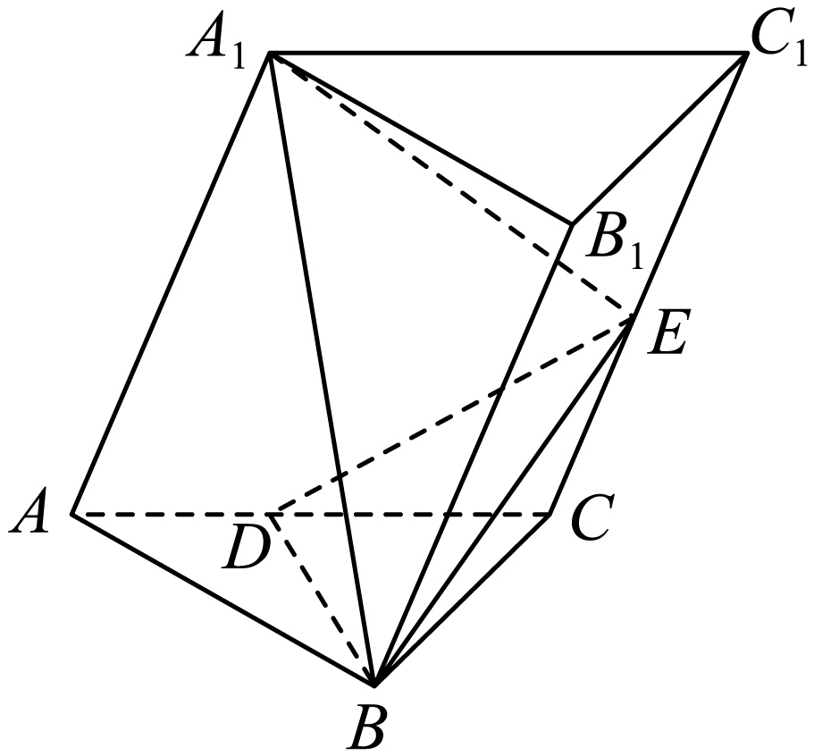

(1)求点到平面*BDE*的距离；

(2)求二面角的余弦值．

【解析】（1）连接，，设与*DE*交于点*F*，

由可知，侧面为菱形，所以，

因为点*D*，*E*分别为*AC*，的中点，所以，则，

因为，所以，

则，又，所以为等边三角形，

由为等边三角形，，得，

连接，则，，

又，，所以，则，

易知，因为，平面，平面，

所以平面，

又平面，所以，

因为，平面*BDE*，平面*BDE*，所以平面*BDE*，

所以为点到平面*BDE*的距离，

又，故点到平面*BDE*的距离为．

（2）由（1）可知，两两垂直，以*D*为坐标原点，直线*DB*，*DC*，分别为*x*，*y*，*z*轴建立如图所示的空间直角坐标系，

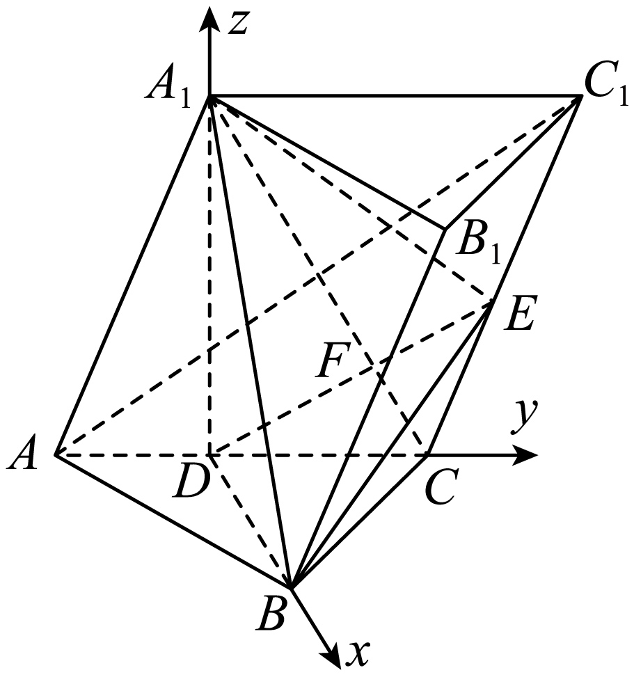

则，，，，，，

所以，,，

由（1）知平面*BDE*的一个法向量为，

设平面的法向量为，则，即，

取，则，

于是，

因为二面角为锐二面角，所以二面角的余弦值为．

<strong>变式30．</strong>（2024·全国·高三专题练习）已知两个四棱锥与的公共底面是边长为4的正方形，顶点，在底面的同侧，棱锥的高，，分别为<em>AB</em>，<em>CD</em>的中点，与交于点<em>E</em>，与交于点<em>F</em>.

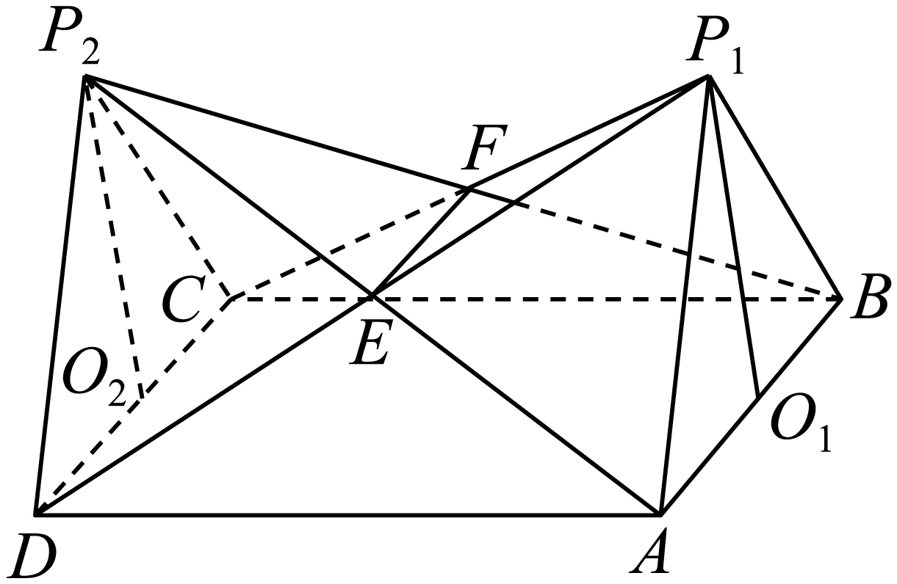

(1)求证：点*E*为线段的中点；

(2)求这两个棱锥的公共部分的体积.

【解析】（1）

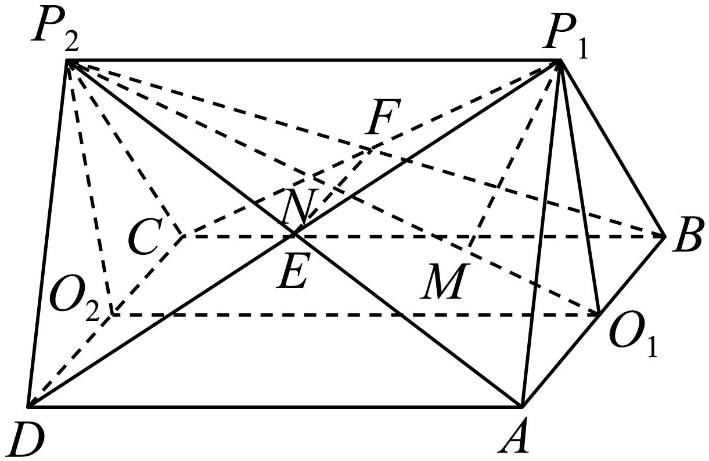

连接，，如图，因为平面*ABCD*，平面*ABCD*，

所以，又，所以四边形是矩形，

所以，，

又，分别为*AB*，*CD*的中点，所以，，

所以，，所以四边形是平行四边形，

又对角线，所以点*E*为线段的中点.

（2）连接，交*EF*于点*N*，过点作于*M*，

由题意知，故，

又，，，平面，所以平面，

故，又，，平面，

所以平面，即是四棱锥的高，

由（1）同理可得点*F*为线段的中点，所以，，

在中，，则，所以，

因为，

所以.

**变式31．**（2024·全国·高一专题练习）《九章算术》是中国古代的一部数学专著，是《算经十书》中最重要的一部，成于公元一世纪左右.它是一本综合性的历史著作，是当时世界上最简练有效的应用数学，它的出现标志着中国古代数学形成了完整的体系.《九章算术》中将由四个直角三角形组成的四面体称为“鳖臑”，已知在三棱锥中，平面.

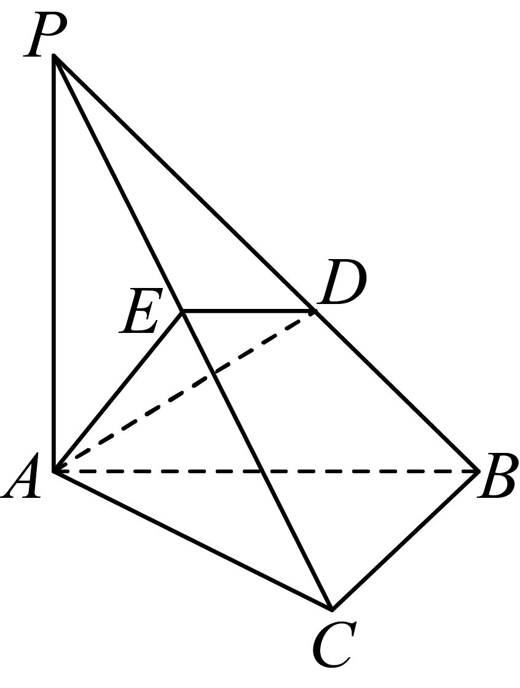

（1）从三棱锥中选择合适的两条棱填空：\_\_\_\_\_\_\_\_\_\_\_\_\_\_\_\_，则三棱锥为“鳖臑”；

（2）如图，已知，垂足为，，垂足为，.

（i）证明：平面平面；

（ii）设平面与平面交线为，若，，求二面角的大小.

【解析】（1）因为“鳖臑”是由四个直角三角形组成的四面体，又平面，所以，，；即，为直角三角形；

若，由，平面，可得：平面；

所以，即，为直角三角形；满足四个面都是直角三角形；

同理，可得或或，都能满足四个面都是直角三角形；

故可填：或或或；

（2）（i）证明：

∵平面，平面，

∴，

又，，平面，

∴平面，

又平面，

∴，

又，，平面，

∴平面，

又平面，

∴，

又，，平面，

∴平面，

又平面，

∴平面平面.

（ii）由题意知，在平面中，直线与直线相交.

如图所示，设，连结，则即为.

∵平面，平面，

∴，

∵平面，平面，

∴，

又，平面，

∴平面，

又平面，

∴，.

∴即为二面角的一个平面角.

在中，，，，

∴，

又，

∴，

∴，

∴，

∴二面角的大小为.

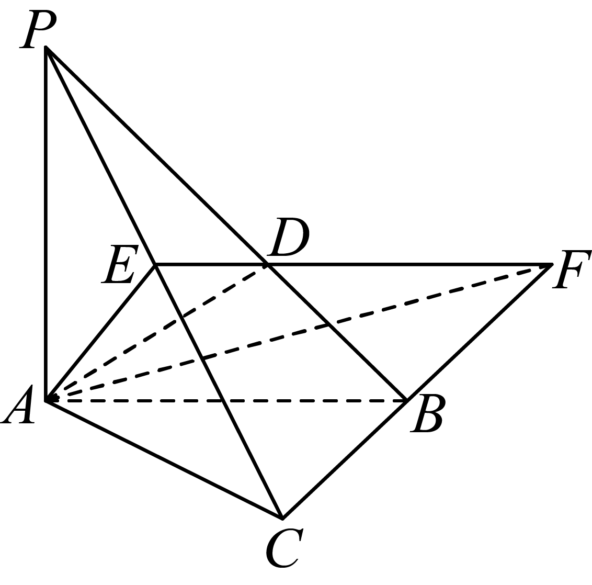

<strong>变式32．</strong>（2024·浙江金华·高一浙江金华第一中学校考期末）如图，四面体<em>ABCD</em>中，等边三角形，，且.

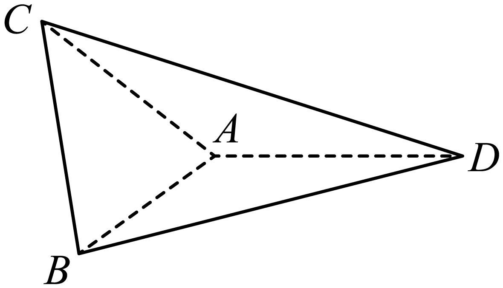

(1)记*AC*中点为*M*，若面面*ABD*，求证：面*ADC*；

(2)当二面角的大小为时，求直线*AD*与平面*BCD*所成角的正弦值.

【解析】（1）为等边三角形，中点为，，

又面面，面面，面,

由，得面,

面，,

又，平面，面.

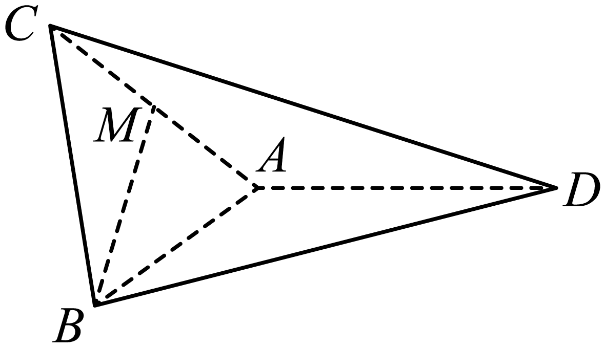

（2）在中，过作的垂线,与的延长线交于点,连结,

，，面，

面，是二面角的平面角，,

过作交于点,连结,作交于点,连结,

由面，面，得,

又，面，面,

面，面面，面面，

面，所以面，即面，

所以直线与平面所成角即为，

由题意:，,

则

，面，面，，

，

，

直线与平面所成角的正弦值为.

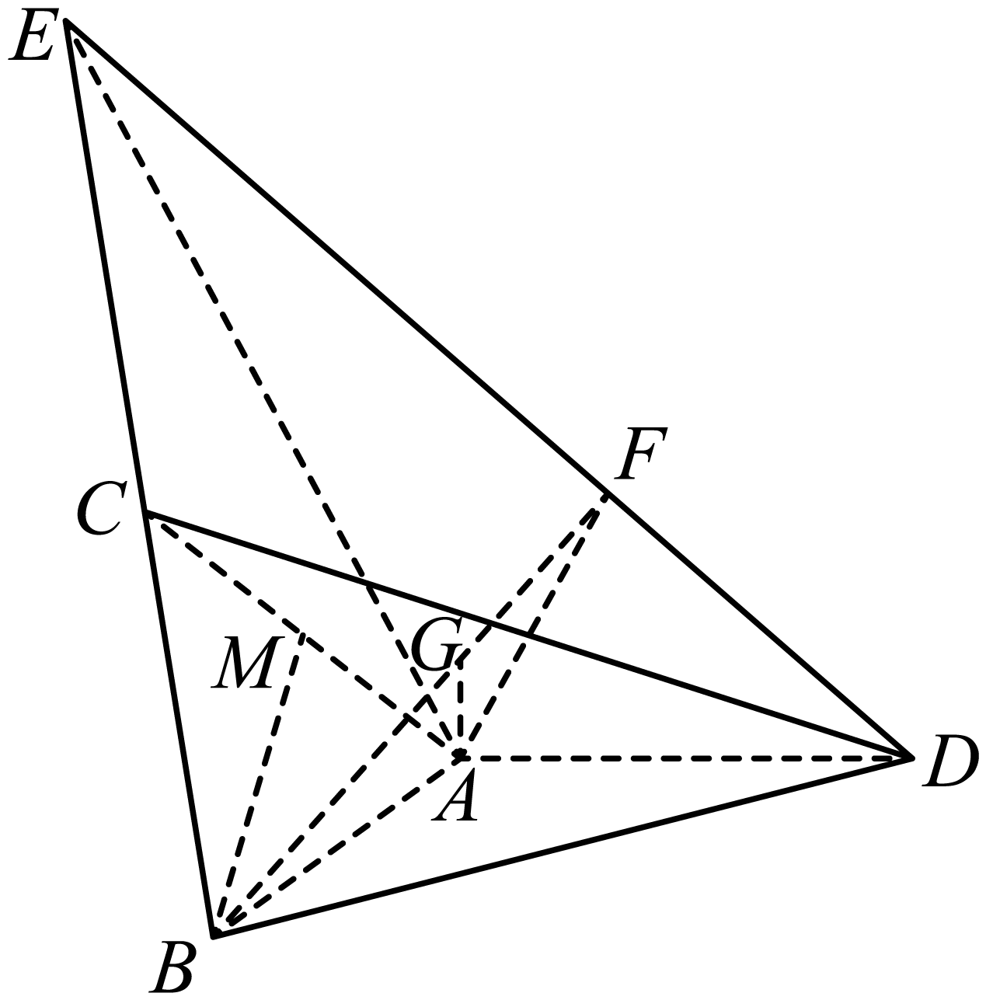

**变式33．**（2024·河北衡水·高二校考开学考试）已知四面体，，，且平面平面．

(1)求证：；

(2)求直线与平面所成角的大小．

【解析】（1）证明：，，

，

，取中点，

则，，平面，

平面，平面，

；

（2）过点作交延长线于，连结，

平面平面，平面平面，，平面，

平面，

为与平面所成角，

，，，

，

，

在中，，

直线与平面所成角的大小为

**题型六：两角相等（构造全等）的立体几何问题**

<strong>例16．</strong>（2024·全国·高三专题练习）如图，在三棱锥中，是等边三角形，，点<em>P</em>是<em>AC</em>的中点，连接<em>BP</em>，<em>DP</em>

证明：平面平面*BDP*；

若，，求三棱锥的体积．

【解析】证明：如图所示，

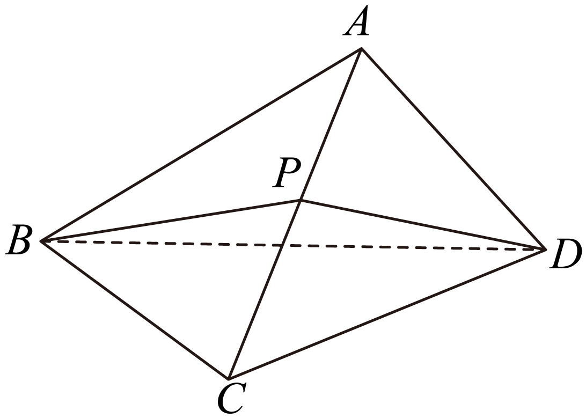

因为是等边三角形，，

所以≌，可得，

又因为点*P*是*AC*的中点，则，，

又，平面*PBD*，平面*PBD*，

所以平面平面*BDP*；

设，在中，，则；

在等边中，，

在等腰中，；

在中，由，得；

由余弦定理得，

即，解得；

所以的面积为，

所以三棱锥的体积为．

<strong>例17．</strong>（2024·高二校考单元测试）如图,在三棱锥中,是等边三角形,,点是的中点,连接<em>．</em>

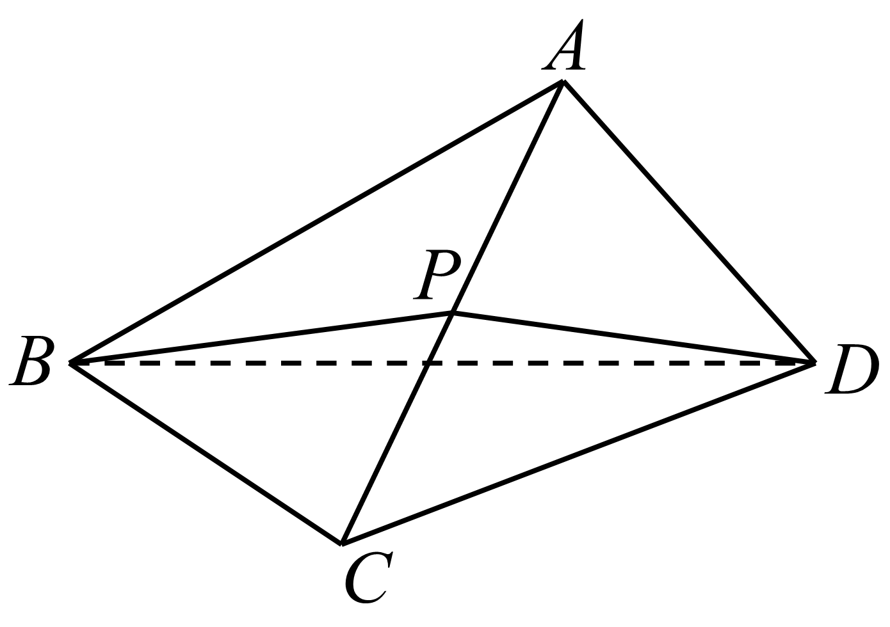

（1）证明:平面平面;

（2）若,且二面角为,求直线与平面所成角的正弦值．

【解析】解:（1）证明:因为是等边三角形,,

所以,可得．

因为点是的中点,则,,

因为,平面PBD,平面,

所以平面,因为平面,

所以平面平面．

（2）如图,作,垂足为连接．

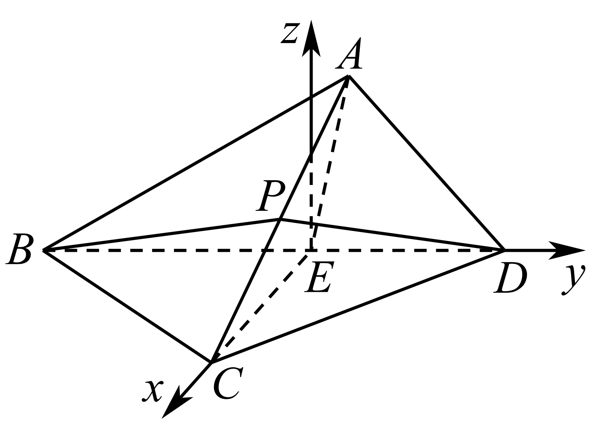

因为,

所以为二面角A-BD-C的平面角．

由已知二面角为,知．

在等腰三角形中,由余弦定理可得．

因为是等边三角形,则,所以．

在中,有,得,

因为,所以．

又,所以．

则,．

以为坐标原点,以向量的方向分别为轴,轴的正方向,

以过点垂直于平面的直线为轴,建立空间直角坐标系,

则,,向量,

平面的一个法向量为,

设直线与平面所成的角为,

则,

所以直线与平面所成角的正弦值为．

**例18．**（2024·全国·高三专题练习）如图，四棱锥中，底面为边长是2的正方形，，分别是，的中点，，，且二面角的大小为.

(1)求证：；

(2)求二面角的余弦值.

【解析】（1）证明：作于点连接，

∵，，，

∴，∴，

即，，又，

∴平面，又平面，

∴.

（2）∵二面角的大小为，

∴平面平面，平面平面，，∴平面.

以点为原点，,,所在直线为轴，建立如图所示空间直角坐标系，

∵,

∴.

∴，即.

∴，，，.

∴,，

设平面的法向量，

由，得

令，得.

易知为平面的一个法向量.

设二面角为，为锐角，则.

**变式34．**（2024·全国·高三专题练习）如图，四棱锥中，四边形是边长为2的菱形，，.

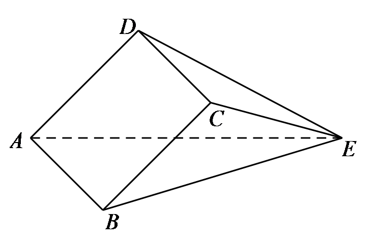

（1）证明：平面平面；

（2）当直线与平面所成的角为30°时，求平面与平面所成锐二面角的余弦值.

【解析】（1）过点作，垂足为，连结，.

在中，由，得，.

在中，由余弦定理得，

即，又，所以，即.

又，所以平面.

又平面，所以平面平面.

（2）由（1）知，为直线与底面所成角，则，所以.

以为原点，建立空间直角坐标系如图所示，则，，，，所以，，

由于，所以.

设平面的法向量为，则，即，解得，

令得.

显然平面的一个法向量为，

所以，

即平面与平面所成二面角的余弦值为.

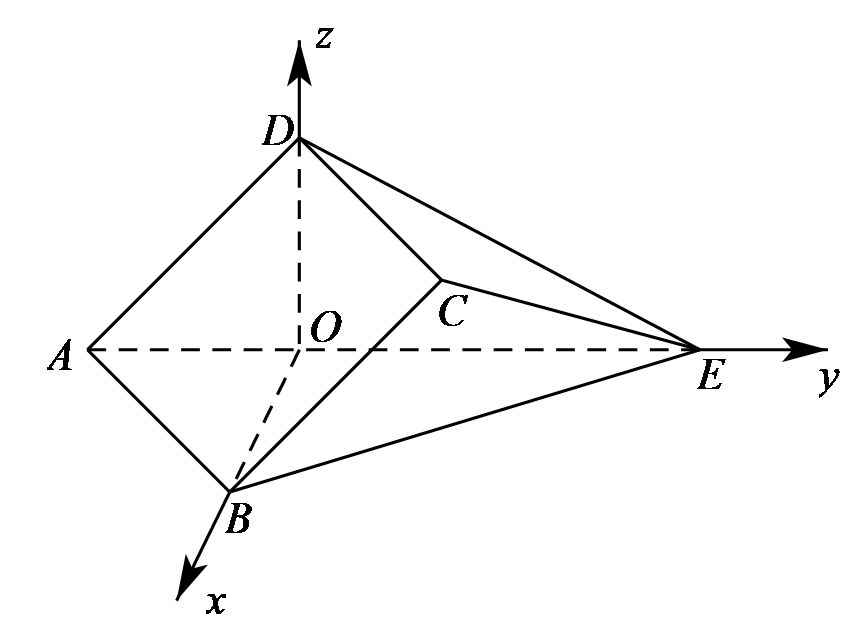

<strong>变式35．</strong>（2024·广东阳江·高二统考期中）如图，在四面体<em>ABCD</em>中，是正三角形，是直角三角形，，<em>AB</em>=<em>BD</em>．

(1)求证：平面平面*ABC*；

(2)若，二面角的余弦值为，求*m*．

【解析】（1）证明：因为是正三角形，所以

因为，公共边，

所以≌,

所以，

因为是直角三角形，

所以，

取的中点，连接，则,

因为是正三角形，所以，

所以为二面角的平面角，

在中，，

因为，所以,

所以，

所以平面平面*ABC*；

（2）由（1）可得，所以以为原点，所在的直线分别为轴，建立空间直角坐标系，如图所示，

设等边的边长为2，则，

则，

因为，所以，

所以，

设平面的法向量为，则

，

令，则，

设平面的法向量为，则

，

令，则，

因为二面角的余弦值为，

所以，

化简得，，

解得或，

如图，过作于，连接，则由（1）可得，

因为，所以平面，

所以平面平面，所以二面角为直角二面角，

因为，

所以,

所以,得，

所以，所以,

所以当时，二面角为钝角，

所以舍去，

所以

**变式36．**（2024·全国·高三专题练习）如图，在四面体中，已知，，

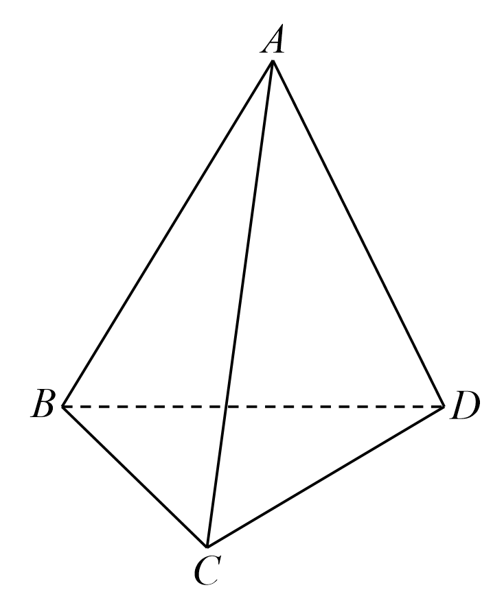

(1)求证：；

(2)若平面平面，且，求二面角的余弦值.

【解析】（1）∵，，.∴，

∴，取的中点，连接，，则，.

又∵，平面，平面，∴平面，又平面，∴.

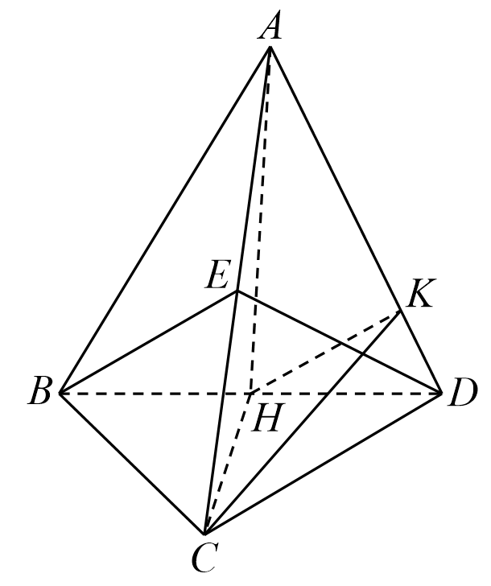

（2）过作于点，则平面，

又∵平面平面，平面平面，

∴平面.过作于点，连接.

∵平面，平面，∴

又，平面，∴平面，平面

∴，根据二面角的定义，∴为二面角的平面角.

连接，∵，由于，∴.

∵，，∴，.

∵，，∴，根据等面积法：.

∴，显然是锐角，根据同角三角函数的关系

易得：，故二面角的余弦值为.

**题型七：利用传统方法找几何关系建系**

**例19．**（2024·河北·高三河北衡水中学校考阶段练习）如图，在长方体，平面与平面所成角为.

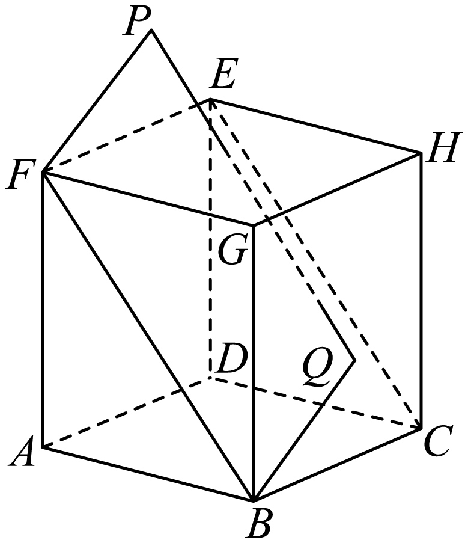

(1)若，求直线与平面所成角的余弦值（用表示）；

(2)将矩形沿旋转度角得到矩形，设平面与平面所成角为，请证明：.

【解析】（1）∵平面，平面，

∴，

故平面与平面所成角为，

设，则，

如图，以为坐标原点建立空间直角坐标系，

若，则，

可得，

设平面的法向量为，则，

令，则，即，

∵，

设直线与平面所成角为，则，

∴，

故直线与平面所成角的余弦值.

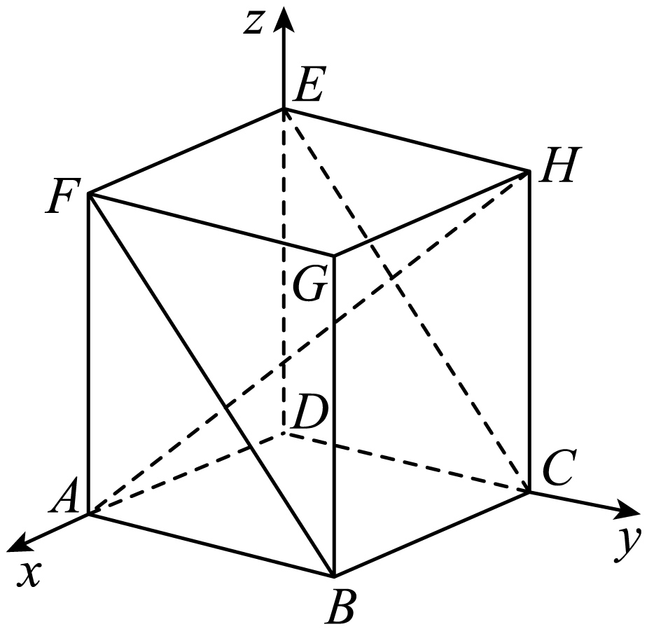

（2）如图1，延长交平面于点，连接，

由题意可知：，

∵，平面，

∴平面，

又∵，故平面，

如图2，在三棱锥中，以为坐标原点建立空间直角坐标系，

设，则，

可得，

设平面的法向量为，则，

设，则，即，

因为在长方体中，面，

所以与面的夹角为，

又，所以与平面的夹角与与面的夹角相同，即为，

则，

∵，则，故，解得，

故，

由题意可得：平面的法向量为，

∵，

∴平面与平面的夹角余弦值为，

注意到平面与平面的夹角，即平面与平面的夹角，

故.

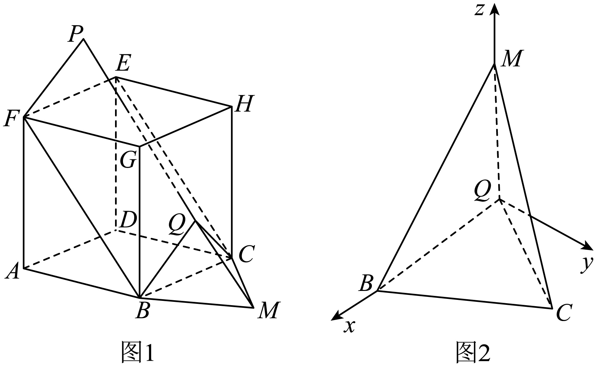

**例20．**（2024·全国·唐山市第十一中学校考模拟预测）在四棱锥中，，，，，平面平面.

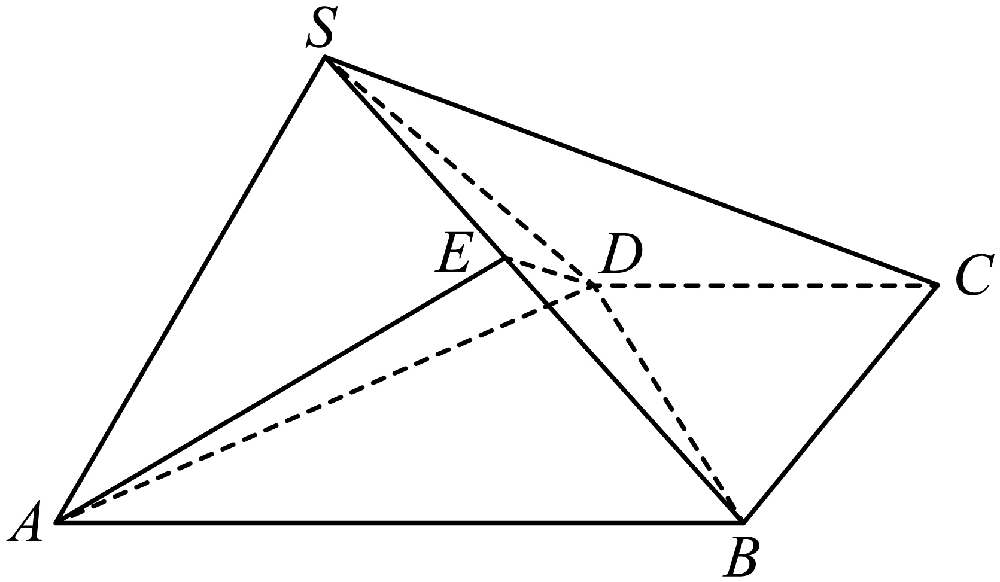

(1)证明：；

(2)若是棱上一点，且二面角的余弦值为，求的大小.

【解析】（1）取*AD*中点为*O*，*AB*中点为*F*，连接*OS*，*OF*，*DF*，

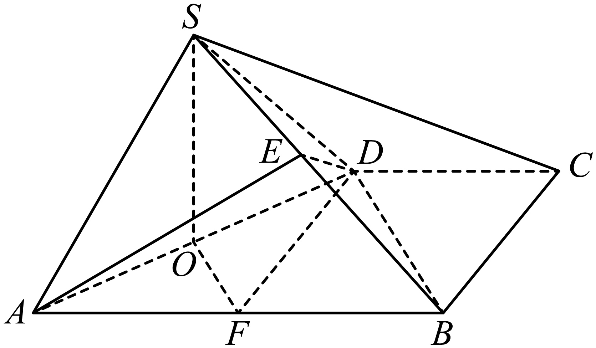

，

，

平面平面，且平面平面，

平面，

，

在四边形*ABCD*中，，，

四边形*ABCD*为直角梯形，

，

，

，，

四边形*BCDF*为正方形，

且，

在中，，

在中，，

，

，

，平面*SAD*，平面*SAD*，

平面*SAD*，

平面*SAD*，

；

（2）、*F*为*AD*、*AB*的中点，

，且，

由（1）知，

，

以*O*为原点，*OA*、*OF*、*OS*分别为*x*、*y*、*z*轴，如图建立空间直角坐标系，

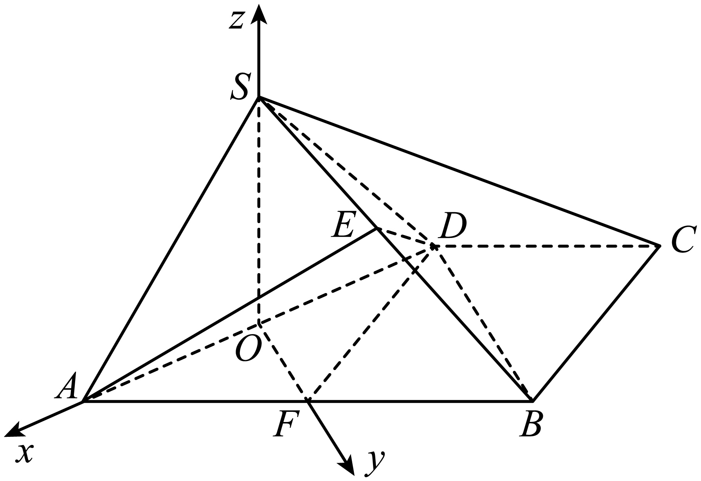

则，，，，，

则，，，

设，，

则，

设，

则，

则，则，

则，

设平面*SAD*的一个法向量为，

则，

令，则，

设平面*ADE*的一个法向量为，

则，

令，则，

二面角的余弦值为，

，

，即，

，

，

，解得：，

故.

<strong>例21．</strong>（2024·安徽·高三校联考期末）如图，在四棱锥中，，<em>E</em>是<em>PB</em>的中点．

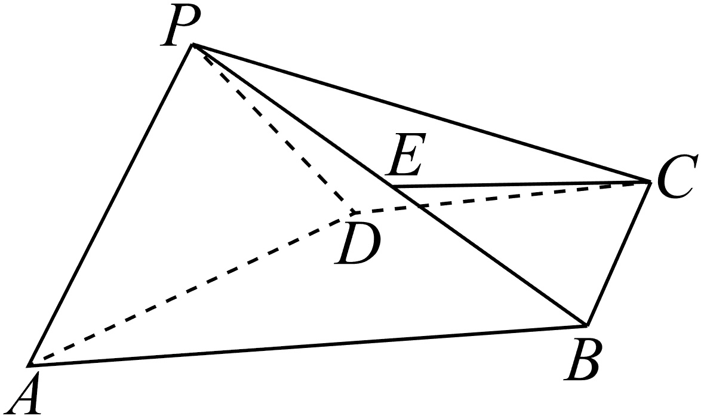

(1)求*CE*的长；

(2)设二面角平面角的补角大小为，若，求平面*PAD*和平面*PBC*夹角余弦值的最小值．

【解析】（1）取*PA*的中点*G*，连接*DG*，*EG*，如图所示：

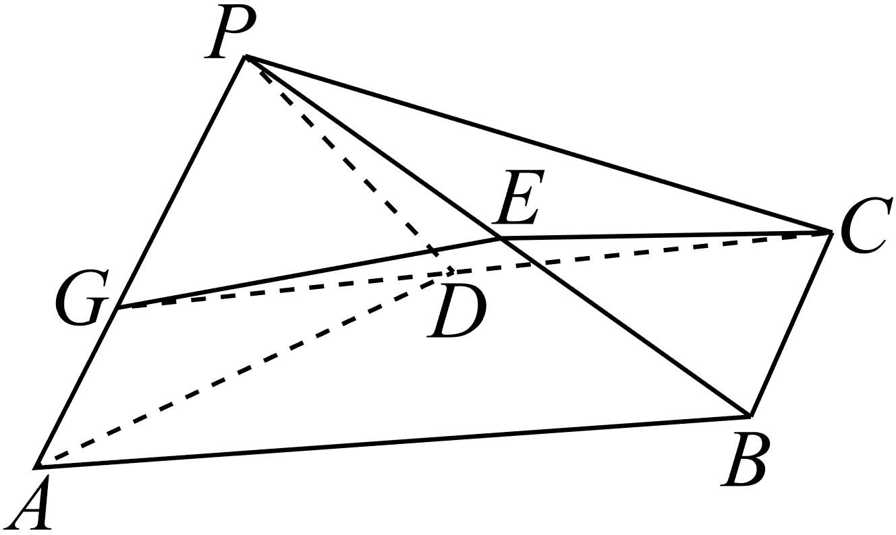

则，且，，

所以四边形*CDGE*为平行四边形．

因为，所以为直角三角形，，

在中，因为，所以，

所以

所以*CE*的长为；

（2）在平面*ABCD*内过点*A*作*BC*的平行线，交*CD*的延长线于点*M*，如图所示，

则，，

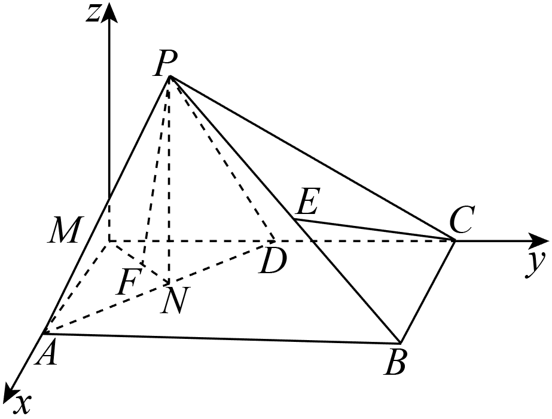

以点*M*为坐标原点，分别以*MA*，*MC*为*x*轴和*y*轴，以与平面垂直的直线为*z*轴，建立空间直角坐标系，取*AD*的中点为*N*，连接*PN*，*MN*，则，，平面，所以平面，平面，

所以平面平面，在平面*PMN*内过点*P*作，垂足为*F*，

因为平面平面，所以平面，

由已知可得，则，设．

因为，所以，

因为，，为线段的中点，所以，

所以，

所以，

所以．

设平面*PAD*的法向量，

则

令，则．

设平面的法向量，

因为，

则

令．则，所以为平面的一个法向量．

设平面*PAD*和平面*PBC*的夹角为，

则

．

令，所以，

所以，所以当时，有最小值，

所以平面*PAD*和平面*PBC*夹角余弦值的最小值为．

**变式37．**（2024·全国·高三专题练习）如图，四棱锥的底面为正方形，底面，是线段的中点，设平面与平面的交线为.

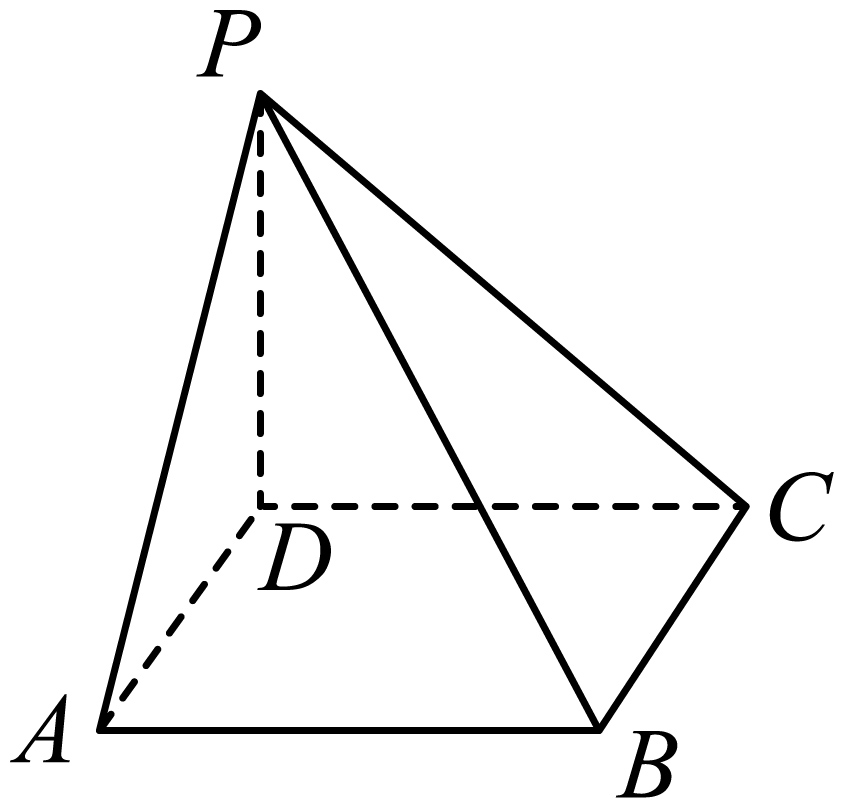

(1)证明*∥* 平面*BCM*

(2)已知，为上的点，若与平面所成角的正弦值为是，求线段的长.

(3)在（2）的条件下，求二面角的正弦值.

【解析】（1）在正方形中，，

因为平面，平面，所以*∥* 平面，

又因为平面，平面平面，所以，

因为平面

，平面，所以*∥* 平面

（2）如图建立空间直角坐标系，

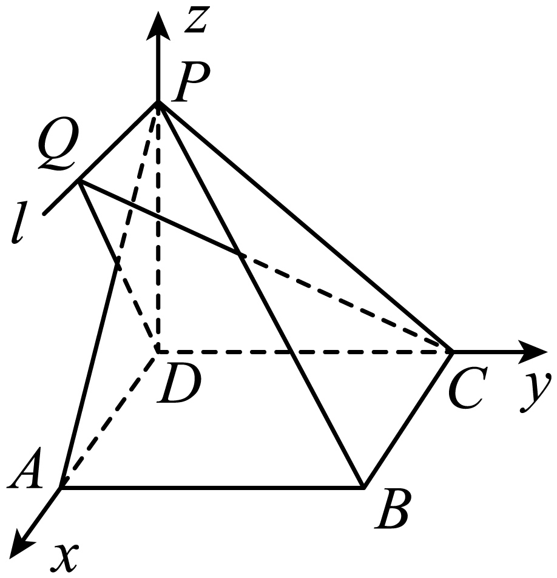

因为，则有，，，，，

设，则有，，，

设平面的法向量为，则，即，令，则，所以平面的一个法向量为，则

因为与平面所成角的正弦值为是，

所以，

解得.所以.

（3）由（2）可知平面的一个法向量为

因为是线段的中点，所以

于是，，设平面的法向量

则，即.令，得，，

，所以二面角的正弦值为.

**变式38．**（2024·江西抚州·高二临川一中校考期中）如图，直线平面，直线平行四边形ABCD，四棱锥P-ABCD的顶点在平面上，，，，，分别是与的中点.

（1）求证：平面；

（2）求二面角的余弦值.

【解析】（1）连接，底面为平行四边形，

是的中点，是的中点，，

是的中点，是的中点，，

，，平面平面，

平面，平面；

（2）由平面，平行四边形，

平面底面，，，

四边形为矩形，且底面，，过作，

以所在直线分别为轴建立空间直角坐标系（如图），

由，，，知，

、、、、、，

、、，

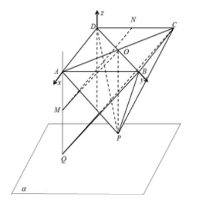

设平面的法向量为，

则,

取，，，即，

设平面的法向量为

则,

取，，，即，

二面角的平面角的余弦.

<strong>变式39．</strong>（2024·陕西安康·陕西省安康中学校考模拟预测）如图，在四棱锥中，底面<em>ABCD</em>为正方形，侧面<em>SAD</em>为等边三角形，，．

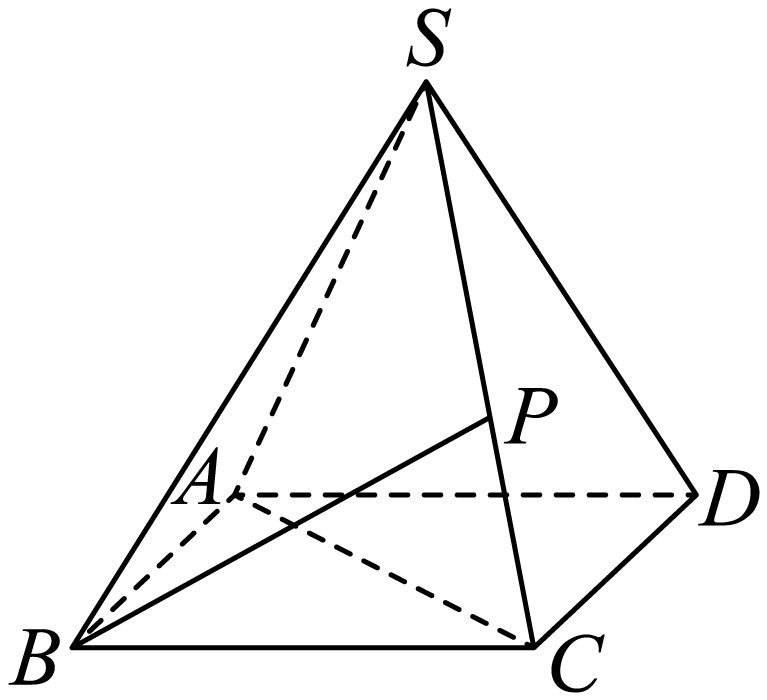

(1)证明：平面平面；

(2)侧棱*SC*上是否存在一点*P*（*P*不在端点处），使得直线*BP*与平面*SAC*所成角的正弦值等于？若存在，求出点*P*的位置；若不存在，请说明理由．

【解析】（1）证明：因为底面*ABCD*为正方形，，所以，

又因为侧面*SAD*为等边三角形，所以.

，所以，即，又,

所以平面，又因为平面，

所以平面平面*.*

（2）如图：

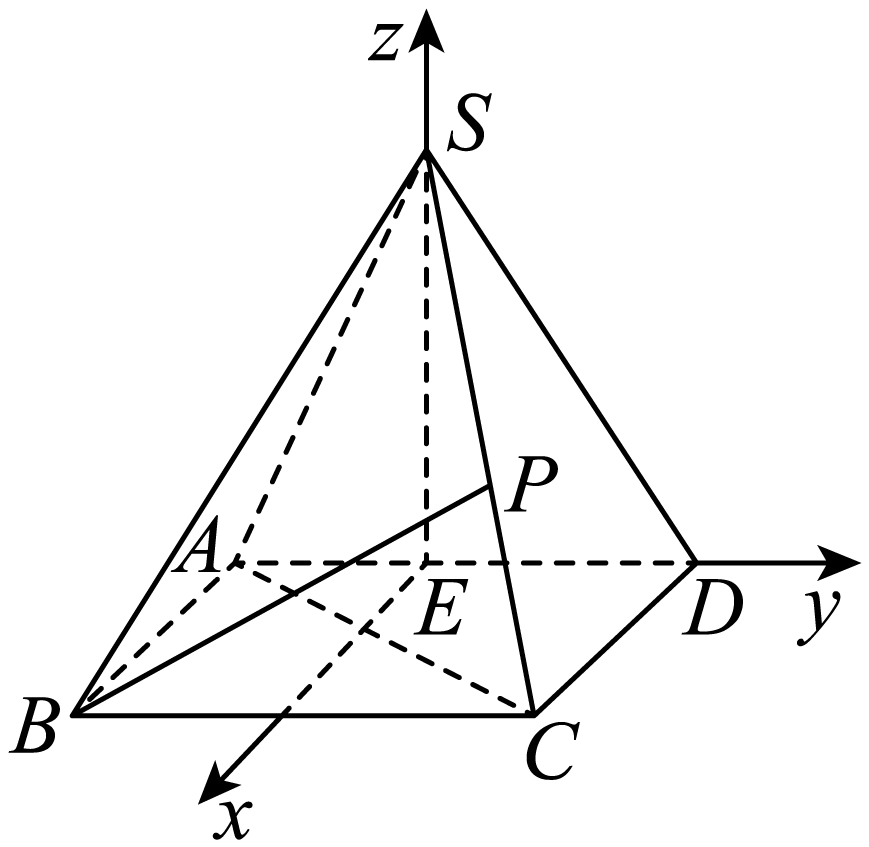

取的中点为，连接，因为侧面为等边三角形，

所以，

又由（1）可知平面平面，平面平面，

平面，所以平面，

以为原点，分别以的方向为轴，轴，轴为正方向，建立空间直角坐标系.

，，，，，

所以，，，设.

，所以，所以.

设平面*SAC*的法向量为，由于，所以.

令，则，，所以，

所以.

因为直线*BP*与平面*SAC*所成角的正弦值等于.

所以，解得或（舍）

故存在，当点*P*为*SC*的中点时，使得直线*BP*与平面*SAC*所成角的正弦值等于.

**变式40．**（2024·吉林长春·高二校考期末）如图，四棱锥中，底面为矩形，底面，，.点在侧棱上，°.

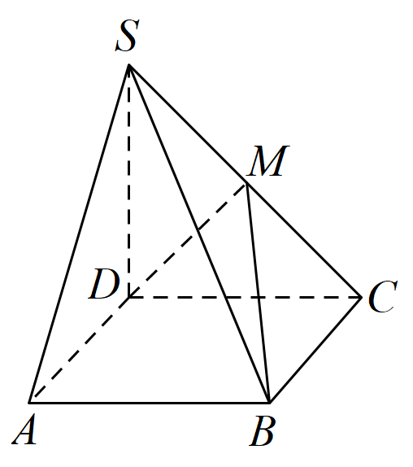

（1）证明：是侧棱的中点；

（2）求二面角的余弦值.

【解析】（1）以为坐标原点，射线分别为轴正半轴，建立如图所示的直角坐标系.

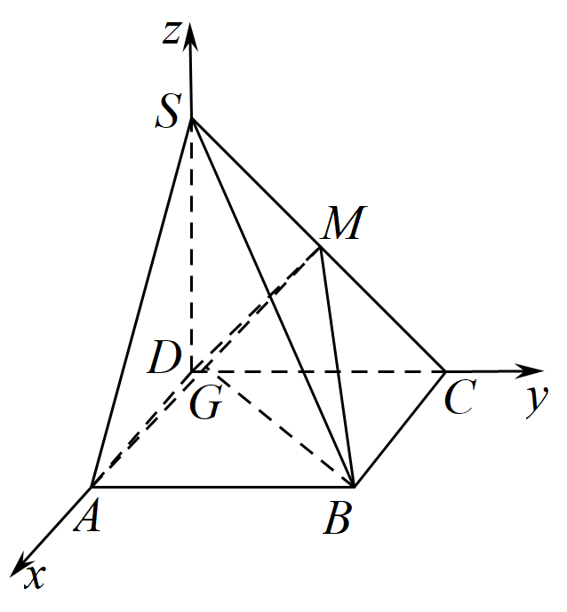

设，则，，.，

则，.

又，

故，

即，

解得，即.

所以为侧棱，的中点.

（2）由，，得的中点.

又，，，

，，

所以，.

因此等于二面角的平面角.

.

**变式41．**（2024·四川绵阳·高三绵阳南山中学实验学校校考阶段练习）三棱柱的底面是等边三角形，的中点为，底面，与底面所成的角为，点在棱上，且.

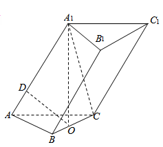

（1）求证：平面；

（2）求二面角的平面角的余弦值.

【解析】（1）连接，

底面，底面，

，且与底面所成的角为，即.

在等边△ABC中，易求得.

在△AOD中，由余弦定理，得

，

.

又

又，

平面，

又平面，

，

又，

平面.

（2）如下图所示，以为原点，分别以所在的直线为轴建立空间直角坐标系，

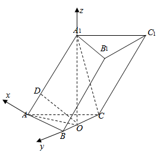

则

故

由（1）可知

可得点的坐标为，

平面的一个法向量是.

设平面的法向量，由

得

令则

则，

易知所求的二面角为钝二面角，

二面角的平面角的余弦角值是.

<strong>变式42．</strong>（2024·黑龙江齐齐哈尔·高三齐齐哈尔市实验中学校联考阶段练习）如图，三棱锥<em>P</em>-<em>ABC</em>所有棱长都等，<em>PO</em>⊥平面<em>ABC</em>，垂足为<em>O</em>．点，分别在平面<em>PAC</em>，平面<em>PAB</em>内，线段，都经过线段<em>PO</em>的中点<em>D</em>．

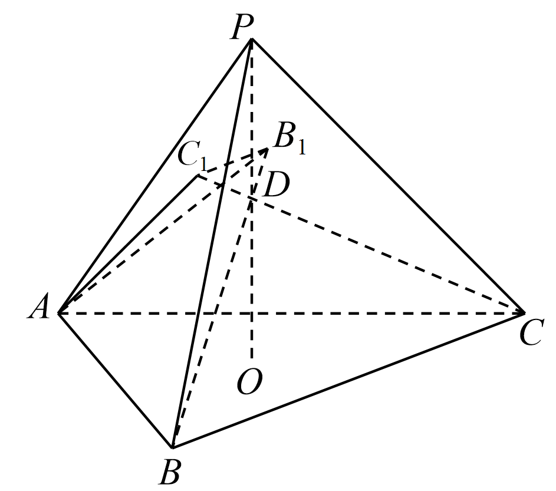

(1)证明：平面*ABC*；

(2)求直线*AP*与平面所成角的正弦值．

【解析】（1）连接，延长交*AB*于点，连接，延长交*AC*于点，

分别连接，，．

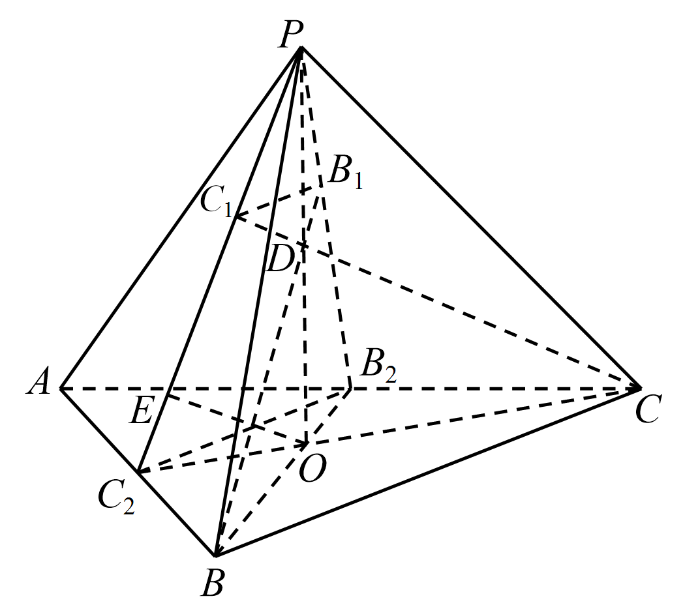

是平面与平面的交线，，

，

∵三棱锥*P*-*ABC*所有棱长都相等，

∴*O*为正△*ABC*的重心，且，分别是*AB*，*AC*中点．

∴．

作交于点*E*，则．

∵*D*是*PO*中点，∴．

∴．同理，．

∴．

∵平面*ABC*，平面*ABC*，

∴平面*ABC*．

（2）根据条件得，，*PO*⊥*AC*．分别以过*O*平行于*CA*的直线为*x*轴，以直线*OB*为*y*轴，以直线*OP*为*z*轴，建立如图所示的空间直角坐标系*O*-*xyz*．

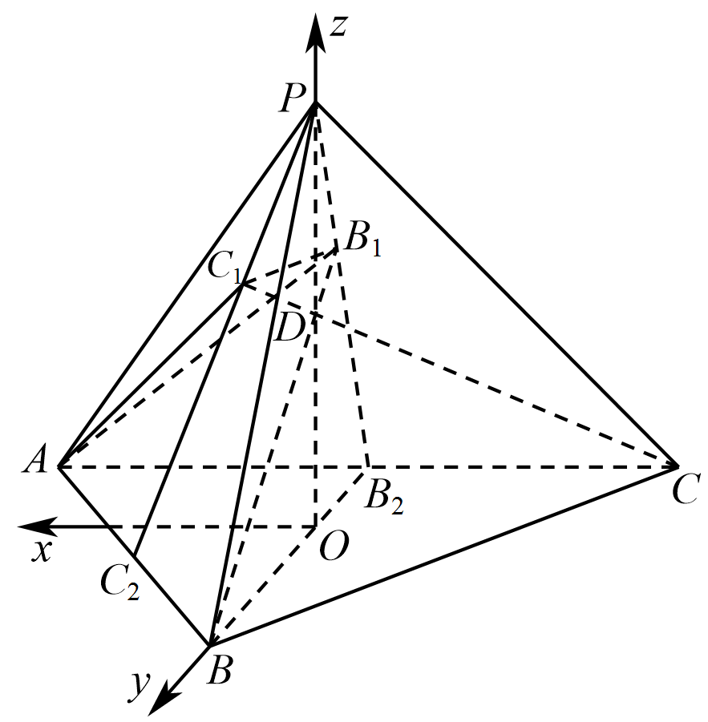

设，

则，，，．

是的中点，，

由（1）知，即,

设，

则，

易得：，同理得：．

∴，，．

设是平面的一个法向量，

则，，

∴，，

∴，

不妨取，解得：，．

．

所以直线*AP*与平面所成角的正弦值为．

**变式43．**（2024·全国·高三专题练习）如图，已知四棱锥中，平面，平面平面，且，，，点在平面内的射影恰为的重心.

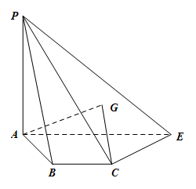

（1）证明：；

（2）求直线与平面所成角的正弦值.

【解析】（1）过作于，

因为平面平面，平面平面，平面，

平面，

平面，.

又平面，平面，，

又，平面，

平面，.

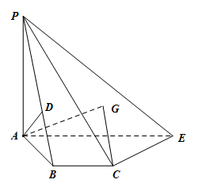

（2）连结并延长交于，连结，以为原点，

分别以，所在的直线为，轴，以过且与平面垂直的直线为轴，

建立空间直角坐标系，如图所示，则，，，设，

平面，平面，，同理，

又，平面，，

又是的重心，是的中点，，由（1）知，，

，，，

，解得，，

设，则，故，

，，，，

，，，，

设平面的法向量为，则，

令，则，

设直线与平面所成角为，则，

故直线与平面所成角的正弦值为.

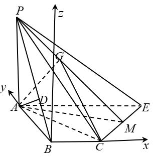

**变式44．**（2024·全国·高三专题练习）如图，平面平面，菱形平面，，为平面内一动点.

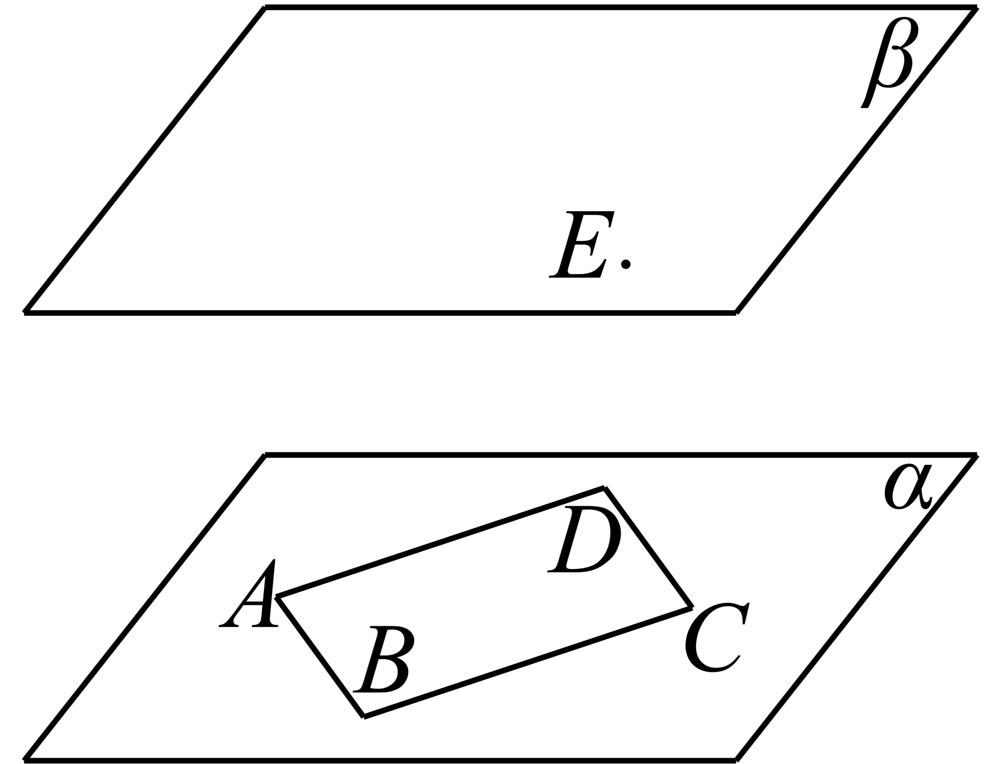

(1)若平面，间的距离为，设直线，与平面所成的角分别为，，，求动点在平面内的射影的一个轨迹方程；

(2)若点在平面内的射影为，证明：直线与平面所成的角与的大小无关.

【解析】（1）如图①，连接，，，，设，的交点为，

点在平面内的射影为，连接，，，

  
图①

因为点在平面内的射影为点，所以平面，

所以，在平面的射影分别为，，所以，，

所以，所以，

所以点的轨迹是以，为焦点，长轴长为的椭圆.

以，的交点为坐标原点，

若以为轴，为轴建立平面直角坐标系，则点的轨迹方程是.

若以为轴，为轴建立平面直角坐标系，则点的轨迹方程是.

（2）取的中点，连接，则，

因为平面，所以平面，所以，，

因为平面为菱形，所以，所以，，两两互相垂直，

故以为坐标原点，以，，所在直线分别为轴，轴，轴，建立如图②所示的空间直角坐标系.

  
图②

设，，则，，，，

所以，，，

设平面的法向量为，则即

两式相减得，即，则，令，得，所以.

设直线与平面所成的角为，则

，所以只与有关.

又，所以只与有关，

所以直线与平面所成的角与的大小无关.

**题型八：空间中的点不好求**

<strong>例22．</strong>（2024·全国·校联考模拟预测）已知三棱锥<em>ABCD</em>，<em>D</em>在面<em>ABC</em>上的投影为<em>O</em>，<em>O</em>恰好为△<em>ABC</em>的外心．，.

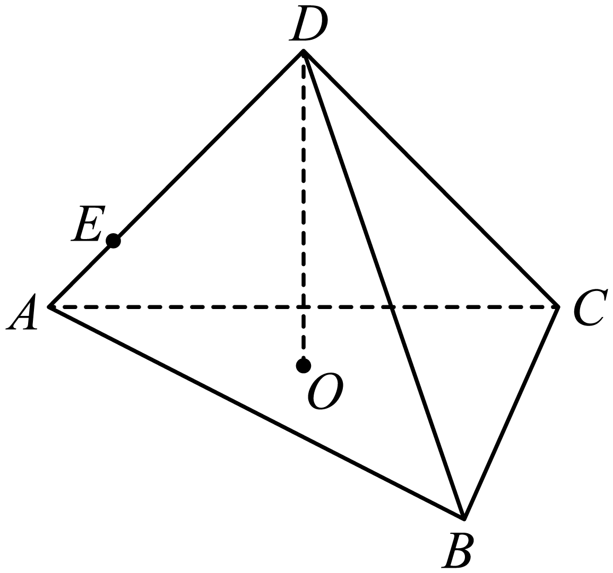

(1)证明：*BC*⊥*AD*；

(2)*E*为*AD*上靠近*A*的四等分点，若三棱锥*A-BCD*的体积为，求二面角的余弦值．

【解析】（1）连结并延长交于，连结，

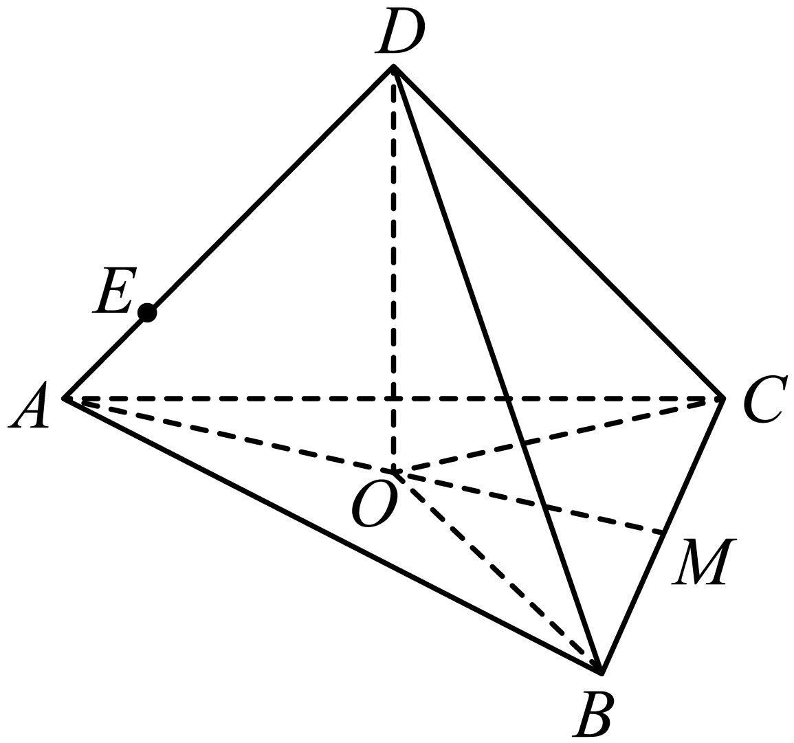

因为*O*恰好为△*ABC*的外心，所以，

又，，所以，

所以，即是的角平分线，

又，所以由等腰三角形三线合一可得，

因为*D*在面*ABC*上的投影为*O*，所以面*ABC*，

又面*ABC*，所以，

又面，所以面，

又面，所以，

（2）由（1）知，面*ABC*，

过作轴平行于，则轴垂直于面*ABC*，如图建立空间直角坐标系，

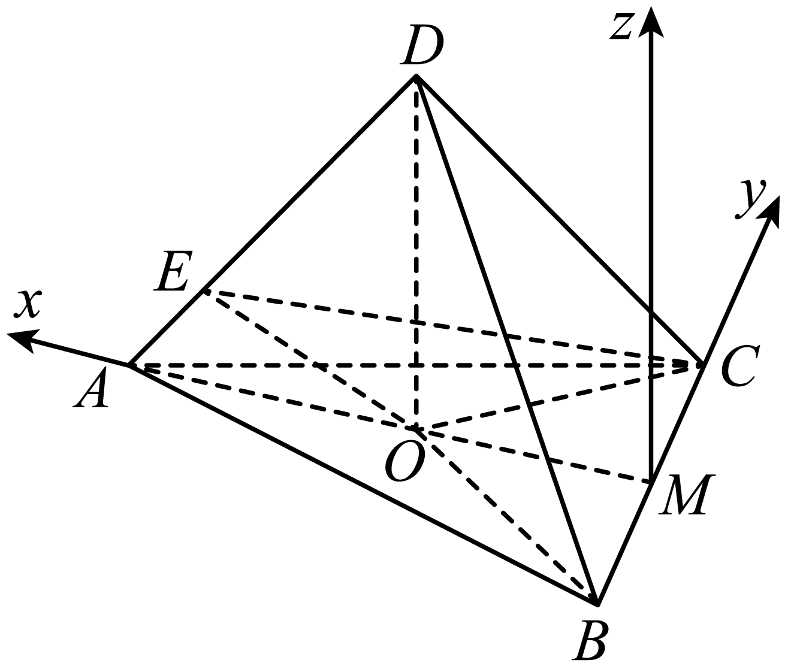

在中，由（1）与等腰三角形三线合一可知是的中点，

又，，则，，

设，则，又，

所以，解得，故，

因为三棱锥*ABCD*的体积为，所以，则，

则，

故，

因为*E*为*AD*上靠近*A*的四等分点，所以，

设为平面的一个法向量，则，

取，则，故，

易得是平面的一个法向量，

设二面角的平面角为，则为钝角，

所以，

所以二面角的余弦值为.

**例23．**（2024·河南·校联考模拟预测）如图，在四棱锥中，，，，分别为，的中点，点在上，且为三角形的重心.

(1)证明：平面；

(2)若，，四棱锥的体积为，求直线与平面所成角的正弦值.

【解析】（1）证明：连接，因为，，所以，且，

由，得，，

则，所以.

连接并延长交于点，如图，

因为为的重心，所以.

连接，因为，所以.

又平面，平面，故平面.

（2）连接，因为，所以，

又，，平面，，所以平面.

连接交于点，则，.

又，，平面，，所以平面.

连接，平面，则，

因为平面，平面，所以，

因为，平面，所以平面.

易得四边形的面积为，

由四棱锥的体积为得，，所以.

以为坐标原点，以，所在直线分别为轴、轴，建立空间直角坐标系，

则，，，，，，.

设平面的法向量为，则,即,

取，可得，

由（1）可知，为的中点，则，所以.

由（1）知，，所以直线与平面所成的角等于直线与平面所成的角，设为，

所以，

故直线与平面所成角的正弦值为.

<strong>例24．</strong>（2024·湖北武汉·华中师大一附中校考模拟预测）如图，平行六面体中，点<em>P</em>在对角线上，，平面平面．

(1)求证：*O*，*P*，三点共线；

(2)若四边形是边长为2的菱形，，，求二面角大小的余弦值．

【解析】（1）证明：连交于，连．

在平行六面体中，且，

所以四边形是平行四边形，且，

又*O*，分别为*BD*，的中点，所以，，

所以四边形是平行四边形，于是，

因为平面平面，平面平面，

平面平面，所以，

因为，都经过点*O*，所以*O*，*P*，三点共线．

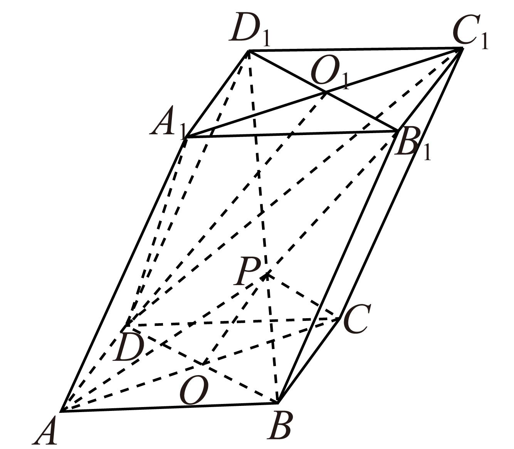

（2）由（1）可知，所以．

作平面于*Q*，于*E*，于*F*，连，，，

则，，由，得，

又，平面，所以平面，

于是，同理，

又，，

所以，则，

所以点*Q*在上，且，所以点*Q*与*O*重合，于是．

以点*O*为原点，分别以，，所在直线为*x*轴，*y*轴，*z*轴建立空间直角坐标系，

则，，，，

所以，于是，

又，所以，，

设平面的法向量为，

则，于是可得，

不妨令，则，

平面的一个法向量为，

，

又结合图形易得二面角为锐角，

所以二面角大小的余弦值为．

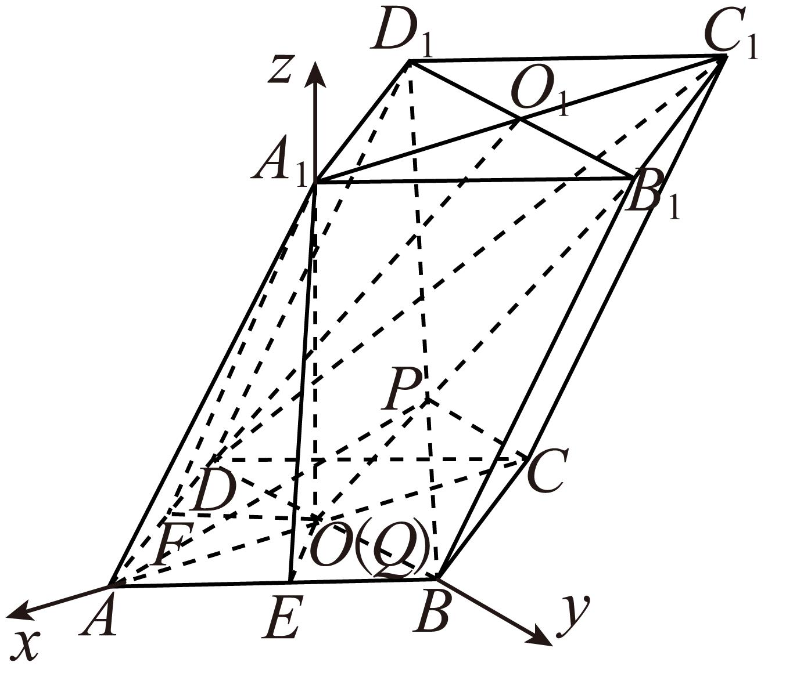

<strong>变式45．</strong>（2024·江西·校联考二模）正四棱锥中，，<em>E</em>为中点，，平面平面，平面.

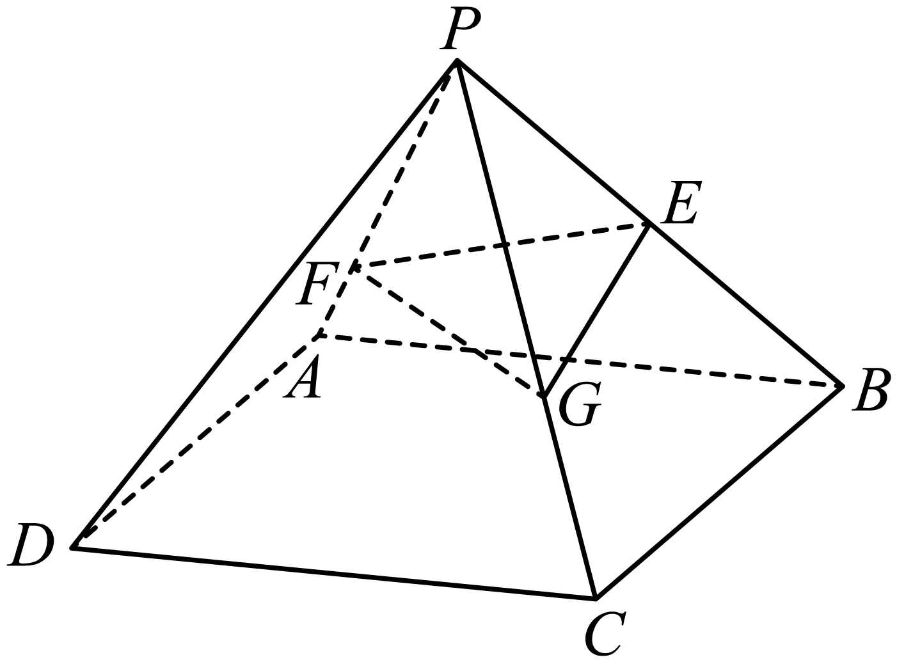

(1)证明：当平面平面时，平面

(2)当时，*T*为表面上一动点（包括顶点），是否存在正数*m*，使得有且仅有5个点*T*满足，若存在，求*m*的值，若不存在，请说明理由.

【解析】（1）连接，由题意可知：，

设，连接，则平面，

平面，则，

，平面，

故平面.

若为直线，此时平面，可得平面平面，符合题意，

故平面；

若不为直线，∵平面平面，则存在直线平面，使得平面，

可得，且平面，平面，

故平面，

又∵平面，平面平面，

则，可得，

故平面；

综上所述：平面.

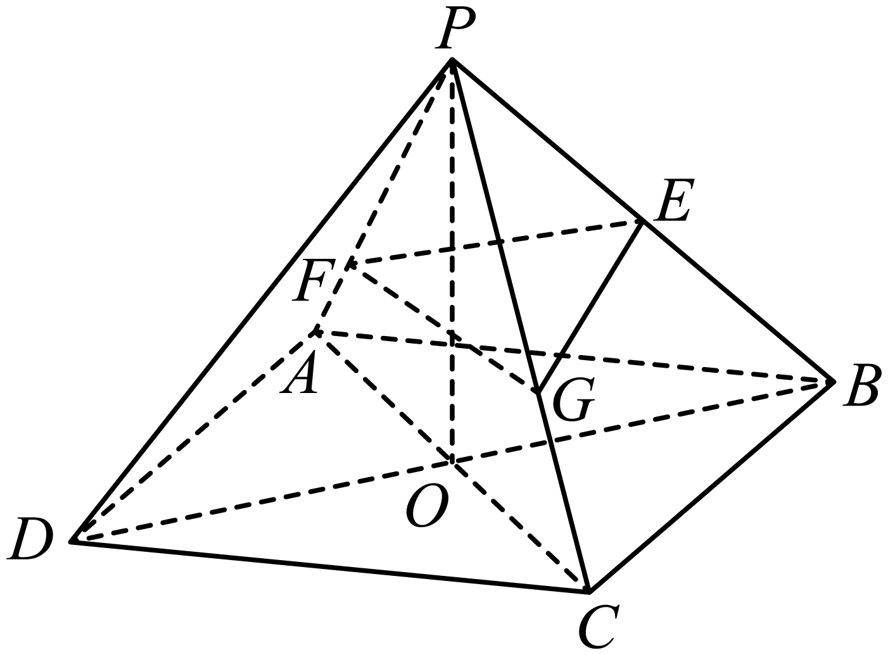

（2）不存在，理由如下：

如图，以*O*为坐标原点建立空间直角坐标系，则有，

可得，

设平面的法向量，则，

令，则，即，

设平面的任一点坐标，则，

由，解得，

可得交线满足，

令，可得交线与轴的交点为，即为点.

设四棱锥表面上任一点，

则，

，

可得，

且

故

，

表示点到点的距离的平方，

设四棱锥的内切球的半径为，

∵的体积，表面积，

则，

可得四棱锥内切球的球心坐标为，

又∵，可得四棱锥的外接球的球心为，

显然既不是内切球的球心也不是外接球的球心，

故不存在*m*，使得有且仅有5个点*T*满足.

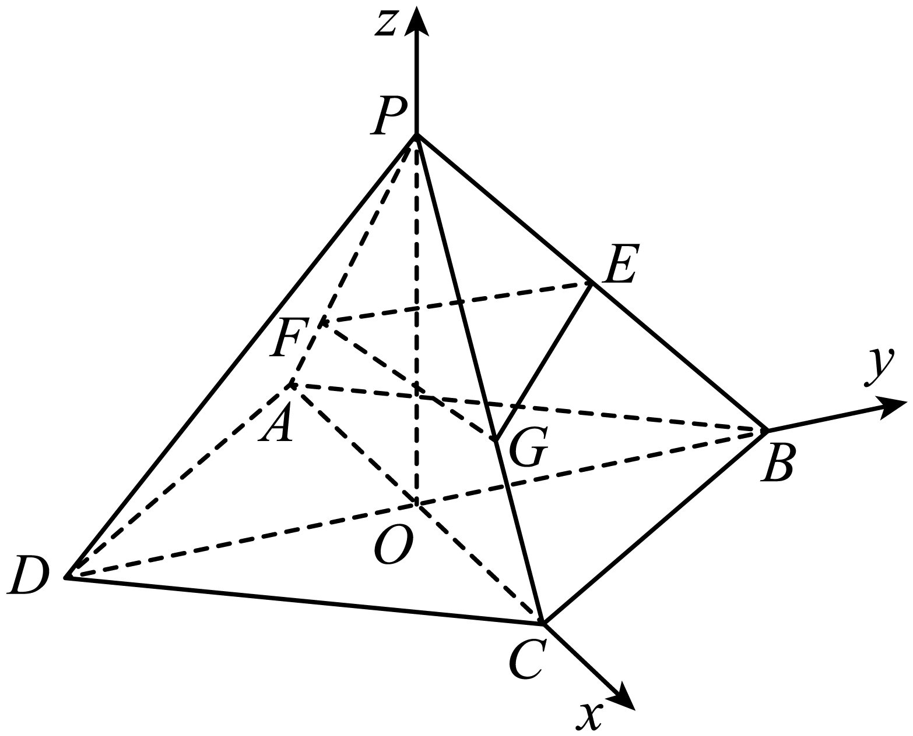

<strong>变式46．</strong>（2024·全国·高三专题练习）如图，在棱长为2的正方体中，点<em>M</em>是正方体的中心，将四棱锥绕直线逆时针旋转后，得到四棱锥．

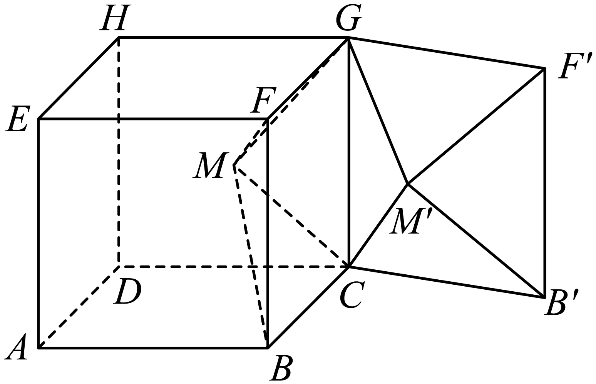

(1)若，求证：平面平面；

(2)是否存在，使得直线平面？若存在，求出的值；若不存在，请说明理由．

【解析】（1）证明：若，则平面、平面为同一个平面，

连接，则*M*是中点，是中点，

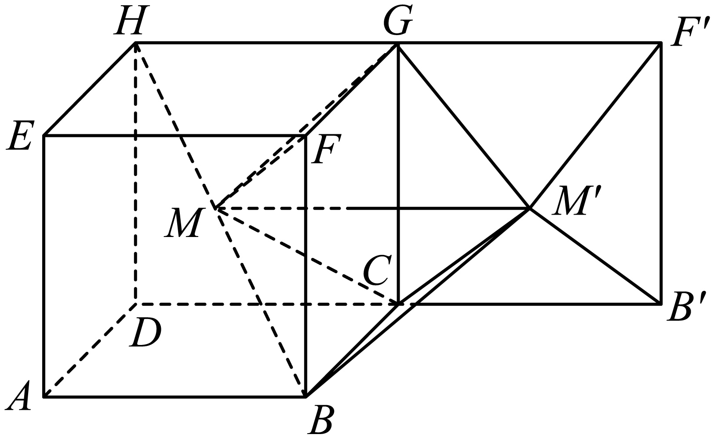

故是的中位线，所以．

因为，所以平面四边形是平行四边形，所以．

又平面平面，所以平面

同理平面，且平面平面，

所以，平面平面．

（2）假设存在，使得直线平面．

以*C*为原点，分别以为轴正方向建立空间直角坐标系，

则，，故．

设是平面的法向量，则，

所以，取，得是平面的一个法向量，

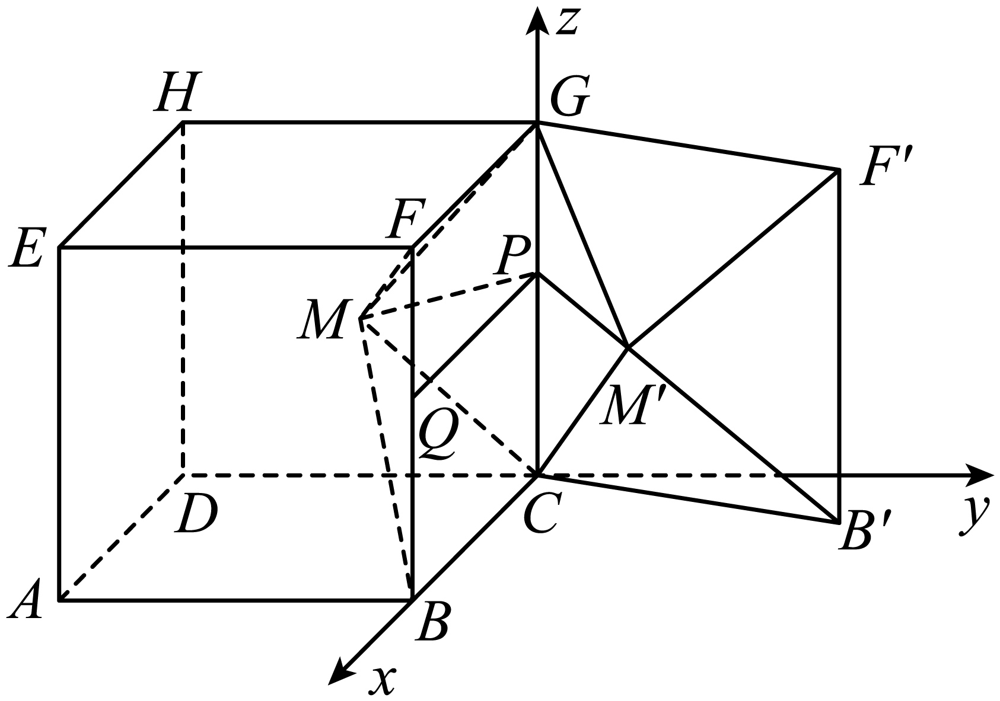

取中点*P*，中点*Q*，连接，

则．

于是是二面角的平面角，是二面角的平面角，

是二面角的平面角，于是，

所以，且平面，

故，同理，

所以，

因为，

，

所以．

若直线平面，是平面的一个法向量，则．

即存在，使得，则，此方程组无解，

所以，不存在，使得直线平面．

<strong>变式47．</strong>（2024·全国·模拟预测）已知菱形<em>ABCD</em>中，，四边形<em>BDEF</em>为正方形，满足，连接<em>AE</em>，<em>AF</em>，<em>CE</em>，<em>CF</em>．

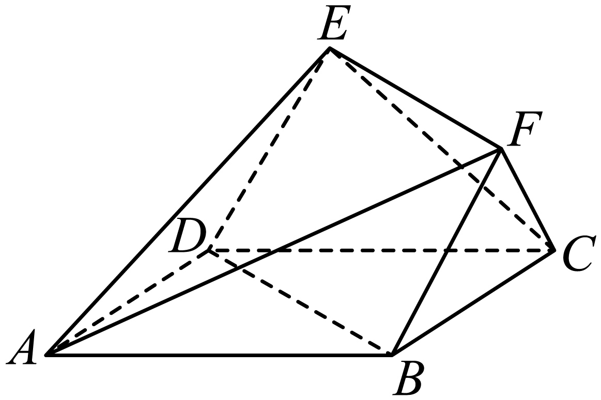

(1)证明：；

(2)求直线*AE*与平面*BDEF*所成角的正弦值．

【解析】（1）证明：如图，取*CF*的中点*M*，*EF*的中点*N*，连接*AC*，交*BD*于点*O*，连接*EM*，*CN*，*AM*，*ON*．

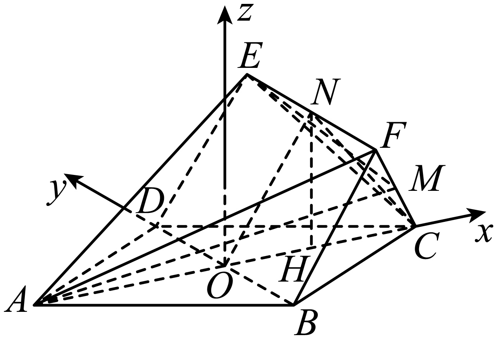

∵菱形*ABCD*中，，

∴△*ABD*为等边三角形，∴．

∵四边形*BDEF*为正方形，

∴．

又∵，，

∴在△*ABF*中，由余弦定理可得．

∴，又*M*为*CF*的中点，∴①．

∵四边形*ABCD*为菱形，∴．

又∵四边形*BDEF*为正方形，，，则，

∴，又，*ON、AC*在面*ONC*内，故平面*ONC*．

∵，∴平面*ONC*，*NC*在面*ONC*内，∴，

由*N*为*EF*的中点，得．

∵，，，．

又∵，∴为等边三角形，∴．

又，，∴为等边三角形．

又∵*M*为*CF*中点，∴②．

由①②，且，*EM、AM*在面*AEM*内，得平面*AEM*，

又*AE*在面*AEM*内，故．

（2）方法一：以*O*为坐标原点，*AC*所在直线为*x*轴，*BD*所在直线为*y*轴，过*O*且垂直于平面*ABCD*的直线为*z*轴，建立如图所示的空间直角坐标系，得，．

点*N*作*NH*垂直*OC*于点*H*，在中，，，可得*ON*边上的高为，由等面积法可得*OC*边上的高，

由勾股定理可得，故，，

，，

设平面*BDEF*的法向量为，

则，即，取，平面*BDEF*的一个法向量为．

设直线*AE*与平面*BDEF*所成角为，则，

∴直线*AE*与平面*BDEF*所成角的正弦值为．

方法二：将原图补成一个平行六面体，显然该平行六面体每个面均为有一个角为的菱形．

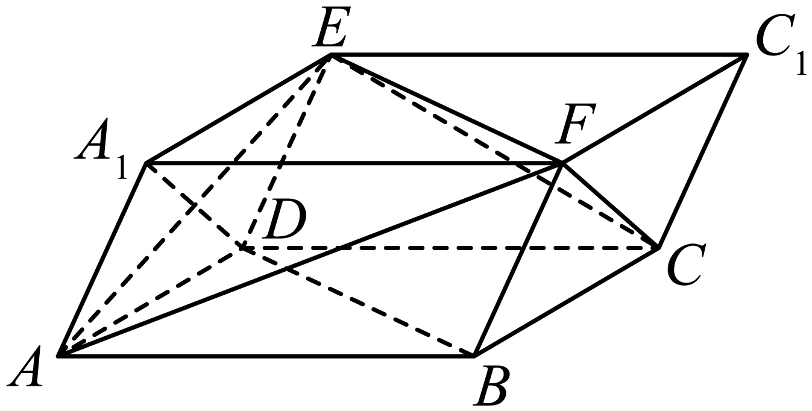

令，，，

依题意，，，

则，

，，

由于，

，

所以<em>A1C</em>与<em>EF、BF</em>都垂直且<em>EF</em>、<em>BF</em>都在面<em>BDEF</em>内，故为平面<em>BDEF</em>的一个法向量，

设直线*AE*与平面*BDEF*所成角为，

，

∴直线*AE*与平面*BDEF*所成角的正弦值为．

**题型九：创新定义**

**例25．**（2024·重庆沙坪坝·高三重庆一中校考阶段练习）魏晋时期数学家刘徽（图a）为研究球体的体积公式，创造了一个独特的立体图形“牟合方盖”，它由完全相同的四个曲面构成，相对的两个曲面在同一圆柱的侧面上．如图，将两个底面半径为1的圆柱分别从纵横两个方向嵌入棱长为2的正方体时（如图b），两圆柱公共部分形成的几何体（如图c）即得一个“牟合方盖”，图d是该“牟合方盖”的直观图（图中标出的各点，，，，，均在原正方体的表面上）．

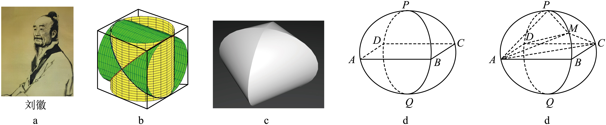

(1)由“牟合方盖”产生的过程可知，图d中的曲线为一个椭圆，求此椭圆的离心率；

(2)如图c，点在椭圆弧上，且三棱锥的体积为，求二面角的正弦值．

【解析】（1）由“牟合方盖”产生的过程可知，将图中正方体的前面的面旋转至上面，可得图中标出的各点，，，，在原正方体中相对对应的位置为如图所示．

故图中的曲线所对应的椭圆的长轴长，短轴长，

于是可得此椭圆的半焦距，因此离心率．

（2）三棱锥的体积，

故点到平面的距离，连接交于点，连接，

由题可知，，两两相互垂直，

如图，

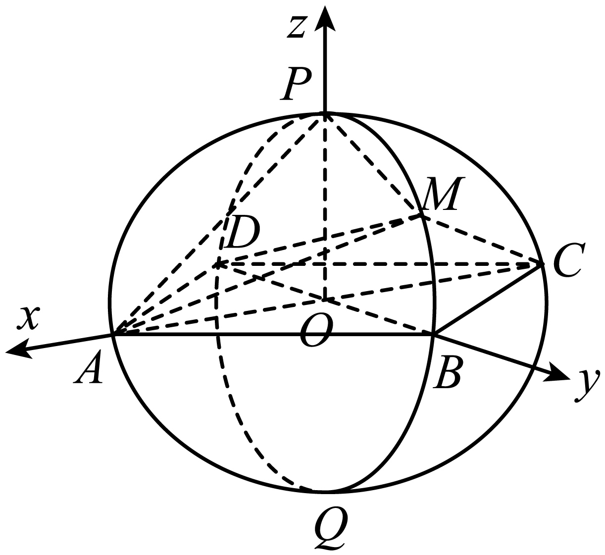

以为原点，分别以，，所在方向为，，轴的正方向，建立空间直角坐标系，

由题可得，，，，

设平面的一个法向量为，

由取，

设平面的一个法向量为，

由取，

记二面角的平面角为，则，

故．

**例26．**（2024·辽宁沈阳·东北育才学校校考一模）蜂房是自然界最神奇的“建筑”之一，如图1所示.蜂房结构是由正六棱柱截去三个相等的三棱锥，，，再分别以，，为轴将，，分别向上翻转，使，，三点重合为点所围成的曲顶多面体（下底面开口），如图2所示.蜂房曲顶空间的弯曲度可用曲率来刻画，定义其度量值等于蜂房顶端三个菱形的各个顶点的曲率之和，而每一顶点的曲率规定等于减去蜂房多面体在该点的各个面角之和（多面体的面角是多面体的面的内角，用弧度制表示）.例如：正四面体在每个顶点有3个面角，每个面角是，所以正四面体在各顶点的曲率为.

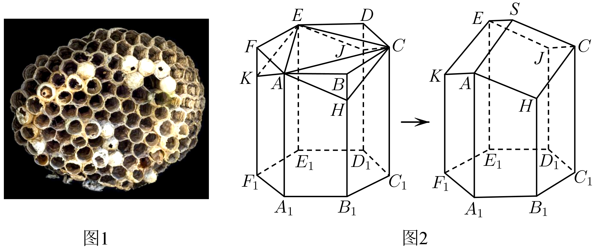

(1)求蜂房曲顶空间的弯曲度；

(2)若正六棱柱底面边长为1，侧棱长为2，设

（i）用表示蜂房（图2右侧多面体）的表面积；

（ii）当蜂房表面积最小时，求其顶点的曲率的余弦值.

【解析】（1）蜂房曲顶空间的弯曲度为顶端三个菱形的7个顶点的曲率之和，

根据定义其度量值等于减去三个菱形的内角和，

再减去6个直角梯形中的两个非直角内角和，

即蜂房曲顶空间的弯曲度为.

（2）（i）如图所示，连接*AC*，*SH*，则，设点在平面的射影为*O*，

则，则，

菱形*SAHC*的面积为，

侧面积，

所以蜂房的表面积为.

（ii），

令得到，

所以在递增；在递增.

所以在处取得极小值，也即是最小值.

此时，在中，令，由余弦定理得，

又顶点的曲率为，

.

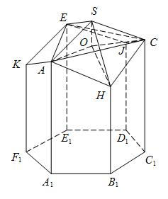

**例27．**（2024·全国·高三专题练习）北京大兴国际机场的显著特点之一是各种弯曲空间的运用．刻画空间的弯曲性是几何研究的重要内容．用曲率刻画空间弯曲性，规定：多面体顶点的曲率等于与多面体在该点的面角之和的差（多面体的面的内角叫做多面体的面角，角度用弧度制），多面体面上非顶点的曲率均为零，多面体的总曲率等于该多面体各顶点的曲率之和．例如：正四面体在每个顶点有3个面角，每个面角是，所以正四面体在各顶点的曲率为，故其总曲率为．

（1）求四棱锥的总曲率；

（2）若多面体满足：顶点数-棱数+面数，证明：这类多面体的总曲率是常数．

【解析】（1）由题可知：四棱锥的总曲率等于四棱锥各顶点的曲率之和.

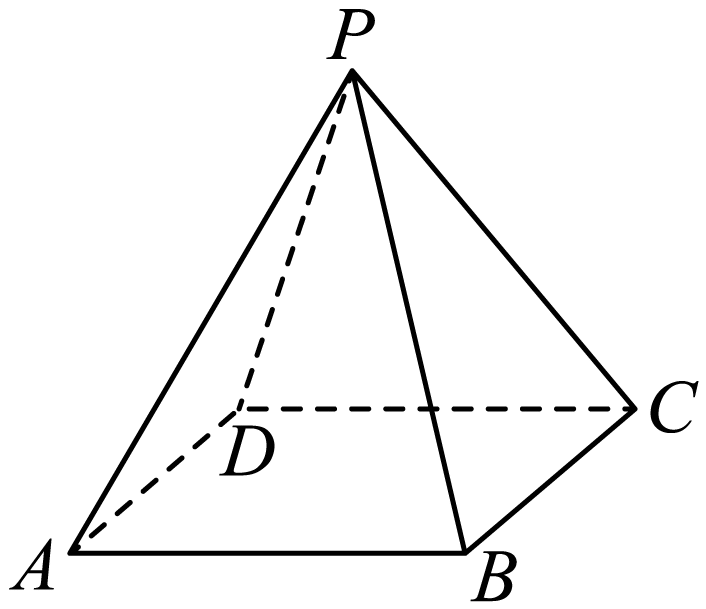

可以从整个多面体的角度考虑，所有顶点相关的面角就是多面体的所有多边形表面的内角的集合.由图可知：四棱锥共有5个顶点，5个面，其中4个为三角形，1个为四边形.

所以四棱锥的表面内角和由4个为三角形，1个为四边形组成，

则其总曲率为：.

（2）设顶点数、棱数、面数分别为、、，所以有

设第个面的棱数为，所以

所以总曲率为：

所以这类多面体的总曲率是常数.

**变式48．**（2024·河北·高三校联考阶段练习）已知，，，定义一种运算：，在平行六面体中，，，.

(1)证明：平行六面体是直四棱柱；

(2)计算，并求该平行六面体的体积，说明的值与平行六面体体积的关系.

【解析】（1）证明：由题意，，

∴，，即，，

∵，是平面内两相交直线，∴平面，

∴平行六面体是直四棱柱；

（2），

由题意，，，

，所以，

，，

∴.

∴，

故的值表示以，，为邻边的平行六面体的体积.

**变式49．**（2024·全国·高三专题练习）（1）如图，对于任一给定的四面体，找出依次排列的四个相互平行的平面，，，，使得，且其中每相邻两个平面间的距离都相等；

（2）给定依次排列的四个相互平行的平面，，，，其中每相邻两个平面间的距离为1，若一个正四面体的四个顶点满足：，求该正四面体的体积．

【解析】（1）取的三等分点，，的中点，的中点，

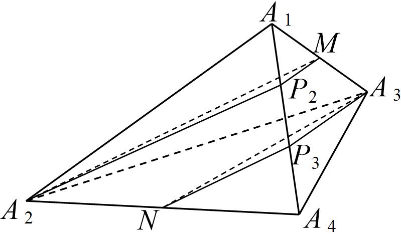

过三点，，作平面，过三点，，作平面，

因为，，所以平面平面，

再过点，分别作平面，与平面平行，那么四个平面，，，依次相互平行，

由线段被平行平面，，，截得的线段相等知，每相邻两个平面间的距离相等，故，，，为所求平面．

（2）如图，将此正四面体补形为正方体（如图），

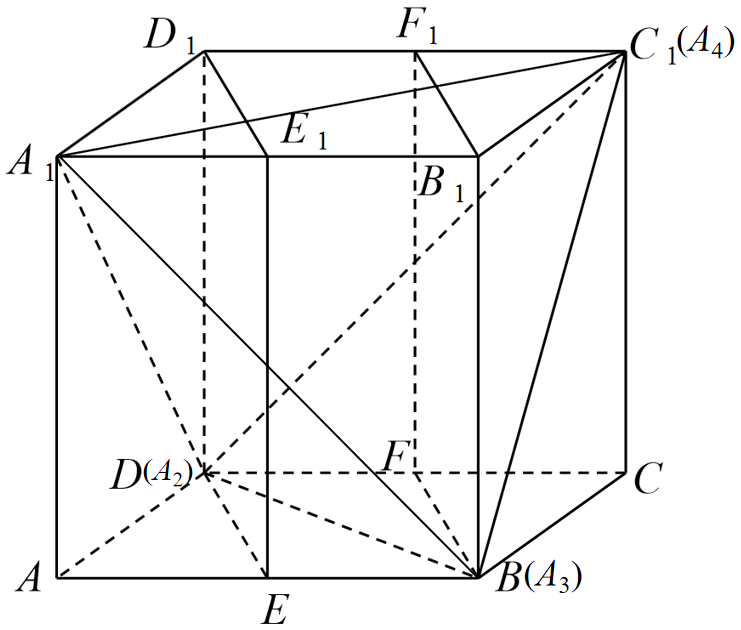

分别取、、、的中点、、、，

平面与是分别过点、的两平行平面，若其距离为1，

则正四面体满足条件，右图为正方体的下底面，设正方体的棱长为，

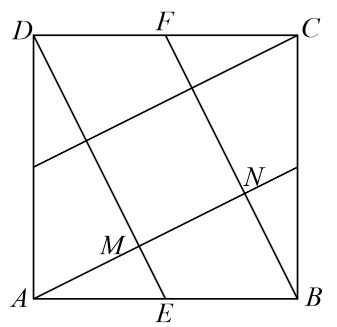

若，因为，，

在直角三角形中，，所以，所以，

又正四面体的棱长为，

所以此正四面体的体积为．

<strong>变式50．</strong>（2024·全国·高三专题练习）已知顶点为<em>S</em>的圆锥面（以下简称圆锥<em>S</em>）与不经过顶点<em>S</em>的平面<em>α</em>相交，记交线为<em>C</em>，圆锥<em>S</em>的轴线<em>l</em>与平面<em>α</em>所成角<em>θ</em>是圆锥<em>S</em>顶角（圆<em>S</em>轴截面上两条母线所成角<em>θ</em>的一半，为探究曲线<em>C</em>的形状，我们构建球<em>T</em>，使球<em>T</em>与圆锥<em>S</em>和平面<em>α</em>都相切，记球<em>T</em>与平面<em>α</em>的切点为<em>F</em>，直线<em>l</em>与平面<em>α</em>交点为<em>A</em>，直线<em>AF</em>与圆锥<em>S</em>交点为<em>O</em>，圆锥<em>S</em>的母线<em>OS</em>与球<em>T</em>的切点为<em>M</em>，，．

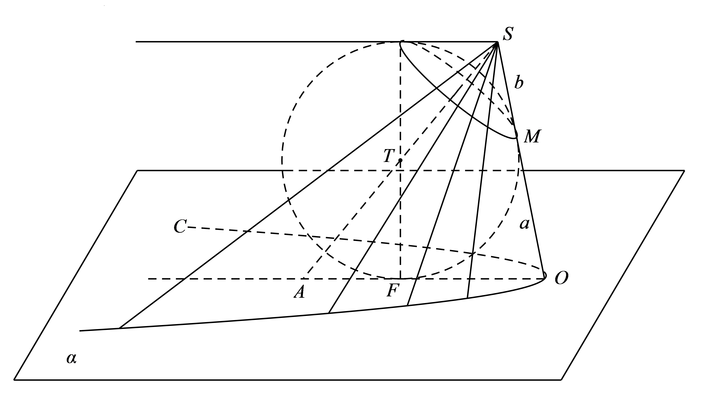

(1)求证：平面*SOA*⊥平面*α*，并指出*a*，*b*，关系式；

(2)求证：曲线*C*是抛物线．

【解析】（1）∵平面*AOS*截球*T*的截面圆与直线*AO*相切于*F*，

∴，

记*P*是平面内不在直线*OA*上的点，平面*TFP*截球*T*的截面圆与直线*FP*相切于点*F，*

∴，

∵平面内直线*AO*，*FP*相交于点*F，*

∴*TF*⊥平面，

∵直线*TF*平面*AOS，*

∴平面*AOS*⊥平面，

∴．连*TO*，*TM，*

∴，，

∴球*T*的半径且，

∴.

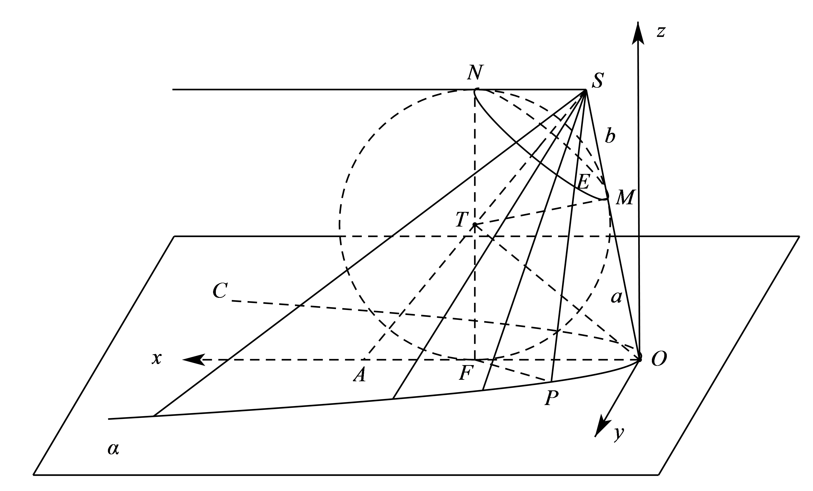

（2）在平面*AOS*内圆锥的另一条母线与球*T*的切点记为*N*点

∵，

∴

以*O*为坐标原点，*OA*所在直线为*x*轴，过*O*与*TF*平行的直线为*z*轴建立空间直角坐标系，如图.

∵*OM*，*OF*与球*T*相切，

∴，

∴，，

设交线*C*上任意点，记圆锥*S*的母线*SP*与球*T*相切于*E．*

∵*PF*与球*T*相切于点*F，*

∴，，

∴，

即（1），

两边平方整理得：（2），

两边平方整理得：（3），

易知：（3）（2）（1），

∴交线*C*在坐标平面*xOy*中方程为，

∴交线*C*是以*F*为焦点，*O*为顶点的抛物线.

**变式51．**（2024·湖南·校联考模拟预测）类比于二维平面中的余弦定理，有三维空间中的三面角余弦定理；如图1，由射线，，构成的三面角，，，，二面角的大小为，则．

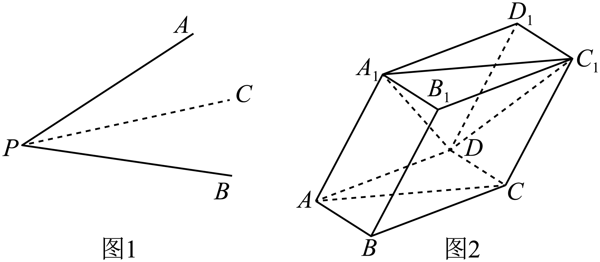

（1）当、时，证明以上三面角余弦定理；

（2）如图2，四棱柱中，平面平面，，，

①求的余弦值；

②在直线上是否存在点，使平面？若存在，求出点的位置；若不存在，说明理由．

【解析】（1）证明：如图，过射线上一点作交于点，

作交于点，连接，

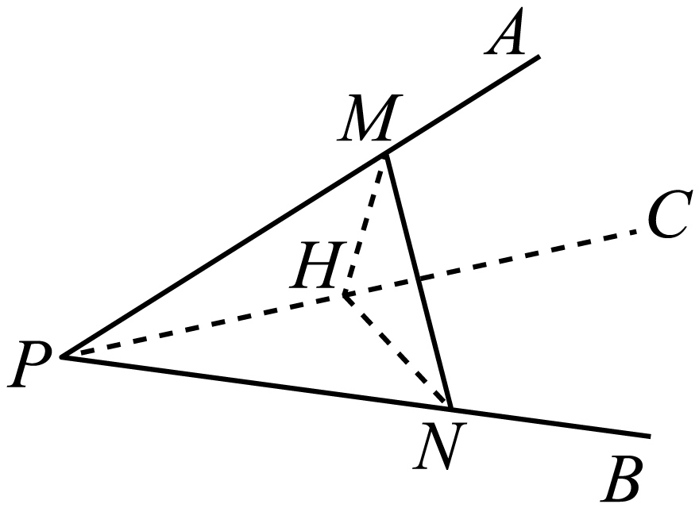

则是二面角的平面角．

在中和中分别用余弦定理，得

，

，

两式相减得，

∴，

两边同除以，得．

（2）①由平面平面，知，

∴由（1）得，

∵，，

∴．

②在直线上存在点，使平面．

连结，延长至，使，连结，

在棱柱中，，，

∴，∴四边形为平行四边形，

∴．

在四边形中，，

∴四边形为平行四边形，

∴，

∴，

又平面，平面，

∴平面．

∴当点在的延长线上，且使时，平面

