**第57讲  直线的方程**

**知识梳理**

**知识点**一**：直线的倾斜角和斜率**

1**、直线的倾斜角**

若直线与轴相交，则以轴正方向为始边，绕交点逆时针旋转直至与重合所成的角称为直线的倾斜角，通常用表示

（1）若直线与轴平行（或重合），则倾斜角为

（2）倾斜角的取值范围

2**、直线的斜率**

设直线的倾斜角为，则的正切值称为直线的斜率，记为

（1）当时，斜率不存在；所以竖直线是不存在斜率的

（2）所有的直线均有倾斜角，但是不是所有的直线均有斜率

（3）斜率与倾斜角都是刻画直线的倾斜程度，但就其应用范围，斜率适用的范围更广（与直线方程相联系）

（4）越大，直线越陡峭

（5）倾斜角与斜率的关系

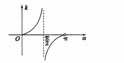

当时，直线平行于轴或与轴重合；

当时，直线的倾斜角为锐角，倾斜角随的增大而增大；

当时，直线的倾斜角为钝角，倾斜角随的增大而减小；

3**、过两点的直线斜率公式**

已知直线上任意两点，，则

（1）直线的斜率是确定的，与所取的点无关．

（2）若，则直线的斜率不存在，此时直线的倾斜角为90°

4**、三点共线．**

两直线的斜率相等→三点共线；反过来，三点共线，则直线的斜率相等（斜率存在时）或斜率都不存在．

**知识点二：直线的方程**

1**、直线的截距**

若直线与坐标轴分别交于，则称分别为直线的横截距，纵截距

（1）截距：可视为直线与坐标轴交点的简记形式，其取值可正，可负，可为0（不要顾名思义误认为与“距离”相关）

（2）横纵截距均为0的直线为过原点的非水平非竖直直线

2**、直线方程的五种形式**

<table><tr><td>
名称
</td><td>
方程
</td><td>
适用范围
</td></tr><tr><td>
点斜式
</td><td>

</td><td>
不含垂直于轴的直线
</td></tr><tr><td>
斜截式
</td><td>

</td><td>
不含垂直于轴的直线
</td></tr><tr><td>
两点式
</td><td>

</td><td>
不含直线和直线
</td></tr><tr><td>
截距式
</td><td>

</td><td>
不含垂直于坐标轴和过原点的直线
</td></tr><tr><td>
一般式
</td><td>

</td><td>
平面直角坐标系内的直线都适用
</td></tr></table>

3**、求曲线（或直线）方程的方法：**

在已知曲线类型的前提下，求曲线（或直线）方程的思路通常有两种：

（1）直接法：寻找决定曲线方程的要素，然后直接写出方程，例如在直线中，若用直接法则需找到两个点，或者一点一斜率

（2）间接法：若题目条件与所求要素联系不紧密，则考虑先利用待定系数法设出曲线方程，然后再利用条件解出参数的值（通常条件的个数与所求参数的个数一致）

4**、线段中点坐标公式**

若点的坐标分别为且线段的中点的坐标为，则，此公式为线段的中点坐标公式．

5**、两直线的夹角公式**

若直线与直线的夹角为，则.

**必考题型全归纳**

**题型一：倾斜角与斜率的计算**

**例1．**（2024·四川眉山·仁寿一中校考模拟预测）已知是直线的倾斜角，则的值为（    ）

A．	B．	C．	D．

【答案】B

【解析】法一：由题意可知，（为锐角），∴，

法二：由题意可知，（为锐角）∴，

．

故选：B．

**例2．**（2024·重庆·重庆南开中学校考模拟预测）已知直线的一个方向向量为，则直线的倾斜角为（    ）

A．	B．	C．	D．

【答案】A

【解析】由题意可得：直线的斜率，即直线的倾斜角为.

故选：A

**例3．**（2024·江苏宿迁·高二泗阳县实验高级中学校考阶段练习）经过两点的直线的倾斜角是（    ）

A．	B．	C．	D．

【答案】D

【解析】经过两点的直线的斜率为，

因为直线的倾斜角大于等于小于，

故经过两点的直线的倾斜角是，

故选：D

**变式1．**（2024·全国·高二专题练习）如图，若直线的斜率分别为，则（    ）

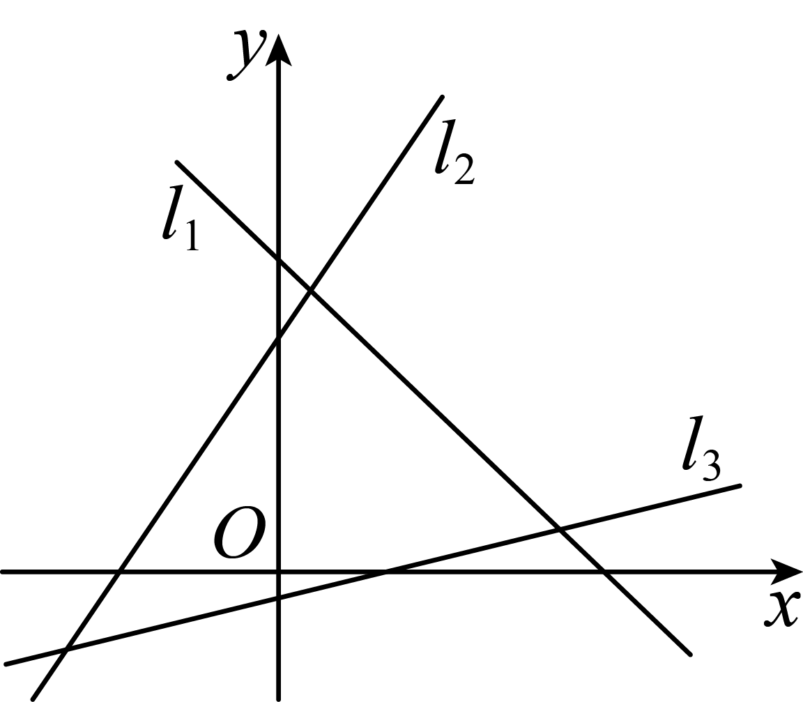

A．	B．

C．	D．

【答案】A

【解析】解析  设直线的倾斜角分别为，

则由图知，

所以，

即．

故选：A

**变式2．**（2024·全国·高二专题练习）直线的倾斜角为（    ）

A．	B．	C．	D．

【答案】C

【解析】直线的倾斜角为，因为直线的斜率为，

，所以.

故选：C.

<strong>变式3．</strong>（2024·全国·高二课堂例题）过两点，的直线的倾斜角是135°，则<em>y</em>等于（    ）

A．1	B．5	C．	D．

【答案】D

【解析】由斜率公式得，且直线的倾斜角是135°，

所以，即，解得．

故选：D.

<strong>变式4．</strong>（2024·高二课时练习）直线<em>l</em>经过，两点，那么直线<em>l</em>的斜率的取值范围为（    ）．

A．	B．	C．	D．

【答案】B

【解析】，故那么直线*l*的斜率的取值范围为.

故选：B

**变式5．**（2024·全国·高三专题练习）函数的图像上有一动点，则在此动点处切线的倾斜角的取值范围为（    ）

A．	B．

C．	D．

【答案】B

【解析】设切线的倾斜角为，则，∵，

∴切线的斜率，则.

故选：B

**【解题方法总结】**

正确理解倾斜角的定义，明确倾斜角的取值范围，熟记斜率公式，根据该公式求出经过两点的直线斜率，当时，直线的斜率不存在，倾斜角为，求斜率可用，其中为倾斜角，由此可见倾斜角与斜率相互关联，不可分割．牢记“斜率变化分两段，是其分界，遇到斜率要谨记，存在与否要讨论”．这可通过画正切函数在上的图像来认识．

**题型二：三点共线问题**

**例4．**（2024·全国·高二专题练习）已知三点在同一条直线上，则实数的值为（    ）

A．2	B．4	C．8	D．12

【答案】D

【解析】由题意，三点中任意两点的直线斜率相等，得，解得．

故答案为：D.

**例5．**（2024·辽宁营口·高二校考阶段练习）若三点，，共线，则实数的值是（    ）

A．6	B．	C．	D．2

【答案】C

【解析】因为三点，，共线，

所以，

可得：，

即，解得；

故选：C

**例6．**（2024·重庆渝中·高二重庆复旦中学校考阶段练习）若三点（2，2），（，0），（0，），（）共线，则的值为（   ）

A．1	B．	C．	D．

【答案】C

【解析】因为三点（2，2），（，0），（0，），（）共线，所以，即，所以=，故选C．

<strong>变式6．</strong>（2024·全国·高三专题练习）若平面内三点<em>A</em>(1，－<em>a</em>)，<em>B</em>(2，<em>a2</em>)，<em>C</em>(3，<em>a3</em>)共线，则<em>a</em>＝（    ）

A．1±或0	B．或0

C．	D．或0

【答案】A

【解析】由题意知<em>kAB</em>＝<em>kAC</em>，即，即<em>a</em>(<em>a2</em>－2<em>a</em>－1)＝0，解得<em>a</em>＝0或<em>a</em>＝1±.

故选：A．

**【解题方法总结】**

斜率是反映直线相对于轴正方向的倾斜程度的，直线上任意两点所确定的方向不变，即在同一直线上任意不同的两点所确定的斜率相等．这正是利用斜率可证三点共线的原因．

**题型三：过定点的直线与线段相交问题**

**例7．**（2024·吉林·高三校考期末）已知点.若直线与线段相交,则的取值范围是（   ）

A．	B．

C．或	D．

【答案】D

【解析】由已知直线恒过定点,

如图所示,若与线段相交,则,

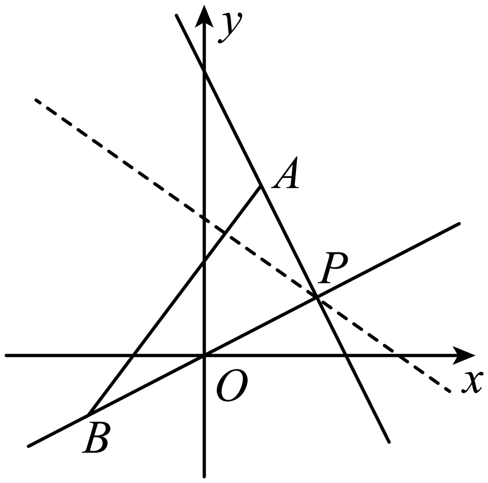

因为,

所以.

故选:D.

**例8．**（2024·高三课时练习）已知点和，直线与线段相交，则实数的取值范围是（    ）

A．或	B．

C．	D．

【答案】A

【解析】直线方程可整理为：，则直线恒过定点，

，，

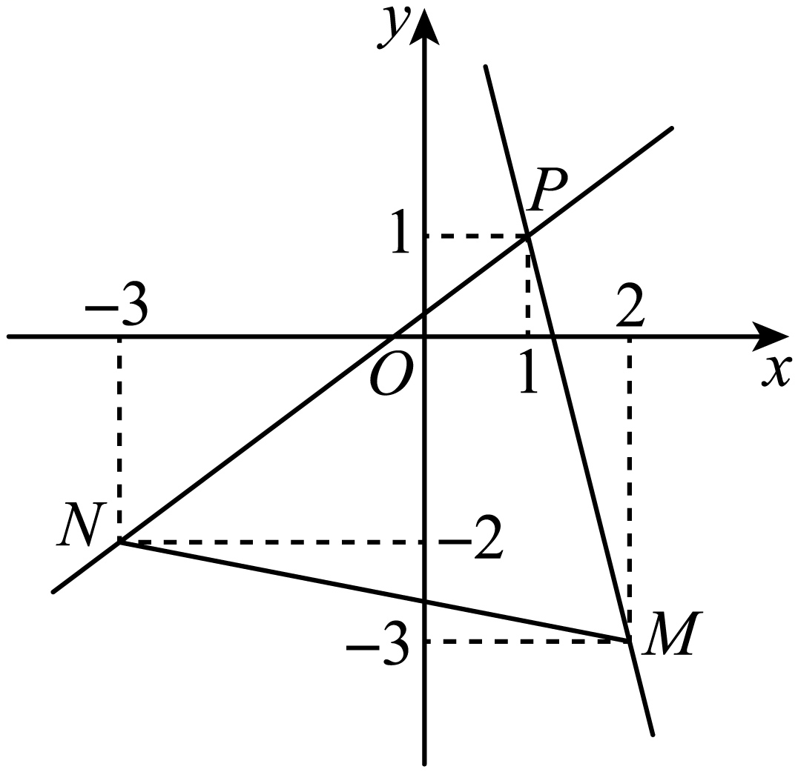

直线与线段相交，直线的斜率或.

故选：A.

**例9．**（2024·全国·高三专题练习）已知，，若直线与线段有公共点，则的取值范围是（    ）

A．	B．

C．	D．

【答案】C

【解析】由于直线 的斜率为， 且经过定点， 设此定点为.

而直线 的斜率为 ， 直线 的斜率为  ，

要使直线与线段有公共点，只需.

故选 ：C.

**变式7．**（2024·全国·高三专题练习）已知点，若直线与线段没有交点，则的取值范围是（    ）

A．	B．

C．	D．

【答案】B

【解析】直线过定点，且，

由图可知直线与线段没有交点时，斜率满足，

解得，

故选：B．

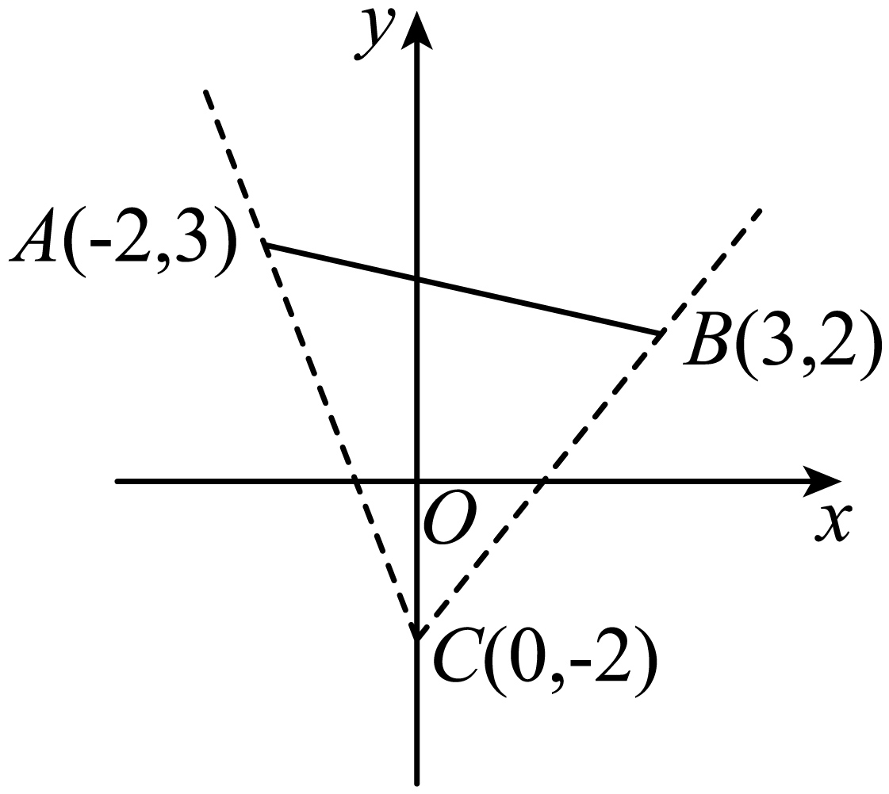

**变式8．**（2024·全国·高三专题练习）已知直线和以为端点的线段相交，则实数的取值范围是（    ）

A．	B．

C．或	D．或或

【答案】C

【解析】直线，即，其恒过定点，

根据题意，作图如下：

数形结合可知，当直线过点时，其斜率取得最小值，

当直线过点时，其斜率取得最大值，

故，解得.

故选：C.

**变式9．**（2024·全国·高三专题练习）已知，，直线过点且与线段相交，则直线的斜率的取值范围是（    ）

A．或	B．

C．或	D．

【答案】A

【解析】如图，，由题可知应满足；同理，由题可知应满足.

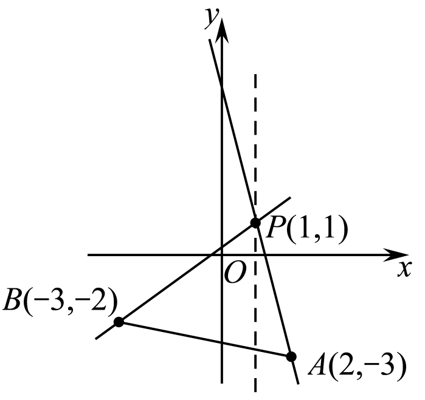

故选：A

<strong>变式10．</strong>（2024·全国·高三对口高考）已知点，若直线与的延长线（有方向）相交，则的取值范围为_________．

【答案】

【解析】如下图所示，

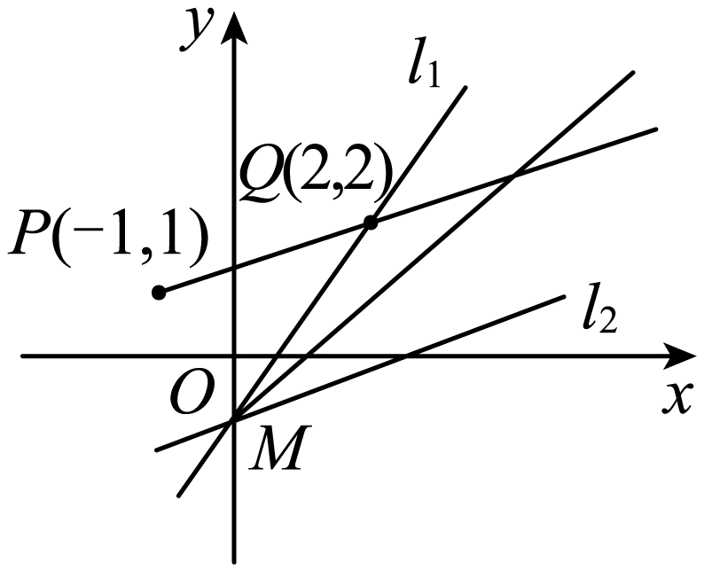

由题知，

直线过点.

当时，直线化为，一定与相交，所以，

当时，，考虑直线的两个极限位置.

①经过，即直线，则；

②与直线平行，即直线，则，

因为直线与的延长线相交，

所以，解得，所以.

故答案为：.

<strong>变式11．</strong>（2024·全国·高三专题练习）已知,，点是线段<em>AB</em>上的动点，则的取值范围是______.

【答案】

【解析】如图所示：

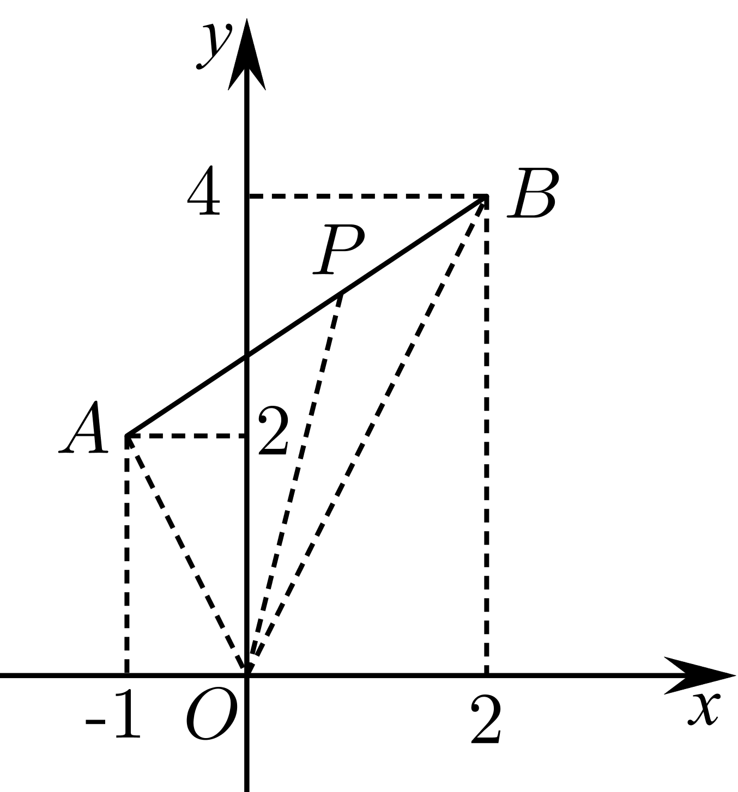

因为,，

所以，，

，

因为点是线段*AB*上的动点，

所以.

故答案为：

<strong>变式12．</strong>（2024·全国·高三专题练习）在线段上运动，已知，则的取值范围是_______.

【答案】

【解析】表示线段上的点与连线的斜率，

因为

所以由图可知的取值范围是．

故答案为：

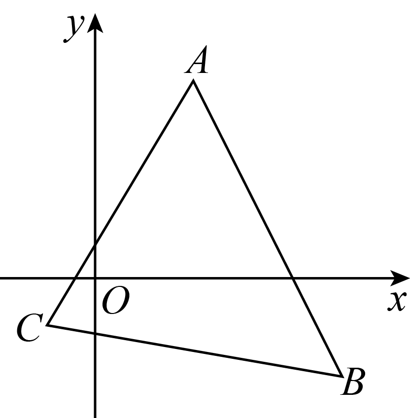

**【解题方法总结】**

一般地，若已知，过点作垂直于轴的直线，过点的任一直线的斜率为，则当与线段不相交时，夹在与之间；当与线段相交时，在与的两边．

**题型四：直线的方程**

**例10．**（2024·全国·高三专题练习）过点且方向向量为的直线的方程为（    ）

A．	B．

C．	D．

【答案】A

【解析】由题意可知直线的斜率，由点斜式方程得，

所求直线的方程为，即．

故选：A

**例11．**（2024·全国·高三专题练习）过点的直线在两坐标轴上的截距之和为零，则该直线方程为（    ）

A．	B．

C．或	D．或

【答案】D

【解析】解法一  当直线过原点时，满足题意，此时直线方程为，即；

当直线不过原点时，设直线方程为，

因为直线过点，所以，

解得，此时直线方程为.

故选：

解法二  易知直线斜率不存在或直线斜率为0时不符合题意.

设直线方程为，

则时，，时，，

由题意知，

解得或，即直线方程为或.

故选：

**例12．**（2024·吉林白山·抚松县第一中学校考模拟预测）对方程表示的图形，下列叙述中正确的是（    ）

A．斜率为2的一条直线

B．斜率为的一条直线

C．斜率为2的一条直线，且除去点（,6）

D．斜率为的一条直线，且除去点（,6）

【答案】C

【解析】方程成立的条件知，

当时，方程变形为，由直线方程的点斜式知它表示一条斜率为2的直线,但要除去点（,6），

故选:C

**变式13．**（2024·全国·高三专题练习）经过点且倾斜角为的直线的方程是（    ）

A．	B．

C．	D．

【答案】B

【解析】由倾斜角为知，直线的斜率，

因此，其直线方程为，即

故选：B

**变式14．**（2024·全国·高三专题练习）方程表示的直线可能是（    ）

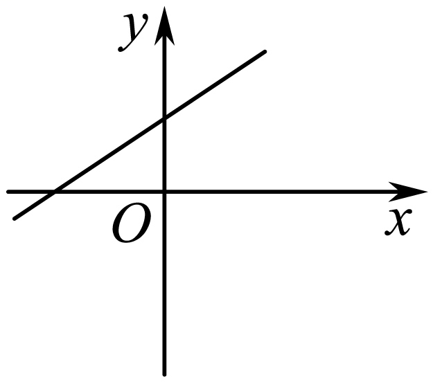

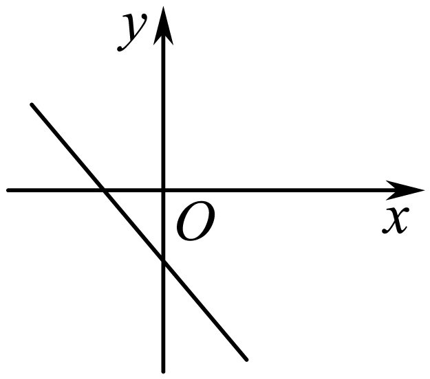

A．	B．

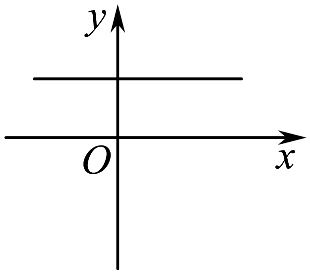

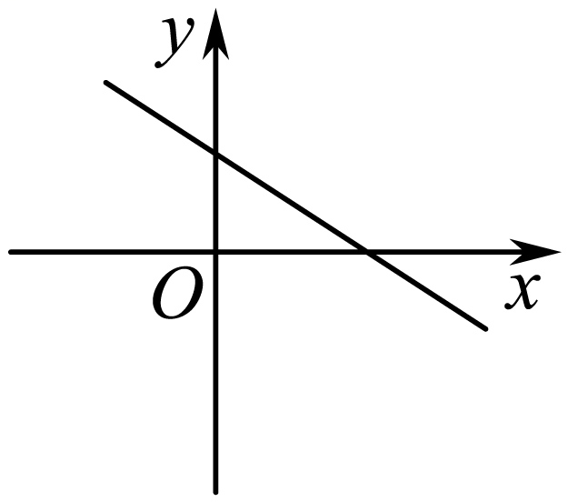

C．	D．

【答案】A

【解析】当时，直线的斜率，该直线在轴上的截距，

故选：A.

**变式15．**（2024·全国·高三专题练习）已知过定点直线在两坐标轴上的截距都是正值，且截距之和最小，则直线的方程为（    ）

A．	B．	C．	D．

【答案】C

【解析】直线可变为，所以过定点，又因为直线在两坐标轴上的截距都是正值，可知，

令，所以直线与轴的交点为，

令，所以直线与轴的交点为，

所以，

当且仅当即时取等，所以此时直线为：.

故选：C.

<strong>变式16．</strong>（2024·全国·高三专题练习）若直线<em>l</em>的方程中，，，则此直线必不经过（    ）

A．第一象限	B．第二象限

C．第三象限	D．第四象限

【答案】C

【解析】由，，，

知直线斜率，在轴上截距为，

所以此直线必不经过第三象限.

故选：C

**变式17．**（2024·全国·高三专题练习）已知直线的倾斜角为，且在轴上的截距为，则直线的方程为（　　）

A．	B．

C．	D．

【答案】C

【解析】因为直线的倾斜角为，所以直线的斜率，

又直线在轴上的截距为，所以直线的方程为；

故选：C

**【解题方法总结】**

要重点掌握直线方程的特征值（主要指斜率、截距）等问题；熟练地掌握和应用直线方程的几种形式，尤其是点斜式、斜截式和一般式．

**题型五：直线与坐标轴围成的三角形问题**

<strong>例13．</strong>（2024·全国·高三专题练习）若一条直线经过点，并且与两坐标轴围成的三角形面积为1，则此直线的方程为______．

【答案】或

【解析】由题意可知该直线不经过原点，且存在斜率且不为零，

所以设直线方程为，因为该直线过点，

所以有，

因为该直线与两坐标轴围成的三角形面积为1，

所以有，或，

当时，，或，

当时，，此时方程为：，

当时，，此时方程为：，

当时，，

故答案为：或

<strong>例14．</strong>（2024·全国·高三专题练习）已知直线<em>l</em>过点<em>M</em>(2,1)，且分别与<em>x</em>轴的正半轴、<em>y</em>轴的正半轴交于<em>A</em>，<em>B</em>两点，<em>O</em>为原点，当△<em>AOB</em>面积最小时，直线<em>l</em>的方程为_________.

【答案】*x*＋2*y*－4＝0

【解析】法一，利用截距式设出直线方程，再利用基本不等式求面积最小时的直线方程；法二显然存在，设(其中)求出坐标，然后求解三角形的面积，再利用基本不等式求解面积的最小值时的直线方程.法一　设直线*l*：，且*a*＞0，*b*＞0，因为直线*l*过点*M*(2,1)，所以，则≥，故*ab*≥8，

故<em>S△AOB</em>的最小值为×<em>ab</em>＝×8＝4，

当且仅当＝时取等号，此时*a*＝4，*b*＝2，

故直线*l*：，即*x*＋2*y*－4＝0.

法二　设直线*l*的方程为*y*－1＝*k*(*x*－2)(*k*＜0)， ，*B*(0,1－2*k*)，

<em>S△AOB</em>＝ (1－2<em>k</em>) ＝≥ (4＋4)＝4，

当且仅当－4*k*＝－ ，即*k*＝－时，等号成立，

故直线*l*的方程为*y*－1＝－ (*x*－2)，即*x*＋2*y*－4＝0.

故答案为：.

**例15．**（2024·全国·高三专题练习）已知直线的方程为：．

(1)求证：不论为何值，直线必过定点；

(2)过点引直线，使它与两坐标轴的负半轴所围成的三角形面积最小，求的方程．

【解析】（1）证明：直线的方程为：

提参整理可得：．

令，可得，

不论为何值，直线必过定点.

（2）设直线的方程为．

令 则，

令．则，

直线与两坐标轴的负半轴所围成的三角形面积．

当且仅当，即时，三角形面积最小．

此时的方程为．

<strong>变式18．</strong>（2024·全国·高三专题练习）直线<em>l</em>过点，且分别与轴正半轴交于、<em>B</em>两点，<em>O</em>为原点.

(1)当面积最小时，求直线*l*的方程；

(2)求的最小值及此时直线*l*的方程.

【解析】（1）设直线，且

∵直线过点

则

当且仅当即时取等号

所以的最小值为，

直线1即.

（2）由

∴，

当且仅当即时取等号，

∴此时直线,

故的最小值为9，此时直线*l*的方程.

**变式19．**（2024·全国·高三专题练习）在平面直角坐标系中，直线过定点，且与轴的正半轴交于点，与轴的正半轴交于点.

（1）当取得最小值时，求直线的方程；

（2）求面积的最小值.

【解析】（1）设直线的倾斜角为（为锐角），

由*P*点做*x*轴，*y*轴垂线，垂足分别为*E*，*F*，则*PE*=2，*PF*=3,

，

则，

所以当时，取得最小值，

此时直线的方程为；

（2）矩形*OFPE*面积为3×2=6，，

，

当且仅当时取等号，

所以面积的最小值为12.

**变式20．**（2024·北京怀柔·高二北京市怀柔区第一中学校考期中）已知直线经过点，为坐标原点．

(1)若直线过点，求直线的方程，并求直线与两坐标轴围成的三角形面积；

(2)如果直线在两坐标轴上的截距之和为，求直线的方程．

【解析】（1）由题意得：直线斜率，直线方程为：，即；

当时，；当时，；

与两坐标轴围成的三角形面积.

（2）由题意知：直线在两坐标轴的截距不为，可设，

则，解得：，，即.

<strong>变式21．</strong>（2024·高二单元测试）已知直线<em>l</em>过点，与<em>x</em>轴正半轴交于点<em>A</em>､与<em>y</em>轴正半轴交于点<em>B</em>.

（1）求面积最小时直线*l*的方程（其中*O*为坐标原点）；

（2）求的最小值及取得最小值时*l*的直线方程.

【解析】（1）设*l*的方程为，由直线过点知，即，由基本不等式得，即，当且仅当时等号成立，

又知，所以时等号成立，

此时*l*直线的方程为，

即面积最小时直线*l*的方程为.

（2）易知直线*l*的斜率存在，所以可设直线*l*的方程为，所以得，，所以，得，等号成立时有*k*，得，

此时直线的方程为，即.

故的最小值是24，取最小值时直线*l*的方程是.

**变式22．**（2024·江西吉安·高二吉安一中校考阶段练习）过点的动直线交轴的正半轴于点，交轴正半轴于点.

（Ⅰ）求(为坐标原点)的面积最小值，并求取得最小值时直线的方程.

（Ⅱ）设是的面积取得最小值时的内切圆上的动点，求的取值范围.

【解析】（Ⅰ）设斜率为，则得.

,

由，，.

（Ⅱ）面积最小时，，

直角内切圆半径，圆心为，

内切圆方程为

设，则，其中.

,当时，，当时，

的范围是

**变式23．**（2024·河南洛阳·高二洛宁县第一高级中学校考阶段练习）已知直线：．

（1）求经过的定点坐标；

（2）若直线交轴负半轴于点，交轴正半轴于点．

①的面积为，求的最小值和此时直线的方程；

②当取最小值时，求直线的方程．

【解析】（1）由可得：，

由可得，所以经过的定点坐标；

（2）直线：，

令可得；令，可得，

所以，

由可得：，

①的面积

，

当且仅当即时等号成立，的最小值为，

此时直线的方程为：即；

②设直线的倾斜角为，则，可得，，

所以，

令，

因为，可得，，

，

将两边平方可得：，

所以，

所以，

因为在上单调递增，所以

，所以，此时，

可得，所以，

所以直线的方程为.

<strong>变式24．</strong>（2024·河南郑州·高二宜阳县第一高级中学校联考阶段练习）已知直线经过定点<em>P</em>．

(1)证明：无论*k*取何值，直线*l*始终过第二象限；

(2)若直线*l*交*x*轴负半轴于点*A*，交*y*轴正半轴于点*B*，当取最小值时，求直线*l*的方程．

【解析】（1）证明：由可得：，

由 可得，所以*l*经过定点；

即直线*l*过定点,且定点在第二象限，

所以无论*k*取何值，直线*l*始终经过第二象限．

（2）设直线*l*的倾斜角为，则，

可得，

所以，

令，

因为，可得，

即，

将两边平方可得：，

所以，

所以，

因为在上单调递增，所以，

故，所以，当且仅当时取等号，

此时，

可得，所以，

所以直线的方程为．

**变式25．**（2024·江苏宿迁·高二泗阳县实验高级中学校考阶段练习）已知直线过定点，且交轴负半轴于点､交轴正半轴于点．点为坐标原点．

（1）若的面积为4，求直线的方程；

（2）求的最小值，并求此时直线的方程；

（3）求的最小值，并求此时直线的方程．

【解析】设，，.

（1）设，因为过点，所以，

所以，由解得，

所以直线的方程为，即；

（2），

所以，

当且仅当，时取等号，所以直线的方程为；

（3）依题意可知三点共线，在线段上（且与不重合），

所以

，

当且仅当，时取等号，所以直线的方程为．

**【解题方法总结】**

（1）由于已知直线的倾斜角（与斜率有关）及直线与坐标轴围成的三角形的面积（与截距有关），因而可选择斜截式直线方程，也可选用截距式直线方程，故有“题目决定解法”之说．

（2）在求直线方程时，要恰当地选择方程的形式，每种形式都具有特定的结论，所以根据已知条件恰当地选择方程的类型往往有助于问题的解决．例如：已知一点的坐标，求过这点的直线方程，通常选用点斜式，再由其他条件确定该直线在*y*轴上的截距；已知截距或两点，选择截距式或两点式．在求直线方程的过程中，确定的类型后，一般采用待定系数法求解，但要注意对特殊情况的讨论，以免遗漏．

**题型六：两直线的夹角问题**

<strong>例16．</strong>（2024·上海浦东新·高三上海市川沙中学校考期末）直线与直线所成夹角的余弦值等于__________

【答案】

【解析】直线，即，则其斜率为，倾斜角为；

直线，即，则其斜率，

设直线的倾斜角为，则，

又，所以，

所以，，而，

所以两直线的夹角为，

又因为，

则

所以，

故所求夹角的余弦值为.

故答案为：.

<strong>例17．</strong>（2024·高三课时练习）直线与直线相交，则这两条直线的夹角大小为______.

【答案】

【解析】直线的斜率为，其倾斜角为钝角；

直线的斜率为，其倾斜角为锐角.

设这两条直线的夹角大小为，

则

，

由于，所以.

故答案为：

<strong>例18．</strong>（2024·上海宝山·高三统考阶段练习）已知直线，则与的夹角大小是___________.

【答案】

【解析】设直线与的夹角为（），

因为，

所以两直线的斜率分别为，

所以，

因为，

所以，

故答案为：

<strong>变式26．</strong>（2024·重庆·高考真题）曲线与在交点处切线的夹角是____________．（用弧度数作答）

【答案】

【解析】由消元可得，，解得，

所以两曲线只有一个交点,

由可得，所以，

由可得，所以，

由直线的夹角公式可得，

由知，.

故答案为：

<strong>变式27．</strong>（2024·全国·模拟预测）等腰三角形两腰所在直线的方程分别为与，原点在等腰三角形的底边上，则底边所在直线的斜率为______．

【答案】3

【解析】，，设底边为

由题意，到所成的角等于到所成的角于是有，解得，

故答案为：3.

<strong>变式28．</strong>（2024·全国·高三专题练习）两条直线，的夹角平分线所在直线的方程是________．

【答案】

【解析】因为直线的倾斜角为，的倾斜角为，且

由解得两直线的交点坐标为，所以可设两直线夹角平分线所在直线的方程为：．

∴，解得，即两直线夹角平分线所在直线的方程为：．

故答案为：．

**【解题方法总结】**

若直线与直线的夹角为，则.

**题型七：直线过定点问题**

<strong>例19．</strong>（2024·四川绵阳·绵阳南山中学实验学校校考模拟预测）已知直线过定点<em>A</em>，直线过定点，与相交于点，则________．

【答案】13

【解析】对于直线，即，

令，则，则，可得直线过定点，

对于直线，即，

令，则，则，可得直线过定点，

因为，则，即，

所以.

故答案为：13.

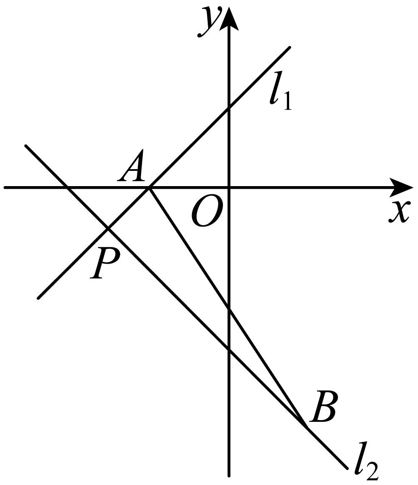

<strong>例20．</strong>（2024·全国·高三专题练习）已知实数满足，则直线过定点_____.

【答案】

【解析】由实数满足，可得,

代入直线方程，可得，

联立方程组，解得，

所以直线过定点.

故答案为：.

<strong>例21．</strong>（2024·陕西咸阳·统考二模）直线恒过定点<em>A</em>，则<em>A</em>点的坐标为______．

【答案】

【解析】直线，

令，则，则直线恒过定点.

故答案为：.

<strong>变式29．</strong>（2024·辽宁营口·高二校考阶段练习）直的方程为，则该直线过定点__________．

【答案】

【解析】即，令得，

直线过定点，

故答案为：

<strong>变式30．</strong>（2024·上海宝山·高二统考期末）若实数、、成等差数列，则直线必经过一个定点，则该定点坐标为______.

【答案】

【解析】因为实数、、成等差数列，所以，即，

所以直线必过点.

故答案为：

**【解题方法总结】**

合并参数

**题型八：轨迹方程**

**例22．**（2024·全国·高三对口高考）在平面直角坐标系中，已知的顶点坐标分别为、、，点在直线上运动，动点满足，求点的轨迹方程．

【解析】设点、，直线的斜率为，

直线的方程为，即，

，，，，

由可得，

所以，，可得，

因为点在直线上，则，即，整理可得，

因此，点的轨迹方程为.

**例23．**（2024·安徽蚌埠·统考三模）如图，在平行四边形中，点是原点，点和点的坐标分别是、，点是线段上的动点.

(1)求所在直线的一般式方程；

(2)当在线段上运动时，求线段的中点的轨迹方程.

【解析】（1），所在直线的斜率为：.

所在直线方程是，即；

（2）设点的坐标是，点的坐标是，

由平行四边形的性质得点的坐标是，

是线段的中点，，，

于是有，，

点在线段上运动，

，

，即，

由得，

线段的中点的轨迹方程为.

**例24．**（2024·湖北咸宁·高二鄂南高中校考阶段练习）如图，已知点是直线上任意一点，点是直线上任意一点，连接，在线段上取点使得.

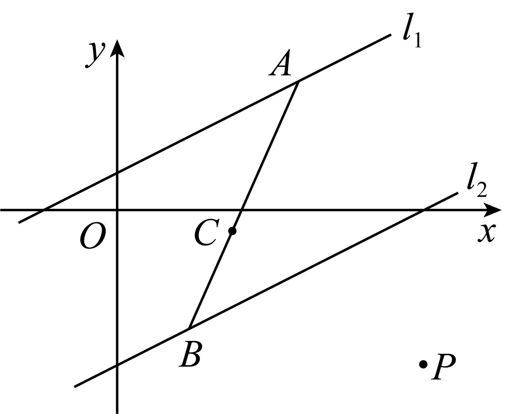

(1)求动点的轨迹方程；

(2)已知点，是否存在点，使得？若存在，求出点的坐标；若不存在，说明理由.

【解析】（1）设，，，

由，

，

又，

得：，

把①②代入上式得，即为点的轨迹方程.

（2）设，由，得，

又点满足，

联立得方程组，解得或.

故存在点满足条件，点的坐标为或.

<strong>变式31．</strong>（2024·全国·高三专题练习）已知，，动点<em>M</em>与<em>A</em>，<em>B</em>两点连线的斜率分别为、，若，求动点<em>M</em>的轨迹方程

【解析】设，则，，又，

∴，

当，且时，恒成立；当时，；

综上，*M*的轨迹方程为(且)或().

**变式32．**（2024·高二课时练习）在中，，求的平分线所在直线的方程.

【解析】设为的平分线上的任意一点.

因为，

所以边所在直线的方程为，边所在直线的方程为.

由角平分线的性质得，

所以或，

即或.

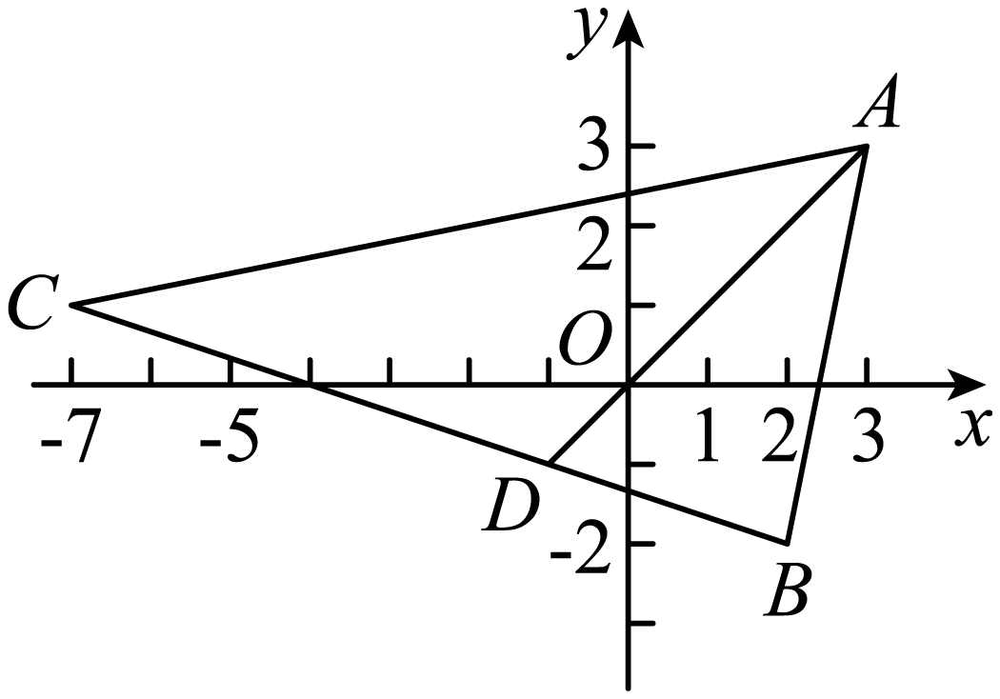

由图形可知，即，

所以不合题意，故舍去.

故的平分线所在直线的方程为.

<strong>变式33．</strong>（2024·江苏·高二假期作业）已知动点<em>C</em>到两个定点的距离相等，求点<em>C</em>的轨迹方程．

【解析】设*C*点坐标为由*C*到两个定点的距离相等，

则

两边平方，化简得，

所以点*C*的轨迹方程为．

**变式34．**（2024·全国·高三专题练习）已知是坐标原点，.若点满足，其中，且，求点的轨迹方程.

【解析】设，则，，

即，解得

即

**【解题方法总结】**

（1）直接法：寻找决定曲线方程的要素，然后直接写出方程，例如在直线中，若用直接法则需找到两个点，或者一点一斜率

（2）间接法：若题目条件与所求要素联系不紧密，则考虑先利用待定系数法设出曲线方程，然后再利用条件解出参数的值（通常条件的个数与所求参数的个数一致）

**题型九：中点公式**

<strong>例25．</strong>（2024·河南郑州·高二郑州市第九中学校考阶段练习）已知点<em>A</em>，<em>B</em>分别是直线和直线上的点，点<em>P</em>为的中点，设点<em>P</em>的轨迹为曲线<em>C．</em>

（1）求曲线*C*的方程；

（2）过点的直线与曲线*C*，*x*轴分别交于点*M*，*N*，若点*D*为的中点，求直线的方程.

【解析】（1）设点，，，

因为点*P*为的中点，可得，，

又由，，

两式相加，可得，所以，即，

所以曲线*C*的方程为.

（2）根据题意，设，，

因为点为的中点，所以，解得，，

即，所以直线的方程为，整理得，

即直线的方程.

**例26．**（2024·全国·高三专题练习）已知直线 ：过定点，若直线被直线和轴截得的线段恰好被定点平分，求的值.

【解析】

则直线过定点

设直线与直线交于点，与轴交于点，依题意为中点

在中令，则，即

所以，

即，将其代入直线中可得

解之得

**例27．**（2024·江苏泰州·高三泰州中学校考阶段练习）已知直线.

(1)求证：直线经过定点，并求出定点*P*；

(2)经过点*P*有一条直线*l*，它夹在两条直线与之间的线段恰被*P*平分，求直线*l*的方程.

【解析】（1）证明：将直线*l*的方程改写为，

令，且，

两式联立，解得，，

所以直线过定点.

（2）如图，

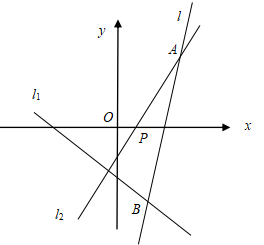

设直线*l*夹在直线，之间的部分是*AB*，且*AB*被平分，

设点*A*，*B*的坐标分别是，，

则有，，

又*A*，*B*两点分别在直线，上，

所以，，

由以上四个式子解得，，即，

所以直线*AB*的方程为.

<strong>变式35．</strong>（2024·全国·高三专题练习）过点<em>P</em>(0，1)作直线<em>l</em>，使它被直线<em>l1</em>：和<em>l2</em>：截得的线段恰好被点<em>P</em>平分，求直线<em>l</em>的方程.

【解析】设<em>l1</em>与<em>l</em>的交点为<em>A</em>(<em>a</em>，8-2<em>a</em>)，则由题意知，点<em>A</em>关于点<em>P</em>的对称点<em>B</em>(-<em>a</em>，2<em>a-</em>6)在<em>l2</em>上，

代入<em>l2</em>的方程得:-<em>a-</em>3(2<em>a-</em>6)＋10＝0，解得<em>a</em>＝4，

即点*A*(4，0)在直线*l*上，

∴直线*l*的方程为即*x*＋4*y-* 4＝0.

<strong>变式36．</strong>（2024·全国·高三专题练习）已知直线<em>l</em>：（2+<em>m</em>）<em>x</em>+（1+2<em>m</em>）<em>y</em>+4–3<em>m</em>=0．

（1）求证：不论*m*为何实数，直线*l*恒过一定点*M*；

（2）过定点<em>M</em>作一条直线<em>l</em>1，使夹在两坐标轴之间的线段被<em>M</em>点平分，求直线<em>l</em>1的方程．

【解析】（1）将直线*l*：（2+*m*）*x*+（1+2*m*）*y*+4–3*m*=0化为*m*（*x*+2*y*–3）+2*x*+*y*+4=0，

∴由题意，令，解得，

∴直线*l*恒过定点*M*（）．

（2）设所求直线<em>l1</em>的方程为<em>y</em>–=<em>k</em>（<em>x</em>+），直线<em>l1</em>与<em>x</em>轴、<em>y</em>轴交于<em>A</em>、<em>B</em>两点，

则*A*（–，0）*B*（0，）．

∵*AB*的中点为*M*，∴，解得*k*=．

∴所求直线<em>l1</em>的方程为<em>y</em>–（<em>x</em>+），

即30*x*–33*y*+220=0．

所求直线<em>l1</em>的方程为30<em>x</em>–33<em>y</em>+220=0．

**变式37．**（2024·全国·高三专题练习）过点作直线，使它被两直线和所截得的线段恰好被M所平分，求此直线的方程.

【解析】(解法1)由于过点M(0，1)且与x轴垂直的直线显然不合题意，故可设所求直线方程为y＝kx＋1，与已知两条直线l1、l2分别交于A、B两点，联立方程组xA＝，xB＝，∵点M平分线段AB，∴xA＋xB＝2xM，

即有＋＝0，解得k＝－.故所求的直线方程为x＋4y－4＝0.

(解法2)设所求的直线与已知两条直线l1、l2分别交于A、B两点，∵点B在直线l2：2x＋y－8＝0上，∴设B(t，8－2t)，由于M(0，1)是线段AB的中点，∴根据中点坐标公式得A(－t，2t－6)，

而A点在直线l1：x－3y＋10＝0上，∴(－t)－3(2t－6)＋10＝0，解之得t＝4，∴B(4，0)．

故所求直线方程为x＋4y－4＝0.

**【解题方法总结】**

若点的坐标分别为且线段的中点的坐标为，则

