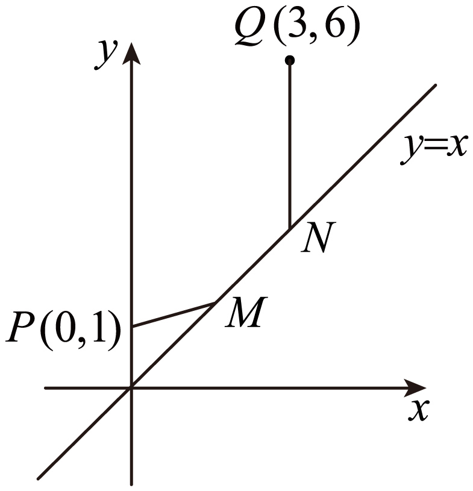
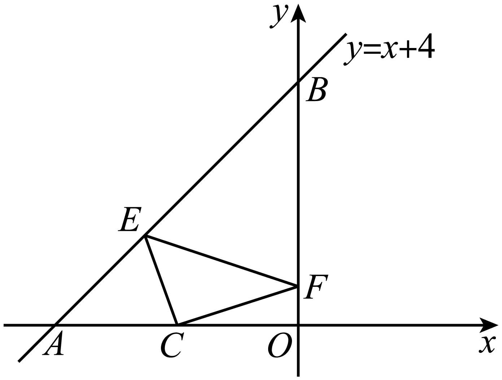
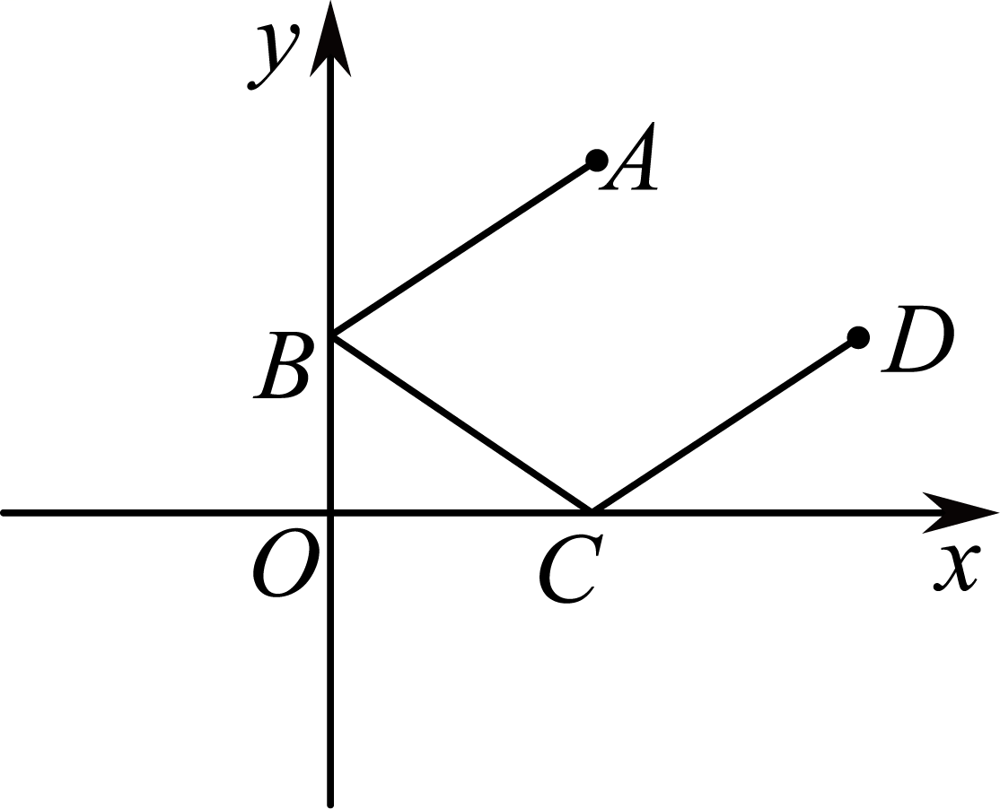
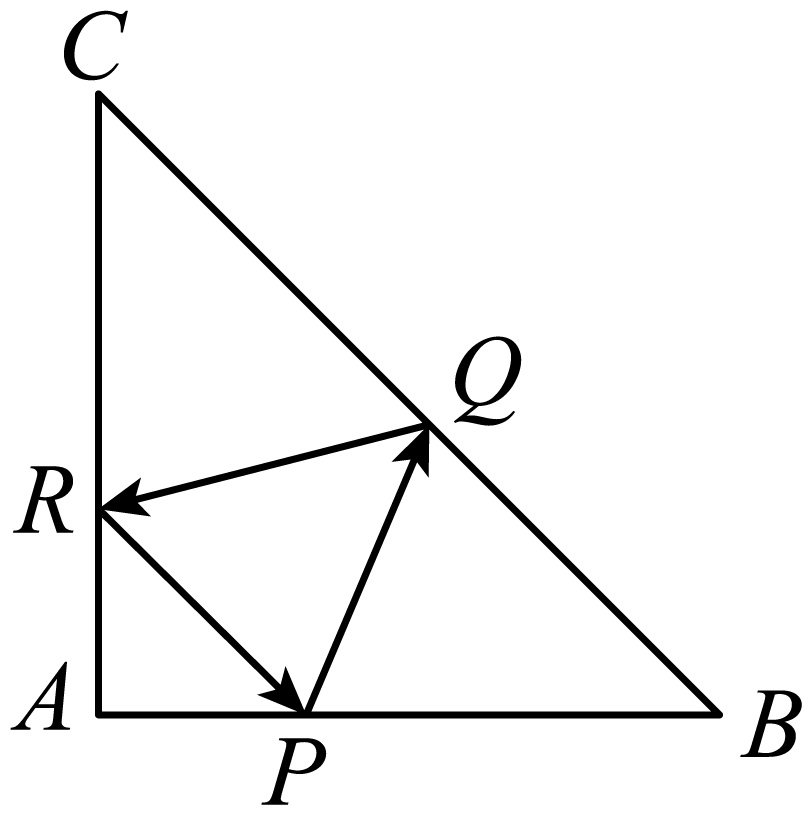

**第58讲  两条直线的位置关系**

**知识梳理**

**知识点一：两直线平行与垂直的判定**

两条直线平行与垂直的判定以表格形式出现，如表所示．

<table><tr><td>
两直线方程
</td><td>
平行
</td><td>
垂直
</td></tr><tr><td>

</td><td>

</td><td>

</td></tr><tr><td>
（斜率存在）

（斜率不存在）
</td><td>
或

</td><td>
或中有一个为0，另一个不存在．
</td></tr></table>

**知识点二：三种距离**

1**、两点间的距离**

平面上两点的距离公式为．

特别地，原点*O*（0，0）与任一点*P*（*x*，*y*）的距离

2**、点到直线的距离**

点到直线的距离

特别地，若直线为*l*：*x*=*m*，则点到*l*的距离；若直线为*l*：*y*=*n*，则点到*l*的距离

3**、两条平行线间的距离**

已知是两条平行线，求间距离的方法：

（1）转化为其中一条直线上的特殊点到另一条直线的距离．

（2）设，则与之间的距离

<strong>注</strong>：两平行直线方程中<em>，x，y</em>前面对应系数要相等．

4**、双根式**

双根式型函数求解，首先想到两点间的距离，或者利用单调性求解．

**【解题方法总结】**

1**、点关于点对称**

点关于点对称的本质是中点坐标公式：设点关于点的对称点为，则根据中点坐标公式，有

可得对称点的坐标为

2**、点关于直线对称**

点关于直线对称的点为，连接，交于点，则垂直平分，所以，且为中点，又因为在直线上，故可得，解出即可．

3**、直线关于点对称**

法一：在已知直线上取两点，利用中点坐标公式求出它们关于已知点对称的两点坐标，再由两点式求出直线方程；

法二：求出一个对称点，再利用两对称直线平行，由点斜式得到所求直线方程．

4**、直线关于直线对称**

求直线，关于直线（两直线不平行）的对称直线

第一步：联立算出交点

第二步：在上任找一点（非交点），利用点关于直线对称的秒杀公式算出对称点

第三步：利用两点式写出方程

5**、常见的一些特殊的对称**

点关于轴的对称点为，关于轴的对称点为．

点关于直线的对称点为，关于直线的对称点为．

点关于直线的对称点为，关于直线的对称点为．

点关于点的对称点为．

点关于直线的对称点为，关于直线的对称点为．

6**、过定点直线系**

过已知点的直线系方程（为参数）．

7**、斜率为定值直线系**

斜率为的直线系方程（是参数）．

8**、平行直线系**

与已知直线平行的直线系方程（为参数）．

9**、垂直直线系**

与已知直线垂直的直线系方程（为参数）．

10**、过两直线交点的直线系**

过直线与的交点的直线系方程：（为参数）．

**必考题型全归纳**

**题型一：两直线位置关系的判定**

**例1．**（2024·高二课时练习）直线与互相垂直，则这两条直线的交点坐标为（    ）

A．	B．

C．	D．

<strong>例2．</strong>（2024·江苏南通·高二江苏省如皋中学校考开学考试）已知过点和点的直线为<em>l1</em>，. 若，则的值为（    ）

A．	B．

C．0	D．8

**例3．**（2024·浙江温州·高二乐清市知临中学校考开学考试）设直线，，则是的（    ）

A．充要条件	B．必要不充分条件

C．充分不必要条件	D．既不充分也不必要条件

**变式1．**（2024·广东东莞·高三校考阶段练习）直线：与直线：平行， 则（    ）

A．或	B．	C．	D．

**变式2．**（2024·全国·高三专题练习）已知直线：，：，则条件“”是“”的（    ）

A．充分必要条件	B．充分不必要条件

C．必要不充分条件	D．既不必要也不充分条件

**变式3．**（2024·黑龙江牡丹江·牡丹江一中校考三模）已知直线，若，则（    ）

A．	B．0	C．1	D．2

<strong>变式4．</strong>（2024·全国·高三专题练习）已知<em>A</em>(－1，2)，<em>B</em>(1，3)，<em>C</em>(0，－2)，点<em>D</em>使<em>AD</em>⊥<em>BC</em>，<em>AB</em>∥<em>CD</em>，则点<em>D</em>的坐标为（    ）

A．	B．

C．	D．

**变式5．**（2024·甘肃陇南·高三统考期中）已知的顶点，，其垂心为，则其顶点的坐标为

A．	B．	C．	D．

**变式6．**（2024·全国·高三专题练习）直线，直线，下列说法正确的是（    ）

A．，使得	B．，使得

C．，与都相交	D．，使得原点到的距离为3

**变式7．**（2024·全国·高三对口高考）设分别为中所对边的边长，则直线与直线的位置关系是（    ）

A．相交但不垂直	B．垂直	C．平行	D．重合

**【解题方法总结】**

判断两直线的位置关系可以从斜率是否存在分类判断，也可以按照以下方法判断：一般地，设（不全为0），（不全为0），则：

当时，直线相交；

当时，直线平行或重合，代回检验；

当时，直线垂直，与向量的平行与垂直类比记忆．

**题型二：两直线的交点与距离问题**

<strong>例4．</strong>（2024·全国·高三专题练习）若直线与直线的交点位于第一象限，则直线<em>l</em>的倾斜角的取值范围是（　　）

A．	B．

C．	D．

**例5．**（2024·上海浦东新·华师大二附中校考三模）已知三条直线，，将平面分为六个部分，则满足条件的的值共有（    ）

A．个	B．2个	C．个	D．无数个

**例6．**（2024·全国·高三专题练习）若三条直线不能围成三角形，则实数的取值最多有（    ）

A．个	B．个

C．个	D．个

<strong>变式8．</strong>（2024·江苏宿迁·高二泗阳县实验高级中学校考阶段练习）若点在直线上，<em>O</em>是原点，则<em>OP</em>的最小值为（    ）

A．	B．2	C．	D．4

**变式9．**（2024·吉林长春·高二东北师大附中校考期中）已知点在直线上，则的最小值为（    ）

A．1	B．2	C．3	D．4

<strong>变式10．</strong>（2024·高二课时练习）已知点、、，且，则___________.

<strong>变式11．</strong>（2024·全国·高二专题练习）已知点与点间的距离为，则________．

<strong>变式12．</strong>（2024·全国·高二课堂例题）已知点，，，则的面积为______．

<strong>变式13．</strong>（2024·江苏淮安·高二统考期中）已知平面上点和直线，点<em>P</em>到直线<em>l</em>的距离为<em>d</em>，则_____.

<strong>变式14．</strong>（2024·黑龙江哈尔滨·高三哈尔滨七十三中校考期中）点到直线的距离的最大值是________．

<strong>变式15．</strong>（2024·高二课时练习）过直线与直线的交点，且到点的距离为1的直线<em>l</em>的方程为____________．

<strong>变式16．</strong>（2024·江西新余·高二校考开学考试）若点到直线的距离为3，则______.

<strong>变式17．</strong>（2024·全国·高三专题练习）点，到直线<em>l</em>的距离分别为1和4，写出一个满足条件的直线<em>l</em>的方程：______.

<strong>变式18．</strong>（2024·浙江温州·高二乐清市知临中学校考开学考试）若两条直线与平行，则与间的距离是______.

<strong>变式19．</strong>（2024·江苏宿迁·高二泗阳县实验高级中学校考阶段练习）平行直线与之间的距离为_________．

<strong>变式20．</strong>（2024·新疆·高二校联考期末）已知不过原点的直线与直线平行，且直线与的距离为，则直线的一般式方程为__________．

**【解题方法总结】**

两点间的距离，点到直线的距离以及两平行直线间的距离的计算，特别注意点到直线距离公式的结构．

**题型三：有关距离的最值问题**

**例7．**（2024·北京·高三强基计划）的最小值所属区间为（    ）

A．	B．

C．	D．前三个答案都不对

<strong>例8．</strong>（2024·全国·高三专题练习）已知实数，满足，，，则的最小值是________．

<strong>例9．</strong>（2024·全国·高三专题练习）如图，平面上两点，在直线上取两点使，且使的值取最小，则的坐标为____________．

<strong>变式21．</strong>（2024·全国·高二专题练习）已知点分别在直线与直线上，且，点，，则的最小值为______.

<strong>变式22．</strong>（2024·全国·高二课堂例题）已知直线过定点<em>M</em>，点在直线上，则的最小值是（    ）

A．5	B．	C．	D．

**变式23．**（2024·全国·高三专题练习）著名数学家华罗庚曾说过：“数形结合百般好，割裂分家万事休．”事实上，有很多代数问题可以转化为几何问题加以解决，如：可以转化为点到点的距离，则的最小值为（    ）．

A．3	B．	C．	D．

**变式24．**（2024·贵州·校联考模拟预测）已知，满足，则的最小值为（    ）

A．	B．	C．1	D．

**变式25．**（2024·江西·高三校联考阶段练习）在平面直角坐标系中，已知点，点为直线上一动点，则的最小值是（    ）

A．	B．4	C．5	D．6

<strong>变式26．</strong>（2024·高二课时练习）已知点，点<em>P</em>在<em>x</em>轴上使最大，求点<em>P</em>的坐标．

<strong>变式27．</strong>（2024·天津和平·高二天津市汇文中学校考阶段练习）在直线上求一点<em>P</em>，使得：

(1)*P*到和的距离之差最大；

(2)*P*到和的距离之和最小.

<strong>变式28．</strong>（2024·全国·高三专题练习）已知函数的图象恒过定点<em>A</em>，圆上的两点，满足，则的最小值为(    )

A．	B．

C．	D．

**变式29．**（2024·江西·高三校联考开学考试）费马点是指三角形内到三角形三个顶点距离之和最小的点.当三角形三个内角均小于120°时，费马点与三个顶点连线正好三等分费马点所在的周角，即该点所对的三角形三边的张角相等且均为120°.根据以上性质，.则的最小值为（    ）

A．4	B．	C．	D．

**变式30．**（2024·全国·高三专题练习）已知，则的最小值为（    ）

A．	B．	C．	D．

**变式31．**（2024·陕西西安·高二西安市铁一中学校考期末）设，过定点的动直线和过定点的动直线交于点，则的最大值是（    ）

A．	B．	C．5	D．10

<strong>变式32．</strong>（2024·全国·高二专题练习）过定点<em>A</em>的动直线和过定点<em>B</em>的动直线交于点<em>M</em>，则的最大值是（    ）

A．	B．3	C．	D．

**【解题方法总结】**

数学结合，利用距离的几何意义进行转化．

**题型四：点点对称**

<strong>例10．</strong>（2024·全国·高三专题练习）已知，，点是线段的中点，则______.

<strong>例11．</strong>（2024·江苏南通·高二统考期中）已知点在轴上，点在轴上，线段的中点的坐标为，则线段的长度为___________.

<strong>例12．</strong>（2024·高二课时练习）设点<em>A</em>在<em>x</em>轴上，点<em>B</em>在<em>y</em>轴上，的中点是，则等于________

<strong>变式33．</strong>（2024·高一课时练习）已知直线l与直线及直线分别交于点P，Q．若PQ的中点为点，则直线l的斜率为____．

**【解题方法总结】**

求点关于点中心对称的点，由中点坐标公式得

**题型五：点线对称**

**例13．**（2024·湖南长沙·高一周南中学校考开学考试）如下图，一次函数的图象与轴，轴分别交于点，，点是轴上一点，点，分别为直线和轴上的两个动点，当周长最小时，点，的坐标分别为（    ）

A．，	B．，

C．，	D．，

**例14．**（2024·全国·高二专题练习）若直线和直线关于直线对称，则直线恒过定点（    ）

A．	B． 	C．	D．

**例15．**（2024·全国·高二假期作业）抛物线的焦点关于直线的对称点的坐标是（    ）

A．	B．	C．	D．

**变式34．**（2024·江西·高二校联考开学考试）如图，一束光线从出发，经过坐标轴反射两次经过点，则总路径长即总长为（    ）

A．	B．6	C．	D．

<strong>变式35．</strong>（2024·四川遂宁·高二统考期末）已知点<em>A</em>与点关于直线对称，则点<em>A</em>的坐标为（    ）

A．	B．

C．	D．

**变式36．**（2024·湖北·高二校联考阶段练习）在等腰直角三角形中，，点是边上异于的一点，光线从点出发，经反射后又回到点，如图，若光线经过的重心，则（    ）

A．	B．	C．1	D．2

**【解题方法总结】**

求点关于直线对称的点

方法一：（一中一垂），即线段的中点*M*在对称轴上，若直线的斜率存在，则直线的斜率与对称轴的斜率之积为－1，两个条件建立方程组解得点

方法二：先求经过点且垂直于对称轴的直线（法线），然后由得线段的中点，从而得

**题型六：线点对称**

<strong>例16．</strong>（2024·高二课时练习）直线关于点对称的直线的方程为________．

<strong>例17．</strong>（2024·全国·高二专题练习）直线关于点的对称直线方程是______．

<strong>例18．</strong>（2024·河北廊坊·高三校考阶段练习）与直线关于点对称的直线的方程为______.

<strong>变式37．</strong>（2024·全国·高三专题练习）直线恒过定点，则直线关于点对称的直线方程为_________．

<strong>变式38．</strong>（2024·辽宁营口·高三统考期末）若直线：与直线关于点对称，则当经过点时，点到直线的距离为___________.

<strong>变式39．</strong>（2024·全国·高三专题练习）在平面直角坐标系<em>xOy</em>中，将直线<em>l</em>沿<em>x</em>轴正方向平移3个单位长度，沿<em>y</em>轴正方向平移5个单位长度，得到直线<em>l1</em>.再将直线<em>l1</em>沿<em>x</em>轴正方向平移1个单位长度，沿<em>y</em>轴负方向平移2个单位长度，又与直线<em>l</em>重合.若直线<em>l</em>与直线<em>l1</em>关于点（2，3）对称，则直线<em>l</em>的方程是________________.

**【解题方法总结】**

求直线*l*关于点中心对称的直线

求解方法是：在已知直线*l*上取一点关于点中心对称得，再利用，由点斜式方程求得直线的方程（或者由，且点到直线*l*及的距离相等来求解）．

**题型七：线线对称**

<strong>例19．</strong>（2024·全国·高三专题练习）已知直线，直线，若直线关于直线<em>l</em>的对称直线为，则直线的方程为_______________．

<strong>例20．</strong>（2024·全国·高三专题练习）若动点<em>A</em>，<em>B</em>分别在直线<em>l1</em>：<em>x</em>＋<em>y</em>－7＝0和<em>l2</em>：<em>x</em>＋<em>y</em>－5＝0上移动，则<em>AB</em>的中点<em>M</em>到原点的距离的最小值为(　　)

A．3	B．2	C．3	D．4

**例21．**（2024·全国·高三专题练习）直线关于直线对称的直线方程是（　　）

A．	B．

C．	D．

**变式40．**（2024·全国·高三专题练习）设直线与关于直线对称，则直线的方程是（　　）

A．	B．

C．	D．

**变式41．**（2024·全国·高三专题练习）直线关于直线对称的直线为（    ）

A．	B．	C．	D．

**变式42．**（2024·全国·高三专题练习）如果直线与直线关于直线对称，那么（    ）

A．	B．	C．	D．

<strong>变式43．</strong>（2024·全国·高三专题练习）求直线<em>x</em>＋2<em>y</em>－1＝0关于直线<em>x</em>＋2<em>y</em>＋1＝0对称的直线方程（    ）

A．*x*＋2*y*－3＝0	B．*x*＋2*y*＋3＝0

C．*x*＋2*y*－2＝0	D．*x*＋2*y*＋2＝0

**变式44．**（2024·全国·高三专题练习）若两条平行直线：与：之间的距离是，则直线关于直线对称的直线方程为（    ）

A．	B．

C．	D．

**变式45．**（2024·全国·高三专题练习）两直线方程为，，则关于对称的直线方程为（ ）

A．	B．

C．	D．

**【解题方法总结】**

求直线*l*关于直线对称的直线

若直线，则，且对称轴与直线*l*及之间的距离相等．

此时分别为，由，求得，从而得．

若直线*l*与不平行，则．在直线*l*上取异于*Q*的一点，然后求得关于直线对称的点，再由两点确定直线（其中）．

**题型八：直线系方程**

<strong>例22．</strong>（2024·全国·高三专题练习）已知两直线和的交点为，则过两点的直线方程为_________ .

<strong>例23．</strong>（2024·全国·高三专题练习）经过直线3<em>x</em>－2<em>y</em>＋1＝0和直线<em>x</em>＋3<em>y</em>＋4＝0的交点，且平行于直线<em>x</em>－<em>y</em>＋4＝0的直线方程为__________．

<strong>例24．</strong>（2024·全国·高三专题练习）已知坐标原点为O，过点作直线n不同时为零的垂线，垂足为M，则的取值范围是______．

<strong>变式46．</strong>（2024·高二课时练习）经过点和两直线；交点的直线方程为_________.

<strong>变式47．</strong>（2024·全国·高二课堂例题）若直线<em>l</em>经过两直线和的交点，且斜率为，则直线<em>l</em>的方程为______．

<strong>变式48．</strong>（2024·全国·高一专题练习）设直线经过和的交点，且与两坐标轴围成等腰直角三角形，则直线的方程为___________.

<strong>变式49．</strong>（2024·高二课时练习）经过直线3x+2y+6=0和2x+5y-7=0的交点，且在两坐标轴上的截距相等的直线方程为________.

**【解题方法总结】**

利用直线系方程求解．

