**第58讲  两条直线的位置关系**

**知识梳理**

**知识点一：两直线平行与垂直的判定**

两条直线平行与垂直的判定以表格形式出现，如表所示．

<table><tr><td>
两直线方程
</td><td>
平行
</td><td>
垂直
</td></tr><tr><td>

</td><td>

</td><td>

</td></tr><tr><td>
（斜率存在）

（斜率不存在）
</td><td>
或

</td><td>
或中有一个为0，另一个不存在．
</td></tr></table>

**知识点二：三种距离**

1**、两点间的距离**

平面上两点的距离公式为．

特别地，原点*O*（0，0）与任一点*P*（*x*，*y*）的距离

2**、点到直线的距离**

点到直线的距离

特别地，若直线为*l*：*x*=*m*，则点到*l*的距离；若直线为*l*：*y*=*n*，则点到*l*的距离

3**、两条平行线间的距离**

已知是两条平行线，求间距离的方法：

（1）转化为其中一条直线上的特殊点到另一条直线的距离．

（2）设，则与之间的距离

<strong>注</strong>：两平行直线方程中<em>，x，y</em>前面对应系数要相等．

4**、双根式**

双根式型函数求解，首先想到两点间的距离，或者利用单调性求解．

**【解题方法总结】**

1**、点关于点对称**

点关于点对称的本质是中点坐标公式：设点关于点的对称点为，则根据中点坐标公式，有

可得对称点的坐标为

2**、点关于直线对称**

点关于直线对称的点为，连接，交于点，则垂直平分，所以，且为中点，又因为在直线上，故可得，解出即可．

3**、直线关于点对称**

法一：在已知直线上取两点，利用中点坐标公式求出它们关于已知点对称的两点坐标，再由两点式求出直线方程；

法二：求出一个对称点，再利用两对称直线平行，由点斜式得到所求直线方程．

4**、直线关于直线对称**

求直线，关于直线（两直线不平行）的对称直线

第一步：联立算出交点

第二步：在上任找一点（非交点），利用点关于直线对称的秒杀公式算出对称点

第三步：利用两点式写出方程

5**、常见的一些特殊的对称**

点关于轴的对称点为，关于轴的对称点为．

点关于直线的对称点为，关于直线的对称点为．

点关于直线的对称点为，关于直线的对称点为．

点关于点的对称点为．

点关于直线的对称点为，关于直线的对称点为．

6**、过定点直线系**

过已知点的直线系方程（为参数）．

7**、斜率为定值直线系**

斜率为的直线系方程（是参数）．

8**、平行直线系**

与已知直线平行的直线系方程（为参数）．

9**、垂直直线系**

与已知直线垂直的直线系方程（为参数）．

10**、过两直线交点的直线系**

过直线与的交点的直线系方程：（为参数）．

**必考题型全归纳**

**题型一：两直线位置关系的判定**

**例1．**（2024·高二课时练习）直线与互相垂直，则这两条直线的交点坐标为（    ）

A．	B．

C．	D．

【答案】C

【解析】易知直线的斜率为，

由两直线垂直条件得直线的斜率，解得；

联立，解得；

即交点为

故选：C.

<strong>例2．</strong>（2024·江苏南通·高二江苏省如皋中学校考开学考试）已知过点和点的直线为<em>l1</em>，. 若，则的值为（    ）

A．	B．

C．0	D．8

【答案】A

【解析】因为，所以，解得，又，所以，

解得.所以.

故选：A.

**例3．**（2024·浙江温州·高二乐清市知临中学校考开学考试）设直线，，则是的（    ）

A．充要条件	B．必要不充分条件

C．充分不必要条件	D．既不充分也不必要条件

【答案】C

【解析】当时，直线，，

此时，则，所以，故充分性成立；

当时，，解得或，故必要性不成立；

所以“”是“”的充分不必要条件，

故选：C.

**变式1．**（2024·广东东莞·高三校考阶段练习）直线：与直线：平行， 则（    ）

A．或	B．	C．	D．

【答案】A

【解析】因为直线：与直线：平行，

所以或，

当时，直线：，直线：，

此时直线与直线平行，满足题意，

当时，直线：，直线：，

此时直线与直线平行，满足题意，

故选：A.

**变式2．**（2024·全国·高三专题练习）已知直线：，：，则条件“”是“”的（    ）

A．充分必要条件	B．充分不必要条件

C．必要不充分条件	D．既不必要也不充分条件

【答案】B

【解析】若，则，

解得或.

故是的充分不必要条件.

故选：B

**变式3．**（2024·黑龙江牡丹江·牡丹江一中校考三模）已知直线，若，则（    ）

A．	B．0	C．1	D．2

【答案】B

【解析】因为直线，且，则，

所以.

故选：B

<strong>变式4．</strong>（2024·全国·高三专题练习）已知<em>A</em>(－1，2)，<em>B</em>(1，3)，<em>C</em>(0，－2)，点<em>D</em>使<em>AD</em>⊥<em>BC</em>，<em>AB</em>∥<em>CD</em>，则点<em>D</em>的坐标为（    ）

A．	B．

C．	D．

【答案】D

【解析】设*D*(*x*，*y*)，∵*AD*⊥*BC*，∴·＝－1，∴*x*＋5*y*－9＝0，

∵*AB*∥*CD*，∴＝，∴*x*－2*y*－4＝0，由得，，

故选：D.

**变式5．**（2024·甘肃陇南·高三统考期中）已知的顶点，，其垂心为，则其顶点的坐标为

A．	B．	C．	D．

【答案】A

【解析】为的垂心    ，

又，

直线斜率存在且，

设，则，解得：

本题正确选项：

**变式6．**（2024·全国·高三专题练习）直线，直线，下列说法正确的是（    ）

A．，使得	B．，使得

C．，与都相交	D．，使得原点到的距离为3

【答案】B

【解析】对A，要使，则，所以，解之得，此时与重合，选项A错误；

对B，要使，，，解之得，所以B正确；

对C，过定点，该定点在上，但是当时，与重合，所以C错误；

对D，，化简得，此方程，无实数解，所以D错误.

故选：B.

**变式7．**（2024·全国·高三对口高考）设分别为中所对边的边长，则直线与直线的位置关系是（    ）

A．相交但不垂直	B．垂直	C．平行	D．重合

【答案】B

【解析】由题意可知直线与直线的斜率均存在且不为0，

直线的斜率，

直线的斜率，

由正弦定理可得，

所以两直线垂直，

故选：B

**【解题方法总结】**

判断两直线的位置关系可以从斜率是否存在分类判断，也可以按照以下方法判断：一般地，设（不全为0），（不全为0），则：

当时，直线相交；

当时，直线平行或重合，代回检验；

当时，直线垂直，与向量的平行与垂直类比记忆．

**题型二：两直线的交点与距离问题**

<strong>例4．</strong>（2024·全国·高三专题练习）若直线与直线的交点位于第一象限，则直线<em>l</em>的倾斜角的取值范围是（　　）

A．	B．

C．	D．

【答案】D

【解析】法一：联立两直线方程，得，解得，

所以两直线的交点坐标为.

因为两直线的交点在第一象限，所以，解得，

设直线*l*的倾斜角为*θ*，则，又，所以.

法二：由题意，直线*l*过定点，

设直线与*x*轴、*y*轴的交点分别为.

如图，当直线*l*在阴影部分（不含边界）运动时，两直线的交点在第一象限，易知，

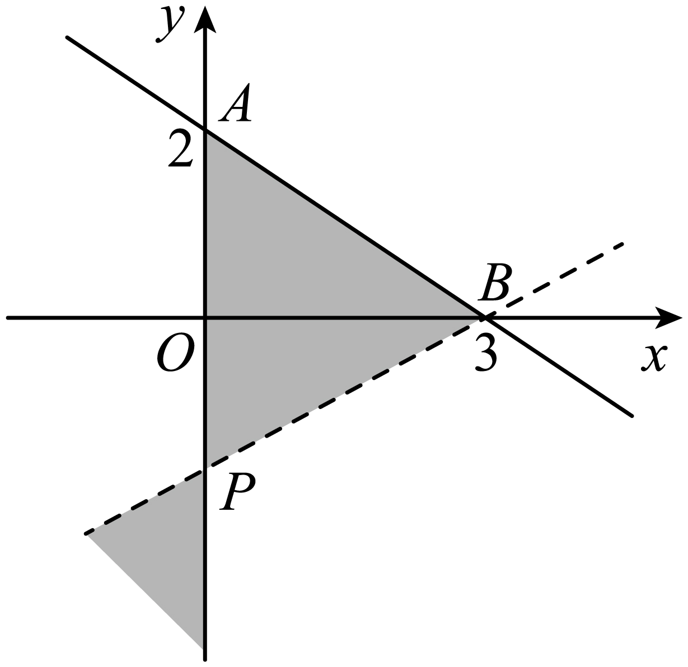

∴的倾斜角为，的倾斜角为.

∴直线*l*的倾斜角的取值范围是.

故选：D

**例5．**（2024·上海浦东新·华师大二附中校考三模）已知三条直线，，将平面分为六个部分，则满足条件的的值共有（    ）

A．个	B．2个	C．个	D．无数个

【答案】C

【解析】当三条直线交于一点时，可将平面分为六个部分，

联立与，解得，

则将代入中，，解得，

当与平行时，满足要求，此时，

当与平行时，满足要求，此时，

综上，满足条件的的值共有3个.

故选：C

**例6．**（2024·全国·高三专题练习）若三条直线不能围成三角形，则实数的取值最多有（    ）

A．个	B．个

C．个	D．个

【答案】C

【解析】三条直线不能构成三角形 至少有两条直线平行或三条直线相交于同一点.

若∥，则；若∥，则；

若∥，则的值不存在；

若三条直线相交于同一点，

直线和联立：，直线和交点为;

直线和联立：，直线和交点为;

三条直线相交于同一点两点重合或.

故实数的取值最多有个.

故选:*C*

<strong>变式8．</strong>（2024·江苏宿迁·高二泗阳县实验高级中学校考阶段练习）若点在直线上，<em>O</em>是原点，则<em>OP</em>的最小值为（    ）

A．	B．2	C．	D．4

【答案】C

【解析】由题意可知，*OP*的最小值即为原点到直线的距离，

则.

故选：C

**变式9．**（2024·吉林长春·高二东北师大附中校考期中）已知点在直线上，则的最小值为（    ）

A．1	B．2	C．3	D．4

【答案】B

【解析】就是到原点距离，

到原点距离的最小值为

则的最小值为2，

故选：B.

<strong>变式10．</strong>（2024·高二课时练习）已知点、、，且，则___________.

【答案】

【解析】已知点、、，且，

则，解得.

故答案为：.

<strong>变式11．</strong>（2024·全国·高二专题练习）已知点与点间的距离为，则________．

【答案】9或

【解析】由，

得，

即，解得或．

故答案为：9或.

<strong>变式12．</strong>（2024·全国·高二课堂例题）已知点，，，则的面积为______．

【答案】5

【解析】设边上的高为，则就是点*C*到*AB*所在直线的距离．

易知．

由两点式可得边所在直线的方程为，即．

点到直线的距离，

所以的面积为．

故答案为：5

<strong>变式13．</strong>（2024·江苏淮安·高二统考期中）已知平面上点和直线，点<em>P</em>到直线<em>l</em>的距离为<em>d</em>，则_____.

【答案】/4.5

【解析】依题意，直线，而点，

所以.

故答案为：

<strong>变式14．</strong>（2024·黑龙江哈尔滨·高三哈尔滨七十三中校考期中）点到直线的距离的最大值是________．

【答案】

【解析】因为直线恒过点，

记，直线为直线，

则当时，此时点到直线的距离最大，

∴点到直线距离的最大值为：

.

故答案为：.

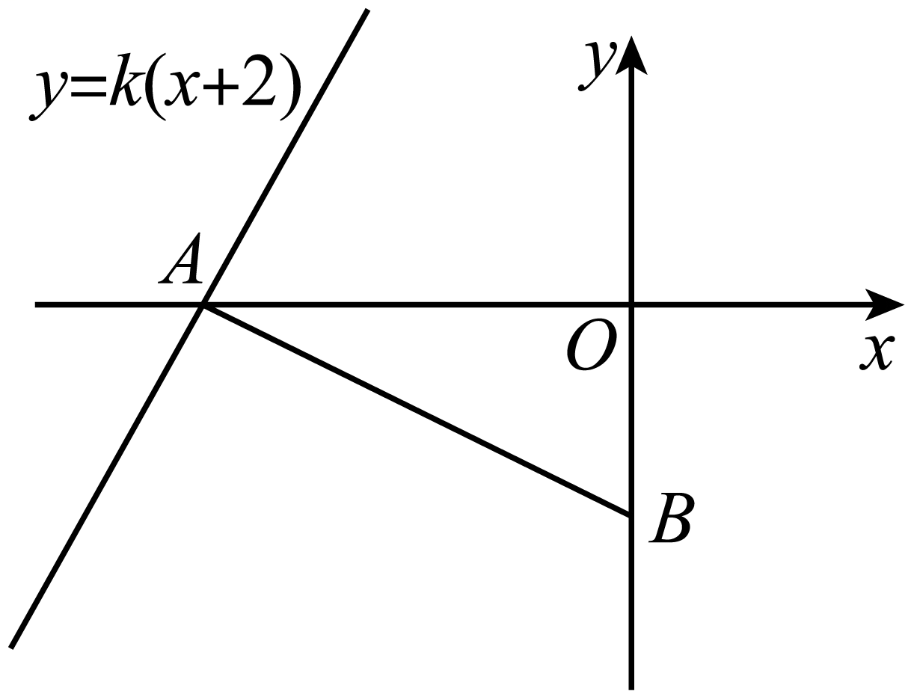

<strong>变式15．</strong>（2024·高二课时练习）过直线与直线的交点，且到点的距离为1的直线<em>l</em>的方程为____________．

【答案】或

【解析】解析：由解得

所以<em>l1</em>，<em>l2</em>的交点为.

显然，直线满足条件；

当直线斜率存在时，设直线方程为，

即，

依题意有，解得.

所以所求直线方程为或．

故答案为：或．

<strong>变式16．</strong>（2024·江西新余·高二校考开学考试）若点到直线的距离为3，则______.

【答案】

【解析】因为点到直线的距离为3，

可得，即，解得或，

又因为，所以.

故答案为：.

<strong>变式17．</strong>（2024·全国·高三专题练习）点，到直线<em>l</em>的距离分别为1和4，写出一个满足条件的直线<em>l</em>的方程：______.

【答案】或或（填其中一个即可）

【解析】设，，连接*MN*，则.

以*M*为圆心，1为半径作圆*M*，以*N*为圆心4为半径作圆*N*，则两圆外切，

所以两圆有3条公切线，即符合条件的直线*l*有3条.

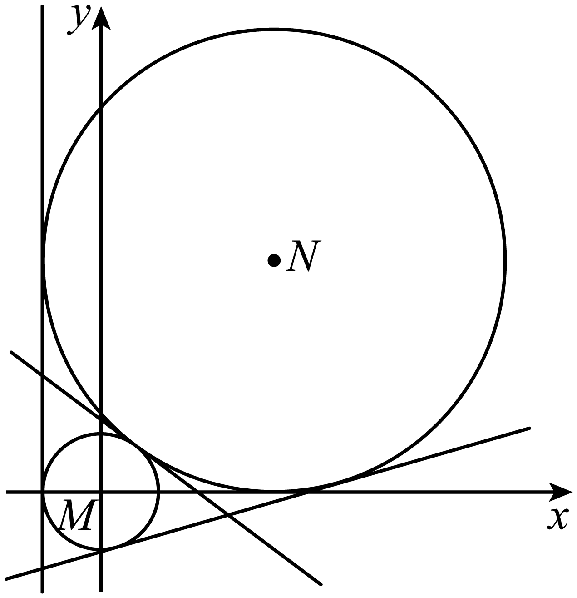

当公切线的斜率不存在时，显然公切线的方程为.

当公切线的斜率存在时，设公切线的方程为，则有，

由①②得，所以或.

由①及得，由①及得，

所以公切线方程为或.

综上，直线*l*的方程为或或.

故答案为：或或

<strong>变式18．</strong>（2024·浙江温州·高二乐清市知临中学校考开学考试）若两条直线与平行，则与间的距离是______.

【答案】/

【解析】两条直线与平行,

解得，

经检验时，,两直线不重合；

所以，

则与间的距离,

故答案为：.

<strong>变式19．</strong>（2024·江苏宿迁·高二泗阳县实验高级中学校考阶段练习）平行直线与之间的距离为_________．

【答案】/0.3

【解析】由题意得即

则平行直线与之间的距离为，

故答案为：

<strong>变式20．</strong>（2024·新疆·高二校联考期末）已知不过原点的直线与直线平行，且直线与的距离为，则直线的一般式方程为__________．

【答案】

【解析】直线不过原点且与平行，可设直线，

与之间的距离，解得：或（舍），

直线的一般式方程为：.

故答案为：.

**【解题方法总结】**

两点间的距离，点到直线的距离以及两平行直线间的距离的计算，特别注意点到直线距离公式的结构．

**题型三：有关距离的最值问题**

**例7．**（2024·北京·高三强基计划）的最小值所属区间为（    ）

A．	B．

C．	D．前三个答案都不对

【答案】C

【解析】如图，设．

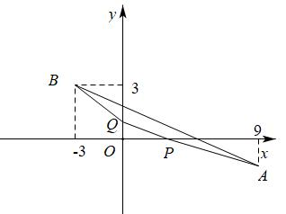

根据题意，设题中代数式为*M*，则，

等号当*P*，*Q*分别为直线与*x*轴，*y*轴交点时取得．

因此所求最小值为13．

故选：C.

<strong>例8．</strong>（2024·全国·高三专题练习）已知实数，满足，，，则的最小值是________．

【答案】/

【解析】依题意，方程、分别表示以原点为圆心，2、3为半径的圆，

令，即点分别在、上，如图，

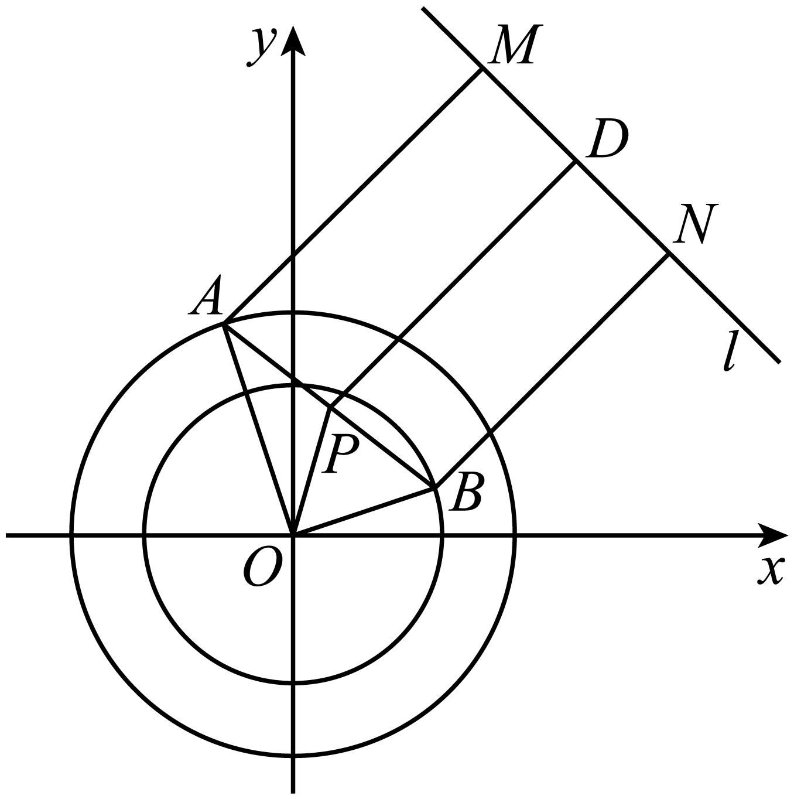

显然，，即有，

，取线段中点，连接，则，

因此点在以原点为圆心，为半径的圆上，

而，

即表示点到直线的距离和的倍，

过分别作直线的垂线，垂足分别为，过作垂直于直线于点，

于是，，

，原点到直线的距离，

显然，当且仅当点共线，且点在线段上时取等号，

所以.

故答案为：

<strong>例9．</strong>（2024·全国·高三专题练习）如图，平面上两点，在直线上取两点使，且使的值取最小，则的坐标为____________．

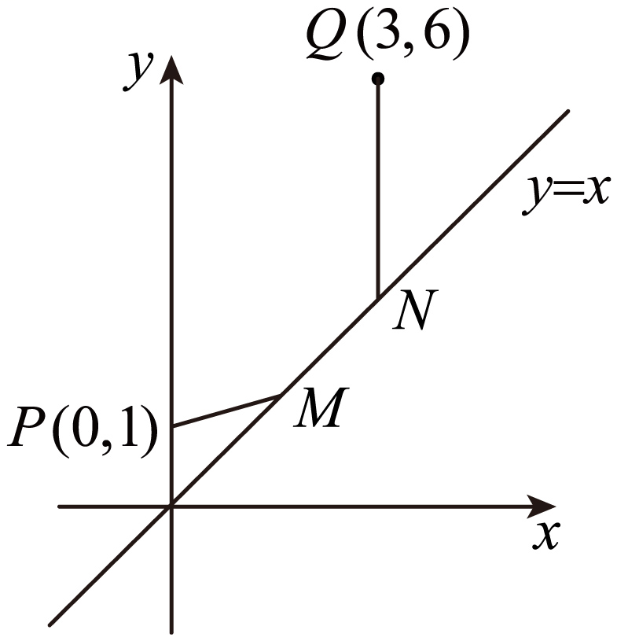

【答案】

【解析】关于直线的对称点为，则有.过作平行于的直线为，由得，即此时直线为.过作，则，则.由于是常数，要使的值取最小，则的值取最小，即三点共线时最小.设，由得，即，解得（舍去.），即.设，则，解得，即，设，.由得，得，解得或（舍去），故.

故答案为：.

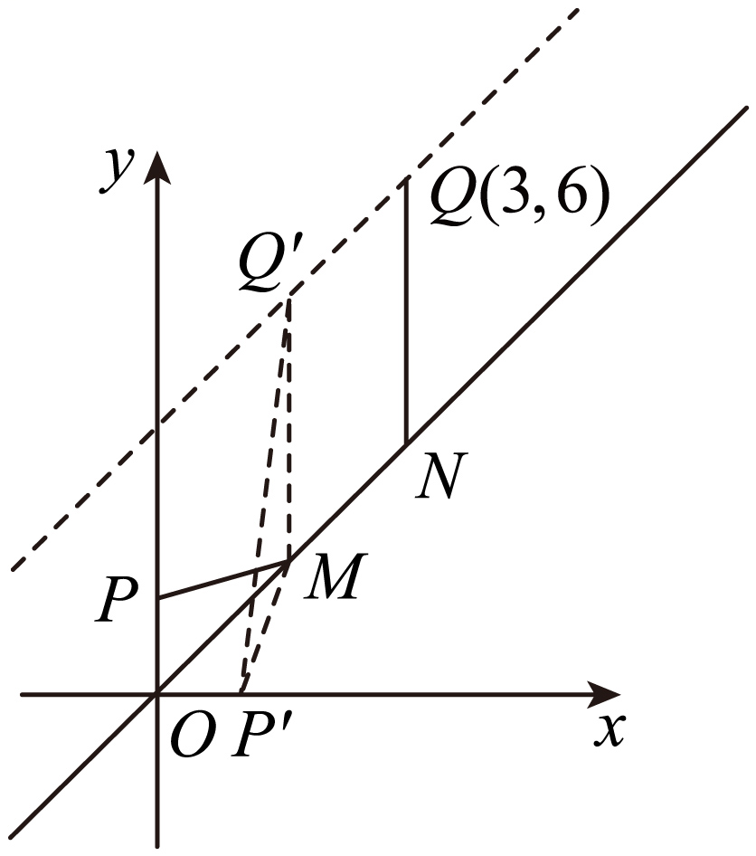

<strong>变式21．</strong>（2024·全国·高二专题练习）已知点分别在直线与直线上，且，点，，则的最小值为______.

【答案】

【解析】易知，作出图象如下，过点作直线，则，

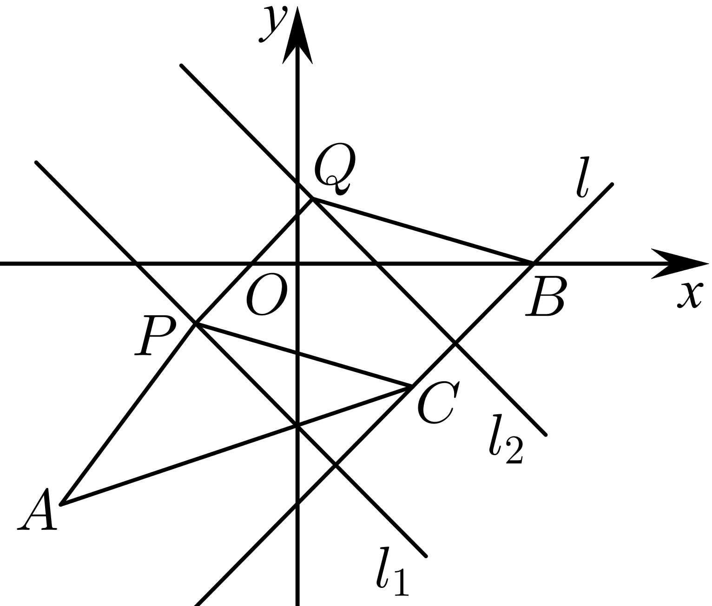

直线，过作直线，与直线交于点，易知四边形为平行四边形，

故，且到直线的距离等于到的距离，

设，则，解得或（舍，所以，

而，且（定值），

故只需求出的最小值即可，显然，

故的最小值为．

故答案为：．

<strong>变式22．</strong>（2024·全国·高二课堂例题）已知直线过定点<em>M</em>，点在直线上，则的最小值是（    ）

A．5	B．	C．	D．

【答案】B

【解析】由得，所以直线*l*过定点，

依题意可知的最小值就是点*M*到直线的距离，

由点到直线的距离公式可得．

故选:B.

**变式23．**（2024·全国·高三专题练习）著名数学家华罗庚曾说过：“数形结合百般好，割裂分家万事休．”事实上，有很多代数问题可以转化为几何问题加以解决，如：可以转化为点到点的距离，则的最小值为（    ）．

A．3	B．	C．	D．

【答案】D

【解析】,

可以看作点到点的距离之和，

作点关于轴的对称点，显然当三点共线时，取到最小值，

最小值为间的距离.

故选：D.

**变式24．**（2024·贵州·校联考模拟预测）已知，满足，则的最小值为（    ）

A．	B．	C．1	D．

【答案】B

【解析】

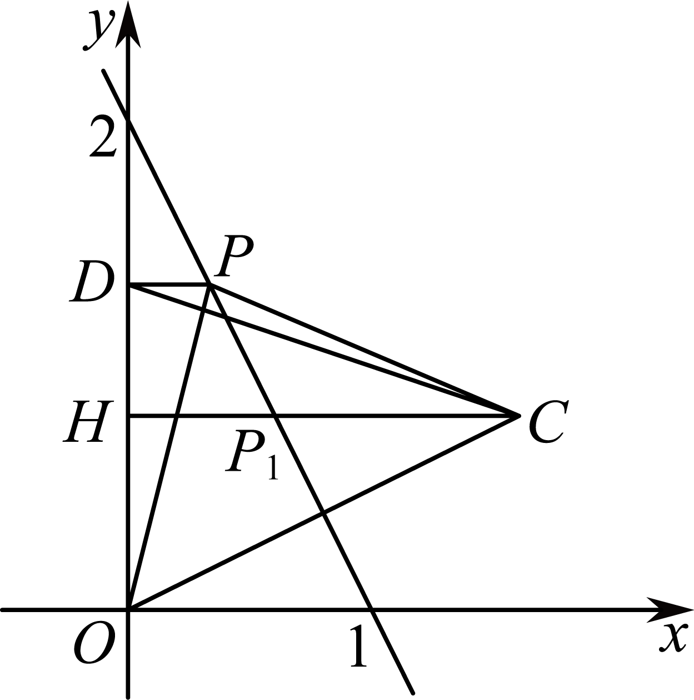

如图，过点作点关于线段的对称点，则.

设，则有，解得，所以.

设，则，所以，

又，所以点到轴的距离为，

所以，可视为线段上的点到轴的距离和到的距离之和.

过作轴，显然有，当且仅当三点共线时，和有最小值.

过点作轴，则即为最小值，与线段的交点，即为最小值时的位置.

因为，所以的最小值为.

故选：B．

**变式25．**（2024·江西·高三校联考阶段练习）在平面直角坐标系中，已知点，点为直线上一动点，则的最小值是（    ）

A．	B．4	C．5	D．6

【答案】B

【解析】设点关于直线的对称点为，

则，解得，

所以，

所以，

当且仅当点为线段与直线的交点时等号成立，

所以的最小值是4，

故选：B.

<strong>变式26．</strong>（2024·高二课时练习）已知点，点<em>P</em>在<em>x</em>轴上使最大，求点<em>P</em>的坐标．

【解析】点关于*x*轴的对称点为*,* 如图所示，若点不在直线上则,

连接并延长交*x*轴于点*P*，即为最大值．

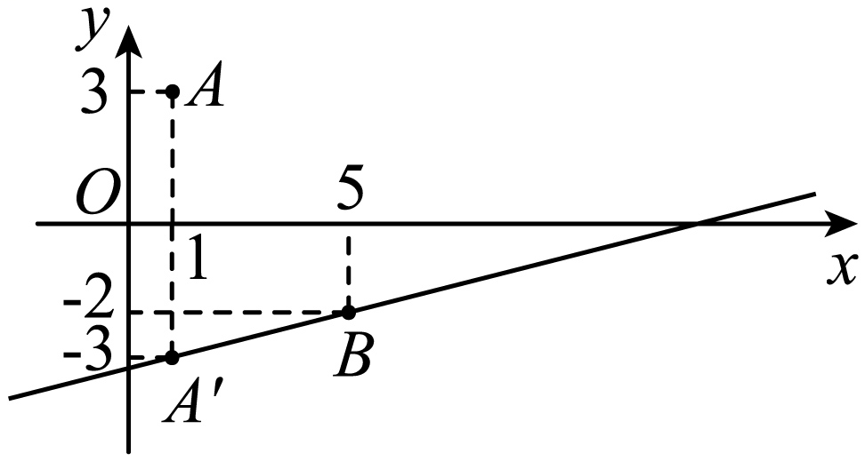

直线的方程是，

即*.*

令，得．

则点*P*的坐标是.

<strong>变式27．</strong>（2024·天津和平·高二天津市汇文中学校考阶段练习）在直线上求一点<em>P</em>，使得：

(1)*P*到和的距离之差最大；

(2)*P*到和的距离之和最小.

【解析】（1）画出直线和点和，如图：在两侧，

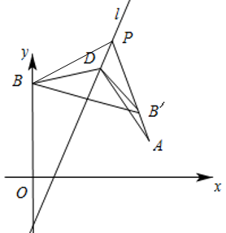

作*B*关于直线的对称点，连接,

则直线和直线*l*的交点即为*P*，

设*D*为*l*上异于*P*的一点，则 ,

故,

故最大，即此时*P*到和的距离之差最大，

设，则 ，解得 ，

故直线方程为，联立 ，解得 ，

即；

（2）如图：在同侧，

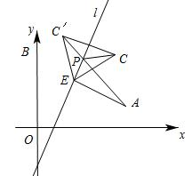

作*C*关于直线的对称点，连接,

则直线和直线*l*的交点即为*P*，

设*E*为*l*上异于*P*的一点，则 ,

故,

故最小，即此时*P*到和的距离之和最小.，

设，则 ，解得 ，

故直线方程为，联立 ，解得 ，

即即；

<strong>变式28．</strong>（2024·全国·高三专题练习）已知函数的图象恒过定点<em>A</em>，圆上的两点，满足，则的最小值为(    )

A．	B．

C．	D．

【答案】C

【解析】由题可知*A*为(0，1)，且*P*、*A*、*Q*三点共线，

设弦*PQ*的中点为*E*(*x*，*y*)，连接*OE*，则*OE*⊥*PQ*，即*OE*⊥*AE*，

∴，由此可得*E*的轨迹方程为，

即*E*的轨迹是以为圆心，为半径的圆，

设直线*l*为，

则*E*到*l*的最小距离为．

过*P*、*E*、*Q*分别作直线*l*的垂线，垂足分别为*M*、*R*、*N*，

则四边形*MNQP*是直角梯形，且*R*是*MN*的中点， 则*ER*是直角梯形的中位线，

∴，

即，

即．

故选：C．

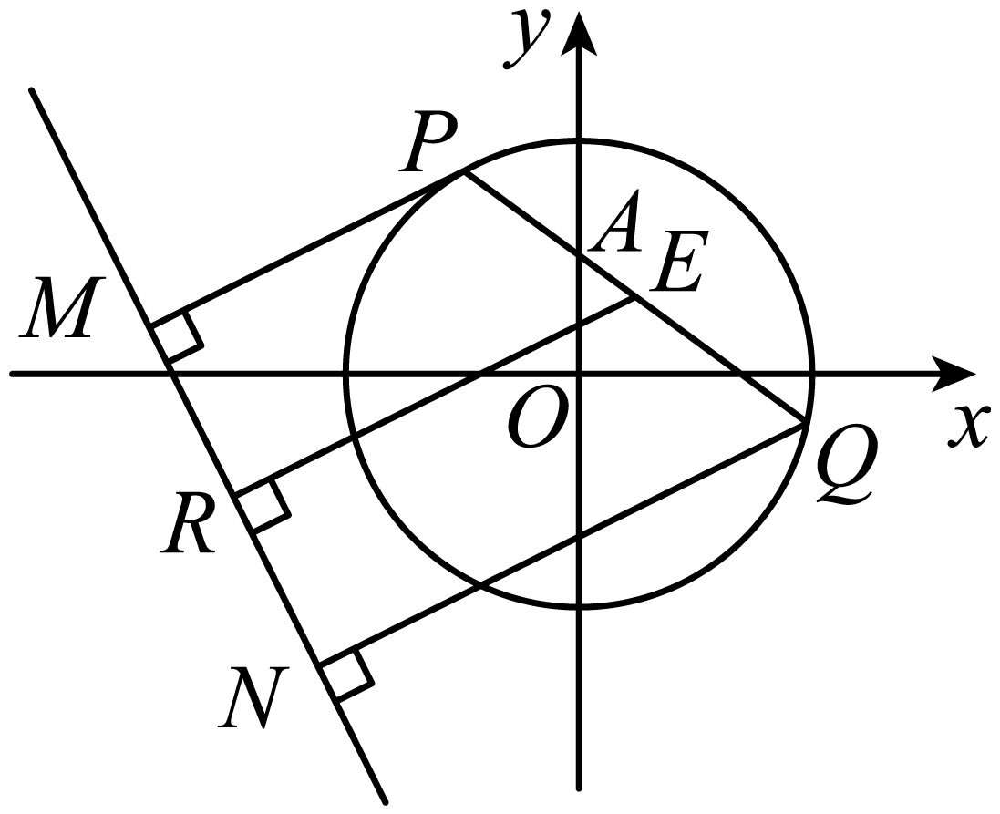

**变式29．**（2024·江西·高三校联考开学考试）费马点是指三角形内到三角形三个顶点距离之和最小的点.当三角形三个内角均小于120°时，费马点与三个顶点连线正好三等分费马点所在的周角，即该点所对的三角形三边的张角相等且均为120°.根据以上性质，.则的最小值为（    ）

A．4	B．	C．	D．

【答案】B

【解析】由题意得：的几何意义为点到点的距离之和的最小值，

因为，，

，

所以，故三角形*ABC*为等腰直角三角形，，

取的中点，连接，与交于点，连接，故，，

因为，所以，故，则，

故点到三角形三个顶点距离之和最小，即取得最小值，

因为，所以，同理得：，，

，

故的最小值为.

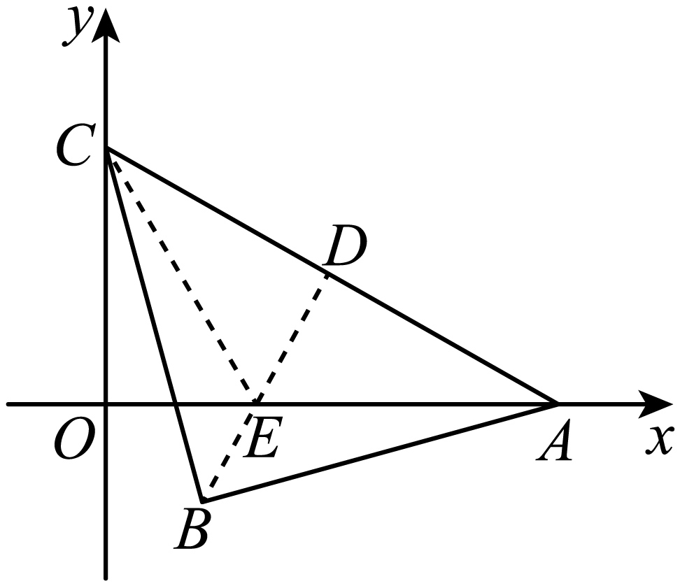

故选：B

**变式30．**（2024·全国·高三专题练习）已知，则的最小值为（    ）

A．	B．	C．	D．

【答案】C

【解析】设点为直线上的动点，

由可看作与的距离和与的距离之和，

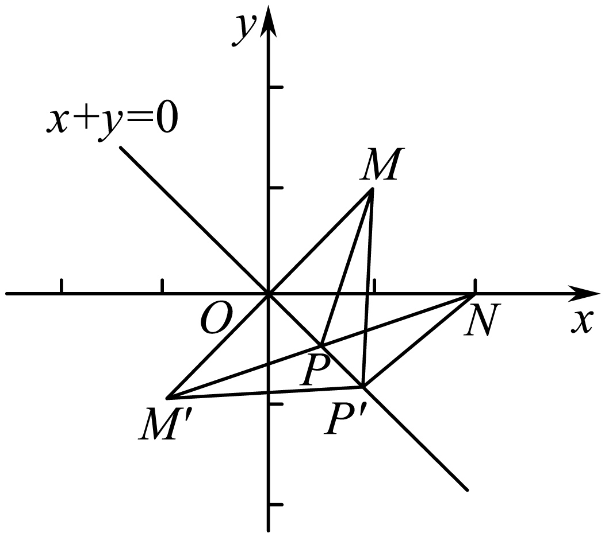

设点则点为点关于直线的对称点，

故，且，

所以，

当且仅当三点共线时，取等号，

所以的最小值为.

故选：C

**变式31．**（2024·陕西西安·高二西安市铁一中学校考期末）设，过定点的动直线和过定点的动直线交于点，则的最大值是（    ）

A．	B．	C．5	D．10

【答案】C

【解析】

显然过定点，直线可化成，则经过定点，

根据两条直线垂直的一般式方程的条件，，

于是直线和直线垂直，又为两条直线的交点，则，

又，由勾股定理和基本不等式，

，则，

当时，的最大值是.

故选：C

<strong>变式32．</strong>（2024·全国·高二专题练习）过定点<em>A</em>的动直线和过定点<em>B</em>的动直线交于点<em>M</em>，则的最大值是（    ）

A．	B．3	C．	D．

【答案】C

【解析】由题意知过定点,

动直线即过定点，

对于直线和动直线满足，

故两直线垂直，

因此点*M*在以为直径的圆上，，

则，

所以，

当且仅当时等号成立，

故的最大值为，

故选：C

**【解题方法总结】**

数学结合，利用距离的几何意义进行转化．

**题型四：点点对称**

<strong>例10．</strong>（2024·全国·高三专题练习）已知，，点是线段的中点，则______.

【答案】

【解析】由中点坐标公式知：，，解得：，，.

故答案为：.

<strong>例11．</strong>（2024·江苏南通·高二统考期中）已知点在轴上，点在轴上，线段的中点的坐标为，则线段的长度为___________.

【答案】

【解析】在平面直角坐标系中，，

则为直角三角形，且为斜边，

故.

故答案为：

<strong>例12．</strong>（2024·高二课时练习）设点<em>A</em>在<em>x</em>轴上，点<em>B</em>在<em>y</em>轴上，的中点是，则等于________

【答案】

【解析】根据点*A*在*x*轴上，点*B*在*y*轴上，且的中点是，利用中点坐标公式得到*A*，*B*的坐标，再利用两点间的距离公式求解.因为点*A*在*x*轴上，点*B*在*y*轴上，且的中点是，

所以，

所以，

故答案为：

<strong>变式33．</strong>（2024·高一课时练习）已知直线l与直线及直线分别交于点P，Q．若PQ的中点为点，则直线l的斜率为____．

【答案】

【解析】设，则．由点Q在直线上，得，．故．

所以直线l的斜率为，所以

故答案为

**【解题方法总结】**

求点关于点中心对称的点，由中点坐标公式得

**题型五：点线对称**

**例13．**（2024·湖南长沙·高一周南中学校考开学考试）如下图，一次函数的图象与轴，轴分别交于点，，点是轴上一点，点，分别为直线和轴上的两个动点，当周长最小时，点，的坐标分别为（    ）

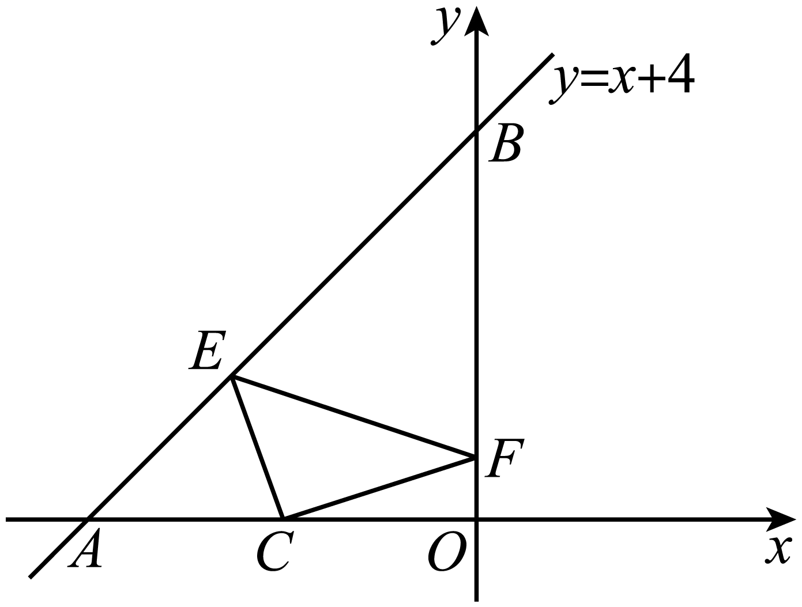

A．，	B．，

C．，	D．，

【答案】C

【解析】作关于轴的对称点，

作关于的对称点，

连接交轴于，交于，所以，

此时周长最小，即，

由，直线方程为，所以，解得，

所以，可得直线方程为，即，

由，解得，所以，

令可，所以.

故选：C.

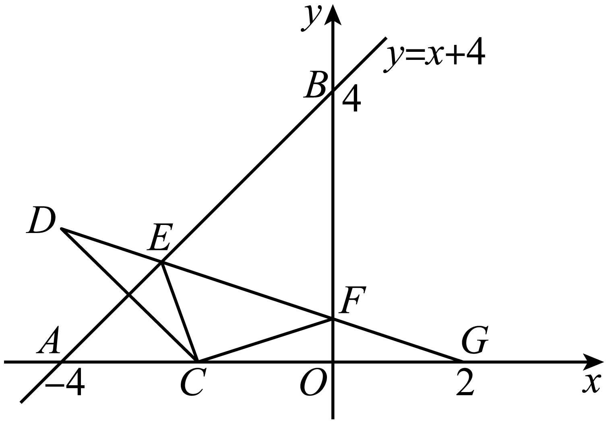

**例14．**（2024·全国·高二专题练习）若直线和直线关于直线对称，则直线恒过定点（    ）

A．	B． 	C．	D．

【答案】C

【解析】因为直线过定点，

点关于直线对称的点为，

故直线恒过定点.

故选：C

**例15．**（2024·全国·高二假期作业）抛物线的焦点关于直线的对称点的坐标是（    ）

A．	B．	C．	D．

【答案】A

【解析】抛物线即，其焦点坐标为，

设关于直线的对称点的坐标是，

则，解得，则，

故选：A．

**变式34．**（2024·江西·高二校联考开学考试）如图，一束光线从出发，经过坐标轴反射两次经过点，则总路径长即总长为（    ）

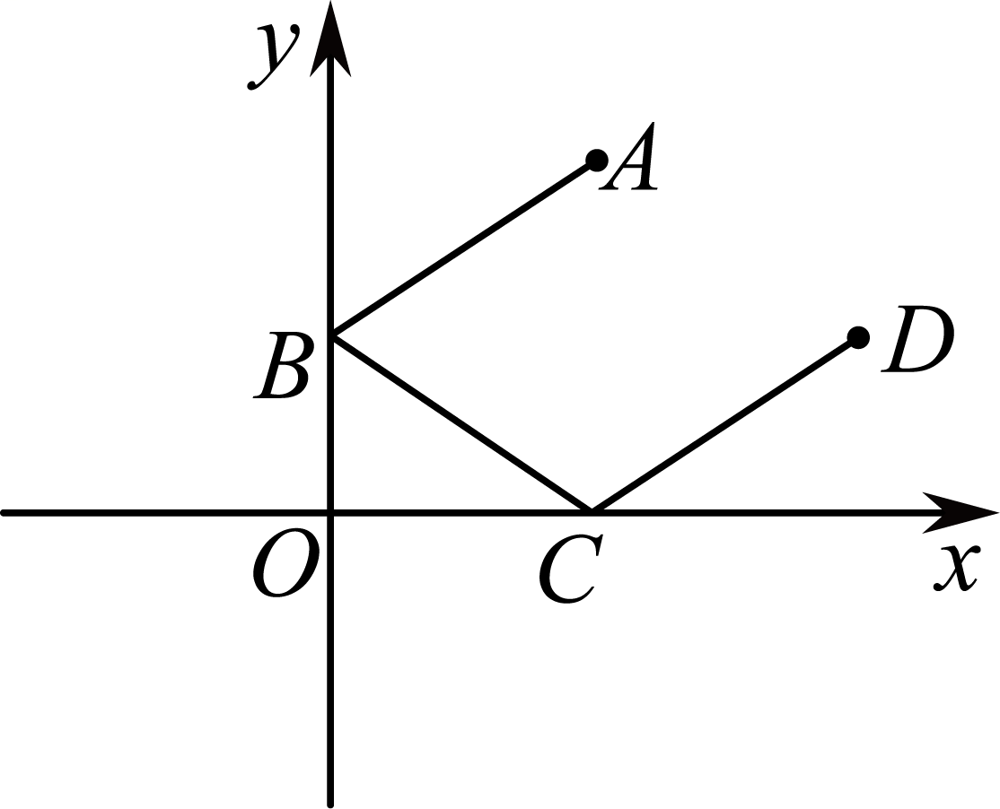

A．	B．6	C．	D．

【答案】C

【解析】设点关于轴的对称点为点，点关于轴的对称点为点，

由光线反射知识可得三点共线，三点共线，

故四点共线，

因为点的坐标为，点的坐标为，

所以点的坐标为，点的坐标为，

由对称的性质可得，

所以，

又，

所以.

故选：C.

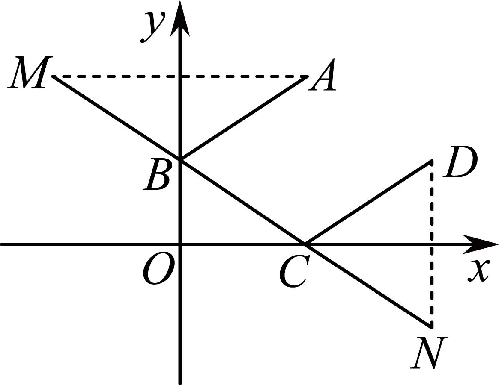

<strong>变式35．</strong>（2024·四川遂宁·高二统考期末）已知点<em>A</em>与点关于直线对称，则点<em>A</em>的坐标为（    ）

A．	B．

C．	D．

【答案】C

【解析】设，因点*A*与点*B*关于直线对称，则*AB*中点在直线上且直线*AB*与直线垂直，

则，

即点*A*坐标为.

故选：C

**变式36．**（2024·湖北·高二校联考阶段练习）在等腰直角三角形中，，点是边上异于的一点，光线从点出发，经反射后又回到点，如图，若光线经过的重心，则（    ）

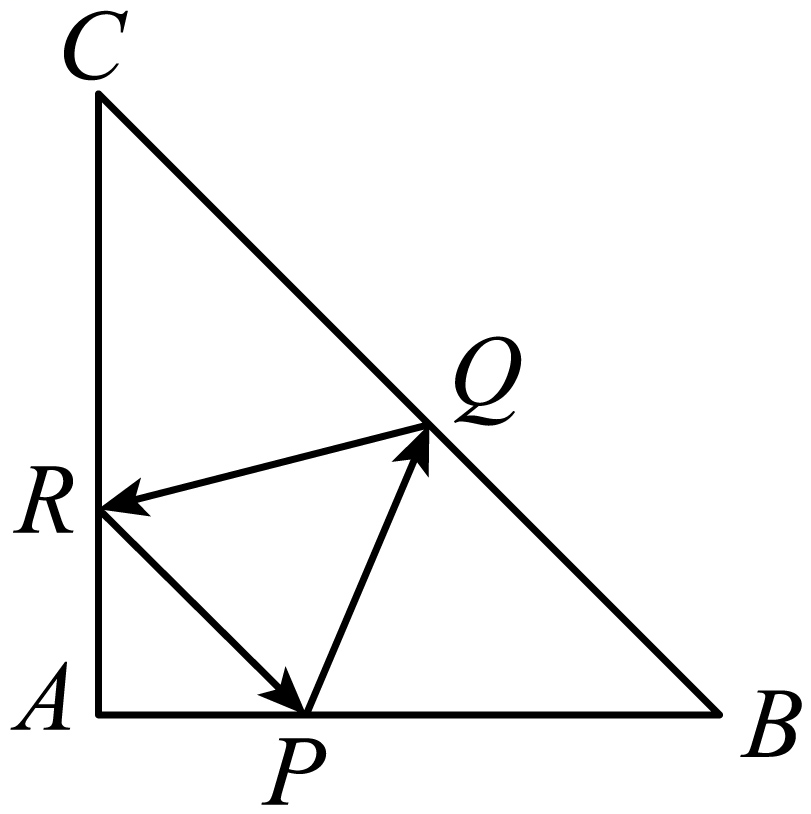

A．	B．	C．1	D．2

【答案】C

【解析】根据题意，建立如图所示的坐标系，可得，，

故直线的方程为，

又由，，，则 的重心为，

设，其中，点关于直线 的对称点，则有，

解得，即，

易得关于 轴的对称点，

由光的反射原理可知，，，四点共成直线的斜率，

故直线的方程为，

由于直线过 的重心，代入化简可得，

解得：或 舍，即，故，

故选：C．

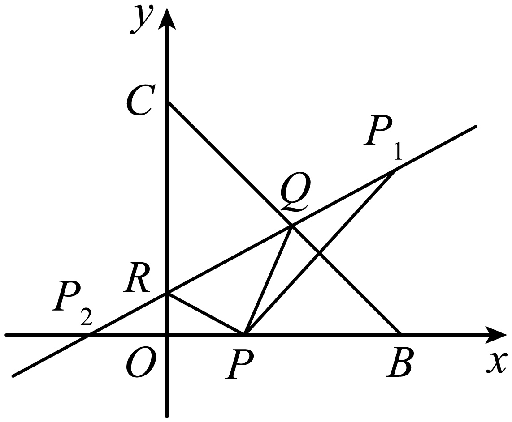

**【解题方法总结】**

求点关于直线对称的点

方法一：（一中一垂），即线段的中点*M*在对称轴上，若直线的斜率存在，则直线的斜率与对称轴的斜率之积为－1，两个条件建立方程组解得点

方法二：先求经过点且垂直于对称轴的直线（法线），然后由得线段的中点，从而得

**题型六：线点对称**

<strong>例16．</strong>（2024·高二课时练习）直线关于点对称的直线的方程为________．

【答案】

【解析】设为上任意一点，则关于点的对称点为，

因为在直线*l*上，所以，即直线的方程为．

故答案为：

<strong>例17．</strong>（2024·全国·高二专题练习）直线关于点的对称直线方程是______．

【答案】

【解析】设对称直线为，

则有，即

解这个方程得（舍）或.

所以对称直线的方程中.

故答案为：.

<strong>例18．</strong>（2024·河北廊坊·高三校考阶段练习）与直线关于点对称的直线的方程为______.

【答案】

【解析】直线关于点对称的直线的方程可设为，其中

又点到直线与到直线的距离相等

所以，即，所以或（舍）.

故所求直线方程为：.

故答案为：.

<strong>变式37．</strong>（2024·全国·高三专题练习）直线恒过定点，则直线关于点对称的直线方程为_________．

【答案】

【解析】由得：，当时，，；

设直线关于点对称的直线方程为，

，解得：或（舍），

直线关于点对称的直线方程为.

故答案为：.

<strong>变式38．</strong>（2024·辽宁营口·高三统考期末）若直线：与直线关于点对称，则当经过点时，点到直线的距离为___________.

【答案】

【解析】因为直线恒过定点，

所以关于点对称，

所以关于点的对称点为，

此时和都在直线上，

由直线方程的两点式可得，即，

所以点到直线的距离为．

故答案为：．

<strong>变式39．</strong>（2024·全国·高三专题练习）在平面直角坐标系<em>xOy</em>中，将直线<em>l</em>沿<em>x</em>轴正方向平移3个单位长度，沿<em>y</em>轴正方向平移5个单位长度，得到直线<em>l1</em>.再将直线<em>l1</em>沿<em>x</em>轴正方向平移1个单位长度，沿<em>y</em>轴负方向平移2个单位长度，又与直线<em>l</em>重合.若直线<em>l</em>与直线<em>l1</em>关于点（2，3）对称，则直线<em>l</em>的方程是________________.

【答案】6*x*－8*y*＋1＝0

【解析】根据平移得到<em>l1</em>：<em>y</em>＝<em>k</em>（<em>x</em>－3）＋5＋<em>b</em>和直线：<em>y</em>＝<em>kx</em>＋3－4<em>k</em>＋<em>b</em>，解得<em>k</em>＝，再根据对称解得<em>b</em>＝，计算得到答案.由题意知直线<em>l</em>的斜率存在，设直线<em>l</em>的方程为<em>y</em>＝<em>kx</em>＋<em>b</em>，

则直线<em>l1</em>：<em>y</em>＝<em>k</em>（<em>x</em>－3）＋5＋<em>b</em>，平移后的直线方程为<em>y</em>＝<em>k</em>（<em>x</em>－3－1）＋<em>b</em>＋5－2

即*y*＝*kx*＋3－4*k*＋*b*，∴*b*＝3－4*k*＋*b*，解得*k*＝ ，

∴直线<em>l</em>的方程为<em>y</em>＝<em>x</em>＋<em>b</em>，直线<em>l1</em>为<em>y</em>＝<em>x</em>＋＋<em>b</em>

取直线*l*上的一点 ，则点*P*关于点（2，3）的对称点为 ，

，解得*b*＝.

∴直线*l*的方程是 ，即6*x*－8*y*＋1＝0.

故答案为：6*x*－8*y*＋1＝0

**【解题方法总结】**

求直线*l*关于点中心对称的直线

求解方法是：在已知直线*l*上取一点关于点中心对称得，再利用，由点斜式方程求得直线的方程（或者由，且点到直线*l*及的距离相等来求解）．

**题型七：线线对称**

<strong>例19．</strong>（2024·全国·高三专题练习）已知直线，直线，若直线关于直线<em>l</em>的对称直线为，则直线的方程为_______________．

【答案】.

【解析】由题意知，设直线，在直线上取点，

设点关于直线的对称点为，

则， 解得，即，

将代入的方程得，

所以直线的方程为.

故答案为：

<strong>例20．</strong>（2024·全国·高三专题练习）若动点<em>A</em>，<em>B</em>分别在直线<em>l1</em>：<em>x</em>＋<em>y</em>－7＝0和<em>l2</em>：<em>x</em>＋<em>y</em>－5＝0上移动，则<em>AB</em>的中点<em>M</em>到原点的距离的最小值为(　　)

A．3	B．2	C．3	D．4

【答案】A

【解析】先求出点<em>M</em>所在直线的方程为<em>l</em>：<em>x</em>＋<em>y</em>＋<em>m</em>＝0，再求出m的值和原点到直线l的距离即得解.依题意知<em>AB</em>的中点<em>M</em>的集合为与直线<em>l1</em>：<em>x</em>＋<em>y</em>－7＝0和<em>l2</em>：<em>x</em>＋<em>y</em>－5＝0距离都相等的直线，

则*M*到原点的距离的最小值为原点到该直线的距离．

设点*M*所在直线的方程为*l*：*x*＋*y*＋*m*＝0，

根据平行线间的距离公式得

所以|*m*＋7|＝|*m*＋5|，所以*m*＝－6，

即*l*：*x*＋*y*－6＝0.

根据点到直线的距离公式得*M*到原点的距离的最小值为.

故选：A.

**例21．**（2024·全国·高三专题练习）直线关于直线对称的直线方程是（　　）

A．	B．

C．	D．

【答案】A

【解析】在直线上任取一点，设点关于直线的对称点为，

则，解得，即，

因为点在直线上，

所以，即，

所以所求直线方程为，

故选：A.

**变式40．**（2024·全国·高三专题练习）设直线与关于直线对称，则直线的方程是（　　）

A．	B．

C．	D．

【答案】A

【解析】联立，得，

取直线上一点，设点关于直线的对称点为，则，解得：，

直线的斜率，所以直线的方程为，

整理为：.

故选：A

**变式41．**（2024·全国·高三专题练习）直线关于直线对称的直线为（    ）

A．	B．	C．	D．

【答案】C

【解析】设所求直线上的任意一点为

则关于直线对称点为

点在直线上

满足直线方程，即

直线关于直线对称的直线为

故选：C

**变式42．**（2024·全国·高三专题练习）如果直线与直线关于直线对称，那么（    ）

A．	B．	C．	D．

【答案】A

【解析】在上取一点，

则由题意可得其关于直线的对称点在上，

所以，得，

在上取一点，

则其关于直线的对称点在上，

所以，得，

综上，

故选：A

<strong>变式43．</strong>（2024·全国·高三专题练习）求直线<em>x</em>＋2<em>y</em>－1＝0关于直线<em>x</em>＋2<em>y</em>＋1＝0对称的直线方程（    ）

A．*x*＋2*y*－3＝0	B．*x*＋2*y*＋3＝0

C．*x*＋2*y*－2＝0	D．*x*＋2*y*＋2＝0

【答案】B

【解析】设对称直线方程为，

，解得或（舍去）.

所以所求直线方程为.

故选：B

**变式44．**（2024·全国·高三专题练习）若两条平行直线：与：之间的距离是，则直线关于直线对称的直线方程为（    ）

A．	B．

C．	D．

【答案】A

【解析】因为直线：与：，

所以，

又两条平行直线：与：之间的距离是，

所以解得

即直线：，：，

设直线关于直线对称的直线方程为，

则，解得，

故所求直线方程为，

故选：A

**变式45．**（2024·全国·高三专题练习）两直线方程为，，则关于对称的直线方程为（ ）

A．	B．

C．	D．

【答案】C

【解析】设所求直线上任一点，关于直线的对称点，，

则，解出

点在直线上， 将式代入，得，

化简得，即为关于对称的直线方程．

故选：C

**【解题方法总结】**

求直线*l*关于直线对称的直线

若直线，则，且对称轴与直线*l*及之间的距离相等．

此时分别为，由，求得，从而得．

若直线*l*与不平行，则．在直线*l*上取异于*Q*的一点，然后求得关于直线对称的点，再由两点确定直线（其中）．

**题型八：直线系方程**

<strong>例22．</strong>（2024·全国·高三专题练习）已知两直线和的交点为，则过两点的直线方程为_________ .

【答案】

【解析】依题意两直线和的交点为，

所以在直线上，

所以过两点所在直线方程为.

故答案为：

<strong>例23．</strong>（2024·全国·高三专题练习）经过直线3<em>x</em>－2<em>y</em>＋1＝0和直线<em>x</em>＋3<em>y</em>＋4＝0的交点，且平行于直线<em>x</em>－<em>y</em>＋4＝0的直线方程为__________．

【答案】*x*－*y*＝0.

【解析】设直线方程为3*x*－2*y*＋1＋*λ*(*x*＋3*y*＋4)＝0，再求出的值即得解.过两直线交点的直线方程可设为3*x*－2*y*＋1＋*λ*(*x*＋3*y*＋4)＝0，

即(3＋*λ*)*x*＋(3*λ*－2)*y*＋4*λ*＋1＝0，

因为它与直线*x*－*y*＋4＝0平行，

所以3＋*λ*＋3*λ*－2＝0，

即*λ*＝－，

故所求直线为*x*－*y*＝0.

故答案为：*x*－*y*＝0.

<strong>例24．</strong>（2024·全国·高三专题练习）已知坐标原点为O，过点作直线n不同时为零的垂线，垂足为M，则的取值范围是______．

【答案】

【解析】根据题意，直线，即，

则有，解可得，则直线恒过点．

设，又由与直线垂直，且为垂足，

则点的轨迹是以为直径的圆，其方程为，

所以；即的取值范围是；

故答案为．

<strong>变式46．</strong>（2024·高二课时练习）经过点和两直线；交点的直线方程为_________.

【答案】

【解析】设所求直线方程为，

点在直线上，

，

解得，

所求直线方程为，即．

故答案为：.

<strong>变式47．</strong>（2024·全国·高二课堂例题）若直线<em>l</em>经过两直线和的交点，且斜率为，则直线<em>l</em>的方程为______．

【答案】

【解析】设直线*l*的方程为（其中为常数），即 ①．

又直线*l*的斜率为，则，解得．

将代入①式并整理，得，此即所求直线*l*的方程．

故答案为：.

<strong>变式48．</strong>（2024·全国·高一专题练习）设直线经过和的交点，且与两坐标轴围成等腰直角三角形，则直线的方程为___________.

【答案】或

【解析】方法一：由，得，

所以两条直线的交点坐标为（14，10）,

由题意可得直线的斜率为1或-1，

所以直线的方程为或，

即或.

方法二：设直线的方程为，整理得，

由题意，得，解得或，

所以直线的方程为或.

故答案为：或.

<strong>变式49．</strong>（2024·高二课时练习）经过直线3x+2y+6=0和2x+5y-7=0的交点，且在两坐标轴上的截距相等的直线方程为________.

【答案】x+y+1=0或3x+4y=0

【解析】由题意可设所求直线方程为，即

令，得

令，得

∵所求直线方程在两坐标轴上的截距相等

∴，即或

∴所求直线方程为或

故答案为或

**【解题方法总结】**

利用直线系方程求解．

**【解题方法总结】**

