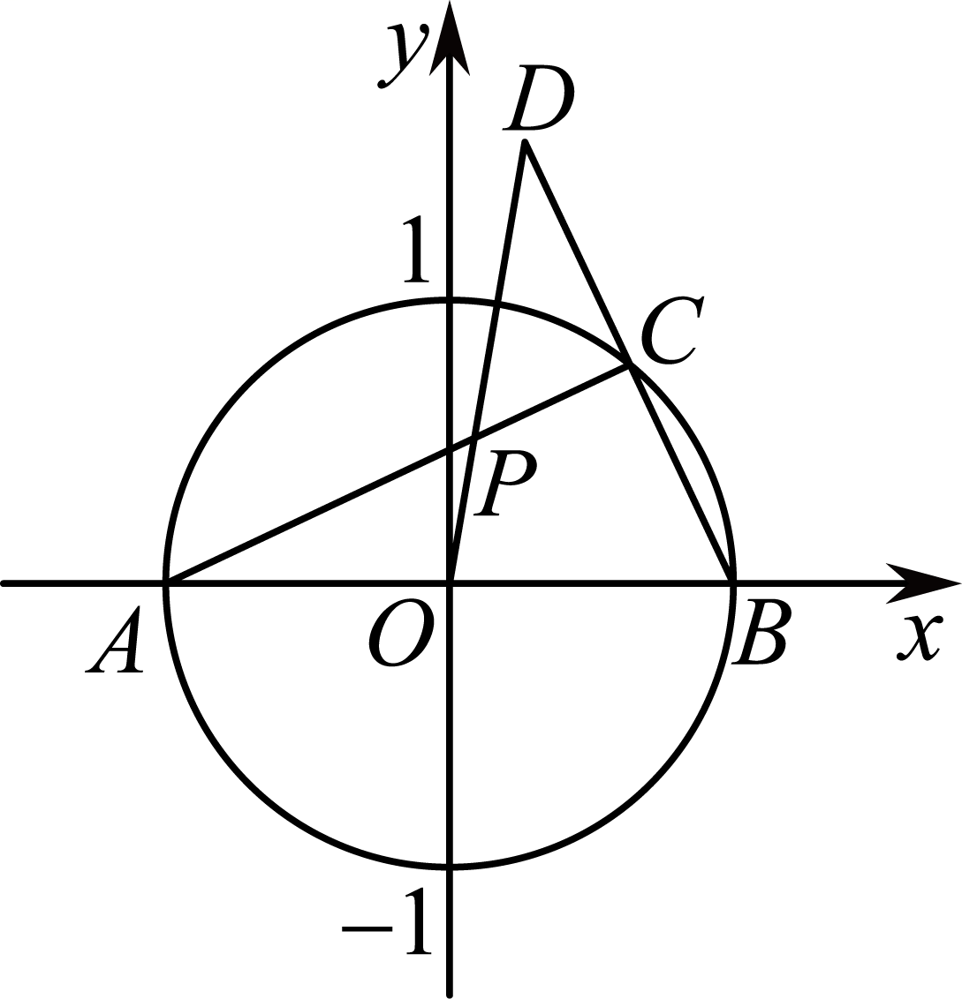

**第59讲  圆的方程**

**知识梳理**

**知识点一：基本概念**

平面内到定点的距离等于定长的点的集合（轨迹）叫圆．

知识点二：基本性质、定理与公式

1**、圆的四种方程**

（1）圆的标准方程：，圆心坐标为（*a*，*b*），半径为

（2）圆的一般方程：，圆心坐标为，半径

（3）圆的直径式方程：若，则以线段*AB*为直径的圆的方程是

（4）圆的参数方程：

①的参数方程为（为参数）；

②的参数方程为（为参数）．

<strong>注意：</strong>对于圆的最值问题，往往可以利用圆的参数方程将动点的坐标设为（为参数，为圆心，<em>r</em>为半径），以减少变量的个数，建立三角函数式，从而把代数问题转化为三角问题，然后利用正弦型或余弦型函数的有界性求解最值．

2**、点与圆的位置关系判断**

（1）点与圆的位置关系：

①点*P*在圆外；

②点*P*在圆上；

③点*P*在圆内．

（2）点与圆的位置关系：

①点*P*在圆外；

②点*P*在圆上；

③点*P*在圆内．

**必考题型全归纳**

**题型一：求圆多种方程的形式**

**例1．**（2024·贵州铜仁·统考模拟预测）过、两点，且与直线相切的圆的方程可以是（    ）

A．	B．

C．	D．

**例2．**（2024·全国·高三专题练习）已知圆的圆心为，其一条直径的两个端点恰好在两坐标轴上，则这个圆的方程是（    ）

A．	B．

C．	D．

**例3．**（2024·全国·高三专题练习）已知圆心为的圆与直线相切，则该圆的标准方程是（    ）

A．	B．

C．	D．

**变式1．**（2024·河北邢台·高三统考期末）已知圆与直线相切，则圆关于直线对称的圆的方程为（    ）

A．	B．

C．	D．

<strong>变式2．</strong>（2024·山东东营·高三广饶一中校考阶段练习）过抛物线的焦点<em>F</em>的直线交抛物线于<em>A</em>、<em>B</em>两点，分别过<em>A</em>、<em>B</em>两点作准线的垂线，垂足分别为两点，以线段为直径的圆<em>C</em>过点，则圆<em>C</em>的方程为（    ）

A．	B．

C．	D．

**变式3．**（2024·全国·高三专题练习）求过两点，且圆心在直线上的圆的标准方程是（    ）

A．	B．

C．	D．

<strong>变式4．</strong>（2024·吉林四平·高三四平市第一高级中学校考阶段练习）已知直线恒过定点<em>P</em>，则与圆<em>C</em>：有公共的圆心且过点<em>P</em>的圆的标准方程为（　　）

A．	B．

C．	D．

<strong>变式5．</strong>（2024·全国·高三专题练习）圆<em>C</em>：关于直线对称的圆的方程是（    ）

A．	B．

C．	D．

<strong>变式6．</strong>（2024·重庆·高三重庆一中校考阶段练习）德国数学家米勒曾提出过如下的“最大视角定理”（也称“米勒定理”）：若点是的边上的两个定点，<em>C</em>是边上的一个动点，当且仅当的外接圆与边相切于点<em>C</em>时，最大．在平面直角坐标系中，已知点，，点<em>F</em>是<em>y</em>轴负半轴的一个动点，当最大时，的外接圆的方程是（    ）．

A．	B．

C．	D．

<strong>变式7．</strong>（2024·陕西西安·高三校考阶段练习）过点作圆的两条切线，切点分别为<em>A</em>，<em>B</em>，则的外接圆方程是（    ）

A．	B．

C．	D．

**变式8．**（2024·四川成都·高三成都七中校考开学考试）已知，则外接圆的方程为（    ）

A．	B．	C．	D．

**【解题方法总结】**

（1）求圆的方程必须具备三个独立的条件，从圆的标准方程上来讲，关键在于求出圆心坐标（*a，b*）和半径*r*；从圆的一般方程来讲，必须知道圆上的三个点．因此，待定系数法是求圆的方程常用的方法．

（2）用几何法来求圆的方程，要充分运用圆的几何性质，如圆心在圆的任一条弦的垂直平分线上，半径、弦心距、弦长的一半构成直角三角形等．

**题型二：直线系方程和圆系方程**

<strong>例4．</strong>（2024·全国·高三专题练习）圆心在直线<em>x</em>-<em>y</em>-4＝0上，且经过两圆<em>x2</em>+<em>y2</em>+6<em>x</em>-4＝0和<em>x2</em>+<em>y2</em>+6<em>y</em>-28＝0的交点的圆的方程为（    ）

A．<em>x2</em>+<em>y2</em>-<em>x</em>+7<em>y</em>-32＝0	B．<em>x2</em>+<em>y2</em>-<em>x</em>+7<em>y</em>-16＝0

C．<em>x2</em>+<em>y2</em>-4<em>x</em>+4<em>y</em>+9＝0	D．<em>x2</em>+<em>y2</em>-4<em>x</em>+4<em>y</em>-8＝0

<strong>例5．</strong>（2024·高二课时练习）过圆与的交点，且圆心在直线上的圆的方程是_______．

<strong>例6．</strong>（2024·江苏·高二专题练习）曲线与的四个交点所在圆的方程是________．

<strong>变式9．</strong>（2024·安徽铜陵·高二铜陵一中校考期中）经过直线与圆的交点，且过点的圆的方程为______.

<strong>变式10．</strong>（2024·高二校考课时练习）过两圆与的交点和点的圆的方程是_______________.

<strong>变式11．</strong>（2024·浙江杭州·高二校考期末）已知一个圆经过直线与圆的两个交点，并且有最小面积，则此圆的方程为___________________.

<strong>变式12．</strong>（2024·江西九江·高一统考期中）经过两圆和的交点，且圆心在直线上的圆的方程为_______________________

<strong>变式13．</strong>（2024·浙江绍兴·高二统考期中）已知圆过直线和圆的交点，且原点在圆上．则圆的方程为____________．

**【解题方法总结】**

求过两直线交点（两圆交点或直线与圆交点）的直线方程（圆系方程）一般不需求其交点，而是利用它们的直线系方程（圆系方程）．

（1）直线系方程：若直线与直线相交于点*P*，则过点*P*的直线系方程为：

简记为：

当时，简记为：（不含）

（2）圆系方程：若圆与圆相交于*A*，*B*两点，则过*A*，*B*两点的圆系方程为：

简记为：，不含

当时，该圆系退化为公共弦所在直线（根轴）

<strong>注意：</strong>与圆<em>C</em>共根轴<em>l</em>的圆系

**题型三：与圆有关的轨迹问题**

**例7．**（2024·全国·高三专题练习）点，点是圆上的一个动点，则线段的中点的轨迹方程是（    ）

A．	B．

C．	D．

<strong>例8．</strong>（2024·湖南郴州·统考模拟预测）已知<em>A</em>，<em>B</em>是：上的两个动点，<em>P</em>是线段的中点，若，则点<em>P</em>的轨迹方程为（    ）

A．	B．

C．	D．

<strong>例9．</strong>（2024·全国·高三专题练习）古希腊数学家阿波罗尼奥斯的著作《圆锥曲线论》中给出圆的另一种定义：平面内，到两个定点距离之比值为常数的点的轨迹是圆，我们称之为阿波罗尼奥斯圆．已知点<em>P</em>到的距离是点<em>P</em>到的距离的2倍．求点<em>P</em>的轨迹方程；

<strong>变式14．</strong>（2024·全国·高三专题练习）已知是圆内的一点是圆上两动点，且满足，求矩形顶点<em>Q</em>的轨迹方程．

<strong>变式15．</strong>（1977·福建·高考真题）动点到两定点和的距离的比等于2，求动点<em>P</em>的轨迹方程，并说明这轨迹是什么图形．

<strong>变式16．</strong>（2024·安徽合肥·高三合肥一中校考阶段练习）已知圆<em>C</em>：.

(1)若不过原点的直线*l*与圆*C*相切，且在*x*轴，*y*轴上的截距相等，求直线*l*的一般式方程；

(2)从圆*C*外一点向圆引一条切线，切点为*M*，*O*为坐标原点，且有，求点*P*的轨迹方程.

<strong>变式17．</strong>（2024·全国·高三专题练习）由圆外一点引圆的割线交圆于两点，求弦<em>AB</em>的中点<em>M</em>的轨迹方程.

**变式18．**（2024·全国·高三专题练习）已知圆，平面上一动点满足：且，．求动点的轨迹方程；

<strong>变式19．</strong>（2024·全国·高三专题练习）在边长为1的正方形<em>ABCD</em>中，边<em>AB</em>、<em>BC</em>上分别有一个动点<em>Q</em>、<em>R</em>，且．求直线<em>AR</em>与<em>DQ</em>的交点<em>P</em>的轨迹方程．

**变式20．**（2024·全国·高三专题练习）已知的斜边为，且.求：

(1)直角顶点的轨迹方程；

(2)直角边的中点的轨迹方程.

<strong>变式21．</strong>（2024·高二课时练习）如图，已知点<em>A</em>(<em>-</em>1，0)与点<em>B</em>(1，0)，<em>C</em>是圆<em>x2+y2=</em>1上异于<em>A</em>，<em>B</em>两点的动点，连接<em>BC</em>并延长至<em>D</em>，使得<em>|CD|=|BC|</em>，求线段<em>AC</em>与<em>OD</em>的交点<em>P</em>的轨迹方程<em>.</em>

**变式22．**（2024·高二课时练习）已知点是圆上的定点，点是圆内一点，、为圆上的动点．

(1)求线段*AP*的中点的轨迹方程．

(2)若，求线段中点的轨迹方程．

**【解题方法总结】**

要深刻理解求动点的轨迹方程就是探求动点的横纵坐标*x*，*y*的等量关系，根据题目条件，直接找到或转化得到与动点有关的数量关系，是解决此类问题的关键所在．

**题型四：用二元二次方程表示圆的一般方程的充要条件**

**例10．**（2024·河南·高三阶段练习）“”是“方程表示圆”的（    ）

A．充分不必要条件	B．必要不充分条件

C．充要条件	D．既不充分也不必要条件

**例11．**（2024·上海奉贤·高三校考阶段练习）已知：圆的方程为，点不在圆上，也不在圆的圆心上，方程，则下面判断正确的是（    ）

A．方程表示的曲线不存在

B．方程表示与同心且半径不同的圆

C．方程表示与相交的圆

D．当点在圆外时，方程表示与相离的圆

<strong>例12．</strong>（2024·高三课时练习）关于<em>x</em>、<em>y</em>的方程表示一个圆的充要条件是（    ）.

A．，且

B．，且

C．，且，

D．，且，

**变式23．**（2024·全国·高三专题练习）若方程表示圆，则实数的取值范围是（    ）

A．	B．

C．或	D．或

<strong>变式24．</strong>（2024·全国·高三专题练习）已知方程表示圆，则实数<em>m</em>的取值范围为（    ）

A．	B．	C．	D．

**变式25．**（2024·四川绵阳·高三绵阳南山中学实验学校校考阶段练习）若圆：过坐标原点，则实数的值为（    ）

A．2或1	B．-2或-1	C．2	D．-1

<strong>变式26．</strong>（2024·全国·高三专题练习）若方程<em>x2</em>＋<em>y2</em>＋2<em>λx</em>＋2<em>λy</em>＋2<em>λ2</em>―<em>λ</em>＋1＝0表示圆，则<em>λ</em>的取值范围是（    ）

A．(1，＋∞)	B．

C．(1，＋∞)∪	D．**R**

**变式27．**（2024·高二课时练习）若，使曲线是圆，则（    ）

A．	B．	C．或	D．

**【解题方法总结】**

方程表示圆的充要条件是，故在解决圆的一般式方程的有关问题时，必须注意这一隐含条件．在圆的一般方程中，圆心为，半径

**题型五：点与圆的位置关系判断**

<strong>例13．</strong>（2024·甘肃定西·统考模拟预测）若点在圆的外部，则<em>a</em>的取值范围是（    ）

A．	B．	C．	D．

<strong>例14．</strong>（2024·全国·高三专题练习）已知点在圆<em>C</em>：的外部，则的取值范围是（    ）

A．	B．	C．	D．

<strong>例15．</strong>（2024·四川自贡·高一统考期中）点<em>P</em>在单位圆⊙<em>O</em>上（<em>O</em>为坐标原点），点，，则的最大值为（    ）

A．	B．	C．2	D．3

**变式28．**（2024·全国·高二专题练习）点与圆的位置关系是（    ）

A．点在圆上	B．点在圆内	C．点在圆外	D．不确定

<strong>变式29．</strong>（2024·全国·高二专题练习）若点在圆的内部，则<em>a</em>的取值范围是（　　）<em>.</em>

A．	B．	C．	D．

<strong>变式30．</strong>（2024·全国·高二专题练习）已知圆，直线<em>l</em>：，若<em>l</em>与圆<em>O</em>相交，则（    ）．

A．点在*l*上	B．点在圆*O*上

C．点在圆*O*内	D．点在圆*O*外

**【解题方法总结】**

在处理点与圆的位置关系问题时，应注意圆的不同方程形式对应的不同判断方法，另外还应注意其他约束条件，如圆的一般方程的隐含条件对参数的制约．

**题型六：数形结合思想的应用**

**例16．**（2024·高二校考单元测试）若直线与曲线有两个不同的交点，则实数的取值范围是（    ）

A．	B．	C．	D．

**例17．**（2024·辽宁营口·高二校考阶段练习）已知曲线与直线有两个不同的交点，则实数的取值范围是（    ）

A．	B．	C．	D．

**例18．**（2024·山西晋城·高二晋城市第一中学校校考开学考试）直线与曲线有两个不同的交点，则实数的取值范围是（    ）

A．	B．

C．	D．

**变式31．**（2024·全国·高二专题练习）直线与曲线的交点个数为（    ）

A．1个	B．2个	C．3个	D．4个

**变式32．**（2024·高二单元测试）若两条直线：，：与圆的四个交点能构成矩形，则（    ）

A．0	B．1	C．2	D．3

**变式33．**（2024·宁夏银川·银川一中校考二模）曲线，要使直线与曲线有四个不同的交点，则实数的取值范围是（    ）

A．	B．

C．	D．

<strong>变式34．</strong>（2024·吉林白山·统考二模）若过点且斜率为<em>k</em>的直线<em>l</em>与曲线有且只有一个交点，则实数<em>k</em>的值不可能是(    )

A．	B．	C．	D．2

**变式35．**（2024·全国·高三专题练习）若直线与曲线有两个交点，则实数的取值范围是（    ）

A．	B．	C．	D．

<strong>变式36．</strong>（2024·安徽合肥·合肥市第七中学校考三模）已知是定义在上的奇函数，其图象关于点对称，当时，，若方程的所有根的和为6，则实数<em>k</em>的取值范围是（    ）

A．	B．

C．	D．

<strong>变式37．</strong>（2024·湖北·高三校联考期末）广为人知的太极图，其形状如阴阳两鱼互纠在一起，因而被习称为“阴阳鱼太极图”如图是放在平面直角坐标系中的“太极图”整个图形是一个圆形区域．其中黑色阴影区域在<em>y</em>轴左侧部分的边界为一个半圆．已知符号函数，则当时，下列不等式能表示图中阴影部分的是（    ）

A．	B．

C．	D．

**【解题方法总结】**

研究曲线的交点个数问题常用数形结合法，即需要作出两种曲线的图像．在此过程中，尤其要注意需对代数式进行等价变形，以防出现错误．

**题型七：与圆有关的对称问题**

<strong>例19．</strong>（2024·高二单元测试）圆关于直线对称，则 __________．

<strong>例20．</strong>（2024·西藏日喀则·统考一模）已知圆关于直线对称，圆交于、两点，则______________

<strong>例21．</strong>（2024·全国·高三专题练习）已知圆上存在两点关于直线对称，则的最小值是_______________．

<strong>变式38．</strong>（2024·北京·高三人大附中校考阶段练习）已知圆<em>C</em>与圆<em>D</em>：关于直线对称，则圆<em>C</em>的方程为_______．

<strong>变式39．</strong>（2024·全国·高三专题练习）已知圆上存在两点关于直线对称，则的最小值是_______________．

<strong>变式40．</strong>（2024·全国·高三专题练习）已知函数的图像上有且仅有两个不同的点关于直线的对称点在的图像上，则实数<em>k</em>的取值范围是__________．

<strong>变式41．</strong>（2024·全国·高三专题练习）已知圆的标准方程是，圆关于直线对称，则圆与圆的位置关系为______．

<strong>变式42．</strong>（2024·全国·高三专题练习）若圆关于直线和直线都对称，则<em>D</em>＋<em>E</em>的值为_________．

<strong>变式43．</strong>（2024·全国·高三校联考阶段练习）已知直线与曲线交于两点，且这两点关于直线对称，__________.

**【解题方法总结】**

（1）圆的轴对称性：圆关于直径所在的直线对称

（2）圆关于点对称：

①求已知圆关于某点对称的圆的方程，只需确定所求圆的圆心，即可写出标准方程

②两圆关于某点对称，则此点为两圆圆心连线的中点

（3）圆关于直线对称：

①求已知圆关于某条直线对称的圆的方程，只需确定所求圆的圆心，即可写出标准方程

②两圆关于某条直线对称，则此直线为两圆圆心连线的垂直平分线

**题型八：圆过定点问题**

<strong>例22．</strong>（2024·全国·高三专题练习）若抛物线与坐标轴分别交于三个不同的点、、，则的外接圆恒过的定点坐标为_______

<strong>例23．</strong>（2024·全国·高三专题练习）已知二次函数的图像与坐标轴有三个不同的交点，经过这三个交点的圆记为，则圆经过定点的坐标为_______（其坐标与无关）

<strong>例24．</strong>（2024·重庆·高考真题）动圆的圆心在抛物线y2=8x上，且动圆恒与直线x+2=0相切，则动圆必过点________．

**变式44．**（2024·浙江温州·高三阶段练习）已知动圆圆心在抛物线上，且动圆恒与直线相切，则此动圆必过定点\_\_\_\_

<strong>变式45．</strong>（2024·全国·高二专题练习）对任意实数，圆恒过定点，则定点坐标为__．

<strong>变式46．</strong>（2024·江西·高考真题）设有一组圆：．下列四个命题其中真命题的序号是____

①存在一条定直线与所有的圆均相切；

②存在一条定直线与所有的圆均相交；

③存在一条定直线与所有的圆均不相交；

④所有的圆均不经过原点．

<strong>变式47．</strong>（2024·全国·高二专题练习）对任意实数，圆恒过定点，则其坐标为______.

**【解题方法总结】**

特殊值法

