**第60讲  直线与圆、圆与圆的位置关系**

**知识梳理**

**一．直线与圆的位置关系**

直线与圆的位置关系有3种，相离，相切和相交

**二．直线与圆的位置关系判断**

**（** 1**）几何法（圆心到直线的距离和半径关系）**

圆心到直线的距离，则：

直线与圆相交，交于两点，；

直线与圆相切；

直线与圆相离

**（** 2**）代数方法（几何问题转化为代数问题即交点个数问题转化为方程根个数）**

由，

消元得到一元二次方程，判别式为，则：

直线与圆相交；

直线与圆相切；

直线与圆相离．

**三．两圆位置关系的判断**

用两圆的圆心距与两圆半径的和差大小关系确定，具体是：

设两圆的半径分别是，（不妨设），且两圆的圆心距为，则：

两圆相交；

两圆外切；

两圆相离

两圆内切；

两圆内含（时两圆为同心圆）

设两个圆的半径分别为，，圆心距为，则两圆的位置关系可用下表来表示：

<table><tr><td>
位置关系
</td><td>
相离
</td><td>
外切
</td><td>
相交
</td><td>
内切
</td><td>
内含
</td></tr><tr><td>
几何特征
</td><td>

</td><td>

</td><td>

</td><td>

</td><td>

</td></tr><tr><td>
代数特征
</td><td>
无实数解
</td><td>
一组实数解
</td><td>
两组实数解
</td><td>
一组实数解
</td><td>
无实数解
</td></tr><tr><td>
公切线条数
</td><td>
4
</td><td>
3
</td><td>
2
</td><td>
1
</td><td>
0
</td></tr></table>

**【解题方法总结】**

**关于圆的切线的几个重要结论**

（1）过圆上一点的圆的切线方程为．

（2）过圆上一点的圆的切线方程为

（3）过圆上一点的圆的切线方程为

（4）求过圆外一点的圆的切线方程时，应注意理解：

①所求切线一定有两条；

②设直线方程之前，应对所求直线的斜率是否存在加以讨论．设切线方程为，利用圆心到切线的距离等于半径，列出关于的方程，求出值．若求出的值有两个，则说明斜率不存在的情形不符合题意；若求出的值只有一个，则说明斜率不存在的情形符合题意．

**必考题型全归纳**

**题型一：直线与圆的位置关系的判断**

**例1．**（2024·四川成都·成都七中校考一模）圆：与直线：的位置关系为（    ）

A．相切	B．相交	C．相离	D．无法确定

【答案】A

【解析】圆：的圆心为，半径，

直线：即，则圆心到直线的距离，

所以直线与圆相切.

故选：A

**例2．**（2024·全国·高三对口高考）若直线与圆相交，则点（    ）

A．在圆上	B．在圆外	C．在圆内	D．以上都有可能

【答案】B

【解析】直线与圆有两个不同的交点，则圆心到直线的距离小于半径，即：

，即，

据此可得：点与圆的位置关系是点在圆外.

故选：B.

**例3．**（2024·全国·高三专题练习）已知点为圆上的动点，则直线与圆的位置关系为（    ）

A．相交	B．相离	C．相切	D．相切或相交

【答案】C

【解析】利用圆心距和半径的关系来确定直线与圆的位置关系.

由题意可得，于是，所以直线和圆相切.

故选: C.

**变式1．**（2024·全国·高三专题练习）直线与圆的位置关系是（    ）

A．相交	B．相切	C．相离	D．无法确定

【答案】A

【解析】已知直线过定点，

将点代入圆的方程可得，

可知点在圆内，

所以直线与圆相交.

故选：A.

<strong>变式2．</strong>（2024·陕西宝鸡·统考二模）直线<em>l</em>：与曲线<em>C</em>：的交点个数为（    ）

A．0	B．1	C．2	D．无法确定

【答案】B

【解析】曲线*C*：是圆心在上，半径的圆，

则圆心与直线*l*的距离，

，

曲线*C*与直线*l*相切，即只有一个交点，

故选：B

**变式3．**（2024·宁夏银川·银川一中校考二模）直线与圆的位置关系为（    ）

A．相离	B．相切	C．相交	D．不能确定

【答案】C

【解析】由直线得，

令，得，

故直线恒过点，

又，

即点在圆内，

故直线与圆的位置关系为相交.

故选：C.

**【解题方法总结】**

判断直线与圆的位置关系的常见方法

（1）几何法：利用*d*与*r*的关系．

（2）代数法：联立方程之后利用*Δ*判断．

（3）点与圆的位置关系法：若直线恒过定点且定点在圆内，可判断直线与圆相交．

**题型二：弦长与面积问题**

<strong>例4．</strong>（2024·重庆沙坪坝·高三重庆一中校考阶段练习）已知直线：与圆：交于，两点，则______．

【答案】

【解析】由，故圆心，半径为，

所以，圆心到直线的距离为，

∴．

故答案为：

<strong>例5．</strong>（2024·河南郑州·统考模拟预测）已知圆，直线与圆<em>C</em>相交于<em>M</em>，<em>N</em>两点，则______．

【答案】/

【解析】由，得，则圆的圆心为，半径，

所以圆心到直线的距离为

所以，解得．

故答案为：

<strong>例6．</strong>（2024·全国·高三专题练习）已知直线与交于<em>A</em>，<em>B</em>两点，写出满足“面积为”的<em>m</em>的一个值______．

【答案】（中任意一个皆可以）

【解析】设点到直线的距离为，由弦长公式得，

所以，解得：或，

由，所以或，解得：或．

故答案为：（中任意一个皆可以）．

<strong>变式4．</strong>（2024·江西南昌·高三南昌市八一中学校考阶段练习）圆心在直线上，与轴相切，且被直线截得的弦长为的圆的方程为__________.

【答案】或

【解析】设所求圆的圆心为，半径为，

圆与轴相切，，

又圆心到直线的距离，

，解得：或，

所求圆的圆心为或，半径，

圆的方程为或.

故答案为：或.

<strong>变式5．</strong>（2024·广东广州·统考三模）写出经过点且被圆截得的弦长为的一条直线的方程__________．

【答案】或

【解析】圆的方程可化为，圆心为，半径．

当过点的直线的斜率不存在时，直线方程为，此时圆心在直线上，弦长，不满足题意，

所以过点的直线的斜率存在，设过点的直线的方程为，即，则

圆心到直线的距为，

依题意，即，解得或，

故所求直线的方程为或．

故答案为：或．

<strong>变式6．</strong>（2024·广东深圳·校考二模）过点且被圆所截得的弦长为的直线的方程为___________.

【答案】

【解析】圆，即，

圆心为，半径，

若弦长，则圆心到直线的距离，

显然直线的斜率存在，设直线方程为，即，

所以，解得，所以直线方程为.

故答案为：

<strong>变式7．</strong>（2024·湖北黄冈·浠水县第一中学校考三模）已知直线<em>l</em>：被圆<em>C</em>：所截得的弦长为整数，则满足条件的直线<em>l</em>有______条.

【答案】9

【解析】将直线*l*的方程整理可得，易知直线恒过定点；

圆心，半径；

所以当直线过圆心时弦长取最大值，此时弦长为直径；

易知，当圆心与的连线与直线*l*垂直时，弦长最小，如下图所示；

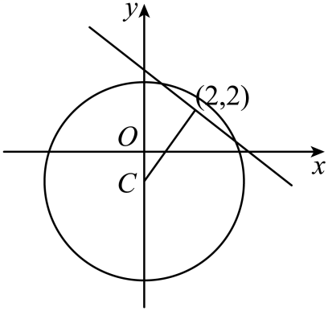

此时弦长为，所以截得的弦长为整数可取；

由对称性可知，当弦长为时，各对应两条，共8条，

当弦长为8时，只有直径1条，

所以满足条件的直线*l*共有9条.

故答案为：9

<strong>变式8．</strong>（2024·全国·高三专题练习）已知<em>A</em>，<em>B</em>分别为圆与圆上的点，<em>O</em>为坐标原点，则面积的最大值为______.

【答案】/

【解析】设*M*：，则半径为1；

圆*N*：，则，半径为2.

以*ON*为直径画圆，延长*BO*交圆于*F*，连接*FE*，*NE*，*NF*，

如图:

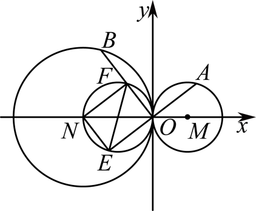

则，又，所以*F*为*BO*的中点，

由对称性可得，

，及，

所以，

故当最大时，最大，

故转化为在半径为1的内接三角形*OEF*的面积的最大值问题，

对于一个单位圆内接三角形的面积，

，又，，

所以，

当且仅当时，即三角形为等边三角形时等号成立，

此时，

所以，

即三角形*OEF*的面积的最大值为，

所以最大值为.

故答案为：

<strong>变式9．</strong>（2024·广东广州·广州市从化区从化中学校考模拟预测）已知直线与圆交于<em>A</em>，两点，若是圆上的一动点，则面积的最大值是___________.

【答案】/

【解析】，则圆*C*的圆心为，半径为，

圆心*C*到直线*l*（弦*AB*）的距离为，

则，

则到弦*AB*的距离的最大值为，

则面积的最大值是.

故答案为：

<strong>变式10．</strong>（2024·全国·高三专题练习）已知圆的方程为，若直线与圆相交于两点，则的面积为___________.

【答案】12

【解析】圆：，得圆心为，半径为，

圆心到直线的距离，因此，

所以.

故答案为：.

<strong>变式11．</strong>（2024·全国·高三专题练习）在平面直角坐标系<em>xOy</em>中，过点的直线<em>l</em>与圆相交于<em>M</em>，<em>N</em>两点，若，则直线<em>l</em>的斜率为__________.

【答案】

【解析】由题意得，直线的斜率存在，设，，直线*MN*的方程为，与联立，得，，得，，.因为，所以，则，于是，（由点*A*及*C*在*y*轴上可判断出，同号）

所以，两式消去，得，满足，所以.

故答案为：

<strong>变式12．</strong>（2024·广东惠州·统考模拟预测）在圆内，过点的最长弦和最短弦分别为和，则四边形的面积为__________．

【答案】

【解析】圆的方程化为标准方程为：，

则圆心半径，由题意知最长弦为过点的直径，最短弦为过点和这条直径垂直的弦，即，且，圆心和点之间的距离为1，

故，

所以四边形*ABCD*的面积为．

故答案为：

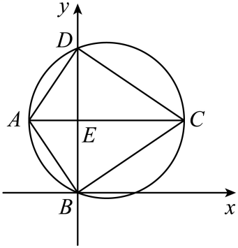

**【解题方法总结】**

弦长问题

①利用垂径定理：半径，圆心到直线的距离，弦长具有的关系，这也是求弦长最常用的方法．

②利用交点坐标：若直线与圆的交点坐标易求出，求出交点坐标后，直接用两点间的距离公式计算弦长．

③利用弦长公式：设直线，与圆的两交点，将直线方程代入圆的方程，消元后利用根与系数关系得弦长：．

**题型三：切线问题、切线长问题**

<strong>例7．</strong>（2024·辽宁锦州·校考一模）写出一条与圆和曲线都相切的直线的方程：___________.

【答案】（答案不唯一）

【解析】设切线与圆相切于点，则，

切线的方程为，即，

将与联立，可得，

令，

联立解得或或或

所以切线的方程为或或或.

故答案为：（答案不唯一）

<strong>例8．</strong>（2024·河南开封·统考三模）已知点，，经过<em>B</em>作圆的切线与<em>y</em>轴交于点<em>P</em>，则______．

【答案】

【解析】如图所示，设圆心为*C*点，则，

，则点在圆上，且，

由与圆相切可得：，则，，

则，故，则，

从而可得,

故答案为：.

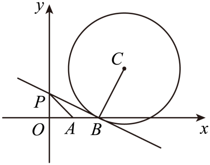

<strong>例9．</strong>（2024·全国·高三专题练习）经过点且与圆相切的直线方程为__________．

【答案】

【解析】圆的标准方程为：，

当直线的斜率不存在时，直线方程为，不符合题意；

当直线的斜率存在时，设直线方程为，即，

因为直线与圆相切，

所以圆心到直线的距离相等，即，

化简得，

解得，，

综上：直线方程为：，

故答案为：

<strong>变式13．</strong>（2024·福建宁德·校考模拟预测）已知圆<em>C</em>：，直线<em>l</em>的横纵截距相等且与圆<em>C</em>相切﹐则直线<em>l</em>的方程为____________．

【答案】，或，或

【解析】圆的标准方程为，圆心为，半径为，

因为直线*l*的横纵截距相等，所以直线的斜率存在，

当直线过原点时，设直线的方程为，因为直线*l*与圆*C*相切，

此时圆心到直线的距离等于半径，可得，解得，所以切线方程为；

当直线不过原点时，设直线的方程为，因为直线*l*与圆*C*相切，

此时圆心到直线的距离等于半径，可得，解得，所以切线方程为或，

综上所述，直线*l*的方程为，或，或.

故答案为：，或，或.

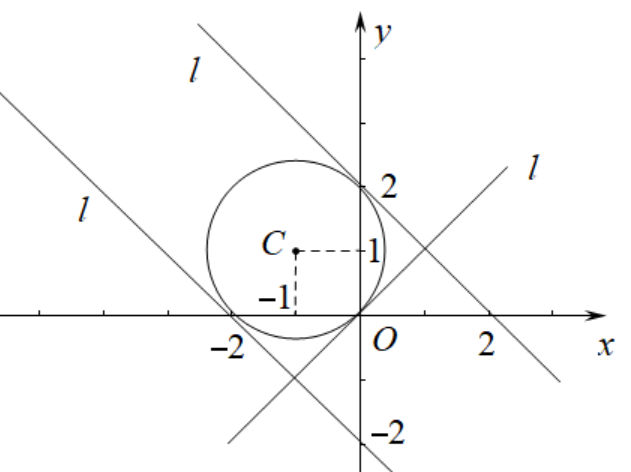

<strong>变式14．</strong>（2024·福建福州·统考模拟预测）写出经过抛物线的焦点且和圆相切的一条直线的方程_________.

【答案】（或，写出一个方程即可）

【解析】抛物线的焦点为，圆的圆心为，半径为2.

记过点的直线为*l*，当*l*斜率不存在时，由图可知*l*与圆相切，此时*l*的方程为；

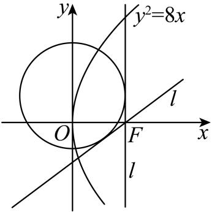

当*l*斜率存在时，设其方程为，即，

因为直线*l*与圆相切，所以，解得

所以*l*的方程为，即.

故答案为：（或，写出一个方程即可）

<strong>变式15．</strong>（2024·重庆·统考模拟预测）过点且与圆：相切的直线方程为__________

【答案】或

【解析】将圆方程化为圆的标准方程，得圆心，半径为，

当过点的直线斜率不存在时，直线方程为 是圆的切线，满足题意；

当过点的直线斜率存在时，

可设直线方程为，即，

利用圆心到直线的距离等于半径得，解得，

即此直线方程为，

故答案为：或 ．

<strong>变式16．</strong>（2024·湖北·高三校联考开学考试）已知过点作圆的切线，则切线长为___________.

【答案】

【解析】由圆，可得圆心，半径，

设切点为，因为，可得，

所以切线长为.

故答案为：.

<strong>变式17．</strong>（2024·江苏无锡·校联考三模）已如，是抛物线上的动点（异于顶点），过作圆的切线，切点为，则的最小值为______.

【答案】3

【解析】依题意，设，有，圆的圆心，半径，

于是，

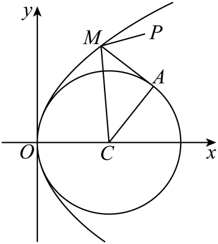

因此，表示抛物线上的点到*y*轴距离与到定点的距离的和，

而点在抛物线内，当且仅当是过点垂直于*y*轴的直线与抛物线的交点时，取得最小值3，

所以的最小值为3.

故答案为：3.

<strong>变式18．</strong>（2024·吉林通化·梅河口市第五中学校考模拟预测）由直线上一点向圆引切线，则切线长的最小值为______．

【答案】

【解析】设过点的切线与圆相切于点，连接，则，

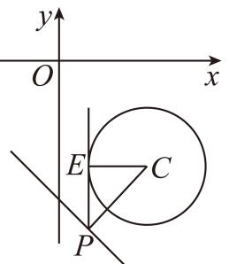

圆的圆心为，半径为，则，

当与直线垂直时，取最小值，且最小值为，

所以，，即切线长的最小值为.

故答案为：.

<strong>变式19．</strong>（2024·山西朔州·高三怀仁市第一中学校校考阶段练习）若在圆<em>C</em>：上存在一点<em>P</em>，使得过点<em>P</em>作圆<em>M</em>：的切线长为，则<em>r</em>的取值范围为__________．

【答案】

【解析】设点，过点作圆*M*：的切线，切点为，

由题意可知：，因为点，

所以，化简整理可得：，

所以，因为，，

所以，解得：，

所以的取值范围为，

故答案为：.

<strong>变式20．</strong>（2024·天津滨海新·天津市滨海新区塘沽第一中学校考模拟预测）已知圆与直线相交所得圆的弦长是，若过点作圆的切线，则切线长为______.

【答案】

【解析】由，得，

则圆心为，半径为，

圆心到直线的距离为，

因为圆与直线相交所得圆的弦长是，

所以，解得或（舍去），

所以圆心为，半径为，

所以与间的距离为，

所以所求的切线长为，

故答案为：.

<strong>变式21．</strong>（2024·天津南开·统考二模）若直线与圆相切，则______.

【答案】/0.75

【解析】由题意圆心为，半径为2，

所以，解得．

故答案为：．

<strong>变式22．</strong>（2024·湖北·高三校联考阶段练习）已知，，过<em>x</em>轴上一点<em>P</em>分别作两圆的切线，切点分别是<em>M</em>，<em>N</em>，当取到最小值时，点<em>P</em>坐标为______.

【答案】

【解析】的圆心为，半径，

的圆心为，半径，

设，则，

所以，

取，

则，

当三点共线时取等号，

此时直线：

令，则，，

故答案为：

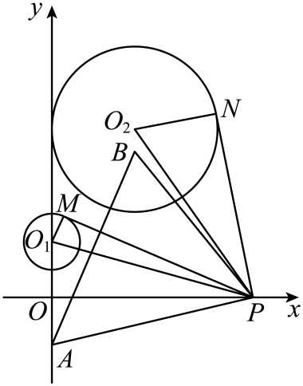

**【解题方法总结】**

（1）圆的切线方程的求法

①点在圆上，

法一：利用切线的斜率与圆心和该点连线的斜率的乘积等于，即．

法二：圆心到直线的距离等于半径．

②点在圆外，则设切线方程：，变成一般式：，因为与圆相切，利用圆心到直线的距离等于半径，解出．

**注意：** 因为此时点在圆外，所以切线一定有两条，即方程一般是两个根，若方程只有一个根，则还有一条切线的斜率不存在，务必要把这条切线补上．

（2）常见圆的切线方程

过圆上一点的切线方程是；

过圆上一点的切线方程是．

**题型四：切点弦问题**

<strong>例10．</strong>（2024·浙江·高三浙江省富阳中学校联考阶段练习）从抛物线上一点作圆：得两条切线，切点为，则当四边形面积最小时直线方程为________.

【答案】

【解析】如图，由题可知 ，，由对称性可知，

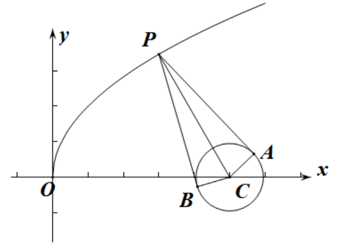

所以求四边形的最小面积即求的最小值

设，，则

当，即时，，四边形的最小面积为

所以

所以以为直径的圆的方程为：

则为以圆和以为直径的圆的公共弦

如图所示

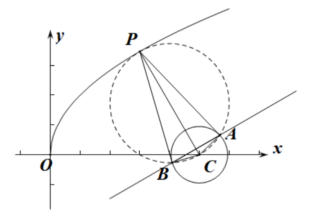

两圆方程作差得：

所以直线方程为

故答案为：

<strong>例11．</strong>（2024·贵州·高三凯里一中校联考开学考试）已知圆，过直线上任意一点，作圆的两条切线，切点分别为两点，则的最小值为__________.

【答案】

【解析】由题意得，圆的圆心为，半径为，

如图所示，

根据圆的切线长公式，可得，

则，

当取最小值时，取最小值，此时，则，

则.

故答案为：.

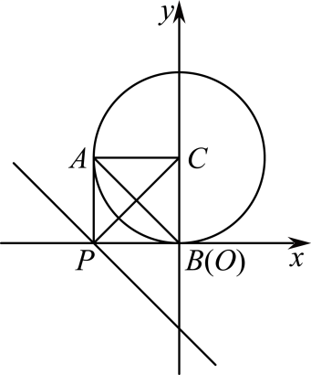

<strong>例12．</strong>（2024·北京·高三强基计划）如图，过椭圆上一点<em>M</em>作圆的两条切线，过切点的直线与坐标轴于<em>P</em>，<em>Q</em>两点，<em>O</em>为坐标原点，则面积的最小值为（    ）

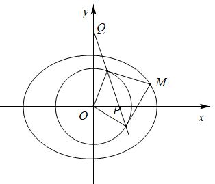

A．	B．	C．	D．前三个答案都不对

【答案】B

【解析】设点，由于点*M*在椭圆上，所以，

由切点弦方程，

所以，

由于，

当时，上述不等式取等号，取得最大值3，此时面积取得最小值．

故选：B**.**

**变式23．**（2024·山东泰安·统考模拟预测）已知直线与圆，过直线上的任意一点向圆引切线，设切点为，若线段长度的最小值为，则实数的值是（    ）

A．	B．	C．	D．

【答案】A

【解析】圆，设，

则，则，，

则，所以圆心到直线的距离是，

，得，．

故选：A．

**变式24．**（2024·全国·高三专题练习）已知点在直线上，过点作圆的两条切线，切点分别为，则圆心到直线的距离的最大值为（    ）

A．	B．	C．1	D．

【答案】B

【解析】由题意可得的圆心到直线的距离为，

即与圆相离；

设为直线上的一点，则，

过点*P*作圆的切线，切点分别为，则有，

则点在以为直径的圆上，

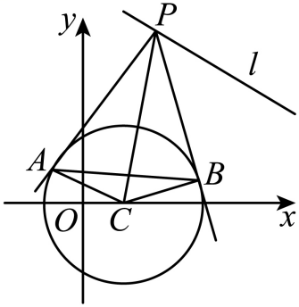

以为直径的圆的圆心为 ，半径为，

则其方程为，变形可得 ，

联立，可得：，

又由，则有 ，

变形可得 ，

则有，可得，故直线恒过定点，

设，由于，故点在内，

则时，*C*到直线的距离最大，

其最大值为,

故选∶B

**变式25．**（2024·重庆·统考模拟预测）若圆关于直线对称，动点在直线上，过点引圆的两条切线、，切点分别为、，则直线恒过定点，点的坐标为（    ）

A．	B．	C．	D．

【答案】C

【解析】由题意可知：圆的圆心在直线上，

即有 ，

设点 ，则 ，

故以为直径的圆的方程为： ，

将和相减，

即可得直线的方程，即 ，

则直线恒过定点，

故选：C

<strong>变式26．（多选题）</strong>（2024·全国·高三专题练习）已知圆：，点<em>M</em>在抛物线：上运动，过点引直线与圆相切，切点分别为，则下列选项中能取到的值有（    ）

A．2	B．	C．	D．

【答案】BC

【解析】解析：如图，

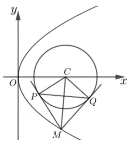

连接，题意，，而，而，则垂直平分线段，

于是得四边形面积为面积的2倍，

从而得，

即，

设点，而，

则，即，

所以，即，得，

所以的取值范围为．故选BC．

**变式27．**（2024·江苏南京·高三统考开学考试）过抛物线上一点作圆的切线，切点为、，则当四边形的面积最小时，直线的方程为（    ）

A．	B．	C．	D．

【答案】C

【解析】连接、，

圆的圆心为，半径为，易知圆心为抛物线的焦点，

设点，则，则，

当且仅当时，等号成立，此时点与坐标原点重合，

由圆的几何性质可得，，由切线长定理可得，

则，所以，，

所以，，

此时点与坐标原点重合，且圆关于轴对称，此时点、也关于轴对称，

则轴，

在中，，，，则，

所以，，因此，直线的方程为.

故选：C.

**【解题方法总结】**

过圆外一点作圆的两条切线，则两切点所在直线方程为

过曲线上，做曲线的切线，只需把替换为，替换为，替换为，替换为即可，因此可得到上面的结论．

**题型五：圆上的点到直线距离个数问题**

**例13．**（2024·贵州贵阳·高三贵阳一中校考期末）若圆上有四个不同的点到直线的距离为，则的取值范围是（    ）

A．	B．	C．	D．

【答案】C

【解析】将圆的方程化为标准方程为，圆心为，半径为，

设与直线平行且到直线的距离为的直线的方程为，

则，解得或，

所以，直线、均与圆相交，

所以，，解得，

因此，实数的取值范围是.

故选：C.

<strong>例14．</strong>（2024·陕西咸阳·高三武功县普集高级中学校考阶段练习）圆<em>C</em>：上恰好存在2个点，它到直线的距离为1，则<em>R</em>的一个取值可能为（    ）

A．1	B．2	C．3	D．4

【答案】B

【解析】圆*C*：的圆心，半径*R*

点*C*到直线的距离为

圆*C*上恰好存在2个点到直线的距离为1，则

故选：B

<strong>例15．</strong>（2024·全国·高三专题练习）已知圆<em>O</em>：<em>x2</em>＋<em>y2</em>＝4上到直线<em>l</em>：<em>x</em>＋<em>y</em>＝<em>a</em>的距离等于1的点至少有2个，则<em>a</em>的取值范围为(　　)

A．	B．

C．	D．

【答案】A

【解析】由圆的方程可知圆心为，半径为2，因为圆上的点到直线的距离等于1的点至少有2个，所以圆心到直线的距离，即，解得，故选A.

**变式28．**（2024·全国·高三专题练习）若圆上恰有2个点到直线的距离为1，则实数的取值范围为（    ）

A．	B．	C．	D．

【答案】A

【解析】因为圆心到直线的距离，

故要满足题意，只需，解得.

故选：A.

**变式29．**（1991·全国·高考真题）圆上到直线的距离为的点共有

A．个	B．个	C．个	D．个

【答案】C

【解析】求出圆的圆心和半径，比较圆心到直线的距离和圆的半径的关系即可得解.圆可变为，

圆心为，半径为，

圆心到直线的距离，

圆上到直线的距离为的点共有个.

故选：C.

**变式30．**（2024·全国·高三专题练习）若圆上仅有4个点到直线的距离为1，则实数的取值范围为（    ）

A．	B．	C．	D．

【答案】A

【解析】到已知直线的距离为1的点的轨迹，是与已知直线平行且到它的距离等于1的两条直线，根据题意可得这两条平行线与有4个公共点，由此利用点到直线的距离公式加以计算，可得的取值范围．作出到直线的距离为1的点的轨迹，得到与直线平行，

且到直线的距离等于1的两条直线，

圆的圆心为原点，

原点到直线的距离为，

两条平行线中与圆心距离较远的一条到原点的距离为，

又圆上有4个点到直线的距离为1，

两条平行线与圆有4个公共点，即它们都与圆相交．

由此可得圆的半径，

即，实数的取值范围是．

故选：．

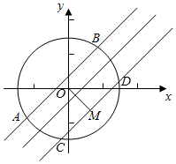

**【解题方法总结】**

**临界法**

**题型六：直线与圆位置关系中的最值（范围）问题**

**例16．**（2024·湖北·统考模拟预测）已知点在圆运动，若对任意点，在直线上均存在两点，使得恒成立，则线段长度的最小值是（    ）

A．	B．	C．	D．

【答案】D

【解析】如图，

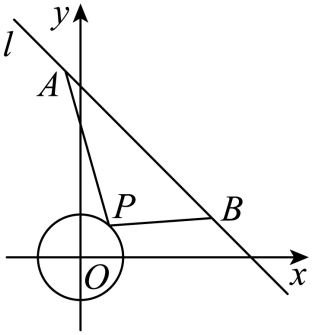

由题可知，圆心为点，半径为1，

若直线上存在两点，使得恒成立，

则始终在以为直径的圆内或圆上，点到直线的距离为，

所以长度的最小值为.

故选：D

<strong>例17．</strong>（2024·河南洛阳·高三伊川县第一高中校联考开学考试）已知圆，点在直线上，过点作直线与圆相切于点，则的周长的最小值为________.

【答案】/

【解析】由圆知圆心，半径，

因为与圆相切于点，所以，

所以，所以越小，越小，

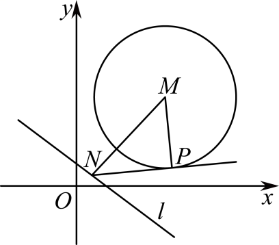

当时，最小，

因为圆心到直线的距离为，所以的最小值为6，

此时，，，

故的周长的最小值为.

故答案为：.

<strong>例18．</strong>（2024·河北石家庄·高三校联考阶段练习）如图，正方形的边长为4，是边上的一动点，交于点，且直线平分正方形的周长，当线段的长度最小时，点到直线的距离为______.

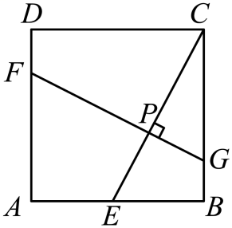

【答案】

【解析】根据题意平分正方形周长，可得恒过正方形的中心，设的中心为点，由可知，点的轨迹是以为直径的圆，

以为坐标原点，为轴，为轴建立直角坐标系，

则，，，，

以为直径的圆的方程为，

设为圆心，可知坐标为，当最小时，，，三点共线，

可知此时直线的方程为，

则点到直线的距离为.

故答案为：.

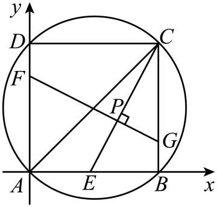

<strong>变式31．</strong>（2024·广东梅州·高三大埔县虎山中学校考阶段练习）直线分别与轴，轴交于<em>A</em>，<em>B</em>两点，点<em>P</em>在圆上，则面积的取值范围是___________.

【答案】

【解析】对于，当时，，当时，，

所以，

所以，

圆的圆心，半径，

圆心到直线的距离为，

所以点*P*到直线的距离的最大值，

点*P*到直线的距离的最小值，

所以面积的最大值为，

面积的最小值为，

所以面积的取值范围是，

故答案为：

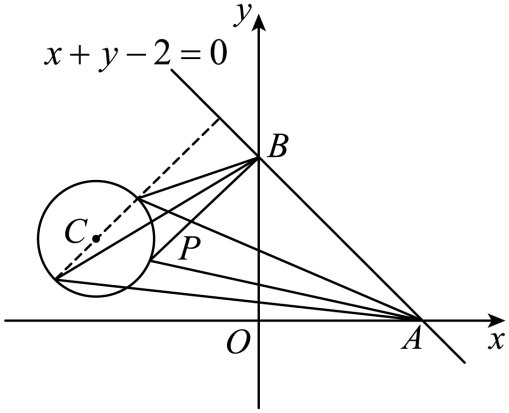

<strong>变式32．</strong>（2024·上海徐汇·高三上海民办南模中学校考阶段练习）若，则的最小值为______.

【答案】

【解析】曲线表示的是以点为圆心，以为半径的圆，

表示点到点的距离，

表示点到直线的距离，设点在直线上的射影点为，

则，

当且仅当、、三点共线且点为线段与圆的交点时，等号成立，

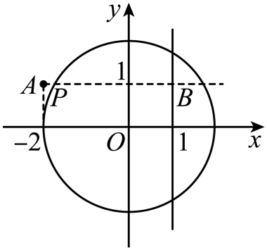

故的最小值为.

故答案为：.

<strong>变式33．</strong>（2024·湖北武汉·武汉二中校联考模拟预测）已知圆与直线相切，函数过定点，过点作圆的两条互相垂直的弦，则四边形面积的最大值为__________.

【答案】5

【解析】由题意圆与直线相切，

圆心为，半径为，

函数过定点

如图连接*OA*、*OD*作垂足分别为*E*、*F*，

，

四边形*OEMF*为矩形，

已知，，

设圆心*O*到*AC*、*BD*的距离分别为、，

则

四边形*ABCD*的面积为：，

从而：，

当且仅当时即取等号，

故四边形*ABCD*的面积最大值是5，

故答案为：5.

<strong>变式34．</strong>（2024·辽宁大连·大连二十四中校考模拟预测）已知是平面内的三个单位向量，若，则的最小值是__________．

【答案】

【解析】均为单位向量且，不妨设，，且，

，，

，

的几何意义表示的是点到和两点的距离之和的2倍，

点在单位圆内，点在单位圆外，

则点到和两点的距离之和的最小值即为和两点间距离，

所求最小值为.

故答案为：.

<strong>变式35．</strong>（2024·安徽池州·高三池州市第一中学校考阶段练习）已知，直线为上的动点，过点作的切线，切点为，当最小时，直线的方程为__________.

【答案】

【解析】圆的方程可化为，则圆心，半径，

可得点到直线的距离为，

所以直线与圆相离，

依圆的知识可知，四点四点共圆，且，

所以，

原题意等价于取到最小值，

当直线时，，此时最小.

的直线方程为：，

与联立，解得：，即，

则的中点为，

所以以为直径的圆的方程为，即，

两圆的方程相减可得：，

即直线的方程为.

故答案为：.

<strong>变式36．</strong>（2024·全国·高三专题练习）已知，点<em>A</em>为直线上的动点，过点<em>A</em>作直线与相切于点<em>P</em>，若，则的最小值为__________.

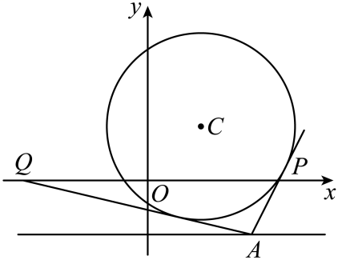

【答案】

【解析】

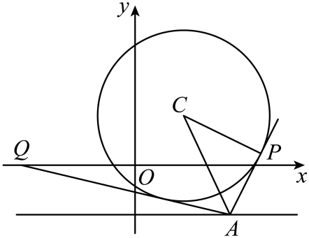

设，，连接，所以，且，

所以，

，

所以求的最小值可转化为求到两点和距离和的最小值，如图，连接即可，所以，

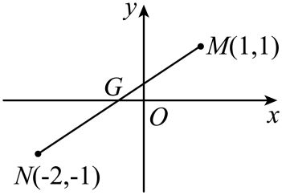

故答案为：.

<strong>变式37．</strong>（2024·广东佛山·华南师大附中南海实验高中校考模拟预测）若直线与相交于点，过点作圆的切线，切点为，则|<em>PM</em>|的最大值为______．

【答案】

【解析】直线过定点，直线过定点，

显然这两条直线互相垂直，因此在以为直径的圆上，设该圆的圆心为，

显然点的坐标为，所以该圆的方程为，

由圆的切线性质可知：，要想|*PM*|的值最大，只需的值最大，

当点在如下图位置时，的值最大，即，

所以|*PM*|的最大值为，

故答案为：

<strong>变式38．</strong>（2024·河南·高三信阳高中校联考阶段练习）已知函数的图象恒过定点<em>A</em>，圆上两点，满足，则的最小值为 ______．

【答案】

【解析】因为时，，

所以函数的图象过定点，

因为，

所以点三点共线，，

因为，为圆上两点，

所以点为过点的直线与圆的两个交点，

设线段的中点为，则，

因为表示点，到

直线的距离和，

表示表示点到直线的距离，

分别过点作与直线垂直，垂足为，

则，

所以，

因为，直线过点，所以，

所以，

所以，化简可得，

即点在圆上，

所以点的轨迹为以为圆心，半径为的圆，

所以点到直线的距离的最小值为，

所以，

所以，

所以，

故答案为：.

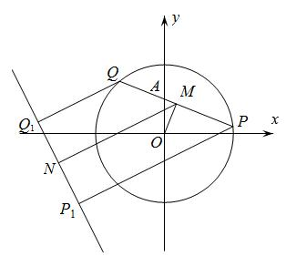

<strong>变式39．</strong>（2024·四川成都·统考模拟预测）已知圆<em>C</em>：与直线<em>l</em>：交与<em>A</em>，<em>B</em>两点，当|<em>AB</em>|最小值时，直线<em>l</em>的一般式方程是___________.

【答案】

【解析】由圆的方程可得圆心为，直线的方程可整理为，令，解得，所以直线过定点，当垂直直线时，最小，所以，解得，所以直线的方程为，即.

故答案为：.

<strong>变式40．</strong>（2024·北京西城·高三北京市回民学校校考阶段练习）已知圆与直线相交于两点，则的最小值是______.

【答案】

【解析】根据题意，圆即，

圆心的坐标为，半径，

直线，即，恒过定点，

又由圆的方程为，则点在圆内，

分析可得：当直线与垂直时，弦最小，

此时，

则的最小值为；

故答案为：.

<strong>变式41．</strong>（2024·宁夏石嘴山·石嘴山市第三中学校考模拟预测）已知分别是圆，圆上动点，是直线上的动点，则的最小值为________．

【答案】3

【解析】，，

，，，

设关于的对称点为，

则，解得，即.

所以圆关于直线的对称圆：

因为，，

所以.

故答案为：3

<strong>变式42．</strong>（2024·全国·高三专题练习）已知实数<em>x</em>，<em>y</em>满足：，则的取值范围是______．

【答案】

【解析】解法一：因为，所以令，，

则，，

故，其中，，因为，

所以，

所以，

故的取值范围为．

解法二：因为圆心到直线的距离，

所以圆心上的点到直线的距离的取值范围为，

又因为，

所以的取值范围是．

故答案为：．

<strong>变式43．</strong>（2024·福建福州·高三福建省福州格致中学校考期中）已知是圆上两点，若，则的最大值为______.

【答案】4

【解析】由，得为等腰直角三角形，

设为的中点，则，且，

则点在以为圆心，为半径的圆上，

表示两点到直线的距离之和，

两点到直线的距离之和等于中点到直线的距离的2倍，

点到直线的距离为，

所以点直线的距离的最大值为，

所以的最大值为，

所以的最大值为.

故答案为：4.

<strong>变式44．</strong>（2024·广东广州·高三广州市白云中学校考期中）已知<em>P</em>是直线上的动点，是圆的两条切线，<em>A</em>，<em>B</em>是切点，<em>C</em>是圆心，那么四边形面积的最小值为______________．

【答案】

【解析】，即，圆心为，半径，

，即最小时，面积最小.

，故四边形面积的最小值为.

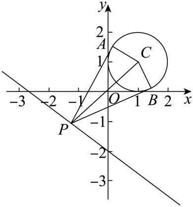

故答案为：

<strong>变式45．</strong>（2024·全国·高三专题练习）设，，<em>O</em>为坐标原点，点<em>P</em>满足，若直线上存在点<em>Q</em>使得，则实数<em>k</em>的取值范围为（     ）

A．	B．

C．	D．

【答案】C

【解析】设，

，

，即．

点*P*的轨迹为以原点为圆心，2为半径的圆面．

若直线上存在点*Q*使得，

则*PQ*为圆的切线时最大，

，即．

圆心到直线的距离，

或．

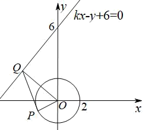

故选：C．

**变式46．**（2024·四川成都·四川省成都市玉林中学校考模拟预测）德国数学家米勒曾提出最大视角问题，这一问题一般的描述是：已知点，是的边上的两个定点，是边上的一个动点，当在何处时，最大？问题的答案是：当且仅当的外接圆与边相切于点时最大，人们称这一命题为米勒定理.已知点，的坐标分别是，，是轴正半轴上的一动点.若的最大值为，则实数的值为（    ）

A．2	B．3	C．或	D．2或4

【答案】C

【解析】根据米勒定理，当最大时，的外接圆与轴正半轴相切于点.

设的外接圆的圆心为，则，圆的半径为.

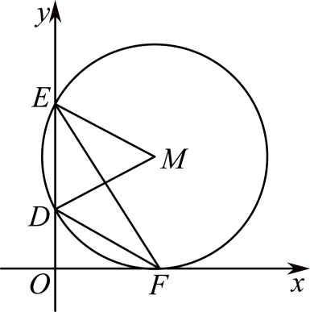

因为为，所以，即为等边三角形，

所以，即或，解得或.

故选：C.

<strong>变式47．</strong>（2024·新疆乌鲁木齐·统考三模）已知直线与轴和轴分别交于<em>A</em>，两点，以点<em>A</em>为圆心，2为半径的圆与轴的交点为（在点<em>A</em>右侧），点在圆上，当最大时，的面积为（    ）

A．	B．8	C．	D．

【答案】A

【解析】如图所示，不难发现当*BP*为圆的一条位于*AB*下方的切线时满足最大，

由题意可得，不妨设，

则*A*到*BP*的距离为，或（舍去）.

则，

此时到*BP*的距离为，

所以的面积为

故选：A

<strong>变式48．</strong>（2024·江西赣州·统考模拟预测）已知圆<em>C</em>：，圆是以圆上任意一点为圆心，半径为1的圆．圆<em>C</em>与圆交于<em>A</em>，<em>B</em>两点，则当最大时，（    ）

A．1	B．	C．	D．2

【答案】D

【解析】依题意，在中，，如图，

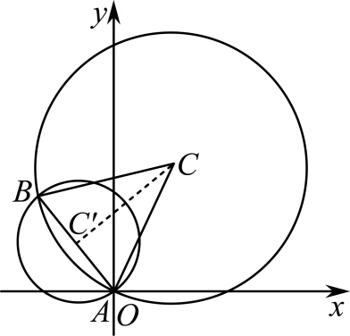

显然，是锐角，，又函数在上递增，

因此当且仅当公共弦最大时，最大，此时弦为圆的直径，

在中，，所以.

故选：D

<strong>变式49．</strong>（2024·上海黄浦·高三上海市敬业中学校考期中）已知点<em>P</em>在圆上，点，，则错误的是（    ）

A．点*P*到直线*AB*的距离小于10	B．点*P*到直线*AB*的距离大于2

C．当最小时，	D．当最大时，

【答案】B

【解析】圆的圆心为，半径为4，

直线的方程为，即，

圆心到直线的距离为，

则点到直线的距离的最小值为，最大值为，

所以点到直线的距离小于10，但不一定大于2，故选项A正确，B错误；

如图所示，当最大或最小时，与圆相切，点位于时最小，位于时最大），

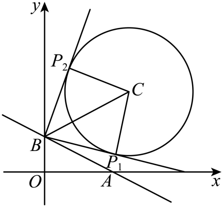

连接，，可知，，，

由勾股定理可得，故选项CD正确．

故选：B．

**变式50．**（2024·广东珠海·高二珠海市第一中学校考期末）德国数学家米勒曾提出过如下的“最大视角原理”：对定点、和在直线上的动点，当与的外接圆相切时，最大．若，，是轴正半轴上一动点，当对线段的视角最大时，的外接圆的方程为（    ）

A．	B．

C．	D．

【答案】D

【解析】设，则，，

，

当且仅当时成立,解得，，

设的外接圆的方程为，

则，解得，，，

的外接圆的方程为．

故选：．

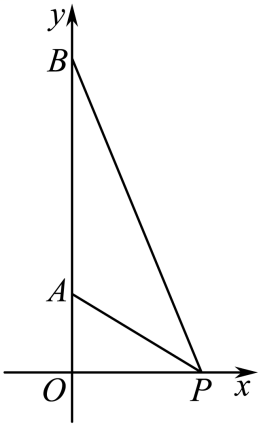

**【解题方法总结】**

直线上的点与圆上的点的最近或最远距离问题，这样的题目往往要转化为直线上的点与圆心距离的最近和最远距离再加减半径长的问题．

**题型七：圆与圆的位置关系**

<strong>例19．</strong>（2024·河南·校联考模拟预测）已知直线与圆相切，则满足条件的直线<em>l</em>的条数为（    ）

A．2	B．3	C．4	D．5

【答案】B

【解析】由已知直线，

则原点到直线*l*的距离为，

由直线*l*与圆相切，

则满足条件的直线*l*即为圆和圆的公切线，

因为圆和圆外切，

所以这两个圆有两条外公切线和一条内公切线，

所以满足条件的直线*l*有3条．

故选: B．

**例20．**（2024·黑龙江大庆·统考三模）已知直线是圆的切线，并且点到直线的距离是2，这样的直线有（    ）

A．1条	B．2条	C．3条	D．4条

【答案】D

【解析】由已知可得，圆心，半径.

由点到直线的距离是2，所以直线是以为圆心，为半径的圆的切线，

又直线是圆的切线，

所以，直线是圆与圆的公切线.

因为，

所以，两圆外离，所以两圆的公切线有4条，

即满足条件的直线有4条.

故选：D.

**例21．**（2024·全国·高三专题练习）已知圆：，圆：，则与的位置关系是（    ）

A．外切	B．内切	C．相交	D．外离

【答案】C

【解析】圆的圆心为，

圆的圆心为，

所以

所以圆与的位置关系是相交.

故选: C.

**变式51．**（2024·全国·高三专题练习）圆：与圆：公切线的条数为（    ）

A．1	B．2	C．3	D．4

【答案】C

【解析】根据题意，圆：，即，

其圆心为，半径；

圆：，即，

其圆心为，半径，

两圆的圆心距，所以两圆相外切，

其公切线条数有3条．

故选：C．

**变式52．**（2024·山西·校联考模拟预测）已知圆：的圆心到直线的距离为，则圆与圆：的公切线共有（    ）

A．0条	B．1条	C．2条	D．3条

【答案】B

【解析】圆：的圆心为，半径为*a*，

所以圆心到直线的距离为，解得或．

因为，所以.

所以圆：的圆心为，半径为．

圆：的标准方程为，

圆心坐标为，半径，

圆心距，所以两圆相内切．

所以两圆的公切线只有1条.

故选：B．

<strong>变式53．</strong>（2024·甘肃兰州·兰州五十九中校考模拟预测）在平面直角坐标系<em>xOy</em>中，已知圆<em>C</em>：<em>x2</em>＋<em>y2</em>－4<em>x</em>＝0及点<em>A</em>(－1,0)，<em>B</em>(1,2)，在圆<em>C</em>上存在点<em>P</em>，使得|<em>PA</em>|2＋|<em>PB</em>|2＝12，则点<em>P</em>的个数为（    ）

A．1	B．2	C．3	D．4

【答案】B

【解析】设<em>P</em>(<em>x</em>,<em>y</em>)，则(<em>x</em>－2)2＋<em>y2</em>＝4，|<em>PA</em>|2＋|<em>PB</em>|2＝(<em>x</em>＋1)2＋(<em>y</em>－0)2＋(<em>x</em>－1)2＋(<em>y</em>－2)2＝12，即<em>x2</em>＋<em>y2</em>－2<em>y</em>－3＝0，即<em>x2</em>＋(<em>y</em>－1)2＝4，圆心为，半径为2，又圆圆心为，半径为2，

因为，

所以圆(<em>x</em>－2)2＋<em>y2</em>＝4与圆<em>x2</em>＋(<em>y</em>－1)2＝4相交，所以点<em>P</em>的个数为2.

故选：B.

**变式54．**（2024·全国·高三专题练习）在平面直角坐标系中，已知两点，到直线的距离分别是1与4，则满足条件的直线共有（    ）

A．1条	B．2条	C．3条	D．4条

【答案】C

【解析】分别以为圆心，以为半径作圆，

因为，

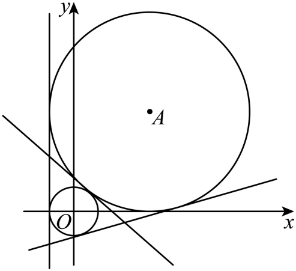

所以两圆外切，有三条公切线，即满足条件的直线共有3条，

故选：C

<strong>变式55．</strong>（2024·湖南常德·常德市一中校考二模）已知圆和两点，若圆<em>C</em>上存在点<em>P</em>，使得，则<em>a</em>的最小值为（    ）

A．6	B．5	C．4	D．3

【答案】C

【解析】由，得点*P*在圆上，故点*P*在圆上，又点*P*在圆*C*上，所以，两圆有交点，

因为圆的圆心为原点*O*，半径为*a*，圆*C*的圆心为，半径为1，

所以，又，所以，

解得，所以*a*的最小值为4.

故选：C.

<strong>变式56．</strong>（2024·全国·高三专题练习）已知圆<em>C1</em>：<em>x2</em>＋<em>y2</em>＋4<em>ax</em>＋4<em>a2</em>－4＝0和圆<em>C2</em>：<em>x2</em>＋<em>y2</em>－2<em>by</em>＋<em>b2</em>－1＝0只有一条公切线，若<em>a</em>，<em>b</em>∈<em>R</em>且<em>ab</em>≠0，则＋的最小值为（    ）

A．3	B．8	C．4	D．9

【答案】D

【解析】因为圆<em>C1</em>：<em>x2</em>＋<em>y2</em>＋4<em>ax</em>＋4<em>a2</em>－4＝0和圆<em>C2</em>：<em>x2</em>＋<em>y2</em>－2<em>by</em>＋<em>b2</em>－1＝0只有一条公切线，

所以两圆相内切，其中<em>C1</em>(－2<em>a</em>，0)，<em>r1</em>＝2；<em>C2</em>(0，<em>b</em>)，<em>r2</em>＝1，故|<em>C1C2</em>|＝，由题设可知，

当且仅当<em>a2</em>＝2<em>b2</em>时等号成立．

故选：D.

**【解题方法总结】**

已知两圆半径分别为，两圆的圆心距为，则：

（1）两圆外离；

（2）两圆外切；

（3）两圆相交；

（4）两圆内切；

（5）两圆内含；

**题型八：两圆的公共弦问题**

<strong>例22．</strong>（2024·天津和平·耀华中学校考二模）圆与圆的公共弦所在的直线方程为______．

【答案】

【解析】联立，两式相减得.

故答案为：

<strong>例23．</strong>（2024·河南·校联考模拟预测）若圆与圆交于<em>P</em>，<em>Q</em>两点，则直线<em>PQ</em>的方程为______.

【答案】

【解析】∵圆与圆相交，则两圆方程之差即为直线*PQ*的方程，

将与作差得，

整理得，

即直线*PQ*的方程为.

故答案为：.

<strong>例24．</strong>（2024·天津滨海新·统考三模）已知圆：与圆：，若两圆相交于<em>A</em>，<em>B</em>两点，则______

【答案】

【解析】圆的方程为，即①，

又圆：②，

②－①可得两圆公共弦所在的直线方程为

圆的圆心到直线的距离，

所以．

故答案为: .

<strong>变式57．</strong>（2024·天津和平·耀华中学校考一模）圆与圆的公共弦的长为_________．

【答案】

【解析】将圆与圆的方程作差可得，

所以，两圆相交弦所在直线的方程为，

圆的圆心为原点，半径为，

原点到直线的距离为，

所以，两圆的公共弦长为.

故答案为：.

<strong>变式58．</strong>（2024·浙江丽水·高三浙江省丽水中学校联考期末）已知圆与圆相交于两点，则__________.

【答案】

【解析】将圆与圆的方程相减，

即得的方程为 ，

则的圆心为，半径为，

则到直线的距离为 ，

故，

故答案为：

<strong>变式59．</strong>（2024·吉林通化·高三梅河口市第五中学校考期末）已知圆与圆相交于两点，则_________.

【答案】

【解析】因为圆与圆相交于两点，

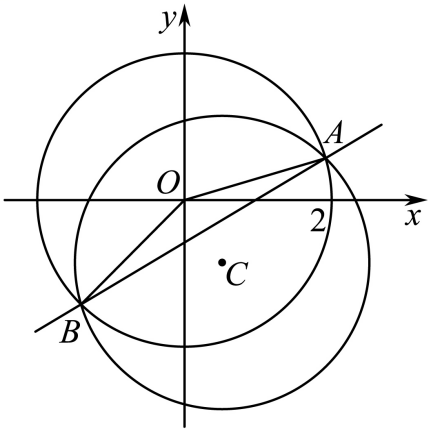

所以直线*AB*的方程为：，

即，

圆心到弦*AB*的距离，

所以，

故答案为：.

**【解题方法总结】**

两圆的公共弦方程为两圆方程相减可得．

**题型九：两圆的公切线问题**

<strong>例25．</strong>（2024·全国·高三专题练习）点，到直线<em>l</em>的距离分别为1和4，写出一个满足条件的直线<em>l</em>的方程：______.

【答案】或或（填其中一个即可）

【解析】设，，连接*MN*，则.

以*M*为圆心，1为半径作圆*M*，以*N*为圆心4为半径作圆*N*，则两圆外切，

所以两圆有3条公切线，即符合条件的直线*l*有3条.

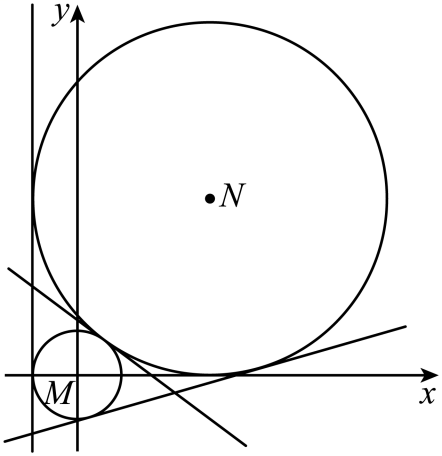

当公切线的斜率不存在时，显然公切线的方程为.

当公切线的斜率存在时，设公切线的方程为，则有，

由①②得，所以或.

由①及得，由①及得，

所以公切线方程为或.

综上，直线*l*的方程为或或.

故答案为：或或

<strong>例26．</strong>（2024·湖南岳阳·统考三模）写出与圆和都相切的一条直线方程____________．

【答案】或中任何一个答案均可

【解析】圆的圆心为，半径为，

圆的圆心为，半径为，

则，

所以两圆外离，

由两圆的圆心都在轴上，则公切线的斜率一定存在，

设公切线方程为，即，

则有，

解得或或或

所以公切线方程为或.

故答案为：.（答案不唯一，写其它三条均可）

<strong>例27．</strong>（2024·湖北黄冈·浠水县第一中学校考模拟预测）写出与圆和圆都相切的一条直线的方程___________.

【答案】（答案不唯一，或均可以）

【解析】圆的圆心为，半径为1；圆的圆心为，半径为4，圆心距为，所以两圆外切，

如图，有三条切线，易得切线的方程为；

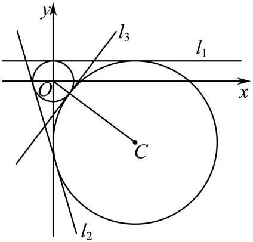

因为，且，所以，设，即，则到的距离，解得（舍去）或，所以；

可知和关于对称，联立，解得在上，

在上取点，设其关于的对称点为，则，

解得，则，

所以直线，即，

综上，切线方程为或或.

故答案为：（答案不唯一，或均可以）

<strong>变式60．</strong>（2024·湖北·模拟预测）已知圆与圆有三条公切线，则_________．

【答案】或

【解析】圆的圆心为，半径为，

圆的圆心为，半径为，

因为圆与圆有三条公切线，所以两圆外切，

所以

即

当时，，即

解得或（舍去）

当时，，即

解得或（舍去）

当时，，即

解得（舍去）

综上，或

故答案为：或

<strong>变式61．</strong>（2024·辽宁沈阳·东北育才学校校考模拟预测）已知圆，圆圆与圆相切，并且两圆的一条外公切线的斜率为7，则为_________.

【答案】

【解析】根据题意作出如下图形：

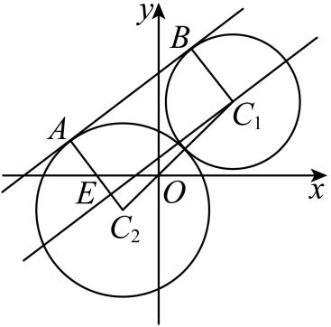

AB为两圆的公切线，切点分别为A,B.

当公切线AB与直线平行时，公切线AB斜率不为7，即

不妨设

过作AB的平行线交于点E，则：，且

,

直线的斜率为：，

所以直线AB与直线的夹角正切为：.

在直角三角形中，，所以，

又,整理得：，

解得：，又，解得：，，

所以=.

<strong>变式62．</strong>（2024·全国·高三专题练习）已知点，，符合点<em>A</em>，<em>B</em>到直线<em>l</em>的距离分别为1，3的直线方程为___________________（写出一条即可）．

【答案】或或或（写出一条即可）

【解析】由题意可知直线*l*是圆与圆的公切线，

因为两圆为外离关系，所以满足条件的直线*l*有四条．

当直线*l*是两圆的外公切线时，由几何性质（相似三角形的性质）易知直线*l*过点．

设直线*l*的方程为，则，解得，

此时直线*l*的方程为或．

当直线*l*是两圆的内公切线时，由几何性质（相似三角形的性质）易知直线*l*过点，

设直线*l*的方程为，则，解得，

此时直线*l*的方程为或．

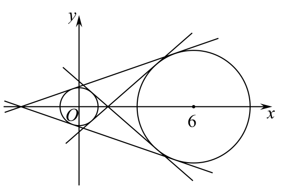

故答案为：或或或（写出一条即可）．

<strong>变式63．</strong>（2024·河南·校联考模拟预测）圆与<em>x</em>轴交于<em>A</em>，<em>B</em>两点(<em>A</em>在<em>B</em>的左侧)，点<em>N</em>满足，直线与圆<em>M</em>和点<em>N</em>的轨迹同时相切，则直线<em>l</em>的斜率为________．

【答案】

【解析】对于圆，令，得，解得或，

则，．

设，∵，∴，

则，整理得，

则点*N*的轨迹是圆心为，半径为的圆．

又圆*M*的方程为，则圆*M*的圆心为，半径为．

∵，∴两圆相交，

设直线*l*与圆*M*和点*N*轨迹圆*E*切点分别为*C*，*D*，

连接*CM*，*DE*，过*M*作*DE*的垂线，垂足为点*F*，则四边形*CDFM*为矩形，

∵，，∴，

则，

则两圆公切线*CD*的斜率即为直线*FM*的斜率为．

故答案为：.

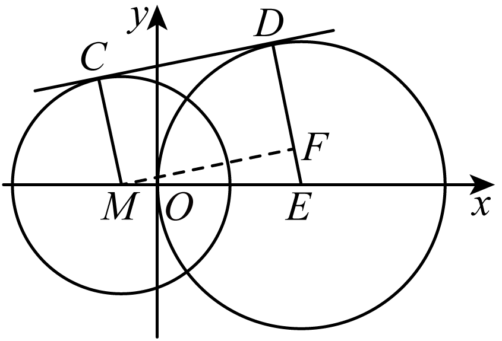

**【解题方法总结】**

**待定系数法**

