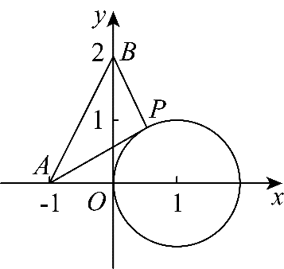
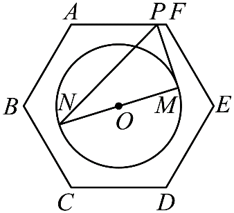
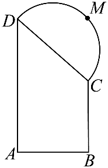

**第61讲  圆中的范围与最值**

**知识梳理**

1、涉及与圆有关的最值，可借助图形性质，利用数形结合求解．一般地：

（1）形如的最值问题，可转化为动直线斜率的最值问题．

（2）形如的最值问题，可转化为动直线截距的最值问题．

（3）形如的最值问题，可转化为曲线上的点到点（*a*，*b*）的距离平方的最值问题.

2、**解决圆中的范围与最值问题常用的策略：**

（1）数形结合

（2）多与圆心联系

（3）参数方程

（4）代数角度转化成函数值域问题

**必考题型全归纳**

**题型一：斜率型**

**例1．**（2024·江苏·高二专题练习）已知点在圆上运动，则的最大值为（    ）

A．	B．	C．	D．

**例2．（多选题）（2024·浙江嘉兴·高二校考阶段练习）** 已知点在圆上运动，则下列选项正确的是（    ）

A．的最大值为，最小值为

B．的最大值为，最小值为；

C．的最大值为，最小值为；

D．的最大值为，最小值为；

<strong>例3．</strong>（2024·全国·高三专题练习）已知为圆：上任意一点，则的最大值为___________.

<strong>变式1．</strong>（2024·重庆沙坪坝·高二重庆南开中学校考阶段练习）已知为圆<em>C</em>：上任意一点，且点．

（1）求的最大值和最小值．

（2）求的最大值和最小值．

（3）求的最大值和最小值．

**题型二：直线型**

<strong>例4．</strong>（2024·全国·高三专题练习）点是圆上的动点，则的最大值是________.

**例5．**（2024·江西吉安·宁冈中学校考一模）已知点是圆上的动点，则的最大值为（    ）

A．	B．	C．6	D．5

**例6．**（2024·全国·高三专题练习）已知点是圆：上的一动点，若圆经过点，则的最大值与最小值之和为（    ）

A．4	B．	C．	D．

**题型三：距离型**

<strong>例7．</strong>（2024·黑龙江佳木斯·高二佳木斯一中校考期中）阿波罗尼斯是古希腊著名数学家，与欧几里得、阿基米德被称为亚历山大时期数学三巨匠，他对圆锥曲线有深刻而系统的研究，阿波罗尼斯圆就是他的研究成果之一，指的是：已知动点与两个定点,的距离之比为（，且），那么点的轨迹就是阿波罗尼斯圆．若平面内两定点,间的距离为，动点满足，则的最大值为______

**例8．**（2024·江苏宿迁·高二校考阶段练习）已知为圆上任意一点，且．

(1)求的最大值和最小值；

(2)若，求的最大值和最小值；

(3)若，求的最大值和最小值．

**例9．**（2024·高一课时练习）已知点在直线上运动，求的最小值及取得最小值时点的坐标．

<strong>变式2．</strong>（2024·高二课时练习）已知点在直线上运动，则取得最小值时点的坐标为_______．

<strong>变式3．</strong>（2024·全国·高二专题练习）已知为圆上任意一点．则的最大值为__________

**变式4．**（2024·全国·高三专题练习）已知平面向量，，，满足，，，则的最小值为（    ）

A．1	B．	C．3	D．

**变式5．**（2024·广东东莞·高一东莞高级中学校考阶段练习）已知点，点在圆上运动，则的最大值为（    ）

A．22	B．26	C．30	D．32

**题型四：周长面积型**

<strong>例10．</strong>（2024·江苏·高二假期作业）已知两点，，点是圆上任意一点，则面积的最大值为______，最小值为______.

<strong>例11．</strong>（2024·全国·高二专题练习）已知圆，点<em>M</em>为直线上一个动点，过点<em>M</em>作圆<em>C</em>的两条切线，切点分别为<em>A</em>，<em>B</em>，则四边形周长的最小值为（    ）

A．8	B．	C．	D．

**例12．**（2024·全国·模拟预测）已知直线：与圆：相交于不同两点，，位于直线异侧两点，都在圆上运动，则四边形面积的最大值为（    ）

A．	B．	C．	D．

<strong>变式6．</strong>（2024·甘肃庆阳·高二校考期末）已知圆的方程为，点是直线上的一个动点，过点作圆的两条切线、，、为切点，则四边形的面积的最小值为______

**变式7．**（2024·高二课时练习）已知，，点为圆上任意一点，则面积的最大值为（    ）

A．5	B．	C．	D．

**题型五：数量积型**

<strong>例13．</strong>（2024·河南南阳·高二统考阶段练习）已知点为椭圆上任意一点，是圆上两点，且，则的最大值是________.

<strong>例14．</strong>（2024·全国·高三专题练习）已知直线与圆相切于点，设直线与轴的交点为，点为圆上的动点，则的最大值为______．

<strong>例15．</strong>（2024·江苏南京·高一校考期中）已知点，点为圆上的动点，则的最大值为__________.

<strong>变式8．</strong>（2024·全国·高一专题练习）在边长为4的正方形中，动圆<em>Q</em>的半径为1、圆心在线段（含端点）上运动，点<em>P</em>是圆<em>Q</em>上及其内部的动点，则的取值范围是（    ）．

A．	B．	C．	D．

<strong>变式9．</strong>（2024·内蒙古呼和浩特·高一呼市二中校考阶段练习）在边长为2的正六边形<em>ABCDEF</em>中，动圆的半径为1、圆心在线段<em>CD</em>（含端点）上运动，点<em>P</em>是圆<em>Q</em>上及其内部的动点，则的取值范围是（    ）

A．.	B．	C．	D．

<strong>变式10．</strong>（2024·山东聊城·高一山东聊城一中校考期中）已知正六边形<em>ABCDEF</em>的边长为2，圆<em>O</em>的圆心为正六边形的中心，半径为1，若点<em>P</em>在正六边形的边上运动，<em>MN</em>为圆<em>O</em>的直径，则的取值范围是（    ）

A．	B．	C．	D．

**题型六：坐标与角度型**

<strong>例16．</strong>（2024·浙江丽水·高二校联考开学考试）已知点<em>P</em>在圆<em>M</em>：上，点，，则最小和最大时分别为（    ）

A．0°和60°	B．15°和75°	C．30°和90°	D．45°和135°

<strong>例17．</strong>（2024·高二单元测试）已知圆<em>C</em>：(<em>x</em>﹣1)2+<em>y2</em>=1，点<em>P</em>(<em>x0</em>，<em>y0</em>)在直线<em>x</em>﹣<em>y</em>+1=0上运动.若<em>C</em>上存在点<em>Q</em>，使∠<em>CPQ</em>=30°，则<em>x0</em>的取值范围是___________.

**例18．**（2024·全国·高三专题练习）已知，满足，则的最大值为（    ）

A．	B．	C．	D．

<strong>变式11．</strong>（2024·浙江嘉兴·高二校考阶段练习）若圆）与圆交于<em>A</em>、<em>B</em>两点，则tan∠<em>ANB</em>的最大值为（    ）

A．	B．	C．	D．

<strong>变式12．</strong>（2024·全国·高三专题练习）动圆<em>M</em>经过坐标原点，且半径为1，则圆心<em>M</em>的横纵坐标之和的最大值为（    ）

A．1	B．2	C．	D．

**变式13．**（2024·全国·模拟预测）已知圆，圆是以圆上任意一点为圆心，1为半径的圆．圆与圆交于，两点，则的最大值为（    ）

A．	B．	C．	D．

**题型七：长度型**

<strong>例19．</strong>（2024·全国·高三专题练习）已知圆及点，点<em>P</em>、<em>Q</em>分别是直线和圆<em>C</em>上的动点，则的最小值为__________.

<strong>例20．</strong>（2024·湖北·高二沙市中学校联考期中）已知直线与圆交于两点，且，则的最大值为___________.

<strong>例21．</strong>（2024·上海普陀·高二上海市晋元高级中学校考期末）已知为圆上的两点，且，设为弦的中点，则的最大值为__________.

<strong>变式14．</strong>（2024·上海静安·高二校考期末）已知实数满足，，则的最大值为______.

<strong>变式15．</strong>（2024·全国·高三专题练习）古希腊数学家阿波罗尼斯在他的巨著《圆锥曲线论》中有一个著名的几何问题：在平面上给定两点<em>A</em>、<em>B</em>，动点<em>P</em>满足（其中是正常数，且），则<em>P</em>的轨迹是一个圆，这个圆称之为“阿波罗尼斯圆”．现已知两定点，<em>P</em>是圆上的动点，则的最小值为____________

**变式16．**（2024·全国·高二期中）已知圆是以点和点为直径的圆，点为圆上的动点，若点，点，则的最大值为（    ）

A．	B．	C．	D．

**变式17．**（2024·四川成都·高二成都七中校考开学考试）已知，是曲线上两个不同的点，，则的最大值与最小值的比值是（    ）

A．	B．	C．	D．

<strong>变式18．</strong>（2024·全国·高三专题练习）在中，，，点在内部，，则的最小值为______．

<strong>变式19．</strong>（2024·河南许昌·高二禹州市高级中学校考阶段练习）已知点<em>P</em>在直线上运动，点<em>E</em>是圆上的动点，点<em>F</em>是圆上的动点，则的最大值为（    ）

A．6	B．7	C．8	D．9

**题型八：方程中的参数**

<strong>例22．</strong>（2024·全国·高三专题练习）如图，在直角梯形中，，点<em>M</em>在以为直径的半圆上，且满足，则的最大值为（    ）

A．2	B．3	C．	D．

**例23．**（2024·全国·高三专题练习）已知，，，，则面积的最大值为（    ）

A．	B．	C．	D．

**例24．**（2024·河南开封·高三通许县第一高级中学校考阶段练习）已知点，点为圆上一动点，则的最大值是（    ）

A．	B．	C．	D．

<strong>变式20．</strong>（2024·福建龙岩·高二福建省龙岩第一中学校考阶段练习）已知过点的动直线与圆交于两点，过分别作的切线，两切线交于点.若动点，则的最小值为__________

