**第61讲  圆中的范围与最值**

**知识梳理**

1、涉及与圆有关的最值，可借助图形性质，利用数形结合求解．一般地：

（1）形如的最值问题，可转化为动直线斜率的最值问题．

（2）形如的最值问题，可转化为动直线截距的最值问题．

（3）形如的最值问题，可转化为曲线上的点到点（*a*，*b*）的距离平方的最值问题.

2、**解决圆中的范围与最值问题常用的策略：**

（1）数形结合

（2）多与圆心联系

（3）参数方程

（4）代数角度转化成函数值域问题

**必考题型全归纳**

**题型一：斜率型**

**例1．**（2024·江苏·高二专题练习）已知点在圆上运动，则的最大值为（    ）

A．	B．	C．	D．

【答案】C

【解析】看作圆上的点到点的直线的斜率的相反数.

当经过点的直线与上半圆相切时，切线斜率最小，

设切线方程为，所以圆心到切线的距离等于半径，故，解得 故当时，切线斜率最小，此时最大，最大值为，

故选：C

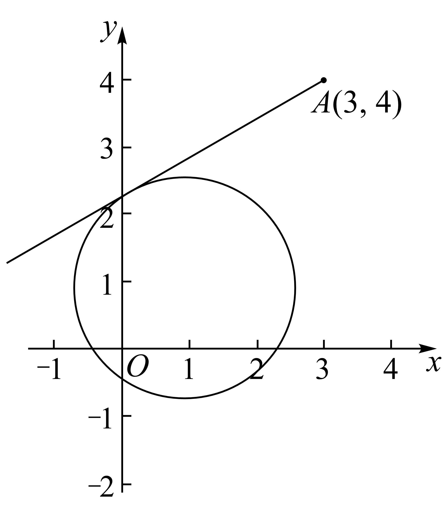

**例2．（多选题）（2024·浙江嘉兴·高二校考阶段练习）** 已知点在圆上运动，则下列选项正确的是（    ）

A．的最大值为，最小值为

B．的最大值为，最小值为；

C．的最大值为，最小值为；

D．的最大值为，最小值为；

【答案】BC

【解析】（1）设，整理得，则表示点与点连线的斜率．

当该直线与圆相切时，取得最大值与最小值，所以，解得，

所以的最大值为，最小值为；

（2）设，整理得，则表示直线在轴上的截距．

当该直线与圆相切时，取得最大值与最小值，所以，解得，

的最大值为，最小值为．

故选：BC.

<strong>例3．</strong>（2024·全国·高三专题练习）已知为圆：上任意一点，则的最大值为___________.

【答案】

【解析】

由于，故表示和连线的斜率，设，如图所示，当与圆相切时，取得最大值，

设此时，即，又圆心，半径为1，故，解得，

故的最大值为.

故答案为：.

<strong>变式1．</strong>（2024·重庆沙坪坝·高二重庆南开中学校考阶段练习）已知为圆<em>C</em>：上任意一点，且点．

（1）求的最大值和最小值．

（2）求的最大值和最小值．

（3）求的最大值和最小值．

【解析】（1）圆*C*：，如图所示，连接*QC*交圆*C*于*AB*两点，当*M*与*A*重合时取得最小值，

即，

与B重合时取得最大值即*，* 故最大值为，最小值为；

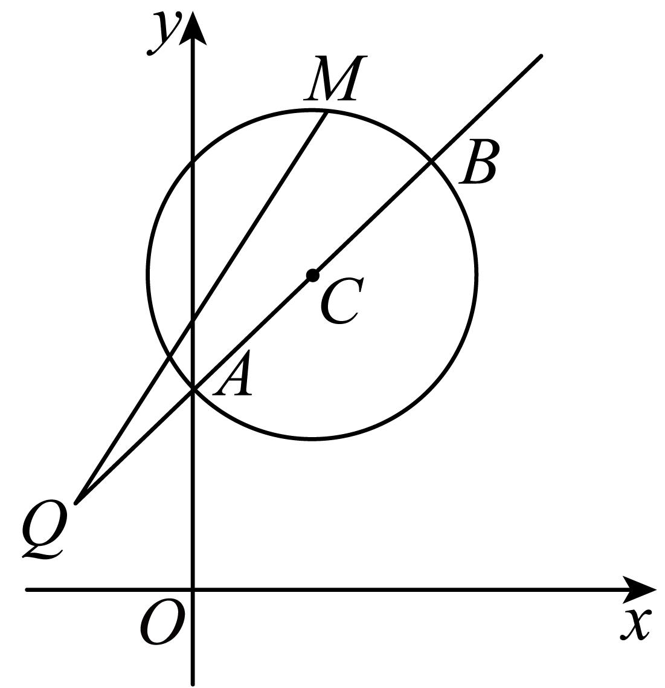

（2）易知，由图形知当与圆*C*相切时取得最值，如图所示.

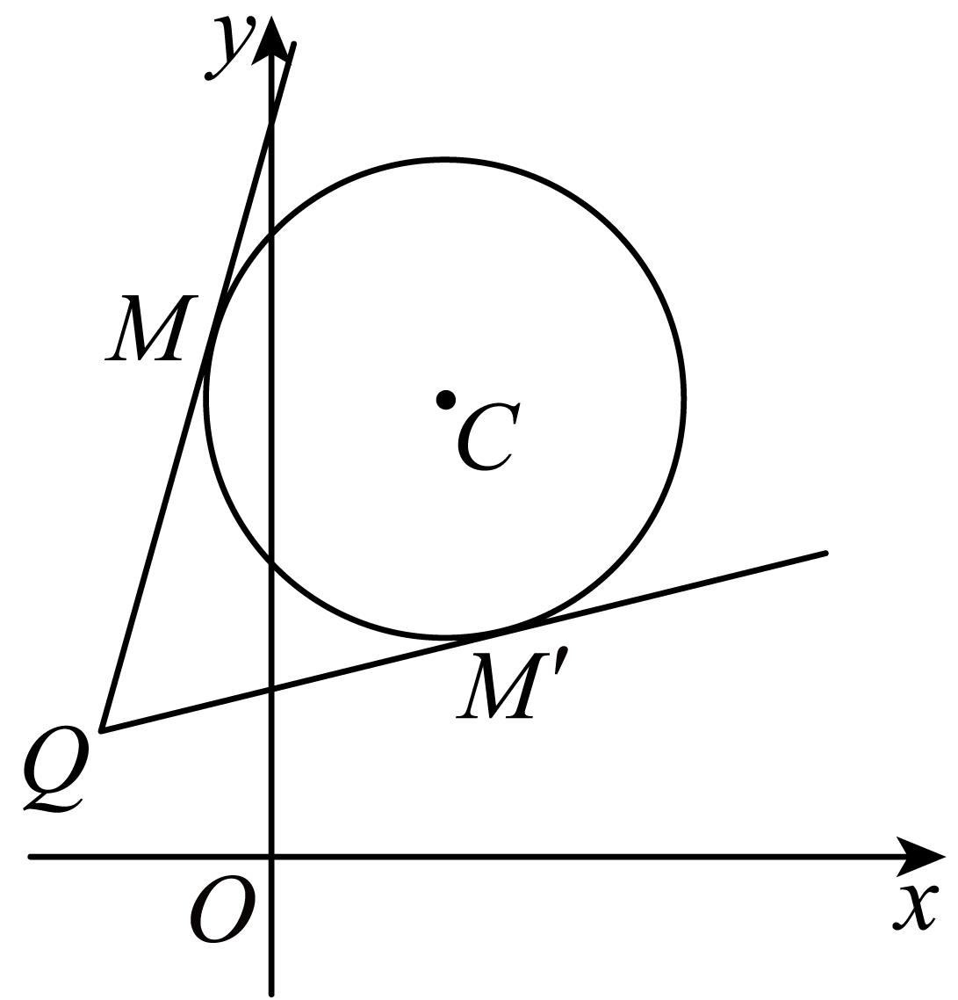

可设，则*C*到其距离为，解得，

故最大值为，最小值为

（3）设，如图所示，即过点*M*的直线的截距，如图所示，当该直线与圆相切时截距取得最值.圆心C到该直线的距离为，所以或9，故最大值为9，最小值为1.

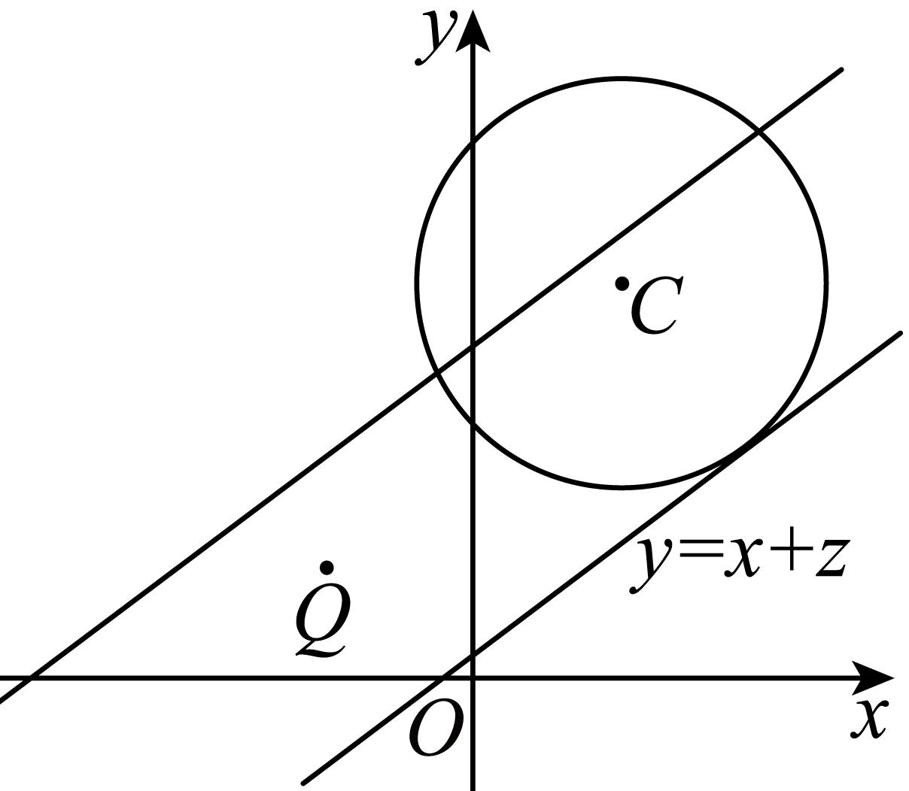

**题型二：直线型**

<strong>例4．</strong>（2024·全国·高三专题练习）点是圆上的动点，则的最大值是________.

【答案】

【解析】由，则，当且仅当时等号成立，

∴的最大值是.

故答案为：.

**例5．**（2024·江西吉安·宁冈中学校考一模）已知点是圆上的动点，则的最大值为（    ）

A．	B．	C．6	D．5

【答案】A

【解析】由，令，则，

所以当时，的最大值为.

故选：A

**例6．**（2024·全国·高三专题练习）已知点是圆：上的一动点，若圆经过点，则的最大值与最小值之和为（    ）

A．4	B．	C．	D．

【答案】C

【解析】因为圆：经过点，

．又，所以，

可看成是直线在轴上的截距.如图所示，

当直线与圆相切时，纵截距取得最大值或最小值，此时，解得，

所以的最大值为，最小值为，故的最大值与最小值之和为.

故选：C．

**题型三：距离型**

<strong>例7．</strong>（2024·黑龙江佳木斯·高二佳木斯一中校考期中）阿波罗尼斯是古希腊著名数学家，与欧几里得、阿基米德被称为亚历山大时期数学三巨匠，他对圆锥曲线有深刻而系统的研究，阿波罗尼斯圆就是他的研究成果之一，指的是：已知动点与两个定点,的距离之比为（，且），那么点的轨迹就是阿波罗尼斯圆．若平面内两定点,间的距离为，动点满足，则的最大值为______

【答案】/

【解析】由题可知,

不妨设：

所以有，

因为

得，整理得，得，

显然，得，解得：

有=

因为，

所以当时，有最大值为

故答案为：

**例8．**（2024·江苏宿迁·高二校考阶段练习）已知为圆上任意一点，且．

(1)求的最大值和最小值；

(2)若，求的最大值和最小值；

(3)若，求的最大值和最小值．

【解析】（1）因为，即在圆外，

圆的圆心，半径，

，

因为，即，

所以的最大值为，最小值为；

（2）圆的圆心，半径，

令可得，即圆和直线总有公共点求的最大值和最小值，

即，解得，

所以的最大值为，最小值为；

（3），

令，

当即时，

此时点在圆外，所以，求的最大值和最小值转化为求

圆与圆总有公共点求的最大值和最小值，而

两圆心的距离为，

当两圆外切时，解得，此时，

当两圆内切时，两圆心的距离，所以只能圆在圆的内部，

所以，解得，此时，

所以的最大值为，最小值为．

**例9．**（2024·高一课时练习）已知点在直线上运动，求的最小值及取得最小值时点的坐标．

【解析】因为，可看作定点与直线上任意一点距离的平方，所以距离最小值即是点到直线的距离，

由点到直线的距离公式可得最小值为；

此时直线与直线垂直，所以直线的方程为，即，

由得，即.

故的最小值为，此时点P的坐标为.

<strong>变式2．</strong>（2024·高二课时练习）已知点在直线上运动，则取得最小值时点的坐标为_______．

【答案】

【解析】转化为直线上的点到点的距离的平方，

又点到直线的距离最小，

过点且与直线垂直的直线为

因此两直线联立，，解得

故点的坐标为

<strong>变式3．</strong>（2024·全国·高二专题练习）已知为圆上任意一点．则的最大值为__________

【答案】/

【解析】圆即，

故圆心，半径为，

又表示圆*C*上的点*M*到点的距离，

故其最大值为，

故答案为：

**变式4．**（2024·全国·高三专题练习）已知平面向量，，，满足，，，则的最小值为（    ）

A．1	B．	C．3	D．

【答案】A

【解析】因为，，

所以，

所以对任意都恒成立，

所以.

不妨设又.

当，设，

所以，

所以，

所以，

所以对应的点的轨迹是以为圆心，以2为半径的圆，

所以可以看成是到的距离，

所以的最小值为.

当时，同理可得的最小值为1.

故选：A

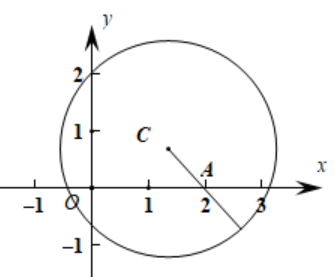

**变式5．**（2024·广东东莞·高一东莞高级中学校考阶段练习）已知点，点在圆上运动，则的最大值为（    ）

A．22	B．26	C．30	D．32

【答案】C

【解析】设点,点在圆上运动,满足,且,

当时,取得最大值是;

故选:.

**题型四：周长面积型**

<strong>例10．</strong>（2024·江苏·高二假期作业）已知两点，，点是圆上任意一点，则面积的最大值为______，最小值为______.

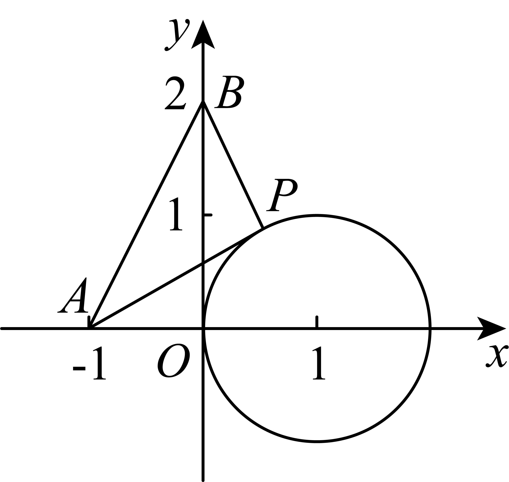

【答案】

【解析】因为两点，，

所以直线的方程为：，即，，

圆，其圆心为，半径，

圆心到直线的距离，

点到直线的距离最大值为，距离最小值为，

所以面积的最大值；

面积的最小值.

故答案为：；.

<strong>例11．</strong>（2024·全国·高二专题练习）已知圆，点<em>M</em>为直线上一个动点，过点<em>M</em>作圆<em>C</em>的两条切线，切点分别为<em>A</em>，<em>B</em>，则四边形周长的最小值为（    ）

A．8	B．	C．	D．

【答案】A

【解析】圆的圆心坐标为，半径为，

因为过点*M*作圆*C*的两条切线，切点分别为*A*，*B*，

所以有，，

因此有，

要想四边形周长最小，只需最小，即当时，

此时，此时，

即最小值为，

故选：A

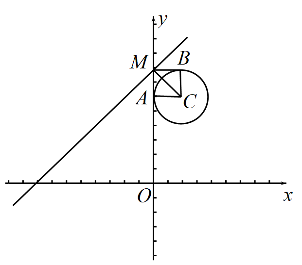

**例12．**（2024·全国·模拟预测）已知直线：与圆：相交于不同两点，，位于直线异侧两点，都在圆上运动，则四边形面积的最大值为（    ）

A．	B．	C．	D．

【答案】A

【解析】圆：可以化为标准方程，

则其圆心为，半径，

则直线与圆心的距离，

故由勾股定理可得半弦长为，

所以.

又，两点位于直线异侧且都在圆上运动，

所以四边形的面积可以看作是和的面积之和，

则当为弦的垂直平分线（即为圆的直径）时，两三角形的面积之和最大，

即四边形的面积最大，

最大面积.

故选：A*.*

<strong>变式6．</strong>（2024·甘肃庆阳·高二校考期末）已知圆的方程为，点是直线上的一个动点，过点作圆的两条切线、，、为切点，则四边形的面积的最小值为______

【答案】

【解析】由圆，得到圆心，半径

由题意可得：，，，

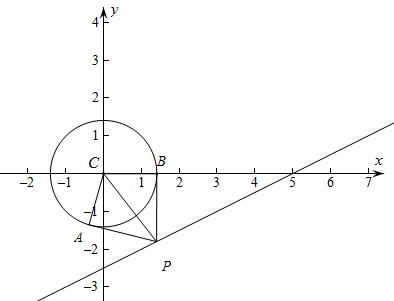

，

在中，由勾股定理可得：，

当最小时，最小，此时所求的面积也最小，

点是直线上的动点，

当时，有最小值，此时，

所求四边形的面积的最小值为；

故答案为：

**变式7．**（2024·高二课时练习）已知，，点为圆上任意一点，则面积的最大值为（    ）

A．5	B．	C．	D．

【答案】D

【解析】圆的圆心，半径，直线的方程为：，

于是点到直线：的距离，而点在圆上，

因此点到直线距离的最大值为，又，

所以面积的最大值为.

故选：D

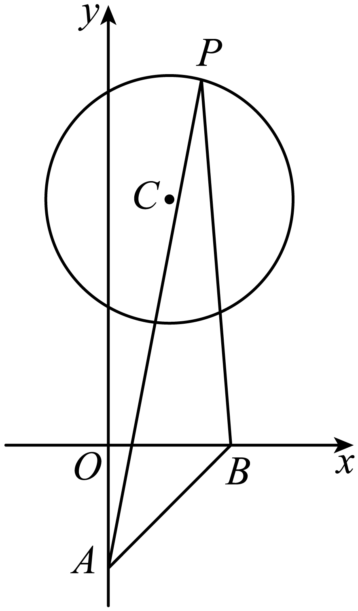

**题型五：数量积型**

<strong>例13．</strong>（2024·河南南阳·高二统考阶段练习）已知点为椭圆上任意一点，是圆上两点，且，则的最大值是________.

【答案】24

【解析】设圆的圆心为，则，椭圆的右焦点坐标也为，

且是圆的一条直径，因此

，

因为点是椭圆的右焦点，点在椭圆上，

所以，所以，

即，所以的最大值为24.

故答案为：24.

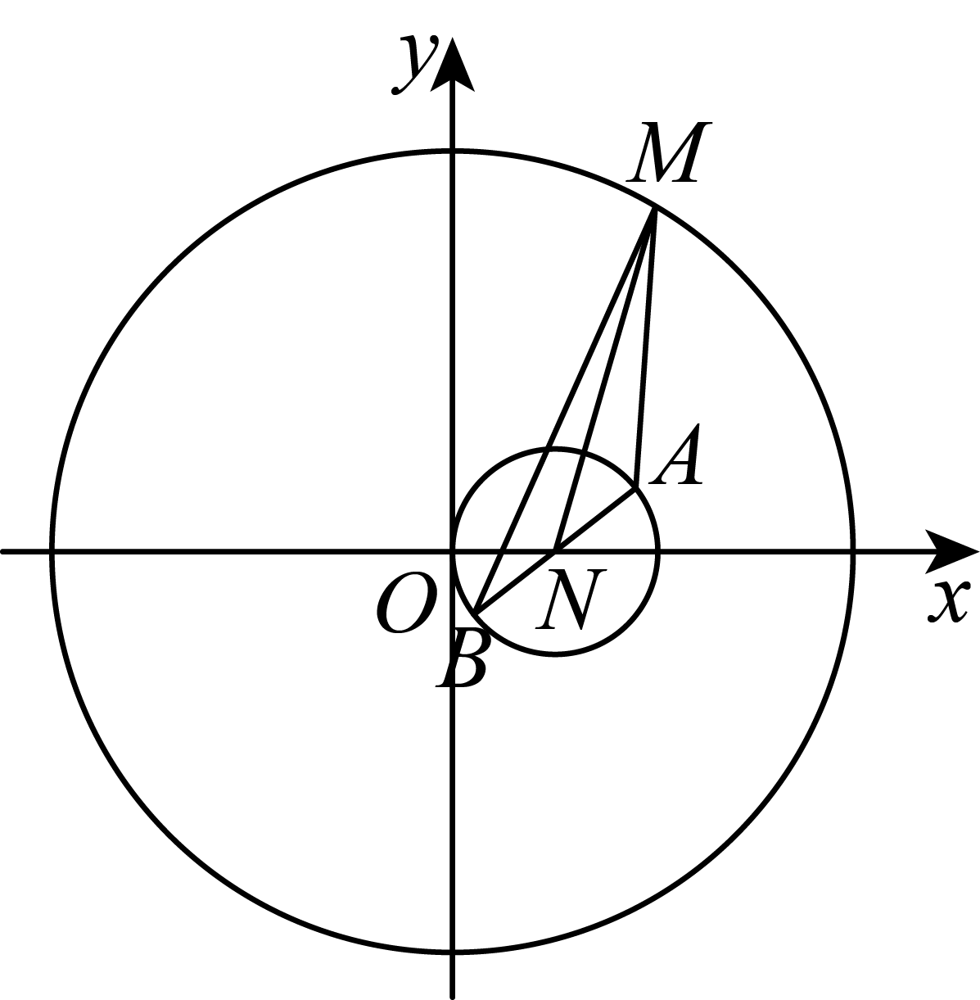

<strong>例14．</strong>（2024·全国·高三专题练习）已知直线与圆相切于点，设直线与轴的交点为，点为圆上的动点，则的最大值为______．

【答案】

【解析】圆的圆心的为，因为直线与圆相切于点则

所以得，所以，，

所以直线方程为，圆的方程为，所以，，

的中点，

则

因为，

所以

故，所以的最大值为

故答案为：

<strong>例15．</strong>（2024·江苏南京·高一校考期中）已知点，点为圆上的动点，则的最大值为__________.

【答案】

【解析】圆的标准方程为：，圆心为，半径为，

，

当点动到点时，取得最大值，即为在上的投影，

.

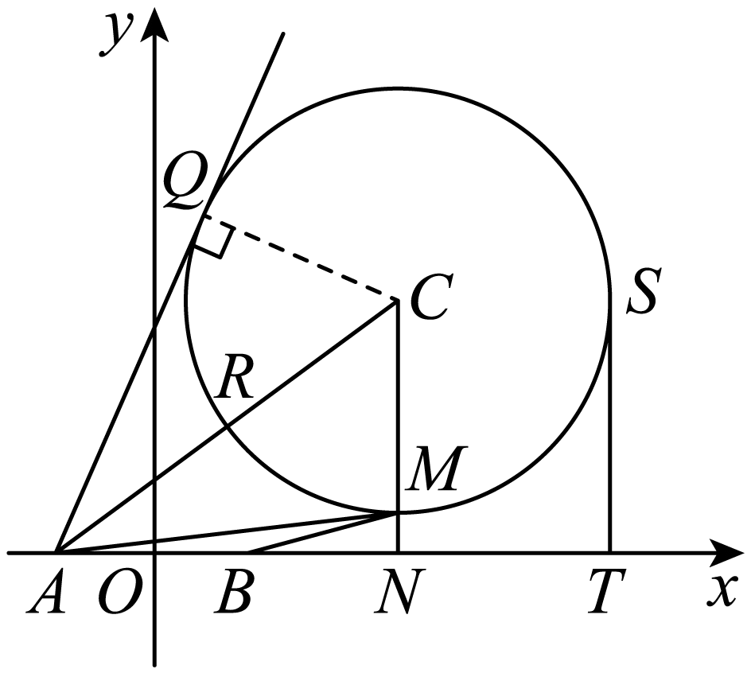

故答案为：.

<strong>变式8．</strong>（2024·全国·高一专题练习）在边长为4的正方形中，动圆<em>Q</em>的半径为1、圆心在线段（含端点）上运动，点<em>P</em>是圆<em>Q</em>上及其内部的动点，则的取值范围是（    ）．

A．	B．	C．	D．

【答案】A

【解析】建立如图所示的平面直角坐标系，

由数量积的几何意义可知：等于与在上的投影的乘积，

故当在上的投影最大时，数量积最大，此时点在以为圆心的圆的最上端处，此时投影为，故数量积为，

故当在上的投影最小时，数量积最小，此时点在以为圆心的圆的最下端处，此时投影为，故数量积为,

故，

故选：A

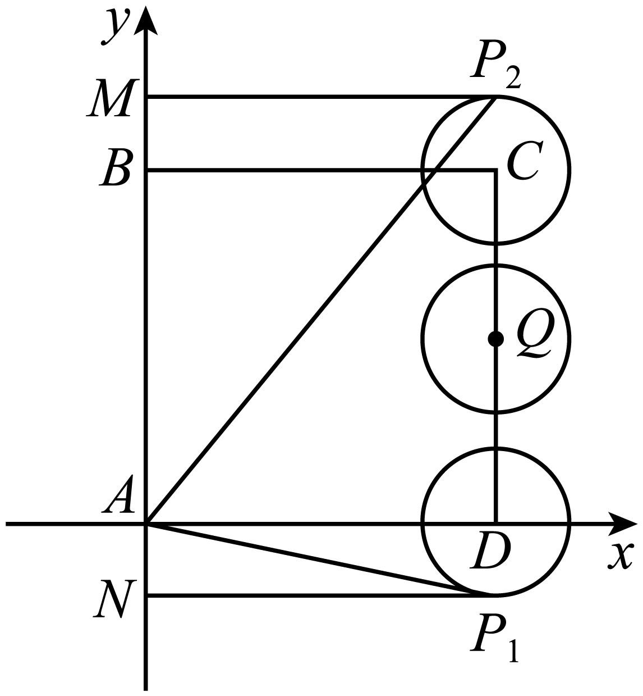

<strong>变式9．</strong>（2024·内蒙古呼和浩特·高一呼市二中校考阶段练习）在边长为2的正六边形<em>ABCDEF</em>中，动圆的半径为1、圆心在线段<em>CD</em>（含端点）上运动，点<em>P</em>是圆<em>Q</em>上及其内部的动点，则的取值范围是（    ）

A．.	B．	C．	D．

【答案】A

【解析】由，

可得为与在方向上的投影之积.

正六边形*ABCDEF*中，以*D*为圆心的圆与*DE*交于*M*，

过*M*作于，设以*C*为圆心的圆与垂直的

切线与圆切于点*N*与延长线交点为，

则在方向上的投影最小值为，最大值为,

又，，

则，

则的取值范围是.

故选：A

<strong>变式10．</strong>（2024·山东聊城·高一山东聊城一中校考期中）已知正六边形<em>ABCDEF</em>的边长为2，圆<em>O</em>的圆心为正六边形的中心，半径为1，若点<em>P</em>在正六边形的边上运动，<em>MN</em>为圆<em>O</em>的直径，则的取值范围是（    ）

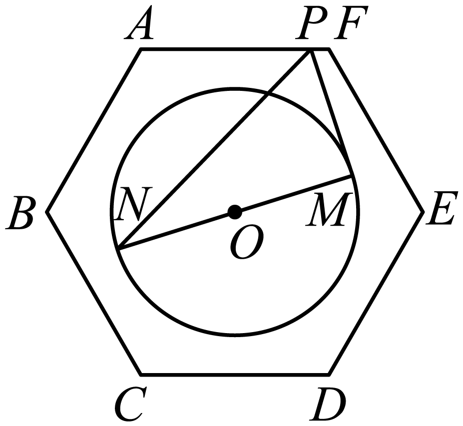

A．	B．	C．	D．

【答案】B

【解析】记圆心为，则，

因为互为相反向量，

所以，

因为正六边形*ABCDEF*的边长为2，为正六边形的中心，

所以当与正六边形顶点重合时，有最大值2，

当在正六边形边上的中点处时，有最小值，此时.

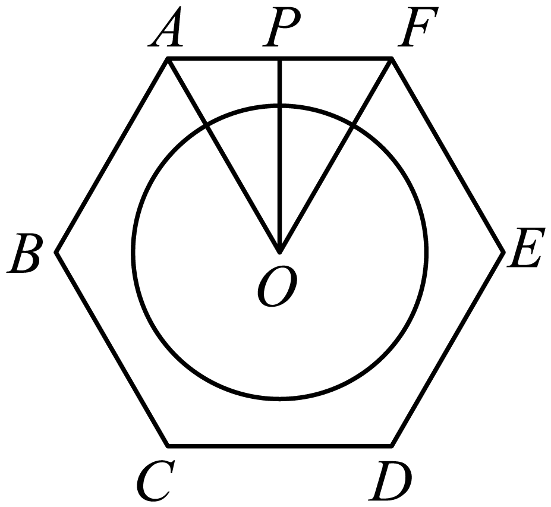

所以.

故选：B

**题型六：坐标与角度型**

<strong>例16．</strong>（2024·浙江丽水·高二校联考开学考试）已知点<em>P</em>在圆<em>M</em>：上，点，，则最小和最大时分别为（    ）

A．0°和60°	B．15°和75°	C．30°和90°	D．45°和135°

【答案】B

【解析】

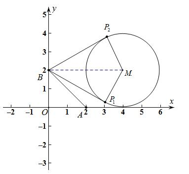

如图所示，当与圆相切时对应的最大和最小，设最小时切于，最大时切于，

由，可得，所以，同理得

由点，，可知，

所以，

.

故选：B.

<strong>例17．</strong>（2024·高二单元测试）已知圆<em>C</em>：(<em>x</em>﹣1)2+<em>y2</em>=1，点<em>P</em>(<em>x0</em>，<em>y0</em>)在直线<em>x</em>﹣<em>y</em>+1=0上运动.若<em>C</em>上存在点<em>Q</em>，使∠<em>CPQ</em>=30°，则<em>x0</em>的取值范围是___________.

【答案】

【解析】

如图圆，在直线上，

若圆存在点，使得，

当在直线上运动，极端情况，与圆相切，.

在中，，所以.

所以以为圆心，为半径的圆与直线交于，两点.

符合条件的点在线段之间.

所以或.

故的取值范围为.

故答案为：

**例18．**（2024·全国·高三专题练习）已知，满足，则的最大值为（    ）

A．	B．	C．	D．

【答案】C

【解析】点在圆上，,

则，

如图，当与圆相切时，取得最小值，所以，此时点.

故选：C

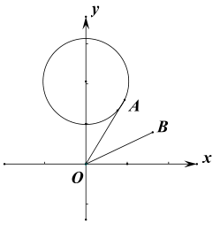

<strong>变式11．</strong>（2024·浙江嘉兴·高二校考阶段练习）若圆）与圆交于<em>A</em>、<em>B</em>两点，则tan∠<em>ANB</em>的最大值为（    ）

A．	B．	C．	D．

【答案】D

【解析】可化为，

故圆*N*的圆心为，半径为，

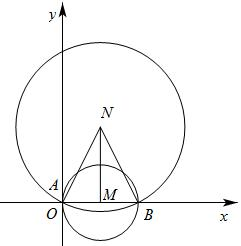

由题意可知：*AB*为圆*M*与圆*N*的公共弦，且圆*M*的半径为1，

所以且，故，

当的坐标为时，，

在△*NAB*中，，

又，在上单调递减，

故为锐角，且当时，最大，

又在上单调递增，

所以当最大时，取得最大值，且最大值为，

故选：D

<strong>变式12．</strong>（2024·全国·高三专题练习）动圆<em>M</em>经过坐标原点，且半径为1，则圆心<em>M</em>的横纵坐标之和的最大值为（    ）

A．1	B．2	C．	D．

【答案】C

【解析】设动圆圆心，半径为1，动圆*M*经过坐标原点，可得,即，

，当且仅当时取等号，即，

则圆心*M*的横纵坐标之和的最大值为

故选：C

**变式13．**（2024·全国·模拟预测）已知圆，圆是以圆上任意一点为圆心，1为半径的圆．圆与圆交于，两点，则的最大值为（    ）

A．	B．	C．	D．

【答案】D

【解析】在中，．如图所示：

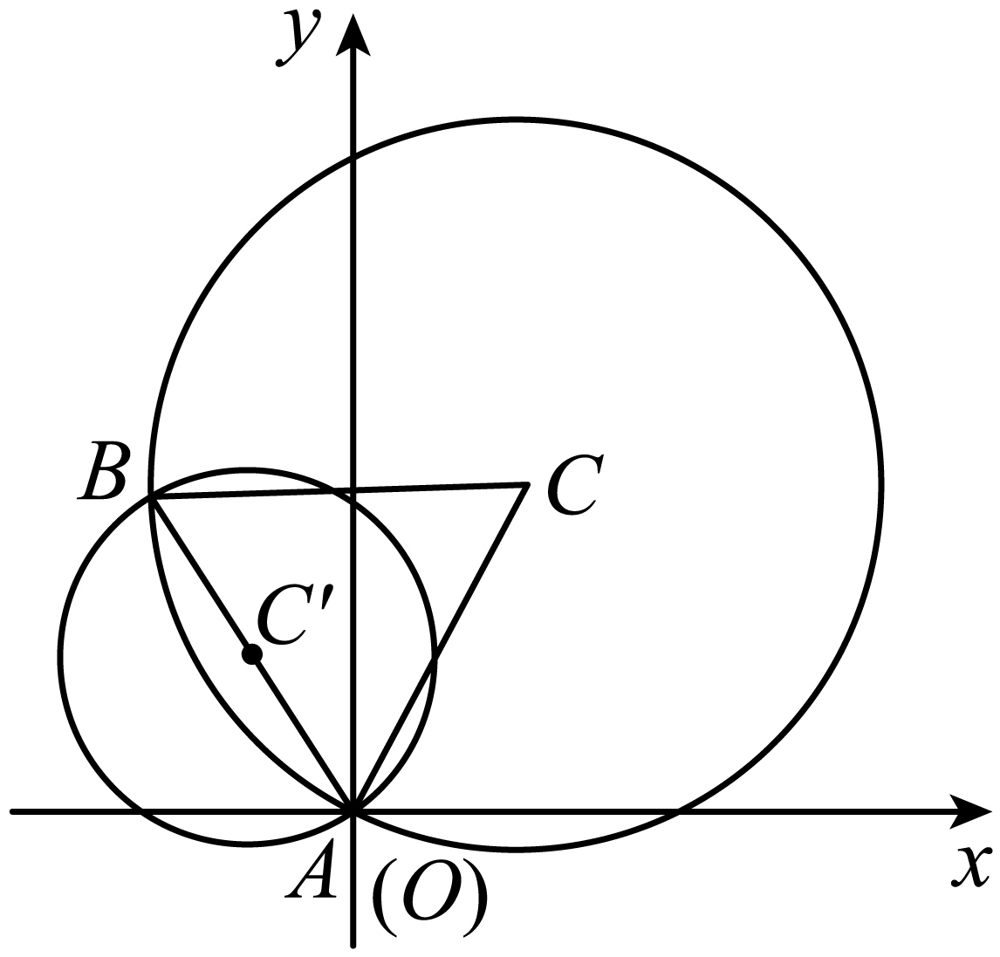

当公共弦最大，即为圆的直径时，

最大，又可得为锐角，即取得最大值．

此时，则．

故选：D

**题型七：长度型**

<strong>例19．</strong>（2024·全国·高三专题练习）已知圆及点，点<em>P</em>、<em>Q</em>分别是直线和圆<em>C</em>上的动点，则的最小值为__________.

【答案】3

【解析】作出点*A*关于直线的对称点，如图：

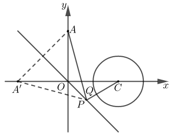

设点，则有，解得，即，而*C*(2，0)

由圆的性质知：圆外点*P*与圆*C*上点*Q*距离满足(当且仅当*Q*是线段*PC*与圆*C*的交点时取“=”)，

连接交直线于点*O*，*P*为直线上任意一点，连(线段*PC*交圆*C*于点*Q*)，

则，当且仅当点*P*在线段上，即与点*O*重合时取“=”，

所以的最小值为3.

故答案为：3

<strong>例20．</strong>（2024·湖北·高二沙市中学校联考期中）已知直线与圆交于两点，且，则的最大值为___________.

【答案】/

【解析】的几何意义为点到直线的距离之和，其最大值是的中点到直线的距离的2倍.

由题可知，为等边三角形，则，

∴*AB*中点的轨迹是以原点为圆心，为半径的圆，

故点到直线的最大距离为，

∴的最大值为，

∴的最大值为＝.

故答案为：.

<strong>例21．</strong>（2024·上海普陀·高二上海市晋元高级中学校考期末）已知为圆上的两点，且，设为弦的中点，则的最大值为__________.

【答案】15

【解析】注意到，

则，又，

则，又由垂径定理可知，，则.

故*P*点轨迹是以*M*为圆心，半径为1的圆.

注意到，表示*P*到直线距离的5倍，又圆上一点到距离的最大值为：，

则的最大值为15.

故答案为：15

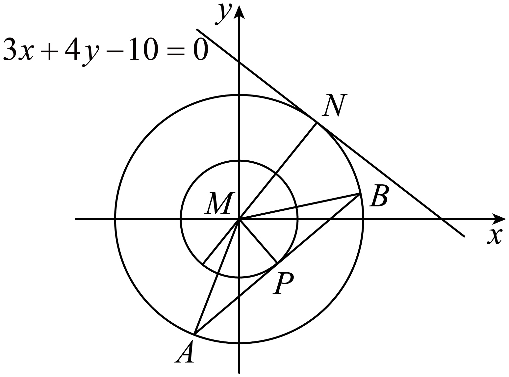

<strong>变式14．</strong>（2024·上海静安·高二校考期末）已知实数满足，，则的最大值为______.

【答案】/

【解析】设圆，直线，，，

则，都在圆上，

∵，

，

∴△*MON*是等边三角形，∴．

表示和到直线的距离和，

由图形得只有当、都在直线的下方时，该距离之和才会取得最大值．

取、的中点，过作，垂足为，则，

∵为等边三角形，为的中点，∴，

则在圆上运动，

则当*MN*∥*l*时，到直线距离的最大值为，

∴的最大值为．

故答案为：

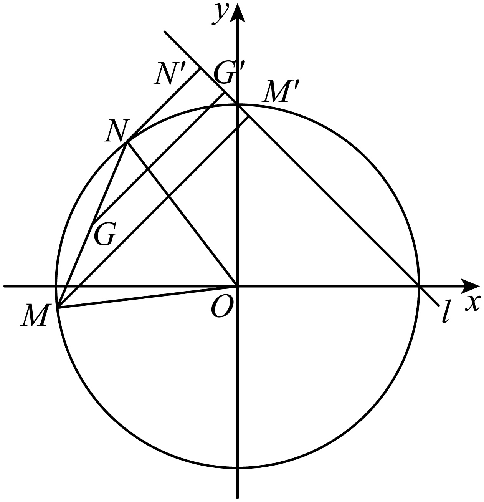

<strong>变式15．</strong>（2024·全国·高三专题练习）古希腊数学家阿波罗尼斯在他的巨著《圆锥曲线论》中有一个著名的几何问题：在平面上给定两点<em>A</em>、<em>B</em>，动点<em>P</em>满足（其中是正常数，且），则<em>P</em>的轨迹是一个圆，这个圆称之为“阿波罗尼斯圆”．现已知两定点，<em>P</em>是圆上的动点，则的最小值为____________

【答案】

【解析】如图，在轴上取点，

，，，，

（当且仅当为与圆交点时取等号），

.

故答案为：.

**变式16．**（2024·全国·高二期中）已知圆是以点和点为直径的圆，点为圆上的动点，若点，点，则的最大值为（    ）

A．	B．	C．	D．

【答案】A

【解析】由题设，知：且，即圆的半径为4，

∴圆：，

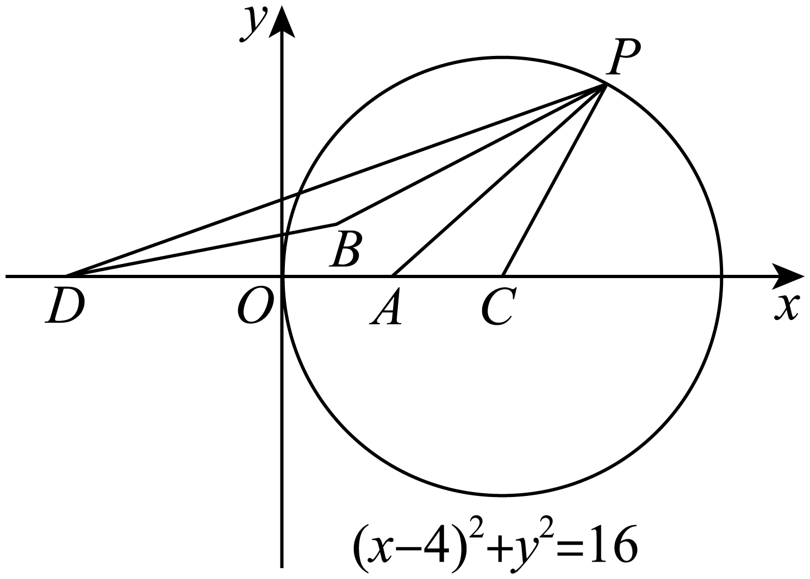

如上图，坐标系中则，

∴，即△△，故，

∴，在△中，

∴要使最大，共线且最大值为的长度.

∴.

故选：A

**变式17．**（2024·四川成都·高二成都七中校考开学考试）已知，是曲线上两个不同的点，，则的最大值与最小值的比值是（    ）

A．	B．	C．	D．

【答案】B

【解析】化简得，

由，得.

因为，所以或.

当时，；当时，.

所以方程表示的曲线为圆的左半部分和圆的右半部分.

根据圆的性质知：当*A*，*B*分别与图中的*M*，*N*重合时，取得最大值，且最大值为6；

当*A*，*B*为图中*E*，*F*，*G*，*H*四点中的某两点时，取得最小值，且最小值为.故的最大值与最小值的比值是.

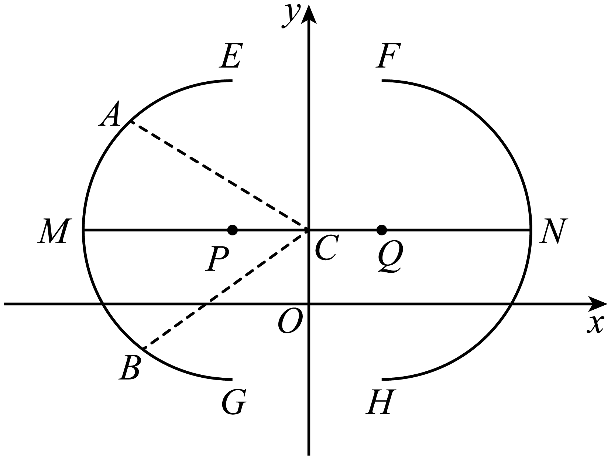

故选：B.

<strong>变式18．</strong>（2024·全国·高三专题练习）在中，，，点在内部，，则的最小值为______．

【答案】2

【解析】因为，，所以.

在中，由正弦定理得：（*R*为的外接圆半径），所以，解得：.

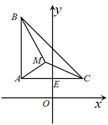

如图所示：设的外接圆的圆心为*O*，建立如图示的坐标系.

设*E*为*AC*的中点，所以，.

所以点*M*的轨迹为：，可写出（为参数）.

因为点在内部，所以（其中满足，）.

所以

因为满足，，所以，

所以当时最小.

故答案为：2

<strong>变式19．</strong>（2024·河南许昌·高二禹州市高级中学校考阶段练习）已知点<em>P</em>在直线上运动，点<em>E</em>是圆上的动点，点<em>F</em>是圆上的动点，则的最大值为（    ）

A．6	B．7	C．8	D．9

【答案】D

【解析】如图所示，

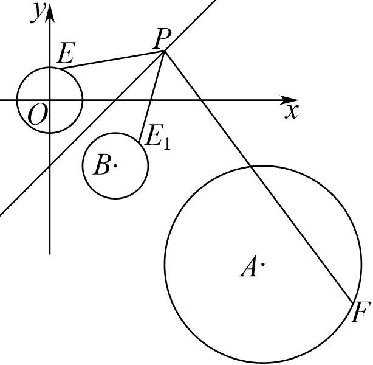

圆的圆心为，半径为3，

圆关于直线的对称圆为圆*B*，其中设圆心*B*坐标为，

则 ，解得：，

故圆*B*的圆心为，半径为1，

由于此时圆心*A*与圆心*B*的距离为：，

大于两圆的半径之和，所以两圆相离，此时点的对称点为，且，所以，在*P*点运动过程中，当*P*，*B*，*A*，，*F*五点共线时，且在圆*B*左侧，点*F*在圆*A*右侧时，最大，最大值为

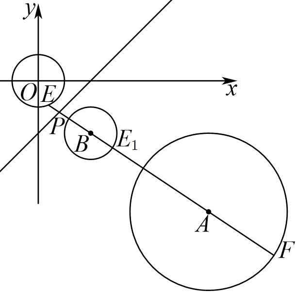

故选：D.

**题型八：方程中的参数**

<strong>例22．</strong>（2024·全国·高三专题练习）如图，在直角梯形中，，点<em>M</em>在以为直径的半圆上，且满足，则的最大值为（    ）

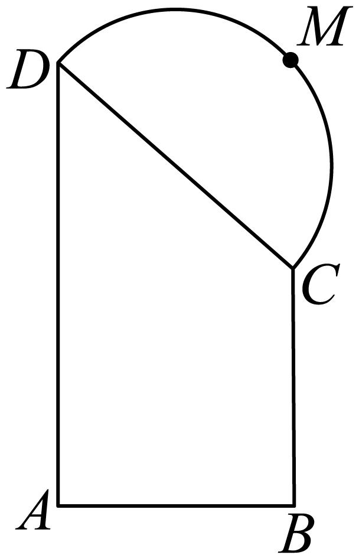

A．2	B．3	C．	D．

【答案】D

【解析】

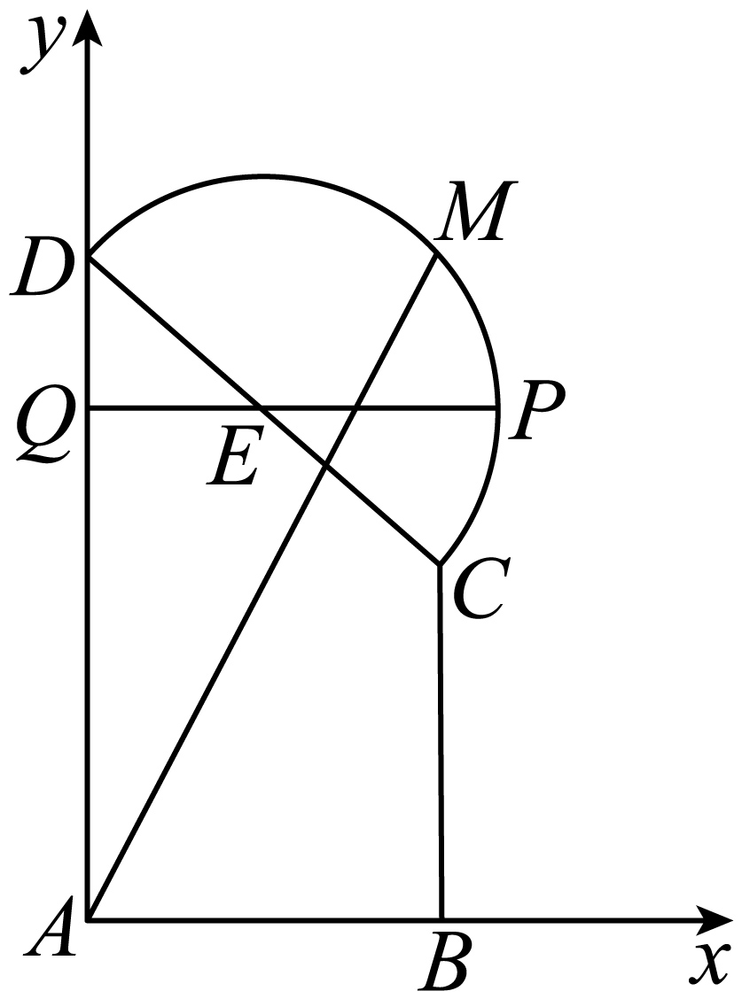

如图，以为原点建立直角坐标系，设中点为，易得，则中点，，

故以为直径的圆的方程为，过作轴平行线交轴于，交半圆于，则，设，

则，又，

故，则，其中，

显然当时，取最大值.

故选：D.

**例23．**（2024·全国·高三专题练习）已知，，，，则面积的最大值为（    ）

A．	B．	C．	D．

【答案】B

【解析】设点，因为，所以，

点的轨迹是以为圆心，为半径的圆，

又直线的方程为：，，圆心到直线的距离，所以到直线的距离最大值为

则面积的最大值为.

故选：.

**例24．**（2024·河南开封·高三通许县第一高级中学校考阶段练习）已知点，点为圆上一动点，则的最大值是（    ）

A．	B．	C．	D．

【答案】A

【解析】因为点为圆上一动点，故设，

则，

令，则，

即，则，

其中为辅助角，，

则，整理得，

故的最大值为，

故选：A

<strong>变式20．</strong>（2024·福建龙岩·高二福建省龙岩第一中学校考阶段练习）已知过点的动直线与圆交于两点，过分别作的切线，两切线交于点.若动点，则的最小值为___________．

【答案】

【解析】如下图所示，连接、，则、，所以四边形对角互补，则、、、四点在以为直径的圆上.

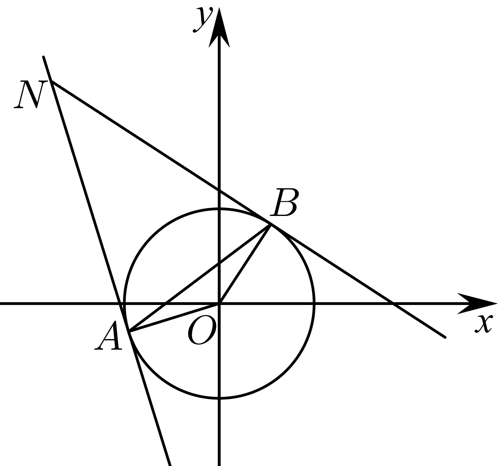

设，则该圆的圆心为，半径为，则该圆的方程为

，又该圆和圆的交点弦即为，故直线所在的方程为，整理得，又因为点在直线上，故，即点的轨迹为，又因为的坐标为，因为，所以在圆上运动，故的最小值为到直线的距离减去半径，即，即的最小值为.

故答案为：

