**第62讲  隐圆问题**

**必考题型全归纳**

**题型一：隐圆的第一定义：到定点的距离等于定长**

**例1．**（2024·天津北辰·高三天津市第四十七中学校考期末）平面内，定点，，，满足，且，动点，满足，，则的最大值为（    ）

A．	B．	C．	D．

【答案】D

【解析】由题，则到，，三点的距离相等，所以是的外心.

又，

变形可得，

所以，同理可得，，

所以是的垂心，

所以的外心与垂心重合，

所以是正三角形，且是的中心；

由，解得，

所以的边长为；

如图所示，以为坐标原点建立直角坐标系，

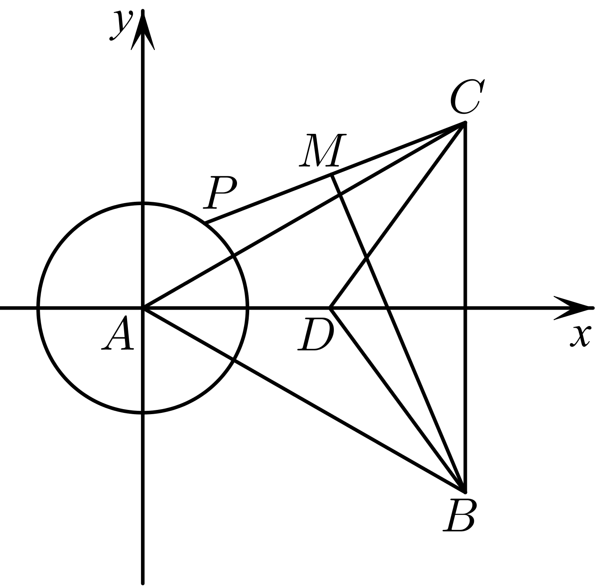

则，，，，

可设，其中，，而，

即是的中点，则，

，

当时，取得最大值为．

故选：D．

**例2．**（2024·全国·高一阶段练习）已知是单位向量，，若向量满足，则的取值范围是（    ）

A．	B．	C．	D．

【答案】D

【解析】单位向量满足，即，作，以射线*OA*，*OB*分别作为*x*、*y*轴非负半轴建立平面直角坐标系，如图，

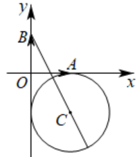

，设，则，由得：，

令，即，

，其中锐角满足，

因此，当时，，当时，，

所以的取值范围是.

故选：D

**例3．**（2024·全国·高三专题练习）已知单位向量与向量垂直，若向量满足，则的取值范围为（    ）

A．	B．	C．	D．

【答案】C

【解析】由题意不妨设，设，则．

∵，∴，即表示圆心为，半径为1的圆，设圆心为*P*，∴．

∵表示圆*P*上的点到坐标原点的距离，，∴的取值范围为，

故选：C．

**变式1．**（2024·湖北武汉·高二湖北省武昌实验中学校考阶段练习）如果圆上总存在两个点到原点的距离为，则实数的取值范围是（    ）

A．	B．

C．	D．

【答案】D

【解析】问题可转化为圆和圆相交，

两圆圆心距，

由得，

解得，即.

故选：D

<strong>变式2．</strong>（2024·新疆和田·高二期中）如果圆（<em>x</em>﹣<em>a</em>）2+（<em>y</em>﹣1）2＝1上总存在两个点到原点的距离为2，则实数<em>a</em>的取值范围是（　　）

A．	B．

C．（﹣1，0）∪（0，1）	D．（﹣1，1）

【答案】A

【解析】∵圆（<em>x</em>﹣<em>a</em>）2+（<em>y</em>﹣1）2＝1上总存在两个点到原点的距离为2，

∴圆<em>O</em>：<em>x2</em>+<em>y2</em>＝4与圆<em>C</em>：（<em>x</em>﹣<em>a</em>）2+（<em>y</em>﹣1）2＝1相交，

∵|*OC*|，

由<strong>R</strong>﹣<em>r</em>＜|<em>OC</em>|＜<strong>R</strong>+<em>r</em>得：13，

∴，

∴﹣2*a*＜0或0＜*a*＜2．

故选*A*．

<strong>变式3．</strong>（2024·新疆·高三兵团第三师第一中学校考阶段练习）在平面内，定点，，，满足，，动点，满足，，则的最大值为__．

【答案】

【解析】平面内，，，

，，，

可设，，，，

动点，满足，，

可设，，，

，，

，

当且仅当时取等号，

的最大值为．

故答案为：．

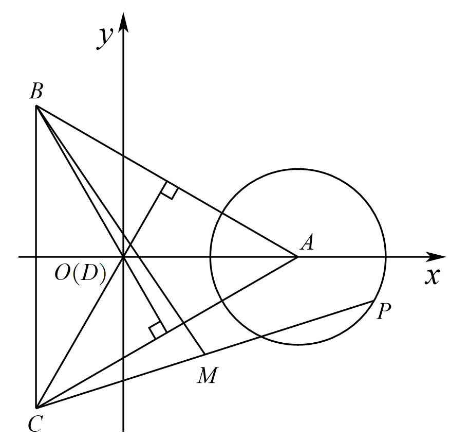

<strong>变式4．</strong>（2024·安徽池州·高一池州市第一中学校考阶段练习）在平面内，定点与、、满足，，动点、满足，，则的最大值为________．

【答案】49

【解析】由，可得为的外心，

又，

可得，，即，

即有，，可得为的垂心，

则为的中心，即为正三角形，

由,即有,

解得，的边长为，

由，可得为中点，

，

设，则，,

,

当时，最大值为49,

故答案为：49

**题型二：隐圆的第二定义：到两定点距离的平方和为定值**

<strong>例4．</strong>（2024·四川广元·高二四川省剑阁中学校校考阶段练习）在平面直角坐标系中，为两个定点，动点在直线上，动点满足，则的最小值为__．

【答案】5

【解析】设点，由得： ，

即，即，

在以为直径的圆上，不妨设，，

则，，

，

，其中为辅助角，

令，，则，．

，

令，，，

在，上单调递增，

故当时，取得最小值，

再令，，

显然在，上单调递增，

故时，取得最小值，

综上，当，时，取得最小值25．

故的最小值为5,

故答案为：5．

<strong>例5．</strong>（2024·全国·高三专题练习）已知四点共面，，，，则的最大值为______．

【答案】10

【解析】设 ，由题意可得： ，

则： ，

ABC构成三角形，则：，解得：，

由余弦定理：

，

当时，取得最大值为10.

<strong>例6．</strong>（2024·浙江金华·高二校联考期末）已知圆，点，设是圆上的动点，令，则的最小值为________．

【答案】

【解析】设，，，

，

当取得最小值时，取得最小值，

由圆，则圆心，半径，

易知，则.

故答案为：.

<strong>变式5．</strong>（2024·高二课时练习）正方形与点在同一平面内，已知该正方形的边长为1，且，则的取值范围为___________.

【答案】

【解析】如图，以为坐标原点，建立平面直角坐标系，

则，

设点，则由，

得，

整理得，

即点的轨迹是以点为圆心，为半径的圆，

圆心*M*到点*D*的距离为，所以，

所以的取值范围是*.*

故答案为：*.*

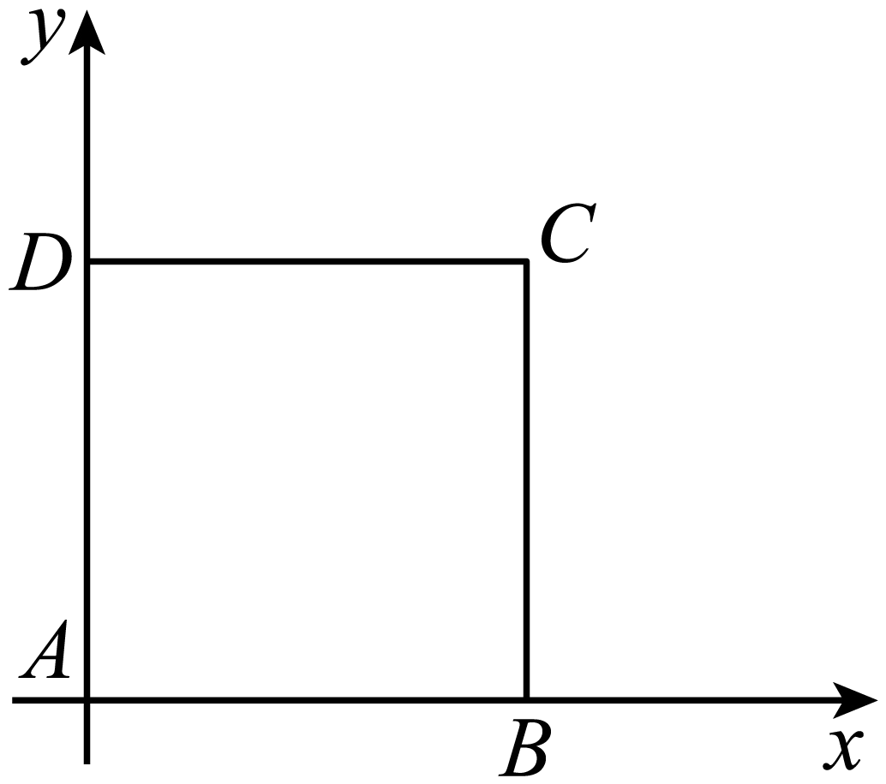

<strong>变式6．</strong>（2024·上海闵行·高二校考期末）如图，△是边长为1的正三角形，点在△所在的平面内，且（为常数），满足条件的点有无数个，则实数的取值范围是___________．

【答案】

【解析】以所在的直线为轴，中点为原点建立直角坐标系，如图所示：

则设则

化简得即

当时，点不存在；

当时，点只有一个；

当时，点的轨迹是一个圆形，有无数个；

故答案为：

<strong>变式7．</strong>（2024·全国·高三专题练习）如图，是边长为1的正三角形，点<em>P</em>在所在的平面内，且（<em>a</em>为常数），下列结论中正确的是

A．当时，满足条件的点*P*有且只有一个

B．当时，满足条件的点*P*有三个

C．当时，满足条件的点*P*有无数个

D．当*a*为任意正实数时，满足条件的点总是有限个

【答案】C

【解析】以所在直线为轴，中点为原点，建立直角坐标系，如图所示

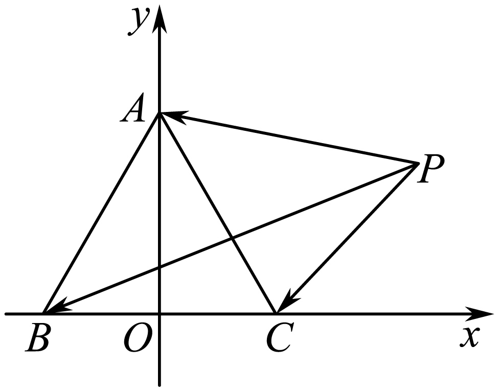

则，，，

设，可得，

，，

∵，

∴，

化简得：，即，

配方，得…（1）

当时，方程（1）的右边小于0，故不能表示任何图形；

当时，方程（1）的右边为0，表示点，恰好是正三角形的重心；

当时，方程（1）的右边大于0，表示以为圆心，半径为的圆，

由此对照各个选项，可得只有C项符合题意.

故选：C．

**题型三：隐圆的第三定义：到两定点的夹角为**90**°**

<strong>例7．</strong>（2024·湖北武汉·高二湖北省武昌实验中学校考阶段练习）已知圆和点，若圆上存在两点使得，则实数的取值范围是_________．

【答案】

【解析】对于上任意一点，当均为圆的切线时最大，

由题意，，即，此时为满足题设条件的临界点，

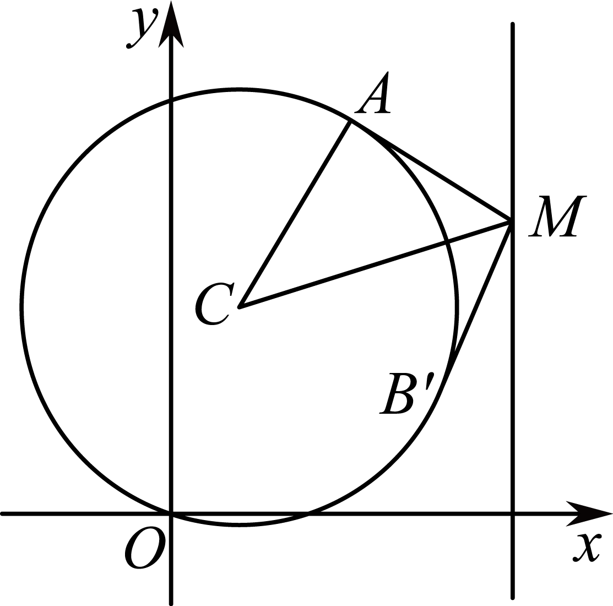

如上图，若与重合，则，为圆的切线，此时，

综上，在临界点之间移动过程中，有，即，

解得，可得.

故答案为：

<strong>例8．</strong>（2024·江苏南京·金陵中学校考模拟预测）已知圆<em>C</em>：(<em>x</em>－1)2＋(<em>y</em>－4)2＝10和点<em>M</em>(5，<em>t</em>)，若圆<em>C</em>上存在两点<em>A</em>，<em>B</em>，使得<em>MA</em>⊥<em>MB</em>，则实数<em>t</em>的取值范围是________

【答案】[2，6]

【解析】因为点*M*在圆*C*外，当*AM*，*BM*与圆*C*相切时，∠*AMB*最大，要使在圆*C*上存在两点*A*和*B*，使得*MA*⊥*MB*，只需当*AM*，*BM*与圆*C*相切时，

∠*AMB*≥90°，即∠*AMC* ≥ 45°，则sin∠*AMC*＝ ≥ ，解得2≤*t*≤6.

故答案为：[2，6].

**例9．**（2024·高二课时练习）设，过定点的动直线和过定点的动直线交于点，则的取值范围是（    ）

A．	B．

C．	D．

【答案】C

【解析】由已知可得动直线经过定点，

动直线经过定点，

且两条直线互相垂直，且相交于点，

所以，即，

由基本不等式可得，

即，可得，

故选：C.

**变式8．**（2024·陕西西安·高二西安市铁一中学校考期末）设，过定点的动直线和过定点的动直线交于点，则的最大值是（    ）

A．	B．	C．5	D．10

【答案】C

【解析】

显然过定点，直线可化成，则经过定点，

根据两条直线垂直的一般式方程的条件，，

于是直线和直线垂直，又为两条直线的交点，则，

又，由勾股定理和基本不等式，

，则，

当时，的最大值是.

故选：C

**变式9．**（2024·高二课时练习）设，过定点的动直线和过定点的动直线交于点，则的值为（    ）

A．5	B．10	C．	D．

【答案】B

【解析】由题意，动直线经过定点，则，

动直线变形得，则，

由得，

∴

，

故选：B．

**变式10．**（2024·全国·高三校联考阶段练习）设，动直线：过定点，动直线：过定点，且，交于点，则的最大值是（    ）

A．	B．	C．5	D．10

【答案】B

【解析】根据方程推出，可得，的交点在以为直径的圆上，可得，再根据不等式知识可求得结果.动直线：过定点，动直线：过定点，

因为，所以，所以，的交点在以为直径的圆上，

所以，

设，则，

所以，因为，当且仅当时等号成立，

所以，即，解得.即，

所以的最大值是.

故选：B

**变式11．**（2024·全国·高三专题练习）设向量，，满足，，，则的最小值是（    ）

A．	B．	C．	D．1

【答案】B

【解析】建立坐标系，以向量，的角平分线所在的直线为轴，使得，的坐标分别为，，设的坐标为，

因为，

所以，化简得，

表示以为圆心，为半径的圆，

则的最小值表示圆上的点到原点的距离的最小值，

因为圆到原点的距离为，所以圆上的点到原点的距离的最小值为，

故选：B

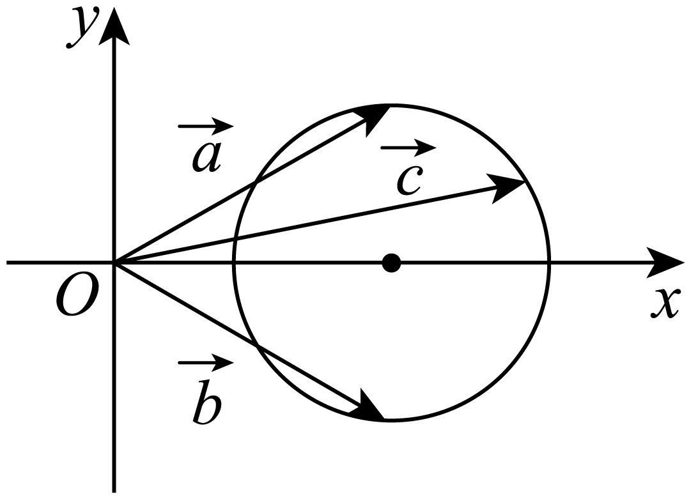

**变式12．**（2024·全国·高三专题练习）已知点，，若圆：上存在一点，使得，则实数的最大值是（   ）

A．4	B．5	C．6	D．7

【答案】C

【解析】根据题意，圆C：x2+y2-8x-8y+31=0，即（x-4）2+（y-4）2=1；

其圆心为（4，4），半径r=1，

设AB的中点为M，

又由点A（1-m，0），B（1+m，0），则M（1，0），|AB|=2|m|，

以AB为直径的圆为（x-1）2+y2=m2，

若圆C：x2+y2-8x-8y+31=0上存在一点P，使得PA⊥PB，则圆C与圆M有公共点，

又由

即有|m|-1≤5且|m|+1≥5，

解可得：4≤|m|≤6，即-6≤m≤-4或4≤m≤6，

即实数m的最大值是6；

故选C．

**变式13．**（2024·江西宜春·高一江西省万载中学校考期末）已知，是平面内两个互相垂直的单位向量，若向量满足，则的最大值是（    ）

A．	B．2	C．	D．

【答案】C

【解析】如图，设，，，，

则，，

因为，故，故，

所以在以为直径的圆上，故的最大值为圆的直径，

故选：C.

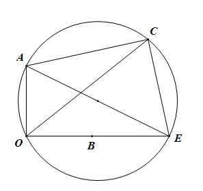

**变式14．**（2024·全国·高三专题练习）已知是平面内两个互相垂直的单位向量，若向量满足，则的最大值是（    ）

A．1	B．2

C．	D．

【答案】C

【解析】设，且，为线段的中点，

因为，所以，

则，所以，

所以点在以为圆心，半径为的圆，所以的最大值即为该圆的直径，

所以的最大值为.

故选：C.

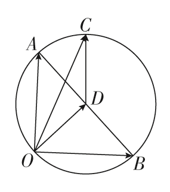

**变式15．**（2024·湖北武汉·高二校联考期中）已知和是平面内两个单位向量，且，若向量满足，则的最大值是（    ）

A．	B．	C．	D．

【答案】B

【解析】如图所示：

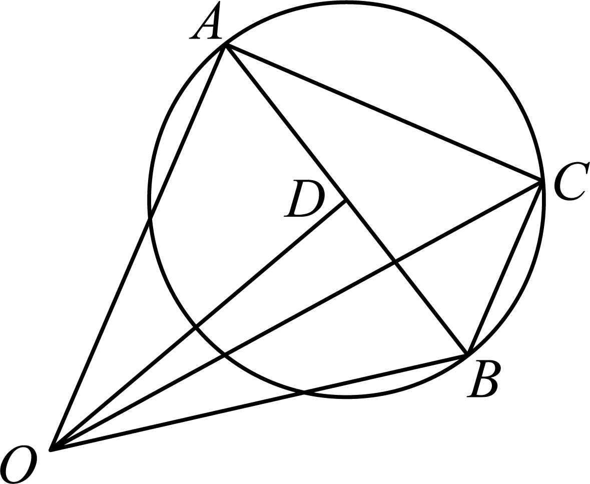

设，，，

则，，

因为，所以，即.

所以在以为直径的圆上.

设的中点为，因为和是平面内两个单位向量，且，

所以，.

所以.

故选：B

**变式16．**（2024·黑龙江哈尔滨·高三哈尔滨市第一中学校校考期中）已知向量，是平面内两个互相垂直的单位向量，若向量满足，则的最大值是（      ）

A．	B．	C．	D．

【答案】B

【解析】因为，是平面内两个互相垂直的单位向量，

故可设，，，

则，，

因为，所以，

整理得到，即，

故的最大值为，

故选：B.

**题型四：隐圆的第四定义：边与对角为定值、对角互补、数量积定值**

<strong>例10．</strong>（2024·全国·高一专题练习）设向量满足，，，则的最大值等于______.

【答案】2

【解析】由题设，，而，则，

令，则，又，如下图示：

所以，，则，故共圆，

而，即，故外接圆直径，

对于，当为直径时最大，即.

故答案为：2.

<strong>例11．</strong>（2024·全国·高三专题练习）在边长为8正方形中，点为的中点，是上一点，且，若对于常数，在正方形的边上恰有个不同的点，使得，则实数的取值范围为______.

【答案】

【解析】以AB所在直线为x轴，以AD所在直线为y轴建立平面直角坐标系，如图所示，

则，，

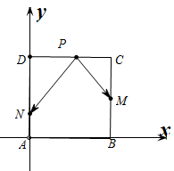

（1）当点P在AB上时，设，，

∴，，

∴，

∵，

∴．

∴当时有一解，当时有两解；

（2）当点P在AD上时，设，，

∴，，

∴，

∵，

∴，

∴当或时有一解，当时有两解；

（3）若P在DC上，设，，

∴，，

∴，

∵，

∴．

∴当时有一解，当时有两解；

（4）当点P在BC上时，设，，

∴，，

∴，

∵，

∴，

∴当或时有一解，当时有两解，

综上，在正方形的四条边上有且只有6个不同的点P，使得成立，那么m的取值范围是，

故答案为：．

**例12．**（2024·全国·高三专题练习）在平面四边形中，连接对角线，已知，，，，则对角线的最大值为（    ）

A．27	B．16	C．10	D．25

【答案】A

【解析】以*D*为坐标原点，*DB*,*DC*分别为*x*,*y*轴建立如图所示直角坐标系，则,因为，，所以由平面几何知识得*A*点轨迹为圆弧（因为为平面四边形，所以取图中第四象限部分的圆弧），设圆心为*E*,则由正弦定理可得圆半径为，

因此对角线的最大值为

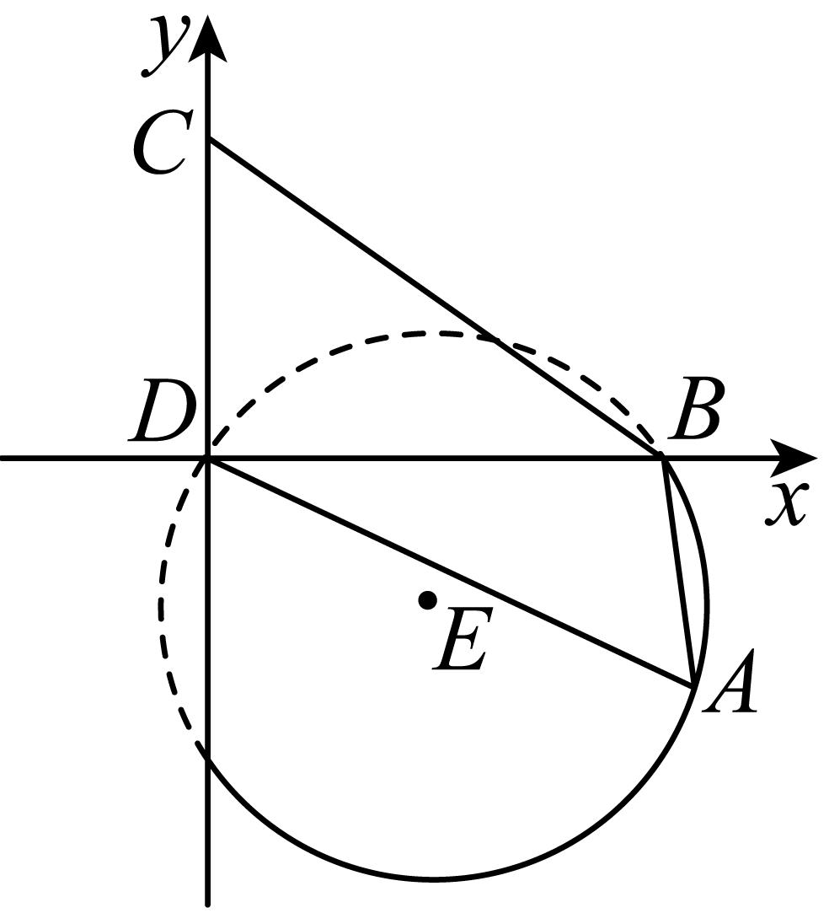

故选：*A*

**变式17．**（2024·全国·高考真题）设向量满足，，，则的最大值等于

A．4	B．2	C．	D．1

【答案】A

【解析】

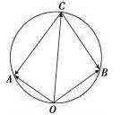

因为，，所以,.

如图所以，设，则,,.

所以，所以，所以四点共圆.

不妨设为圆M，因为,所以.

所以,由正弦定理可得的外接圆即圆M的直径为.

所以当为圆M的直径时，取得最大值4.

故选A.

<strong>变式18．</strong>（2024·全国·高三专题练习）在平面内,设<em>A</em>、<em>B</em>为两个不同的定点,动点<em>P</em>满足:(为实常数)，则动点<em>P</em>的轨迹为（    ）

A．圆	B．椭圆	C．双曲线	D．不能确定

【答案】A

【解析】设， 以所在直线为轴，的中垂线为轴，建立直角坐标系

如图所示：

则 设

即，表示圆

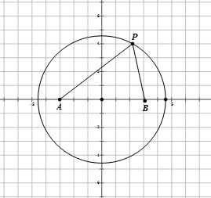

故选：A

**变式19．**（2024·全国·高三专题练习）如图，梯形中，，，，,和分别为与的中点，对于常数，在梯形的四条边上恰好有8个不同的点，使得成立，则实数的取值范围是

A．	B．

C．	D．

【答案】D

【解析】以*DC*所在直线为*x*轴，*DC*的中垂线为*y*轴建立平面直角坐标系，

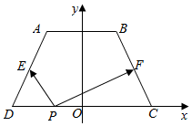

则梯形的高为,∴*A*(−1,2),*B*(1,2),*C*(2,0),*D*(−2,0),∴.

1)当*P*在*DC*上时,设*P*(*x*,0)(−2⩽*x*⩽2),则.

于是，

∴当时,方程有一解,当时，*λ*有两解；

(2)当*P*在*AB*上时,设*P*(*x*,2)(−1⩽*x*⩽1),则.

∴，

∴当时,方程有一解,当时，*λ*有两解；

(3)当*P*在*AD*上时，直线*AD*方程为*y*=2*x*+4，

设*P*(*x*,2*x*+4)(−2<*x*<−1),则.

于是，

∴当或时,方程有一解,当时，方程有两解；

(4)当*P*在*CD*上时,由对称性可知当或时，方程有一解，

当时，方程有两解；

综上,若使梯形上有8个不同的点*P*满足成立，

则*λ*的取值范围是.

本题选择D选项.

**变式20．**（2024·江苏·高一专题练习）已知正方形的边长为4，点，分别为，的中点，如果对于常数，在正方形的四条边上，有且只有8个不同的点，使得成立，那么的取值范围是（    ）

A．	B．	C．	D．

【答案】D

【解析】如图所示,

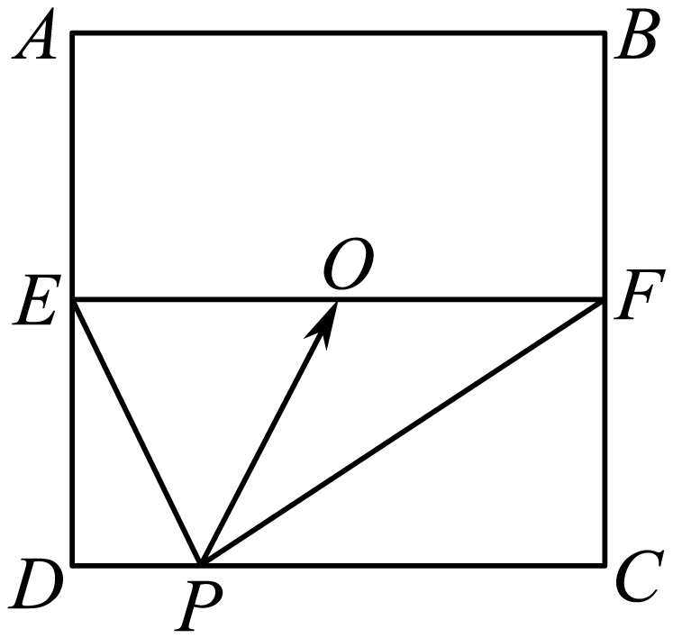

设的中点为,则,两式平方相减得,所以,即,所以,

由对称性可知每个边上存在两个点,所以点在边的中点和顶点之间,

故,解得,

故选:D

**题型五：隐圆的第五定义：到两定点距离之比为定值**

**例13．**（2024·四川宜宾·高二四川省宜宾市第四中学校校考阶段练习）阿波罗尼斯是古希腊著名数学家，与欧几里得､阿基米德并称为亚历山大时期数学三巨匠，他对圆锥曲线有深刻而系统的研究，主要研究成果集中在他的代表作《圆锥曲线》一书，阿波罗尼斯圆就是他的研究成果之一.指的是：已知动点与两定点的距离之比，那么点的轨迹就是阿波罗尼斯圆.已知动点的轨迹是阿波罗尼斯圆，其方程为，其中，定点为轴上一点，定点的坐标为，若点，则的最小值为（    ）

A．	B．	C．	D．

【答案】D

【解析】设，，所以，由，

所以，因为且，所以，

整理可得，又动点*M*的轨迹是，所以，

解得，所以，又，

所以，

因为，所以的最小值，

当*M*在位置或时等号成立.

故选：D

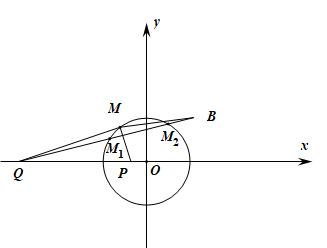

<strong>例14．</strong>（2024·江西赣州·统考模拟预测）阿波罗尼斯是古希腊著名数学家，与欧几里得、阿基米德并称为亚历山大时期数学三巨匠，他对圆锥曲线有深刻而系统的研究，阿波罗尼斯圆是他的研究成果之一，指的是：已知动点<em>M</em>与两定点<em>A</em>，<em>B</em>的距离之比为，那么点<em>M</em>的轨迹就是阿波罗尼斯圆，简称阿氏圆．已知在平面直角坐标系中，圆、点和点，<em>M</em>为圆<em>O</em>上的动点，则的最大值为（    ）

A．	B．	C．	D．

【答案】B

【解析】设，令，则，

由题知圆是关于点*A*、*C*的阿波罗尼斯圆，且，

设点，则，

整理得：，

比较两方程可得：，，，即，，点，

当点*M*位于图中的位置时，的值最大，最大为.

故选：B.

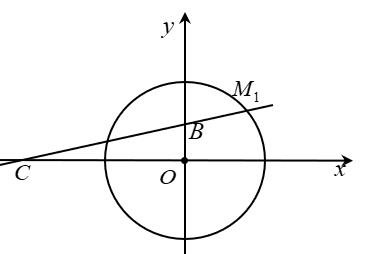

**例15．**（2024·湖南张家界·高二统考期末）阿波罗尼斯是古希腊著名数学家，与欧几里得、阿基米德被称为亚历山大时期数学三巨匠，他对圆锥曲线有深刻且系统的研究，主要研究成果集中在他的代表作《圆锥曲线》一书中，阿波罗尼斯圆是他的研究成果之一，指的是：已知动点与两定点，的距离之比为，那么点的轨迹就是阿波罗尼斯圆．如动点与两定点，的距离之比为时的阿波罗尼斯圆为．下面，我们来研究与此相关的一个问题：已知圆上的动点和定点，，则的最小值为（    ）

A．	B．	C．	D．

【答案】C

【解析】如图，点*M*在圆上，取点，连接，有，

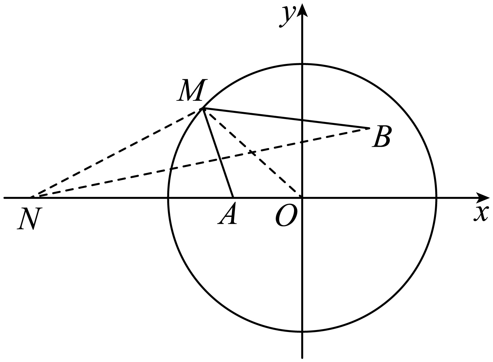

当点不共线时，，又，因此∽，

则有，当点共线时，有，则，

因此，当且仅当点*M*是线段*BN*与圆*O*的交点时取等号，

所以的最小值为.

故选：C

<strong>变式21．</strong>（2024·广东东莞·高三东莞实验中学校考开学考试）对平面上两点<em>A</em>、<em>B</em>，满足的点<em>P</em>的轨迹是一个圆，这个圆最先由古希腊数学家阿波罗尼斯发现，命名为阿波罗尼斯圆，称点<em>A</em>，<em>B</em>是此圆的一对阿波罗点．不在圆上的任意一点都可以与关于此圆的另一个点组成一对阿波罗点，且这一对阿波罗点与圆心在同一直线上，其中一点在圆内，另一点在圆外，系数只与阿波罗点相对于圆的位置有关．已知，，，若动点<em>P</em>满足，则的最小值是__________．

【答案】

【解析】

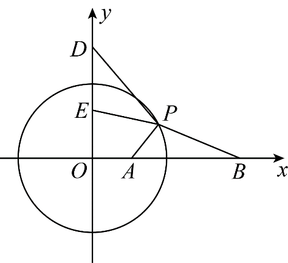

由题意知：，即，

（当且仅当三点按顺序共线时取等号），

又，的最小值为；

故答案为：.

<strong>变式22．</strong>（2024·上海·高三校联考阶段练习）古希腊数学家阿波罗尼斯在他的巨著《圆锥曲线论》中有一个著名的几何问题：在平面上给定两点<em>A</em>、<em>B</em>，动点<em>P</em>满足（其中是正常数，且），则<em>P</em>的轨迹是一个圆，这个圆称之为“阿波罗尼斯圆”．现已知两定点，<em>P</em>是圆上的动点，则的最小值为____________

【答案】

【解析】如图，在轴上取点，

，，，，

（当且仅当为与圆交点时取等号），

.

故答案为：.

<strong>变式23．</strong>（2024·四川广安·高二广安二中校考期中）阿波罗尼斯是古希腊著名的数学家，对圆锥曲线有深刻而系统的研究，阿波罗尼斯圆就是他的研究成果之一，指的是：已知动点<em>M</em>与两定点<em>Q</em>，<em>P</em>的距离之比，那么点的轨迹就是阿波罗尼斯圆.已知动点的轨迹是阿波罗尼斯圆，其方程为，定点为轴上一点，且，若点，则的最小值为_______.

【答案】

【解析】设，，所以，又，所以.

因为且，所以，整理可得，又动点*M*的轨迹是，

所以，解得，所以，又，所以，

因为，所以的最小值为，当且仅当三点共线时取等.

故答案为：.

<strong>变式24．</strong>（2024·河北沧州·校考模拟预测）阿波罗尼斯是古希腊著名的数学家，他对圆锥曲线有深刻而系统的研究，主要研究成果集中在他的代表作《圆锥曲线论》一书，阿波罗尼斯圆是他的研究成果之一，指的是“如果动点与两定点的距离之比为(，那么点的轨迹就是阿波罗尼斯圆”下面我们来研究与此相关的一个问题，已知点为圆上的动点，，则的最小值为_____________.

【答案】

【解析】

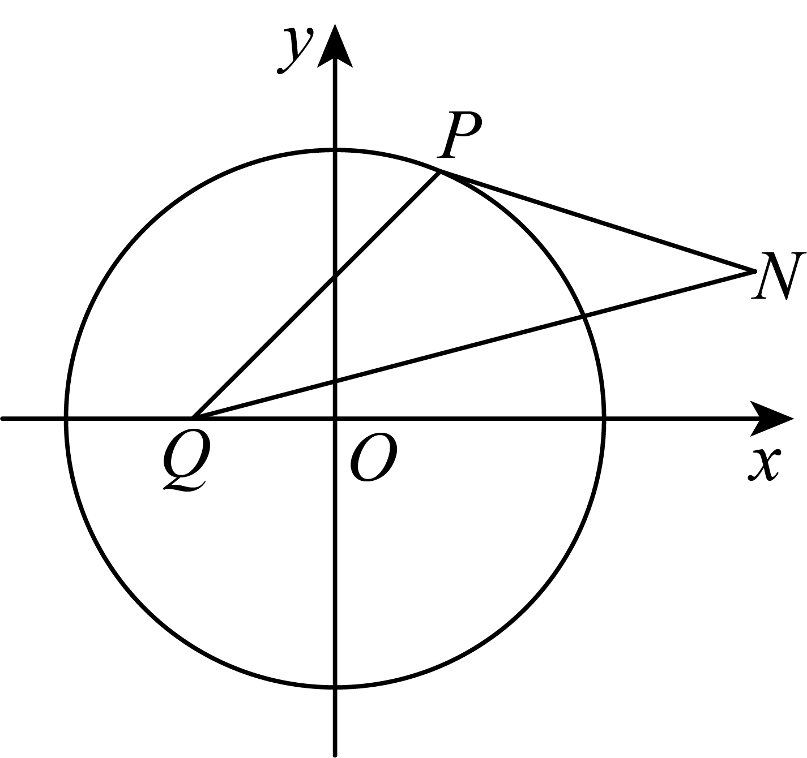

假设存在这样的点，使得，则，设点，则，

即，

该圆对照，所以，所以点，

所以.

故答案为：

<strong>变式25．</strong>（2024·全国·高三专题练习）阿波罗尼斯（约公元前年）证明过这样一个命题：平面内到两定点距离之比为常数的点的轨迹是圆，后人将这个圆称为阿氏圆，已知、分别是圆，圆上的动点，是坐标原点，则的最小值是 __．

【答案】

【解析】如图所示：

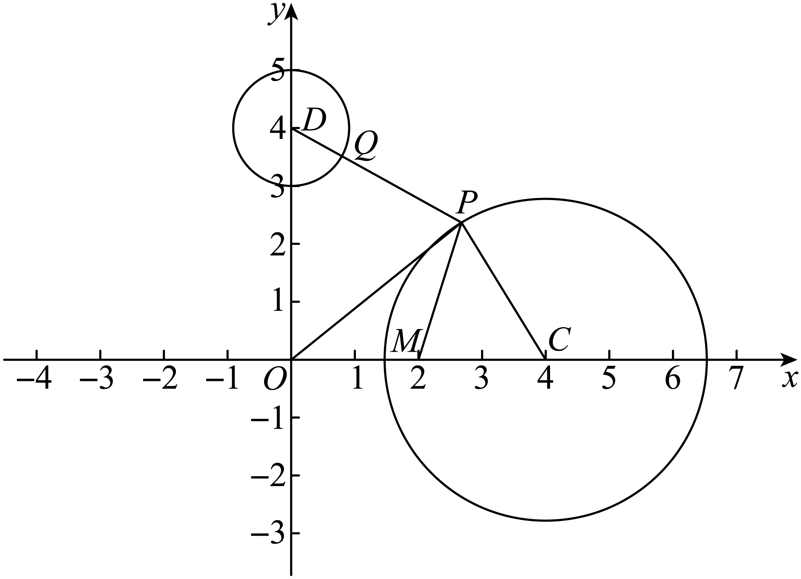

取点，设，

则，

在和中，，

所以和相似，且相似比为，

所以，则，

而，

即的最小值为，

所以.

故答案为：

