**第63讲  直线与圆的综合**

**必考题型全归纳**

**题型一：距离的创新定义**

<strong>例1．</strong>（2024·浙江绍兴·高三统考期末）费马点是指三角形内到三角形三个顶点距离之和最小的点，当三角形三个内角均小于120°时，费马点与三个顶点连线正好三等分费马点所在的周角，即该点所对的三角形三边的张角相等均为120°，根据以上性质，已知，<em>P</em>为内一点，记，则的最小值为_________，此时_________.

【答案】

【解析】设为坐标原点，由，知，

且为锐角三角形，因此，费马点*F*在线段上，设，

则为顶角是120°的等腰三角形，故，

所以；

在中，由正弦定理，得，即，

解得，即此时.

故答案为：；

**例2．**（2024·全国·高三专题练习）闵氏距离（）是衡量数值点之间距离的一种非常常见的方法，设点、坐标分别为，，则闵氏距离.若点、分别在和的图像上，则的最小值为（    ）

A．	B．	C．	D．

【答案】A

【解析】由题意得，设，

因为点*A*、*B*分别在函数和的图象上，

所以，

当且仅当时等号成立.

设，，则，

令，，

所以函数在上单调递增，在上单调递减，

所以，即，所以，

即，所以的最小值为.

故选：A.

**例3．**（2024·全国·高三专题练习）17世纪法国数学家费马在给朋友的一封信中曾提出一个关于三角形的有趣问题：在三角形所在平面内，求一点，使它到三角形每个顶点的距离之和最小．现已证明：在中，若三个内角均小于，则当点满足时，点到三角形三个顶点的距离之和最小，点被人们称为费马点．根据以上知识，已知为平面内任意一个向量，和是平面内两个互相垂直的向量，且，则的最小值是（    ）

A．	B．

C．	D．

【答案】B

【解析】设，，，

则，

即为点到和点三个点的距离之和，

则△*ABC*为等腰三角形，如图，

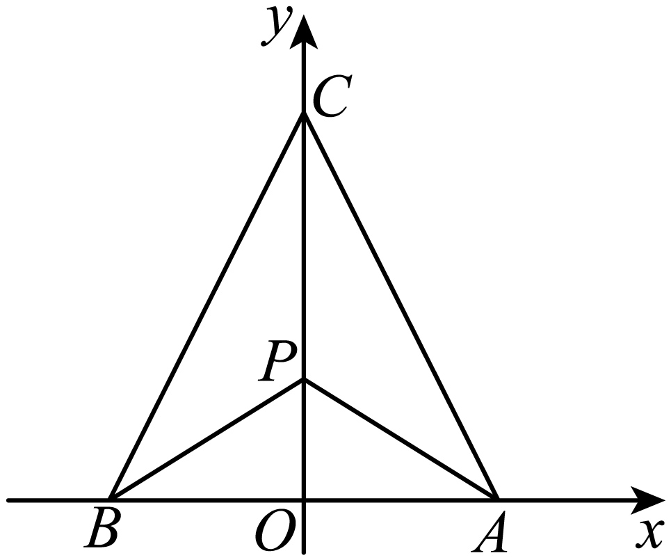

由费马点的性质可得，需满足：点*P*在*y*轴上且∠*APB*＝120°，则∠*APO*＝60°，

因为|*OA*|＝|*OB*|＝2，则，所以点坐标为时，距离之和最小，

最小距离之和为.

故选：B.

<strong>变式1．</strong>（2024·全国·高三专题练习）闵可夫斯基距离又称为闵氏距离，是两组数据间距离的定义.设两组数据分别为和，这两组数据间的闵氏距离定义为，其中<em>q</em>表示阶数.现有下列四个命题：

①若，则；

②若，其中，则；

③若，其中，则；

④若，其中，则的最小值为.

其中所有真命题的个数是（    ）

A．1	B．2	C．3	D．4

【答案】C

【解析】对于①：，故①正确.

对于②：，故②错误.

对于③：，不妨设，，且均为非负数，所以故③正确.

对于④：构造函数，则，的最小值即两曲线动点间的最小距离，设与直线平行的切线方程为，联立 得：，令得，，所以切线方程为：与之间的距离，所以最小值为，故④正确.

故选*C*.

**变式2．**（2024·全国·高三专题练习）费马点是指三角形内到三角形三个顶点距离之和最小的点.当三角形三个内角均小于120°时，费马点与三个顶点连线正好三等分费马点所在的周角，即该点所对的三角形三边的张角相等且均为120°.根据以上性质，.则的最小值为（    ）

A．4	B．	C．	D．

【答案】B

【解析】由题意得：的几何意义为点到点的距离之和的最小值，

因为，，

，

所以，故三角形*ABC*为等腰直角三角形，，

取的中点，连接，与交于点，连接，故，，

因为，所以，故，则，

故点到三角形三个顶点距离之和最小，即取得最小值，

因为，所以，同理得：，，

，

故的最小值为.

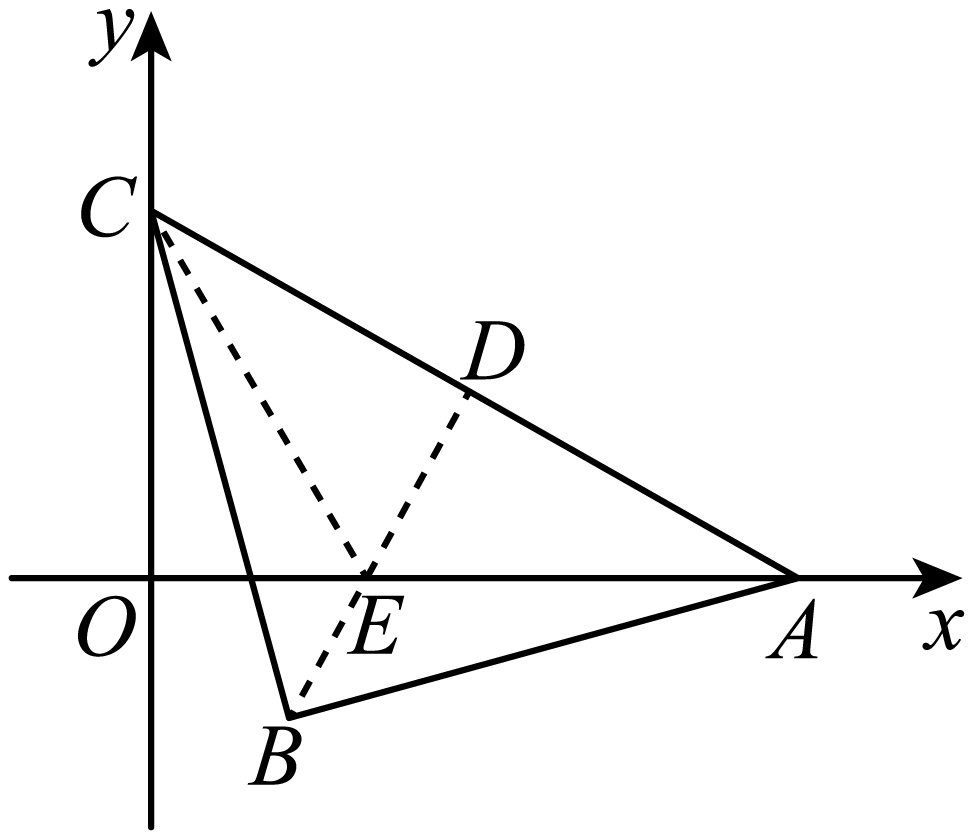

故选：B

<strong>变式3．</strong>（2024·全国·高三专题练习）点是内部或边界上的点，若到三个顶点距离之和最小，则称点是的费马点（该问题是十七世纪法国数学家费马提出）.若，，时，点是的费马点，且已知在轴上，则的大小等于______.

【答案】

【解析】先证明：若到三个顶点距离之和最小，则

如图将绕点*B*逆时针旋转60°得到，则≌，

，所以是等边三角形，，

，当四点共线时取得最小值，

此时，

同理可得

所以命题得证.

点是的费马点，且已知在轴上，

，

，

所以，

所以=.

故答案为：

<strong>变式4．</strong>（2024·全国·高三专题练习）著名数学家华罗庚曾说过：“数形结合百般好，隔裂分家万事休．”事实上，有很多代数问题可以转化为几何问题加以解决，如：可以转化为平面上点<em>M</em>(<em>x</em>，<em>y</em>)与点<em>N</em>(<em>a</em>，<em>b</em>)的距离．结合上述观点，可得的最小值为________．

【答案】

【解析】∵，∴的几何意义为点到两定点与的距离之和，设点关于轴的对称点为，则为，要求的最小值，可转化为的最小值，利用对称思想可知，即的最小值为,故答案为.

**题型二：切比雪夫距离**

<strong>例4．</strong>（2024·全国·高三专题练习）在平面直角坐标系中，定义为两点，的“切比雪夫距离”．又设点<em>P</em>及<em>l</em>上任意一点<em>Q</em>，称<em>d</em>（<em>P</em>，<em>Q</em>）的最小值为点<em>P</em>到直线<em>l</em>的“切比雪夫距离”，记作<em>d</em>（<em>P</em>，<em>l</em>）．给出下列四个命题：①对任意三点<em>A</em>，<em>B</em>，<em>C</em>，都有；②已知点<em>P</em>（3，1）和直线，则；③到原点的“切比雪夫距离”等于1的点的轨迹是正方形．其中正确的序号为______．

【答案】①②③

【解析】其中①③的讨论见后文．

②设点*Q*是直线上一点，且，则．由，解得，即有，当时，取得最小值；由，解得或，即有，此时的范围是，无最值．故*P*，*Q*两点的“切比雪夫距离”的最小值为．

综上，①②③正确．

<strong>例5．</strong>（2024·全国·高三专题练习）在平面直角坐标系中，定义为两点、的“切比雪夫距离”．若点<em>P</em>到点（2014，2015）的切比雪夫距离为2，则点<em>P</em>的轨迹长度之和为______．

【答案】16

【解析】由前文知点*P*的轨迹是边长为4的正方形，则轨迹长度之和为16．

**例6．**（2024·全国·高三专题练习）在平面直角坐标系中,定义为两点的“切比雪夫距离”，又设点及上任意一点,称的最小值为点到直线的“切比雪夫距离”记作给出下列四个命题:

①对任意三点，都有

②已知点和直线则

③到原点的“切比雪夫距离”等于的点的轨迹是正方形；

其中真命题的是（    ）

A．①②	B．②③	C．①③	D．①②③

【答案】D

【解析】① 对任意三点、、，若它们共线，设，、，，，，如图，结合三角形的相似可得，，为，，，或，，，则；

若，或，对调，可得；

若，，不共线，且三角形中为锐角或钝角，如图，

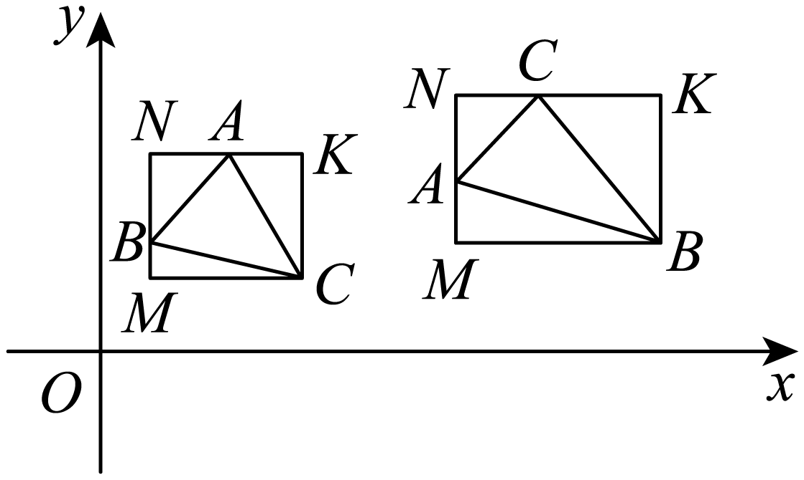

由矩形或矩形，；

则对任意的三点，，，都有，故①正确；

②设点是直线上一点，且，

可得，，

由，解得，即有，

当时，取得最小值；

由，解得或，即有，

的范围是，无最值；

综上可得，，两点的“切比雪夫距离”的最小值为；故②正确；

③由题，到原点的“切比雪夫距离”的距离为1的点满足，即或，显然点的轨迹为正方形，故③正确；

故选：D

**变式5．**（2024·全国·高三专题练习）在平面直角坐标系中，定义为两点、的“切比雪夫距离”，又设点及直线上任一点，称的最小值为点到直线的“切比雪夫距离”，记作.

（1）求证：对任意三点、、，都有；

（2）已知点和直线，求；

（3）定点，动点满足（），请求出点所在的曲线所围成图形的面积.

【解析】（1）证明：设，则

，同理可得，

所以，

（2）设为直线上一点，则，

由，解得，即有，当时，取得最小值；

由，解得或，即有，

的范围是，无最大值，

综上可得，两点的最小值为，

所以；

（3）设轨迹上动点为，则，

等价于或，

所以点的轨迹是以为中心，边长为的正方形，

所以点所在的曲线所围成图形的面积为

**变式6．**（2024·全国·高三专题练习）在平面直角坐标系中，定义为两点、的“切比雪夫距离”，又设点及直线上任意一点，称的最小值为点到直线的“切比雪夫距离”，记作，给出下列三个命题：

①对任意三点、、，都有；

②已知点和直线，则；

③定义，动点满足，则动点的轨迹围成平面图形的面积是4；

其中真命题的个数（    ）

A．0	B．1	C．2	D．3

【答案】B

【解析】由新定义表示出三点两两之间的“切比雪夫距离”，然后根据绝对值的性质判断①，

由新定义计算出，判断②，

根据新定义求出的轨迹方程，确定其轨迹，求得轨迹围成的图形面积判断③．①设，则，

，

显然，同理，

∴，①正确；

②设是直线上任一点，则，

，易知在上是增函数，在上是减函数，∴时，，②错；

③由得，易知此曲线关于轴，轴，原点都对称，它是以为顶点的正方形，其转成图形面积为，③错．

故选：B．

<strong>变式7．</strong>（2024·全国·高三专题练习）在平面直角坐标系中，定义为两点<em>AB</em>的“切比雪夫距离”，又设点<em>P</em>及上任意一点<em>Q</em>,称的最小值为点<em>P</em>到直线的“切比雪夫距离”，记作,给出下列三个命题：

①对任意三点*A*、*B*、*C*，都有

②已知点*P*(2,1)和直线,则

③定点动点*P*满足则点*P*的轨迹与直线(为常数)有且仅有2个公共点.

其中真命题的个数是（    ）

A．0	B．1	C．2	D．3

【答案】C

【解析】①对任意三点、、，

若它们共线，设，、，、，，如图，

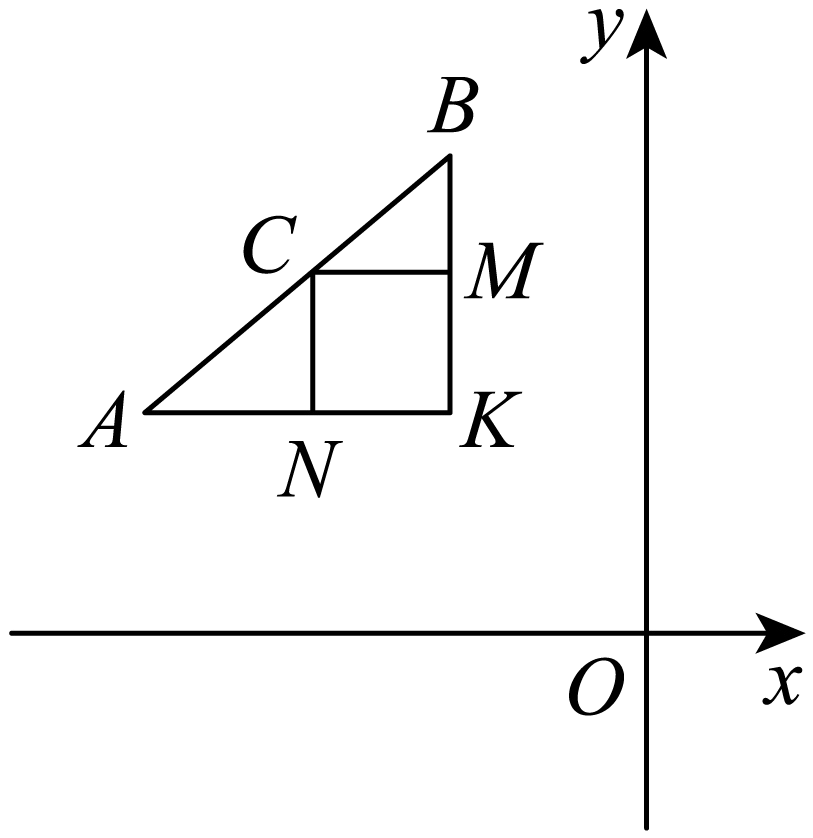

结合三角形的相似可得,,分别为,,或,,，

则；

若,或,对调，可得；

若它们不共线，且三角形中为锐角或钝角，如图，

由矩形或矩形，

；

则对任意的三点，，，都有；

故①正确；

②设点直线一点，且，可得，

由，解得，即有，

当时，取得最小值；

由，解得或，即有，

的范围是，无最值，

综上可得，，两点的“切比雪夫距离”的最小值为，

故②错误；

③定点、，动点满足，

可得不轴上，在线段间成立，

可得，解得，

由对称性可得也成立，即有两点满足条件；

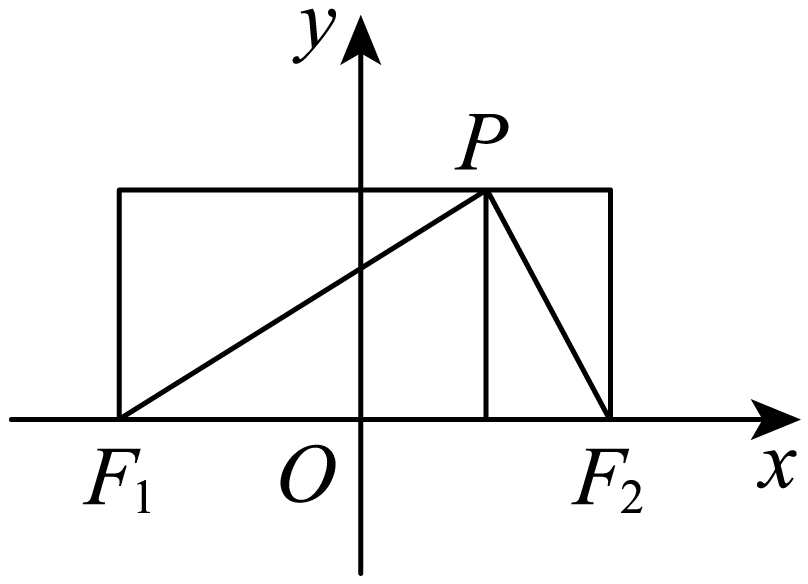

若在第一象限内，满足即为，为射线，

由对称性可得在第二象限、第三象限和第四象限也有一条射线，

则点的轨迹与直线为常数）有且仅有2个公共点，

故③正确；

真命题的个数是2，

故选：C．

<strong>变式8．</strong>（2024·全国·高三专题练习）在平面直线坐标系中,定义为两点的“切比雪夫距离”，又设点<em>P</em>及上任意一点Q,称的最小值为点<em>P</em>到直线的“切比雪夫距离”记作给出下列四个命题:（    ）

①对任意三点*A*、*B*、*C*，都有

②已知点*P*(3,1)和直线则

③到原点的“切比雪夫距离”等于的点的轨迹是正方形；

④定点动点满足则点*P*的轨迹与直线(为常数)有且仅有2个公共点．

其中真命题的个数是（    ）

A．4	B．3	C．2	D．1

【答案】A

【解析】①对任意三点、、，若它们共线，设，、，，

，，如右图，结合三角形的相似可得，，

为，，，或，，，则，，，；

若，或，对调，可得，，，；

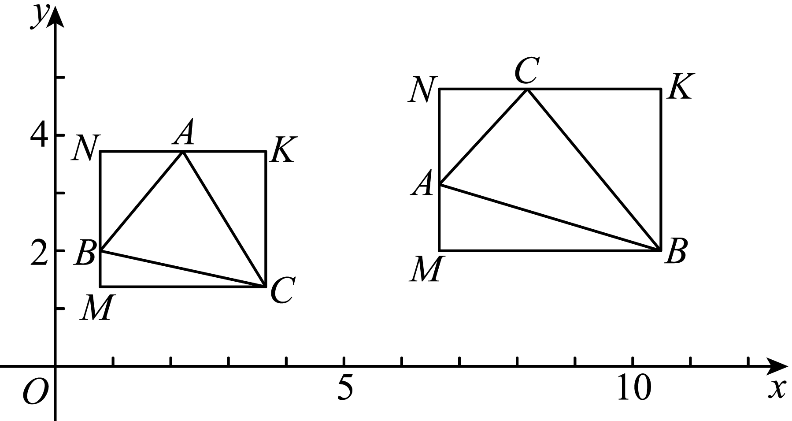

若，，不共线，且三角形中为锐角或钝角，由矩形或矩形，

，，，；

则对任意的三点，，，都有，，，；故①正确；

设点是直线上一点，且，

可得，，

由，解得，即有，

当时，取得最小值；

由，解得或，即有，

的范围是，，，．无最值，

综上可得，，两点的“切比雪夫距离”的最小值为．

故②正确；

③由题意，到原点的“切比雪夫距离” 等于的点设为，则，

若，则；若，则，故所求轨迹是正方形，则③正确；

④定点、，动点

满足，，，

可得不轴上，在线段间成立，

可得，解得，

由对称性可得也成立，即有两点满足条件；

若在第一象限内，满足，，，

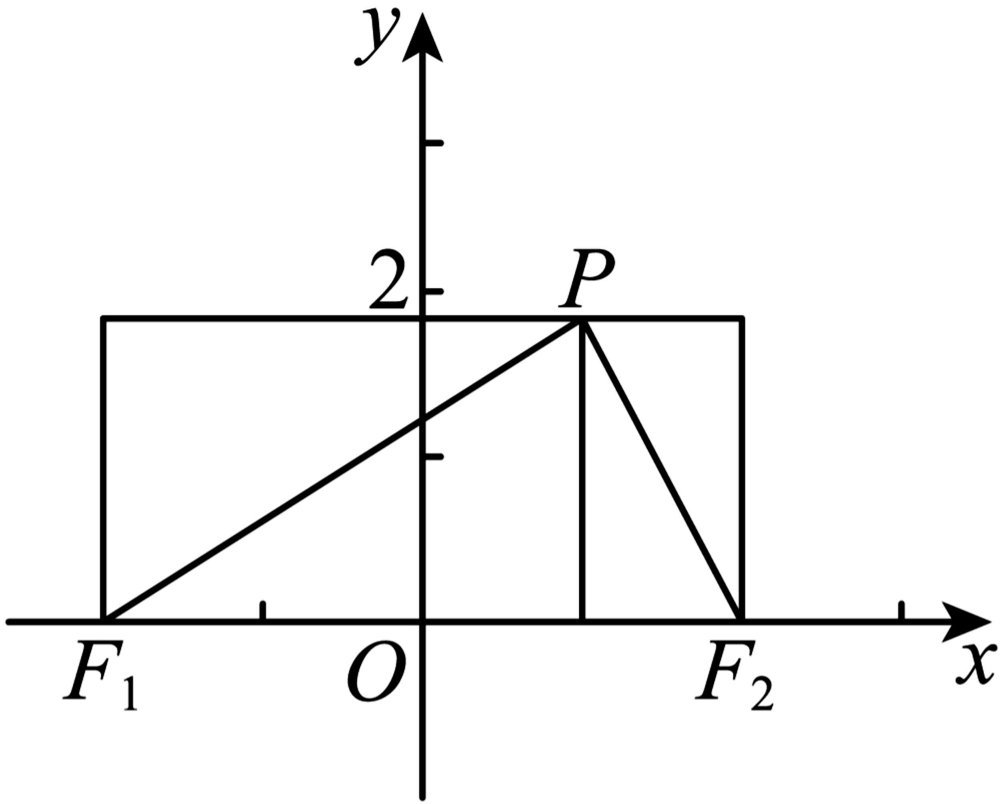

即为，为射线，

由对称性可得在第二象限、第三象限和第四象限也有一条射线，

则点的轨迹与直线为常数）有且仅有2个公共点．

故④正确；

综上可得，真命题的个数为4个，

故选:.

**题型三：曼哈顿距离、折线距离、直角距离问题**

<strong>例7．</strong>（2024·福建泉州·统考模拟预测）人脸识别，是基于人的脸部特征信息进行身份识别的一种生物识别技术．在人脸识别中，主要应用距离测试检测样本之间的相似度，常用测量距离的方式有曼哈顿距离和余弦距离．设，，则曼哈顿距离，余弦距离，其中（<em>O</em>为坐标原点）．已知，，则的最大值近似等于（    ）

（参考数据：，．）

A．0.052	B．0.104	C．0.896	D．0.948

【答案】B

【解析】设，

由题意可得：，即，

可知表示正方形，其中，

即点在正方形的边上运动，

因为，由图可知：

当取到最小值，即最大，点有如下两种可能：

①点为点*A*，则，可得；

②点在线段上运动时，此时与同向，不妨取，

则；

因为，

所以的最大值为.

故选：B.

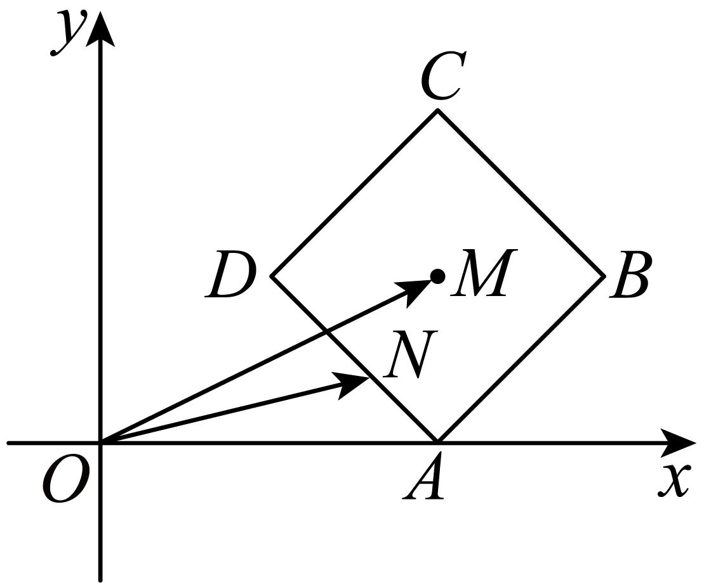

**例8．**（2024·安徽·校联考二模）在平面直角坐标系中，定义两点间的折线距离，该距离也称曼哈顿距离．已知点，若，则的最小值与最大值之和为（    ）

A．0	B．	C．	D．

【答案】B

【解析】由题意得，．令，

作出所表示的平面区域如图中实线所示，

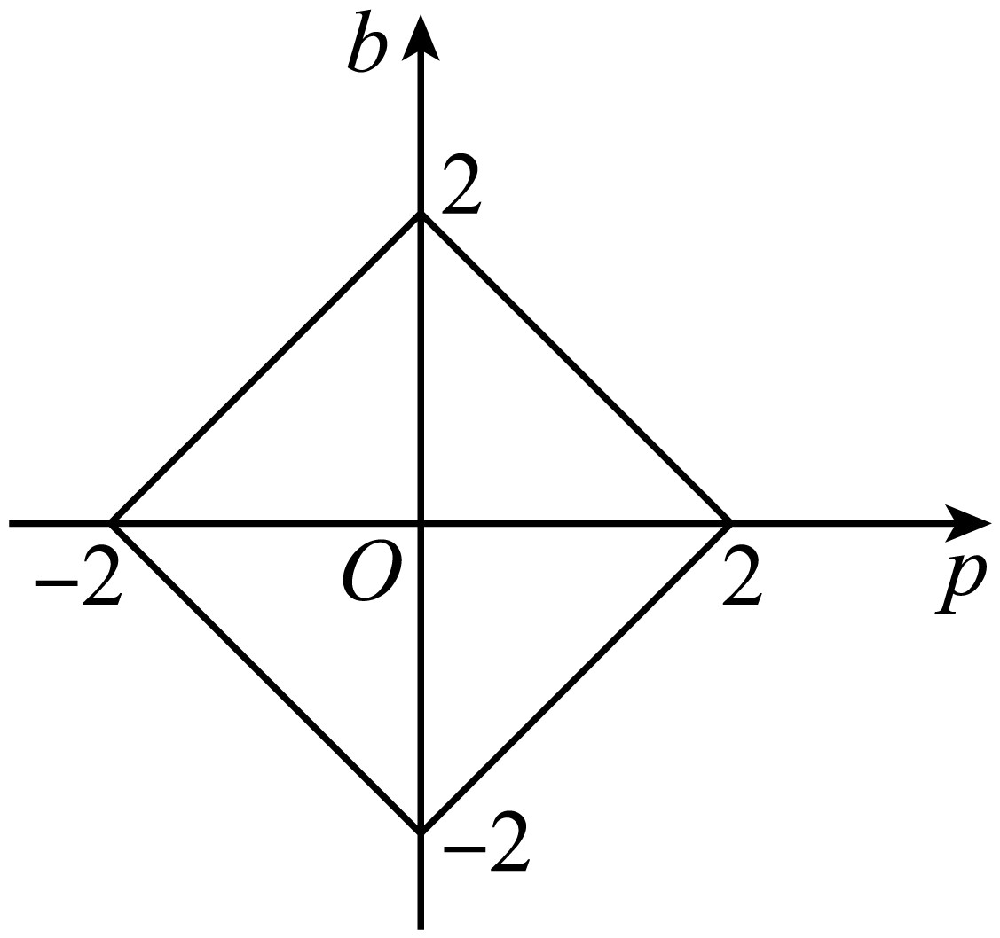

则，而表示点到原点的距离的平方，

结合图形可知的最小值为2，最大值为4，故的最小值与最大值之和为，

故选：B．

**例9．**（2024·全国·高三专题练习）十九世纪著名德国犹太人数学家赫尔曼闵可夫斯基给出了两点，的曼哈顿距离为.我们把到三角形三个顶点的曼哈顿距离相等的点叫“好点”，已知三角形的三个顶点坐标为，，，则的“好点”的坐标为（    ）

A．	B．	C．	D．

【答案】B

【解析】对于A，设，

则，

所以点不是的“好点”；

对于B，设，

则，

，

所以，

所以点是的“好点”；

对于C，设，

则，

所以点不是的“好点”；

对于D，设，

则，

所以点不是的“好点”.

故选：B.

**变式9．**（2024·全国·高三专题练习）“曼哈顿距离”也叫“出租车距离”，是19世纪德国犹太人数学家赫尔曼·闵可夫斯基首先提出来的名词，用来表示两个点在标准坐标系上的绝对轴距总和，即在直角坐标平面内，若，，则，两点的“曼哈顿距离”为，下列直角梯形中的虚线可以作为，两点的“曼哈顿距离”是（    ）

A．	B．

C．	D．

【答案】C

【解析】根据题意：，两点的“曼哈顿距离”为，再结合四个选项可以判断只有C选项符合题意.

故选：C．

<strong>变式10．</strong>（2024·全国·高三专题练习）“曼哈顿距离”是19世纪的赫尔曼·闵可夫斯基所创之间，定义如下：在直角坐标平面上任意两点，的曼哈顿距离为：.在此定义下，已知点，满足的点<em>M</em>轨迹围成的图形面积为（    ）

A．2	B．1	C．4	D．

【答案】A

【解析】设，

因为，所以，

当时，则

当时，，当时，，

当时，，当时，，

当时，，当，，

所以点*M*的轨迹如图所示，是一个边长为的正方形，

所以点*M*轨迹围成的图形面积为，

故选：A

**题型四：圆的包络线问题**

<strong>例10．</strong>（2024·全国·高三专题练习）设直线系<em>M</em>：，则下列命题中是真命题的个数是（    ）

①存在一个直线与所有直线相交；②*M*中所有直线均经过一个定点；③对于任意实数，存在正*n*边形，其所有边均在*M*中的直线上；④*M*中的直线所能围成的正三角形面积都相等.

A．0	B．1	C．2	D．3

【答案】B

【解析】根据直线系*M*：，

可得到直线*M*的距离，

所以所有直线都为圆心为，半径为1的圆的切线，

对于①：因为直线系为圆的任意切线，所以不存在一个直线与所有直线相交，故①错误；

对于②：因为直线系为圆的任意切线，所以该直线系不过定点，故②错误；

对于③：对于任意实数，作圆的外切正*n*边形，其所有边都为圆的切线，即为直线系中的直线，故③正确；

对于④：如图所示：

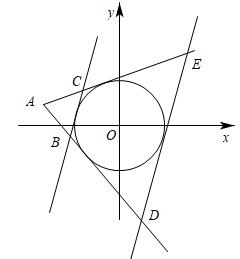

正和正面积不相等，故④错误；

故选：B

**例11．**（2024·全国·高三专题练习）设直线系（），则下列命题中是真命题的个数是（　　）

①存在一个圆与所有直线相交；

②存在一个圆与所有直线不相交；

③存在一个圆与所有直线相切；

④中所有直线均经过一个定点；

⑤不存在定点不在中的任一条直线上；

⑥对于任意整数，存在正边形，其所有边均在中的直线上；

⑦中的直线所能围成的正三角形面积都相等．

A．3	B．4	C．5	D．6

【答案】B

【解析】根据直线系（）得到，

所有直线都为圆心为，半径为1的圆的切线．

对于①，可取圆心为，半径为2的圆，该圆与所有直线相交，所以①正确；

对于②，可取圆心为，半径为的圆，该圆与所有直线不相交，所以②正确；

对于③，可取圆心为，半径为1的圆，该圆与所有直线相切，所以③正确；

对于④，所有的直线与一个圆相切，没有过定点，所以④错误；

对于⑤，存在不在中的任一条直线上，所以⑤错误；

对于⑥，可取圆的外接正三角形，其所有边均在中的直线上，所以⑥正确；

对于⑦，可以在圆的三等分点做圆的三条切线，把其中一条切线平移到过另外两个点中点时，也为正三角形，但是它与圆的外接正三角形的面积不相等，所以⑦错误；

故①②③⑥正确，④⑤⑦错，所以真命题的个数为4个．

故选：B．

**例12．**（2024·全国·高三专题练习）设直线系，对于下列四个结论：

（1）当直线垂直于轴时，或；

（2）当时，直线倾斜角为；

（3）中所有直线均经过一个定点；

（4）存在定点不在中任意一条直线上．

其中正确的是（    ）

A．①②	B．③④	C．②③	D．②④

【答案】D

【解析】，

（1）当直线垂直于轴时，则，解得或或，故（1）错误；

（2）当时，直线方程为：，

斜率，即，倾斜角，故（2）正确；

（3）由直线系

可令，消去可得，

故直线系表示圆的切线的集合，故（3）不正确．

（4）因为对任意，存在定点不在直线系中的任意一条上，故（4）正确；

故选：D．

**变式11．（多选题）**（2024·辽宁葫芦岛·高二校考开学考试）设有一组圆：（）.下列四个命题中真命题的是

A．存在一条定直线与所有的圆均相切

B．存在一条定直线与所有的圆均相交

C．存在一条定直线与所有的圆均不相交

D．所有的圆均不经过原点

【答案】BD

【解析】圆心为，半径为，

，，，，，圆与圆是内含关系，因此不可能有直线与这两个圆都相切，从而A错误；

易知圆心在直线上，此直线与所有圆都相交，B正确；

若取无穷大，则所有直线都与圆相交，C错；

将代入圆方程得，即，等式左边是奇数，右边是偶数，因此方程无整数解，即原点不在任一圆上，D正确．

故选：BD．

**变式12．（多选题）**（2024·全国·高二专题练习）已知圆，直线，下面五个命题，其中正确的是（    ）

A．对任意实数与，直线和圆有公共点

B．对任意实数与，直线与圆都相离

C．存在实数与，直线和圆相离

D．对任意实数，必存在实数，使得直线与圆相切

【答案】AD

【解析】AB选项，由题意知圆的圆心为，半径为，直线的方程可以写作，过定点，因为点在圆上，所以直线与圆相切或相交，

任意实数与，直线和圆有公共点，A正确，B错误；

C选项，由以上分析知不存在实数与，直线和圆相离，C错误；

D选项，当直线与圆相切时，点恰好为直线与圆的切点，故直线与直线垂直，①当时，直线与轴垂直，则，即，解得，存在，使得直线与圆相切；

②当时，若直线与直线垂直，则，

直线的斜率为，

所以，即，

此时对任意的，均存在实数，使得，则直线与直线垂直，

综上所述，对任意实数，必存在实数，使得直线与圆相切，D正确．

故选：AD．

**变式13．**（2024·全国·高三专题练习）已知直线与圆相切，则满足条件的直线有（     ）条

A．1	B．2	C．3	D．4

【答案】C

【解析】由于直线和圆相切，故圆心到直线的距离等于半径，即，（其中），故，或 ，正弦值为的只有在轴正半轴，正弦值为可以在第三或者第四象限，故有种可能，所以选.

**题型五：阿波罗尼斯圆问题、反演点问题、阿波罗尼斯球问题**

<strong>例13．</strong>（2024·重庆沙坪坝·高二重庆南开中学校考阶段练习）公元前世纪，古希腊数学家阿波罗尼斯结合前人的研究成果，写出了经典之作《圆锥曲线论》，在此著作第七卷《平面轨迹》中，有众多关于平面轨迹的问题，例如:平面内到两定点距离之比等于定值（不为1）的动点轨迹为圆.后来该轨迹被人们称为阿波罗尼斯圆.已知平面内有两点和，且该平面内的点<em>P</em>满足，若点<em>P</em>的轨迹关于直线对称，则的最小值是（    ）

A．	B．	C．	D．

【答案】B

【解析】设点的坐标为，因为，则，

即，

所以点的轨迹方程为，

因为点的轨迹关于直线对称，

所以圆心在此直线上，即，

所以，

当且仅当，即时，等号成立，

所以的最小值是.

故选：B.

**例14．**（2024·高二单元测试）阿波罗尼斯是古希腊著名数学家，与阿基米德、欧几里得并称为亚历山大时期数学三巨匠，他研究发现：如果一个动点到两个定点的距离之比为常数（，且），那么点的轨迹为圆，这就是著名的阿波罗尼斯圆．若点到，的距离之比为，则点到直线的距离的最小值为（    ）

A．	B．

C．	D．

【答案】A

【解析】设，则，化简得，

即点的轨迹方程为以为圆心，为半径的圆，

则点到直线的距离的最小值为圆心到直线的距离减去半径，

即，点到直线的距离最小值为.

故选：A

**例15．**（2024·福建泉州·高二统考期末）已知平面内两个定点，及动点，若（且），则点的轨迹是圆.后世把这种圆称为阿波罗尼斯圆.已知，，直线，直线，若为，的交点，则的最小值为（    ）

A．3	B．	C．	D．

【答案】A

【解析】由已知过定点，

过定点，

因为，，所以，即，

所以点的轨迹是以为直径的圆，除去点，故圆心为，半径为3，

则的轨迹方程为，即，易知*O、Q*在该圆内，

又，

即，

取，则，又，

所以，

所以的最小值为.

故选：A.

**变式14．**（2024·全国·高二专题练习）阿波罗尼斯是古希腊著名数学家，与欧几里得、阿基米德被称为亚历山大时期数学三巨匠，他对圆锥曲线有深刻且系统的研究，主要研究成果集中在他的代表作《圆锥曲线》一书中，阿波罗尼斯圆是他的研究成果之一，指的是：已知动点与两定点，的距离之比为，那么点的轨迹就是阿波罗尼斯圆．如动点与两定点，的距离之比为时的阿波罗尼斯圆为．下面，我们来研究与此相关的一个问题：已知圆上的动点和定点，，则的最小值为（    ）

A．	B．	C．	D．

【答案】C

【解析】如图，点*M*在圆上，取点，连接，有，

当点不共线时，，又，因此∽，

则有，当点共线时，有，则，

因此，当且仅当点*M*是线段*BN*与圆*O*的交点时取等号，

所以的最小值为.

故选：C

<strong>变式15．</strong>（2024·高二单元测试）古希腊数学家阿波罗尼奥斯（约公元首262～公元前190年）的著作《圆锥曲线论》是古代世界光辉的科学成果，著作中有这样一个命题：平面内与两定点距离的比为常数<em>k</em>（且）的点的轨迹是圆，后人将这个圆称为阿波罗尼斯圆．已知 ，，圆上有且仅有一个点 <em>P</em>满足，则<em>r</em>的取值可以为（ ）

A．1	B．2	C．3	D．4

【答案】A

【解析】设动点，由，得，整理得，

又点是圆：上有且仅有的一点，所以两圆相切.

圆的圆心坐标为，半径为2，

圆*C*：的圆心坐标为，半径为*r*，两圆的圆心距为3，

当两圆外切时，，得，

当两圆内切时，，，得．

故选：A.

<strong>变式16．</strong>（2024·全国·高三专题练习）如图，已知平面，，<em>A</em>、<em>B</em>是直线<em>l</em>上的两点，<em>C</em>、<em>D</em>是平面内的两点，且，，，，．<em>P</em>是平面上的一动点，且直线<em>PD</em>，<em>PC</em>与平面所成角相等，则二面角的余弦值的最小值是（   ）

A．	B．	C．	D．1

【答案】B

【解析】由题意易得*PD*与平面所成角为，*PC*与平面所成角为，

∵，

∴，

∴，

∴，

∴*P*点轨迹为阿氏圆．

在平面内，以为轴，以的中垂线为轴，建立平面直角坐标系，

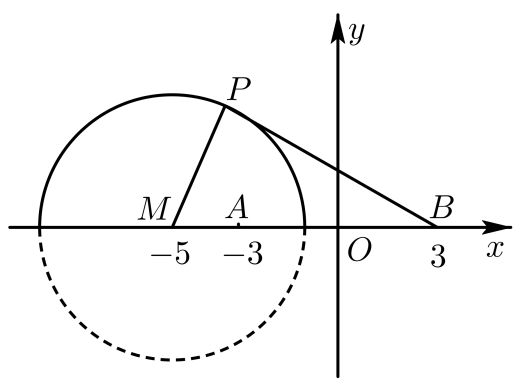

则，设，

所以，

整理得：，

所以点*P*在内的轨迹为以为圆心，以4为半径的上半圆，

因为平面，，，，

所以，

因为，

所以，

因为平面平面，，

所以二面角的平面角为，

由图可知，当*PB*与圆相切时，最大，余弦值最小，

此时，故.

故选：B．

**变式17．**（2024·全国·高三专题练习）已知三棱锥中，底面为等边三角形，，，点为的中点，点为的中点.若点、是空间中的两动点，且，，则（   ）

A．3	B．4	C．6	D．8

【答案】B

【解析】建立直角坐标系如图所示，

，底面为等边三角形，且.所以OD=2,AO=.B(-，-1，0)，D(0,2,0),C(，-1，0),点为的中点，所以E（，，0）点为的中点，F（- ，- ，0），设M（x,y,z）,，所以 ，所以点M在以（0,0,0）为球心，以1为半径的球上，同理N也在这个球上，且，所以MN为球的直径，= .

故选B.

<strong>变式18．</strong>（2024·全国·高三专题练习）阿波罗尼斯（约公元前年）证明过这样一个命题：平面内到两定点距离之比为常数的点的轨迹是圆，后人将这个圆称为阿氏圆，已知、分别是圆，圆上的动点，是坐标原点，则的最小值是 __．

【答案】

【解析】如图所示：

取点，设，

则，

在和中，，

所以和相似，且相似比为，

所以，则，

而，

即的最小值为，

所以.

故答案为：.

<strong>变式19．</strong>（2024·全国·高三专题练习）点为圆：上一动点，为圆：上一动点，为坐标原点，则的最小值为______.

【答案】9

【解析】为圆：上一动点，为圆：上一动点，

为坐标原点，

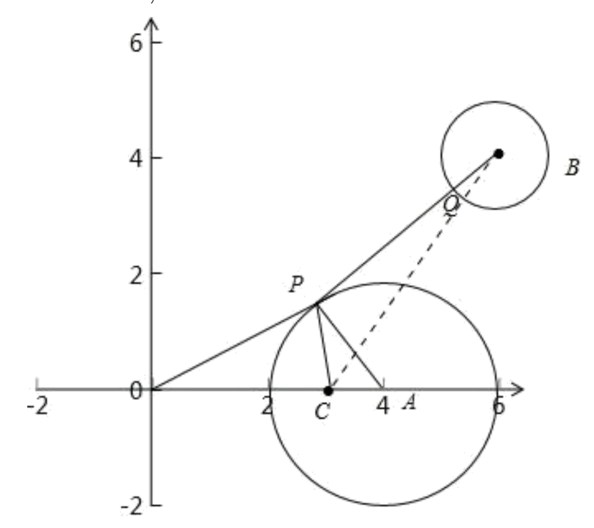

取，则，

故答案为：9

<strong>变式20．</strong>（2024·全国·高三专题练习）如图，在正方体中，，点在线段上，且，点是正方体表面上的一动点，点是空间两动点，若且，则的最小值为_.

【答案】

【解析】如图,建立如图所示的空间直角坐标系

则,，设

由题设

即

也即

由此可知点都是在球心为,半径为2的球面上

又,故点是球的直径的两个端点

所以，

所以

而在正方体的表面上,故当点在正方体的顶点上时,

此时的值最小为

故答案为 ：.

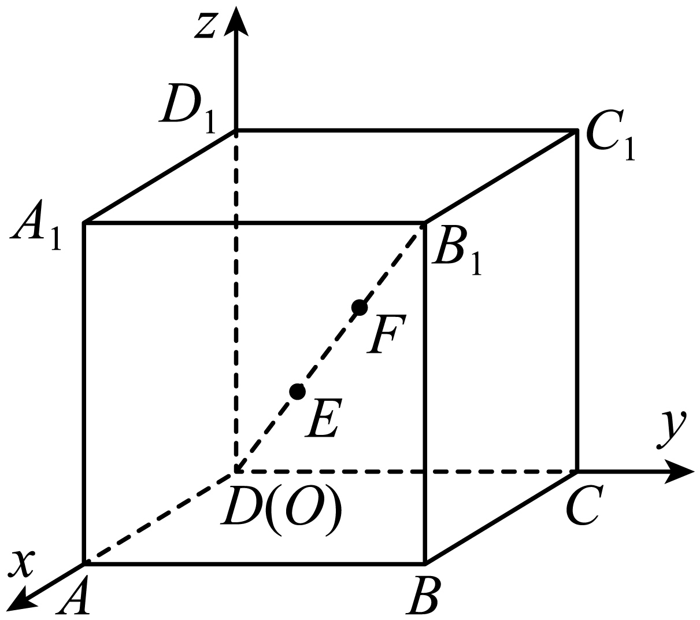

**题型六：圆中的垂直问题**

<strong>例16．</strong>（2024·海南·统考模拟预测）已知直线，直线过点且与直线相互垂直，圆，若直线与圆<em>C</em>交于<em>M</em>，<em>N</em>两点，则_________．

【答案】

【解析】由直线，可得斜率，

因为且直线过点，所以直线的斜率为，

所以的方程为，

又由圆，即，

可得圆的圆心坐标为，半径为，

则圆心到直线的距离为，

所以弦长.

故答案为：.

<strong>例17．</strong>（2024·江苏南通·统考一模）在平面直角坐标系中，圆的方程为．若直线上存在一点，使过所作的圆的两条切线相互垂直，则实数的取值范围是______．

【答案】

【解析】记两个切点为，则由于，因此四边形是正方形，，圆标准方程为，，，于是圆心直线的距离不大于，

，解得.

考点：直线和圆的位置关系.

<strong>例18．</strong>（2024·全国·模拟预测）已知<em>AC</em>，<em>BD</em>为圆的两条相互垂直的弦，垂足为，则的最大值为______．

【答案】20

【解析】设圆心到*AC*，*BD*的距离分别为*m*，*n*．

因为*AC*，*BD*相互垂直，所以，

由垂径定理得，

则，

由，得，当且仅当时等号成立，

故．

故答案为：20

<strong>变式21．</strong>（2024·全国·高三专题练习）过定点作两条相互垂直的直线、，设原点到直线、的距离分别为、，则的最大值是__．

【答案】

【解析】如图所示：

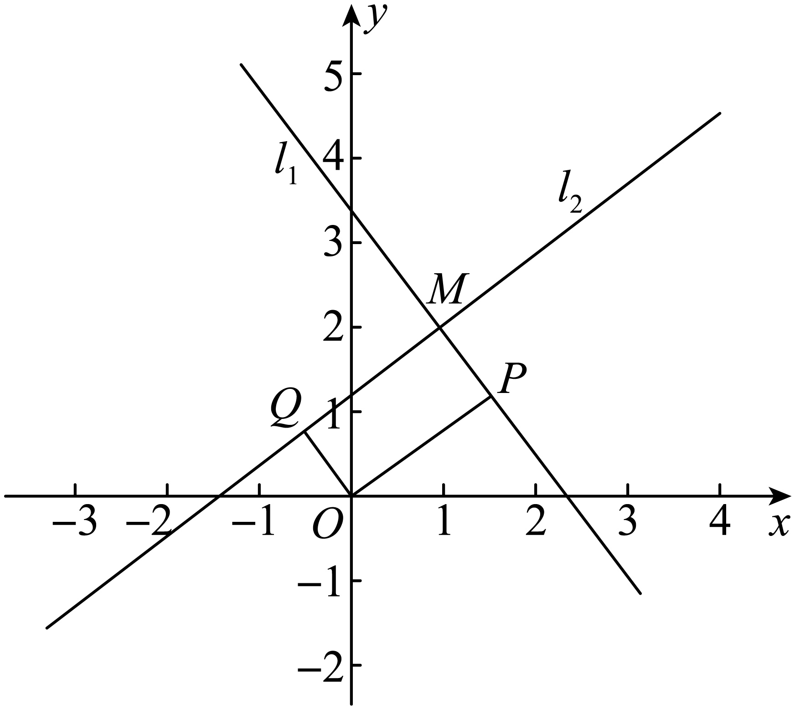

作交于点，作交于点，

可得四边形为矩形，

，

故可设，

，其中，

当取最大值1时，取最大值.

故答案为：

<strong>变式22．</strong>（2024·全国·高三专题练习）过点作两条相互垂直的直线分别交圆于、和、两点，则四边形面积的最大值为__．

【答案】23

【解析】圆，圆心坐标，半径，

设圆心到、的距离分别为、，

，则

四边形的面积为

当且仅当时取等号，

四边形面积的最大值为23．

故答案为：23．

<strong>变式23．</strong>（2024·全国·高三专题练习）在平面直角坐标系中，圆.已知过原点且相互垂直的两条直线和，其中与圆相交于，两点，与圆相切于点.若，则直线的斜率为_____________.

【答案】

【解析】设：，：，利用点到直线的距离，列出式子

，求出的值即可.由圆，可知圆心，半径为.

设直线：，则：，

圆心到直线的距离为，

，

.

圆心到直线的距离为半径，即，

并根据垂径定理的应用，可列式得到，

解得.

故答案为：.

**题型七：圆的存在性问题**

<strong>例19．</strong>（2024·河南·河南省实验中学校考模拟预测）已知圆和两点，.若圆上存在点，使得，则的最大值为___________．

【答案】11

【解析】由题意可得：圆的圆心，半径，

∵，则点在以为直径的圆上（不能是两点），

以为直径的圆的圆心为，半径，

注意到圆心到*y*轴的距离为，即*y*轴与圆相离，

由题意可得：圆与圆有公共点（由于*y*轴与圆相离，公共点不可能为），且,

则，即，解得，

故的最大值为11.

故答案为：11.

<strong>例20．</strong>（2024·内蒙古赤峰·高三赤峰二中校考阶段练习）在平面直角坐标系中，已知动圆的方程为，则圆心的轨迹方程为____________．若对于圆上的任意点，在圆：上均存在点，使得，则满足条件的圆心的轨迹长度为______．

【答案】

【解析】设圆心的坐标为，故①，②，①×2＋②得：

，故圆心的轨迹方程为；

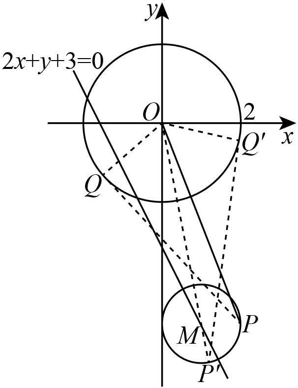

如图所示，取圆上一点*P*，要使最大，则过点*P*作圆*O*的切线，

连接并延长交圆*M*于点，则点离圆*O*的距离最大，

故要使得对于圆上的任意点，在圆：上均存在点，使得，

则只需要过点作圆的切线，切点为，若此时即可，

当时，，此时，

圆心到直线的距离为，

由勾股定理得：圆心的轨迹长度为.

故答案为：，

<strong>例21．</strong>（2024·上海普陀·高三上海市晋元高级中学校考阶段练习）设点的坐标为，若在圆上存在点，使得，则实数的取值范围为__．

【答案】

【解析】当时，点都在圆上，易知在圆上存在点，使得.

当时，要使圆上存在点使得，则的最大值大于或等于时一定存在，而当与圆相切时，取得最大值，此时，则，即，所以实数的取值范围为．

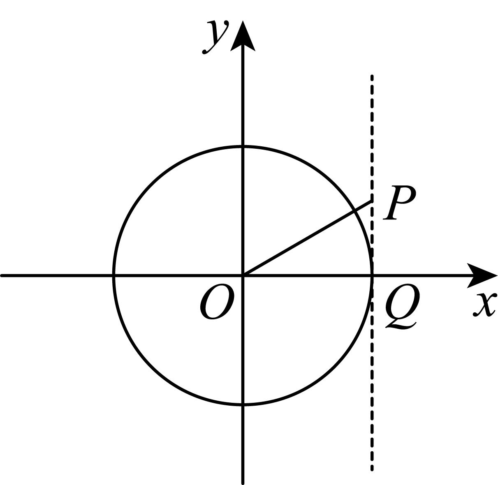

故答案为：

<strong>变式24．</strong>（2024·全国·高三专题练习）在平面直角坐标系中，已知点、，若直线上存在点<em>P</em>使得，则实数<em>m</em>的取值范围为______.

【答案】

【解析】设，因为，

所以，整理得：，

直线上存在点*P*使得等价于直线与圆有交点，

所以，解得：.

故答案为：.

<strong>变式25．</strong>（2024·全国·高三专题练习）在中，角所对的边分别为，，．若，在所在的平面内存在点，使得，则的面积的最大值为______．

【答案】

【解析】以所在直线为轴，边的垂直平分线为轴，建立如图所示的平面直角坐标系，设，，，，，.

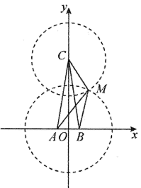

由，得，即①，又，

故②，其中①式可以看作以(0，0)为圆心，半径为的圆的轨迹方程，②式可以看作以为圆心，半径为的圆的轨迹方程，

由题意知两圆有公共点，即点，则③，

又，得④，由③，④得，

因为，所以，

当时，取得最大值，所以的最大值为.

故答案为：.

<strong>变式26．</strong>（2024·辽宁沈阳·高三沈阳二中校考阶段练习）已知点，若圆上存在点满足3，则实数的取值范围是 _____．

【答案】

【解析】设，则

若3，则即

∴的轨迹是以原点为圆心，以2为半径的圆，

若圆上存在点满足3，

则圆和圆有公共点，

解得：

∴实数的取值范围是．

故答案为：．

<strong>变式27．</strong>（2024·陕西西安·高三西安铁一中滨河高级中学校考阶段练习）在平面直角坐标系中，圆的方程为，若直线上至少存在一点，使得以该点为圆心，1为半径的圆与圆有公共点，则的取值范围是______．

【答案】

【解析】由可得，

因此圆的圆心为，半径为1，

若直线上至少存在一点，使得以该点为圆心，1为半径的圆与圆有公共点，

只需点到直线的距离，

即，解得，

所以的取值范围是，

故答案为：.

<strong>变式28．</strong>（2024·全国·高三专题练习）已知圆，点<em>P</em>在直线上，若过点<em>P</em>存在直线与圆<em>C</em>交于<em>A</em>、<em>B</em>两点，且满足，则点<em>P</em>横坐标的取值范围是___________．

【答案】

【解析】由题，即，故为的中点，即过点*P*存在直线与圆*C*交于*A*、*B*两点，且满足为的中点.考虑当确定，在圆上运动时，的轨迹为与圆相切且半径为1的圆上.故当为的中点时，的轨迹为以为圆心，内外半径分别为1，3的圆环内.

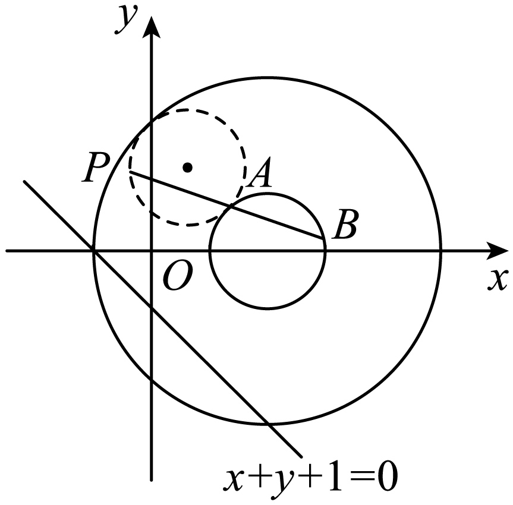

故只需分析此圆环与直线相交的部分即可. 易得外圆方程,联立有,解得或,故点*P*横坐标的取值范围是

故答案为:

<strong>变式29．</strong>（2024·全国·高三专题练习）在平面直角坐标系<em>xOy</em>中，已知直线和点，动点<em>P</em>满足，且动点<em>P</em>的轨迹上至少存在两点到直线<em>l</em>的距离等于，则实数的取值范围是___________.

【答案】

【解析】设点，则，

即，所以动点*P*的轨迹为以为圆心，为半径的圆，

要在圆上至少存在两点到直线的距离等于，

则需圆心到直线的距离，

解得.

故答案为：

<strong>变式30．</strong>（2024·江西萍乡·统考二模）已知圆，对直线上一点，在圆上总存在点，使得，则实数的取值范围为________．

【答案】

【解析】由题意当是圆切线时，取得最大值，而当时，，

所以由在圆上总存在点，使得，得，

即，解得．

故答案为：．

<strong>变式31．</strong>（2024·全国·高三专题练习）在平面直角坐标系<em>xOy</em>中，已知点<em>A</em>（1，0），<em>B</em>（3，0），<em>C</em>（0，<em>a</em>），<em>D</em>（0，<em>a</em>+2）.若存在点<em>P</em>，使得|<em>PA</em>|=|<em>PB</em>|，|<em>PC</em>|=|<em>PD</em>|，则实数<em>a</em>的取值范围是____.

【答案】

【解析】设*P*（*x*，*y*），则由|*PA*|=|*PB*|，得，

整理得，即*P*在以（5，0）为圆心，为半径的圆上.

又由|*PC*|=|*PD*|，知点*P*在线段*CD*的垂直平分线*y*=*a*+1上

因而问题转化为直线*y*=*a*+1与圆有交点，所以|*a*+1|≤2，

解得

故答案为：

