**第64讲  椭圆及其性质**

**知识梳理**

**知识点一：椭圆的定义**

平面内与两个定点的距离之和等于常数（）的点的轨迹叫做椭圆，这两个定点叫做椭圆的焦点，两焦点的距离叫做椭圆的焦距，记作，定义用集合语言表示为：

**注意**：当时，点的轨迹是线段；

当时，点的轨迹不存在．

**知识点二：椭圆的方程、图形与性质**

椭圆的方程、图形与性质所示．

<table><tr><td>
焦点的位置
</td><td>
焦点在轴上
</td><td colspan="2">
焦点在轴上
</td></tr><tr><td>
图形
</td><td>
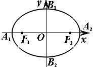
</td><td colspan="2">
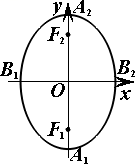
</td></tr><tr><td>
标准方程
</td><td>

</td><td colspan="2">

</td></tr><tr><td>
统一方程
</td><td colspan="3">

</td></tr><tr><td>
参数方程
</td><td colspan="2">

</td><td>

</td></tr><tr><td>
第一定义
</td><td colspan="3">
到两定点的距离之和等于常数2，即（）
</td></tr><tr><td>
范围
</td><td>
且
</td><td colspan="2">
且
</td></tr><tr><td>
顶点
</td><td>
、

、
</td><td colspan="2">
、

、
</td></tr><tr><td>
轴长
</td><td>
长轴长，短轴长
</td><td colspan="2">
长轴长，短轴长
</td></tr><tr><td>
对称性
</td><td colspan="3">
关于轴、轴对称，关于原点中心对称
</td></tr><tr><td>
焦点
</td><td colspan="2">
、
</td><td>
、
</td></tr><tr><td>
焦距
</td><td colspan="3">

</td></tr><tr><td>
离心率
</td><td colspan="3">

</td></tr><tr><td>
准线方程
</td><td colspan="3">

</td></tr><tr><td>
点和椭圆

的关系
</td><td>

</td><td colspan="2">

</td></tr><tr><td rowspan="2">
切线方程
</td><td>
（为切点）
</td><td colspan="2">
（为切点）
</td></tr><tr><td colspan="3">
对于过椭圆上一点的切线方程，只需将椭圆方程中换为，换为可得
</td></tr><tr><td>
切点弦所在的直线方程
</td><td>

</td><td colspan="2">

</td></tr><tr><td>
焦点三角形面积
</td><td colspan="3">
①，（为短轴的端点）

②

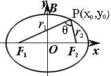

③

焦点三角形中一般要用到的关系是

</td></tr><tr><td rowspan="2">
焦半径
</td><td>
左焦半径：

又焦半径：
</td><td colspan="2">
上焦半径：

下焦半径：
</td></tr><tr><td colspan="3">
焦半径最大值，最小值
</td></tr><tr><td>
通径
</td><td colspan="3">
过焦点且垂直于长轴的弦叫通径：通径长=（最短的过焦点的弦）
</td></tr><tr><td>
弦长公式
</td><td colspan="3">
设直线与椭圆的两个交点为，，，

则弦长

（其中是消后关于的一元二次方程的的系数，是判别式）
</td></tr></table>

**【解题方法总结】**

**（1）** 过椭圆的焦点与椭圆的长轴垂直的直线被椭圆所截得的线段称为椭圆的通径，其长为．

①椭圆上到中心距离最小的点是短轴的两个端点，到中心距离最大的点是长轴的两个端点．

②椭圆上到焦点距离最大和最小的点是长轴的两个端点．

距离的最大值为，距离的最小值为．

**（2）** 椭圆的切线

①椭圆上一点处的切线方程是；

②过椭圆外一点，所引两条切线的切点弦方程是；

③椭圆 与直线 相切的条件是．

**必考题型全归纳**

**题型一：椭圆的定义与标准方程**

<strong>例1．</strong>（2024·高二课时练习）已知椭圆<em>C</em>上任意一点都满足关系式，则椭圆<em>C</em>的标准方程为________________.

【答案】

【解析】由题可知椭圆*C*的焦点在*x*轴上，其坐标分别为，，

故，，所以椭圆*C*的标准方程为.

故答案为：.

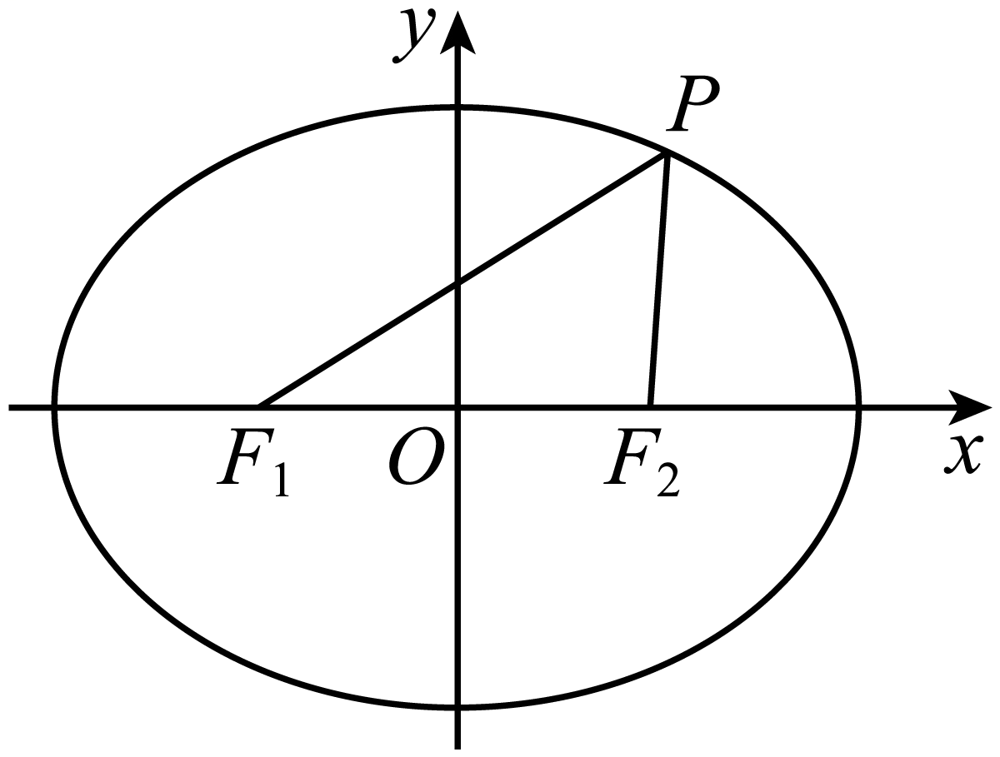

<strong>例2．</strong>（2024·山东青岛·统考三模）已知椭圆的长轴长为，它的一个焦点与抛物线的焦点重合，则椭圆的标准方程为______．

【答案】

【解析】抛物线方程化为标准方程得，焦点坐标为，

∵抛物线焦点与椭圆的一个焦点重合，∴椭圆焦点在轴，

设椭圆方程为，（），

则由焦点坐标和长轴长知，，∴，

∴，

∴椭圆的标准方程为.

故答案为：.

<strong>例3．</strong>（2024·全国·高二专题练习）已知椭圆的左、右焦点为，且过点则椭圆标准方程为___________．

【答案】

【解析】由题知：，①

又椭圆经过点，

所以，②

又，③

联立解得：，

故椭圆的标准方程为：.

故答案为：.

<strong>变式1．</strong>（2024·浙江绍兴·绍兴一中校考模拟预测）已知椭圆<em>E</em>：（），<em>F</em>是<em>E</em>的左焦点，过<em>E</em>的上顶点<em>A</em>作<em>AF</em>的垂线交<em>E</em>于点<em>B</em>.若直线<em>AB</em>的斜率为，的面积为，则<em>E</em>的标准方程为______.

【答案】

【解析】设*O*为坐标原点，直线*AB*交*x*轴于点*C*，如图所示：

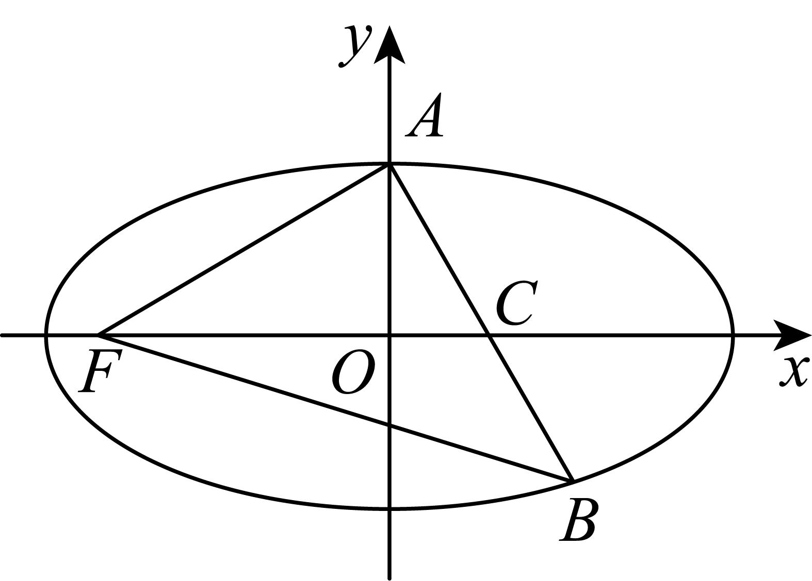

由题意知：，直线*AB*的斜率为，即，

所以，.

由椭圆的性质知：，，则，所以，，

则，故直线*AB*的方程为.

联立，解得：或，

所以，故，

则，解得：.

又，所以，即，则*E*的标准方程为.

故答案为：.

<strong>变式2．</strong>（2024·全国·高二专题练习）已知椭圆焦点在轴，它与椭圆有相同离心率且经过点，则椭圆标准方程为______.

【答案】

【解析】椭圆的离心率为，

设所求椭圆方程为，

则，从而，，

又，∴，

∴所求椭圆的标准方程为.

故答案为： .

<strong>变式3．</strong>（2024·北京·高二北大附中校考期末）与双曲线有相同焦点，且长轴长为 6 的椭圆标准方程为_________ .

【答案】

【解析】即，焦点为，

椭圆长轴，即，故短半轴，故椭圆方程为.

故答案为：.

<strong>变式4．</strong>（2024·福建福州·高二福建省福州屏东中学校考期末）已知椭圆：的左、右焦点分别为，，过坐标原点的直线交<em>E</em>于<em>P</em>，<em>Q</em>两点，且，且，，则的标准方程为__________.

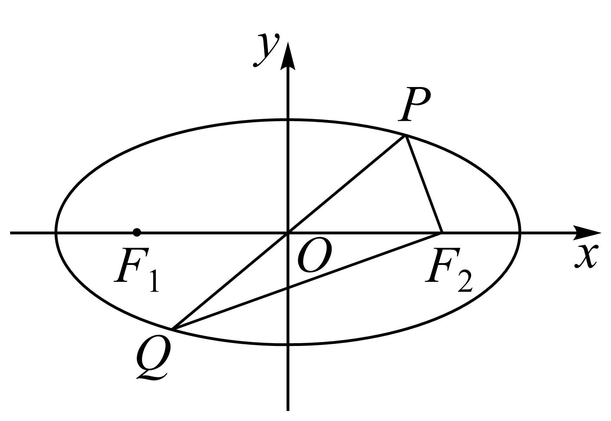

【答案】

【解析】连接，因为，

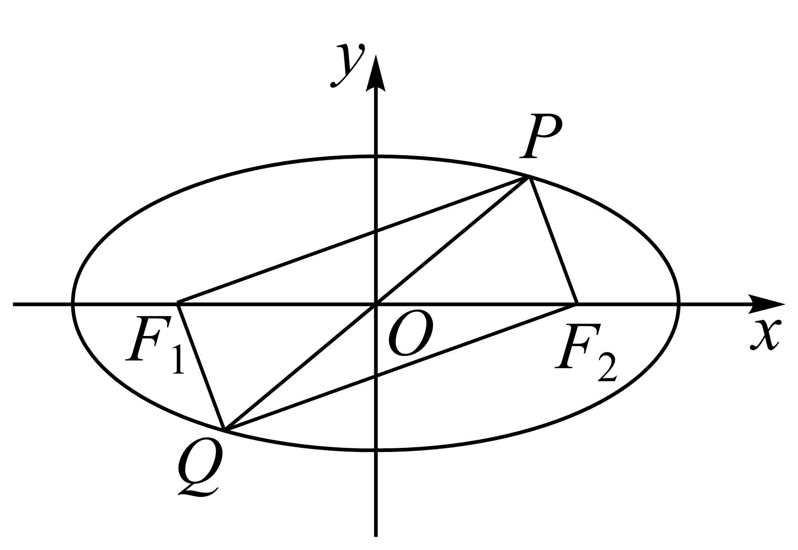

所以四边形是平行四边形，

所以，，

又，所以四边形为矩形，

设

则由题意得，解得，

则，则标准方程为，

故答案为：.

<strong>变式5．</strong>（2024·山东青岛·高二青岛二中校考期中）过点，且与椭圆有相同的焦点的椭圆标准方程是______．

【答案】

【解析】由题意设椭圆的方程为，，

将点代入，，

整理可得：，

解得或（舍，

所以椭圆的方程为：，

故答案为：．

<strong>变式6．</strong>（2024·浙江丽水·高三校考期中）我们把焦点在同一条坐标轴上，且离心率相同的椭圆叫做“相似椭圆”.若椭圆，则以椭圆<em>E</em>的焦点为顶点的相似椭圆<em>F</em>的标准方程为______.

【答案】

【解析】∵椭圆*E*的离心率为，

且设椭圆*F*的标准方程为，则，

∴椭圆*F*的，即椭圆*F*的标准方程为.

故答案为：.

<strong>变式7．</strong>（2024·全国·高三专题练习）已知椭圆<em>C</em>：(<em>a</em>＞<em>b</em>＞0)的左、右焦点分别为<em>F1</em>，<em>F2</em>，左、右顶点分别为<em>M</em>，<em>N</em>，过<em>F2</em>的直线<em>l</em>交<em>C</em>于<em>A</em>，<em>B</em>两点（异于<em>M</em>、<em>N</em>），的周长为，且直线<em>AM</em>与<em>AN</em>的斜率之积为，则椭圆<em>C</em>的标准方程为_______________.

【答案】

【解析】由的周长为,可知,解得 ,

由直线*AM*与*AN*的斜率之积为,可得，

所以椭圆*C*的标准方程为，

故答案为：

<strong>变式8．</strong>（2024·高二课时练习）已知椭圆的焦点在坐标轴上，且经过和两点，则椭圆的标准方程为_______.

【答案】

【解析】设所求椭圆方程为：(，，)将和的坐标代入方程得：

，解得，

所求椭圆的标准方程为：.

故答案为：.

**【解题方法总结】**

（1）定义法：根据椭圆定义，确定的值，再结合焦点位置，直接写出椭圆方程.

（2）待定系数法：根据椭圆焦点是在轴还是轴上，设出相应形式的标准方程，然后根据条件列出的方程组，解出，从而求得标准方程.

注意：①如果椭圆的焦点位置不能确定，可设方程为.

②与椭圆共焦点的椭圆可设为.

③与椭圆有相同离心率的椭圆，可设为（，焦点在轴上）或（，焦点在轴上）.

**题型二：椭圆方程的充要条件**

**例4．**（2024·全国·高三对口高考）若是任意实数，方程表示的曲线不可能是（    ）

A．圆	B．抛物线	C．椭圆	D．双曲线

【答案】B

【解析】对于A，当时，由得，方程表示圆，故A正确；

对于B，当是第一象限角时，，不会是抛物线方程；

当是第二象限角时，，不会是抛物线方程；

当是第三象限角时，，不成立，不会是抛物线方程；

当是第四象限角时，，不会是抛物线方程；

当的角的终边落在轴正半轴上时，，，得，不是抛物线方程；

当的角的终边落在轴正半轴上时，，，得，不是抛物线方程；

当的角的终边落在轴负半轴上时，，，得不成立；

当的角的终边落在轴负半轴上时，，，得不成立；故B错误；

对于C，当时，由，得，方程表示焦点在*y*轴上的椭圆，故C正确；

对于D，当时，由，得，方程表示焦点在*x*轴上的双曲线，故D正确；

故选：B.

**例5．**（2024·上海徐汇·位育中学校考三模）已知，则方程所表示的曲线为，则以下命题中正确的是（    ）

A．当时，曲线表示焦点在轴上的椭圆

B．当曲线表示双曲线时，的取值范围是

C．当时，曲线表示一条直线

D．存在，使得曲线为等轴双曲线

【答案】A

【解析】对于A，当时，，，，

表示焦点在轴上的椭圆，即曲线表示焦点在轴上的椭圆，A正确；

对于B，若曲线表示双曲线，则，解得：或，

即实数的取值范围为，B错误；

对于C，当时，曲线，即，

即曲线表示两条直线，C错误；

对于D，若曲线为等轴双曲线，则，解集为，

不存在，使得曲线为等轴双曲线，D错误.

故选：A.

**例6．**（2024·全国·高三专题练习）已知方程，其中．现有四位同学对该方程进行了判断，提出了四个命题：

甲：可以是圆的方程；    乙：可以是抛物线的方程；

丙：可以是椭圆的标准方程；    丁：可以是双曲线的标准方程．

其中，真命题有（    ）

A．1个	B．2个	C．3个	D．4个

【答案】C

【解析】因为方程，其中，

所以当时，方程为，即是圆的方程，故方程可以是圆的方程；

当时，方程为，即是抛物线的方程，故方程可以是抛物线的方程；

当时，方程为，即是椭圆的标准方程，故方程可以是椭圆的标准方程；

若方程为双曲线的标准方程，则有，这与矛盾，故方程不可以是双曲线的标准方程；

所以真命题有3个.

故选：C.

**变式9．**（2024·全国·高三专题练习）“，”是“方程表示的曲线为椭圆”的（    ）

A．充要条件	B．必要不充分条件

C．充分不必要条件	D．既不充分也不必要条件

【答案】D

【解析】[解法一]

方程即方程，表示椭圆的充分必要条件是,

显然“，”是“”既不充分也不必要条件，

故“，”是“方程表示的曲线为椭圆”的既不充分也不必要条件，

[解法二]

当时，满足“，”，此时题中方程可化为：,表示的曲线是圆而不是椭圆，当时，不满足“，”，只是题中方程可化为：,表示中心在原点，半长轴为1，半短轴为的椭圆，

故：“，”是“方程表示的曲线为椭圆”的既不充分也不必要条件，

故选：

<strong>变式10．</strong>（2024·云南楚雄·高三统考期末）已知曲线，则“”是“曲线<em>C</em>是椭圆”的（    ）

A．充要条件	B．充分不必要条件

C．必要不充分条件	D．既不充分也不必要条件

【答案】C

【解析】若曲线是椭圆，则有：

解得：，且

故“”是“曲线*C*是椭圆”的必要不充分条件

故选：C

**变式11．**（2024·全国·高三专题练习）设为实数，则曲线：不可能是（    ）

A．抛物线	B．双曲线	C．圆	D．椭圆

【答案】A

【解析】对A：因为曲线*C*的方程中都是二次项，所以根据抛物线标准方程的特征曲线*C*不可能是抛物线，故选项A正确；

对B：当时，曲线*C*为双曲线，故选项B错误；

对C：当时，曲线*C*为圆，故选项C错误；

对D：当且时，曲线*C*为椭圆，故选项D错误；

故选：A.

**变式12．**（2024·广西钦州·高三校考阶段练习）“”是方程“表示椭圆”的（    ）

A．充分不必要条件	B．必要不充分条件

C．充要条件	D．既不充分又不必要条

【答案】B

【解析】若方程表示椭圆，则有

因此且，

故“”是“方程表示椭圆”的必要不充分条件．

故选：B

**【解题方法总结】**

表示椭圆的充要条件为：；

表示双曲线方程的充要条件为：；

表示圆方程的充要条件为：.

**题型三：椭圆中焦点三角形的周长与面积及其他问题**

**例7．**（2024·贵州黔东南·高三校考阶段练习）已知点，是椭圆上关于原点对称的两点，，分别是椭圆的左、右焦点，若，则（    ）

A．1	B．2	C．4	D．5

【答案】C

【解析】因为,

所以四边形是平行四边形.

所以.

由椭圆的定义得.

所以.

故选：C

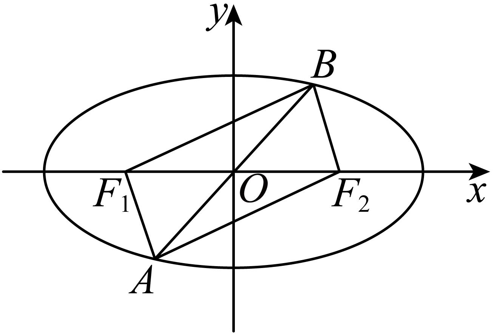

<strong>例8．</strong>（2024·北京·高三强基计划）如图，过椭圆的右焦点作一条直线，交椭圆于<em>A</em>，<em>B</em>两点，则的内切圆面积可能是（    ）

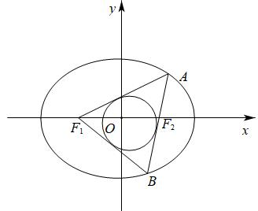

A．1	B．2	C．3	D．4

【答案】A

【解析】记的周长为*l*，面积为*S*，内切圆半径为*r*．易知．

由于，故．

设的内切圆面积为，则，

于是选项A符合题意．

故选：A.

**例9．**（2024·江西·高三统考阶段练习）已知椭圆为两个焦点，为椭圆上一点，若的周长为4，则（    ）

A．2	B．3	C．	D．

【答案】D

【解析】设椭圆的焦距为，则，

的周长为，解得，

故选：D

**变式13．**（2024·河南·高三阶段练习）已知分别为椭圆的两个焦点，且的离心率为为椭圆上的一点，则的周长为（    ）

A．6	B．9	C．12	D．15

【答案】C

【解析】因为的离心率为，且，所以，解得，则，所以的周长为.

故选：C

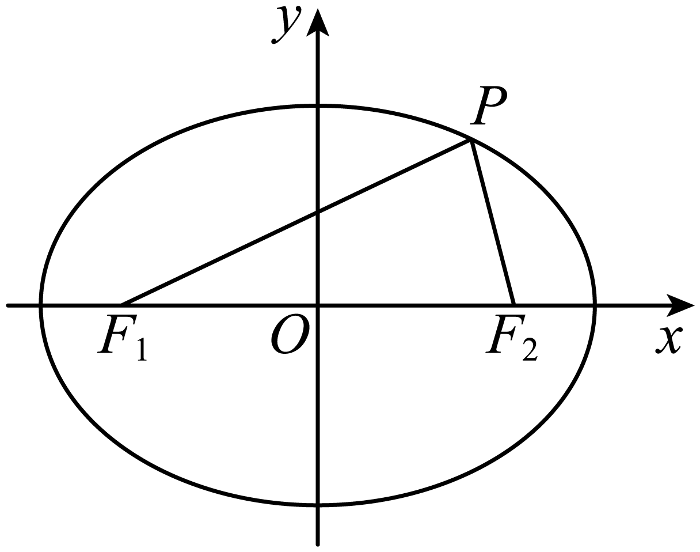

<strong>变式14．</strong>（2024·全国·校联考模拟预测）已知椭圆的左顶点为<em>A</em>，上顶点为<em>B</em>，左、右焦点分别为，，延长交椭圆<em>E</em>于点<em>P</em>．若点<em>A</em>到直线的距离为，的周长为16，则椭圆<em>E</em>的标准方程为（    ）

A．	B．

C．	D．

【答案】B

【解析】由题意，得，，，则直线的方程为，

所以点*A*到直线的距离①．

由的周长为16，得，即*a*+*c*=8②，

联立①②，解得③．

因为，所以④．

联立②④，解得*a*=6，*c*=2，所以，

故椭圆*E*的标准方程为是.

故选：B．

**变式15．**（2024·广东梅州·统考三模）已知椭圆的左、右焦点分别为，，过点的直线与椭圆的一个交点为，若，则的面积为（    ）

A．	B．	C．4	D．

【答案】D

【解析】椭圆中，，由及椭圆定义得，

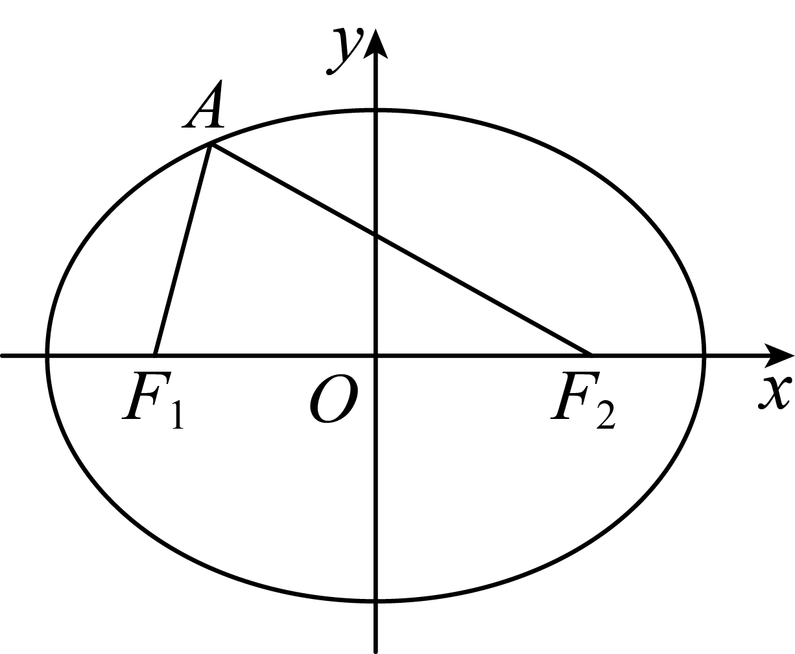

因此为等腰三角形，底边上的高，

所以的面积为.

故选：D

**变式16．**（2024·广东广州·高三华南师大附中校考开学考试）椭圆的两焦点分别为 ，是椭圆上一点，当的面积取得最大值时，（     ）

A．	B．	C．	D．

【答案】C

【解析】，所以，

所以，则当最大时，面积最大，

此时点位于椭圆的上下端点，

则，因为，所以，

所以.

故选：C.

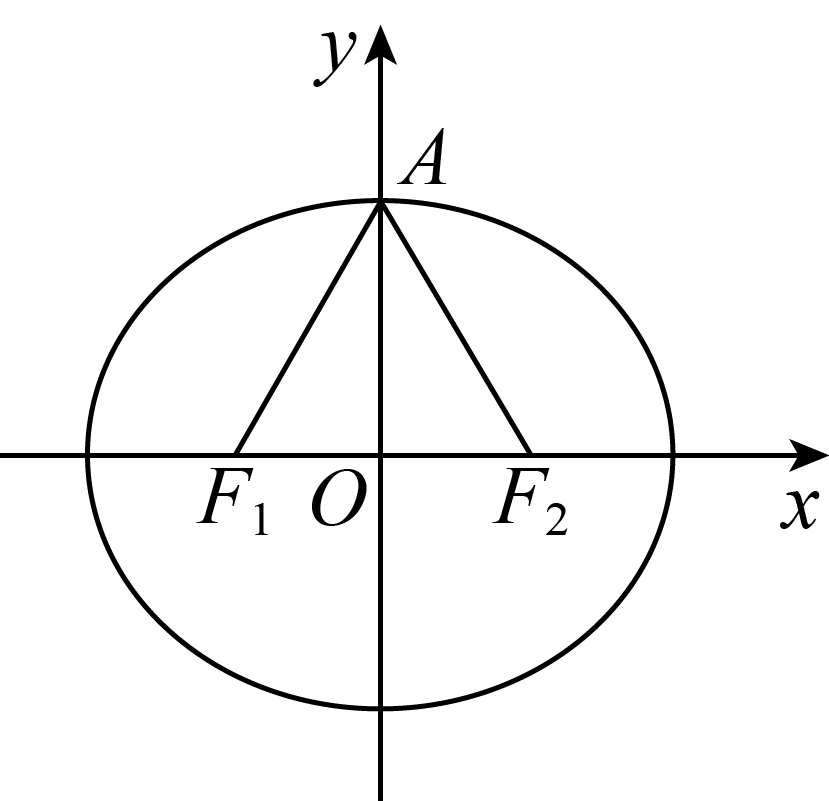

**变式17．**（2024·河南开封·统考三模）已知点是椭圆上一点，椭圆的左、右焦点分别为、，且，则的面积为（    ）

A．6	B．12	C．	D．

【答案】C

【解析】由椭圆，得，，.

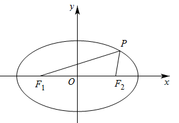

设，，

∴，在中，由余弦定理可得：，

可得，得，

故.

故选：C.

**变式18．**（2024·全国·高三专题练习）设为椭圆的两个焦点，点在上，若，则（    ）

A．1	B．2	C．4	D．5

【答案】B

【解析】方法一：因为，所以，

从而，所以．

故选：B.

方法二：

因为，所以，由椭圆方程可知，，

所以，又，平方得：

，所以．

故选：B.

<strong>变式19．</strong>（2024·全国·高三专题练习）设<em>O</em>为坐标原点，为椭圆的两个焦点，点 <em>P</em>在<em>C</em>上，，则（    ）

A．	B．	C．	D．

【答案】B

【解析】方法一：设，所以，

由，解得：，

由椭圆方程可知，，

所以，，解得：，

即，因此．

故选：B．

方法二：因为①，，

即②，联立①②，

解得：，

而，所以，

即．

故选：B．

方法三：因为①，，

即②，联立①②，解得：，

由中线定理可知，，易知，解得：．

故选：B．

**变式20．**（2024·湖南长沙·长郡中学校考模拟预测）若椭圆的离心率为，两个焦点分别为，，为椭圆上异于顶点的任意一点，点是的内心，连接并延长交于点，则（    ）

A．2	B．	C．4	D．

【答案】A

【解析】

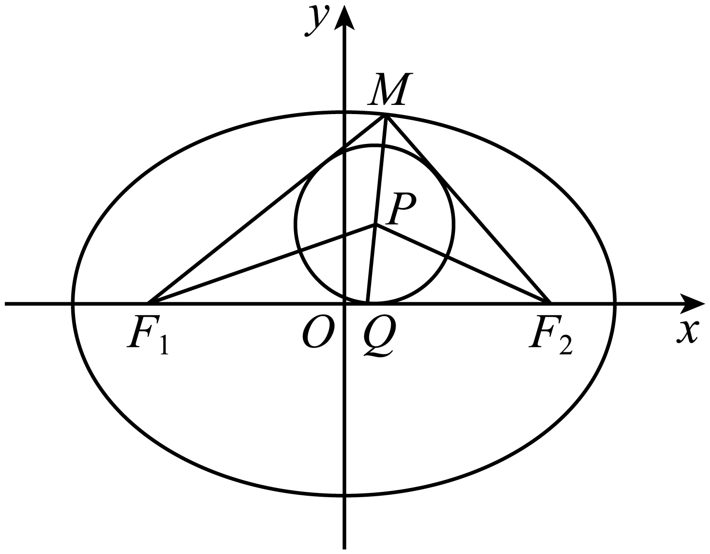

如图，连接，，设到轴距离为，到轴距离为，

则

设△内切圆的半径为，则，

∴

不妨设，则，

∴，

因为椭圆的离心率为，

∴，

故选：A.

<strong>变式21．</strong>（2024·云南昆明·昆明一中校考模拟预测）已知椭圆的左、右焦点分别为，，直线与椭圆<em>C</em>交于<em>A</em>，<em>B</em>两点，若，则的面积等于（    ）

A．18	B．10	C．9	D．6

【答案】C

【解析】据题意，四边形是矩形，设，，

则有，，由此可得，

所以的面积是，

又的面积与的面积相等，所以的面积等于9.

故选：C．

<strong>变式22．</strong>（2024·贵州黔西·校考一模）设椭圆的左、右焦点分别为，，离心率为．<em>P</em>是<em>C</em>上一点，且．若的面积为2，则（    ）

A．1	B．2	C．	D．4

【答案】B

【解析】设，，由，的面积为2，

可得，∴①

由离心率为，可得，代入①式，可得.

故选：B.

**变式23．**（2024·云南昆明·昆明市第三中学校考模拟预测）已知椭圆的左、右焦点分别为为椭圆上一点，且，若关于平分线的对称点在椭圆上，则的面积为（    ）

A．	B．	C．	D．

【答案】C

【解析】设椭圆的长半轴为，则

设关于平分线的对称点为*Q*，

由椭圆对称性及角平分线性质可知*P*，，*Q*三点共线且

又因为，所以是正三角形，

设，

由椭圆定义可得，，

又，

所以，

所以，即，，

所以的面积.

故选：C.

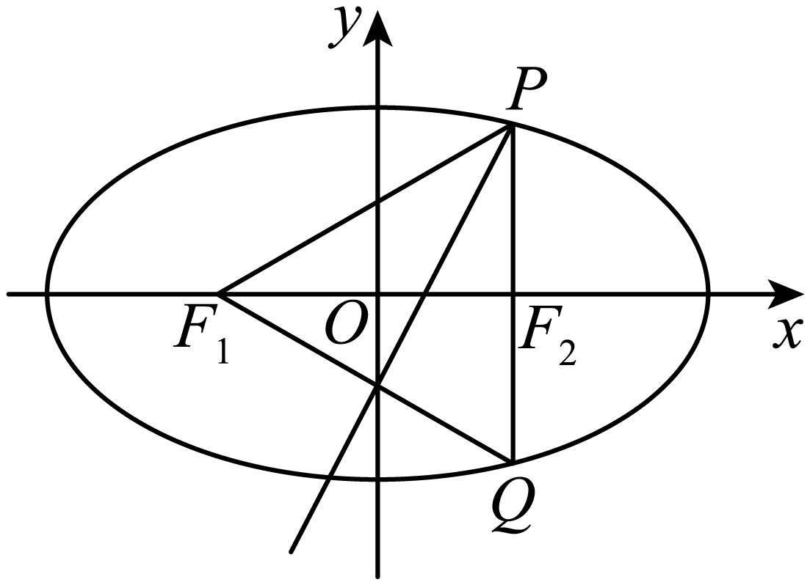

**变式24．**（2024·四川绵阳·高三绵阳南山中学实验学校校考阶段练习）在椭圆中，已知焦距为2，椭圆上的一点与两个焦点的距离的和等于4，且，则的面积为（    ）

A．	B．	C．	D．

【答案】D

【解析】由题可知，焦距，则，又椭圆上的一点与两个焦点的距离的和等于4，

即，所以，

在中，，

由余弦定理得：，

整理得，所以，则，故的面积.

故选：D.

**变式25．**（2024·河北唐山·统考三模）已知椭圆的两个焦点分别为，点为上异于长轴端点的任意一点，的角平分线交线段于点，则（    ）

A．	B．	C．	D．

【答案】D

【解析】因为的角平分线交线段于点，

所以，

所以由正弦定理得，，

又因为，，

所以，即，不妨设，如图：

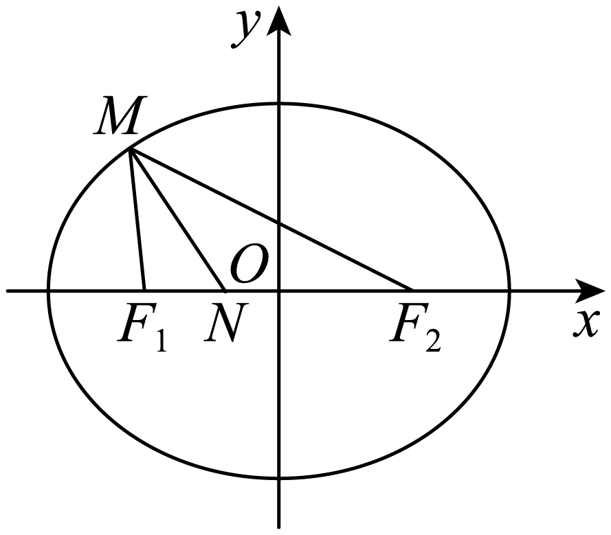

则，解得，

所以，

由题意，，所以，

故选：D

**【解题方法总结】**

焦点三角形的问题常用定义与解三角形的知识来解决，对于涉及椭圆上点到椭圆两焦点将距离问题常用定义，即.

**题型四：椭圆上两点距离的最值问题**

**例10．**（2024·湖南·校联考二模）已知分别为椭圆的两个焦点，为椭圆上一点，则的最大值为（    ）

A．64	B．16	C．8	D．4

【答案】B

【解析】，

因为椭圆上的点满足，

当点为的延长线与的交点时，取得最大值，最大值为．

所以的最大值为16．

故选：B．

<strong>例11．</strong>（2024·云南·高三校联考阶段练习）已知，<em>P</em>是椭圆上的任意一点，则的最大值为（    ）

A．9	B．16	C．25	D．50

【答案】C

【解析】由题意，当且仅当时等号成立，

所以，即，故最大值为.

故选：C

**例12．**（2024·河南·高三期末）已知是椭圆上的动点，且与的四个顶点不重合，分别是椭圆的左、右焦点，若点在的平分线上，且，则的取值范围是（    ）

A．	B．	C．	D．

【答案】A

【解析】

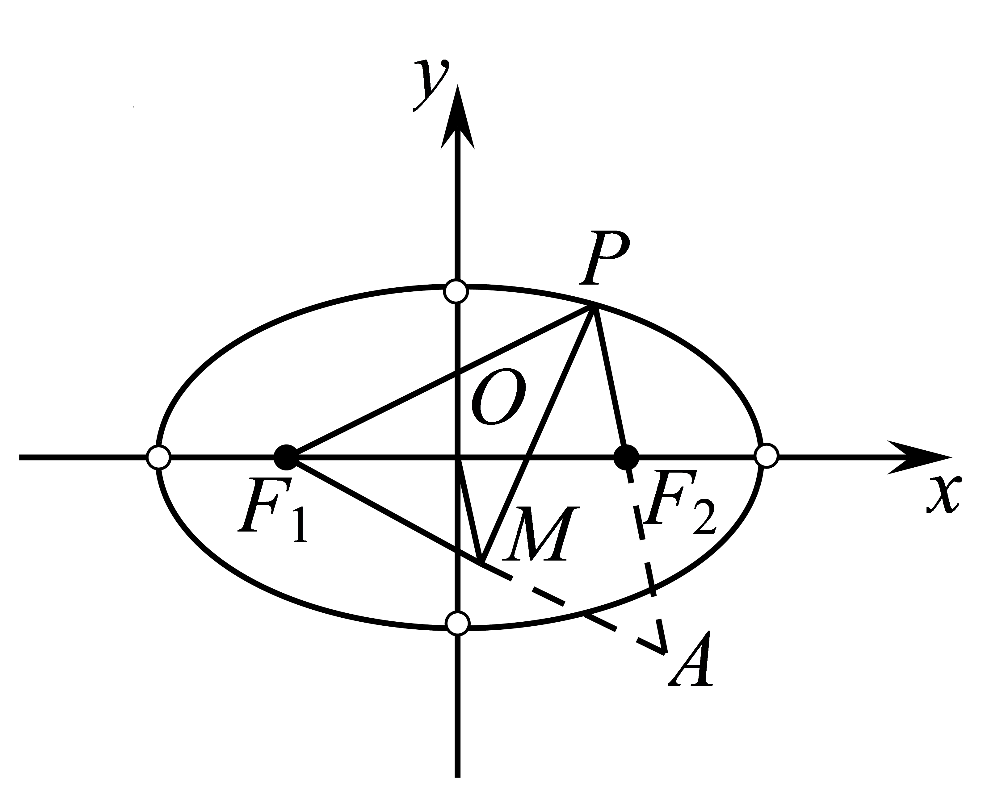

如图所示，延长交的延长线于点，

点在椭圆上，由椭圆的性质可知，

因为分别是椭圆的左、右焦点，

所以点的坐标为、点的坐标为，

因为点是的角平分线上的一点，

所以，

又，则,

所以，

则，，

又因为点为线段的中点，

所以为的中位线，

即，

当点在椭圆右顶点时，取最大值，最大值为6，

当点在椭圆左顶点时，取最小值，最小值为2，

当点在椭圆上顶点或下顶点时，，

又因为点是椭圆上的动点，且与的四个顶点不重合，

则的取值范围为，

结合函数函数的性质可得，的取值范围是，

故选：A.

**变式26．**（2024·重庆沙坪坝·高三重庆八中校考阶段练习）已知是椭圆的两个焦点，点在上，则的取值范围是（    ）

A．	B．	C．	D．

【答案】C

【解析】设，，则，，又，所以当时，，当时，.

故选：C.

<strong>变式27．</strong>（2024·全国·高三专题练习）若椭圆<em>C</em>：，则该椭圆上的点到焦点距离的最大值为（　　）

A．3	B．2＋

C．2	D．＋1

【答案】A

【解析】由题意知，距离的最大值为；

故选：A.

**变式28．**（2024·全国·高三专题练习）已知点在椭圆上运动，点在圆上运动，则的最大值为（    ）

A．	B．	C．5	D．6

【答案】B

【解析】设圆的圆心为，则，

设，则，

所以

，当且仅当时取得最大值，

所以．

故选：B*．*

**【解题方法总结】**

利用几何意义进行转化.

**题型五：椭圆上两线段的和差最值问题**

<strong>例13．</strong>（2024·北京·高三强基计划）设实数<em>x</em>，<em>y</em>满足，则的最小值为（    ）

A．	B．

C．	D．前三个答案都不对

【答案】C

【解析】点是椭圆上的点，设，如图．

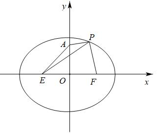

记题中代数式为*M*，则，

等号当点*E*，*A*，*P*依次共线时取得．

因此所求最小值为．

故选：C.

<strong>例14．</strong>（2024·甘肃定西·统考模拟预测）已知椭圆<em>C</em>：的左、右焦点分别为，，<em>A</em>是<em>C</em>上一点，，则的最大值为（    ）

A．7	B．8	C．9	D．11

【答案】A

【解析】

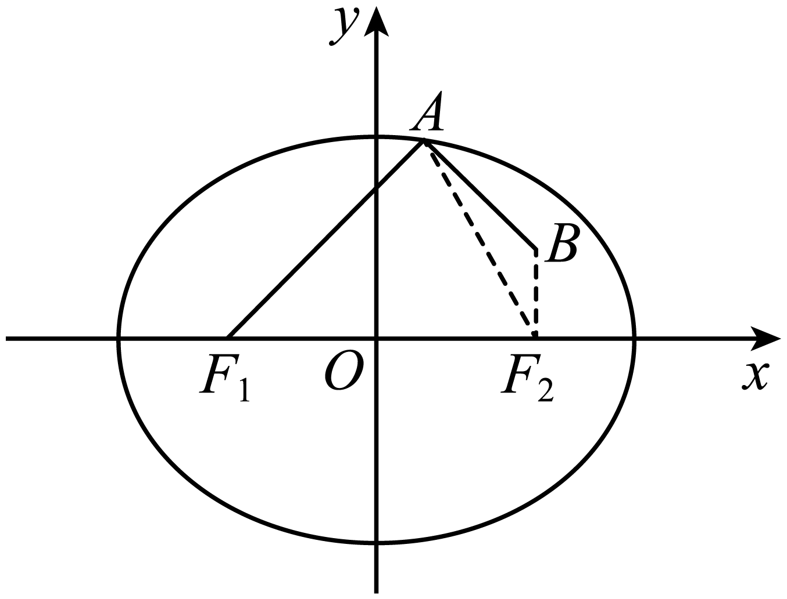

设椭圆的半焦距为，则，，

如图，连接，则，

而，当且仅当共线且在中间时等号成立，

故的最大值为.

故选：A.

<strong>例15．</strong>（2024·江苏·统考三模）已知<em>F</em>为椭圆<em>C</em>：的右焦点，<em>P</em>为<em>C</em>上一点，<em>Q</em>为圆<em>M</em>：上一点，则<em>PQ</em>＋<em>PF</em>的最大值为（    ）

A．3	B．6

C．	D．

【答案】D

【解析】圆*M*：的圆心为，

设椭圆的左焦点为，如下图，由椭圆的定义知，，

所以，所以

，

当且仅当三点在一条直线上时取等，

，，，.

故选：D．

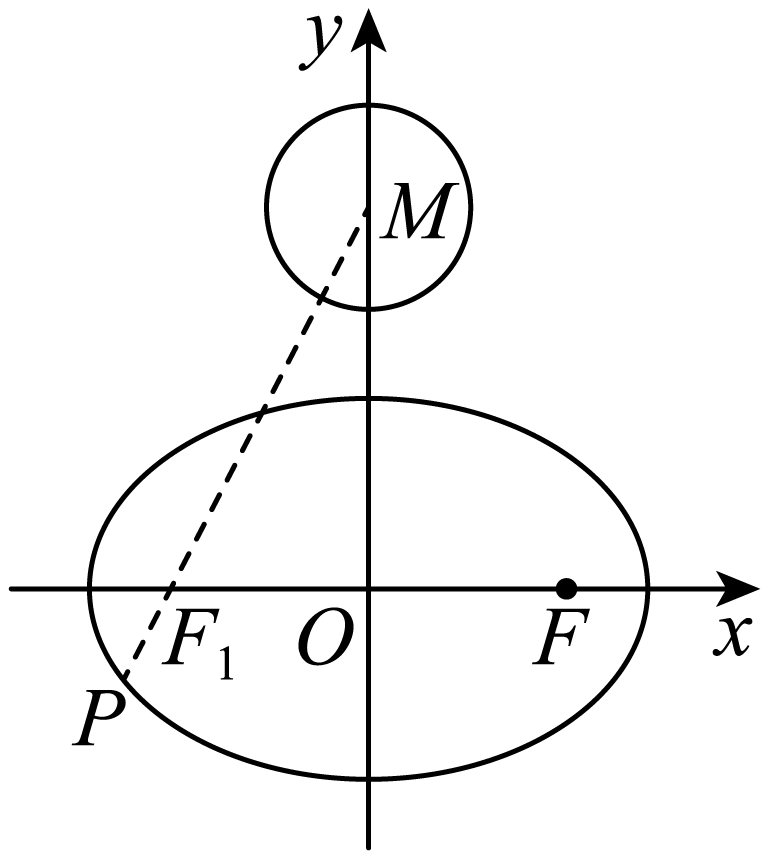

**变式29．**（2024·河北·高三河北衡水中学校考阶段练习）若平面向量满足，若，则的取值范围为（    ）

A．	B．	C．	D．

【答案】D

【解析】∵，则，且，

不妨设，则，

由，即，

故点的轨迹为以为焦点的椭圆，

∴，

则，当且仅当点为的延长线与椭圆的交点时等号成立，

，当且仅当点为的延长线与椭圆的交点时等号成立，

即，故.

故选：D.

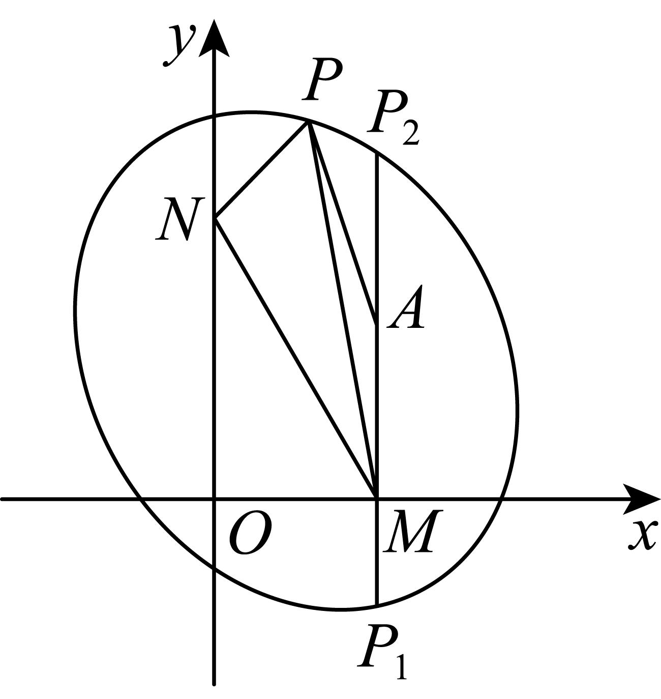

**变式30．**（2024·广东·高三校联考阶段练习）已知椭圆的左焦点为是上一点，，则的最大值为（    ）

A．7	B．8	C．9	D．11

【答案】C

【解析】因为，所以在椭圆内部，

设椭圆的右焦点为，由椭圆，得，

由椭圆的定义可得，

所以，

当且仅当是射线与椭圆的交点时取等号．

故选：C.

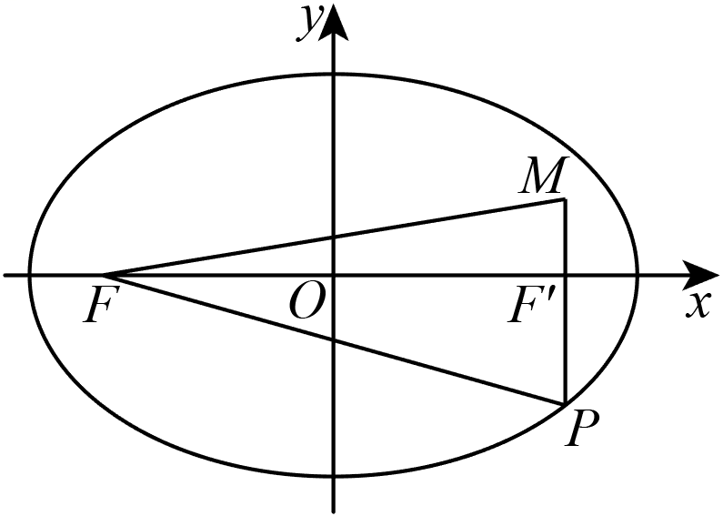

<strong>变式31．</strong>（2024·全国·高三专题练习）已知点<em>P</em>为椭圆上任意一点，点<em>M</em>、<em>N</em>分别为和上的点，则的最大值为（    ）

A．4	B．5	C．6	D．7

【答案】C

【解析】设圆和圆的圆心分别为,半径分别为.

则椭圆的焦点为.

又,，，

故，

当且仅当分别在的延长线上时取等号.

此时最大值为.

故选：C.

<strong>变式32．</strong>（2024·全国·高三专题练习）已知，分别为椭圆的两个焦点，<em>P</em>为椭圆上一点，则的最大值为（    ）

A．2	B．	C．4	D．

【答案】B

【解析】椭圆上的点*P*满足，

当点*P*为的延长线与*C*的交点时，

达到最大值，最大值为．

故选：B

<strong>变式33．</strong>（2024·全国·高三专题练习）已知椭圆外一点<em>A</em>(5，6)，<em>l</em>为椭圆的左准线，<em>P</em>为椭圆上动点，点<em>P</em>到<em>l</em>的距离为<em>d</em>，则的最小值为（     ）

A．	B．	C．	D．

【答案】B

【解析】如图，设*F*为椭圆的左焦点，可知其坐标为*F*(－3，0)，根据圆锥曲线的统一定义有：＝*e*＝，即，所以，可知当*P*、*F*、*A*三点共线且*P*在线段*AF*上时，最小，最小值＝10．故的最小值为10．

故选：B．

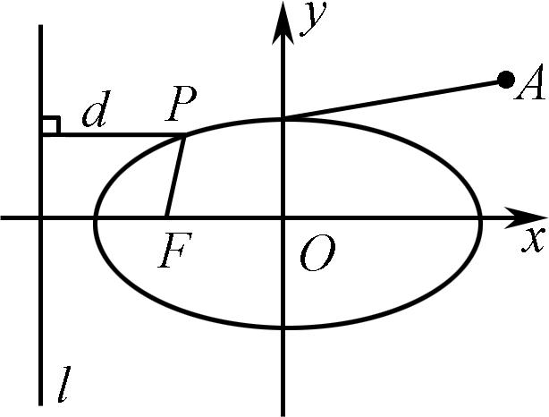

**变式34．**（2024·全国·高三专题练习）已知椭圆的右焦点为，为椭圆上一动点，定点，则的最小值为（    ）

A．1	B．－1	C．	D．

【答案】A

【解析】设椭圆的左焦点为，则，可得，

所以，

如图所示，当且仅当，，三点共线（点在线段上）时，

此时取得最小值，

又由椭圆，可得且，所以，所以的最小值为1．

故选：A．

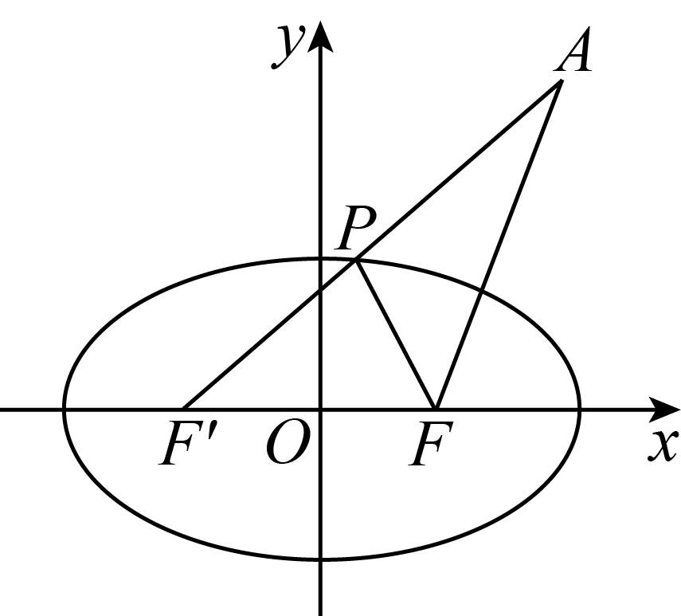

**【解题方法总结】**

在解析几何中，我们会遇到最值问题，这种问题，往往是考察我们定义．求解最值问题的过程中，如果发现动点在圆锥曲线上，要思考并用上圆锥曲线的定义，往往问题能迎刃而解．

**题型六：离心率的值及取值范围**

**方向1：利用椭圆定义去转换**

**例16．**（2024·四川成都·高三成都市锦江区嘉祥外国语高级中学校考开学考试）如图，某同学用两根木条钉成十字架，制成一个椭圆仪.木条中间挖一道槽，在另一活动木条的处钻一个小孔，可以容纳笔尖，各在一条槽内移动，可以放松移动以保证与的长度不变，当各在一条槽内移动时，处笔尖就画出一个椭圆.已知，且在右顶点时，恰好在点，则的离心率为（    ）

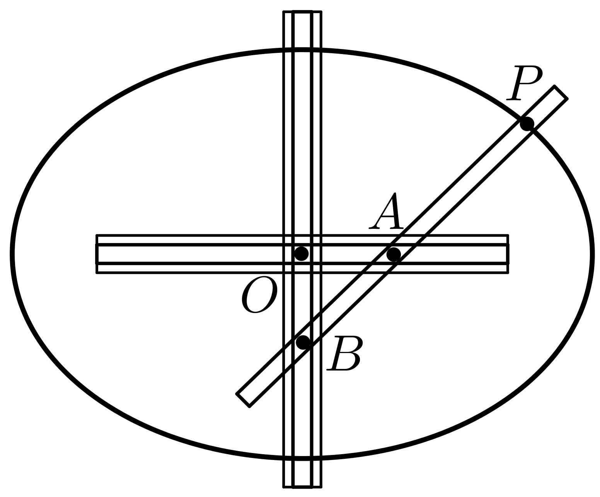

A．	B．	C．	D．

【答案】D

【解析】由题意知与的长度不变，已知，

设，则，

当滑动到位置处时，点在上顶点或下顶点，则短半轴长，

当在右顶点时，恰好在点，则长半轴长，

故离心率为.

故选：D.

**例17．**（2024·全国·高三专题练习）设椭圆的一个焦点为，点为椭圆内一点，若椭圆上存在一点，使得，则椭圆的离心率的取值范围是（    ）

A．	B．	C．	D．

【答案】A

【解析】记椭圆的左焦点为，连接，则即所以椭圆的圆心率的取值范围是.

故选：A.

<strong>例18．</strong>（2024·安徽·高三安徽省宿松中学校联考开学考试）已知椭圆<em>C</em>的左右焦点分别为，，<em>P</em>，<em>Q</em>为<em>C</em>上两点，，若，则<em>C</em>的离心率为（    ）

A．	B．	C．	D．

【答案】D

【解析】设，则，，.

在中得：，即.

因此，，，

在中得：，故，所以.

故选：D

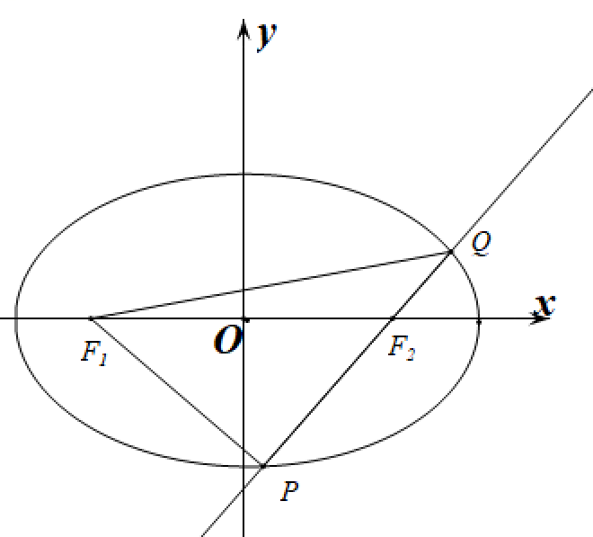

**变式35．**（2024·湖北·高三孝感高中校联考开学考试）如图，已知圆柱底面半径为2，高为3，是轴截面，分别是母线上的动点（含端点），过与轴截面垂直的平面与圆柱侧面的交线是圆或椭圆，当此交线是椭圆时，其离心率的取值范围是（    ）

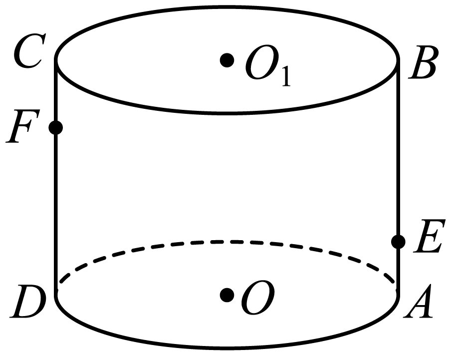

A．	B．	C．	D．

【答案】A

【解析】当与接近平行时，交线接近是一个圆，离心率接近0；

当时，交线是一个长轴最大的椭圆，

此时长轴长为，解得，

又短半轴长为，则焦距的一半为，

所以离心率，

所以离心率的取值范围是.

故选：A

<strong>变式36．</strong>（2024·湖北·高三校联考阶段练习）已知，分别是椭圆（）的左，右焦点，<em>M</em>，<em>N</em>是椭圆<em>C</em>上两点，且，，则椭圆的离心率为（    ）

A．	B．	C．	D．

【答案】C

【解析】连接，设，则，，，

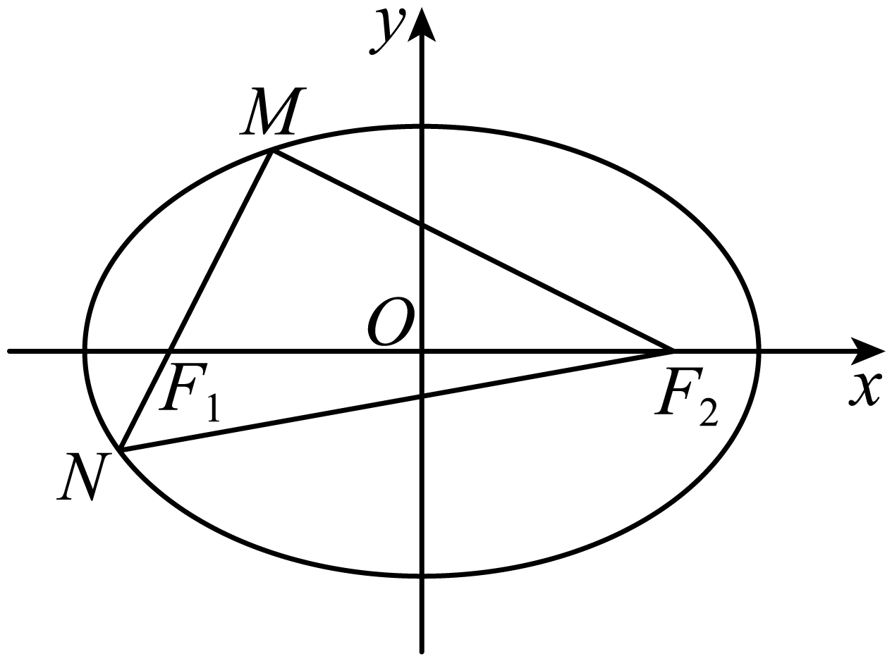

在中，即，

，，，

，，

在中，，即，

，，又，.

故选：C.

<strong>变式37．</strong>（2024·重庆巴南·统考一模）椭圆的左右焦点为，，点<em>P</em>为椭圆上不在坐标轴上的一点，点<em>M</em>，<em>N</em>满足，，若四边形的周长等于，则椭圆<em>C</em>的离心率为（    ）

A．	B．	C．	D．

【答案】C

【解析】因为，所以点为线段的中点，

因为，所以，

即，所以点为线段的中点，

又因点为线段的中点，

所以且，且，

所以四边形的周长为，

又因点*P*为椭圆上不在坐标轴上的一点，所以，

所以，即，

故椭圆*C*的离心率为.

故选：C.

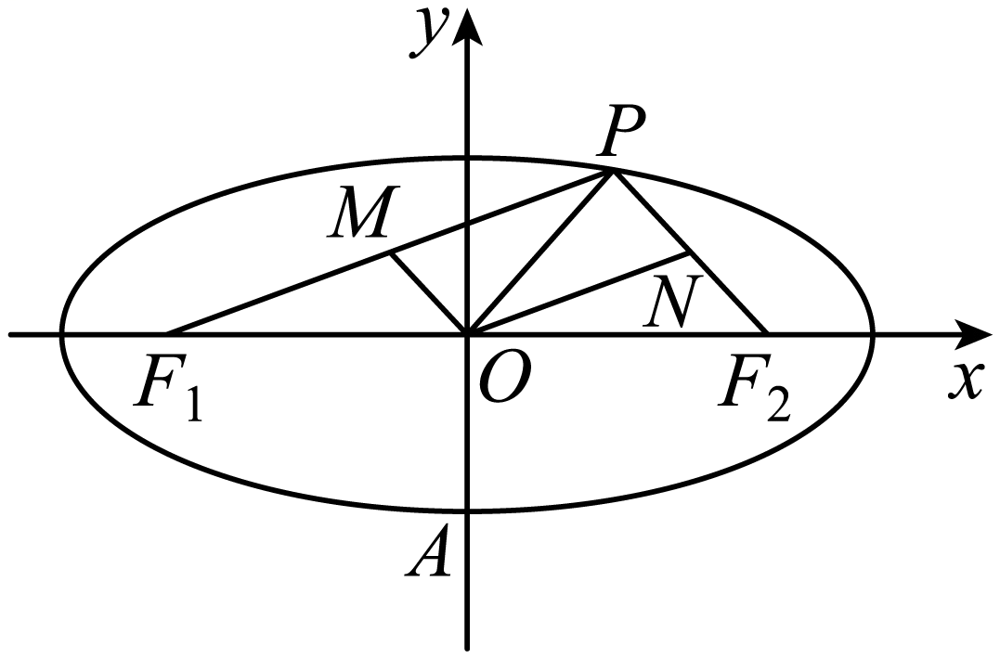

<strong>变式38．</strong>（2024·黑龙江哈尔滨·哈尔滨市第六中学校校考三模）已知<em>M</em>，<em>N</em>是椭圆上关于原点<em>O</em>对称的两点，<em>P</em>是椭圆<em>C</em>上异于的点，且的最大值是，则椭圆<em>C</em>的离心率是（    ）

A．	B．	C．	D．

【答案】C

【解析】由题意知*M*，*N*是椭圆上关于原点*O*对称的两点，

故

,

由椭圆的范围可知，

故的最大值为，则，

即椭圆*C*的离心率是，

故选：C

**方向2：利用与建立一次二次方程不等式**

**变式39．**（2024·四川绵阳·高三盐亭中学校考阶段练习）椭圆​的左、右焦点分别为​，焦距为​，若直线​与椭圆​的一个交点为​在​轴上方，满足​，则该椭圆的 离心率为（     ）

A．​	B．​

C．​	D．​

【答案】A

【解析】由直线可知：过定点，斜率，即，

则，解得，

又因为，可得，

结合椭圆的定义可得，整理得.

故选：A.

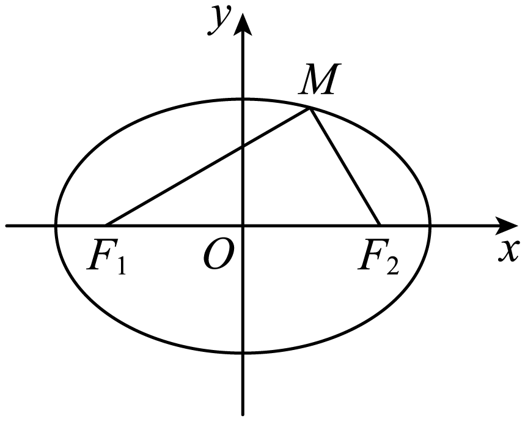

<strong>变式40．</strong>（2024·广东深圳·高三校考阶段练习）已知椭圆<em>E</em>：的右焦点为，左顶点为，若<em>E</em>上的点<em>P</em>满足轴，，则<em>E</em>的离心率为（    ）

A．	B．	C．	D．

【答案】A

【解析】设，则直线：，由，得，即，

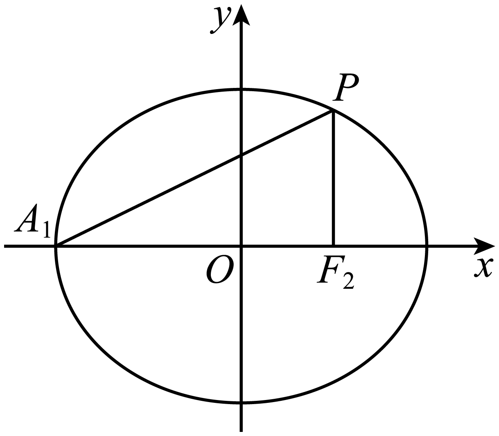

而，，由，得，即，

有，又，因此，

所以*E*的离心率为.

故选：A

<strong>变式41．</strong>（2024·广东广州·高三华南师大附中校考阶段练习）已知为坐标原点，是椭圆上一点，<em>F</em>为右焦点.延长，交椭圆于，两点，，，则椭圆的离心率为（    ）

A．	B．	C．	D．

【答案】A

【解析】设椭圆的左焦点，连接，，，，

由椭圆的对称性可知四边形为平行四边形，

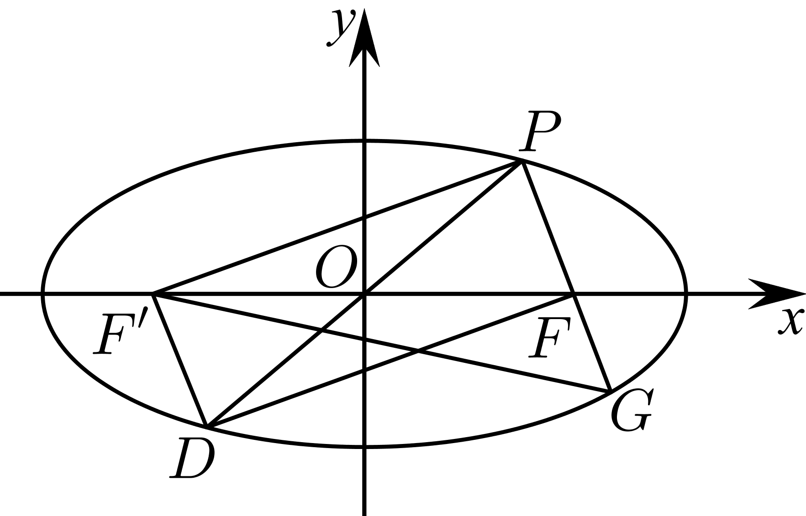

因为,所以，所以可得四边形为矩形，

因为，所以，

设，则，由椭圆的定义可知，

，，

在中，，即，整理可得：，

所以可得，

在△中，，即，

所以离心率，

故选：A

**变式42．**（2024·河南开封·校考模拟预测）已知椭圆，，分别是的左顶点和上顶点，是的左焦点，若，则的离心率为（    ）

A．	B．

C．	D．

【答案】C

【解析】由题意作出图形，如下图所示：

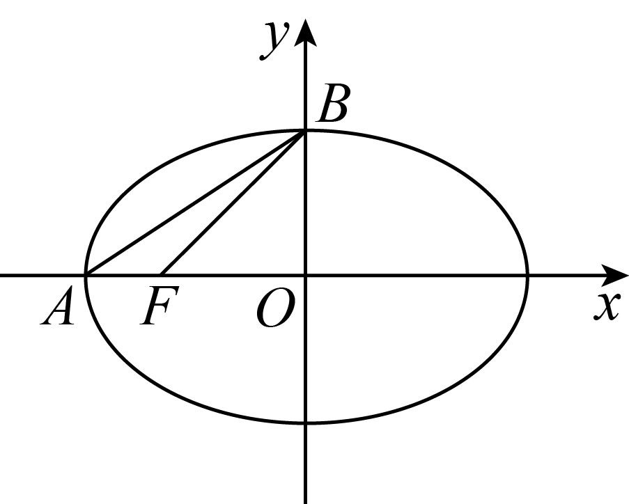

可知：，，，

在中可得：，

在中可得：，

所以

化简得：

因为，所以①，

又，所以①整理可得：，

即，解得，

又，所以，

故选：C.

**变式43．**（2024·山东泰安·统考模拟预测）已知椭圆的左、右焦点分别是，斜率为的直线经过左焦点且交于两点（点在第一象限），设△的内切圆半径为的内切圆半径为，若，则椭圆的离心率的值为（    ）

A．	B．

C．	D．

【答案】D

【解析】如图所示，由椭圆定义可得，，

设△的面积为，的面积为，因为，

所以，即①，

设直线，则联立椭圆方程与直线，

可得，

所以②，③，

联立①②③得，，整理得，所以．

故选：D

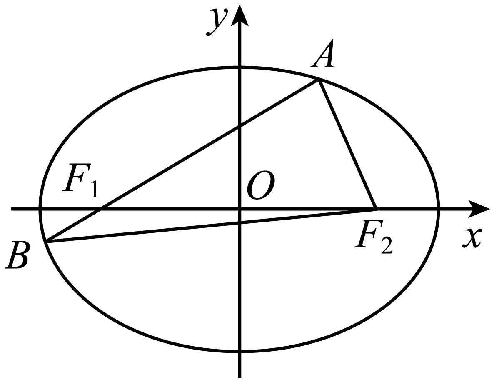

<strong>变式44．</strong>（2024·全国·模拟预测）已知椭圆的左顶点为，右焦点为<em>F</em>，<em>B</em>为椭圆上一点，，，则椭圆的离心率为（    ）

A．	B．	C．	D．

【答案】D

【解析】依题意，，因为，所以，

所以，因为，所以，

所以，因为，

所以，解得.

故选：D.

**变式45．**（2024·湖北荆州·沙市中学校考模拟预测）已知椭圆，为其左焦点，直线与椭圆交于点，，且．若，则椭圆的离心率为（    ）

A．	B．	C．	D．

【答案】A

【解析】设椭圆的右焦点为，连接，，故四边形为平行四边形，

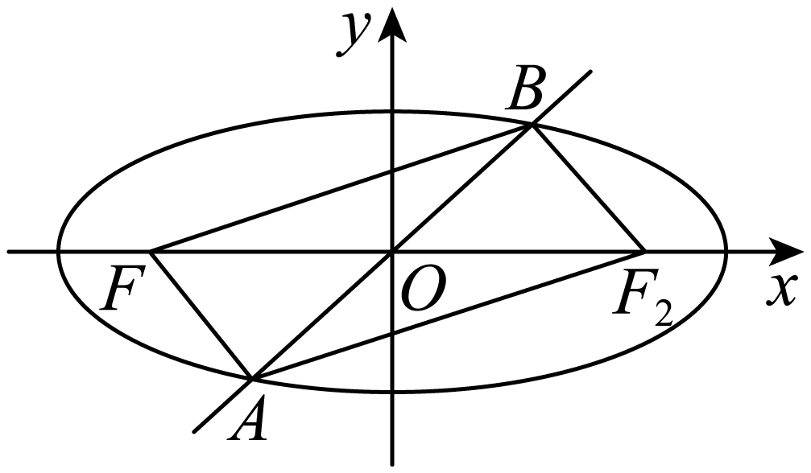

设，，则，，

，，

中，，

整理得到，即，故.

故选：A

**方向3：利用最大顶角满足**

<strong>变式46．</strong>（2024·四川成都·高三树德中学校考开学考试）已知、是椭圆的两个焦点，满足的点<em>M</em>总在椭圆内部，则椭圆离心率的取值范围是（    ）

A．	B．	C．	D．

【答案】A

【解析】设椭圆的半长轴长、半短轴长、半焦距分别为，

，

点的轨迹是以原点为圆心，半焦距为半径的圆，

又点总在椭圆内部，

该圆内含于椭圆，即，，

，．

故选：A．

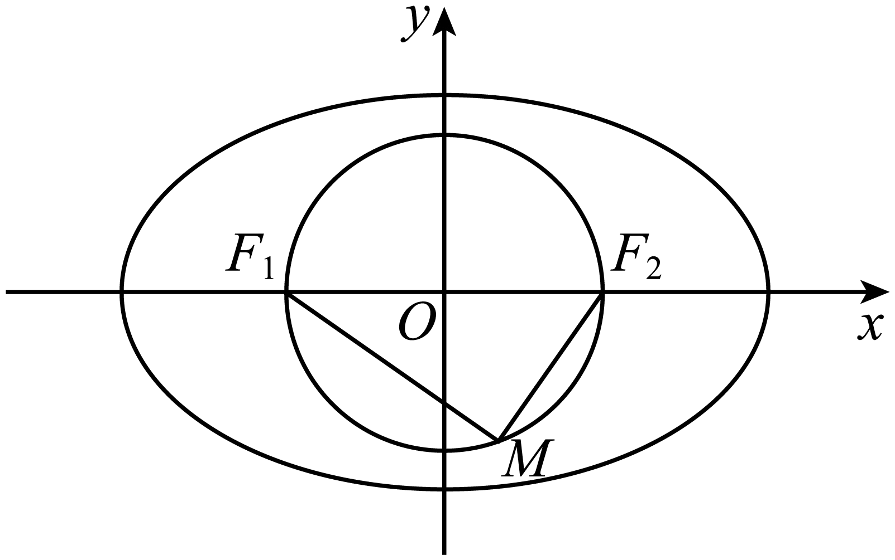

**变式47．**（2024·全国·高三专题练习）设、是椭圆的左、右焦点，若椭圆外存在点使得，则椭圆的离心率的取值范围\_\_\_\_\_\_．

【答案】

【解析】设点，易知，，则，

故点的轨迹为圆，由题意可知，圆与椭圆相交，

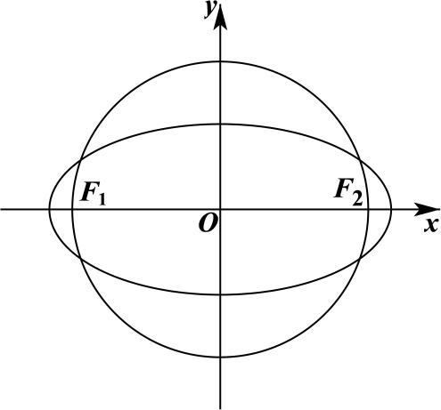

由图可知，即，可得，又因为，故．

故答案为：．

**变式48．**（2024·北京丰台二中高三阶段练习）已知，分别是某椭圆的两个焦点，若该椭圆上存在点使得（，是已知数），则该椭圆离心率的取值范围是\_\_\_\_\_\_\_\_.

【答案】

【解析】根据椭圆的几何意义可知

椭圆的离心率最小值为

根据椭圆离心率的取值范围可知

故答案为：

**变式49．**（2024·广东·广州市真光中学高三开学考试）已知椭圆的左、右焦点分别为，，若椭圆上存在一点使得，则该椭圆离心率的取值范围是\_\_\_\_\_\_\_\_．

【答案】

【解析】由椭圆的定义可知：，

在△中，由余弦定理得：，

所以，

又，即，当且仅当时等号成立，

故，

所以，，解得：.

故答案为：

**方向4：坐标法**

**变式50．**（2024·云南·校联考模拟预测）已知椭圆：的左、右焦点分别为，（如图），过的直线交于，两点，且轴，，则的离心率为（    ）

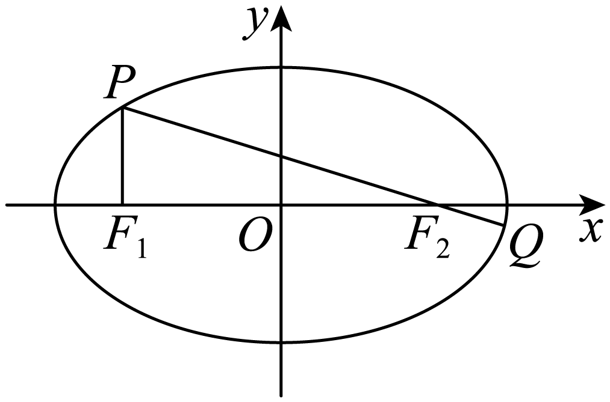

A．	B．	C．	D．

【答案】A

【解析】设椭圆的半焦距为，

由题意可得：，则，

因为，则，解得，

即，且点在椭圆上，

则，整理得，解得，即.

故选：A.

**变式51．**（2024·湖北武汉·华中师大一附中校考模拟预测）已知椭圆的左焦点为，离心率为．倾斜角为的直线与交于两点，并且满足，则的离心率为（    ）

A．	B．	C．	D．

【答案】A

【解析】设，则，由，

消去，得，

注意到，则.于是，

同理，. 因此.

的倾斜角为，∴直线的斜率，

根据弦长公式，可得.

由，可得，故.

．

故选：A

**变式52．**（2024·广东佛山·校考模拟预测）已知椭圆的下焦点为，右顶点为，直线交椭圆于另一点，且，则椭圆的离心率是（    ）

A．	B．	C．	D．

【答案】C

【解析】由得，所以，

把代入椭圆得，化简得，

则椭圆的离心率为.

故选：C.

**变式53．**（2024·上海浦东新·华师大二附中校考模拟预测）设是椭圆的上顶点，是上的一个动点．当运动到下顶点时，取得最大值，则的离心率的取值范围是（    ）

A．	B．	C．	D．

【答案】B

【解析】设，，因为，，

所以，，

由题意知当时，取得最大值，所以，可得，即，则．

故选：B*．*

<strong>变式54．</strong>（2024·安徽·高三宿城一中校联考阶段练习）已知椭圆<em>C</em>：（）的左焦点为，过左焦点作倾斜角为的直线交椭圆于<em>A</em>，<em>B</em>两点，且，则椭圆<em>C</em>的离心率为（    ）

A．	B．	C．	D．

【答案】C

【解析】设，，，过点所作直线的倾斜角为，所以该直线斜率为，

所以直线方程可写为，联立方程，

可得，，

根据韦达定理：，，

因为，即，所以，

所以，

即，所以，联立，

可得，.

故选：C

**变式55．**（2024·浙江温州·乐清市知临中学校考二模）已知椭圆的右焦点为，过右焦点作倾斜角为的直线交椭圆于两点，且，则椭圆的离心率为（    ）

A．	B．	C．	D．

【答案】C

【解析】设，，，过点做倾斜角为的直线斜率，

直线方程为，联立方程，

可得，

根据韦达定理：，，

因为，即，所以，

所以，

即，所以，联立，

可得，.

故选：C.

**变式56．**（2024·湖南·高三校联考阶段练习）已知椭圆的左，右焦点为，离心率为，又点是椭圆上异于长轴端点的两点，且满足，若，则（    ）

A．5	B．4	C．3	D．2

【答案】C

【解析】因为椭圆的离心率为，

所以，，椭圆方程为，

因为，

所以点共线，

因为，则，

设，由椭圆的定义得，

又因为，，

所以，解得，即，

所以在上、下顶点处，不妨设，

则，

联立，解得或，

则，

因为，

所以，

故选：C．

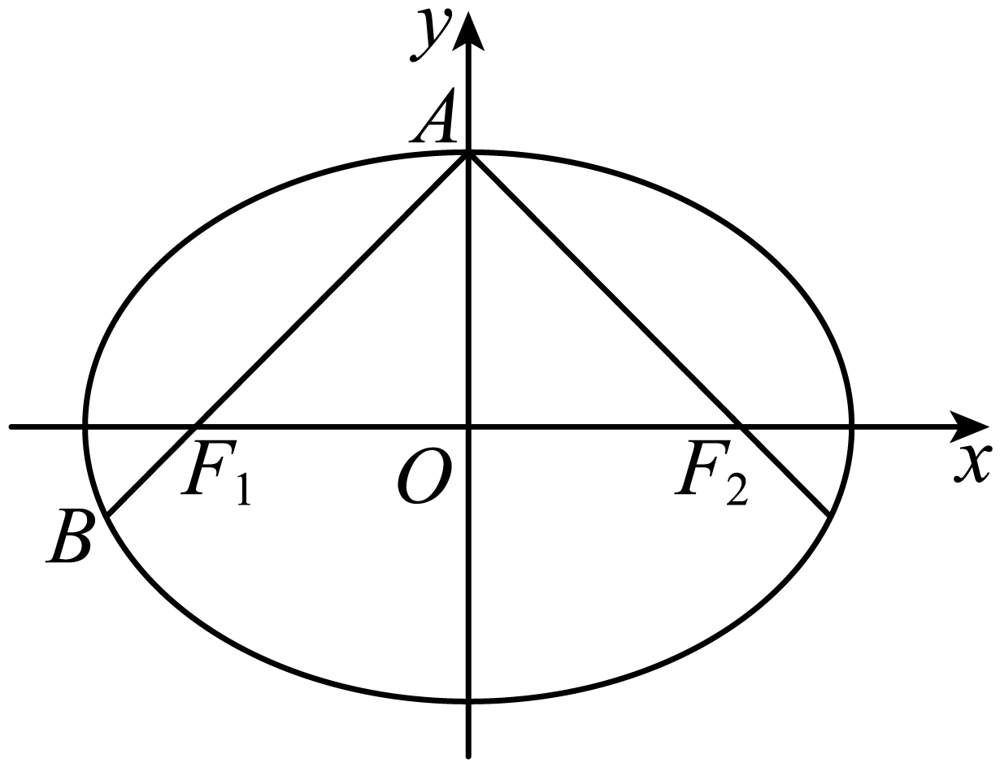

**变式57．**（2024·湖南邵阳·邵阳市第二中学校考模拟预测）已知，是椭圆的左、右焦点，是的上顶点，点在过且斜率为的直线上，为等腰三角形，，则的离心率为（    ）

A．	B．	C．	D．

【答案】B

【解析】由题意可知：，，，直线的方程为：，

由，点在第三象限，，则，

代入直线方程中得整理得，

则，∴椭圆的离心率.

故选：B.

<strong>变式58．</strong>（2024·全国·高三对口高考）在平面直角坐标系中，椭圆的焦距为，以原点<em>O</em>为圆心，<em>a</em>为半径作圆<em>O</em>，过点作圆<em>O</em>的两切线互相垂直，则该椭圆的离心率为（    ）

A．	B．	C．	D．

【答案】D

【解析】由题意，在圆*O*外，两条切线的斜率必存在，

令一条切线为，另一条切线为，

所以，，则，可得，

所以.

故选：D

**变式59．**（2024·四川泸州·高三四川省泸县第一中学校考开学考试）已知分别是椭圆的左、右焦点，是上一点且与轴垂直，直线与的另一个交点为，若，则的离心率为（    ）

A．	B．	C．	D．

【答案】A

【解析】

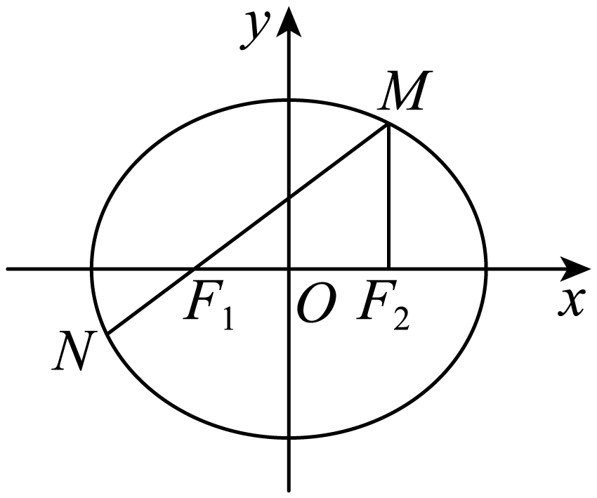

不妨设在第一象限，由题意，的横坐标为，

令，解得，即.

设，又，，，

由可得：，解得，

又在椭圆上，即，

整理得，解得.

故选：A

**方向5：找几何关系，利用余弦定理**

**变式60．**（2024·全国·高三专题练习）已知椭圆的右焦点为，过坐标原点的直线与椭圆交于两点，点位于第一象限，直线与椭圆另交于点，且，若，，则椭圆的离心率为（    ）

A．	B．	C．	D．

【答案】B

【解析】如图，设椭圆的左焦点为，连接，所以四边形为平行四边形．

设，则．

因为，所以，

又因为，所以，所以．

在中，，

由余弦定理得，

所以，所以．

故选：B.

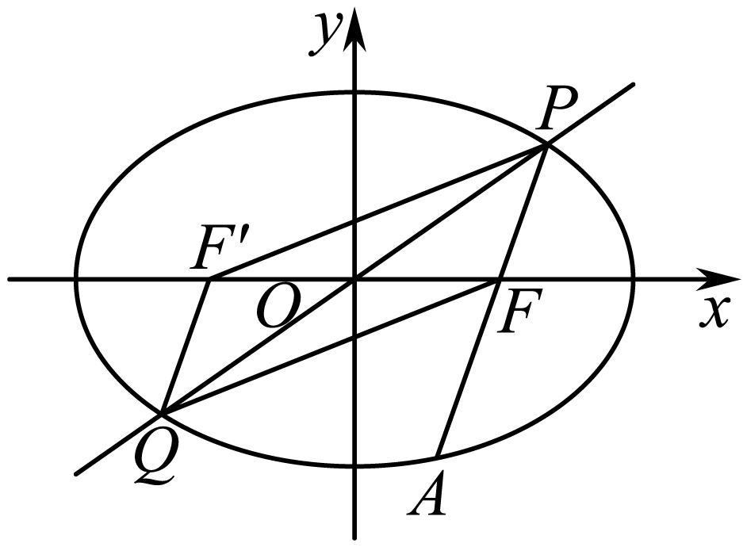

**变式61．**（2024·江苏·高三江苏省前黄高级中学校联考阶段练习）设点、分别为椭圆：的左右焦点，点，在椭圆上，若，，则椭圆的离心率为（    ）

A．	B．	C．	D．

【答案】A

【解析】

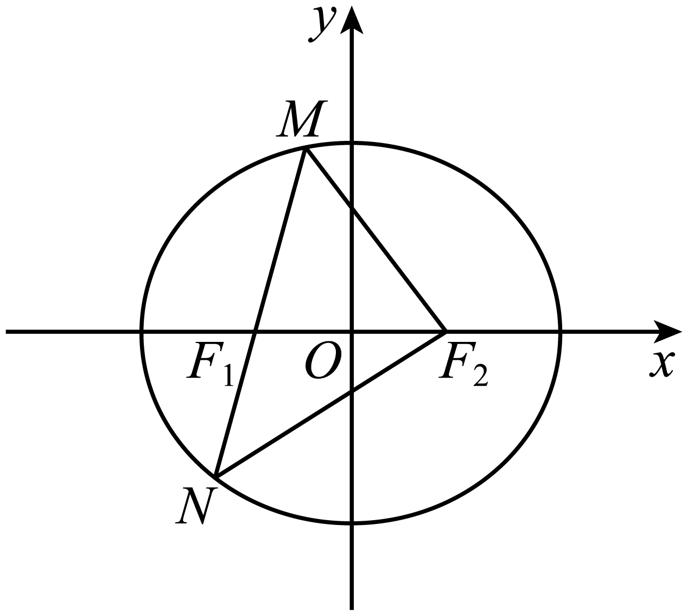

由题意可知，，

设，

则，

则,，

∴在中，由余弦定理得.

故选：A

**变式62．**（2024·湖南衡阳·校联考模拟预测）已知椭圆的左､右焦点分别为、，过作直线与椭圆相交于、两点，，且，则椭圆的离心率为（    ）

A．	B．	C．	D．

【答案】D

【解析】如图所示，设，，设，则，

在中，，

由椭圆定义可知，，

，解得，

所以，，

在中，可得，

在中，由余弦定理可得，

，

，即0，

解得，所以椭圆离心率.

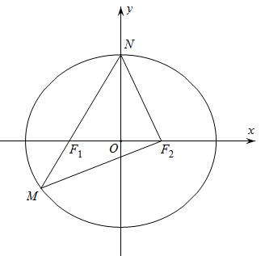

故选：D.

<strong>变式63．</strong>（2024·河南·校联考模拟预测）已知椭圆的左焦点为，若椭圆上存在点<em>P</em>，使得线段与直线垂直垂足为<em>Q</em>，若，则椭圆<em>C</em>的离心率为（    ）

A．	B．	C．	D．

【答案】A

【解析】设*C*的右焦点为，线段与直线垂直，

所以的斜率为，所以，

设，则，故，

在中，由余弦定理得，，

所以

所以，

所以，

又因为，

所以椭圆*C*的离心率为.

故选:A．

**变式64．**（2024·江西南昌·校联考二模）已知椭圆的左、右焦点分别为，，直线经过点交于 ，两点，点在上，，，，则的离心率为（    ）

A．	B．	C．	D．

【答案】B

【解析】分别取，关于轴的对称点，，连接，，，，

由以及椭圆的对称性及几何知识可得，且关于*y*轴对称，

则关于原点对称，则四边形是平行四边形，

所以，，

又，所以，所以是等边三角形，

又的周长为，

所以，，

中，由余弦定理，

得，整理得，

所以，

故选：B.

**变式65．**（2024·海南海口·海南华侨中学校考模拟预测）已知，分别是椭圆：（）的左，右焦点，是上的一点，若，且，则的离心率为（    ）

A．	B．	C．	D．

【答案】C

【解析】在中，，

设，由题意知,，

由余弦定理得,，

由椭圆定义知，则离心率.

故选:C.

**方向6：找几何关系，利用正弦定理**

<strong>变式66．</strong>（2024·全国·高三专题练习）已知，分别为椭圆的两个焦点，<em>P</em>是椭圆<em>E</em>上的点，，且，则椭圆<em>E</em>的离心率为（    ）

A．	B．	C．	D．

【答案】B

【解析】由题意及正弦定理得：，

令，则*，*，可得，

所以椭圆的离心率为：.

故选：B

<strong>变式67．</strong>（2024·全国·高三专题练习（理））已知椭圆＝1(a＞b＞0)的左、右焦点分别为F1，F2，且|F1F2|＝2c，若椭圆上存在点M使得中，，则该椭圆离心率的取值范围为(　　)

A．(0，－1)	B．	C．	D．(－1,1)

【答案】D

【解析】由正弦定理可得：,结合题意可得，所以，根据椭圆的定义可得，所以，，易知.

因为为椭圆上一点，所以，即，

整理得，所以，解得.故选D.

<strong>变式68．</strong>（2024·全国·高三专题练习）过椭圆的左、右焦点，作倾斜角分别为和的两条直线，．若两条直线的交点<em>P</em>恰好在椭圆上，则椭圆的离心率为（    ）

A．	B．

C．	D．

【答案】C

【解析】在中，由正弦定理可得

所以，

所以该椭圆的离心率，

故选：C．

**变式69．**（2024·江苏·扬州中学高三开学考试）已知椭圆的左、右焦点分别为，，若椭圆上存在点（异于长轴的端点），使得，则该椭圆离心率的取值范围是\_\_\_\_\_\_．

【答案】

【解析】由已知，得，由正弦定理，得，

所以．

由椭圆的几何性质，知，

所以且，

所以且，

即且，

结合，可解得．

故答案为：.

<strong>变式70．</strong>（2024·全国·高三专题练习）过椭圆的左、右焦点，作倾斜角分别为和的两条直线，．若两条直线的交点<em>P</em>恰好在椭圆上，则椭圆的离心率为（    ）

A．	B．

C．	D．

【答案】C

【解析】在中，由正弦定理可得

所以，

所以该椭圆的离心率，

故选：C．

**方向7：利用基本不等式**

**变式71．**（2024·全国·高三专题练习）设椭圆的右焦点为，椭圆上的两点，关于原点对你，且满足，，则椭圆的离心率的取值范围为（    ）

A．	B．	C．	D．

【答案】B

【解析】如图所示：

设椭圆的左焦点，由椭圆的对称性可知，四边形为平行四边形，

又，即，所以四边形为矩形，，

设，，在直角中，，，

得，所以，令，得，

又，得，所以，

所以  ，即，所以

所以椭圆的离心率的取值范围为，

故选：B

**变式72．**（2024·江苏南京·高三阶段练习）设、分别是椭圆：的左、右焦点，是椭圆准线上一点，的最大值为60°，则椭圆的离心率为（    ）

A．	B．	C．	D．

【答案】A

【解析】由题意可设直线，的倾斜角分别为，，

由椭圆的对称性不妨设为第一象限的点，即，

则，，因为，

所以

，

所以，则，解得，

故选：A.

<strong>变式73．</strong>（2024·山西运城·高三期末（理））已知点为椭圆的左顶点，为坐标原点，过椭圆的右焦点<em>F</em>作垂直于<em>x</em>轴的直线<em>l</em>，若直线<em>l</em>上存在点<em>P</em>满足，则椭圆离心率的最大值\_\_\_\_\_\_\_\_\_\_\_\_\_\_.

【答案】

【解析】由对称性不妨设*P*在*x*轴上方，设，，

∴

当且仅当取等号，

∵直线*l*上存在点*P*满足

∴

即，

∴，即，

所以，

故椭圆离心率的最大值为.

故答案为：.

<strong>变式74．</strong>（2024·全国·高三专题练习）已知<em>F</em>是椭圆的一个焦点，若直线与椭圆相交于<em>A</em>，<em>B</em>两点，且，记椭圆的离心率为<em>e</em>，则的取值范围是\_\_\_\_\_\_\_\_\_\_\_.

【答案】；

【解析】设为椭圆的另一焦点，如图，连接，

根据椭圆和直线的对称性，可得四边形为平行四边形，

又因为，所以.

在中，，

所以，

当且仅当时，等号成立，

即，

又因为，所以，

又因为，故.

故答案为：.

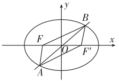

**方向8：利用焦半径的取值范围为．**

**变式75．**（2024·全国·高三专题练习）在平面直角坐标系中，椭圆上存在点，使得，其中、分别为椭圆的左、右焦点，则该椭圆的离心率取值范围是\_\_\_\_\_\_\_\_．

【答案】

【解析】设椭圆的焦距为，由椭圆的定义可得，

解得，，

由题意可得，解得，又，所以，

所以椭圆离心率的取值范围是．

故答案为：.

**变式76．**（2024·广西南宁·二模（理））已知椭圆的左、右焦点分别为，，若椭圆上存在一点使，则该椭圆的离心率的取值范围是\_\_\_\_\_\_.

【答案】

【解析】设点的横坐标为，，

则由椭圆的定义可得，

，由题意可得，

，

，，

则该椭圆的离心率的取值范围是，，

故答案为：，．

**变式77．**（2024·河南·信阳高中高三期末（文））若椭圆上存在一点，使得，其中分别是的左、右焦点，则的离心率的取值范围为\_\_\_\_\_\_.

【答案】

【解析】，，

又，，

解得，则.

故答案为

<strong>变式78．</strong>（2024·四川省泸县第二中学模拟预测（文））已知椭圆的左右焦点为，若椭圆<em>C</em>上恰好有6个不同的点<em>P</em>，使得为等腰三角形，则椭圆<em>C</em>的离心率的取值范围是（    ）

A．	B．

C．	D．

【答案】A

【解析】法一：显然，是短轴端点时，，满足为等腰三角形，因此由对称性，还有四个点在四个象限内各有一个，

设是第一象限内使得为等腰三角形的点，

若，则，又，

消去整理得：，

解得(舍去)或，

由得，

所以，即，

若，则，又，

消去整理得：，

解得或，舍去．

所以，

所以，即，

时，，是等边三角形，只能是短轴端点，只有2个，不合题意．

综上，的范围是．

法二：①当点与短轴的顶点重合时，构成以为底边的等腰三角形，此种情况有2个满足条件的；

②当构成以为一腰的等腰三角形时，根据椭圆的对称性，只要在第一象限内的椭圆上恰好有一点满足为等腰三角形即可，则或

当时，则，即，则，

当时，则有，则，

综上所述，椭圆的离心率取值范围是.

故选：A.

<strong>变式79．</strong>（2024·陕西西安·统考三模）已知椭圆：的左，右焦点分别为，，若椭圆上一点<em>Р</em>到焦点的最大距离为7，最小距离为3，则椭圆<em>C</em>的离心率为（    ）

A．	B．	C．	D．

【答案】B

【解析】设椭圆的半焦距为，若椭圆上一点，则，且，

又，，

则

由于，所以，

于是可得，，所以椭圆*C*的离心率.

故选：B.

<strong>变式80．</strong>（2024·全国·模拟预测）已知，分别是椭圆<em>C</em>：的左､右焦点，<em>B</em>是椭圆<em>C</em>的上顶点，<em>P</em>是椭圆<em>C</em>上任意一点，且<em>C</em>的焦距大于短轴长，若的最大值是的最小值的倍，则椭圆<em>C</em>的离心率为（    ）

A．	B．	C．或	D．

【答案】D

【解析】依题意得，

设，则，

由题意知，故，

又，所以当时，取得最大值.

因为，

所以，

因为，

所以当或时，取得最小值，为，

又的最大值是的最小值的倍，

所以，即，

又，所以，得或.

又不满足，满足，所以，

故选：D.

**方向9：利用椭圆第三定义．**

<strong>变式81．</strong>（2024·全国·高三专题练习）已知椭圆<em>C</em>：（），点<em>A</em>，<em>B</em>为长轴的两个端点，若在椭圆上存在点<em>P</em>，使，则椭圆的离心率的取值范围是\_\_\_\_\_\_．

【答案】

【解析】由题可知，，设，

由点*P*在椭圆上，得，

所以，

可得，

所以．

故答案为：.

**变式82．**（2024·全国·模拟预测）已知直线与椭圆交于两点，是椭圆上异于的一点．若椭圆的离心率的取值范围是，则直线，斜率之积的取值范围是（    ）

A．	B．

C．	D．

【答案】D

【解析】设，

由直线与椭圆交于两点可知两点关于原点对称，

所以且，

由题意知：，两式相减得：

，

即，

又，

由椭圆的离心率的取值范围是，

即，

所以，

即，

故选：D.

<strong>变式83．</strong>（2024·内蒙古赤峰·校联考三模）下列结论：①若方程表示椭圆，则实数<em>k</em>的取值范围是；②双曲线与椭圆的焦点相同．③<em>M</em>是双曲线上一点，点，分别是双曲线左右焦点，若，则或1．④直线与椭圆<em>C</em>：交于<em>P</em>，<em>Q</em>两点，<em>A</em>是椭圆上任一点（与<em>P</em>，<em>Q</em>不重合），已知直线<em>AP</em>与直线<em>AQ</em>的斜率之积为，则椭圆<em>C</em>的离心率为．错误的个数是（    ）

A．4个	B．3个	C．2个	D．1个

【答案】B

【解析】①若方程表示椭圆，则，解得或，故①错误；

②双曲线化成标准方程为，焦点坐标为，椭圆的焦点坐标为，不相同，故②错误；

③双曲线中，

因为*M*是双曲线上一点，点，分别是双曲线左右焦点，

所以由双曲线的定义得，若，则或1，

而双曲线上的点到焦点距离的最小值为，所以舍去，所以，故③错误；

④设，因为*A*是椭圆上任一点，所以，所以，

又因为直线与椭圆*C*：交于*P*，*Q*两点，所以设，，所以，

因为直线*AP*与直线*AQ*的斜率之积为，

所以，

所以，所以，又，所以，故④正确；

综上，错误的有3个.

故选：B.

**变式84．**（2024·河南·校联考模拟预测）已知直线与椭圆交于两点，若点恰为弦的中点，则椭圆的离心率是（    ）

A．	B．	C．	D．

【答案】A

【解析】依题意，直线的斜率为，设，则，且，

由两式相减得：，于是，

解得，此时椭圆，显然点在椭圆内，符合要求，

所以椭圆的离心率.

故选：A

**变式85．**（2024·河南新乡·新乡市第一中学校考模拟预测）已知椭圆的左顶点为，点是椭圆上关于轴对称的两点.若直线的斜率之积为，则的离心率为（    ）

A．	B．	C．	D．

【答案】D

【解析】由题意，椭圆的左顶点为，

因为点是椭圆上关于轴对称的两点，可设，则，

所以，可得，

又因为，即，

代入可得，所以离心率为.

故选：D.

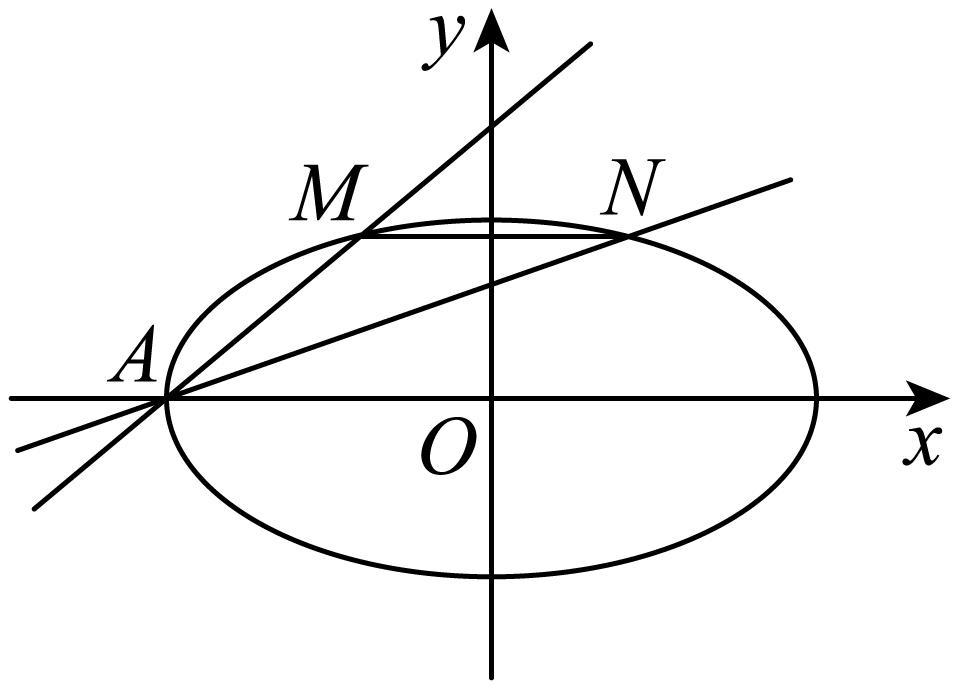

**【解题方法总结】**

求离心率的本质就是探究之间的数量关系，知道中任意两者间的等式关系或不等关系便可求解出的值或其范围.具体方法为方程法、不等式法、定义法和坐标法.

**题型七：椭圆的简单几何性质问题**

<strong>例19．</strong>（2024·甘肃陇南·高三统考期中）已知双曲线 的一个焦点是，椭圆 的焦距等于 ，则 ________．

【答案】5

【解析】因为双曲线的一个焦点是，

所以，得，

又椭圆 的焦距等于，

所以，得.

故答案为：5

<strong>例20．</strong>（2024·上海崇明·上海市崇明中学校考模拟预测）若抛物线的焦点恰好是椭圆的右焦点，则______.

【答案】4

【解析】抛物线的焦点为，

椭圆的右焦点为：，

所以，解得：.

故答案为：.

<strong>例21．</strong>（2024·浙江嘉兴·校考模拟预测）已知椭圆的左、右焦点分别为点、，若椭圆上顶点为点，且为等腰直角三角形，则______.

【答案】8

【解析】椭圆，故，为等腰直角三角形，故，

故，即，.

故答案为：

<strong>变式86．</strong>（2024·四川南充·高三统考期中）已知点、，动点满足：直线的斜率与直线的斜率之积为，则的取值范围为______．

【答案】

【解析】因为点，，，

所以，，

所以，即，

所以，

由，可知，

所以，即.

所以的取值范围为.

故答案为：.

<strong>变式87．</strong>（2024·全国·高三专题练习）若为椭圆上的一点，，分别是椭圆的左、右焦点，则的最大值为__________.

【答案】/

【解析】易知当点为椭圆与轴的交点时，最大，

因为椭圆方程为，

所以，，

此时，，

满足，

所以为等腰直角三角形，所以．

故答案为：

<strong>变式88．</strong>（2024·全国·高三专题练习）<em>AB</em>是平面上长度为4的一条线段，<em>P</em>是平面上一个动点，且，<em>M</em>是<em>AB</em>的中点，则的取值范围是______．

【答案】

【解析】由题设，，则*P*的轨迹是以为焦点，长轴长为6的椭圆，

若，，则*P*的轨迹方程为.

所以的范围为，即.

故答案为：

<strong>变式89．</strong>（2024·云南·云南师大附中校考模拟预测）如图所示，在圆锥内放入两个大小不同的球，，使得它们分别与圆锥的侧面和平面都相切，平面分别与球，相切于点，.数学家<em>Ger</em>min<em>alDandelin</em>利用这个模型证明了平面与圆锥侧面的交线为椭圆，，为此椭圆的两个焦点，这两个球也被称为<em>Dandelin</em>双球.若球，的半径分别为6和3，球心距离，则此椭圆的长轴长为___________.

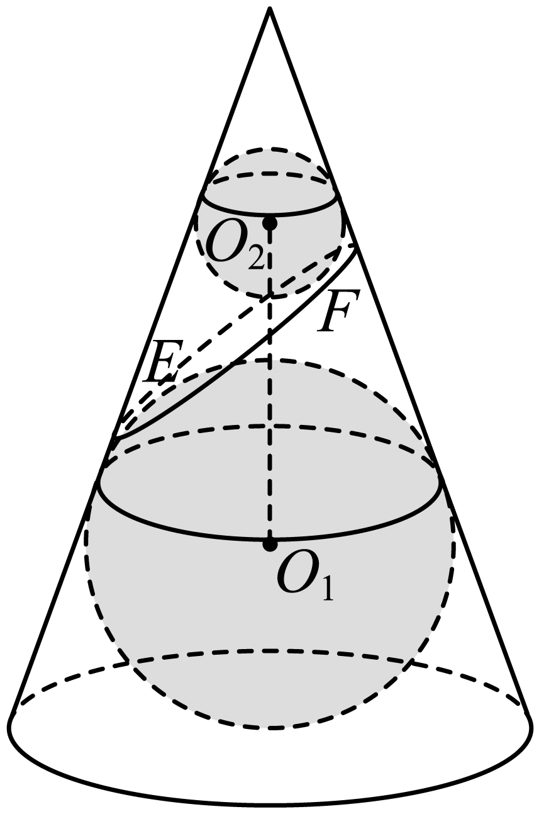

【答案】

【解析】过切点*E*，*F*作出双球模型的轴截面，设球分别与圆锥的同一条母线切于*A*，*B*两点，

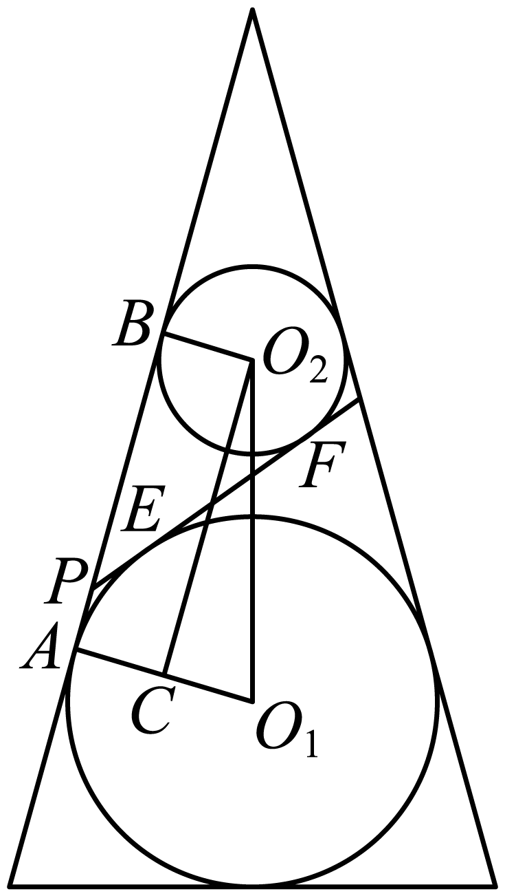

有，过作于点*C*，则四边形是矩形，

于是，，又，从而，

设直线*AB*与平面的交点为*P*，则有，，

所以椭圆的长轴长.

故答案为：

<strong>变式90．</strong>（2024·全国·高三专题练习）2022年神舟接力腾飞，中国空间站全面建成，我们的“太空之家”遨游苍穹．太空中飞船与空间站的对接，需要经过多次变轨．某飞船升空后的初始运行轨道是以地球的中心为一个焦点的椭圆，其远地点（长轴端点中离地面最远的点）到地面的距离为，近地点（长轴端点中离地面最近的点）到地面的距离为，地球的半径为<em>R</em>，则该椭圆的短轴长为______（用，，<em>R</em>表示）．

【答案】

【解析】设椭圆的长半轴长为*a*，短半轴长为*b*，半焦距为*c*，

由题意可知，，

所以．

所以，所以．

故答案为：.

**【解题方法总结】**

<table><tr><td colspan="2">
标准方程
</td><td>

</td><td>

</td></tr><tr><td colspan="2">
图形
</td><td>
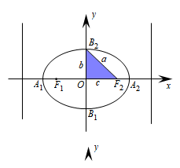
</td><td>
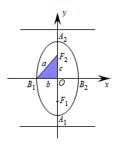
</td></tr><tr><td rowspan="7">
性质
</td><td>
焦点
</td><td>
，
</td><td>
，
</td></tr><tr><td>
焦距
</td><td>

</td><td>

</td></tr><tr><td>
范围
</td><td>
，
</td><td>
，
</td></tr><tr><td>
对称性
</td><td colspan="2">
关于轴、轴和原点对称
</td></tr><tr><td>
顶点
</td><td>
，
</td><td>
，
</td></tr><tr><td>
轴
</td><td colspan="2">
长轴长，短轴长
</td></tr><tr><td>
离心率
</td><td colspan="2">
 （注：离心率越小越圆，越大越扁）
</td></tr></table>

**题型八：利用第一定义求解轨迹**

<strong>例22．</strong>（2024·全国·高三专题练习）已知是椭圆中垂直于长轴的动弦，是椭圆长轴的两个端点，则直线和的交点的轨迹方程为_______．

【答案】（）．

【解析】设，

因为椭圆的长轴端点为，

设直线和的交点为，

因为三点共线，所以，，

因为三点共线，所以，

两式相乘得，（）,

因为，所以，即，

所以，整理得（），

所以直线和的交点的轨迹方程（）.

故答案为：（）.

<strong>例23．</strong>（2024·广东东莞·高三校考阶段练习）已知圆，圆，动圆与圆外切并与圆内切，则圆心的轨迹方程为_______

【答案】

【解析】设动圆*P*的圆心为，半径为，

由题意得，

所以，

所以点*P*的轨迹为以为焦点的椭圆，

则，即，，则，

所以动圆圆心的轨迹方程为，

故答案为：

<strong>例24．</strong>（2024·全国·高三专题练习）已知点<em>P</em>为椭圆上的任意一点，<em>O</em>为原点，<em>M</em>满足，则点<em>M</em>的轨迹方程为______________．

【答案】.

【解析】设点，

由得点，而点*P*为椭圆上的任意一点，

于是得，整理得：，

所以点*M*的轨迹方程是.

故答案为:

<strong>变式91．</strong>（2024·全国·高三专题练习）已知平面上一定点和直线<em>l</em>：<em>x</em>=8，<em>P</em>为该平面上一动点，作<em>PQ</em>⊥<em>l</em>，垂足为<em>Q</em>，且<strong>·</strong>=0．则动点<em>P</em>的轨迹方程为____________；

【答案】

【解析】设，则，

由**·**=0，得，

即，化简得，

所以点*P*在椭圆上，即动点*P*的轨迹方程为．

故答案为：

<strong>变式92．</strong>（2024·全国·高三专题练习）一个动圆与圆外切，与圆内切，则这个动圆圆心的轨迹方程为__________．

【答案】

【解析】设动圆圆心为，半径为，根据题意知：，，

所以，所以圆心的轨迹为椭圆.

其中，，故，

因为焦点在轴上，故圆心轨迹方程为：.

故答案为：.

<strong>变式93．</strong>（2024·全国·高三对口高考）已知，<em>B</em>是圆（<em>F</em>为圆心）上一动点.线段<em>AB</em>的垂直平分线交<em>BF</em>于<em>P</em>，则动点<em>P</em>的轨迹方程为___________.

【答案】．

【解析】由题意，在线段的垂直平分线上，则，

所以，又，

所以在以为焦点，长轴长为2的椭圆上，

，，，则，

所以轨迹方程为．

故答案为：．

**变式94．**（2024·全国·高三专题练习）已知圆：，圆：，动圆与圆外切并且与圆内切，圆心的轨迹为曲线，则曲线的方程为\_\_\_\_\_\_\_\_\_\_\_\_.

【答案】()．

【解析】由圆，圆得到，半径，，半径，

设动圆的半径为，∵圆在圆内，∴动圆只能在内与圆内切，不能是在动圆内，即：，

∵动圆与圆外切，∴，∵动圆与圆内切，∴，

∴，即到和到的距离之和为定值，

∴是以、为焦点的椭圆，且，，所以，

∴动圆圆心的轨迹方程为，

又圆过点，椭圆也过点，而点显然不在圆上，

所以所求轨迹方程为：.

故答案为：.

<strong>变式95．</strong>（2024·全国·高三专题练习（理））设<em>F1</em>，<em>F2</em>为椭圆的左、右焦点，<em>A</em>为椭圆上任意一点，过焦点<em>F1</em>向∠<em>F1AF2</em>的外角平分线作垂线，垂足为<em>D</em>，则点<em>D</em>的轨迹方程是\_\_\_\_\_\_\_\_．

【答案】<em>x2</em>＋<em>y2</em>＝4

【解析】

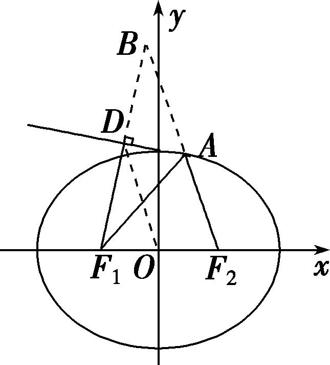

由题意，延长<em>F1D</em>，<em>F2A</em>并交于点<em>B</em>，易证Rt△<em>ABD</em>≌Rt△<em>AF1D</em>，则|<em>F1D</em>|＝|<em>BD</em>|，|<em>F1A</em>|＝|<em>AB</em>|，又<em>O</em>为<em>F1F2</em>的中点，连接<em>OD</em>，则<em>OD</em>∥<em>F2B</em>，从而可知|<em>OD</em>|＝|<em>F2B</em>|＝(|<em>AF1</em>|＋|<em>AF2</em>|)＝2，设点<em>D</em>的坐标为(<em>x</em>，<em>y</em>)，则<em>x2</em>＋<em>y2</em>＝4.

故答案为：

<strong>变式96．</strong>（2024·全国·高三专题练习（理））如图，已知△<em>ABC</em>的两顶点坐标，，圆<em>E</em>是△<em>ABC</em>的内切圆，在边<em>AC</em>，<em>BC</em>，<em>AB</em>上的切点分别为<em>P</em>，<em>Q</em>，<em>R</em>，|<em>CP</em>|=2，动点<em>C</em>的轨迹方程为\_\_\_\_\_\_\_\_\_\_\_.

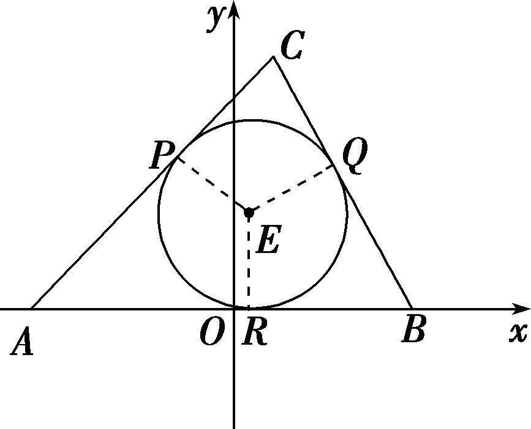

【答案】

【解析】由题意结合切线长定理可得，，，

所以，

所以动点*C*的轨迹是以，为焦点的椭圆（不在*x*轴上），

且该椭圆满足，，所以，

所以该椭圆方程为.

故答案为：.

**变式97．**（2024·全国·高三专题练习）一动圆与圆：内切，且与圆：外切，则动圆圆心的轨迹方程是\_\_\_\_\_\_．

【答案】

【解析】由题意，圆：的圆心为，半径为，

圆：的圆心为，半径为，

设动圆的圆心，半径为，

动圆与圆：内切，与圆：外切，

所以，，

所以，

所以的轨迹是以原点为中心，焦点在轴上的椭圆，且，，

所以，

椭圆的方程为.

故答案为：．

**变式98．**（2024·辽宁·沈阳二中高三阶段练习（理））一动圆与圆外切，与圆内切，则动圆圆心的轨迹方程为\_\_\_\_\_\_\_\_\_\_\_.

【答案】

【解析】设动圆半径为，根据题意知：，，故.

故轨迹为椭圆，，，故，故轨迹方程为：.

故答案为：.

**变式99．**（2024·江西宜春·高三阶段练习（文））已知定点,直线相交于点，且它们的斜率之积为，则动点的轨迹方程为\_\_\_\_\_\_\_．

【答案】

【解析】设点，

动点的轨迹方程为

**变式100．**（2024·广东湛江·一模（理））已知圆，点，点为动点，以线段为直径的圆内切于圆，则动点的轨迹方程是\_\_\_\_\_\_．

【答案】

【解析】设的中点为，切点为，连，，则三点共线，且，

取关于轴的对称点，连，根据中位线的性质有．且当在时也满足题意.

所以点的轨迹是以，为焦点，长轴长为6的椭圆．其中，，，则动点的轨迹方程是．

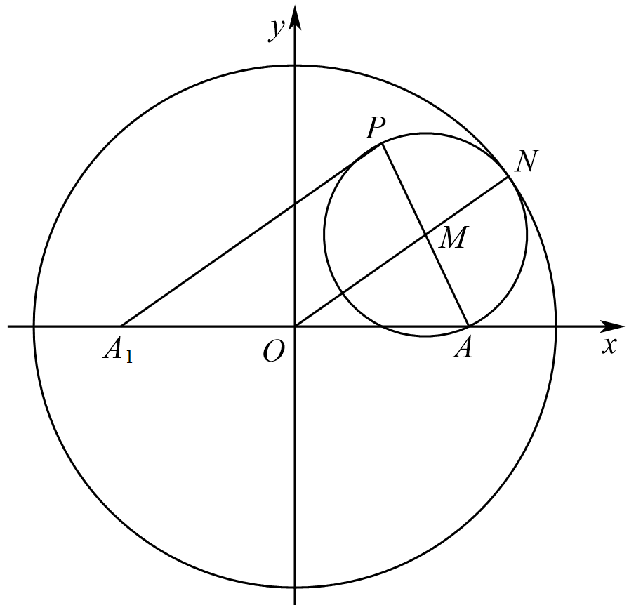

故答案为：．

**【解题方法总结】**

常见考题中，会让我们利用圆锥曲线的定义求解点P的轨迹方程，这时候要注意把动点P和满足焦点标志的定点连起来做判断． 焦点往往有以下的特征：（1）关于坐标轴对称的点；（2）标记为*F*的点；（3）圆心；（4）题上提到的定点等等．当看到满足以上的标志的时候要想到曲线的定义，把曲线和满足焦点特征的点连起来结合曲线定义判断．注意：在求解轨迹方程的题中，要注意*x*和*y*的取值范围.

