**第65讲  双曲线及其性质**

**知识梳理**

**知识点一：双曲线的定义**

平面内与两个定点的距离的差的绝对值等于常数（大于零且小于）的点的轨迹叫做双曲线（这两个定点叫双曲线的焦点）．用集合表示为．

**注意：**（1）若定义式中去掉绝对值，则曲线仅为双曲线中的一支．

（2）当时，点的轨迹是以和为端点的两条射线；当时，点的轨迹是线段的垂直平分线．

（3）时，点的轨迹不存在．

在应用定义和标准方程解题时注意以下两点：

①条件“”是否成立；②要先定型（焦点在哪个轴上），再定量（确定，的值），注意的应用．

**知识点二：双曲线的方程、图形及性质**

双曲线的方程、图形及性质

<em><strong>A2</strong></em>

**【解题方法总结】**

**（1）双曲线的通径**

过双曲线的焦点且与双曲线实轴垂直的直线被双曲线截得的线段，称为双曲线的通径．通径长为．

**（2）点与双曲线的位置关系**

对于双曲线，点在双曲线内部，等价于．

点在双曲线外部，等价于 结合线性规划的知识点来分析．

**（3）双曲线常考性质**

**性质1：** 双曲线的焦点到两条渐近线的距离为常数；顶点到两条渐近线的距离为常数；

<strong>性质2：</strong>双曲线上的任意点到双曲线<em>C</em>的两条渐近线的距离的乘积是一个常数；

**（4）双曲线焦点三角形面积为（可以这样理解，顶点越高，张角越小，分母越小，面积越大）**

**（5）双曲线的切线**

点在双曲线上，过点作双曲线的切线方程为．若点在双曲线外，则点对应切点弦方程为

**必考题型全归纳**

**题型一：双曲线的定义与标准方程**

<strong>例1．</strong>（2024·全国·模拟预测）已知，分别是离心率为2的双曲线的左，右焦点，过点的直线与双曲线的左､右两支分别交于点，，且，，则的标准方程为___________.

【答案】

【解析】

由题意知，∴，由双曲线的定义知，，

则，∴，，∴，∴的标准方程为.

故答案为：.

<strong>例2．</strong>（2024·山东临沂·高二校考期末）已知双曲线：（，），矩形的四个顶点在上，，的中点为的两个焦点，且，则双曲线的标准方程是______．

【答案】

【解析】由题意得，．如图所示，设，的中点分别为，，

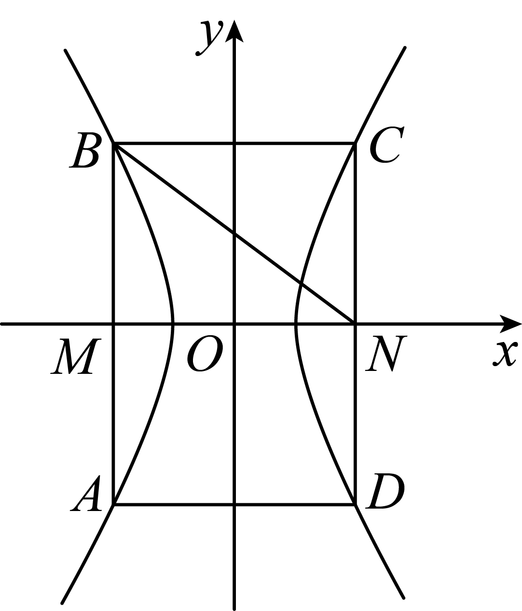

在中，，故．

由双曲线的定义可得，

则，又，所以，．

所以双曲线的标准方程是．

故答案为：.

<strong>例3．</strong>（2024·高二课时练习）设椭圆C1的离心率为，焦点在x轴上且长轴长为26，若曲线C2上的点到椭圆C1的两个焦点的距离的差的绝对值等于8，则曲线C2的标准方程为___________________．

【答案】

【解析】根据题意可知椭圆方程中的a=13，

∵=

∴c=5

根据双曲线的定义可知曲线C2为双曲线，其中半焦距为5，实轴长为8

∴虚轴长为6

∴双曲线方程为

<strong>变式1．</strong>（2024·贵州贵阳·高二清华中学校考阶段练习）渐近线方程为且经过点的双曲线标准方程为__________．

【答案】

【解析】设渐近线方程为且经过点的双曲线的方程为，

将点的坐标代入双曲线的方程可得，

所以，所求双曲线的方程为，其标准方程为.

故答案为：.

<strong>变式2．</strong>（2024·辽宁朝阳·高二校联考阶段练习）若双曲线<em>C</em>与双曲线有相同的渐近线，且经过点，则双曲线<em>C</em>的标准方程是______．

【答案】

【解析】由双曲线*C*与双曲线有相同的渐近线，

可设双曲线*C*的方程为，又*C*过点，

所以，，

整理得双曲线*C*的标准方程是．

故答案为：

<strong>变式3．</strong>（2024·上海黄浦·高二上海市向明中学校考期中）双曲线经过两点，，则双曲线的标准方程是______．

【答案】

【解析】设双曲线的方程为，

由题意可得：，解得，

所以双曲线的标准方程是.

故答案为：.

<strong>变式4．</strong>（2024·全国·模拟预测）已知，分别是双曲线的左、右焦点，<em>M</em>是双曲线<em>C</em>的右支上一点，双曲线<em>C</em>的焦点到渐近线的距离为3，与的夹角为，，则双曲线<em>C</em>的标准方程为______.

【答案】

【解析】∵双曲线的一条渐近线为，即，

故焦点到渐近线的距离，∴.

∵向量与的夹角为，∴.

∵，

∴，∴，

由双曲线的定义知，，∴，.

在中，由余弦定理知

，

又，∴，∴，

∴该双曲线的标准方程为.

故答案为：.

<strong>变式5．</strong>（2024·广东·高三校联考阶段练习）已知双曲线，四点、、、中恰有三点在上，则双曲线的标准方程为__________．

【答案】

【解析】因为点、关于原点对称，且双曲线也关于原点对称，故点、都在双曲线上，

对于点，，，所以，，即点不在双曲线上，

所以，点、、都在双曲线上，所以，，解得，

因此，双曲线的标准方程为.

故答案为：.

<strong>变式6．</strong>（2024·高二课时练习）（1）若双曲线过点，离心率，则其标准方程为_____．

（2）若双曲线过点，渐近线方程是，则其标准方程为_____．

（3）若双曲线与双曲线有共同的渐近线，且经过点，则其标准方程为_____．

【答案】

【解析】（1）由，设，则，．

设所求双曲线的方程为①或②，

把代入①，得，与矛盾，舍去；

把代入②，得．

∴所求双曲线的标准方程为．

（2）由渐近线方程，可设所求双曲线的方程为①，

将点的坐标代入①式，得，

∴所求双曲线的标准方程为．

（3）设所求双曲线的方程为，

点在双曲线上，

∴，即，

∴双曲线的标准方程为．

故答案为：；；.

**【解题方法总结】**

求双曲线的方程问题，一般有如下两种解决途径：

（1）在已知方程类型的前提下，根据题目中的条件求出方程中的参数，，，即利用待定系数法求方程．

（2）根据动点轨迹满足的条件，来确定动点的轨迹为双曲线，然后求解方程中的参数，即利用定义法求方程．

**题型二：双曲线方程的充要条件**

<strong>例4．</strong>（2024·全国·高三对口高考）若曲线表示双曲线，那么实数<em>k</em>的取值范围是（    ）

A．	B．

C．	D．

【答案】B

【解析】曲线表示双曲线，所以即可.

解得或，

所以实数*k*的取值范围是：.

故选：B.

**例5．**（2024·湖南岳阳·高三湖南省岳阳县第一中学校考开学考试）已知，则“”是“方程表示双曲线”的（　　）

A．充分不必要条件	B．必要不充分条件	C．充要条件	D．既不充分也不必要条件

【答案】B

【解析】若方程表示双曲线，则，即，

由能推出，必要性成立，

由不能推出，充分性不成立，

故“”是“方程表示双曲线”的必要不充分条件.

故选：B.

<strong>例6．</strong>（2024·全国·高三专题练习）若方程表示双曲线，则<em>m</em>的取值范围是（    ）

A．或	B．

C．或	D．

【答案】B

【解析】由题意，解得．

故选：B.

<strong>变式7．</strong>（2024·全国·高三专题练习）已知方程，则<em>E</em>表示的曲线形状是（    ）

A．若，则*E*表示椭圆

B．若*E*表示双曲线，则或

C．若*E*表示双曲线，则焦距是定值

D．若*E*的离心率为，则

【答案】B

【解析】由题意得，当时，，

即，要表示椭圆，需满足 ，解得且，

故A错误；

若*E*表示双曲线，则不能为0，

故化为，

则，即或，故B正确；

由B的分析知，时， ，此时*c*不确定，

故焦距不是定值，C错误；

若*E*的离心率为，则此时曲线表示椭圆，由A的分析知，且，

当时，，此时 ，

则，解得 ，

当时，，此时 ，

则，解得 ，故D错误，

故选：B

**变式8．**（2024·四川南充·统考三模）设，则“方程表示双曲线”的必要不充分条件为（    ）

A．	B．

C．	D．

【答案】B

【解析】由，方程表示双曲线，

则，所以，

根据选项，“方程表示双曲线”的必要不充分条件为B.

故选：B.

**【解题方法总结】**

表示椭圆的充要条件为：；

表示双曲线方程的充要条件为：；

表示圆方程的充要条件为：．

**题型三：双曲线中焦点三角形的周长与面积及其他问题**

**例7．**（2024·广东揭阳·高三校考开学考试）已知双曲线为坐标原点，为双曲线的两个焦点，点为双曲线上一点，若，则双曲线的方程可以为（    ）

A．	B．

C．	D．

【答案】B

【解析】设为双曲线的下焦点，为双曲线的上焦点，

如图所示，过点作于点.

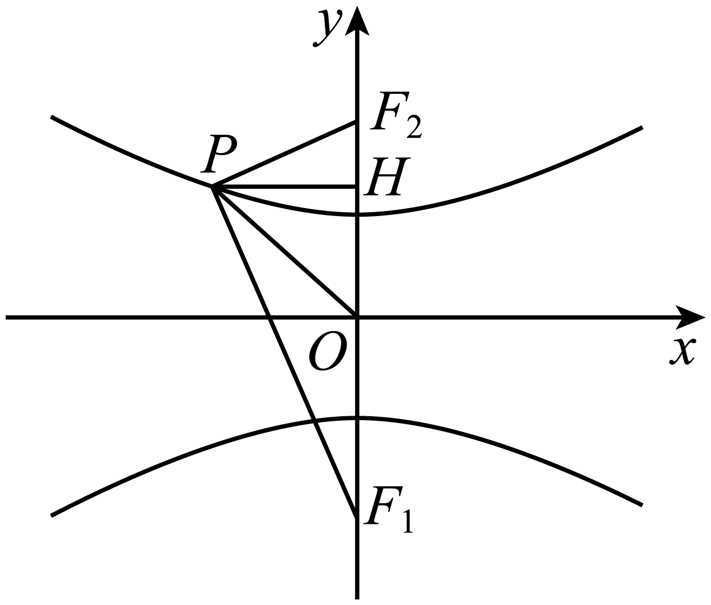

因为，所以，

因为，

所以，所以，

故，得.

因为，所以，故点，

将代入双曲线中，

即，化简得，

，

解得或（舍去），故*B*项正确.

故选：B.

**例8．**（2024·安徽六安·六安一中校考模拟预测）已知双曲线的左、右焦点分别为、，直线与双曲线交于，两点，若，则的面积等于（    ）

A．18	B．10	C．9	D．6

【答案】C

【解析】直线与双曲线交于，两点，若，

则四边形为矩形，所以，，

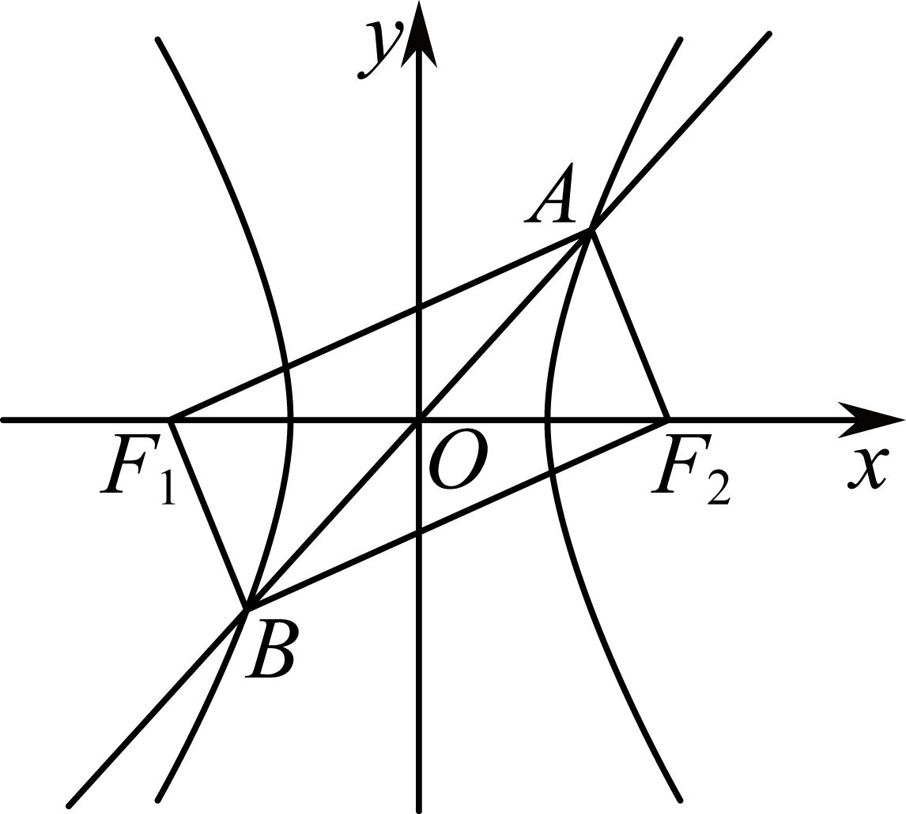

由双曲线可得，，则，

所以，所以，

又，

所以，解得，

所以．

故选：C．

**例9．**（2024·福建漳州·高三漳州三中校考阶段练习）已知双曲线的左右焦点分别为，过的直线分别交双曲线的左右两支于两点，且，则（    ）

A．	B．	C．	D．

【答案】C

【解析】由双曲线得出.

因为，所以.

作于*C，* 则*C*是*AB*的中点.

设，则由双曲线的定义，

可得.

故，

又由余弦定理得，

所以，解得.

故选：C

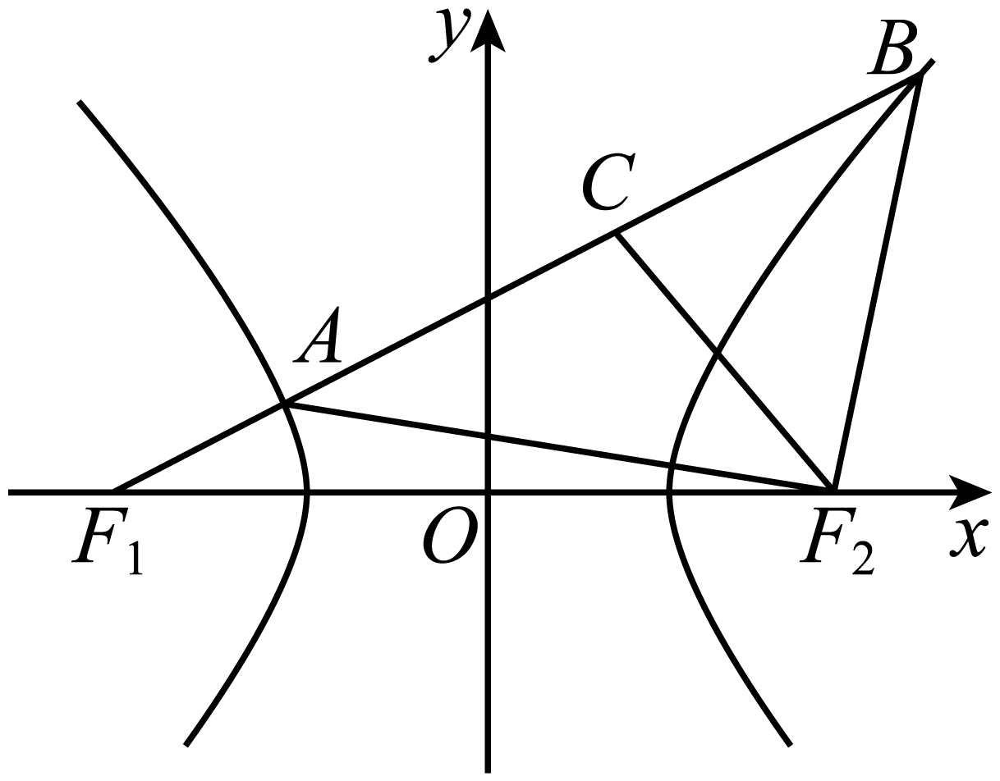

<strong>变式9．</strong>（2024·湖北恩施·校考模拟预测）已知，分别为双曲线<em>C</em>：的左右焦点，且到渐近线的距离为1，过的直线与<em>C</em>的左、右两支曲线分别交于两点，且，则下列说法正确的为（    ）

A．的面积为2	B．双曲线*C*的离心率为

C．	D．

【答案】D

【解析】设双曲线*C*的半焦距为，

因为双曲线*C*的焦点在*x*轴上，且，

则其中一条渐近线方程为，即，且，

则到渐近线的距离，可得.

对于选项A：因为，且，

可得，解得，

所以的面积为，故A错误；

对于选项B：双曲线*C*的离心率为，故B错误；

对于选项C：因为，可得，

所以，故C错误；

对于选项D：设，则，

因为，即，解得，

所以，故D正确；

故选：D.

**变式10．** 焦点三角形的作用

在焦点三角形中，可以将圆锥曲线的定义，三角形中边角关系，如正余弦定理、勾股定理结合起来．

<strong>变式11．</strong>（2024·全国·高三专题练习）双曲线的左､右焦点分别是､，过的弦<em>AB</em>与其右支交于<em>A</em>､<em>B</em>两点，，则的周长为（    ）

A．	B．	C．	D．

【答案】C

【解析】由题可得，

则的周长为.

故选：C．

<strong>变式12．</strong>（2024·云南保山·统考模拟预测）已知是离心率等于的双曲线的左右焦点，过焦点的直线<em>l</em>与双曲线<em>C</em>的右支相交于<em>A</em>，<em>B</em>两点，若的周长20，则等于（    ）

A．10	B．8	C．6	D．4

【答案】D

【解析】设双曲线的实半轴长、虚半轴长、半焦距分别为，则，．

因为离心率，则，所以，，

由双曲线的定义知，，，则，

所以的周长，，

故选：D．

**变式13．**（2024·全国·高三专题练习）设，分别是双曲线的左､右焦点，是该双曲线上的一点，且，则的面积等于（    ）

A．	B．	C．	D．

【答案】C

【解析】设，，则由双曲线的定义可得：，所以，故，，又，故，故，所以的面积为.

故选：C.

<strong>变式14．</strong>（2024·全国·高三专题练习）设双曲线的左、右焦点分别为，，点<em>P</em>在双曲线上，下列说法正确的是（    ）

A．若为直角三角形，则的周长是

B．若为直角三角形，则的面积是6

C．若为锐角三角形，则的取值范围是

D．若为钝角三角形，则的取值范围是

【答案】C

【解析】因为双曲线，所以，

不妨设点*P*在第一象限，则，

若为直角三角形，

当时，则，

又，即，

所以，

，

所以，

所以的周长是，的面积是；

当时，设，

代入方程解得（负值舍去），所以，

故，所以，

所以的周长是，的面积是6，

综上所述，若为直角三角形，

则的周长是或8，

的面积是3或6，

故A、B错误；

若为锐角三角形，根据上述，则的取值范围是，故C正确；

若为钝角三角形，根据上述，则的取值范围是，故D错误.

故选：C.

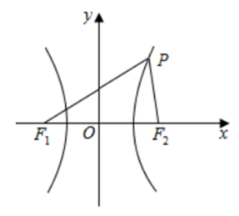

**变式15．**（2024·吉林四平·高三双辽市第一中学校联考期末）设双曲线的左、右焦点分别、，点为双曲线右支上一点，的内切圆圆心为，则的面积与的面积之差为（    ）

A．	B．	C．	D．

【答案】C

【解析】设内切圆的半径为，则，，

.

过点作于点，于点，于点，

则由的内切圆圆心为知：，，，，

，解得：，

.

故选：C.

<strong>变式16．</strong>（2024·全国·高三专题练习）已知双曲线的左右焦点分别为，若双曲线上一点<em>P</em>使得，求的面积（    ）

A．	B．	C．	D．

【答案】C

【解析】先根据双曲线方程得到，，，设，，可得，. 由，在根据余弦定理可得:，即可求得答案.，所以，，，

在双曲线上，设，，

①

由，在根据余弦定理可得:

故②

由①②可得，

直角的面积

故选：C.

**变式17．**（2024·上海浦东新·统考三模）设为双曲线（）的上一点，，（为左、右焦点），则的面积等于（    ）

A．	B．	C．	D．

【答案】C

【解析】双曲线，则

不妨设是双曲线的右支上一点，

则由双曲线的定义，得

则,

所以

所以，即

所以

所以

故选：C

**【解题方法总结】**

对于题中涉及双曲线上点到双曲线两焦点距离问题常用定义，即，在焦点三角形面积问题中若已知角，则用，及余弦定理等知识；若未知角，则用．

**题型四：双曲线上两点距离的最值问题**

**例10．**（2024·全国·高三专题练习）已知双曲线的左右焦点为，，点为双曲线上任意一点，则的最小值为（   ）

A．1	B．	C．2	D．3

【答案】A

【解析】根据双曲线的定义，设点在双曲线右支上，则，设，再根据二次函数的性质计算可得；由题意知，，，不妨设点在双曲线右支上，则，设，所以，所以当时，的值最小，最小为1，故选：A.

**例11．**（2024·全国·高三专题练习）已知是双曲线上一点，是左焦点，是右支上一点， 与的内切圆切于点，则的最小值为

A．	B．	C．	D．

【答案】B

【解析】与的内切圆切于点，∴,由双曲线定义= ,当且仅当A,B,共线时取等

故选B

<strong>例12．</strong>（2024·全国·高三专题练习）已知点，点在曲线上运动，点在曲线上运动，则的最小值是_____．

【答案】

【解析】如下图所示：

在双曲线中，，，，

圆的圆心为，半径长为，

所以，双曲线的左、右焦点分别为、，

由双曲线的定义可得，，

所以，，

当且仅当为射线与圆的交点，且时，等号成立，

故的最小值是.

故答案为：.

**变式18．**（2024·河北衡水·统考模拟预测）已知双曲线，其右焦点为，为其上一点，点满足=1，，则的最小值为(    )

A．3	B．	C．2	D．

【答案】B

【解析】双曲线的右焦点*F*（5，0）

∵*M*满足| *MF* |=1，∴点*M*在以*F*为圆心，1为半径的圆上

∵ ，即圆的半径，即| *MP* |为圆*F*的切线长

由圆的几何性质，要使| *MP* |最小，只需圆心*F*到*P*的距离|*FP*|最小

∵*P*是双曲线上一点

∴|*FP*|最小为*c-a*=5-3=2，此时| *MP* |=

故选：B．

<strong>变式19．</strong>（2024·高二课时练习）已知直线<em>l</em>与双曲线交于<em>A</em>，<em>B</em>两点，且（为坐标原点），若<em>M</em>是直线上的一个动点，则的最小值为（    ）

A．12	B．6	C．16	D．8

【答案】D

【解析】由，可知*A*，*B*，*O*三点共线，即直线*l*过原点*O*，

根据双曲线对称性知*O*为*AB*中点，即，

可得，

当和同时取最小值时，取最小值，

又由的最小值为原点*O*到直线距离，

且，即的最小值是．

故选：D.

<strong>变式20．</strong>（2024·广东韶关·高二统考期末）已知点，是双曲线的左、右焦点，点<em>P</em>是双曲线<em>C</em>右支上一点，过点向的角平分线作垂线，垂足为点<em>Q</em>，则点和点<em>Q</em>距离的最大值为（    ）

A．2	B．	C．3	D．4

【答案】C

【解析】如图所示，延长，交于点*T*，则因为平分，，所以，，

因为*P*在双曲线上，所以，所以，

连接，则，

因为，

所以，当三点共线时取等号，

即点和点*Q*距离的最大值为3，

故选：C

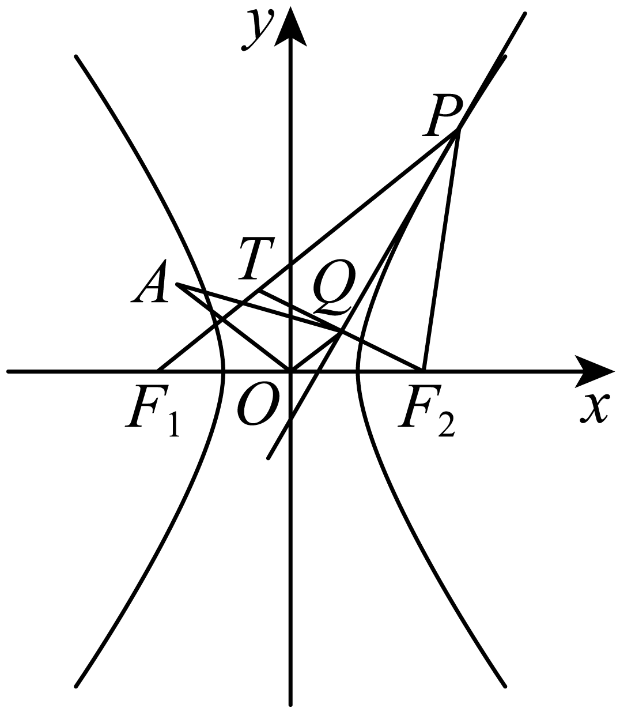

**【解题方法总结】**

利用几何意义进行转化．

**题型五：双曲线上两线段的和差最值问题**

**例13．**（2024·江苏徐州·高二统考期中）已知等轴双曲线的焦距为8，左、右焦点在轴上，中心在坐标原点，点的坐标为，为双曲线右支上一动点，则的最大值为（    ）

A．	B．	C．	D．

【答案】B

【解析】因为等轴双曲线的左、右焦点在轴上，中心在坐标原点，

所以可设双曲线的方程为，

又因为双曲线的焦距为8，所以，

而，所以，故双曲线的标准方程为.

由双曲线的定义可知，，

由题意可知，，，，

所以,故的最大值为，

当且仅当三点共线且点位于第一象限时取得最大值.

故选：B

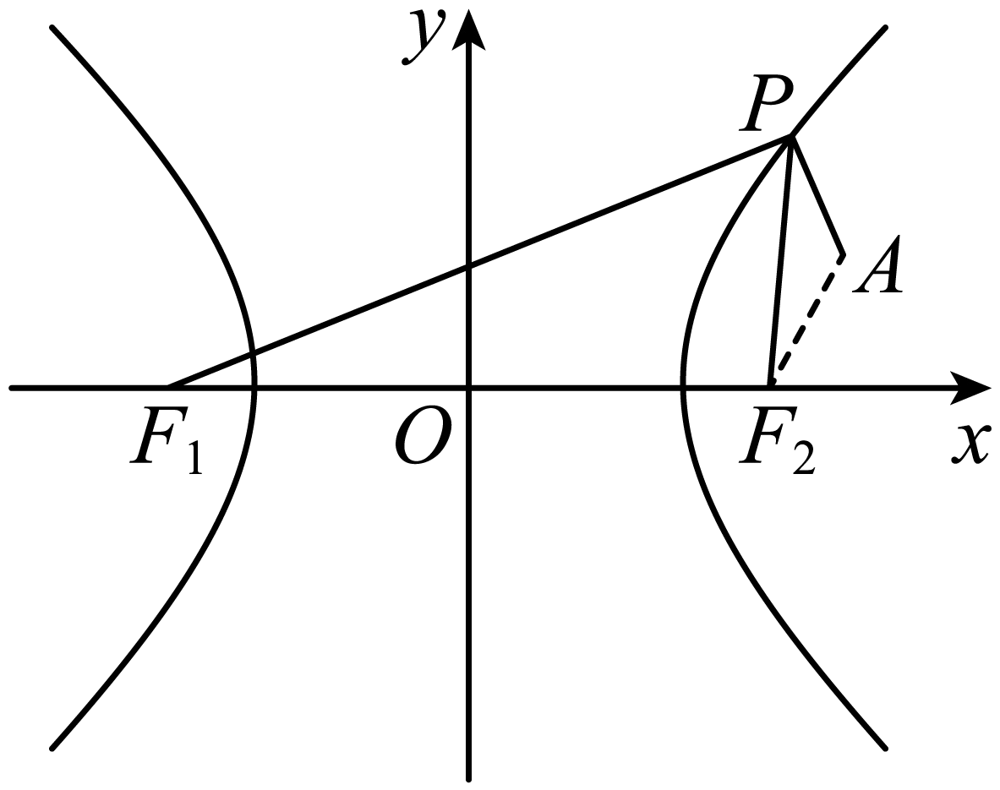

<strong>例14．</strong>（2024·全国·高二专题练习）已知双曲线，其一条渐近线方程为，右顶点为<em>A</em>，左，右焦点分别为，，点<em>P</em>在其右支上，点，三角形的面积为，则当取得最大值时点<em>P</em>的坐标为（    ）

A．	B．

C．	D．

【答案】B

【解析】设，则由三角形的面积为可得，即，又双曲线一条渐近线方程为，故，即，故，故，解得，故，双曲线.

又由双曲线的定义可得，当且仅当共线且在中间时取得等号.

此时直线的方程为，即，联立可得，解得，由题意可得在中间可得，代入可得，故.

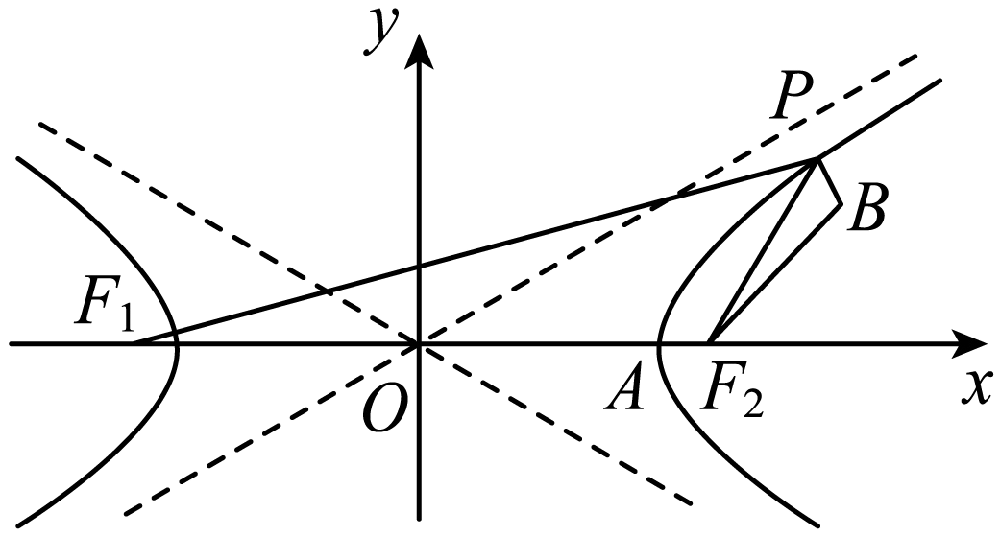

故选：B

<strong>例15．</strong>（2024·全国·高二专题练习）已知<em>F</em>是双曲线<em>C</em>：的右焦点，<em>P</em>是<em>C</em>的左支上一点，，则的最小值为（    ）

A．5	B．6	C．7	D．8

【答案】B

【解析】由双曲线方程可知，，，故右焦点，左焦点，

当点在双曲线左支上运动时，由双曲线定义知，所以，

从而，又为定值，

所以，此时点在线段与双曲线的交点处（三点共线距离最短），

故选：B.

**变式21．**（2024·宁夏银川·校联考二模）已知拋物线上一点到准线的距离为是双曲线的左焦点，是双曲线右支上的一动点，则的最小值为（    ）

A．12	B．11	C．10	D．9

【答案】D

【解析】拋物线的准线为，

则点到准线的距离为，所以，

则，故，

设是双曲线的右焦点，

则，则，

故，

当且仅当三点共线时取等号，

所以的最小值为.

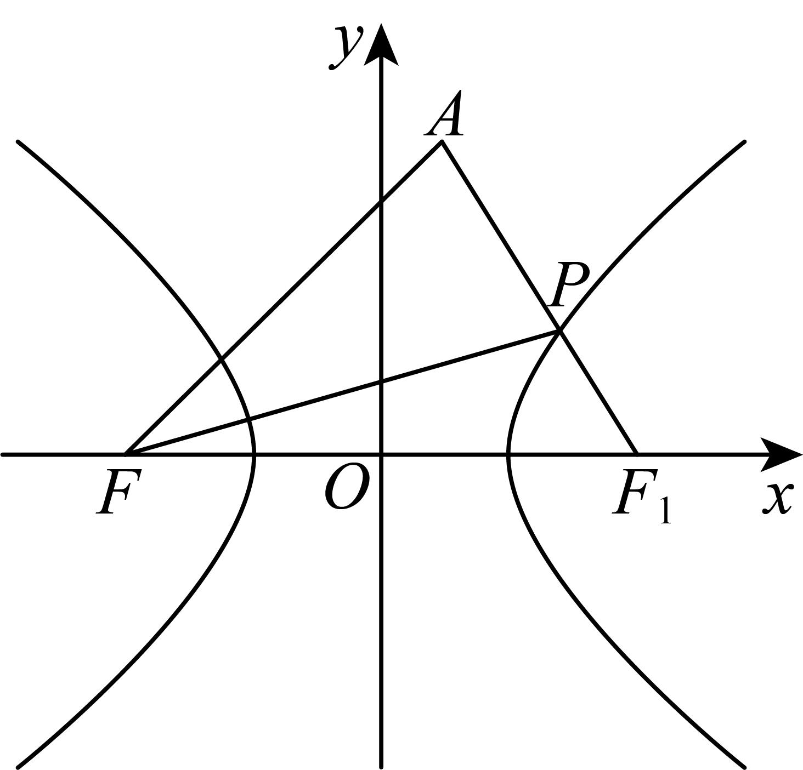

故选：D.

**变式22．**（2024·全国·高二专题练习）已知点，双曲线的左焦点为，点在双曲线的右支上运动.当的周长最小时，（    ）

A．	B．	C．	D．

【答案】C

【解析】由双曲线得到,,，左焦点，

设右焦点.当的周长最小时，取到最小值，所以只需求出的最小值即可.

===.

故选：C.

<strong>变式23．</strong>（2024·福建宁德·高三统考阶段练习）已知双曲线，点<em>F</em>是<em>C</em>的右焦点，若点<em>P</em>为<em>C</em>左支上的动点，设点<em>P</em>到<em>C</em>的一条渐近线的距离为<em>d</em>，则的最小值为（    ）

A．	B．	C．8	D．10

【答案】A

【解析】由双曲线,可得，,

设双曲线左焦点为，不妨设一条渐近线为，即，

作，垂足为*E*，即，

作,垂足为*H*，则，

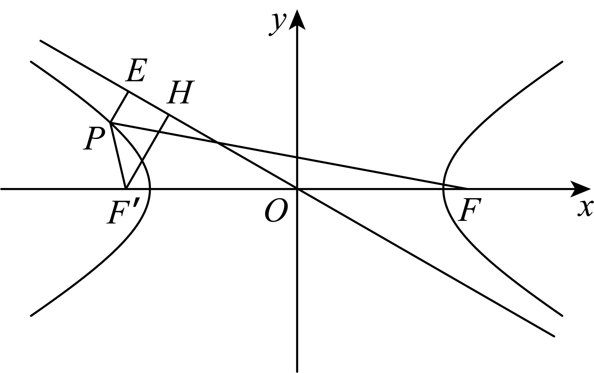

因为点*P*为*C*左支上的动点，

所以，可得，

故，

由图可知，当三点共线时，即*E*和*H*点重合时，取得最小值，

最小值为，

即的最小值为，

故选：A．

<strong>变式24．</strong>（2024·全国·高二专题练习）设，为双曲线<em>C</em>：的左、右焦点，<em>Q</em>为双曲线右支上一点，点<em>P</em>（0，2）．当取最小值时，的值为（    ）

A．	B．	C．	D．

【答案】A

【解析】由双曲线定义得,

故

如图示，当三点共线，即*Q*在*M*位置时，取最小值，

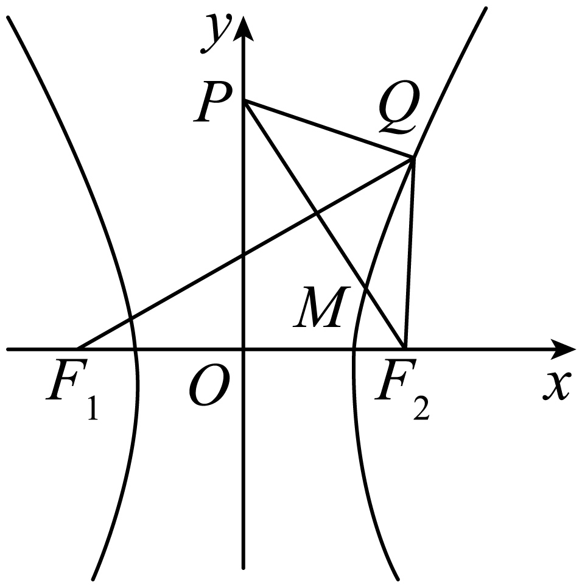

，故方程为，

联立，解得点*Q*的坐标为 (*Q*为第一象限上的一点)，

故

故选：A

<strong>变式25．</strong>（2024·全国·高二专题练习）设<em>P</em>是双曲线上一点，<em>M</em>､<em>N</em>分别是两圆和上的点，则的最大值为（    ）

A．6	B．9	C．12	D．14

【答案】B

【解析】因为双曲线方程为，故，则其焦点为，

根据题意，作图如下：

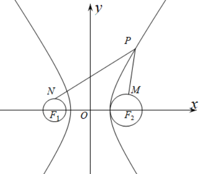

则，当且仅当三点共线，且在之间时取得等号；

，当且仅当三点共线，且在之间时取得等号；

则，

故可得，

故的最大值为：.

故选：B.

<strong>变式26．</strong>（2024·全国·高三校联考阶段练习）已知点是右焦点为的双曲线上一点，点是圆上一点，则的最小值是______.

【答案】

【解析】设双曲线的左焦点为，则，

设圆的圆心为，则，半径.

因为双曲线表示双曲线的右支（除去顶点），

由定义可知：，

所以

（当且仅当三点共线时等号成立），

因为，

所以的最小值为，

故答案为：.

**变式27．**（2024·全国·高二专题练习）已知双曲线的左焦点为，点是双曲线右支上的一点，点是圆上的一点，则的最小值为（    ）

A．5	B．	C．7	D．8

【答案】C

【解析】记双曲线的右焦点为，所以，

当且仅当点为线段与双曲线的交点时，取到最小值．

故选：C．

<strong>变式28．</strong>（2024·全国·高一专题练习）已知双曲线是其左右焦点.圆，点<em>P</em>为双曲线<em>C</em>右支上的动点，点<em>Q</em>为圆<em>E</em>上的动点，则的最小值是（    ）

A．	B．	C．7	D．8

【答案】A

【解析】

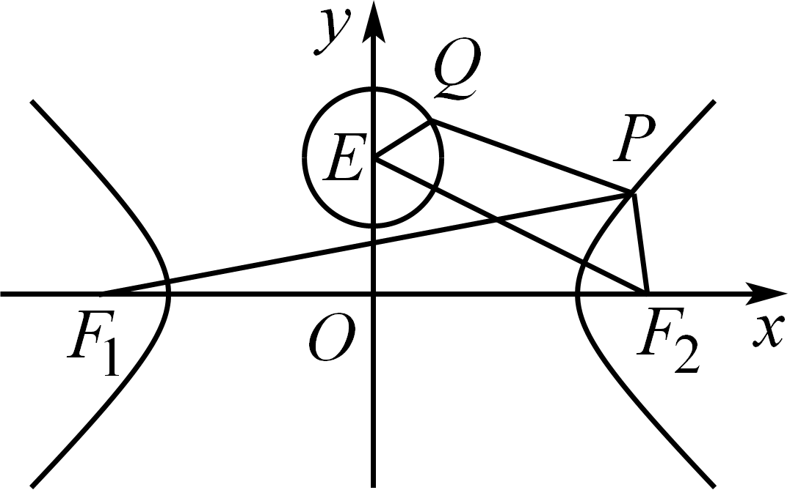

由题设知，，，，圆的半径

由点为双曲线右支上的动点知

，∴

∴.

故选：A

**变式29．**（2024·四川眉山·高二四川省眉山第一中学校考期中）已知是双曲线的右焦点，动点在双曲线左支上，点为圆上一点，则的最小值为（    ）

A．	B．	C．	D．

【答案】A

【解析】

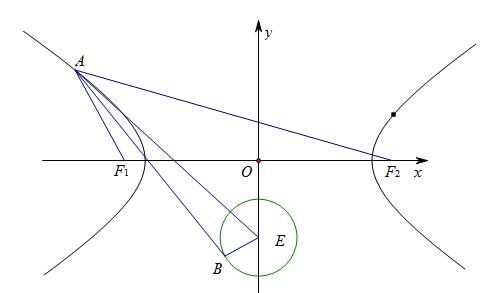

双曲线中，，，，圆半径为，，

∴，（当且仅当共线且在间时取等号．

∴，当且仅当是线段与双曲线的交点时取等号．

∴的最小值是9．

故选：A．

**变式30．**（2024·陕西咸阳·武功县普集高级中学统考模拟预测）过双曲线的右支上一点，分别向圆：和圆：作切线，切点分别为，，则的最小值为

A．	B．	C．	D．

【答案】D

【解析】圆<em>C1</em>：（<em>x</em>+4）2+<em>y2</em>＝4的圆心为（﹣4，0），半径为<em>r1</em>＝2；

圆<em>C2</em>：（<em>x</em>﹣4）2+<em>y2</em>＝1的圆心为（4，0），半径为<em>r2</em>＝1，

设双曲线<em>x2</em>1的左右焦点为<em>F1</em>（﹣4，0），<em>F2</em>（4，0），

连接<em>PF1</em>，<em>PF2</em>，<em>F1M</em>，<em>F2N</em>，可得

|<em>PM</em>|2﹣|<em>PN</em>|2＝（|<em>PF1</em>|2﹣<em>r12</em>）﹣（|<em>PF2</em>|2﹣<em>r22</em>）

＝（|<em>PF1</em>|2﹣4）﹣（|<em>PF2</em>|2﹣1）

＝|<em>PF1</em>|2﹣|<em>PF2</em>|2﹣3＝（|<em>PF1</em>|﹣|<em>PF2</em>|）（|<em>PF1</em>|+|<em>PF2</em>|）﹣3

＝2<em>a</em>（|<em>PF1</em>|+|<em>PF2</em>|﹣3＝2（|<em>PF1</em>|+|<em>PF2</em>|）﹣3≥2•2<em>c</em>﹣3＝2•8﹣3＝13．

当且仅当*P*为右顶点时，取得等号，

即最小值13．

故选*D*．

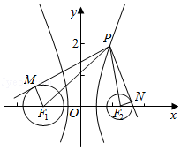

**【解题方法总结】**

在解析几何中，我们会遇到最值问题，这种问题，往往是考察我们定义．求解最值问题的过程中，如果发现动点在圆锥曲线上，要思考并用上圆锥曲线的定义，往往问题能迎刃而解．

**题型六：离心率的值及取值范围**

**方向1：利用双曲线定义去转换**

<strong>例16．</strong>（2024·内蒙古赤峰·高三统考开学考试）已知，分别为双曲线<em>Ε</em>：的左、右焦点，过原点<em>O</em>的直线<em>l</em>与<em>E</em>交于<em>A</em>，<em>B</em>两点（点<em>A</em>在第一象限），延长交<em>E</em>于点<em>C</em>，若，，则双曲线<em>E</em>的离心率为（    ）

A．	B．2	C．	D．

【答案】A

【解析】结合双曲线的对称性可知，，，

所以为等边三角形，则，则.

由双曲线的定义，得，所以，，

则.

故选：A

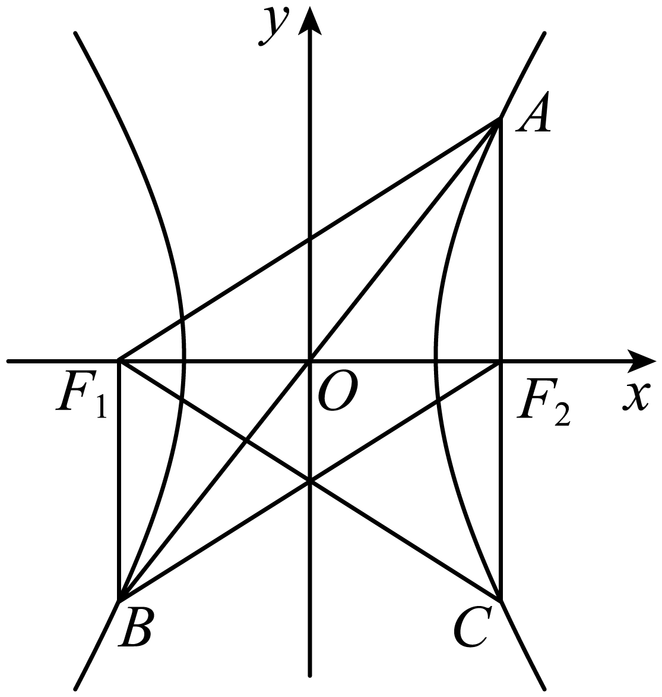

**例17．**（2024·陕西西安·高三校联考开学考试）已知，分别为双曲线的左、右焦点，过原点的直线与交于，两点（点在第一象限），延长交于点，若，，则双曲线的离心率为（    ）

A．	B．2	C．	D．1

【答案】A

【解析】结合双曲线的对称性可知，，，

所以为等边三角形，则，则.

由双曲线的定义，得，所以，，

则.

故选：A

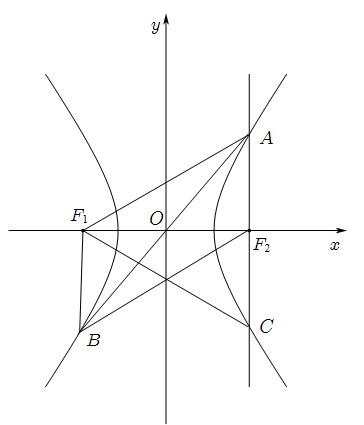

**例18．**（2024·江西南昌·南昌市八一中学校考三模）已知双曲线的左、右焦点分别为，，若在上存在点不是顶点，使得，则的离心率的取值范围为（    ）

A．	B．

C．	D．

【答案】A

【解析】设与*y*轴交于*Q*点，连接，则，

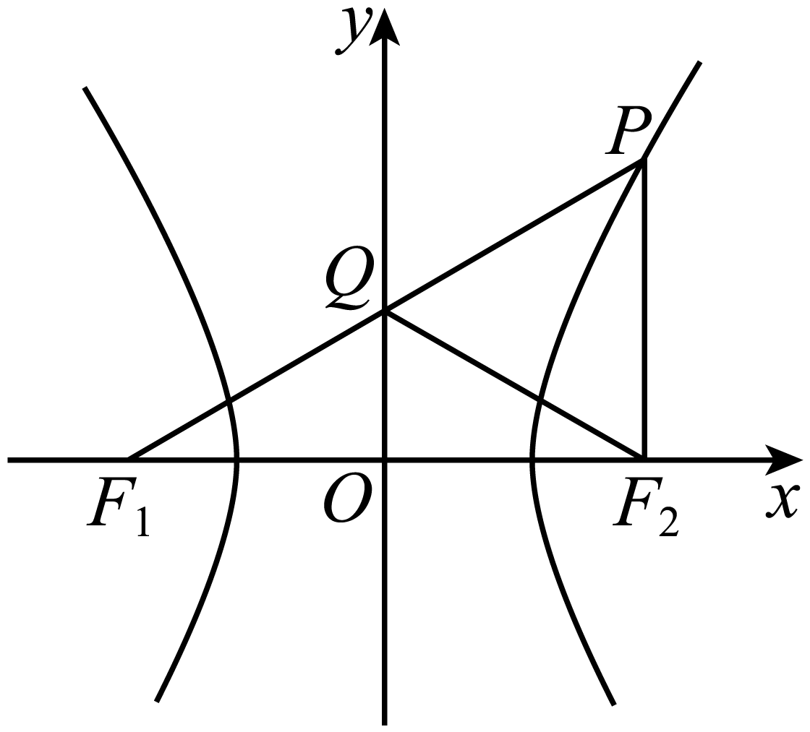

因为，故*P*点在双曲线右支上，且，

故，而，

故，

在中，，即，

故，

由，且三角形内角和为，

故，则，

即，即，

所以的离心率的取值范围为，

故选：A

**变式31．**（2024·陕西西安·西安市大明宫中学校考模拟预测）已知双曲线的左、右焦点分别为为坐标原点，过原点的直线与相交于两点，，四边形的面积等于，则的离心率等于（    ）

A．	B．	C．2	D．

【答案】A

【解析】如图，不妨设点*A*在第一象限，

由题意可得：，则四边形为平行四边形，

因为，即，则，所以四边形为矩形，

设，则，

因为，即，整理得.

故选：A.

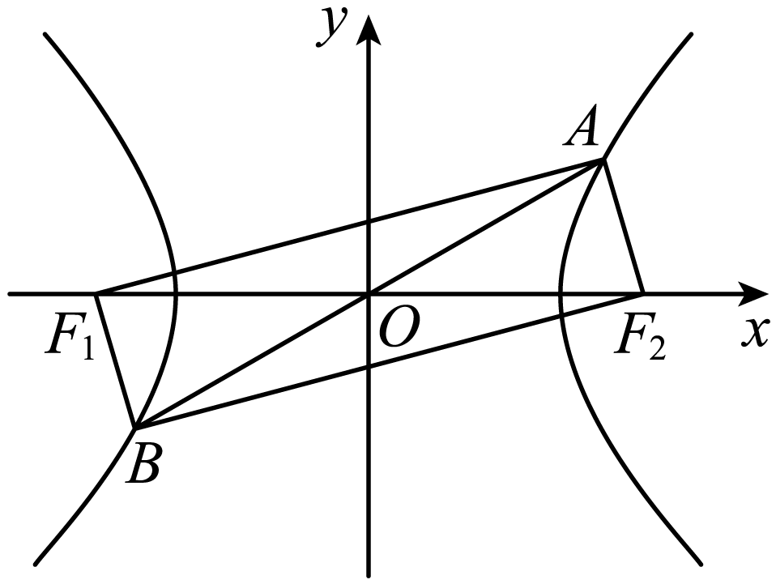

**变式32．**（2024·重庆渝中·高三重庆巴蜀中学校考阶段练习）如图，已知双曲线的左､右焦点分别是，，点在上且位于第一象限，圆与线段的延长线，线段以及轴均相切，的内切圆为圆.若圆与圆外切，且圆与圆的面积之比为，则的离心率为（    ）

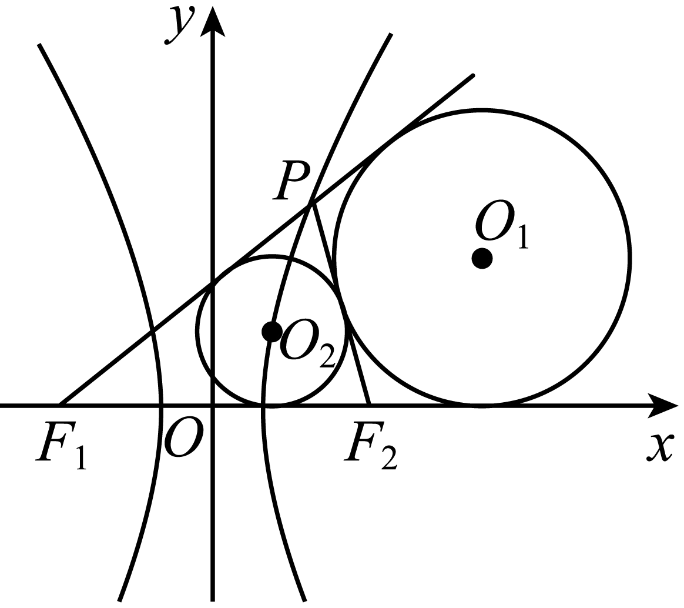

A．	B．	C．2	D．3

【答案】D

【解析】由已知及平面几何知识可得圆心，在的角平分线上，如图，

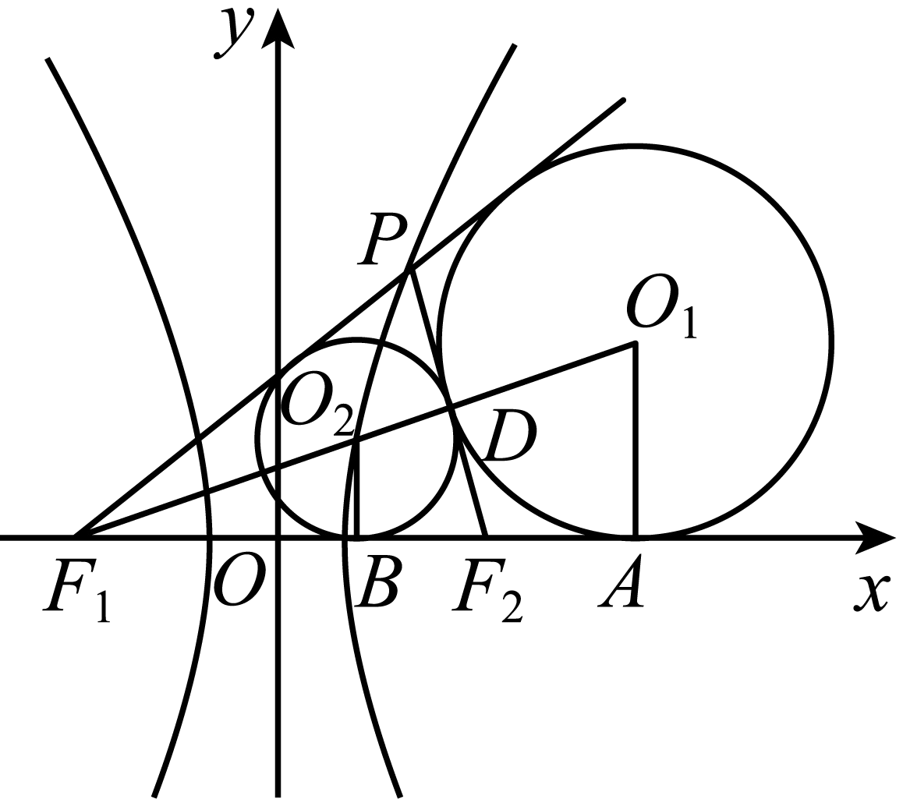

设圆，与轴的切点分别为，，显然，直线为两圆的公切线，切点也在的角平分线上，

所以，由双曲线的定义知，则，

所以，所以，

所以，.

又圆与圆的面积之比为，这样圆与圆的半径之比为，

因为，所以，即，整理得，

故双曲线的离心率.

故选：D.

**方向2：建立关于和的一次或二次方程与不等式**

**变式33．**（2024·四川成都·四川省成都列五中学校考三模）已知双曲线的左､右焦点分别为，过点的直线与双曲线在第二象限的交点为，若，则双曲线的离心率是（    ）

A．	B．	C．	D．

【答案】A

【解析】因为，

所以，即，

所以，

由双曲线的定义知，所以.

如图，过作，为垂足，

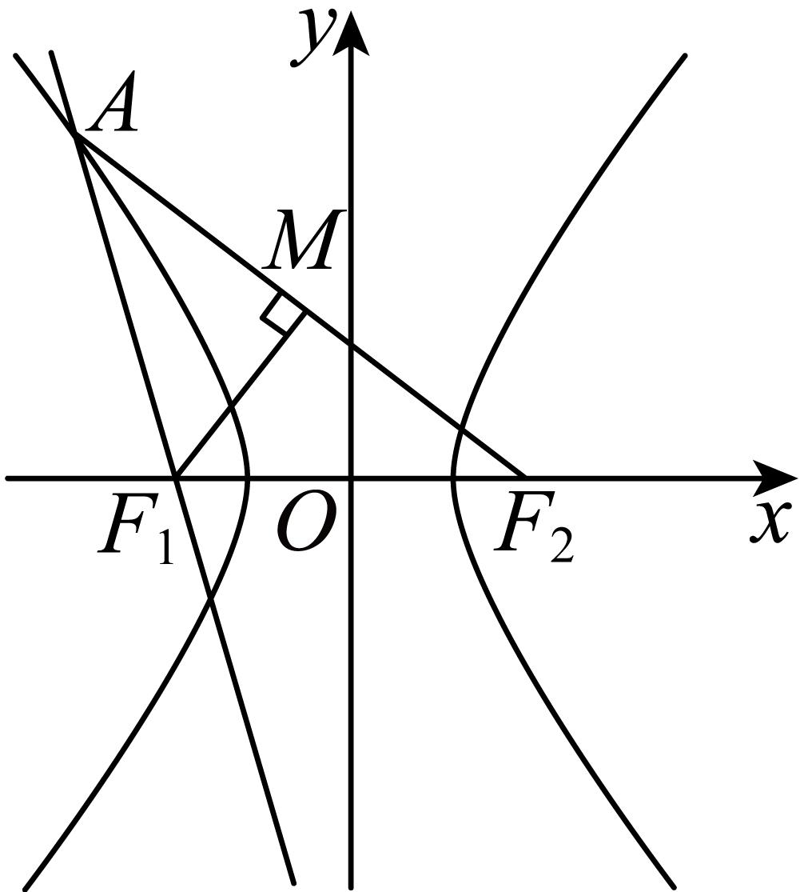

因为，所以为的中点，，

由得，即，

所以，在直角中，,

即，即，

所以，解得，

因为，所以双曲线的离心率是.

故选：A

**变式34．**（2024·湖南·校联考模拟预测）如图，是双曲线的左、右焦点，过的直线交双曲线的左、右两支于两点，且，则双曲线的离心率为（    ）

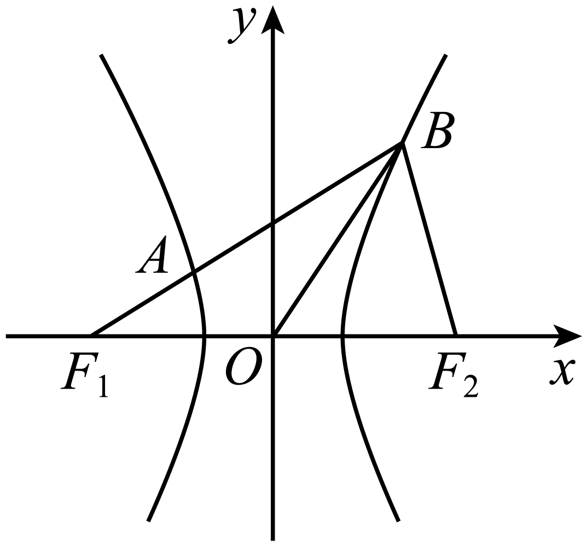

A．	B．	C．	D．

【答案】B

【解析】注意到，则，连接．

设，则，

在中，由勾股定理有，解得，

∴，

在中，由，得，

解得．

故选B．

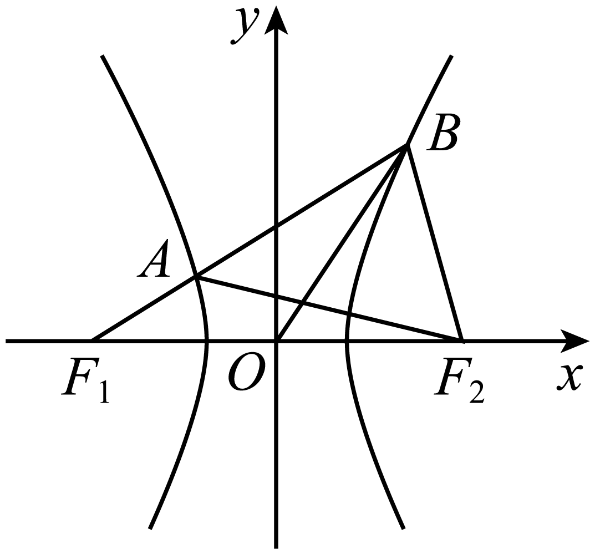

**变式35．**（2024·贵州毕节·校考模拟预测）已知是双曲线的一个焦点，为的虚轴的一个端点，（为坐标原点），直线垂直于的一条渐近线，则的离心率为（    ）

A．	B．	C．	D．

【答案】A

【解析】不妨设为右焦点，为的虚轴的端点且在轴的正半径轴上，则，则，

因为，所以，即，

所以直线的斜率为，

因为双曲线渐近线方程为，

因为直线垂直于的一条渐近线，所以，

所以，所以，

所以，解得，

因为，所以，

故选：A

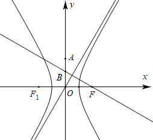

**变式36．**（2024·陕西商洛·镇安中学校考模拟预测）已知双曲线的左焦点为，右顶点为，一条渐近线与圆在第一象限交于点，交轴于点，且，则的离心率为（    ）

A．	B．2

C．	D．

【答案】C

【解析】如图所示，连接，由双曲线的渐近线方程为，

根据题意，点在第一象限，将代入，

可得，

可得

由求根公式，可得，

因为，且，所以，所以点

由，可得，即，

因为，所以，即，化简得，

两边同除以，得，解得或（舍去）．

故选：C.

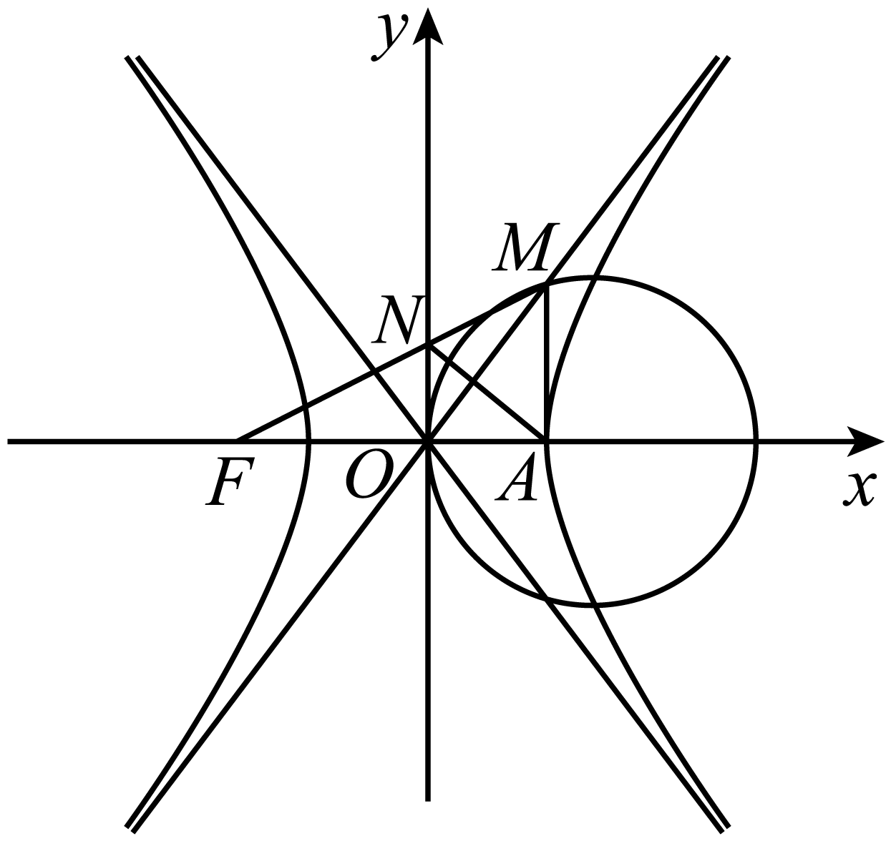

**变式37．**（2024·福建福州·福州四中校考模拟预测）已知双曲线为左焦点，分别为左､左顶点，为右支上的点，且（为坐标原点）.若直线与以线段为直径的圆相交，则的离心率的取值范围为（    ）

A．	B．	C．	D．

【答案】D

【解析】设双曲线的右焦点为，则，

则，

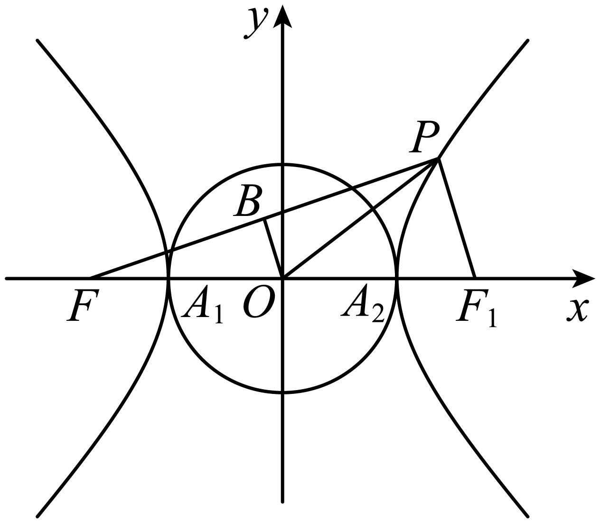

为右支上的点，取的中点为*B*，连接，则，

设，则，则，

在中，，

即，

又直线与以线段为直径的圆相交，故，

设，则，

则需使，解得，

即双曲线离心率的范围为，

即的离心率的取值范围为，

故选：D

**变式38．**（2024·河南信阳·信阳高中校考模拟预测）已知双曲线的上下焦点分别为，点在的下支上，过点作的一条渐近线的垂线，垂足为，若恒成立，则的离心率的取值范围为（    ）

A．	B．	C．	D．

【答案】A

【解析】如图，过点作渐近线的垂线，垂足为，

设，则点到渐近线的距离.

由双曲线的定义可得，故，

所以，即的最小值为，

因为恒成立，

所以恒成立，即恒成立，

所以，，即，即，

所以，，即，解得.

故选：A.

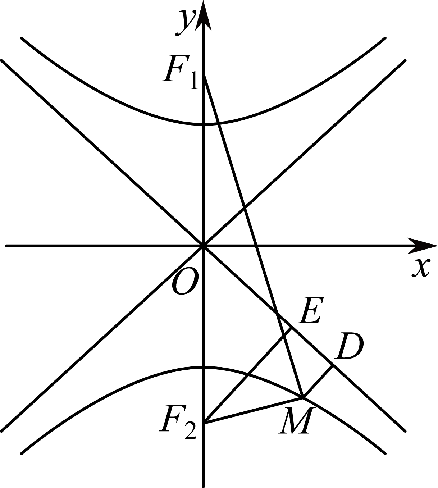

**方向3：利用，其中为焦距长，**

**变式39．**（2024·海南省直辖县级单位·统考模拟预测）已知分别是双曲线的左､右焦点，斜率为的直线过，交的右支于点，交轴于点，且，则的离心率为（    ）

A．	B．	C．	D．

【答案】A

【解析】如图，由题可知，

又因为，所以，

因为直线的斜率为，所以，

设为的中点，连接，易知，

所以，则，解得，

所以双曲线的离心率为．

故选：A.

**变式40．**（2024·四川巴中·高三统考开学考试）已知双曲线的左、右焦点分别为，过斜率为的直线与的右支交于点，若线段恰被轴平分，则的离心率为（    ）

A．	B．	C．2	D．3

【答案】C

【解析】如图，设交*y*轴与*A*，*A*为的中点，

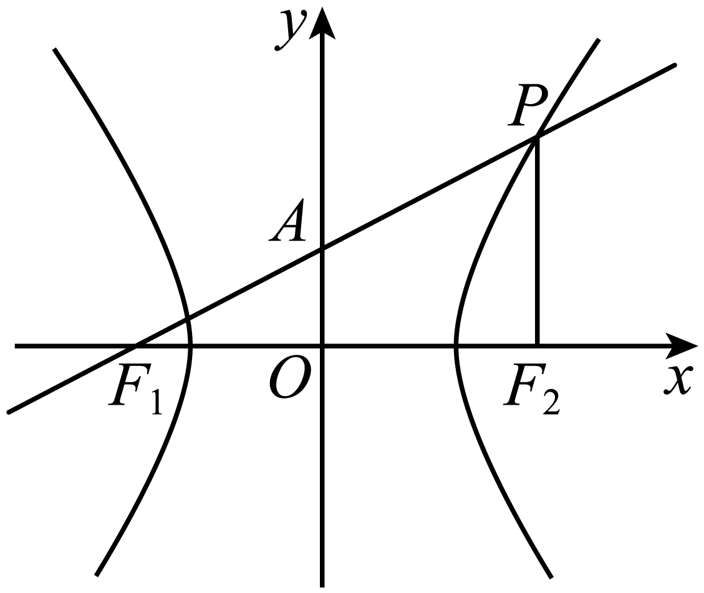

因为*O*为的中点，故为的中位线，

则，而，则,

因为直线的斜率为，故中，，

故设，则，

结合双曲线定义以及*P*在双曲线右支上，即有，

则，

故选：C

**变式41．**（2024·浙江·校联考模拟预测）已知点是双曲线右支上一点，分别是的左、右焦点，若的角平分线与直线交于点，且，则的离心率为（    ）

A．2	B．	C．3	D．

【答案】B

【解析】作的平分线交的平分线于，过作轴，垂足分别为，如图，

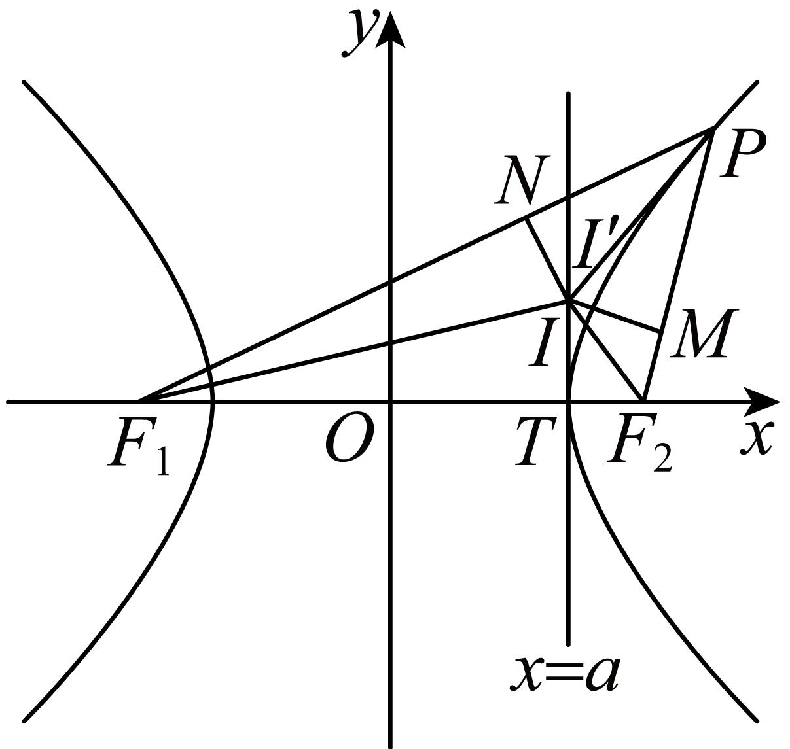

则点为的内心，有，设，

，则，

于是直线与直线重合，而的角平分线与直线交于点，即与重合，则点为的内心，

因此令，由，得，

因此，即有，即，

所以双曲线的离心率为.

故选：B

<strong>变式42．</strong>（2024·北京·首都师范大学附属中学校考模拟预测）已知，分别是双曲线<em>C</em>：（，）的两个焦点，<em>P</em>为双曲线<em>C</em>上一点，且，那么双曲线<em>C</em>的离心率为（    ）

A．	B．	C．2	D．

【答案】D

【解析】设双曲线的半焦距为，则，

由题意可得：，

因为，整理得.

故选：D.

**方向4：坐标法**

**变式43．**（2024·上海嘉定·校考三模）已知双曲线的离心率为，点的坐标为，若上的任意一点都满足，则（    ）

A．	B．

C．	D．

【答案】C

【解析】设，因为，所以，

则，

所以当时取得最小值为，

依题意恒成立，所以，

即，化简整理得，，

即，又，所以，解得.

故选：C

<strong>变式44．</strong>（2024·江西·江西师大附中校考三模）已知是双曲线<em>C</em>：的左焦点，，直线与双曲线有且只有一个公共点，则双曲线的离心率为（    ）

A．	B．	C．2	D．

【答案】B

【解析】双曲线的渐近线为，

又，，所以直线的斜率为，

因为直线与双曲线有且只有一个公共点，所以根据双曲线的几何性质，

直线与双曲线的一条渐进线平行，所以，即，

所以，又，所以，

所以，解得或（舍去），所以，

故选：B

**变式45．**（2024·福建福州·福建省福州第一中学校考二模）圆（为原点）是半径为的圆分别与轴负半轴､双曲线的一条渐近线交于两点（在第一象限），若的另一条渐近线与直线垂直，则的离心率为（    ）

A．3	B．2	C．	D．

【答案】B

【解析】如图所示，由双曲线的渐近线方程为，

联立方程组，解得，

因为且另一条渐近线与直线垂直，可得，

整理得，又由，所以，

解得，所以离心率为.

故选:B.

<strong>变式46．</strong>（2024·宁夏吴忠·高三吴忠中学校考开学考试）已知<em>A</em>，<em>B</em>分别是双曲线的左、右顶点，<em>F</em>是<em>C</em>的焦点，点<em>P</em>为<em>C</em>的右支上位于第一象限的点，且轴.若直线<em>PB</em>与直线<em>PA</em>的斜率之比为3，则<em>C</em>的离心率为（    ）

A．	B．	C．2	D．3

【答案】C

【解析】由题意可得，，，

点的横坐标为，代入，又，所以，

，，

则，可得．

即双曲线的离心率为2．

故选：C．

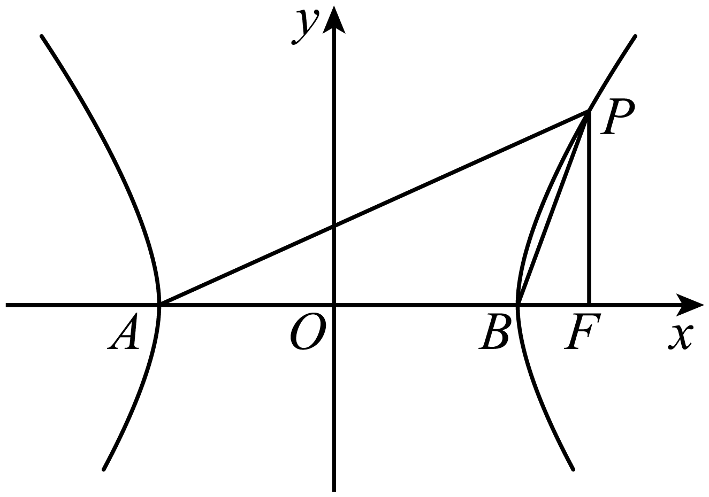

**变式47．**（2024·江西南昌·高三南昌市八一中学校考阶段练习）如图，已知双曲线的右焦点为，点分别在的两条渐近线上，且在第一象限，为坐标原点，若，，则双曲线的离心率为（    ）

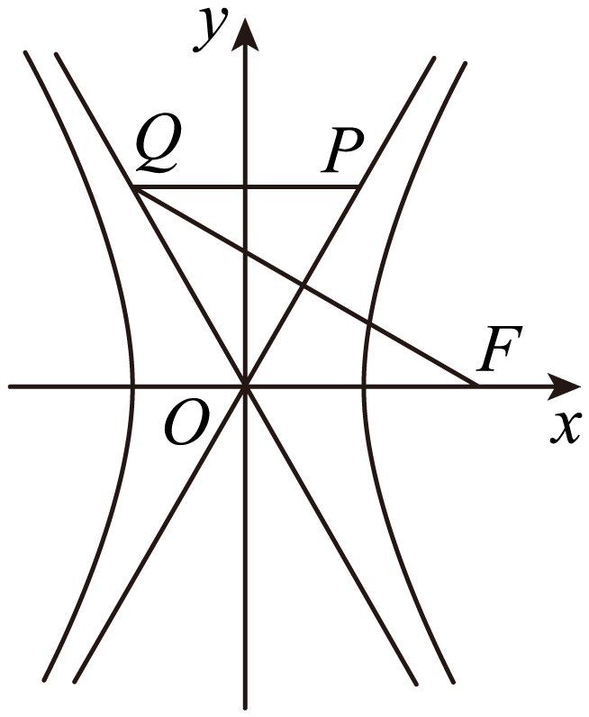

A．	B．

C．	D．

【答案】D

【解析】由双曲线方程知：渐近线方程为，

，，，

设，则，，即，

，，又，，，

，，，

双曲线的离心率.

故选：D.

<strong>变式48．</strong>（2024·浙江温州·乐清市知临中学校考模拟预测）设过原点且倾斜角为的直线与双曲线<em>C</em>：的左，右支分别交于<em>A</em>、<em>B</em>两点，<em>F</em>是<em>C</em>的焦点，若三角形的面积大于，则<em>C</em>的离心率的取值范围是（    ）

A．	B．	C．	D．

【答案】D

【解析】不妨设是双曲线的左焦点，由题可知，直线的方程为，

由，得，且，

所以，，

因为，且大于，

所以，

所以，解得，

又因为，解得，

所以，

故选：D．

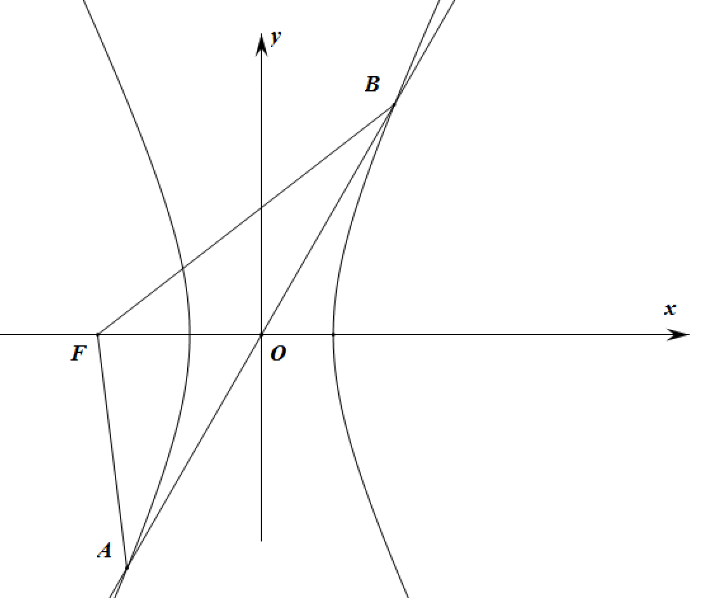

**方向5：找几何关系，利用余弦定理**

<strong>变式49．</strong>（2024·河南郑州·三模）已知，分别是双曲线：的左、右焦点，过的直线分别交双曲线左、右两支于<em>A</em>，<em>B</em>两点，点<em>C</em>在<em>x</em>轴上，，平分，则双曲线的离心率为（    ）

A．	B．	C．	D．

【答案】A

【解析】

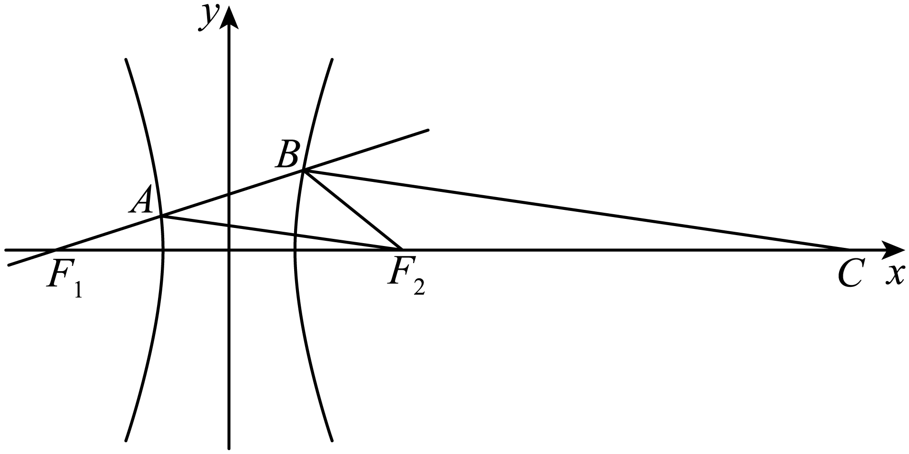

因为，则，所以∽，

设，则，设，则，．

因为平分，由角平分线定理可知，，

所以，所以，

由双曲线定义知，即，，①

又由得，

在中，由余弦定理知，

在中，由余弦定理知，

即，化简得，

把①代入上式得，解得．

故选：A．

<strong>变式50．</strong>（2024·陕西安康·陕西省安康中学校考模拟预测）已知双曲线<em>C</em>：（，）的左、右焦点分别为，，过的直线<em>l</em>与<em>C</em>的左、右两支分别交于<em>A</em>，<em>B</em>两点，若，的周长为8<em>a</em>，则<em>C</em>的离心率为（    ）

A．	B．

C．	D．

【答案】C

【解析】设，则.因.

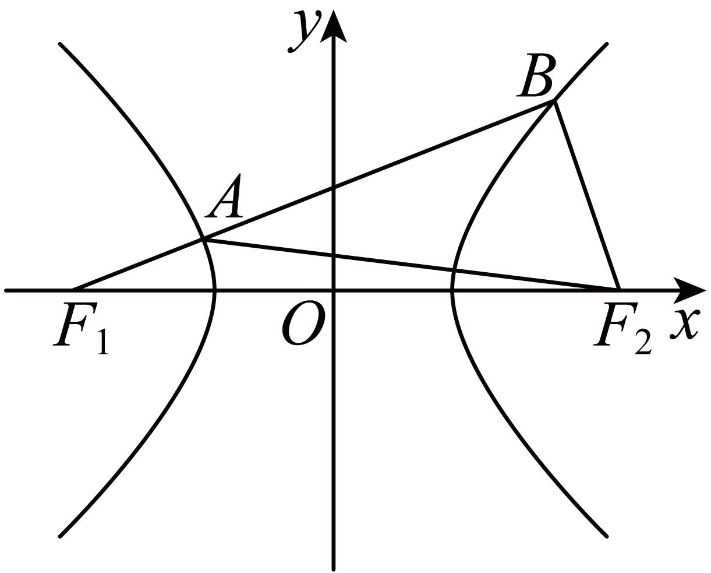

则.因的周长为8*a*，，

则.

则.由余弦定理：.

则在中，由余弦定理，

.

故选：C

<strong>变式51．</strong>（2024·江西南昌·校联考模拟预测）已知分别为双曲线<em>E</em>： 的左、右焦点，过的直线与的左、右两支分别交于两点．若是等边三角形，则双曲线<em>E</em>的离心率为（    ）

A．	B．3	C．	D．

【答案】C

【解析】由双曲线的定义，得，，

又，所以，

在中，

即 *，* 所以  ，即，

所以

故选：C*．*

<strong>变式52．</strong>（2024·江苏·校联考模拟预测）已知圆<em>O</em>：与双曲线<em>C</em>：的右支交于点<em>A</em>，<em>B</em>，若，则<em>C</em>的离心率为（    ）

A．2	B．	C．	D．

【答案】B

【解析】由，解得，

因为点*A*，*B*关于*x*轴对称，

所以，

在中，

由余弦定理得，

即，即，

解得，所以或（舍去），

故选：B

**变式53．**（2024·贵州·校联考模拟预测）已知双曲线的左､右焦点分别为，过的直线与双曲线的右支交于点为坐标原点，过点作，垂足为，若，则双曲线的离心率是（    ）

A．	B．	C．	D．

【答案】C

【解析】如图所示，直线的斜率为，可得其倾斜角为，

由题意得，则，

因为，所以，所以，则，

在中，由余弦定理可得，

即，

整理得，即，

又因为，解得.

故选：C.

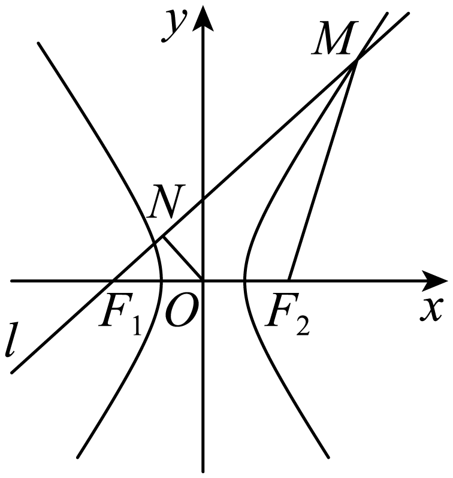

<strong>变式54．</strong>（2024·重庆·统考模拟预测）已知，分别为双曲线<em>C</em>：的左、右焦点，点为双曲线<em>C</em>在第一象限的右支上一点，以<em>A</em>为切点作双曲线<em>C</em>的切线交<em>x</em>轴于点<em>B</em>，若，且，则双曲线<em>C</em>的离心率为（    ）

A．	B．	C．2	D．

【答案】D

【解析】因为点*A*在第一象限，由，可得，

则，

点在双曲线上，则，即，

可得，

可得在点处的切线方程为，

令，解得，

又因为，则，

所以，

即点，

设双曲线*C*的半焦距为，则，，

因为，则，整理得，

则，

可得，

且点为双曲线*C*在第一象限的右支上一点，则，

可得，

在中，由余弦定理可得：，

即，整理得，

所以双曲线*C*的离心率.

故选：D.

**变式55．**（2024·安徽安庆·安庆一中校考模拟预测）已知分别是双曲线的左、右焦点，过点作直线交于两点. 现将所在平面沿直线折成平面角为锐角的二面角，如图，翻折后两点的对应点分别为，且若，则的离心率为（    ）

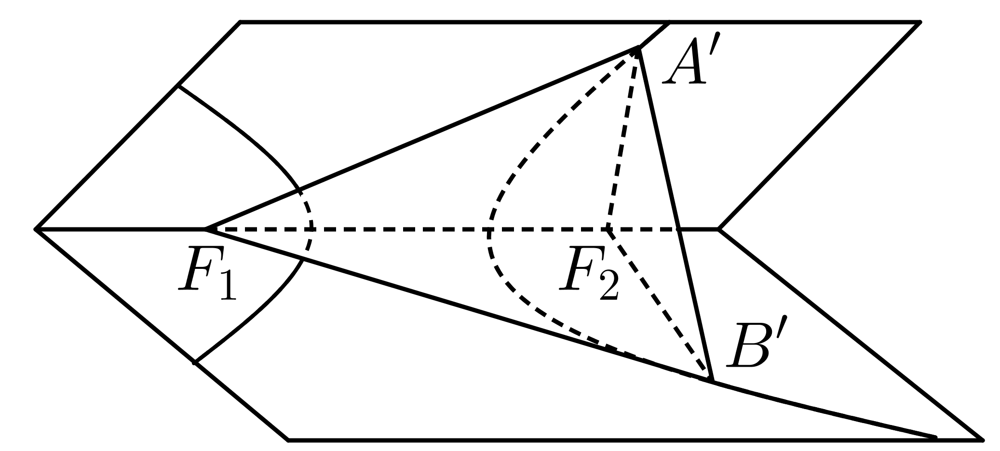

A．	B．	C．	D．

【答案】C

【解析】设双曲线的半焦距为，

由题意可得：，

则，

且，则锐角二面角，

在中，由余弦定理可得：，

在中，由余弦定理可得：，

因为，即，

可得，解得.

故选：C.

**变式56．**（2024·河南·校联考二模）已知双曲线：的左､右焦点分别是，，是双曲线上的一点，且，，，则双曲线的离心率是（    ）

A．	B．	C．	D．

【答案】D

【解析】设双曲线的半焦距为.

由题意，点在双曲线的右支上，，，

由余弦定理得，

解得，即，，

根据双曲线定义得，

解得，

故双曲线的离心率.

故选：D

**方向6：找几何关系，利用正弦定理**

**变式57．（多选题）（2024·湖南·高二期末）** 已知双曲线的左、右焦点分别为，双曲线上存在点（点不与左、右顶点重合），使得，则双曲线的离心率的可能取值为 （       ）

A．	B．	C．	D．2

【答案】BC

【解析】∵，则离心率，则排除A；

记，，，

则，

由正弦定理结合分比定理可知：，

则，

所以B，C是正确的，D不正确.

故选：BC.

**变式58．**（2024·全国·高三专题练习（理））已知双曲线的左､右焦点分别为，为双曲线右支上的一点，若在以为直径的圆上，且，则该双曲线离心率的取值范围为（    ）

A．	B．	C．	D．

【答案】D

【解析】在以为直径的圆上，，

，，，，

由双曲线定义知：，即，

；

，，，

则，，

即双曲线离心率的取值范围为.

故选：D.

<strong>变式59．</strong>（2024·河南·商丘市第一高级中学高三开学考试（文））已知、分别为双曲线<em>C</em>：的左、右焦点，<em>O</em>为原点，双曲线上的点<em>P</em>满足，且，则该双曲线<em>C</em>的离心率为（    ）

A．	B．	C．2	D．

【答案】D

【解析】因为，分别为双曲线的左右焦点，

由正弦定理得到，

又因为得，

又∵，

∴，，

在中，，，，

∴，，

在中，，

所以，

化简得.

故选：D.

**方向7：利用基本不等式**

<strong>变式60．</strong>（2024·四川成都·高三开学考试（文））已知双曲线，<em>F</em>为右焦点，过点<em>F</em>作轴交双曲线于第一象限内的点<em>A</em>，点<em>B</em>与点<em>A</em>关于原点对称，连接<em>AB</em>，<em>BF</em>，当取得最大值时，双曲线的离心率为\_\_\_\_\_\_．

【答案】

【解析】如图，

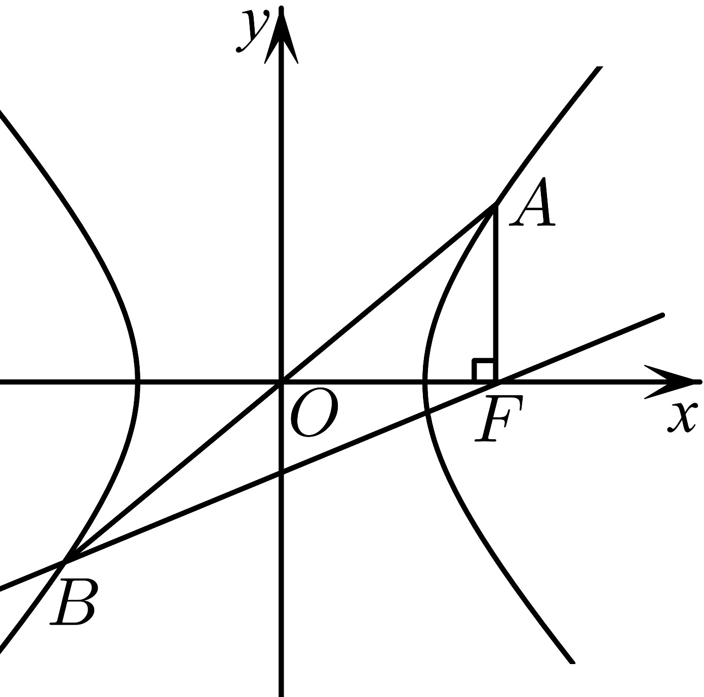

根据题意，，，

∴，，

设直线的倾斜角为，

∴，

当且仅当时等号成立，

即，，，又

∴，

故答案为：．

**变式61．**（2024·全国·高三专题练习）在平面直角坐标系中，已知双曲线的左、右顶点为、，若该双曲线上存在点，使得直线、的斜率之和为，则该双曲线离心率的取值范围为\_\_\_\_\_\_\_\_\_\_．

【答案】

【解析】设点，其中，易知点、，且有，则，

，

当点在第一象限时，，，则，，且，

由基本不等式可得，

因为存在点，使得直线、的斜率之和为，则，即，

.

故答案为：.

<strong>变式62．</strong>（2024·四川·高三开学考试（理））如图为陕西博物馆收藏的国宝——唐·金筐宝钿团化纹金杯，杯身曲线内收，玲珑娇美，巧夺天工，是唐朝金银细作的典范之作．该杯的主体部分可以近似看作是双曲线的部分的旋转体．若该双曲线上存在点<em>P</em>，使得直线<em>PA</em>，<em>PB</em>（点<em>A</em>，<em>B</em>为双曲线的左、右顶点）的斜率之和为4，则该双曲线离心率的取值范围为\_\_\_\_\_\_．

【答案】

【解析】设点，其中，

易知点，，且有，则，

，

当点*P*在第一象限时，，，

则，，且，

由基本不等式可得，

∵存在点*P*，使得直线*PA*，*PB*的斜率之和为4，

则，即，

∴.

故答案为：．

**方向8：利用渐近线的斜率求离心率**

<strong>变式63．</strong>（2024·广西·校联考模拟预测）已知双曲线<em>C</em>：，<em>O</em>为坐标原点，过<em>C</em>的右焦点<em>F</em>作<em>C</em>的一条渐近线的平行线交<em>C</em>的另一条渐近线于点<em>Q</em>，若，则<em>C</em>的离心率为（    ）

A．	B．3	C．	D．

【答案】D

【解析】设渐近线的倾斜角为，则，

，则，

解得（舍去）或，

∴，∴.

故选：D．

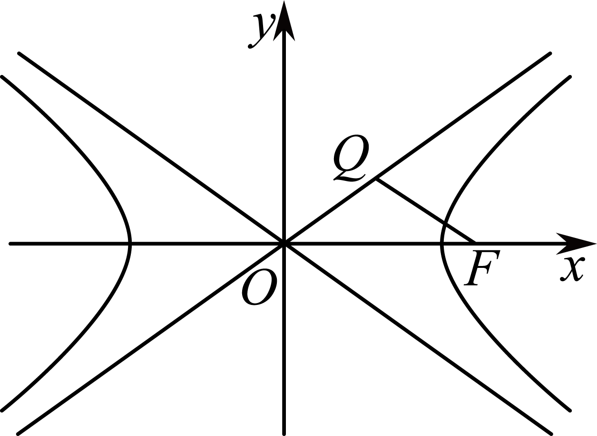

**变式64．**（2024·贵州·校联考模拟预测）已知直线与双曲线的两条渐近线分别交于点，（不重合），的垂直平分线过点，则双曲线的离心率为（    ）

A．	B．	C．	D．

【答案】D

【解析】因为直线，所以，

由题可知的垂直平分线的方程为，

将与联立可得，即的中点坐标为．

设，，则，且，，

两式作差可得，

即，所以，

则双曲线的离心率为．

故选：D

**变式65．**（2024·山东聊城·统考三模）已知双曲线：的右焦点为，过分别作的两条渐近线的平行线与交于，两点，若，则的离心率为（    ）

A．	B．	C．	D．

【答案】A

【解析】由题意，不妨设点在第一象限，

由双曲线的性质可得，直线和直线关于轴对称，

所以和关于轴对称，又，则设，，

又直线的方程为：，

所以代入点得：，解得：，

即点，

将点代入双曲线的方程得：，

化解得：，解得：或，

又因为，所以，

则双曲线的离心率，

故选：A.

<strong>变式66．</strong>（2024·辽宁葫芦岛·统考二模）设<em>F1</em>，<em>F2</em>是双曲线<em>C</em>：（<em>a</em>&gt;0，<em>b</em>&gt;0）的左、右焦点，<em>O</em>是坐标原点．过<em>F2</em>作<em>C</em> 的一条渐近线的垂线，垂足为<em>P</em>.若|<em>PF1</em>|＝3|<em>OP</em>|，则<em>C</em>的离心率为（    ）

A．	B．2	C．	D．

【答案】A

【解析】不妨设双曲线的一条渐近线方程为，

则，，

，

在中，，

在中，，

，即，

所以

故选：A ．

<strong>变式67．</strong>（2024·山东·沂水县第一中学校联考模拟预测）已知<em>P</em>为双曲线上的动点，<em>O</em>为坐标原点，以<em>OP</em>为直径的圆与双曲线<em>C</em>的两条渐近线交于，两点（<em>A</em>，<em>B</em>异于点<em>O</em>），若恒成立，则该双曲线离心率的取值范围为（    ）

A．	B．	C．	D．

【答案】A

【解析】双曲线*C*的两条渐近线方程为，若恒成立，

则*A*，*B*两点始终位于*x*轴同侧，则，故，即，即，得，又，

所以双曲线离心率的取值范围为．

故选：A．

**变式68．**（2024·四川雅安·高三雅安中学校联考阶段练习）已知双曲线的上焦点为，过焦点作的一条渐近线的垂线，垂足为，并与另一条渐近线交于点，若，则的离心率为（    ）

A．	B．或

C．	D．或

【答案】D

【解析】当时，直线与另一条渐近线平行，所以．

当时，如图1，过作另一条渐近线的垂线，垂足为，则，

由得：，则，

所以，则，

所以，则．

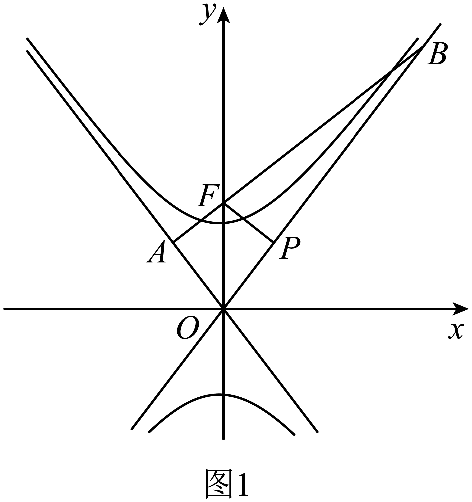

当时，如图2，过作另一条渐近线的垂线，垂足为，则，

由得：，则，则，

所以，则，

所以，则．

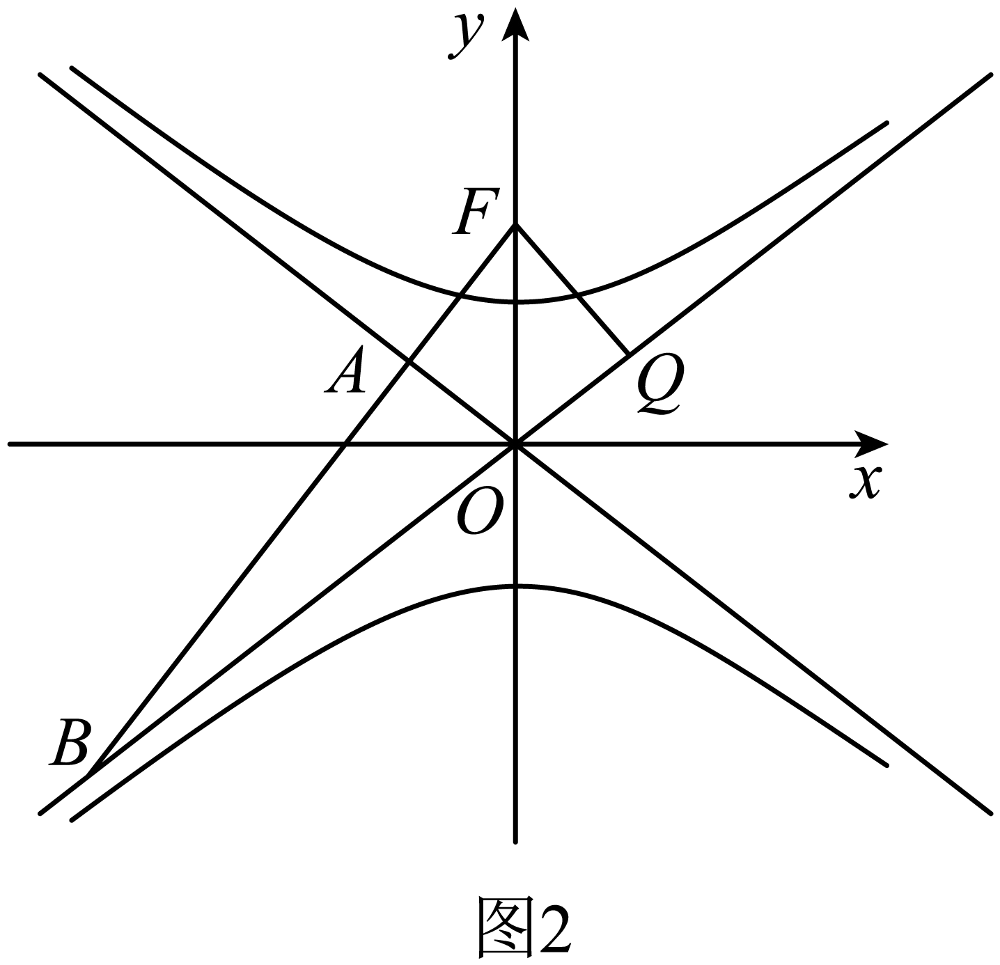

综上，的离心率为或．

故选：D

<strong>变式69．</strong>（2024·黑龙江大庆·大庆实验中学校考模拟预测）已知双曲线<em>C</em>：的左、右焦点分别为，，点<em>P</em>为第一象限内一点，且点<em>P</em>在双曲线<em>C</em>的一条渐近线上，，且，则双曲线<em>C</em>的离心率为（    ）

A．	B．	C．	D．

【答案】A

【解析】如图，

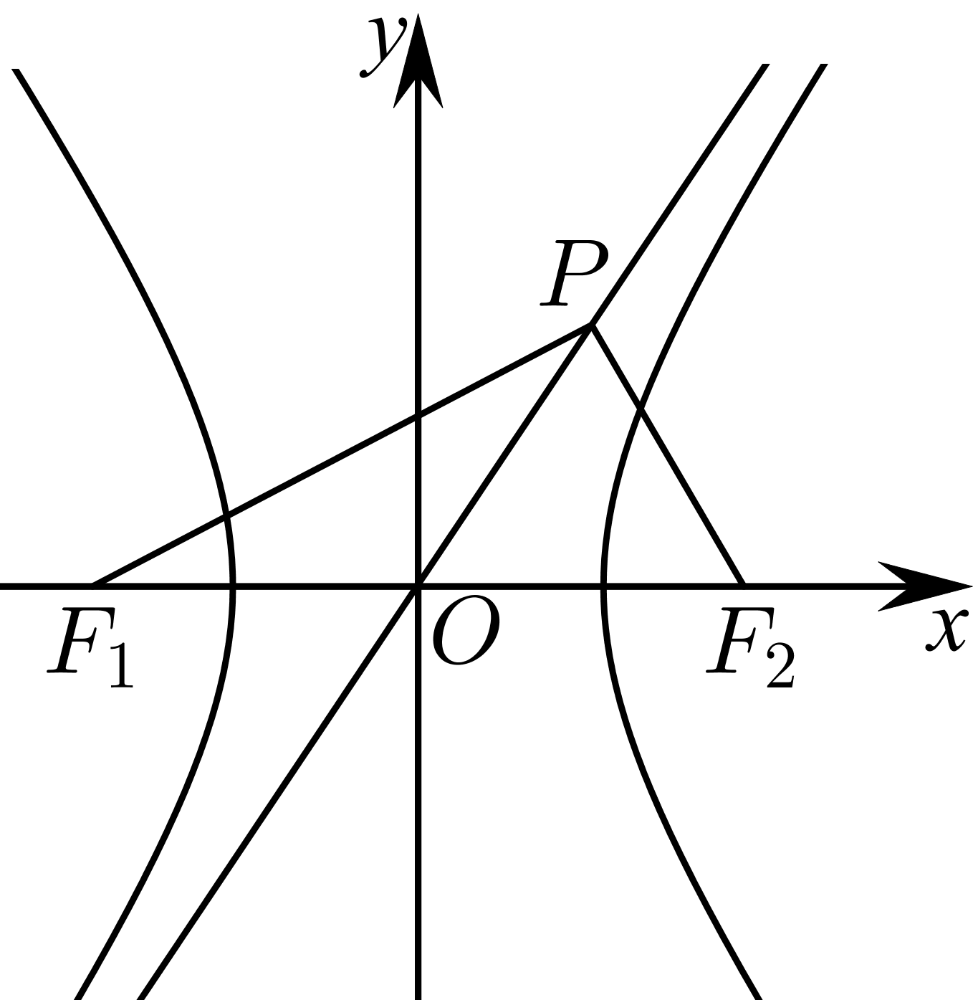

设双曲线*C*的焦距为2*c*，由可得，

所以，即，

所以．

故选：A．

<strong>变式70．</strong>（2024·四川成都·石室中学校考模拟预测）已知双曲线<em>C</em>的方程为，斜率为的直线与圆相切于<em>M</em>，与双曲线<em>C</em>的两条渐近线分别相交于<em>A</em>，<em>B</em>，且<em>M</em>为<em>AB</em>中点，则双曲线<em>C</em>的离心率为（    ）

A．2	B．	C．	D．

【答案】B

【解析】依题意，设直线的方程为，圆的方程可化为，即圆心坐标为，半径为，

因为直线与圆相切于*M*，所以，由可化简得，

则直线的方程为，双曲线*C*的两条渐近线分别为，，

由得，同理可得，

因为*M*为*AB*中点，由中点坐标公式可得，

*M*在圆上，将*M*的坐标代入圆方程可得，

化简整理得，从而可得，

则双曲线*C*的离心率.

故选：B

**变式71．**（2024·江苏无锡·校联考三模）已知点在双曲线上，到两渐近线的距离为，，若恒成立，则的离心率的最大值为（    ）

A．	B．	C．2	D．

【答案】A

【解析】双曲线的渐近线方程为，即，

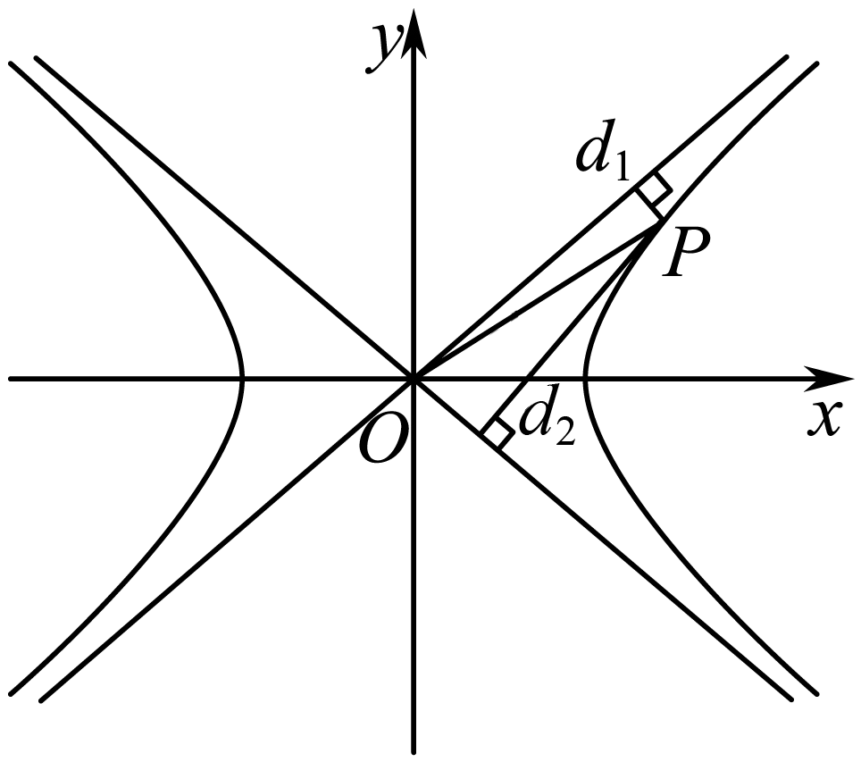

设双曲线上的点，所以，即

则到两条渐近线的距离分别为，，

所以，

又，

因为恒成立，所以，整理得，即

所以离心率，则的离心率的最大值为.

故选：A.

**方向9：利用双曲线第三定义**

**变式72．（多选题）（2024·云南·罗平县第一中学高二期中）** 已知双曲线：的左焦点为，过点作的一条渐近线的平行线交于点，交另一条渐近线于点.若，则下列说法正确的是（    ）

A．双曲线的离心率为

B．双曲线的渐近线方程为

C．点到两渐近线的距离的乘积为

D．为坐标原点，则

【答案】ABD

【解析】双曲线的渐近线方程为，不妨设过左焦点*F*的直线与直线平行，交*C*于点*A*.

对于A：设双曲线半焦距为*c*，过点与直线平行的直线的方程为，与联立，解得，

设，由，可得，

所以，

所以，即，

所以双曲线的离心率为，故选项A正确；

对于B：由，可得，所以，

所以渐近线方程为，故选项B正确；

对于C：*A*到两渐近线距离的乘积，故选项C错误；

对于D：，

所以，

所以，故选项D正确．

故选：ABD.

**变式73．**（2024·湖南郴州·高二期末）双曲线的左右顶点为，过原点的直线与双曲线交于两点，若的斜率满足，则双曲线的离心率为\_\_\_\_\_\_\_\_\_．

【答案】

【解析】由题意知：，，

若为坐标原点，则，，四边形为平行四边形，

，即，；

设，则，

，

双曲线的离心率.

故答案为：.

**变式74．**（2024·贵州·高三凯里一中校联考开学考试）设直线与双曲线相交于两点，为上不同于的一点，直线的斜率分别为，若的离心率为，则（    ）

A．3	B．1	C．2	D．

【答案】B

【解析】由题意可知点关于原点对称，设，则有，，

都在双曲线上，有，，两式相减得，

则，得，即，

又由，则.

故选：.

<strong>变式75．</strong>（2024·江西南昌·统考三模）不与<em>x</em>轴重合的直线<em>l</em>经过点，双曲线上存在两点关于<em>l</em>对称，中点<em>M</em>的横坐标为，若，则<em>C</em>的离心率为（    ）

A．	B．	C．2	D．

【答案】C

【解析】设，

则，两式相减得，

即，

即 ，所以，

因为是*AB*垂直平分线，有，所以，

即，化简得，故.

故选：C.

**方向10：利用对应焦点焦半径的取值范围**

**变式76．**（2024·全国·高三专题练习）已知双曲线的左､右焦点分别为.若双曲线的右支上存在点，使，则双曲线的离心率的取值范围为\_\_\_\_\_\_\_\_\_\_\_.

【答案】

【解析】依题意，点在双曲线的右支，*P*不与双曲线顶点重合，

在中，由正弦定理得：

，因，于是得，

而点*P*在双曲线*M*的右支上，即，从而有，

点*P*在双曲线*M*的右支上运动，并且异于顶点，于是有，

因此，而，整理得，即，

解得，又，故有，

所以双曲线*M*的离心率的取值范围为.

故答案为：

<strong>变式77．</strong>（2024·吉林长春·二模（文））已知双曲线的左、右焦点分别为，，点<em>P</em>在双曲线的右支上，且，则双曲线离心率的取值范围是

A．	B．	C．	D．

【答案】B

【解析】由双曲线定义可知，，，结合 可得，从而，又因为双曲线的离心率大于 ，所以双曲线离心率的取值范围为，故选B.

<strong>变式78．</strong>（2024·江苏·金沙中学高二阶段练习）设双曲线的焦距为，左、右焦点分别是，，点<em>P</em>在<em>C</em>的右支上，且，则<em>C</em>的离心率的取值范围是（    ）

A．	B．	C．	D．

【答案】C

【解析】由条件得，所以，即，

又因为，所以，

即，得，

又，所以．

故选：C

<strong>变式79．</strong>（2024·山西·朔州市朔城区第一中学校高二开学考试）设双曲线的左､右焦点分别为､，点<em>P</em>在双曲线的右支上，且，则双曲线离心率的取值范围是（    ）

A．	B．	C．	D．

【答案】A

【解析】因为点在双曲线的右支上，由双曲线的定义可得，

又，所以，即，则，

因为双曲线中，，

即，则，即，

又双曲线的离心率大于，所以.

故选：A.

<strong>变式80．</strong>（2024·湖南·衡阳市八中一模（文））已知双曲线的左、右焦点分别为、，点<em>P</em>在双曲线的右支上，且，则此双曲线的离心率<em>e</em>的最大值为（    ）

A．	B．	C．	D．

【答案】C

【解析】因为点*P*在双曲线的右支上，所以

因为，所以可得

根据点*P*在双曲线的右支上，可得

所以，即

所以双曲线的离心率*e*的最大值为

故选：C

**变式81．**（2024·全国·高三专题练习）已知是双曲线的左、右焦点，为双曲线左支上一点，若的最小值为，则该双曲线的离心率的取值范围是（    ）

A．	B．	C．	D．

【答案】C

【解析】由双曲线定义可得：

|<em>PF2</em>|-|<em>PF1</em>|=2<em>a</em>，|<em>PF2</em>|=2<em>a</em>+|<em>PF1</em>|，==+4<em>a</em>+|<em>PF1</em>| ≥8<em>a</em>，

当且仅当=|<em>PF1</em>|，即|<em>PF1</em>|=2<em>a</em>时取得等号.此时

由双曲线的几何性质可得，，即可，又双曲线的离心率，∴.

故选:C.

**【解题方法总结】**

求离心率的本质就是探究之间的数量关系，知道中任意两者间的等式关系或不等关系便可求解出的值或其范围．具体方法为方程法、不等式法、定义法和坐标法．

**题型七：双曲线的简单几何性质问题**

<strong>例19．</strong>（2024·上海·上海市七宝中学校考模拟预测）等轴双曲线的焦距为____.

【答案】

【解析】由题意得，，故，故，焦距为.

故答案为：

<strong>例20．</strong>（2024·四川自贡·统考三模）已知双曲线<em>C</em>：的左、右焦点分别为，，过作<em>C</em>的一条渐近线的垂线，垂足为<em>A</em>，与另一条渐近线交于<em>B</em>点，则的内切圆的半径为______．

【答案】

【解析】

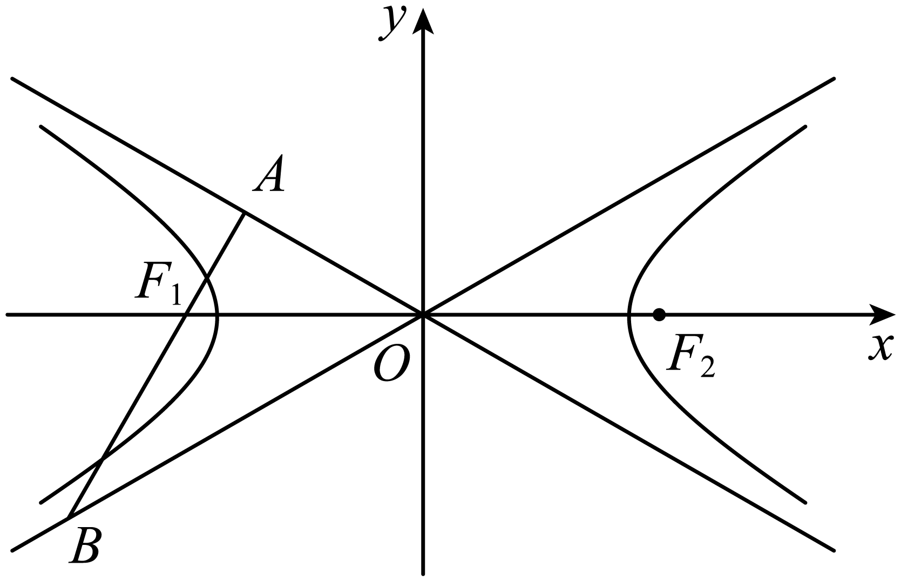

双曲线*C*：的左焦点为，到渐近线的距离,

联立方程组，

解得

可得，

设的内切圆的半径为，在中，，

故答案为：.

<strong>例21．</strong>（2024·四川·校联考模拟预测）已知双曲线的右焦点为，过双曲线上一点（）的直线与直线相交于点，与直线相交于点，则______.

【答案】

【解析】因为在双曲线，即有，又

由得，由得，

因此，，，

则，

所以.

故答案为：

<strong>变式82．</strong>（2024·贵州毕节·校考模拟预测）已知双曲线的左、右焦点分别为，存在过点的直线与双曲线的右支交于两点，且为正三角形．试写出一个满足上述条件的双曲线的方程：________．

【答案】（答案不唯一，符合题意即可）

【解析】如图，取，且*x*轴，

可得，，

即，为正三角形，

符合题意，此时双曲线的方程为.

故答案为：.

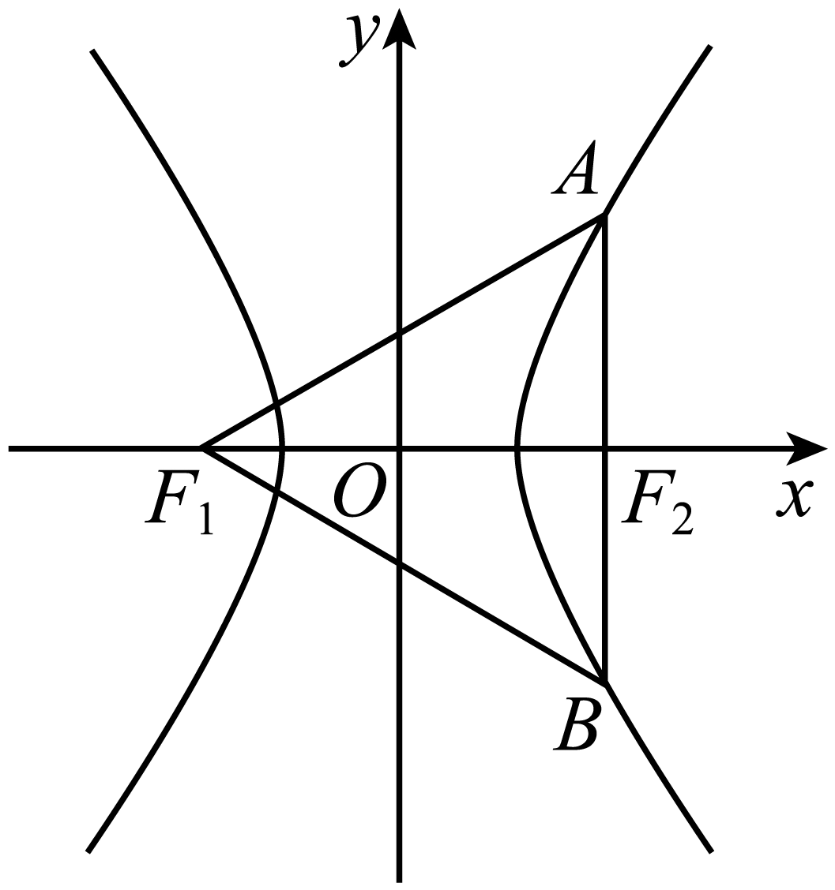

<strong>变式83．</strong>（2024·陕西渭南·统考一模）已知双曲线的焦距为4，焦点到<em>C</em>的一条渐近线的距离为1，则<em>C</em>的渐近线方程为______

【答案】

【解析】由双曲线对称性得，一个焦点到两条渐近线的距离相等，不妨取渐近线为，即，焦点为，

则焦点到渐近线的距离，

由焦距为4得，故，

故*C*的渐近线方程为.

故答案为：.

<strong>变式84．</strong>（2024·江西南昌·校联考模拟预测）已知双曲线（，）的一条渐近线恰好平分第一、三象限，若的虚轴长为4，则的实轴长为____________.

【答案】4

【解析】由题意可知，双曲线的一条渐近线为直线，故，故其实轴长为.

<strong>变式85．</strong>（2024·河北唐山·统考二模）已知直线：过双曲线：的一个焦点，且与的一条渐近线平行，则的实轴长为______．

【答案】2

【解析】直线与轴交点为，斜率为，

由题意，解得，

所以双曲线的实轴长为．

故答案为：2.

<strong>变式86．</strong>（2024·北京房山·高三统考开学考试）已知双曲线的离心率为，其中一条渐近线与圆交于两点，则_____.

【答案】

【解析】双曲线的离心率为，

可得，所以，

所以双曲线的渐近线方程为：，

一条渐近线与圆交于，两点，圆的圆心，半径为1，

圆的圆心到直线的距离为：，

所以．

故答案为：．

**【解题方法总结】**

处理双曲线的问题的时候，如果需要画图，注意作图规范，结合图象分析，另外因为双曲线有两条渐近线，所以要分清楚，到底是点在双曲线上还是渐近线上，切勿搞混．

**题型八：利用第一定义求解轨迹**

<strong>例22．</strong>（2024·全国·高三对口高考）已知动圆<em>P</em>过点，且与圆外切，则动圆<em>P</em>圆心的轨迹方程为______.

【答案】，

【解析】定圆的圆心为，与关于原点对称，

设动圆的半径为，则有，因为与圆外切，

所以，即，

所以点的轨迹是以*M*，*N*为焦点的双曲线的左支，

则，，，

所以轨迹方程为，，即，.

故答案为：，

<strong>例23．</strong>（2024·全国·高考真题）设<em>P</em>为双曲线上一动点，<em>O</em>为坐标原点，<em>M</em>为线段的中点，则点<em>M</em>的轨迹方程为_____________．

【答案】

【解析】设，，

则，即，

又，则，

整理得，

即点*M*的轨迹方程为.

故答案为：

<strong>例24．</strong>（2024·全国·高三专题练习）已知圆<em>C1</em>：（<em>x</em>＋3）2＋<em>y2</em>＝1和圆<em>C2</em>：（<em>x</em>－3）2＋<em>y2</em>＝9，动圆<em>M</em>同时与圆<em>C1</em>及圆<em>C2</em>相外切，则动圆圆心<em>M</em>的轨迹方程为______.

【答案】

【解析】设动圆圆心的坐标为，半径为，

则由题意可得，，相减可得，

故点的轨迹是以、为焦点的双曲线的左支，

由题意可得，，，

故点的轨迹方程为．

故答案为：

<strong>变式87．</strong>（2024·全国·高三专题练习）已知双曲线，、是双曲线的左、右焦点，是双曲线右支上一点，是的平分线，过作的垂线，垂足为，则点的轨迹方程为_______．

【答案】

【解析】延长，交于，因为，，

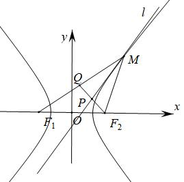

，所以，所以，

所以，

因为*M*是双曲线*C*右支上一点，所以，

又因为*P*是的中点，*O*是的中点，所以，

所以*P*的轨迹是以*O*为圆心，半径为2的圆的一部分，

所以点*P*的轨迹方程为．

故答案为：.

<strong>变式88．</strong>（2024·全国·高三专题练习）已知平面内两定点，，动点<em>M</em>满足，则点<em>M</em>的轨迹方程是___________.

【答案】

【解析】由题意知：，，故*M*的轨迹是以为焦点，实轴长的双曲线，

设双曲线方程为，由可得，故点*M*的轨迹方程是.

故答案为：.

<strong>变式89．</strong>（2024·全国·高三专题练习）若动圆与两定圆及都外切，则动圆圆心的轨迹方程是___________.

【答案】

【解析】设圆为可得圆心，半径，

设圆为可得圆心，半径，且，

设动圆圆心为，半径为，因为动圆同时与圆外切和圆外切，

所以，，

所以，

所以点的轨迹是以，为焦点的双曲线的左支，

所以，，，

所以动圆的圆心的轨迹方程为：.

故答案为：.

<strong>变式90．</strong>（2024·全国·高三专题练习）已知圆：和圆：，动圆<em>M</em>同时与圆及圆外切，则动圆的圆心<em>M</em>的轨迹方程为______.

【答案】

【解析】由题，设动圆的半径为，圆的半径为，圆的半径为,

当动圆与圆，圆外切时,,,

所以,

因为圆心,，即，又

根据双曲线的定义，得动点的轨迹为双曲线的上支，其中，，

所以,则动圆圆心的轨迹方程是；

故答案为：

<strong>变式91．</strong>（2024·全国·高三专题练习）已知<em>A</em>(－5，0)，<em>B</em>(5，0)，动点<em>P</em>满足，，8成等差数列，则点<em>P</em>的轨迹方程为________.

【答案】

【解析】由已知得，

∴点*P*的轨迹是以*A*，*B*为焦点的双曲线的右支，

设双曲线的方程为

则*a*＝4，*b*＝3，*c*＝5，

∴点*P*的轨迹方程为．

故答案为：﹒

<strong>变式92．</strong>（2024·全国·高三专题练习）已知点，，，动圆与直线切于点，分别过点且与圆相切的两条直线相交于点，则点的轨迹方程为_______.

【答案】

【解析】如图所示：

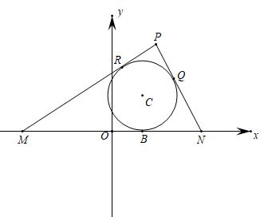

设*PM*，*PN*分别与圆C相切与*R*，*Q*，

由圆的切线长定理得*PQ*=*PR*，*MR*=*MB*，*NQ*=*NB*，

所以*PM*-*PN*=*RM*-*QN*=*MB*-*NB*=2<*MN*，

所以点*P*的轨迹是以*M*，*N*为焦点的双曲线的右支，且*c*=3，*a*=1，

所以点的轨迹方程为

故答案为：

<strong>变式93．</strong>（2024·全国·高三专题练习）若动圆过定点且和定圆：外切，则动圆圆心的轨迹方程是_________.

【答案】

【解析】设动圆的半径为，则有，再由两圆外切得到，进而得到，再利用双曲线的定义求解.定圆的圆心为 ，与 关于原点对称，

设动圆的半径为，则有，

因为两圆外切，

所以，即，

所以点的轨迹是以*A*，*C*为焦点的双曲线的左支，

则，，，

所以轨迹方程为

故答案为：

<strong>变式94．</strong>（2024·全国·高三专题练习）已知点是双曲线右支上一动点，是双曲线的左、右焦点，动点满足下列条件：①，②，则点的轨迹方程为________________.

【答案】

【解析】设动点的坐标为，延长交于点，

由条件②知点在的角平分线上，

结合条件①知，

所以在中，.又平分，

所以为等腰三角形，即，.

因为点为双曲线上的点，所以，即，

所以.又在中，为的中点，为的中点，

所以，

所以点的轨迹是以为圆心，半径为1的圆，

由双曲线的性质及角平分线定理可得点*Q*应在两条渐近线之间且横坐标大于0，

点作渐近线的垂线垂足横坐标为，

所以点的轨迹方程为.

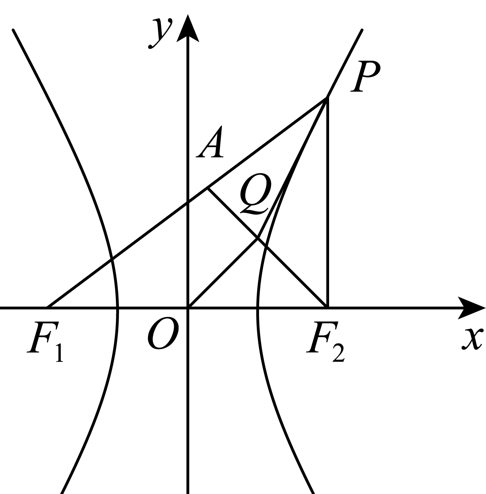

故答案为：.

<strong>变式95．</strong>（2024·河北张家口·高三统考阶段练习）已知圆：和点，是圆上一点，线段的垂直平分线交于点，则点的轨迹方程是______.

【答案】

【解析】∵在的中垂线上，∴，∴，

又，∴点轨迹是以为焦点，实轴长为6的双曲线，∴，，又关于原点对称，

∴点轨迹方程为．

故答案为：．

<strong>变式96．</strong>（2024·全国·高三专题练习）在△ABC中，A为动点，B，C为定点，(a&gt;0)，且满足条件sin C－sin B＝sin A，则动点A的轨迹方程是________．

【答案】 (x>0且y≠0)

【解析】由sin C－sin B＝sin A，利用正弦定理得 (R为外接圆半径)，

所以|AB|－|AC|＝|BC|=，

可得动点的轨迹为双曲线，为双曲线右支(除去右顶点)．

且实轴长为,虚轴，焦点为，

所以方程为(x>0且y≠0).

故答案为(x>0且y≠0).

<strong>变式97．</strong>（2024·全国·统考一模）设､是双曲线的左右焦点，是双曲线上任意一点，过作平分线的垂线，垂足为，则点的轨迹方程是__________.

【答案】

【解析】点关于的角平分线*PQ*的对称点*P*在直线的延长线上，故，又*OQ*是的中位线，故，点*Q*的轨迹是以原点为圆心，*a*为半径的圆，则点*Q*的轨迹方程为.

**【解题方法总结】**

常见考题中，会让我们利用圆锥曲线的定义求解点P的轨迹方程，这时候要注意把动点P和满足焦点标志的定点连起来做判断．焦点往往有以下的特征：（1）关于坐标轴对称的点；（2）标记为*F*的点；（3）圆心；（4）题上提到的定点等等．当看到满足以上的标志的时候要想到曲线的定义，把曲线和满足焦点特征的点连起来结合曲线定义判断．注意：在求解轨迹方程的题中，要注意*x*和*y*的取值范围．

**题型九：双曲线的渐近线**

<strong>例25．</strong>（2024·山东潍坊·统考模拟预测）若双曲线的离心率为，则其渐近线方程为__________．

【答案】

【解析】，，即，，

双曲线方程为，渐近线方程为．

故答案为：

<strong>例26．</strong>（2024·上海徐汇·高三上海市徐汇中学校考期中）双曲线两条渐近线的夹角大小是__________

【答案】60°/

【解析】双曲线的两条渐近线的方程为，

由直线的斜率为，可得倾斜角为，

的斜率为，可得倾斜角为，

所以两条渐近线的夹角的大小为，

故答案为：.

<strong>例27．</strong>（2024·湖北武汉·华中师大一附中校考模拟预测）已知为双曲线上一点，以为切点的切线为，直线与双曲线的两条渐近线分别交于点，则（为坐标原点）的面积为________．

【答案】

【解析】双曲线的渐近线为，直线与双曲线的两条渐近线分别交于点，

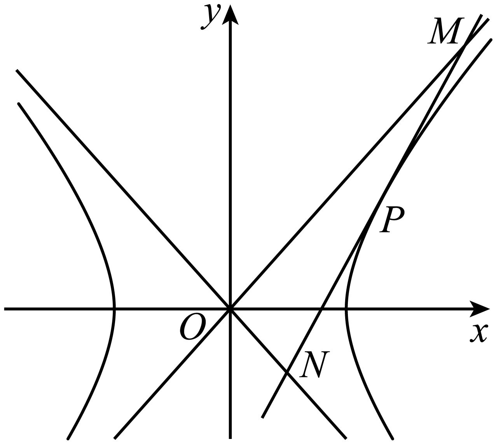

显然直线不垂直于*y*轴，设直线，，

由得点的纵坐标，由得点的纵坐标，

由消去*x*得，

于是，化简得，

直线与*x*轴交点的横坐标为，

所以的面积.

故答案为：

<strong>变式98．</strong>（2024·湖南·高三校联考阶段练习）已知为双曲线的左、右焦点，过作直线的垂线分别交双曲线的左、右两支于两点（如图）.若构成以为顶角的等腰三角形，则双曲线的渐近线方程为__________.

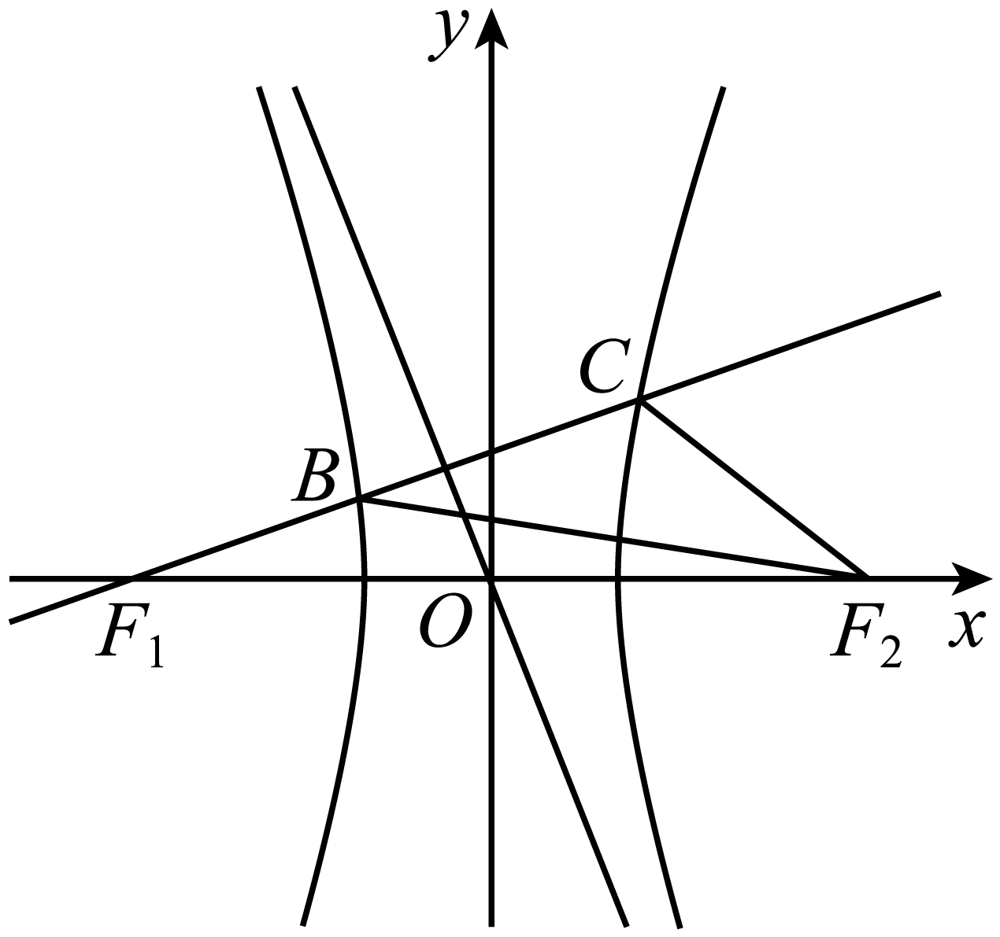

【答案】

【解析】由题意可得，由双曲线的定义及点在右支上，，

又点在左支上，则，则，

在中，由余弦定理可得，

而与渐近线垂直，于是，即，从而得，

所以，即，化简得，解得，

所以双曲线的渐近线方程为.

故答案为：

<strong>变式99．</strong>（2024·全国·高三专题练习）已知函数点<em>M</em>､<em>N</em>是函数图象上不同的两个点，则（为坐标原点）的取值范围是_________．

【答案】

【解析】当时，，求导得，即函数在上单调递增，

当时，由，得，于是函数的图

象是焦点在*y*轴上的双曲线在第二象限的部分，是其渐近线，如图，

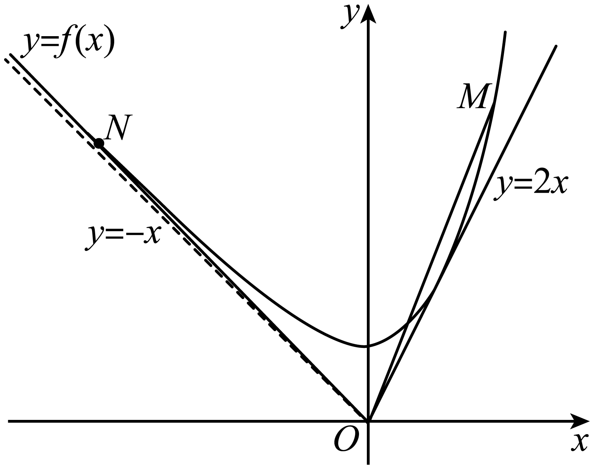

令过原点的直线与曲线相切的切点为，则，

整理得，令，，函数在上单调递增，

而，因此当且仅当时，，则的解为，

即过原点的直线与曲线相切的切点为，切线方程为，设其倾斜角为，有，

因为点*M*、*N*是函数图象上不同的两个点，则，

而正切函数在上单调递增，因此，

又，

所以的取值范围是.

故答案为：

<strong>变式100．</strong>（2024·山东泰安·统考模拟预测）已知双曲线的左右焦点分别为，过作渐近线的垂线交双曲线的左支于点，已知，则双曲线的渐近线方程为______．

【答案】

【解析】依题意，，，则，令双曲线半焦距为*c*，

双曲线的渐近线方程为，则点到渐近线的距离，有，

在中，由余弦定理，

得，整理得，即，解得，

所以双曲线的渐近线方程为.

故答案为：

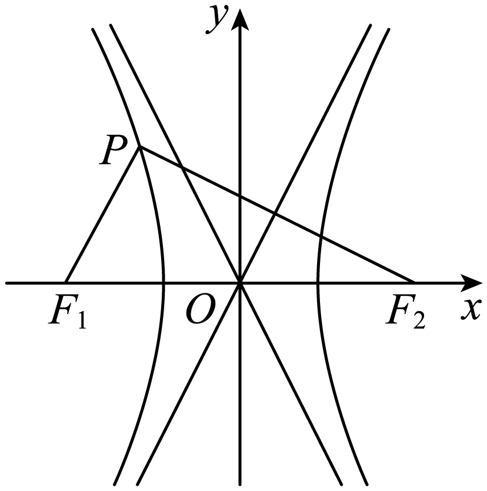

<strong>变式101．</strong>（2024·重庆万州·统考模拟预测）已知双曲线<em>C</em>：的左、右焦点分别为，，<em>P</em>是<em>C</em>在第一象限上的一点，且直线的斜率为，的平分线交<em>x</em>轴于点<em>A</em>，点<em>B</em>满足，，则双曲线<em>C</em>的渐近线方程为______．

【答案】

【解析】过作，

由点满足，

则在方向上的投影与在方向上的投影长度相等,

即，则,

即，即为的平分线,

则为的内心，

连接，又点满足,

,

,

又，则,

又直线的斜率为，,

在中结合余弦定理

，

可得，

化简得，则，

即，即双曲线的渐近线方程为.

故答案为：.

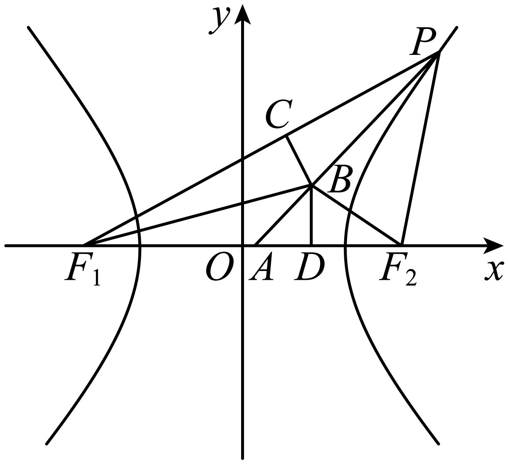

**【解题方法总结】**

掌握双曲线方程与其渐近线方程的互求；由双曲线方程容易求得渐近线方程；反之，由渐近线方程可得出，的关系式，为求双曲线方程提供了一个条件．另外，焦点到渐近线的距离为虚半轴长．

**题型十：共焦点的椭圆与双曲线**

**例28．**（2024·河南南阳·南阳中学校考三模）已知椭圆与双曲线共焦点，双曲线实轴的两顶点将椭圆的长轴三等分，两曲线的交点与两焦点共圆，则椭圆的离心率为（    ）

A．	B．	C．	D．

【答案】C

【解析】设椭圆的标准方程为，

双曲线的标准方程为，设，

因为双曲线实轴的两顶点将椭圆的长轴三等分，则，

设椭圆与双曲线的公共焦点为、，且、为两曲线的左、右焦点，

设椭圆与双曲线在第一象限的交点为，在第三象限的交点为，

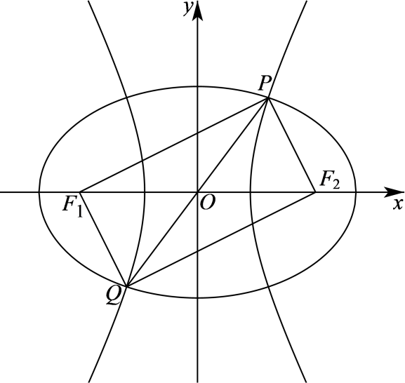

则，解得，

由对称性可知、的中点均为原点，所以，四边形为平行四边形，

因为、、、四点共圆，则有，故，

由勾股定理可得，即，即，

即，故椭圆的离心率为.

故选：C.

**例29．**（2024·全国·高三专题练习）椭圆与双曲线共焦点，，它们在第一象限的交点为，设，椭圆与双曲线的离心率分别为，，则（    ）

A．	B．

C．	D．

【答案】B

【解析】设椭圆的长轴长为，双曲线的实轴长为，交点到两焦点的距离分别为，焦距为，利用余弦定理得到，再根据椭圆和双曲线的定义，得到，代入求解.设椭圆的长轴长为，双曲线的实轴长为，

交点到两焦点的距离分别为，焦距为，

则，

又，，故，，

所以，

化简得，

即 .

故选：B

<strong>例30．</strong>（2024·全国·高二专题练习）已知<em>F</em>是椭圆：（）的右焦点，<em>A</em>为椭圆的下顶点，双曲线：（，）与椭圆共焦点，若直线与双曲线的一条渐近线平行，，的离心率分别为，，则的最小值为______．

【答案】

【解析】设的半焦距为*c*（），则，又，

所以，又直线与的一条渐近线平行，

所以，所以，

所以，

所以，

所以，

又，

当且仅当，即，时等号成立，

即的最小值为．

故答案为：

<strong>变式102．</strong>（2024·陕西宝鸡·高二统考期末）已知双曲线与椭圆共焦点，它们的离心率之和为，则双曲线方程为___________.

【答案】

【解析】先由椭圆方程求出椭圆的离心率以及，再结合双曲线的离心率得出双曲线方程.椭圆的

双曲线的离心率

由题意可知，解得

故双曲线方程为

故答案为：

**【解题方法总结】**

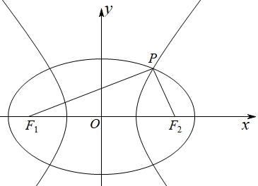

椭圆离心率与双曲线离心率必定满足的关系式为：

