**第66讲  抛物线及其性质**

**知识梳理**

**知识点一、抛物线的定义**

平面内与一个定点和一条定直线的距离相等的点的轨迹叫做抛物线，定点叫抛物线的焦点，定直线叫做抛物线的准线．

**注：** 若在定义中有，则动点的轨迹为的垂线，垂足为点．

**知识点二、抛物线的方程、图形及性质**

抛物线的标准方程有4种形式：，，，，其中一次项与对称轴一致，一次项系数的符号决定开口方向

<table><tr><td>
图形
</td><td>
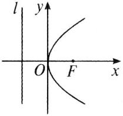
</td><td>
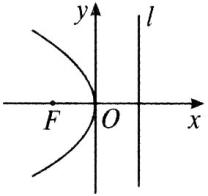
</td><td>
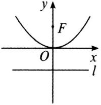
</td><td>
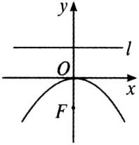
</td></tr><tr><td>
标准

方程
</td><td>

</td><td>

</td><td>

</td><td>

</td></tr><tr><td>
顶点
</td><td colspan="4">

</td></tr><tr><td>
范围
</td><td>
，
</td><td>
，
</td><td>
，
</td><td>
，
</td></tr><tr><td>
对称轴
</td><td colspan="2">
轴
</td><td colspan="2">
轴
</td></tr><tr><td>
焦点
</td><td>

</td><td>

</td><td>

</td><td>

</td></tr><tr><td>
离心率
</td><td colspan="4">

</td></tr><tr><td>
准线方程
</td><td>

</td><td>

</td><td>

</td><td>

</td></tr><tr><td>
焦半径

</td><td>

</td><td>

</td><td>

</td><td>

</td></tr></table>

**【解题方法总结】**

1、点与抛物线的关系

（1）在抛物线内（含焦点）．

（2）在抛物线上．

（3）在抛物线外．

2、焦半径

抛物线上的点与焦点的距离称为焦半径，若，则焦半径，．

3、的几何意义

为焦点到准线的距离，即焦准距，越大，抛物线开口越大．

4、焦点弦

若为抛物线的焦点弦，，，则有以下结论：

（1）．

（2）．

（3）焦点弦长公式1：，，当时，焦点弦取最小值，即所有焦点弦中通径最短，其长度为．

焦点弦长公式2：（为直线与对称轴的夹角）．

（4）的面积公式：（为直线与对称轴的夹角）．

5、抛物线的弦

若*AB*为抛物线的任意一条弦，，弦的中点为，则

（1）弦长公式：

（2）

（3）直线*AB*的方程为

（4）线段*AB*的垂直平分线方程为

6、求抛物线标准方程的焦点和准线的快速方法（法）

（1）焦点为，准线为

（2）焦点为，准线为

如，即，焦点为，准线方程为

7、参数方程

的参数方程为（参数）

8、切线方程和切点弦方程

抛物线的切线方程为，为切点

切点弦方程为，点在抛物线外

与中点弦平行的直线为，此直线与抛物线相离，点（含焦点）是弦*AB*的中点，中点弦*AB*的斜率与这条直线的斜率相等，用点差法也可以得到同样的结果．

9、抛物线的通径

过焦点且垂直于抛物线对称轴的弦叫做抛物线的通径．

对于抛物线，由，，可得，故抛物线的通径长为．

10、弦的中点坐标与弦所在直线的斜率的关系：

11、焦点弦的常考性质

已知、是过抛物线焦点的弦，是的中点，是抛物线的准线，，为垂足．

（1）以为直径的圆必与准线相切，以*AF*（或*BF*）为直径的圆与*y*轴相切；

（2），

（3）；

（4）设，为垂足，则、、三点在一条直线上

**必考题型全归纳**

**题型一：抛物线的定义与方程**

<strong>例1．</strong>（2024·福建福州·高三统考开学考试）已知点在抛物线<em>C</em>：上，则<em>P</em>到<em>C</em>的准线的距离为（　　）

A．4	B．3	C．2	D．1

【答案】C

【解析】抛物线的准线为，

将代入得，

故*P*到准线的距离为2，

故选：C．

**例2．**（2024·四川绵阳·统考二模）涪江三桥又名绵阳富乐大桥，跨越了涪江和芙蓉溪，是继东方红大桥、涪江二桥之后在涪江上修建的第三座大桥，于2004年国庆全线通车．大桥的拱顶可近似地看作抛物线的一段，若有一只鸽子站在拱顶的某个位置，它到抛物线焦点的距离为10米，则鸽子到拱顶的最高点的距离为（    ）

A．6	B．	C．	D．

【答案】B

【解析】如图所示：

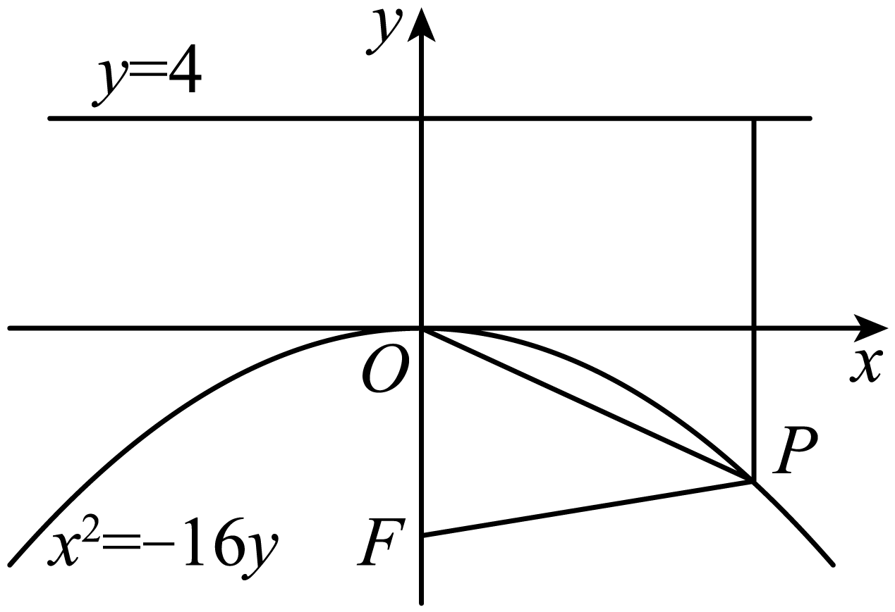

设鸽子所在位置为点，

因为它到抛物线焦点的距离为10米，

所以，解得，

则，

所以鸽子到拱顶的最高点的距离为，

故选：B

**例3．**（2024·内蒙古包头·高三统考开学考试）抛物线的顶点为坐标原点，焦点在轴上，直线交于，两点，的准线交轴于点，若，则的方程为（    ）

A．	B．	C．	D．

【答案】C

【解析】由题可设抛物线的方程为，则准线方程为，

当时，可得，

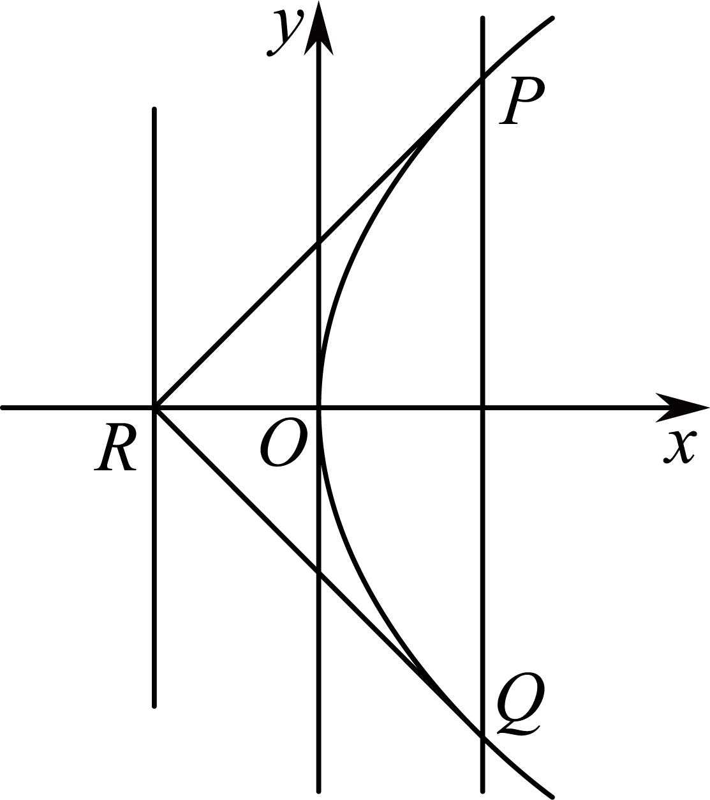

可得，又，，

所以，即，

解得，

所以的方程为.

故选：C

**变式1．**（2024·陕西渭南·高三统考阶段练习）抛物线的焦点坐标为（    ）

A．	B．	C．	D．

【答案】B

【解析】抛物线的标准形式为，

所以抛物线的焦点在轴的正半轴上，

且，所以焦点坐标为.

故选：B

**变式2．**（2024·全国·高三校联考开学考试）过抛物线的焦点的直线交于两点，若直线过点，且，则抛物线的准线方程是（    ）

A．	B．	C．	D．

【答案】D

【解析】因为直线过点，所以直线的方程为.

由得，.

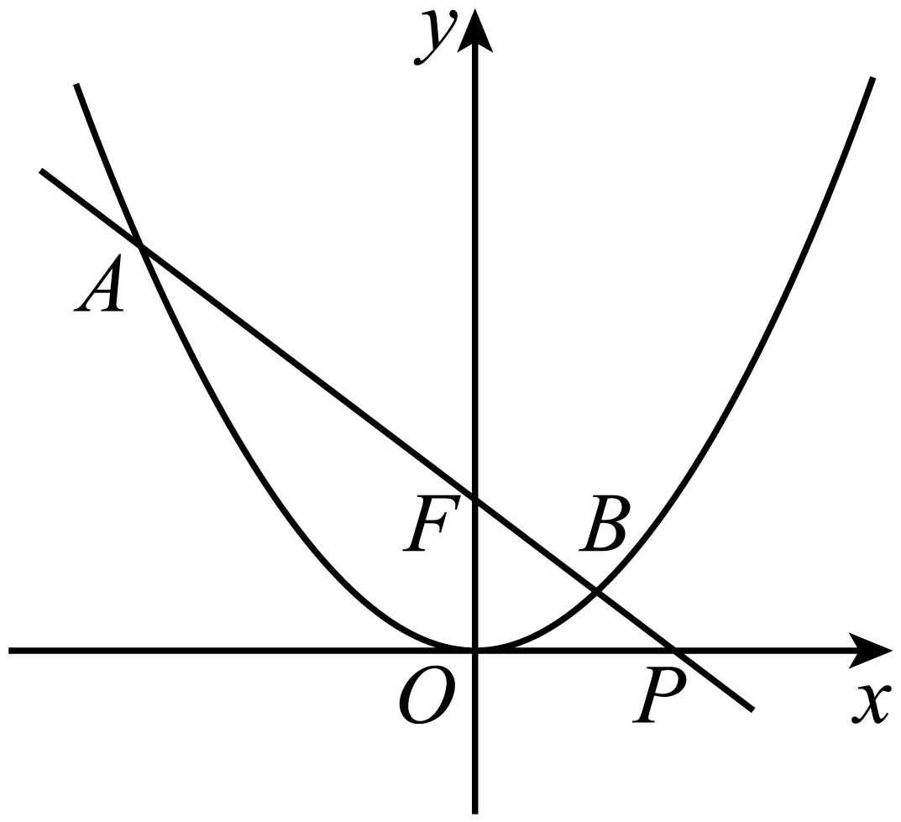

设，则.

因为

，

整理得，解得，

所以抛物线的准线方程是.

故选：D.

<strong>变式3．</strong>（2024·广西防城港·高三统考阶段练习）已知点<em>A</em>，<em>B</em>在抛物线上，<em>O</em>为坐标原点，若，且的垂心恰好是此抛物线的焦点<em>F</em>，则直线<em>AB</em>的方程是（    ）

A．	B．	C．	D．

【答案】D

【解析】如图所示，为的垂心，为焦点，

，垂直平分线段，直线垂直于轴．

设，，其中，

为垂心，，，

即，解得，

直线的方程为，即．

故选：D*．*

**变式4．**（2024·四川绵阳·高三绵阳南山中学实验学校校考阶段练习）已知抛物线的焦点为，准线为，过上的一点作的垂线，垂足为，点，与相交于点．若，且的面积为，则的方程为（    ）

A．	B．

C．	D．

【答案】C

【解析】设点，抛物线的焦点，准线，

由得：，解得，不妨令点*A*在第一象限，则，，如图，

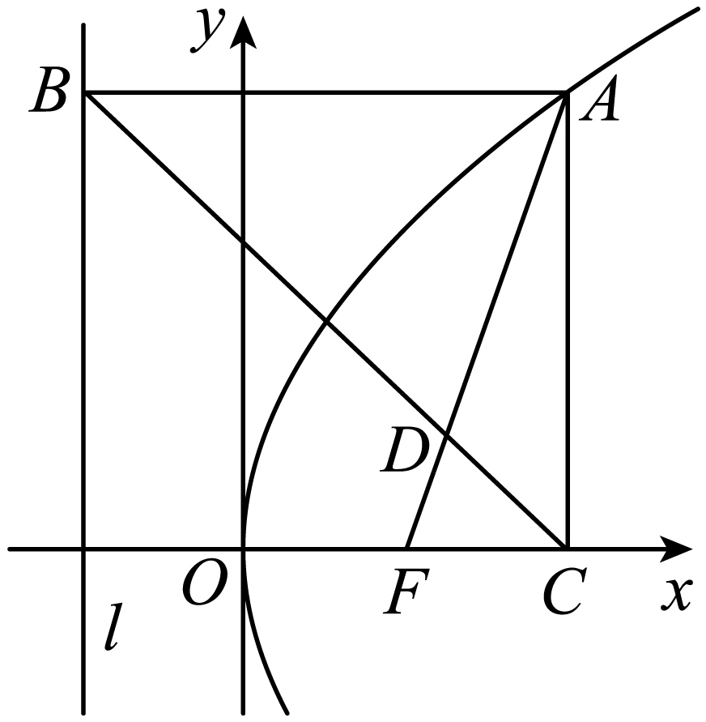

因为，则，即有点*D*到*x*轴距离，

，解得，

所以的方程为.

故选：C

**【解题方法总结】**

求抛物线的标准方程的步骤为：

（1）先根据题设条件及抛物线定义判断它为抛物线并确定焦点位置：

（2）根据题目条件列出*P*的方程

（3）解方程求出*P*，即得标准方程

**题型二：抛物线的轨迹方程**

<strong>例4．</strong>（2024·高三课时练习）已知点<em>F</em>（1，0），直线，若动点<em>P</em>到点<em>F</em>和到直线<em>l</em>的距离相等，则点<em>P</em>的轨迹方程是______.

【答案】

【解析】根据抛物线定义可知，点在以为焦点，直线为准线的抛物线上，

所以，，抛物线方程为.

故答案为：.

<strong>例5．</strong>（2024·全国·高三专题练习）在平面坐标系中，动点<em>P</em>和点满足，则动点的轨迹方程为_____________．

【答案】

【解析】由题意，

由得，

化简得．

故答案为：．

<strong>例6．</strong>（2024·全国·高三专题练习）与点和直线的距离相等的点的轨迹方程是______．

【答案】

【解析】由抛物线的定义可得平面内与点和直线的距离相等的点的轨迹为抛物线，且为焦点，直线为准线，

设抛物线的方程为，

可知，解得，

所以该抛物线方程是，

故答案为：

<strong>变式5．</strong>（2024·全国·高三专题练习）已知动点的坐标满足，则动点的轨迹方程为_____________．

【答案】

【解析】设直线，则动点到点的距离为，动点到直线的距离为，又因为，

所以动点*M*的轨迹是以为焦点，为准线的抛物线，其轨迹方程为．

故答案为：

<strong>变式6．</strong>（2024·全国·高三专题练习）已知动点到定点与定直线的距离的差为1．则动点的轨迹方程为________．

【答案】，（注：也算对）

【解析】由题意，若时，问题等价于，

则，化简得，

若，也满足题意.

所以动点的轨迹方程为，.

或者根据题意有，则，化简整理得：.

所以动点的轨迹方程为.

故答案为：，（注：也算对）

<strong>变式7．</strong>（2024·辽宁沈阳·高三沈阳二中校考阶段练习）点，点是轴上的动点，线段的中点在轴上，且垂直，则点的轨迹方程为________________．

【答案】

【解析】设，，则中点坐标为，由得，即，

又，

若，则，即，

若，则，重合，直线不存在．

所以轨迹方程是．

故答案为：．

<strong>变式8．</strong>（2024·全国·高三专题练习）已知动圆<em>P</em>与定圆<em>C</em>：（<em>x</em>+2）2+<em>y2</em>＝1相外切，又与直线<em>x</em>＝1相切，那么动圆圆心<em>P</em>的轨迹方程是__．

【答案】<em>y2</em>＝﹣8<em>x</em>

【解析】设圆心<em>P</em>到直线<em>x</em>＝1的距离等于<em>r</em>，<em>P</em>（<em>x</em>，<em>y</em> ），由题意可得 <em>PC</em>＝1+<em>r</em>，即 ＝1+1﹣<em>x</em>，化简可得 <em>y2</em>＝﹣8<em>x</em>.

故答案为：<em>y2</em>＝﹣8<em>x</em>．

<strong>变式9．</strong>（2024·河南·校联考模拟预测）一个动圆与定圆相外切，且与直线相切，则动圆圆心的轨迹方程为_______．

【答案】

【解析】由题意可知，圆的圆心为，半径为，

由于动圆与定圆相外切，且与直线相切，

动圆圆心到点的距离比它到直线的距离大，

所以，动圆圆心到点的距离等于它到直线的距离，

所以，动圆圆心的轨迹是以点为圆心，以直线为准线的抛物线，

设动圆圆心的轨迹方程为，则，可得，

所以，动圆圆心的轨迹方程为.

故答案为：.

<strong>变式10．</strong>（2024·上海·高三专题练习）已知点，直线：，两个动圆均过点且与相切，其圆心分别为、，若动点满足，则的轨迹方程为______.

【答案】

【解析】由抛物线的定义得动圆的圆心轨迹方程，设，，，根据可得，，利用可求得结果.由抛物线的定义得动圆的圆心轨迹是以为焦点，直线：为准线的抛物线，其方程为，

设，，，因为动点满足，

所以，即，，

所以，，因为，所以，

所以，即的轨迹方程为.

故答案为：

<strong>变式11．</strong>（2024·全国·高三专题练习）已知点、，直线与相交于点，且直线的斜率与直线的斜率之差为，点的轨迹为曲线，则曲线 的轨迹方程为_______

【答案】

【解析】设，由题意可得：，化简可得曲线的轨迹方程．设，由题意可得：，

化为．

曲线的轨迹方程为且．

故答案为：．

**【解题方法总结】**

常见考题中，会让我们利用圆锥曲线的定义求解点*P*的轨迹方程，这时候要注意把动点*P*和满足焦点标志的定点连起来做判断．焦点往往有以下的特征：（1）关于坐标轴对称的点；（2）标记为*F*的点；（3）圆心；（4）题上提到的定点等等．当看到满足以上的标志的时候要想到曲线的定义，把曲线和满足焦点特征的点连起来结合曲线定义判断．注意：在求解轨迹方程的题中，要注意*x*和*y*的取值范围．

**题型三：与抛物线有关的距离和最值问题**

<strong>例7．</strong>（2024·江苏无锡·校联考三模）已如，是抛物线上的动点（异于顶点），过作圆的切线，切点为，则的最小值为______.

【答案】3

【解析】依题意，设，有，圆的圆心，半径，

于是，

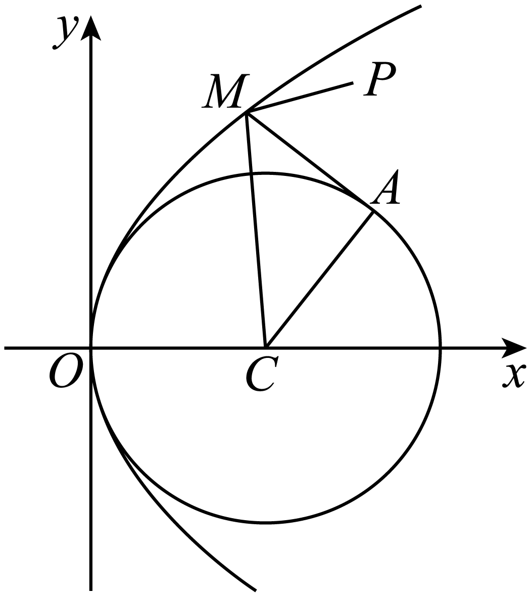

因此，表示抛物线上的点到*y*轴距离与到定点的距离的和，

而点在抛物线内，当且仅当是过点垂直于*y*轴的直线与抛物线的交点时，取得最小值3，所以的最小值为3.

故答案为：3.

<strong>例8．</strong>（2024·江苏南通·统考模拟预测）已知点是抛物线上的动点，则的最小值为______.

【答案】/

【解析】由题可知，过抛物线上的动点作直线的垂线交直线于，过点作轴的垂线交轴于，交准线于点，为抛物线焦点，

由，得，所以，如图所示

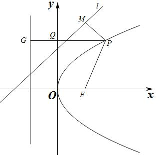

则动点到轴的距离为

所以，

当且仅当三点共线时，有最小值，即(此时为点到直线的距离)，

所以到直线的距离为，

所以，

所以.

所以的最小值为.

故答案为：

<strong>例9．</strong>（2024·浙江绍兴·统考模拟预测）函数的最大值为________．

【答案】

【解析】将给定的函数表达式变形为，

问题转化为求点到点与距离之差的最大值，

而点的轨迹为抛物线，如图所示，

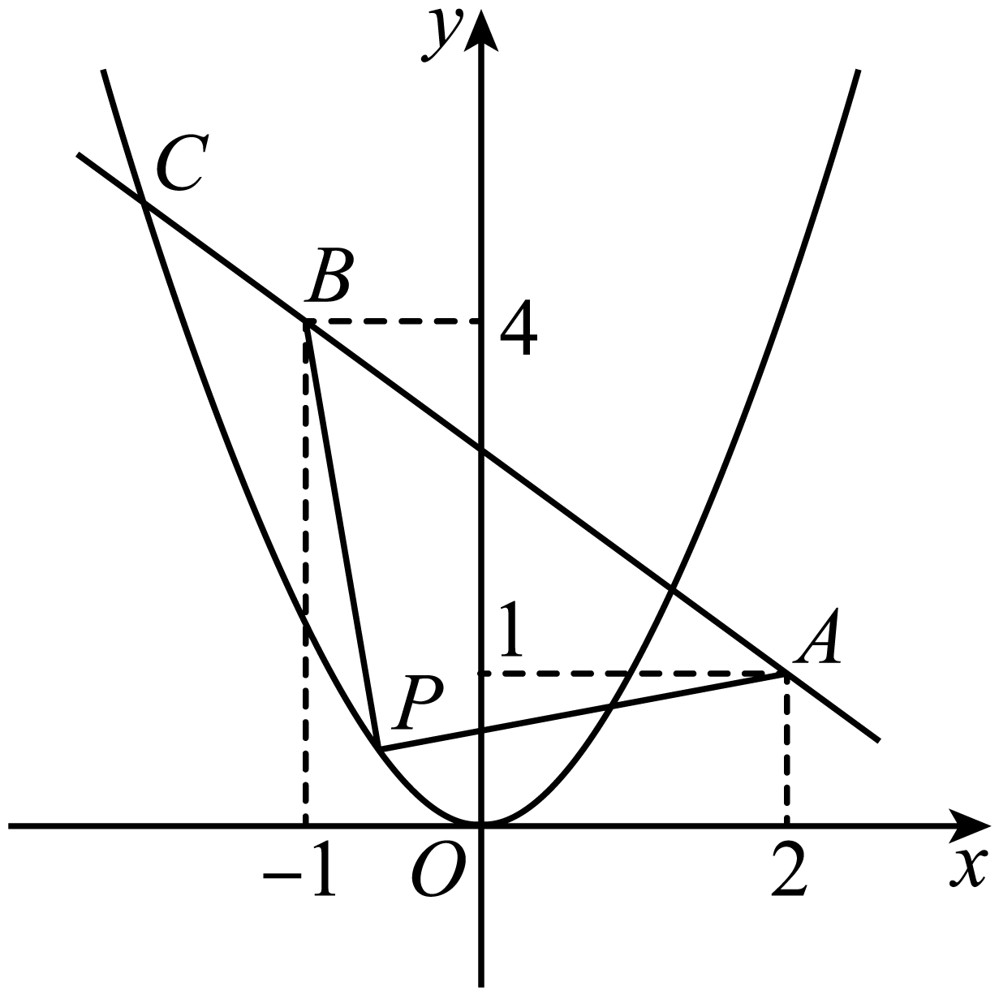

由*A*、*B*的位置知直线必交抛物线于第二象限的一点*C*，

由三角形两边之差小于第三边可知*P*位于*C*时，才能取得最大值.

.

故答案为：.

<strong>变式12．</strong>（2024·广西南宁·南宁三中校考模拟预测）已知斜率为的直线过抛物线的焦点，且与该抛物线交于两点，若为该抛物线上一点，为圆上一点，则的最小值为__________.

【答案】/

【解析】由题可知直线的方程为，设，则

由,消去，整理得，，

所以，

所以，解得，

所以，而圆的圆心,

因为，

当且仅当点在同一条直线上取等号，且点位于点之间，如图所示：

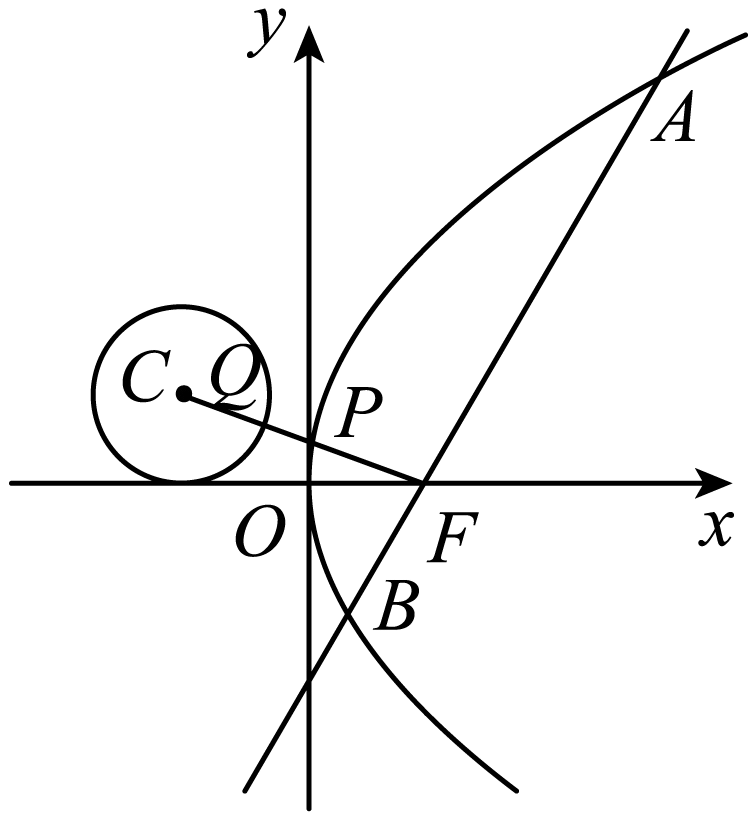

又，

所以的最小值为.

故答案为：.

<strong>变式13．</strong>（2024·山东潍坊·统考模拟预测）已知抛物线，其焦点为<em>F</em>，<em>PQ</em>是过点<em>F</em>的一条弦，定点<em>A</em>的坐标是，当取最小值时，则弦<em>PQ</em>的长是______.

【答案】

【解析】抛物线的焦点，准线为，

如图，过点作准线的垂线，垂足为，

则，

所以，当且仅当三点共线时取等号，

所以当取最小值时，点的横坐标为，

当时，，即，

所以，

所以直线的方程为，

联立，消得，解得或，

当时，，即，

所以.

故答案为：.

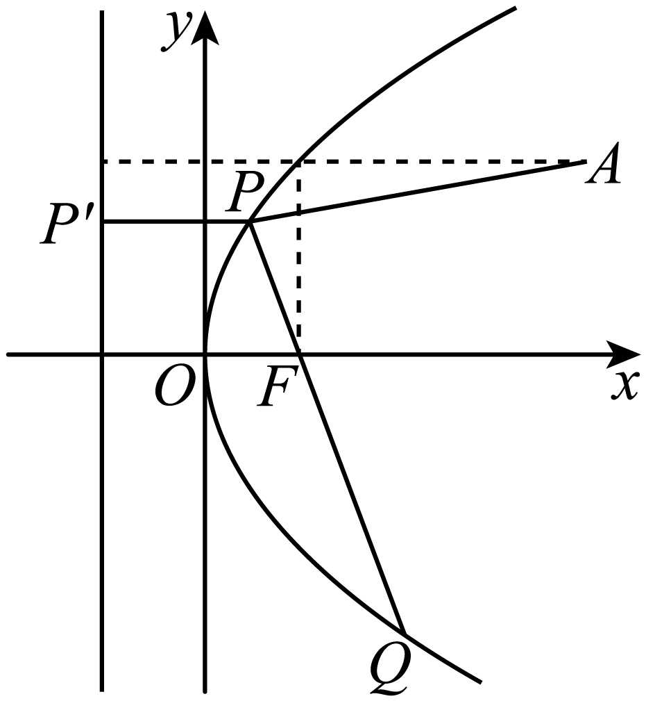

<strong>变式14．</strong>（2024·全国·高三专题练习）已知点<em>M</em>为抛物线上的动点，点<em>N</em>为圆上的动点，则点<em>M</em>到<em>y</em>轴的距离与点<em>M</em>到点<em>N</em>的距离之和最小值为______..

【答案】

【解析】由题可知，抛物线的准线方程为，焦点坐标为，

由抛物线的定义可知点*M*到*y*轴的距离即为，

圆的圆心坐标为，半径为，

故点*M*到*y*轴的距离与点*M*到点*N*的距离之和，

根据圆的性质可知点*M*到*y*轴的距离与点*M*到点*N*的距离之和最小值为.

故答案为：.

<strong>变式15．</strong>（2024·四川南充·高三四川省南充高级中学校考阶段练习）过点的直线交抛物线于两点，点的坐标为. 设线段的中点为则的最小值为______.

【答案】

【解析】由题意抛物线的焦点为，准线方程为，过点作准线的垂线，

垂足分别为，，取的中点为，连接，如下图所示：

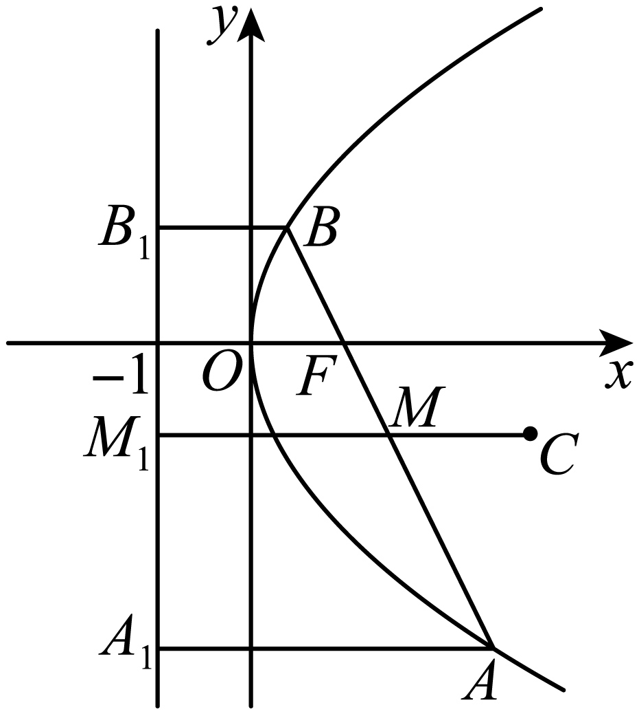

点到准线的距离为，易知四边形为直角梯形，则由抛物线的定义可得

.

即（当三点共线时，取等号）

即的最小值为.

故答案为：

<strong>变式16．</strong>（2024·辽宁大连·育明高中校考一模）已知是抛物线上一点，则的最小值为______.

【答案】/

【解析】由题可知， 过抛物线上的动点作直线的垂线交直线于，过点作轴的垂线交轴于，交准线于点，为抛物线焦点.

由，得，所以，如图所示

则动点到轴的距离为

所以,

当且仅当三点共线时，有最小值，即,( 为点到直线的距离).

所以到直线的距离为

所以，

所以.

所以的最小值为.

故答案为：.

<strong>变式17．</strong>（2024·江西南昌·高三统考阶段练习）已知抛物线的焦点为，过的直线交抛物线于，两点，则的最小值是______．

【答案】9

【解析】依题意，

因为抛物线的焦点为，所以，

①当斜率存在时：因为直线交抛物线于，两点，所以，

设过的直线的直线方程为：，，

由抛物线定义得：，

由消整理得：，

所以，即，

所以；

②当不存在时，直线为，此时，

所以；

综上可知，的最小值为：9.

故答案为：9.

<strong>变式18．</strong>（2024·上海嘉定·上海市嘉定区第一中学校考三模）已知点<em>P</em>是抛物线上的动点，<em>Q</em>是圆上的动点，则的最大值是______.

【答案】/

【解析】抛物线的焦点为，准线为，

圆的圆心为，半径，

过点作垂直准线，垂足为，由抛物线的定义可知，

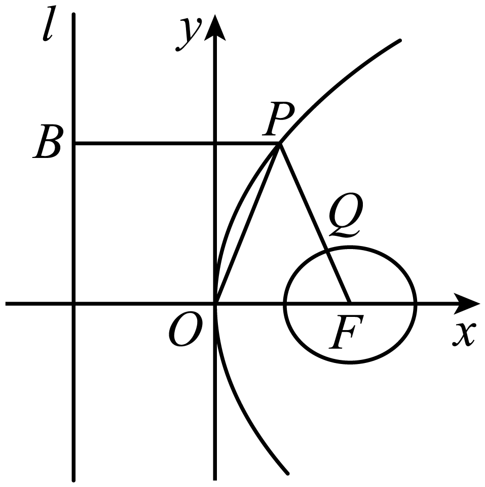

设，则，，

所以，

令，则，

所以，

所以当即时，取到最大值，

所以的最大值为，

因此，，所以的最大值是.

故答案为：.

<strong>变式19．</strong>（2024·江西·校联考模拟预测）已知是拋物线上两点，且，为焦点，则最大值为______.

【答案】

【解析】拋物线的焦点，

由题得，，

即，

故

，

即，因为，且余弦函数在内单调递减，

故，当且仅当时成立.

故答案为：.

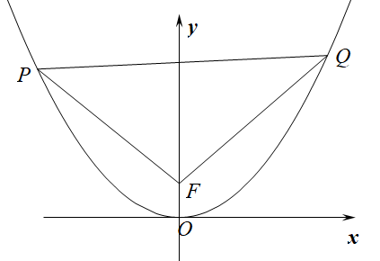

<strong>变式20．</strong>（2024·吉林通化·梅河口市第五中学校考模拟预测）已知<em>P</em>是抛物线上的动点，<em>P</em>到<em>y</em>轴的距离为，到圆上动点<em>Q</em>的距离为，则的最小值为______．

【答案】2

【解析】圆的圆心为，半径，

抛物线的焦点，准线方程为，

过点作准线的垂线，垂足为，

因为是抛物线上的动点，到轴的距离为，

到圆上动点的距离为，

所以，，当且仅当三点共线时等号成立，且点在线段上，

所以，

又，当且仅当点为线段与抛物线的交点时等号成立，又，

所以，

当且仅当点为线段与抛物线的交点，点为线段与圆的交点时等号成立，

所以的最小值为2，

故答案为：2

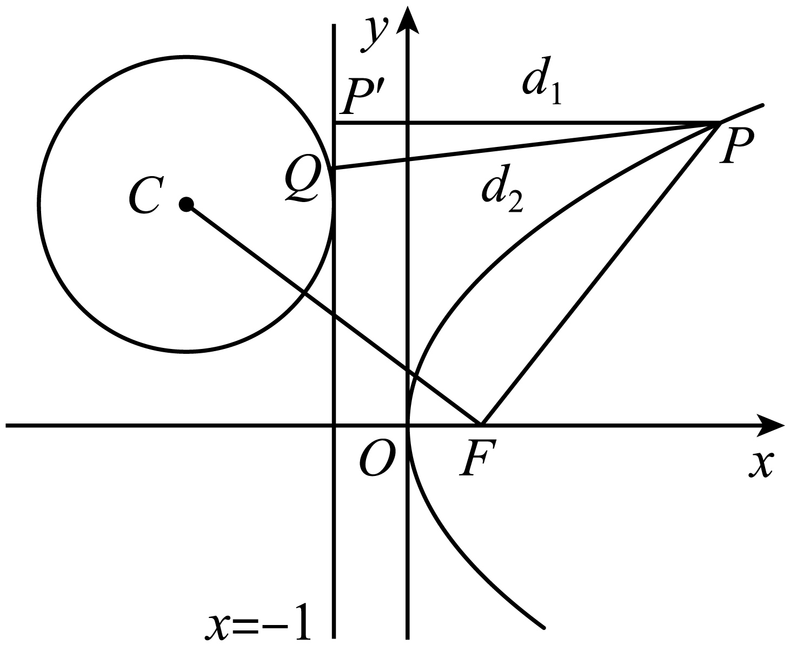

<strong>变式21．</strong>（2024·河南·校联考模拟预测）的最小值为______．

【答案】

【解析】易知动点的轨迹为抛物线，*C*的焦点为，设*P*到*C*的准线的距离为*d*，，

则，

故的最小值为．

故答案为：.

<strong>变式22．</strong>（2024·全国·高三专题练习）已知点 是坐标平面内一定点， 若抛物线的焦点为， 点是抛物线上的一动点， 则的最小值是__________.

【答案】/

【解析】

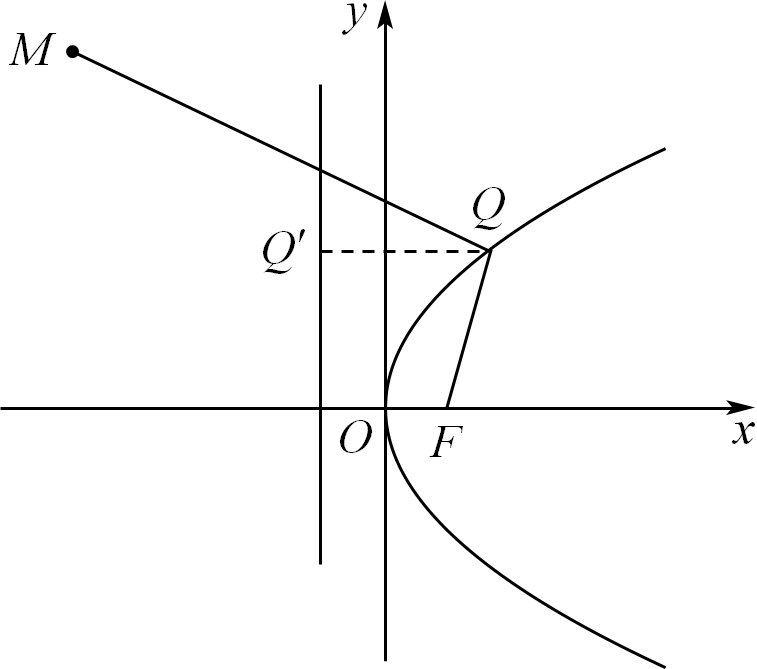

抛物线的准线方程为，

过点作垂直准线于点，

显然，当平行于轴时，

取得最小值，此时，

此时

故答案为:.

<strong>变式23．</strong>（2024·福建福州·高三福建省福州第八中学校考阶段练习）已知为抛物线上的一个动点，为圆上的一个动点，那么点到点的距离与点到抛物线准线的距离之和的最小值是______.

【答案】/

【解析】由题可知，抛物线的准线方程为，焦点坐标为，

圆的圆心坐标为，半径为，

设点到抛物线准线的距离为，则，故，

所以当动点位于线段上时，点到点的距离与点到抛物线准线的距离之和最小，

此时.

故答案为：.

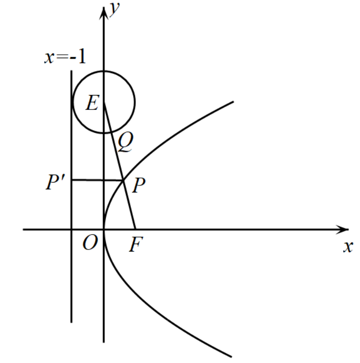

**【解题方法总结】**

抛物线上任意一点到焦点的距离等于到准线的距离，利用这一定义可以把相等长度的线段进行转化，从而把两条线段长度之和的问题转化为两点间的距离问题或点到直线的距离问题，即在解题中掌握“抛物线的定义及其性质”，若求抛物线上的点到定直线（并非准线）距离的最值问题用参数法或切线法求解．

**题型四：抛物线中三角形，四边形的面积问题**

<strong>例10．</strong>（2024·四川乐山·统考三模）已知抛物线的焦点为<em>F</em>，准线为<em>l</em>，过点<em>F</em>的直线交<em>C</em>于<em>P</em>，<em>Q</em>两点，于<em>H</em>，若，<em>O</em>为坐标原点，则与的面积之比为（    ）

A．6	B．8	C．12	D．16

【答案】C

【解析】依题意，由于*H*，得，即是正三角形，，

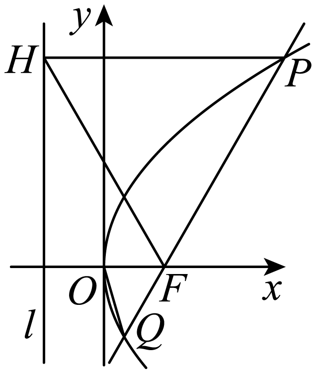

而，则直线的方程为，

由，消去*y*并整理，得，

令，解得，又准线，

因此，

所以与的面积之比.

故选：C.

**例11．**（2024·山东青岛·统考二模）已知为坐标原点，直线过抛物线的焦点，与及其准线依次交于三点（其中点在之间），若，,则的面积是（    ）

A．	B．	C．	D．

【答案】B

【解析】过点作垂直于准线，垂足为，过点作垂直于准线，垂足为，

设准线与轴相交于点，

如图，

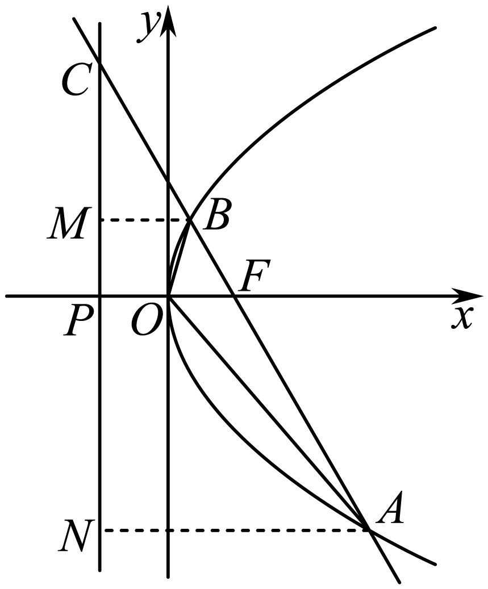

则，，

在中，，所以，所以，

在中，，

所以，所以.

又轴，，所以.

又抛物线，则,

所以，所以抛物线，点.

因为，所以直线的斜率，

则直线，

与抛物线方程联立,消并化简得,

设点，则，

则.

又直线可化为，

则点到直线的距离,

所以.

故选:B.

<strong>例12．</strong>（2024·北京·101中学校考模拟预测）已知直线，定点，<em>P</em>是直线上的动点，若经过点<em>F</em>，<em>P</em>的圆与<em>l</em>相切，则这个圆的面积的最小值为（    ）

A．	B．	C．	D．

【答案】B

【解析】根据题意，设圆的圆心为，则圆心到的距离等于到直线的距离，

故的轨迹为抛物线，抛物线方程为，

当点与原点重合时，半径最小为，

此时，圆心到直线的距离为，

直线与圆有交点，满足，圆的面积的最小值为.

故选：B

**变式24．**（2024·黑龙江大庆·高三肇州县第二中学校考阶段练习）已知抛物线，点为抛物线上任意一点，过点向圆作切线，切点分别为，则四边形的面积的最小值为（    ）

A．3	B．	C．	D．

【答案】C

【解析】如图所示：

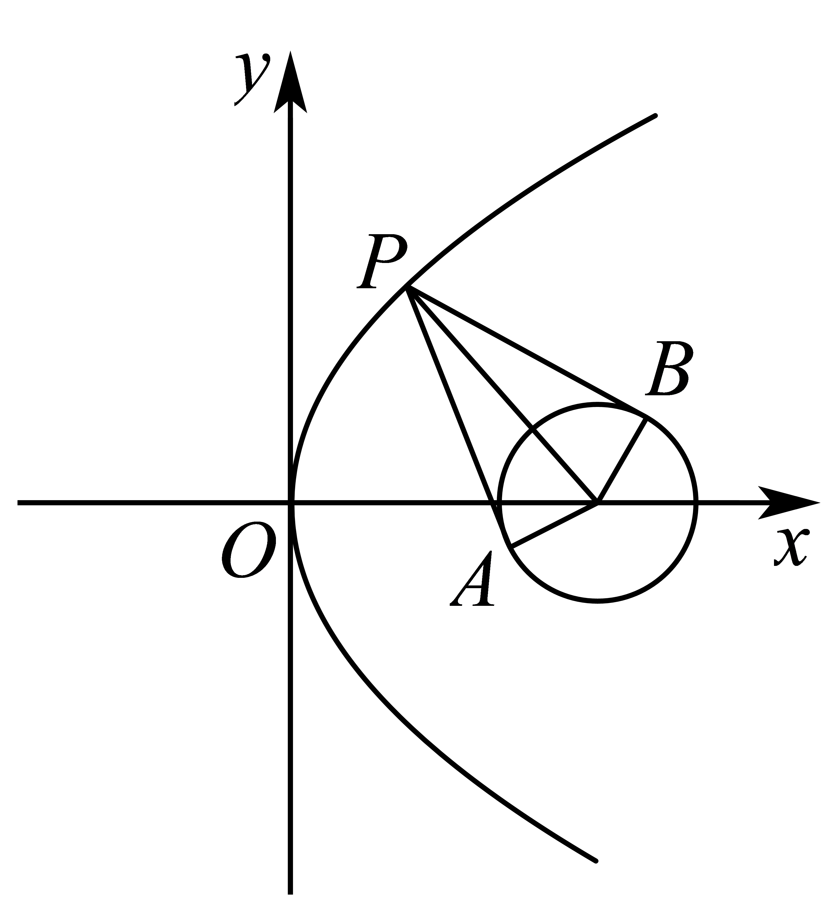

设，，

连接，圆为：，

则，

则，

当点时，的最小值为，

所以，

故选：C

**变式25．**（2024·贵州·高三统考开学考试）已知抛物线的焦点为是抛物线上的一点， 若， 则 (为坐标原点)的面积是（    ）

A．	B．1	C．2	D．4

【答案】A

【解析】由题可得，因为，

所以，，

所以为坐标原点)的面积是.

故选：A.

**变式26．**（2024·全国·高三专题练习）已知抛物线：，点为抛物线上任意一点，过点向圆：作切线，切点分别为，，则四边形的面积的最小值为（    ）

A．1	B．2	C．	D．

【答案】C

【解析】如图，连接，圆：，该圆的圆心与抛物线的焦点重合，半径为1，

则．

又，所以当四边形的面积最小时，最小．

过点向抛物线的准线作垂线，垂足为，则，

当点与坐标原点重合时，最小，此时．

故．

故选：C

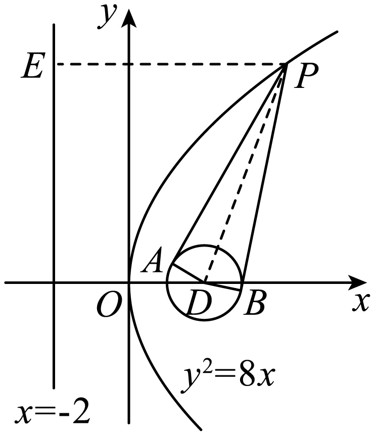

**变式27．**（2024·江西宜春·校联考模拟预测）已知斜率为的直线过抛物线：的焦点且与抛物线相交于两点，过分别作该抛物线准线的垂线，垂足分别为，，若与的面积之比为2，则的值为（    ）

A．	B．	C．	D．

【答案】D

【解析】如图所示：

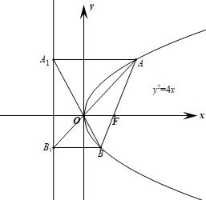

由抛物线：，得，

设直线：，，，

由得，

所以，，

由已知和抛物线定义知：，

则有，即，

所以

解得，，.

故选：D

<strong>变式28．</strong>（2024·安徽淮南·统考二模）抛物线的焦点为<em>F</em>，准线为<em>l</em>，过点<em>F</em>作倾斜角为的直线与抛物线在<em>x</em>轴上方的部分相交于点<em>A</em>，，垂足为<em>K</em>，若的面积是，则<em>p</em>的值为（    ）

A．1	B．2	C．	D．3

【答案】B

【解析】根据抛物线的定义可知，，又，，

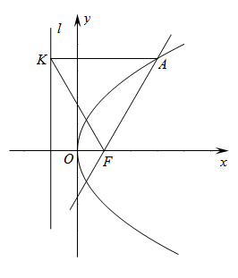

故是等边三角形，又的面积是，

故可得，

故.

故选：B.

**【解题方法总结】**

解决此类问题经常利用抛物线的定义，将抛物线上的点焦点的距离转化为到准线的距离，并构成直角三角形或直角梯形，从而计算其面积或面积之比．

**题型五：焦半径问题**

<strong>例13．</strong>（2024·江西·高三统考开学考试）已知为抛物线：的焦点，，，为上的三点，若，则________.

【答案】

【解析】由题意知，设，，的横坐标分别为，，，

由，得，所以，

由抛物线的定义得.

故答案为：

<strong>例14．</strong>（2024·福建福州·校考模拟预测）已知抛物线的焦点为，点为曲线上一点，若，则点的坐标为________．

【答案】

【解析】由抛物线可得：，

由抛物线的定义可得：，则，

又因为点为曲线上一点，所以，

所以，所以点的坐标为.

故答案为：

<strong>例15．</strong>（2024·湖北武汉·统考模拟预测）已知抛物线的焦点为，准线与轴的交点为，过点的直线与抛物线交于，两点，若，则________．

【答案】8

【解析】由题意得，，当直线的斜率为0时，与抛物线只有1个交点，不合要求，

故设直线的方程为，不妨设，

联立，可得，易得，

设，则，

则，

则，

，

由正弦定理得，，

因为，，

所以，，即，

又由焦半径公式可知，

则，即，

即，解得，

则，解得，

故，

当时，同理可得到.

故答案为：8

<strong>变式29．</strong>（2024·全国·模拟预测）若过点向抛物线作两条切线，切点分别为<em>A</em>，<em>B</em>，<em>F</em>为抛物线的焦点，则______．

【答案】/

【解析】由题意可得点*F*的坐标为，点不在抛物线上，

设点*A*，*B*的坐标分别为，

∵，即，则，

可得，

所以抛物线*C*在点*A*处的切线方程为，则，

又∵切线过点可，则，得，

同理可得，

即点*A*，*B*的坐标满足方程，

所以直线*AB*的方程为，即，

联立方程，消去*y*并整得，

则，，，

∵，

则

，

且，

所以．

故答案为：.

<strong>变式30．</strong>（2024·全国·高三专题练习）设抛物线的焦点为，准线为，过抛物线上一点<em>A</em>作的垂线，垂足为，设，若与相交于点的面积为，则抛物线的方程为___________.

【答案】

【解析】设，

又，则，

由抛物线的定义得，所以，则，

由得，即，

所以，,

所以，解得：.

故答案为：

<strong>变式31．</strong>（2024·全国·高三专题练习）如图，过抛物线的焦点的直线交抛物线与圆于四点，则 ______.

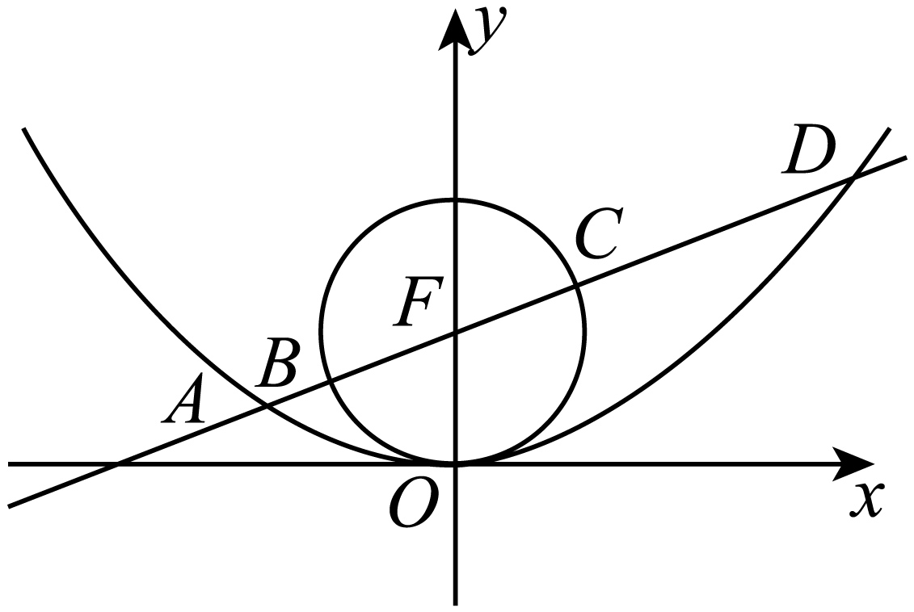

【答案】1

【解析】抛物线的焦点为，准线为，可设直线方程为，直线，与联立得：，可得,,

,

答案为1.

<strong>变式32．</strong>（2024·全国·高三专题练习）抛物线，直线l经过抛物线的焦点F，与抛物线交于A、B两点，若，则（O为坐标原点）的面积为______．

【答案】

【解析】由题意可知：，结合焦半径公式有：，

解得：，故直线*AB*的方程为：，

与抛物线方程联立可得：，

则，

故的面积.

<strong>变式33．</strong>（2024·河南南阳·南阳中学校考模拟预测）抛物线: 的焦点为,设过点的直线交抛物线与两点，且,则______.

【答案】4

【解析】设点的横坐标分别为，且

由焦半径公式得，

当 时，

，

的方程为 ，

则，化简可得，

，且，所以，

所以 ，

同理，时，.

故答案为.

<strong>变式34．</strong>（2024·广东茂名·茂名市第一中学校考三模）已知为坐标原点，直线过抛物线的焦点，与抛物线及其准线依次交于三点（其中点在之间），若.则的面积是______.

【答案】/

【解析】过点作垂直于准线，垂足为，过点作垂直于准线，垂足为，设准线与轴相交于点，如图，

则，

在中，，所以，所以，

故在中，，所以，则.

又轴，，所以，

又抛物线，则，所以，

所以抛物线，点.

因为，所以直线的斜率，则直线，

与抛物线方程联立，消并化简得，

易得，设点，则，

则，

又直线，可化为，

则点到直线的距离，

所以.

故选：B.

<strong>变式35．（多选题）</strong>（2024·全国·模拟预测）已知抛物线<em>E</em>：的焦点为<em>F</em>，准线<em>l</em>交<em>x</em>轴于点<em>C</em>，直线<em>m</em>过<em>C</em>且交<em>E</em>于不同的<em>A</em>，<em>B</em>两点，<em>B</em>在线段上，点<em>P</em>为<em>A</em>在<em>l</em>上的射影．下列命题正确的是（    ）

A．若，则	B．若*P*，*B*，*F*三点共线，则

C．若，则	D．对于任意直线*m*，都有

【答案】BCD

【解析】解法一：由已知条件可得

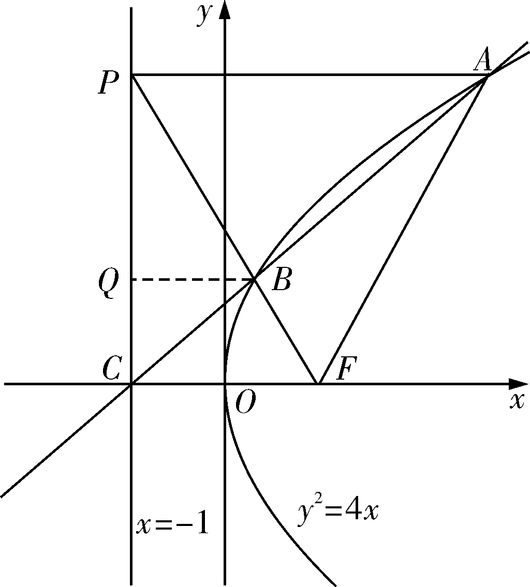

由抛物线的对称性，不妨设直线的方程为

依题意，由整理，得

当，即时，由韦达定理，

得.

对于选项，因为直线的斜率为，

所以，即

又，所以，解得，所以

所以，

故，故错误；

对于选项，易得，所以

当三点共线时，，

所以

由和，解得，

所以故正确

对于选项，过作，垂足为由已知可得，

所以.

又，所以.

由抛物线的定义，得

因此故正确；

对于选项，因为，

所以，又，

故成立.故正确.

故选：BCD.

解法二：对于选项，假设成立，则为等腰直角三角形，

，所以为等腰直角三角形，则点在轴上，这与已知条件显然矛盾，故

故错误，其他选项同解法一进行判断.

故选：BCD.

<strong>变式36．（多选题）</strong>（2024·广东惠州·高三统考阶段练习）已知抛物线的焦点为<em>F</em>，直线与抛物线<em>C</em>交于<em>A</em>、<em>B</em>两点，下面说法正确的是（    ）

A．抛物线*C*的准线方程为	B．

C．时，	D．

【答案】BD

【解析】由题意，可得，，准线，故A错误；

设根据抛物线的定义可得

，则，，

根据抛物线的定义可得，

当时，，故，故C错误；

，故D正确；

取*AB*的中点*M*，则*M*为以*AB*为直径的圆的圆心，设，过*M*作*MN*⊥准线*a*于*N*，过*A*作⊥准线*a*于，过*B*作⊥准线*a*于，

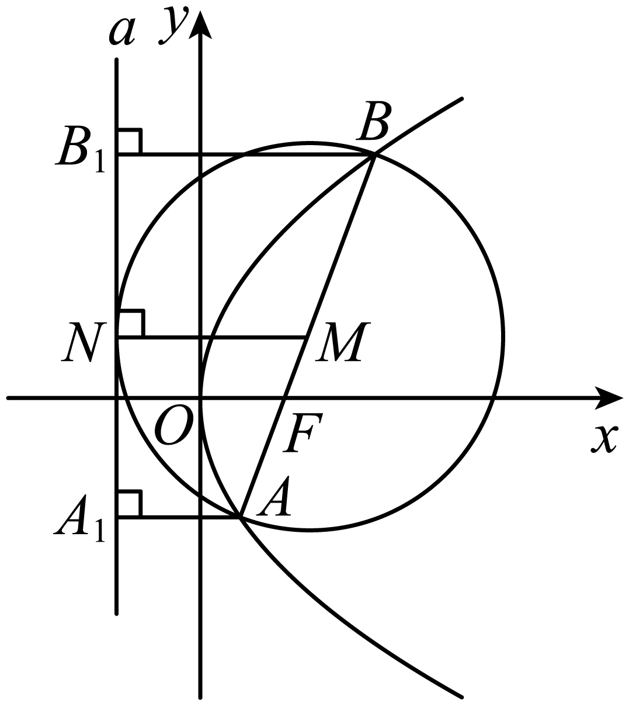

根据梯形的性质和抛物线的定义可得，

即以*AB*为直径的圆与抛物线*C*的准线相切，

则*O*在以*AB*为直径的圆的内部，故，故B正确.

故选：BD

<strong>变式37．（多选题）</strong>（2024·云南昭通·校联考模拟预测）已知<em>A</em>，<em>B</em>是抛物线：上两动点，为抛物线的焦点，则（    ）

A．直线*AB*过焦点*F*时，最小值为4

B．直线*AB*过焦点*F*且倾斜角为时，

C．若*AB*中点*M*的横坐标为2，则最大值为5

D．

【答案】BC

【解析】对于A项，过点分别作准线的垂线，垂足分别为，

过点分别作轴的垂线，垂足分别为，准线与轴的交点为，

设直线的倾斜角为，画图为：

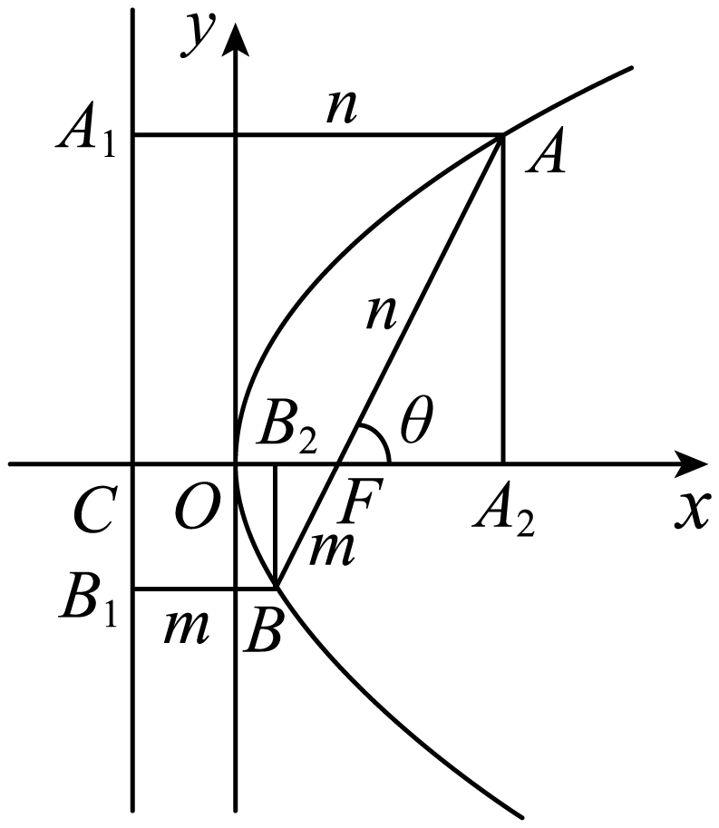

根据抛物线的定义：，从图可知，，

，在中，，

所以，同理，

则

，故当时，

故最小值为，此时垂直于轴，所以A不正确；

对于B项，由A可知，，故B正确；

对于C项，，

当且仅当直线过焦点时等号成立，所以最大值为5，故C正确；

当直线过焦点时，，

当直线不过焦点时，不是定值，

举例当时，此时，，

即，，，故D错误；

故选：BC.

<strong>变式38．（多选题）</strong>（2024·湖南常德·常德市一中校考二模）已知点是抛物线上过焦点的两个不同的点，<em>O</em>为坐标原点，焦点为<em>F</em>，则（    ）

A．焦点*F*的坐标为（4，0）	B．

C．	D．

【答案】BD

【解析】由抛物线，可得焦点为，故A错误；

由焦半径公式可得，故B正确；

设直线的方程为，与抛物线的方程联立，可得，

则，，故C错误；

，故D正确．

故选：BD

**变式39．（多选题）**（2024·安徽亳州·安徽省亳州市第一中学校考模拟预测）已知为抛物线的焦点，为其准线与轴的交点，为坐标原点.直线与该抛物线交于、两点.则以下描述正确的是（    ）

A．线段的长为4	B．的面积为

C．	D．抛物线在、两点处的切线交于点

【答案】BC

【解析】抛物线的焦点为，准线为，所以，

由，消去整理得， 解得，，

此时，，则，，，

即，，或，，

所以或，故A错误；

因此，

因此原点到直线的距离等于，

所以，故B正确；

，故C正确；

对于D：不妨取，，由，，则，

则过的切线方程为，即，

显然曲线在点处的切线不过，故D错误；

故选：BC

**变式40．（多选题）**（2024·山东德州·三模）已知抛物线的焦点为，准线为，直线与轴交于点，过点的直线与抛物线交于两点，为坐标原点，则（    ）

A．若，则	B．

C．	D．面积的最小值为16

【答案】ACD

【解析】抛物线的焦点为，准线，，

设直线为，则，即，

，故，，故，

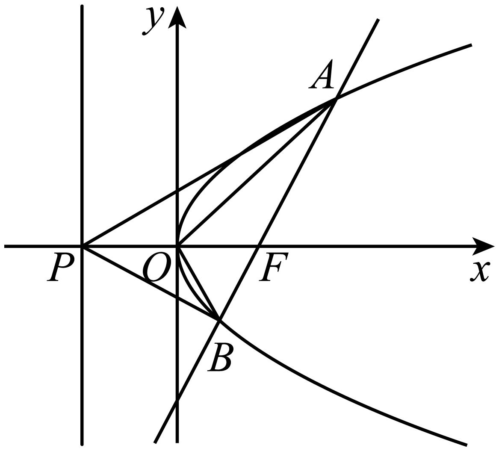

对选项A：，正确；

对选项B：，错误；

对选项C：，正确；

对选项D：，

当时等号成立，正确；

故选：ACD.

<strong>变式41．</strong>（2024·河南·校联考模拟预测）已知<em>F</em>为抛物线的焦点，<em>A</em>，<em>B</em>，<em>C</em>为该抛物线上的三点，<em>O</em>为坐标原点，，，面积分别为 ，若<em>F</em>为的重心，且，则该抛物线的方程为（    ）

A．	B．

C．	D．

【答案】D

【解析】设、、三点的坐标分别为，，，，，，

抛物线的焦点的坐标为,

，，

，

、、在抛物线上，，，，

由此可得：，

点是的重心，

，可得,

因此，,解得 （负值舍去），

故该抛物线的方程为，

故选：．

<strong>变式42．</strong>（2024·全国·高三专题练习）已知抛物线的焦点为<em>F</em>，过原点<em>O</em>的动直线<em>l</em>交抛物线于另一点<em>P</em>，交抛物线的准线于点<em>Q</em>，下列说法正确的是（    ）

A．若*O*为线段*PQ*中点，则*PF*＝1	B．若*PF*＝4，则*OP*＝2

C．存在直线*l*，使得*PF*⊥*QF*	D．△*PFQ*面积的最小值为2

【答案】D

【解析】抛物线的准线为,焦点*F*(1,0).

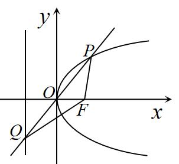

对于A：若*O*为*PQ*中点,所以*xp*=1,所以,故A错误；

对于B：若,则,所以.故B错误;

对于C：设,由*O、P、Q*三点共线，可得，所以,,所以,所以*FP*与*FQ*不垂直,故C错误;

对于D：,当且仅当,即时取等号，所以△*PFQ*面积的最小值为2.故D正确.

故选：D.

**变式43．**（2024·云南昆明·高三云南省昆明市第十中学校考开学考试）已知直线与抛物线相切于点，是的焦点，则（    ）

A．6	B．4	C．3	D．2

【答案】D

【解析】联立方程组，

整理得，

因为直线与抛物线相切，

则，

解得（舍去）或.

设，则，

故，则.

故选：D.

**变式44．**（2024·海南·高三海南中学校考阶段练习）已知抛物线的焦点为，若直线与交于，两点，且，则（    ）

A．4	B．5	C．6	D．7

【答案】B

【解析】令，则，故，所以，

所以，故准线为，则.

故选：B

**变式45．**（2024·广东珠海·珠海市斗门区第一中学校考三模）已知抛物线的焦点为，准线与坐标轴交于点是抛物线上一点，若，则的面积为（    ）

A．4	B．	C．	D．2

【答案】D

【解析】由，

得，

则，

根据抛物线的定义知2，

解得，

代入，

得，

所以的面积为.

故选：D.

**变式46．**（2024·上海徐汇·上海市南洋模范中学校考三模）已知抛物线的焦点与的一个焦点重合，过焦点的直线与交于，两不同点，抛物线在，两点处的切线相交于点，且的横坐标为4，则弦长（    ）

A．16	B．26	C．14	D．24

【答案】A

【解析】由题意可得，，则，抛物线方程为，准线方程．

由题意，直线*AB*的斜率存在，设直线*AB*的方程为，

设，其中，

由，得．

在点*A*处的切线方程为，化简得，①

同理可得在点*B*处的切线为，②

联立①②得，由*M*的横坐标为4，得，

将*AB*的方程代入抛物线方程，可得，

，得，

，

则．

故选：A．

**【解题方法总结】**

（1）．

（2）．

（3）．

**题型六：抛物线的性质**

**例16．（多选题）**（2024·全国·高三专题练习）关于抛物线，下列说法正确的是（    ）

A．开口向左	B．焦点坐标为	C．准线为	D．对称轴为轴

【答案】AD

【解析】对选项A，，开口向左，故A正确；

对选项B，，焦点为，故B错误；

对选项C，，准线方程为，故C错误；

对选项D，，对称轴为轴，故D正确.

故选：AD

**例17．（多选题）**（2024·山东日照·高三校联考期末）（多选）对于抛物线上，下列描述正确的是（    ）

A．开口向上，焦点为	B．开口向上，焦点为

C．焦点到准线的距离为4	D．准线方程为

【答案】AC

【解析】由抛物线，即，可知抛物线的开口向上，焦点坐标为，焦点到准线的距离为4，准线方程为．

故选：AC

<strong>例18．（多选题）</strong>（2024·浙江金华·模拟预测）已知为抛物线上的三个点，焦点<em>F</em>是的重心．记直线<em>AB</em>，<em>AC</em>，<em>BC</em>的斜率分别为，则（    ）

A．线段*BC*的中点坐标为

B．直线*BC*的方程为

C．

D．

【答案】ABD

【解析】设，

因为*F*为重心，

所以，设*BC*中点，则，

，由重心分中线得，

即，

又因为*A*在抛物线上，所以，所以，即，故A正确；

，

直线，故B正确；

因为，所以，所以，故C错误；

，同理，

所以，故D正确．

故选：ABD

**变式47．（多选题）**（2024·辽宁大连·校联考模拟预测）已知抛物线的焦点为，焦点到准线的距离为，为上的一个动点，则（    ）

A．的焦点坐标为

B．若，则周长的最小值为

C．若，则的最小值为

D．在轴上不存在点，使得为钝角

【答案】BCD

【解析】选项A，抛物线，焦点到准线的距离为，则，焦点，错误；

选项B，，，，

设到准线的距离为，到准线的距离为，

则的周长为，正确；

选项C，设，，则，

当时，的最小值为，正确；

选项D，设，，，，

，

，不可能为钝角，正确；

故选：BCD

<strong>变式48．（多选题）</strong>（2024·吉林通化·梅河口市第五中学校考模拟预测）已知点<em>A</em>是抛物线上的动点，为坐标原点，为焦点，，且三点顺时针排列，则（    ）

A．当点在轴上时，

B．当点在轴上时，点*A*的坐标为

C．当点*A*与点关于轴对称时，

D．若，则点*A*与点关于轴对称

【答案】ABC

【解析】因为，所以为等边三角形，

对于A，当点在轴上时，又三点顺时针排列，所以大致图像如图，

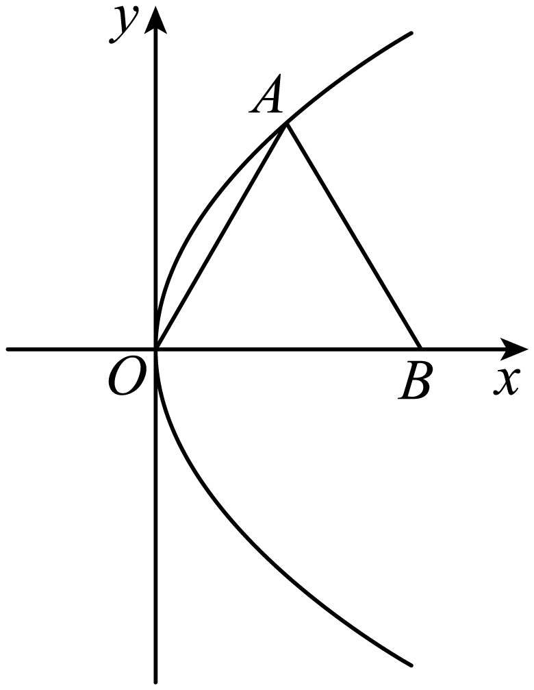

此时所在直线方程为，与联立，消去得，

解得或，所以，故A正确；

对于B，当点在轴上时，又三点顺时针排列，

所以此时*A*点在轴下方，且所在直线方程为，

与联立，消去得，解得或，

当时，，即*A*点坐标为，故B正确；

对于C，当点*A*与点关于轴对称时，又三点顺时针排列，

所以此时*A*点在轴上方，且所在直线方程为，

与联立，消去得，解得或，所以，故C正确；

对于D，当时，得*A*点横坐标为，此时*A*点可能在轴上方，也可能在轴下方.

因为三点顺时针排列，

所以当*A*点在轴上方时，可得点*A*与点关于轴对称；

当*A*点在轴下方时，可得此时点在轴上，点*A*与点不关于轴对称；故D错误；

故选：ABC.

<strong>变式49．（多选题）</strong>（2024·湖南长沙·长沙一中校考模拟预测）抛物线有如下光学性质：由其焦点射出的光线经过抛物线反射后，沿平行于抛物线对称轴的方向射出；反之，平行于抛物线对称轴的入射光线经抛物线反射后必过抛物线的焦点．已知抛物线的焦点为<em>F</em>，<em>O</em>为坐标原点，一束平行于<em>x</em>轴的光线从点射入，经过抛物线上的点反射后，再经抛物线上另一点反射后，沿直线射出，则下列结论中正确的是（    ）

A．

B．点关于*x*轴的对称点在直线上

C．直线与直线相交于点*D*，则*A*，*O*，*D*三点共线

D．直线与间的距离最小值为4

【答案】ACD

【解析】由抛物线的光学性质可知，直线*AB*过抛物线的焦点，

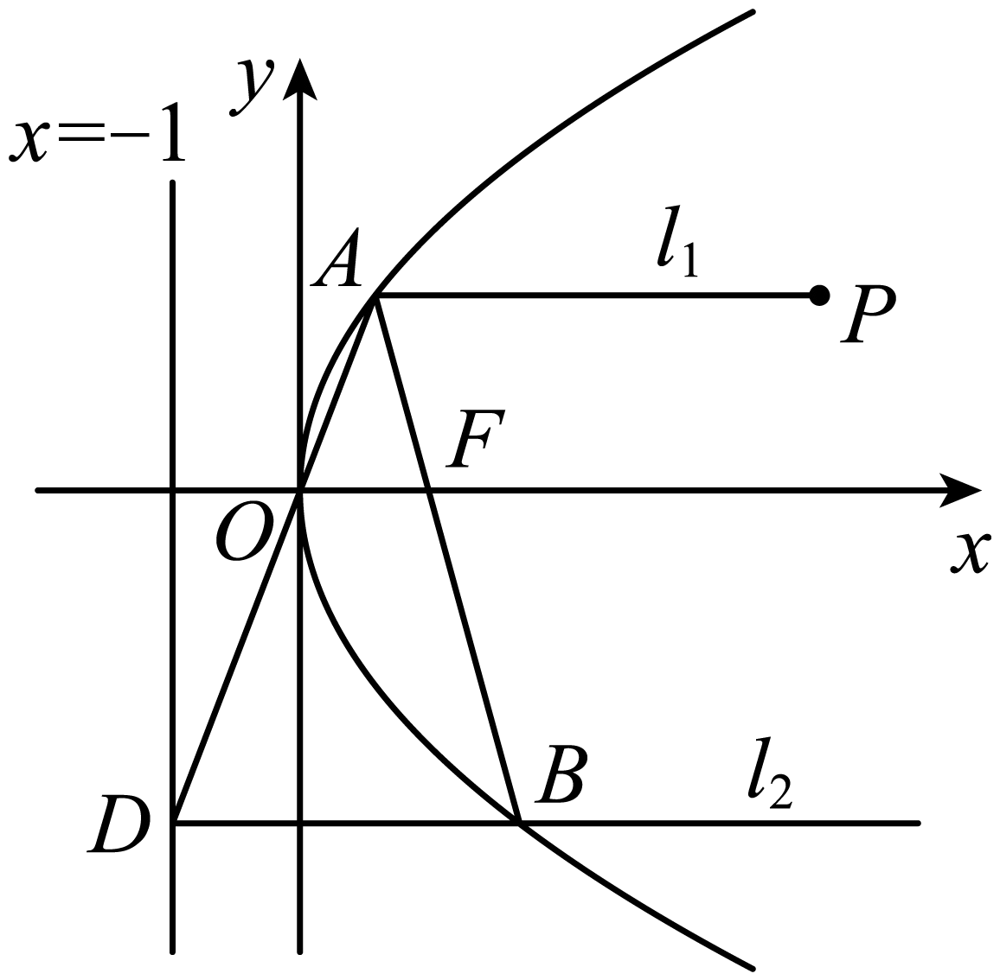

设直线*AB*的方程为，

将直线*AB*的方程代入中，得，

所以由韦达定理得，，所以，故选项A正确；

若点关于*x*轴的对称点在直线上，则，

所以，即，不一定成立，故不合题意，选项B错误；

直线与相交于点，所以直线*OD*的斜率为，

又直线*OA*的斜率为，所以，所以*A*，*O*，*D*三点共线，故选项C正确；

直线与间的距离，

当时，*d*取最小值4，故选项D正确；

故选：ACD.

<strong>变式50．（多选题）</strong>（2024·全国·高三专题练习）已知抛物线的焦点为<em>F</em>，点<em>P</em>为<em>C</em>上任意一点，若点，下列结论正确的是（    ）

A．的最小值为2

B．抛物线*C*关于*x*轴对称

C．过点*M*与抛物线*C*有一个公共点的直线有且只有一条

D．点*P*到点*M*的距离与到焦点*F*距离之和的最小值为4

【答案】CD

【解析】设，则，，又抛物线的焦点为，

所以，时，等号成立．所以的最小值是1，A错；

抛物线的焦点在轴上，抛物线关于轴对称，B错；

易知点在抛物线的内部（含有焦点的部分），因此过与对称轴平行的直线与抛物线只有一个公共点，其他直线与抛物线都有两个公共点，C正确；

记抛物线的准线为，准线方程为，

过作于，过作于，则，

，所以当三点共线，即与重合时，最小，最小值为．D正确．

故选：CD．

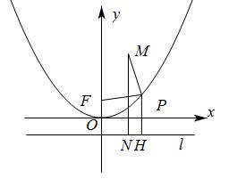

<strong>变式51．（多选题）</strong>（2024·全国·高三专题练习）已知点<em>F</em>为抛物线的焦点，点<em>K</em>为点<em>F</em>关于原点的对称点，点<em>M</em>在抛物线<em>C</em>上，则下列说法正确的是（    ）

A．使得为等腰三角形的点*M*有且仅有4个

B．使得为直角三角形的点*M*有且仅有4个

C．使得的点*M*有且仅有4个

D．使得的点*M*有且仅有4个

【答案】ABD

【解析】如图，

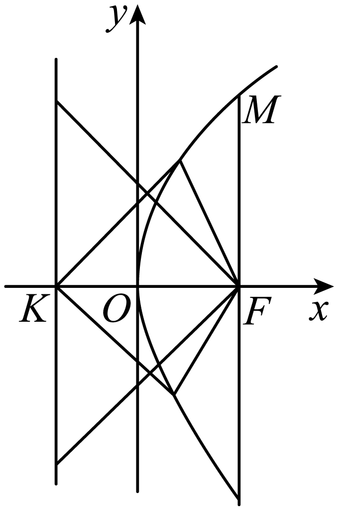

由为等腰三角形，若，则有两个点；若，则不存在，若，则有两个点，则使得为等腰三角形的点有且仅有4个,故A正确；

由中为直角的点有两个；为直角的点不存在；为直角的点有两个，则使得为直角三角形的点有且仅有4个，故B正确；

若的在第一象限，可得直线，代入抛物线的方程可得，解得，由对称性可得在第四象限只有一个，则满足的有且只有2个，故C错误；

使得的点在第一象限，可得直线，

代入抛物线的方程，可得，，

可得点有2个；若在第四象限，由对称性可得也有2个，则使得的点有且只有4个，故D正确．

故选：ABD

**【解题方法总结】**

在处理抛物线的考题的时候，要更加注意定义优先原则，考察频率更高，很多问题用上抛物线定义可以简化计算．

