**第67讲  圆锥曲线离心率题型全归纳**

**知识梳理**

**一、建立不等式法：**

1、利用曲线的范围建立不等关系．

2、利用线段长度的大小建立不等关系．为椭圆的左、右焦点，为椭圆上的任意一点，；为双曲线的左、右焦点，为双曲线上的任一点，．

3、利用角度长度的大小建立不等关系．为椭圆的左、右焦点，为椭圆上的动点，若，则椭圆离心率的取值范围为．

4、利用题目不等关系建立不等关系．

5、利用判别式建立不等关系．

6、利用与双曲线渐近线的斜率比较建立不等关系．

7、利用基本不等式，建立不等关系．

**二、函数法：**

1、根据题设条件，如曲线的定义、等量关系等条件建立离心率和其他一个变量的函数关系式；

2、通过确定函数的定义域；

3、利用函数求值域的方法求解离心率的范围．

**三、坐标法：**

由条件求出坐标代入曲线方程建立等量关系．

**必考题型全归纳**

**题型一：建立关于和的一次或二次方程与不等式**

<strong>例1．</strong>（2024·全国·高三专题练习）在平面直角坐标系<em>xOy</em>中，已知椭圆与双曲线共焦点，双曲线实轴的两顶点将椭圆的长轴三等分，两曲线的交点与两焦点共圆，则双曲线的离心率为（    ）

A．	B．2	C．	D．

【答案】C

【解析】设双曲线的实半轴长为*a*，由双曲线实轴的两顶点将椭圆的长轴三等分，可得椭圆的长半轴为3*a*，半焦距为*c*，设*P*为椭圆与双曲线在第一象限的交点，设，，则，可得，

由题意*P*在以为直径的圆上，所以，

所以可得，即离心率，

故选：C

<strong>例2．</strong>（2024·湖南·高三校联考阶段练习）已知椭圆的左、右焦点分别为，经过的直线交椭圆于两点，为坐标原点，且，则椭圆的离心率为______.

【答案】/

【解析】因为，所以，

即，

所以，所以.

设，则，所以，

由得，

所以，所以，

在中，由，

得，所以.

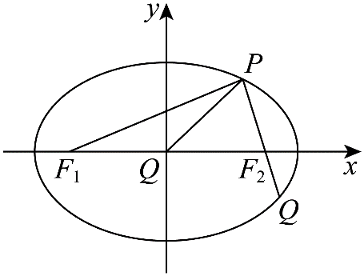

故答案为: .

<strong>例3．</strong>（2024·海南海口·高三统考期中）已知双曲线的左顶点为<em>A</em>，右焦点为，过点<em>A</em>的直线<em>l</em>与圆相切，与<em>C</em>交于另一点<em>B</em>，且，则<em>C</em>的离心率为（    ）

A．3	B．	C．2	D．

【答案】A

【解析】显然圆的圆心为，半径为，令直线*l*与圆相切的切点为，连接，

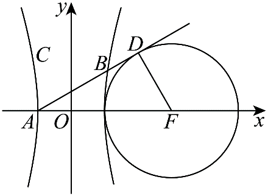

则，有，而，又，因此，解得，

所以双曲线*C*的离心率为.

故选：A

**变式1．**（2024·贵州·校联考模拟预测）已知右焦点为的椭圆：上的三点，，满足直线过坐标原点，若于点，且，则的离心率是（    ）

A．	B．	C．	D．

【答案】A

【解析】设椭圆左焦点为，连接 ，，，

设，，结合椭圆对称性得，

由椭圆定义得，，则.

因为，，

则四边形为平行四边形，

则，而，故，

则，即，

整理得，在中，，

即，即，

∴，故.

故选：A

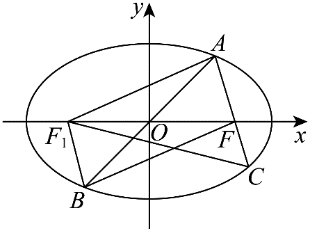

<strong>变式2．</strong>（2024·福建龙岩·福建省龙岩第一中学校考模拟预测）已知双曲线：的右焦点为，过分别作的两条渐近线的平行线与交于，两点，若，则的离心率为________

【答案】/

【解析】如图所示：

设直线方程为与双曲线方程联立，

解得，

因为，

所以，

即，即，

解得，

故答案为：

<strong>变式3．</strong>（2024·湖北·高三校联考阶段练习）双曲线的左焦点为<em>F</em>，直线与双曲线<em>C</em>的右支交于点<em>D</em>，<em>A</em>，<em>B</em>为线段的两个三等分点，且（<em>O</em>为坐标原点），则双曲线<em>C</em>的离心率为______.

【答案】

【解析】由题意得，取中点，连接，设双曲线*C*的右焦点为，连接，

因为，所以，

又*A*，*B*为线段的两个三等分点，所以，即为的中点，

又为的中点，所以，故，

设，则，又，

由勾股定理得，则，

由双曲线定义得，即①，

在Rt中，由勾股定理得，

即②，

由①得，两边平方得，

解得或（负值舍去），

将代入②得，故离心率为.

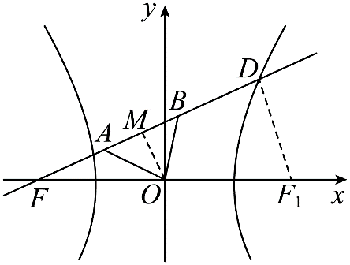

故答案为：

<strong>变式4．</strong>（2024·河南开封·统考模拟预测）已知是双曲线的右顶点，点在上，为的左焦点，若的面积为，则的离心率为__________．

【答案】

【解析】由题设知：，则，

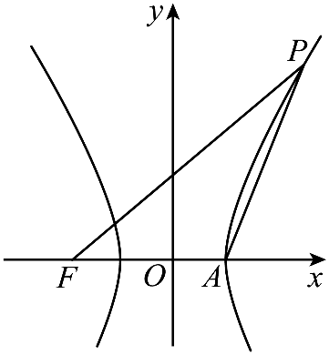

所以且，易知：，

又，故，且，

所以，则，

化简得，解得或（舍），

综上，，故，则离心率为.

故答案为：

<strong>变式5．</strong>（2024·辽宁沈阳·东北育才学校校考一模）如图，在底面半径为1，高为6的圆柱内放置两个球，使得两个球与圆柱侧面相切，且分别与圆柱的上下底面相切.一个与两球均相切的平面斜截圆柱侧面，得到的截线是一个椭圆.则该椭圆的离心率为__________.

【答案】

【解析】如图所示：

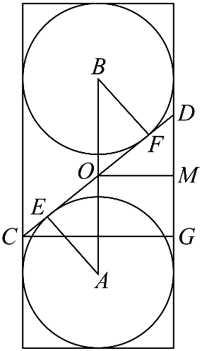

由题意可得，所以，

又因为，结合可知

，

所以，而，即，

所以，所以离心率.

故答案为：.

<strong>变式6．</strong>（2024·陕西西安·校考三模）已知双曲线：的左焦点为，过的直线与圆相切于点，与双曲线的右支交于点，若，则双曲线的离心率为_______.

【答案】

【解析】由题知，记右焦点为，过做如图所示，

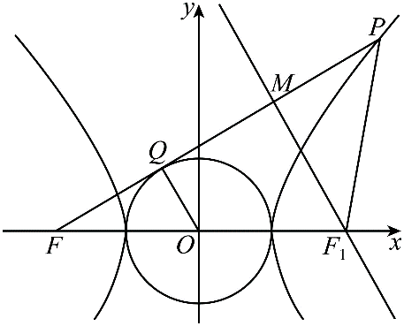

与圆相切，

，，

，，

为中点，，

故，且相似比为，

即，，

，

，，

在双曲线中，有，

，

，，

为直角三角形，

，

即，

化简可得，上式两边同时平方，将代入可得，

则，即离心率.

故答案为：

<strong>变式7．</strong>（2024·河北·高三校联考期末）双曲线：的左焦点为，右顶点为，过且垂直于轴的直线交的渐近线于点，恰为的角平分线，则的离心率为________．

【答案】2

【解析】设，作出图像，如下图：

根据题意易知，且，又，

所以由勾股定理可得：，

又恰为的角平分线，

所以根据角平分线性质定理可得：，

，又，

，

，即，

，即，

又，

所以解得：.

故答案为：.

**题型二：圆锥曲线第一定义**

<strong>例4．</strong>（2024·湖南株洲·高三校考阶段练习）已知分别为双曲线的左、右焦点，过原点的直线与交于两点（点<em>A</em>在第一象限），延长交于点，若，则双曲线的离心率为_________．

【答案】

【解析】由题意关于原点对称，又也关于原点对称，所以四边形是平行四边形，所以，所以为等边三角形，

则，则，由双曲线的定义，得，

所以，则．

故答案为：．

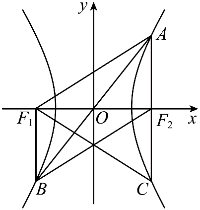

<strong>例5．</strong>（2024·山西大同·高三统考开学考试）已知椭圆的左、右焦点分别为，，点为上关于坐标原点对称的两点，且，且四边形的面积为，则的离心率为________．

【答案】

【解析】因为点为上关于坐标原点对称的两点，且，

所以四边形为矩形，即，

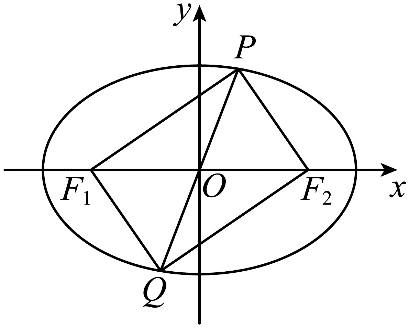

所以，

由椭圆定义与勾股定理知：，

所以，所以，所以，

即*C*的离心率为．

故答案为：

<strong>例6．</strong>（2024·全国·高三专题练习）已知椭圆的上、下焦点分别为、，焦距为，与坐标轴不垂直的直线过且与椭圆交于、两点，点为线段的中点，若，则椭圆的离心率为_____________．

【答案】/

【解析】因为点为线段的中点，，则，

所以，为等腰直角三角形，

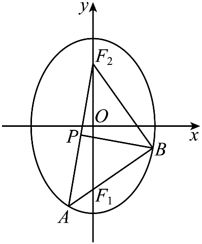

设，则，

由椭圆的定义可得，

所以，，

所以，，

由勾股定理可得，即，

整理可得，因此，该椭圆的离心率为.

故答案为：.

<strong>变式8．</strong>（2024·全国·高三专题练习），是椭圆<em>E</em>：的左，右焦点，点<em>M</em>为椭圆<em>E</em>上一点，点<em>N</em>在<em>x</em>轴上，满足，，则椭圆<em>E</em>的离心率为______.

【答案】

【解析】因为，

所以，则是的角平分线，

所以，

又因为，

所以，设，

由椭圆定义得，

即，解得，

则，

则，

所以，则，

故答案为：

**变式9．**（2024·四川巴中·高三统考开学考试）已知双曲线的左、右焦点分别为，过斜率为的直线与的右支交于点，若线段恰被轴平分，则的离心率为（    ）

A．	B．	C．2	D．3

【答案】C

【解析】如图，设交*y*轴与*A*，*A*为的中点，

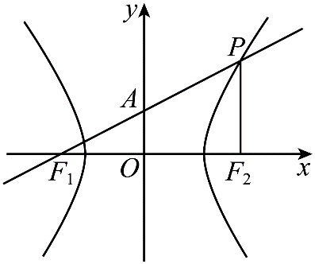

因为*O*为的中点，故为的中位线，

则，而，则,

因为直线的斜率为，故中，，

故设，则，

结合双曲线定义以及*P*在双曲线右支上，即有，

则，

故选：C

<strong>变式10．</strong>（2024·内蒙古赤峰·高三统考开学考试）已知，分别为双曲线<em>Ε</em>：的左、右焦点，过原点<em>O</em>的直线<em>l</em>与<em>E</em>交于<em>A</em>，<em>B</em>两点（点<em>A</em>在第一象限），延长交<em>E</em>于点<em>C</em>，若，，则双曲线<em>E</em>的离心率为（    ）

A．	B．2	C．	D．

【答案】A

【解析】结合双曲线的对称性可知，，，

所以为等边三角形，则，则.

由双曲线的定义，得，所以，，

则.

故选：A

<strong>变式11．</strong>（2024·广东·高三校联考阶段练习）已知双曲线<em>C</em>：（，），斜率为的直线<em>l</em>过原点<em>O</em>且与双曲线<em>C</em>交于<em>P</em>，<em>Q</em>两点，且以<em>PQ</em>为直径的圆经过双曲线的一个焦点，则双曲线<em>C</em>的离心率为（    ）

A．	B．	C．	D．

【答案】B

【解析】设双曲线*C*的左焦点，右焦点为，*P*为第二象限上的点，

连接*PF*，，*QF*，，

根据双曲线的性质和直线*l*的对称性知，四边形为平行四边形.

因为以*PQ*为直径的圆经过双曲线的一个焦点，

所以，即四边形为矩形，

由直线*l*的斜率为，得，

又，则是等边三角形，所以.

在中，，则，故，

又由双曲线定义知，所以，

则.

故选：B.

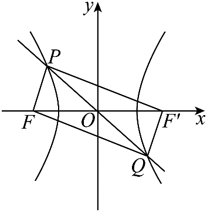

<strong>变式12．</strong>（2024·河南·统考模拟预测）已知双曲线的上焦点为，点<em>P</em>在双曲线的下支上，若，且的最小值为7，则双曲线<em>E</em>的离心率为（    ）

A．2或	B．3或	C．2	D．3

【答案】D

【解析】设双曲线的下焦点为，可知，

则，即，

则，

当且仅当三点共线时，等号成立，

由题意可得，且，

因为在上单调递增，且，

所以方程，且，解得，

则，所以双曲线*E*的离心率为.

故选：D.

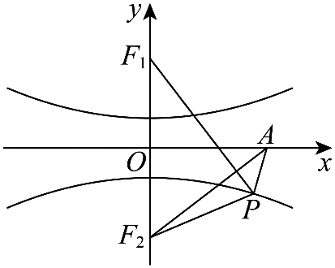

<strong>变式13．</strong>（2024·全国·高三专题练习）双曲线具有光学性质，从双曲线一个焦点发出的光线经过双曲线镜面反射，其反射光线的反向延长线经过双曲线的另一个焦点.若双曲线的左､右焦点分别为，从发出的光线经过图中的<em>A</em>，<em>B</em>两点反射后，分别经过点<em>C</em>和<em>D</em>，且，则<em>E</em>的离心率为（    ）

A．	B．	C．	D．

【答案】B

【解析】由题意知延长则必过点,如图：

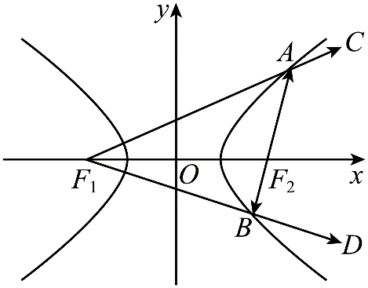

由双曲线的定义知，

又因为，所以，

因为，所以，

设，则，因此，

从而由得，所以，

则，，，

又因为，所以，

即，即，

故选：B.

**变式14．**（2024·甘肃酒泉·统考三模）已知双曲线的右焦点为，过点的直线与双曲线的右支交于，两点，且，点关于原点的对称点为点，若，则双曲线的离心率为（    ）

A．	B．	C．	D．

【答案】D

【解析】设双曲线的左焦点为，连接，，，如图所示，

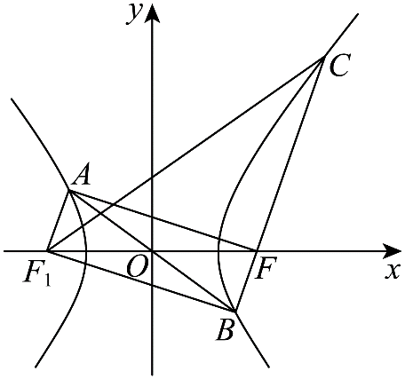

又因为，所以，

所以四边形为矩形，

设，则，

由双曲线的定义可得：，，

又因为为直角三角形，

所以，即，解得，

所以，，

又因为为直角三角形，，

所以，即：，

所以，即.

故选：D.

**变式15．**（2024·山西吕梁·统考二模）已知双曲线：（，）的左、右焦点分别为，，直线与交于，两点，，且的面积为，则的离心率是（    ）

A．	B．	C．2	D．3

【答案】B

【解析】如图，若在第一象限，因为，所以，

由图形的对称性知四边形为矩形，因为的面积为，所以，

又因为，所以，，

在中，，解得．

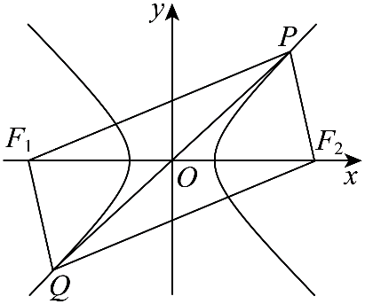

故选：B

**题型三：圆锥曲线第二定义**

**例7．**（2024·全国·高三专题练习）古希腊数学家欧几里得在《几何原本》中描述了圆锥曲线的共性，并给出了圆锥曲线的统一定义，他指出，平面内到定点的距离与到定直线的距离的比是常数的点的轨迹叫做圆锥曲线；当时，轨迹为椭圆；当时，轨迹为抛物线；当时，轨迹为双曲线.则方程表示的圆锥曲线的离心率等于（    ）

A．	B．	C．	D．5

【答案】B

【解析】因为，

所以，

表示点到定点的距离与到定直线的距离比为，

所以.

故选：B

**例8．**（2024·北京石景山·高三专题练习）已知双曲线的左、右焦点分别为，为左支上一点，到左准线的距离为，若、、成等比数列，则其离心率的取值范围是（    ）

A．，	B．，	C．，	D．，

【答案】D

【解析】，

，即①，

又②．

由①②解得：，，

又在焦点三角形中：，

即：，即，

解得：，

又，

，

故选：D．

**例9．**（2024·全国·高三专题练习）已知双曲线的右焦点为，过且斜率为的直线交于、两点，若，则的离心率为（    ）

A．	B．	C．	D．

【答案】B

【解析】设双曲线的右准线为，

过、分别作于，于，于，

如图所示：

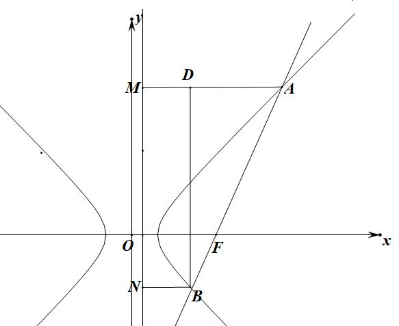

因为直线的斜率为，

所以直线的倾斜角为，

∴，，

由双曲线的第二定义得：，

又∵，

∴，

∴

故选：B

**题型四：圆锥曲线第三定义（斜率之积）**

<strong>例10．</strong>（2024·云南曲靖·高三校联考阶段练习）已知双曲线：虚轴的一个顶点为，直线与交于，两点，若的垂心在的一条渐近线上，则的离心率为______.

【答案】

【解析】如图，设的垂心为，则有,

不妨设,则，

因为在渐近线上，所以，

直线与交于，两点，

所以，解得，

所以

又因为,

所以，

整理得，，所以，

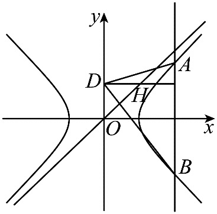

故答案为: .

<strong>例11．</strong>（2024·陕西西安·西安市大明宫中学校考模拟预测）已知椭圆<em>C</em>：的焦距为2<em>c</em>，左焦点为<em>F</em>，直线<em>l</em>与<em>C</em>相交于<em>A</em>，<em>B</em>两点，点<em>P</em>是线段<em>AB</em>的中点，<em>P</em>的横坐标为．若直线<em>l</em>与直线<em>PF</em>的斜率之积等于，则<em>C</em>的离心率为______．

【答案】/

【解析】，

设，

因为点*P*是线段*AB*的中点，*P*的横坐标为，

所以，

则，

由直线*l*与*C*相交于*A*，*B*两点，

得，

两式相减得，

即，

所以，

即，所以，

则，

所以，

所以离心率.

故答案为：.

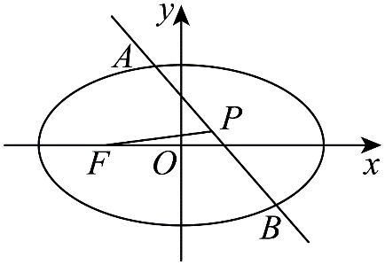

<strong>例12．</strong>（2024·山东济南·高三统考开学考试）已知椭圆：的上顶点为，两个焦点为，，线段的垂直平分线过点，则椭圆的离心率为________．

【答案】/

【解析】

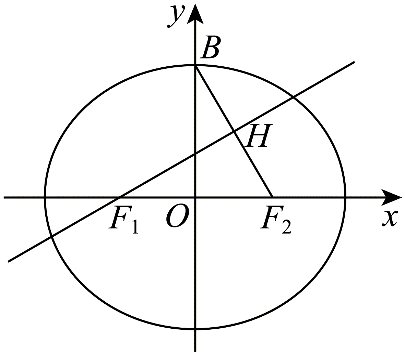

如图，设的垂直平分线与交于点，

由题，，，，则，

，，

，

，化简得，，

由，解得，

，即.

故答案为：.

<strong>变式16．</strong>（2024·山东青岛·高三统考期末）已知双曲线与直线相交于，两点，点为双曲线上的一个动点，记直线，的斜率分别为，，若，且双曲线的右焦点到其一条渐近线的距离为1，则双曲线的离心率为______．

【答案】

【解析】设点，，，则且，

两式相减，得，所以，

因为，所以，所以，

所以双曲线的渐近线方程为，即，

因为焦点到渐近线的距离为，

所以，可得，又因为，所以，

所以双曲线的离心率.

故答案为：

<strong>变式17．</strong>（2024·山东·高三校联考开学考试）如图，<em>A</em>，分别是椭圆的左、右顶点，点在以为直径的圆上（点异于<em>A</em>，两点），线段与椭圆交于另一点，若直线的斜率是直线的斜率的4倍，则椭圆的离心率为（    ）

A．	B．	C．	D．

【答案】C

【解析】设，易知，

则，，

又，

所以.

故选：C

**题型五：利用数形结合求解**

**例13．**（2024·广西·模拟预测）如图1所示，双曲线具有光学性质：从双曲线右焦点发出的光线经过双曲线镜面反射，其反射光线的反向延长线经过双曲线的左焦点.若双曲线的左､右焦点分别为，从发出的光线经过图2中的两点反射后，分别经过点和，且，，则双曲线的离心率为（    ）

A．	B．	C．	D．

【答案】B

【解析】如图，由，有，

可得，可得，有.

在**Rt**中，由，

不妨设，则，由勾股定理得，

又由双曲线的定义可得，，

根据可得，

解得，所以，

在**Rt**中，，可得，

故双曲线的离心率为.

故选：B.

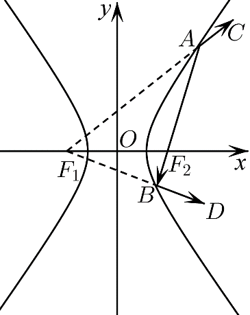

**例14．**（2024·河北秦皇岛·高三校联考开学考试）已知是椭圆的两个焦点，点在上，若的离心率，则使为直角三角形的点有（    ）个

A．2	B．4	C．6	D．8

【答案】D

【解析】由可得，即，可得，

因此以为直径作圆与必有四个不同的交点，

因此中以的三角形有四个，

除此之外以为直角，为直角的各有两个，

所以存在使为直角三角形的点共有8个.

故选：D

<strong>例15．</strong>（2024·湖北武汉·高三武汉市第六中学校联考阶段练习）过双曲线的左焦点<em>F</em>作的一条切线，设切点为<em>T</em>，该切线与双曲线<em>E</em>在第一象限交于点<em>A</em>，若，则双曲线<em>E</em>的离心率为（    ）

A．	B．	C．	D．

【答案】C

【解析】令双曲线的右焦点为，半焦距为*c*，取线段中点，连接，

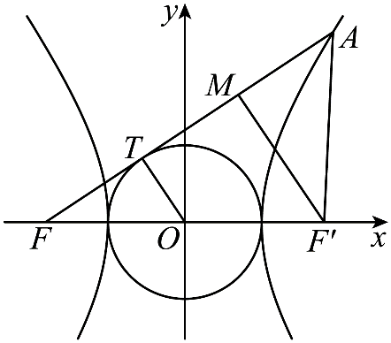

因为切圆于，则，有，

因为，则有，，

而为的中点，于是，即，，

在中，，整理得，

所以双曲线*E*的离心率.

故选：C

**变式18．**（2024·云南昆明·高三昆明一中校考阶段练习）已知点是椭圆上的一点，是的两个焦点，若，则椭圆的离心率的取值范围是（    ）

A．	B．	C．	D．

【答案】D

【解析】由已知，以为直径的圆与椭圆相交，所以，

所以，

故选：D.

**题型六：利用正弦定理**

<strong>例16．</strong>（2024·全国·高三专题练习）已知，分别为椭圆的两个焦点，<em>P</em>是椭圆<em>E</em>上的点，，且，则椭圆<em>E</em>的离心率为（    ）

A．	B．	C．	D．

【答案】B

【解析】由题意及正弦定理得：，

令，则*，*，可得，

所以椭圆的离心率为：.

故选：B

<strong>例17．</strong>（2024·全国·高三专题练习）过椭圆的左、右焦点，作倾斜角分别为和的两条直线，．若两条直线的交点<em>P</em>恰好在椭圆上，则椭圆的离心率为（    ）

A．	B．

C．	D．

【答案】C

【解析】在中，由正弦定理可得

所以，

所以该椭圆的离心率，

故选：C．

**例18．**（2024·江苏·扬州中学高三开学考试）已知椭圆的左、右焦点分别为，，若椭圆上存在点（异于长轴的端点），使得，则该椭圆离心率的取值范围是\_\_\_\_\_\_．

【答案】

【解析】由已知，得，由正弦定理，得，

所以．

由椭圆的几何性质，知，

所以且，

所以且，

即且，

结合，可解得．

故答案为：.

<strong>变式19．</strong>（2024·广西南宁·南宁市武鸣区武鸣高级中学校考二模）设、分别为椭圆的左、右焦点，椭圆上存在点<em>M</em>，，，使得离心率，则<em>e</em>取值范围为______．

【答案】

【解析】由，，设，，在中，由正弦定理有：，

离心率，则：解得：，

由于，得，

显然成立，

由有，即，得，

所以椭圆离心率取值范围为．

故答案为：.

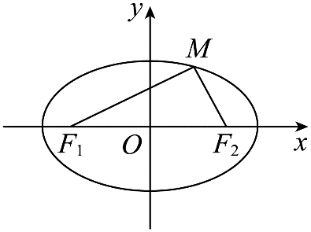

<strong>变式20．</strong>（2024·江西吉安·高三吉安一中校考开学考试）点<em>P</em>是双曲线：（，）和圆：的一个交点，且，其中，是双曲线的两个焦点，则双曲线的离心率为________．

【答案】/

【解析】

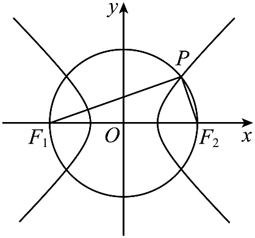

由题中条件知，圆的直径是双曲线的焦距，则，

∴，，，

．

故答案为：

<strong>变式21．</strong>（2024·全国·高三专题练习）已知椭圆与双曲线共焦点，F1、F2分别为左、右焦点，曲线与在第一象限交点为，且离心率之积为1.若，则该双曲线的离心率为____________.

【答案】

【解析】设焦距为2c

在三角形PF1F2中，根据正弦定理可得

因为，代入可得

，所以

在椭圆中，

在双曲线中，

所以

即

所以

因为椭圆与双曲线的离心率乘积为1

即 ，即

所以

化简得，等号两边同时除以

得，因为 即为双曲线离心率

所以若双曲线离心率为e，则上式可化为

由一元二次方程求根公式可求得

因为双曲线中

所以

**题型七：利用余弦定理**

<strong>例19．</strong>（2024·福建福州·高三福建省福州第八中学校考阶段练习）已知双曲线的左、右焦点分别为，<em>P</em>是<em>C</em>右支上一点，线段与<em>C</em>的左支交于点<em>M</em>．若，且，则的离心率为_________．

【答案】

【解析】因为点是右支上一点，线段与的左支交于点，且，，

所以为等边三角形，所以

由双曲线定义得，

又由，解得，

则且，

在中，由余弦定理得，

整理得，所以双曲线的离心率为.

故答案为：.

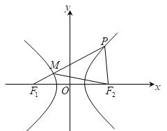

<strong>例20．</strong>（2024·江苏淮安·高三统考开学考试）椭圆的左、右焦点分别为，上顶点为<em>A</em>，直线与椭圆<em>C</em>交于另一点<em>B</em>，若，则椭圆<em>C</em>的离心率为___________．

【答案】

【解析】由椭圆的性质可得，设，在中根据余弦定理结合椭圆的定义可得，

即，

整理可得，即，故.

又，故，，

故，即，，

故，故离心率.

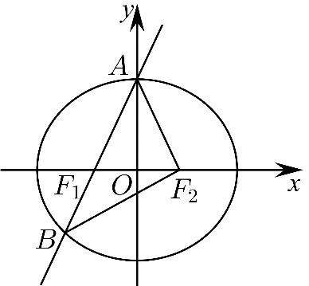

故答案为：

<strong>例21．</strong>（2024·河北唐山·模拟预测）已知是椭圆的左，右焦点，上两点满足，则的离心率为_________．

【答案】

【解析】如图，

因为，所以可设，

又，所以，

由椭圆定义，，即，

又，即*B*点为短轴端点，

所以在中，

，

又在中，，

解得或（舍去）.

故答案为：

**变式22．**（2024·广东湛江·高三校联考阶段练习）已知双曲线的离心率为2，左、右顶点分别为，右焦点为，点在的右支上，且满足，则（    ）

A．	B．1	C．	D．2

【答案】A

【解析】由题意得，，则，，

由双曲线的对称性，不妨设点在第一象限，

当时，，得，则，即，

所以，，

，

在中，由余弦定理得，

因为为锐角，所以，

所以，

故选：A

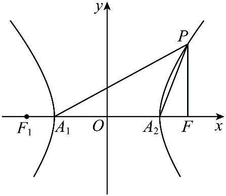

<strong>变式23．</strong>（2024·河南·校联考二模）已知双曲线的左、右焦点分别是，，<em>P</em>是双曲线<em>C</em>上的一点，且，，，则双曲线<em>C</em>的离心率是（    ）

A．7	B．	C．	D．

【答案】B

【解析】设双曲线*C*的半焦距为，由题意，点*P*在双曲线*C*的右支上，，，由余弦定理得，解得，即，，根据双曲线定义得，解得，故双曲线*C*的离心率.

故选：B

**变式24．**（2024·浙江·高三校联考阶段练习）已知椭圆的左、右焦点分别为，，点在上，且，直线与交于另一点，与轴交于点，若，则的离心率为（    ）

A．	B．	C．	D．

【答案】D

【解析】如图，因为，所以点是的中点，

连接，由，得，

设，则，，．

由余弦定理得，

即，整理得，

则，故．

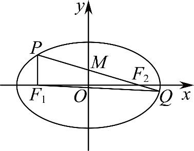

故选：D

<strong>变式25．</strong>（2024·江西抚州·高三黎川县第二中学校考开学考试）已知双曲线<em>C</em>：的右焦点<em>F</em>的坐标为，点<em>P</em>在第一象限且在双曲线<em>C</em>的一条渐近线上，<em>O</em>为坐标原点，若，，则双曲线<em>C</em>的离心率为（    ）

A．	B．2	C．	D．3

【答案】B

【解析】由题意知点*P*在第一象限且在双曲线*C*：的一条渐近线上，

设渐近线的倾斜角为，则，即，

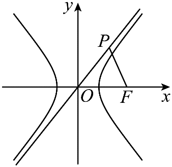

结合，可得，

结合题意可知，故，

又，，

在中利用余弦定理得，

即，

即，即，

故，解得或（舍去），

故选：B

<strong>变式26．</strong>（2024·广西百色·高三贵港市高级中学校联考阶段练习）已知椭圆<em>C</em>：的左、右焦点分别为，，点<em>P</em>在<em>C</em>上，若，，则<em>C</em>的离心率为________．

【答案】/

【解析】，，*O*是的中点，所以，

故由得，

因为，，所以，

在中，，

在中，，

∴，即，

则，离心率为．

故答案为：

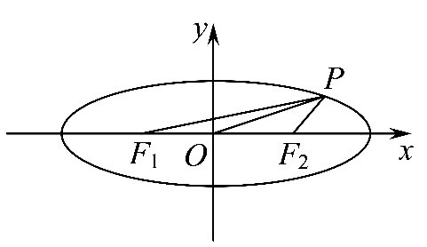

<strong>变式27．</strong>（2024·广东深圳·高三校联考期中）设，是双曲线<em>C</em>：的左、右焦点，过的直线与<em>C</em>的左、右两支分别交于<em>A</em>，<em>B</em>两点，点<em>M</em>在<em>x</em>轴上，，平分，则<em>C</em>的离心率为（    ）

A．	B．

C．	D．

【答案】C

【解析】

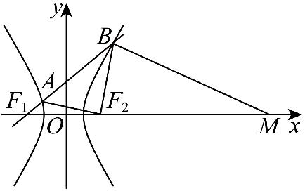

可知，，得

设，则，由双曲线的定义可知：.

因为平分，所以，故，

又，

即有，，，，，

在，中，由余弦定理可得，

，，

由，

可得.

故选：C.

<strong>变式28．</strong>（2024·云南·高三云南师大附中校考阶段练习）已知双曲线<em>C</em>：的左、右焦点分别为，，<em>O</em>为坐标原点，过作<em>C</em>的一条渐近线的垂线，垂足为<em>M</em>，且，则<em>C</em>的离心率为（    ）

A．	B．2	C．	D．

【答案】C

【解析】双曲线*C*的左焦点，渐近线的方程为，

由点到直线的距离公式可得，

由勾股定理得，

在中，，所以，

在中，，，，

，

由余弦定理得，

化简得，即，因此，双曲线*C*的离心率为，

故选：C

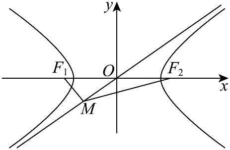

**题型八：内切圆问题**

<strong>例22．</strong>（2024·四川成都·高三成都七中校考阶段练习）双曲线其左、右焦点分别为，倾斜角为的直线与双曲线<em>H</em>在第一象限交于点<em>P</em>，设内切圆半径为<em>r</em>，若，则双曲线<em>H</em>的离心率的取值范围为______.

【答案】

【解析】设内切圆与分别相切于点，则，

且，

所以，因为直线的倾斜角为，

所以，所以，

因为，

由双曲线的定义可知，，所以，

即，所以，

过点作轴于点，设，

则，

由双曲线的焦半径公式可得：，

则，因为，所以，

则，即，化简可得：，

则双曲线*H*的离心率的取值范围为，

故答案为：.

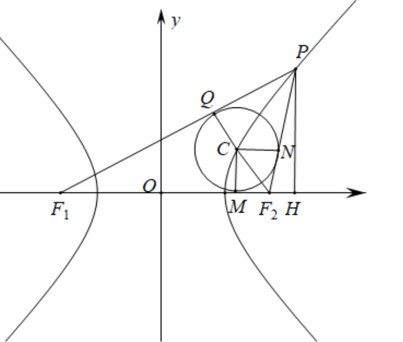

<strong>例23．</strong>（2024·全国·高三对口高考）椭圆的四个顶点构成菱形的内切圆恰好过焦点，则椭圆的离心率________．

【答案】

【解析】由题设，内切圆半径为，故，

所以，则，即，

所以，（舍），故.

故答案为：.

<strong>例24．</strong>（2024·广东深圳·校考二模）已知椭圆的左､右焦点分别为､，<em>P</em>为椭圆上一点（异于左右顶点），的内切圆半径为<em>r</em>，若<em>r</em>的最大值为，则椭圆的离心率为___________.

【答案】/.

【解析】设内切圆的圆心为，连接，

，

由题意可得：，

所以当取到最大值时，有最大值，且最大值为，

所以，整理可得：，

两边同时平方可得：，

所以，所以，解得：或（舍去）.

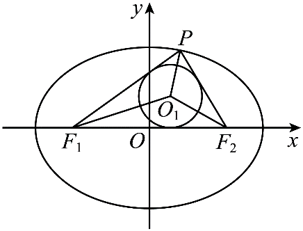

故答案为：

<strong>变式29．</strong>（2024·湖南长沙·高三长沙一中校考阶段练习）双曲线的左，右焦点分别为，，右支上有一点<em>M</em>，满足，的内切圆与<em>y</em>轴相切，则双曲线<em>C</em>的离心率为________．

【答案】/

【解析】内切圆*Q*分别与，，，轴切于点*S*，*T*，*N*，*P*

则四边形*、* 都为正方形，

设内切圆半径为，由圆的切线性质，

则，则 ，①

又因为，②

且双曲线定义得，，③

由①、②、③得，

所以，

从而，

由勾股定理，，所以，解得．

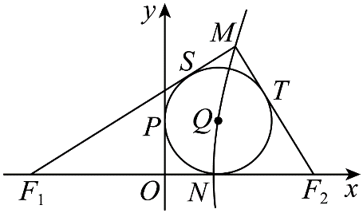

故答案为：

<strong>变式30．</strong>（2024·全国·高三专题练习）已知椭圆的左、右焦点分别为，，点是上一点，点是直线与轴的交点，的内切圆与相切于点，若，则椭圆的离心率__________．

【答案】

【解析】

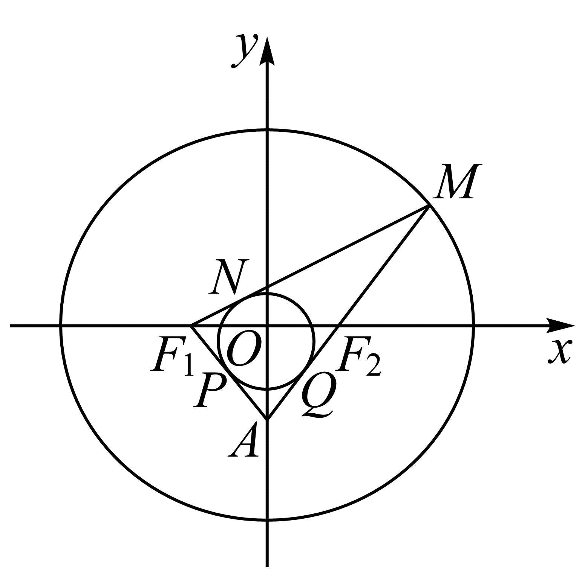

设内切圆与*AM*切于*Q*，与切于*P*，由切线性质知，，，

由对称性知，

所以，即，

所以，

所以.

故答案为：

<strong>变式31．</strong>（2024·全国·高三专题练习）已知椭圆：的左、右焦点分别是，，斜率为的直线经过左焦点且交<em>C</em>于<em>A</em>，<em>B</em>两点（点<em>A</em>在第一象限），设的内切圆半径为，的内切圆半径为，若，则椭圆的离心率___________．

【答案】

【解析】如图所示，由椭圆定义可得，，

设的面积为，的面积为，因为，

所以，即，

设直线，则联立椭圆方程与直线，可得

，

由韦达定理得：，

又，即

化简可得，即，

即时，有.

故答案为：

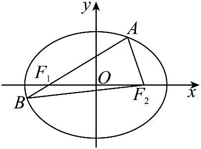

<strong>变式32．</strong>（2024·福建泉州·高三校考阶段练习）已知椭圆的左、右焦点分别是，，斜率为的直线经过左焦点且交于，两点（点在第一象限），设的内切圆半径为，的内切圆半径为，若，则椭圆的离心率______．

【答案】

【解析】如图所示，由椭圆定义可得，，

设的面积为，的面积为，因为，

所以，，即，

设直线，则联立椭圆方程与直线，可得

，

所以，，

令，则，

当时，有.

故答案为：

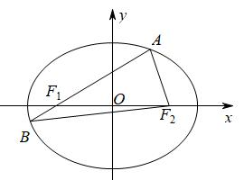

<strong>变式33．</strong>（2024·山东聊城·统考一模）是椭圆的两个焦点，是椭圆上异于顶点的一点，是的内切圆圆心，若的面积等于的面积的3倍，则椭圆的离心率为___________.

【答案】/0.5

【解析】

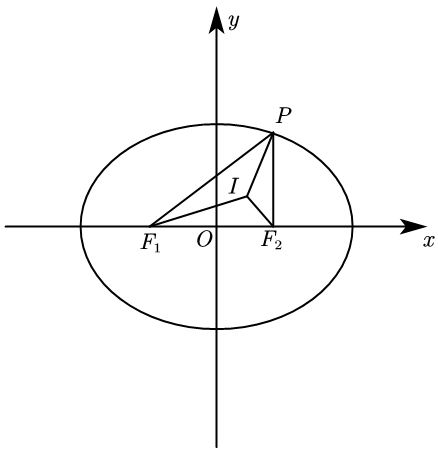

由于椭圆关于原点对称，不妨设点在轴上方.设点纵坐标为，点纵坐标为，内切圆半径为，椭圆长轴长为，焦距为，

则，得，又，

即，又，化简得，即，

解得，可得离心率为.

故答案为：.

**题型九：椭圆与双曲线共焦点**

**例25．**（2024·全国·高三专题练习）椭圆与双曲线共焦点，，它们在第一象限的交点为，设，椭圆与双曲线的离心率分别为，，则（    ）

A．	B．

C．	D．

【答案】B

【解析】设椭圆的长轴长为，双曲线的实轴长为，交点到两焦点的距离分别为，焦距为，利用余弦定理得到，再根据椭圆和双曲线的定义，得到，代入求解.设椭圆的长轴长为，双曲线的实轴长为，

交点到两焦点的距离分别为，焦距为，

则，

又，，故，，

所以，

化简得，

即 .

故选：B

**例26．**（2024·全国·高三专题练习）椭圆与双曲线共焦点，，它们的交点对两公共焦点，张的角为.椭圆与双曲线的离心率分别为，，则

A．	B．

C．	D．

【答案】B

【解析】设椭圆的长半轴为,双曲线的实半轴为,半焦距为,设,,,椭圆与双曲线的离心率分别为，

,由余弦定理可得，,即,即 ①,

在椭圆中，由定义得, ①化简可得,即,等式两边同除,得,即 ②

在双曲线中，由定义得,①化简可得,即,等式两边同除,得,即 ③

联立②③得,即,

故选B

<strong>例27．（多选题）（2024·全国·高三专题练习）</strong>如图，<em>P</em>是椭圆与双曲线在第一象限的交点，且共焦点的离心率分别为，则下列结论不正确的是（    ）

A．	B．若，则

C．若，则的最小值为2	D．

【答案】ACD

【解析】依题意，，解得，A不正确；

令，由余弦定理得： ，

当时，，即，因此，B正确；

当时，，即，有，

而，则有，解得，C不正确；

，

，于是得，

解得，而，因此，D不正确.

故选：ACD

**变式34．（多选题）（2024·全国·高三专题练习）** 如图，是椭圆与双曲线（）在第一象限的交点，且共焦点的离心率分别为，则下列结论正确的是（    ）

A．

B．若，则

C．若，则的最小值为2

D．

【答案】AB

【解析】对A：由椭圆和双曲线的定义：，故，故A正确；

对B：在中，由余弦定理：

即，故时，，故B正确；

对C：时，，由（当且仅当时等号成立），

，所以等号取不到，故C错误；

对D：对△，将其视作是椭圆中的焦点三角形，

则由余弦定理可得，

解得，故 ，

同理，将△视作双曲线中的焦点三角形，则，

则，故D错误.

故选：AB.

**变式35．（多选题）（2024·全国·高三专题练习）** 如图，是椭圆与双曲线在第一象限的交点，且共焦点的离心率分别为，则下列结论正确的是（    ）

A．	B．若，则

C．若，则的最小值为2	D．

【答案】ABD

【解析】由椭圆和双曲线的定义得：，解得，，A正确；

在中，由余弦定理得：，

整理得，，即，

当时，，即，B正确；

当时，，，

当且仅当时取“=”，而，C不正确；

在椭圆中，，即，

在双曲线中，，即，

于是得，而，则，D正确.

故选：ABD

<strong>变式36．</strong>（2024·新疆·统考三模）在中，，，，椭圆和双曲线以<em>A</em>，<em>B</em>为公共焦点且都经过点<em>C</em>，则与的离心率之和为________．

【答案】/

【解析】如图所示，

在△*ABC*中，由，，，得，

所以，

由题意可得椭圆与双曲线的焦距为，

又因为椭圆的，双曲线的，

所以两个曲线的离心率之和为：，

故答案为：.

**题型十：利用最大顶角**

**例28．**（2024·全国·高二课时练习）已知椭圆：，点，是长轴的两个端点，若椭圆上存在点，使得，则该椭圆的离心率的取值范围是（    ）

A．	B．

C．	D．

【答案】A

【解析】如图：

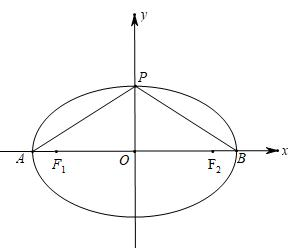

当*P*在上顶点时，最大，此时，

则，

所以，

即，，

所以，

则，

所以椭圆的离心率的取值范围是，

故选：A

<strong>例29．</strong>（2024·全国·高二专题练习）设<em>A</em>，<em>B</em>是椭圆<em>C</em>：长轴的两个端点，若<em>C</em>上存在点<em>M</em>满足∠<em>AMB</em>=120°，则椭圆<em>C</em>的离心率的取值范围是（    ）

A．	B．	C．	D．

【答案】B

【解析】当椭圆的焦点在轴上时，

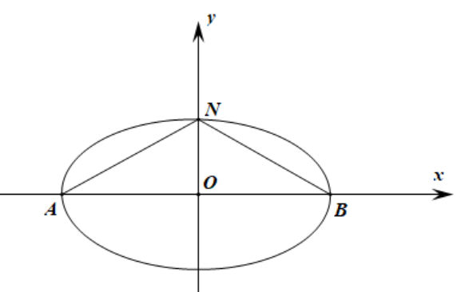

由椭圆的对称性得,所以，

所以，

所以椭圆的离心率，

因为椭圆的离心率.

当椭圆的焦点在轴上时，同理可得.

综合得.

故选：B

**例30．**（2024·全国·模拟预测）已知椭圆，点是上任意一点，若圆上存在点、，使得，则的离心率的取值范围是(    )

A．	B．	C．	D．

【答案】C

【解析】连接，当不为椭圆的上、下顶点时，设直线、分别与圆切于点*A*、*B*，，

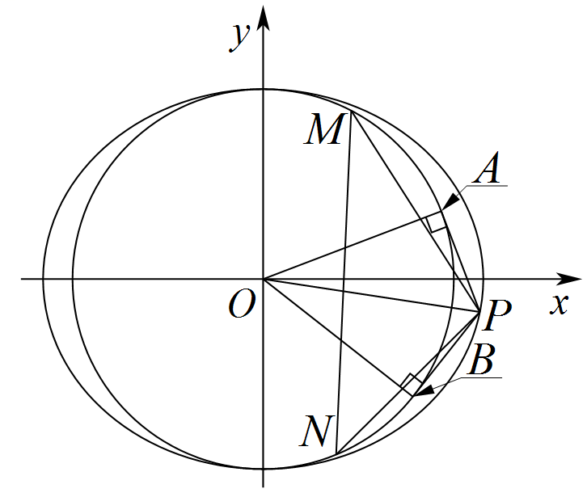

∵存在、使得，∴，即，

又，∴，

连接，则，∴．

又是上任意一点，则，

又，∴，

则由，得，

又，∴．

故选：C．

<strong>变式37．</strong>（2024·四川成都·高三树德中学校考开学考试）已知、是椭圆的两个焦点，满足的点<em>M</em>总在椭圆内部，则椭圆离心率的取值范围是（    ）

A．	B．	C．	D．

【答案】A

【解析】设椭圆的半长轴长、半短轴长、半焦距分别为，

，

点的轨迹是以原点为圆心，半焦距为半径的圆，

又点总在椭圆内部，

该圆内含于椭圆，即，，

，．

故选：A．

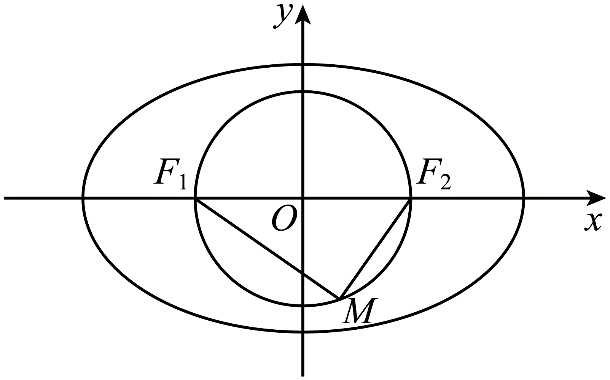

**题型十一：基本不等式**

**例31．**（2024·全国·高三专题练习）设椭圆的右焦点为，椭圆上的两点，关于原点对你，且满足，，则椭圆的离心率的取值范围为（    ）

A．	B．	C．	D．

【答案】B

【解析】如图所示：

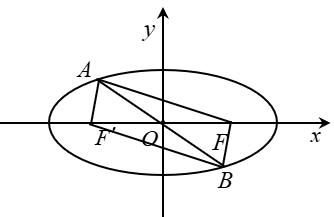

设椭圆的左焦点，由椭圆的对称性可知，四边形为平行四边形，

又，即，所以四边形为矩形，，

设，，在直角中，，，

得，所以，令，得，

又，得，所以，

所以  ，即，所以

所以椭圆的离心率的取值范围为，

故选：B

**例32．**（2024·江苏南京·高三阶段练习）设、分别是椭圆：的左、右焦点，是椭圆准线上一点，的最大值为60°，则椭圆的离心率为（    ）

A．	B．	C．	D．

【答案】A

【解析】由题意可设直线，的倾斜角分别为，，

由椭圆的对称性不妨设为第一象限的点，即，

则，，因为，

所以

，

所以，则，解得，

故选：A.

<strong>例33．</strong>（2024·山西运城·高三期末）已知点为椭圆的左顶点，为坐标原点，过椭圆的右焦点<em>F</em>作垂直于<em>x</em>轴的直线<em>l</em>，若直线<em>l</em>上存在点<em>P</em>满足，则椭圆离心率的最大值\_\_\_\_\_\_\_\_\_\_\_\_\_\_.

【答案】

【解析】由对称性不妨设*P*在*x*轴上方，设，，

∴

当且仅当取等号，

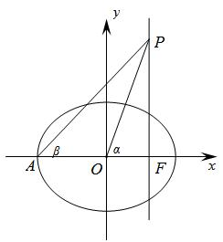

∵直线*l*上存在点*P*满足

∴

即，

∴，即，

所以，

故椭圆离心率的最大值为.

故答案为：.

**题型十二：已知范围**

**例34．**（2024·四川省南充市白塔中学高三开学考试）已知、分别为椭圆的左、右焦点，为右顶点，为上顶点，若在线段上（不含端点）存在不同的两点，使得，则椭圆的离心率的取值范围为（    ）

A．	B．	C．	D．

【答案】D

【解析】易知点、、、，则线段的方程为，

在线段上取一点，满足，则，

，，

所以，，

整理可得，

由题意可知，关于的方程在时有两个不等的实根，

则，可得，可得，

所以，.

故选：D.

**例35．**（2024·全国·高二专题练习）已知，是椭圆：的左右焦点，若椭圆上存在一点使得，则椭圆的离心率的取值范围为（    ）

A．	B．	C．	D．

【答案】B

【解析】设点，

，因为，

所以，即，

结合可得，所以.

故选：B.

<strong>例36．</strong>（2024·全国·高三开学考试）设，分别是椭圆的左､右焦点，若椭圆<em>E</em>上存在点<em>P</em>满足，则椭圆<em>E</em>离心率的取值范围（    ）

A．	B．	C．	D．

【答案】B

【解析】设，由椭圆的方程可得，，，

则，即，

由*P*在椭圆上可得，所以，

所以可得，所以，

由，所以，整理可得：，，

可得：.

故选：B

**题型十三：**

**例37．**（2024·江苏·海安县实验中学高二阶段练习）已知椭圆：的左、右焦点分别为，，若椭圆上存在一点，使得，则椭圆的离心率的取值范围为（    ）

A．	B．	C．	D．

【答案】C

【解析】在中，由正弦定理可得,

又由，即，即,

设点，可得，

则，解得，

由椭圆的几何性质可得，即，

整理得，解得或，

又由，所以椭圆的离心率的取值范围是.

故选：C.

<strong>例38．</strong>（2024·浙江湖州·高二期中）已知椭圆的左右焦点分别为<em>F1</em>，<em>F2</em>，离心率为<em>e</em>，若椭圆上存在点<em>P</em>，使得<em>，</em>则该离心率<em>e</em>的取值范围是（    ）

A．	B．	C．	D．

【答案】A

【解析】令 ，则根据椭圆的焦半径公式可得 ，

所以根据题意可得 ，

整理可得 ，

所以 ，因为*P*在椭圆上，

所以 ，即，

因为 ，所以，

即 ，解得 ，

而椭圆离心率范围为 ，故 .

故选：A

**例39．**（2024·全国·高二课时练习）已知椭圆上存在点，使得，其中，分别为椭圆的左、右焦点，则该椭圆的离心率的取值范围是（    ）

A．	B．	C．	D．

【答案】D

【解析】由椭圆的定义得，又∵，∴，，

而，当且仅当点在椭圆右顶点时等号成立，

即，即，则，即.

故选：D．

**题型十四：中点弦**

<strong>例40．</strong>（2024·全国·高三开学考试）已知双曲线与斜率为1的直线交于<em>A</em>，<em>B</em>两点，若线段<em>AB</em>的中点为，则<em>C</em>的离心率（    ）

A．	B．	C．	D．

【答案】C

【解析】法一：设，则，

所以，又*AB*的中点为，

所以，所以，由题意知，

所以，即，则*C*的离心率.故A，B，D错误.

故选：C.

法二：直线*AB*过点，斜率为1，所以其方程为，即，

代入并整理得，

因为为线段*AB*的中点，所以，整理得，

所以*C*的离心率.故A，B，D错误.

故选：C.

**例41．**（2024·全国·高三专题练习）已知椭圆：的左焦点为，过作一条倾斜角为的直线与椭圆交于，两点，为线段的中点，若（为坐标原点），则椭圆的离心率为（    ）

A．	B．	C．	D．

【答案】B

【解析】设，，，由题意得，，两式相减，得，因为为线段的中点，且直线的倾斜角为，所以．设，则，过作轴，垂足为，则，，由题易知位于第二象限，所以，所以，得，所以，所以．

故选：B

**例42．**（2024·全国·高三专题练习）已知椭圆()的右焦点为，离心率为，过点的直线交椭圆于，两点，若的中点为，则直线的斜率为（    ）

A．	B．	C．	D．1

【答案】A

【解析】设，，则的中点坐标为，

由题意可得，，

将，的坐标的代入椭圆的方程：，

作差可得，

所以，

又因为离心率，，所以，

所以，即直线的斜率为，

故选：A.

**题型十五：已知焦点三角形两底角**

**例43．**（2024·广西·江南中学高二阶段练习）已知，分别是椭圆：的左右两个焦点，若在上存在点使，且满足，则椭圆的离心率为（    ）

A．	B．	C．	D．

【答案】B

【解析】在中，且满足，所以，，所以、，所以，所以；

故选：B

**例44．（多选题）（2024·湖南·高二期末）** 已知双曲线的左、右焦点分别为，双曲线上存在点（点不与左、右顶点重合），使得，则双曲线的离心率的可能取值为 （       ）

A．	B．	C．	D．2

【答案】BC

【解析】∵，则离心率，则排除A；

记，，，

则，

由正弦定理结合分比定理可知：，

则，

所以B，C是正确的，D不正确.

故选：BC.

**例45．**（2024·全国·高三专题练习）已知双曲线的左､右焦点分别为，为双曲线右支上的一点，若在以为直径的圆上，且，则该双曲线离心率的取值范围为（    ）

A．	B．	C．	D．

【答案】D

【解析】在以为直径的圆上，，

，，，，

由双曲线定义知：，即，

；

，，，

则，，

即双曲线离心率的取值范围为.

故选：D.

**题型十六：利用渐近线的斜率**

<strong>例46．</strong>（2024·云南红河·高三开远市第一中学校校考开学考试）已知双曲线的右焦点为，直线与双曲线交于两点，与双曲线的渐近线交于两点，若，则双曲线的离心率是_________．

【答案】/

【解析】由双曲线方程可得其渐近线方程为：，

直线

为双曲线的通径，则

由得，则，

由得，则

由得：

即

所以，

所以离心率

故答案为：

<strong>例47．</strong>（2024·四川内江·高三期末）已知双曲线的左右焦点分别为、，过点的直线与双曲线的渐近线交于两点，点在第一象限，两点到轴的距离之和为，若以为直径的圆过线段的中点，则双曲线的离心率的平方为______．

【答案】

【解析】由题意可设：直线，，，中点，

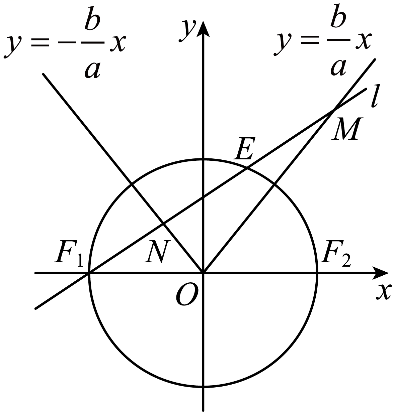

两点到轴的距离之和为，；

由得：，，

以为直径的圆的方程为，，

解得：或（舍）；

，解得：；

，

，即，.

故答案为：.

<strong>例48．</strong>（2024·河南信阳·高三信阳高中校考阶段练习）已知双曲线的一条渐近线被圆截得的弦长为，则双曲线的离心率为______.

【答案】/

【解析】双曲线的渐近线的方程为.

圆的标准方程为：，

故该圆的圆心为，半径为2，

而圆心到渐近线的距离为，

故渐近线被该圆截得的弦长为，

整理得到：或，

而，故，故离心率为.

故答案为：.

<strong>变式38．</strong>（2024·全国·镇海中学校联考模拟预测）已知是双曲线的左焦点，是的右顶点，过点作轴的垂线交双曲线的一条渐近线于点，连接交另一条渐近线于点.若，则双曲线的离心率为__________.

【答案】2

【解析】如下图所示：

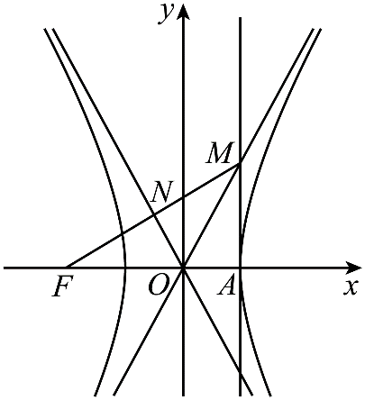

易知，则过点作轴的垂线方程为，

不妨设与渐近线交于点，则可得，

又可得，为的中点，即；

又在另一条渐近线上，即，解得；

所以双曲线的离心率为.

故答案为：2

<strong>变式39．</strong>（2024·四川成都·校考模拟预测）已知双曲线的左､右焦点分别为，点是的一条渐近线上的两点，且（为坐标原点），．若为的左顶点，且，则双曲线的离心率为_____

【答案】

【解析】设双曲线的焦距为，因为，所以，所以关于原点对称，又，所以四边形为平行四边形，

又，所以四边形为矩形，因为以为直径的圆的方程为，

不妨设所在的渐近线方程为，则，

由，解得或，不妨设，

因为为双曲线的左顶点，所以，

所以，

又，由余弦定理得，

即，整理得，

所以离心率．

故答案为：．

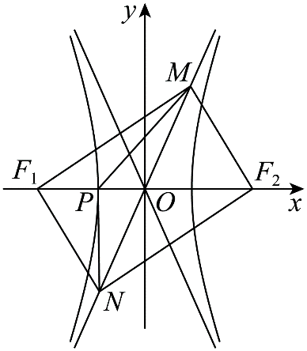

<strong>变式40．</strong>（2024·黑龙江哈尔滨·哈尔滨市第六中学校校考三模）已知，分别为双曲线<em>C</em>：的左、右焦点，过作<em>C</em>的两条渐近线的平行线，与渐近线交于两点.若，则<em>C</em>的离心率为______.

【答案】/

【解析】根据双曲线*C*：的对称性以及其两条渐近线关于*x*轴对称，

不妨设*M*在第一象限，

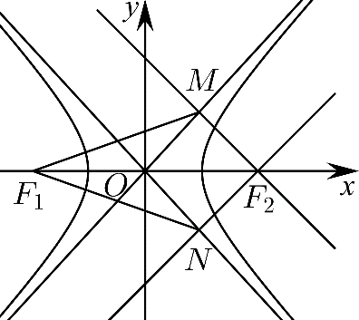

可知点关于*x*轴对称，则，

设，则，

即，则，

由题意得直线的方程为，

联立，即得，故,

则，

所以*C*的离心率为，

故答案为：

<strong>变式41．</strong>（2024·山东菏泽·高三统考期末）已知为原点，双曲线上有一点，过作两条渐近线的平行线，且与两渐近线的交点分别为，平行四边形的面积为1，则双曲线的离心率为__________．

【答案】

【解析】设，则，渐近线方程为，点P到直线距离为，由及得，所以平行四边形OBPA面积为离心率为

<strong>变式42．</strong>（2024·全国·高三专题练习）已知<em>F</em>是椭圆：（）的右焦点，<em>A</em>为椭圆的下顶点，双曲线：（，）与椭圆共焦点，若直线与双曲线的一条渐近线平行，，的离心率分别为，，则的最小值为______．

【答案】

【解析】设的半焦距为*c*（），则，又，

所以，又直线与的一条渐近线平行，

所以，所以，

所以，

所以，

所以，

又，

当且仅当，即，时等号成立，

即的最小值为．

故答案为：

**变式43．**（2024·安徽安庆·安庆一中校考三模）过双曲线：的右焦点作双曲线一条渐近线的垂线，垂足为，且与另一条渐近线交于点，若，则双曲线的离心率是（    ）

A．	B．或	C．	D．

【答案】B

【解析】

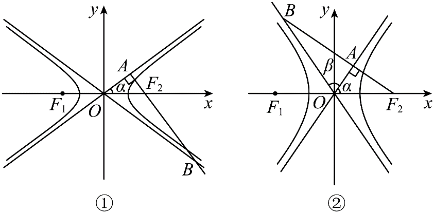

如图①，当时，设，则，设，双曲线的渐近线方程为，所以，在中，，设

，，，因为，所以，

又，所以，所以，，，，

则，则，且

即，解得，所以

如图②，当时，设，，设，则，，在中，，

设，，，因为，所以，

又，所以，所以，，，，

则，，，所以

，则，所以

，即，解得，所以.

故选：B

**变式44．**（2024·江西九江·统考一模）已知双曲线()，过点作的一条渐近线的垂线，垂足为，过点作轴的垂线交于点，若与的面积相等(为坐标原点)，则的离心率为（    ）

A．	B．	C．	D．

【答案】C

【解析】与的面积相等，为的中点，

故为等腰直角三角形，

，，，

即，，，

故选：C*．*

<strong>变式45．</strong>（2024·重庆渝中·高三重庆巴蜀中学校考阶段练习）已知为双曲线的一个焦点，过平行于的一条渐近线的直线交于点，（为坐标原点），则双曲线的离心率为__________.

【答案】

【解析】设点坐标为，过作一条与平行的直线交于点，

则根据题意有，

解得：，

双曲线的离心率，

双曲线的离心率为，

同理坐标是或者作一条与平行的直线也可以得到离心率为.

故答案为：.

**题型十七：坐标法**

<strong>例49．</strong>（2024·陕西咸阳·武功县普集高级中学校考模拟预测）双曲线：的左､右焦点分别为，，过作的垂线，交双曲线于，两点，是双曲线的右顶点，连接，，并延长分别交轴于点，.若点在以为直径的圆上，则双曲线的离心率为___________.

【答案】

【解析】由得，

不妨设，而，

所以直线的方程为，

令得，则，同理可求得，

所以以为直径的圆的方程为，

将代入上式得：

，

即，则.

故答案为：

<strong>例50．</strong>（2024·安徽·高三校联考阶段练习）如图，椭圆：()的右焦点为<em>F</em>，离心率为<em>e</em>，点<em>P</em>是椭圆上第一象限内任意一点且，，．若，则离心率<em>e</em>的最小值是_________．

【答案】

【解析】∵点*P*是上第一象限内任意一点且，∴，设直线*OP*的斜率为*k*，则．

由可得，故，∴，

∵，故，

∴，解得，

∵对任意的恒成立，故，

整理得到对任意的恒成立，

故只需，即，即，故离心率*e*最小值为．

故答案为：

**例51．**（2024·山东·高三校联考阶段练习）已知双曲线（，），直线的斜率为，且过点，直线与轴交于点，点在的右支上，且满足，则的离心率为（    ）

A．	B．2

C．	D．

【答案】D

【解析】由题意知直线的方程为，令，得，所以．

又因为，不妨设，所以有，

解得，所以，将其代入双曲线方程，

化简得，解得或（舍去），

所以的离心率．

故选：D.

<strong>变式46．</strong>（2024·全国·高三专题练习）已知椭圆：的右焦点为，过点作倾斜角为的直线交椭圆于、两点，弦的垂直平分线交轴于点<em>P</em>，若，则椭圆的离心率_________．

【答案】/0.5

【解析】因为倾斜角为的直线过点，

设直线的方程为: , ,

线段的中点,

联立 ，化为，

，

，

的垂直平分线为:,

令 , 解得 ,.

,

,则 ,

椭圆的离心率为,

故答案为:.

**变式47．**（2024·湖南永州·统考一模）已知椭圆的左、右焦点分别是，点是椭圆上位于第一象限的一点，且与轴平行，直线与的另一个交点为，若，则的离心率为（    ）

A．	B．	C．	D．

【答案】B

【解析】由令，得，

由于与轴平行，且在第一象限，所以.

由于，

所以，

即，将点坐标代入椭圆的方程得，

，

，

所以离心率.

故选：B

<strong>变式48．</strong>（2024·四川南充·高三四川省南充高级中学校考阶段练习）已知双曲线的左右焦点点关于一条渐近线的对称点在另一条渐近线上，则双曲线<em>C</em>的离心率是（   ）

A．	B．	C．2	D．3

【答案】C

【解析】双曲线的右焦点,

设点关于一条渐近线的对称点为，

由题意知，，解得.

又知，解得，

所以，即，

所以双曲线*C*的离心率是

故选：C.

<strong>变式49．</strong>（2024·重庆沙坪坝·高三重庆一中校考开学考试）设分别为椭圆的左右焦点，<em>M</em>为椭圆上一点，直线分别交椭圆于点<em>A</em>，<em>B</em>，若，则椭圆离心率为（    ）

A．	B．	C．	D．

【答案】D

【解析】如下图所示：

易知，不妨设，，易知，由可得，即

同理由可得；

将两点代入椭圆方程可得；

即，又，整理得

解得，

所以离心率；

故选：D

<strong>变式50．</strong>（2024·安徽·高三宿城一中校联考阶段练习）已知椭圆<em>C</em>：（）的左焦点为，过左焦点作倾斜角为的直线交椭圆于<em>A</em>，<em>B</em>两点，且，则椭圆<em>C</em>的离心率为（    ）

A．	B．	C．	D．

【答案】C

【解析】设，，，过点所作直线的倾斜角为，所以该直线斜率为，

所以直线方程可写为，联立方程，

可得，，

根据韦达定理：，，

因为，即，所以，

所以，

即，所以，联立，

可得，.

故选：C

**变式51．**（2024·福建厦门·厦门一中校考模拟预测）已知为双曲线：的右焦点，平行于轴的直线分别交的渐近线和右支于点，，且，，则的离心率为（    ）

A．	B．	C．	D．

【答案】B

【解析】双曲线：的渐近线方程为.

设，联立方程组，解得.

因为，所以，即，可得.

又因为点在双曲线上，所以，

将代入，可得，

由，所以，所以，即，

化简得，则，所以双曲线的离心率为.

故选：B.

**变式52．**（2024·浙江杭州·高三浙江省杭州第二中学校考阶段练习）设椭圆的左焦点为，为坐标原点，过且斜率为的直线交椭圆于，两点（在轴上方）.关于轴的对称点为，连接并延长交轴于点，若，，成等比数列，则椭圆的离心率的值为（    ）

A．	B．	C．	D．

【答案】D

【解析】如图所示：

设分别以*OF*，*EF*，*OE*为底，高为*h*，

则，

因为，，成等比数列，

所以，即，

设直线*AB*的方程为：，

联立，消去*y*得，

由韦达定理得：，

直线*BD*的方程为：，

令得，，则，

则，即为，

则，即，

即，

解得，则，

故选：D

<strong>变式53．</strong>（2024·陕西商洛·高三陕西省山阳中学校联考阶段练习）已知双曲线的右焦点为，以坐标原点为圆心，线段为半径作圆，与的右支的一个交点为<em>A</em>，若，则的离心率为（    ）

A．	B．2	C．	D．

【答案】D

【解析】由题意可知，且为锐角，

故，

而，故，

将代入中，

得，结合整理得，

即，解得或,

由于双曲线离心率，故舍去，

故，

故选：D

**题型十八：利用焦半径的取值范围**

**例52．**（2024·全国·高三专题练习）已知双曲线的左､右焦点分别为.若双曲线的右支上存在点，使，则双曲线的离心率的取值范围为\_\_\_\_\_\_\_\_\_\_\_.

【答案】

【解析】依题意，点在双曲线的右支，*P*不与双曲线顶点重合，

在中，由正弦定理得：

，因，于是得，

而点*P*在双曲线*M*的右支上，即，从而有，

点*P*在双曲线*M*的右支上运动，并且异于顶点，于是有，

因此，而，整理得，即，

解得，又，故有，

所以双曲线*M*的离心率的取值范围为.

故答案为：

<strong>例53．</strong>（2024·吉林长春·二模）已知双曲线的左、右焦点分别为，，点<em>P</em>在双曲线的右支上，且，则双曲线离心率的取值范围是

A．	B．	C．	D．

【答案】B

【解析】由双曲线定义可知，，，结合 可得，从而，又因为双曲线的离心率大于 ，所以双曲线离心率的取值范围为，故选B.

<strong>例54．</strong>（2024·江苏·金沙中学高二阶段练习）设双曲线的焦距为，左、右焦点分别是，，点<em>P</em>在<em>C</em>的右支上，且，则<em>C</em>的离心率的取值范围是（    ）

A．	B．	C．	D．

【答案】C

【解析】由条件得，所以，即，

又因为，所以，

即，得，

又，所以．

故选：C

**变式54．**（2024·全国·高三专题练习）在平面直角坐标系中，椭圆上存在点，使得，其中、分别为椭圆的左、右焦点，则该椭圆的离心率取值范围是\_\_\_\_\_\_\_\_．

【答案】

【解析】设椭圆的焦距为，由椭圆的定义可得，

解得，，

由题意可得，解得，又，所以，

所以椭圆离心率的取值范围是．

故答案为：.

**变式55．**（2024·河南·信阳高中高三期末）若椭圆上存在一点，使得，其中分别是的左、右焦点，则的离心率的取值范围为\_\_\_\_\_\_.

【答案】

【解析】，，

又，，

解得，则.

故答案为

**题型十九：四心问题**

<strong>例55．</strong>（2024·全国·校联考模拟预测）已知双曲线的左、右焦点分别为，，<em>M</em>是双曲线<em>C</em>右支上一点，记的重心为<em>G</em>，内心为<em>I</em>．若，则双曲线<em>C</em>的离心率为______．

【答案】2

【解析】如图，连接*MG*，*MI*并延长，与分别交于点*O*，*D*，

设双曲线*C*的焦距为2*c*，由题意，得，

因为，且*G*为重心，则，所以，

因为*I*为的内心，所以*MD*为的平分线，

所以，所以，

又，所以，，

设的内切圆半径为*r*，则*M*到*x*轴的距离为3*r*，

因为，，

所以，所以，所以双曲线*C*的离心率．

故答案为：2．

<strong>例56．</strong>（2024·全国·高三专题练习）已知，分别为椭圆的左､右焦点，点<em>P</em>在第一象限内，，<em>G</em>为重心，且满足，线段交椭圆<em>C</em>于点<em>M</em>，若，则椭圆<em>C</em>的离心率为___________.

【答案】/

【解析】因为*G*为△重心，是中线且满足，

即，故,

所以，

且，，又，

，

在△中应用余弦定理得,

所以，则.

故答案为: .

<strong>例57．</strong>（2024·全国·高三专题练习）已知坐标平面<em>xOy</em>中，点，分别为双曲线的左、右焦点，点<em>M</em>在双曲线<em>C</em>的左支上，与双曲线<em>C</em>的一条渐近线交于点<em>D</em>，且<em>D</em>为的中点，点<em>I</em>为的外心，若<em>O</em>、<em>I</em>、<em>D</em>三点共线，则双曲线<em>C</em>的离心率为______．

【答案】

【解析】由题意知，双曲线的渐近线方程为，，

不妨设点在第二象限，则，

由*D*为的中点，*O*、*I*、*D*三点共线知直线*OD*垂直平分，

则，有，且，

解得，，所以，

将即，代入双曲线的方程，

得，化简可得，即；

当点*M*在第三象限时，同理可得．

故答案为：.

<strong>变式56．</strong>（2024·全国·高三专题练习）已知点分别为双曲线的左、右焦点，点<em>A</em>，<em>B</em>在<em>C</em>的右支上，且点恰好为的外心，若，则<em>C</em>的离心率为__________.

【答案】

【解析】取的中点为*C*，连接*BC*、、，如图所示：

因为，所以，

又*C*为的中点，所以为等腰三角形且，

因为点恰好为的外心，所以点在直线*BC*上，且，

由双曲线的定义知，则，

所以为等边三角形，则，

在中，即，化简得，

同时除以可得，解得或(舍去).

故答案为：

<strong>变式57．</strong>（2024·山西太原·高三山西大附中校考开学考试）已知双曲线的左､右焦点分别为，离心率为2，焦点到渐近线的距离为.过作直线交双曲线的右支于两点，若分别为与的内心，则的取值范围为___________.

【答案】

【解析】设半焦距为，

由题意知，

，

所以，

所以，

双曲线.

记的内切圆与边，，分别相切于点，

则横坐标相等，

则，，，

由，

即，

得，

即，

记的横坐标为，

则，

于是，得，

同理内心的横坐标也为，则轴.

设直线的倾斜角为，

则，

在中，

，

由于直线与的右支有2个交点，且一条渐近线的斜率为，倾斜角为，

可得，

即，

可得的范围是.

故答案为：.

<strong>变式58．</strong>（2024·全国·高三专题练习）在平面直角坐标系中，椭圆<em>E</em>以两坐标轴为对称轴，左，右顶点分别为<em>A</em>，<em>B</em>，点<em>P</em>为第一象限内椭圆上的一点，<em>P</em>关于<em>x</em>轴的对称点为<em>Q</em>，过<em>P</em>作椭圆的切线，若，且的垂心恰好为坐标原点<em>O</em>，记椭圆<em>E</em>的离心率为<em>e</em>，则的值为_________.

【答案】

【解析】设椭圆方程为，则，

设，故，

因为的垂心恰好为坐标原点*O*，

所以，，即，

即，，

下面证明椭圆在处的切线方程斜率为，理由如下：

因为时，故切线的斜率存在，设切线方程为，

代入椭圆方程得：，

由，化简得：

，

即，

因为点在椭圆上，所以，，

所以，即，

即，解得：，

所以，化简得：，即，设，

同除以得：，

即，故，

因为点在椭圆上，所以，

即，即，

因为，所以，即，

将代入中，可得：，即

所以，

设椭圆方程为，此时，

同理可得：，

此时椭圆在处的切线方程斜率为，

所以，化简得：，设，

同除以得：，

即，故，

因为点在椭圆上，所以，

即，即，

因为，所以，即，

将代入中，可得：，

所以（舍去）；

故答案为：

