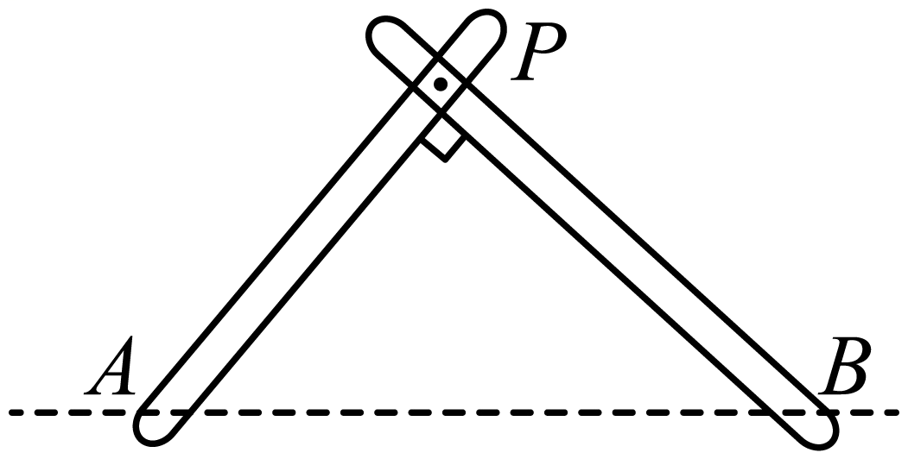
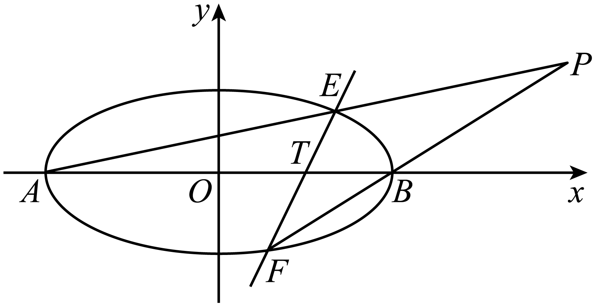
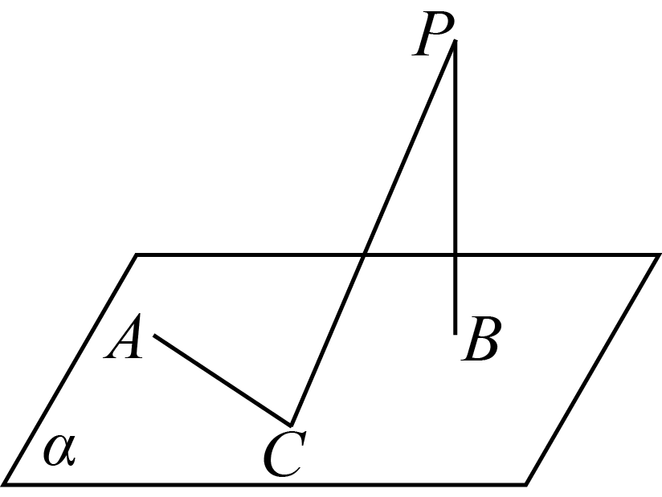
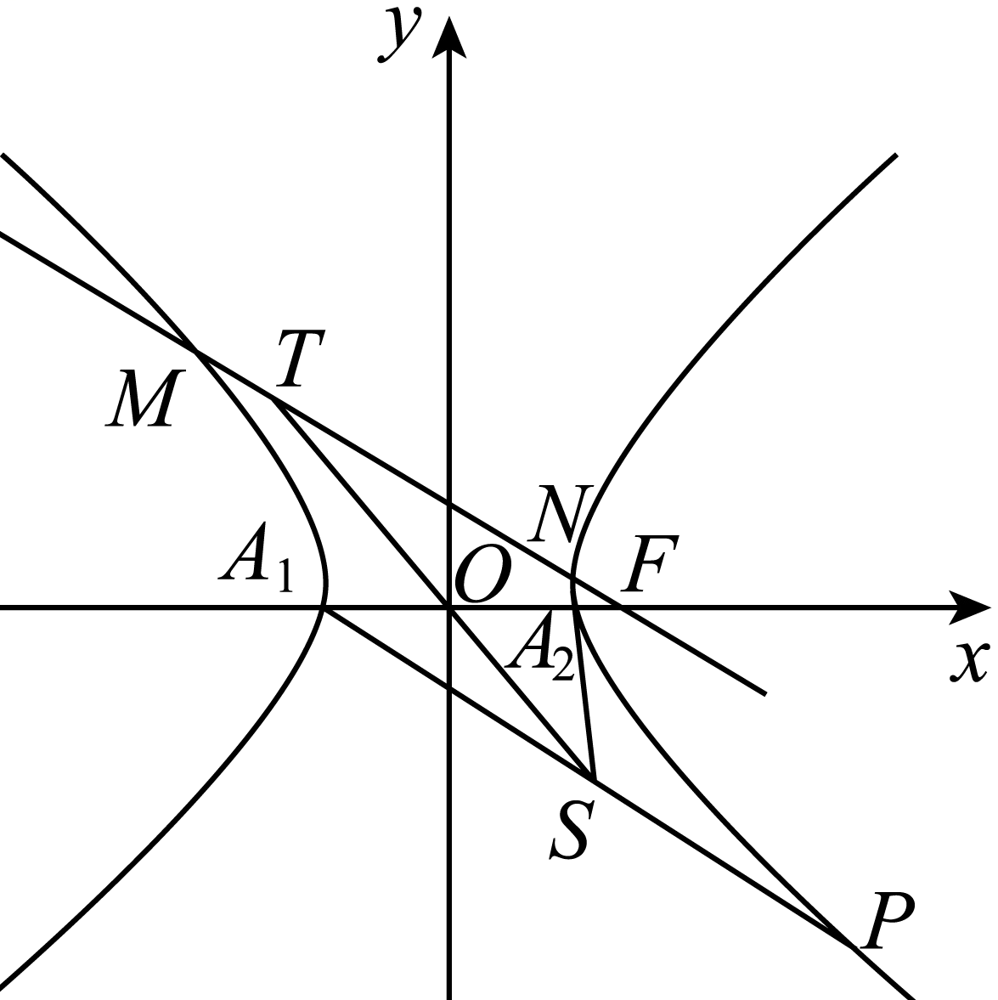

**第68讲  曲线的轨迹方程**

**知识梳理**

**一．直接法求动点的轨迹方程**

利用直接法求动点的轨迹方程的步骤如下：

（1）建系：建立适当的坐标系

（2）设点：设轨迹上的任一点

（3）列式：列出有限制关系的几何等式

（4）代换：将轨迹所满足的条件用含的代数式表示，如选用距离和斜率公式等将其转化为的方程式化简

（5）证明（一般省略）：证明所求方程即为符合条件的动点轨迹方程（对某些特殊值应另外补充检验）．简记为：建设现代化，补充说明．

**注：若求动点的轨迹，则不但要求出动点的轨迹方程，还要说明轨迹是什么曲线．**

**二．定义法求动点的轨迹方程**

回顾之前所讲的第一定义的求解轨迹问题，我们常常需要把动点和满足焦点标志的定点连起来判断．熟记焦点的特征：（1）关于坐标轴对称的点；（2）标记为的点；（3）圆心；（4）题目提到的定点等等．当看到以上的标志的时候要想到曲线的定义，把曲线和满足焦点特征的点连起来结合曲线定义求解轨迹方程．

**三．相关点法求动点的轨迹方程**

如果动点的运动是由另外某一点的运动引发的，而该点的运动规律已知，（该点坐标满足某已知曲线方程），则可以设出，用表示出相关点的坐标，然后把的坐标代入已知曲线方程，即可得到动点的轨迹方程．

**四．交轨法求动点的轨迹方程**

在求动点的轨迹方程时，存在一种求解两动曲线交点的轨迹问题，这类问题常常可以先解方程组得出交点（含参数）的坐标，再消去参数得出所求轨迹的方程，该方法经常与参数法并用，和参数法一样，通常选变角、变斜率等为参数．

**五．参数方程法求动点的轨迹方程**

动点的运动主要是由于某个参数的变化引起的，可以选参、设参，然后用这个参数表示动点的坐标，即，再消参.

**六．点差法求动点的轨迹方程**

圆锥曲线中涉及与弦的中点有关的轨迹问题可用点差法，其基本方法是把弦的两端点的坐标代入圆锥曲线方程，两式相减可得，，，等关系式，由于弦的中点的坐标满足，且直线的斜率为，由此可求得弦中点的轨迹方程．

**必考题型全归纳**

**题型一：直接法**

<strong>例1．</strong>（2024·甘肃平凉·高三统考期中）动点与定点的连线的斜率之积为，则点的轨迹方程是___________.

<strong>例2．</strong>（2024·湖南长沙·高三长郡中学校联考阶段练习）已知圆：，过动点作圆的切线（为切点），使得，则动点的轨迹方程为________.

<strong>例3．</strong>（2024·全国·高三专题练习）已知两条直线和，有一动圆与及都相交，并且、被截在圆内的两条弦长分别是26和24，则动圆圆心的轨迹方程是__．

<strong>变式1．</strong>（2024·全国·高三专题练习）已知平面直角坐标系中有两点，且曲线上的任意一点<em>P</em>都满足．则曲线的轨迹方程为_______________.

<strong>变式2．</strong>（2024·全国·高三专题练习）已知平面上的动点到点和的距离之比为，则点的轨迹方程为_____.

<strong>变式3．</strong>（2024·全国·高三专题练习）已知平面上一定点和直线<em>l</em>：<em>x</em>=8，<em>P</em>为该平面上一动点，作<em>PQ</em>⊥<em>l</em>，垂足为<em>Q</em>，且<strong>·</strong>=0．则动点<em>P</em>的轨迹方程为____________；

**题型二：定义法**

<strong>例4．</strong>（2024·全国·高三专题练习）若，，点<em>P</em>到<em>F1</em>，<em>F2</em>的距离之和为10，则点<em>P</em>的轨迹方程是________

<strong>例5．</strong>（2024·浙江·高三校联考阶段练习）已知圆与圆内切，且圆与直线相切，则圆的圆心的轨迹方程为__________．

<strong>例6．</strong>（2024·广东东莞·高三校考阶段练习）已知圆，圆，动圆与圆外切并与圆内切，则圆心的轨迹方程为_______

<strong>变式4．</strong>（2024·全国·高三专题练习）在平面直角坐标系中，已知的周长是18，，是轴上关于原点对称的两点，若，动点满足.则动点的轨迹方程为_____________；

<strong>变式5．</strong>（2024·全国·高三对口高考）已知动圆<em>P</em>过点，且与圆外切，则动圆<em>P</em>圆心的轨迹方程为______.

<strong>变式6．</strong>（2024·全国·高三专题练习）中，<em>A</em>为动点，，且满足，则<em>A</em>点的轨迹方程为______．

<strong>变式7．</strong>（2024·全国·高三专题练习）一个动圆与圆外切，与圆内切，则这个动圆圆心的轨迹方程为__________．

<strong>变式8．</strong>（2024·全国·高三对口高考）已知，<em>B</em>是圆（<em>F</em>为圆心）上一动点.线段<em>AB</em>的垂直平分线交<em>BF</em>于<em>P</em>，则动点<em>P</em>的轨迹方程为___________.

<strong>变式9．</strong>（2024·全国·高三专题练习）已知定点，圆，过<em>R</em>点的直线交圆于<em>M</em>，<em>N</em>两点过<em>R</em>点作直线交<em>SM</em>于<em>Q</em>点，求<em>Q</em>点的轨迹方程；

<strong>变式10．</strong>（2024·全国·高三专题练习）已知圆，直线，过上的点作圆的两条切线，切点分别为，则弦中点的轨迹方程为_________.

<strong>变式11．</strong>（2024·吉林白山·高三抚松县第一中学校考阶段练习）设<em>O</em>为坐标原点，，点<em>A</em>是直线上一个动点，连接<em>AF</em>并作<em>AF</em>的垂直平分线<em>l</em>，过点<em>A</em>作<em>y</em>轴的垂线交<em>l</em>于点<em>P</em>，则点<em>P</em>的轨迹方程为______．

<strong>变式12．</strong>（2024·云南·高三校联考阶段练习）已知圆，直线过点且与圆交于点<em>B</em>，<em>C</em>，线段的中点为<em>D</em>，过的中点<em>E</em>且平行于的直线交于点<em>P</em>．

(1)求动点*P*的轨迹方程；

**题型三：相关点法**

<strong>例7．</strong>（2024·全国·高三专题练习）已知点<em>P</em>为椭圆上的任意一点，<em>O</em>为原点，<em>M</em>满足，则点<em>M</em>的轨迹方程为______________．

<strong>例8．</strong>（2024·福建泉州·高三校考开学考试）是圆上的动点，点，则线段的中点的轨迹方程是____________.

<strong>例9．</strong>（2024·四川内江·高三四川省内江市第六中学校考阶段练习）已知定点和曲线上的动点，则线段的中点的轨迹方程为___________．

<strong>变式13．</strong>（2024·全国·高考真题）设<em>P</em>为双曲线上一动点，<em>O</em>为坐标原点，<em>M</em>为线段的中点，则点<em>M</em>的轨迹方程为_____________．

<strong>变式14．</strong>（2024·全国·高三专题练习）已知的顶点，，顶点<em>A</em>在抛物线上运动，则的重心<em>G</em>的轨迹方程为______．

<strong>变式15．</strong>（2024·全国·高三专题练习）设过点的直线分别与<em>x</em>轴的正半轴和<em>y</em>轴的正半轴交于<em>A</em>、<em>B</em>两点，点<em>Q</em>与点<em>P</em>关于<em>y</em>轴对称，<em>O</em>为坐标原点．若，且，则点<em>P</em>的轨迹方程是______．

<strong>变式16．</strong>（2024·全国·高三专题练习）在平面直角坐标系中，△<em>ABC</em>满足<em>A</em>(-1，0)，<em>B</em>(1，0)，，，∠<em>ACB</em>的平分线与点<em>P</em>的轨迹相交于点<em>I</em>，存在非零实数，使得，则顶点<em>C</em>的轨迹方程为________．

**题型四：交轨法**

<strong>例10．</strong>（2024·贵州铜仁·高三统考期末）已知直线，，当任意的实数<em>m</em>变化时，直线与的交点的轨迹方程是_____________．

<strong>例11．</strong>（2024·河南·校联考模拟预测）已知抛物线的焦点到准线的距离为2，直线与抛物线交于两点，过点作抛物线的切线，若交于点，则点的轨迹方程为__________.

<strong>例12．</strong>（2024·贵州贵阳·高三贵阳一中校考阶段练习）已知<em>A</em>，<em>B</em>分别为椭圆的左､右顶点，点<em>M</em>，<em>N</em>为椭圆上的两个动点，满足线段<em>MN</em>与<em>x</em>轴垂直，则直线<em>MA</em>与<em>NB</em>交点的轨迹方程为___________.

<strong>变式17．</strong>（2024·全国·高三专题练习）已知是椭圆中垂直于长轴的动弦，是椭圆长轴的两个端点，则直线和的交点的轨迹方程为_______．

<strong>变式18．</strong>（2024·全国·高三专题练习）直线在轴上的截距为且交抛物线于、两点，点为抛物线的顶点，过点、分别作抛物线对称轴的平行线与直线交于、两点．分别过点、作抛物线的切线，则两条切线的交点的轨迹方程为_______．

<strong>变式19．</strong>（2024·全国·高三专题练习）已知抛物线<em>C</em>：，焦点为<em>F</em>，过<em>F</em>的直线<em>l</em>交<em>C</em>于<em>A</em>，<em>B</em>两点，分别作抛物线<em>C</em>在<em>A</em>，<em>B</em>处的切线，且两切线交于点<em>P</em>，则点<em>P</em>的轨迹方程为：___________．

<strong>变式20．</strong>（2024·全国·高三专题练习）已知点，，，动圆与直线切于点，分别过点且与圆相切的两条直线相交于点，则点的轨迹方程为_______.

<strong>变式21．</strong>（2024·全国·高三专题练习）如图所示，两根杆分别绕着定点<em>A</em>和<em>B</em>（<em>AB</em>＝2<em>a</em>）在平面内转动，并且转动时两杆保持互相垂直，则杆的交点<em>P</em>的轨迹方程是________.

**变式22．**（2024·江西·高三校联考阶段练习）已知椭圆的中心在坐标原点，焦点在坐标轴上，且经过三点.

(1)求椭圆的方程；

(2)若过右焦点的直线（斜率不为0）与椭圆交于两点，求直线与直线的交点的轨迹方程.

<strong>变式23．</strong>（2024·全国·高三专题练习）已知椭圆<em>C</em>：的离心率为，且经过，经过定点斜率不为0的直线<em>l</em>交<em>C</em>于<em>E</em>，<em>F</em>两点，<em>A</em>，<em>B</em>分别为椭圆<em>C</em>的左，右两顶点.

(1)求椭圆*C*的方程；

(2)设直线*AE*与*BF*的交点为*P*，求*P*点的轨迹方程.

**变式24．**（2024·山西阳泉·高三统考期末）已知过点的直线交抛物线于两点，为坐标原点．

(1)证明：；

(2)设为抛物线的焦点，直线与直线交于点，直线交抛物线与两点（在轴的同侧），求直线与直线交点的轨迹方程．

<strong>变式25．</strong>（2024·四川泸州·高三四川省泸县第一中学校考开学考试）直线<em>l</em>在<em>x</em>轴上的截距为且交抛物线于<em>A</em>，<em>B</em>两点，点<em>O</em>为抛物线的顶点，过点<em>A</em>，<em>B</em>分别作抛物线对称轴的平行线与直线交于<em>C</em>，<em>D</em>两点．

(1)当时，求的大小；

(2)试探究直线*AD*与直线*BC*的交点是否为定点，若是，请求出该定点并证明；若不是，请说明理由；

(3)分别过点*A*，*B*作抛物线的切线，求两条切线的交点的轨迹方程．

<strong>变式26．</strong>（2024·全国·高三专题练习）已知抛物线过点，直线与抛物线<em>C</em>交于<em>A</em>，<em>B</em>两点.

(1)若，求直线*l*的方程；

(2)过点作直线和，其中交*C*于*M*，*N*两点，交*C*于*P*，*Q*两点，*M*，*P*位于*x*轴的同侧，*Q*，*N*位于*x*轴的同侧，求直线*MP*与直线*QN*交点的轨迹方程.

**变式27．**（2024·全国·高三专题练习）已知抛物线的内接等边三角形的面积为（其中为坐标原点）．

（1）试求抛物线的方程；

（2）已知点两点在抛物线上，是以点为直角顶点的直角三角形．

①求证：直线恒过定点；

②过点作直线的垂线交于点，试求点的轨迹方程，并说明其轨迹是何种曲线．

**题型五：参数法**

<strong>例13．</strong>（2024·全国·高三专题练习）方程(<em>t</em>为参数)所表示的圆的圆心轨迹方程是___________(结果化为普通方程)

<strong>例14．</strong>（2024·全国·高三专题练习）已知，，当时，线段的中点轨迹方程为_________．

<strong>例15．</strong>（2024·云南·高三云南师大附中校考阶段练习）已知<em>O</em>为坐标原点，，<em>A</em>是上的动点，连接<em>OA</em>，线段<em>OA</em>交于点<em>B</em>，过<em>A</em>作<em>x</em>轴的垂线交<em>x</em>轴于点<em>C</em>，过<em>B</em>作<em>AC</em>的垂线交<em>AC</em>于点<em>D</em>，则点<em>D</em>的轨迹方程为________．

<strong>变式28．</strong>（2024·全国·高三专题练习）已知在中，<em>AB</em>＝8，以<em>AB</em>的中点为原点<em>O</em>，<em>AB</em>所在直线为<em>x</em>轴，建立平面直角坐标系，设，，若，则点<em>P</em>的轨迹方程为______．

**题型六：点差法**

**例16．**（2024·全国·高三专题练习）已知椭圆．

(1)过椭圆的左焦点引椭圆的割线，求截得的弦的中点的轨迹方程；

(2)求斜率为2的平行弦的中点的轨迹方程；

(3)求过点且被平分的弦所在直线的方程．

**例17．**（2024·全国·高三专题练习）已知椭圆，求斜率为的平行弦中点的轨迹方程.

**例18．**（2024·全国·高三专题练习）已知：椭圆，求：

（1）以为中点的弦所在直线的方程；

（2）斜率为2的平行弦中点的轨迹方程．

<strong>变式29．</strong>（2024·全国·高三专题练习）斜率为2的平行直线截双曲线所得弦的中点的轨迹方程是______．

<strong>变式30．</strong>（2024·全国·高三专题练习）已知椭圆，一组平行直线的斜率是，当它们与椭圆相交时，这些直线被椭圆截得的线段的中点轨迹方程是__．

<strong>变式31．</strong>（2024·全国·高三专题练习）直线<em>l</em>与椭圆交于<em>A</em>，<em>B</em>两点，已知直线的斜率为1，则弦<em>AB</em>中点的轨迹方程是______．

<strong>变式32．</strong>（2024·全国·高三专题练习）椭圆，则该椭圆所有斜率为的弦的中点的轨迹方程为_________________．

**题型七：立体几何与圆锥曲线的轨迹**

<strong>例19．</strong>（2024·北京·高三强基计划）在正方体中，动点<em>M</em>在底面内运动且满足，则动点<em>M</em>在底面内的轨迹为（    ）

A．圆的一部分	B．椭圆的一部分

C．双曲线一支的一部分	D．前三个答案都不对

<strong>例20．</strong>（2024·全国·高三对口高考）如图，定点<em>A</em>和<em>B</em>都在平面内，定点，<em>C</em>是内异于<em>A</em>和<em>B</em>的动点，且．那么，动点<em>C</em>在平面内的轨迹是（    ）

A．一条线段，但要去掉两个点	B．一个圆，但要去掉两个点

C．一个椭圆，但要去掉两个点	D．半圆，但要去掉两个点

<strong>例21．</strong>（2024·云南保山·统考二模）已知正方体，<em>Q</em>为上底面所在平面内的动点，当直线与的所成角为45°时，点<em>Q</em>的轨迹为（    ）

A．圆	B．直线	C．抛物线	D．椭圆

**变式33．**（2024·安徽滁州·安徽省定远中学校考模拟预测）在正四棱柱中，，，为中点，为正四棱柱表面上一点，且，则点的轨迹的长为（    ）

A．	B．	C．	D．

**变式34．**（2024·全国·学军中学校联考模拟预测）已知空间中两条直线、异面且垂直，平面且，若点到、距离相等，则点在平面内的轨迹为（    ）

A．直线	B．椭圆	C．双曲线	D．抛物线

**变式35．**（2024·江西赣州·统考二模）在棱长为4的正方体中，点满足，，分别为棱，的中点，点在正方体的表面上运动，满足面，则点的轨迹所构成的周长为（    ）

A．	B．	C．	D．

**题型八：复数与圆锥曲线的轨迹**

<strong>例22．</strong>（2024·辽宁朝阳·统考二模）已知，则复数在复平面内所对应点的轨迹方程为__________________．

<strong>例23．</strong>（2024·全国·高三专题练习）设复数满足，在复平面内对应的点为，则在复平面内的轨迹方程为__________．

**例24．**（2024·辽宁锦州·统考模拟预测）已知复数为虚数单位为纯虚数，则在复平面内，对应的点的轨迹为（    ）

A．圆	B．一条线段	C．两条直线	D．不含端点的4条射线

<strong>变式36．</strong>（2024·全国·高三专题练习）复平面中有动点<em>Z</em>，<em>Z</em>所对应的复数<em>z</em>满足，则动点<em>Z</em>的轨迹为（    ）

A．直线	B．线段	C．两条射线	D．圆

**变式37．**（2024·全国·高三专题练习）已知复数满足，则的轨迹为（    ）

A．线段	B．直线

C．椭圆	D．椭圆的一部分

**变式38．**（2024·全国·高三专题练习）若复数满足，则复数对应的点的轨迹围成图形的面积等于（    ）

A．	B．	C．	D．

<strong>变式39．</strong>（2024·湖南长沙·高三湖南师大附中校考阶段练习）满足条件的复数<em>z</em>在复平面上对应点的轨迹是（    ）

A．直线	B．圆	C．椭圆	D．抛物线

**变式40．**（2024·辽宁抚顺·高三校联考期末）若复数满足.则复数在复平面内的点的轨迹为（    ）

A．直线	B．椭圆	C．圆	D．抛物线

**题型九：向量与圆锥曲线的轨迹**

**例25．**（2024·全国·高三专题练习）已知是平面上一定点，是平面上不共线的三个点，动点满足，，则的轨迹一定通过的（   ）

A．重心	B．外心	C．内心	D．垂心

<strong>例26．</strong>（2024·全国·高三对口高考）<em>O</em>是平面内一定点，<em>A</em>，<em>B</em>，<em>C</em>是平面内不共线三点，动点<em>P</em>满足，，则<em>P</em>的轨迹一定通过的（    ）

A．外心	B．垂心	C．内心	D．重心

**例27．**（2024·全国·高三专题练习）在中，设，那么动点的轨迹必通过的（    ）

A．垂心	B．内心	C．重心	D．外心

**变式41．**（2024·江苏·高三统考期末）中，为边上的高且，动点满足，则点的轨迹一定过的（    ）

A．外心	B．内心	C．垂心	D．重心

**变式42．**（2024·四川成都·成都市第二十中学校校考一模）在平面内，是两个定点，是动点，若，则点的轨迹为（    ）

A．圆	B．椭圆	C．抛物线	D．直线

<strong>变式43．</strong>（2024·安徽·高三蚌埠二中校联考阶段练习）在中，，，，角<em>A</em>是锐角，<em>O</em>为的外心．若，其中，则点<em>P</em>的轨迹所对应图形的面积是（    ）

A．	B．	C．	D．

<strong>变式44．</strong>（2024·全国·高三专题练习）正三角形<em>OAB</em>的边长为1，动点<em>C</em>满足，且，则点<em>C</em>的轨迹是（    ）

A．线段	B．直线	C．射线	D．圆

**变式45．**（2024·全国·高三专题练习）已知是平面上的一定点，是平面上不共线的三个点，动点满足，，则动点的轨迹一定通过的（    ）

A．重心	B．外心	C．内心	D．垂心

**题型十：利用韦达定理求轨迹方程**

<strong>例28．</strong>（2024·全国·高三专题练习）已知椭圆的离心率为，点在<em>C</em>上．过<em>C</em>的右焦点<em>F</em>的直线交<em>C</em>于<em>M</em>，<em>N</em>两点．

(1)求椭圆*C*的方程；

(2)若动点*P*满足，求动点*P*的轨迹方程．

**例29．**（2024·湖北武汉·华中师大一附中校考模拟预测）已知过右焦点的直线交双曲线于两点，曲线的左右顶点分别为，虚轴长与实轴长的比值为．

(1)求曲线的方程；

(2)如图，点关于原点的对称点为点，直线与直线交于点，直线与直线交于点，求的轨迹方程．

<strong>例30．</strong>（2024·全国·高三专题练习）设椭圆方程为，过点的直线<em>l</em>交椭圆于点<em>A</em>，<em>B</em>，<em>O</em>是坐标原点，点<em>P</em>满足，当<em>l</em>绕点<em>M</em>旋转时，求动点<em>P</em>的轨迹方程；

<strong>变式46．</strong>（2024·全国·高三专题练习）已知椭圆<em>C</em>：过点，且椭圆上任意一点到右焦点的距离的最大值为.

(1)求椭圆*C*的方程；

(2)若直线*l*与椭圆*C*交不同于点*A*的*P*、*Q*两点，以线段*PQ*为直径的圆经过*A*，过点*A*作线段*PQ*的垂线，垂足为*H*，求点*H*的轨迹方程.

**变式47．**（2024·全国·高三专题练习）已知双曲线与直线．

(1)若直线与双曲线*C*相交于*A*，*B*两点，点是线段*AB*的中点，求直线的方程；

(2)若直线*l*与双曲线有唯一的公共点*M*，过点*M*且与*l*垂直的直线分别交*x*轴、*y*轴于，两点．当点*M*运动时，求点的轨迹方程，并说明轨迹是什么曲线．

<strong>变式48．</strong>（2024·全国·高三专题练习）设不同的两点<em>A</em>，<em>B</em>在椭圆上运动，以线段<em>AB</em>为直径的圆过坐标原点<em>O</em>，过<em>O</em>作，<em>M</em>为垂足．求点<em>M</em>的轨迹方程.

<strong>变式49．</strong>（2024·浙江·杭州市富阳区场口中学高三期末）已知椭圆<em>C</em>的离心率为，其焦点是双曲线的顶点.

(1)写出椭圆*C*的方程；

(2)直线*l*：与椭圆*C*有唯一的公共点*M*，过点*M*作直线*l*的垂线分别交*x*轴､*y*轴于，两点，当点*M*运动时，求点的轨迹方程，并说明轨迹是什么曲线.

**变式50．**（2024·广东·高三阶段练习）已知椭圆的离心率是，其左、右顶点分别是、，且．

(1)求椭圆的标准方程；

(2)已知点、是椭圆上异于、的不同两点，设点是以为直径的圆和以为直径的圆的另一个交点，记线段的中点为，若，求动点的轨迹方程．

<strong>变式51．</strong>（2024·全国·高三专题练习）已知三角形<em>ABC</em>的三个顶点均在椭圆上，且点<em>A</em>是椭圆短轴的一个端点（点<em>A</em>在<em>y</em>轴正半轴上）.

（1）若三角形*ABC*的重心是椭圆的右焦点，试求直线*BC*的方程;

（2）若角*A*为，*AD*垂直*BC*于*D*，试求点*D*的轨迹方程

