**第69讲  直线与圆锥曲线的位置关系**

**知识梳理**

**知识点一、直线和曲线联立**

（1）椭圆与直线相交于两点，设，

，

椭圆与过定点的直线相交于两点*，* 设为，如此消去，保留，构造的方程如下：，

**注意：**

①如果直线没有过椭圆内部一定点，是不能直接说明直线与椭圆有两个交点的，一般都需要摆出，满足此条件，才可以得到韦达定理的关系．

②焦点在轴上的椭圆与直线的关系，双曲线与直线的关系和上述形式类似，不在赘述．

（2）抛物线与直线相交于两点，设，

联立可得，时，

特殊地，当直线过焦点的时候，即，，因为为通径的时候也满足该式，根据此时*A*、*B*坐标来记忆．

抛物线与直线相交于两点，设，

联立可得，时，

**注意：** 在直线与抛物线的问题中，设直线的时候选择形式多思考分析，往往可以降低计算量．开口向上选择正设；开口向右，选择反设；注意不可完全生搬硬套，具体情况具体分析．

**总结：** 韦达定理连接了题干条件与方程中的参数，所以我们在处理例如向量问题，面积问题，三点共线问题，角度问题等常考内容的时候，要把题目中的核心信息，转化为坐标表达，转化为可以使用韦达定理的形式，这也是目前考试最常考的方式．

**知识点二、根的判别式和韦达定理**

与联立，两边同时乘上即可得到，为了方便叙述，将上式简记为．该式可以看成一个关于的一元二次方程，判别式为可简单记．

同理和联立，为了方便叙述，将上式简记为，，可简记．

与*C*相离；与*C*相切；与*C*相交．

**注意：**（1）由韦达定理写出，，注意隐含条件．

（2）求解时要注意题干所有的隐含条件，要符合所有的题意．

（3）如果是焦点在*y*轴上的椭圆，只需要把，互换位置即可．

（4）直线和双曲线联立结果类似，焦点在*x*轴的双曲线，只要把换成即可；

焦点在*y*轴的双曲线，把换成即可，换成即可．

（5）注意二次曲线方程和二次曲线方程往往不能通过联立消元，利用判断根的关系，因为此情况下往往会有增根，根据题干的隐含条件可以舍去增根（一般为交点横纵坐标的范围限制），所以在遇到两条二次曲线交点问题的时候，使用画图的方式分析，或者解方程组，真正算出具体坐标．

**知识点三、弦长公式**

设，根据两点距离公式*．*

（1）若在直线上，代入化简，得；

（2）若所在直线方程为，代入化简，得

（3）构造直角三角形求解弦长，．其中为直线斜率，为直线倾斜角．

**注意：**（1）上述表达式中，当为，时，；

（2）直线上任何两点距离都可如上计算，不是非得直线和曲线联立后才能用．

（3）直线和曲线联立后化简得到的式子记为，判别式为，时，，利用求根公式推导也很方便，使用此方法在解题化简的时候可以大大提高效率．

（4）直线和圆相交的时候，过圆心做直线的垂线，利用直角三角形的关系求解弦长会更加简单．

（5）直线如果过焦点可以考虑焦点弦公式以及焦长公式．

**知识点四、已知弦的中点，研究的斜率和方程**

（1）是椭圆的一条弦，中点，则的斜率为，

运用点差法求的斜率；设，，，都在椭圆上，

所以，两式相减得

所以

即，故

（2）运用类似的方法可以推出；若是双曲线的弦，中点，则；若曲线是抛物线，则．

**必考题型全归纳**

**题型一：直线与圆锥曲线的位置关系**

<strong>例1．</strong>（2024·全国·高三对口高考）已知椭圆的两焦点为，，点满足，则直线与椭圆<em>C</em>的公共点个数为（    ）

A．0	B．1	C．2	D．不确定，与*P*点的位置有关

【答案】A

【解析】因为，所以，

由可得，

所以，

所以直线与椭圆*C*的公共点个数为0.

故选：A.

<strong>例2．</strong>（2024·全国·高三对口高考）若直线被圆所截的弦长不小于2，则<em>l</em>与下列曲线一定有公共点的是（    ）

A．	B．

C．	D．

【答案】B

【解析】由题意，圆的圆心为，半径为.

设直线方程为，直线到圆心的距离为，

由弦长公式得，所以.

由点到直线的距离公式得，，即.

对于选项A，直线到该圆圆心的距离为，

取，满足条件，而，直线与圆没有公共点，故A排除；

对于选项B，当时，对于直线有，，，

联立椭圆方程得，所以必有公共点；

当时，联立直线与椭圆方程得，

，

所以必有公共点；故B正确；

对于选项C，联立直线与抛物线方程得，

若时，则，有解；

若时，，取，则，方程无解，此时无公共点，故C错误；

对于选项D，当时，对于直线有，，，

联立双曲线方程得，

取，则直线：，与双曲线不存在公共点，故D排除.

故选：B.

**例3．**（2024·重庆·统考二模）已知点和双曲线，过点且与双曲线只有一个公共点的直线有（    ）

A．2条	B．3条	C．4条	D．无数条

【答案】A

【解析】由题意可得，双曲线的渐近线方程为，点是双曲线的顶点.

①若直线的斜率不存在时，直线的方程为，此时，直线与双曲线只有一个公共点，合乎题意；

②若直线的斜率存在，则当直线平行于渐近线时，直线与双曲线只有一个公共点.

若直线的斜率为，则直线的方程为，此时直线为双曲线的一条渐近线，不合乎题意.

综上所述，过点与双曲线只有一个公共点的直线共有条.

故选：A.

**变式1．**（1999·全国·高考真题）给出下列曲线方程：

①；

②；

③；

④．

其中与直线有交点的所有曲线方程是（    ）

A．①③	B．②④	C．①②③	D．②③④

【答案】D

【解析】直线和的斜率都是

两直线平行，不可能有交点；

把直线与联立消去得，，直线与②中的曲线有交点；

把直线与联立消去得，，直线与③中的曲线有交点；

把直线与联立消去得，，直线与④中的曲线有交点．

故选：D．

<strong>变式2．</strong>（2024·辽宁沈阳·统考一模）命题<em>p</em>：直线与抛物线有且仅有一个公共点，命题<em>q</em>：直线与抛物线相切，则命题<em>p</em>是命题<em>q</em>的（    ）

A．充分不必要条件	B．必要不充分条件

C．充要条件	D．非充分非必要条件

【答案】C

【解析】∵抛物线的对称轴为轴，

∴一条直线与抛物线有且仅有一个公共点，则该直线与抛物线相切或者该直线与轴垂直，

∵直线存在斜率，与轴不垂直，

∴“直线与抛物线有且仅有一个公共点”等价于“直线与抛物线相切”，则命题*p*是命题*q*的充要条件.

故选：C.

**变式3．**（2024·全国·高三专题练习）过点作直线，使它与抛物线仅有一个公共点，这样的直线有（    ）

A．1条	B．2条	C．3条	D．4条

【答案】B

【解析】当直线的斜率不存在时，直线，代入抛物线方程可，故直线与抛物线有两个交点．不满足要求，

当直线的斜率存在时，设直线的方程为，

由，消得，，

当时，解得，直线与抛物线有且只有一个交点，符合题意；

当时，由，可得，

即当时，符合题意．综上，满足条件的直线有2条．

故选：B.

**【解题方法总结】**

（1）直线与圆锥曲线有两个不同的公共点的判定：通常的方法是直线与圆锥曲线方程联立方程消元后得到一元二次方程，其中；另一方面就是数形结合，如直线与双曲线有两个不同的公共点，可通过判定直线的斜率与双曲线渐近线的斜率的大小得到．

（2）直线与圆锥曲线只有一个公共点则直线与双曲线的一条渐近线平行，或直线与抛物线的对称轴平行，或直线与圆锥曲线相切．

**题型二：中点弦问题**

**方向1：求中点弦所在直线方程问题；**

<strong>例4．</strong>（2024·新疆伊犁·高二统考期末）过椭圆内一点引一条恰好被点平分的弦，则这条弦所在直线的方程是______

【答案】

【解析】椭圆即，

设弦的两端点分别为,，,，则，

则，，

两式作差可得：，

．

直线过点，

这条弦所在直线的方程是，

即．

故答案为：．

<strong>例5．</strong>（2024·重庆·统考模拟预测）已知椭圆<em>C</em>：，圆<em>O</em>：，直线<em>l</em>与圆<em>O</em>相切于第一象限的点<em>A</em>，与椭圆<em>C</em>交于<em>P</em>，<em>Q</em>两点，与<em>x</em>轴正半轴交于点<em>B</em>．若，则直线<em>l</em>的方程为_______________．

【答案】

【解析】取中点，连接,由于,所以,进而 ,

设，设直线上任意一点，

由于是圆的切线，所以,所以，

令 则，所以，由中点坐标公式可得 ，

设,则，两式相减可得，

所以 ,又，,

所以，解得，进而

故直线*l*的方程为，即，

故答案为：

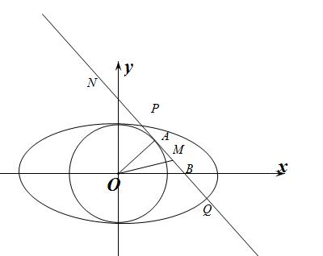

<strong>例6．</strong>（2024·陕西榆林·高二统考期末）已知为双曲线上两点，且线段的中点坐标为，则直线的斜率为__________.

【答案】/2.25

【解析】设，

则

两式相减得，

由线段的中点坐标为，

即，

.

故答案为：

<strong>变式4．</strong>（2024·全国·高二专题练习）双曲线的一条弦的中点为，则此弦所在的直线方程为______.

【答案】

【解析】由双曲线的对称性可得此弦所在的直线斜率存在，

设弦的两端分别为，，

则有，两式相减得，

所以，

又因为弦的中点为，所以，

故直线斜率，

则所求直线方程为，整理得，

由得，

，故该直线满足题意，

故答案为：

<strong>变式5．</strong>（2024·陕西宝鸡·高二校联考期末）抛物线：与直线交于，两点，且的中点为，则的斜率为____________.

【答案】

【解析】已知的中点为，设，两点坐标分别为，，

则，可得，

即，

即

又，

所以.

故答案为：.

<strong>变式6．</strong>（2024·高二课时练习）已知抛物线的顶点为坐标原点，准线为，直线与抛物线交于两点，若线段的中点为，则直线的方程为________．

【答案】

【解析】因为抛物线的顶点为坐标原点，准线为，

所以易得抛物线的方程为，

设，

因为线段的中点为，

故，

则，由，

两式相减得，所以，

故直线的方程为，即．

故答案为：.

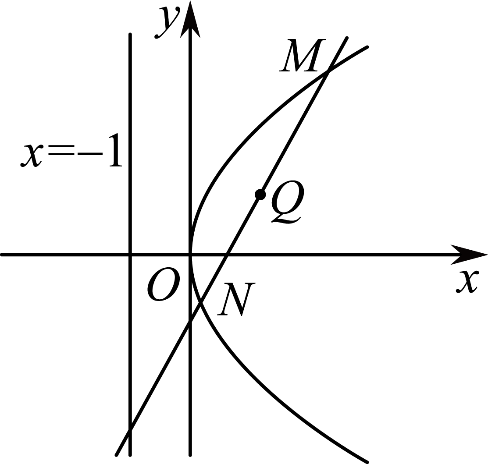

**方向2：求弦中点的轨迹方程问题；**

<strong>变式7．</strong>（2024·全国·高三专题练习）直线<em>l</em>与椭圆交于<em>A</em>，<em>B</em>两点，已知直线的斜率为1，则弦<em>AB</em>中点的轨迹方程是______．

【答案】

【解析】设，，线段*AB*的中点为，连接（为坐标原点）．

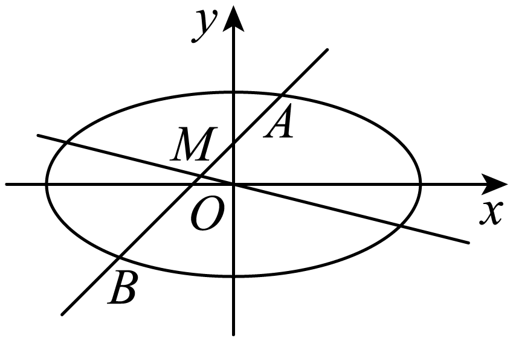

由题意知，则，

∴点的轨迹方程为．

又点在椭圆内，

∴，

解得：，

故答案为：.

<strong>变式8．</strong>（2024·上海浦东新·高二上海市实验学校校考期末）已知椭圆内有一点，弦过点，则弦中点的轨迹方程是__________.

【答案】

【解析】设，中点，

则，相减得，

斜率存在时，

∴，

又是中点，且直线过点，

所以，化简得，

斜率不存在时，方程为，中点为适合上述方程．

∴点的轨迹方程是．

故答案为：．

<strong>变式9．</strong>（2024·全国·高一专题练习）斜率为2的平行直线截双曲线所得弦的中点的轨迹方程是______．

【答案】(或).

【解析】设直线为，与双曲线交点为，

联立双曲线可得：，则，即或，

所以，故，则弦中点为，

所以弦的中点的轨迹方程为(或).

故答案为：(或)

<strong>变式10．</strong>（2024·全国·高三专题练习）直线（是参数）与抛物线的相交弦是，则弦的中点轨迹方程是___________.

【答案】

【解析】设，中点，

则.

，

过定点，

.

又，（1），（2）

得：，

.  于是，即.

又弦中点轨迹在已知抛物线内，

联立

故弦的中点轨迹方程是

<strong>变式11．</strong>（2024·全国·高三专题练习）设椭圆方程为，过点的直线交椭圆于点<em>A</em>、<em>B</em>，<em>O</em>是坐标原点，点<em>P</em>满足，当<em>l</em>绕点<em>M</em>旋转时，求动点<em>P</em>的轨迹方程．

【解析】直线过点，设其斜率为*k*，则的方程为

记、

，化简得，，

所以，，

于是

设点*P*的坐标为则，消去参数*k*得③

当*k*不存在时，*A*、*B*中点为坐标原点，也满足方程③，

所以点*P*的轨迹方程为

**方向3：对称问题**

<strong>变式12．</strong>（2024·江苏·高二专题练习）已知椭圆的焦距为，左右焦点分别为、，圆与圆相交，且交点在椭圆<em>E</em>上，直线与椭圆<em>E</em>交于<em>A</em>、<em>B</em>两点，且线段<em>AB</em>的中点为<em>M</em>，直线<em>OM</em>的斜率为．

(1)求椭圆*E*的方程；

(2)若，试问*E*上是否存在*P*、*Q*两点关于*l*对称，若存在，求出直线*PQ*的方程，若不存在，请说明理由．

【解析】（1）因为圆与圆相交，且交点在椭圆上，所以，，

设，，的中点，

，①－② ，

，

，

则椭圆*E*的方程：；

（2）假设存在*P*、*Q*两点关于*l*对称，设直线*PQ*的方程为，

，，*PQ*中点，

，

，

，，即，

由*N*在*l*上，，此时，

故存在*P*、*Q*两点关于*l*对称，直线*PQ*的方程为．

<strong>变式13．</strong>（2024·江苏南通·高二统考期中）已知椭圆的离心率为<em>e</em>，且过点和．

(1)求椭圆*C*的方程；

(2)若椭圆*C*上有两个不同点*A*，*B*关于直线对称，求．

【解析】（1）由题意知：，∴

，∴，所以椭圆；

（2）法一  设及*AB*中点，由题意知

，，以上两式相减得：，

可化为：即，故，

又∵*M*在直线上，所以，解得：，

即，直线，化简为：

联立 整理得：，由韦达定理知

由弦长公式得：．

法二  设直线，

联立， 整理得：

，则中点，满足直线方程，解得

所以*AB*：

联立 整理得：，由韦达定理知

由弦长公式得：．

<strong>变式14．</strong>（2024·全国·高三专题练习）已知<em>O</em>为坐标原点，点在椭圆<em>C</em>：上，直线<em>l</em>：与<em>C</em>交于<em>A</em>，<em>B</em>两点，且线段<em>AB</em>的中点为<em>M</em>，直线<em>OM</em>的斜率为．

(1)求*C*的方程；

(2)若，试问*C*上是否存在*P*，*Q*两点关于*l*对称，若存在，求出*P*，*Q*的坐标，若不存在，请说明理由．

【解析】（1）设，则

∵在椭圆上，则

两式相减得，整理得

∴，即，则

又∵点在椭圆*C*：上，则

联立解得

∴椭圆*C*的方程为

（2）不存在，理由如下：

假定存在*P*，*Q*两点关于*l*：对称，设直线*PQ*与直线*l*的交点为*N*，则*N*为线段*PQ*的中点，连接*ON*

∵，则，即

由（1）可得，则，即直线

联立方程，解得

即

∵，则在椭圆*C*外

∴假定不成立，不存在*P*，*Q*两点关于*l*对称

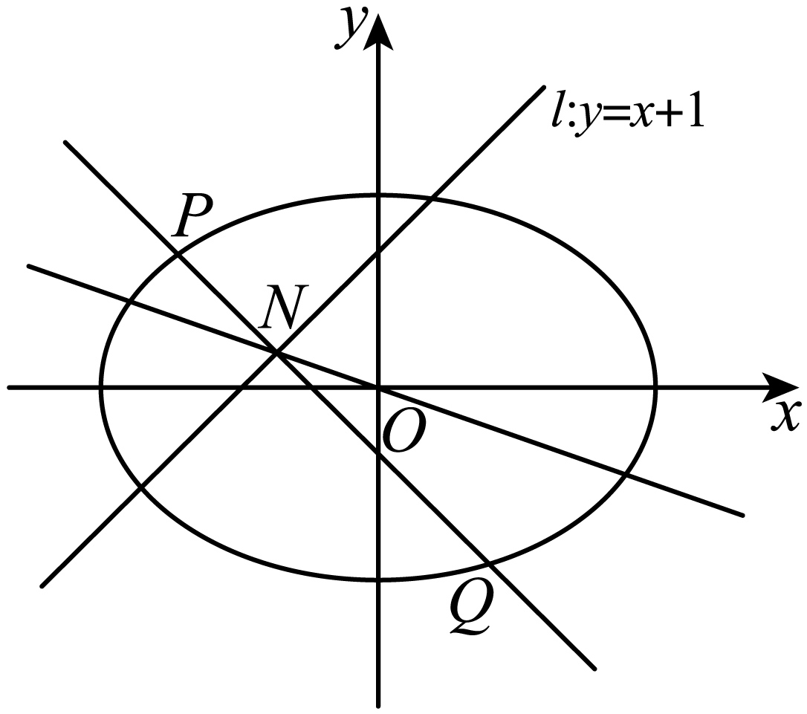

<strong>变式15．</strong>（2024·上海浦东新·高二上海南汇中学校考期中）已知曲线<em>C</em>的方程是，其中，，直线<em>l</em>的方程是．

(1)请根据*a*的不同取值，判断曲线*C*是何种圆锥曲线；

(2)若直线*l*交曲线*C*于两点*M*，*N*，且线段中点的横坐标是，求*a*的值；

(3)若，试问曲线*C*上是否存在不同的两点*A*，*B*，使得*A*，*B*关于直线*l*对称，并说明理由．

【解析】（1），即，

当时，曲线表示焦点在轴上的椭圆；

当时，曲线表示焦点在轴上的双曲线；

（2）设，，，

则，，

两式相减得到：，

即，故，

故的中点为，代入直线得到，

解得或（舍），故.

（3）假设存在，直线方程为，双曲线方程为，

设，，中点为，则，，

两式相减得到，

即，，又，

解得，.

此时直线方程为：，即，

，化简得到，方程无解，故不存在.

<strong>变式16．</strong>（2024·江苏·高二假期作业）双曲线<em>C</em>的离心率为，且与椭圆有公共焦点．

（1）求双曲线*C*的方程．

（2）双曲线*C*上是否存在两点*A*，*B*关于点（4，1）对称？若存在，求出直线*AB*的方程；若不存在，说明理由．

【解析】（1）椭圆：，

所以双曲线.

所以双曲线的方程为.

（2）画出图象如下图所示，设，

，

两式相减并化简得，即，

所以直线的方程为.

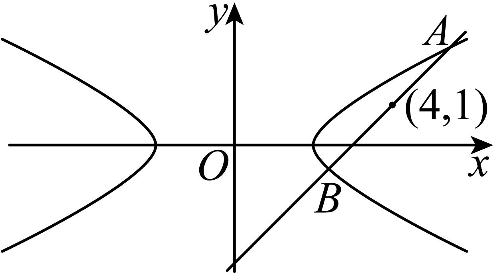

<strong>变式17．</strong>（2024·高二课时练习）已知直线<em>l</em>与抛物线交于<em>A</em>，<em>B</em>两点，且线段<em>AB</em>恰好被点平分<em>.</em>

(1)求直线*l*的方程；

(2)抛物线上是否存在点*C*和*D*，使得*C*，*D*关于直线*l*对称?若存在，求出直线*CD*的方程；若不存在，请说明理由*.*

【解析】（1）依题意，直线*l*的斜率存在，且不为0，设直线*l*的方程为，即，

由消去*x*得：，

，设，则有，

由，得，于是直线*l*的方程，即，

所以直线*l*的方程为.

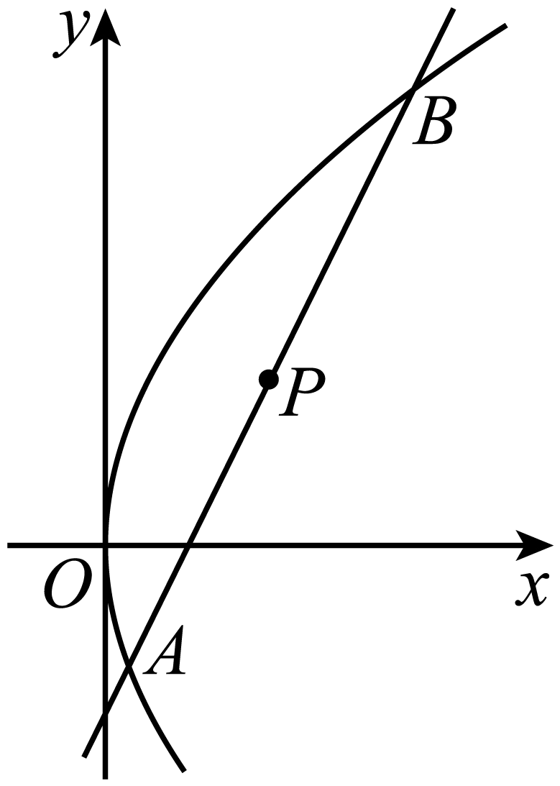

（2）假设抛物线上存在点*C*，*D*满足条件，由（1）设直线的方程为，

由消去*x*得：，有，解得，

设，则，于是线段的中点坐标为，

显然点在直线上，即，解得，

所以抛物线上不存在点*C*，*D*，使得*C*，*D*关于直线*l*对称.

<strong>变式18．</strong>（2024·全国·高三专题练习）已知抛物线<em>C</em>：的焦点为<em>F</em>，直线<em>l</em>：与抛物线<em>C</em>交于<em>A</em>，<em>B</em>两点.

(1)若，求的面积；

(2)若抛物线*C*上存在两个不同的点*M*，*N*关于直线*l*对称，求*a*的取值范围.

【解析】（1）抛物线的焦点为，

时，直线，

联立，可得，

设，，，，

则，．

，

点到直线的距离距离，

的面积．

（2）∵点，关于直线对称，∴直线的斜率为，

∴可设直线的方程为，

联立，整理可得，

由，可得，

设，，，，则，

故的中点为，

∵点，关于直线对称，∴的中点，在直线上，

∴，得，∵，∴．

综上，的取值范围为．

**方向4：斜率之积问题**

**变式19．**（2024·云南昭通·高二校考期中）已知斜率为的直线与椭圆交于两点，线段的中点为，直线（为坐标原点）的斜率为，则（    ）

A．	B．	C．	D．

【答案】D

【解析】设点，则，

因为，可得，

又因为，所以.

故选：D.

<strong>变式20．</strong>（2024·江西·校联考模拟预测）已知直线过椭圆<em>C</em>；的一个焦点，与<em>C</em>交于<em>A</em>，<em>B</em>两点，与平行的直线与<em>C</em>交于<em>M</em>，<em>N</em>两点，若<em>AB</em>的中点为<em>P</em>，<em>MN</em>的中点为<em>Q</em>，且<em>PQ</em>的斜率为，则<em>C</em>的方程为（　　）

A．	B．

C．	D．

【答案】C

【解析】设，

则，两式作差得

所以

若*O*为坐标原点，则，同理，所以*O*，*P*，*Q*三点共线，

即，所以，又过点，即椭圆的焦点，所以

解得，所以*C*的方程为

故选：C

<strong>变式21．</strong>（2024·江西赣州·高二统考期末）椭圆，<em>M</em>，<em>N</em>是椭圆上关于原点对称的两动点，<em>P</em>为椭圆上任意一点，直线，的斜率分别为，，则的最小值为（    ）

A．	B．	C．	D．

【答案】A

【解析】设，

则，

两式相减并化简得，

而，所以，

所以，

当且仅当时等号成立.

故选：A

**变式22．**（2024·山西晋中·高二校考阶段练习）过点的直线与椭圆相交于，两点，设线段的中点为，若直线的斜率为，直线（为原点）的斜率为，则等于（    ）.

A．	B．2	C．	D．

【答案】D

【解析】设，

由于在椭圆上，

所以，

两式相减并化简得，

即.

故选：D

**变式23．**（2024·浙江宁波·高二校联考期末）过双曲线内一点且斜率为的直线交双曲线于两点，弦恰好被平分，则双曲线的离心率为（    ）

A．	B．	C．	D．

【答案】C

【解析】由题意可得，且，

又因为，

所以，

即有，

所以，

所以，

所以，

所以，

所以.

故选：C.

<strong>变式24．</strong>（2024·福建泉州·高二校考期中）过双曲线：（，）的焦点且斜率不为0的直线交于<em>A</em>，两点，为中点，若，则的离心率为（    ）

A．	B．2	C．	D．

【答案】D

【解析】不妨设过双曲线的焦点且斜率不为0的直线为，令

由，整理得

则，

则，由，可得

则有，即，则双曲线的离心率

故选：D

<strong>变式25．</strong>（2024·江西·校联考模拟预测）已知双曲线<em>C</em>：的左，右焦点分别是，，其中，过右焦点的直线<em>l</em>与双曲线的右支交与<em>A</em>，<em>B</em>两点，则下列说法中错误的是（    ）

A．弦*AB*的最小值为

B．若，则三角形的周长

C．若*AB*的中点为*M*，且*AB*的斜率为*k*，则

D．若直线*AB*的斜率为，则双曲线的离心率

【答案】D

【解析】A.*AB*的最小值为通径为，故A正确；

B.由双曲线的定义得，得，所以三角形的周长，故B正确；

C.设，，则，两式相减得，则，则，则，故C正确；

D若直线*AB*的斜率为，所以∴∴∴，所以选D不正确.

故选：D

**【解题方法总结】**

直线与圆锥曲线相交所得弦中点问题，是解析几何的重要内容之一，也是高考的一个热点问题．这类问题一般有以下3种类型：（1）求中点弦所在直线方程问题；（2）求弦中点的轨迹方程问题；（3）对称问题，但凡涉及到弦的中点斜率的问题．首先要考虑是点差法．

即设出弦的端点坐标，根据端点在曲线上，结合中点坐标公式，寻找中点坐标与弦的斜率之间的联系．除此之外，最好也记住如下结论：

在椭圆中，中点弦的斜率为，满足．

在双曲线中，中点弦的斜率为，满足．（其中为原点与弦中点连线的斜率）．

在抛物线中，中点弦的斜率为，满足（为中点纵坐标）．

**题型三：弦长问题**

<strong>例7．</strong>（2024·陕西西安·西安市大明宫中学校考模拟预测）已知直线与圆相切，且交椭圆于两点，若，则_________．

【答案】/

【解析】设直线，

直线与圆相切，

，

将直线方程与椭圆方程联立，得，

所以，因为，

所以，

由对称性，不妨取，

故答案为：.

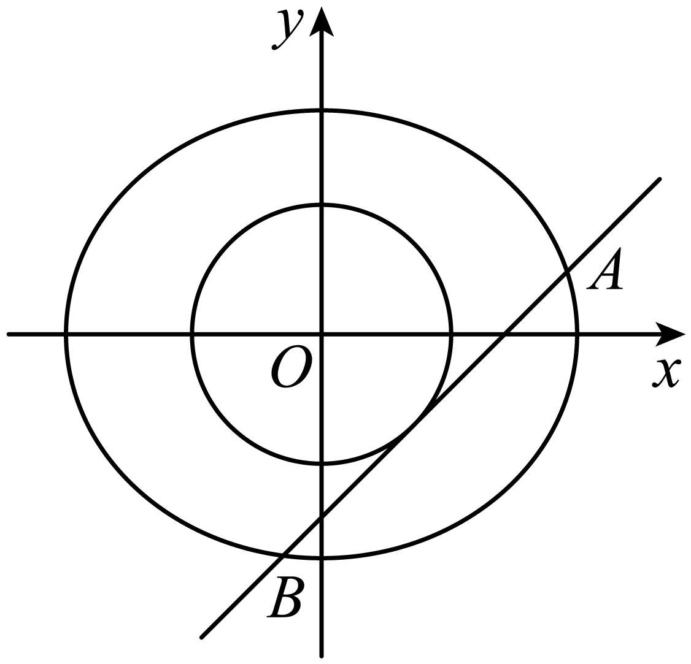

<strong>例8．</strong>（2024·全国·高三对口高考）已知椭圆，过左焦点作倾斜角为的直线交椭圆于、两点，则弦的长为_________．

【答案】

【解析】在椭圆中，，，则，故点，

设点、，由题意可知，直线的方程为，即，

联立可得，，

由韦达定理可得，，

所以，.

故答案为：.

<strong>例9．</strong>（2024·广西南宁·高三统考阶段练习）已知椭圆的左焦点为，过点且倾斜角为的直线与椭圆相交于两点，则__________．

【答案】

【解析】已知椭圆，，则，

所以椭圆的左焦点为,

因为直线倾斜角为，所以直线的斜率，则直线的方程为.

联立，消去，整理得，

解得．．

故答案为：.

<strong>变式26．</strong>（2024·安徽滁州·校考模拟预测）已知直线与椭圆在第二象限交于两点，且与轴、轴分别交于两点，若，，则的方程为 ______．

【答案】

【解析】设，线段的中点为，

由，两式相减可得，即，

又由，则，

设直线的方程为，可得，

所以，所以，所以，解得，

因为，所以，可得，解得，

所以直线的方程为.

故答案为：.

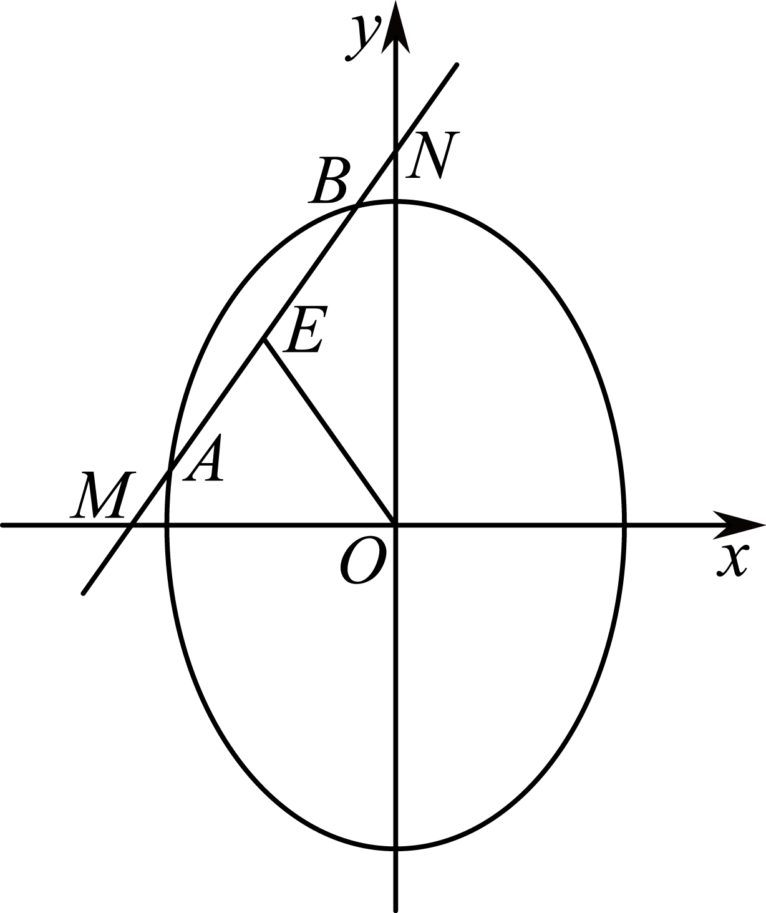

<strong>变式27．</strong>（2024·湖北黄冈·浠水县第一中学校考模拟预测）在生活中，我们经常看到椭圆，比如放在太阳底下的篮球， 在地面上的影子就可能是一个椭圆. 已知影子椭圆，<em>C</em>的上顶点为<em>A</em>，两个焦点为，，离心率为．过且垂直于的直线与<em>C</em>交于<em>D</em>，<em>E</em>两点，，则的最小值是________________．

【答案】

【解析】∵椭圆的离心率为，

∴，∴，

∴椭圆的方程为，

不妨设左焦点为，右焦点为，如图所示，

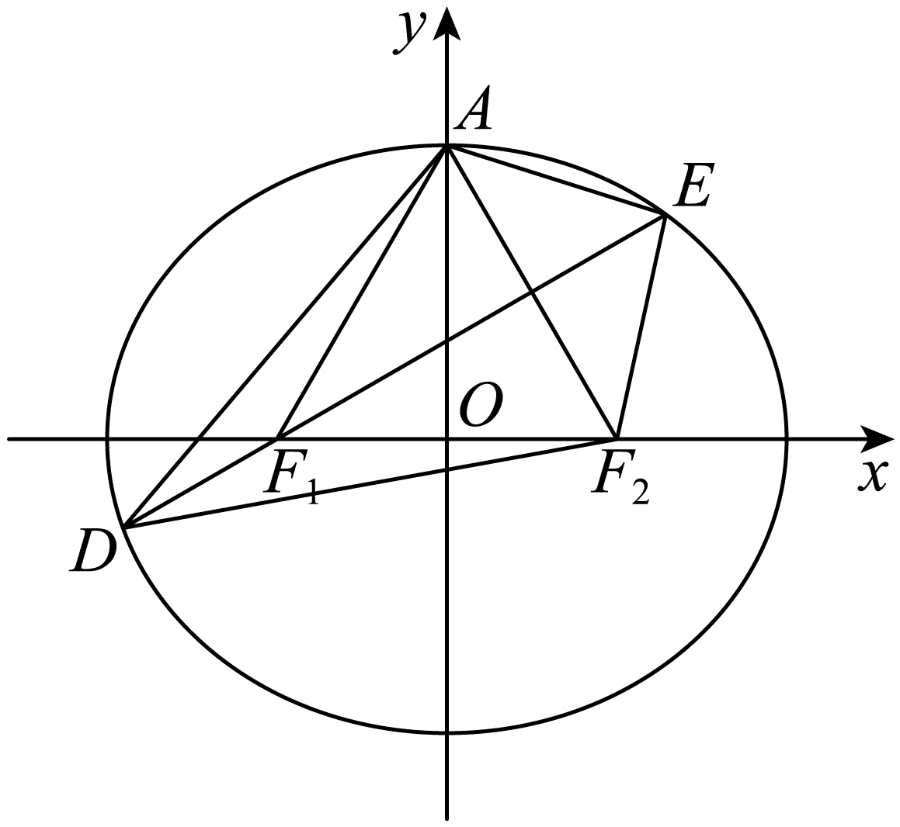

∵，

∴，

∴为正三角形，

∵过且垂直于的直线与*C*交于*D*，*E*两点，为线段的垂直平分线，

∴直线的斜率为，斜率倒数为，

直线的方程：，

代入椭圆方程，整理得：，

，

∴，

∴ ， 得，

∵为线段的垂直平分线，根据对称性，，

∴

则*，*

当且仅当

故答案为：.

<strong>变式28．</strong>（2024·福建龙岩·福建省龙岩第一中学校考三模）如图，，分别为椭圆的左、右焦点，<em>A</em>，<em>C</em>在椭圆上且关于原点对称（点<em>A</em>在第一象限），延长交椭圆于点<em>B</em>，若，则直线<em>AC</em>的方程为______.

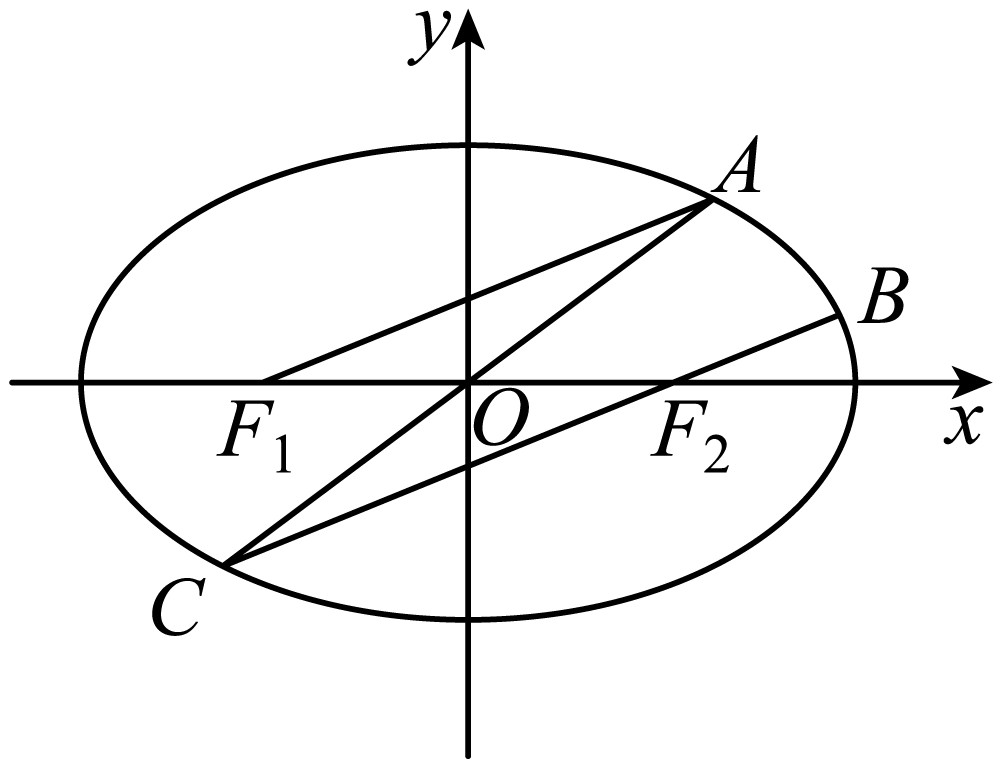

【答案】

【解析】连接，，

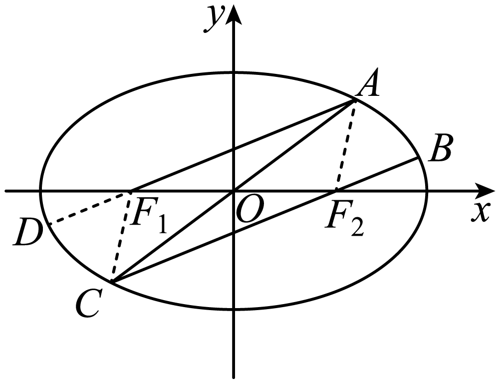

，，

四边形为平行四边形，

.

设直线的斜率为*k*，

，直线的方程为.

联立方程，得，整理得，

点*A*在第一象限，

，同理可得.

，得，

，则，直线*AC*的方程为.

<strong>变式29．</strong>（2024·江苏苏州·校联考三模）已知双曲线，过其右焦点的直线与双曲线交于、两点，已知，若这样的直线有条，则实数的取值范围是__________.

【答案】

【解析】记，若直线与轴重合，此时，；

若直线轴时，将代入双曲线方程可得，此时，

当时，则，此时，；当，可得，则，

所以，双曲线的实轴长和通径长不可能同时为；

当直线与轴不重合时，记，则点，

设直线的方程为，其中，设点、，

联立可得，

由题意可得，可得，

，

由韦达定理可得，，

所以，

，即，

所以，关于的方程由四个不等的实数解.

当时，即当时，可得，

可得，整理可得，因为，解得；

当时，即当，可得，

可得，整理可得，可得.

综上所述，.

故答案为：.

<strong>变式30．</strong>（2024·贵州·统考模拟预测）已知双曲线的左、右焦点分别为，，点，分别在双曲线的左支与右支上，且点，与点共线，若，则______.

【答案】

【解析】因为，设，，

由双曲线定义可得，所以，

即，，即.

故答案为：.

<strong>变式31．</strong>（2024·全国·高三专题练习）过双曲线的右焦点作倾斜角为30°的直线<em>l</em>，直线<em>l</em>与双曲线交于不同的两点<em>A</em>，<em>B</em>，则<em>AB</em>的长为______．

【答案】

【解析】双曲线的右焦点为，所以直线*l*的方程为．由，得．设，，则，，

所以．

故答案为：

<strong>变式32．</strong>（2024·湖南长沙·周南中学校考二模）根据抛物线的光学性质，从抛物线的焦点发出的光，经抛物线反射后光线都平行于抛物线的轴，已知抛物线，若从点<em>Q</em>（3，2）发射平行于<em>x</em>轴的光射向抛物线的<em>A</em>点，经<em>A</em>点反射后交抛物线于<em>B</em>点，则_______.

【答案】

【解析】由条件可知*AQ*与*x*轴平行，令，可得，故*A*点坐标为，

因为 经过抛物线焦点，所以 方程为，

整理得，联立，得，，所以，

又，所以，，

所以.

故答案为：.

<strong>变式33．</strong>（2024·河南·校联考模拟预测）已知抛物线的准线与轴的交点为，过焦点的直线分别与抛物线交于两点（点在第一象限），，直线的倾斜角为锐角，且满足，则___________.

【答案】12

【解析】如图，过点作轴于点，由抛物线的定义可知点到准线的距离，故，

同理，则，故，，则，

可得，则，所以.

故答案为：12.

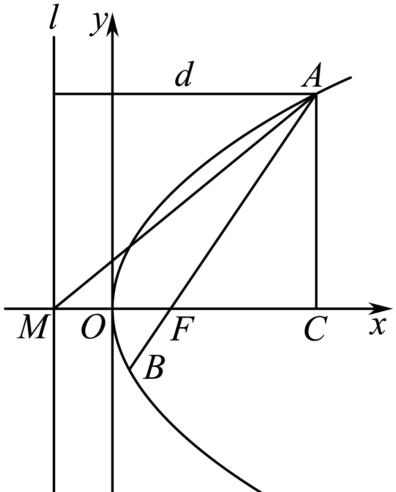

<strong>变式34．</strong>（2024·人大附中校考三模）已知抛物线的焦点为<em>F</em>，过点<em>F</em>的直线与该抛物线交于<em>A</em>，<em>B</em>两点，，<em>AB</em>的中点横坐标为4，则_____________．

【答案】

【解析】由抛物线定义知：，而*AB*的中点横坐标为4，即，

所以，即.

故答案为：

**【解题方法总结】**

在弦长有关的问题中，一般有三类问题：

（1）弦长公式：．

（2）与焦点相关的弦长计算，利用定义；

（3）涉及到面积的计算问题．

**题型四：面积问题**

**方向1：三角形问题**

**例10．**（2024·江西景德镇·统考三模）设椭圆的左､右顶点分别为，且焦距为.点在椭圆上且异于两点，若直线与的斜率之积为.

(1)求椭圆的标准方程；

(2)过点作不与轴重合的直线与椭圆相交于两点，直线的方程为：，过点作垂直于直线，交于点.求面积的最大值.

【解析】（1）由题意知：，，设，

则，，

又，，，

椭圆的标准方程为：.

（2）

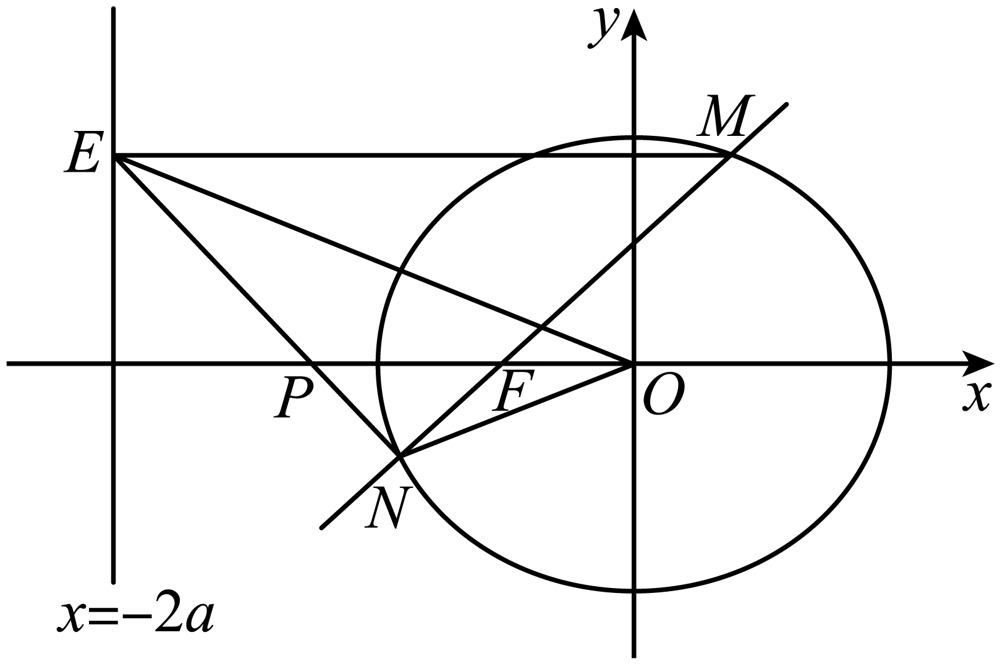

设直线，，则，

由得：，

显然，，，

，又，

直线方程为：，

令，则，

直线过定点；

而，

则，

令，有在上单调递增，

则，即时 ，取最小值4，

于是当时，，

所以面积的最大值是.

<strong>例11．</strong>（2024·河北·高三校联考阶段练习）已知抛物线<em>C</em>：上一点到焦点<em>F</em>的距离为．

(1)求抛物线*C*的方程；

(2)过点*F*的直线与抛物线*C*交于两点，直线与圆*E*：的另一交点分别为为坐标原点，求与面积之比的最小值．

【解析】（1）依题意得，解得，所以抛物线方程为.

（2）抛物线的焦点为，直线与轴不重合，

设直线的方程为，

由消去并化简得，，

设，则，

所以，

所以.

，由，而，

故解得.同理可求得.

，

同理，

所以

，

故当时，取得最小值为.

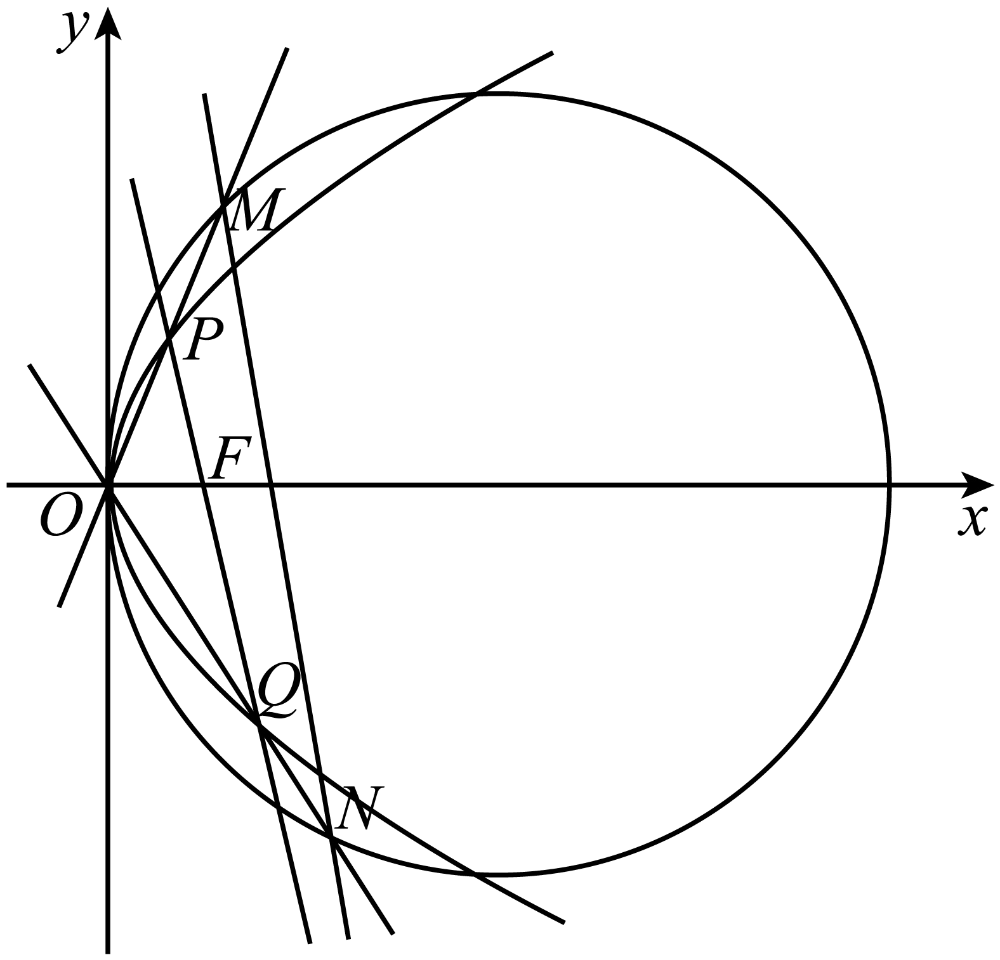

**例12．**（2024·河南·高三校联考开学考试）椭圆的左右顶点分别为是栯圆上一点，．

(1)求椭圆方程；

(2)动直线交椭圆于两点，求面积取最大时的的值．

【解析】（1）在椭圆中，，而在椭圆上，且，

因此，解得，显然，则，

所以椭圆方程为.

（2）直线与椭圆交于两点，则，

把代入方程得：，由椭圆的对称性知，

点到直线的距离，

当时，得的面积，

令，

求导得，

由，得，

当或时，，当或时，，

因此函数在上递增，在上递减，

而，

，显然，

于是当时，函数取得最大值，此时面积取得最大值，

所以当面积取最大时，.

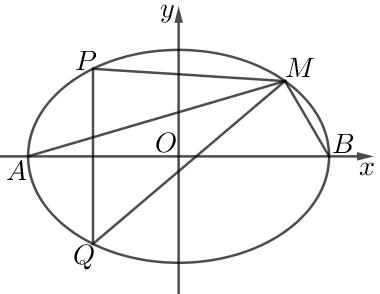

**变式35．**（2024·山东青岛·高三统考开学考试）已知为坐标原点，，，直线，的斜率之积为4，记动点的轨迹为.

(1)求的方程；

(2)直线经过点，与交于，两点，线段中点为第一象限，且纵坐䏡为，求的面积.

【解析】（1）设点的坐标为，

因为，，所以，

化简得：

所以的方程为：.

（2）当直线的斜率不存在时，显然不符合题意；

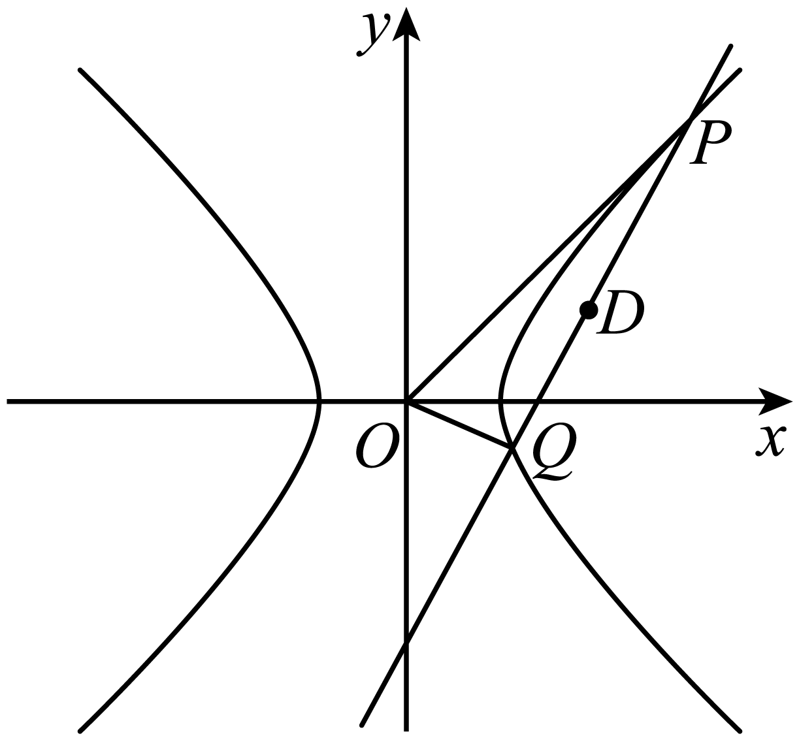

设，，直线方程为，

与联立得：，

由且，解得且，

由韦达定理得，

因为线段中点在第一象限，且纵坐标为，

所以，

解得或（舍去），

所以直线为，

所以，

所以，

点到直线的距离，

所以.

<strong>变式36．</strong>（2024·贵州贵阳·高三贵阳一中校考开学考试）已知点在椭圆<em>C</em>：上，点在椭圆<em>C</em>内.设点<em>A</em>，<em>B</em>为<em>C</em>的短轴的上、下端点，直线<em>AM</em>，<em>BM</em>分别与椭圆<em>C</em>相交于点<em>E</em>，<em>F</em>，且<em>EA</em>，<em>EB</em>的斜率之积为.

(1)求椭圆*C*的方程；

(2)记，分别为，的面积，若，求*m*的值.

【解析】（1）设，依题意，，

可得，整理可得，

又椭圆*C*过点，所以，故椭圆*C*的方程为；

（2）依题意，可知*AM*：，代入椭圆方程，

整理得，从而得到，

又*BM*：，代入椭圆方程，

整理得，从而得到，

所以，

，

则

,

由于，所以，解得.

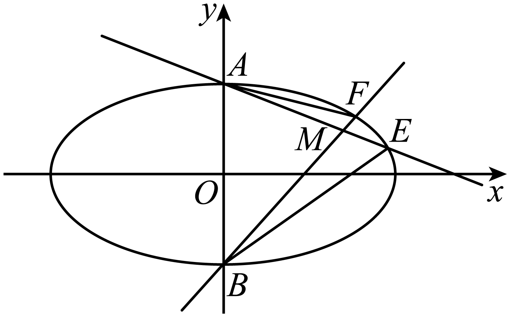

**变式37．**（2024·河南开封·统考模拟预测）已知点在椭圆上，直线交于，两点，直线，的斜率之和为0．

(1)求直线的斜率；

(2)求的面积的最大值（为坐标原点）．

【解析】（1）由题意得，解得，

代入椭圆方程中，，解得或6（舍去），

故，

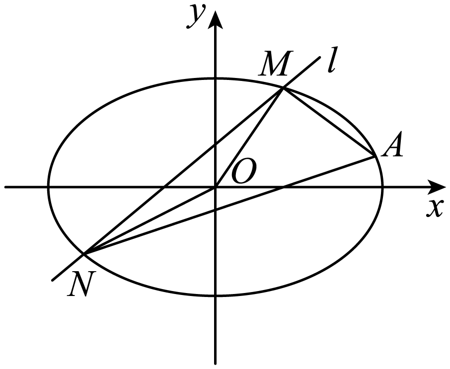

当直线的斜率不存在时，关于轴对称，此时有对称性可知，直线，的斜率之和不为0，舍去；

设，联立椭圆方程得，，

则，则，

设，则，

，

故，

即，故，

即，

当时，，此时直线，

显然直线恒过，矛盾，

当时，经检验，满足题意，

故直线的斜率为1；

（2）设，联立椭圆方程得，，

，解得，

，

点到直线的距离为，

故

，

故当，即时，取得最大值，最大值为.

<strong>变式38．</strong>（2024·广东佛山·高三统考开学考试）设动点<em>M</em>与定点的距离和<em>M</em>到定直线<em>l</em>：的距离的比是．

(1)求动点*M*的轨迹方程，并说明轨迹的形状；

(2)当时，记动点*M*的轨迹为，动直线*m*与抛物线：相切，且与曲线交于点*A*，*B*．求面积的最大值．

【解析】（1）设，则，

化简得，，

当时，，轨迹为一条直线；

当时，，此时轨迹为焦点在轴上的椭圆；

当时，，此时轨迹为焦点在轴上的双曲线；

综上：当时，轨迹方程为，轨迹为一条直线，

当时，轨迹方程为，轨迹为焦点在轴上的椭圆；

当时，轨迹方程为，轨迹为焦点在轴上的双曲线；

（2）当时，，

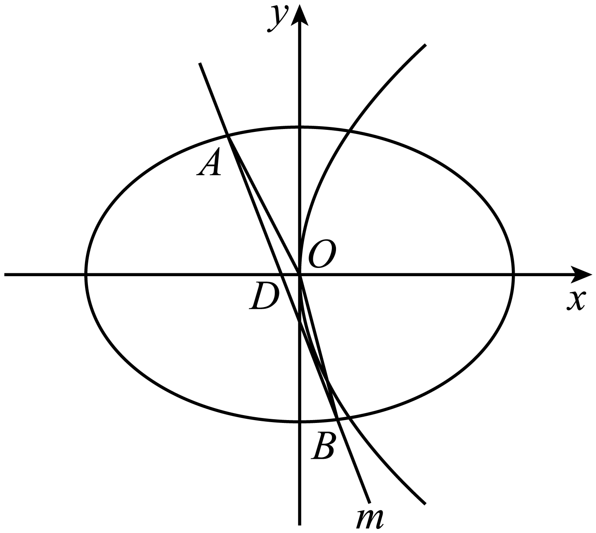

当直线斜率不存在时，又与相切，故此时直线，此时三点共线，不合要求，舍去，

设直线，联立得，

由得，显然，

联立得，，

由，结合，解得，

设，

则，

设直线与轴交于点，则，

则

，

将代入得，

因为，令，则，

，

设，则设，则

，，

当时，，当时，，

故在上单调递增，在上单调递减，

故在处取得极大值，也是最大值，

故最大值为.

圆锥曲线中最值或范围问题的常见解法：

（1）几何法，若题目的条件和结论能明显体现几何特征和意义，则考虑利用几何法来解决；

（2）代数法，若题目的条件和结论能体现某种明确的函数关系，则可首先建立目标函数，再求这个函数的最值或范围．

**方向2：四边形问题**

**变式39．**（2024·浙江·高三浙江省普陀中学校联考开学考试）类似于圆的垂径定理，椭圆：（）中有如下性质：不过椭圆中心的一条弦的中点为，当，斜率均存在时，，利用这一结论解决如下问题：已知椭圆：，直线与椭圆交于，两点，且，其中为坐标原点.

(1)求点的轨迹方程；

(2)过点作直线交椭圆于，两点，使，求四边形的面积.

【解析】（1）设，因为，

，代入椭圆得：，

点的轨迹方程为：.

（2）

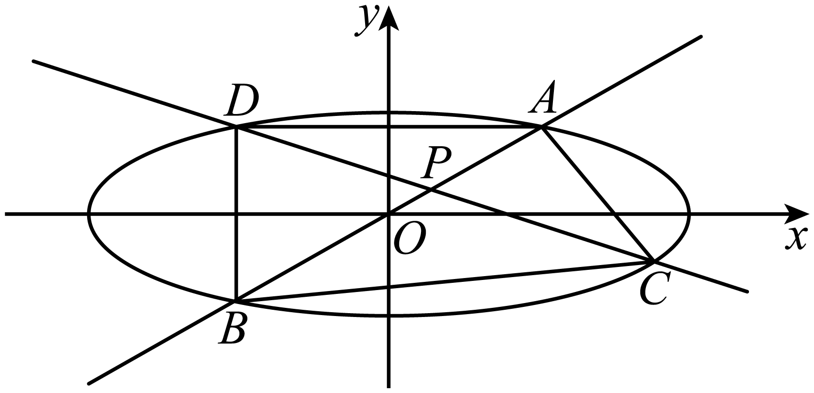

设，由（1）则，

①当直线不与坐标轴重合时，由，知为中点，

，

直线：，

代入椭圆：的方程得：

即：，设，，

由根与系数关系，

，

设表示点到直线的距离，表示点到直线的距离，

；

它法：利用比例关系转化：，酌情给分.

②当直线与坐标轴重合时，

不妨取，，，

或，，，

综上所述：四边形的面积是.

**变式40．**（2024·湖北恩施·校考模拟预测）已知是椭圆的左右焦点，以为直径的圆和椭圆在第一象限的交点为，若三角形的面积为1，其内切圆的半径为．

(1)求椭圆的方程；

(2)已知*A*是椭圆的上顶点，过点的直线与椭圆交于不同的两点，点在第二象限，直线分别与轴交于，求四边形面积的最大值．

【解析】（1）由题意知，则，

又，

则，

又，

解得，

所以椭圆的方程为.

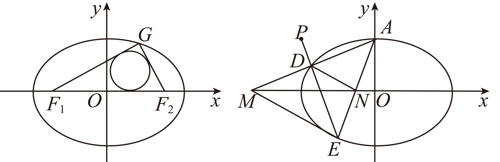

（2）设直线的方程为

联立方程组，可得，

则，

直线的方程：，所以，同理，

，

，

，

当且仅当时，四边形的面积最大，最大值为4．

**变式41．**（2024·四川成都·四川省成都市玉林中学校考模拟预测）如图．已知圆，圆．动圆与这两个圆均内切．

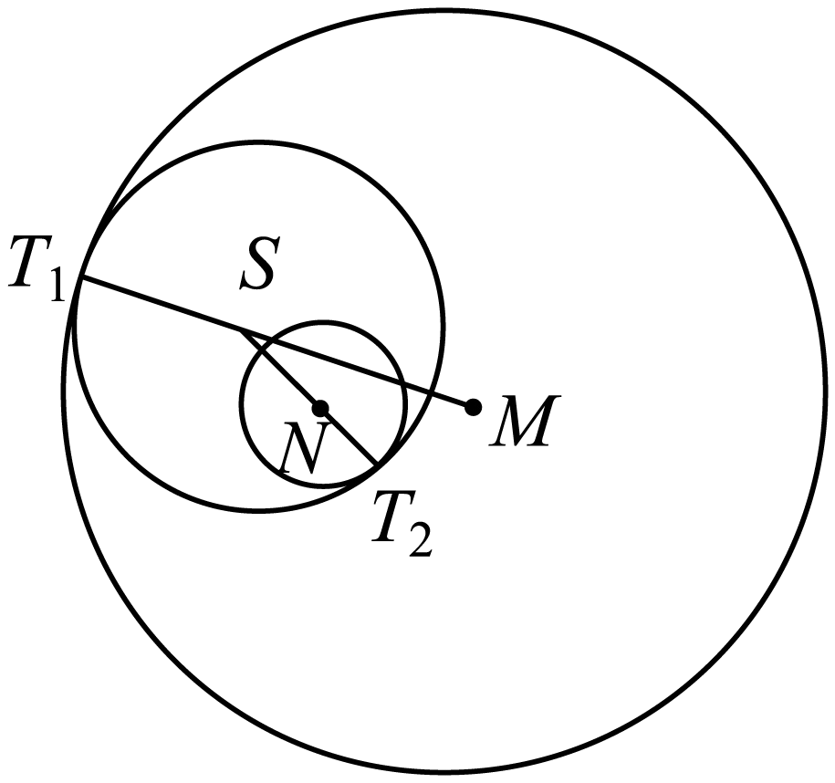

(1)求圆心的轨迹的方程；

(2)若、是曲线上的两点，是曲线*C*上位于直线两侧的动点．若直线的斜率为，求四边形面积的最大值．

【解析】（1）如图，设动圆与两个已知圆的切点分别为，

由，，

所以点的轨迹是以*M*，*N*为焦点的椭圆，

所以，

所以点的轨迹方程为：；

（2）设，，直线的方程为，代入中，

整理得，，

解得，，，

四边形的面积，

当时，，所以四边形面积的最大值为；

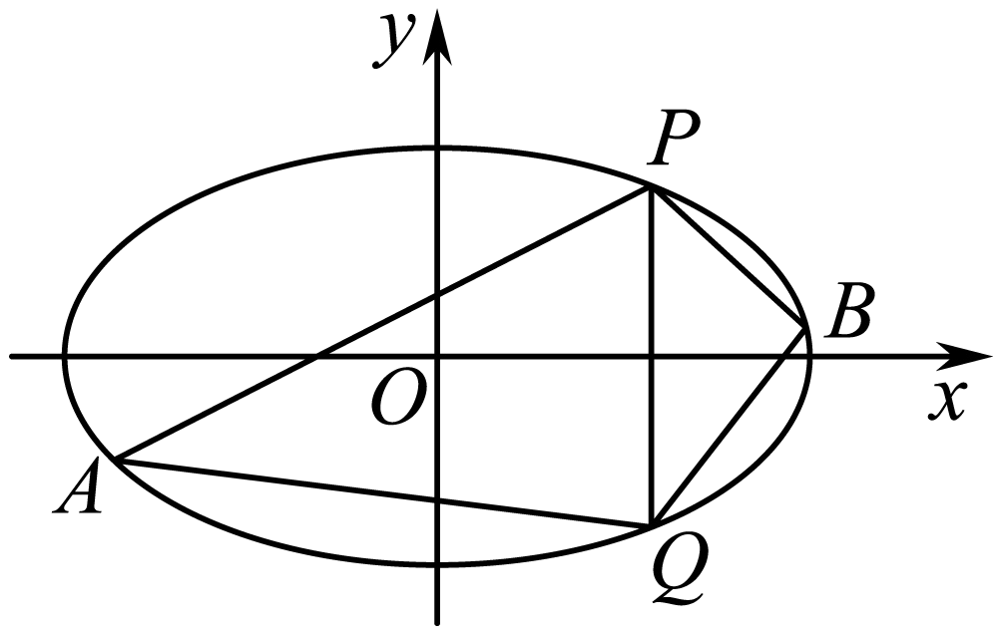

**变式42．**（2024·浙江·校联考模拟预测）已知椭圆的离心率为，抛物线的准线与相交，所得弦长为.

(1)求的方程；

(2)若在上，且，分别以为切点，作的切线相交于点，点恰好在上，直线分别交轴于两点.求四边形面积的取值范围.

【解析】（1）由题知过点，则，解得，

.

（2）设直线的方程为，

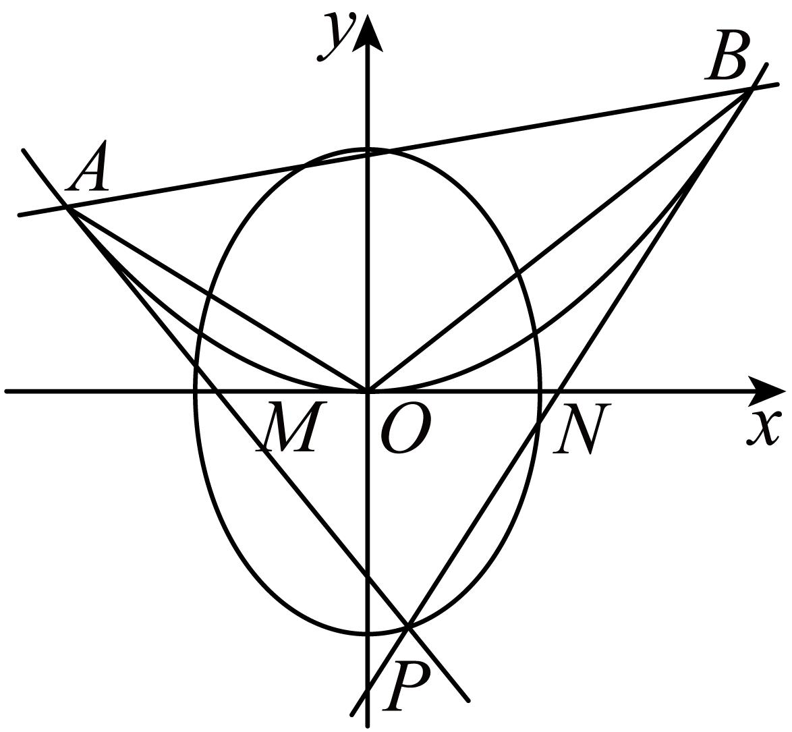

联立，得，

，

则，而，则，

故以为切点的切线为，即，

同理以为切点的切线为，则，

由，故两式作差得：，所以，

两式求和得：，

所以点由在椭圆上，即.

点到直线的距离，

所以，，

，

而、在上递增且恒正，

则在上递增，.

**变式43．**（2024·山东潍坊·三模）已知椭圆的离心率为，且过点．

(1)求椭圆的标准方程；

(2)若动直线：与椭圆交于两点，且在坐标平面内存在两个定点，使得（定值），其中分别是直线的斜率，分别是直线的斜率．

①求的值；

②求四边形面积的最大值．

【解析】（1）由题意得，

解得，

则椭圆的标准方程为.

（2）①设，

把与椭圆的标准方程联立，

消去，可得，

注意到为方程的两根，

故有恒等式，

则，

同理，把与椭圆的标准方程联立，

消去，可得，

注意到为方程的两根，

故有恒等式，

则，

则，

所以，

若为定值，则必有，

计算可得或，

故．

②不妨设点，点，点，点到直线的距离分别是，

因为，，，

所以，

四边形面积

（当时取等号），

所以四边形面积的最大值是．

**变式44．**（2024·江苏南京·南京师大附中校考模拟预测）已知椭圆，椭圆．点为椭圆上的动点，直线与椭圆交于，两点，且．

(1)求椭圆的标准方程；

(2)以点为切点作椭圆的切线，与椭圆交于，两点，问：四边形的面积是否为定值？若是，求出该定值；若不是，求出面积的取值范围．

【解析】（1）设，，，因为，所以，

因为点为椭圆上的动点，所以，从而

即，故椭圆的标准方程；

（2）

法一：设，，

当直线的斜率存在时，设为，则直线的方程为

，即，

，即，代入得直线的方程为

联立 ，消去得

注意到化简得

又，

所以点到直线的距离为

所以点到直线的距离为

故

当直线的斜率不存在时，即，若，则：，

则，，，，

所以

同理可得，若，

综上，四边形的面积为定值．

法二：设，，

当直线的斜率存在时，设直线的方程为

，

注意到化简得，

原点到直线的高为，

又因为，点是的中点，所以点到直线的距离等于点到直线的距离，

由对称性可知，，所以点到直线的距离等于点到直线的距离的三倍，故．

当斜率不存在时，同法一．

<strong>变式45．</strong>（2024·安徽黄山·屯溪一中校考模拟预测）已知椭圆的离心率为，左、右焦点分别为，直线与椭圆<em>C</em>交于<em>A</em>，<em>B</em>两点，且的周长最大值为8．

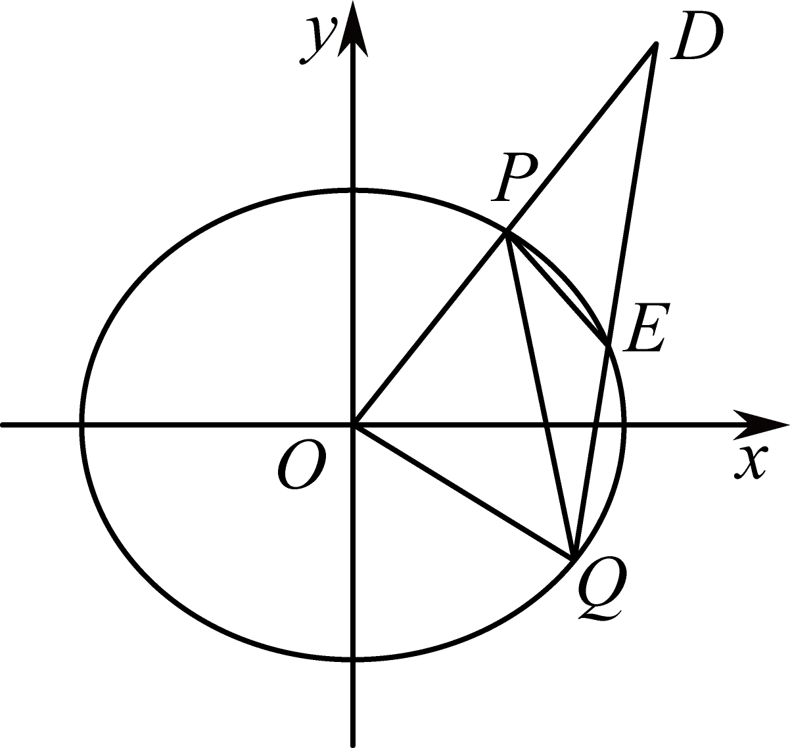

(1)求椭圆*C*的标准方程；

(2)如图，*P*，*Q*是椭圆*C*上的两点，且直线与的斜率之积为（*O*为坐标原点），*D*为射线上一点，且，线段与椭圆*C*交于点*E*，，求四边形的面积．

【解析】（1）设与轴的交点为，

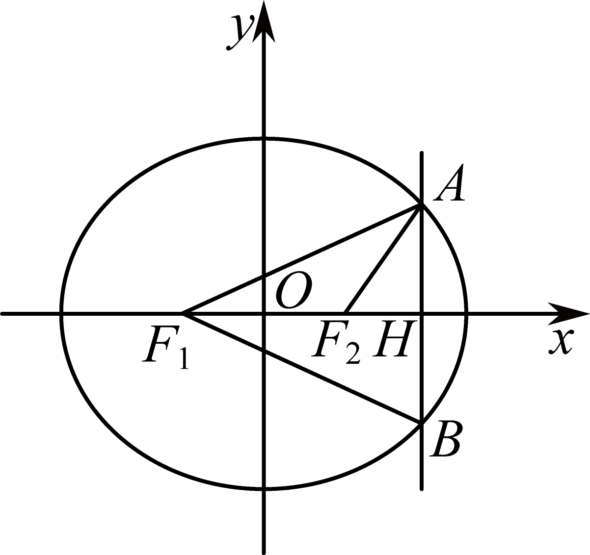

由题意可知，

则，

当过右焦点时，的周长取最大值，所以，

因为椭圆的离心率为，所以，

所以椭圆*C*的标准方程

（2）设，因*P*，*Q*均在椭圆上，则.

又，则.

由可得，

则四边形面积为.

当直线*PQ*斜率为0时，易知，又，则.

根据对称性不妨取，，由得，

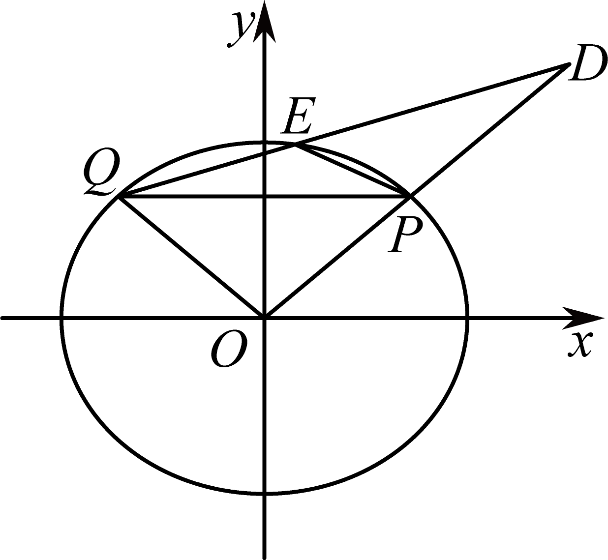

则，得此时；

当直线斜率不为0时，设的方程为，将直线方程与椭圆方程联立有：

，消去*x*得：.

，

由韦达定理，有.

所以

，，

代入可得，解得，

，

又原点到直线*PQ*距离为，则此时.

综上可得，，四边形面积为.

**变式46．**（2024·山东·校联考模拟预测）已知圆为坐标原点，点在圆上运动，为过点的圆的切线，以为准线的拋物线恒过点，抛物线的焦点为，记焦点的轨迹为．

(1)求的方程；

(2)过动点的两条直线均与曲线相切，切点分别为，且的斜率之积为，求四边形面积的取值范围．

【解析】（1）分别过作的垂线，垂足分别为，连接，

由抛物线的定义，可得，则．

因为，所以焦点的轨迹是以为焦点的椭圆，

其中，

所以抛物线的焦点的轨迹方程为

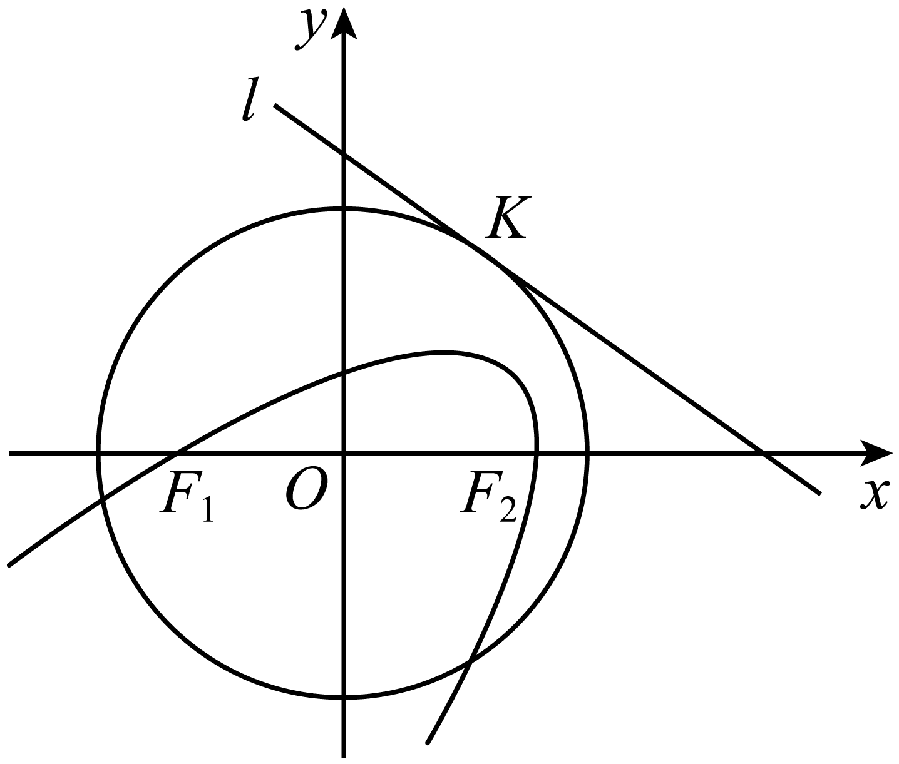

（2）设点，过点的直线的斜率为，则方程为，

联立方程组，消得，，

整理得，

，即，所以点在方程为的圆上．

设点在椭圆上，则，则，

由知，满足：

则，即，故，

从而得切线的方程为

整理得，点满足方程，则，

同理可得

即点满足方程，所以的方程为．

消得，

，，

．

设，点到直线的距离为，

；

．

所以．

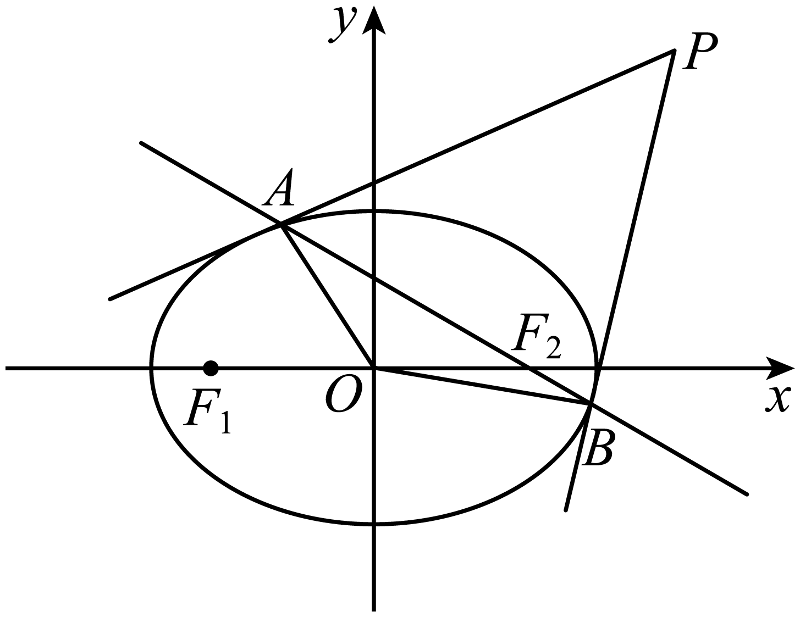

**变式47．**（2024·山西朔州·怀仁市第一中学校校考模拟预测）已知椭圆的右焦点为，点在椭圆上，且满足

(1)求椭圆的标准方程；

(2)过点且斜率不为零的直线与椭圆相交于两点，过点分别作直线的垂线，垂足分别为点，求四边形面积的最大值.

【解析】（1）由和，可得，

可得椭圆的标准方程为，

将点代入椭圆方程可得，解得，

故椭圆的标准方程为；

（2）

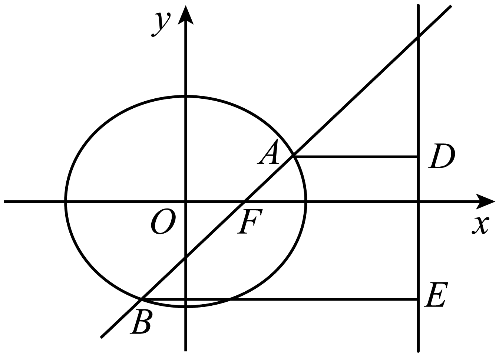

由（1）知点的坐标为(1,0)，设直线的方程为，

点，

联立方程消去后整理为，

有，

，

由，

有，

四边形的面积为，

令，可得，

令，

有，

可得函数单调递减，有，

可知当时，四边形的面积的最大值为.

**【解题方法总结】**

三角形的面积处理方法：底·高（通常选弦长做底，点到直线的距离为高）

四边形或多个图形面积的关系的转化：分析图形的底和高中是否存在“同底”或“等高”的特点（尤其是有平行条件的时候），可将面积的关系转化，降低计算量．特殊的，对角线互相垂直的四边形，面积=对角线长度乘积的一半

