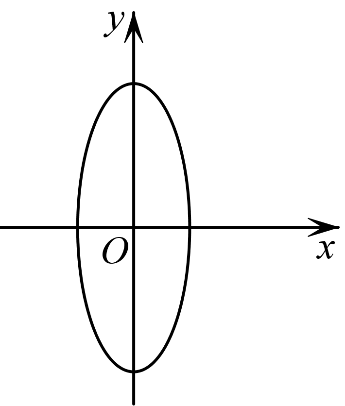
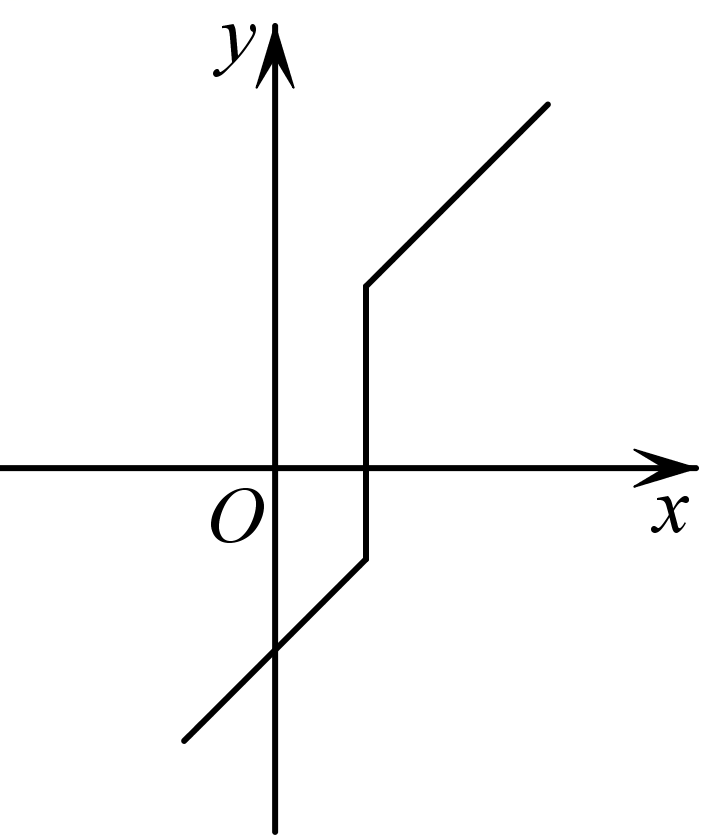
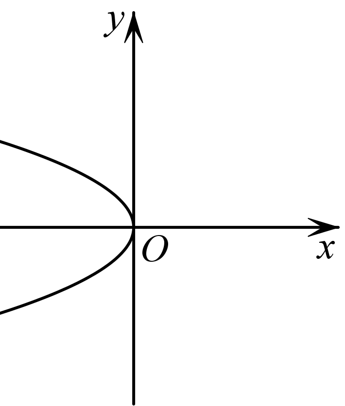
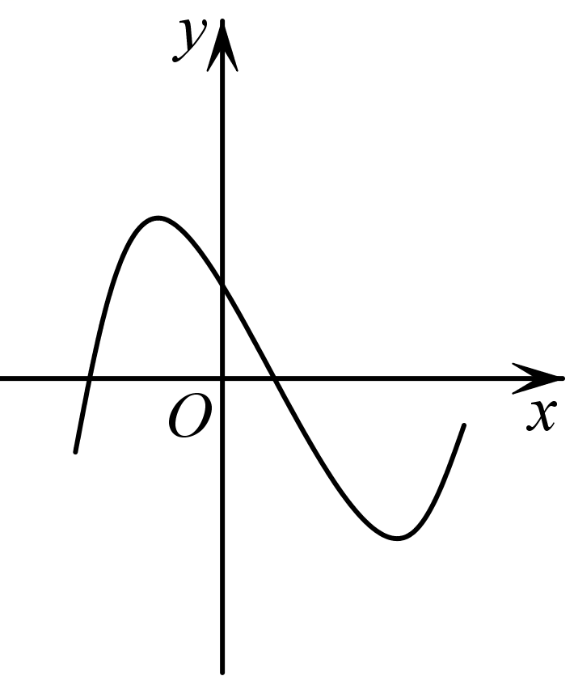
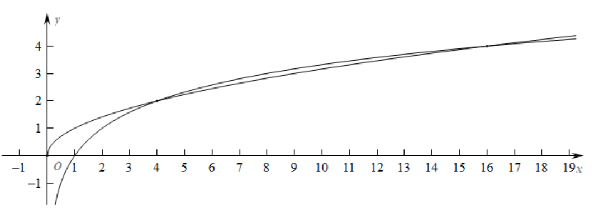
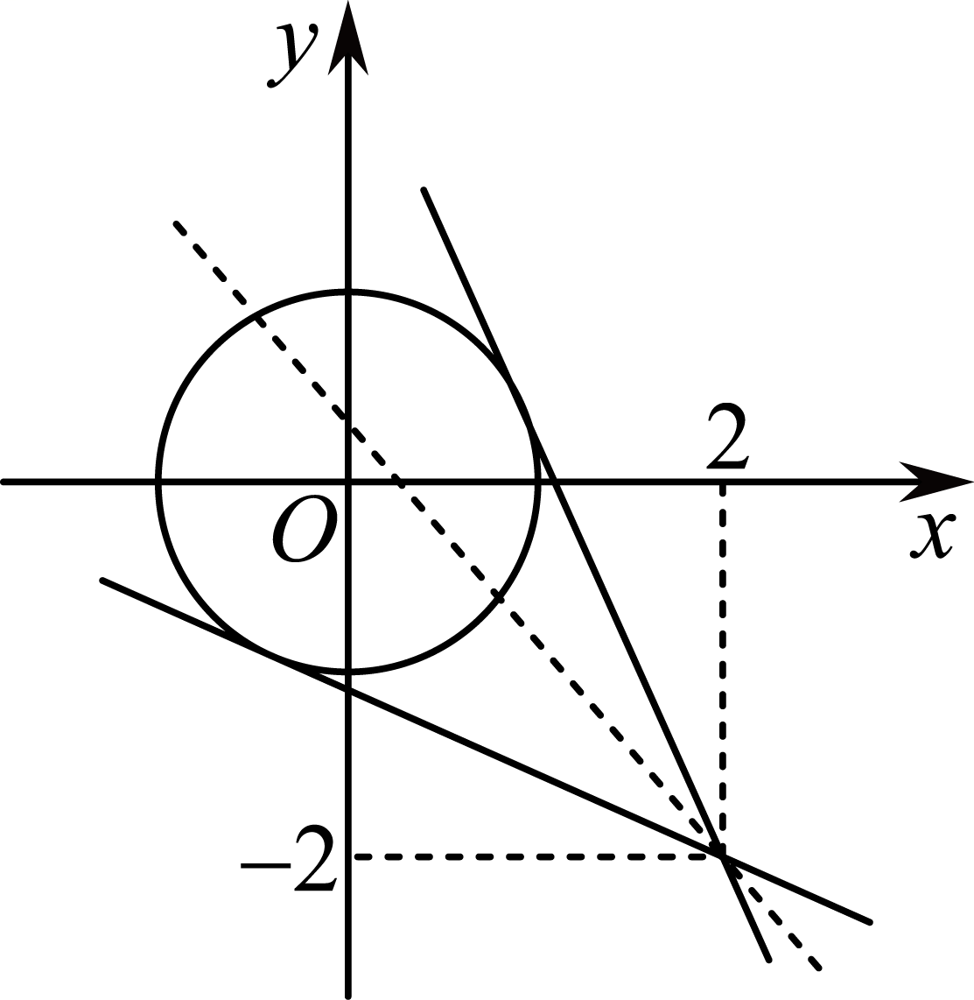

**第6讲  函数的概念**

**知识梳理**

**1、函数的概念**

（1）一般地，给定非空数集，，按照某个对应法则，使得中任意元素，都有中唯一确定的与之对应，那么从集合到集合的这个对应，叫做从集合到集合的一个函数．记作：，．集合叫做函数的定义域，记为，集合，叫做值域，记为．

（2）函数的实质是从一个非空集合到另一个非空集合的映射．

**2、函数的三要素**

（1）函数的三要素：定义域、对应关系、值域．

（2）如果两个函数的定义域相同，并且对应关系完全一致，则这两个函数为同一个函数．

3**、函数的表示法**

表示函数的常用方法有解析法、图象法和列表法．

**4、分段函数**

若函数在其定义域的不同子集上，因对应关系不同而分别用几个不同的式子来表示，这种函数称为分段函数．

**【解题方法总结】**

1**、基本的函数定义域限制**

求解函数的定义域应注意：

（1）分式的分母不为零；

（2）偶次方根的被开方数大于或等于零：

（3）对数的真数大于零，底数大于零且不等于1；

（4）零次幂或负指数次幂的底数不为零；

（5）三角函数中的正切的定义域是且；

（6）已知的定义域求解的定义域，或已知的定义域求的定义域，遵循两点：①定义域是指自变量的取值范围；②在同一对应法则∫下，括号内式子的范围相同；

（7）对于实际问题中函数的定义域，还需根据实际意义再限制，从而得到实际问题函数的定义域．

2**、基本初等函数的值域**

（1）的值域是．

（2）的值域是：当时，值域为；当时，值域为．

（3）的值域是．

（4）且的值域是．

（5）且的值域是．

**必考题型全归纳**

**题型一：函数的概念**

**例1．**（2024·山东潍坊·统考一模）存在函数满足：对任意都有（    ）

A．	B．	C．	D．

【答案】D

【解析】对于A，当时，；当时，，

不符合函数定义，A错误；

对于B,令，则，令，则，

不符合函数定义，B错误；

对于C, 令，则，令，则，

不符合函数定义，C错误；

对于D, ,,则，则存在时，，

符合函数定义，即存在函数满足：对任意都有，D正确，

故选：D

**例2．**（2024·重庆·二模）任给，对应关系使方程的解与对应，则是函数的一个充分条件是（    ）

A． 	B． 	C． 	D．

【答案】A

【解析】根据函数的定义，对任意，按，在的范围中必有唯一的值与之对应，，则，则的范围要包含，

故选：A*．*

**例3．**（2024·全国·高三专题练习）如图，可以表示函数的图象的是（    ）

A．	B．

C．	D．

【答案】D

【解析】根据函数的定义，对于一个，只能有唯一的与之对应，只有D满足要求

故选：D

<strong>变式1．</strong>（2024·全国·高三专题练习）函数<em>y</em>=<em>f</em>(<em>x</em>)的图象与直线的交点个数（     ）

A．至少1个	B．至多1个	C．仅有1个	D．有0个、1个或多个

【答案】B

【解析】若1不在函数*f*(*x*)的定义域内，*y*=*f*(*x*)的图象与直线没有交点，

若1在函数*f*(*x*)的定义域内，*y*=*f*(*x*)的图象与直线有1个交点，

故选：B.

**【解题方法总结】**

利用函数概念判断

**题型二：同一函数的判断**

**例4．**（2024·高三课时练习）下列各组函数中，表示同一个函数的是（    ）．

A．，

B．，

C．，

D．，

【答案】C

【解析】对于A：的定义域为，的定义域为.因为定义域不同，所以和不是同一个函数.故A错误；

对于B：的定义域为，的定义域为.因为定义域不同，所以和不是同一个函数.故B错误；

对于C：的定义域为，的定义域为，所以定义域相同.又对应关系也相同，所以为同一个函数.故C正确；

对于D：的定义域为，的定义域为.因为定义域不同，所以和不是同一个函数.故D错误；

故选：C

**例5．**（2024·全国·高三专题练习）下列四组函数中，表示同一个函数的一组是（    ）

A．	B．

C．	D．

【答案】A

【解析】对于，和的定义域都是，对应关系也相同，是同一个函数，故选项正确；

对于，函数的定义域为，函数的定义域为，定义域不同，不是同一个函数，故选项错误；

对于，函数的定义域为，函数的定义域为，定义域不同，不是同一个函数，故选项错误；

对于，函数的定义域为，函数的定义域为，定义域不同，不是同一个函数，故选项错误，

故选：.

**例6．**（2024·全国·高三专题练习）下列各组函数中，表示同一函数的是（    ）

A．，

B．

C．，

D．，，0，，，，0，

【答案】D

【解析】对于A：的定义域是，的定义域是，两个函数的定义域不相同，不是同一函数，

对于B：，，的定义域是，两个函数的定义域不相同，不是同一函数，

对于C：的定义域为，的定义域是，两个函数的定义域不相同，不是同一函数，

对于D：对应点的坐标为，，，对应点的坐标为，，，两个函数对应坐标相同，是同一函数，

故选：D．

**【解题方法总结】**

当且仅当给定两个函数的定义域和对应法则完全相同时，才表示同一函数，否则表示不同的函数．

**题型三：给出函数解析式求解定义域**

**例7．**（2024·北京·高三专题练习）函数的定义域为\_\_\_\_\_\_\_\_.

【答案】

【解析】令，可得，解得.

故函数的定义域为.

故答案为:.

**例8．**（2024·全国·高三专题练习）若，则\_\_\_\_\_\_\_\_\_.

【答案】或

【解析】由有意义可得

，

所以或，

当时，，，

当时，，，

故答案为：或.

**例9．**（2024·高三课时练习）函数的定义域为\_\_\_\_\_\_．

【答案】

【解析】要使函数有意义，则 ，解得.

所以函数的定义域为.

故答案为：.

<strong>变式2．</strong>（2024·全国·高三专题练习）已知正数<em>a</em>，<em>b</em>满足，则函数的定义域为\_\_\_\_\_\_\_\_\_\_\_.

【答案】

【解析】由可得，即，所以，代入

即，解得或（舍），则

所以

解得

所以函数定义域为

故答案为:

**变式3．**（2024·全国·高三专题练习）已知等腰三角形的周长为，底边长是腰长的函数，则函数的定义域为(   )

A．	B．	C．	D．

【答案】A

【解析】由题设有，

由得，故选A.

**【解题方法总结】**

对求函数定义域问题的思路是：

（1）先列出使式子有意义的不等式或不等式组；

（2）解不等式组；

（3）将解集写成集合或区间的形式．

**题型四：抽象函数定义域**

**例10．**（2024·全国·高三专题练习）已知函数的定义域为， 则函数的定义域为\_\_\_\_\_

【答案】

【解析】令，由得：，

所以，即，

所以，函数的定义域为.

故答案为：

**例11．**（2024·高三课时练习）已知函数的定义域为，则函数的定义域为\_\_\_\_\_\_．

【答案】

【解析】因为函数的定义域为，

所以在函数中，，解得或，

故函数的定义域为.

故答案为：.

**例12．**（2024·全国·高三专题练习）已知函数定义域为 ，则函数的定义域为\_\_\_\_\_\_\_.

【答案】

【解析】因的定义域为，则当时，，

即的定义域为，于是中有，解得，

所以函数的定义域为.

故答案为：

**变式4．**（2024·全国·高三专题练习）已知函数的定义域为，则函数的定义域为\_\_\_\_\_\_

【答案】

【解析】由函数的定义域是，得到，故  即 .

解得: ；所以原函数的定义域是：.

故答案为：.

**变式5．**（2024·全国·高三专题练习）已知函数的定义域为，则函数的定义域为\_\_\_\_\_\_\_\_\_\_．

【答案】

【解析】由解得，

所以函数的定义域为.

故答案为：

**【解题方法总结】**

1、抽象函数的定义域求法：此类型题目最关键的就是法则下的定义域不变，若的定义域为，求中的解的范围，即为的定义域，口诀：定义域指的是的范围，括号范围相同．已知的定义域，求四则运算型函数的定义域

2、若函数是由一些基本函数通过四则运算结合而成的，其定义域为各基本函数定义域的交集，即先求出各个函数的定义域，再求交集．

**题型五：函数定义域的应用**

<strong>例13．</strong>（2024·全国·高三专题练习）若函数的定义域为<strong>R</strong>，则实数<em>a</em>的取值范围是\_\_\_\_\_\_\_\_\_\_．

【答案】

【解析】的定义域是**R**，则恒成立，

时，恒成立，

时，则，解得，

综上，．

故答案为：．

<strong>例14．</strong>（2024·全国·高三专题练习）已知的定义域为，那么<em>a</em>的取值范围为\_\_\_\_\_\_\_\_\_．

【答案】

【解析】依题可知，的解集为，所以，解得．

故答案为：．

<strong>例15．</strong>（2024·全国·高三专题练习）函数的定义域为，则实数<em>a</em>的取值范围是\_\_\_\_\_\_\_\_\_\_\_.

【答案】

【解析】因为函数的定义域为 *R*，所以的解为*R*，

即函数的图象与*x*轴没有交点，

（1）当时，函数与*x*轴没有交点，故成立；

（2）当时，要使函数的图象与*x*轴没有交点，则，解得.

综上：实数的取值范围是.

故答案为：

<strong>变式6．</strong>（2024·全国·高三专题练习）若函数的定义域是<em>R</em>，则实数的取值范围是\_\_\_\_\_\_\_\_\_\_.

【答案】

【解析】由函数的定义域为R,得恒成立,化简得恒成立,所以由解得:.

故答案为:.

**【解题方法总结】** 对函数定义域的应用，是逆向思维问题，常常转化为恒成立问题求解，必要时对参数进行分类讨论．

**题型六：函数解析式的求法**

**例16．**（2024·全国·高三专题练习）求下列函数的解析式：

(1)已知，求的解析式；

(2)已知，求的解析式；

(3)已知是一次函数且，求的解析式；

(4)已知满足，求的解析式.

【解析】(1)设，，则

∵

∴ ，

即，

(2)∵

由勾型函数的性质可得，其值域为

所以

(3)由*f*(*x*)是一次函数，可设*f*(*x*)=*ax*+*b*(*a*≠0)，

∴3[*a*(*x*+1)+*b*]-2[*a*(*x*-1)+*b*]=2*x*+17，即*ax*+(5*a*+*b*)=2*x*+17，

∴解得

∴*f*(*x*)的解析式是*f*(*x*)=2*x*+7.

(4)∵2*f*(*x*)+*f*(-*x*)=3*x*，①

∴将*x*用替换，得，②

由①②解得*f*(*x*)=3*x*.

**例17．**（2024·全国·高三专题练习）根据下列条件，求的解析式

(1)已知满足

(2)已知是一次函数，且满足；

(3)已知满足

【解析】（1）令，则，

故，

所以；

（2）设，

因为，

所以，

即，

所以，解得，

所以；

（3）因为①，

所以②，

②①得，

所以.

**例18．**（2024·全国·高三专题练习）根据下列条件，求函数的解析式．

(1)已知，则的解析式为\_\_\_\_\_\_\_\_\_\_．

(2)已知满足，求的解析式．

(3)已知，对任意的实数*x*，*y*都有，求的解析式．

【解析】（1）方法一（换元法）：令，则，．

所以，

所以函数的解析式为．

方法二（配凑法）：．

因为，所以函数的解析式为．

（2）将代入，得，

因此，解得．

（3）令，得，

所以，即．

**变式7．**（2024·全国·高三专题练习）已知，求的解析式.

【解析】由，令，则，

所以，

所以.

**变式8．**（2024·广东深圳·高三深圳外国语学校校考阶段练习）写出一个满足：的函数解析式为\_\_\_\_\_\_.

【答案】

【解析】中，令，解得，

令得，故，

不妨设，满足要求.

故答案为：

**变式9．**（2024·全国·高三专题练习）已知定义在上的单调函数，若对任意都有，则方程的解集为\_\_\_\_\_\_\_．

【答案】．

【解析】∵定义在上的单调函数，对任意都有，

令，则，

在上式中令，则，解得，

故，

由得，即，

在同一坐标系中作出函数和的图像，

可知这两个图像有2个交点，即和，

则方程的解集为．

故答案为：.

**【解题方法总结】** 求函数解析式的常用方法如下：

（1）当已知函数的类型时，可用待定系数法求解．

（2）当已知表达式为时，可考虑配凑法或换元法，若易将含的式子配成，用配凑法．若易换元后求出，用换元法．

（3）若求抽象函数的解析式，通常采用方程组法．

（4）求分段函数的解析式时，要注意符合变量的要求．

（5）当出现大基团换元转换繁琐时，可考虑配凑法求解．

（6）若已知成对出现，或，，类型的抽象函数表达式，则常用解方程组法构造另一个方程，消元的方法求出．

**题型七：函数值域的求解**

**例19．**（2024·全国·高三专题练习）求下列函数的值域

（1）；

（2）；

（3）；

（4）；

（5）；

（6）；

（7）；

（8）

（9）；

（10）.

【解析】（1）分式函数，

定义域为，故，所有，

故值域为；

（2）函数中，分母，

则，故值域为；

（3）函数中，令得，

易见函数和都是减函数，

故函数在时是递减的，故时，

故值域为；

（4），

故值域为且；

（5），

而，，

，，

即，故值域为；

（6）函数，定义域为，令，

所以，所以，对称轴方程为，

所以时，函数，故值域为；

（7）由题意得，解得，

则，

故，，，

由*y*的非负性知，，故函数的值域为；

（8）函数，定义域为，，故，即值域为；

（9）函数，定义域为，

故，所有，故值域为；

（10）函数，

令，则由知，，，

根据对勾函数在递减，在递增,

可知时，，故值域为.

**例20．**（2024·全国·高三专题练习）若函数的值域是，则函数的值域为 \_\_．

【答案】

【解析】因为函数的值域是，

所以函数的值域为，

则的值域为，

所以函数的值域为．

故答案为：．

**例21．**（2024·全国·高三专题练习）函数的值域为\_\_\_\_\_

【答案】

【解析】表示点与点连线的斜率，

的轨迹为圆，

表示圆上的点与点连线的斜率，

由图象可知：过作圆的切线，斜率必然存在，

则设过的圆的切线方程为，即，

圆心到切线的距离，解得：，

结合图象可知：圆上的点与点连线的斜率的取值范围为，

即的值域为.

故答案为：.

**变式10．**（2024·重庆渝中·高三重庆巴蜀中学校考阶段练习）函数的最大值为\_\_\_\_\_\_.

【答案】/

【解析】因为，

令，则，

令，，因为函数在上单调递增，所以，

即，则，

即函数的最大值为，当且仅当时取等号.

故答案为：

**变式11．**（2024·全国·高三专题练习）函数的值域为\_\_\_\_\_\_.

【答案】

【解析】由有意义可得，所以，

的定义域为，

，

设，则，，则.

故答案为：．

**【解题方法总结】**

函数值域的求法主要有以下几种

（1）观察法：根据最基本函数值域（如≥0，及函数的图像、性质、简单的计算、推理，凭观察能直接得到些简单的复合函数的值域．

（2）配方法：对于形如的值域问题可充分利用二次函数可配方的特点，结合二次函数的定义城求出函数的值域．

（3）图像法：根据所给数学式子的特征，构造合适的几何模型．

（4）基本不等式法：注意使用基本不等式的条件，即一正、二定、三相等．

（5）换元法：分为三角换元法与代数换元法，对于形的值城，可通过换元将原函数转化为二次型函数．

（6）分离常数法：对某些齐次分式型的函数进行常数化处理，使函数解析式简化内便于分析．

（7）判别式法：把函数解析式化为关于*x*的―元二次方程，利用一元二次方程的判别式求值域，一般地，形如，或的函数值域问题可运用判别式法（注意*x*的取值范围必须为实数集*R*）．

（8）单调性法：先确定函数在定义域（或它的子集）内的单调性，再求出值域．对于形如或的函数，当*ac*>0时可利用单调性法．

（9）有界性法：充分利用三角函数或一些代数表达式的有界性，求出值域．因为常出现反解出*y*的表达式的过程，故又常称此为反解有界性法．

（10）导数法：先利用导数求出函数的极大值和极小值，再确定最大（小）值，从而求出函数的值域．

**题型八：分段函数的应用**

**例22．**（2024·四川成都·成都七中统考模拟预测）已知函数，则 （    ）

A．-6	B．0	C．4	D．6

【答案】A

【解析】由分段函数知：当时，周期，

所以，

所以．

故选：A

**例23．**（2024·河南·统考模拟预测）已知函数且，则（    ）

A．-16	B．16	C．26	D．27

【答案】C

【解析】当时，，

当时，，

所以，

故选：C

**例24．**（2024·全国·高三专题练习）已知，满足，则的取值范围是（    ）

A．	B．

C．	D．

【答案】D

【解析】当时，，

所以，即，解得，

当时，，

所以，即，解得，

所以，的取值范围是

故选：D

**变式12．（多选题）（2024·全国·高三专题练习）** 已知函数，则使的可以是（    ）

A．	B．	C．	D．

【答案】BCD

【解析】①当时，由，可得，

若时，则，此时无解，

若时，由，解得；

②当时，由，可得或.

若时，则，由可得，方程无解，

若时，由可得或，由可得或.

综上所述，满足的的取值集合为.

故选：BCD.

<strong>变式13．（多选题）（2024·全国·高三专题练习）</strong>已知函数，若，则实数<em>a</em>的值可能为（    ）

A．	B．	C．	D．

【答案】ACD

【解析】根据题意，函数，

当时，，

其中当时，，此时，解可得，符合题意；

当时，，此时，解可得或，符合题意；

当时，必有，

此时，变形可得或，

若，解可得，

若，无解；

综合可得：或或或，分析可得选项可得：ACD符合；

故选：ACD*．*

**【解题方法总结】**

1、分段函数的求值问题，必须注意自变量的值位于哪一个区间，选定该区间对应的解析式代入求值

2、函数区间分类讨论问题，则需注意在计算之后进行检验所求是否在相应的分段区间内．

