**第70讲  弦长问题**

**知识梳理**

1、弦长公式的两种形式

①若，是直线与圆锥曲线的两个交点，且由两方程消去后得到一元二次方程，则．

②若，是直线与圆锥曲线的两个交点，且由两方程消去后得到一元二次方程，则．

**必考题型全归纳**

**题型一：弦长问题**

<strong>例1．</strong>（2024·陕西西安·西安市大明宫中学校考模拟预测）已知直线与圆相切，且交椭圆于两点，若，则_________．

<strong>例2．</strong>（2024·全国·高三对口高考）已知椭圆，过左焦点作倾斜角为的直线交椭圆于、两点，则弦的长为_________．

<strong>例3．</strong>（2024·全国·高三专题练习）已知椭圆，的上顶点为<em>A</em>，两个焦点为，，离心率为．过且垂直于的直线与交于，两点，的周长是13，则_____．

<strong>变式1．</strong>（2024·全国·高三专题练习）已知双曲线：，若直线的倾斜角为60°，且与双曲线<em>C</em>的右支交于<em>M</em>，<em>N</em>两点，与<em>x</em>轴交于点<em>P</em>，若，则点<em>P</em>的坐标为________.

<strong>变式2．</strong>（2024·贵州·统考模拟预测）已知双曲线的左、右焦点分别为，，点，分别在双曲线的左支与右支上，且点，与点共线，若，则______.

<strong>变式3．</strong>（2024·四川巴中·高三统考开学考试）抛物线有如下光学性质：过焦点的光线经抛物线反射后得到的光线平行于抛物线的对称轴；反之，平行于抛物线对称轴的入射光线经抛物线反射后必过抛物线的焦点．已知抛物线的焦点为，一条平行于轴的光线从点射出，经过抛物线上的点反射后，再经抛物线上的另一点射出，则______________．

<strong>变式4．</strong>（2024·河南郑州·高三郑州外国语学校校考阶段练习）已知抛物线的焦点为，准线与轴的交点为，过点的直线与抛物线交于，两点，若，则________．

<strong>变式5．</strong>（2024·新疆喀什·校考模拟预测）已知双曲线<em>C</em>两条准线之间的距离为1，离心率为2，直线<em>l</em>经过<em>C</em>的右焦点，且与<em>C</em>相交于<em>A</em>、<em>B</em>两点.

(1)求*C*的标准方程；

(2)若直线*l*与该双曲线的渐近线垂直，求*AB*的长度.

**变式6．**（2024·湖南邵阳·高三湖南省邵东市第三中学校考阶段练习）已知抛物线的准线方程是.

(1)求抛物线的方程；

(2)设直线与抛物线相交于，两点，若，求实数*k*的值.

**题型二：长度和问题**

**例4．**（2024·宁夏银川·银川一中校考一模）如图所示，由半椭圆和两个半圆、组成曲线，其中点依次为的左、右顶点，点为的下顶点，点依次为的左、右焦点．若点分别为曲线的圆心．

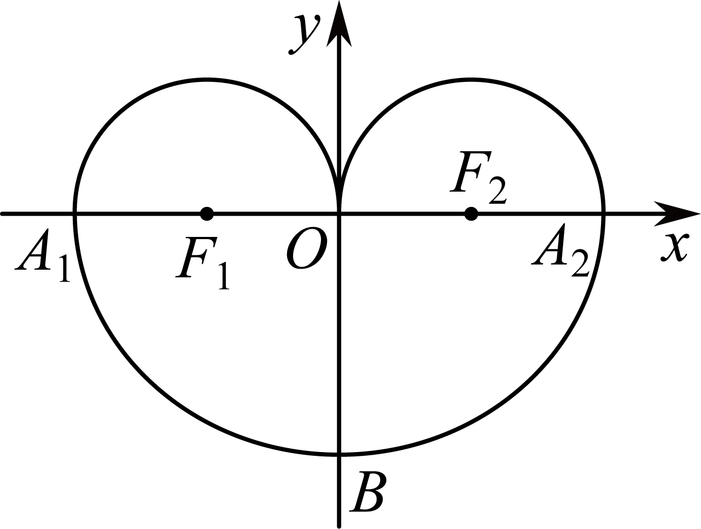

(1)求的方程；

(2)若过点作两条平行线分别与和交与和，求的最小值．

**例5．**（2024·河南安阳·安阳一中校联考模拟预测）定义：一般地，当且时，我们把方程表示的椭圆称为椭圆的相似椭圆．已知椭圆，椭圆（且）是椭圆的相似椭圆，点为椭圆上异于其左、右顶点的任意一点．

(1)当时，若与椭圆有且只有一个公共点的直线恰好相交于点，直线的斜率分别为，求的值；

(2)当（*e*为椭圆的离心率）时，设直线与椭圆交于点，直线与椭圆交于点，求的值．

**例6．**（2024·江西九江·统考一模）如图，已知椭圆()的左右焦点分别为，，点为上的一个动点(非左右顶点)，连接并延长交于点，且的周长为，面积的最大值为2．

(1)求椭圆的标准方程；

(2)若椭圆的长轴端点为，且与的离心率相等，为与异于的交点，直线交于两点，证明：为定值．

**变式7．**（2024·全国·高三专题练习）已知椭圆的离心率为，且点在椭圆上.

(1)求椭圆的方程；

(2)过椭圆右焦点作两条互相垂直的弦*AB*与*CD*，求的取值范围.

**题型三：长度差问题**

**例7．**（2024·浙江·高三校联考阶段练习）已知抛物线经过点，直线与交于，两点（异于坐标原点）．

(1)若，证明：直线过定点．

(2)已知，直线在直线的右侧，，与之间的距离，交于，两点，试问是否存在，使得？若存在，求的值；若不存在，说明理由．

<strong>例8．</strong>（2024·云南保山·高三统考阶段练习）已知抛物线：的焦点为椭圆：的右焦点<em>F</em>，点<em>P</em>为抛物线与椭圆在第一象限的交点，且.

(1)求椭圆的方程；

(2)若直线*l*过点*F*，交抛物线于*A*，*C*两点，交椭圆于*B*，*D*两点（*A*，*B*，*C*，*D*依次排序），且，求直线*l*的方程.

**题型四：长度商问题**

**例9．**（2024·重庆·校联考模拟预测）已知双曲线的离心率是，点是双曲线的一个焦点，且点到双曲线的一条渐近线的距离是2.

(1)求双曲线的标准方程.

(2)设点在直线上，过点作两条直线，直线与双曲线交于两点，直线与双曲线交于两点.若直线与直线的倾斜角互补，证明：.

**例10．**（2024·全国·高三专题练习）已知圆：，圆：，圆与圆、圆外切，

(1)求圆心的轨迹方程

(2)若过点且斜率的直线与交与两点，线段的垂直平分线交轴与点，证明的值是定值.

<strong>例11．</strong>（2024·全国·高三专题练习）已知双曲线的右焦点为，过点<em>F</em>与<em>x</em>轴垂直的直线与双曲线<em>C</em>交于<em>M</em>，<em>N</em>两点，且.

(1)求*C*的方程；

(2)过点的直线与双曲线*C*的左､右两支分别交于*D*，*E*两点，与双曲线*C*的两条渐近线分别交于*G*，*H*两点，若，求实数的取值范围.

<strong>变式8．</strong>（2024·全国·高三专题练习）已知双曲线<em>C</em>的渐近线方程为，右焦点到渐近线的距离为.

（1）求双曲线*C*的方程；

（2）过*F*作斜率为*k*的直线交双曲线于*A*、*B*两点，线段*AB*的中垂线交*x*轴于*D*，求证：为定值.

**变式9．**（2024·河南郑州·郑州外国语学校校考模拟预测）已知椭圆的左､右焦点分别为，且.过右焦点的直线与交于两点，的周长为.

(1)求椭圆的标准方程；

(2)过原点作一条垂直于的直线交于两点，求的取值范围.

<strong>变式10．</strong>（2024·陕西·统考一模）在椭圆<em>C</em>：，，过点与的直线的斜率为．

(1)求椭圆*C*的标准方程；

(2)设*F*为椭圆*C*的右焦点，*P*为直线上任意一点，过*F*作*PF*的垂线交椭圆*C*于*M*，*N*两点，当取最大值时，求直线*MN*的方程．

**变式11．**（2024·广东佛山·华南师大附中南海实验高中校考模拟预测）在椭圆）中，，过点与的直线的斜率为.

(1)求椭圆的标准方程；

(2)设为椭圆的右焦点，为直线上任意一点，过作的垂线交椭圆于两点，求的最大值.

**变式12．**（2024·安徽·高三安徽省马鞍山市第二十二中学校联考阶段练习）平面直角坐标系中，为动点，与直线垂直，垂足位于第一象限，与直线垂直，垂足位于第四象限，且，记动点的轨迹为.

(1)求的方程；

(2)已知点，，设点与点关于原点对称，的角平分线为直线，过点作的垂线，垂足为，交于另一点，求的最大值.

<strong>变式13．</strong>（2024·四川南充·高三四川省南充高级中学校考阶段练习）已知，为椭圆的两个焦点．且，<em>P</em>为椭圆上一点，．

(1)求椭圆的标准方程；

(2)过右焦点的直线交椭圆于两点，若的中点为为坐标原点，直线交直线于点．求的最大值．

<strong>变式14．</strong>（2024·海南海口·高三统考期中）设<em>O</em>为坐标原点，点<em>M</em>，<em>N</em>在抛物线上，且.

(1)证明：直线过定点；

(2)设*C*在点*M*，*N*处的切线相交于点*P*，求的取值范围.

**变式15．**（2024·四川绵阳·统考三模）过点的直线与拋物线交于点，（在第一象限），且当直线的倾斜角为时，.

(1)求抛物线的方程；

(2)若，延长交抛物线于点，延长交轴于点，求的值.

<strong>变式16．</strong>（2024·全国·高三专题练习）已知抛物线<em>C</em>：上的点到其焦点<em>F</em>的距离为2．

(1)求抛物线*C*的方程；

(2)已知点*D*在直线*l*：上，过点*D*作抛物线*C*的两条切线，切点分别为*A*，*B*，直线*AB*与直线*l*交于点*M*，过抛物线*C*的焦点*F*作直线*AB*的垂线交直线*l*于点*N*，当|*MN*|最小时，求的值．

<strong>变式17．</strong>（2024·广东揭阳·高三校考阶段练习）已知抛物线的焦点为<em>F</em>，点<em>F</em>关于直线的对称点恰好在<em>y</em>轴上．

(1)求抛物线*E*的标准方程；

(2)直线与抛物线*E*交于*A*，*B*两点，线段*AB*的垂直平分线与*x*轴交于点*C*，若，求的最大值．

<strong>变式18．</strong>（2024·四川内江·高三四川省内江市第六中学校考阶段练习）已知椭圆与抛物线有一个相同的焦点，椭圆的长轴长为2<em>p</em>．

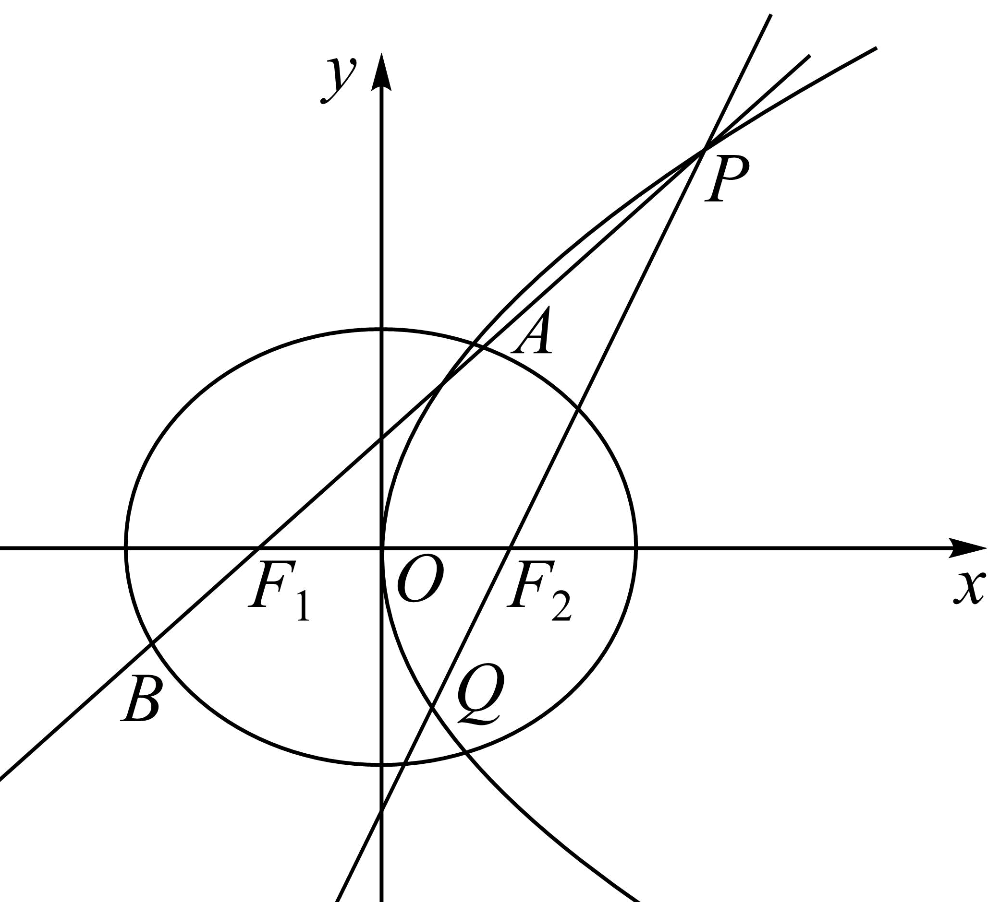

(1)求椭圆与抛物线的方程；

(2)*P*为抛物线上一点，为椭圆的左焦点，直线交椭圆于*A*，*B*两点，直线与抛物线交于*P*，*Q*两点，求的最大值．

**题型五：长度积问题**

**例12．**（2024·山东·高三校联考阶段练习）已知抛物线，为的焦点，过点的直线与交于，两点，且在，两点处的切线交于点，当与轴垂直时，．

(1)求的方程；

(2)证明：．

<strong>例13．</strong>（2024·浙江·校考模拟预测）已知抛物线：，过其焦点<em>F</em>的直线与抛物线交于<em>A</em>、<em>B</em>两点，与椭圆交于<em>C</em>、<em>D</em>两点，其中．

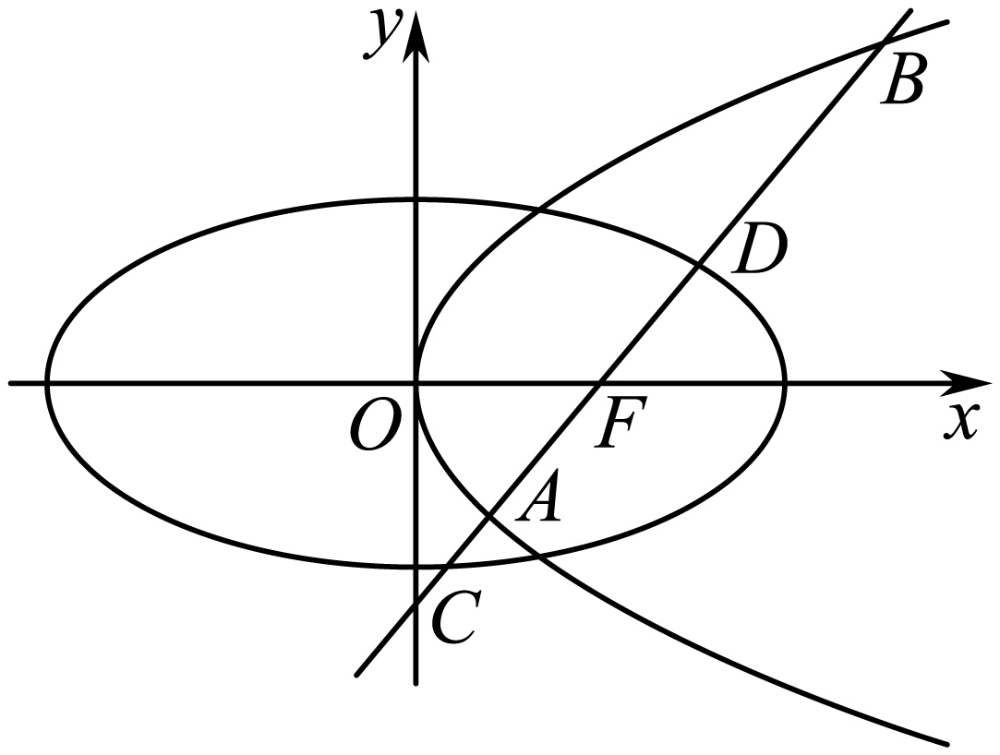

(1)求抛物线方程；

(2)是否存在直线，使得是与的等比中项，若存在，请求出*AB*的方程及；若不存在，请说明理由．

**例14．**（2024·全国·高三专题练习）已知椭圆的离心率为，且直线被椭圆截得的弦长为．

(1)求椭圆的方程；

(2)以椭圆的长轴为直径作圆，过直线上的动点作圆的两条切线，设切点为，若直线与椭圆交于不同的两点，，求的取值范围．

**变式19．**（2024·全国·高三专题练习）已知椭圆的左、右焦点分别为，，为上一点，且当轴时，.

(1)求的方程；

(2)设在点处的切线交轴于点，证明：.

**变式20．**（2024·全国·模拟预测）已知椭圆：的离心率为，过点作轴的垂线，与交于两点，且．

(1)求椭圆的标准方程；

(2)若直线与椭圆交于，两点，直线与椭圆交于，两点，且，，交于点，求的取值范围．

**变式21．**（2024·湖南岳阳·高三校考阶段练习）已知椭圆经过点，左，右焦点分别为，，为坐标原点，且．

(1)求椭圆的标准方程；

(2)设*A*为椭圆的右顶点，直线与椭圆相交于，两点，以为直径的圆过点*A*，求的最大值．

**变式22．**（2024·广东·高三校联考阶段练习）已知椭圆的焦距为2，且经过点．

(1)求椭圆*C*的方程；

(2)经过椭圆右焦点*F*且斜率为的动直线*l*与椭圆交于*A*、*B*两点，试问*x*轴上是否存在异于点*F*的定点*T*，使恒成立？若存在，求出*T*点坐标，若不存在，说明理由．

**题型六：长度的范围与最值问题**

**例15．**（2024·全国·高三专题练习）已知抛物线的焦点也是椭圆的一个焦点，与的公共弦长为．

(1)求椭圆的方程；

(2)过椭圆的右焦点作斜率为的直线与椭圆相交于，两点，线段的中点为，过点作垂直于的直线交轴于点，试求的取值范围．

**例16．**（2024·黑龙江佳木斯·高三校考开学考试）已知椭圆的两个焦点，，动点在椭圆上，且使得的点恰有两个，动点到焦点的距离的最大值为．

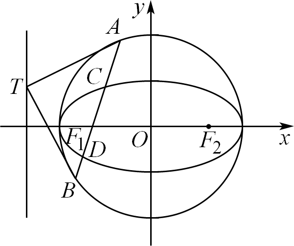

(1)求椭圆的方程；

(2)如图，以椭圆的长轴为直径作圆，过直线上的动点作圆的两条切线，设切点分别为，，若直线与椭圆交于不同的两点，，求弦长的取值范围．

**例17．**（2024·陕西咸阳·校考三模） 已知双曲线的离心率为，过双曲线的右焦点且垂直于轴的直线与双曲线交于两点，且.

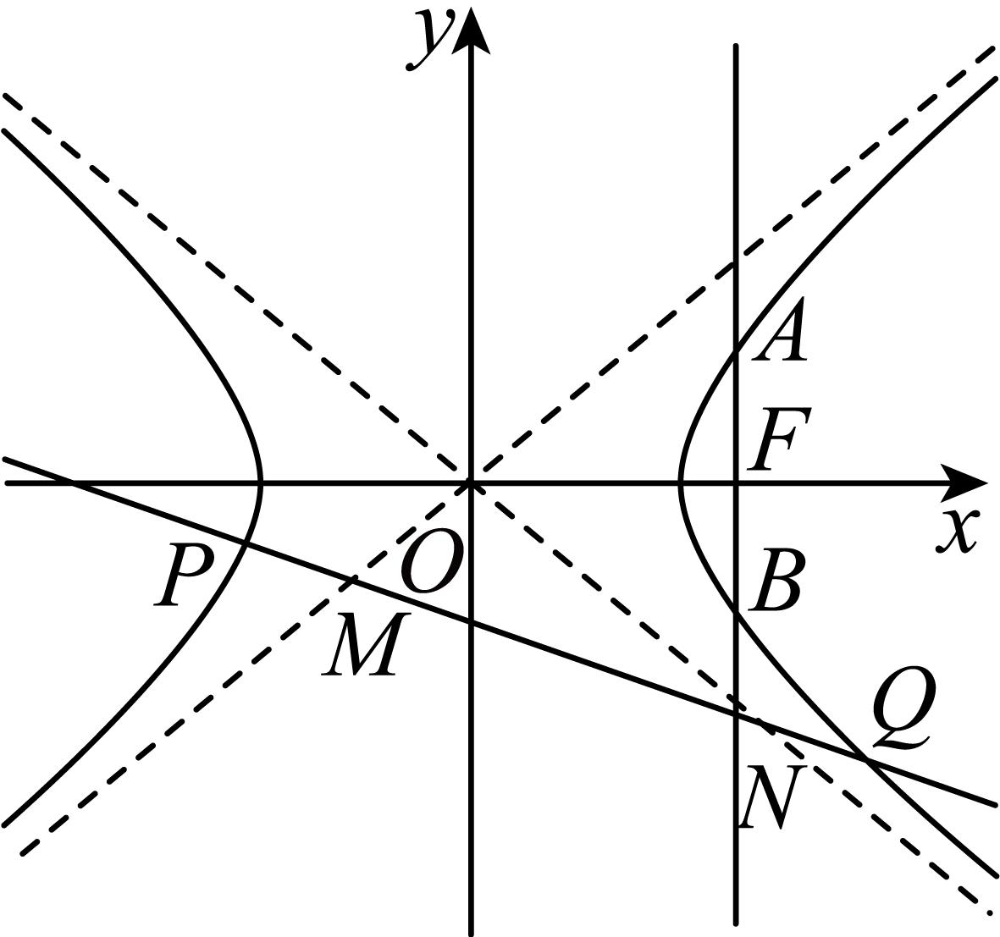

(1)求双曲线的标准方程;

(2)若直线：与双曲线的左、右两支分别交于两点，与双曲线的渐近线分别交于两点，求的取值范围.

**变式23．**（2024·湖南长沙·高三湖南师大附中校考阶段练习）设椭圆的左右焦点，分别是双曲线的左右顶点，且椭圆的右顶点到双曲线的渐近线的距离为.

(1)求椭圆的方程；

(2)是否存在圆心在原点的圆，使得该圆的任意一条切线与椭圆恒有两个交点，且？若存在，写出该圆的方程，并求的取值范围，若不存在，说明理由.

**变式24．**（2024·安徽滁州·安徽省定远中学校考模拟预测）已知椭圆的左､右焦点分别为，离心率为，过左焦点的直线与椭圆交于两点（不在轴上），的周长为.

(1)求椭圆的标准方程；

(2)若点在椭圆上，且为坐标原点），求的取值范围.

**变式25．**（2024·全国·高三专题练习）已知椭圆的离心率为，焦距为，过的左焦点的直线与相交于、两点，与直线相交于点．

(1)若，求证：；

(2)过点作直线的垂线与相交于、两点，与直线相交于点．求的最大值．

<strong>变式26．</strong>（2024·全国·高三专题练习）如图，已知椭圆的两个焦点为，，且，的双曲线的顶点，双曲线的一条渐近线方程为，设<em>P</em>为该双曲线上异于顶点的任意一点，直线，的斜率分别为，，且直线和与椭圆的交点分别为<em>A</em>，<em>B</em>和<em>C</em>，<em>D</em>．

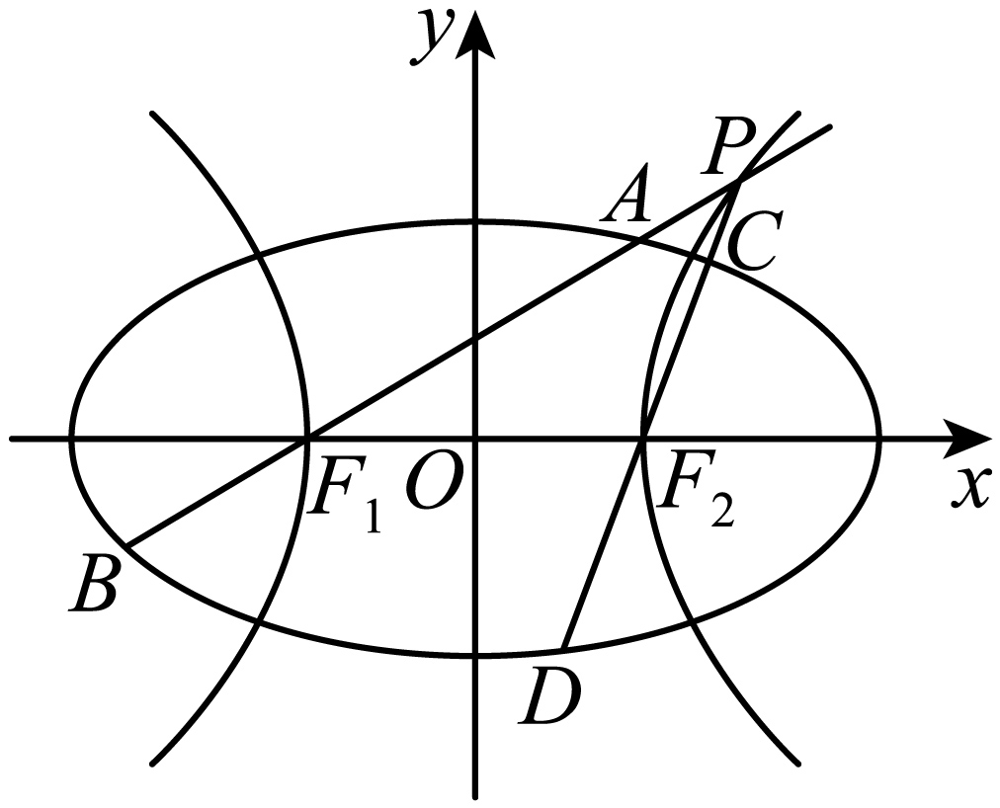

(1)求双曲线的标准方程；

(2)证明：直线，的斜率之积·为定值；

(3)求的取值范围．

**变式27．**（2024·江苏南京·校考二模）在平面直角坐标系中，已知点到点的距离与到直线的距离之比为．

(1)求点的轨迹的方程；

(2)过点且斜率为的直线与交于*A*，*B*两点，与轴交于点，线段*AB*的垂直平分线与轴交于点，求的取值范围．

<strong>变式28．</strong>（2024·江苏南通·统考模拟预测）已知椭圆的左、右顶点是双曲线的顶点，的焦点到的渐近线的距离为.直线与相交于<em>A</em>，<em>B</em>两点，.

(1)求证：

(2)若直线*l*与相交于*P*，*Q*两点，求的取值范围.

**变式29．**（2024·广东深圳·高三校联考期中）已知点在运动过程中，总满足关系式：.

(1)点的轨迹是什么曲线？写出它的方程；

(2)设圆，直线与圆*O*相切且与点的轨迹交于不同两点，当且时，求弦长的取值范围.

**变式30．**（2024·四川遂宁·统考三模）已知椭圆的左、右顶点为，点是椭圆的上顶点，直线与圆相切，且椭圆的离心率为

(1)求椭圆的标准方程；

(2)若点在椭圆上，过左焦点的直线与椭圆交于两点（不在轴上）且(*O*为坐标原点)，求的取值范围．

**变式31．**（2024·江西宜春·校联考模拟预测）已知椭圆:过点，且离心率为.

(1)求椭圆的方程；

(2)过点且互相垂直的直线,分别交椭圆于,两点及两点.求的取值范围.

<strong>变式32．</strong>（2024·重庆渝中·高三重庆巴蜀中学校考阶段练习）在平面直角坐标系中，动点到定点的距离与动点到定直线的距离的比值为，记动点<em>M</em>的轨迹为曲线<em>C</em>.

(1)求曲线*C*的标准方程.

(2)若动直线*l*与曲线*C*相交于*A*，*B*两点，且（*O*为坐标原点），求弦长的取值范围.

**变式33．**（2024·湖北·校联考模拟预测）已知椭圆过点.

(1)若椭圆*E*的离心率，求*b*的取值范围；

(2)已知椭圆*E*的离心率，*M*，*N*为椭圆*E*上不同两点，若经过*M*，*N*两点的直线与圆相切，求线段的最大值.

<strong>变式34．</strong>（2024·黑龙江哈尔滨·高三哈师大附中校考期末）已知椭圆的左、右焦点分别为、，点<em>P</em>在椭圆<em>E</em>上，，且．

(1)求椭圆的标准方程；

(2)直线与椭圆*E*相交于*A*，*B*两点，与圆相交于*C*，*D*两点，求的取值范围．

**变式35．**（2024·全国·高三专题练习）已知椭圆：（）的短轴长为4，离心率为．点为圆：上任意一点，为坐标原点．

(1)求椭圆的标准方程；

(2)记线段与椭圆交点为，求的取值范围．

**题型七：长度的定值问题**

**例18．**（2024·辽宁沈阳·高三沈阳二中校考阶段练习）如图，已知椭圆，的左右焦点是双曲线的左右顶点，的离心率为．点在上（异于两点），过点和分别作直线交椭圆于和点．

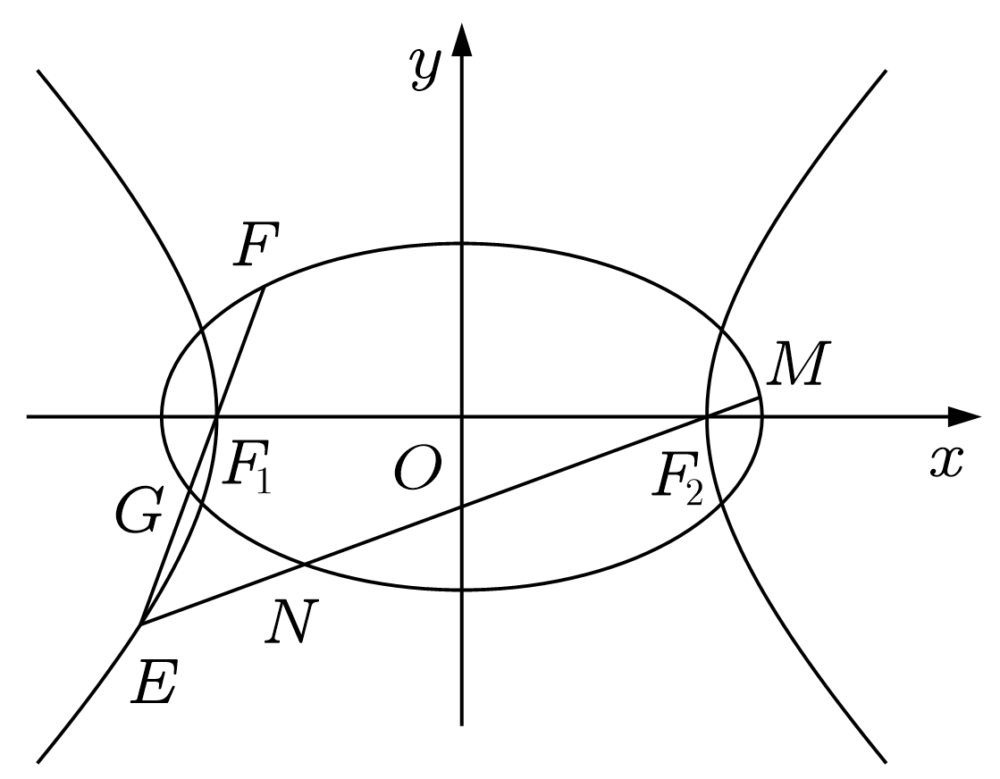

(1)求证：为定值；

(2)求证：为定值．

**例19．**（2024·北京顺义·高三牛栏山一中校考期中）椭圆．

(1)点是椭圆上任意一点，求点与点两点之间距离的最大值和最小值；

(2)和分别为椭圆的右顶点和上顶点．为椭圆上第三象限点．直线与轴交于点，直线与轴交于点．求．

<strong>例20．</strong>（2024·吉林松原·高三前郭尔罗斯县第五中学校考期末）已知椭圆<em>C</em>的右焦点与抛物线<em>E</em>：的焦点<em>F</em>重合，且椭圆<em>C</em>的离心率为．

(1)求椭圆*C*的标准方程．

(2)过点*F*的直线*l*交椭圆*C*于*M*，*N*两点，交抛物线*E*于*P*，*Q*两点，是否存在实数，使得为定值？若存在，求出这个定值和*λ*的值；若不存在，说明理由．

<strong>变式36．</strong>（2024·河南·校联考模拟预测）已知抛物线<em>E</em>：的焦点关于其准线的对称点为，椭圆<em>C</em>：的左，右焦点分别是，，且与<em>E</em>有一个共同的焦点，线段的中点是<em>C</em>的左顶点．过点的直线<em>l</em>交<em>C</em>于<em>A</em>，<em>B</em>两点，且线段<em>AB</em>的垂直平分线交<em>x</em>轴于点<em>M</em>．

(1)求*C*的方程；

(2)证明：．

**变式37．**（2024·天津红桥·统考一模）设椭圆的左、右焦点分别为，离心率，长轴为4，且过椭圆右焦点的直线与椭圆交于两点．

(1)求椭圆*C*的标准方程；

(2)若，其中为坐标原点，求直线的斜率；

(3)若是椭圆经过原点的弦，且，判断是否为定值？若是定值，请求出，若不是定值，请说明理由．

**变式38．**（2024·全国·高三专题练习）如图，在平面直角坐标系中，已知直线与椭圆交于两点（在轴上方），且，设点在轴上的射影为点，的面积为，抛物线的焦点与椭圆的焦点重合，斜率为的直线过抛物线的焦点与椭圆交于两，点，与抛物线交于两点.

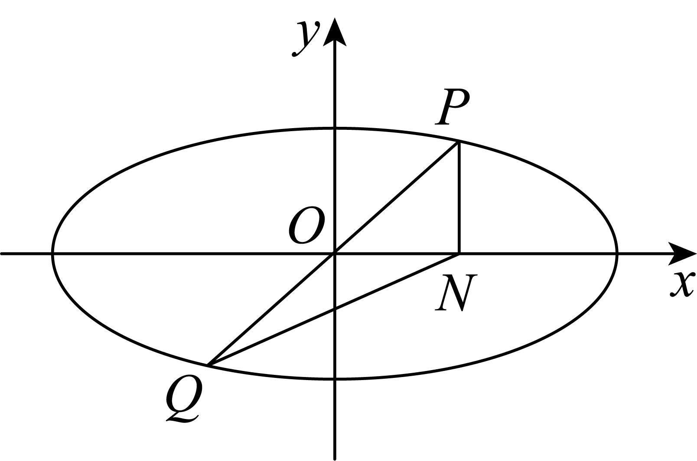

(1)求椭圆及抛物线的标准方程；

(2)是否存在常数，使为常数？若存在，求的值；若不存在，说明理由.

<strong>变式39．</strong>（2024·河南·校联考模拟预测）已知双曲线的左、右焦点分别为，.过的直线<em>l</em>交<em>C</em>的右支于<em>M</em>，<em>N</em>两点，当<em>l</em>垂直于<em>x</em>轴时，<em>M</em>，<em>N</em>到<em>C</em>的一条渐近线的距离之和为.

(1)求*C*的方程；

(2)证明：为定值.

**变式40．**（2024·安徽淮北·统考二模）已知抛物线的焦点和椭圆的右焦点重合，过点任意作直线分别交抛物线于，交椭圆于.当垂直于轴时，.

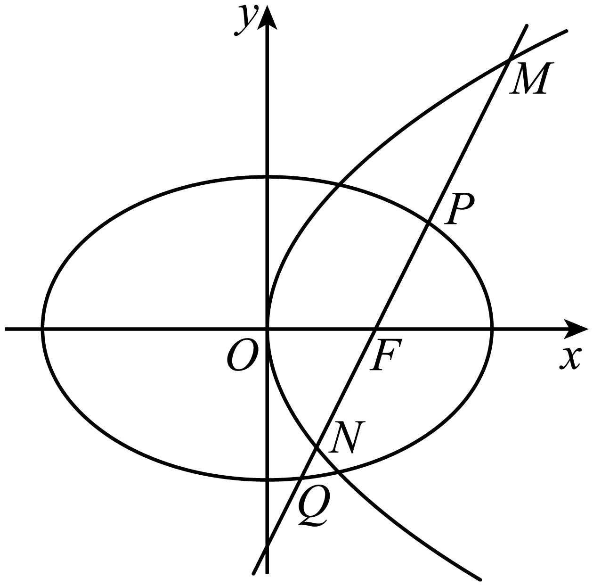

(1)求和的方程；

(2)是否存在常数，使为定值？若存在，求出的值；若不存在，请说明理由.

**变式41．**（2024·全国·高三专题练习）已知椭圆的左右焦点分别为，连接椭圆的四个顶点所成的四边形的周长为.

(1)求椭圆的方程和离心率；

(2)已知过点的直线与椭圆交于两点，过点且与直线垂直的直线与椭圆交于两点，求的值.

<strong>变式42．</strong>（2024·北京顺义·高三北京市顺义区第一中学校考期中）已知椭圆<em>C</em>：的长轴长为4，且离心率为<strong>.</strong>

(1)求椭圆*C*的方程；

(2)设过点且斜率为*k*的直线*l*与椭圆*C*交于*A*，*B*两点，线段*AB*的垂直平分线交*x*轴于点*D*.求证：为定值.

<strong>变式43．</strong>（2024·天津河北·高三统考期末）已知椭圆点，且离心率，<em>F</em>为椭圆<em>C</em>的左焦点.

(1)求椭圆*C*的方程；

(2)设点，过点*F*的直线*l*交椭圆*C*于*P*，*Q*两点，，连接*OT*与*PQ*交于点*H*.

①若，求；

②求的值.

<strong>变式44．</strong>（2024·全国·高三专题练习）已知椭圆<em>E</em>：．焦距为2<em>c</em>，，左、右焦点分别为，．在椭圆<em>E</em>上任取一点，的周长为．

(1)求椭圆*E*的标准方程；

(2)设点关于原点的对称点为*Q*．过右焦点作与直线*PQ*垂直的直线交椭圆*E*于*A*，*B*两点，求的取值范围；

(3)若过点的直线与椭圆*E*交于*C*，*D*两点，求的值．

<strong>变式45．</strong>（2024·全国·高三专题练习）已知椭圆的长轴是短轴的2倍，且右焦点为，点<em>B</em>在椭圆上，且点<em>C</em>为点<em>B</em>关于<em>x</em>轴的对称点．

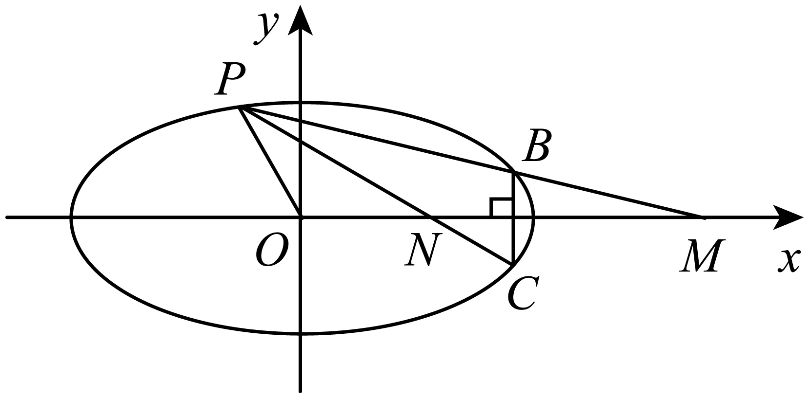

(1)求椭圆*C*的标准方程；

(2)若点*B*在第一象限且为等边三角形，求该等边三角形的边长；

(3)设*P*为椭圆*E*上异于*B*，*C*的任意一点，直线与*x*轴分别交于点*M*，*N*，判断是否为定值？若是，求出定值；若不是，说明理由.

<strong>变式46．</strong>（2024·全国·高三专题练习）已知双曲线<em>C</em>以为渐近线，其上焦点<em>F</em>坐标为.

(1)求双曲线*C*的方程；

(2)不平行于坐标轴的直线*l*过*F*与双曲线*C*交于两点，的中垂线交*y*轴于点*T*，问是否为定值，若是，请求出定值，若不是，请说明理由.

**变式47．**（2024·全国·高三专题练习）已知椭圆长轴的顶点与双曲线实轴的顶点相同，且的右焦点到的渐近线的距离为．

(1)求与的方程；

(2)若直线的倾斜角是直线的倾斜角的倍，且经过点，与交于、两点，与交于、两点，求．

<strong>变式48．</strong>（2024·山东青岛·高三统考期末）已知椭圆的左，右顶点分别为，上，下顶点分别为，四边形的内切圆的面积为，其离心率；抛物线的焦点与椭圆的右焦点重合.斜率为<em>k</em>的直线<em>l</em>过抛物线的焦点且与椭圆交于<em>A</em>，<em>B</em>两点，与抛物线交于<em>C</em>，<em>D</em>两点.

(1)求椭圆及抛物线的方程；

(2)是否存在常数，使得为一个与*k*无关的常数？若存在，求出的值；若不存在，请说明理由.

**变式49．**（2024·辽宁·新民市第一高级中学校联考一模）如图，，，，是抛物线：上的四个点（，在轴上方，，在轴下方），已知直线与的斜率分别为和2，且直线与相交于点．

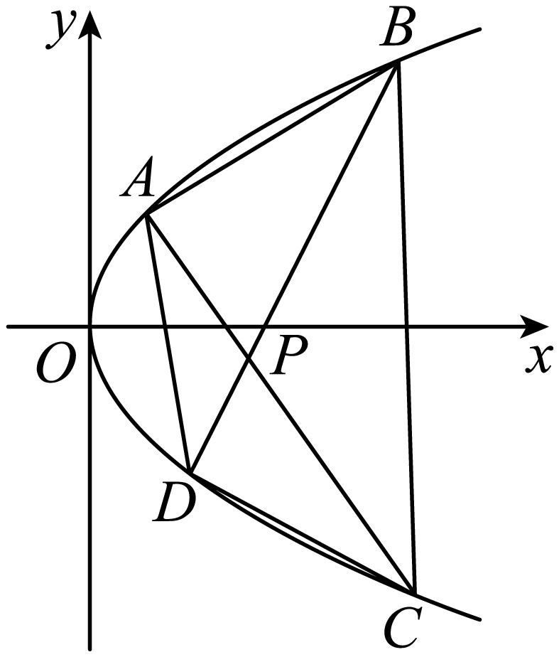

(1)若点的横坐标为6，则当的面积取得最大值时，求点的坐标．

(2)试问是否为定值？若是，求出该定值；若不是，请说明理由

