**第70讲  弦长问题**

**知识梳理**

1、弦长公式的两种形式

①若，是直线与圆锥曲线的两个交点，且由两方程消去后得到一元二次方程，则．

②若，是直线与圆锥曲线的两个交点，且由两方程消去后得到一元二次方程，则．

**必考题型全归纳**

**题型一：弦长问题**

<strong>例1．</strong>（2024·陕西西安·西安市大明宫中学校考模拟预测）已知直线与圆相切，且交椭圆于两点，若，则_________．

【答案】/

【解析】设直线，

直线与圆相切，

，

将直线方程与椭圆方程联立，得，

所以，因为，

所以，

由对称性，不妨取，

故答案为：.

<strong>例2．</strong>（2024·全国·高三对口高考）已知椭圆，过左焦点作倾斜角为的直线交椭圆于、两点，则弦的长为_________．

【答案】

【解析】在椭圆中，，，则，故点，

设点、，由题意可知，直线的方程为，即，

联立可得，，

由韦达定理可得，，

所以，.

故答案为：.

<strong>例3．</strong>（2024·全国·高三专题练习）已知椭圆，的上顶点为<em>A</em>，两个焦点为，，离心率为．过且垂直于的直线与交于，两点，的周长是13，则_____．

【答案】6

【解析】如图，连接，

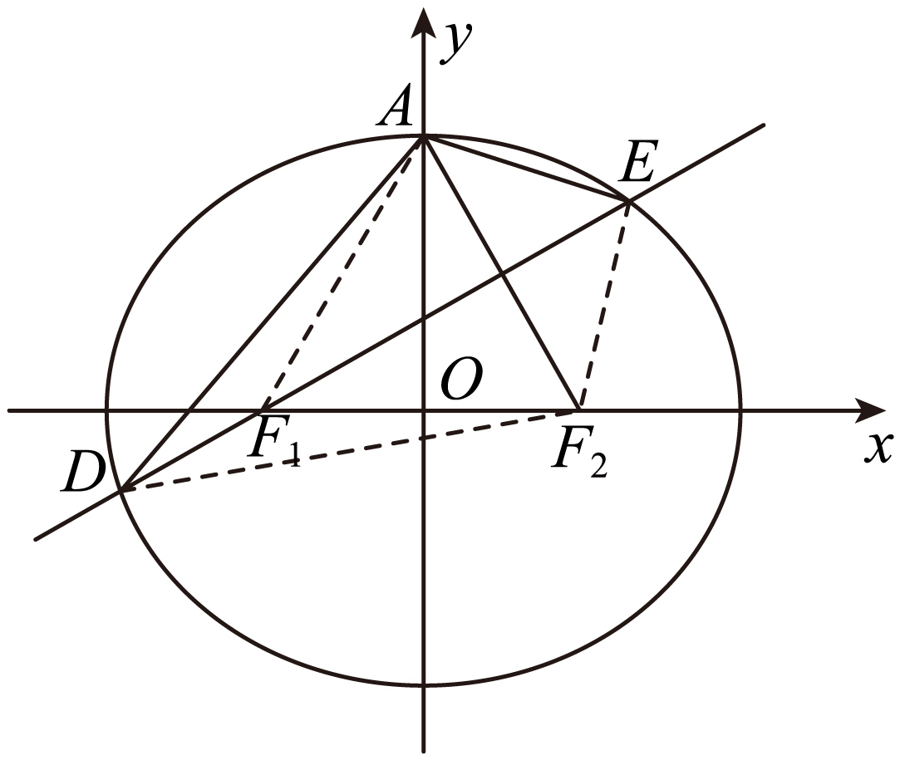

因为的离心率为，所以，即，

所以，

因为，所以为等边三角形，

又，所以直线为线段的垂直平分线，

所以，，

则的周长为，

，

而，所以直线的方程为，

代入椭圆的方程，得，

设，，则，

所以，

故答案为：6.

<strong>变式1．</strong>（2024·全国·高三专题练习）已知双曲线：，若直线的倾斜角为60°，且与双曲线<em>C</em>的右支交于<em>M</em>，<em>N</em>两点，与<em>x</em>轴交于点<em>P</em>，若，则点<em>P</em>的坐标为________.

【答案】

【解析】双曲线双曲线：的渐近线方程为，

而直线的倾斜角为60°，则直线的斜率为，可设直线的方程为，

与双曲线方程联立，化简可得，

由，得或．

设，，则，，

则，所以，

，解得：（舍去）或，

所以直线的方程为，令，可得.

故点*P*的坐标为.

故答案为：.

<strong>变式2．</strong>（2024·贵州·统考模拟预测）已知双曲线的左、右焦点分别为，，点，分别在双曲线的左支与右支上，且点，与点共线，若，则______.

【答案】

【解析】因为，设，，

由双曲线定义可得，所以，

即，，即.

故答案为：.

<strong>变式3．</strong>（2024·四川巴中·高三统考开学考试）抛物线有如下光学性质：过焦点的光线经抛物线反射后得到的光线平行于抛物线的对称轴；反之，平行于抛物线对称轴的入射光线经抛物线反射后必过抛物线的焦点．已知抛物线的焦点为，一条平行于轴的光线从点射出，经过抛物线上的点反射后，再经抛物线上的另一点射出，则______________．

【答案】

【解析】如图，由题意可知轴，，

将代入中得，即,

又，则，故的方程为，联立，

可得，解得，或（此时*C*与*B*关于*x*轴对称，不合题意），

则，故，

故答案为：.

<strong>变式4．</strong>（2024·河南郑州·高三郑州外国语学校校考阶段练习）已知抛物线的焦点为，准线与轴的交点为，过点的直线与抛物线交于，两点，若，则________．

【答案】8

【解析】由题意得，，当直线的斜率为0时，与抛物线只有1个交点，不合要求，

故设直线的方程为，不妨设，

联立，可得，易得，

设，则，

则，

则，

，

由正弦定理得，，

因为，，

所以，，即，

又由焦半径公式可知，

则，即，

即，解得，

则，解得，

故，

当时，同理可得到.

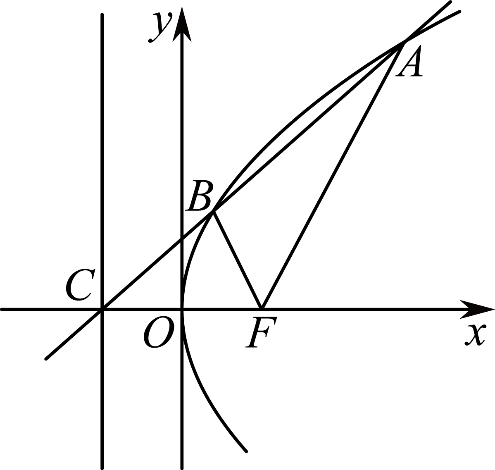

故答案为：8

<strong>变式5．</strong>（2024·新疆喀什·校考模拟预测）已知双曲线<em>C</em>两条准线之间的距离为1，离心率为2，直线<em>l</em>经过<em>C</em>的右焦点，且与<em>C</em>相交于<em>A</em>、<em>B</em>两点.

(1)求*C*的标准方程；

(2)若直线*l*与该双曲线的渐近线垂直，求*AB*的长度.

【解析】（1）因为直线*l*经过*C*的右焦点，

所以该双曲线的焦点在横轴上，

因为双曲线*C*两条准线之间的距离为1，

所以有，

又因为离心率为2，

所以有代入中，可得，

∴*C*的标准方程为：；

（2）

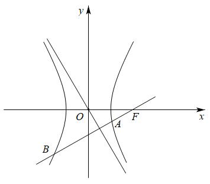

由上可知：该双曲线的渐近线方程为，

所以直线*l*的斜率为，由于双曲线和两条直线都关于*y*轴对称，

所以两条直线与双曲线的相交弦相等.

又因为直线斜率的绝对值小于渐近线斜率的绝对值，

所以直线与双曲线交于左右两支，因此不妨设直线*l*的斜率为，

方程为与双曲线方程联立为：

，

设，则有，

**变式6．**（2024·湖南邵阳·高三湖南省邵东市第三中学校考阶段练习）已知抛物线的准线方程是.

(1)求抛物线的方程；

(2)设直线与抛物线相交于，两点，若，求实数*k*的值.

【解析】（1）因为抛物线的准线方程为，

所以 ， 解得，

所以抛物线的方程为.

（2）如图，

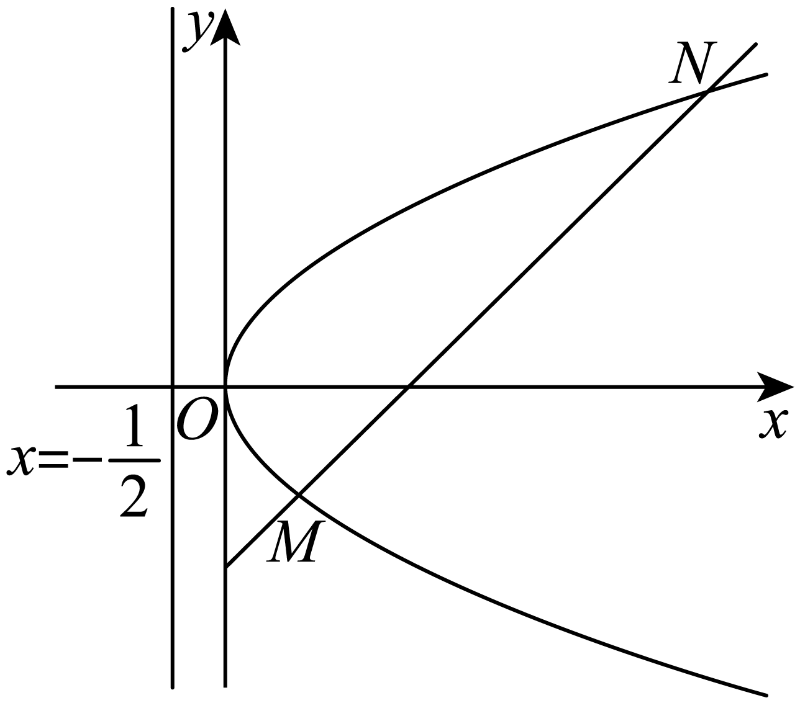

设，.

将代入，

消去整理得 .

当时，

， .

，

化简得：，解得，

经检验，此时，故.

**题型二：长度和问题**

**例4．**（2024·宁夏银川·银川一中校考一模）如图所示，由半椭圆和两个半圆、组成曲线，其中点依次为的左、右顶点，点为的下顶点，点依次为的左、右焦点．若点分别为曲线的圆心．

(1)求的方程；

(2)若过点作两条平行线分别与和交与和，求的最小值．

【解析】（1）由两圆的方程知：圆心分别为，，即，，

，解得：，.

（2）由题意知：；

，由对称性可知：为椭圆截直线的弦长，

设，其与椭圆交于点和

由得：，则

，，

，

当时，取得最小值，的最小值为.

**例5．**（2024·河南安阳·安阳一中校联考模拟预测）定义：一般地，当且时，我们把方程表示的椭圆称为椭圆的相似椭圆．已知椭圆，椭圆（且）是椭圆的相似椭圆，点为椭圆上异于其左、右顶点的任意一点．

(1)当时，若与椭圆有且只有一个公共点的直线恰好相交于点，直线的斜率分别为，求的值；

(2)当（*e*为椭圆的离心率）时，设直线与椭圆交于点，直线与椭圆交于点，求的值．

【解析】（1）设，则直线的方程为，即，

记，则的方程为，

将其代入椭圆的方程，消去，得，

因为直线与椭圆有且只有一个公共点，

所以，即，

将代入上式，整理得，

同理可得，，

所以为关于的方程的两根，

所以，．

又点在椭圆上，

所以，

所以．

（2）由椭圆，得其离心率，

所以当，即时，椭圆的标准方程为，

所以，，，恰好为椭圆的左、右焦点，

易知直线的斜率均存在且不为，

所以，

因为在椭圆上，所以，即，

所以．

设直线的斜率为，则直线的斜率为，

所以直线的方程为．

由，得，

设，则，，

所以

，

同理可得，

所以．

**例6．**（2024·江西九江·统考一模）如图，已知椭圆()的左右焦点分别为，，点为上的一个动点(非左右顶点)，连接并延长交于点，且的周长为，面积的最大值为2．

(1)求椭圆的标准方程；

(2)若椭圆的长轴端点为，且与的离心率相等，为与异于的交点，直线交于两点，证明：为定值．

【解析】（1）的周长为，由椭圆的定义得，即，

又面积的最大值为2，，即，

，，，解得，

椭圆的标准方程为.

（2）由（1）可知，，椭圆的离心率，

设椭圆的方程为，则有，，解得，

椭圆的标准方程为，

设，，，点在曲线上，，

依题意，可设直线，的斜率分别为，

则的方程分别为，，

于是，

联立方程组，消去整理，得，

，，

，

同理可得：，

，，

为定值.

**变式7．**（2024·全国·高三专题练习）已知椭圆的离心率为，且点在椭圆上.

(1)求椭圆的方程；

(2)过椭圆右焦点作两条互相垂直的弦*AB*与*CD*，求的取值范围.

【解析】（1）∵，所以.

设椭圆方程为，将代入，得.

故椭圆方程为.

（2）①当两条弦中一条斜率为0时，另一条弦的斜率不存在，

易得其中一条弦为长轴，另一条弦长为椭圆的通径为，即；

②当两条弦斜率均存在且不为0时，设，，

设直线的方程为，则直线的方程为，

将直线的方程代入椭圆方程中，并整理得：

，

∴，，

∴，

同理，，

∴，

令，则，

∴，

∵，∴，

∴，∴，

∴，∴.

综合②可知，的取值范围为.

**题型三：长度差问题**

**例7．**（2024·浙江·高三校联考阶段练习）已知抛物线经过点，直线与交于，两点（异于坐标原点）．

(1)若，证明：直线过定点．

(2)已知，直线在直线的右侧，，与之间的距离，交于，两点，试问是否存在，使得？若存在，求的值；若不存在，说明理由．

【解析】（1）证明：将点代入，得，即．

联立得，

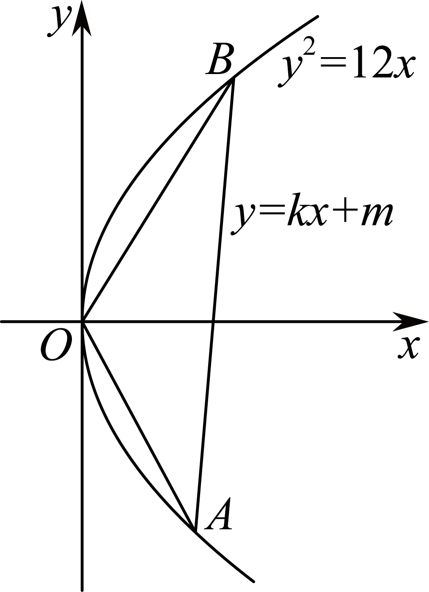

由，设，，则，．

因为，所以恒成立，则，

所以的方程为，故直线过定点．

（2）联立得，则

且，即，

，

设，同理可得．

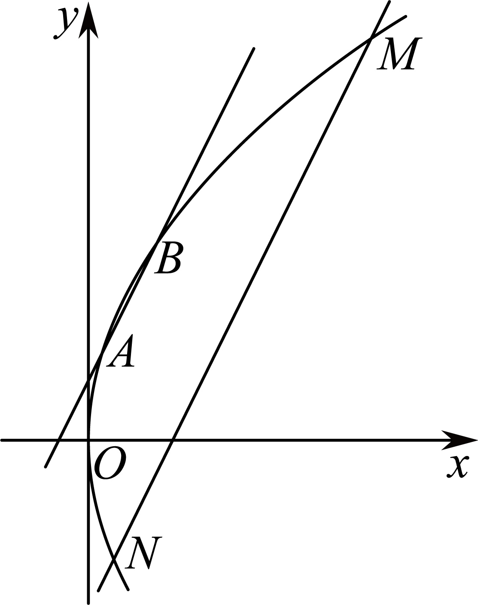

因为直线在的右侧，所以，则，即．

所以，即，解得，

因为，所以满足条件的存在，.

<strong>例8．</strong>（2024·云南保山·高三统考阶段练习）已知抛物线：的焦点为椭圆：的右焦点<em>F</em>，点<em>P</em>为抛物线与椭圆在第一象限的交点，且.

(1)求椭圆的方程；

(2)若直线*l*过点*F*，交抛物线于*A*，*C*两点，交椭圆于*B*，*D*两点（*A*，*B*，*C*，*D*依次排序），且，求直线*l*的方程.

【解析】（1）由抛物线可知：，

故由得：，故，则，

则对于有：，解得，

故椭圆方程为：；

（2）过点的直线的斜率不存在时，，，，

所以直线在点的右侧，与两曲线的交点顺序变成*A*，*B*，*D*，*C*的顺序，

不满足题意，如下图；

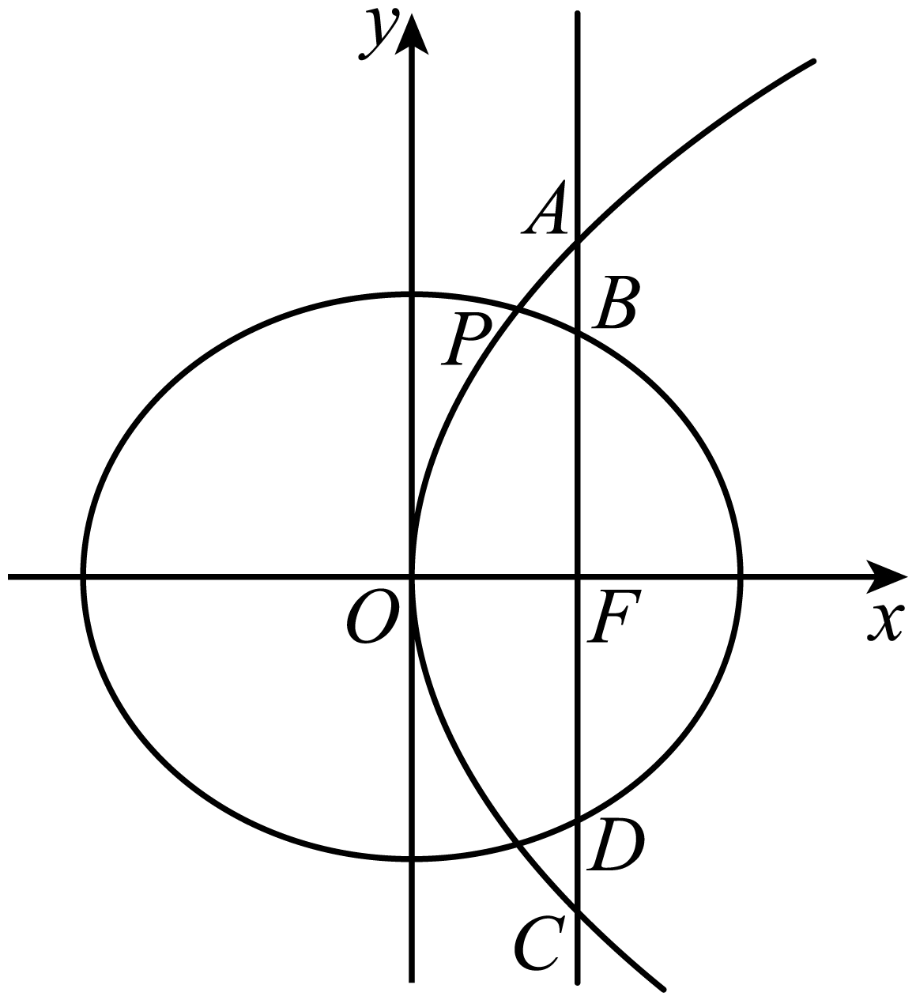

所以过点的直线的斜率存在，

故设直线的斜率为*k*，则直线方程为，

联立抛物线方程：，整理得： ，

设 ，则，

故 ，

联立，整理得，

设，则，

则

，

又，

即，整理得 ，

解得，因为，，而，

且*A*，*B*，*C*，*D*依次排序，所以，如下图，

故，故直线的方程为.

综上，直线的方程为.

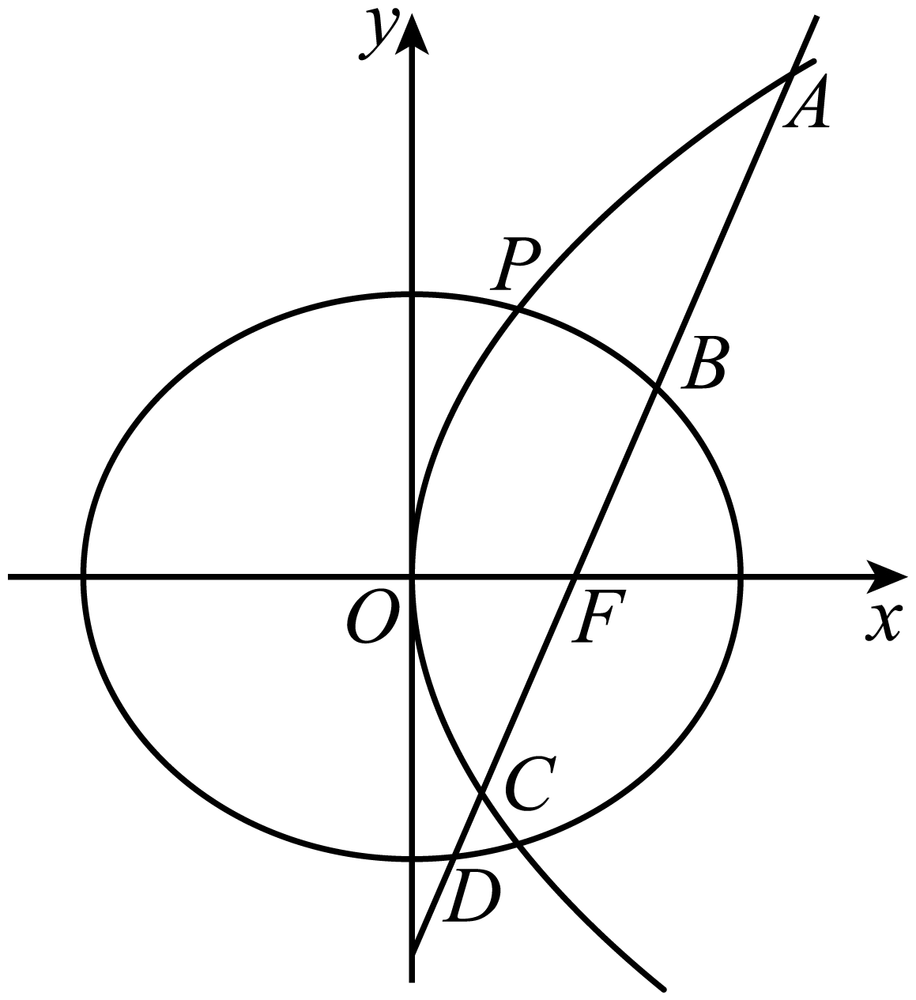

**题型四：长度商问题**

**例9．**（2024·重庆·校联考模拟预测）已知双曲线的离心率是，点是双曲线的一个焦点，且点到双曲线的一条渐近线的距离是2.

(1)求双曲线的标准方程.

(2)设点在直线上，过点作两条直线，直线与双曲线交于两点，直线与双曲线交于两点.若直线与直线的倾斜角互补，证明：.

【解析】（1）根据双曲线的对称性，不妨设，其渐近线方程为，

因为焦点到双曲线的一条渐近线的距离是2.

所以，

因为双曲线的离心率是，

所以，，解得

所以，双曲线的标准方程为.

（2）证明：由题意可知直线的斜率存在，设，

直线.

联立整理得，

所以，.

故.

设直线的斜率为，同理可得.

因为直线与直线的倾斜角互补，

所以，所以，

则，即，

所以.

**例10．**（2024·全国·高三专题练习）已知圆：，圆：，圆与圆、圆外切，

(1)求圆心的轨迹方程

(2)若过点且斜率的直线与交与两点，线段的垂直平分线交轴与点，证明的值是定值.

【解析】（1）因为圆*C*与圆*A*、圆*B*外切，

设*C*点坐标，圆*C*半径为，

则，，

所以<4，

所以点C的轨迹是双曲线的一支，

又，，，

所以其轨迹方程为；

（2）设直线为，

联立，消去*y*得：，

所以，

设*MN*中点坐标为*G*，则，

所以，

，

直线*GP*的方程为:，

，

所以，

所以=1.

<strong>例11．</strong>（2024·全国·高三专题练习）已知双曲线的右焦点为，过点<em>F</em>与<em>x</em>轴垂直的直线与双曲线<em>C</em>交于<em>M</em>，<em>N</em>两点，且.

(1)求*C*的方程；

(2)过点的直线与双曲线*C*的左､右两支分别交于*D*，*E*两点，与双曲线*C*的两条渐近线分别交于*G*，*H*两点，若，求实数的取值范围.

【解析】（1）由题意得，

解得

故*C*的方程为.

（2）显然直线率存在，设直线的方程为，，，

联立，得，

因为与双曲线*C*的左，右两支分别交于*D，E*两点，

故，

解得，

此时有.

，

，

由，解得，同理可得，

所以.

因为，故.

因为，故，

故实数的取值范围是.

<strong>变式8．</strong>（2024·全国·高三专题练习）已知双曲线<em>C</em>的渐近线方程为，右焦点到渐近线的距离为.

（1）求双曲线*C*的方程；

（2）过*F*作斜率为*k*的直线交双曲线于*A*、*B*两点，线段*AB*的中垂线交*x*轴于*D*，求证：为定值.

【解析】（1）设双曲线方程为

由题知

双曲线方程为：

（2）设直线*l*的方程为代入

整理得，设

所以：

由弦长公式得：

设*AB*的中点

则，  代入*l*得：

*AB*的垂直平分线方程为

令*y*=0得，即，所以：为定值.

**变式9．**（2024·河南郑州·郑州外国语学校校考模拟预测）已知椭圆的左､右焦点分别为，且.过右焦点的直线与交于两点，的周长为.

(1)求椭圆的标准方程；

(2)过原点作一条垂直于的直线交于两点，求的取值范围.

【解析】（1）由，得，

又的周长为，即，

，

椭圆的标准方程为.

（2）设，

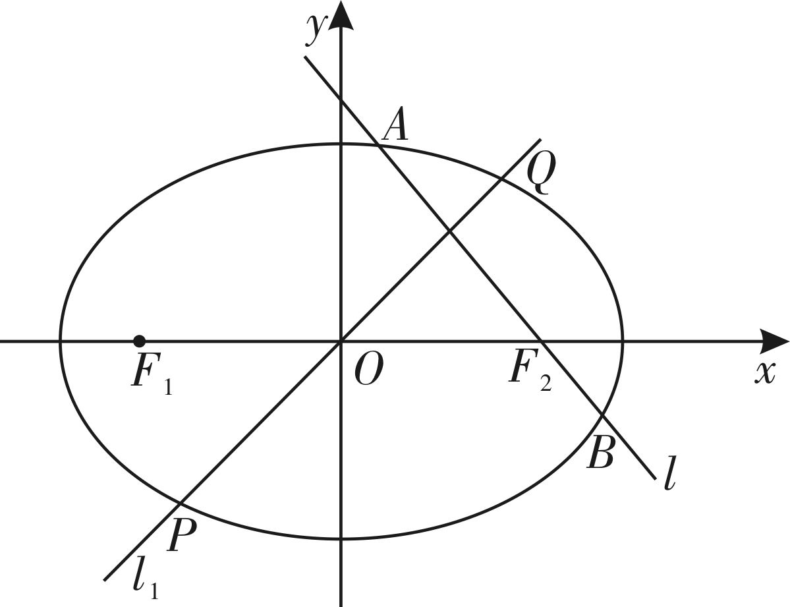

当直线的斜率为0时，得；

当直线的斜率不为0时，设直线，直线，

联立直线和椭圆的方程，并消去整理得

，

.

由根与系数的关系得，

所以.

联立直线和椭圆的方程，并消去整理得

，由根与系数的关系得，

，

所以.

令，则

不妨设

，

，

，

，

综上可得，的取值范围为.

<strong>变式10．</strong>（2024·陕西·统考一模）在椭圆<em>C</em>：，，过点与的直线的斜率为．

(1)求椭圆*C*的标准方程；

(2)设*F*为椭圆*C*的右焦点，*P*为直线上任意一点，过*F*作*PF*的垂线交椭圆*C*于*M*，*N*两点，当取最大值时，求直线*MN*的方程．

【解析】（1）过点与的直线的斜率为，所以，即，

又，即，解得，．

所以椭圆*C*的标准方程是．

（2）如图所示，

由题知，设点，则直线*FP*的斜率为．

当时，直线*MN*的斜率，直线*MN*的方程是；

当时，直线*MN*的方程是，也符合的形式，

将直线*MN*的方程代入椭圆方程得，且，

设，，则，，

所以

．

又，令，则，

当且仅当，即时等号成立，由，解得，

即当时取最大值时，此时直线*MN*的方程为或．

**变式11．**（2024·广东佛山·华南师大附中南海实验高中校考模拟预测）在椭圆）中，，过点与的直线的斜率为.

(1)求椭圆的标准方程；

(2)设为椭圆的右焦点，为直线上任意一点，过作的垂线交椭圆于两点，求的最大值.

【解析】（1）过点与的直线的斜率为，

所以，即，

又，即，解得，

所以椭圆的标准方程是.

（2）由题知，作出图形如图所示

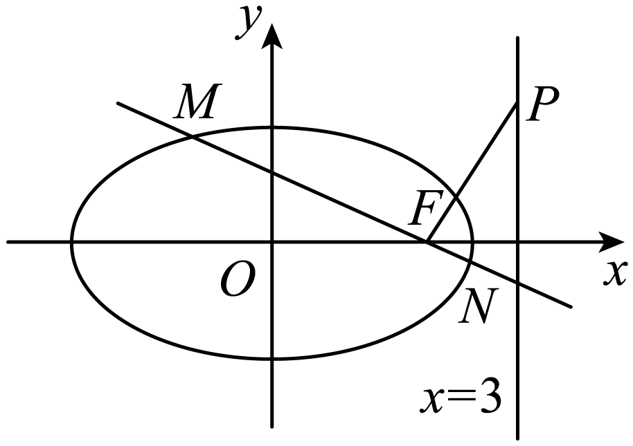

设点，则直线的斜率为.

当时，直线的斜率，直线的方程是；

当时，直线的方程是，也符合的形式，

将直线的方程代入椭圆方程得

，且，

设，则.

所以

又，令，则

，

当且仅当，即时等号成立，

由，解得，

所以的最大值为.

**变式12．**（2024·安徽·高三安徽省马鞍山市第二十二中学校联考阶段练习）平面直角坐标系中，为动点，与直线垂直，垂足位于第一象限，与直线垂直，垂足位于第四象限，且，记动点的轨迹为.

(1)求的方程；

(2)已知点，，设点与点关于原点对称，的角平分线为直线，过点作的垂线，垂足为，交于另一点，求的最大值.

【解析】（1）由题意设，由点到直线距离公式得

，，

∴，

∴，又∵垂足位于第一象限，

垂足位于第四象限，，

∴的轨迹方程为.

（2）由对称性，不妨设在第一象限，设，则，

设直线的斜率为，记，由为的角平分线，

则有，

其中，，，，

∴，

同理得：，代入中，

∴，化简得：.

将代入，中，

解得：，，

∴，，

设直线的方程为，将代入，

解得：，

∴直线的方程为，，

由点到直线距离公式得：.

由直线的斜率为，设直线的方程为，

将点代入，解得：，

∴直线的方程为，将其与联立得：

，

设，则，，

由可知，，

由均值不等式，，

当且仅当，即时，等号成立，

∵，故，

∴，当且仅当时，等号成立.

∴的最大值为.

<strong>变式13．</strong>（2024·四川南充·高三四川省南充高级中学校考阶段练习）已知，为椭圆的两个焦点．且，<em>P</em>为椭圆上一点，．

(1)求椭圆的标准方程；

(2)过右焦点的直线交椭圆于两点，若的中点为为坐标原点，直线交直线于点．求的最大值．

【解析】（1）依题意，解得，

所以椭圆的标准方程为.

（2）依题意可知直线与轴不重合，设直线的方程为，

，，，

设，则，

，

.

.

的中点为，则，即，

直线的方程为，

令，得，即，

而，所以，

所以，

令，则，

则，

当且仅当时等号成立.

所以的最大值为.

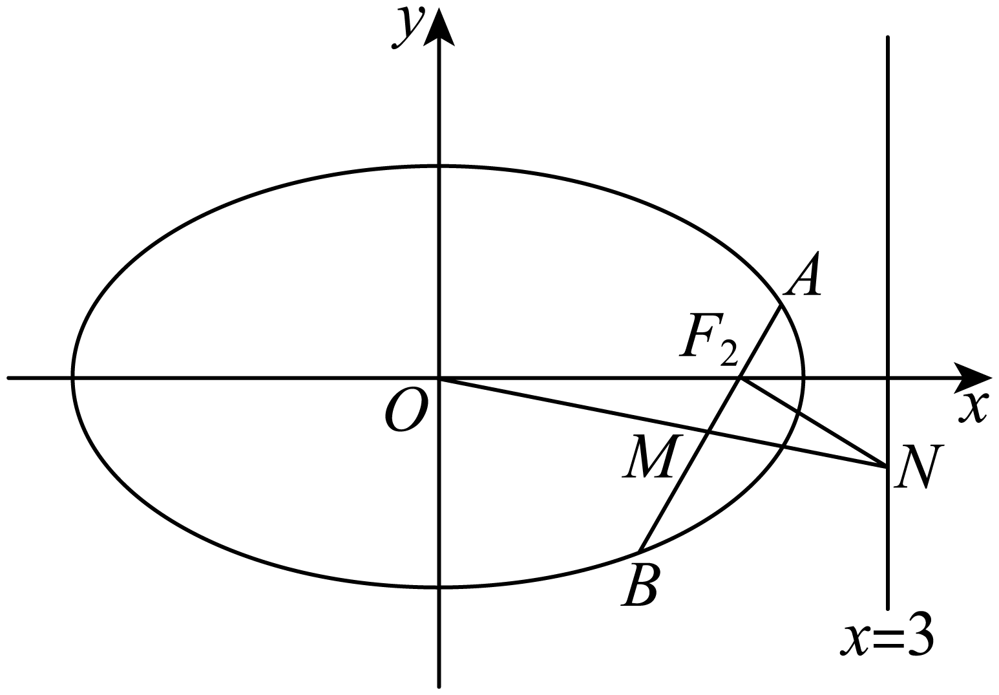

<strong>变式14．</strong>（2024·海南海口·高三统考期中）设<em>O</em>为坐标原点，点<em>M</em>，<em>N</em>在抛物线上，且.

(1)证明：直线过定点；

(2)设*C*在点*M*，*N*处的切线相交于点*P*，求的取值范围.

【解析】（1）由题意可设直线的方程为：，，

联立抛物线方程，

所以，

又，

化简得，

解之得，即直线为：，显然过定点；

（2）由抛物线，

则点的切线方程分别为，

易知，联立切线方程可得，

结合（1）可知，∴，

故，，

由弦长公式及（1）可得，

所以，

易知，

即的取值范围为.

**变式15．**（2024·四川绵阳·统考三模）过点的直线与拋物线交于点，（在第一象限），且当直线的倾斜角为时，.

(1)求抛物线的方程；

(2)若，延长交抛物线于点，延长交轴于点，求的值.

【解析】（1）由题意直线*l*的斜率 ，所以*l*得方程为 ，

联立方程 ，解得 ， ，

由弦长公式得：  ，

，解得 ， 抛物线方程为 ；

（2）由（1）知：抛物线方程为，设  ，直线*l*的方程为 ，显然 时存在的，

如图：

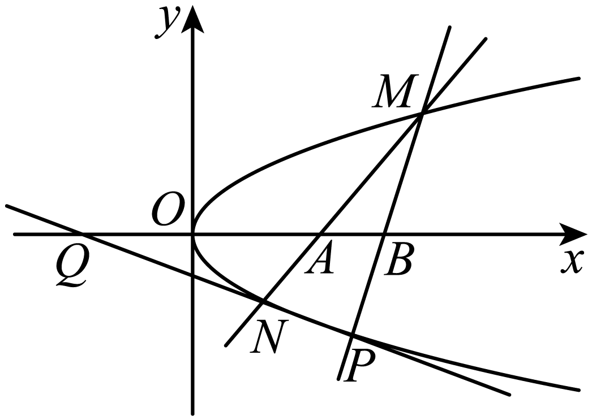

联立方程 ，得 ， ，① ，

直线*MB*的方程为： ，即 ，

， ②，

直线*PN*的方程为： ，

令 得 ， ，

， ，

由①②得：  ；

综上，抛物线方程为， .

<strong>变式16．</strong>（2024·全国·高三专题练习）已知抛物线<em>C</em>：上的点到其焦点<em>F</em>的距离为2．

(1)求抛物线*C*的方程；

(2)已知点*D*在直线*l*：上，过点*D*作抛物线*C*的两条切线，切点分别为*A*，*B*，直线*AB*与直线*l*交于点*M*，过抛物线*C*的焦点*F*作直线*AB*的垂线交直线*l*于点*N*，当|*MN*|最小时，求的值．

【解析】（1）因为点，在抛物线*C*：上，

所以，抛物线的准线方程为，

由抛物线的定义得：，解得，即抛物线*C*的方程为；

（2）由题意可设，，，

因为，所以，即，

故，整理得，

设点，同理可得，

则直线*AB*方程为：，

令得，即点，

因为直线*NF*与直线*AB*垂直，

所以直线*NF*方程为：，

令得，即点，

∴，

当且仅当时，时上式等号成立，

联立，得，

∴，，，

，

∴．

<strong>变式17．</strong>（2024·广东揭阳·高三校考阶段练习）已知抛物线的焦点为<em>F</em>，点<em>F</em>关于直线的对称点恰好在<em>y</em>轴上．

(1)求抛物线*E*的标准方程；

(2)直线与抛物线*E*交于*A*，*B*两点，线段*AB*的垂直平分线与*x*轴交于点*C*，若，求的最大值．

【解析】（1）由题意得，设*F*关于直线的对称点为，则，解得，

∴抛物线*E*的标准方程为．

（2）由可得，设，，则，，

∴，

，∴线段*AB*的中点坐标为，则线段*AB*的垂直平分线方程为，令，得，故，

又，得．

∴，令，

则，，∴，

易知函数在 上单调递增，∴当时，取得最小值，

此时，故的最大值为．

<strong>变式18．</strong>（2024·四川内江·高三四川省内江市第六中学校考阶段练习）已知椭圆与抛物线有一个相同的焦点，椭圆的长轴长为2<em>p</em>．

(1)求椭圆与抛物线的方程；

(2)*P*为抛物线上一点，为椭圆的左焦点，直线交椭圆于*A*，*B*两点，直线与抛物线交于*P*，*Q*两点，求的最大值．

【解析】（1）由题意，  ，又 ， ，

抛物线方程为： ，椭圆方程为 ；

（2）由（1）知： ，由题意 的斜率不为0，

设直线 的方程为： ，直线 的方程为： ， ，

联立方程 ，得： ，

；

联立方程 ，得 ，

，

又点*P*是 的交点， ，得 ，

点*P*在抛物线上， ， ， ，

，考察函数 ，

是增函数， ，

，即最大值为 ；

综上，抛物线方程为： ，椭圆方程为， 的最大值为 .

**题型五：长度积问题**

**例12．**（2024·山东·高三校联考阶段练习）已知抛物线，为的焦点，过点的直线与交于，两点，且在，两点处的切线交于点，当与轴垂直时，．

(1)求的方程；

(2)证明：．

【解析】（1）由题意知，将代入，解得，

所以当与轴垂直时，，所以，

故抛物线的方程为．

（2）

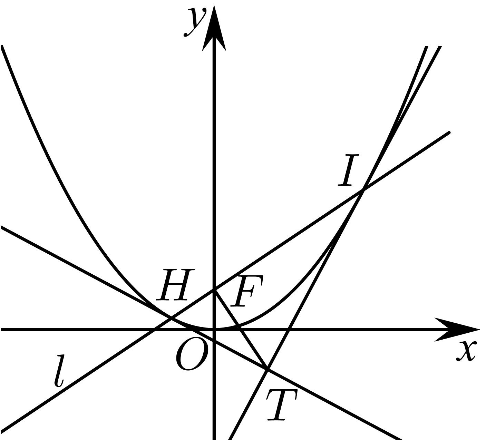

证明：法一：根据题意知直线的斜率存在，，

设直线的方程为，，，

联立得，

所以，，．

对求导，得，

所以，所以．

由得所以．

当时，根据对称性得，，所以；

当时，，所以，

所以，所以，即．

综上，．

法二：根据题意知直线的斜率存在，，

设直线的方程为，，，

联立得，所以，，．

对求导，得，由得所以．

因为，，

所以．

又，所以．

<strong>例13．</strong>（2024·浙江·校考模拟预测）已知抛物线：，过其焦点<em>F</em>的直线与抛物线交于<em>A</em>、<em>B</em>两点，与椭圆交于<em>C</em>、<em>D</em>两点，其中．

(1)求抛物线方程；

(2)是否存在直线，使得是与的等比中项，若存在，请求出*AB*的方程及；若不存在，请说明理由．

【解析】（1）设直线的方程为，，

由得，

则，

，

，

又，

所以，

又，

所以，

所以抛物线方程为；

（2）由（1）可知：，

所以，

设，

由得，

则，

所以，

若是与的等比中项，

则，

即，

所以，即，

所以，

因为，

所以，

所以方程无解，

所以不存在直线，使得是与的等比中项．

**例14．**（2024·全国·高三专题练习）已知椭圆的离心率为，且直线被椭圆截得的弦长为．

(1)求椭圆的方程；

(2)以椭圆的长轴为直径作圆，过直线上的动点作圆的两条切线，设切点为，若直线与椭圆交于不同的两点，，求的取值范围．

【解析】（1）直线，经过点，，被椭圆截得的弦长为，可得．

又，，解得：，，，

椭圆的方程为．

（2）由（1）可得：圆的方程为：．

设，则以为直径的圆的方程为：，

与相减可得：直线的方程为：，

设，，，，联立，化为：，

，则，，

故．

又圆心到直线的距离，

，

，

令，则，

，可得，可得：．

**变式19．**（2024·全国·高三专题练习）已知椭圆的左、右焦点分别为，，为上一点，且当轴时，.

(1)求的方程；

(2)设在点处的切线交轴于点，证明：.

【解析】（1）由题意知，，得，

当轴时，设，

代入椭圆方程，得，解得，即，

由椭圆的定义知，，又，

所以，由，解得，

故椭圆*C*的方程为；

（2）当切线斜率不存在时，切线方程为，此时点*P*与点*Q*重合，等式成立；

当切线斜率为0时，切线与*x*轴不相交，不符合题意；

当切线斜率存在时，设，

由，得，则，

所以切线的斜率为，得切线方程为，

即，

整理得，

即，所以切线方程为，

令，得，即，

由(1)知，，

则，

，

又，得，

所以，

，

所以，即，即证.

**变式20．**（2024·全国·模拟预测）已知椭圆：的离心率为，过点作轴的垂线，与交于两点，且．

(1)求椭圆的标准方程；

(2)若直线与椭圆交于，两点，直线与椭圆交于，两点，且，，交于点，求的取值范围．

【解析】（1）由椭圆的离心率为，得，即①，

将代入椭圆方程得，则，

由，得，即②，

由①②并结合，得，，

所以椭圆的标准方程为．

（2）①当直线的斜率为0时，直线的方程为，此时，，所以；

②当直线的斜率不存在时，直线的斜率为0，此时，，所以；

③当直线的斜率存在且不为0时，设直线的方程为（），

联立，整理得．

设，，

则，，

所以

．

因为，所以可用替换表达式中的得，

所以．

令，因为，所以，，，

所以，

因为， 则，所以；

综上所述：的取值范围为．

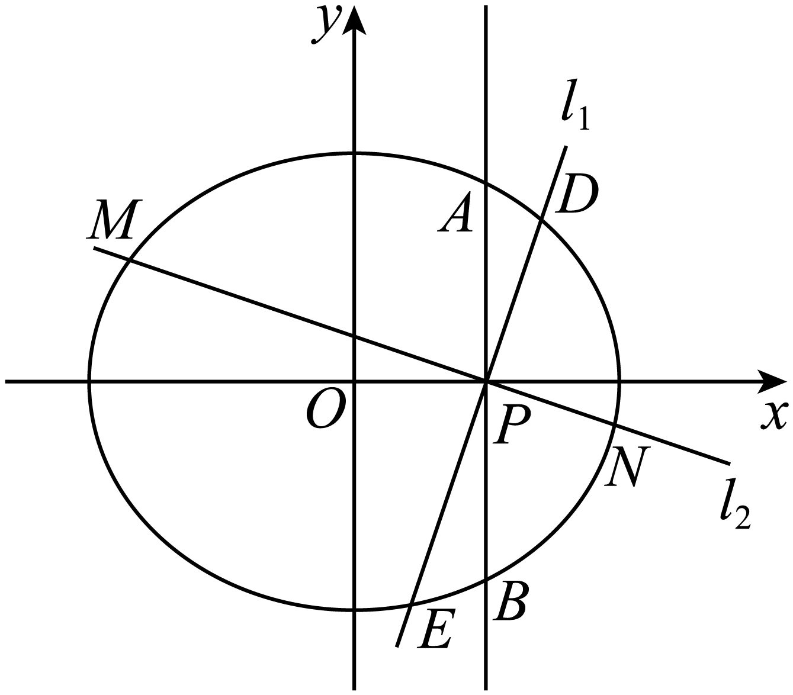

**变式21．**（2024·湖南岳阳·高三校考阶段练习）已知椭圆经过点，左，右焦点分别为，，为坐标原点，且．

(1)求椭圆的标准方程；

(2)设*A*为椭圆的右顶点，直线与椭圆相交于，两点，以为直径的圆过点*A*，求的最大值．

【解析】（1）根据题意可得解得，，

所以椭圆的方程为．

（2）

由(1)得，设直线的方程为，，，，

联立，得，

所以，

，,

，

，

因为以为直径的圆过点*A*，故，所以，

所以，所以，

所以，所以，

解得或舍去，

当时，，且，点*A*到*MN*的距离为，

所以，

化简得，

令，则，

，

由对勾函数的单调性知，在上单调递增，

即时取得最小值，此时.

**变式22．**（2024·广东·高三校联考阶段练习）已知椭圆的焦距为2，且经过点．

(1)求椭圆*C*的方程；

(2)经过椭圆右焦点*F*且斜率为的动直线*l*与椭圆交于*A*、*B*两点，试问*x*轴上是否存在异于点*F*的定点*T*，使恒成立？若存在，求出*T*点坐标，若不存在，说明理由．

【解析】（1）由椭圆的焦距为2，故，则，

又由椭圆经过点，代入得，解得，

所以椭圆的方程为．

（2）根据题意，直线*l*的斜率显然不为零，令，

由椭圆右焦点，故可设直线*l*的方程为，

联立方程组，整理得，

则，

设，，且，

设存在点，设点坐标为，由，可得，

又因为，

所以，所以，

所以直线和关于轴对称，其倾斜角互补，即有，

则，所以，

所以，整理得，

即，即，

解得，符合题意，即存在点满足题意．

**题型六：长度的范围与最值问题**

**例15．**（2024·全国·高三专题练习）已知抛物线的焦点也是椭圆的一个焦点，与的公共弦长为．

(1)求椭圆的方程；

(2)过椭圆的右焦点作斜率为的直线与椭圆相交于，两点，线段的中点为，过点作垂直于的直线交轴于点，试求的取值范围．

【解析】（1）抛物线的焦点为，

由题意可得  ①

由与关于轴对称，可得与的公共点为，

可得②

由①②解得，，

即有椭圆的方程为；

（2）设，，代入椭圆方程，可得，

设，，，，则，，

即有 ，

由为中点，可得，又的斜率为，

即有 ，令，可得，

即有

可得

又

，

即有 ，

由，可得 ，

即有 ，

则有的取值范围为．

**例16．**（2024·黑龙江佳木斯·高三校考开学考试）已知椭圆的两个焦点，，动点在椭圆上，且使得的点恰有两个，动点到焦点的距离的最大值为．

(1)求椭圆的方程；

(2)如图，以椭圆的长轴为直径作圆，过直线上的动点作圆的两条切线，设切点分别为，，若直线与椭圆交于不同的两点，，求弦长的取值范围．

【解析】（1）设半焦距为，由使得的点恰有两个可得，

动点到焦点的距离的最大值为，可得，即，

所以椭圆的方程是.

（2）圆的方程为，设直线上动点的坐标为.

设，连接*OA*，

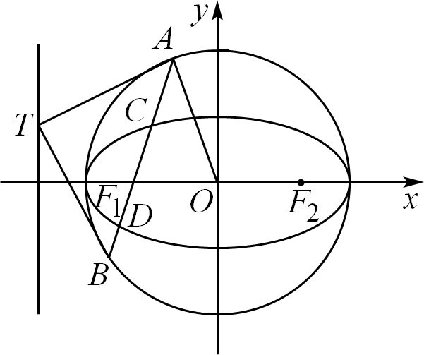

因为直线为切线，故，否则直线垂直于轴，则与直线平行，

若，则，故，

故直线的方程为：，

整理得到：；

当时，若，直线的方程为：；若，则直线的方程为：，

满足.

故直线的方程为，同理直线的方程为，

又在直线和上，即，

故直线的方程为.

联立，消去得，

设，．

则，

从而

，

又，从而，所以.

**例17．**（2024·陕西咸阳·校考三模） 已知双曲线的离心率为，过双曲线的右焦点且垂直于轴的直线与双曲线交于两点，且.

(1)求双曲线的标准方程;

(2)若直线：与双曲线的左、右两支分别交于两点，与双曲线的渐近线分别交于两点，求的取值范围.

【解析】（1）由题可知，，解得，所以双曲线的标准方程为；

（2）由题可知，直线与双曲线的左、右两支分别交于两点，

联立消去，得，

所以，解得，

且，

所以

.

联立可得，同理可得，

所以，

所以，

其中，则，所以.

**变式23．**（2024·湖南长沙·高三湖南师大附中校考阶段练习）设椭圆的左右焦点，分别是双曲线的左右顶点，且椭圆的右顶点到双曲线的渐近线的距离为.

(1)求椭圆的方程；

(2)是否存在圆心在原点的圆，使得该圆的任意一条切线与椭圆恒有两个交点，且？若存在，写出该圆的方程，并求的取值范围，若不存在，说明理由.

【解析】（1）由题意得：，

故，

双曲线渐的近线方程为，

故椭圆右顶点到双曲线渐近线距离为，

因为，解得：，

故，

所以椭圆方程为；

（2）当直线的斜率存在时，设直线为，

联立与，得：

，

由得：，

设，

则，

因为，所以，

其中

，

整理得：，

将代入中，解得：，

又，解得：，综上：或，

原点到直线的距离为，

则存在圆心在原点的圆，使得该圆的任意一条切线与椭圆恒有两个交点，且，

该圆的半径即为，故圆的方程为，

当直线斜率不存在时，此时直线的方程为，

与椭圆的两个交点为，或，，

此时，满足要求，

经验证，此时圆上的切线在轴上的截距满足或，

综上：存在圆心在原点的圆，使得该圆的任意一条切线与椭圆恒有两个交点，且；

，

将代入上式，

令，则，

因为，则，

所以，

因为，所以，

故当时，取得最大值，最大值为，

又，

当直线的斜率不存在时，此时，

综上：的取值范围为.

**变式24．**（2024·安徽滁州·安徽省定远中学校考模拟预测）已知椭圆的左､右焦点分别为，离心率为，过左焦点的直线与椭圆交于两点（不在轴上），的周长为.

(1)求椭圆的标准方程；

(2)若点在椭圆上，且为坐标原点），求的取值范围.

【解析】（1）由的周长为，得，即，

又离心率，所以，，

所以椭圆的标准方程为.

（2）由（1）知的坐标为，

①当直线的斜率不存在时，，，则；

②当直线的斜率存在且不为0时，设直线的方程为且，

联立，得，

设，，则，，

，

设点，则，即，代入椭圆方程得，

解得，，所以，

所以，

又，所以的取值范围是.

综上所述，的取值范围是.

**变式25．**（2024·全国·高三专题练习）已知椭圆的离心率为，焦距为，过的左焦点的直线与相交于、两点，与直线相交于点．

(1)若，求证：；

(2)过点作直线的垂线与相交于、两点，与直线相交于点．求的最大值．

【解析】（1）证明：设、，因为椭圆的焦距为，所以，解得．

又因为椭圆的离心率，所以，所以，

所以椭圆的方程为.

因为直线经过、，，

所以，直线的方程为，

设点、，联立可得，

由，得，.

所以，

，

因此，.

（2）证明：若直线、中两条直线分别与两条坐标轴垂直，则其中有一条必与直线平行，不合乎题意，

所以，直线的斜率存在且不为零，设直线方程为，

则直线方程为，其中．

联立可得，

设、，则，

由韦达定理可得，，

易知且，将代入直线的方程可得，即点，

所以

，

同理可得，

所以

，

当且仅当时，等号成立，

因此，的最大值为.

<strong>变式26．</strong>（2024·全国·高三专题练习）如图，已知椭圆的两个焦点为，，且，的双曲线的顶点，双曲线的一条渐近线方程为，设<em>P</em>为该双曲线上异于顶点的任意一点，直线，的斜率分别为，，且直线和与椭圆的交点分别为<em>A</em>，<em>B</em>和<em>C</em>，<em>D</em>．

(1)求双曲线的标准方程；

(2)证明：直线，的斜率之积·为定值；

(3)求的取值范围．

【解析】（1）设双曲线的标准方程为，由题意知，且，

即，

所以双曲线的标准方程为：；

（2）设点，由题可知，则，，

所以，

而由点在双曲线上，可知，即有，

从而，故；

（3）由上可知，且，且不能同时取或，

所以可设直线的方程为，则直线的方程为，

把直线的方程为代入椭圆方程，

整理得，

设，，则有，，

因此，

同理可得，

因此，又，

所以，所以，

所以的取值范围为.

**变式27．**（2024·江苏南京·校考二模）在平面直角坐标系中，已知点到点的距离与到直线的距离之比为．

(1)求点的轨迹的方程；

(2)过点且斜率为的直线与交于*A*，*B*两点，与轴交于点，线段*AB*的垂直平分线与轴交于点，求的取值范围．

【解析】（1）设，由题意，

因为，所以，

即，两边平方并整理得．

故点的轨迹的方程为；

（2）设直线方程为，

联立，消并整理得，，显然，

设，，则，，

又，可得线段中点坐标为，

所以线段中垂线的方程为，

令，可得，

对于直线，令，可得，

所以

又，

所以，

令，则，

因为在上单调递增，

所以，故．

<strong>变式28．</strong>（2024·江苏南通·统考模拟预测）已知椭圆的左、右顶点是双曲线的顶点，的焦点到的渐近线的距离为.直线与相交于<em>A</em>，<em>B</em>两点，.

(1)求证：

(2)若直线*l*与相交于*P*，*Q*两点，求的取值范围.

【解析】（1）由题意得椭圆焦点坐标为，双曲线渐近线方程为，

所以，解得，所以的方程为，

由，消*y*得，

所以得，

设，，则，

所以

，

化简得，得证；

（2）由消*x*，得，

所以，即，

结合，及，可得，

设，，则，

所以，

所以，

设，由，得，所以，

所以，

所以.

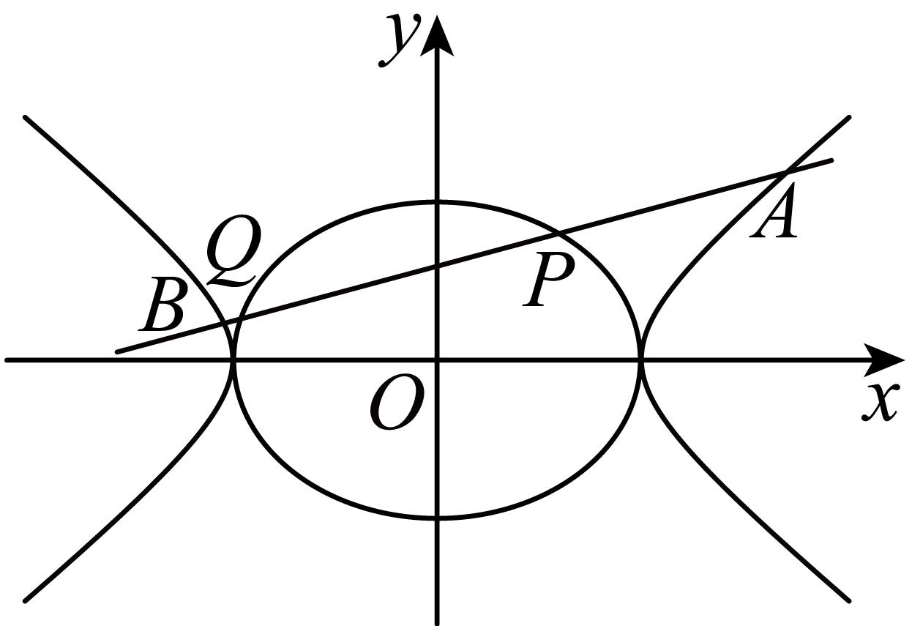

**变式29．**（2024·广东深圳·高三校联考期中）已知点在运动过程中，总满足关系式：.

(1)点的轨迹是什么曲线？写出它的方程；

(2)设圆，直线与圆*O*相切且与点的轨迹交于不同两点，当且时，求弦长的取值范围.

【解析】（1）由关系式，结合椭圆的定义，

点的轨迹是以，为焦点，长轴长为的椭圆.

∴ ，

∴点*M*的方程为.

（2）由题意，联立方程，则

设，，

则，,

因直线与圆相切，且，

∴  ，

，

，    ①

②

将①代入②.

因为，所以.

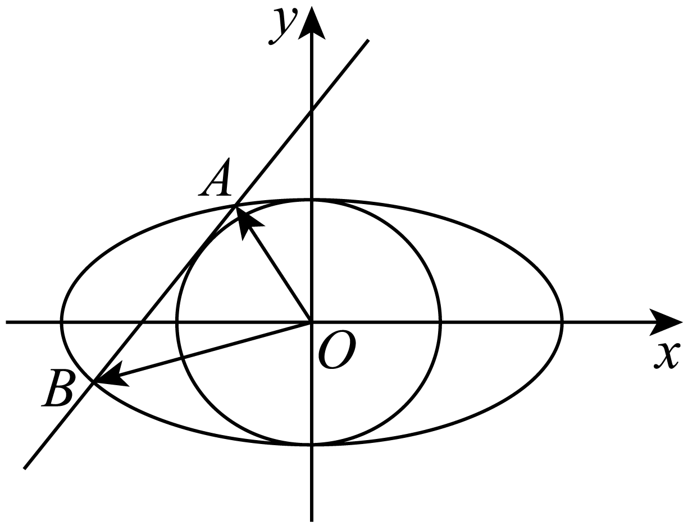

**变式30．**（2024·四川遂宁·统考三模）已知椭圆的左、右顶点为，点是椭圆的上顶点，直线与圆相切，且椭圆的离心率为

(1)求椭圆的标准方程；

(2)若点在椭圆上，过左焦点的直线与椭圆交于两点（不在轴上）且(*O*为坐标原点)，求的取值范围．

【解析】（1）由题设因为，

所以：

，所以，

所以椭圆方程为

（2）由（1）知的坐标为，

①当直线的斜率不存在时，，，则；

②当直线的斜率存在且不为0时，设直线的方程为且，

联立，得，

设，，则，，

，

设点，则，即，代入椭圆方程得，

解得，，所以，

所以，

又，所以的取值范围是．

综上所述，的取值范围是．

**变式31．**（2024·江西宜春·校联考模拟预测）已知椭圆:过点，且离心率为.

(1)求椭圆的方程；

(2)过点且互相垂直的直线,分别交椭圆于,两点及两点.求的取值范围.

【解析】（1）椭圆:过点，且离心率为

所以，解得，所以椭圆的方程为；

（2）当直线的斜率不存在时，则直线：，代入椭圆方程得，

所以；直线：，代入椭圆方程得，所以，

所以；

当直线的斜率不存在时，同理可得；

当直线,的斜率均存在，不妨设直线的方程为，则直线的方程为，，

则，消去得，

恒成立，所以，

所以

；

同理可得，将换成可得

所以，

综上所述，的取值范围是.

<strong>变式32．</strong>（2024·重庆渝中·高三重庆巴蜀中学校考阶段练习）在平面直角坐标系中，动点到定点的距离与动点到定直线的距离的比值为，记动点<em>M</em>的轨迹为曲线<em>C</em>.

(1)求曲线*C*的标准方程.

(2)若动直线*l*与曲线*C*相交于*A*，*B*两点，且（*O*为坐标原点），求弦长的取值范围.

【解析】（1）由题意得，，两边平方化简得，

即可整理得曲线*C*的标准方程为；

（2）i.当直线*l*的斜率*k*不存在时，由椭圆对称性有，又，故为等腰直角三角形，

故，代入方程有，

则弦长；

ii.当直线*l*的斜率*k*存在时，设直线*l*为，联立椭圆消*y*得，

∴，，

由，

即

，整理得.

从而

.

当时，；

当时，，

当且仅当，即时取等号，

综上，弦长的取值范围为.

**变式33．**（2024·湖北·校联考模拟预测）已知椭圆过点.

(1)若椭圆*E*的离心率，求*b*的取值范围；

(2)已知椭圆*E*的离心率，*M*，*N*为椭圆*E*上不同两点，若经过*M*，*N*两点的直线与圆相切，求线段的最大值.

【解析】（1）∵在椭圆，∴，有，所以，

又∵，所以，∵，∴；

（2）由（1）可知，又，

所以，椭圆.

因为直线与相切，故.

若直线的斜率不存在，不妨设直线为：，代入椭圆方程可得此时线段.

若直线的斜率存在，可设直线的方程为：.

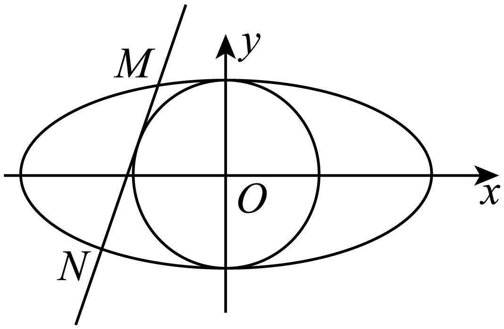

由直线与相切，故，可得：.

联立得，所以，

线段.

又因为，所以.

当且仅当，故当时，的最大值为2.

综上所述：当时，线段的最大值2.

<strong>变式34．</strong>（2024·黑龙江哈尔滨·高三哈师大附中校考期末）已知椭圆的左、右焦点分别为、，点<em>P</em>在椭圆<em>E</em>上，，且．

(1)求椭圆的标准方程；

(2)直线与椭圆*E*相交于*A*，*B*两点，与圆相交于*C*，*D*两点，求的取值范围．

【解析】（1）因为点在椭圆上．所以，又因为|，所以 ， ，

因为，所以，又，

解得，，所以椭圆的标准方程为

（2）设，，

联立直线与椭圆的方程： ，整理可得．

，有，  ，

所以弦长 ，

圆的圆心到直线的距离为 ， 所以 ，

所以 ，

由，得，则 ，

所以以的取值范围为.

**变式35．**（2024·全国·高三专题练习）已知椭圆：（）的短轴长为4，离心率为．点为圆：上任意一点，为坐标原点．

(1)求椭圆的标准方程；

(2)记线段与椭圆交点为，求的取值范围．

【解析】（1）由题意可知：，， ，则，

∴椭圆的标准方程：；

（2）由题意可知：，

设，则，

∴，

由，当时，，当时，，

∴的取值范围；

**题型七：长度的定值问题**

**例18．**（2024·辽宁沈阳·高三沈阳二中校考阶段练习）如图，已知椭圆，的左右焦点是双曲线的左右顶点，的离心率为．点在上（异于两点），过点和分别作直线交椭圆于和点．

(1)求证：为定值；

(2)求证：为定值．

【解析】（1）由题意知：，，双曲线的，

又双曲线离心率，，，；

设，，，则，

，

即为定值.

（2）设直线的方程分别为，，，，

由（1）知：，

由得：，

，，

；

同理可得：，

，

即为定值．

**例19．**（2024·北京顺义·高三牛栏山一中校考期中）椭圆．

(1)点是椭圆上任意一点，求点与点两点之间距离的最大值和最小值；

(2)和分别为椭圆的右顶点和上顶点．为椭圆上第三象限点．直线与轴交于点，直线与轴交于点．求．

【解析】（1）设，，则，，

当时，，当时，.

（2）如图所示：过点作轴于，过点作轴于，设，

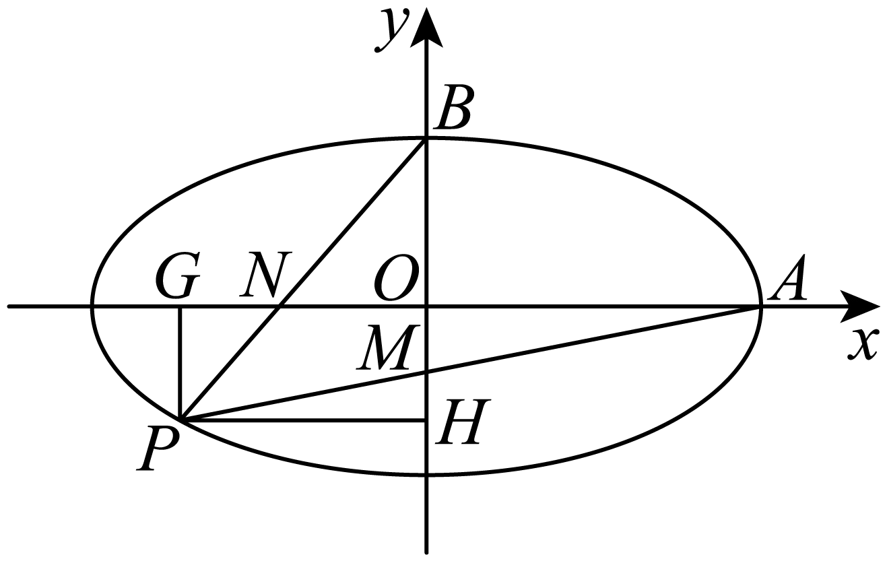

<strong>例20．</strong>（2024·吉林松原·高三前郭尔罗斯县第五中学校考期末）已知椭圆<em>C</em>的右焦点与抛物线<em>E</em>：的焦点<em>F</em>重合，且椭圆<em>C</em>的离心率为．

(1)求椭圆*C*的标准方程．

(2)过点*F*的直线*l*交椭圆*C*于*M*，*N*两点，交抛物线*E*于*P*，*Q*两点，是否存在实数，使得为定值？若存在，求出这个定值和*λ*的值；若不存在，说明理由．

【解析】（1）抛物线*E*：的焦点*，* 设椭圆标准方程为，由右焦点得椭圆*C*的半焦距，

又椭圆*C*的离心率  ，所以，，

所以椭圆*C*的标准方程.

（2）如图所示：

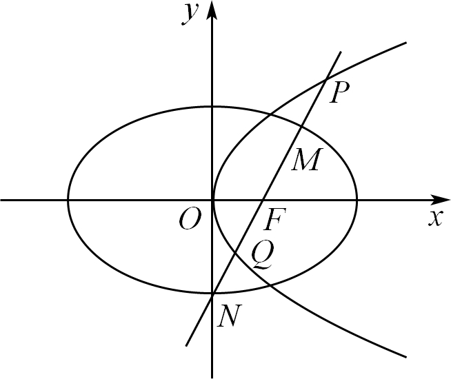

当过点*F*的直线*l*的斜率为0时，其与抛物线E只有一个交点，不符合题意，∴直线*l*的斜率不为0，

设直线，，联立方程组，

消去*x*，得，

所以 ，  ，

所以

.

联立方程组，消去*x*，得，

设，则，，

所以，

所以 ，

令 ，得 .

当时， ，

即存在.使 为定值.

<strong>变式36．</strong>（2024·河南·校联考模拟预测）已知抛物线<em>E</em>：的焦点关于其准线的对称点为，椭圆<em>C</em>：的左，右焦点分别是，，且与<em>E</em>有一个共同的焦点，线段的中点是<em>C</em>的左顶点．过点的直线<em>l</em>交<em>C</em>于<em>A</em>，<em>B</em>两点，且线段<em>AB</em>的垂直平分线交<em>x</em>轴于点<em>M</em>．

(1)求*C*的方程；

(2)证明：．

【解析】（1）抛物线*E*的焦点关于其准线的对称点为，

所以，即．

因为椭圆*C*与抛物线*E*有一个共同的焦点，所以，，

所以线段的中点为，所以，．

故*C*的方程为．

（2）由题意知，直线*l*的斜率存在，设为*k*．

当时，点*A*，*B*恰为椭圆*C*的左、右顶点，*y*轴为线段*AB*的垂直平分线，

，，，则．

当时，直线*l*的方程为，设，，线段*AB*的中点为，．

联立，消去*y*，得，

则，，

所以，

则．

由题意知，线段*AB*的垂直平分线的方程为，

令，得，

则．

又，

所以．

综上，．

**变式37．**（2024·天津红桥·统考一模）设椭圆的左、右焦点分别为，离心率，长轴为4，且过椭圆右焦点的直线与椭圆交于两点．

(1)求椭圆*C*的标准方程；

(2)若，其中为坐标原点，求直线的斜率；

(3)若是椭圆经过原点的弦，且，判断是否为定值？若是定值，请求出，若不是定值，请说明理由．

【解析】（1）由离心率，长轴为4，得， ，

所以，

故椭圆*C*的标准方程为：．

（2）由（1）得椭圆的右焦点的坐标为，

设直线的方程为：，直线与椭圆交于两点，，

由得，，

则，，

所以，

因为，

所以，即，

解得，

故直线的斜率为．

（3）是定值，理由如下，

由（2）得：直线的方程为：，直线与椭圆交于两点，，

，，

则

，

由是椭圆经过原点的弦，设，，直线的斜率为，

则，

由得，，且，

得，

所以，为定值．

**变式38．**（2024·全国·高三专题练习）如图，在平面直角坐标系中，已知直线与椭圆交于两点（在轴上方），且，设点在轴上的射影为点，的面积为，抛物线的焦点与椭圆的焦点重合，斜率为的直线过抛物线的焦点与椭圆交于两，点，与抛物线交于两点.

(1)求椭圆及抛物线的标准方程；

(2)是否存在常数，使为常数？若存在，求的值；若不存在，说明理由.

【解析】（1）由题意可设，可得，

所以，所以，，

所以，所以，

点*P*坐标代入椭圆方程得，所以椭圆*C*方程为，

所以，即，所以抛物线*E*方程为.

（2）设.

直线*l*的方程为，与椭圆*C*的方程联立得，

则恒成立，所以

则.

直线*l*的方程为，与抛物线*E*的方程联立得.

.

.

要使为常数，则，得.

故存在，使为常数.

<strong>变式39．</strong>（2024·河南·校联考模拟预测）已知双曲线的左、右焦点分别为，.过的直线<em>l</em>交<em>C</em>的右支于<em>M</em>，<em>N</em>两点，当<em>l</em>垂直于<em>x</em>轴时，<em>M</em>，<em>N</em>到<em>C</em>的一条渐近线的距离之和为.

(1)求*C*的方程；

(2)证明：为定值.

【解析】（1）根据题意有，*C*的一条渐近线方程为，

将代入*C*的方程有，，

所以*M*，*N*到直线的距离之和为，

所以，*C*的方程为.

（2）

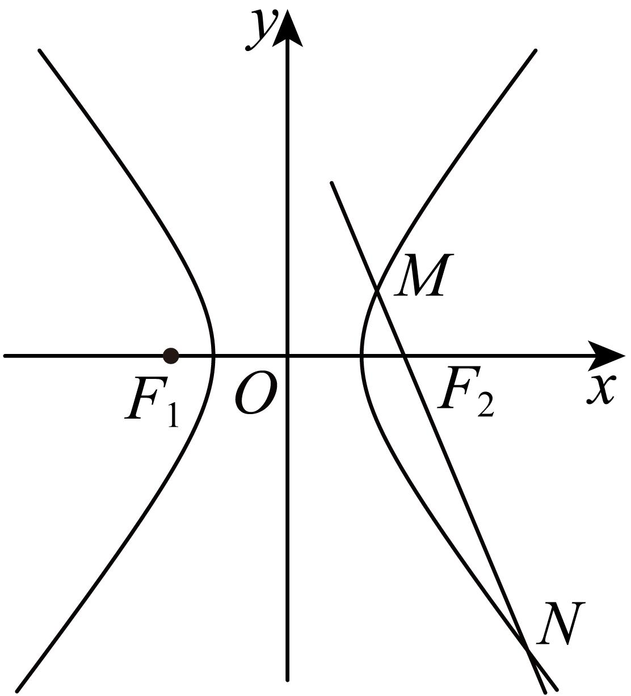

<strong>方法1：</strong>当<em>l</em>垂直于<em>x</em>轴时，由（1）可知，，

且由双曲的定义可知，故.

当*l*不垂直于*x*轴时，由双曲线的定义可知，，

故.

设，代入*C*的方程有：，

设，，则，，

所以，

所以.

综上，的值为6.

<strong>方法2：</strong>当<em>l</em>垂直于<em>x</em>轴时，由（1）可知，，

且由双曲的定义可知，

故.

当*l*不垂直于*x*轴时，设，

代入*C*的方程有：.

设，，则，，

所以.

综上，的值为6.

**变式40．**（2024·安徽淮北·统考二模）已知抛物线的焦点和椭圆的右焦点重合，过点任意作直线分别交抛物线于，交椭圆于.当垂直于轴时，.

(1)求和的方程；

(2)是否存在常数，使为定值？若存在，求出的值；若不存在，请说明理由.

【解析】（1）由已知可得，的方程为，

代入抛物线方程可得，，解得，所以.

由题意知，得，

所以，抛物线方程是.

所以直线的方程为，焦点，所以.

将直线的方程代入椭圆方程可得，，解得，

所以.

由已知可得，，解得，

所以，椭圆的方程为.

（2）

假设存在常数，使为定值.

设直线的方程为：，设，，

联立方程，消化简得.

则恒成立，且，

所以.

设，，

联立方程，消化简得.

则恒成立，且，

所以，.

所以，.

因为为定值，

所以有，所以.

所以，假设成立.

所以，存在常数，使为定值.

**变式41．**（2024·全国·高三专题练习）已知椭圆的左右焦点分别为，连接椭圆的四个顶点所成的四边形的周长为.

(1)求椭圆的方程和离心率；

(2)已知过点的直线与椭圆交于两点，过点且与直线垂直的直线与椭圆交于两点，求的值.

【解析】（1）根据题意，

所以，

椭圆顶点围成的四边形周长为：，

所以，

又因为，

所以，，

故椭圆方程为：，

椭圆离心率为.

（2）①当直线*PQ*斜率不存在时，

*|PQ|*，|*MN|*，

此时.

②当直线*PQ*斜率为0时，

*|PQ|*，|*MN|*，

此时.

③当直线*PQ*斜率存在且不为0时，设直线*PQ*:，直线*MN：*

联立

所以

所以，

所以，

*PQ*

同理可得，.

此时.

综上所述，的值为.

<strong>变式42．</strong>（2024·北京顺义·高三北京市顺义区第一中学校考期中）已知椭圆<em>C</em>：的长轴长为4，且离心率为<strong>.</strong>

(1)求椭圆*C*的方程；

(2)设过点且斜率为*k*的直线*l*与椭圆*C*交于*A*，*B*两点，线段*AB*的垂直平分线交*x*轴于点*D*.求证：为定值.

【解析】（1）由题设可得，

设椭圆的半焦距为，则，故，故，

故椭圆的方程为：.

（2）当时，，此时，而，故，故.

当时，直线的方程为，，

由可得，

此时，

，，

且.

的中垂线的方程为：，

令，则，故，

故.

<strong>变式43．</strong>（2024·天津河北·高三统考期末）已知椭圆点，且离心率，<em>F</em>为椭圆<em>C</em>的左焦点.

(1)求椭圆*C*的方程；

(2)设点，过点*F*的直线*l*交椭圆*C*于*P*，*Q*两点，，连接*OT*与*PQ*交于点*H*.

①若，求；

②求的值.

【解析】（1）由题意可得，解得,

椭圆*C*的方程为.

（2）①当时，即，直线的斜率为，

∴直线的斜率为，则直线的方程，

联立方程，消去得：，解得，

∴.

②∵，则直线的斜率为，

当时，则直线*l*与*x*轴垂直，点*H*即为点*F*，则；

当时，则直线的斜率为，则直线的方程，

联立方程，消去得：，显然，

设，则，

∴线段的中点的横坐标为，

∵直线的方程为，联立方程，解得，

即点*H*为线段的中点，则；

综上所述：.

<strong>变式44．</strong>（2024·全国·高三专题练习）已知椭圆<em>E</em>：．焦距为2<em>c</em>，，左、右焦点分别为，．在椭圆<em>E</em>上任取一点，的周长为．

(1)求椭圆*E*的标准方程；

(2)设点关于原点的对称点为*Q*．过右焦点作与直线*PQ*垂直的直线交椭圆*E*于*A*，*B*两点，求的取值范围；

(3)若过点的直线与椭圆*E*交于*C*，*D*两点，求的值．

【解析】（1）焦距为2*c*，，可得，

又的周长为，所以，即，

所以可得

所以椭圆的方程为：；

（2）设,

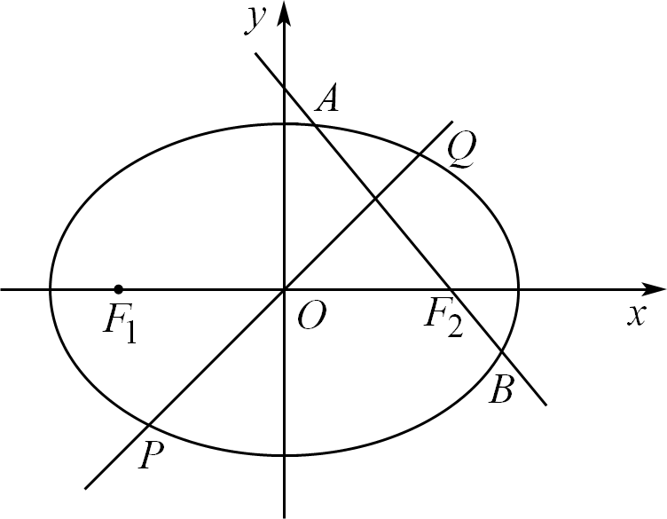

当直线的斜率为0时,得:,,

当直线的斜率不为0时,设直线,

直线,

联立直线和椭圆的方程，并消去整理得:

,

由韦达定理得:

,

联立直线和椭圆的方程,并消去整理得:

由韦达定理得:

所以.

令,则

，，所以，所以当即时，取得最小值，，

综上,的取值范围为.

（3）

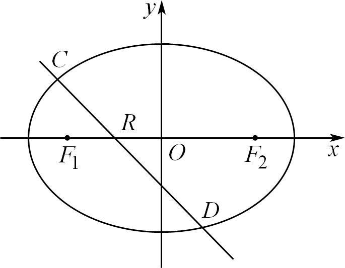

因为与椭圆*E*交于*C*，*D*两点，而在直线上，

设直线*CD*的参数方程为，代入椭圆中可得，

设*C*，*D*的参数分别为，，

所以，

所以;

所以的值为．

<strong>变式45．</strong>（2024·全国·高三专题练习）已知椭圆的长轴是短轴的2倍，且右焦点为，点<em>B</em>在椭圆上，且点<em>C</em>为点<em>B</em>关于<em>x</em>轴的对称点．

(1)求椭圆*C*的标准方程；

(2)若点*B*在第一象限且为等边三角形，求该等边三角形的边长；

(3)设*P*为椭圆*E*上异于*B*，*C*的任意一点，直线与*x*轴分别交于点*M*，*N*，判断是否为定值？若是，求出定值；若不是，说明理由.

【解析】（1）长轴是短轴的2倍，且右焦点为,

所以，

因为，

所以，解得：，

故，

椭圆的标准方程为：；

（2）若点*B*在第一象限且为等边三角形，

设，，

则，

又，故，

该等边三角形的边长为；

（3）是定值4，理由如下：

因为*P*为椭圆*E*上异于*B*，*C*的任意一点，

所以直线的斜率存在，

设，，则，，，

则，

则直线，

令得：，则，

直线，

令得：，则，

所以

因为，

所以，

故，

故是定值，为4.

<strong>变式46．</strong>（2024·全国·高三专题练习）已知双曲线<em>C</em>以为渐近线，其上焦点<em>F</em>坐标为.

(1)求双曲线*C*的方程；

(2)不平行于坐标轴的直线*l*过*F*与双曲线*C*交于两点，的中垂线交*y*轴于点*T*，问是否为定值，若是，请求出定值，若不是，请说明理由.

【解析】（1）因为双曲线*C*以为渐近线，

设双曲线方程为，即,

∵，∴，即：，

∴，∴，即.,

所以双曲线*C*的方程为：.

（2）由题意可知直线*l*一定有斜率存在，设直线*l*：，，，

，

化简得：，，

此方程的两根为，则，

∴

.，

中点*M*坐标为，即，

∴*PQ*中垂线方程为：，

令，∴，∴，

则，

∴，即为定值，定值为.

**变式47．**（2024·全国·高三专题练习）已知椭圆长轴的顶点与双曲线实轴的顶点相同，且的右焦点到的渐近线的距离为．

(1)求与的方程；

(2)若直线的倾斜角是直线的倾斜角的倍，且经过点，与交于、两点，与交于、两点，求．

【解析】（1）由题意可得，则．

因为的渐近线方程为，即，

椭圆的右焦点为，由题意可得，，解得，

故椭圆的方程为，双曲线的方程为．

（2）设直线的倾斜角为，

所以，直线的斜率为，

所以直线的方程为，

联立得，则，

设、，则，，

所以,

联立可得，，

设点、，则，，

所以，，故．

<strong>变式48．</strong>（2024·山东青岛·高三统考期末）已知椭圆的左，右顶点分别为，上，下顶点分别为，四边形的内切圆的面积为，其离心率；抛物线的焦点与椭圆的右焦点重合.斜率为<em>k</em>的直线<em>l</em>过抛物线的焦点且与椭圆交于<em>A</em>，<em>B</em>两点，与抛物线交于<em>C</em>，<em>D</em>两点.

(1)求椭圆及抛物线的方程；

(2)是否存在常数，使得为一个与*k*无关的常数？若存在，求出的值；若不存在，请说明理由.

【解析】（1）由椭圆可知：，

所以直线的方程为：，即，

因为四边形的内切圆的面积为，所以原点*O*到直线的距离为，

即①，因为离心率，所以②，又③，

由①②③可得：，所以椭圆的方程为：，

因为抛物线的焦点与椭圆的右焦点重合，

所以，所以，从而抛物线的方程为：.

（2）由（1）知：抛物线焦点为．由题意，设直线*l*：，

设，，，，

由可得：，

所以，

所以

，

由可得：，所以，

因为直线*l*过抛物线的焦点，所以，

所以，

设，则，

由可得：.

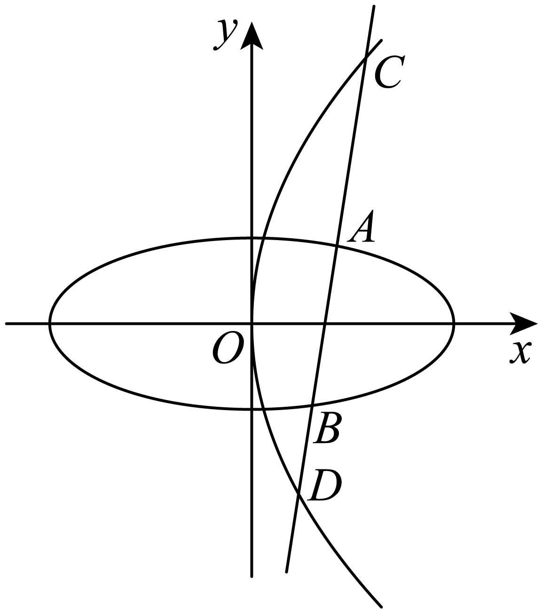

**变式49．**（2024·辽宁·新民市第一高级中学校联考一模）如图，，，，是抛物线：上的四个点（，在轴上方，，在轴下方），已知直线与的斜率分别为和2，且直线与相交于点．

(1)若点的横坐标为6，则当的面积取得最大值时，求点的坐标．

(2)试问是否为定值？若是，求出该定值；若不是，请说明理由．

【解析】（1）由题可知，点的坐标为，直线的方程为，

则的长度为定值．

将直线平移到与抛物线相切，切点为，此时的面积取得最大值．

设切线的方程为，联立方程组

消去整理得．

，解得，

将代入，

解得，，故点的坐标为．

（2）设，则直线的方程为，

联立方程组消去整理得，

则，．

同理可得，，．

，，

，，

所以．

故是定值，且该定值为2

