**第71讲  面积问题**

**知识梳理**

1**、三角形的面积处理方法**

（1）底·高（通常选弦长做底，点到直线的距离为高）

（2）水平宽·铅锤高或

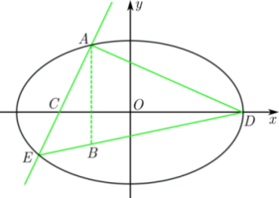

（3）在平面直角坐标系中，已知的顶点分别为，，，三角形的面积为．

2**、三角形面积比处理方法**

**（** 1**）对顶角模型**

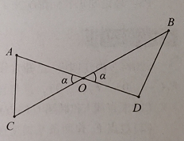

**（** 2**）等角、共角模型**

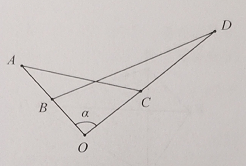

3**、四边形面积处理方法**

**（** 1**）对角线垂直**

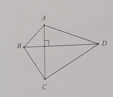

**（** 2**）一般四边形**

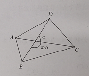

**（** 3**）分割两个三角形**

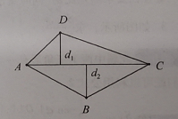

4**、面积的最值问题或者取值范围问题**

一般都是利用面积公式表示面积，然后将面积转化为某个变量的一个函数，再求解函数的最值（一般处理方法有换元，基本不等式，建立函数模型，利用二次函数、三角函数的有界性求最值或利用导数法求最值，构造函数求导等等），在算面积的过程中，优先选择长度为定值的线段参与运算，灵活使用割补法计算面积，尽可能降低计算量．

**必考题型全归纳**

**题型一：三角形的面积问题之**底·高

**例1．**（2024·福建漳州·高三统考开学考试）已知椭圆的左焦点为，且过点.

(1)求*C*的方程；

(2)不过原点*O*的直线与*C*交于*P*，*Q*两点，且直线*OP*，*PQ*，*OQ*的斜率成等比数列.

（i）求的斜率；

（ii）求的面积的取值范围.

【解析】（1）由题知，

椭圆*C*的右焦点为，且过点，

所以，所以.

又，所以，

所以*C*的方程为.

（2）（ⅰ）由题知，直线*l*的斜率存在，且不为0.

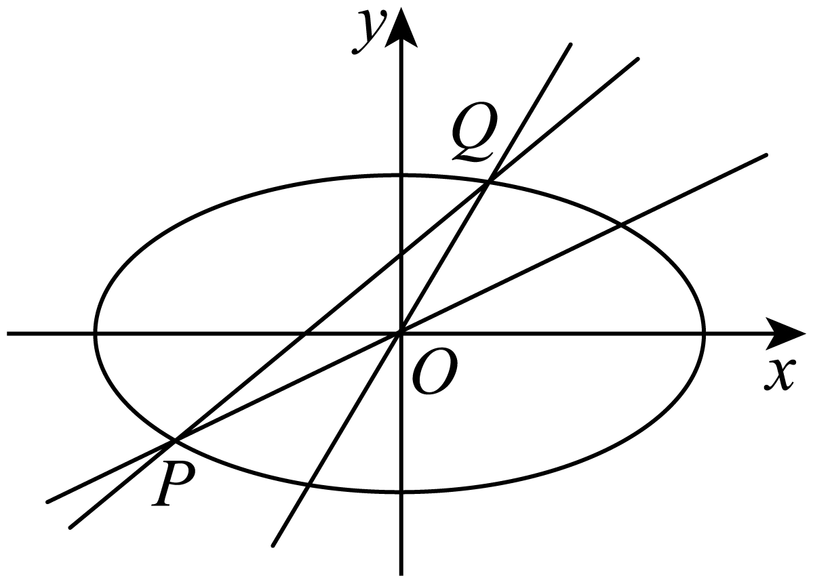

设，，，

则，所以，

所以，，

且，即.

因为直线*OP*，*PQ*，*OQ*的斜率成等比数列.

所以，即，

所以，且.

因为，所以，所以.

（ii）由（ⅰ）知，，

所以，且.

设点*O*到直线*PQ*的距离为*d*，所以.

因为，所以，，

所以

，

又，且.所以

即的面积的取值范围.

**例2．**（2024·湖南常德·高三常德市一中校考阶段练习）在平面直角坐标系中，已知点，点在直线 上运动，过点与垂直的直线和的中垂线相交于点.

(1)求动点的轨迹的方程；

(2)设点是轨迹上的动点，点在轴上，圆内切于，求的面积的最小值.

【解析】（1）设点为轨迹上任意一点 ，由题意知，，

所以动点的轨迹是以为焦点 ，以 为准线的抛物线 ，

设其方程 为，所以，即，故抛物线方程为，

所以动点的轨迹的方程为.

（2）设 ， ，，且，

所以直线的方程为 ．

圆的圆心为 ，半径为  ，

因为圆内切于△*PRN* ，所以直线与圆相切，

则圆心到直线的距离为 ，即，

则  ①，

因为，所以化简①得，  ②，

圆内切于△*PRN* ，所以直线与圆相切，

同理可得   ③，

由②③可知， 为方程的两根，所以，

又，，，

所以 ，

故的面积为，

等号当且仅当，即等号成立，

此时点的坐标为 )或.

故当的坐标为或时，的面积取最小值.

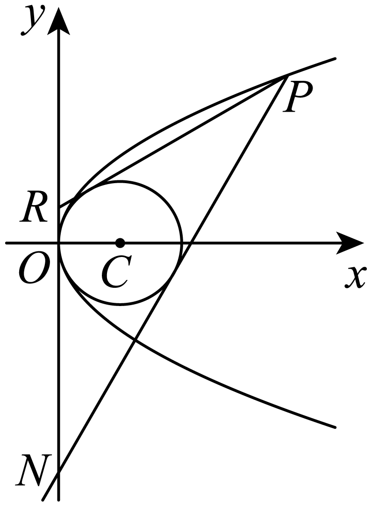

<strong>例3．</strong>（2024·浙江·模拟预测）我国著名数学家华罗庚曾说：“数缺形时少直观，形少数时难入微，数形结合百般好，隔离分家万事休.”事实上，很多代数问题可以转化为几何问题加以解决，已知曲线<em>C</em>上任意一点满足.

(1)化简曲线的方程；

(2)已知圆（为坐标原点），直线经过点且与圆相切，过点*A*作直线的垂线，交于两点，求面积的最小值.

【解析】（1），由得．

所以曲线的方程是；

（2）设，直线方程是，则直线方程为，即,

直线与已知圆相切，所以，则，

由得，，

由题意（∵），

，，∴或，

，

又原点到直线的距离为，

∴，

由或得，设，

，当且仅当时等号成立，

，当且仅当时等号成立，

∴时，，

∴，即时，．

**变式1．**（2024·河北秦皇岛·校联考二模）已知双曲线实轴的一个端点是，虚轴的一个端点是，直线与双曲线的一条渐近线的交点为.

(1)求双曲线的方程；

(2)若直线与曲线有两个不同的交点是坐标原点，求的面积最小值.

【解析】（1）设点，点，则直线的方程为，

与渐近线联立，得，解之得，

即直线与双曲线的一条渐近线交点为，

又直线与双曲线的一条渐近线的交点为，

所以，即，因此双曲线方程为.

（2）

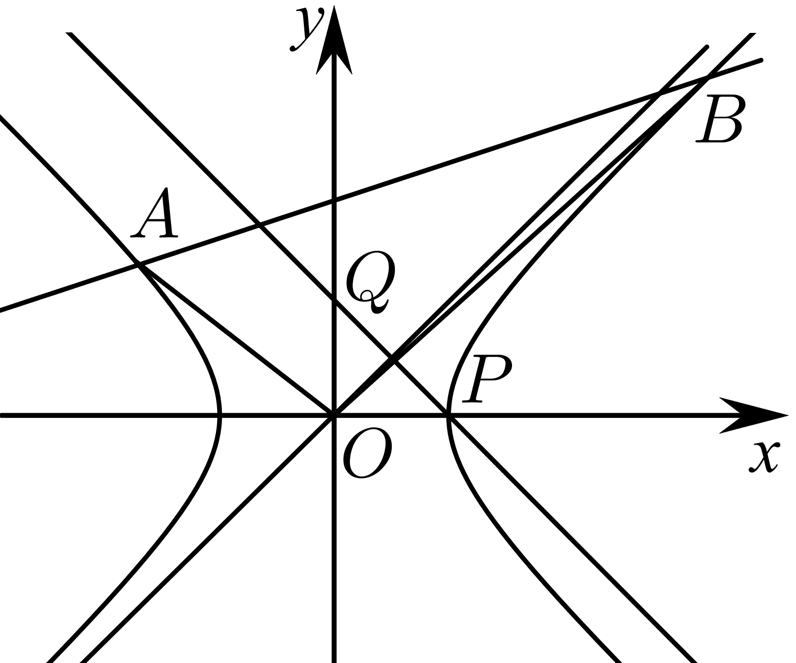

设，把代入，

得，

则 ，，

，

点到直线的距离，所以的面积为

，

令，所以，令，则，

因为，所以，由，得，由，

得，由，得，

即当时，等号成立，

此时满足，所以面积的最小值为.

**变式2．**（2024·四川成都·成都市锦江区嘉祥外国语高级中学校考三模）设椭圆过点，且左焦点为.

(1)求椭圆的方程；

(2)内接于椭圆，过点和点的直线与椭圆的另一个交点为点，与交于点，满足，求面积的最大值.

【解析】（1）令椭圆的半焦距为*c*，依题意，，解得，

所以椭圆的方程为.

（2）设点的坐标分别为，

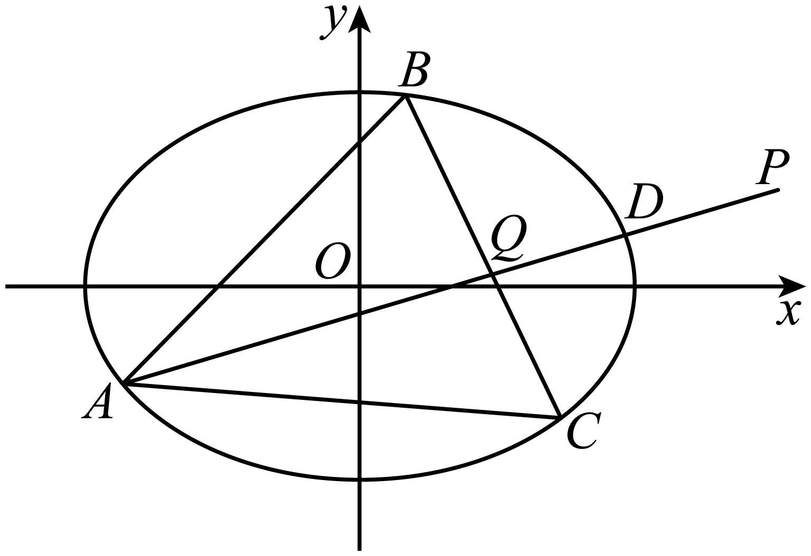

显然均不为零，依题意，令，有且，

又四点共线，从而，

即，，

于是，从而①，②，

又点在椭圆上，即③，④，

①+②并结合③，④得，即动点总在定直线上，因此直线方程为，

由消去*y*得，，

设，则，

于是，设，

则点到直线的距离，其中锐角由确定，

因此，当且仅当时取等号，

所以的面积最大值为.

**题型二：三角形的面积问题之分割法**

<strong>例4．</strong>（2024·全国·高三专题练习）设动点<em>M</em>与定点的距离和<em>M</em>到定直线<em>l</em>：的距离的比是．

(1)求动点*M*的轨迹方程，并说明轨迹的形状；

(2)当时，记动点*M*的轨迹为，动直线*m*与抛物线：相切，且与曲线交于点*A*，*B*．求面积的最大值．

【解析】（1）设，则，

化简得，，

当时，，轨迹为一条直线；

当时，，此时轨迹为焦点在轴上的椭圆；

当时，，此时轨迹为焦点在轴上的双曲线；

综上：当时，轨迹方程为，轨迹为一条直线，

当时，轨迹方程为，轨迹为焦点在轴上的椭圆；

当时，轨迹方程为，轨迹为焦点在轴上的双曲线；

（2）当时，，

当直线斜率不存在时，又与相切，故此时直线，此时三点共线，不合要求，舍去，

设直线，联立得，

由得，显然，

联立得，，

由，结合，解得，

设，

则，

设直线与轴交于点，则，

则

，

将代入得，

因为，令，则，

，

设，则设，则

，，

当时，，当时，，

故在上单调递增，在上单调递减，

故在处取得极大值，也是最大值，

故最大值为.

**例5．**（2024·四川成都·高三校联考阶段练习）已知椭圆的对称中心为坐标原点，对称轴为坐标轴，焦点在轴上，离心率，且过点．

(1)求椭圆的标准方程；

(2)若直线与椭圆交于两点，且直线的倾斜角互补，点，求三角形面积的最大值．

【解析】（1），

设椭圆的标准方程为，即，

过点，

椭圆的标准方程为；

（2）由题意可知直线的斜率存在，且不过点，

设直线的方程为，，

由消去整理得，

，，

，

，

，

，

将，代入整理得，

，

又因为，

解得：，

三角形的面积，

令，

导函数，

当，，

当，，

增区间为，减区间为，

当时，三角形的面积取得最大值，最大值为18．

**例6．**（2024·广东·高三校联考阶段练习）已知双曲线的离心率为2，右焦点到渐近线的距离为．

(1)求双曲线的标准方程；

(2)若点为双曲线右支上一动点，过点与双曲线相切的直线，直线与双曲线的渐近线分别交于*M*，*N*两点，求的面积的最小值．

【解析】（1）由已知得渐近线方程为，右焦点，

∴，

又∵，所以，解得，

又因为离心率，解得，，

∴双曲线的标准方程为；

（2）解法1：的渐近线方程为，

当直线的斜率不存在时，此时，直线方程为，代入渐近线方程，

得到，故，又，

故的面积；

当直线的斜率存在时，设其方程为，直线与双曲线联立得

，

因为相切，所以，解得，

另设，，

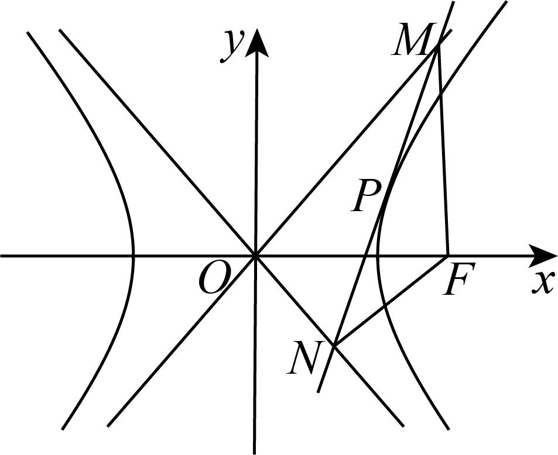

联立，

∴，，

，

，

在中，，，

∴，

所以，

所以，

因为，所以，

综上所述，，其最小值为；

解法2：由条件知，若直线的斜率存在，则斜率不为零，

故可设，直线与双曲线联立得，

，

因为相切，所以，即，

又因为直线与双曲线的渐近线交于两点，设为，，

联立，

由于，所以，

则,

由直线的方程得，直线与轴的交点坐标为，

∴

，

∵，

∴即，且，

∴时，的最小值为，

综上所述，，其最小值为.

**变式3．**（2024·广东广州·高三中山大学附属中学校考阶段练习）过椭圆的右焦点作两条相互垂直的弦，.，的中点分别为，.

(1)证明：直线过定点；

(2)若，的斜率均存在，求面积的最大值.

【解析】（1）由题可知.

若直线，有一条斜率不存在，则另一条斜率为0，其中点分别为直线与轴的交点、原点，过此两点的直线方程为.

若直线，的斜率存在，设直线的斜率为，则直线的斜率为，

由题，可设直线的方程为，直线的方程为.

联立，消元，整理得，

因为直线所过定点在椭圆内部，则该直线与椭圆必然有两交点，

设，，则，，

从而，，即；

用替换点坐标中得.

若，解得，此时，

当时，则，

则直线的方程为，

整理得，即直线过定点，

而直线的斜率不存在时也过定点，直线也满足过定点，

综上，直线过定点.

（2）因为，的斜率均存在，则，由（1）可得

令，则，当且仅当，即时取等号.

从而在上单调递增，

当，即时取得最小值.

所以，即当时，取得最大值为.

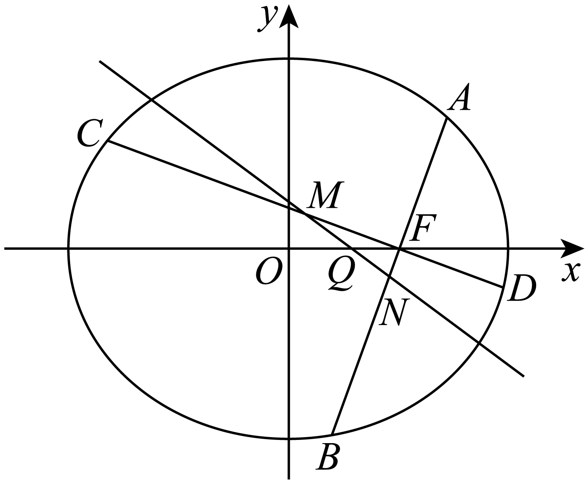

**题型三：三角形、四边形的面积问题之面积坐标化**

**例7．**（2024·全国·高三专题练习）如图，已知双曲线的左右焦点分别为、，若点为双曲线在第一象限上的一点，且满足，过点分别作双曲线两条渐近线的平行线、与渐近线的交点分别是和.

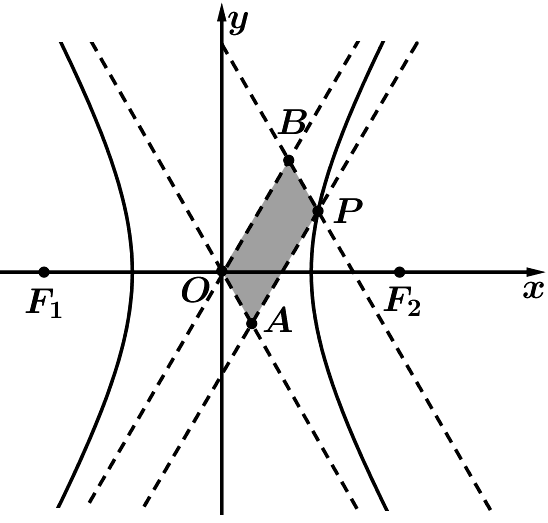

（1）求四边形的面积；

（2）若对于更一般的双曲线，点为双曲线上任意一点，过点分别作双曲线两条渐近线的平行线、与渐近线的交点分别是和.请问四边形的面积为定值吗？若是定值，求出该定值（用、表示该定值）；若不是定值，请说明理由.

【解析】（1）因为双曲线，由双曲线的定义可得，

又因为，，，

因为，所以，，轴，

点的横坐标为，所以，，，可得，即点，

过点且与渐近线平行的直线的方程为，

联立，解得，即点，

直线的方程为，点到直线的距离为，

且，因此，四边形的面积为；

（2）四边形的面积为定值，理由如下：

设点，双曲线的渐近线方程为，

则直线的方程为，

联立，解得，即点，

直线的方程为，即，

点到直线的距离为

，且，

因此，（定值）.

**例8．**（2024·浙江·高三竞赛）已知直线与椭圆：交于、两点，直线不经过原点.

（1）求面积的最大值；

（2）设为线段的中点，延长交椭圆于点，若四边形为平行四边形，求四边形的面积.

【解析】解法一  当直线的斜率不存在时，由对称性，设直线方程为，则，

，

当且仅当时取等号.

设直线：，，，联立方程，消去得：

，

判别式，则，于是

.

原点到的距离，所以

，

当且仅当时取等号.

（2）不妨设，根据垂径定理得：，则的方程为.

将的方程代入椭圆方程，消去得.注意、在直线的两侧，所以

，.

又点在直线上，所以，化简得：，则

.

解法二  （1）设，则，.

设原点到直线的距离为，则

.

（2）要四边形为平行四边形，则四边形为菱形，由（1）知

.

解法三 （1）设，，则

，

当且仅当，时取等号.

（2），则，

即，移项整理得，则，

故.

**例9．**（2024·全国·高三专题练习）分别是椭圆于的左、右焦点.

(1)若*Р*是该椭圆上的一个动点，求的取值范围；

(2)设是它的两个顶点，直线与*AB*相交于点*D*，与椭圆相交于*E*、*F*两点.求四边形*AEBF*面积的最大值.

【解析】(1)由题意可知，，

，，设，

，，

由椭圆的性质可知，

，

，故，即.

(2)设，，联立消去整理可得，

，，

，，

直线的方程为：，

根据点到直线的距离公式可知，点，到直线的距离分别为

，

，

，

，

四边形的面积为

，当且仅当即时，上式取等号，

所以的最大值为.

**变式4．**（2024·江苏苏州·模拟预测）如图，在平面直角坐标系中，已知抛物线的焦点为，过的直线交于，两点（其中点在第一象限），过点作的切线交轴于点，直线交于另一点，直线交轴于点.

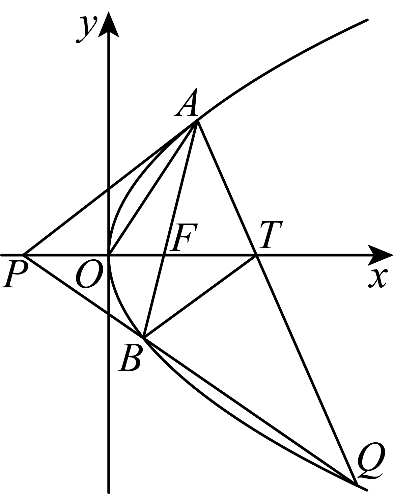

(1)求证：；

(2)记，，的面积分别为，，，当点的横坐标大于2时，求的最小值及此时点的坐标.

【解析】（1）设点，则.因为点在第一象限，

可设函数，则，所以，

所以直线方程为，令，则，即点.

设直线，与联立得，所以，同理.

因为，，所以，则，

设直线，与联立得，

又因为直线与抛物线交于两点，所以.

因为点，所以，代入抛物线，

又因为在第四象限，可知.

因为，，

所以，

即，原命题得证.

（2）由（1）知，所以，得，即.

所以，

另由（1）知，，，

所以，即；

，，

设函数，，

则.

当时，，单调递减；当时，，单调递增.

所以当时，取得最小值为，此时点的坐标为.

**变式5．**（2024·上海浦东新·高三上海市进才中学校考阶段练习）设椭圆：的一个顶点为，离心率为，为椭圆的右焦点．

(1)求椭圆的方程；

(2)设过且斜率为的直线与椭圆交于，两点，若满足，求的值；

(3)过点的直线与椭圆交于，两点，过点，分别作直线：的垂线（点，在直线的两侧）．垂足分别为，，记，，的面积分别为，，，试问：是否存在常数，使得，，总成等比数列？若存在，求出的值，若不存在，请说明理由．

【解析】（1）因为椭圆：的一个顶点为，离心率为，

所以有，，则，所以，

所以椭圆的方程为.

（2）因为为椭圆的右焦点，所以，

过且斜率为的直线与椭圆交于，两点，

所以设直线方程为，，，

则，则，

，，，

，，

因为满足，所以，

即，

即，

则有，

整理得，

解得（舍），.

（3）

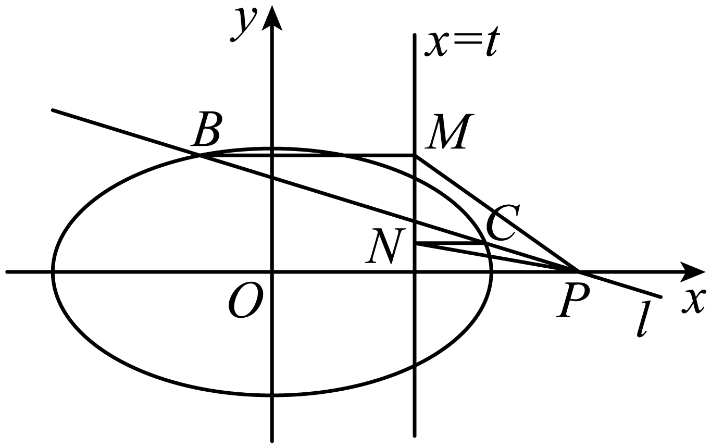

由已知得，*BC*的斜率存在，且*B*，*C*在*x*轴的同侧，

设直线*BC*的方程为，，，不妨设，

则，，

由得，

所以，，，

因为，，，

所以

，

，

要使，，总成等比数列，则应有解得，

所以存在，使得，，总成等比数列.

<strong>变式6．</strong>（2024·福建泉州·泉州七中校考模拟预测）已知圆，点，圆周上任一点<em>P</em>，若线段<em>PG</em>的垂直平分线和<em>CP</em>相交于点<em>Q</em>，点<em>Q</em>的轨迹为曲线.

(1)求曲线的方程；

(2)若过点的动直线与椭圆相交于两点，直线的方程为.过点作于点，过点作于点.记的面积分别为，，.问是否存在实数，使得成立？若存在，请求出的值；若不存在，请说明理由.

【解析】（1）圆的圆心，半径，

因为线段*PG*的垂直平分线和*CP*相交于点*Q*，所以，又，

所以，

所以点*Q*的轨迹是以，为焦点的椭圆，

这里，，所以，，则，

所以曲线的方程为.

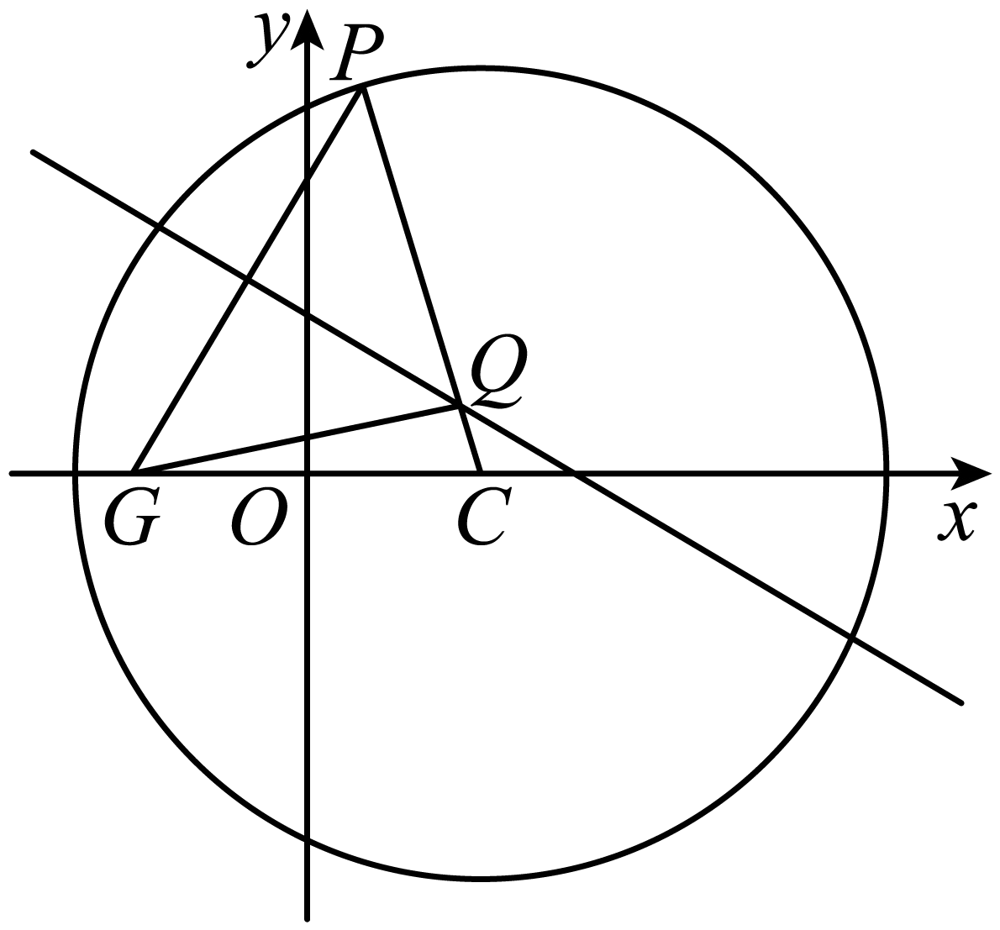

（2）设直线的方程为，

设，，则，，

联立，消去并整理得，

恒成立，

，，

所以

，

，

同理得，

所以

，

所以，所以，

所以，所以存在实数，使得成立.

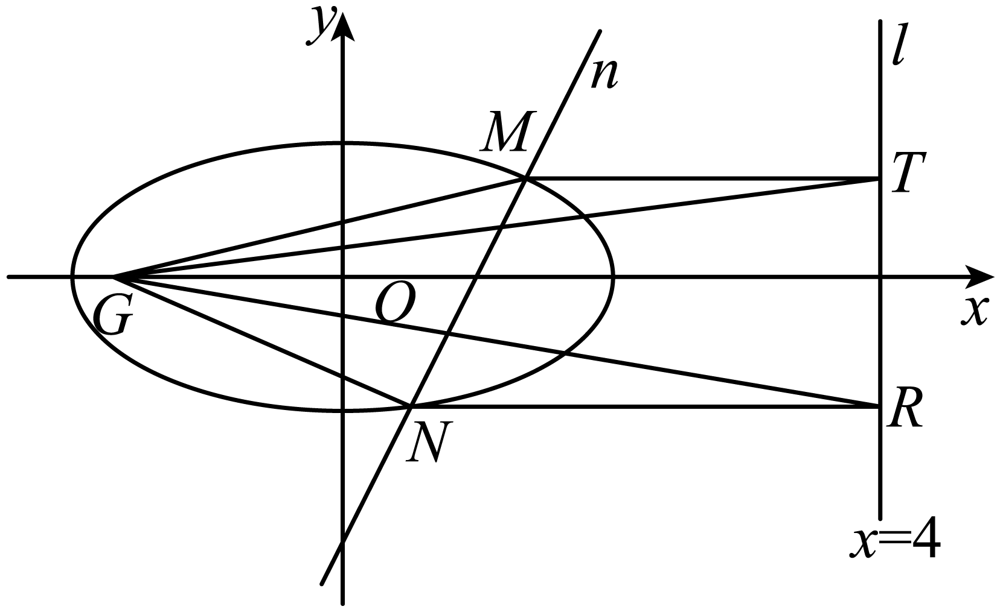

**变式7．**（2024·上海浦东新·高三上海市洋泾中学校考开学考试）设抛物线：的焦点为，经过轴正半轴上点的直线交于不同的两点和.

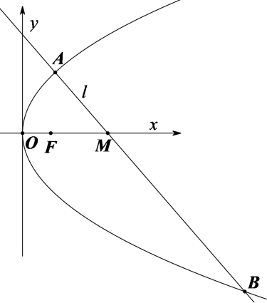

(1)若，求点的坐标；

(2)若，求证：原点总在以线段为直径的圆的内部；

(3)若，且直线，与有且只有一个公共点，问：的面积是否存在最小值？若存在，求出最小值，并求出点的坐标；若不存在，请说明理由.（三角形面积公式：在中，设，，则的面积为

【解析】（1）设，因为，又，得到，

将代入，得到，

所以点的坐标为或.

（2）设，直线，

由，消得到，由韦达定理知，，所以，

又，由，

故为钝角，原点总在以线段为直径的圆的内部.

（3）设，由，得到，

又，得到或，即或（舍），

故，所以直线的斜率，

由题可设的方程为，由，消得到，

由题知，，得到，代入，得到，所以，

设，则，，即，

所以，

故的面积为，

当且仅当时取等号，

由，得，所以最小值为2， 点的坐标为.

**变式8．**（2024·四川眉山·高三校考阶段练习）在中，已知点，，边上的中线长与边上的中线长之和为6；记的重心的轨迹为曲线.

(1)求的方程；

(2)若圆：，，过坐标原点且与轴不重合的任意直线与圆相交于点，，直线，与曲线的另一个交点分别是点，，求面积的最大值.

【解析】（1）设的中点为，的中点为，

所以，，

所以，

所以，

所以点的轨迹是以为焦点，长轴长，的椭圆.

所以，所以，，

所以曲线的方程为.

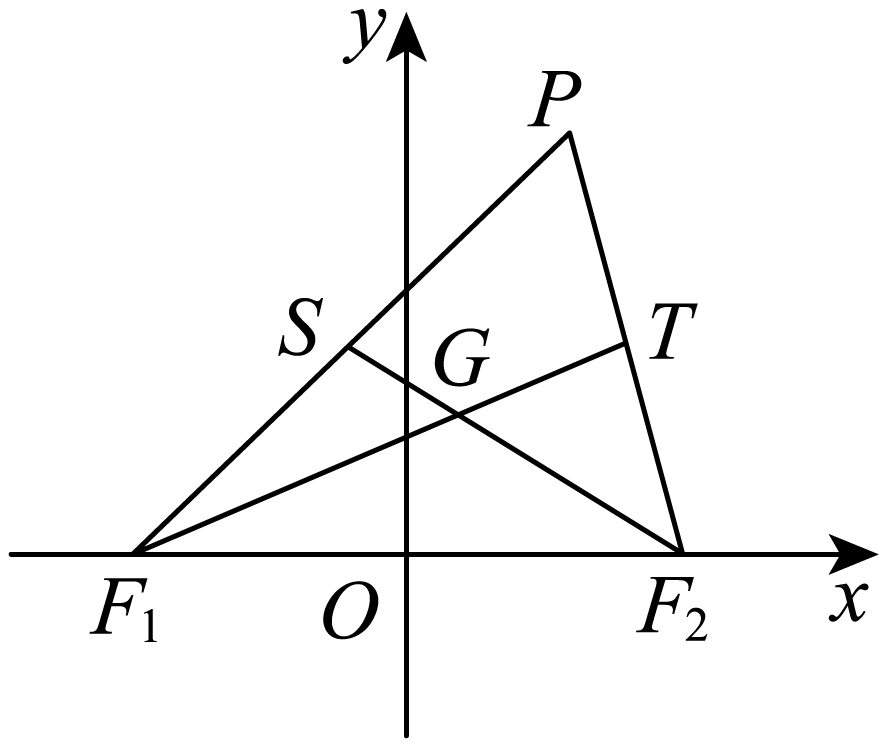

（2）设直线为（不妨设），设，，

所以，

，

，解得（舍去），则，

由于是单位圆的直径，所以，

所以直线的斜率为，直线的方程为，

同理可求得，则，

由上述分析可知，而，

所以

，

所以，

令，当且仅当时等号成立，

则，

函数在上单调递增，

所以当时，取得最小值为.

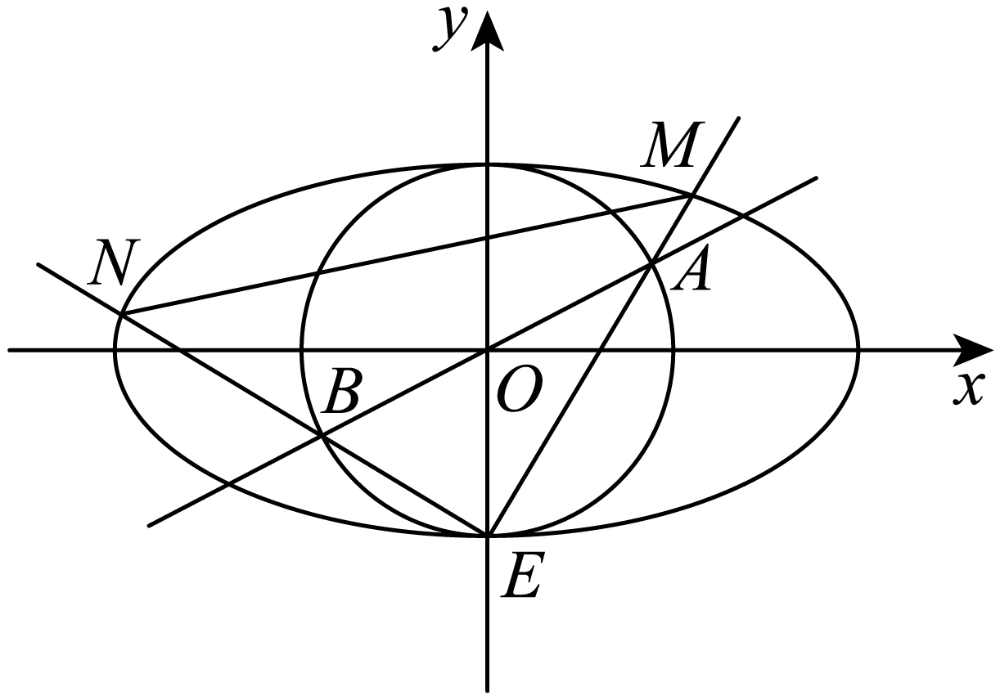

**题型四：三角形的面积比问题之共角、等角模型**

**例10．**（2024·河北·统考模拟预测）已知抛物线，过点的直线与交于两点，当直线与轴垂直时，（其中为坐标原点）.

(1)求的准线方程；

(2)若点在第一象限，直线的倾斜角为锐角，过点作的切线与轴交于点，连接交于另一点为，直线与轴交于点，求与面积之比的最大值.

【解析】（1）将代入，则，

由，故为等腰直角三角形，故，即，

所以，故准线方程为.

（2）设，直线，联立抛物线得，

所以，则，故，

由，则，故，直线，

令，则，故，

设直线，联立抛物线得，

所以，则，故，

综上，直线，令，则，故，

由直线的倾斜角为锐角，故，则，，

所以，令，则，

则，仅当，即时等号成立，

所以与面积之比的最大值.

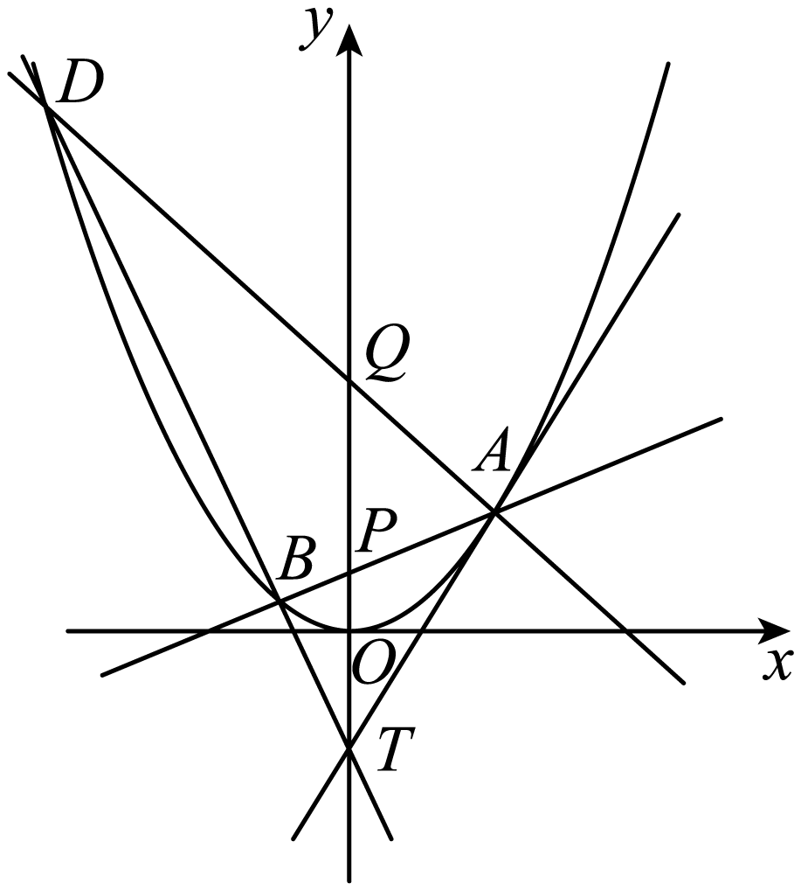

**例11．**（2024·北京东城·高三北京市第十一中学校考阶段练习）已知椭圆，且过两点．

(1)求椭圆*E*的方程和离心率*e*；

(2)若经过有两条直线，它们的斜率互为倒数，与椭圆*E*交于*A*，*B*两点，与椭圆*E*交于*C*，*D*两点，*P*，*Q*分别是*AB*，*CD*的中点试探究：与的面积之比是否为定值？

若是，请求出此定值；若不是，请说明理由．

【解析】（1）由题意可得，解得，

则的方程；

（2）

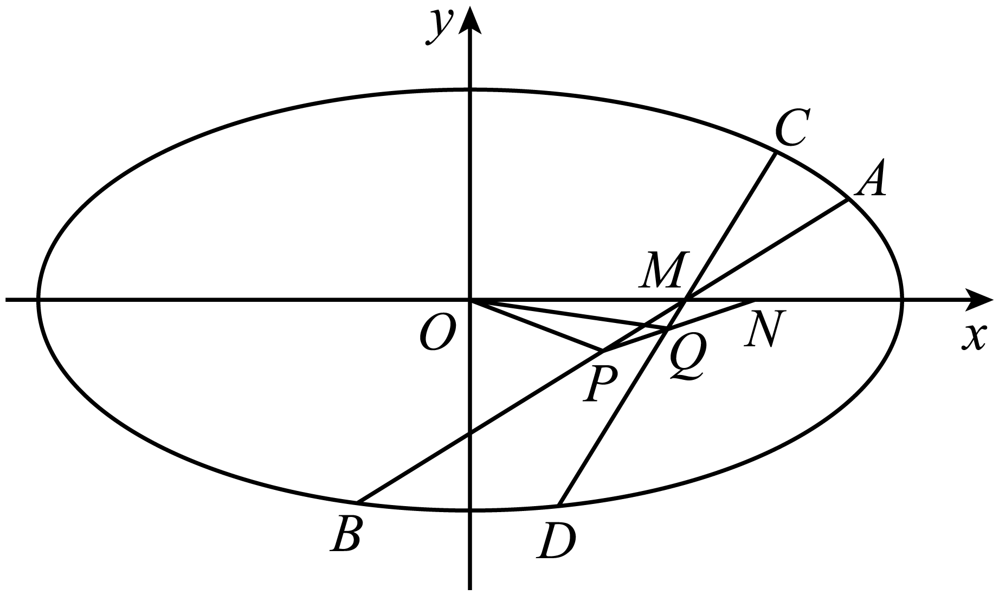

由已知可得直线的斜率存在，且不为，也不为，

设直线，（且），联立可得，

方程的判别式，

设，，，

则，.

所以，，

所以，

因为两直线斜率互为倒数，则，

用代换点坐标中的得.

所以，

所以直线即

所以恒过定点，

设点、到直线的距离分别是，，

则.

与的面积之比是定值，定值为4.

**例12．**（2024·江苏徐州·高三校考开学考试）设椭圆的左右顶点分别为，右焦点为，已知．

(1)求椭圆方程及其离心率；

(2)已知点是椭圆上一动点（不与端点重合），直线交轴于点，若三角形的面积是三角形面积的二倍，求直线的方程．

【解析】（1）如图，

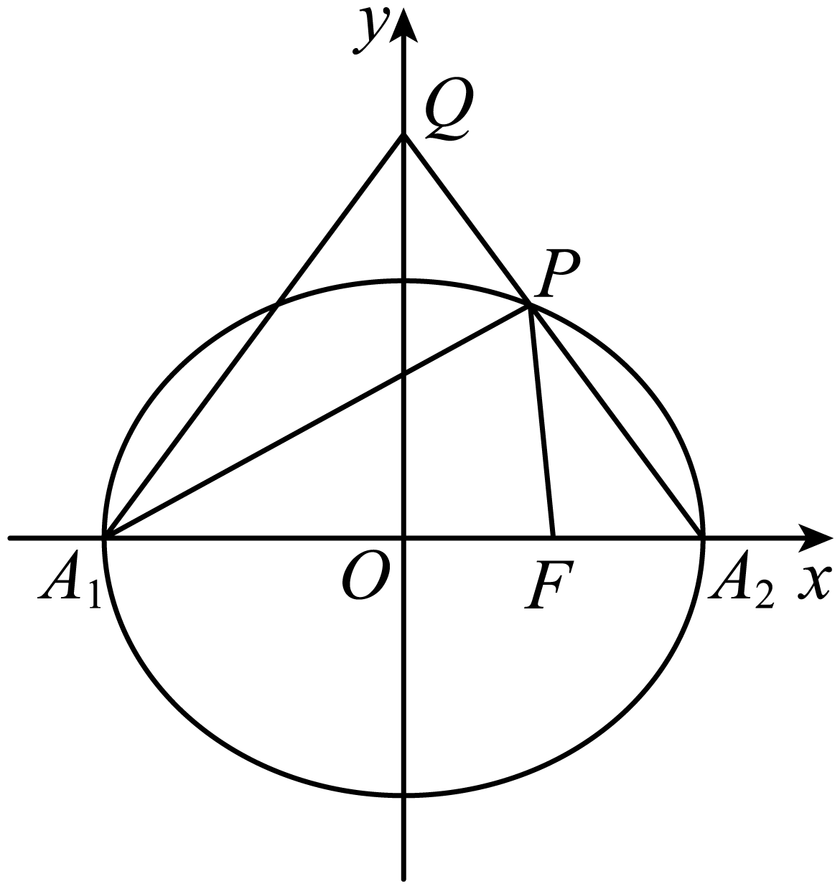

由题意得，解得，所以，

所以椭圆的方程为，离心率为.

（2）由题意得，直线斜率存在，由椭圆的方程为可得，

设直线的方程为，

联立方程组，消去整理得：，

由韦达定理得，所以，

所以，.

所以,,，

所以，

所以，即，

解得，所以直线的方程为.

**变式9．**（2024·广东深圳·深圳中学校考模拟预测）已知定点，关于原点对称的动点，到定直线的距离分别为，，且，记的轨迹为曲线.

(1)求曲线的方程，并说明曲线是什么曲线？

(2)已知点，是直线与曲线的两个交点，，在轴上的射影分别为，（，不同于原点），且直线与直线相交于点，求与面积的比值.

【解析】（1）设，.

由有，，

两边平方得，

化简得，

即曲线的方程为或.

曲线是以点，为焦点，长轴长为的椭圆与轴组成的曲线.

（2）设直线与椭圆相交于，两点，则，.

令，将代入并整理得，，，.

直线的方程为：.

设，则，

同理直线与直线相交于点，.

，其中.

从而，与重合.

因为，所以.

又，，则.

所以与面积的比值为1.

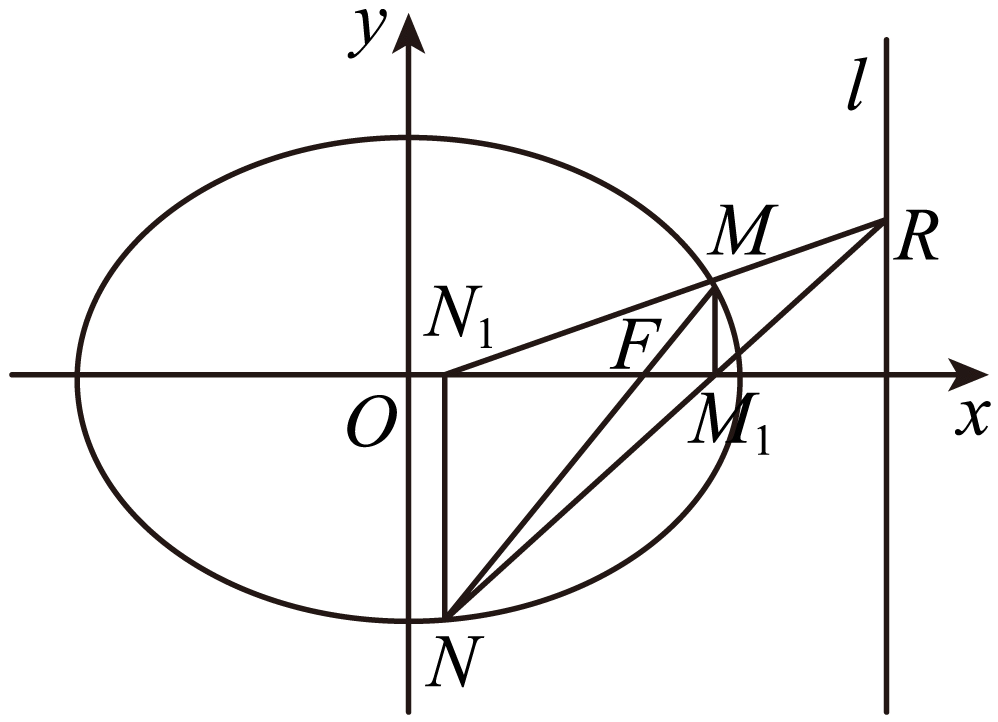

<strong>变式10．</strong>（2024·河北·高三校联考阶段练习）已知抛物线<em>C</em>：上一点到焦点<em>F</em>的距离为．

(1)求抛物线*C*的方程；

(2)过点*F*的直线与抛物线*C*交于两点，直线与圆*E*：的另一交点分别为为坐标原点，求与面积之比的最小值．

【解析】（1）依题意得，解得，所以抛物线方程为.

（2）抛物线的焦点为，直线与轴不重合，

设直线的方程为，

由消去并化简得，，

设，则，

所以，

所以.

，由，而，

故解得.同理可求得.

，

同理，

所以

，

故当时，取得最小值为.

**变式11．**（2024·陕西商洛·陕西省丹凤中学校考模拟预测）已知椭圆的左、右顶点分别为，长轴长为短轴长的2倍，点在上运动，且面积的最大值为8．

(1)求的方程；

(2)若直线经过点，交于两点，直线分别交直线于，两点，试问与的面积之比是否为定值？若是，求出该定值；若不是，说明理由．

【解析】（1）由题意得，即①．

当点为的上顶点或下顶点时，的面积取得最大值，

所以，即②．

联立①②，得．

故的方程为．

（2）

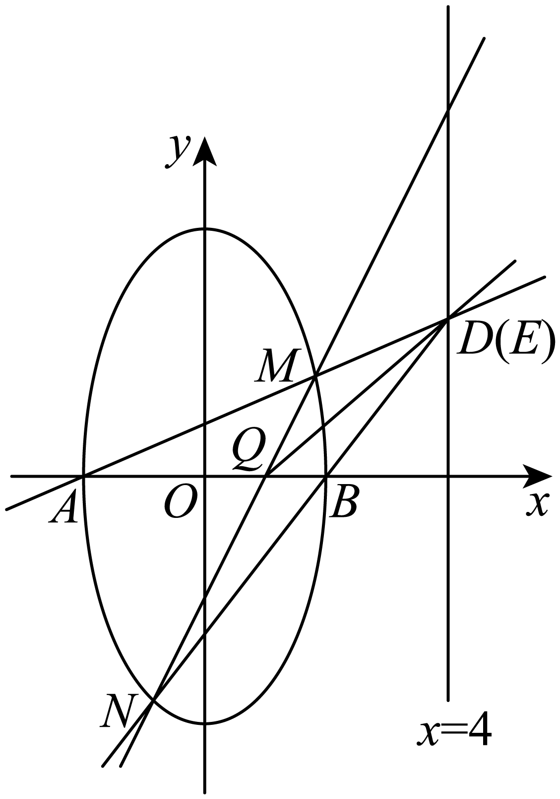

与的面积之比为定值．

由（1）可得，

由题意设直线．

联立得，

则，

，

所以．

直线的方程为，

令，得，即．

同理可得．

故与的面积之比为

，

即与的面积之比为定值．

**变式12．**（2024·福建厦门·厦门一中校考模拟预测）已知，分别是椭圆：的右顶点和上顶点，，直线的斜率为.

(1)求椭圆的方程；

(2)直线，与，轴分别交于点，，与椭圆相交于点，.

（i）求的面积与的面积之比；

（ⅱ）证明：为定值.

【解析】（1）∵、是椭圆，的两个顶点，且，

直线的斜率为，由，，得，

又，

解得，，

∴椭圆的方程为；

（2）

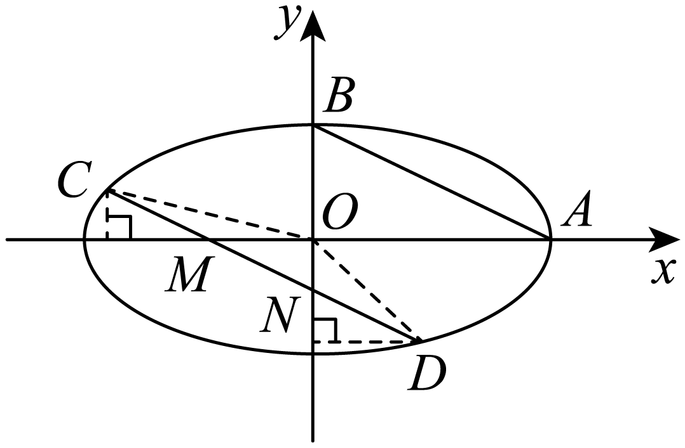

设直线的方程为，则，，

联立方程消去，

整理得，，得

设，，∴，.

（i），，

∴，

∴的面积与的面积之比为1；

（ii）证明：

综上，.

**题型五：三角形的面积比问题之对顶角模型**

**例13．**（2024·安徽黄山·屯溪一中校考模拟预测）已知椭圆的离心率为，且经过点．

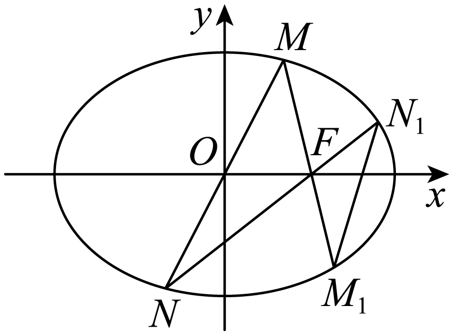

(1)求椭圆方程；

(2)直线与椭圆交于点为的右焦点，直线分别交于另一点、，记与的面积分别为，求的范围．

【解析】（1）由离心率为，且经过点可得，又，

解得，所以椭圆；

（2）设，则，，

令，，

可得，

代入，得，

又，得，

设，，

可得，

代入，得，

又，得，

∵，∴，

∵，，∴．

<strong>例14．</strong>（2024·全国·高三对口高考）在平面直角坐标系中，点<em>B</em>与点关于原点<em>O</em>对称，<em>P</em>是动点，且直线与的斜率之积等于．

(1)求动点*P*的轨迹方程；

(2)设直线和分别与直线交于点*M*，*N,* 问：是否存在点*P*使得与的面积相等？若存在，求出点*P*的坐标；若不存在，说明理由．

【解析】（1）因为点*B*与点关于原点*O*对称，所以点*B*的坐标为.

设点*P*的坐标为，则由直线与的斜率之积等于，得，

化简得，故动点*P*的轨迹方程为.

（2）若存在点*P*使得与的面积相等，

设点*P*的坐标为，则，

因为，所以，即.

作直线，作于*，* 于，则，

所以，同理，所以可得，

整理得，解得；

因为，所以.

故存在点*P*使得与的面积相等，此时点*P*的坐标为.

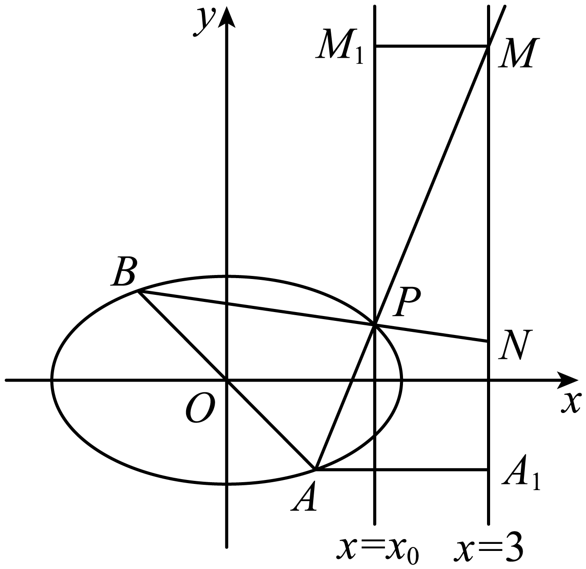

<strong>例15．</strong>（2024·重庆·高三重庆一中校考阶段练习）已知<em>O</em>为坐标原点，抛物线的方程为，<em>F</em>是抛物线的焦点，椭圆的方程为，过<em>F</em>的直线<em>l</em>与抛物线交于<em>M</em>，<em>N</em>两点，反向延长，分别与椭圆交于<em>P</em>，<em>Q</em>两点．

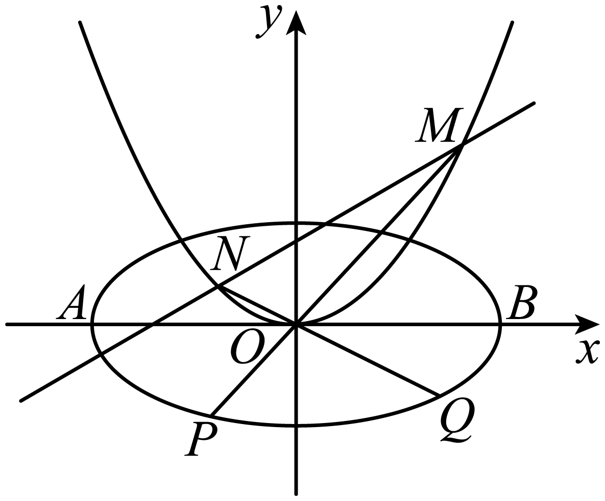

(1)求的值；

(2)若恒成立，求椭圆的方程；

(3)在（2）的条件下，若的最小值为1，求抛物线的方程（其中，分别是和的面积）．

【解析】（1）设直线*OM*的斜率为，直线*ON*的斜率为，

由题可知，直线*MN*的斜率不为0，设，

设直线，

则由，可得，

易知，且，

则；

（2）设，

由题可知，，其中，

联立方程，同理，

因为：

．

因为为定值，所以上式与无关，

所以当，即时，此时，所以，

所以椭圆的方程为．

（3）因为，

由（2）可知，当时，

，

故，当且仅当时，等号成立，

此时抛物线方程为.

<strong>变式13．</strong>（2024·四川·校联考一模）已知点在椭圆上，点在椭圆<em>C</em>内．设点以为的短轴的上、下端点，直线分别与椭圆<em>C</em>相交于点，且的斜率之积为．

(1)求椭圆*C*的方程；

(2)记，分别为，的面积，若，求的取值范围．

【解析】（1）设，依题意知，，

则，整理有：．

因为椭圆*C*过点，所以，所以椭圆的方程为．

（2）由椭圆，可得，，

可得，代入椭圆，整理得，

解得，则，所以，

又由，代入椭圆，整理有，

解得，则，所以，

所以，

，

于是

，

因为，所以，所以，

故的范围为．

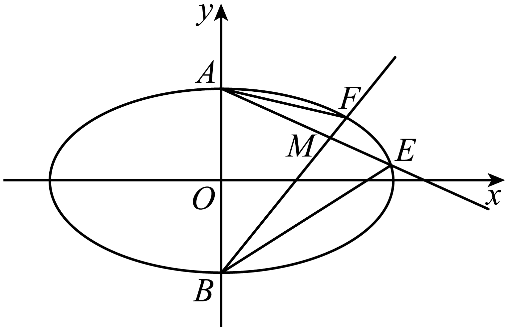

<strong>变式14．</strong>（2024·贵州贵阳·高三贵阳一中校考开学考试）已知点在椭圆<em>C</em>：上，点在椭圆<em>C</em>内.设点<em>A</em>，<em>B</em>为<em>C</em>的短轴的上、下端点，直线<em>AM</em>，<em>BM</em>分别与椭圆<em>C</em>相交于点<em>E</em>，<em>F</em>，且<em>EA</em>，<em>EB</em>的斜率之积为.

(1)求椭圆*C*的方程；

(2)记，分别为，的面积，若，求*m*的值.

【解析】（1）设，依题意，，

可得，整理可得，

又椭圆*C*过点，所以，故椭圆*C*的方程为；

（2）依题意，可知*AM*：，代入椭圆方程，

整理得，从而得到，

又*BM*：，代入椭圆方程，

整理得，从而得到，

所以，

，

则

,

由于，所以，解得.

**变式15．**（2024·四川南充·四川省南充高级中学校考三模）已知椭圆的左、右焦点为，离心率为.点是椭圆上不同于顶点的任意一点，射线分别与椭圆交于点，的周长为8.

(1)求椭圆的标准方程；

(2)设，，的面积分别为.求证：为定值.

【解析】（1）因为的周长为，即

所以，可得，

由椭圆的离心率，可得，从而，

所以椭圆的标准方程为．

（2）证明：设，则，

可设直线*PA*的方程为，其中，

联立方程，整理得，

则，

同理可得，．

因为，

所以

所以是定值．

**题型六：四边形的面积问题之对角线垂直模型**

<strong>例16．</strong>（2024·河南·襄城高中校联考三模）设双曲线的左、右焦点分别为，，且<em>E</em>的渐近线方程为．

(1)求*E*的方程；

(2)过作两条相互垂直的直线和，与*E*的右支分别交于*A*，*C*两点和*B*，*D*两点，求四边形*ABCD*面积的最小值．

【解析】（1）由题意，得的渐近线方程为，

因为双曲线的渐近线方程为，所以，即，

又因为，所以，则，

故的方程为．

（2）根据题意，直线，的斜率都存在且不为0，

设直线，，其中，

因为，均与的右支有两个交点，所以，，所以，

将的方程与联立，可得，

设，则，，

所以

，

用替换，可得，

所以．

令，所以，

则，

当，即时，等号成立，

故四边形面积的最小值为．

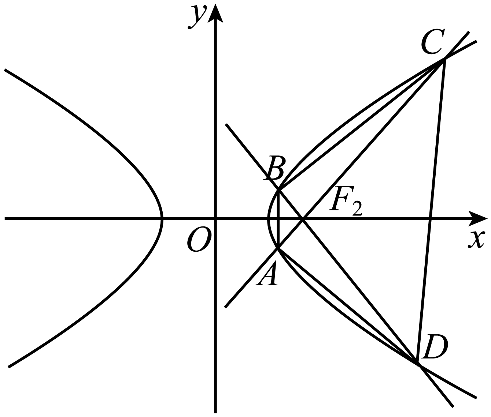

<strong>例17．</strong>（2024·山西朔州·高三校联考开学考试）已知椭圆<em>E</em>：的左、右焦点分别为，，<em>M</em>为椭圆<em>E</em>的上顶点，，点在椭圆<em>E</em>上.

(1)求椭圆*E*的标准方程；

(2)设经过焦点的两条互相垂直的直线分别与椭圆*E*相交于*A*，*B*两点和*C*，*D*两点，求四边形*ACBD*的面积的最小值.

【解析】（1）设，由，有.

又由，有（*O*为坐标原点），可得，，

可得椭圆*E*的方程为，

代入点*N*的坐标，有，解得，，

故椭圆*E*的标准方程为；

（2）①当直线*AB*的斜率不存在或为0时，为长轴长或，

不妨设，，

故；

②当直线*AB*的斜率存在且不为0时，设直线*AB*：，，，

联立方程，消去*y*得，

则，，

所以

，

同理可得，

所以，

因为，

当且仅当，即时等号成立，

所以，而，

综上：四边形*ACBD*的面积的最小值为.

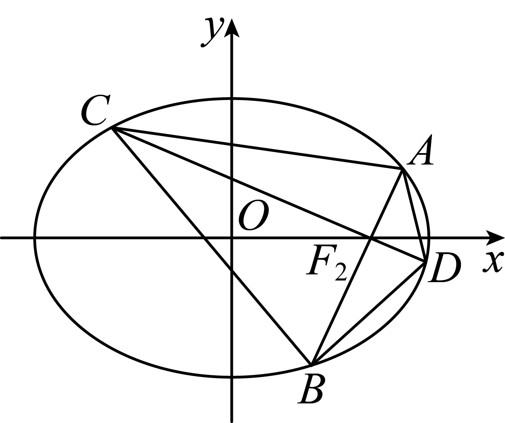

**例18．**（2024·江西·高三统考阶段练习）已知直线与抛物线交于两点，.

(1)求；

(2)设抛物线的焦点为，过点且与垂直的直线与抛物线交于，求四边形的面积.

【解析】（1）设，

由，可得，

易得，所以，

则，

即，因为，所以.

（2）由题意可得抛物线的焦点为，直线的方程为.

联立，化简可得，则，

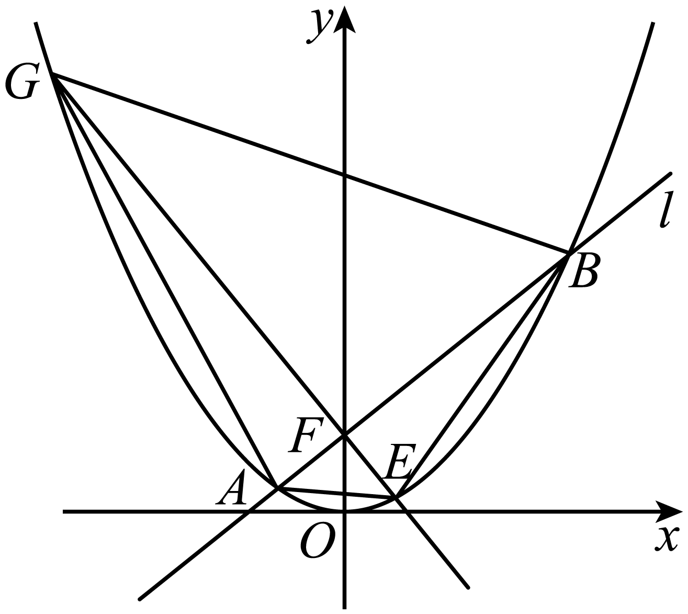

设，则，

则，

因为，所以.

**题型七：四边形的面积问题之一般四边形**

**例19．**（2024·湖南长沙·高三长沙一中校考阶段练习）已知椭圆过和两点.

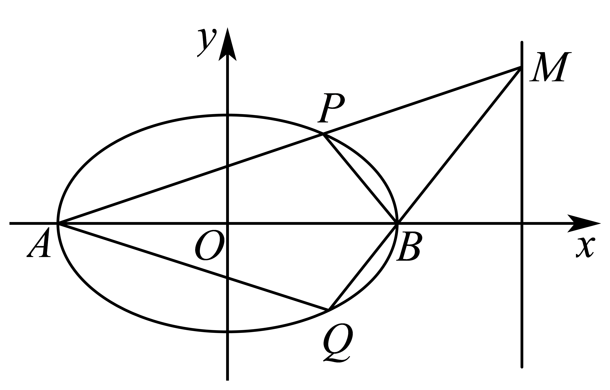

(1)求椭圆*C*的方程；

(2)如图所示，记椭圆的左、右顶点分别为*A*，*B*，当动点*M*在定直线上运动时，直线，分别交椭圆于两点*P*和*Q*.

（i）证明：点*B*在以为直径的圆内；

（ii）求四边形面积的最大值.

【解析】（1）依题意将和两点代入椭圆可得

，解得；

所以椭圆方程为

（2）（i）易知，由椭圆对称性可知，不妨设，；

根据题意可知直线斜率均存在，且；

所以直线的方程为，的方程为；

联立直线和椭圆方程，消去可得；

由韦达定理可得，解得，则；

联立直线和椭圆方程，消去可得；

由韦达定理可得，解得，则；

则，；

所以；

即可知为钝角，

所以点*B*在以为直径的圆内；

（ii）易知四边形的面积为，

设，则，当且仅当时等号成立；

由对勾函数性质可知在上单调递增，

所以，可得，

由对称性可知，即当点的坐标为或时，

四边形的面积最大，最大值为6.

<strong>例20．</strong>（2024·新疆伊犁·高三校考阶段练习）已知椭圆<em>C</em>：经过点，<em>O</em>为坐标原点，若直线<em>l</em>与椭圆<em>C</em>交于<em>A</em>，<em>B</em>两点，线段<em>AB</em>的中点为<em>M</em>，直线<em>l</em>与直线<em>OM</em>的斜率乘积为.

(1)求椭圆*C*的标准方程；

(2)若四边形*OAPB*为平行四边形，求四边形*OAPB*的面积.

【解析】（1）由题意可设：直线*l*，，则，

可得：直线*l*的斜率，直线*OM*的斜率，

因为*A*，*B*两点在椭圆*C*上，则，

两式相减得整理得，即，

所以，可得，

又因为点在椭圆*C*上，则，解得，

所以椭圆*C*的标准方程为.

（2）因为四边形*OAPB*为平行四边形，则*M*为的中点，可得，

则，可得直线*l*的斜率，

所以直线*l*的方程为，即，

可得点到直线*l*的距离，

由（1）可知：椭圆*C*的标准方程为，即，

联立方程，消去*y*得，

可得，且，

则，

所以四边形*OAPB*的面积.

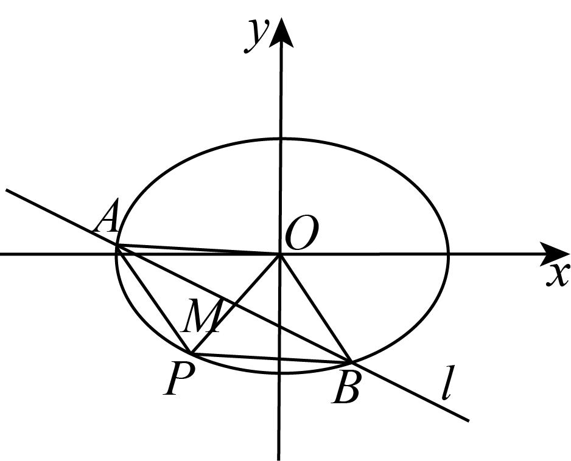

**例21．**（2024·上海黄浦·高三格致中学校考开学考试）定义：若椭圆上的两个点满足，则称为该椭圆的一个“共轭点对”，记作.已知椭圆的一个焦点坐标为，且椭圆过点.

(1)求椭圆的标准方程；

(2)求“共轭点对”中点所在直线的方程；

(3)设为坐标原点，点在椭圆上，且，（2）中的直线与椭圆交于两点，且点的纵坐标大于0，设四点在椭圆上逆时针排列.证明：四边形的面积小于.

【解析】（1）依题意，椭圆的另一焦点为，

因此 ，

于是，

所以椭圆的标准方程为.

（2）设“共轭点对”中点*B*的坐标为，由（1）知，点在椭圆*C*：上，

依题意，直线*l*的方程为，整理得，

所以直线的方程为.

（3）由（2）知，直线：，由，解得或，则，，

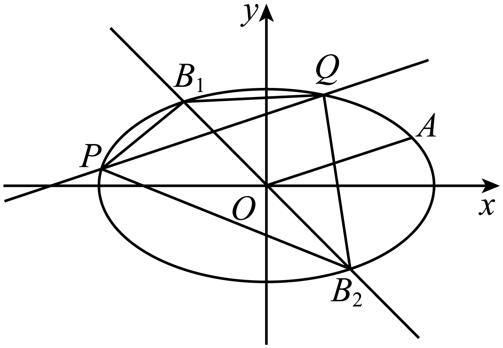

设点，，则，两式相减得，

又，于是，则，有，线段*PQ*被直线*l*平分，

设点到直线的距离为*d*，则四边形的面积，

而，则有，

设过点*P*且与直线*l*平行的直线的方程为，则当与*C*相切时，*d*取得最大值，

由消去*y*得，

令，解得，

当时，此时方程为，即，解得，

则此时点*P*或点*Q*必有一个和点重合，不符合条件，从而直线与*C*不可能相切，

即*d*小于平行直线和（或）的距离，

所以.

**变式16．**（2024·四川成都·高三石室中学校考开学考试）已知椭圆：（）左、右焦点分别为，，且为抛物线的焦点， 为椭圆上一点.

(1)求椭圆的方程；

(2)已知，为椭圆上不同两点，且都在轴上方，满足.

（ⅰ）若，求直线的斜率；

（ⅱ）若直线与抛物线无交点，求四边形面积的取值范围.

【解析】（1）依题意得，则，，而，

于是，

从而. 又，解得，

所以椭圆的方程为.

（2）如图，设直线交椭圆于另一点，直线交椭圆于另一点，

由，故，由椭圆对称性，，且四边形为平行四边形.

（ⅰ）由题意直线的斜率不为0，设直线：，

由，消去整理得，

设，，则，，

由（\*）带入上式，解得：，

故，由于，，所以，

所以，故的斜率为1.

（ⅱ）由，消去整理得，由得.

所以，

与间的距离（即点到的距离），

故，

令，函数在区间上单调递增，

所以，

则，

所以四边形的面积的取值范围为.

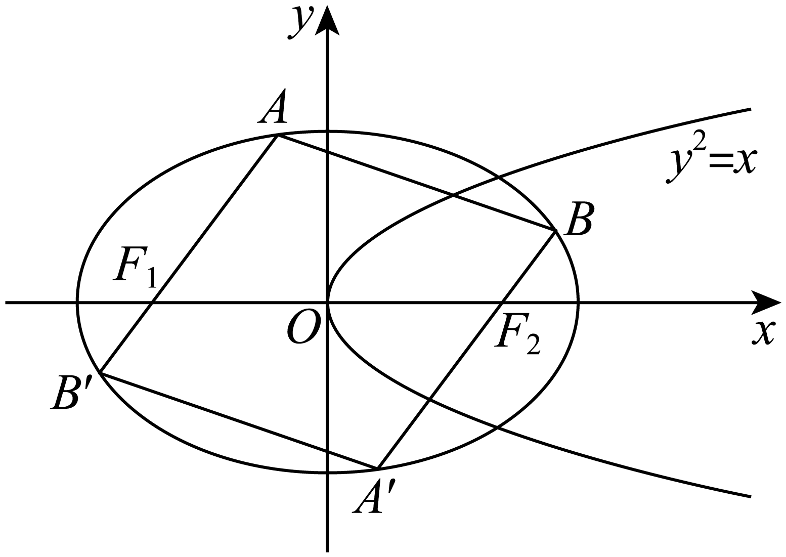

**变式17．**（2024·湖北·高三孝感高中校联考开学考试）已知椭圆的离心率，且经过点.

(1)求椭圆*E*的方程；

(2)设直线与椭圆*E*交于*A*，*B*两点，且椭圆*E*上存在点*M*，使得四边形为平行四边形.试探究：四边形*OAMB*的面积是否为定值？若是定值，求出四边形的面积；若不是定值，请说明理由.

【解析】（1）由已知可得：，，

可得：，，椭圆*E*的方程为.

（2）四边形*OAMB*的面积为定值，理由如下：

将代入可得：，

设，则，，

且，

由于四边形*OAMB*为平行四边形，则，

则点，代入椭圆*E*的方程，化简可得：，

此时恒成立，

由于点*O*到直线*AB*的距离为，

而，

又由，可得，

从而，

又.

所以四边形*OAMB*的面积为定值.

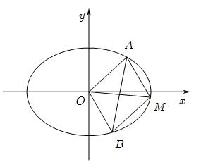

**变式18．**（2024·浙江·高三浙江省普陀中学校联考开学考试）类似于圆的垂径定理，椭圆：（）中有如下性质：不过椭圆中心的一条弦的中点为，当，斜率均存在时，，利用这一结论解决如下问题：已知椭圆：，直线与椭圆交于，两点，且，其中为坐标原点.

(1)求点的轨迹方程；

(2)过点作直线交椭圆于，两点，使，求四边形的面积.

【解析】（1）设，因为，

，代入椭圆得：，

点的轨迹方程为：.

（2）

设，由（1）则，

①当直线不与坐标轴重合时，由，知为中点，

，

直线：，

代入椭圆：的方程得：

即：，设，，

由根与系数关系，

，

设表示点到直线的距离，表示点到直线的距离，

；

它法：利用比例关系转化：，酌情给分.

②当直线与坐标轴重合时，

不妨取，，，

或，，，

综上所述：四边形的面积是.

**变式19．**（2024·浙江·高三舟山中学校联考开学考试）已知抛物线：与圆：相交于，，，四个点．

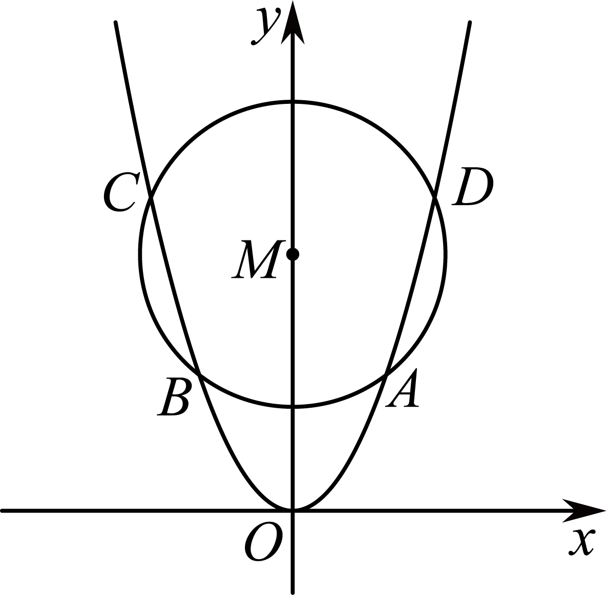

(1)当时，求四边形的面积；

(2)四边形的对角线交点是否可能为，若可能，求出此时的值，若不可能，请说明理由；

(3)当四边形的面积最大时，求圆的半径的值．

【解析】（1）将代入，并化简得，解得或，

代入抛物线方程可得

，，，

；

（2）联立抛物线与圆的方程有，可得．

不妨设与的四个交点的坐标为，，，．

直线的方程为，

由对称性，对角线交点肯定在轴上，令，

解得交点坐标为．若交点为点，则，则，不可能．

（3）联立抛物线与圆的方程有，可得．

由于四边形为等腰梯形，因而其面积

则，

设，则，

将，代入上式，并令，

得

求导数，

令，解得：，（舍去）．

当时，；此时单调递增，

当时，；当时，．此时单调递减，

故当且仅当时，取得最大值，即此时四边形的面积最大，

此时．

**变式20．**（2024·四川成都·校联考模拟预测）已知椭圆：（）与椭圆：（）的离心率相同，且椭圆的焦距是椭圆的焦距的倍．

(1)求实数*a*和*b*的值；

(2)若梯形的顶点都在椭圆上，，，直线*BC*与直线*AD*相交于点*P*．且点*P*在椭圆上，试探究梯形的面积是否为定值，若是，请求出该定值；若不是，请说明理由．

【解析】（1）由题意知，，且，

解得，．

（2）梯形的面积是定值，该定值为．

理由如下：

由（1）知：，：,

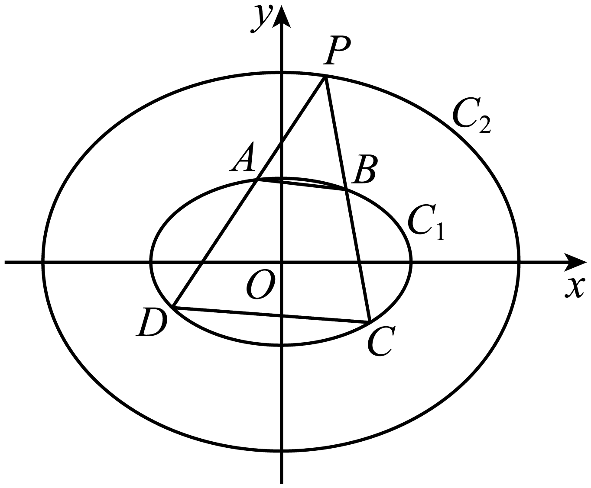

设，，，则，

因为，，所以*A*，*B*分别为*PD*，*PC*的中点，

则，，则，

作差可得，．

因为，即，所以．

同理可得，，所以*C*，*D*都在直线上，

即直线*CD*的方程为．

联立，可得，，

则，

即．

又因为点*P*到直线*CD*的距离，

所以的面积为．

又因为∽，，所以，

所以梯形*ABCD*的面积为．

**变式21．**（2024·广东佛山·统考模拟预测）在平面直角坐标系中，点为坐标原点，，，为线段上异于的一动点，点满足.

(1)求点的轨迹的方程；

(2)点是曲线上两点，且在轴上方，满足，求四边形面积的最大值.

【解析】（1），，，

，

点轨迹是以为焦点，长轴长为的椭圆，

设椭圆方程为，则，，，

点的轨迹的方程为：.

（2）连接，延长交椭圆于点，连接，

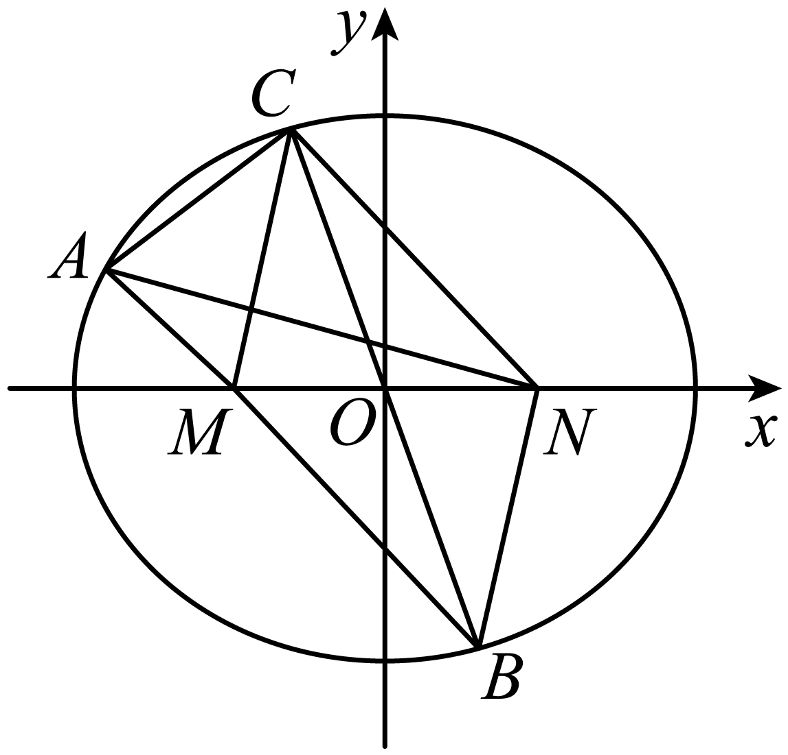

由椭圆对称性可知：，又，四边形为平行四边形，

，，且三点共线

四边形的面积，

设直线，，

由得：，

，，

，

又，点到直线的距离即为点到直线的距离，

点到直线的距离，，

设，则，，，

又，当，即时，四边形面积取得最大值，最大值为.

**变式22．**（2024·广东广州·高三华南师大附中校考阶段练习）已知为坐标原点，，是椭圆的两个焦点，斜率为的直线与交于，两点，线段的中点坐标为，直线过原点且与交于，两点，椭圆过的切线为，的中点为.

(1)求椭圆的方程.

(2)过作直线的平行线与椭圆交于，两点，在直线上取一点使，求证：四边形是平行四边形.

(3)判断四边形的面积是否为定值，若是定值请求出面积，若不是，请说明理由.

【解析】（1）由题知，设椭圆方程为，

设：，，则，

联立得，

因为线段的中点坐标为，

所以，

，

所以，再代入得，

又，

所以，

所以椭圆的方程为.

（2）设，

则，因的中点为，所以，

根据已知，过点的切线方程斜率为，

又，知，

所以：，

即，，

联立得，

所以，

，

可得，

即是的中点，

又，知是的中点，

所以四边形是平行四边形.

（3）由（2）知，，，

，

：，即，

设点到直线的距离为，

所以

，

，

所以，

所以四边形的面积为.

即四边形的面积是定值，且为.

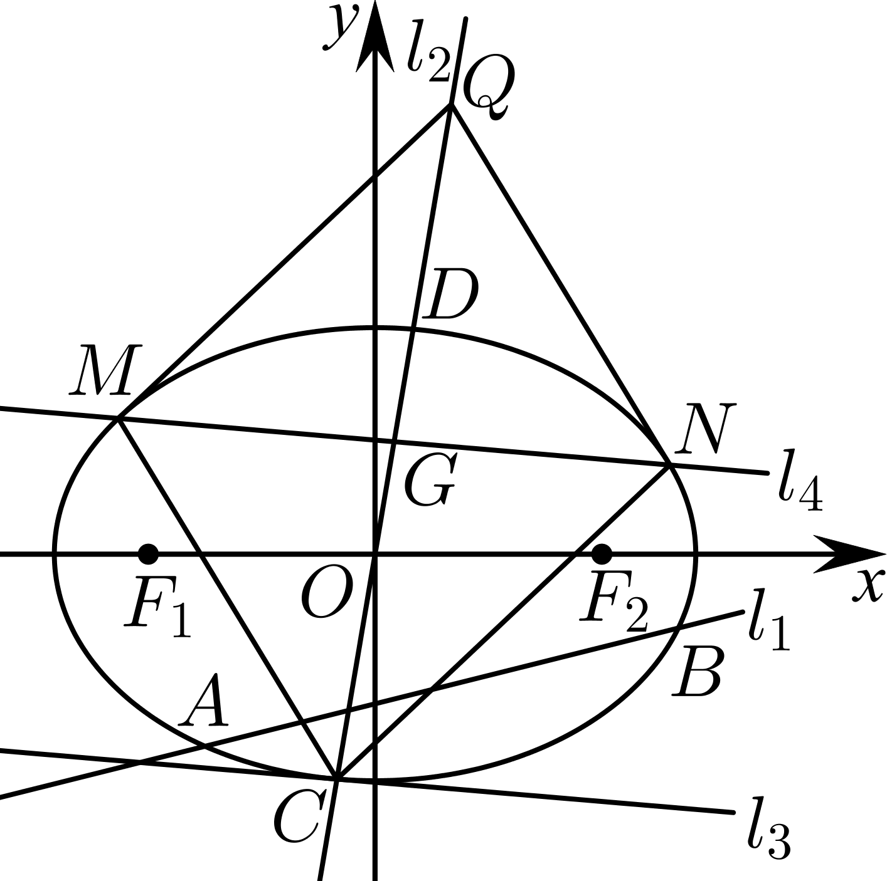

**变式23．**（2024·全国·高三专题练习）已知抛物线：与圆：相交于四个点．

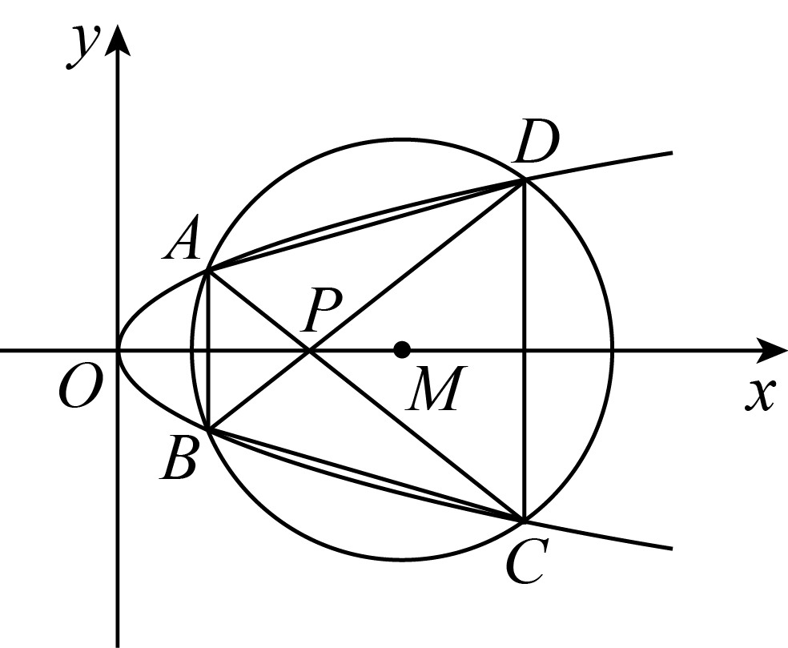

(1)当时，求四边形面积；

(2)当四边形的面积最大时，求圆的半径的值．

【解析】（1）将代入，并化简得，解得或，代入抛物线方程可得.

故；

（2）不妨设与的四个交点的坐标为．

则直线的方程分别为 ，，两方程相加可得，故，解得点的坐标为．

联立抛物线与圆的方程有，即，可得.

设，则，由（1）知由于四边形为等腰梯形，因而其面积

则将代入上式，并令，得．

求导数， 令 ，解得：（舍去）．

当时，；当时，；当时，.

故当且仅当时，此时．

**变式24．**（2024·浙江·校联考模拟预测）已知椭圆的离心率为，抛物线的准线与相交，所得弦长为.

(1)求的方程；

(2)若在上，且，分别以为切点，作的切线相交于点，点恰好在上，直线分别交轴于两点.求四边形面积的取值范围.

【解析】（1）由题知过点，则，解得，

.

（2）设直线的方程为，

联立，得，

，

则，而，则，

故以为切点的切线为，即，

同理以为切点的切线为，则，

由，故两式作差得：，所以，

两式求和得：，

所以点由在椭圆上，即.

点到直线的距离，

所以，，

，

而、在上递增且恒正，

则在上递增，.

**变式25．**（2024·山东潍坊·三模）已知椭圆的离心率为，且过点．

(1)求椭圆的标准方程；

(2)若动直线：与椭圆交于两点，且在坐标平面内存在两个定点，使得（定值），其中分别是直线的斜率，分别是直线的斜率．

①求的值；

②求四边形面积的最大值．

【解析】（1）由题意得，

解得，

则椭圆的标准方程为.

（2）①设，

把与椭圆的标准方程联立，

消去，可得，

注意到为方程的两根，

故有恒等式，

则，

同理，把与椭圆的标准方程联立，

消去，可得，

注意到为方程的两根，

故有恒等式，

则，

则，

所以，

若为定值，则必有，

计算可得或，

故．

②不妨设点，点，点，点到直线的距离分别是，

因为，，，

所以，

四边形面积

（当时取等号），

所以四边形面积的最大值是

