**第71讲  面积问题**

**知识梳理**

1**、三角形的面积处理方法**

（1）底·高（通常选弦长做底，点到直线的距离为高）

（2）水平宽·铅锤高或

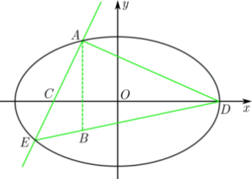

（3）在平面直角坐标系中，已知的顶点分别为，，，三角形的面积为．

2**、三角形面积比处理方法**

**（** 1**）对顶角模型**

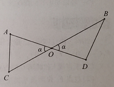

**（** 2**）等角、共角模型**

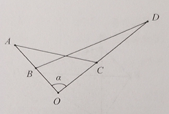

3**、四边形面积处理方法**

**（** 1**）对角线垂直**

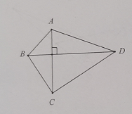

**（** 2**）一般四边形**

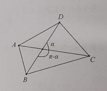

**（** 3**）分割两个三角形**

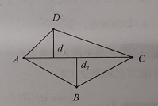

4**、面积的最值问题或者取值范围问题**

一般都是利用面积公式表示面积，然后将面积转化为某个变量的一个函数，再求解函数的最值（一般处理方法有换元，基本不等式，建立函数模型，利用二次函数、三角函数的有界性求最值或利用导数法求最值，构造函数求导等等），在算面积的过程中，优先选择长度为定值的线段参与运算，灵活使用割补法计算面积，尽可能降低计算量．

**必考题型全归纳**

**题型一：三角形的面积问题之**底·高

**例1．**（2024·福建漳州·高三统考开学考试）已知椭圆的左焦点为，且过点.

(1)求*C*的方程；

(2)不过原点*O*的直线与*C*交于*P*，*Q*两点，且直线*OP*，*PQ*，*OQ*的斜率成等比数列.

（i）求的斜率；

（ii）求的面积的取值范围.

**例2．**（2024·湖南常德·高三常德市一中校考阶段练习）在平面直角坐标系中，已知点，点在直线 上运动，过点与垂直的直线和的中垂线相交于点.

(1)求动点的轨迹的方程；

(2)设点是轨迹上的动点，点在轴上，圆内切于，求的面积的最小值.

<strong>例3．</strong>（2024·浙江·模拟预测）我国著名数学家华罗庚曾说：“数缺形时少直观，形少数时难入微，数形结合百般好，隔离分家万事休.”事实上，很多代数问题可以转化为几何问题加以解决，已知曲线<em>C</em>上任意一点满足.

(1)化简曲线的方程；

(2)已知圆（为坐标原点），直线经过点且与圆相切，过点*A*作直线的垂线，交于两点，求面积的最小值.

**变式1．**（2024·河北秦皇岛·校联考二模）已知双曲线实轴的一个端点是，虚轴的一个端点是，直线与双曲线的一条渐近线的交点为.

(1)求双曲线的方程；

(2)若直线与曲线有两个不同的交点是坐标原点，求的面积最小值.

**变式2．**（2024·四川成都·成都市锦江区嘉祥外国语高级中学校考三模）设椭圆过点，且左焦点为.

(1)求椭圆的方程；

(2)内接于椭圆，过点和点的直线与椭圆的另一个交点为点，与交于点，满足，求面积的最大值.

**题型二：三角形的面积问题之分割法**

<strong>例4．</strong>（2024·全国·高三专题练习）设动点<em>M</em>与定点的距离和<em>M</em>到定直线<em>l</em>：的距离的比是．

(1)求动点*M*的轨迹方程，并说明轨迹的形状；

(2)当时，记动点*M*的轨迹为，动直线*m*与抛物线：相切，且与曲线交于点*A*，*B*．求面积的最大值．

**例5．**（2024·四川成都·高三校联考阶段练习）已知椭圆的对称中心为坐标原点，对称轴为坐标轴，焦点在轴上，离心率，且过点．

(1)求椭圆的标准方程；

(2)若直线与椭圆交于两点，且直线的倾斜角互补，点，求三角形面积的最大值．

**例6．**（2024·广东·高三校联考阶段练习）已知双曲线的离心率为2，右焦点到渐近线的距离为．

(1)求双曲线的标准方程；

(2)若点为双曲线右支上一动点，过点与双曲线相切的直线，直线与双曲线的渐近线分别交于*M*，*N*两点，求的面积的最小值．

**变式3．**（2024·广东广州·高三中山大学附属中学校考阶段练习）过椭圆的右焦点作两条相互垂直的弦，.，的中点分别为，.

(1)证明：直线过定点；

(2)若，的斜率均存在，求面积的最大值.

**题型三：三角形、四边形的面积问题之面积坐标化**

**例7．**（2024·全国·高三专题练习）如图，已知双曲线的左右焦点分别为、，若点为双曲线在第一象限上的一点，且满足，过点分别作双曲线两条渐近线的平行线、与渐近线的交点分别是和.

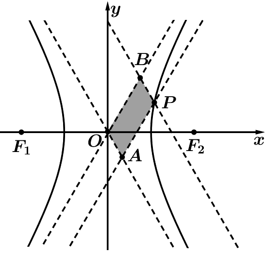

（1）求四边形的面积；

（2）若对于更一般的双曲线，点为双曲线上任意一点，过点分别作双曲线两条渐近线的平行线、与渐近线的交点分别是和.请问四边形的面积为定值吗？若是定值，求出该定值（用、表示该定值）；若不是定值，请说明理由.

**例8．**（2024·浙江·高三竞赛）已知直线与椭圆：交于、两点，直线不经过原点.

（1）求面积的最大值；

（2）设为线段的中点，延长交椭圆于点，若四边形为平行四边形，求四边形的面积.

**例9．**（2024·全国·高三专题练习）分别是椭圆于的左、右焦点.

(1)若*Р*是该椭圆上的一个动点，求的取值范围；

(2)设是它的两个顶点，直线与*AB*相交于点*D*，与椭圆相交于*E*、*F*两点.求四边形*AEBF*面积的最大值.

**变式4．**（2024·江苏苏州·模拟预测）如图，在平面直角坐标系中，已知抛物线的焦点为，过的直线交于，两点（其中点在第一象限），过点作的切线交轴于点，直线交于另一点，直线交轴于点.

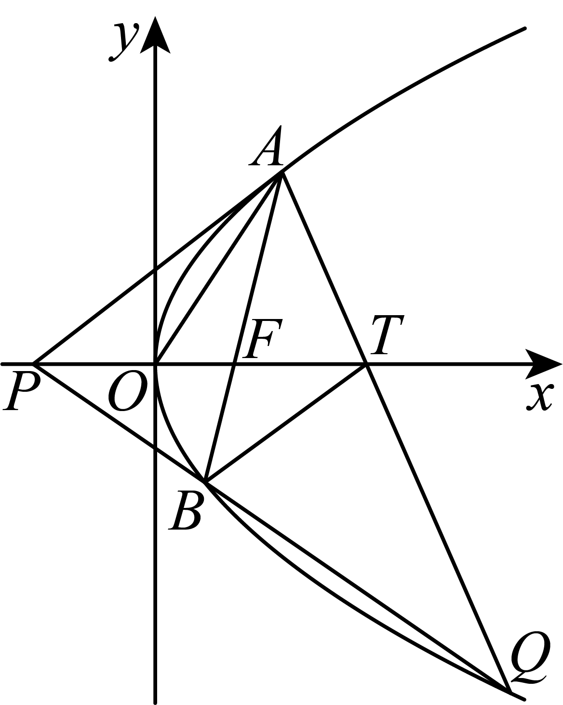

(1)求证：；

(2)记，，的面积分别为，，，当点的横坐标大于2时，求的最小值及此时点的坐标.

**变式5．**（2024·上海浦东新·高三上海市进才中学校考阶段练习）设椭圆：的一个顶点为，离心率为，为椭圆的右焦点．

(1)求椭圆的方程；

(2)设过且斜率为的直线与椭圆交于，两点，若满足，求的值；

(3)过点的直线与椭圆交于，两点，过点，分别作直线：的垂线（点，在直线的两侧）．垂足分别为，，记，，的面积分别为，，，试问：是否存在常数，使得，，总成等比数列？若存在，求出的值，若不存在，请说明理由．

<strong>变式6．</strong>（2024·福建泉州·泉州七中校考模拟预测）已知圆，点，圆周上任一点<em>P</em>，若线段<em>PG</em>的垂直平分线和<em>CP</em>相交于点<em>Q</em>，点<em>Q</em>的轨迹为曲线.

(1)求曲线的方程；

(2)若过点的动直线与椭圆相交于两点，直线的方程为.过点作于点，过点作于点.记的面积分别为，，.问是否存在实数，使得成立？若存在，请求出的值；若不存在，请说明理由.

**变式7．**（2024·上海浦东新·高三上海市洋泾中学校考开学考试）设抛物线：的焦点为，经过轴正半轴上点的直线交于不同的两点和.

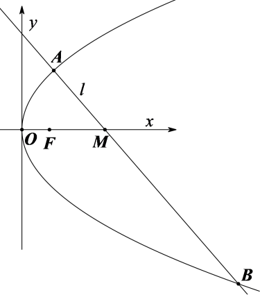

(1)若，求点的坐标；

(2)若，求证：原点总在以线段为直径的圆的内部；

(3)若，且直线，与有且只有一个公共点，问：的面积是否存在最小值？若存在，求出最小值，并求出点的坐标；若不存在，请说明理由.（三角形面积公式：在中，设，，则的面积为

**变式8．**（2024·四川眉山·高三校考阶段练习）在中，已知点，，边上的中线长与边上的中线长之和为6；记的重心的轨迹为曲线.

(1)求的方程；

(2)若圆：，，过坐标原点且与轴不重合的任意直线与圆相交于点，，直线，与曲线的另一个交点分别是点，，求面积的最大值.

**题型四：三角形的面积比问题之共角、等角模型**

**例10．**（2024·河北·统考模拟预测）已知抛物线，过点的直线与交于两点，当直线与轴垂直时，（其中为坐标原点）.

(1)求的准线方程；

(2)若点在第一象限，直线的倾斜角为锐角，过点作的切线与轴交于点，连接交于另一点为，直线与轴交于点，求与面积之比的最大值.

**例11．**（2024·北京东城·高三北京市第十一中学校考阶段练习）已知椭圆，且过两点．

(1)求椭圆*E*的方程和离心率*e*；

(2)若经过有两条直线，它们的斜率互为倒数，与椭圆*E*交于*A*，*B*两点，与椭圆*E*交于*C*，*D*两点，*P*，*Q*分别是*AB*，*CD*的中点试探究：与的面积之比是否为定值？

若是，请求出此定值；若不是，请说明理由．

**例12．**（2024·江苏徐州·高三校考开学考试）设椭圆的左右顶点分别为，右焦点为，已知．

(1)求椭圆方程及其离心率；

(2)已知点是椭圆上一动点（不与端点重合），直线交轴于点，若三角形的面积是三角形面积的二倍，求直线的方程．

**变式9．**（2024·广东深圳·深圳中学校考模拟预测）已知定点，关于原点对称的动点，到定直线的距离分别为，，且，记的轨迹为曲线.

(1)求曲线的方程，并说明曲线是什么曲线？

(2)已知点，是直线与曲线的两个交点，，在轴上的射影分别为，（，不同于原点），且直线与直线相交于点，求与面积的比值.

<strong>变式10．</strong>（2024·河北·高三校联考阶段练习）已知抛物线<em>C</em>：上一点到焦点<em>F</em>的距离为．

(1)求抛物线*C*的方程；

(2)过点*F*的直线与抛物线*C*交于两点，直线与圆*E*：的另一交点分别为为坐标原点，求与面积之比的最小值．

**变式11．**（2024·陕西商洛·陕西省丹凤中学校考模拟预测）已知椭圆的左、右顶点分别为，长轴长为短轴长的2倍，点在上运动，且面积的最大值为8．

(1)求的方程；

(2)若直线经过点，交于两点，直线分别交直线于，两点，试问与的面积之比是否为定值？若是，求出该定值；若不是，说明理由．

**变式12．**（2024·福建厦门·厦门一中校考模拟预测）已知，分别是椭圆：的右顶点和上顶点，，直线的斜率为.

(1)求椭圆的方程；

(2)直线，与，轴分别交于点，，与椭圆相交于点，.

（i）求的面积与的面积之比；

（ⅱ）证明：为定值.

**题型五：三角形的面积比问题之对顶角模型**

**例13．**（2024·安徽黄山·屯溪一中校考模拟预测）已知椭圆的离心率为，且经过点．

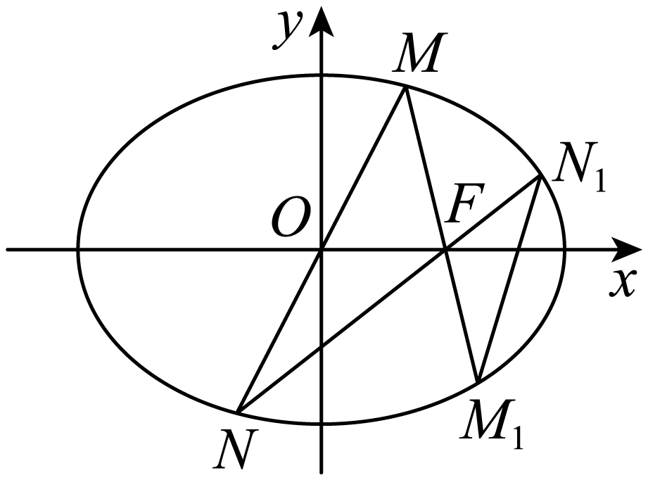

(1)求椭圆方程；

(2)直线与椭圆交于点为的右焦点，直线分别交于另一点、，记与的面积分别为，求的范围．

<strong>例14．</strong>（2024·全国·高三对口高考）在平面直角坐标系中，点<em>B</em>与点关于原点<em>O</em>对称，<em>P</em>是动点，且直线与的斜率之积等于．

(1)求动点*P*的轨迹方程；

(2)设直线和分别与直线交于点*M*，*N,* 问：是否存在点*P*使得与的面积相等？若存在，求出点*P*的坐标；若不存在，说明理由．

<strong>例15．</strong>（2024·重庆·高三重庆一中校考阶段练习）已知<em>O</em>为坐标原点，抛物线的方程为，<em>F</em>是抛物线的焦点，椭圆的方程为，过<em>F</em>的直线<em>l</em>与抛物线交于<em>M</em>，<em>N</em>两点，反向延长，分别与椭圆交于<em>P</em>，<em>Q</em>两点．

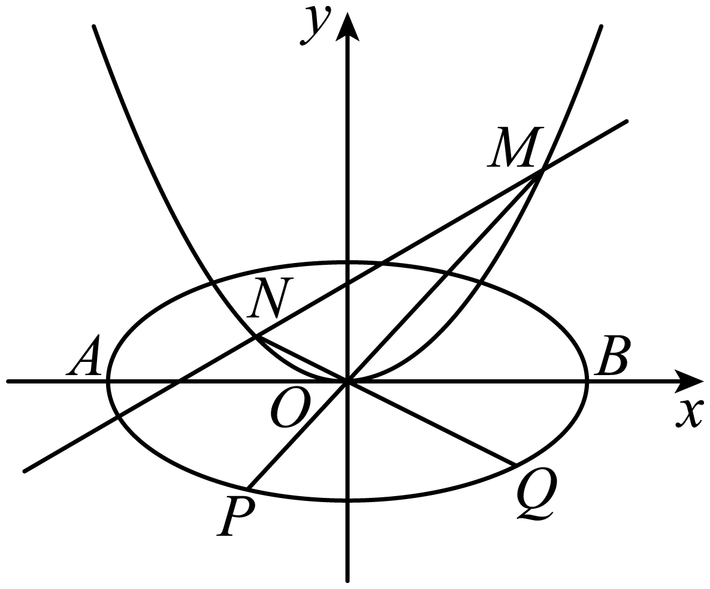

(1)求的值；

(2)若恒成立，求椭圆的方程；

(3)在（2）的条件下，若的最小值为1，求抛物线的方程（其中，分别是和的面积）．

<strong>变式13．</strong>（2024·四川·校联考一模）已知点在椭圆上，点在椭圆<em>C</em>内．设点以为的短轴的上、下端点，直线分别与椭圆<em>C</em>相交于点，且的斜率之积为．

(1)求椭圆*C*的方程；

(2)记，分别为，的面积，若，求的取值范围．

<strong>变式14．</strong>（2024·贵州贵阳·高三贵阳一中校考开学考试）已知点在椭圆<em>C</em>：上，点在椭圆<em>C</em>内.设点<em>A</em>，<em>B</em>为<em>C</em>的短轴的上、下端点，直线<em>AM</em>，<em>BM</em>分别与椭圆<em>C</em>相交于点<em>E</em>，<em>F</em>，且<em>EA</em>，<em>EB</em>的斜率之积为.

(1)求椭圆*C*的方程；

(2)记，分别为，的面积，若，求*m*的值.

**变式15．**（2024·四川南充·四川省南充高级中学校考三模）已知椭圆的左、右焦点为，离心率为.点是椭圆上不同于顶点的任意一点，射线分别与椭圆交于点，的周长为8.

(1)求椭圆的标准方程；

(2)设，，的面积分别为.求证：为定值.

**题型六：四边形的面积问题之对角线垂直模型**

<strong>例16．</strong>（2024·河南·襄城高中校联考三模）设双曲线的左、右焦点分别为，，且<em>E</em>的渐近线方程为．

(1)求*E*的方程；

(2)过作两条相互垂直的直线和，与*E*的右支分别交于*A*，*C*两点和*B*，*D*两点，求四边形*ABCD*面积的最小值．

<strong>例17．</strong>（2024·山西朔州·高三校联考开学考试）已知椭圆<em>E</em>：的左、右焦点分别为，，<em>M</em>为椭圆<em>E</em>的上顶点，，点在椭圆<em>E</em>上.

(1)求椭圆*E*的标准方程；

(2)设经过焦点的两条互相垂直的直线分别与椭圆*E*相交于*A*，*B*两点和*C*，*D*两点，求四边形*ACBD*的面积的最小值.

**例18．**（2024·江西·高三统考阶段练习）已知直线与抛物线交于两点，.

(1)求；

(2)设抛物线的焦点为，过点且与垂直的直线与抛物线交于，求四边形的面积.

**题型七：四边形的面积问题之一般四边形**

**例19．**（2024·湖南长沙·高三长沙一中校考阶段练习）已知椭圆过和两点.

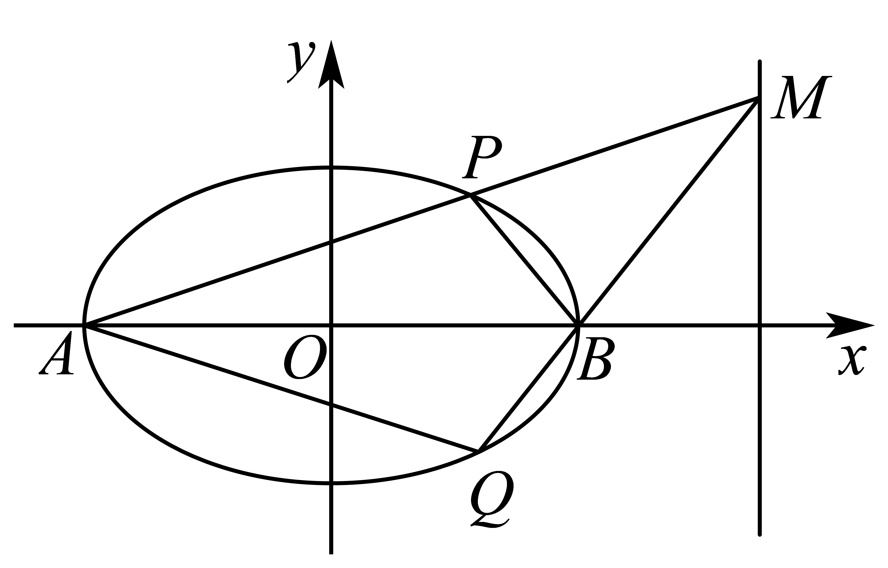

(1)求椭圆*C*的方程；

(2)如图所示，记椭圆的左、右顶点分别为*A*，*B*，当动点*M*在定直线上运动时，直线，分别交椭圆于两点*P*和*Q*.

（i）证明：点*B*在以为直径的圆内；

（ii）求四边形面积的最大值.

<strong>例20．</strong>（2024·新疆伊犁·高三校考阶段练习）已知椭圆<em>C</em>：经过点，<em>O</em>为坐标原点，若直线<em>l</em>与椭圆<em>C</em>交于<em>A</em>，<em>B</em>两点，线段<em>AB</em>的中点为<em>M</em>，直线<em>l</em>与直线<em>OM</em>的斜率乘积为.

(1)求椭圆*C*的标准方程；

(2)若四边形*OAPB*为平行四边形，求四边形*OAPB*的面积.

**例21．**（2024·上海黄浦·高三格致中学校考开学考试）定义：若椭圆上的两个点满足，则称为该椭圆的一个“共轭点对”，记作.已知椭圆的一个焦点坐标为，且椭圆过点.

(1)求椭圆的标准方程；

(2)求“共轭点对”中点所在直线的方程；

(3)设为坐标原点，点在椭圆上，且，（2）中的直线与椭圆交于两点，且点的纵坐标大于0，设四点在椭圆上逆时针排列.证明：四边形的面积小于.

**变式16．**（2024·四川成都·高三石室中学校考开学考试）已知椭圆：（）左、右焦点分别为，，且为抛物线的焦点， 为椭圆上一点.

(1)求椭圆的方程；

(2)已知，为椭圆上不同两点，且都在轴上方，满足.

（ⅰ）若，求直线的斜率；

（ⅱ）若直线与抛物线无交点，求四边形面积的取值范围.

**变式17．**（2024·湖北·高三孝感高中校联考开学考试）已知椭圆的离心率，且经过点.

(1)求椭圆*E*的方程；

(2)设直线与椭圆*E*交于*A*，*B*两点，且椭圆*E*上存在点*M*，使得四边形为平行四边形.试探究：四边形*OAMB*的面积是否为定值？若是定值，求出四边形的面积；若不是定值，请说明理由.

**变式18．**（2024·浙江·高三浙江省普陀中学校联考开学考试）类似于圆的垂径定理，椭圆：（）中有如下性质：不过椭圆中心的一条弦的中点为，当，斜率均存在时，，利用这一结论解决如下问题：已知椭圆：，直线与椭圆交于，两点，且，其中为坐标原点.

(1)求点的轨迹方程；

(2)过点作直线交椭圆于，两点，使，求四边形的面积.

**变式19．**（2024·浙江·高三舟山中学校联考开学考试）已知抛物线：与圆：相交于，，，四个点．

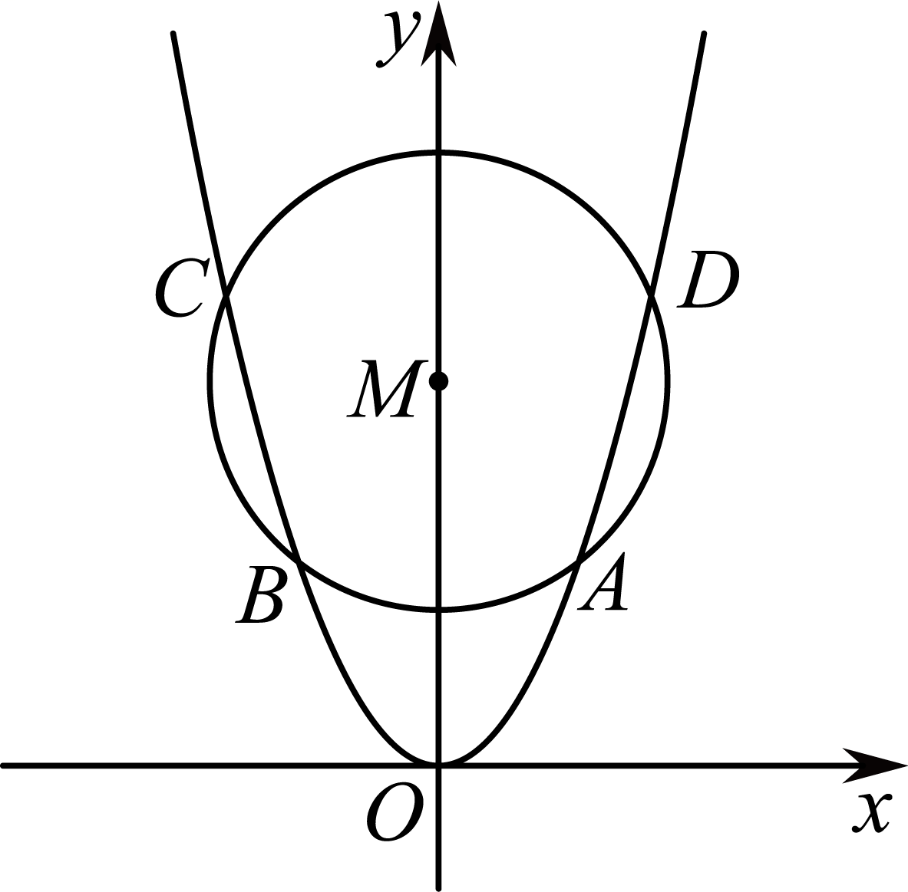

(1)当时，求四边形的面积；

(2)四边形的对角线交点是否可能为，若可能，求出此时的值，若不可能，请说明理由；

(3)当四边形的面积最大时，求圆的半径的值．

**变式20．**（2024·四川成都·校联考模拟预测）已知椭圆：（）与椭圆：（）的离心率相同，且椭圆的焦距是椭圆的焦距的倍．

(1)求实数*a*和*b*的值；

(2)若梯形的顶点都在椭圆上，，，直线*BC*与直线*AD*相交于点*P*．且点*P*在椭圆上，试探究梯形的面积是否为定值，若是，请求出该定值；若不是，请说明理由．

**变式21．**（2024·广东佛山·统考模拟预测）在平面直角坐标系中，点为坐标原点，，，为线段上异于的一动点，点满足.

(1)求点的轨迹的方程；

(2)点是曲线上两点，且在轴上方，满足，求四边形面积的最大值.

**变式22．**（2024·广东广州·高三华南师大附中校考阶段练习）已知为坐标原点，，是椭圆的两个焦点，斜率为的直线与交于，两点，线段的中点坐标为，直线过原点且与交于，两点，椭圆过的切线为，的中点为.

(1)求椭圆的方程.

(2)过作直线的平行线与椭圆交于，两点，在直线上取一点使，求证：四边形是平行四边形.

(3)判断四边形的面积是否为定值，若是定值请求出面积，若不是，请说明理由.

**变式23．**（2024·全国·高三专题练习）已知抛物线：与圆：相交于四个点．

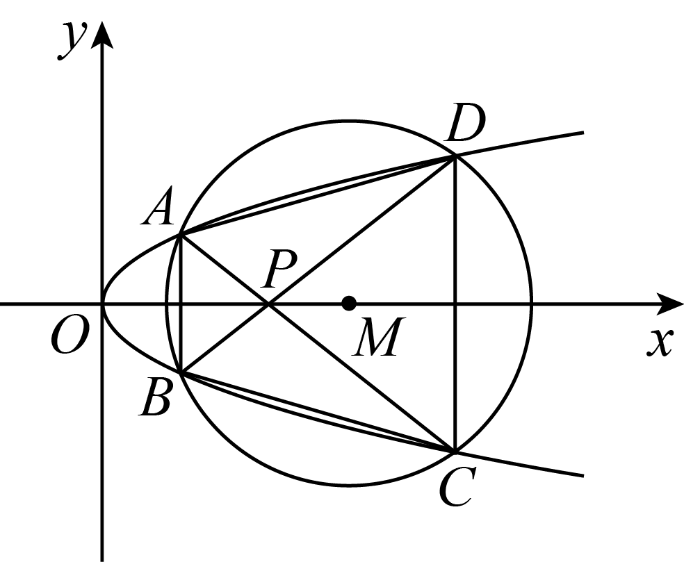

(1)当时，求四边形面积；

(2)当四边形的面积最大时，求圆的半径的值．

**变式24．**（2024·浙江·校联考模拟预测）已知椭圆的离心率为，抛物线的准线与相交，所得弦长为.

(1)求的方程；

(2)若在上，且，分别以为切点，作的切线相交于点，点恰好在上，直线分别交轴于两点.求四边形面积的取值范围.

**变式25．**（2024·山东潍坊·三模）已知椭圆的离心率为，且过点．

(1)求椭圆的标准方程；

(2)若动直线：与椭圆交于两点，且在坐标平面内存在两个定点，使得（定值），其中分别是直线的斜率，分别是直线的斜率．

①求的值；

②求四边形面积的最大值

