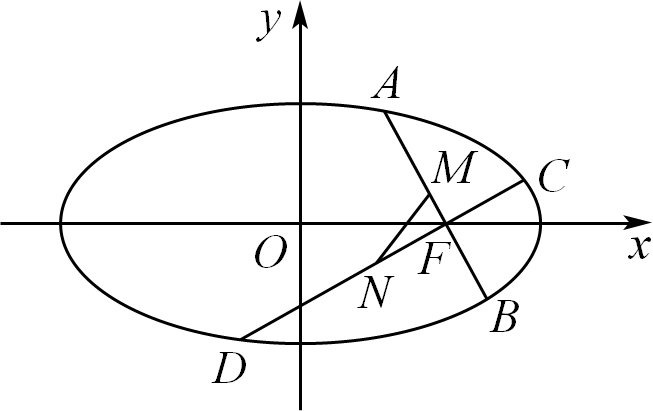
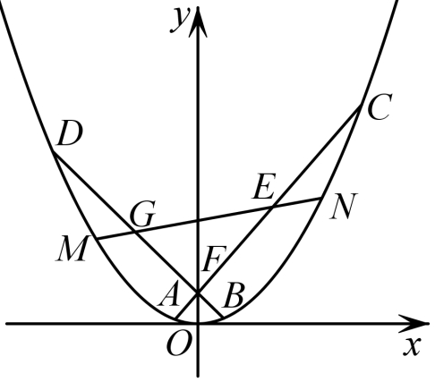
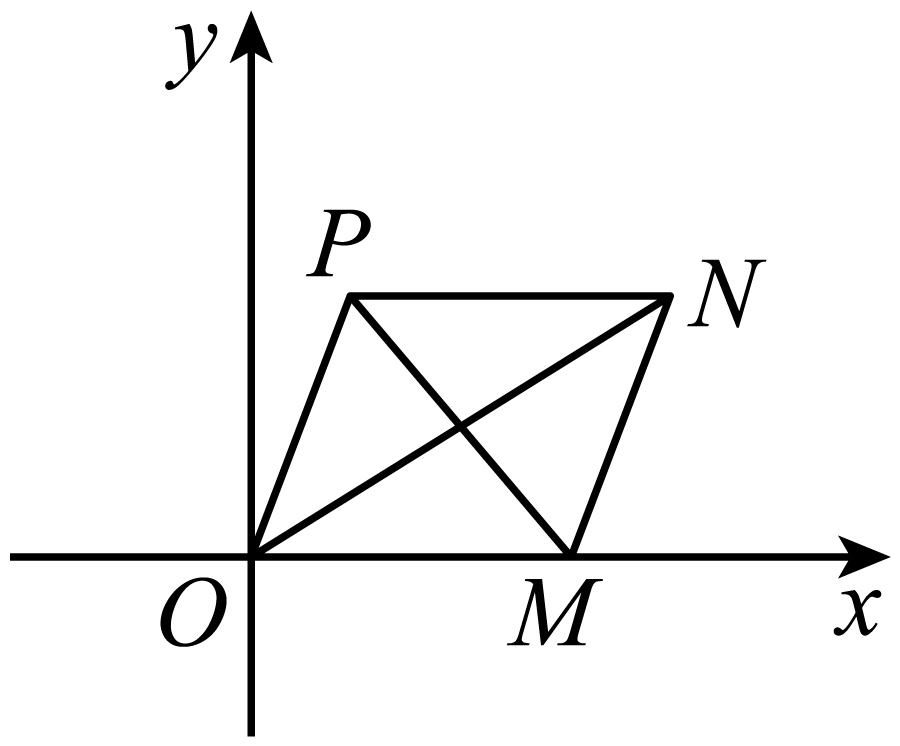
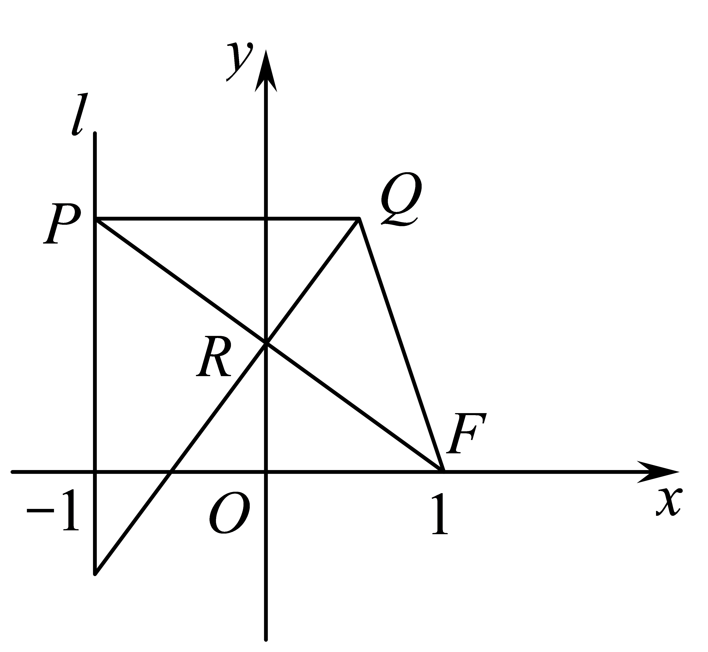
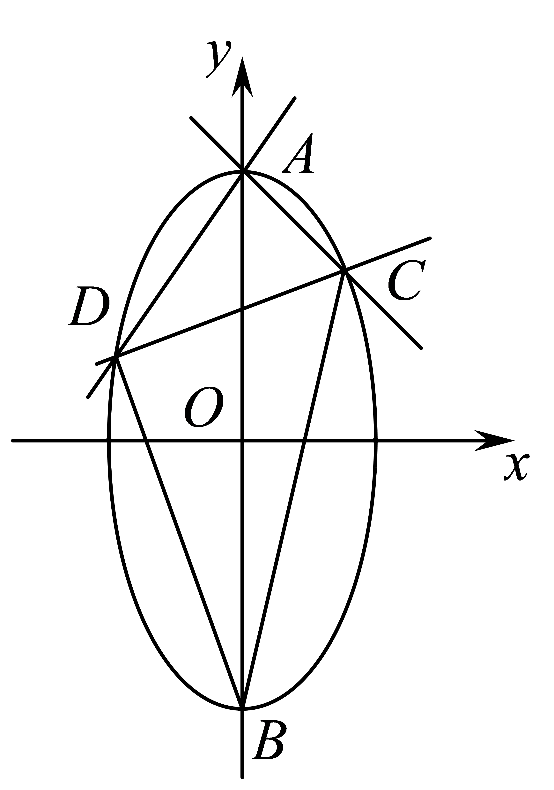
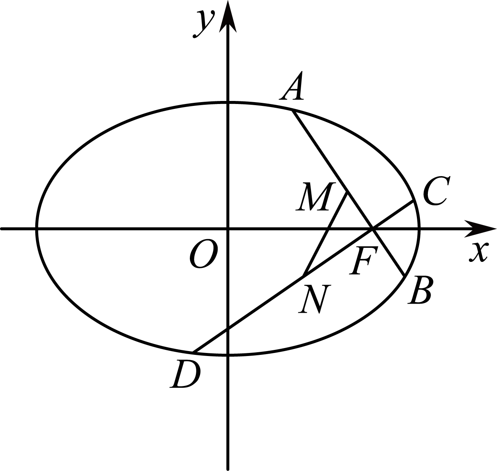

**第72讲  垂直弦问题**

**知识梳理**

1、过椭圆的右焦点作两条互相垂直的弦，．若弦，的中点分别为，，那么直线恒过定点．

2、过椭圆的长轴上任意一点作两条互相垂直的弦，．若弦，的中点分别为，，那么直线恒过定点．

3、过椭圆的短轴上任意一点作两条互相垂直的弦，．若弦，的中点分别为，，那么直线恒过定点．

4、过椭圆内的任意一点作两条互相垂直的弦，．若弦，的中点分别为，，那么直线恒过定点．

5、以为直角定点的椭圆内接直角三角形的斜边必过定点

6、以上顶点为直角顶点的椭圆内接直角三角形的斜边必过定点，且定点在轴上．

7、以右顶点为直角顶点的椭圆内接直角三角形的斜边必过定点，且定点在轴上．

8、以为直角定点的抛物线内接直角三角形的斜边必过定点，

9、以为直角定点的双曲线内接直角三角形的斜边必过定点

**必考题型全归纳**

**题型一：椭圆内接直角三角形的斜边必过定点**

<strong>例1．</strong>（2024·辽宁沈阳·高二东北育才学校校考阶段练习）已知点，动点<em>P</em>满足：∠<em>APB</em>=2<em>θ</em>，且|<em>PA</em>||<em>PB</em>|cos2<em>θ</em>=1.（<em>P</em>不在线段<em>AB</em>上）

(1)求动点*P*的轨迹*C*的方程；

(2)过椭圆的上顶点作互相垂直的两条直线分别交椭圆于另外一点*P*、*Q*，试问直线*PQ*是否经过定点，若是，求出定点坐标；若不是，说明理由.

<strong>例2．</strong>（2024·全国·高三专题练习）已知椭圆<em>C</em>的两个焦点分别为，，短轴长为2.

(1)求椭圆*C*的标准方程及离心率；

(2)*M*，*D*分别为椭圆*C*的左､右顶点，过*M*点作两条互相垂直的直线*MA*，*MB*交椭圆于*A*，*B*两点，直线*AB*是否过定点？并求出面积的最大值.

**例3．**（2024·云南曲靖·高三校联考阶段练习）已知为圆上一动点，过点作轴的垂线段为垂足，若点满足.

(1)求点的轨迹方程；

(2)设点的轨迹为曲线，过点作曲线的两条互相垂直的弦，两条弦的中点分别为，过点作直线的垂线，垂足为点，是否存在定点，使得为定值？若存在，求出点的坐标；若不存在，请说明理由.

<strong>变式1．</strong>（2024·上海青浦·统考一模）在平面直角坐标系<em>xOy</em>中，已知椭圆，过右焦点作两条互相垂直的弦<em>AB</em>，<em>CD</em>，设<em>AB</em>，<em>CD</em>中点分别为，．

(1)写出椭圆右焦点的坐标及该椭圆的离心率；

(2)证明：直线*MN*必过定点，并求出此定点坐标；

(3)若弦*AB*，*CD*的斜率均存在，求面积的最大值．

**变式2．**（2024·天津河北·高三天津外国语大学附属外国语学校校考阶段练习）设分别是椭圆的左､右焦点，是上一点，与轴垂直.直线与的另一个交点为，且直线的斜率为.

(1)求椭圆的离心率；

(2)设是椭圆的上顶点，过任作两条互相垂直的直线分别交椭圆于两点，证明直线过定点，并求出定点坐标.

<strong>变式3．</strong>（2024·全国·高二专题练习）设分别是圆的左､右焦点，<em>M</em>是<em>C</em>上一点，与<em>x</em>轴垂直.直线与<em>C</em>的另一个交点为<em>N</em>，且直线<em>MN</em>的斜率为

(1)求椭圆*C*的离心率.

(2)设是椭圆*C*的上顶点，过*D*任作两条互相垂直的直线分别交椭圆*C*于*A*､*B*两点，过点*D*作线段*AB*的垂线，垂足为*Q*，判断在*y*轴上是否存在定点*R*，使得的长度为定值？并证明你的结论.

**变式4．**（2024·云南昆明·高二统考期中）已知椭圆，直线被椭圆截得的线段长为.

(1)求椭圆的标准方程；

(2)过椭圆的右顶点作互相垂直的两条直线.分别交椭圆于两点（点不同于椭圆的右顶点），证明：直线过定点.

**题型二：双曲线内接直角三角形的斜边必过定点**

<strong>例4．</strong>（2024·高二课时练习）已知双曲线<em>C</em>：经过点，且双曲线<em>C</em>的右顶点到一条渐近线的距离为．

(1)求双曲线*C*的方程；

(2)过点*P*分别作两条互相垂直的直线*PA*，*PB*与双曲线*C*交于*A*，*B*两点（*A*，*B*两点均与点*P*不重合），设直线*AB*：，试求和之间满足的关系式．

<strong>例5．</strong>（2024·江苏南京·高二校考开学考试）在平面直角坐标系<em>xOy</em>中，动点Р与定点<em>F</em>(2，0)的距离和它到定直线<em>l</em>：的距离之比是常数，记<em>P</em>的轨迹为曲线<em>E</em>.

(1)求曲线*E*的方程；

(2)设过点*A*(，0)两条互相垂直的直线分别与曲线*E*交于点*M*，*N*(异于点*A*)，求证：直线*MN*过定点.

<strong>例6．</strong>（2024·全国·高三专题练习）已知双曲线，经过双曲线上的点作互相垂直的直线<em>AM</em>､<em>AN</em>分别交双曲线于<em>M</em>､<em>N</em>两点.设线段<em>AM</em>､<em>AN</em>的中点分别为<em>B</em>､<em>C</em>，直线<em>OB</em>､<em>OC</em>（<em>O</em>为坐标原点）的斜率都存在且它们的乘积为.

(1)求双曲线的方程；

(2)过点*A*作（*D*为垂足），请问：是否存在定点*E*，使得为定值？若存在，求出点*E*的坐标；若不存在，请说明理由.

**题型三：抛物线内接直角三角形的斜边必过定点**

<strong>例7．</strong>（2024·江苏泰州·高二靖江高级中学校考阶段练习）已知抛物线<em>C</em>：的焦点为<em>F</em>，斜率为1的直线<em>l</em>经过<em>F</em>，且与抛物线<em>C</em>交于<em>A</em>，<em>B</em>两点，．

(1)求抛物线*C*的方程；

(2)过抛物线*C*上一点作两条互相垂直的直线与抛物线*C*相交于两点（异于点*P*），证明：直线恒过定点，并求出该定点坐标．

**例8．**（2024·内蒙古巴彦淖尔·高二校考阶段练习）已知抛物线的焦点关于直线的对称点恰在抛物线的准线上．

(1)求抛物线的方程；

(2)是抛物线上横坐标为的点，过点作互相垂直的两条直线分别交抛物线于两点，证明直线恒经过某一定点，并求出该定点的坐标．

<strong>例9．</strong>（2024·江西吉安·高二吉安一中校考阶段练习）已知抛物线，<em>O</em>是坐标原点，<em>F</em>是<em>C</em>的焦点，<em>M</em>是<em>C</em>上一点，，．

(1)求抛物线*C*的标准方程；

(2)设点在*C*上，过*Q*作两条互相垂直的直线，分别交*C*于*A*，*B*两点（异于*Q*点）．证明：直线恒过定点．

**变式5．**（2024·浙江·高三专题练习）已知抛物线的焦点也是椭圆的一个焦点，如图，过点任作两条互相垂直的直线，，分别交抛物线于，，，四点，，分别为，的中点.

(1)求的值；

(2)求证：直线过定点，并求出该定点的坐标；

(3)设直线交抛物线于，两点，试求的最小值.

**变式6．**（2024·四川绵阳·高二校考阶段练习）已知抛物线：的焦点为，点在抛物线上，且．

（1）求抛物线的方程；

（2）过抛物线上一点作两条互相垂直的弦和，试问直线是否过定点，若是，求出该定点；若不是，请说明理由．

**变式7．**（2024·全国·高三专题练习）已知抛物线：的焦点为，直线与轴的交点为，与抛物线的交点为，且．

（1）求抛物线的方程；

（2）过抛物线上一点作两条互相垂直的弦和，试问直线是否过定点，若是，求出该定点；若不是，请说明理由．

**变式8．**（2024·云南曲靖·高二校考期末）已知点与点的距离比它的直线的距离小2．

(1)求点的轨迹方程；

(2)是点轨迹上互相垂直的两条弦，问：直线是否经过轴上一定点，若经过，求出该点坐标；若不经过，说明理由．

**题型四：椭圆两条互相垂直的弦中点所在直线过定点**

**例10．**（2024·福建龙岩·统考一模）双曲线：的左右顶点分别为，，动直线垂直的实轴，且交于不同的两点，直线与直线的交点为.

（1）求点的轨迹的方程；

（2）过点作的两条互相垂直的弦，，证明：过两弦，中点的直线恒过定点.

<strong>例11．</strong>（2024·全国·高二期末）已知椭圆的左右焦点分别为，抛物线与椭圆有相同的焦点，点<em>P</em>为抛物线与椭圆在第一象限的交点，且．

(1)求椭圆的方程；

(2)过*F*作两条斜率不为0且互相垂直的直线分别交椭圆于*A，B*和*C，D*，线段*AB*的中点为*M*，线段*CD*的中点为*N*，证明：直线过定点，并求出该定点的坐标．

**例12．**（2024·上海闵行·高二闵行中学校考期末）在平面直角坐标系中，为坐标原点，，已知平行四边形两条对角线的长度之和等于4．

(1)求动点的轨迹方程；

(2)过作互相垂直的两条直线、，与动点的轨迹交于、，与动点的轨迹交于点、，、的中点分别为、；证明：直线恒过定点，并求出定点坐标；

(3)在（2）的条件下，求四边形面积的最小值．

**变式9．**（2024·上海浦东新·高三上海市洋泾中学校考阶段练习）已知椭圆的离心率为，椭圆截直线所得线段的长度为．过作互相垂直的两条直线、，直线与椭圆交于、两点，直线与椭圆交于、两点，、的中点分别为、．

(1)求椭圆的方程；

(2)证明：直线恒过定点，并求出定点坐标；

(3)求四边形面积的最小值．

**变式10．**（2024·全国·高三专题练习）已知椭圆上任意一点到椭圆两个焦点的距离之和为，且离心率为．

(1)求椭圆的标准方程；

(2)设为的左顶点，过点作两条互相垂直的直线分别与交于两点，证明：直线经过定点，并求这个定点的坐标．

**题型五：双曲线两条互相垂直的弦中点所在直线过定点**

<strong>例13．</strong>（2024·高二课时练习）已知双曲线<em>C</em>的右焦点<em>F</em>，半焦距<em>c</em>=2，点<em>F</em>到直线的距离为，过点<em>F</em>作双曲线<em>C</em>的两条互相垂直的弦<em>AB</em>，<em>CD</em>，设<em>AB</em>，<em>CD</em>的中点分别为<em>M</em>，<em>N</em>.

(1)求双曲线*C*的标准方程；

(2)证明：直线*MN*必过定点，并求出此定点的坐标.

**例14．**（2024·黑龙江·黑龙江实验中学校考三模）在平面直角坐标系中，已知动点到点的距离与它到直线的距离之比为．记点的轨迹为曲线．

(1)求曲线的方程；

(2)过点作两条互相垂直的直线，.交曲线于，两点，交曲线于，两点，线段的中点为，线段的中点为．证明：直线过定点，并求出该定点坐标．

**例15．**（2024·山西大同·高三统考阶段练习）已知双曲线：的右焦点为，半焦距，点到右准线的距离为，过点作双曲线的两条互相垂直的弦，，设，的中点分别为，.

（1）求双曲线的标准方程；

（2）证明：直线必过定点，并求出此定点坐标.

**变式11．**（2024·贵州·校联考模拟预测）已知双曲线的一条渐近线方程为，焦点到渐近线的距离为.

(1)求的方程；

(2)过双曲线的右焦点作互相垂直的两条弦（斜率均存在）、.两条弦的中点分别为、，那么直线是否过定点?若不过定点，请说明原因；若过定点，请求出定点坐标.

**题型六：抛物线两条互相垂直的弦中点所在直线过定点**

**例16．**（2024·全国·高二专题练习）已知抛物线：焦点为，为上的动点，位于的上方区域，且的最小值为3.

(1)求的方程；

(2)过点作两条互相垂直的直线和，交于，两点，交于，两点，且，分别为线段和的中点.直线是否恒过一个定点?若是，求出该定点坐标；若不是，说明理由.

**例17．**（2024·全国·高三专题练习）已知一个边长为的等边三角形的一个顶点位于原点，另外两个顶点在抛物线上.

(1)求抛物线的方程；

(2)过点作两条互相垂直的直线和，交抛物线于、两点，交抛物线于，两点，若线段的中点为，线段的中点为，证明：直线过定点．

<strong>例18．</strong>（2024·全国·高三专题练习）已知抛物线<em>C</em>：的焦点为<em>F</em>，过焦点<em>F</em>且垂直于<em>x</em>轴的直线交<em>C</em>于<em>H</em>，<em>I</em>两点，<em>O</em>为坐标原点，的周长为．

(1)求抛物线*C*的方程；

(2)过点*F*作抛物线*C*的两条互相垂直的弦*AB*，*DE*，设弦*AB*，*DE*的中点分别为*P*，*Q*，试判断直线*PQ*是否过定点？若过定点．求出其坐标；若不过定点，请说明理由．

<strong>变式12．</strong>（2024·山西·高二校联考期末）已知抛物线<em>C</em>：（），过点作两条互相垂直的直线和，交抛物线<em>C</em>于<em>A</em>，<em>B</em>两点，交抛物线<em>C</em>于<em>D</em>，<em>E</em>两点，抛物线<em>C</em>上一点到焦点<em>F</em>的距离为3．

(1)求抛物线*C*的方程；

(2)若线段*AB*的中点为*M*，线段*DE*的中点为*N*，求证：直线*MN*过定点．

<strong>变式13．</strong>（2024·全国·高三专题练习）动圆<em>P</em>与直线相切，点在动圆上．

(1)求圆心*P*的轨迹*Q*的方程；

(2)过点*F*作曲线*O*的两条互相垂直的弦*AB，CD*，设*AB，CD*的中点分别为*M，N*，求证：直线*MN*必过定点．

<strong>变式14．</strong>（2024·全国·高三专题练习）已知抛物线的焦点为<em>F</em>，点<em>M</em>在抛物线<em>C</em>上，<em>O</em>为坐标原点，是以为底边的等腰三角形，且的面积为．

(1)求抛物线*C*的方程．

(2)过点*F*作抛物线*C*的两条互相垂直的弦，，设弦，的中点分别为*P*，*Q*，试判断直线是否过定点．若是，求出所过定点的坐标；若否，请说明理由．

<strong>变式15．</strong>（2024·安徽滁州·高二校考开学考试）在平面直角坐标系中，设点，直线，点<em>P</em>在直线<em>l</em>上移动，<em>R</em>是线段<em>PF</em>与<em>y</em>轴的交点，也是<em>PF</em>的中点．，．

(1)求动点*Q*的轨迹的方程*E*；

(2)过点*F*作两条互相垂直的曲线*E*的弦*AB*、*CD*，设*AB*、*CD*的中点分别为*M*，*N*．求直线*MN*过定点*R*的坐标．

<strong>变式16．</strong>（2024·福建福州·高二校考期中）在平面直角坐标系 <em>xOy</em>中，<em>O</em>为坐标原点，已知点，<em>P</em>是动点，且三角形<em>POQ</em>的三边所在直线的斜率满足.

(1)求点*P*的轨迹*C*的方程；

(2)过*F*作倾斜角为60°的直线*L*，交曲线*C*于*A*，*B*两点，求△*AOB*的面积；

(3)过点任作两条互相垂直的直线，分别交轨迹 *C* 于点*A*，*B*和*M*，*N*，设线段*AB*，*MN*的中点分别为*E*，*F.*，求证：直线*EF*恒过一定点.

**变式17．**（2024·宁夏银川·高二银川一中校考期末）已知椭圆的左、右焦点分别为、，抛物线的焦点与椭圆的右焦点重合，点为抛物线与椭圆在第一象限的交点，且.

(1)求椭圆的方程；

(2)过作两条斜率不为且互相垂直的直线分别交椭圆于、和、，线段的中点为，线段的中点为，证明：直线过轴上一定点，并求出该定点的坐标.

**变式18．**（2024·湖南·高三阶段练习）如图，已知抛物线的顶点在坐标原点，焦点在轴正半轴上，准线与轴的交点为．过点作圆的两条切线，两切点分别为，，且．

（1）求抛物线的标准方程；

（2）如图，过抛物线的焦点任作两条互相垂直的直线，，分别交抛物线于，两点和，两点，，分别为线段和的中点，求面积的最小值．

**题型七：内接直角三角形范围与最值问题**

**例19．**（2024·江西·高二校联考开学考试）设椭圆的两焦点为，，为椭圆上任意一点，点到原点最大距离为2，若到椭圆右顶点距离为.

(1)求椭圆的方程.

(2)设椭圆的上、下顶点分别为、，过作两条互相垂直的直线交椭圆于、，问直线是否经过定点？如果是，请求出定点坐标，并求出面积的最大值.如果不是，请说明理由.

<strong>例20．</strong>（2024·上海·高二专题练习）在平面直角坐标系<em>xOy</em>中，已知椭圆，过右焦点作两条互相垂直的弦<em>AB</em>，<em>CD</em>，设<em>AB</em>，<em>CD</em>中点分别为，.

(1)写出椭圆右焦点的坐标及该椭圆的离心率；

(2)证明：直线*MN*必过定点，并求出此定点坐标；

(3)若弦*AB*，*CD*的斜率均存在，求面积的最大值.

<strong>例21．</strong>（2024·江苏南通·高三统考阶段练习）已知椭圆的离心率为，左、右顶点分别为<em>A</em>，，上顶点为，坐标原点到直线的距离为.

(1)求椭圆的方程；

(2)过*A*点作两条互相垂直的直线，与椭圆交于，两点，求面积的最大值.

**题型八：两条互相垂直的弦中点范围与最值问题**

<strong>例22．</strong>（2024·新疆·统考二模）在平面直角坐标系<em>xOy</em>中，抛物线<em>G</em>的准线方程为.

(1)求抛物线*G*的标准方程；

(2)过抛物线的焦点*F*作互相垂直的两条直线和，与抛物线交于*P*，*Q*两点，与抛物线交于*C*，*D*两点，*M*，*N*分别是线段*PQ*，*CD*的中点，求△*FMN*面积的最小值.

**例23．**（2024·广东珠海·高三校考开学考试）已知抛物线，点为其焦点，直线与抛物线交于两点，为坐标原点，．

(1)求抛物线的方程；

(2)过轴上一动点作互相垂直的两条直线，与抛物线分别相交于点和，点分别为的中点，求的最小值

