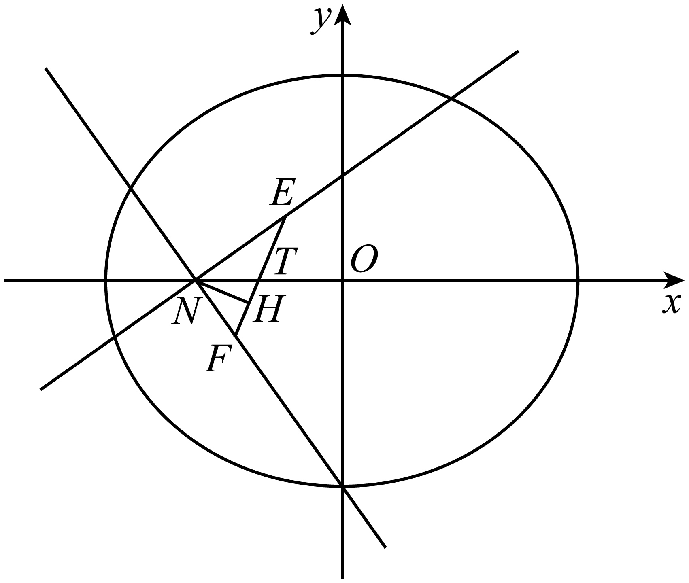
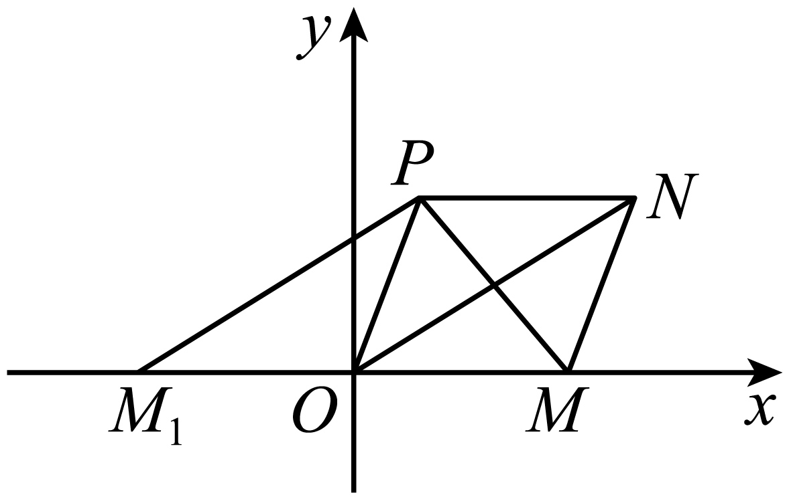
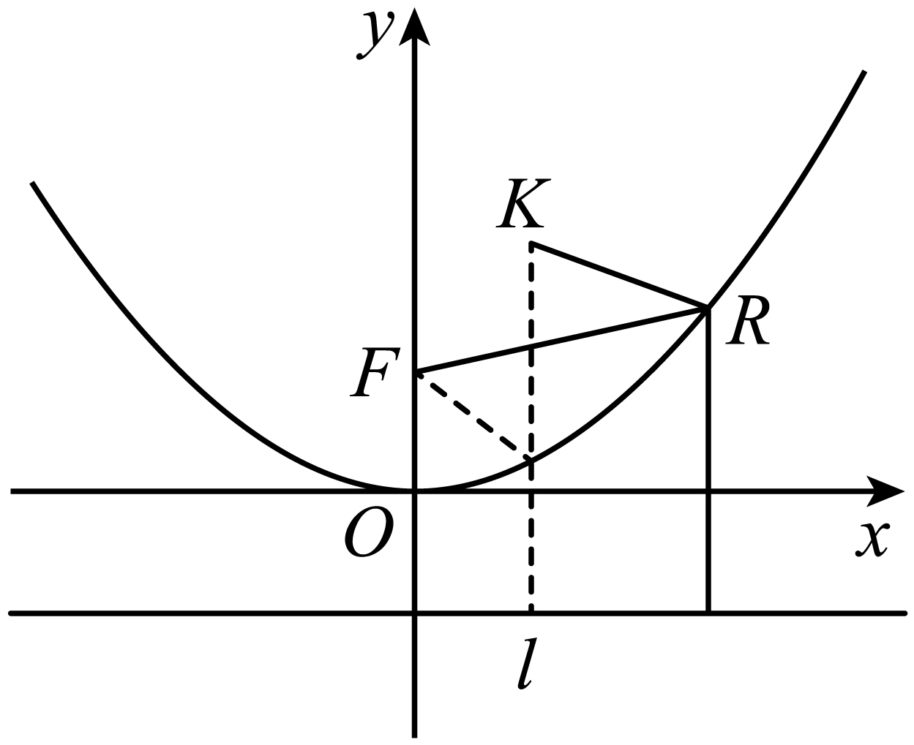
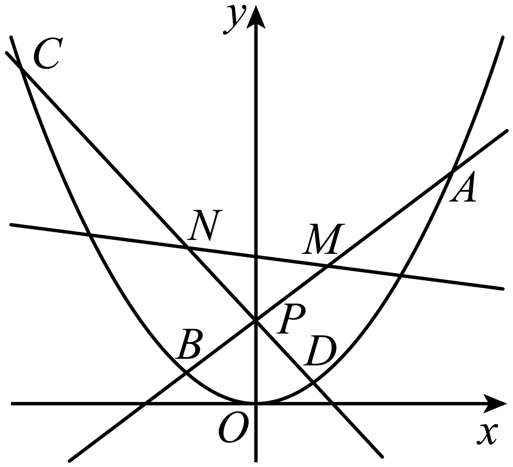
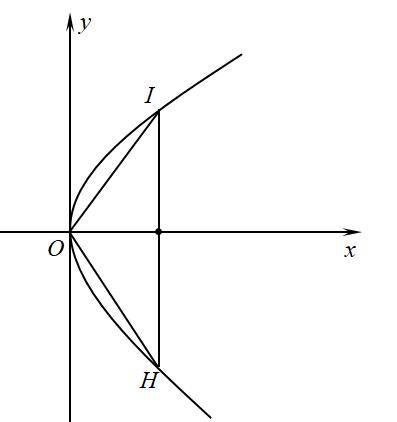
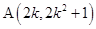
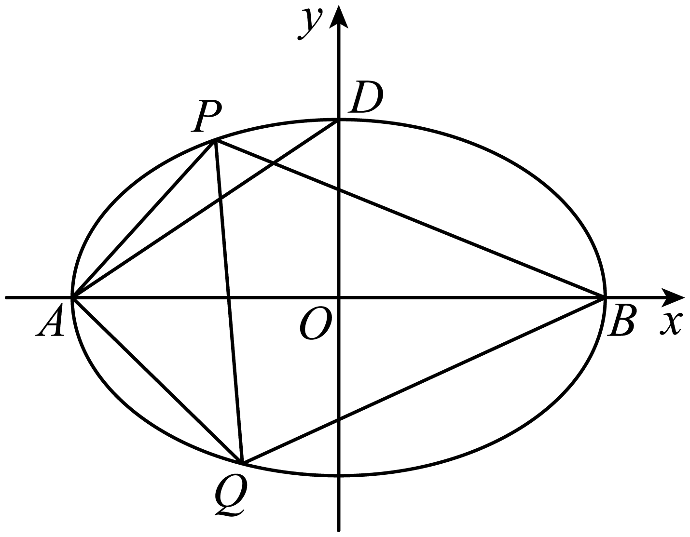
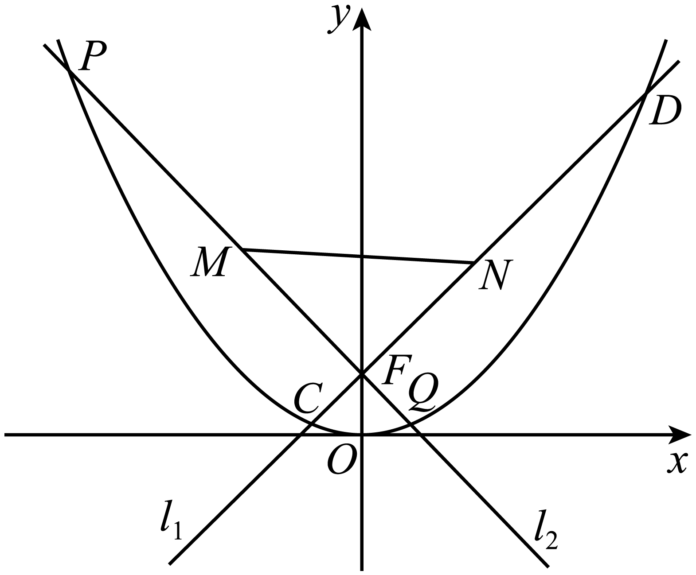
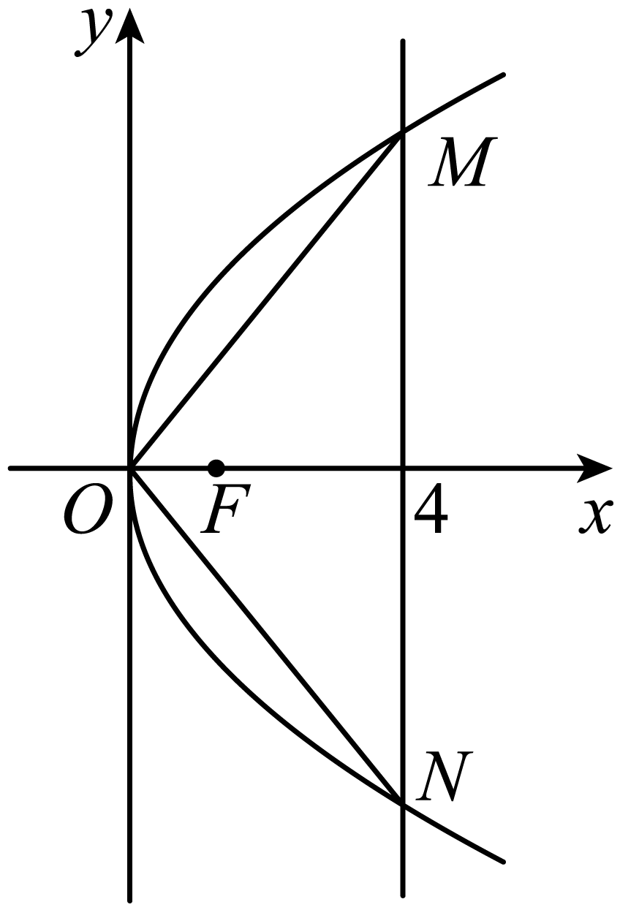
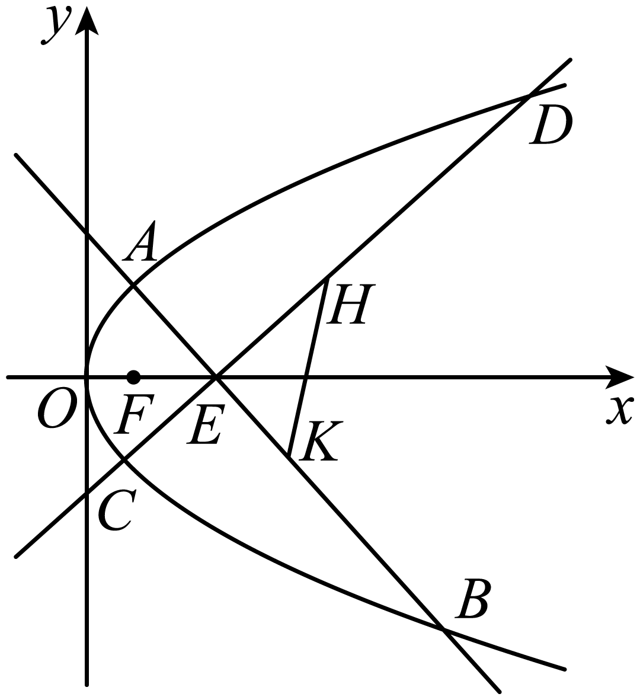

**第72讲  垂直弦问题**

**知识梳理**

1、过椭圆的右焦点作两条互相垂直的弦，．若弦，的中点分别为，，那么直线恒过定点．

2、过椭圆的长轴上任意一点作两条互相垂直的弦，．若弦，的中点分别为，，那么直线恒过定点．

3、过椭圆的短轴上任意一点作两条互相垂直的弦，．若弦，的中点分别为，，那么直线恒过定点．

4、过椭圆内的任意一点作两条互相垂直的弦，．若弦，的中点分别为，，那么直线恒过定点．

5、以为直角定点的椭圆内接直角三角形的斜边必过定点

6、以上顶点为直角顶点的椭圆内接直角三角形的斜边必过定点，且定点在轴上．

7、以右顶点为直角顶点的椭圆内接直角三角形的斜边必过定点，且定点在轴上．

8、以为直角定点的抛物线内接直角三角形的斜边必过定点，

9、以为直角定点的双曲线内接直角三角形的斜边必过定点

**必考题型全归纳**

**题型一：椭圆内接直角三角形的斜边必过定点**

<strong>例1．</strong>（2024·辽宁沈阳·高二东北育才学校校考阶段练习）已知点，动点<em>P</em>满足：∠<em>APB</em>=2<em>θ</em>，且|<em>PA</em>||<em>PB</em>|cos2<em>θ</em>=1.（<em>P</em>不在线段<em>AB</em>上）

(1)求动点*P*的轨迹*C*的方程；

(2)过椭圆的上顶点作互相垂直的两条直线分别交椭圆于另外一点*P*、*Q*，试问直线*PQ*是否经过定点，若是，求出定点坐标；若不是，说明理由.

【解析】（1）①当点*P*在*x*轴上且在线段*AB*外时，

设，则，，

由，

所以，故；

②当点*P*不在*x*轴上时，在△*PAB*中，

所以，

∴，即动点*P*在以*A、B*为两焦点的椭圆上，

方程为：且；

由①②知：动点*P*的轨迹*C*的方程为：；

（2）显然两直线斜率存在，设*AP*：*y*=*kx*+1，代入椭圆方程得，

所以，代替*k*同理可得，

直线*PQ*：，化简得；

令*x*=0，得，故直线*PQ*过定点.

<strong>例2．</strong>（2024·全国·高三专题练习）已知椭圆<em>C</em>的两个焦点分别为，，短轴长为2.

(1)求椭圆*C*的标准方程及离心率；

(2)*M*，*D*分别为椭圆*C*的左､右顶点，过*M*点作两条互相垂直的直线*MA*，*MB*交椭圆于*A*，*B*两点，直线*AB*是否过定点？并求出面积的最大值.

【解析】（1）由题意得：

，

故可知

椭圆方程为：，离心率为：

（2）*M*，*D*分别为椭圆*C*的左､右顶点

又由（1）可知： 设直线*AB*的方程为：，，

联立方程可得：

有韦达定理可知：，

又

又

展开后整理得：，解得：或（舍去）

直线恒过定点

令

则

由对勾函数的单调性可知：

所以，当且仅当，即时取等号

此时的最大值为：

**例3．**（2024·云南曲靖·高三校联考阶段练习）已知为圆上一动点，过点作轴的垂线段为垂足，若点满足.

(1)求点的轨迹方程；

(2)设点的轨迹为曲线，过点作曲线的两条互相垂直的弦，两条弦的中点分别为，过点作直线的垂线，垂足为点，是否存在定点，使得为定值？若存在，求出点的坐标；若不存在，请说明理由.

【解析】（1）由题意得，设点，则点，

因为，所以，则，

因为点在圆上，所以，则，即，

所以点轨迹方程为.

（2）①若两条互相垂直的弦所在直线的斜率均存在，则可设直线，

联立，得，

设直线与曲线两交点的坐标分别为，则，

；

直线，

同理可得：，

设直线与轴交于点，

则当直线斜率存在时，由得，

，即直线恒过点；

当直线斜率不存在时，由得，则，

则直线恒过点；

②若两条互相垂直的弦所在直线中有一条斜率不存在，则直线为轴，恒过，

综上：直线恒过点

在以中点为圆心，为直径的圆上，

取，则为定值；

存在点，使得为定值.

<strong>变式1．</strong>（2024·上海青浦·统考一模）在平面直角坐标系<em>xOy</em>中，已知椭圆，过右焦点作两条互相垂直的弦<em>AB</em>，<em>CD</em>，设<em>AB</em>，<em>CD</em>中点分别为，．

(1)写出椭圆右焦点的坐标及该椭圆的离心率；

(2)证明：直线*MN*必过定点，并求出此定点坐标；

(3)若弦*AB*，*CD*的斜率均存在，求面积的最大值．

【解析】（1）由椭圆方程可知：，，所以

右焦点坐标，该椭圆的离心率；

（2）证明：斜率均存在，

设，直线*AB*方程为，

则，

联立，

则有，

将上式中换为，可得，

若，则直线*MN*斜率不存在，此时直线*MN*过点，

下证动直线*MN*过定点，

若直线*MN*斜率存在，则，

直线*MN*方程为，

令得，所以此时直线*MN*也过定点，

当两条直线其中一条斜率不存在，一条直线斜率为0时，

不妨设斜率不存在，斜率为0，

此时，

则直线的方程为，过点，

综上，动直线*MN*过定点；

（3）由（2）可知直线*MN*过定点，

，

令，

，

因为，所以在上递减，

所以时，取得最大值，此时.

**变式2．**（2024·天津河北·高三天津外国语大学附属外国语学校校考阶段练习）设分别是椭圆的左､右焦点，是上一点，与轴垂直.直线与的另一个交点为，且直线的斜率为.

(1)求椭圆的离心率；

(2)设是椭圆的上顶点，过任作两条互相垂直的直线分别交椭圆于两点，证明直线过定点，并求出定点坐标.

【解析】（1）由题意知，点在第一象限，是上一点且与轴垂直，

的横坐标为.当时，，即.

又直线的斜率为，所以，

即，即

则，解得或（舍去），

即.

（2）已知是椭圆的上顶点，则，

由（1）知，解得，

所以，椭圆的方程为，

设直线的方程为，

联立可得，

所以，

又，

，

化简整理有，得或.

当时，直线经过点，不满足题意；.

当时满足方程中，

故直线经过轴上定点.

<strong>变式3．</strong>（2024·全国·高二专题练习）设分别是圆的左､右焦点，<em>M</em>是<em>C</em>上一点，与<em>x</em>轴垂直.直线与<em>C</em>的另一个交点为<em>N</em>，且直线<em>MN</em>的斜率为

(1)求椭圆*C*的离心率.

(2)设是椭圆*C*的上顶点，过*D*任作两条互相垂直的直线分别交椭圆*C*于*A*､*B*两点，过点*D*作线段*AB*的垂线，垂足为*Q*，判断在*y*轴上是否存在定点*R*，使得的长度为定值？并证明你的结论.

【解析】（1）由题意知，点在第一象限.是上一点且与轴垂直，

的横坐标为.当时，，即.

又直线的斜率为，所以，

即，即，

则，解得或（舍去），即.

（2）已知是椭圆的上顶点，则，椭圆的方程为，

易得直线*AB*的斜率必然存在，设直线的方程为，

由可得

所以，

又，.

，

化简整理有，得或.

当时，直线经过点，不满足题意；

当时满足方程中，故直线经过轴上定点.

又为过点作线段的垂线的垂足，故在以为直径的圆上，取的中点为，则为定值，且

**变式4．**（2024·云南昆明·高二统考期中）已知椭圆，直线被椭圆截得的线段长为.

(1)求椭圆的标准方程；

(2)过椭圆的右顶点作互相垂直的两条直线.分别交椭圆于两点（点不同于椭圆的右顶点），证明：直线过定点.

【解析】（1）根据题意，设直线与题意交于两点.不妨设点在第一象限，

又长为，∴，∴

∴，故的标准方程为

（2）显然直线的斜率存在且不为0，

设，由得，

∴，同理可得

当时，，

所以直线的方程为

整理得，所以直线

当时，直线的方程为，直线也过点

所以直线过定点.

**题型二：双曲线内接直角三角形的斜边必过定点**

<strong>例4．</strong>（2024·高二课时练习）已知双曲线<em>C</em>：经过点，且双曲线<em>C</em>的右顶点到一条渐近线的距离为．

(1)求双曲线*C*的方程；

(2)过点*P*分别作两条互相垂直的直线*PA*，*PB*与双曲线*C*交于*A*，*B*两点（*A*，*B*两点均与点*P*不重合），设直线*AB*：，试求和之间满足的关系式．

【解析】（1）已知双曲线*C*：经过点，

则，

右顶点为，不妨取渐近线为，即，

则，

从而可解得，

所以双曲线*C*的方程为；

（2）设，

联立，消得，

则，

则，

，

，

因为，则，

即，

即，

即，

整理得，

所以.

<strong>例5．</strong>（2024·江苏南京·高二校考开学考试）在平面直角坐标系<em>xOy</em>中，动点Р与定点<em>F</em>(2，0)的距离和它到定直线<em>l</em>：的距离之比是常数，记<em>P</em>的轨迹为曲线<em>E</em>.

(1)求曲线*E*的方程；

(2)设过点*A*(，0)两条互相垂直的直线分别与曲线*E*交于点*M*，*N*(异于点*A*)，求证：直线*MN*过定点.

【解析】（1）设*P*(*x*，*y*)，

因为*P*与定点*F*(2，0)的距离和它到定直线*l*：的距离之比是常数，

所以，

化简得，

所以曲线*E*的方程为.

（2）设<em>M</em>(<em>x1</em>，<em>y1</em>)，<em>N</em>(<em>x2</em>，<em>y2</em>)，

当直线*MN*斜率不存在，直线*AM*，*AN*分别为，，

分别联立，解得*M*(，)，*N*(，－)，

此时直线*MN*的方程为，过点(，0)；

当直线*MN*斜率存在时设其方程为，()

由，消去*y*得，

所以，即，

，，

因为*AM*⊥*AN*，

所以，即，

即，

即，

将，代入化简得：，

所以或，

当时，直线*MN*方程为(不符合题意舍去)，

当时，直线*MN*方程为，*MN*恒过定点(，0)，

综上所述直线*MN*过定点(，0).

<strong>例6．</strong>（2024·全国·高三专题练习）已知双曲线，经过双曲线上的点作互相垂直的直线<em>AM</em>､<em>AN</em>分别交双曲线于<em>M</em>､<em>N</em>两点.设线段<em>AM</em>､<em>AN</em>的中点分别为<em>B</em>､<em>C</em>，直线<em>OB</em>､<em>OC</em>（<em>O</em>为坐标原点）的斜率都存在且它们的乘积为.

(1)求双曲线的方程；

(2)过点*A*作（*D*为垂足），请问：是否存在定点*E*，使得为定值？若存在，求出点*E*的坐标；若不存在，请说明理由.

【解析】（1）设､，线段*AM*､*AN*的中点分别为､，

由已知，得；

两式相减，得，即①

根据中点坐标及斜率公式，得

，，，.代入①，

得②同理，得③，②③相乘，得.

∵，，∴④

由，与④联立，得，，

双曲线的方程为：.

（2）①当时，设，，，，

由*AM*､*AN*互相垂直，得，

由解得（此时无实数解，故舍去），或（此时*M*､*N*至少一个点与*A*重合，与条件不符，故舍去）.综上，此时无符合条件的解.

②当不成立时，设直线，､

代入得，且

∵

∴，即，

解得：或.

当时，过点，与条件不符，舍去.

∴ ，，过定点

∴ *AP*中点，由于（*D*为垂足），故.

综上所述，存在定点，使得为定值.

**题型三：抛物线内接直角三角形的斜边必过定点**

<strong>例7．</strong>（2024·江苏泰州·高二靖江高级中学校考阶段练习）已知抛物线<em>C</em>：的焦点为<em>F</em>，斜率为1的直线<em>l</em>经过<em>F</em>，且与抛物线<em>C</em>交于<em>A</em>，<em>B</em>两点，．

(1)求抛物线*C*的方程；

(2)过抛物线*C*上一点作两条互相垂直的直线与抛物线*C*相交于两点（异于点*P*），证明：直线恒过定点，并求出该定点坐标．

【解析】（1）设，

由题意知，则直线*l*方程为，

代入，得，，

∴，

由抛物线定义，知，，

∴，∴，

∴抛物线的方程为.

（2）证明：在抛物线上，，

由题意，直线的斜率不为0，设直线的方程为，

设，

由，得 ，

则，且，

又，

，

由题意，可知, ,

故，

故，

整理得 ，即，

或，即或．

若，则 ，

此时直线过定点，不合题意；

若，则，

此时直线过定点，符合题意，

综上，直线过异于*P*点的定点．

**例8．**（2024·内蒙古巴彦淖尔·高二校考阶段练习）已知抛物线的焦点关于直线的对称点恰在抛物线的准线上．

(1)求抛物线的方程；

(2)是抛物线上横坐标为的点，过点作互相垂直的两条直线分别交抛物线于两点，证明直线恒经过某一定点，并求出该定点的坐标．

【解析】（1）由已知得，设，则中点为，

关于直线对称，

点*R*在直线*l*上，

，解得，即．

又由，得直线的斜率，

，解得，

∴．

（2）证明：设直线的方程为，、均不与*M*重合，

由得，

，．

由（1）得，

，，

又由得，即，

∴，

∴，

∴，∴，

∴，∴，

直线的方程为，即，

∴直线恒过定点．

<strong>例9．</strong>（2024·江西吉安·高二吉安一中校考阶段练习）已知抛物线，<em>O</em>是坐标原点，<em>F</em>是<em>C</em>的焦点，<em>M</em>是<em>C</em>上一点，，．

(1)求抛物线*C*的标准方程；

(2)设点在*C*上，过*Q*作两条互相垂直的直线，分别交*C*于*A*，*B*两点（异于*Q*点）．证明：直线恒过定点．

【解析】（1）由，可得，

代入．

解得或（舍），

所以抛物线的方程为：．

（2）解:由题意可得，直线的斜率不为0，

设直线的方程为，设，

由，得，从而，

则．

所以，

，

∵，

∴，

故，

整理得．即，

从而或，

即或．

若，则，过定点，与*Q*点重合，不符合；

若，则，过定点．

综上，直线过异于*Q*点的定点．

**变式5．**（2024·浙江·高三专题练习）已知抛物线的焦点也是椭圆的一个焦点，如图，过点任作两条互相垂直的直线，，分别交抛物线于，，，四点，，分别为，的中点.

(1)求的值；

(2)求证：直线过定点，并求出该定点的坐标；

(3)设直线交抛物线于，两点，试求的最小值.

【解析】（1）椭圆的焦点坐标为，

由于抛物线的焦点也是椭圆的一个焦点，

故，即，；

（2）由（1）知，抛物线的方程为，

设，，，，

由题意，直线的斜率存在且

设直线的方程为，

代入可得，

则，

故，

故的中点坐标为，

由，设直线的方程为，

代入可得，

则，

故，

可得的中点坐标为，

令得，

此时，

故直线过点，

当时，，

所以，，，三点共线，

所以直线过定点.

（3）设，

由题意直线的斜率存在，设直线的方程为，

代入可得，

则，，

，

故，当即直线垂直轴时，取得最小值.

**变式6．**（2024·四川绵阳·高二校考阶段练习）已知抛物线：的焦点为，点在抛物线上，且．

（1）求抛物线的方程；

（2）过抛物线上一点作两条互相垂直的弦和，试问直线是否过定点，若是，求出该定点；若不是，请说明理由．

【解析】（1），解得：

故抛物线C的方程为：..

（2）由题可得，直线的斜率不为

设直线：，，

联立，得：，

，..

由，则，即

于是

，所以

或.

当时，

直线：，恒过定点，不合题意，舍去.

当，，直线：，恒过定点

综上可知，直线恒过定点.

**变式7．**（2024·全国·高三专题练习）已知抛物线：的焦点为，直线与轴的交点为，与抛物线的交点为，且．

（1）求抛物线的方程；

（2）过抛物线上一点作两条互相垂直的弦和，试问直线是否过定点，若是，求出该定点；若不是，请说明理由．

【解析】（1）设，代入得：，即

由得：，解得：或（舍去）

故抛物线C的方程为：.

（2）由题可得，直线的斜率不为

设直线：，，

联立，得：，

，，

由，则，即.

于是

，所以

或

当时，

直线：，恒过定点，不合题意，舍去.

当，，直线：，恒过定点

综上可知，直线恒过定点

**变式8．**（2024·云南曲靖·高二校考期末）已知点与点的距离比它的直线的距离小2．

(1)求点的轨迹方程；

(2)是点轨迹上互相垂直的两条弦，问：直线是否经过轴上一定点，若经过，求出该点坐标；若不经过，说明理由．

【解析】（1）（1）由题意知动点到的距离比它到直线的距离小2，

即动点到的距离与它到直线的距离相等，

由抛物线定义可知动点的轨迹为以为焦点的抛物线，

则点的轨迹方程为；

（2）（2）法一：由题意知直线的斜率显然不能为0，

设直线的方程为，，

联立方程，消去，可得，即，

，，

由题意知，即，则，

故， ，，直线的方程为，

故直线过定点，且定点坐标为；

法二：假设存在定点，设定点，

， ， 故，

在抛物线上，即代入上式，可得，

故，三点共线， ，，

假设成立，直线经过轴的定点，坐标为．

**题型四：椭圆两条互相垂直的弦中点所在直线过定点**

**例10．**（2024·福建龙岩·统考一模）双曲线：的左右顶点分别为，，动直线垂直的实轴，且交于不同的两点，直线与直线的交点为.

（1）求点的轨迹的方程；

（2）过点作的两条互相垂直的弦，，证明：过两弦，中点的直线恒过定点.

【解析】（1）因为，

设 则且①，

因为动直线交双曲线于不同的两点，所以且，

因为直线的方程为②，

直线的方程为③，

②③得，

把①代入上式得，化简得，

所以点的轨迹的方程为.

（2）依题意得直线与直线斜率均存在且不为0，

设直线的方程为，则直线的方程为，

联立得，

则，设，

，，

所以的中点，

同理的中点，

所以直线的斜率为，

所以直线的方程为，

整理得，

所以直线恒过定点，即过两弦中点的直线恒过定点.

<strong>例11．</strong>（2024·全国·高二期末）已知椭圆的左右焦点分别为，抛物线与椭圆有相同的焦点，点<em>P</em>为抛物线与椭圆在第一象限的交点，且．

(1)求椭圆的方程；

(2)过*F*作两条斜率不为0且互相垂直的直线分别交椭圆于*A，B*和*C，D*，线段*AB*的中点为*M*，线段*CD*的中点为*N*，证明：直线过定点，并求出该定点的坐标．

【解析】（1）抛物线焦点坐标为，故.

设，由抛物线定义得：点*P*到直线的距离为*t.*

，由余弦定理，得.

整理，得，解得或（舍去）.

由椭圆定义，得，

，

∴椭圆的方程为；

（2）设，

联立，

即，

，代入直线方程得，

，

同理可得，

，

，

令，得，

所以直线*MN*过定点.

**例12．**（2024·上海闵行·高二闵行中学校考期末）在平面直角坐标系中，为坐标原点，，已知平行四边形两条对角线的长度之和等于4．

(1)求动点的轨迹方程；

(2)过作互相垂直的两条直线、，与动点的轨迹交于、，与动点的轨迹交于点、，、的中点分别为、；证明：直线恒过定点，并求出定点坐标；

(3)在（2）的条件下，求四边形面积的最小值．

【解析】（1）

取点，则有，所以四边形是平行四边形，

所以，因为，所以，

所以动点的轨迹为椭圆（左右顶点除外），所以，，

所以，所以动点的轨迹方程为．

（2）当垂直于轴时，的中点，

直线为轴，与椭圆，无交点，不合题意，

当直线不垂直于轴时，不妨设直线的方程为，

，，

由，得，

所以△，

所以，，

所以，

所以，

因为，以代替，得，

所以直线的斜率为，

所以直线的方程为，

由椭圆的对称性得，若存在这样的定点必在轴上，

令，则，

所以，

所以直线恒过定点，

当时，，，

所以直线恒过定点，

综上所述，直线恒过定点．

（3）由（2）得，，

所以

，

同理可得，

所以四边形的面积，

令，则，

所以，

因为，所以，

当，即时，，所以，

所以四边形的面积最小值为．

**变式9．**（2024·上海浦东新·高三上海市洋泾中学校考阶段练习）已知椭圆的离心率为，椭圆截直线所得线段的长度为．过作互相垂直的两条直线、，直线与椭圆交于、两点，直线与椭圆交于、两点，、的中点分别为、．

(1)求椭圆的方程；

(2)证明：直线恒过定点，并求出定点坐标；

(3)求四边形面积的最小值．

【解析】（1）由题意得椭圆过点，

，

解得，，，

；

（2）当直线、斜率均存在且不为0时，

设，，

则，，，

由，，

得，，

，

由，，

得，，

可得，

① 当时，

直线的斜率为，

直线的方程为，

化简得，过定点，

② 当时，

直线的方程为，过点，

当直线、斜率一个不存在一个为0时，、的中点坐标分别为、时．直线的方程为，过点，

综上，直线恒过定点；

（3）当直线或斜率一个不存在一个为0时，，

当直线、斜率均存在时且不为0时，

由（2）得

，

，

，

当且仅当即时等号成立，

综上，四边形面积的最小值为.

**变式10．**（2024·全国·高三专题练习）已知椭圆上任意一点到椭圆两个焦点的距离之和为，且离心率为．

(1)求椭圆的标准方程；

(2)设为的左顶点，过点作两条互相垂直的直线分别与交于两点，证明：直线经过定点，并求这个定点的坐标．

【解析】（1）由椭圆定义知：，解得：，

又离心率，，，

椭圆的标准方程为：.

（2）由（1）知：；

当直线斜率存在时，设，，，

由得：，

则，解得：，

，，

，，

即，

，

即，

整理可得：，或；

当时，直线恒过点，不合题意；

当时，直线，恒过定点；

当直线斜率不存在且恒过时，即，

由得：，，满足题意；

综上所述：直线恒过定点.

**题型五：双曲线两条互相垂直的弦中点所在直线过定点**

<strong>例13．</strong>（2024·高二课时练习）已知双曲线<em>C</em>的右焦点<em>F</em>，半焦距<em>c</em>=2，点<em>F</em>到直线的距离为，过点<em>F</em>作双曲线<em>C</em>的两条互相垂直的弦<em>AB</em>，<em>CD</em>，设<em>AB</em>，<em>CD</em>的中点分别为<em>M</em>，<em>N</em>.

(1)求双曲线*C*的标准方程；

(2)证明：直线*MN*必过定点，并求出此定点的坐标.

【解析】（1）依题意，*c*=2，，解得，

所以双曲线的方程为：.

（2）点，当直线*AB*不垂直于坐标轴时，设直线*AB*的方程为：，，，

由消去*x*并整理得：，显然，

则，有，于是得弦*AB*中点，

因，同理可得点，

当直线*MN*不垂直于*x*轴时，直线*MN*的斜率，

因此，直线*MN*的方程为：，化简得，

于是得直线*MN*恒过定点，

当直线*MN*垂直于*x*轴时，由得，直线*MN*：过定点，

则当直线*AB*不垂直于坐标轴时，直线*MN*恒过定点，

当*AB*垂直于*x*轴，即*k*=0时，则弦*AB*的中点*M*与*F*重合，弦*CD*的中点*N*与原点重合，此时*MN*为*x*轴，直线*MN*过，

当*AB*垂直于*y*轴时，则弦*AB*的中点*M*为原点，弦*CD*中点*N*与*F*重合，此时直线*MN*为*x*轴，直线*MN*也过点，

所以直线*MN*恒过定点.

**例14．**（2024·黑龙江·黑龙江实验中学校考三模）在平面直角坐标系中，已知动点到点的距离与它到直线的距离之比为．记点的轨迹为曲线．

(1)求曲线的方程；

(2)过点作两条互相垂直的直线，.交曲线于，两点，交曲线于，两点，线段的中点为，线段的中点为．证明：直线过定点，并求出该定点坐标．

【解析】（1）设，根据题意可得，

化简得曲线的方程为.

（2）证明：设，，

①若直线，都存且不为零，

设直线的方程为，则直线的方程为，

由，得，

当时，这个方程变为只有一解，

直线与曲线只有一个交点，不合题意，

当时，，

直线与曲线恒有两个交点，

由韦达定理， ，

故线段的中点为，

同理，线段的中点为，

若，则，

直线的方程为，

即，

此时，直线恒过点．

若，则，或，，直线的方程为，

此时直线也过点，

②若直线，中其中一条的斜率为，另一条的斜率不存在，

不妨设的斜率为，则直线：，：*x*＝2，

此时，直线的方程为，

此时，直线也过点，

综上，直线恒过点．

**例15．**（2024·山西大同·高三统考阶段练习）已知双曲线：的右焦点为，半焦距，点到右准线的距离为，过点作双曲线的两条互相垂直的弦，，设，的中点分别为，.

（1）求双曲线的标准方程；

（2）证明：直线必过定点，并求出此定点坐标.

【解析】（1）由题设可得，，所以，.

所以双曲线的标准方程为.

（2）证明：点，设过点的弦所在的直线方程为，，，

则有.

联立，可得.

因为弦与双曲线有两个交点，所以，

所以，所以.

（1）当时，点即是点，此时，直线为轴.

（2）当时，将上式点坐标中的换成，同理可得.

①当直线不垂直于轴时，

直线的斜率，

其方程，化简得，

所以直线过定点；

②当直线垂直于轴时，，此时，，直线也过定点.

综上所述，直线过定点.

**变式11．**（2024·贵州·校联考模拟预测）已知双曲线的一条渐近线方程为，焦点到渐近线的距离为.

(1)求的方程；

(2)过双曲线的右焦点作互相垂直的两条弦（斜率均存在）、.两条弦的中点分别为、，那么直线是否过定点?若不过定点，请说明原因；若过定点，请求出定点坐标.

【解析】（1）设双曲线的焦点坐标为，

依题意渐近线方程为，即，

有，

解得，

；

（2）由（1）可知右焦点，

设直线：，，，

由联立直线与双曲线，

化简得，，

故，，

，

又，则，

同理可得：

，

，

化简得，

故直线过定点.

**题型六：抛物线两条互相垂直的弦中点所在直线过定点**

**例16．**（2024·全国·高二专题练习）已知抛物线：焦点为，为上的动点，位于的上方区域，且的最小值为3.

(1)求的方程；

(2)过点作两条互相垂直的直线和，交于，两点，交于，两点，且，分别为线段和的中点.直线是否恒过一个定点?若是，求出该定点坐标；若不是，说明理由.

【解析】（1）抛物线：焦点为，准线为，

设到的距离为，因为位于的上方区域，

根据抛物线的定义可知（当且仅当时取等号），

又的最小值为，所以，解得，

所以抛物线：.

（2）依题意直线和的斜率均存在且不为，

设直线的方程为，则直线的方程为，，，

联立方程得，消去并整理得，

则，则，，

所以，

因为为的中点，所以，同理，

所以直线的方程为，

整理得，所以直线恒过点.

**例17．**（2024·全国·高三专题练习）已知一个边长为的等边三角形的一个顶点位于原点，另外两个顶点在抛物线上.

(1)求抛物线的方程；

(2)过点作两条互相垂直的直线和，交抛物线于、两点，交抛物线于，两点，若线段的中点为，线段的中点为，证明：直线过定点．

【解析】（1）由对称性可知等边三角形的顶点在上，

代入得：，解得：，

所以抛物线方程为：；

（2）由题意知和斜率均存在，，设直线方程为，

则直线方程为，

由联立得：，

设，则，

故，同理得

故直线*MN*方程为

整理得：，故直线*MN*过定点

<strong>例18．</strong>（2024·全国·高三专题练习）已知抛物线<em>C</em>：的焦点为<em>F</em>，过焦点<em>F</em>且垂直于<em>x</em>轴的直线交<em>C</em>于<em>H</em>，<em>I</em>两点，<em>O</em>为坐标原点，的周长为．

(1)求抛物线*C*的方程；

(2)过点*F*作抛物线*C*的两条互相垂直的弦*AB*，*DE*，设弦*AB*，*DE*的中点分别为*P*，*Q*，试判断直线*PQ*是否过定点？若过定点．求出其坐标；若不过定点，请说明理由．

【解析】（1）由题意，在中代入，得，解得，

所以．

由勾股定理得|，

则的周长为，解得，

故抛物线*C*的方程为．

（2）由题意可知，直线*AB*的斜率存在，且不为0．

设直线*AB*的方程为，，．

联立消去*x*，得，，

则，从而．

因为*P*是弦*AB*的中点，所以，同理可得．

当，即时，直线*PQ*的斜率，

则直线*PQ*的方程为，即．

故直线*PQ*过定点；

当，即时，直线*PQ*的方程为，也过点．

综上所述，直线*PQ*过定点．

<strong>变式12．</strong>（2024·山西·高二校联考期末）已知抛物线<em>C</em>：（），过点作两条互相垂直的直线和，交抛物线<em>C</em>于<em>A</em>，<em>B</em>两点，交抛物线<em>C</em>于<em>D</em>，<em>E</em>两点，抛物线<em>C</em>上一点到焦点<em>F</em>的距离为3．

(1)求抛物线*C*的方程；

(2)若线段*AB*的中点为*M*，线段*DE*的中点为*N*，求证：直线*MN*过定点．

【解析】(1)到焦点*F*的距离为3，则准线为，，

抛物线方程为．

(2)由题意知和斜率均存在，，设直线方程为，

则直线方程为，

由联立得，

设，则，

故，同理得

故直线*MN*方程为

整理得，故直线*MN*过定点

<strong>变式13．</strong>（2024·全国·高三专题练习）动圆<em>P</em>与直线相切，点在动圆上．

(1)求圆心*P*的轨迹*Q*的方程；

(2)过点*F*作曲线*O*的两条互相垂直的弦*AB，CD*，设*AB，CD*的中点分别为*M，N*，求证：直线*MN*必过定点．

【解析】（1）设，根据题意，有，化简，得，

即圆心*P*的轨迹*Q*的方程为．

（2）由题意，知直线*AB*的斜率存在且不为0．

设直线，

代入，得，所以．

因为*M*是线段*AB*的中点，所以．

因为，所以将点*M*坐标中的*k*换成，即得．

当，即时，直线；

当时．直线．

整理，得，所以直线*MN*过定点．

综上所述，不论*k*为何值，直线*MN*必过定点．

<strong>变式14．</strong>（2024·全国·高三专题练习）已知抛物线的焦点为<em>F</em>，点<em>M</em>在抛物线<em>C</em>上，<em>O</em>为坐标原点，是以为底边的等腰三角形，且的面积为．

(1)求抛物线*C*的方程．

(2)过点*F*作抛物线*C*的两条互相垂直的弦，，设弦，的中点分别为*P*，*Q*，试判断直线是否过定点．若是，求出所过定点的坐标；若否，请说明理由．

【解析】（1）由题意可知．

因为是以为底边的等腰三角形，所以．

因为的面积为，所以，解得．

故抛物线*C*的方程为．

（2）由题意可知，直线的斜率存在，且不为0．

设直线的方程为，，．

联立，整理得，，

则，从而．

因为*P*是弦的中点，所以，

同理可得．

当，即时，直线的斜率，

则直线的方程为，即．

故直线过定点．

当，即时，直线的方程为，且过点．

综上，直线过定点．

<strong>变式15．</strong>（2024·安徽滁州·高二校考开学考试）在平面直角坐标系中，设点，直线，点<em>P</em>在直线<em>l</em>上移动，<em>R</em>是线段<em>PF</em>与<em>y</em>轴的交点，也是<em>PF</em>的中点．，．

(1)求动点*Q*的轨迹的方程*E*；

(2)过点*F*作两条互相垂直的曲线*E*的弦*AB*、*CD*，设*AB*、*CD*的中点分别为*M*，*N*．求直线*MN*过定点*R*的坐标．

【解析】（1）∵直线的方程为，点*R*是线段*FP*的中点且，

∴*RQ*是线段*FP*的垂直平分线,

∵,   ∴是点*Q*到直线*l*的距离,

∵点*Q*在线段*FP*的垂直平分线，∴,

则动点*Q*的轨迹*E*是以*F*为焦点，*l*为准线的抛物线，但不能和原点重合，

即动点*Q*的轨迹的方程为.

（2）设，，由题意直线*AB*斜率存在且不为0，设直线*AB*的方程为，

由已知得，两式作差可得，即，则，

代入可得，即点*M*的坐标为，

同理设，，直线的方程为，

由已知得，两式作差可得，即，

则，代入可得，即点的坐标为，

则直线*MN*的斜率为，

即方程为，整理得，

故直线*MN*恒过定点.

<strong>变式16．</strong>（2024·福建福州·高二校考期中）在平面直角坐标系 <em>xOy</em>中，<em>O</em>为坐标原点，已知点，<em>P</em>是动点，且三角形<em>POQ</em>的三边所在直线的斜率满足.

(1)求点*P*的轨迹*C*的方程；

(2)过*F*作倾斜角为60°的直线*L*，交曲线*C*于*A*，*B*两点，求△*AOB*的面积；

(3)过点任作两条互相垂直的直线，分别交轨迹 *C* 于点*A*，*B*和*M*，*N*，设线段*AB*，*MN*的中点分别为*E*，*F.*，求证：直线*EF*恒过一定点.

【解析】（1）设点*P*的坐标为，则，

由，得，整理得点*P*的轨迹的方程为：

（2）设，由得：

，

（3）证明：设点*A,B*的坐标为，则点*E*的坐标为.

由题意可设直线的方程为，

由，消去y得，

，∵直线与抛物线交于*A*，*B*两点，

，

∴点*E*的坐标为，由题知，直线的斜率为，同理可得*F*的坐标为.

当时，有.此时直线*EF*的斜率为：

∴直线*EF*的方程为，

整理得，恒过定点，当时，直线*EF*的方程为，也过点.

综上所述，直线*EF*恒过定点.

**变式17．**（2024·宁夏银川·高二银川一中校考期末）已知椭圆的左、右焦点分别为、，抛物线的焦点与椭圆的右焦点重合，点为抛物线与椭圆在第一象限的交点，且.

(1)求椭圆的方程；

(2)过作两条斜率不为且互相垂直的直线分别交椭圆于、和、，线段的中点为，线段的中点为，证明：直线过轴上一定点，并求出该定点的坐标.

【解析】（1）抛物线焦点为，故，易知点，

设点，其中，，且，

，整理可得，

即，，解得，所以，，

所以，，则，，

因此，椭圆的方程为.

（2）设直线的方程为，其中，设点、，

联立，

，所以，，

，故点，

同理可得点，

所以，，

所以，直线的方程为，即，

因此，直线过定点.

**变式18．**（2024·湖南·高三阶段练习）如图，已知抛物线的顶点在坐标原点，焦点在轴正半轴上，准线与轴的交点为．过点作圆的两条切线，两切点分别为，，且．

（1）求抛物线的标准方程；

（2）如图，过抛物线的焦点任作两条互相垂直的直线，，分别交抛物线于，两点和，两点，，分别为线段和的中点，求面积的最小值．

【解析】（1）由对称性知，轴，设与轴的交点为，则．在中，；（2）设直线的斜率为，由过：．代入点

，同理可得点：过定点的面积：（当且仅当时取等号）的面积的最小值为．

试题解析：（1）由对称性知，轴，设与轴的交点为，则．

连，则中，，则

因为为圆的切线，则．由射影定理，得，则

因为圆心的坐标为，则，所以，即，得．

所以抛物线的标准方程为

（2）设直线的斜率为，因为过焦点，则直线的方程为．代入，得

．设点，，则．因为为线段的中点，则点

因为，则直线的方程为．同理可得点

直线的方程为，即，显然过定点

设的面积为，与轴的交点为，则

，当且仅当时取等号．所以的面积的最小值为

**题型七：内接直角三角形范围与最值问题**

**例19．**（2024·江西·高二校联考开学考试）设椭圆的两焦点为，，为椭圆上任意一点，点到原点最大距离为2，若到椭圆右顶点距离为.

(1)求椭圆的方程.

(2)设椭圆的上、下顶点分别为、，过作两条互相垂直的直线交椭圆于、，问直线是否经过定点？如果是，请求出定点坐标，并求出面积的最大值.如果不是，请说明理由.

【解析】（1）∵点到原点最大距离为2，故，

∵到椭圆右顶点距离为，∴，

解得：或5（舍去5），

∴椭圆的方程为.

（2）设：，联立，

得：，

∴，，

∵，∴，

即

，

利用韦达定理代入化简得：，

解得：（舍去）或，

∴直线过定点，

此时，，

，

令，上式①，

而，∴①，

∴面积的最大值为.

<strong>例20．</strong>（2024·上海·高二专题练习）在平面直角坐标系<em>xOy</em>中，已知椭圆，过右焦点作两条互相垂直的弦<em>AB</em>，<em>CD</em>，设<em>AB</em>，<em>CD</em>中点分别为，.

(1)写出椭圆右焦点的坐标及该椭圆的离心率；

(2)证明：直线*MN*必过定点，并求出此定点坐标；

(3)若弦*AB*，*CD*的斜率均存在，求面积的最大值.

【解析】（1）由椭圆的方程，可得，可得，所以，即右焦点的坐标为，离心率,所以椭圆右焦点的坐标为，离心率.

（2）证明：当直线*AB*，*CD*的斜率存在且不为0时，

设直线*AB*的方程为，

设联立，

整理可得：，

可得，，

所以*AB*的中点，

同理可得的坐标，即，

当，的横坐标不相等时，则，

所以*MN*的方程为，

整理可得

所以直线恒过定点.

当，的横坐标相等时，，即时，则轴，

且此时*MN*的方程为，显然也过，

可证得直线*MN*必过定点.

（3）由（2）可得直线*MN*必过的定点，

可得

，

设，则，

在上单调递减，所以，

所以面积的最大值为.

<strong>例21．</strong>（2024·江苏南通·高三统考阶段练习）已知椭圆的离心率为，左、右顶点分别为<em>A</em>，，上顶点为，坐标原点到直线的距离为.

(1)求椭圆的方程；

(2)过*A*点作两条互相垂直的直线，与椭圆交于，两点，求面积的最大值.

【解析】（1）由已知可得，解得，，，，

所以椭圆的方程为.

（2）设的直线方程为，，，

联立方程整理得，

所以，

因为，

所以，

即.

所以.

整理得，解得或（舍去），

所以

所以，

令，

则，

此时最大值为.

**题型八：两条互相垂直的弦中点范围与最值问题**

<strong>例22．</strong>（2024·新疆·统考二模）在平面直角坐标系<em>xOy</em>中，抛物线<em>G</em>的准线方程为.

(1)求抛物线*G*的标准方程；

(2)过抛物线的焦点*F*作互相垂直的两条直线和，与抛物线交于*P*，*Q*两点，与抛物线交于*C*，*D*两点，*M*，*N*分别是线段*PQ*，*CD*的中点，求△*FMN*面积的最小值.

【解析】（1）设抛物线标准方程为，其中，

由题意得，解得，则焦点，

故抛物线标准方程为.

（2）,由题意知直线的斜率都存在且不为，

设直线的方程为,

则直线的方程为,

由得，则，

所以,

所以,

所以.

用替换可得，所以.

所以

,当且仅当,即时等号成立，

所以面积的最小值为16.

**例23．**（2024·广东珠海·高三校考开学考试）已知抛物线，点为其焦点，直线与抛物线交于两点，为坐标原点，．

(1)求抛物线的方程；

(2)过轴上一动点作互相垂直的两条直线，与抛物线分别相交于点和，点分别为的中点，求的最小值．

【解析】（1）

直线方程为，将其代入抛物线可得，

由已知得，解得，

故抛物线的方程为．

（2）

因为，若直线分别与两坐标轴垂直，

则直线中有一条与抛物线只有一个交点，不合题意，

所以直线的斜率均存在且不为0．设直线的斜率为，

则直线的方程为．

联立，得，则，

设，

则，设，则，则，

所以，同理可得，

故，

当且仅当且，即时等号成立，

故的最小值为6

