**第73讲  斜率题型全归纳**

**知识梳理**

**1、** 已知是椭圆上的定点，直线（不过点）与椭圆交于，两点，且，则直线斜率为定值．

2、已知是双曲线上的定点，直线（不过点）与双曲线交于，两点，且，直线斜率为定值．

3、已知是抛物线上的定点，直线（不过点）与抛物线交于，两点，若，则直线斜率为定值．

4、为椭圆上一定点，过点作斜率为，的两条直线分别与椭圆交于两点．

（1）若，则直线过定点；

（2）若，则直线过定点．

5、设是直角坐标平面内不同于原点的一定点，过作两条直线，交椭圆于、、、，直线，的斜率分别为，，弦，的中点记为，．

（1）若，则直线过定点；

（2）若，则直线过定点．

6、过抛物线上任一点引两条弦，，直线，斜率存在，分别记为，即，则直线经过定点．

**必考题型全归纳**

**题型一：斜率和问题**

<strong>例1．</strong>（2024·重庆渝中·高三重庆巴蜀中学校考阶段练习）已知点，，是异于<em>A</em>，的动点，，分别是直线，的斜率，且满足.

(1)求动点的轨迹方程；

(2)在线段上是否存在定点，使得过点的直线交的轨迹于，两点，且对直线上任意一点，都有直线，，的斜率成等差数列.若存在，求出定点，若不存在，请说明理由.

【解析】（1）由题意，即，

又直线，的斜率存在，所以点的轨迹方程为

（2）若存在这样的定点，不妨设为，令，，，

直线的方程为，

，

由韦达定理得：，，，

，

，

对任意成立，所以

由得，

所以，

对任意成立，，经检验，符合题意，

所以，存在满足题意.

**例2．**（2024·河南洛阳·高三伊川县第一高中校联考开学考试）已知抛物线与抛物线在第一象限交于点.

(1)已知为抛物线的焦点，若的中点坐标为，求；

(2)设为坐标原点，直线的斜率为.若斜率为的直线与抛物线和均相切，证明为定值，并求出该定值.

【解析】（1）由得，设，

因为的中点坐标为，所以，

解得.

（2）

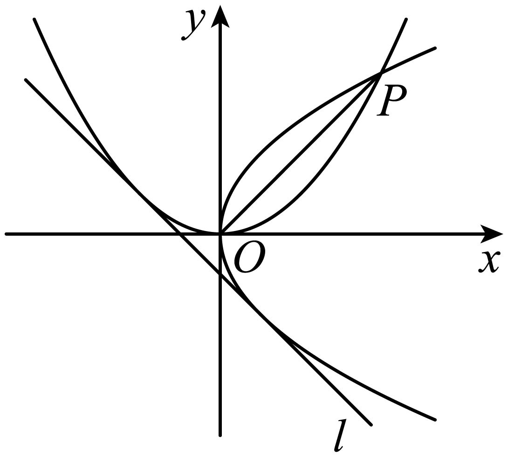

联立，解得或，

所以，

所以直线的斜率.

设直线的方程为.

联立，消去得，

因为直线与抛物线相切，

所以，即，

若，则，不符合题意，

所以，即，①

联立，消去得，

因为直线与抛物线相切，

所以，即，②

由①②可得，所以，

故为定值，该定值为0.

**例3．**（2024·广东广州·高三广州市真光中学校考阶段练习）已知双曲线，渐近线方程为，点在上；

(1)求双曲线的方程；

(2)过点的两条直线，分别与双曲线交于，两点（不与点重合），且两条直线的斜率，满足，直线与直线，轴分别交于，两点，求证：的面积为定值.

【解析】（1），，依题意，，

所以双曲线的方程为.

（2）依题意可知斜率存在，设方程为，，，

，

，①，

，

整理得.

1），，过舍去，

2），，过点，

此时，将代入①得，

与交于点，故（定值）

<strong>变式1．</strong>（2024·全国·高三专题练习）在平面直角坐标系中，已知两定点，，<em>M</em>是平面内一动点，自<em>M</em>作<em>MN</em>垂直于<em>AB</em>，垂足<em>N</em>介于<em>A</em>和<em>B</em>之间，且．

(1)求动点*M*的轨迹；

(2)设过的直线交曲线于*C*，*D*两点，*Q*为平面上一动点，直线*QC*，*QD*，*QP*的斜率分别为，，，且满足．问：动点*Q*是否在某一定直线上？若在，求出该定直线的方程；若不在，请说明理由．

【解析】（1）设，则，由题意知－4＜*x*＜4．

∵，∴，即，故动点*M*的轨迹为．

（2）存在满足题意的*Q*，在定直线*y*＝8（*x*≠0）上．理由如下：

当直线*CD*的斜率存在时，设直线*CD*的方程为*y*＝*kx*＋1．

设，，，则，，，由此知．

将*y*＝*kx*＋1代入，得，于是

，．①

条件即，也即．

将，代入得．

显然不在直线*y*＝*kx*＋1上，∴，从而得，即．

将，代入得．将式①代入得

，解得．

当直线*CD*的斜率不存在时，经检验符合题意．

因此存在满足题意的*Q*，在定直线*y*＝8（*x*≠0）上．

<strong>变式2．</strong>（2024·全国·高三专题练习）设是抛物线上一点，不过点<em>A</em>的直线<em>l</em>交<em>E</em>于<em>M</em>，<em>N</em>两点，<em>F</em>为<em>E</em>的焦点．

(1)若直线*l*过*F*，求的值；

(2)设直线*AM*，*AN*和直线*l*的斜率分别为，和*k*，若，求*k*的值．

【解析】（1）因直线*l*过，可设其方程为*y*＝*kx*＋1，设，．

将*y*＝*kx*＋1代入，得．于是，．

由焦点弦公式，得，．

∴．

（2）显然直线*l*的斜率存在，设其方程为*y*＝*kx*＋*m*，设，．

将*y*＝*kx*＋*m*代入，得．于是，，

，，且，

∴

．

∵，∴，即．

∵直线*l*：*y*＝*kx*＋*m*不过点，∴2*k*＋*m*－1≠0，故*k*＝1．

<strong>变式3．</strong>（2024·全国·高三专题练习）已知椭圆经过点，离心率为．过点的直线<em>l</em>与椭圆<em>E</em>交于不同的两点<em>M</em>，<em>N</em>．

(1)求椭圆*E*的方程；

(2)设直线*AM*和直线*AN*的斜率分别为和，求的值．

【解析】（1）由题意，，，且，解得，．

故椭圆*E*的方程为．

（2）当直线*l*的斜率存在时，设*l*的方程为*y*＝*kx*＋2，设，．

将*y*＝*kx*＋2代入，消去*y*得；消去*x*得．于是

，，，．

∴

．

当直线*l*的斜率不存在时，，，此时．

综上，．

**变式4．**（2024·山西运城·山西省运城中学校校考二模）已知点为双曲线上一点，的左焦点到一条渐近线的距离为.

(1)求双曲线的标准方程；

(2)不过点的直线与双曲线交于两点，若直线*PA*，*PB*的斜率和为1，证明：直线过定点，并求该定点的坐标.

【解析】（1）设到渐近线，即的距离为，

则，结合得，

又在双曲线上，所以，得，

所以双曲线的标准方程为.

（2）联立，消去并整理得，

则，，即，

设，，

则，，

则

，

所以，

所以，

所以，

整理得，

所以，

所以，

因为直线不过，即，，

所以，即，

所以直线，即过定点.

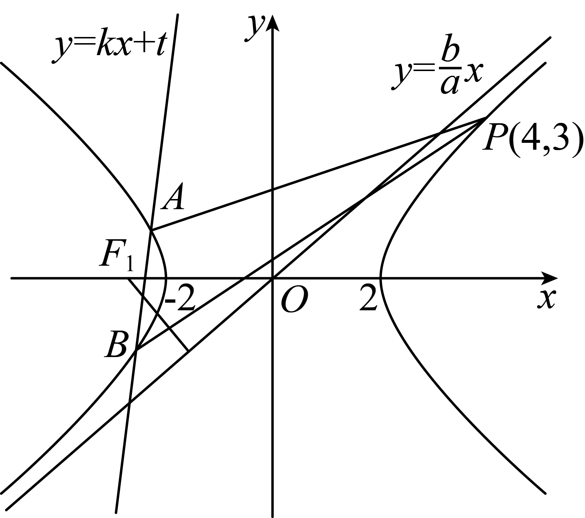

<strong>变式5．</strong>（2024·重庆巴南·统考一模）在平面直角坐标系中，已知点、，的内切圆与直线相切于点，记点<em>M</em>的轨迹为<em>C</em>.

(1)求*C*的方程；

(2)设点*T*在直线上，过*T*的两条直线分别交*C*于*A*、*B*两点和*P*，*Q*两点，连接.若直线的斜率与直线的斜率之和为0，试比较与的大小.

【解析】（1）因为点、，的内切圆与直线相切于点，

所以，

因此根据双曲线的定义可知，点的轨迹为以，为焦点的双曲线的右支，

设点的轨迹*C*的方程为，焦距为，

所以，，

所以，，，

所以点的轨迹方程*C*为

（2）由题意，直线的斜率互为相反数，记，

则，，，，，

设，则直线，.

联立直线和双曲线方程，

整理得.

该方程有两个不等实根，，

则

根据韦达定理可得，，

同理可得，.

又因为，.

，.

则，

同理可得

即

进而可得相似于，

即，，

也即*A*，*B*，*Q*，*P*四点共圆，可得

从而得.

因此

**变式6．**（2024·湖南湘潭·高三湘钢一中校考开学考试）已知椭圆的离心率为分别为椭圆的左右顶点，分别为椭圆的左右焦点，是椭圆的上顶点，且的外接圆半径为．

(1)求椭圆的方程；

(2)设与轴不垂直的直线交椭圆于两点（在轴的两侧），记直线的斜率分别为．

（i）求的值；

（ii）若，则求的面积的取值范围．

【解析】（1）由于椭圆的离心率为，故，

故，则，

又，则，

**又**的外接圆半径为，则，

解得，故，

故椭圆方程为；

（2）（i）设*l*与*x*轴的交点为*D*，由于直线交椭圆于两点（在轴的两侧），

故直线*l*的斜率不为0，

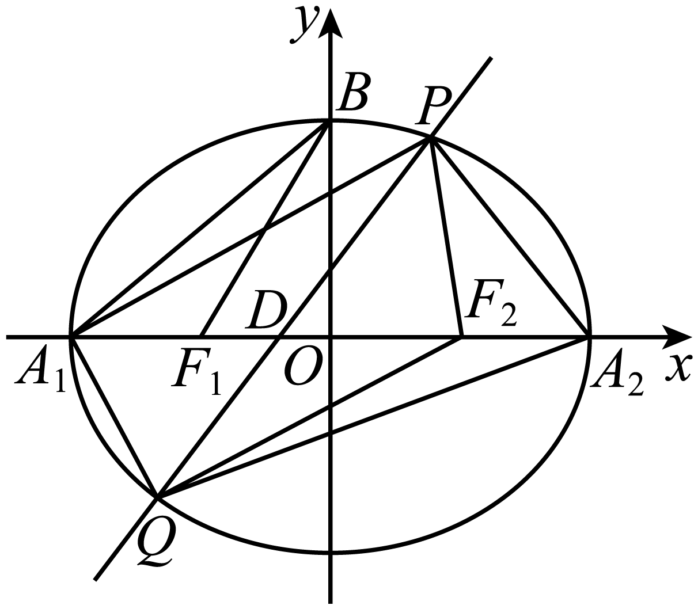

设*l*的方程为，联立，

则，需满足，

设，则，

又，故，

同理可得；

（ii）因为，

则，

又直线*l*与*x*轴不垂直可得，则，

即，所以，

即，

即，

即，

整理得，解得或，

因为在轴的两侧，故，则，

故，此时直线*l*为，过定点，与椭圆*C*交于不同两点；

此时，

，

令，由于*l*与轴不垂直，故，所以，

故，

设，时，，

即在上单调递增，即，

故，即的面积的取值范围为.

<strong>变式7．</strong>（2024·全国·高三专题练习）设抛物线的焦点为<em>F</em>，过<em>F</em>且斜率为1的直线<em>l</em>与<em>E</em>交于<em>A</em>，<em>B</em>两点，且．

(1)求抛物线*E*的方程；

(2)设为*E*上一点，*E*在*P*处的切线与*x*轴交于*Q*，过*Q*的直线与*E*交于*M*，*N*两点，直线*PM*和*PN*的斜率分别为和．求证：为定值．

【解析】（1）由题意，，直线*l*的方程为，代入，得．于是，∴焦点弦，解得*p*＝2．故抛物线*E*的方程为．

（2）因在*E*上，∴*m*＝2．设*E*在*P*处的切线方程为，代入，得．由，解得*t*＝1，∴*P*处的切线方程为*y*＝*x*＋1，从而得．

易知直线*MN*的斜率存在，设其方程为，设，．

将代入，得．于是，，且，．

∴

．

故为定值2．

**变式8．**（2024·四川巴中·高三统考开学考试）已知椭圆的左、右顶点分别为，点在椭圆上，且．

(1)求椭圆的方程；

(2)设椭圆的右焦点为，过点斜率不为0的直线交椭圆于两点，记直线与直线的斜率分别为，当时，求：

①直线的方程；

②的面积．

【解析】（1）由题意知，又，则

，解得

由在椭圆上及得，解得

椭圆的方程为

（2）

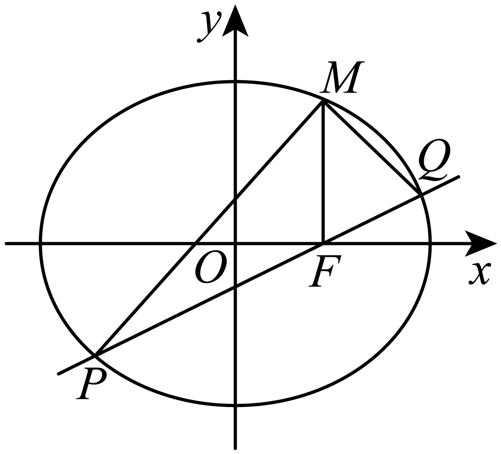

由（1）知，右焦点为

据题意设直线的方程为

则

于是由得，化简得（\*）

①由消去整理得

由根与系数的关系得：．

代入（\*）式得：，解得

直线*l*的方程为

②方法一

由①可知：

由求根公式与弦长公式得：．

设点到直线l的距离为，则．

．

方法二

由题意可知

由①知，直线*l*的方程为

代入消去得

∴

．

<strong>变式9．</strong>（2024·湖北随州·高三随州市曾都区第一中学校考开学考试）在平面直角坐标系中，已知圆心为<em>C</em>的动圆过点，且在轴上截得的弦长为4，记<em>C</em>的轨迹为曲线<em>E</em>．

(1)求*E*的方程；

(2)已知及曲线*E*上的两点*B*和*D*，直线*AB*，*AD*的斜率分别为，，且，求证：直线*BD*经过定点．

【解析】（1）设圆心，半径为，

因为圆心为*C*的动圆过点，所以，

因为圆心为C的动圆在轴上截得的弦长为4，所以，

所以，即，所以曲线*E*是抛物线.

（2）证明：由题意点坐标适合，即点*A*在*E*上，

由题意可知*BD*斜率不会为0，设直线：，

联立，消去并整理得，

需满足，即，

设，，则，，

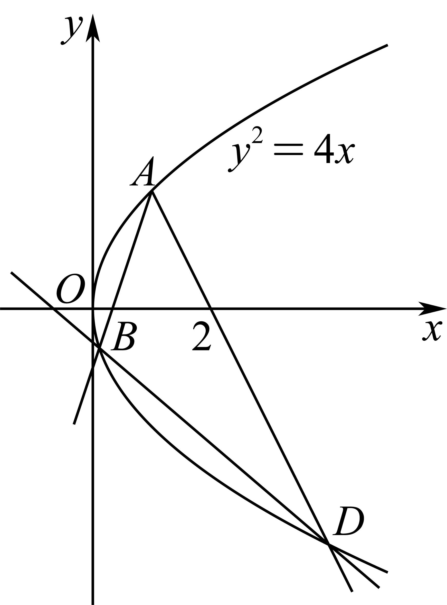

因为，，

所以，

所以，将，代入得，

即，

所以直线：，即，

所以直线*BD*经过定点.

<strong>变式10．</strong>（2024·陕西商洛·高三陕西省山阳中学校联考阶段练习）已知椭圆<em>C</em>：过点，且<em>C</em>的右焦点为．

(1)求*C*的离心率；

(2)过点*F*且斜率为1的直线与*C*交于*M*，*N*两点，*P*直线上的动点，记直线*PM*，*PN*，*PF*的斜率分别为，，，证明：．

【解析】（1）由得*C*的半焦距为，所以，

又*C*过点，所以，解得，

所以，．

故*C*的离心率为．

（2）

由（1）可知*C*的方程为．

设，，．

由题意可得直线*MN*的方程为，

联立 ，消去*y*可得，

则，，

则

，

又，

因此．

**变式11．**（2024·湖南长沙·高三长郡中学校考阶段练习）已知椭圆的左右焦点分别为是椭圆的中心，点为其上的一点满足．

(1)求椭圆的方程；

(2)设定点，过点的直线交椭圆于两点，若在上存在一点，使得直线的斜率与直线的斜率之和为定值，求的范围．

【解析】（1）设，在中，设，

，

，

，

，

所以椭圆的方程为：

（2）设，直线的方程为，

，

，

，

设

，

若为常数，则，

即，而此时，

又，即或，

综上所述，或，存在点，使得直线的斜率与直线的斜率之和为定值

**变式12．**（2024·湖北武汉·高三武汉市第四十九中学校考阶段练习）已知定点，定直线，动圆过点，且与直线相切．

(1)求动圆的圆心所在轨迹的方程；

(2)已知点是轨迹上一点，点是轨迹上不同的两点（点均不与点重合），设直线的斜率分别为，且满足，证明：直线过定点，并求出定点的坐标．

【解析】（1）设点，圆与直线的切点为，

因为动圆过点，且与直线相切，则，

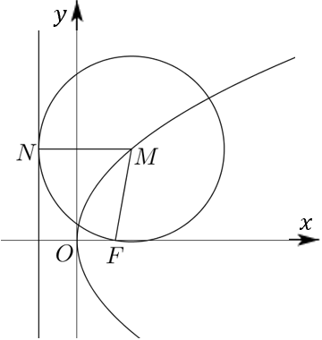

所以点的轨迹是以原点为顶点，以点为焦点的抛物线，

则动圆的圆心轨迹的方程为．

（2）若直线的斜率为0，则直线与抛物线只有1个交点，不合要求，

设直线的方程为

，消去可得：，

则，

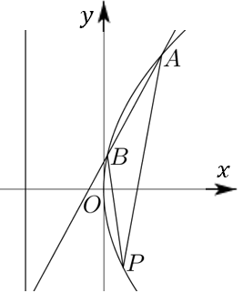

因为为抛物线上一点，所以，解得，

，

解得，代入，

解得或，

结合点均不与点重合，则，则，解得，

故且或，

所以直线即

所以直线恒过定点.

**题型二：斜率差问题**

<strong>例4．</strong>（2024·全国·高三专题练习）椭圆<em>C</em>：的离心率，．

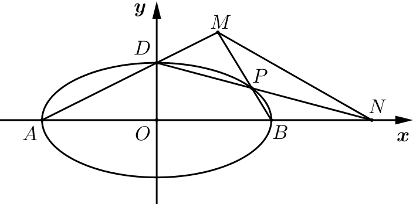

(1)求椭圆*C*的方程；

(2)如图，*A*，*B*，*D*是椭圆*C*的顶点，*P*是椭圆*C*上除顶点外的任意一点，直线*DP*交*x*轴于点*N*，直线*AD*交*BP*于点*M*，设*MN*的斜率为*m*，*BP*的斜率为*n*，证明：为定值．

【解析】（1）由椭圆的离心率，则，

又，

解得：，，

则椭圆的标准方程为：；

（2）证明：因为，*P*不为椭圆顶点，则可设直线*BP*的方程为

联立整理得．

则，故，则．

所以

又直线*AD*的方程为．

联立，解得

由三点，共线，

得，所以．

的斜率为．

则．

为定值．

<strong>例5．</strong>（2024·全国·高三专题练习）在平面直角坐标系中，已知定点<em>A</em>(1，0)，点<em>M</em>在轴上运动，点<em>N</em>在轴上运动，点<em>P</em>为坐标平面内的动点，且满足.

(1)求动点*P*的轨迹*C*的方程；

(2)点*Q*为圆上一点，由*Q*向*C*引切线，切点分别为*S*、*T*,记分别为切线*QS*，*QT*的斜率，当*Q*运动时，求的取值范围.

【解析】(1)    设*N*(0，*b*)*M*(*a*，0)，*P*(*x*，*y*).

因为

所以，即

因为

所以

所以*x*＝-*a*，*y*＝2*b*，

所以<em>y2</em>＝4<em>x</em>

(2)设*Q*(*x*，*y*)，*x*∈[-3，-1]

由题意知:切线斜率存在，设为*k*

切线方程为:<em>y</em>-<em>y0</em>＝<em>k</em>(<em>x</em>-<em>x0</em>)，

联立，化简得:<em>ky2</em>-4<em>y</em>+4<em>y0</em>-4<em>kx0</em>=0

△＝16-16<em>k</em>(<em>y</em>-<em>kx0</em>)=0

∴将代入得

，

∴.

∴的取值范围是

**例6．**（2024·四川成都·高二棠湖中学校考阶段练习）设、为抛物线上的两点，与的中点的纵坐标为4，直线的斜率为.

（1）求抛物线的方程；

（2）已知点，、为抛物线（除原点外）上的不同两点，直线、的斜率分别为，，且满足，记抛物线在、处的切线交于点，线段的中点为，若，求的值.

【解析】（1）设，.

又、都在抛物线上，

即所以，.

由两式相减得，

直线的斜率为，.

两边同除以，且由已知得，

所以，即.

所以抛物线的方程为.

（2）设，，.

因为

所以，所以，

设直线的斜率为，则直线，

由消得.

由，得，即.

所以直线，

同理得直线.

联立以上两个方程解得

又，

所以，

所以.

**变式13．**（2024·全国·高三专题练习）如图,已知点是抛物线：的焦点,点在抛物线上,且.

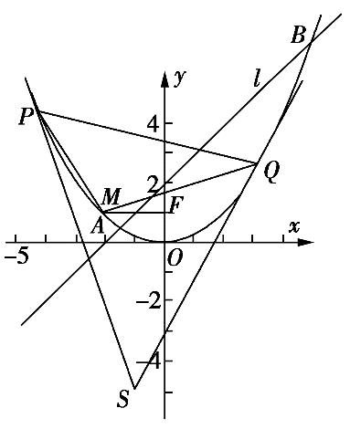

（1）若直线与抛物线交于两点,求的值;

（2）若点在抛物线上,且抛物线在点处的切线交于点,记直线的斜率分别为,且满足,求证：的面积为定值.

【解析】（Ⅰ）设,由题意,得,

故,即

代入中,得,所以,

所以抛物线方程为,

联立方程,得

消去,得,

,记,

根据根与系数的关系,得,

故.

（Ⅱ）由（Ⅰ）可知,抛物线方程为,,

设,,,

因为直线*MP*,*MQ*的斜率分别为,

则,

又因为,所以,

直线,直线,

易得

因为直线,

如图,过*S*作*y*轴平行线交*PQ*于点*E*,

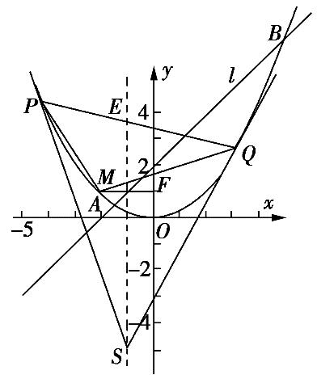

将的值代入直线*PQ*的方程,可得,

所以.

所以的面积为定值32.

**变式14．**（2024·全国·高三专题练习）如图，已知椭圆的离心率为，，分别是椭圆的左、右顶点，右焦点，，过且斜率为的直线与椭圆相交于，两点，在轴上方．

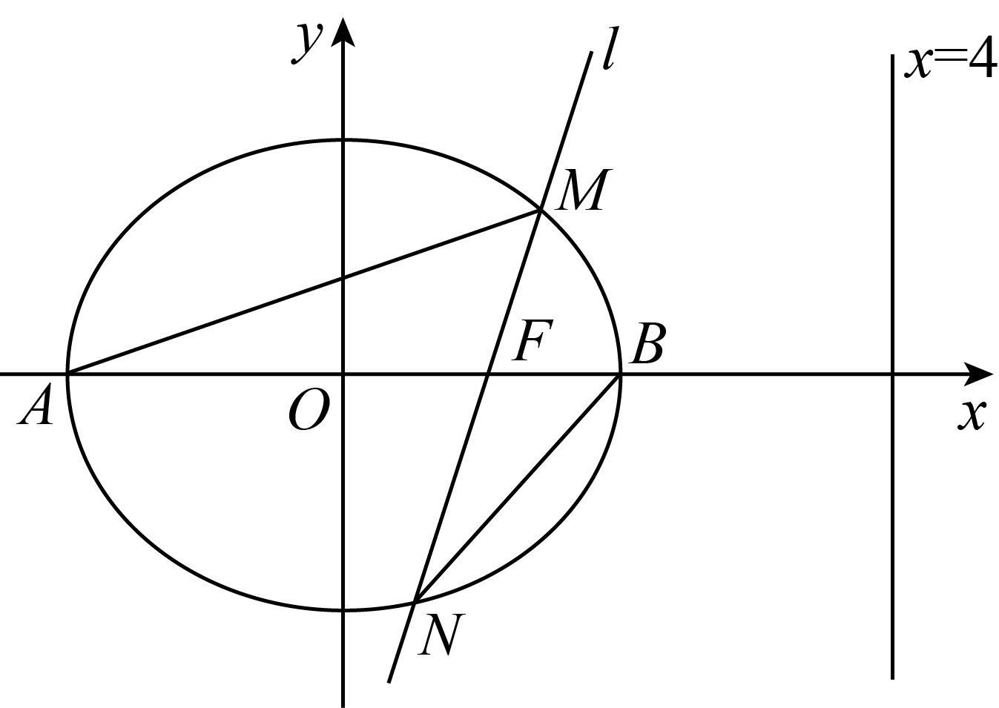

(1)求椭圆的标准方程；

(2)记，的面积分别为，，若，求的值；

(3)设线段的中点为，直线与直线相交于点，记直线，，的斜率分别为，，，求的值．

【解析】（1）设椭圆的焦距为．

依题意可得，，

解得，．

故．

所以椭圆的标准方程为．

（2）设点，，，．

若，则，即有，①

设直线的方程为，与椭圆方程，

可得，

则，，②

将①代入②可得，解得，

则；

（3）由（2）得

，，

所以直线的方程为，

令，得，即．

所以．

所以，

，

，

.

<strong>变式15．</strong>（2024·广东广州·高三华南师大附中校考开学考试）已知椭圆的两焦点分别为 ，<em>A</em>是椭圆上一点，当时，的面积为.

(1)求椭圆的方程；

(2)直线与椭圆交于两点，线段的中点为，过作垂直轴的直线在第二象限交椭圆于点*S*，过*S*作椭圆的切线，的斜率为，求的取值范围.

【解析】（1）由题意得，

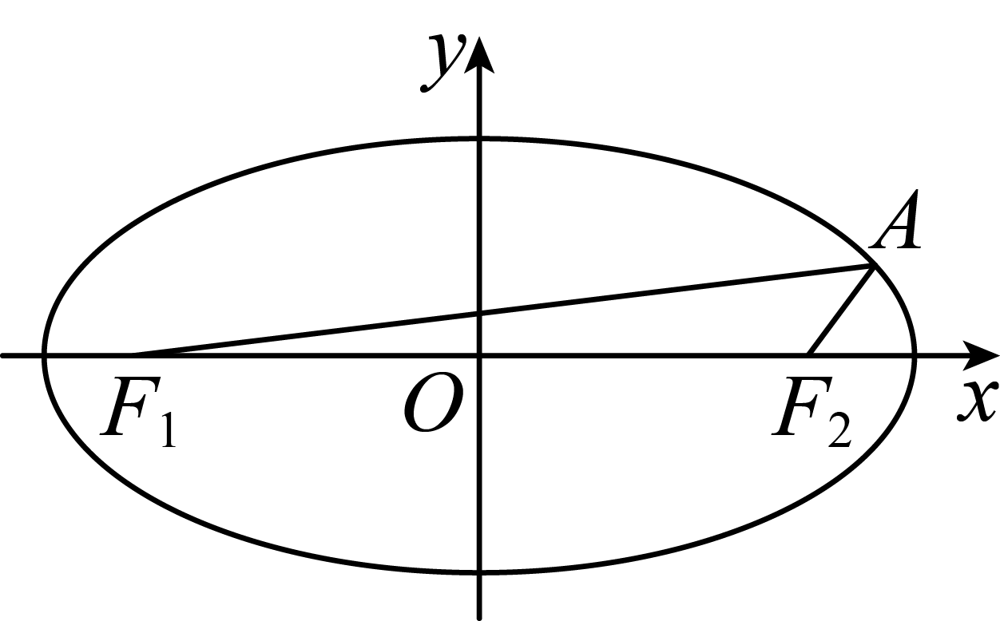

由椭圆定义可得，又，

由余弦定理可得：

，

所以，又，解得，

所以，故椭圆的方程为.

（2）直线，设，

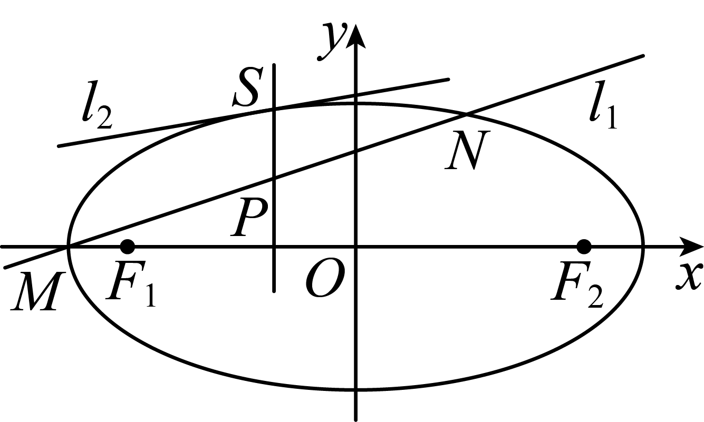

联立与得，所以，

恒成立，

所以，

故，

设直线为，，

联立，所以，

由可得，

所以，则，所以得，所以，

则，

由于函数在上为减函数，所以函数在上为增函数，

所以函数在上为减函数，所以，

所以.

**题型三：斜率积问题**

**例7．**（2024·黑龙江鸡西·高三鸡东县第二中学校考期末）已知双曲线(，)的两条渐近线互相垂直，且过点．

(1)求双曲线*C*的方程；

(2)设*P*为双曲线的左顶点，直线*l*过坐标原点且斜率不为0，*l*与双曲线*C*交于*A*，*B*两点，直线*m*过*x*轴上一点*Q*(异于点*P*)，且与直线*l*的倾斜角互补，*m*与直线*PA*，*PB*分别交于*M*，*N*(*M*，*N*不在坐标轴上)两点，若直线*OM*，*ON*的斜率之积为定值，求点*Q*的坐标．

【解析】（1）由可得渐近线方程为：，

因为两条渐近线互相垂直，所以，可得，

又因为，解得：，

所以双曲线的方程为.

（2）设，，，，

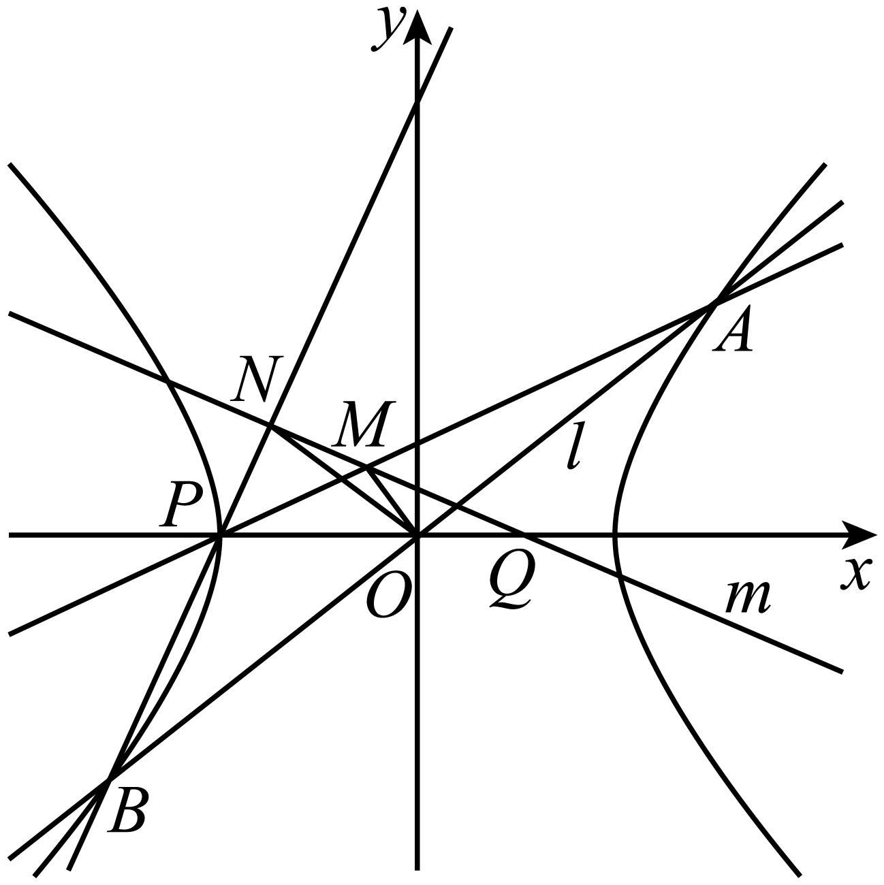

由（1）知：，设直线，的斜率分别为，

因为三点共线，所以，即，

因为直线过轴上一点（异于点），且与直线的倾斜角互补，

所以，即，所以，

由可得，所以，

同理可得，

因为直线，的斜率之积为定值，设定值为，

则，

整理可得：，其中，

因为上式对任意的都成立，所以，可得，，

所以点的坐标为.

**例8．**（2024·贵州毕节·校考模拟预测）如图，椭圆的左、右顶点分别为，，为椭圆上的动点且在第一象限内，线段与椭圆交于点（异于点），直线与直线交于点，为坐标原点，连接，且直线与的斜率之积为．

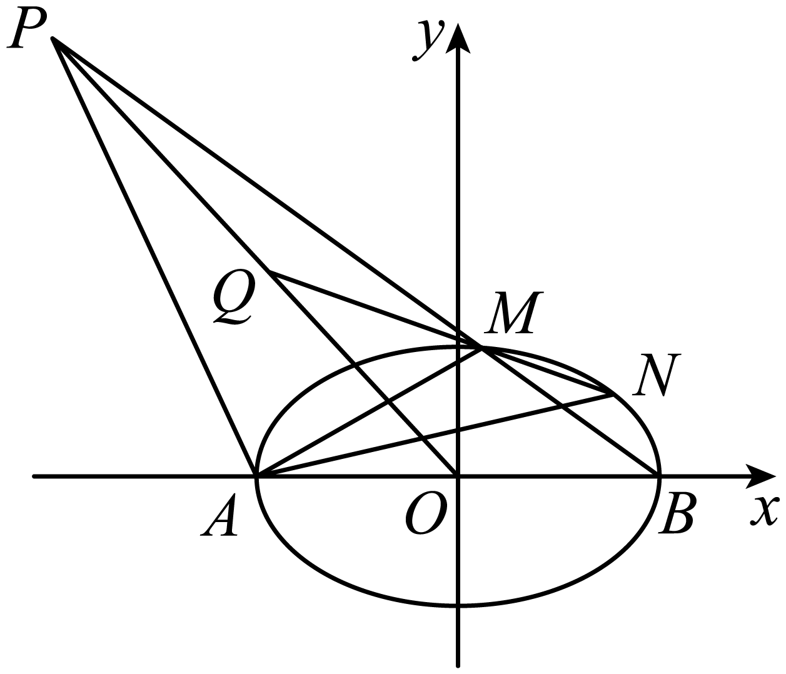

(1)求椭圆的方程．

(2)设直线的斜率分别为，证明：为定值．

【解析】（1）设直线与的斜率分别为，则，

设，由椭圆，且分别为其左右顶点，则，，

因为在椭圆上，则，即，

设直线与的斜率分别为，

则，

由，则，化简可得，

解得，由，解得，

则椭圆.

（2）由（1）可得，，易知直线斜率存在，否则直线过点，就不在第一象限.

设直线，由在直线上，则，即，

设，，联立可得，即，

化简可得：，，

由韦达定理，可得，，

直线，直线，

联立可得：，则，，

即，故，则，

故，，

可得，由，，代入，

则，

由，则

，

将，代入上式，并分子分母同乘以，

则

，

将代入上式，则

.

**例9．**（2024·海南省直辖县级单位·校考模拟预测）椭圆的离心率，过点.

(1)求椭圆的标准方程；

(2)过点且斜率不为0的直线与椭圆交于两点，椭圆的左顶点为，求直线与直线的斜率之积.

【解析】（1）因为椭圆的离心率，

所以 ，即，

又因为椭圆过点，

所以，

又因为，

所以，

所以椭圆的方程为；

（2）如图所示：

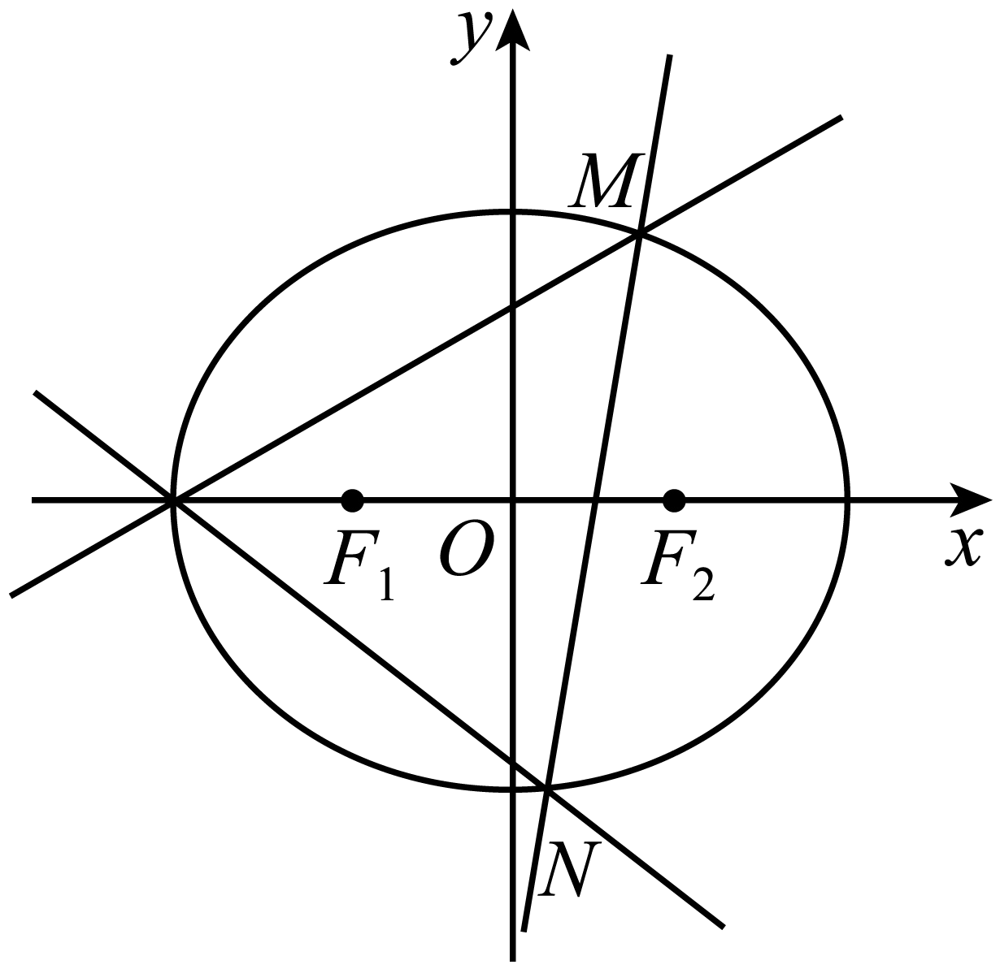

当直线的斜率不存在时，直线的方程为，

与椭圆方程联立求得，

又，

所以，

所以；

当直线的斜率存在时，设直线的方程为，

由，消去*y*得：，

，

由韦达定理得，

所以，

，

.

**变式16．**（2024·湖北武汉·统考模拟预测）已知为坐标原点，椭圆的离心率为，椭圆的上顶点到右顶点的距离为．

(1)求椭圆的方程；

(2)若椭圆的左、右顶点分别为、，过点作直线与椭圆交于、两点，且、位于第一象限，在线段上，直线与直线相交于点，连接、，直线、的斜率分别记为、，求的值．

【解析】（1）由题意知，，椭圆的上顶点到右顶点的距离为，

即，解得，，，

因此，椭圆的方程为．

（2）如下图所示：

不妨设、，由图可知，直线的斜率存在，

设直线的方程为，因为点，则，则，

联立可得，

，可得，即，

解得，

由韦达定理可得，解得，

所以，，易知、，

由于在直线上，设，

又由于在直线上，则，所以，，

.

<strong>变式17．</strong>（2024·河南郑州·高三郑州外国语学校校考阶段练习）已知椭圆的离心率为，以<em>C</em>的短轴为直径的圆与直线相切．

(1)求*C*的方程；

(2)直线与*C*相交于*A*，*B*两点，过*C*上的点*P*作*x*轴的平行线交线段*AB*于点*Q*，且平分，设直线的斜率为（*O*为坐标原点），判断是否为定值？并说明理由．

【解析】（1）由椭圆的离心率为，得，即有，

由以*C*的短轴为直径的圆方程为，

由与直线相切得：，

联立解得，

∴*C*的方程为；

（2）为定值，且，理由如下：

由题意，直线*AP*，*BP*的斜率互为相反数，即，

设，

由，消去*y*得：，

∴，

而，

∴，

即

，

∴，

∴，

化简得，

又∵在椭圆上，∴，∴，

∴，

∴，

又∵不在直线，

则有，即，

∴为定值，且.

**变式18．**（2024·内蒙古赤峰·高三统考开学考试）已知椭圆：的右顶点为，点在圆：上运动，且的最大值为.

(1)求椭圆的方程；

(2)不经过点的直线与交于，两点，且直线和的斜率之积为1.求直线被圆截得的弦长.

【解析】（1）如图所示：

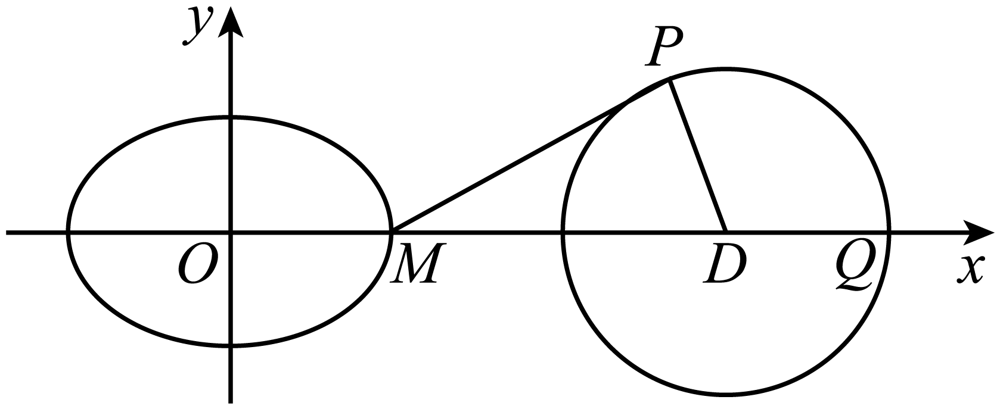

由题可知，圆：的圆心为，半径，又因为，所以，所以，所以椭圆的方程.

（2）当直线*l*的斜率不存在时，显然不符合题意.

故设，，直线：，联立，消去整理得一元二次方程，

其判别式，则；因为，所以，

所以，所以，整理得.

若，则，则直线过定点，与题意矛盾；

若，则，则直线过定点.

因为圆的圆心为，半径，所以直线被圆截得的弦长为4.

<strong>变式19．</strong>（2024·重庆沙坪坝·高三重庆南开中学校考阶段练习）已知双曲线的左、右顶点分别为<em>A</em>、<em>B</em>，渐近线方程为，焦点到渐近线距离为1，直线与<em>C</em>左右两支分别交于<em>P</em>，<em>Q</em>，且点在双曲线<em>C</em>上.记和面积分别为，，，的斜率分别为，

(1)求双曲线*C*的方程；

(2)若，试问是否存在实数，使得，，.成等比数列，若存在，求出的值，不存在说明理由.

【解析】（1）由题可得，解得，所以双曲线*C*的方程为；

（2）由点在上可得：.

联立和整理得：，

设，，则有：，，

，

又由直线交左右两支各一点可得：，所以，即，

所以，

又到直线的距离，

到直线的距离，

所以，所以，

所以（），解得，

又，

其中，

，

所以，假设存在实数，使得，，成等比数列，

则有，所以，解得，故存在满足题意.

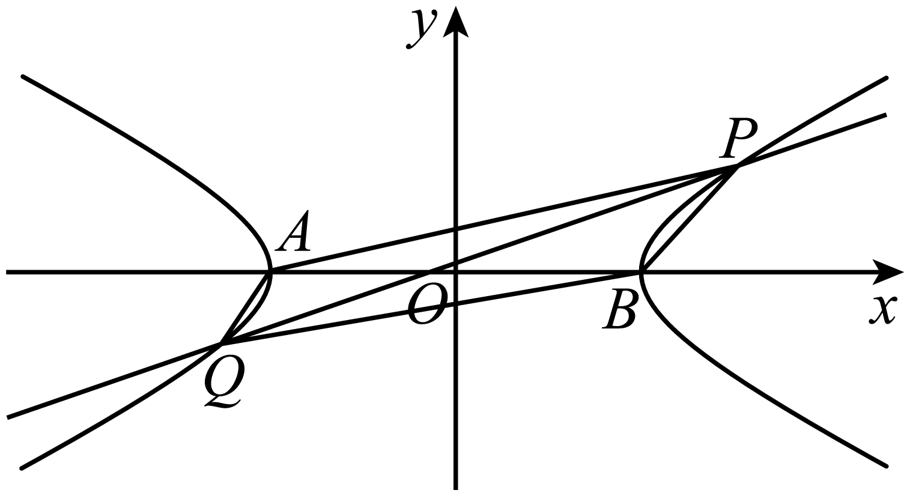

**变式20．**（2024·陕西西安·高三校联考开学考试）已知椭圆的右顶点为，离心率为.

(1)求椭圆的方程；

(2)不经过点的直线与交于两点，且直线和的斜率之积为1，证明：直线过定点.

【解析】（1）由题可知，

因为，所以.

又，所以，

所以椭圆的方程为.

（2）

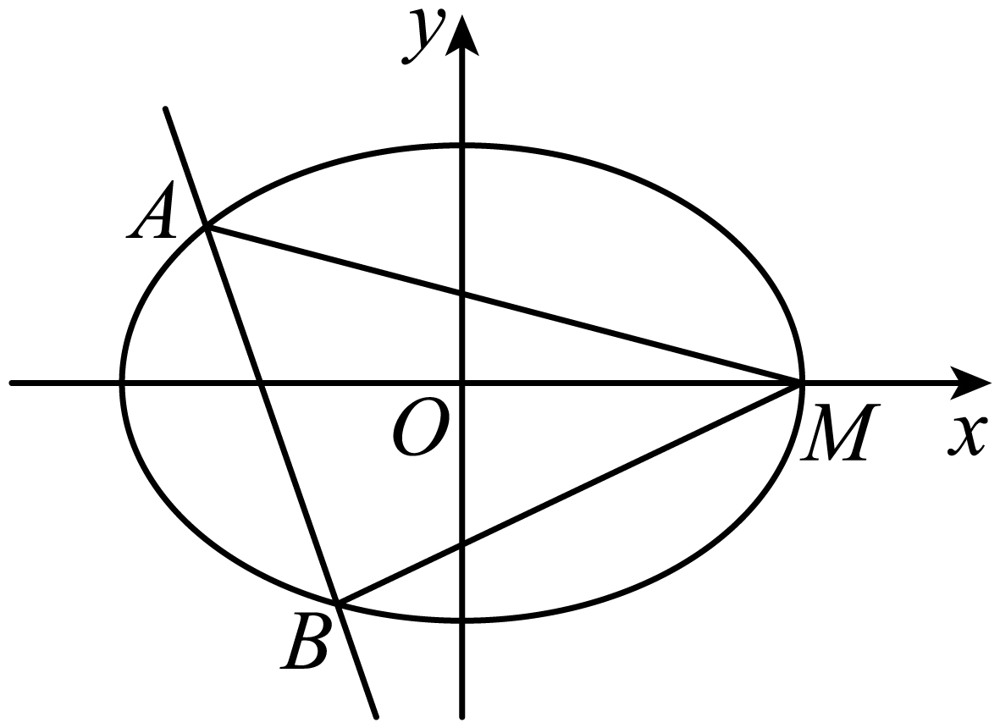

证明：当直线的斜率不存在时，显然不符合题意，

故设，，直线，

联立消去整理得，

方程的判别式，

则，

因为，所以，

所以，

所以，

整理得.

若，则，则直线过定点，与题意矛盾；

若，则，则直线过定点.

**变式21．**（2024·内蒙古包头·高三统考开学考试）已知点，，动点满足直线与的斜率之积为，记点的轨迹为曲线.

(1)求曲线的方程，并说明是什么曲线；

(2)过坐标原点的直线交曲线于，两点，点在第一象限，轴，垂足为，连结并延长交曲线于点.

（ⅰ）证明：直线与的斜率之积为定值；

（ⅱ）求面积的最大值.

【解析】（1）因为，，，

所以，

所以，化解得，

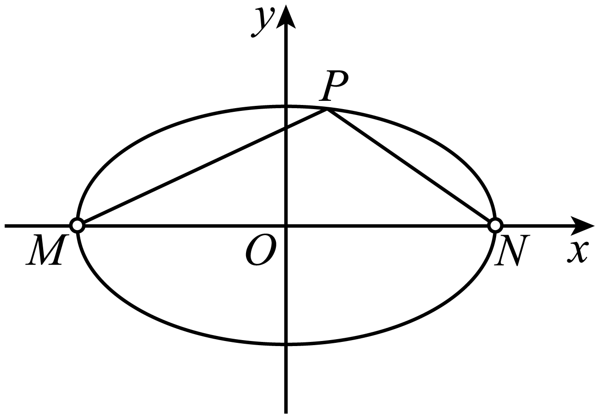

所以为中心在坐标原点，焦点在轴上的椭圆，不含左右顶点；

（2）（ⅰ）设直线的斜率为，则其方程为，

由，得，记，则，，，

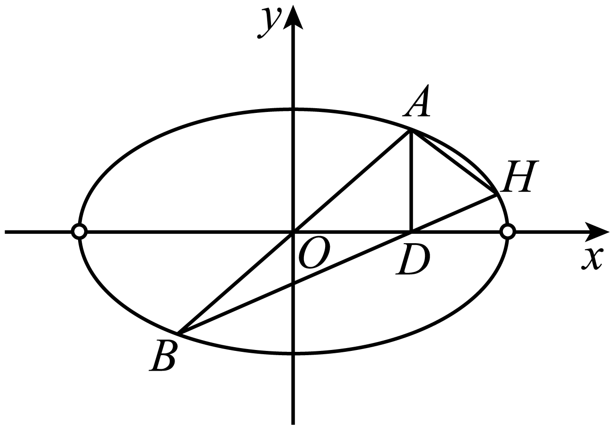

于是直线的斜率为，方程为，

由，得①，

设，则和是方程①的解，

故，由此得，

从而直线的斜率，

所以，即直线与的斜率之积为定值；

（ⅱ）由（ⅰ）可知，，，

所以

，

当且仅当时取等号，所以面积的最大值为.

<strong>变式22．</strong>（2024·内蒙古包头·高三统考开学考试）已知点，动点满足直线<em>PM</em>与<em>PN</em>的斜率之积为，记点<em>P</em>的轨迹为曲线<em>C</em>．

(1)求曲线*C*的方程，并说明*C*是什么曲线；

(2)过坐标原点的直线交曲线*C*于*A*，*B*两点，点*A*在第一象限，*AD*⊥*x*轴，垂足为*D*，连接*BD*并延长交曲线*C*于点*H*．证明：直线*AB*与*AH*的斜率之积为定值．

【解析】（1）由题设得，化解得，

所以为中心在坐标原点，焦点在轴上的椭圆，不含左右顶点．

（2）

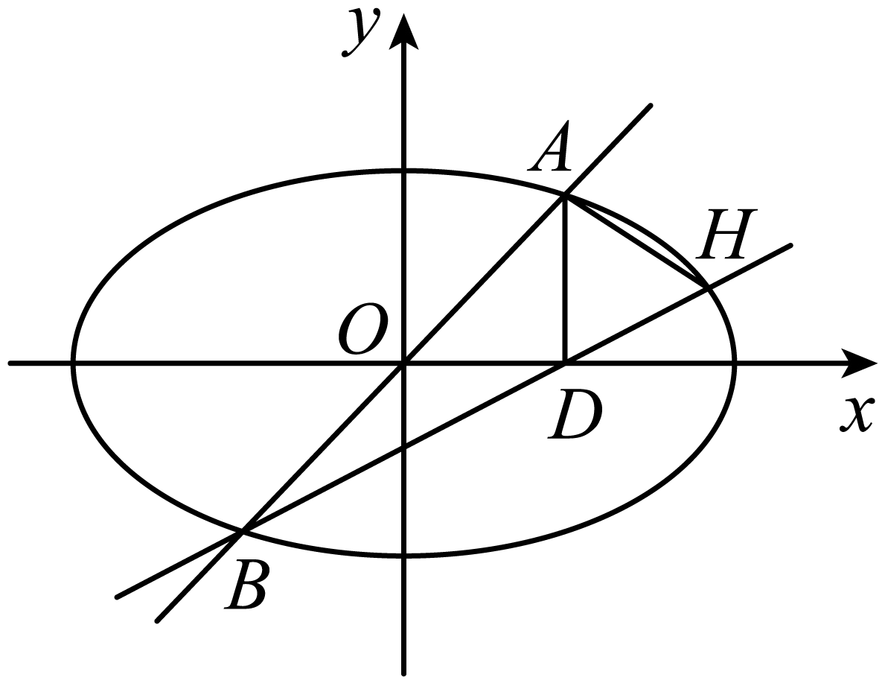

设直线的斜率为，则其方程为．

由得，

记，则，，．

于是直线的斜率为，方程为．

由得．①

设，则和是方程①的解，则，

故，由此得．

从而直线的斜率，所以．

所以直线与的斜率之积为定值．

**变式23．**（2024·山西大同·高三统考开学考试）已知双曲线的离心率为，且过点．

(1)求*C*的方程；

(2)设*A*，*B*为*C*上异于点*P*的两点，记直线，的斜率分别为，，若，试判断直线是否过定点？若是，则求出该定点坐标；若不是，请说明理由．

【解析】（1）由题意知，

解得，，，

所以*C*的方程为．

（2）证明：设，．

又，则，．

因为，所以，所以，

即，

所以，

所以，

当直线的斜率为0时，，，所以，解得或，不符合题意，所以直线的斜率不为0．

设直线的方程为，

由得，

，即，

所以，．

因为，

所以，

整理得，

所以，

所以，

整理得，

即，则或．

当时，直线的方程为，此时直线过定点；

当时，直线的方程为，此时直线过定点．

即为，因为*A*，*B*为*C*上异于点的两个动点，所以不符合题意．

故直线过的定点为．

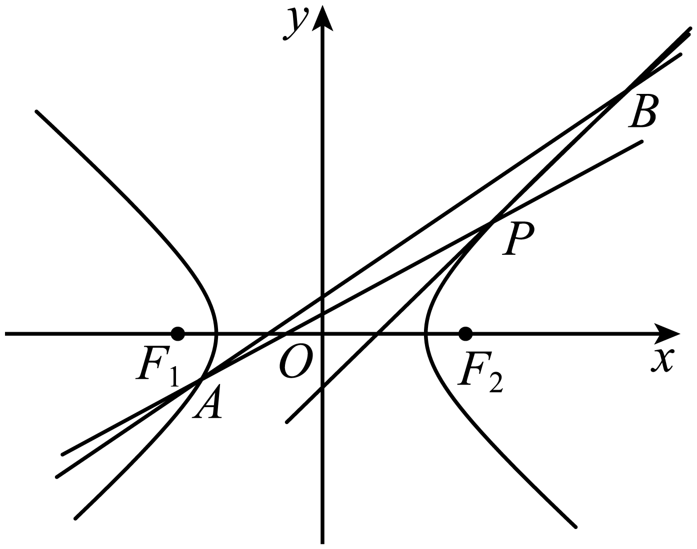

**变式24．**（2024·河南周口·高三校联考阶段练习）已知是椭圆上的两点，关于原点对称，是椭圆上异于的一点，直线和的斜率满足.

(1)求椭圆的标准方程；

(2)若斜率存在且不经过原点的直线交椭圆于两点异于椭圆的上、下顶点），当的面积最大时，求的值.

【解析】（1）设，易知，由，

得，

化简得，

故椭圆的标准方程为.

（2）

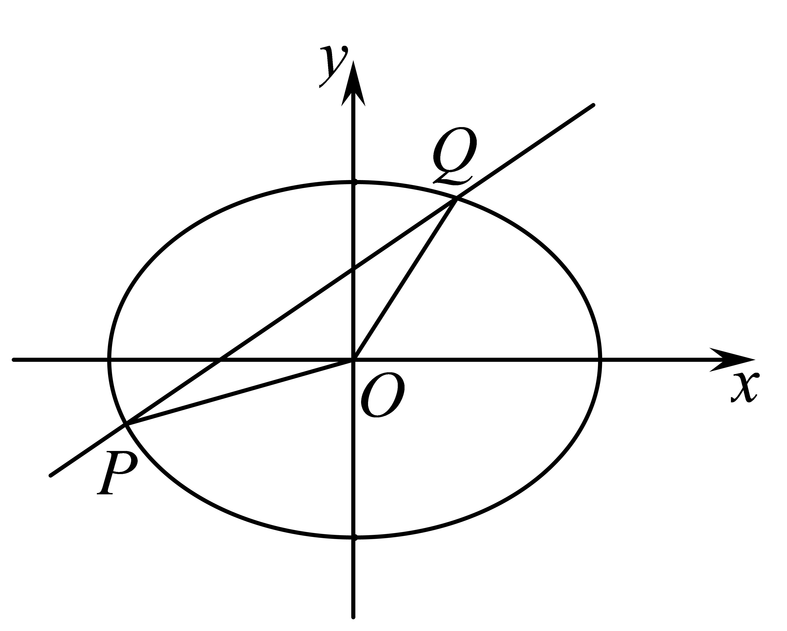

设的方程为，，，

将代入椭圆方程整理得，

，，

，，

则，

又原点到的距离为，

故，

当且仅当时取等号，

此时，的面积最大.

故

.

**变式25．**（2024·江苏南通·高三统考开学考试）在直角坐标系中，点到点的距离与到直线：的距离之比为，记动点的轨迹为.

(1)求的方程；

(2)过上两点，作斜率均为的两条直线，与的另两个交点分别为，.若直线，的斜率分别为，，证明：为定值.

【解析】（1）设，由题意可知，

所以的方程为；

（2）设，，

∴方程：代入椭圆方程

，

∴，

∴，∴，

∴，∴

同理设，，∴，

∴为定值.

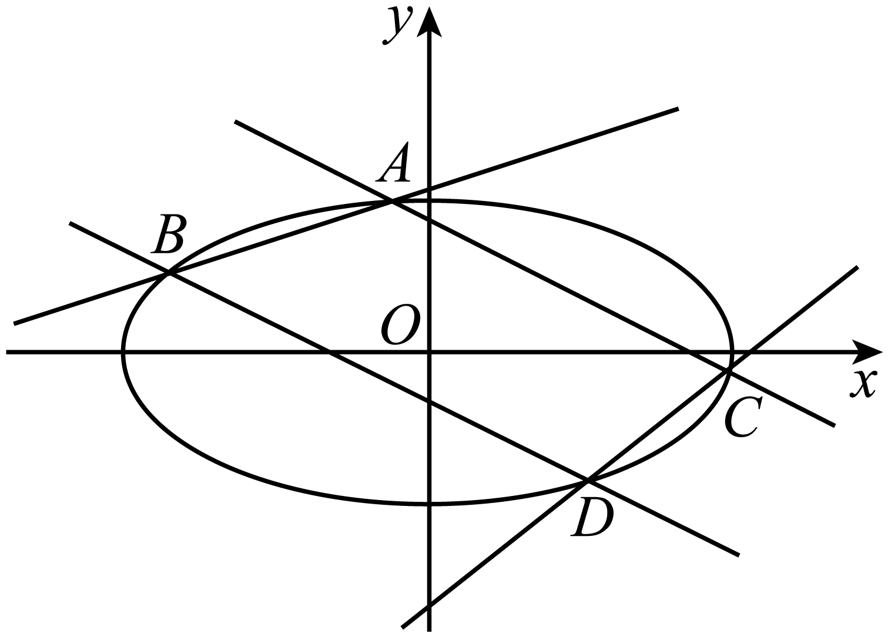

<strong>变式26．</strong>（2024·天津北辰·高三天津市第四十七中学校考阶段练习）已知椭圆的离心率为，以<em>C</em>的短轴为直径的圆与直线相切．直线<em>l</em>过右焦点<em>F</em>且不平行于坐标轴，<em>l</em>与<em>C</em>有两交点<em>A</em>，<em>B</em>，线段的中点为<em>M</em>．

(1)求*C*的方程；

(2)证明：直线的斜率与*l*的斜率的乘积为定值；

(3)延长线段与椭圆*C*交于点*P*，若四边形为平行四边形，求此时直线*l*的斜率．

【解析】（1）由椭圆*C*的离心率为得：，即有，

由以*C*的短轴为直径的圆与直线相切得：，

联立解得，，

所以*C*的方程是．

（2）设直线*l*的方程为，，，

联立，消去*y*得，，

则，，

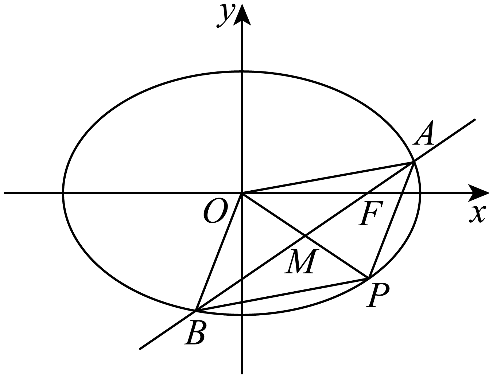

∵*M*为线段的中点，∴，，

∴，∴为定值．

（3）若四边形为平行四边形，则，设，

∴，，

∵点*P*在椭圆上，∴，解得，即，

∴当四边形为平行四边形时，直线*l*的斜率为．

**变式27．**（2024·四川泸州·统考三模）已知椭圆的右焦点为，短轴长等于焦距．

(1)求的方程；

(2)过的直线交于，交直线于点，记的斜率分别为，若，求的值．

【解析】（1）根据题意得到，，解得，

故，

故椭圆方程为；

（2）当过的直线斜率不存在时，此时该直线与直线无交点，舍去；

当过的直线斜率存在时，设为，令，得，

故，

联立与得，，

其中，

设，

则，

，

故

，

故，即，解得，

不妨令，则直线方程为，

，则，

，

故

，

当时，同理可得，

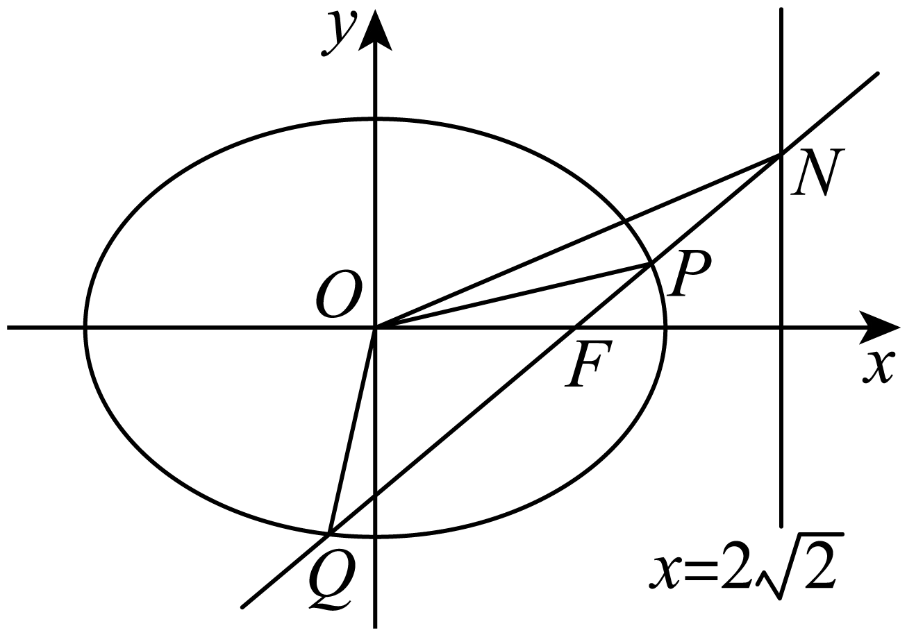

综上：.

**题型四：斜率商问题**

**例10．**（2024·湖北荆州·高三沙市中学校考阶段练习）已知双曲线的实轴长为，左右两个顶点分别为，经过点的直线交双曲线的右支于两点，且在轴上方，当轴时，.

(1)求双曲线方程.

(2)求证：直线的斜率之比为定值.

【解析】（1）由题意可得，

当轴时，直线，

则，

又，所以；

（2）

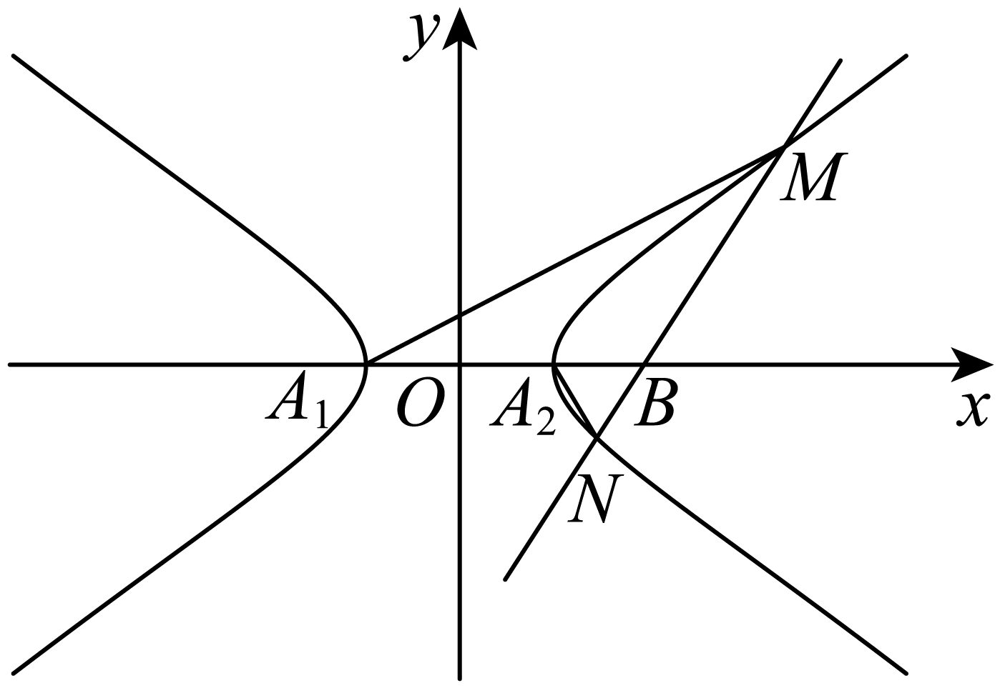

由题意可知，

不妨设：,，易知，

联立双曲线方程得，

则，且，不难发现

由斜率公式可知，

则，

故是定值.

<strong>例11．</strong>（2024·重庆南岸·高三重庆市第十一中学校校考阶段练习）如图，为抛物线上四个不同的点，直线<em>AB</em>与直线<em>MN</em>相交于点，直线<em>AN</em>过点

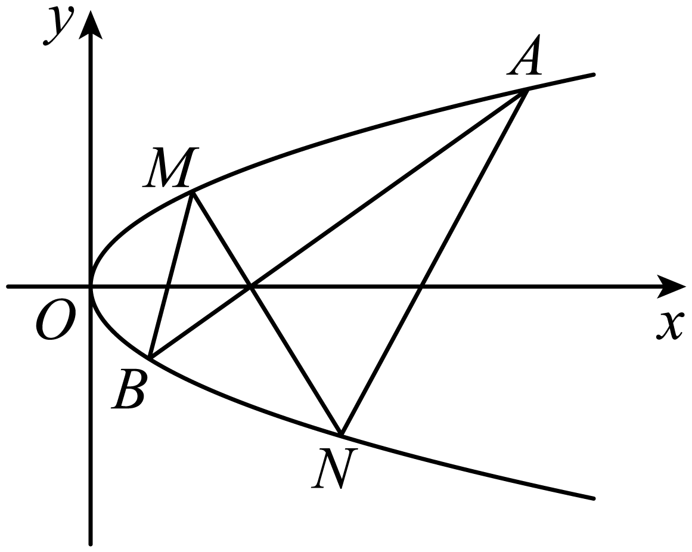

(1)记*A*，*B*的纵坐标分别为，求；

(2)记直线*AN*，*BM*的斜率分别为，是否存在实数，使得？若存在，求出的值，若不存在说明理由

【解析】（1）设直线的方程为，

由消去并化简得，

则.

（2）设直线的方程为，同（1）可求得，

设直线的方程为，

由消去并化简得，

所以.

，

同理可求得，

则，

所以存在使得.

<strong>例12．</strong>（2024·广东·高三校联考阶段练习）过原点<em>O</em>的直线交椭圆<em>E</em>：（）于<em>A</em>，<em>B</em>两点，，面积的最大值为.

(1)求椭圆*E*的方程；

(2)连*AR*交椭圆于另一个交点*C*，又（），分别记*PA*，*PR*，*PC*的斜率为，，，求的值.

【解析】（1）由题知：，

所以，故椭圆的方程为.

（2）如图所示：

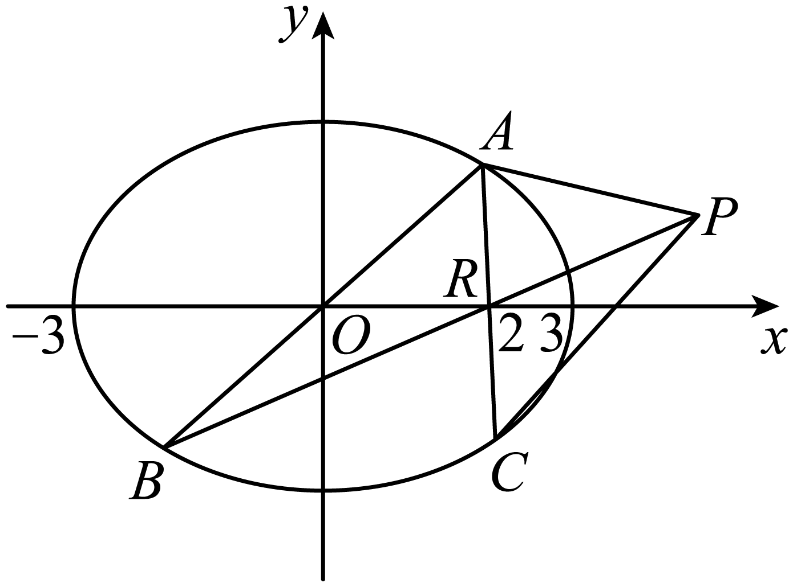

设的方程为，，

由，

，，，

设，则，，

**变式28．**（2024·江西南昌·高三南昌市八一中学校考阶段练习）已知随圆的左､右焦点分别为点在上，的周长为，面积为.

(1)求的方程.

(2)设的左､右顶点分别为，过点的直线与交于两点（不同于左右顶点），记直线的斜率为，直线的斜率为，则是否存在实常数，使得恒成立.

【解析】（1）依题意，得，即，

解得，所以的方程；

（2）依题意，可设直线的方程为，

联立方程，化简整理，得，

易得恒成立，

设，由韦达定理，

得，可得，

于是

，

故存在实数，使得恒成立.

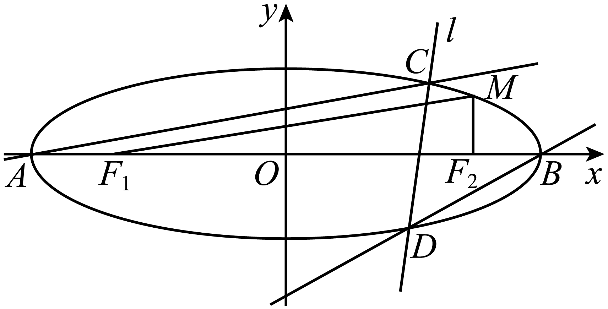

**变式29．**（2024·河南·高三校联考开学考试）已知双曲线实轴左右两个顶点分别为，双曲线的焦距为，渐近线方程为．

(1)求双曲线的标准方程；

(2)过点的直线与双曲线交于两点．设的斜率分别为，且，求的方程．

【解析】（1）双曲线的焦距，；

双曲线的渐近线方程为，即，，

又，，，双曲线的标准方程为：.

（2）由（1）得：，，

设，，

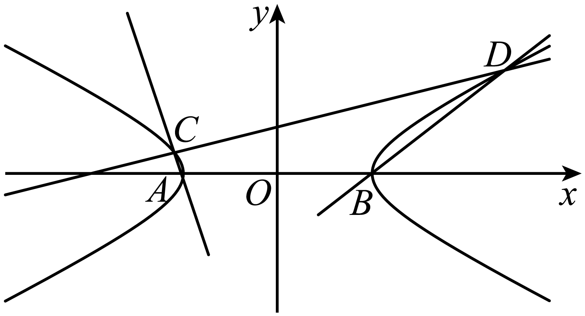

由题意知：直线的斜率一定存在，则可设，

由得：，

，解得：且，

，，；

，，即，

，

解得：或，又且，，

直线的方程为：，即.

**变式30．**（2024·全国·高三专题练习）已知椭圆的焦距为，为坐标原点，椭圆的上下顶点分别为，，左右顶点分别为，，依次连接的四个顶点构成的四边形的面积为4．

(1)求的方程；

(2)过点的任意直线与椭圆交于，（不同于，）两点，直线的斜率为，直线的斜率为．求证：．

【解析】（1）依题意可得，解得，

所以椭圆的方程为

（2）由（1）可知，，

由题意，直线*l*的斜率不为0，设直线，，，

由

可得，则，，

因为直线的斜率，直线的斜率，

由，，得，

所以，

所以直线和的斜率之比为，即

**变式31．**（2024·河南洛阳·模拟预测）已知椭圆：的离心率为，右焦点为，，分别为椭圆的左、右顶点.

(1)求椭圆的方程；

(2)过点作斜率不为的直线，直线与椭圆交于，两点，记直线的斜率为，直线的斜率为，求证：为定值；

(3)在（2）的条件下，直线与直线交于点，求证：点在定直线上.

【解析】（1）依题可得，解得，所以，

所以椭圆的方程为．

（2）设，，因为直线过点且斜率不为，

所以可设的方程为，代入椭圆方程得，

其判别式，所以，.

两式相除得，即．

因为分别为椭圆的左、右顶点，所以点的坐标为，点的坐标为，

所以，．

从而．

（3）由（1）知，设，则，

所以直线的方程为，直线的方程为，

联立可得，

所以直线与直线的交点的坐标为，

所以点在定直线上.

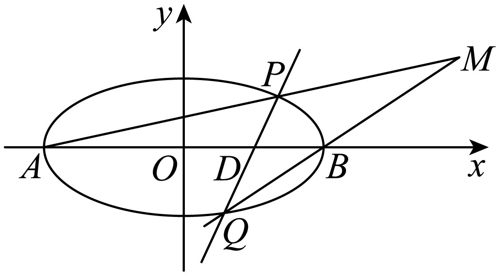

<strong>变式32．</strong>（2024·福建福州·福建省福州第一中学校考三模）已知<em>M</em>是平面直角坐标系内的一个动点，直线<em>MA</em>与直线垂直，<em>A</em>为垂足且位于第三象限；直线<em>MB</em>与直线垂直，<em>B</em>为垂足且位于第二象限.四边形<em>OAMB</em>(<em>O</em>为原点)的面积为2，记动点<em>M</em>的轨迹为<em>C</em>.

(1)求*C*的方程；

(2)点，直线*PE*，*QE*与*C*分别交于*P*，*Q*两点，直线*PE*，*QE*，*PQ*的斜率分别为，，.若，求△*PQE*周长的取值范围.

【解析】（1）因为直线、相互垂直，则四边形*OAMB*为矩形，

设，且，可得，

则点到直线、的距离分别为、，

可得，整理得，

所以*C*的方程为.

（2）设直线，

联立方程，消去*y*得，

由题意可得：，①

因为，则，

整理得，

即，

整理得，解得或，

若，则直线，过定点，

此时①式为，无解，不符合题意；

当时，则直线，过定点，

此时①式为，解得，即或，

则，

因为，则，可得，

所以，

又因为为双曲线的左、右焦点，

则，即，

可得△*PQE*周长为，

所以△*PQE*周长的取值范围.

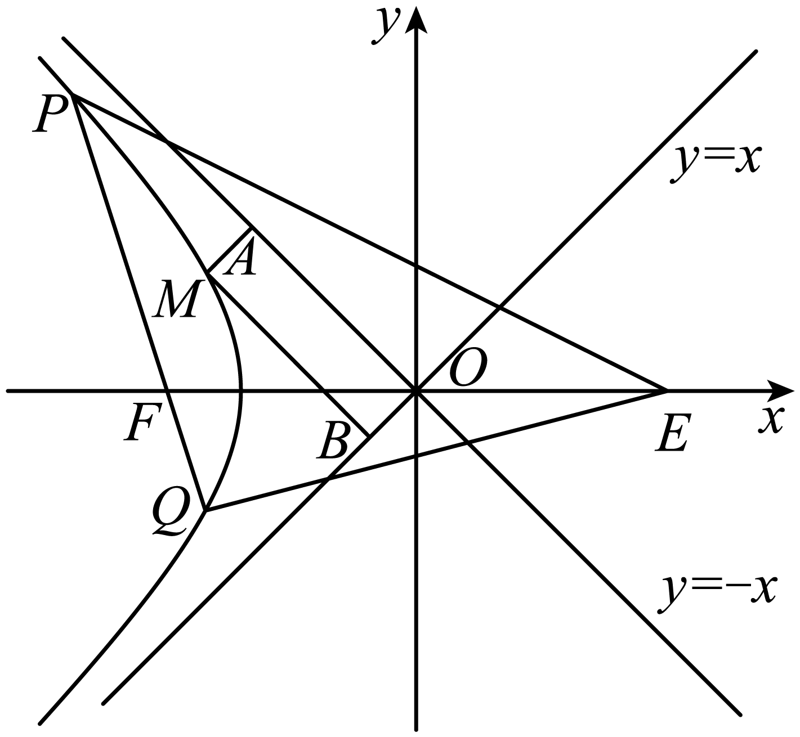

<strong>变式33．</strong>（2024·全国·高三专题练习）已知分别为椭圆<em>E</em>：的左、右顶点，直线过定点，记直线的斜率为，求的值．

【解析】（蝴蝶定理法）过点，交于点，  显然的中点；

由蝴蝶定理得：的中点，即；．

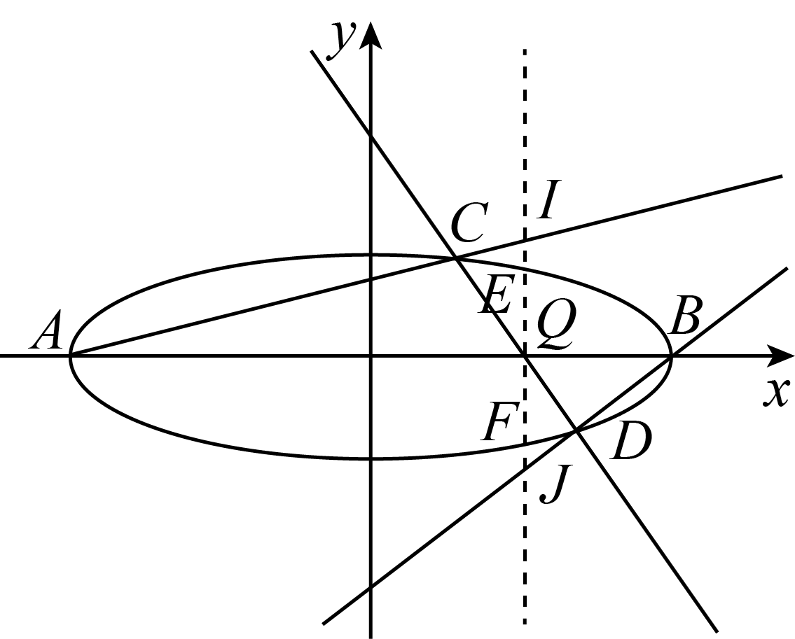

<strong>变式34．</strong>（2024·全国·高三专题练习）设抛物线的焦点为<em>F</em>，点，过<em>F</em>的直线交<em>C</em>于<em>M</em>，<em>N</em>两点．当直线<em>MD</em>垂直于<em>x</em>轴时，．

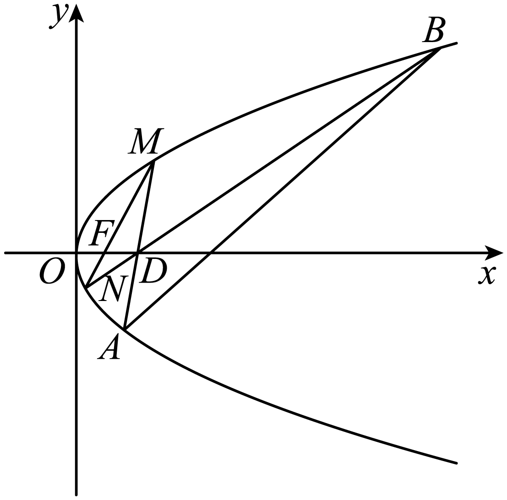

(1)求*C*的方程；

(2)设直线与*C*另一个交点分别为*A*，*B*，记直线的斜率为，求的值．

【解析】（1）抛物线*C*的方程为

（2） 解法一：

设，直线，

联立直线，得，，

联立直线，得，，

∴，同理可得，

由斜率公式可得，，∴．

解法二：三点共线

设，

由*M、N、F*三点共线，得，

由*M、D、A*三点共线，得，

由*N、D、B*三点共线，得，

则*，AB*过定点（4，0）．

<strong>变式35．</strong>（2024·高二课时练习）在平面直角坐标系中，已知点，抛物线的焦点为<em>F</em>，<em>M</em>为抛物线<em>C</em>上异于顶点的动点，直线<em>MF</em>交抛物线<em>C</em>于另一点<em>N</em>，直线<em>ME</em>，<em>NE</em>分别交抛物线<em>C</em>于点<em>P</em>，<em>Q</em>．

(1)当轴时，求直线*PQ*与*x*轴的交点坐标；

(2)设直线*MN*，*PQ*的斜率分别为，，试探究是否为定值？若是，求出此定值；若不是，请说明理由．

【解析】(1)由题意,当轴时，则直线的方程，代入抛物线可得

不妨设，则

所以直线的方程为 由 ，解得或（舍）,

即,所以,所以点

则

所以直线的方程为,由 ，解得或（舍）,

即,所以 所以点

所以直线*PQ*的方程为，所以直线*PQ*与*x*轴的交点坐标

(2)设直线的方程为：

设

由 ，则

所以  （1）

设直线的方程为：，

由 ，则

则  （2）

设直线的方程为：，

由 ，则

则  （3）

由，，可得

由，，，可得

同理由，，，可得

，

所以为定值2.

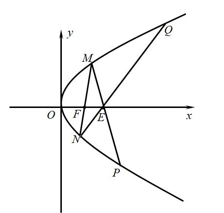

