**第74讲  存在性问题的探究**

**知识梳理**

**解决存在性问题的技巧：**

（1）特殊值（点）法：对于一些复杂的题目，可通过其中的特殊情况，解得所求要素的必要条件，然后再证明求得的要素也使得其他情况均成立．

（2）假设法：先假设存在，推证满足条件的结论．若结论正确，则存在；若结论不正确，则不存在．

**必考题型全归纳**

**题型一：存在点使向量数量积为定值**

<strong>例1．</strong>（2024·甘肃天水·高二天水市第一中学校考期末）已知椭圆<em>E</em>的中心在原点，焦点在<em>x</em>轴上，椭圆的左顶点坐标为，离心率为．

求椭圆*E*的方程；

过点作直线*l*交*E*于*P*、*Q*两点，试问：在*x*轴上是否存在一个定点*M*，使为定值？若存在，求出这个定点*M*的坐标；若不存在，请说明理由．

【解析】设椭圆*E*的方程为，

由已知得，解得：，

所以．

所以椭圆*E*的方程为．

假设存在符合条件的点，

设，，

则，，

，

当直线*l*的斜率存在时，设直线*l*的方程为，

由，得：，

，，

，

，

对于任意的*k*值，上式为定值，

故，解得：，

此时，为定值；

当直线*l*的斜率不存在时，

直线*l*：，，，，

由，得为定值，

综合知，符合条件的点*M*存在，其坐标为．

**例2．**（2024·山西大同·高二统考期末）已知椭圆的一个焦点与抛物线的焦点重合，且椭圆短轴的两个端点与构成正三角形.

(1)求椭圆的方程；

(2)若过点的直线与椭圆交于不同两点，试问在轴上是否存在定点，使恒为定值? 若存在，求出的坐标及定值；若不存在，请说明理由.

【解析】（1）由题意知抛物线的焦点为，

所以，

因为椭圆短轴的两个端点与*F*构成正三角形，

所以，

可求得*a*=2.

故椭圆的方程为.

（2）假设存在满足条件的点，

当直线的斜率存在时，设其斜率为，则的方程为，

由得，

设，

所以，

则

，

要使为定值，令，即，

此时.

当直线的斜率不存在时，不妨取，

由，可得，

所以.

综上所述，存在点，使为定值.

**例3．**（2024·重庆渝北·高二重庆市松树桥中学校校考阶段练习）已知椭圆的中心在坐标原点，焦点在轴上，其左、右焦点分别为，，短轴长为.点在椭圆上，且满足的周长为6.

（I）求椭圆的方程；

（Ⅱ）过点的直线与椭圆相交于，两点，试问在轴上是否存在一定点，使得恒为定值？若存在，求出该点的坐标；若不存在，请说明理由.

【解析】（Ⅰ）所以椭圆的方程为

（Ⅱ）假设存在这样的定点，设，直线方程为

则

=

联立消去得

令即，

当轴时，令,仍有

所以存在这样的定点，使得

**变式1．**（2024·全国·高三专题练习）已知椭圆的离心率为，椭圆经过点.

（1）求椭圆的方程；

（2）过点作直线交于两点，试问：在轴上是否存在一个定点，使为定值？若存在，求出这个定点的坐标；若不存在，请说明理由.

【解析】（1）由题意，，，得，所以椭圆*C*的方程为.

（2）当的斜率存在时，设，，，，则

联立方程组消去*y*得，.

∴，.

∵

为定值.

∴，解得.此时的值为.

当的斜率不存在时，的方程为，解得，.

又，则.∴，此时也满足条件.

综上所述，在*x*轴上存在定点，使为定值.

**变式2．**（2024·辽宁锦州·统考模拟预测）已知为双曲线的左、右焦点，的离心率为为上一点，且.

(1)求的方程；

(2)设点在坐标轴上，直线与交于异于的两点，且点在以线段为直径的圆上，过作，垂足为，是否存在点，使得为定值？若存在，求出点的坐标；若不存在，请说明理由.

【解析】（1）因为双曲线的离心率为，所以，即，

又，所以，则，所以，

因为，所以，

故双曲线的方程为.

（2）因为点满足，

所以点在双曲线的左支上，又因为点在坐标轴上，则，

设，当的斜率存在时，设的方程为，

联立方程，整理得,则，,即,

，因为在以线段为直径的圆上，所以，

则，又，，

则，

所以，

即，整理得，

即，解得或，经检验均满足，

当时，直线的方程为，则直线过点，不合题意，舍去；

当时，直线的方程为，则直线恒过定点，符合题意.

当的斜率不存在时，， ，，

，又，解得（舍去）或，

所以直线方程为，则直线恒过定点.

综上，直线恒过定点.

因为，所以是以为斜边的直角三角形，

即点在以为直径的圆上，则点为该圆的圆心即斜边的中点，

又，，所以，为该圆的半径，即，

故存在点，使得为定值.

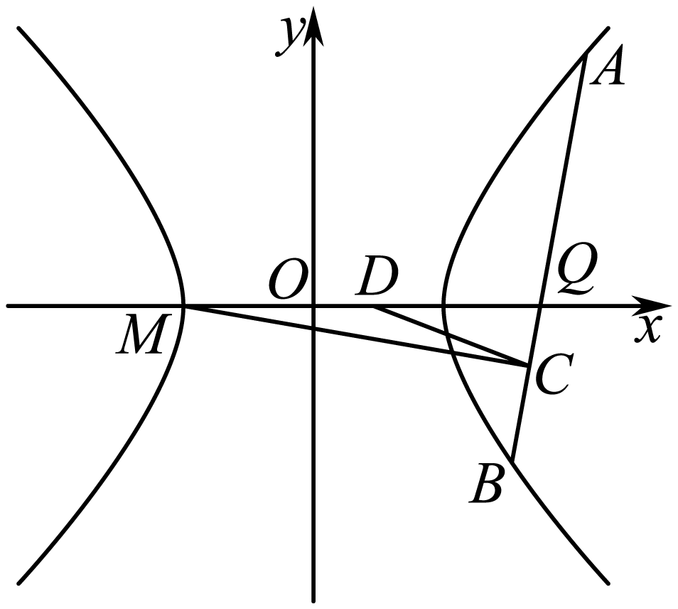

**变式3．**（2024·山西大同·统考模拟预测）已知椭圆的离心率为，且直线是抛物线的一条切线．

(1)求椭圆的方程；

(2)过点的动直线交椭圆于两点，试问：在直角坐标平面上是否存在一个定点，使得以为直径的圆恒过定点？若存在，求出的坐标；若不存在，请说明理由．

【解析】（1）由得

直线是抛物线的一条切线．所以

，所以椭圆

（2）

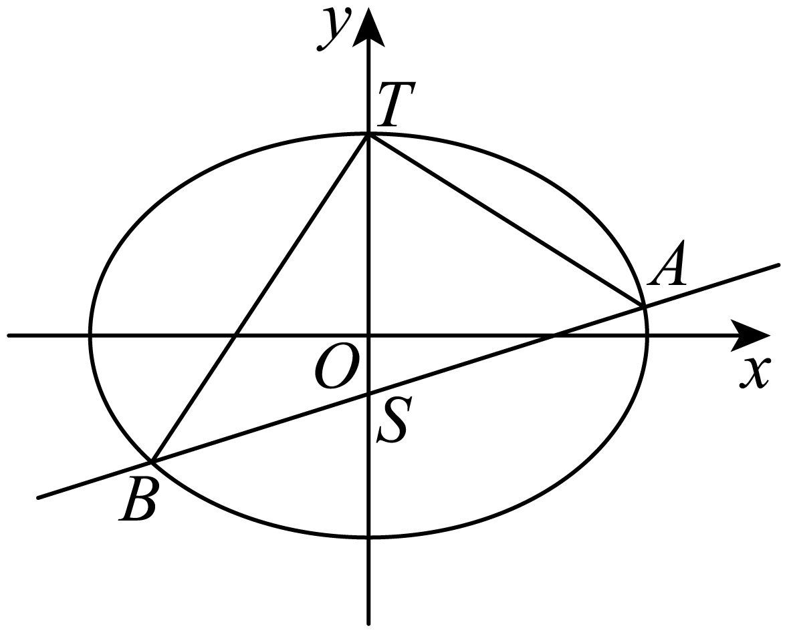

当直线与轴平行时，以为直径的圆方程为

当直线与轴重合时，以为直径的圆方程为

所以两圆的交点为点猜想：所求的点为点．

证明如下．当直线与轴垂直时，以为直径的圆过点

当直线与轴不垂直时，可设直线为：

由得，设，则

则

所以，即以为直径的圆过点

所以存在一个定点，使得以为直径的圆恒过定点．

**变式4．**（2024·江苏扬州·统考模拟预测）已知椭圆的左顶点为，过右焦点且平行于轴的弦．

(1)求的内心坐标；

(2)是否存在定点，使过点的直线交于，交于点，且满足？若存在，求出该定点坐标，若不存在，请说明理由．

【解析】（1）

∴椭圆的标准方程为，

不妨取，则；

因为中，，所以的内心在轴，设直线平分，交轴于，则为的内心，且，所以，则；

（2）∵椭圆和弦均关于轴上下对称．若存在定点，则点必在轴上∴设

当直线斜率存在时，设方程为，直线方程与椭圆方程联立，

消去得，

则①

∵点的横坐标为1，均在直线上，

，整理得，

因为点在椭圆外，则直线的斜率必存在．∴存在定点满足题意

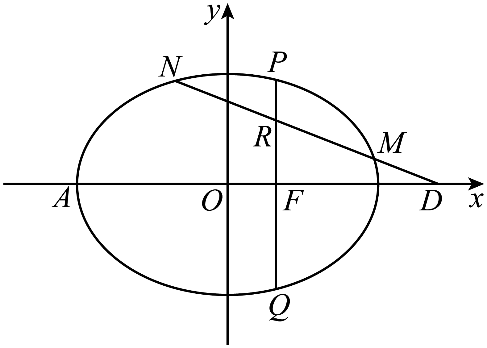

**题型二：存在点使斜率之和或之积为定值**

**例4．**（2024·山东泰安·统考模拟预测）已知为坐标原点，，，和交点为.

(1)求点的轨迹；

(2)直线和曲线交与两点，试判断是否存在定点使？如果存在，求出点坐标，不存在请说明理由.

【解析】（1）设点，，

，即，

点坐标为，

，即，

点坐标为，

根据两点坐标可得，

直线方程为：，

直线方程为：，

两式移项相乘得：，

整理得，

点的轨迹为以为焦点，长轴长为的椭圆，

即其方程为.

（2）假设存在定点，

设点坐标为，，

联立方程组消得，

直线与椭圆交于两点，

即，

，

，

，

，

，

整理得：

，

，对恒成立，

，得，

，

所以存在定点坐标为或.

<strong>例5．</strong>（2024·重庆渝中·高三重庆巴蜀中学校考阶段练习）已知点，，是异于<em>A</em>，的动点，，分别是直线，的斜率，且满足.

(1)求动点的轨迹方程；

(2)在线段上是否存在定点，使得过点的直线交的轨迹于，两点，且对直线上任意一点，都有直线，，的斜率成等差数列.若存在，求出定点，若不存在，请说明理由.

【解析】（1）由题意，即，

又直线，的斜率存在，所以点的轨迹方程为

（2）若存在这样的定点，不妨设为，令，，，

直线的方程为，

，

由韦达定理得：，，，

，

，

对任意成立，所以

由得，

所以，

对任意成立，，经检验，符合题意，

所以，存在满足题意.

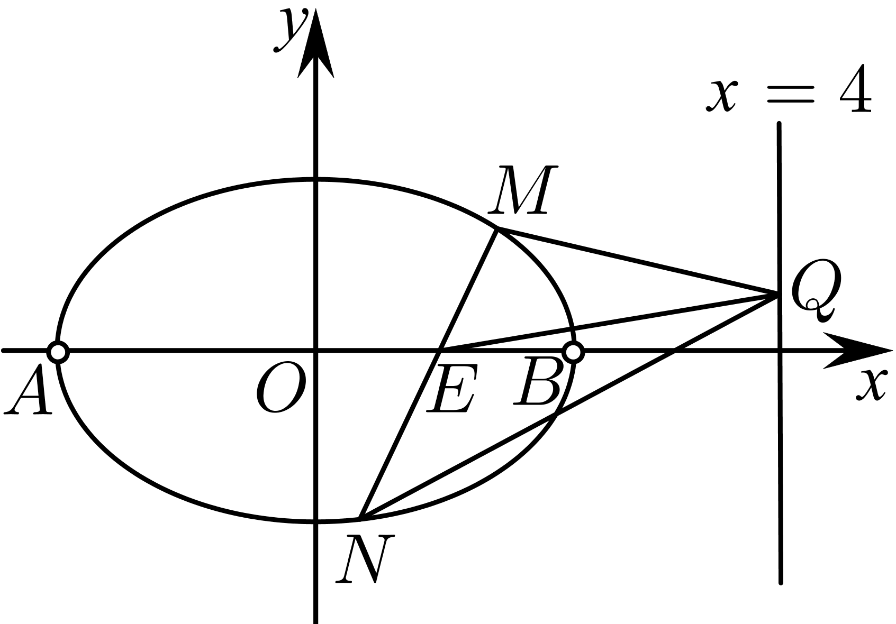

**例6．**（2024·吉林·吉林省实验校考模拟预测）以双曲线的右焦点为圆心作圆，与的一条渐近线相切于点

(1)求的方程.

(2)在轴上是否存在定点，过点任意作一条不与坐标轴垂直的直线，当与交于两点时，直线的斜率之和为定值？若存在，求出点的坐标，若不存在，说明理由.

【解析】（1）双曲线的渐近线方程为，

圆与直线切于点，所以代入得，①

设，直线*FQ*有斜率，则，即，②

又③

由①②③解得，

所以双曲线的方程为.

（2）假设存在满足条件的定点，因为直线不与坐标轴垂直，

故设的方程为.

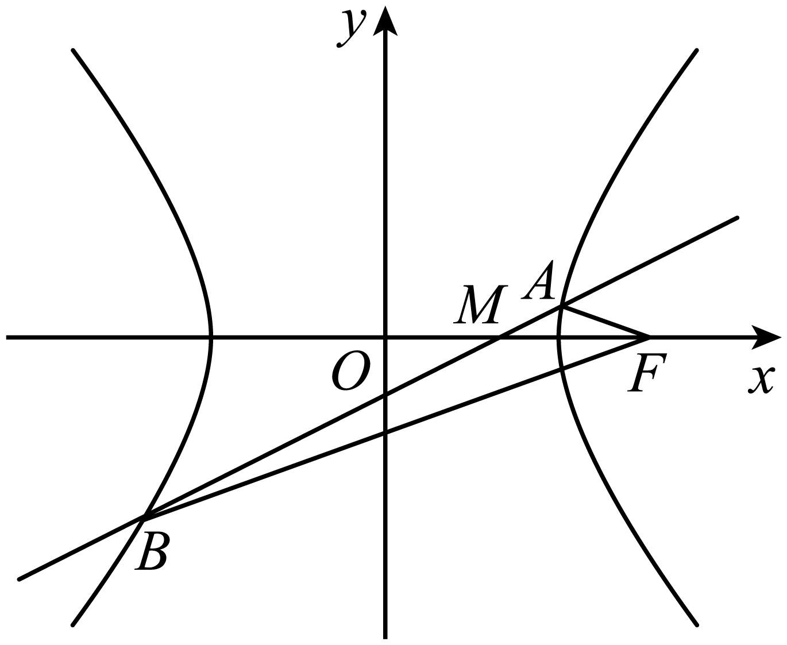

由消去整理得，

则即

且

因为，所以直线的斜率为.

设为定值，即，

即，

即，

整理得，

所以，

所以.

因为为定值，且上式对任意恒成立，

所以

解得.

将代入式解得或且.

综上，存在满足条件的定点.

<strong>变式5．</strong>（2024·湖北荆州·高二荆州中学校考阶段练习）已知圆<em>C</em>方程为，椭圆中心在原点，焦点在<em>x</em>轴上.

（1）证明圆*C*恒过一定点*M*，并求此定点*M*的坐标；

（2）判断直线与圆*C*的位置关系，并证明你的结论；

（3）当时，圆*C*与椭圆的左准线相切，且椭圆过（1）中的点*M*，求此时椭圆方程；在*x*轴上是否存在两定点*A*，*B*使得对椭圆上任意一点*Q*（异于长轴端点），直线，的斜率之积为定值？若存在，求出*A*，*B*坐标；若不存在，请说明理由.

【解析】（1）圆*C*的方程可化为：，

由，解得，所以圆*C*过定点.

（2）圆*C*的方程可化为：，

圆心到直线*l*的距离为，

所以直线与圆*C*相切.

（3）当时，圆*C*方程为，圆心为，半径为10，

与直线，即相切，所以椭圆的左准线为，

又椭圆过点，则，所以，解得，

所以椭圆方程为.

在椭圆上任取一点（），设定点，，

则对恒成立，

所以对恒成立，

所以，故或，

所以，或者，.

**变式6．**（2024·河北·高三校联考阶段练习）已知椭圆：的左、右焦点分别为，，焦距为2，实轴长为4.

（1）求椭圆的方程；

（2）设过点不与轴重合的直线与椭圆相交于，两点，试问在轴上是否存在一个点，使得直线，的斜率之积恒为定值？若存在，求出该定值及点的坐标；若不存在，请说明理由.

【解析】（1）因为焦距为2，长轴长为4，

即，，

解得，，

所以，

所以椭圆的方程为．

（2）由（1）知，设点，，，，，

因为直线不与轴重合，

所以设直线的方程为，

联立，得，

所以，

所以，，

又，

直线，的斜率分别为，，

所以

，

要使得直线，的斜率之积恒为定值，直线，解得，

当时，存在点，使得，

当时，存在点，使得，

综上，在轴上存在点，使得，的斜率之积恒为定值，

当点的坐标为时，直线，的斜率之积为定值，

当点的坐标为时，直线，的斜率之积为定值．

**变式7．**（2024·吉林长春·高三长春外国语学校校考开学考试）已知椭圆的离心率为，、分别是椭圆的左、右焦点，是椭圆上一点，且的周长是6.

（1）求椭圆的方程；

（2）设直线经过椭圆的右焦点且与交于不同的两点，，试问：在轴上是否存在点，使得直线与直线的斜率的和为定值？若存在，请求出点的坐标；若不存在，请说明理由.

【解析】（1）由椭圆的定义知的周长为，所以，

又因为椭圆的离心率，

所以，联立解得，，

所以，

所求椭圆方程为.

（2）若存在满足条件的点.

当直线的斜率存在时，设，联立，

消得.

设，，则，*x*，

∵

，

∴要使对任意实数，为定值，则只有，此时，.

当直线与轴垂直时，若，也有.

故在轴上存在点，使得直线与直线的斜率的和为定值0.

**变式8．**（2024·全国·高三专题练习）设椭圆的离心率是，过点的动直线于椭圆相交于两点，当直线平行于轴时，直线被椭圆截得弦长为．

（Ⅰ）求的方程；

（Ⅱ）在上是否存在与点不同的定点，使得直线和的倾斜角互补？若存在，求的坐标；若不存在，说明理由．

【解析】（Ⅰ）由已知可得，椭圆经过点，

因此，,解得，

所以椭圆*E*方程为；

（Ⅱ）设点的坐标为，

当直线与*x*轴垂直时，直线与的倾斜角均为，满足题意，

此时，且；

当直线的斜率存在时，可设直线的方程为，，

联立，得，

其判别式，

，，

直线的倾斜角互补，

，

∴，

即，

整理得，

把，代入得，

所以，即，

综上所述存在与点不同的定点满足题意．

**题型三：存在点使两角度相等**

**例7．**（2024·新疆阿勒泰·统考三模）已知椭圆的左右焦点分别为，分别为椭圆的上，下顶点，到直线的距离为．

(1)求椭圆的方程；

(2)直线与椭圆交于不同的两点，直线分别交*x*轴于两点．问：*y*轴上是否存在点*R*，使得？若存在，求出点*R*的坐标；若不存在，请说明理由．

【解析】（1）中由面积公式得，

即，得，

椭圆方程为；

（2）如图，

假设存在点使得，设，

，即，

，即，

直线与椭圆交于不同的两点，易知关于对称，

设，则，

由（1）知，直线的方程是，令得，

直线方程是，令得，

由，得，

又在椭圆上，所以，即，

，即.

所以存在点，使得成立．

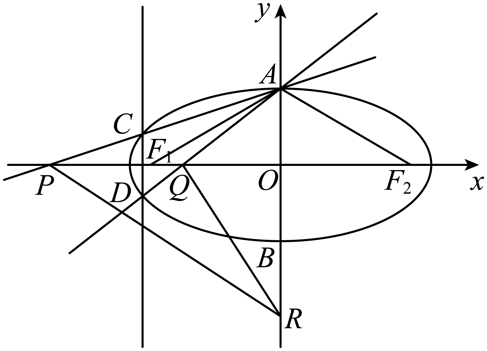

**例8．**（2024·全国·高三专题练习）已知椭圆经过点且两个焦点及短轴两顶点围成四边形的面积为.

(1)求椭圆的方程和离心率；

(2)设，为椭圆上不同的两个点，直线与轴交于点，直线与轴交于点，且、、三点共线.其中为坐标原点.问：轴上是否存在点，使得？若存在，求点的坐标，若不存在，说明理由.

【解析】（1）依题意可得，，又，解得，

所以椭圆方程为，则离心率

（2）因为、、三点共线，根据椭圆的对称性可知、关于点对称，

设点，则，

所以直线的方程为，直线的方程为，

所以点，．

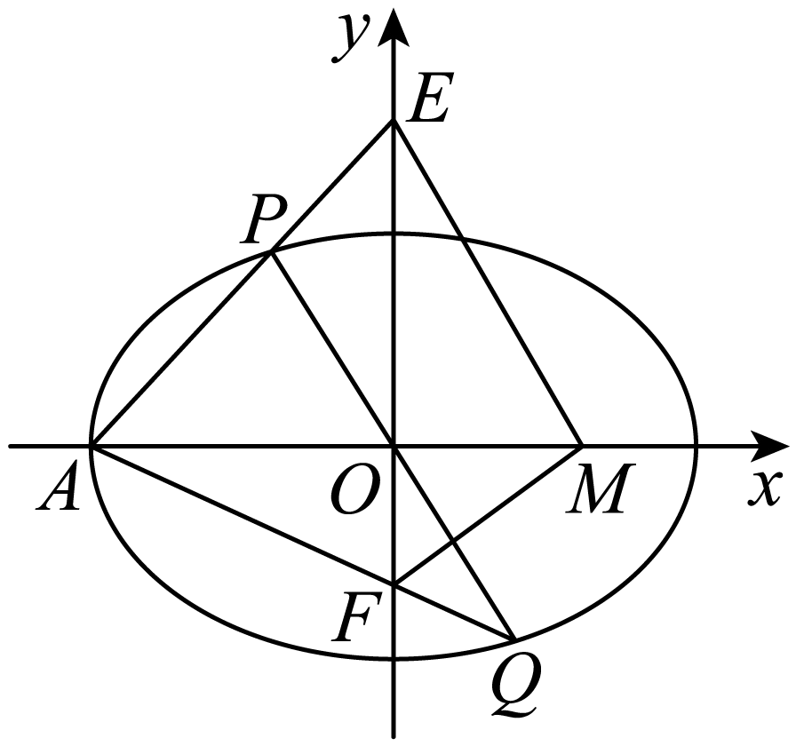

假设存在*M*使，，

所以，又，所以，

即，所以，

设，则，，

所以，即，

又，所以，所以，解得，

所以.

<strong>例9．</strong>（2024·四川绵阳·模拟预测）已知点<em>A</em>是圆上的任意一点，点，线段<em>AF</em>的垂直平分线交<em>AC</em>于点<em>P</em>．

(1)求动点*P*的轨迹*E*的方程；

(2)若过点且斜率不为*O*的直线*l*交（1）中轨迹*E*于*M、N*两点，*O*为坐标原点，点．问：*x*轴上是否存在定点*T*，使得恒成立．若存在，请求出点*T*的坐标，若不存在，请说明理由．

【解析】（1）由圆，可得圆心坐标为，半径，

如图所示，线段的垂直平分线交于点，

所以，

根据椭圆的定义可知点的轨迹是以为焦点的椭圆，且，

可得，则，

所以动点的轨迹方程为.

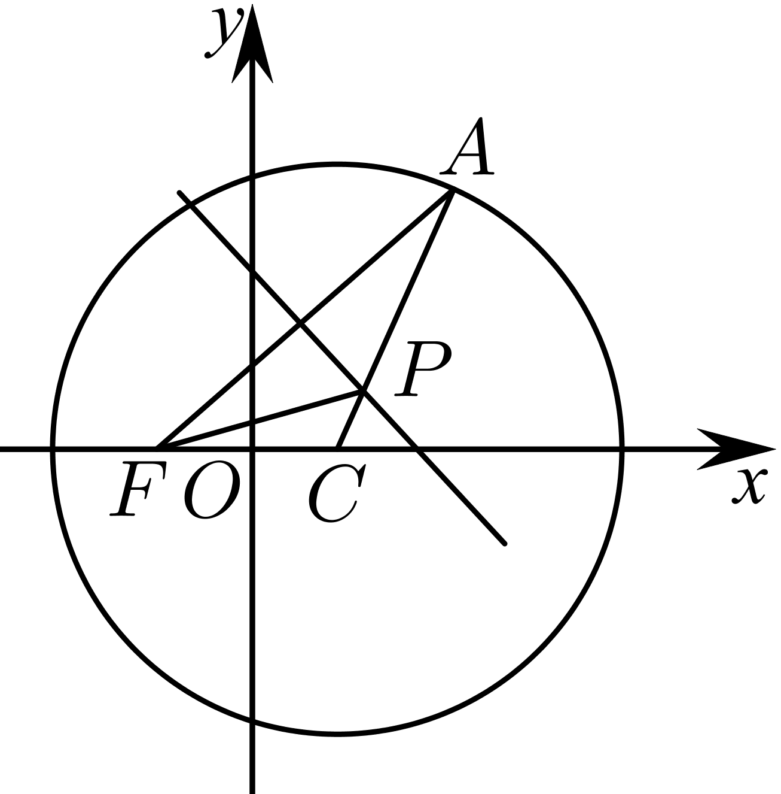

（2）由题意，设直线的方程为，且，

联立方程组，整理得，

则，解得且，

设，所以

根据椭圆的对称性，不妨令在轴上方，且，显然，

假设存在使得恒成立，即恒成立，

可得，即恒成立，即恒成立，

又由，

所以，

所以

，

所以存在点，使得恒成立，

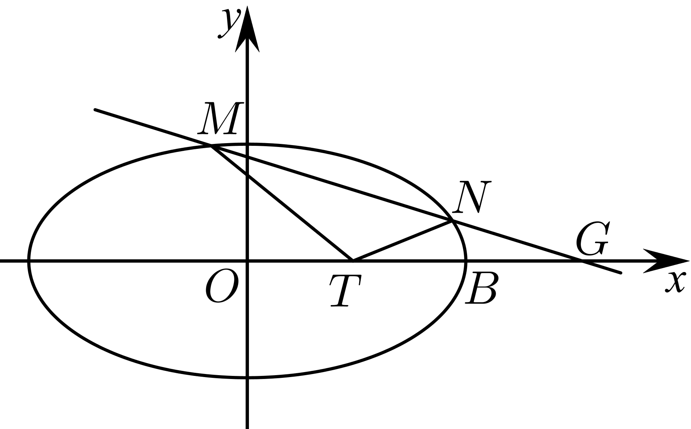

**变式9．**（2024·陕西西安·陕西师大附中校考模拟预测）已知椭圆经过点，过点的直线交该椭圆于，两点.

(1)求面积的最大值，并求此时直线的方程；

(2)若直线与轴不垂直，在轴上是否存在点使得恒成立？若存在，求出的值；若不存在，说明理由.

【解析】（1）将代入椭圆方程，

得到，故，

故椭圆方程为.

当直线的斜率为0时，此时三点共线，不合要求，舍去；

当直线的斜率不为0时，设直线的方程为，

与椭圆方程联立，得，

设，则，

则

，

当且仅当，即时，等号成立，

故面积的最大值为，

此时直线的方程为或.

（2）在*x*轴上存在点使得恒成立，

理由如下：

因为，所以，即，

整理得，

即，

所以，

则，解得，

故在*x*轴上存在点，使得恒成立.

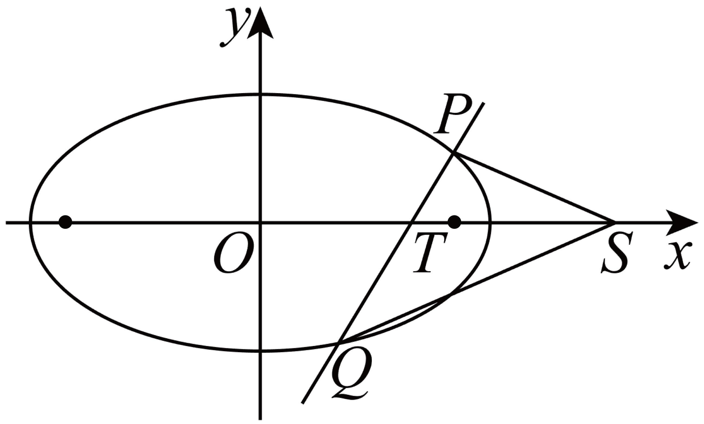

**变式10．**（2024·四川成都·高三四川省成都市新都一中校联考开学考试）已知椭圆过点，且上顶点与右顶点的距离为．

(1)求椭圆的方程；

(2)若过点的直线交椭圆于两点，轴上是否存在点使得，若存在，求出点的坐标；若不存在，请说明理由．

【解析】（1）椭圆上顶点与右顶点的距离为，；

又椭圆过点，；

两式联立可解得：，，椭圆的方程为：.

（2）当直线与轴不重合时，设其方程为，，

由得：，

则，解得：或，

，，

假设存在点使得，即存在点使得，

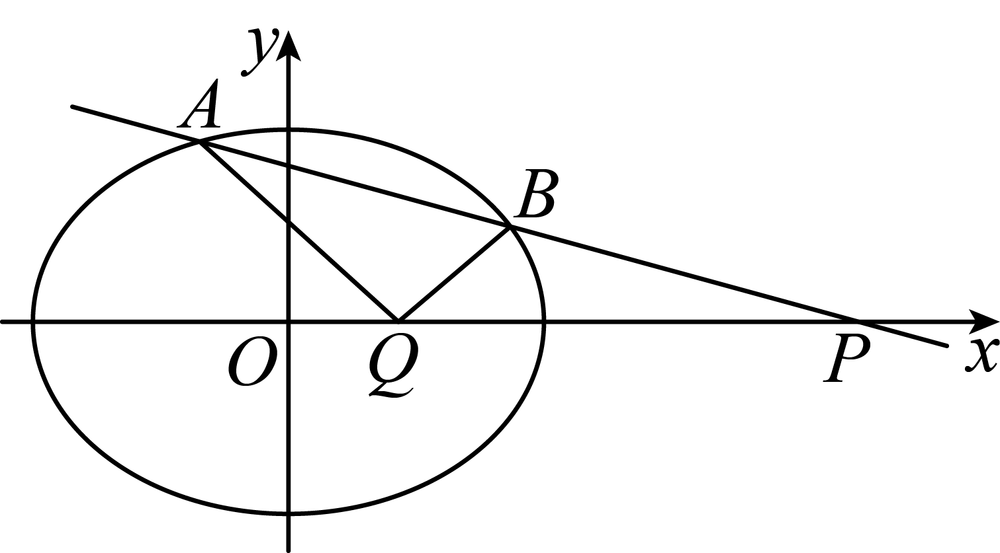

设点，则，

，

，又，，解得：，

；

当直线与轴重合时，分别为椭圆左右顶点，

若，此时显然成立；

综上所述：轴上存在点满足题意．

**变式11．**（2024·河南信阳·高三信阳高中校考阶段练习）在平面直角坐标系中，动点到点的距离等于点到直线距离的倍，记动点的轨迹为曲线.

(1)求曲线的方程；

(2)已知直线：与曲线交于两点，问曲线上是否存在两点满足，若存在，请求出两点坐标，不存在，请说明理由.

【解析】（1）设，动点到点的距离等于点到直线距离的倍，

所以，

化简得.

所以曲线的方程为.

（2）存在两点满足.

设

联立直线与双曲线方程，有，

由韦达定理，有，

，，

所以上式当时，上式恒成立，

即过定点，经检验两点恰在双曲线上，且不与重合，

故存在双曲线上两点满足.

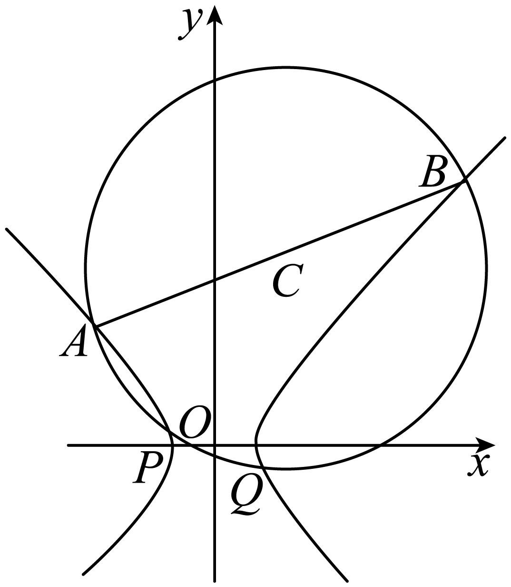

**题型四：存在点使等式恒成立**

**例10．**（2024·福建漳州·统考模拟预测）已知是圆：上的动点，点，直线与圆的另一个交点为，点在直线上，，动点的轨迹为曲线.

(1)求曲线的方程；

(2)若过点的直线与曲线相交于，两点，且，都在轴上方，问：在轴上是否存在定点，使得的内心在一条定直线上?请你给出结论并证明.

【解析】（1）圆的圆心为，半径，

因为，所以，又因为，

所以，

所以，

所以点在以，为焦点，为实轴长的双曲线上，

设双曲线的方程为，

则，.

所以，，

又不可能在轴上，所以曲线的方程为.

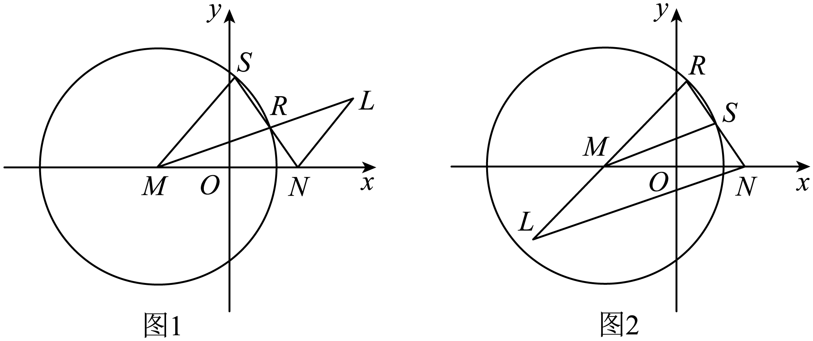

（2）在轴上存在定点，使得的内心在一条定直线上.

证明如下：由条件可设：.代入，

得，

设，，则

，得，

所以

所以，

取，

则

又，都在轴上方，所以的平分线为定直线，

所以在轴上存在定点，使得的内心在定直线上.

**例11．**（2024·全国·高三专题练习）已知椭圆的左、右焦点分别为，过点且与直线垂直的直线交轴负半轴于，且．

(1)求椭圆的离心率；

(2)若过、、三点的圆恰好与直线相切，求椭圆的方程；

(3)设．过椭圆右焦点且不与坐标轴垂直的直线与椭圆交于、两点，点是点关于轴的对称点，在轴上是否存在一个定点，使得、、三点共线？若存在，求出点的坐标；若不存在，说明理由．

【解析】（1）由题意知，由得是线段的中点，故.

又因为直线与垂直，所以，即，

所以椭圆的离心率为.

（2）由（1）得过、、三点的圆的圆心为，半径为.

因为过、、三点的圆恰好与直线相切，所以，解得.

又，所以，从而.

故椭圆的方程为.

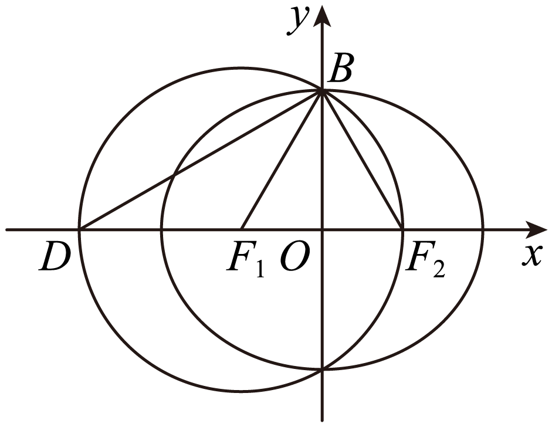

（3）由（1）及得，，椭圆的方程为.

设直线方程为，，则，

联立得，

，.

直线的方程为，

令得

.

故在轴上存在一个定点，使得、、三点共线.

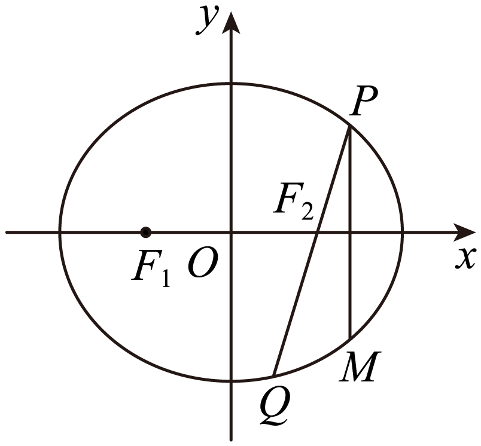

<strong>例12．</strong>（2024·福建福州·福州三中校考模拟预测）如图，双曲线的中心在原点，焦点到渐近线的距离为，左、右顶点分别为<em>A</em>、<em>B</em>．曲线<em>C</em>是以双曲线的实轴为长轴，虚轴为短轴，且离心率为的椭圆，设<em>P</em>在第一象限且在双曲线上，直线<em>BP</em>交椭圆于点<em>M</em>，直线<em>AP</em>与椭圆交于另一点<em>N</em>．

(1)求椭圆及双曲线的标准方程；

(2)设*MN*与*x*轴交于点*T*，是否存在点*P*使得(其中，为点*P*，*T*的横坐标)，若存在，求出*P*点的坐标，若不存在，请说明理由．

【解析】（1）由已知可设双曲线方程为，椭圆方程，则双曲线的一条渐近线方程为，即，故，即，又，

解得，所以双曲线方程：，

椭圆方程为：；

（2）设，，，，，

*P*、*A*、*N*三点共线，，

*P*、*B*、*M*三点共线，，

相除：，

令，则设：，

联立椭圆方程：，

由在椭圆内，故，所以，

∴，

，

若存在，即，

，得，

又*P*在第一象限，所以，；

法二：，，，，，

直线*AP*：，

，显然，

由，又因为*P*在双曲线上，满足，即，

所以，

即，

同理*BP*：，可得，所以，

若存在，即，

而*P*在第一象限，所以，即.

**变式12．**（2024·福建福州·福州四中校考模拟预测）已知在平面直角坐标系中，椭圆的左顶点和右焦点分别为，动点满足，记动点的轨迹为曲线.

(1)求的方程；

(2)设点在上，过作的两条切线，分别与轴相交于两点.是否存在点，使得等于的短轴长？若存在，求点的坐标；若不存在，请说明理由.

【解析】（1）依题意知，，

设，则由，得，

即，

曲线的方程为.

（2）（方法一）设点，则，

由题意知，的斜率存在，不妨依次设为，

则直线的方程为，即，

直线与圆相切，

即，

同理，可得，

显然是方程的两根，

，

即，.

设，则，

由，得，

由，得，

存在点，或满足题意.

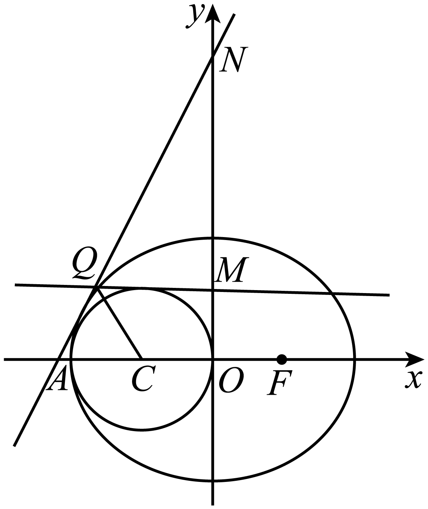

（方法二）设点在上，，

由题意知，的斜率存在，分别为，

则直线的方程为，

直线与圆相切，，

即，

同理，可得，

显然是方程的两根，

，

由，得，.

由，得，

存在点或满足题意.

<strong>变式13．</strong>（2024·甘肃定西·统考模拟预测）已知点<em>M</em>到点的距离比它到直线<em>l</em>：的距离小，记动点<em>M</em>的轨迹为<em>E</em>.

(1)求*E*的方程；

(2)若过点*F*的直线交*E*于，两点，则在*x*轴的正半轴上是否存在点*P*，使得*PA*，*PB*分别交*E*于另外两点*C*，*D*，且？若存在，请求出*P*点坐标，若不存在，请说明理由.

【解析】（1）因为点*M*到点的距离比它到直线*l*：的距离小，

所以点*M*到点的距离等于它到直线*l*：的距离，

则点*M*的轨迹为以为焦点，以为准线的抛物线，

则曲线*E*的方程为.

（2）设，

由得：，且，得，

即，所以，

代入抛物线方程，得，

整理得，同理可得

故是方程的两根，，

由韦达定理可得①，

由题意，直线*AB*的斜率一定存在，故设直线*AB*的方程为，

与抛物线方程联立可得，

易得，由韦达定理可得②，

由①②可得，

故在*x*轴的正半轴上存在一点满足条件.

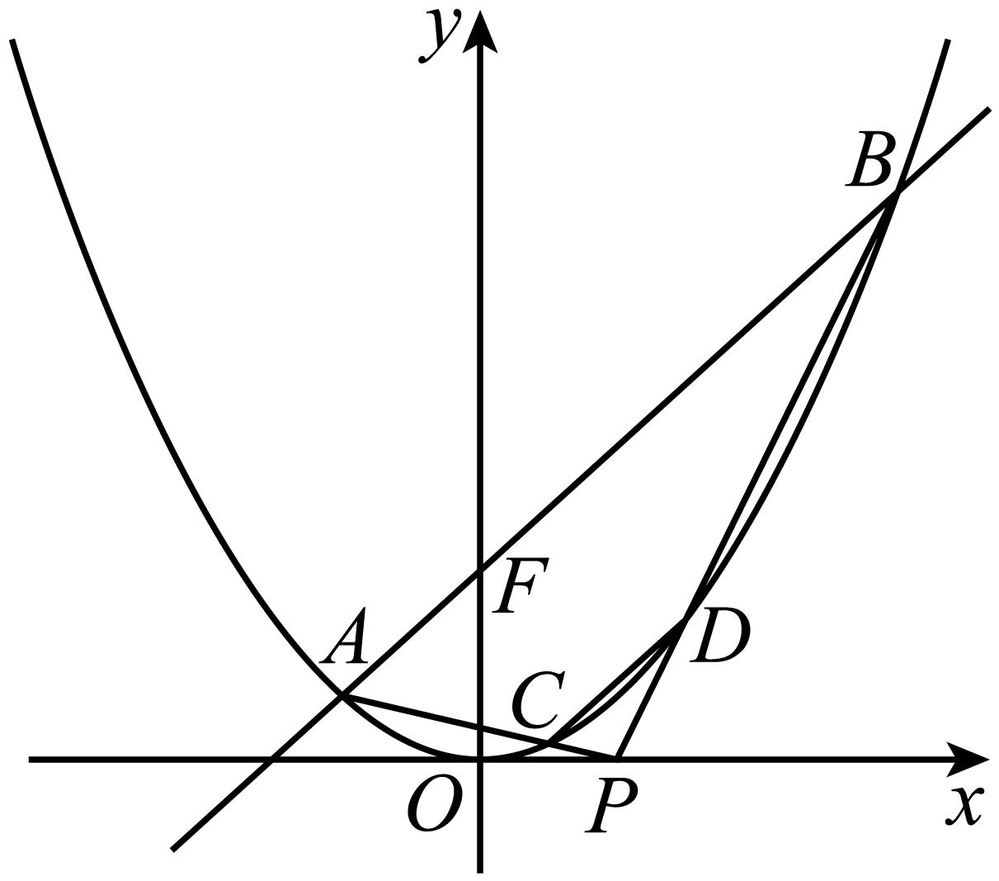

**变式14．**（2024·北京海淀·中关村中学校考三模）已知椭圆的焦距为2，长轴长为4.

(1)求椭圆的方程及离心率；

(2)过点且与轴不重合的直线与椭圆交于不同的两点、，点关于轴的对称点为.问：平面内是否存在定点，使得恒在直线上？若存在，求出点的坐标；若不存在，说明理由.

【解析】（1）因为椭圆的焦距为，长轴长为，

所以，，则椭圆的离心率，

所以，

所以椭圆的方程为.

（2）存在定点，使得恒在直线上.

设直线为，，，则，

联立，消去得，

，解得，

则，，

又直线的方程为，

又，

，恒过定点，

故存在定点，使得恒在直线上.

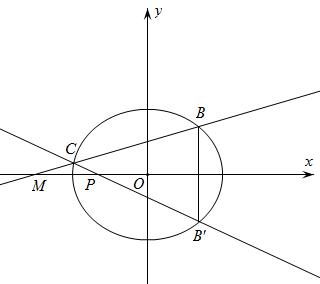

**题型五：存在点使线段关系式为定值**

**例13．**（2024·全国·高三专题练习）椭圆经过两点，，过点的动直线与椭圆相交于，两点．

(1)求椭圆的方程；

(2)若椭圆的右焦点是，其右准线与轴交于点，直线的斜率为，直线的斜率为，求证：；

(3)设点是椭圆的长轴上某一点（不为长轴顶点及坐标原点），是否存在与点不同的定点，使得恒成立？只需写出点的坐标，无需证明．

【解析】（1）设椭圆方程为，，，，

椭圆经过两点，，

，解得，，

椭圆的方程为．

（2）设，，则，，

由题意，，

，,,，

，，

，

，

若，则，结论成立．

若，则，

．

（3）当与轴平行时，设直线与椭圆相交于、两点，

如果存在定点满足条件，则有，

，在轴上，设，，

当直线与轴垂直时，设直线与椭圆相交于，两点，

则，的坐标分别为,，,，

由，有，

解得，

若存在不同于点不同的定点满足条件，则点坐标只可能为，．

下面证明：对任意直线，均有，

记直线的斜率为，直线的斜率为，

设，，则，．

由题意，,，

，，

，

，

若，则，符合题意；

若，则，

，

设点关于轴对称的点，，，*A*，三点共线，

，

对任意直线，均有．

<strong>例14．</strong>（2024·福建宁德·校考模拟预测）已知双曲线<em>C</em>与双曲线 有相同的渐近线，且过点.

(1)求双曲线*C*的标准方程；

(2)已知点，*E*，*F*是双曲线*C*上不同于*D*的两点，且，于点*G*，证明:存在定点*H*，使为定值.

【解析】（1）依题意，设双曲线*C*的方程为，而点在双曲线*C*上，

于是，双曲线*C*的方程为，即，

所以双曲线*C*的标准方程为.

（2）当直线斜率存在时，设直线的方程为：，设，

由消去*y*并整理得，

有，且，即且，

有，又，

，由，得，

整理得，

于是，化简得，

即，解得或，均满足条件，

当时，直线的方程为，直线过定点，与已知矛盾，

当时，直线的方程为，直线过定点；

当直线的斜率不存在时，由对称性不妨设直线的方程为：，

由解得或，因此点的横坐标有，即直线过定点，

综上得直线过定点，

由于，即点在以为直径的圆上，为该圆圆心，为该圆半径，

所以存在定点，使为定值.

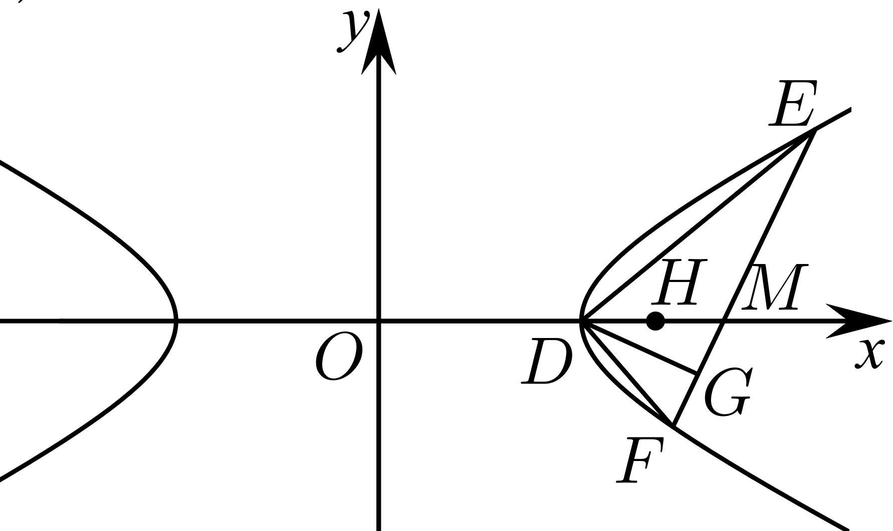

<strong>例15．</strong>（2024·四川成都·高三校考阶段练习）已知椭圆<em>C</em>：的离心率为，过椭圆右焦点<em>F</em>的直线<em>l</em>与椭圆交于<em>A</em>，<em>B</em>两点，当直线<em>l</em>与<em>x</em>轴垂直时，．

(1)求椭圆*C*的标准方程；

(2)当直线*l*的斜率为*k*时，在*x*轴上是否存在一点*P*（异于点*F*），使*x*轴上任意一点到直线*PA*与到直线*PB*的距离相等？若存在，求*P*点坐标；若不存在，请说明理由．

【解析】（1）设椭圆*C*的半焦距为，

由题意可得，解得，

所以椭圆*C*的标准方程为.

（2）由（1）可得：，

根据题意可设直线，

联立方程，消去*y*得，

则，

可得，①

由题意可知*x*轴为直线*PA*与直线*PB*的对称轴，则，

可得，

因为，可得，

整理得，②

将①代入②得：，解得，

所以存在点*P*，使*x*轴上任意一点到直线*PA*与到直线*PB*的距离相等，此时.

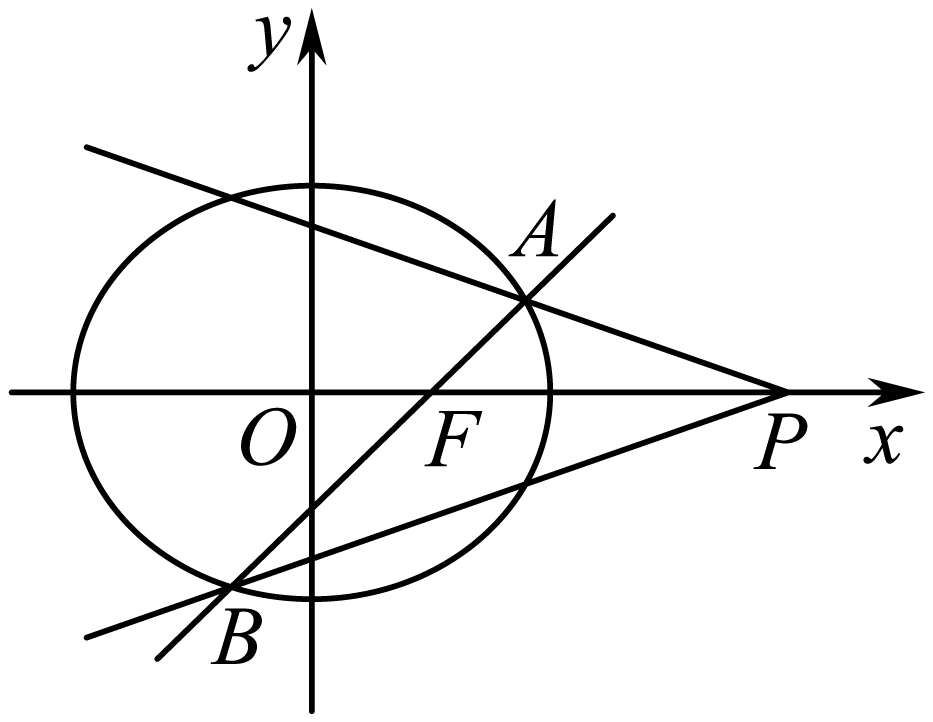

**变式15．**（2024·陕西安康·陕西省安康中学校考模拟预测）已知椭圆的中心为坐标原点，对称轴为坐标轴，且过点，.直线（不经过点）与椭圆交于两点，，直线与椭圆交于另一点，点满足，且在直线上.

(1)求的方程；

(2)证明：直线过定点，且存在另一个定点，使为定值.

【解析】（1）设的方程为，

则，解得，

所以的方程为.

（2）

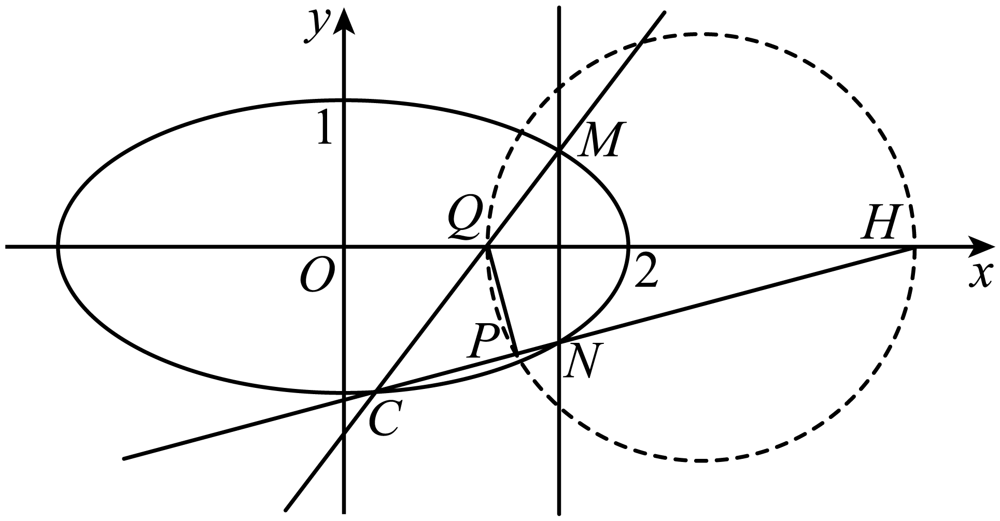

由题意可知直线的斜率存在且不为0，

设的方程为，

设点，，则，.

联立，消去，得，

则，

且，.

所以，所以的方程为.

令，则，

所以直线恒过定点，设为点.

又因为，在上，

所以，

则点在以为直径的圆上，从而的中点，使为定值.

**变式16．**（2024·湖南衡阳·高三衡阳市八中校考阶段练习）已知双曲线的右焦点，右顶点分别为，，，，点在线段上，且满足，直线的斜率为1，为坐标原点.

(1)求双曲线的方程.

(2)过点的直线与双曲线的右支相交于，两点，在轴上是否存在与不同的定点，使得恒成立？若存在，求出点的坐标；若不存在，请说明理由.

【解析】（1）设，所以，，，

因为点在线段上，且满足，所以点，

因为直线的斜率为1，所以，所以，

因为，所以，解得，，.

所以双曲线的方程为.

（2）假设在轴上存在与不同的定点，使得恒成立，

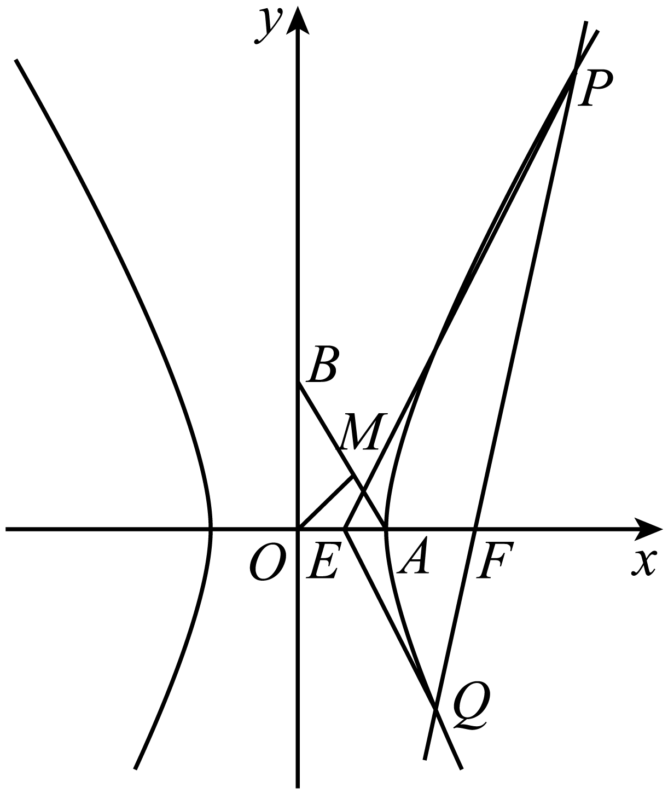

当直线*l*的斜率不存在时，*E*在*x*轴上任意位置，都有；

当直线*l*的斜率存在且不为0时，设，直线*l*的方程为，

直线与双曲线的右支相交于，两点，则且，

设，，

由，得， ，，

所以，，

因为，即，所以平分，，

有，即，得，

所以，由，解得.

综上所述，存在与不同的定点，使得恒成立，且.

<strong>变式17．</strong>（2024·河北秦皇岛·校联考模拟预测）如图，椭圆的左、右顶点分别为<em>A</em>，<em>B</em>．左、右焦点分别为，，离心率为，点在椭圆<em>C</em>上．

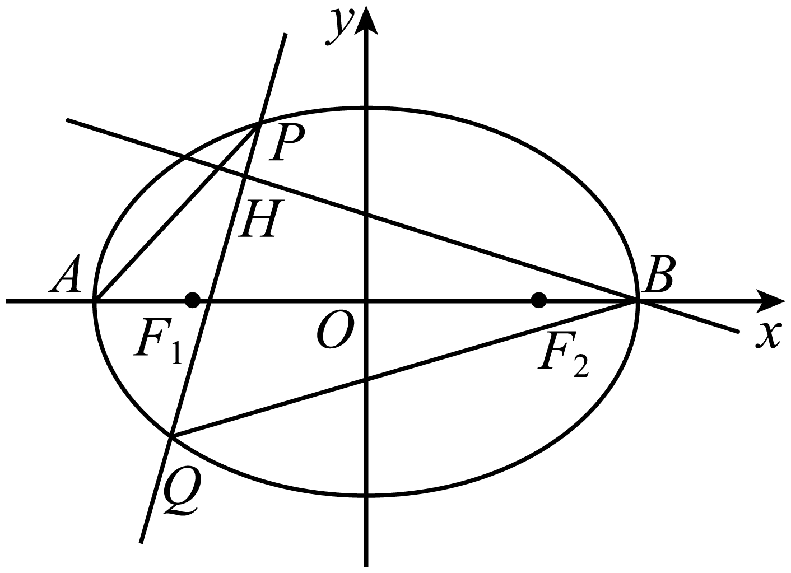

(1)求椭圆*C*的方程；

(2)已知*P*，*Q*是椭圆*C*上两动点，记直线*AP*的斜率为，直线*BQ*的斜率为，．过点*B*作直线*PQ*的垂线，垂足为*H*．问：在平面内是否存在定点*T*，使得为定值，若存在，求出点*T*的坐标；若不存在，试说明理由．

【解析】（1）由题意，可得，则椭圆方程为；

（2）若直线斜率为，则直线斜率为，而，

所以，，

联立与椭圆，则，整理得，

所以，则，故，

联立与椭圆，则，整理得，

所以，则，故，

综上，，

，

当，即时，，

此时，

所以，即直线过定点；

当，即时，

若，则且，且，故直线过定点；

若，则且，且，故直线过定点；

综上，直线过定点，又于，

易知轨迹是以为直径的圆上，故的中点到的距离为定值，

所以，所求定点*T*为.

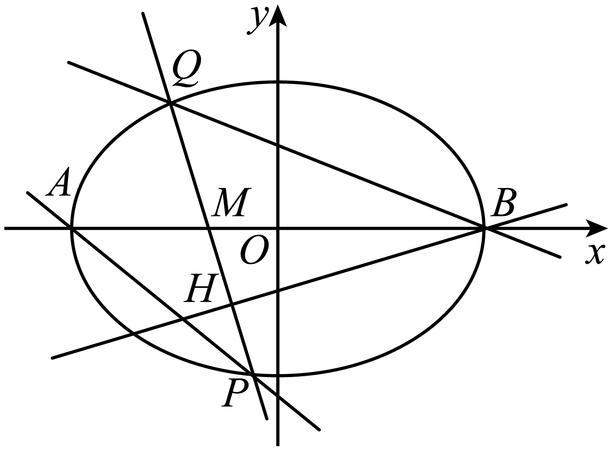

<strong>变式18．</strong>（2024·四川遂宁·高三射洪中学校考阶段练习）在平面直角坐标系中，设点的轨迹为曲线.①过点的动圆恒与轴相切，为该圆的直径；②点到的距离比到<em>y</em>轴的距离大1.

在①和②中选择一个作为条件:

(1)选择条件：_求曲线的方程；

(2)在轴正半轴上是否存在一点，当过点的直线与抛物线交于两点时，为定值？若存在，求出点的坐标，若不存在，请说明理由.

【解析】（1）选①：

如图，过作轴的垂线，垂足为，交直线于点，

设动圆的圆心为，半径为，则到轴的距离为，

在梯形中，由中位线性质可得，

所以，又，所以，

由抛物线的定义知，点是以为焦点，以直线为准线的抛物线，

所以曲线的方程为：.

选②：

设动圆的圆心为，则，

由圆与轴相切可得，

即，整理可得.

（2）设点，由题意知直线的斜率不为零，设直线的方程为，点，

由，得，则.

又，同理可得，

则有

.

若为定值，则，此时点为定点.

又当时，，所以，存在点，

当过点的直线与抛物线交于两点时，为定值1．

<strong>变式19．</strong>（2024·四川成都·高三树德中学校考开学考试）已知椭圆的离心率为，且经过点．<em>P</em>为椭圆<em>C</em>在第一象限内部分上的一点．

(1)若，，求面积的最大值；

(2)是否存在点*P*，使得过点*P*作圆的两条切线，分别交*y*轴于*D*，*E*两点，且．若存在，点求出*P*的坐标；若不存在，说明理由．

【解析】（1）由题知解得，，故椭圆*C*的方程为．

所以点，，．

设点，则

所以．

（2）设点，，，

则直线*PD*的方程为，即，因为圆心到直线*PD*的距离为1，即，

即，即，

同理．由此可知，*m*，*n*为方程的两个实根，所以，．

．

因为点在椭圆*C*上，则，则，

则，

则，因为，则，，即，

故存在点满足题设条件

