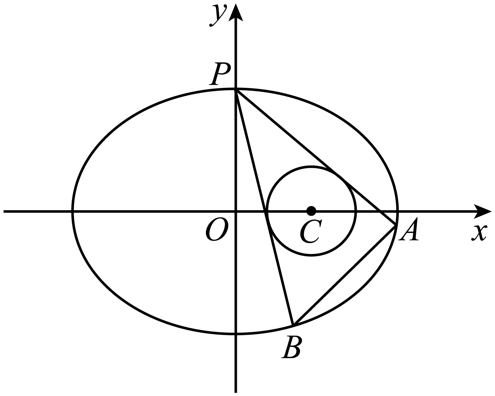
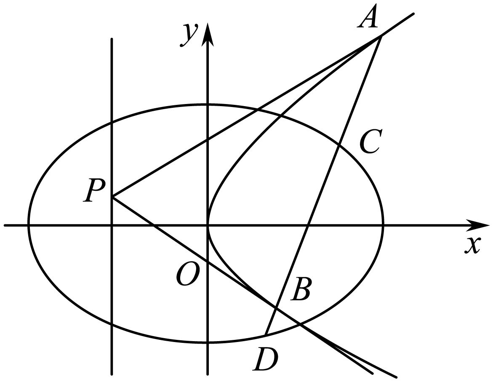
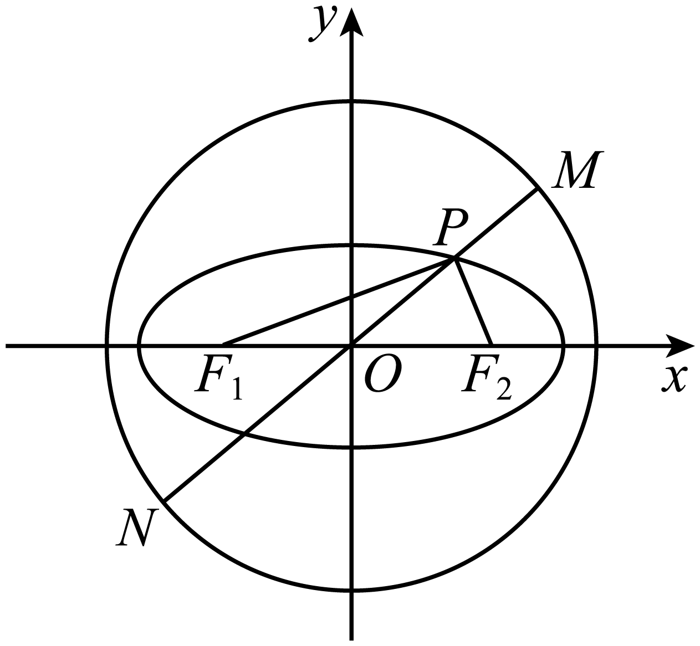
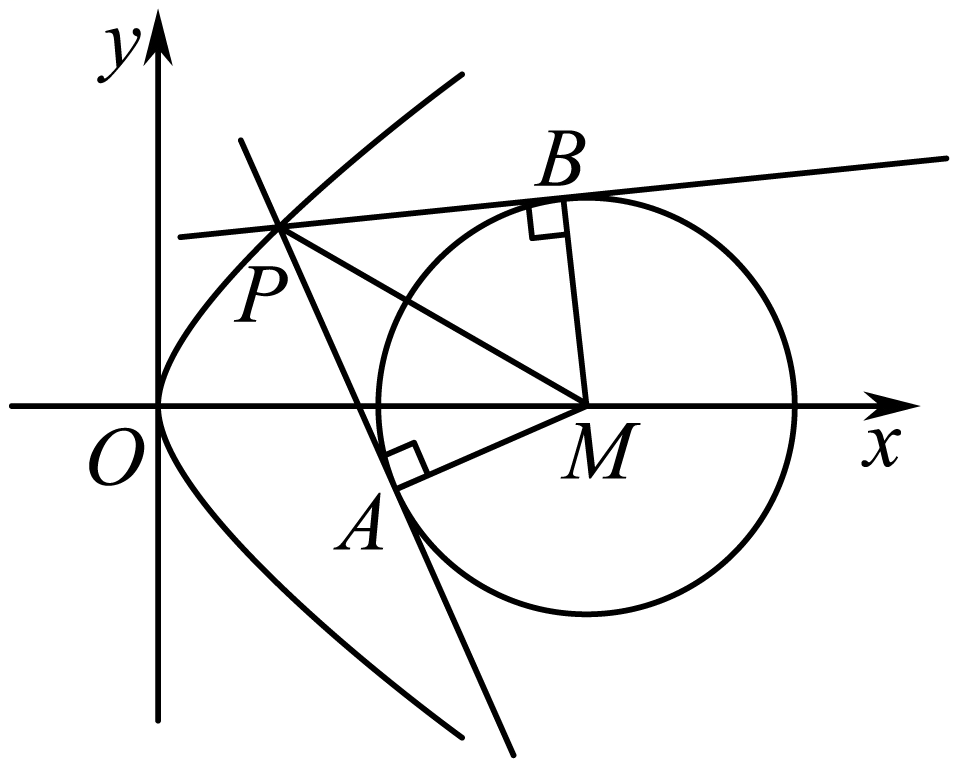
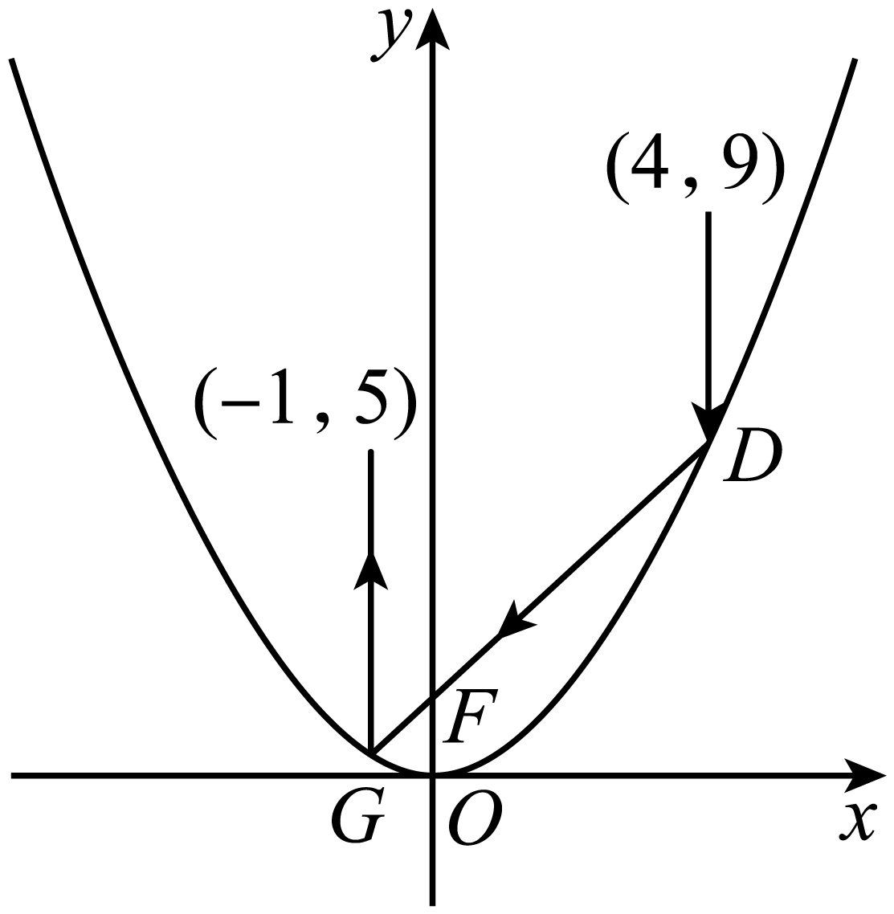

**第75讲  切点与切点弦**

**知识梳理**

1、点在圆上，过点作圆的切线方程为．

2、点在圆外，过点作圆的两条切线，切点分别为，则切点弦的直线方程为．

3、点在圆内，过点作圆的弦（不过圆心），分别过作圆的切线，则两条切线的交点的轨迹方程为直线．

4、点在圆上，过点作圆的切线方程为．

5、点在圆外，过点作圆的两条切线，切点分别为，则切点弦的直线方程为．

6、点在圆内，过点作圆的弦（不过圆心），分别过作圆的切线，则两条切线的交点的轨迹方程为．

7、点在椭圆上，过点作椭圆的切线方程为．

8、点在椭圆外，过点作椭圆的两条切线，切点分别为，则切点弦的直线方程为．

9、点在椭圆内，过点作椭圆的弦（不过椭圆中心），分别过作椭圆的切线，则两条切线的交点的轨迹方程为直线．

10、点在双曲线上，过点作双曲线的切线方程为．

11、点在双曲线外，过点作双曲线的两条切线，切点分别为，则切点弦的直线方程为．

12、点在双曲线内，过点作双曲线的弦（不过双曲线中心），分别过作双曲线的切线，则两条切线的交点的轨迹方程为直线．

13、点在抛物线上，过点作抛物线的切线方程为．

14、点在抛物线外，过点作抛物线的两条切线，切点分别为，则切点弦的直线方程为．

15、点在抛物线内，过点作抛物线的弦，分别过作抛物线的切线，则两条切线的交点的轨迹方程为直线．

**必考题型全归纳**

**题型一：切线问题**

**例1．**（2024·浙江杭州·高三浙江省杭州第二中学校考阶段练习）已知抛物线，焦点为.过抛物线外一点（不在轴上）作抛物线的切线，其中为切点，两切线分别交轴于点.

(1)求的值；

(2)证明：

①是与的等比中项；

②平分.

<strong>例2．</strong>（2024·江西·高三校联考开学考试）已知抛物线，<em>F</em>为<em>C</em>的焦点，过点<em>F</em>的直线与<em>C</em>交于<em>H</em>，<em>I</em>两点，且在<em>H</em>，<em>I</em>两点处的切线交于点<em>T</em>．

(1)当的斜率为时，求；

(2)证明：．

**例3．**（2024·湖北·高三校联考开学考试）已知抛物线的焦点为，过作斜率为的直线与交于两点，当时，.

(1)求抛物线的标准方程；

(2)设线段的中垂线与轴交于点，抛物线在两点处的切线相交于点，设两点到直线的距离分别为，求的值.

<strong>变式1．</strong>（2024·全国·高三专题练习）设抛物线的焦点为<em>F</em>，过<em>F</em>且斜率为1的直线<em>l</em>与<em>E</em>交于<em>A</em>，<em>B</em>两点，且．

(1)求抛物线*E*的方程；

(2)设为*E*上一点，*E*在*P*处的切线与*x*轴交于*Q*，过*Q*的直线与*E*交于*M*，*N*两点，直线*PM*和*PN*的斜率分别为和．求证：为定值．

<strong>变式2．</strong>（2024·广东广州·高三华南师大附中校考开学考试）已知椭圆的两焦点分别为 ，<em>A</em>是椭圆上一点，当时，的面积为.

(1)求椭圆的方程；

(2)直线与椭圆交于两点，线段的中点为，过作垂直轴的直线在第二象限交椭圆于点*S*，过*S*作椭圆的切线，的斜率为，求的取值范围.

**变式3．**（2024·江西南昌·南昌市八一中学校考三模）已知椭圆经过点，且离心率为，为椭圆的左焦点，点为直线上的一点，过点作椭圆的两条切线，切点分别为，，连接，，．

(1)证明：直线经过定点；

(2)若记、的面积分别为和，当取最大值时，求直线的方程．

参考结论：为椭圆上一点，则过点的椭圆的切线方程为．

**题型二：切点弦过定点问题**

<strong>例4．</strong>（2024·全国·高三专题练习）已知直线<em>l1</em>是抛物线<em>C</em>：<em>x2</em>＝2<em>py</em>（<em>p</em>＞0）的准线，直线<em>l2</em>：，且<em>l2</em>与抛物线<em>C</em>没有公共点，动点<em>P</em>在抛物线<em>C</em>上，点<em>P</em>到直线<em>l1</em>和<em>l2</em>的距离之和的最小值等于2．

(1)求抛物线*C*的方程；

(2)点<em>M</em>在直线<em>l1</em>上运动，过点<em>M</em>作抛物线<em>C</em>的两条切线，切点分别为<em>P1</em>，<em>P2</em>，在平面内是否存在定点<em>N</em>，使得<em>MN</em>⊥<em>P1P2</em>恒成立？若存在，请求出定点<em>N</em>的坐标，若不存在，请说明理由．

<strong>例5．</strong>（2024·福建宁德·校考一模）双曲线的离心率为，右焦点<em>F</em>到渐近线的距离为．

(1)求双曲线*C*的标准方程；

(2)过直线上任意一点*P*作双曲线*C*的两条切线，交渐近线于*A*，*B*两点，证明：以*AB*为直径的圆恒过右焦点*F*．

**例6．**（2024·四川绵阳·高三四川省绵阳南山中学校考开学考试）已知抛物线的焦点到准线的距离为1．

(1)求抛物线的标准方程；

(2)设点是该抛物线上一定点，过点作圆（其中）的两条切线分别交抛物线于点，连接．探究：直线是否过一定点，若过，求出该定点坐标；若不经过定点，请说明理由．

<strong>变式4．</strong>（2024·陕西·校联考三模）已知直线<em>l</em>与抛物线交于<em>A</em>，<em>B</em>两点，且，，<em>D</em>为垂足，点<em>D</em>的坐标为．

(1)求*C*的方程；

(2)若点*E*是直线上的动点，过点*E*作抛物线*C*的两条切线，，其中*P*，*Q*为切点，试证明直线恒过一定点，并求出该定点的坐标．

**变式5．**（2024·贵州·校联考二模）抛物线的焦点到准线的距离等于椭圆的短轴长．

(1)求抛物线的方程；

(2)设是抛物线上位于第一象限的一点，过作（其中）的两条切线，分别交抛物线于点,,证明：直线经过定点．

**变式6．**（2024·河南·校联考模拟预测）已知椭圆的焦距为2，圆与椭圆恰有两个公共点．

(1)求椭圆的标准方程；

(2)已知结论：若点为椭圆上一点，则椭圆在该点处的切线方程为．若椭圆的短轴长小于4，过点作椭圆的两条切线，切点分别为，求证：直线过定点．

**变式7．**（2024·重庆九龙坡·高三重庆市育才中学校考开学考试）如图所示，已知在椭圆上，圆，圆在椭圆内部.

(1)求的取值范围；

(2)过作圆的两条切线分别交椭圆于点（不同于），直线是否过定点？若过定点，求该定点坐标；若不过定点，请说明理由.

**题型三：利用切点弦结论解决定值问题**

**例7．**（2024·全国·高三专题练习）已知中心在原点的椭圆和抛物线有相同的焦点，椭圆的离心率为，抛物线的顶点为原点.

(1)求椭圆和抛物线的方程；

(2)设点为抛物线准线上的任意一点，过点作抛物线的两条切线，，其中为切点.设直线，的斜率分别为，，求证：为定值.

<strong>例8．</strong>（2024·全国·高三专题练习）已知<em>F</em>是抛物线<em>C</em>：的焦点，以<em>F</em>为圆心，2<em>p</em>为半径的圆<em>F</em>与抛物线<em>C</em>交于<em>A</em>，<em>B</em>两点，且.

(1)求抛物线*C*和圆*F*的方程；

(2)若点*P*为圆*F*优弧*AB*上任意一点，过点*P*作抛物线*C*的两条切线*PM*，*PN*，切点分别为*M*，*N*，请问是否为定值？若是，求出该定值；若不是，请说明理由.

**例9．**（2024·全国·高三专题练习）已知抛物线：的焦点为，过点引圆：的一条切线，切点为，.

(1)求抛物线的方程；

(2)过圆*M*上一点*A*引抛物线*C*的两条切线，切点分别为*P*，*Q*，是否存在点*A*使得的面积为？若存在，求点*A*的个数；否则，请说明理由.

**变式8．**（2024·全国·高三专题练习）已知抛物线的焦点到准线的距离为2，圆与轴相切，且圆心与抛物线的焦点重合.

(1)求抛物线和圆的方程；

(2)设为圆外一点，过点作圆的两条切线，分别交抛物线于两个不同的点和点.且，证明：点在一条定曲线上.

<strong>变式9．</strong>（2024·全国·模拟预测）已知抛物线的焦点为<em>F</em>，<em>P</em>为抛物线上一动点，点<em>P</em>到<em>F</em>的最小距离为1．

(1)求抛物线*C*的标准方程；

(2)过点向*C*作两条切线*AM*，*AN*，切点分别为*M*，*N*，直线*AF*与直线*MN*交于点*Q*，求证：点*Q*到直线*FM*的距离等于到直线*FN*的距离．

**变式10．**（2024·全国·高三专题练习）已知点在抛物线上，且到抛物线的焦点的距离为2.

(1)求抛物线的标准方程；

(2)过点向抛物线作两条切线，切点分别为，若直线与直线交于点，且点到直线､直线的距离分别为.求证：为定值.

<strong>变式11．</strong>（2024·上海长宁·高三上海市延安中学校考开学考试）在以为圆心，6为半径的圆<em>A</em>内有一点，点<em>P</em>为圆<em>A</em>上的任意一点，线段<em>BP</em>的垂直平分线和半径<em>AP</em>交于点<em>M</em>．

(1)判断点*M*的轨迹是什么曲线，并求其方程；

(2)记点*M*的轨迹为曲线，过点*B*的直线与曲线交于*C*、*D*两点，求的最大值；

(3)在圆上的任取一点*Q*，作曲线的两条切线，切点分别为*E*、*F*，试判断*QE*与*QF*是否垂直，并给出证明过程．

**变式12．**（2024·全国·高三专题练习）已知拋物线，为焦点，若圆与拋物线交于两点，且

(1)求抛物线的方程；

(2)若点为圆上任意一点，且过点可以作拋物线的两条切线，切点分别为.求证：恒为定值.

**变式13．**（2024·浙江金华·浙江金华第一中学校考模拟预测）已知抛物线，圆是上异于原点的一点.

(1)设是上的一点，求的最小值；

(2)过点作的两条切线分别交于两点（异于）.若，求点的坐标.

<strong>变式14．</strong>（2024·湖南长沙·湖南师大附中校考模拟预测）如图，椭圆，圆，椭圆<em>C</em>的左、右焦点分别为．

(1)过椭圆上一点*P*和原点*O*作直线*l*交圆*O*于*M*，*N*两点，若，求的值；

(2)过圆*O*上任意点*R*引椭圆*C*的两条切线，求证：两条切线相互垂直．

**变式15．**（2024·河南·校联考模拟预测）在椭圆：（）中，其所有外切矩形的顶点在一个定圆：上，称此圆为椭圆的蒙日圆.椭圆过，.

(1)求椭圆的方程；

(2)过椭圆的蒙日圆上一点，作椭圆的一条切线，与蒙日圆交于另一点，若，存在，证明：为定值.

**题型四：利用切点弦结论解决最值问题**

<strong>例10．</strong>（2024·福建泉州·高三校联考阶段练习）已知<em>F</em>为抛物线<em>C</em>：的焦点，是<em>C</em>上一点，<em>M</em>位于<em>F</em>的上方且.

(1)求*p*；

(2)若点*P*在直线上，*PA*，*PB*是*C*的两条切线，*A*，*B*是切点，求的最小值.

**例11．**（2024·全国·高三专题练习）已知抛物线的焦点到准线的距离为.

(1)求抛物线的方程及焦点的坐标；

(2)如图，过抛物线上一动点作圆的两条切线，切点分别为，求四边形面积的最小值.

**例12．**（2024·全国·高三专题练习）已知椭圆的左、右焦点分别为，，左顶点为，离心率为，经过的直线交椭圆于两点，的周长为8．

(1)求椭圆的方程；

(2)过直线上一点*P*作椭圆*C*的两条切线，切点分别为，

①证明：直线过定点；

②求的最大值．

备注：若点在椭圆*C*：上，则椭圆*C*在点处的切线方程为．

**变式16．**（2024·贵州·高三校联考阶段练习）已知抛物线上的点到其焦点的距离为.

(1)求抛物线的方程；

(2)已知点在直线：上，过点作抛物线的两条切线，切点分别为，直线与直线交于点，过抛物线的焦点作直线的垂线交直线于点，当最小时，求的值.

<strong>变式17．</strong>（2024·全国·高三专题练习）已知椭圆 的左、右焦点分别为，，为<em>C</em>上一动点，的最大值为，且长轴长和短轴长之比为2 .

(1)求椭圆*C*的标准方程；

(2)若，过*P*作圆 的两条切线，，设，与*x*轴分别交于*M*，*N*两点，求面积的最小值.

<strong>变式18．</strong>（2024·贵州黔东南·凯里一中校考三模）已知直线与抛物线<em>C</em>：交于<em>A</em>，<em>B</em>两点，分别过<em>A</em>，<em>B</em>两点作<em>C</em>的切线，两条切线的交点为.

(1)证明点*D*在一条定直线上；

(2)过点*D*作*y*轴的平行线交*C*于点*E*，线段的中点为，

①证明：为的中点；

②求面积的最小值.

**变式19．**（2024·新疆喀什·统考模拟预测）已知抛物线的焦点为，且与圆上点的距离的最小值为3.

(1)求；

(2)若点在圆上，，是抛物线的两条切线，是切点，求三角形面积的最大值.

**变式20．**（2024·黑龙江哈尔滨·哈尔滨三中校考模拟预测）已知抛物线的顶点在原点，焦点在轴上，其上一点到焦点的距离为2.

(1)求抛物线方程；

(2)圆：，过抛物线上一点作圆的两条切线与轴交于、两点，求的最小值.

<strong>变式21．</strong>（2024·广东茂名·高三校考阶段练习）已知平面内动点，<em>P</em>到定点的距离与<em>P</em>到定直线的距离之比为，

(1)记动点*P*的轨迹为曲线*C* ，求*C*的标准方程．

(2)已知点是圆上任意一点，过点作做曲线*C*的两条切线，切点分别是，求面积的最大值，并确定此时点的坐标.

注：椭圆：上任意一点处的切线方程是：.

**变式22．**（2024·湖北黄冈·浠水县第一中学校考三模）已知椭圆经过点，过原点的直线与椭圆交于，两点，点在椭圆上（异于，），且．

(1)求椭圆的标准方程；

(2)若点为直线上的动点，过点作椭圆的两条切线，切点分别为，，求的最大值．

<strong>变式23．</strong>（2024·新疆乌鲁木齐·统考二模）已知抛物线<em>C</em>：的准线为<em>l</em>，圆<em>O</em>：.

(1)当时，圆*O*与抛物线*C*和准线*l*分别交于点*A*，*B*和点*M*，*N*，且，求抛物线*C*的方程；

(2)当时，点是（1）中所求抛物线*C*上的动点.过*P*作圆*O*的两条切线分别与抛物线*C*的准线*l*交于*D*，*E*两点，求面积的最小值.

**题型五：利用切点弦结论解决范围问题**

**例13．**（2024·全国·高三专题练习）已知椭圆的离心率为，且直线被椭圆截得的弦长为．

(1)求椭圆的方程；

(2)以椭圆的长轴为直径作圆，过直线上的动点作圆的两条切线，设切点为，若直线与椭圆交于不同的两点，，求的取值范围．

**例14．**（2024·海南·统考模拟预测）已知抛物线的焦点为，准线为，点是直线上一动点，直线与直线交于点，.

(1)求抛物线的方程；

(2)过点作抛物线的两条切线，切点为，且，求面积的取值范围.

<strong>例15．</strong>（2024·全国·高三专题练习）已知椭圆的左，右焦点分别为，，离心率为，<em>M</em>为椭圆上异于左右顶点的动点，的周长为.

(1)求椭圆*C*的标准方程；

(2)过点*M*作圆的两条切线，切点分别为，直线*AB*交椭圆*C*于*P*，*Q*两点，求的面积的取值范围.

<strong>变式24．</strong>（2024·辽宁沈阳·校联考二模）从抛物线的焦点发出的光经过抛物线反射后，光线都平行于抛物线的轴，根据光路的可逆性，平行于抛物线的轴射向抛物线后的反射光线都会汇聚到抛物线的焦点处，这一性质被广泛应用在生产生活中．如图，已知抛物线，从点发出的平行于<em>y</em>轴的光线照射到抛物线上的<em>D</em>点，经过抛物线两次反射后，反射光线由<em>G</em>点射出，经过点．

(1)求抛物线*C*的方程；

(2)已知圆，在抛物线*C*上任取一点*E*，过点*E*向圆*M*作两条切线*EA*和*EB*，切点分别为*A*、*B*，求的取值范围．

<strong>变式25．</strong>（2024·云南昆明·高三昆明一中校考阶段练习）直线过双曲线的一个焦点，且直线<em>l</em>与双曲线<em>C</em>的一条渐近线垂直.

(1)求双曲线*C*的方程；

(2)过点作一条斜率为*k*的直线，若直线上存在点*P*，使得过点*P*总能作*C*的两条切线互相垂直，求直线*k*的取值范围.

