**第75讲  切点与切点弦**

**知识梳理**

1、点在圆上，过点作圆的切线方程为．

2、点在圆外，过点作圆的两条切线，切点分别为，则切点弦的直线方程为．

3、点在圆内，过点作圆的弦（不过圆心），分别过作圆的切线，则两条切线的交点的轨迹方程为直线．

4、点在圆上，过点作圆的切线方程为．

5、点在圆外，过点作圆的两条切线，切点分别为，则切点弦的直线方程为．

6、点在圆内，过点作圆的弦（不过圆心），分别过作圆的切线，则两条切线的交点的轨迹方程为．

7、点在椭圆上，过点作椭圆的切线方程为．

8、点在椭圆外，过点作椭圆的两条切线，切点分别为，则切点弦的直线方程为．

9、点在椭圆内，过点作椭圆的弦（不过椭圆中心），分别过作椭圆的切线，则两条切线的交点的轨迹方程为直线．

10、点在双曲线上，过点作双曲线的切线方程为．

11、点在双曲线外，过点作双曲线的两条切线，切点分别为，则切点弦的直线方程为．

12、点在双曲线内，过点作双曲线的弦（不过双曲线中心），分别过作双曲线的切线，则两条切线的交点的轨迹方程为直线．

13、点在抛物线上，过点作抛物线的切线方程为．

14、点在抛物线外，过点作抛物线的两条切线，切点分别为，则切点弦的直线方程为．

15、点在抛物线内，过点作抛物线的弦，分别过作抛物线的切线，则两条切线的交点的轨迹方程为直线．

**必考题型全归纳**

**题型一：切线问题**

**例1．**（2024·浙江杭州·高三浙江省杭州第二中学校考阶段练习）已知抛物线，焦点为.过抛物线外一点（不在轴上）作抛物线的切线，其中为切点，两切线分别交轴于点.

(1)求的值；

(2)证明：

①是与的等比中项；

②平分.

【解析】（1）抛物线焦点，设点，

设抛物线的切线的方程分别为：

由整理得，，

由，

可得，同理，

则抛物线的切线的方程分别为：

则，，

则，

（2）①由（1）可得

，，

则，

，

则，故是与的等比中项；

②

，

则,又，则

故平分.

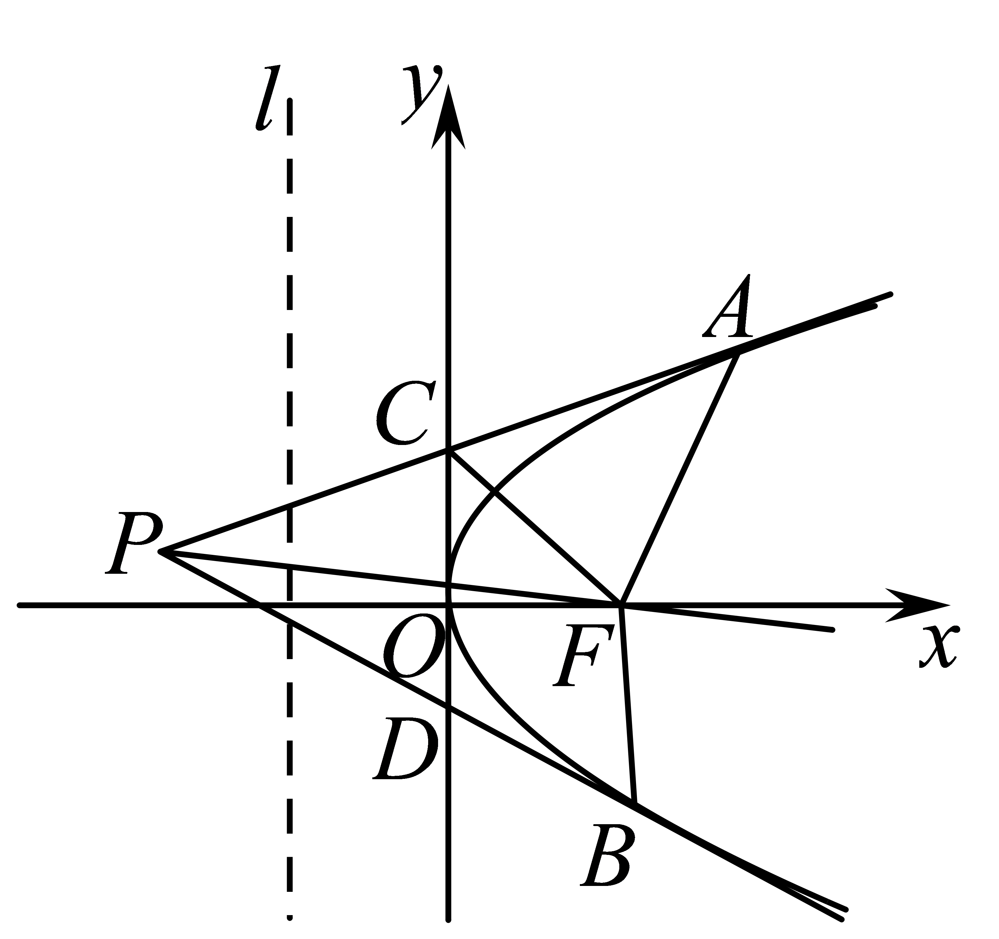

<strong>例2．</strong>（2024·江西·高三校联考开学考试）已知抛物线，<em>F</em>为<em>C</em>的焦点，过点<em>F</em>的直线与<em>C</em>交于<em>H</em>，<em>I</em>两点，且在<em>H</em>，<em>I</em>两点处的切线交于点<em>T</em>．

(1)当的斜率为时，求；

(2)证明：．

【解析】（1）依题意，抛物线的焦点，准线方程，当*l*的斜率为时，*l*的方程为，

由，得，设，，则，

所以.

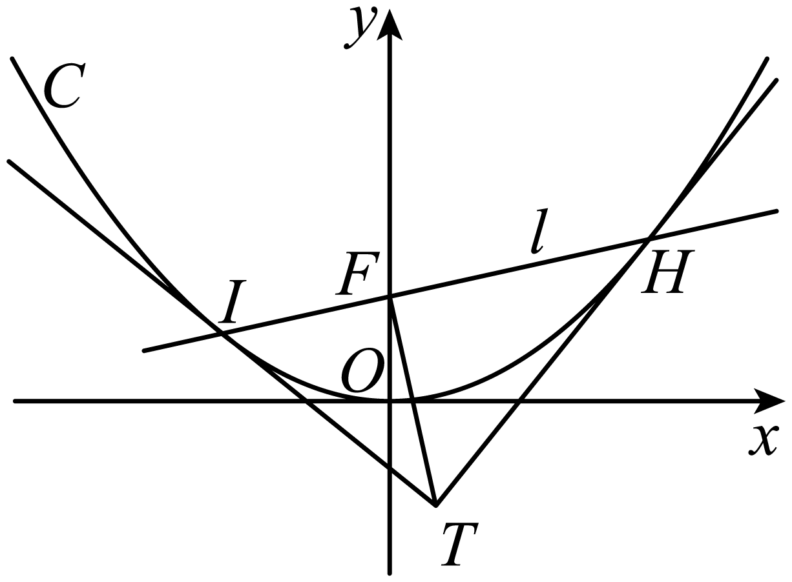

（2）依题意，直线*l*的斜率存在，设直线*l*的方程为，

由消去*y*得，由（1），，

，，对求导，得，

切线的方程为，切线的方程为，

由，解得，即，

当时，，显然；当时，直线的斜率为，因此，

所以.

**例3．**（2024·湖北·高三校联考开学考试）已知抛物线的焦点为，过作斜率为的直线与交于两点，当时，.

(1)求抛物线的标准方程；

(2)设线段的中垂线与轴交于点，抛物线在两点处的切线相交于点，设两点到直线的距离分别为，求的值.

【解析】（1）当时，直线的方程为，

设，

联立方程组,消去得，

所以恒成立，

，，

所以，

解得，

所以抛物线的方程为.

（2）由（1）知，则，

设，显然，，线段的中点为，

联立方程组消去得，

恒成立，

所以，

所以，

所以，则的中垂线方程为，

令，得，所以，

所以.

由得，则，

不妨设，，则切线的斜率为，切线的斜率为，

则切线：，即，

切线，即，

联立方程组，解得，

由，，

得，得，

得，得，

因为，所以，而，

所以，所以，

则，所以，

所以点到直线的距离.

故.

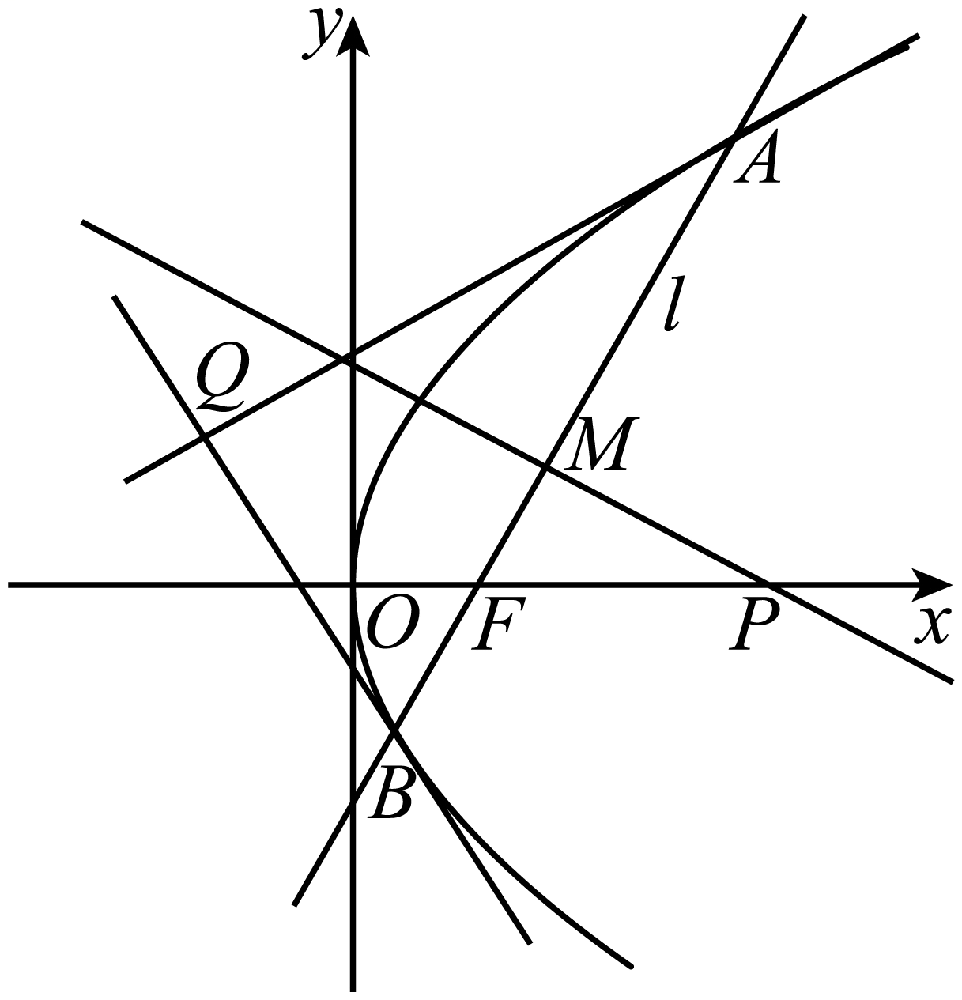

<strong>变式1．</strong>（2024·全国·高三专题练习）设抛物线的焦点为<em>F</em>，过<em>F</em>且斜率为1的直线<em>l</em>与<em>E</em>交于<em>A</em>，<em>B</em>两点，且．

(1)求抛物线*E*的方程；

(2)设为*E*上一点，*E*在*P*处的切线与*x*轴交于*Q*，过*Q*的直线与*E*交于*M*，*N*两点，直线*PM*和*PN*的斜率分别为和．求证：为定值．

【解析】（1）由题意，，直线*l*的方程为，代入，得．于是，∴焦点弦，解得*p*＝2．故抛物线*E*的方程为．

（2）因在*E*上，∴*m*＝2．设*E*在*P*处的切线方程为，代入，得．由，解得*t*＝1，∴*P*处的切线方程为*y*＝*x*＋1，从而得．

易知直线*MN*的斜率存在，设其方程为，设，．

将代入，得．于是，，且，．

∴

．

故为定值2．

<strong>变式2．</strong>（2024·广东广州·高三华南师大附中校考开学考试）已知椭圆的两焦点分别为 ，<em>A</em>是椭圆上一点，当时，的面积为.

(1)求椭圆的方程；

(2)直线与椭圆交于两点，线段的中点为，过作垂直轴的直线在第二象限交椭圆于点*S*，过*S*作椭圆的切线，的斜率为，求的取值范围.

【解析】（1）由题意得，

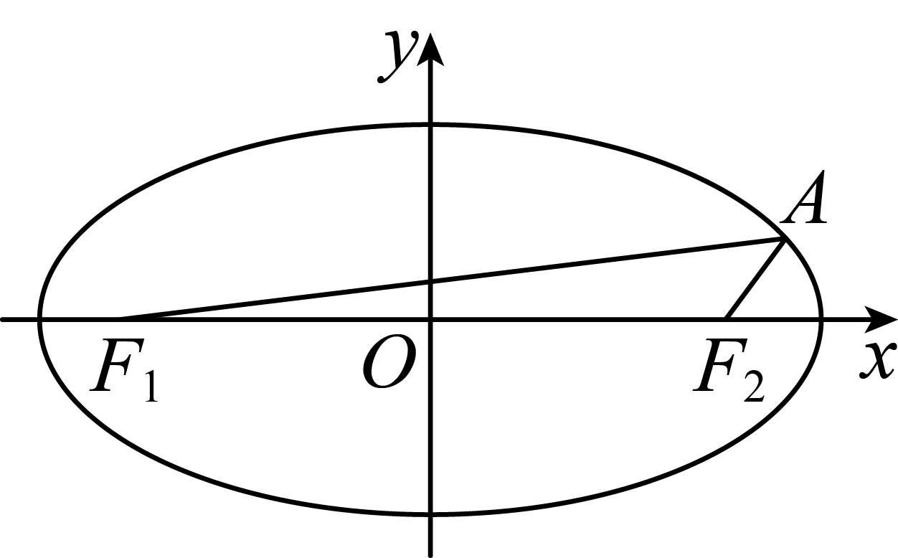

由椭圆定义可得，又，

由余弦定理可得：

，

所以，又，解得，

所以，故椭圆的方程为.

（2）直线，设，

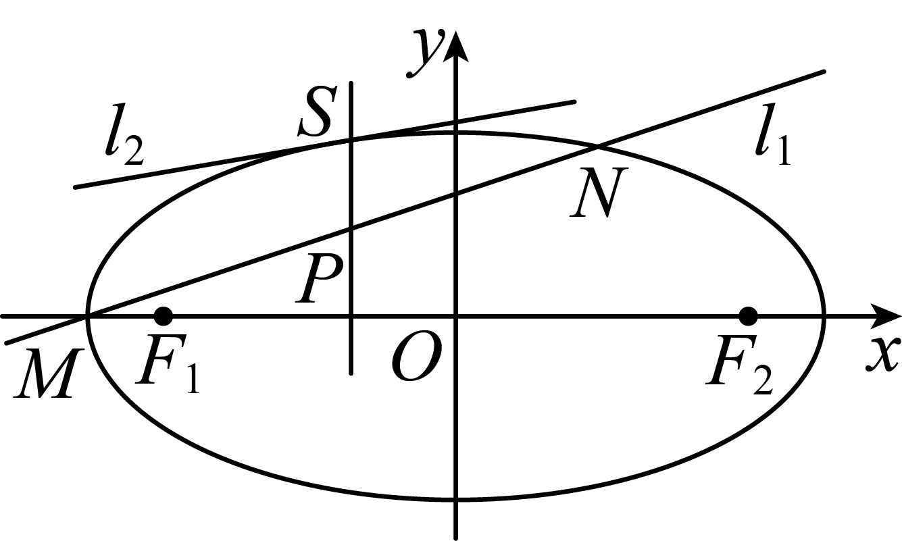

联立与得，所以，

恒成立，

所以，

故，

设直线为，，

联立，所以，

由可得，

所以，则，所以得，所以，

则，

由于函数在上为减函数，所以函数在上为增函数，

所以函数在上为减函数，所以，

所以.

**变式3．**（2024·江西南昌·南昌市八一中学校考三模）已知椭圆经过点，且离心率为，为椭圆的左焦点，点为直线上的一点，过点作椭圆的两条切线，切点分别为，，连接，，．

(1)证明：直线经过定点；

(2)若记、的面积分别为和，当取最大值时，求直线的方程．

参考结论：为椭圆上一点，则过点的椭圆的切线方程为．

【解析】（1）由题意可得，即，，

故椭圆的方程为，

设，，，

由参考结论知过点在处的椭圆的切线方程为，

同理，过点在处的椭圆的切线方程为，

点在直线，上，，

直线的方程为，即，

可得，则直线过定点；

（2）由（1）知，，，

设直线的方程为，联立，

得，故，，

为，

，

当且仅当，即时取等号，此时直线的方程为，

即或．

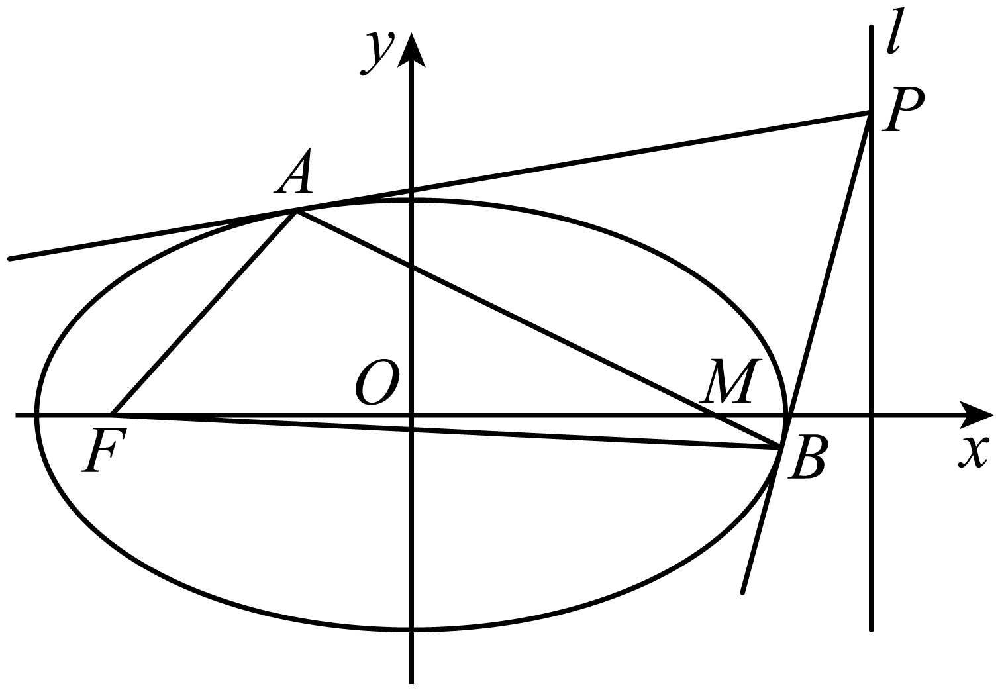

**题型二：切点弦过定点问题**

<strong>例4．</strong>（2024·全国·高三专题练习）已知直线<em>l1</em>是抛物线<em>C</em>：<em>x2</em>＝2<em>py</em>（<em>p</em>＞0）的准线，直线<em>l2</em>：，且<em>l2</em>与抛物线<em>C</em>没有公共点，动点<em>P</em>在抛物线<em>C</em>上，点<em>P</em>到直线<em>l1</em>和<em>l2</em>的距离之和的最小值等于2．

(1)求抛物线*C*的方程；

(2)点<em>M</em>在直线<em>l1</em>上运动，过点<em>M</em>作抛物线<em>C</em>的两条切线，切点分别为<em>P1</em>，<em>P2</em>，在平面内是否存在定点<em>N</em>，使得<em>MN</em>⊥<em>P1P2</em>恒成立？若存在，请求出定点<em>N</em>的坐标，若不存在，请说明理由．

【解析】（1）作<em>PA</em>，<em>PB</em>分别垂直<em>l1</em>和<em>l2</em>，垂足为<em>A</em>，<em>B</em>，抛物线<em>C</em>的焦点为，

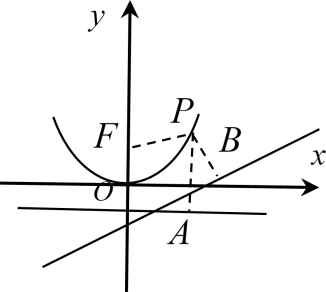

由抛物线定义知|<em>PA</em>|＝|<em>PF</em>|，所以<em>d1</em>+<em>d2</em>＝|<em>PA</em>|+|<em>PB</em>|＝|<em>PF</em>|+|<em>PB</em>|，

显见<em>d1</em>+<em>d2</em>的最小值即为点<em>F</em>到直线<em>l2</em>的距离，

故，解之得或（舍）

所以抛物线<em>C</em>的方程为<em>x2</em>＝4<em>y</em>．

（2）由（1）知直线<em>l1</em>的方程为，当点<em>M</em>在特殊位置时，

显见两个切点<em>P1</em>，<em>P2</em>关于<em>y</em>轴对称，故要使得<em>MN</em>⊥<em>P1P2</em>，点<em>N</em>必须在<em>y</em>轴上．

故设*M*，*N*，，，

抛物线<em>C</em>的方程为，求导得，所以切线<em>MP1</em>的斜率，

直线<em>MP1</em>的方程为，又点<em>M</em>在直线<em>MP1</em>上，

所以，整理得，

同理可得，

故<em>x1</em>和<em>x2</em>是一元二次方程<em>x2</em>﹣2<em>mx</em>﹣4＝0的根，

由韦达定理得，

，

可见*n*＝1时，恒成立，

所以存在定点<em>N</em>，使得<em>MN</em>⊥<em>P1P2</em>恒成立．

<strong>例5．</strong>（2024·福建宁德·校考一模）双曲线的离心率为，右焦点<em>F</em>到渐近线的距离为．

(1)求双曲线*C*的标准方程；

(2)过直线上任意一点*P*作双曲线*C*的两条切线，交渐近线于*A*，*B*两点，证明：以*AB*为直径的圆恒过右焦点*F*．

【解析】（1）设双曲线的半焦距为，则右焦点的坐标为，

由题意可得，解得．

故双曲线*C*的标准方程是．

（2）设，过点的斜率不存在的直线的方程为，

直线与双曲线没有交点，不可能为双曲线的切线，

所以过点*P*的切线斜率存在，设此切线方程为，

联立，整理得．

由，得．

设直线*PA*，*PB*的斜率分别为，，

则，．

联立，解得，，则．

同理可得．

因为，所以，，

则．

因为，

所以，即以*AB*为直径的圆恒过右焦点*F*．

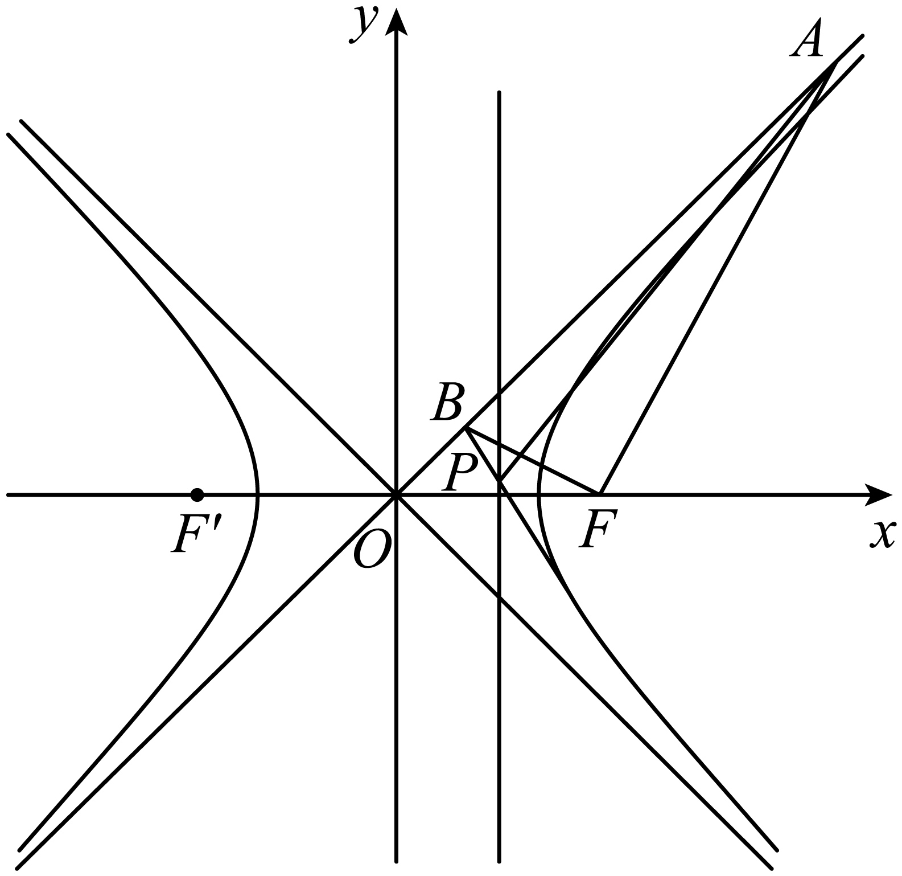

**例6．**（2024·四川绵阳·高三四川省绵阳南山中学校考开学考试）已知抛物线的焦点到准线的距离为1．

(1)求抛物线的标准方程；

(2)设点是该抛物线上一定点，过点作圆（其中）的两条切线分别交抛物线于点，连接．探究：直线是否过一定点，若过，求出该定点坐标；若不经过定点，请说明理由．

【解析】（1）因为抛物线的焦点到准线的距离是1，所以，

所以抛物线的标准方程为．

（2）当时，，所以，

设，则直线为，

即．

因为直线与圆相切，

所以，整理得．

同理，直线与圆相切，

可得．

所以可得是方程的两个根，

所以，

代入，化简得，

若直线过定点，则须满足，解得

所以直线恒过定点．

<strong>变式4．</strong>（2024·陕西·校联考三模）已知直线<em>l</em>与抛物线交于<em>A</em>，<em>B</em>两点，且，，<em>D</em>为垂足，点<em>D</em>的坐标为．

(1)求*C*的方程；

(2)若点*E*是直线上的动点，过点*E*作抛物线*C*的两条切线，，其中*P*，*Q*为切点，试证明直线恒过一定点，并求出该定点的坐标．

【解析】（1）设点*A*的坐标为，点*B*的坐标为，

因为，所以，则直线的方程为，

联立方程组，消去*y*，整理得，

所以有，，

又，得，

整理得，解得．

所以*C*的方程为．

（2）由，得，所以，

设过点*E*作抛物线*C*的切线的切点为，

则相应的切线方程为，即，

设点，由切线经过点*E*，得，即，

设，，则，是的两实数根，

可得，．

设*M*是的中点，则相应，

则，即，

又，

直线的方程为，即，

所以直线恒过定点．

**变式5．**（2024·贵州·校联考二模）抛物线的焦点到准线的距离等于椭圆的短轴长．

(1)求抛物线的方程；

(2)设是抛物线上位于第一象限的一点，过作（其中）的两条切线，分别交抛物线于点,,证明：直线经过定点．

【解析】（1）由椭圆方程可知短轴长为，

∴抛物线的焦点到准线的距离，

故抛物线方程为．

（2）∵是抛物线上位于第一象限的点，∴且，∴．

设，，则直线方程为，

即，

∵直线*DM*：与圆*E*：相切，

∴，整理可得，，①

同理，直线*DN*与圆*E*相切可得，，②

由①②得*a*，*b*是方程的两个实根，

∴，，

代入，化简整理可得，

，

令，解得，

故直线*MN*恒过定点．

**变式6．**（2024·河南·校联考模拟预测）已知椭圆的焦距为2，圆与椭圆恰有两个公共点．

(1)求椭圆的标准方程；

(2)已知结论：若点为椭圆上一点，则椭圆在该点处的切线方程为．若椭圆的短轴长小于4，过点作椭圆的两条切线，切点分别为，求证：直线过定点．

【解析】（1）设椭圆的半焦距为．当圆在椭圆的内部时，，椭圆的方程为．

当圆在椭圆的外部时，，

椭圆的方程为．

（2）证明：设．

因为椭圆的短轴长小于4，所以的方程为．

则由已知可得，切线的方程为的方程为，

将代入的方程整理可得，

．

显然的坐标都满足方程，

故直线的方程为，

令，可得，即直线过定点．

**变式7．**（2024·重庆九龙坡·高三重庆市育才中学校考开学考试）如图所示，已知在椭圆上，圆，圆在椭圆内部.

(1)求的取值范围；

(2)过作圆的两条切线分别交椭圆于点（不同于），直线是否过定点？若过定点，求该定点坐标；若不过定点，请说明理由.

【解析】（1）由题意，故椭圆方，

设为椭圆上的一动点，由于圆在椭圆内部，则恒成立，

即对任意恒成立，

令，

，

则，于是有；

（2）设，，

，（由（1）斜率都存在），

由于两直线均与圆C相切，则，

则为方程的两根，由韦达定理可知，

设，

由韦达定理可知，

由.则

.故过定点.

**题型三：利用切点弦结论解决定值问题**

**例7．**（2024·全国·高三专题练习）已知中心在原点的椭圆和抛物线有相同的焦点，椭圆的离心率为，抛物线的顶点为原点.

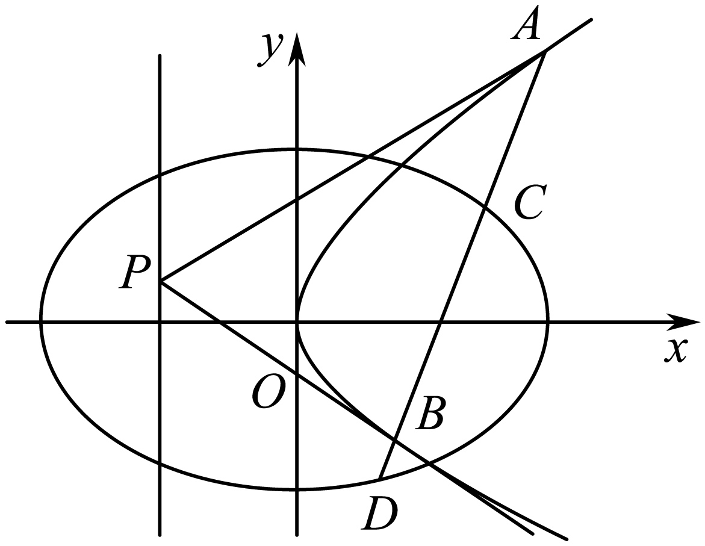

(1)求椭圆和抛物线的方程；

(2)设点为抛物线准线上的任意一点，过点作抛物线的两条切线，，其中为切点.设直线，的斜率分别为，，求证：为定值.

【解析】（1）设椭圆和抛物线的方程分别为，，，

椭圆和抛物线有相同的焦点，椭圆的离心率为，

，解得，，

椭圆的方程为，抛物线的方程为．

（2）由题意知过点与抛物线相切的直线斜率存在且不为0，设，则切线方程为，

联立，消去，得，

由，得，

直线，的斜率分别为，，，

为定值．

<strong>例8．</strong>（2024·全国·高三专题练习）已知<em>F</em>是抛物线<em>C</em>：的焦点，以<em>F</em>为圆心，2<em>p</em>为半径的圆<em>F</em>与抛物线<em>C</em>交于<em>A</em>，<em>B</em>两点，且.

(1)求抛物线*C*和圆*F*的方程；

(2)若点*P*为圆*F*优弧*AB*上任意一点，过点*P*作抛物线*C*的两条切线*PM*，*PN*，切点分别为*M*，*N*，请问是否为定值？若是，求出该定值；若不是，请说明理由.

【解析】（1）由题意可得：抛物线*C*：的焦点为，则圆*F*的方程为，

联立方程，消去*x*得，解得或（舍去），

将代入得*A*，*B*的坐标分别为，.

故，所以，

所以抛物线*C*的方程为，圆*F*的方程为.

（2）是，理由如下：

设，则，

因为抛物线的方程为，则，

所以切线*PM*的方程为，即，①

同理切线*PN*的方程为，②

则由①②过，则，

所以直线*MN*的方程为，

联立方程，消去*y*得，

则，，

所以

，

又在圆*F*上，则，即，

故为定值16.

**例9．**（2024·全国·高三专题练习）已知抛物线：的焦点为，过点引圆：的一条切线，切点为，.

(1)求抛物线的方程；

(2)过圆*M*上一点*A*引抛物线*C*的两条切线，切点分别为*P*，*Q*，是否存在点*A*使得的面积为？若存在，求点*A*的个数；否则，请说明理由.

【解析】（1）如图

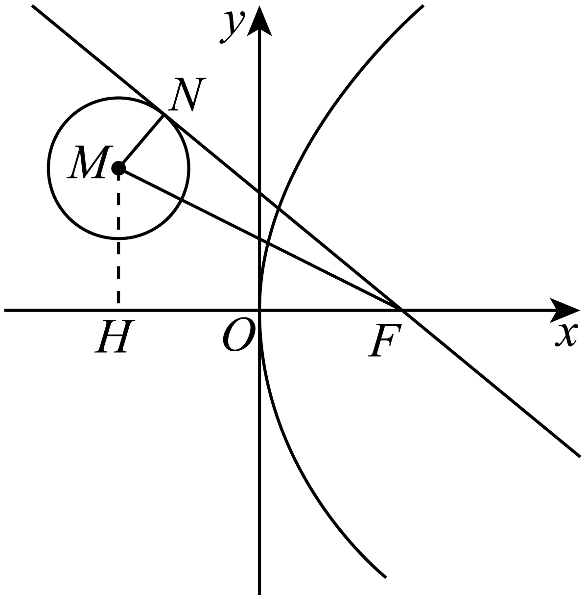

已知抛物线：的焦点为，

圆：的圆心，半径，

则，

过点*M*作轴，则，，

在中，满足，

即，解得，

所以抛物线的方程为.

（2）存在点*A*使得的面积为，点*A*的个数为2，理由如下：

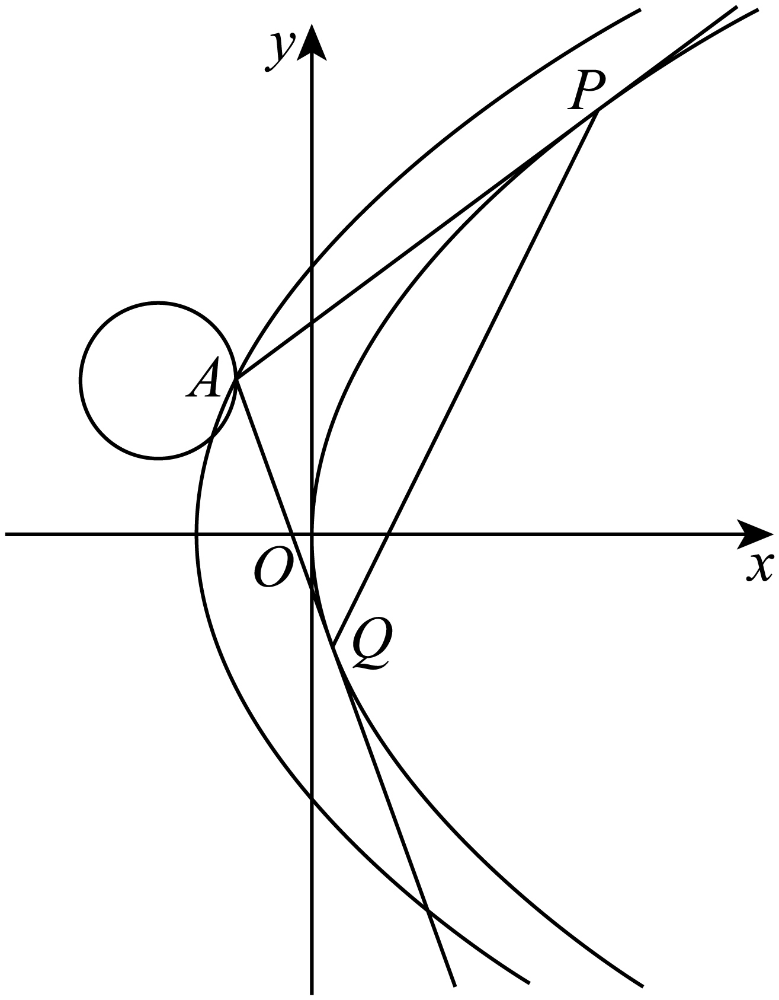

设，，，

由（1）可知抛物线的方程为，

则切点弦*PQ*的方程为，斜率，

联立，得，

所以，，

，

点到直线*PQ*的距离，

，

所以，

即点*A*的轨迹为抛物线往左平移个单位长度，

因为点*A*在圆*M*上，联立，得，

显然是一个根，因式分解得，

令，，则，

若，由于，

则恒成立，所以为增函数，

，，

根据零点存在定理函数在上存在一个零点，

所以存在两个点*A*使得的面积为.

**变式8．**（2024·全国·高三专题练习）已知抛物线的焦点到准线的距离为2，圆与轴相切，且圆心与抛物线的焦点重合.

(1)求抛物线和圆的方程；

(2)设为圆外一点，过点作圆的两条切线，分别交抛物线于两个不同的点和点.且，证明：点在一条定曲线上.

【解析】（1）由题设得，

所以抛物线的方程为.

因此，抛物线的焦点为，即圆的圆心为

由圆与轴相切，所以圆半径为，

所以圆的方程为.

（2）证明：由于，每条切线都与抛物线有两个不同的交点，则.

故设过点且与圆相切的切线方程为，即.

依题意得，整理得①；

设直线的斜率分别为，则是方程①的两个实根，

故，②，

由得③，

因为点，

则④，⑤

由②，④，⑤三式得：

，

即，

则，即，

所以点在圆.

<strong>变式9．</strong>（2024·全国·模拟预测）已知抛物线的焦点为<em>F</em>，<em>P</em>为抛物线上一动点，点<em>P</em>到<em>F</em>的最小距离为1．

(1)求抛物线*C*的标准方程；

(2)过点向*C*作两条切线*AM*，*AN*，切点分别为*M*，*N*，直线*AF*与直线*MN*交于点*Q*，求证：点*Q*到直线*FM*的距离等于到直线*FN*的距离．

【解析】（1）设点*P*的坐标为，由抛物线定义可知，

故，得，所以抛物线*C*的标准方程为．

（2）解法一 ，设，，由，得，

所以抛物线在点*M*处的切线方程为，

在点*N*处的切线方程为．

因为两条切线均过点，所以，

所以点*M*，*N*的坐标满足，

所以，即，解得或，

不妨设，，则，．就

易知，所以，，，

所以，，

所以，所以．

因为*FQ*平分，所以点*Q*到直线*FM*的距离等于到直线*FN*的距离．

解法二  设切点为，由，得，

所以过点的抛物线的切线方程为，

联立，得，消去*y*并整理得，

则，解得或，

不妨设，，则，，

所以直线*MN*的方程为，易知，所以直线*AF*的方程为，

由，得，即．

易得直线*FM*的方程为，直线*FN*的方程为，

所以点*Q*到直线*FM*的距离，

点*Q*到直线*FN*的距离，所以，得证．

**变式10．**（2024·全国·高三专题练习）已知点在抛物线上，且到抛物线的焦点的距离为2.

(1)求抛物线的标准方程；

(2)过点向抛物线作两条切线，切点分别为，若直线与直线交于点，且点到直线､直线的距离分别为.求证：为定值.

【解析】（1）因为，由题意可得，

解得，所以抛物线的标准方程为；

（2）方法一：设，由，得，

所以抛物线在点处的切线方程为，

在点处的切线方程为，

因为两条切线均过点，所以，

所以点的坐标均满足，

所以，即，解得或，

不妨设，则，

易知，所以，

所以，

，

所以，所以，所以平分，

所以点到直线的距离等于点到直线的距离，

所以，为定值，得证.

方法二：设切点为，由，得，

所以过点的抛物线的切线方程为，

联立方程，消去并整理得，

则，解得或，

不妨设，则，

所以直线的方程为，

易知，所以直线的方程为，

由，得，即，

易得直线的方程为，直线的方程为，

所以点到直线的距离，

点到直线的距离，

所以，则，为定值，得证.

<strong>变式11．</strong>（2024·上海长宁·高三上海市延安中学校考开学考试）在以为圆心，6为半径的圆<em>A</em>内有一点，点<em>P</em>为圆<em>A</em>上的任意一点，线段<em>BP</em>的垂直平分线和半径<em>AP</em>交于点<em>M</em>．

(1)判断点*M*的轨迹是什么曲线，并求其方程；

(2)记点*M*的轨迹为曲线，过点*B*的直线与曲线交于*C*、*D*两点，求的最大值；

(3)在圆上的任取一点*Q*，作曲线的两条切线，切点分别为*E*、*F*，试判断*QE*与*QF*是否垂直，并给出证明过程．

【解析】（1）由题意可知,

因为线段的垂直平分线和半径交于点，

所以,

所以,

由椭圆的定义知，点的轨迹是以、为焦点的椭圆，

由，得，又，

所以，

所以椭圆的标准方程为.

（2）当直线斜率不存在时，直线方程为，则，,

所以，

此时，

当直线斜率存在时，设直线的方程为，则

，消去，得，

所以，

设，,则，

所以，

综上，的最大值为.

（3）与垂直,证明如下：设，则，

①当两切线中有一条切线斜率不存在时，即与轴垂直时，切线方程为，

即，得，

所以另一条切线方程为，即与轴平行，所以两切线垂直.

当斜率存在时，，设切线方程为，则

，消，得，

由于直线与椭圆相切，得，

化简得，

因为，所以，即两条切线相互垂直，

综上，过点作的两条切线与垂直.

**变式12．**（2024·全国·高三专题练习）已知拋物线，为焦点，若圆与拋物线交于两点，且

(1)求抛物线的方程；

(2)若点为圆上任意一点，且过点可以作拋物线的两条切线，切点分别为.求证：恒为定值.

【解析】（1）由题意可知，半径为，

由圆的圆心以及抛物线的焦点均在在坐标轴轴，故由对称性可知：轴于点，

在直角三角形中，,

因此 故，将其代入抛物线方程中得，

故抛物线方程为：

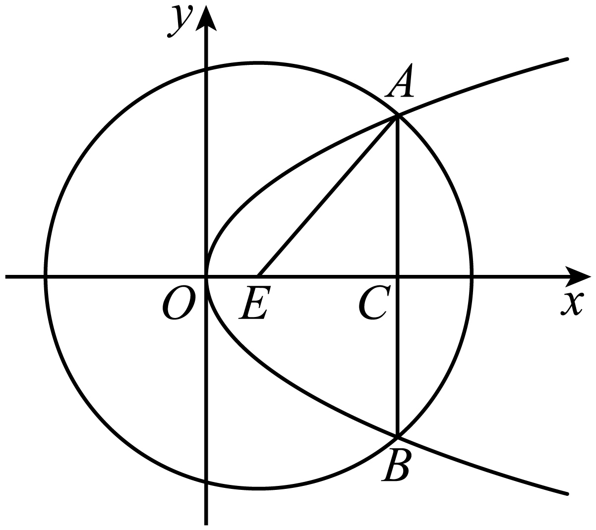

（2）令，

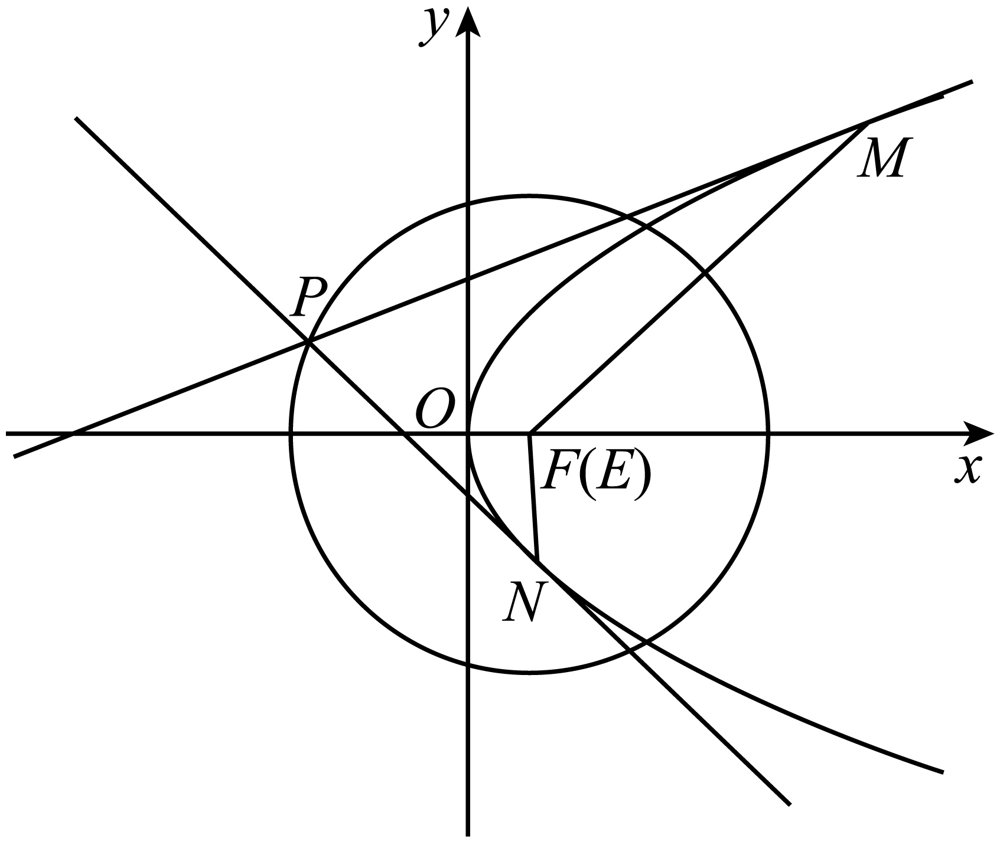

抛物线在点处的切线方程为,

与联立得①

由相切得，

代入①得

故在点处的切线方程为，即为

同理：点处的切线方程为，

而两切线交于点，

所以有，

则直线的方程为:，

由得,所以

于是

，

又点在圆上，

所以,即.

**变式13．**（2024·浙江金华·浙江金华第一中学校考模拟预测）已知抛物线，圆是上异于原点的一点.

(1)设是上的一点，求的最小值；

(2)过点作的两条切线分别交于两点（异于）.若，求点的坐标.

【解析】（1）设，圆心，半径为，

，

所以当时，有最小值，

所以的最小值；

（2）由题设，切线斜率一定存在，设切线的斜率为，

所以切线的方程为：，

由圆的切线性质可知：

，

设，

，是方程的两个不相等实根，

因此，即，且，

所以由圆的切线性质知：，

，

所以的坐标为或.

<strong>变式14．</strong>（2024·湖南长沙·湖南师大附中校考模拟预测）如图，椭圆，圆，椭圆<em>C</em>的左、右焦点分别为．

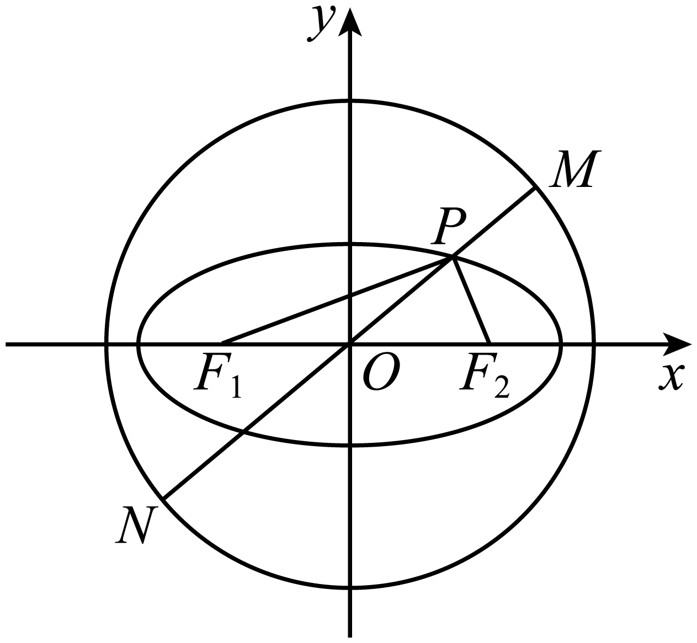

(1)过椭圆上一点*P*和原点*O*作直线*l*交圆*O*于*M*，*N*两点，若，求的值；

(2)过圆*O*上任意点*R*引椭圆*C*的两条切线，求证：两条切线相互垂直．

【解析】（1）设，由于，

而，则，

所以（其中），

．

（2）设，则，即，

设过点*R*的圆*O*的切线斜率都存在时的方程：，代入椭圆方程得：

，

整理得：，

则，

即，

是上述关于*k*的方程的两个根，则，

即两条切线的斜率都存在时，有两条切线相互垂直；

而当过*R*的切线斜率不存在时，易知*R*点的坐标为，

此时显然两条切线相互垂直，

综上，过圆*O*上任意点*R*引椭圆*C*的两条切线，则两条切线相互垂直．

**变式15．**（2024·河南·校联考模拟预测）在椭圆：（）中，其所有外切矩形的顶点在一个定圆：上，称此圆为椭圆的蒙日圆.椭圆过，.

(1)求椭圆的方程；

(2)过椭圆的蒙日圆上一点，作椭圆的一条切线，与蒙日圆交于另一点，若，存在，证明：为定值.

【解析】（1）将，代入到，

可得，解得，，

所以椭圆的方程为：.

（2）由题意可知，蒙日圆方程为：.

（ⅰ）若直线斜率不存在，则直线的方程为：或.

不妨取，易得，，，，

.

（ⅱ）若直线斜率存在，设直线的方程为：.

联立，化简整理得：，

据题意有，于是有：.

设（），（）.

化简整理得：，

，

，.

则

，

，所以.

综上可知，为定值.

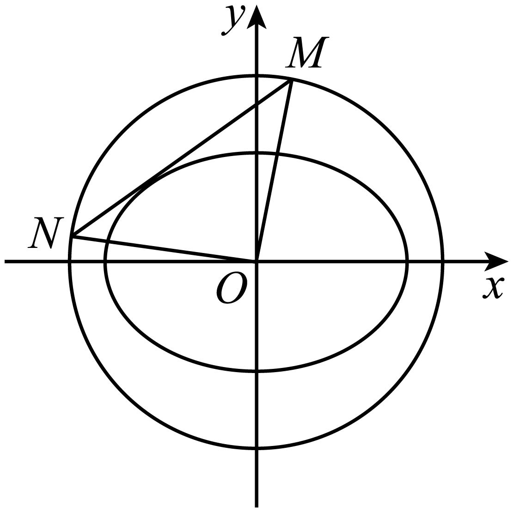

**题型四：利用切点弦结论解决最值问题**

<strong>例10．</strong>（2024·福建泉州·高三校联考阶段练习）已知<em>F</em>为抛物线<em>C</em>：的焦点，是<em>C</em>上一点，<em>M</em>位于<em>F</em>的上方且.

(1)求*p*；

(2)若点*P*在直线上，*PA*，*PB*是*C*的两条切线，*A*，*B*是切点，求的最小值.

【解析】（1）设点到抛物线准线的距离为，则，即，

由是抛物线上的点，则，

联立可得，消去可得，

分解因式可得，解得或，

当时，满足题意，当时，不合题意，

所以；

（2）任意取点位于抛物线上，设点，则，即，

由抛物线方程，可得函数，求导可得，

令，整理可得，

设，，则，，

由抛物线的定义，可得，，

则，

其中，

，

所以，

当时，.

**例11．**（2024·全国·高三专题练习）已知抛物线的焦点到准线的距离为.

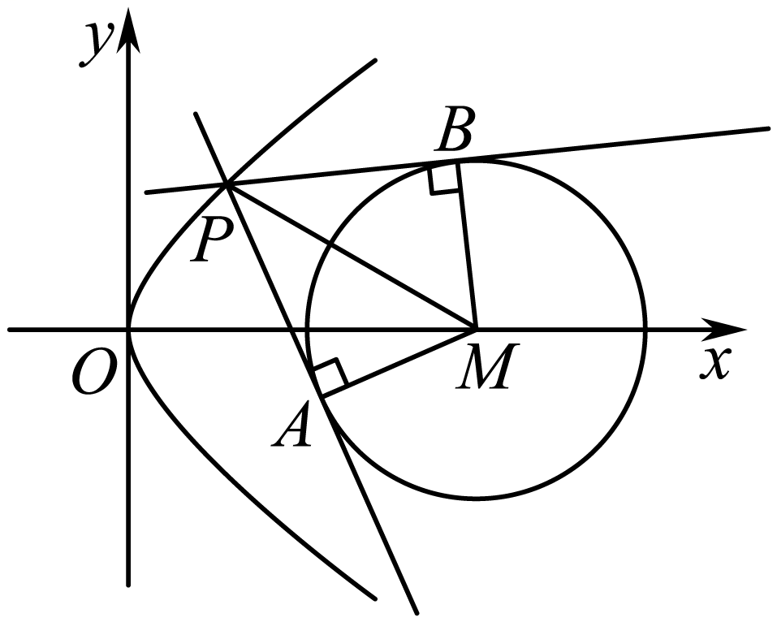

(1)求抛物线的方程及焦点的坐标；

(2)如图，过抛物线上一动点作圆的两条切线，切点分别为，求四边形面积的最小值.

【解析】（1）由题知，，

抛物线的方程为，焦点的坐标为.

（2）由圆的标准方程可知，，

设点，则，

在中，，

当时，取得最小值，

由圆的切线性质知，，

四边形的面积，

故四边形面积的最小值为.

**例12．**（2024·全国·高三专题练习）已知椭圆的左、右焦点分别为，，左顶点为，离心率为，经过的直线交椭圆于两点，的周长为8．

(1)求椭圆的方程；

(2)过直线上一点*P*作椭圆*C*的两条切线，切点分别为，

①证明：直线过定点；

②求的最大值．

备注：若点在椭圆*C*：上，则椭圆*C*在点处的切线方程为．

【解析】（1）因为经过的直线交椭圆于*A*，*B*两点，的周长为，

由椭圆的定义，可得，可得，

又由离心率为，可得，所以，

则，所以椭圆*C*的方程为.

（2）①证明：由（1）知，，设，，，

根据题意，可得以*M*为切点的椭圆*C*的切线方程为，

以*N*为切点的椭圆*C*的切线方程为，

又两切线均过点*P*，故，且，

整理化简得，且，

所以点，，均在直线上，

所以直线*MN*的方程为，且直线*MN*过定点.

②由题意，直线的斜率不为，设直线的方程为，

联立方程组，消去得，

可得，且，

可得

，

令，设，则函数在单调递增，

所以当时，即时，有最小值，

即的最大值为，

又由，

所以的最大值为，此时直线的方程为.

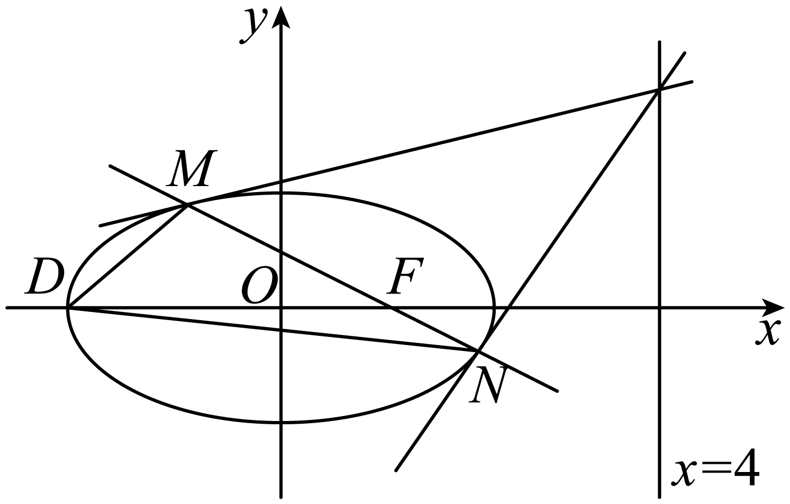

**变式16．**（2024·贵州·高三校联考阶段练习）已知抛物线上的点到其焦点的距离为.

(1)求抛物线的方程；

(2)已知点在直线：上，过点作抛物线的两条切线，切点分别为，直线与直线交于点，过抛物线的焦点作直线的垂线交直线于点，当最小时，求的值.

【解析】（1）因为点在抛物线上，可得，

又因为点到其焦点的距离为，

由抛物线的性质可得，解得，即抛物线的方程为.

（2）由题意可设，且，，

因为，所以，可得，所以，整理得，

设点，同理可得，

则直线方程为，

令，可得，即点，

因为直线与直线垂直，所以直线方程为，

令，可得，即点，

所以，当且仅当时，即时上式等号成立，

即的最小值为，

联立方程组，整理得，

所以，

则

所以.

<strong>变式17．</strong>（2024·全国·高三专题练习）已知椭圆 的左、右焦点分别为，，为<em>C</em>上一动点，的最大值为，且长轴长和短轴长之比为2 .

(1)求椭圆*C*的标准方程；

(2)若，过*P*作圆 的两条切线，，设，与*x*轴分别交于*M*，*N*两点，求面积的最小值.

【解析】（1）由题意得，，

所以，

所以，

解得，，

则椭圆的标准方程为.

（2）如图所示：

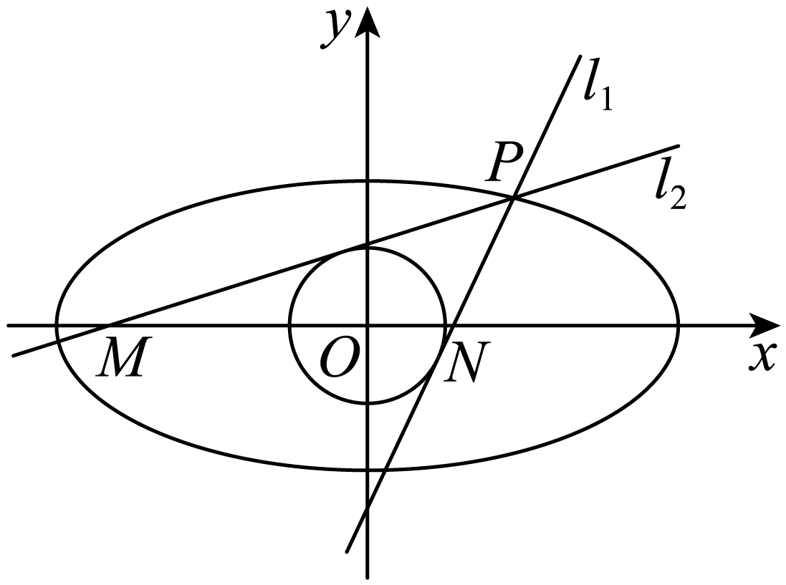

当过*P*的切线斜率存在，即，时，

设其方程为，即，

令，得切线与轴的交点坐标为.

因为切线和圆*O*相切，所以

化简得，

则有，.

设切线，的斜率分别为，，则，，

所以

因为*P*在椭圆*C*上，所以有，代入上式化简可得.

令 ，得，，

则.

令，则，

当时，，单调递增，，即.

当过*P*的切线斜率不存在时，此时或.

若*P*点的坐标为，由对称性可得，

因为，所以面积的最小值为.

<strong>变式18．</strong>（2024·贵州黔东南·凯里一中校考三模）已知直线与抛物线<em>C</em>：交于<em>A</em>，<em>B</em>两点，分别过<em>A</em>，<em>B</em>两点作<em>C</em>的切线，两条切线的交点为.

(1)证明点*D*在一条定直线上；

(2)过点*D*作*y*轴的平行线交*C*于点*E*，线段的中点为，

①证明：为的中点；

②求面积的最小值.

【解析】（1）设，，，由得，

*C*在点*A*处的切线方程为，

将代入上式得，故，

同理，

*A*，*B*两点两点都在直线上，

所以直线与直线是同一直线，故，，

即点*D*在定直线上.

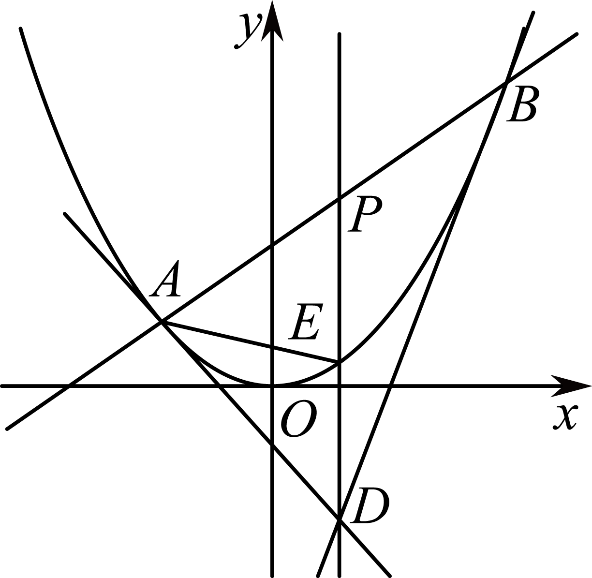

（2）①，即为，为，

将与联立得，，

故，

线段的中点为，故三点共线，

，，故为的中点.

②，，

点到直线的距离为：

，

（当时取等），

面积的最小值为.

**变式19．**（2024·新疆喀什·统考模拟预测）已知抛物线的焦点为，且与圆上点的距离的最小值为3.

(1)求；

(2)若点在圆上，，是抛物线的两条切线，是切点，求三角形面积的最大值.

【解析】（1）圆的圆心，半径，

由点到圆上的点的距离的最小值为，解得；

（2）由（1）知，抛物线的方程为，即，则，

设切点，，则，

则，

则直线，直线，

联立，解得，

从而得到，

设直线，联立抛物线方程，消去并整理，得，

则，即，

且，，故，

因为，

点到直线的距离，

所以，①

又点在圆上，

故，代入①得，

而，故当时，.

**变式20．**（2024·黑龙江哈尔滨·哈尔滨三中校考模拟预测）已知抛物线的顶点在原点，焦点在轴上，其上一点到焦点的距离为2.

(1)求抛物线方程；

(2)圆：，过抛物线上一点作圆的两条切线与轴交于、两点，求的最小值.

【解析】（1）设焦点，，，

∴方程为；

（2）设切线：，：①，：②.

∵，∴，∴，

整理得：.

∵，

∴，

由韦达定理：，，

∴.

在①中令，，同理，

∴，

，∴，

∵，∴，

令，，则，

令，，

，∴在上单调递增，

∴，∴.

<strong>变式21．</strong>（2024·广东茂名·高三校考阶段练习）已知平面内动点，<em>P</em>到定点的距离与<em>P</em>到定直线的距离之比为，

(1)记动点*P*的轨迹为曲线*C* ，求*C*的标准方程．

(2)已知点是圆上任意一点，过点作做曲线*C*的两条切线，切点分别是，求面积的最大值，并确定此时点的坐标.

注：椭圆：上任意一点处的切线方程是：.

【解析】（1）设*d*是点*P*到直线 的距离，

根据题意，动点*P*的轨迹就是集合．

由此得．将上式两边平方，并化简，得.

（2）设，则，

切线方程：，切线方程：，

因为两直线都经过点，

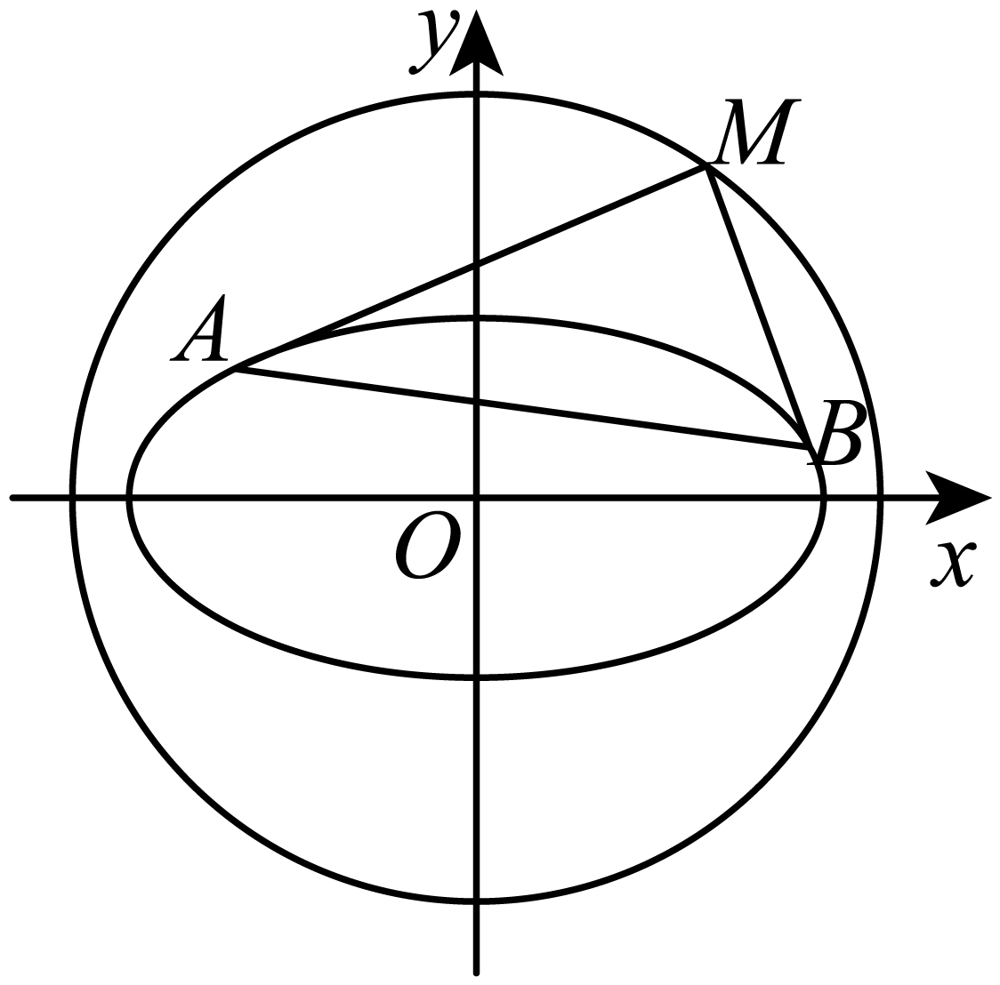

所以，得， ，

从而直线的方程是：，

由，得，

由韦达定理，得，

，

点到直线的距离，

，其中，

令，则，

令，则，

在上递增，

，即时，的面积取到最大值，此时点.

**变式22．**（2024·湖北黄冈·浠水县第一中学校考三模）已知椭圆经过点，过原点的直线与椭圆交于，两点，点在椭圆上（异于，），且．

(1)求椭圆的标准方程；

(2)若点为直线上的动点，过点作椭圆的两条切线，切点分别为，，求的最大值．

【解析】（1）设，则，

可得，

因为点在椭圆上，则，两式相减得，

整理得，即，可得，

又因为点在椭圆上，则，

由，解得，

所以椭圆的标准方程为.

（2）由题意可知：切线的斜率存在，设为，

设点，过点的直线为，

联立方程，消去*y*得，

则，

整理得，则，

即过直线上任一点均可作椭圆的两条切线，且，

可得，

因为，

因为，当且仅当时，等号成立

则，可得，

所以，

故当时，取到最大值.

<strong>变式23．</strong>（2024·新疆乌鲁木齐·统考二模）已知抛物线<em>C</em>：的准线为<em>l</em>，圆<em>O</em>：.

(1)当时，圆*O*与抛物线*C*和准线*l*分别交于点*A*，*B*和点*M*，*N*，且，求抛物线*C*的方程；

(2)当时，点是（1）中所求抛物线*C*上的动点.过*P*作圆*O*的两条切线分别与抛物线*C*的准线*l*交于*D*，*E*两点，求面积的最小值.

【解析】（1）因为，所以点*O*到*AB*的距离等于点*O*到*MN*的距离，该距离等于，

由对称性可得直线的方程为，

由取可得，

所以.

由解得，

所以抛物线*C*的方程为.

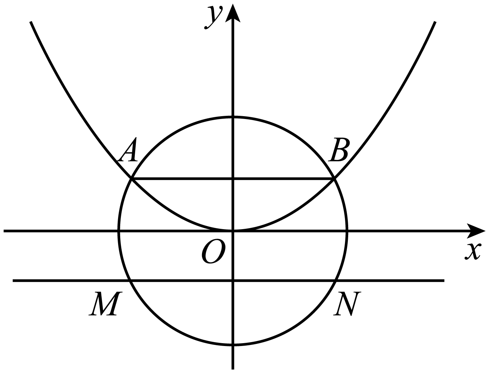

（2）由（1）可知准线*l*的方程为，设点，，，

则直线*PD*的方程为，

整理得.

因为直线*PD*和圆*O*相切，所以点*O*到直线*PD*的距离等于1，

即，

整理得，

同理有，

因为，所以*m*，*n*是一元二次方程的两个根，

则，，

故，

又因为，

所以.

因为点*P*到准线*l*的距离为，

所以

令，则

令，则，当且仅当，即时取等号，

则，，

所以，当且仅当时等号成立.

综上，面积的最小值为.

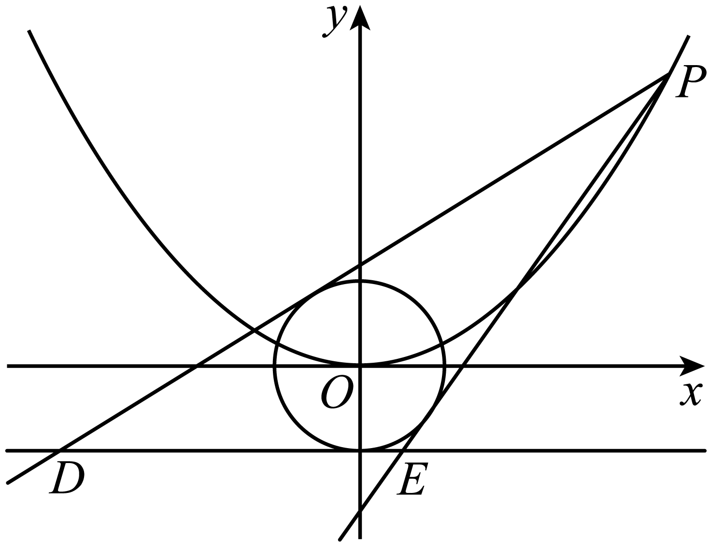

**题型五：利用切点弦结论解决范围问题**

**例13．**（2024·全国·高三专题练习）已知椭圆的离心率为，且直线被椭圆截得的弦长为．

(1)求椭圆的方程；

(2)以椭圆的长轴为直径作圆，过直线上的动点作圆的两条切线，设切点为，若直线与椭圆交于不同的两点，，求的取值范围．

【解析】（1）直线，经过点，，被椭圆截得的弦长为，可得．

又，，解得：，，，

椭圆的方程为．

（2）由（1）可得：圆的方程为：．

设，则以为直径的圆的方程为：，

与相减可得：直线的方程为：，

设，，，，联立，化为：，

，则，，

故．

又圆心到直线的距离，

，

，

令，则，

，可得，可得：．

**例14．**（2024·海南·统考模拟预测）已知抛物线的焦点为，准线为，点是直线上一动点，直线与直线交于点，.

(1)求抛物线的方程；

(2)过点作抛物线的两条切线，切点为，且，求面积的取值范围.

【解析】（1）直线，当时，，即，，

则，解得或（舍去），

故抛物线的方程为.

（2）设，，，，，

的直线方程为：，整理得到，

同理可得：方程为，

故，故的直线方程为，

，整理得到，，

，

，解得，

设到的距离为，

，

，故，

<strong>例15．</strong>（2024·全国·高三专题练习）已知椭圆的左，右焦点分别为，，离心率为，<em>M</em>为椭圆上异于左右顶点的动点，的周长为.

(1)求椭圆*C*的标准方程；

(2)过点*M*作圆的两条切线，切点分别为，直线*AB*交椭圆*C*于*P*，*Q*两点，求的面积的取值范围.

【解析】（1）设椭圆焦距为2*c*，根据椭圆定义可知，

的周长为，离心率

联立，解得，，

所以，

即椭圆*C*的标准方程.

（2）设点，又为切点，可知，

所以四点共圆，即在以*OM*为直径的圆上，

则以*OM*为直径的圆的方程为，

又在圆上，

两式相减得直线*AB*的方程为，如下图所示：

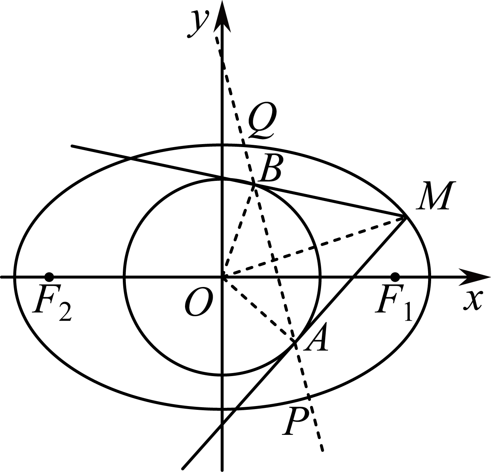

设，，由，

消去*y*整理后得，

，，

所以

，

又点*O*到直线*PQ*的距离，

设的面积为*S*，则

，

其中，令，则，

设，，则，

所以在区间上单调递增，从而得，

于是可得，

即的面积的取值范围为.

<strong>变式24．</strong>（2024·辽宁沈阳·校联考二模）从抛物线的焦点发出的光经过抛物线反射后，光线都平行于抛物线的轴，根据光路的可逆性，平行于抛物线的轴射向抛物线后的反射光线都会汇聚到抛物线的焦点处，这一性质被广泛应用在生产生活中．如图，已知抛物线，从点发出的平行于<em>y</em>轴的光线照射到抛物线上的<em>D</em>点，经过抛物线两次反射后，反射光线由<em>G</em>点射出，经过点．

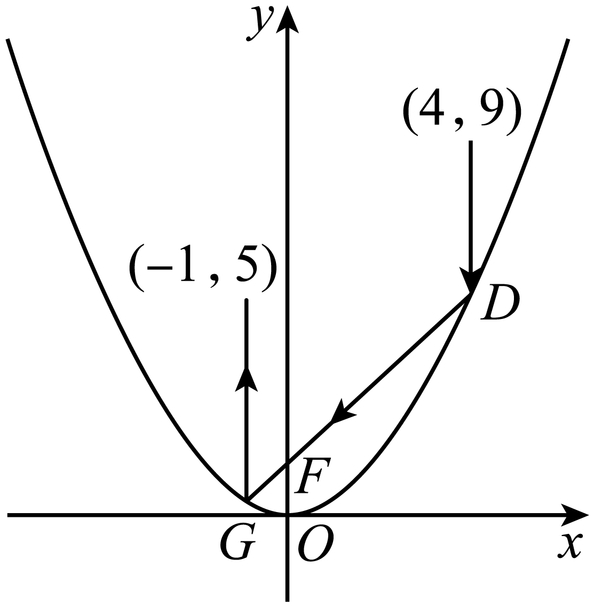

(1)求抛物线*C*的方程；

(2)已知圆，在抛物线*C*上任取一点*E*，过点*E*向圆*M*作两条切线*EA*和*EB*，切点分别为*A*、*B*，求的取值范围．

【解析】（1）由题设，令，，根据抛物线性质知：直线必过焦点，

所以，则，整理得，，则，

所以抛物线*C*的方程为.

（2）由题意，，且，，，

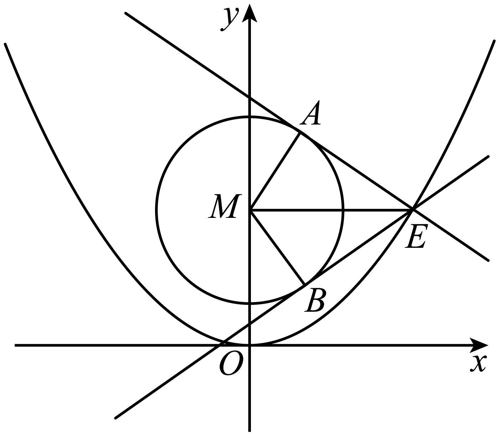

所以，

而，

令，则，

所以，，

综上，，

又，，若，则，

由，当，即时，无最大值，

所以，即，故，，

令，则，

令，在上恒成立，即递减，所以.

<strong>变式25．</strong>（2024·云南昆明·高三昆明一中校考阶段练习）直线过双曲线的一个焦点，且直线<em>l</em>与双曲线<em>C</em>的一条渐近线垂直.

(1)求双曲线*C*的方程；

(2)过点作一条斜率为*k*的直线，若直线上存在点*P*，使得过点*P*总能作*C*的两条切线互相垂直，求直线*k*的取值范围.

【解析】（1）依题意，直线交*x*轴于点，则双曲线的半焦距，

直线的斜率为，因此双曲线的一条渐近线斜率为，则，而，解得，，

所以双曲线的方程为.

（2）当过点的两条切线斜率都存在时，设此切线的方程为：，

由消去*y*并整理得：，显然，

则有，整理得，

由于点在直线上，即，因此，

设两条切线的斜率分别为，，即有，化简得，

过点的其中一条切线斜率不存在时，也满足，

即点*P*一定在圆上，而过点的直线方程为：，

于是，解得，

所以

