**第76讲  双切线问题**

**知识梳理**

双切线问题，就是过一点做圆锥曲线的两条切线的问题，解决这一类问题我们通常用同构法.

解题思路：

①根据曲线外一点设出切线方程．

②和曲线方程联立，求出判别式．

③整理出关于双切线斜率的同构方程．

④写出关于的韦达定理，并解题．

**必考题型全归纳**

**题型一：定值问题**

<strong>例1．</strong>（2024·河南·高三竞赛）已知抛物线<em>C</em>：与直线<em>l</em>：没有公共点，<em>P</em>为直线<em>l</em>上的动点，过<em>P</em>作抛物线<em>C</em>的两条切线，<em>A</em>、<em>B</em>为切点.

（1）证明：直线*AB*恒过定点*Q*；

（2）若点*P*与*Q*的连线与抛物线*C*交于*M*、*N*两点，证明：.

【解析】（1）设点.则.

由，得.所以.

于是，抛物线*C*在点*A*处的切线方程为

．

设点.则.

设点.同理，.

从而，，即

.

因此，直线*AB*恒过定点*Q*（*k*，1）.

（2）设.

与抛物线方程联立，消去*y*得

.

设点.则

①

要证，即证，则只需证明

，即

.          ②

由方程组①知

.

故式②成立.从而，结论成立.

<strong>例2．</strong>（2024·高二单元测试）已知抛物线<em>C</em>：的焦点<em>F</em>与椭圆的右焦点重合，点<em>M</em>是抛物线<em>C</em>的准线上任意一点，直线<em>MA</em>，<em>MB</em>分别与抛物线<em>C</em>相切于点<em>A</em>，<em>B</em>．

(1)求抛物线*C*的标准方程及其准线方程；

(2)设直线*MA*，*MB*的斜率分别为，，证明：为定值．

【解析】（1）因为，所以，

所以，可得椭圆的右焦点为，

可得抛物线*C*的焦点为，∴，

所以抛物线*C*的标准方程为，准线方程为；

（2）由于点*M*是抛物线*C*的准线上任意一点，故可设，

因为直线*MA*，*MB*的分别与抛物线*C*相切于点*A*，*B*点可知直线*MA*，*MB*的斜率存在，

且不为0，

设过点的直线方程为，

联立，消去得：，

其判别式，令，得，

由韦达定理知，，故为定值－1．

**例3．**（2024·贵州贵阳·校联考模拟预测）已知坐标原点为，抛物线为与双曲线在第一象限的交点为，为双曲线的上焦点，且的面积为3．

(1)求抛物线的方程；

(2)已知点，过点作抛物线的两条切线，切点分别为，，切线，分别交轴于，，求与的面积之比．

【解析】（1）双曲线的上焦点为，设，，

由已知得：，则，

代入双曲线方程可得，解得或（舍去），所以，

又因为在抛物线上，所以，解得，故抛物线的方程为．

（2）设点，，对求导得，

则切线的方程为，

由整理得，

令，则，即，同理可求得．

将代入直线可得：，

同理可求得直线的方程：，

所以，的直线方程．

联立消去得，

则韦达定理：，

则弦长，

点到直线的距离，

所以，

又，

故．

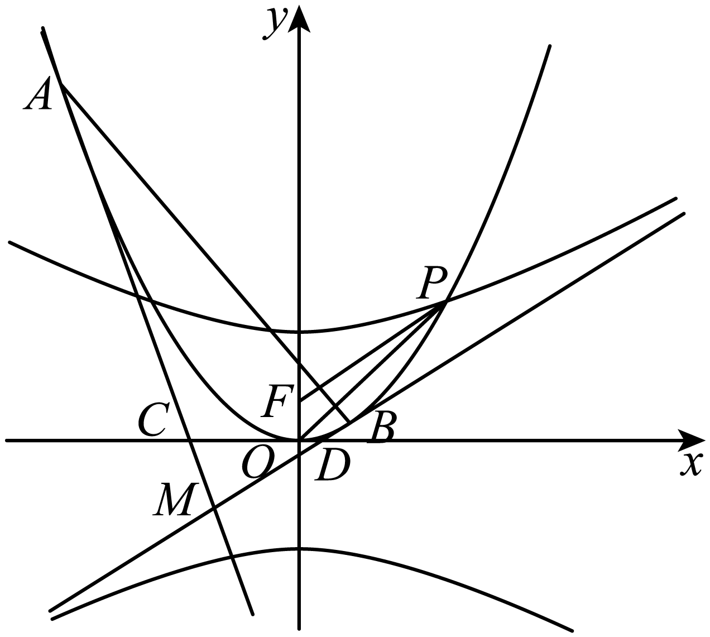

**变式1．**（2024·安徽合肥·高三合肥一中校联考开学考试）已知抛物线（为常数，）.点是抛物线上不同于原点的任意一点.

(1)若直线与只有一个公共点，求；

(2)设为的准线上一点，过作的两条切线，切点为，且直线，与轴分别交于，两点.

①证明：

②试问是否为定值？若是，求出该定值；若不是，请说明理由.

【解析】（1）将直线与抛物线联立，

消去可得，由题意可知该方程只有一个实数根，

所以，又点在抛物线上，即；

可得，解得

（2）①易知抛物线的准线方程为；

不妨设，切点，如下图所示：

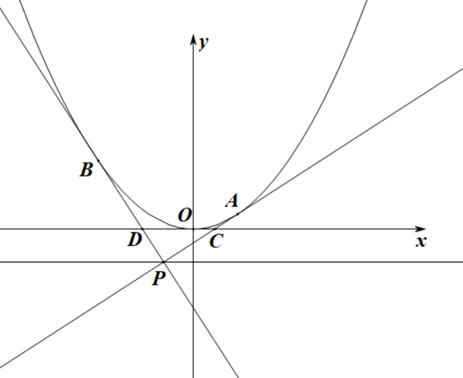

将求导可得，

则切线的斜率，切线的方程为，

又，的方程可化为；

同理可得的方程可化为；

又两切线交于点，所以，

因此可得是方程的两根，因此；

所以；

因此

②设直线和的倾斜角为，直线的倾斜角为，

所以；

又；；

；

所以

，

将代入可得

，

则可得，即；

又，所以，

可得，则为定值.

**变式2．**（2024·河南信阳·信阳高中校考三模）已知抛物线上一点到焦点的距离为3.

(1)求，的值；

(2)设为直线上除，两点外的任意一点，过作圆的两条切线，分别与曲线相交于点，和，，试判断，，，四点纵坐标之积是否为定值？若是，求该定值；若不是，请说明理由.

【解析】（1）根据抛物线的定义，到准线的距离为3，

∴，∴；

∴抛物线的焦点坐标为，∴，∴；

（2）设，过点的直线方程设为，

由得，，

若直线，的斜率分别为，，设，，，的纵坐标分别为，，，，

∴，，

∵到的距离，∴，

∴，，

∴，

∴，，，四点纵坐标之积为定值，且定值为64.

**题型二：斜率问题**

<strong>例4．</strong>（2024·全国·高三专题练习）已知椭圆<em>C</em>:<em>=</em>1(<em>a&gt;b&gt;</em>0)的离心率为,<em>F</em>1,<em>F</em>2是椭圆的两个焦点,<em>P</em>是椭圆上任意一点,且△<em>PF</em>1<em>F</em>2的周长是8<em>+</em>2<em>.</em>

(1)求椭圆*C*的方程;

(2)设圆<em>T</em>:(<em>x-</em>2)2<em>+y</em>2<em>=</em>,过椭圆的上顶点<em>M</em>作圆<em>T</em>的两条切线交椭圆于<em>E</em>,<em>F</em>两点,求直线<em>EF</em>的斜率<em>.</em>

【解析】试题分析：

（1）由椭圆的离心率为可得<em>a=</em>4<em>b</em>，<em>c=b</em>，然后根据△<em>PF</em>1<em>F</em>2的周长可得<em>b=</em>1，<em>a=</em>4，从而可得椭圆的方程．（2）由题意知过点<em>M</em>与圆<em>T</em>相切的直线存在斜率，设其方程为<em>y=kx+</em>1，由直线与圆相切可得32<em>k</em>2<em>+</em>36<em>k+</em>5<em>=</em>0，从而得到，．然后分别求出两切线与椭圆交点的横坐标和，最后根据斜率公式求解即可．

试题解析：

(1)由题意得*e=*，

∴*a=* 4*b*，

∴*c=b．*

∵△<em>PF</em>1<em>F</em>2的周长是8<em>+</em>2，

∴2*a+* 2*c=* 8*+* 2，

∴*b=* 1,

∴*a=* 4*．*

∴椭圆<em>C</em>的方程为<em>+y</em>2<em>=</em>1．

(2)由（1）得椭圆的上顶点为*M*(0,1)，

又由题意知过点*M*与圆*T*相切的直线存在斜率，设其方程为*l*：*y=kx+* 1，

∵直线*y=kx+* 1与圆*T*相切，

∴，

整理得32<em>k</em>2<em>+</em>36<em>k+</em>5<em>=</em>0，

*∴*

由消去y整理得(1<em>+</em>16)<em>x</em>2<em>+</em>32<em>k</em>1<em>x=</em>0，

∴．

同理可得,

∴．

故直线*EF*的斜率为．

**例5．**（2024·全国·高三专题练习）设点为抛物线外一点，过点作抛物线的两条切线，，切点分别为，．

（Ⅰ）若点为，求直线的方程；

（Ⅱ）若点为圆上的点，记两切线，的斜率分别为，，求的取值范围．

【解析】（Ⅰ）设直线PA方程为，直线PB方程为，

由，可得，

因为PA与抛物线相切，所以，取，则，

即A（1，1）．同理可得B（1，-1）．所以AB：．

（Ⅱ）设，则直线PA方程为，直线PB方程为．

由可得．

因为直线PA与抛物线相切，所以△=．

同理可得，所以时方程的两根．

所以，．则=..

又因为，则，

所以===

=.

**例6．**（2024·全国·高三专题练习）已知椭圆的离心率为，，是椭圆的两个焦点，是椭圆上任意一点，且的周长是．

(1)求椭圆的方程；

(2)是否存在斜率为1的直线与椭圆交于，两点，使得以为直径圆过原点，若存在写出直线方程；

(3)设圆，过椭圆的上顶点作圆的两条切线交椭圆于、两点，当圆心在轴上移动且时，求的斜率的取值范围．

【解析】（1）令椭圆半焦距为*c*，因，即，又，则有，，

因△的周长是，即，解得，，

所以椭圆的方程为.

（2）设直线*L*方程是，，，由消去*y*得：，

，即，则，

弦的中点，，

以为直径的圆的方程是，因此圆过原点，

则有，解得，显然满足，

所以存在符合条件的直线，其方程为.

（3）由（1）知，椭圆的上顶点为在圆*T*外，显然过点*M*的圆*T*的切线斜率存在，

设过点与圆相切的直线方程为，于是得，即，

设切线*ME*，*MF*的斜率分别为，有，

由消去*y*得，，于是得点*E*的横坐标，

同理得点*F*的横坐标，直线*EF*的斜率：

，

显然函数在上单调递增，则有，

所以斜率的取值范围为.

**变式3．**（2024·河南洛阳·高三新安县第一高级中学校考阶段练习）已知圆，圆心在抛物线上，圆过原点且与的准线相切．

(1)求抛物线的方程；

(2)点，点（与不重合）在直线上运动，过点作抛物线的两条切线，切点分别为．求证：．

【解析】（1）∵圆与抛物线准线相切，

∴，又圆过和原点，

∴，∴，

解得.

∴抛物线的方程为；

（2）设，，方程为，

∴，

∴抛物线在点处的切线的斜率，

∴切线的方程为，

即，

化简得：，

又因过点，故可得，

即，

同理可得，

∴为方程的两根，

∴，，

∴

，

∴.

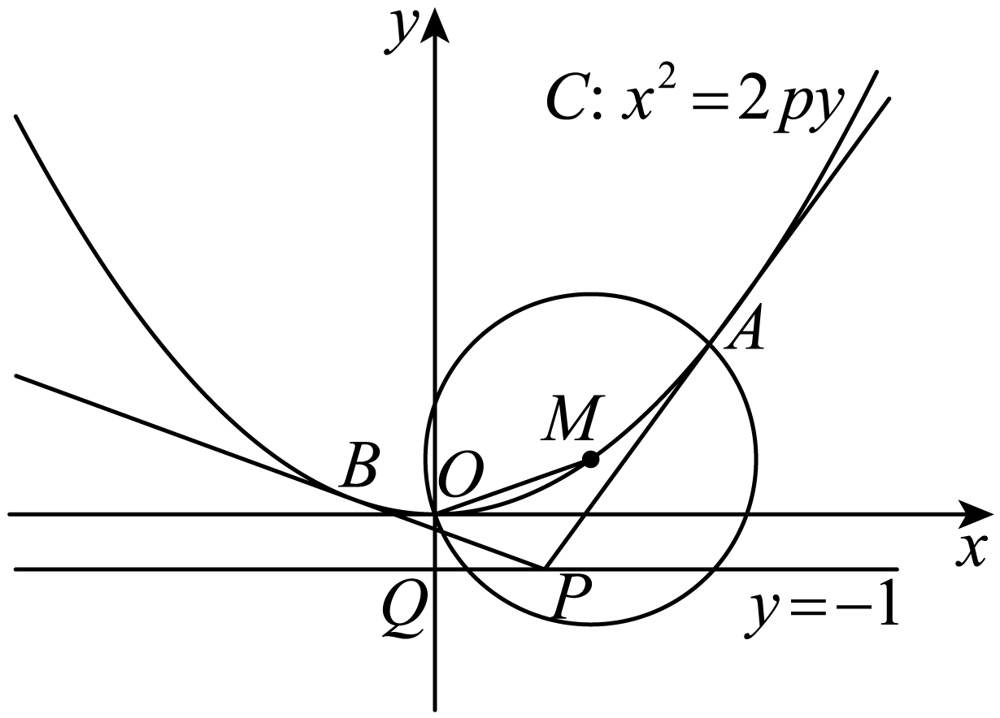

**变式4．**（2024·陕西咸阳·统考模拟预测）已知是抛物线上一点，过作圆的两条切线（切点为），交抛物线分别点且当时，.

(1)求抛物线的方程;

(2)判断直线的斜率是否为定值？若为定值，求出这个定值；若不是定值，说明理由.

【解析】（1）如图，

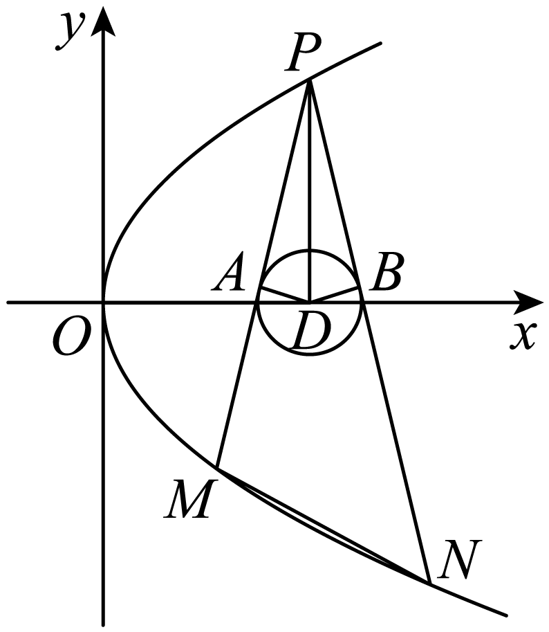

易知，

即.

∵   ∴，即.

代入得 ，

∴抛物线.

（2）法1: 易知，直线的倾斜角互补，斜率相反，

设直线，直线，

则，

即.

依题意 ，有，即.

用代替得，

∴直线的斜率为.

综上知，直线的斜率为定值.

法2：易知，直线的倾斜角互补，斜率相反，

设，则由得：

，化简得.

∴直线的斜率为 .

综上知，直线的斜率为定值.

<strong>变式5．</strong>（2024·湖南岳阳·统考模拟预测）已知、分别为椭圆的左、右焦点，<em>M</em>为上的一点.

(1)若点*M*的坐标为，求的面积；

(2)若点*M*的坐标为，且直线与交于不同的两点*A*、*B*，求证：为定值，并求出该定值；

(3)如图，设点*M*的坐标为，过坐标原点*O*作圆（其中*r*为定值，且）的两条切线，分别交于点*P*，*Q*，直线*OP*，*OQ*的斜率分别记为，.如果为定值，求的取值范围，以及取得最大值时圆*M*的方程.

【解析】（1）由已知条件得，因为，则，又，

因此的面积为.

（2）设，由，得，

，又，，

，

于是

，

即为定值.

（3）因为直线:与相切，则，即，

同理，由直线:与相切，可得，

于是、是关于的方程的两实根，

注意到，且，故，

因为定值，故不妨设（定值），

于是有，即.

依题意可知，变化，而、均为定值，即有，解得，，

设，，由得，同理，

所以

，当且仅当时取等号，

因此，解得，所以的范围为，

当或时，直线关于坐标轴对称，此时圆心*M*为椭圆顶点，

所以圆*M*的方程为或.

**题型三：交点弦过定点问题**

<strong>例7．</strong>（2024·陕西宝鸡·校考模拟预测）已知椭圆<em>C</em>的中心在原点，焦点在<em>x</em>轴上，以两个焦点和短轴的两个端点为顶点的四边形是一个面积为2的正方形（记为<em>Q</em>）．

(1)求椭圆*C*的方程；

(2)设点*P*在直线上，过点*P*作以原点为圆心短半轴长为半径圆*O*的两条切线，切点为*M*，*N*，求证：直线恒过定点．

【解析】（1）依题意，设椭圆*C*的方程为，焦距为，

由题设条件知，，，

故椭圆*C*的方程为．

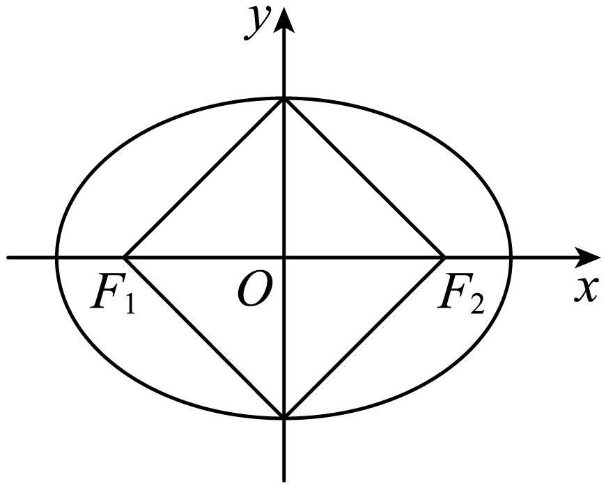

（2）设点是直线上任意一点，

由题可知点*P*，*M*，*O*，*N*在以为直径的圆上，

此圆方程为    ①

又圆*O*的方程为，    ②

①－②可得直线方程为：，则直线恒过定点．

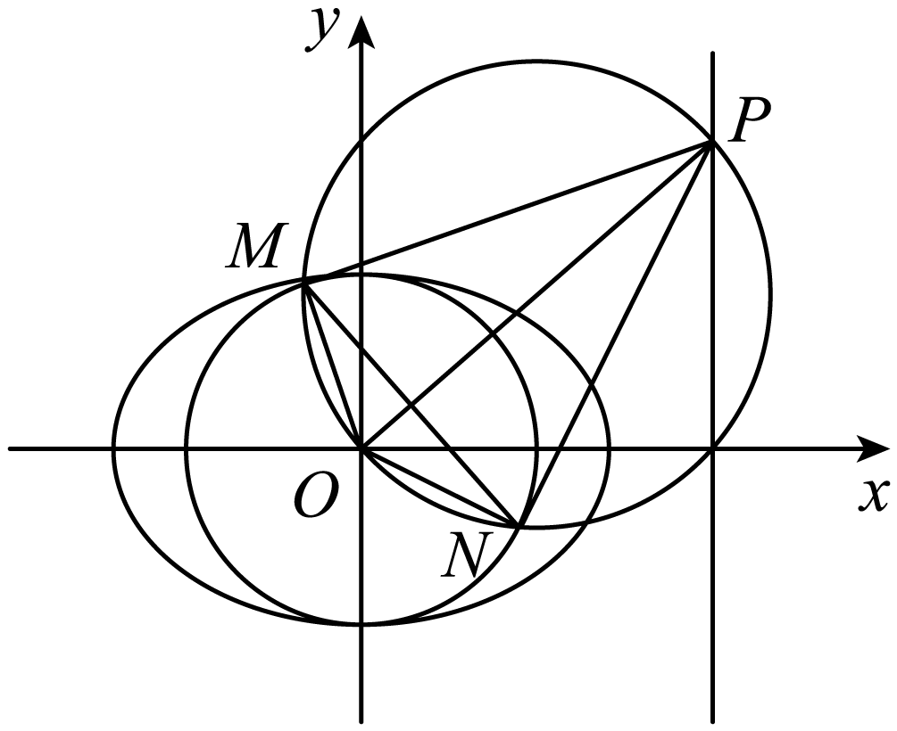

<strong>例8．</strong>（2024·河北唐山·开滦第二中学校考模拟预测）已知抛物线<em>C</em>：的焦点为<em>F</em>，<em>P</em>(4,4)是<em>C</em>上的一点.

(1)若直线*PF*交*C*于另外一点*A*，求；

(2)若圆：，过*P*作圆*E*的两条切线，分别交*C*于*M*，*N*两点，证明：直线*MN*过定点.

【解析】（1）由题设，则，故，则，

又直线过抛物线焦点，则直线，

联立直线与抛物线并整理得：，故，即，

所以，

结合抛物线定义知：.

（2）设，，则（斜率存在且不为0）：，

所以为，则①，

由，则，所以，

而，与圆相切，则，整理得：，

同理可得：，

所以为的两个不同根，

故，，代入①，有，

所以，即，可得，

所以直线过定点.

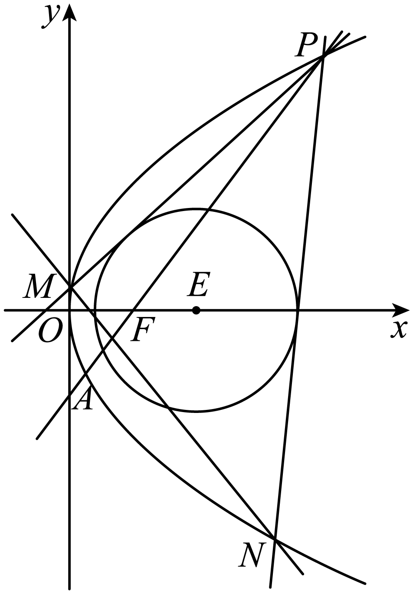

**例9．**（2024·陕西西安·西安市大明宫中学校考模拟预测）已知动圆恒过定点，圆心到直线的距离为．

(1)求点的轨迹的方程；

(2)过直线上的动点作的两条切线，切点分别为，证明：直线恒过定点．

【解析】（1）设，则，

因为，即，

当，即时，则，整理得；

当，即时，则，

整理得，不成立；

综上所述：点的轨迹的方程.

（2）由（1）可知：曲线：，即，则，

设，

可知切线的斜率为，所以切线：，

则，整理得，

同理由切线可得：，

可知：为方程的两根，则，

可得直线的斜率，

设的中点为，则，

即，

所以直线：，整理得，

所以直线恒过定点.

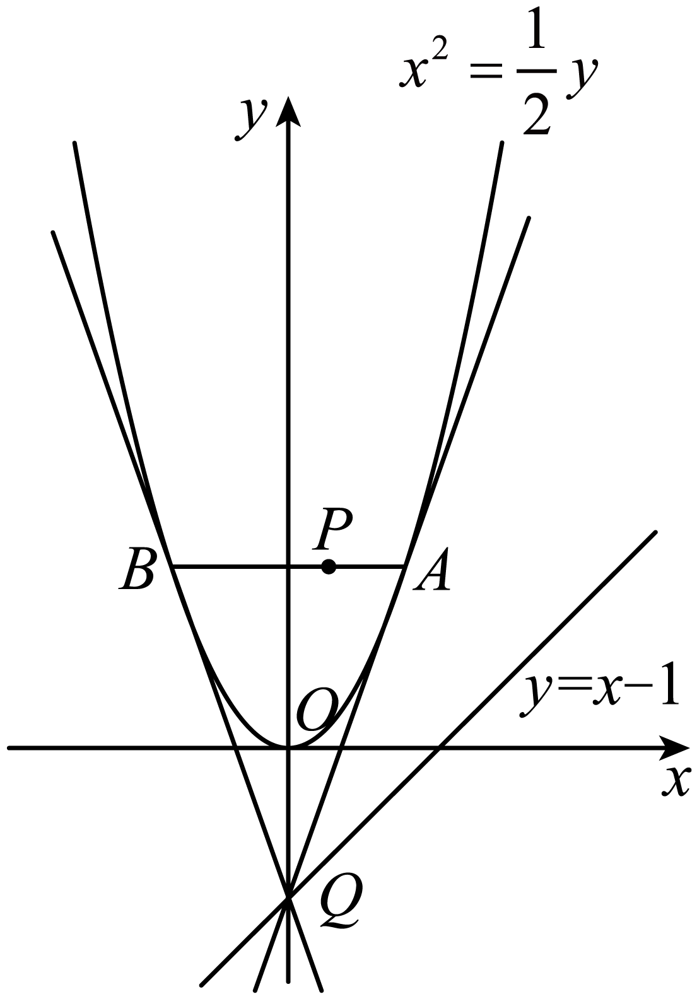

<strong>变式6．</strong>（2024·宁夏石嘴山·石嘴山市第三中学校考三模）已知抛物线，过抛物线的焦点<em>F</em>且斜率为的直线<em>l</em>与抛物线相交于不同的两点<em>A</em>，<em>B</em>，．

(1)求抛物线*C*的方程；

(2)点*M*在抛物线的准线上运动，过点*M*作抛物线*C*的两条切线，切点分别为*P*，*Q*，在平面内是否存在定点*N*，使得直线*MN*与直线*PQ*垂直？若存在，求出点*N*的坐标；若不存在，请说明理由．

【解析】（1）设，，

根据题意可知直线*l*的方程为，

联立得，

所以，

因为，

所以，解得，

所以抛物线*C*的方程为．

（2）如图所示，

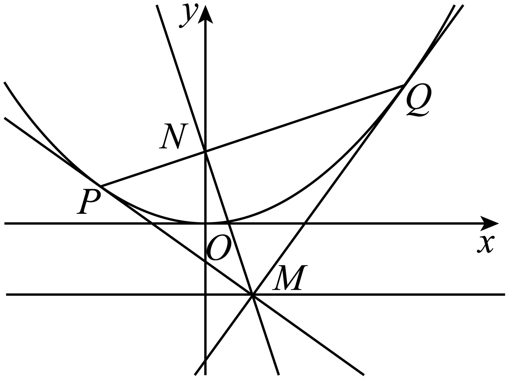

抛物线的准线方程为，

当点*M*在特殊位置时，

切点*P*，*Q*关于*y*轴对称，要使*MN*⊥*PQ*，点*N*必在*y*轴上．

故设，，，，

抛物线*C*的方程为，求导得，

所以切线*MP*的斜率，

则直线*MP*的方程为，整理得，

又点*M*在直线*MP*上，

所以，整理得，

同理可得，

故和是一元二次方程的根，

所以

因为，，

所以

，

当时，，

即存在定点，使得直线*MN*与直线*PQ*垂直．

**变式7．**（2024·河南·校联考模拟预测）已知椭圆的焦距为2，圆与椭圆恰有两个公共点．

(1)求椭圆的标准方程；

(2)已知结论：若点为椭圆上一点，则椭圆在该点处的切线方程为．若椭圆的短轴长小于4，过点作椭圆的两条切线，切点分别为，求证：直线过定点．

【解析】（1）设椭圆的半焦距为．当圆在椭圆的内部时，，椭圆的方程为．

当圆在椭圆的外部时，，

椭圆的方程为．

（2）证明：设．

因为椭圆的短轴长小于4，所以的方程为．

则由已知可得，切线的方程为的方程为，

将代入的方程整理可得，

．

显然的坐标都满足方程，

故直线的方程为，

令，可得，即直线过定点．

**变式8．**（2024·重庆九龙坡·高三重庆市育才中学校考开学考试）如图所示，已知在椭圆上，圆，圆在椭圆内部.

(1)求的取值范围；

(2)过作圆的两条切线分别交椭圆于点（不同于），直线是否过定点？若过定点，求该定点坐标；若不过定点，请说明理由.

【解析】（1）由题意，故椭圆方，

设为椭圆上的一动点，由于圆在椭圆内部，则恒成立，

即对任意恒成立，

令，

，

则，于是有；

（2）设，，

，（由（1）斜率都存在），

由于两直线均与圆C相切，则，

则为方程的两根，由韦达定理可知，

设，

由韦达定理可知，

由.则

.故过定点.

<strong>变式9．</strong>（2024·内蒙古呼和浩特·高三统考开学考试）已知点<em>O</em>为平面直角坐标系的坐标原点，点<em>F</em>是抛物线<em>C</em>：的焦点．

(1)过点*F*且倾斜角为的直线*l*与抛物线*C*交于*A*，*B*两点，求的面积；

(2)若点*T*为直线上的动点，过点*T*作抛物线*C*的两条切线，切点分别为*M*，*N*，求证：直线*MN*过定点．

【解析】（1）据题意，直线*l*的斜率为，则直线*l*的方程为，设，，

由，联立可得，

易得，故，，

因此，．

（2）证明：设点，，，以*M*为切点的抛物线的切线方程为，

由，联立可得，

由判别式，即，即，显然，可得，

因此，以*M*为切点的抛物线的切线方程为，

同理可得，以*N*为切点的抛物线的切线方程为，

由于这两条切线都经过点，代入可得，，

则直线*MN*的方程为，可得直线*MN*过定点．

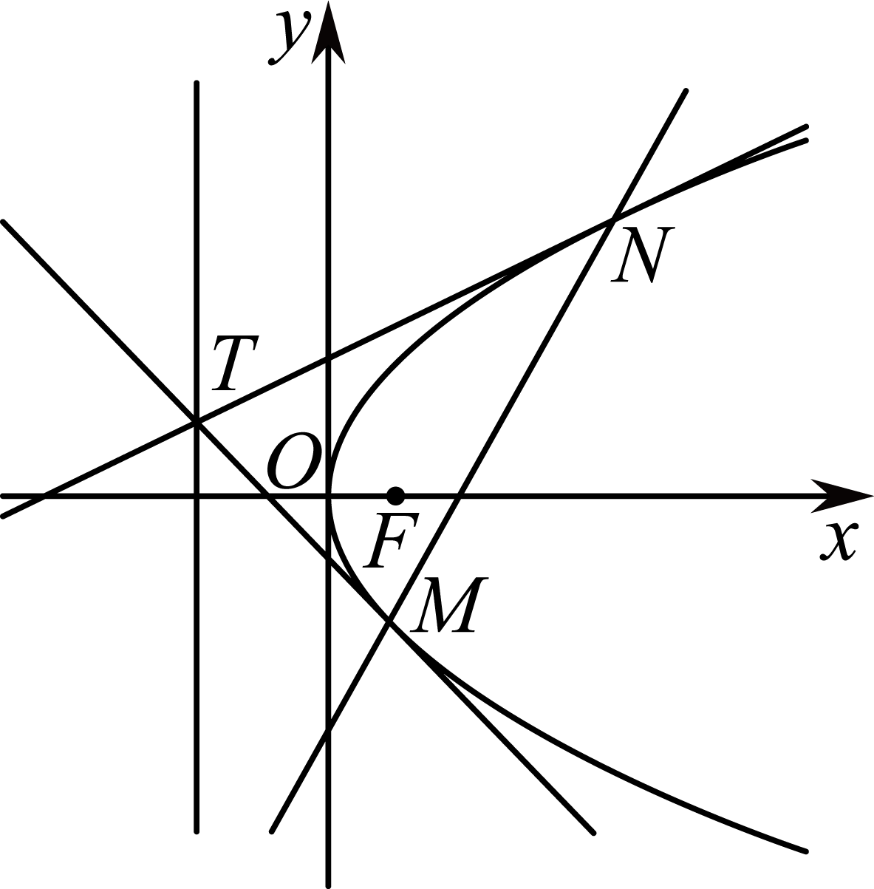

**变式10．**（2024·重庆沙坪坝·高三重庆一中校考阶段练习）已知的焦点为，且经过的直线被圆截得的线段长度的最小值为4．

(1)求抛物线的方程；

(2)设坐标原点为，若过点作直线与抛物线相交于不同的两点，，过点，作抛物线的切线分别与直线，相交于点，，请问直线是否经过定点？若是，请求出此定点坐标，若不是，请说明理由．

【解析】（1）因为抛物线的焦点为，圆的圆心，

而经过的直线被圆截得的线段长度，其中为圆心到直线的距离，

则，所以，

显然，的最大值为焦点到圆心的距离，即，

所以，又，解得或（舍），

故抛物线的方程为．

（2）设点，，，由，即，得，

则点处的切线方程为，

直线的方程为：，

则点，同理点，

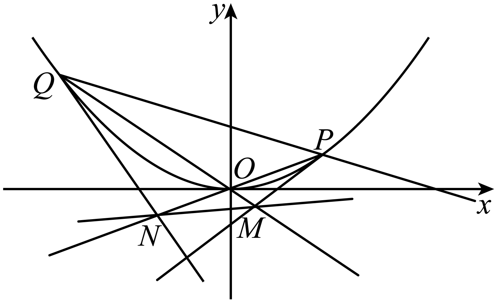

可得：

，

直线的方程为：，

注意到点，满足，

直线的方程为．

注意令，则

，

直线经过定点．

**变式11．**（2024·辽宁沈阳·沈阳二中校考模拟预测）如下图所示，已知椭圆的上顶点为，离心率为，且椭圆经过点.

(1)求椭圆的方程；

(2)若过点作圆（圆在椭圆内）的两条切线分别与椭圆相交于两点（异于点），当变化时，试问直线是否过某个定点？若是，求出该定点；若不是，请说明理由.

【解析】（1）由题知解得，

故椭圆的方程为

（2）设点为椭圆上任意一点，则，

所以，

所以当时，取最小值，

即椭圆上的点到点的最小距离为，

因为圆在椭圆内部，所以半径，

所以直线的斜率均存在，

设过点与圆相切的直线为，设直线的斜率分别为，

则圆心到直线的距离，

化简得：①，

从而，

由得：，解得：或

将代入可得，

所以，

所以直线*BD*的斜率，

直线*BD*的方程为：

化简为：，

即

所以，当变化时，直线*BD*总过定点.

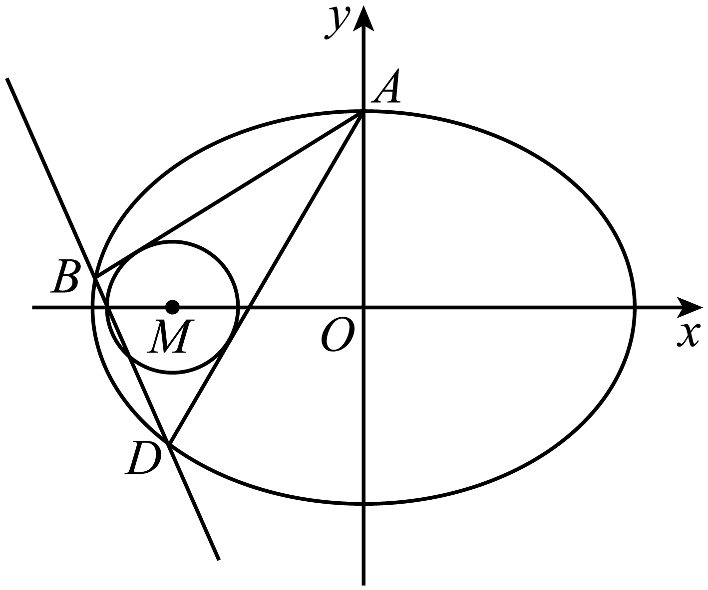

**题型四：交点弦定值问题**

**例10．**（2024·全国·高三专题练习）已知抛物线的顶点为原点，其焦点到直线的距离为．

(1)求抛物线的方程；

(2)设点，为直线上一动点，过点作抛物线的两条切线，，其中，为切点，求直线的方程，并证明直线过定点；

(3)过（2）中的点的直线交抛物线于，两点，过点，分别作抛物线的切线，，求，交点满足的轨迹方程．

【解析】（1）设抛物线的方程为，

∵抛物线的焦点到直线的距离为，

∴，解得或（舍去，

∴，，

∴抛物线的方程为．

（2）设，，设切点为，曲线，，

则切线的斜率为，化简得，

设，，，则，是以上方程的两根，

则，，

，

直线的方程为：，整理得，

∵切线的方程为，整理得，且点，在切线上，

∴，即直线的方程为：，化简得，

又∵，∴，

故直线过定点．

（3）设，，，

过的切线，过的切线，

则交点，

设过点的直线为，

联立，得，

∴，，

∴，

∴．

∴点满足的轨迹方程为．

<strong>例11．</strong>（2024·全国·高三专题练习）如图，设抛物线方程为 (<em>p</em>＞0)，<em>M</em>为直线上任意一点，过<em>M</em>引抛物线的切线，切点分别为<em>A</em>，<em>B</em>.

（1）求直线*AB*与轴的交点坐标；

（2）若*E*为抛物线弧*AB*上的动点，抛物线在*E*点处的切线与三角形*MAB*的边*MA*，*MB*分别交于点，，记，问是否为定值？若是求出该定值；若不是请说明理由.

【解析】（1）设，，抛物线方程可变为，

所以，所以，，

直线的方程为，直线方程为，

则解得，，

又，所以直线的方程为，

化简得， 令，，

又， 所以，

所以直线*AB*与轴的交点坐标为.

（2）记，设点，

可得直线的方程为，

由可得，同理，

所以

，

所以，同理，

所以，

设，记，则，，，，，

于是*，*

所以

，

所以.

**例12．**（2024·全国·高三专题练习）已知拋物线，为焦点，若圆与拋物线交于两点，且

(1)求抛物线的方程；

(2)若点为圆上任意一点，且过点可以作拋物线的两条切线，切点分别为.求证：恒为定值.

【解析】（1）由题意可知，半径为，

由圆的圆心以及抛物线的焦点均在在坐标轴轴，故由对称性可知：轴于点，

在直角三角形中，,

因此 故，将其代入抛物线方程中得，

故抛物线方程为：

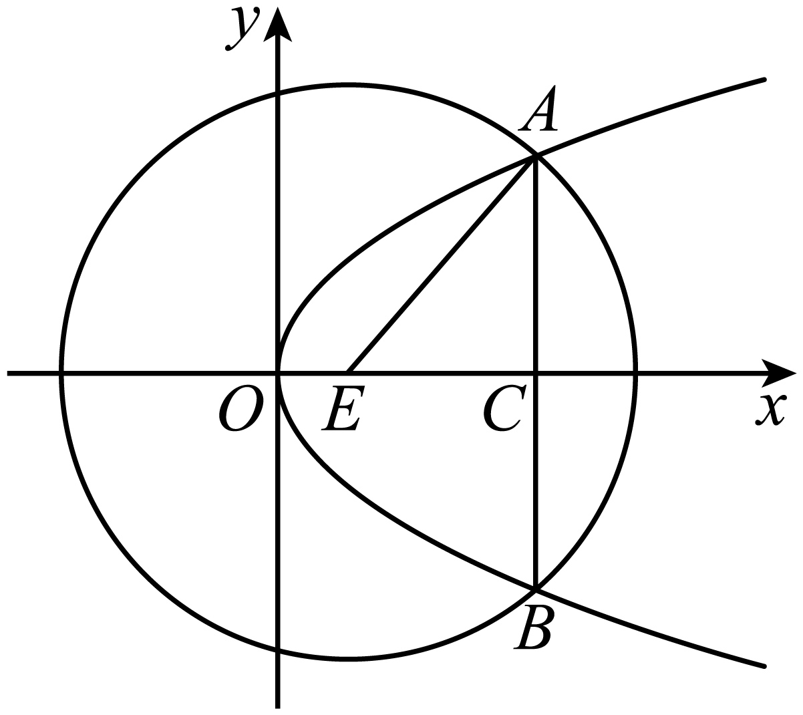

（2）令，

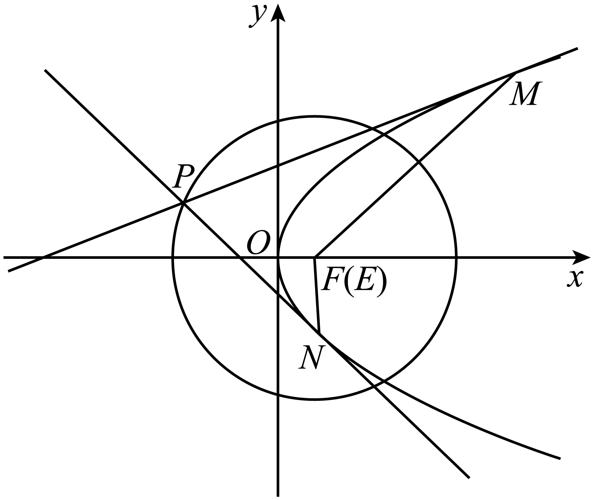

抛物线在点处的切线方程为,

与联立得①

由相切得，

代入①得

故在点处的切线方程为，即为

同理：点处的切线方程为，

而两切线交于点，

所以有，

则直线的方程为:，

由得,所以

于是

，

又点在圆上，

所以,即.

**变式12．**（2024·山东青岛·统考二模）已知为坐标原点，双曲线的左，右焦点分别为，，离心率等于，点是双曲线在第一象限上的点，直线与轴的交点为，的周长等于，.

(1)求的方程；

(2)过圆上一点（不在坐标轴上）作的两条切线，对应的切点为，.证明：直线与椭圆相切于点，且.

【解析】（1）由题意知，，

又因为，

所以，

所以，又因为，所以，

所以的方程为：.

（2）设，则，

，，

设切线的斜率分别为，设的方程为：，

因为，所以，

所以，

所以    （\*）

因为，整理得，

即，所以，同理：，

因为切线均过点，同理根据上面可知，

为的两解，所以，

所以，为直角三角形，

因为，所以，

所以，同理：，

所以直线的方程为：，

将直线：，代入椭圆的方程：可得：

，即，

所以，，

所以直线与椭圆相切，切点，

所以，所以，

所以.

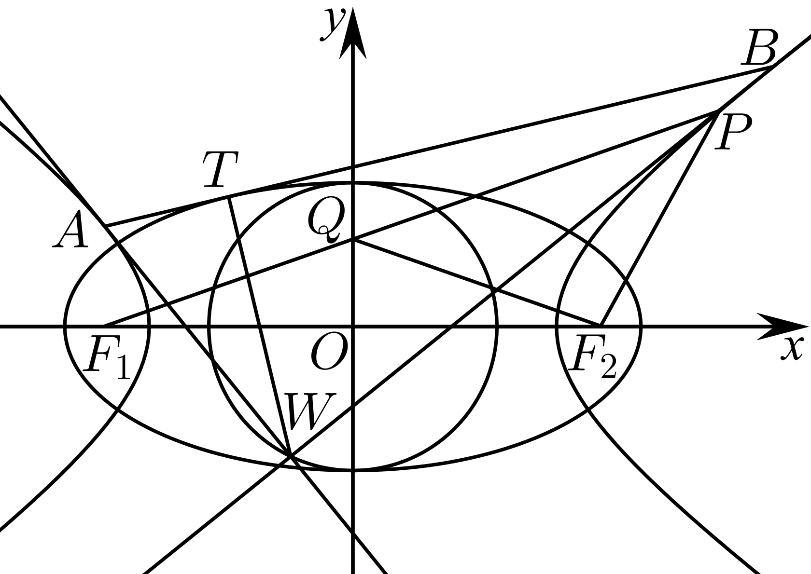

**题型五：交点弦最值问题**

**例13．**（2024·江西抚州·临川一中校考模拟预测）椭圆：的离心率为，焦距为.

（1）求椭圆的标准方程；

（2）设是椭圆上的动点，过原点作圆：的两条斜率存在的切线分别与椭圆交丁点，，求的最大值.

【解析】（1）由题意得，又，

所以，，，

所以椭圆的标准方程为.

（2）设圆的切线的方程为，则，

整理得，其两根，满足①，

这里，，且②，

由①②得，

设，，则，，

这里，，

所以，，

则，

因为当且仅当时取等号，

所以，当且仅当时取等号，

即.

**例14．**（2024·全国·高三专题练习）已知抛物线的方程为，为其焦点，过不在抛物线上的一点作此抛物线的切线，为切点.且.

（Ⅰ）求证：直线过定点；

（Ⅱ）直线与曲线的一个交点为，求的最小值.

【解析】试题分析：（Ⅰ）设直线的方程为，设，，由消去得，根据韦达定理，结合导数的结合意义可得这两条切线的斜率分别为，.由这两切线垂直得，从而可得结论；（Ⅱ）设，则，， ，，，利用导数求出的最小值即可.

试题解析：（Ⅰ）设直线的方程为，设，

以为切点的切线方程分别为，.

由消去得.

则，.

这两条切线的斜率分别为，.

由这两切线垂直得，得.

所以直线恒过定点.

（Ⅱ）设，则，，

当时，则，可得，

当时，则，，，

同样可得.

所以.

由.

所以 .

令，.

.

所以在上为减函数，在上为增函数.

所以.

（或 当时取等号.）

**例15．**（2024·河南·襄城高中校联考三模）已知抛物线的顶点在坐标原点，焦点在轴的正半轴上，圆经过抛物线的焦点.

(1)求的方程；

(2)若直线与抛物线相交于两点，过两点分别作抛物线的切线，两条切线相交于点，求面积的最小值.

【解析】（1）由题意，设的方程为，

因为圆经过抛物线的焦点，

所以，解得，

所以的方程为.

（2）如图所示，

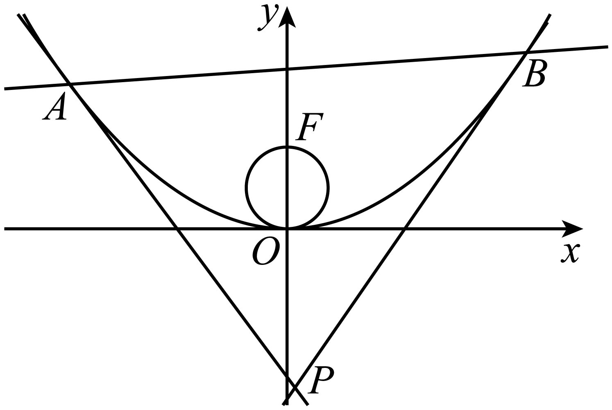

设，则，联立方程组整理得，

所以，且，

所以.

由，可得，则，所以抛物线的过点*A*的切线方程是，

将代入上式整理得，

同理可得抛物线的过点的切线方程为

由解得，所以，

所以到直线的距离，

所以的面积，

当时，，

所以面积的最小值为.

**变式13．**（2024·浙江杭州·高三浙江省杭州第二中学校联考阶段练习）已知椭圆，是椭圆外一点，过作椭圆的两条切线，切点分别为，直线与直线交于点，是直线与椭圆的两个交点.

(1)求直线与直线的斜率之积；

(2)求面积的最大值.

【解析】（1）

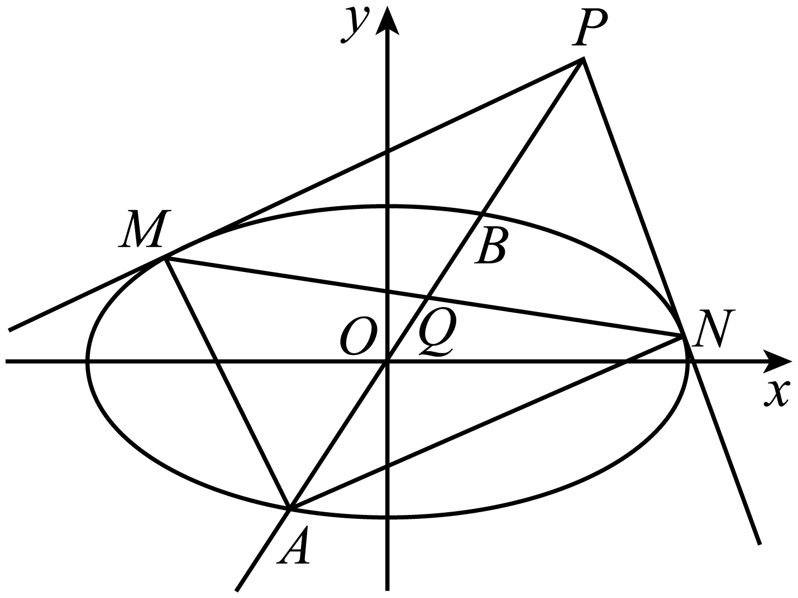

设，，，

由可得，对其求导可得，

所以当时，直线的斜率为，

则直线的方程为，即.

当时，成立，所以直线的方程为.

同理可得直线的方程为，

又因为是两条切线的交点，所以有，，

所以，则，又因为，

所以.

（2）①当时，联立直线与椭圆方程，

得，

，，

则，

联立直线与椭圆方程，解得点.

则点到直线的距离，

所以

令，则，

令，则，记，

，

所以在上单调递增，在上单调递减，

所以当，，即时，.

所以，所以面积的最大值是.

②当时，直线的方程为，联立，

可得，根据椭圆的对称性，不妨令，则，

则点到直线的距离，

所以

令，则，记，

，

所以在上单调递增，在上单调递减，

所以当，时，.

所以，所以面积的最大值是.

根据对称性可得当时，面积的最大值是.

所以当时，的最大值为.

当时，同理可求得，当时，的最大值为.

综上，当时，面积的最大值是.

<strong>变式14．</strong>（2024·新疆喀什·统考模拟预测）已知抛物线<em>C</em>：的焦点为<em>F</em>，且<em>F</em>与圆<em>M</em>：上点的距离的最小值为3．

(1)求*p*；

(2)若点*P*在圆*M*上，*PA*，*PB*是抛物线*C*的两条切线，*A*，*B*是切点，求三角形*PAB*面积的最值．

【解析】（1）由点到圆*M*上的点的距离的最小值为

解得．

（2）由（1）知，抛物线的方程为，即，则．

设切点，，则易得直线*PA*：，直线*PB*：，

从而得到．

设直线*AB*：，联立抛物线方程，消去*y*并整理，得，

则，即，且，，故．

因为，

点*P*到直线*AB*的距离，所以，①

又点在圆*M*：上，

故，代入①得，，

而，故当时，,

故当时，.

**题型六：交点弦范围问题**

<strong>例16．</strong>（2024·全国·高三专题练习）如图，设抛物线的焦点为<em>F</em>，点<em>P</em>是半椭圆上的一点，过点<em>P</em>作抛物线<em>C</em>的两条切线，切点分别为<em>A、B</em>，且直线<em>PA、PB</em>分别交<em>y</em>轴于点<em>M、N</em>．

（1）证明：；

（2）求的取值范围．

【解析】（1）由题意知，直线*PA*的斜率存在且不为0，设点*P*的坐标为，

直线*PA*方程为．

令，可知点*M*的坐标为．

由，消去*x*得．

因为直线与抛物线只有一个交点，

故，即．

因为点*F*的坐标为，

故，．

则．

因此，亦即．

（2）设直线*PB*的方程为．

由（1）可知，*n*满足方程．

故*m，n*是关于*t*的方程的两个不同的实根．

所以．

由（1）可知：，同理可得．

故，．

则，

因为，

所以．

因此，的取值范围是．

【点晴】本题考查直线与椭圆的位置关系，计算量较大，考查学生的运算求解能力、转化与化归的思想，是一道中档题.

**例17．**（2024·全国·高三专题练习）已知椭圆：的左焦点，点在椭圆上.

（1）求椭圆的标准方程；

（2）经过圆：上一动点作椭圆的两条切线，切点分别记为，直线分别与圆相交于异于点的两点.

（*i*）当直线的斜率都存在时，记直线的斜率分别为.求证：；

（*ii*）求的取值范围.

【解析】（1）∵椭圆的左焦点，∴.

将代入，得.

又，∴，.

∴椭圆的标准方程为.

（2）（*i*）设点，设过点与椭圆相切的直线方程为.

由，消去，得.

.

令，整理得.

由已知，则.

又，∴.

（*ii*）设点，.

当直线的斜率存在时，设直线的方程为.

由，消去，得.

.

令，整理得.

则.

∴直线的方程为.

化简，可得，即.

经验证，当直线的斜率不存在时，

直线的方程为或，也满足.

同理，可得直线的方程为.

∵在直线，上，∴，.

∴直线的方程为.

由，消去，得.

∴，.

∴

.

又由（*i*）可知当直线，的斜率都存在时，；

易知当直线或斜率不存在时，也有.

∴为圆的直径，即.

∴.

又，∴.

∴的取值范围为.

**例18．**（2024·山东·校联考模拟预测）已知圆为坐标原点，点在圆上运动，为过点的圆的切线，以为准线的拋物线恒过点，抛物线的焦点为，记焦点的轨迹为．

(1)求的方程；

(2)过动点的两条直线均与曲线相切，切点分别为，且的斜率之积为，求四边形面积的取值范围．

【解析】（1）分别过作的垂线，垂足分别为，连接，

由抛物线的定义，可得，则．

因为，所以焦点的轨迹是以为焦点的椭圆，

其中，

所以抛物线的焦点的轨迹方程为

（2）设点，过点的直线的斜率为，则方程为，

联立方程组，消得，，

整理得，

，即，所以点在方程为的圆上．

设点在椭圆上，则，则，

由知，满足：

则，即，故，

从而得切线的方程为

整理得，点满足方程，则，

同理可得

即点满足方程，所以的方程为．

消得，

，，

．

设，点到直线的距离为，

；

．

所以．

**变式15．**（2024·云南曲靖·统考模拟预测）已知椭圆的离心率为，以椭圆的顶点为顶点的四边形面积为.

(1)求椭圆的标准方程；

(2)我们称圆心在椭圆上运动且半径为的圆是椭圆的“环绕圆”.过原点作椭圆的“环绕圆”的两条切线，分别交椭圆于两点，若直线的斜率存在，并记为，求的取值范围.

【解析】（1）由题意，得且，又，

解得，

所以椭圆的标准方程为.

（2）

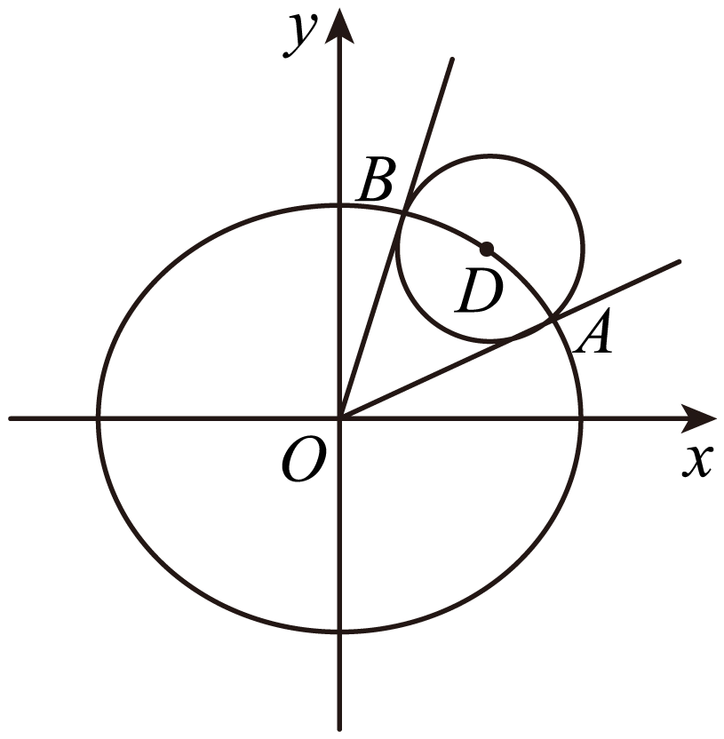

设切线的方程为，切线的方程为，“环绕圆”的圆心*D*为.

由“环绕圆”的定义，可得“环绕圆”的半径为1，所以“环绕圆”的标准方程为.

因为直线与“环绕圆”相切，则由点到直线的距离公式可得：，

化简得.

同理可得.

所以是方程的两个不相等的实数根，

所以.

又因为“环绕圆”的圆心在椭圆上，所以代入椭圆方程中，

可得，解得.

所以.

又因为且，所以或.

所以或，所以或，

所以或.

所以的取值范围是

