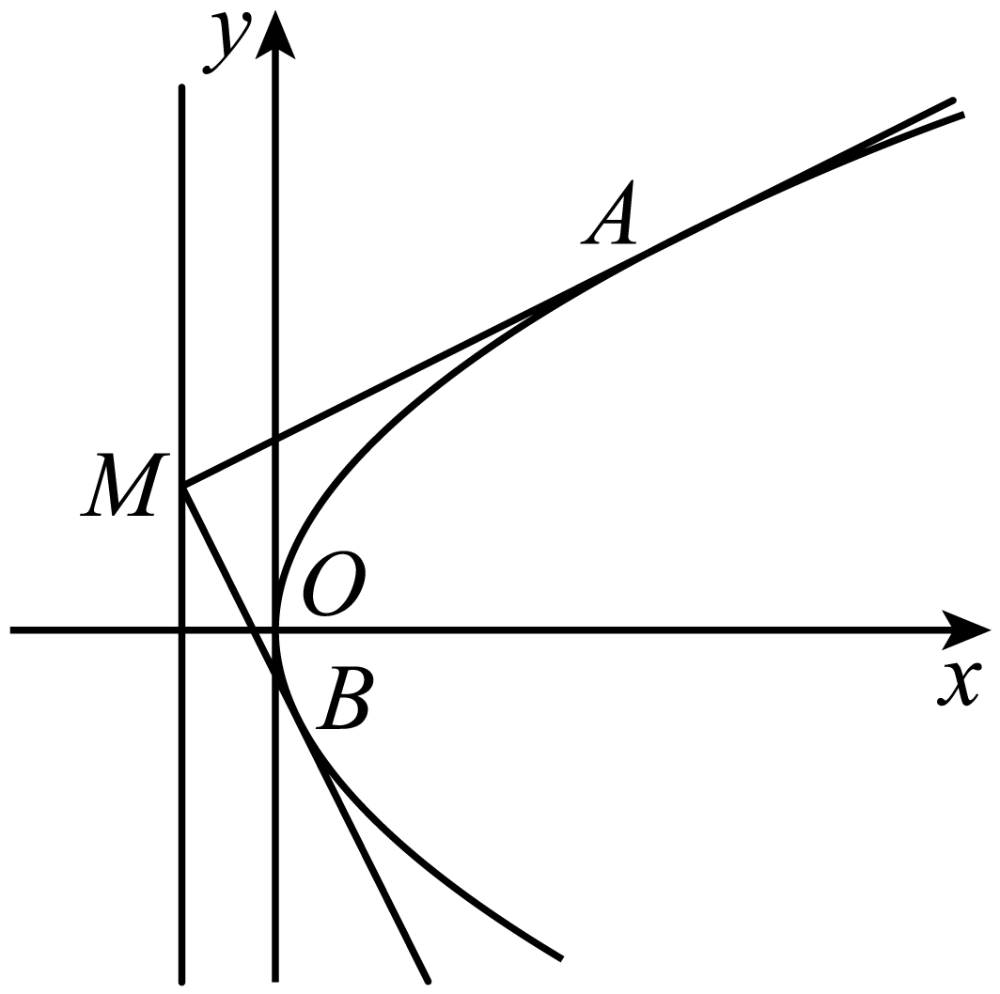
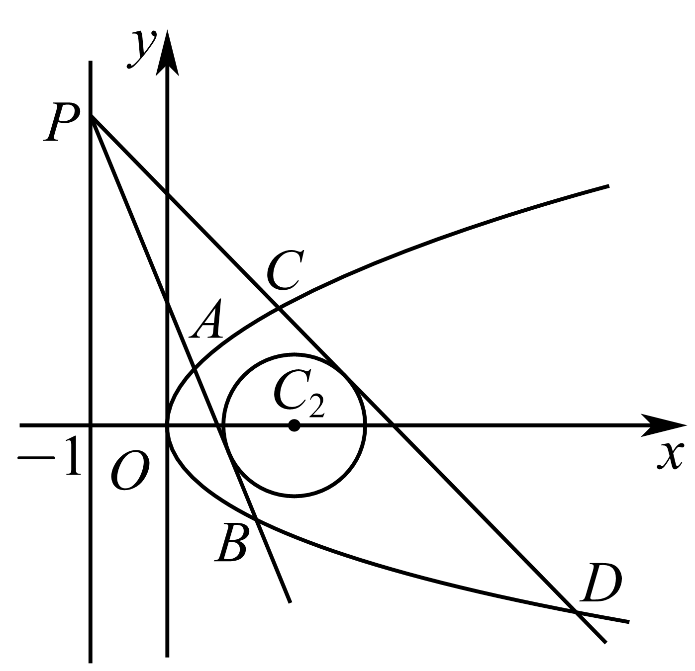
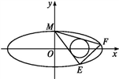
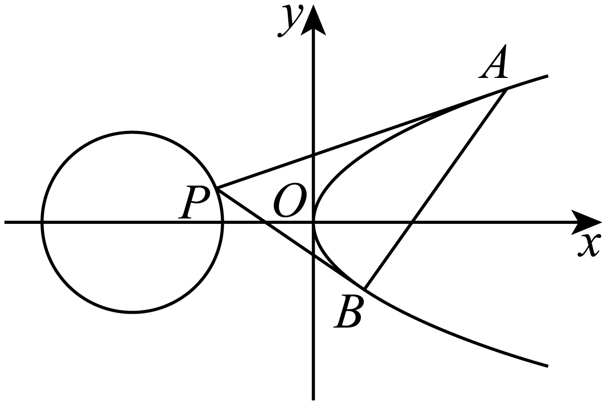
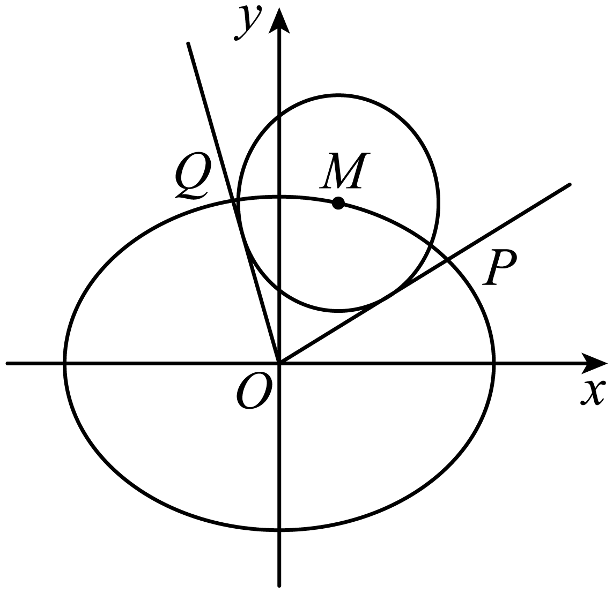
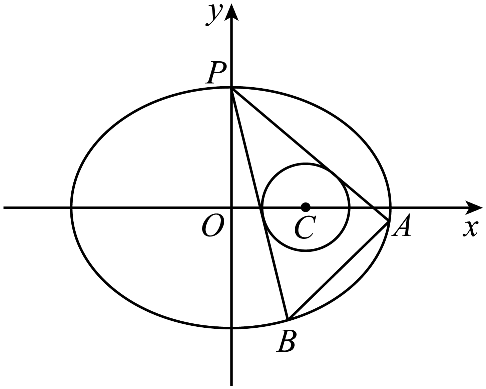
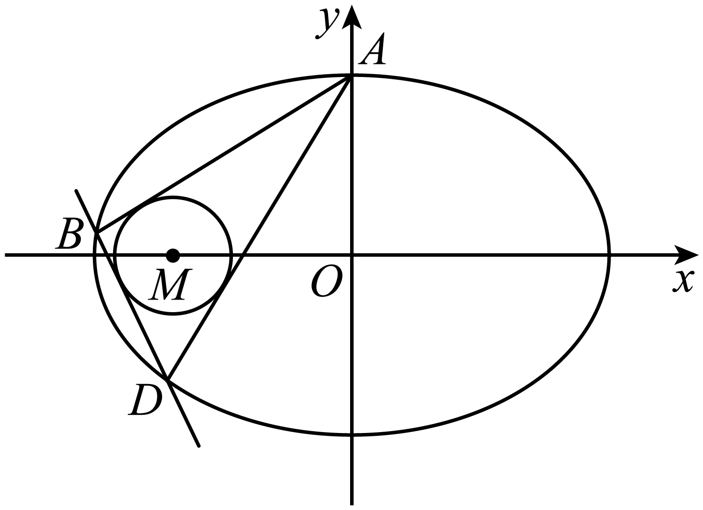
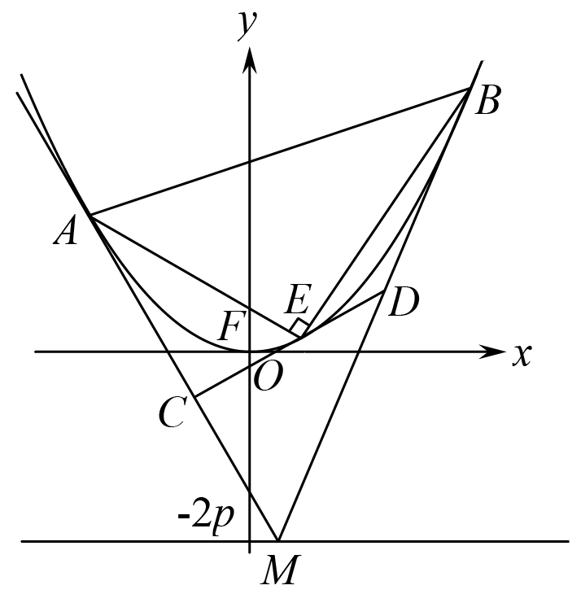
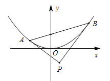
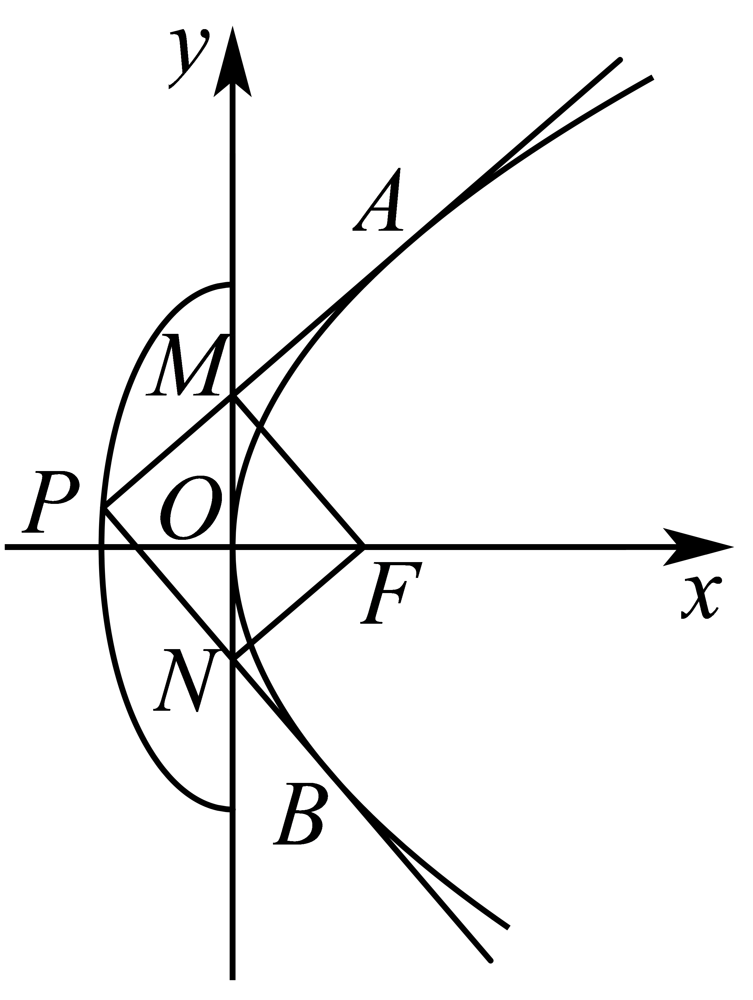

**第76讲  双切线问题**

**知识梳理**

双切线问题，就是过一点做圆锥曲线的两条切线的问题，解决这一类问题我们通常用同构法.

解题思路：

①根据曲线外一点设出切线方程．

②和曲线方程联立，求出判别式．

③整理出关于双切线斜率的同构方程．

④写出关于的韦达定理，并解题．

**必考题型全归纳**

**题型一：定值问题**

<strong>例1．</strong>（2024·河南·高三竞赛）已知抛物线<em>C</em>：与直线<em>l</em>：没有公共点，<em>P</em>为直线<em>l</em>上的动点，过<em>P</em>作抛物线<em>C</em>的两条切线，<em>A</em>、<em>B</em>为切点.

（1）证明：直线*AB*恒过定点*Q*；

（2）若点*P*与*Q*的连线与抛物线*C*交于*M*、*N*两点，证明：.

<strong>例2．</strong>（2024·高二单元测试）已知抛物线<em>C</em>：的焦点<em>F</em>与椭圆的右焦点重合，点<em>M</em>是抛物线<em>C</em>的准线上任意一点，直线<em>MA</em>，<em>MB</em>分别与抛物线<em>C</em>相切于点<em>A</em>，<em>B</em>．

(1)求抛物线*C*的标准方程及其准线方程；

(2)设直线*MA*，*MB*的斜率分别为，，证明：为定值．

**例3．**（2024·贵州贵阳·校联考模拟预测）已知坐标原点为，抛物线为与双曲线在第一象限的交点为，为双曲线的上焦点，且的面积为3．

(1)求抛物线的方程；

(2)已知点，过点作抛物线的两条切线，切点分别为，，切线，分别交轴于，，求与的面积之比．

**变式1．**（2024·安徽合肥·高三合肥一中校联考开学考试）已知抛物线（为常数，）.点是抛物线上不同于原点的任意一点.

(1)若直线与只有一个公共点，求；

(2)设为的准线上一点，过作的两条切线，切点为，且直线，与轴分别交于，两点.

①证明：

②试问是否为定值？若是，求出该定值；若不是，请说明理由.

**变式2．**（2024·河南信阳·信阳高中校考三模）已知抛物线上一点到焦点的距离为3.

(1)求，的值；

(2)设为直线上除，两点外的任意一点，过作圆的两条切线，分别与曲线相交于点，和，，试判断，，，四点纵坐标之积是否为定值？若是，求该定值；若不是，请说明理由.

**题型二：斜率问题**

<strong>例4．</strong>（2024·全国·高三专题练习）已知椭圆<em>C</em>:<em>=</em>1(<em>a&gt;b&gt;</em>0)的离心率为,<em>F</em>1,<em>F</em>2是椭圆的两个焦点,<em>P</em>是椭圆上任意一点,且△<em>PF</em>1<em>F</em>2的周长是8<em>+</em>2<em>.</em>

(1)求椭圆*C*的方程;

(2)设圆<em>T</em>:(<em>x-</em>2)2<em>+y</em>2<em>=</em>,过椭圆的上顶点<em>M</em>作圆<em>T</em>的两条切线交椭圆于<em>E</em>,<em>F</em>两点,求直线<em>EF</em>的斜率<em>.</em>

**例5．**（2024·全国·高三专题练习）设点为抛物线外一点，过点作抛物线的两条切线，，切点分别为，．

（Ⅰ）若点为，求直线的方程；

（Ⅱ）若点为圆上的点，记两切线，的斜率分别为，，求的取值范围．

**例6．**（2024·全国·高三专题练习）已知椭圆的离心率为，，是椭圆的两个焦点，是椭圆上任意一点，且的周长是．

(1)求椭圆的方程；

(2)是否存在斜率为1的直线与椭圆交于，两点，使得以为直径圆过原点，若存在写出直线方程；

(3)设圆，过椭圆的上顶点作圆的两条切线交椭圆于、两点，当圆心在轴上移动且时，求的斜率的取值范围．

**变式3．**（2024·河南洛阳·高三新安县第一高级中学校考阶段练习）已知圆，圆心在抛物线上，圆过原点且与的准线相切．

(1)求抛物线的方程；

(2)点，点（与不重合）在直线上运动，过点作抛物线的两条切线，切点分别为．求证：．

**变式4．**（2024·陕西咸阳·统考模拟预测）已知是抛物线上一点，过作圆的两条切线（切点为），交抛物线分别点且当时，.

(1)求抛物线的方程;

(2)判断直线的斜率是否为定值？若为定值，求出这个定值；若不是定值，说明理由.

<strong>变式5．</strong>（2024·湖南岳阳·统考模拟预测）已知、分别为椭圆的左、右焦点，<em>M</em>为上的一点.

(1)若点*M*的坐标为，求的面积；

(2)若点*M*的坐标为，且直线与交于不同的两点*A*、*B*，求证：为定值，并求出该定值；

(3)如图，设点*M*的坐标为，过坐标原点*O*作圆（其中*r*为定值，且）的两条切线，分别交于点*P*，*Q*，直线*OP*，*OQ*的斜率分别记为，.如果为定值，求的取值范围，以及取得最大值时圆*M*的方程.

**题型三：交点弦过定点问题**

<strong>例7．</strong>（2024·陕西宝鸡·校考模拟预测）已知椭圆<em>C</em>的中心在原点，焦点在<em>x</em>轴上，以两个焦点和短轴的两个端点为顶点的四边形是一个面积为2的正方形（记为<em>Q</em>）．

(1)求椭圆*C*的方程；

(2)设点*P*在直线上，过点*P*作以原点为圆心短半轴长为半径圆*O*的两条切线，切点为*M*，*N*，求证：直线恒过定点．

<strong>例8．</strong>（2024·河北唐山·开滦第二中学校考模拟预测）已知抛物线<em>C</em>：的焦点为<em>F</em>，<em>P</em>(4,4)是<em>C</em>上的一点.

(1)若直线*PF*交*C*于另外一点*A*，求；

(2)若圆：，过*P*作圆*E*的两条切线，分别交*C*于*M*，*N*两点，证明：直线*MN*过定点.

**例9．**（2024·陕西西安·西安市大明宫中学校考模拟预测）已知动圆恒过定点，圆心到直线的距离为．

(1)求点的轨迹的方程；

(2)过直线上的动点作的两条切线，切点分别为，证明：直线恒过定点．

<strong>变式6．</strong>（2024·宁夏石嘴山·石嘴山市第三中学校考三模）已知抛物线，过抛物线的焦点<em>F</em>且斜率为的直线<em>l</em>与抛物线相交于不同的两点<em>A</em>，<em>B</em>，．

(1)求抛物线*C*的方程；

(2)点*M*在抛物线的准线上运动，过点*M*作抛物线*C*的两条切线，切点分别为*P*，*Q*，在平面内是否存在定点*N*，使得直线*MN*与直线*PQ*垂直？若存在，求出点*N*的坐标；若不存在，请说明理由．

**变式7．**（2024·河南·校联考模拟预测）已知椭圆的焦距为2，圆与椭圆恰有两个公共点．

(1)求椭圆的标准方程；

(2)已知结论：若点为椭圆上一点，则椭圆在该点处的切线方程为．若椭圆的短轴长小于4，过点作椭圆的两条切线，切点分别为，求证：直线过定点．

**变式8．**（2024·重庆九龙坡·高三重庆市育才中学校考开学考试）如图所示，已知在椭圆上，圆，圆在椭圆内部.

(1)求的取值范围；

(2)过作圆的两条切线分别交椭圆于点（不同于），直线是否过定点？若过定点，求该定点坐标；若不过定点，请说明理由.

<strong>变式9．</strong>（2024·内蒙古呼和浩特·高三统考开学考试）已知点<em>O</em>为平面直角坐标系的坐标原点，点<em>F</em>是抛物线<em>C</em>：的焦点．

(1)过点*F*且倾斜角为的直线*l*与抛物线*C*交于*A*，*B*两点，求的面积；

(2)若点*T*为直线上的动点，过点*T*作抛物线*C*的两条切线，切点分别为*M*，*N*，求证：直线*MN*过定点．

**变式10．**（2024·重庆沙坪坝·高三重庆一中校考阶段练习）已知的焦点为，且经过的直线被圆截得的线段长度的最小值为4．

(1)求抛物线的方程；

(2)设坐标原点为，若过点作直线与抛物线相交于不同的两点，，过点，作抛物线的切线分别与直线，相交于点，，请问直线是否经过定点？若是，请求出此定点坐标，若不是，请说明理由．

**变式11．**（2024·辽宁沈阳·沈阳二中校考模拟预测）如下图所示，已知椭圆的上顶点为，离心率为，且椭圆经过点.

(1)求椭圆的方程；

(2)若过点作圆（圆在椭圆内）的两条切线分别与椭圆相交于两点（异于点），当变化时，试问直线是否过某个定点？若是，求出该定点；若不是，请说明理由.

**题型四：交点弦定值问题**

**例10．**（2024·全国·高三专题练习）已知抛物线的顶点为原点，其焦点到直线的距离为．

(1)求抛物线的方程；

(2)设点，为直线上一动点，过点作抛物线的两条切线，，其中，为切点，求直线的方程，并证明直线过定点；

(3)过（2）中的点的直线交抛物线于，两点，过点，分别作抛物线的切线，，求，交点满足的轨迹方程．

<strong>例11．</strong>（2024·全国·高三专题练习）如图，设抛物线方程为 (<em>p</em>＞0)，<em>M</em>为直线上任意一点，过<em>M</em>引抛物线的切线，切点分别为<em>A</em>，<em>B</em>.

（1）求直线*AB*与轴的交点坐标；

（2）若*E*为抛物线弧*AB*上的动点，抛物线在*E*点处的切线与三角形*MAB*的边*MA*，*MB*分别交于点，，记，问是否为定值？若是求出该定值；若不是请说明理由.

**例12．**（2024·全国·高三专题练习）已知拋物线，为焦点，若圆与拋物线交于两点，且

(1)求抛物线的方程；

(2)若点为圆上任意一点，且过点可以作拋物线的两条切线，切点分别为.求证：恒为定值.

**变式12．**（2024·山东青岛·统考二模）已知为坐标原点，双曲线的左，右焦点分别为，，离心率等于，点是双曲线在第一象限上的点，直线与轴的交点为，的周长等于，.

(1)求的方程；

(2)过圆上一点（不在坐标轴上）作的两条切线，对应的切点为，.证明：直线与椭圆相切于点，且.

**题型五：交点弦最值问题**

**例13．**（2024·江西抚州·临川一中校考模拟预测）椭圆：的离心率为，焦距为.

（1）求椭圆的标准方程；

（2）设是椭圆上的动点，过原点作圆：的两条斜率存在的切线分别与椭圆交丁点，，求的最大值.

**例14．**（2024·全国·高三专题练习）已知抛物线的方程为，为其焦点，过不在抛物线上的一点作此抛物线的切线，为切点.且.

（Ⅰ）求证：直线过定点；

（Ⅱ）直线与曲线的一个交点为，求的最小值.

**例15．**（2024·河南·襄城高中校联考三模）已知抛物线的顶点在坐标原点，焦点在轴的正半轴上，圆经过抛物线的焦点.

(1)求的方程；

(2)若直线与抛物线相交于两点，过两点分别作抛物线的切线，两条切线相交于点，求面积的最小值.

**变式13．**（2024·浙江杭州·高三浙江省杭州第二中学校联考阶段练习）已知椭圆，是椭圆外一点，过作椭圆的两条切线，切点分别为，直线与直线交于点，是直线与椭圆的两个交点.

(1)求直线与直线的斜率之积；

(2)求面积的最大值.

<strong>变式14．</strong>（2024·新疆喀什·统考模拟预测）已知抛物线<em>C</em>：的焦点为<em>F</em>，且<em>F</em>与圆<em>M</em>：上点的距离的最小值为3．

(1)求*p*；

(2)若点*P*在圆*M*上，*PA*，*PB*是抛物线*C*的两条切线，*A*，*B*是切点，求三角形*PAB*面积的最值．

**题型六：交点弦范围问题**

<strong>例16．</strong>（2024·全国·高三专题练习）如图，设抛物线的焦点为<em>F</em>，点<em>P</em>是半椭圆上的一点，过点<em>P</em>作抛物线<em>C</em>的两条切线，切点分别为<em>A、B</em>，且直线<em>PA、PB</em>分别交<em>y</em>轴于点<em>M、N</em>．

（1）证明：；

（2）求的取值范围．

**例17．**（2024·全国·高三专题练习）已知椭圆：的左焦点，点在椭圆上.

（1）求椭圆的标准方程；

（2）经过圆：上一动点作椭圆的两条切线，切点分别记为，直线分别与圆相交于异于点的两点.

（*i*）当直线的斜率都存在时，记直线的斜率分别为.求证：；

（*ii*）求的取值范围.

**例18．**（2024·山东·校联考模拟预测）已知圆为坐标原点，点在圆上运动，为过点的圆的切线，以为准线的拋物线恒过点，抛物线的焦点为，记焦点的轨迹为．

(1)求的方程；

(2)过动点的两条直线均与曲线相切，切点分别为，且的斜率之积为，求四边形面积的取值范围．

**变式15．**（2024·云南曲靖·统考模拟预测）已知椭圆的离心率为，以椭圆的顶点为顶点的四边形面积为.

(1)求椭圆的标准方程；

(2)我们称圆心在椭圆上运动且半径为的圆是椭圆的“环绕圆”.过原点作椭圆的“环绕圆”的两条切线，分别交椭圆于两点，若直线的斜率存在，并记为，求的取值范围

