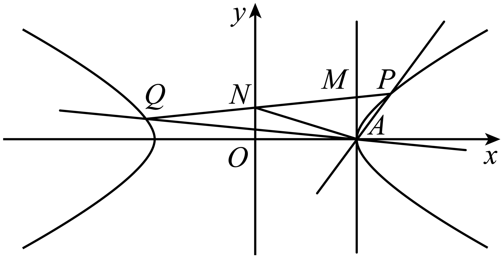
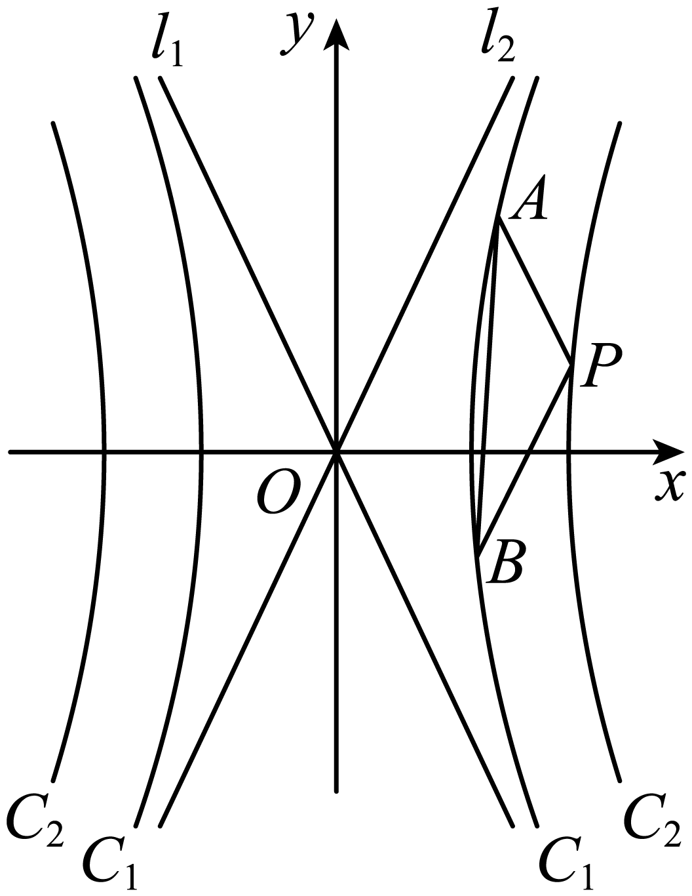
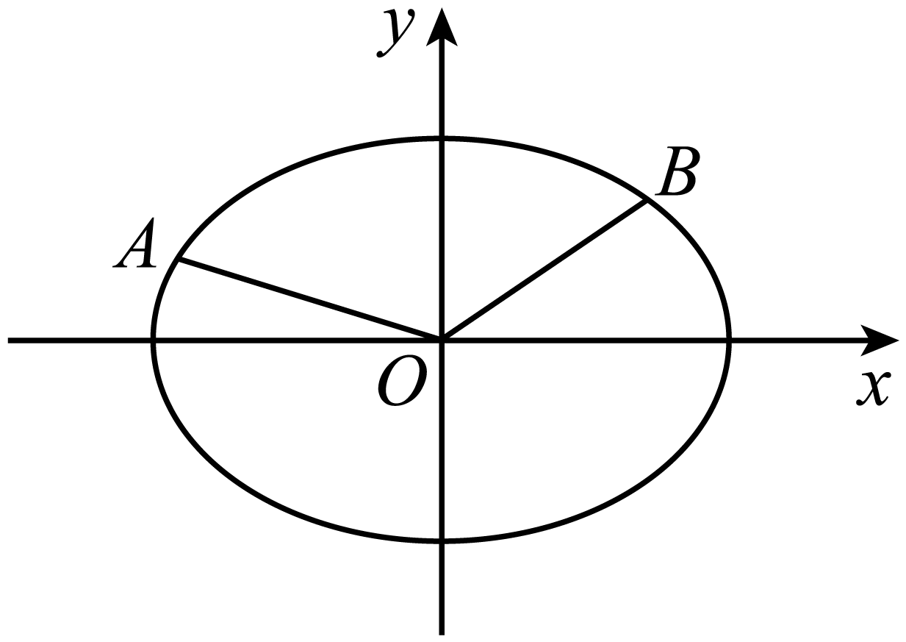
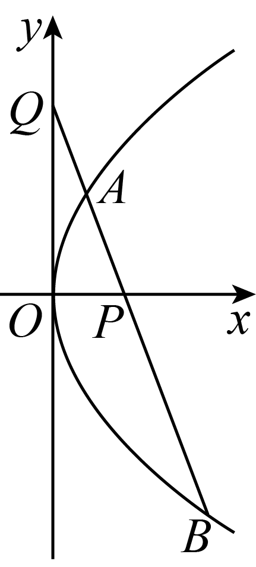
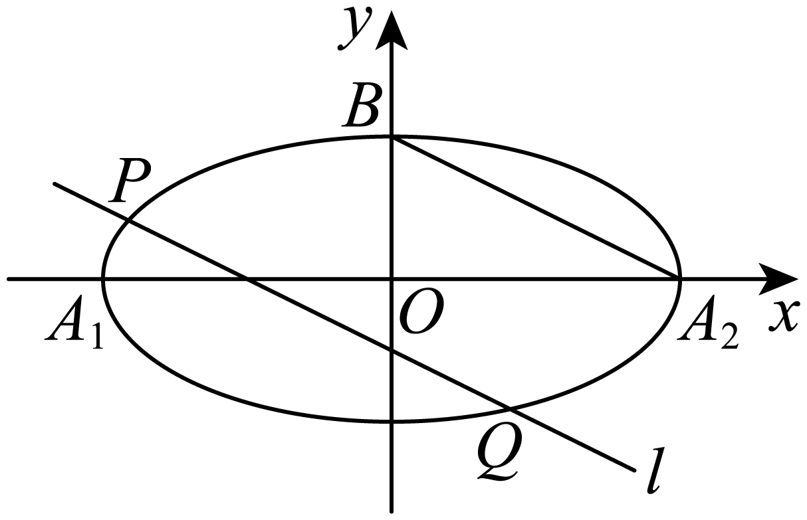
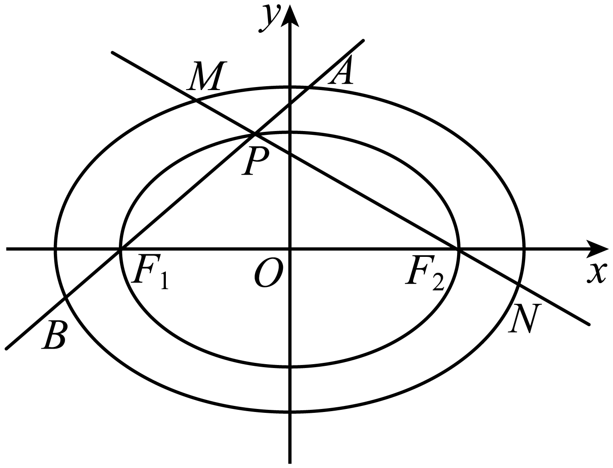
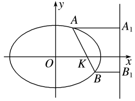
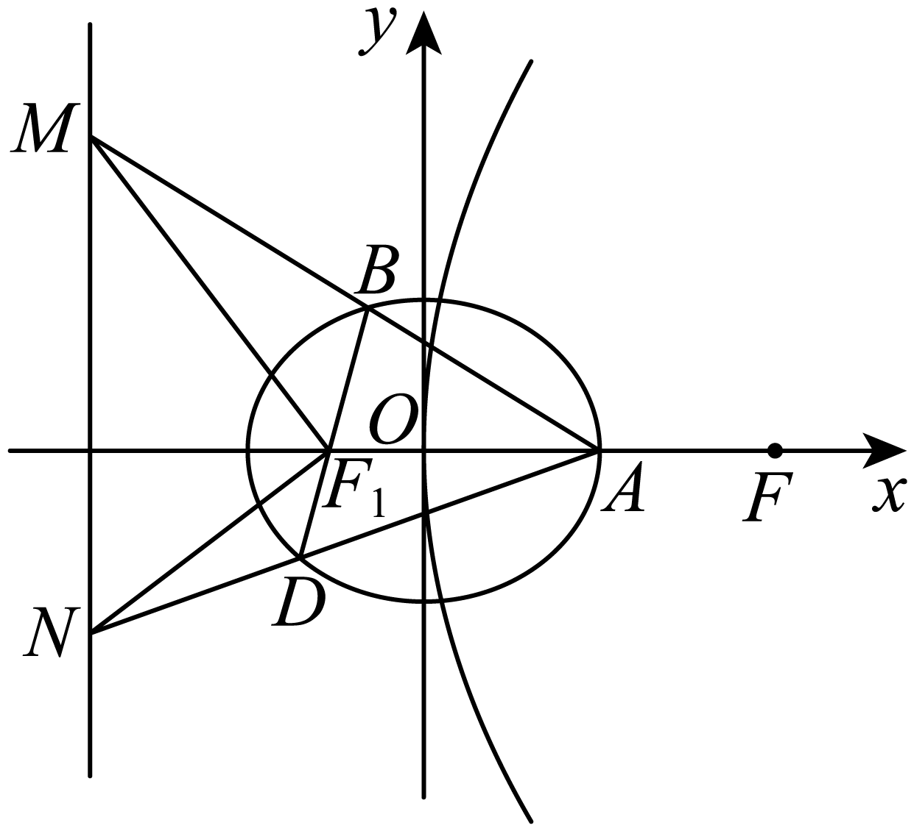
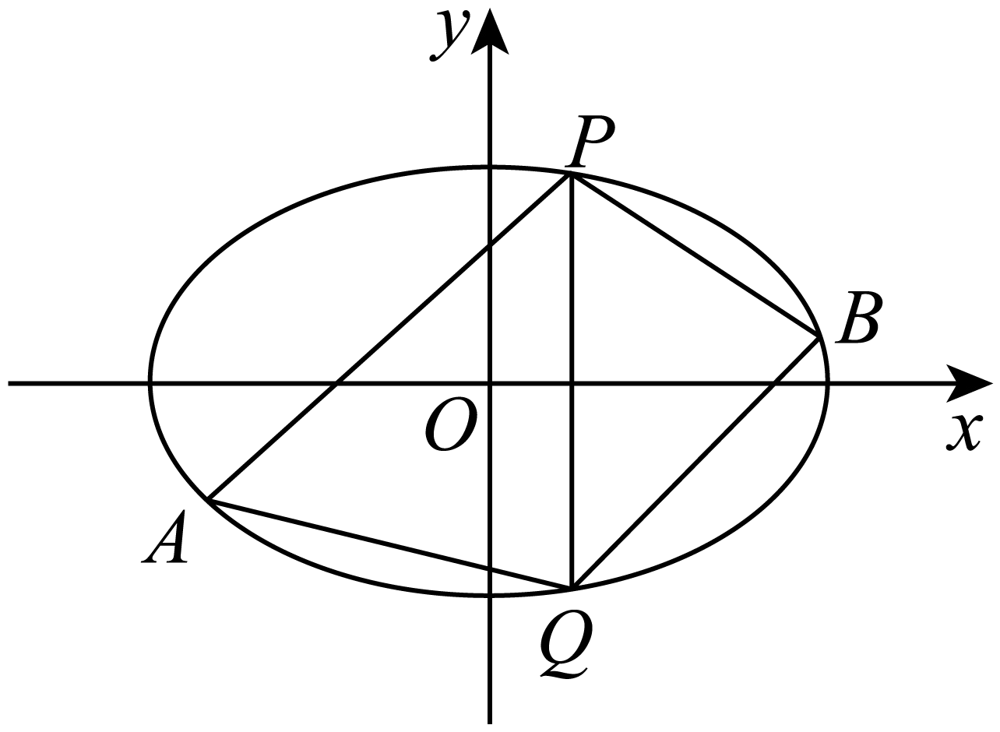

**第77讲  定点、定值问题**

**知识梳理**

1**、定值问题**

解析几何中定值问题的证明可运用函数的思想方法来解决．证明过程可总结为“变量—函数—定值”，具体操作程序如下：

（1）变量----选择适当的量为变量．

（2）函数----把要证明为定值的量表示成变量的函数．

（3）定值----化简得到的函数解析式，消去变量得到定值．

2**、求定值问题常见的方法有两种：**

（1）从特殊情况入手，求出定值，再证明该定值与变量无关；

（2）直接推理、计算，并在计算推理过程中消去变量，从而得到定值．

**常用消参方法：**

①等式带用消参：找到两个参数之间的等式关系，用一个参数表示另外一个参数，即可带用其他式子，消去参数．

②分式相除消参：两个含参数的式子相除，消掉分子和分母所含参数，从而得到定值．

③因式相减消参：两个含参数的因式相减，把两个因式所含参数消掉．

④参数无关消参：当与参数相关的因式为时，此时与参数的取值没什么关系，比如：

，只要因式，就和参数没什么关系了，或者说参数不起作用．

3**、求解直线过定点问题常用方法如下：**

（1）“特殊探路，一般证明”：即先通过特殊情况确定定点，再转化为有方向、有目的的一般性证明；

（2）“一般推理，特殊求解”：即设出定点坐标，根据题设条件选择参数，建立一个直线系或曲线的方程，再根据参数的任意性得到一个关于定点坐标的方程组，以这个方程组的解为坐标的点即为所求点；

（3）求证直线过定点，常利用直线的点斜式方程或截距式来证明．

**一般解题步骤：**

①斜截式设直线方程：，此时引入了两个参数，需要消掉一个．

②找关系：找到和的关系：，等式带入消参，消掉．

③参数无关找定点：找到和没有关系的点．

**必考题型全归纳**

**题型一：面积定值**

**例1．**（2024·安徽安庆·安庆一中校考三模）已知椭圆过点两点，椭圆的离心率为，为坐标原点，且.

(1)求椭圆的方程；

(2)设*P*为椭圆上第一象限内任意一点，直线与*y*轴交于点*M*，直线与*x*轴交于点*N*，求证：四边形的面积为定值.

**例2．**（2024·陕西汉中·高三统考阶段练习）已知双曲线：的焦距为，且焦点到近线的距离为1.

(1)求双曲线的标准方程；

(2)若动直线与双曲线恰有1个公共点，且与双曲线的两条渐近线分别交于两点，为坐标原点，证明：的面积为定值.

**例3．**（2024·广东广州·高三广州市真光中学校考阶段练习）已知双曲线，渐近线方程为，点在上；

(1)求双曲线的方程；

(2)过点的两条直线，分别与双曲线交于，两点（不与点重合），且两条直线的斜率，满足，直线与直线，轴分别交于，两点，求证：的面积为定值.

**变式1．**（2024·四川·成都市锦江区嘉祥外国语高级中学校考三模）设椭圆过点，且左焦点为．

(1)求椭圆的方程；

(2)内接于椭圆，过点和点的直线与椭圆的另一个交点为点，与交于点，满足，证明：面积为定值，并求出该定值．

**变式2．**（2024·全国·高二专题练习）已知，既是双曲线：的两条渐近线，也是双曲线：的渐近线，且双曲线的焦距是双曲线的焦距的倍.

(1)任作一条平行于的直线依次与直线以及双曲线，交于点，，，求的值；

(2)如图，为双曲线上任意一点，过点分别作，的平行线交于，两点，证明：的面积为定值，并求出该定值.

**变式3．**（2024·四川成都·高二树德中学校考阶段练习）已知椭圆，是椭圆上的两个不同的点，为坐标原点，三点不共线，记的面积为.

(1)若，求证：；

(2)记直线的斜率为，当时，试探究是否为定值并说明理由.

**题型二：向量数量积定值**

<strong>例4．</strong>（2024·新疆昌吉·高二统考期中）已知椭圆，，是<em>C</em>的左、右焦点，过的动直线<em>l</em>与<em>C</em>交于不同的两点<em>A</em>，<em>B</em>两点，且的周长为，椭圆的其中一个焦点在抛物线准线上，

(1)求椭圆的方程；

(2)已知点，证明:为定值.

<strong>例5．</strong>（2024·江西萍乡·高二萍乡市安源中学校考期末）已知是抛物线上一点，且<em>M</em>到<em>C</em>的焦点的距离为5.

(1)求抛物线*C*的方程及点*M*的坐标；

(2)如图所示，过点的直线*l*与*C*交于*A*，*B*两点，与*y*轴交于点*Q*，设，，求证：是定值.

**例6．**（2024·四川南充·高二四川省南充高级中学校考开学考试）已知点到的距离是点到的距离的2倍.

(1)求点的轨迹方程；

(2)若点与点关于点对称，过的直线与点的轨迹交于，两点，探索是否为定值？若是，求出该定值；若不是，请说明理由.

<strong>变式4．</strong>（2024·全国·高二校联考阶段练习）已知椭圆的右焦点为，点在<em>E</em>上．

(1)求椭圆*E*的标准方程；

(2)过点*F*的直线*l*与椭圆*E*交于*A*，*B*两点，点*Q*为椭圆*E*的左顶点，直线*QA*，*QB*分别交于*M*，*N*两点，*O*为坐标原点，求证：为定值．

**变式5．**（2024·上海宝山·高三上海交大附中校考期中）已知椭圆的离心率为，椭圆的一个顶点与两个焦点构成的三角形面积为2.

(1)求椭圆*C*的方程；

(2)已知直线与椭圆*C*交于*A*，*B*两点，且与*x*轴，*y*轴交于*M*，*N*两点.

①若，求*k*的值；②若点*Q*的坐标为，求证：为定值.

**题型三：斜率和定值**

**例7．**（2024·四川成都·高三成都七中校考开学考试）已知，．

(1)证明：总与和相切；

(2)在（1）的条件下，若与在*y*轴右侧相切于*A*点，与在*y*轴右侧相切于*B*点．直线与和分别交于*P*，*Q*，*M*，*N*四点.是否存在定直线使得对任意题干所给*a*，*b*，总有为定值？若存在，求出的方程；若不存在，请说明理由．

**例8．**（2024·河南洛阳·高三伊川县第一高中校联考开学考试）已知抛物线与抛物线在第一象限交于点.

(1)已知为抛物线的焦点，若的中点坐标为，求；

(2)设为坐标原点，直线的斜率为.若斜率为的直线与抛物线和均相切，证明为定值，并求出该定值.

<strong>例9．</strong>（2024·河南许昌·高二统考期末）已知的两个顶点<em>A</em>，<em>B</em>的坐标分别是且直线<em>PA</em>，<em>PB</em>的斜率之积是，设点<em>P</em>的轨迹为曲线<em>H</em>.

(1)求曲线*H*的方程；

(2)经过点且斜率为*k*的直线与曲线*H*交于不同的两点*E*，*F*（均异于*A*，*B*），证明：直线*BE*与*BF*的斜率之和为定值.

<strong>变式6．</strong>（2024·河南商丘·高二校考阶段练习）已知是椭圆的顶点（如图），直线<em>l</em>与椭圆交于异于顶点的两点，且，若椭圆的离心率是，且，

(1)求此椭圆的方程；

(2)设直线和直线的斜率分别为，证明为定值.

**变式7．**（2024·云南昆明·高二云南师范大学实验中学校考阶段练习）过点的直线为为圆与轴正半轴的交点.

(1)若直线与圆相切，求直线的方程：

(2)证明：若直线与圆交于两点，直线的斜率之和为定值.

**题型四：斜率积定值**

<strong>例10．</strong>（2024·河南郑州·高三郑州外国语学校校考阶段练习）已知椭圆的离心率为，以<em>C</em>的短轴为直径的圆与直线相切．

(1)求*C*的方程；

(2)直线与*C*相交于*A*，*B*两点，过*C*上的点*P*作*x*轴的平行线交线段*AB*于点*Q*，且平分，设直线的斜率为（*O*为坐标原点），判断是否为定值？并说明理由．

<strong>例11．</strong>（2024·内蒙古包头·高三统考开学考试）已知点，动点满足直线<em>PM</em>与<em>PN</em>的斜率之积为，记点<em>P</em>的轨迹为曲线<em>C</em>．

(1)求曲线*C*的方程，并说明*C*是什么曲线；

(2)过坐标原点的直线交曲线*C*于*A*，*B*两点，点*A*在第一象限，*AD*⊥*x*轴，垂足为*D*，连接*BD*并延长交曲线*C*于点*H*．证明：直线*AB*与*AH*的斜率之积为定值．

**例12．**（2024·江苏南通·高三统考开学考试）在直角坐标系中，点到点的距离与到直线：的距离之比为，记动点的轨迹为.

(1)求的方程；

(2)过上两点，作斜率均为的两条直线，与的另两个交点分别为，.若直线，的斜率分别为，，证明：为定值.

<strong>变式8．</strong>（2024·全国·高二随堂练习）已知椭圆的离心率为，点在<em>C</em>上，直线<em>l</em>不过原点<em>O</em>且不平行于坐标轴，<em>l</em>与<em>C</em>有两个交点<em>A</em>，<em>B</em>，线段<em>AB</em>的中点为<em>M</em>.证明：直线<em>OM</em>的斜率与直线<em>l</em>的斜率的乘积为定值.

**题型五：斜率比定值**

**例13．**（2024·福建厦门·高二厦门一中校考期中）已知双曲线：实轴长为4（在的左侧），双曲线上第一象限内的一点到两渐近线的距离之积为.

(1)求双曲线的标准方程；

(2)设过的直线与双曲线交于，两点，记直线，的斜率为，，请从下列的结论中选择一个正确的结论，并予以证明.

①为定值；

②为定值；

③为定值

<strong>例14．</strong>（2024·四川成都·高二校考期中）已知椭<em>C</em>：，为其左右焦点，离心率为，

(1)求椭圆*C*的标准方程；

(2)设点*P*，点*P*在椭圆*C*上，过点*P*作椭圆*C*的切线*l*，斜率为，，的斜率分别为，，则是否是定值？若是，求出定值；若不是，请说明理由.

**例15．**（2024·湖北荆州·高三沙市中学校考阶段练习）已知双曲线的实轴长为，左右两个顶点分别为，经过点的直线交双曲线的右支于两点，且在轴上方，当轴时，.

(1)求双曲线方程.

(2)求证：直线的斜率之比为定值.

**题型六：线段定值**

**例16．**（2024·浙江·高二校联考期中）已知圆：与圆：.

(1)若圆与圆内切，求实数的值；

(2)设，在轴正半轴上是否存在异于*A*的点，使得对于圆上任意一点，为定值？若存在，求的值；若不存在，请说明理由.

<strong>例17．</strong>（2024·重庆沙坪坝·高三重庆一中校考阶段练习）已知<em>P</em>为平面上的动点，记其轨迹为<em>Γ</em>.

(1)请从以下三个条件中选择一个，求对应的*Γ*的方程；①以点*P*为圆心的动圆经过点，且内切于圆；②已知点，直线，动点*P*到点*T*的距离与到直线*l*的距离之比为；③设*E*是圆上的动点，过*E*作直线*EG*垂直于*x*轴，垂足为*G*，且.

(2)在（1）的条件下，设曲线*Γ*的左、右两个顶点分别为*A*，*B*，若过点的直线*m*的斜率存在且不为0，设直线*m*交曲线*Γ*于点*M*，*N*，直线*n*过点且与*x*轴垂直，直线*AM*交直线*n*于点*P*，直线*BN*交直线*n*于点*Q*，则线段的比值是否为定值?若是，求出该定值；若不是，请说明理由.

**例18．**（2024·江西九江·统考一模）如图，已知椭圆()的左右焦点分别为，，点为上的一个动点(非左右顶点)，连接并延长交于点，且的周长为，面积的最大值为2．

(1)求椭圆的标准方程；

(2)若椭圆的长轴端点为，且与的离心率相等，为与异于的交点，直线交于两点，证明：为定值．

**变式9．**（2024·湖南·高三临澧县第一中学校联考开学考试）已知抛物线的焦点为，抛物线的焦点为，且．

(1)求的值；

(2)若直线*l*与交于*M*，*N*两点，与交于*P*，*Q*两点，*M*，*P*在第一象限，*N*，*Q*在第四象限，且，证明：为定值．

**变式10．**（2024·安徽合肥·高三合肥一中校联考开学考试）已知抛物线（为常数，）.点是抛物线上不同于原点的任意一点.

(1)若直线与只有一个公共点，求；

(2)设为的准线上一点，过作的两条切线，切点为，且直线，与轴分别交于，两点.

①证明：

②试问是否为定值？若是，求出该定值；若不是，请说明理由.

**变式11．**（2024·山东淄博·高二校联考阶段练习）已知圆：与直线相切.

(1)若直线与圆交于，两点，求；

(2)已知，，设为圆上任意一点，证明：为定值.

**变式12．**（2024·福建厦门·厦门一中校考模拟预测）已知，分别是椭圆：的右顶点和上顶点，，直线的斜率为.

(1)求椭圆的方程；

(2)直线，与，轴分别交于点，，与椭圆相交于点，.

（i）求的面积与的面积之比；

（ⅱ）证明：为定值.

**变式13．**（2024·四川巴中·高二四川省通江中学校考期中）已知圆过点，，且圆心在直线上.是圆外的点，过点的直线交圆于，两点.

(1)求圆的方程；

(2)若点的坐标为，求证：无论的位置如何变化恒为定值；

(3)对于（2）中的定值，使恒为该定值的点是否唯一？若唯一，请给予证明；若不唯一，写出满足条件的点的集合.

**变式14．**（2024·云南·校联考模拟预测）已知点到定点的距离和它到直线：的距离的比是常数．

(1)求点的轨迹的方程；

(2)若直线：与圆相切，切点在第四象限，直线与曲线交于，两点，求证：的周长为定值．

**题型七：直线过定点**

**例19．**（2024·全国·高三专题练习）已知分别为椭圆的左、右焦点，过点且与轴不重合的直线与椭圆交于两点，的周长为8.

(1)若的面积为，求直线的方程；

(2)过两点分别作直线的垂线，垂足分别是，证明：直线与交于定点.

**例20．**（2024·江西南昌·高三校联考阶段练习）已知椭圆的离心率为，左、右焦点分别为，，点为椭圆上任意一点，面积最大值为.

(1)求椭圆的方程；

(2)过轴上一点的直线与椭圆交于两点，过分别作直线的垂线，垂足为，两点，证明：直线，交于一定点，并求出该定点坐标.

<strong>例21．</strong>（2024·江西南昌·高二南昌市外国语学校校考期中）在平面直角坐标系中，椭圆<em>C</em>： (<em>a</em>&gt;<em>b</em>&gt;0)过点，离心率为.

（1）求椭圆*C*的标准方程；

（2）过点<em>K</em>(2，0)作与<em>x</em>轴不重合的直线与椭圆<em>C</em>交于<em>A</em>，<em>B</em>两点，过<em>A</em>，<em>B</em>点作直线<em>l</em>：<em>x</em>＝的垂线，其中<em>c</em>为椭圆<em>C</em>的半焦距，垂足分别为<em>A1</em>，<em>B1</em>，试问直线<em>AB1</em>与<em>A1B</em>的交点是否为定点，若是，求出定点的坐标；若不是，请说明理由.

<strong>变式15．</strong>（2024·甘肃天水·高二统考期末）已知椭圆的左、右焦点分别为，离心率，点在<em>E</em>上．

(1)求*E*的方程；

(2)过点作互相垂直且与*x*轴均不重合的两条直线分别交*E*于点*A*，*B*和*C*，*D*，若*M*，*N*分别是弦*AB*，*CD*的中点，证明：直线*MN*过定点．

**变式16．**（2024·黑龙江鹤岗·高二鹤岗一中校考期中）在平面直角坐标系中， 椭圆：的左，右顶点分别为、，点是椭圆的右焦点，，．

(1)求椭圆的方程；

(2)不过点的直线交椭圆于、两点，记直线、、的斜率分别为、、.若，证明直线过定点， 并求出定点的坐标．

<strong>变式17．</strong>（2024·全国·高三专题练习）已知<em>A</em>､<em>B</em>分别为椭圆<em>E</em>∶的右顶点和上顶点､椭圆的离心率为，<em>F1</em>､<em>F2</em>为椭圆的左､右焦点，点<em>P</em>是线段<em>AB</em>上任意一点，且的最小值为.

（1）求椭圆*E*的方程；

（2）若直线<em>l</em>是圆<em>C</em>∶<em>x2</em>+<em>y2</em>=9上的点处的切线，点<em>M</em>是直线<em>l</em>上任一点，过点<em>M</em>作椭圆<em>C</em>的切线<em>MG</em>，<em>MH</em>，切点分别为<em>G</em>，<em>H</em>，设切线的斜率都存在.试问∶直线<em>GH</em>是否过定点？若过定点，求出该定点的坐标；若不过定点，请说明理由.

<strong>变式18．</strong>（2024·全国·高三专题练习）已知椭圆<em>C</em>：的右顶点是<em>M</em>（2，0），离心率为．

(1)求椭圆*C*的标准方程．

(2)过点*T*（4，0）作直线*l*与椭圆*C*交于不同的两点*A*，*B*，点*B*关于*x*轴的对称点为*D*，问直线*AD*是否过定点？若是，求出该定点的坐标；若不是，请说明理由．

**题型八：动点在定直线上**

**例22．**（2024·江苏南通·高二校考阶段练习）已知为的两个顶点，为的重心，边上的两条中线长度之和为6.

(1)求点的轨迹的方程.

(2)已知点，直线与曲线的另一个公共点为，直线与交于点，试问：当点变化时，点是否恒在一条定直线上？若是，请证明；若不是，请说明理由.

**例23．**（2024·上海·高二专题练习）已知双曲线的两焦点为，为动点，若.

（1）求动点的轨迹方程；

（2）若，设直线过点，且与轨迹交于两点，直线与交于点.试问：当直线在变化时，点是否恒在一条定直线上？若是，请写出这条定直线方程，并证明你的结论；若不是，请说明理由.

**例24．**（2024·全国·高二专题练习）已知椭圆的离心率，长轴的左、右端点分别为

(1)求椭圆的方程；

(2)设直线 与椭圆交于两点，直线与交于点，试问：当变化时，点是否恒在一条直线上？若是，请写出这条直线的方程，并证明你的结论；若不是，请说明理由.

**变式19．**（2024·全国·高三专题练习）已知曲线，直线与曲线交于轴右侧不同的两点．

(1)求的取值范围；

(2)已知点的坐标为，试问：的内心是否恒在一条定直线上？若是，请求出该直线方程；若不是，请说明理由．

<strong>变式20．</strong>（2024·浙江台州·高二校联考期中）已知直线<em>l</em>：与圆<em>C</em>：交于<em>A</em>､<em>B</em>两点.

(1)若时，求弦*AB*的长度；

(2)设圆*C*在点*A*处的切线为，在点*B*处的切线为，与的交点为*Q*.试探究：当*m*变化时，点*Q*是否恒在一条定直线上？若是，请求出这条直线的方程；若不是，说明理由.

**变式21．**（2024·全国·高二专题练习）已知直线，圆.

(1)证明：直线与圆相交；

(2)设直线与的两个交点分别为、，弦的中点为，求点的轨迹方程；

(3)在（2）的条件下，设圆在点处的切线为，在点处的切线为，与的交点为.证明：*Q*，*A*，*B*，*C*四点共圆，并探究当变化时，点是否恒在一条定直线上?若是，请求出这条直线的方程；若不是，说明理由.

**变式22．**（2024·吉林四平·高二校考阶段练习）已知椭圆的左、右顶点分别为、，短轴长为，点上的点满足直线、的斜率之积为．

(1)求的方程；

(2)若过点且不与轴垂直的直线与交于、两点，记直线、交于点．探究：点是否在定直线上，若是，求出该定直线的方程；若不是，请说明理由．

**变式23．**（2024·高二课时练习）已知椭圆：（）过点，且离心率为．

(1)求椭圆的方程；

(2)记椭圆的上下顶点分别为，过点斜率为的直线与椭圆交于两点，证明：直线与的交点在定直线上，并求出该定直线的方程．

**题型九：圆过定点**

<strong>例25．</strong>（2024·陕西西安·高二西安市铁一中学校考期末）已知椭圆的离心率，左、右焦点分别为，抛物线的焦点<em>F</em>恰好是该椭圆的一个顶点.

（1）求椭圆*C*的方程；

（2）已知圆*M：* 的切线*l*(直线*l*的斜率存在且不为零)与椭圆相交于两点，求证：以为直径的圆是否经过坐标原点.

**例26．**（2024·四川宜宾·校考模拟预测）已知椭圆的离心率，左、右焦点分别为、，抛物线的焦点恰好是该椭圆的一个顶点.

（1）求椭圆的方程；

（2）已知圆的切线（直线的斜率存在且不为零）与椭圆相交于、两点，那么以为直径的圆是否经过定点？如果是，求出定点的坐标；如果不是，请说明理由.

<strong>例27．</strong>（2024·辽宁葫芦岛·统考二模）已知直线<em>l1</em>: 过椭圆<em>C</em>: 的左焦点，且与抛物线<em>M</em>: 相切.

(1)求椭圆*C*及抛物线*M*的标准方程;

(2)直线<em>l2</em>过抛物线<em>M</em>的焦点且与抛物线<em>M</em>交于<em>A</em>，<em>B</em>两点，直线<em>OA</em>，<em>OB</em>与椭圆的过右顶点的切线交于<em>M</em>，<em>N</em>两点.判断以<em>MN</em>为直径的圆与椭圆<em>C</em>是否恒交于定点<em>P</em>，若存在，求出定点<em>P</em>的坐标；若不存在，请说明理由.

<strong>变式24．</strong>（2024·全国·高三专题练习）在平面直角坐标系中，动点<em>M</em>到直线的距离等于点<em>M</em>到点的距离的2倍，记动点<em>M</em>的轨迹为曲线<em>C．</em>

(1)求曲线*C*的方程；

(2)已知斜率为的直线*l*与曲线*C*交于*A*、*B*两个不同点，若直线*l*不过点，设直线的斜率分别为，求的值；

(3)设点*Q*为曲线*C*的上顶点，点*E*、*F*是*C*上异于点*Q*的任意两点，以为直径的圆恰过*Q*点，试判断直线是否经过定点？若经过定点，请求出定点坐标；若不经过定点，请说明理由．

<strong>变式25．</strong>（2024·广西·高三象州县中学校考阶段练习）在直角坐标系中，动点<em>M</em>到定点的距离比到<em>y</em>轴的距离大1．

(1)求动点*M*的轨迹方程；

(2)当时，记动点*M*的轨迹为曲线*C*，过*F*的直线与曲线*C*交于*P*，*Q*两点，直线*OP*，*OQ*与直线分别交于*A*，*B*两点，试判断以*AB*为直径的圆是否经过定点？若是，求出定点坐标；若不是，请说明理由．

<strong>变式26．</strong>（2024·江西宜春·高二江西省丰城中学校考期末）已知双曲线：经过点<em>A</em>，且点到的渐近线的距离为．

(1)求双曲线*C*的方程；

(2)过点作斜率不为的直线与双曲线交于*M*，*N*两点，直线分别交直线*AM*，*AN*于点*E*，*F*．试判断以*EF*为直径的圆是否经过定点，若经过定点，请求出定点坐标；反之，请说明理由．

**题型十：角度定值**

<strong>例28．</strong>（2024·全国·高三专题练习）已知椭圆上的点到它的两个焦点的距离之和为4，以椭圆<em>C</em>的短轴为直径的圆<em>O</em>经过这两个焦点，点<em>A</em>，<em>B</em>分别是椭圆<em>C</em>的左、右顶点.

(1)求圆*O*和椭圆*C*的方程；

(2)已知*P*，*Q*分别是椭圆*C*和圆*O*上的动点（*P*，*Q*位于*y*轴两侧），且直线*PQ*与*x*轴平行，直线*AP*，*BP*分别与*y*轴交于点*M*，*N*.求证：为定值.

**例29．**（2024·北京·高三北京八中校考期中）已知椭圆上的点到它的两个焦点的距离之和为，以椭圆的短轴为直径的圆经过这两个焦点，点，分别是椭圆的左、右顶点．

（1）求圆和椭圆的方程．

（2）已知，分别是椭圆和圆上的动点（，位于轴两侧），且直线与轴平行，直线，分别与轴交于点，．求证：为定值．

**例30．**（2024·全国·高三专题练习）已知点是椭圆的左焦点，过且垂直轴的直线交于，，且.

(1)求椭圆的方程

(2)四边形(*A*，*D*在轴上方的四个顶点都在椭圆上，对角线，恰好交于点，若直线，分别与直线交于，，且为坐标原点，求证：．

**变式27．**（2024·重庆渝中·高三重庆巴蜀中学校考阶段练习）如图3所示，点，分别为椭圆的左焦点和右顶点，点为抛物线的焦点，且（为坐标原点）.

(1)求椭圆的方程；

(2)过点作直线交椭圆于，两点，连接，并延长交抛物线的准线于点，，求证：为定值.

**变式28．**（2024·四川绵阳·高二盐亭中学校考期中）已知圆 ，为圆上一动点，，若线段的垂直平分线交于点.

(1)求动点的轨迹方程;

(2)如图，点 在曲线上，是曲线上位于直线两侧的动点，当运动时，满足，试问直线的斜率是否为定值，请说明理由.

<strong>变式29．</strong>（2024·广东阳江·高三统考开学考试）已知，分别是椭圆长轴的两个端点，<em>C</em>的焦距为2．，，<em>P</em>是椭圆<em>C</em>上异于<em>A</em>，<em>B</em>的动点，直线<em>PM</em>与<em>C</em>的另一交点为<em>D</em>，直线<em>PN</em>与<em>C</em>的另一交点为<em>E</em>．

(1)求椭圆*C*的方程；

(2)证明：直线*DE*的倾斜角为定值．

<strong>变式30．</strong>（2024·陕西榆林·高二校考阶段练习）已知椭圆<em>E</em>的中心为坐标原点，对称轴为<em>x</em>轴、<em>y</em>轴，且过，两点.

(1)求*E*的方程；

(2)若直线*l*与圆*O*：相切，且直线*l*交*E*于*M*，*N*两点，试判断是否为定值？若是，求出该定值；若不是，请说明理由

