**第78讲  参数范围与最值**

**知识梳理**

1**、求最值问题常用的两种方法**

（1）几何法：题中给出的条件有明显的几何特征，则考虑用几何图形性质来解决，这是几何法．

（2）代数法：题中给出的条件和结论的几何特征不明显，则可以建立目标函数，再求该函数的最值．求函数的最值常见的方法有基本不等式法、单调性法、导数法和三角换元法等，这就是代数法．

2**、求参数范围问题的常用方法**

构建所求几何量的含参一元函数，形如，并且进一步找到自变量范围，进而求出值域，即所求几何量的范围，常见的函数有：

（1）二次函数；（2）“对勾函数”；（3）反比例函数；（4）分式函数．若出现非常规函数，则可考虑通过换元“化归”为常规函数，或者利用导数进行解决．这里找自变量的取值范围在或者换元的过程中产生．除此之外，在找自变量取值范围时，还可以从以下几个方面考虑：

①利用判别式构造不等关系，从而确定参数的取值范围．

②利用已知参数的范围，求出新参数的范围，解题的关键是建立两个参数之间的等量关系．

③利用基本不等式求出参数的取值范围．

④利用函数值域的求法，确定参数的取值范围．

**必考题型全归纳**

**题型一：弦长最值问题**

<strong>例1．</strong>（2024·湖北武汉·高二华中师大一附中校考期中）已知圆的任意一条切线<em>l</em>与椭圆都有两个不同交点<em>A</em>，<em>B</em>（<em>O</em>是坐标原点）

（1）求圆*O*半径*r*的取值范围；

（2）是否存在圆*O*，使得恒成立？若存在，求出圆*O*的方程及的最大值；若不存在，说明理由.

【解析】（1）当时，圆在椭圆内部，切点在椭圆内，圆的每一条切线都过椭圆内部的点，切线与椭圆总有两个不同交点，满足题意；当时，圆的切线和都和椭圆最多只有一个公共点，不满足题意；

故的取值范围是.

（2）当圆的切线的斜率存在时，设圆的切线为，设，由消去得：，则，，则，由得，即，，又由与圆相切得，即，解得，此时圆的方程为.

当切线斜率不存在时，上述圆的切线为或，这两条切线与椭圆的交点为，或，，也满足，故满足条件的圆存在，其方程为.

当切线斜率存在且不等于时，因为，当且仅当时取等号；

当切线斜率不存在或等于时，，则，又，故，则.

<strong>例2．</strong>（2024·河北·统考模拟预测）在平面直角坐标系<em>xOy</em>中，点<em>A</em>在轴上滑动，点<em>B</em>在轴上滑动，<em>A</em>、<em>B</em>两点间距离为．点<em>P</em>满足，且点<em>P</em>的轨迹为<em>C</em>．

(1)求*C*的方程；

(2)设*M*，*N*是*C*上的不同两点，直线*MN*斜率存在且与曲线相切，若点*F*为，那么的周长是否有最大值．若有，求出这个最大值，若没有，请说明理由．

【解析】（1）设点坐标为，点,的坐标分别为,．

由题意，得

则，，

又因为、两点间距离为，则

整理得点的轨迹为椭圆，其方程：．

（2）因为直线的斜率存在，设，，

设直线：，因为，是椭圆上的不同两点，所以

由直线与曲线相切可得，得，

联立可得，

所以，，

所以

，

∵，

同理

所以的周长

当时，的周长

当时，的周长，

（法一）由

设，则，，

当，即时，最大值为．

此时，，所以，即或，

此时直线：或，

所以的周长最大值为．

（法二）

当，即时，等号成立，则或，

此时直线：或，

所以的周长最大值为．

**例3．**（2024·广东佛山·华南师大附中南海实验高中校考模拟预测）在椭圆）中，，过点与的直线的斜率为.

(1)求椭圆的标准方程；

(2)设为椭圆的右焦点，为直线上任意一点，过作的垂线交椭圆于两点，求的最大值.

【解析】（1）过点与的直线的斜率为，

所以，即，

又，即，解得，

所以椭圆的标准方程是.

（2）由题知，作出图形如图所示

设点，则直线的斜率为.

当时，直线的斜率，直线的方程是；

当时，直线的方程是，也符合的形式，

将直线的方程代入椭圆方程得

，且，

设，则.

所以

又，令，则

，

当且仅当，即时等号成立，

由，解得，

所以的最大值为.

**变式1．**（2024·全国·高三专题练习）已知椭圆的离心率为，焦距为，过的左焦点的直线与相交于、两点，与直线相交于点．

(1)若，求证：；

(2)过点作直线的垂线与相交于、两点，与直线相交于点．求的最大值．

【解析】（1）证明：设、，因为椭圆的焦距为，所以，解得．

又因为椭圆的离心率，所以，所以，

所以椭圆的方程为.

因为直线经过、，，

所以，直线的方程为，

设点、，联立可得，

由，得，.

所以，

，

因此，.

（2）证明：若直线、中两条直线分别与两条坐标轴垂直，则其中有一条必与直线平行，不合乎题意，

所以，直线的斜率存在且不为零，设直线方程为，

则直线方程为，其中．

联立可得，

设、，则，

由韦达定理可得，，

易知且，将代入直线的方程可得，即点，

所以

，

同理可得，

所以

，

当且仅当时，等号成立，

因此，的最大值为.

**变式2．**（2024·全国·高三专题练习）已知椭圆的离心率为，左顶点为，直线与椭圆交于，两点.

(1)求椭圆的的标准方程；

(2)若直线，的斜率分别为，，且，求的最小值.

【解析】（1）由题知，椭圆的离心率为，左顶点为，

所以，解得，

所以椭圆的标准方程为.

（2）由（1）得，，

因为直线与椭圆交于，两点，

由题可知，直线斜率为0时，，

所以直线的斜率不为0，

所以设直线，

联立方程，得，

所以，

，

所以

，解得，

此时恒成立，

所以直线的方程为直线，直线过定点，

此时，

所以

，

当且仅当时取等号，

所以的最小值为3.

<strong>变式3．</strong>（2024·江西南昌·统考一模）已知双曲线（<em>b</em>＞<em>a</em>＞0），O为坐标原点，离心率，点在双曲线上.

（1）求双曲线的方程；

（2）若直线与双曲线交于<em>P</em>、<em>Q</em>两点，且.求|<em>OP</em>|2+|<em>OQ</em>|2的最小值.

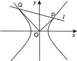

【解析】（1）由，可得，

∴，

∴ 双曲线方程为，

∵ 点在双曲线上，

∴，

解得 ，

∴ 双曲线的方程为．

（2）①当直线的斜率存在时，设直线的方程为，

由消去整理得，

∵直线与双曲线交于两点，

∴．

设，，

则，

由得到：，

即，

∴，

化简得．

∴，

当时上式取等号，且方程（\*）有解．

②当直线的斜率不存在时，设直线的方程为，则有，

由可得，

可得，解得.

∴．

∴．

综上可得的最小值是24．

**题型二：三角形面积最值问题**

**例4．**（2024·云南·校联考模拟预测）已知椭圆的左、右顶点分别为、，为椭圆上异于、的动点，设直线、的斜率分别为、，且.

(1)求椭圆的标准方程；

(2)设动直线与椭圆相交于、两点，为坐标原点，若，的面积是否存在最小值？若存在，求出这个最小值；若不存在，请说明理由.

【解析】（1）不妨设的坐标为，则，则，

又、，则.

故可得，可得，故可得椭圆的方程为.

（2）因为，且、均为非零向量，则.

当点、均为椭圆的顶点时，则；

若直线、的斜率都存在时，设直线的方程为，

则直线的方程为，

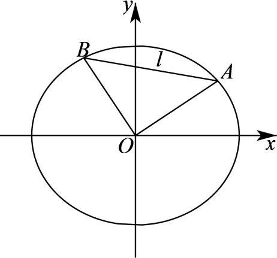

联立可得，所以，，

同理可得，

此时，

，

当且仅当时，即当时，等号成立，

又因为，故当时，的面积存在最小值，且最小值为.

**例5．**（2024·安徽安庆·安庆一中校考模拟预测）如图，分别是矩形四边的中点，，.

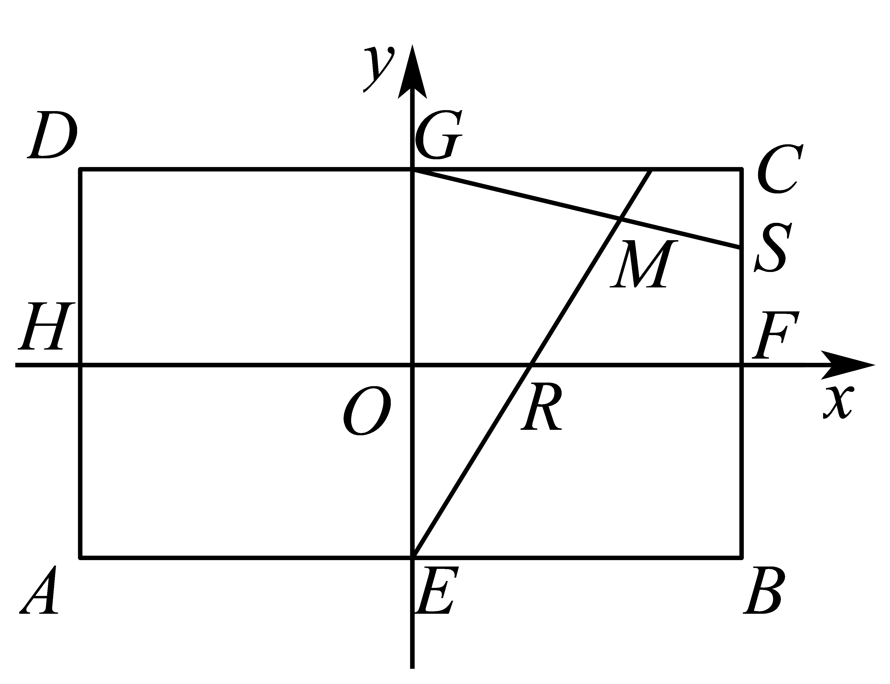

(1)求直线与直线交点的轨迹方程；

(2)过点任作直线与点的轨迹交于两点，直线与直线的交点为，直线与直线的交点为，求面积的最小值.

【解析】（1）由已知，，，，

当时，直线方程：，

直线方程：，

联立上述两方程消去得：，

当时，交点符合上述方程，

又交点不可能为，

故所求的轨迹方程为且.

（2）设方程：（依题意存在，

代入得，

，设，

，，

方程：，方程：，

联立上述两方程消去得：

.

，

所以，其中，

同理直线与直线的交点，其中，

，

（当且仅当时取等号），

故的面积最小值为，此时直线的方程为.

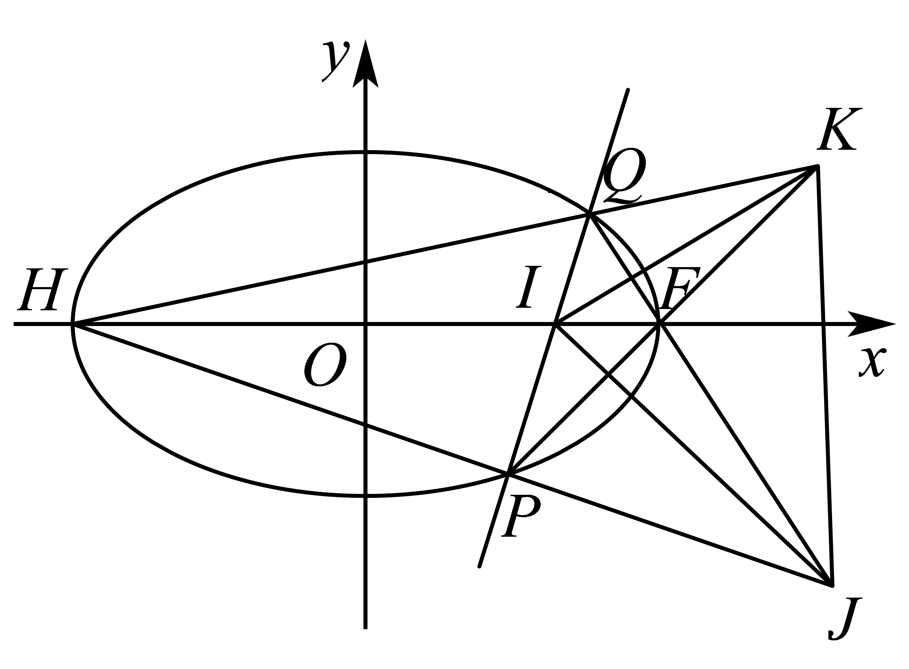

**例6．**（2024·上海黄浦·高三上海市大同中学校考阶段练习）已知椭圆．

(1)求该椭圆的离心率；

(2)设点是椭圆*C*上一点，求证：过点*P*的椭圆*C*的切线方程为；

(3)若点*M*为直线*l*：*x*=4上的动点，过点*M*作该椭圆的切线*MA*，*MB*，切点分别为，求△的面积的最小值．

【解析】（1）椭圆中，，则，

则，则椭圆的离心率为

（2）当切线斜率存在时，其方程可设为，

由，整理得，

则，则

此时方程的根为，则切点横坐标，

切点纵坐标，

则，，

则切线方程为，整理得；

当切线斜率不存在时，其切点为或，

切线方程为，满足.

综上，点是椭圆*C*上一点时，

过点*P*的椭圆*C*的切线方程为

（3）设，，

则椭圆*C*在点的切线方程分别为，，

又在两条切线上，则，，

则直线的方程为，即

由整理得，，

则，

则

，

又点*M*到直线的距离，

则△的面积为

令，则，，

则，

令，，

则恒成立，

则在上单调递增，则

当且仅当即点*M*坐标为时等号成立，

则△的面积的最小值为.

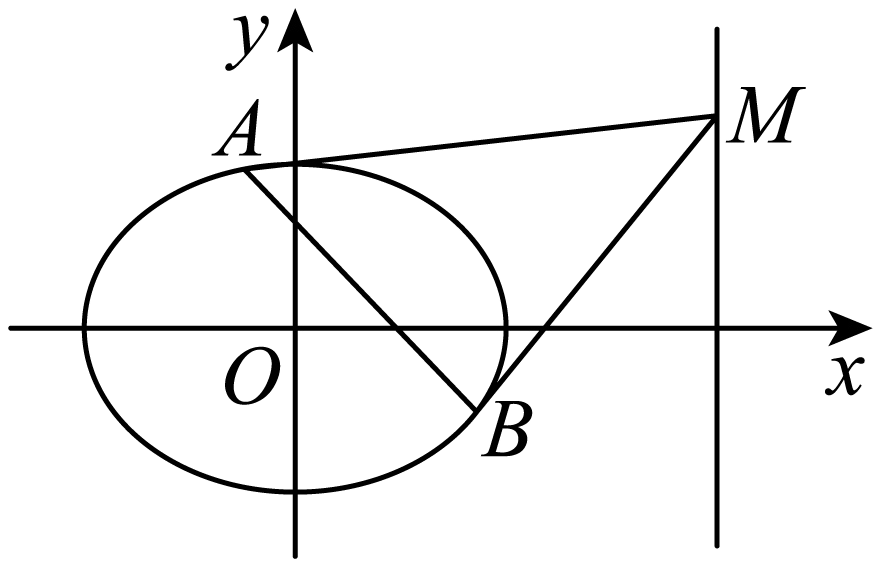

**变式4．**（2024·全国·高三专题练习）已知双曲线：和圆：（其中原点为圆心），过双曲线上一点引圆的两条切线，切点分别为、．

（1）若双曲线上存在点，使得，求双曲线离心率的取值范围；

（2）求直线的方程；

（3）求三角形面积的最大值．

【解析】（1）因为，所以，所以．

由及圆的性质，可知四边形是正方形，所以．

因为，所以，所以．

故双曲线离心率的取值范围为．

（2）因为，

所以以点为圆心，为半径的圆的方程为．

因为圆与圆两圆的公共弦所在的直线即为直线，

所以联立方程组 ，

消去，，即得直线的方程为．

（3）由（2）知，直线的方程为，

所以点到直线的距离为．

因为，

所以三角形的面积．

：

因为点在双曲线上，

所以，即．

设，

所以．

因为，

所以当时，，当时，．

所以在上单调递增，在上单调递减．当，即时，，当，即时，．

综上可知，当时，；当时，．

**变式5．**（2024·上海普陀·高三曹杨二中校考阶段练习）已知抛物线为抛物线上四点，点在轴左侧，满足.

(1)求抛物线的准线方程和焦点坐标；

(2)设线段的中点为.证明：直线与轴垂直；

(3)设圆，若点为圆上动点，设的面积为，求的最大值.

【解析】（1）因为所以，

所以准线是焦点坐标是.

（2）

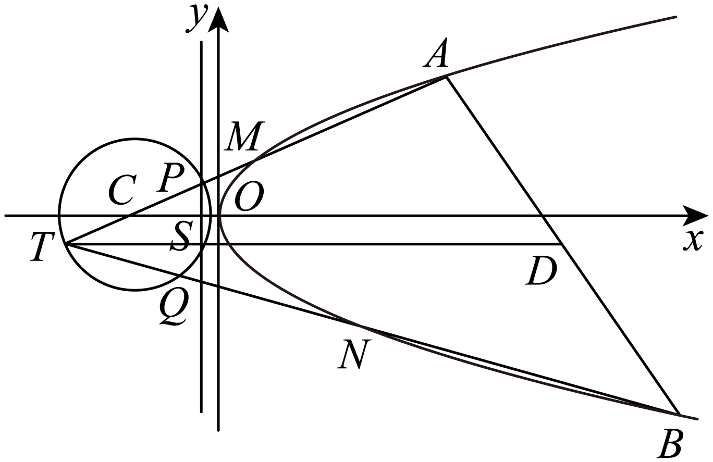

设，

由可知，为中点，且点在抛物线上，即

又

，

整理可得：，

由可知，为中点，且点在抛物线上，

同理可得：，

故为方程的两根，

*D*点的纵坐标为

所以直线的*TD*的斜率为0，即直线与轴垂直.

（3）,

,

,

因为在圆上，所以

,

，

则当时，

.

**变式6．**（2024·河北·统考模拟预测）已知抛物线，过点的直线与交于两点，当直线与轴垂直时，（其中为坐标原点）.

(1)求的准线方程；

(2)若点在第一象限，直线的倾斜角为锐角，过点作的切线与轴交于点，连接交于另一点为，直线与轴交于点，求与面积之比的最大值.

【解析】（1）将代入，则，

由，故为等腰直角三角形，故，即，

所以，故准线方程为.

（2）设，直线，联立抛物线得，

所以，则，故，

由，则，故，直线，

令，则，故，

设直线，联立抛物线得，

所以，则，故，

综上，直线，令，则，故，

由直线的倾斜角为锐角，故，则，，

所以，令，则，

则，仅当，即时等号成立，

所以与面积之比的最大值.

**题型三：四边形面积最值问题**

<strong>例7．</strong>（2024·河南·高三校联考阶段练习）在平面直角坐标系<em>xOy</em>中，已知点，直线，作直线<em>l</em>的平行线，动点<em>P</em>满足到<em>F</em>的距离与到直线的距离之和等于直线<em>l</em>与之间的距离．记动点<em>P</em>的轨迹为<em>E</em>．

(1)求*E*的方程；

(2)过作倾斜角互补的两条直线分别交*E*于*A*，*B*两点和*C*，*D*两点，且直线*AB*的倾斜角，求四边形*ACBD*面积的最大值．

【解析】（1）过*P*分别作直线*l*，的垂线，垂足为*M*，*N*，则由题意可得，即，

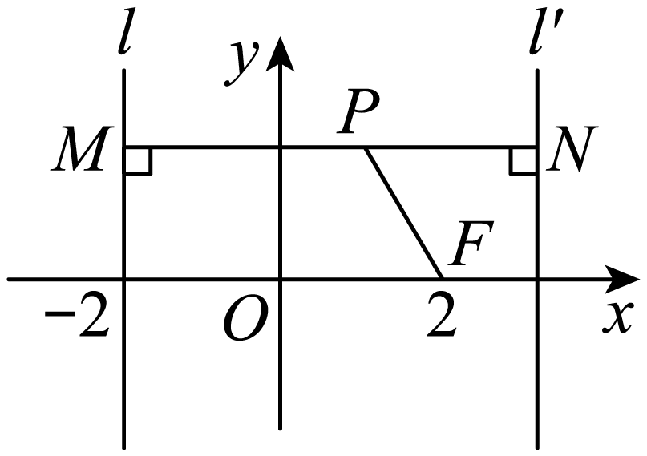

则由抛物线的定义可知，动点*P*的轨迹为以为焦点，直线为准线的抛物线，

则有，，故*E*的方程为．

（2）由题目条件过作倾斜角互补的两条直线分别交*E*于*A*，*B*两点和*C*，*D*两点，

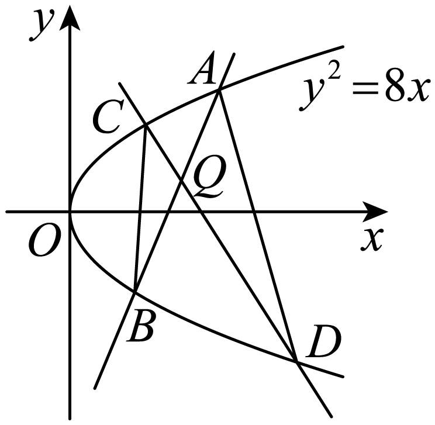

可知直线*AB*，*CD*的斜率互为相反数．设，，，

由直线*AB*的倾斜角，且直线*AB*的斜率，

可知，解得．

联立,消去*x*可得，

则，，，

则

，

同理可得．

记直线*AB*，*CD*的夹角为，

则

，

又，

则，

令，，则，

令，则，

当时，，单调递增，

则，

故四边形*ACBD*面积的最大值为．

<strong>例8．</strong>（2024·全国·高三专题练习）<em>O</em>为坐标原点椭圆的左右焦点分别为，离心率为；双曲线的左右焦点分别为，离心率为，已知，切．

(1)求的方程；

(2)过作的不垂直于*y*轴的弦，*M*为的中点，当直线与交于*P*，*Q*两点时，求四边形面积的最小值．

【解析】（1）因为，，，

所以①

因为，所以②

由①得：，解得：，代入②式中，

解得：，

所以的方程为：，的方程为：

（2），因为直线不垂直于*y*轴

所以设方程为：

联立 得：

设，，

则，，，

则，

因为点*M*在直线上，所以，

直线：

联立得：

解得：，显然，故

当时，，

当时，

则，

，点直线距离分别是：

，

因为，点直线两侧，故

显然，所以

所以

则

则四边形面积

当时，四边形面积取得最小值，此时

此时方程为：，符合题意，故四边形面积的最小值为1

**例9．**（2024·全国·高三专题练习）如图,为坐标原点,椭圆的左右焦点分别为,离心率为;双曲线的左右焦点分别为,离心率为,已知,且.

(1)求的方程;

(2)过点作的不垂直于轴的弦,为的中点,当直线与交于两点时,求四边形面积的最小值.

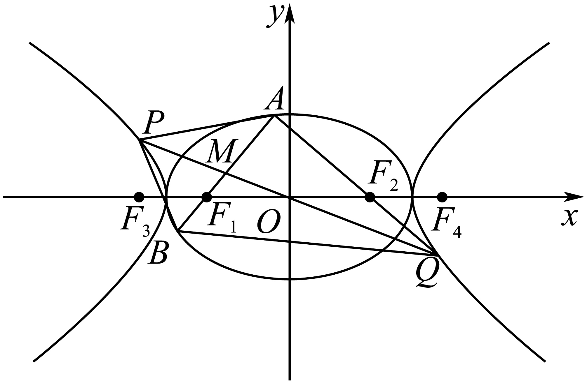

【解析】(1)利用椭圆和双曲线之间的关系可以用分别表示双曲线和椭圆的离心率和焦点,由题目和即可得到之间的两个方程,联立方程消元即可求出的值,得到双曲线和椭圆的标准方程.

(2)利用(1)求出焦点的坐标,设出弦的直线的方程,联立直线与椭圆消得到关于的一元二次方程,再利用根与系数的关系得到两点纵坐标之间的和与积,进而得到点的纵坐标带入AB直线即可得到的横坐标,进而求出直线的方程,即为直线的方程,联立直线的方程得到的取值范围和求出点的坐标得到的长度,利用点到直线的距离得到到直线的距离表达式,进而用表示四边形的面积,利用不等式的性质和的取值范围即可得到面积的最小值.

(1)由题可得,且,因为,且,所以且且,所以椭圆方程为,双曲线的方程为.

(2)由(1)可得,因为直线不垂直于轴,所以设直线的方程为,联立直线与椭圆方程可得,则,,则,因为在直线上,所以,则直线的方程为,联立直线与双曲线可得,则,则,设点到直线的距离为,则到直线的距离也为,则,因为在直线的两端,所以,

则,又因为在直线上,所以,

则四边形面积

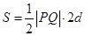

,因为,所以当时,四边形面积的最小值为.

考点：弦长 双曲线 椭圆 最值

<strong>变式7．</strong>（2024·山西朔州·高三校联考开学考试）已知椭圆<em>E</em>：的左、右焦点分别为，，<em>M</em>为椭圆<em>E</em>的上顶点，，点在椭圆<em>E</em>上.

(1)求椭圆*E*的标准方程；

(2)设经过焦点的两条互相垂直的直线分别与椭圆*E*相交于*A*，*B*两点和*C*，*D*两点，求四边形*ACBD*的面积的最小值.

【解析】（1）设，由，有.

又由，有（*O*为坐标原点），可得，，

可得椭圆*E*的方程为，

代入点*N*的坐标，有，解得，，

故椭圆*E*的标准方程为；

（2）①当直线*AB*的斜率不存在或为0时，为长轴长或，

不妨设，，

故；

②当直线*AB*的斜率存在且不为0时，设直线*AB*：，，，

联立方程，消去*y*得，

则，，

所以

，

同理可得，

所以，

因为，

当且仅当，即时等号成立，

所以，而，

综上：四边形*ACBD*的面积的最小值为.

<strong>变式8．</strong>（2024·湖南郴州·统考模拟预测）已知椭圆的左、右焦点分别为，<em>P</em>是椭圆<em>C</em>上异于左、右顶点的动点，的最小值为2，且椭圆<em>C</em>的离心率为．

(1)求椭圆*C*的标准方程；

(2)若直线*l*过与椭圆*C*相交于*A*，*B*两点，*A*，*B*两点异于左、右顶点，直线过交椭圆*C*于*M*，*N*两点，，求四边形面积的最小值．

【解析】（1）设．由对称性，不妨设，

则，所以．

因为，

所以，

所以当时，取得最小值，所以．

由，解得，

所以椭圆*C*的标准方程为；

（2）由题设直线*l*斜率存在，设，

由得，∴，

所以

，

因为，所以，则，

所以四边形面积：

，

，

当且仅当时取等号，即时，，

当直线*l*的斜率不存在时，，四边形的面积为，

又由，所以四边形面积的最小值为．

**变式9．**（2024·宁夏石嘴山·平罗中学校考模拟预测）平面内动点与定点的距离和它到定直线的距离之比是.

(1)求点的轨迹的方程；

(2)过点作两条互相垂直的直线分别交轨迹于点和，求四边形面积的最小值.

【解析】（1）设，由题意有且，

化简得，即．

（2）当其中一条直线的斜率不存在时，则、一条为长轴长、另一条为过的通径长，

令，则，可得，故通径长为，而长轴长为，易得．

当直线的斜率存在且不为0时，设直线的斜率为，则直线为，

，化简整理得，

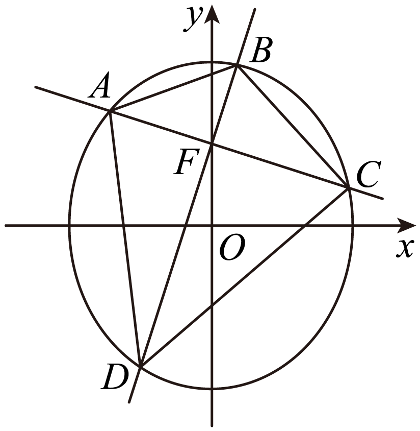

设，则，

，

，则直线的斜率为，同理，

，

令，则，当，即时等号成立，

而，则四边形面积的最小值为.

**题型四：弦长的取值范围问题**

**例10．**（2024·河北·统考一模）如图所示，在平面直角坐标系中，椭圆的中心在原点，点在椭圆上，且离心率为.

(1)求椭圆的标准方程；

(2)动直线交椭圆于，两点，是椭圆上一点，直线的斜率为，且，是线段上一点，圆的半径为，且，求的范围.

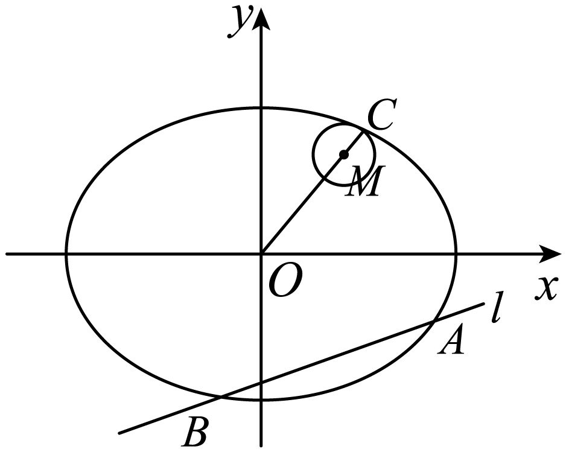

【解析】（1）椭圆的离心率为，则，解得，椭圆的方程为

又点在椭圆上，则，解得

所以椭圆的标准方程为.

（2）设，由消去*y*并整理得：，

显然，于是得，，

则，

从而得圆的半径，

由得，即直线的方程为，由得，则，

所以

因，有，从而有，即，

所以的取值范围为.

**例11．**（2024·浙江·模拟预测）已知椭圆，点，斜率不为0的直线与椭圆交于点，与圆相切且切点为为中点.

(1)求圆的半径的取值范围；

(2)求的取值范围.

【解析】（1）如图所示，

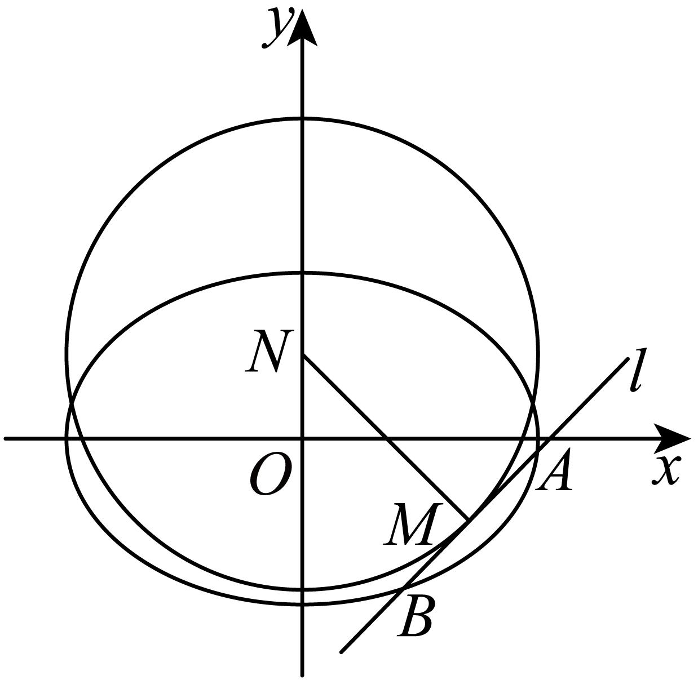

由题意知，直线*l*的斜率存在且不为0，设直线*l*方程为（），，，设圆*N*的半径为*r*，

，

，

， ，

所以，

又因为*M*为的中点，所以，

又因为圆*N*与直线*l*相切于点*M*，所以，且，

所以，

所以，解得，

所以，

，解得：，

所以（），

所以，即，

所以圆*N*的半径*r*的取值范围为.

（2）由（1）知，，

所以（），

令，则（），

所以，

显然在上单调递减，

所以，所以，即，

故的取值范围为.

**例12．** 数形结合法：利用待求量的几何意义，确定出极端位置后数形结合求解；

**变式10．** 构建不等式法：利用已知或隐含的不等关系，构建以待求量为元的不等式求解；

**变式11．** 构建函数法：先引入变量构建以待求量为因变量的函数，再求其值域．

**变式12．**（2024·广东深圳·高三校联考期中）已知点在运动过程中，总满足关系式：.

(1)点的轨迹是什么曲线？写出它的方程；

(2)设圆，直线与圆*O*相切且与点的轨迹交于不同两点，当且时，求弦长的取值范围.

【解析】（1）由关系式，结合椭圆的定义，

点的轨迹是以，为焦点，长轴长为的椭圆.

∴ ，

∴点*M*的方程为.

（2）由题意，联立方程，则

设，，

则，,

因直线与圆相切，且，

∴  ，

，

，    ①

②

将①代入②.

因为，所以.

<strong>变式13．</strong>（2024·江苏南通·统考模拟预测）已知椭圆的左、右顶点是双曲线的顶点，的焦点到的渐近线的距离为.直线与相交于<em>A</em>，<em>B</em>两点，.

(1)求证：

(2)若直线*l*与相交于*P*，*Q*两点，求的取值范围.

【解析】（1）由题意得椭圆焦点坐标为，双曲线渐近线方程为，

所以，解得，所以的方程为，

由，消*y*得，

所以得，

设，，则，

所以

，

化简得，得证；

（2）由消*x*，得，

所以，即，

结合，及，可得，

设，，则，

所以，

所以，

设，由，得，所以，

所以，

所以.

**变式14．**（2024·陕西咸阳·校考三模） 已知双曲线的离心率为，过双曲线的右焦点且垂直于轴的直线与双曲线交于两点，且.

(1)求双曲线的标准方程;

(2)若直线：与双曲线的左、右两支分别交于两点，与双曲线的渐近线分别交于两点，求的取值范围.

【解析】（1）由题可知，，解得，所以双曲线的标准方程为；

（2）由题可知，直线与双曲线的左、右两支分别交于两点，

联立消去，得，

所以，解得，

且，

所以

.

联立可得，同理可得，

所以，

所以，

其中，则，所以.

**变式15．**（2024·全国·高三校联考开学考试）已知双曲线的渐近线方程为，点，分别为双曲线的左、右焦点，过且垂直于轴的直线与双曲线交于第一象限的点，且的周长为．

(1)求双曲线的方程；

(2)若直线与双曲线的左支、右支分别交于，两点，与直线，分别交于*P*，*Q*两点，求的取值范围．

【解析】（1）因为双曲线的渐近线方程为，所以，

设，则，

所以，因为点在第一象限，所以，即，

所以，又，

所以，所以，

所以双曲线的方程为.

（2）设，，

联立，消去并整理得，

所以，解得，

，，

所以，

联立，解得，所以，

联立，解得，所以，

所以，

所以，其中，

因为，所以，.

所以的取值范围为.

**题型五：三角形面积的取值范围问题**

<strong>例13．</strong>（2024·浙江杭州·高三浙江省杭州第二中学校考阶段练习）已知双曲线，其左、右焦点分别为、，上有一点<em>P</em>满足，．

(1)求*b*；

(2)过作直线*l*交于*B*、*C*，取*BC*中点*D*，连接*OD*交双曲线于*E*、*H*，当*BD*与*EH*的夹角为时，求的取值范围．

【解析】（1）由题意,，

，，

在中,由余弦定理得，

，

则，即，.

（2）

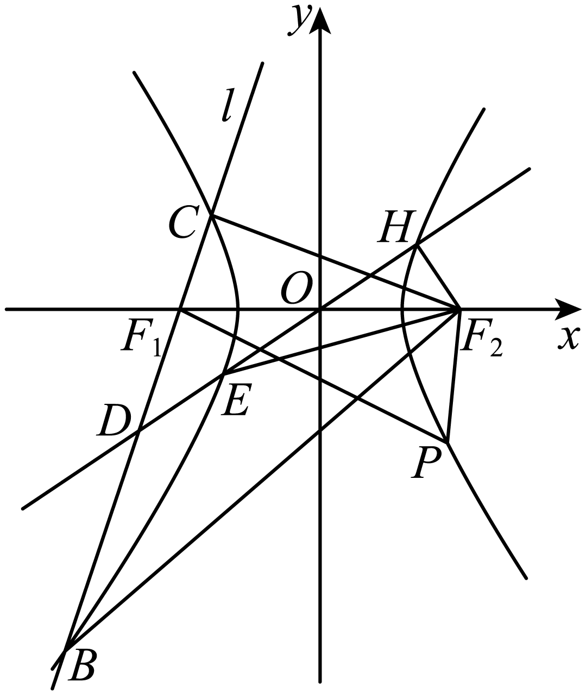

双曲线，，

设直线*BC*的方程为，

由，得，即，

由题意，，

设，则，

则，

则，

则，，直线的方程为，

由，得，由题意，解得，

设，则，

当*BD*与*EH*的夹角为时，，

则，得，可知，

所以

，

，，，，

所以，

即的取值范围是．

**例14．**（2024·广东茂名·高三茂名市第一中学校考阶段练习）椭圆的离心率为，左、右焦点分别为，，上顶点为，点到直线的距离为.

(1)求的方程；

(2)过点的直线交双曲线右支于点，，点在上，求面积的取值范围.

【解析】（1）直线方程为，即，

到直线的距离，化简得，

又离心率，即，且，

解得，，，

所以的方程为：.

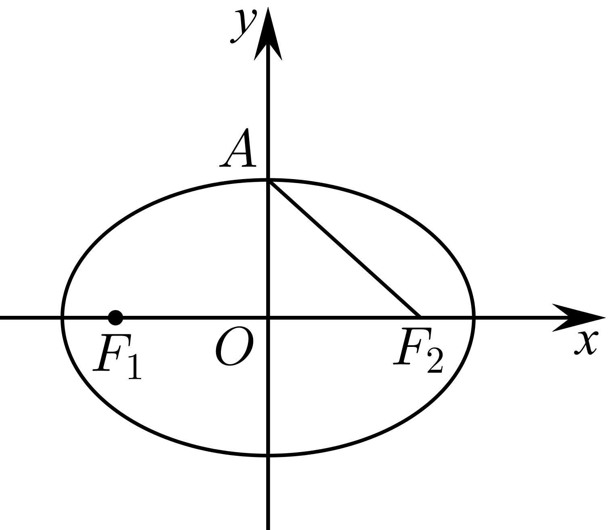

（2）设直线的方程为，由于的渐近线的斜率为，所以.

将方程代入，化简得.

设，，则，，

，

设平行于与椭圆相切的直线为，

由得，

由得，

直线与之间的较小距离，

直线与之间的较大距离，

则面积的较小值为，

面积的较大值为，

设，，，则，，，

∴，.

所以面积的取值范围为.

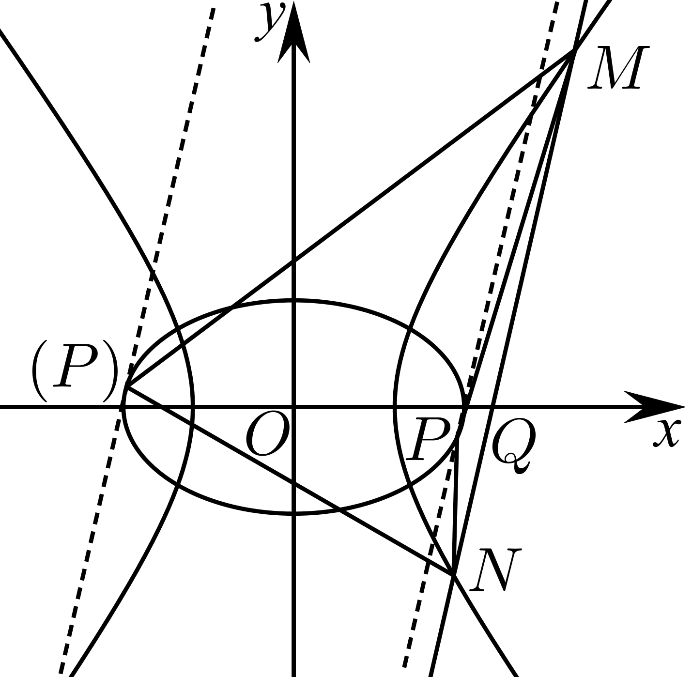

<strong>例15．</strong>（2024·浙江金华·模拟预测）<em>P</em>是双曲线右支上一点，<em>A</em>，<em>B</em>是双曲线的左右顶点，过<em>A</em>，<em>B</em>分别作直线<em>PA</em>，<em>PB</em>的垂线<em>AQ</em>，<em>BQ</em>，<em>AQ</em>与<em>BQ</em>的交点为<em>Q</em>，<em>PA</em>与<em>BQ</em>的交点为<em>C</em>．

(1)记*P*，*Q*的纵坐标分别为，求的值；

(2)记的面积分别为，当时，求的取值范围．

【解析】（1）由已知条件得：，设*PA*，*PB*的斜率分别为，

则*QA*，*QB*的斜率分别为，

由即有．

由即有

而，

．

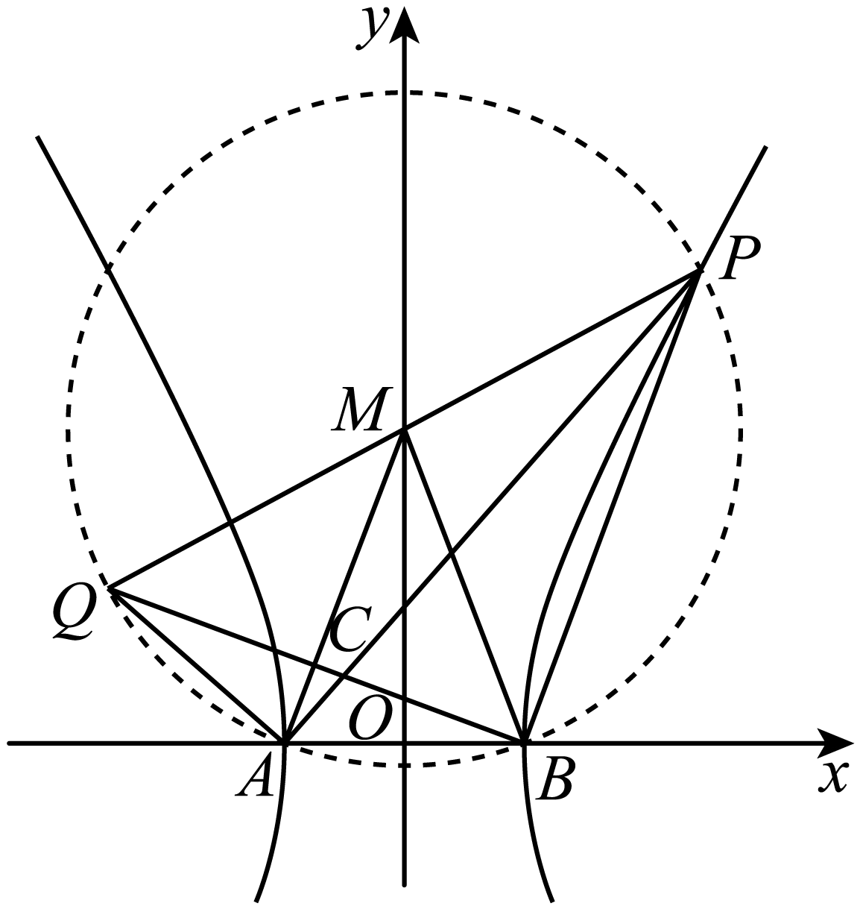

（2）由于，

显然*P*，*Q*，*B*，*A*四点共圆，

*PO*为直径，*PQ*中点为圆心，

又

则，

①，又    ②，

得：，解得．

由，，而．

．

因为，根据单调性，求得

<strong>变式16．</strong>（2024·云南·高三云南师大附中校考阶段练习）已知，为椭圆<em>C</em>：的左、右顶点，且椭圆<em>C</em>过点.

(1)求*C*的方程；

(2)过左焦点*F*的直线*l*交椭圆*C*于*D*，*E*两点（其中点*D*在*x*轴上方），求的取值范围.

【解析】（1）由题意得，把代入，

解得，

所以*C*的方程为；.

（2）由（1）知：，，

①当*l*斜率不存在时，易知；

②当*l*斜率存在时，设*l*：，，，

由，得，显然，

所以，，

因为，，

所以，

因为，

所以.

又，

设，则，，解得且，

所以，

因为，可得的取值范围为.

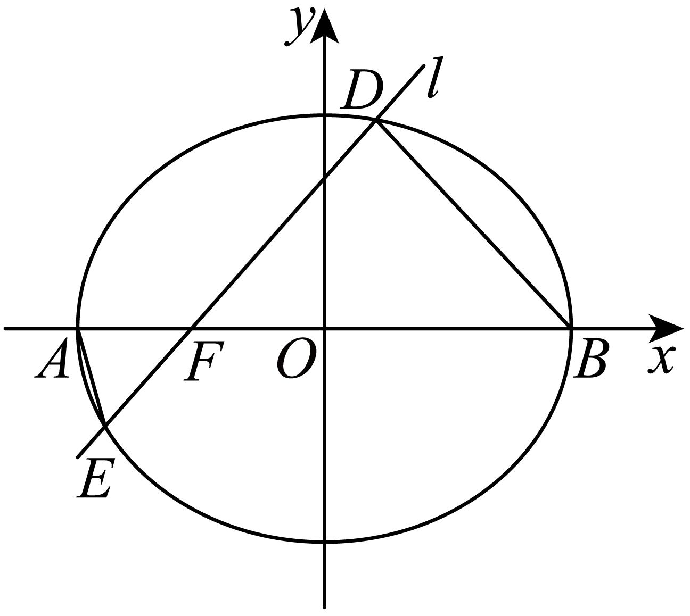

**变式17．**（2024·四川南充·模拟预测）如图所示，以原点为圆心，分别以2和1为半径作两个同心圆，设为大圆上任意一点，连接交小圆于点，设，过点分别作轴，轴的垂线，两垂线交于点．

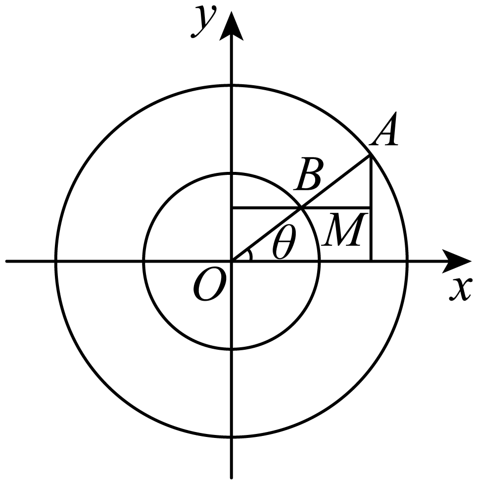

(1)求动点的轨迹的方程；

(2)点分别是轨迹上两点，且，求面积的取值范围．

【解析】（1）因为，所以，

设，则（是参数），消去得，

即曲线的方程为；

（2），

，

当直线或的斜率不存在时，易得

当直线和的斜率都存在时，设，

则

由得，

，

同理可得

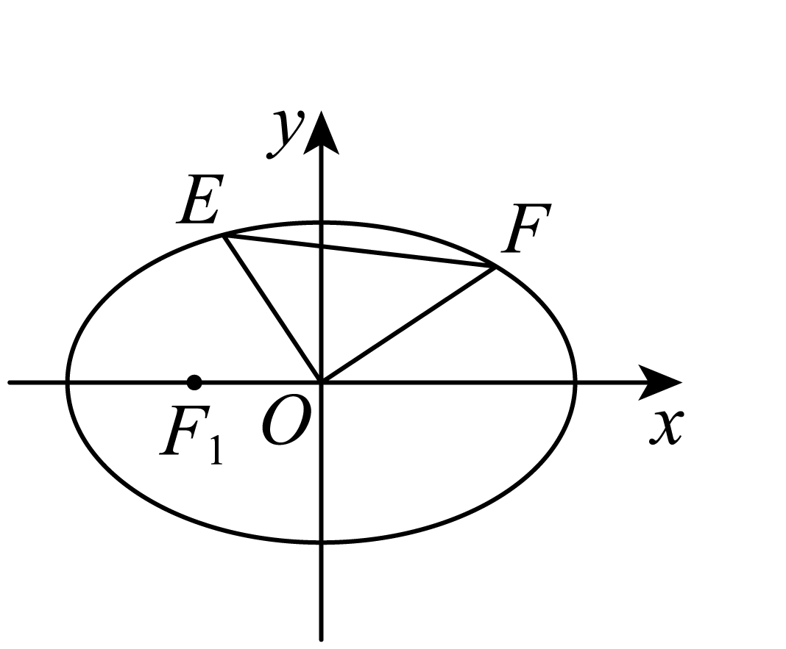

，令

故.

**变式18．**（2024·福建漳州·高三统考开学考试）已知椭圆的左焦点为，且过点.

(1)求*C*的方程；

(2)不过原点*O*的直线与*C*交于*P*，*Q*两点，且直线*OP*，*PQ*，*OQ*的斜率成等比数列.

（i）求的斜率；

（ii）求的面积的取值范围.

【解析】（1）由题知，

椭圆*C*的右焦点为，且过点，

所以，所以.

又，所以，

所以*C*的方程为.

（2）（ⅰ）由题知，直线*l*的斜率存在，且不为0.

设，，，

则，所以，

所以，，

且，即.

因为直线*OP*，*PQ*，*OQ*的斜率成等比数列.

所以，即，

所以，且.

因为，所以，所以.

（ii）由（ⅰ）知，，

所以，且.

设点*O*到直线*PQ*的距离为*d*，所以.

因为，所以，，

所以

，

又，且.所以

即的面积的取值范围.

**题型六：四边形面积的取值范围问题**

**例16．**（2024·四川成都·高三石室中学校考开学考试）已知椭圆：（）左、右焦点分别为，，且为抛物线的焦点， 为椭圆上一点.

(1)求椭圆的方程；

(2)已知，为椭圆上不同两点，且都在轴上方，满足.

（ⅰ）若，求直线的斜率；

（ⅱ）若直线与抛物线无交点，求四边形面积的取值范围.

【解析】（1）依题意得，则，，而，

于是，

从而. 又，解得，

所以椭圆的方程为.

（2）如图，设直线交椭圆于另一点，直线交椭圆于另一点，

由，故，由椭圆对称性，，且四边形为平行四边形.

（ⅰ）由题意直线的斜率不为0，设直线：，

由，消去整理得，

设，，则，，

由（\*）带入上式，解得：，

故，由于，，所以，

所以，故的斜率为1.

（ⅱ）由，消去整理得，由得.

所以，

与间的距离（即点到的距离），

故，

令，函数在区间上单调递增，

所以，

则，

所以四边形的面积的取值范围为.

<strong>例17．</strong>（2024·河北·高三统考阶段练习）已知椭圆<em>C</em>：的离心率为，点在椭圆上.直线与椭圆交于两点.且，其中为坐标原点.

(1)求椭圆的方程；

(2)若过原点的直线与椭圆交于两点，且过的中点.求四边形面积的取值范围.

【解析】（1）设椭圆的半焦距为，

由题意可得：，解得，

所以椭圆的方程为.

（2）当直线斜率存在时，设其方程为，，，

联立，可得，

可得①，且②，③

若以为直径的圆过原点，则，

整理得，

代入②③两式得，整理得④，

将④式代入①式，得恒成立，则，

由题意可设，所以，

因为，

且点到直线的距离，

可得，

又因为，则点坐标为，

化简可得，

代入椭圆方程可得，整理得，

则，

因为，则，

所以；

当直线斜率不存在时，设，，

则，且，解得，

可知方程为，

因为直线过中点，即为轴，

可知，，，

综上所述：四边形面积的取值范围为.

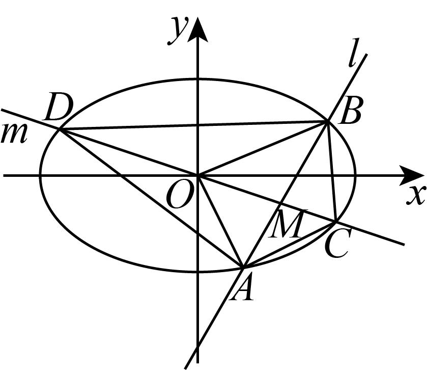

<strong>例18．</strong>（2024·全国·模拟预测）设椭圆的左焦点为<em>F</em>，上顶点为<em>P</em>，离心率为，<em>O</em>是坐标原点，且.

(1)求椭圆*C*的方程；

(2)过点*F*作两条互相垂直的直线，分别与*C*交于*A*，*B*，*M*，*N*四点，求四边形面积的取值范围.

【解析】（1）设椭圆的焦距为，则，所以

因为，所以，

又，，所以，即

所以

所以

（2）当，中有一条斜率不存在时，

设直线的方程为，此时直线与轴重合，

即，所以；

当，的斜率都存在时，设过点的两条互相垂直的直线：，直线：

由得

此时，，

则.

把上式中的换成得：

则四边形的面积为

令，则，且，

，，

，

所以四边形的面积的取值范围是.

**变式19．**（2024·辽宁辽阳·高三辽阳县第一高级中学校考阶段练习）已知双曲线过点，且的渐近线方程为．

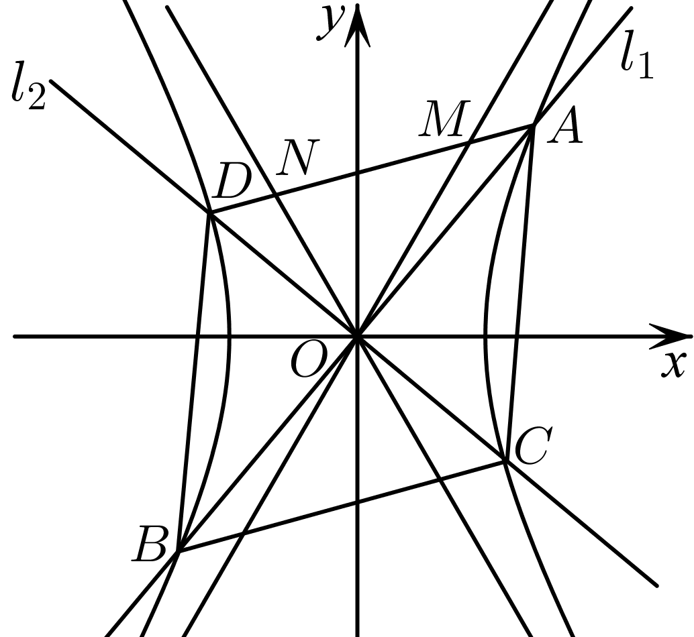

(1)求的方程；

(2)如图，过原点作互相垂直的直线，分别交双曲线于，两点和，两点，，在轴同侧．

①求四边形面积的取值范围；

②设直线与两渐近线分别交于，两点，是否存在直线使，为线段的三等分点，若存在，求出直线的方程；若不存在，请说明理由．

【解析】（1）由题意有，则，

将点代入双曲线方程得，

联立解得，

故的方程为；

（2）①，易知直线，的斜率均存在且不为，

设，

的方程为，则的方程为，

联立，消整理得，

直线与双曲线交于两点，

故且，则，

则，

则，

联立，消整理得，

直线与双曲线交于两点，

故且，解得，

则，

则，

根据对称性可知四边形为菱形，

其面积

，

，∴，∴，

∴，

；

②，假设满足题意的直线存在，

易知直线斜率存在，设直线的方程为，

，

联立，整理得，

则且，

解得且，

由韦达定理有，

则

，

不妨设为直线与渐近线的交点，

联立，解得，

，

同理可得点的坐标为，

则 ，

因为，为线段的三等分点，，

即，

整理得，①

，，

则，即，

，

整理得,②

联立①②得，无解，

故没有满足条件的直线．

**变式20．**（2024·浙江·校联考模拟预测）已知椭圆的离心率为，抛物线的准线与相交，所得弦长为.

(1)求的方程；

(2)若在上，且，分别以为切点，作的切线相交于点，点恰好在上，直线分别交轴于两点.求四边形面积的取值范围.

【解析】（1）由题知过点，则，解得，

.

（2）设直线的方程为，

联立，得，

，

则，而，则，

故以为切点的切线为，即，

同理以为切点的切线为，则，

由，故两式作差得：，所以，

两式求和得：，

所以点由在椭圆上，即.

点到直线的距离，

所以，，

，

而、在上递增且恒正，

则在上递增，.

**题型七：向量数量积的取值范围问题**

**例19．**（2024·吉林长春·长春市第八中学校考模拟预测）已知，直线不过原点且不平行于坐标轴，与有两个交点，，线段的中点为．

（1）若，点在椭圆上，、分别为椭圆的两个焦点，求的范围；

（2）若过点，射线与椭圆交于点，四边形能否为平行四边形？若能，求此时直线斜率；若不能，说明理由．

【解析】（1）时，椭圆，两个焦点，，，，

设，可得，即，

，，，，

，

因为，

所以的范围是；

（2）设，的坐标分别为，，，，可得，，

则，两式相减可得，

，即，

故，又设，，直线，

即直线的方程为，

从而，代入椭圆方程可得，，

由与，联立得，

若四边形为平行四边形，那么也是的中点，

所以，即，整理可得，

解得，经检验满足题意，

所以当时，四边形为平行四边形．

**例20．**（2024·安徽合肥·合肥市庐阳高级中学校考模拟预测）已知椭圆的左，右焦点分别为，，焦距为，点在上.

(1)是上一动点，求的范围；

(2)过的右焦点，且斜率不为零的直线交于，两点，求的内切圆面积的最大值.

【解析】（1）由题意知，所以.

将点代入，解得，所以椭圆的方程为：.

设点，则.

又因为，所以的范围是.

（2）依题意可设直线的方程为，，.

联立得.

所以，，

所以，

又因为，

当且仅当时等号成立.所以.

又因为三角形内切圆半径满足.

所以的内切圆面积的最大值为.

**例21．**（2024·全国·高三专题练习）已知椭圆：经过点，一个焦点的坐标为.

（1）求椭圆的方程；

（2）设直线：与椭圆交于，两点，为坐标原点，若，求的取值范围.

【解析】（1）由题意得，，

根据椭圆定义可得：，解得

根据，解得，

所以椭圆的方程为；

（2）设，，

由得：，

，即，

，，，

所以，所以，

故，解得，

所以.

故的取值范围为

**变式21．**（2024·全国·高三专题练习）已知椭圆：经过点，一个焦点的坐标为.

（1）求椭圆的方程；

（2）设直线：与椭圆交于，两点，为坐标原点，若，求的取值范围.

【解析】（1），，

∴椭圆的方程为.

（2）设，，

由得：，

，

即，

，，

，

，

∴即，故，

.

故的取值范围为.

**变式22．**（2024·黑龙江佳木斯·高二佳木斯一中校考阶段练习）已知椭圆经过点，一个焦点的坐标为.

（1）求椭圆的方程；

（2）设直线与椭圆交于两点，为坐标原点，求·的取值范围.

【解析】（1）由题意可知再焦点坐标，（-2，0），再由椭圆定义.(2)椭圆与直线组方程组，，所以代入韦达，利用判别式控制范围．

试题解析

**题型八：参数的取值范围**

**例22．**（2024·全国·高三专题练习）已知曲线表示焦点在轴上的椭圆.

（1）求的取值范围；

（2）设，过点的直线交椭圆于不同的两点，（在，之间），且满足，求的取值范围.

【解析】（1）因为曲线表示焦点在轴上的椭圆，

所以解得：，

所以*m*的取值范围是；

（2）因为，所以椭圆方程为：；

当直线*l*的斜率不存在时，即直线，此时，，

由解得：；

当直线*l*的斜率存在时，设直线，，，

联立直线*l*与椭圆消得，

所以，，即，解得，

由，得，

而，

即，

又在上单调递增，

所以，又在，之间，即，解得：；

综上所述，的取值范围是.

<strong>例23．</strong>（2024·黑龙江大庆·统考三模）已知中心在原点，焦点在<em>x</em>轴上的椭圆，离心率，且经过抛物线的焦点．若过点的直线斜率不等于零与椭圆交于不同的两点<em>E</em>、在<em>B</em>、<em>F</em>之间，

求椭圆的标准方程；

求直线*l*斜率的取值范围；

若与面积之比为，求的取值范围．

【解析】设椭圆的方程为，则 ，

抛物线的焦点为

由解得，椭圆的标准方程为；

如图，由题意知*l*的斜率存在且不为0，

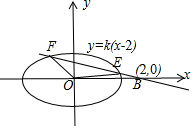

设*l* 方程为，

将代入 整理得：

，由  得，

；

设，，则 令，则，

由此可得  ，且，

，即，

，

，解得     又，

，

与面积之比的取值范围是．

<strong>例24．</strong>（2024·广东广州·高二执信中学校考期末）已知中心在坐标原点，焦点在<em>x</em>轴上的椭圆过点，且它的离心率

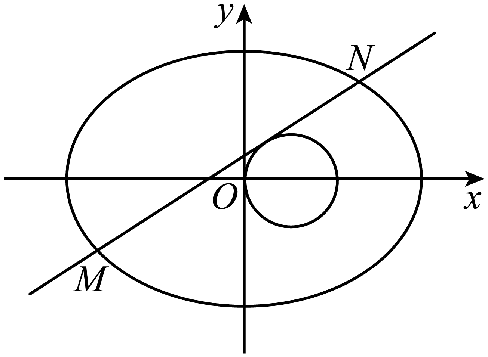

（I）求椭圆的标准方程；

（II）与圆相切的直线交椭圆于、两点，若椭圆上一点满足，求实数的取值范围

【解析】（1）设椭圆的标准方程为，

由已知得解得

所以椭圆的标准方程为.

（2）因为直线：y＝kx＋t与圆(x－1)2＋y2＝1相切，

所以＝1，

整理得(t≠0)．

由消去y整理得(3＋4k2)x2＋8ktx＋4t2－24＝0，

因为直线与椭圆交于M，N两点，

所以，

将代入上式可得恒成立．

设M(x1，y1)，N(x2，y2)，

则有x1＋x2＝－，

所以y1＋y2＝kx1＋t＋kx2＋t＝k(x1＋x2)＋2t＝，

因为)，

所以可得C，

又因为点C在椭圆上，

所以＋＝1,

所以，

因为t2＞0，所以＋＋1＞1，

所以，

所以的取值范围为.

**变式23．**（2024·全国·高三专题练习）设椭圆：的左顶点为，右顶点为.已知椭圆的离心率为，且以线段为直径的圆被直线所截得的弦长为.

（1）求椭圆的标准方程；

（2）设过点的直线与椭圆交于点，且点在第一象限，点关于轴对称点为点，直线与直线交于点，若直线斜率大于，求直线的斜率的取值范围.

【解析】（1）以线段为直径的圆的圆心为：，半径，

圆心到直线的距离，

直线被圆截得的弦长为，

解得：，又椭圆离心率，

∴，，

椭圆的标准方程为：.

（2）设，其中，，则，

∴，，

则直线为：；直线为：，

由得：，

∴，

∴，

∴，

令，，则，

∴，

∵∴，

∴，

即.

**变式24．**（2024·天津河西·天津市新华中学校考一模）设椭圆的左顶点为，右顶点为．已知椭圆的离心率为，且以线段为直径的圆被直线所截得的弦长为．

（Ⅰ）求椭圆的标准方程；

（Ⅱ）设过点的直线与椭圆交于点，且点在第一象限，点关于轴对称点为点，直线与直线交于点，若直线斜率大于，求直线的斜率的取值范围．

【解析】（Ⅰ）以线段为直径的圆的圆心为：，半径

圆心到直线的距离

直线被圆截得的弦长为

解得：，又椭圆离心率

，

椭圆的标准方程为：

（Ⅱ）设，其中，，则

，

则直线为：；直线为：

由得：

令，，则

即

**变式25．**（2024·全国·高三专题练习）已知椭圆的离心率为，过焦点且垂直于长轴的直线被椭圆截得的弦长为1，过点的直线与椭圆相交于不同的两点，.

(1)求椭圆的方程；

(2)设为椭圆上一点，且满足为坐标原点），试求实数的取值范围.

【解析】（1）椭圆的离心率为，

过焦点且垂直于长轴的直线被椭圆截得的弦长为1，

，

又，

解得，

椭圆方程为.

（2）设，，，，，

设，

联立得，

，

解得，，

，

，

，

由点在椭圆上得，

整理可得，

当时，；

当时，，

，，

据此可得实数的取值范围是.

**变式26．**（2024·四川南充·高二四川省南充高级中学校考期中）已知椭圆的离心率为,过焦点且垂直于长轴的直线被椭圆截得的弦长为,过点的直线与椭圆相交于两点

(1)求椭圆的方程;

(2)设为椭圆上一点,且满足(为坐标原点),当时,求实数的取值范围.

【解析】解(1) 由已知,所以,所以

所以

又由过焦点且垂直于长轴的直线被椭圆截得的弦长为

所以

所以

(2)设

设与椭圆联立得

整理得

得

由点在椭圆上得

又由, 所以

所以

所以  由得

所以,所以或

