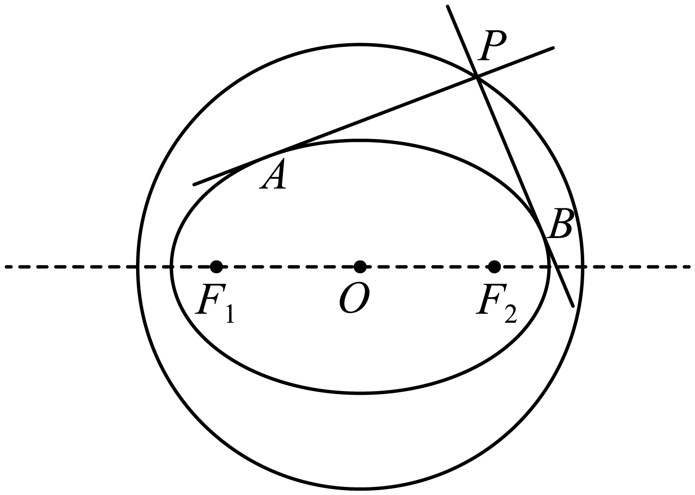
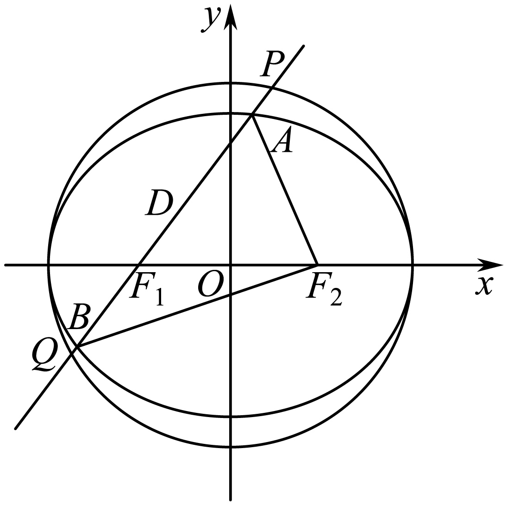
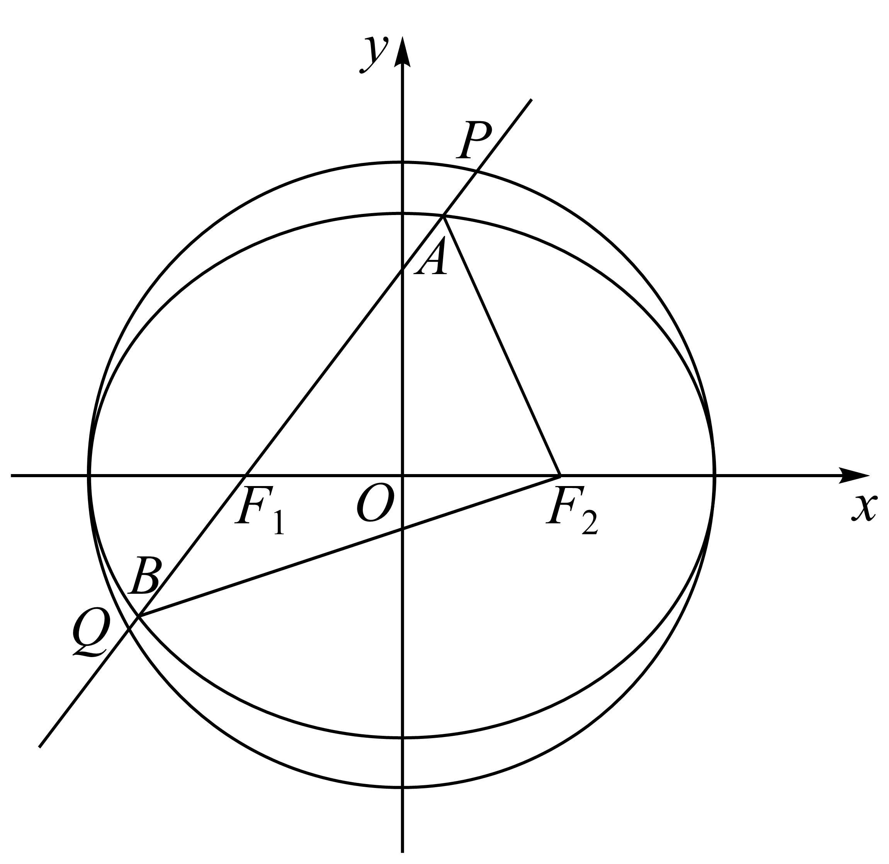
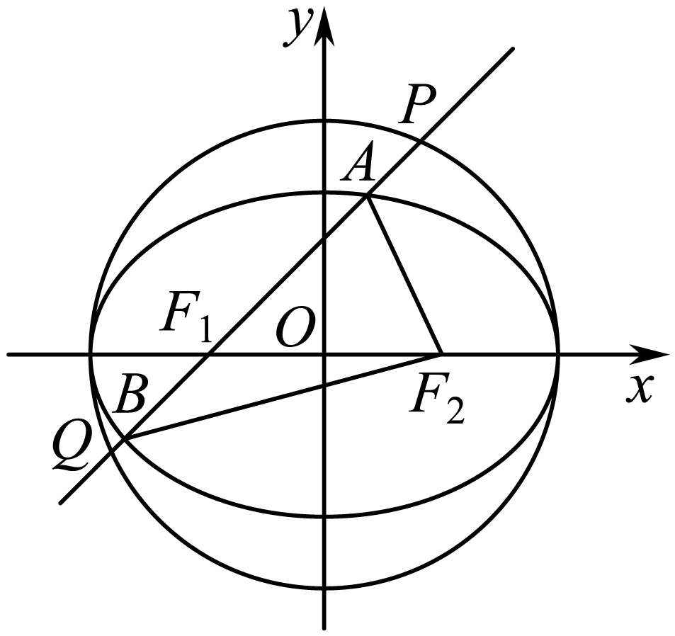
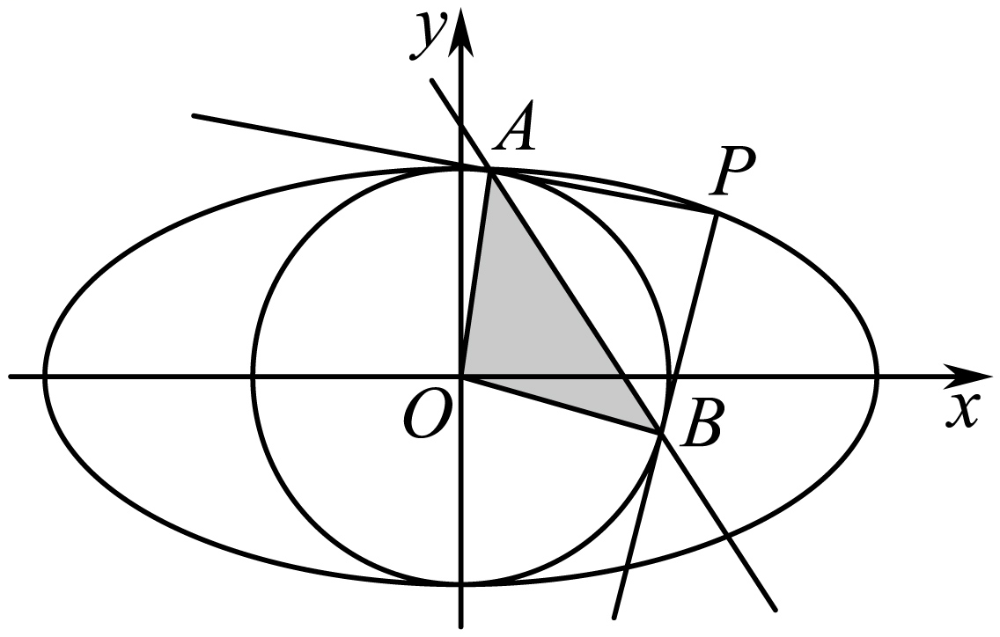
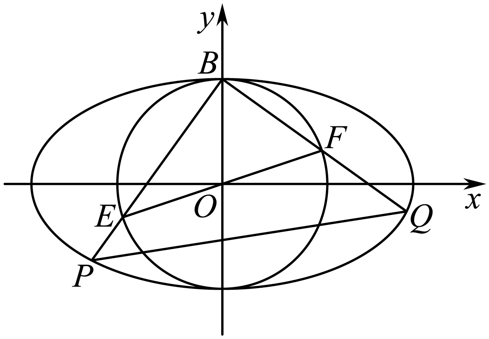
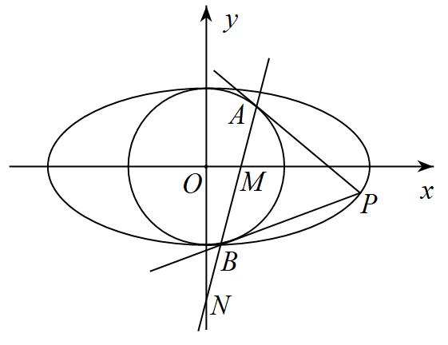
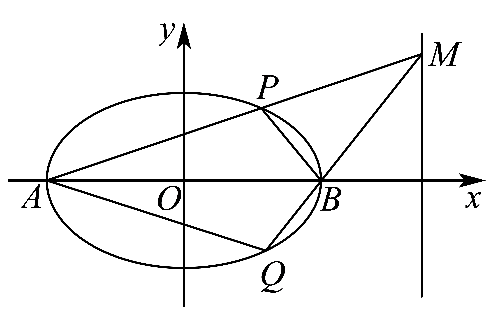
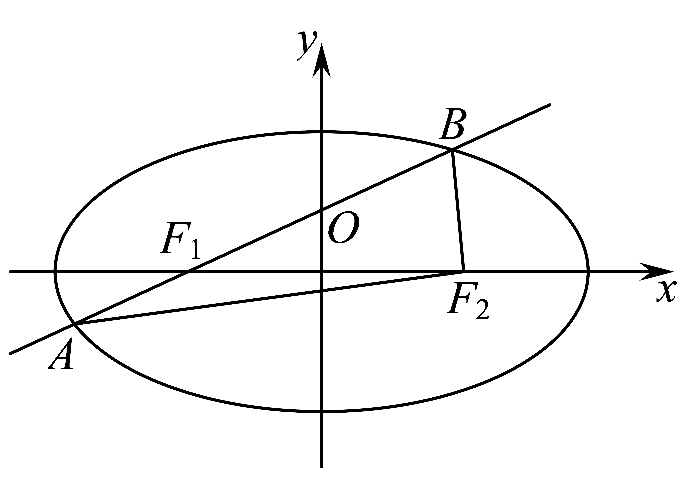

**第79讲  圆锥曲线中的圆问题**

**知识梳理**

1、曲线的两条互相垂直的切线的交点的轨迹是圆：．

2、双曲线的两条互相垂直的切线的交点的轨迹是圆．

3、抛物线的两条互相垂直的切线的交点在该抛物线的准线上．

4、证明四点共圆的方法：

方法一：从被证共圆的四点中先选出三点作一圆，然后证另一点也在这个圆上，若能证明这一点，则可肯定这四点共圆．

方法二：把被证共圆的四个点连成共底边的两个三角形，且两三角形都在这底边的同侧，若能证明其顶角相等，则可肯定这四点共圆（根据圆的性质一一同弧所对的圆周角相等证）．

方法三：把被证共圆的四点连成四边形，若能证明其对角互补或能证明其中一个外角等于其内对角时，则可肯定这四点共圆（根据圆的性质一一圆内接四边形的对角和为，并且任何一个外角都等于它的内对角）．

方法四：证明被证共圆的四点到某一定点的距离都相等，或证明被证四点连成的四边形其中三边中垂线有交点），则可肯定这四点共圆（根据圆的定义：平面内到定点的距离等于定长的点的轨迹为圆）．

**必考题型全归纳**

**题型一：蒙日圆问题**

**例1．**（2024·全国·高三专题练习）在学习数学的过程中，我们通常运用类比猜想的方法研究问题．

(1)已知动点为圆外一点，过引圆的两条切线、，、为切点，若，求动点的轨迹方程；

(2)若动点为椭圆外一点，过引椭圆的两条切线、，、为切点，若，求出动点的轨迹方程；

(3)在（2）问中若椭圆方程为，其余条件都不变，那么动点的轨迹方程是什么（直接写出答案即可，无需过程）．

**例2．**（2022·全国·高三专题练习）在学习过程中，我们通常遇到相似的问题.

（1）已知动点为圆：外一点，过引圆的两条切线、，、为切点，若，求动点的轨迹方程；

（2）若动点为椭圆：外一点，过引椭圆的两条切线、，、为切点，若，猜想动点的轨迹是什么，请给出证明并求出动点的轨迹方程.

**例3．**（2024·河南·校联考模拟预测）在椭圆：（）中，其所有外切矩形的顶点在一个定圆：上，称此圆为椭圆的蒙日圆.椭圆过，.

(1)求椭圆的方程；

(2)过椭圆的蒙日圆上一点，作椭圆的一条切线，与蒙日圆交于另一点，若，存在，证明：为定值.

<strong>变式1．</strong>（2024秋·浙江宁波·高三期末）法国数学家加斯帕尔·蒙日被誉为画法几何之父.他在研究椭圆切线问题时发现了一个有趣的重要结论：一椭圆的任两条互相垂直的切线交点的轨迹是一个圆，尊称为蒙日圆，且蒙日圆的圆心是该椭圆的中心，半径为该椭圆的长半轴与短半轴平方和的算术平方根.已知在椭圆中，离心率，左、右焦点分别是、，上顶点为<em>Q</em>，且，<em>O</em>为坐标原点.

(1)求椭圆*C*的方程，并请直接写出椭圆*C*的蒙日圆的方程；

(2)设*P*是椭圆*C*外一动点（不在坐标轴上），过*P*作椭圆*C*的两条切线，过*P*作*x*轴的垂线，垂足*H*，若两切线斜率都存在且斜率之积为，求面积的最大值.

<strong>变式2．</strong>（2024·吉林白山·统考二模）法国数学家加斯帕尔·蒙日创立的《画法几何学》对世界各国科学技术的发展影响深远<em>．</em>在双曲线<em>-=</em>1（<em>a&gt;b&gt;</em>0）中，任意两条互相垂直的切线的交点都在同一个圆上，它的圆心是双曲线的中心，半径等于实半轴长与虚半轴长的平方差的算术平方根，这个圆被称为蒙日圆<em>．</em>已知双曲线<em>C</em>：<em>-=</em>1（<em>a&gt;b&gt;</em>0）的实轴长为6，其蒙日圆方程为<em>x2+y2=</em>1<em>．</em>

(1)求双曲线*C*的标准方程；

(2)设*D*为双曲线*C*的左顶点，直线*l*与双曲线*C*交于不同于*D*的*E*，*F*两点，若以*EF*为直径的圆经过点*D*，且*DG*⊥*EF*于*G*，证明：存在定点*H*，使*|GH|* 为定值*．*

**变式3．**（2022秋·江苏盐城·高三校联考阶段练习）定义椭圆的“蒙日圆”的方程为，已知椭圆的长轴长为4，离心率为.

(1)求椭圆的标准方程和它的“蒙日圆”*E*的方程；

(2)过“蒙日圆”*E*上的任意一点*M*作椭圆的一条切线，*A*为切点，延长*MA*与“蒙日圆”*E*交于点，*O*为坐标原点，若直线*OM*，*OD*的斜率存在，且分别设为，证明：为定值.

**变式4．**（2022·全国·高三专题练习）已知椭圆的左、右焦点分别为、，离心率为．

(1)求椭圆的标准方程；

(2)若动点为椭圆外一点，且点到椭圆的两条切线相互垂直，求点的轨迹方程；

(3)若过椭圆上任意一点的切线与（2）中所求点的轨迹方程交于、两点，求证：．

**变式5．**（2019·云南昆明·高三云南师大附中校考阶段练习）已知椭圆：的一个焦点为,离心率为.

（1）求的标准方程；

（2）若动点为外一点,且到的两条切线相互垂直,求的轨迹的方程；

（3）设的另一个焦点为,过上一点的切线与（2）所求轨迹交于点,,求证：.

**变式6．**（2022·全国·高三专题练习）设椭圆的中心在原点，焦点在轴上，垂直轴的直线与椭圆相交于、两点，当的周长取最大值时，．

(1)求椭圆的方程；

(2)过圆上任意一点作椭圆的两条切线、，直线、与圆的另一交点分别为、,

①证明：；

②求面积的最大值．

**题型二：内圆与外圆问题**

**例4．**（2022·全国·高三专题练习）已知椭圆及圆，过点与椭圆相切的直线交圆于点，若，求椭圆的离心率．

**例5．**（2022·全国·高三专题练习）已知椭圆和圆，，分别是椭圆的左、右两焦点，过且倾斜角为的动直线交椭圆于，两点，交圆于，两点（如图所示，点在轴上方）．当时，弦的长为．

(1)求圆与椭圆的方程；

(2)若，求直线的方程．

**例6．**（2022·全国·高三专题练习）已知椭圆和圆分别是椭圆的左、右两焦点，过且倾斜角为的动直线交椭圆于两点，交圆于两点（如图所示），当时，弦的长为．

（1）求圆和椭圆的方程

（2）若点是圆上一点，求当成等差数列时，面积的最大值．

<strong>变式7．</strong>（2017·上海嘉定·统考二模）如图，已知椭圆过点两个焦点为和.圆<em>O</em>的方程为.

（1）求椭圆*C*的标准方程；

（2）过且斜率为的动直线*l*与椭圆*C*交于*A*、*B*两点，与圆*O*交于*P*、*Q*两点（点*A*、*P*在*x*轴上方），当成等差数列时，求弦*PQ*的长.

**变式8．**（2022·全国·高三专题练习）如图，已知椭圆和圆（其中圆心为原点），过椭圆上异于上、下顶点的一点引圆的两条切线，切点分别为．

(1)求直线的方程；

(2)求三角形面积的最大值．

**变式9．**（2022·全国·高三专题练习）如图，椭圆和圆，已知椭圆的离心率为，直线与圆相切．

(1)求椭圆的标准方程；

(2)椭圆的上顶点为，是圆的一条直径，不与坐标轴重合，直线、与椭圆的另一个交点分别为、，求的面积的最大值及此时所在的直线方程．

**变式10．**（2022·全国·高三专题练习）已知椭圆和圆，过椭圆上一点引圆的两条切线，切点分别为．

（Ⅰ）若圆过椭圆的两个焦点，求椭圆的离心率的值；

（Ⅱ）设直线与、轴分别交于点，问当点在椭圆上运动时，是否为定值？请证明你的结论．

**题型三：直径为圆问题**

**例7．**（2024秋·湖南岳阳·高三校考阶段练习）已知椭圆经过点，左，右焦点分别为，，为坐标原点，且．

(1)求椭圆的标准方程；

(2)设*A*为椭圆的右顶点，直线与椭圆相交于，两点，以为直径的圆过点*A*，求的最大值．

**例8．**（2024秋·湖南长沙·高三长沙一中校考阶段练习）已知椭圆过和两点.

(1)求椭圆*C*的方程；

(2)如图所示，记椭圆的左、右顶点分别为*A*，*B*，当动点*M*在定直线上运动时，直线，分别交椭圆于两点*P*和*Q*.

（i）证明：点*B*在以为直径的圆内；

（ii）求四边形面积的最大值.

**例9．**（2024·山西大同·统考模拟预测）已知椭圆的离心率为，且直线是抛物线的一条切线．

(1)求椭圆的方程；

(2)过点的动直线交椭圆于两点，试问：在直角坐标平面上是否存在一个定点，使得以为直径的圆恒过定点？若存在，求出的坐标；若不存在，请说明理由．

**变式11．**（2024秋·福建福州·高三闽侯县第一中学校考阶段练习）已知椭圆的离心率是，上、下顶点分别为，.圆与轴正半轴的交点为，且.

(1)求的方程；

(2)直线与圆相切且与相交于，两点，证明：以为直径的圆恒过定点.

**变式12．**（2024秋·广东广州·高三广州市第六十五中学校考阶段练习）已知椭圆的左顶点为，上顶点为，右焦点为，为坐标原点，线段的中点为，且．

(1)求方程；

(2)已知点、均在直线上，以为直径的圆经过点，圆心为点，直线、分别交椭圆于另一点、，证明直线与直线垂直．

<strong>变式13．</strong>（2024·全国·高三专题练习）已知椭圆的左、右焦点分别为，，<em>A</em>，<em>B</em>分别是<em>C</em>的右、上顶点，且，<em>D</em>是<em>C</em>上一点，周长的最大值为8.

(1)求*C*的方程；

(2)*C*的弦过，直线，分别交直线于*M*，*N*两点，*P*是线段的中点，证明：以为直径的圆过定点.

**变式14．**（2024秋·全国·高三校联考开学考试）在平面直角坐标系中，已知分别为椭圆的左、右焦点.为椭圆上的一个动点，的最大值为，且点到右焦点距离的最小值为，直线交椭圆于异于椭圆右顶点的两个点.

(1)求椭圆的标准方程；

(2)若以为直径的圆恒过点，求证：直线恒过定点，并求此定点的坐标.

**变式15．**（2024秋·重庆·高三统考开学考试）已知、是椭圆的左、右焦点，点在椭圆上，且.

(1)求椭圆的方程；

(2)已知，两点的坐标分别是，，若过点的直线与椭圆交于，两点，且以为直径的圆过点，求出直线的所有方程.

**变式16．**（2022秋·广东梅州·高三大埔县虎山中学校考阶段练习）如图，椭圆的左焦点为，右焦点为，离心率，过的直线交椭圆于、两点，且的周长为.

(1)求椭圆的方程；

(2)设动直线与椭圆有且只有一个公共点，且与直线相交于点，则在轴上一定存在定点，使得以为直径的圆恒过点，试求出点的坐标.

**题型四：四点共圆问题**

<strong>例10．</strong>（2024·全国·高三专题练习）在平面直角坐标系中，已知，，动点<em>P</em>满足，且.设动点<em>P</em>形成的轨迹为曲线<em>C</em>.

(1)求曲线*C*的标准方程；

(2)过点的直线*l*与曲线*C*交于*M*，*N*两点，试判断是否存在直线*l*，使得*A*，*B*，*M*，*N*四点共圆.若存在，求出直线*l*的方程；若不存在，说明理由.

**例11．**（2024秋·新疆乌鲁木齐·高三乌鲁木齐市十二中校考阶段练习）已知抛物线上的点到其焦点的距离为．

(1)求和的值；

(2)若直线交抛物线于、两点，线段的垂直平分线交抛物线于、两点，求证：、、、四点共圆．

**例12．**（2022·全国·高三专题练习）已知椭圆的左、右焦点分别为，，左顶点为，且离心率为．

(1)求*C*的方程；

(2)直线交*C*于*E*，*F*两点，直线*AE*，*AF*分别与*y*轴交于点*M*，*N*，求证：*M*，，*N*，四点共圆．

<strong>变式17．</strong>（2022·全国·高三专题练习）已知椭圆的右顶点为点<em>A</em>，直线<em>l</em>交<em>C</em>于<em>M</em>，<em>N</em>两点，<em>O</em>为坐标原点．当四边形<em>AMON</em>为菱形时，其面积为．

(1)求*C*的方程；

(2)若；是否存在直线*l*，使得*A*，*M*，*O*，*N*四点共圆？若存在，求出直线*l*的方程，若不存在，请说明理由．

**变式18．**（2024·全国·高三专题练习）已知椭圆的左、右焦点分别为，，左顶点为，且过点．

(1)求*C*的方程；

(2)过原点*O*且与*x*轴不重合的直线交*C*于*E*，*F*两点，直线*AE*，*AF*分别与*y*轴交于点*M*，*N*，求证：*M*，，*N*，四点共圆．

<strong>变式19．</strong>（2024·山东青岛·山东省青岛第五十八中学校考一模）椭圆的离心率为，右顶点为<em>A</em>，设点<em>O</em>为坐标原点，点<em>B</em>为椭圆<em>E</em>上异于左、右顶点的动点，面积的最大值为．

(1)求椭圆*E*的标准方程；

(2)设直线交*x*轴于点*P*，其中，直线*PB*交椭圆*E*于另一点*C*，直线*BA*和*CA*分别交直线*l*于点*M*和*N*，若*O、A、M、N*四点共圆，求*t*的值．

<strong>变式20．</strong>（2024·全国·高三专题练习）已知椭圆<em>E</em>：的离心率为，且经过点(-1，).

(1)求椭圆*E*的标准方程；

(2)设椭圆*E*的右顶点为*A*，点*O*为坐标原点，点*B*为椭圆*E*上异于左､右顶点的动点，直线*l*：交*x*轴于点*P*，直线*PB*交椭圆*E*于另一点*C*，直线*BA*和*CA*分别交直线*l*于点*M*和*N*，若*O*､*A*､*M*､*N*四点共圆，求*t*的值.

<strong>变式21．</strong>（2024·全国·高三专题练习）已知抛物线：，是上位于第一象限内的动点，它到点距离的最小值为，直线与交于另一点，线段<em>AD</em>的垂直平分线交于<em>E</em>，<em>F</em>两点.

(1)求的值；

(2)若，证明*A*，*D*，*E*，*F*四点共圆，并求该圆的方程.

